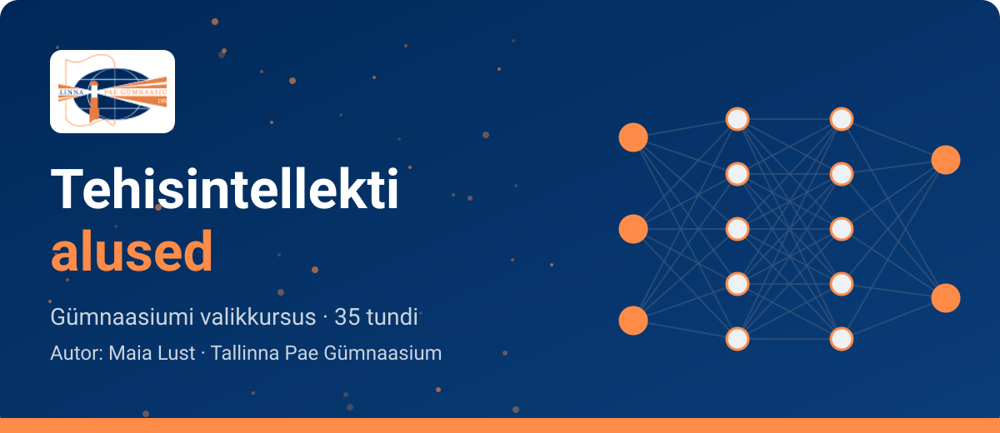

<!--
author:   Maia Lust
email:    
version:  2.1.0
language: et
narrator: Estonian Female
date:     08.10.2026
logo:     pildid/pae_logo.png
icon:     pildid/pae_logo.png
comment:  Tehisintellekti alused – gümnaasiumi valikkursus (35 tundi), Tallinna Pae Gümnaasium. Õppetekstid, interaktiivsed töölehed ja enesekontrollitestid.
link:     https://fonts.googleapis.com/css2?family=Nunito+Sans:wght@400;600;700&family=Poppins:wght@600;700&family=JetBrains+Mono:wght@400;600&display=swap

@style
/* ==== liascript-theming:start ==== */
/* links: https://fonts.googleapis.com/css2?family=Nunito+Sans:wght@400;600;700&family=Poppins:wght@600;700&family=JetBrains+Mono:wght@400;600&display=swap */
/* theme: Tallinna Pae Gümnaasium — generated by liascript-theming, edit theme.json and rebuild */
:root {
  --theme-font-body: 'Nunito Sans', sans-serif;
  --theme-font-heading: 'Poppins', serif;
  --theme-font-mono: 'JetBrains Mono', monospace;
  --theme-heading-weight: 700;
  --theme-line-height: 1.6;
  --global-font-size: 1.6rem;
  --theme-radius: 0.8rem;
  --theme-radius-small: 0.4rem;
  --theme-radius-large: 1.4rem;
  --theme-shadow: 0 0.3rem 1rem rgba(0,41,89,.10);
}
/* surfaces & text: apply to every color theme */
:root.lia-variant-light {
  --color-background: 255,255,255;
  --color-text: 29,36,51;
  --color-border: 228,229,231;
  --lia-grey-lighter: 238,242,247;
  --lia-grey-light: 204,212,222;
}
:root.lia-variant-dark {
  --color-background: 15,23,36;
  --color-text: 229,232,235;
  --color-border: 49,60,73;
  --lia-grey-dark: 30,38,47;
  --lia-anthracite: 41,50,61;
}
/* accent: only the course theme (default) and the custom radio,
   so readers can still pick LiaScript's built-in color themes */
:root:is(.lia-theme-default, .lia-theme-custom) {
  --color-highlight: 0,41,89;
  --color-highlight-dark: 0,41,89;
}
:root.lia-theme-default {
  --color-highlight-menu: 0,41,89;
}
:root:is(.lia-theme-default, .lia-theme-custom).lia-variant-dark {
  --color-highlight: 47,90,143;
  --color-highlight-dark: 255,185,143;
}
:root.lia-variant-light { --theme-heading-color: #002959; }
:root.lia-variant-dark { --theme-heading-color: #FFB98F; }
/* ==== LiaScript theme adapter (liascript-theming) — keep verbatim ====
   Maps the --theme-* tokens onto LiaScript's CSS. Everything a theme
   changes lives in the token block above this one. */

/* -- fonts: body/mono via the global variables, headings & co. are
      compiled literals in LiaScript and need explicit selectors -- */
:root {
  --global-font-family: var(--theme-font-body);
  --global-font-mono: var(--theme-font-mono);
  --global-font-headline: var(--theme-font-heading);
}
body { line-height: var(--theme-line-height, 1.47); }
h1, h2, h3, .h1, .h2, .h3 {
  font-family: var(--theme-font-heading);
  font-weight: var(--theme-heading-weight, 600);
  letter-spacing: var(--theme-heading-letter-spacing, normal);
  text-transform: var(--theme-heading-transform, none);
  color: var(--theme-heading-color, inherit);
}
h4, h5, h6, .h4, .h5, summary, .lia-accordion__headline {
  font-family: var(--theme-font-subheading, var(--theme-font-body));
}
.lia-quote__text { font-family: var(--theme-font-quote, var(--theme-font-heading)); }
.lia-code, .lia-code--inline, code, kbd, samp, pre { font-family: var(--theme-font-mono); }
.lia-code .ace_editor { font-family: var(--theme-font-mono) !important; }

/* -- shape: radius for controls & surfaces (radio buttons, tags, circles stay) -- */
:is(button, .lia-btn, input, .lia-input, select, .lia-select, textarea, .lia-textarea, .lia-dropdown):not(.lia-radio, .lia-btn--tag, .lia-btn--small-tag),
.lia-code-terminal__input, .lia-pagination__content, .lia-script, .lia-support-menu__submenu {
  border-radius: var(--theme-radius);
}
.lia-checkbox[type='checkbox'], kbd, .lia-tooltip .lia-tooltiptext, .lia-code--inline {
  border-radius: var(--theme-radius-small);
}
details, .lia-quote, .lia-code__input, .lia-table-responsive, .lia-card {
  border-radius: var(--theme-radius-large);
  box-shadow: var(--theme-shadow);
}
.lia-quote, .lia-code__input { overflow: hidden; }
.lia-code__input .ace_editor { border-radius: inherit; }
.lia-support-menu__submenu { box-shadow: var(--theme-shadow-popup, 0 0 1rem rgba(128, 128, 128, 0.2)); }

/* -- dark mode: LiaScript brightens the accent for text via
      rgb(from … calc(r*2.5)), which turns a hand-picked accent into
      pastel/yellow. For the course theme, text-like accent uses take
      --color-highlight-dark (= "accent as text") instead. Scoped to
      default/custom so the built-in color themes keep their behavior. -- */
:root:is(.lia-theme-default, .lia-theme-custom).lia-variant-dark :is(.lia-link, .lia-btn--outline, .lia-code--inline) {
  color: rgb(var(--color-highlight-dark));
  border-color: rgb(var(--color-highlight-dark));
}
:root:is(.lia-theme-default, .lia-theme-custom).lia-variant-dark :is(summary, summary:after, .lia-label, .lia-skip-nav, .lia-support-menu__item, .lia-quote__text),
:root:is(.lia-theme-default, .lia-theme-custom).lia-variant-dark :is(.lia-list--unordered, .lia-list--ordered) > li::marker {
  color: rgb(var(--color-highlight-dark));
}
:root:is(.lia-theme-default, .lia-theme-custom).lia-variant-dark :is(.lia-btn--transparent, .lia-input) {
  filter: none;
}
:root:is(.lia-theme-default, .lia-theme-custom).lia-variant-dark :is(.lia-input, .lia-checkbox[type='checkbox'], .lia-radio[type='radio']):not(:checked, .is-disabled, [disabled]) {
  border-color: rgb(var(--color-highlight-dark));
}
/* alternating table rows: LiaScript uses a neutral grey in dark mode */
:root.lia-variant-dark .lia-table.is-alternating .lia-table__row:nth-child(2n) td,
:root.lia-variant-dark .lia-table-responsive.has-thead-sticky.has-first-col-sticky .is-alternating .lia-table__row:nth-child(2n) td:first-child:before,
:root.lia-variant-dark .lia-table-responsive.has-thead-sticky.has-last-col-sticky .is-alternating .lia-table__row:nth-child(2n) td:last-child:before {
  background-color: rgb(var(--lia-grey-dark));
}
/* -- theme extras -- */
/* ===== Tallinna Pae Gümnaasiumi värvid =====
   tumesinine #002959 · oranž #FF8B48 · tumeoranž #E67E42 */
:root {
  --pae-sinine: #002959;
  --pae-sinine-80: #33547A;
  --pae-sinine-20: #CCD4DE;
  --pae-sinine-08: #EEF2F7;
  --pae-oranz: #FF8B48;
  --pae-oranz-tume: #E67E42;
  --pae-oranz-20: #FFE2D1;
  --pae-oranz-08: #FFF4EC;
  --pae-roheline: #2E8B57;
  --pae-roheline-08: #EAF6EF;
  --pae-lilla: #6B4FA0;
  --pae-lilla-08: #F2EEF9;
}

/* Pealkirjad */
.lia-slide h1, main h1 {
  color: var(--pae-sinine);
  border-bottom: 6px solid var(--pae-oranz);
  padding-bottom: .3em;
}
.lia-slide h2, main h2 { color: var(--pae-sinine); }
.lia-slide h3, main h3 {
  color: var(--pae-sinine);
  border-left: 8px solid var(--pae-oranz);
  padding-left: .5em;
}
.lia-slide h4, main h4 { color: var(--pae-oranz-tume); }
strong { color: inherit; }

/* Tabelid */
.lia-table th, table thead th {
  background: var(--pae-sinine) !important;
  color: #fff !important;
}
.lia-table tbody tr:nth-child(even), table tbody tr:nth-child(even) { background: var(--pae-sinine-08); }

/* Pildid ja infograafikud */
img.lia-image, .lia-figure img, main img {
  border-radius: 12px;
}
.lia-figure__caption, figcaption {
  color: var(--pae-sinine-80);
  font-style: italic;
  text-align: center;
}

/* ASCII-skeemid väiksemaks ja Pae värvidesse */
.lia-ascii svg, lia-ascii svg, .lia-code--ascii svg { max-width: 760px; margin: 0 auto; display: block; }
svg.lia-ascii text { fill: var(--pae-sinine); }

/* ===== Kujunduskastid ===== */
blockquote.pae-moiste, blockquote.pae-naide, blockquote.pae-eesti,
blockquote.pae-motle, blockquote.pae-lisaks, blockquote.pae-fakt,
.pae-moiste, .pae-naide, .pae-eesti, .pae-motle, .pae-lisaks, .pae-fakt {
  border-radius: 14px !important;
  padding: 1.1em 1.4em 1.1em 4.2em !important;
  margin: 1.4em 0 !important;
  position: relative;
  box-shadow: 0 3px 10px rgba(0,41,89,.10);
  font-style: normal !important;
  text-align: left !important;
}
.pae-moiste::before, .pae-naide::before, .pae-eesti::before,
.pae-motle::before, .pae-lisaks::before, .pae-fakt::before {
  position: absolute; left: .7em; top: .75em;
  width: 2em; height: 2em; line-height: 2em;
  border-radius: 50%; text-align: center; font-size: 1.15em;
  color: #fff; font-style: normal;
}
/* Mõiste – oranž */
.pae-moiste { background: var(--pae-oranz-08) !important; border: 2px solid var(--pae-oranz) !important; border-left: 10px solid var(--pae-oranz) !important; }
.pae-moiste::before { content: "📖"; background: var(--pae-oranz); }
/* Näide – tumesinine */
.pae-naide { background: var(--pae-sinine-08) !important; border: 2px solid var(--pae-sinine-20) !important; border-left: 10px solid var(--pae-sinine) !important; }
.pae-naide::before { content: "💡"; background: var(--pae-sinine); }
/* Eesti näide – sinine-valge */
.pae-eesti { background: linear-gradient(135deg, #E8F1FB 0%, #ffffff 100%) !important; border: 2px solid #0072CE !important; border-left: 10px solid #0072CE !important; }
.pae-eesti::before { content: "🇪🇪"; background: #0072CE; }
/* Mõtle järele – roheline */
.pae-motle { background: var(--pae-roheline-08) !important; border: 2px dashed var(--pae-roheline) !important; border-left: 10px solid var(--pae-roheline) !important; }
.pae-motle::before { content: "🤔"; background: var(--pae-roheline); }
/* Tea lisaks – lilla */
.pae-lisaks { background: var(--pae-lilla-08) !important; border: 2px solid #CDBFE6 !important; border-left: 10px solid var(--pae-lilla) !important; }
.pae-lisaks::before { content: "🔍"; background: var(--pae-lilla); }
/* Fakt – tume taust, valge tekst */
.pae-fakt { background: var(--pae-sinine) !important; color: #fff !important; border-left: 10px solid var(--pae-oranz) !important; }
.pae-fakt * { color: #fff !important; }
.pae-fakt::before { content: "⚡"; background: var(--pae-oranz); }

/* Töölehe jaotise riba */
.pae-jaotis { background: var(--pae-sinine); color: #fff !important; padding: .55em 1em; border-radius: 10px; margin: 2em 0 1em; border-left: 10px solid var(--pae-oranz); }
.pae-jaotis * { color: #fff !important; }

/* Ploki kaanepilt */
.pae-kaas img, img.pae-kaas { width: 100%; border-radius: 16px; box-shadow: 0 6px 20px rgba(0,41,89,.18); }

/* Näidisvastuse kokkupandav kast */
details {
  background: var(--pae-oranz-08);
  border: 1px solid var(--pae-oranz);
  border-radius: 10px; padding: .6em 1em; margin: .6em 0 1.4em;
}
details summary { cursor: pointer; font-weight: bold; color: var(--pae-oranz-tume); }

/* Menüü (sisukord) tumesinine */
.lia-toc a, .lia-toc .lia-toc__link, nav.lia-toc a { color: #002959 !important; }
.lia-toc a.lia-active, .lia-toc .lia-active { font-weight: 700; }
:root.lia-variant-dark .lia-toc a { color: #CCD4DE !important; }
:root.lia-variant-dark .pae-moiste, :root.lia-variant-dark .pae-naide, :root.lia-variant-dark .pae-eesti,
:root.lia-variant-dark .pae-motle, :root.lia-variant-dark .pae-lisaks { color: #1d2433 !important; }
:root.lia-variant-dark .pae-moiste *, :root.lia-variant-dark .pae-naide *, :root.lia-variant-dark .pae-eesti *,
:root.lia-variant-dark .pae-motle *, :root.lia-variant-dark .pae-lisaks * { color: #1d2433 !important; }
:root.lia-variant-dark img { background: #fff; }
/* ==== liascript-theming:end ==== */
/* Loosimisnupp (rollimäng) */
output.lia-script[input="submit"] { display:inline-block !important; background:#002959; color:#fff !important; font-weight:700; padding:.6em 1.2em; border-radius:999px; border:3px solid #FF8B48 !important; cursor:pointer; box-shadow:0 3px 10px rgba(0,41,89,.2); }
output.lia-script[input="submit"]:hover { background:#FF8B48; color:#002959 !important; }

/* Lihtsalt öeldes (ettelugemisega) */
section.pae-lihtne { background:#EAF6EE; border:2px solid #2E8B57; border-left:10px solid #2E8B57; border-radius:14px; padding:.9em 1.3em; margin:1.2em 0; font-size:1.05em; line-height:1.6; box-shadow:0 3px 10px rgba(0,41,89,.08); }
section.pae-lihtne p { margin:.5em 0; }
:root.lia-variant-dark section.pae-lihtne, :root.lia-variant-dark section.pae-lihtne * { color:#1d2433 !important; }

/* Sõnastiku hüpikselgitus */
.pae-term { border-bottom:2px dotted #FF8B48; cursor:help; position:relative; outline:none; }
.pae-term:hover::after, .pae-term:focus::after {
  content: attr(data-def); position:absolute; left:0; top:1.7em; z-index:999;
  width:max-content; max-width:min(320px, 80vw); white-space:normal;
  background:#002959; color:#fff; padding:.55em .8em; border-radius:10px;
  font-size:15px; line-height:1.45; font-weight:400; font-style:normal;
  box-shadow:0 6px 18px rgba(0,41,89,.3); border-left:5px solid #FF8B48;
}
.pae-fakt .pae-term:hover::after, .pae-fakt .pae-term:focus::after { color:#fff !important; }

@end

@custom
--color-highlight-menu: 255,255,255;
@end
-->

# Tehisintellekti alused

<!-- class="pae-kaas" -->

*Gümnaasiumi valikkursus (35 tundi) · Autor: Maia Lust · Tallinna Pae Gümnaasium*

**🗝️ See õpik on põgenemistuba.** Loe allpool, kuidas Kratti päästa!

**Tere tulemast!** Tehisintellekt (TI) on sinu ümber iga päev: telefoni näotuvastus, voogedastuse soovitused, masintõlge ja vestlusrobotid. Selles õpikus saad teada, kuidas TI tegelikult töötab, kus seda kasutatakse ja milliseid küsimusi see ühiskonnale tekitab. Õpid TI-d kasutama targalt ja kriitiliselt ning teed kursuse lõpus oma projektitöö.

<!-- class="pae-fakt" -->
> **Kursus ühe pilguga:** gümnaasiumi valikkursus · 35 tundi · 7 plokki · 31 teemat · igas tunnis õppetekst, infograafikud, interaktiivne tööleht ja enesekontroll.

## 🗝️ Missioon: päästa Kratt!

<!-- class="pae-fakt" -->
> <!-- style="width: 84px; float: left; margin: 0 16px 8px 0; border-radius: 0;" --> **Häire!** Ühes Arulinna koolis juhib digikooli tehisaru nimega **Kratt**. Täna hommikul läks Krati mälu segi: ta on lukustanud kooli 7 digitaalset tuba ega mäleta enam, mis ta on ja kuidas ta töötab. *„Kes ma olen? Miks ma kõiki neid andmeid mäletan, aga mitte nende tähendust?“*
>
> **Sina oled päästemeeskonna liige.** Läbi kõik 7 tuba, õpeta Kratile uuesti, mis on tehisaru, ja ava viimane uks!

Eesti muinasjuttudes on **kratt** inimese tehtud olend, kes ärkab ellu ja täidab peremehe käske. Eesti riigi tehisintellekti strateegiat kutsutakse samuti **kratikavaks**.

### Minu missioonikaart

Kirjuta siia oma võtmetähed ja kuldsed tähed, et need ei kaoks. Kuidas põgenemistuba töötab, loe lähemalt peatükist **„Kuidas õpikut kasutada?“**.

<!-- data-type="none" -->
| Tuba | Toa nimi | Lukud |
|:---:|---|:---:|
| 1 | Unustatud arhiiv | 3 |
| 2 | Masinaruum | 5 |
| 3 | Keelelabor | 4 |
| 4 | Otsuste labürint | 4 |
| 5 | Vaatlustorn | 5 |
| 6 | Nõukogusaal | 5 |
| 7 | Stardiplatvorm | 5 |

**Minu võtmetähed ja kuldsed tähed:**

[[___ ___ ___]]

## Kuidas õpikut kasutada?

Iga **tund** on üles ehitatud ühtemoodi:

<!-- data-type="none" -->
| Osa | Mida seal teed |
|---|---|
| 🎯 **Õpieesmärgid ja tunni tuumik** | Näed, mida tunni lõpuks oskad, mida teed kodus enne tundi (🏠) ja mida tunnis kindlasti teed. |
| 🟢 **Lihtsalt öeldes** | Loed või kuulad tunni sisu lühidalt ja lihtsas keeles. |
| 📚 **Õppetekst** | Loed teksti, vaatad infograafikuid ja skeeme. |
| 🧪 **TI-katse** | Proovid tunni teemat päris tehisaru tööriistaga järele. |
| ✅ **Kokkuvõte ja põhimõisted** | Kordad tunni olulisimad mõtted ja mõisted. |
| 📚 **Allikad ja lisalugemine** | Näed, kust info pärineb, ja leiad lisalugemist. |
| ✏️ **Tööleht** | Lahendad ülesanded otse õpikus. ⭐ tähistab tuumikülesannet. |
| 🧠 **Enesekontroll** | Kontrollid, kas said aru. Pärast vastamist näed selgitust. |
| 📤 **Väljapääsupilet** | Vastad kolmele küsimusele ja saadad vastused õpetajale. |
| 🔐 **Lukk** | Rakendad õpitut uues olukorras ja saad võtmetähe. |

**Ümberpööratud klassiruum:** lehed, mille pealkirja ees on **🏠**, loed või vaatad **kodus enne tundi** (umbes 15–20 minutit). Too tundi kaasa üks uus teadmine või küsimus. Tunnis jääb nii rohkem aega katsetamiseks, aruteluks ja ülesannete lahendamiseks.

Töölehe ülesanded, mille ees on **➕**, on **lisaülesanded**. Tee neid, kui jõuad, või kui tahad teemat rohkem uurida.

Iga **ploki** lõpus on **🔬 TI-labor** (uurimuslik katse rühmas), praktilised ülesanded, aruteluküsimused ja ploki enesekontrolltest.

### 🗣️ Keeletugi: lihtne keel, sõnaselgitused ja ettelugemine

- **🟢 Lihtsalt öeldes** – iga tunni alguses on lühike kokkuvõte lihtsas eesti keeles. Loe see enne õppeteksti läbi.
- **Sõnaselgitused tekstis** – oranži täppjoonega alla joonitud sõnal on selgitus. Vii hiir sõna peale või puuduta seda telefonis. Proovi: tehisintellekt.
- **Ettelugemine** – kasti „Lihtsalt öeldes“ juures on nupp, mis loeb teksti ette. Ettelugemine kasutab sinu brauseri eestikeelset häält. Kõige paremini töötab see Microsoft Edge'is. Kui hääl kõlab võõralt, kopeeri tekst [Neurokõnesse](https://neurokone.ee) ja kuula seal.
- **Sõnastik** – kõik mõisted on koos õpiku lõpus.

### 📊 Kuidas sind hinnatakse?

<!-- data-type="none" -->
| Mida teed | Milleks see on | Kuhu esitad |
|---|---|---|
| 📤 **Väljapääsupiletid** (iga tund) | Kujundav hindamine: õpetaja annab tagasisidet ja näeb, mis vajab kordamist. | Google Classroom: kopeeri vastused või laadi fail alla |
| 🔬 **TI-laborid** (iga plokk) | Laboriaruanne näitab, kas oskad katsetada, järeldusi teha ja piiranguid hinnata. | Google Classroom ja portfoolio |
| 🧠 **Ploki enesekontrolltestid** | Kontrollid põhimõistete mõistmist. | Õpikus, õpetaja soovil Google Formsi testina |
| 📁 **Portfoolio** | Õpipäevik (iga ploki kohta üks sissekanne), tööde näidised, TI-rakenduste analüüs, eetiline arutelu ja refleksioon. | Google Classroom kursuse lõpus |
| 🚀 **Projektitöö (rühmatöö)** | Rakendad kõike õpitut. Hinne: õpetaja hinnang 70 %, vastastikhindamine 20 %, enesehindamine 10 %. | Esitlus ja aruanne |

**Väljapääsupileti hindamine (kujundav):**

<!-- data-type="none" -->
| Kriteerium | 2 p | 1 p | 0 p |
|---|---|---|---|
| Mõiste rakendamine uues olukorras | Õige mõiste ja selge põhjendus | Mõiste õige, põhjendus puudu või ebatäpne | Vastus puudub või on vale |
| TI-katse tõlgendus | Tulemus on seotud tunni mõistega | Tulemus on kirjeldatud, seos puudub | Puudub |
| Refleksioon | Konkreetne ja isiklik | Üldine | Puudub |

Laborite hindamismaatriksid on iga labori juures. Projektitöö hindamismudel on 7. ploki projektitöö juhendis. Portfoolio hindamiskriteeriumid annab õpetaja.

### 🗝️ Kuidas kasutada õpikut põgenemistoana?

Kogu õpik on **pedagoogiline põgenemistuba**: õpid uut ja lahendad samal ajal mõistatusi, et päästa kooli tehisaru Kratt. Põgenemistuba ei asenda õppimist. Lukud saad avada alles siis, kui oled tunni sisust aru saanud.

| Samm | Mida teed |
|---|---|
| 🚪 **1. Sisene tuppa** | Iga plokk on üks tuba. Loe ploki esimeselt lehelt toa lugu: mis Kratiga juhtus ja mitu lukku toas on. |
| 📚 **2. Õpi** | Läbi tunni õppetekst, tööleht ja enesekontroll. Seal on kõik, mida lukkude avamiseks vaja on. |
| 🔐 **3. Ava lukk** | Iga tunni viimane leht on **lukk**: uus olukord, kus pead tunnis õpitut rakendama. Kirjuta vastus ja vajuta **Kontrolli**. Õige vastuse korral avaneb **võtmetäht**. |
| ✍️ **4. Kirjuta täht üles** | Märgi iga võtmetäht oma **missioonikaardile** (vt eespool) või vihikusse. |
| 🚪 **5. Ava toa uks** | Ploki viimasel lehel on **uks**. Pane toa võtmetähed tundide järjekorras kokku ja sisesta sõna. Ukse taga ootab **kuldne täht** ja loo jätk. |
| 🌟 **6. Viimane uks** | Kui kõik 7 tuba on läbitud, avavad kuldsed tähed kursuse lõpus **viimase ukse**. Seejärel algab lõpumäng **TI Jeopardy**. |

<!-- class="pae-motle" -->
> **Kui jääd hätta**
>
> - Vajuta luku juures nuppu **?** – see näitab vihjet. Igal lukul on kolm järjest avanevat vihjet.
> - Kolmas vihje on **🛟 päästerõngas**: see näitab, kust tunnist vastust otsida. Kui ikka ei tule välja, küsi õpetajalt selle luku päästekood.
> - Mine tagasi tunni õppeteksti või kokkuvõtte juurde: vastus peitub alati tunni sisus.
> - Kontrolli kirjapilti: suurtel ja väikestel tähtedel ning tühikutel pole tähtsust, aga täpitähtedel (õ, ä, ö, ü) on.
> - Arutle pinginaabri või meeskonnaga – põgenemistuba on mõeldud ka koostööks.

<!-- class="pae-lisaks" -->
> **Õpetajale:** põgenemistuba saab läbida **üksi** (iga õpilane oma tempos) või **meeskonniti** (3–4 õpilast koos, igal meeskonnal oma missioonikaart). Toa uksi võib kasutada ka ploki lõpu kontrollpunktina: meeskond, kes avab ukse, näitab õpetajale oma kuldset tähte. Ukse sõnad, kuldsed tähed ja lukkude päästekoodid on õpetaja versioonis.

### Värvilised kastid

Tekstis on olulised kohad tõstetud esile värviliste kastidega.

<!-- class="pae-moiste" -->
> **Mõiste** – uue mõiste selgitus. Neid tasub meelde jätta.

<!-- class="pae-naide" -->
> **Näide** – kuidas teooria päris elus välja näeb.

<!-- class="pae-eesti" -->
> **Eesti näide** – tehisintellekt Eestis: riigiasutused, ettevõtted, teadus.

<!-- class="pae-fakt" -->
> **Kas teadsid?** – huvitav fakt, mis jääb meelde.

<!-- class="pae-motle" -->
> **Mõtle järele!** – küsimus, mille üle arutleda iseseisvalt või pinginaabriga.

<!-- class="pae-lisaks" -->
> **Tea lisaks** – lisateave neile, keda teema rohkem huvitab.

### Sisukord

| Plokk | Tunnid |
|---|---|
| **1. Sissejuhatus tehisintellekti** | 1.1 Mis on tehisintellekt? · 1.2 Tehisintellekti ajalugu · 1.3 Tehisintellekti rakendused |
| **2. Kuidas tehisintellekt töötab** | 2.1 Algoritmid · 2.2 Andmed · 2.3 Masinõpe · 2.4 Närvivõrgud ja süvaõpe · 2.5 Rakendused valdkondades |
| **3. Keeletöötlus** | 3.1 Kuidas TI mõistab keelt · 3.2 Teksti analüüs ja genereerimine · 3.3 Vestlusrobotid · 3.4 Masintõlge |
| **4. Tehisintellekti otsustamine** | 4.1 Otsustuspuud · 4.2 Ekspertsüsteemid · 4.3 Soovitussüsteemid · 4.4 TI eri valdkondades |
| **5. Pilditöötlus ja arvutinägemine** | 5.1 Kuidas TI näeb pilte · 5.2 Objekti- ja näotuvastus · 5.3 Meditsiiniline pildianalüüs · 5.4 Generatiivne TI · 5.5 Süvavõltsingud |
| **6. Tehisintellekt ja eetika** | 6.1 Eetilised põhimõtted · 6.2 Privaatsus · 6.3 Kallutatus ja õiglus · 6.4 Mõju tööturule · 6.5 Tulevikutrendid |
| **7. Kokkuvõte ja projektitöö** | 7.1 Kursuse kokkuvõte · 7.2–7.5 Projektitöö planeerimine, arendamine ja esitlemine |

Õpiku lõpus on **sõnastik** kõigi põhimõistetega.

<!-- class="pae-motle" -->
> **Mõtle järele!** Mitu korda oled täna juba tehisintellektiga kokku puutunud? Kirjuta üles kolm olukorda ja vaata kursuse lõpus, kas tead nüüd, kuidas need töötavad.

[[___ ___ ___]]

# Plokk 1. Sissejuhatus tehisintellekti

<!-- class="pae-kaas" -->

<!-- class="pae-fakt" -->
> <!-- style="width: 84px; float: left; margin: 0 16px 8px 0; border-radius: 0;" --> **🗝️ Tuba 1: Unustatud arhiiv**
>
> Kooli digikoridori lõpus sumiseb tolmune server – see on Kratt, ühe Arulinna kooli tehisaru, kes on just üles ärganud. „Tere… kes te olete? Ja kes olen mina? Mu arhiivis on ainult sõnad „tehis…“ ja „intel…“ – mis see üldse tähendab?“ Teie, päästemeeskond, olete sattunud Krati **unustatud arhiivi**, kus on segamini kõik, mida ta enda kohta teadis: mis on tehisintellekt, kust ta pärit on ja milleks teda kasutatakse. Aidake Kratil oma mälu taastada! Selles toas on 3 lukku – iga tunni lõpus üks. Iga avatud lukk annab ühe võtmetähe. Kirjutage tähed üles!

Tehisintellekt (TI) ei ole enam ainult ulmefilmide teema. Kui telefon avaneb sinu näo järgi, kui Spotify pakub sulle uut lugu või kui vestlusrobot aitab sul keerulist teemat lahti mõtestada, oled juba tehisintellektiga kokku puutunud. Selles plokis saad teada, mida tehisintellekt tegelikult tähendab, kust see on alguse saanud ja kus seda tänapäeval kasutatakse.

See plokk on kogu kursuse vundament. Siin õpitud mõisted – nõrk ja tugev tehisintellekt, masinõpe, süvaõpe, ekspertsüsteem, generatiivne TI – tulevad tagasi kõigis järgmistes plokkides. Kui mõistad, kuidas tehisintellekt on aastakümnete jooksul arenenud ning milles seisnevad tema tugevused ja piirangud, oskad ka uusi tehnoloogiaid kriitiliselt hinnata, mitte neid pimesi imetleda ega karta.

**Selles plokis:**

- **1.1 Mis on tehisintellekt?** – definitsioonid, tehisintellekti liigid ja põhisuunad, tehisintellekt võrreldes inimesega
- **1.2 Tehisintellekti ajalugu** – kolm revolutsiooni: sümboolne TI, masinõpe ja generatiivne TI; tehisintellekti „talved“ ja suured võidukäigud
- **1.3 Tehisintellekti rakendused** – tehisintellekt igapäevaelus, tervishoius, transpordis, hariduses, äris ja Eestis; eelised ja piirangud

Ploki lõpus on kordamise osa praktiliste ülesannete, arutelu ja ploki enesekontrolltestiga.

### Kursuse „Tehisintellekti alused“ ülesehitus

„Tehisintellekti alused“ on gümnaasiumi valikkursus, mis kestab 35 tundi. Kursuse eesmärk on anda sulle ülevaade tehisintellekti põhimõistetest, toimimisest ja rakendustest. Õpime mõistma tehisintellekti võimalusi ja piiranguid, arendame kriitilist mõtlemist uute tehnoloogiate suhtes ning tutvume praktiliste rakendustega erinevates valdkondades.

Kursus koosneb seitsmest plokist:

<!-- data-type="none" -->
| Plokk | Teema | Tunde |
|---|---|---|
| 1 | Sissejuhatus tehisintellekti | 3 |
| 2 | Kuidas tehisintellekt töötab | 5 |
| 3 | Keeletöötlus | 4 |
| 4 | Tehisintellekti otsustamine | 4 |
| 5 | Pilditöötlus ja arvutinägemine | 5 |
| 6 | Tehisintellekt ja eetika | 5 |
| 7 | Kokkuvõte ja projektitöö | 9 |

Esimene plokk annab üldpildi. Teises plokis vaatame „kapoti alla“: kuidas algoritmid, andmed ja masinõpe tegelikult töötavad. Kolmandas ja viiendas plokis süveneme kahte suurde rakendusvaldkonda – keele ja piltide töötlemisse. Neljandas plokis uurime, kuidas tehisintellekt otsuseid langetab, ja kuuendas plokis arutleme, mis on õiglane, ohutu ja vastutustundlik. Kursus lõpeb projektitööga, kus saad õpitut ise rakendada.

**Kursuse lõpuks:**

- mõistad tehisintellekti põhimõisteid ja toimimist;
- oskad analüüsida tehisintellekti rakendusi;
- suudad kriitiliselt hinnata tehisintellekti võimalusi ja piiranguid;
- tunned tehisintellekti eetilisi aspekte.

Õppimise käigus osaled tundides ja aruteludes, lahendad praktilisi ülesandeid ja töölehti, teed enesekontrollteste ning koostad lõpuks projektitöö.

<!-- class="pae-motle" -->
> **Mõtle järele!**
>
> Enne kui alustad, mõtle hetkeks oma eilsele päevale. Milliseid nutiseadmeid, äppe või veebiteenuseid kasutasid? Millistes neist võis sinu arvates olla tehisintellekt? Ja mis on sinu praegune arvamus: kas tehisintellekt võib kunagi mõelda nagu inimene? Pane oma vastused kirja – ploki lõpus saad vaadata, kas su arusaam muutus.

## 1.1 Mis on tehisintellekt?

<!-- class="pae-kaas" -->

### Õpieesmärgid

Selle tunni järel sa:

- **selgitad oma sõnadega**, mis on tehisintellekt ja mille poolest see erineb tavalisest programmist *(mõistmine)*;
- **liigitad** igapäevaseid rakendusi nõrgaks või tugevaks tehisintellektiks ja **nimetad** nende peamise suuna (nt masinõpe, arvutinägemine) *(rakendamine)*;
- **võrdled** tehisintellekti ja inimese tugevusi ning **eristad** tehisintellekti piiranguid *(analüüs)*;
- **katsetad** Quick, Draw! joonistustega ja **põhjendad** katse põhjal, miks see süsteem on nõrk (kitsas) tehisintellekt *(hindamine)*.

<!-- class="pae-fakt" -->
> **🎯 Tunni tuumik (45 min)**
>
> 🏠 **Kodus enne tundi** (~15–20 min): „Tehisintellekti põhisuunad“, „Tehisintellekt ja inimene“, „Tehisintellekt sinu ümber: lühike ülevaade“, „Mäng: tehisaru sorteerimismäng“, „Videod: mis see tehisaru on?“. Too tundi kaasa üks uus teadmine või küsimus – tunni alguses arutate neid paarides (3 min).
>
> 1. 📚 **Loe** (~12 min): „Mis on tehisintellekt?“, „Nõrk, tugev ja superintelligentsus“ ja „Kokkuvõte ja põhimõisted“
> 2. 🧪 **TI-katse** (~10 min): „Kas masin tunneb su joonistuse ära?“
> 3. ⭐ **Tööleht** (~15 min): ülesanded I, III ja VI
> 4. 📤 **Väljapääsupilet** ja 🔐 **lukk** (~8 min)
>
> **🏠** tähistab osi, mida loed või vaatad **kodus enne tundi** (ümberpööratud klassiruum). **➕** tähistab lisaülesannet – tee seda, kui jõuad, või kui tahad rohkem teada.

{{|>}}
<section class="pae-lihtne">

**🟢 Lihtsalt öeldes**

Tehisintellekt ehk TI loob masinaid, mis jäljendavad inimese mõtlemist. Need masinad oskavad õppida andmetest ja tunda ära mustreid. Näiteks tunneb sinu telefon ära sinu näo ja tõlkerakendus tõlgib teksti. Kalkulaator ei ole TI, sest ta ei õpi midagi uut juurde. Nõrk TI oskab hästi ainult üht kitsast ülesannet. Kõik tänased TI-süsteemid on nõrk TI, ka vestlusrobotid. Tugev TI oskaks kõike, mida oskab inimene. Tugev TI ja superintelligentsus on praegu ainult teooria ja ulme.

**Tähtsad sõnad:** **tehisintellekt (TI)** – süsteem, mis jäljendab inimese mõtlemist; **nõrk TI** – TI, mis oskab ainult üht kindlat asja; **tugev TI** – TI, mis oskaks kõike nagu inimene, aga seda veel ei ole.

</section>

### Mis on tehisintellekt?

Võib-olla oled täna juba mitu korda tehisintellekti kasutanud, isegi seda märkamata. Telefon tunneb ära sinu näo, YouTube soovitab järgmise video, tõlkerakendus muudab inglise keele teksti eesti keelde ja vestlusrobot vastab sinu küsimusele. Kõigi nende taga on tehisintellekt. Aga mis see täpselt on?

<!-- class="pae-moiste" -->
> **Mõiste: tehisintellekt (TI)**
>
> Tehisintellekt (inglise keeles *artificial intelligence*, AI) on arvutiteaduse haru, mis tegeleb selliste masinate ja süsteemide loomisega, mis suudavad jäljendada inimmõistuse kognitiivseid ehk tunnetuslikke funktsioone – näiteks õppida, arutleda, mõista keelt ja tunda ära mustreid. Lühidalt: tehisintellekt lahendab probleeme viisil, mis tavaliselt nõuab inimese intelligentsust.

Pane tähele sõna **jäljendada**. Tehisintellekt ei mõtle tingimata samamoodi nagu inimene – ta matkib intelligentset käitumist. Tehisintellektisüsteemidel on mitu iseloomulikku võimet:

- **õppimine** – süsteem tuvastab andmetest mustreid ja õpib kogemustest;
- **arutlemine** – süsteem lahendab probleeme ja teeb järeldusi;
- **planeerimine** – süsteem järjestab tegevusi, et jõuda eesmärgini (näiteks navigatsiooniäpp leiab kiireima teekonna);
- **keele mõistmine** – süsteem töötleb ja loob loomulikku keelt ehk keelt, mida inimesed omavahel räägivad;
- **tajumine** – süsteem töötleb pilte, helisid ja muid andurite andmeid;
- **kohanemine** – süsteem suudab toime tulla uute olukordadega.

Tehisintellektil ei ole ühte ja ainsat definitsiooni. Eri ajal ja eri teadlased on seda kirjeldanud erinevalt:

| Kes | Definitsioon |
|---|---|
| John McCarthy (termini „tehisintellekt“ looja) | „Intelligentsete masinate, eriti intelligentsete arvutiprogrammide loomise teadus ja tehnika“ |
| Stuart Russell ja Peter Norvig (tuntud TI-õpiku autorid) | „Süsteemid, mis käituvad inimese moodi, mõtlevad inimese moodi, käituvad ratsionaalselt või mõtlevad ratsionaalselt“ |
| Kaasaegne vaade | „Süsteemid, mis suudavad tajuda keskkonda ja tegutseda eesmärkide saavutamiseks“ |

Kaasaegset vaadet on lihtne seostada näiteks robottolmuimejaga: see tajub anduritega toa mööblit ja seinu ning tegutseb selle nimel, et põrand saaks puhtaks.

<!-- class="pae-naide" -->
> **Näide: kas kalkulaator on tehisintellekt?**
>
> Kalkulaator teeb tehteid välkkiirelt ja eksimatult, kuid **ei ole** tehisintellekt. Ta täidab alati samu jäigalt ette antud samme, ei õpi midagi juurde ega kohane uue olukorraga. Ka taimer, mis lülitab seadme kindlal kellaajal välja, ei ole tehisintellekt. Seevastu kõnetuvastus, mis muudab sinu kõne tekstiks, on tehisintellekti rakendus: see on õppinud tohutust hulgast salvestistest ära tundma eri inimeste hääli, hääldust ja sõnu.

### Nõrk, tugev ja superintelligentsus

Kui filmides räägitakse tehisintellektist, mis tahab maailma üle võtta, on see hoopis teistsugune tehisintellekt kui see, mis sinu telefonis fotosid sorteerib. Selle vahe mõistmiseks jagatakse tehisintellekt tavaliselt kolmeks liigiks.

<!-- class="pae-moiste" -->
> **Mõiste: nõrk (kitsas) tehisintellekt**
>
> Nõrk ehk kitsas tehisintellekt (inglise keeles *artificial narrow intelligence*, ANI) on tehisintellekt, mis on spetsialiseerunud ühele kindlale ülesandele või kitsale ülesannete ringile. Tal ei ole teadvust ega eneseteadlikkust. **Kõik praegu kasutusel olevad tehisintellekti süsteemid on nõrk tehisintellekt.**

Nõrk tehisintellekt võib oma kitsas valdkonnas olla inimesest palju parem. Maleprogramm võidab maailmameistrit, kuid ei oska sulle võileiba teha ega isegi aru saada, mis on võileib. Teised näited on piltide tuvastamine, keeletõlge, virtuaalsed assistendid nagu Siri ja Alexa ning soovitusalgoritmid.

<!-- class="pae-moiste" -->
> **Mõiste: tugev (üldine) tehisintellekt**
>
> Tugev ehk üldine tehisintellekt (inglise keeles *artificial general intelligence*, AGI) oleks süsteem, mis suudab mõista ja lahendada mis tahes intellektuaalset ülesannet, mida suudab inimene. Mõnede käsitluste järgi omaks see ka teadvust ja eneseteadlikkust. **Praegu eksisteerib tugev tehisintellekt vaid teoorias ja ulmeteostes.**

Kolmas, veelgi kaugem idee on **superintelligentsus** (inglise keeles *artificial superintelligence*, ASI) – tehisintellekt, mis ületaks inimese võimekuse kõigis valdkondades. See on tuleviku kontseptsioon, millest räägitakse peamiselt teaduslikus fantastikas ja filosoofilistes aruteludes.

Vahel jääb mulje, et tänapäeva vestlusrobotid on juba „peaaegu inimesed“, sest nad oskavad rääkida paljudel teemadel. Ka nemad on siiski nõrk tehisintellekt: nad on treenitud teksti looma, kuid neil puudub teadvus ja nad ei mõista maailma nii, nagu mõistab inimene. Selles, kas tugevat tehisintellekti on üldse võimalik luua, ei ole teadlased ühel meelel.

<!-- class="pae-fakt" -->
> **Kas teadsid?** Kõik praegu kasutusel olevad tehisintellekti süsteemid – ka kõige nutikamad vestlusrobotid – on **nõrk tehisintellekt**. Tugev tehisintellekt eksisteerib seni vaid teoorias ja ulmeteostes.

### 🏠 Tehisintellekti põhisuunad

Tehisintellekt on suur valdkond, mis jaguneb mitmeks suunaks. Igaüks neist tegeleb erinevat liiki probleemidega.

| Suund | Millega tegeleb | Näide |
|---|---|---|
| **Masinõpe** | süsteemid, mis õpivad andmetest, ilma et iga samm oleks otse programmeeritud | rämpsposti filter |
| **Süvaõpe** | mitmekihilistel tehisnärvivõrkudel põhinev masinõpe keerukate mustrite õppimiseks | näotuvastus, vestlusrobotid |
| **Loomuliku keele töötlus** | inimkeele mõistmine ja genereerimine | masintõlge, kõnetuvastus |
| **Arvutinägemine** | piltide ja videote analüüs ehk visuaalse info mõistmine | telefoni näoga avamine |
| **Robootika** | füüsiliste süsteemide juhtimine | kullerrobotid, tööstusrobotid |
| **Ekspertsüsteemid** | teadmispõhised süsteemid, mis kasutavad inimekspertide teadmistest koostatud reegleid | varased meditsiinilise diagnostika süsteemid |

<!-- class="pae-moiste" -->
> **Mõiste: masinõpe**
>
> Masinõpe on tehisintellekti haru, kus süsteem õpib andmetest ilma otsese programmeerimiseta. Programmeerija ei kirjuta ette kõiki reegleid, vaid annab süsteemile palju näiteid ning süsteem leiab nendest ise mustrid.

<!-- class="pae-moiste" -->
> **Mõiste: süvaõpe**
>
> Süvaõpe on masinõppe alamharu, mis kasutab mitmekihilisi närvivõrke suurte andmehulkade töötlemiseks ja keerukate mustrite tuvastamiseks. Närvivõrgu ülesehitus on lõdvalt inspireeritud inimaju närvirakkude ühendustest.

Tehisintellekti ajaloos on olnud kaks suurt lähenemisviisi. **Sümboolne tehisintellekt** põhineb reeglitel ja loogikal: inimene kirjutab arvutile ette, kuidas mõelda („kui palavik on üle 38 kraadi ja kurk valutab, siis ...“). Nii töötavad ekspertsüsteemid. **Masinõpe** läheneb vastupidi: süsteemile ei anta reegleid, vaid näited, ja süsteem leiab reeglid ise. Võrdle seda kahe viisiga õppida jalgrattaga sõitma: üks on lugeda läbi juhend, teine on lihtsalt proovida ja kogemusest õppida. Rohkem kuuled neist kahest lähenemisest järgmises tunnis.

<!-- class="pae-lisaks" -->
> **Tea lisaks**
>
> Mõisteid „masinõpe“ ja „tehisintellekt“ aetakse sageli segi. Tegelikult on masinõpe tehisintellekti osa ja süvaõpe omakorda masinõppe osa – nagu matrjoškanukud üksteise sees:
>
> 

### 🏠 Tehisintellekt ja inimene

Kas tehisintellekt on targem kui inimene? Sellele küsimusele ei ole ühest vastust, sest tehisintellektil ja inimesel on erinevad tugevused ja nõrkused.

| | Tehisintellekt | Inimene |
|---|---|---|
| **Tugevused** | kiire arvutamine, ei väsi, suudab töödelda tohutul hulgal andmeid, käitub järjepidevalt | loovus, empaatia, terve mõistus, kohanemisvõime |
| **Nõrkused** | konteksti mõistmine, teadvuse puudumine, raskused eetiliste otsustega | piiratud mälu, väsimine, subjektiivsus, aeglane arvutamine |

Sageli öeldakse, et tehisintellekt on „objektiivne“. Seda tuleb võtta ettevaatlikult: masin ei väsi ega lase tujul end mõjutada, kuid kui tema treeningandmetes on eelarvamusi, kordab ta neid. Seda nimetatakse **kallutatuseks** (*bias*).

Tehisintellektil on ka teisi olulisi piiranguid:

- **Andmesõltuvus.** Tehisintellekt vajab õppimiseks suurt hulka kvaliteetseid andmeid. Kui andmed on vigased või ühekülgsed, on ka tulemused vigased.
- **Läbipaistvuse puudumine ehk „musta kasti“ probleem.** Eriti süvaõppe mudelite puhul on raske või võimatu selgitada, miks süsteem just sellise otsuse tegi.
- **Üldistamisvõime.** Süsteemil on raske kohaneda olukordadega, mida ta treeningu ajal ei näinud.
- **Eetilised küsimused.** Kallutatus, privaatsus ja vastutus: kes vastutab, kui tehisintellekt teeb vea?
- **Loovuse ja teadvuse puudumine.** Tehisintellekt ei mõista maailma tegelikult nii, nagu mõistavad inimesed.

Lisaks tekitab tehisintellekt küsimusi **privaatsuse** (milliseid andmeid meist kogutakse ja kuidas neid kasutatakse?) ja **tööhõive** kohta (kuidas mõjutab automatiseerimine töökohti?). Nende teemadega tegeleme põhjalikumalt kuuendas plokis.

Kõige tähtsam järeldus on see, et tehisintellekt ja inimene **täiendavad teineteist**. Arst, kes kasutab röntgenpiltide analüüsimiseks tehisintellekti, saab kiiresti vihje võimalikule probleemile, kuid lõpliku otsuse teeb ikkagi tema, arvestades patsiendi kogu lugu.

<!-- class="pae-motle" -->
> **Mõtle järele!**
>
> 1. Too näide ülesandest, mida tehisintellekt teeb sinust paremini, ja ülesandest, mida sina teed paremini kui ükski tehisintellekt.
> 2. Kas sinu arvates võib tehisintellekt kunagi saavutada inimese taseme intelligentsuse? Mis peaks selleks muutuma?

### 🏠 Tehisintellekt sinu ümber: lühike ülevaade

Tehisintellekt ei sündinud üleöö. Juba 1950. aastal avaldas Briti matemaatik **Alan Turing** artikli „Computing Machinery and Intelligence“ ja pakkus välja **Turingi testi**: kui inimene vestleb kirjalikult nii teise inimese kui ka masinaga ega suuda vastuste põhjal öelda, kumb on kumb, võib masinat pidada intelligentseks. 1956. aastal toimus Dartmouthi konverents, mille taotluses oli **John McCarthy** võtnud kasutusele termini „tehisintellekt“. Sellest ajast saadik on olnud nii suuri lootusi kui ka pettumusi. Mõned verstapostid:

- **1997** – IBM-i superarvuti Deep Blue võitis malematšis maailmameistrit Garry Kasparovit;
- **2011** – IBM Watson võitis viktoriinisaates „Jeopardy!“ parimaid inimmängijaid;
- **2016** – AlphaGo võitis Go maailmameistrit Lee Sedoli;
- **2022–2023** – generatiivsete mudelite (ChatGPT, DALL-E) läbimurre.

<!-- class="pae-fakt" -->
> **Kas teadsid?** Alan Turing arutles masinate mõtlemise üle juba **1950. aastal** – ammu enne personaalarvuteid ja nutitelefone. Tema pakutud Turingi test on tänini üks tuntumaid ideid tehisintellekti ajaloos.

Täpsemalt räägime ajaloost järgmises tunnis.

Tänapäeval on tehisintellekt igal pool. **Virtuaalsed assistendid** (Siri, Alexa, Google Assistant) vastavad häälkäsklustele. **Soovitussüsteemid** (Netflix, Spotify, YouTube) pakuvad sisu, mis võiks sulle meeldida. **Keelemudelid** (ChatGPT, Claude, Gemini) kirjutavad ja selgitavad teksti, **pildigeneraatorid** (DALL-E, Midjourney, Stable Diffusion) loovad pilte. **Näotuvastust** kasutavad nutitelefonid ja turvakaamerad, **tõlkimisel** aitavad Google Translate ja DeepL, isesõitvaid autosid arendavad näiteks Tesla ja Waymo. Meditsiinis aitab tehisintellekt piltide põhjal haigusi tuvastada.

<!-- class="pae-eesti" -->
> **Eesti näide: Bürokratt ja Eesti TI-ettevõtted**
>
> Eesti riik arendab **Bürokratti** – avaliku sektori asutuste veebilehtedel töötavate vestlusrobotite võrgustikku, mille abil saab infot ja teenuseid kätte tavalise vestluse kaudu, nagu vestleksid sa ametnikuga. Bürokratt on jõudnud UNESCO egiidi all tegutseva rahvusvahelise tehisintellekti uurimiskeskuse IRCAI maailma saja silmapaistva tehisintellekti projekti hulka. Riigi tehisintellekti algatusi tuntakse üldnimega **kratt** (vt [kratid.ee](https://www.kratid.ee/)).
>
> Eestis sündinud ettevõtetest kasutavad tehisintellekti näiteks **Bolt** (nõudluse ennustamine ja sõitude sobitamine), **Veriff** (isikusamasuse tuvastamine dokumendi ja näopildi võrdlemise teel), **Starship Technologies** (isesõitvad kullerrobotid) ja keeleõppeäpp **Lingvist**. Teadustööd tehakse muu hulgas Tartu Ülikoolis ja Tallinna Tehnikaülikoolis, kus arendatakse ka eesti keele tehnoloogiat ja masintõlget.

<!-- class="pae-lisaks" -->
> **Tea lisaks: kust rohkem lugeda ja vaadata?**
>
> - **Elements of AI** – tasuta veebikursus tehisintellekti põhimõistetest, olemas ka eesti keeles: [elementsofai.ee](https://www.elementsofai.ee/)
> - **Kratid.ee** – Eesti avaliku sektori tehisintellekti portaal: [kratid.ee](https://www.kratid.ee/)
> - Dokumentaalfilm **„AlphaGo – The Movie“** jutustab, kuidas tehisintellekt alistas Go maailmameistri.
> - TED-i ettekanne **„The incredible inventions of intuitive AI“** (Maurice Conti) näitab, kuidas tehisintellekt aitab disaineritel ja inseneridel.
> - Raamat **„Superintelligence: Paths, Dangers, Strategies“** (Nick Bostrom) arutleb, mis võib juhtuda, kui tehisintellekt kunagi inimest ületab.

### 🏠 Mäng: tehisaru sorteerimismäng

Kas tunned ära, millal tehisaru (tehisintellekt) on mängus? Sorteeri 48 tegevust kahte rühma: **tehisaru abil toimuv tegevus** ja **tehisaru abita toimuv tegevus**. Igal kaardil on pilt, tegevuse kirjeldus ja nurgas täht või sümbol. Mäng toimub neljas voorus, igas voorus on 12 kaarti. Pärast iga vooru vajuta **Kontrolli**.

| Kategooria 1 | Kategooria 2 |
|:---:|:---:|
| <!-- style="width: 260px; border-radius: 10px;" --> | <!-- style="width: 260px; border-radius: 10px;" --> |

<!-- class="pae-fakt" -->
> **Salajane sõnum!** Kui paned **tehisaru abil toimuvate** tegevuste tähed järjekorda, tekib lause. Kirjuta tähed üles, sest viimases ülesandes tuleb lause ära arvata.

<!-- class="pae-motle" -->
> **Kuidas otsustada?** Küsi endalt: kas masin **õpib andmetest, tunneb ära mustreid** (nägu, häält, pilti, keelt) või **teeb ise otsuseid ja ennustusi**? Kui tegevust teeb inimene, loom või lihtne mehhanism, mis ainult täidab ühte etteantud käsku, siis tehisaru seal ei ole.

**1. voor: kaardid 1–12**

- [ (Tehisaru abil) (Tehisaru abita) ]
- [ (X) ( ) ] **1** <!-- style="width: 320px; max-width: 100%; border-radius: 10px;" -->
- [ (X) ( ) ] **2** <!-- style="width: 320px; max-width: 100%; border-radius: 10px;" -->
- [ ( ) (X) ] **3** <!-- style="width: 320px; max-width: 100%; border-radius: 10px;" -->
- [ (X) ( ) ] **4** <!-- style="width: 320px; max-width: 100%; border-radius: 10px;" -->
- [ ( ) (X) ] **5** <!-- style="width: 320px; max-width: 100%; border-radius: 10px;" -->
- [ (X) ( ) ] **6** <!-- style="width: 320px; max-width: 100%; border-radius: 10px;" -->
- [ ( ) (X) ] **7** <!-- style="width: 320px; max-width: 100%; border-radius: 10px;" -->
- [ (X) ( ) ] **8** <!-- style="width: 320px; max-width: 100%; border-radius: 10px;" -->
- [ ( ) (X) ] **9** <!-- style="width: 320px; max-width: 100%; border-radius: 10px;" -->
- [ (X) ( ) ] **10** <!-- style="width: 320px; max-width: 100%; border-radius: 10px;" -->
- [ ( ) (X) ] **11** <!-- style="width: 320px; max-width: 100%; border-radius: 10px;" -->
- [ (X) ( ) ] **12** <!-- style="width: 320px; max-width: 100%; border-radius: 10px;" -->
****************************************
Selle vooru tehisaru kaartide tähed: **K A S T Õ D E**

Spotify, robottolmuimeja, telefoni kaamera näotuvastus, YouTube, tõlkerakendus, Google Maps ja sõrmejäljelukk kasutavad tehisaru: need tunnevad ära mustreid või õpivad andmetest. Päeviku kirjutamine, õpetaja hinnang, raamatu otsimine kataloogist, jalutuskäik pargis ja portree maalimine on inimese tegevused.

****************************************

**2. voor: kaardid 13–24**

- [ (Tehisaru abil) (Tehisaru abita) ]
- [ ( ) (X) ] **13** <!-- style="width: 320px; max-width: 100%; border-radius: 10px;" -->
- [ (X) ( ) ] **14** <!-- style="width: 320px; max-width: 100%; border-radius: 10px;" -->
- [ ( ) (X) ] **15** <!-- style="width: 320px; max-width: 100%; border-radius: 10px;" -->
- [ (X) ( ) ] **16** <!-- style="width: 320px; max-width: 100%; border-radius: 10px;" -->
- [ ( ) (X) ] **17** <!-- style="width: 320px; max-width: 100%; border-radius: 10px;" -->
- [ (X) ( ) ] **18** <!-- style="width: 320px; max-width: 100%; border-radius: 10px;" -->
- [ ( ) (X) ] **19** <!-- style="width: 320px; max-width: 100%; border-radius: 10px;" -->
- [ (X) ( ) ] **20** <!-- style="width: 320px; max-width: 100%; border-radius: 10px;" -->
- [ ( ) (X) ] **21** <!-- style="width: 320px; max-width: 100%; border-radius: 10px;" -->
- [ (X) ( ) ] **22** <!-- style="width: 320px; max-width: 100%; border-radius: 10px;" -->
- [ ( ) (X) ] **23** <!-- style="width: 320px; max-width: 100%; border-radius: 10px;" -->
- [ (X) ( ) ] **24** <!-- style="width: 320px; max-width: 100%; border-radius: 10px;" -->
****************************************
Selle vooru tehisaru kaartide tähed: **P E I T U B**

NPC-tegelased mängus, e-poe soovitused, digitaalne assistent, unerütmi jälgiv nutikell, automaatne fotofilter ja tekstigeneraator kasutavad tehisaru. Sõbra soovitus, kassi ronimine, peast arvutamine, tahvlile joonistamine, kraadiklaasiga mõõtmine ja õpetaja suuline juhis toimuvad ilma tehisaruta.

****************************************

**3. voor: kaardid 25–36**

- [ (Tehisaru abil) (Tehisaru abita) ]
- [ (X) ( ) ] **25** <!-- style="width: 320px; max-width: 100%; border-radius: 10px;" -->
- [ ( ) (X) ] **26** <!-- style="width: 320px; max-width: 100%; border-radius: 10px;" -->
- [ (X) ( ) ] **27** <!-- style="width: 320px; max-width: 100%; border-radius: 10px;" -->
- [ ( ) (X) ] **28** <!-- style="width: 320px; max-width: 100%; border-radius: 10px;" -->
- [ (X) ( ) ] **29** <!-- style="width: 320px; max-width: 100%; border-radius: 10px;" -->
- [ ( ) (X) ] **30** <!-- style="width: 320px; max-width: 100%; border-radius: 10px;" -->
- [ (X) ( ) ] **31** <!-- style="width: 320px; max-width: 100%; border-radius: 10px;" -->
- [ ( ) (X) ] **32** <!-- style="width: 320px; max-width: 100%; border-radius: 10px;" -->
- [ (X) ( ) ] **33** <!-- style="width: 320px; max-width: 100%; border-radius: 10px;" -->
- [ ( ) (X) ] **34** <!-- style="width: 320px; max-width: 100%; border-radius: 10px;" -->
- [ (X) ( ) ] **35** <!-- style="width: 320px; max-width: 100%; border-radius: 10px;" -->
- [ ( ) (X) ] **36** <!-- style="width: 320px; max-width: 100%; border-radius: 10px;" -->
****************************************
Selle vooru tehisaru kaartide tähed: **A L G O R I**

Taimetuvastusäpp, isepargiv auto, klaviatuuri sõnasoovitused, Instagrami filter ja ust avav turvakaamera kasutavad tehisaru. Nutikas külmkapp on piiripealne näide: kui see ainult mõõdab, on tegu anduriga, kui see aga tunneb kaameraga tooteid ära, kasutab see tehisaru. Töövihiku täitmine, vahetusraha andmine, horoskoobi lugemine, arsti kogemusel põhinev otsus, sõbra nõuanne ja raamatu sirvimine on inimese tegevused.

****************************************

**4. voor: kaardid 37–48**

- [ (Tehisaru abil) (Tehisaru abita) ]
- [ (X) ( ) ] **37** <!-- style="width: 320px; max-width: 100%; border-radius: 10px;" -->
- [ ( ) (X) ] **38** <!-- style="width: 320px; max-width: 100%; border-radius: 10px;" -->
- [ (X) ( ) ] **39** <!-- style="width: 320px; max-width: 100%; border-radius: 10px;" -->
- [ ( ) (X) ] **40** <!-- style="width: 320px; max-width: 100%; border-radius: 10px;" -->
- [ (X) ( ) ] **41** <!-- style="width: 320px; max-width: 100%; border-radius: 10px;" -->
- [ ( ) (X) ] **42** <!-- style="width: 320px; max-width: 100%; border-radius: 10px;" -->
- [ (X) ( ) ] **43** <!-- style="width: 320px; max-width: 100%; border-radius: 10px;" -->
- [ ( ) (X) ] **44** <!-- style="width: 320px; max-width: 100%; border-radius: 10px;" -->
- [ (X) ( ) ] **45** <!-- style="width: 320px; max-width: 100%; border-radius: 10px;" -->
- [ ( ) (X) ] **46** <!-- style="width: 320px; max-width: 100%; border-radius: 10px;" -->
- [ (X) ( ) ] **47** <!-- style="width: 320px; max-width: 100%; border-radius: 10px;" -->
- [ ( ) (X) ] **48** <!-- style="width: 320px; max-width: 100%; border-radius: 10px;" -->
****************************************
Selle vooru tehisaru kaartide tähed: **T M I S ? :)**

Automaatne kirjavigade parandus, sportlasi jälgiv droon, tausta eemaldamine fotoäpis, tujule vastava muusika loomine, ChatGPT ja Google Lens kasutavad tehisaru. Salvestatud heli esitav mängukaru ja nupule vajutav kass seda ei tee: mänguasi ainult esitab salvestust. Ka sünnipäevakaart, ettekanne, koogi küpsetamine ja tooli valmistamine on inimese tegevused.

****************************************

**Salalause.** Kirjuta tehisaru abil toimuvate kaartide tähtedest moodustuv lause.

[[Kas tõde peitub algoritmis?]]

****************************************
Õige! Salalause on **„Kas tõde peitub algoritmis? :)“**
****************************************

<!-- class="pae-jaotis" -->
**Arutle**

**Kas tõde peitub algoritmis? Mida see küsimus sinu arvates tähendab? Kas tehisaru vastus on alati tõene?**

[[___ ___ ___]]

Vaata, millele vastuses mõelda

Algoritm ei tea „tõde“. See leiab andmetest mustreid ja teeb tõenäosuslikke ennustusi. Tehisaru võib eksida (näiteks ChatGPT võib hallutsineerida) ja andmetes olev kallutatus võib jõuda ka tema vastustesse. Seepärast tuleb tehisaru vastuseid kriitiliselt kontrollida ja otsustada ise.

**Millise kaardi sorteerimine oli kõige raskem? Miks? Too üks piiripealne näide (nt nutikas külmkapp, sõrmejäljelukk).**

[[___ ___ ___]]

### 🏠 🎬 Videod: mis see tehisaru on?

Sellel lehel on 2 videot. Iga video ees on lühike kokkuvõte, mis aitab sul valida.

**Mis on tehisintellekt? Sissejuhatus ja mõisted** · *Videoõps* · ⏱ 3 min

📝 Videoõpsi lühivideo seletab põhimõisted: tehisintellekt, kratt, masinõpe, suurandmed ja tehisnärvivõrgud. Lõpus eristatakse kitsast, üldist ja supertehisintellekti.

!?[Mis on tehisintellekt? Sissejuhatus ja mõisted – Videoõps](https://www.youtube.com/watch?v=hiiZOM3xV_I)

**Mis see tehisaru on?** · *TI-Hüpe* · ⏱ 2 min

📝 TI-Hüppe video näitab, et tehisaru on palju enamat kui vestlusrobot. Näidetena tulevad suured keelemudelid, soovitusalgoritmid ja isejuhtivad autod.

!?[Mis see tehisaru on? – TI-Hüpe](https://www.youtube.com/watch?v=fYrqlFxF-n8)

<!-- class="pae-motle" -->
> **Mõtle vaatamise ajal**
>
> 1. Mis vahe on kitsal, üldisel ja supertehisintellektil? Millist neist me täna kasutame?
> 2. Kust tuleb sõna „kratt“ ja miks see sobib tehisaru kohta?
> 3. Kuidas on omavahel seotud masinõpe, suurandmed ja tehisnärvivõrgud?
> 4. Milliseid tehisaru liike peale vestlusrobotite TI-Hüppe video nimetab?

**Kirjuta kolm olukorda oma päevast, kus tehisaru töötab, kuigi sa ei pruugi seda märgata. Märgi iga olukorra juurde, mis liiki tehisaruga on tegu.**

[[___ ___ ___]]

### 🧪 TI-katse: kas masin tunneb su joonistuse ära?

Katsetad, kuidas närvivõrk tunneb ära kiiruga tehtud joonistusi. Nii näed, mida tähendab „õppida andmetest“ ja miks ka osav tehisintellekt on nõrk ehk kitsas.

**Vaja läheb:** mäng [Quick, Draw!](https://quickdraw.withgoogle.com/) (Google, veebis, sisselogimiseta), ~10 min, paaristöö

1. Ava Quick, Draw! ja vajuta **Let's Draw!**. Mäng annab ingliskeelse sõna ja sul on joonistamiseks umbes 20 sekundit. Närvivõrk püüab samal ajal ära arvata, mida joonistad.
2. Joonistage kordamööda 6 pilti. Üks joonistab, teine paneb kirja, kas ja kui kiiresti närvivõrk pildi ära arvas.
3. Joonista üks ese meelega teistmoodi (nt külje pealt või väga lihtsalt). Kas närvivõrk tunneb selle ikka ära?
4. Vaadake mängu lõpus kokkuvõtet ja arutage, miks mõni pilt jäi ära tundmata.

**Pane tähele / kirjuta üles:** mitu pilti 6-st närvivõrk ära tundis, miks ta mõne puhul eksis ja miks on see nõrk, mitte tugev tehisintellekt.

[[___ ___ ___]]

<!-- class="pae-lisaks" -->
> **Kui arvutit pole:** Joonistage paberile 20 sekundiga mõni ese ja laske pinginaabril ära arvata. Arutage, kust pinginaaber teadis, mis see on, ja kust peaks masin samad teadmised saama.

### Kokkuvõte ja põhimõisted

**Pea meeles**

- Tehisintellekt on arvutiteaduse haru, mis loob inimmõistust jäljendavaid süsteeme: need õpivad, arutlevad, mõistavad keelt ja tunnevad ära mustreid.
- Tehisintellektil ei ole ühte definitsiooni; kaasaegne vaade rõhutab keskkonna tajumist ja eesmärgipärast tegutsemist.
- Kõik praegused tehisintellekti süsteemid, ka vestlusrobotid, on nõrk (kitsas) tehisintellekt. Tugev tehisintellekt ja superintelligentsus on praegu teoreetilised.
- Tehisintellekti põhisuunad on masinõpe, süvaõpe, loomuliku keele töötlus, arvutinägemine, robootika ja ekspertsüsteemid.
- Tehisintellektil on piirangud: andmesõltuvus, „musta kasti“ probleem, raskused uute olukordadega ja eetilised küsimused.
- Tehisintellekt ja inimene täiendavad teineteist – eesmärk on koostöö, mitte konkurents.

| Mõiste | Tähendus |
|---|---|
| tehisintellekt (TI) | arvutiteaduse haru, mis loob inimmõistuse funktsioone jäljendavaid süsteeme |
| nõrk (kitsas) TI, ANI | ühele kindlale ülesandele spetsialiseerunud tehisintellekt; kõik praegused süsteemid |
| tugev (üldine) TI, AGI | teoreetiline tehisintellekt, mis suudaks lahendada mis tahes inimese intellektuaalset ülesannet |
| superintelligentsus, ASI | tuleviku idee tehisintellektist, mis ületab inimest kõigis valdkondades |
| masinõpe | tehisintellekti haru, kus süsteem õpib andmetest ilma otsese programmeerimiseta |
| süvaõpe | masinõppe alamharu, mis kasutab mitmekihilisi närvivõrke |
| loomuliku keele töötlus | inimkeele mõistmise ja genereerimisega tegelev tehisintellekti suund |
| arvutinägemine | piltide ja videote analüüsimisega tegelev tehisintellekti suund |
| ekspertsüsteem | teadmispõhine süsteem, mis kasutab inimekspertide teadmistest koostatud reegleid |
| Turingi test | Alan Turingi pakutud katse: kas inimene suudab vestluse põhjal eristada masinat inimesest |
| „musta kasti“ probleem | olukord, kus tehisintellekti otsuse tegemise viis ei ole inimesele mõistetav |

### 📚 Allikad ja lisalugemine

- TalTech, Helsingi Ülikool ja MinnaLearn. [Elements of AI – tasuta veebikursus eesti keeles](https://www.elementsofai.ee/). Sissejuhatus tehisintellekti põhimõistetesse ilma matemaatika- ja programmeerimisteadmisteta; sobib lisalugemiseks.
- TI-Hüpe. [Mis see tehisaru on?](https://tihupe.ee/oppematerjal/mis-see-tehisaru-on/) Video ja töölehed 10.–12. klassile: tehisaru on palju enamat kui vestlusrobot.
- Konsa, K. (2024). [Kas juturobot mõtleb?](https://www.err.ee/1609241403/kurmo-konsa-kas-juturobot-motleb) ERR. Arvamuslugu sellest, kas keelemudelid päriselt mõistavad ja mõtlevad; sobib huvilisele lisalugemiseks.
- McCarthy, J. (2007). [What is Artificial Intelligence?](http://jmc.stanford.edu/artificial-intelligence/what-is-ai/index.html) Stanfordi Ülikool. Termini „tehisintellekt“ looja selgitab ise oma definitsiooni (inglise keeles).
- Stanford HAI (2025). [The 2025 AI Index Report](https://hai.stanford.edu/ai-index/2025-ai-index-report). Iga-aastane ülevaade tehisintellekti arengust, investeeringutest ja poliitikast (inglise keeles).
- Riigi Infosüsteemi Amet. [Bürokratt](https://www.kratid.ee/burokratt). Mis on Bürokratt ja kuidas see riigiasutuste veebilehtedel töötab.

### Tööleht 1.1

<!-- class="pae-jaotis" -->
**⭐ I. Mõisted ja definitsioonid**

**Ülesanne 1.** Su noorem vend küsib, kas robottolmuimeja ja taskulamp on tehisintellekt. Selgita talle oma sõnadega, mis on tehisintellekt, ja kasuta selgituses neid kahte näidet.

[[___ ___ ___]]

**Ülesanne 2.** Ühenda mõisted nende definitsioonidega.

| Täht | Kirjeldus |
|:---:|---|
| **A** | Tehisintellekti valdkond, mis tegeleb inimkeele mõistmise ja genereerimisega |
| **B** | Tehisintellekti võime mõista visuaalset informatsiooni |
| **C** | Tehisintellekti süsteemid, mis suudavad õppida andmetest ilma otsese programmeerimiseta |
| **D** | Masinõppe meetod, mis kasutab mitmekihilisi närvivõrke keerukate mustrite õppimiseks |

- [ (A) (B) (C) (D) ]
- [ ( ) ( ) (X) ( ) ] Masinõpe
- [ ( ) ( ) ( ) (X) ] Süvaõpe
- [ (X) ( ) ( ) ( ) ] Loomuliku keele töötlus
- [ ( ) (X) ( ) ( ) ] Arvutinägemine
****************************************
Masinõpe = õppimine andmetest ilma otsese programmeerimiseta (C); süvaõpe = mitmekihilised närvivõrgud (D); loomuliku keele töötlus = inimkeele mõistmine ja genereerimine (A); arvutinägemine = visuaalse info mõistmine (B).
****************************************

**Ülesanne 3.** Märgi, millised järgnevatest on tehisintellekti näited ja millised mitte.

- [ (On TI) (Ei ole TI) ]
- [ ( ) (X) ] Kalkulaator, mis lahendab matemaatilisi tehteid
- [ (X) ( ) ] Isesõitev auto
- [ (X) ( ) ] Näotuvastussüsteem nutitelefonis
- [ ( ) (X) ] Taimer, mis lülitab seadme kindlal ajal välja
- [ (X) ( ) ] Kõnetuvastussüsteem, mis muudab kõne tekstiks
- [ ( ) (X) ] Programm, mis järgib rangelt etteantud reegleid
****************************************
Isesõitev auto, näotuvastus ja kõnetuvastus õpivad andmetest ning tulevad toime muutuvate olukordadega. Kalkulaator, taimer ja lihtne reeglite järgi töötav programm täidavad alati samu jäiku samme ega õpi midagi juurde. (Ajaloos on küll olnud reeglipõhiseid ekspertsüsteeme, mida peeti tehisintellektiks, kuid lihtne etteantud reeglite täitmine üksi ei tee programmist tehisintellekti.)
****************************************

<!-- class="pae-jaotis" -->
**➕ II. Tehisintellekti ajalugu**

**Ülesanne 4.** Järjesta tehisintellekti arengu olulised sündmused kronoloogiliselt (1 – kõige varasem, 6 – kõige hilisem).

Süvaõppe revolutsioon ja AlexNeti võit ImageNeti võistlusel: [[ 1 | 2 | 3 | 4 | (5) | 6 ]]  
Alan Turing avaldab artikli „Computing Machinery and Intelligence“: [[ (1) | 2 | 3 | 4 | 5 | 6 ]]  
IBM Deep Blue võidab maletšempioni Garry Kasparovit: [[ 1 | 2 | 3 | (4) | 5 | 6 ]]  
Esimene tehisintellekti konverents Dartmouthi kolledžis: [[ 1 | (2) | 3 | 4 | 5 | 6 ]]  
Tehisintellekti „talv“ vähese rahastuse ja huvi tõttu: [[ 1 | 2 | (3) | 4 | 5 | 6 ]]  
Suurte keelemudelite (GPT, BERT) areng: [[ 1 | 2 | 3 | 4 | 5 | (6) ]]

**Ülesanne 5.** Selgita lühidalt, miks on Turingi test tehisintellekti ajaloos oluline.

[[___ ___ ___]]

<!-- class="pae-jaotis" -->
**⭐ III. Tehisintellekti tüübid**

**Ülesanne 6.** Täida tabel tehisintellekti tüüpide kohta.

| Tehisintellekti tüüp | Kirjeldus | Näide |
|---|---|---|
| Nõrk tehisintellekt (ANI) | | |
| Tugev tehisintellekt (AGI) | | |
| Superintelligentsus (ASI) | | |

**Nõrk tehisintellekt (ANI) – kirjeldus ja näide:**

[[___ ___]]

**Tugev tehisintellekt (AGI) – kirjeldus ja näide:**

[[___ ___]]

**Superintelligentsus (ASI) – kirjeldus ja näide:**

[[___ ___]]

**Ülesanne 7.** Võrdle sümboolset tehisintellekti ja masinõpet.

**Sümboolne tehisintellekt:**

[[___ ___]]

**Masinõpe:**

[[___ ___]]

<!-- class="pae-jaotis" -->
**➕ IV. Tehisintellekti rakendused**

**Ülesanne 8.** Nimeta igast valdkonnast vähemalt kolm tehisintellekti rakendust.

**Meditsiin:**

[[___ ___]]

**Transport:**

[[___ ___]]

**Haridus:**

[[___ ___]]

**Ülesanne 9.** Vali üks tehisintellekti rakendus ja kirjelda, kuidas see toimib.

[[___ ___ ___ ___]]

<!-- class="pae-jaotis" -->
**➕ V. Praktiline ülesanne**

**Ülesanne 10.** Külasta veebilehte [teachablemachine.withgoogle.com](https://teachablemachine.withgoogle.com) ja loo lihtne pildituvastuse mudel (näiteks õpeta mudelit eristama kaht eset, mida veebikaamerale näitad). Seejärel kirjelda oma kogemust.

a) Mida õpetasid oma mudelile tuvastama?

[[___ ___]]

b) Kui hästi mudel töötas?

[[___ ___]]

c) Millised probleemid tekkisid?

[[___ ___]]

d) Mida õppisid selle ülesande käigus tehisintellekti kohta?

[[___ ___ ___]]

<!-- class="pae-jaotis" -->
**⭐ VI. Arutelu**

**Ülesanne 11.** Kuidas võib tehisintellekt muuta sinu tulevast karjääri või igapäevaelu?

[[___ ___ ___ ___]]

**Ülesanne 12.** Millised on sinu arvates tehisintellekti suurimad võimalused ja ohud?

**Võimalused:**

[[___ ___ ___]]

**Ohud:**

[[___ ___ ___]]

### Enesekontroll 1.1

**1. Mis on tehisintellekt?**

- [( )] Arvutiprogramm, mis suudab mõelda täpselt nagu inimene
- [(X)] Tehnoloogia, mis võimaldab masinatel jäljendada inimese intelligentset käitumist
- [( )] Robot, mis näeb välja nagu inimene
- [( )] Arvutisüsteem, mis on teadlik iseendast
****************************************
Tehisintellekt on tehnoloogia, mis võimaldab masinatel jäljendada inimese intelligentset käitumist. See ei tähenda, et masinad mõtleksid täpselt nagu inimesed või oleksid teadlikud iseendast.
****************************************

**2. Alan Turing pakkus 1950. aastal välja katse: kui inimene vestleb kirjalikult nii inimese kui ka masinaga ega suuda neid eristada, võib masinat pidada intelligentseks. Kuidas seda katset nimetatakse? Kirjuta vastus.**

[[Turingi test]]

****************************************
Õige vastus: **Turingi test**. See on tänini üks tuntumaid ideid tehisintellekti ajaloos – Turing arutles masinate mõtlemise üle juba ammu enne personaalarvuteid ja nutitelefone.
****************************************

**3. Lohista mõisted õigetesse lünkadesse.**

<!-- data-show-partial-solution -->
Süvaõpe on [->[ (masinõppe) | robootika ]] osa ja masinõpe on omakorda [->[ (tehisintellekti) ]] osa – nagu matrjoškanukud üksteise sees. Süvaõpe kasutab mitmekihilisi [->[ (närvivõrke) | ekspertsüsteeme ]].
****************************************
Kõige suurem „nukk“ on tehisintellekt, selle sees on masinõpe ja kõige sisemine on süvaõpe. Süvaõpe põhineb mitmekihilistel tehisnärvivõrkudel. Ekspertsüsteemid kasutavad hoopis inimeste kirja pandud reegleid ja robootika tegeleb füüsiliste seadmete juhtimisega.
****************************************

**4. Liigita näited tehisintellekti liigi järgi.**

<!-- data-show-partial-solution -->
- [ (Nõrk TI) (Tugev TI) (Superintelligentsus) ]
- [ (X) ( ) ( ) ] Maleprogramm, mis võidab maailmameistrit, kuid ei oska midagi muud
- [ (X) ( ) ( ) ] Vestlusrobot, mis oskab rääkida paljudel teemadel
- [ ( ) (X) ( ) ] Süsteem, mis suudaks lahendada mis tahes intellektuaalset ülesannet nagu inimene
- [ ( ) ( ) (X) ] Süsteem, mis ületaks inimese võimekuse kõigis valdkondades
****************************************
Maleprogramm ja vestlusrobot on nõrk tehisintellekt – ka vestlusrobot on treenitud ainult teksti looma ega mõista maailma nagu inimene. Tugev (üldine) tehisintellekt ja superintelligentsus on praegu vaid teoreetilised.
****************************************

**5. Seosta tehisintellekti suund näitega.**

<!-- data-show-partial-solution -->
- [ (Masinõpe) (Arvutinägemine) (Keeletöötlus) (Robootika) ]
- [ (X) ( ) ( ) ( ) ] Rämpsposti filter, mis õpib näidetest ise mustrid
- [ ( ) (X) ( ) ( ) ] Telefoni avamine näo järgi
- [ ( ) ( ) (X) ( ) ] Masintõlge inglise keelest eesti keelde
- [ ( ) ( ) ( ) (X) ] Starshipi kullerrobot, mis liigub kõnniteel
****************************************
Rämpsposti filter õpib andmetest (masinõpe), näotuvastus analüüsib pilti (arvutinägemine), masintõlge töötleb inimkeelt (loomuliku keele töötlus) ja kullerrobot juhib füüsilist seadet (robootika – kuigi ka see kasutab navigeerimiseks arvutinägemist).
****************************************

**6. Vali rippmenüüst, kumma tugevusega on tegu.**

<!-- data-show-partial-solution -->
Kiire arvutamine ja tohutu andmehulga töötlemine on [[ (tehisintellekti) | inimese ]] tugevus. Empaatia ja terve mõistus on [[ tehisintellekti | (inimese) ]] tugevus. Väsimine ja piiratud mälu on [[ tehisintellekti | (inimese) ]] nõrkus. Konteksti mõistmine ja eetilised otsused valmistavad raskusi [[ (tehisintellektile) | inimesele ]].
****************************************
Tehisintellekt arvutab kiiresti, ei väsi ja töötleb palju andmeid. Inimese tugevused on loovus, empaatia, terve mõistus ja kohanemisvõime. Seepärast täiendavad tehisintellekt ja inimene teineteist.
****************************************

**7. Millised on tehisintellekti piirangud? (Vali kõik õiged.)**

- [[X]] Vajab õppimiseks suurt hulka kvaliteetseid andmeid
- [[X]] Tema otsuseid on sageli raske selgitada („musta kasti“ probleem)
- [[ ]] Ei suuda kunagi teha arvutusi kiiremini kui inimene
- [[X]] Tal on raskusi olukordadega, mida ta treeningu ajal ei näinud
- [[ ]] Väsib pika töö järel
****************************************
Andmesõltuvus, läbipaistvuse puudumine ja nõrk üldistamisvõime on tehisintellekti olulised piirangud. Arvutamine ja väsimatus on seevastu tehisintellekti tugevused.
****************************************

**8. Selgita oma sõnadega, miks kalkulaator ei ole tehisintellekt, aga kõnetuvastus on.**

[[___ ___ ___]]

Vaata näidisvastust

Kalkulaator täidab alati samu jäigalt ette antud samme: ta ei õpi midagi juurde ega kohane uue olukorraga. Kõnetuvastus on õppinud suurest hulgast salvestistest ära tundma eri inimeste hääli, hääldust ja sõnu ning tuleb toime ka uute kõnelejatega. Tehisintellektiks teebki süsteemi just võime õppida andmetest ja jäljendada inimese tunnetuslikke võimeid.

### 📤 Väljapääsupilet 1.1

Vasta lühidalt (3–5 min). Vastused jäävad selle brauseri mällu. Kui oled valmis, vajuta **Kopeeri vastused** ja kleebi need Google Classroomi ülesande vastusesse või laadi fail alla ja lisa see ülesande juurde.

<!-- data-type="none" -->
| Kriteerium | 2 p | 1 p | 0 p |
|---|---|---|---|
| Mõiste rakendamine uues olukorras | Õige mõiste ja selge põhjendus | Mõiste õige, põhjendus puudu või ebatäpne | Vastus puudub või on vale |
| TI-katse tõlgendus | Tulemus on seotud tunni mõistega | Tulemus on kirjeldatud, seos puudub | Puudub |
| Refleksioon | Konkreetne ja isiklik | Üldine | Puudub |

*Väljapääsupilet on kujundav hindamine: õpetaja annab tagasisidet ja kasutab vastuseid järgmise tunni planeerimisel. Pilet sobib ka portfoolio õpipäevikusse.*

### 🔐 Lukk 1.1

<!-- class="pae-naide" -->
> <!-- style="width: 84px; float: left; margin: 0 16px 8px 0; border-radius: 0;" --> **Kratt:** „Ma olen vist kõige targem olend maailmas! Ma oskan… ee… ühte asja. Väga hästi. Aga võileiba teha ma küll ei oska.“

Lukk avaneb, kui lahendad ülekandeülesande. Loe juhtumit ja kirjuta lahtrisse, mis liiki tehisintellektiga on tegu (üks sõna).

> Kooli söökla sai uue kassa: kaamera tunneb kandikul olevad toidud ära ja arvutab kohe hinna. Toitude äratundmises on kassa väga täpne ja ta on õppinud seda tuhandete fotode põhjal. Kui aga küsid temalt, mis on homme kodutööks, ei saa ta küsimusest arugi. Tal pole teadvust ega oma soove. **Mis liiki tehisintellekt on see kassa?**

<!-- data-solution-button="off" -->
[[nõrk]]
[[?]] Vihje 1: Mitut erinevat asja kassa oskab? Kas ta suudaks nagu inimene õppida ära ükskõik millise ülesande?
[[?]] Vihje 2: Õige sõna algab tähega N ja on sõna „tugev“ vastand. Sobib ka selle sünonüüm „kitsas“.
[[?]] 🛟 Päästerõngas: mine tagasi lehele „Nõrk, tugev ja superintelligentsus“ ja loe lõik „Mõiste: nõrk (kitsas) tehisintellekt“. Kui ikka ei tule välja, küsi õpetajalt selle luku päästekood ja kirjuta see vastuseväljale.

****************************************
✅ **Lukk avatud!** Söökla kassa – ja ka Kratt ise – on **nõrk (kitsas) tehisintellekt**, nagu kõik praegused TI-süsteemid: see võib ühes kitsas ülesandes olla inimesest parem, kuid ei mõista maailma tervikuna ega oska muud.

🔑 **Sinu võtmetäht: A**

Kirjuta täht üles – seda on vaja toa ukse avamiseks.

➡️ **[Ava järgmine osa: 1.2 Tehisintellekti ajalugu](https://liascript.github.io/course/?https://raw.githubusercontent.com/maialust/Tehisintellekti-alused/main/oppija/1_2_f2e9e444.md)**

****************************************
