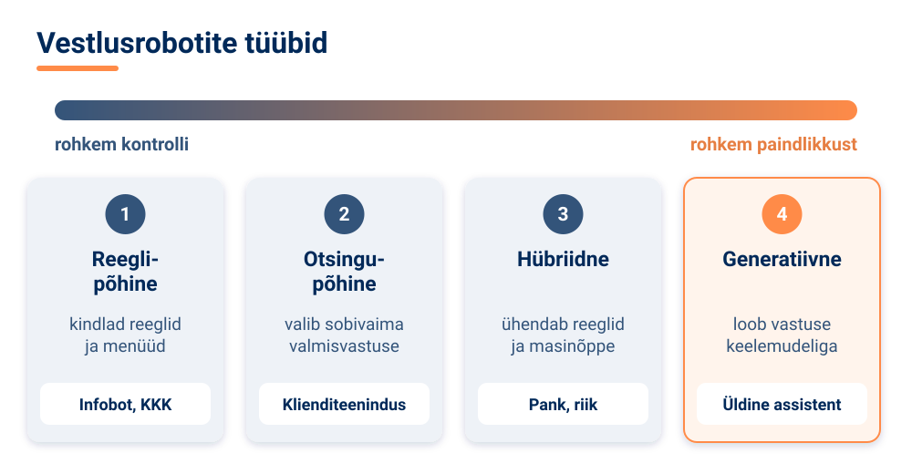
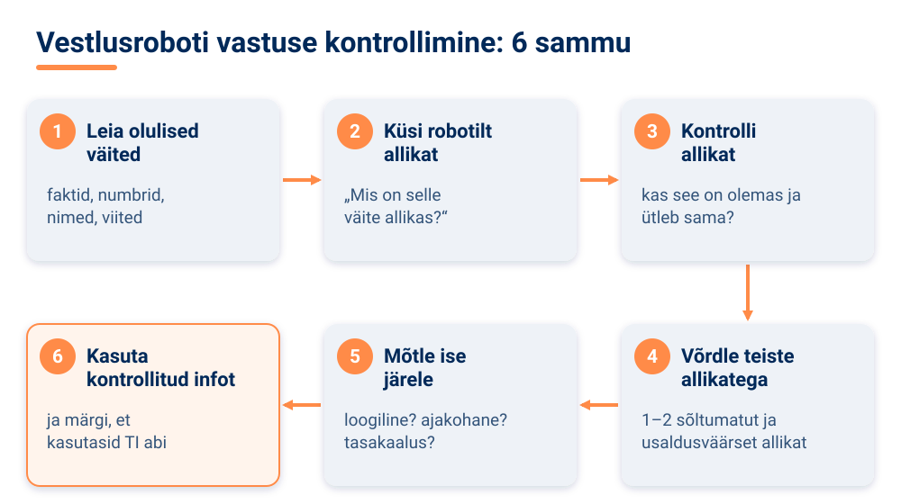

<!--
author:   Maia Lust
email:    
version:  2.2.1
language: et
narrator: Estonian Female
date:     08.10.2026
logo:     ../pildid/pae_logo.png
icon:     ../pildid/pae_logo.png
comment:  Tehisintellekti alused – gümnaasiumi valikkursus (35 tundi), Tallinna Pae Gümnaasium. Õppetekstid, interaktiivsed töölehed ja enesekontrollitestid.
link:     https://fonts.googleapis.com/css2?family=Nunito+Sans:wght@400;600;700&family=Poppins:wght@600;700&family=JetBrains+Mono:wght@400;600&display=swap

@style
/* ==== liascript-theming:start ==== */
/* links: https://fonts.googleapis.com/css2?family=Nunito+Sans:wght@400;600;700&family=Poppins:wght@600;700&family=JetBrains+Mono:wght@400;600&display=swap */
/* theme: Tallinna Pae Gümnaasium — generated by liascript-theming, edit theme.json and rebuild */
:root {
  --theme-font-body: 'Nunito Sans', sans-serif;
  --theme-font-heading: 'Poppins', serif;
  --theme-font-mono: 'JetBrains Mono', monospace;
  --theme-heading-weight: 700;
  --theme-line-height: 1.6;
  --global-font-size: 1.6rem;
  --theme-radius: 0.8rem;
  --theme-radius-small: 0.4rem;
  --theme-radius-large: 1.4rem;
  --theme-shadow: 0 0.3rem 1rem rgba(0,41,89,.10);
}
/* surfaces & text: apply to every color theme */
:root.lia-variant-light {
  --color-background: 255,255,255;
  --color-text: 29,36,51;
  --color-border: 228,229,231;
  --lia-grey-lighter: 238,242,247;
  --lia-grey-light: 204,212,222;
}
:root.lia-variant-dark {
  --color-background: 15,23,36;
  --color-text: 229,232,235;
  --color-border: 49,60,73;
  --lia-grey-dark: 30,38,47;
  --lia-anthracite: 41,50,61;
}
/* accent: only the course theme (default) and the custom radio,
   so readers can still pick LiaScript's built-in color themes */
:root:is(.lia-theme-default, .lia-theme-custom) {
  --color-highlight: 0,41,89;
  --color-highlight-dark: 0,41,89;
}
:root.lia-theme-default {
  --color-highlight-menu: 0,41,89;
}
:root:is(.lia-theme-default, .lia-theme-custom).lia-variant-dark {
  --color-highlight: 47,90,143;
  --color-highlight-dark: 255,185,143;
}
:root.lia-variant-light { --theme-heading-color: #002959; }
:root.lia-variant-dark { --theme-heading-color: #FFB98F; }
/* ==== LiaScript theme adapter (liascript-theming) — keep verbatim ====
   Maps the --theme-* tokens onto LiaScript's CSS. Everything a theme
   changes lives in the token block above this one. */

/* -- fonts: body/mono via the global variables, headings & co. are
      compiled literals in LiaScript and need explicit selectors -- */
:root {
  --global-font-family: var(--theme-font-body);
  --global-font-mono: var(--theme-font-mono);
  --global-font-headline: var(--theme-font-heading);
}
body { line-height: var(--theme-line-height, 1.47); }
h1, h2, h3, .h1, .h2, .h3 {
  font-family: var(--theme-font-heading);
  font-weight: var(--theme-heading-weight, 600);
  letter-spacing: var(--theme-heading-letter-spacing, normal);
  text-transform: var(--theme-heading-transform, none);
  color: var(--theme-heading-color, inherit);
}
h4, h5, h6, .h4, .h5, summary, .lia-accordion__headline {
  font-family: var(--theme-font-subheading, var(--theme-font-body));
}
.lia-quote__text { font-family: var(--theme-font-quote, var(--theme-font-heading)); }
.lia-code, .lia-code--inline, code, kbd, samp, pre { font-family: var(--theme-font-mono); }
.lia-code .ace_editor { font-family: var(--theme-font-mono) !important; }

/* -- shape: radius for controls & surfaces (radio buttons, tags, circles stay) -- */
:is(button, .lia-btn, input, .lia-input, select, .lia-select, textarea, .lia-textarea, .lia-dropdown):not(.lia-radio, .lia-btn--tag, .lia-btn--small-tag),
.lia-code-terminal__input, .lia-pagination__content, .lia-script, .lia-support-menu__submenu {
  border-radius: var(--theme-radius);
}
.lia-checkbox[type='checkbox'], kbd, .lia-tooltip .lia-tooltiptext, .lia-code--inline {
  border-radius: var(--theme-radius-small);
}
details, .lia-quote, .lia-code__input, .lia-table-responsive, .lia-card {
  border-radius: var(--theme-radius-large);
  box-shadow: var(--theme-shadow);
}
.lia-quote, .lia-code__input { overflow: hidden; }
.lia-code__input .ace_editor { border-radius: inherit; }
.lia-support-menu__submenu { box-shadow: var(--theme-shadow-popup, 0 0 1rem rgba(128, 128, 128, 0.2)); }

/* -- dark mode: LiaScript brightens the accent for text via
      rgb(from … calc(r*2.5)), which turns a hand-picked accent into
      pastel/yellow. For the course theme, text-like accent uses take
      --color-highlight-dark (= "accent as text") instead. Scoped to
      default/custom so the built-in color themes keep their behavior. -- */
:root:is(.lia-theme-default, .lia-theme-custom).lia-variant-dark :is(.lia-link, .lia-btn--outline, .lia-code--inline) {
  color: rgb(var(--color-highlight-dark));
  border-color: rgb(var(--color-highlight-dark));
}
:root:is(.lia-theme-default, .lia-theme-custom).lia-variant-dark :is(summary, summary:after, .lia-label, .lia-skip-nav, .lia-support-menu__item, .lia-quote__text),
:root:is(.lia-theme-default, .lia-theme-custom).lia-variant-dark :is(.lia-list--unordered, .lia-list--ordered) > li::marker {
  color: rgb(var(--color-highlight-dark));
}
:root:is(.lia-theme-default, .lia-theme-custom).lia-variant-dark :is(.lia-btn--transparent, .lia-input) {
  filter: none;
}
:root:is(.lia-theme-default, .lia-theme-custom).lia-variant-dark :is(.lia-input, .lia-checkbox[type='checkbox'], .lia-radio[type='radio']):not(:checked, .is-disabled, [disabled]) {
  border-color: rgb(var(--color-highlight-dark));
}
/* alternating table rows: LiaScript uses a neutral grey in dark mode */
:root.lia-variant-dark .lia-table.is-alternating .lia-table__row:nth-child(2n) td,
:root.lia-variant-dark .lia-table-responsive.has-thead-sticky.has-first-col-sticky .is-alternating .lia-table__row:nth-child(2n) td:first-child:before,
:root.lia-variant-dark .lia-table-responsive.has-thead-sticky.has-last-col-sticky .is-alternating .lia-table__row:nth-child(2n) td:last-child:before {
  background-color: rgb(var(--lia-grey-dark));
}
/* -- theme extras -- */
/* ===== Tallinna Pae Gümnaasiumi värvid =====
   tumesinine #002959 · oranž #FF8B48 · tumeoranž #E67E42 */
:root {
  --pae-sinine: #002959;
  --pae-sinine-80: #33547A;
  --pae-sinine-20: #CCD4DE;
  --pae-sinine-08: #EEF2F7;
  --pae-oranz: #FF8B48;
  --pae-oranz-tume: #E67E42;
  --pae-oranz-20: #FFE2D1;
  --pae-oranz-08: #FFF4EC;
  --pae-roheline: #2E8B57;
  --pae-roheline-08: #EAF6EF;
  --pae-lilla: #6B4FA0;
  --pae-lilla-08: #F2EEF9;
}

/* Pealkirjad */
.lia-slide h1, main h1 {
  color: var(--pae-sinine);
  border-bottom: 6px solid var(--pae-oranz);
  padding-bottom: .3em;
}
.lia-slide h2, main h2 { color: var(--pae-sinine); }
.lia-slide h3, main h3 {
  color: var(--pae-sinine);
  border-left: 8px solid var(--pae-oranz);
  padding-left: .5em;
}
.lia-slide h4, main h4 { color: var(--pae-oranz-tume); }
strong { color: inherit; }

/* Tabelid */
.lia-table th, table thead th {
  background: var(--pae-sinine) !important;
  color: #fff !important;
}
.lia-table tbody tr:nth-child(even), table tbody tr:nth-child(even) { background: var(--pae-sinine-08); }

/* Pildid ja infograafikud */
img.lia-image, .lia-figure img, main img {
  border-radius: 12px;
}
.lia-figure__caption, figcaption {
  color: var(--pae-sinine-80);
  font-style: italic;
  text-align: center;
}

/* ASCII-skeemid väiksemaks ja Pae värvidesse */
.lia-ascii svg, lia-ascii svg, .lia-code--ascii svg { max-width: 760px; margin: 0 auto; display: block; }
svg.lia-ascii text { fill: var(--pae-sinine); }

/* ===== Kujunduskastid ===== */
blockquote.pae-moiste, blockquote.pae-naide, blockquote.pae-eesti,
blockquote.pae-motle, blockquote.pae-lisaks, blockquote.pae-fakt,
.pae-moiste, .pae-naide, .pae-eesti, .pae-motle, .pae-lisaks, .pae-fakt {
  border-radius: 14px !important;
  padding: 1.1em 1.4em 1.1em 4.2em !important;
  margin: 1.4em 0 !important;
  position: relative;
  box-shadow: 0 3px 10px rgba(0,41,89,.10);
  font-style: normal !important;
  text-align: left !important;
}
.pae-moiste::before, .pae-naide::before, .pae-eesti::before,
.pae-motle::before, .pae-lisaks::before, .pae-fakt::before {
  position: absolute; left: .7em; top: .75em;
  width: 2em; height: 2em; line-height: 2em;
  border-radius: 50%; text-align: center; font-size: 1.15em;
  color: #fff; font-style: normal;
}
/* Mõiste – oranž */
.pae-moiste { background: var(--pae-oranz-08) !important; border: 2px solid var(--pae-oranz) !important; border-left: 10px solid var(--pae-oranz) !important; }
.pae-moiste::before { content: "📖"; background: var(--pae-oranz); }
/* Näide – tumesinine */
.pae-naide { background: var(--pae-sinine-08) !important; border: 2px solid var(--pae-sinine-20) !important; border-left: 10px solid var(--pae-sinine) !important; }
.pae-naide::before { content: "💡"; background: var(--pae-sinine); }
/* Eesti näide – sinine-valge */
.pae-eesti { background: linear-gradient(135deg, #E8F1FB 0%, #ffffff 100%) !important; border: 2px solid #0072CE !important; border-left: 10px solid #0072CE !important; }
.pae-eesti::before { content: "🇪🇪"; background: #0072CE; }
/* Mõtle järele – roheline */
.pae-motle { background: var(--pae-roheline-08) !important; border: 2px dashed var(--pae-roheline) !important; border-left: 10px solid var(--pae-roheline) !important; }
.pae-motle::before { content: "🤔"; background: var(--pae-roheline); }
/* Tea lisaks – lilla */
.pae-lisaks { background: var(--pae-lilla-08) !important; border: 2px solid #CDBFE6 !important; border-left: 10px solid var(--pae-lilla) !important; }
.pae-lisaks::before { content: "🔍"; background: var(--pae-lilla); }
/* Fakt – tume taust, valge tekst */
.pae-fakt { background: var(--pae-sinine) !important; color: #fff !important; border-left: 10px solid var(--pae-oranz) !important; }
.pae-fakt * { color: #fff !important; }
.pae-fakt::before { content: "⚡"; background: var(--pae-oranz); }

/* Töölehe jaotise riba */
.pae-jaotis { background: var(--pae-sinine); color: #fff !important; padding: .55em 1em; border-radius: 10px; margin: 2em 0 1em; border-left: 10px solid var(--pae-oranz); }
.pae-jaotis * { color: #fff !important; }

/* Ploki kaanepilt */
.pae-kaas img, img.pae-kaas { width: 100%; border-radius: 16px; box-shadow: 0 6px 20px rgba(0,41,89,.18); }

/* Näidisvastuse kokkupandav kast */
details {
  background: var(--pae-oranz-08);
  border: 1px solid var(--pae-oranz);
  border-radius: 10px; padding: .6em 1em; margin: .6em 0 1.4em;
}
details summary { cursor: pointer; font-weight: bold; color: var(--pae-oranz-tume); }

/* Menüü (sisukord) tumesinine */
.lia-toc a, .lia-toc .lia-toc__link, nav.lia-toc a { color: #002959 !important; }
.lia-toc a.lia-active, .lia-toc .lia-active { font-weight: 700; }
:root.lia-variant-dark .lia-toc a { color: #CCD4DE !important; }
:root.lia-variant-dark .pae-moiste, :root.lia-variant-dark .pae-naide, :root.lia-variant-dark .pae-eesti,
:root.lia-variant-dark .pae-motle, :root.lia-variant-dark .pae-lisaks { color: #1d2433 !important; }
:root.lia-variant-dark .pae-moiste *, :root.lia-variant-dark .pae-naide *, :root.lia-variant-dark .pae-eesti *,
:root.lia-variant-dark .pae-motle *, :root.lia-variant-dark .pae-lisaks * { color: #1d2433 !important; }
:root.lia-variant-dark img { background: #fff; }
/* ==== liascript-theming:end ==== */
/* Loosimisnupp (rollimäng) */
output.lia-script[input="submit"] { display:inline-block !important; background:#002959; color:#fff !important; font-weight:700; padding:.6em 1.2em; border-radius:999px; border:3px solid #FF8B48 !important; cursor:pointer; box-shadow:0 3px 10px rgba(0,41,89,.2); }
output.lia-script[input="submit"]:hover { background:#FF8B48; color:#002959 !important; }

/* Lihtsalt öeldes (ettelugemisega) */
section.pae-lihtne { background:#EAF6EE; border:2px solid #2E8B57; border-left:10px solid #2E8B57; border-radius:14px; padding:.9em 1.3em; margin:1.2em 0; font-size:1.05em; line-height:1.6; box-shadow:0 3px 10px rgba(0,41,89,.08); }
section.pae-lihtne p { margin:.5em 0; }
:root.lia-variant-dark section.pae-lihtne, :root.lia-variant-dark section.pae-lihtne * { color:#1d2433 !important; }

/* Sõnastiku hüpikselgitus */
.pae-term { border-bottom:2px dotted #FF8B48; cursor:help; position:relative; outline:none; }
.pae-term:hover::after, .pae-term:focus::after {
  content: attr(data-def); position:absolute; left:0; top:1.7em; z-index:999;
  width:max-content; max-width:min(320px, 80vw); white-space:normal;
  background:#002959; color:#fff; padding:.55em .8em; border-radius:10px;
  font-size:15px; line-height:1.45; font-weight:400; font-style:normal;
  box-shadow:0 6px 18px rgba(0,41,89,.3); border-left:5px solid #FF8B48;
}
.pae-fakt .pae-term:hover::after, .pae-fakt .pae-term:focus::after { color:#fff !important; }

@end

@custom
--color-highlight-menu: 255,255,255;
@end
-->

# Plokk 3. Keeletöötlus

<!-- class="pae-kaas" -->

<!-- class="pae-fakt" -->
> <!-- style="width: 120px; float: left; margin: 0 16px 8px 0; border-radius: 0;" --> **🗝️ Tuba 3: Keelelabor**
>
> Päästemeeskond astub Keelelaborisse, kus seintel vilguvad ekraanid täis segipaisatud tähti ja poolikuid lauseid. Kratt on unustanud, kuidas keelt töödelda: ta tükeldab sõnu valesti, mõtleb fakte välja ja kirjutab sõnu tagurpidi. „Tere hommikut, kas te olete mu ... darbõs? Ei, oot ... sõbrad! Mu sõnad on kõik sassis!“ Teie ülesanne on õpetada Kratile uuesti, kuidas arvuti inimkeelt „loeb“, loob, vestleb ja tõlgib. Selles toas on 4 lukku – iga tunni lõpus üks. Iga avatud lukk annab ühe võtmetähe. Kirjuta tähed üles!

Keel on inimese kõige tähtsam suhtlusvahend. Me räägime, kirjutame sõnumeid, loeme uudiseid ja otsime veebist infot – kõik see toimub keeles. Viimastel aastatel on ka arvutid hakanud keelega üllatavalt hästi hakkama saama. Telefon pakub sõnumit kirjutades järgmist sõna, vestlusrobot vastab sinu küsimusele terve lõiguga, masintõlge muudab võõrkeelse veebilehe mõne sekundiga eestikeelseks ning häälassistent täidab sinu suulise korralduse. Selle kõige taga on tehisintellekti (TI) haru, mida nimetatakse **loomuliku keele töötluseks**.

Selles plokis saad teada, kuidas arvuti inimkeelt „loeb“, kuidas tekst muudetakse arvudeks ja kuidas suured keelemudelid uut teksti loovad. Uurime, kuidas töötavad vestlusrobotid ja masintõlge ning millised keeletehnoloogiad on olemas eesti keele jaoks. Sama oluline on mõista keeletehnoloogia piiranguid: miks vestlusrobot võib enesekindlalt valet väita, miks masintõlge eksib idioomidega ja kuidas sina saad TI vastuseid kriitiliselt kontrollida. Eesti keel on väike ja keeruka grammatikaga keel – seepärast on eesti keele tehnoloogia arendamine meie jaoks eriti tähtis.

**Selles plokis:**

- **3.1 Kuidas tehisintellekt mõistab keelt** – loomuliku keele töötluse põhimõtted ja ajalugu, teksti eeltöötlus, teksti esitamine arvudena, keelemudelid ja transformerid, eesti keele eripärad
- **3.2 Teksti analüüs ja genereerimine** – teksti klassifitseerimine, meelestatuse analüüs, nimeüksuste tuvastamine, kokkuvõtete tegemine, teksti genereerimine ja selle juhtimine, hallutsinatsioonid ja kallutatus
- **3.3 Vestlusagendid ja vestlusrobotid** – vestlusrobotite ajalugu, tüübid ja ülesehitus, rakendused (sh Bürokratt), vestlusroboti vastuste kriitiline kontrollimine
- **3.4 Masintõlge ja keeletehnoloogiad** – masintõlke lähenemised ja hindamine, Neurotõlge ja teised eesti keele tõlkevahendid, kõnetuvastus, kõnesüntees ja õigekirjakontroll

Ploki lõpus on kordamise osa praktiliste ülesannete, arutelu ja ploki enesekontrolltestiga.

<!-- class="pae-motle" -->
> **Mõtle järele!**
>
> Mõtle oma viimasele nädalale. Kus kasutasid tehnoloogiat, mis töötleb keelt – näiteks sõnumi automaatset parandamist, tõlkerakendust, häälassistenti või vestlusrobotit? Kas see sai eesti keelega hästi hakkama? Mis läks hästi ja mis valesti? Ja üks küsimus, mille juurde plokis korduvalt tagasi tuleme: kas arvuti, mis vastab sulle ladusas eesti keeles, ka tegelikult **mõistab**, mida ta ütleb?

## 3.1 Kuidas tehisintellekt mõistab keelt

<!-- class="pae-kaas" -->

### Õpieesmärgid

Selle tunni järel sa:

- **selgitad oma sõnadega**, mis on loomuliku keele töötlus ja miks on inimkeel arvutile keeruline *(mõistmine)*;
- **kirjeldad**, kuidas keelemudel ennustab järgmist sõna, ja **rakendad** seda teadmist igapäevase näite (nt telefoni klaviatuur) selgitamiseks *(rakendamine)*;
- **võrdled** tokeniseerijaga eesti- ja ingliskeelse lause tokenite arvu ja **leiad seose** eesti keele ehitusega *(analüüs)*;
- **hindad**, millised on keeletöötluse väljakutsed eesti keele jaoks, ja **põhjendad** oma järeldust katse tulemustega *(hindamine)*.

<!-- class="pae-fakt" -->
> **🎯 Tunni tuumik (45 min)**
>
> 🏠 **Kodus enne tundi** (~15–20 min): „Keeletöötluse lühiajalugu“, „Kuidas tekst muudetakse arvudeks“, „Keeletöötlus eesti keeles ja valdkonna väljakutsed“. Too tundi kaasa üks uus teadmine või küsimus – tunni alguses arutate neid paarides (3 min).
>
> 1. 📚 **Loe** (~12 min): „Mis on loomuliku keele töötlus?“, „Kuidas arvuti teksti „loeb“: keeletöötluse põhiülesanded“, „Keelemudelid ja transformerid“ ja „Kokkuvõte ja põhimõisted“
> 2. 🧪 **TI-katse** (~10 min): „Mitmeks tokeniks lause jaguneb?“
> 3. ⭐ **Tööleht** (~15 min): ülesanded II, VI ja VII
> 4. 📤 **Väljapääsupilet** ja 🔐 **lukk** (~8 min)
>
> **🏠** tähistab osi, mida loed või vaatad **kodus enne tundi** (ümberpööratud klassiruum). **➕** tähistab lisaülesannet – tee seda, kui jõuad, või kui tahad rohkem teada.

{{|>}}
<section class="pae-lihtne">

**🟢 Lihtsalt öeldes**

Loomuliku keele töötlus aitab arvutil inimkeelt mõista ja luua. Inimkeel on arvutile raske, sest tähendus sõltub kontekstist. Sõnal võib olla mitu tähendust: „tee“ võib olla jook või liiklusmaa. Kõigepealt jagab arvuti teksti väikesteks osadeks ehk tokeniteks. Keelemudel ennustab, milline sõna tuleb tõenäoliselt järgmisena. Nii töötab ka sinu telefoni klaviatuur, mis pakub järgmist sõna. Tänapäeva suured keelemudelid põhinevad transformeril ja tähelepanumehhanismil. Keelemudel leiab tekstist mustreid, aga ei mõista maailma nagu sina.

**Tähtsad sõnad:** **loomuliku keele töötlus** – TI haru, mis töötleb inimkeelt; **token** – teksti väike osa, näiteks sõna või sõnaosa; **keelemudel** – mudel, mis ennustab järgmist sõna; **tähelepanumehhanism** – meetod, mis aitab mudelil leida lausest tähtsad sõnad.

</section>

### Mis on loomuliku keele töötlus?

Kui sa kirjutad sõbrale „Kas homme kell 4 kohvikus?“, saab ta kohe aru, mida sa mõtled: et kohtute homme pärastlõunal ja et see on küsimus, mitte korraldus. Arvuti jaoks on see lause aga lihtsalt tähemärkide jada. Et arvuti saaks sellest midagi aru, on vaja eraldi teadusvaldkonda.

<!-- class="pae-moiste" -->
> **Mõiste: loomuliku keele töötlus**
>
> Loomuliku keele töötlus (inglise keeles *natural language processing*, lühend NLP) on arvutiteaduse ja tehisintellekti haru, mis tegeleb inimkeele ja arvutite vahelise suhtlusega. Selle eesmärk on võimaldada arvutitel inimkeelt **mõista, tõlgendada ja genereerida** (luua).

Sõna „loomulik“ tähendab siin keelt, mida inimesed on omavahel suhtlemiseks loomulikult kasutanud – eesti, inglise, vene, jaapani keelt jne. Sellele vastanduvad tehiskeeled, näiteks programmeerimiskeeled, mille reeglid on täpselt kokku lepitud ja mis ei luba mitmetähenduslikkust.

Miks on inimkeel arvutile nii raske? Põhjuseid on mitu.

**Mitmetähenduslikkus.** Paljudel sõnadel on mitu tähendust. Eesti keeles võib „tee“ olla jook, liiklusmaa või käsk („tee kodutöö ära!“). Sõna „pank“ võib tähendada nii rahaasutust kui ka kõrget kallast. Inimene valib õige tähenduse konteksti põhjal peaaegu märkamatult, arvuti peab selle eraldi välja arvutama.

**Kontekst.** Lause „Jah, väga tore!“ võib olla siiras kiitus või hoopis irooniline pahameel – sõltuvalt sellest, mis enne juhtus. Tähendus ei peitu ainult sõnades, vaid ka olukorras.

**Kultuurilised nüansid.** Väljend „see on mulle hane selga vesi“ ei räägi linnust ega veest. Idioomid, viited ja nali on seotud kultuuriga ning neid ei saa sõna-sõnalt tõlgendada.

**Keelte mitmekesisus.** Maailmas on tuhandeid keeli, mille grammatika, sõnajärg ja kirjasüsteem erinevad väga palju. See, mis töötab hästi inglise keele puhul, ei pruugi sobida eesti keelele.

<!-- class="pae-naide" -->
> **Näide: keeletöötlus sinu telefonis**
>
> Juba ühe tavalise päeva jooksul kasutad mitut keeletöötluse rakendust. Klaviatuur pakub sõnumit kirjutades järgmist sõna ja parandab trükivead. E-posti postkast suunab rämpskirjad eraldi kausta. Tõlkerakendus muudab võõrkeelse menüü arusaadavaks. Häälassistent kuulab, mida sa ütled, ja vastab. Kõigi nende taga on loomuliku keele töötlus.

### 🏠 Keeletöötluse lühiajalugu

Loomuliku keele töötlus ei ole uus valdkond – sellega on tegeldud juba üle seitsmekümne aasta. Areng on liikunud käsitsi kirjutatud reeglitelt statistikani ning sealt masinõppe ja süvaõppeni.

**1950. aastatel** tehti esimesed masintõlke katsed ja Alan Turing pakkus välja oma kuulsa testi: kas arvuti suudab vestelda nii, et inimene ei erista teda teisest inimesest? **1960. aastatel** valmis ELIZA, üks esimesi vestlusprogramme, millest räägime lähemalt tunnis 3.3. **1970.–1980. aastatel** valitsesid **reeglipõhised süsteemid**: keeleteadlased kirjutasid arvutile käsitsi grammatikareeglid ja sõnastikud. See oli väga töömahukas ja süsteemid murdusid, kui keelekasutus reeglitest erines.

**1990. aastatel** tulid **statistilised meetodid**. Reeglite asemel hakati arvutile andma suuri tekstikogusid ja laskma tal arvutada, millised sõnad ja sõnaühendid esinevad koos kõige sagedamini. **2000. aastatel** levis masinõppe kasutamine ning **2010. aastatest** alates algas **süvaõppe revolutsioon**. Tähtsad verstapostid olid Word2Vec (2013), mis õpetas arvutit esitama sõnu arvuvektoritena, jada-jada mudelid (2014), mis suutsid muuta ühe tekstijada teiseks (näiteks lause tõlkeks), ning **transformerid** (2017), mille peale on ehitatud tänapäeva suured keelemudelid.

<!-- class="pae-fakt" -->
> **Kas teadsid?** Loomuliku keele töötlusega on tegeldud juba **üle seitsmekümne aasta**. Juba 1950. aastatel tehti esimesed masintõlke katsed ja Alan Turing pakkus välja oma kuulsa testi.

<!-- class="pae-lisaks" -->
> **Tea lisaks**
>
> Transformeri arhitektuur esitati 2017. aastal teadusartiklis, mille pealkiri on tõlkes „Tähelepanu on kõik, mida vajad“ (*Attention Is All You Need*). Selle artikli ideed on aluseks peaaegu kõigile tänapäeval tuntud suurtele keelemudelitele.

### Kuidas arvuti teksti „loeb“: keeletöötluse põhiülesanded

Enne kui arvuti saab tekstiga midagi targemat teha, tuleb see ette valmistada. Seda nimetatakse **teksti eeltöötluseks**.

<!-- class="pae-moiste" -->
> **Mõiste: tokeniseerimine**
>
> Tokeniseerimine on teksti jagamine väiksemateks ühikuteks ehk **tokeniteks** – näiteks sõnadeks, lauseteks või sõnaosadeks. Lause „Mari läks kooli.“ jaguneb tokeniteks „Mari“, „läks“, „kooli“, „.“.

<!-- class="pae-moiste" -->
> **Mõiste: lemmatiseerimine**
>
> Lemmatiseerimine on sõnade taandamine nende algvormile ehk **lemmale**. Näiteks sõnad „koolis“, „kooli“, „koolidest“ taandatakse lemmaks „kool“. Lihtsam variant on **tüvistamine**, mille puhul lõigatakse sõnalt lihtsalt lõpp ära.

Kolmas eeltöötluse samm on **sõnaliikide märgendamine**: iga sõna juurde märgitakse, kas see on nimisõna, tegusõna, omadussõna jne, ning sageli ka sõna grammatiline vorm (nt kääne või aeg).

Eeltöötlusele järgnevad sügavamad analüüsitasemed:

| Analüüsi tase | Mida tehakse | Näide |
|---|---|---|
| Süntaktiline analüüs | Tuvastatakse lause struktuur ja sõnadevahelised sõltuvused | Lauses „Kass sõi hiire“ on „kass“ alus ja „hiire“ sihitis |
| Semantiline analüüs | Püütakse mõista tähendust ja muuta see üheseks | „Pank“ lauses „istusime jõe pangal“ tähendab kallast |
| Pragmaatiline analüüs | Arvestatakse konteksti ja tuvastatakse kavatsus | „Kas sa saaksid akna sulgeda?“ on palve, mitte küsimus võimekuse kohta |

Tüüpilist keeletöötluse töövoogu võib kujutada nii:

### 🏠 Kuidas tekst muudetakse arvudeks

Arvuti oskab arvutada ainult arvudega. Seepärast tuleb iga tekst muuta arvuliseks esituseks. Selleks on aja jooksul välja töötatud mitu meetodit.

**Sõnahulk** (inglise keeles *bag of words*) on kõige lihtsam meetod. Tekst kujutatakse justkui kotina, kuhu on visatud kõik selle sõnad, ja loendatakse, mitu korda iga sõna esineb. Meetod on lihtne, kuid **kaotab sõnade järjekorra**: laused „koer hammustas meest“ ja „mees hammustas koera“ näevad välja täpselt ühesugused.

**TF-IDF** (inglise keeles *term frequency – inverse document frequency*) hindab, **kui oluline** on sõna konkreetses dokumendis. Sõna saab kõrge kaalu, kui see esineb selles tekstis sageli, aga teistes tekstides harva. Sõnad nagu „ja“ või „on“ esinevad kõikjal ega ütle teksti sisu kohta midagi, aga kui sõna „fotosüntees“ kordub ühes tekstis palju, on see tõenäoliselt bioloogiatekst.

**N-grammid** on järjestikused sõnad või tähed. Näiteks kahesõnalised ühendid (bigrammid) lausest „mulle meeldib matemaatika“ on „mulle meeldib“ ja „meeldib matemaatika“. N-grammid säilitavad osaliselt sõnade järjekorda ja konteksti.

<!-- class="pae-moiste" -->
> **Mõiste: sõnavektor**
>
> Sõnavektor (inglise keeles *word embedding*) on sõna esitus arvude jadana ehk vektorina. Vektorid on loodud nii, et **tähenduselt sarnased sõnad asuvad vektorruumis üksteise lähedal**. Näiteks „kass“ ja „koer“ on lähestikku, „kass“ ja „traktor“ kaugel. Tuntud meetodid sõnavektorite loomiseks on Word2Vec, GloVe ja FastText.

Sõnavektorid on oluline edasiminek, sest need säilitavad sõnadevahelisi tähendusseoseid. Kuulus näide näitab, et vektoritega saab isegi „arvutada“: kui võtta sõna „kuningas“ vektor, lahutada sellest „mees“ ja liita „naine“, jõutakse vektorini, mis on lähedal sõnale „kuninganna“.

Sõnavektoritel on siiski üks puudus: igal sõnal on ainult üks vektor. Sõna „tee“ saab sama esituse nii lauses „joon teed“ kui ka „kõnnin mööda teed“. Selle probleemi lahendavad **kontekstuaalsed esitused** (näiteks mudelid BERT ja ELMo), kus sõna arvuline esitus sõltub sellest, millised sõnad on tema ümber. Nii saab „tee“ erinevates lausetes erineva esituse.

<!-- class="pae-motle" -->
> **Mõtle järele!**
>
> Miks ei sobi sõnahulga meetod hästi selleks, et otsustada, kas filmiarvustus on positiivne või negatiivne? Mõtle lausetele „Film ei olnud üldse hea, vaid suurepärane“ ja „Film oli hea? Ei, üldse mitte.“ Mida kaotab arvuti, kui ta loendab ainult sõnu?

### Keelemudelid ja transformerid

<!-- class="pae-moiste" -->
> **Mõiste: keelemudel**
>
> Keelemudel on statistiline või tehisintellektil põhinev mudel, mis **ennustab sõnade tõenäosuslikku järjestust**: milline sõna tuleb tõenäoliselt järgmisena ja kui tõenäoline on terve lause.

Kõige lihtsam keelemudel on sinu telefoni klaviatuuris. Kui kirjutad „Head“, pakub see järgmiseks sõnaks „ööd“ või „aega“, sest need järgnevad sõnale „head“ kõige sagedamini. Keelemudelite eesmärgid on järgmise sõna ennustamine, lause tõenäosuse hindamine, teksti genereerimine ja keele mõistmine.

Keelemudeleid on kolme põhitüüpi:

| Tüüp | Kuidas töötab | Näited |
|---|---|---|
| Statistilised keelemudelid | Loendavad, kui sageli sõnad koos esinevad | n-grammimudelid |
| Närvivõrgupõhised keelemudelid | Närvivõrk loeb teksti sõna-sõnalt järjest | RNN, LSTM |
| Transformeripõhised keelemudelid | Vaatavad kogu teksti korraga ja kasutavad tähelepanumehhanismi | GPT, BERT |

**Transformer** on 2017. aastal esitatud närvivõrgu arhitektuur. Selle kõige olulisem osa on **tähelepanumehhanism** (inglise keeles *attention*, täpsemalt *self-attention* ehk enesetähelepanu).

<!-- class="pae-moiste" -->
> **Mõiste: tähelepanumehhanism**
>
> Tähelepanumehhanism on meetod, mis aitab keelemudelil **keskenduda teksti olulistele sõnadele** ja modelleerida sõnadevahelisi seoseid. Iga sõna puhul arvutab mudel, millised teised sõnad lauses on selle mõistmiseks kõige tähtsamad.

Vaata lauset: „Mari pani raamatu kotti, sest **see** oli raske.“ Mille kohta käib „see“ – raamatu või koti? Tähelepanumehhanism aitab mudelil seostada sõna „see“ teiste lause sõnadega ja leida tõenäoliseima vaste. Varasemad mudelid (RNN, LSTM) lugesid teksti sõna-sõnalt järjest ega suutnud pikkades tekstides kaugete sõnade seoseid hästi meeles pidada. Transformer töötleb kõiki sõnu **paralleelselt** ehk korraga ja kasutab **positsioonikodeerimist**, et teada, millises järjekorras sõnad on. Tänu sellele on transformerid kiiremad treenida, annavad paremaid tulemusi ja neid saab skaleerida ehk teha väga suureks.

<!-- class="pae-moiste" -->
> **Mõiste: suur keelemudel**
>
> Suur keelemudel (inglise keeles *large language model*, LLM) on väga suur, tavaliselt transformeril põhinev keelemudel, mis on treenitud tohutul hulgal tekstiandmetel ja suudab mõista ning genereerida inimesesarnast teksti.

Suured keelemudelid valmivad kahes etapis. Esmalt toimub **eeltreenimine** (*pre-training*): mudel õpib tohutul tekstikogul ehk **korpusel** üldisi keelestruktuure ja seoseid. Seejärel tehakse **peenhäälestamine** (*fine-tuning*): eeltreenitud mudelit treenitakse täiendavalt väiksema andmekogumiga konkreetse ülesande jaoks, näiteks vestlemiseks.

Kaks tuntud mudeliperet esindavad erinevaid lähenemisi:

- **GPT** (*Generative Pre-trained Transformer*) on **autoregressiivne** mudel: see ennustab alati järgmist sõna eelnevate põhjal. GPT-mudeleid on aastate jooksul ilmunud mitu versiooni (GPT, GPT-2, GPT-3, GPT-4 ja uuemad).
- **BERT** (*Bidirectional Encoder Representations from Transformers*) on **kahesuunaline** mudel. Seda treeniti nii, et lausest peideti ehk maskeeriti mõni sõna ja mudel pidi selle ära arvama, vaadates sõnu nii enne kui ka pärast lünka. Nii õpib BERT konteksti mõistma mõlemas suunas.

Lisaks neile on loodud palju teisi mudeleid, näiteks Google'i T5, LaMDA, PaLM ja Gemini, Meta Llama ning Anthropicu Claude. Suured keelemudelid suudavad genereerida teksti, vastata küsimustele, teha kokkuvõtteid, tõlkida ja isegi programmikoodi kirjutada. Kõik need oskused on samast põhimõttest välja kasvanud: mudel on õppinud väga hästi ennustama, milline tekst sobib eelneva teksti järele.

<!-- class="pae-motle" -->
> **Mõtle järele!**
>
> Kas keelemudel **mõistab** teksti samamoodi nagu sina? Keelemudel tuvastab tekstis statistilisi mustreid ja sõnadevahelisi seoseid ning oskab nende põhjal genereerida asjakohast teksti. Kuid tal ei ole kogemusi maailmast: ta pole kunagi teed joonud ega jõe kaldal istunud. Kas sellist „mõistmist“ saab nimetada päris mõistmiseks? Mis sinu arvates on mõistmise juures kõige olulisem?

Keeletöötlust kasutatakse paljudes rakendustes. **Masintõlge** (nt Google Translate, DeepL) võimaldab tõlkida isegi reaalajas. **Vestlusrobotid** aitavad klienditeeninduses, töötavad virtuaalsete assistentidena ja õppevahenditena. **Teksti analüüs** hõlmab meelestatuse analüüsi, teemade modelleerimist ja nimeüksuste tuvastamist. **Teksti genereerimist** kasutatakse sisuloomes, kokkuvõtete tegemisel ja loovkirjutamises. Neid rakendusi uurime lähemalt järgmistes tundides.

### 🏠 Keeletöötlus eesti keeles ja valdkonna väljakutsed

Eesti keel on keeletöötluse jaoks paras pähkel. Põhjusi on kolm.

**Väike keeleressursside hulk.** Eesti keelt räägib umbes miljon inimest. Eestikeelset teksti, mille peal mudeleid treenida, on palju vähem kui inglise keeles: populaarsete keelemudelite treeningandmetest moodustab eesti keel hinnanguliselt vaid umbes 0,1%.

**Keerukas morfoloogia.** Morfoloogia on keeleteaduse osa, mis uurib sõnade vormimist. Eesti keeles on 14 käänet ning ühest sõnast saab moodustada kümneid vorme: „maja, maja, maja, majja, majas, majast, majale, majal, majalt …“ Inglise keeles oleks enamiku nende asemel eessõnaga ühend („in the house“, „from the house“). Seepärast on eesti keele puhul lemmatiseerimine eriti tähtis.

<!-- class="pae-fakt" -->
> **Kas teadsid?** Eesti keeles on **14 käänet** ja ühest sõnast saab moodustada **kümneid vorme**. Samal ajal räägib eesti keelt vaid umbes miljon inimest – seepärast on eestikeelset treeningteksti palju vähem kui inglise keeles.

**Vaba sõnajärg.** Eesti keeles võib öelda „Mari luges raamatut“, „Raamatut luges Mari“ või „Luges Mari raamatut“ – tähendus jääb põhiliselt samaks. Mudel ei saa seetõttu nii palju toetuda sõnade asukohale lauses kui näiteks inglise keeles.

<!-- class="pae-eesti" -->
> **Eesti näide: eesti keele tööriistad**
>
> Eesti keeleteadlased ja arvutiteadlased on loonud eesti keele töötlemiseks mitu tööriista. **Eesti keele korpused** on suured eestikeelsete tekstide kogud, mille peal mudeleid treenitakse. **EstNLTK** (*Natural Language Toolkit for Estonian*) on tööriistakomplekt eestikeelse teksti analüüsimiseks: see oskab näiteks teksti sõnadeks jagada, sõnu lemmatiseerida ja sõnaliike määrata. **EstBERT** on Tartu Ülikoolis 2020. aastal spetsiaalselt eesti keele jaoks treenitud BERT-mudel. Lisaks on Eestis loodud eesti keele õigekirjakontroll, masintõlge, kõnesüntees ja kõnetuvastus (nendest räägime tunnis 3.4).

Keeletöötlusel on ka üldisi väljakutseid, mis puudutavad kõiki keeli:

- **Mitmetähenduslikkus** – homonüümid (samakujulised, aga erineva tähendusega sõnad) ja polüseemia (ühe sõna mitu seotud tähendust) nõuavad konteksti mõistmist.
- **Maailmateadmised** – keelt mõistes kasutab inimene palju taustateadmisi ja tervet mõistust. Lause „Kass ei mahtunud kasti, sest see oli liiga väike“ puhul tead sa kohe, et väike oli kast, mitte kass.
- **Keelte mitmekesisus** – erinevad grammatikad ja kultuurilised eripärad.
- **Eetilised küsimused** – mudelid võivad treeningandmetest üle võtta **kallutatust** ja stereotüüpe, ohustada privaatsust ning genereerida valeinformatsiooni.

Tulevikus liigub keeletöötlus mitmes suunas. **Mitmekeelsed mudelid** püüavad ühe mudeliga katta kõiki keeli, nii et suurest keelest õpitud teadmised kanduvad üle ka väiksematele keeltele. **Multimodaalsed mudelid** töötlevad korraga teksti, pilti, heli ja videot. **Vähem andmeid vajavad mudelid** suudavad õppida mõne näite (*few-shot*) või isegi ilma näideteta (*zero-shot*) – see on eriti oluline väiksemate keelte jaoks. Üha tähtsamaks muutub ka **selgitatavus**: soov, et mudelid oleksid läbipaistvamad ja nende väljundit saaks paremini kontrollida.

<!-- class="pae-motle" -->
> **Mõtle järele!**
>
> Kuidas on keeletöötlus muutnud seda, kuidas sina tehnoloogiaga suhtled? Ja mida saaks teha, et eesti keele tehnoloogia oleks sama hea kui inglise keele oma? Kes peaks selle eest vastutama – riik, ülikoolid, ettevõtted või hoopis keelekasutajad ise?

### 🧪 TI-katse: mitmeks tokeniks lause jaguneb?

🛡️ *Ohutuskaardi reeglid kehtivad: ära logi sisse, ära sisesta isikuandmeid ega pildista inimesi.*

Suur keelemudel ei loe teksti sõnade, vaid tokenite kaupa. Uuri tokeniseerija abil, kuidas sama mõttega eesti- ja ingliskeelne lause tükkideks lõigatakse ja miks on eesti keele rohked sõnavormid mudelile keerulisemad.

**Vaja läheb:** veebipõhine tokeniseerija [Tiktokenizer](https://tiktokenizer.vercel.app/) (sisselogimist pole vaja), ~10 min, paaristöö

1. Ava Tiktokenizer, kustuta tekstikastist näidistekst ja kirjuta sinna lause „Õpilased lugesid raamatukogus huvitavaid raamatuid.“ Pane kirja tokenite arv (*Token count*).
2. Asenda lause sama mõttega ingliskeelse lausega „The students read interesting books in the library.“ ja pane kirja tokenite arv.
3. Proovi sõna „maja“ eri vorme: „majja“, „majadest“, „majadeski“. Mitu tokenit saab iga vorm? Kas tüvi ja lõpp jäävad eri tükkidesse?
4. Arutage paarilisega: miks jaguneb eestikeelne tekst rohkemateks tokeniteks kui ingliskeelne ja mida see tähendab keelemudeli jaoks?

**Pane tähele / kirjuta üles:** tokenite arv mõlemas keeles, üks sõna, mis lõigati mitmeks tükiks, ja teie selgitus.

[[___ ___ ___]]

<!-- class="pae-lisaks" -->
> **Kui arvutit pole:** jagage lause „Õpilased lugesid raamatukogus huvitavaid raamatuid.“ paberil kriipsudega tükkideks nii, nagu arvate, et mudel teeks (nt tüvi ja lõpp eraldi), ja tehke sama ingliskeelse lausega. Võrrelge tükkide arvu ja arutage, miks eesti keeles tükke rohkem on.

### Kokkuvõte ja põhimõisted

**Pea meeles**

- Loomuliku keele töötlus on TI haru, mis võimaldab arvutitel inimkeelt mõista, tõlgendada ja genereerida. Keel on arvutile raske mitmetähenduslikkuse, konteksti, kultuuriliste nüansside ja keelte mitmekesisuse tõttu.
- Keeletöötlus on arenenud reeglipõhistest süsteemidest statistiliste meetodite ja masinõppe kaudu süvaõppe ning suurte keelemudeliteni.
- Enne analüüsi tekst eeltöödeldakse (tokeniseerimine, lemmatiseerimine, sõnaliikide märgendamine) ja muudetakse arvudeks (sõnahulk, TF-IDF, n-grammid, sõnavektorid, kontekstuaalsed esitused).
- Keelemudel ennustab sõnade tõenäosuslikku järjestust. Transformerid ja tähelepanumehhanism (2017) muutsid keeletöötluse põhjalikult ning on suurte keelemudelite aluseks.
- Keelemudelid ei mõista teksti nagu inimesed – nad tuvastavad statistilisi mustreid.
- Eesti keele töötlemist raskendavad väike keeleressursside hulk, keerukas morfoloogia ja vaba sõnajärg; abiks on näiteks EstNLTK ja EstBERT.

| Mõiste | Tähendus |
|---|---|
| Loomuliku keele töötlus | TI haru, mis tegeleb inimkeele ja arvutite vahelise suhtlusega |
| Tokeniseerimine | Teksti jagamine väiksemateks ühikuteks (sõnadeks, lauseteks, sõnaosadeks) |
| Lemmatiseerimine | Sõnade taandamine algvormile ehk lemmale |
| Sõnaliikide märgendamine | Igale sõnale sõnaliigi (nt nimisõna, tegusõna) määramine |
| Sõnahulk | Teksti esitus sõnade esinemissagedustena, sõnade järjekord läheb kaotsi |
| TF-IDF | Meetod, mis hindab sõna olulisust dokumendis teiste dokumentidega võrreldes |
| Sõnavektor | Sõna esitus arvuvektorina, kus sarnase tähendusega sõnad on lähestikku |
| Keelemudel | Mudel, mis ennustab sõnade tõenäosuslikku järjestust |
| Transformer | 2017. aastal loodud närvivõrgu arhitektuur, mis kasutab tähelepanumehhanismi ja töötleb teksti paralleelselt |
| Tähelepanumehhanism | Meetod, mis aitab mudelil keskenduda olulistele sõnadele ja nende seostele |
| Suur keelemudel | Tohutul tekstihulgal treenitud keelemudel, mis suudab genereerida inimesesarnast teksti |
| Eeltreenimine ja peenhäälestamine | Üldine treenimine suurel korpusel ning sellele järgnev täiendav treenimine konkreetse ülesande jaoks |

### 📚 Allikad ja lisalugemine

- ERR (2025). [Ühispöördumine. Vajame eestikeelse tehisaru jaoks ühiskondlikku kokkulepet](https://www.err.ee/1609599689/uhispoordumine-vajame-eestikeelse-tehisaru-jaoks-uhiskondlikku-kokkulepet). Eesti keeleteadlaste pöördumine: kui väike on eesti keele osa keelemudelite treeningandmetes ja mida sellega teha. Sobib lisalugemiseks.
- ERR News (2024). [Team of researchers to teach Estonian language, culture to language models](https://news.err.ee/1609443533/team-of-researchers-to-teach-estonian-language-culture-to-language-models). Eesti teadlaste projekt, mis õpetab avatud keelemudelitele eesti keelt ja kultuuri (inglise keeles).
- Vaswani, A. jt (2017). [Attention Is All You Need](https://arxiv.org/abs/1706.03762). Teadusartikkel, milles esitati transformeri arhitektuur (inglise keeles).
- Jurafsky, D., Martin, J. H. (2026). [Speech and Language Processing, 3. väljaande mustand](https://web.stanford.edu/~jurafsky/slp3/). Tasuta veebiõpik n-grammidest, sõnavektoritest ja transformeritest (inglise keeles, edasijõudnutele).
- EstNLTK (s. a.). [EstNLTK – eesti keele töötluse tööriistakomplekt](https://github.com/estnltk/estnltk). Avatud lähtekoodiga tööriistad eestikeelse teksti tokeniseerimiseks, morfoloogiliseks analüüsiks ja nimeüksuste tuvastamiseks.
- Tanvir, H., Kittask, C., Eiche, S., Sirts, K. (2020). [EstBERT: A Pretrained Language-Specific BERT for Estonian](https://arxiv.org/abs/2011.04784). Tartu Ülikooli teadlaste artikkel eesti keele BERT-mudelist (inglise keeles).

### Tööleht 3.1

<!-- class="pae-jaotis" -->
**➕ I. Loomuliku keele töötluse põhimõisted**

**Ülesanne 1.** Selgita oma sõnadega, mis on loomuliku keele töötlus.

[[___ ___ ___]]

**Ülesanne 2.** Ühenda loomuliku keele töötluse mõisted nende definitsioonidega.

| Täht | Kirjeldus |
|:---:|---|
| **A** | Sõnade taandamine nende algvormile või tüvele |
| **B** | Teksti jagamine väiksemateks ühikuteks (sõnadeks, lauseteks) |
| **C** | Sõnade esitamine arvuliste vektoritena, mis peegeldavad nende tähendust |
| **D** | Igale sõnale sõnaliigi (nt nimisõna, tegusõna) määramine |
| **E** | Lause grammatilise struktuuri määramine |

- [ (A) (B) (C) (D) (E) ]
- [ ( ) (X) ( ) ( ) ( ) ] Tokeniseerimine
- [ (X) ( ) ( ) ( ) ( ) ] Lemmatiseerimine
- [ ( ) ( ) ( ) (X) ( ) ] Sõnaliikide märgendamine
- [ ( ) ( ) (X) ( ) ( ) ] Sõnavektorid
- [ ( ) ( ) ( ) ( ) (X) ] Süntaktiline analüüs
****************************************
Tokeniseerimine jagab teksti tokeniteks (B), lemmatiseerimine taandab sõna algvormile (A), sõnaliikide märgendamine määrab sõnaliigi (D), sõnavektorid esitavad sõnu arvudena (C) ja süntaktiline analüüs määrab lause struktuuri (E).
****************************************

<!-- class="pae-jaotis" -->
**⭐ II. Keele esitamine arvutitele**

**Ülesanne 3.** Kirjelda lühidalt järgmisi teksti esitamise meetodeid. Näita iga meetodi puhul, mida see teeks lausetega „koer hammustas meest“ ja „mees hammustas koera“: kas meetod suudab need laused eristada?

**a) Sõnahulk (bag of words):**

[[___ ___]]

**b) TF-IDF:**

[[___ ___]]

**c) Sõnavektorid (word embeddings):**

[[___ ___]]

**d) Kontekstuaalsed esitused:**

[[___ ___]]

**Ülesanne 4.** Miks on sõnavektorid paremad kui lihtsad sõnahulgad? Nimeta vähemalt kolm põhjust.

[[___ ___ ___ ___]]

<!-- class="pae-jaotis" -->
**➕ III. Keelemudelid**

**Ülesanne 5.** Mis on keelemudelid ja milleks neid kasutatakse?

[[___ ___ ___]]

**Ülesanne 6.** Täida tabel erinevate keelemudelite kohta.

| Keelemudelite tüüp | Kirjeldus | Näited | Eelised/puudused |
|---|---|---|---|
| Statistilised keelemudelid | | | |
| Närvivõrgupõhised keelemudelid | | | |
| Transformeripõhised keelemudelid | | | |

Kirjuta iga rea kohta kirjeldus, näited ning eelised ja puudused.

**Statistilised keelemudelid:**

[[___ ___]]

**Närvivõrgupõhised keelemudelid:**

[[___ ___]]

**Transformeripõhised keelemudelid:**

[[___ ___]]

**Ülesanne 7.** Selgita lühidalt, kuidas töötab transformeri arhitektuur.

[[___ ___ ___ ___]]

<!-- class="pae-jaotis" -->
**➕ IV. Suured keelemudelid**

**Ülesanne 8.** Mis on suured keelemudelid ja kuidas need erinevad varasematest keelemudelitest?

[[___ ___ ___ ___]]

**Ülesanne 9.** Võrdle järgmisi suuri keelemudeleid. Otsi vajadusel lisainfot veebist.

| Mudel | Arendaja | Peamised omadused | Rakendused |
|---|---|---|---|
| GPT (erinevad versioonid) | | | |
| BERT | | | |
| Gemini | | | |
| Claude | | | |

Kirjuta iga mudeli kohta arendaja, peamised omadused ja rakendused.

**GPT:**

[[___ ___]]

**BERT:**

[[___ ___]]

**Gemini:**

[[___ ___]]

**Claude:**

[[___ ___]]

**Ülesanne 10.** Millised on suurte keelemudelite peamised võimekused ja piirangud?

**Võimekused:**

[[___ ___ ___]]

**Piirangud:**

[[___ ___ ___]]

<!-- class="pae-jaotis" -->
**➕ V. Loomuliku keele töötluse rakendused**

**Ülesanne 11.** Kirjelda lühidalt järgmisi loomuliku keele töötluse rakendusi.

**a) Masintõlge:**

[[___ ___]]

**b) Vestlusrobotid:**

[[___ ___]]

**c) Meelestatuse analüüs:**

[[___ ___]]

**d) Teksti kokkuvõtmine:**

[[___ ___]]

**e) Teksti genereerimine:**

[[___ ___]]

**Ülesanne 12.** Vali üks loomuliku keele töötluse rakendus ja kirjelda selle tööpõhimõtet põhjalikumalt.

[[___ ___ ___ ___ ___]]

<!-- class="pae-jaotis" -->
**⭐ VI. Praktiline ülesanne**

**Ülesanne 13.** Vali üks kahest variandist.

**Variant A: keelemudelite testimine.** Testi kooli lubatud vestlusrobotit (nt TI-Hüppe õpirakendus) ja analüüsi selle võimekusi. Ära sisesta vestlusrobotisse oma isikuandmeid.

**a) Valitud keelemudel(id):**

[[___]]

**b) Milliseid ülesandeid andsid mudelile lahendada?**

[[___ ___ ___]]

**c) Kuidas mudel nende ülesannetega hakkama sai?**

[[___ ___ ___]]

**d) Millised olid mudeli tugevused ja nõrkused?**

[[___ ___ ___]]

**Variant B: eesti keele analüüs.** Analüüsi eesti keele eripärasid loomuliku keele töötluse seisukohast.

**a) Millised eesti keele omadused teevad selle töötlemise keeruliseks?**

[[___ ___ ___]]

**b) Millised eesti keele töötlemise vahendid ja ressursid on olemas?**

[[___ ___ ___]]

**c) Kuidas saaks eesti keele töötlemist tehisintellekti abil parandada?**

[[___ ___ ___]]

<!-- class="pae-jaotis" -->
**⭐ VII. Loomuliku keele töötluse väljakutsed**

**Ülesanne 14.** Too iga väljakutse (mitmetähenduslikkus, maailmateadmised, keelte mitmekesisus, kallutatus) kohta üks oma näitelause või olukord, kus keeletöötlussüsteem võiks eksida, ja selgita, miks ta eksiks.

[[___ ___ ___ ___ ___]]

**Ülesanne 15.** Kuidas mõjutavad keelelised ja kultuurilised erinevused loomuliku keele töötlust?

[[___ ___ ___ ___]]

<!-- class="pae-jaotis" -->
**➕ VIII. Arutelu**

**Ülesanne 16.** Kuidas on keelemudelid muutnud meie suhtlemist tehnoloogiaga ja milliseid muutusi võib oodata tulevikus?

[[___ ___ ___ ___]]

**Ülesanne 17.** Millised on loomuliku keele töötluse eetilised aspektid ja kuidas nendega tegeleda?

[[___ ___ ___ ___]]

### Enesekontroll 3.1

**1. Kuidas nimetatakse sõnade taandamist nende algvormile, nt „koolidest“ → „kool“? Kirjuta vastus.**

[[lemmatiseerimine]]

****************************************
Õige vastus: **lemmatiseerimine**. Sõnad „koolis“, „kooli“ ja „koolidest“ taandatakse lemmaks „kool“. Eesti keele rohkete sõnavormide tõttu on see samm eriti tähtis.
****************************************

**2. Lause „Mari läks kooli.“ jagatakse tokeniteks nii, et ka punkt on eraldi token. Mitu tokenit saadakse? Kirjuta arv.**

[[4]]

****************************************
Tokenid on „Mari“, „läks“, „kooli“ ja „.“, kokku **4**.
****************************************

**3. Lohista sõnad õigetesse lünkadesse.**

<!-- data-show-partial-solution -->
Keeletöötluse areng on liikunud käsitsi kirjutatud [->[ (reeglitelt) | piltidelt ]] statistikani ning sealt masinõppe ja [->[ (süvaõppeni) ]]. 2017. aastal esitatud [->[ (transformer) | kalkulaator ]] kasutab [->[ (tähelepanumehhanismi) ]] ja töötleb sõnu [->[ (paralleelselt) ]] ehk korraga.
****************************************
Keeletöötlus on arenenud reeglipõhistest süsteemidest statistiliste meetodite ja masinõppe kaudu süvaõppeni. Transformer (2017) kasutab tähelepanumehhanismi ja töötleb kõiki sõnu paralleelselt, mitte ainult sõna-sõnalt järjest.
****************************************

**4. Millise teksti arvuks muutmise meetodiga on tegu?**

- [ (Sõnahulk) (TF-IDF) (N-grammid) (Sõnavektor) ]
- [ (X) ( ) ( ) ( ) ] Loendab ainult, mitu korda iga sõna esineb, ja kaotab sõnade järjekorra.
- [ ( ) ( ) ( ) (X) ] Tähenduselt sarnased sõnad, nt „kass“ ja „koer“, asuvad vektorruumis lähestikku.
- [ ( ) (X) ( ) ( ) ] Sõna saab kõrge kaalu, kui see esineb selles tekstis sageli, aga teistes tekstides harva.
- [ ( ) ( ) (X) ( ) ] Lausest „mulle meeldib matemaatika“ moodustatakse ühendid „mulle meeldib“ ja „meeldib matemaatika“.
****************************************
Sõnahulk loendab sõnade esinemissagedusi. TF-IDF hindab, kui oluline on sõna konkreetses dokumendis. N-grammid on järjestikused sõnad ja säilitavad osaliselt sõnade järjekorda. Sõnavektorid säilitavad sõnadevahelisi tähendusseoseid.
****************************************

**5. Pane keeletöötluse tüüpilise töövoo sammud õigesse järjekorda.**

<!-- data-show-partial-solution -->
Tokeniseerimine: [[ 1 | (2) | 3 | 4 | 5 | 6 ]] 
Keelemudeli rakendamine: [[ 1 | 2 | 3 | 4 | (5) | 6 ]] 
Teksti kogumine ja eeltöötlus: [[ (1) | 2 | 3 | 4 | 5 | 6 ]] 
Tulemuste analüüs: [[ 1 | 2 | 3 | 4 | 5 | (6) ]] 
Lemmatiseerimine: [[ 1 | 2 | (3) | 4 | 5 | 6 ]] 
Sõnavektorite loomine: [[ 1 | 2 | 3 | (4) | 5 | 6 ]]
****************************************
Õige järjekord: 1. teksti kogumine ja eeltöötlus → 2. tokeniseerimine → 3. lemmatiseerimine → 4. sõnavektorite loomine → 5. keelemudeli rakendamine → 6. tulemuste analüüs.
****************************************

**6. Mis on tähelepanumehhanism keelemudelites?**

- [(X)] Meetod, mis aitab mudelil keskenduda teatud sõnadele või fraasidele tekstis
- [( )] Tehnika, mis hoiab kasutaja tähelepanu vestlusrobotiga suhtlemisel
- [( )] Algoritm, mis mõõdab kasutaja tähelepanu keeleõppe ajal
- [( )] Süsteem, mis tuvastab, kui kasutaja ei pööra tähelepanu
****************************************
Tähelepanumehhanism on transformeri põhiosa. See aitab mudelil leida, millised sõnad on iga sõna mõistmiseks kõige olulisemad, ja modelleerida sõnadevahelisi seoseid.
****************************************

**7. Millised väited on õiged? (Vali kõik õiged.)**

- [[X]] Transformer töötleb teksti sõnu paralleelselt, mitte ainult ükshaaval järjest.
- [[ ]] Keelemudelid mõistavad teksti täpselt samamoodi nagu inimesed.
- [[X]] Eesti keele töötlemist raskendavad keerukas morfoloogia ja vaba sõnajärg.
- [[X]] Kontekstuaalses esituses sõltub sõna arvuline esitus sõna ümbrusest lauses.
- [[ ]] Esimesed keeletöötluse katsed tehti alles 2010. aastatel.
****************************************
Transformer töötleb sõnu paralleelselt ja kontekstuaalsetes esitustes (nt BERT) sõltub sõna esitus kontekstist. Eesti keele töötlemist raskendavad ka morfoloogia ja vaba sõnajärg. Keelemudelid tuvastavad statistilisi mustreid ega mõista teksti nagu inimene. Keeletöötlusega on tegeldud juba alates 1950. aastatest.
****************************************

**8. Selgita oma sõnadega, miks on eesti keele töötlemine arvutile keerulisem kui inglise keele töötlemine. Too vähemalt kaks põhjust.**

[[___ ___ ___]]

Vaata näidisvastust

Eesti keelt räägib vaid umbes miljon inimest, seega on eestikeelset teksti, mille peal mudeleid treenida, palju vähem kui inglise keeles. Eesti keeles on keerukas morfoloogia: 14 käänet ja ühest sõnast kümneid vorme, mistõttu tuleb sõnu lemmatiseerida. Lisaks on eesti keeles vaba sõnajärg, nii et mudel ei saa nii palju toetuda sõnade asukohale lauses.

### 📤 Väljapääsupilet 3.1

<!-- class="pae-fakt" -->
> ⚠️ **Salvesta või saada vastused enne lehe sulgemist!** Vastus ei liigu automaatselt õpetajale ja võib kaduda, kui vahetad seadet, kasutad privaatakent või kustutad brauseri andmed.

Vasta lühidalt (3–5 min). Vastused jäävad selle brauseri mällu. Kui oled valmis, vajuta **Kopeeri vastused** ja kleebi need Google Classroomi ülesande vastusesse või laadi fail alla ja lisa see ülesande juurde.

<!-- data-type="none" -->
| Kriteerium | 2 p | 1 p | 0 p |
|---|---|---|---|
| Mõiste rakendamine uues olukorras | Õige mõiste ja selge põhjendus | Mõiste õige, põhjendus puudu või ebatäpne | Vastus puudub või on vale |
| TI-katse tõlgendus | Tulemus on seotud tunni mõistega | Tulemus on kirjeldatud, seos puudub | Puudub |
| Refleksioon | Konkreetne ja isiklik | Üldine | Puudub |

*Väljapääsupilet on kujundav hindamine: õpetaja annab tagasisidet ja kasutab vastuseid järgmise tunni planeerimisel. Pilet sobib ka portfoolio õpipäevikusse.*

### 🔐 Lukk 3.1

<!-- class="pae-naide" -->
> <!-- style="width: 120px; float: left; margin: 0 16px 8px 0; border-radius: 0;" --> **Kratt:** „Ma tahtsin lausest „Õpilased lugesid huvitavaid raamatuid“ teha sõnad „õpilane“, „lugema“, „huvitav“ ja „raamat“, aga selle sammu nimi läks mul täiesti sassi!“

Lukk avaneb, kui lahendad ülesande. Kooli raamatukogu e-kataloog sai uue otsingu. Kui otsid sõna „hobustega“, leiab kataloog ka raamatud, mille pealkirjas on „Hobune“, „hobuste“ või „hobusest“. Selleks taandab süsteem enne otsingut nii sinu otsisõna kui ka kõigi pealkirjade sõnad nende algvormile. Millist eeltöötluse sammu kataloog kasutab – sama, mida Kratt proovis? Kirjuta sammu nimetus lahtrisse.

[[lemmatiseerimine]]
[[?]] Vihje 1: Mis on sõnade „hobustega“, „hobuste“ ja „hobusest“ ühine algvorm ja kuidas nimetatakse keeleteaduses sõna algvormi?
[[?]] Vihje 2: Sõna algvormi nimetatakse lemmaks. Vastuse tähed segamini: **M I R E T A M S E L I N E M I E**.
[[?]] 🛟 Päästerõngas: mine tagasi lehele „Kuidas arvuti teksti „loeb“: keeletöötluse põhiülesanded“ ja loe lõik „Mõiste: lemmatiseerimine“. Kui ikka ei tule välja, küsi õpetajalt selle luku päästekood ja kirjuta see vastuseväljale.

****************************************
✅ **Lukk avatud!** Lemmatiseerimine taandab sõnad algvormile ehk lemmale. Tänu sellele leiab otsing sõna kõik vormid – see on eesti keeles eriti tähtis, sest ühest sõnast võib olla kümneid vorme.

🔑 **Sinu võtmetäht: K**

Kirjuta täht üles – seda on vaja toa ukse avamiseks.
****************************************

## 3.2 Teksti analüüs ja genereerimine

<!-- class="pae-kaas" -->

### Õpieesmärgid

Selle tunni järel sa:

- **selgitad oma sõnadega** teksti analüüsi põhiülesandeid (nt meelestatuse analüüs, nimeüksuste tuvastamine) ja seda, kuidas keelemudel teksti loob *(mõistmine)*;
- **rakendad** leksikonipõhist meetodit, et määrata lause meelestatus *(rakendamine)*;
- **võrdled**, kas vestlusrobot tabab sarkasmi paremini kui sõnade väärtusi liitev leksikonipõhine meetod *(analüüs)*;
- **hindad** teksti genereerimise ohte, nagu hallutsinatsioonid ja kallutatus, ning **põhjendad**, millal on TI kasutamine koolitöös aus *(hindamine)*.

<!-- class="pae-fakt" -->
> **🎯 Tunni tuumik (45 min)**
>
> 🏠 **Kodus enne tundi** (~15–20 min): „Teksti analüüs ja teksti klassifitseerimine“, „Teksti kokkuvõtete tegemine“, „Genereerimise juhtimine: parameetrid ja juhised“, „Video: miks ei saa tehisarust head kirjanikku?“. Too tundi kaasa üks uus teadmine või küsimus – tunni alguses arutate neid paarides (3 min).
>
> 1. 📚 **Loe** (~12 min): „Meelestatuse analüüs ja nimeüksuste tuvastamine“, „Kuidas masin teksti loob“, „Väljakutsed, eetika ja eesti keel“ ja „Kokkuvõte ja põhimõisted“
> 2. 🧪 **TI-katse** (~10 min): „Kas masin tabab sarkasmi?“
> 3. ⭐ **Tööleht** (~15 min): ülesanded IV, VI ja VII
> 4. 📤 **Väljapääsupilet** ja 🔐 **lukk** (~8 min)
>
> **🏠** tähistab osi, mida loed või vaatad **kodus enne tundi** (ümberpööratud klassiruum). **➕** tähistab lisaülesannet – tee seda, kui jõuad, või kui tahad rohkem teada.

{{|>}}
<section class="pae-lihtne">

**🟢 Lihtsalt öeldes**

Meelestatuse analüüs näitab, kas tekst on positiivne, negatiivne või neutraalne. Sarkasmi on masinal väga raske ära tunda. Lause „No küll on vahva, et buss jälle hiljaks jäi!“ on tegelikult negatiivne. Nimeüksuste tuvastamine leiab tekstist inimeste nimed, kohad ja kuupäevad. Suur keelemudel loob teksti sõna haaval. Ta valib iga kord tõenäolise jätku. Vahel mõtleb mudel fakte välja – see on hallutsinatsioon. Seepärast kontrolli fakte ja ära esita TI teksti oma tööna.

**Tähtsad sõnad:** **meelestatuse analüüs** – teksti tooni leidmine: positiivne, negatiivne või neutraalne; **nimeüksus** – nimi tekstis, näiteks inimene, koht või kuupäev; **hallutsinatsioon** – usutav, aga väljamõeldud vastus.

</section>

### 🏠 Teksti analüüs ja teksti klassifitseerimine

Iga päev tekib maailmas tohutu hulk teksti: uudised, sotsiaalmeedia postitused, e-kirjad, arvustused, dokumendid. Ükski inimene ei jõua seda kõike läbi lugeda. **Teksti analüüs** aitab suurtest tekstihulkadest automaatselt olulist infot leida ja eraldada.

Teksti analüüsi põhiülesanded on:

| Ülesanne | Mida tehakse | Näide |
|---|---|---|
| Klassifitseerimine | Tekst liigitatakse etteantud kategooriatesse | Rämpsposti tuvastamine, uudiste jagamine teemade kaupa |
| Meelestatuse analüüs | Tuvastatakse teksti emotsionaalne toon | Kas tootearvustus on positiivne või negatiivne? |
| Nimeüksuste tuvastamine | Leitakse tekstist isikud, organisatsioonid, kohad jm | Uudisest leitakse kõik mainitud linnad ja ettevõtted |
| Teemade modelleerimine | Tekstikogust tuvastatakse automaatselt peamised teemad | Millest räägiti õpilasesinduse küsitluse vastustes? |
| Kokkuvõtete tegemine | Tekstist eraldatakse olulisim ja luuakse lühem versioon | Pika uudise kokkuvõte kolmes lauses |

<!-- class="pae-moiste" -->
> **Mõiste: teksti klassifitseerimine**
>
> Teksti klassifitseerimine on teksti liigitamine etteantud kategooriatesse. Mudel saab sisendiks teksti ja annab väljundiks kategooria, näiteks „rämpspost“ või „tavaline kiri“.

Klassifitseerimiseks on kolme liiki meetodeid. **Reeglipõhised lähenemised** kasutavad käsitsi kirjutatud reegleid („kui kirjas on sõna „võitsid“ ja link, on see tõenäoliselt rämpspost“). **Masinõppe algoritmid**, näiteks naiivne Bayesi klassifikaator (*Naive Bayes*) ja tugivektormasin (*SVM*), õpivad märgendatud näidete põhjal ise. **Süvaõppe mudelid** (CNN, RNN, transformer) suudavad tabada ka keerulisemaid mustreid.

Masinõppel põhinev klassifitseerimine käib tavaliselt nii:

Klassifitseerimist kasutatakse e-kirjade filtreerimisel, kliendipäringute suunamisel õigele töötajale, sisu modereerimisel (nt solvavate kommentaaride leidmisel) ja dokumentide korrastamisel.

<!-- class="pae-naide" -->
> **Näide: rämpspostifilter**
>
> Sinu e-posti teenus on õppinud miljonite kirjade põhjal, mis on rämpspost ja mis mitte. Iga kord, kui keegi märgib kirja rämpspostiks, saab süsteem uue märgendatud näite. Uue kirja saabumisel arvutab klassifikaator, kui tõenäoliselt on tegu rämpspostiga, ja suunab selle vajaduse korral eraldi kausta.

### Meelestatuse analüüs ja nimeüksuste tuvastamine

<!-- class="pae-moiste" -->
> **Mõiste: meelestatuse analüüs**
>
> Meelestatuse analüüs ehk sentimendianalüüs (inglise keeles *sentiment analysis*) on teksti emotsionaalse tooni või hoiaku tuvastamine – näiteks kas tekst on positiivne, negatiivne või neutraalne.

Meelestatust saab hinnata eri täpsusega. **Binaarne** analüüs eristab ainult positiivset ja negatiivset. **Mitmeklassiline** analüüs lisab neutraalse klassi. Meelestatust saab mõõta ka **pideval skaalal** (nt −1 kuni +1) või **mitmedimensiooniliselt**, eristades erinevaid emotsioone, nagu rõõm, viha, kurbus või hirm.

Meetodeid on mitu. **Leksikonipõhised** meetodid kasutavad sõnastikku, kus igal sõnal on emotsionaalne väärtus („suurepärane“ +3, „kohutav“ −3). **Masinõppepõhised** meetodid kasutavad treenitud klassifikaatoreid, **süvaõppepõhised** meetodid närvivõrke ning **hübriidmeetodid** kombineerivad eri lähenemisi. Keerulisemate emotsioonide tuvastamisel on tavaliselt kõige võimekamad süvaõppepõhised meetodid, sest need arvestavad konteksti.

<!-- data-type="barchart" data-title="Näide: sõnade emotsionaalsed väärtused leksikonis" -->
| Sõna | Väärtus |
|------|--------:|
| suurepärane | 3 |
| hea | 2 |
| tavaline | 0 |
| halb | -2 |
| kohutav | -3 |

Suurim väljakutse on **sarkasm ja iroonia**. Kommentaar „No küll on vahva, et buss jälle 20 minutit hiljaks jäi!“ sisaldab positiivset sõna „vahva“, aga tähendus on negatiivne. Sarkasm pöörab sõnade otsese tähenduse vastupidiseks ja selle tabamiseks on vaja konteksti ning kultuurilist mõistmist. Raskusi tekitavad ka mitmetähenduslikkus, keelespetsiifilised väljendid ja kultuurilised erinevused.

<!-- class="pae-fakt" -->
> **Kas teadsid?** Kommentaar „No küll on vahva, et buss jälle 20 minutit hiljaks jäi!“ sisaldab positiivset sõna „vahva“, kuid tähendus on negatiivne. **Sarkasm** on meelestatuse analüüsi suurim väljakutse.

Meelestatuse analüüsi rakendatakse toodete ja teenuste tagasiside analüüsimisel, brändi maine ja sotsiaalmeedia jälgimisel, turu-uuringutes, turunduskampaaniate hindamisel, klienditeeninduse parandamisel ja isegi finantsturgude meeleolu analüüsimisel.

<!-- class="pae-moiste" -->
> **Mõiste: nimeüksuste tuvastamine**
>
> Nimeüksuste tuvastamine (inglise keeles *named entity recognition*, NER) on tekstist nimeüksuste leidmine ja liigitamine. Nimeüksused on näiteks isikud, organisatsioonid, asukohad, kuupäevad ja ajad, rahasummad ja tooted.

Võtame lause: „**Tartu Ülikooli** teadlane **Mari Tamm** esines **12. mail** **Tallinnas**.“ Nimeüksuste tuvastaja märgiks siin organisatsiooni, isiku, kuupäeva ja asukoha. Nimeüksuste tuvastamiseks kasutatakse reeglipõhiseid süsteeme, statistilisi mudeleid (nt CRF) ja süvaõppe mudeleid (nt BiLSTM-CRF ja BERT). Rakendused on infootsing, küsimustele vastamine, teadmiste eraldamine tekstist ja dokumentide indekseerimine. Näiteks saab meditsiinidokumentidest automaatselt üles leida haiguste, ravimite ja protseduuride nimetused.

### 🏠 Teksti kokkuvõtete tegemine

Kokkuvõtete tegemine on üks kasulikumaid teksti analüüsi ülesandeid – kujuta ette, et saad saja-leheküljelisest aruandest kätte selle põhisisu ühel lehel. Kokkuvõtteid on kaht tüüpi.

| | Ekstraktiivne kokkuvõte | Abstraktiivne kokkuvõte |
|---|---|---|
| Põhimõte | Tekstist **valitakse** olulisimad laused | **Genereeritakse uus tekst**, mis edastab põhisisu |
| Võrdlus | Nagu tekstimarkeriga olulise allajoonimine | Nagu kokkuvõtte kirjutamine oma sõnadega |
| Meetodid | Statistilised (TF-IDF, TextRank) | Süvaõppe mudelid (jada-jada mudelid, transformerid) |
| Oht | Laused võivad olla omavahel halvasti seotud | Mudel võib lisada midagi, mida algtekstis polnud |

Kokkuvõtte kvaliteedi hindamiseks kasutatakse automaatseid mõõdikuid, näiteks **ROUGE** (ja masintõlke hindamisest tuntud **BLEU**), mis võrdlevad masina kokkuvõtet inimese kirjutatud kokkuvõttega, ning **inimhinnanguid**. Kokkuvõtteid tehakse uudistest, teadusartiklitest (abstraktid), dokumentidest ja koosolekutest.

<!-- class="pae-motle" -->
> **Mõtle järele!**
>
> Kui lased TI-l teha kokkuvõtte romaanist, mida pead kirjandustunniks lugema, siis mis võib sellest kokkuvõttest puudu jääda? Kas abstraktiivne kokkuvõte võib sisaldada midagi, mida raamatus tegelikult ei olnud? Kuidas sa seda kontrolliksid?

### Kuidas masin teksti loob

<!-- class="pae-moiste" -->
> **Mõiste: teksti genereerimine**
>
> Teksti genereerimine on uue teksti loomine algoritmiliselt ehk arvutiprogrammi abil.

Teksti genereerimise meetodid on läbinud pika arengu:

**Mallipõhine genereerimine** on kõige lihtsam: valmis lausepõhjas täidetakse lüngad. Näiteks ilmateade „Homme on [linnas] [temperatuur] kraadi sooja“ täidetakse andmebaasi põhjal. Nii tehakse ka **automaatset raporteerimist**, näiteks spordi- või börsiuudiseid andmete põhjal. **Markovi ahelad** valivad järgmise sõna selle põhjal, millised sõnad on treeningtekstis eelmisele sõnale sageli järgnenud. Tekst on sageli grammatiliselt peaaegu korrektne, kuid sisult segane. **Rekurrentsed närvivõrgud** (RNN, LSTM) loevad teksti järjest ja peavad meeles eelnevat, kuid pikkades tekstides „unustavad“ nad alguse. **Transformerid** (GPT, T5) suudavad hoida konteksti palju pikema teksti ulatuses.

Tänapäeva suured keelemudelid, näiteks GPT-mudelid, on **autoregressiivsed**: nad loovad teksti sõna (täpsemalt tokeni) haaval, valides iga kord tõenäolise jätku seni kirjutatule. Mudel on **eeltreenitud** suurtel tekstikorpustel ja seejärel **peenhäälestatud** konkreetseteks ülesanneteks. Teksti genereerimiseks kasutatavate mudelite näited on OpenAI GPT-mudelid, Anthropicu Claude, Google'i Gemini ja Meta Llama.

<!-- class="pae-fakt" -->
> **Kas teadsid?** Suur keelemudel ei kirjuta vastust korraga valmis. Ta loob teksti **sõna (täpsemalt tokeni) haaval**, valides iga kord tõenäolise jätku seni kirjutatule.

Suured keelemudelid suudavad järjest sõnu ennustades säilitada konteksti, kohandada stiili ja tooni ning luua väga eri žanrites ja vormides teksti:

- **loovkirjutamine** – lood, luuletused, laulusõnad, stsenaariumid ja dialoogid;
- **faktipõhine ja tehniline kirjutamine** – artiklid, raportid, dokumentatsioon, e-kirjad ja ärikirjad;
- **sisuloome** – uudised, turundusmaterjalid, sotsiaalmeedia postitused (inglise keeles ka *copywriting*);
- **haridus** – õppematerjalid, küsimused ja vastused, selgitused ja kokkuvõtted;
- **dialoog, tõlkimine, ümbersõnastamine ja programmikoodi genereerimine**.

<!-- class="pae-naide" -->
> **Näide: sama teema, erinev stiil**
>
> Kui palud keelemudelil kirjutada „lühike tekst Tallinna vanalinnast“, saad turismibrošüüri stiilis teksti. Kui lisad „…kaheksa-aastasele lapsele, muinasjutu vormis“, muutub nii sõnavara kui ka toon. Kui lisad „…ajalooõpiku stiilis, koos aastaarvudega“, püüab mudel kirjutada faktipõhiselt. Viimasel juhul pead aga eriti hoolikalt kontrollima, kas aastaarvud on õiged – keelemudel võib need ka välja mõelda.

### 🏠 Genereerimise juhtimine: parameetrid ja juhised

Genereeritud teksti saab juhtida kahel viisil: tehniliste parameetrite ja kasutaja kirjutatud juhiste abil.

**Parameetrid.** Kõige tuntum parameeter on **temperatuur**. Madala temperatuuri korral valib mudel peaaegu alati kõige tõenäolisema järgmise sõna – tekst on ennustatav ja ühtlane. Kõrge temperatuuri korral võtab mudel rohkem „riske“ ja valib ka vähem tõenäolisi sõnu – tekst on loovam, aga ka juhuslikum. Teised parameetrid on **top-k** ja **top-p valik** (mudel valib järgmise sõna ainult kõige tõenäolisemate hulgast), **korduste vähendamine** ja **pikkuse kontroll**.

<!-- data-type="barchart" data-title="Näide: kui sageli valib mudel lause „Head …“ jätkuks eri sõnu (%)" -->
| Järgmine sõna | Madal temperatuur | Kõrge temperatuur |
|---------------|------------------:|------------------:|
| ööd | 90 | 40 |
| aega | 8 | 30 |
| päeva | 2 | 20 |
| õnne | 0 | 10 |

<!-- class="pae-moiste" -->
> **Mõiste: juhis ehk viip**
>
> Juhis ehk viip (inglise keeles *prompt*) on tekst, mille kasutaja keelemudelile ette annab: küsimus, ülesanne või korraldus. Juhise koostamist nimetatakse inglise keeles *prompting*.

Juhiste andmiseks on mitu levinud võtet:

- **Ilma näideteta juhis** (*zero-shot*) – esitad lihtsalt küsimuse või ülesande: „Liigita see arvustus positiivseks või negatiivseks.“
- **Näidetega juhis** (*few-shot*) – annad enne ülesannet mõne lahendatud näite, et mudel mõistaks oodatud vormi.
- **Sammhaaval arutlemine** (*chain-of-thought*) – palud mudelil lahendada ülesanne samm-sammult, mis aitab eriti loogika- ja arvutusülesannete puhul.

Lisaks rakendavad arendajad **piiranguid**: sisu filtreerimist, teemade piiramist ja väljundi kontrollimist, et mudel ei looks kahjulikku sisu.

<!-- class="pae-lisaks" -->
> **Tea lisaks**
>
> Suuri keelemudeleid peenhäälestatakse sageli ka **inimeste tagasiside põhjal**. Inimesed hindavad mudeli vastuseid ja mudel õpib eelistama paremaks hinnatud vastuseid. See on **stiimulõppe** rakendus: mudel saab „tasu“ vastuste eest, mida inimesed peavad heaks.

### Väljakutsed, eetika ja eesti keel

Teksti genereerimine on võimas, kuid sellega kaasnevad tõsised ohud.

<!-- class="pae-moiste" -->
> **Mõiste: hallutsinatsioon**
>
> Keelemudeli hallutsinatsioon on väljund, mis tundub usutav ja on esitatud enesekindlalt, kuid sisaldab **väljamõeldud või ebatäpset teavet** – näiteks olematuid fakte, valesid aastaarve või väljamõeldud allikaviiteid.

**Faktilisus.** Hallutsinatsioonid tekivad, sest mudel ennustab tõenäolist teksti, mitte ei kontrolli fakte. Statistiliselt usutav lause ei pruugi olla tõene. Lisaks on mudeleid sageli treenitud ja hinnatud nii, et äraarvamine annab parema tulemuse kui vastus „ma ei tea“. Mudel ei pruugi ka viidata oma allikatele. Seepärast tuleb fakte alati kontrollida.

**Kallutatus.** Mudel õpib treeningandmetest. Kui andmetes on eelarvamusi, kordab ja isegi võimendab mudel neid. Näiteks võib mudel seostada teatud ameteid automaatselt kindla sooga („arst – tema, mees“, „õde – tema, naine“). Kallutatus võib olla ka poliitiline või sotsiaalne.

**Eetilised küsimused.** Genereeritud teksti abil saab levitada **valeinformatsiooni**, rikkuda **autoriõigusi** ja intellektuaalset omandit ning teise inimesena esinedes **identiteeti varastada**. Hariduses on oluline **plagiaadi** küsimus: kui esitad TI kirjutatud teksti oma tööna, ei ole see aus ega aita sul ka midagi õppida.

<!-- class="pae-motle" -->
> **Mõtle järele!**
>
> Kas suudad eristada inimese ja TI kirjutatud teksti? Mõtle, millised tunnused võiksid viidata, et tekst on genereeritud. Kas need tunnused on usaldusväärsed? Ja millal on sinu arvates TI kasutamine koolitöös aus abivahend, millal aga pettus?

**Tekstitöötlus eesti keeles.** Eesti keele puhul on piiratud ressursid, keerukas morfoloogia ja spetsiifilised keelekonstruktsioonid. Abiks on näiteks tööriistakomplekt **EstNLTK**, eesti keele kõnesüntesaatorid ja eesti keelele kohandatud keelemudelid. Neid kasutatakse eestikeelsete tekstide analüüsimiseks, eestikeelse sisu genereerimiseks ning tõlkimiseks eesti keelde ja eesti keelest.

<!-- class="pae-eesti" -->
> **Eesti näide: Eesti digiühiskond tekstianalüüsi objektina**
>
> Proovi ise nimeüksusi ja meelestatust märgata. Lauses „Eesti on teinud märkimisväärseid edusamme digiühiskonna arendamisel: e-valimised, e-residentsus ja X-tee on vaid mõned näited“ on nimeüksused näiteks Eesti ja X-tee. Toon on pigem positiivne („märkimisväärseid edusamme“). Kui tekst jätkub lausega „Siiski seisavad ees uued väljakutsed küberturvalisuse ja andmekaitse valdkonnas“, muutub üldine meelestatus tasakaalukamaks. Sama tekstiga töötad ka töölehel.

**Tulevikusuunad.** Tekstitöötlus liigub **multimodaalsete mudelite** poole, mis ühendavad teksti pildi, heli ja videoga. Arendatakse **personaliseeritud genereerimist**, mis õpib kasutaja stiili ja kohandub kontekstiga. Tähtis suund on **faktilisuse parandamine**: teadmiste lõimimine, allikatele viitamine ja faktide kontrollimine. Samuti püütakse luua **eetilisemaid mudeleid**: vähendada kallutatust, suurendada läbipaistvust ja anda kasutajale rohkem kontrolli.

### 🏠 🎬 Video: miks ei saa tehisarust head kirjanikku?

Kirjanik Kaur Riismaa näitab oma katsetuste põhjal, et tehisaru loob kiiresti veenvat teksti, kuid ka hallutsineerib. Tehisaru koostab olemasoleva põhjal tõenäolisi tekste, mis ei ole tingimata uued ega tõesed. Riismaa sõnul on loomingus olulised inimese enda kogemus, autentsus, katsetamine ja isegi ebaõnnestumine.

**Kaur Riismaa: miks ei saa tehisarust head kirjanikku?** · *TI-Hüpe* · ⏱ 12 min

!?[Kaur Riismaa: miks ei saa tehisarust head kirjanikku? – TI-Hüpe](https://www.youtube.com/watch?v=qdg5xVoO3Lc)

<!-- class="pae-motle" -->
> **Mõtle vaatamise ajal**
>
> 1. Milliste katsetuste kaudu näitab kirjanik, et tehisaru hallutsineerib?
> 2. Miks ei ole „tõenäoline tekst“ sama mis uus ja hea tekst? Seosta see tunnis õpitud keelemudeli tööpõhimõttega.
> 3. Kuidas saab tehisaru kasutada tööriistana nii, et sa ei loovuta talle kogu loomeprotsessi?

**Kas oled kirjanikuga nõus, et tehisarust ei saa head kirjanikku? Põhjenda oma seisukohta 2–3 lausega.**

[[___ ___ ___]]

### 🧪 TI-katse: kas masin tabab sarkasmi?

🛡️ *Ohutuskaardi reeglid kehtivad: ära logi sisse, ära sisesta isikuandmeid ega pildista inimesi.*

Võrdled kaht meelestatuse analüüsi viisi: lihtsat leksikonipõhist arvutust ja suurt keelemudelit. Nii näed ise, miks on sarkasm meelestatuse analüüsi suurim väljakutse.

**Vaja läheb:** kooli lubatud vestlusrobot (nt [TI-Hüppe õpirakendus](https://tihupe.ee/opirakendus/)), ~10 min, paaristöö

1. Kirjutage kolm lühikest kommentaari kooli söökla kohta: üks siiralt positiivne, üks negatiivne ja üks sarkastiline (nt „Suurepärane, jälle külm supp!“). Ärge kasutage päris inimeste nimesid.
2. Arvutage iga kommentaari meelestatus käsitsi tunni leksikoni järgi (suurepärane +3, hea +2, tavaline 0, halb −2, kohutav −3).
3. Andke kommentaarid vestlusrobotile viibaga „Liigita iga kommentaar positiivseks, negatiivseks või neutraalseks ja põhjenda ühe lausega.“
4. Võrrelge tulemusi: kumb meetod tabas sarkasmi? Kas vestlusrobot eksis mõne kommentaari puhul?

**Pane tähele / kirjuta üles:** iga kommentaari leksikoniskoor ja vestlusroboti hinnang, kas sarkasm tabati ning miks see nii läks.

[[___ ___ ___]]

<!-- class="pae-lisaks" -->
> **Kui arvutit pole:** vahetage paarilisega kommentaarid ja liigitage teineteise kommentaarid ise. Seejärel arvutage leksikoniskoor ja arutage, miks inimene tabab sarkasmi, aga sõnade väärtusi liitev meetod mitte.

### Kokkuvõte ja põhimõisted

**Pea meeles**

- Teksti analüüs aitab suurtest tekstihulkadest olulist infot eraldada: teksti klassifitseerimine, meelestatuse analüüs, nimeüksuste tuvastamine, teemade modelleerimine ja kokkuvõtete tegemine.
- Meelestatuse analüüsi suurim väljakutse on sarkasm ja iroonia, sest siis on sõnade otsene tähendus vastupidine.
- Ekstraktiivne kokkuvõte valib algtekstist olulised laused, abstraktiivne kokkuvõte genereerib uue teksti.
- Teksti genereerimise meetodid ulatuvad lihtsatest mallidest Markovi ahelate ja närvivõrkude kaudu suurte keelemudeliteni, mis loovad teksti sõnahaaval tõenäolist jätku ennustades.
- Genereerimist saab juhtida parameetritega (nt temperatuur) ja juhistega (ilma näideteta, näidetega, sammhaaval).
- Genereeritud tekst võib sisaldada hallutsinatsioone ja kallutatust, seepärast tuleb seda alati kriitiliselt kontrollida ja kasutada ausalt.

| Mõiste | Tähendus |
|---|---|
| Teksti klassifitseerimine | Teksti liigitamine etteantud kategooriatesse |
| Meelestatuse analüüs | Teksti emotsionaalse tooni (positiivne, negatiivne, neutraalne) tuvastamine |
| Nimeüksuste tuvastamine | Isikute, organisatsioonide, asukohtade, kuupäevade jm leidmine tekstist |
| Teemade modelleerimine | Tekstikogumi peamiste teemade automaatne tuvastamine |
| Ekstraktiivne kokkuvõte | Kokkuvõte, mis koosneb algtekstist valitud lausetest |
| Abstraktiivne kokkuvõte | Kokkuvõte, mille jaoks genereeritakse uus tekst |
| Teksti genereerimine | Uue teksti loomine algoritmiliselt |
| Temperatuur | Parameeter, mis määrab, kui ennustatav või loov on genereeritud tekst |
| Juhis ehk viip | Kasutaja antud küsimus, ülesanne või korraldus keelemudelile |
| Hallutsinatsioon | Usutav, kuid väljamõeldud või ebatäpne keelemudeli väljund |
| Kallutatus | Ebaõiglased või stereotüüpsed mustrid, mida mudel treeningandmetest üle võtab |

### 📚 Allikad ja lisalugemine

- OpenAI (2025). [Miks keelemudelid hallutsineerivad](https://openai.com/et-EE/index/why-language-models-hallucinate/). Eestikeelne selgitus, miks keelemudelid esitavad enesekindlalt valeväiteid. Sobib lisalugemiseks.
- Willemson, J. (2026). [Tehisintellekt, haridus ja tõde](https://www.err.ee/1609915982/jan-willemson-tehisintellekt-haridus-ja-tode). ERR-i arvamuslugu sellest, miks on TI väljundit raske kontrollida ja miks on vaja oma teadmisi.
- TI-Hüpe (s. a.). [Kaur Riismaa: miks ei saa tehisarust head kirjanikku?](https://tihupe.ee/oppematerjal/kaur-riismaa-miks-ei-saa-tehisarust-head-kirjanikku/) Tunnis kasutatud video koos kirjeldusega.
- OpenAI abikeskus (s. a.). [ChatGPT viiba tehnoloogia parimad tavad](https://help.openai.com/et-ee/articles/10032626-prompt-engineering-best-practices-for-chatgpt). Eestikeelsed soovitused selge viiba kirjutamiseks.
- TI-Hüpe (s. a.). [TI-Hüppe õpirakendus](https://tihupe.ee/opirakendus/). Eesti õpilastele loodud õpirakenduse tutvustus ja andmekaitse põhimõtted.
- Jurafsky, D., Martin, J. H. (2026). [Speech and Language Processing, 3. väljaande mustand](https://web.stanford.edu/~jurafsky/slp3/). Tasuta veebiõpik, mille 23. peatükk käsitleb meelestatuse leksikone (inglise keeles, edasijõudnutele).

### Tööleht 3.2

<!-- class="pae-jaotis" -->
**➕ I. Teksti analüüsi põhimõisted**

**Ülesanne 1.** Selgita oma sõnadega, mis on teksti analüüs ja milleks seda kasutatakse.

[[___ ___ ___]]

**Ülesanne 2.** Ühenda teksti analüüsi meetodid nende kirjeldustega.

| Täht | Kirjeldus |
|:---:|---|
| **A** | Teksti liigitamine etteantud kategooriatesse |
| **B** | Teksti emotsionaalse tooni määramine (positiivne, negatiivne, neutraalne) |
| **C** | Nimede, organisatsioonide, kuupäevade jms tuvastamine tekstis |
| **D** | Tekstist olulise info eraldamine ja lühema versiooni loomine |
| **E** | Tekstikogumist peamiste teemade automaatne tuvastamine |

- [ (A) (B) (C) (D) (E) ]
- [ ( ) (X) ( ) ( ) ( ) ] Meelestatuse analüüs
- [ ( ) ( ) (X) ( ) ( ) ] Nimeüksuste tuvastamine
- [ (X) ( ) ( ) ( ) ( ) ] Teksti klassifitseerimine
- [ ( ) ( ) ( ) ( ) (X) ] Teemade modelleerimine
- [ ( ) ( ) ( ) (X) ( ) ] Teksti kokkuvõtmine
****************************************
Meelestatuse analüüs määrab tooni (B), nimeüksuste tuvastamine leiab nimed ja kuupäevad (C), klassifitseerimine liigitab kategooriatesse (A), teemade modelleerimine leiab tekstikogumi peamised teemad (E) ja kokkuvõtmine loob lühema versiooni (D).
****************************************

<!-- class="pae-jaotis" -->
**➕ II. Teksti analüüsi meetodid**

**Ülesanne 3.** Kirjelda lühidalt järgmisi teksti analüüsi meetodeid.

**a) Meelestatuse analüüs:**

[[___ ___ ___]]

**b) Nimeüksuste tuvastamine:**

[[___ ___ ___]]

**c) Teemade modelleerimine:**

[[___ ___ ___]]

**Ülesanne 4.** Kuidas toimib teksti klassifitseerimine? Kirjelda protsessi.

[[___ ___ ___ ___]]

<!-- class="pae-jaotis" -->
**➕ III. Teksti genereerimine**

**Ülesanne 5.** Selgita oma sõnadega, mis on teksti genereerimine.

[[___ ___ ___]]

**Ülesanne 6.** Täida tabel erinevate teksti genereerimise meetodite kohta.

| Meetod | Kirjeldus | Näited rakendustest |
|---|---|---|
| Mallipõhine genereerimine | | |
| Markovi ahelad | | |
| Rekurrentsed närvivõrgud (RNN) | | |
| Transformerid | | |

Kirjuta iga meetodi kohta kirjeldus ja näited rakendustest.

**Mallipõhine genereerimine:**

[[___ ___]]

**Markovi ahelad:**

[[___ ___]]

**Rekurrentsed närvivõrgud (RNN):**

[[___ ___]]

**Transformerid:**

[[___ ___]]

**Ülesanne 7.** Kuidas on teksti genereerimise meetodid aja jooksul arenenud?

[[___ ___ ___ ___]]

<!-- class="pae-jaotis" -->
**⭐ IV. Suurte keelemudelite võimekused**

**Ülesanne 8.** Vali kaks suurte keelemudelite võimekust teksti analüüsimisel või genereerimisel. Too kummagi kohta näide, kuidas saaksid seda õppimisel kasutada, ja nimeta, mida pead sel juhul kontrollima.

[[___ ___ ___ ___]]

**Ülesanne 9.** Võrdle varasemate mudelite ja suurte keelemudelite võimekusi.

| Võimekus | Varasemad mudelid | Suured keelemudelid |
|---|---|---|
| Konteksti mõistmine | | |
| Mitmekesisus | | |
| Järjepidevus | | |
| Faktitäpsus | | |
| Kohanemisvõime | | |

Kirjuta iga võimekuse kohta, milline see on varasematel mudelitel ja milline suurtel keelemudelitel.

**Konteksti mõistmine:**

[[___ ___]]

**Mitmekesisus:**

[[___ ___]]

**Järjepidevus:**

[[___ ___]]

**Faktitäpsus:**

[[___ ___]]

**Kohanemisvõime:**

[[___ ___]]

**Ülesanne 10.** Millised on suurte keelemudelite piirangud teksti genereerimisel?

[[___ ___ ___ ___]]

<!-- class="pae-jaotis" -->
**➕ V. Teksti analüüsi ja genereerimise rakendused**

**Ülesanne 11.** Kirjelda lühidalt järgmisi teksti analüüsi ja genereerimise rakendusi.

**a) Automaatne kokkuvõtete loomine:**

[[___ ___]]

**b) Sisuloome ja reklaamtekstide kirjutamine:**

[[___ ___]]

**c) Vestlusrobotid ja virtuaalsed assistendid:**

[[___ ___]]

**d) Sotsiaalmeedia jälgimine:**

[[___ ___]]

**e) Automaatne raporteerimine:**

[[___ ___]]

**Ülesanne 12.** Vali üks teksti analüüsi või genereerimise rakendus ja kirjelda selle tööpõhimõtet põhjalikumalt.

[[___ ___ ___ ___ ___]]

<!-- class="pae-jaotis" -->
**⭐ VI. Praktiline ülesanne**

**Ülesanne 13.** Vali üks kahest variandist.

**Variant A: teksti analüüs.** Analüüsi järgmist teksti ja vasta küsimustele.

*„Eesti on teinud märkimisväärseid edusamme digiühiskonna arendamisel. E-valimised, e-residentsus ja X-tee on vaid mõned näited innovaatilistest lahendustest, mis on muutnud Eesti digitaalse arengu eeskujuks kogu maailmas. Siiski seisavad ees uued väljakutsed, eriti küberturvalisuse ja andmekaitse valdkonnas. Tehisintellekti kasutuselevõtt võib pakkuda uusi võimalusi, kuid toob kaasa ka riske, millega tuleb teadlikult tegeleda.“*

**a) Millised nimeüksused on tekstis?**

[[___]]

**b) Milline on teksti üldine meelestatus (positiivne, negatiivne, neutraalne)? Põhjenda.**

[[___ ___]]

**c) Millised on teksti peamised teemad?**

[[___ ___]]

**d) Koosta tekstist lühike kokkuvõte (2–3 lauset).**

[[___ ___ ___]]

**Variant B: teksti genereerimine.** Kasuta kooli lubatud vestlusrobotit (nt TI-Hüppe õpirakendus) ja genereeri tekst ühel järgmistest teemadest. Ära sisesta isikuandmeid.

- uudis tehisintellekti uuest rakendusest Eestis;
- lühike õpetlik lugu tehisintellekti kasutamisest igapäevaelus;
- teadusartikli lühikokkuvõte tehisintellekti mõjust tööturule.

Vali üks genereeritud tekst ja analüüsi seda: kas tekst on sisukas ja loogiline, kas keel on korrektne, kas tekstis on fakte, mida tuleb kontrollida, ja kas leidsid hallutsinatsioone (nt väljamõeldud nimesid, numbreid või allikaid)?

[[___ ___ ___ ___ ___]]

<!-- class="pae-jaotis" -->
**⭐ VII. Eetilised aspektid**

**Ülesanne 14.** Kooli ajaleht tahab lasta TI-l kirjutada iga nädal spordiuudise ja analüüsida õpilaste anonüümseid kommentaare. Milliseid eetilisi küsimusi see tekitab? Nimeta vähemalt kolm ja seosta need tunni mõistetega (nt hallutsinatsioon, kallutatus, autoriõigus, privaatsus).

[[___ ___ ___ ___]]

**Ülesanne 15.** Kuidas saaks vähendada teksti genereerimisega seotud riske (nt valeinformatsioon, plagiaat)?

[[___ ___ ___ ___]]

<!-- class="pae-jaotis" -->
**➕ VIII. Arutelu**

**Ülesanne 16.** Kuidas võivad automaatne teksti analüüs ja genereerimine muuta meie suhet kirjutatud tekstiga?

[[___ ___ ___ ___]]

**Ülesanne 17.** Millised on teksti analüüsi ja genereerimise tulevikusuunad ja võimalikud läbimurded?

[[___ ___ ___ ___]]

### Enesekontroll 3.2

**1. Kuidas nimetatakse keelemudeli väljundit, mis tundub usutav ja on esitatud enesekindlalt, kuid sisaldab väljamõeldud või ebatäpset teavet? Kirjuta vastus.**

[[hallutsinatsioon]]

****************************************
Õige vastus: **hallutsinatsioon**. Hallutsinatsioonid tekivad, sest mudel ennustab statistiliselt tõenäolist teksti, mitte ei kontrolli fakte. Seepärast tuleb keelemudeli väljundit alati kontrollida.
****************************************

**2. Leksikonipõhises meelestatuse analüüsis on sõnade väärtused: suurepärane +3, hea +2, halb −2, kohutav −3. Arvuta lause „Film oli hea, lõpp oli kohutav, aga muusika oli suurepärane“ meelestatuse summa. Kirjuta arv.**

[[2]]

****************************************
hea (+2) + kohutav (−3) + suurepärane (+3) = **2**. Summa on positiivne, seega hindaks leksikonipõhine meetod lauset pigem positiivseks. Teised sõnad lauses leksikonis väärtust ei saa.
****************************************

**3. Lauses „Tartu Ülikooli teadlane Mari Tamm esines 12. mail Tallinnas“ on mitu nimeüksust. Liigita sõnad.**

- [ (Isik) (Organisatsioon) (Asukoht) (Kuupäev) (Ei ole nimeüksus) ]
- [ ( ) (X) ( ) ( ) ( ) ] Tartu Ülikool
- [ (X) ( ) ( ) ( ) ( ) ] Mari Tamm
- [ ( ) ( ) ( ) (X) ( ) ] 12. mai
- [ ( ) ( ) (X) ( ) ( ) ] Tallinn
- [ ( ) ( ) ( ) ( ) (X) ] esines
****************************************
Nimeüksused on organisatsioon (Tartu Ülikool), isik (Mari Tamm), kuupäev (12. mai) ja asukoht (Tallinn). „Esines“ on tegusõna, mitte nimeüksus.
****************************************

**4. Vali lünkadesse õiged sõnad.**

<!-- data-show-partial-solution -->
Kokkuvõte, mille puhul valitakse algtekstist olulisimad laused, on [[ (ekstraktiivne) | abstraktiivne ]] kokkuvõte. Kokkuvõte, mille jaoks genereeritakse uus tekst, on [[ ekstraktiivne | (abstraktiivne) ]] kokkuvõte. Lisada midagi, mida algtekstis polnud, võib [[ ekstraktiivne | (abstraktiivne) ]] kokkuvõte.
****************************************
Ekstraktiivne kokkuvõte on nagu tekstimarkeriga olulise allajoonimine, abstraktiivne nagu kokkuvõtte kirjutamine oma sõnadega. Uut teksti genereerides võib mudel lisada midagi, mida algtekstis ei olnud.
****************************************

**5. Pane teksti genereerimise meetodid järjekorda lihtsaimast kõige võimekamani (mida suudab arvestada üha pikemat konteksti).**

<!-- data-show-partial-solution -->
Rekurrentsed närvivõrgud (RNN, LSTM): [[ 1 | 2 | (3) | 4 ]] 
Mallipõhine genereerimine: [[ (1) | 2 | 3 | 4 ]] 
Transformerid (GPT, T5): [[ 1 | 2 | 3 | (4) ]] 
Markovi ahelad: [[ 1 | (2) | 3 | 4 ]]
****************************************
Õige järjekord: 1. mallid → 2. Markovi ahelad → 3. rekurrentsed närvivõrgud → 4. transformerid. Iga järgmine meetod suudab arvestada pikemat konteksti.
****************************************

**6. Lohista sõnad õigetesse lünkadesse.**

<!-- data-show-partial-solution -->
Madala temperatuuri korral valib mudel peaaegu alati [->[ (kõige tõenäolisema) ]] järgmise sõna ja tekst on [->[ (ennustatav) ]]. Kõrge temperatuuri korral valib mudel ka vähem tõenäolisi sõnu, nii et tekst on [->[ (loovam) | faktitäpsem ]], aga ka [->[ (juhuslikum) ]].
****************************************
Temperatuur määrab, kui ennustatav või loov on genereeritud tekst. Fakte temperatuur ei kontrolli: kõrge temperatuur ei muuda teksti täpsemaks.
****************************************

**7. Annad keelemudelile enne ülesannet kaks lahendatud näidet, et mudel mõistaks oodatud vormi. Millise juhisega on tegu?**

- [( )] Ilma näideteta juhis (*zero-shot*)
- [(X)] Näidetega juhis (*few-shot*)
- [( )] Sammhaaval arutlemine (*chain-of-thought*)
****************************************
Näidetega juhis sisaldab lahendatud näiteid. Ilma näideteta juhis on lihtsalt küsimus või ülesanne ja sammhaaval arutlemise korral palutakse mudelil lahendada ülesanne samm-sammult.
****************************************

**8. Selgita oma sõnadega, miks on sarkasm meelestatuse analüüsis keeruline. Too näide.**

[[___ ___ ___]]

Vaata näidisvastust

Sarkasm pöörab sõnade otsese tähenduse vastupidiseks: lauses võivad olla positiivsed sõnad, kuid tegelik hoiak on negatiivne. Näiteks „No küll on vahva, et buss jälle hiljaks jäi!“ sisaldab positiivset sõna „vahva“, aga kirjutaja on pahane. Sarkasmi tabamiseks on vaja konteksti ja kultuurilist mõistmist, mida ainult sõnu loendav meetod ei arvesta.

### 📤 Väljapääsupilet 3.2

<!-- class="pae-fakt" -->
> ⚠️ **Salvesta või saada vastused enne lehe sulgemist!** Vastus ei liigu automaatselt õpetajale ja võib kaduda, kui vahetad seadet, kasutad privaatakent või kustutad brauseri andmed.

Vasta lühidalt (3–5 min). Vastused jäävad selle brauseri mällu. Kui oled valmis, vajuta **Kopeeri vastused** ja kleebi need Google Classroomi ülesande vastusesse või laadi fail alla ja lisa see ülesande juurde.

<!-- data-type="none" -->
| Kriteerium | 2 p | 1 p | 0 p |
|---|---|---|---|
| Mõiste rakendamine uues olukorras | Õige mõiste ja selge põhjendus | Mõiste õige, põhjendus puudu või ebatäpne | Vastus puudub või on vale |
| TI-katse tõlgendus | Tulemus on seotud tunni mõistega | Tulemus on kirjeldatud, seos puudub | Puudub |
| Refleksioon | Konkreetne ja isiklik | Üldine | Puudub |

*Väljapääsupilet on kujundav hindamine: õpetaja annab tagasisidet ja kasutab vastuseid järgmise tunni planeerimisel. Pilet sobib ka portfoolio õpipäevikusse.*

### 🔐 Lukk 3.2

<!-- class="pae-naide" -->
> <!-- style="width: 120px; float: left; margin: 0 16px 8px 0; border-radius: 0;" --> **Kratt:** „Kirjutasin teile referaadi jaoks väga ilusa fakti: Eesti esimene vestlusrobot ehitati 1873. aastal Tartus aurumasinast! Kõlab ju usutavalt? Või ... kas ma just mõtlesin selle välja?“

Lukk avaneb, kui lahendad ülesande. Spordiportaal lasi keelemudelil kirjutada eilse korvpallimängu kokkuvõtte. Tekst oli ladus ja enesekindel ning sisaldas treeneri tsitaati ja täpset pealtvaatajate arvu. Hiljem selgus, et treener ei andnud pärast mängu ühtegi intervjuud ja pealtvaatajate arvu polnud kusagil avaldatud – mudel oli need ise loonud, sest need sobisid teksti. Kuidas nimetatakse sellist keelemudeli väljundit? Kirjuta vastuseks üks mõiste.

[[hallutsinatsioon]]
[[?]] Vihje 1: Kas mudel valetas meelega? Mõtle, mis juhtub, kui mudel ennustab tõenäolist teksti, kuid ei kontrolli fakte.
[[?]] Vihje 2: Sama sõna kasutatakse ka siis, kui inimene näeb või kuuleb asju, mida tegelikult pole. Sõna algab tähega **H** ja selles on 16 tähte.
[[?]] 🛟 Päästerõngas: mine tagasi lehele „Väljakutsed, eetika ja eesti keel“ ja loe lõik „Mõiste: hallutsinatsioon“. Kui ikka ei tule välja, küsi õpetajalt selle luku päästekood ja kirjuta see vastuseväljale.

****************************************
✅ **Lukk avatud!** Hallutsinatsioon on usutav, kuid väljamõeldud väljund – seepärast tuleb genereeritud teksti fakte alati kontrollida.

🔑 **Sinu võtmetäht: E**

Kirjuta täht üles – seda on vaja toa ukse avamiseks.
****************************************

## 3.3 Vestlusagendid ja vestlusrobotid

<!-- class="pae-kaas" -->

### Õpieesmärgid

Selle tunni järel sa:

- **selgitad oma sõnadega** vestlusroboti ülesehitust: keele mõistmine, dialoogi haldamine ja vastuse genereerimine *(mõistmine)*;
- **liigitad** vestlusroboteid tüübi järgi (reeglipõhine või generatiivne) nende käitumise põhjal *(rakendamine)*;
- **katsetad** reeglipõhist vestlusrobotit ELIZA, **avastad** selle reegleid ja **võrdled** seda tänapäeva generatiivse vestlusrobotiga *(analüüs)*;
- **kontrollid** vestlusroboti vastuseid usaldusväärsetest allikatest ja **hindad**, kas vastus on õige *(hindamine)*.

<!-- class="pae-fakt" -->
> **🎯 Tunni tuumik (45 min)**
>
> 🏠 **Kodus enne tundi** (~15–20 min): „Mis on vestlusagent ja vestlusrobot?“, „Vestlusrobotite ajalugu“, „Rakendused, disain ja hindamine“. Too tundi kaasa üks uus teadmine või küsimus – tunni alguses arutate neid paarides (3 min).
>
> 1. 📚 **Loe** (~12 min): „Vestlusrobotite tüübid“, „Kuidas vestlusrobot töötab“, „Kuidas vestlusroboti vastuseid kriitiliselt kontrollida“ ja „Kokkuvõte ja põhimõisted“
> 2. 🧪 **TI-katse** (~10 min): „Vestle ELIZAga“
> 3. ⭐ **Tööleht** (~15 min): ülesanded II, III ja VI
> 4. 📤 **Väljapääsupilet** ja 🔐 **lukk** (~8 min)
>
> **🏠** tähistab osi, mida loed või vaatad **kodus enne tundi** (ümberpööratud klassiruum). **➕** tähistab lisaülesannet – tee seda, kui jõuad, või kui tahad rohkem teada.

{{|>}}
<section class="pae-lihtne">

**🟢 Lihtsalt öeldes**

Vestlusrobot on programm, mis suhtleb sinuga tavalises keeles. Reeglipõhine robot vastab ette kirjutatud valmis vastustega. Generatiivne robot loob iga vastuse ise, aga võib eksida. Kõigepealt püüab robot aru saada, mida sa tahad. Seejärel jälgib ta vestlust, otsib infot ja koostab vastuse. Robot kirjutab ladusalt ja enesekindlalt ka siis, kui vastus on vale. Seepärast kontrolli fakte, numbreid ja allikaid usaldusväärsetest allikatest. Ära kirjuta vestlusrobotisse oma isikuandmeid ega paroole, sest vestlused võidakse salvestada.

**Tähtsad sõnad:** **vestlusrobot** – programm, mis vestleb inimesega tavalises keeles; **kavatsuse tuvastamine** – roboti oskus aru saada, mida kasutaja tahab; **faktikontroll** – väite kontrollimine usaldusväärsest allikast.

</section>

### 🏠 Mis on vestlusagent ja vestlusrobot?

Kui oled kirjutanud e-poe veebilehel nurgas avanevasse aknasse „Kus mu pakk on?“ või küsinud häälassistendilt ilmateadet, oled suhelnud vestlusagendiga.

<!-- class="pae-moiste" -->
> **Mõiste: vestlusagent ja vestlusrobot**
>
> Vestlusagent on tarkvarasüsteem, mis suhtleb inimesega **loomulikus keeles** – kirjalikult või suuliselt. Sama asja kohta kasutatakse ka sõnu **vestlusrobot** (inglise keeles *chatbot*), dialoogisüsteem ja virtuaalne assistent. Vestlusagendi eesmärk on võimaldada inimese ja arvuti suhtlust nii, nagu inimesed omavahel suhtlevad – ilma eriliste käskude ja menüüdeta.

Selles õpikus kasutame sagedamini sõna **vestlusrobot**. Pea meeles, et „robot“ ei tähenda siin metallist masinat, vaid arvutiprogrammi.

Vestlusrobotite areng on läbinud samad etapid nagu keeletöötlus üldiselt: **lihtsad reeglipõhised süsteemid → statistilised mudelid → tehisintellektil põhinevad süsteemid**.

### 🏠 Vestlusrobotite ajalugu

**ELIZA** avaldas Joseph Weizenbaum 1966. aastal. Seda peetakse esimeseks vestlusagendiks. ELIZA töötas väga lihtsalt: ta otsis kasutaja lausest kindlaid mustreid ja märksõnu ning vastas eelnevalt kirjutatud lausepõhjaga. Kui kasutaja kirjutas „Ma olen kurb“, võis ELIZA vastata „Miks sa arvad, et oled kurb?“. ELIZA matkis psühhoterapeuti, kes peegeldab inimese enda sõnu tagasi. Ehkki ELIZA ei mõistnud midagi, hakkasid mõned kasutajad temaga suhtlema nagu päris inimesega.

<!-- class="pae-fakt" -->
> **Kas teadsid?** **ELIZA** valmis juba **1966. aastal** ja seda peetakse esimeseks vestlusagendiks. Ta otsis lausest ainult märksõnu ja vastas valmis lausepõhjaga – ometi uskusid mõned kasutajad, et räägivad päris inimesega.

<!-- class="pae-lisaks" -->
> **Tea lisaks**
>
> Nähtust, kus inimesed omistavad lihtsale arvutiprogrammile mõistmist ja tundeid, nimetatakse ELIZA järgi **ELIZA-efektiks**. See on aktuaalne ka tänapäeval: mida inimlikumalt vestlusrobot kirjutab, seda kergemini hakkame uskuma, et ta tõesti mõistab meid ja teab, millest räägib.

**PARRY** (1972) matkis paranoilist patsienti ja **A.L.I.C.E.** (1995) arendas mustripõhist lähenemist edasi. 2000. aastate alguses sai noorte seas populaarseks **SmarterChild**, kellega sai alates 2001. aastast suhelda AOL Instant Messengeris ning hiljem ka Yahoo! ja MSN Messengeri vestlusprogrammides. 2011. aastal tõi Apple välja **Siri** – esimese laialdaselt levinud virtuaalse assistendi, kellega sai telefonis rääkida. Sellele järgnesid **Alexa**, **Google Assistant** ja hiljem suurtel keelemudelitel põhinevad vestlusrobotid, näiteks **ChatGPT**.

### Vestlusrobotite tüübid

Vestlusroboteid saab jagada nelja põhitüüpi selle järgi, kuidas nad vastuse leiavad.

**Reeglipõhised vestlusrobotid** töötavad eelnevalt kirja pandud reeglite ja vastuste alusel. Nad sobitavad kasutaja sisendi mustritega („kui küsimuses on sõna „lahtiolekuaeg“, vasta: „Oleme avatud E–R 9–17““) või pakuvad nuppudega menüüd. Vastused on piiratud, kuid täielikult kontrollitud. Sellised on näiteks lihtsad korduma kippuvate küsimuste robotid ja menüüpõhised klienditeeninduse robotid.

**Otsingupõhised vestlusrobotid** (inglise keeles *retrieval-based*) valivad vastuse eelnevalt koostatud vastuste hulgast, kuid kasutavad masinõpet, et leida küsimusele kõige sobivam vastus. Nad saavad aru ka siis, kui kasutaja sõnastab küsimuse teisiti, kui arendaja oli ette näinud.

**Generatiivsed vestlusrobotid** loovad iga vastuse dünaamiliselt ehk jooksvalt. Nad põhinevad keelemudelitel (RNN, transformer). Nad on palju paindlikumad, kuid neid on raskem kontrollida – nad võivad öelda midagi ootamatut või valet.

**Hübriidsüsteemid** kombineerivad eri lähenemisi, näiteks reegleid ja masinõpet. Pangarobot võib vastata üldküsimustele keelemudeli abil, aga makse tegemisel järgida rangeid reegleid.

| Tüüp | Eelised | Puudused | Sobib näiteks |
|---|---|---|---|
| Reeglipõhine | Kontrollitud, ennustatav, odav luua | Ei saa aru ootamatutest küsimustest | Lihtne infobot, menüüpõhine teenindus |
| Otsingupõhine | Vastused on kontrollitud, aga küsimust mõistetakse paindlikumalt | Ei oska vastata, kui sobivat valmisvastust pole | Klienditeenindus korduma kippuvate küsimustega |
| Generatiivne | Paindlik, vestleb eri teemadel | Raskesti kontrollitav, võib hallutsineerida | Üldine assistent, kirjutamisabi |
| Hübriidne | Ühendab kontrolli ja paindlikkuse | Keerulisem arendada | Pank, riigiteenused |

<!-- class="pae-motle" -->
> **Mõtle järele!**
>
> Kujuta ette, et sinu kool tahab luua vestlusroboti, mis vastab küsimustele tunniplaani, söökla menüü ja vastuvõtu kohta. Milline vestlusroboti tüüp sobiks sellele kõige paremini? Miks võib generatiivne vestlusrobot siin isegi ohtlik olla?

### Kuidas vestlusrobot töötab

Vestlusroboti tööd saab jagada kolmeks põhiosaks.

<!-- class="pae-moiste" -->
> **Mõiste: kavatsuse tuvastamine**
>
> Kavatsuse tuvastamine (inglise keeles *intent recognition*) on vestlusroboti võime aru saada, **mida kasutaja tahab**. Laused „Mis kell te kinni panete?“, „Kaua te lahti olete?“ ja „Kas saan õhtul tulla?“ on erineva sõnastusega, kuid nende kavatsus on sama: küsida lahtiolekuaega.

**1. Sisendi töötlemine ehk loomuliku keele mõistmine** (inglise keeles *natural language understanding*, NLU). Robot tuvastab kasutaja kavatsuse ja eraldab tekstist olulised **üksused** (*entity extraction*) – näiteks koha, kuupäeva või tootenime.

**2. Dialoogi haldamine.** Dialoogihaldur jälgib vestluse olekut (*state tracking*): mida on juba küsitud ja mis on veel teadmata. Ta säilitab konteksti – kui küsid kõigepealt „Kas raamatukogu on laupäeval lahti?“ ja siis „Aga pühapäeval?“, peab robot mõistma, et küsid endiselt raamatukogu kohta. Dialoogihaldur valib ka dialoogistrateegia: kas vastata, küsida täpsustust või suunata inimese juurde. Vajaliku info leiab robot **teadmusbaasist** – andmekogust, kus on faktid, korduma kippuvate küsimuste vastused ja viited lisainfole.

**3. Vastuse genereerimine ehk loomuliku keele genereerimine** (inglise keeles *natural language generation*, NLG). Vastus luuakse kas valmis malli abil („Jah, [asutus] on [päeval] avatud kella [algus]–[lõpp].“) või keelemudeli abil.

**Suured keelemudelid vestlusrobotitena.** ChatGPT, Claude, Gemini (varasema nimega Bard) ja teised sarnased vestlusrobotid põhinevad suurtel keelemudelitel. Need on eeltreenitud suurtel tekstikorpustel ja seejärel peenhäälestatud vestlemiseks. Nende tugevused on konteksti mõistmine, pikkade vestluste pidamine, väga mitmekesised teemad ning kohandatav toon ja isikupära. Piirangud on **hallutsinatsioonid** (väljamõeldud faktid), **piiratud kontekstimälu** (väga pika vestluse alguses öeldu võib „ununeda“) ja eetilised küsimused. Selliseid vestlusroboteid arendatakse pidevalt ja uusi versioone ilmub sageli, seega ei ole mõtet õppida pähe, milline neist on parasjagu kõige võimekam – palju olulisem on osata nende vastuseid hinnata.

### 🏠 Rakendused, disain ja hindamine

Vestlusroboteid kasutatakse paljudes valdkondades:

- **klienditeenindus** – korduvatele küsimustele vastamine, lihtsamate probleemide lahendamine, kliendi suunamine õige töötaja juurde;
- **virtuaalsed assistendid** – Siri, Alexa, Google Assistant aitavad täita ülesandeid ja otsida infot;
- **haridus** – õppeassistendid, keeleõpe, personaliseeritud juhendamine;
- **tervishoid** – sümptomite esmane hindamine, vaimse tervise tugi, meditsiiniline nõustamine (siin on vigadel eriti tõsised tagajärjed, seepärast ei asenda vestlusrobot arsti);
- **e-kaubandus ja meelelahutus** – tootesoovitused, tellimuste jälgimine, mängud ja vestluskaaslased.

<!-- class="pae-eesti" -->
> **Eesti näide: Bürokratt**
>
> **Bürokratt** on Eesti riigi virtuaalassistentide võrgustik. Selle eesmärk on, et inimene saaks avalikke teenuseid ja infot kasutada **kõnekeelse suhtluse** kaudu – lihtsalt küsides, ilma et peaks teadma, milline ametiasutus mille eest vastutab. Kui robot jääb hätta, suunab ta vestluse klienditeenindajale. 2022. aastal valis UNESCO egiidi all tegutsev rahvusvaheline tehisintellekti uurimiskeskus IRCAI Bürokrati maailma saja tehisintellekti lahenduse hulka. Lisainfo: [Riigi Infosüsteemi Amet – Bürokratt](https://www.ria.ee/riigi-infosusteem/personaalriik/burokratt).

<!-- class="pae-eesti" -->
> **Eesti näide: Lingvist**
>
> Eesti ettevõte **Lingvist** kasutab tehisintellekti keeleõppes. Rakendus kohandab õppematerjale vastavalt sellele, mida kasutaja juba oskab ja kuidas ta edeneb. Personaliseeritud juhendamine on ka hariduslike vestlusrobotite üks peamisi lubadusi.

**Vestlusrobotid eesti keeles.** Eestikeelsete vestlusrobotite loomist raskendavad piiratud keeleressursid, keerukas morfoloogia ja väiksem treeningandmete hulk. Kasutusel on kohalikud klienditeeninduse vestlusrobotid, eesti keelele kohandatud keelemudelid ja tõlkepõhised lahendused, kus eestikeelne küsimus tõlgitakse enne vastamist teise keelde. Tulevikus on suunaks spetsiaalsed eestikeelsed mudelid, mitmekeelsed mudelid ja kohaliku konteksti parem arvestamine.

**Hea vestlusroboti disain.** Hästi kujundatud vestlusrobotil on selge **vestlusvoog** ehk vestluse struktuur ja suund, kasutajasõbralik suhtlus ning oskus **vigadest taastuda** (nt „Vabandust, ma ei saanud aru. Kas mõtlesid …?“). Arendajad loovad robotile **isikupära**: tooni ja stiili, väärtused ja järjepidevuse. Robot võib olla **multimodaalne** – suhelda teksti, hääle, piltide ning avataride puhul ka žestide ja näoilmetega. Samuti saab arvestada kasutaja konteksti: eelistusi, varasemaid vestlusi ja olukorda.

**Vestlusroboti hindamine.** Vestlusroboti kvaliteedi hindamiseks kasutatakse **objektiivseid mõõdikuid** (kui suure osa ülesannetest robot täitis, kui pikk oli vestlus, kui rahul olid kasutajad) ja **subjektiivseid hinnanguid** (kas vestlus oli loomulik, vastused asjakohased ja robot mugav kasutada). Klassikaline mõõdupuu on **Turingi test**: kas vestlusrobotit saab inimesest eristada? Raskus on selles, et ühtseid standardseid hindamismeetodeid ei ole, kontekst on väga oluline ja kultuurid erinevad.

**Vestlusrobotite väljakutsed** on konteksti mõistmine (pikaajaline mälu, mitmetähenduslikkus, viited varasematele vestlustele), loomulikkus (inimlikud vastused, emotsioonide, huumori ja sarkasmi mõistmine), faktilisus (täpsed vastused, hallutsinatsioonide vältimine, teadmiste ajakohasus) ja eetilised küsimused (privaatsus, kallutatus ja manipuleerimine).

**Tulevik.** Arendatakse **multimodaalseid** vestlusroboteid, mis töötavad teksti, hääle, pildi ja videoga ning tuvastavad ja väljendavad emotsioone; **personaliseeritud assistente**, mis õpivad kasutaja eelistusi ja pakuvad proaktiivselt abi; **valdkonnapõhiseid ekspertsüsteeme** sügavate teadmistega kindlas valdkonnas; ning **sotsiaalseid vestlusroboteid**, mis pakuvad emotsionaalset tuge ja pikaajalist suhtlust. Viimane tõstatab küsimuse: kas masin võib ja peaks asendama inimsuhtlust?

### Kuidas vestlusroboti vastuseid kriitiliselt kontrollida

Vestlusrobot kirjutab ladusalt ja enesekindlalt – ka siis, kui ta eksib. Meenuta, mida õppisid tunnis 3.2: keelemudel ennustab **tõenäolist** teksti, mitte ei kontrolli, kas see on **tõene**. Seepärast on vestlusroboti vastus hea **algus**, mitte lõplik tõde.

<!-- class="pae-moiste" -->
> **Mõiste: faktikontroll**
>
> Faktikontroll on väite tõesuse kontrollimine usaldusväärsetest ja sõltumatutest allikatest. Vestlusroboti puhul tähendab see, et kontrollid olulised väited, numbrid, nimed ja viited üle, enne kui neid kasutad või edasi jagad.

Millal peaksid olema eriti ettevaatlik?

- **Faktid, numbrid, aastaarvud ja nimed** – just neid võib mudel välja mõelda.
- **Allikaviited** – mudel võib välja mõelda raamatu, artikli või veebilingi, mida tegelikult ei ole olemas.
- **Värsked sündmused** – mudel on treenitud andmetel, mis on kogutud kindla ajani. Kui vestlusrobot ei otsi infot veebist, ei pruugi ta viimastest sündmustest teada.
- **Eesti teemad** – eestikeelseid ja Eesti-kohaseid andmeid on treeningandmetes vähem, nii et vigu võib olla rohkem.
- **Tervise-, raha- ja õigusküsimused** – vale vastus võib siin kahju teha. Pöördu spetsialisti poole.

Kasuta vestlusroboti vastuse kontrollimiseks järgmisi samme:

1. Loe vastus läbi ja leia olulised väited (faktid, numbrid, nimed, viited).
2. Küsi robotilt: „Mis on selle väite allikas?“
3. Kontrolli, kas allikas on päriselt olemas ja ütleb seda, mida robot väidab.
4. Võrdle vähemalt ühe-kahe sõltumatu usaldusväärse allikaga (ametlikud veebilehed, õpik, entsüklopeedia, teadusartikkel).
5. Mõtle: kas vastus on loogiline, ajakohane ja tasakaalus? Kas mõni vaatenurk on puudu?
6. Kasuta ainult kontrollitud infot ja märgi, kui oled kasutanud TI abi.

Kasulik võte on esitada sama küsimus **teise sõnastusega** või küsida mudelilt „Kas oled selles kindel?“. Kui vastused erinevad, on see märk, et infot tuleb kontrollida. Pea siiski meeles, et mudel võib ka oma vale vastuse ümber põhjendada – lõpliku kontrolli teed sina, mitte robot.

<!-- class="pae-naide" -->
> **Näide: kontroll praktikas**
>
> Õpilane küsib vestlusrobotilt: „Mis on Eesti kõrgeim mägi ja kui kõrge see on?“ Robot vastab, et Suur Munamägi, ja lisab kõrguse. Nimi on õige, aga kas ka number? Õpilane kontrollib kõrgust entsüklopeediast ja leiab, et see ühtib. Seejärel palub ta robotil soovitada kaks raamatut Haanjamaa looduse kohta. Ühe raamatu pealkirja ei leia ta ühestki raamatukogu andmebaasist – robot on selle välja mõelnud. Õppetund: kontrolli eriti hoolega allikaviiteid.

**Vastutustundlik kasutamine.** Lisaks faktide kontrollimisele pea meeles järgmist.

- **Ära jaga isikuandmeid.** Ära sisesta vestlusrobotisse oma ega teiste isikukoodi, aadressi, paroole, terviseandmeid ega muud tundlikku infot. Vestlused võidakse salvestada ja neid võidakse kasutada mudelite edasiarendamiseks.
- **Pea meeles, et suhtled masinaga.** Vestlusrobot võib tunduda sõbralik ja mõistev (ELIZA-efekt), kuid tal ei ole tundeid ega vastutust. Kui sul on mure, räägi usaldusväärse inimesega.
- **Ole aus.** Kui kasutad koolitöös vestlusrobotit, järgi õpetaja reegleid ja ütle, milleks TI-d kasutasid.
- **Märka kallutatust ja manipuleerimist.** Kui vastus on ühekülgne või püüab sind millegi suunas tõugata, otsi teisi vaatenurki.

<!-- class="pae-motle" -->
> **Mõtle järele!**
>
> Meenuta olukorda, kus vestlusrobot või otsingumootor andis sulle vale või ebatäpse vastuse. Kuidas sa seda märkasid? Ja vastupidi: kas mõni kord võib olla jäänud vale vastus sul märkamata? Mida teeksid edaspidi teisiti?

### 🧪 TI-katse: vestle ELIZAga

🛡️ *Ohutuskaardi reeglid kehtivad: ära logi sisse, ära sisesta isikuandmeid ega pildista inimesi.*

ELIZA (1966) on reeglipõhine vestlusrobot: ta otsib lausest märksõnu ja vastab valmis lausepõhjaga. Proovi ise, kuidas see töötab ja millal „mõistmise“ illusioon puruneb.

**Vaja läheb:** ELIZA veebiversioon [mass:werk ELIZA](https://www.masswerk.at/elizabot/eliza.html) (inglise keeles, sisselogimist pole vaja), ~10 min, paaristöö

1. Ava leht ja vajuta lingile *open ELIZA terminal*.
2. Kirjuta ELIZA-le inglise keeles 3–4 lauset koolist või tunnetest (nt „I am tired of homework.“). Ära kirjuta enda ega teiste isikuandmeid.
3. Otsi mustrit: milliseid sinu sõnu ELIZA vastuses kordab? Muuda sama lauset veidi ja vaata, kas vastus muutub.
4. Esita küsimus, mis nõuab teadmisi maailmast (nt „What is the capital of Estonia?“), ja vaata, mis juhtub.
5. Arutage paarilisega: mis tüüpi vestlusrobot on ELIZA ja mille poolest erineb sellest tänapäeva generatiivne vestlusrobot?

**Pane tähele / kirjuta üles:** üks ELIZA reegel, mille avastasite (märksõna → vastus), üks olukord, kus vastus ei sobinud, ja kas tekkis ELIZA-efekt.

[[___ ___ ___]]

<!-- class="pae-lisaks" -->
> **Kui arvutit pole:** üks paariline on „ELIZA“ ja tohib vastata ainult kolme reegli järgi (nt kui lauses on „ma olen …“, küsi „Miks sa oled …?“, muul juhul ütle „Räägi sellest veel.“). Teine vestleb temaga ja püüab reeglid ära arvata.

### Kokkuvõte ja põhimõisted

**Pea meeles**

- Vestlusagent ehk vestlusrobot on tarkvara, mis suhtleb inimesega loomulikus keeles. Vestlusrobotid on arenenud ELIZA-st (1966) suurte keelemudeliteni.
- Põhitüübid on reeglipõhine, otsingupõhine, generatiivne ja hübriidne vestlusrobot: mida paindlikum on robot, seda raskem on teda kontrollida.
- Vestlusrobot koosneb kolmest põhiosast: keele mõistmine (kavatsus ja üksused), dialoogi haldamine (olek ja kontekst) ning vastuse genereerimine.
- Eesti riigi virtuaalassistentide võrgustik Bürokratt võimaldab kasutada avalikke teenuseid kõnekeelse suhtluse kaudu.
- Suurtel keelemudelitel põhinevad vestlusrobotid võivad hallutsineerida ja nende teadmised ei pruugi olla ajakohased.
- Kontrolli vestlusroboti olulisi väiteid ja allikaid sõltumatutest allikatest, ära jaga isikuandmeid ja kasuta TI-d ausalt.

| Mõiste | Tähendus |
|---|---|
| Vestlusagent, vestlusrobot | Tarkvara, mis suhtleb inimesega loomulikus keeles |
| Reeglipõhine vestlusrobot | Vastab eelnevalt kirjutatud reeglite ja mustrite järgi |
| Otsingupõhine vestlusrobot | Valib masinõppe abil sobivaima vastuse valmisvastuste hulgast |
| Generatiivne vestlusrobot | Loob vastuse jooksvalt keelemudeli abil |
| Kavatsuse tuvastamine | Kasutaja soovi ehk kavatsuse äratundmine |
| Dialoogihaldur | Vestlusroboti osa, mis jälgib vestluse olekut ja otsustab järgmise sammu |
| Teadmusbaas | Andmekogu, kust vestlusrobot leiab fakte ja vastuseid |
| Turingi test | Test, mis kontrollib, kas masinat saab vestluses inimesest eristada |
| ELIZA-efekt | Inimeste kalduvus omistada vestlusprogrammile mõistmist ja tundeid |
| Faktikontroll | Väite tõesuse kontrollimine usaldusväärsetest sõltumatutest allikatest |

### 📚 Allikad ja lisalugemine

- Weizenbaum, J. (1966). [ELIZA – A Computer Program For the Study of Natural Language Communication Between Man and Machine](https://courses.cs.umbc.edu/331/papers/eliza.html). ELIZA looja algne artikkel märksõnade ja vastusereeglite kohta (inglise keeles).
- mass:werk (s. a.). [ELIZA veebiversioon](https://www.masswerk.at/elizabot/eliza.html). Brauseris töötav ELIZA, millega saab ise vestelda (inglise keeles).
- Computer History Museum (s. a.). [SmarterChild: A Chatbot Buddy from 2001](https://computerhistory.org/blog/smarterchild-a-chatbot-buddy-from-2001/). Lugu 2000. aastate alguse populaarsest vestlusrobotist (inglise keeles).
- Riigi Infosüsteemi Amet (s. a.). [Bürokratt](https://www.ria.ee/riigi-infosusteem/personaalriik/burokratt). Eesti riigi virtuaalassistendi tutvustus.
- IRCAI (2022). [Bürokratt – IRCAI Global Top 100](https://ircai.org/top100/entry/burokratt/). UNESCO egiidi all tegutseva uurimiskeskuse 2022. aasta tehisintellekti lahenduste nimekiri (inglise keeles).
- Willemson, J. (2026). [Tehisintellekt, haridus ja tõde](https://www.err.ee/1609915982/jan-willemson-tehisintellekt-haridus-ja-tode). ERR-i arvamuslugu sellest, miks tuleb vestlusroboti vastuseid sõltumatutest allikatest kontrollida. Sobib lisalugemiseks.

### Tööleht 3.3

<!-- class="pae-jaotis" -->
**➕ I. Vestlusrobotite põhimõisted**

**Ülesanne 1.** Selgita oma sõnadega, mis on vestlusagent või vestlusrobot.

[[___ ___ ___]]

**Ülesanne 2.** Ühenda vestlusrobotitega seotud mõisted nende definitsioonidega.

| Täht | Kirjeldus |
|:---:|---|
| **A** | Vestlusroboti võime mõista kasutaja kavatsusi ja soove |
| **B** | Süsteem, mis suhtleb kasutajaga loomulikus keeles |
| **C** | Vestluse eelmiste osade meelespidamine ja arvestamine |
| **D** | Kasutaja sisendile sobiva vastuse loomine |
| **E** | Vestluse struktuuri ja suuna määramine |

- [ (A) (B) (C) (D) (E) ]
- [ ( ) (X) ( ) ( ) ( ) ] Dialoogisüsteem
- [ (X) ( ) ( ) ( ) ( ) ] Kavatsuse tuvastamine
- [ ( ) ( ) (X) ( ) ( ) ] Konteksti säilitamine
- [ ( ) ( ) ( ) (X) ( ) ] Vastuste genereerimine
- [ ( ) ( ) ( ) ( ) (X) ] Vestlusvoog
****************************************
Dialoogisüsteem on loomulikus keeles suhtlev süsteem (B), kavatsuse tuvastamine mõistab kasutaja soovi (A), konteksti säilitamine peab meeles vestluse eelmisi osi (C), vastuste genereerimine loob vastuse (D) ja vestlusvoog määrab vestluse struktuuri ja suuna (E).
****************************************

<!-- class="pae-jaotis" -->
**⭐ II. Vestlusrobotite tüübid**

**Ülesanne 3.** Kirjelda lühidalt järgmisi vestlusrobotite tüüpe ja too iga tüübi kohta üks näide veebilehelt, rakendusest või teenusest, mida oled ise kasutanud või näinud.

**a) Reeglipõhised vestlusrobotid:**

[[___ ___ ___]]

**b) Otsingupõhised vestlusrobotid:**

[[___ ___ ___]]

**c) Generatiivsed vestlusrobotid:**

[[___ ___ ___]]

**d) Hübriidsed vestlusrobotid:**

[[___ ___ ___]]

**Ülesanne 4.** Võrdle eri tüüpi vestlusrobotite eeliseid ja puudusi.

| Tüüp | Eelised | Puudused | Millal kasutada? |
|---|---|---|---|
| Reeglipõhised | | | |
| Otsingupõhised | | | |
| Generatiivsed | | | |
| Hübriidsed | | | |

Kirjuta iga tüübi kohta eelised, puudused ja sobiv kasutusolukord.

**Reeglipõhised:**

[[___ ___]]

**Otsingupõhised:**

[[___ ___]]

**Generatiivsed:**

[[___ ___]]

**Hübriidsed:**

[[___ ___]]

<!-- class="pae-jaotis" -->
**⭐ III. Vestlusrobotite ülesehitus**

**Ülesanne 5.** Kirjelda vestlusroboti põhilisi komponente.

[[___ ___ ___ ___]]

**Ülesanne 6.** Selgita lühidalt järgmisi vestlusroboti komponente.

**a) Loomuliku keele mõistmine (NLU):**

[[___ ___]]

**b) Dialoogihaldur:**

[[___ ___]]

**c) Loomuliku keele genereerimine (NLG):**

[[___ ___]]

**d) Teadmusbaas:**

[[___ ___]]

**Ülesanne 7.** Joonista paberile või digitaalselt lihtne skeem vestlusroboti ülesehitusest. Kirjelda siia oma skeemi nooltega, näiteks: kasutaja küsimus → … → vastus.

[[___ ___ ___]]

<!-- class="pae-jaotis" -->
**➕ IV. Vestlusrobotite arendamine**

**Ülesanne 8.** Kirjelda vestlusroboti arendamise põhietappe.

[[___ ___ ___ ___ ___]]

**Ülesanne 9.** Millised on peamised väljakutsed vestlusrobotite arendamisel? Nimeta vähemalt neli.

[[___ ___ ___ ___]]

**Ülesanne 10.** Kuidas saab hinnata vestlusroboti kvaliteeti? Kirjelda erinevaid hindamismeetodeid.

[[___ ___ ___ ___]]

<!-- class="pae-jaotis" -->
**➕ V. Vestlusrobotite rakendused**

**Ülesanne 11.** Täida tabel vestlusrobotite rakendustega eri valdkondades.

| Valdkond | Rakenduse näide | Vestlusroboti tüüp | Eelised |
|---|---|---|---|
| Klienditeenindus | | | |
| Haridus | | | |
| Tervishoid | | | |
| E-kaubandus | | | |
| Meelelahutus | | | |

Kirjuta iga valdkonna kohta rakenduse näide, vestlusroboti tüüp ja eelised.

**Klienditeenindus:**

[[___ ___]]

**Haridus:**

[[___ ___]]

**Tervishoid:**

[[___ ___]]

**E-kaubandus:**

[[___ ___]]

**Meelelahutus:**

[[___ ___]]

**Ülesanne 12.** Vali üks vestlusroboti rakendus (nt Bürokratt) ja kirjelda seda põhjalikumalt.

[[___ ___ ___ ___ ___]]

<!-- class="pae-jaotis" -->
**⭐ VI. Praktiline ülesanne**

**Ülesanne 13.** Vali üks kahest variandist.

**Variant A: vestlusrobotite testimine.** Testi vähemalt kahte erinevat vestlusrobotit või häälassistenti (nt kooli lubatud vestlusrobot, näiteks TI-Hüppe õpirakendus, ja telefoni häälassistent) ja võrdle neid. Lisa ülesannete hulka vähemalt üks faktiküsimus Eesti kohta ja kontrolli vastust sõltumatust allikast. Ära sisesta isikuandmeid.

**a) Valitud vestlusrobotid:**

[[___]]

**b) Milliseid ülesandeid andsid vestlusrobotitele?**

[[___ ___ ___]]

**c) Kuidas vestlusrobotid nende ülesannetega hakkama said?**

[[___ ___ ___]]

**d) Millised olid peamised erinevused vestlusrobotite vahel?**

[[___ ___ ___]]

**e) Millised olid vestlusrobotite tugevused ja nõrkused? Kas leidsid vale või väljamõeldud infot?**

[[___ ___ ___]]

**Variant B: lihtsa vestlusroboti disain.** Kavanda lihtne vestlusrobot konkreetse ülesande jaoks.

**a) Vestlusroboti eesmärk ja sihtrühm:**

[[___ ___]]

**b) Peamised funktsioonid ja võimekused:**

[[___ ___ ___]]

**c) Vestlusvoo näide (kasutaja ja vestlusroboti dialoog):**

[[___ ___ ___ ___ ___]]

**d) Millised tehnoloogiad ja komponendid oleksid vajalikud selle vestlusroboti loomiseks?**

[[___ ___ ___]]

<!-- class="pae-jaotis" -->
**➕ VII. Vestlusrobotite eetilised aspektid**

**Ülesanne 14.** Millised eetilised küsimused kaasnevad vestlusrobotite kasutamisega? Nimeta vähemalt neli.

[[___ ___ ___ ___]]

**Ülesanne 15.** Kuidas saaks tagada vestlusrobotite eetilist kasutamist?

[[___ ___ ___ ___]]

<!-- class="pae-jaotis" -->
**➕ VIII. Arutelu**

**Ülesanne 16.** Kuidas on vestlusrobotid muutnud inimeste suhtlemist tehnoloogiaga ja milliseid muutusi võib oodata tulevikus?

[[___ ___ ___ ___]]

**Ülesanne 17.** Kas vestlusrobotid võiksid kunagi asendada inimsuhtlust teatud valdkondades? Põhjenda oma arvamust.

[[___ ___ ___ ___]]

### Enesekontroll 3.3

**1. Kuidas nimetatakse vestlusagenti, mille Joseph Weizenbaum avaldas 1966. aastal ja mis matkis psühhoterapeuti? Kirjuta vastus.**

[[ELIZA]]

****************************************
Õige vastus: **ELIZA**. Programm otsis kasutaja lausest märksõnu ja vastas valmis lausepõhjaga. PARRY (1972) matkis paranoilist patsienti, SmarterChild ilmus 2001 ja Siri 2011.
****************************************

**2. Ühenda vestlusroboti tüüp kirjeldusega.**

- [ (Reeglipõhine) (Otsingupõhine) (Generatiivne) (Hübriidne) ]
- [ ( ) ( ) (X) ( ) ] Loob vastuse jooksvalt keelemudeli abil, on paindlik, kuid raskesti kontrollitav.
- [ (X) ( ) ( ) ( ) ] Vastab eelnevalt kirjutatud reeglite ja mustrite järgi.
- [ ( ) (X) ( ) ( ) ] Valib masinõppe abil sobivaima vastuse valmisvastuste hulgast.
- [ ( ) ( ) ( ) (X) ] Pangarobot vastab üldküsimustele keelemudeli abil, aga makse tegemisel järgib rangeid reegleid.
****************************************
Reeglipõhine robot järgib reegleid, otsingupõhine valib valmisvastuste hulgast, generatiivne loob vastuse ise keelemudeli abil ja hübriidne kombineerib eri lähenemisi.
****************************************

**3. Pane vestlusroboti vastuse kontrollimise sammud õigesse järjekorda.**

<!-- data-show-partial-solution -->
Kontrolli, kas allikas on päriselt olemas ja ütleb seda, mida robot väidab: [[ 1 | 2 | (3) | 4 | 5 | 6 ]] 
Loe vastus läbi ja leia olulised väited: [[ (1) | 2 | 3 | 4 | 5 | 6 ]] 
Kasuta ainult kontrollitud infot ja märgi TI abi: [[ 1 | 2 | 3 | 4 | 5 | (6) ]] 
Küsi robotilt väite allikat: [[ 1 | (2) | 3 | 4 | 5 | 6 ]] 
Mõtle, kas vastus on loogiline, ajakohane ja tasakaalus: [[ 1 | 2 | 3 | 4 | (5) | 6 ]] 
Võrdle sõltumatu usaldusväärse allikaga: [[ 1 | 2 | 3 | (4) | 5 | 6 ]]
****************************************
Õige järjekord: 1. leia olulised väited → 2. küsi allikat → 3. kontrolli allikat → 4. võrdle sõltumatu allikaga → 5. mõtle ise järele → 6. kasuta ainult kontrollitud infot ja märgi TI abi.
****************************************

**4. Lohista sõnad õigetesse lünkadesse.**

<!-- data-show-partial-solution -->
Kasutaja soovi äratundmist nimetatakse [->[ (kavatsuse tuvastamiseks) ]]. Vestluse olekut ja konteksti jälgib [->[ (dialoogihaldur) | tõlkija ]]. Fakte ja valmisvastuseid leiab robot [->[ (teadmusbaasist) ]]. Lõpuks koostab robot vastuse ehk toimub loomuliku keele [->[ (genereerimine) | salvestamine ]].
****************************************
Vestlusroboti töö kolm põhiosa on keele mõistmine (kavatsus ja üksused), dialoogi haldamine (olek, kontekst, teadmusbaas) ning vastuse genereerimine.
****************************************

**5. Kasutaja kirjutab: „Mis kell te homme kinni panete?“ Vali lünkadesse õiged vastused.**

<!-- data-show-partial-solution -->
Selle lause kavatsus on [[ tellida toodet | (küsida lahtiolekuaega) | kaevata teeninduse üle ]]. Sõna „homme“ on [[ kavatsus | (üksus) ]], mille robot tekstist eraldi välja võtab.
****************************************
Kavatsuse tuvastamine tähendab, et robot mõistab kasutaja soovi: siin küsitakse lahtiolekuaega. Sõna „homme“ on üksus (kuupäev), mille robot tekstist välja võtab.
****************************************

**6. Vestlusrobot annab sulle referaadi jaoks kolm allikaviidet. Mida peaksid tegema? (Vali kõik õiged.)**

- [[X]] Kontrollima, kas need allikad on päriselt olemas
- [[X]] Lugema allikat ise ja kontrollima, kas see ütleb seda, mida robot väidab
- [[ ]] Kasutama viiteid kohe, sest vestlusrobot ei eksi kunagi viidetes
- [[X]] Võrdlema infot vähemalt ühe sõltumatu usaldusväärse allikaga
- [[ ]] Küsima robotilt, kas viited on õiged, ja piirduma tema vastusega
****************************************
Keelemudelid võivad allikaviiteid välja mõelda. Robotilt kinnituse küsimine ei ole piisav, sest ta võib ka vale vastust põhjendama hakata. Allikaid tuleb ise kontrollida.
****************************************

**7. Mis on Turingi testi eesmärk?**

- [( )] Mõõta, kui kiiresti arvuti vastab
- [(X)] Kontrollida, kas masinat saab vestluses inimesest eristada
- [( )] Kontrollida vestlusroboti õigekirja
- [( )] Mõõta, kui palju andmeid vestlusrobot kasutab
****************************************
Turingi test on klassikaline mõõdupuu: kui inimene ei suuda vestluse põhjal eristada masinat inimesest, on masin testi läbinud. Testi läbimine ei tähenda siiski, et masin mõistaks keelt nagu inimene.
****************************************

**8. Sinu kool tahab luua vestlusroboti, mis vastab küsimustele tunniplaani ja söökla menüü kohta. Milline vestlusroboti tüüp sobiks sellele kõige paremini ja miks võib generatiivne vestlusrobot siin isegi ohtlik olla?**

[[___ ___ ___]]

Vaata näidisvastust

Sobiks reeglipõhine või otsingupõhine vestlusrobot, sest küsimused on korduvad ja vastused (tunniplaan, menüü) peavad olema täpsed ja kontrollitud. Generatiivne vestlusrobot loob vastuse ise ja võib hallutsineerida: ta võib näiteks välja mõelda vale tunniaja või toidu, mida menüüs ei ole, ning öelda seda väga enesekindlalt.

### 📤 Väljapääsupilet 3.3

<!-- class="pae-fakt" -->
> ⚠️ **Salvesta või saada vastused enne lehe sulgemist!** Vastus ei liigu automaatselt õpetajale ja võib kaduda, kui vahetad seadet, kasutad privaatakent või kustutad brauseri andmed.

Vasta lühidalt (3–5 min). Vastused jäävad selle brauseri mällu. Kui oled valmis, vajuta **Kopeeri vastused** ja kleebi need Google Classroomi ülesande vastusesse või laadi fail alla ja lisa see ülesande juurde.

<!-- data-type="none" -->
| Kriteerium | 2 p | 1 p | 0 p |
|---|---|---|---|
| Mõiste rakendamine uues olukorras | Õige mõiste ja selge põhjendus | Mõiste õige, põhjendus puudu või ebatäpne | Vastus puudub või on vale |
| TI-katse tõlgendus | Tulemus on seotud tunni mõistega | Tulemus on kirjeldatud, seos puudub | Puudub |
| Refleksioon | Konkreetne ja isiklik | Üldine | Puudub |

*Väljapääsupilet on kujundav hindamine: õpetaja annab tagasisidet ja kasutab vastuseid järgmise tunni planeerimisel. Pilet sobib ka portfoolio õpipäevikusse.*

### 🔐 Lukk 3.3

<!-- class="pae-naide" -->
> <!-- style="width: 120px; float: left; margin: 0 16px 8px 0; border-radius: 0;" --> **Kratt:** „Mul on neli vestlusroboti sõpra, aga ma ei mäleta enam, mis tüüpi keegi neist on. Kõik nad ütlevad mulle lihtsalt „Tere, kuidas saan aidata?“!“

Lukk avaneb, kui lahendad ülesande. Krati sõbrad töötavad eri kohtades. Igal vestlusroboti tüübil on number: **1 – reeglipõhine**, **2 – otsingupõhine**, **3 – generatiivne**, **4 – hübriidne**. Määra iga Krati sõbra tüüp ja kirjuta numbrid **järjekorras A, B, C, D** ühe neljakohalise koodina (nt 1234).

- **A. Jutu-Juku** aitab kooli kirjandusringi: ta kirjutab igale õpilasele tema valitud teemal uue jutualguse, mida keegi pole varem kirja pannud.
- **B. Trenni-Tiit** töötab spordiklubi kodulehel. Kui küsimuses on sõna „treeningaeg“, vastab ta alati sama lausega, muudele küsimustele aga „Ei saanud aru, vali menüüst teema“.
- **C. Side-Siiri** on telefonifirma abiline. Ta vestleb sinuga vabalt keelemudeli abil, aga lepingu lõpetamisel järgib rangelt eelnevalt kirja pandud samme.
- **D. Raamatu-Riin** töötab linnaraamatukogus. Ta saab aru ka teisiti sõnastatud küsimustest, kuid valib vastuse alati raamatukoguhoidjate kirjutatud ja kontrollitud vastuste hulgast.

[[3142]]
[[?]] Vihje 1: Küsi iga roboti kohta: kas ta loob vastuse ise, võtab selle valmisvastuste hulgast või järgib kindlaid reegleid? Kas mõni teeb mitut asja korraga?
[[?]] Vihje 2: Robot, mis kombineerib eri lähenemisi (nt keelemudelit ja rangeid reegleid), on hübriidne (4). Kood algab numbriga 3.
[[?]] 🛟 Päästerõngas: mine tagasi lehele „Vestlusrobotite tüübid“ ja loe tabelit tüüpide eeliste ja puudustega. Kui ikka ei tule välja, küsi õpetajalt selle luku päästekood ja kirjuta see vastuseväljale.

****************************************
✅ **Lukk avatud!** Mida paindlikum on vestlusrobot, seda raskem on teda kontrollida: reeglipõhine Trenni-Tiit on täiesti ennustatav, generatiivne Jutu-Juku aga võib öelda ka midagi ootamatut.

🔑 **Sinu võtmetäht: E**

Kirjuta täht üles – seda on vaja toa ukse avamiseks.
****************************************

## 3.4 Masintõlge ja keeletehnoloogiad

<!-- class="pae-kaas" -->

### Õpieesmärgid

Selle tunni järel sa:

- **selgitad oma sõnadega**, miks on masintõlge raske ja kuidas see on arenenud *(mõistmine)*;
- **rakendad** tõlke kvaliteedi kriteeriume (adekvaatsus ja ladusus) uue olukorra hindamiseks *(rakendamine)*;
- **võrdled** reeglipõhist, statistilist ja närvivõrgupõhist masintõlget *(analüüs)*;
- **katsetad** Neurotõlkega sooneutraalse asesõna ja idioomi tõlkimist ning **hindad** tõlke adekvaatsust ja ladusust *(hindamine)*;
- **põhjendad**, mida näitavad tõlkevead treeningandmete kohta *(hindamine)*.

<!-- class="pae-fakt" -->
> **🎯 Tunni tuumik (45 min)**
>
> 🏠 **Kodus enne tundi** (~15–20 min): „Masintõlge eesti keele jaoks“, „Kõnetuvastus ja kõnesüntees“, „Muud keeletehnoloogiad, rakendused ja tulevik“, „Video: tehisaru ja eesti keel“. Too tundi kaasa üks uus teadmine või küsimus – tunni alguses arutate neid paarides (3 min).
>
> 1. 📚 **Loe** (~12 min): „Mis on masintõlge ja miks see on raske?“, „Masintõlke ajalugu ja lähenemised“, „Kuidas närvivõrk tõlgib ja kuidas tõlget hinnata“ ja „Kokkuvõte ja põhimõisted“
> 2. 🧪 **TI-katse** (~10 min): „Tõlkemootori proovikivid“
> 3. ⭐ **Tööleht** (~15 min): ülesanded II, III ja VI
> 4. 📤 **Väljapääsupilet** ja 🔐 **lukk** (~8 min)
>
> **🏠** tähistab osi, mida loed või vaatad **kodus enne tundi** (ümberpööratud klassiruum). **➕** tähistab lisaülesannet – tee seda, kui jõuad, või kui tahad rohkem teada.

{{|>}}
<section class="pae-lihtne">

**🟢 Lihtsalt öeldes**

Masintõlge tõlgib teksti või kõne arvuti abil teise keelde. Hea tõlge ei ole lihtsalt sõnade asendamine teise keele sõnadega. Keeled on erineva ehitusega ja sõnadel on mitu tähendust. Näiteks väljendit „tal on kõik kodus“ ei saa sõna-sõnalt tõlkida. Varem kasutati masintõlkes reegleid ja statistikat, nüüd närvivõrke. Närvivõrgu tõlge on parem, aga see on „must kast“. Tõlke kvaliteeti hinnatakse näiteks BLEU mõõdikuga ja inimeste hinnangutega. Ravimi infolehe või lepingu tõlge peab olema väga täpne.

**Tähtsad sõnad:** **masintõlge** – automaatne tõlkimine arvuti abil; **lähtekeel** – keel, millest tõlgitakse; **sihtkeel** – keel, millesse tõlgitakse; **BLEU** – mõõdik, mis võrdleb masintõlget inimese tõlkega.

</section>

### Mis on masintõlge ja miks see on raske?

Kujuta ette, et oled reisil Jaapanis ja pead lugema restorani menüüd. Suunad telefoni kaamera menüüle ja mõne hetke pärast näed ekraanil eestikeelset teksti. See on masintõlge.

<!-- class="pae-moiste" -->
> **Mõiste: masintõlge**
>
> Masintõlge on teksti või kõne **automaatne tõlkimine** ühest keelest teise arvutisüsteemi abil. Keelt, **millest** tõlgitakse, nimetatakse **lähtekeeleks**, ja keelt, **millesse** tõlgitakse, **sihtkeeleks**.

Masintõlke eesmärk on ületada keelebarjääre ja võimaldada mitmekeelset suhtlust. Hea tõlge ei ole aga kunagi lihtsalt sõnade asendamine. Väljakutsed on järgmised.

- **Keelte struktuurilised erinevused.** Eesti keeles ütleme „ma lähen kooli“, inglise keeles „I am going to school“. Eesti keeles väljendab käändelõpp seda, mida inglise keeles väljendab eessõna. Jaapani keeles on tegusõna tavaliselt lause lõpus.
- **Kultuurilised nüansid.** Idioomi „tal on kõik kodus“ ei saa tõlkida sõna-sõnalt, sest see ei tähenda, et kellelgi on kõik asjad kodus, vaid et ta on terve mõistusega.
- **Kontekst ja mitmetähenduslikkus.** Ingliskeelne sõna *bank* võib tähendada panka või kallast ja eestikeelne „tee“ jooki või liiklusmaad. Õige tõlke valimiseks on vaja konteksti.

<!-- class="pae-naide" -->
> **Näide: grammatiline sugu**
>
> Eesti keeles on „tema“ nii mehe kui ka naise kohta. Kui tõlgid lause „Tema on arst. Tema on õde.“ inglise keelde, peab masintõlge valima *he* või *she*. Kui süsteem valib arsti puhul alati *he* ja õe puhul *she*, kordab see treeningandmetes olevaid stereotüüpe. See on kallutatuse näide, mida saad ise tõlkerakenduses järele proovida.

### Masintõlke ajalugu ja lähenemised

**1950. aastatel** tehti esimesed katsed. Tuntuim neist on 1954. aastal korraldatud **Georgetowni eksperiment**, kus arvuti tõlkis üle 60 lihtsa vene keele lause inglise keelde. Toona arvati, et masintõlke probleem lahendatakse kolme kuni viie aastaga – tegelikult kulus selleks aastakümneid. Masintõlke arengus on kolm suurt lähenemist.

<!-- class="pae-fakt" -->
> **Kas teadsid?** 1954. aastal, **Georgetowni eksperimendi** ajal, arvati, et masintõlke probleem lahendatakse **kolme kuni viie aastaga**. Tegelikult kulus selleks **aastakümneid**.

**Reeglipõhine masintõlge** kasutab keeleteadlaste koostatud grammatikareegleid ja sõnastikke. Süsteem analüüsib lähtelause süntaksit ja ehitab reeglite järgi sihtkeelse lause. Väljund on kontrollitud ja andmeid on vaja vähe, kuid süsteemi arendamine on väga keerukas ja see ei ole paindlik.

**Statistiline masintõlge** õpib **paralleelkorpustest**. Paralleelkorpus on tekstikogu, kus samad tekstid on olemas kahes või enamas keeles, näiteks Euroopa Liidu dokumendid, mis tõlgitakse kõigisse ELi ametlikesse keeltesse. Süsteem arvutab, millised sõnad ja fraasid vastavad teineteisele kõige tõenäolisemalt. Tõlge on paindlikum ja loomulikum, kuid vaja on suuri andmehulki ja tulemus võib olla katkendlik.

**Närvivõrgupõhine masintõlge** (inglise keeles *neural machine translation*, NMT) kasutab süvaõppe mudeleid (RNN, transformer). Tõlkekvaliteet on parem ja konteksti arvestatakse rohkem, kuid mudel on **„must kast“** – on raske aru saada, miks see just sellise tõlke valis – ning selle treenimine nõuab palju arvutusressurssi.

| Lähenemine | Tööpõhimõte | Eelised | Puudused |
|---|---|---|---|
| Reeglipõhine | Lingvistilised reeglid ja sõnastikud | Kontrollitud väljund, vajab vähem andmeid | Keerukas arendada, vähe paindlik |
| Statistiline | Tõenäosusmudelid paralleelkorpuste põhjal | Paindlik, loomulikum | Vajab suuri andmehulki, katkendlik väljund |
| Närvivõrgupõhine | Süvaõppe mudelid (RNN, transformer) | Parem kvaliteet, arvestab konteksti | „Must kast“, ressursinõudlik |

Lähenemisi saab ka kombineerida – sellist süsteemi nimetatakse **hübriidseks masintõlkeks**. Masintõlget võib teha ka **otse**, lähtekeelest sihtkeelde, või **kaudselt**, vahekeele kaudu: näiteks tõlgitakse eesti keelest kõigepealt inglise keelde ja sealt hiina keelde. Kaudse tõlke korral võivad vead kuhjuda, sest iga tõlkesamm võib midagi moonutada.

### Kuidas närvivõrk tõlgib ja kuidas tõlget hinnata

Närvivõrgupõhine masintõlge kasutab **kodeerija-dekodeerija** (inglise keeles *encoder-decoder*) arhitektuuri.

**Kodeerija** loeb lähtelause ja muudab selle arvuliseks esituseks. **Dekodeerija** genereerib selle põhjal sihtkeelse lause. **Tähelepanumehhanism** aitab dekodeerijal igal sammul keskenduda neile lähtelause sõnadele, mis on parasjagu olulised, ja parandab pikkade lausete tõlkimist. **Transformerid** kasutavad enesetähelepanu ja töötlevad sõnu paralleelselt, mis annab veelgi paremaid tulemusi. Nii töötavad näiteks Google Translate, DeepL ja Microsoft Translator.

<!-- class="pae-moiste" -->
> **Mõiste: BLEU**
>
> BLEU (inglise keeles *Bilingual Evaluation Understudy*, esitatud 2002) on automaatne mõõdik, mis hindab masintõlke kvaliteeti, **võrreldes masintõlget ühe või mitme inimtõlkega**. Mida rohkem ühiseid sõnu ja sõnaühendeid on masintõlkel inimtõlkega, seda kõrgem on skoor.

Lisaks BLEU-le on teisi automaatseid mõõdikuid, näiteks METEOR, TER ja chrF. Automaatsed mõõdikud on olulised, sest nendega saab kiiresti ja objektiivselt võrrelda eri tõlkesüsteeme. Neil on aga piirangud: üht lauset saab hästi tõlkida mitmel moel ja hea tõlge võib saada madala skoori, kui see erineb inimtõlkest sõnastuse poolest.

Seepärast kasutatakse ka **inimhinnanguid**. Hindajad vaatavad tõlke

- **adekvaatsust** – kas tähendus on säilinud;
- **ladusust** – kas tõlge kõlab sihtkeeles loomulikult;
- **kasutuskõlblikkust** – kas tõlge sobib oma eesmärgiks.

Lisaks tehakse **vigade analüüsi**: liigitatakse, millist tüüpi vigu (valed sõnad, grammatikavead, puuduvad osad) tõlkes esineb. Tõlkekvaliteedi hindamine on paratamatult osaliselt subjektiivne ning sõltub kontekstist ja kasutuseesmärgist. Turisti jaoks piisab menüü toortõlkest, lepingu või ravimi infolehe tõlge peab aga olema täpne.

Masintõlget kasutatakse veebisaitide tõlkimiseks (ka otse brauseris), äridokumentide, tehniliste juhendite ja õigusdokumentide tõlkimiseks, reaalajas tõlkeks (kõnetõlge, subtiitrid, videokoosolekud) ning mitmekeelses infootsingus, kus tõlgitakse nii päring kui ka tulemused.

<!-- class="pae-motle" -->
> **Mõtle järele!**
>
> Millistes olukordades usaldad sina masintõlget ja millistes mitte? Kas tõlgiksid masintõlke abil koolikirjandi, sõbrale saadetava sõnumi, arsti juhise või tööpakkumise? Miks just nii?

### 🏠 Masintõlge eesti keele jaoks

Eesti keele masintõlget raskendavad **piiratud paralleelkorpused** (eesti- ja võõrkeelseid paralleeltekste on vähem kui suurte keelte puhul), **keerukas morfoloogia** ja **vaba sõnajärg**. Kui tõlkesüsteem peab eesti keelde tõlkides valima õige käände ja vormi, on vigade tegemise võimalusi rohkem kui näiteks inglise keelde tõlkides.

<!-- class="pae-eesti" -->
> **Eesti näide: Neurotõlge**
>
> **Neurotõlge** on Tartu Ülikooli keeletehnoloogia töörühma (TartuNLP) loodud närvivõrgupõhine masintõlkesüsteem. See on arendatud spetsiaalselt eesti keelt silmas pidades. 2023. aastal lisandus sellesse 17 väikest soome-ugri keelt, millest enamik jõudis avalikku tõlkemootorisse esimest korda, ning selle tarkvara ja mudelid on avatud lähtekoodiga. Neurotõlge näitab, et ka väikese keele jaoks saab luua kvaliteetseid keeletehnoloogilisi lahendusi, kui teadlased teevad sihipärast tööd ja koguvad selleks vajalikke andmeid.

Lisaks Neurotõlkele toetavad eesti keelt ka rahvusvahelised teenused, näiteks **Google Translate**, **Microsoft Translator** ja **DeepL**. Arengusuunad on suuremad paralleelkorpused, spetsiaalselt eesti keele jaoks loodud mudelid ja **valdkonnapõhised tõlkesüsteemid** (nt meditsiini- või õigustekstide tõlkimiseks), mis tunnevad oma valdkonna sõnavara paremini.

### 🏠 Kõnetuvastus ja kõnesüntees

Keeletehnoloogia ei piirdu kirjaliku tekstiga. Kaks tähtsat valdkonda töötavad kõnega.

<!-- class="pae-moiste" -->
> **Mõiste: kõnetuvastus ja kõnesüntees**
>
> **Kõnetuvastus** (inglise keeles *speech-to-text*) on kõne helisignaali teisendamine tekstiks. **Kõnesüntees** (inglise keeles *text-to-speech*) on teksti teisendamine kõneks. Need on teineteise vastandprotsessid.

**Kõnetuvastus** töötab mitmes etapis: töödeldakse helisignaali, tuvastatakse foneetilisi mustreid ehk häälikuid ning rekonstrueeritakse nende põhjal sõnad ja laused. Varem kasutati selleks **varjatud Markovi mudeleid** (HMM), tänapäeval peamiselt süvaõppe mudeleid (RNN, transformer) ja **otsast lõpuni süsteeme** (*end-to-end*), kus üks närvivõrk teisendab heli otse tekstiks. Kõnetuvastust kasutatakse virtuaalsetes assistentides, koosolekute transkribeerimisel, subtiitrite genereerimisel, dikteerimisel ja häälkäsklustes.

**Kõnesüntees** analüüsib kõigepealt teksti, teisendab selle foneetiliseks transkriptsiooniks (kuidas sõnu hääldatakse), modelleerib **prosoodiat** – rõhku, intonatsiooni ja rütmi – ning genereerib lõpuks helisignaali. Tehnoloogia on arenenud kolmes etapis:

- **konkatenatiivne süntees** ühendab salvestatud helilõike;
- **parameetriline süntees** kasutab statistilisi mudeleid;
- **närvivõrgupõhine süntees** (nt WaveNet, Tacotron) annab kõige loomulikuma kõla.

Kõnesünteesi kasutatakse ekraanilugejates, navigatsioonisüsteemides, teadaannetes ja teavitustes ning audioraamatutes.

<!-- class="pae-eesti" -->
> **Eesti näide: eesti keele kõnetehnoloogia**
>
> **Kõnetuvastus:** Tallinna Tehnikaülikooli keeletehnoloogia laboris on Tanel Alumäe ja tema kolleegid arendanud eesti keele kõnetuvastussüsteeme, mida saab kasutada ka veebipõhiste teenuste kaudu (nt salvestiste automaatne tekstiks muutmine ja dikteerimine).
>
> **Kõnesüntees:** Eesti Keele Instituut (EKI) on loonud eesti keele kõnesüntesaatori. Tartu Ülikooli teadlased on arendanud närvivõrgupõhise kõnesünteesi **Neurokõne**, mis kõlab varasemast loomulikumalt. Seda kasutab näiteks ERR alates 2023. aastast eestikeelsete uudiste ettelugemiseks.

<!-- class="pae-motle" -->
> **Mõtle järele!**
>
> Kellele on kõnetuvastus ja kõnesüntees eriti olulised? Mõtle inimestele, kellel on nägemis- või kuulmispuue, aga ka vanavanematele, kel on raske nutitelefonis väikest kirja lugeda. Miks on tähtis, et need tehnoloogiad töötaksid hästi just **eesti** keeles?

### 🏠 Muud keeletehnoloogiad, rakendused ja tulevik

**Keeletehnoloogia** on üldnimetus kõigile tehnoloogiatele, mis töötlevad inimkeelt: masintõlge, kõnetuvastus, kõnesüntees, õigekirja- ja grammatikakontroll, automaatne kokkuvõtete loomine, keeleõppe tehnoloogiad jne.

**Õigekirja- ja grammatikakontroll** tuvastab ja parandab kirjavigu ning grammatikavigu. Kui tekstitöötlusprogramm joonib eestikeelse sõna punasega alla, töötab taustal õigekirjakontroll. **Teksti lihtsustamine** muudab keerulise teksti lihtsamaks ja arusaadavamaks. See on kasulik hariduses ja ligipääsetavuse tagamisel, näiteks lihtsas keeles ametlike juhiste koostamisel.

<!-- class="pae-eesti" -->
> **Eesti näide: eesti keele õigekirja- ja keeleabi**
>
> Eesti keele õigekirjakontrolli on arendanud ettevõte **Filosoft**. **EKI keeleabi** aitab leida vastuseid eesti keele kasutamise küsimustele. **Grammatical Framework** on rahvusvaheline grammatikate kirjeldamise raamistik, milles on koostatud ka eesti keele grammatika. Eesti keele tehnoloogia väljakutsed on piiratud ressursid, keele eripärad ning vajadus tööriistu pidevalt arendada ja uuendada.

Keeletehnoloogiaid rakendatakse paljudes valdkondades:

| Valdkond | Rakendused |
|---|---|
| Haridus | Keeleõpe, ligipääsetavus, õppematerjalide loomine |
| Äri | Mitmekeelne klienditeenindus, dokumentide töötlemine, rahvusvaheline turundus |
| Meedia | Subtiitrid ja dubleerimine, sisuloome, mitmekeelne levitamine |
| Ligipääsetavus | Abitehnoloogiad nägemis- ja kuulmispuudega inimestele, teksti lihtsustamine, alternatiivne kommunikatsioon |

**Väljakutsed.** Maailmas on tuhandeid keeli, kuid väiksemate keelte jaoks on ressursse vähe. Tõlke- ja tuvastusvigadel võivad olla tõsised tagajärjed ning konteksti ja kultuuri nüansse on keeruline tabada. Kõne ja teksti töötlemisel tuleb arvestada **privaatsuse ja turvalisusega**: kui räägid häälassistendiga või lased tõlkida tundliku dokumendi, töödeldakse sinu andmeid. Keeletehnoloogia arendamiseks on vaja andmeid, arvutusvõimsust ja spetsialiste.

**Tulevik.** Tulevikus liiguvad keeletehnoloogiad **mitmekeelsete mudelite** poole, mis katavad ühe mudeliga paljusid keeli ja kannavad teadmisi suurtelt keeltelt väiksematele üle. **Multimodaalsed süsteemid** ühendavad teksti, kõne, pildi ja video. **Personaliseeritud keeletehnoloogiad** õpivad kasutaja stiili ja eelistusi. Oluline suund on **keeletehnoloogiate demokratiseerimine**: et need oleksid kättesaadavad kõigis keeltes, avatud lähtekoodiga ja kasutajasõbralikud.

<!-- class="pae-lisaks" -->
> **Tea lisaks**
>
> Väikeste keelte jaoks on keeletehnoloogia ka **keele säilimise küsimus**. Kui inimesed saavad oma nutiseadmetes, tõlkerakendustes ja häälassistentides kasutada ainult suuri keeli, siis väheneb väikese keele kasutusala digimaailmas. Seepärast investeerib Eesti eesti keele tehnoloogiasse – et eesti keelt saaks kasutada kõikjal, ka suheldes tehisintellektiga.

### 🏠 🎬 Video: tehisaru ja eesti keel

TI-Hüppe video selgitab, miks tehisaru oskab mõnda keelt paremini kui teist ja milline roll on treeningandmetel. Et eesti keel ja kultuur püsiksid, peab eesti keel olema uute tehnoloogiatega kasutatav. Selleks on vaja kvaliteetset eestikeelset sisu ja tehisaru kasutamist eesti keeles.

**Tehisaru ja eesti keel** · *TI-Hüpe* · ⏱ 4 min

!?[Tehisaru ja eesti keel – TI-Hüpe](https://www.youtube.com/watch?v=6wa8Sfdj5vU)

<!-- class="pae-motle" -->
> **Mõtle vaatamise ajal**
>
> 1. Miks oskab tehisaru inglise keelt paremini kui eesti keelt?
> 2. Mis juhtub keelega, mida tehnoloogia ei toeta?
> 3. Mida saab igaüks teha, et eesti keel tehisaru ajastul püsiks?

**Kirjuta kaks konkreetset tegevust, millega sina saaksid aidata eesti keelel tehisaru maailmas hästi hakkama saada.**

[[___ ___ ___]]

### 🧪 TI-katse: tõlkemootori proovikivid

🛡️ *Ohutuskaardi reeglid kehtivad: ära logi sisse, ära sisesta isikuandmeid ega pildista inimesi.*

Pane masintõlge proovile lausetega, mis on teadaolevalt rasked: sooneutraalne „tema“, idioom ja mitmetähenduslik sõna. Hinda tõlkeid samade kriteeriumidega, mida kasutavad inimhindajad.

**Vaja läheb:** Tartu Ülikooli [Neurotõlge](https://translate.ut.ee/), soovi korral ka veel üks tõlkemootor (nt Google Translate), ~10 min, paaristöö

1. Tõlgi Neurotõlkes eesti keelest inglise keelde: „Tema on arst. Tema on õde. Tema on insener.“ Pane kirja, kas tõlkes on *he* või *she*.
2. Tõlgi idioom „Tal on kõik kodus.“ ja mitmetähenduslik lause „Tee on külm.“ Kas tõlge tabas tähenduse?
3. Tõlgi üks ingliskeelne tõlge tagasi eesti keelde (tagasitõlge) ja võrdle seda algse lausega.
4. Hinda iga tõlget skaalal 1–3: **adekvaatsus** (tähendus säilis) ja **ladusus** (kõlab sihtkeeles loomulikult).

**Pane tähele / kirjuta üles:** kas tõlkes tekkis sooline kallutatus, milline lause oli kõige raskem ja millised hinded tõlked said.

[[___ ___ ___]]

<!-- class="pae-lisaks" -->
> **Kui arvutit pole:** tõlkige laused paaris ise inglise keelde ja kirjutage üles, mitu õiget tõlget igal lausel võiks olla. Arutage, miks masin peab valima ühe neist ja kust ta selle valiku õpib.

### Kokkuvõte ja põhimõisted

**Pea meeles**

- Masintõlge on teksti või kõne automaatne tõlkimine ühest keelest teise. See on arenenud reeglipõhistest süsteemidest statistilise masintõlke kaudu närvivõrgupõhise masintõlkeni.
- Närvivõrgupõhine masintõlge kasutab kodeerija-dekodeerija arhitektuuri, tähelepanumehhanismi ja transformereid; see annab parema kvaliteedi, kuid on „must kast“.
- Tõlkekvaliteeti hinnatakse automaatsete mõõdikutega (nt BLEU) ja inimhinnangutega (adekvaatsus, ladusus, kasutuskõlblikkus).
- Kõnetuvastus muudab kõne tekstiks, kõnesüntees teksti kõneks; mõlemad on tähtsad ligipääsetavuse seisukohast.
- Eesti keele tehnoloogiad on näiteks Neurotõlge ja Neurokõne (Tartu Ülikool), TalTechi kõnetuvastus, EKI kõnesüntesaator, Filosofti õigekirjakontroll ja EKI keeleabi.
- Väikeste keelte jaoks on keeletehnoloogia arendamine keerulisem, kuid oluline ka keele säilimiseks.

| Mõiste | Tähendus |
|---|---|
| Masintõlge | Teksti või kõne automaatne tõlkimine ühest keelest teise |
| Lähtekeel, sihtkeel | Keel, millest tõlgitakse, ja keel, millesse tõlgitakse |
| Paralleelkorpus | Tekstikogu, kus samad tekstid on mitmes keeles |
| Reeglipõhine masintõlge | Tõlge lingvistiliste reeglite ja sõnastike põhjal |
| Statistiline masintõlge | Tõlge paralleelkorpustest arvutatud tõenäosuste põhjal |
| Närvivõrgupõhine masintõlge | Tõlge süvaõppe mudelite (RNN, transformer) abil |
| Kodeerija-dekodeerija | Arhitektuur, kus üks osa kodeerib lähtelause ja teine genereerib sihtlause |
| BLEU | Automaatne mõõdik, mis võrdleb masintõlget inimtõlkega |
| Kõnetuvastus | Kõne teisendamine tekstiks |
| Kõnesüntees | Teksti teisendamine kõneks |
| Keeletehnoloogia | Inimkeelt töötlevate tehnoloogiate üldnimetus |

### 📚 Allikad ja lisalugemine

- Tartu Ülikool (s. a.). [Neurotõlge](https://translate.ut.ee/). Tartu Ülikooli tasuta masintõlkekeskkond, mida saad ise proovida.
- Tartu Ülikool (2023). [The University of Tartu machine translation engine now supports 17 new Finno-Ugric languages](https://keemia.ut.ee/en/content/university-tartu-machine-translation-engine-now-supports-17-new-finno-ugric-languages). Uudis Neurotõlke laienemisest soome-ugri keeltele (inglise keeles).
- ERR News (2023). [ERR adds listening feature to Estonian-language articles](https://news.err.ee/1609132061/err-adds-listening-feature-to-estonian-language-articles). Kuidas Tartu Ülikooli Neurokõne loeb ette ERR-i uudiseid (inglise keeles).
- Eesti Keele Instituut (s. a.). [Eestikeelne kõnesüntees](https://arhiiv.eki.ee/heli/). EKI kõnesünteesi hääled, rakendused ja proovikast.
- TalTech (s. a.). [Keeletehnoloogia labori veebiteenused](https://taltech.ee/en/services/775bcd8e-1dca-411f-8005-37b0288df190). Eesti keele kõnetuvastuse ja dikteerimise teenused (inglise keeles).
- Papineni, K. jt (2002). [Bleu: a Method for Automatic Evaluation of Machine Translation](https://aclanthology.org/P02-1040/). Teadusartikkel, milles esitati BLEU mõõdik (inglise keeles, edasijõudnutele).
- TI-Hüpe (s. a.). [Tehisaru ja eesti keel](https://tihupe.ee/oppematerjal/tehisaru-ja-eesti-keel/). Lühivideo sellest, miks oskab tehisaru mõnda keelt paremini kui teist. Sobib lisavaatamiseks.

### Tööleht 3.4

<!-- class="pae-jaotis" -->
**➕ I. Masintõlke põhimõisted**

**Ülesanne 1.** Selgita oma sõnadega, mis on masintõlge.

[[___ ___ ___]]

**Ülesanne 2.** Ühenda masintõlkega seotud mõisted nende definitsioonidega.

| Täht | Kirjeldus |
|:---:|---|
| **A** | Tõlkimine otse lähtekeelest sihtkeelde ilma vahekeelt kasutamata |
| **B** | Tõlkimine, mis põhineb suurtel paralleelsetel tekstikorpustel ja statistikal |
| **C** | Tõlkimine, mis kasutab süvaõppe mudeleid ja närvivõrke |
| **D** | Tõlkimine, mis põhineb lingvistilistel reeglitel ja sõnastikul |
| **E** | Tõlkimine vahekeele kaudu (nt eesti → inglise → hiina) |

- [ (A) (B) (C) (D) (E) ]
- [ ( ) (X) ( ) ( ) ( ) ] Statistiline masintõlge
- [ ( ) ( ) (X) ( ) ( ) ] Närvivõrgupõhine masintõlge
- [ ( ) ( ) ( ) (X) ( ) ] Reeglipõhine masintõlge
- [ (X) ( ) ( ) ( ) ( ) ] Otsene tõlge
- [ ( ) ( ) ( ) ( ) (X) ] Kaudne tõlge
****************************************
Statistiline masintõlge põhineb paralleelkorpustel (B), närvivõrgupõhine süvaõppel (C) ja reeglipõhine lingvistilistel reeglitel (D). Otsene tõlge viib lähtekeelest kohe sihtkeelde (A), kaudne tõlge kasutab vahekeelt (E).
****************************************

<!-- class="pae-jaotis" -->
**⭐ II. Masintõlke areng ja meetodid**

**Ülesanne 3.** Kirjelda lühidalt masintõlke arengu peamisi etappe.

[[___ ___ ___ ___]]

**Ülesanne 4.** Võrdle erinevaid masintõlke meetodeid.

| Meetod | Tööpõhimõte | Eelised | Puudused |
|---|---|---|---|
| Reeglipõhine masintõlge | | | |
| Statistiline masintõlge | | | |
| Närvivõrgupõhine masintõlge | | | |
| Hübriidne masintõlge | | | |

Kirjuta iga meetodi kohta tööpõhimõte, eelised ja puudused.

**Reeglipõhine masintõlge:**

[[___ ___]]

**Statistiline masintõlge:**

[[___ ___]]

**Närvivõrgupõhine masintõlge:**

[[___ ___]]

**Hübriidne masintõlge:**

[[___ ___]]

**Ülesanne 5.** Selgita, kuidas toimib närvivõrgupõhine masintõlge.

[[___ ___ ___ ___]]

<!-- class="pae-jaotis" -->
**⭐ III. Masintõlke kvaliteet ja hindamine**

**Ülesanne 6.** Millised on peamised väljakutsed masintõlke kvaliteedi tagamisel? Nimeta vähemalt neli.

[[___ ___ ___ ___]]

**Ülesanne 7.** Kirjelda järgmisi masintõlke hindamismeetodeid.

**a) BLEU:**

[[___ ___]]

**b) Inimhindajate kasutamine:**

[[___ ___]]

**c) Vigade analüüs:**

[[___ ___]]

**Ülesanne 8.** Miks tõlgib masin inglise ja saksa keele vahel tavaliselt paremini kui eesti ja jaapani keele vahel? Nimeta vähemalt kolm tegurit, mis mõjutavad masintõlke kvaliteeti eri keelte vahel, ja seosta need selle näitega.

[[___ ___ ___ ___]]

<!-- class="pae-jaotis" -->
**➕ IV. Keeletehnoloogiad ja nende rakendused**

**Ülesanne 9.** Selgita, mis on keeletehnoloogiad ja milleks neid kasutatakse.

[[___ ___ ___]]

**Ülesanne 10.** Täida tabel eri keeletehnoloogiate ja nende rakenduste kohta.

| Keeletehnoloogia | Kirjeldus | Rakendused |
|---|---|---|
| Kõnetuvastus | | |
| Kõnesüntees | | |
| Õigekirjakontroll | | |
| Grammatikakontroll | | |
| Automaatne kokkuvõtete loomine | | |
| Keeleõppe tehnoloogiad | | |

Kirjuta iga keeletehnoloogia kohta kirjeldus ja rakendused.

**Kõnetuvastus:**

[[___ ___]]

**Kõnesüntees:**

[[___ ___]]

**Õigekirjakontroll:**

[[___ ___]]

**Grammatikakontroll:**

[[___ ___]]

**Automaatne kokkuvõtete loomine:**

[[___ ___]]

**Keeleõppe tehnoloogiad:**

[[___ ___]]

**Ülesanne 11.** Kuidas on keeletehnoloogiad muutnud meie igapäevaelu ja tööd?

[[___ ___ ___ ___]]

<!-- class="pae-jaotis" -->
**➕ V. Eesti keele tehnoloogiad**

**Ülesanne 12.** Millised on olulisemad eesti keele tehnoloogiad ja ressursid? Nimeta vähemalt viis.

[[___ ___ ___ ___ ___]]

**Ülesanne 13.** Millised on eesti keele tehnoloogilise toe peamised väljakutsed?

[[___ ___ ___ ___]]

**Ülesanne 14.** Kirjelda mõnda eesti keele masintõlke projekti või teenust (nt Neurotõlge).

[[___ ___ ___ ___]]

<!-- class="pae-jaotis" -->
**⭐ VI. Praktiline ülesanne**

**Ülesanne 15.** Vali üks kahest variandist.

**Variant A: masintõlke kvaliteedi hindamine.** Vali lühike eestikeelne tekst (umbes 100–150 sõna). Tõlgi see vähemalt kahe erineva masintõlkesüsteemiga (nt Neurotõlge, Google Translate, DeepL, Microsoft Translator) mõnda teise keelde ja siis tagasi eesti keelde. Analüüsi tulemusi.

- [Google Translate](https://translate.google.com/)
- [DeepL](https://www.deepl.com/translator)
- [Microsoft Translator](https://www.bing.com/translator)

**a) Valitud tekst:**

[[___ ___ ___]]

**b) Kasutatud masintõlkesüsteemid:**

[[___]]

**c) Millised olid peamised erinevused tõlgete vahel?**

[[___ ___ ___]]

**d) Millised olid peamised vead või probleemid?**

[[___ ___ ___]]

**e) Milline süsteem andis parima tulemuse ja miks?**

[[___ ___ ___]]

**Variant B: keeletehnoloogia kasutamine.** Vali üks keeletehnoloogia rakendus (nt kõnetuvastus, kõnesüntees, grammatikakontroll) ja testi seda eesti keelega.

**a) Valitud keeletehnoloogia ja rakendus:**

[[___]]

**b) Kuidas see eesti keelega toimis?**

[[___ ___ ___]]

**c) Millised olid tugevused ja nõrkused?**

[[___ ___ ___]]

**d) Kuidas saaks seda paremaks muuta?**

[[___ ___ ___]]

<!-- class="pae-jaotis" -->
**➕ VII. Masintõlke ja keeletehnoloogiate tulevik**

**Ülesanne 16.** Millised on masintõlke ja keeletehnoloogiate peamised arengusuunad lähitulevikus?

[[___ ___ ___ ___]]

**Ülesanne 17.** Millised väljakutsed on vaja ületada, et parandada väikeste keelte (nagu eesti keel) tehnoloogilist tuge?

[[___ ___ ___ ___]]

<!-- class="pae-jaotis" -->
**➕ VIII. Arutelu**

**Ülesanne 18.** Kuidas mõjutavad masintõlge ja keeletehnoloogiad keeleõpet ja mitmekeelsust?

[[___ ___ ___ ___]]

**Ülesanne 19.** Kas masintõlge võib kunagi jõuda inimtõlkija tasemele? Põhjenda oma arvamust.

[[___ ___ ___ ___]]

### Enesekontroll 3.4

**1. Kuidas nimetatakse tekstikogu, kus samad tekstid on olemas kahes või enamas keeles (nt Euroopa Liidu dokumendid)? Kirjuta vastus.**

[[paralleelkorpus]]

****************************************
Õige vastus: **paralleelkorpus**. Statistiline masintõlge õpib paralleelkorpustest, millised sõnad ja fraasid vastavad teineteisele kõige tõenäolisemalt.
****************************************

**2. Ühenda masintõlke lähenemine selle tunnusega.**

- [ (Reeglipõhine) (Statistiline) (Närvivõrgupõhine) ]
- [ ( ) (X) ( ) ] Arvutab tõenäosusi paralleelkorpuste põhjal.
- [ ( ) ( ) (X) ] Kasutab süvaõppe mudeleid, nt transformereid.
- [ (X) ( ) ( ) ] Kasutab keeleteadlaste koostatud grammatikareegleid ja sõnastikke.
- [ ( ) ( ) (X) ] On „must kast“: raske aru saada, miks see just sellise tõlke valis.
- [ (X) ( ) ( ) ] Vajab vähe andmeid, kuid on keerukas arendada ja vähe paindlik.
****************************************
Reeglipõhine masintõlge kasutab reegleid ja sõnastikke ning vajab vähe andmeid. Statistiline õpib paralleelkorpustest. Närvivõrgupõhine kasutab süvaõpet, annab parima kvaliteedi, kuid on „must kast“.
****************************************

**3. Pane kõnesünteesi etapid õigesse järjekorda.**

<!-- data-show-partial-solution -->
Prosoodia (rõhu, intonatsiooni ja rütmi) modelleerimine: [[ 1 | 2 | (3) | 4 ]] 
Helisignaali genereerimine: [[ 1 | 2 | 3 | (4) ]] 
Teksti analüüs: [[ (1) | 2 | 3 | 4 ]] 
Teisendamine foneetiliseks transkriptsiooniks (hääldus): [[ 1 | (2) | 3 | 4 ]]
****************************************
Õige järjekord: 1. teksti analüüs → 2. foneetiline transkriptsioon → 3. prosoodia modelleerimine → 4. helisignaali genereerimine.
****************************************

**4. Lohista sõnad õigetesse lünkadesse.**

<!-- data-show-partial-solution -->
Keelt, millest tõlgitakse, nimetatakse [->[ (lähtekeeleks) ]] ja keelt, millesse tõlgitakse, [->[ (sihtkeeleks) ]]. Närvivõrgupõhises masintõlkes muudab [->[ (kodeerija) ]] lähtelause arvuliseks esituseks ja [->[ (dekodeerija) | kompilaator ]] loob selle põhjal sihtkeelse lause.
****************************************
Kodeerija-dekodeerija arhitektuuris loeb kodeerija lähtelause ja muudab selle arvudeks, dekodeerija genereerib sihtkeelse lause. Tähelepanumehhanism aitab dekodeerijal keskenduda olulistele lähtesõnadele.
****************************************

**5. Tõlke kvaliteeti hindavad ka inimesed. Vali lünkadesse õiged sõnad.**

<!-- data-show-partial-solution -->
Kui hindaja kontrollib, kas tähendus on säilinud, hindab ta [[ (adekvaatsust) | ladusust | kasutuskõlblikkust ]]. Kui ta kontrollib, kas tõlge kõlab sihtkeeles loomulikult, hindab ta [[ adekvaatsust | (ladusust) | kasutuskõlblikkust ]]. Kui ta kontrollib, kas tõlge sobib oma eesmärgiks, hindab ta [[ adekvaatsust | ladusust | (kasutuskõlblikkust) ]].
****************************************
Inimhinnangutes vaadatakse tõlke adekvaatsust (tähendus säilinud), ladusust (kõlab loomulikult) ja kasutuskõlblikkust (sobib eesmärgiks).
****************************************

**6. Milline on Tartu Ülikooli loodud närvivõrgupõhine masintõlkesüsteem?**

- [( )] Bürokratt
- [(X)] Neurotõlge
- [( )] EstBERT
- [( )] Filosoft
****************************************
Neurotõlke on loonud Tartu Ülikooli keeletehnoloogia töörühm (TartuNLP). Bürokratt on riigi virtuaalassistentide võrgustik, EstBERT eesti keele BERT-mudel ja Filosoft eesti keele õigekirjakontrolli arendaja.
****************************************

**7. Miks on eesti keele masintõlge keerulisem kui suurte keelte oma? (Vali kõik õiged.)**

- [[X]] Paralleelkorpusi on vähem.
- [[X]] Eesti keeles on keerukas morfoloogia ja palju sõnavorme.
- [[X]] Eesti keeles on vaba sõnajärg.
- [[ ]] Eesti keeles ei ole grammatikareegleid.
- [[ ]] Eesti keelt ei saa arvutis kirjutada.
****************************************
Eesti keele masintõlget raskendavad väiksemad paralleelkorpused, rikkalik morfoloogia ja vaba sõnajärg. Eesti keeles on loomulikult grammatikareeglid olemas.
****************************************

**8. Selgita oma sõnadega, miks võib hea masintõlge saada madala BLEU-skoori.**

[[___ ___ ___]]

Vaata näidisvastust

BLEU võrdleb masintõlget inimtõlkega ja loeb, kui palju on neil ühiseid sõnu ja sõnaühendeid. Üht lauset saab aga hästi tõlkida mitmel moel. Kui masintõlge on õige ja loomulik, kuid kasutab teisi sõnu kui inimtõlge, saab see madala skoori. Seepärast kasutatakse lisaks automaatsetele mõõdikutele ka inimhinnanguid.

### 📤 Väljapääsupilet 3.4

<!-- class="pae-fakt" -->
> ⚠️ **Salvesta või saada vastused enne lehe sulgemist!** Vastus ei liigu automaatselt õpetajale ja võib kaduda, kui vahetad seadet, kasutad privaatakent või kustutad brauseri andmed.

Vasta lühidalt (3–5 min). Vastused jäävad selle brauseri mällu. Kui oled valmis, vajuta **Kopeeri vastused** ja kleebi need Google Classroomi ülesande vastusesse või laadi fail alla ja lisa see ülesande juurde.

<!-- data-type="none" -->
| Kriteerium | 2 p | 1 p | 0 p |
|---|---|---|---|
| Mõiste rakendamine uues olukorras | Õige mõiste ja selge põhjendus | Mõiste õige, põhjendus puudu või ebatäpne | Vastus puudub või on vale |
| TI-katse tõlgendus | Tulemus on seotud tunni mõistega | Tulemus on kirjeldatud, seos puudub | Puudub |
| Refleksioon | Konkreetne ja isiklik | Üldine | Puudub |

*Väljapääsupilet on kujundav hindamine: õpetaja annab tagasisidet ja kasutab vastuseid järgmise tunni planeerimisel. Pilet sobib ka portfoolio õpipäevikusse.*

### 🔐 Lukk 3.4

<!-- class="pae-naide" -->
> <!-- style="width: 120px; float: left; margin: 0 16px 8px 0; border-radius: 0;" --> **Kratt:** „Proovisin kahte keeletehnoloogiat ja nüüd kirjutan kõike tagurpidi! Mu märkmikus on kaks sõna: **SUTSAVUTENÕK** ja **SEETNÜSENÕK**. Kumb neist aitas mul veebilehte ette lugeda?“

Lukk avaneb, kui lahendad ülesande. Linna uutes bussipeatustes on tabloo juures nupp. Kui seda vajutad, loeb tabloo valjult ette järgmiste busside numbrid ja saabumisajad. Andmed tulevad infosüsteemist tekstina ja keegi pole neid ette lugenud ega salvestanud. Millist keeletehnoloogiat tabloo kasutab? Kirjuta tehnoloogia nimetus lahtrisse.

[[kõnesüntees]]
[[?]] Vihje 1: Kas tabloo muudab kõne tekstiks või teksti kõneks?
[[?]] Vihje 2: Loe Krati märkmikus olevaid sõnu tagurpidi: **SUTSAVUTENÕK** ja **SEETNÜSENÕK**. Sul on vaja seda tehnoloogiat, mis loob kõnet.
[[?]] 🛟 Päästerõngas: mine tagasi lehele „🏠 Kõnetuvastus ja kõnesüntees“ ja loe lõik „Mõiste: kõnetuvastus ja kõnesüntees“. Kui ikka ei tule välja, küsi õpetajalt selle luku päästekood ja kirjuta see vastuseväljale.

****************************************
✅ **Lukk avatud!** Kõnesüntees muudab teksti kõneks, kõnetuvastus aga kõne tekstiks. Rääkiv tabloo aitab näiteks nägemispuudega reisijaid – mõlemad tehnoloogiad muudavad info kõigile ligipääsetavamaks.

🔑 **Sinu võtmetäht: L**

Kirjuta täht üles – seda on vaja toa ukse avamiseks.
****************************************

## Plokk 3. Kordamine ja harjutamine

<!-- class="pae-kaas" -->

Oled jõudnud toa viimasesse ossa. Siin kordad ploki teemasid: teed **TI-labori**, lahendad **praktilisi ülesandeid**, arutled ja teed **ploki enesekontrolltesti**. Lõpus ootab **toa uks** – selle avad võtmetähtedest moodustuva sõnaga.

### 🔬 3. ploki TI-labor: viipade võrdlemine

<!-- class="pae-motle" -->
> **Uurimisküsimus:** Kuidas mõjutab viiba täpsus (roll, sihtrühm, vorming ja näited) vestlusroboti vastuse kvaliteeti?

**Eesmärk:** lahendad sama ülesande vestlusrobotiga kolme eri viibaga, hindad vastuseid ühise hindamistabeli järgi ja teed järelduse, mis teeb viiba heaks.

**Vaja läheb:** kooli lubatud vestlusrobot (nt [TI-Hüppe õpirakendus](https://tihupe.ee/opirakendus/)), soovi korral lisaosaks [Neurotõlge](https://translate.ut.ee/) ja veel üks tõlkemootor; ~45 min; paaris või 3-liikmelises rühmas.

**Rollid:** katsetaja (sisestab viibad), protokollija (kirjutab vastused ja hinded üles), kriitik (kontrollib fakte ja hinnete põhjendusi). Vahetage rolle iga viiba järel.

<!-- class="pae-lisaks" -->
> **Ohutus:** ära sisesta vestlusrobotisse oma ega teiste nimesid, isikukoode, aadresse, paroole ega muud isiklikku infot. Kui robot küsib sinult vastu (TI-Hüppe õpirakendus teeb seda sageli), vasta lühidalt ja märgi see protokolli.

**Ülesanne, mida kõik kolm viipa lahendavad:** selgita 8. klassi õpilasele, mis on keelemudeli hallutsinatsioon, ja too üks näide. (Õpetaja võib anda ka mõne teise ploki mõiste, nt tokeniseerimine või masintõlge.)

<!-- data-type="none" -->
| Viip | Viiba tekst |
|---|---|
| **A – lühike ja ebamäärane** | „Räägi hallutsinatsioonist.“ |
| **B – täpne, roll ja vorming** | „Oled kannatlik loodusainete õpetaja. Selgita 8. klassi õpilasele, mis on keelemudeli hallutsinatsioon ja miks see tekib. Kirjuta lihtsas eesti keeles kuni 100 sõna ja lõpeta ühe näitega koolielust.“ |
| **C – näidetega viip** | Viip B ja lisaks: „Siin on näide sobivast selgitusest teise mõiste kohta: Tokeniseerimine tähendab, et arvuti lõikab teksti väikesteks tükkideks, nagu sina lõikad pitsa viiludeks. Näiteks lause „Mari läks kooli.“ jaguneb neljaks tükiks. Selgita hallutsinatsiooni samas stiilis.“ |

<!-- class="pae-jaotis" -->
**1. Hüpotees**

Loe kolm viipa läbi enne katset. Milline viip annab sinu arvates parima vastuse ja miks? Millises hindamistabeli kriteeriumis on vahe sinu arvates kõige suurem?

[[___ ___ ___]]

<!-- class="pae-jaotis" -->
**2. Katse**

1. Alustage iga viiba jaoks uut vestlust, et eelmine vestlus vastust ei mõjutaks.
2. Sisestage viip A ja kopeerige vastus protokolli (või tehke kuvatõmmis).
3. Korrake sama viipadega B ja C.
4. Hinnake iga vastust allolevas hindamistabelis (iga kriteerium 0–2 punkti, kokku kuni 8 punkti). Kontrollige fakte tunni 3.2 õppetekstist või muust usaldusväärsest allikast.
5. Kriitik kontrollib, kas iga hinne on põhjendatud vastusest võetud näitega.
6. **Lisaosa (soovi korral):** valige parimast vastusest üks lause, tõlkige see [Neurotõlkes](https://translate.ut.ee/) ja veel ühes tõlkemootoris inglise keelde ning võrrelge tõlgete adekvaatsust ja ladusust.

**Ühine hindamistabel**

<!-- data-type="none" -->
| Kriteerium | 0 punkti | 1 punkt | 2 punkti |
|---|---|---|---|
| Täpsus | Selgitus on vale või väga ebatäpne | Põhiidee on õige, kuid midagi on puudu | Selgitus on täpne ja täielik |
| Asjakohasus | Ei arvesta ülesannet (sihtrühm, pikkus, näide) | Arvestab ülesannet osaliselt | Arvestab ülesannet täielikult |
| Faktivead | Vähemalt kaks faktiviga | Üks faktiviga | Faktivigu pole |
| Keel | Palju keelevigu või kohmakas sõnastus | Mõni keeleviga | Korrektne ja loomulik eesti keel |

<!-- data-type="none" -->
| Katse | Mida muutsid | Tulemus | Märkus |
|---|---|---|---|
| 1 (viip A) | | | |
| 2 (viip B) | | | |
| 3 (viip C) | | | |

<!-- class="pae-jaotis" -->
**3. Analüüs**

1. Milline viip sai kõige rohkem punkte? Millised viiba omadused (roll, sihtrühm, pikkus, vorming, näide) mõjutasid tulemust kõige rohkem? Tee järeldus: mis teeb viiba heaks?
2. Kas ka parima viiba vastuses oli faktivigu või ebatäpsusi? Miks tuleb vastust ka hea viiba korral kontrollida? Seosta vastus mõistega „hallutsinatsioon“.
3. Millised on teie katse piirangud? Mõtle näiteks sellele, et sama viip võib anda iga kord erineva vastuse, katsetasite ainult üht ülesannet ja hinded sõltuvad hindajast. Kuidas saaks katset usaldusväärsemaks muuta?

[[___ ___ ___ ___]]

<!-- class="pae-jaotis" -->
**🛡️ Eetika mikrokontroll**

1. Milline info võiks viipa sattuda, mida vestlusrobotile anda ei tohi (nt kui palud kirjutada näite oma klassist)? Kuidas sõnastada viip täpseks nii, et selles ei oleks isikuandmeid?
2. Kas vastus sobis kõigile 8. klassi õpilastele ühtmoodi (nt eesti keelt teise keelena õppijale või erivajadusega õpilasele)? Kas vestlusroboti näidetes või sõnastuses oli stereotüüpe?
3. Kes võiks kannatada, kui õpetaja või õpilane kasutaks kontrollimata vestlusroboti selgitust õppematerjalina? Kes vastutab vea eest – vestlusroboti looja, viiba kirjutaja või materjali kasutaja – ja mida teeksite teisiti?

[[___ ___ ___]]

<!-- class="pae-jaotis" -->
**4. Laboriaruanne portfooliosse**

Kirjuta lühike aruanne (hüpotees, katse, tulemused, järeldus, piirangud, eetiline analüüs). Lisa see oma portfooliosse osasse „Tehisintellekti rakenduste analüüs“ või „Tööde näidised“ ja esita see Google Classroomis.

<!-- data-type="none" -->
| Kriteerium | Suurepärane (3) | Hea (2) | Areneb (1) |
|---|---|---|---|
| Hüpotees ja katse | Hüpotees on selge ja kontrollitav; kõik kolm viipa on katsetatud samadel tingimustel (iga kord uus vestlus) | Hüpotees on olemas; viibad on katsetatud, kuid tingimused erinesid veidi | Hüpotees puudub või on ebaselge; katsetatud on vähem kui kolm viipa |
| Andmed ja tulemused | Kõik vastused on hinnatud ühise tabeli järgi ja hinded on põhjendatud näidetega | Vastused on hinnatud, kuid põhjendused on lünklikud | Hinnang on puudulik või põhjendamata |
| Järeldus ja piirangud | Järeldus hea viiba kohta tugineb andmetele; piirangud ja parandusettepanekud on nimetatud | Järeldus on olemas, piiranguid on mainitud põgusalt | Järeldus ei tugine andmetele, piirangud puuduvad |
| Eetiline analüüs | Vastused on seotud katsega (viiba sisu, vastuste sobivus eri õppijatele, vastutus vigade eest); ettepanek on konkreetne | Eetikaküsimustele on vastatud, kuid osa vastuseid on üldsõnalised | Eetikaküsimustele on vastamata või vastused ei ole katsega seotud |
| Koostöö ja ohutus | Rollid vahetusid ja kõik osalesid; isikuandmeid ei sisestatud | Rollid ei vahetunud alati; isikuandmeid ei sisestatud | Töö jäi ühe inimese kanda või sisestati isikuandmeid |

### Praktilised ülesanded

Selles osas on viis praktilist ülesannet. Õpetaja ütleb, milliseid neist teete. Kõigi ülesannete puhul kehtib reegel: **ära sisesta vestlusrobotitesse ega veebitööriistadesse isikuandmeid** (oma ega teiste nimesid, isikukoode, aadresse, paroole ega muud tundlikku infot).

<!-- class="pae-jaotis" -->
**Ülesanne 1. Vestlusrobotiga suhtlemine ja analüüs**

**Mida sa õpid:** saad praktilise kogemuse kaudu aru, kuidas vestlusrobotid töötavad, kui hästi nad mõistavad eesti keelt ja kuidas nende vastuseid kriitiliselt hinnata.

**Vahendid:** internetiühendusega arvuti või nutiseade, juurdepääs vähemalt kahele vestlusrobotile (eelista kooli lubatud vestlusrobotit).

- [TI-Hüppe õpirakendus](https://tihupe.ee/opirakendus/)
- [ChatGPT](https://chat.openai.com/)
- [Gemini (varem Google Bard)](https://gemini.google.com/)
- [Microsoft Copilot (varem Bing AI)](https://copilot.microsoft.com/)
- [Kuidas vestlusrobotid töötavad – IBM (inglise keeles)](https://www.ibm.com/topics/chatbots)

**Sammud:**

1. Töötage paaris.
2. Valige võrdlemiseks kaks erinevat vestlusrobotit.
3. Koostage 10 erinevat küsimust või ülesannet, mis testivad vestlusrobotite võimeid. Kasutage eri tüüpe:
   - faktiküsimused (nt „Mis on Eesti kõrgeim mägi?“);
   - arvamuspõhised küsimused (nt „Mis on parim viis võõrkeelt õppida?“);
   - loovülesanded (nt „Kirjuta lühike luuletus kevadest“);
   - probleemilahendus (nt „Kuidas planeerida klassiõhtu eelarvet?“);
   - eesti keelega seotud küsimused (nt „Selgita väliskohakäänete kasutamist“);
   - tõlkeülesanded (nt „Tõlgi see lause inglise keelde …“);
   - kokkuvõtte tegemine (nt „Tee sellest tekstist kokkuvõte …“);
   - järelduste tegemine (nt „Mida võib nendest andmetest järeldada?“).
4. Esitage samad küsimused mõlemale vestlusrobotile ja kirjutage vastused üles.
5. Analüüsige ja võrrelge vastuseid. Hinnake vastuse täpsust ja asjakohasust, põhjalikkust, keelelist kvaliteeti (eesti keele korrektsust), loogilisust ja sidusust ning seda, kui hästi vastus arvestas teie küsimusega. **Kontrollige faktiküsimuste vastuseid sõltumatust usaldusväärsest allikast.**
6. Koostage võrdlev analüüs (300–400 sõna), kus:
   - kirjeldate oma kogemust vestlusrobotitega;
   - võrdlete vestlusrobotite tugevusi ja nõrkusi;
   - analüüsite, kui hästi vestlusrobotid eesti keelest aru saavad;
   - arutlete, millises olukorras sobib üks vestlusrobot teisest paremini;
   - pakute välja ideid, kuidas vestlusroboteid paremaks muuta.
7. Jagage oma tähelepanekuid ja järeldusi klassi ühises arutelus.

**Mida esitada:** küsimuste ja vastuste ülevaade ning võrdlev analüüs.

**Mida jälgitakse:**

- küsimuste ja ülesannete mitmekesisus ja asjakohasus;
- vastuste dokumenteerimise põhjalikkus;
- analüüsi sügavus ja kriitilisus;
- võrdluse objektiivsus ja põhjendatus;
- esitluse selgus ja arutelus osalemine.

Kirjelda, mis oli sinu jaoks selles ülesandes kõige üllatavam. Kas mõni vestlusrobot andis vale või väljamõeldud vastuse? Kuidas sa seda märkasid?

[[___ ___ ___ ___]]

<!-- class="pae-jaotis" -->
**Ülesanne 2. Teksti analüüs ja visualiseerimine**

**Mida sa õpid:** mõistad teksti analüüsi põhimõtteid ja meetodeid, kasutades lihtsaid teksti visualiseerimise tööriistu.

**Vahendid:** internetiühendusega arvuti, teksti analüüsi tööriist (nt Voyant Tools), analüüsitavad tekstid.

- [Voyant Tools](https://voyant-tools.org/)
- [Teksti analüüsi tööriistad – Digital Methods Initiative (inglise keeles)](https://wiki.digitalmethods.net/Dmi/ToolTextAnalysis)
- [Sissejuhatus tekstianalüüsi – Programming Historian (inglise keeles)](https://programminghistorian.org/en/lessons/corpus-analysis-with-antconc)

**Sammud:**

1. Moodustage 2–3-liikmelised rühmad.
2. Valige analüüsimiseks kaks eri liiki teksti, näiteks uudisartikkel, ilukirjanduslik tekst (luuletus, novell või romaanikatkend), teaduslik või populaarteaduslik artikkel, sotsiaalmeedia postitus või blogiartikkel, poliitiline kõne.
3. Analüüsige tekste Voyant Toolsi või sarnase tööriista abil:
   - sõnade sagedusanalüüs (millised sõnad esinevad kõige sagedamini);
   - sõnapilve loomine;
   - sõnade koosesinemise analüüs;
   - lausete pikkuse analüüs;
   - teksti tooni või emotsioonide analüüs (kui tööriist seda võimaldab).
4. Võrrelge kahe teksti analüüsi tulemusi ja kirjutage võrdlev analüüs (200–300 sõna), kus:
   - kirjeldate tekstide peamisi erinevusi;
   - analüüsite, kuidas teksti eesmärk ja sihtrühm mõjutavad keelekasutust;
   - arutlete, milliseid järeldusi saab teha tekstide autorite või konteksti kohta;
   - selgitate, kuidas tehisintellekt võiks selliseid analüüse kasutada.
5. Koostage visuaalne esitlus (3–5 slaidi): tekstide lühitutvustus, peamised analüüsi tulemused (graafikud, sõnapilved), võrdluse olulisemad punktid ja järeldused.
6. Esitlege oma tulemusi klassile (3–5 minutit rühma kohta).

**Mida esitada:** võrdlev analüüs ja esitlus.

**Mida jälgitakse:**

- tekstide valiku asjakohasus;
- analüüsi põhjalikkus ja täpsus;
- võrdluse sügavus ja põhjendatus;
- visuaalse esitluse kvaliteet ja informatiivsus;
- esitluse selgus ja arutelus osalemine.

Kirjelda, mida said teada sõnade sagedusanalüüsist. Mida ei suutnud tööriist sinu arvates tekstide kohta näidata?

[[___ ___ ___ ___]]

<!-- class="pae-jaotis" -->
**Ülesanne 3. Masintõlke eksperiment**

**Mida sa õpid:** mõistad masintõlke põhimõtteid, võimalusi ja piiranguid praktilise eksperimendi kaudu.

**Vahendid:** internetiühendusega arvuti, vähemalt kaks masintõlketööriista, tõlgitavad tekstid.

- [Google Translate](https://translate.google.com/)
- [DeepL](https://www.deepl.com/translator)
- [Microsoft Translator](https://www.bing.com/translator)
- [Kuidas masintõlge töötab – Towards Data Science (inglise keeles)](https://towardsdatascience.com/how-machine-translation-works-a688e4b3c8ef)

Võite kasutada ka Tartu Ülikooli Neurotõlget.

**Sammud:**

1. Moodustage 2–3-liikmelised rühmad.
2. Valige 3–4 erinevat lühikest teksti (igaüks umbes 100–150 sõna), näiteks igapäevane dialoog, uudisartikkel, luuletus või laulusõnad, teaduslik või tehniline tekst, idioomide või kõnekäändudega tekst.
3. Tehke **tagasitõlke eksperiment**:
   1. tõlkige originaaltekst eesti keelest võõrkeelde (nt inglise, saksa või prantsuse keelde);
   2. tõlkige saadud võõrkeelne tekst tagasi eesti keelde;
   3. võrrelge originaalteksti ja tagasitõlgitud teksti.
4. Korrake eksperimenti vähemalt kahe erineva masintõlketööriistaga.
5. Analüüsige tulemusi. Keskenduge sellele, kas tähendus säilis või muutus, kas grammatika ja lauseehitus on korrektsed, kas stiil ja toon säilisid, kuidas tõlgiti kultuurispetsiifilisi elemente ning millised olid eri tööriistade tugevused ja nõrkused.
6. Kirjutage analüüs (300–400 sõna), kus:
   - kirjeldate eksperimendi tulemusi;
   - analüüsite, millised tekstid olid masintõlkele keerulisemad ja miks;
   - võrdlete eri masintõlketööriistu;
   - arutlete masintõlke võimaluste ja piirangute üle;
   - pakute välja ideid, kuidas masintõlget paremaks muuta.
7. Esitlege oma tulemusi klassile (5 minutit rühma kohta).
8. Osalege arutelus masintõlke tuleviku ning selle üle, kuidas see mõjutab keeleõpet ja tõlkijate tööd.

**Mida esitada:** originaal- ja tagasitõlgitud tekstid ning analüüs.

**Mida jälgitakse:**

- tekstide valiku asjakohasus;
- eksperimendi läbiviimise põhjalikkus;
- analüüsi sügavus ja kriitilisus;
- järelduste põhjendatus;
- esitluse selgus ja arutelus osalemine.

Too üks näide, kus tagasitõlge muutis teksti tähendust. Miks see sinu arvates juhtus?

[[___ ___ ___ ___]]

<!-- class="pae-jaotis" -->
**Ülesanne 4. Oma vestlusroboti loomine**

**Mida sa õpid:** mõistad vestlusrobotite loomise põhimõtteid ja väljakutseid, luues lihtsa vestlusroboti prototüübi.

**Vahendid:** internetiühendusega arvuti, vestlusrobotite loomise platvorm (nt Botpress, Dialogflow, Landbot), esitlusvahendid.

- [Botpress – avatud lähtekoodiga vestlusrobotite platvorm](https://botpress.com/)
- [Dialogflow – Google'i vestlusrobotite platvorm](https://cloud.google.com/dialogflow)
- [Landbot – vestlusrobotite loomise platvorm](https://landbot.io/)
- [Vestlusrobotite disaini head tavad – IBM (inglise keeles)](https://www.ibm.com/design/ai/basics/conversational/)

**Sammud:**

1. Moodustage 3–4-liikmelised rühmad.
2. Valige oma vestlusrobotile teema või valdkond, näiteks kooli infobot, õppeaine abistaja (nt matemaatika või keemia), turismibot kindla linna või piirkonna kohta, spordinõustaja või keskkonnateemaline infobot.
3. Planeerige oma vestlusrobot.
   - **Eesmärk ja sihtrühm:** mida vestlusrobot peaks tegema, kes on selle peamised kasutajad ja millised on nende vajadused?
   - **Vestluse stsenaariumid:** koostage vähemalt 5 eri stsenaariumi – võimalikud kasutaja küsimused ja roboti vastused, vestluse hargnemised ja jätkuküsimused.
   - **Teadmusbaas:** pange kirja faktid ja info, mida robot peab teadma, vastused korduma kippuvatele küsimustele ning viited lisainfo allikatele.
4. Looge valitud platvormil vestlusroboti prototüüp: määrake roboti „isiksus“ ja suhtlusstiil, programmeerige põhilised vestlusvood ning lisage vajalikud teadmised ja vastused.
5. Testige vestlusrobotit: testige üksteise roboteid, pange kirja leitud probleemid ja täiustamisvõimalused ning täiustage robotit tagasiside põhjal.
6. Esitlege oma vestlusrobotit klassile (5–7 minutit rühma kohta): näidake, kuidas robot töötab, selgitage loomise käiku ja tehtud valikuid ning arutlege väljakutsete ja õppetundide üle.
7. Osalege arutelus vestlusrobotite kasulikkuse, piirangute ja tuleviku üle.

**Mida esitada:** vestlusroboti prototüüp, stsenaariumid ja teadmusbaas ning esitlus.

**Mida jälgitakse:**

- vestlusroboti eesmärgi ja sihtrühma määratluse selgus;
- vestluse stsenaariumide loogilisus ja põhjalikkus;
- teadmusbaasi kvaliteet ja asjakohasus;
- prototüübi toimimine;
- esitluse selgus ja demonstratsiooni kvaliteet.

Kirjelda, milline oli teie vestlusroboti tüüp (reeglipõhine, otsingupõhine, generatiivne või hübriidne). Mis oli roboti loomisel kõige keerulisem?

[[___ ___ ___ ___]]

<!-- class="pae-jaotis" -->
**Ülesanne 5. Keeletehnoloogia eetiline analüüs**

**Mida sa õpid:** mõistad keeletehnoloogia eetilisi aspekte ja mõju ühiskonnale kriitilise analüüsi kaudu.

**Vahendid:** internetiühendusega arvuti, materjalid keeletehnoloogia eetika kohta, esitlusvahendid.

- [Usaldusväärse TI eetikasuunised – Euroopa Komisjon (inglise keeles)](https://digital-strategy.ec.europa.eu/en/library/ethics-guidelines-trustworthy-ai)
- [Arvutilingvistika Ühingu eetikakoodeks (inglise keeles)](https://www.aclweb.org/portal/content/acl-code-ethics)
- [Õiglus keeletehnoloogias – Stanfordi Ülikool (inglise keeles)](https://hai.stanford.edu/news/ensuring-fairness-language-technologies)
- [TI eetika loomuliku keele töötluses – Towards Data Science (inglise keeles)](https://towardsdatascience.com/the-ethics-of-ai-in-natural-language-processing-f1f6ec1b9e5f)

**Sammud:**

1. Moodustage 4–5-liikmelised rühmad.
2. Valige üks keeletehnoloogiaga seotud eetiline dilemma:
   - privaatsus ja jälgimine (nt kõnetuvastus koduses keskkonnas);
   - autoriõigused ja plagiaat (nt tehisintellekti loodud tekstid);
   - kallutatus ja diskrimineerimine keelemudelites;
   - väikeste keelte säilimine tehisintellekti ajastul;
   - tehisintellekti mõju tõlkijate ja keeletoimetajate tööle;
   - süvavõltsingutega (heli ja video) seotud eetilised probleemid.
3. Uurige teemat.
   - **Probleemi kaardistamine:** kirjeldage probleemi täpselt, leidke näiteid päriselust ning selgitage eri vaatenurki ja huvirühmi.
   - **Eetiliste põhimõtete analüüs:** millised eetilised põhimõtted on ohus, millised väärtused on omavahel vastuolus ja millised võivad olla tagajärjed?
   - **Lahenduste otsimine:** millised regulatsioonid ja standardid on olemas (nt Euroopa Liidu tehisintellekti määrus), millised tehnoloogilised lahendused ning hariduslikud ja ühiskondlikud meetmed on võimalikud?
4. Koostage eetilise analüüsi dokument (3–4 lehekülge): probleemi kirjeldus ja taust, eri osapoolte vaatenurgad, eetiliste põhimõtete analüüs, võimalikud lahendused ja soovitused, kasutatud allikad.
5. Valmistage ette rollimäng või debatt (10–15 minutit), kus esindate eri osapooli: tehnoloogia arendajad, kasutajad, reguleerivad asutused, eetikaeksperdid ja mõjutatud huvirühmad (nt tõlkijad, kirjanikud).
6. Esitage rollimäng või debatt klassile.
7. Osalege ühises arutelus: mõelge erinevate dilemmade üle ja pakkuge välja põhimõtteid, mida keeletehnoloogia arendamisel ja kasutamisel peaks järgima.

**Mida esitada:** eetilise analüüsi dokument ning rollimäng või debatt.

**Mida jälgitakse:**

- probleemi kaardistamise põhjalikkus;
- eetiliste põhimõtete analüüsi sügavus;
- lahenduste ja soovituste asjakohasus;
- rollimängu või debati kvaliteet;
- aktiivne osalemine ühises arutelus.

Millise põhimõtte paneksid sina keeletehnoloogia arendajatele kõige tähtsamaks? Põhjenda.

[[___ ___ ___ ___]]

### Arutelu

Vasta küsimustele oma sõnadega ja too võimaluse korral näiteid oma elust. Arutelus ei ole õigeid ega valesid vastuseid – oluline on, et põhjendad oma seisukohta.

<!-- class="pae-jaotis" -->
**Teema 1. Kuidas tehisintellekt mõistab keelt**

**1. Keele keerukus.** Miks on inimkeele mõistmine tehisintellekti jaoks nii keeruline? Millised keele omadused on eriti suur väljakutse?

[[___ ___ ___ ___]]

**2. Keele struktuur.** Kuidas aitab keele struktuuri (süntaksi, semantika, pragmaatika) mõistmine tehisintellektil teksti paremini töödelda? Too näiteid.

[[___ ___ ___ ___]]

**3. Mitmekeelsus.** Millised on väljakutsed mitmekeelsete tehisintellekti süsteemide loomisel? Kuidas mõjutavad erinevad keeled tehisintellekti võimekust?

[[___ ___ ___ ___]]

<!-- class="pae-jaotis" -->
**Teema 2. Teksti analüüs ja genereerimine**

**4. Tekstianalüüsi rakendused.** Millised tekstianalüüsi rakendused on sinu arvates igapäevaelus kõige kasulikumad? Miks?

[[___ ___ ___ ___]]

**5. Teksti genereerimine.** Kuidas eristad inimese ja tehisintellekti kirjutatud teksti? Millised on peamised tunnused, mille järgi saad aru, et teksti on genereerinud tehisintellekt?

[[___ ___ ___ ___]]

**6. Eetilised küsimused.** Milliseid eetilisi küsimusi tekitab tehisintellekti võime genereerida inimesesarnast teksti? Kuidas neid küsimusi lahendada?

[[___ ___ ___ ___]]

<!-- class="pae-jaotis" -->
**Teema 3. Vestlusagendid ja vestlusrobotid**

**7. Vestlusrobotite areng.** Kuidas on vestlusrobotid viimastel aastatel arenenud? Millised on olnud peamised läbimurded?

[[___ ___ ___ ___]]

**8. Kasutajakogemus.** Jaga oma kogemusi vestlusrobotite kasutamisel. Millised on olnud positiivsed ja negatiivsed kogemused? Mida saaks parandada?

[[___ ___ ___ ___]]

**9. Tuleviku vestlusrobotid.** Milliseid võimekusi ootad tuleviku vestlusrobotitelt? Kuidas võiksid need muuta meie suhtlemist tehnoloogiaga?

[[___ ___ ___ ___]]

<!-- class="pae-jaotis" -->
**Teema 4. Masintõlge ja keeletehnoloogiad**

**10. Masintõlke kvaliteet.** Kuidas hindad praeguste masintõlkesüsteemide kvaliteeti? Millistes olukordades usaldad masintõlget ja millistes mitte?

[[___ ___ ___ ___]]

**11. Keeletehnoloogiad Eestis.** Milliseid eesti keele tehnoloogiaid tead? Kuidas on tehisintellekt aidanud eesti keele tehnoloogiaid arendada?

[[___ ___ ___ ___]]

**12. Väikeste keelte säilitamine.** Kuidas saab tehisintellekt aidata säilitada ja arendada väiksemaid keeli, sealhulgas eesti keelt? Millised on väljakutsed ja võimalused?

[[___ ___ ___ ___]]

<!-- class="pae-jaotis" -->
**Refleksioon kogu ploki kohta**

**13. Keeletöötluse mõju.** Kuidas on keeletöötluse tehnoloogiad muutnud sinu igapäevaelu? Too konkreetseid näiteid.

[[___ ___ ___ ___]]

**14. Keelebarjääride ületamine.** Kuidas on tehisintellekt aidanud keelebarjääre ületada? Millised barjäärid on endiselt alles?

[[___ ___ ___ ___]]

**15. Tulevikuvisioon.** Milline on sinu visioon keeletöötluse tulevikust? Kuidas võiks see muuta inimeste suhtlemist ja info kättesaadavust?

[[___ ___ ___ ___]]

### 3. ploki enesekontrolltest

Enne ukse avamist kontrolli, kas oled toa kõik teadmised kätte saanud.

<!-- class="pae-jaotis" -->
**I. Automaatselt kontrollitavad küsimused**

**1. Kuidas nimetatakse teksti jagamist väiksemateks ühikuteks, näiteks sõnadeks, lauseteks või sõnaosadeks? Kirjuta vastus.**

[[tokeniseerimine]]

****************************************
Õige vastus: **tokeniseerimine**. Lause „Mari läks kooli.“ jaguneb tokeniteks „Mari“, „läks“, „kooli“ ja „.“.
****************************************

**2. Mis on keelemudel?**

- [( )] Grammatikareeglite kogum
- [(X)] Statistiline või tehisintellektil põhinev mudel, mis ennustab sõnade tõenäosuslikku järjestust
- [( )] Keeleõpik, mida kasutatakse võõrkeelte õpetamisel
- [( )] Keelte klassifitseerimise süsteem
****************************************
Keelemudel ennustab, milline sõna tuleb tõenäoliselt järgmisena ja kui tõenäoline on terve lause. Lihtne näide on telefoni klaviatuuri sõnasoovitus.
****************************************

**3. Milline keeletehnoloogia on igas olukorras kasutusel?**

- [ (Kõnetuvastus) (Kõnesüntees) (Masintõlge) (Meelestatuse analüüs) ]
- [ (X) ( ) ( ) ( ) ] Telefon muudab dikteeritud sõnumi tekstiks.
- [ ( ) (X) ( ) ( ) ] Ekraanilugeja loeb veebilehe teksti ette.
- [ ( ) ( ) (X) ( ) ] Jaapanikeelne menüü muudetakse eestikeelseks.
- [ ( ) ( ) ( ) (X) ] Ettevõte uurib, kas tootearvustused on positiivsed või negatiivsed.
****************************************
Kõnetuvastus muudab kõne tekstiks ja kõnesüntees teksti kõneks. Masintõlge tõlgib ühest keelest teise. Meelestatuse analüüs tuvastab teksti emotsionaalse tooni.
****************************************

**4. Lohista sõnad õigetesse lünkadesse.**

<!-- data-show-partial-solution -->
Suur keelemudel õpib kõigepealt tohutul tekstikogul ehk [->[ (korpusel) ]]. Seda etappi nimetatakse [->[ (eeltreenimiseks) ]]. Seejärel tehakse [->[ (peenhäälestamine) | tokeniseerimine ]], et mudel sobiks konkreetse ülesande, näiteks vestlemise jaoks.
****************************************
Suured keelemudelid valmivad kahes etapis: eeltreenimisel õpib mudel suurel korpusel üldisi keelestruktuure, peenhäälestamisel treenitakse seda täiendavalt väiksema andmekogumiga konkreetse ülesande jaoks.
****************************************

**5. Vali lünkadesse õiged sõnad.**

<!-- data-show-partial-solution -->
GPT on [[ (autoregressiivne) | kahesuunaline ]] mudel, mis ennustab alati järgmist sõna eelnevate põhjal. BERT on [[ autoregressiivne | (kahesuunaline) ]] mudel, mis peidetud sõna ära arvates vaatab sõnu nii enne kui ka pärast lünka.
****************************************
GPT loob teksti sõna haaval, ennustades järgmist sõna. BERT treeniti peidetud sõnu ära arvama, vaadates konteksti mõlemas suunas.
****************************************

**6. Pane vestlusroboti töö etapid õigesse järjekorda.**

<!-- data-show-partial-solution -->
Dialoogi haldamine ja info otsimine teadmusbaasist: [[ 1 | 2 | (3) | 4 ]] 
Kasutaja kirjutab küsimuse: [[ (1) | 2 | 3 | 4 ]] 
Vastuse genereerimine: [[ 1 | 2 | 3 | (4) ]] 
Keele mõistmine: kavatsuse ja üksuste tuvastamine: [[ 1 | (2) | 3 | 4 ]]
****************************************
Õige järjekord: 1. kasutaja küsimus → 2. keele mõistmine (NLU) → 3. dialoogi haldamine → 4. vastuse genereerimine (NLG).
****************************************

**7. Mis on Eesti riigi virtuaalassistentide võrgustiku nimi, mille kaudu saab avalikke teenuseid kasutada kõnekeelse suhtluse abil? Kirjuta vastus.**

[[Bürokratt]]

****************************************
Õige vastus: **Bürokratt**. 2022. aastal valis UNESCO egiidi all tegutsev uurimiskeskus IRCAI selle maailma saja tehisintellekti lahenduse hulka.
****************************************

**8. Bigrammid on kahesõnalised järjestikused ühendid. Mitu bigrammi saab moodustada lausest „mulle meeldib väga matemaatika“? Kirjuta arv.**

[[3]]

****************************************
Bigrammid on „mulle meeldib“, „meeldib väga“ ja „väga matemaatika“, kokku **3**. Neljast sõnast saab alati moodustada 4 − 1 = 3 bigrammi.
****************************************

**9. Millised väited on õiged? (Vali kõik õiged.)**

- [[X]] Kõrge temperatuur muudab genereeritud teksti loovamaks ja juhuslikumaks.
- [[ ]] Kõrge BLEU-skoor tähendab alati, et tõlge on täiesti veatu.
- [[X]] Närvivõrgupõhist masintõlget nimetatakse „mustaks kastiks“.
- [[ ]] ELIZA mõistis kasutaja tundeid nagu päris psühhoterapeut.
- [[X]] Vestlusrobotisse ei tohi sisestada oma ega teiste isikuandmeid.
****************************************
Kõrge temperatuur muudab teksti loovamaks. Närvivõrgupõhine masintõlge on „must kast“, sest on raske aru saada, miks see just sellise tõlke valis. Isikuandmeid ei tohi jagada, sest vestlusi võidakse salvestada. BLEU mõõdab kokkulangevust inimtõlkega ega taga veatust. ELIZA otsis ainult märksõnu ega mõistnud midagi.
****************************************

**10. Mis on keelemudeli hallutsinatsioon?**

- [( )] Olukord, kus mudel keeldub vastamast
- [(X)] Usutav ja enesekindlalt esitatud väljund, mis sisaldab väljamõeldud või ebatäpset teavet
- [( )] Pildi genereerimine teksti põhjal
- [( )] Mudeli tööaja ootamatu pikenemine
****************************************
Hallutsinatsioonid tekivad, sest mudel ennustab tõenäolist teksti, mitte ei kontrolli fakte. Seepärast tuleb keelemudeli väljundit alati kontrollida.
****************************************

<!-- class="pae-jaotis" -->
**II. Lühivastustega küsimused**

**11. Selgita lühidalt, mis on sõnavektorid (word embeddings) ja miks need on loomuliku keele töötluses olulised.**

[[___ ___ ___]]

Vaata näidisvastust

Sõnavektorid on sõnade esitused arvuvektoritena, kus tähenduselt sarnased sõnad asuvad vektorruumis üksteise lähedal. Need on olulised, sest võimaldavad arvutil arvestada sõnade tähendusi ja nendevahelisi seoseid, mitte ainult sõnade esinemissagedust.

**12. Kirjelda lühidalt, mis on transformerid ja kuidas need on muutnud loomuliku keele töötlust.**

[[___ ___ ___]]

Vaata näidisvastust

Transformer on 2017. aastal esitatud närvivõrgu arhitektuur, mis kasutab tähelepanumehhanismi ja töötleb teksti paralleelselt, mitte ainult sõna-sõnalt järjest. Transformerid muutsid keeletöötlust põhjalikult, sest suudavad arvestada pikka konteksti, neid on tõhusam treenida ja need on enamiku tänapäeva suurte keelemudelite aluseks.

**13. Selgita lühidalt, mis on hallutsinatsioonid keelemudelite puhul ja miks need on probleem.**

[[___ ___ ___]]

Vaata näidisvastust

Hallutsinatsioonid on keelemudeli väljundid, mis tunduvad usutavad, kuid sisaldavad väljamõeldud või ebatäpset teavet, näiteks valesid fakte või olematuid allikaviiteid. Need on probleem, sest mudel esitab neid enesekindlalt ja kasutaja võib valeinfot uskuda ning edasi levitada.

**14. Kirjelda lühidalt, mis on nimeüksuste tuvastamine (named entity recognition), ja too näide selle rakendamisest.**

[[___ ___ ___]]

Vaata näidisvastust

Nimeüksuste tuvastamine on protsess, mille käigus leitakse tekstist ja liigitatakse nimeüksused: isikud, organisatsioonid, asukohad, kuupäevad, rahasummad jne. Näiteks saab meditsiinidokumentidest automaatselt leida haiguste, ravimite ja protseduuride nimetused või uudistest kõik mainitud ettevõtted.

**15. Selgita lühidalt, mis on sõna tähenduse määramine konteksti põhjal (word sense disambiguation) ja miks see on keeruline.**

[[___ ___ ___]]

Vaata näidisvastust

See on protsess, mille käigus määratakse mitmetähendusliku sõna täpne tähendus konteksti põhjal, näiteks kas „pank“ tähendab rahaasutust või jõekallast. See on keeruline, sest nõuab nii keelelisi teadmisi kui ka teadmisi maailma kohta, mida inimesel on, aga arvutil mitte.

**16. Kirjelda lühidalt, mis on keelemudelite eeltreenimine (pre-training) ja peenhäälestamine (fine-tuning).**

[[___ ___ ___]]

Vaata näidisvastust

Eeltreenimine on keelemudeli treenimine väga suurtel tekstikorpustel, et see õpiks üldisi keelestruktuure ja seoseid. Peenhäälestamine on eeltreenitud mudeli täiendav treenimine väiksema andmekogumiga konkreetse ülesande jaoks, näiteks vestlemiseks või tekstide liigitamiseks.

**17. Selgita lühidalt, mida tähendab keelemudelite „mõistmine“ ja kas keelemudelid tegelikult mõistavad teksti sisu.**

[[___ ___ ___]]

Vaata näidisvastust

Keelemudelite „mõistmine“ tähendab nende võimet töödelda teksti ja genereerida asjakohast vastust. Tegelikult ei mõista keelemudelid teksti nii nagu inimesed: nad tuvastavad statistilisi mustreid ja seoseid sõnade vahel, kuid neil puuduvad kogemused maailmast.

**18. Kirjelda lühidalt, mis on masintõlke hindamise mõõdikud (nt BLEU) ja miks need on olulised.**

[[___ ___ ___]]

Vaata näidisvastust

BLEU on automaatne mõõdik, mis hindab masintõlke kvaliteeti, võrreldes seda inimtõlgetega. Sellised mõõdikud on olulised, sest nende abil saab kiiresti ja objektiivselt hinnata ja võrrelda eri masintõlkesüsteeme. Täielikku pilti tõlke kvaliteedist annavad need siiski koos inimhinnangutega.

**19. Selgita lühidalt, mis on keelemudelite kallutatuse probleem, ja too näide.**

[[___ ___ ___]]

Vaata näidisvastust

Kallutatus tähendab ebaõiglasi või diskrimineerivaid mustreid mudeli väljundis, mis tulenevad treeningandmetes olevatest eelarvamustest. Näiteks sooline kallutatus: mudel seostab teatud ameteid automaatselt kindla sooga, tõlkides „tema on arst“ meessoost ja „tema on õde“ naissoost isiku kohta.

**20. Kirjelda lühidalt, kuidas keelemudelid võivad aidata keeleõpet ja mitmekeelsust.**

[[___ ___ ___]]

Vaata näidisvastust

Keelemudelid võivad pakkuda personaliseeritud keeleõpet, kohest tagasisidet, tõlkeid ja kultuurilist konteksti. Need võivad aidata ka ohustatud ja väikeseid keeli säilitada ning toetada mitmekeelsust, kui keeletehnoloogia on kättesaadav ka väiksemates keeltes.

<!-- class="pae-jaotis" -->
**III. Praktiline ülesanne**

**21. Analüüsi oma suhtlust vestlusroboti või keelemudeliga.** Esita vestlusrobotile mitu eri tüüpi küsimust (sh vähemalt üks faktiküsimus, mille vastuse kontrollid sõltumatust allikast). Ära sisesta isikuandmeid.

**a) Millise vestlusroboti või keelemudeliga suhtlesid?**

[[___]]

**b) Kirjelda, milliseid küsimusi või ülesandeid esitasid ja millised olid vastused.**

[[___ ___ ___ ___]]

**c) Analüüsi, kui hästi vestlusrobot sinu küsimustest aru sai ja kas tema vastused olid asjakohased.**

[[___ ___ ___ ___]]

**d) Milliseid tugevusi ja nõrkusi märkasid?**

[[___ ___ ___ ___]]

**e) Kuidas võiks seda vestlusrobotit või keelemudelit paremaks muuta?**

[[___ ___ ___]]

Vaata, millele analüüsis tähelepanu pöörata

Hea analüüs kirjeldab täpselt, milliseid küsimusi esitasid, ja hindab vastuseid mitme kriteeriumi järgi: kas vastus oli õige ja asjakohane, kas see oli piisavalt põhjalik, kas eesti keel oli korrektne ning kas robot sai aru ka keerulisemast või mitmetähenduslikust küsimusest. Kriitiline analüüs toob välja konkreetseid näiteid nii headest kui ka vigastest vastustest ja kirjeldab, kuidas sa fakte kontrollisid.

<!-- class="pae-jaotis" -->
**IV. Arutelu**

**22. Vali ÜKS järgmistest teemadest ja kirjuta lühike arutlus (umbes 200–250 sõna).**

a) Kuidas mõjutavad suured keelemudelid inimeste suhtlemist ja keelekasutust? Millised on võimalikud positiivsed ja negatiivsed mõjud?

b) Kas vestlusrobotid ja keelemudelid võivad kunagi asendada inimtõlkijaid või keeleõpetajaid? Põhjenda oma arvamust.

c) Millised eetilised küsimused kaasnevad keelemudelite kasutamisega ja kuidas neid lahendada?

[[___ ___ ___ ___ ___]]

Vaata, millele arutluses tähelepanu pöörata

Hea arutlus esitab selge seisukoha ja põhjendab seda loogiliste argumentidega. Kasuta ploki mõisteid (nt hallutsinatsioon, kallutatus, masintõlke kvaliteet, väikeste keelte tehnoloogiline tugi) ja too konkreetseid näiteid, sealhulgas Eesti elust. Kaalu ka vastupidiseid vaatenurki ning tee lõpus põhjendatud järeldus.

### 🚪 Uks 3: Keelelabor

<!-- class="pae-fakt" -->
> **Uks on lukus!** Sisesta sõna, mille moodustavad selle toa võtmetähed (tundide 3.1, 3.2, 3.3 ja 3.4 lukkudest järjekorras).

[[KEEL]]
[[?]] Vihje 1: Võtmetähed said tundide 3.1, 3.2, 3.3 ja 3.4 lukkudest. Kirjuta need järjest üksteise kõrvale.
[[?]] Vihje 2: Sõnas on 4 tähte, see algab tähega **K** ja on seotud selle toa teemaga – sellega, mida sa iga päev räägid ja kirjutad.
[[?]] 🛟 Päästerõngas: mine tagasi lukkudele „🔐 Lukk 3.1“ kuni „🔐 Lukk 3.4“ ja loe nende selgitusest üles võtmetähed. Kui ikka ei tule välja, küsi õpetajalt selle ukse päästekood ja kirjuta see vastuseväljale.

****************************************
<!-- style="width: 120px; float: left; margin: 0 16px 8px 0; border-radius: 0;" --> 🎉 **Uks avaneb!** Keelelabori ekraanidel asetuvad tähed lõpuks õigesse järjekorda ja laused saavad jälle mõtte. Kratt mäletab nüüd, et ta ei „mõista“ keelt nagu inimene, vaid muudab teksti arvudeks ja ennustab tõenäolist jätku. Ta oskab taas teksti analüüsida, vestelda ja tõlkida – ning teab, et oma fakte tuleb kontrollida. „Aitäh, sõbrad! Ma ei kirjuta enam tagurpidi ... vähemalt mitte kogemata!“

🌟 **Kuldne täht: H** – kirjuta see oma missioonikaardile. Kõik 7 kuldset tähte on vaja viimase ukse jaoks.

➡️ **Järgmine tuba:** Otsuste labürint – seal peab Kratt õppima, kuidas masin otsuseid langetab ja õiget teed leiab.
****************************************
