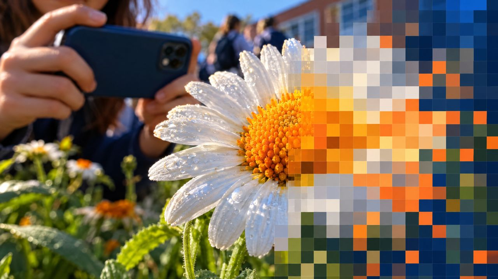
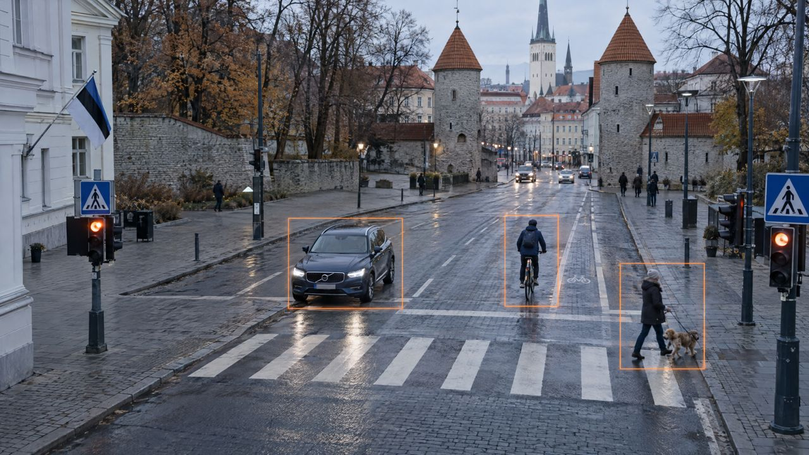

<!--
author:   Maia Lust
email:    
version:  2.3.0
language: et
narrator: Estonian Female
date:     08.10.2026
logo:     ../pildid/pae_logo.png
icon:     ../pildid/pae_logo.png
comment:  Tehisintellekti alused – gümnaasiumi valikkursus (35 tundi), Tallinna Pae Gümnaasium. Õppetekstid, interaktiivsed töölehed ja enesekontrollitestid.
link:     https://fonts.googleapis.com/css2?family=Nunito+Sans:wght@400;600;700&family=Poppins:wght@600;700&family=JetBrains+Mono:wght@400;600&display=swap

@style
/* ==== liascript-theming:start ==== */
/* links: https://fonts.googleapis.com/css2?family=Nunito+Sans:wght@400;600;700&family=Poppins:wght@600;700&family=JetBrains+Mono:wght@400;600&display=swap */
/* theme: Tallinna Pae Gümnaasium — generated by liascript-theming, edit theme.json and rebuild */
:root {
  --theme-font-body: 'Nunito Sans', sans-serif;
  --theme-font-heading: 'Poppins', serif;
  --theme-font-mono: 'JetBrains Mono', monospace;
  --theme-heading-weight: 700;
  --theme-line-height: 1.6;
  --global-font-size: 1.6rem;
  --theme-radius: 0.8rem;
  --theme-radius-small: 0.4rem;
  --theme-radius-large: 1.4rem;
  --theme-shadow: 0 0.3rem 1rem rgba(0,41,89,.10);
}
/* surfaces & text: apply to every color theme */
:root.lia-variant-light {
  --color-background: 255,255,255;
  --color-text: 29,36,51;
  --color-border: 228,229,231;
  --lia-grey-lighter: 238,242,247;
  --lia-grey-light: 204,212,222;
}
:root.lia-variant-dark {
  --color-background: 15,23,36;
  --color-text: 229,232,235;
  --color-border: 49,60,73;
  --lia-grey-dark: 30,38,47;
  --lia-anthracite: 41,50,61;
}
/* accent: only the course theme (default) and the custom radio,
   so readers can still pick LiaScript's built-in color themes */
:root:is(.lia-theme-default, .lia-theme-custom) {
  --color-highlight: 0,41,89;
  --color-highlight-dark: 0,41,89;
}
:root.lia-theme-default {
  --color-highlight-menu: 0,41,89;
}
:root:is(.lia-theme-default, .lia-theme-custom).lia-variant-dark {
  --color-highlight: 47,90,143;
  --color-highlight-dark: 255,185,143;
}
:root.lia-variant-light { --theme-heading-color: #002959; }
:root.lia-variant-dark { --theme-heading-color: #FFB98F; }
/* ==== LiaScript theme adapter (liascript-theming) — keep verbatim ====
   Maps the --theme-* tokens onto LiaScript's CSS. Everything a theme
   changes lives in the token block above this one. */

/* -- fonts: body/mono via the global variables, headings & co. are
      compiled literals in LiaScript and need explicit selectors -- */
:root {
  --global-font-family: var(--theme-font-body);
  --global-font-mono: var(--theme-font-mono);
  --global-font-headline: var(--theme-font-heading);
}
body { line-height: var(--theme-line-height, 1.47); }
h1, h2, h3, .h1, .h2, .h3 {
  font-family: var(--theme-font-heading);
  font-weight: var(--theme-heading-weight, 600);
  letter-spacing: var(--theme-heading-letter-spacing, normal);
  text-transform: var(--theme-heading-transform, none);
  color: var(--theme-heading-color, inherit);
}
h4, h5, h6, .h4, .h5, summary, .lia-accordion__headline {
  font-family: var(--theme-font-subheading, var(--theme-font-body));
}
.lia-quote__text { font-family: var(--theme-font-quote, var(--theme-font-heading)); }
.lia-code, .lia-code--inline, code, kbd, samp, pre { font-family: var(--theme-font-mono); }
.lia-code .ace_editor { font-family: var(--theme-font-mono) !important; }

/* -- shape: radius for controls & surfaces (radio buttons, tags, circles stay) -- */
:is(button, .lia-btn, input, .lia-input, select, .lia-select, textarea, .lia-textarea, .lia-dropdown):not(.lia-radio, .lia-btn--tag, .lia-btn--small-tag),
.lia-code-terminal__input, .lia-pagination__content, .lia-script, .lia-support-menu__submenu {
  border-radius: var(--theme-radius);
}
.lia-checkbox[type='checkbox'], kbd, .lia-tooltip .lia-tooltiptext, .lia-code--inline {
  border-radius: var(--theme-radius-small);
}
details, .lia-quote, .lia-code__input, .lia-table-responsive, .lia-card {
  border-radius: var(--theme-radius-large);
  box-shadow: var(--theme-shadow);
}
.lia-quote, .lia-code__input { overflow: hidden; }
.lia-code__input .ace_editor { border-radius: inherit; }
.lia-support-menu__submenu { box-shadow: var(--theme-shadow-popup, 0 0 1rem rgba(128, 128, 128, 0.2)); }

/* -- dark mode: LiaScript brightens the accent for text via
      rgb(from … calc(r*2.5)), which turns a hand-picked accent into
      pastel/yellow. For the course theme, text-like accent uses take
      --color-highlight-dark (= "accent as text") instead. Scoped to
      default/custom so the built-in color themes keep their behavior. -- */
:root:is(.lia-theme-default, .lia-theme-custom).lia-variant-dark :is(.lia-link, .lia-btn--outline, .lia-code--inline) {
  color: rgb(var(--color-highlight-dark));
  border-color: rgb(var(--color-highlight-dark));
}
:root:is(.lia-theme-default, .lia-theme-custom).lia-variant-dark :is(summary, summary:after, .lia-label, .lia-skip-nav, .lia-support-menu__item, .lia-quote__text),
:root:is(.lia-theme-default, .lia-theme-custom).lia-variant-dark :is(.lia-list--unordered, .lia-list--ordered) > li::marker {
  color: rgb(var(--color-highlight-dark));
}
:root:is(.lia-theme-default, .lia-theme-custom).lia-variant-dark :is(.lia-btn--transparent, .lia-input) {
  filter: none;
}
:root:is(.lia-theme-default, .lia-theme-custom).lia-variant-dark :is(.lia-input, .lia-checkbox[type='checkbox'], .lia-radio[type='radio']):not(:checked, .is-disabled, [disabled]) {
  border-color: rgb(var(--color-highlight-dark));
}
/* alternating table rows: LiaScript uses a neutral grey in dark mode */
:root.lia-variant-dark .lia-table.is-alternating .lia-table__row:nth-child(2n) td,
:root.lia-variant-dark .lia-table-responsive.has-thead-sticky.has-first-col-sticky .is-alternating .lia-table__row:nth-child(2n) td:first-child:before,
:root.lia-variant-dark .lia-table-responsive.has-thead-sticky.has-last-col-sticky .is-alternating .lia-table__row:nth-child(2n) td:last-child:before {
  background-color: rgb(var(--lia-grey-dark));
}
/* -- theme extras -- */
/* ===== Tallinna Pae Gümnaasiumi värvid =====
   tumesinine #002959 · oranž #FF8B48 · tumeoranž #E67E42 */
:root {
  --pae-sinine: #002959;
  --pae-sinine-80: #33547A;
  --pae-sinine-20: #CCD4DE;
  --pae-sinine-08: #EEF2F7;
  --pae-oranz: #FF8B48;
  --pae-oranz-tume: #E67E42;
  --pae-oranz-20: #FFE2D1;
  --pae-oranz-08: #FFF4EC;
  --pae-roheline: #2E8B57;
  --pae-roheline-08: #EAF6EF;
  --pae-lilla: #6B4FA0;
  --pae-lilla-08: #F2EEF9;
}

/* Pealkirjad */
.lia-slide h1, main h1 {
  color: var(--pae-sinine);
  border-bottom: 6px solid var(--pae-oranz);
  padding-bottom: .3em;
}
.lia-slide h2, main h2 { color: var(--pae-sinine); }
.lia-slide h3, main h3 {
  color: var(--pae-sinine);
  border-left: 8px solid var(--pae-oranz);
  padding-left: .5em;
}
.lia-slide h4, main h4 { color: var(--pae-oranz-tume); }
strong { color: inherit; }

/* Tabelid */
.lia-table th, table thead th {
  background: var(--pae-sinine) !important;
  color: #fff !important;
}
.lia-table tbody tr:nth-child(even), table tbody tr:nth-child(even) { background: var(--pae-sinine-08); }

/* Pildid ja infograafikud */
img.lia-image, .lia-figure img, main img {
  border-radius: 12px;
}
.lia-figure__caption, figcaption {
  color: var(--pae-sinine-80);
  font-style: italic;
  text-align: center;
}

/* ASCII-skeemid väiksemaks ja Pae värvidesse */
.lia-ascii svg, lia-ascii svg, .lia-code--ascii svg { max-width: 760px; margin: 0 auto; display: block; }
svg.lia-ascii text { fill: var(--pae-sinine); }

/* ===== Kujunduskastid ===== */
blockquote.pae-moiste, blockquote.pae-naide, blockquote.pae-eesti,
blockquote.pae-motle, blockquote.pae-lisaks, blockquote.pae-fakt,
.pae-moiste, .pae-naide, .pae-eesti, .pae-motle, .pae-lisaks, .pae-fakt {
  border-radius: 14px !important;
  padding: 1.1em 1.4em 1.1em 4.2em !important;
  margin: 1.4em 0 !important;
  position: relative;
  box-shadow: 0 3px 10px rgba(0,41,89,.10);
  font-style: normal !important;
  text-align: left !important;
}
.pae-moiste::before, .pae-naide::before, .pae-eesti::before,
.pae-motle::before, .pae-lisaks::before, .pae-fakt::before {
  position: absolute; left: .7em; top: .75em;
  width: 2em; height: 2em; line-height: 2em;
  border-radius: 50%; text-align: center; font-size: 1.15em;
  color: #fff; font-style: normal;
}
/* Mõiste – oranž */
.pae-moiste { background: var(--pae-oranz-08) !important; border: 2px solid var(--pae-oranz) !important; border-left: 10px solid var(--pae-oranz) !important; }
.pae-moiste::before { content: "📖"; background: var(--pae-oranz); }
/* Näide – tumesinine */
.pae-naide { background: var(--pae-sinine-08) !important; border: 2px solid var(--pae-sinine-20) !important; border-left: 10px solid var(--pae-sinine) !important; }
.pae-naide::before { content: "💡"; background: var(--pae-sinine); }
/* Eesti näide – sinine-valge */
.pae-eesti { background: linear-gradient(135deg, #E8F1FB 0%, #ffffff 100%) !important; border: 2px solid #0072CE !important; border-left: 10px solid #0072CE !important; }
.pae-eesti::before { content: "🇪🇪"; background: #0072CE; }
/* Mõtle järele – roheline */
.pae-motle { background: var(--pae-roheline-08) !important; border: 2px dashed var(--pae-roheline) !important; border-left: 10px solid var(--pae-roheline) !important; }
.pae-motle::before { content: "🤔"; background: var(--pae-roheline); }
/* Tea lisaks – lilla */
.pae-lisaks { background: var(--pae-lilla-08) !important; border: 2px solid #CDBFE6 !important; border-left: 10px solid var(--pae-lilla) !important; }
.pae-lisaks::before { content: "🔍"; background: var(--pae-lilla); }
/* Fakt – tume taust, valge tekst */
.pae-fakt { background: var(--pae-sinine) !important; color: #fff !important; border-left: 10px solid var(--pae-oranz) !important; }
.pae-fakt * { color: #fff !important; }
.pae-fakt::before { content: "⚡"; background: var(--pae-oranz); }

/* Töölehe jaotise riba */
.pae-jaotis { background: var(--pae-sinine); color: #fff !important; padding: .55em 1em; border-radius: 10px; margin: 2em 0 1em; border-left: 10px solid var(--pae-oranz); }
.pae-jaotis * { color: #fff !important; }

/* Ploki kaanepilt */
.pae-kaas img, img.pae-kaas { width: 100%; border-radius: 16px; box-shadow: 0 6px 20px rgba(0,41,89,.18); }

/* Näidisvastuse kokkupandav kast */
details {
  background: var(--pae-oranz-08);
  border: 1px solid var(--pae-oranz);
  border-radius: 10px; padding: .6em 1em; margin: .6em 0 1.4em;
}
details summary { cursor: pointer; font-weight: bold; color: var(--pae-oranz-tume); }

/* Menüü (sisukord) tumesinine */
.lia-toc a, .lia-toc .lia-toc__link, nav.lia-toc a { color: #002959 !important; }
.lia-toc a.lia-active, .lia-toc .lia-active { font-weight: 700; }
:root.lia-variant-dark .lia-toc a { color: #CCD4DE !important; }
:root.lia-variant-dark .pae-moiste, :root.lia-variant-dark .pae-naide, :root.lia-variant-dark .pae-eesti,
:root.lia-variant-dark .pae-motle, :root.lia-variant-dark .pae-lisaks { color: #1d2433 !important; }
:root.lia-variant-dark .pae-moiste *, :root.lia-variant-dark .pae-naide *, :root.lia-variant-dark .pae-eesti *,
:root.lia-variant-dark .pae-motle *, :root.lia-variant-dark .pae-lisaks * { color: #1d2433 !important; }
:root.lia-variant-dark img { background: #fff; }
/* ==== liascript-theming:end ==== */
/* Loosimisnupp (rollimäng) */
output.lia-script[input="submit"] { display:inline-block !important; background:#002959; color:#fff !important; font-weight:700; padding:.6em 1.2em; border-radius:999px; border:3px solid #FF8B48 !important; cursor:pointer; box-shadow:0 3px 10px rgba(0,41,89,.2); }
output.lia-script[input="submit"]:hover { background:#FF8B48; color:#002959 !important; }

/* Lihtsalt öeldes (ettelugemisega) */
section.pae-lihtne { background:#EAF6EE; border:2px solid #2E8B57; border-left:10px solid #2E8B57; border-radius:14px; padding:.9em 1.3em; margin:1.2em 0; font-size:1.05em; line-height:1.6; box-shadow:0 3px 10px rgba(0,41,89,.08); }
section.pae-lihtne p { margin:.5em 0; }
:root.lia-variant-dark section.pae-lihtne, :root.lia-variant-dark section.pae-lihtne * { color:#1d2433 !important; }

/* Sõnastiku hüpikselgitus */
.pae-term { border-bottom:2px dotted #FF8B48; cursor:help; position:relative; outline:none; }
.pae-term:hover::after, .pae-term:focus::after {
  content: attr(data-def); position:absolute; left:0; top:1.7em; z-index:999;
  width:max-content; max-width:min(320px, 80vw); white-space:normal;
  background:#002959; color:#fff; padding:.55em .8em; border-radius:10px;
  font-size:15px; line-height:1.45; font-weight:400; font-style:normal;
  box-shadow:0 6px 18px rgba(0,41,89,.3); border-left:5px solid #FF8B48;
}
.pae-fakt .pae-term:hover::after, .pae-fakt .pae-term:focus::after { color:#fff !important; }

@end

@custom
--color-highlight-menu: 255,255,255;
@end
-->

# Plokk 5. Pilditöötlus ja arvutinägemine

<!-- class="pae-kaas" -->

<!-- class="pae-fakt" -->
> <!-- style="width: 120px; float: left; margin: 0 16px 8px 0; border-radius: 0;" --> **🗝️ Tuba 5: Vaatlustorn**
>
> Päästemeeskond ronib mööda keerdtreppi kooli Vaatlustorni. Siit peaks Kratt nägema kogu kooli, kuid tema silmade ees on ainult ruudukesed ja arvud. „Ma näen 6 220 800 arvu, aga mitte ühtegi nägu! Kas see oranž ruut on direktor või apelsin?“ Teie ülesanne on õpetada Kratile uuesti, kuidas pikslitest saab pilt, pildist tähendus ja kuidas eristada ehtsat pilti võltsingust. Selles toas on 5 lukku – iga tunni lõpus üks. Iga avatud lukk annab ühe võtmetähe. Kirjuta tähed üles!

Iga päev puutud kokku tehisintellektiga (TI), mis „vaatab“ pilte. Nutitelefon avaneb, kui vaatad ekraani. Fotogalerii rühmitab pildid inimeste järgi. Sotsiaalmeedia filter paneb sulle koerakõrvad pähe ja need liiguvad koos sinu peaga. Tallinna ja Tartu tänavatel sõitvad Starshipi kullerrobotid leiavad tee jalakäijate ja autode vahel. Kõigi nende taga on **arvutinägemine** – tehisintellekti valdkond, mis õpetab arvuteid pilte ja videoid analüüsima ning mõistma.

Selles plokis uurid, kuidas arvuti pildist üldse midagi „näeb“, kui tema jaoks on pilt lihtsalt suur arvude tabel. Saad teada, kuidas leitakse pildilt objekte ja nägusid, kuidas TI aitab arstidel röntgen- ja MRT-pilte lugeda ning kuidas generatiivne TI loob täiesti uusi pilte vaid mõne lause põhjal. Ploki lõpus vaatame tehnoloogia varjukülge: süvavõltsinguid ehk deepfake'e. Õpid neid ära tundma ja saad teada, mida tohib ja mida ei tohi teiste inimeste piltidega teha. See teadmine on tänapäeval sama vajalik kui oskus liikluses ohutult liigelda.

**Selles plokis:**

- 5.1 Kuidas tehisintellekt näeb pilte
- 5.2 Objekti- ja näotuvastus
- 5.3 Meditsiiniline pildianalüüs
- 5.4 Generatiivne tehisintellekt ja loovus
- 5.5 Süvavõltsingud ja pildimanipulatsioon
- Ploki kordamine: praktilised ülesanded, arutelu ja ploki enesekontrolltest

<!-- class="pae-motle" -->
> **Mõtle järele!**
>
> - Mitu korda täna oled kasutanud mõnda rakendust, mis „vaatab“ pilti või videot (telefoni avamine, filtrid, QR-kood, Google Lens, fotogalerii otsing)?
> - Kas oled kunagi näinud pilti või videot, mille puhul sa ei olnud kindel, kas see on päris või võlts? Mis tekitas kahtlust?
> - Mille poolest erineb sinu arvates see, kuidas sina näed oma sõbra nägu, sellest, kuidas telefon seda „näeb“?

## 5.1 Kuidas tehisintellekt näeb pilte

<!-- class="pae-kaas" -->

### Õpieesmärgid

Selle tunni järel sa:

- **selgitad oma sõnadega**, mille poolest erineb arvutinägemine inimese nägemisest *(mõistmine)*;
- **tood** oma igapäevaelust näiteid, kus arvutinägemine sind aitab või jälgib *(mõistmine)*;
- **arvutad**, mitu arvu (RGB-väärtust) kirjeldab värvilist pilti arvuti jaoks *(rakendamine)*;
- **võrdled** konvolutsioonilist närvivõrku (CNN) traditsiooniliste arvutinägemise meetoditega ja tood välja ühe eelise ja ühe puuduse *(analüüs)*;
- **katsetad**, milliste tunnuste järgi närvivõrk sinu joonistuse ära tunneb, ja **hindad**, millal ja miks see eksib *(hindamine)*.

<!-- class="pae-fakt" -->
> **🎯 Tunni tuumik (45 min)**
>
> 🔑 **Tuummõisted:** arvutinägemine, piksel, RGB, CNN. Teised mõisted on süvendamiseks.
>
> 🏠 **Kodus enne tundi** (~10 min): loe või vaata „Pildist tähenduseni: eeltöötlus, tunnused ja tõlgendamine“. Soovi korral ka „Arvutinägemise ülesanded ja rakendused“, „Väljakutsed ja tulevik“. Too tundi kaasa üks uus teadmine või küsimus.
>
> 0. 💬 **Tunni algus** (~3 min): jaga paarilisega kodus loetust üht mõtet; vaata õpetaja tagasisidet eelmisele piletile ja paranda vajadusel oma vastust.
> 1. 📚 **Loe** (~10 min): „Mis on arvutinägemine?“, „Pilt arvuti silmis: pikslid ja RGB“, „Konvolutsioonilised närvivõrgud (CNN)“ ja „Kokkuvõte ja põhimõisted“
> 2. 🧪 **TI-katse** (~10 min): „Kas närvivõrk tunneb su joonistuse ära?“
> 3. ⭐ **Tööleht** (~12 min): ülesanded II, VII ja VIII
> 4. 📤 **Väljapääsupilet** ja 🔐 **lukk** (~7 min)
> 5. ⏱️ **Puhver** (~3 min): üleminekud, küsimused ja tehnilised tõrked. Kui aeg jääb napiks, lahenda lukk kodus.
>
> **🏠** tähistab osi, mida loed või vaatad **kodus enne tundi** (ümberpööratud klassiruum). **➕** tähistab lisaülesannet – tee seda, kui jõuad, või kui tahad rohkem teada.

{{|>}}
<section class="pae-lihtne">

**🟢 Lihtsalt öeldes**

Arvuti ei näe pilti samamoodi nagu sina. Arvuti jaoks on pilt lihtsalt suur tabel, mis on täis arve. Iga väike ühevärviline punkt pildil on **piksel**. Värvilise piksli värvi kirjeldab kolm arvu: punane, roheline ja sinine. **Arvutinägemine** aitab arvutil pilte ja videoid mõista. Selleks kasutatakse sageli närvivõrku, mille nimi on **CNN**. CNN õpib tuhandete piltide põhjal ja leiab kõigepealt servi ja jooni. Hiljem tunneb see ära kujundeid ja objekti osi, näiteks kassi silmi.

**Tähtsad sõnad:** **arvutinägemine** – arvuti oskus pilte ja videoid mõista; **piksel** – pildi kõige väiksem ühevärviline punkt; **RGB** – punane, roheline ja sinine, neist kolmest tekib piksli värv; **CNN** – närvivõrk, mis õpib pildilt ise tunnuseid leidma.

</section>

### Mis on arvutinägemine?

Kui vaatad klassiaknast välja, näed hetkega puid, autosid ja inimesi. Sa ei pea mõtlema, mis on mis – aju teeb selle töö sinu eest ära. Arvuti jaoks on sama ülesanne aga tohutult keeruline.

<!-- class="pae-moiste" -->
> **Mõiste: arvutinägemine**
>
> Arvutinägemine (computer vision) on tehisintellekti valdkond, mis võimaldab arvutitel „näha“ ehk analüüsida, tõlgendada ja mõista digitaalseid pilte ja videoid.

Arvutinägemise loojad on saanud inspiratsiooni inimese nägemissüsteemist. Inimese **silma** asemel on kaamera, mis püüab valgust. Aju **nägemiskoore** asemel on pilditöötluse algoritmid. Inimese **tajumise ja tõlgendamise** asemel on mudel, mis otsustab, mis pildil on. Sarnasus on siiski pinnapealne. Inimene mõistab pilti tervikuna ja seob selle oma kogemustega. Arvuti peab aga kõik õppima näidete põhjal.

Arvutinägemise kolm suurt väljakutset on **keerukus** (päris maailm on täis detaile), **varieeruvus** (sama kass võib olla pildil eest, küljelt, päikese käes või pimedas) ja **kontekst** (punane ring võib olla liiklusmärk, õun või pall).

Arvutinägemisel on pikk ajalugu:

| Aeg | Mis toimus |
|---|---|
| 1960. aastad | Esimesed katsed, lihtne pildianalüüs |
| 1970.–1980. aastad | Geomeetrilised lähenemised, servade tuvastamine |
| 1990.–2000. aastad | Statistilised meetodid, tunnuste eraldamine |
| 2010. aastatest tänapäevani | Süvaõppe revolutsioon: 2012. aastal tegi läbimurde närvivõrk AlexNet; tulid objektituvastuse (YOLO, SSD, Faster R-CNN) ja segmenteerimise võrgud (U-Net, Mask R-CNN) ning generatiivsed mudelid (GAN-id, difusioonimudelid) |

<!-- class="pae-fakt" -->
> **Kas teadsid?** 2012. aastal tegi närvivõrk **AlexNet** arvutinägemises läbimurde. Sellest sai alguse süvaõppe revolutsioon, mis muutis arvutinägemise tänapäevaseks.

### Pilt arvuti silmis: pikslid ja RGB

Arvuti ei näe pildil kassi ega puud. Tema jaoks on iga digitaalne pilt **arvude tabel ehk maatriks**. Selle tabeli iga lahter on **piksel** – pildi väikseim punkt.

<!-- class="pae-moiste" -->
> **Mõiste: piksel ja resolutsioon**
>
> **Piksel** on digitaalse pildi väikseim osa, millel on üks kindel värv. **Resolutsioon** näitab, mitu pikslit on pildil laiuses ja kõrguses, nt 1920 × 1080.

Vaatame väga väikest, 5 × 5 piksli suurust mustvalget pilti. Mustvalges (halltoonides) pildis on igal pikslil üks arv vahemikus 0–255: **0 tähendab musta**, **255 valget** ja vahepealsed arvud hallitoone.

Sina tunned naerunäo kohe ära. Arvuti näeb ainult 25 arvu. Et neist arvudest „naerunägu“ välja lugeda, peab ta õppima, millised arvumustrid tähendavad silmi ja suud.

Värvilises pildis on asi veel keerulisem. Iga piksli värv pannakse kokku kolmest põhivärvist: **punane (Red), roheline (Green) ja sinine (Blue)** – lühendina **RGB**. Iga **värvikanal** on samuti arv vahemikus 0–255. Seega kirjeldab ühte värvilist pikslit kolm arvu.

Arvuti hoiab sellist pilti tegelikult kolme kihina: üks tabel punase, üks rohelise ja üks sinise kanali jaoks.

<!-- data-type="barchart" data-title="Näide: Pae Gümnaasiumi logo oranži piksli värvikanalid" -->
| Kanal | Väärtus |
|-------|--------:|
| Punane (R) | 255 |
| Roheline (G) | 139 |
| Sinine (B) | 72 |

<!-- class="pae-naide" -->
> **Näide: kui palju arve on ühes fotos?**
>
> Täis-HD pildil on 1920 × 1080 = 2 073 600 pikslit. Kuna igal pikslil on kolm värviväärtust, koosneb üks selline pilt arvuti jaoks 6 220 800 arvust. Video puhul on selliseid pilte ehk kaadreid igas sekundis kümneid. Pole ime, et arvutinägemine vajab palju arvutusvõimsust!

### 🏠 Pildist tähenduseni: eeltöötlus, tunnused ja tõlgendamine

Kuidas jõuab arvuti miljonitest arvudest vastuseni „pildil on koer“? Protsessi võib jagada neljaks sammuks.

**Eeltöötlus** (preprocessing) valmistab pildi analüüsiks ette. Pildi **suurust muudetakse**, sest mudel ootab kindla suurusega sisendit. **Normaliseerimine** viib arvud ühtlasesse vahemikku (nt 0–255 asemel 0–1). **Müra eemaldamine** puhastab pildi juhuslikest täppidest ja **kontrasti parandamine** muudab heledad ja tumedad alad paremini eristatavaks. Eeltöötlus on oluline, sest see muudab pildid mudelile sobivaks ja parandab tuvastamise täpsust. Võrdle: ka sina loed paremini, kui tekst on selge ja piisavalt suur.

**Tunnuste eraldamine** tähendab pildi oluliste omaduste ja mustrite leidmist. Sellised tunnused on näiteks **servad ja nurgad**, **tekstuur ja värvid** ning **kuju ja struktuur**.

**Tõlgendamine** on viimane samm, kus mudel otsustab, mida pilt tähendab. Ta võib pildi **klassifitseerida** (liigitada kategooriasse), objekti **lokaliseerida** (leida selle asukoha) või pildi **segmenteerida** (jagada osadeks).

Enne süvaõpet kasutati **traditsioonilisi meetodeid**, kus inimesed pidid ise välja mõtlema, milliseid tunnuseid otsida:

- **Servade tuvastamine** – näiteks **Sobeli filter** ja **Canny meetod** leiavad kohad, kus pildi heledus järsult muutub.
- **Tunnuste eraldamine** – **SIFT** ja **HOG** kirjeldavad pildi kohti nii, et neid saab ära tunda ka siis, kui pilt on suurendatud või pööratud.
- **Mustrite tuvastamine** – **mallipõhine sobitamine** (otsitakse pildilt etteantud mustrit) ja **Hough'i teisendus** (leitakse sirgeid ja ringe).
- **Masinõppe meetodid** – tunnuste põhjal otsustasid näiteks **SVM** (tugivektormasin), **otsustusmetsad (Random Forest)** ja **AdaBoost**.

Servade tuvastamise ideed on lihtne näha. Sobeli filter on väike 3 × 3 arvutabel, mida libistatakse üle pildi. Igas kohas korrutatakse filtri arvud all olevate pikslite väärtustega ja liidetakse kokku.

### Konvolutsioonilised närvivõrgud (CNN)

Traditsiooniliste meetodite suur puudus oli see, et tunnused pidi inimene käsitsi välja mõtlema. Süvaõppe revolutsioon muutis selle. **Konvolutsioonilised närvivõrgud** õpivad ise, milliseid tunnuseid on vaja otsida.

<!-- class="pae-moiste" -->
> **Mõiste: konvolutsiooniline närvivõrk (CNN)**
>
> Konvolutsiooniline närvivõrk (Convolutional Neural Network, CNN) on piltide töötlemisele spetsialiseerunud närvivõrk. See libistab üle pildi väikeseid filtreid ja õpib treenimise käigus ise, milliseid tunnuseid on vaja otsida.

CNN-i inspiratsiooniks on aju nägemiskoor, kus närvirakud reageerivad eri mustritele. CNN õpib tunnuseid **hierarhiliselt** ehk astmeliselt. Esimesed kihid leiavad lihtsaid asju nagu servad ja jooned. Järgmised kihid panevad need kokku kujunditeks ja tekstuurideks. Sügavamad kihid tunnevad ära juba terveid objekti osi, näiteks silmi või rattaid.

CNN-i põhikomponendid on järgmised.

- **Konvolutsioonikiht** libistab üle pildi palju väikeseid filtreid (nagu eespool Sobeli filter). Iga filter otsib üht mustrit. Erinevalt Sobeli filtrist ei kirjuta filtrite arve inimene, vaid võrk õpib need ise.
- **Aktivatsioonifunktsioon** otsustab iga arvutuse järel, kui tugevalt signaal edasi läheb. Näiteks jätab levinud funktsioon ReLU positiivsed väärtused alles ja muudab negatiivsed nulliks. Tänu sellele suudab võrk õppida keerulisi, mittelineaarseid seoseid.
- **Pooling-kiht (koondamiskiht)** vähendab andmete hulka. Näiteks võetakse igast 2 × 2 ruudust ainult suurim väärtus. Pilt muutub väiksemaks, aga olulisim info jääb alles.
- **Täielikult ühendatud kiht** paneb lõpus kõik leitud tunnused kokku ja teeb otsuse, näiteks: „kass – väga tõenäoline, koer – vähe tõenäoline“.

Kuidas CNN õpib? Võrgule näidatakse tuhandeid **märgendatud pilte** (pildi juures on õige vastus, nt „kass“). Iga kord, kui võrk eksib, muudetakse veidi tema filtrite arve, et järgmine kord oleks vastus parem. Pärast väga paljusid kordusi on filtrid õppinud leidma just neid tunnuseid, mis aitavad kasse koertest eristada.

CNN-i **eelised** on automaatne tunnuste õppimine, ruumiline hierarhia (väikestest detailidest suurte osadeni) ja see, et objekt tuntakse ära ka siis, kui see on pildil nihkunud. Tuntud CNN-arhitektuurid on **LeNet, AlexNet, VGG, ResNet ja Inception**.

<!-- class="pae-lisaks" -->
> **Tea lisaks**
>
> Traditsiooniliste ja süvaõppel põhinevate meetodite erinevus on umbes nagu retseptiraamatu ja kogenud koka erinevus. Traditsiooniline meetod järgib täpselt inimese kirjutatud juhiseid („otsi servi, siis ringe“). Süvaõppe mudel on õppinud tuhandete näidete põhjal ise. Selleks vajab ta aga palju andmeid ja arvutusvõimsust ning tema otsuseid on raskem selgitada.

### 🧪 TI-katse: kas närvivõrk tunneb su joonistuse ära?

🛡️ *Ohutuskaardi reeglid kehtivad: ära logi sisse, ära sisesta isikuandmeid ega pildista inimesi.*

Mängus Quick, Draw! püüab närvivõrk ära arvata, mida sa joonistad. See on õppinud miljonite inimeste joonistuste põhjal – täpselt nii, nagu CNN õpib tunnuseid näidete põhjal. Katsetad, milliste tunnuste järgi võrk otsustab ja millal ta eksib.

**Vaja läheb:** [Quick, Draw!](https://quickdraw.withgoogle.com/) (tasuta, sisselogimist pole vaja), ~10 min, paaristöö

1. Ava Quick, Draw! ja mängi üks voor. Iga joonistuse jaoks on 20 sekundit.
2. Pinginaaber paneb kirja, kas ja kui ruttu närvivõrk iga joonistuse ära arvas.
3. Mängi teine voor ja muuda teadlikult üht tunnust: jäta oluline osa ära (nt kassil kõrvad), joonista objekt ebatavalise nurga alt või väga väikselt lehe nurka.
4. Vaata vooru lõpus kokkuvõtet ja võrdle: millised joonistused tundis võrk ära ja millised mitte?

**Pane tähele / kirjuta üles:** Milliste tunnuste järgi (kuju, olulised detailid, suurus) võrk sinu arvates otsustas? Millise muudatuse peale ta eksis? Mida see ütleb selle kohta, kuidas närvivõrk tunnuseid õpib?

[[___ ___ ___]]

<!-- class="pae-lisaks" -->
> **Kui arvutit pole:** joonista ruutpaberile 8 × 8 ruudust koosnev lihtne kujund ja kirjuta igasse ruutu 0 (must) või 255 (valge). Pinginaaber peab ainult arvude järgi ära arvama, mis kujund see on – nii „näeb“ pilti arvuti.

### 🏠 Arvutinägemise ülesanded ja rakendused

Arvutinägemisega lahendatakse mitut eri tüüpi ülesandeid.

| Ülesanne | Küsimus | Näide |
|---|---|---|
| **Klassifitseerimine** | Mis on pildil? | Kas pildil on kass või koer? |
| **Objektituvastus** | Mis ja kus pildil on? | Kõigi pildil olevate inimeste leidmine |
| **Segmenteerimine** | Millisesse klassi kuulub iga piksel? | Iga piksel liigitatakse: taevas, tee, auto |
| **Jälgimine** | Kuhu objekt liigub? | Inimeste liikumise jälgimine turvakaamera videos |

<!-- class="pae-moiste" -->
> **Mõiste: segmenteerimine**
>
> Segmenteerimine on pildi jagamine tähenduslikeks piirkondadeks või objektideks **pikslitäpsusega**. **Semantiline segmenteerimine** määrab iga piksli klassi (nt kõik autode pikslid on „auto“). **Instantsi segmenteerimine** eristab ka sama klassi eri objekte (auto 1, auto 2). **Panoptiline segmenteerimine** ühendab mõlemad. Tuntud arhitektuurid on U-Net, DeepLab ja Mask R-CNN.

Lisaks neile on veel kaks huvitavat ülesannet. **Poosi tuvastamine** leiab inimese liigesed ja paneb neist kokku „skeleti“ (nt OpenPose, DensePose, HRNet). Seda kasutatakse spordis liikumise analüüsiks, animatsioonis ja virtuaalreaalsuses. **Sügavuse hindamine** püüab tasasest 2D-pildist välja lugeda, kui kaugel asjad on. Selleks kasutatakse kahte kaamerat (nagu inimesel kaks silma), ühte pilti või kaamera liikumist. Sügavust on vaja robotitel, liitreaalsuses ja isesõitvatel autodel.

Arvutinägemist kasutatakse paljudes valdkondades:

- **isesõitvad sõidukid** tajuvad keskkonda, tuvastavad objekte ja planeerivad teekonda;
- **meditsiinis** aidatakse diagnoosida haigusi, piiritleda elundeid ja planeerida operatsioone;
- **tööstuses** kontrollitakse toodete kvaliteeti ja juhitakse roboteid;
- **jaekaubanduses** on loodud kassata poode ja jälgitakse kaubavarusid;
- **põllumajanduses** hinnatakse droonipiltide põhjal taimede seisundit ja haigusi.

<!-- class="pae-eesti" -->
> **Eesti näide: Starship Technologies ja Veriff**
>
> Eesti juurtega Starship Technologies on loonud isesõitvad kullerrobotid, mis kasutavad tehisintellekti ja arvutinägemist, et linnatänavatel navigeerida ning pakke ja toitu kohale toimetada. Robot peab ära tundma kõnniteed, ülekäiguraja, jalakäijad ja takistused. Teine Eesti ettevõte Veriff kasutab arvutinägemist inimese isikusamasuse tuvastamiseks: süsteem võrdleb isikut tõendavat dokumenti ja inimese näopilti. Arvutinägemist uuritakse Eestis ka Tartu Ülikoolis ja Tallinna Tehnikaülikoolis; kasutusalade hulgas on liikluse jälgimine, põllumajanduse seire ja meditsiiniline pildianalüüs.

### 🏠 Väljakutsed ja tulevik

Kuigi arvutinägemine on viimase kümnendiga palju arenenud, on sellel endiselt mitmeid väljakutseid.

- **Varieeruvus.** Valgustus, vaatenurk, segane taust ja **oklusioon** (objekt on osaliselt varjatud) muudavad pildi arvuti jaoks palju keerulisemaks. Eestis lisanduvad kohalikud tingimused: pime talv, lumi, udu ja vihm.
- **Andmete vajadus.** Mudelid vajavad väga palju märgendatud andmeid ning nende kogumine ja märgendamine on kallis.
- **Arvutusressursid.** Keerukad mudelid vajavad võimsaid graafikaprotsessoreid (GPU), aga nutitelefoni võimsus on piiratud.
- **Robustsus ehk töökindlus.** Vaenulikud näited (adversarial examples) on pildid, mida on inimsilmale märkamatult muudetud nii, et mudel eksib. Probleeme tekitavad ka **domeeninihked**: mudel, mida on treenitud päikesepaisteliste California piltidega, võib Eesti talvel hätta jääda.

<!-- class="pae-motle" -->
> **Mõtle järele!**
>
> - Miks võib isesõitvale autole olla keerulisem sõita Eesti novembrikuu õhtul kui suvisel pärastlõunal?
> - Too näide olukorrast, kus sina tunned objekti kergesti ära, aga arvutil võib olla raske (nt osaliselt varjatud või ebatavalise nurga alt pildistatud asi).
> - Millised arvutinägemise rakendused võiksid tuua Eestis kõige rohkem kasu? Kuidas tasakaalustada nende võimalusi ja privaatsust?

Tulevikus liigub arvutinägemine **multimodaalsete süsteemide** poole, mis ühendavad pildi, teksti, heli ja 3D-andmed. Arendatakse **vähem andmeid vajavaid mudeleid**: näiteks õpitakse väheste näidete põhjal (few-shot learning), õpitakse ilma märgenditeta (self-supervised learning) ja kasutatakse juba treenitud mudelite teadmisi uues ülesandes (transfer learning). Mudelid muutuvad **väiksemaks, kiiremaks ja energiatõhusamaks** ning neid saab käitada otse telefonis. Üha olulisem on ka **inimese ja arvuti koostöö**: mudelid peavad oskama oma otsuseid selgitada ja kasutaja tagasisidest õppida.

### Kokkuvõte ja põhimõisted

**Pea meeles**

- Arvutinägemine on TI valdkond, mis võimaldab arvutitel pilte ja videoid analüüsida ning mõista.
- Arvuti jaoks on pilt pikslite maatriks: igal pikslil on värviväärtus(ed) vahemikus 0–255, värvilisel pildil kolm kanalit (R, G, B).
- Pilditöötlus käib sammudena: eeltöötlus → tunnuste eraldamine → tõlgendamine.
- Konvolutsioonilised närvivõrgud õpivad tunnused ise, lihtsatest (servad) keerukateni (objekti osad), ja on arvutinägemise revolutsiooniliselt muutnud.
- Põhiülesanded on klassifitseerimine, objektituvastus, segmenteerimine ja jälgimine.
- Väljakutsed on varieeruvus, andmete vajadus, arvutusvõimsus ja töökindlus.

| Mõiste | Tähendus |
|---|---|
| Arvutinägemine | TI valdkond, mis võimaldab arvutil pilte ja videoid analüüsida ja mõista |
| Piksel | Digitaalse pildi väikseim ühevärviline punkt |
| RGB | Värvimudel, kus iga piksli värv on kokku pandud punasest, rohelisest ja sinisest (igaüks 0–255) |
| Eeltöötlus | Pildi ettevalmistamine analüüsiks (suurus, normaliseerimine, müra, kontrast) |
| Tunnuste eraldamine | Pildi oluliste omaduste (servad, tekstuur, kuju) leidmine |
| Konvolutsiooniline närvivõrk (CNN) | Piltide töötlemisele spetsialiseerunud närvivõrk, mis õpib tunnused ise |
| Pooling-kiht | CNN-i kiht, mis vähendab andmete hulka, jättes alles olulisima |
| Segmenteerimine | Pildi jagamine tähenduslikeks piirkondadeks pikslitäpsusega |
| Oklusioon | Olukord, kus objekt on pildil osaliselt varjatud |

### 📚 Allikad ja lisalugemine

- Krizhevsky, A., Sutskever, I., Hinton, G. E. (2012). [ImageNet Classification with Deep Convolutional Neural Networks](https://papers.nips.cc/paper/2012/hash/c399862d3b9d6b76c8436e924a68c45b-Abstract.html). AlexNeti originaalartikkel: võrk õppis 1,3 miljoni pildi põhjal ja vähendas pildituvastuse vigu märgatavalt.
- Wang, Z. J. jt (2020). [CNN Explainer](https://poloclub.github.io/cnn-explainer/). Interaktiivne tööriist, kus saad brauseris samm-sammult vaadata, mida teevad konvolutsioonikiht, ReLU ja pooling-kiht (inglise keeles, sobib lisalugemiseks).
- Google (s.a.). [Quick, Draw! andmestik](https://quickdraw.withgoogle.com/data). Umbes 50 miljonit mängijate joonistust, mille põhjal närvivõrk õppis – saad sirvida, kuidas inimesed sama asja eri moodi joonistavad.
- Wang, Z. J. jt (2020). [CNN Explainer: Learning Convolutional Neural Networks with Interactive Visualization](https://arxiv.org/abs/2004.15004v3). Teadusartikkel, mis selgitab, kuidas CNN-i tööd algajale näitlikustada.
- Starship Technologies (s.a.). [Company](https://www.starship.xyz/company/). Ettevõtte tutvustus: robotid kasutavad liiklemiseks kaameraid, radarit, andureid ja masinõpet.
- Invest in Estonia (s.a.). [Veriff builds trust on the internet](https://investinestonia.com/veriff-builds-trust-on-the-internet/). Lugu Eesti ettevõttest Veriff, mis võrdleb isikut tõendava dokumendi fotot ja inimese nägu.

### Tööleht 5.1

<!-- class="pae-lisaks" -->
> **⭐ Tuumikülesannete hindamine (2–1–0 p):** **mõiste täpsus** – kasutad õiget mõistet õiges tähenduses; **tõend** – toetud katsetulemusele, näitele või allikale; **põhjendus** – selgitad, miks see nii on. ➕ ülesanded on vabatahtlikud.

<!-- class="pae-jaotis" -->
**➕ I. Arvutinägemise põhimõisted**

**Ülesanne 1.** Selgita oma sõnadega, mis on arvutinägemine.

[[___ ___ ___]]

**Ülesanne 2.** Ühenda arvutinägemisega seotud mõisted nende definitsioonidega.

| Täht | Kirjeldus |
|:---:|---|
| **A** | Pildi jagamine tähenduslikeks osadeks või piirkondadeks |
| **B** | Piltide liigitamine kategooriatesse |
| **C** | Pildi muutmine või parandamine |
| **D** | Pildil olevate objektide tuvastamine ja klassifitseerimine |
| **E** | Pildi oluliste omaduste või mustrite tuvastamine |

- [ (A) (B) (C) (D) (E) ]
- [ ( ) ( ) (X) ( ) ( ) ] Pilditöötlus
- [ ( ) ( ) ( ) (X) ( ) ] Objektituvastus
- [ (X) ( ) ( ) ( ) ( ) ] Segmenteerimine
- [ ( ) ( ) ( ) ( ) (X) ] Tunnuste eraldamine
- [ ( ) (X) ( ) ( ) ( ) ] Klassifitseerimine
****************************************
Pilditöötlus muudab või parandab pilti (C). Objektituvastus leiab objektid ja määrab nende klassi (D). Segmenteerimine jagab pildi piirkondadeks (A). Tunnuste eraldamine leiab olulised mustrid, nt servad (E). Klassifitseerimine liigitab terve pildi kategooriasse (B).
****************************************

<!-- class="pae-jaotis" -->
**⭐ II. Kuidas tehisintellekt „näeb“**

**Ülesanne 3.** Kirjelda, kuidas tehisintellekt töötleb pilte võrreldes inimese nägemisega.

[[___ ___ ___ ___]]

**Ülesanne 4.** Selgita pinginaabrile, kuidas arvuti sinu telefoniga tehtud fotot „näeb“. Kasuta sõnu piksel, RGB ja resolutsioon ning arvuta, mitu arvu kirjeldab värvilist fotot suurusega 4000 × 3000 pikslit.

[[___ ___ ___ ___]]

**Ülesanne 5.** Koosta lihtne skeem, kuidas tehisintellekt töötleb pilti. Kirjuta sammud järjest ja ühenda need nooltega (nt „pilt → … → …“).

[[___ ___ ___ ___]]

<!-- class="pae-jaotis" -->
**➕ III. Arvutinägemise põhitehnikad**

**Ülesanne 6.** Kirjelda lühidalt järgmisi arvutinägemise tehnikaid.

a) Pildi eeltöötlus:

[[___ ___]]

b) Servade tuvastamine:

[[___ ___]]

c) Tunnuste eraldamine:

[[___ ___]]

d) Objektituvastus:

[[___ ___]]

e) Segmenteerimine:

[[___ ___]]

**Ülesanne 7.** Võrdle traditsioonilisi arvutinägemise meetodeid ja süvaõppel põhinevaid meetodeid.

| Aspekt | Traditsioonilised meetodid | Süvaõppel põhinevad meetodid |
|---|---|---|
| Tööpõhimõte | | |
| Andmevajadus | | |
| Täpsus | | |
| Arvutusvõimsuse vajadus | | |
| Näited rakendustest | | |

Kirjuta iga rea kohta mõlema meetodi omadus.

**Tööpõhimõte:**

[[___ ___]]

**Andmevajadus:**

[[___ ___]]

**Täpsus:**

[[___ ___]]

**Arvutusvõimsuse vajadus:**

[[___ ___]]

**Näited rakendustest:**

[[___ ___]]

<!-- class="pae-jaotis" -->
**➕ IV. Konvolutsioonilised närvivõrgud (CNN)**

**Ülesanne 8.** Selgita oma sõnadega, mis on konvolutsiooniline närvivõrk.

[[___ ___ ___]]

**Ülesanne 9.** Kirjelda konvolutsioonilise närvivõrgu põhikomponente.

a) Konvolutsioonikiht:

[[___ ___]]

b) Aktivatsioonifunktsioon:

[[___ ___]]

c) Pooling-kiht:

[[___ ___]]

d) Täielikult ühendatud kiht:

[[___ ___]]

**Ülesanne 10.** Kuidas õpib konvolutsiooniline närvivõrk pilte tuvastama?

[[___ ___ ___ ___]]

<!-- class="pae-jaotis" -->
**➕ V. Arvutinägemise rakendused**

**Ülesanne 11.** Täida tabel arvutinägemise rakenduste kohta erinevates valdkondades.

| Valdkond | Rakenduse näide | Kuidas see töötab? | Miks see on kasulik? |
|---|---|---|---|
| Meditsiin | | | |
| Transport | | | |
| Tootmine | | | |
| Põllumajandus | | | |
| Turvalisus | | | |

Kirjuta iga valdkonna kohta rakenduse näide, selle tööpõhimõte ja kasu.

**Meditsiin:**

[[___ ___ ___]]

**Transport:**

[[___ ___ ___]]

**Tootmine:**

[[___ ___ ___]]

**Põllumajandus:**

[[___ ___ ___]]

**Turvalisus:**

[[___ ___ ___]]

**Ülesanne 12.** Vali üks arvutinägemise rakendus ja kirjelda seda põhjalikumalt.

[[___ ___ ___ ___ ___]]

<!-- class="pae-jaotis" -->
**➕ VI. Praktiline ülesanne**

**Ülesanne 13.** Vali üks järgmistest praktilistest ülesannetest.

**Variant A: Piltide klassifitseerimise analüüs.** Vali mõni piltide klassifitseerimise rakendus (nt [Google Lens](https://lens.google.com/) või mõni muu piltide äratundmise rakendus) ja testi seda.

a) Valitud rakendus:

[[___]]

b) Milliste piltidega seda testisid?

[[___ ___]]

c) Kui täpselt rakendus pilte klassifitseeris?

[[___ ___ ___]]

d) Millised olid peamised vead või probleemid?

[[___ ___ ___]]

**Variant B: Arvutinägemise rakenduse kavandamine.** Kavanda lihtne arvutinägemise rakendus, mis lahendaks mõnda igapäevaelu probleemi.

a) Probleem, mida rakendus lahendaks:

[[___ ___]]

b) Kuidas rakendus töötaks?

[[___ ___ ___]]

c) Milliseid andmeid oleks vaja rakenduse treenimiseks?

[[___ ___]]

d) Millised võiksid olla rakenduse piirangud või väljakutsed?

[[___ ___ ___]]

<!-- class="pae-jaotis" -->
**⭐ VII. Arvutinägemise väljakutsed**

**Ülesanne 14.** Kooli jalgrattaparklas olev kaamera peaks loendama, mitu ratast seal on. Nimeta vähemalt neli olukorda, mis võivad loendamise nurjata, ja seo iga olukord tunnis õpitud väljakutsega (nt varieeruvus, oklusioon, domeeninihe).

[[___ ___ ___ ___]]

**Ülesanne 15.** Kuidas saaks neid väljakutseid lahendada? Paku iga olukorra jaoks üks lahendus.

[[___ ___ ___ ___]]

<!-- class="pae-jaotis" -->
**⭐ VIII. Arutelu**

**Ülesanne 16.** Kuidas on arvutinägemine muutnud meie igapäevaelu ja milliseid muutusi võib oodata tulevikus?

[[___ ___ ___ ___]]

**Ülesanne 17.** Millised eetilised küsimused kaasnevad arvutinägemise tehnoloogiate kasutamisega?

[[___ ___ ___ ___]]

### Enesekontroll 5.1

**1. Kuidas nimetatakse digitaalse pildi väikseimat ühevärvilist punkti? Kirjuta vastus.**

[[piksel]]

****************************************
Õige vastus: **piksel**. Arvuti jaoks on pilt pikslite tabel ehk maatriks. Mustvalges pildis kirjeldab iga pikslit üks arv, värvilises pildis kolm arvu (R, G, B).
****************************************

**2. Mis on arvutinägemine (computer vision)?**

- [( )] Arvutite võime näha täpselt nagu inimesed
- [(X)] Tehisintellekti valdkond, mis tegeleb piltide ja videote töötlemise ja analüüsimisega
- [( )] Arvutiekraanide tehnoloogia
- [( )] Virtuaalreaalsuse süsteemid
****************************************
Arvutinägemine on TI valdkond, mis võimaldab arvutitel pilte ja videoid analüüsida, tõlgendada ja mõista. Arvuti ei „näe“ nagu inimene – ta töötleb pikslite arvväärtusi.
****************************************

**3. Värviline pilt on 100 × 50 pikslit. Igal pikslil on kolm värvikanalit (R, G, B). Mitu arvu kirjeldab seda pilti arvuti jaoks?**

[[15000]]

****************************************
Pikslite arv: 100 × 50 = 5000. Igal pikslil on kolm arvu, seega 5000 × 3 = **15 000** arvu.
****************************************

**4. Liigita pikslid RGB-väärtuse järgi värvi kaupa.**

<!-- data-show-partial-solution -->
- [ (Valge) (Must) (Punane) (Hall) ]
- [ ( ) ( ) (X) ( ) ] Piksel R = 255, G = 0, B = 0
- [ (X) ( ) ( ) ( ) ] Piksel R = 255, G = 255, B = 255
- [ ( ) ( ) ( ) (X) ] Piksel R = 128, G = 128, B = 128
- [ ( ) (X) ( ) ( ) ] Piksel R = 0, G = 0, B = 0
****************************************
Iga kanal on arv vahemikus 0–255. Kui kõik kolm kanalit on 255, on piksel valge; kui kõik on 0, on piksel must. (255, 0, 0) on puhas punane, sest põlema jääb ainult punane kanal. Kui kõik kanalid on võrdsed ja keskmise väärtusega, tekib hall.
****************************************

**5. Pane pildist tähenduseni jõudmise sammud õigesse järjekorda.**

<!-- data-show-partial-solution -->
Tõlgendamine – nt pildi klassifitseerimine: [[ 1 | 2 | 3 | (4) ]] 
Digitaalne pilt – pikslite maatriks: [[ (1) | 2 | 3 | 4 ]] 
Tunnuste eraldamine – servad, tekstuur, kuju: [[ 1 | 2 | (3) | 4 ]] 
Eeltöötlus – suuruse muutmine, müra eemaldamine: [[ 1 | (2) | 3 | 4 ]]
****************************************
Õige järjekord: 1. digitaalne pilt → 2. eeltöötlus → 3. tunnuste eraldamine → 4. tõlgendamine.
****************************************

**6. Lohista mõisted õigetesse lünkadesse.**

<!-- data-show-partial-solution -->
CNN-is libistab [->[ (konvolutsioonikiht) ]] üle pildi väikeseid filtreid, mis otsivad mustreid. [->[ (Pooling-kiht) | Sisendkiht ]] vähendab andmete hulka, jättes alles olulisima info. Aktivatsioonifunktsioon [->[ (ReLU) | Sobel ]] jätab positiivsed väärtused alles ja muudab negatiivsed nulliks. Lõpus paneb [->[ (täielikult ühendatud kiht) ]] leitud tunnused kokku ja teeb otsuse.
****************************************
Konvolutsioonikiht leiab filtritega mustreid, pooling-kiht vähendab andmete hulka, ReLU muudab negatiivsed väärtused nulliks ja täielikult ühendatud kiht teeb otsuse (nt „kass – väga tõenäoline“). Sobel on traditsiooniline servade leidmise filter, mitte aktivatsioonifunktsioon.
****************************************

**7. Millised on arvutinägemise väljakutsed? (Vali kõik õiged.)**

- [[X]] Erinev valgustus ja vaatenurk
- [[X]] Oklusioon ehk objekti osaline varjatus
- [[ ]] Pildid on alati ühesuguse suuruse ja kvaliteediga
- [[X]] Suur vajadus märgendatud andmete järele
- [[ ]] Süvaõppe mudelid ei vaja arvutusvõimsust
****************************************
Varieeruvus (valgus, vaatenurk, oklusioon), andmete vajadus ja arvutusressursid on arvutinägemise peamised väljakutsed. Pildid on väga erinevad ja süvaõppe mudelid vajavad palju arvutusvõimsust.
****************************************

**8. Selgita oma sõnadega, mille poolest erineb konvolutsiooniline närvivõrk (CNN) traditsioonilistest arvutinägemise meetoditest. Too üks CNN-i eelis ja üks puudus.**

[[___ ___ ___]]

Vaata näidisvastust

Traditsioonilistes meetodites (nt Sobeli filter, HOG) pidi inimene ise välja mõtlema, milliseid tunnuseid pildilt otsida. CNN õpib tunnused märgendatud piltide põhjal ise, alustades lihtsatest (servad, jooned) ja jõudes keerukateni (silmad, rattad). Eelis: tunnuseid ei pea käsitsi kirjeldama ja objekt tuntakse ära ka siis, kui see on pildil nihkunud. Puudus: CNN vajab palju andmeid ja arvutusvõimsust ning tema otsuseid on raske selgitada.

### 📤 Väljapääsupilet 5.1

<!-- class="pae-fakt" -->
> ⚠️ **Salvesta või saada vastused enne lehe sulgemist!** Vastus ei liigu automaatselt õpetajale ja võib kaduda, kui vahetad seadet, kasutad privaatakent või kustutad brauseri andmed. Ühisarvutis vajuta pärast saatmist **Kustuta vastused sellest seadmest**.

Vasta lühidalt (3–5 min). Vastused jäävad selle brauseri mällu. Kui oled valmis, vajuta **Kopeeri vastused** ja kleebi need Google Classroomi ülesande vastusesse või laadi fail alla ja lisa see ülesande juurde.

<!-- data-type="none" -->
| Kriteerium | 2 p | 1 p | 0 p |
|---|---|---|---|
| Mõiste rakendamine uues olukorras | Õige mõiste ja selge põhjendus | Mõiste õige, põhjendus puudu või ebatäpne | Vastus puudub või on vale |
| TI-katse tõlgendus | Tulemus on seotud tunni mõistega | Tulemus on kirjeldatud, seos puudub | Puudub |
| Refleksioon | Konkreetne ja isiklik | Üldine | Puudub |

*Väljapääsupilet on kujundav hindamine: õpetaja annab tagasisidet ja kasutab vastuseid järgmise tunni planeerimisel. Pilet sobib ka portfoolio õpipäevikusse.*

### 🔐 Lukk 5.1

<!-- class="pae-naide" -->
> <!-- style="width: 120px; float: left; margin: 0 16px 8px 0; border-radius: 0;" --> **Kratt:** „Keegi saatis mulle pisikese värvilise ikooni, ainult 10 × 10 pikslit. Mina loen aga nii palju arve, et pea käib ringi!“

Lukk avaneb, kui lahendad ülesande. Arvuta ja kirjuta vastuseks üks arv.

**Kooli robootikaringi robot jälgib põrandale kleebitud joont. Tema pisike kaamera teeb värvilisi (RGB) kaadreid suurusega 10 × 10 pikslit ja närvivõrk otsustab iga kaadri põhjal, kuhu pöörata. Mitu arvu peab närvivõrk läbi töötlema ühe kaadri kohta?**

[[300]]
[[?]] Vihje 1: mitu pikslit on ühes kaadris? Mitu arvu kirjeldab ühte värvilist pikslit?
[[?]] Vihje 2: korruta pikslite arv värvikanalite arvuga (R, G ja B ehk 3).
[[?]] 🛟 Päästerõngas: mine tagasi lehele „Pilt arvuti silmis: pikslid ja RGB“ ja loe lõik „Näide: kui palju arve on ühes fotos?“. Kui ikka ei tule välja, küsi õpetajalt selle luku päästekood ja kirjuta see vastuseväljale.

****************************************
✅ **Lukk avatud!** 10 × 10 = 100 pikslit ja igal pikslil on kolm värvikanalit (R, G, B), seega 100 × 3 = 300 arvu. Kui kaamera teeb sekundis 10 kaadrit, on see juba 3000 arvu sekundis.

🔑 **Sinu võtmetäht: O**

Kirjuta täht üles – seda on vaja toa ukse avamiseks.
****************************************

## 5.2 Objekti- ja näotuvastus

<!-- class="pae-kaas" -->

### Õpieesmärgid

Selle tunni järel sa:

- **selgitad oma sõnadega**, mille poolest erineb objektituvastus klassifitseerimisest *(mõistmine)*;
- **arvutad** objektituvastuse IoU ja täpsuse (precision) antud andmete põhjal *(rakendamine)*;
- **eristad** näotuvastust ja näotundmist konkreetsete näidete põhjal *(analüüs)*;
- **katsetad**, kas Google Lens leiab kõik esemed üles, ning **hindad** selle täpsust ja saagist oma tulemuste põhjal *(hindamine)*;
- **põhjendad** oma seisukohta, kas koolis tohiks kasutada näotundmist, arvestades eetikat ja seadusi *(hindamine)*.

<!-- class="pae-fakt" -->
> **🎯 Tunni tuumik (45 min)**
>
> 🔑 **Tuummõisted:** objektituvastus, piiramiskast, näotundmine, biomeetrilised andmed. Teised mõisted on süvendamiseks.
>
> 🏠 **Kodus enne tundi** (~10 min): loe või vaata „Kuidas objektituvastus töötab: YOLO ja Faster R-CNN“. Soovi korral ka „Näotuvastus ja näotundmine“, „Rakendused: telefonist isesõitva autoni“. Too tundi kaasa üks uus teadmine või küsimus.
>
> 0. 💬 **Tunni algus** (~3 min): jaga paarilisega kodus loetust üht mõtet; vaata õpetaja tagasisidet eelmisele piletile ja paranda vajadusel oma vastust.
> 1. 📚 **Loe** (~10 min): „Objektituvastus: mis ja kus pildil on?“, „Kuidas tuvastuse täpsust hinnata?“, „Eetika ja seadused“ ja „Kokkuvõte ja põhimõisted“
> 2. 🧪 **TI-katse** (~10 min): „Kas Google Lens leiab kõik esemed üles?“
> 3. ⭐ **Tööleht** (~12 min): ülesanded V, VII ja VIII
> 4. 📤 **Väljapääsupilet** ja 🔐 **lukk** (~7 min)
> 5. ⏱️ **Puhver** (~3 min): üleminekud, küsimused ja tehnilised tõrked. Kui aeg jääb napiks, lahenda lukk kodus.
>
> **🏠** tähistab osi, mida loed või vaatad **kodus enne tundi** (ümberpööratud klassiruum). **➕** tähistab lisaülesannet – tee seda, kui jõuad, või kui tahad rohkem teada.

{{|>}}
<section class="pae-lihtne">

**🟢 Lihtsalt öeldes**

**Objektituvastus** vastab küsimusele „Mis ja kus pildil on?“. Mudel leiab pildilt asjad, näiteks jalgrattad, ja paneb nende ümber kasti. Pärast seda tuleb mudeli tööd hoolikalt hinnata. Kas mudel leidis pildilt kõik jalgrattad üles? Kas kõik leitud asjad olid tõesti jalgrattad, mitte tõukerattad? **Näotundmine** tunneb inimese tema näo järgi ära. See võib ohustada sinu privaatsust, sest nägu ei saa vahetada nagu parooli. Euroopas kaitsevad sind seadused, näiteks GDPR ja ELi tehisintellekti määrus.

**Tähtsad sõnad:** **objektituvastus** – asjade leidmine pildil koos nende asukohaga; **piiramiskast** – ristkülik, mis näitab, kus asi pildil on; **näotundmine** – inimese äratundmine tema näo järgi; **biomeetrilised andmed** – keha tunnused, näiteks nägu või sõrmejälg, mille järgi saab inimest tuvastada.

</section>

### Objektituvastus: mis ja kus pildil on?

Eelmises tunnis nägid, et **klassifitseerimine** vastab küsimusele „Mis on pildil?“. Päris elus sellest sageli ei piisa. Isesõitev auto ei pea teadma ainult seda, et pildil on jalakäija, vaid ka seda, **kus** ta on ja kuhu liigub.

<!-- class="pae-moiste" -->
> **Mõiste: objektituvastus**
>
> Objektituvastus (object detection) on pildil olevate objektide leidmine, nende asukoha määramine (lokaliseerimine) ja klassi määramine (klassifitseerimine). See vastab küsimusele „Mis **ja kus** pildil on?“.

Objekti asukoht märgitakse tavaliselt **piiramiskastiga** (bounding box, ka piiramisraam). See on ristkülik, mis ümbritseb objekti. Iga kasti juurde lisab mudel klassi nime ja **enesekindluse skoori** ehk selle, kui kindel mudel oma vastuses on.

Objektituvastus koosneb tavaliselt neljast osast: **piirkondade ettepanekud** (kust võiks objekte leida), **tunnuste eraldamine**, **klassifitseerimine** ja **piiramiskastide ennustamine**. Kõige keerulisemad olukorrad on need, kus pildil on **palju objekte korraga**, objektid on **eri suurusega ja eri nurga all**, osaliselt **varjatud (oklusioon)** või kui tuvastus peab toimuma **reaalajas**, näiteks liikuvas autos.

Kui objekti tuleb jälgida videos kaadrist kaadrisse, nimetatakse seda **jälgimiseks** (tracking). Kui on vaja teada objekti täpset piirjoont, mitte ainult kasti, kasutatakse **segmenteerimist**.

### 🏠 Kuidas objektituvastus töötab: YOLO ja Faster R-CNN

Objektituvastuse mudelid jagunevad kahte suurde rühma.

**Kahesammulised meetodid** leiavad kõigepealt pildilt kohad, kus võiks olla objekt (piirkondade ettepanekud), ja alles siis uurivad iga kohta lähemalt. Siia kuuluvad **R-CNN, Fast R-CNN, Faster R-CNN** ja **Mask R-CNN** (mis lisab ka segmenteerimise). **Faster R-CNN** koosneb baas-CNN-ist, mis eraldab tunnused, piirkondade ettepanekute võrgust (Region Proposal Network, RPN) ning osadest, mis määravad klassi ja piiramiskasti. Selle eelised on kõrge täpsus ja paindlikkus, puudused aga aeglus ja keerukam ülesehitus.

**Ühesammulised meetodid** ennustavad kõik korraga, ühe läbimisega. Siia kuuluvad **YOLO, SSD (Single Shot Detector)** ja **RetinaNet**. Uuemad on **transformeripõhised meetodid**, näiteks DETR ja Swin Transformer.

<!-- class="pae-moiste" -->
> **Mõiste: YOLO**
>
> YOLO (You Only Look Once – „vaatad ainult korra“) on ühesammuline objektituvastuse meetod. See jagab pildi ruudustikuks ja ennustab iga ruudu kohta korraga, kas seal on objekt, kus on selle piiramiskast ja millisesse klassi see kuulub.

YOLO peamine eelis on **kiirus**: see suudab töötada reaalajas ja näeb korraga kogu pildi konteksti. Puudusena on tal raskusi **väikeste** ja **tihedalt koos paiknevate objektidega** (nt linnuparv). YOLO-st on aastate jooksul ilmunud palju uusi versioone.

Kokkuvõttes tuleb valida **täpsuse ja kiiruse vahel**. Kui on vaja kiiret otsust (isesõitev auto, robot), sobib sageli ühesammuline meetod. Kui aega on rohkem ja täpsus on olulisem (nt kvaliteedikontroll), võib eelistada kahesammulist.

### Kuidas tuvastuse täpsust hinnata?

Kuidas teada, kas mudel töötab hästi? Selleks on mitu mõõdikut.

**IoU (Intersection over Union)** mõõdab, kui hästi mudeli ennustatud kast kattub tegeliku (inimese märgitud) kastiga. See on kattuva ala ja kogu ühendatud ala suhe.

Lisaks loetakse kokku, mitu korda mudel õigesti või valesti vastas. **Täpsus (precision)** näitab, kui suur osa mudeli leitud objektidest oli tõesti õige. **Saagis (recall)** näitab, kui suure osa kõigist pildil olevatest objektidest mudel üles leidis.

<!-- class="pae-naide" -->
> **Näide: täpsus ja saagis koolihoovis**
>
> Kujuta ette, et koolihoovi pildil on 10 jalgratast. Mudel märgib 8 kasti „jalgratas“, millest 6 on tõesti jalgrattad ja 2 on hoopis tõukerattad. Täpsus on 6/8 – kolmveerand leitust oli õige. Saagis on 6/10 – mudel leidis üles 6 jalgratast kümnest. Hea mudel peab olema mõlemas tugev: mitte leidma olematuid objekte ega jätma päris objekte märkamata.

<!-- data-type="barchart" data-title="Näide: jalgrataste tuvastamine koolihoovis" -->
| Mida loendame | Arv |
|-------|--------:|
| Jalgrattaid pildil kokku | 10 |
| Mudel märkis „jalgratas“ | 8 |
| Neist tõesti jalgrattad | 6 |

Kokkuvõtlik mõõdik **mAP (mean Average Precision)** arvutab keskmise täpsuse eri saagise väärtuste ja klasside lõikes. **FPS (kaadrit sekundis)** näitab, kui kiiresti mudel töötab – reaalajas videos on see väga oluline.

### 🏠 Näotuvastus ja näotundmine

Näod on arvutinägemise jaoks eriline objekt. Igapäevakeeles öeldakse kõige kohta „näotuvastus“, aga tegelikult on tegu kahe eri ülesandega.

<!-- class="pae-moiste" -->
> **Mõiste: näotuvastus ja näotundmine**
>
> **Näotuvastus** (face detection) on nägude leidmine ja asukoha määramine pildil või videos: „**Kus** on näod?“. **Näotundmine** (face recognition) on inimese isiku tuvastamine tema näo põhjal: „**Kelle** nägu see on?“. Näotundmine eeldab, et nägu on enne üles leitud.

Kui kaamera joonistab ekraanil sõprade nägude ümber kollased raamid, on tegu näotuvastusega. Kui telefon avaneb ainult sinu näoga, on tegu näotundmisega.

Näo leidmiseks kasutati varem **Viola-Jonesi algoritmi**, mis otsis pildilt lihtsaid heleduse mustreid (Haari tunnuseid), ning **HOG**-meetodit. Tänapäeval kasutatakse süvaõppel põhinevaid detektoreid, näiteks **MTCNN, RetinaFace** ja mobiiltelefonidele mõeldud **BlazeFace**. Seejärel leitakse **näo orientiirid** (silmad, nina, suu, lõug) ja nende abil **joondatakse** nägu – keeratakse see otse, et võrdlemine oleks lihtsam. Seda teevad näiteks tööriistad Dlib ja MediaPipe Face Mesh.

Näotundmine käib neljas etapis:

Teises etapis muudab närvivõrk näo **tunnusvektoriks** (embedding) – arvude jadaks, mis kirjeldab näo omapära. Näiteks Google'i arendatud **FaceNet** loob iga näo kohta 128 arvust koosneva vektori. Sama inimese eri fotode vektorid on üksteisele lähedal, eri inimeste omad kaugel. Uuemad meetodid **ArcFace** ja **CosFace** eristavad nägusid veelgi paremini. Vanemad meetodid olid **Eigenfaces** ja **Fisherfaces**.

<!-- class="pae-fakt" -->
> **Kas teadsid?** Google'i arendatud **FaceNet** muudab iga näo 128 arvust koosnevaks tunnusvektoriks ehk „näo sõrmejäljeks“. Sama inimese eri fotode vektorid on üksteisele lähedal.

Näotundmise süsteemi hinnatakse kahe veamäära abil. **FAR (False Acceptance Rate)** näitab, kui sageli laseb süsteem sisse vale inimese. **FRR (False Rejection Rate)** näitab, kui sageli jätab see õige inimese välja. Mida rangem on lävi, seda vähem on valesid sisselaskmisi, aga seda sagedamini peab ka omanik uuesti proovima.

Näoga on seotud veel üks rakendus: **emotsioonide tuvastamine**. See püüab näoilmete põhjal ära arvata põhiemotsioone: rõõm, kurbus, viha, hirm, üllatus, vastikus või neutraalne ilme. Selleks analüüsitakse näo orientiiride liikumist ja tekstuuri. Rakendused on kasutajakogemuse analüüs, turundus, haridus ja tervishoid. Väljakutsed on aga suured: emotsioone väljendatakse eri kultuurides erinevalt, sama ilme võib tähendada eri asju ja tegu on väga isikliku infoga.

<!-- class="pae-eesti" -->
> **Eesti näide: Veriff ja Realeyes**
>
> Eesti ettevõte **Veriff** pakub isikusamasuse tuvastamist veebis: süsteem võrdleb isikut tõendava dokumendi fotot ja kaamera ees oleva inimese nägu, et kinnitada, et tegu on sama inimesega. Eesti juurtega **Realeyes** on tegelenud emotsioonide tuvastamisega ehk sellega, kuidas inimesed näoilmete järgi videosisule reageerivad. Starship Technologiesi robotid kasutavad objektituvastust, et liikluses takistusi ja inimesi märgata. Objekti- ja näotuvastust kasutatakse ka piirikontrollis, turvakaamerates ja klienditeeninduses.

### 🏠 Rakendused: telefonist isesõitva autoni

Objekti- ja näotuvastust kasutatakse paljudes valdkondades:

- **turvalisus ja jälgimine** – isikute tuvastamine, kahtlaste tegevuste märkamine, ligipääsu kontroll;
- **isesõitvad sõidukid** – jalakäijate, teiste sõidukite, liiklusmärkide ja takistuste tuvastamine;
- **jaekaubandus** – kassata poed, kus kaamerad märkavad, milliseid tooteid klient võtab, ostjate käitumise analüüs ja kaubavarude jälgimine;
- **sotsiaalmeedia** – automaatne märgistamine, filtrid ja efektid, sisu modereerimine.

Ka sinu taskus on arvutinägemine. Näotundmisega telefoni avamine (nt Apple'i Face ID või Androidi näoavamine), selfie-filtrid, **Google Lens** ja visuaalne otsing kasutavad kõik objekti- või näotuvastust. Et suured mudelid telefonis töötaksid, tehakse neid väiksemaks: arvude täpsust vähendatakse (kvantiseerimine), ebaolulisi ühendusi kärbitakse (pruning), kasutatakse spetsiaalseid kiipe ja arvutused tehakse otse seadmes (edge computing).

<!-- class="pae-moiste" -->
> **Mõiste: liitreaalsus**
>
> Liitreaalsus (augmented reality, AR) on tehnoloogia, mis kombineerib reaalset maailma virtuaalsete elementidega. Erinevalt virtuaalreaalsusest, mis asendab reaalse maailma täielikult, lisab liitreaalsus päris pildile virtuaalseid objekte.

Liitreaalsus ei saaks ilma arvutinägemiseta toimida. Arvutinägemine tuvastab reaalseid objekte, pindu ja markereid, hindab sügavust ja perspektiivi ning jälgib kasutaja liikumist. Alles siis saab virtuaalse objekti õigesse kohta paigutada nii, et see näib päris maailma osana. Tuntud näited on mäng Pokémon GO, virtuaalne proovikabiin ja interaktiivsed õppematerjalid, kus näiteks südame 3D-mudel ilmub õpiku lehele. Väljakutsed on täpsus eri keskkondades, seadmete suurus ja mugavus, akukestvus ja arvutusvõimsus ning privaatsus.

### Eetika ja seadused

Näotundmine on üks kõige vastuolulisemaid TI-tehnoloogiaid. Seda seepärast, et sinu nägu on alati sinuga – erinevalt paroolist ei saa sa seda vahetada.

**Privaatsus.** Kaamerad võivad inimesi jälgida ilma nende teadmata ja nõusolekuta. Tekib küsimus, kus ja kui kaua näopilte säilitatakse ning kes neile ligi pääseb.

**Kallutatus ja diskrimineerimine.** Kui treeningandmed ei ole piisavalt mitmekesised, võib süsteem töötada mõne demograafilise rühma puhul halvemini kui teiste puhul. USA standardiinstituut NIST testis 2019. aastal 189 näotundmisalgoritmi ja leidis, et enamiku täpsus sõltus inimese soost, vanusest ja rassist. Selline **kallutatus** (bias) võib viia ebaõiglaste otsusteni, näiteks selleni, et süsteem tuvastab mõne inimese ekslikult kellegi teisena.

**Turvalisus.** Biomeetrilised andmed võivad lekkida, süsteeme võidakse petta vaenulike rünnakute või süvavõltsingutega (sellest räägime tunnis 5.5).

<!-- class="pae-moiste" -->
> **Mõiste: biomeetrilised andmed**
>
> Biomeetrilised andmed on inimese keha või käitumise mõõdetavad tunnused, mille järgi saab teda tuvastada: näokujutis, sõrmejäljed, hääl, silma vikerkest. Kui neid kasutatakse inimese kordumatuks tuvastamiseks, on need isikuandmete kaitse üldmääruse (GDPR) järgi eriliiki isikuandmed, mille töötlemine on rangelt piiratud.

Euroopas kaitseb inimesi kõigepealt **isikuandmete kaitse üldmäärus (GDPR)**, mille järgi on inimese tuvastamiseks kasutatavad biomeetrilised andmed eriti kaitstud ja nende kasutamiseks on üldjuhul vaja selget õiguslikku alust, sageli inimese nõusolekut. Lisaks on Euroopa Liit vastu võtnud **tehisintellekti määruse (AI Act)**, mis jagab TI-süsteemid riskitasemete järgi. Määrus keelab mõned eriti ohtlikud kasutusviisid ja seab biomeetrilisele tuvastamisele ranged piirid. Üldjoontes on keelatud näiteks näopiltide suvaline kokkukorjamine internetist või turvakaameratest näotuvastuse andmebaaside loomiseks ning emotsioonide tuvastamine töökohtadel ja haridusasutustes (teatud meditsiiniliste ja turvalisusega seotud eranditega). Avalikus ruumis reaalajas näotuvastuse kasutamine õiguskaitse eesmärgil on lubatud vaid väga kitsastel, seaduses kirjeldatud juhtudel. Need keelud kehtivad alates 2. veebruarist 2025. Biomeetrilise tuvastamise kõrge riskiga süsteemide ranged nõuded hakkavad 2026. aastal tehtud muudatuse järgi kehtima 2. detsembrist 2027. Eestis jälgib isikuandmete kaitset **Andmekaitse Inspektsioon**.

<!-- class="pae-motle" -->
> **Mõtle järele!**
>
> - Kas sinu koolis võiks kasutada näotuvastust, et kontrollida, kes tundi tuli? Millised oleksid selle plussid ja miinused?
> - Kuidas tasakaalustada turvalisuse vajadust (nt kurjategija leidmine) ja inimeste privaatsust?
> - Miks võib olla ohtlik, kui näotundmise süsteem töötab ühe inimrühma puhul täpsemalt kui teise puhul?

Tulevikus liiguvad tehnoloogiad **kolmemõõtmelise (3D) näo- ja objektituvastuse** poole (sügavuskaamerad, mitu vaatenurka) ning arendatakse **privaatsust säilitavaid meetodeid**. Näiteks **föderatiivne õpe** (federated learning) treenib mudelit nii, et andmed jäävad inimeste seadmetesse ega liigu keskserverisse. Teised meetodid on homomorfne krüpteerimine ja diferentsiaalne privaatsus.

### 🧪 TI-katse: kas Google Lens leiab kõik esemed üles?

🛡️ *Ohutuskaardi reeglid kehtivad: ära logi sisse, ära sisesta isikuandmeid ega pildista inimesi.*

Objektituvastus peab leidma pildilt kõik objektid ja nimetama need õigesti. Katsetad seda Google Lensiga ning arvutad tulemuse põhjal täpsuse ja saagise.

**Vaja läheb:** [Google Lens](https://search.google/ways-to-search/lens/) (telefonis Google'i rakendus või arvutis Chrome'i brauser), 5 eset pingilt, ~10 min, paaristöö

1. Pane lauale kõrvuti 5 eset (nt pinal, õun, kruus, käärid, raamat) ja tee neist üks foto. Jälgi, et pildile ei jääks inimesi.
2. Ava foto Google Lensis ja vaata, milliseid esemeid see eraldi märgib või ära tunneb. Kirjuta üles, mida Lens pakkus ja kas see oli õige.
3. Arvuta **täpsus** (õigesti nimetatud esemed : kõik Lensi pakutud esemed) ja **saagis** (õigesti leitud esemed : 5).
4. Kata üks ese poolenisti paberiga (oklusioon) ja korda katset. Kas täpsus või saagis muutus?

**Pane tähele / kirjuta üles:** Milline oli Lensi täpsus ja saagis? Millise eseme puhul ta eksis ja miks? Mis muutus, kui ese oli osaliselt kaetud?

[[___ ___ ___]]

<!-- class="pae-lisaks" -->
> **Kui arvutit pole:** üks paariline on „mudel“: ta vaatab kaaslase pinalis olevaid asju 3 sekundit ja nimetab need. Teine loeb kokku õiged ja valed vastused ning arvutab „mudeli“ täpsuse ja saagise.

### Kokkuvõte ja põhimõisted

**Pea meeles**

- Objektituvastus vastab küsimusele „mis ja kus?“ ning märgib objektid piiramiskastidega.
- Kahesammulised meetodid (nt Faster R-CNN) on täpsemad, ühesammulised (nt YOLO) kiiremad.
- Tuvastuse kvaliteeti mõõdetakse IoU, täpsuse, saagise, mAP-i ja kiiruse (FPS) abil.
- Näotuvastus leiab näo („kus?“), näotundmine tuvastab isiku („kelle?“) tunnusvektorite võrdlemise teel.
- Liitreaalsus kasutab arvutinägemist, et virtuaalseid objekte päris maailma paigutada.
- Näotundmisega kaasnevad privaatsuse, kallutatuse ja turvalisuse probleemid; Euroopas piiravad seda GDPR ja ELi tehisintellekti määrus.

| Mõiste | Tähendus |
|---|---|
| Objektituvastus | Objektide leidmine, asukoha ja klassi määramine pildil |
| Piiramiskast | Ristkülik, mis näitab objekti asukohta pildil |
| YOLO | Kiire ühesammuline objektituvastuse meetod |
| IoU | Ennustatud ja tegeliku piiramiskasti kattuvuse mõõt |
| Näotuvastus | Nägude leidmine pildil („kus?“) |
| Näotundmine | Isiku tuvastamine näo põhjal („kelle?“) |
| Tunnusvektor | Arvude jada, mis kirjeldab näo (või objekti) omapära |
| Liitreaalsus | Reaalse maailma ja virtuaalsete elementide kombinatsioon |
| Biomeetrilised andmed | Keha või käitumise tunnused, mille järgi saab inimest tuvastada |

### 📚 Allikad ja lisalugemine

- Euroopa Komisjon (2026). [AI Act – regulatory framework for AI](https://digital-strategy.ec.europa.eu/en/policies/regulatory-framework-ai). ELi tehisintellekti määruse ajakava ja keelatud kasutusviisid, sh näopiltide suvaline kogumine ja emotsioonide tuvastamine koolis.
- Urgas, S. (2025). [Aktuaalne, kuid TI-määrusega vastuolus valvekaamera](https://www.err.ee/1609636912/silvia-urgas-aktuaalne-kuid-ti-maarusega-vastuolus-valvekaamera). ERR. Eestikeelne arvamuslugu sellest, mida TI-määrus näotuvastusega valvekaamerate kohta ütleb.
- ERR (2021). [EL-i andmekaitse nõuab näotuvastustehnoloogia keelustamist](https://www.err.ee/1608254904/el-i-andmekaitse-nouab-naotuvastustehnoloogia-keelustamist). Eestikeelne uudis Euroopa andmekaitseasutuste seisukohast avaliku ruumi näotuvastuse kohta.
- Grother, P., Ngan, M., Hanaoka, K. (2019). [Face Recognition Vendor Test Part 3: Demographic Effects](https://www.nist.gov/publications/face-recognition-vendor-test-part-3-demographic-effects). NIST. Suur uuring sellest, kuidas näotundmise vead sõltuvad soost, vanusest ja rassist.
- Redmon, J. jt (2015). [You Only Look Once: Unified, Real-Time Object Detection](https://arxiv.org/abs/1506.02640). YOLO originaalartikkel: üks võrk ennustab piiramiskastid ja klassid korraga, umbes 45 kaadrit sekundis.
- Schroff, F., Kalenichenko, D., Philbin, J. (2015). [FaceNet: A Unified Embedding for Face Recognition and Clustering](https://arxiv.org/abs/1503.03832v3). FaceNeti artikkel: iga nägu kirjeldatakse kompaktse tunnusvektoriga.

### Tööleht 5.2

<!-- class="pae-lisaks" -->
> **⭐ Tuumikülesannete hindamine (2–1–0 p):** **mõiste täpsus** – kasutad õiget mõistet õiges tähenduses; **tõend** – toetud katsetulemusele, näitele või allikale; **põhjendus** – selgitad, miks see nii on. ➕ ülesanded on vabatahtlikud.

<!-- class="pae-jaotis" -->
**➕ I. Objektituvastuse põhimõisted**

**Ülesanne 1.** Selgita oma sõnadega, mis on objektituvastus.

[[___ ___ ___]]

**Ülesanne 2.** Ühenda objektituvastusega seotud mõisted nende definitsioonidega.

| Täht | Kirjeldus |
|:---:|---|
| **A** | Objekti liigitamine teatud kategooriasse |
| **B** | Objekti liikumise jälgimine läbi mitme kaadri |
| **C** | Objekti ümbritsev ristkülik, mis näitab objekti asukohta pildil |
| **D** | Objekti oluliste omaduste tuvastamine |
| **E** | Objekti täpse piirjoone määramine pikslitäpsusega |

- [ (A) (B) (C) (D) (E) ]
- [ ( ) ( ) (X) ( ) ( ) ] Piiramiskast (bounding box)
- [ ( ) ( ) ( ) ( ) (X) ] Segmenteerimine
- [ (X) ( ) ( ) ( ) ( ) ] Klassifitseerimine
- [ ( ) (X) ( ) ( ) ( ) ] Jälgimine (tracking)
- [ ( ) ( ) ( ) (X) ( ) ] Tunnuste eraldamine
****************************************
Piiramiskast näitab asukohta ristkülikuna (C), segmenteerimine annab täpse piirjoone (E), klassifitseerimine määrab kategooria (A), jälgimine järgib objekti kaadrist kaadrisse (B) ja tunnuste eraldamine leiab olulised omadused (D).
****************************************

<!-- class="pae-jaotis" -->
**➕ II. Objektituvastuse meetodid**

**Ülesanne 3.** Kirjelda lühidalt järgmisi objektituvastuse meetodeid.

a) Traditsioonilised meetodid (nt Viola-Jones):

[[___ ___ ___]]

b) R-CNN (Region-based Convolutional Neural Networks):

[[___ ___ ___]]

c) YOLO (You Only Look Once):

[[___ ___ ___]]

d) SSD (Single Shot Detector):

[[___ ___ ___]]

**Ülesanne 4.** Võrdle erinevaid objektituvastuse meetodeid.

| Meetod | Tööpõhimõte | Eelised | Puudused | Millal kasutada? |
|---|---|---|---|---|
| Traditsioonilised | | | | |
| R-CNN | | | | |
| YOLO | | | | |
| SSD | | | | |

Kirjuta iga meetodi kohta tööpõhimõte, eelised, puudused ja sobiv kasutusolukord.

**Traditsioonilised:**

[[___ ___ ___]]

**R-CNN:**

[[___ ___ ___]]

**YOLO:**

[[___ ___ ___]]

**SSD:**

[[___ ___ ___]]

<!-- class="pae-jaotis" -->
**➕ III. Näotuvastus**

**Ülesanne 5.** Selgita oma sõnadega, mis on näotuvastus ja kuidas see erineb näotundmisest (näo äratundmisest).

[[___ ___ ___ ___]]

**Ülesanne 6.** Kirjelda näotuvastuse ja -tundmise põhietappe.

[[___ ___ ___ ___]]

**Ülesanne 7.** Millised on peamised väljakutsed näotuvastuses? Nimeta vähemalt neli.

[[___ ___ ___ ___]]

**Ülesanne 8.** Kuidas toimib näoilmete (emotsioonide) tuvastamine?

[[___ ___ ___ ___]]

<!-- class="pae-jaotis" -->
**➕ IV. Objekti- ja näotuvastuse rakendused**

**Ülesanne 9.** Täida tabel objekti- ja näotuvastuse rakenduste kohta erinevates valdkondades.

| Valdkond | Rakenduse näide | Kasutatav tehnoloogia | Kuidas see aitab? |
|---|---|---|---|
| Turvalisus | | | |
| Meelelahutus | | | |
| Kaubandus | | | |
| Transport | | | |
| Meditsiin | | | |

Kirjuta iga valdkonna kohta rakenduse näide, kasutatav tehnoloogia ja kasu.

**Turvalisus:**

[[___ ___ ___]]

**Meelelahutus:**

[[___ ___ ___]]

**Kaubandus:**

[[___ ___ ___]]

**Transport:**

[[___ ___ ___]]

**Meditsiin:**

[[___ ___ ___]]

**Ülesanne 10.** Vali üks objekti- või näotuvastuse rakendus ja kirjelda seda põhjalikumalt.

[[___ ___ ___ ___ ___]]

<!-- class="pae-jaotis" -->
**⭐ V. Objekti- ja näotuvastuse hindamine**

**Ülesanne 11.** Kooli parkla kaamera loendab autosid. Millise kolme mõõdiku (IoU, täpsus, saagis, FPS) abil hindaksid, kas süsteem töötab hästi? Too iga mõõdiku kohta näide sellest olukorrast.

[[___ ___ ___ ___]]

**Ülesanne 12.** Telefoni näoga avamisel võib süsteem eksida kahel moel. Selgita FAR-i ja FRR-i abil, kumb viga on telefoni omanikule ohtlikum ja miks.

[[___ ___ ___ ___]]

<!-- class="pae-jaotis" -->
**➕ VI. Praktiline ülesanne**

**Ülesanne 13.** Vali üks järgmistest praktilistest ülesannetest.

**Variant A: Objektituvastuse testimine.** Testi mõnda objektituvastuse rakendust (nt [Google Lens](https://lens.google.com/) või mõni mobiilirakendus) ja analüüsi selle tulemusi.

a) Valitud rakendus:

[[___]]

b) Milliste objektidega seda testisid?

[[___ ___]]

c) Kui täpselt rakendus objekte tuvastas?

[[___ ___ ___]]

d) Millistes tingimustes tuvastus ei töötanud hästi?

[[___ ___ ___]]

**Variant B: Näotuvastuse analüüs.** Analüüsi näotuvastuse kasutamist mõnes rakenduses või süsteemis.

a) Valitud rakendus või süsteem:

[[___]]

b) Kuidas näotuvastus selles süsteemis töötab?

[[___ ___ ___]]

c) Millised on selle süsteemi eelised ja puudused?

[[___ ___ ___]]

d) Millised privaatsus- või eetikaküsimused sellega kaasnevad?

[[___ ___ ___]]

<!-- class="pae-jaotis" -->
**⭐ VII. Eetilised aspektid**

**Ülesanne 14.** Millised eetilised küsimused kaasnevad objekti- ja näotuvastuse tehnoloogiatega? Nimeta vähemalt neli.

[[___ ___ ___ ___]]

**Ülesanne 15.** Kuidas saaks tagada objekti- ja näotuvastuse tehnoloogiate vastutustundliku kasutamise?

[[___ ___ ___ ___]]

<!-- class="pae-jaotis" -->
**⭐ VIII. Arutelu**

**Ülesanne 16.** Kuidas on objekti- ja näotuvastuse tehnoloogiad muutnud meie igapäevaelu ja milliseid muutusi võib oodata tulevikus?

[[___ ___ ___ ___]]

**Ülesanne 17.** Kas näotuvastuse tehnoloogiate kasutamist peaks seadusega rohkem reguleerima? Põhjenda oma arvamust.

[[___ ___ ___ ___]]

### Enesekontroll 5.2

**1. Kuidas nimetatakse ristkülikut, mis märgib pildil objekti asukohta? Kirjuta vastus.**

[[piiramiskast]]

****************************************
Õige vastus: **piiramiskast** (ka piiramisraam, ingl *bounding box*). Iga kasti juurde lisab mudel klassi nime ja enesekindluse skoori.
****************************************

**2. Vali lünkadesse sobivad sõnad.**

<!-- data-show-partial-solution -->
YOLO on [[ kahesammuline | (ühesammuline) ]] meetod, mis vaatab kogu pilti korraga ja on seetõttu [[ (kiirem) | aeglasem ]]. Faster R-CNN leiab kõigepealt piirkonnad, kus võiks olla objekt, ja uurib neid siis lähemalt. Seega on see [[ (kahesammuline) | ühesammuline ]] meetod ja tavaliselt [[ (täpsem) | vähem täpne ]].
****************************************
YOLO („You Only Look Once“) ennustab kõik piiramiskastid ja klassid ühe läbimisega, mistõttu sobib see reaalajas kasutamiseks. Faster R-CNN on kahesammuline: see on täpsem, aga aeglasem. Meetodi valikul tuleb kaaluda täpsust ja kiirust.
****************************************

**3. Tegeliku piiramiskasti pindala on 60 ruutühikut ja ennustatud kasti pindala on samuti 60 ruutühikut. Kastide ühisosa pindala on 40 ruutühikut. Arvuta IoU. Kirjuta vastus kümnendmurruna (nt 0,3).**

[[0,5]]
[[?]] Ühendi pindala = kahe kasti pindala kokku miinus ühisosa (muidu loeksid ühisosa kaks korda).

****************************************
Ühendi pindala: 60 + 60 − 40 = 80. IoU = ühisosa : ühend = 40 : 80 = **0,5**. See on tavaline lävi: alates IoU väärtusest 0,5 loetakse tuvastus sageli õigeks.
****************************************

**4. Liigita näited: kas tegu on näotuvastuse või näotundmisega?**

<!-- data-show-partial-solution -->
- [ (Näotuvastus) (Näotundmine) ]
- [ (X) ( ) ] Kaamera joonistab ekraanil kõigi nägude ümber kollased raamid
- [ ( ) (X) ] Telefon avaneb ainult omaniku näoga
- [ ( ) (X) ] Süsteem kontrollib, kas dokumendi foto ja kaamera ees olev inimene on sama isik
- [ (X) ( ) ] Rakendus loeb kokku, mitu nägu on rühmapildil
****************************************
Näotuvastus vastab küsimusele „**kus** on näod?“ (raamid, nägude loendamine). Näotundmine vastab küsimusele „**kelle** nägu see on?“ (telefoni avamine, isikusamasuse kontroll nagu Verifful).
****************************************

**5. Pane näotundmise etapid õigesse järjekorda.**

<!-- data-show-partial-solution -->
Tunnusvektorite sarnasuse arvutamine: [[ 1 | 2 | (3) | 4 ]] 
Näo tuvastamine ja joondamine: [[ (1) | 2 | 3 | 4 ]] 
Otsus, kas tegu on sama inimesega: [[ 1 | 2 | 3 | (4) ]] 
Näo muutmine tunnusvektoriks: [[ 1 | (2) | 3 | 4 ]]
****************************************
Õige järjekord: 1. näo tuvastamine ja joondamine → 2. tunnusvektori arvutamine (nt FaceNet loob 128 arvust koosneva vektori) → 3. vektorite sarnasuse arvutamine → 4. otsus.
****************************************

**6. Parkla pildil on 20 autot. Mudel märgib 16 kasti „auto“, millest 12 on tõesti autod ja 4 on hoopis muud objektid. Arvuta mudeli täpsus (precision). Kirjuta vastus kümnendmurruna.**

[[0,75]]

****************************************
Täpsus näitab, kui suur osa mudeli leitud objektidest oli õige: 12 : 16 = **0,75** (75%). Võrdluseks: saagis näitab, kui suure osa kõigist autodest mudel üles leidis: 12 : 20 = 0,6.
****************************************

**7. Lohista mõisted õigetesse lünkadesse.**

<!-- data-show-partial-solution -->
Kui treeningandmed ei ole piisavalt mitmekesised, võib näotundmise süsteem sisaldada [->[ (kallutatust) | krüpteerimist ]]. Näokujutis ja sõrmejäljed on [->[ (biomeetrilised andmed) ]], mida GDPR käsitleb eriliiki isikuandmetena. ELi [->[ (tehisintellekti määrus) | autoriõiguse seadus ]] keelab näiteks näopiltide suvalise kokkukorjamise näotuvastuse andmebaaside loomiseks. Mudeli treenimist nii, et andmed jäävad inimeste seadmetesse, nimetatakse [->[ (föderatiivseks õppeks) | liitreaalsuseks ]].
****************************************
Kallutatud treeningandmed võivad põhjustada diskrimineerimist. Biomeetrilised andmed on eriti kaitstud. ELi TI määrus keelab mõned kasutusviisid ja seab biomeetrilisele tuvastamisele avalikus ruumis ranged piirangud. Föderatiivne õpe on privaatsust säilitav treenimisviis; liitreaalsus on hoopis päris maailma ja virtuaalsete elementide kombinatsioon.
****************************************

**8. Kas sinu koolis võiks kasutada näotundmist, et kontrollida, kes tundi tuli? Too üks pluss ja kaks probleemi.**

[[___ ___ ___]]

Vaata näidisvastust

Pluss: puudumiste märkimine oleks kiire ja õpetaja aeg kuluks õppimisele. Probleemid: näokujutis kuulub biomeetriliste andmete hulka, mida GDPR eriti kaitseb, ning õpilased ja vanemad peaksid andma nõusoleku; kui süsteem on kallutatud, võib see mõne õpilase puhul sagedamini eksida; pidev jälgimine võib tekitada ebamugavust ja andmed võivad lekkida. Lihtsam ja privaatsust vähem ohustav lahendus on tavaline nimekiri.

### 📤 Väljapääsupilet 5.2

<!-- class="pae-fakt" -->
> ⚠️ **Salvesta või saada vastused enne lehe sulgemist!** Vastus ei liigu automaatselt õpetajale ja võib kaduda, kui vahetad seadet, kasutad privaatakent või kustutad brauseri andmed. Ühisarvutis vajuta pärast saatmist **Kustuta vastused sellest seadmest**.

Vasta lühidalt (3–5 min). Vastused jäävad selle brauseri mällu. Kui oled valmis, vajuta **Kopeeri vastused** ja kleebi need Google Classroomi ülesande vastusesse või laadi fail alla ja lisa see ülesande juurde.

<!-- data-type="none" -->
| Kriteerium | 2 p | 1 p | 0 p |
|---|---|---|---|
| Mõiste rakendamine uues olukorras | Õige mõiste ja selge põhjendus | Mõiste õige, põhjendus puudu või ebatäpne | Vastus puudub või on vale |
| TI-katse tõlgendus | Tulemus on seotud tunni mõistega | Tulemus on kirjeldatud, seos puudub | Puudub |
| Refleksioon | Konkreetne ja isiklik | Üldine | Puudub |

*Väljapääsupilet on kujundav hindamine: õpetaja annab tagasisidet ja kasutab vastuseid järgmise tunni planeerimisel. Pilet sobib ka portfoolio õpipäevikusse.*

### 🔐 Lukk 5.2

<!-- class="pae-naide" -->
> <!-- style="width: 120px; float: left; margin: 0 16px 8px 0; border-radius: 0;" --> **Kratt:** „Ma tean, et pildil on koer, aga ma ei mäleta, KUS ta on! Minu märkmetes on üks sõna, aga tähed läksid sassi: **MIRSAKPITAIS**.“

Lukk avaneb, kui lahendad ülesande.

**Jalgpallimängu teleülekandes ilmub iga mängija ümber ristkülik, mille kõrval on mängija number ja arv 0,91. Ristkülik liigub koos mängijaga kaadrist kaadrisse. Kuidas nimetatakse objektituvastuses sellist ristkülikut?**

[[piiramiskast]]
[[?]] Vihje 1: kas see ristkülik vastab küsimusele „mis?“ või „kus?“? Mida tähendab arv 0,91?
[[?]] Vihje 2: Krati segamini läinud tähed MIRSAKPITAIS annavad vastuse; sõna algab P-ga ja selle teine osa on K-ga algav karp.
[[?]] 🛟 Päästerõngas: mine tagasi lehele „Objektituvastus: mis ja kus pildil on?“ ja loe lõik „Objekti asukoht märgitakse tavaliselt …“. Kui ikka ei tule välja, küsi õpetajalt selle luku päästekood ja kirjuta see vastuseväljale.

****************************************
✅ **Lukk avatud!** **Piiramiskast** (bounding box) ütleb, kus objekt pildil asub – koos klassi nime ja enesekindluse skooriga (teleülekandes 0,91). Kui kast liigub koos mängijaga kaadrist kaadrisse, on tegu ka jälgimisega.

🔑 **Sinu võtmetäht: P**

Kirjuta täht üles – seda on vaja toa ukse avamiseks.
****************************************

## 5.3 Meditsiiniline pildianalüüs

<!-- class="pae-kaas" -->

### Õpieesmärgid

Selle tunni järel sa:

- **selgitad oma sõnadega**, miks meditsiin vajab TI abi ja miks lõpliku otsuse teeb ikkagi arst *(mõistmine)*;
- **arvutad** mudeli tundlikkuse ja spetsiifilisuse sõeluuringu andmete põhjal *(rakendamine)*;
- **analüüsid**, kas süsteemil on kõrge tundlikkus või kõrge spetsiifilisus ja kumb on sõeluuringus tähtsam *(analüüs)*;
- **treenid** Teachable Machine'is lihtsa sõeluuringu mudeli ja **hindad** selle tundlikkuse ja spetsiifilisuse põhjal, millal see eksib *(loomine, hindamine)*;
- **põhjendad**, mis tingimusel usaldaksid diagnoosi, mille panid TI ja arst koos *(hindamine)*.

<!-- class="pae-fakt" -->
> **🎯 Tunni tuumik (45 min)**
>
> 🔑 **Tuummõisted:** meditsiiniline pildianalüüs, tundlikkus, spetsiifilisus, must kast. Teised mõisted on süvendamiseks.
>
> 🏠 **Kodus enne tundi** (~10 min): loe või vaata „Meditsiinilise pildinduse liigid“. Soovi korral ka „Tehisintellekti ülesanded ja töövoog“, „Näited: kopsud, aju, vähk ja koed“, „Video: kuidas aitab tehisaru päästa elusid?“. Too tundi kaasa üks uus teadmine või küsimus.
>
> 0. 💬 **Tunni algus** (~3 min): jaga paarilisega kodus loetust üht mõtet; vaata õpetaja tagasisidet eelmisele piletile ja paranda vajadusel oma vastust.
> 1. 📚 **Loe** (~10 min): „Miks meditsiin vajab tehisintellekti abi?“, „Kuidas meditsiinilise TI täpsust hinnata?“, „Eelised, väljakutsed ja vastutus“ ja „Kokkuvõte ja põhimõisted“
> 2. 🧪 **TI-katse** (~10 min): „Treeni oma sõeluuringu mudel“
> 3. ⭐ **Tööleht** (~12 min): ülesanded V, VI ja VIII
> 4. 📤 **Väljapääsupilet** ja 🔐 **lukk** (~7 min)
> 5. ⏱️ **Puhver** (~3 min): üleminekud, küsimused ja tehnilised tõrked. Kui aeg jääb napiks, lahenda lukk kodus.
>
> **🏠** tähistab osi, mida loed või vaatad **kodus enne tundi** (ümberpööratud klassiruum). **➕** tähistab lisaülesannet – tee seda, kui jõuad, või kui tahad rohkem teada.

{{|>}}
<section class="pae-lihtne">

**🟢 Lihtsalt öeldes**

Haiglas tehakse igal aastal väga palju röntgen- ja muid pilte. Arste on vähe, seepärast aitab neid nüüd ka tehisintellekt. TI vaatab pilte kiiresti ja märkab ka väikeseid muutusi. TI täpsust mõõdetakse kahe näitajaga: **tundlikkus** ja **spetsiifilisus**. Sõeluuringus on tähtis, et ükski haige ei jääks märkamata. Paljud mudelid on **must kast**: nad ei ütle, miks nad nii otsustasid. Seepärast on TI ainult arsti abiline, mitte arsti asendaja. Lõpliku otsuse teeb ja vastutuse kannab arst.

**Tähtsad sõnad:** **meditsiiniline pildianalüüs** – haiguspiltide uurimine arvuti abil; **tundlikkus** – kui suure osa haigetest TI üles leiab; **spetsiifilisus** – kui suure osa tervetest TI õigesti terveks tunnistab; **must kast** – mudel, mis ei selgita oma otsust.

</section>

### Miks meditsiin vajab tehisintellekti abi?

Kui oled kunagi jalga väänanud ja käinud röntgenis, siis tead, et pildi teeb masin, aga selle loeb ja tõlgendab arst – **radioloog**. Maailma Terviseorganisatsiooni andmetel tehakse maailmas igal aastal üle 4 miljardi radioloogilise uuringu. Andmete hulk ja keerukus kasvavad, aga radiolooge on paljudes piirkondades puudu. Üks arst peab päevas läbi vaatama väga palju pilte ning väsimus ja ajasurve võivad põhjustada vigu.

<!-- class="pae-moiste" -->
> **Mõiste: meditsiiniline pildianalüüs**
>
> Meditsiiniline pildianalüüs on meditsiiniliste piltide (nt röntgen-, KT- ja MRT-piltide) töötlemine ja analüüsimine arvuti abil, et aidata arstidel haigusi avastada, diagnoosida ja ravi planeerida.

Tehisintellekt saab siin aidata mitmel viisil. See võib **optimeerida töövoogu** (nt tõsta kiireloomulised pildid järjekorras ettepoole), **parandada diagnoosi täpsust**, aidata **haigusi varakult avastada** ja toetada **personaliseeritud meditsiini**, kus ravi kohandatakse konkreetsele patsiendile. Tulemuseks võib olla kiirem diagnoos, täpsem raviplaan ja tervishoiu ressursside parem kasutamine.

Oluline on meeles pidada: TI on siin **arsti abiline**, mitte arsti asendaja. Lõpliku otsuse teeb ja vastutuse kannab inimene.

### 🏠 Meditsiinilise pildinduse liigid

Meditsiinis on palju eri viise, kuidas inimese sisse „vaadata“. Iga meetod näitab erinevaid asju.

| Meetod | Kuidas töötab | Mida näeb hästi | Plussid ja miinused |
|---|---|---|---|
| **Röntgen** | Röntgenkiirgus, 2D-projektsioon | Luud, kopsud, südame vari | Kõige levinum, kiire ja odav; kasutab kiirgust, pehmed koed näha halvasti |
| **Kompuutertomograafia (KT, ingl CT)** | Paljud röntgenpildid eri nurkade alt → 3D-kihid | Pehmed koed, luud, siseorganid | Väga detailne 3D-pilt; suurem kiirgusdoos |
| **Magnetresonantstomograafia (MRT, ingl MRI)** | Tugev magnetväli ja raadiolained | Pehmed koed, aju, liigesed; eri režiimid (T1, T2, FLAIR) | Kiirguseta, väga hea pehmete kudede eristus; aeglane ja kallis |
| **Ultraheli** | Helilained | Süda, loode, kõhuõõne elundid | Ohutu, reaalajas; pildi kvaliteet sõltub uurijast |
| **Positronemissioontomograafia (PET)** | Radioaktiivne märgistusaine | Ainevahetuse aktiivsus, nt vähikolded | Näitab kudede tööd, mitte ainult kuju; vajab radioaktiivset ainet |

Lisaks on eriülesannete jaoks **mammograafia** (rinnanäärme röntgenpildid rinnavähi sõeluuringuks), **histopatoloogia** (koelõikude pildid mikroskoobi all, kus uuritakse rakkude ehitust ja diagnoositakse vähki) ja **dermatoskoopia** (nahakahjustuste suurendatud pildid, nt melanoomi avastamiseks).

<!-- class="pae-motle" -->
> **Mõtle järele!**
>
> Miks ei piisa ühest pildindusmeetodist? Mõtle, millist meetodit kasutaksid luumurru, ajukahjustuse ja raseduse jälgimise puhul ning miks.

### 🏠 Tehisintellekti ülesanded ja töövoog

Tunnis 5.1 tutvusid arvutinägemise põhiülesannetega. Meditsiinis kasutatakse just neid samu ülesandeid.

- **Klassifitseerimine**: kas pilt on normaalne või patoloogiline (haiguslik); mis tüüpi haigusega on tegu; kui raske see on.
- **Segmenteerimine**: elundite, kasvajate ja muude anatoomiliste struktuuride täpne piiritlemine.
- **Tuvastamine ja lokaliseerimine**: anomaaliate, kasvajate, kopsusõlmede või luumurdude leidmine ja asukoha märkimine.
- **Kvantitatiivsed mõõtmised**: mahu ja tiheduse arvutamine, haiguse muutuste jälgimine ajas.

<!-- class="pae-moiste" -->
> **Mõiste: arvutipõhine diagnostika ja anomaaliate tuvastamine**
>
> **Arvutipõhine diagnostika** (Computer-Aided Diagnosis, CAD) tähendab meditsiiniliste piltide töötlemist ja analüüsimist arvuti abil, et toetada arsti otsust. **Anomaaliate tuvastamine** on selle üks osa: piltidelt otsitakse automaatselt haiguslikke muutusi, mis erinevad tavapärasest.

Tüüpiline TI-põhine meditsiinilise pildianalüüsi töövoog näeb välja nii:

Milliseid mudeleid kasutatakse? **Konvolutsioonilised närvivõrgud** sobivad klassifitseerimiseks ja tunnuste eraldamiseks. Sageli kasutatakse **siirdeõpet** (transfer learning): võetakse mudel, mis on juba õppinud miljonite tavaliste fotode põhjal, ja õpetatakse see edasi meditsiiniliste piltidega. Nii on vaja vähem meditsiinilisi andmeid.

Segmenteerimiseks on eriti populaarne **U-Net**. Selle nimi tuleb U-tähe kujulisest ülesehitusest: esimene pool (kodeerija ehk encoder) teeb pildi järjest väiksemaks ja leiab tunnused, teine pool (dekodeerija ehk decoder) teeb selle uuesti suureks ja joonistab täpse piirjoone. **Skip-ühendused** viivad detailid otse esimesest poolest teise, et piirid jääksid teravad.

Kuna KT- ja MRT-pildid on kolmemõõtmelised, kasutatakse ka **3D-arhitektuure** (3D CNN, V-Net, 3D U-Net). Uuemad lahendused põhinevad **transformeritel** (nt ViT, UNETR, SwinUNETR).

### 🏠 Näited: kopsud, aju, vähk ja koed

**Kopsuhaiguste tuvastamine röntgenpiltidelt.** TI-d on õpetatud tuvastama kopsupõletikku, tuberkuloosi, COVID-19 ja kopsuvähki. Selleks on loodud suured avalikud andmestikud (nt ChestX-ray14, CheXpert, MIMIC-CXR) ja uurimistöödes mudelid nagu CheXNet ja COVID-Net. Raskust valmistab see, et röntgenpildil kattuvad struktuurid üksteisega, kontrast on väike ja eri haigused näevad sageli sarnased välja.

**Ajupiltide analüüs.** TI aitab tuvastada ajukasvajaid ja insulti, uurida neurodegeneratiivseid haigusi (nt Alzheimeri ja Parkinsoni tõbi) ning segmenteerida aju struktuure. Andmestikud on näiteks ADNI, BraTS ja ATLAS, tööriistad DeepMedic ja nnU-Net. Väljakutsed on keerukas 3D-ehitus ja see, et iga inimese aju on veidi erinev.

**Vähidiagnostika.** TI-d kasutatakse kasvajate tuvastamiseks ja liigitamiseks, metastaaside leidmiseks ja ravi tõhususe hindamiseks: rinnavähi puhul mammograafias, kopsuvähi puhul KT-s, nahavähi puhul dermatoskoopias ja eesnäärmevähi puhul MRT-s. Näiteks on Google Health arendanud mammograafia mudelit, mis vähendas 2020. aasta uuringus nii valepositiivseid kui ka valenegatiivseid tulemusi. Väljakutsed on valepositiivsed tulemused, haruldased vähitüübid ja haiguse varajaste staadiumite märkamine.

**Histopatoloogia.** Koelõikude digitaalsed pildid on hiiglaslikud – miljardeid piksleid (gigapikslid). TI aitab rakke klassifitseerida, vähki tuvastada ja selle raskusastet hinnata. Raskused tulenevad värvide erinevusest ja preparaatide kvaliteedist. Selle valdkonna ettevõtted on näiteks PathAI ja Paige.AI.

<!-- class="pae-fakt" -->
> **Kas teadsid?** Koelõikude digitaalsed pildid on nii suured, et neis on **miljardeid piksleid** – neid nimetatakse gigapikslipiltideks. TI aitab neis rakke klassifitseerida ja vähki tuvastada.

<!-- class="pae-naide" -->
> **Näide: TI kui „teine silmapaar“**
>
> Kujuta ette rinnavähi sõeluuringut, kus iga pildi peab läbi vaatama radioloog. TI-süsteem analüüsib iga pildi samuti ja märgib kahtlased kohad. Kui TI ja arst on ühel meelel, liigub töö kiiremini. Kui TI märkab midagi, mida arst ei märganud, vaatab arst selle koha uuesti üle. Nii ei asenda TI arsti, vaid on tema „teine silmapaar“, mis ei väsi ka pika päeva lõpus.

### Kuidas meditsiinilise TI täpsust hinnata?

Meditsiinis on vead eriti kallid. Kui TI jätab vähikolde märkamata, võib ravi hilineda. Kui ta näeb haigust seal, kus seda pole, tekitab see patsiendile asjatut hirmu ja lisauuringuid. Seepärast mõõdetakse kahte eri liiki täpsust.

<!-- class="pae-moiste" -->
> **Mõiste: tundlikkus ja spetsiifilisus**
>
> **Tundlikkus** (sensitivity) näitab, kui suure osa tegelikult haigetest inimestest test või mudel õigesti üles leiab. **Spetsiifilisus** (specificity) näitab, kui suure osa tervetest inimestest see õigesti terveks tunnistab.

Kujuta ette, et 100 inimesest 10 on haiged. Kui mudel leiab neist 9, on tundlikkus 9/10. Kui 90 tervest tunnistab ta 81 terveks ja 9 inimest ekslikult haigeks, on spetsiifilisus 81/90. Sõeluuringus on tavaliselt eriti tähtis kõrge tundlikkus, et ükski haige ei jääks kahe silma vahele, aga liiga palju valehäireid koormab tervishoidu.

Lisaks kasutatakse **AUC**-d (ROC-kõvera alune pindala), mis võtab tundlikkuse ja spetsiifilisuse kokku üheks arvuks, ning segmenteerimise puhul **Dice'i koefitsienti**, mis näitab (sarnaselt IoU-ga), kui hästi mudeli joonistatud piirjoon kattub arsti omaga.

Ainult arvutis tehtud testidest ei piisa. Enne kasutuselevõttu tehakse **kliiniline valideerimine**: prospektiivsed uuringud (mudelit testitakse uutel patsientidel päris olukorras), mitmekeskuselised uuringud (mitmes haiglas) ja võrdlus ekspertidega. Meditsiinis kasutatav TI on **meditsiiniseade** ja vajab ametlikku luba: USA-s FDA heakskiitu, Euroopas **CE-märgistust**.

### Eelised, väljakutsed ja vastutus

Meditsiinilise TI **eelised**:

- **tõhusus** – kiirem analüüs, suurte andmemahtude töötlemine, radioloogide väiksem töökoormus;
- **järjepidevus** – vähem kõikumist, ühtlane hindamine, väsimuse puudumine;
- **täpsus** – väikeste muutuste märkamine, täpsed mõõtmised, inimsilmale raskesti märgatavad mustrid;
- **kättesaadavus** – spetsialistide puuduse leevendamine, kaugdiagnostika, sõeluuringute laiendamine.

**Väljakutsed** on aga sama olulised.

- **Andmed.** Terviseandmed on tundlikud **isikuandmed**, mida kaitsevad GDPR ja teised seadused. Andmeid on raske eri haiglate vahel ühtlustada ja harvaesinevate haiguste kohta on neid vähe.
- **Selgitatavus ja usaldus.** Paljud mudelid on **„must kast“**: nad annavad vastuse, aga ei ütle, miks. Arst peab aga oskama oma otsust patsiendile põhjendada.
- **Integreerimine haigla töösse.** Uus süsteem peab sobima olemasolevate infosüsteemidega, olema mugav kasutada ning sageli tuleb muuta ka töövooge.
- **Vastutus ja eetika.** Kes vastutab, kui TI eksib – arst, haigla või tarkvara looja? Kas patsient peab teadma, et tema pilti analüüsis TI? Kuidas tagada, et mudel töötaks võrdselt hästi kõigi patsiendirühmade puhul?

<!-- class="pae-eesti" -->
> **Eesti näide: e-tervis ja digiradioloogia**
>
> Eesti tervishoid on tugevalt digitaliseeritud: meil on e-tervise süsteemid ja digitaalne radioloogia, kus pildid liiguvad haiglate vahel elektrooniliselt. Põhja-Eesti Regionaalhaiglas aitab TI radioloogidel teha rutiinseid mõõtmisi, leida röntgenpiltidelt luumurde ja insuldi korral kiiresti märgata ajupiirkondi, mis on jäänud verevarustuseta. Rinnavähi sõeluuringus hindavad Eestis mammogramme endiselt kaks arsti: haigla diagnostikakliiniku juhi sõnul võib liiga tundlik TI märkida kahtlaseks ka terveid kohti ja radiolooge segada (ERR, 2026). Meditsiinilist TI-d uuritakse ka Tartu Ülikoolis ja Tallinna Tehnikaülikoolis. Eesti väljakutsed on väike turg, piiratud andmehulk ja ranged regulatsioonid.

**Tulevikus** ühendavad **multimodaalsed süsteemid** eri pildiliike, kliinilisi ja geneetilisi andmeid. **Föderatiivne õpe** (federated learning) võimaldab treenida mudelit mitme haigla andmetel nii, et patsientide andmed ei lahku haiglast – liiguvad ainult mudeli õpitud parameetrid. Nii saab teha rahvusvahelist koostööd ilma privaatsust ohustamata. Areneb ka **personaliseeritud meditsiin**: patsiendipõhised mudelid, ravi tõhususe ja haiguse kulgu ennustamine. Suur küsimus on, kui kaugele automatiseerimisega minna. Enamasti räägitakse **otsustustoe süsteemidest**, kus TI ja arst teevad koostööd. Täisautomaatsed süsteemid võivad tulla kasutusele vaid mõnes kitsas valdkonnas.

### 🧪 TI-katse: treeni oma sõeluuringu mudel

🛡️ *Ohutuskaardi reeglid kehtivad: ära logi sisse, ära sisesta isikuandmeid ega pildista inimesi.*

Treenid Teachable Machine'is mudeli, mis eristab „terveid“ ja „kahjustatud“ paberilehti, ning mõõdad selle tundlikkust ja spetsiifilisust samamoodi nagu päris sõeluuringus.

**Vaja läheb:** [Teachable Machine](https://teachablemachine.withgoogle.com/) (tasuta, pildid jäävad sinu arvutisse), veebikaamera, 10 valget paberilehte ja pliiats, ~10 min, paaristöö

1. Joonista viiele lehele väike täpp või kriips („kahjustus“), ülejäänud viis lehte jäävad puhtaks („terved“).
2. Ava Teachable Machine → *Image Project* → *Standard image model*. Nimeta klassid „terve“ ja „kahjustus“ ning salvesta veebikaameraga kummagi klassi kohta umbes 30 pilti. Suuna kaamera paberile, mitte inimestele.
3. Vajuta *Train Model*.
4. Testi mudelit 10 uue lehega (5 kahjustusega, 5 puhast; joonista täpid teise kohta ja eri suurusega). Kirjuta üles, mitu kahjustust mudel leidis ja mitu puhast lehte ta õigesti terveks tunnistas.

**Pane tähele / kirjuta üles:** Arvuta tundlikkus (leitud kahjustused : 5) ja spetsiifilisus (õigesti terveks tunnistatud : 5). Millal mudel eksis (nt väga väike täpp, varjud)? Kumb viga oleks päris haiglas ohtlikum?

[[___ ___ ___]]

<!-- class="pae-lisaks" -->
> **Kui arvutit pole:** üks paariline joonistab 10 kaardile pisikese „kahjustuse“ või jätab kaardi puhtaks, teine vaatab iga kaarti üks sekund ja otsustab. Arvutage koos tundlikkus ja spetsiifilisus.

### 🏠 🎬 Video: kuidas aitab tehisaru päästa elusid?

Radioloog Martin Reim näitab päris juhtumite põhjal, kuidas tehisaru aitab arstidel tuvastada insulti, luumurde ja kasvajaid varem ja täpsemalt. Tehisaru võib aga ka eksida, seepärast peab arst tundma selle tugevusi ja piire. Lõplik otsus ja vastutus jäävad inimesele.

**Martin Reim: kuidas aitab tehisaru päästa elusid?** · *TI-Hüpe* · ⏱ 15 min

!?[Martin Reim: kuidas aitab tehisaru päästa elusid? – TI-Hüpe](https://www.youtube.com/watch?v=pgmpkxDKM48)

<!-- class="pae-motle" -->
> **Mõtle vaatamise ajal**
>
> 1. Milliste haiguste ja vigastuste tuvastamisel tehisaru radioloogi aitab?
> 2. Miks on insuldi puhul eriti tähtis, et tehisaru töötab kiiresti?
> 3. Millal võib tehisaru eksida ja miks peab arst selle piire tundma?

**Kas sina usaldaksid tehisaru abil tehtud diagnoosi? Mis tingimustel? Põhjenda video põhjal.**

[[___ ___ ___]]

### Kokkuvõte ja põhimõisted

**Pea meeles**

- Meditsiiniline pildianalüüs tähendab meditsiiniliste piltide analüüsimist arvuti abil, et toetada diagnoosi ja ravi.
- Eri pildindusmeetodid (röntgen, KT, MRT, ultraheli, PET) näitavad keha eri omadusi.
- TI klassifitseerib, segmenteerib, tuvastab ja mõõdab; segmenteerimiseks kasutatakse sageli U-Neti.
- Täpsust mõõdetakse tundlikkuse, spetsiifilisuse, AUC ja Dice'i koefitsiendiga; enne kasutuselevõttu on vaja kliinilist valideerimist ja ametlikku luba (nt CE-märgistus).
- Väljakutsed on andmekaitse, „musta kasti“ probleem, integreerimine ja vastutus.
- TI on arsti abiline – lõpliku otsuse teeb arst.

| Mõiste | Tähendus |
|---|---|
| Meditsiiniline pildianalüüs | Meditsiiniliste piltide töötlemine ja analüüs arvuti abil |
| KT (kompuutertomograafia) | Röntgenil põhinev kihiline 3D-pildistamine |
| MRT (magnetresonantstomograafia) | Magnetvälja ja raadiolainetega tehtav pildistamine, eriti pehmete kudede jaoks |
| U-Net | U-kujuline närvivõrk meditsiiniliste piltide segmenteerimiseks |
| Tundlikkus | Kui suure osa haigetest mudel üles leiab |
| Spetsiifilisus | Kui suure osa tervetest mudel õigesti terveks tunnistab |
| Kliiniline valideerimine | TI-süsteemi testimine päris patsientidega enne kasutuselevõttu |
| Föderatiivne õpe | Mudeli treenimine nii, et andmed jäävad oma asukohta (nt haiglasse) |

### 📚 Allikad ja lisalugemine

- ERR (2026). [„AK. Nädal“ uuris tehisintellekti kasutamise võimalusi tervishoius](https://www.err.ee/1610007058/ak-nadal-uuris-tehisintellekti-kasutamise-voimalusi-tervishoius). Eestikeelne lugu sellest, kuidas TI aitab Põhja-Eesti Regionaalhaigla radioloogidel ja laborites – ning miks diagnoosi paneb inimene.
- Maailma Terviseorganisatsioon (s.a.). [Ionizing radiation and health effects](https://www.who.int/news-room/fact-sheets/detail/ionizing-radiation-and-health-effects). Faktileht: maailmas tehakse aastas üle 4,2 miljardi radioloogilise uuringu.
- Google DeepMind (2020). [International evaluation of an AI system for breast cancer screening](https://deepmind.google/discover/blog/international-evaluation-of-an-ai-system-for-breast-cancer-screening/). Ülevaade uuringust, kus TI vähendas mammograafias vale- ja märkamata jäänud leide; autorid rõhutavad, et vaja on kliinilisi uuringuid.
- Ronneberger, O., Fischer, P., Brox, T. (2015). [U-Net: Convolutional Networks for Biomedical Image Segmentation](https://arxiv.org/abs/1505.04597). U-Neti originaalartikkel: U-kujuline võrk õpib segmenteerima ka väheste märgendatud piltide põhjal.
- USA Toidu- ja Ravimiamet FDA (2026). [Artificial Intelligence-Enabled Medical Devices](https://www.fda.gov/medical-devices/software-medical-device-samd/artificial-intelligence-enabled-medical-devices). USA-s lubatud TI-põhiste meditsiiniseadmete nimekiri – suurem osa neist on radioloogias.

### Tööleht 5.3

<!-- class="pae-lisaks" -->
> **⭐ Tuumikülesannete hindamine (2–1–0 p):** **mõiste täpsus** – kasutad õiget mõistet õiges tähenduses; **tõend** – toetud katsetulemusele, näitele või allikale; **põhjendus** – selgitad, miks see nii on. ➕ ülesanded on vabatahtlikud.

<!-- class="pae-jaotis" -->
**➕ I. Meditsiinilise pildianalüüsi põhimõisted**

**Ülesanne 1.** Selgita oma sõnadega, mis on meditsiiniline pildianalüüs.

[[___ ___ ___]]

**Ülesanne 2.** Ühenda meditsiinilise pildianalüüsiga seotud mõisted nende definitsioonidega.

| Täht | Kirjeldus |
|:---:|---|
| **A** | Piltide liigitamine kategooriatesse (nt normaalne vs patoloogiline) |
| **B** | Meditsiiniliste piltide töötlemine ja analüüsimine arvuti abil |
| **C** | Piltidel olevate struktuuride või kudede eristamine |
| **D** | Piltidelt haiguslike muutuste automaatne tuvastamine |
| **E** | Meditsiiniliste piltide loomine erinevate tehnoloogiate abil |

- [ (A) (B) (C) (D) (E) ]
- [ ( ) ( ) ( ) ( ) (X) ] Radioloogiline pildindus
- [ ( ) (X) ( ) ( ) ( ) ] Arvutipõhine diagnostika (CAD)
- [ ( ) ( ) (X) ( ) ( ) ] Segmenteerimine
- [ (X) ( ) ( ) ( ) ( ) ] Klassifitseerimine
- [ ( ) ( ) ( ) (X) ( ) ] Anomaaliate tuvastamine
****************************************
Radioloogiline pildindus loob pildid (E). Arvutipõhine diagnostika on laiemalt piltide analüüsimine arvuti abil (B). Segmenteerimine eristab struktuure ja kudesid (C), klassifitseerimine liigitab pildi kategooriasse (A) ja anomaaliate tuvastamine otsib haiguslikke muutusi (D).
****************************************

<!-- class="pae-jaotis" -->
**➕ II. Meditsiinilise pildinduse meetodid**

**Ülesanne 3.** Kirjelda lühidalt järgmisi meditsiinilise pildinduse meetodeid.

a) Röntgen:

[[___ ___ ___]]

b) Kompuutertomograafia (KT):

[[___ ___ ___]]

c) Magnetresonantstomograafia (MRT):

[[___ ___ ___]]

d) Ultraheliuuring:

[[___ ___ ___]]

e) Positronemissioontomograafia (PET):

[[___ ___ ___]]

**Ülesanne 4.** Millised on erinevate pildindusmeetodite eelised ja puudused?

| Meetod | Eelised | Puudused | Millal kasutatakse? |
|---|---|---|---|
| Röntgen | | | |
| KT | | | |
| MRT | | | |
| Ultraheli | | | |
| PET | | | |

Kirjuta iga meetodi kohta eelised, puudused ja kasutusolukord.

**Röntgen:**

[[___ ___ ___]]

**KT:**

[[___ ___ ___]]

**MRT:**

[[___ ___ ___]]

**Ultraheli:**

[[___ ___ ___]]

**PET:**

[[___ ___ ___]]

<!-- class="pae-jaotis" -->
**➕ III. Tehisintellekt meditsiinilises pildianalüüsis**

**Ülesanne 5.** Kuidas aitab tehisintellekt meditsiiniliste piltide analüüsimisel?

[[___ ___ ___ ___]]

**Ülesanne 6.** Kirjelda, kuidas toimib tehisintellektil põhinev meditsiiniline pildianalüüs.

[[___ ___ ___ ___]]

**Ülesanne 7.** Millised on peamised väljakutsed tehisintellekti kasutamisel meditsiinilises pildianalüüsis? Nimeta vähemalt neli.

[[___ ___ ___ ___]]

<!-- class="pae-jaotis" -->
**➕ IV. Meditsiinilise pildianalüüsi rakendused**

**Ülesanne 8.** Täida tabel tehisintellekti rakenduste kohta erinevates meditsiinilise pildianalüüsi valdkondades.

| Valdkond | Rakenduse näide | Kuidas tehisintellekt aitab? | Mõju patsiendile |
|---|---|---|---|
| Onkoloogia (vähiravi) | | | |
| Kardioloogia (südamehaigused) | | | |
| Neuroloogia (närvisüsteem, aju) | | | |
| Ortopeedia (luud ja liigesed) | | | |
| Dermatoloogia (nahk) | | | |

Kirjuta iga valdkonna kohta rakenduse näide, TI roll ja mõju patsiendile.

**Onkoloogia:**

[[___ ___ ___]]

**Kardioloogia:**

[[___ ___ ___]]

**Neuroloogia:**

[[___ ___ ___]]

**Ortopeedia:**

[[___ ___ ___]]

**Dermatoloogia:**

[[___ ___ ___]]

**Ülesanne 9.** Vali üks meditsiinilise pildianalüüsi rakendus ja kirjelda seda põhjalikumalt.

[[___ ___ ___ ___ ___]]

<!-- class="pae-jaotis" -->
**⭐ V. Meditsiinilise pildianalüüsi hindamine**

**Ülesanne 10.** Haigla valib kahe TI-süsteemi vahel. Süsteemi A tundlikkus on 98% ja spetsiifilisus 80%, süsteemi B tundlikkus 85% ja spetsiifilisus 97%. Kumma valiksid rinnavähi sõeluuringusse ja kumma olukorda, kus iga valehäire tähendab patsiendile valulikku lisauuringut? Põhjenda tundlikkuse ja spetsiifilisuse abil.

[[___ ___ ___ ___]]

**Ülesanne 11.** Miks on meditsiinilise pildianalüüsi süsteemide täpsus eriti oluline?

[[___ ___ ___ ___]]

**Ülesanne 12.** Kuidas hinnatakse meditsiinilise pildianalüüsi süsteemide kliinilist kasulikkust?

[[___ ___ ___ ___]]

<!-- class="pae-jaotis" -->
**⭐ VI. Praktiline ülesanne**

**Ülesanne 13.** Vali üks järgmistest praktilistest ülesannetest.

**Variant A: Meditsiinilise pildianalüüsi juhtumiuuring.** Uuri üht tehisintellektil põhinevat meditsiinilise pildianalüüsi süsteemi ja analüüsi seda.

a) Valitud süsteem:

[[___]]

b) Millises meditsiinivaldkonnas seda kasutatakse?

[[___ ___]]

c) Kuidas see süsteem töötab?

[[___ ___ ___]]

d) Millised on selle süsteemi eelised ja piirangud?

[[___ ___ ___]]

e) Kuidas on see süsteem mõjutanud meditsiinilist praktikat?

[[___ ___ ___]]

**Variant B: Meditsiinilise pildianalüüsi eetiline analüüs.** Analüüsi tehisintellekti kasutamise eetilisi aspekte meditsiinilises pildianalüüsis.

a) Millised on peamised eetilised küsimused?

[[___ ___ ___]]

b) Kuidas mõjutab tehisintellekti kasutamine arsti ja patsiendi suhet?

[[___ ___ ___]]

c) Kes vastutab, kui tehisintellekti süsteem teeb vea?

[[___ ___ ___]]

d) Kuidas tagada patsientide privaatsus ja andmekaitse?

[[___ ___ ___]]

<!-- class="pae-jaotis" -->
**➕ VII. Meditsiinilise pildianalüüsi tulevik**

**Ülesanne 14.** Millised on meditsiinilise pildianalüüsi tulevikusuunad? Kirjelda vähemalt kolme.

[[___ ___ ___ ___]]

**Ülesanne 15.** Kuidas võiks tehisintellekt muuta meditsiinilist diagnostikat järgmise kümne aasta jooksul?

[[___ ___ ___ ___]]

<!-- class="pae-jaotis" -->
**⭐ VIII. Arutelu**

**Ülesanne 16.** Kas tehisintellekt võiks kunagi asendada radiolooge? Põhjenda oma arvamust.

[[___ ___ ___ ___]]

**Ülesanne 17.** Kuidas leida tasakaal tehisintellekti kasutamise ja inimeksperdi rolli vahel meditsiinilises diagnostikas?

[[___ ___ ___ ___]]

### Enesekontroll 5.3

**1. Kuidas nimetatakse U-tähe kujulist närvivõrku, mida kasutatakse sageli meditsiiniliste piltide segmenteerimiseks? Kirjuta vastus.**

[[U-Net]]

****************************************
Õige vastus: **U-Net**. Selle kodeerija teeb pildi järjest väiksemaks ja leiab tunnused, dekodeerija teeb selle uuesti suureks ja joonistab täpse piirjoone. Skip-ühendused viivad detailid otse üle, et piirid jääksid teravad.
****************************************

**2. Liigita kirjeldused pildindusmeetodi järgi.**

<!-- data-show-partial-solution -->
- [ (Röntgen) (KT) (MRT) (Ultraheli) (PET) ]
- [ ( ) ( ) ( ) (X) ( ) ] Kasutab helilaineid, on ohutu ja töötab reaalajas, nt loote jälgimiseks
- [ ( ) ( ) (X) ( ) ( ) ] Kasutab magnetvälja ja raadiolaineid, näitab hästi aju ja pehmeid kudesid
- [ (X) ( ) ( ) ( ) ( ) ] Kõige levinum, kiire ja odav 2D-pilt, näeb hästi luid
- [ ( ) ( ) ( ) ( ) (X) ] Näitab radioaktiivse märgistusaine abil kudede ainevahetust
- [ ( ) (X) ( ) ( ) ( ) ] Paljud röntgenpildid eri nurkade alt pannakse kokku 3D-kihtideks
****************************************
Ultraheli kasutab helilaineid, MRT magnetvälja ja raadiolaineid, röntgen annab kiire 2D-pildi luudest, PET näitab ainevahetust ja KT (kompuutertomograafia) loob röntgenpiltidest kihilise 3D-pildi.
****************************************

**3. Järjesta TI-põhise meditsiinilise pildianalüüsi töövoo sammud.**

<!-- data-show-partial-solution -->
Tunnuste tuvastamine – võimalike haiguskollete märkimine: [[ 1 | 2 | 3 | (4) | 5 | 6 ]] 
Pildi kogumine – röntgen, MRT, KT: [[ (1) | 2 | 3 | 4 | 5 | 6 ]] 
Tulemuste visualiseerimine ja arstile esitamine: [[ 1 | 2 | 3 | 4 | 5 | (6) ]] 
Pildi eeltöötlus – müra eemaldamine, kontrasti parandamine: [[ 1 | (2) | 3 | 4 | 5 | 6 ]] 
Klassifitseerimine – normaalne või patoloogiline: [[ 1 | 2 | 3 | 4 | (5) | 6 ]] 
Segmenteerimine – kudede ja struktuuride eristamine: [[ 1 | 2 | (3) | 4 | 5 | 6 ]]
****************************************
Õige järjekord: pildi kogumine → eeltöötlus → segmenteerimine → tunnuste tuvastamine → klassifitseerimine → tulemuste esitamine arstile, kes teeb lõpliku otsuse.
****************************************

**4. Sõeluuringus osales 200 inimest, kellest 40 oli tegelikult haiged. Mudel leidis haigetest üles 34. Arvuta mudeli tundlikkus protsentides (kirjuta ainult arv).**

[[85]]

****************************************
Tundlikkus näitab, kui suure osa tegelikult haigetest mudel üles leiab: 34 : 40 = 0,85 ehk **85%**. Kuus haiget jäi märkamata.
****************************************

**5. Samas uuringus oli 160 tervet inimest. Mudel tunnistas neist 152 õigesti terveks ja 8 ekslikult haigeks. Arvuta mudeli spetsiifilisus protsentides (kirjuta ainult arv).**

[[95]]

****************************************
Spetsiifilisus näitab, kui suure osa tervetest mudel õigesti terveks tunnistab: 152 : 160 = 0,95 ehk **95%**. Kaheksa tervet inimest said valehäire.
****************************************

**6. Lohista mõisted õigetesse lünkadesse.**

<!-- data-show-partial-solution -->
Meditsiinis kasutatav TI on meditsiiniseade ja vajab Euroopas [->[ (CE-märgistust) | patenti ]]. Enne kasutuselevõttu testitakse süsteemi päris patsientidega – seda nimetatakse [->[ (kliiniliseks valideerimiseks) ]]. Mudeli treenimist mitme haigla andmetel nii, et patsientide andmed haiglast ei lahku, nimetatakse [->[ (föderatiivseks õppeks) | siirdeõppeks ]]. Kui mudel annab vastuse, aga ei ütle, miks, räägitakse [->[ (musta kasti) ]] probleemist.
****************************************
Meditsiiniline TI vajab Euroopas CE-märgistust ja kliinilist valideerimist. Föderatiivses õppes liiguvad haiglate vahel ainult mudeli parameetrid, mitte patsientide andmed. Siirdeõpe tähendab hoopis seda, et juba treenitud mudel õpetatakse edasi uue ülesande jaoks. „Musta kasti“ probleem tähendab, et mudel ei selgita oma otsust.
****************************************

**7. Millised on meditsiinilise TI väljakutsed? (Vali kõik õiged.)**

- [[X]] „Musta kasti“ probleem – mudel ei selgita oma otsust
- [[X]] Terviseandmete privaatsus ja andmekaitse
- [[X]] Harvaesinevate haiguste kohta on vähe andmeid
- [[ ]] TI väsib pika tööpäeva lõpuks
- [[X]] Ebaselgus, kes vastutab vea korral
****************************************
TI ei väsi – see on hoopis üks tema eelistest. Väljakutsed on selgitatavus, andmekaitse, andmete nappus, integreerimine haigla töösse ja vastutuse küsimus.
****************************************

**8. Selgita oma sõnadega, miks peab meditsiinis lõpliku otsuse tegema arst, isegi kui TI on testides väga täpne.**

[[___ ___ ___]]

Vaata näidisvastust

TI on arsti abiline ehk „teine silmapaar“, mitte asendaja. Ka täpne mudel eksib vahel: see võib haiguse märkamata jätta või anda valehäire. Paljud mudelid on „must kast“ ega selgita oma otsust, arst peab aga oskama diagnoosi patsiendile põhjendada. Arst arvestab ka patsiendi muid andmeid ja olukorda. Lisaks peab keegi kandma vastutust – seda saab teha inimene, mitte tarkvara.

### 📤 Väljapääsupilet 5.3

<!-- class="pae-fakt" -->
> ⚠️ **Salvesta või saada vastused enne lehe sulgemist!** Vastus ei liigu automaatselt õpetajale ja võib kaduda, kui vahetad seadet, kasutad privaatakent või kustutad brauseri andmed. Ühisarvutis vajuta pärast saatmist **Kustuta vastused sellest seadmest**.

Vasta lühidalt (3–5 min). Vastused jäävad selle brauseri mällu. Kui oled valmis, vajuta **Kopeeri vastused** ja kleebi need Google Classroomi ülesande vastusesse või laadi fail alla ja lisa see ülesande juurde.

<!-- data-type="none" -->
| Kriteerium | 2 p | 1 p | 0 p |
|---|---|---|---|
| Mõiste rakendamine uues olukorras | Õige mõiste ja selge põhjendus | Mõiste õige, põhjendus puudu või ebatäpne | Vastus puudub või on vale |
| TI-katse tõlgendus | Tulemus on seotud tunni mõistega | Tulemus on kirjeldatud, seos puudub | Puudub |
| Refleksioon | Konkreetne ja isiklik | Üldine | Puudub |

*Väljapääsupilet on kujundav hindamine: õpetaja annab tagasisidet ja kasutab vastuseid järgmise tunni planeerimisel. Pilet sobib ka portfoolio õpipäevikusse.*

### 🔐 Lukk 5.3

<!-- class="pae-naide" -->
> <!-- style="width: 120px; float: left; margin: 0 16px 8px 0; border-radius: 0;" --> **Kratt:** „Kooliõde küsis, kas ma suudaksin röntgenpildilt haigust märgata. Ütlesin, et olen väga täpne… aga mis täpsusest me üldse räägime?“

Lukk avaneb, kui lahendad ülesande. Kirjuta mõiste, mida olukord kirjeldab.

**Kooli tervisepäeval testiti uut gripi kiirtesti. 50 haigest õpilasest leidis test 48, aga 30 tervest õpilasest saatis see 12 asjatult arsti juurde. Kooliõde ütles: „Testi tugevus on see, et peaaegu ükski haige ei jää kahe silma vahele, kuigi valehäireid on palju.“ Millist mõõdikut kooliõde kiidab?**

[[tundlikkus]]
[[?]] Vihje 1: kas kooliõde räägib sellest, kui hästi test leiab haiged, või sellest, kui hästi see tunnistab terved terveks?
[[?]] Vihje 2: mõiste algab T-tähega ja selle paariline on spetsiifilisus, kes hoolitseb tervete eest.
[[?]] 🛟 Päästerõngas: mine tagasi lehele „Kuidas meditsiinilise TI täpsust hinnata?“ ja loe lõik „Mõiste: tundlikkus ja spetsiifilisus“. Kui ikka ei tule välja, küsi õpetajalt selle luku päästekood ja kirjuta see vastuseväljale.

****************************************
✅ **Lukk avatud!** **Tundlikkus** näitab, kui suure osa haigetest test üles leiab: 48 : 50 = 96%. Spetsiifilisus on aga ainult 18 : 30 = 60%, sest 12 tervet said valehäire. Sõeluuringus ei tohi ükski haige jääda kahe silma vahele, kuid liiga palju valehäireid koormab tervishoidu.

🔑 **Sinu võtmetäht: T**

Kirjuta täht üles – seda on vaja toa ukse avamiseks.
****************************************

## 5.4 Generatiivne tehisintellekt ja loovus

<!-- class="pae-kaas" -->

### Õpieesmärgid

Selle tunni järel sa:

- **selgitad oma sõnadega**, mille poolest erineb generatiivne TI diskriminatiivsest TI-st *(mõistmine)*;
- **liigitad** pilditöötluse näiteid võtte järgi: stiiliülekanne, pildi täiendamine või superresolutsioon *(rakendamine)*;
- **analüüsid** TI-katses, kuidas viip, juhtimisskaala ja sammude arv muudavad difusioonimudeli loodud pilti *(analüüs)*;
- **koostad** liiga üldise viiba asemele täpsema viiba, mis ütleb, mis pildil on, kus see on ja mis stiilis *(loomine)*;
- **põhjendad** oma seisukohta, kes on TI abil loodud pildi autor ja kas selline pilt tuleks koolitöös märgistada *(hindamine)*.

<!-- class="pae-fakt" -->
> **🎯 Tunni tuumik (45 min)**
>
> 🔑 **Tuummõisted:** generatiivne TI, difusioonimudel, viip. Teised mõisted on süvendamiseks.
>
> 🏠 **Kodus enne tundi** (~10 min): loe või vaata „GAN ja VAE: kuidas masin õpib pilte looma“. Soovi korral ka „Kas tehisintellekt saab olla loov?“, „Generatiivse TI eetilised küsimused“, „Videod: tehisaru, kunst ja muusika“. Too tundi kaasa üks uus teadmine või küsimus.
>
> 0. 💬 **Tunni algus** (~3 min): jaga paarilisega kodus loetust üht mõtet; vaata õpetaja tagasisidet eelmisele piletile ja paranda vajadusel oma vastust.
> 1. 📚 **Loe** (~10 min): „Mis on generatiivne tehisintellekt?“, „Difusioonimudelid ja tekst-pilt-mudelid“, „Kuidas pildigeneraatorit juhtida?“ ja „Kokkuvõte ja põhimõisted“
> 2. 🧪 **TI-katse** (~10 min): „Vaata difusioonimudeli sisse“
> 3. ⭐ **Tööleht** (~12 min): ülesanded III, IV ja VII
> 4. 📤 **Väljapääsupilet** ja 🔐 **lukk** (~7 min)
> 5. ⏱️ **Puhver** (~3 min): üleminekud, küsimused ja tehnilised tõrked. Kui aeg jääb napiks, lahenda lukk kodus.
>
> **🏠** tähistab osi, mida loed või vaatad **kodus enne tundi** (ümberpööratud klassiruum). **➕** tähistab lisaülesannet – tee seda, kui jõuad, või kui tahad rohkem teada.

{{|>}}
<section class="pae-lihtne">

**🟢 Lihtsalt öeldes**

**Generatiivne tehisintellekt** loob midagi uut: pilte, teksti, muusikat või videot. See on õppinud väga paljude näidete põhjal nende mustreid. Tänapäeva tuntud pildigeneraatorid kasutavad enamasti **difusioonimudelit**. Pildi loomisel alustab see puhtast juhuslikust mürast. Samm-sammult eemaldab see müra, kuni tekib selge pilt. Pildi sisu juhid sa **viibaga** ehk tekstilise kirjeldusega. Hea viip ütleb, mis pildil on, kus see on ja mis stiilis. Näiteks „pruun taks vanalinna tänaval, akvarell“ annab parema pildi kui lihtsalt „koer“.

**Tähtsad sõnad:** **generatiivne TI** – TI, mis loob uut sisu; **difusioonimudel** – mudel, mis teeb mürast samm-sammult pildi; **viip** – tekst, millega ütled generaatorile, mida luua.

</section>

### Mis on generatiivne tehisintellekt?

Seni oleme rääkinud TI-st, mis **analüüsib** olemasolevaid pilte: leiab objekte, tunneb ära nägusid, märkab haigusi. Generatiivne TI teeb vastupidist – see **loob** midagi uut.

<!-- class="pae-moiste" -->
> **Mõiste: generatiivne tehisintellekt**
>
> Generatiivne tehisintellekt on TI-süsteem, mis suudab luua uut sisu – pilte, teksti, muusikat, videot või 3D-mudeleid. Ta on õppinud suure hulga näidete põhjal nende mustreid ja loob nende põhjal uut, realistlikku ja asjakohast sisu.

Erinevus on lihtne. **Diskriminatiivne TI** klassifitseerib olemasolevaid andmeid: „See on kass.“ **Generatiivne TI** loob uusi andmeid: „Siin on pilt kassist, keda pole kunagi olemas olnud.“

Generatiivsel TI-l on pikk ajalugu. Varased süsteemid kasutasid **Markovi ahelaid** (järgmine sõna või noot valitakse eelmiste põhjal), **grammatikapõhiseid süsteeme** ja **protseduurilist genereerimist** (nt arvutimängude maastikud). Süvaõppe revolutsioon tõi **variatsioonilise autokodeerija (VAE, 2013)**, **generatiivsed vastandvõrgud (GAN, 2014)** ja autoregressiivsed pildimudelid (PixelRNN, PixelCNN). 2020. aastate alguses tõusid esile **difusioonimudelid**: 2022. aastal said laialt tuntuks näiteks DALL-E 2 ja Stable Diffusion. Samal ajal arenesid suured keelemudelid (nt GPT-seeria) ning **multimodaalsed mudelid**, mis liiguvad teksti, pildi ja video vahel.

<!-- class="pae-fakt" -->
> **Kas teadsid?** Generatiivsed vastandvõrgud (GAN) leiutati **2014. aastal**. Vaid kaheksa aastat hiljem, **2022. aastal**, said difusioonimudelitel põhinevad DALL-E 2 ja Stable Diffusion laialt tuntuks.

### 🏠 GAN ja VAE: kuidas masin õpib pilte looma

**Generatiivsed vastandvõrgud** (Generative Adversarial Network, GAN) põhinevad võistlusel. Neis on kaks närvivõrku, mis treenivad teineteist.

<!-- class="pae-moiste" -->
> **Mõiste: generatiivne vastandvõrk (GAN)**
>
> GAN koosneb kahest võistlevast närvivõrgust. **Generaator** loob võltsitud andmeid (nt näopilte). **Diskriminaator** püüab eristada võltsitud andmeid päris andmetest. Treeningu käigus paranevad mõlemad, kuni generaatori loodud pilte on raske päris piltidest eristada.

Seda võib võrrelda võltsijaga, kes teeb võltsraha, ja politseinikuga, kes püüab võltsinguid tabada. Mida osavamaks muutub politseinik, seda rohkem peab võltsija pingutama. Tuntud GAN-arhitektuurid on **DCGAN**, **StyleGAN** (ülirealistlikud näod), **CycleGAN** (pildi „tõlkimine“ ühest valdkonnast teise, nt suvemaastik talviseks) ja **BigGAN**. GAN-idega luuakse fotorealistlikke nägusid ja kunstiteoseid ning töödeldakse pilte.

**Variatsiooniline autokodeerija** (VAE) töötab teisiti. Kodeerija surub pildi kokku väikeseks arvude kogumiks ja dekodeerija püüab sellest pildi uuesti üles ehitada. Kokkusurutud arvud asuvad nn **latentses ruumis**.

<!-- class="pae-moiste" -->
> **Mõiste: latentne ruum**
>
> Latentne ruum on abstraktne „kaart“, kus andmete olulised omadused on esitatud arvudena. Sarnased pildid asuvad seal üksteise lähedal. Kui liigud latentses ruumis ühest punktist teise, muutub ka loodud pilt sujuvalt, näiteks naeratav nägu muutub järk-järgult tõsiseks.

VAE treenimine on stabiilne ja latentset ruumi on mugav uurida, aga selle pildid on sageli veidi udused. GAN-i pildid on teravamad, aga GAN-i treenimine on ebastabiilne ja tulemused võivad olla ühekülgsed.

### Difusioonimudelid ja tekst-pilt-mudelid

Tänapäeva tuntumad pildigeneraatorid põhinevad **difusioonimudelitel**.

<!-- class="pae-moiste" -->
> **Mõiste: difusioonimudel**
>
> Difusioonimudel on generatiivne mudel, mis loob pilte müra järk-järgulise eemaldamise teel. Treenimisel õpib mudel, kuidas pildile lisatud müra samm-sammult eemaldada. Pildi loomisel alustab ta puhtast juhuslikust mürast ja eemaldab seda järk-järgult, kuni tekib selge pilt.

Võrreldes GAN-idega on difusioonimudelite **treenimine stabiilsem**, **väljund mitmekesisem** ja tulemust saab **paremini juhtida**. Näited on **DALL-E 2 ja DALL-E 3** (OpenAI), **Stable Diffusion** (Stability AI), **Midjourney** ja **Imagen** (Google).

Kuidas aga jõuab mudelini sinu soov „punase mütsiga sinine kass“? Selleks on **tekst-pilt-mudelid**. Need töötavad kolmes osas:

1. **Teksti kodeerimine** – keelemudel (nt CLIP või T5) muudab kirjelduse arvudeks, mis kannavad selle tähendust.
2. **Pildi genereerimine** – difusioonimudel (või GAN) loob pildi.
3. **Teksti ja pildi joondamine** – genereerimisprotsessi juhitakse igal sammul nii, et pilt vastaks tekstile.

Tekst-pilt-mudelid suudavad kombineerida mõisteid, rakendada stiile, luua kompositsioone ja visualiseerida abstraktseid ideid. Pilte saab luua ka **transformeripõhiste mudelitega**, mis ehitavad pildi üles tükkhaaval, samamoodi nagu keelemudel ehitab lauset sõnahaaval.

### Kuidas pildigeneraatorit juhtida?

Pildigeneraatori kasutamine on oskus. Generaatorit saab juhtida kolmel viisil.

**Tekstiline juhtimine** (*prompting*, viipade koostamine) tähendab detailse kirjelduse kirjutamist. Hea kirjeldus ütleb, **mis** pildil on, **kus** ja **mis stiilis**.

<!-- class="pae-naide" -->
> **Näide: kehv ja hea kirjeldus ehk viip**
>
> Kehv: „koer“
>
> Parem: „Väike pruun taks istub Tallinna vanalinna munakivitänaval, õhtune päikesevalgus, akvarellmaali stiilis, soojad toonid.“
>
> Teine kirjeldus annab mudelile palju rohkem infot objekti, koha, valguse ja stiili kohta. Lisaks saab kasutada **negatiivseid vihjeid**, mis ütlevad, mida pildil olla ei tohi (nt „ilma tekstita, ilma inimesteta“).

**Pildiline juhtimine** tähendab, et mudelile antakse ette pilt: **algpilt** (img2img), mida muudetakse; **visand**, mille järgi mudel joonistab (nt ControlNet); või **mask**, mis näitab, millist pildi osa muuta (inpainting).

**Parameetriline juhtimine** käib seadete kaudu. **Seeme** (seed) on juhuslik arv, millest müra alguse saab – sama seemne ja kirjeldusega saad sama pildi uuesti. **Sammude arv** määrab, mitmes etapis müra eemaldatakse. **CFG-skaala** (guidance scale) määrab, kui rangelt peab pilt kirjeldust järgima: suure väärtuse korral järgib mudel teksti täpsemalt, väikese korral jätab rohkem vabadust.

Generatiivne TI oskab ka olemasolevaid pilte muuta.

- **Stiiliülekanne** (style transfer) rakendab ühe pildi stiili teisele pildile, näiteks muudab sinu foto Van Goghi või Picasso maali sarnaseks. Selliseid filtreid pakkusid näiteks rakendused DeepArt ja Prisma.
- **Pilt-pildiks tõlge** muudab pildi ühest valdkonnast teise: visand fotoks, päevane vaade öiseks, suvi talveks (nt CycleGAN).
- **Pildi täiendamine** (inpainting) täidab pildi puuduva või kustutatud osa ja **pildi laiendamine** (outpainting) joonistab pildile juurde ala, mida algul polnud.
- **Superresolutsioon** suurendab pildi resolutsiooni ja „mõtleb välja“ puuduvad detailid. Lisaks saab eemaldada müra ja **värvida** mustvalgeid fotosid.

Sama põhimõte laieneb ka **videole** (tekst-video- ja pilt-video-mudelid, nt Runway, Meta Make-A-Video, Stable Video Diffusion) ja **3D-le** (tekst-3D-mudelid, NeRF, nt Google DreamFusion, NVIDIA GET3D, OpenAI Point-E). Video puhul on raske hoida **ajalist järjepidevust** (et tegelane ei muudaks kaadrist kaadrisse välimust) ja **füüsikalist realismi**, lisaks vajab see palju arvutusvõimsust.

<!-- class="pae-eesti" -->
> **Eesti näide: kas TI tunneb Eestit?**
>
> Generatiivsed mudelid on õppinud peamiselt ingliskeelsete andmete põhjal. Seepärast võivad nad eestikeelseid kirjeldusi ja kohalikke teemasid halvemini mõista. Proovi ise: palu pildigeneraatoril joonistada „kama ja keefir hommikulauas“, „Kalevipoeg Peipsi ääres“ või „Eesti talumaja jaanipäeval“. Kas tulemus on äratuntav? Kas ingliskeelne kirjeldus annab teistsuguse pildi? Keelelised piirangud ja kohaliku konteksti mõistmine on väikese keele ja kultuuri jaoks oluline väljakutse. Samas kasutavad Eesti kunstnikud, disainerid, reklaami- ja meediaettevõtted ning hariduse valdkond generatiivset TI-d üha rohkem.

### 🧪 TI-katse: vaata difusioonimudeli sisse

🛡️ *Ohutuskaardi reeglid kehtivad: ära logi sisse, ära sisesta isikuandmeid ega pildista inimesi.*

Diffusion Explainer näitab samm-sammult, kuidas Stable Diffusion muudab viiba ja juhusliku müra pildiks. Uurid, kuidas viip, juhtimisskaala ja müra eemaldamise sammud tulemust muudavad.

**Vaja läheb:** [Diffusion Explainer](https://poloclub.github.io/diffusion-explainer/) (töötab brauseris, sisselogimist pole vaja, kasutab valmis viipasid), ~10 min, paaristöö

1. Ava Diffusion Explainer ja vali üks valmis viip. Vaata, kuidas pilt mürast tekib.
2. Liiguta ajasammu liugurit (*timestep*) algusest lõpuni. Mitmendal sammul tunned pildi sisu esimest korda ära?
3. Muuda juhtimisskaala (*guidance scale*) väärtust väikesest suureni ja võrdle pilte.
4. Vali viiba variant, kus on muudetud üht sõna (nt stiili), ja võrdle kahte pilti.

**Pane tähele / kirjuta üles:** Mis juhtus pildiga, kui juhtimisskaala oli väga väike või väga suur? Millises etapis tekkisid suured kujud ja millises detailid? Kuidas muutis pilti üks muudetud sõna viibas?

[[___ ___ ___]]

<!-- class="pae-lisaks" -->
> **Kui arvutit pole:** üks paariline kirjeldab sõnadega pilti, teine joonistab. Seejärel lisab kirjeldaja korraga ühe täpsustuse (koht, valgus, stiil). Arutage, kuidas iga lisatud sõna tulemust muutis – samamoodi töötab ka viip.

### 🏠 Kas tehisintellekt saab olla loov?

Loovust kirjeldatakse sageli kolme omaduse kaudu: **uudsus ja originaalsus** (midagi uut), **väärtus ja asjakohasus** (sellel on mõte) ning **üllatuslikkus**. Loovust võib jagada ka kolmeks liigiks:

- **kombinatoorne loovus** – olemasolevate ideede uudne kokkupanek (nt „kass skafandris“);
- **eksploratiivne ehk avastav loovus** – mingi stiili või reeglistiku sees uute võimaluste otsimine;
- **transformatiivne ehk ümberkujundav loovus** – reeglite endi muutmine, millest saab alguse täiesti uus mõtlemisviis.

Generatiivne TI on kahes esimeses väga osav. Kas see suudab ka kolmandat, on vaieldav. TI-l pole oma kogemusi, emotsioone ega kavatsust midagi väljendada – ta kombineerib õpitud mustreid. Samas võib tulemus olla inimese jaoks üllatav ja väärtuslik.

Seepärast räägitakse sageli **inimese ja TI koostööst**. TI võib olla **tööriist** (nagu pintsel või fotokaamera), **kaaslooja**, kellega ideid edasi-tagasi arendada, või **inspiratsiooniallikas**, mis aitab loomingulisest ummikust välja. TI loovust on püütud hinnata ka katsetega, kus inimesed peavad ära arvama, kas teose lõi inimene või masin (Turingi testi sarnane loovustest).

<!-- class="pae-motle" -->
> **Mõtle järele!**
>
> - Kui sa kirjutad pildigeneraatorile väga hoolikalt läbimõeldud kirjelduse ja valid sajast tulemusest parima, kes on pildi autor – sina, TI või TI loojad?
> - Kas TI loodud pilt võib olla „päris“ kunst? Mida kunst sinu jaoks tähendab?
> - Milles võiks generatiivne TI sind koolitöödes aidata ja millal oleks selle kasutamine ebaaus?

### 🏠 Generatiivse TI eetilised küsimused

**Autoriõigus.** Generatiivseid mudeleid treenitakse miljonite internetist kogutud piltidega, millest paljud on kunstnike looming. Kas see on aus ilma nende loata? Kellele kuulub genereeritud pilt? Euroopas on autoriõigus seotud inimese loomingulise panusega, mistõttu on vaieldav, kas puhtalt TI loodud pilt on üldse autoriõigusega kaitstud. Kunstnikud muretsevad ka selle pärast, et TI jäljendab nende isikupärast stiili.

**Identiteet ja kallutatus.** Mudel kordab treeningandmete stereotüüpe. Kui palud joonistada „arsti“ või „insenerit“, võib tulemus näidata ühekülgset pilti. Lisaks võimaldab generatiivne TI luua teisest inimesest võltspilte (süvavõltsinguid, vt tund 5.5) ja omastada teiste kultuuride sümboleid.

**Majanduslik mõju.** Illustraatorite, disainerite ja fotograafide töö muutub. Tekivad uued ärimudelid ja ametid, aga mitte kõigil pole tehnoloogiale võrdset ligipääsu.

**Valeinfo.** Võltsitud pildid ja videod levivad kiiresti ja muudavad faktikontrolli keerulisemaks. Kui iga pilt võib olla võlts, väheneb usaldus kõigi piltide vastu.

Vastutustundlik kasutamine tähendab, et **märgid TI loodud sisu selgelt**, **ei loo teistest inimestest pilte ilma nende loata**, austad teiste loomingut ja järgid kooli reegleid TI kasutamise kohta. Alates 2. augustist 2026 nõuab ka ELi tehisintellekti määrus, et süvavõltsingud oleksid avaldamisel märgistatud ja et pildigeneraatorid märgiksid oma loodud sisu masinloetavalt (enne seda turule tulnud süsteemidel on üleminekuaeg detsembrini 2026).

Tulevikus muutuvad mudelid veelgi **multimodaalsemaks** (tekst, pilt, heli ja video ühes), **interaktiivsemaks** (reaalajas koostöö kasutajaga), **personaliseeritumaks** (õpivad kasutaja stiili) ning **väiksemaks ja energiatõhusamaks**, nii et neid saab käitada ka telefonis.

### 🏠 🎬 Videod: tehisaru, kunst ja muusika

Sellel lehel on 3 videot. Iga video ees on lühike kokkuvõte, mis aitab sul valida.

Vali **vähemalt üks** video ja vaata see läbi.

**Marge Monko: kas tehisaru kunst on kunst?** · *TI-Hüpe* · ⏱ 19 min

📝 Kunstnik Marge Monko uurib, millal pildigeneraatoriga loodud pilt on kunst. Tema sõnul on tehisaru ajastul kõige tähtsamad kunstniku idee, kavatsus ja kriitilised valikud.

!?[Marge Monko: kas tehisaru kunst on kunst? – TI-Hüpe](https://www.youtube.com/watch?v=LdUWcX6K3fM)

**Sander Mölder: kas tehisaru on inimesest parem muusik?** · *TI-Hüpe* · ⏱ 22 min

📝 Muusikaprodutsent ja helilooja Sander Mölder näitab praktiliselt, kuidas tehisaru tööriistad aitavad muusikat teha. Ta rõhutab, et loovus ja valikud jäävad inimesele.

!?[Sander Mölder: kas tehisaru on inimesest parem muusik? – TI-Hüpe](https://www.youtube.com/watch?v=qprIzm2J3Do)

**Timo Toots: kuidas mõjutab tehnoloogia kunsti ja loovust?** · *TI-Hüpe* · ⏱ 23 min

📝 Meediakunstnik Timo Toots vaatleb, kuidas tehnoloogia on kunsti läbi ajaloo muutnud. Ta tõstatab küsimused autorsuse ja tehnoloogiast sõltumise kohta.

!?[Timo Toots: kuidas mõjutab tehnoloogia kunsti ja loovust? – TI-Hüpe](https://www.youtube.com/watch?v=ChiXVB_OxlY)

<!-- class="pae-motle" -->
> **Mõtle vaatamise ajal**
>
> 1. Mis on looja arvates tehisaru tugevus ja kus jookseb selle piir?
> 2. Kes on teose autor, kui pilt või lugu on tehtud tehisaruga: inimene, tehisaru või mõlemad?
> 3. Millised valikud jäävad loomeprotsessis ikkagi inimesele?

**Kirjuta valitud video põhjal: kas tehisaru abil loodud teos on kunst? Põhjenda oma arvamust.**

[[___ ___ ___]]

### Kokkuvõte ja põhimõisted

**Pea meeles**

- Generatiivne TI loob uut sisu; diskriminatiivne TI klassifitseerib olemasolevat.
- GAN-is võistlevad generaator ja diskriminaator; VAE kodeerib pildid latentsesse ruumi.
- Difusioonimudelid loovad pildi müra järk-järgulise eemaldamise teel; tekst-pilt-mudelid juhivad seda protsessi teksti abil.
- Pildigeneraatorit juhitakse kirjelduse ehk viiba, algpildi või maski ja parameetrite (seeme, sammud, CFG-skaala, negatiivsed vihjed) kaudu.
- TI on osav kombinatoorses ja avastavas loovuses; parimad tulemused sünnivad inimese ja TI koostöös.
- Eetilised küsimused: autoriõigus, kallutatus ja stereotüübid, mõju töökohtadele, valeinfo.

| Mõiste | Tähendus |
|---|---|
| Generatiivne TI | TI, mis loob uut sisu (pilte, teksti, heli, videot) |
| GAN | Kahest võistlevast võrgust (generaator ja diskriminaator) koosnev generatiivne mudel |
| Latentne ruum | Abstraktne ruum, kus andmete olulised omadused on esitatud arvudena |
| Difusioonimudel | Mudel, mis loob pildi müra järk-järgulise eemaldamise teel |
| Tekst-pilt-mudel | Mudel, mis loob pildi tekstilise kirjelduse põhjal |
| Viip (kirjeldus, *prompt*) | Tekst, millega kasutaja generatiivset mudelit juhib |
| Stiiliülekanne | Ühe pildi stiili rakendamine teisele pildile |
| Inpainting | Pildi puuduva või valitud osa täitmine uue sisuga |
| Superresolutsioon | Pildi resolutsiooni suurendamine TI abil |

### 📚 Allikad ja lisalugemine

- Lee, S. jt (2023). [Diffusion Explainer: Visual Explanation for Text-to-image Stable Diffusion](https://arxiv.org/abs/2305.03509). Artikkel tunnikatse tööriista kohta: kuidas Stable Diffusion viiba põhjal mürast pildi loob. Tööriist ise: [poloclub.github.io/diffusion-explainer](https://poloclub.github.io/diffusion-explainer/).
- Goodfellow, I. jt (2014). [Generative Adversarial Networks](https://arxiv.org/abs/1406.2661v1). GAN-i originaalartikkel: generaator ja diskriminaator treenivad teineteist kahe mängija mängus.
- Ho, J., Jain, A., Abbeel, P. (2020). [Denoising Diffusion Probabilistic Models](https://arxiv.org/abs/2006.11239v1). Artikkel, millest sai alguse tänapäevaste difusioonimudelite edu.
- Laas, O. (2020). [Tehisintellekt, mis maalib pilte](https://www.err.ee/1115227/oliver-laas-tehisintellekt-mis-maalib-pilte). ERR. Eestikeelne arutlus selle üle, mis on loovus ja kas masin saab olla loov.
- Lätt, P., Terav, E. (2025). [Tehisintellekt vs autoriõigus](https://www.err.ee/1609859901/priit-latt-ja-enelin-terav-tehisintellekt-vs-autorioigus). ERR. Juristide ülevaade 2025. aasta kohtuasjadest, kus vaieldi TI treenimise ja autoriõiguse üle.
- Euroopa Komisjon (2026). [Quick Facts: Transparency rules for AI systems](https://digital-strategy.ec.europa.eu/en/factpages/quick-facts-transparency-rules-ai-systems). TI loodud sisu ja süvavõltsingute märgistamise nõuded ning nende tähtajad.

### Tööleht 5.4

<!-- class="pae-lisaks" -->
> **⭐ Tuumikülesannete hindamine (2–1–0 p):** **mõiste täpsus** – kasutad õiget mõistet õiges tähenduses; **tõend** – toetud katsetulemusele, näitele või allikale; **põhjendus** – selgitad, miks see nii on. ➕ ülesanded on vabatahtlikud.

<!-- class="pae-jaotis" -->
**➕ I. Generatiivse tehisintellekti põhimõisted**

**Ülesanne 1.** Selgita oma sõnadega, mis on generatiivne tehisintellekt.

[[___ ___ ___]]

**Ülesanne 2.** Ühenda generatiivse tehisintellektiga seotud mõisted nende definitsioonidega.

| Täht | Kirjeldus |
|:---:|---|
| **A** | Ühe pildi stiili rakendamine teisele pildile |
| **B** | Generatiivsed mudelid, mis loovad pilte müra järk-järgulise eemaldamise teel |
| **C** | Mudel, mis loob uut sisu olemasoleva põhjal |
| **D** | Mudelid, mis loovad pilte tekstiliste kirjelduste põhjal |
| **E** | Abstraktne ruum, kus on esitatud andmete olulised omadused |

- [ (A) (B) (C) (D) (E) ]
- [ ( ) ( ) (X) ( ) ( ) ] Generatiivne mudel
- [ ( ) ( ) ( ) ( ) (X) ] Latentne ruum
- [ (X) ( ) ( ) ( ) ( ) ] Stiiliülekanne
- [ ( ) ( ) ( ) (X) ( ) ] Tekst-pilt-mudelid
- [ ( ) (X) ( ) ( ) ( ) ] Difusioonimudelid
****************************************
Generatiivne mudel loob uut sisu (C), latentne ruum on andmete omaduste abstraktne esitus (E), stiiliülekanne kannab stiili üle (A), tekst-pilt-mudelid loovad pildi kirjelduse põhjal (D) ja difusioonimudelid eemaldavad järk-järgult müra (B).
****************************************

<!-- class="pae-jaotis" -->
**➕ II. Generatiivse tehisintellekti tüübid**

**Ülesanne 3.** Kirjelda lühidalt järgmisi generatiivse tehisintellekti tüüpe.

a) Generatiivsed vastandvõrgud (GAN):

[[___ ___ ___]]

b) Variatsioonilised autokodeerijad (VAE):

[[___ ___ ___]]

c) Difusioonimudelid:

[[___ ___ ___]]

d) Transformeripõhised mudelid:

[[___ ___ ___]]

**Ülesanne 4.** Võrdle erinevaid generatiivse tehisintellekti tüüpe.

| Tüüp | Tööpõhimõte | Eelised | Puudused | Näited rakendustest |
|---|---|---|---|---|
| GAN | | | | |
| VAE | | | | |
| Difusioonimudelid | | | | |
| Transformeripõhised | | | | |

Kirjuta iga tüübi kohta tööpõhimõte, eelised, puudused ja näited.

**GAN:**

[[___ ___ ___]]

**VAE:**

[[___ ___ ___]]

**Difusioonimudelid:**

[[___ ___ ___]]

**Transformeripõhised:**

[[___ ___ ___]]

<!-- class="pae-jaotis" -->
**⭐ III. Generatiivne pildiloome**

**Ülesanne 5.** Kirjelda TI-katse põhjal, kuidas tekst-pilt-mudel sinu viibast pildi loob: mis juhtub tekstiga, mürast ja juhtimisskaalaga?

[[___ ___ ___ ___]]

**Ülesanne 6.** Selgita järgmisi generatiivse pildiloome tehnikaid.

a) Stiiliülekanne:

[[___ ___]]

b) Pilt-pildiks tõlge:

[[___ ___]]

c) Pildi täiendamine (inpainting):

[[___ ___]]

d) Superresolutsioon:

[[___ ___]]

**Ülesanne 7.** Millised on peamised väljakutsed generatiivses pildiloomes? Nimeta vähemalt neli.

[[___ ___ ___ ___]]

<!-- class="pae-jaotis" -->
**⭐ IV. Tehisintellekt ja loovus**

**Ülesanne 8.** Kas tehisintellekt saab olla loov? Põhjenda oma arvamust.

[[___ ___ ___ ___]]

**Ülesanne 9.** Võrdle inimese ja tehisintellekti loovust.

| Aspekt | Inimese loovus | Tehisintellekti loovus |
|---|---|---|
| Inspiratsioon | | |
| Originaalsus | | |
| Tähenduse loomine | | |
| Konteksti mõistmine | | |
| Emotsionaalne sisu | | |

Kirjuta iga aspekti kohta, kuidas see avaldub inimese ja kuidas TI loovuses.

**Inspiratsioon:**

[[___ ___]]

**Originaalsus:**

[[___ ___]]

**Tähenduse loomine:**

[[___ ___]]

**Konteksti mõistmine:**

[[___ ___]]

**Emotsionaalne sisu:**

[[___ ___]]

**Ülesanne 10.** Kuidas saab tehisintellekti kasutada loovuse toetamiseks?

[[___ ___ ___ ___]]

<!-- class="pae-jaotis" -->
**➕ V. Generatiivse tehisintellekti rakendused**

**Ülesanne 11.** Täida tabel generatiivse tehisintellekti rakenduste kohta erinevates valdkondades.

| Valdkond | Rakenduse näide | Kasutatav tehnoloogia | Kuidas see aitab loovust? |
|---|---|---|---|
| Kunst | | | |
| Disain | | | |
| Meelelahutus | | | |
| Reklaam | | | |
| Haridus | | | |

Kirjuta iga valdkonna kohta rakenduse näide, tehnoloogia ja kasu loovusele.

**Kunst:**

[[___ ___ ___]]

**Disain:**

[[___ ___ ___]]

**Meelelahutus:**

[[___ ___ ___]]

**Reklaam:**

[[___ ___ ___]]

**Haridus:**

[[___ ___ ___]]

**Ülesanne 12.** Vali üks generatiivse tehisintellekti rakendus ja kirjelda seda põhjalikumalt.

[[___ ___ ___ ___ ___]]

<!-- class="pae-jaotis" -->
**➕ VI. Praktiline ülesanne**

**Ülesanne 13.** Vali üks järgmistest praktilistest ülesannetest.

**Variant A: Generatiivse tehisintellekti testimine.** Testi mõnda generatiivse tehisintellekti tööriista (nt DALL-E, Midjourney, Stable Diffusion) ja analüüsi selle tulemusi. Järgi kooli reegleid ja ära loo pilte päris inimestest.

a) Valitud tööriist:

[[___]]

b) Millised olid sinu sisendid (viibad)?

[[___ ___]]

c) Millised olid tulemused?

[[___ ___ ___]]

d) Kui hästi vastas tulemus sinu ootustele?

[[___ ___ ___]]

e) Millised olid tööriista tugevused ja piirangud?

[[___ ___ ___]]

**Variant B: Loova projekti kavandamine.** Kavanda loov projekt, mis ühendab inimese ja tehisintellekti loovuse.

a) Projekti idee:

[[___ ___]]

b) Millist generatiivse tehisintellekti tööriista kasutaksid?

[[___ ___]]

c) Kuidas ühendaksid inimese ja tehisintellekti panuse?

[[___ ___ ___]]

d) Millised võiksid olla projekti tulemused?

[[___ ___ ___]]

<!-- class="pae-jaotis" -->
**⭐ VII. Eetilised aspektid**

**Ülesanne 14.** Klassikaaslane lõi pildigeneraatoriga kooliürituse plakati: pilt on tuntud illustraatori äratuntavas stiilis ja sellel on direktori nägu. Milliseid eetilisi küsimusi see tekitab? Nimeta vähemalt neli ja paku igaühele lahendus.

[[___ ___ ___ ___]]

**Ülesanne 15.** Kuidas mõjutab generatiivne tehisintellekt autoriõigusi ja intellektuaalomandit?

[[___ ___ ___ ___]]

**Ülesanne 16.** Kuidas tagada generatiivse tehisintellekti vastutustundlik kasutamine?

[[___ ___ ___ ___]]

<!-- class="pae-jaotis" -->
**➕ VIII. Arutelu**

**Ülesanne 17.** Kuidas võib generatiivne tehisintellekt muuta kunsti ja loovuse olemust tulevikus?

[[___ ___ ___ ___]]

**Ülesanne 18.** Kas generatiivse tehisintellekti loodud teoseid peaks pidama „päris“ kunstiks? Põhjenda oma arvamust.

[[___ ___ ___ ___]]

### Enesekontroll 5.4

**1. Kuidas nimetatakse teksti, millega kasutaja pildigeneraatorit juhib? Kirjuta vastus.**

[[viip]]

****************************************
Õige vastus: **viip** (inglise *prompt*) ehk kirjeldus. Hea kirjeldus ütleb, **mis** pildil on, **kus** ja **mis stiilis**.
****************************************

**2. Lohista mõisted õigetesse lünkadesse.**

<!-- data-show-partial-solution -->
GAN-is loob [->[ (generaator) | klassifikaator ]] võltsitud pilte ja [->[ (diskriminaator) ]] püüab neid päris piltidest eristada. VAE-s surub [->[ (kodeerija) ]] pildi kokku väikeseks arvude kogumiks ja [->[ (dekodeerija) ]] ehitab sellest pildi uuesti üles. Kokkusurutud arvud asuvad [->[ (latentses ruumis) | pikslimaatriksis ]].
****************************************
GAN-is võistlevad generaator ja diskriminaator, kuni võltspilte on raske päris piltidest eristada. VAE kodeerija surub pildi kokku latentsesse ruumi ja dekodeerija ehitab pildi uuesti üles.
****************************************

**3. Pane tekst-pilt-mudeli töö sammud õigesse järjekorda.**

<!-- data-show-partial-solution -->
Difusioonimudel eemaldab juhuslikust mürast samm-sammult müra, juhindudes tekstist: [[ 1 | 2 | (3) | 4 ]] 
Kasutaja kirjutab kirjelduse: [[ (1) | 2 | 3 | 4 ]] 
Valmib selge pilt, mis vastab kirjeldusele: [[ 1 | 2 | 3 | (4) ]] 
Keelemudel muudab kirjelduse tähendust kandvateks arvudeks: [[ 1 | (2) | 3 | 4 ]]
****************************************
Õige järjekord: 1. kirjeldus → 2. teksti kodeerimine (nt CLIP) → 3. müra järk-järguline eemaldamine nii, et pilt vastaks tekstile → 4. valmis pilt.
****************************************

**4. Liigita näited pilditöötluse võtte järgi.**

<!-- data-show-partial-solution -->
- [ (Stiiliülekanne) (Inpainting) (Outpainting) (Superresolutsioon) ]
- [ (X) ( ) ( ) ( ) ] Foto muudetakse Van Goghi maali sarnaseks
- [ ( ) (X) ( ) ( ) ] Fotolt kustutatud prügikasti koht täidetakse sobiva taustaga
- [ ( ) ( ) (X) ( ) ] Pildile joonistatakse servadest juurde ala, mida algul polnud
- [ ( ) ( ) ( ) (X) ] Väike udune pilt suurendatakse teravaks ja lisatakse puuduvad detailid
****************************************
Stiiliülekanne rakendab ühe pildi stiili teisele. Inpainting täidab puuduva või valitud osa, outpainting laiendab pilti. Superresolutsioon suurendab resolutsiooni ja „mõtleb välja“ puuduvad detailid.
****************************************

**5. Kuidas loob difusioonimudel pilti?**

- [( )] Kopeerib internetist sobiva pildi
- [( )] Joonistab pildi joon-joonelt nagu inimene
- [(X)] Alustab juhuslikust mürast ja eemaldab seda järk-järgult, kuni tekib selge pilt
- [( )] Kombineerib kaks olemasolevat fotot üheks
- [[?]] Mõtle sõnale „müra“.
****************************************
Difusioonimudel õpib treenimisel müra eemaldama. Genereerimisel alustab see puhtast mürast ja muudab selle samm-sammult pildiks, mis vastab kirjeldusele.
****************************************

**6. Vali lünkadesse sobivad sõnad.**

<!-- data-show-partial-solution -->
Kui kasutad sama kirjeldust ja sama [[ (seemet) | sammude arvu ]], saad sama pildi uuesti. Suure CFG-skaala korral järgib pilt kirjeldust [[ (täpsemalt) | vabamalt ]]. Seda, mida pildil olla ei tohi, ütlevad [[ (negatiivsed vihjed) | algpildid ]]. Pildi osa, mida muuta, näitab [[ (mask) | seeme ]].
****************************************
Seeme (seed) on juhuslik arv, millest müra alguse saab. CFG-skaala määrab, kui rangelt pilt kirjeldust järgib. Negatiivsed vihjed (nt „ilma tekstita“) välistavad soovimatu sisu ja mask näitab, millist pildi osa muuta.
****************************************

**7. Superresolutsioon suurendab 200 × 100 piksli suurust pilti nii, et nii laius kui ka kõrgus kasvavad 4 korda. Mitu pikslit on uuel pildil?**

[[320000]]

****************************************
Uus suurus: 800 × 400 pikslit, seega 800 × 400 = **320 000** pikslit. Algses pildis oli 200 × 100 = 20 000 pikslit, nii et mudel pidi „välja mõtlema“ 300 000 uut pikslit.
****************************************

**8. Sa kirjutad pildigeneraatorile hoolikalt läbimõeldud kirjelduse ja valid sajast tulemusest parima. Kes on sinu arvates pildi autor? Põhjenda.**

[[___ ___ ___]]

Vaata näidisvastust

Ühest vastust pole. Kasutaja panus on idee, kirjeldus ja parima tulemuse valik, nii et teda võib pidada kaasautoriks. TI-l pole kavatsust ega kogemusi – ta kombineerib treeningandmetest õpitud mustreid, mis pärinevad sageli teiste kunstnike loomingust. Euroopas on autoriõigus seotud inimese loomingulise panusega, seega on vaieldav, kas puhtalt TI loodud pilt on üldse kaitstud. Igal juhul tuleb TI abil loodud pilt ausalt märgistada.

### 📤 Väljapääsupilet 5.4

<!-- class="pae-fakt" -->
> ⚠️ **Salvesta või saada vastused enne lehe sulgemist!** Vastus ei liigu automaatselt õpetajale ja võib kaduda, kui vahetad seadet, kasutad privaatakent või kustutad brauseri andmed. Ühisarvutis vajuta pärast saatmist **Kustuta vastused sellest seadmest**.

Vasta lühidalt (3–5 min). Vastused jäävad selle brauseri mällu. Kui oled valmis, vajuta **Kopeeri vastused** ja kleebi need Google Classroomi ülesande vastusesse või laadi fail alla ja lisa see ülesande juurde.

<!-- data-type="none" -->
| Kriteerium | 2 p | 1 p | 0 p |
|---|---|---|---|
| Mõiste rakendamine uues olukorras | Õige mõiste ja selge põhjendus | Mõiste õige, põhjendus puudu või ebatäpne | Vastus puudub või on vale |
| TI-katse tõlgendus | Tulemus on seotud tunni mõistega | Tulemus on kirjeldatud, seos puudub | Puudub |
| Refleksioon | Konkreetne ja isiklik | Üldine | Puudub |

*Väljapääsupilet on kujundav hindamine: õpetaja annab tagasisidet ja kasutab vastuseid järgmise tunni planeerimisel. Pilet sobib ka portfoolio õpipäevikusse.*

### 🔐 Lukk 5.4

<!-- class="pae-naide" -->
> <!-- style="width: 120px; float: left; margin: 0 16px 8px 0; border-radius: 0;" --> **Kratt:** „Leidsin oma vanast päevikust lause, aga üks sõna on ära kustunud. Ma mäletan ainult, et keegi pidas pidevalt võltsijaid kinni…“

Lukk avaneb, kui lahendad ülesande. Kirjuta mõiste, mida olukord kirjeldab.

**Mängustuudio treenib GAN-i, et luua uusi mängumaastikke. Üks närvivõrk vaatab iga maastikku ja otsustab, kas selle joonistas päris mängukujundaja või teine närvivõrk. Iga kord, kui ta võltsingu ära tabab, saab maastike looja tagasisidet ja muutub osavamaks. Kuidas nimetatakse seda otsustavat närvivõrku?**

[[diskriminaator]]
[[?]] Vihje 1: kas see võrk loob maastikke või hindab neid?
[[?]] Vihje 2: sõna algab D-ga ja tuleb tegusõnast „diskrimineerima“ ehk eristama.
[[?]] 🛟 Päästerõngas: mine tagasi lehele „🏠 GAN ja VAE: kuidas masin õpib pilte looma“ ja loe lõik „Mõiste: generatiivne vastandvõrk (GAN)“. Kui ikka ei tule välja, küsi õpetajalt selle luku päästekood ja kirjuta see vastuseväljale.

****************************************
✅ **Lukk avatud!** **Diskriminaator** püüab eristada võltsitud pilte päris piltidest. Maastike looja on generaator ja just nende võistlus teeb GAN-i loodud pildid järjest realistlikumaks.

🔑 **Sinu võtmetäht: I**

Kirjuta täht üles – seda on vaja toa ukse avamiseks.
****************************************

## 5.5 Süvavõltsingud ja pildimanipulatsioon

<!-- class="pae-kaas" -->

### Õpieesmärgid

Selle tunni järel sa:

- **selgitad oma sõnadega**, mis on süvavõltsing, ja **tood näiteid** selle liikidest *(mõistmine)*;
- **kasutad** pöördotsingut ja kontrollnimekirja, et uurida, kust pilt tegelikult pärit on *(rakendamine)*;
- **eristad** märke, mis võivad viidata võltsitud pildile või videole *(analüüs)*;
- **hindad**, kui usaldusväärne on sinu järeldus pildi päritolu kohta, ja **põhjendad**, mida kontrollida kõigepealt *(hindamine)*;
- **kavandad**, kuidas käituksid, kui klassi vestlusgruppi ilmub sinust võltsitud video *(loomine)*.

<!-- class="pae-fakt" -->
> **🎯 Tunni tuumik (45 min)**
>
> 🔑 **Tuummõisted:** süvavõltsing, pöördotsing, kriitiline mõtlemine. Teised mõisted on süvendamiseks.
>
> 🏠 **Kodus enne tundi** (~10 min): loe või vaata „Kuidas võltsinguid tehakse“. Soovi korral ka „Kasutusalad ja ohud“, „Seadused ja eetilised piirid“, „Meediakirjaoskus ja tulevik“, „Video: meedia ja kriitiline mõtlemine tehisaru ajastul“. Too tundi kaasa üks uus teadmine või küsimus.
>
> 0. 💬 **Tunni algus** (~3 min): jaga paarilisega kodus loetust üht mõtet; vaata õpetaja tagasisidet eelmisele piletile ja paranda vajadusel oma vastust.
> 1. 📚 **Loe** (~10 min): „Mis on süvavõltsing?“, „Kuidas võltsingut ära tunda: kontrollnimekiri“ ja „Kokkuvõte ja põhimõisted“
> 2. 🧪 **TI-katse** (~10 min): „Kust see pilt tegelikult pärit on?“
> 3. ⭐ **Tööleht** (~12 min): ülesanded IV, VI ja VII
> 4. 📤 **Väljapääsupilet** ja 🔐 **lukk** (~7 min)
> 5. ⏱️ **Puhver** (~3 min): üleminekud, küsimused ja tehnilised tõrked. Kui aeg jääb napiks, lahenda lukk kodus.
>
> **🏠** tähistab osi, mida loed või vaatad **kodus enne tundi** (ümberpööratud klassiruum). **➕** tähistab lisaülesannet – tee seda, kui jõuad, või kui tahad rohkem teada.

{{|>}}
<section class="pae-lihtne">

**🟢 Lihtsalt öeldes**

**Süvavõltsing** on TI abil tehtud võlts video, pilt või hääl. Selles näib inimene ütlevat midagi, mida ta pole öelnud. Näiteks võib keegi teha video, kus direktor kuulutab vaba päeva. Võltsinguid on järjest raskem ära tunda, seega vajad **kriitilist mõtlemist**. Peatu ja mõtle, kui sisu tekitab sinus tugevat tunnet. Kontrolli, kes selle avaldas ja kas teised allikad räägivad sama. **Pöördotsinguga** näed, kas pilt on varem kusagil ilmunud. Kui sa pole kindel, ära jaga.

**Tähtsad sõnad:** **süvavõltsing** – TI-ga tehtud võlts video, pilt või heli; **pöördotsing** – otsing pildi järgi, mis leiab selle varasemad ilmumised; **kriitiline mõtlemine** – sa ei usu kohe, vaid kontrollid enne.

</section>

### Mis on süvavõltsing?

Kujuta ette, et klassi vestlusgruppi ilmub video, kus sinu koolidirektor teatab, et homme on koolis vaba päev. Hääl on tema oma, nägu on tema oma, isegi tema tavapärane käeliigutus on olemas. Ainult et tegelikult ei öelnud ta seda kunagi. See on süvavõltsing.

<!-- class="pae-moiste" -->
> **Mõiste: süvavõltsing**
>
> Süvavõltsing (deepfake) on süvaõppe abil loodud võltsitud video, pilt või helisalvestis, kus inimene näib tegevat või ütlevat midagi, mida ta tegelikult pole teinud ega öelnud. Ingliskeelne nimi on liit sõnadest *deep learning* (süvaõpe) ja *fake* (võlts).

Süvavõltsingud on osa laiemast nähtusest, mida nimetatakse **sünteetiliseks meediaks** – see on TI abil loodud meediasisu, mis ei põhine reaalsel salvestusel. Süvavõltsingutel on mitu liiki:

- **näo vahetamine** (face swap) – ühe inimese nägu asendatakse teise inimese näoga;
- **näo sünteesimine** – luuakse täiesti uus, olematu inimese nägu;
- **näoilmete ülekandmine** (face reenactment) – üks inimene „juhib“ teise näoilmeid ja huuli;
- **hääle jäljendamine** (voice cloning) – luuakse kõne, mis kõlab nagu kindla inimese hääl;
- **täiskeha manipulatsioon** – kogu keha liigutusi muudetakse nagu nukul.

Süvavõltsingute ajalugu on lühike, aga kiire. 2017. aastal ilmusid internetti esimesed süvavõltsingud, 2018.–2019. aastal arenes tehnoloogia kiiresti ning 2020. aastatel on see muutunud kõigile kättesaadavaks ja kvaliteet on järjest paranenud. Kui varem oli selleks vaja võimsat arvutit ja erioskusi, siis nüüd piisab sageli nutitelefoni rakendusest.

<!-- class="pae-fakt" -->
> **Kas teadsid?** Esimesed süvavõltsingud ilmusid internetti alles **2017. aastal**. Mõne aastaga on tehnoloogia jõudnud sinnamaani, et võltsingu tegemiseks piisab sageli nutitelefoni rakendusest.

### 🏠 Kuidas võltsinguid tehakse

Piltidega on manipuleeritud sama kaua, kui on olemas olnud fotograafia. **Traditsiooniline fotoretušš** toimus pimikus: negatiive kärbiti, kombineeriti ja värviti, kasutati pihustiga värvimist (airbrush) ja kollaaže. 1990. aastatel tõi **digitaalne pilditöötlus** (nt Photoshop) kloonimise, retušeerimise ja digitaalse kokkumonteerimise. Tänapäeval teeb **TI-põhine manipulatsioon** sama töö automaatselt: sisupõhine täitmine (content-aware fill), näo muutmine ja generatiivsed mudelid. Areng on liikunud **käsitööst automatiseeritud ja kõigile kättesaadava tehnoloogiani**.

<!-- class="pae-moiste" -->
> **Mõiste: pildimanipulatsioon**
>
> Pildimanipulatsioon on pildi muutmine visuaalsete efektide või töötluse abil – objektide lisamine või eemaldamine, värvide ja valguse muutmine, proportsioonide moonutamine või pildi esitamine vales kontekstis.

Süvavõltsingute loomiseks kasutatakse eelmistes tundides tutvustatud tehnoloogiaid.

- **Generatiivsed vastandvõrgud (GAN)** loovad fotorealistlikke nägusid: generaator loob, diskriminaator kontrollib.
- **Autokodeerijad** on näo vahetamise alus (nt tööriistad FaceSwap, DeepFaceLab).
- **Difusioonimudelid** loovad kõrge kvaliteediga pilte müra järk-järgulise eemaldamise teel.
- **Kõnesünteesi mudelid** jäljendavad häält. Varem kasutati selleks rekurrentseid närvivõrke (RNN), uuemad mudelid suudavad häält jäljendada juba lühikese salvestise põhjal.
- **Näotuvastus ja -jälgimine** leiavad igas kaadris näo ja selle orientiirid, et võltsnägu õigesse kohta panna.

Näo vahetamine autokodeerijaga käib nii:

Ühine kodeerija õpib kirjeldama **näoilmet, pea asendit ja valgust**, dekodeerija aga konkreetse inimese **välimust**. Kui panna A ilme B dekodeerijasse, tekib video, kus B teeb täpselt sama nägu nagu A.

TI-põhised pildimanipulatsiooni võtted on ka **objektide lisamine ja eemaldamine** (inpainting, outpainting), **stiiliülekanne** (nt aastaaja või ilma muutmine) ning **atribuutide muutmine** (vanus, sugu, näoilme). Selliseid tööriistu leidub tavalistes pilditöötlusprogrammides ja pildigeneraatorites (nt Photoshopi TI-tööriistad, DALL-E, Stable Diffusion, Midjourney).

Alati pole vaja keerulist tehnoloogiat. Väga tõhus manipulatsioon on **konteksti muutmine**: päris foto avaldatakse vale pealkirja, kuupäeva või kohaga, näiteks vana üleujutuse pilt esitatakse „tänase“ sündmusena. Ka **perspektiivi ja proportsioonide** muutmine (kaadri kärpimine, venitamine) võib vaataja eksitada.

### 🏠 Kasutusalad ja ohud

Süvavõltsingu tehnoloogia ei ole iseenesest halb. Sellel on ka **positiivseid kasutusviise**:

- **meelelahutus** – filmide eriefektid, näitlejate noorendamine, filmi dubleerimine nii, et huuled liiguvad uue keele järgi;
- **sotsiaalmeedia** – filtrid, efektid, meemid ja selgelt äratuntavad paroodiad;
- **haridus** – ajalooliste isikute „elluäratamine“ muuseumis, interaktiivsed õppematerjalid, keeleõpe;
- **muud valdkonnad** – meditsiiniline visualiseerimine, moedisain, virtuaalsed assistendid, kõne taastamine inimestele, kes on haiguse tõttu hääle kaotanud.

Ohud on aga tõsised.

- **Valeinformatsioon.** Võltsitud poliitikute avaldused, valeuudised ja ajaloosündmuste moonutamine. Eriti ohtlikud on need valimiste ajal.
- **Identiteedivargus ja pettused.** Kelmid võivad helistada lähedase või juhi häälega ja paluda kiiresti raha üle kanda. Süvavõltsinguid kasutatakse ka sotsiaalmeedia kontode kaaperdamiseks ja biomeetriliste süsteemide petmiseks.
- **Küberkiusamine.** Kättemaks, ahistamine, mainekahju. Võltsitud pilt või video klassikaaslasest võib tekitada tõsist ja pikaajalist hingelist kahju.
- **Privaatsuse rikkumine.** Inimese pildi kasutamine ilma tema nõusolekuta, sealhulgas võltsitud intiimse sisu loomine, mis on üks raskemaid süvavõltsingute kuritarvitusi.

<!-- class="pae-naide" -->
> **Näide: „Vanaema, mul on kohe raha vaja!“**
>
> Vanaema saab kõne. Telefonis kõlab lapselapse hääl: „Mul juhtus õnnetus, palun kanna kohe raha üle, ära kellelegi räägi!“ Hääl on võltsitud lühikese sotsiaalmeedia video põhjal. Selliseid pettusi saab vältida lihtsate reeglitega: lõpeta kõne ja helista ise inimesele tuttaval numbril tagasi; lepi perega kokku salasõna, mida võõras ei tea; ära lase kiirustamisel ja salatsemisel end mõjutada.

### Kuidas võltsingut ära tunda: kontrollnimekiri

Süvavõltsinguid on järjest raskem ära tunda. Tehnoloogia areneb kiiresti, varasemad vead (nt see, et varased võltsingud ei osanud loomulikult silmi pilgutada) on parandatud ja tuvastamine on pidev võidujooks võltsijate ja tuvastajate vahel. Seepärast on kõige olulisem **kriitiline mõtlemine**. Kasuta järgmist kontrollnimekirja.

<!-- class="pae-lisaks" -->
> **Kontrollnimekiri: kas see pilt või video on ehtne?**
>
> **1. Peatu ja märka oma emotsiooni**
>
> - Kas sisu tekitab sinus tugevat viha, hirmu, rõõmu või soovi seda kohe jagada? Võltsingud on sageli loodud just selleks.
> - Kas see tundub liiga hea, liiga šokeeriv või liiga „täpselt õigel ajal“, et olla tõsi?
>
> **2. Kontrolli allikat ja konteksti**
>
> - Kes selle avaldas? Kas tegu on usaldusväärse allikaga või tundmatu kontoga?
> - Kus on algne allikas? Kas samast sündmusest räägivad ka teised usaldusväärsed väljaanded?
> - Kas kuupäev, koht ja pildi sisu (ilm, aastaaeg, riietus, sildid) sobivad kokku?
>
> **3. Vaata detaile (pildid)**
>
> - **Näo servad** – kas juuste, kõrvade, lõua ja kaela piirid on hägused või „vahelduvad“?
> - **Käed ja sõrmed** – kas sõrmi on õige arv ja kas need on loomuliku kujuga?
> - **Valgus ja varjud** – kas valgus langeb näole ja taustale samast suunast? Kas varjud on loogilised?
> - **Silmad, hambad, ehted, prillid** – kas peegeldused on mõlemas silmas samad? Kas hambad on üksteisest eristatavad? Kas kõrvarõngad on sarnased?
> - **Tekst ja taust** – kas sildid ja kirjad on loetavad või moonutatud? Kas tausta jooned on sirged?
> - **Nahk** – kas nahk on ebaloomulikult sile või „plastiline“?
>
> **4. Vaata ja kuula liikumist (videod ja heli)**
>
> - Kas silmad pilgutavad ja liiguvad loomulikult? Kas näoilmed sobivad öeldu sisuga?
> - Kas huuled on kõnega sünkroonis?
> - Kas hääl kõlab ühetooniliselt, puuduvad hingamine ja loomulikud pausid või kõlab taustamüra kummaliselt?
>
> **5. Kasuta tööriistu**
>
> - **Pöördotsing** (reverse image search, nt Google Lens või TinEye) – kas pilt on varem ilmunud teises kontekstis?
> - **Metaandmed** – millal ja millise seadmega pilt tehti? (NB! Metaandmeid saab kustutada ja muuta.)
> - **Sisu päritolu tunnused** – mõnel pildil on päritolutunnistus (C2PA ehk Content Credentials), mis näitab, kuidas pilt tehti ja kas seda on muudetud.
> - **Pildianalüüsi tööriistad** (nt Forensically) ja TI-tuvastajad – kasuta neid lisainfona, mitte lõpliku tõena, sest ka need eksivad.
>
> **6. Tee otsus vastutustundlikult**
>
> - Ükski üksik märk ei tõesta võltsingut ja märkide puudumine ei tõesta ehtsust.
> - Kui sa pole kindel, **ära jaga**. Kahtlasest sisust võid teavitada platvormi.

Professionaalsed tuvastusmeetodid töötavad sarnastel põhimõtetel, aga palju täpsemalt. **Pikslitasandi analüüs** otsib müramustreid, kompressiooni jälgi ja kloonitud alasid. **Valguse ja geomeetria analüüs** kontrollib valgusallikate, varjude ja perspektiivi järjepidevust. **TI-põhised detektorid** (CNN-klassifikaatorid) otsivad GAN-ide jälgi ja ebatavalisi pikslimustreid ning märgivad manipuleeritud piirkonnad. Mõni detektor analüüsib isegi **bioloogilisi signaale**, näiteks silmapilgutusi või näonaha värvuse väikesi muutusi südamelöökide rütmis. Selliseid tööriistu on arendanud näiteks Microsoft (Video Authenticator), Deepware Scanner ja teadusprojekt FaceForensics.

Teine lähenemine on **päritolu tõendamine**: selle asemel, et võltsingut tabada, tõestatakse ehtsat. Selleks kasutatakse digitaalseid allkirju, krüptograafilisi vesimärke ja meedia päritolu sertifikaate. Selle nimel töötavad näiteks **Content Authenticity Initiative (CAI)** ja standard **C2PA** (Coalition for Content Provenance and Authenticity).

### 🧪 TI-katse: kust see pilt tegelikult pärit on?

🛡️ *Ohutuskaardi reeglid kehtivad: ära logi sisse, ära sisesta isikuandmeid ega pildista inimesi.*

Paljud „uudisepildid“ on päris fotod, mis on avaldatud vale pealkirja, kuupäeva või kohaga. Pöördotsinguga uurid, kus ja millal pilt on varem internetis ilmunud.

**Vaja läheb:** [TinEye](https://tineye.com/) (tasuta pöördotsing, sisselogimist pole vaja) või Google Lens, õpetaja antud uudisepilt või pilt mõnest uudisteportaalist, ~10 min, paaristöö

1. Vali pilt: õpetaja antud näide või foto mõnest uudiste- või faktikontrolli artiklist. Ära kasuta klassikaaslaste ega teiste eraisikute pilte.
2. Ava TinEye ning lae pilt üles või kleebi pildi aadress (URL) otsingukasti.
3. Vali tulemuste kohal menüüst *Sort by* → *Oldest* ja vaata, kus pilt kõige varem leiti. NB! Kuupäev näitab, millal TinEye pildi leidis, mitte tingimata seda, millal pilt tehti.
4. Võrdle leitud lehtede pealkirju ja kuupäevi: kas pildi kontekst on kõikjal sama? Korda otsingut Google Lensiga ja võrdle tulemusi.

**Pane tähele / kirjuta üles:** Kus ja millal pilt varaseimana leiti? Kas see sobib kokku pildi praeguse pealkirjaga? Kui kindel sa oma järelduses oled ja mida peaksid veel kontrollima?

[[___ ___ ___]]

<!-- class="pae-lisaks" -->
> **Kui arvutit pole:** õpetaja näitab väljaprinditud fotot koos väidetava pealkirjaga. Otsige pildilt vihjeid (ilm, aastaaeg, riietus, sildid, autode numbrimärgid), mis pealkirja kinnitavad või sellele vastu räägivad.

### 🏠 Seadused ja eetilised piirid

Süvavõltsinguid reguleerivad seadused on alles kujunemas ja riigiti erinevad. Näiteks USA-s on osariikidel (nt Californias) oma süvavõltsinguid käsitlevad seadused ning Aasia riigid on võtnud omi meetmeid. Euroopas kehtib mitu olulist reeglistikku.

- **Isikuandmete kaitse üldmäärus (GDPR).** Foto või video, millelt inimest saab ära tunda, sisaldab tema **isikuandmeid**. Nende kasutamiseks ja avaldamiseks on üldjuhul vaja õiguslikku alust, sageli inimese **nõusolekut**.
- **ELi tehisintellekti määrus (AI Act).** Alates 2. augustist 2026 nõuab määrus läbipaistvust: kui keegi avaldab süvavõltsingu ehk TI abil loodud või muudetud realistliku pildi, video või heli, peab olema selgelt öeldud, et sisu on kunstlikult loodud või muudetud. 2026. aasta muudatusega keelati ka TI-süsteemid, mis loovad ilma nõusolekuta seksuaalse sisuga pilte päris inimestest või laste seksuaalse väärkohtlemise materjali; see keeld kehtib alates detsembrist 2026.
- **Eesti seadused.** Teise inimese au ja hea nime kahjustamine, ahistamine ja teise inimese nimel esinemine võivad kaasa tuua tsiviilõigusliku vastutuse (nt kahju hüvitamise) ja raskematel juhtudel karistusõigusliku vastutuse. Eestis on karistatav ka identiteedivargus. Alaealisest seksuaalse sisuga pildi loomine või levitamine on raske kuritegu ning ka TI abil tehtud võltspilt võib kaasa tuua kriminaalvastutuse.

Vastutus ei ole ainult võltsingu loojal. Vastutada võivad ka **levitajad** (ka jagamine on tegu!) ja **platvormid**, mis peavad ebaseaduslikku sisu eemaldama.

<!-- class="pae-moiste" -->
> **Mõiste: nõusolek**
>
> Nõusolek on inimese vabatahtlik, teadlik ja selge luba tema andmete (nt pildi) kindlaks otstarbeks kasutamiseks. Nõusolekut saab ka tagasi võtta. Vaikimine või „ta ei keelanud ju“ ei ole nõusolek.

Mis see tähendab sinu jaoks praktikas? Siin on **eetilised ja seaduslikud piirid**, mida tasub alati järgida:

- **Ära kasuta teise inimese nägu ega häält ilma tema loata** – ei näo vahetamiseks, meemiks, „naljaks“ ega pildigeneraatori sisendiks. See, et pilt on sotsiaalmeedias avalik, ei tähenda, et seda tohib muuta ja levitada.
- **Ära loo kunagi kellestki alandavat, solvavat ega seksuaalse sisuga võltsingut.** See on väga kahjulik ja sageli kuritegu.
- **Märgista oma TI-ga loodud või muudetud sisu selgelt**, isegi kui see on süütu nali.
- **Ära jaga võltsingut edasi** – ka siis mitte, kui kirjutad juurde „vaadake, mis võlts“.
- **Paroodia ja satiir** peavad olema äratuntavad ega tohi inimest eksitada ega alandada.

<!-- class="pae-eesti" -->
> **Eesti näide: kuidas Eestis abi saada**
>
> Kui sinust või sinu sõbrast levib võltsitud pilt või video:
>
> - **ära jaga** seda edasi ja **ära vasta** kiusajale samaga;
> - **salvesta tõendid** (ekraanipildid, lingid, kuupäevad), aga ära levita sisu;
> - **räägi usaldusväärse täiskasvanuga** (vanem, klassijuhataja, kooli sotsiaalpedagoog);
> - **teavita platvormi** ja palu sisu eemaldada;
> - pöördu **politsei veebikonstaablite** poole või helista hädaabinumbril 112, kui olukord on tõsine;
> - nõu ja tuge saab ka **Lasteabist** (telefon 116 111, ööpäevaringselt).
>
> Eestis on süvavõltsingute teema oluline ka valimiste kaitse ja küberjulgeoleku seisukohast. Eestikeelset võltssisu on väikese keele tõttu olnud vähem, kuid TI muudab ka eestikeelse heli ja video võltsimise järjest lihtsamaks. Seepärast on meediakirjaoskusel koolides suur roll.

### 🏠 Meediakirjaoskus ja tulevik

Tehnoloogia muutub üha realistlikumaks: võltsinguid saab luua **reaalajas** (nt videokõne ajal) ja need on **multimodaalsed** (pilt, heli ja tekst koos). Tuvastajad paranevad samuti ning TI ja inimeksperdid teevad koostööd. Ometi ei saa ainult tehnoloogia meid kaitsta. Ühiskond peab **usaldust ümber mõtestama**: tulevikus ei piisa sellest, et „nägin oma silmaga videos“. Tekivad uued autentsuse standardid ja kasvab **meediakirjaoskuse** tähtsus.

Meediakirjaoskus tähendab oskust allikaid kontrollida, konteksti arvestada ja ebatavalise sisu suhtes terve skeptilisusega suhtuda. Seda õpetavad koolide programmid, avalikud teavituskampaaniad ja veebipõhised õppematerjalid (nt MediaWise, Common Sense Media, UNESCO meediakirjaoskuse programmid). Arendajatelt oodatakse **vastutustundlikku arendamist**, **läbipaistvust** ja **rahvusvahelist koostööd**.

<!-- class="pae-motle" -->
> **Mõtle järele!**
>
> - Kuidas peaks ühiskond kohanema maailmaga, kus visuaalset sisu on üha raskem usaldada?
> - Kas süvavõltsingute tehnoloogia arendamist peaks piirama või tuleks keskenduda hoopis kuritarvituste karistamisele ja meediakirjaoskusele?
> - Kujuta ette väljamõeldud olukorda: ühe kooli klassi vestlusgruppi ilmub õpilasest „Mari“ võltsitud naljavideo. Mida peaksid kaasõpilased tegema, et teda kaitsta? Arutage üldiselt – ära too näiteid päris inimestest ega juhtumitest.

<!-- class="pae-lisaks" -->
> **Sinu valik:** sa ei pea jagama midagi isiklikku. Võid kasutada väljamõeldud näidet, kirjutada üldistatult või olla arutelus vaatleja rollis – õpieesmärk on sama.

### 🏠 🎬 Video: meedia ja kriitiline mõtlemine tehisaru ajastul

TI-Hüppe video käsitleb infoküllust, süvavõltsinguid ja nende mõju usaldusele, kinnituskalduvust ning seda, kuidas algoritmid mõjutavad, mida me näeme ja usume. Videos tutvustatakse ka argumendimudelit, millega nähtud ja kuuldud infot kriitiliselt hinnata.

**Meedia ja kriitiline mõtlemine tehisaru ajastul** · *TI-Hüpe* · ⏱ 13 min

!?[Meedia ja kriitiline mõtlemine tehisaru ajastul – TI-Hüpe](https://www.youtube.com/watch?v=ry87WWYqSAQ)

<!-- class="pae-motle" -->
> **Mõtle vaatamise ajal**
>
> 1. Mis on kinnituskalduvus ja kuidas see aitab süvavõltsingutel levida?
> 2. Kuidas mõjutavad süvavõltsingud seda, kas me usaldame ka ehtsaid videoid?
> 3. Millistest osadest koosneb videos tutvustatud argumendimudel?

**Koosta video ja tunni põhjal endale 3-sammuline kontroll-loend, mida teha enne, kui jagad mõnda pilti või videot.**

[[___ ___ ___]]

### Kokkuvõte ja põhimõisted

**Pea meeles**

- Süvavõltsing on süvaõppe abil loodud võltsitud video, pilt või heli, kus inimene näib tegevat või ütlevat midagi, mida ta pole teinud.
- Süvavõltsinguid luuakse GAN-ide, autokodeerijate, difusioonimudelite ja kõnesünteesi abil; lihtsaim manipulatsioon on aga päris pildi esitamine vales kontekstis.
- Tehnoloogial on positiivseid kasutusviise (film, haridus), aga ka tõsiseid ohte: valeinfo, pettused, küberkiusamine ja privaatsuse rikkumine.
- Võltsingu äratundmiseks peatu, kontrolli allikat ja konteksti, vaata detaile, kasuta pöördotsingut ja teisi tööriistu – ning kahtluse korral ära jaga.
- Teise inimese pildi või hääle kasutamine ilma loata võib rikkuda GDPR-i ja Eesti seadusi; ELi TI määrus nõuab süvavõltsingute märgistamist.
- Kui satud ohvriks: salvesta tõendid, räägi täiskasvanuga, teavita platvormi ja vajadusel politseid.

| Mõiste | Tähendus |
|---|---|
| Süvavõltsing (deepfake) | Süvaõppe abil loodud võltsitud video, pilt või heli |
| Sünteetiline meedia | TI abil loodud meediasisu, mis ei põhine reaalsel salvestusel |
| Pildimanipulatsioon | Pildi muutmine visuaalsete efektide või töötluse abil |
| Näo vahetamine | Ühe inimese näo asendamine teise inimese näoga pildil või videos |
| Hääle süntees | Inimese häält jäljendava kõne loomine TI abil |
| Pöördotsing | Pildi järgi otsimine, et leida selle varasemad ilmumised |
| C2PA | Standard, mis aitab tõendada meediasisu päritolu ja muutmise ajalugu |
| Nõusolek | Inimese vabatahtlik ja teadlik luba tema andmete (nt pildi) kasutamiseks |
| Meediakirjaoskus | Oskus meediasisu kriitiliselt hinnata, allikaid ja konteksti kontrollida |

### 📚 Allikad ja lisalugemine

- Euroopa Komisjon (2026). [Quick Facts: Transparency rules for AI systems](https://digital-strategy.ec.europa.eu/en/factpages/quick-facts-transparency-rules-ai-systems). Millal ja kuidas tuleb süvavõltsinguid ja TI loodud sisu märgistada.
- Euroopa Komisjon (2026). [AI Act – regulatory framework for AI](https://digital-strategy.ec.europa.eu/en/policies/regulatory-framework-ai). TI-määruse ajakava, sh 2026. aasta muudatusega lisatud keeld luua ilma nõusolekuta seksuaalse sisuga võltspilte.
- Suhhareva, S. (2024). [„Impulss“: kust jooksevad tehisaru kasutamise piirid?](https://www.err.ee/1609540114/impulss-kust-jooksevad-tehisaru-kasutamise-piirid) ERR. Eestikeelne lugu „lahtiriietamise“ veebilehtedest, mille taga olid ka Eestiga seotud isikud, ja sellest, kuidas seadus nendega toime tuleb.
- TinEye (s.a.). [Can I sort my results?](https://help.tineye.com/article/246-can-i-sort-my-results) Juhend, kuidas pöördotsingu tulemusi kuupäeva järgi sorteerida ja mida kuupäev tegelikult näitab.
- West, J., Bergstrom, C. (s.a.). [Which Face Is Real?](https://whichfaceisreal.com/) Washingtoni Ülikooli mäng: proovi, kas eristad TI loodud näo päris fotost.
- Lasteabi (s.a.). [Lasteabi](https://www.lasteabi.ee/). Tasuta ja ööpäevaringne nõuandetelefon 116 111 ning vestlus veebis – siit saad abi ka siis, kui sinust levib võltsitud pilt või video.

### Tööleht 5.5

<!-- class="pae-lisaks" -->
> **⭐ Tuumikülesannete hindamine (2–1–0 p):** **mõiste täpsus** – kasutad õiget mõistet õiges tähenduses; **tõend** – toetud katsetulemusele, näitele või allikale; **põhjendus** – selgitad, miks see nii on. ➕ ülesanded on vabatahtlikud.

<!-- class="pae-jaotis" -->
**➕ I. Pildimanipulatsiooni põhimõisted**

**Ülesanne 1.** Selgita oma sõnadega, mis on pildimanipulatsioon.

[[___ ___ ___]]

**Ülesanne 2.** Ühenda pildimanipulatsiooniga seotud mõisted nende definitsioonidega.

| Täht | Kirjeldus |
|:---:|---|
| **A** | Inimese häält jäljendava kõne loomine tehisintellekti abil |
| **B** | Tehisintellekti abil loodud võltsitud video või pilt, kus isik näib tegemas või ütlemas midagi, mida ta tegelikult pole teinud |
| **C** | Ühe inimese näo asendamine teise inimese näoga pildil või videos |
| **D** | Tehisintellekti abil loodud meediasisu, mis ei põhine reaalsel salvestusel |
| **E** | Pildi muutmine visuaalsete efektide või töötluse abil |

- [ (A) (B) (C) (D) (E) ]
- [ ( ) (X) ( ) ( ) ( ) ] Süvavõltsing (deepfake)
- [ ( ) ( ) ( ) ( ) (X) ] Pildimanipulatsioon
- [ ( ) ( ) ( ) (X) ( ) ] Sünteetiline meedia
- [ ( ) ( ) (X) ( ) ( ) ] Näo vahetamine (face swapping)
- [ (X) ( ) ( ) ( ) ( ) ] Hääle süntees
****************************************
Süvavõltsing näitab inimest tegemas või ütlemas midagi, mida ta pole teinud (B). Pildimanipulatsioon on pildi muutmine töötluse abil (E). Sünteetiline meedia on TI loodud sisu, mis ei põhine salvestusel (D). Näo vahetamine asendab näo (C) ja hääle süntees jäljendab häält (A).
****************************************

<!-- class="pae-jaotis" -->
**➕ II. Süvavõltsingute tehnoloogia**

**Ülesanne 3.** Kirjelda, kuidas süvavõltsingute tehnoloogia töötab.

[[___ ___ ___ ___]]

**Ülesanne 4.** Selgita järgmisi süvavõltsingute tehnoloogiaga seotud komponente.

a) Generatiivsed vastandvõrgud (GAN):

[[___ ___]]

b) Autokodeerijad:

[[___ ___]]

c) Näotuvastus ja -jälgimine:

[[___ ___]]

d) Hääle süntees:

[[___ ___]]

**Ülesanne 5.** Millised on süvavõltsingute tehnoloogia arengu peamised verstapostid?

[[___ ___ ___ ___]]

<!-- class="pae-jaotis" -->
**➕ III. Pildimanipulatsiooni tehnikad**

**Ülesanne 6.** Kirjelda lühidalt järgmisi pildimanipulatsiooni tehnikaid.

a) Objektide eemaldamine või lisamine:

[[___ ___ ___]]

b) Värvide ja valguse muutmine:

[[___ ___ ___]]

c) Perspektiivi ja proportsioonide muutmine:

[[___ ___ ___]]

d) Konteksti muutmine:

[[___ ___ ___]]

**Ülesanne 7.** Kuidas on pildimanipulatsiooni tehnikad aja jooksul arenenud?

[[___ ___ ___ ___]]

<!-- class="pae-jaotis" -->
**⭐ IV. Süvavõltsingute ja pildimanipulatsiooni tuvastamine**

**Ülesanne 8.** Sinu vanaema saab sõnumirakenduses video, kus tuntud näitleja kutsub teda investeerima. Kirjelda vähemalt nelja võtet, millega saaksite koos kontrollida, kas video on ehtne, ja hinda, kui usaldusväärne on iga võte.

[[___ ___ ___ ___]]

**Ülesanne 9.** Millised on pildimanipulatsiooni tuvastamise tehnikad?

[[___ ___ ___ ___]]

**Ülesanne 10.** Miks on süvavõltsingute tuvastamine üha keerulisem?

[[___ ___ ___ ___]]

<!-- class="pae-jaotis" -->
**➕ V. Süvavõltsingute ja pildimanipulatsiooni mõju**

**Ülesanne 11.** Täida tabel süvavõltsingute ja pildimanipulatsiooni mõju kohta erinevates valdkondades.

| Valdkond | Võimalikud positiivsed mõjud | Võimalikud negatiivsed mõjud |
|---|---|---|
| Meelelahutus | | |
| Poliitika | | |
| Ajakirjandus | | |
| Isiklik turvalisus | | |
| Õigussüsteem | | |

Kirjuta iga valdkonna kohta võimalikud positiivsed ja negatiivsed mõjud.

**Meelelahutus:**

[[___ ___]]

**Poliitika:**

[[___ ___]]

**Ajakirjandus:**

[[___ ___]]

**Isiklik turvalisus:**

[[___ ___]]

**Õigussüsteem:**

[[___ ___]]

**Ülesanne 12.** Kuidas mõjutavad süvavõltsingud ja pildimanipulatsioon usaldust meedia vastu?

[[___ ___ ___ ___]]

<!-- class="pae-jaotis" -->
**⭐ VI. Praktiline ülesanne**

**Ülesanne 13.** Vali üks järgmistest praktilistest ülesannetest.

**Variant A: Pildimanipulatsiooni analüüs.** Analüüsi mõnda avalikult tuntud pildimanipulatsiooni või süvavõltsingu näidet (nt meediaväljaannete faktikontrolli artiklitest). Ära jaga ega levita analüüsitavat võltsingut ning ära kasuta näiteid, mis alandavad päris inimesi.

a) Valitud näide (kirjelda või lisa viide):

[[___ ___]]

b) Millised manipulatsiooni tunnused on tuvastatavad?

[[___ ___ ___]]

c) Millist tehnoloogiat võidi selle loomiseks kasutada?

[[___ ___]]

d) Milline võis olla manipulatsiooni eesmärk?

[[___ ___ ___]]

e) Millised võiksid olla selle manipulatsiooni tagajärjed?

[[___ ___ ___]]

**Variant B: Süvavõltsingute tuvastamise strateegia.** Kavanda strateegia, kuidas tavainimesed saaksid süvavõltsinguid ja pildimanipulatsioone paremini ära tunda.

a) Millised on peamised tunnused, millele tähelepanu pöörata?

[[___ ___ ___]]

b) Milliseid tööriistu või ressursse saaks kasutada?

[[___ ___ ___]]

c) Kuidas suurendada teadlikkust süvavõltsingutest?

[[___ ___ ___]]

d) Kuidas õpetada kriitilist meediatarbimist?

[[___ ___ ___]]

<!-- class="pae-jaotis" -->
**⭐ VII. Eetilised ja õiguslikud aspektid**

**Ülesanne 14.** Millised eetilised küsimused kaasnevad süvavõltsingute ja pildimanipulatsiooniga? Nimeta vähemalt neli.

[[___ ___ ___ ___]]

**Ülesanne 15.** Millised on praegused õiguslikud regulatsioonid süvavõltsingute ja pildimanipulatsiooni kohta?

[[___ ___ ___ ___]]

**Ülesanne 16.** Milliseid uusi regulatsioone või seadusi võiks vaja olla?

[[___ ___ ___ ___]]

<!-- class="pae-jaotis" -->
**➕ VIII. Arutelu**

**Ülesanne 17.** Kuidas leida tasakaal tehnoloogilise innovatsiooni ja võimalike kahjude vältimise vahel?

[[___ ___ ___ ___]]

**Ülesanne 18.** Kas süvavõltsingute tehnoloogia arendamist peaks piirama? Põhjenda oma arvamust.

[[___ ___ ___ ___]]

### Enesekontroll 5.5

**1. Kuidas nimetatakse pildi järgi otsimist, millega saab leida sama pildi varasemad ilmumised internetis? Kirjuta vastus.**

[[pöördotsing]]

****************************************
Õige vastus: **pöördotsing** (reverse image search, nt Google Lens, TinEye). Nii selgub sageli, et „uudis“ kasutab vana või mujal tehtud pilti.
****************************************

**2. Mis on süvavõltsing (deepfake)?**

- [( )] Süvaõppe meetod piltide analüüsimiseks
- [(X)] Tehisintellekti abil loodud võltsitud video, pilt või heli, kus isik näib tegevat või ütlevat midagi, mida ta tegelikult pole teinud
- [( )] Sügav närvivõrk, mis tuvastab pettusi
- [( )] Pildi sügavuse analüüs
****************************************
Süvavõltsing on süvaõppe abil loodud võltsitud meediasisu. Nimi tuleb sõnadest *deep learning* ja *fake*.
****************************************

**3. Liigita näited süvavõltsingu liigi järgi.**

<!-- data-show-partial-solution -->
- [ (Näo vahetamine) (Näo sünteesimine) (Näoilmete ülekandmine) (Hääle jäljendamine) ]
- [ ( ) ( ) ( ) (X) ] Petis helistab vanaemale lapselapse häälega
- [ (X) ( ) ( ) ( ) ] Videos asendatakse ühe inimese nägu teise inimese näoga
- [ ( ) (X) ( ) ( ) ] Luuakse foto inimesest, keda pole kunagi olemas olnud
- [ ( ) ( ) (X) ( ) ] Üks inimene liigutab oma huuli ja ilmeid ning videos olev teine inimene teeb täpselt sama
****************************************
Hääle jäljendamine loob kõne, mis kõlab nagu kindla inimese hääl. Näo vahetamine asendab ühe näo teisega, näo sünteesimine loob olematu inimese näo ja näoilmete ülekandmisel „juhib“ üks inimene teise ilmeid ja huuli.
****************************************

**4. Pane kontrollnimekirja sammud õigesse järjekorda.**

<!-- data-show-partial-solution -->
Vaata detaile – näo servad, käed, valgus ja varjud: [[ 1 | 2 | (3) | 4 | 5 | 6 ]] 
Peatu ja märka oma emotsiooni: [[ (1) | 2 | 3 | 4 | 5 | 6 ]] 
Kasuta tööriistu – pöördotsing, metaandmed, C2PA: [[ 1 | 2 | 3 | 4 | (5) | 6 ]] 
Kontrolli allikat ja konteksti: [[ 1 | (2) | 3 | 4 | 5 | 6 ]] 
Tee otsus vastutustundlikult – kahtluse korral ära jaga: [[ 1 | 2 | 3 | 4 | 5 | (6) ]] 
Vaata ja kuula liikumist – silmad, huuled, hääl: [[ 1 | 2 | 3 | (4) | 5 | 6 ]]
****************************************
Õige järjekord: 1. peatu ja märka emotsiooni → 2. kontrolli allikat ja konteksti → 3. vaata detaile → 4. vaata ja kuula liikumist → 5. kasuta tööriistu → 6. tee otsus.
****************************************

**5. Millised märgid võivad viidata võltsitud pildile või videole? (Vali kõik õiged.)**

- [[X]] Hägused või „vahelduvad“ näo servad
- [[X]] Valgus ja varjud langevad näole ja taustale eri suundadest
- [[X]] Huuled ei ole kõnega sünkroonis
- [[ ]] Video on üles laaditud õhtul
- [[X]] Ebaloomulikud käed või sõrmed
****************************************
Ebaloomulikud servad, valguse ebakõlad, huulte ja heli ebakõla ning moonutatud käed on tüüpilised võltsingu märgid. Üleslaadimise kellaaeg ei ütle ehtsuse kohta midagi. Pea meeles, et ükski üksik märk ei ole tõestus.
****************************************

**6. Lohista mõisted õigetesse lünkadesse.**

<!-- data-show-partial-solution -->
Standard [->[ (C2PA) | JPEG ]] aitab tõendada meediasisu päritolu ja muutmise ajalugu. ELi [->[ (tehisintellekti määrus) ]] nõuab, et süvavõltsing oleks märgistatud kunstlikult loodud või muudetud sisuna. Foto, millelt inimest saab ära tunda, sisaldab tema [->[ (isikuandmeid) | patenti ]] ja nende kasutamiseks on üldjuhul vaja tema [->[ (nõusolekut) ]].
****************************************
C2PA ja Content Authenticity Initiative aitavad tõendada ehtsa sisu päritolu. TI määrus nõuab süvavõltsingute läbipaistvat märgistamist. Äratuntav foto on GDPR-i järgi isikuandmed, mille kasutamiseks on sageli vaja nõusolekut.
****************************************

**7. Vali lünkadesse sobivad sõnad.**

<!-- data-show-partial-solution -->
Kui klassikaaslase pilt on sotsiaalmeedias avalik, [[ tohib | (ei tohi) ]] seda ilma tema loata muuta ja levitada. Ka võltsingu edasijagamine [[ (võib) | ei saa ]] kaasa tuua vastutuse. Kui TI-tuvastaja ütleb, et video on ehtne, on see [[ (ainult lisainfo) | kindel tõend ]], sest ka tuvastajad eksivad.
****************************************
Pildi avalikkus ei anna õigust seda muuta ja levitada. Vastutada võivad ka levitajad, mitte ainult võltsingu looja. TI-tuvastajate tulemus on lisainfo, mitte lõplik tõde.
****************************************

**8. Klassi vestlusgruppi ilmub sinust võltsitud video. Kirjelda, kuidas käitud.**

[[___ ___ ___]]

Vaata näidisvastust

Ma ei jaga videot edasi ega vasta kiusajale samaga. Salvestan tõendid (ekraanipildid, lingid, kuupäevad), aga ei levita sisu. Räägin usaldusväärse täiskasvanuga, näiteks vanema, klassijuhataja või sotsiaalpedagoogiga. Teavitan platvormi ja palun video eemaldada. Tõsise olukorra korral pöördun politsei veebikonstaablite poole; nõu saab ka Lasteabist (116 111).

### 📤 Väljapääsupilet 5.5

<!-- class="pae-fakt" -->
> ⚠️ **Salvesta või saada vastused enne lehe sulgemist!** Vastus ei liigu automaatselt õpetajale ja võib kaduda, kui vahetad seadet, kasutad privaatakent või kustutad brauseri andmed. Ühisarvutis vajuta pärast saatmist **Kustuta vastused sellest seadmest**.

Vasta lühidalt (3–5 min). Vastused jäävad selle brauseri mällu. Kui oled valmis, vajuta **Kopeeri vastused** ja kleebi need Google Classroomi ülesande vastusesse või laadi fail alla ja lisa see ülesande juurde.

<!-- data-type="none" -->
| Kriteerium | 2 p | 1 p | 0 p |
|---|---|---|---|
| Mõiste rakendamine uues olukorras | Õige mõiste ja selge põhjendus | Mõiste õige, põhjendus puudu või ebatäpne | Vastus puudub või on vale |
| TI-katse tõlgendus | Tulemus on seotud tunni mõistega | Tulemus on kirjeldatud, seos puudub | Puudub |
| Refleksioon | Konkreetne ja isiklik | Üldine | Puudub |

*Väljapääsupilet on kujundav hindamine: õpetaja annab tagasisidet ja kasutab vastuseid järgmise tunni planeerimisel. Pilet sobib ka portfoolio õpipäevikusse.*

### 🔐 Lukk 5.5

<!-- class="pae-naide" -->
> <!-- style="width: 120px; float: left; margin: 0 16px 8px 0; border-radius: 0;" --> **Kratt:** „Keegi saatis mulle video, kus mina, Kratt, laulan ooperit. Ma ei mäleta, et oleksin laulnud! Aidake mul kontrollida, kas see on päris – aga minu kontrollnimekirja on sattunud kaks valet nõuannet.“

Lukk avaneb, kui lahendad ülesande. Kratt küsis nõu klassilt, kus oli just juhtunud midagi sarnast: vestlusgruppi ilmus pilt, millel koolimaja katus on justkui sisse kukkunud. Kuus õpilast käitusid nii. Kaks neist tegid mõttekäigus **vea**. Kirjuta nende numbrid kasvavas järjekorras ühe koodina (nt kui eksisid õpilased 1 ja 3, kirjuta **13**).

1. Mari märkas, et pilt tekitas temas ärevust ja soovi seda kohe jagada, ning otsustas enne järele mõelda.
2. Jaan ei leidnud pildilt ühtegi kahtlast detaili ja kirjutas: „Järelikult on see kindlasti ehtne.“
3. Liis tegi pöördotsingu ja leidis, et sama pilt ilmus juba kolm aastat tagasi hoopis teise kooli kohta.
4. Karl vaatas pildi metaandmeid ja ütles: „Kuupäev on tänane ja metaandmeid ei saa muuta, nii et pilt on tõene.“
5. Anna ei olnud kindel, kas pilt on ehtne, ja otsustas seda mitte jagada.
6. Oskar kontrollis, kas pildil on C2PA päritolutunnistus, mis näitaks, kuidas pilt tehti ja kas seda on muudetud.

[[24]]
[[?]] Vihje 1: otsi õpilasi, kes tegid ühe vaatluse põhjal liiga kindla järelduse.
[[?]] Vihje 2: otsi sõnu „kindlasti“ ja „ei saa muuta“.
[[?]] 🛟 Päästerõngas: mine tagasi lehele „Kuidas võltsingut ära tunda: kontrollnimekiri“ ja loe lõigud „5. Kasuta tööriistu“ ja „6. Tee otsus vastutustundlikult“. Kui ikka ei tule välja, küsi õpetajalt selle luku päästekood ja kirjuta see vastuseväljale.

****************************************
✅ **Lukk avatud!** Jaan (2) eksis, sest märkide puudumine ei tõesta ehtsust. Karl (4) eksis, sest metaandmeid saab kustutada ja muuta. Liisi pöördotsing näitas, et pilt oli esitatud vales kontekstis.

🔑 **Sinu võtmetäht: K**

Kirjuta täht üles – seda on vaja toa ukse avamiseks.
****************************************

## Plokk 5. Kordamine ja harjutamine

<!-- class="pae-kaas" -->

Oled jõudnud toa viimasesse ossa. Siin kordad ploki teemasid: teed **TI-labori**, lahendad **praktilisi ülesandeid**, arutled ja teed **ploki enesekontrolltesti**. Lõpus ootab **toa uks** – selle avad võtmetähtedest moodustuva sõnaga.

### 🔬 5. ploki TI-labor: kas masin näeb nagu inimene?

<!-- class="pae-lisaks" -->
> 🗓️ **Laborid on valikulised.** Kursuse jooksul teeb klass **2–3 laborit**, mille valib õpetaja. Labor asendab ühe sama ploki teematunni tunnitöö: selle tunni tekst loetakse kodus ja tunnis tehakse labor. Teisi laboreid saab teha rikastamiseks või projekti osana.

<!-- class="pae-motle" -->
> **Uurimisküsimus:** Millistes tingimustes arvutinägemine eksib ja millised tunnused aitavad inimesel eristada TI loodud nägu päris fotost?

**Eesmärk:** testid objektituvastust süstemaatiliselt muudetud tingimustes ja oma oskust eristada TI loodud nägusid päris fotodest. Teed andmete põhjal järelduse, millal arvutinägemine eksib ja millised tuvastusvõtted on usaldusväärsed.

**Vaja läheb:** [Google Lens](https://search.google/ways-to-search/lens/) (telefonis Google'i rakendus või arvutis Chrome'i brauser) või [Teachable Machine](https://teachablemachine.withgoogle.com/); [Which Face Is Real](https://whichfaceisreal.com/) (tasuta, sisselogimist pole vaja); 3 eset klassist, paberileht ja pliiats; ~45 min; paaris või 3-liikmelises rühmas.

**Rollid:** katsetaja, protokollija, kriitik (vahetage rolle A- ja B-osa vahel)

<!-- class="pae-lisaks" -->
> **Ohutus:** pildistage ainult esemeid. Ärge pildistage ega laadige TI-tööriistadesse enda, klassikaaslaste ega teiste inimeste nägusid ega muid isikuandmeid. Which Face Is Real näitab avaliku teadusandmestiku fotosid ja TI loodud nägusid – neid ei tohi alla laadida ega edasi jagada.

<!-- class="pae-jaotis" -->
**1. Hüpotees**

Ennustage enne katset: (a) millises tingimuses – osaliselt kaetud ese, ebatavaline nurk, joonistus foto asemel või halb valgus – eksib objektituvastus kõige rohkem ja miks; (b) mitu nägu 20-st tunnete õigesti ära ja mille järgi kavatsete otsustada.

[[___ ___ ___]]

<!-- class="pae-jaotis" -->
**2. Katse**

*A-osa: objektituvastus (~15 min)*

1. Valige 3 eset (nt kruus, käärid, õun). Pildistage iga ese tavatingimustes: hea valgus, otse eest, lihtne taust. Kontrollige Google Lensiga, kas see tunneb eseme ära – see on teie võrdlustulemus.
2. Muutke korraga ainult **üht** tingimust ja pildistage iga ese uuesti: (a) ese on poolenisti paberiga kaetud, (b) ebatavaline nurk (altpoolt või väga lähedalt), (c) eseme käsitsi joonistus foto asemel, (d) halb valgus (laevalgus kustu, ainult aknast tulev valgus).
3. Kirjutage iga katse kohta tabelisse, mitu eset kolmest Lens õigesti ära tundis ja mida ta valesti pakkus.
4. Kui kasutate Teachable Machine'i, treenige kõigepealt mudel kolme eseme tavapiltidega (igast umbes 30 pilti) ja testige seda siis muudetud tingimustes.

*B-osa: TI loodud näod (~10 min)*

5. Avage Which Face Is Real. Iga katsetaja mängib 20 vooru: klõpsa näol, mida pead päris fotoks, ja vaata vastust.
6. Protokollija kirjutab üles õigete vastuste arvu ja iga vooru kohta tunnuse, mille järgi otsustasite (nt moonutatud taust, eri kujuga kõrvarõngad, juuksepiir, hambad, prillid).
7. Arvutage oma täpsus: õiged vastused : 20 × 100%.

<!-- data-type="none" -->
| Katse | Mida muutsid | Tulemus | Märkus |
|---|---|---|---|
| 1 | Tavatingimused (võrdlus) | | |
| 2 | Ese osaliselt kaetud | | |
| 3 | Ebatavaline nurk | | |
| 4 | Joonistus foto asemel | | |
| 5 | Halb valgus | | |
| 6 | Which Face Is Real, 20 vooru | | |

<!-- class="pae-jaotis" -->
**3. Analüüs**

- Millises tingimuses eksis objektituvastus kõige sagedamini? Selgita, miks, kasutades mõisteid oklusioon, varieeruvus ja treeningandmed.
- Milline oli teie täpsus nägude testis? Millised tunnused osutusid usaldusväärseks ja millised petsid teid? Tehke järeldus: kas inimsilm on hea süvavõltsingute tuvastaja?
- Millised on teie katse piirangud (nt väike valim, üks tööriist, testis olid ainult ühe GAN-mudeli näod)? Miks ei piisa ainult pildi vaatamisest ja milliseid kontrollnimekirja võtteid (allikas, pöördotsing, C2PA) peaks lisaks kasutama?

[[___ ___ ___ ___]]

<!-- class="pae-jaotis" -->
**🛡️ Eetika mikrokontroll**

1. Miks ei tohtinud katses inimeste nägusid pildistada? Mis võib juhtuda, kui inimese nägu satub näotuvastussüsteemi või treeningandmetesse ilma tema loata?
2. Teie katses eksis objektituvastus näiteks halva valguse või ebatavalise nurga korral. Kelle puhul võiks päris näo- või objektituvastussüsteem samal põhjusel sagedamini eksida (nt tumedama nahatooniga inimesed, ratastoolikasutajad, eakad)?
3. Kes võiks kannatada, kui süvavõltsingut peetakse päris fotoks või kui näotuvastus tuvastab vale inimese? Mida teeksite teisiti, enne kui sellise süsteemi kasutusele võtate?

[[___ ___ ___]]

<!-- class="pae-jaotis" -->
**4. Laboriaruanne portfooliosse**

Kirjuta lühike aruanne (hüpotees, katse, tulemused, järeldus, piirangud, eetiline analüüs). Lisa see oma portfooliosse osasse „Tehisintellekti rakenduste analüüs“ või „Tööde näidised“ ja esita see Google Classroomis.

<!-- data-type="none" -->
| Kriteerium | Suurepärane (3) | Hea (2) | Areneb (1) |
|---|---|---|---|
| Hüpotees ja katse | Hüpotees on konkreetne ja kontrollitav; igas katses muudeti ainult üht tingimust | Hüpotees on olemas; katse on enamasti süstemaatiline | Hüpotees on ebamäärane või muudeti mitut tingimust korraga |
| Andmed ja tulemused | Tabel on täielik ja tulemused on arvuliselt kokku võetud (sh täpsus protsentides) | Tabel on enamasti täidetud, osa arve puudub | Andmeid on vähe või need on ebatäpsed |
| Järeldus ja piirangud | Järeldus tuleneb andmetest, on seotud ploki mõistetega ja piirangud on läbi mõeldud | Järeldus on olemas ja piirangud on nimetatud | Järeldus ei tulene andmetest või piiranguid pole nimetatud |
| Eetiline analüüs | Vastused on seotud katse tulemustega (eksimise tingimused, nägude test); on nimetatud, kes võiks kannatada, ja tehtud konkreetne ettepanek | Eetikaküsimustele on vastatud, kuid seos katsega on nõrk | Eetikaküsimustele on vastamata või vastused ei ole katsega seotud |
| Koostöö ja ohutus | Rollid vahetusid, kõik panustasid; nägusid ega isikuandmeid ei pildistatud | Koostöö toimis enamasti; ohutusreegleid järgiti | Töö jäi ühe inimese kanda või ohutusreegleid ei järgitud |

### ➕ Praktilised ülesanded

Mõni allpool nimetatud tööriist võib olla vahepeal nime muutnud või kasutusest kadunud. Sel juhul kasuta sarnast tööriista ja kirjuta oma töös, mida kasutasid. Kui töötled pilte, millel on inimesed, küsi neilt alati luba. Ära laadi teiste inimeste pilte TI-tööriistadesse ilma nende nõusolekuta.

<!-- class="pae-jaotis" -->
**Ülesanne 1: Piltide klassifitseerimine ja analüüs**

**Mida sa õpid:** saad aru, kuidas tehisintellekt pilte „näeb“ ja analüüsib, ning tutvud piltide klassifitseerimise põhimõtetega.

**Vahendid:** internetiühendusega arvuti; piltide klassifitseerimise tööriistad (nt Google Lens, Microsoft Computer Vision); erinevad pildid testimiseks.

**Sammud:**

1. Töötage paarides.
2. Koguge 10–15 erinevat pilti, mis kuuluvad eri kategooriatesse: loomad, taimed, ehitised, toidud, maastikud, inimesed, esemed. Inimeste puhul kasutage pilte, mille kasutamiseks on luba (nt enda pildid või vabalt kasutatavad pildipangad).
3. Analüüsige pilte vähemalt kahe eri tööriistaga, näiteks Google Lens, Microsoft Computer Vision või Clarifai.
4. Kirjutage iga pildi kohta üles: pildi lühikirjeldus, tööriistade tuvastatud objektid ja märksõnad, enesekindluse skoorid (kui need on saadaval) ning erinevused tööriistade tulemuste vahel.
5. Analüüsige tulemusi: milliste piltide puhul olid tööriistad täpsed, kus esines vigu või ebatäpsusi ja milliseid mustreid märkasite?
6. Kirjutage lühianalüüs (200–300 sõna): kirjeldage oma kogemust, tööriistade tugevusi ja nõrkusi, võimalikke kasutusvaldkondi ning probleeme ja piiranguid.
7. Esitlege tulemusi klassile (3–5 minutit) ja näidake mõnda huvitavat või üllatavat näidet.
8. Arutage klassis, kuidas TI „näeb“ pilte võrreldes inimestega.

**Mida esitada:** tulemuste tabel, lühianalüüs ja esitlus.

**Mida jälgitakse:**

- piltide valiku mitmekesisus;
- dokumenteerimise põhjalikkus;
- analüüsi sügavus ja kriitilisus;
- järelduste põhjendatus;
- esitluse selgus ja näidete asjakohasus.

**Kasulikud lingid:** [Google Lens](https://lens.google.com/) · [Microsoft Computer Vision](https://azure.microsoft.com/en-us/services/cognitive-services/computer-vision/) · [Clarifai](https://www.clarifai.com/)

Kirjelda lühidalt oma kõige üllatavamat tulemust: millist pilti tööriist valesti mõistis ja miks see sinu arvates juhtus?

[[___ ___ ___ ___]]

<!-- class="pae-jaotis" -->
**Ülesanne 2: Objektituvastuse eksperiment**

**Mida sa õpid:** mõistad objektituvastuse põhimõtteid ja rakendusi ning õpid läbi viima lihtsat eksperimenti.

**Vahendid:** internetiühendusega arvuti või nutiseade; objektituvastuse rakendus; kaamera või nutitelefon; erinevad objektid testimiseks.

**Sammud:**

1. Moodustage 2–3-liikmelised rühmad.
2. Valige üks objektituvastuse rakendus või tööriist: Google Lens, Microsoft Computer Vision, TensorFlow Object Detection API või YOLO.
3. Planeerige eksperiment.
   - Valige 5–7 erinevat objekti.
   - Määrake testimistingimused: erinev valgustus (ere, hämar, kunstlik), erinevad taustad (lihtne, keeruline), erinevad vaatenurgad, osaliselt varjatud objektid, objektid rühmas ja üksikult.
   - Püstitage hüpoteesid: kuidas mõjutavad erinevad tingimused tuvastuse täpsust?
4. Viige eksperiment läbi: tehke objektidest erinevates tingimustes vähemalt 15–20 pilti, analüüsige iga pilti valitud tööriistaga ja kirjutage üles tulemused (tuvastatud objektid, enesekindluse skoorid).
5. Analüüsige tulemusi: võrrelge tuvastuse täpsust eri tingimustes, kontrollige, kas hüpoteesid said kinnitust, ja otsige mustreid.
6. Koostage eksperimendi raport (2–3 lehekülge): eesmärk ja metoodika, hüpoteesid, tulemused (sh pildinäited), analüüs ja järeldused, võimalikud rakendused ja piirangud.
7. Esitlege tulemusi klassile (5–7 minutit).
8. Arutage objektituvastuse võimaluste, piirangute ja tulevikusuundade üle.

**Mida esitada:** eksperimendi raport ja esitlus.

**Mida jälgitakse:**

- eksperimendi ülesehituse põhjalikkus;
- hüpoteeside asjakohasus;
- eksperimendi korrektne läbiviimine;
- tulemuste analüüsi sügavus;
- raporti ja esitluse kvaliteet.

**Kasulikud lingid:** [Object Detection – TensorFlow](https://www.tensorflow.org/hub/tutorials/object_detection) · [YOLO: Real-Time Object Detection](https://pjreddie.com/darknet/yolo/) · [Object Detection Explained – Towards Data Science](https://towardsdatascience.com/object-detection-simplified-e07aa3830954)

Kirjuta oma peamine hüpotees ja see, kas eksperiment kinnitas seda.

[[___ ___ ___ ___]]

<!-- class="pae-jaotis" -->
**Ülesanne 3: Näotuvastuse ja emotsioonide analüüs**

**Mida sa õpid:** mõistad näotuvastuse ja emotsioonide tuvastamise tehnoloogiat ning selle eetilisi aspekte.

**Vahendid:** internetiühendusega arvuti; vabalt kättesaadavad näotuvastuse ja emotsioonide analüüsi tööriistad; esitlusvahendid.

**Sammud:**

1. Moodustage 3–4-liikmelised rühmad.
2. Uurige näotuvastuse ja emotsioonide tuvastamise tehnoloogiat.
   - **Tehnoloogia põhimõtted:** kuidas toimib näotuvastus? Kuidas toimib emotsioonide analüüs? Milliseid algoritme ja mudeleid kasutatakse?
   - **Rakendused:** turvalisus ja jälgimine, kasutajakogemuse parandamine, tervishoid, turundus ja reklaam.
   - **Eetilised aspektid:** privaatsus, nõusolek, diskrimineerimise võimalused, regulatsioonid ja seadused (sh GDPR ja ELi tehisintellekti määrus).
3. Tehke praktiline test: kasutage vabalt kättesaadavat tööriista eri näopiltidega (erinevad emotsioonid ja näoilmed). Kasutage ainult TI loodud või pildipankade näopilte, mitte enda ega klassikaaslaste nägusid – ELi tehisintellekti määrus keelab emotsioonide tuvastamise süsteemide kasutamise haridusasutustes. Kirjutage tulemused üles ning analüüsige tööriista täpsust ja piiranguid.
4. Koostage eetiline analüüs (300–400 sõna): näotuvastuse ja emotsioonide analüüsi eetilised aspektid, võimalikud ohud ja probleemid, eetilised juhised tehnoloogia kasutamiseks ning see, kuidas tasakaalustada kasulikkust ja privaatsusriske.
5. Valmistage ette rollimäng või debatt (10–15 minutit), kus esindate eri osapooli: tehnoloogia arendajad, privaatsusaktivistid, valitsuse esindajad, tavakodanikud ja ettevõtjad.
6. Esitage rollimäng või debatt klassile.
7. Arutage koos näotuvastuse ja emotsioonide analüüsi tuleviku üle.

**Mida esitada:** testi tulemused, eetiline analüüs ja rollimäng või debatt.

**Mida jälgitakse:**

- tehnoloogia põhimõtete mõistmine;
- praktilise testi läbiviimine ja analüüs;
- eetilise analüüsi sügavus ja põhjendatus;
- rollimängu või debati kvaliteet;
- aktiivne osalemine ühises arutelus.

**Kasulikud lingid:** [Face Recognition – How it Works (Towards Data Science)](https://towardsdatascience.com/face-recognition-how-it-works-and-what-is-it-used-for-9d9cb7fce3e0) · [Emotion Recognition (IEEE Spectrum)](https://spectrum.ieee.org/artificial-intelligence/machine-learning/emotion-recognition-has-a-privacy-problem) · [AI Now 2019 Report](https://ainowinstitute.org/ai-now-2019-report.html)

Millist osapoolt sa rollimängus esindasid ja kas sinu enda arvamus näotuvastusest muutus? Põhjenda.

[[___ ___ ___ ___]]

<!-- class="pae-jaotis" -->
**Ülesanne 4: Meditsiiniline pildianalüüs**

**Mida sa õpid:** mõistad tehisintellekti kasutamist meditsiinilises pildianalüüsis ja selle võimalusi tervishoius.

**Vahendid:** internetiühendusega arvuti; avalikud meditsiiniliste piltide andmebaasid; esitlusvahendid.

**Sammud:**

1. Moodustage 3–4-liikmelised rühmad.
2. Valige üks valdkond: röntgenpiltide, MRT-piltide, ultraheliuuringute, nahapiltide (dermatoloogia) või koepreparaatide (patoloogia) analüüs.
3. Uurige valitud valdkonda.
   - **Tehnoloogia põhimõtted:** milliseid TI meetodeid kasutatakse? Kuidas toimub piltide eeltöötlus? Millised on peamised väljakutsed?
   - **Rakendused ja edusammud:** millised on olulisemad saavutused, praegused kliinilised rakendused ja tulevikuväljavaated?
   - **Võrdlus inimekspertidega:** kuidas on TI täpsus võrreldav inimekspertide omaga? Millised on TI eelised ja puudused? Kuidas toimib TI ja arstide koostöö?
4. Tutvuge avalike meditsiiniliste piltide andmebaaside ja näidetega: vaadake eri pilditüüpe, uurige, kuidas TI neid analüüsib, ning kirjutage üles näiteid õnnestumistest ja väljakutsetest.
5. Koostage juhtumianalüüs (2–3 lehekülge): kirjeldage konkreetset meditsiinilist probleemi, selgitage, kuidas TI aitab seda lahendada, analüüsige tehnoloogia täpsust ja usaldusväärsust ning arutlege eetiliste ja praktiliste küsimuste üle.
6. Looge visuaalne esitlus (5–7 slaidi): valdkonna ülevaade, tehnoloogia põhimõtted, juhtumianalüüsi tulemused, tulevikuväljavaated, järeldused ja soovitused.
7. Esitlege tulemusi klassile (5–7 minutit).
8. Arutage, kuidas TI mõjutab tervishoidu ja meditsiinilist diagnostikat.

**Mida esitada:** juhtumianalüüs ja esitlus.

**Mida jälgitakse:**

- valdkonna uurimise põhjalikkus;
- tehnoloogia põhimõtete mõistmine;
- juhtumianalüüsi kvaliteet;
- esitluse informatiivsus ja selgus;
- esinemine ja küsimustele vastamine.

**Kasulikud lingid:** [Medical Image Analysis – npj Digital Medicine (Nature)](https://www.nature.com/articles/s41746-019-0114-0) · [AI in Medical Imaging – Stanford HAI](https://hai.stanford.edu/news/ai-medical-imaging-field-poised-rapid-growth) · [RSNA AI Image Challenge](https://www.rsna.org/education/ai-resources-and-training/ai-image-challenge) · [NIH Chest X-ray Dataset](https://www.nih.gov/news-events/news-releases/nih-clinical-center-provides-one-largest-publicly-available-chest-x-ray-datasets-scientific-community)

Kirjelda lühidalt oma juhtumianalüüsi põhijäreldust: kuidas peaks selles valdkonnas jagunema töö TI ja arsti vahel?

[[___ ___ ___ ___]]

<!-- class="pae-jaotis" -->
**Ülesanne 5: Generatiivne tehisintellekt ja loovus**

**Mida sa õpid:** mõistad generatiivse tehisintellekti põhimõtteid ja selle mõju loovusele ja kunstile.

**Vahendid:** internetiühendusega arvuti; generatiivse TI tööriistad (nt DALL-E, Midjourney, Stable Diffusion); esitlusvahendid.

**Sammud:**

1. Tööta üksi või paaris.
2. Tutvu generatiivse TI põhimõtetega: generatiivsed vastandvõrgud (GAN), difusioonimudelid, tekst-pilt-mudelid ja stiiliülekanne.
3. Katseta vähemalt kahte erinevat generatiivse TI tööriista.
   - **Tekst-pilt-eksperiment:** loo 5–7 erinevat kirjeldust ehk viipa, genereeri pildid eri tööriistadega, võrdle tulemusi ja kirjuta erinevused üles.
   - **Stiiliülekande eksperiment:** vali 2–3 kunstistiili, rakenda neid oma valitud piltidele, kirjuta tulemused üles ja hinda, kui täpselt stiil üle kanti.
4. Loo generatiivse TI abil loovprojekt, näiteks visuaalne jutustus (3–5 seotud pilti), kontseptuaalne kunstiteos, illustreeritud lühijutt või luuletus või visuaalne metafoor. Ära loo pilte päris inimestest ja märgi, et pildid on loodud TI abil.
5. Kirjuta refleksioon (200–300 sõna): sinu kogemus generatiivse TI-ga, kuidas TI mõjutas sinu loomeprotsessi, kas TI loodud kunst on „päris“ kunst ja milline on generatiivse TI mõju kunstile ja loovusele.
6. Esitle oma loovprojekti ja refleksiooni klassile (3–5 minutit).
7. Korraldage klassis „näitus“, kus kõik loodud teosed on väljas.
8. Arutage koos, kuidas generatiivne TI mõjutab kunsti, autoriõigust ja loovust.

**Mida esitada:** eksperimentide tulemused, loovprojekt, refleksioon ja esitlus.

**Mida jälgitakse:**

- generatiivse TI põhimõtete mõistmine;
- eksperimentide põhjalikkus;
- loovprojekti originaalsus ja kvaliteet;
- refleksiooni sügavus ja kriitilisus;
- esitluse selgus ja panus näitusesse.

**Kasulikud lingid:** [DALL-E – OpenAI](https://openai.com/dall-e-2/) · [Midjourney](https://www.midjourney.com/) · [Stable Diffusion](https://stability.ai/stable-diffusion) · [Generative AI and Art – MIT Technology Review](https://www.technologyreview.com/2021/03/05/1020133/ai-art-generation-gpt3-openai-clip-dalle/) · [Style Transfer – TensorFlow](https://www.tensorflow.org/tutorials/generative/style_transfer)

Kirjuta üles oma kõige õnnestunum viip ja selgita, mis tegi selle heaks.

[[___ ___ ___ ___]]

### Arutelu

<!-- class="pae-jaotis" -->
**Teema 1: Kuidas tehisintellekt „näeb“ pilte**

**1.** Kuidas erinevad inimese ja tehisintellekti viisid pilte „näha“? Millised on peamised erinevused ja sarnasused?

[[___ ___ ___ ___]]

**2.** Millised pilditöötluse aspektid on tehisintellekti jaoks endiselt keerulised? Miks on need väljakutsed olulised?

[[___ ___ ___ ___]]

**3.** Kuidas on arvutinägemine viimaste aastate jooksul arenenud? Millised on olnud peamised läbimurded?

[[___ ___ ___ ___]]

<!-- class="pae-jaotis" -->
**Teema 2: Objekti- ja näotuvastus**

**4.** Millistes igapäevaelu valdkondades oled märganud objektituvastuse rakendusi? Kuidas on need muutnud sinu kogemusi?

[[___ ___ ___ ___]]

**5.** Millised eetilised küsimused kaasnevad näotuvastuse tehnoloogiaga? Kuidas leida tasakaal kasulikkuse ja privaatsuse vahel?

[[___ ___ ___ ___]]

**6.** Miks on oluline, et objekti- ja näotuvastussüsteemid oleksid täpsed? Millised võivad olla ebatäpsuste tagajärjed?

[[___ ___ ___ ___]]

<!-- class="pae-jaotis" -->
**Teema 3: Meditsiiniline pildianalüüs**

**7.** Kuidas on tehisintellekt muutnud meditsiinilist pildianalüüsi? Millised on peamised eelised ja väljakutsed?

[[___ ___ ___ ___]]

**8.** Milline peaks olema tehisintellekti ja arsti vaheline tööjaotus meditsiinilises pildianalüüsis? Kas tehisintellekt võiks kunagi asendada radioloogi?

[[___ ___ ___ ___]]

**9.** Millised on sinu arvates meditsiinilise pildianalüüsi tulevikuväljavaated? Kuidas see võiks muuta tervishoidu?

[[___ ___ ___ ___]]

<!-- class="pae-jaotis" -->
**Teema 4: Generatiivne tehisintellekt ja loovus**

**10.** Kas tehisintellekt saab olla tõeliselt loov? Mida tähendab loovus tehisintellekti kontekstis?

[[___ ___ ___ ___]]

**11.** Millised generatiivse tehisintellekti rakendused on sind kõige rohkem üllatanud või muljet avaldanud? Miks?

[[___ ___ ___ ___]]

**12.** Kuidas saavad kunstnikud ja loovtöötajad kasutada generatiivset tehisintellekti oma töös? Millised on võimalused ja väljakutsed?

[[___ ___ ___ ___]]

<!-- class="pae-jaotis" -->
**Teema 5: Süvavõltsingud ja pildimanipulatsioon**

**13.** Kuidas saab ära tunda süvavõltsinguid ja manipuleeritud pilte? Millised on peamised tunnused?

[[___ ___ ___ ___]]

**14.** Millised on süvavõltsingute ja pildimanipulatsiooni võimalikud ühiskondlikud mõjud? Kuidas neid mõjusid leevendada?

[[___ ___ ___ ___]]

**15.** Kes peaks vastutama süvavõltsingute ja pildimanipulatsiooni reguleerimise eest? Millised meetmed oleksid tõhusad?

[[___ ___ ___ ___]]

<!-- class="pae-jaotis" -->
**Ploki kokkuvõtlikud küsimused**

**16.** Kuidas on pilditöötluse ja arvutinägemise tehnoloogiad muutnud sinu igapäevaelu? Too konkreetseid näiteid.

[[___ ___ ___ ___]]

**17.** Millised on sinu arvates kõige olulisemad eetilised küsimused seoses pilditöötluse ja arvutinägemisega? Kuidas neid lahendada?

[[___ ___ ___ ___]]

**18.** Milline on sinu visioon pilditöötluse ja arvutinägemise tulevikust? Millised rakendused võiksid tuua kõige suuremat kasu?

[[___ ___ ___ ___]]

### 5. ploki enesekontrolltest

Enne ukse avamist kontrolli, kas oled toa kõik teadmised kätte saanud.

<!-- class="pae-jaotis" -->
**I. Automaatselt kontrollitavad küsimused**

**1. Mis on arvutinägemine (computer vision)?**

- [( )] Arvutite võime näha täpselt nagu inimesed
- [(X)] Tehisintellekti valdkond, mis tegeleb piltide ja videote töötlemise ja analüüsimisega
- [( )] Arvutiekraanide tehnoloogia
- [( )] Virtuaalreaalsuse süsteemid
****************************************
Arvutinägemine võimaldab arvutitel pilte ja videoid analüüsida ja mõista. Arvuti ei näe nagu inimene, vaid töötleb pikslite arvväärtusi.
****************************************

**2. Kuidas nimetatakse piltide töötlemisele spetsialiseerunud närvivõrku, mis libistab üle pildi filtreid ja õpib tunnused ise? Kirjuta nimetus või selle lühend.**

[[CNN]]

****************************************
Õige vastus: **konvolutsiooniline närvivõrk (CNN)**. Selle konvolutsioonikihid leiavad filtritega visuaalseid tunnuseid, lihtsatest (servad) keerukateni (objekti osad).
****************************************

**3. CNN-i pooling-kiht võtab igast 2 × 2 ruudust ainult suurima väärtuse. Ruudu pikslite väärtused on 34, 201, 87 ja 150. Mis väärtus jääb pärast pooling-kihti alles?**

[[201]]

****************************************
Suurim väärtus neljast arvust on **201**. Nii muutub pilt neli korda väiksemaks, aga tugevaim signaal jääb alles.
****************************************

**4. Tegeliku piiramiskasti pindala on 80 ruutühikut ja ennustatud kasti pindala 60 ruutühikut. Kastide ühisosa pindala on 40 ruutühikut. Arvuta IoU. Kirjuta vastus kümnendmurruna.**

[[0,4]]

****************************************
Ühendi pindala: 80 + 60 − 40 = 100. IoU = ühisosa : ühend = 40 : 100 = **0,4**. See jääb alla tavalise läve 0,5, seega ei loetaks tuvastust tavaliselt õigeks.
****************************************

**5. Testis oli 50 tegelikult haiget patsienti. Mudel leidis neist üles 45. Arvuta mudeli tundlikkus protsentides (kirjuta ainult arv).**

[[90]]

****************************************
Tundlikkus = leitud haiged : kõik haiged = 45 : 50 = 0,9 ehk **90%**. Viis haiget jäi märkamata.
****************************************

**6. Liigita näited arvutinägemise ülesande järgi.**

<!-- data-show-partial-solution -->
- [ (Klassifitseerimine) (Objektituvastus) (Segmenteerimine) (Näotundmine) ]
- [ (X) ( ) ( ) ( ) ] Rakendus otsustab, kas pildil on kass või koer
- [ ( ) (X) ( ) ( ) ] Isesõitev auto märgib kõik jalakäijad piiramiskastidega
- [ ( ) ( ) (X) ( ) ] Iga piksel liigitatakse: taevas, tee või auto
- [ ( ) ( ) ( ) (X) ] Telefon avaneb ainult omaniku näoga
****************************************
Klassifitseerimine vastab küsimusele „mis on pildil?“, objektituvastus „mis ja kus?“, segmenteerimine määrab iga piksli klassi ja näotundmine tuvastab, kelle nägu see on.
****************************************

**7. Pane CNN-i töö etapid õigesse järjekorda.**

<!-- data-show-partial-solution -->
Pooling-kiht vähendab andmete hulka: [[ 1 | 2 | (3) | 4 ]] 
Sisendpilt jõuab võrku pikslitena: [[ (1) | 2 | 3 | 4 ]] 
Täielikult ühendatud kiht teeb otsuse: [[ 1 | 2 | 3 | (4) ]] 
Konvolutsioonikiht leiab filtritega servi ja mustreid: [[ 1 | (2) | 3 | 4 ]]
****************************************
Õige järjekord: 1. sisendpilt → 2. konvolutsioonikiht → 3. pooling-kiht → 4. täielikult ühendatud kiht, mis teeb otsuse (nt „kass – väga tõenäoline“).
****************************************

**8. Lohista mõisted õigetesse lünkadesse.**

<!-- data-show-partial-solution -->
Uut sisu loovat TI-d nimetatakse [->[ (generatiivseks) ]], olemasolevaid andmeid liigitavat TI-d aga [->[ (diskriminatiivseks) ]]. Näiteks [->[ (DALL-E) | Google Photos ]] loob pildi tekstilise kirjelduse põhjal. Foto muutmine Van Goghi maali sarnaseks on [->[ (stiiliülekanne) | superresolutsioon ]].
****************************************
Generatiivne TI loob uut sisu, diskriminatiivne klassifitseerib olemasolevat. DALL-E on tekst-pilt-mudel; Google Photos on pildihaldusrakendus. Stiiliülekanne rakendab ühe pildi stiili teisele, superresolutsioon aga suurendab pildi resolutsiooni.
****************************************

**9. Vali lünkadesse sobivad sõnad.**

<!-- data-show-partial-solution -->
Süvavõltsing luuakse [[ (süvaõppe) | käsitsi retušeerimise ]] abil. Kui päris foto avaldatakse vale kuupäeva või kohaga, on tegu [[ (konteksti muutmisega) | näo vahetamisega ]]. Pildi varasemaid ilmumisi saab otsida [[ (pöördotsinguga) | stiiliülekandega ]].
****************************************
Süvavõltsing (deepfake) on süvaõppe abil loodud võltsing. Lihtsaim manipulatsioon on aga päris pildi esitamine vales kontekstis. Pöördotsing (nt Google Lens, TinEye) leiab sama pildi varasemad ilmumised.
****************************************

**10. Millised märgid võivad viidata võltsitud pildile või videole? (Vali kõik õiged.)**

- [[X]] Hägused või „vahelduvad“ näo servad
- [[ ]] Pilt on tehtud nutitelefoniga
- [[X]] Huuled ei ole kõnega sünkroonis
- [[X]] Valgus ja varjud langevad näole ja taustale eri suundadest
- [[ ]] Video on üles laaditud nädalavahetusel
****************************************
Ebaloomulikud servad, huulte ja heli ebakõla ning valguse ebakõlad on tüüpilised võltsingu märgid. Seade ega üleslaadimise aeg ei ütle ehtsuse kohta midagi. Ükski üksik märk ei ole tõestus.
****************************************

<!-- class="pae-jaotis" -->
**II. Lühivastustega küsimused**

**11.** Selgita lühidalt, kuidas tehisintellekt „näeb“ pilte võrreldes inimese nägemisega.

[[___ ___ ___]]

Vaata näidisvastust

Tehisintellekt „näeb“ pilte pikslite maatriksite ja arvväärtustena, mitte tähenduslike objektidena. Erinevalt inimesest, kes näeb kohe tervikpilti, peab tehisintellekt õppima tuvastama mustreid ja tunnuseid, et pildi sisu mõista.

**12.** Kirjelda lühidalt, mis on pildi eeltöötlus (preprocessing) ja miks see on oluline.

[[___ ___ ___]]

Vaata näidisvastust

Pildi eeltöötlus hõlmab näiteks suuruse muutmist, normaliseerimist, müra eemaldamist ja kontrasti parandamist. See on oluline, et muuta pildid tehisintellekti mudelitele sobivaks ja parandada tuvastamise täpsust.

**13.** Selgita lühidalt, kuidas toimib konvolutsiooniline närvivõrk piltide töötlemisel.

[[___ ___ ___]]

Vaata näidisvastust

Konvolutsiooniline närvivõrk kasutab konvolutsioonikihte, mis rakendavad pildi eri osadele filtreid, et leida tunnuseid (nt servad, tekstuurid). Järgmised kihid tuvastavad järjest kõrgema taseme tunnuseid, kuni võrk lõpuks tunneb ära terveid objekte. Pooling-kihid vähendavad vahepeal andmete hulka ja täielikult ühendatud kiht teeb lõpliku otsuse.

**14.** Kirjelda lühidalt, mis on meditsiiniline pildianalüüs, ja too näide selle rakendamisest.

[[___ ___ ___]]

Vaata näidisvastust

Meditsiiniline pildianalüüs on arvutinägemise rakendamine meditsiiniliste piltide (nt röntgen, MRT, KT) analüüsimiseks. Näiteks saab tuvastada vähikoldeid mammograafiapiltidelt või luumurde röntgenpiltidelt. Lõpliku otsuse teeb arst.

**15.** Selgita lühidalt, mis on difusioonimudelid (diffusion models) ja kuidas need pilte loovad.

[[___ ___ ___]]

Vaata näidisvastust

Difusioonimudelid on generatiivsed mudelid, mis loovad pilte müra järk-järgulise eemaldamise teel. Need alustavad juhuslikust mürast ja eemaldavad seda samm-sammult, kuni tekib selge pilt.

**16.** Kirjelda lühidalt, mis on generatiivsed tekst-pilt-mudelid (text-to-image models), ja too näide.

[[___ ___ ___]]

Vaata näidisvastust

Generatiivsed tekst-pilt-mudelid loovad pilte tekstiliste kirjelduste põhjal. Näiteks DALL-E võib luua pildi kirjelduse „sinine kass kannab punast mütsi“ põhjal. Keelemudel muudab teksti arvudeks ja difusioonimudel loob selle järgi pildi.

**17.** Selgita lühidalt, millised on süvavõltsingute tuvastamise meetodid.

[[___ ___ ___]]

Vaata näidisvastust

Süvavõltsingute tuvastamiseks analüüsitakse silmade pilgutamist ja näo mikroliigutusi, otsitakse ebatavalisi varje ja valgust ning kasutatakse tehisintellektil põhinevaid detektoreid, mis on treenitud eristama ehtsaid ja võltsitud videoid. Lisaks aitavad pöördotsing, metaandmete analüüs ja allika kontrollimine.

**18.** Kirjelda lühidalt pildituvastuse eetilisi probleeme ja too näide.

[[___ ___ ___]]

Vaata näidisvastust

Pildituvastuse eetilised probleemid on privaatsuse rikkumine, jälgimine, diskrimineerimine ja nõusoleku puudumine. Näiteks võidakse avalikes kohtades kasutada näotuvastust ilma inimeste teadmata või nõusolekuta.

**19.** Selgita lühidalt, milleks kasutatakse arvutinägemist isesõitvates autodes.

[[___ ___ ___]]

Vaata näidisvastust

Isesõitvad autod kasutavad arvutinägemist, et tuvastada teed, liiklusmärke, teisi sõidukeid, jalakäijaid ja takistusi. See võimaldab autol navigeerida, hoida ohutut vahemaad ja ohtudele reageerida.

**20.** Kirjelda lühidalt, mis on liitreaalsus (augmented reality) ja kuidas see kasutab arvutinägemist.

[[___ ___ ___]]

Vaata näidisvastust

Liitreaalsus ühendab reaalse maailma virtuaalsete elementidega. Arvutinägemist kasutatakse reaalsete objektide ja keskkonna tuvastamiseks, et virtuaalsed elemendid saaks õigesti paigutada ja reaalse maailmaga kokku sulandada.

<!-- class="pae-jaotis" -->
**III. Praktiline ülesanne**

**21.** Vali üks järgmistest praktilistest ülesannetest.

**Variant A: Generatiivse pildiloome analüüs.** Testi mõnda generatiivse pildiloome tööriista (nt DALL-E, Midjourney, Stable Diffusion) ja analüüsi selle tulemusi.

**Variant B: Pildituvastuse analüüs.** Testi mõnda pildituvastuse rakendust (nt Google Lens või mõni objektituvastuse rakendus) ja analüüsi selle tulemusi.

a) Millist tööriista või rakendust kasutasid?

[[___]]

b) Variant A: millised olid sinu sisendid (viibad) ja millised pildid said tulemuseks? Variant B: milliseid pilte või objekte lasid rakendusel tuvastada?

[[___ ___ ___]]

c) Variant A: analüüsi, kui hästi tööriist mõistis sinu kirjeldusi ja lõi vastavaid pilte. Variant B: analüüsi, kui täpselt rakendus objekte või pilte tuvastas.

[[___ ___ ___]]

d) Milliseid tugevusi ja piiranguid märkasid?

[[___ ___ ___]]

Vaata, millele tähelepanu pöörata

Hea vastus kirjeldab konkreetseid sisendeid ja tulemusi, mitte üldsõnalisi muljeid. Võrdle, mis õnnestus ja mis mitte, ning proovi põhjendada, miks (nt kirjelduse täpsus, valgustus, vaatenurk, taust, treeningandmete piirangud). Too välja nii tugevused kui ka piirangud ja hinda tulemusi kriitiliselt.

<!-- class="pae-jaotis" -->
**IV. Arutelu**

**22.** Vali **üks** järgmistest teemadest ja kirjuta lühike arutlus (umbes 200–250 sõna).

a) Kuidas mõjutab generatiivne tehisintellekt kunsti ja loovuse olemust? Kas tehisintellekti loodud pildid on kunst?

b) Millised on süvavõltsingute ja pildimanipulatsiooni eetilised ja ühiskondlikud mõjud? Kuidas peaks ühiskond nendega toime tulema?

c) Kuidas mõjutab arvutinägemine privaatsust ja jälgimist? Millised on võimalikud ohud ja kuidas neid maandada?

[[___ ___ ___ ___ ___]]

Vaata, millele tähelepanu pöörata

Hea arutlus esitab selge seisukoha ja põhjendab seda loogiliste argumentidega. Kaalu eri vaatenurki (nt kunstnik, kasutaja, tehnoloogiaettevõte, seadusandja) ja too konkreetseid näiteid ploki tundidest. Näiteks teema b puhul võid käsitleda valeinfot, pettusi ja küberkiusamist, aga ka positiivseid kasutusviise ning lahendusi nagu meediakirjaoskus, märgistamise nõue ja päritolu tõendamine. Lõpeta põhjendatud järeldusega.

### 🚪 Uks 5: Vaatlustorn

<!-- class="pae-fakt" -->
> **Uks on lukus!** Sisesta sõna, mille moodustavad selle toa võtmetähed (tundide 5.1, 5.2, 5.3, 5.4 ja 5.5 lukkudest järjekorras).

[[OPTIK]]
[[?]] Vihje 1: kirjuta võtmetähed üles samas järjekorras nagu tunnid: 5.1, 5.2, 5.3, 5.4 ja 5.5.
[[?]] Vihje 2: sõnas on 5 tähte ja see on seotud nägemise ning prillide ja läätsedega.
[[?]] 🛟 Päästerõngas: mine tagasi tundide 5.1–5.5 lukkude juurde ja loe iga luku avamise järel rida „Sinu võtmetäht“. Kui ikka ei tule välja, küsi õpetajalt selle ukse päästekood ja kirjuta see vastuseväljale.

****************************************
<!-- style="width: 120px; float: left; margin: 0 16px 8px 0; border-radius: 0;" --> 🎉 **Uks avaneb!** Vaatlustorni aknad lähevad selgeks ja pikslipudrust saavad taas näod, puud ja jalgrattad. Kratt mäletab jälle, et pilt on tema jaoks arvude tabel, millest konvolutsioonivõrk leiab mustreid, et piiramiskastid näitavad objektide asukohta ja et iga pilti ei tasu uskuda – võltsingu tabamiseks tuleb kontrollida allikat ja detaile. „Ma näen jälle! Ja nüüd ma tean, et ka mina võin pildi puhul eksida – aitäh, et õpetasite mind kaks korda vaatama!“

🌟 **Kuldne täht: S** – kirjuta see oma missioonikaardile. Kõik 7 kuldset tähte on vaja viimase ukse jaoks.

➡️ **Järgmine tuba:** Nõukogusaal – seal peab Kratt õppima, mis on õiglane ja kes vastutab, kui tehisaru otsustab inimeste üle.
****************************************
