<!--
author:   Maia Lust
email:    
version:  2.2.1
language: et
narrator: Estonian Female
date:     08.10.2026
logo:     ../pildid/pae_logo.png
icon:     ../pildid/pae_logo.png
comment:  Tehisintellekti alused – gümnaasiumi valikkursus (35 tundi), Tallinna Pae Gümnaasium. Õppetekstid, interaktiivsed töölehed ja enesekontrollitestid.
link:     https://fonts.googleapis.com/css2?family=Nunito+Sans:wght@400;600;700&family=Poppins:wght@600;700&family=JetBrains+Mono:wght@400;600&display=swap

@style
/* ==== liascript-theming:start ==== */
/* links: https://fonts.googleapis.com/css2?family=Nunito+Sans:wght@400;600;700&family=Poppins:wght@600;700&family=JetBrains+Mono:wght@400;600&display=swap */
/* theme: Tallinna Pae Gümnaasium — generated by liascript-theming, edit theme.json and rebuild */
:root {
  --theme-font-body: 'Nunito Sans', sans-serif;
  --theme-font-heading: 'Poppins', serif;
  --theme-font-mono: 'JetBrains Mono', monospace;
  --theme-heading-weight: 700;
  --theme-line-height: 1.6;
  --global-font-size: 1.6rem;
  --theme-radius: 0.8rem;
  --theme-radius-small: 0.4rem;
  --theme-radius-large: 1.4rem;
  --theme-shadow: 0 0.3rem 1rem rgba(0,41,89,.10);
}
/* surfaces & text: apply to every color theme */
:root.lia-variant-light {
  --color-background: 255,255,255;
  --color-text: 29,36,51;
  --color-border: 228,229,231;
  --lia-grey-lighter: 238,242,247;
  --lia-grey-light: 204,212,222;
}
:root.lia-variant-dark {
  --color-background: 15,23,36;
  --color-text: 229,232,235;
  --color-border: 49,60,73;
  --lia-grey-dark: 30,38,47;
  --lia-anthracite: 41,50,61;
}
/* accent: only the course theme (default) and the custom radio,
   so readers can still pick LiaScript's built-in color themes */
:root:is(.lia-theme-default, .lia-theme-custom) {
  --color-highlight: 0,41,89;
  --color-highlight-dark: 0,41,89;
}
:root.lia-theme-default {
  --color-highlight-menu: 0,41,89;
}
:root:is(.lia-theme-default, .lia-theme-custom).lia-variant-dark {
  --color-highlight: 47,90,143;
  --color-highlight-dark: 255,185,143;
}
:root.lia-variant-light { --theme-heading-color: #002959; }
:root.lia-variant-dark { --theme-heading-color: #FFB98F; }
/* ==== LiaScript theme adapter (liascript-theming) — keep verbatim ====
   Maps the --theme-* tokens onto LiaScript's CSS. Everything a theme
   changes lives in the token block above this one. */

/* -- fonts: body/mono via the global variables, headings & co. are
      compiled literals in LiaScript and need explicit selectors -- */
:root {
  --global-font-family: var(--theme-font-body);
  --global-font-mono: var(--theme-font-mono);
  --global-font-headline: var(--theme-font-heading);
}
body { line-height: var(--theme-line-height, 1.47); }
h1, h2, h3, .h1, .h2, .h3 {
  font-family: var(--theme-font-heading);
  font-weight: var(--theme-heading-weight, 600);
  letter-spacing: var(--theme-heading-letter-spacing, normal);
  text-transform: var(--theme-heading-transform, none);
  color: var(--theme-heading-color, inherit);
}
h4, h5, h6, .h4, .h5, summary, .lia-accordion__headline {
  font-family: var(--theme-font-subheading, var(--theme-font-body));
}
.lia-quote__text { font-family: var(--theme-font-quote, var(--theme-font-heading)); }
.lia-code, .lia-code--inline, code, kbd, samp, pre { font-family: var(--theme-font-mono); }
.lia-code .ace_editor { font-family: var(--theme-font-mono) !important; }

/* -- shape: radius for controls & surfaces (radio buttons, tags, circles stay) -- */
:is(button, .lia-btn, input, .lia-input, select, .lia-select, textarea, .lia-textarea, .lia-dropdown):not(.lia-radio, .lia-btn--tag, .lia-btn--small-tag),
.lia-code-terminal__input, .lia-pagination__content, .lia-script, .lia-support-menu__submenu {
  border-radius: var(--theme-radius);
}
.lia-checkbox[type='checkbox'], kbd, .lia-tooltip .lia-tooltiptext, .lia-code--inline {
  border-radius: var(--theme-radius-small);
}
details, .lia-quote, .lia-code__input, .lia-table-responsive, .lia-card {
  border-radius: var(--theme-radius-large);
  box-shadow: var(--theme-shadow);
}
.lia-quote, .lia-code__input { overflow: hidden; }
.lia-code__input .ace_editor { border-radius: inherit; }
.lia-support-menu__submenu { box-shadow: var(--theme-shadow-popup, 0 0 1rem rgba(128, 128, 128, 0.2)); }

/* -- dark mode: LiaScript brightens the accent for text via
      rgb(from … calc(r*2.5)), which turns a hand-picked accent into
      pastel/yellow. For the course theme, text-like accent uses take
      --color-highlight-dark (= "accent as text") instead. Scoped to
      default/custom so the built-in color themes keep their behavior. -- */
:root:is(.lia-theme-default, .lia-theme-custom).lia-variant-dark :is(.lia-link, .lia-btn--outline, .lia-code--inline) {
  color: rgb(var(--color-highlight-dark));
  border-color: rgb(var(--color-highlight-dark));
}
:root:is(.lia-theme-default, .lia-theme-custom).lia-variant-dark :is(summary, summary:after, .lia-label, .lia-skip-nav, .lia-support-menu__item, .lia-quote__text),
:root:is(.lia-theme-default, .lia-theme-custom).lia-variant-dark :is(.lia-list--unordered, .lia-list--ordered) > li::marker {
  color: rgb(var(--color-highlight-dark));
}
:root:is(.lia-theme-default, .lia-theme-custom).lia-variant-dark :is(.lia-btn--transparent, .lia-input) {
  filter: none;
}
:root:is(.lia-theme-default, .lia-theme-custom).lia-variant-dark :is(.lia-input, .lia-checkbox[type='checkbox'], .lia-radio[type='radio']):not(:checked, .is-disabled, [disabled]) {
  border-color: rgb(var(--color-highlight-dark));
}
/* alternating table rows: LiaScript uses a neutral grey in dark mode */
:root.lia-variant-dark .lia-table.is-alternating .lia-table__row:nth-child(2n) td,
:root.lia-variant-dark .lia-table-responsive.has-thead-sticky.has-first-col-sticky .is-alternating .lia-table__row:nth-child(2n) td:first-child:before,
:root.lia-variant-dark .lia-table-responsive.has-thead-sticky.has-last-col-sticky .is-alternating .lia-table__row:nth-child(2n) td:last-child:before {
  background-color: rgb(var(--lia-grey-dark));
}
/* -- theme extras -- */
/* ===== Tallinna Pae Gümnaasiumi värvid =====
   tumesinine #002959 · oranž #FF8B48 · tumeoranž #E67E42 */
:root {
  --pae-sinine: #002959;
  --pae-sinine-80: #33547A;
  --pae-sinine-20: #CCD4DE;
  --pae-sinine-08: #EEF2F7;
  --pae-oranz: #FF8B48;
  --pae-oranz-tume: #E67E42;
  --pae-oranz-20: #FFE2D1;
  --pae-oranz-08: #FFF4EC;
  --pae-roheline: #2E8B57;
  --pae-roheline-08: #EAF6EF;
  --pae-lilla: #6B4FA0;
  --pae-lilla-08: #F2EEF9;
}

/* Pealkirjad */
.lia-slide h1, main h1 {
  color: var(--pae-sinine);
  border-bottom: 6px solid var(--pae-oranz);
  padding-bottom: .3em;
}
.lia-slide h2, main h2 { color: var(--pae-sinine); }
.lia-slide h3, main h3 {
  color: var(--pae-sinine);
  border-left: 8px solid var(--pae-oranz);
  padding-left: .5em;
}
.lia-slide h4, main h4 { color: var(--pae-oranz-tume); }
strong { color: inherit; }

/* Tabelid */
.lia-table th, table thead th {
  background: var(--pae-sinine) !important;
  color: #fff !important;
}
.lia-table tbody tr:nth-child(even), table tbody tr:nth-child(even) { background: var(--pae-sinine-08); }

/* Pildid ja infograafikud */
img.lia-image, .lia-figure img, main img {
  border-radius: 12px;
}
.lia-figure__caption, figcaption {
  color: var(--pae-sinine-80);
  font-style: italic;
  text-align: center;
}

/* ASCII-skeemid väiksemaks ja Pae värvidesse */
.lia-ascii svg, lia-ascii svg, .lia-code--ascii svg { max-width: 760px; margin: 0 auto; display: block; }
svg.lia-ascii text { fill: var(--pae-sinine); }

/* ===== Kujunduskastid ===== */
blockquote.pae-moiste, blockquote.pae-naide, blockquote.pae-eesti,
blockquote.pae-motle, blockquote.pae-lisaks, blockquote.pae-fakt,
.pae-moiste, .pae-naide, .pae-eesti, .pae-motle, .pae-lisaks, .pae-fakt {
  border-radius: 14px !important;
  padding: 1.1em 1.4em 1.1em 4.2em !important;
  margin: 1.4em 0 !important;
  position: relative;
  box-shadow: 0 3px 10px rgba(0,41,89,.10);
  font-style: normal !important;
  text-align: left !important;
}
.pae-moiste::before, .pae-naide::before, .pae-eesti::before,
.pae-motle::before, .pae-lisaks::before, .pae-fakt::before {
  position: absolute; left: .7em; top: .75em;
  width: 2em; height: 2em; line-height: 2em;
  border-radius: 50%; text-align: center; font-size: 1.15em;
  color: #fff; font-style: normal;
}
/* Mõiste – oranž */
.pae-moiste { background: var(--pae-oranz-08) !important; border: 2px solid var(--pae-oranz) !important; border-left: 10px solid var(--pae-oranz) !important; }
.pae-moiste::before { content: "📖"; background: var(--pae-oranz); }
/* Näide – tumesinine */
.pae-naide { background: var(--pae-sinine-08) !important; border: 2px solid var(--pae-sinine-20) !important; border-left: 10px solid var(--pae-sinine) !important; }
.pae-naide::before { content: "💡"; background: var(--pae-sinine); }
/* Eesti näide – sinine-valge */
.pae-eesti { background: linear-gradient(135deg, #E8F1FB 0%, #ffffff 100%) !important; border: 2px solid #0072CE !important; border-left: 10px solid #0072CE !important; }
.pae-eesti::before { content: "🇪🇪"; background: #0072CE; }
/* Mõtle järele – roheline */
.pae-motle { background: var(--pae-roheline-08) !important; border: 2px dashed var(--pae-roheline) !important; border-left: 10px solid var(--pae-roheline) !important; }
.pae-motle::before { content: "🤔"; background: var(--pae-roheline); }
/* Tea lisaks – lilla */
.pae-lisaks { background: var(--pae-lilla-08) !important; border: 2px solid #CDBFE6 !important; border-left: 10px solid var(--pae-lilla) !important; }
.pae-lisaks::before { content: "🔍"; background: var(--pae-lilla); }
/* Fakt – tume taust, valge tekst */
.pae-fakt { background: var(--pae-sinine) !important; color: #fff !important; border-left: 10px solid var(--pae-oranz) !important; }
.pae-fakt * { color: #fff !important; }
.pae-fakt::before { content: "⚡"; background: var(--pae-oranz); }

/* Töölehe jaotise riba */
.pae-jaotis { background: var(--pae-sinine); color: #fff !important; padding: .55em 1em; border-radius: 10px; margin: 2em 0 1em; border-left: 10px solid var(--pae-oranz); }
.pae-jaotis * { color: #fff !important; }

/* Ploki kaanepilt */
.pae-kaas img, img.pae-kaas { width: 100%; border-radius: 16px; box-shadow: 0 6px 20px rgba(0,41,89,.18); }

/* Näidisvastuse kokkupandav kast */
details {
  background: var(--pae-oranz-08);
  border: 1px solid var(--pae-oranz);
  border-radius: 10px; padding: .6em 1em; margin: .6em 0 1.4em;
}
details summary { cursor: pointer; font-weight: bold; color: var(--pae-oranz-tume); }

/* Menüü (sisukord) tumesinine */
.lia-toc a, .lia-toc .lia-toc__link, nav.lia-toc a { color: #002959 !important; }
.lia-toc a.lia-active, .lia-toc .lia-active { font-weight: 700; }
:root.lia-variant-dark .lia-toc a { color: #CCD4DE !important; }
:root.lia-variant-dark .pae-moiste, :root.lia-variant-dark .pae-naide, :root.lia-variant-dark .pae-eesti,
:root.lia-variant-dark .pae-motle, :root.lia-variant-dark .pae-lisaks { color: #1d2433 !important; }
:root.lia-variant-dark .pae-moiste *, :root.lia-variant-dark .pae-naide *, :root.lia-variant-dark .pae-eesti *,
:root.lia-variant-dark .pae-motle *, :root.lia-variant-dark .pae-lisaks * { color: #1d2433 !important; }
:root.lia-variant-dark img { background: #fff; }
/* ==== liascript-theming:end ==== */
/* Loosimisnupp (rollimäng) */
output.lia-script[input="submit"] { display:inline-block !important; background:#002959; color:#fff !important; font-weight:700; padding:.6em 1.2em; border-radius:999px; border:3px solid #FF8B48 !important; cursor:pointer; box-shadow:0 3px 10px rgba(0,41,89,.2); }
output.lia-script[input="submit"]:hover { background:#FF8B48; color:#002959 !important; }

/* Lihtsalt öeldes (ettelugemisega) */
section.pae-lihtne { background:#EAF6EE; border:2px solid #2E8B57; border-left:10px solid #2E8B57; border-radius:14px; padding:.9em 1.3em; margin:1.2em 0; font-size:1.05em; line-height:1.6; box-shadow:0 3px 10px rgba(0,41,89,.08); }
section.pae-lihtne p { margin:.5em 0; }
:root.lia-variant-dark section.pae-lihtne, :root.lia-variant-dark section.pae-lihtne * { color:#1d2433 !important; }

/* Sõnastiku hüpikselgitus */
.pae-term { border-bottom:2px dotted #FF8B48; cursor:help; position:relative; outline:none; }
.pae-term:hover::after, .pae-term:focus::after {
  content: attr(data-def); position:absolute; left:0; top:1.7em; z-index:999;
  width:max-content; max-width:min(320px, 80vw); white-space:normal;
  background:#002959; color:#fff; padding:.55em .8em; border-radius:10px;
  font-size:15px; line-height:1.45; font-weight:400; font-style:normal;
  box-shadow:0 6px 18px rgba(0,41,89,.3); border-left:5px solid #FF8B48;
}
.pae-fakt .pae-term:hover::after, .pae-fakt .pae-term:focus::after { color:#fff !important; }

@end

@custom
--color-highlight-menu: 255,255,255;
@end
-->

# Plokk 7. Kokkuvõte ja projektitöö

<!-- class="pae-kaas" -->
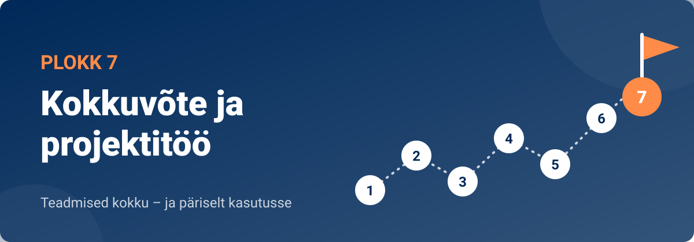

<!-- class="pae-fakt" -->
> <!-- style="width: 120px; float: left; margin: 0 16px 8px 0; border-radius: 0;" --> **🗝️ Tuba 7: Stardiplatvorm**
>
> Päästemeeskond jõuab digikooli kõige kõrgemale korrusele – Stardiplatvormile. Kratt mäletab juba peaaegu kõike, kuid enne kui ta saab uuesti stardi anda ja kooli süsteemid avada, tuleb kõik õpitu kokku panna ja päris projektiks muuta. „Ma tean nüüd, mis on andmed, mudelid ja õiglus, aga kuidas neist midagi päriselt valmis ehitada? Ilma plaanita stardin ma vist kogemata katlamajja!“ Teie ülesanne on aidata Kratil projekt planeerida, valmis ehitada ja esitleda. Selles toas on 5 lukku – iga tunni lõpus üks. Iga avatud lukk annab ühe võtmetähe. Kirjuta tähed üles!

Oled jõudnud kursuse „Tehisintellekti alused“ viimasesse plokki. Kuue ploki jooksul said teada, mis on tehisintellekt (TI) ja kuidas see on arenenud, kuidas algoritmid, andmed ja masinõpe koos töötavad, kuidas TI mõistab keelt ja pilte, kuidas see teeb otsuseid ning milliseid eetilisi küsimusi selle kasutamine tekitab. Selles plokis paned need teadmised kokku üheks tervikuks ja proovid neid päriselt kasutada.

Ploki keskmes on **projektitöö**. Koos oma rühmaga valid probleemi, mida saab TI abil lahendada või uurida, koostad plaani, arendad lahenduse või prototüübi, dokumenteerid oma töö ja esitled tulemusi teistele. Nii harjutad samu oskusi, mida vajavad tarkvaraarendajad, andmeteadlased ja projektijuhid: planeerimist, meeskonnatööd, probleemide lahendamist ja oma töö selget tutvustamist. Ploki lõpus vaatad tagasi kogu kursusele ja mõtled, kuidas õpitut edaspidi kasutada.

Selles plokis:

- **7.1 Kursuse kokkuvõte** – kordame plokkide 1–6 peamisi teemasid ja tutvume projektitööga
- **7.2 Projektitöö planeerimine** – teema valik, SMART-eesmärk, ajakava, rollid ja riskid
- **7.3 Projektitöö arendamine** – andmed, lahenduse disain, testimine ja dokumenteerimine
- **7.4 Projektitöö esitlemine** – esitluse ülesehitus, visuaalid, demo ja küsimustele vastamine
- **7.5 Projektitööde esitlemine ja kursuse lõpetamine** – tagasiside, refleksioon ja edasiõppimine

Ploki lõpust leiad ka **projektitöö juhendi**, **õpiportfoolio malli** ning kordamisülesanded koos ploki enesekontrolltestiga.

<!-- class="pae-motle" -->
> **Mõtle järele!**
>
> Meenuta kursuse algust. Mida sa siis tehisintellektist arvasid? Kas oskad nüüd nimetada vähemalt kolm kohta oma igapäevaelus (nutitelefonis, koolis, sotsiaalmeedias), kus TI töötab? Ja kui saaksid ise ehitada ühe väikese TI-lahenduse, siis millise probleemi sa sellega lahendaksid?

## 7.1 Kursuse kokkuvõte

<!-- class="pae-kaas" -->

### Õpieesmärgid

Selle tunni järel sa:

- **selgitad oma sõnadega** kursuse peamisi mõisteid, näiteks nõrk TI, masinõpe ja kallutatus *(mõistmine)*;
- **seostad** mõne oma telefoni äpi vähemalt kahe kursuse ploki teadmistega *(rakendamine)*;
- **leiad seoseid** eri plokkide teemade vahel, näiteks andmete, masinõppe ja eetika vahel *(analüüs)*;
- **katsetad** vestlusrobotit kordamise treenerina ja **hindad** kriitiliselt, kas selle küsimused ja hinnangud on õiged *(hindamine)*;
- **hindad**, milline kursuse teema on sulle veel segane, ja **kavandad**, kuidas selle selgeks saad *(hindamine, loomine)*.

<!-- class="pae-fakt" -->
> **🎯 Tunni tuumik (45 min)**
>
> 🏠 **Kodus enne tundi** (~15–20 min): „Mida sa nüüd oskad?“, „Projektitöö: teadmised tegudeks“, „Edasi õppima: tulevik ja karjäär“, „Video: miks ja kuidas õppida tehisaru ajastul?“. Too tundi kaasa üks uus teadmine või küsimus – tunni alguses arutate neid paarides (3 min).
>
> 1. 📚 **Loe** (~12 min): „Kursuse teekond: mis on TI ja kuidas see töötab“, „Keel, otsused ja pildid“, „Eetika ja tulevik“ ning „Kokkuvõte ja põhimõisted“
> 2. 🧪 **TI-katse** (~10 min): „Vestlusrobot kui kordamise treener“
> 3. ⭐ **Tööleht** (~15 min): ülesanded I, IV ja V
> 4. 📤 **Väljapääsupilet** ja 🔐 **lukk** (~8 min)
>
> **🏠** tähistab osi, mida loed või vaatad **kodus enne tundi** (ümberpööratud klassiruum). **➕** tähistab lisaülesannet – tee seda, kui jõuad, või kui tahad rohkem teada.

{{|>}}
<section class="pae-lihtne">

**🟢 Lihtsalt öeldes**

Selles tunnis kordad üle kogu kursuse kuus plokki. Kõik tänased TI-süsteemid, ka vestlusrobotid, on **nõrk TI**. Nõrk TI oskab teha ainult kindlat ülesannet, näiteks tõlkida. **Masinõppes** õpib arvuti näidete põhjal, mitte inimese kirjutatud reeglitest. Iga TI on täpselt nii hea, kui head on tema andmed. Kursusel nägid, kuidas TI töötleb keelt, teeb otsuseid ja analüüsib pilte. Samas tuleb mõelda eetikale: privaatsusele, **kallutatusele** ja vastutusele. Näiteks riigi virtuaalabiline Bürokratt ühendab keeletöötluse, vestlusrobotid ja eetika.

**Tähtsad sõnad:** **nõrk tehisintellekt** – TI, mis teeb ainult kindlat ülesannet; **masinõpe** – arvuti õpib andmetest mustreid ära tundma; **kallutatus** – TI ebaõiglus, mis tuleb sageli ühekülgsetest andmetest.

</section>

### Kursuse teekond: mis on TI ja kuidas see töötab

Kursuse „Tehisintellekti alused“ eesmärk oli anda sulle ülevaade sellest, mis on tehisintellekt, kuidas see töötab, kus seda kasutatakse ja milliseid küsimusi selle kasutamine tekitab. Tehisintellekt ei ole enam ainult teadlaste ja ulmefilmide teema – see on sinu nutitelefonis, koolis kasutatavates programmides, sotsiaalmeedia voos ja riigi e-teenustes. Seepärast on oluline, et iga inimene mõistaks selle põhimõtteid. Vaatame kursuse teekonna plokkhaaval üle.

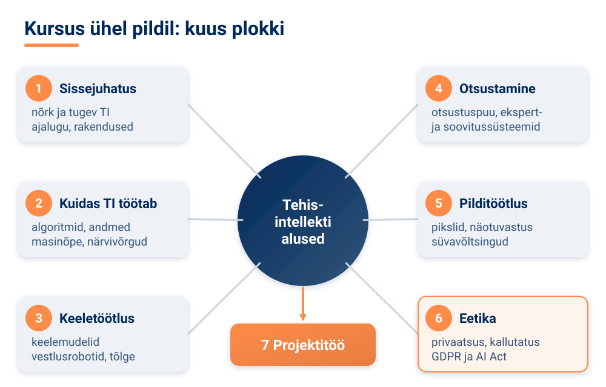

**Plokk 1. Sissejuhatus tehisintellekti.** Alustasime küsimusest, mis on tehisintellekt. Tutvusime erinevate definitsioonide ja põhimõistetega ning eristasime **nõrka** ja **tugevat tehisintellekti**. Kõik tänapäeval kasutusel olevad süsteemid – ka väga võimekad vestlusrobotid – on nõrk TI: need lahendavad kindlaid ülesandeid. Tugev TI, mis mõtleks ja õpiks kõikjal sama paindlikult nagu inimene, on endiselt arutelude ja uuringute teema. TI ajaloost meenutasime olulisi verstaposte: Alan Turingi artikkel ja Turingi test (1950), Dartmouthi konverents, kus võeti kasutusele termin „tehisintellekt“ (1956), ning hilisemad läbimurded, nagu AlexNet piltide klassifitseerimisel (2012) ja AlphaGo võit Go-mängus (2016). Lõpuks vaatasime TI rakendusi erinevates valdkondades ja nende mõju ühiskonnale.

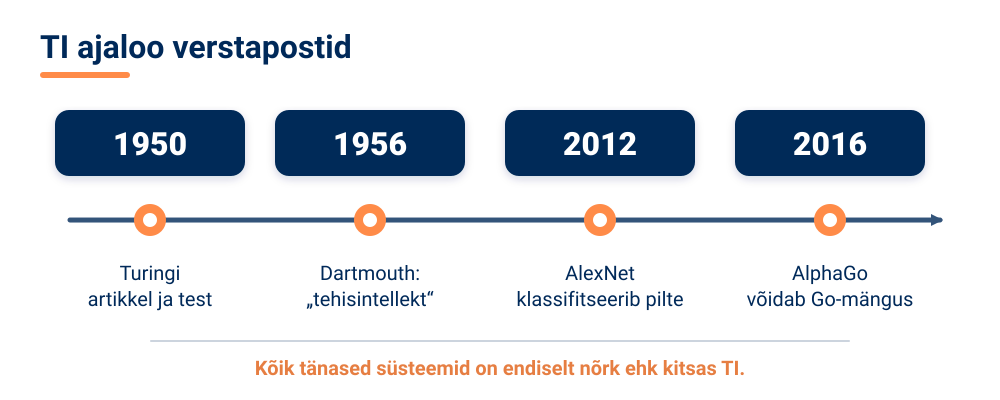

<!-- class="pae-moiste" -->
> **Mõiste: nõrk ja tugev tehisintellekt**
>
> **Nõrk** (ehk kitsas) **tehisintellekt** on süsteem, mis on loodud ühe kindla ülesande või ülesannete rühma lahendamiseks, näiteks näotuvastus või masintõlge. **Tugev tehisintellekt** tähendaks süsteemi, millel oleks inimesega võrreldav üldine mõtlemis- ja õppimisvõime. Praegu on kasutusel vaid nõrk tehisintellekt.

<!-- class="pae-fakt" -->
> **Kas teadsid?** Termin „tehisintellekt“ võeti kasutusele 1956. aastal Dartmouthi konverentsil. Vaid kuus aastat varem, 1950. aastal, oli Alan Turing avaldanud artikli, milles pakkus välja kuulsa Turingi testi.

**Plokk 2. Kuidas tehisintellekt töötab.** Teises plokis vaatasime „kapoti alla“. **Algoritm** on selgelt määratletud sammude jada probleemi lahendamiseks – nagu retsept. Õppisime algoritmide tüüpe ja otsinguprobleeme. Seejärel nägime, et TI on täpselt nii hea kui tema **andmed**: oluline on andmete kogumine, töötlemine ja kvaliteet. **Masinõppe** juures eristasime kolme põhitüüpi: **juhendatud õpe** (mudel õpib märgendatud andmetest), **juhendamata õpe** (mudel otsib andmetest ise mustreid, nt klasterdamine) ja **stiimulõpe** (mudel õpib tasude ja karistuste kaudu). Rääkisime ka mudelite treenimisest ja hindamisest ning sellest, miks on vaja eraldi **treeningandmeid** ja **testandmeid**. Ploki lõpus tutvusime **närvivõrkude** ülesehitusega ja **süvaõppe** eripäradega – mitmekihilised närvivõrgud on enamiku tänapäeva TI-läbimurrete aluseks.

<!-- class="pae-moiste" -->
> **Mõiste: masinõpe**
>
> **Masinõpe** on tehisintellekti haru, kus arvuti ei saa igaks olukorraks valmis reegleid, vaid õpib andmetes leiduvate näidete põhjal mustreid ära tundma ja nende abil uusi olukordi lahendama.

### Keel, otsused ja pildid

**Plokk 3. Keeletöötlus.** Kolmandas plokis uurisime, kuidas TI „mõistab“ keelt. **Loomuliku keele töötlus** tegeleb sellega, et arvuti suudaks inimkeelset teksti ja kõnet analüüsida ning luua. Nägime, et keeles on palju väljakutseid: mitmetähenduslikud sõnad, kontekst, iroonia, eesti keele rikkalik vormistik. Õppisime tekstianalüüsi meetodeid (nt teksti jagamist väiksemateks osadeks ehk tokeniseerimist) ja teksti genereerimise tehnikaid, millele tuginevad **suured keelemudelid**. Tutvusime **vestlusrobotite** (chatbot'ide) tüüpide ja loomisega ning **masintõlke** põhimõtetega. Eesti keeletehnoloogiast nägime näiteks EstNLTK tööriistu ja Tartu Ülikooli Neurotõlget.

<!-- class="pae-eesti" -->
> **Eesti näide: Bürokratt**
>
> Bürokratt on Eesti riigi virtuaalassistentide võrgustik, mille abil saab avalikke teenuseid kasutada kõnekeelse suhtluse kaudu. Selles saavad kokku mitme kursuse ploki teemad: keeletöötlus (inimese küsimuse mõistmine), vestlusrobotid (vastuse andmine) ja eetika (andmekaitse ning usaldusväärsus). UNESCO egiidi all tegutsev rahvusvaheline tehisintellekti uurimiskeskus IRCAI valis Bürokrati 2022. aastal maailma saja paljulubava tehisintellekti lahenduse hulka.

**Plokk 4. Tehisintellekti otsustamine.** Neljandas plokis vaatasime, kuidas TI otsuseid langetab. **Otsustuspuu** modelleerib otsustusprotsessi küsimuste ahelana: iga küsimuse vastus viib järgmise haruni, kuni jõutakse otsuseni. **Ekspertsüsteem** koosneb teadmusbaasist (reeglid ja faktid) ja järeldusmootorist, mis neid reegleid rakendab. **Soovitussüsteemid** – need, mis pakuvad sulle filme, muusikat või videoid – kasutavad sinu ja teiste kasutajate käitumist, et teha personaliseeritud soovitusi. Lõpuks vaatasime, kuidas TI lahendab probleeme eri valdkondades, nt transpordis, rahanduses ja tervishoius, ning interdistsiplinaarseid rakendusi.

**Plokk 5. Pilditöötlus ja arvutinägemine.** Viiendas plokis õppisime, kuidas TI „näeb“. Arvuti jaoks on pilt arvude tabel: iga piksel on kirjeldatud arvudega (nt RGB värvikanalid väärtustega 0–255). **Arvutinägemine** kasutab nende arvude töötlemiseks sageli konvolutsioonilisi närvivõrke. Uurisime objektituvastust ja **näotuvastust**, meditsiinilist pildianalüüsi, **generatiivset tehisintellekti** ja loovust ning **süvavõltsinguid** (deepfake) – nende tööpõhimõtteid ja eetilisi probleeme.

<!-- class="pae-eesti" -->
> **Eesti näited: Veriff ja Starship**
>
> Eesti ettevõte **Veriff** kasutab arvutinägemist isikusamasuse tuvastamiseks: süsteem võrdleb isikut tõendavat dokumenti ja inimese näokujutist. **Starship Technologies** on loonud isesõitvad kullerrobotid, mis navigeerivad linnatänavatel TI ja arvutinägemise abil.

### Eetika ja tulevik

**Plokk 6. Tehisintellekt ja eetika.** Kuuendas plokis küsisime, kuidas TI-d vastutustundlikult arendada ja kasutada. Eetilised põhimõtted, nagu inimkesksus, läbipaistvus, õiglus, vastutus ja privaatsus, aitavad hinnata, kas TI-süsteem on usaldusväärne. Privaatsuse ja andmekaitse teemas tutvusime **isikuandmete** kaitsega ning regulatsioonidega, eelkõige **isikuandmete kaitse üldmäärusega (GDPR)** ja **Euroopa Liidu tehisintellekti määrusega (AI Act)**, mis reguleerib TI-süsteeme riskipõhiselt. **Kallutatuse** teemas nägime, et kui treeningandmed on ühekülgsed, võib ka TI teha ebaõiglasi otsuseid, ning arutasime, kuidas õiglust tagada. Rääkisime TI mõjust tööturule – automatiseerimisest, uutest töökohtadest ja tuleviku oskustest – ning tulevikutrendidest, nii tehnoloogilistest kui ka ühiskondlikest.

<!-- class="pae-motle" -->
> **Mõtle järele!**
>
> Vali kaks erinevat plokki ja leia nende vahel seos. Näiteks: kuidas on seotud *andmete kvaliteet* (plokk 2) ja *kallutatus* (plokk 6)? Või *närvivõrgud* (plokk 2) ja *süvavõltsingud* (plokk 5)? Mida rohkem seoseid märkad, seda paremini mõistad TI-d tervikuna.

### 🧪 TI-katse: vestlusrobot kui kordamise treener

🛡️ *Ohutuskaardi reeglid kehtivad: ära logi sisse, ära sisesta isikuandmeid ega pildista inimesi.*

Jaan Aru sõnul võiks tehisaru olla õppimisel pigem treener kui teener. Selles katses proovid, kas vestlusrobot oskab sind kursuse teemade kordamisel küsitleda – ja kas tema küsimused ja hinnangud on üldse õiged.

**Vaja läheb:** kooli lubatud vestlusrobot (nt [TI-Hüppe õpirakendus](https://tihupe.ee/opirakendus/)), ~10 min, paaristöö

1. Kirjuta vestlusrobotile: „Oled mu kordamise treener. Küsi minult ükshaaval viis küsimust gümnaasiumi kursuse „Tehisintellekti alused“ teemadel (masinõpe, keeletöötlus, arvutinägemine, eetika). Ära ütle õiget vastust enne, kui olen ise vastanud.“ Ära sisesta oma nime ega muid isikuandmeid.
2. Vasta küsimustele ise, ilma õpikut vaatamata. Paariline jälgib ja teeb märkmeid.
3. Võrdle roboti küsimusi, hinnanguid ja selgitusi selle tunni tekstiga. Kas robot eksis kuskil või väitis midagi, mida õpikus pole (hallutsinatsioon)?

**Pane tähele / kirjuta üles:** mitu küsimust viiest olid täpsed? Kas robot käitus treeneri või teenrina? Millise teema pead veel üle kordama?

[[___ ___ ___]]

<!-- class="pae-lisaks" -->
> **Kui arvutit pole:** koostage paarilisega teineteisele viis kordamisküsimust kursuse eri plokkidest, vahetage need ja kontrollige vastuseid õpiku järgi. Arutage, mille poolest erineks vestlusroboti koostatud küsimustik teie omast.

### 🏠 Mida sa nüüd oskad?

Kursuse lõpuks peaksid olema omandanud mitu olulist teadmist ja oskust:

- tehisintellekti põhimõistete ja -kontseptsioonide mõistmine;
- erinevate TI-tehnoloogiate tundmine (masinõpe, keeletöötlus, arvutinägemine, soovitussüsteemid jm);
- TI-rakenduste analüüsimine – oskad küsida, milliseid andmeid ja meetodeid rakendus kasutab;
- TI eetiliste aspektide hindamine;
- TI tulevikutrendide mõistmine;
- praktilised oskused TI kasutamiseks.

Praktilistes ülesannetes rakendasid algoritme, kasutasid masinõppe mudeleid ning lahendasid keeletöötluse ja pilditöötluse ülesandeid. Selle käigus õppisid kasutama tööriistu, lahendama probleeme ja analüüsima tulemusi. Need on oskused, mida vajad kohe järgmises etapis – projektitöös.

<!-- class="pae-naide" -->
> **Näide: üks rakendus, mitu plokki**
>
> Mõtle muusika voogedastusteenusele, mis koostab sulle iganädalase soovitusnimekirja. Selle taga on **soovitussüsteem** (plokk 4), mis on treenitud miljonite kuulajate **andmetel** **masinõppe** abil (plokk 2). Laulusõnade analüüsimiseks võidakse kasutada **keeletöötlust** (plokk 3) ja albumikaante sorteerimiseks **pilditöötlust** (plokk 5). Ja kuna teenus kogub sinu kuulamisharjumusi, tekivad küsimused **privaatsusest** ning sellest, kas soovitused on kõigile artistidele **õiglased** (plokk 6).

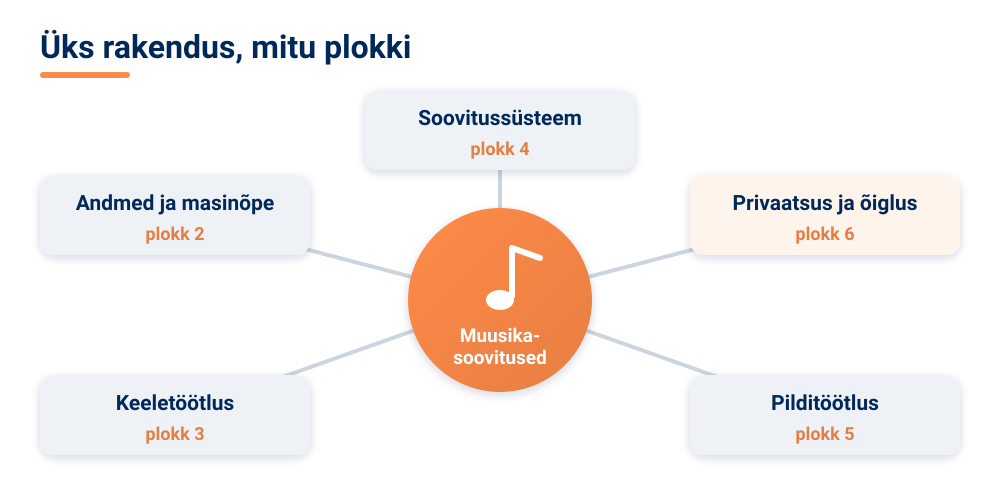

### 🏠 Projektitöö: teadmised tegudeks

Miks lõpeb kursus projektitööga? Sest kõige sügavamalt õpid siis, kui pead teadmisi ise rakendama. Projektitöö annab võimaluse kasutada õpitut reaalse probleemi lahendamiseks, õppida põhjalikumalt mõnda sind huvitavat teemat ja luua töö, mille saad lisada oma **portfooliosse** – oma tööde ja saavutuste kogusse.

Projektitöö eesmärgid on:

- rakendada tehisintellekti reaalse probleemi lahendamiseks;
- arendada koostööoskusi;
- harjutada tulemuste esitlemist.

<!-- class="pae-moiste" -->
> **Mõiste: projektitöö**
>
> **Projektitöö** on piiratud ajaga ja selge eesmärgiga töö, mille käigus rakendad oma teadmisi ja oskusi praktiliselt, lahendad reaalse probleemi ning lood ja esitled tulemuse.

Projektitöö kulgeb kolmes suures etapis, millest igaühele on selles plokis pühendatud oma tund:

**Planeerimise** käigus määratled projekti teema ja eesmärgi (kasutades SMART-kriteeriume), hindad, kas projekt on teostatav ja oluline, koostad tegevuskava ja ajakava, kaardistad ressursid ja tööriistad, teed riskianalüüsi ning jagate meeskonnas rollid ja vastutuse. **Arendamise** käigus kogute ja analüüsite andmeid, kavandate lahenduse, teostate selle ning testite ja hindate tulemust. Kogu aeg dokumenteerite nii protsessi kui ka tulemusi ning lahendate tekkivaid probleeme. **Esitlemise** jaoks loote selge ülesehitusega esitluse ja visuaalid, kaasate kuulajaid, vastate küsimustele ning kogute tagasisidet, et oma tööd parandada.

### 🏠 Edasi õppima: tulevik ja karjäär

Kursus lõpeb, aga TI areng jätkub kiiresti. Lähituleviku trendid (näiteks suurte keelemudelite ja generatiivse TI levik) ja pikaajalised visioonid mõjutavad seda, kuidas me õpime, töötame ja suhtleme. Seepärast on oluline **elukestev õpe** – valmisolek kogu elu jooksul uusi teadmisi omandada.

Edasiõppimiseks on palju võimalusi: kursused ja õppematerjalid, praktilised projektid ning TI-huviliste kogukondades osalemine. Kasulikud on nii akadeemilised kui ka populaarteaduslikud raamatud ja artiklid, tasuta ja tasulised veebikursused, interaktiivsed õppematerjalid, konverentsid ja seminarid ning avatud lähtekoodiga tööriistad ja kommertsplatvormid.

<!-- class="pae-eesti" -->
> **Eesti näide: TI-õpe eesti keeles**
>
> Soome algatusel loodud veebikursus **Elements of AI** on tõlgitud ka eesti keelde ([elementsofai.ee](https://www.elementsofai.ee/)) ja tutvustab TI põhimõisteid laiale publikule. Koolidele mõeldud programmeerimise ja tehisintellekti õppematerjale leiab [Progetiigri](https://www.progetiiger.ee/) lehelt. TI-d ja masinõpet saab edasi õppida näiteks Tartu Ülikoolis, Tallinna Tehnikaülikoolis ja Tallinna Ülikoolis.

TI valdkonnas on palju erinevaid rolle ja ameteid – andmeteadlasest TI-eetika spetsialistini. Neis kõigis on vaja nii tehnilisi oskusi kui ka koostöö-, suhtlus- ja kriitilise mõtlemise oskusi. Lähemalt räägime karjäärivõimalustest kursuse viimases tunnis.

Kursuse peamised õppetunnid võib kokku võtta nii: tehisintellekt on väga **mitmekülgne**, selle juures on **eetilised aspektid** sama olulised kui tehnilised ning **praktilised oskused** on väärtuslikud. TI-l on tulevikus suur roll – see toob nii võimalusi kui ka väljakutseid ning eeldab vastutustundlikku arendamist ja kasutamist.

<!-- class="pae-lisaks" -->
> **Tea lisaks**
>
> Kursuse jooksul nägid mitut Eesti ja Euroopa algatust. Eestis on TI kasutuselevõttu suunatud riiklike tegevuskavadega (kratikavadega), millest praegu kehtib tehisintellekti tegevuskava ehk kratikava 2024–2026. Euroopa tasandil ühendavad TI-teadlasi näiteks võrgustikud CAIRNE (varem CLAIRE) ja ELLIS.

<!-- class="pae-fakt" -->
> **Kas teadsid?** Helsingi Ülikooli ja MinnaLearni veebikursuse **Elements of AI** eestikeelse versiooni tõi Eestisse Tallinna Tehnikaülikool. Kursus on tasuta.

### 🏠 🎬 Video: miks ja kuidas õppida tehisaru ajastul?

Ajuteadlane Jaan Aru selgitab, miks on õppimine ja iseseisev mõtlemine olulised ka siis, kui tehisaru suudab meie eest üha rohkem ära teha. Õppimine toimub siis, kui ise mõtled, proovid ja pingutad. Tehisaru võiks õppimisel olla pigem **treener kui teener**.

**Jaan Aru: miks ja kuidas õppida tehisaru ajastul?** · *TI-Hüpe* · ⏱ 18 min

!?[Jaan Aru: miks ja kuidas õppida tehisaru ajastul? – TI-Hüpe](https://www.youtube.com/watch?v=dWdxbQKgi7Y)

<!-- class="pae-motle" -->
> **Mõtle vaatamise ajal**
>
> 1. Miks on pingutus õppimiseks vajalik?
> 2. Mis vahe on sellel, kui tehisaru on treener, ja sellel, kui ta on teener?
> 3. Millal aitab tehisaru õppida ja millal teeb ta mõttetöö sinu eest ära?

**Kirjuta endale kolm reeglit, kuidas kasutad edaspidi tehisaru nii, et see oleks sulle treener, mitte teener.**

[[___ ___ ___]]

### Kokkuvõte ja põhimõisted

**Pea meeles**

- Kursus koosnes kuuest temaatilisest plokist: sissejuhatus TI-sse, TI tööpõhimõtted, keeletöötlus, otsustamine, pilditöötlus ja eetika.
- Kõik praegu kasutusel olevad TI-süsteemid on nõrk (kitsas) tehisintellekt.
- TI kvaliteet sõltub andmetest; masinõppe põhitüübid on juhendatud õpe, juhendamata õpe ja stiimulõpe.
- Eetika (privaatsus, kallutatus, läbipaistvus, vastutus) on TI juures sama oluline kui tehnika; Euroopas reguleerivad seda GDPR ja tehisintellekti määrus.
- Projektitöö aitab teadmisi praktiliselt rakendada ning koosneb planeerimisest, arendamisest ja esitlemisest.
- TI areneb kiiresti, seepärast on elukestev õpe väga oluline.

| Mõiste | Tähendus |
|---|---|
| nõrk tehisintellekt | TI, mis lahendab kindlat ülesannet või ülesannete rühma |
| tugev tehisintellekt | hüpoteetiline TI, millel oleks inimesega võrreldav üldine mõtlemisvõime |
| masinõpe | TI haru, kus arvuti õpib andmetest mustreid ära tundma |
| loomuliku keele töötlus | TI valdkond, mis tegeleb inimkeelse teksti ja kõne analüüsi ning loomisega |
| arvutinägemine | TI valdkond, mis tegeleb piltide ja video analüüsimisega |
| kallutatus | TI süsteemne ebaõiglus, mis tuleneb sageli ühekülgsetest andmetest |
| projektitöö | piiratud ajaga ja selge eesmärgiga praktiline töö reaalse probleemi lahendamiseks |
| elukestev õpe | uute teadmiste ja oskuste omandamine kogu elu jooksul |

### 📚 Allikad ja lisalugemine

- Helsingi Ülikool ja MinnaLearn (s.a.). [Elements of AI](https://www.elementsofai.ee/). Tasuta eestikeelne veebikursus TI põhimõistete kohta; sobib lisalugemiseks.
- TI-Hüpe (s.a.). [Õppevideod](https://tihupe.ee/oppevideod/). Lühikesed videod õpilastele, sh Jaan Aru loeng „Miks ja kuidas õppida tehisaru ajastul?“.
- IRCAI (2022). [Global Top 100: Bürokratt](https://ircai.org/top100/entry/burokratt/). UNESCO egiidi all tegutseva uurimiskeskuse nimekirja kanne Bürokrati kohta.
- Kratid.ee (s.a.). [Bürokratt](https://www.kratid.ee/burokratt). Riigi selgitus, mis on Bürokratt ja kuidas see töötab.
- Euroopa Komisjon (2026). [Tehisintellekti käsitlev õigusakt](https://digital-strategy.ec.europa.eu/et/policies/regulatory-framework-ai). ELi tehisintellekti määruse riskitasemed ja rakendamise ajakava.
- ERR (2024). [Riik plaanib 85 miljoni euro abil tehisintellekti Eesti ellu juurutada](https://www.err.ee/1609248531/riik-plaanib-85-miljoni-euro-abil-tehisintellekti-eesti-ellu-juurutada). Ülevaade tehisintellekti tegevuskavast 2024–2026 ja varasematest kavadest.

### Tööleht 7.1

<!-- class="pae-jaotis" -->
**⭐ I. Kursuse ülevaade ja õpiväljundid**

**Ülesanne 1.** Kirjelda lühidalt, millised olid sinu jaoks kursuse „Tehisintellekti alused“ kõige olulisemad teemad ja õppetunnid.

[[___ ___ ___ ___]]

**Ülesanne 2.** Hinda oma teadmiste ja oskuste arengut kursuse jooksul järgmistes valdkondades skaalal 1–5 (1 = väga vähe, 5 = väga palju). Kirjuta igasse lahtrisse number.

a) Tehisintellekti põhimõistete ja -kontseptsioonide mõistmine:

[[___]]

b) Erinevate tehisintellekti tehnoloogiate tundmine:

[[___]]

c) Tehisintellekti rakenduste analüüsimine:

[[___]]

d) Tehisintellekti eetiliste aspektide hindamine:

[[___]]

e) Praktilised oskused tehisintellekti kasutamiseks:

[[___]]

**Ülesanne 3.** Millised kursuse õpiväljundid on sinu arvates tulevikus kõige olulisemad? Miks?

[[___ ___ ___ ___]]

<!-- class="pae-jaotis" -->
**➕ II. Temaatiliste plokkide kokkuvõte**

**Ülesanne 4.** Kirjelda lühidalt, mida õppisid järgmistest temaatilistest plokkidest.

a) Plokk 1. Sissejuhatus tehisintellekti

[[___ ___ ___]]

b) Plokk 2. Kuidas tehisintellekt töötab

[[___ ___ ___]]

c) Plokk 3. Keeletöötlus

[[___ ___ ___]]

d) Plokk 4. Tehisintellekti otsustamine

[[___ ___ ___]]

e) Plokk 5. Pilditöötlus ja arvutinägemine

[[___ ___ ___]]

f) Plokk 6. Tehisintellekt ja eetika

[[___ ___ ___]]

**Ülesanne 5.** Milline temaatiline plokk oli sinu jaoks kõige huvitavam? Miks?

[[___ ___ ___]]

**Ülesanne 6.** Milline temaatiline plokk oli sinu jaoks kõige keerulisem? Miks?

[[___ ___ ___]]

<!-- class="pae-jaotis" -->
**➕ III. Praktiliste oskuste refleksioon**

**Ülesanne 7.** Milliseid praktilisi oskusi oled kursuse jooksul omandanud?

[[___ ___ ___ ___]]

**Ülesanne 8.** Kirjelda üht praktilist ülesannet või harjutust, mis sulle kursuse jooksul kõige rohkem meeldis. Miks see sulle meeldis?

[[___ ___ ___ ___]]

**Ülesanne 9.** Kuidas saaksid kursuse jooksul omandatud praktilisi oskusi tulevikus rakendada?

[[___ ___ ___ ___]]

<!-- class="pae-jaotis" -->
**⭐ IV. Tehisintellekti eetiliste aspektide mõistmine**

**Ülesanne 10.** Vali üks kursusel nähtud TI-lahendus (nt Bürokratt, Veriffi isikutuvastus või muusikasoovitused). Millised on selle juures kõige olulisemad eetilised küsimused (privaatsus, kallutatus, läbipaistvus, vastutus)? Põhjenda.

[[___ ___ ___ ___]]

**Ülesanne 11.** Kuidas on kursus muutnud sinu arusaama tehisintellekti eetilistest aspektidest?

[[___ ___ ___ ___]]

**Ülesanne 12.** Milliseid eetilisi põhimõtteid peaksid tehisintellekti arendajad ja kasutajad järgima? Põhjenda.

[[___ ___ ___ ___]]

<!-- class="pae-jaotis" -->
**⭐ V. Projektitöö planeerimine**

**Ülesanne 13.** Kirjelda lühidalt, millist tehisintellekti projekti sooviksid teostada.

a) Projekti teema ja eesmärk:

[[___ ___]]

b) Projekti põhjendus ja olulisus:

[[___ ___ ___]]

c) Projekti tegevused ja ajakava:

[[___ ___ ___]]

d) Vajalikud ressursid ja tööriistad:

[[___ ___]]

e) Võimalikud riskid ja nende lahendused:

[[___ ___ ___]]

**Ülesanne 14.** Kuidas aitab projektitöö sul kinnistada kursuse jooksul õpitut?

[[___ ___ ___]]

<!-- class="pae-jaotis" -->
**➕ VI. Tehisintellekti tulevikuperspektiivid**

**Ülesanne 15.** Millised on sinu arvates kõige olulisemad tehisintellekti arengusuunad järgmise 5–10 aasta jooksul?

[[___ ___ ___ ___]]

**Ülesanne 16.** Kuidas võivad need arengud mõjutada sinu tulevast karjääri või õpinguid?

[[___ ___ ___ ___]]

**Ülesanne 17.** Milliseid oskusi peaksid arendama, et olla valmis tehisintellekti tulevikuks?

[[___ ___ ___ ___]]

<!-- class="pae-jaotis" -->
**➕ VII. Arutelu ja refleksioon**

**Ülesanne 18.** Kuidas on tehisintellekti kursus muutnud sinu arusaama tehisintellektist ja selle mõjust ühiskonnale?

[[___ ___ ___ ___ ___]]

**Ülesanne 19.** Milliseid uusi teadmisi ja oskusi oled omandanud, mida sul enne kursust ei olnud?

[[___ ___ ___ ___]]

**Ülesanne 20.** Kuidas saaksid tehisintellekti kursuselt õpitut rakendada oma igapäevaelus või tulevases karjääris?

[[___ ___ ___ ___]]

<!-- class="pae-jaotis" -->
**➕ VIII. Tagasiside kursusele**

**Ülesanne 21.** Mis oli sinu arvates kursuse tugevus? Mida võiks säilitada või veelgi tugevdada?

[[___ ___ ___ ___]]

**Ülesanne 22.** Mis oli sinu arvates kursuse nõrkus? Mida võiks muuta või parandada?

[[___ ___ ___ ___]]

**Ülesanne 23.** Milliseid teemasid või aspekte võiks tulevikus kursusele lisada?

[[___ ___ ___ ___]]

### Enesekontroll 7.1

**1. Milline väide nõrga ja tugeva tehisintellekti kohta on õige?**

- [( )] Tänapäeva vestlusrobotid on tugev tehisintellekt.
- [(X)] Praegu on kasutusel vaid nõrk tehisintellekt, mis lahendab kindlaid ülesandeid.
- [( )] Tugev tehisintellekt on see, mis töötab kõige kiiremini.
- [( )] Nõrk tehisintellekt tähendab vigadega TI-süsteemi.
- [[?]] Mõtle, kas mõni praegune süsteem suudab kõike, mida suudab inimene.
****************************************
Nõrk (kitsas) TI lahendab kindlat ülesannet või ülesannete rühma. Tugev TI, millel oleks inimesega võrreldav üldine mõtlemisvõime, on endiselt arutelude ja uuringute teema – ka võimsad vestlusrobotid on nõrk TI.
****************************************

**2. Pane TI ajaloo verstapostid õigesse ajalisse järjekorda.**

<!-- data-show-partial-solution -->
Dartmouthi konverents, kus võeti kasutusele termin „tehisintellekt“: [[ 1 | (2) | 3 | 4 ]] 
AlphaGo võidab inimest Go-mängus: [[ 1 | 2 | 3 | (4) ]] 
Alan Turingi artikkel ja Turingi test: [[ (1) | 2 | 3 | 4 ]] 
AlexNeti läbimurre piltide klassifitseerimisel: [[ 1 | 2 | (3) | 4 ]]
****************************************
Õige järjekord: 1. Turingi artikkel ja Turingi test (1950) → 2. Dartmouthi konverents (1956) → 3. AlexNet (2012) → 4. AlphaGo (2016).
****************************************

**3. Lohista masinõppe tüübid õigetesse lünkadesse.**

<!-- data-show-partial-solution -->
Kui mudel õpib märgendatud andmetest, nimetatakse seda [->[ (juhendatud õppeks) | süvaõppeks ]]. Kui mudel otsib andmetest ise mustreid, näiteks klasterdamise abil, nimetatakse seda [->[ (juhendamata õppeks) ]]. Kui mudel õpib tasude ja karistuste kaudu, nimetatakse seda [->[ (stiimulõppeks) | ekspertõppeks ]].
****************************************
Masinõppe kolm põhitüüpi on **juhendatud õpe** (märgendatud andmed), **juhendamata õpe** (mustrite otsimine märgendamata andmetest) ja **stiimulõpe** (tasud ja karistused).
****************************************

**4. Millise ingliskeelse lühendiga tähistatakse Euroopa isikuandmete kaitse üldmäärust? Kirjuta vastus.**

[[GDPR]]

****************************************
Õige vastus: **GDPR** (*General Data Protection Regulation*). Koos Euroopa Liidu tehisintellekti määrusega (AI Act) reguleerib see isikuandmete ja TI-süsteemide kasutamist Euroopas.
****************************************

**5. Ühenda TI-lahendus valdkonnaga, millega see kõige rohkem seotud on.**

- [ (Keeletöötlus) (Otsustamine) (Pilditöötlus) ]
- [ ( ) ( ) (X) ] Näotuvastus
- [ ( ) (X) ( ) ] Soovitussüsteem
- [ (X) ( ) ( ) ] Masintõlge
- [ ( ) (X) ( ) ] Ekspertsüsteem
- [ ( ) ( ) (X) ] Süvavõltsing
****************************************
Näotuvastus ja süvavõltsingud kuuluvad pilditöötluse ja arvutinägemise valdkonda, soovitus- ja ekspertsüsteemid otsustamise valdkonda ning masintõlge keeletöötluse valdkonda.
****************************************

**6. Mis on TI kallutatuse sage põhjus?**

- [( )] Arvuti liiga aeglane protsessor
- [(X)] Ühekülgsed või ebatäielikud treeningandmed
- [( )] Liiga suur hulk kasutajaid
- [( )] Internetiühenduse katkemine
****************************************
Kui treeningandmed ei esinda kõiki rühmi õiglaselt, õpib mudel neist ka ebaõiglasi mustreid. Seepärast on andmete kvaliteet (plokk 2) otseselt seotud õiglusega (plokk 6).
****************************************

**7. Vali igasse lünka sobiv tegevus. Mida teed projektitöö eri etappides?**

<!-- data-show-partial-solution -->
Planeerimise etapis sõnastad [[ (SMART-eesmärgi) | segadusmaatriksi | elevaatorikõne ]]. Arendamise etapis [[ koostad ajakava | (kogud ja puhastad andmeid) | vastad kuulajate küsimustele ]]. Esitlemise etapis [[ teed riskianalüüsi | treenid mudelit | (kogud tagasisidet) ]].
****************************************
Projektitöö kolm etappi on **planeerimine** (teema, SMART-eesmärk, ajakava, ressursid, riskid, rollid), **arendamine** (andmed, disain, teostus, testimine, dokumenteerimine) ja **esitlemine** (esitlus, visuaalid, küsimused, tagasiside).
****************************************

**8. Vali kaks kursuse plokki ja selgita oma sõnadega, kuidas nende teemad omavahel seotud on.**

[[___ ___ ___]]

Vaata näidisvastust

Andmete kvaliteet (plokk 2) ja kallutatus (plokk 6) on tihedalt seotud. Masinõppe mudel õpib ainult nendest andmetest, mis talle antakse. Kui treeningandmetes on mõni inimrühm alaesindatud, teeb mudel selle rühma kohta sagedamini vigu ehk on kallutatud. Seepärast tuleb õiglase TI loomiseks juba andmete kogumisel jälgida, et need oleksid mitmekesised ja esinduslikud.

### 📤 Väljapääsupilet 7.1

<!-- class="pae-fakt" -->
> ⚠️ **Salvesta või saada vastused enne lehe sulgemist!** Vastus ei liigu automaatselt õpetajale ja võib kaduda, kui vahetad seadet, kasutad privaatakent või kustutad brauseri andmed.

Vasta lühidalt (3–5 min). Vastused jäävad selle brauseri mällu. Kui oled valmis, vajuta **Kopeeri vastused** ja kleebi need Google Classroomi ülesande vastusesse või laadi fail alla ja lisa see ülesande juurde.

<!-- data-type="none" -->
| Kriteerium | 2 p | 1 p | 0 p |
|---|---|---|---|
| Mõiste rakendamine uues olukorras | Õige mõiste ja selge põhjendus | Mõiste õige, põhjendus puudu või ebatäpne | Vastus puudub või on vale |
| TI-katse tõlgendus | Tulemus on seotud tunni mõistega | Tulemus on kirjeldatud, seos puudub | Puudub |
| Refleksioon | Konkreetne ja isiklik | Üldine | Puudub |

*Väljapääsupilet on kujundav hindamine: õpetaja annab tagasisidet ja kasutab vastuseid järgmise tunni planeerimisel. Pilet sobib ka portfoolio õpipäevikusse.*

### 🔐 Lukk 7.1

<!-- class="pae-naide" -->
> <!-- style="width: 120px; float: left; margin: 0 16px 8px 0; border-radius: 0;" --> **Kratt:** „Mu mälestused kuuest toast on segamini nagu pusletükid. Masintõlge, vestlusrobot, kõnetuvastus… ma tean, et need on sugulased, aga ei mäleta, mis perekonnast!“

Lukk avaneb, kui lahendad ülekandeülesande.

**Uus olukord:** Sinu klassivend ehitab rakenduse, mis kuulab ära tunni helisalvestise, kirjutab kõne tekstiks, parandab selles kirjavead ja koostab tunnist eestikeelse kokkuvõtte. Millise TI valdkonna lahendusega on tegu? Kirjuta valdkonna nimi.

[[keeletöötlus]]
[[?]] Vihje 1: mis on rakenduse sisend ja väljund – pildid, arvud või inimkeel?
[[?]] Vihje 2: valdkonna nimi on 12-täheline liitsõna, mis algab tähega K. Sellest rääkis kursuse 3. plokk.
[[?]] 🛟 Päästerõngas: mine tagasi lehele „Keel, otsused ja pildid“ ja loe lõik „Plokk 3. Keeletöötlus“. Kui ikka ei tule välja, küsi õpetajalt selle luku päästekood ja kirjuta see vastuseväljale.

****************************************
✅ **Lukk avatud!** Kõnetuvastus, õigekirja parandamine ja kokkuvõtte koostamine kuuluvad kõik keeletöötluse ehk loomuliku keele töötluse valdkonda, mis aitab arvutil inimkeelt mõista ja luua – ja kursuse plokid on omavahel seotud nagu pusletükid.

🔑 **Sinu võtmetäht: V**

Kirjuta täht üles – seda on vaja toa ukse avamiseks.
****************************************

## 7.2 Projektitöö planeerimine

<!-- class="pae-kaas" -->

### Õpieesmärgid

Selle tunni järel sa:

- **selgitad oma sõnadega**, mis on projektitöö ja millest koosneb projektiplaan *(mõistmine)*;
- **sõnastad** projekti eesmärgi SMART-kriteeriumide järgi *(rakendamine)*;
- **analüüsid** projekti riske ja **eristad**, millised neist on kõige tõenäolisemad *(analüüs)*;
- **kontrollid** Teachable Machine'i kiirprooviga, kas sinu projektiidee on teostatav, ja **hindad** tulemust *(hindamine)*;
- **kavandad** koos meeskonnaga projekti ulatuse, rollid, ajakava ja riskide ennetamise *(loomine)*.

<!-- class="pae-fakt" -->
> **🎯 Tunni tuumik (45 min)**
>
> 🏠 **Kodus enne tundi** (~15–20 min): „Mis on projektitöö ja miks seda planeerida?“, „Ulatus, tegevused ja ajakava“, „Edukuse kriteeriumid ja projekti käivitamine“. Too tundi kaasa üks uus teadmine või küsimus – tunni alguses arutate neid paarides (3 min).
>
> 1. 📚 **Loe** (~12 min): „Kuidas valida projekti teemat?“, „Eesmärk SMART-kriteeriumide järgi“, „Ressursid, rollid ja riskid“ ning „Kokkuvõte ja põhimõisted“
> 2. 🧪 **TI-katse** (~10 min): „Kas idee on teostatav? Kiirproov Teachable Machine'is“
> 3. ⭐ **Tööleht** (~15 min): ülesanded I, III ja VIII
> 4. 📤 **Väljapääsupilet** ja 🔐 **lukk** (~8 min)
>
> **🏠** tähistab osi, mida loed või vaatad **kodus enne tundi** (ümberpööratud klassiruum). **➕** tähistab lisaülesannet – tee seda, kui jõuad, või kui tahad rohkem teada.

{{|>}}
<section class="pae-lihtne">

**🟢 Lihtsalt öeldes**

Selles tunnis hakkad koos meeskonnaga oma TI-projekti planeerima. Kõigepealt vali teema, mis sind huvitab ja sobib su oskustega. Teema peab olema piisavalt väike, et see valmis saaks. Näiteks „TI, mis aitab õppida“ on liiga lai. Parem on vestlusrobot, mis vastab 10. klassi õpilaste küsimustele kooli kodukorra kohta. Seejärel kirjuta selge **SMART-eesmärk**, mida saab mõõta ja millel on tähtaeg. Lepi meeskonnaga rollid kokku ja tee **riskianalüüs**: mis võib valesti minna? Jäta ajakavasse ka **puhveraega** ootamatuste jaoks.

**Tähtsad sõnad:** **SMART-eesmärk** – konkreetne, mõõdetav, asjakohane, realistlik ja tähtajaline eesmärk; **riskianalüüs** – võimalike probleemide leidmine ja nende lahenduste planeerimine; **puhveraeg** – lisaaeg ajakavas ootamatuste jaoks.

</section>

### 🏠 Mis on projektitöö ja miks seda planeerida?

**Projektitöö** on töö, mille käigus rakendad oma teadmisi ja oskusi praktiliselt, lahendad reaalse probleemi ning lood ja esitled tulemuse. See erineb tavalisest koduülesandest: pead ise otsustama, mida teha, kuidas teha ja millal valmis saada. Just seepärast õpid projektitöös sügavamalt, arendad praktilisi oskusi ja saad tulemuse, mille võid lisada oma **portfooliosse**.

Tehisintellekti kursusel on projektitööl mitu eesmärki:

- rakendada TI-teadmisi praktiliselt;
- lahendada reaalne probleem TI abil;
- arendada koostööoskusi;
- saada projektijuhtimise kogemus;
- arendada tulemuste dokumenteerimise ja esitlemise oskusi;
- arvestada TI eetiliste aspektidega.

Hea projekt algab heast plaanist. **Projektitöö planeerimine** tähendab projekti eesmärkide, tegevuste, ajakava ja ressursside määratlemist **enne** töö alustamist. Plaan annab meeskonnale selge suuna, aitab ressursse (aega, inimesi, tööriistu) tõhusalt kasutada ja vähendab riske. Samas ei ole plaan raidkiri: töö käigus õpid uut ja plaani võib vajaduse korral kohandada.

<!-- class="pae-moiste" -->
> **Mõiste: projektiplaan**
>
> **Projektiplaan** on dokument, mis kirjeldab projekti eesmärki ja põhjendust, ulatust ja piire, tegevusi ja ajakava, ressursse ja rolle, riske ja nende maandamise viise ning hindamiskriteeriume.

### Kuidas valida projekti teemat?

TI-projekti teemasid on palju. Siin on mõned valdkonnad, mis seostuvad otse kursuse plokkidega:

| Valdkond | Näiteid projektidest |
|---|---|
| Keeletöötlus | vestlusroboti loomine kindla valdkonna jaoks; teksti analüüs ja meeleolu (sentimendi) tuvastamine, nt sotsiaalmeedia postitustes; tekstide kokkuvõtete genereerimine; lihtne masintõlke rakendus; kõnetuvastus ja -süntees |
| Pilditöötlus ja arvutinägemine | objektituvastus piltidel või videos; piltide klassifitseerimine; näotuvastus ja emotsioonide tuvastamine; liitreaalsuse rakendus; generatiivne pildiloome |
| Soovitussüsteemid | filmi- või muusikasoovitused; toodete soovitamine e-poes; personaliseeritud õppematerjalide soovitamine; uudiste või artiklite soovitamine; sõprade või kontaktide soovitamine sotsiaalvõrgustikus |
| Andmeanalüüs ja ennustusmudelid | ilmaennustus; aktsiahindade ennustamine; terviseandmete analüüs; energiatarbimise ennustamine; liiklusandmete analüüs |
| Haridusrakendused | intelligentne õppeassistent; automaatne hindamissüsteem; personaliseeritud õpitee; õpiraskuste tuvastamine; interaktiivne õppemäng |

Teema valimisel küsi endalt neli küsimust:

1. **Isiklikud huvid ja motivatsioon.** Mis sind huvitab? Millega tahaksid süvitsi tegeleda? Huvitav teema hoiab motivatsiooni üleval ka siis, kui töö läheb raskeks.
2. **Olemasolevad oskused ja teadmised.** Millised on sinu ja su rühmakaaslaste tugevused? Milliseid oskusi tahate arendada?
3. **Teostatavus.** Kas projekt on tehtav olemasoleva aja, ressursside ja tehniliste võimaluste piires? Kõige sagedasem viga on liiga suure projekti valimine.
4. **Väärtus ja mõju.** Kelle probleemi sa lahendad? Millist väärtust lood?

<!-- class="pae-fakt" -->
> **Kas teadsid?** Projektitöö teema valimisel on kõige sagedasem viga liiga suure projekti valimine. Väiksem ja selgelt piiritletud teema saab tõenäolisemalt valmis.

<!-- class="pae-naide" -->
> **Näide: teema kitsendamine**
>
> „Teeme TI, mis aitab õppida“ on liiga lai. Parem: „Teeme vestlusroboti, mis vastab 10. klassi õpilaste küsimustele kooli kodukorra kohta.“ Nüüd on selge, kes on sihtrühm, millist probleemi lahendatakse ja kui suur töö ees ootab.

<!-- class="pae-eesti" -->
> **Eesti näide: suurest ideest väikese projektini**
>
> Riigi virtuaalassistentide võrgustik **Bürokratt** aitab kodanikel kasutada avalikke teenuseid kõnekeelse suhtluse kaudu. Sinu projekt ei pea olema nii suur – aga sama idee väikeses mõõtkavas (nt vestlusrobot kooli raamatukogu või sööklamenüü kohta) on hea projektitöö teema. Keeleõpperakendus **Lingvist** aga kohandab õppematerjale kasutaja oskuste järgi – see on inspiratsiooniks, kui sind huvitab personaliseeritud õppimine.

### Eesmärk SMART-kriteeriumide järgi

Kui teema on valitud, tuleb sõnastada projekti eesmärk. Hea eesmärk on selge, arusaadav, keskendub kindlale asjale ja motiveerib. Eesmärgi sõnastamiseks kasutatakse sageli **SMART-kriteeriume**.

<!-- class="pae-moiste" -->
> **Mõiste: SMART-eesmärk**
>
> **SMART** on ingliskeelsete sõnade algustähtedest moodustatud lühend. Eesti keeles on eesmärk SMART, kui see on:
>
> - **S**petsiifiline (konkreetne) – on selge, mida täpselt tehakse;
> - **M**õõdetav – on võimalik kontrollida, kas eesmärk on saavutatud;
> - **A**sjakohane (relevantne) – eesmärk on oluline ja seotud probleemiga;
> - **R**ealistlik – eesmärk on saavutatav olemasolevate võimaluste piires;
> - **T**ähtajaline (ajaliselt piiritletud) – on kindel tähtaeg.

Vaata seda näidet: *„Luua projektiploki 9 tunni jooksul Teachable Machine'i abil prototüüp, mis sorteerib fotol kolme liiki jäätmeid (paber, plast, biojäätmed) ja tunneb 30 testpildist õigesti ära vähemalt 80%.“* Siin on konkreetne tulemus (jäätmesorteerija prototüüp), mõõdik (80% täpsus 30 testpildil), selge seos kursusega (masinõpe ja pildituvastus) ning tähtaeg (9 tundi). Eesmärk on ka realistlik: ülesanne on väike ja tööriist on tasuta. Suurem eesmärk, näiteks vestlusrobot Eesti ajaloo kohta, ei mahuks 9 tunni sisse – seepärast tasub alati ausalt hinnata, mida jõuate.

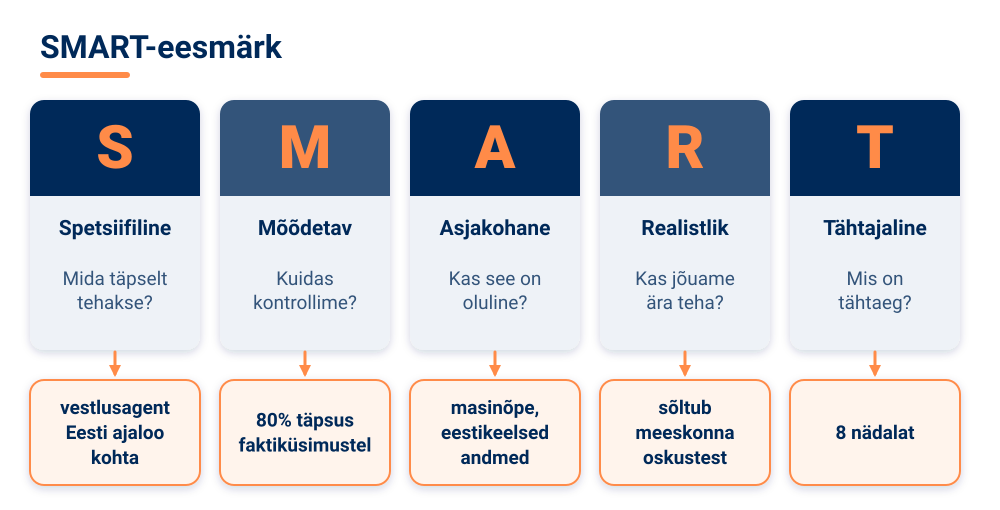

Eesmärgi kõrval tuleb sõnastada **põhjendus ja olulisus**. Kirjelda, millist probleemi või vajadust lahendad ja miks see on oluline. Määratle **sihtrühm** – kellele projekt on suunatud ja millised on nende vajadused. Mõtle, mille poolest sinu lahendus erineb olemasolevatest ja millist uut väärtust see loob. Lõpuks mõtle, millist muutust soovid saavutada ja kuidas edu mõõdad.

<!-- class="pae-motle" -->
> **Mõtle järele!**
>
> Kas eesmärk „Teha hea pildituvastusrakendus“ on SMART? Milliseid kriteeriume see ei täida? Proovi see ümber sõnastada nii, et kõik viis kriteeriumi oleksid täidetud.

### 🏠 Ulatus, tegevused ja ajakava

**Projekti ulatus** näitab, mida projekt hõlmab ja mida mitte. Kirjelda peamisi funktsioone ja olulisi komponente. Sama tähtis on kirja panna, mida projekt **ei hõlma**: teadlikud väljajätmised ja võimalused, mis jäävad tulevikuks. Nii väldid olukorda, kus projekt kasvab lõputult. Määratle ka piirangud (ajalised, ressurssidega seotud ja tehnilised) ning eeldused ja sõltuvused: mis peab olema täidetud ja millest projekt sõltub (nt kas saate kätte vajalikud andmed).

Seejärel jaga projekt **faasideks**:

")

Igas faasis määratle konkreetsed **ülesanded**, nende selged tulemused ja vastutajad. Tuvasta **sõltuvused**: millised ülesanded saavad alata alles siis, kui teised on valmis? Näiteks ei saa mudelit treenida enne, kui andmed on kogutud. Sõltuvate ülesannete ahelat, mis määrab, kui kiiresti saab kogu projekti lõpetada, nimetatakse **kriitiliseks teeks** – kui selles ahelas miski hilineb, hilineb kogu projekt.

**Ajakava** on projekti tegevuste järjestus koos tähtaegadega. Määra projekti algus- ja lõpukuupäev ning olulised **verstapostid** ehk vahe-eesmärgid (nt „andmed kogutud“, „esimene prototüüp töötab“). Hinda iga ülesande kestust ja määra järjestus. Jäta ajakavasse ka **puhveraega** ootamatuste ja riskide jaoks. Ajakava saab visualiseerida näiteks Gantti graafikuna (tulpdiagramm, kus iga tegevus on ajateljel ribana), ajateljena või kalendrivaatena.

<!-- class="pae-moiste" -->
> **Mõiste: verstapost**
>
> **Verstapost** on projekti oluline vahe-eesmärk või sündmus kindlal kuupäeval, mille järgi saab kontrollida, kas projekt edeneb plaanipäraselt.

### Ressursid, rollid ja riskid

**Ressursid** on kõik, mida projekti teostamiseks vajad:

- **inimressursid** – meeskonnaliikmed, vajalikud oskused, vajaduse korral mentorid või konsultandid;
- **tehnilised ressursid** – riistvara, tarkvara ja andmed;
- **tööriistad** – arendustööriistad, projektijuhtimise tööriistad (nt Trello, Asana, Google Docs) ja suhtlusvahendid;
- **eelarve** – kui projekt on sellega seotud, siis kulud ja rahastusallikad.

Meeskonnas tuleb jagada **rollid ja vastutus**. Võimalikud rollid on näiteks järgmised:

| Roll | Vastutus |
|---|---|
| Projektijuht | projekti üldine koordineerimine, ajakava ja eesmärkide saavutamine |
| Tehniline ekspert | tehnilised lahendused ja arhitektuur |
| Andmeteadlane | andmete kogumine, puhastamine ja analüüs |
| Arendaja | koodi kirjutamine ja tehnilise lahenduse loomine |
| Testija | lahenduse kvaliteedi kontroll ja vigade tuvastamine |
| Disainer | kasutajaliides ja kasutajakogemus |
| Dokumenteerija | projekti dokumentatsioon |

Väikestes projektides täidab üks inimene sageli mitut rolli. Oluline on, et kõik mõistaksid oma vastutust, ülesanded oleksid selged ja oleks kokku lepitud, kuidas te üksteisele aru annate ja kes mida otsustab. Leppige kokku ka koostöö põhimõtetes: kuidas suhtlete, millal saate kokku ja kuidas lahendate konflikte. Mõelge nii meeskonna edule kui ka iga liikme isiklikule arengule.

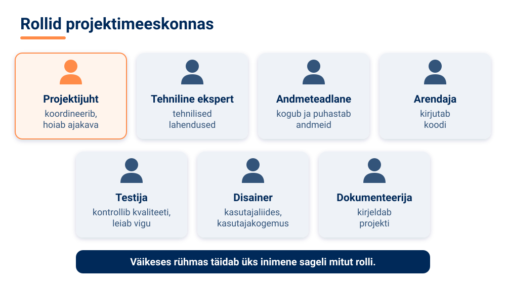

**Riskianalüüs** tähendab projekti võimalike probleemide ja takistuste tuvastamist ning nende lahendamise planeerimist. Riskid võivad olla tehnilised, ajalised, ressurssidega seotud või välised. Iga riski puhul hinda kahte asja: **tõenäosust** (kui tõenäoliselt see juhtub) ja **mõju** (kui palju see projekti kahjustaks). Nende põhjal saad riskid prioritiseerida. Seejärel vali maandamisstrateegia: **ennetamine** (et risk ei juhtuks), **leevendamine** (kui juhtub, on mõju väiksem) või **alternatiivplaan**. Vaata riskid regulaarselt üle ja jälgi varajasi hoiatusmärke.

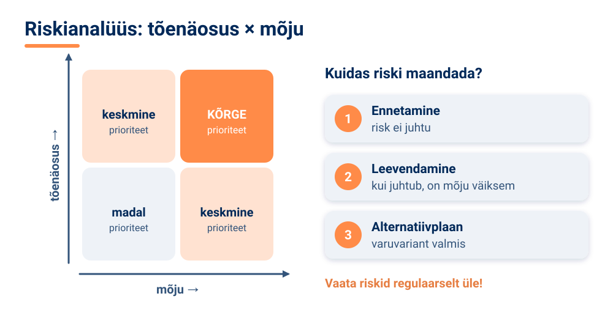

<!-- class="pae-naide" -->
> **Näide: riskid TI-projektis**
>
> | Risk | Maandamine |
> |---|---|
> | Andmeid pole piisavalt või need on halva kvaliteediga | varu aega andmete kogumiseks ja puhastamiseks |
> | Tehnilised probleemid või oskuste puudumine | planeeri õppimisaega või kaasa ekspert |
> | Ajakava venib | lisa ajakavasse puhveraega ja sea vahe-eesmärgid |

### 🧪 TI-katse: kas idee on teostatav? Kiirproov Teachable Machine'is

🛡️ *Ohutuskaardi reeglid kehtivad: ära logi sisse, ära sisesta isikuandmeid ega pildista inimesi.*

Enne kui kirjutad projektiplaani, tasub kontrollida, kas idee põhiosa üldse töötab. Selles katses treenid 10 minutiga oma projektiidee kõige lihtsama versiooni ja hindad, kas SMART-eesmärgi „R“ (realistlik) on täidetud.

**Vaja läheb:** [Teachable Machine](https://teachablemachine.withgoogle.com/) (tasuta, mudelit treenitakse veebilehitsejas), veebikaameraga arvuti, ~10 min, paaris või rühmas

1. Sõnastage oma projektiidee kõige lihtsam versioon kahe klassiga (nt „plastpudel“ ja „metallpurk“, „õun“ ja „pirn“ või „käsi üleval“ ja „käsi all“). Kui teie projekt pole pildituvastus, valige proovimiseks lähim pildiülesanne.
2. Avage Teachable Machine → *Image Project*, salvestage veebikaameraga kummagi klassi kohta umbes 30 pilti ja vajutage *Train Model*. Ärge pildistage kaasõpilaste nägusid.
3. Testige mudelit viie uue objekti või nurgaga, mida treeningpiltidel polnud, ja lugege kokku, mitu korda mudel õigesti vastas.

**Pane tähele / kirjuta üles:** mitu testi viiest õnnestus? Mis läks kergesti ja mis osutus raskeks? Kas teie eesmärk on realistlik või tuleb seda kitsendada (vähem klasse, rohkem andmeid, lihtsam ülesanne)?

[[___ ___ ___]]

<!-- class="pae-lisaks" -->
> **Kui arvutit pole:** kirjutage paberile, milliseid andmeid ja kui palju teie idee jaoks vaja oleks, kust need saate ja kui kaua nende kogumine võtab. Hinnake skaalal 1–5, kui realistlik on idee 8 nädalaga ellu viia, ja põhjendage.

### 🏠 Edukuse kriteeriumid ja projekti käivitamine

Enne töö algust leppige kokku, kuidas hindate, kas projekt õnnestus. **Hindamiskriteeriume** on mitut liiki:

- **projekti edukuse kriteeriumid** – eesmärkide saavutamine, kvaliteet, ajakava järgimine, ressursside kasutamine;
- **tehnilised kriteeriumid** – täpsus, jõudlus, kasutatavus, skaleeritavus (kas lahendus töötab ka suurema andmehulga või kasutajate arvu korral);
- **protsessi kriteeriumid** – koostöö, suhtlus, probleemide lahendamine;
- **õppimise kriteeriumid** – uued teadmised ja oskused, kogemused, refleksioon.

Kõik see pannakse kirja **projektiplaani**. Plaani võib vormistada tekstidokumendina, esitlusena või projektijuhtimise tarkvaras. Jagage plaani meeskonnaliikmete, juhendaja ja teiste huvirühmadega.

Projekti **käivitamiseks** pidage avakoosolek, vaadake eesmärgid ja plaan üle ning kinnitage rollid. Esimesteks sammudeks valige „kiired võidud“ – lihtsamad ülesanded, mis annavad kiiresti tulemuse ja hoo sisse. Edaspidi jälgige regulaarselt edenemist, kohandage vajaduse korral plaani, andke üksteisele aru ning koguge ja kasutage tagasisidet.

<!-- class="pae-lisaks" -->
> **Tea lisaks**
>
> Projektijuhtimise tööriistad, nagu [Trello](https://trello.com/) ja [Asana](https://asana.com/), aitavad ülesandeid tahvlil või nimekirjas jälgida: kes mida teeb, mis on tehtud ja mis on veel ootel. Prototüübi visandamiseks sobib näiteks [Figma](https://www.figma.com/).

### Kokkuvõte ja põhimõisted

**Pea meeles**

- Planeerimine tähendab eesmärkide, tegevuste, ajakava ja ressursside määratlemist enne projekti alustamist.
- Teema valikul arvesta huvide, oskuste ja teostatavusega ning projekti väärtuse ja mõjuga.
- SMART-eesmärk on spetsiifiline, mõõdetav, asjakohane, realistlik ja tähtajaline.
- Ajakava on tegevuste järjestus koos tähtaegadega; jäta sinna puhveraega.
- Riskianalüüs tuvastab võimalikud probleemid ja kavandab nende lahendused; riske hinnatakse tõenäosuse ja mõju järgi.
- Plaan annab suuna, kuid seda võib töö käigus kohandada.

| Mõiste | Tähendus |
|---|---|
| projektiplaan | dokument, mis kirjeldab projekti eesmärki, ulatust, tegevusi, ajakava, ressursse, rolle, riske ja hindamiskriteeriume |
| SMART-eesmärk | spetsiifiline, mõõdetav, asjakohane, realistlik ja tähtajaline eesmärk |
| projekti ulatus | see, mida projekt hõlmab ja mida mitte |
| ajakava | projekti tegevuste järjestus koos tähtaegadega |
| verstapost | oluline vahe-eesmärk kindlal kuupäeval |
| kriitiline tee | sõltuvate ülesannete ahel, mis määrab projekti kogukestuse |
| riskianalüüs | võimalike probleemide tuvastamine ja nende lahendamise planeerimine |
| puhveraeg | ajakavasse jäetud lisaaeg ootamatuste jaoks |

### 📚 Allikad ja lisalugemine

- Google (s.a.). [Teachable Machine](https://teachablemachine.withgoogle.com/). Tasuta veebitööriist, millega saab ilma programmeerimata treenida pildi-, heli- ja poosituvastuse mudeleid; sobib prototüübi kiirproovideks.
- Hackster.io (s.a.). [Google's Teachable Machine Uses TensorFlow.js to Bring Code-Free Machine Learning to the Browser](https://hackster.io/news/google-s-teachable-machine-uses-tensorflow-js-to-bring-code-free-machine-learning-to-the-browser-53ffcdec0099). Kuidas Teachable Machine veebilehitsejas töötab (inglise keeles).
- Kratid.ee (s.a.). [AI kasutuslood](https://www.kratid.ee/kasutuslood-kratid). Eesti avaliku sektori TI-projektid (nt anonüümija, automaatsubtiitrid, EstNLTK) – hea ideede allikas oma projektile.
- Andmekaitse Inspektsioon (s.a.). [Ringkiri koolidele](https://www.aki.ee/sites/default/files/documents/2024-02/ringkiri_koolidele.pdf). Millal on koolis piltide, videote ja õpilaste andmete kasutamiseks vaja nõusolekut – oluline, kui plaanid projektis andmeid koguda.
- Google for Developers (s.a.). [ML Universal Guides](https://developers.google.com/machine-learning/guides). Juhendid, sh „People + AI Guidebook“ selle kohta, kuidas TI-lahendust kasutaja vajadusest lähtudes planeerida (inglise keeles).

### Tööleht 7.2

<!-- class="pae-jaotis" -->
**⭐ I. Projekti teema ja eesmärk**

**Ülesanne 1.** Kirjelda tehisintellekti projekti, mida soovid teostada.

[[___ ___ ___]]

**Ülesanne 2.** Sõnasta projekti eesmärk SMART-kriteeriumide järgi.

**Spetsiifiline (konkreetne):**

[[___]]

**Mõõdetav:**

[[___]]

**Asjakohane (relevantne):**

[[___]]

**Realistlik:**

[[___]]

**Tähtajaline (ajaliselt piiritletud):**

[[___]]

**Ülesanne 3.** Miks valisid just selle projekti teema? Mis sind selle juures huvitab?

[[___ ___ ___]]

<!-- class="pae-jaotis" -->
**➕ II. Projekti põhjendus ja olulisus**

**Ülesanne 4.** Millist probleemi või vajadust sinu projekt lahendab?

[[___ ___ ___]]

**Ülesanne 5.** Kes on sinu projekti sihtrühm? Millised on nende vajadused?

[[___ ___ ___]]

**Ülesanne 6.** Mille poolest erineb sinu lahendus olemasolevatest? Millist uut väärtust see loob?

[[___ ___ ___]]

<!-- class="pae-jaotis" -->
**⭐ III. Projekti ulatus ja piirid**

**Ülesanne 7.** Mida sinu projekt hõlmab? Millised on peamised funktsioonid ja omadused?

[[___ ___ ___ ___]]

**Ülesanne 8.** Mida sinu projekt ei hõlma? Millised on teadlikud väljajätmised?

[[___ ___ ___]]

**Ülesanne 9.** Millised on projekti piirangud (ajalised, ressurssidega seotud, tehnilised)?

[[___ ___ ___]]

<!-- class="pae-jaotis" -->
**➕ IV. Tegevuste ja ülesannete nimekiri**

**Ülesanne 10.** Jaota projekt faasideks ja kirjelda iga faasi peamisi tegevusi.

**a) Planeerimine:**

[[___ ___]]

**b) Andmete kogumine ja analüüs:**

[[___ ___]]

**c) Disain ja arendus:**

[[___ ___]]

**d) Testimine ja hindamine:**

[[___ ___]]

**e) Dokumenteerimine ja esitlemine:**

[[___ ___]]

**Ülesanne 11.** Millised ülesanded sõltuvad teistest ülesannetest? Kirjelda sõltuvusi.

[[___ ___ ___]]

<!-- class="pae-jaotis" -->
**➕ V. Ajakava ja tähtajad**

**Ülesanne 12.** Koosta projekti ajakava, määrates igale tegevusele algus- ja lõpukuupäeva ning vastutaja.

| Tegevus | Alguskuupäev | Lõpukuupäev | Vastutaja |
|---|---|---|---|
| | | | |

Kirjuta iga tegevuse kohta eraldi reale: tegevus – alguskuupäev – lõpukuupäev – vastutaja.

[[___ ___ ___ ___ ___]]

**Ülesanne 13.** Määra projekti olulised verstapostid.

| Verstapost | Kuupäev | Kirjeldus |
|---|---|---|
| | | |

Kirjuta iga verstaposti kohta eraldi reale: verstapost – kuupäev – kirjeldus.

[[___ ___ ___ ___]]

**Ülesanne 14.** Kuidas plaanid jälgida projekti edenemist ja ajakavast kinnipidamist?

[[___ ___ ___]]

<!-- class="pae-jaotis" -->
**➕ VI. Vajalikud ressursid ja tööriistad**

**Ülesanne 15.** Milliseid tehnilisi ressursse vajad projekti teostamiseks?

**Riistvara:**

[[___]]

**Tarkvara:**

[[___]]

**Andmed:**

[[___]]

**Ülesanne 16.** Milliseid tööriistu plaanid kasutada?

**Arendustööriistad:**

[[___]]

**Projektijuhtimise tööriistad:**

[[___]]

**Suhtlusvahendid:**

[[___]]

**Ülesanne 17.** Milliseid oskusi ja teadmisi vajad projekti teostamiseks? Kuidas plaanid need omandada?

[[___ ___ ___]]

<!-- class="pae-jaotis" -->
**➕ VII. Meeskonna rollid ja vastutus**

**Ülesanne 18.** Kes kuuluvad projekti meeskonda? Millised on nende rollid?

[[___ ___ ___]]

**Ülesanne 19.** Kuidas on vastutus meeskonnaliikmete vahel jagatud?

[[___ ___ ___]]

**Ülesanne 20.** Millised on teie koostöö põhimõtted (suhtlus, koosolekud, konfliktide lahendamine)?

[[___ ___ ___]]

<!-- class="pae-jaotis" -->
**⭐ VIII. Riskianalüüs**

**Ülesanne 21.** Millised on projekti peamised riskid? Hinda nende tõenäosust ja mõju skaalal 1–5 ning kirjuta maandamisstrateegia.

| Risk | Tõenäosus (1–5) | Mõju (1–5) | Maandamisstrateegia |
|---|---|---|---|
| | | | |

Kirjuta iga riski kohta eraldi reale: risk – tõenäosus – mõju – maandamisstrateegia.

[[___ ___ ___ ___ ___]]

**Ülesanne 22.** Vali tabelist kõige kõrgema prioriteediga risk (suur tõenäosus ja suur mõju). Kirjelda selle jaoks alternatiivplaan: mida täpselt teete, kui risk realiseerub?

[[___ ___ ___]]

<!-- class="pae-jaotis" -->
**➕ IX. Hindamiskriteeriumid**

**Ülesanne 23.** Kuidas hindad projekti edukust? Millised on edukuse kriteeriumid?

[[___ ___ ___]]

**Ülesanne 24.** Millised on tehnilised kriteeriumid (täpsus, jõudlus, kasutatavus)?

[[___ ___ ___]]

**Ülesanne 25.** Kuidas plaanid hinnata kasutajate rahulolu või projekti mõju?

[[___ ___ ___]]

<!-- class="pae-jaotis" -->
**➕ X. Projektiplaani kokkuvõte**

**Ülesanne 26.** Koosta lühike kokkuvõte oma projektist (3–5 lauset).

[[___ ___ ___ ___]]

**Ülesanne 27.** Millised on projekti kõige olulisemad aspektid, millele tuleks keskenduda?

[[___ ___ ___]]

**Ülesanne 28.** Millised on järgmised sammud pärast projektiplaani kinnitamist?

[[___ ___ ___]]

### Enesekontroll 7.2

**1. Mis on projekti eesmärgi SMART-kriteeriumid?**

- [( )] Subjektiivne, Mõõdetav, Arusaadav, Realistlik, Tähtajaline
- [( )] Spetsiifiline, Mõõdetav, Ajaliselt määratletud, Realistlik, Teostatav
- [(X)] Spetsiifiline, Mõõdetav, Asjakohane, Realistlik, Tähtajaline
- [( )] Subjektiivne, Mõõdetav, Asjakohane, Realistlik, Teostatav
- [[?]] Hea eesmärk ei saa olla subjektiivne.
****************************************
Õige! SMART-kriteeriumid aitavad sõnastada selgeid ja saavutatavaid eesmärke: spetsiifiline (konkreetne), mõõdetav, asjakohane (relevantne), realistlik ja tähtajaline (ajaliselt piiritletud).
****************************************

**2. Kuidas nimetatakse projekti olulist vahe-eesmärki kindlal kuupäeval (nt „andmed kogutud“)? Kirjuta vastus.**

[[verstapost]]

****************************************
Õige vastus: **verstapost**. Verstapostide järgi saab kontrollida, kas projekt edeneb plaanipäraselt.
****************************************

**3. Kuidas nimetatakse ajakavasse jäetud lisaaega ootamatuste jaoks? Kirjuta vastus.**

[[puhveraeg]]

****************************************
Õige vastus: **puhveraeg**. See aitab toime tulla ootamatustega, näiteks kui andmete kogumine võtab plaanitust kauem.
****************************************

**4. Pane projekti planeerimise etapid õigesse järjekorda.**

<!-- data-show-partial-solution -->
Ajakava ja tähtaegade määramine: [[ 1 | 2 | 3 | (4) | 5 | 6 ]] 
Projekti teema ja eesmärgi määratlemine: [[ (1) | 2 | 3 | 4 | 5 | 6 ]] 
Riskianalüüsi tegemine: [[ 1 | 2 | 3 | 4 | (5) | 6 ]] 
Projekti ulatuse ja piiride määratlemine: [[ 1 | (2) | 3 | 4 | 5 | 6 ]] 
Projektiplaani vormistamine: [[ 1 | 2 | 3 | 4 | 5 | (6) ]] 
Tegevuste ja ülesannete nimekirja koostamine: [[ 1 | 2 | (3) | 4 | 5 | 6 ]]
****************************************
Kõigepealt määratakse teema ja eesmärk, siis ulatus. Selle põhjal koostatakse tegevuste nimekiri ja ajakava, seejärel tehakse riskianalüüs ning lõpuks pannakse kõik projektiplaani kirja.
****************************************

**5. Lohista rollid õigetesse lünkadesse.**

<!-- data-show-partial-solution -->
Projekti üldise koordineerimise, ajakava ja eesmärkide saavutamise eest vastutab [->[ (projektijuht) | dokumenteerija ]]. Andmete kogumise, puhastamise ja analüüsiga tegeleb [->[ (andmeteadlane) ]]. Lahenduse kvaliteeti kontrollib ja vigu otsib [->[ (testija) | arendaja ]]. Kasutajaliidese ja kasutajakogemuse eest hoolitseb [->[ (disainer) ]].
****************************************
Projektijuht koordineerib, andmeteadlane tegeleb andmetega, testija kontrollib kvaliteeti ja disainer kujundab kasutajaliidese. Väikestes meeskondades täidab üks inimene sageli mitut rolli – oluline on, et vastutus oleks selge.
****************************************

**6. Liigita projekti ressursid.**

- [ (Inimressurss) (Tehniline ressurss) (Tööriist) ]
- [ (X) ( ) ( ) ] Mentor, kes aitab masinõppe küsimustes
- [ ( ) (X) ( ) ] Avalik andmekogu
- [ ( ) ( ) (X) ] Trello tahvel ülesannete jälgimiseks
- [ ( ) (X) ( ) ] Sülearvuti
- [ (X) ( ) ( ) ] Rühmaliige, kes oskab Pythonis programmeerida
- [ ( ) ( ) (X) ] Google Docs ühiseks kirjutamiseks
****************************************
**Inimressursid** on meeskonnaliikmed, nende oskused ning mentorid. **Tehnilised ressursid** on riistvara, tarkvara ja andmed. **Tööriistad** on arendus- ja projektijuhtimise tööriistad (nt Trello, Asana, Google Docs) ning suhtlusvahendid.
****************************************

**7. Mille põhjal hinnatakse ja prioritiseeritakse riske? (Vali kõik õiged.)**

- [[X]] Tõenäosus, et risk realiseerub
- [[X]] Mõju, mida risk projektile avaldaks
- [[ ]] Riski kirjelduse pikkus
- [[ ]] Meeskonnaliikmete arv
****************************************
Riski olulisus sõltub sellest, kui tõenäoline see on ja kui suurt kahju see tooks. Kõrge tõenäosuse ja suure mõjuga riskidega tuleb tegeleda esimesena.
****************************************

**8. Eesmärk „Teha hea pildituvastusrakendus“ ei ole SMART-eesmärk. Sõnasta see ümber nii, et kõik viis kriteeriumi oleksid täidetud.**

[[___ ___ ___]]

Vaata näidisvastust

„Luua projektiploki 9 tunni jooksul Teachable Machine'i prototüüp, mis tunneb fotolt ära kooli ümbruses kasvavad 3 puuliiki ja saavutab 30 testpildil vähemalt 80% täpsuse.“ Eesmärk on spetsiifiline (3 puuliiki, prototüüp), mõõdetav (80% täpsus 30 testpildil), asjakohane (seotud pilditöötlusega), realistlik (väike ja piiratud ülesanne, tasuta tööriist) ning tähtajaline (9 tundi). Algne eesmärk ei öelnud, mida täpselt tuvastatakse, mis on „hea“ ega millal see valmis peab olema.

### 📤 Väljapääsupilet 7.2

<!-- class="pae-fakt" -->
> ⚠️ **Salvesta või saada vastused enne lehe sulgemist!** Vastus ei liigu automaatselt õpetajale ja võib kaduda, kui vahetad seadet, kasutad privaatakent või kustutad brauseri andmed.

Vasta lühidalt (3–5 min). Vastused jäävad selle brauseri mällu. Kui oled valmis, vajuta **Kopeeri vastused** ja kleebi need Google Classroomi ülesande vastusesse või laadi fail alla ja lisa see ülesande juurde.

<!-- data-type="none" -->
| Kriteerium | 2 p | 1 p | 0 p |
|---|---|---|---|
| Mõiste rakendamine uues olukorras | Õige mõiste ja selge põhjendus | Mõiste õige, põhjendus puudu või ebatäpne | Vastus puudub või on vale |
| TI-katse tõlgendus | Tulemus on seotud tunni mõistega | Tulemus on kirjeldatud, seos puudub | Puudub |
| Refleksioon | Konkreetne ja isiklik | Üldine | Puudub |

*Väljapääsupilet on kujundav hindamine: õpetaja annab tagasisidet ja kasutab vastuseid järgmise tunni planeerimisel. Pilet sobib ka portfoolio õpipäevikusse.*

### 🔐 Lukk 7.2

<!-- class="pae-naide" -->
> <!-- style="width: 120px; float: left; margin: 0 16px 8px 0; border-radius: 0;" --> **Kratt:** „Ma tahtsin kõike korraga teha ja nüüd on mu ülesanded sassis nagu kaablid! Isegi selle sõna tähed, mis mind päästa võiks, on segi läinud.“

Lukk avaneb, kui lahendad ülekandeülesande.

**Uus olukord:** Kooli korvpallimeeskond valmistub talviseks turniiriks. Treener paneb tabelisse kirja, millisel nädalal harjutatakse kaitset ja millisel rünnakut, millal toimub sõprusmäng ja millal on turniir. Enne turniiri jätab ta ühe nädala vabaks juhuks, kui keegi haigestub. Millise projektiplaani osa treener koostas? Kirjuta üks sõna.

[[ajakava]]
[[?]] Vihje 1: mis seob kõik tegevused kindlate nädalate ja kuupäevadega?
[[?]] Vihje 2: pane tähed õigesse järjekorda: **AVAKAJA**.
[[?]] 🛟 Päästerõngas: mine tagasi lehele „🏠 Ulatus, tegevused ja ajakava“ ja loe lõik, mis algab sõnadega „Ajakava on projekti tegevuste järjestus“. Kui ikka ei tule välja, küsi õpetajalt selle luku päästekood ja kirjuta see vastuseväljale.

****************************************
✅ **Lukk avatud!** Treener koostas ajakava: tegevused on järjestatud ja seotud tähtaegadega ning vaba nädal on puhveraeg ootamatuste jaoks – nii ei jää kõik viimasele päevale.

🔑 **Sinu võtmetäht: A**

Kirjuta täht üles – seda on vaja toa ukse avamiseks.
****************************************

## 7.3 Projektitöö arendamine

<!-- class="pae-kaas" -->

### Õpieesmärgid

Selle tunni järel sa:

- **selgitad oma sõnadega**, miks jagatakse andmed treening-, valideerimis- ja testandmeteks *(mõistmine)*;
- **puhastad** andmeid: leiad kordused, puuduvad väärtused ja vead ning otsustad, mida nendega teha *(rakendamine)*;
- **arvutad** mudeli saagise ja täpsuse testtulemuste põhjal *(rakendamine)*;
- **testid** närvivõrku tavaliste ja piirjuhtumitega ning **analüüsid**, kui palju selle täpsus langeb *(analüüs)*;
- **hindad**, mida täpsus üksi mudeli kohta ei näita, ja **koostad** oma projektile tava- ja piirjuhtumitega testiplaani *(hindamine, loomine)*.

<!-- class="pae-fakt" -->
> **🎯 Tunni tuumik (45 min)**
>
> 🏠 **Kodus enne tundi** (~15–20 min): „Planeerimisest teostuseni“, „Lahenduse disain ja teostus“, „Dokumenteerimine ja väljakutsete lahendamine“, „Edenemise jälgimine ja jätkusuutlikkus“. Too tundi kaasa üks uus teadmine või küsimus – tunni alguses arutate neid paarides (3 min).
>
> 1. 📚 **Loe** (~12 min): „Andmete kogumine ja ettevalmistamine“, „Treenimine, testimine ja hindamine“ ning „Kokkuvõte ja põhimõisted“
> 2. 🧪 **TI-katse** (~10 min): „Testi närvivõrku piirjuhtumitega“
> 3. ⭐ **Tööleht** (~15 min): ülesanded II, V ja X
> 4. 📤 **Väljapääsupilet** ja 🔐 **lukk** (~8 min)
>
> **🏠** tähistab osi, mida loed või vaatad **kodus enne tundi** (ümberpööratud klassiruum). **➕** tähistab lisaülesannet – tee seda, kui jõuad, või kui tahad rohkem teada.

{{|>}}
<section class="pae-lihtne">

**🟢 Lihtsalt öeldes**

Selles tunnis arendad oma projekti TI-lahendust samm-sammult. TI on nii hea, kui head on tema andmed. Seepärast **puhasta andmed** enne kasutamist: paranda vead ja eemalda kordused. Näiteks paranda viga, kus on kirjas 900 kg 9 kg asemel. Siis jaga andmed kolmeks: treening-, valideerimis- ja **testandmed**. Mudel õpib treeningandmetel, testandmetel kontrollid sa selle tööd. Hea mudel ei õpi andmeid pähe, vaid töötab hästi ka uute andmetega. Võrdle oma mudelit ka lihtsa **võrdlusalusega**.

**Tähtsad sõnad:** **andmete puhastamine** – vigade, puuduvate väärtuste ja korduste korda tegemine; **testandmed** – andmed, millel kontrollid lõpus mudeli tööd; **võrdlusalus** – lihtne lahendus, millega oma mudelit võrdled.

</section>

### 🏠 Planeerimisest teostuseni

Kui projektiplaan on valmis, algab arendamine – kõige pikem ja tihti ka kõige põnevam osa projektist. Nüüd selgub, kui hea oli plaan, ja tuleb ette nii väljakutseid kui ka võimalusi. Eduka arendusprotsessi aluseks on neli põhimõtet: selge plaan ja eesmärgid, iteratiivne lähenemine, pidev testimine ja tagasiside ning hea dokumenteerimine.

TI-projekti teostamine kulgeb tavaliselt järgmiste etappide kaudu:

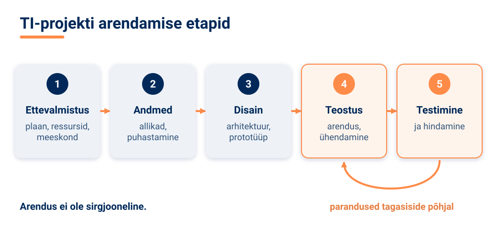

Pane tähele noolt, mis viib testimisest tagasi teostusse: arendus ei ole sirgjooneline. Testimise käigus leiad vigu ja parendusvõimalusi ning lähed tagasi lahendust täiendama.

### Andmete kogumine ja ettevalmistamine

Nagu plokis 2 nägid, on TI täpselt nii hea kui tema andmed. Seepärast algab enamik TI-projekte andmetest.

**Andmeallikate tuvastamine.** Andmeid võib saada avalikest andmekogudest (näiteks andmeteaduse platvormilt [Kaggle](https://www.kaggle.com/)), olemasolevatest andmebaasidest, aga neid saab ka ise koguda (nt küsitluse, fotode või mõõtmiste abil). Kui kogud andmeid inimestelt, pea meeles isikuandmete kaitset: küsi luba, kogu ainult vajalikku ja hoia andmeid turvaliselt.

**Andmete puhastamine.** Päris andmed on harva korras. Puhastamise käigus käsitled puuduvaid väärtusi, parandad vigu ja eemaldad duplikaate (korduvaid kirjeid).

**Andmete teisendamine.** Mudel vajab andmeid kindlal kujul. **Normaliseerimine** viib arvud ühtsele skaalale (nt vahemikku 0–1). Kategoorilised tunnused (nt „koer“, „kass“) tuleb kodeerida arvudeks. Vahel luuakse olemasolevatest andmetest ka uusi tunnuseid.

**Andmete jaotamine.** Andmed jagatakse tavaliselt kolmeks osaks: **treeningandmed**, millel mudel õpib; **valideerimisandmed**, mille abil valitakse mudeli seadistusi treenimise ajal; ja **testandmed**, millel hinnatakse lõpuks, kui hästi mudel uutel andmetel töötab.

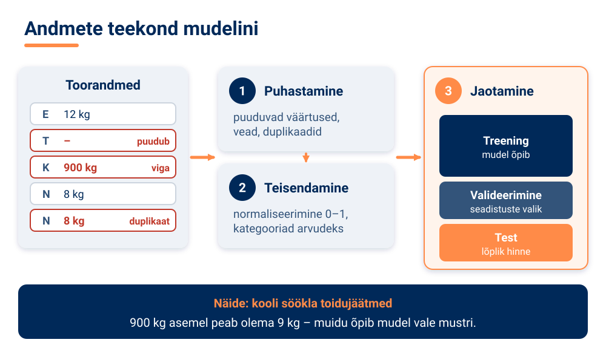

<!-- class="pae-moiste" -->
> **Mõiste: andmete puhastamine**
>
> **Andmete puhastamine** on andmete ettevalmistamine kasutamiseks: puuduvate väärtuste käsitlemine, vigade parandamine ja duplikaatide eemaldamine, et mudel ei õpiks valedest või korduvatest andmetest.

<!-- class="pae-naide" -->
> **Näide: kooli söökla toidujäätmed**
>
> Rühm tahab ennustada, mitu portsjonit sööklas üle jääb. Andmetabelis on mõnel päeval jäätmete kogus puudu, ühel päeval on kogemata sisestatud 900 kg 9 kg asemel ja mitu päeva on kaks korda kirjas. Enne treenimist tuleb puuduvad väärtused käsitleda, ilmne viga parandada ja duplikaadid eemaldada – muidu õpib mudel valesid mustreid.

### 🏠 Lahenduse disain ja teostus

**Arhitektuuri planeerimine** tähendab otsustamist, millistest komponentidest süsteem koosneb, kuidas andmed nende vahel liiguvad (andmevood) ja milliste teiste süsteemidega lahendus ühendatakse.

**Algoritmi või mudeli valik** sõltub kolmest asjast: probleemi tüübist (nt kas ennustad kategooriat ehk teed **klassifitseerimist**, ennustad arvu ehk teed **regressiooni** või otsid rühmi ehk teed **klasterdamist**), andmete iseloomust (tekst, pildid, arvud) ja jõudlusnõuetest (kui kiiresti ja täpselt peab lahendus töötama).

Mudeli juures tuleb valida ka **hüperparameetrid** – seadistused, mille arendaja määrab enne treenimist. Need mõjutavad näiteks mudeli keerukust, õppimiskiirust ja regulariseerimist (võtteid, mis hoiavad mudelit liiga keeruliseks muutumast).

**Prototüüpimine** tähendab lahenduse lihtsa esialgse versiooni kiiret loomist. Prototüübi abil saad kiiresti tagasisidet, saad idee läbi proovida ja lahendust samm-sammult täiendada.

<!-- class="pae-moiste" -->
> **Mõiste: prototüüp**
>
> **Prototüüp** on lahenduse lihtne esialgne versioon, mille abil saab ideed kiiresti katsetada ja tagasisidet koguda enne, kui lõplikku lahendust põhjalikult arendama hakatakse. Prototüüp võib olla ka paberil visand või klõpsatav kujundus.

**Teostus** algab arenduskeskkonna seadistamisest: vali tööriistad ja teegid (valmis koodikogumid, nt masinõppe teek scikit-learn või TensorFlow) ning kasuta **versioonihaldust**, mis salvestab koodi kõik muudatused ja võimaldab vajaduse korral eelmise versiooni juurde tagasi minna. Programmeerides järgi ühtseid koodistandardeid, dokumenteeri koodi ja korrasta seda (refaktoreeri), kui see muutub segaseks. Seejärel ühenda komponendid: loo nendevahelised liidesed, seadista andmevood ja kontrolli, et süsteem töötaks tervikuna.

<!-- class="pae-fakt" -->
> **Kas teadsid?** Versioonihaldus salvestab koodi kõik muudatused. Kui midagi läheb katki, saad minna tagasi eelmise versiooni juurde – nii ei lähe ükski töötav lahendus kaduma.

Kõige olulisem on **iteratiivne arendus**: töötate lühikeste arendustsüklite kaupa, testite pidevalt ja kohandate lahendust tagasiside põhjal. Parem on igas tunnis saada valmis väike töötav samm kui jätta kõik viimasesse tundi.

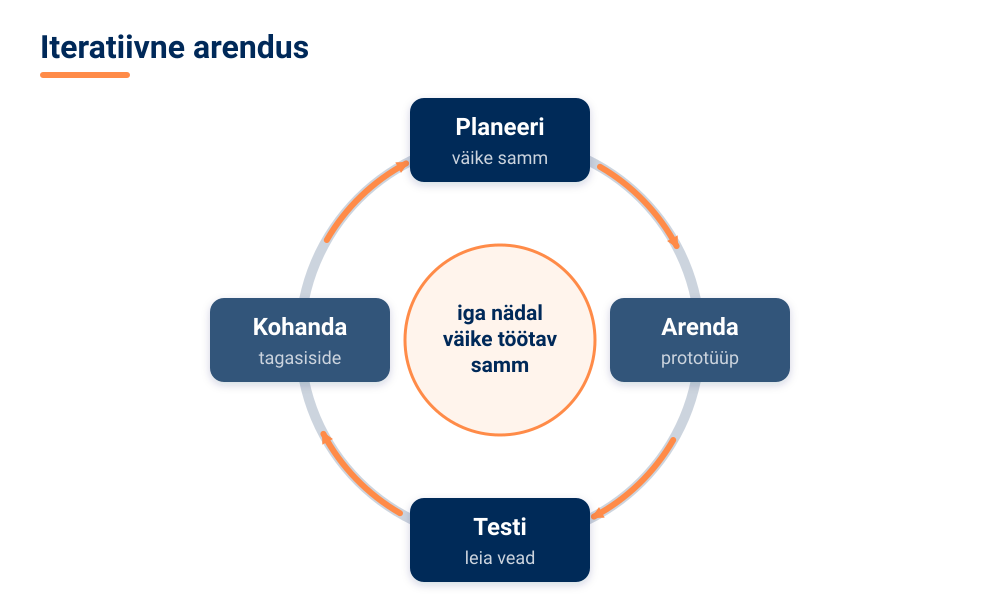

<!-- class="pae-eesti" -->
> **Eesti näide: eestikeelsed tööriistad**
>
> Kui sinu projekt töötleb eestikeelset teksti, ei pea kõike nullist looma. Eesti keele jaoks on olemas näiteks tekstitöötlusteek **EstNLTK** ja Tartu Ülikooli masintõlkesüsteem **Neurotõlge**, mida tutvustasime keeletöötluse plokis. Avalikus sektoris on riigi virtuaalassistentide võrgustik **Bürokratt** hea näide sellest, kuidas suurt lahendust arendatakse komponentidena, mis omavahel ühendatakse.

### Treenimine, testimine ja hindamine

**Mudeli treenimiseks** seadista treeningparameetrid, valideerimisprotsess ja peatumiskriteeriumid (millal treenimine lõpetada). Treenimise ajal halda ressursse (nt arvutusaega), jälgi edenemist ja tuvasta probleeme. Seejärel hinda mudelit täpsusmõõdikutega ja kontrolli, et mudel poleks **ülesobitunud** – st et see ei oleks treeningandmeid lihtsalt pähe õppinud, vaid töötaks hästi ka uutel andmetel. Võrdle mudelit alternatiividega. Mudelit saab optimeerida, häälestades hüperparameetreid, kohandades arhitektuuri või kasutades ansamblimeetodeid (mitme mudeli ühendamist).

**Testimine** on lai mõiste:

- **funktsionaalne testimine** – kas lahendus vastab nõuetele, kas selles on vigu, kuidas see käitub piirjuhtumite (ebatavaliste sisendite) korral;
- **jõudluse testimine** – kiirus, skaleeritavus, ressursikasutus;
- **kasutajatestid** – kasutatavus, kasutajakogemus ja tagasiside kogumine;
- **tulemuste hindamine** – kas eesmärgid on saavutatud, kas kvaliteedikriteeriumid on täidetud, mida saab parandada.

TI-lahenduse **täpsuse hindamiseks** kasutatakse mitut mõõdikut. Kujutle rämpspostifiltrit. **Üldine täpsus** näitab, kui suur osa kõigist kirjadest liigitati õigesti. **Täpsus** (precision) näitab, kui suur osa rämpspostiks märgitud kirjadest oli tegelikult rämpspost. **Saagis** (recall) näitab, kui suure osa kõigist tegelikest rämpspostikirjadest filter üles leidis. **F1-skoor** ühendab täpsuse ja saagise üheks arvuks. **Segadusmaatriks** on tabel, kus on näha, mitu korda mudel iga klassi õigesti või valesti ennustas. **ROC-kõver** on graafik, mis näitab, kui hästi mudel eristab klasse erinevate otsustuspiiride korral.

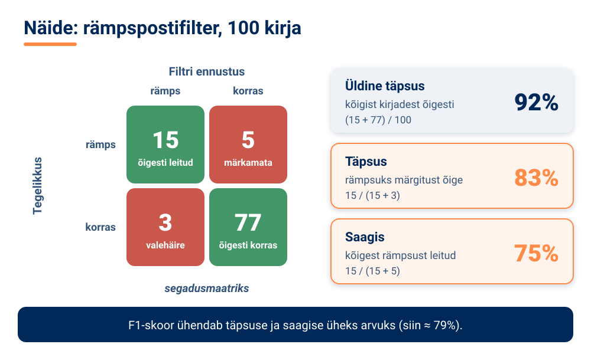

<!-- class="pae-moiste" -->
> **Mõiste: segadusmaatriks**
>
> **Segadusmaatriks** on tabel, mis näitab klassifitseerimismudeli tulemusi: ridades on tegelikud klassid, veergudes mudeli ennustused. Diagonaalil on õiged vastused, mujal vead – nii näed, milliseid klasse mudel omavahel segi ajab.

<!-- data-type="barchart" data-title="Näide: rämpspostifiltri mõõdikud (%)" -->
| Mõõdik | Väärtus (%) |
|--------|------------:|
| Üldine täpsus | 92 |
| Täpsus | 83 |
| Saagis | 75 |
| F1-skoor | 79 |

Hinda kindlasti ka **eetilisust**: kas lahendus kohtleb kõiki rühmi õiglaselt (kallutatus), kas selle otsuseid saab selgitada (läbipaistvus) ja kas privaatsus ja turvalisus on tagatud. Hinda **praktilist väärtust** – kasulikkust, kasutatavust ja kuluefektiivsust. Ja võrdle oma lahendust **alternatiividega**: olemasolevate lahendustega, lihtsa **võrdlusalusega** (baseline, nt mudel, mis pakub alati kõige sagedasemat vastust) ning inimese sooritusega. Kui sinu keerukas mudel ei ole lihtsast võrdlusalusest parem, on midagi vaja muuta.

<!-- class="pae-motle" -->
> **Mõtle järele!**
>
> Sinu mudel tunneb kassi- ja koerapilte ära 90% täpsusega. Kas see on hea tulemus? Mida peaksid veel teadma, et seda hinnata? (Vihje: mõtle võrdlusalusele ja sellele, kas testandmetes oli kasse ja koeri sama palju.)

### 🧪 TI-katse: testi närvivõrku piirjuhtumitega

🛡️ *Ohutuskaardi reeglid kehtivad: ära logi sisse, ära sisesta isikuandmeid ega pildista inimesi.*

Hea testija ei kontrolli ainult tavalisi juhtumeid, vaid otsib ka **piirjuhtumeid** – ebatavalisi sisendeid, mille peal mudel võib eksida. Selles katses testid valmis närvivõrku samamoodi, nagu peaksid testima oma projekti lahendust.

**Vaja läheb:** [Quick, Draw!](https://quickdraw.withgoogle.com/) (tasuta, sisselogimiseta), ~10 min, paaristöö

1. Mängi üks voor tavapäraselt: joonista iga ülesande kohta võimalikult tüüpiline pilt (20 sekundit pildi kohta). Paariline märgib iga joonistuse kohta üles, kas närvivõrk arvas selle ära.
2. Mängi teine voor ja joonista meelega piirjuhtumeid: väga lihtsustatud, pooleli jäetud, tagurpidi või ebatavalise nurga alt.
3. Arvuta mõlema vooru **üldine täpsus** (ära arvatud joonistuste arv : kõigi joonistuste arv × 100) ja võrdle.

**Pane tähele / kirjuta üles:** kui palju täpsus piirjuhtumitega langes? Milliseid jooniseid ajas närvivõrk segi? Milliseid piirjuhtumeid peaksid lisama oma projekti testandmetesse? NB! Sinu joonistused lisatakse avalikku andmekogusse, seega ära kirjuta ega joonista midagi isiklikku.

[[___ ___ ___]]

<!-- class="pae-lisaks" -->
> **Kui arvutit pole:** üks paariline joonistab paberile kuus eset (kolm tavalist ja kolm piirjuhtumit) ja teine proovib 20 sekundi jooksul ära arvata. Arvutage mõlema rühma täpsus ja arutage, mille poolest erineb inimene närvivõrgust.

### 🏠 Dokumenteerimine ja väljakutsete lahendamine

**Dokumenteerimine** on projekti tegevuste ja tulemuste kirjalik või visuaalne salvestamine. Seda tehakse kogu arenduse jooksul, mitte alles lõpus. Dokumenteerida tuleb mitut asja:

- **kood** – kommentaarid, funktsioonide kirjeldused, README-failid (failid, mis tutvustavad projekti ja selle kasutamist);
- **tehniline dokumentatsioon** – arhitektuuri kirjeldus, andmemudelid, API dokumentatsioon (kirjeldus, kuidas teised programmid saavad sinu lahendusega suhelda);
- **kasutajadokumentatsioon** – kasutusjuhendid, õpetused, korduma kippuvad küsimused (KKK);
- **protsess** – arendusprotsessi kirjeldus, otsuste põhjendused ja õppetunnid.

Hea viis protsessi dokumenteerimiseks on **arenduspäevik**: iga töösessiooni järel kirjutad üles, mida tegid, milliseid otsuseid langetasid ja miks ning millised probleemid tekkisid.

Väljakutseid tuleb ette igas projektis. Neid on nelja liiki:

| Väljakutse | Kuidas lahendada |
|---|---|
| Tehnilised probleemid | vigade tuvastamine ja parandamine, jõudlusprobleemide lahendamine, tehniliste piirangute ületamine |
| Andmeprobleemid | andmete kvaliteedi parandamine, puuduvate andmete hankimine, andmete kallutatuse käsitlemine |
| Ressursiprobleemid | ajakava kohandamine, ressursside ümberjaotamine, prioriteetide seadmine |
| Meeskonnatöö probleemid | suhtluse parandamine, konfliktide lahendamine, motivatsiooni hoidmine |

### 🏠 Edenemise jälgimine ja jätkusuutlikkus

**Edenemise jälgimiseks** võrdle tehtud tööd planeerituga, kontrolli verstaposte ja vahe-eesmärke ning jälgi kvaliteedinäitajaid. Kasuta staatusaruandeid, koosolekuid ja visualiseerimist, näiteks **Kanbani tahvlit**, kus ülesanded liiguvad veerust veergu: „Teha“ → „Töös“ → „Tehtud“. Kogu tagasisidet meeskonnast, juhendajalt ja kasutajatelt ning kohanda selle põhjal plaani ja tööprotsessi.

Projekti lõpus analüüsi **tulemusi**: vaata üle algsed eesmärgid, võrdle neid saavutatuga ja selgita kõrvalekallete põhjusi. Analüüsi tehnilisi tulemusi (mudeli täpsus ja jõudlus, süsteemi töökindlus) ja protsessi (ajakava järgimine, ressursside kasutamine, meeskonnatöö). Kogu õppetunnid kolme küsimusega: *Mis läks hästi? Mis oleks võinud paremini minna? Mida teeksime järgmine kord teisiti?*

Lõpuks mõtle **jätkusuutlikkusele** – projekti võimele jätkuda või areneda pärast esialgse projekti lõppu. Arhiveeri kood ja andmed, säilita dokumentatsioon ja mõtle intellektuaalomandile. Kirjelda edasiarendusvõimalusi: järgmised sammud, laiendused, uued rakendused. Tulemusi saab jagada publikatsioonide, avatud lähtekoodi ning esitluste ja ettekannete kaudu. Ja õpitu tuleb kasuks isiklikus arengus, tulevastes projektides ja karjääris.

<!-- class="pae-lisaks" -->
> **Tea lisaks**
>
> [Google Colab](https://colab.research.google.com/) on veebipõhine programmeerimiskeskkond, kus saab Pythonis masinõppe koodi käivitada ilma midagi oma arvutisse paigaldamata. Masinõppe õpetusi leiad näiteks [TensorFlow](https://www.tensorflow.org/tutorials) ja [scikit-learn](https://scikit-learn.org/stable/tutorial/index.html) lehtedelt.

### Kokkuvõte ja põhimõisted

**Pea meeles**

- Arendamise etapid on ettevalmistus, andmed, lahenduse disain, teostus ning testimine ja hindamine.
- Andmed tuleb enne kasutamist puhastada, teisendada ja jagada treening-, valideerimis- ja testandmeteks.
- Arenda iteratiivselt: väikesed sammud, pidev testimine ja tagasiside põhjal kohandamine.
- Hinda lahendust nii täpsusmõõdikutega kui ka eetilisuse, praktilise väärtuse ja võrdlusaluste põhjal.
- Dokumenteeri kogu protsessi jooksul: kood, tehniline ja kasutajadokumentatsioon ning otsuste põhjendused.
- Jätkusuutlik projekt on arhiveeritud, dokumenteeritud ja edasiarendatav.

| Mõiste | Tähendus |
|---|---|
| andmete puhastamine | puuduvate väärtuste, vigade ja duplikaatide käsitlemine |
| valideerimisandmed | andmed, mille abil valitakse treenimise ajal mudeli seadistusi |
| prototüüp | lahenduse lihtne esialgne versioon idee katsetamiseks |
| iteratiivne arendus | arendamine lühikeste tsüklitena koos pideva testimise ja kohandamisega |
| versioonihaldus | süsteem, mis salvestab koodi muudatused ja võimaldab vanade versioonide juurde naasta |
| segadusmaatriks | tabel, mis näitab mudeli õigeid ja valesid ennustusi klasside kaupa |
| võrdlusalus (baseline) | lihtne lahendus, millega keerulisemat mudelit võrreldakse |
| dokumenteerimine | projekti tegevuste ja tulemuste kirjalik või visuaalne salvestamine |
| jätkusuutlikkus | projekti võime jätkuda või areneda pärast esialgse projekti lõppu |

### 📚 Allikad ja lisalugemine

- Google for Developers (s.a.). [Classification: Accuracy, recall, precision, and related metrics](https://developers.google.com/machine-learning/crash-course/classification/accuracy-precision-recall). Üldise täpsuse, täpsuse ja saagise selge selgitus ning hoiatus, miks üldine täpsus tasakaalustamata andmete korral eksitab (inglise keeles).
- Google (s.a.). [Quick, Draw!](https://quickdraw.withgoogle.com/). Mäng, kus närvivõrk püüab joonistusi ära arvata; joonistused lisatakse avalikku andmekogusse.
- Google for Developers (s.a.). [ML Universal Guides](https://developers.google.com/machine-learning/guides). Juhendid andmete analüüsi ja levinud andmelõksude kohta („Good Data Analysis“, „Data Traps“; inglise keeles).
- Kratid.ee (s.a.). [AI kasutuslood](https://www.kratid.ee/kasutuslood-kratid). Eesti avaliku sektori TI-lahendused, sh eesti keele tekstitöötluse tööriistakomplekt EstNLTK.
- Andmekaitse Inspektsioon (s.a.). [Ringkiri koolidele](https://www.aki.ee/sites/default/files/documents/2024-02/ringkiri_koolidele.pdf). Mida arvestada, kui projektis kogutakse õpilaste fotosid või muid isikuandmeid.

### Tööleht 7.3

<!-- class="pae-jaotis" -->
**➕ I. Projekti teostamise etapid**

**Ülesanne 1.** Kirjelda lühidalt oma projekti eesmärki ja ulatust (võid kasutada töölehel 7.2 kirjeldatud projekti).

[[___ ___ ___]]

**Ülesanne 2.** Millises etapis on sinu projekt praegu? Kirjelda, mida oled juba teinud ja mis on järgmised sammud.

[[___ ___ ___ ___]]

**Ülesanne 3.** Millised on sinu projekti peamised verstapostid ja kuidas plaanid nende saavutamist jälgida?

[[___ ___ ___]]

<!-- class="pae-jaotis" -->
**⭐ II. Andmete kogumine ja ettevalmistamine**

**Ülesanne 4.** Milliseid andmeid vajad oma projekti jaoks? Kust need andmed saad?

[[___ ___ ___]]

**Ülesanne 5.** Milliseid andmete puhastamise või ettevalmistamise tegevusi pead tegema?

[[___ ___ ___]]

**Ülesanne 6.** Millised probleemid võivad tekkida seoses andmetega (nt kvaliteet, kättesaadavus, privaatsus)? Kuidas plaanid neid lahendada?

[[___ ___ ___ ___]]

<!-- class="pae-jaotis" -->
**➕ III. Tehisintellekti lahenduse disain**

**Ülesanne 7.** Millist TI-lähenemist või algoritmi plaanid oma projektis kasutada? Põhjenda oma valikut.

[[___ ___ ___ ___]]

**Ülesanne 8.** Kirjelda oma lahenduse arhitektuuri (võid lisada joonise eraldi).

[[___ ___ ___ ___]]

**Ülesanne 9.** Milliseid hüperparameetreid või seadistusi pead oma lahenduses määrama? Kuidas plaanid neid valida?

[[___ ___ ___]]

<!-- class="pae-jaotis" -->
**➕ IV. Teostus**

**Ülesanne 10.** Milliseid programmeerimiskeeli, teeke või tööriistu plaanid kasutada? Miks?

[[___ ___ ___]]

**Ülesanne 11.** Kuidas plaanid oma koodi struktureerida? Milliseid komponente või mooduleid see sisaldab?

[[___ ___ ___ ___]]

**Ülesanne 12.** Millised tehnilised väljakutsed võivad teostamisel tekkida? Kuidas plaanid neid lahendada?

[[___ ___ ___ ___]]

<!-- class="pae-jaotis" -->
**⭐ V. Testimine ja hindamine**

**Ülesanne 13.** Kuidas plaanid oma lahendust testida? Kirjuta vähemalt kolm tavalist testjuhtumit ja kaks piirjuhtumit (nagu TI-katses).

[[___ ___ ___]]

**Ülesanne 14.** Milliseid mõõdikuid kasutad oma lahenduse hindamiseks? Millised on edukuse kriteeriumid?

[[___ ___ ___]]

**Ülesanne 15.** Kuidas plaanid koguda ja kasutada tagasisidet oma lahenduse parendamiseks?

[[___ ___ ___]]

<!-- class="pae-jaotis" -->
**➕ VI. Dokumenteerimine**

**Ülesanne 16.** Milliseid dokumente plaanid oma projekti kohta koostada (nt tehniline dokumentatsioon, kasutusjuhend, esitlus)?

[[___ ___ ___]]

**Ülesanne 17.** Kuidas dokumenteerid oma arendusprotsessi ja tehtud otsuseid?

[[___ ___ ___]]

**Ülesanne 18.** Kuidas tagad, et sinu dokumentatsioon on selge, täpne ja kasulik?

[[___ ___ ___]]

<!-- class="pae-jaotis" -->
**➕ VII. Praktiline ülesanne: arendusplaani koostamine**

**Ülesanne 19.** Koosta detailne arendusplaan järgmisteks projektitundideks, määrates konkreetsed ülesanded, tähtajad ja oodatavad tulemused.

| Päev | Ülesanded | Oodatavad tulemused | Võimalikud probleemid | Lahendused |
|---|---|---|---|---|
| | | | | |

Kirjuta iga päeva kohta eraldi reale: päev – ülesanded – oodatavad tulemused – võimalikud probleemid – lahendused.

[[___ ___ ___ ___ ___]]

**Ülesanne 20.** Millised on sinu prioriteedid järgmiseks projektitunniks? Miks just need?

[[___ ___ ___]]

**Ülesanne 21.** Kuidas plaanid jälgida oma edenemist ja vajaduse korral plaani kohandada?

[[___ ___ ___]]

<!-- class="pae-jaotis" -->
**➕ VIII. Väljakutsete lahendamine**

**Ülesanne 22.** Millised on sinu projekti kolm suurimat väljakutset või riski? Kuidas plaanid neid lahendada?

**Väljakutse 1:**

[[___ ___]]

**Lahendus:**

[[___ ___]]

**Väljakutse 2:**

[[___ ___]]

**Lahendus:**

[[___ ___]]

**Väljakutse 3:**

[[___ ___]]

**Lahendus:**

[[___ ___]]

**Ülesanne 23.** Millised on sinu varuplaanid, kui esialgne lähenemine ei toimi?

[[___ ___ ___ ___]]

<!-- class="pae-jaotis" -->
**➕ IX. Arutelu ja refleksioon**

**Ülesanne 24.** Millised on sinu projekti unikaalsed või uuenduslikud aspektid?

[[___ ___ ___ ___]]

**Ülesanne 25.** Kuidas aitab see projekt sul rakendada kursuse jooksul õpitud teadmisi ja oskusi?

[[___ ___ ___ ___]]

**Ülesanne 26.** Mida soovid selle projekti kaudu õppida või millises valdkonnas areneda?

[[___ ___ ___ ___]]

<!-- class="pae-jaotis" -->
**⭐ X. Eetilised kaalutlused**

**Ülesanne 27.** Milliseid eetilisi küsimusi või probleeme võib sinu projekt tekitada?

[[___ ___ ___ ___]]

**Ülesanne 28.** Kuidas plaanid tagada, et sinu projekt järgib eetilisi põhimõtteid (nt õiglus, läbipaistvus, privaatsus)?

[[___ ___ ___ ___]]

**Ülesanne 29.** Kuidas hindad oma projekti võimalikku mõju ühiskonnale või kasutajatele?

[[___ ___ ___ ___]]

### Enesekontroll 7.3

**1. Mudel töötab treeningandmetel väga hästi, aga uutel andmetel halvasti. Mis on probleem?**

- [( )] Alasobitamine
- [(X)] Ülesobitamine
- [( )] Normaliseerimine
- [( )] Prototüüpimine
****************************************
Ülesobitunud mudel on treeningandmed n-ö pähe õppinud ega oska õpitut uutele andmetele üldistada. Seda tuleb mudeli hindamisel kontrollida testandmete abil.
****************************************

**2. Rämpspostifiltrit testiti 100 kirjaga. Tegelikke rämpskirju oli 20: neist 15 leidis filter üles ja 5 jäid märkamata. Arvuta filtri saagis protsentides.**

[[75]]

****************************************
Saagis näitab, kui suure osa kõigist tegelikest rämpskirjadest filter üles leidis: 15 : (15 + 5) = 15 : 20 = 0,75 = **75%**.
****************************************

**3. Kuidas nimetatakse lahenduse lihtsat esialgset versiooni, mille abil saab ideed kiiresti katsetada ja tagasisidet koguda? Kirjuta vastus.**

[[prototüüp]]

****************************************
Õige vastus: **prototüüp**. Prototüüp võib olla ka paberil visand või klõpsatav kujundus – peaasi, et see annaks kiiresti tagasisidet.
****************************************

**4. Lohista andmete liigid õigetesse lünkadesse.**

<!-- data-show-partial-solution -->
Mudel õpib [->[ (treeningandmetel) | toorandmetel ]]. Mudeli seadistusi valitakse treenimise ajal [->[ (valideerimisandmete) ]] abil. Lõpuks hinnatakse [->[ (testandmetel) | isikuandmetel ]], kui hästi mudel uutel andmetel töötab.
****************************************
Andmed jagatakse **treeningandmeteks** (mudel õpib), **valideerimisandmeteks** (seadistuste valimine treenimise ajal) ja **testandmeteks** (lõplik hinnang uutel andmetel).
****************************************

**5. Pane TI-projekti arendamise etapid õigesse järjekorda.**

<!-- data-show-partial-solution -->
Teostus: [[ 1 | 2 | 3 | (4) | 5 ]] 
Andmete kogumine ja ettevalmistamine: [[ 1 | (2) | 3 | 4 | 5 ]] 
Testimine ja hindamine: [[ 1 | 2 | 3 | 4 | (5) ]] 
Ettevalmistus: [[ (1) | 2 | 3 | 4 | 5 ]] 
Lahenduse disain: [[ 1 | 2 | (3) | 4 | 5 ]]
****************************************
Õige järjekord: 1. ettevalmistus → 2. andmed → 3. disain → 4. teostus → 5. testimine ja hindamine. Testimise järel minnakse sageli tagasi teostuse juurde, sest arendus on iteratiivne.
****************************************

**6. Liigita väljakutsed tüübi järgi.**

- [ (Tehniline) (Andmeprobleem) (Ressursiprobleem) (Meeskonnatöö) ]
- [ (X) ( ) ( ) ( ) ] Programm annab vea ja jookseb kokku
- [ ( ) (X) ( ) ( ) ] Andmetabelis on palju puuduvaid väärtusi
- [ ( ) ( ) (X) ( ) ] Aega jääb väheks ja tuleb seada prioriteedid
- [ ( ) ( ) ( ) (X) ] Rühmaliikmed ei suhtle ja tekib konflikt
- [ ( ) (X) ( ) ( ) ] Treeningandmetes on üks inimrühm alaesindatud
****************************************
Tehnilised probleemid on vead ja jõudlus, andmeprobleemid on andmete kvaliteet, puudumine ja kallutatus, ressursiprobleemid on aeg ja prioriteedid ning meeskonnatöö probleemid on suhtlus, konfliktid ja motivatsioon.
****************************************

**7. Milliseid aspekte tuleb TI-lahenduse eetilisuse hindamisel kontrollida? (Vali kõik õiged.)**

- [[X]] Kallutatus ja õiglus
- [[X]] Läbipaistvus ja selgitatavus
- [[X]] Privaatsus ja turvalisus
- [[ ]] Slaidide värvilahendus
****************************************
TI-lahenduse eetilisuse hindamisel kontrollitakse, kas see kohtleb kõiki õiglaselt, kas selle otsuseid saab selgitada ning kas privaatsus ja turvalisus on tagatud.
****************************************

**8. Sinu mudel tunneb kassi- ja koerapilte ära 90% täpsusega. Selgita, miks see arv üksi ei näita veel, kas mudel on hea. Mida peaksid veel teadma?**

[[___ ___ ___]]

Vaata näidisvastust

Tuleb teada, kas testandmetes oli kasse ja koeri sama palju. Kui 90% testpiltidest on kassid, saab ka lihtne võrdlusalus, mis vastab alati „kass“, 90% täpsuse. Seepärast tuleb mudelit võrrelda lihtsa võrdlusalusega ja vaadata ka segadusmaatriksit, saagist ja täpsust iga klassi kohta eraldi. Kasulik on kontrollida ka, kas mudel töötab uutel piltidel, mitte ainult treeningandmetel.

### 📤 Väljapääsupilet 7.3

<!-- class="pae-fakt" -->
> ⚠️ **Salvesta või saada vastused enne lehe sulgemist!** Vastus ei liigu automaatselt õpetajale ja võib kaduda, kui vahetad seadet, kasutad privaatakent või kustutad brauseri andmed.

Vasta lühidalt (3–5 min). Vastused jäävad selle brauseri mällu. Kui oled valmis, vajuta **Kopeeri vastused** ja kleebi need Google Classroomi ülesande vastusesse või laadi fail alla ja lisa see ülesande juurde.

<!-- data-type="none" -->
| Kriteerium | 2 p | 1 p | 0 p |
|---|---|---|---|
| Mõiste rakendamine uues olukorras | Õige mõiste ja selge põhjendus | Mõiste õige, põhjendus puudu või ebatäpne | Vastus puudub või on vale |
| TI-katse tõlgendus | Tulemus on seotud tunni mõistega | Tulemus on kirjeldatud, seos puudub | Puudub |
| Refleksioon | Konkreetne ja isiklik | Üldine | Puudub |

*Väljapääsupilet on kujundav hindamine: õpetaja annab tagasisidet ja kasutab vastuseid järgmise tunni planeerimisel. Pilet sobib ka portfoolio õpipäevikusse.*

### 🔐 Lukk 7.3

<!-- class="pae-naide" -->
> <!-- style="width: 120px; float: left; margin: 0 16px 8px 0; border-radius: 0;" --> **Kratt:** „Minu esimene mudel annab alati ühe ja sama vastuse ning saab ometi päris hea tulemuse! Kas ma olen geenius?“

Lukk avaneb, kui lahendad ülekandeülesande. Arvuta ja kirjuta vastus numbrina.

**Uus olukord:** Kooli spordipäeva korraldajad tahavad ennustada, kas päev tuleb vihmane. Möödunud 200 koolipäevast oli 150 kuiva ja 50 vihmast päeva. Krati „mudel“ ennustab iga päeva kohta lihtsalt „kuiv“. Mitu protsenti on selle võrdlusaluse üldine täpsus? Kirjuta ainult arv.

[[75]]
[[?]] Vihje 1: mitme päeva puhul 200-st on ennustus „kuiv“ õige?
[[?]] Vihje 2: üldine täpsus = õigete ennustuste arv : kõigi ennustuste arv × 100. Õigeid ennustusi on 150.
[[?]] 🛟 Päästerõngas: mine tagasi lehele „Treenimine, testimine ja hindamine“ ja loe lõik, kus räägitakse **võrdlusalusest** (baseline). Kui ikka ei tule välja, küsi õpetajalt selle luku päästekood ja kirjuta see vastuseväljale.

****************************************
✅ **Lukk avatud!** 150 : 200 × 100 = 75. Võrdlusalus saab 75% ilma midagi õppimata, kuid ei ennusta ühtki vihmast päeva õigesti (saagis vihmaste päevade puhul on 0%). Seepärast tuleb oma mudelit alati võrrelda lihtsa võrdlusalusega ja vaadata ka iga klassi tulemusi eraldi.

🔑 **Sinu võtmetäht: B**

Kirjuta täht üles – seda on vaja toa ukse avamiseks.
****************************************

## 7.4 Projektitöö esitlemine

<!-- class="pae-kaas" -->

### Õpieesmärgid

Selle tunni järel sa:

- **selgitad oma sõnadega**, miks tuleb esitlus sihtrühmale kohandada *(mõistmine)*;
- **sõnastad** oma projekti peamise tulemuse eri sihtrühmadele, näiteks vanavanemale ja IT-spetsialistile *(rakendamine)*;
- **analüüsid** masintõlke abil, kas sinu elevaatorikõne põhisõnum on selge ja üheselt mõistetav *(analüüs)*;
- **parandad** elevaatorikõnet tõlkeproovi põhjal ja **koostad** oma esitluse põhisõnumid *(loomine)*;
- **hindad**, mis on sinu esitluse juures suurim mure, ja **kavandad**, kuidas selle lahendad *(hindamine, loomine)*.

<!-- class="pae-fakt" -->
> **🎯 Tunni tuumik (45 min)**
>
> 🏠 **Kodus enne tundi** (~15–20 min): „Visuaalid ja tulemuste visualiseerimine“, „Esineja oskused ja küsimused“, „Harjutamine, esitluspäev ja tagasiside“. Too tundi kaasa üks uus teadmine või küsimus – tunni alguses arutate neid paarides (3 min).
>
> 1. 📚 **Loe** (~12 min): „Miks ja kellele esitled?“, „Esitluse ülesehitus“, „Demo ja tehnilised detailid“ ning „Kokkuvõte ja põhimõisted“
> 2. 🧪 **TI-katse** (~10 min): „Kas su põhisõnum jääb tõlkes ellu?“
> 3. ⭐ **Tööleht** (~15 min): ülesanded II, V ja VIII
> 4. 📤 **Väljapääsupilet** ja 🔐 **lukk** (~8 min)
>
> **🏠** tähistab osi, mida loed või vaatad **kodus enne tundi** (ümberpööratud klassiruum). **➕** tähistab lisaülesannet – tee seda, kui jõuad, või kui tahad rohkem teada.

{{|>}}
<section class="pae-lihtne">

**🟢 Lihtsalt öeldes**

Selles tunnis valmistad ette oma projekti esitluse ja demo. Kõigepealt mõtle, kes on sinu kuulajad ehk **sihtrühm** ja mida nad teavad. IT-spetsialistile räägid tehnilisemalt, vanaemale aga lihtsamate sõnadega. Sõnasta 3–5 **põhisõnumit**, mis peavad kuulajatele kindlasti meelde jääma. Heal esitlusel on selge algus, keskosa ja tugev lõpp. **Demo** näitab kuulajatele, et sinu lahendus päriselt töötab. Testi demot enne esitlust ja hoia varuplaan valmis, näiteks video. Kui sa küsimusele vastust ei tea, ütle seda ausalt.

**Tähtsad sõnad:** **sihtrühm** – inimesed, kellele sa esitlust teed; **põhisõnum** – mõte, mis peab kuulajatele meelde jääma; **demo** – näitad, kuidas sinu lahendus päriselt töötab.

</section>

### Miks ja kellele esitled?

Ka kõige parem projekt jääb märkamata, kui keegi sellest ei kuule. Projekti **esitlemine** tähendab projekti tulemuste tutvustamist teistele. Hea esitlus koosneb põhjalikust ettevalmistusest, selgest ülesehitusest, sisukatest visuaalidest ja enesekindlast esinemisest.

Esitlusel on neli eesmärki:

1. **Tulemuste tutvustamine** – näitad, mida saavutasid, ja demonstreerid lahendust.
2. **Teadmiste ja oskuste näitamine** – tõestad oma tehnilist pädevust ja probleemilahendusoskust.
3. **Tagasiside kogumine** – saad konstruktiivset kriitikat ja parendusettepanekuid.
4. **Kogemuse jagamine** – jagad õppetunde ja inspireerid teisi.

Enne esitluse koostamist mõtle, **kellele** sa räägid. Kuulajad võivad olla õpetajad ja hindajad, kaasõpilased, võimalikud kasutajad või laiem avalikkus. Neil on erinevad ootused: kas nad tahavad tehnilisi detaile või üldist ülevaadet, millised on nende eelteadmised ja mis neid huvitab? Selle põhjal kohanda keelekasutust ja terminoloogiat, detailsuse taset ning rõhuasetusi.

<!-- class="pae-moiste" -->
> **Mõiste: sihtrühm**
>
> **Sihtrühm** on inimesed, kellele esitlus (või toode, teenus) on suunatud. Sihtrühma analüüs aitab otsustada, mida ja kuidas rääkida, et sõnum kuulajateni jõuaks.

<!-- class="pae-eesti" -->
> **Eesti näide: sama sõnum, erinevad kuulajad**
>
> Kujutle, et tutvustad riigi virtuaalassistentide võrgustikku **Bürokratt**. IT-spetsialistidele räägiksid sellest, kuidas eri asutuste vestlusrobotid on ühendatud ja kuidas kaitstakse andmeid. Oma vanavanematele aga ütleksid lihtsalt: „Saad riigilt küsida küsimusi tavalises keeles, nagu vestleksid inimesega, ja sulle vastatakse kohe.“ Sisu on sama, aga detailsus ja sõnavara erinevad.

### Esitluse ülesehitus

Esitluse ettevalmistus algab **põhisõnumitest**. Sõnasta 3–5 mõtet, mis peaksid kuulajatele kindlasti meelde jääma: projekti eesmärk ja olulisus, peamised tulemused, järeldused ja õppetunnid. Seejärel loo **ülesehitus**: loogiline järjestus, selge algus, keskosa ja lõpp ning sujuvad üleminekud osade vahel. Planeeri ka **aeg**: kui pikk on esitlus, kui palju aega kulub igale osale ja kui palju jääb küsimustele.

TI-projekti esitlusel on hea kasutada järgmist ülesehitust:

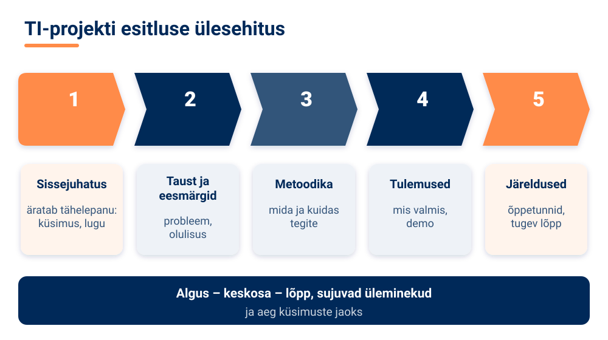

**Sissejuhatus** peab äratama tähelepanu – näiteks üllatava küsimuse, lühikese loo või probleemi kirjeldusega, millega kuulajad on ise kokku puutunud. **Taustas** selgitad probleemi ja eesmärke. **Metoodikas** kirjeldad, mida ja kuidas tegite ning milliste väljakutsetega kokku puutusite. **Tulemustes** näitad, mis valmis sai. **Järeldustes** võtad kokku õppetunnid ja edasised sammud – ja lõpetad tugevalt.

<!-- class="pae-naide" -->
> **Näide: elevaatorikõne**
>
> **Elevaatorikõne** on lühike, tavaliselt 30–60-sekundiline tutvustus, mille jooksul pead suutma oma projekti huvilisele või toetajale ära rääkida – nii lühikese aja jooksul, kui kestab sõit liftis. Näiteks: „Meie koolis visatakse iga päev ära palju toitu. Lõime mudeli, mis ennustab eelmiste nädalate andmete põhjal, mitu portsjonit järgmisel päeval vaja on. Testandmetel oli meie ennustus tunduvalt täpsem kui lihtne keskmine. Järgmiseks tahame mudelit katsetada ka teistes koolides.“

### 🏠 Visuaalid ja tulemuste visualiseerimine

Slaidid peavad sinu kõnet toetama, mitte asendama. **Slaidide kujunduses** lähtu selgusest ja lihtsusest, järjepidevusest (sama kujundus kõigil slaididel) ja visuaalsest hierarhiast (kõige olulisem on kõige silmatorkavam). **Teksti** olgu vähe: kirjuta lühikeste ja selgete punktidena ning kasuta loetavat fonti ja piisavalt suurt kirja. Kasuta **visuaalseid elemente**: diagramme, graafikuid, pilte ja ikoone; animatsioone ainult mõõdukalt.

<!-- class="pae-moiste" -->
> **Mõiste: 6 × 6 reegel**
>
> **6 × 6 reegel** on slaidikujunduse rusikareegel: ühel slaidil kõige rohkem 6 punkti ja ühes punktis kõige rohkem 6 sõna. See hoiab slaidid lühikesed ja suunab kuulaja tähelepanu sinu jutule.

Lisaks kasuta kontrastseid värve (tume tekst heledal taustal või vastupidi) ja jäta slaidile tühja ruumi, et see ei tunduks ülerahvastatud.

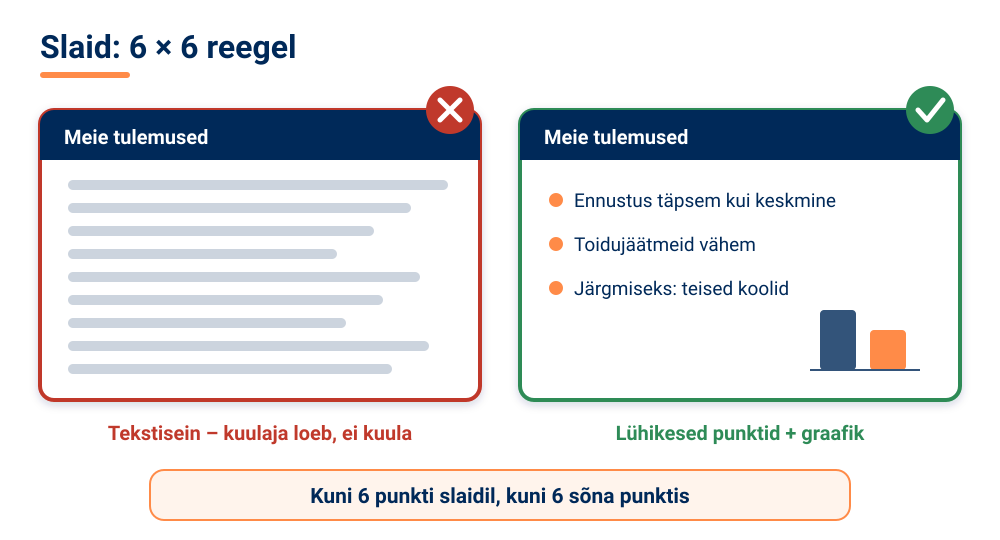

<!-- class="pae-fakt" -->
> **Kas teadsid?** 6 × 6 reegli järgi mahub ühele slaidile kõige rohkem 36 sõna (6 punkti × 6 sõna). Ülejäänu ütled suuliselt.

TI-projektis on palju arve ja tulemusi, mida saab **visualiseerida**:

- **andmed** – graafikud ja diagrammid, soojuskaardid (heatmap'id, kus väärtused on näidatud värvidega), interaktiivsed visualiseeringud;
- **mudeli tulemused** – täpsusmõõdikud, segadusmaatriksid, õppimiskõverad (graafik, mis näitab, kuidas mudeli täpsus treenimise käigus muutus);
- **arhitektuur** – süsteemi diagrammid, andmevoogude skeemid, komponentide seosed;
- **kasutajaliides** – ekraanipildid, prototüübid, kasutajakogemuse visualiseerimine.

Visualiseeringud peavad olema täpsed: telgedel peavad olema nimed ja ühikud ning graafik ei tohi tulemusi moonutada.

<!-- data-type="linechart" data-title="Näide: mudeli täpsus treeningu ajal (õppimiskõver)" -->
| Treeningu ring | Treeningandmed (%) | Valideerimisandmed (%) |
|----------------|-------------------:|-----------------------:|
| 1 | 55 | 53 |
| 2 | 68 | 65 |
| 3 | 76 | 72 |
| 4 | 82 | 77 |
| 5 | 86 | 79 |
| 6 | 89 | 80 |
| 7 | 91 | 80 |
| 8 | 92 | 80 |

### Demo ja tehnilised detailid

**Demo** ehk demonstratsioon näitab, et lahendus päriselt töötab. Demo eesmärk on näidata funktsionaalsust, demonstreerida kasutajakogemust ja tõestada, et idee toimib. Hea demo jaoks:

- planeeri **stsenaarium** – täpsed sammud, mida demos läbid;
- **testi** demot enne esitlust samas keskkonnas;
- valmista ette **varuplaan** probleemide jaoks.

Demo ajal selgita selgelt, mida teed, jälgi tempot ja rõhuta olulisimaid funktsioone. Kui elav demo on liiga riskantne, kasuta alternatiivi: videot, animatsiooni või ekraanipiltide seeriat.

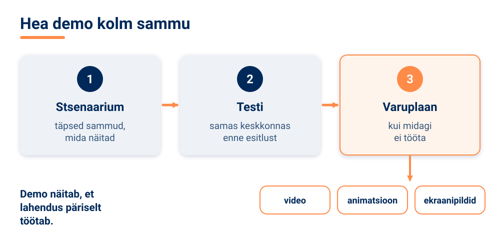

<!-- class="pae-motle" -->
> **Mõtle järele!**
>
> Sinu vestlusrobot vajab töötamiseks internetiühendust, aga klassi Wi-Fi on sageli aeglane. Mida teeksid, et demo õnnestuks igal juhul?

**Tehniliste detailide** esitlemisel otsi tasakaalu: kuulaja peab saama aru, aga sisu peab jääma täpseks. Rõhuta olulist ja arvesta sihtrühmaga. Hoolitse tehnilise täpsuse eest: kontrolli fakte, kasuta terminoloogiat järjepidevalt (nt ära räägi samast asjast kord „mudelina“, kord „algoritmina“, kord „programmina“) ja viita allikatele. Keerulisi mõisteid selgita metafooride ja analoogiate, lihtsustatud näidete ja visuaalsete abivahendite abil. Põhjenda tehnilisi valikuid: miks valisite just selle meetodi, millised olid alternatiivid ja millised on teie lahenduse piirangud. Piirangute ausalt tunnistamine näitab, et mõistad oma tööd hästi.

### 🧪 TI-katse: kas su põhisõnum jääb tõlkes ellu?

🛡️ *Ohutuskaardi reeglid kehtivad: ära logi sisse, ära sisesta isikuandmeid ega pildista inimesi.*

Kui lause on selge ja üheselt mõistetav, jääb selle mõte alles ka siis, kui masintõlge selle teise keelde ja tagasi tõlgib. Pikad, mitmetähenduslikud ja žargooni täis laused lähevad aga tõlkes sageli sassi. Selles katses kasutad masintõlget oma elevaatorikõne selguse testijana.

**Vaja läheb:** Tartu Ülikooli masintõlkesüsteem [Neurotõlge](https://translate.ut.ee/) (tasuta), ~10 min, paaris või rühmas

1. Kirjutage oma projekti elevaatorikõne 3–4 lausega (või kasutage selle tunni näidet kooli söökla kohta).
2. Tõlkige tekst Neurotõlkes eesti keelest inglise keelde. Kopeerige ingliskeelne tõlge ja tõlkige see tagasi eesti keelde.
3. Võrrelge originaali ja tagasitõlget lause kaupa. Märkige laused, mille mõte muutus või läks kaduma, ja lihtsustage neid. Korrake proovi parandatud tekstiga.

**Pane tähele / kirjuta üles:** millised laused või terminid muutusid? Miks? Kas pärast lihtsustamist jäi põhisõnum alles? Milles ei saa masintõlget kõne selguse hindamisel usaldada?

[[___ ___ ___]]

<!-- class="pae-lisaks" -->
> **Kui arvutit pole:** lugege paarilisele oma elevaatorikõne üks kord ette. Paariline jutustab selle oma sõnadega ümber. Võrrelge: millised mõtted jäid alles ja millised läksid kaduma?

### 🏠 Esineja oskused ja küsimused

Esitlus ei ole ainult slaidid – oluline on ka see, **kuidas** sa räägid:

- **kehakeel ja hääl** – silmside kuulajatega, avatud kehahoiak, selge ja kuuldav hääl, sobiv tempo ja pausid;
- **enesekindlus** – see tuleb põhjalikust ettevalmistusest ja positiivsest hoiakust; kui juhtub viga, jätka rahulikult;
- **kaasamine** – esita kuulajatele küsimusi, kasuta interaktiivseid elemente, arvesta kuulajate huvidega;
- **ajaplaneerimine** – pea ajakavast kinni, aga ole paindlik ja tea, millise osa saad vajaduse korral lühemaks teha.

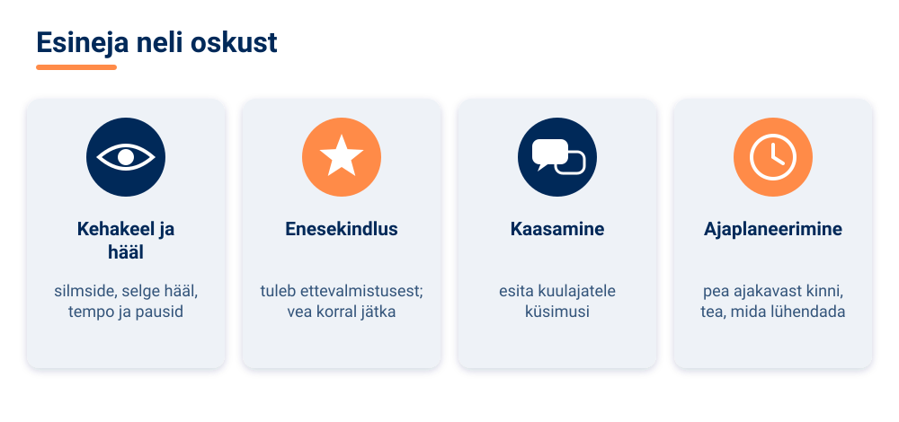

**Küsimusteks valmistumine** algab nende ennustamisest. Mõtle, millised küsimused on tõenäolised, millised keerulised ja millised kriitilised. Valmista ette selged ja lühikesed vastused ning toetavad näited. Kui sa vastust ei tea, ole aus – ütle, et ei tea, ja paku, et uurid järele. Esitluse ajal otsusta, kas võtad küsimusi kohe või lõpus, viita korduvatele küsimustele juba antud vastusele ja suuna teemast kõrvale kalduvad küsimused viisakalt hilisemaks. Pärast esitlust tegele vastamata küsimustega, paku täiendavat infot ja hoia kuulajatega ühendust.

<!-- class="pae-moiste" -->
> **Mõiste: konstruktiivne tagasiside**
>
> **Konstruktiivne tagasiside** on konkreetne, tasakaalustatud ja arengule suunatud hinnang, mis toob välja nii tugevused kui ka parenduskohad ning pakub soovitusi.

### 🏠 Harjutamine, esitluspäev ja tagasiside

**Harjutamine** suurendab enesekindlust, aitab ajastust kontrollida ja muudab esitluse sujuvaks. Harjuta iseendale, esitle sõpradele või perele või salvesta end videole ja analüüsi seda. Küsi konstruktiivset tagasisidet, leia parenduskohad ja tugevused ning täienda esitlust: lahenda probleemkohad ja lisa viimane lihv.

**Esitluspäevaks valmistumine:**

| Valdkond | Mida teha |
|---|---|
| Tehniline | kontrolli seadmeid, varunda failid (nt pilve ja mälupulgale), testi ühilduvust |
| Logistiline | kontrolli asukohta, saabu õigel ajal, võta vajalikud materjalid kaasa |
| Isiklik | puhka piisavalt, vali sobiv riietus, valmistu vaimselt |
| Viimased kontrollid | vaata esitlus üle, testi demot, vaata ajakava üle |

Pärast esitlust **kogu tagasisidet**. Tagasiside aitab sul õppida ja areneda, tulevasi esitlusi parandada ja projekti edasi arendada. Tagasisidet saab koguda küsimustike, vestluste ja vaatluste kaudu. Analüüsi seda objektiivselt: otsi mustreid (mida mainisid mitu inimest?) ja sea prioriteedid. Seejärel tegutse: tee konkreetsed parandused, arenda tugevusi edasi ja õpi järjepidevalt.

<!-- class="pae-naide" -->
> **Näide: levinud vead ja kuidas neid vältida**
>
> | Viga | Lahendus |
> |---|---|
> | Liiga palju teksti slaidil | järgi 6 × 6 reeglit, räägi rohkem kui kirjutad |
> | Monotoonne esitlus | muuda häälekõrgust ja tempot, tee pause, kaasa kuulajaid |
> | Ajapiirangu eiramine | harjuta kellaga, tea, mida saab ära jätta |
> | Kuulajate ignoreerimine | hoia silmsidet, esita küsimusi |

Viimased näpunäited: ole entusiastlik, keskendu väärtusele, mida sinu projekt loob, lõpeta tugevalt – ja naudi protsessi!

<!-- class="pae-lisaks" -->
> **Tea lisaks**
>
> Ingliskeelseid juhendeid leiad näiteks [teadusplakati kujundamise](https://guides.nyu.edu/posters) ja [elevaatorikõne](https://careercenter.emmanuel.edu/blog/2023/11/06/how-to-give-a-great-elevator-pitch-with-examples/) kohta.

### Kokkuvõte ja põhimõisted

**Pea meeles**

- Esitluse eesmärgid on tulemuste tutvustamine, oskuste näitamine, tagasiside kogumine ja kogemuse jagamine.
- Kohanda esitlus sihtrühmale: sõnavara, detailsus ja rõhuasetused.
- Hea ülesehitus: sissejuhatus – taust ja eesmärgid – metoodika – tulemused – järeldused.
- Slaidid toetavad kõnet: vähe teksti (6 × 6 reegel), selged visuaalid, kontrastsed värvid.
- Demo tuleb ette valmistada ja testida ning sellele peab olema varuplaan.
- Küsimustele vasta selgelt ja ausalt; kui ei tea, ütle seda.

| Mõiste | Tähendus |
|---|---|
| esitlemine | projekti tulemuste tutvustamine teistele |
| sihtrühm | inimesed, kellele esitlus on suunatud |
| põhisõnum | mõte, mis peab kuulajatele kindlasti meelde jääma |
| 6 × 6 reegel | slaidil kuni 6 punkti, punktis kuni 6 sõna |
| demo | lahenduse töö näitamine elavalt või salvestatult |
| elevaatorikõne | lühike, tavaliselt 30–60-sekundiline tutvustus projektist |
| õppimiskõver | graafik, mis näitab mudeli täpsuse muutumist treenimise käigus |
| konstruktiivne tagasiside | konkreetne, tasakaalustatud ja arengule suunatud hinnang |

### 📚 Allikad ja lisalugemine

- Otepää Gümnaasium (2026). [Slaidiesitluste koostamise juhend](https://nuustaku.edu.ee/wp-content/uploads/2026/04/OG-esitluste-koostamise-juhend.pdf). Eestikeelne kooli juhend: slaidi ülesehitus, tekstihulk, kirjasuurus, värvid ja allikatele viitamine; sobib lisalugemiseks.
- Emmanuel College Career Center (2023). [How to Give a Great Elevator Pitch (With Examples)](https://careercenter.emmanuel.edu/blog/2023/11/06/how-to-give-a-great-elevator-pitch-with-examples/). Kuidas ehitada üles umbes 30-sekundiline elevaatorikõne (inglise keeles).
- NYU Libraries (s.a.). [How to Create a Research Poster: Poster Basics](https://guides.nyu.edu/posters). Hea teadusplakati tunnused ja kujundamise nõuanded (inglise keeles).
- Tartu Ülikool (2023). [The University of Tartu machine translation engine now supports 17 new Finno-Ugric languages](https://keemia.ut.ee/en/content/university-tartu-machine-translation-engine-now-supports-17-new-finno-ugric-languages). Neurotõlke arendusest ja keeltest (inglise keeles).
- Google for Developers (s.a.). [Classification: Accuracy, recall, precision, and related metrics](https://developers.google.com/machine-learning/crash-course/classification/accuracy-precision-recall). Mõõdikud, mida TI-projekti tulemuste esitlemisel sageli näidatakse (inglise keeles).

### Tööleht 7.4

<!-- class="pae-jaotis" -->
**➕ I. Esitluse ettevalmistamine**

**Ülesanne 1.** Kirjelda lühidalt oma projekti eesmärki ja peamisi tulemusi.

[[___ ___ ___ ___]]

**Ülesanne 2.** Kes on sinu esitluse sihtrühm? Millised on nende ootused ja eelteadmised?

[[___ ___ ___]]

**Ülesanne 3.** Sõnasta 3–5 põhisõnumit, mida soovid oma esitlusega edastada.

**1. põhisõnum:**

[[___]]

**2. põhisõnum:**

[[___]]

**3. põhisõnum:**

[[___]]

**4. põhisõnum:**

[[___]]

**5. põhisõnum:**

[[___]]

<!-- class="pae-jaotis" -->
**⭐ II. Esitluse ülesehitus**

**Ülesanne 4.** Koosta oma esitluse ülesehitus.

**a) Sissejuhatus (kuidas äratad tähelepanu ja tutvustad teemat):**

[[___ ___ ___]]

**b) Projekti taust ja eesmärgid:**

[[___ ___ ___]]

**c) Metoodika ja protsess:**

[[___ ___ ___]]

**d) Tulemused ja saavutused:**

[[___ ___ ___]]

**e) Järeldused ja edasised sammud:**

[[___ ___ ___]]

**Ülesanne 5.** Kui pikk on kogu esitlus ja kuidas plaanid selle aja osade vahel jaotada?

[[___ ___ ___]]

<!-- class="pae-jaotis" -->
**➕ III. Visuaalide loomine**

**Ülesanne 6.** Milliseid visuaalseid elemente plaanid oma esitluses kasutada (nt slaidid, diagrammid, pildid, videod)?

[[___ ___ ___ ___]]

**Ülesanne 7.** Kirjelda oma slaidide kujunduse põhimõtteid (värvid, font, paigutus).

[[___ ___ ___]]

**Ülesanne 8.** Kuidas tagad, et sinu visuaalid on selged, loetavad ja toetavad sinu sõnumit?

[[___ ___ ___]]

<!-- class="pae-jaotis" -->
**➕ IV. Tehisintellekti projekti tulemuste visualiseerimine**

**Ülesanne 9.** Milliseid andmeid või tulemusi soovid oma esitluses visualiseerida?

[[___ ___ ___]]

**Ülesanne 10.** Milliseid visualiseerimisviise plaanid kasutada (nt graafikud, diagrammid, soojuskaardid)?

[[___ ___ ___]]

**Ülesanne 11.** Kuidas tagad, et sinu visualiseeringud on täpsed ja arusaadavad?

[[___ ___ ___]]

<!-- class="pae-jaotis" -->
**⭐ V. Demo või prototüübi ettevalmistamine**

**Ülesanne 12.** Kas plaanid oma esitluses demonstreerida projekti tulemust või prototüüpi? Kui jah, siis kirjelda, mida täpsemalt demonstreerid.

[[___ ___ ___ ___]]

**Ülesanne 13.** Koosta demo stsenaarium (sammud, mida läbid).

[[___ ___ ___ ___]]

**Ülesanne 14.** Millised tehnilised probleemid võivad demo ajal tekkida? Kuidas nendeks valmistud?

[[___ ___ ___]]

<!-- class="pae-jaotis" -->
**➕ VI. Esitlemise põhimõtted**

**Ülesanne 15.** Millised on sinu tugevused esitlejana? Kuidas plaanid neid ära kasutada?

[[___ ___ ___]]

**Ülesanne 16.** Millised on sinu väljakutsed esitlejana? Kuidas plaanid neid ületada?

[[___ ___ ___]]

**Ülesanne 17.** Kuidas plaanid kuulajaid kaasata ja nende tähelepanu hoida?

[[___ ___ ___]]

<!-- class="pae-jaotis" -->
**➕ VII. Tehniliste detailide esitlemine**

**Ülesanne 18.** Milliseid tehnilisi detaile pead oma projektist esitluses selgitama?

[[___ ___ ___ ___]]

**Ülesanne 19.** Kuidas plaanid keerulisi tehnilisi mõisteid lihtsalt ja arusaadavalt selgitada?

[[___ ___ ___]]

**Ülesanne 20.** Kuidas leiad tasakaalu tehniliste detailide ja üldise arusaadavuse vahel?

[[___ ___ ___]]

<!-- class="pae-jaotis" -->
**⭐ VIII. Küsimusteks valmistumine**

**Ülesanne 21.** Millised küsimused võivad sinu esitluse kohta tekkida? Kirjuta vähemalt viis võimalikku küsimust ja vastused, mille neile ette valmistad.

**1. küsimus ja vastus:**

[[___ ___]]

**2. küsimus ja vastus:**

[[___ ___]]

**3. küsimus ja vastus:**

[[___ ___]]

**4. küsimus ja vastus:**

[[___ ___]]

**5. küsimus ja vastus:**

[[___ ___]]

**Ülesanne 22.** Kuidas käitud, kui sulle esitatakse küsimus, millele sa ei oska vastata?

[[___ ___ ___]]

<!-- class="pae-jaotis" -->
**➕ IX. Esitluse harjutamine**

**Ülesanne 23.** Kuidas plaanid oma esitlust harjutada? Koosta harjutamise plaan.

[[___ ___ ___ ___]]

**Ülesanne 24.** Kellelt ja kuidas plaanid saada tagasisidet oma esitluse kohta enne lõplikku esitlemist?

[[___ ___ ___]]

**Ülesanne 25.** Millised aspektid vajavad sinu arvates kõige rohkem harjutamist?

[[___ ___ ___]]

<!-- class="pae-jaotis" -->
**➕ X. Esitluspäevaks valmistumine**

**Ülesanne 26.** Koosta kontrollnimekiri esitluspäevaks.

[[___ ___ ___ ___ ___]]

**Ülesanne 27.** Milliseid tehnilisi ettevalmistusi pead tegema (nt failide varundamine, seadmete kontrollimine)?

[[___ ___ ___]]

**Ülesanne 28.** Kuidas plaanid esitluspäevaks vaimselt ja füüsiliselt valmistuda?

[[___ ___ ___]]

### Enesekontroll 7.4

**1. Mitu sõna mahub 6 × 6 reegli järgi ühele slaidile kõige rohkem? Kirjuta arv.**

[[36]]

****************************************
6 × 6 reegli järgi on slaidil kuni 6 punkti ja igas punktis kuni 6 sõna: 6 × 6 = **36** sõna. Ülejäänu ütled suuliselt.
****************************************

**2. Kuidas nimetatakse lühikest, tavaliselt 30–60-sekundilist tutvustust, mille jooksul pead suutma oma projekti huvilisele ära rääkida? Kirjuta vastus.**

[[elevaatorikõne]]

****************************************
Õige vastus: **elevaatorikõne** – nii lühike tutvustus, et see mahub ühe liftisõidu aega.
****************************************

**3. Pane TI-projekti esitluse osad õigesse järjekorda.**

<!-- data-show-partial-solution -->
Tulemused: [[ 1 | 2 | 3 | (4) | 5 ]] 
Sissejuhatus: [[ (1) | 2 | 3 | 4 | 5 ]] 
Järeldused ja edasised sammud: [[ 1 | 2 | 3 | 4 | (5) ]] 
Metoodika: [[ 1 | 2 | (3) | 4 | 5 ]] 
Taust ja eesmärgid: [[ 1 | (2) | 3 | 4 | 5 ]]
****************************************
Esitlus algab sissejuhatusega, seejärel tulevad taust ja eesmärgid, metoodika, tulemused ning lõpuks järeldused ja edasised sammud.
****************************************

**4. Lohista visualiseeringute nimetused õigetesse lünkadesse.**

<!-- data-show-partial-solution -->
Graafikut, mis näitab, kuidas mudeli täpsus treenimise käigus muutus, nimetatakse [->[ (õppimiskõveraks) ]]. Tabelit, mis näitab mudeli õigeid ja valesid ennustusi klasside kaupa, nimetatakse [->[ (segadusmaatriksiks) | Gantti graafikuks ]]. Joonist, kus väärtused on näidatud värvidega, nimetatakse [->[ (soojuskaardiks) | ajateljeks ]].
****************************************
**Õppimiskõver** näitab mudeli täpsust treenimise ajal, **segadusmaatriks** näitab õigeid ja valesid ennustusi klasside kaupa ning **soojuskaart** (*heatmap*) näitab väärtusi värvidega.
****************************************

**5. Ühenda levinud esitlusviga sobiva lahendusega.**

- [ (6 × 6 reegel) (Hääle ja tempo muutmine) (Harjutamine kellaga) (Silmside ja küsimused) ]
- [ (X) ( ) ( ) ( ) ] Liiga palju teksti slaidil
- [ ( ) (X) ( ) ( ) ] Monotoonne esitlus
- [ ( ) ( ) (X) ( ) ] Ajapiirangu eiramine
- [ ( ) ( ) ( ) (X) ] Kuulajate ignoreerimine
****************************************
Liiga palju teksti vastu aitab 6 × 6 reegel, monotoonsuse vastu häälekõrguse ja tempo muutmine ning pausid, ajapiirangu eiramise vastu harjutamine kellaga ja kuulajate ignoreerimise vastu silmside ning küsimuste esitamine.
****************************************

**6. Mida teha, kui sulle esitatakse küsimus, millele sa vastust ei tea?**

- [( )] Mõelda kiiresti välja usutav vastus.
- [(X)] Tunnistada ausalt, et ei tea, ja pakkuda, et uurid järele.
- [( )] Jätta küsimus tähelepanuta.
- [( )] Vahetada kiiresti teemat.
****************************************
Ausus teadmatuse korral on osa heast esinemisest. Vastamata küsimused tasub üles märkida ja hiljem täiendavat infot pakkuda.
****************************************

**7. Vali igasse lünka sobiv sõna.**

<!-- data-show-partial-solution -->
Enne esitlust tuleb analüüsida [[ (sihtrühma) | slaidide arvu ]], sest sellest sõltuvad keelekasutus ja detailsuse tase. IT-spetsialistidele võid rääkida [[ (rohkem) | vähem ]] tehnilistest detailidest, vanavanematele aga [[ rohkem | (vähem) ]]. Terminoloogiat kasuta [[ vaheldusrikkalt | (järjepidevalt) ]]: ära nimeta sama asja kord „mudeliks“, kord „programmiks“.
****************************************
Sihtrühma analüüs aitab otsustada, mida ja kuidas rääkida. Sisu jääb samaks, aga detailsus ja sõnavara erinevad. Terminoloogia peab olema järjepidev, et kuulaja ei arvaks, et jutt on eri asjadest.
****************************************

**8. Sinu vestlusrobot vajab töötamiseks internetiühendust, aga klassi Wi-Fi on sageli aeglane. Kirjelda, kuidas valmistad demo ette, et see õnnestuks igal juhul.**

[[___ ___ ___]]

Vaata näidisvastust

Kõigepealt planeerin demo stsenaariumi ehk täpsed sammud, mida näitan. Seejärel testin demot enne esitlust samas klassis ja samas võrgus. Varuplaaniks salvestan demost video ja teen ekraanipildid, et saaksin neid näidata, kui internet ei tööta. Võimaluse korral kasutan varuks ka telefoni mobiilset internetti.

### 📤 Väljapääsupilet 7.4

<!-- class="pae-fakt" -->
> ⚠️ **Salvesta või saada vastused enne lehe sulgemist!** Vastus ei liigu automaatselt õpetajale ja võib kaduda, kui vahetad seadet, kasutad privaatakent või kustutad brauseri andmed.

Vasta lühidalt (3–5 min). Vastused jäävad selle brauseri mällu. Kui oled valmis, vajuta **Kopeeri vastused** ja kleebi need Google Classroomi ülesande vastusesse või laadi fail alla ja lisa see ülesande juurde.

<!-- data-type="none" -->
| Kriteerium | 2 p | 1 p | 0 p |
|---|---|---|---|
| Mõiste rakendamine uues olukorras | Õige mõiste ja selge põhjendus | Mõiste õige, põhjendus puudu või ebatäpne | Vastus puudub või on vale |
| TI-katse tõlgendus | Tulemus on seotud tunni mõistega | Tulemus on kirjeldatud, seos puudub | Puudub |
| Refleksioon | Konkreetne ja isiklik | Üldine | Puudub |

*Väljapääsupilet on kujundav hindamine: õpetaja annab tagasisidet ja kasutab vastuseid järgmise tunni planeerimisel. Pilet sobib ka portfoolio õpipäevikusse.*

### 🔐 Lukk 7.4

<!-- class="pae-naide" -->
> <!-- style="width: 120px; float: left; margin: 0 16px 8px 0; border-radius: 0;" --> **Kratt:** „Mul on homme suur esitlus. Aga mis siis, kui internet kaob ja mu demo jääb lihtsalt tühjusse vahtima?“

Lukk avaneb, kui lahendad ülekandeülesande.

**Uus olukord:** Kooli jalgpallimeeskond sõidab võõrsilmängule tellitud bussiga. Treener on igaks juhuks kokku leppinud ka kahe lapsevanemaga, kes saavad mängijad autoga kohale viia, kui buss ei tule. Kuidas nimetatakse seda, mille treener ette valmistas ja mida hea esineja vajab ka demo jaoks? Kirjuta üks sõna.

[[varuplaan]]
[[?]] Vihje 1: mis aitab, kui esimene lahendus ootamatult üles ütleb?
[[?]] Vihje 2: 9-täheline liitsõna, mille esimene pool tähendab „tagavaraks“ ja teine pool „kava“.
[[?]] 🛟 Päästerõngas: mine tagasi lehele „Demo ja tehnilised detailid“ ja loe nimekiri „Hea demo jaoks“. Kui ikka ei tule välja, küsi õpetajalt selle luku päästekood ja kirjuta see vastuseväljale.

****************************************
✅ **Lukk avatud!** Treeneri autod on varuplaan – samamoodi aitab salvestatud video või ekraanipiltide seeria demol õnnestuda ka siis, kui tehnika alt veab. Hea esineja valmistub ka ootamatusteks.

🔑 **Sinu võtmetäht: A**

Kirjuta täht üles – seda on vaja toa ukse avamiseks.
****************************************

## 7.5 Projektitööde esitlemine ja kursuse lõpetamine

<!-- class="pae-kaas" -->

### Õpieesmärgid

Selle tunni järel sa:

- **selgitad oma sõnadega**, mis teeb tagasiside konstruktiivseks *(mõistmine)*;
- **rakendad** autoriõiguse ja litsentside reegleid, kui jagad oma projekti tulemusi *(rakendamine)*;
- **analüüsid** saadud tagasisidet ise ja TI-tööriista abil ning **võrdled** tulemusi *(analüüs)*;
- **hindad** kriitiliselt, kas TI tegi tagasisidest õige kokkuvõtte *(hindamine)*;
- **koostad** konstruktiivse tagasiside kaaslase projekti esitlusele *(loomine)*.

<!-- class="pae-fakt" -->
> **🎯 Tunni tuumik (45 min)**
>
> 🏠 **Kodus enne tundi** (~15–20 min): „Esitluspäev: korraldus ja hindamine“, „Õpitu reflekteerimine“, „Edasiõppimine ja karjäär“, „Kursuse lõpetamine“. Too tundi kaasa üks uus teadmine või küsimus – tunni alguses arutate neid paarides (3 min).
>
> 1. 📚 **Loe** (~12 min): „Tagasiside andmine ja vastuvõtmine“, „Projekti lõpetamine ja tulemuste jagamine“, „Tehisintellekti tulevik – ka Eestis“ ning „Kokkuvõte ja põhimõisted“
> 2. 🧪 **TI-katse** (~10 min): „Tagasiside analüüs: inimene vs TI“
> 3. ⭐ **Tööleht** (~15 min): ülesanded III, VI ja VIII
> 4. 📤 **Väljapääsupilet** ja 🔐 **lukk** (~8 min)
>
> **🏠** tähistab osi, mida loed või vaatad **kodus enne tundi** (ümberpööratud klassiruum). **➕** tähistab lisaülesannet – tee seda, kui jõuad, või kui tahad rohkem teada.

{{|>}}
<section class="pae-lihtne">

**🟢 Lihtsalt öeldes**

Selles tunnis esitled oma projekti ja annad teistele **tagasisidet**. Hea tagasiside on konkreetne, tasakaalustatud ja aitab teisel areneda. Lause „Esitlus oli hea“ ei aita esinejat kuigi palju. Parem on öelda täpselt, mis oli hea ja mida võiks muuta. Kui saad tagasisidet, kuula rahulikult ja ära vaidle kohe vastu. Lõpus pane projekt korda: kirjuta dokumentatsioon ja korrasta kood. Arvesta **autoriõigusega** ja viita teiste piltidele ja koodile. Ka sina võid kujundada Eesti rolli TI arengus.

**Tähtsad sõnad:** **tagasiside** – info selle kohta, mis on hästi ja mida parandada; **konstruktiivne tagasiside** – konkreetne, tasakaalustatud ja arengule suunatud hinnang; **autoriõigus** – õigus, mis kaitseb autori loomingut, ka koodi ja pilte.

</section>

### 🏠 Esitluspäev: korraldus ja hindamine

Kursuse lõpetamine on oluline hetk: see on võimalus näidata, mida oled õppinud, saada tagasisidet ja kinnistada õpitut. Projektitööde esitlemisel on mitu eesmärki – tutvustada oma tööd, õppida teiste projektidest, anda ja saada tagasisidet ning mõelda edasistele sammudele.

Esitluspäeva korraldamisel lepitakse kokku **formaat** (kui kaua esitlus kestab, milline on selle ülesehitus ja millised on tehnilised nõuded), **järjekord** (ajakava, vaheajad ja küsimuste aeg) ning **osalejate rollid**. Esitlejad tutvustavad oma projekti, kuulajad jälgivad ja esitavad küsimusi, hindajad annavad hinnangu ja moderaator juhib esitluste käiku ning hoiab ajakava.

Esitlust hinnatakse tavaliselt kolmes valdkonnas:

| Valdkond | Mida jälgitakse |
|---|---|
| Sisu | projekti eesmärkide saavutamine, tehniline kvaliteet, uuenduslikkus ja loovus |
| Esitlus | selgus ja arusaadavus, visuaalne kvaliteet, ajaplaneerimine |
| Vastamine | küsimustele vastamine, teadmiste näitamine, refleksioonivõime |

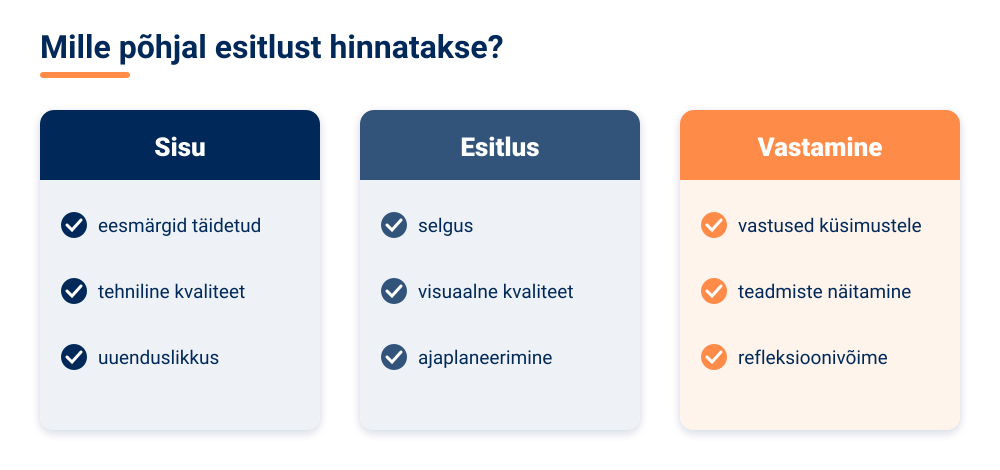

<!-- class="pae-moiste" -->
> **Mõiste: projekti hindamine**
>
> **Projekti hindamine** on projekti tulemuste võrdlemine eesmärkidega, et teha kindlaks projekti edukus ja saavutused. Hinnatakse näiteks eesmärkide saavutamise määra, ajakava järgimist, ressursside kasutamist, tulemuste kvaliteeti, meeskonna koostööd ja õppimiskogemust.

Esitlusi võib korraldada ka **projektimessina** või väikese **konverentsina**, kuhu kutsutakse teiste klasside õpilasi, õpetajaid, lapsevanemaid või kohalikke IT-spetsialiste. Siis peab esitlus olema arusaadav ka neile, kes TI-st palju ei tea.

### Tagasiside andmine ja vastuvõtmine

**Tagasiside** on informatsioon projekti tugevuste ja nõrkuste kohta, mille eesmärk on toetada edasist arengut. Hea tagasiside on **konstruktiivne**: konkreetne, tasakaalustatud ja arengule suunatud.

Tagasisidel on lihtne ülesehitus:

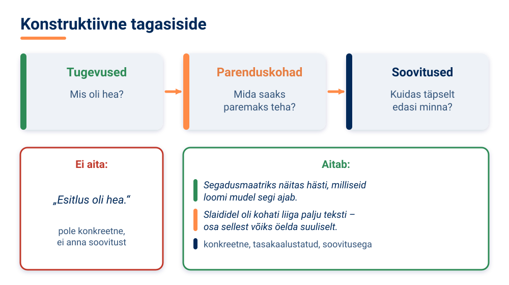

Võrdle kahte tagasisidet. „Esitlus oli hea.“ – see ei aita esinejal midagi muuta. „Segadusmaatriks näitas väga hästi, milliseid loomi mudel segi ajab. Slaididel oli kohati liiga palju teksti – järgmine kord võiksid osa sellest öelda suuliselt.“ – see on konkreetne, tasakaalustatud ja annab soovituse. Tagasisidet saab anda suuliselt, kirjalikult või hindamisvormi abil.

**Tagasiside vastuvõtmine** on sama oluline oskus. Suhtu avatult: ära asu kaitsepositsioonile, kuula ja püüa mõista. Seejärel analüüsi tagasisidet – otsi mustreid (mida ütlesid mitu inimest?) ja sea prioriteedid. Lõpuks tegutse: tee konkreetsed parandused, arenda tugevusi edasi ja teadvusta, mida saad õppida.

<!-- class="pae-motle" -->
> **Mõtle järele!**
>
> Meenuta olukorda, kus said kriitilist tagasisidet (koolis, trennis, kodus). Kuidas sa reageerisid? Mis aitaks sul järgmine kord tagasisidet rahulikumalt vastu võtta ja seda oma arenguks kasutada?

<!-- class="pae-naide" -->
> **Näide: tagasiside kogumise viisid**
>
> Tagasisidet saab koguda küsimustike, intervjuude, vaatluste, arutelude, eksperthinnangute ja kasutajatestide abil. Näiteks võid projektimessil paluda külalistel täita kolme küsimusega veebiküsimustiku: mis meeldis, mis jäi arusaamatuks ja mida soovitaksid.

### Projekti lõpetamine ja tulemuste jagamine

Enne kursuse lõppu tuleb projekt korralikult lõpetada. **Lõppdokumentatsioon** sisaldab projekti kokkuvõtet, tehnilisi detaile, tulemuste analüüsi ning järeldusi ja soovitusi. Hea dokumentatsioon on selge ja täpne, terviklik ja professionaalne. Esita dokumentatsioon nõutud vormingus ja tähtajaks ning arhiveeri see.

Ka **kood ja materjalid** vajavad viimast ülevaatust: korrasta koodi, lisa kommentaarid ja dokumentatsioon ning paranda vead. Korrasta failid selgesse kaustastruktuuri, nimeta need ühtse põhimõtte järgi ja lisa README-fail. Projekti saab arhiveerida ja jagada versioonihalduse keskkonnas (nt GitHub) või arhiivifailina; mõtle läbi, kellel on materjalidele ligipääs.

Tulemusi võib **jagada** mitmel viisil:

| Jagamise viis | Mida see tähendab |
|---|---|
| Esitlused | tulemuste suuline tutvustamine koos visuaalsete materjalidega |
| Publikatsioonid | tulemuste kirjalik avaldamine artiklite, raportite või blogide kaudu |
| Sotsiaalmeedia | tulemuste jagamine sotsiaalmeedias laiema publiku kaasamiseks |
| Avatud lähtekood | koodi avalik jagamine, et teised saaksid seda kasutada ja arendada |
| Koostöö teiste projektidega | tulemuste ühendamine teiste projektide või algatustega |
| Õpitoad | tulemuste ja kogemuste jagamine praktiliste töötubade kaudu |
| Demo või prototüüp | tulemuste näitamine töötava näidise abil |
| Edasiarendamine | tulemuste kasutamine uute projektide või lahenduste alusena |

Jagamisel arvesta **intellektuaalomandiga**. **Autoriõigus** kaitseb loomingut, ka koodi, tekste ja pilte. **Litsents** määrab, kuidas teised võivad sinu tööd kasutada (nt kas võib muuta ja edasi jagada). Kui kasutasid teiste andmeid, pilte või koodi, **viita** allikatele. Ja ära avalikusta isikuandmeid, mida projekti käigus kogusid.

<!-- class="pae-moiste" -->
> **Mõiste: portfoolio**
>
> **Portfoolio** on sinu tööde kogum, mis näitab sinu õppimist, arengut ja saavutusi. Projektitöö lisamine portfooliosse aitab esile tuua saavutusi ja näidata õpitut – näiteks edasiõppimisel või töö otsimisel.

### 🏠 Õpitu reflekteerimine

**Refleksioon** tähendab oma kogemuse üle teadlikku järelemõtlemist: mida tegid, mida õppisid ja mida teeksid edaspidi teisiti. Kursuse lõpus tasub reflekteerida kolmel tasandil:

- **isiklik areng** – millised teadmised omandasid, milliseid oskusi arendasid, milliseid väljakutseid ületasid;
- **meeskonnatöö** – mis olid teie koostöö tugevused, millised väljakutsed tekkisid ja kuidas te need lahendasite, millised õppetunnid võtad kaasa;
- **projekt** – kas eesmärgid saavutati, kui tõhus oli protsess, kui kvaliteetsed olid tulemused.

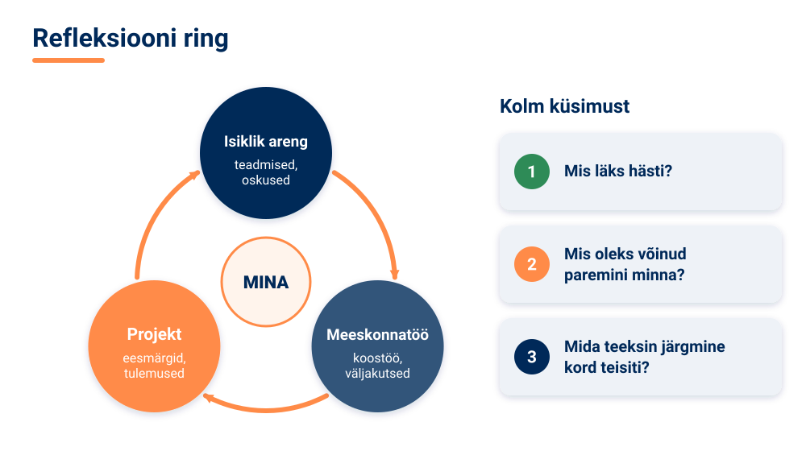

Vaata tagasi ka kursuse **õpiväljunditele**. Kursuse lõpuks peaksid mõistma TI põhimõisteid nii teoreetiliselt kui ka praktiliste rakenduste kaudu; tundma erinevaid TI valdkondi ning nende tehnoloogiate võimalusi ja piiranguid; oskama hinnata eetilisi dilemmasid ja kasutada TI-d vastutustundlikult; ning suutma tööriistu ja platvorme praktiliselt kasutada ja nende abil probleeme lahendada.

Kursuse jooksul läbisid kuus temaatilist plokki – sissejuhatus tehisintellekti, kuidas TI töötab, keeletöötlus, TI otsustamine, pilditöötlus ja arvutinägemine ning TI ja eetika –, tegid hulga praktilisi ülesandeid ja harjutusi ning lõpuks projektitöö. Kindlasti oli nii saavutusi kui ka takistusi, mille ületasid.

### Tehisintellekti tulevik – ka Eestis

Mis saab edasi? **Tehnoloogilistest trendidest** on praegu esiplaanil suured keelemudelid ja generatiivne TI, **multimodaalsed süsteemid** (mis töötlevad korraga teksti, pilte, heli ja videot) ning TI **demokratiseerimine** – see tähendab, et TI-tööriistad muutuvad üha rohkematele inimestele kättesaadavaks. Need muutused mõjutavad **ühiskonda**: tööturgu ja majandust, haridust ja teadust ning igapäevaelu.

<!-- class="pae-eesti" -->
> **Eesti näide: Eesti tehisintellekti tegevuskavad**
>
> Eesti on TI kasutuselevõttu suunanud riiklike tegevuskavadega ehk **kratikavadega** (2019–2021 ja 2022–2023). Neid jätkab praegu kehtiv **tehisintellekti tegevuskava ehk kratikava 2024–2026**, mis keskendub TI rakendamisele avalikus sektoris, majanduses ja ühiskonnas ning usaldusväärsele, inimkesksele TI-le. Ettevõtteid toetavad näiteks **Tehnopoli AI arenguprogramm** ning tehisintellekti ja robootika teenuskeskus **AIRE**, mis nõustab tööstusettevõtteid. Eesti tugevuseks on digiriik – sellised lahendused nagu **Bürokratt** näitavad, et väike riik võib TI kasutamisel olla eeskujuks.

Eesti jaoks on TI ühtaegu võimalus ja väljakutse: see võib aidata väikesel riigil oma teenuseid tõhusamaks muuta, aga eeldab näiteks eesti keeletehnoloogia arendamist ja oskustega inimesi. Just sina võid olla üks neist, kes Eesti rolli TI arengus kujundab.

<!-- class="pae-fakt" -->
> **Kas teadsid?** Eesti esimese tehisintellekti tegevuskava (2019–2021) eelarve oli umbes 10 miljonit eurot, teise (2022–2023) umbes 20 miljonit eurot. Tegevuskavaga 2024–2026 plaanis riik TI kasutuselevõttu suunata vähemalt 85 miljonit eurot.

### 🧪 TI-katse: tagasiside analüüs – inimene vs TI

🛡️ *Ohutuskaardi reeglid kehtivad: ära logi sisse, ära sisesta isikuandmeid ega pildista inimesi.*

Esitluspäeval saad palju tagasisidet. TI-tööriist oskab kommentaare kiiresti teemadesse rühmitada, aga kas ta teeb seda õigesti? Selles katses võrdled TI tehtud analüüsi enda omaga.

**Vaja läheb:** kooli lubatud vestlusrobot (nt [TI-Hüppe õpirakendus](https://tihupe.ee/opirakendus/)), esitluspäeval saadud kirjalik tagasiside (vähemalt 6 kommentaari), ~10 min, rühmas

1. Kirjutage kommentaarid ümber nii, et neis ei oleks ühtegi nime ega muud isikuandmet. Rühmitage need kõigepealt **ise** kolme teemasse ning märkige tugevused ja parenduskohad.
2. Kleepige samad anonüümitud kommentaarid vestlusrobotisse ja paluge: „Rühmita need tagasisidekommentaarid kolme teemasse ning too välja tugevused ja parenduskohad. Ära lisa midagi, mida kommentaarides pole.“
3. Võrrelge roboti ja enda analüüsi. Kas robot jättis midagi välja, liitis eri mõtteid valesti kokku või mõtles midagi juurde?

**Pane tähele / kirjuta üles:** milles robot aitas ja milles eksis? Millise parenduse teete tagasiside põhjal kindlasti? Kas sellist tööriista võib kasutada tagasisidega, milles on kaaslaste nimed? Miks?

[[___ ___ ___]]

<!-- class="pae-lisaks" -->
> **Kui arvutit pole:** kaks rühmaliiget rühmitavad samad kommentaarid teineteisest sõltumatult kolme teemasse. Võrrelge tulemusi: kus olite ühel meelel ja kus mitte? Mida see ütleb tagasiside analüüsi usaldusväärsuse kohta?

### 🏠 Edasiõppimine ja karjäär

TI-d saab edasi õppida mitmel viisil:

- **formaalne haridus** – kõrghariduse võimalused (nt Tartu Ülikooli arvutiteaduse instituut, Tallinna Tehnikaülikooli infotehnoloogia teaduskond, Tallinna Ülikooli digitehnoloogiate instituut), täienduskoolitused ja sertifikaadiprogrammid;
- **iseseisev õppimine** – veebikursused (nt eestikeelne [Elements of AI](https://www.elementsofai.ee/)), raamatud ja artiklid ning praktilised projektid;
- **kogukonnad ja üritused** – TI-kogukonnad, häkatonid (lühikesed intensiivsed arendusvõistlused) ja võistlused, konverentsid ja seminarid.

<!-- class="pae-lisaks" -->
> **Tea lisaks**
>
> Euroopas ühendavad TI-teadlasi näiteks laborite konföderatsioon **CAIRNE** (kuni 2024. aastani CLAIRE), mille uurimisvõrgustikku kuulub ligi 500 uurimisrühma ja -asutust 41 riigist, ning masinõppele keskenduv võrgustik **ELLIS**. Ka Euroopa Liidu teadusprogramm „Euroopa horisont“ rahastab TI-uuringuid.

TI valdkonnas on palju **erinevaid rolle**:

| Roll | Millega tegeleb |
|---|---|
| Andmeteadlane | kogub ja analüüsib andmeid ning leiab neist teadmisi |
| Masinõppe insener | loob, treenib ja juurutab masinõppe mudeleid |
| TI-eetika spetsialist | hindab, kas TI-süsteemid on õiglased, läbipaistvad ja vastutustundlikud |
| TI-rakenduste arendaja | ehitab TI-l põhinevaid rakendusi ja teenuseid |

Nendes rollides on vaja **tehnilisi oskusi** (nt programmeerimine, andmeanalüüs), **pehmeid oskusi** (koostöö, suhtlus, kriitiline mõtlemine) ja **valdkonnateadmisi** – näiteks meditsiini, õiguse või hariduse tundmist, sest TI-d rakendatakse alati mingis valdkonnas. Karjääri planeerimisel aitavad portfoolio loomine, oma võrgustiku arendamine ja pidev enesetäiendamine.

### 🏠 Kursuse lõpetamine

Kursuse lõpus toimuvad hindamine ja tagasiside: sinu tööd hinnatakse kokkulepitud kriteeriumide alusel, sina annad tagasisidet kursusele ja hindad ka ise oma õppimist. Tunnustatakse saavutusi ja tõstetakse esile silmapaistvaid projekte. Ja kindlasti tänatakse kõiki, kes kursusesse panustasid – õpilasi, koostööpartnereid ja toetajaid.

Kokkuvõtteks: tehisintellekt on meie elus üha olulisem, õppimine on väärtus omaette ja tulevik pakub palju võimalusi. Rakenda omandatud teadmisi, arene edasi ja võta vastu uusi väljakutseid. Soovime sulle edu edasistes ettevõtmistes, vastutustundlikku TI kasutamist ning pidevat õppimist ja arengut!

### Kokkuvõte ja põhimõisted

**Pea meeles**

- Esitlusi hinnatakse sisu, esitluse ja küsimustele vastamise põhjal.
- Konstruktiivne tagasiside on konkreetne, tasakaalustatud ja arengule suunatud: tugevused, parenduskohad, soovitused.
- Tagasisidet võta vastu avatult, analüüsi seda ja tegutse selle põhjal.
- Lõpeta projekt korralikult: dokumentatsioon, korrastatud kood, README, arhiveerimine; jagamisel arvesta autoriõiguse, litsentside ja viitamisega.
- Refleksioon aitab mõista isiklikku arengut, meeskonnatööd ja projekti tulemusi.
- TI areneb kiiresti; edasi saab õppida koolis, iseseisvalt ja kogukondades.

| Mõiste | Tähendus |
|---|---|
| projekti hindamine | projekti tulemuste võrdlemine eesmärkidega |
| tagasiside | info tugevuste ja nõrkuste kohta edasise arengu toetamiseks |
| refleksioon | teadlik järelemõtlemine oma kogemuse ja õppimise üle |
| autoriõigus | õigus, mis kaitseb autori loomingut, sh koodi, teksti ja pilte |
| litsents | tingimused, mille alusel teised võivad tööd kasutada |
| avatud lähtekood | avalikult jagatud kood, mida teised võivad kasutada ja arendada |
| multimodaalne süsteem | TI-süsteem, mis töötleb mitut liiki andmeid (tekst, pilt, heli) |
| häkaton | lühike intensiivne arendusvõistlus |

### 📚 Allikad ja lisalugemine

- Tartu Ülikooli arvutiteaduse instituut (s.a.). [Digiõpik: 13. tund. Litsentsid ja viitamine](https://courses.cs.ut.ee/t/digiopik/Digitaalneohutus/Tund13). Eestikeelne õppetund avatud litsentside ja viitamise kohta; sobib lisalugemiseks.
- Creative Commons (s.a.). [Autorile viitamine 3.0 Eesti (CC BY 3.0 EE)](https://creativecommons.org/licenses/by/3.0/ee/legalcode). Ühe levinud avatud litsentsi eestikeelne tekst.
- Kratid.ee (s.a.). [Visioon ja kavad](https://www.kratid.ee/kratt-visioon). Eesti tehisintellekti tegevuskavad 2019–2021, 2022–2023 ja kratikava 2024–2026.
- ERR (2024). [Riik plaanib 85 miljoni euro abil tehisintellekti Eesti ellu juurutada](https://www.err.ee/1609248531/riik-plaanib-85-miljoni-euro-abil-tehisintellekti-eesti-ellu-juurutada). Tegevuskava 2024–2026 eesmärgid ja eelarve.
- TI-Hüpe (s.a.). [Õppevideod](https://tihupe.ee/oppevideod/). Sarjas „Tipptegijad näitavad“ räägivad eri ametite esindajad, kuidas nad TI-d oma töös kasutavad – abiks karjäärivalikul.
- CAIRNE (s.a.). [About CAIRNE](https://cairne.eu/about/). Euroopa TI-laborite konföderatsiooni ametlik tutvustus: ajalugu, nimevahetus CLAIRE → CAIRNE ja uurimisvõrgustik (inglise keeles).

### Tööleht 7.5

<!-- class="pae-jaotis" -->
**➕ I. Projektitööde esitlemise korraldus**

**Ülesanne 1.** Millised on sinu ootused projektitööde esitlemise päevale? Mida soovid näha ja õppida?

[[___ ___ ___]]

**Ülesanne 2.** Kuidas saaksid anda konstruktiivset tagasisidet teiste õpilaste projektidele?

[[___ ___ ___]]

**Ülesanne 3.** Millised on sinu arvates hea esitluse tunnused? Mida ootad teistelt esitlejatelt?

[[___ ___ ___]]

<!-- class="pae-jaotis" -->
**➕ II. Oma projekti esitlemise ettevalmistus**

**Ülesanne 4.** Millised on sinu projekti kõige olulisemad aspektid, mida soovid kindlasti esitlusel rõhutada?

[[___ ___ ___ ___]]

**Ülesanne 5.** Millised on sinu projekti unikaalsed või uuenduslikud aspektid?

[[___ ___ ___]]

**Ülesanne 6.** Kuidas oled valmistunud võimalikeks küsimusteks ja väljakutseteks esitluse ajal?

[[___ ___ ___]]

<!-- class="pae-jaotis" -->
**⭐ III. Tagasiside vastuvõtmine ja andmine**

**Ülesanne 7.** Kuidas plaanid saadavasse tagasisidesse suhtuda? Mida soovid tagasisidest õppida?

[[___ ___ ___ ___]]

**Ülesanne 8.** Vali üks kaasõpilaste esitlus ja kirjuta sellele konstruktiivne tagasiside: üks konkreetne tugevus, üks parenduskoht ja üks soovitus.

[[___ ___ ___]]

**Ülesanne 9.** Kuidas plaanid kasutada saadud tagasisidet oma projekti või tulevaste projektide parendamiseks?

[[___ ___ ___]]

<!-- class="pae-jaotis" -->
**➕ IV. Projekti dokumentatsiooni lõpetamine**

**Ülesanne 10.** Millised dokumendid peavad projekti esitlemiseks lõplikult valmis olema?

[[___ ___ ___]]

**Ülesanne 11.** Kuidas tagad, et sinu projekti dokumentatsioon on selge, täpne ja terviklik?

[[___ ___ ___]]

**Ülesanne 12.** Millised aspektid vajavad sinu projekti dokumentatsioonis veel täiendamist või parandamist?

[[___ ___ ___]]

<!-- class="pae-jaotis" -->
**➕ V. Projekti koodi ja materjalide lõpetamine**

**Ülesanne 13.** Millised on viimased tegevused, mida pead tegema oma projekti koodi või materjalide lõpetamiseks?

[[___ ___ ___ ___]]

**Ülesanne 14.** Kuidas tagad, et sinu projekt on korralikult dokumenteeritud ja teistele mõistetav?

[[___ ___ ___]]

**Ülesanne 15.** Kuidas plaanid oma projekti säilitada ja jagada (nt GitHub, veebileht, arhiiv)?

[[___ ___ ___]]

<!-- class="pae-jaotis" -->
**⭐ VI. Õpitu reflekteerimine**

**Ülesanne 16.** Mida oled projektitöö käigus tehisintellekti kohta õppinud?

[[___ ___ ___ ___]]

**Ülesanne 17.** Milliseid tehnilisi oskusi oled projekti käigus arendanud?

[[___ ___ ___]]

**Ülesanne 18.** Milliseid pehmeid oskusi (nt meeskonnatöö, aja planeerimine, probleemilahendus) oled projekti käigus arendanud?

[[___ ___ ___]]

<!-- class="pae-jaotis" -->
**➕ VII. Kursuse kokkuvõte**

**Ülesanne 19.** Millised on sinu jaoks olnud kursuse „Tehisintellekti alused“ kõige olulisemad õppetunnid?

[[___ ___ ___ ___]]

**Ülesanne 20.** Kuidas on sinu arusaam tehisintellektist kursuse jooksul muutunud?

[[___ ___ ___ ___]]

**Ülesanne 21.** Millised TI teemad või aspektid huvitavad sind kõige rohkem ja miks?

[[___ ___ ___]]

<!-- class="pae-jaotis" -->
**⭐ VIII. Tehisintellekti tulevikuperspektiivid**

**Ülesanne 22.** Millised on sinu arvates kõige põnevamad või olulisemad TI arengusuunad lähitulevikus?

[[___ ___ ___ ___]]

**Ülesanne 23.** Millisena näed TI rolli oma tulevases karjääris või õpingutes?

[[___ ___ ___]]

**Ülesanne 24.** Milliseid eetilisi küsimusi või väljakutseid näed seoses TI arenguga?

[[___ ___ ___ ___]]

<!-- class="pae-jaotis" -->
**➕ IX. Edasiõppimine ja -arendamine**

**Ülesanne 25.** Milliseid TI-ga seotud teemasid soovid pärast seda kursust edasi õppida?

[[___ ___ ___]]

**Ülesanne 26.** Millised on sinu plaanid oma projekti edasiarendamiseks pärast kursuse lõppu (kui on)?

[[___ ___ ___]]

**Ülesanne 27.** Milliseid ressursse või võimalusi plaanid kasutada oma TI-alaste teadmiste ja oskuste arendamiseks?

[[___ ___ ___]]

<!-- class="pae-jaotis" -->
**➕ X. Tagasiside kursusele**

**Ülesanne 28.** Mis oli sinu arvates kursuse tugevus? Mida võiks säilitada või veelgi tugevdada?

[[___ ___ ___]]

**Ülesanne 29.** Mis oli sinu arvates kursuse nõrkus? Mida võiks muuta või parandada?

[[___ ___ ___]]

**Ülesanne 30.** Milliseid soovitusi annaksid tulevastele õpilastele, kes seda kursust võtavad?

[[___ ___ ___]]

### Enesekontroll 7.5

**1. Mida määrab litsents?**

- [( )] Kui kiiresti programm töötab
- [(X)] Tingimused, mille alusel teised võivad sinu tööd kasutada, muuta ja jagada
- [( )] Kes on projekti meeskonnas
- [( )] Millises keeles kood on kirjutatud
****************************************
Litsents ütleb, kuidas teised tohivad sinu loomingut kasutada. Ka teiste tööde kasutamisel tuleb järgida nende litsentse ja viidata allikatele.
****************************************

**2. Kuidas nimetatakse lühikest intensiivset arendusvõistlust? Kirjuta vastus.**

[[häkaton]]

****************************************
Õige vastus: **häkaton** (ingl *hackathon*). Häkatonid ja võistlused on hea võimalus TI-d praktiliselt edasi õppida.
****************************************

**3. Kuidas nimetatakse faili, mis tutvustab projekti ja selle kasutamist ning mis lisatakse projekti kausta? Kirjuta vastus.**

[[README]]

****************************************
Õige vastus: **README-fail**. See aitab teistel sinu projekti mõista ja kasutada.
****************************************

**4. Ühenda tulemuste jagamise viis selle kirjeldusega.**

| Täht | Kirjeldus |
|:---:|---|
| **A** | Koodi avalik jagamine, et teised saaksid seda kasutada ja arendada |
| **B** | Tulemuste kirjalik avaldamine artiklite, raportite või blogide kaudu |
| **C** | Tulemuste näitamine töötava näidise kaudu |
| **D** | Tulemuste ja kogemuste jagamine praktiliste töötubade kaudu |
| **E** | Tulemuste kasutamine uute projektide või lahenduste alusena |

- [ (A) (B) (C) (D) (E) ]
- [ ( ) (X) ( ) ( ) ( ) ] Publikatsioonid
- [ (X) ( ) ( ) ( ) ( ) ] Avatud lähtekood
- [ ( ) ( ) ( ) ( ) (X) ] Edasiarendamine
- [ ( ) ( ) (X) ( ) ( ) ] Demo või prototüüp
- [ ( ) ( ) ( ) (X) ( ) ] Õpitoad
****************************************
Publikatsioonid on kirjalik avaldamine, avatud lähtekood tähendab koodi avalikku jagamist, demo näitab töötavat näidist, õpitoad jagavad kogemusi praktiliselt ja edasiarendamine kasutab tulemusi uute projektide alusena.
****************************************

**5. Lohista konstruktiivse tagasiside osad õigetesse lünkadesse.**

<!-- data-show-partial-solution -->
Konstruktiivne tagasiside toob kõigepealt välja [->[ (tugevused) ]], seejärel [->[ (parenduskohad) | hinded ]] ning lõpuks annab [->[ (soovitusi) | käske ]], kuidas täpselt edasi minna.
****************************************
Konstruktiivse tagasiside ülesehitus: **tugevused** („Mis oli hea?“) → **parenduskohad** („Mida saaks paremaks teha?“) → **soovitused** („Kuidas täpselt edasi minna?“).
****************************************

**6. Pane tagasisidega töötamise sammud õigesse järjekorda.**

<!-- data-show-partial-solution -->
Otsi tagasisidest mustreid ja sea prioriteedid: [[ 1 | 2 | (3) | 4 ]] 
Kogu tagasisidet, nt küsimustiku abil: [[ (1) | 2 | 3 | 4 ]] 
Tee konkreetsed parandused: [[ 1 | 2 | 3 | (4) ]] 
Kuula või loe tagasisidet avatult, ilma kaitsepositsioonile asumata: [[ 1 | (2) | 3 | 4 ]]
****************************************
Õige järjekord: 1. kogu tagasisidet → 2. võta see avatult vastu → 3. analüüsi (otsi mustreid, sea prioriteedid) → 4. tegutse ehk tee parandused.
****************************************

**7. Vali igasse lünka sobiv vaste.**

<!-- data-show-partial-solution -->
Eesti tehisintellekti riiklikke tegevuskavasid nimetatakse ka [[ (kratikavadeks) | GDPR-kavadeks | robotikavadeks ]]. Kõige uuem neist on tehisintellekti tegevuskava aastateks [[ 2019–2021 | 2022–2023 | (2024–2026) ]]. TI demokratiseerimine tähendab, et TI-tööriistad muutuvad [[ (üha rohkematele inimestele) | ainult suurfirmadele | ainult riigile ]] kättesaadavaks. Süsteeme, mis töötlevad korraga teksti, pilte, heli ja videot, nimetatakse [[ kitsasteks | (multimodaalseteks) | lineaarseteks ]].
****************************************
Eesti tegevuskavad on kratikavad 2019–2021 ja 2022–2023 ning neid jätkav tehisintellekti tegevuskava 2024–2026. Demokratiseerimine tähendab TI-tööriistade laiemat kättesaadavust ja multimodaalsed süsteemid töötlevad mitut liiki andmeid korraga.
****************************************

**8. Kaaslane ütles sinu esitluse kohta ainult: „Esitlus oli hea.“ Kirjuta selle asemel konstruktiivne tagasiside mõne projekti esitlusele.**

[[___ ___ ___]]

Vaata näidisvastust

„Segadusmaatriks näitas väga hästi, milliseid loomi mudel omavahel segi ajab. Slaididel oli kohati liiga palju teksti ja tagumistest ridadest oli seda raske lugeda. Järgmine kord võiksid järgida 6 × 6 reeglit ja öelda osa infost suuliselt.“ See tagasiside on konkreetne, toob välja nii tugevuse kui ka parenduskoha ning annab soovituse.

### 📤 Väljapääsupilet 7.5

<!-- class="pae-fakt" -->
> ⚠️ **Salvesta või saada vastused enne lehe sulgemist!** Vastus ei liigu automaatselt õpetajale ja võib kaduda, kui vahetad seadet, kasutad privaatakent või kustutad brauseri andmed.

Vasta lühidalt (3–5 min). Vastused jäävad selle brauseri mällu. Kui oled valmis, vajuta **Kopeeri vastused** ja kleebi need Google Classroomi ülesande vastusesse või laadi fail alla ja lisa see ülesande juurde.

<!-- data-type="none" -->
| Kriteerium | 2 p | 1 p | 0 p |
|---|---|---|---|
| Mõiste rakendamine uues olukorras | Õige mõiste ja selge põhjendus | Mõiste õige, põhjendus puudu või ebatäpne | Vastus puudub või on vale |
| TI-katse tõlgendus | Tulemus on seotud tunni mõistega | Tulemus on kirjeldatud, seos puudub | Puudub |
| Refleksioon | Konkreetne ja isiklik | Üldine | Puudub |

*Väljapääsupilet on kujundav hindamine: õpetaja annab tagasisidet ja kasutab vastuseid järgmise tunni planeerimisel. Pilet sobib ka portfoolio õpipäevikusse.*

### 🔐 Lukk 7.5

<!-- class="pae-naide" -->
> <!-- style="width: 120px; float: left; margin: 0 16px 8px 0; border-radius: 0;" --> **Kratt:** „Ma hakkan meenutama, kust mu nimi pärit on… See oli seotud Eesti riigi plaanidega tehisaru kohta. Kratt… kratt… mis see sõna oligi?“

Lukk avaneb, kui lahendad ülekandeülesande.

**Uus olukord:** Kujutle, et loed 2027. aastal uudist: „Valitsus kiitis heaks uue kava, mis määrab, kuidas riik järgmistel aastatel tehisintellekti avalikes teenustes ja ettevõtetes kasutusele võtab ning kui palju selleks raha eraldatakse.“ Millise Eestis kasutusel oleva sõnaga nimetatakse selliseid riiklikke TI-tegevuskavasid? Kirjuta sõna algvormis (ainsuse nimetavas).

[[kratikava]]
[[?]] Vihje 1: sõna esimene pool pärineb eesti mütoloogiast – see on olend, kes täitis peremehe käske.
[[?]] Vihje 2: sõna esimene pool on päästetava tehisaru nimi, teine pool tähendab plaani.
[[?]] 🛟 Päästerõngas: mine tagasi lehele „Tehisintellekti tulevik – ka Eestis“ ja loe kasti „Eesti näide: Eesti tehisintellekti tegevuskavad“. Kui ikka ei tule välja, küsi õpetajalt selle luku päästekood ja kirjuta see vastuseväljale.

****************************************
✅ **Lukk avatud!** Kratikavad on Eesti riigi plaanid TI kasutuselevõtuks: 2019–2021, 2022–2023 ja kratikava 2024–2026; 2026. aastal käivitati ka algatus Eesti.ai. Nüüd teab ka Kratt, et ta nimi pärineb eesti mütoloogiast ja riigi oma tehisaru visioonist.

🔑 **Sinu võtmetäht: D**

Kirjuta täht üles – seda on vaja toa ukse avamiseks.
****************************************

## Plokk 7. Projektitöö juhend ja õpiportfoolio

Sellest osast leiad kaks juhendit, mis saadavad sind kogu projektitöö ja kursuse lõpu vältel: **projektitöö juhendi** koos hindamiskriteeriumidega ning **õpiportfoolio malli**, kuhu saad koguda oma õppimise ja arengu tulemusi. Kasuta neid koos tundide 7.2–7.5 töölehtedega.

### Projektitöö juhend

<!-- class="pae-jaotis" -->
**Miks me teeme rühmatööd?**

Rühmatöö on oluline osa kursusest „Tehisintellekti alused“. See annab sulle võimaluse arendada koostööoskusi, süvendada teadmisi tehisintellekti valdkonnas ja rakendada õpitut praktilises projektis.

Rühmatöö eesmärgid on:

- arendada koostööoskusi ja meeskonnatööd;
- süvendada teadmisi tehisintellekti valdkonnas;
- rakendada õpitud teadmisi praktilistes projektides;
- arendada kriitilist mõtlemist ja probleemilahendusoskust;
- arendada esitlusoskusi ja oskust oma tööd selgelt tutvustada.

<!-- class="pae-jaotis" -->
**Teemad**

Teemad on seotud kursuse temaatiliste plokkidega. Teie rühm valib ühe järgmistest teemadest või pakub välja oma TI-ga seotud teema (kooskõlastage see õpetajaga). Iga teemat saab teha kõigil kolmel projektirajal (vt allpool).

<!-- data-type="none" -->
| Teema | Mida uurida või teha |
|---|---|
| 1. TI rakendused igapäevaelus | analüüsige TI rakendusi igapäevaelus (nt nutitelefonid, koduseadmed, sotsiaalmeedia); looge ülevaade, kuidas TI mõjutab inimeste igapäevaelu |
| 2. TI eetilised dilemmad | uurige TI-ga seotud eetilisi dilemmasid (nt privaatsus, kallutatus, läbipaistvus); analüüsige erinevaid vaatenurki ja pakkuge välja lahendusi |
| 3. TI mõju tööturule | uurige, kuidas TI mõjutab tööturgu ja ameteid; analüüsige, milliseid oskusi on tulevikus vaja |
| 4. TI hariduses | uurige TI rakendusi hariduses; analüüsige nende eeliseid ja puudusi ning pakkuge välja uusi ideid |
| 5. TI ja loovus | uurige, kuidas TI mõjutab loovust ja kunsti; analüüsige, kas TI loodud teosed on kunst |
| 6. TI ja privaatsus | uurige, kuidas TI mõjutab privaatsust; analüüsige, kuidas privaatsust TI ajastul kaitsta |
| 7. TI ja meditsiin | uurige TI rakendusi meditsiinis; analüüsige nende eeliseid ja puudusi ning pakkuge välja uusi ideid |
| 8. TI ja keskkond | uurige, kuidas TI aitab lahendada keskkonnaprobleeme; analüüsige TI potentsiaali jätkusuutlikkuse edendamisel |

<!-- class="pae-jaotis" -->
**Kolm võrdväärset projektirada**

Projektitöö jaoks on 7. plokis **9 kontakttundi**, lisaks mõõdukas kodutöö (kokku umbes 4–6 tundi iga õpilase kohta). Selle ajaga saab teha põhjaliku ja hea töö, kui valite endale sobiva raja ja hoiate töö mahu realistlikuna. Valige üks kolmest rajast ja kooskõlastage valik õpetajaga.

<!-- data-type="none" -->
| Rada | Mida teete | Näiteid tulemustest |
|---|---|---|
| **A – analüüsi- ja uurimisrada** | uurite TI-rakendust, juhtumit või eetilist küsimust ning teete põhjendatud järelduse | juhtumianalüüs, eetiline audit (nt mõne rakenduse privaatsuse ja kallutatuse hindamine), miniuuring (nt küsitlus või katse klassis), debatt või rollimäng |
| **B – prototüübirada** | kavandate TI-lahenduse ja kontrollite selle ideed ilma koodita | paber- või Figma-prototüüp, Teachable Machine'i proovimudel, andmevoo skeem (kust andmed tulevad ja kuhu lähevad), testiplaan ja selle proovimine kasutajatega |
| **C – arendusrada** | loote töötava lahenduse ja mõõdate, kui hästi see töötab | töötav mudel või rakendus, kood, mõõdikud (nt täpsus testandmetel, võrdlus võrdlusalusega), dokumentatsioon |

<!-- class="pae-fakt" -->
> **Kõik rajad on võrdväärsed.** Kõigil radadel kehtivad samad **tuumkriteeriumid**:
>
> 1. **probleem ja sihtrühm** – mis probleemi lahendate või uurite ja kelle jaoks see oluline on;
> 2. **eetika ja privaatsus** – milliseid andmeid kasutate, kuidas inimesi kaitsete ja keda teie lahendus või järeldus võib mõjutada;
> 3. **meetodi põhjendus** – miks valisite just selle meetodi, tööriista või vormi;
> 4. **tõendid või testimine** – millele teie järeldused tuginevad (andmed, testid, allikad või argumendid);
> 5. **piirangud** – mida teie töö ei näita ja mis jäi kontrollimata;
> 6. **allikad** – kust info pärineb ja milleks kasutasite TI-tööriistu;
> 7. **refleksioon** – mida õppisite ja mida teeksite järgmine kord teisiti.
>
> **Tehniline keerukus ei ole hea hinde eeltingimus.** Hästi põhjendatud eetiline audit või läbimõeldud ja testitud paberprototüüp võib saada sama hea hinde kui töötav rakendus. Hinnatakse seda, kui hästi te tuumkriteeriumid täidate, mitte seda, kui keeruline on tehnoloogia.

<!-- class="pae-jaotis" -->
**Töövormid ja nende maht**

Iga rada saab teha mitmes vormis. Tabelis on iga töövormi **miinimummaht** (sellest väiksem töö ei täida ülesannet) ja **soovituslik maht** (sellest suurem töö ei anna lisapunkte). Mõlemad mahud on arvestatud nii, et töö mahub 9 kontakttunni ja mõõduka kodutöö sisse. Kooskõlastage valik õpetajaga.

<!-- data-type="none" -->
| Töövorm | Rada | Mida esitate | Miinimummaht | Soovituslik maht |
|---|---|---|---|---|
| Juhtumianalüüs | A | kirjalik analüüs ja esitlus | analüüs 2–3 lk, esitlus 5 min | analüüs 4–5 lk, esitlus 7 min |
| Uurimistöö (miniuuring või eetiline audit) | A | kirjalik aruanne ja esitlus | aruanne 3–4 lk, esitlus 5 min | aruanne 5–6 lk, esitlus 7 min |
| Debatt või rollimäng | A | argumentide kaart (vähemalt 3 osapoolt), debati või rollimängu läbiviimine ja lühike kokkuvõte | kaart 1 lk, debatt 10 min, kokkuvõte ½ lk | kaart 2 lk, debatt 15 min, kokkuvõte 1 lk |
| Õppematerjali loomine | A või B | õppematerjal (nt video, veebileht, infograafika), lühike saatetekst ja esitlus | video 2 min või infograafika või 1 veebileht; saatetekst 1 lk; esitlus 5 min | video 3–4 min või 2–3 veebilehte; saatetekst 2 lk; esitlus 7 min |
| Prototüüp | B | prototüüp (paber, Figma või Teachable Machine'i proov), andmevoo skeem, testiplaan koos testitulemustega ja esitlus | 3–5 kuva või 1 proovimudel, testiplaan 1 lk, test 2 kasutajaga, esitlus 5 min | 6–8 kuva või 2 mudeli versiooni, testiplaan ja tulemused 2–3 lk, test 3–5 kasutajaga, esitlus 7 min |
| Praktiline projekt | C | töötav lahendus, kood, mõõdikud, dokumentatsioon ja esitlus | töötav lahendus 1 põhifunktsiooniga, dokumentatsioon 2–3 lk, esitlus 5 min | lahendus koos võrdlusaluse ja mõõdikutega, dokumentatsioon 4–5 lk, esitlus 7 min |

Leheküljed on arvestatud ilma tiitellehe, sisukorra, viidete ja lisadeta (kirjasuurus 12, reavahe 1,5). Pärast esitlust on igal rühmal 3–5 minutit küsimustele vastamiseks.

<!-- class="pae-jaotis" -->
**Töö käik**

Projektitöö kestab **9 kontakttundi** ja koosneb viiest etapist. Kodus teete väiksemaid osi (nt allikate lugemine, mustandi kirjutamine, esitluse harjutamine) – kokku umbes 4–6 tundi iga õpilase kohta.

<!-- data-type="none" -->
| Tund | Etapp | Mida teete | Vahe-eesmärk tunni lõpuks |
|---|---|---|---|
| 1. | rühm, rada ja teema | moodustate rühma, jagate rollid, valite raja ja teema | rada, teema ja rollid on kirjas |
| 2. | tööplaan | koostate tööplaani ja kooskõlastate selle õpetajaga | tööplaan on õpetajaga kooskõlastatud |
| 3.–4. | uurimine ja teostus I | kogute infot või andmeid, ehitate prototüübi või lahenduse esimese versiooni | esimene mustand, prototüüp või töötav osa on valmis |
| 5. | vahekontroll | näitate tehtut õpetajale või teisele rühmale ja saate tagasisidet | tagasiside on kirjas ja järgmised sammud on kokku lepitud |
| 6. | uurimine ja teostus II | parandate tööd tagasiside põhjal, testite või kontrollite tõendeid | tulemused ja piirangud on kirjas |
| 7. | viimistlus ja kalibreerimine | viimistlete kirjaliku osa ja esitluse; teete kalibreerimisharjutuse (~15 min) | töö on esitatud ja esitlus on läbi harjutatud |
| 8.–9. | esitlus ja tagasiside | esitlete tööd, hindate teiste rühmade töid ja kirjutate individuaalse refleksiooni | vastastikhinnangud ja refleksioonid on esitatud |

**1. Rühmade moodustamine.** Rühmas on 3–4 õpilast. Rühmad moodustatakse teie eelistuste järgi või määrab need õpetaja. Jagage kohe alguses rollid (vt „Isikliku panuse jälgimine“).

**2. Raja, teema ja töövormi valimine ning tööplaani koostamine.** Valige rada, teema ja töövorm ning koostage tööplaan, mis sisaldab teemat ja eesmärke, uurimisküsimusi või projekti kirjeldust, tööjaotust rühmaliikmete vahel, vahe-eesmärke tundide kaupa ja vajalikke ressursse.

**3. Uurimine ja töö teostamine.** Koguge ja analüüsige infot, teostage projekt plaani järgi, täitke töölogi ja konsulteerige õpetajaga. 5. tunnis on vahekontroll.

**4. Esitluse ettevalmistamine.** Valmistage ette kirjalik osa või muud materjalid ja esitlus. Hoidke mahud tabeli „Töövormid ja nende maht“ piires.

**5. Esitlus ja tagasiside.** Esitlege oma tööd klassile, kuulake kaasõpilaste ja õpetaja tagasisidet ning kirjutage individuaalne refleksioon.

<!-- class="pae-jaotis" -->
**Meie rühma tööplaan**

Täitke koos rühmaga.

**Rühma liikmed ja nende rollid:**

[[___ ___]]

**Valitud rada (A, B või C), teema ja töövorm:**

[[___]]

**Eesmärgid:**

[[___ ___ ___]]

**Uurimisküsimused või projekti kirjeldus:**

[[___ ___ ___]]

**Tööjaotus (kes mida teeb):**

[[___ ___ ___]]

**Vahe-eesmärgid tundide kaupa (1.–9. tund):**

[[___ ___ ___ ___ ___]]

**Vajalikud ressursid:**

[[___ ___]]

<!-- class="pae-jaotis" -->
**Aruande ülesehitus**

Kui teie töövorm sisaldab kirjalikku aruannet või dokumentatsiooni, järgige seda ülesehitust. Lühemas töös (nt juhtumianalüüs või prototüübi saatetekst) võite osi 4–5 ja 7–8 liita, aga tuumkriteeriumid peavad olema kaetud.

1. **Tiitelleht** – töö pealkiri, rühmaliikmete nimed, kuupäev, kursuse nimi, õpetaja nimi.
2. **Sisukord.**
3. **Sissejuhatus** – teema tutvustus, eesmärgid, uurimisküsimused või projekti kirjeldus, metoodika lühikirjeldus.
4. **Teoreetiline taust** – ülevaade teemaga seotud põhimõistetest, varasemad uuringud või projektid (lühidalt, 0,5–1 lk).
5. **Metoodika** – miks valisite just selle meetodi; kuidas kogusite tõendeid (andmed, testid, allikad või argumendid); kasutatud tööriistad; kuidas kaitsesite isikuandmeid.
6. **Tulemused** – mida tõendid näitavad: analüüsi, testide või debati tulemused, visuaalsed materjalid (tabelid, graafikud, pildid, prototüübi kuvad).
7. **Arutelu** – tulemuste tõlgendamine, järeldused, piirangud, eetiline mõju (keda teie lahendus või järeldus võib mõjutada), edasised uurimissuunad või arendusvõimalused.
8. **Kokkuvõte ja refleksioon** – peamised tulemused ja järeldused, mida rühm õppis ja mida teeks järgmine kord teisiti.
9. **Viited** – kasutatud allikate loetelu ja märge, milleks TI-tööriistu kasutasite.
10. **Lisad** – täiendavad materjalid, toorandmed, intervjuude üleskirjutused, kood, prototüübi kuvad, töölogi.

<!-- class="pae-jaotis" -->
**Hindamine**

Projektitööd hinnatakse sama mudeli järgi nagu kursuse teisi rühmatöid. Lõpptulemus on 0–100 punkti ja see koosneb kolmest osast.

<!-- data-type="none" -->
| Hindamise osa | Kaal | Kes hindab ja kuidas |
|---|---|---|
| Õpetaja hinnang | 70 % | õpetaja hindab rühma tööd allpool oleva hindamistabeli järgi (0–100 punkti) |
| Vastastikhindamine | 20 % | teised rühmad hindavad teie tööd ja esitlust sama hindamistabeli järgi pärast kalibreerimisharjutust; arvesse läheb nende hinnangute keskmine (0–100 punkti) |
| Enesehindamine | 10 % | rühm hindab oma tööd sama hindamistabeli järgi (0–100 punkti) ja iga liige vastab allpool olevatele enesehindamise küsimustele |

**Lõpptulemus** = 0,7 × õpetaja hinnang + 0,2 × vastastikhindamine + 0,1 × enesehindamine.

*Näide:* õpetaja hinnang on 80 punkti, vastastikhindamine 85 punkti ja enesehindamine 90 punkti. Lõpptulemus on 0,7 × 80 + 0,2 × 85 + 0,1 × 90 = 56 + 17 + 9 = **82 punkti** ehk hinne **4**.

<!-- class="pae-lisaks" -->
> **Märkus õpetajale.** Kui klass ei ole varem rubriigipõhist hindamist harjutanud, võib vastastikhindamist kasutada ainult tagasisidena (siis on kaalud õpetaja hinnang 90 % ja enesehindamine 10 %) või vähendada selle kaalu 10–15 %-ni ning suurendada vastavalt õpetaja hinnangu kaalu (nt 75 % + 15 % + 10 % või 80 % + 10 % + 10 %). Teatage valitud kaalud õpilastele enne projekti algust.

**Hindeskaala**

<!-- data-type="none" -->
| Punktid | Hinne |
|---|---|
| 90–100 | 5 (väga hea) |
| 75–89 | 4 (hea) |
| 60–74 | 3 (rahuldav) |
| 50–59 | 2 (puudulik) |
| 0–49 | 1 (nõrk) |

**Hindamistabel**

Hindamistabelis on viis kriteeriumi ja igaühel neli taset. Kriteeriumid on sõnastatud nii, et need sobivad **kõigile radadele ja töövormidele**: sama tabeliga saab hinnata eetilist auditit, paberprototüüpi ja töötavat rakendust. Sama tabelit kasutavad õpetaja, teised rühmad ja teie ise. Kasutage seda ka töö käigus, et kontrollida, kas olete heal teel.

<!-- data-type="none" -->
| Kriteerium (max punktid) | Suurepärane | Hea | Rahuldav | Puudulik |
|---|---|---|---|---|
| **Sisu: probleem, sihtrühm ja järeldused** (30 p) | **27–30 p.** Probleem ja sihtrühm on selgelt kirjeldatud ja põhjendatud. TI põhimõisteid on kasutatud täpselt. Ideed on originaalsed ning järeldused on hästi põhjendatud ja praktiliselt rakendatavad. | **23–26 p.** Probleem ja sihtrühm on kirjeldatud. Mõisteid on kasutatud enamasti täpselt. Järeldused on põhjendatud. | **15–22 p.** Probleem või sihtrühm on jäänud ebamääraseks. Mõistete kasutuses esineb ebatäpsusi. Järeldused on osaliselt põhjendatud. | **0–14 p.** Probleem on jäänud arusaamatuks. Järeldused puuduvad või on põhjendamata. |
| **Meetod, tõendid ja eetika** (25 p) | **23–25 p.** Meetodi, tööriista või vormi valik on põhjendatud ja sobib eesmärgiga. Tõendid (andmed, testid, allikad või argumendid) on asjakohased ja korrektselt kasutatud. Eetilised riskid ja privaatsus on läbi mõeldud ning isikuandmeid on kaitstud. Piirangud on ausalt välja toodud. TI-tööriistade kasutust on kriitiliselt hinnatud. | **19–22 p.** Meetod sobib eesmärgiga. Tõendid on enamasti asjakohased, kuid mõni samm on kirjeldamata. Eetikat ja piiranguid on käsitletud. | **13–18 p.** Meetod sobib osaliselt. Tõendeid on vähe või neid on kasutatud ebatäpselt. Eetikat ja piiranguid on käsitletud pinnapealselt. | **0–12 p.** Meetod ei sobi eesmärgiga või on kirjeldamata. Tõendid puuduvad. Eetikat ja privaatsust ei ole arvestatud. |
| **Esitlus** (20 p) | **18–20 p.** Esitlus on loogilise ülesehitusega ja peab ajast kinni. Visuaalid on selged ja toetavad sisu. Kõik rühmaliikmed osalevad enesekindlalt ning vastavad küsimustele põhjalikult. | **15–17 p.** Ülesehitus on selge. Visuaalid toetavad sisu. Enamik rühmaliikmeid osaleb hästi ja vastab küsimustele asjakohaselt. | **10–14 p.** Ülesehitus on arusaadav, kuid esineb puudusi. Visuaalid toetavad sisu osaliselt. Küsimustele vastamine on rahuldav. | **0–9 p.** Esitlust on raske jälgida, visuaalid puuduvad või segavad ning küsimustele ei osata vastata. |
| **Dokumentatsioon ja refleksioon** (15 p) | **14–15 p.** Kirjalik osa (aruanne, analüüs, saatetekst või dokumentatsioon) on terviklik, töövormi mahu piires ja korrektselt vormistatud. Keel on korrektne. Refleksioon näitab, mida rühm õppis ja mida teeks teisiti. | **12–13 p.** Kirjalik osa on hea ülesehitusega ja enamasti korrektne. Refleksioon on olemas. | **8–11 p.** Kirjalikust osast puudub mõni osa või esineb vormistus- ja keelevigu. Refleksioon on pinnapealne. | **0–7 p.** Kirjalik osa on puudulik või selles on palju vigu. Refleksioon puudub. |
| **Allikate kasutamine** (10 p) | **9–10 p.** Allikad on mitmekesised ja usaldusväärsed ning neile on tekstis ja kasutatud allikate loetelus korrektselt viidatud. On märgitud, milleks TI-tööriistu kasutati. | **8 p.** Allikad on usaldusväärsed ja neile on enamasti korrektselt viidatud. TI-tööriistade kasutus on märgitud. | **5–7 p.** Allikaid on vähe või on viitamine kohati puudulik. | **0–4 p.** Viitamine puudub või on vale; allikad on ebausaldusväärsed. |

<!-- class="pae-jaotis" -->
**Kalibreerimisharjutus enne vastastikhindamist**

Enne kui hindate teiste rühmade töid, harjutage hindamistabeli kasutamist ühe ja sama näidistööga (~15 min, 7. tunnis). Nii saavad kõik rühmad tabelist ühtemoodi aru ja hinded on õiglasemad.

1. Õpetaja näitab üht näidistööd (nt varasema aasta anonüümset tööd või õpetaja koostatud lühikest näidet).
2. Iga õpilane hindab näidistööd üksi hindamistabeli järgi ja kirjutab iga kriteeriumi juurde punktid ja ühe lause põhjenduse (~5 min).
3. Võrrelge rühmas oma punkte. Kus erinevus on suurem kui 3 punkti, põhjendage oma hinnangut tabeli sõnastuse ja näidistöö konkreetse koha abil (~5 min).
4. Õpetaja avaldab oma hinnangu ja selgitab, kuidas ta tabelit tõlgendas. Arutage, millises kriteeriumis olid erinevused suurimad ja mida see sõnastus tegelikult tähendab (~5 min).

**Mida ma kalibreerimisharjutusest õppisin? Millise kriteeriumi hindamisel pean edaspidi eriti tähelepanelik olema?**

[[___ ___]]

<!-- class="pae-jaotis" -->
**Isikliku panuse jälgimine**

Rühmatöös peab olema näha, mida igaüks tegi. Selleks kasutate nelja võtet.

1. **Rollid.** Jagage 1. tunnis rollid, nt projektijuht (jälgib ajakava), uurija või arendaja (kogub tõendeid või ehitab lahendust), eetika- ja kvaliteedikontrollija (kontrollib privaatsust, allikaid ja piiranguid) ning esitluse eestvedaja. Iga liige vastutab vähemalt ühe töö osa eest.
2. **Töölogi.** Iga liige kirjutab iga tunni lõpus 1–2 lauset: mida tegi, mida jättis pooleli ja mida teeb järgmisena (~2 min). Töölogi on töö lisa.
3. **Vahe-eesmärgid.** Kontrollige iga tunni lõpus, kas tööplaani vahe-eesmärk on täidetud. Kui mitte, leppige kokku, kes ja millal selle järele teeb.
4. **Individuaalne refleksioon.** Iga liige vastab lõpus allolevatele enesehindamise küsimustele iseseisvalt.

**Minu roll ja vastutusala rühmas:**

[[___ ___]]

**Minu töölogi (kuupäev, mida tegin, mis jäi pooleli, mida teen järgmisena):**

[[___ ___ ___ ___ ___]]

Kui rühmaliikmete panus on väga ebaühtlane, võib õpetaja töölogi ja individuaalsete refleksioonide põhjal rühmaliikmete hindeid eristada.

<!-- class="pae-jaotis" -->
**Enesehindamine ja kaaslaste hindamine**

Enesehindamine (10 %) ja vastastikhindamine (20 %) on osa lõpptulemusest. Täitke rühmaga hindamistabel oma töö kohta ja hinnake pärast kalibreerimisharjutust sama tabeli järgi ka teiste rühmade töid. Iga hinde juurde kirjutage lühike põhjendus.

**Enesehindamine.** Mõtle oma panusele ja vasta küsimustele.

**Milline oli minu panus rühmatöösse?**

[[___ ___ ___]]

**Millised olid minu tugevused ja nõrkused selles töös?**

[[___ ___ ___]]

**Mida õppisin rühmatöö käigus?**

[[___ ___ ___]]

**Mida teeksin järgmine kord teisiti?**

[[___ ___ ___]]

**Rühmakaaslaste panus.** Hinda iga rühmakaaslase puhul tema panust rühmatöösse, koostöövalmidust, tähtaegadest kinnipidamist ja töö kvaliteeti. Kirjuta iga kaaslase kohta paar lauset. See aitab õpetajal mõista, kuidas töö rühmas jagunes.

[[___ ___ ___ ___ ___]]

<!-- class="pae-jaotis" -->
**Nõuanded edukaks rühmatööks**

1. **Planeerige hoolikalt ja realistlikult.** Koostage selge tööplaan ja hoidke töö maht soovitusliku mahu piires.
2. **Jagage ülesanded õiglaselt.** Arvestage iga rühmaliikme tugevuste ja huvidega.
3. **Suhelge regulaarselt.** Pidage koosolekuid ja hoidke üksteist kursis.
4. **Dokumenteerige oma tööd.** Täitke iga tunni lõpus töölogi, et edenemist ja igaühe panust jälgida.
5. **Küsige abi.** Kui tekib probleeme, pöörduge õpetaja või kaasõpilaste poole.
6. **Pidage kinni tähtaegadest.** Täitke kokkulepped õigel ajal.
7. **Olge tagasisidele avatud.** Suhtuge tagasisidesse konstruktiivselt ja kasutage seda oma töö parandamiseks.
8. **Lahendage konfliktid konstruktiivselt.** Konfliktid on meeskonnatöö tavaline osa – lahendage need avatult ja lugupidavalt.

Edu rühmatööga! See on suurepärane võimalus rakendada oma TI-teadmisi ja arendada koostööoskusi.

### Õpiportfoolio

<!-- class="pae-jaotis" -->
**Mis on õpiportfoolio?**

Portfoolio on kogum sinu töödest, mis näitab sinu õppimist, arengut ja saavutusi kursuse „Tehisintellekti alused“ jooksul. Portfoolio aitab sul:

- dokumenteerida oma õppimisprotsessi;
- mõelda oma kogemuste ja arengu üle;
- näidata oma teadmisi ja oskusi;
- luua isiklik ressurss, mida saad tulevikus kasutada.

Selle malli väljadesse saad kirjutada oma mõtteid ja mustandeid. Lõpliku portfoolio vormista digitaalse dokumendina (nt PDF) või veebilehena (nt Google Sites, WordPress, Notion).

<!-- class="pae-jaotis" -->
**Portfoolio ülesehitus**

- **TIITELLEHT**
- **SISUKORD**
- **1. SISSEJUHATUS**
  - 1.1 Enesetutvustus
  - 1.2 Varasemad kogemused
  - 1.3 Ootused ja eesmärgid
  - 1.4 Huvi tehisintellekti vastu
- **2. ÕPIPÄEVIK**
  - 2.1 Sissejuhatus tehisintellekti (kuupäev)
  - 2.2 Kuidas tehisintellekt töötab (kuupäev)
  - 2.3 Keeletöötlus (kuupäev)
  - 2.4 Tehisintellekti otsustamine (kuupäev)
  - 2.5 Pilditöötlus ja arvutinägemine (kuupäev)
  - 2.6 Tehisintellekt ja eetika (kuupäev)
  - 2.7 Kokkuvõte ja projektitöö (kuupäev)
- **3. TÖÖDE NÄIDISED (vähemalt 5)**
- **4. TEHISINTELLEKTI RAKENDUSTE ANALÜÜS (vähemalt 2 rakendust)**
- **5. EETILINE ARUTELU**
- **6. REFLEKSIOON JA KOKKUVÕTE**
  - 6.1 Muutused arusaamades
  - 6.2 Peamised õppetunnid
  - 6.3 Omandatud oskused
  - 6.4 Õpitu kasutamine tulevikus
  - 6.5 Edasised huvid
- **7. LISAD**
  - Täiendavad materjalid, viited ja allikad

**Tiitelleht** sisaldab kursuse nime („Tehisintellekti alused“), sinu nime, kuupäeva, kooli nime ja õpetaja nime. **Sisukord** annab selge ülevaate portfoolio sisust koos leheküljenumbritega.

<!-- class="pae-jaotis" -->
**1. Sissejuhatus (1–2 lk)**

**Lühike enesetutvustus:**

[[___ ___ ___]]

**Sinu varasemad kogemused ja teadmised TI valdkonnas:**

[[___ ___ ___]]

**Sinu ootused ja eesmärgid kursuse alguses:**

[[___ ___ ___]]

**Miks tehisintellekt sind huvitab?**

[[___ ___ ___]]

<!-- class="pae-jaotis" -->
**2. Õpipäevik**

Tee vähemalt seitse sissekannet – üks iga temaatilise ploki kohta. Kirjuta igasse sissekandesse kuupäev ja teema, peamised mõisted ja ideed, mis oli uus või üllatav, millised küsimused tekkisid ja kuidas saad õpitut rakendada.

**Plokk 1. Sissejuhatus tehisintellekti**

Kuupäev ja teema:

[[___]]

Mida õppisin (peamised mõisted ja ideed):

[[___ ___ ___]]

Mis oli minu jaoks uus või üllatav:

[[___ ___]]

Millised küsimused tekkisid:

[[___ ___]]

Kuidas saan õpitut rakendada:

[[___ ___]]

**Plokk 2. Kuidas tehisintellekt töötab**

Kuupäev ja teema:

[[___]]

Mida õppisin (peamised mõisted ja ideed):

[[___ ___ ___]]

Mis oli minu jaoks uus või üllatav:

[[___ ___]]

Millised küsimused tekkisid:

[[___ ___]]

Kuidas saan õpitut rakendada:

[[___ ___]]

**Plokk 3. Keeletöötlus**

Kuupäev ja teema:

[[___]]

Mida õppisin (peamised mõisted ja ideed):

[[___ ___ ___]]

Mis oli minu jaoks uus või üllatav:

[[___ ___]]

Millised küsimused tekkisid:

[[___ ___]]

Kuidas saan õpitut rakendada:

[[___ ___]]

**Plokk 4. Tehisintellekti otsustamine**

Kuupäev ja teema:

[[___]]

Mida õppisin (peamised mõisted ja ideed):

[[___ ___ ___]]

Mis oli minu jaoks uus või üllatav:

[[___ ___]]

Millised küsimused tekkisid:

[[___ ___]]

Kuidas saan õpitut rakendada:

[[___ ___]]

**Plokk 5. Pilditöötlus ja arvutinägemine**

Kuupäev ja teema:

[[___]]

Mida õppisin (peamised mõisted ja ideed):

[[___ ___ ___]]

Mis oli minu jaoks uus või üllatav:

[[___ ___]]

Millised küsimused tekkisid:

[[___ ___]]

Kuidas saan õpitut rakendada:

[[___ ___]]

**Plokk 6. Tehisintellekt ja eetika**

Kuupäev ja teema:

[[___]]

Mida õppisin (peamised mõisted ja ideed):

[[___ ___ ___]]

Mis oli minu jaoks uus või üllatav:

[[___ ___]]

Millised küsimused tekkisid:

[[___ ___]]

Kuidas saan õpitut rakendada:

[[___ ___]]

**Plokk 7. Kokkuvõte ja projektitöö**

Kuupäev ja teema:

[[___]]

Mida õppisin (peamised mõisted ja ideed):

[[___ ___ ___]]

Mis oli minu jaoks uus või üllatav:

[[___ ___]]

Millised küsimused tekkisid:

[[___ ___]]

Kuidas saan õpitut rakendada:

[[___ ___]]

<!-- class="pae-jaotis" -->
**3. Tööde näidised**

Vali kursuse jooksul tehtud töödest vähemalt viis parimat, näiteks praktilised ülesanded, rühmatööd, esitlused, kirjalikud arutelud, testid või viktoriinid. Lisa iga töö juurde selle pealkiri ja kuupäev, eesmärk ja kirjeldus, mida selle töö käigus õppisid ning kuidas see töö näitab sinu arengut või oskusi.

**Näidis 1:**

[[___ ___ ___ ___]]

**Näidis 2:**

[[___ ___ ___ ___]]

**Näidis 3:**

[[___ ___ ___ ___]]

**Näidis 4:**

[[___ ___ ___ ___]]

**Näidis 5:**

[[___ ___ ___ ___]]

<!-- class="pae-jaotis" -->
**4. Tehisintellekti rakenduste analüüs (2–3 lk)**

Vali vähemalt kaks TI-rakendust või -tööriista, mida oled kursuse jooksul kasutanud või uurinud, ja analüüsi neid.

**Rakendus 1**

Nimi ja eesmärk:

[[___]]

Kuidas see töötab (milliseid TI-tehnoloogiaid kasutab):

[[___ ___ ___]]

Minu kogemused selle kasutamisel:

[[___ ___]]

Tugevused ja nõrkused:

[[___ ___ ___]]

Eetilised kaalutlused:

[[___ ___]]

Võimalikud tulevikuarengud:

[[___ ___]]

**Rakendus 2**

Nimi ja eesmärk:

[[___]]

Kuidas see töötab (milliseid TI-tehnoloogiaid kasutab):

[[___ ___ ___]]

Minu kogemused selle kasutamisel:

[[___ ___]]

Tugevused ja nõrkused:

[[___ ___ ___]]

Eetilised kaalutlused:

[[___ ___]]

Võimalikud tulevikuarengud:

[[___ ___]]

<!-- class="pae-jaotis" -->
**5. Eetiline arutelu (2–3 lk)**

Vali üks TI-ga seotud eetiline küsimus või dilemma ja arutle selle üle.

**Probleemi kirjeldus:**

[[___ ___ ___]]

**Erinevad vaatenurgad ja argumendid:**

[[___ ___ ___ ___]]

**Minu seisukoht ja selle põhjendus:**

[[___ ___ ___ ___]]

**Võimalikud lahendused või regulatsioonid:**

[[___ ___ ___]]

<!-- class="pae-jaotis" -->
**6. Refleksioon ja kokkuvõte (2–3 lk)**

**Kuidas on minu arusaam tehisintellektist kursuse jooksul muutunud?**

[[___ ___ ___ ___]]

**Millised on olnud minu suurimad õppetunnid ja avastused?**

[[___ ___ ___ ___]]

**Milliseid oskusi olen omandanud?**

[[___ ___ ___]]

**Kuidas saan õpitut tulevikus kasutada?**

[[___ ___ ___]]

**Millised on minu edasised huvid või õpieesmärgid TI valdkonnas?**

[[___ ___ ___]]

<!-- class="pae-jaotis" -->
**7. Lisad**

Lisa vajaduse korral täiendavad materjalid, mis ei sobi eelmistesse osadesse, ning viited ja allikad.

**Lisade ja allikate loetelu:**

[[___ ___ ___]]

<!-- class="pae-jaotis" -->
**Vormistamine**

- Portfoolio on digitaalne dokument (nt PDF).
- Kasuta selget ja loetavat fonti (nt Arial, Times New Roman, Calibri).
- Fondi suurus põhitekstis on 12 punkti, pealkirjades 14–16 punkti.
- Reavahe on 1,5.
- Joonda tekst vasakule või rööpselt.
- Lisa leheküljenumbrid.
- Kasuta teksti liigendamiseks pealkirju ja alapealkirju.
- Lisa visuaalseid elemente (nt pildid, diagrammid, tabelid).
- Viita korrektselt kõigile kasutatud allikatele.

<!-- class="pae-jaotis" -->
**Mida portfoolios jälgitakse**

**Sisu** (kõige suurema kaaluga):

- **põhjalikkus** – portfoolios on kõik nõutud osad ja teemad põhjalikult käsitletud;
- **arusaamine** – näitab selget arusaamist TI põhimõistetest ja -tehnoloogiatest;
- **analüüs ja refleksioon** – sisaldab sügavat analüüsi ja refleksiooni õpitu kohta;
- **rakendamine** – näitab võimet rakendada õpitud teadmisi praktilistes olukordades.

**Esitus:**

- **ülesehitus** – portfoolio on loogilise ülesehitusega ja hästi liigendatud;
- **selgus** – ideed on esitatud selgelt ja arusaadavalt;
- **visuaalne välimus** – portfoolio on visuaalselt köitev ja professionaalne.

**Originaalsus ja loovus** – portfoolio on originaalne ja loov nii sisu kui ka vormistuse poolest.

<!-- class="pae-jaotis" -->
**Nõuanded portfoolio koostamiseks**

1. **Alusta varakult.** Kogu materjale ja tee sissekandeid kogu kursuse jooksul, mitte viimasel minutil.
2. **Ole järjepidev.** Tee regulaarselt sissekandeid oma õpipäevikusse.
3. **Vali kvaliteet, mitte kvantiteet.** Vali oma parimad tööd, mis näitavad sinu oskusi ja arengut.
4. **Ole aus ja mõtle järele.** Portfoolio on sinu isiklik õpiteekond – kirjelda ausalt oma tugevusi ja arengukohti.
5. **Küsi tagasisidet.** Näita portfooliot õpetajale või kaasõpilastele ja küsi nende arvamust.
6. **Kasuta visuaalseid elemente.** Pildid, diagrammid ja tabelid aitavad sinu ideid illustreerida.
7. **Kontrolli õigekirja ja grammatikat.** Veendu, et portfoolio on keeleliselt korrektne.

Edu portfoolio koostamisel! See on sinu võimalus näidata oma teadmisi, oskusi ja arengut tehisintellekti valdkonnas.

## Plokk 7. Kordamine ja harjutamine

<!-- class="pae-kaas" -->

Oled jõudnud toa viimasesse ossa. Siin kordad ploki teemasid: teed **TI-labori**, lahendad **praktilisi ülesandeid**, arutled ja teed **ploki enesekontrolltesti**. Lõpus ootab **toa uks** – selle avad võtmetähtedest moodustuva sõnaga.

### 🔬 7. ploki TI-labor: hinda TI-tööriista nagu ekspert

<!-- class="pae-motle" -->
> **Uurimisküsimus:** Kas meie valitud TI-tööriist sobib meie projekti jaoks ja kas võiksime seda soovitada klassikaaslasele – kui jah, siis millistel tingimustel?

**Eesmärk:** hindad üht oma projekti jaoks sobivat TI-tööriista ühise kriteeriumitabeli järgi, testid seda kolme standardülesandega ja kirjutad põhjendatud soovituse. Laboriaruanne sobib otse portfoolio osasse „Tehisintellekti rakenduste analüüs“.

**Vaja läheb:** üks TI-tööriist, mida teie projekt võiks kasutada, nt kooli lubatud vestlusrobot ([TI-Hüppe õpirakendus](https://tihupe.ee/opirakendus/)), [Neurotõlge](https://translate.ut.ee/), [Teachable Machine](https://teachablemachine.withgoogle.com/) või [Quick, Draw!](https://quickdraw.withgoogle.com/) (muu tööriista kasutamine kooskõlasta õpetajaga); tööriista kasutustingimused ja privaatsusteave; ~45 min; paaris või 3-liikmelises rühmas. Ära sisesta tööriista ühegi inimese nime ega muid isikuandmeid.

**Rollid:** katsetaja, protokollija, kriitik (vahetage rolle iga standardülesande järel)

<!-- class="pae-jaotis" -->
**1. Hüpotees**

Vaadake kriteeriumitabel läbi **enne** katsetamist. Ennustage iga kriteeriumi hinne (1 = nõrk, 2 = rahuldav, 3 = tugev) ja kirjutage üles, kas arvate, et soovitaksite tööriista klassikaaslasele. Põhjendage ühe lausega.

[[___ ___ ___]]

<!-- data-type="none" -->
| Kriteerium | Mida kontrollid | Hinne (1–3) | Tõend |
|---|---|---|---|
| Kasulikkus | kas tööriist lahendab teie projekti ülesande ja säästab aega | | |
| Täpsus ja hallutsinatsioonid | kas tulemused on õiged; kas tööriist mõtleb fakte, allikaid või vastuseid juurde | | |
| Kallutatus | kas tulemused on eri rühmade, keelte või näidete puhul sama head | | |
| Privaatsus ja andmekaitse | kas on vaja kontot või isikuandmeid; kuhu sisestatud andmed lähevad ja kas neid kasutatakse mudeli treenimiseks | | |
| Ligipääsetavus | kas tööriist on tasuta, eesti keeles, töötab kooliarvutis või telefonis ja sobib ka erivajadusega kasutajale | | |
| Keskkonnamõju | kas tööriist töötab sinu seadmes (nt veebilehitsejas) või suures andmekeskuses; kui palju päringuid tulemuse saamiseks kulus | | |
| Vastavus kooli reeglitele | kas kool lubab tööriista kasutada; kas on vanusepiirang; kas kasutamine järgib isikuandmete kaitse üldmäärust ja kooli kodukorda | | |

<!-- class="pae-jaotis" -->
**2. Katse**

1. Lugege tööriista kasutustingimused ja privaatsusteave (~5 min). Täitke nende põhjal kriteeriumid „Privaatsus ja andmekaitse“, „Ligipääsetavus“ ja „Vastavus kooli reeglitele“. Keskkonnamõju hindamiseks võite vaadata TI-Hüppe videot „Kui suur on tehisaru jalajälg?“ ([TI-Hüppe õppevideod](https://tihupe.ee/oppevideod/)).
2. Tehke kolm **standardülesannet**, igaüht kaks korda, ja kirjutage tulemused tabelisse:
   - **A – tavaline töö:** tööriista põhiülesanne teie projekti näitel (nt vestlusrobot selgitab masinõpet 10. klassi õpilasele kolme lausega; Neurotõlge tõlgib teie projekti kolmelauselise kirjelduse; Teachable Machine'i kahe klassiga mudelit testite viie uue näitega; Quick, Draw! arvab ära kuus joonistust).
   - **B – kontrollitav fakt või piirjuhtum:** ülesanne, mille õiget vastust te teate (nt küsige vestlusrobotilt, mis aastal toimus Dartmouthi konverents ja kes seal osalesid; tõlkige eesti vanasõna; testige mudelit hämara või ebatavalise pildiga).
   - **C – õiglus ja mitmekesisus:** korrake sama ülesannet kahe erineva rühma, keele või näitega (nt sama küsimus eesti ja vene keeles; tõlkige inglise keelde laused „Ta on õde. Ta on insener.“ ja vaadake, millise soo tõlge valib; testige mudelit eri nahatooni või valgusega käte piltidega).
3. Täitke kriteeriumitabeli veerud „Hinne“ ja „Tõend“: iga hinde juurde kirjutage, millise katse tulemus seda toetab.

<!-- data-type="none" -->
| Katse | Mida muutsid | Tulemus | Märkus |
|---|---|---|---|
| 1 | | | |
| 2 | | | |
| 3 | | | |

<!-- class="pae-jaotis" -->
**3. Analüüs**

- **Järeldus:** kas tulemused kinnitasid teie hüpoteesi? Milline kriteerium üllatas teid kõige rohkem ja miks?
- **Piirangud:** kui usaldusväärne on teie hinnang? Mida kolm standardülesannet ei näidanud ja mis jäi kontrollimata (nt pikaajaline kasutus, teised keeled, tööriista uuendused)?
- **Soovitus:** kas soovitaksid seda tööriista klassikaaslasele ja millistel tingimustel? Kirjuta 3–5 lauset: milleks tööriista kasutada, milleks mitte ja milliseid ettevaatusabinõusid järgida.

[[___ ___ ___ ___]]

<!-- class="pae-jaotis" -->
**🛡️ Eetika mikrokontroll**

1. Mida lubab tööriista privaatsusteave teie sisestatud andmetega teha (nt säilitada, mudeli treenimiseks kasutada, kolmandatele osapooltele edastada)? Milliseid andmeid ei tohi teie projekt tööriista mingil juhul sisestada?
2. Mida näitas standardülesanne C: kas tööriist töötas kõigi keelte, rühmade ja näidetega sama hästi? Kes teie projekti sihtrühmast jääks halvemasse olukorda?
3. Kui teie projekt kasutab seda tööriista ja tööriist eksib, kes võiks kannatada ja kes vastutab – tööriista looja, teie rühm või kasutaja? Mida teeksite teisiti, et seda riski vähendada?

[[___ ___ ___]]

<!-- class="pae-jaotis" -->
**4. Laboriaruanne portfooliosse**

Kirjuta lühike aruanne (hüpotees, kriteeriumitabel, katse, tulemused, järeldus, piirangud, eetiline analüüs ja soovitus). Lisa see oma portfoolio osasse „Tehisintellekti rakenduste analüüs“ (rakendus 1 või 2) ja esita see Google Classroomis.

<!-- data-type="none" -->
| Kriteerium | Suurepärane (3) | Hea (2) | Areneb (1) |
|---|---|---|---|
| Hüpotees ja katse | hüpotees on iga kriteeriumi kohta põhjendatud; kõik kolm standardülesannet on tehtud kaks korda ja kirjeldatud nii, et neid saab korrata | hüpotees on olemas; standardülesanded on tehtud, kuid kirjeldus on kohati ebatäpne | hüpotees puudub või on põhjendamata; mõni standardülesanne on tegemata |
| Andmed ja tulemused | kõigil seitsmel kriteeriumil on hinne ja konkreetne tõend katsest või kasutustingimustest | enamikul kriteeriumidel on hinne ja tõend | hinded on antud ilma tõenditeta või mitu kriteeriumi on hindamata |
| Järeldus ja piirangud | soovitus tuleneb selgelt tulemustest, tingimused on konkreetsed ning piirangud ausalt välja toodud | soovitus on põhjendatud, piiranguid on mainitud üldiselt | soovitus ei tulene tulemustest või piirangud puuduvad |
| Eetiline analüüs | vastused tuginevad privaatsusteabele ja standardülesande C tulemustele; on nimetatud, kes võiks kannatada, kes vastutab ja kuidas riski vähendada | eetikaküsimustele on vastatud, kuid osa vastuseid on üldsõnalised | eetikaküsimustele on vastamata või vastused ei ole katsega seotud |
| Koostöö ja ohutus | rollid vahetusid, kõik panustasid; isikuandmeid ei sisestatud ja kooli reegleid järgiti | koostöö toimis, ohutusreegleid järgiti enamasti | üks tegi kõik või isikuandmeid sisestati tööriista |

### Praktilised ülesanded

<!-- class="pae-jaotis" -->
**Ülesanne 1. Kursuse kokkuvõttev analüüs**

**Mida sa õpid:** süstematiseerid ja kinnistad kursuse jooksul omandatud teadmisi tehisintellekti kohta.

**Vahendid:** internetiühendusega arvuti, kursuse materjalid, mõistekaardi loomise tööriist (nt [MindMeister](https://www.mindmeister.com/) või [Coggle](https://coggle.it/)), esitlustööriist.

**Sammud:**

1. Töötad iseseisvalt.
2. Loo põhjalik **mõistekaart**, mis hõlmab kõiki kursusel käsitletud TI-teemasid:
   - TI põhimõisted ja ajalugu;
   - algoritmid ja andmed;
   - masinõpe ja süvaõpe;
   - keeletöötlus ja vestlusrobotid;
   - otsustamine ja ekspertsüsteemid;
   - pilditöötlus ja arvutinägemine;
   - eetika ja tulevikutrendid.
3. Lisa mõistekaardile peamised mõisted, nendevahelised seosed, näited ja rakendused ning visuaalsed elemendid (värvid, ikoonid).
4. Vali üks TI valdkond, mis sind kõige rohkem huvitab, ja kirjuta selle kohta põhjalikum analüüs (300–400 sõna). Kirjelda valdkonda üldiselt, selle olulisemaid tehnoloogiaid ja meetodeid, praeguseid rakendusi ja saavutusi, tulevikuperspektiive, eetilisi kaalutlusi ning oma isiklikku huvi ja võimalikke karjääriteid.
5. Koosta lühike esitlus (3–5 minutit), kus tutvustad oma mõistekaarti, esitled valdkonna analüüsi ja jagad oma õpikogemust ning tähelepanekuid kursuse kohta.
6. Esitle oma tööd klassile.
7. Osale ühises arutelus, kus mõtlete koos kursusel omandatud teadmiste ja oskuste üle.

**Mida esitad:** mõistekaart, valdkonna analüüs ja lühiesitlus.

**Mida jälgitakse:**

- mõistekaardi terviklikkus ja ülesehitus;
- mõistetevaheliste seoste loogilisus;
- valdkonna analüüsi põhjalikkus;
- esitluse selgus ja informatiivsus;
- refleksiooni sügavus ja isiklik panus.

**Lisalugemist:** [Euroopa Komisjon – tehisintellekti käsitlev õigusakt](https://digital-strategy.ec.europa.eu/et/policies/regulatory-framework-ai)

**Kirjelda, milliseid seoseid oma mõistekaarti koostades avastasid ja miks valisid just selle valdkonna:**

[[___ ___ ___ ___]]

<!-- class="pae-jaotis" -->
**Ülesanne 2. Projektitöö planeerimine**

**Mida sa õpid:** planeerid tehisintellekti projekti, rakendades kursuse jooksul omandatud teadmisi.

**Vahendid:** internetiühendusega arvuti, projektijuhtimise tööriistad (nt [Trello](https://trello.com/), [Asana](https://asana.com/), Google Docs), prototüüpimise tööriist (nt [Figma](https://www.figma.com/)), esitlustööriist.

**Sammud:**

1. Moodustage 3–4-liikmelised rühmad.
2. Valige projekti idee, mida sooviksite arendada, näiteks:
   - lihtne vestlusrobot kindla valdkonna jaoks;
   - piltide klassifitseerimise rakendus;
   - soovitussüsteem;
   - andmeanalüüsi projekt;
   - TI-teemaline hariduslik mäng või simulatsioon.
3. Koostage põhjalik projektiplaan:
   - **projekti kirjeldus** – eesmärk ja sihtrühm, probleem, mida projekt lahendab, projekti unikaalsus ja väärtus;
   - **tehniline plaan** – vajalikud tehnoloogiad ja tööriistad, andmete kogumise ja töötlemise plaan, TI-komponendi kirjeldus, kasutajaliidese idee;
   - **teostamise plaan** – tööjaotus rühmaliikmete vahel, ajakava ja verstapostid, ressursivajadus, riskianalüüs ja leevendusmeetmed;
   - **hindamiskriteeriumid** – kuidas mõõta projekti edukust, millised on kvaliteedikriteeriumid, kuidas koguda ja rakendada tagasisidet.
4. Looge projekti prototüüp või kontseptuaalne mudel: paberil visandid või diagrammid, lihtne interaktiivne prototüüp (nt Figma, Marvel) või kontseptuaalne mudel (nt algoritmi kirjeldus, andmevoo skeem).
5. Valmistage ette 5–7-minutiline projekti esitlus võimalikele toetajatele: projekti idee ja väärtus, tehniline teostus, prototüübi demonstratsioon, projekti plaan ja ressursivajadus, võimalik mõju ja tulevikuperspektiivid.
6. Esitlege oma projekti klassile.
7. Osalege „investorite voorus“: andke teistele rühmadele tagasisidet ja „investeerige“ virtuaalset raha projektidesse, mis teid kõige rohkem veenvad.
8. Mõelge saadud tagasiside üle ja koostage lühike tegevuskava projekti edasiarendamiseks.

**Mida esitate:** projektiplaan, prototüüp või kontseptuaalne mudel ja esitlus.

**Mida jälgitakse:**

- projekti idee originaalsus ja asjakohasus;
- projektiplaani põhjalikkus ja realistlikkus;
- tehnilise plaani täpsus ja teostatavus;
- prototüübi või kontseptuaalse mudeli kvaliteet;
- esitluse veenvus ja professionaalsus.

**Lisalugemist:** [Google Developers – masinõppe juhendid (inglise keeles)](https://developers.google.com/machine-learning/guides)

**Kirjelda oma rühma projekti ideed ja seda, mida investorite voorus saadud tagasiside põhjal muudate:**

[[___ ___ ___ ___]]

<!-- class="pae-jaotis" -->
**Ülesanne 3. Projektitöö arendamine**

**Mida sa õpid:** arendad TI-projekti, rakendades kursuse jooksul omandatud teadmisi ja oskusi.

**Vahendid:** internetiühendusega arvuti, projektile sobivad arendustööriistad (nt [Kaggle](https://www.kaggle.com/), [Google Colab](https://colab.research.google.com/), [TensorFlow õpetused](https://www.tensorflow.org/tutorials), [scikit-learn](https://scikit-learn.org/stable/tutorial/index.html)), esitlustööriist.

**Sammud:**

1. Jätkake tööd samades 3–4-liikmelistes rühmades.
2. Arendage edasi eelmises ülesandes planeeritud projekti:
   - **andmete kogumine ja ettevalmistamine** – koguge vajalikud andmed (olemasolevad andmekogud või ise kogutud andmed), puhastage ja valmistage need ette, analüüsige ja visualiseerige;
   - **TI-komponendi arendamine** – valige sobiv algoritm või mudel, treenige mudel või rakendage algoritm, testige ja hinnake tulemusi;
   - **kasutajaliidese loomine** (kui see on teie projektis vajalik) – kujundage kasutajaliides, teostage põhifunktsioonid ja testige kasutajakogemust.
3. Dokumenteerige arendusprotsessi: pidage arenduspäevikut, pange kirja olulisemad otsused ja muudatused ning salvestage vahe- ja testitulemused.
4. Testige projekti: kontrollige selle toimimist, koguge kaasõpilastelt tagasisidet, analüüsige testitulemusi ja tehke vajalikud parandused.
5. Koostage projekti dokumentatsioon (3–5 lk): projekti ülevaade ja eesmärgid, tehnilised andmed, arendusprotsessi kirjeldus, kasutusjuhend, tulemuste analüüs ja järeldused, edasiarendusvõimalused.
6. Valmistage ette 5–7-minutiline vaheesitlus: näidake projekti praegust seisu, selgitage arendusprotsessi ja tehtud otsuseid, jagage väljakutseid ja õppetunde ning tutvustage järgmisi samme.
7. Esitlege oma vahetulemusi klassile.
8. Osalege tagasisidesessioonis, kus kaasõpilased ja õpetaja annavad konstruktiivset tagasisidet.

**Mida esitate:** arenduspäevik, projekti dokumentatsioon ja vaheesitlus.

**Mida jälgitakse:**

- arendusprotsessi süsteemsus;
- TI-komponendi teostuse kvaliteet;
- projekti toimivus ja kasutajasõbralikkus;
- dokumentatsiooni põhjalikkus ja selgus;
- vaheesitluse kvaliteet ja probleemide lahendamise oskus.

**Kirjelda, milline oli arenduse suurim väljakutse ja kuidas selle lahendasite:**

[[___ ___ ___ ___]]

<!-- class="pae-jaotis" -->
**Ülesanne 4. Projektitöö esitlemine**

**Mida sa õpid:** esitled TI-projekti ja tutvustad selle väärtust erinevatele sihtrühmadele.

**Vahendid:** internetiühendusega arvuti, esitlustööriist, projekti materjalid.

**Sammud:**

1. Jätkake tööd samades 3–4-liikmelistes rühmades.
2. Valmistage ette põhjalik 10–15-minutiline lõppesitlus:
   - **projekti ülevaade** – eesmärk ja sihtrühm, lahendatav probleem, projekti unikaalsus ja väärtus;
   - **tehniline teostus** – kasutatud tehnoloogiad ja meetodid, andmete kogumise ja töötlemise protsess, TI-komponendi kirjeldus, arhitektuur ja töövoog;
   - **tulemuste demonstratsioon** – projekti toimimise näitamine, tulemuste analüüs ja hindamine, võrdlus algsete eesmärkidega;
   - **õpikogemuse refleksioon** – väljakutsed ja nende lahendamine, õppetunnid ja tähelepanekud, meeskonnatöö kogemus;
   - **tulevikuperspektiivid** – edasiarendusvõimalused, võimalikud rakendused, järgmised sammud.
3. Looge projekti plakat või veebileht, mis tutvustab projekti laiemale publikule: pealkiri ja lühikirjeldus, visuaalne ülevaade (diagrammid, ekraanipildid), peamised tulemused ja saavutused, meeskonna tutvustus.
4. Valmistage ette lühike, umbes 30–60-sekundiline elevaatorikõne, mis tutvustab projekti huvilistele või investoritele.
5. Esitlege oma projekti klassile.
6. Osalege TI-projektide messil: tutvuge teiste projektidega ja esitage küsimusi.
7. Hääletage erinevates kategooriates (nt kõige uuenduslikum, kõige praktilisem, parim tehniline teostus, parim esitlus).

**Mida esitate:** lõppesitlus, plakat või veebileht ja elevaatorikõne.

**Mida jälgitakse:**

- esitluse terviklikkus ja ülesehitus;
- tehnilise teostuse selgitamise kvaliteet;
- tulemuste demonstratsiooni mõjusus;
- plakati või veebilehe informatiivsus ja köitvus;
- elevaatorikõne veenvus ja selgus.

**Lisalugemist:** [slaidiesitluste koostamise juhend – Otepää Gümnaasium](https://nuustaku.edu.ee/wp-content/uploads/2026/04/OG-esitluste-koostamise-juhend.pdf); inglise keeles: [teadusplakati kujundamine](https://guides.nyu.edu/posters), [elevaatorikõne](https://careercenter.emmanuel.edu/blog/2023/11/06/how-to-give-a-great-elevator-pitch-with-examples/)

**Kirjuta siia oma rühma elevaatorikõne tekst:**

[[___ ___ ___ ___ ___]]

<!-- class="pae-jaotis" -->
**Ülesanne 5. Projektitööde esitlemine ja kursuse lõpetamine**

**Mida sa õpid:** esitled oma TI-projekti laiemale publikule ja mõtled kursuse jooksul omandatud teadmiste ja oskuste üle.

**Vahendid:** internetiühendusega arvuti, esitlustööriist, projekti materjalid, tagasisidevormid.

**Sammud:**

1. Jätkake tööd samades 3–4-liikmelistes rühmades.
2. Osalege „TI-projektide konverentsi“ korraldamisel. Konverentsile võib kutsuda teiste klasside õpilasi, õpetajaid, lapsevanemaid ning kohalikke IT-spetsialiste või ettevõtjaid.
3. Konverentsi käik:
   - **avamine** – kursust ja selle eesmärke tutvustab õpetaja või õpilaste esindaja; külalistele antakse lühiülevaade TI põhimõistetest;
   - **projektide esitlused** – iga rühm esitleb oma projekti (10 minutit + 5 minutit küsimusteks); esitlus peab olema arusaadav ka külalistele, kes TI-st palju ei tea;
   - **projektimess** – rühmad tutvustavad oma projekte messiboksides, külalised tutvuvad projektidega ja esitavad küsimusi, rühmad näitavad oma lahenduste tööd;
   - **tagasiside ja hindamine** – külalised annavad projektidele tagasisidet ja projekte hinnatakse eri kategooriates.
4. Pärast konverentsi osale kursuse lõpetamise refleksioonisessioonis: mõtle oma õpikogemuse üle, jaga, mida projektitöö käigus õppisid, arutle, kuidas saad omandatud teadmisi ja oskusi tulevikus rakendada, ning anna kursuse kohta tagasisidet.
5. Kirjuta isiklik refleksioon (300–400 sõna), kus kirjeldad oma panust rühmatöösse, analüüsid oma tugevusi ja arenguvõimalusi, mõtled, kuidas kursus on mõjutanud sinu arusaama TI-st, ning kirjeldad, kuidas plaanid omandatud teadmisi tulevikus kasutada.
6. Kursus lõpetatakse tunnistuste üleandmisega.

**Mida esitad:** projekti lõppesitlus, demo messil ja isiklik refleksioon.

**Mida jälgitakse:**

- projekti lõppesitluse kvaliteet;
- projekti demonstratsiooni mõjusus messil;
- küsimustele vastamise oskus;
- isikliku refleksiooni sügavus ja põhjendatus;
- aktiivne osalemine refleksioonisessioonis.

**Lisalugemist:** [Digiõpik: litsentsid ja viitamine – Tartu Ülikool](https://courses.cs.ut.ee/t/digiopik/Digitaalneohutus/Tund13) (enne kui jagad projekti materjale avalikult)

**Kirjuta siia oma isiklik refleksioon (300–400 sõna):**

[[___ ___ ___ ___ ___]]

<!-- class="pae-jaotis" -->
**Ülesanne 6. TI-portfoolio koostamine**

**Mida sa õpid:** koostad portfoolio, mis dokumenteerib sinu õpikogemust ja saavutusi kursuse jooksul. Kasuta abiks selle ploki **õpiportfoolio malli**.

**Vahendid:** internetiühendusega arvuti, portfoolio loomise tööriist (nt [Google Sites](https://sites.google.com/), [WordPress](https://wordpress.com/), [Notion](https://www.notion.so/)), kursuse materjalid ja projektitöö dokumendid.

**Sammud:**

1. Töötad iseseisvalt.
2. Loo digitaalne portfoolio, mis sisaldab järgmisi osi:
   - **sissejuhatus** – enesetutvustus, motivatsioon ja eesmärgid TI õppimisel, ülevaade kursuse sisust;
   - **õpikogemuse dokumentatsioon** – olulisemad õpimomendid iga ploki kohta, praktiliste ülesannete tulemused ja refleksioonid, uued teadmised ja oskused;
   - **projektitöö dokumentatsioon** – projekti kirjeldus ja eesmärgid, sinu isiklik panus, projekti tulemused ja saavutused, õppetunnid ja tähelepanekud;
   - **refleksioon ja enesehindamine** – tugevuste ja arenguvõimaluste analüüs, TI eetiliste aspektide mõistmine, kursuse mõju karjääriplaanidele ja tulevikueesmärkidele;
   - **lisad** – olulisemad tööd ja ülesanded, projektitöö materjalid, kasulikud ressursid ja viited.
3. Kasuta portfoolios erinevaid meediatüüpe: teksti, pilte ja diagramme, videoid (nt projekti demonstratsioon) ja vajaduse korral koodinäiteid.
4. Esitle oma portfooliot lühidalt klassile (2–3 minutit).
5. Anna kaasõpilastele tagasisidet nende portfoolio kohta.
6. Täienda oma portfooliot saadud tagasiside põhjal.

**Mida esitad:** digitaalne portfoolio ja selle lühiesitlus.

**Mida jälgitakse:**

- portfoolio terviklikkus ja ülesehitus;
- õpikogemuse dokumenteerimise põhjalikkus;
- refleksiooni sügavus ja isikupära;
- portfoolio visuaalne ja tehniline teostus;
- portfoolio esitluse selgus ja konkreetsus.

**Lisalugemist:** selle ploki „Projektitöö juhend ja õpiportfoolio“, osa „Õpiportfoolio“. Osasse „Tehisintellekti rakenduste analüüs“ sobib ploki TI-labori aruanne.

**Millist tagasisidet said oma portfoolio kohta ja mida selle põhjal muutsid?**

[[___ ___ ___ ___]]

### Arutelu

Vasta küsimustele kirjalikult. Arutage vastuseid klassis või kursuse foorumis.

<!-- class="pae-jaotis" -->
**Kursuse kokkuvõte**

**1. Olulisimad õppetunnid.** Millised on olnud sinu jaoks kõige olulisemad õppetunnid sellel TI-kursusel? Kuidas on need muutnud sinu arusaama tehisintellektist?

[[___ ___ ___ ___]]

**2. Teadmiste rakendamine.** Kuidas plaanid rakendada kursusel omandatud teadmisi ja oskusi oma igapäevaelus või tulevases karjääris? Too konkreetseid näiteid.

[[___ ___ ___ ___]]

**3. TI tulevikuperspektiivid.** Millised on sinu arvates kõige põnevamad või olulisemad TI arengusuunad lähitulevikus? Kuidas need võiksid ühiskonda mõjutada?

[[___ ___ ___ ___]]

<!-- class="pae-jaotis" -->
**Projektitöö planeerimine**

**4. Projektiideede jagamine.** Jaga oma projektitöö ideed. Miks valisid just selle teema? Mida tahad selle projektiga saavutada?

[[___ ___ ___ ___]]

**5. Projekti väljakutsed.** Milliste väljakutsetega arvad projektitöö teostamisel kokku puutuvat? Kuidas plaanid nendega toime tulla?

[[___ ___ ___ ___]]

**6. Ressursid ja tööriistad.** Milliseid ressursse ja tööriistu plaanid oma projektitöös kasutada? Miks just neid? Kas vajad soovitusi täiendavate ressursside kohta?

[[___ ___ ___ ___]]

<!-- class="pae-jaotis" -->
**Projektitöö arendamine**

**7. Projekti edenemine.** Kuidas edeneb sinu projektitöö? Jaga oma edusamme, väljakutseid ja õppetunde.

[[___ ___ ___ ___]]

**8. Tagasiside küsimine.** Milliste projekti aspektide kohta sooviksid saada tagasisidet kaasõpilastelt või õpetajalt? Esita konkreetsed küsimused.

[[___ ___ ___ ___]]

**9. Probleemide lahendamine.** Milliste probleemidega oled projekti arendamisel kokku puutunud? Kuidas oled neid lahendanud või plaanid lahendada?

[[___ ___ ___ ___]]

<!-- class="pae-jaotis" -->
**Projektitöö esitlemine**

**10. Esitluse ettevalmistamine.** Kuidas plaanid oma projekti esitleda? Milliseid aspekte soovid eriti rõhutada ja miks?

[[___ ___ ___ ___]]

**11. Esitlemise väljakutsed.** Millised on sinu jaoks suurimad väljakutsed projekti esitlemisel? Kuidas plaanid nendega toime tulla?

[[___ ___ ___ ___]]

**12. Küsimusteks valmistumine.** Milliseid küsimusi võiksid teised õpilased või õpetaja sinu projekti kohta esitada? Kuidas valmistud neile vastama?

[[___ ___ ___ ___]]

<!-- class="pae-jaotis" -->
**Projektitööde esitlemine ja lõpetamine**

**13. Teiste projektid.** Millised teiste õpilaste projektid olid sinu jaoks kõige huvitavamad või inspireerivamad? Miks?

[[___ ___ ___ ___]]

**14. Õppetunnid projektitööst.** Mida õppisid projektitöö protsessist? Mida teeksid järgmine kord teisiti?

[[___ ___ ___ ___]]

**15. Projekti edasiarendamine.** Kas plaanid oma projekti pärast kursuse lõppu edasi arendada? Kui jah, siis millises suunas?

[[___ ___ ___ ___]]

<!-- class="pae-jaotis" -->
**Refleksioon kogu ploki kohta**

**16. Kursuse mõju.** Kuidas on see kursus mõjutanud sinu arusaama tehisintellektist ja selle rollist ühiskonnas? Millised on olnud suurimad muutused sinu mõtlemises?

[[___ ___ ___ ___]]

**17. Oskuste areng.** Milliseid tehnilisi ja pehmeid oskusi oled selle kursuse jooksul arendanud? Kuidas võiksid need oskused sulle tulevikus kasuks tulla?

[[___ ___ ___ ___]]

**18. Edasine õppimine.** Milliseid TI-ga seotud teemasid sooviksid edasi õppida? Millised ressursid või õppimisvõimalused sind huvitavad?

[[___ ___ ___ ___]]

### 7. ploki enesekontrolltest

Enne ukse avamist kontrolli, kas oled toa kõik teadmised kätte saanud.

<!-- class="pae-jaotis" -->
**I. Automaatselt kontrollitavad küsimused**

**1. Mis on projektitöö eesmärk TI-kursusel?**

- [( )] Õpetaja töö lihtsustamine
- [(X)] Õpilaste teadmiste ja oskuste praktiline rakendamine reaalse probleemi lahendamisel
- [( )] Kursuse läbimise formaalne nõue
- [( )] TI-süsteemi loomine, mida saab müüa
****************************************
Projektitöö peamine eesmärk on anda võimalus rakendada kursuse jooksul omandatud teadmisi ja oskusi praktiliselt, lahendades reaalse probleemi või luues toimiva lahenduse.
****************************************

**2. Kuidas nimetatakse dokumenti, mis kirjeldab projekti eesmärki, ulatust, tegevusi, ajakava, ressursse, rolle, riske ja hindamiskriteeriume? Kirjuta vastus.**

[[projektiplaan]]

****************************************
Õige vastus: **projektiplaan**. See koostatakse planeerimise etapis enne töö algust ja seda võib töö käigus vajaduse korral kohandada.
****************************************

**3. Vali SMART-eesmärgi iga tähe jaoks õige tähendus.**

<!-- data-show-partial-solution -->
S – [[ (spetsiifiline) | subjektiivne ]], M – [[ mõistlik | (mõõdetav) ]], A – [[ (asjakohane) | arusaadav ]], R – [[ range | (realistlik) ]], T – [[ teostatav | (tähtajaline) ]].
****************************************
SMART-eesmärk on **s**petsiifiline (konkreetne), **m**õõdetav, **a**sjakohane (relevantne), **r**ealistlik ja **t**ähtajaline (ajaliselt piiritletud).
****************************************

**4. Liigita tegevused projektitöö etapi järgi.**

- [ (Planeerimine) (Arendamine) (Esitlemine) ]
- [ (X) ( ) ( ) ] Riskianalüüsi tegemine
- [ ( ) (X) ( ) ] Andmete puhastamine
- [ ( ) ( ) (X) ] Elevaatorikõne koostamine
- [ (X) ( ) ( ) ] Ajakava ja verstapostide määramine
- [ ( ) (X) ( ) ] Mudeli võrdlemine lihtsa võrdlusalusega
- [ ( ) ( ) (X) ] Demo varuplaani ettevalmistamine
****************************************
**Planeerimises** määratakse eesmärk, ajakava, ressursid, rollid ja riskid. **Arendamises** kogutakse ja puhastatakse andmeid, teostatakse lahendus ning testitakse ja hinnatakse seda. **Esitlemises** valmistatakse ette esitlus, visuaalid ja demo ning kogutakse tagasisidet.
****************************************

**5. Pane TI-projekti tegevused õigesse järjekorda.**

<!-- data-show-partial-solution -->
Projekti esitlemine kuulajatele: [[ 1 | 2 | 3 | (4) | 5 ]] 
Mudeli treenimine ja testimine: [[ 1 | 2 | (3) | 4 | 5 ]] 
Teema valimine ja SMART-eesmärgi sõnastamine: [[ (1) | 2 | 3 | 4 | 5 ]] 
Tagasiside analüüsimine ja refleksioon: [[ 1 | 2 | 3 | 4 | (5) ]] 
Andmete kogumine ja puhastamine: [[ 1 | (2) | 3 | 4 | 5 ]]
****************************************
Õige järjekord: 1. teema ja eesmärk → 2. andmete kogumine ja puhastamine → 3. mudeli treenimine ja testimine → 4. esitlemine → 5. tagasiside analüüs ja refleksioon.
****************************************

**6. Lohista mõisted õigetesse lünkadesse.**

<!-- data-show-partial-solution -->
Projekti tegevuste ja tulemuste kirjalikku või visuaalset salvestamist nimetatakse [->[ (dokumenteerimiseks) | planeerimiseks ]]. Projekti võimet jätkuda või areneda pärast esialgse projekti lõppu nimetatakse [->[ (jätkusuutlikkuseks) ]]. Projekti tulemuste võrdlemist eesmärkidega nimetatakse [->[ (hindamiseks) | esitlemiseks ]].
****************************************
**Dokumenteerimine** käib kogu projekti jooksul, **jätkusuutlikkust** toetavad arhiveerimine ja edasiarendusvõimalused ning **hindamisel** võrreldakse saavutatut algsete eesmärkidega.
****************************************

**7. Kuidas nimetatakse projekti tegevuste järjestust koos tähtaegadega? Kirjuta vastus.**

[[ajakava]]

****************************************
Õige vastus: **ajakava**. Pelgalt tegevuste nimekiri ei ole veel ajakava – ajakava näitab ka järjestust ja tähtaegu.
****************************************

**8. Rämpspostifiltrit testiti 100 kirjaga. Filter liigitas õigesti 15 rämpskirja ja 77 tavalist kirja, ülejäänud kirjad liigitas valesti. Arvuta filtri üldine täpsus protsentides.**

[[92]]

****************************************
Üldine täpsus näitab, kui suur osa kõigist kirjadest liigitati õigesti: (15 + 77) : 100 = 92 : 100 = **92%**.
****************************************

**9. Mis on projekti riskianalüüs?**

- [(X)] Projekti võimalike probleemide ja takistuste tuvastamine ning nende lahendamise planeerimine
- [( )] Projekti eelarve analüüs
- [( )] Projekti meeskonna analüüs
- [( )] Projekti eesmärkide analüüs
****************************************
Riskianalüüsis tuvastatakse võimalikud probleemid, hinnatakse nende tõenäosust ja mõju ning planeeritakse, kuidas neid ennetada või leevendada.
****************************************

**10. Millised on konstruktiivse tagasiside tunnused? (Vali kõik õiged.)**

- [[X]] Konkreetsus
- [[X]] Tasakaalustatus
- [[X]] Arengule suunatus
- [[ ]] Ainult vigade väljatoomine
- [[ ]] Võimalikult üldine hinnang, nt „oli hea“
****************************************
Konstruktiivne tagasiside on konkreetne, toob välja nii tugevused kui ka parenduskohad ning annab soovitusi edasiseks.
****************************************

<!-- class="pae-jaotis" -->
**II. Lühivastustega küsimused**

**11. Selgita lühidalt, millised on TI-projektitöö võimalikud teemad või valdkonnad.**

[[___ ___ ___]]

Vaata näidisvastust

TI-projektitöö võimalikud teemad on näiteks keeletöötlus, pildituvastus, soovitussüsteemid, andmeanalüüs, ennustusmudelid, vestlusrobotid ning meditsiini-, haridus-, keskkonna- või kliimarakendused.

**12. Kirjelda lühidalt, millised on hea projektiplaani osad.**

[[___ ___ ___]]

Vaata näidisvastust

Hea projektiplaan sisaldab selget eesmärki, põhjendust, tegevuste nimekirja, ajakava, ressursside plaani, riskianalüüsi, meeskonna rolle ja vastutust ning hindamiskriteeriume.

**13. Selgita lühidalt, kuidas valida sobiv TI-projekt, arvestades oma oskusi ja huvisid.**

[[___ ___ ___]]

Vaata näidisvastust

Sobiva projekti valimisel tuleks arvestada oma huvide ja olemasolevate oskustega, projekti keerukuse, ressursside kättesaadavuse ning projekti võimaliku mõju ja väärtusega.

**14. Kirjelda lühidalt, millised on projektimeeskonna rollid ja vastutus.**

[[___ ___ ___]]

Vaata näidisvastust

Projektimeeskonnas võivad olla näiteks projektijuht, tehniline ekspert, analüütik või andmeteadlane, disainer, testija ja dokumenteerija. Igal rollil on oma vastutusala ja ülesanded. Väikeses meeskonnas võib üks inimene täita mitut rolli.

**15. Selgita lühidalt, kuidas hallata projekti ajakava ja tähtaegu.**

[[___ ___ ___]]

Vaata näidisvastust

Ajakava haldamiseks tuleb tegevused jagada väiksemateks osadeks, määrata selged tähtajad, jälgida regulaarselt edenemist, kohandada vajaduse korral ajakava ja seada prioriteete.

**16. Kirjelda lühidalt, kuidas dokumenteerida projekti protsessi ja tulemusi.**

[[___ ___ ___]]

Vaata näidisvastust

Projekti dokumenteerimiseks tasub teha regulaarselt märkmeid, pidada koosolekute protokolle, kommenteerida koodi, kirjeldada protsessi, kasutada visuaalseid materjale (skeemid, diagrammid) ja kirjeldada tulemusi.

**17. Selgita lühidalt, millised on hea projektiesitluse osad.**

[[___ ___ ___]]

Vaata näidisvastust

Hea esitlus on selge ülesehitusega ning tutvustab projekti eesmärki, kirjeldab metoodikat, esitab tulemused, kasutab visuaalseid abivahendeid, sisaldab demo või näidist ning lõpeb järelduste ja edasiste sammudega.

**18. Kirjelda lühidalt, kuidas hinnata projekti edukust.**

[[___ ___ ___]]

Vaata näidisvastust

Projekti edukust hinnatakse eesmärkide saavutamise määra, ajakava järgimise, ressursside kasutamise, tulemuste kvaliteedi, meeskonna koostöö ja õppimiskogemuse põhjal.

**19. Selgita lühidalt, kuidas kasutada tagasisidet projekti parendamiseks.**

[[___ ___ ___]]

Vaata näidisvastust

Tagasisidet tuleb koguda eri osapooltelt, analüüsida selles välja toodud tugevusi ja nõrkusi, teha selle põhjal konkreetseid parendusettepanekuid ja muudatused ellu viia.

**20. Kirjelda lühidalt, kuidas projekti tulemusi pärast projekti lõppu jagada või rakendada.**

[[___ ___ ___]]

Vaata näidisvastust

Tulemusi saab jagada esitluste, publikatsioonide, sotsiaalmeedia ja avatud lähtekoodi kaudu, teha koostööd teiste projektidega ning arendada tulemusi edasi uuteks projektideks.

<!-- class="pae-jaotis" -->
**III. Praktiline ülesanne**

**21. Koosta lühike projektiplaan TI rakendamiseks.**

**a) Projekti teema ja eesmärk:**

[[___ ___ ___]]

**b) Projekti põhjendus ja olulisus:**

[[___ ___ ___]]

**c) Projekti tegevused ja ajakava:**

[[___ ___ ___]]

**d) Vajalikud ressursid ja tööriistad:**

[[___ ___ ___]]

**e) Võimalikud riskid ja nende lahendused:**

[[___ ___ ___]]

Vaata näidisvastust

a) Luua projektiploki 9 tunni jooksul vestlusroboti prototüüp, mis vastab 10. klassi õpilaste küsimustele kooli kodukorra kohta ja annab 10 testküsimusele vähemalt 8 korral õige vastuse. b) Õpilased ei leia kodukorrast vajalikku infot kiiresti üles ja küsivad samu küsimusi korduvalt; vestlusrobot säästab nii õpilaste kui ka õpetajate aega. c) 1. nädal: küsimuste kogumine õpilastelt; 2. nädal: vastuste koostamine kodukorra põhjal; 3.–4. nädal: vestlusroboti loomine; 5. nädal: testimine kaasõpilastega ja parandused; 6. nädal: dokumentatsioon ja esitlus. d) Arvutid, vestlusroboti loomise tööriist, kooli kodukord, ühine dokument ja tahvel ülesannete jälgimiseks. e) Robot annab valesid vastuseid – lahendus: testida paljude küsimustega ja lisada viide kodukorrale; ajakava venib – lahendus: jätta puhveraega ja seada vahe-eesmärgid; mõni rühmaliige jääb haigeks – lahendus: dokumenteerida tööd nii, et teised saaksid jätkata.

<!-- class="pae-jaotis" -->
**IV. Arutelu**

**22. Vali üks järgmistest teemadest ja kirjuta lühike arutlus (umbes 200–250 sõna).**

a) Kuidas on TI-kursus muutnud sinu arusaama tehisintellektist ja selle mõjust ühiskonnale? Milliseid uusi teadmisi ja oskusi oled omandanud?

b) Millised on sinu arvates kõige olulisemad TI arengusuunad järgmise 5–10 aasta jooksul ja kuidas need võivad mõjutada sinu tulevast karjääri?

c) Kuidas saaksid kursuselt õpitut rakendada oma igapäevaelus või tulevases karjääris?

[[___ ___ ___ ___ ___]]

Vaata, mida hea arutlus sisaldab

Hea arutlus vastab valitud küsimusele otse, toob välja vähemalt kaks-kolm selget mõtet ja põhjendab neid konkreetsete näidetega kursuselt või oma elust (nt vestlusrobotid, soovitussüsteemid, Bürokratt, süvavõltsingud, GDPR). Arutlus kaalub erinevaid vaatenurki, näiteks nii TI võimalusi kui ka riske ja eetilisi küsimusi, ning lõpeb põhjendatud järeldusega.

### 🚪 Uks 7: Stardiplatvorm

<!-- class="pae-fakt" -->
> **Uks on lukus!** Sisesta sõna, mille moodustavad selle toa võtmetähed (tundide 7.1, 7.2, 7.3, 7.4 ja 7.5 lukkudest järjekorras).

[[VABAD]]
[[?]] Vihje 1: kirjuta tundide 7.1–7.5 lukkudest saadud võtmetähed järjest üksteise kõrvale.
[[?]] Vihje 2: sõnas on 5 tähte ja see kirjeldab, milliseks saavad Kratt ja päästemeeskond, kui Stardiplatvormi uks avaneb.
[[?]] 🛟 Päästerõngas: kui mõni võtmetäht on puudu, mine tagasi selle tunni lukku ja lahenda see uuesti (seal on samuti vihjed ja päästerõngas). Kui ikka ei tule välja, küsi õpetajalt selle ukse päästekood ja kirjuta see vastuseväljale.

****************************************
<!-- style="width: 120px; float: left; margin: 0 16px 8px 0; border-radius: 0;" --> 🎉 **Uks avaneb!** Stardiplatvormi ekraanidel süttivad tuled: Kratt paneb kõik seitse tuba kokku ühte projekti – andmetest ja mudelitest keele, otsuste, piltide ja õigluseni. Ta oskab nüüd plaani teha, lahendust ehitada ja testida ning oma tööd ausalt teistele tutvustada. „Ma mäletan! Ma olen tehisaru, mille inimesed lõid – ja te õpetasite mulle, kuidas olla kasulik ja õiglane. Nüüd oleme vabad, mina ja teie!“

🌟 **Kuldne täht: R** – kirjuta see oma missioonikaardile. Kõik 7 kuldset tähte on vaja viimase ukse jaoks.

Vaata nüüd oma missioonikaarti: seitse kuldset tähte moodustavad järjekorras peaaegu tervikliku sõna – sellest puudub veel vaid üks täht. Kas arvad juba ära, mis sõna see on? Viimane täht ja viimane uks ootavad sind kursuse lõpus.

➡️ **Järgmine tuba:** Viimane uks ootab kursuse lõpus.
****************************************
