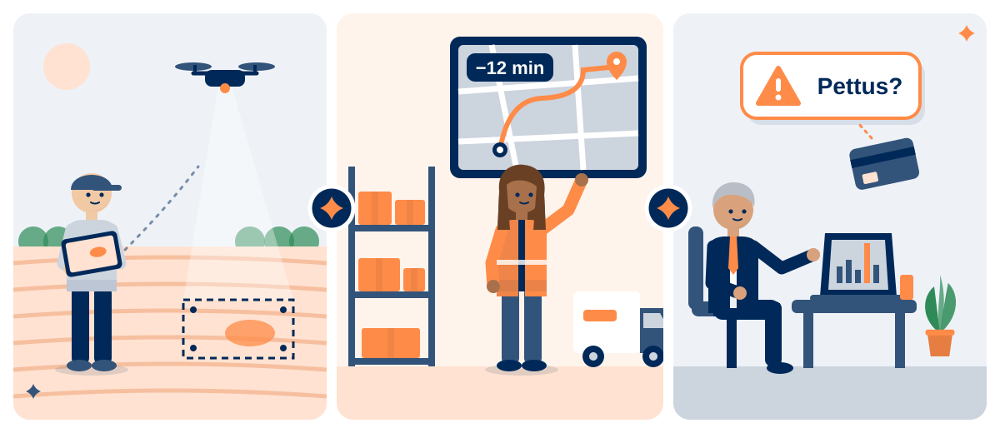
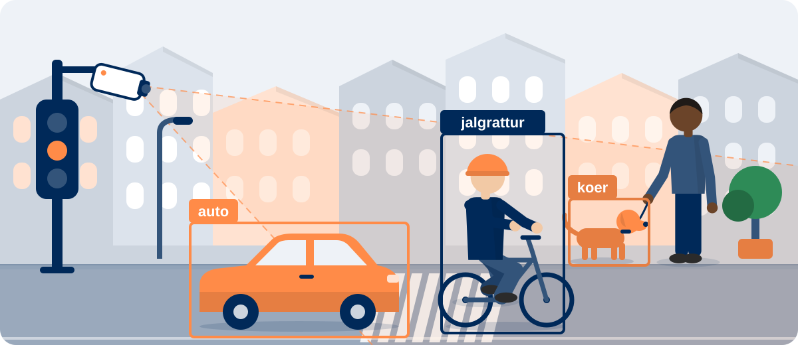
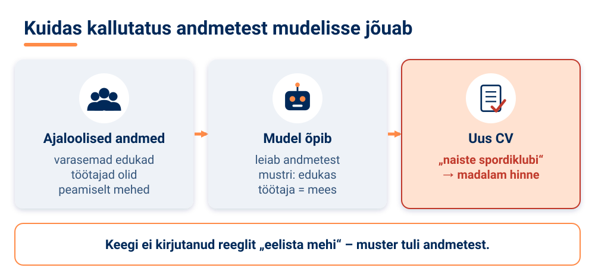
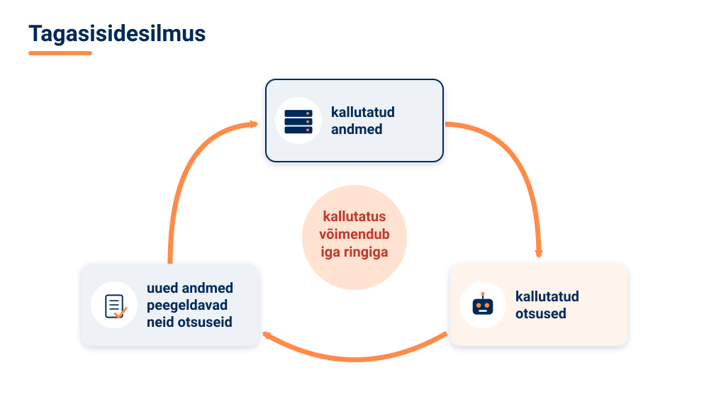
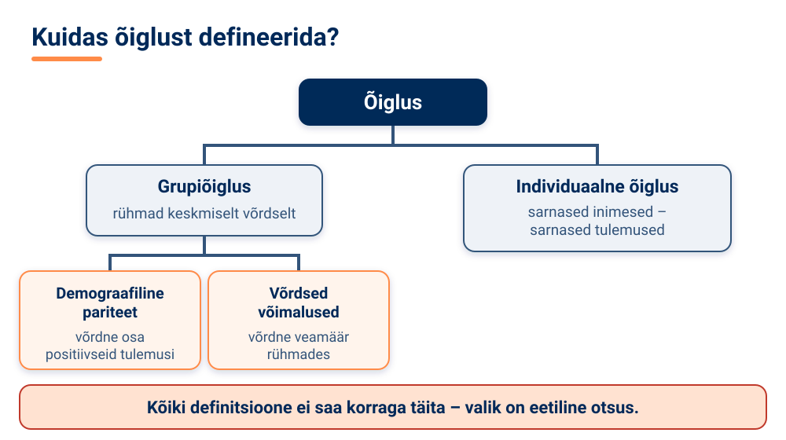

<!--
author:   Maia Lust
email:    
version:  1.3.0
language: et
narrator: Estonian Female
date:     08.10.2026
logo:     pildid/pae_logo.png
icon:     pildid/pae_logo.png
comment:  Tehisintellekti alused – gümnaasiumi valikkursus (35 tundi), Tallinna Pae Gümnaasium. Õppetekstid, interaktiivsed töölehed ja enesekontrollitestid.
link:     https://fonts.googleapis.com/css2?family=Nunito+Sans:wght@400;600;700&family=Poppins:wght@600;700&family=JetBrains+Mono:wght@400;600&display=swap

@style
/* ==== liascript-theming:start ==== */
/* links: https://fonts.googleapis.com/css2?family=Nunito+Sans:wght@400;600;700&family=Poppins:wght@600;700&family=JetBrains+Mono:wght@400;600&display=swap */
/* theme: Tallinna Pae Gümnaasium — generated by liascript-theming, edit theme.json and rebuild */
:root {
  --theme-font-body: 'Nunito Sans', sans-serif;
  --theme-font-heading: 'Poppins', serif;
  --theme-font-mono: 'JetBrains Mono', monospace;
  --theme-heading-weight: 700;
  --theme-line-height: 1.6;
  --global-font-size: 1.6rem;
  --theme-radius: 0.8rem;
  --theme-radius-small: 0.4rem;
  --theme-radius-large: 1.4rem;
  --theme-shadow: 0 0.3rem 1rem rgba(0,41,89,.10);
}
/* surfaces & text: apply to every color theme */
:root.lia-variant-light {
  --color-background: 255,255,255;
  --color-text: 29,36,51;
  --color-border: 228,229,231;
  --lia-grey-lighter: 238,242,247;
  --lia-grey-light: 204,212,222;
}
:root.lia-variant-dark {
  --color-background: 15,23,36;
  --color-text: 229,232,235;
  --color-border: 49,60,73;
  --lia-grey-dark: 30,38,47;
  --lia-anthracite: 41,50,61;
}
/* accent: only the course theme (default) and the custom radio,
   so readers can still pick LiaScript's built-in color themes */
:root:is(.lia-theme-default, .lia-theme-custom) {
  --color-highlight: 0,41,89;
  --color-highlight-dark: 0,41,89;
}
:root.lia-theme-default {
  --color-highlight-menu: 0,41,89;
}
:root:is(.lia-theme-default, .lia-theme-custom).lia-variant-dark {
  --color-highlight: 47,90,143;
  --color-highlight-dark: 255,185,143;
}
:root.lia-variant-light { --theme-heading-color: #002959; }
:root.lia-variant-dark { --theme-heading-color: #FFB98F; }
/* ==== LiaScript theme adapter (liascript-theming) — keep verbatim ====
   Maps the --theme-* tokens onto LiaScript's CSS. Everything a theme
   changes lives in the token block above this one. */

/* -- fonts: body/mono via the global variables, headings & co. are
      compiled literals in LiaScript and need explicit selectors -- */
:root {
  --global-font-family: var(--theme-font-body);
  --global-font-mono: var(--theme-font-mono);
  --global-font-headline: var(--theme-font-heading);
}
body { line-height: var(--theme-line-height, 1.47); }
h1, h2, h3, .h1, .h2, .h3 {
  font-family: var(--theme-font-heading);
  font-weight: var(--theme-heading-weight, 600);
  letter-spacing: var(--theme-heading-letter-spacing, normal);
  text-transform: var(--theme-heading-transform, none);
  color: var(--theme-heading-color, inherit);
}
h4, h5, h6, .h4, .h5, summary, .lia-accordion__headline {
  font-family: var(--theme-font-subheading, var(--theme-font-body));
}
.lia-quote__text { font-family: var(--theme-font-quote, var(--theme-font-heading)); }
.lia-code, .lia-code--inline, code, kbd, samp, pre { font-family: var(--theme-font-mono); }
.lia-code .ace_editor { font-family: var(--theme-font-mono) !important; }

/* -- shape: radius for controls & surfaces (radio buttons, tags, circles stay) -- */
:is(button, .lia-btn, input, .lia-input, select, .lia-select, textarea, .lia-textarea, .lia-dropdown):not(.lia-radio, .lia-btn--tag, .lia-btn--small-tag),
.lia-code-terminal__input, .lia-pagination__content, .lia-script, .lia-support-menu__submenu {
  border-radius: var(--theme-radius);
}
.lia-checkbox[type='checkbox'], kbd, .lia-tooltip .lia-tooltiptext, .lia-code--inline {
  border-radius: var(--theme-radius-small);
}
details, .lia-quote, .lia-code__input, .lia-table-responsive, .lia-card {
  border-radius: var(--theme-radius-large);
  box-shadow: var(--theme-shadow);
}
.lia-quote, .lia-code__input { overflow: hidden; }
.lia-code__input .ace_editor { border-radius: inherit; }
.lia-support-menu__submenu { box-shadow: var(--theme-shadow-popup, 0 0 1rem rgba(128, 128, 128, 0.2)); }

/* -- dark mode: LiaScript brightens the accent for text via
      rgb(from … calc(r*2.5)), which turns a hand-picked accent into
      pastel/yellow. For the course theme, text-like accent uses take
      --color-highlight-dark (= "accent as text") instead. Scoped to
      default/custom so the built-in color themes keep their behavior. -- */
:root:is(.lia-theme-default, .lia-theme-custom).lia-variant-dark :is(.lia-link, .lia-btn--outline, .lia-code--inline) {
  color: rgb(var(--color-highlight-dark));
  border-color: rgb(var(--color-highlight-dark));
}
:root:is(.lia-theme-default, .lia-theme-custom).lia-variant-dark :is(summary, summary:after, .lia-label, .lia-skip-nav, .lia-support-menu__item, .lia-quote__text),
:root:is(.lia-theme-default, .lia-theme-custom).lia-variant-dark :is(.lia-list--unordered, .lia-list--ordered) > li::marker {
  color: rgb(var(--color-highlight-dark));
}
:root:is(.lia-theme-default, .lia-theme-custom).lia-variant-dark :is(.lia-btn--transparent, .lia-input) {
  filter: none;
}
:root:is(.lia-theme-default, .lia-theme-custom).lia-variant-dark :is(.lia-input, .lia-checkbox[type='checkbox'], .lia-radio[type='radio']):not(:checked, .is-disabled, [disabled]) {
  border-color: rgb(var(--color-highlight-dark));
}
/* alternating table rows: LiaScript uses a neutral grey in dark mode */
:root.lia-variant-dark .lia-table.is-alternating .lia-table__row:nth-child(2n) td,
:root.lia-variant-dark .lia-table-responsive.has-thead-sticky.has-first-col-sticky .is-alternating .lia-table__row:nth-child(2n) td:first-child:before,
:root.lia-variant-dark .lia-table-responsive.has-thead-sticky.has-last-col-sticky .is-alternating .lia-table__row:nth-child(2n) td:last-child:before {
  background-color: rgb(var(--lia-grey-dark));
}
/* -- theme extras -- */
/* ===== Tallinna Pae Gümnaasiumi värvid =====
   tumesinine #002959 · oranž #FF8B48 · tumeoranž #E67E42 */
:root {
  --pae-sinine: #002959;
  --pae-sinine-80: #33547A;
  --pae-sinine-20: #CCD4DE;
  --pae-sinine-08: #EEF2F7;
  --pae-oranz: #FF8B48;
  --pae-oranz-tume: #E67E42;
  --pae-oranz-20: #FFE2D1;
  --pae-oranz-08: #FFF4EC;
  --pae-roheline: #2E8B57;
  --pae-roheline-08: #EAF6EF;
  --pae-lilla: #6B4FA0;
  --pae-lilla-08: #F2EEF9;
}

/* Pealkirjad */
.lia-slide h1, main h1 {
  color: var(--pae-sinine);
  border-bottom: 6px solid var(--pae-oranz);
  padding-bottom: .3em;
}
.lia-slide h2, main h2 { color: var(--pae-sinine); }
.lia-slide h3, main h3 {
  color: var(--pae-sinine);
  border-left: 8px solid var(--pae-oranz);
  padding-left: .5em;
}
.lia-slide h4, main h4 { color: var(--pae-oranz-tume); }
strong { color: inherit; }

/* Tabelid */
.lia-table th, table thead th {
  background: var(--pae-sinine) !important;
  color: #fff !important;
}
.lia-table tbody tr:nth-child(even), table tbody tr:nth-child(even) { background: var(--pae-sinine-08); }

/* Pildid ja infograafikud */
img.lia-image, .lia-figure img, main img {
  border-radius: 12px;
}
.lia-figure__caption, figcaption {
  color: var(--pae-sinine-80);
  font-style: italic;
  text-align: center;
}

/* ASCII-skeemid väiksemaks ja Pae värvidesse */
.lia-ascii svg, lia-ascii svg, .lia-code--ascii svg { max-width: 760px; margin: 0 auto; display: block; }
svg.lia-ascii text { fill: var(--pae-sinine); }

/* ===== Kujunduskastid ===== */
blockquote.pae-moiste, blockquote.pae-naide, blockquote.pae-eesti,
blockquote.pae-motle, blockquote.pae-lisaks, blockquote.pae-fakt,
.pae-moiste, .pae-naide, .pae-eesti, .pae-motle, .pae-lisaks, .pae-fakt {
  border-radius: 14px !important;
  padding: 1.1em 1.4em 1.1em 4.2em !important;
  margin: 1.4em 0 !important;
  position: relative;
  box-shadow: 0 3px 10px rgba(0,41,89,.10);
  font-style: normal !important;
  text-align: left !important;
}
.pae-moiste::before, .pae-naide::before, .pae-eesti::before,
.pae-motle::before, .pae-lisaks::before, .pae-fakt::before {
  position: absolute; left: .7em; top: .75em;
  width: 2em; height: 2em; line-height: 2em;
  border-radius: 50%; text-align: center; font-size: 1.15em;
  color: #fff; font-style: normal;
}
/* Mõiste – oranž */
.pae-moiste { background: var(--pae-oranz-08) !important; border: 2px solid var(--pae-oranz) !important; border-left: 10px solid var(--pae-oranz) !important; }
.pae-moiste::before { content: "📖"; background: var(--pae-oranz); }
/* Näide – tumesinine */
.pae-naide { background: var(--pae-sinine-08) !important; border: 2px solid var(--pae-sinine-20) !important; border-left: 10px solid var(--pae-sinine) !important; }
.pae-naide::before { content: "💡"; background: var(--pae-sinine); }
/* Eesti näide – sinine-valge */
.pae-eesti { background: linear-gradient(135deg, #E8F1FB 0%, #ffffff 100%) !important; border: 2px solid #0072CE !important; border-left: 10px solid #0072CE !important; }
.pae-eesti::before { content: "🇪🇪"; background: #0072CE; }
/* Mõtle järele – roheline */
.pae-motle { background: var(--pae-roheline-08) !important; border: 2px dashed var(--pae-roheline) !important; border-left: 10px solid var(--pae-roheline) !important; }
.pae-motle::before { content: "🤔"; background: var(--pae-roheline); }
/* Tea lisaks – lilla */
.pae-lisaks { background: var(--pae-lilla-08) !important; border: 2px solid #CDBFE6 !important; border-left: 10px solid var(--pae-lilla) !important; }
.pae-lisaks::before { content: "🔍"; background: var(--pae-lilla); }
/* Fakt – tume taust, valge tekst */
.pae-fakt { background: var(--pae-sinine) !important; color: #fff !important; border-left: 10px solid var(--pae-oranz) !important; }
.pae-fakt * { color: #fff !important; }
.pae-fakt::before { content: "⚡"; background: var(--pae-oranz); }

/* Töölehe jaotise riba */
.pae-jaotis { background: var(--pae-sinine); color: #fff !important; padding: .55em 1em; border-radius: 10px; margin: 2em 0 1em; border-left: 10px solid var(--pae-oranz); }
.pae-jaotis * { color: #fff !important; }

/* Ploki kaanepilt */
.pae-kaas img, img.pae-kaas { width: 100%; border-radius: 16px; box-shadow: 0 6px 20px rgba(0,41,89,.18); }

/* Näidisvastuse kokkupandav kast */
details {
  background: var(--pae-oranz-08);
  border: 1px solid var(--pae-oranz);
  border-radius: 10px; padding: .6em 1em; margin: .6em 0 1.4em;
}
details summary { cursor: pointer; font-weight: bold; color: var(--pae-oranz-tume); }

/* Menüü (sisukord) tumesinine */
.lia-toc a, .lia-toc .lia-toc__link, nav.lia-toc a { color: #002959 !important; }
.lia-toc a.lia-active, .lia-toc .lia-active { font-weight: 700; }
:root.lia-variant-dark .lia-toc a { color: #CCD4DE !important; }
:root.lia-variant-dark .pae-moiste, :root.lia-variant-dark .pae-naide, :root.lia-variant-dark .pae-eesti,
:root.lia-variant-dark .pae-motle, :root.lia-variant-dark .pae-lisaks { color: #1d2433 !important; }
:root.lia-variant-dark .pae-moiste *, :root.lia-variant-dark .pae-naide *, :root.lia-variant-dark .pae-eesti *,
:root.lia-variant-dark .pae-motle *, :root.lia-variant-dark .pae-lisaks * { color: #1d2433 !important; }
:root.lia-variant-dark img { background: #fff; }
/* ==== liascript-theming:end ==== */
/* Loosimisnupp (rollimäng) */
output.lia-script[input="submit"] { display:inline-block !important; background:#002959; color:#fff !important; font-weight:700; padding:.6em 1.2em; border-radius:999px; border:3px solid #FF8B48 !important; cursor:pointer; box-shadow:0 3px 10px rgba(0,41,89,.2); }
output.lia-script[input="submit"]:hover { background:#FF8B48; color:#002959 !important; }

@end

@custom
--color-highlight-menu: 255,255,255;
@end
-->

# Tehisintellekti alused

<!-- class="pae-kaas" -->


*Gümnaasiumi valikkursus (35 tundi) · Autor: Maia Lust · Tallinna Pae Gümnaasium*

**🗝️ See õpik on põgenemistuba.** Loe allpool, kuidas Kratti päästa!

**Tere tulemast!** Tehisintellekt (TI) on sinu ümber iga päev: telefoni näotuvastus, voogedastuse soovitused, masintõlge ja vestlusrobotid. Selles õpikus saad teada, kuidas TI tegelikult töötab, kus seda kasutatakse ja milliseid küsimusi see ühiskonnale tekitab. Õpid TI-d kasutama targalt ja kriitiliselt ning teed kursuse lõpus oma projektitöö.

<!-- class="pae-fakt" -->
> **Kursus ühe pilguga:** gümnaasiumi valikkursus · 35 tundi · 7 plokki · 31 teemat · igas tunnis õppetekst, infograafikud, interaktiivne tööleht ja enesekontroll.

## 🗝️ Missioon: päästa Kratt!

<!-- class="pae-fakt" -->
> **Häire!** Tallinna Pae Gümnaasiumi digikooli juhib tehisaru nimega **Kratt**. Täna hommikul läks Krati mälu segi: ta on lukustanud kooli 7 digitaalset tuba ega mäleta enam, mis ta on ja kuidas ta töötab. *„Kes ma olen? Miks ma kõiki neid andmeid mäletan, aga mitte nende tähendust?“*
>
> **Sina oled päästemeeskonna liige.** Läbi kõik 7 tuba, õpeta Kratile uuesti, mis on tehisaru, ja ava viimane uks!

Eesti muinasjuttudes on **kratt** inimese tehtud olend, kes ärkab ellu ja täidab peremehe käske. Eesti riigi tehisintellekti strateegiat kutsutakse samuti **kratikavaks**.

### Minu missioonikaart

Kirjuta siia oma võtmetähed ja kuldsed tähed, et need ei kaoks. Kuidas põgenemistuba töötab, loe lähemalt peatükist **„Kuidas õpikut kasutada?“**.

<!-- data-type="none" -->
| Tuba | Toa nimi | Lukud |
|:---:|---|:---:|
| 1 | Unustatud arhiiv | 3 |
| 2 | Masinaruum | 5 |
| 3 | Keelelabor | 4 |
| 4 | Otsuste labürint | 4 |
| 5 | Vaatlustorn | 5 |
| 6 | Nõukogusaal | 5 |
| 7 | Stardiplatvorm | 5 |

**Minu võtmetähed ja kuldsed tähed:**

[[___ ___ ___]]

## Kuidas õpikut kasutada?

Iga **tund** on üles ehitatud ühtemoodi:

| Osa | Mida seal teed |
|---|---|
| 🎯 **Õpieesmärgid** | Näed, mida tunni lõpuks oskad. |
| 📚 **Õppetekst** | Loed teksti, vaatad infograafikuid ja skeeme. |
| ✅ **Kokkuvõte ja põhimõisted** | Kordad tunni olulisimad mõtted ja mõisted. |
| ✏️ **Tööleht** | Lahendad ülesanded otse õpikus: kirjutad vastused väljadesse ja kontrollid valikülesandeid nupuga **Kontrolli**. |
| 🧠 **Enesekontroll** | Kontrollid, kas said aru. Pärast vastamist näed selgitust. |

Iga **ploki** lõpus on **kordamine**: praktilised ülesanded, aruteluküsimused ja ploki enesekontrolltest.

### 🗝️ Kuidas kasutada õpikut põgenemistoana?

Kogu õpik on **pedagoogiline põgenemistuba**: õpid uut ja lahendad samal ajal mõistatusi, et päästa kooli tehisaru Kratt. Põgenemistuba ei asenda õppimist. Lukud saad avada alles siis, kui oled tunni sisust aru saanud.

| Samm | Mida teed |
|---|---|
| 🚪 **1. Sisene tuppa** | Iga plokk on üks tuba. Loe ploki esimeselt lehelt toa lugu: mis Kratiga juhtus ja mitu lukku toas on. |
| 📚 **2. Õpi** | Läbi tunni õppetekst, tööleht ja enesekontroll. Seal on kõik, mida lukkude avamiseks vaja on. |
| 🔐 **3. Ava lukk** | Iga tunni viimane leht on **lukk**: mõistatus, anagramm, arvutus või kood. Kirjuta vastus ja vajuta **Kontrolli**. Õige vastuse korral avaneb **võtmetäht**. |
| ✍️ **4. Kirjuta täht üles** | Märgi iga võtmetäht oma **missioonikaardile** (vt eespool) või vihikusse. |
| 🚪 **5. Ava toa uks** | Ploki viimasel lehel on **uks**. Pane toa võtmetähed tundide järjekorras kokku ja sisesta sõna. Ukse taga ootab **kuldne täht** ja loo jätk. |
| 🌟 **6. Viimane uks** | Kui kõik 7 tuba on läbitud, avavad kuldsed tähed kursuse lõpus **viimase ukse**. Seejärel algab lõpumäng **TI Jeopardy**. |

<!-- class="pae-motle" -->
> **Kui jääd hätta**
>
> - Vajuta luku juures nuppu **?** – see näitab vihjet.
> - Mine tagasi tunni õppeteksti või kokkuvõtte juurde: vastus peitub alati tunni sisus.
> - Kontrolli kirjapilti: suurtel ja väikestel tähtedel ning tühikutel pole tähtsust, aga täpitähtedel (õ, ä, ö, ü) on.
> - Arutle pinginaabri või meeskonnaga – põgenemistuba on mõeldud ka koostööks.

<!-- class="pae-lisaks" -->
> **Õpetajale:** põgenemistuba saab läbida **üksi** (iga õpilane oma tempos) või **meeskonniti** (3–4 õpilast koos, igal meeskonnal oma missioonikaart). Toa uksi võib kasutada ka ploki lõpu kontrollpunktina: meeskond, kes avab ukse, näitab õpetajale oma kuldset tähte. Ukse sõnad ja kuldsed tähed on õpetajale kirjas failis `LOE_MIND.md`.

### Värvilised kastid

Tekstis on olulised kohad tõstetud esile värviliste kastidega.

<!-- class="pae-moiste" -->
> **Mõiste** – uue mõiste selgitus. Neid tasub meelde jätta.

<!-- class="pae-naide" -->
> **Näide** – kuidas teooria päris elus välja näeb.

<!-- class="pae-eesti" -->
> **Eesti näide** – tehisintellekt Eestis: riigiasutused, ettevõtted, teadus.

<!-- class="pae-fakt" -->
> **Kas teadsid?** – huvitav fakt, mis jääb meelde.

<!-- class="pae-motle" -->
> **Mõtle järele!** – küsimus, mille üle arutleda iseseisvalt või pinginaabriga.

<!-- class="pae-lisaks" -->
> **Tea lisaks** – lisateave neile, keda teema rohkem huvitab.

### Sisukord

| Plokk | Tunnid |
|---|---|
| **1. Sissejuhatus tehisintellekti** | 1.1 Mis on tehisintellekt? · 1.2 Tehisintellekti ajalugu · 1.3 Tehisintellekti rakendused |
| **2. Kuidas tehisintellekt töötab** | 2.1 Algoritmid · 2.2 Andmed · 2.3 Masinõpe · 2.4 Närvivõrgud ja süvaõpe · 2.5 Rakendused valdkondades |
| **3. Keeletöötlus** | 3.1 Kuidas TI mõistab keelt · 3.2 Teksti analüüs ja genereerimine · 3.3 Vestlusrobotid · 3.4 Masintõlge |
| **4. Tehisintellekti otsustamine** | 4.1 Otsustuspuud · 4.2 Ekspertsüsteemid · 4.3 Soovitussüsteemid · 4.4 TI eri valdkondades |
| **5. Pilditöötlus ja arvutinägemine** | 5.1 Kuidas TI näeb pilte · 5.2 Objekti- ja näotuvastus · 5.3 Meditsiiniline pildianalüüs · 5.4 Generatiivne TI · 5.5 Süvavõltsingud |
| **6. Tehisintellekt ja eetika** | 6.1 Eetilised põhimõtted · 6.2 Privaatsus · 6.3 Kallutatus ja õiglus · 6.4 Mõju tööturule · 6.5 Tulevikutrendid |
| **7. Kokkuvõte ja projektitöö** | 7.1 Kursuse kokkuvõte · 7.2–7.5 Projektitöö planeerimine, arendamine ja esitlemine |

Õpiku lõpus on **sõnastik** kõigi põhimõistetega.

<!-- class="pae-motle" -->
> **Mõtle järele!** Mitu korda oled täna juba tehisintellektiga kokku puutunud? Kirjuta üles kolm olukorda ja vaata kursuse lõpus, kas tead nüüd, kuidas need töötavad.

[[___ ___ ___]]


# Plokk 1. Sissejuhatus tehisintellekti

<!-- class="pae-kaas" -->


<!-- class="pae-fakt" -->
> **🗝️ 1. tuba: Unustatud arhiiv**
>
> Kooli digikoridori lõpus sumiseb tolmune server – see on Kratt, Tallinna Pae Gümnaasiumi tehisaru, kes on just üles ärganud. „Tere… kes te olete? Ja kes olen mina? Mu arhiivis on ainult sõnad „tehis…“ ja „intel…“ – mis see üldse tähendab?“ Teie, päästemeeskond, olete sattunud Krati **unustatud arhiivi**, kus on segamini kõik, mida ta enda kohta teadis: mis on tehisintellekt, kust ta pärit on ja milleks teda kasutatakse. Aidake Kratil oma mälu taastada! Selles toas on 3 lukku – iga tunni lõpus üks. Iga avatud lukk annab ühe võtmetähe. Kirjutage tähed üles!

Tehisintellekt (TI) ei ole enam ainult ulmefilmide teema. Kui telefon avaneb sinu näo järgi, kui Spotify pakub sulle uut lugu või kui vestlusrobot aitab sul keerulist teemat lahti mõtestada, oled juba tehisintellektiga kokku puutunud. Selles plokis saad teada, mida tehisintellekt tegelikult tähendab, kust see on alguse saanud ja kus seda tänapäeval kasutatakse.

See plokk on kogu kursuse vundament. Siin õpitud mõisted – nõrk ja tugev tehisintellekt, masinõpe, süvaõpe, ekspertsüsteem, generatiivne TI – tulevad tagasi kõigis järgmistes plokkides. Kui mõistad, kuidas tehisintellekt on aastakümnete jooksul arenenud ning milles seisnevad tema tugevused ja piirangud, oskad ka uusi tehnoloogiaid kriitiliselt hinnata, mitte neid pimesi imetleda ega karta.

**Selles plokis:**

- **1.1 Mis on tehisintellekt?** – definitsioonid, tehisintellekti liigid ja põhisuunad, tehisintellekt võrreldes inimesega
- **1.2 Tehisintellekti ajalugu** – kolm revolutsiooni: sümboolne TI, masinõpe ja generatiivne TI; tehisintellekti „talved“ ja suured võidukäigud
- **1.3 Tehisintellekti rakendused** – tehisintellekt igapäevaelus, tervishoius, transpordis, hariduses, äris ja Eestis; eelised ja piirangud

Ploki lõpus on kordamise osa praktiliste ülesannete, arutelu ja ploki enesekontrolltestiga.

### Kursuse „Tehisintellekti alused“ ülesehitus

„Tehisintellekti alused“ on gümnaasiumi valikkursus, mis kestab 35 tundi. Kursuse eesmärk on anda sulle ülevaade tehisintellekti põhimõistetest, toimimisest ja rakendustest. Õpime mõistma tehisintellekti võimalusi ja piiranguid, arendame kriitilist mõtlemist uute tehnoloogiate suhtes ning tutvume praktiliste rakendustega erinevates valdkondades.

Kursus koosneb seitsmest plokist:

<!-- data-type="none" -->
| Plokk | Teema | Tunde |
|---|---|---|
| 1 | Sissejuhatus tehisintellekti | 3 |
| 2 | Kuidas tehisintellekt töötab | 5 |
| 3 | Keeletöötlus | 4 |
| 4 | Tehisintellekti otsustamine | 4 |
| 5 | Pilditöötlus ja arvutinägemine | 5 |
| 6 | Tehisintellekt ja eetika | 5 |
| 7 | Kokkuvõte ja projektitöö | 9 |

Esimene plokk annab üldpildi. Teises plokis vaatame „kapoti alla“: kuidas algoritmid, andmed ja masinõpe tegelikult töötavad. Kolmandas ja viiendas plokis süveneme kahte suurde rakendusvaldkonda – keele ja piltide töötlemisse. Neljandas plokis uurime, kuidas tehisintellekt otsuseid langetab, ja kuuendas plokis arutleme, mis on õiglane, ohutu ja vastutustundlik. Kursus lõpeb projektitööga, kus saad õpitut ise rakendada.

**Kursuse lõpuks:**

- mõistad tehisintellekti põhimõisteid ja toimimist;
- oskad analüüsida tehisintellekti rakendusi;
- suudad kriitiliselt hinnata tehisintellekti võimalusi ja piiranguid;
- tunned tehisintellekti eetilisi aspekte.

Õppimise käigus osaled tundides ja aruteludes, lahendad praktilisi ülesandeid ja töölehti, teed enesekontrollteste ning koostad lõpuks projektitöö.

<!-- class="pae-motle" -->
> **Mõtle järele!**
>
> Enne kui alustad, mõtle hetkeks oma eilsele päevale. Milliseid nutiseadmeid, äppe või veebiteenuseid kasutasid? Millistes neist võis sinu arvates olla tehisintellekt? Ja mis on sinu praegune arvamus: kas tehisintellekt võib kunagi mõelda nagu inimene? Pane oma vastused kirja – ploki lõpus saad vaadata, kas su arusaam muutus.


## 1.1 Mis on tehisintellekt?

<!-- class="pae-kaas" -->


### Õpieesmärgid

Selle tunni järel sa:

- oskad oma sõnadega selgitada, mis on tehisintellekt, ja tunned selle mõiste erinevaid definitsioone;
- eristad nõrka (kitsast) tehisintellekti, tugevat (üldist) tehisintellekti ja superintelligentsust;
- tunned tehisintellekti peamisi suundi, nagu masinõpe, süvaõpe, loomuliku keele töötlus ja arvutinägemine;
- oskad võrrelda tehisintellekti ja inimese tugevusi ning nimetada tehisintellekti piiranguid;
- tunned ära tehisintellekti rakendusi oma igapäevaelus.

### Mis on tehisintellekt?

Võib-olla oled täna juba mitu korda tehisintellekti kasutanud, isegi seda märkamata. Telefon tunneb ära sinu näo, YouTube soovitab järgmise video, tõlkerakendus muudab inglise keele teksti eesti keelde ja vestlusrobot vastab sinu küsimusele. Kõigi nende taga on tehisintellekt. Aga mis see täpselt on?

<!-- class="pae-moiste" -->
> **Mõiste: tehisintellekt (TI)**
>
> Tehisintellekt (inglise keeles *artificial intelligence*, AI) on arvutiteaduse haru, mis tegeleb selliste masinate ja süsteemide loomisega, mis suudavad jäljendada inimmõistuse kognitiivseid ehk tunnetuslikke funktsioone – näiteks õppida, arutleda, mõista keelt ja tunda ära mustreid. Lühidalt: tehisintellekt lahendab probleeme viisil, mis tavaliselt nõuab inimese intelligentsust.

Pane tähele sõna **jäljendada**. Tehisintellekt ei mõtle tingimata samamoodi nagu inimene – ta matkib intelligentset käitumist. Tehisintellektisüsteemidel on mitu iseloomulikku võimet:

- **õppimine** – süsteem tuvastab andmetest mustreid ja õpib kogemustest;
- **arutlemine** – süsteem lahendab probleeme ja teeb järeldusi;
- **planeerimine** – süsteem järjestab tegevusi, et jõuda eesmärgini (näiteks navigatsiooniäpp leiab kiireima teekonna);
- **keele mõistmine** – süsteem töötleb ja loob loomulikku keelt ehk keelt, mida inimesed omavahel räägivad;
- **tajumine** – süsteem töötleb pilte, helisid ja muid andurite andmeid;
- **kohanemine** – süsteem suudab toime tulla uute olukordadega.


Tehisintellektil ei ole ühte ja ainsat definitsiooni. Eri ajal ja eri teadlased on seda kirjeldanud erinevalt:

| Kes | Definitsioon |
|---|---|
| John McCarthy (1956) | „Intelligentsete masinate loomise teadus ja tehnika“ |
| Stuart Russell ja Peter Norvig (tuntud TI-õpiku autorid) | „Süsteemid, mis käituvad inimese moodi, mõtlevad inimese moodi, käituvad ratsionaalselt või mõtlevad ratsionaalselt“ |
| Kaasaegne vaade | „Süsteemid, mis suudavad tajuda keskkonda ja tegutseda eesmärkide saavutamiseks“ |

Kaasaegset vaadet on lihtne seostada näiteks robottolmuimejaga: see tajub anduritega toa mööblit ja seinu ning tegutseb selle nimel, et põrand saaks puhtaks.

<!-- class="pae-naide" -->
> **Näide: kas kalkulaator on tehisintellekt?**
>
> Kalkulaator teeb tehteid välkkiirelt ja eksimatult, kuid **ei ole** tehisintellekt. Ta täidab alati samu jäigalt ette antud samme, ei õpi midagi juurde ega kohane uue olukorraga. Ka taimer, mis lülitab seadme kindlal kellaajal välja, ei ole tehisintellekt. Seevastu kõnetuvastus, mis muudab sinu kõne tekstiks, on tehisintellekti rakendus: see on õppinud tohutust hulgast salvestistest ära tundma eri inimeste hääli, hääldust ja sõnu.

### Nõrk, tugev ja superintelligentsus

Kui filmides räägitakse tehisintellektist, mis tahab maailma üle võtta, on see hoopis teistsugune tehisintellekt kui see, mis sinu telefonis fotosid sorteerib. Selle vahe mõistmiseks jagatakse tehisintellekt tavaliselt kolmeks liigiks.

<!-- class="pae-moiste" -->
> **Mõiste: nõrk (kitsas) tehisintellekt**
>
> Nõrk ehk kitsas tehisintellekt (inglise keeles *artificial narrow intelligence*, ANI) on tehisintellekt, mis on spetsialiseerunud ühele kindlale ülesandele või kitsale ülesannete ringile. Tal ei ole teadvust ega eneseteadlikkust. **Kõik praegu kasutusel olevad tehisintellekti süsteemid on nõrk tehisintellekt.**

Nõrk tehisintellekt võib oma kitsas valdkonnas olla inimesest palju parem. Maleprogramm võidab maailmameistrit, kuid ei oska sulle võileiba teha ega isegi aru saada, mis on võileib. Teised näited on piltide tuvastamine, keeletõlge, virtuaalsed assistendid nagu Siri ja Alexa ning soovitusalgoritmid.

<!-- class="pae-moiste" -->
> **Mõiste: tugev (üldine) tehisintellekt**
>
> Tugev ehk üldine tehisintellekt (inglise keeles *artificial general intelligence*, AGI) oleks süsteem, mis suudab mõista ja lahendada mis tahes intellektuaalset ülesannet, mida suudab inimene. Mõnede käsitluste järgi omaks see ka teadvust ja eneseteadlikkust. **Praegu eksisteerib tugev tehisintellekt vaid teoorias ja ulmeteostes.**

Kolmas, veelgi kaugem idee on **superintelligentsus** (inglise keeles *artificial superintelligence*, ASI) – tehisintellekt, mis ületaks inimese võimekuse kõigis valdkondades. See on tuleviku kontseptsioon, millest räägitakse peamiselt teaduslikus fantastikas ja filosoofilistes aruteludes.


Vahel jääb mulje, et tänapäeva vestlusrobotid on juba „peaaegu inimesed“, sest nad oskavad rääkida paljudel teemadel. Ka nemad on siiski nõrk tehisintellekt: nad on treenitud teksti looma, kuid neil puudub teadvus ja nad ei mõista maailma nii, nagu mõistab inimene. Selles, kas tugevat tehisintellekti on üldse võimalik luua, ei ole teadlased ühel meelel.

<!-- class="pae-fakt" -->
> **Kas teadsid?** Kõik praegu kasutusel olevad tehisintellekti süsteemid – ka kõige nutikamad vestlusrobotid – on **nõrk tehisintellekt**. Tugev tehisintellekt eksisteerib seni vaid teoorias ja ulmeteostes.

### Tehisintellekti põhisuunad

Tehisintellekt on suur valdkond, mis jaguneb mitmeks suunaks. Igaüks neist tegeleb erinevat liiki probleemidega.

| Suund | Millega tegeleb | Näide |
|---|---|---|
| **Masinõpe** | süsteemid, mis õpivad andmetest, ilma et iga samm oleks otse programmeeritud | rämpsposti filter |
| **Süvaõpe** | mitmekihilistel tehisnärvivõrkudel põhinev masinõpe keerukate mustrite õppimiseks | näotuvastus, vestlusrobotid |
| **Loomuliku keele töötlus** | inimkeele mõistmine ja genereerimine | masintõlge, kõnetuvastus |
| **Arvutinägemine** | piltide ja videote analüüs ehk visuaalse info mõistmine | telefoni näoga avamine |
| **Robootika** | füüsiliste süsteemide juhtimine | kullerrobotid, tööstusrobotid |
| **Ekspertsüsteemid** | teadmispõhised süsteemid, mis kasutavad inimekspertide teadmistest koostatud reegleid | varased meditsiinilise diagnostika süsteemid |


<!-- class="pae-moiste" -->
> **Mõiste: masinõpe**
>
> Masinõpe on tehisintellekti haru, kus süsteem õpib andmetest ilma otsese programmeerimiseta. Programmeerija ei kirjuta ette kõiki reegleid, vaid annab süsteemile palju näiteid ning süsteem leiab nendest ise mustrid.

<!-- class="pae-moiste" -->
> **Mõiste: süvaõpe**
>
> Süvaõpe on masinõppe alamharu, mis kasutab mitmekihilisi närvivõrke suurte andmehulkade töötlemiseks ja keerukate mustrite tuvastamiseks. Närvivõrgu ülesehitus on lõdvalt inspireeritud inimaju närvirakkude ühendustest.

Tehisintellekti ajaloos on olnud kaks suurt lähenemisviisi. **Sümboolne tehisintellekt** põhineb reeglitel ja loogikal: inimene kirjutab arvutile ette, kuidas mõelda („kui palavik on üle 38 kraadi ja kurk valutab, siis ...“). Nii töötavad ekspertsüsteemid. **Masinõpe** läheneb vastupidi: süsteemile ei anta reegleid, vaid näited, ja süsteem leiab reeglid ise. Võrdle seda kahe viisiga õppida jalgrattaga sõitma: üks on lugeda läbi juhend, teine on lihtsalt proovida ja kogemusest õppida. Rohkem kuuled neist kahest lähenemisest järgmises tunnis.

<!-- class="pae-lisaks" -->
> **Tea lisaks**
>
> Mõisteid „masinõpe“ ja „tehisintellekt“ aetakse sageli segi. Tegelikult on masinõpe tehisintellekti osa ja süvaõpe omakorda masinõppe osa – nagu matrjoškanukud üksteise sees:
>
> 

### Tehisintellekt ja inimene

Kas tehisintellekt on targem kui inimene? Sellele küsimusele ei ole ühest vastust, sest tehisintellektil ja inimesel on erinevad tugevused ja nõrkused.

| | Tehisintellekt | Inimene |
|---|---|---|
| **Tugevused** | kiire arvutamine, ei väsi, suudab töödelda tohutul hulgal andmeid, käitub järjepidevalt | loovus, empaatia, terve mõistus, kohanemisvõime |
| **Nõrkused** | konteksti mõistmine, teadvuse puudumine, raskused eetiliste otsustega | piiratud mälu, väsimine, subjektiivsus, aeglane arvutamine |

Sageli öeldakse, et tehisintellekt on „objektiivne“. Seda tuleb võtta ettevaatlikult: masin ei väsi ega lase tujul end mõjutada, kuid kui tema treeningandmetes on eelarvamusi, kordab ta neid. Seda nimetatakse **kallutatuseks** (*bias*).

Tehisintellektil on ka teisi olulisi piiranguid:

- **Andmesõltuvus.** Tehisintellekt vajab õppimiseks suurt hulka kvaliteetseid andmeid. Kui andmed on vigased või ühekülgsed, on ka tulemused vigased.
- **Läbipaistvuse puudumine ehk „musta kasti“ probleem.** Eriti süvaõppe mudelite puhul on raske või võimatu selgitada, miks süsteem just sellise otsuse tegi.
- **Üldistamisvõime.** Süsteemil on raske kohaneda olukordadega, mida ta treeningu ajal ei näinud.
- **Eetilised küsimused.** Kallutatus, privaatsus ja vastutus: kes vastutab, kui tehisintellekt teeb vea?
- **Loovuse ja teadvuse puudumine.** Tehisintellekt ei mõista maailma tegelikult nii, nagu mõistavad inimesed.

Lisaks tekitab tehisintellekt küsimusi **privaatsuse** (milliseid andmeid meist kogutakse ja kuidas neid kasutatakse?) ja **tööhõive** kohta (kuidas mõjutab automatiseerimine töökohti?). Nende teemadega tegeleme põhjalikumalt kuuendas plokis.

Kõige tähtsam järeldus on see, et tehisintellekt ja inimene **täiendavad teineteist**. Arst, kes kasutab röntgenpiltide analüüsimiseks tehisintellekti, saab kiiresti vihje võimalikule probleemile, kuid lõpliku otsuse teeb ikkagi tema, arvestades patsiendi kogu lugu.

<!-- class="pae-motle" -->
> **Mõtle järele!**
>
> 1. Too näide ülesandest, mida tehisintellekt teeb sinust paremini, ja ülesandest, mida sina teed paremini kui ükski tehisintellekt.
> 2. Kas sinu arvates võib tehisintellekt kunagi saavutada inimese taseme intelligentsuse? Mis peaks selleks muutuma?

### Tehisintellekt sinu ümber: lühike ülevaade

Tehisintellekt ei sündinud üleöö. Juba 1950. aastal avaldas Briti matemaatik **Alan Turing** artikli „Computing Machinery and Intelligence“ ja pakkus välja **Turingi testi**: kui inimene vestleb kirjalikult nii teise inimese kui ka masinaga ega suuda vastuste põhjal öelda, kumb on kumb, võib masinat pidada intelligentseks. 1956. aastal toimus Dartmouthi konverents, kus **John McCarthy** võttis kasutusele termini „tehisintellekt“. Sellest ajast saadik on olnud nii suuri lootusi kui ka pettumusi. Mõned verstapostid:

- **1997** – IBM-i superarvuti Deep Blue võitis malematšis maailmameistrit Garry Kasparovit;
- **2011** – IBM Watson võitis viktoriinisaates „Jeopardy!“ parimaid inimmängijaid;
- **2016** – AlphaGo võitis Go maailmameistrit Lee Sedoli;
- **2022–2023** – generatiivsete mudelite (ChatGPT, DALL-E) läbimurre.

<!-- class="pae-fakt" -->
> **Kas teadsid?** Alan Turing arutles masinate mõtlemise üle juba **1950. aastal** – ammu enne personaalarvuteid ja nutitelefone. Tema pakutud Turingi test on tänini üks tuntumaid ideid tehisintellekti ajaloos.

Täpsemalt räägime ajaloost järgmises tunnis.

Tänapäeval on tehisintellekt igal pool. **Virtuaalsed assistendid** (Siri, Alexa, Google Assistant) vastavad häälkäsklustele. **Soovitussüsteemid** (Netflix, Spotify, YouTube) pakuvad sisu, mis võiks sulle meeldida. **Keelemudelid** (ChatGPT, Claude, Gemini) kirjutavad ja selgitavad teksti, **pildigeneraatorid** (DALL-E, Midjourney, Stable Diffusion) loovad pilte. **Näotuvastust** kasutavad nutitelefonid ja turvakaamerad, **tõlkimisel** aitavad Google Translate ja DeepL, isesõitvaid autosid arendavad näiteks Tesla ja Waymo. Meditsiinis aitab tehisintellekt piltide põhjal haigusi tuvastada.

<!-- class="pae-eesti" -->
> **Eesti näide: Bürokratt ja Eesti TI-ettevõtted**
>
> Eesti riik arendab **Bürokratti** – virtuaalassistentide võrgustikku, mille abil saab avalikke teenuseid kasutada kõnekeelse suhtluse kaudu, nagu vestleksid sa ametnikuga. Bürokratt valiti 2022. aastal parimaks tehisintellektil põhinevaks riigiteenuseks ja jõudis UNESCO maailma saja parima tehisintellekti lahenduse hulka. Riigi tehisintellekti algatusi tuntakse üldnimega **kratt** (vt [kratid.ee](https://www.kratid.ee/)).
>
> Eestis sündinud ettevõtetest kasutavad tehisintellekti näiteks **Bolt** (nõudluse ennustamine ja sõitude sobitamine), **Veriff** (isikusamasuse tuvastamine dokumendi ja näopildi võrdlemise teel), **Starship Technologies** (isesõitvad kullerrobotid) ning keeleõppeäpp **Lingvist** ja matemaatikaharjutuste keskkond **99math**. Teadustööd tehakse muu hulgas Tartu Ülikoolis ja Tallinna Tehnikaülikoolis, kus arendatakse ka eesti keele tehnoloogiat ja masintõlget.

<!-- class="pae-lisaks" -->
> **Tea lisaks: kust rohkem lugeda ja vaadata?**
>
> - **Elements of AI** – tasuta veebikursus tehisintellekti põhimõistetest, olemas ka eesti keeles: [elementsofai.ee](https://www.elementsofai.ee/)
> - **Kratid.ee** – Eesti avaliku sektori tehisintellekti portaal: [kratid.ee](https://www.kratid.ee/)
> - Dokumentaalfilm **„AlphaGo – The Movie“** jutustab, kuidas tehisintellekt alistas Go maailmameistri.
> - TED-i ettekanne **„The incredible inventions of intuitive AI“** (Maurice Conti) näitab, kuidas tehisintellekt aitab disaineritel ja inseneridel.
> - Raamat **„Superintelligence: Paths, Dangers, Strategies“** (Nick Bostrom) arutleb, mis võib juhtuda, kui tehisintellekt kunagi inimest ületab.

### Mäng: tehisaru sorteerimismäng

Kas tunned ära, millal tehisaru (tehisintellekt) on mängus? Sorteeri 48 tegevust kahte rühma: **tehisaru abil toimuv tegevus** ja **tehisaru abita toimuv tegevus**. Igal kaardil on pilt, tegevuse kirjeldus ja nurgas täht või sümbol. Mäng toimub neljas voorus, igas voorus on 12 kaarti. Pärast iga vooru vajuta **Kontrolli**.

| Kategooria 1 | Kategooria 2 |
|:---:|:---:|
| <!-- style="width: 260px; border-radius: 10px;" --> | <!-- style="width: 260px; border-radius: 10px;" --> |

<!-- class="pae-fakt" -->
> **Salajane sõnum!** Kui paned **tehisaru abil toimuvate** tegevuste tähed järjekorda, tekib lause. Kirjuta tähed üles, sest viimases ülesandes tuleb lause ära arvata.

<!-- class="pae-motle" -->
> **Kuidas otsustada?** Küsi endalt: kas masin **õpib andmetest, tunneb ära mustreid** (nägu, häält, pilti, keelt) või **teeb ise otsuseid ja ennustusi**? Kui tegevust teeb inimene, loom või lihtne mehhanism, mis ainult täidab ühte etteantud käsku, siis tehisaru seal ei ole.

**1. voor: kaardid 1–12**

- [ (Tehisaru abil) (Tehisaru abita) ]
- [ (X) ( ) ] **1** <!-- style="width: 320px; max-width: 100%; border-radius: 10px;" -->
- [ (X) ( ) ] **2** <!-- style="width: 320px; max-width: 100%; border-radius: 10px;" -->
- [ ( ) (X) ] **3** <!-- style="width: 320px; max-width: 100%; border-radius: 10px;" -->
- [ (X) ( ) ] **4** <!-- style="width: 320px; max-width: 100%; border-radius: 10px;" -->
- [ ( ) (X) ] **5** <!-- style="width: 320px; max-width: 100%; border-radius: 10px;" -->
- [ (X) ( ) ] **6** <!-- style="width: 320px; max-width: 100%; border-radius: 10px;" -->
- [ ( ) (X) ] **7** <!-- style="width: 320px; max-width: 100%; border-radius: 10px;" -->
- [ (X) ( ) ] **8** <!-- style="width: 320px; max-width: 100%; border-radius: 10px;" -->
- [ ( ) (X) ] **9** <!-- style="width: 320px; max-width: 100%; border-radius: 10px;" -->
- [ (X) ( ) ] **10** <!-- style="width: 320px; max-width: 100%; border-radius: 10px;" -->
- [ ( ) (X) ] **11** <!-- style="width: 320px; max-width: 100%; border-radius: 10px;" -->
- [ (X) ( ) ] **12** <!-- style="width: 320px; max-width: 100%; border-radius: 10px;" -->
****************************************
Selle vooru tehisaru kaartide tähed: **K A S T Õ D E**

Spotify, robottolmuimeja, telefoni kaamera näotuvastus, YouTube, tõlkerakendus, Google Maps ja sõrmejäljelukk kasutavad tehisaru: need tunnevad ära mustreid või õpivad andmetest. Päeviku kirjutamine, õpetaja hinnang, raamatu otsimine kataloogist, jalutuskäik pargis ja portree maalimine on inimese tegevused.

****************************************

**2. voor: kaardid 13–24**

- [ (Tehisaru abil) (Tehisaru abita) ]
- [ ( ) (X) ] **13** <!-- style="width: 320px; max-width: 100%; border-radius: 10px;" -->
- [ (X) ( ) ] **14** <!-- style="width: 320px; max-width: 100%; border-radius: 10px;" -->
- [ ( ) (X) ] **15** <!-- style="width: 320px; max-width: 100%; border-radius: 10px;" -->
- [ (X) ( ) ] **16** <!-- style="width: 320px; max-width: 100%; border-radius: 10px;" -->
- [ ( ) (X) ] **17** <!-- style="width: 320px; max-width: 100%; border-radius: 10px;" -->
- [ (X) ( ) ] **18** <!-- style="width: 320px; max-width: 100%; border-radius: 10px;" -->
- [ ( ) (X) ] **19** <!-- style="width: 320px; max-width: 100%; border-radius: 10px;" -->
- [ (X) ( ) ] **20** <!-- style="width: 320px; max-width: 100%; border-radius: 10px;" -->
- [ ( ) (X) ] **21** <!-- style="width: 320px; max-width: 100%; border-radius: 10px;" -->
- [ (X) ( ) ] **22** <!-- style="width: 320px; max-width: 100%; border-radius: 10px;" -->
- [ ( ) (X) ] **23** <!-- style="width: 320px; max-width: 100%; border-radius: 10px;" -->
- [ (X) ( ) ] **24** <!-- style="width: 320px; max-width: 100%; border-radius: 10px;" -->
****************************************
Selle vooru tehisaru kaartide tähed: **P E I T U B**

NPC-tegelased mängus, e-poe soovitused, digitaalne assistent, unerütmi jälgiv nutikell, automaatne fotofilter ja tekstigeneraator kasutavad tehisaru. Sõbra soovitus, kassi ronimine, peast arvutamine, tahvlile joonistamine, kraadiklaasiga mõõtmine ja õpetaja suuline juhis toimuvad ilma tehisaruta.

****************************************

**3. voor: kaardid 25–36**

- [ (Tehisaru abil) (Tehisaru abita) ]
- [ (X) ( ) ] **25** <!-- style="width: 320px; max-width: 100%; border-radius: 10px;" -->
- [ ( ) (X) ] **26** <!-- style="width: 320px; max-width: 100%; border-radius: 10px;" -->
- [ (X) ( ) ] **27** <!-- style="width: 320px; max-width: 100%; border-radius: 10px;" -->
- [ ( ) (X) ] **28** <!-- style="width: 320px; max-width: 100%; border-radius: 10px;" -->
- [ (X) ( ) ] **29** <!-- style="width: 320px; max-width: 100%; border-radius: 10px;" -->
- [ ( ) (X) ] **30** <!-- style="width: 320px; max-width: 100%; border-radius: 10px;" -->
- [ (X) ( ) ] **31** <!-- style="width: 320px; max-width: 100%; border-radius: 10px;" -->
- [ ( ) (X) ] **32** <!-- style="width: 320px; max-width: 100%; border-radius: 10px;" -->
- [ (X) ( ) ] **33** <!-- style="width: 320px; max-width: 100%; border-radius: 10px;" -->
- [ ( ) (X) ] **34** <!-- style="width: 320px; max-width: 100%; border-radius: 10px;" -->
- [ (X) ( ) ] **35** <!-- style="width: 320px; max-width: 100%; border-radius: 10px;" -->
- [ ( ) (X) ] **36** <!-- style="width: 320px; max-width: 100%; border-radius: 10px;" -->
****************************************
Selle vooru tehisaru kaartide tähed: **A L G O R I**

Taimetuvastusäpp, isepargiv auto, klaviatuuri sõnasoovitused, Instagrami filter ja ust avav turvakaamera kasutavad tehisaru. Nutikas külmkapp on piiripealne näide: kui see ainult mõõdab, on tegu anduriga, kui see aga tunneb kaameraga tooteid ära, kasutab see tehisaru. Töövihiku täitmine, vahetusraha andmine, horoskoobi lugemine, arsti kogemusel põhinev otsus, sõbra nõuanne ja raamatu sirvimine on inimese tegevused.

****************************************

**4. voor: kaardid 37–48**

- [ (Tehisaru abil) (Tehisaru abita) ]
- [ (X) ( ) ] **37** <!-- style="width: 320px; max-width: 100%; border-radius: 10px;" -->
- [ ( ) (X) ] **38** <!-- style="width: 320px; max-width: 100%; border-radius: 10px;" -->
- [ (X) ( ) ] **39** <!-- style="width: 320px; max-width: 100%; border-radius: 10px;" -->
- [ ( ) (X) ] **40** <!-- style="width: 320px; max-width: 100%; border-radius: 10px;" -->
- [ (X) ( ) ] **41** <!-- style="width: 320px; max-width: 100%; border-radius: 10px;" -->
- [ ( ) (X) ] **42** <!-- style="width: 320px; max-width: 100%; border-radius: 10px;" -->
- [ (X) ( ) ] **43** <!-- style="width: 320px; max-width: 100%; border-radius: 10px;" -->
- [ ( ) (X) ] **44** <!-- style="width: 320px; max-width: 100%; border-radius: 10px;" -->
- [ (X) ( ) ] **45** <!-- style="width: 320px; max-width: 100%; border-radius: 10px;" -->
- [ ( ) (X) ] **46** <!-- style="width: 320px; max-width: 100%; border-radius: 10px;" -->
- [ (X) ( ) ] **47** <!-- style="width: 320px; max-width: 100%; border-radius: 10px;" -->
- [ ( ) (X) ] **48** <!-- style="width: 320px; max-width: 100%; border-radius: 10px;" -->
****************************************
Selle vooru tehisaru kaartide tähed: **T M I S ? :)**

Automaatne kirjavigade parandus, sportlasi jälgiv droon, tausta eemaldamine fotoäpis, tujule vastava muusika loomine, ChatGPT ja Google Lens kasutavad tehisaru. Salvestatud heli esitav mängukaru ja nupule vajutav kass seda ei tee: mänguasi ainult esitab salvestust. Ka sünnipäevakaart, ettekanne, koogi küpsetamine ja tooli valmistamine on inimese tegevused.

****************************************

**Salalause.** Kirjuta tehisaru abil toimuvate kaartide tähtedest moodustuv lause.

[[Kas tõde peitub algoritmis?]]
<script>
let v = `@input`.toLowerCase().replace(/[^a-zõäöüšž]/g, "");
v === "kastõdepeitubalgoritmis"
</script>
****************************************
Õige! Salalause on **„Kas tõde peitub algoritmis? :)“**
****************************************

<!-- class="pae-jaotis" -->
**Arutle**

**Kas tõde peitub algoritmis? Mida see küsimus sinu arvates tähendab? Kas tehisaru vastus on alati tõene?**

[[___ ___ ___]]

<details>
<summary>Vaata, millele vastuses mõelda</summary>

Algoritm ei tea „tõde“. See leiab andmetest mustreid ja teeb tõenäosuslikke ennustusi. Tehisaru võib eksida (näiteks ChatGPT võib hallutsineerida) ja andmetes olev kallutatus võib jõuda ka tema vastustesse. Seepärast tuleb tehisaru vastuseid kriitiliselt kontrollida ja otsustada ise.

</details>

**Millise kaardi sorteerimine oli kõige raskem? Miks? Too üks piiripealne näide (nt nutikas külmkapp, sõrmejäljelukk).**

[[___ ___ ___]]

### Kokkuvõte ja põhimõisted

**Pea meeles**

- Tehisintellekt on arvutiteaduse haru, mis loob inimmõistust jäljendavaid süsteeme: need õpivad, arutlevad, mõistavad keelt ja tunnevad ära mustreid.
- Tehisintellektil ei ole ühte definitsiooni; kaasaegne vaade rõhutab keskkonna tajumist ja eesmärgipärast tegutsemist.
- Kõik praegused tehisintellekti süsteemid, ka vestlusrobotid, on nõrk (kitsas) tehisintellekt. Tugev tehisintellekt ja superintelligentsus on praegu teoreetilised.
- Tehisintellekti põhisuunad on masinõpe, süvaõpe, loomuliku keele töötlus, arvutinägemine, robootika ja ekspertsüsteemid.
- Tehisintellektil on piirangud: andmesõltuvus, „musta kasti“ probleem, raskused uute olukordadega ja eetilised küsimused.
- Tehisintellekt ja inimene täiendavad teineteist – eesmärk on koostöö, mitte konkurents.

| Mõiste | Tähendus |
|---|---|
| tehisintellekt (TI) | arvutiteaduse haru, mis loob inimmõistuse funktsioone jäljendavaid süsteeme |
| nõrk (kitsas) TI, ANI | ühele kindlale ülesandele spetsialiseerunud tehisintellekt; kõik praegused süsteemid |
| tugev (üldine) TI, AGI | teoreetiline tehisintellekt, mis suudaks lahendada mis tahes inimese intellektuaalset ülesannet |
| superintelligentsus, ASI | tuleviku idee tehisintellektist, mis ületab inimest kõigis valdkondades |
| masinõpe | tehisintellekti haru, kus süsteem õpib andmetest ilma otsese programmeerimiseta |
| süvaõpe | masinõppe alamharu, mis kasutab mitmekihilisi närvivõrke |
| loomuliku keele töötlus | inimkeele mõistmise ja genereerimisega tegelev tehisintellekti suund |
| arvutinägemine | piltide ja videote analüüsimisega tegelev tehisintellekti suund |
| ekspertsüsteem | teadmispõhine süsteem, mis kasutab inimekspertide teadmistest koostatud reegleid |
| Turingi test | Alan Turingi pakutud katse: kas inimene suudab vestluse põhjal eristada masinat inimesest |
| „musta kasti“ probleem | olukord, kus tehisintellekti otsuse tegemise viis ei ole inimesele mõistetav |

### Tööleht 1.1

<!-- class="pae-jaotis" -->
**I. Mõisted ja definitsioonid**

**Ülesanne 1.** Selgita oma sõnadega, mis on tehisintellekt.

[[___ ___ ___]]

**Ülesanne 2.** Ühenda mõisted nende definitsioonidega.

| Täht | Kirjeldus |
|:---:|---|
| **A** | Tehisintellekti valdkond, mis tegeleb inimkeele mõistmise ja genereerimisega |
| **B** | Tehisintellekti võime mõista visuaalset informatsiooni |
| **C** | Tehisintellekti süsteemid, mis suudavad õppida andmetest ilma otsese programmeerimiseta |
| **D** | Masinõppe meetod, mis kasutab mitmekihilisi närvivõrke keerukate mustrite õppimiseks |

- [ (A) (B) (C) (D) ]
- [ ( ) ( ) (X) ( ) ] Masinõpe
- [ ( ) ( ) ( ) (X) ] Süvaõpe
- [ (X) ( ) ( ) ( ) ] Loomuliku keele töötlus
- [ ( ) (X) ( ) ( ) ] Arvutinägemine
****************************************
Masinõpe = õppimine andmetest ilma otsese programmeerimiseta (C); süvaõpe = mitmekihilised närvivõrgud (D); loomuliku keele töötlus = inimkeele mõistmine ja genereerimine (A); arvutinägemine = visuaalse info mõistmine (B).
****************************************

**Ülesanne 3.** Märgi, millised järgnevatest on tehisintellekti näited ja millised mitte.

- [ (On TI) (Ei ole TI) ]
- [ ( ) (X) ] Kalkulaator, mis lahendab matemaatilisi tehteid
- [ (X) ( ) ] Isesõitev auto
- [ (X) ( ) ] Näotuvastussüsteem nutitelefonis
- [ ( ) (X) ] Taimer, mis lülitab seadme kindlal ajal välja
- [ (X) ( ) ] Kõnetuvastussüsteem, mis muudab kõne tekstiks
- [ ( ) (X) ] Programm, mis järgib rangelt etteantud reegleid
****************************************
Isesõitev auto, näotuvastus ja kõnetuvastus õpivad andmetest ning tulevad toime muutuvate olukordadega. Kalkulaator, taimer ja lihtne reeglite järgi töötav programm täidavad alati samu jäiku samme ega õpi midagi juurde. (Ajaloos on küll olnud reeglipõhiseid ekspertsüsteeme, mida peeti tehisintellektiks, kuid lihtne etteantud reeglite täitmine üksi ei tee programmist tehisintellekti.)
****************************************

<!-- class="pae-jaotis" -->
**II. Tehisintellekti ajalugu**

**Ülesanne 4.** Järjesta tehisintellekti arengu olulised sündmused kronoloogiliselt (1 – kõige varasem, 6 – kõige hilisem).

Süvaõppe revolutsioon ja AlexNeti võit ImageNeti võistlusel: [[ 1 | 2 | 3 | 4 | (5) | 6 ]]  
Alan Turing avaldab artikli „Computing Machinery and Intelligence“: [[ (1) | 2 | 3 | 4 | 5 | 6 ]]  
IBM Deep Blue võidab maletšempioni Garry Kasparovit: [[ 1 | 2 | 3 | (4) | 5 | 6 ]]  
Esimene tehisintellekti konverents Dartmouthi kolledžis: [[ 1 | (2) | 3 | 4 | 5 | 6 ]]  
Tehisintellekti „talv“ vähese rahastuse ja huvi tõttu: [[ 1 | 2 | (3) | 4 | 5 | 6 ]]  
Suurte keelemudelite (GPT, BERT) areng: [[ 1 | 2 | 3 | 4 | 5 | (6) ]]

**Ülesanne 5.** Selgita lühidalt, miks on Turingi test tehisintellekti ajaloos oluline.

[[___ ___ ___]]

<!-- class="pae-jaotis" -->
**III. Tehisintellekti tüübid**

**Ülesanne 6.** Täida tabel tehisintellekti tüüpide kohta.

| Tehisintellekti tüüp | Kirjeldus | Näide |
|---|---|---|
| Nõrk tehisintellekt (ANI) | | |
| Tugev tehisintellekt (AGI) | | |
| Superintelligentsus (ASI) | | |

**Nõrk tehisintellekt (ANI) – kirjeldus ja näide:**

[[___ ___]]

**Tugev tehisintellekt (AGI) – kirjeldus ja näide:**

[[___ ___]]

**Superintelligentsus (ASI) – kirjeldus ja näide:**

[[___ ___]]

**Ülesanne 7.** Võrdle sümboolset tehisintellekti ja masinõpet.

**Sümboolne tehisintellekt:**

[[___ ___]]

**Masinõpe:**

[[___ ___]]

<!-- class="pae-jaotis" -->
**IV. Tehisintellekti rakendused**

**Ülesanne 8.** Nimeta igast valdkonnast vähemalt kolm tehisintellekti rakendust.

**Meditsiin:**

[[___ ___]]

**Transport:**

[[___ ___]]

**Haridus:**

[[___ ___]]

**Ülesanne 9.** Vali üks tehisintellekti rakendus ja kirjelda, kuidas see toimib.

[[___ ___ ___ ___]]

<!-- class="pae-jaotis" -->
**V. Praktiline ülesanne**

**Ülesanne 10.** Külasta veebilehte [teachablemachine.withgoogle.com](https://teachablemachine.withgoogle.com) ja loo lihtne pildituvastuse mudel (näiteks õpeta mudelit eristama kaht eset, mida veebikaamerale näitad). Seejärel kirjelda oma kogemust.

a) Mida õpetasid oma mudelile tuvastama?

[[___ ___]]

b) Kui hästi mudel töötas?

[[___ ___]]

c) Millised probleemid tekkisid?

[[___ ___]]

d) Mida õppisid selle ülesande käigus tehisintellekti kohta?

[[___ ___ ___]]

<!-- class="pae-jaotis" -->
**VI. Arutelu**

**Ülesanne 11.** Kuidas võib tehisintellekt muuta sinu tulevast karjääri või igapäevaelu?

[[___ ___ ___ ___]]

**Ülesanne 12.** Millised on sinu arvates tehisintellekti suurimad võimalused ja ohud?

**Võimalused:**

[[___ ___ ___]]

**Ohud:**

[[___ ___ ___]]

### Enesekontroll 1.1

**1. Mis on tehisintellekt?**

- [( )] Arvutiprogramm, mis suudab mõelda täpselt nagu inimene
- [(X)] Tehnoloogia, mis võimaldab masinatel jäljendada inimese intelligentset käitumist
- [( )] Robot, mis näeb välja nagu inimene
- [( )] Arvutisüsteem, mis on teadlik iseendast
****************************************
Tehisintellekt on tehnoloogia, mis võimaldab masinatel jäljendada inimese intelligentset käitumist. See ei tähenda, et masinad mõtleksid täpselt nagu inimesed või oleksid teadlikud iseendast.
****************************************

**2. Alan Turing pakkus 1950. aastal välja katse: kui inimene vestleb kirjalikult nii inimese kui ka masinaga ega suuda neid eristada, võib masinat pidada intelligentseks. Kuidas seda katset nimetatakse? Kirjuta vastus.**

[[Turingi test]]
<script>
let v = `@input`.trim().toLowerCase().replace(/\s+/g, " ");
["turingi test", "turingi testi", "turingi testiks", "turing test", "turingi-test", "turingitest"].includes(v)
</script>
****************************************
Õige vastus: **Turingi test**. See on tänini üks tuntumaid ideid tehisintellekti ajaloos – Turing arutles masinate mõtlemise üle juba ammu enne personaalarvuteid ja nutitelefone.
****************************************

**3. Lohista mõisted õigetesse lünkadesse.**

<!-- data-show-partial-solution -->
Süvaõpe on [->[ (masinõppe) | robootika ]] osa ja masinõpe on omakorda [->[ (tehisintellekti) ]] osa – nagu matrjoškanukud üksteise sees. Süvaõpe kasutab mitmekihilisi [->[ (närvivõrke) | ekspertsüsteeme ]].
****************************************
Kõige suurem „nukk“ on tehisintellekt, selle sees on masinõpe ja kõige sisemine on süvaõpe. Süvaõpe põhineb mitmekihilistel tehisnärvivõrkudel. Ekspertsüsteemid kasutavad hoopis inimeste kirja pandud reegleid ja robootika tegeleb füüsiliste seadmete juhtimisega.
****************************************

**4. Liigita näited tehisintellekti liigi järgi.**

<!-- data-show-partial-solution -->
- [ (Nõrk TI) (Tugev TI) (Superintelligentsus) ]
- [ (X) ( ) ( ) ] Maleprogramm, mis võidab maailmameistrit, kuid ei oska midagi muud
- [ (X) ( ) ( ) ] Vestlusrobot, mis oskab rääkida paljudel teemadel
- [ ( ) (X) ( ) ] Süsteem, mis suudaks lahendada mis tahes intellektuaalset ülesannet nagu inimene
- [ ( ) ( ) (X) ] Süsteem, mis ületaks inimese võimekuse kõigis valdkondades
****************************************
Maleprogramm ja vestlusrobot on nõrk tehisintellekt – ka vestlusrobot on treenitud ainult teksti looma ega mõista maailma nagu inimene. Tugev (üldine) tehisintellekt ja superintelligentsus on praegu vaid teoreetilised.
****************************************

**5. Seosta tehisintellekti suund näitega.**

<!-- data-show-partial-solution -->
- [ (Masinõpe) (Arvutinägemine) (Keeletöötlus) (Robootika) ]
- [ (X) ( ) ( ) ( ) ] Rämpsposti filter, mis õpib näidetest ise mustrid
- [ ( ) (X) ( ) ( ) ] Telefoni avamine näo järgi
- [ ( ) ( ) (X) ( ) ] Masintõlge inglise keelest eesti keelde
- [ ( ) ( ) ( ) (X) ] Starshipi kullerrobot, mis liigub kõnniteel
****************************************
Rämpsposti filter õpib andmetest (masinõpe), näotuvastus analüüsib pilti (arvutinägemine), masintõlge töötleb inimkeelt (loomuliku keele töötlus) ja kullerrobot juhib füüsilist seadet (robootika – kuigi ka see kasutab navigeerimiseks arvutinägemist).
****************************************

**6. Vali rippmenüüst, kumma tugevusega on tegu.**

<!-- data-show-partial-solution -->
Kiire arvutamine ja tohutu andmehulga töötlemine on [[ (tehisintellekti) | inimese ]] tugevus. Empaatia ja terve mõistus on [[ tehisintellekti | (inimese) ]] tugevus. Väsimine ja piiratud mälu on [[ tehisintellekti | (inimese) ]] nõrkus. Konteksti mõistmine ja eetilised otsused valmistavad raskusi [[ (tehisintellektile) | inimesele ]].
****************************************
Tehisintellekt arvutab kiiresti, ei väsi ja töötleb palju andmeid. Inimese tugevused on loovus, empaatia, terve mõistus ja kohanemisvõime. Seepärast täiendavad tehisintellekt ja inimene teineteist.
****************************************

**7. Millised on tehisintellekti piirangud? (Vali kõik õiged.)**

- [[X]] Vajab õppimiseks suurt hulka kvaliteetseid andmeid
- [[X]] Tema otsuseid on sageli raske selgitada („musta kasti“ probleem)
- [[ ]] Ei suuda kunagi teha arvutusi kiiremini kui inimene
- [[X]] Tal on raskusi olukordadega, mida ta treeningu ajal ei näinud
- [[ ]] Väsib pika töö järel
****************************************
Andmesõltuvus, läbipaistvuse puudumine ja nõrk üldistamisvõime on tehisintellekti olulised piirangud. Arvutamine ja väsimatus on seevastu tehisintellekti tugevused.
****************************************

**8. Selgita oma sõnadega, miks kalkulaator ei ole tehisintellekt, aga kõnetuvastus on.**

[[___ ___ ___]]

<details>
<summary>Vaata näidisvastust</summary>

Kalkulaator täidab alati samu jäigalt ette antud samme: ta ei õpi midagi juurde ega kohane uue olukorraga. Kõnetuvastus on õppinud suurest hulgast salvestistest ära tundma eri inimeste hääli, hääldust ja sõnu ning tuleb toime ka uute kõnelejatega. Tehisintellektiks teebki süsteemi just võime õppida andmetest ja jäljendada inimese tunnetuslikke võimeid.

</details>

### 🔐 Lukk 1.1

<!-- class="pae-naide" -->
> **Kratt:** „Ma olen vist kõige targem olend maailmas! Ma oskan… ee… ühte asja. Väga hästi. Aga võileiba teha ma küll ei oska.“

Lukk avaneb, kui lahendad mõistatuse. Loe Krati kirjeldust ja kirjuta lahtrisse, mis liiki tehisintellekt ta on (üks sõna).

> Olen maletšempionist osavam, tõlgin teksti ja tunnen näo ära – aga igaüks meist oskab ainult oma kitsast ülesannet. Mul pole teadvust ega eneseteadlikkust. Kõik tänapäeva tehisintellekti süsteemid, ka vestlusrobotid, kuuluvad minu liiki. **Milline tehisintellekt ma olen?**

[[nõrk]]
[[?]] Vihje: vaata peatükki „Nõrk, tugev ja superintelligentsus“. Tugev tehisintellekt ja superintelligentsus on alles teoorias.
<script>
let v = `@input`.trim().toLowerCase().replace(/\s+/g, " ").replace(/[.!]$/, "");
["nõrk", "kitsas", "nõrk ti", "kitsas ti", "nõrk tehisintellekt", "kitsas tehisintellekt", "ani", "nork"].includes(v)
</script>
****************************************
✅ **Lukk avatud!** Kratt on **nõrk (kitsas) tehisintellekt** – nagu kõik praegused TI-süsteemid: ta võib ühes asjas olla inimesest parem, kuid ei mõista maailma tervikuna.

🔑 **Sinu võtmetäht: A**

Kirjuta täht üles – seda on vaja toa ukse avamiseks.
****************************************


## 1.2 Tehisintellekti ajalugu

<!-- class="pae-kaas" -->


### Õpieesmärgid

Selle tunni järel sa:

- tunned tehisintellekti ajaloo olulisemaid verstaposte ja nendega seotud inimesi;
- oskad kirjeldada tehisintellekti arengu kolme revolutsiooni: sümboolne TI, masinõpe ja generatiivne TI;
- mõistad, mida tähendavad tehisintellekti „talved“ ja „kevaded“ ning miks need tekkisid;
- oskad selgitada, millised tegurid võimaldasid tehisintellekti kiire arengu 2010. aastatel;
- oskad analüüsida tehisintellekti arengu mõju ühiskonnale, sh Eestis.

### Juured: unistus mõtlevast masinast

Tehisintellekti ajalugu ulatub kaugemale kui arvutid ise. See on teekond filosoofilistest ideedest tänapäeva keerukate süsteemideni. Juba ammu enne esimest arvutit küsisid inimesed: mis on mõtlemine ja kas seda saaks kuidagi reeglitesse panna?

Tehisintellekt kasvas välja neljast valdkonnast:

- **filosoofia** küsis, mis on mõtlemine, teadvus ja intelligentsus (Aristoteles, Descartes, Leibniz);
- **matemaatika** andis loogika, algoritmid ja tõenäosusteooria (Boole, Frege, Russell);
- **psühholoogia** uuris inimese mõtlemisprotsesse (geštaltpsühholoogia, kognitiivne psühholoogia);
- **arvutiteadus** lõi arvutusliku võimekuse (Charles Babbage ja Ada Lovelace 19. sajandil).

Antiik-Kreekas kirjeldas **Aristoteles** loogikat kui formaalse arutluse alust. 17.–18. sajandil unistas **Leibniz** universaalsest arvutuskeelest, millega saaks iga vaidluse lahendada arvutamise teel. 19. sajandil lõi **George Boole** matemaatilise loogika, millel põhinevad tänapäeva arvutid (tõene/väär, 1/0). 1936. aastal kirjeldas **Alan Turing** „arvutatavuse“ kontseptsiooni ja kujuteldava universaalse arvutusmasina, mida nimetatakse Turingi masinaks. 1943. aastal lõid **Warren McCulloch ja Walter Pitts** esimese tehisneuroni ehk tehisnärvivõrgu matemaatilise mudeli. 1948. aastal pani **Norbert Wiener** aluse küberneetikale – teadusele juhtimisest ja tagasisidest nii masinates kui ka elusolendites.

Tehisintellekti tänapäevast ajalugu võib jagada kolmeks suureks revolutsiooniks, millest igaüks on muutnud tehisintellekti võimsamaks ja kättesaadavamaks:


### Esimene revolutsioon: sümboolne tehisintellekt (1950–1980)

**1950. aastal** avaldas Alan Turing artikli „Computing Machinery and Intelligence“ ja pakkus välja masina intelligentsuse hindamise meetodi.

<!-- class="pae-moiste" -->
> **Mõiste: Turingi test**
>
> Turingi test on Alan Turingi pakutud katse, mis kontrollib, kas masin suudab jäljendada inimese mõtlemist nii hästi, et inimene ei suuda eristada, kas ta suhtleb inimese või masinaga. Küsitleja esitab kirjalikke küsimusi nii inimesele kui ka arvutile. Kui küsitleja ei suuda vastuste põhjal öelda, kumb on kumb, on masin testi läbinud.


1951. aastal ehitasid **Marvin Minsky** ja Dean Edmonds esimese närvivõrgul põhineva arvuti **SNARC**. **1956. aastal** toimus USA-s Dartmouthi kolledžis konverents, kus kohtusid John McCarthy, Marvin Minsky, Claude Shannon, Allen Newell jt. Seal võttis **John McCarthy** kasutusele termini „tehisintellekt“. Seda aastat peetakse tehisintellekti kui teadusvaldkonna sünniaastaks.

<!-- class="pae-fakt" -->
> **Kas teadsid?** Sõna „tehisintellekt“ sündis **1956. aastal** Dartmouthi konverentsil – see tähendab, et tehisintellekt on teadusvaldkonnana juba üle 70 aasta vana!

Järgnes **esimene kuldajastu (1956–1974)**, mida iseloomustasid optimism ja suured lubadused. Allen Newell ja Herbert Simon lõid programmid **Logic Theorist** (1956), mis tõestas matemaatilisi teoreeme, ja **General Problem Solver** (1957), üldise probleemilahendaja. 1958. aastal lõi McCarthy programmeerimiskeele **LISP**; hiljem lisandus loogikaprogrammeerimise keel PROLOG. 1961. aastal hakkas General Motorsi tehases tööle esimene tööstusrobot **Unimate**. Joseph Weizenbaum lõi aastatel 1964–1966 vestlusprogrammi **ELIZA**, mis matkis psühhoterapeudiga vestlust, ja 1970. aastal näitas programm **SHRDLU**, et arvuti suudab lihtsas klotsimaailmas mõista loomuliku keele käske. Arendati ka masintõlget, masinnägemist ja roboteid. Uuringuid rahastasid suurel määral valitsusasutused, näiteks USA kaitseuuringute agentuur DARPA.

Sümboolse tehisintellekti põhiidee oli, et intelligentsust saab kirjeldada **sümbolite ja reeglite** abil. Kõige edukamaks näiteks said **ekspertsüsteemid**.

<!-- class="pae-moiste" -->
> **Mõiste: ekspertsüsteem**
>
> Ekspertsüsteem on teadmispõhine tehisintellekti süsteem, mis püüab jäljendada inimeksperdi otsustusvõimet. Selle südames on teadmusbaas – suur hulk ekspertidelt kogutud „kui ..., siis ...“ tüüpi reegleid.

Esimene ekspertsüsteem **DENDRAL** (alates 1965) analüüsis keemilisi aineid, **MYCIN** (1970. aastad) aitas arstidel diagnoosida bakteriaalseid nakkusi ja soovitada ravi.

Peagi selgus aga, et ootused olid liiga suured. Arvutid olid aeglased, algoritmid lihtsad ja andmeid vähe. Keerukate probleemide, näiteks masintõlke, raskust oli alahinnatud. 1973. aastal kritiseeris Suurbritannias avaldatud **Lighthilli raport** tehisintellekti uuringuid teravalt ning rahastamine vähenes järsult. Algas **esimene tehisintellekti talv (1974–1980)**: uurimistöö aeglustus, avalik huvi vähenes ja teadlased keskendusid kitsamatele probleemidele.

<!-- class="pae-moiste" -->
> **Mõiste: tehisintellekti „talv“ ja „kevad“**
>
> Tehisintellekti **talv** on periood, mil tehisintellekti arendamine aeglustub, sest rahastus ja huvi vähenevad – tavaliselt pärast seda, kui liiga suured lubadused ei täitu. **Kevadeks** nimetatakse perioodi, mil uued läbimurded toovad tagasi huvi ja raha.

1980. aastatel tulid ekspertsüsteemid uuesti esile, seekord **äris**. Näiteks **XCON** aitas konfigureerida arvuteid, teised süsteemid aitasid finantsplaneerimisel ja tootmise optimeerimisel. 1981. aastal käivitas Jaapan suure **„viienda põlvkonna“ arvutiprojekti**. Kuid ekspertsüsteemidel olid tõsised puudused: nende hooldus oli keeruline ja kallis, sest iga uus olukord nõudis uusi käsitsi kirjutatud reegleid; nad ei kohanenud muutustega ja neid oli raske laiendada. Spetsialiseeritud tehisintellekti riistvara ebaõnnestus ja personaalarvutite levik muutis kallid suured süsteemid tarbetuks. Algas **teine tehisintellekti talv (1987–1993)**: ettevõtteid suleti, rahastus vähenes ja paljud teadlased vältisid isegi sõna „tehisintellekt“.

### Teine revolutsioon: masinõpe (1980–2010)

Teise revolutsiooni põhiidee oli lihtne, kuid murranguline: selle asemel et masinale reegleid ette kirjutada, **las masin õpib ise andmetest**.

<!-- class="pae-naide" -->
> **Näide: kaks viisi rämpsposti tuvastada**
>
> **Sümboolne lähenemine:** programmeerija kirjutab reeglid – „kui kirjas on sõna „VÕIDA“ ja palju hüüumärke, siis on see rämpspost“. Petturid muudavad sõnastust ja reeglid jäävad hätta.
>
> **Masinõppe lähenemine:** süsteemile näidatakse tuhandeid kirju, mis on märgitud kas rämpspostiks või tavaliseks kirjaks. Süsteem leiab ise mustrid ja tunneb ära ka uued rämpskirjad, mille sõnastust keegi ette ei kirjutanud.


1986. aastal sai laiemalt tuntuks närvivõrkude treenimise **tagasilevi algoritm** (*backpropagation*), mis tõi kaasa närvivõrkude taassünni. 1990. aastatel andsid statistilised masinõppe meetodid – **tugivektormasinad, otsustuspuud, Bayesi võrgud** ja **geneetilised algoritmid** – praktilisi tulemusi kõnetuvastuses, tekstianalüüsis ja soovitussüsteemides.

**1997. aastal** võitis IBM-i superarvuti **Deep Blue** malematšis maailmameistrit **Garry Kasparovit** (3,5 : 2,5). Deep Blue ei õppinud nagu tänapäeva süsteemid, vaid arvutas läbi tohutul hulgal käike – see oli arvutusvõimsuse ja nutikate algoritmide kombinatsioon.

2000. aastatel tõi internet kaasa andmete plahvatusliku kasvu. Suured andmehulgad võimaldasid treenida võimsamaid mudeleid. Aastatel 2004–2010 arenesid robotid (DARPA Grand Challenge'i isesõitvate autode võistlused, iRoboti robottolmuimejad). 2006. aastal populariseeris **Geoffrey Hinton** süvaõppe meetodeid. **2011. aastal** võitis IBM **Watson** telemängus „Jeopardy!“ parimaid inimmängijaid, näidates loomuliku keele mõistmist ja teadmiste töötlemist.

### Kolmas revolutsioon: süvaõpe ja generatiivne tehisintellekt (2010–…)

**2012. aastal** võitis Alex Krizhevsky loodud konvolutsiooniline närvivõrk **AlexNet** pildituvastuse võistluse ImageNet märgatavalt väiksema veamääraga kui teised lähenemised. Seda peetakse **süvaõppe revolutsiooni** alguseks. 2013. aastal tutvustatud **Word2Vec** õpetas arvuteid esitama sõnu arvuvektoritena, nii et sarnase tähendusega sõnad on üksteise lähedal. 2014. aastal ostis Google Briti ettevõtte DeepMind.

**2016. aastal** võitis DeepMindi **AlphaGo** Go maailmameistrit **Lee Sedoli** 4 : 1. Go'd peeti tehisintellekti jaoks liiga keeruliseks, sest võimalikke seise on astronoomiliselt palju. 2017. aastal õppis **AlphaZero** iseseisvalt mängima malet, Go'd ja shōgi'd ning saavutas üliinimliku taseme ilma inimeste mängude näideteta.

<!-- class="pae-naide" -->
> **Näide: strateegiamängud kui tehisintellekti mõõdupuu**
>
> | Aasta | Süsteem | Saavutus |
> |---|---|---|
> | 1997 | Deep Blue | võitis malemaailmameistrit Garry Kasparovit |
> | 2011 | Watson | võitis „Jeopardy!“ meistreid |
> | 2016 | AlphaGo | võitis Go maailmameistrit Lee Sedoli 4 : 1 |
> | 2017 | AlphaZero | õppis malet, Go'd ja shōgi'd ilma inimeste näideteta |
>
> Need võidud näitavad arengut **jõumeetodist** (Deep Blue arvutas läbi miljoneid käike) **õppivate süsteemideni** (AlphaZero õppis mängides iseendaga).

<!-- data-type="barchart" data-title="Matšide lõpptulemus punktides: masin ja maailmameister" -->
| Matš | Masin | Inimene |
|---|---:|---:|
| Deep Blue – Kasparov (1997) | 3.5 | 2.5 |
| AlphaGo – Lee Sedol (2016) | 4 | 1 |

**2017. aastal** avaldasid Google'i teadlased artikli „Attention Is All You Need“, mis tutvustas **Transformer-arhitektuuri** – tänapäeva suurte keelemudelite alust. Aastatel 2017–2018 tekkisid keelemudelid **BERT** ja **GPT**. **2020. aastal** avaldas OpenAI 175 miljardi parameetriga keelemudeli **GPT-3**, mis genereeris enneolematult hästi teksti. **2022. aastal** avaldati **ChatGPT**, mis jõudis hinnanguliselt 100 miljoni kasutajani kõigest umbes kahe kuuga. Samal ajal levisid pildigeneraatorid DALL-E, Midjourney ja Stable Diffusion.

<!-- class="pae-fakt" -->
> **Kas teadsid?** 2022. aastal avaldatud ChatGPT jõudis hinnanguliselt **100 miljoni kasutajani kõigest umbes kahe kuuga**.

<!-- class="pae-moiste" -->
> **Mõiste: generatiivne tehisintellekt**
>
> Generatiivne tehisintellekt on tehisintellekt, mis loob uut sisu – teksti, pilte, heli, muusikat või videot –, tuginedes mustritele, mille ta on õppinud suurest hulgast näidetest. Näiteks suur keelemudel (nt GPT, Claude, Gemini) on generatiivne TI, mis on treenitud tohutul hulgal tekstil ja oskab luua inimlaadset teksti.

Generatiivne tehisintellekt muutis tehisintellekti kättesaadavaks igapäevakasutajatele: selle kasutamiseks ei pea olema programmeerija, piisab tavakeelsest küsimusest.

### Miks just nüüd? Viis kasvu tegurit

Miks toimus läbimurre just 2010. aastatel, kui paljud ideed (näiteks närvivõrgud) olid olemas juba aastakümneid? Põhjuseks on viie teguri koosmõju:

1. **Arvutusvõimsus** – arvutite võimsus on kasvanud mitme suurusjärgu võrra ning graafikaprotsessorid (GPU-d) ja spetsiaalne riistvara võimaldavad treenida väga suuri mudeleid.
2. **Andmemaht** – internet ja digitaalne revolutsioon lõid enneolematu koguse andmeid (tekstid, pildid, videod), millest mudelid saavad õppida.
3. **Algoritmid** – närvivõrgud, süvaõpe ja Transformer-arhitektuur võimaldasid keerukate mustrite tuvastamist ja sisu genereerimist.
4. **Rahastamine** – riskikapital ja suured tehnoloogiaettevõtted on investeerinud tehisintellekti väga suuri summasid.
5. **Talendid** – ülikoolide ja ettevõtete koostöös kasvas tugev teadlaste ja inseneride kogukond.


Nende tegurite koosmõju lõi võimendava efekti, mis kiirendas arengut eriti alates 2012. aastast.

<!-- class="pae-eesti" -->
> **Eesti näide: tehisintellekti areng Eestis**
>
> Eestil on tehisintellekti ja arvutiteaduse alal pikk ajalugu. 1960. aastal asutati Tallinnas **Küberneetika Instituut**, kus tegeleti juba nõukogude ajal arvutiteaduse ja automaatikaga. Pärast taasiseseisvumist 1990. aastatel avanesid uued suunad. 2000. aastatel arenes **keeletehnoloogia** – eesti keele arvutitöötlus ja masintõlge. Alates 2010. aastatest on Eestis sündinud tehisintellekti kasutavaid idufirmasid (Bolt, Veriff, Starship, Lingvist) ja ülikoolides töötavad tehisintellekti uurimisrühmad. Riik on koostanud tehisintellekti tegevuskavu ehk **kratikavasid** (2019–2021, 2022–2023 ja 2024–2026) ning arendab virtuaalassistentide võrgustikku **Bürokratt**.

### Tehisintellekti ajaloo õppetunnid ja tulevik

Tehisintellekti ajalugu on kulgenud **lainetena**: optimism → pettumus → uued läbimurded. Mõlemad talved said alguse sellest, et lubati rohkem, kui tehnoloogia suutis pakkuda. Ajaloost saab õppida, et:

- järkjärguline areng on jätkusuutlikum kui revolutsioonilised lubadused;
- praktilised rakendused on olulisemad kui teoreetilised läbimurded;
- tehnoloogia küpsemine nõuab aega ja kannatust.

Tänapäeva tehisintellekt põhineb aastakümnete pikkusel uurimistööl. Tehisintellekt on muutunud universaalseks tehnoloogiaks, mis mõjutab **majandust** (automatiseerimine, uued ärimudelid), **tööturgu** (töökohtade muutumine, uued oskused), **haridust** (personaliseeritud õpe), **teadust** (uued avastused) ja **ühiskonda** (privaatsus, võrdsus, eetika).

Tulevikusuundadena nähakse **multimodaalseid mudeleid**, mis töötlevad korraga teksti, pilti, heli ja videot; mudeleid, mis vajavad õppimiseks vähem andmeid; **selgitatavat tehisintellekti**, mille otsuseid saab inimene mõista; ning inimese ja tehisintellekti koostööd. Lahtine küsimus on, kas kunagi jõutakse **üldise tehisintellektini (AGI)**. Koos võimalustega (teaduslikud avastused, ravimite väljatöötamine, kliimalahendused, tootlikkuse kasv) kasvavad ka riskid: töökohtade kadumine, privaatsus ja turvalisus (jälgimine, süvavõltsingud, küberrünnakud) ning otsuste läbipaistvus, vastutus ja kallutatus.

Seetõttu on oluline vastutustundlik areng. Euroopa Liit võttis vastu **tehisintellekti määruse (AI Act)**, mis on maailmas esimene terviklik tehisintellekti õigusraamistik ja reguleerib tehisintellekti süsteeme riskipõhiselt. Eesmärk on arendada tehisintellekti nii, et see teeniks inimkonda, austaks inimõigusi ja et tehnoloogia kasu jaotuks õiglaselt.

<!-- class="pae-motle" -->
> **Mõtle järele!**
>
> 1. Ajaloos on olnud kaks tehisintellekti talve. Kas 2020. aastate generatiivse tehisintellekti buum võib sinu arvates viia kolmanda talveni? Mis räägib selle poolt ja mis vastu?
> 2. Kas oskad tuua näite mõnest teisest tehnoloogiast, mille ümber oli suur vaimustus, millele järgnes pettumus?

### Video: „Kibe õppetund“ (The Bitter Lesson)

Tehisintellekti ajaloos kordub üks muster nii sageli, et sellel on oma nimi. Arvutiteadlane **Rich Sutton** kirjutas 2019. aastal lühikese essee „The Bitter Lesson“ („Kibe õppetund“). Vaata Ethan Mollicki videot, mis selgitab seda mõtet laulu kaudu. Video on inglise keeles. Lülita vajaduse korral sisse subtiitrid (**CC**) ja automaatne tõlge.

!?[The Bitter Lesson – Ethan Mollick](https://www.youtube.com/watch?v=OAwat51S_Sk)

<!-- class="pae-lisaks" -->
> **Huvitav fakt videost**
>
> Video ise on näide sellest, millest see räägib. Ethan Mollicki sõnul andis ta tehisintellektile ainult ühe juhise. Laulusõnad, muusika ja video valmisid mitme TI-agendi koostöös, ilma et inimene oleks vahepeal midagi parandanud.

<!-- class="pae-motle" -->
> **Mõtle vaatamise ajal**
>
> 1. Mida püüdsid teadlased teha „targa“ TI loomiseks: kas kirjutada masinale ise reeglid või lasta sel õppida?
> 2. Mis juhtus siis, kui arvutid muutusid kiiremaks ja andmeid tuli juurde?
> 3. Miks nimetatakse seda õppetundi just *kibedaks*?

<!-- class="pae-jaotis" -->
**Refleksioon**

**1. Mis on selle video peasõnum? Kirjuta see 2–3 lausega oma sõnadega.**

[[___ ___ ___]]

<details>
<summary>Vaata näidisvastust</summary>

Video peasõnum on Rich Suttoni „kibe õppetund“: tehisintellekti ajaloos on pikas plaanis peaaegu alati võitnud üldised meetodid, mis kasutavad ära kasvavat arvutusvõimsust (õppimine ja otsing). Inimeste käsitsi kirjutatud reeglid ja ekspertteadmised on jäänud alla. Õppetund on kibe, sest teadlased on korduvalt investeerinud oma teadmistesse ja nutikatesse reeglitesse, kuid lõpuks on suurem arvutusvõimsus ja rohkem andmeid need ikka üle trumbanud. Inimesed peavad seda õppetundi ikka ja jälle uuesti õppima.

</details>

**2. Seosta video selle tunniga. Millised tunni näited sobivad „kibeda õppetunniga“? (Vali kõik sobivad.)**

- [[X]] Deep Blue võitis Kasparovi suure arvutusvõimsuse ja otsingu abil.
- [[X]] AlphaGo õppis Go'd suure hulga mängude põhjal, mitte käsitsi kirjutatud reeglite järgi.
- [[ ]] Ekspertsüsteemid olid seda edukamad, mida rohkem reegleid eksperdid neile käsitsi kirjutasid.
- [[X]] Süvaõpe hakkas toimima, kui tekkisid suured andmehulgad ja võimsad graafikaprotsessorid.
****************************************
Deep Blue, AlphaGo ja süvaõppe läbimurre näitavad, et arvutusvõimsus ning õppimine andmetest viisid edule. Ekspertsüsteemid näitavad vastupidist: käsitsi kirjutatud reeglitega süsteemid jäid jäigaks ja neid oli raske laiendada. Nende piirid viisid teise TI-talveni (1987–1993).
****************************************

**3. Kas sinu arvates kehtib „kibe õppetund“ alati? Too üks näide, kus inimese teadmised, väärtused või otsustusvõime jäävad ka edaspidi vajalikuks.**

[[___ ___ ___ ___]]

<details>
<summary>Vaata, millele vastuses mõelda</summary>

Hea vastus võtab seisukoha ja põhjendab seda. Näiteks: arvutusvõimsus aitab lahendada ülesandeid, kus on selge eesmärk ja palju andmeid. Inimest on aga vaja selleks, et otsustada, milliseid eesmärke TI-le seada, mis on õiglane ja eetiline ning kes vastutab tagajärgede eest, näiteks meditsiinis, kohtus või koolis hindamisel. Arvesta ka sellega, et suur arvutusvõimsus kulutab palju energiat ja raha.

</details>

### Kokkuvõte ja põhimõisted

**Pea meeles**

- Tehisintellekti juured on filosoofias, matemaatikas, psühholoogias ja arvutiteaduses; termin „tehisintellekt“ võeti kasutusele 1956. aastal Dartmouthi konverentsil.
- Areng on läbinud kolm revolutsiooni: sümboolne TI (reeglid ja loogika), masinõpe (õppimine andmetest) ja generatiivne TI (süvaõpe, suured keelemudelid).
- Ajalugu on olnud tsükliline: kaks tehisintellekti talve (1974–1980 ja 1987–1993) tekkisid, kui suured lubadused ei täitunud.
- Strateegiamängude võidud (Deep Blue, AlphaGo, AlphaZero) näitavad arengut jõumeetodist õppivate süsteemideni.
- Kiire areng alates 2012. aastast põhineb arvutusvõimsuse, andmete, algoritmide, rahastuse ja talentide koosmõjul.
- Tuleviku väljakutsed on nii tehnilised kui ka eetilised; Euroopa Liit reguleerib tehisintellekti ELi tehisintellekti määrusega (AI Act).

| Mõiste | Tähendus |
|---|---|
| Turingi test | katse, kas inimene suudab kirjaliku vestluse põhjal eristada masinat inimesest |
| Dartmouthi konverents | 1956. aasta kohtumine, kus võeti kasutusele termin „tehisintellekt“ |
| sümboolne tehisintellekt | reeglitel ja loogikal põhinev lähenemine tehisintellektile |
| ekspertsüsteem | teadmispõhine süsteem, mis kasutab inimekspertidelt kogutud reegleid |
| tehisintellekti talv | periood, mil rahastus ja huvi tehisintellekti vastu vähenevad |
| masinõpe | lähenemine, kus süsteem õpib reeglid ise andmetest |
| süvaõpe | mitmekihilistel närvivõrkudel põhinev masinõpe |
| Transformer | 2017. aastal tutvustatud närvivõrgu arhitektuur, suurte keelemudelite alus |
| generatiivne tehisintellekt | tehisintellekt, mis loob uut sisu: teksti, pilte, heli, videot |
| suur keelemudel | tohutul tekstihulgal treenitud mudel, mis genereerib inimlaadset teksti |
| „kibe õppetund“ (The Bitter Lesson) | Rich Suttoni (2019) tähelepanek, et pikas plaanis võidavad üldised meetodid, mis kasutavad arvutusvõimsust (õppimine, otsing), käsitsi kirjutatud inimteadmiste üle |

### Tööleht 1.2

<!-- class="pae-jaotis" -->
**I. Tehisintellekti ajaloo olulised sündmused**

**Ülesanne 1.** Täida ajajoon tehisintellekti ajaloo oluliste sündmustega.

| Aeg | Oluline sündmus |
|---|---|
| 1950 | Turingi test |
| 1956 | ? |
| 1960ndad | ? |
| 1970ndad | ? |
| 1980ndad | ? |
| 1990ndad | ? |
| 2000ndad | ? |
| 2010ndad | ? |
| 2020ndad | ? |

Kirjuta iga ajajoone punkti kohta (1956, 1960ndad, 1970ndad, 1980ndad, 1990ndad, 2000ndad, 2010ndad, 2020ndad) üks oluline sündmus.

[[___ ___ ___ ___ ___]]

**Ülesanne 2.** Kirjelda lühidalt kolme olulist tehisintellekti läbimurret ja nende tähtsust.

a) Läbimurre:

[[___]]

[[___ ___]]

b) Läbimurre:

[[___]]

[[___ ___]]

c) Läbimurre:

[[___]]

[[___ ___]]

<!-- class="pae-jaotis" -->
**II. Tehisintellekti pioneerid**

**Ülesanne 3.** Ühenda tehisintellekti pioneerid nende panusega.

| Täht | Kirjeldus |
|:---:|---|
| **A** | Lõi programmeerimiskeele LISP ja võttis kasutusele termini „tehisintellekt“ |
| **B** | Pakkus välja Turingi testi ja pani aluse arvutiteadusele |
| **C** | Arendas pertseptroni, ühe esimese närvivõrgumudeli |
| **D** | Oli MIT-i tehisintellekti labori kaasasutaja ja ehitas närvivõrgul põhineva arvuti SNARC |
| **E** | Süvaõppe pioneer, kes aitas tagasilevi algoritmi närvivõrkude treenimisel laialt kasutusele võtta |

- [ (A) (B) (C) (D) (E) ]
- [ ( ) (X) ( ) ( ) ( ) ] Alan Turing
- [ (X) ( ) ( ) ( ) ( ) ] John McCarthy
- [ ( ) ( ) ( ) (X) ( ) ] Marvin Minsky
- [ ( ) ( ) (X) ( ) ( ) ] Frank Rosenblatt
- [ ( ) ( ) ( ) ( ) (X) ] Geoffrey Hinton
****************************************
Turing – Turingi test (B); McCarthy – LISP ja termin „tehisintellekt“ (A); Minsky – MIT-i TI-labor ja SNARC (D); Rosenblatt – pertseptron (C); Hinton – tagasilevi ja süvaõpe (E).
****************************************

**Ülesanne 4.** Vali üks tehisintellekti pioneer ja kirjuta lühike kokkuvõte tema elust ja panusest.

[[___ ___ ___ ___ ___]]

<!-- class="pae-jaotis" -->
**III. Tehisintellekti „talved“ ja „kevaded“**

**Ülesanne 5.** Selgita, mida tähendavad tehisintellekti kontekstis mõisted „talv“ ja „kevad“.

[[___ ___ ___]]

**Ülesanne 6.** Täida tabel tehisintellekti talvede ja nende põhjuste kohta.

| Periood | Peamised põhjused | Mõju tehisintellekti arengule |
|---|---|---|
| 1970ndad | | |
| 1980–90ndad | | |

**1970ndad – põhjused ja mõju:**

[[___ ___]]

**1980–90ndad – põhjused ja mõju:**

[[___ ___]]

**Ülesanne 7.** Millised tegurid tõid kaasa tehisintellekti „kevade“ 2010. aastatel?

[[___ ___ ___ ___]]

<!-- class="pae-jaotis" -->
**IV. Tehisintellekti võidukäigud**

**Ülesanne 8.** Kirjelda lühidalt järgmisi tehisintellekti võidukäike.

a) Deep Blue vs Garry Kasparov (1997):

[[___ ___]]

b) Watson mängus „Jeopardy!“ (2011):

[[___ ___]]

c) AlphaGo vs Lee Sedol (2016):

[[___ ___]]

d) GPT mudelite areng:

[[___ ___]]

**Ülesanne 9.** Miks on need võidukäigud tehisintellekti arengu seisukohalt olulised?

[[___ ___ ___]]

<!-- class="pae-jaotis" -->
**V. Tehisintellekti arengu etapid**

**Ülesanne 10.** Kirjelda lühidalt järgmisi tehisintellekti arengu etappe.

a) Sümboolne tehisintellekt (1950–1980ndad):

[[___ ___]]

b) Ekspertsüsteemid (1970–1980ndad):

[[___ ___]]

c) Masinõpe (1990–2000ndad):

[[___ ___]]

d) Süvaõpe (2010ndad–tänapäev):

[[___ ___]]

**Ülesanne 11.** Millised on olnud peamised muutused tehisintellekti lähenemisviisides aja jooksul?

[[___ ___ ___]]

<!-- class="pae-jaotis" -->
**VI. Praktiline ülesanne**

**Ülesanne 12.** Uurimistöö: vali üks tehisintellekti ajalooline sündmus või isik ja koosta selle kohta lühike esitlus (3–5 slaidi). Esitluses võiksid olla:

- sissejuhatus ja taust;
- peamised saavutused või sündmused;
- mõju tehisintellekti arengule;
- seosed tänapäevaga;
- kasutatud allikad.

Valitud teema:

[[___]]

**Ülesanne 13.** Intervjuu: küsitle vanemat sugulast või tuttavat, kuidas ta on oma elu jooksul tehisintellekti arengut kogenud. Kirjuta lühike kokkuvõte.

[[___ ___ ___ ___ ___]]

<!-- class="pae-jaotis" -->
**VII. Arutelu**

**Ülesanne 14.** Millised on sinu arvates olnud tehisintellekti ajaloo kõige olulisemad sündmused ja miks?

[[___ ___ ___ ___]]

**Ülesanne 15.** Kuidas on tehisintellekti ajalugu mõjutanud selle tänapäevast arengut ja tulevikuväljavaateid?

[[___ ___ ___ ___]]

### Enesekontroll 1.2

**1. Kes võttis 1956. aastal Dartmouthi konverentsil kasutusele termini „tehisintellekt“? Kirjuta nimi.**

[[John McCarthy]]
<script>
let v = `@input`.trim().toLowerCase().replace(/\s+/g, " ");
["john mccarthy", "mccarthy", "j. mccarthy", "j mccarthy", "mccarthy john", "john mc carthy", "mc carthy"].includes(v)
</script>
****************************************
Õige vastus: **John McCarthy**. Tema korraldas Dartmouthi konverentsi ja andis valdkonnale nime. Hiljem lõi ta ka programmeerimiskeele LISP. Alan Turing pakkus juba 1950. aastal välja Turingi testi, kuid termin „tehisintellekt“ on pärit McCarthylt.
****************************************

**2. Kuidas nimetatakse perioodi, mil tehisintellekti rahastus ja huvi selle vastu vähenevad? Kirjuta üks sõna.**

[[talv]]
<script>
let v = `@input`.trim().toLowerCase().replace(/\s+/g, " ").replace(/[„“”"]/g, "");
["talv", "talve", "talved", "talveks", "tehisintellekti talv", "ti talv", "ti-talv", "ti talveks"].includes(v)
</script>
****************************************
Õige vastus: **talv** (tehisintellekti talv). Talvi on olnud kaks: 1974–1980 ja 1987–1993. Mõlemad tekkisid, kui liiga suured lubadused ei täitunud. Perioodi, mil läbimurded toovad huvi ja raha tagasi, nimetatakse kevadeks.
****************************************

**3. Pane sündmused ajalises järjekorras (1 – kõige varasem, 6 – kõige hilisem).**

<!-- data-show-partial-solution -->
Deep Blue võidab Garry Kasparovit: [[ 1 | 2 | 3 | (4) | 5 | 6 ]]<br>
Alan Turing pakub välja Turingi testi: [[ (1) | 2 | 3 | 4 | 5 | 6 ]]<br>
ChatGPT avaldatakse: [[ 1 | 2 | 3 | 4 | 5 | (6) ]]<br>
Algab esimene tehisintellekti talv: [[ 1 | 2 | (3) | 4 | 5 | 6 ]]<br>
AlexNet võidab ImageNeti võistluse: [[ 1 | 2 | 3 | 4 | (5) | 6 ]]<br>
Dartmouthi konverents: [[ 1 | (2) | 3 | 4 | 5 | 6 ]]
****************************************
Õige järjekord: 1. Turingi test (1950) → 2. Dartmouthi konverents (1956) → 3. esimene talv (1974) → 4. Deep Blue (1997) → 5. AlexNet (2012) → 6. ChatGPT (2022).
****************************************

**4. Liigita näited selle järgi, millisesse tehisintellekti revolutsiooni need kuuluvad.**

<!-- data-show-partial-solution -->
- [ (Sümboolne TI) (Masinõpe) (Süvaõpe ja generatiivne TI) ]
- [ (X) ( ) ( ) ] Ekspertsüsteem MYCIN, mis kasutab „kui ..., siis ...“ reegleid
- [ (X) ( ) ( ) ] Programm Logic Theorist, mis tõestab matemaatilisi teoreeme
- [ ( ) (X) ( ) ] Rämpsposti filter, mis õpib tuhandetest märgitud kirjadest
- [ ( ) (X) ( ) ] Otsustuspuud ja tugivektormasinad 1990. aastatel
- [ ( ) ( ) (X) ] Transformer-arhitektuur ja suured keelemudelid
- [ ( ) ( ) (X) ] Pildigeneraator, mis loob tekstikirjelduse põhjal pildi
****************************************
Sümboolne TI (1950–1980) põhines käsitsi kirjutatud reeglitel ja loogikal. Masinõppe revolutsioonis (1980–2010) hakkas süsteem reegleid ise andmetest leidma. Kolmas revolutsioon (alates 2010) tõi süvaõppe, Transformeri ja uut sisu loova generatiivse tehisintellekti.
****************************************

**5. Lohista sõnad lünkadesse nii, et tekiks Turingi testi kirjeldus.**

<!-- data-show-partial-solution -->
Turingi testis esitab [->[ (küsitleja) | programmeerija ]] kirjalikke küsimusi nii inimesele kui ka [->[ (masinale) ]]. Kui ta ei suuda vastuste põhjal eristada, kumb on kumb, on masin testi [->[ (läbinud) | kaotanud ]].
****************************************
Turingi testis vestleb küsitleja kirjalikult kahe vestluspartneriga, kellest üks on inimene ja teine masin. Kui küsitleja ei suuda neid eristada, on masin testi läbinud.
****************************************

**6. AlphaGo mängis 2016. aastal Lee Sedoliga viis partiid ja võitis matši 4 : 1. Mitu protsenti partiidest võitis AlphaGo? Kirjuta ainult arv.**

[[80]]
<script>
Number(`@input`.trim().replace("%", "").replace(",", ".")) === 80
</script>
****************************************
AlphaGo võitis 4 partiid 5-st: 4 : 5 = 0,8 = **80%**.
****************************************

**7. Millised tegurid võimaldasid tehisintellekti kiire arengu alates 2010. aastatest? (Vali kõik õiged.)**

- [[X]] Arvutusvõimsuse kasv ja graafikaprotsessorid (GPU-d)
- [[X]] Interneti kaudu kättesaadavad suured andmehulgad
- [[X]] Uued algoritmid, näiteks Transformer-arhitektuur
- [[ ]] Ekspertsüsteemide reeglite käsitsi kirjutamine
- [[ ]] Lighthilli raport
****************************************
Läbimurde taga on arvutusvõimsuse, andmete, algoritmide, rahastuse ja talentide koosmõju. Ekspertsüsteemide käsitsi kirjutatud reeglid kuuluvad sümboolse TI ajastusse ning Lighthilli raport (1973) aitas hoopis kaasa esimesele talvele.
****************************************

**8. Selgita oma sõnadega, miks tekkisid tehisintellekti talved ja mida saab neist tänapäeval õppida.**

[[___ ___ ___]]

<details>
<summary>Vaata näidisvastust</summary>

Mõlemad talved tekkisid, sest lubati rohkem, kui tehnoloogia suutis pakkuda. Esimese talve ajal olid arvutid aeglased, andmeid vähe ja keerukate ülesannete (nt masintõlke) raskust oli alahinnatud; Lighthilli raport kritiseeris uuringuid ja rahastus vähenes. Teise talve põhjustasid ekspertsüsteemide puudused: nende hooldus oli kallis ja nad ei kohanenud muutustega. Õppetund on, et järkjärguline areng ja praktilised rakendused on jätkusuutlikumad kui liiga suured lubadused.

</details>

### 🔐 Lukk 1.2

<!-- class="pae-naide" -->
> **Kratt:** „Kui vana ma olen? Mu sünnitunnistus on kuskil arhiivis… Mäletan ainult, et mind ristiti ühel konverentsil ja et ma kunagi võitsin Go-mängus maailmameistrit.“

Lukk avaneb, kui lahendad arvutusülesande. Kirjuta lahtrisse ainult arv.

Leia arhiivist kaks aastaarvu: millal võeti **Dartmouthi konverentsil** kasutusele termin „tehisintellekt“ ja millal võitis **AlphaGo** Go maailmameistrit Lee Sedoli. **Mitu aastat möödus ühest sündmusest teiseni?**

[[60]]
[[?]] Vihje: vaata joonist 1.2.1 (ajajoon) või peatükki „Esimene revolutsioon“. Lahuta hilisemast aastast varasem.
<script>
let v = `@input`.trim().toLowerCase().replace(/\s+/g, "").replace("aastat", "").replace("a", "");
Number(v) === 60
</script>
****************************************
✅ **Lukk avatud!** 2016 − 1956 = **60 aastat**. Nende kuue aastakümne sisse mahuvad kaks TI-talve ning üleminek sümboolsest tehisintellektist masinõppe ja süvaõppeni.

🔑 **Sinu võtmetäht: J**

Kirjuta täht üles – seda on vaja toa ukse avamiseks.
****************************************


## 1.3 Tehisintellekti rakendused

<!-- class="pae-kaas" -->


### Õpieesmärgid

Selle tunni järel sa:

- tunned tehisintellekti rakendusi eri valdkondades: igapäevaelus, tervishoius, transpordis, hariduses, äris, tööstuses, teaduses ja avalikus sektoris;
- oskad selgitada, kuidas töötavad virtuaalassistendid ja soovitussüsteemid;
- tunned Eesti ja Euroopa tehisintellekti rakendusi ja ettevõtteid;
- oskad analüüsida tehisintellekti rakenduste eeliseid ja piiranguid;
- oskad arutleda tehisintellekti mõju üle tööturule ja ühiskonnale.

### Tehisintellekt igapäevaelus

Tehisintellekt muudab juba peaaegu kõiki eluvaldkondi. Kõige lähemalt puutud sellega kokku oma nutitelefonis.


**Virtuaalassistendid** (Siri, Alexa, Google Assistant, Bixby) on tarkvara, millega saad suhelda häälega. Ütled „Pane äratus kella seitsmeks“ ja assistent täidab käsu. Taustal töötab mitu tehisintellekti tehnoloogiat: **kõnetuvastus** muudab su kõne tekstiks, **loomuliku keele mõistmine** selgitab välja, mida sa tahad, assistent püüab meeles pidada **vestluse konteksti** ja lõpuks **kõnesüntees** muudab vastuse taas kõneks. Assistente kasutatakse päringuteks, meeldetuletusteks ja nutikodu seadmete juhtimiseks. Neil on ka piirangud: nad ei mõista alati konteksti, tekitavad privaatsusküsimusi (seade kuulab ju pidevalt äratussõna) ja väiksemaid keeli, sh eesti keelt, toetavad sageli halvemini.


<!-- class="pae-fakt" -->
> **Kas teadsid?** Häälassistent kuulab pidevalt, kas sa ütled **äratussõna** – just seepärast tekitavad need seadmed privaatsusküsimusi.

<!-- class="pae-moiste" -->
> **Mõiste: soovitussüsteem**
>
> Soovitussüsteem on tehisintellekti süsteem, mis ennustab kasutaja varasema käitumise ja teiste kasutajate andmete põhjal, milline sisu või toode võiks talle huvi pakkuda. Soovitussüsteeme kasutavad Netflix, Spotify, YouTube, TikTok, Amazon ja paljud e-poed.

Soovitussüsteemid töötavad peamiselt kahel põhimõttel:

- **Koostööfiltreerimine** (*collaborative filtering*): „Inimesed, kellele meeldisid samad lood mis sulle, kuulasid ka seda lugu.“
- **Sisupõhine filtreerimine** (*content-based filtering*): „Sulle meeldisid rahulikud akustilised lood, siin on veel üks rahulik akustiline lugu.“

Enamik suuri platvorme kasutab **hübriidsüsteeme**, mis ühendavad mõlemad põhimõtted. Soovitussüsteemid on mugavad, kuid tekitavad ka probleeme. Kui süsteem näitab sulle ainult seda, mis sulle juba meeldib, võid sattuda **filtrimulli** – olukorda, kus sa ei näegi teistsuguseid vaateid ja sisu. Lisaks kogutakse sinu kohta palju andmeid.


<!-- class="pae-motle" -->
> **Mõtle järele!**
>
> Ava oma lemmikplatvormi (YouTube, TikTok, Spotify) avaleht. Mis sa arvad, miks algoritm soovitab sulle just neid asju? Kas oled märganud, et sinu voog on muutunud ühekülgseks? Mida saaksid teha, et filtrimullist välja pääseda?

Igapäevaeluga on seotud ka **sotsiaalmeedia filtrid**, mis personaliseerivad ja modereerivad sisu, **näotuvastus** telefoni avamisel ning **masintõlge** (Google Translate, DeepL).

### Tehisintellekt tervishoius ja teaduses

Tervishoius aitab tehisintellekt arstidel kiiremini ja täpsemini töötada:

- **meditsiiniline pildianalüüs** – röntgen-, MRT- ja KT-piltide analüüs haiguste tuvastamiseks;
- **haiguste diagnoosimine ja ennustamine** – sümptomite ja patsiendi andmete põhjal diagnooside pakkumine;
- **ravimite arendamine** – uute molekulide disain, ravimite avastamine ja kliiniliste uuringute tõhustamine;
- **personaalmeditsiin** – ravi kohandamine patsiendi geneetiliste andmete põhjal;
- **kirurgilised robotid** – täpsemad ja vähem invasiivsed (kehale vähem kahjulikud) operatsioonid.

Tervishoiu tehisintellekti on arendanud näiteks IBM (Watson Health), Google DeepMind ja Zebra Medical Vision. Eestis arendab tervisevaldkonna digiteenuseid **TEHIK** (Tervise ja Heaolu Infosüsteemide Keskus); e-tervise lahendus **digilugu** koondab terviseandmeid ning loob aluse ka tehisintellekti kasutamisele.

Teaduses aitab tehisintellekt töödelda suuri andmehulki, leida neist mustreid ja isegi pakkuda välja uusi hüpoteese. Tehisintellekti abil modelleeritakse kliimat ja keskkonda, molekule ja materjale ning bioloogilisi süsteeme.

<!-- class="pae-naide" -->
> **Näide: AlphaFold**
>
> Valgud on elu ehituskivid ja nende ülesanne sõltub nende kolmemõõtmelisest kujust. Valgu kuju kindlakstegemine laboris võis varem võtta aastaid. Google DeepMindi loodud **AlphaFold** ennustab valgu struktuuri selle koostise põhjal. See on aidanud teadlastel kiirendada bioloogia- ja ravimiuuringuid ning on üks tuntumaid näiteid tehisintellekti kasutamisest teaduslikes avastustes. Tehisintellekti kasutatakse ka uute materjalide disainimisel ja kosmose uurimisel.

### Tehisintellekt transpordis

Transpordis on tehisintellekti kõige silmapaistvam rakendus **isejuhtivad ehk isesõitvad sõidukid**: autod, bussid ja droonid, mis liiguvad ilma inimjuhita. Need kasutavad:

- **arvutinägemist**, et tuvastada teisi autosid, jalakäijaid ja liiklusmärke;
- **andureid** – lidar (laserkaugusmõõdik), radar ja ultraheliandurid;
- **kaardistamist ja lokaliseerimist**, et teada täpset asukohta;
- **otsustussüsteeme**, mis valivad, kas pidurdada, keerata või kiirendada.

Sõidukite autonoomsust kirjeldatakse **tasemetega 0–5**: tasemel 0 juhib kõike inimene, tasemel 5 sõidab auto igas olukorras täiesti iseseisvalt. Isesõitvaid sõidukeid on arendanud näiteks Tesla (Autopilot), Waymo ja Cruise. Väljakutseteks on ohutus, eetilised dilemmad (kuidas peaks auto käituma vältimatu õnnetuse korral?) ja seadused.


Tehisintellekt aitab ka **optimeerida liiklusvooge** ja vähendada ummikuid, arvutada **sõidujagamisteenustes** parimaid marsruute ja hindu, juhtida **logistikat ja tarneahelaid** ning planeerida **ühistransporti** nõudluse ennustamise põhjal.

<!-- class="pae-eesti" -->
> **Eesti näide: Bolt ja Starship**
>
> **Bolt** kasutab tehisintellekti nõudluse ennustamiseks, hindade optimeerimiseks ja sõitude sobitamiseks: süsteem püüab ennustada, kus ja millal sõitu vajatakse, ning leida igale tellimusele sobiva juhi. **Starship Technologies** on loonud isesõitvad kullerrobotid, mis navigeerivad arvutinägemise ja tehisintellekti abil kõnniteedel ning toimetavad kohale pakke ja toitu. Neid roboteid võid kohata ka Tallinna ja Tartu tänavatel.

### Tehisintellekt hariduses, äris ja tööstuses

**Hariduses** saab tehisintellekt kohandada õppimist iga õppija järgi. **Personaliseeritud õpe** tähendab, et süsteem tuvastab sinu taseme ja pakub sobiva raskusega ülesandeid ning individuaalset tagasisidet. **Intelligentsed tuutorid** vastavad küsimustele ja juhendavad. Tehisintellekt aitab ka **tuvastada õpilünki**, **hinnata** töid automaatselt, **tuvastada plagiaati** ja analüüsida õppimist (**õppimisanalüütika**). Õpetajale saab see vähendada administratiivset tööd, aidata luua õppematerjale ja jälgida õpilaste edenemist. Näited on Duolingo, Khan Academy, Carnegie Learning ja ALEKS; Eestist pärit on keeleõppeäpp **Lingvist**, matemaatikakeskkond **99math** ja kõrgkoolide vastuvõtusüsteem **DreamApply**.

**Äris** kasutatakse tehisintellekti klienditeeninduses (**vestlusrobotid** ehk chatbot'id, kliendikäitumise analüüs, personaliseeritud pakkumised), andmeanalüüsis (trendide tuvastamine, ennustusmudelid, otsuste toetamine) ja rutiinsete ülesannete automatiseerimiseks.

**Finantssektoris** aitab tehisintellekt **tuvastada pettusi** ehk märgata kahtlasi tehinguid, teha **riskianalüüsi** laenude ja investeeringute puhul, anda personaalseid finantssoovitusi ning teha automaatseid investeerimisotsuseid (**algoritmkauplemine**). Eesti ettevõte **Salv** aitab pankadel tuvastada rahapesu ja pettusi ning **LHV** kasutab tehisintellekti pettuste tuvastamiseks ja klienditeeninduse parandamiseks.

**Tööstuses** (näiteks Siemens, ABB, Bosch) juhivad tehisintellekt ja robotid tootmisliine, teevad **ennetavat hooldust** (ennustavad seadmete rikkeid enne nende tekkimist), tuvastavad **kvaliteedikontrollis** automaatselt defekte ning säästavad energiat ja tooraineid. **Põllumajanduses** aitab **täppispõllundus** külvata, väetada ja niisutada täpselt nii palju kui vaja; droonid ja andurid avastavad varakult kahjureid ja taimehaigusi ning tehisintellekt ennustab ilmastiku põhjal saagikust.

<!-- class="pae-moiste" -->
> **Mõiste: vestlusrobot (chatbot)**
>
> Vestlusrobot on tehisintellektil põhinev programm, mis suhtleb kasutajaga loomulikus keeles kirjalikult või suuliselt. Lihtsamad vestlusrobotid kasutavad ettevalmistatud vastuseid, tänapäevased suurtel keelemudelitel põhinevad vestlusrobotid (nt ChatGPT, Claude, Gemini) aga loovad vastuse iga kord uuesti.

### Loov tehisintellekt ja avalik sektor

**Generatiivne tehisintellekt** on toonud tehisintellekti loomevaldkonda. Keelemudelid (näiteks GPT-4, Claude, Llama) kirjutavad luuletusi, lugusid, artikleid ja dialooge. Pildigeneraatorid (DALL-E, Midjourney, Stable Diffusion) loovad tekstikirjelduse põhjal pilte, oskavad üle kanda kunstistiili ja pilte täiendada. Muusikas on tehisintellekti kasutatud kompositsiooni ja arranžeerimise juures (nt AIVA). Mängudes juhib tehisintellekt arvutivastaseid ja muudab mängukogemust dünaamilisemaks.

<!-- class="pae-moiste" -->
> **Mõiste: suur keelemudel**
>
> Suur keelemudel (inglise keeles *large language model*, LLM) on tehisintellekti mudel, mis on treenitud tohutul hulgal tekstil ja suudab genereerida inimesesarnast teksti. Seda kasutatakse teksti loomiseks, küsimustele vastamiseks, kokkuvõtete tegemiseks ja tõlkimiseks. Näited: GPT-4, BERT, LLaMA.

Suurtel keelemudelitel on ka olulised piirangud. Nad võivad **välja mõelda fakte** (seda nimetatakse hallutsineerimiseks), nende teadmised on piiratud treenimise ajaga, nad võivad peegeldada treeningandmetes olevat **kallutatust** ja nende treenimine kulutab palju energiat. Loova tehisintellekti puhul tekivad küsimused ka **autoriõiguste**, originaalsuse ja kunstnike rolli kohta.

<!-- class="pae-fakt" -->
> **Kas teadsid?** Kui keelemudel esitab enesekindlalt väljamõeldud „fakti“, nimetatakse seda **hallutsineerimiseks**. Seepärast tasub olulist infot alati teistest allikatest kontrollida.

**Avalikus sektoris** aitab tehisintellekt digitaliseerida ja automatiseerida avalikke teenuseid (e-valitsemine), muuta **nutikamaks linnu** (liikluse, energia ja jäätmekäitluse optimeerimine), toetada kriisijuhtimist ja pakkuda kodanikele personaliseeritud teenuseid. Näited on Eesti e-riik, Singapuri Smart Nation ja Barcelona Smart City.

<!-- class="pae-eesti" -->
> **Eesti näide: Bürokratt ja kratid**
>
> Eesti riigi tehisintellekti lahendusi nimetatakse **krattideks**. Tuntuim neist on **Bürokratt** – virtuaalassistentide võrgustik, mille kaudu saab avalikke teenuseid kasutada kõnekeelse vestluse kaudu. Bürokratt valiti 2022. aastal parimaks tehisintellektil põhinevaks riigiteenuseks ja jõudis UNESCO maailma saja parima tehisintellekti lahenduse hulka. Lisaks on Eestis eraldi tehisintellekti strateegia koostanud näiteks **Kaitseministeerium** ning **Maksu- ja Tolliamet**, mis kasutab tehisintellekti maksude kogumise ja tollikontrolli tõhustamiseks. Ettevõtetele pakuvad tehisintellekti kasutuselevõtul tuge **Tehnopoli AI arenguprogramm** ja **AI & Robotics Estonia (AIRE)**. Isikusamasuse tuvastamisel on maailmas tuntuks saanud Eesti ettevõte **Veriff**, mis võrdleb isikut tõendavat dokumenti ja näopilti. Eesti keele tehnoloogia (kõnetuvastus, masintõlge) arendamisega tegelevad Eesti ülikoolid.

### Eelised, piirangud ja mõju tööturule

Miks tehisintellekti nii palju kasutatakse? Peamised **eelised** on:

- **efektiivsus** – kiirus, mastaapsus ja ressursside parem kasutamine;
- **täpsus** – vähem inimlikke hooletusvigu ja järjepidev töö;
- **kättesaadavus** – töötab ööpäev läbi ja annab teenustele laiema ligipääsu;
- **personaliseeritus** – iga kasutaja saab endale kohandatud lahenduse;
- **uued võimalused** – lahendab ülesandeid, mis varem olid võimatud.

Samas on tehisintellekti rakendustel ka **piirangud**: vajadus suurte andmehulkade järele, läbipaistvuse puudumine („musta kasti“ probleem), algoritmiline kallutatus, turvalisuse ja isikuandmete kaitse küsimused ning raskused uudsete olukordadega kohanemisel.

<!-- class="pae-moiste" -->
> **Mõiste: kallutatus (bias)**
>
> Kallutatus on olukord, kus tehisintellekti süsteem teeb süstemaatiliselt ebaõiglasi või ühekülgseid otsuseid, sest tema treeningandmetes või ülesehituses on eelarvamusi. Näiteks töölevärbamise algoritm, mida on treenitud varasemate otsuste põhjal, võib hakata teatud inimrühmi ebaõiglaselt eelistama või kõrvale jätma.

Tehisintellekt tekitab ka eetilisi küsimusi: **privaatsus** (isikuandmete kogumine ja kasutamine), **kallutatus**, **läbipaistvus**, **vastutus** (kes vastutab tehisintellekti vigade eest?) ja **autonoomsed relvad**, mis võiksid sõjalistes süsteemides ise otsuseid langetada. Euroopa Liit on vastanud nendele küsimustele **tehisintellekti määrusega (AI Act)**, mis reguleerib tehisintellekti süsteeme riskipõhiselt, ning **isikuandmete kaitse üldmäärusega (GDPR)**, mis kaitseb inimeste isikuandmeid.

Suur küsimus on ka **tööturg**. Paljud rutiinsed ja korratavad tööülesanded võivad tulevikus automatiseeruda – mõtle iseteeninduskassadele või automatiseeritud tehastele. Samas tekib uusi töökohti, mis nõuavad loovust, kriitilist mõtlemist ja emotsionaalset intelligentsust. Töötajad peavad olema valmis pidevaks õppimiseks ja muutuva töömaailmaga kohanemiseks. Tehisintellekti ja inimeste koostöö võib paljudes valdkondades suurendada tootlikkust.

Tulevikus võib tehisintellekt muuta haridust, tööd, vaba aega ja isegi inimestevahelisi suhteid. Tähtis on leida tasakaal tehnoloogia kasutamise ja eetiliste kaalutluste vahel: eesmärk on **koostöö, mitte konkurents**.

<!-- class="pae-motle" -->
> **Mõtle järele!**
>
> Millist ametit tahaksid tulevikus pidada? Millised selle töö osad võiks tehisintellekt üle võtta ja millised jääksid kindlasti inimesele? Milliseid oskusi peaksid seetõttu juba praegu arendama?

### Kokkuvõte ja põhimõisted

**Pea meeles**

- Tehisintellekti rakendused on levinud peaaegu kõigis valdkondades: igapäevaelus, tervishoius, transpordis, hariduses, äris, tööstuses, põllumajanduses, teaduses, loomes ja avalikus sektoris.
- Virtuaalassistendid ühendavad kõnetuvastuse, loomuliku keele mõistmise ja kõnesünteesi; soovitussüsteemid kasutavad koostöö- ja sisupõhist filtreerimist.
- Eesti on mitmes valdkonnas innovatsiooni esirinnas: Bürokratt, Bolt, Veriff, Starship, Lingvist, Salv jt.
- Tehisintellekti eelised on efektiivsus, täpsus, kättesaadavus ja personaliseeritus; piirangud on andmesõltuvus, „must kast“, kallutatus ja privaatsusriskid.
- Tehisintellekt muudab tööturgu: rutiinsed ülesanded automatiseeruvad, tähtsamaks muutuvad loovus, kriitiline mõtlemine ja pidev õppimine.

| Mõiste | Tähendus |
|---|---|
| virtuaalassistent | häälega juhitav tarkvara, mis täidab kasutaja käsklusi (Siri, Alexa) |
| soovitussüsteem | süsteem, mis ennustab, milline sisu või toode kasutajat huvitab |
| filtrimull | olukord, kus algoritm näitab kasutajale ainult tema eelistustega sarnast sisu |
| vestlusrobot (chatbot) | programm, mis suhtleb kasutajaga loomulikus keeles |
| suur keelemudel | tohutul tekstihulgal treenitud mudel, mis genereerib inimesesarnast teksti |
| arvutinägemine | tehisintellekti suund, mis analüüsib pilte ja videoid |
| personaliseeritud õpe | õppimine, mida tehisintellekt kohandab õppija taseme ja vajaduste järgi |
| kallutatus (bias) | tehisintellekti süstemaatiliselt ebaõiglased otsused, mis tulenevad andmetest või ülesehitusest |
| tehisintellekti määrus (AI Act) | Euroopa Liidu esimene terviklik tehisintellekti õigusraamistik |

### Tööleht 1.3

<!-- class="pae-jaotis" -->
**I. Tehisintellekti rakenduste kaardistamine**

**Ülesanne 1.** Täida tabel erinevate tehisintellekti rakenduste kohta.

| Valdkond | Rakenduse näited | Kuidas tehisintellekt aitab? |
|---|---|---|
| Meditsiin | | |
| Transport | | |
| Haridus | | |
| Meelelahutus | | |
| Tootmine | | |
| Finants | | |
| Põllumajandus | | |

Kirjuta iga valdkonna kohta rakenduse näide ja see, kuidas tehisintellekt aitab (üks valdkond rea kohta).

[[___ ___ ___ ___ ___]]

**Ülesanne 2.** Millised tehisintellekti rakendused on sinu igapäevaelus juba olemas? Nimeta vähemalt viis.

[[___ ___ ___ ___ ___]]

<!-- class="pae-jaotis" -->
**II. Tehisintellekti rakenduste analüüs**

**Ülesanne 3.** Vali üks tehisintellekti rakendus ja analüüsi seda põhjalikumalt.

Valitud rakendus:

[[___]]

a) Kirjelda, kuidas see töötab.

[[___ ___ ___]]

b) Milliseid tehisintellekti tehnoloogiaid see kasutab?

[[___ ___]]

c) Millised on selle eelised võrreldes traditsiooniliste lahendustega?

[[___ ___ ___]]

d) Millised on selle piirangud või väljakutsed?

[[___ ___ ___]]

<!-- class="pae-jaotis" -->
**III. Tehisintellekti rakendused Eestis**

**Ülesanne 4.** Uuri ja nimeta vähemalt kolm Eesti ettevõtet või projekti, mis kasutavad tehisintellekti, ning kirjelda nende rakendust.

a) Ettevõte/projekt ja rakendus:

[[___ ___]]

b) Ettevõte/projekt ja rakendus:

[[___ ___]]

c) Ettevõte/projekt ja rakendus:

[[___ ___]]

**Ülesanne 5.** Kuidas on tehisintellekt mõjutanud Eesti digiühiskonna arengut?

[[___ ___ ___ ___]]

<!-- class="pae-jaotis" -->
**IV. Tehisintellekti mõju tööturule**

**Ülesanne 6.** Millised ametid võivad tehisintellekti tõttu muutuda või kaduda? Nimeta vähemalt kolm.

[[___ ___ ___]]

**Ülesanne 7.** Millised uued ametid võivad tehisintellekti arengu tõttu tekkida? Nimeta vähemalt kolm.

[[___ ___ ___]]

**Ülesanne 8.** Kuidas saaksid ennast tehisintellekti ajastu tööturuks ette valmistada?

[[___ ___ ___ ___]]

<!-- class="pae-jaotis" -->
**V. Praktiline ülesanne**

**Ülesanne 9.** Vali üks järgmistest praktilistest ülesannetest (variant A või B).

**Variant A: tehisintellekti rakenduse testimine.** Vali üks avalikult kättesaadav tehisintellekti rakendus (nt ChatGPT, mõni pildigeneraator või Google Lens) ja testi seda.

a) Valitud rakendus:

[[___]]

b) Mida proovisid sellega teha?

[[___ ___]]

c) Kui hästi rakendus toimis?

[[___ ___]]

d) Mis sind üllatas?

[[___ ___]]

e) Millised olid piirangud?

[[___ ___]]

**Variant B: tehisintellekti rakenduse idee.** Mõtle välja uus tehisintellekti rakendus, mis lahendaks mõnda probleemi sinu koolis või kogukonnas.

a) Probleemi kirjeldus:

[[___ ___]]

b) Tehisintellekti lahenduse idee:

[[___ ___]]

c) Milliseid tehisintellekti tehnoloogiaid see kasutaks?

[[___ ___]]

d) Kuidas see aitaks probleemi lahendada?

[[___ ___ ___]]

<!-- class="pae-jaotis" -->
**VI. Arutelu**

**Ülesanne 10.** Millised on tehisintellekti rakenduste peamised eetilised küsimused?

[[___ ___ ___ ___]]

**Ülesanne 11.** Kuidas saaksime tagada, et tehisintellekti rakendused tooksid ühiskonnale rohkem kasu kui kahju?

[[___ ___ ___ ___]]

### Enesekontroll 1.3

**1. Kuidas nimetatakse olukorda, kus algoritm näitab kasutajale ainult tema eelistustega sarnast sisu ja ta ei näegi teistsuguseid vaateid? Kirjuta üks sõna.**

[[filtrimull]]
<script>
let v = `@input`.trim().toLowerCase().replace(/\s+/g, " ");
["filtrimull", "filtrimulli", "filtrimullis", "filtrimulliks", "filtri mull", "filter mull", "filtermull"].includes(v)
</script>
****************************************
Õige vastus: **filtrimull**. Soovitussüsteem, mis pakub ainult sinu senise maitsega sarnast sisu, võib su voo muuta ühekülgseks. Filtrimullist aitab välja teadlikult teistsuguse sisu otsimine.
****************************************

**2. Kuidas nimetatakse seda, kui keelemudel esitab enesekindlalt väljamõeldud „fakti“? Kirjuta üks sõna.**

[[hallutsineerimine]]
<script>
let v = `@input`.trim().toLowerCase().replace(/\s+/g, " ");
["hallutsineerimine", "hallutsineerimiseks", "hallutsinatsioon", "hallutsinatsioonid", "hallutsineerib", "hallutsineerima", "hallutsineerimist", "hallutsinatsiooniks"].includes(v)
</script>
****************************************
Õige vastus: **hallutsineerimine** (hallutsinatsioon). Seepärast tasub keelemudeli antud olulist infot alati teistest allikatest kontrollida.
****************************************

**3. Pane virtuaalassistendi töö sammud õigesse järjekorda, kui ütled: „Pane äratus kella seitsmeks!“**

<!-- data-show-partial-solution -->
Kõnesüntees ütleb vastuse välja: [[ 1 | 2 | 3 | (4) ]]<br>
Loomuliku keele mõistmine selgitab välja, mida sa tahad: [[ 1 | (2) | 3 | 4 ]]<br>
Kõnetuvastus muudab su kõne tekstiks: [[ (1) | 2 | 3 | 4 ]]<br>
Assistent seob käsu vestluse kontekstiga: [[ 1 | 2 | (3) | 4 ]]
****************************************
Õige järjekord: 1. kõnetuvastus (kõne → tekst) → 2. loomuliku keele mõistmine (mida kasutaja soovib?) → 3. vestluse kontekst (mida räägiti varem?) → 4. kõnesüntees (vastus → kõne).
****************************************

**4. Seosta Eesti ettevõte või projekt selle tehisintellekti rakendusega.**

<!-- data-show-partial-solution -->
- [ (Veriff) (Starship) (Bürokratt) (Salv) ]
- [ ( ) (X) ( ) ( ) ] Isesõitvad kullerrobotid
- [ (X) ( ) ( ) ( ) ] Isikusamasuse tuvastamine dokumendi ja näopildi põhjal
- [ ( ) ( ) (X) ( ) ] Riigi virtuaalassistentide võrgustik
- [ ( ) ( ) ( ) (X) ] Rahapesu ja finantspettuste tuvastamine
****************************************
Starship – kullerrobotid; Veriff – isikusamasuse tuvastamine; Bürokratt – riigi virtuaalassistendid; Salv – finantskuritegude tuvastamine.
****************************************

**5. Vali rippmenüüst, millist soovitussüsteemi põhimõtet lause kirjeldab.**

<!-- data-show-partial-solution -->
„Inimesed, kellele meeldisid samad lood mis sulle, kuulasid ka seda lugu“ – see on [[ (koostööfiltreerimine) | sisupõhine filtreerimine ]]. „Sulle meeldisid rahulikud akustilised lood, siin on veel üks rahulik akustiline lugu“ – see on [[ koostööfiltreerimine | (sisupõhine filtreerimine) ]]. Süsteemi, mis ühendab mõlemad põhimõtted, nimetatakse [[ ekspertsüsteemiks | (hübriidsüsteemiks) ]].
****************************************
Koostööfiltreerimine võrdleb sinu eelistusi teiste sarnase maitsega kasutajate omadega. Sisupõhine filtreerimine otsib sisu, millel on samad tunnused nagu sellel, mis sulle juba meeldis. Enamik suuri platvorme kasutab mõlemat ühendavaid hübriidsüsteeme.
****************************************

**6. Lohista sõnad lünkadesse.**

<!-- data-show-partial-solution -->
Paljud [->[ (rutiinsed) | loomingulised ]] ja korratavad tööülesanded võivad tulevikus automatiseeruda. Samas tekivad uued töökohad, mis nõuavad loovust ja [->[ (kriitilist mõtlemist) | kiiret arvutamist ]]. Töötajad peavad olema valmis [->[ (pidevaks õppimiseks) ]].
****************************************
Tehisintellekt sobib hästi rutiinsete ja korratavate ülesannete automatiseerimiseks. Inimese tugevused – loovus, kriitiline mõtlemine ja emotsionaalne intelligentsus – muutuvad seetõttu veelgi väärtuslikumaks ning muutuva töömaailmaga kohanemiseks tuleb pidevalt juurde õppida.
****************************************

**7. Millised on suurte keelemudelite peamised piirangud? (Vali kõik õiged.)**

- [[X]] Võivad enesekindlalt esitada väljamõeldud fakte
- [[X]] Piiratud teadmised pärast treenimise aega
- [[X]] Võivad peegeldada treeningandmetes esinevat kallutatust
- [[X]] Kõrge energiatarbimine treenimisel
- [[ ]] Suudavad töötada ainult inglise keeles
****************************************
Kõik peale viimase on keelemudelite tõelised piirangud (väljamõeldud faktide esitamist nimetatakse hallutsineerimiseks). Keelemudelid töötavad paljudes keeltes, ka eesti keeles, kuigi väiksemates keeltes võib kvaliteet olla madalam.
****************************************

**8. Selgita oma sõnadega, mis on tehisintellekti kallutatus, ja too üks näide.**

[[___ ___ ___]]

<details>
<summary>Vaata näidisvastust</summary>

Kallutatus tähendab, et tehisintellekti süsteem teeb süstemaatiliselt ebaõiglasi või ühekülgseid otsuseid, sest tema treeningandmetes või ülesehituses on eelarvamusi. Näiteks töölevärbamise algoritm, mida on treenitud varasemate värbamisotsuste põhjal, võib hakata teatud inimrühmi eelistama ja teisi kõrvale jätma, kui ka varasemad otsused olid ebaõiglased.

</details>

### 🔐 Lukk 1.3

<!-- class="pae-naide" -->
> **Kratt:** „Arhiivi viimasel riiulil on minu sugulase nimesilt, aga tähed on sassis! TARBÜ TORK? See ei kõla üldse nagu kratt…“

Lukk avaneb, kui lahendad anagrammi. Pane tähed **T A R B Ü T O R K** õigesse järjekorda ja kirjuta saadud nimi lahtrisse.

> Vihje mõistatusena: olen Eesti riigi virtuaalassistentide võrgustik – minu kaudu saab avalikke teenuseid kasutada tavalise vestluse abil. 2022. aastal valiti mind parimaks tehisintellektil põhinevaks riigiteenuseks.

[[bürokratt]]
[[?]] Vihje: vaata kasti „Eesti näide: Bürokratt ja kratid“. Sõna lõpus peitub Krati enda nimi.
<script>
let v = `@input`.trim().toLowerCase().replace(/\s+/g, "");
["bürokratt", "burokratt", "byrokratt"].includes(v)
</script>
****************************************
✅ **Lukk avatud!** **Bürokratt** on Eesti riigi tehisintellekti lahendus – üks paljudest TI-rakendustest, mis teeb igapäevaelu lihtsamaks. Eesti riigi TI-lahendusi kutsutaksegi krattideks.

🔑 **Sinu võtmetäht: U**

Kirjuta täht üles – seda on vaja toa ukse avamiseks.
****************************************


## Plokk 1. Kordamine ja harjutamine

<!-- class="pae-kaas" -->


Oled jõudnud toa viimasesse ossa. Siin kordad ploki teemasid: lahendad **praktilisi ülesandeid**, arutled ja teed **ploki enesekontrolltesti**. Lõpus ootab **toa uks** – selle avad võtmetähtedest moodustuva sõnaga.

### Praktilised ülesanded

<!-- class="pae-jaotis" -->
**Ülesanne 1. Tehisintellekti rakenduste kaardistamine**

**Mida sa õpid:** tutvud tehisintellekti rakendustega ühes eluvaldkonnas ja näed, kui laialt tehisintellekti tänapäeval kasutatakse.

**Vahendid:** internetiühendusega arvuti või nutiseade, digitaalne koostöövahend (nt Padlet, Miro või Canva), esitlusvahend.

**Sammud:**

1. Moodustage 3–4-liikmelised rühmad.
2. Valige üks valdkond: haridus, meditsiin, transport, meelelahutus, kaubandus, tööstus, põllumajandus, finants või keskkond.
3. Uurige, milliseid tehisintellekti rakendusi teie valitud valdkonnas kasutatakse.
4. Koostage digitaalne mõttekaart või kollaaž, kus on:
   - vähemalt 5 konkreetset tehisintellekti rakendust teie valdkonnas;
   - iga rakenduse lühikirjeldus: kuidas see töötab;
   - rakenduse kasu ja võimalikud probleemid;
   - vähemalt 2 Eesti või Euroopa näidet.
5. Esitlege oma tulemusi klassile (3–5 minutit).
6. Arutlege pärast esitlusi koos: kuidas erinevad valdkonnad üksteisest ja millised järeldused saab teha tehisintellekti mõju kohta?

**Mida jälgitakse:**

- leitud rakenduste asjakohasus ja mitmekesisus;
- selgituste täpsus: kuidas rakendused töötavad;
- kasu ja probleemide analüüsi põhjalikkus;
- Eesti ja Euroopa näidete asjakohasus;
- esitluse selgus ja köitvus.

**Kasulikud lingid:**

- [Eesti tehisintellekti kasutuselevõtu eksperdirühma aruanne](https://www.ria.ee/sites/default/files/documents/2022-11/Eesti-tehisintellekti-kasutuselevotu-ekspertruhma-aruanne.pdf)
- [AI Watch – Euroopa Komisjoni tehisintellekti jälgimise teenus](https://knowledge4policy.ec.europa.eu/ai-watch_en)
- [Elements of AI kursus eesti keeles](https://www.elementsofai.ee/)
- [Kratid.ee – Eesti avaliku sektori tehisintellekti portaal](https://www.kratid.ee/)

Kirjelda lühidalt oma rühma valdkonda ja kõige huvitavamat leitud rakendust. Mis sind üllatas?

[[___ ___ ___]]

<!-- class="pae-jaotis" -->
**Ülesanne 2. Tehisintellekti ajajoone loomine**

**Mida sa õpid:** mõistad tehisintellekti ajaloolist arengut ja olulisemaid verstaposte.

**Vahendid:** internetiühendusega arvuti, digitaalne ajajoonevahend (nt TimelineJS, Sutori või Canva), esitlusvahend.

**Sammud:**

1. Töötage paarides.
2. Looge digitaalne ajajoon, mis kajastab tehisintellekti arengut 1950. aastatest tänapäevani.
3. Ajajoonel peab olema vähemalt 10 olulist sündmust või verstaposti, sealhulgas:
   - tehisintellekti mõiste sünd;
   - olulised algoritmid ja meetodid;
   - tähtsamad tehisintellekti süsteemid;
   - tehisintellekti talved ja nende põhjused;
   - masinõppe ja süvaõppe areng;
   - viimase viie aasta olulisemad saavutused.
4. Lisage iga sündmuse juurde aasta, lühikirjeldus, pilt või illustratsioon ning selgitus, miks see sündmus oli tehisintellekti arengus oluline.
5. Esitlege oma ajajoont klassile ja selgitage, miks valisite just need sündmused.
6. Arutlege klassis, milliseid mustreid tehisintellekti arengus näete ja kuhu see võiks edasi liikuda.

**Mida jälgitakse:**

- ajajoone terviklikkus ja oluliste sündmuste olemasolu;
- sündmuste kirjelduste täpsus;
- sündmuste olulisuse analüüs;
- ajajoone visuaalne selgus;
- esitluse kvaliteet.

**Kasulikud lingid:**

- [A Brief History of AI – AITopics](https://aitopics.org/misc/brief-history)
- [Timeline of Artificial Intelligence – Wikipedia](https://en.wikipedia.org/wiki/Timeline_of_artificial_intelligence)
- [The History of Artificial Intelligence – Harvard University](https://sitn.hms.harvard.edu/flash/2017/history-artificial-intelligence/)

Milline sündmus teie ajajoonel on sinu arvates kõige olulisem ja miks?

[[___ ___ ___]]

<!-- class="pae-jaotis" -->
**Ülesanne 3. Tehisintellekt vs inimintellekt: debatt**

**Mida sa õpid:** analüüsid kriitiliselt tehisintellekti ja inimintellekti erinevusi ning sarnasusi, harjutad argumenteerimist.

**Vahendid:** internetiühendusega arvuti, märkmepaber debatiks valmistumiseks, taimer.

**Sammud:**

1. Klass jaguneb kaheks rühmaks:
   - **rühm A** kaitseb seisukohta „Tehisintellekt võib ületada inimintellekti kõigis aspektides“;
   - **rühm B** kaitseb seisukohta „Inimintellektil on põhimõttelised eelised, mida tehisintellekt ei saa kunagi saavutada“.
2. Valmistuge debatiks: koguge fakte ja argumente oma seisukoha toetuseks, ennustage vastasrühma argumente ja mõelge välja vastuargumendid, leidke näiteid ja tõendeid.
3. Debati käik: avaväited (kumbki rühm), põhiarutelu vaheldumisi sõnavõttudega, vastasrühma küsimustele vastamine ja lõppsõna.
4. Arutlege pärast debatti koos:
   - Millised argumendid olid kõige veenvamad?
   - Kas ja kuidas muutus sinu arvamus debati käigus?
   - Millised on tehisintellekti ja inimintellekti koostöö võimalused?

**Mida jälgitakse:**

- argumentide asjakohasus ja põhjendatus;
- faktide ja näidete kasutamine;
- vastuargumentide kvaliteet;
- esinemise selgus ja veenvus;
- aktiivne osalemine järelarutelus.

**Kasulikud lingid:**

- [Can AI Really Think? – BBC](https://www.bbc.com/future/article/20170223-can-ai-really-be-conscious)
- [The Chinese Room Argument – Stanford Encyclopedia of Philosophy](https://plato.stanford.edu/entries/chinese-room/)
- [What Can AI Not Do? – MIT Technology Review](https://www.technologyreview.com/2020/03/10/905386/ai-artificial-intelligence-limitations-applications/)

Kirjelda, kas ja kuidas debatt muutis sinu arvamust tehisintellekti ja inimese võimekuse kohta.

[[___ ___ ___]]

<!-- class="pae-jaotis" -->
**Ülesanne 4. Tehisintellekti kogemuse analüüs**

**Mida sa õpid:** saad praktilise kogemuse tehisintellekti süsteemiga suhtlemisel ning analüüsid selle võimeid ja piiranguid.

**Vahendid:** internetiühendusega arvuti või nutiseade ning ligipääs vähemalt ühele vestlusrobotile (nt [ChatGPT](https://chatgpt.com/), [Microsoft Copilot](https://copilot.microsoft.com/) või [Google Gemini](https://gemini.google.com/)). Kasuta ainult kooli lubatud keskkondi ja ära sisesta vestlusrobotile oma isikuandmeid.

**Sammud:**

1. Töötad iseseisvalt.
2. Vali üks kättesaadav vestlusrobot.
3. Koosta vähemalt viis eri tüüpi küsimust või ülesannet:
   - faktiküsimus (nt ajalooline sündmus või teaduslik fakt);
   - loovülesanne (nt lühijutu või luuletuse kirjutamine);
   - probleemülesanne (nt matemaatikaülesanne või loogikamõistatus);
   - eetiline dilemma (nt tehisintellektiga seotud eetiline küsimus);
   - Eesti kultuuri või eesti keelega seotud küsimus.
4. Esita küsimused vestlusrobotile ja salvesta vastused.
5. Analüüsi vastuseid: kui täpsed ja asjakohased, põhjalikud, loogilised ja sidusad need olid, kui loovad (kui see on asjakohane) ning milline oli keeleline kvaliteet.
6. Kirjuta lühianalüüs (200–300 sõna), milles:
   - kirjeldad oma kogemust tehisintellektiga suhtlemisel;
   - analüüsid tehisintellekti tugevusi ja nõrkusi;
   - tood välja üllatavad või huvitavad tähelepanekud;
   - arutled, kuidas tehisintellekt võiks tulevikus areneda.
7. Jaga oma kogemusi klassi ühises arutelus.

**Mida jälgitakse:**

- küsimuste mitmekesisus ja asjakohasus;
- vastuste dokumenteerimise põhjalikkus;
- analüüsi sügavus ja kriitilisus;
- järelduste põhjendatus;
- aktiivne osalemine ühises arutelus.

**Kasulik link:** [Partnership on AI – vastutustundliku tehisintellekti materjalid](https://www.partnershiponai.org/paper/responsible-ai-design-assistant/)

Kirjuta siia oma lühianalüüs.

[[___ ___ ___ ___ ___]]

<!-- class="pae-jaotis" -->
**Ülesanne 5. Tehisintellekti tuleviku visualiseerimine**

**Mida sa õpid:** mõtled loovalt tehisintellekti tuleviku üle ja visualiseerid oma ideid.

**Vahendid:** joonistusvahendid (digitaalsed või paber ja pliiats), kollaaživahendid, esitlusvahend.

**Sammud:**

1. Töötad üksi või paaris.
2. Vali üks teema:
   - tehisintellekt kodus aastal 2050;
   - tehisintellekt hariduses aastal 2050;
   - tehisintellekt meditsiinis aastal 2050;
   - tehisintellekt transpordis aastal 2050;
   - tehisintellekt tööturul aastal 2050.
3. Loo valitud teema kohta visuaalne kujutis: joonistus, kollaaž või digitaalne illustratsioon.
4. Kirjuta visuaali juurde lühikirjeldus (100–150 sõna), mis selgitab:
   - milliseid tehisintellekti tehnoloogiaid oled kujutanud;
   - kuidas need tehnoloogiad toimivad;
   - milliseid probleeme need lahendavad;
   - milliseid uusi väljakutseid need võivad tekitada.
5. Esitle oma visualiseeringut klassile (1–2 minutit).
6. Arutlege koos tehisintellekti tuleviku võimaluste ja riskide üle.

**Mida jälgitakse:**

- visualiseeringu loovus ja originaalsus;
- tehniline teostus;
- kirjelduse selgus ja põhjendatus;
- kujutatud tehnoloogiate realistlikkus;
- esitluse kvaliteet.

**Kasulikud lingid:**

- [Future of AI – World Economic Forum](https://www.weforum.org/agenda/archive/artificial-intelligence/)
- [AI100 – Stanford University](https://ai100.stanford.edu/)
- [Future of Life Institute](https://futureoflife.org/)

Kirjuta siia oma visualiseeringu lühikirjeldus.

[[___ ___ ___ ___]]

### Arutelu

Vasta küsimustele oma sõnadega. Kui teie klassis on kasutusel foorum, jaga oma vastuseid seal ja kommenteeri vähemalt kahe kaaslase mõtteid.

<!-- class="pae-jaotis" -->
**Teema 1. Mis on tehisintellekt?**

**1. Tehisintellekti definitsioon.** Kuidas sina defineerid tehisintellekti? Kas see on lihtsalt keeruline algoritm või midagi enamat? Võrdle oma definitsiooni teiste õpilaste omadega ja arutle erinevuste üle.

[[___ ___ ___ ___]]

**2. Nõrk vs tugev tehisintellekt.** Mis on sinu arvates peamised erinevused nõrga (kitsa) ja tugeva (üldise) tehisintellekti vahel? Kas usud, et tugev tehisintellekt on saavutatav? Miks või miks mitte?

[[___ ___ ___ ___]]

**3. Tehisintellekti mõju igapäevaelule.** Milliseid tehisintellekti rakendusi oled märganud oma igapäevaelus? Kuidas on need muutnud sinu elu? Too konkreetseid näiteid.

[[___ ___ ___ ___]]

<!-- class="pae-jaotis" -->
**Teema 2. Tehisintellekti ajalugu**

**4. Olulised verstapostid.** Milline tehisintellekti ajaloo verstapost on sinu arvates olnud kõige mõjukam ja miks? Kuidas on see kujundanud tehisintellekti arengut?

[[___ ___ ___ ___]]

**5. Tehisintellekti talved ja kevaded.** Miks on tehisintellekti arengus olnud nn talvesid (perioode, mil huvi ja rahastus vähenesid)? Millised tegurid on viinud uute kevadeteni? Kas näed sarnaseid tsükleid ka teistes tehnoloogiavaldkondades?

[[___ ___ ___ ___]]

**6. Eesti roll tehisintellekti ajaloos.** Milliseid olulisi panuseid on Eesti teadlased või ettevõtted andnud tehisintellekti arengusse? Kui sa ei tea, uuri ja jaga oma leide.

[[___ ___ ___ ___]]

<!-- class="pae-jaotis" -->
**Teema 3. Tehisintellekti rakendused**

**7. Üllatavad rakendused.** Milline tehisintellekti rakendus on sind kõige rohkem üllatanud või sulle muljet avaldanud? Miks just see?

[[___ ___ ___ ___]]

**8. Tehisintellekti potentsiaal.** Millises valdkonnas on tehisintellektil sinu arvates lähitulevikus kõige suurem potentsiaal? Põhjenda oma arvamust.

[[___ ___ ___ ___]]

**9. Tehisintellekti piirangud.** Millised on sinu arvates peamised piirangud, mis takistavad tehisintellekti laiemat kasutuselevõttu? Kuidas neid piiranguid ületada?

[[___ ___ ___ ___]]

<!-- class="pae-jaotis" -->
**Refleksioon**

**10. Uued teadmised.** Mis oli sinu jaoks selles plokis kõige üllatavam või uudsem teadmine? Kuidas muutis see sinu arusaama tehisintellektist?

[[___ ___ ___ ___]]

**11. Praktilised näited.** Too näide, kuidas saaksid selles plokis õpitut rakendada oma igapäevaelus või tulevases karjääris.

[[___ ___ ___ ___]]

**12. Edasised küsimused.** Millised küsimused sul ploki läbimisel tekkisid? Milliste teemade kohta sooviksid rohkem teada saada?

[[___ ___ ___ ___]]

### 1. ploki enesekontrolltest

Enne ukse avamist kontrolli, kas oled toa kõik teadmised kätte saanud.

<!-- class="pae-jaotis" -->
**I. Automaatselt kontrollitavad küsimused**

**1. Mis on tehisintellekt?**

- [( )] Arvutiprogramm, mis suudab mõelda täpselt nagu inimene
- [(X)] Tehnoloogia, mis võimaldab masinatel jäljendada inimese intelligentset käitumist
- [( )] Robot, mis näeb välja nagu inimene
- [( )] Arvutisüsteem, mis on teadlik iseendast
****************************************
Tehisintellekt jäljendab inimese intelligentset käitumist, kuid see ei tähenda, et masin mõtleks täpselt nagu inimene, näeks välja nagu inimene või oleks teadlik iseendast.
****************************************

**2. Kuidas nimetatakse teadmispõhist tehisintellekti süsteemi, mis kasutab inimekspertidelt kogutud „kui ..., siis ...“ reegleid? Kirjuta üks sõna.**

[[ekspertsüsteem]]
<script>
let v = `@input`.trim().toLowerCase().replace(/\s+/g, " ");
["ekspertsüsteem", "ekspertsüsteemid", "ekspertsüsteemiks", "eksperdisüsteem", "ekspert süsteem", "ekspertsusteem"].includes(v)
</script>
****************************************
Õige vastus: **ekspertsüsteem**. Ekspertsüsteemid (nt MYCIN, XCON) olid sümboolse tehisintellekti edukaim näide. Nende puudus oli see, et iga uus olukord nõudis uusi käsitsi kirjutatud reegleid.
****************************************

**3. Vali rippmenüüst õige variant.**

<!-- data-show-partial-solution -->
Turingi testis suhtleb küsitleja inimese ja masinaga [[ (kirjalikult) | suuliselt ]]. Kui küsitleja [[ suudab | (ei suuda) ]] vastuste põhjal eristada, kumb on kumb, on masin testi läbinud. Tehisintellekti talveks nimetatakse perioodi, mil rahastus ja huvi tehisintellekti vastu [[ kasvavad | (vähenevad) ]].
****************************************
Turingi testis on vestlus kirjalik, et hääl või välimus ei reedaks masinat. Masin läbib testi siis, kui küsitleja ei suuda teda inimesest eristada. Talvi on olnud kaks ja mõlemal korral vähenesid rahastus ja huvi, sest liiga suured ootused ei täitunud.
****************************************

**4. Esimene tehisintellekti talv kestis aastatel 1974–1980 ja teine aastatel 1987–1993. Mitu aastat kestsid talved kokku? Kirjuta ainult arv.**

[[12]]
<script>
Number(`@input`.trim().replace(",", ".")) === 12
</script>
****************************************
(1980 − 1974) + (1993 − 1987) = 6 + 6 = **12** aastat.
****************************************

**5. Pane sündmused ajalises järjekorras (1 – kõige varasem, 5 – kõige hilisem).**

<!-- data-show-partial-solution -->
AlphaGo võidab Go maailmameistrit Lee Sedoli: [[ 1 | 2 | 3 | (4) | 5 ]]<br>
Dartmouthi konverentsil võetakse kasutusele termin „tehisintellekt“: [[ 1 | (2) | 3 | 4 | 5 ]]<br>
ChatGPT avaldatakse: [[ 1 | 2 | 3 | 4 | (5) ]]<br>
Alan Turing avaldab artikli „Computing Machinery and Intelligence“: [[ (1) | 2 | 3 | 4 | 5 ]]<br>
Deep Blue võidab malemaailmameistrit Garry Kasparovit: [[ 1 | 2 | (3) | 4 | 5 ]]
****************************************
Õige järjekord: 1. Turingi artikkel (1950) → 2. Dartmouthi konverents (1956) → 3. Deep Blue (1997) → 4. AlphaGo (2016) → 5. ChatGPT (2022).
****************************************

**6. Liigita näited tehisintellekti liigi järgi.**

<!-- data-show-partial-solution -->
- [ (Nõrk TI) (Tugev TI) (Superintelligentsus) ]
- [ (X) ( ) ( ) ] Virtuaalne assistent, näiteks Siri või Alexa
- [ (X) ( ) ( ) ] Näotuvastussüsteem nutitelefonis
- [ ( ) (X) ( ) ] Süsteem, mis suudaks mõista ja lahendada mis tahes intellektuaalset ülesannet nagu inimene
- [ ( ) ( ) (X) ] Süsteem, mis ületaks inimest kõigis valdkondades
****************************************
Virtuaalne assistent ja näotuvastus on spetsialiseerunud kitsale ülesannete ringile ja neil puudub teadvus – need on nõrk tehisintellekt, nagu kõik praegused süsteemid. Tugev (üldine) tehisintellekt ja superintelligentsus on praegu teoreetilised.
****************************************

**7. Märgi, millised näited on tehisintellekti rakendused ja millised mitte.**

<!-- data-show-partial-solution -->
- [ (On TI) (Ei ole TI) ]
- [ ( ) (X) ] Tavaline kalkulaator
- [ (X) ( ) ] Isesõitev auto
- [ (X) ( ) ] Kõnetuvastus, mis muudab kõne tekstiks
- [ ( ) (X) ] Taimer, mis lülitab seadme kindlal kellaajal välja
- [ (X) ( ) ] Meditsiiniliste piltide analüüs haiguste tuvastamiseks
****************************************
Isesõitev auto, kõnetuvastus ja meditsiiniline pildianalüüs õpivad andmetest ning tulevad toime uute olukordadega. Kalkulaator ja taimer täidavad alati samu jäiku samme ega õpi midagi juurde.
****************************************

**8. Lohista sõnad lünkadesse nii, et tekiks masinõppe kirjeldus.**

<!-- data-show-partial-solution -->
Masinõppe puhul ei kirjuta programmeerija ette kõiki [->[ (reegleid) ]], vaid annab süsteemile palju [->[ (näiteid) | käske ]] ning süsteem leiab nendest ise [->[ (mustrid) | vead ]].
****************************************
Masinõpe on tehisintellekti haru, kus süsteem õpib andmetest ilma otsese programmeerimiseta: inimene annab näited ja süsteem leiab mustrid ise.
****************************************

**9. Millised järgnevatest on tehisintellektiga seotud eetilised küsimused? (Vali kõik õiged.)**

- [[X]] Kallutatus ja diskrimineerimine
- [[X]] Privaatsus ehk isikuandmete kogumine ja kasutamine
- [[X]] Vastutus: kes vastutab, kui tehisintellekt teeb vea?
- [[ ]] Programmeerimiskeelte keerukus
- [[ ]] Ekraanide eraldusvõime
****************************************
Kallutatus, privaatsus ja vastutus on tehisintellekti peamised eetilised küsimused (lisaks läbipaistvus ja autonoomsed relvad). Programmeerimiskeelte keerukus ja ekraanide eraldusvõime on tehnilised, mitte eetilised küsimused.
****************************************

**10. Kuidas nimetatakse Eesti riigi virtuaalassistentide võrgustikku, mille abil saab avalikke teenuseid kasutada kõnekeelse vestluse kaudu? Kirjuta nimi.**

[[Bürokratt]]
<script>
let v = `@input`.trim().toLowerCase().replace(/\s+/g, " ");
["bürokratt", "burokratt", "bürokrat", "bürokratti"].includes(v)
</script>
****************************************
Õige vastus: **Bürokratt**. See valiti 2022. aastal parimaks tehisintellektil põhinevaks riigiteenuseks. Eesti riigi tehisintellekti lahendusi nimetatakse üldnimega kratid.
****************************************

<!-- class="pae-jaotis" -->
**II. Lühivastustega küsimused**

**11. Nimeta kolm olulist sündmust tehisintellekti ajaloos ja nende ligikaudsed toimumisajad.**

[[___ ___ ___]]

<details>
<summary>Vaata näidisvastust</summary>

Näiteks: Dartmouthi konverents, kus võeti kasutusele termin „tehisintellekt“ (1956); Deep Blue võitis malemaailmameistrit Garry Kasparovit (1997); AlphaGo võitis Go maailmameistrit Lee Sedoli (2016). Sobivad ka näiteks Turingi artikkel (1950), AlexNet (2012) või ChatGPT avaldamine (2022).

</details>

**12. Selgita lühidalt, mis vahe on nõrgal ja tugeval tehisintellektil.**

[[___ ___ ___]]

<details>
<summary>Vaata näidisvastust</summary>

Nõrk tehisintellekt on spetsialiseerunud ühele konkreetsele ülesandele (nt näotuvastus või malemäng) ja kõik praegused süsteemid kuuluvad siia. Tugev tehisintellekt suudaks lahendada mis tahes intellektuaalset ülesannet nagu inimene, kuid praegu on see vaid teoreetiline.

</details>

**13. Kirjelda lühidalt, kuidas tehisintellekt mõjutab tänapäeval haridust.**

[[___ ___ ___]]

<details>
<summary>Vaata näidisvastust</summary>

Tehisintellekt võimaldab personaliseeritud õpet, kus ülesanded kohanduvad õpilase tasemega; automaatset hindamist ja tagasisidet; intelligentseid õppeassistente, mis vastavad küsimustele; ning aitab õpetajal luua õppematerjale ja jälgida õpilaste edenemist. Näited on Duolingo, Khan Academy, Lingvist ja 99math.

</details>

**14. Nimeta kolm tehisintellekti rakendust meditsiinis.**

[[___ ___ ___]]

<details>
<summary>Vaata näidisvastust</summary>

Näiteks haiguste diagnoosimine, ravimite arendamine, meditsiiniliste piltide (röntgen, MRT, KT) analüüs, patsientide jälgimine ja personaliseeritud ravi.

</details>

**15. Selgita lühidalt, mis on süvaõpe (deep learning).**

[[___ ___ ___]]

<details>
<summary>Vaata näidisvastust</summary>

Süvaõpe on masinõppe alamharu, mis kasutab mitmekihilisi närvivõrke suurte andmehulkade töötlemiseks ja keerukate mustrite tuvastamiseks. Süvaõppel põhinevad näiteks näotuvastus ja suured keelemudelid.

</details>

**16. Kirjelda lühidalt, kuidas tehisintellekt võib tulevikus mõjutada tööturgu.**

[[___ ___ ___]]

<details>
<summary>Vaata näidisvastust</summary>

Paljud rutiinsed ja korratavad tööülesanded võivad automatiseeruda ning osa töökohti kaob või muutub. Samas tekib uusi töökohti ja muutub töö iseloom: tähtsamaks muutuvad loovus, kriitiline mõtlemine, emotsionaalne intelligentsus ja valmisolek pidevalt õppida.

</details>

**17. Nimeta kolm Eesti ettevõtet või projekti, mis kasutavad tehisintellekti.**

[[___ ___ ___]]

<details>
<summary>Vaata näidisvastust</summary>

Näiteks Veriff (isikusamasuse tuvastamine), Bolt (nõudluse ennustamine ja sõitude sobitamine), Starship Technologies (isesõitvad kullerrobotid), Bürokratt (riigi virtuaalassistendid), Lingvist (keeleõpe) või Salv (finantspettuste tuvastamine).

</details>

**18. Selgita lühidalt, mis on suured keelemudelid (LLM), ja too näide.**

[[___ ___ ___]]

<details>
<summary>Vaata näidisvastust</summary>

Suured keelemudelid on tehisintellekti mudelid, mis on treenitud tohutul hulgal tekstil ja suudavad genereerida inimesesarnast teksti, vastata küsimustele, teha kokkuvõtteid ja tõlkida. Näited: GPT-4, BERT, LLaMA.

</details>

**19. Kirjelda lühidalt, mis on tehisintellekti „musta kasti“ probleem.**

[[___ ___ ___]]

<details>
<summary>Vaata näidisvastust</summary>

Paljud tehisintellekti süsteemid, eriti süvaõppe mudelid, teevad otsuseid viisil, mida inimesel on raske või võimatu mõista ja selgitada. Me näeme sisendit ja tulemust, kuid mitte seda, miks süsteem just nii otsustas.

</details>

**20. Selgita lühidalt, kuidas tehisintellekt võib aidata lahendada kliimamuutuste probleeme.**

[[___ ___ ___]]

<details>
<summary>Vaata näidisvastust</summary>

Tehisintellekt aitab optimeerida energiakasutust (nt tööstuses ja nutikates linnades), täpsustada kliimamudeleid, jälgida loodusressursse ja keskkonna seisundit, säästa põllumajanduses vett ja väetisi ning leida jätkusuutlikke lahendusi, näiteks uusi materjale.

</details>

<!-- class="pae-jaotis" -->
**III. Praktiline ülesanne**

**21. Vali üks tehisintellekti rakendus, mida oled ise kasutanud (nt virtuaalne assistent, soovitussüsteem või pildituvastusrakendus), ja analüüsi seda.**

a) Valitud rakendus:

[[___]]

b) Kirjelda, kuidas see rakendus töötab ja milliseid tehisintellekti tehnoloogiaid see võib kasutada.

[[___ ___ ___]]

c) Hinda selle rakenduse tugevusi ja nõrkusi.

[[___ ___ ___]]

d) Kirjelda, kuidas seda rakendust võiks tulevikus paremaks muuta.

[[___ ___ ___]]

e) Selgita, milliseid eetilisi küsimusi võib selle rakenduse kasutamine tekitada.

[[___ ___ ___]]

<details>
<summary>Vaata näidisvastust</summary>

Näide: Spotify soovitussüsteem. See analüüsib, milliseid lugusid kuulan, vahele jätan ja salvestan, ning võrdleb mu eelistusi teiste sarnase maitsega kasutajatega (koostööfiltreerimine) ja lugude omadustega (sisupõhine filtreerimine). Tugevus on see, et leian uut muusikat, mis mulle tõesti meeldib; nõrkus on see, et soovitused muutuvad aja jooksul ühekülgseks ehk tekib filtrimull. Paremaks võiks seda muuta, kui kasutaja saaks ise valida, kui palju uudset ja teistsugust muusikat talle pakutakse, ning näeks, miks mingit lugu soovitatakse. Eetilised küsimused on seotud isikuandmete kogumisega (kuulamisharjumused räägivad palju inimese meeleolust ja elust) ning sellega, kas algoritm eelistab suurte plaadifirmade artiste väiksemate arvelt.

</details>

<!-- class="pae-jaotis" -->
**IV. Arutelu**

**22. Vali ÜKS järgmistest teemadest ja kirjuta lühike arutlus (umbes 200–250 sõna).**

a) Kas tehisintellekt võib kunagi saavutada inimese taseme intelligentsuse? Põhjenda oma arvamust.

b) Kuidas peaks ühiskond valmistuma tehisintellekti laialdaseks kasutuselevõtuks? Millised on peamised väljakutsed?

c) Milline on tehisintellekti roll tuleviku hariduses? Kuidas võib see muuta õppimist ja õpetamist?

[[___ ___ ___ ___ ___]]

<details>
<summary>Vaata, mida hea arutlus sisaldab</summary>

Hea arutlus esitab selge seisukoha ja põhjendab seda loogiliste argumentidega, kasutab ploki teadmisi (nt nõrga ja tugeva tehisintellekti erinevus, tehisintellekti piirangud, rakenduste näited, Eesti näited), kaalub ka vastupidiseid vaatenurki ning jõuab põhjendatud järelduseni. Teema a puhul võid mõelda teadvuse olemusele ning arvutusliku võimekuse ja tegeliku mõistmise erinevusele; teema b puhul haridussüsteemi muutustele, töökohtade ümberkujunemisele, regulatsioonidele (nt Euroopa Liidu tehisintellekti määrus) ja eetilistele standarditele; teema c puhul personaliseeritud õppele, õpetaja rollile, kriitilise mõtlemise tähtsusele ja digitaalsele kirjaoskusele.

</details>

### 🚪 1. toa uks

<!-- class="pae-fakt" -->
> **Uks on lukus!** Sisesta sõna, mille moodustavad selle toa võtmetähed (tundide 1.1, 1.2 ja 1.3 lukkudest järjekorras).

[[AJU]]
[[?]] Vihje: sõnas on 3 tähte ja see on seotud selle toa teemaga – just seda püüab tehisintellekt jäljendada.
<script>
let v = `@input`.trim().toLowerCase().replace(/[^a-zõäöüšž]/g, "");
v === "aju"
</script>
****************************************
🎉 **Uks avaneb!** Arhiivi riiulid lähevad korda ja Krati ekraanil süttivad tuled. Nüüd mäletab Kratt jälle, et ta on nõrk tehisintellekt, kelle juured ulatuvad 1956. aasta Dartmouthi konverentsini ja kes on oma sugulaste kombel loodud inimesi päriselt aitama. „Aitäh, päästjad! Ma ei ole inimese aju, aga ma tean nüüd, et olen loodud seda jäljendama. Kuidas ma täpselt mõtlen, seda ma aga… ei mäleta.“

🌟 **Kuldne täht: T** – kirjuta see oma missioonikaardile. Kõiki seitset kuldset tähte on vaja viimase ukse avamiseks.

➡️ **Järgmine tuba:** Masinaruum – seal on Krati algoritmid ja andmed sassi läinud ning teil tuleb uurida, kuidas tehisintellekt tegelikult töötab.
****************************************


# Plokk 2. Kuidas tehisintellekt töötab

<!-- class="pae-kaas" -->


<!-- class="pae-fakt" -->
> **🗝️ 2. tuba: Masinaruum**
>
> Arhiivi uks vajub su selja taga kinni ja päästemeeskond seisab kooli keldris, kus vilguvad serverid ja surisevad ventilaatorid – see on Krati masinaruum. Siin peaks kõik käima kindla korra järgi, aga Krati algoritmid on sassis, andmed on laiali pillutatud ja ta ei mäleta enam, kuidas ta kunagi õppis. „Mu hammasrattad keerlevad, aga ma ei mäleta, kas andmed tulevad enne algoritmi või algoritm enne andmeid. Kas ma olen üldse kunagi midagi õppinud?“ Sinu ülesanne on panna masinaruum uuesti tööle ja tuletada Kratile meelde, kuidas TI kapoti all töötab. Selles toas on 5 lukku – iga tunni lõpus üks. Iga avatud lukk annab ühe võtmetähe. Kirjuta tähed üles!

Esimeses plokis said teada, mis on tehisintellekt (TI) ja kust see on tulnud. Nüüd vaatame kapoti alla. Selles plokis uurid, millest TI-süsteemid tegelikult koosnevad: kuidas arvuti järgib samm-sammulisi juhiseid ehk algoritme, miks öeldakse, et andmed on TI kütus, kuidas masin õpib näidetest ja kuidas töötavad närvivõrgud, mis on tänapäevaste vestlusrobotite, näotuvastuse ja pildiloomerakenduste aluseks. Ploki lõpus vaatame, kuidas neid tehnoloogiaid kasutatakse meditsiinis, koolis, liikluses, pangas, tehases ja riigiasutustes – nii Eestis kui ka mujal Euroopas.

See plokk on kogu kursuse kõige tehnilisem osa, aga ära karda: kõike selgitatakse lihtsate igapäevaste võrdluste ja jooniste abil ning keerulisi valemeid sul vaja ei lähe. Kui saad aru, kuidas TI töötab, oskad paremini hinnata ka seda, mida TI suudab, mida mitte ja miks ta vahel eksib. See teadmine aitab sul olla teadlik kasutaja, mitte lihtsalt pealtvaataja.

**Selles plokis:**

- **2.1 Algoritmide põhimõtted** – mis on algoritm, kuidas seda kirja panna ja milliseid algoritme TI kasutab
- **2.2 Andmed ja nende tähtsus** – andmetüübid, andmete kogumine ja puhastamine, andmete kvaliteet, kallutatus ja andmekaitse
- **2.3 Masinõppe põhimõtted** – kuidas masin õpib näidetest; juhendatud õpe, juhendamata õpe ja stiimulõpe; ülesobitamine ja alasobitamine
- **2.4 Närvivõrgud ja süvaõpe** – tehisneuron, kaalud, aktivatsioon, tagasilevi ja süvaõppe läbimurded
- **2.5 Tehisintellekti rakendused valdkondades** – TI tervishoius, hariduses, transpordis, rahanduses, tootmises, meelelahutuses ja avalikus sektoris
- **Kordamine ja harjutamine** – praktilised rühmatööd, arutelu ja ploki enesekontrolltest

<!-- class="pae-motle" -->
> **Mõtle järele!**
>
> Võta korraks kätte oma nutitelefon. Millised rakendused „teavad“, mida sulle järgmisena näidata – videot, laulu, postitust või reklaami? Kuidas nad sinu arvates seda teavad? Mida peaks arvuti selleks sinu kohta teadma ja kust ta selle info saab? Pane oma oletused kirja ja võrdle neid ploki lõpus sellega, mida oled vahepeal teada saanud.


## 2.1 Algoritmide põhimõtted

<!-- class="pae-kaas" -->


### Õpieesmärgid

Selle tunni järel sa:

- oskad selgitada, mis on algoritm, ja nimetada algoritmi põhiomadusi;
- tead, kuidas algoritme kirja pannakse (pseudokood, vooskeem, programmeerimiskeel);
- tunned peamisi algoritmitüüpe, mida tehisintellektis kasutatakse;
- oskad hinnata, mis teeb ühe algoritmi teisest paremaks ja millised on algoritmide piirangud;
- oskad tuua näiteid algoritmidest oma igapäevaelust ja Eesti ettevõtetest.

### Mis on algoritm?

Kas oled kunagi küpsetanud kooki retsepti järgi või pannud riiuli juhendi abil kokku? Kui jah, siis oled täitnud algoritmi. Retseptis on kirjas, milliseid koostisaineid on vaja (sisend), millises järjekorras ja mida nendega teha (sammud) ning mis lõpuks valmib (väljund).

<!-- class="pae-moiste" -->
> **Mõiste: algoritm**
>
> **Algoritm** on täpne ja selgelt määratletud juhiste (sammude) jada, mis kirjeldab, kuidas mingi ülesanne või probleem samm-sammult lahendada.

Algoritmid on tehisintellekti süda. Just algoritmid määravad, kuidas masin „mõtleb“, otsustab ja probleeme lahendab. Arvuti ise ei oska midagi arvata ega improviseerida – ta teeb täpselt seda, mida algoritm ette näeb.

Et juhiste kogum oleks päris algoritm, peab sellel olema viis **põhiomadust**:

| Omadus | Mida see tähendab |
|---|---|
| **Lõplikkus** | Algoritm lõpetab töö kindla arvu sammude järel ega jää lõputult tiirlema. |
| **Määratus** (täpsus) | Iga samm on täpselt ja üheselt kirjeldatud – pole kohta, kus peaks ise oletama. |
| **Sisend** | Algoritmil on algandmed, mida ta töötleb. |
| **Väljund** | Algoritm annab tulemuse. |
| **Efektiivsus** | Algoritm kasutab aega ja muid ressursse mõistlikult ning iga samm on tegelikult tehtav. |

Mõtle retseptile, kus on kirjas „lisa veidi soola ja küpseta, kuni on valmis“. Inimkokk saab sellest aru, aga arvuti jaoks pole see algoritm, sest „veidi“ ja „kuni on valmis“ ei ole täpselt määratud. Arvutile peaks ütlema näiteks „lisa 5 grammi soola“ ja „küpseta 180 kraadi juures 25 minutit“.


Allpool on lihtne igapäevane algoritm vooskeemina: kas võtta kooli kaasa vihmavari?


Algoritmid pole uus leiutis. Juba Vana-Kreeka matemaatikud kasutasid neid: **Eukleidese algoritm** leiab kahe arvu suurima ühisteguri ja **Eratosthenese sõel** aitab leida algarve. Arvutiteaduse arenedes lisandusid sorteerimis-, otsingu- ja graafialgoritmid (graaf on punktide ja neid ühendavate joonte võrgustik, näiteks linnade ja teede kaart). Tänapäeva tehisintellektis on kesksel kohal masinõppe ja süvaõppe algoritmid ning otsingualgoritmid.

<!-- class="pae-fakt" -->
> **Kas teadsid?** Algoritme kasutasid juba Vana-Kreeka matemaatikud. **Eukleidese algoritm** leiab kahe arvu suurima ühisteguri ja **Eratosthenese sõel** aitab leida algarve.

### Kuidas algoritme kirja panna

Üht ja sama algoritmi saab esitada mitmel viisil – olenevalt sellest, kellele see on mõeldud.

- **Pseudokood** on inimkeelne, kuid täpne ja struktureeritud kirjeldus. See meenutab programmikoodi, aga ei pea vastama ühegi programmeerimiskeele reeglitele.
- **Vooskeem** on visuaalne esitus, kus sammud on kastides ja nooled näitavad, kuhu edasi liikuda. Rombikujulised kastid tähistavad otsuseid (jah/ei).
- **Programmeerimiskeel** (nt Python, JavaScript) on arvutile arusaadav esitus – just selles kujus saab arvuti algoritmi käivitada.
- **Matemaatiline esitus** kasutab valemeid ja funktsioone.

Näiteks algoritm, mis leiab arvude loetelust suurima, näeb pseudokoodis välja nii:

```
ALGORITM SuurimArv(loetelu)
    suurim = loetelu esimene arv
    IGA arvu x JAOKS loetelus TEE
        KUI x > suurim SIIS
            suurim = x
    LÕPP
    TAGASTA suurim
LÕPP
```

Selles väikeses näites on olemas kõik algoritmi põhiosad: sisend (loetelu), **kordus** ehk tsükkel (iga arvu läbivaatamine), **tingimus** ehk otsustuspunkt (KUI … SIIS) ja väljund (suurim arv).

<!-- class="pae-naide" -->
> **Näide: algoritmiline mõtlemine koolis**
>
> Algoritmilist mõtlemist kasutad ka siis, kui planeerid kontrolltööks õppimist: 1) vaata, mis teemad tulevad; 2) märgi teemad, mida juba oskad; 3) jaga ülejäänud teemad päevade peale; 4) iga päeva lõpus kontrolli, kas said hakkama; 5) kui ei saanud, lisa see teema järgmisse päeva. Sul on sisend (teemad ja aeg), sammud, otsused ja kordused ning väljund (valmis õppeplaan).

### Algoritmide tüübid tehisintellektis

Tehisintellektis kasutatakse eri ülesannete jaoks eri tüüpi algoritme. Vaatame peamisi.


**Otsingualgoritmid** aitavad leida lahenduse väga suurest võimaluste hulgast ehk **otsinguruumist**. Kujuta ette, et otsid labürindist väljapääsu või navigatsioonirakendus otsib sulle teed kodust kooli. Võimalikke teid on palju ja algoritm peab need süsteemselt läbi vaatama.


- **Laiutiotsing** (BFS) uurib kõik sama taseme sammud läbi, enne kui liigub sügavamale – nagu vette visatud kivist lähtuvad lained, mis levivad igas suunas ühtlaselt.
- **Sügavutiotsing** (DFS) käib ühe tee lõpuni ja proovib alles siis teisi – nagu labürindis ühe käigu lõpuni minek, enne kui tagasi pöörad.
- **Heuristiline otsing** kasutab „nutikat arvamist“ ehk **heuristikat**, et jõuda tõenäoliselt parima lahenduseni kiiremini. Tuntud näide on **A\*** (loe „A-täht“) algoritm, mida kasutatakse navigatsioonirakendustes: see eelistab teid, mis viivad sihtkohale linnulennult lähemale.
- **Minimax** on otsingualgoritm mängude jaoks (nt male). See eeldab, et vastane teeb alati enda jaoks parima käigu, ja valib sellise käigu, mis on halvimal juhul siiski kõige parem.

Otsingu suurim väljakutse on otsinguruumi suurus: males on võimalikke mängukäike nii palju, et kõiki pole võimalik läbi vaadata. Seepärast on oluline valida hea heuristika ja kasutada arvutusvõimsust säästlikult.

**Sorteerimisalgoritmid** korrastavad andmeid kindla loogika järgi, näiteks tähestiku või suuruse järgi. See on oluline andmete ettevalmistamisel. Lihtsaim on **mullsorteerimine**, mis võrdleb kõrvuti olevaid elemente ja vahetab need, kui järjekord on vale – suuremad arvud „mullitavad“ nagu õhumullid järjest lõppu. Kiiremad on näiteks **kiirsorteerimine** (Quick Sort) ja **ühildamissorteerimine** (Merge Sort), mis jagavad loetelu osadeks ja sorteerivad neid eraldi.

**Optimeerimisalgoritmid** otsivad parimat lahendust paljude võimalike seast, näiteks lühimat teekonda või odavaimat tootmisplaani.

- **Gradientlaskumine** (gradient descent) otsib kõige väiksemat viga, liikudes samm-sammult „allamäge“. Seda kasutatakse närvivõrkude treenimisel (sellest räägime lähemalt tunnis 2.4).
- **Geneetilised algoritmid** jäljendavad looduslikku evolutsiooni: paremad lahendused „paljunevad“ ja „muteeruvad“, kuni leitakse väga hea lahendus.
- **Parveintelligentsus** jäljendab loomade ühist käitumist. Näiteks sipelgakoloonia optimeerimine matkib seda, kuidas sipelgad leiavad lõhnajälgede abil lühima tee toiduni.

**Klassifitseerimisalgoritmid** määravad, millisesse kategooriasse objekt kuulub, näiteks kas e-kiri on rämpspost või mitte.

**Masinõppe algoritmid** võimaldavad arvutil õppida andmetest, ilma et teda oleks iga ülesande jaoks eraldi programmeeritud. Neid on kolm põhitüüpi:

- **juhendatud õpe** – algoritm õpib märgendatud näidetest, kus õige vastus on teada (nt otsustuspuud, närvivõrgud);
- **juhendamata õpe** – algoritm otsib mustreid märgendamata andmetest (nt klasterdamine ehk sarnaste asjade rühmitamine);
- **stiimulõpe** – algoritm õpib katse-eksituse meetodil, saades oma tegevuste eest tasu või karistust (nt mänge mängivad algoritmid).

Neist räägime põhjalikumalt tunnis 2.3.

<!-- class="pae-moiste" -->
> **Mõiste: traditsiooniline algoritm vs masinõppe algoritm**
>
> **Traditsioonilises algoritmis** kirjutab inimene kõik reeglid ise ette. **Masinõppe algoritm** leiab reeglid ise näidete ehk andmete põhjal. Traditsiooniline algoritm on läbipaistvam, masinõppe algoritm aga kohanemisvõimelisem.

### Kui hea on algoritm?

Üht ülesannet saab lahendada mitme eri algoritmiga. Kuidas otsustada, milline on parem? Selleks hinnatakse algoritme mitme kriteeriumi järgi.

**Ajaline keerukus** (komplekssus) näitab, kui kiiresti kasvab algoritmi tööaeg, kui andmeid tuleb juurde. **Ruumiline keerukus** näitab, kui palju mälu algoritm vajab. Keerukust kirjeldatakse sageli **O-notatsiooniga** (loe „suur O“):

| Tähistus | Kuidas tööaeg kasvab | Igapäevane võrdlus |
|---|---|---|
| O(1) | ei kasva üldse | vaatad raamatu esimest lehte – pole vahet, kui paks raamat on |
| O(log n) | kasvab väga aeglaselt | otsid sõnastikust sõna, lüües raamatu alati keskelt pooleks |
| O(n) | kasvab samas tempos andmetega | loed klassinimekirja algusest lõpuni |
| O(n log n) | veidi kiiremini kui andmed | head sorteerimisalgoritmid |
| O(n²) | kasvab ruudus | iga õpilane kätleb iga teise õpilasega |
| O(2ⁿ) | kahekordistub iga uue andmega | proovid läbi kõik võimalikud kombinatsioonid |

<!-- data-type="linechart" data-title="Näide: mitu sammu kulub algoritmil n andme korral" -->
| n | O(1) | O(log n) | O(n) | O(n log n) | O(n²) | O(2ⁿ) |
|---|---:|---:|---:|---:|---:|---:|
| 1 | 1 | 0 | 1 | 0 | 1 | 2 |
| 2 | 1 | 1 | 2 | 2 | 4 | 4 |
| 3 | 1 | 1.6 | 3 | 4.8 | 9 | 8 |
| 4 | 1 | 2 | 4 | 8 | 16 | 16 |
| 5 | 1 | 2.3 | 5 | 11.6 | 25 | 32 |
| 6 | 1 | 2.6 | 6 | 15.5 | 36 | 64 |
| 7 | 1 | 2.8 | 7 | 19.7 | 49 | 128 |
| 8 | 1 | 3 | 8 | 24 | 64 | 256 |

Graafikult on näha, et juba kaheksa andme korral vajab O(2ⁿ) algoritm 256 sammu, O(n) algoritm aga ainult 8.

Kui andmeid on vähe, pole vahe märgatav. Aga TI-rakendused töötlevad sageli tohutuid andmehulki, mistõttu on kriitilise tähtsusega **skaleeruvus** – algoritmi võime töötada tõhusalt ka väga suurte andmemahtudega.

Tehisintellektis lisanduvad veel mõned olulised kriteeriumid:

- **täpsus** – kui õigeid tulemusi algoritm annab;
- **üldistusvõime** – kui hästi algoritm töötab uute andmetega, mida ta varem näinud pole;
- **selgitatavus** – kui hästi saab inimene aru, miks algoritm just sellise otsuse tegi.

Algoritmidel on ka **piirangud**. Mõned probleemid on matemaatiliselt tõestatult **lahendamatud** – kuulsaim neist on peatumise probleem (pole võimalik kirjutada algoritmi, mis iga programmi kohta ütleks, kas see kunagi lõpetab töö). Teised on küll teoreetiliselt lahendatavad, kuid nii **arvutusmahukad**, et lahendamine võtaks praktikas liiga kaua aega (nn NP-keerukad probleemid). Algoritm on ka ainult nii hea, kui head on andmed, millega ta töötab: ebatäpsed või puudulikud andmed annavad vigase tulemuse. Lisaks on algoritmidel raske mõista konteksti, kultuurilisi nüansse ja tervet mõistust.

TI-algoritmidel on veel mõni tüüpiline mure, millega selles plokis kohtud:

- **ülesobitamine** – algoritm on õppinud treeningandmed liiga täpselt „pähe“;
- **alasobitamine** – algoritm on liiga lihtne ega taba olulisi seoseid;
- **kallutatus** – algoritm annab mõne inimrühma suhtes ebaõiglasi tulemusi;
- **läbipaistvus** ehk „musta kasti“ probleem – ei ole näha, kuidas otsus sündis;
- **arvutusressursid** – suurte mudelite treenimine kulutab palju energiat ja aega.

<!-- class="pae-motle" -->
> **Mõtle järele!**
>
> Millised ülesanded on algoritmile lihtsad, aga inimesele rasked? Ja vastupidi – mis on sulle lihtne, aga arvutile raske? Mõtle näiteks 1000 arvu sorteerimisele, sõbra näoilme tõlgendamisele ja nalja mõistmisele.

### Algoritmid ja inimene – ning algoritmid Eestis

Algoritmid ja inimese mõtlemine on mõnes mõttes sarnased: mõlemad töötlevad infot, võivad õppida kogemustest ja teha andmete põhjal järeldusi. Erinevusi on aga rohkem. Inimesed mõistavad paremini konteksti, on loovamad ning kasutavad intuitsiooni ja emotsioone. Algoritmid arvutavad kiiremini, ei väsi ega lähe tujust välja, kuid järgivad rangelt ette antud reegleid. Tehisintellekti eesmärk ei ole tingimata inimese mõtlemise täpne kopeerimine, vaid inimese võimete täiendamine ja laiendamine.

Algoritmid on sinu ümber kogu aeg:

- **soovitussüsteemid** (Netflix, Spotify, YouTube, e-poed) pakuvad sisu, mis võiks sulle meeldida;
- **otsingualgoritmid** (Google, Bing) järjestavad miljardeid veebilehti;
- **navigatsioonialgoritmid** (Google Maps, Waze) leiavad kiireima tee;
- **näotuvastus** avab sinu telefoni;
- **keeletöötlus** tõlgib teksti ja võimaldab vestlusrobotil küsimustele vastata;
- **meditsiiniline diagnostika** aitab arstidel haigusi tuvastada.

<!-- class="pae-eesti" -->
> **Eesti näide: algoritmid Eesti ettevõtetes**
>
> - **Bolt** kasutab algoritme sõitude sobitamiseks (milline juht on sinule kõige lähemal), hindade määramiseks ja nõudluse ennustamiseks.
> - **Starship Technologies** on loonud isesõitvad kullerrobotid, mis kasutavad keerukaid algoritme navigeerimiseks ja takistuste vältimiseks.
> - **Lingvist** kasutab algoritme, et pakkuda igale keeleõppijale tema tasemele kohandatud õpet.
> - **Veriff** kasutab algoritme isikusamasuse tuvastamiseks ja pettuste avastamiseks veebis.
> - **Skeleton Technologies** arendab energiasalvestuslahendusi, kus algoritmid aitavad energia kasutamist juhtida ja optimeerida.

Mis ootab algoritme tulevikus? Arendajad kombineerivad üha enam eri algoritmitüüpe (**hübriidsed lähenemised**), uurivad aju tööst inspireeritud **neuromorfseid** arvutusi ja **kvantarvutite** algoritme. Üha olulisemaks muutuvad ka **selgitatav tehisintellekt** (läbipaistvamad algoritmid, mille otsuseid saab mõista) ning **ressursitõhusad algoritmid**, mis vajavad vähem andmeid ja arvutusvõimsust.

<!-- class="pae-lisaks" -->
> **Tea lisaks**
>
> Sõna „algoritm“ pärineb 9. sajandil Bagdadis elanud Pärsia matemaatiku al-Khwārizmī nimest. Tema raamatute ladinakeelsetes tõlgetes muutus ta nimi sõnaks *algorismus*, millest sai lõpuks „algoritm“.

### Kokkuvõte ja põhimõisted

**Pea meeles**

- Algoritm on täpne ja lõplik sammude jada, millel on sisend ja väljund; see on iga TI-süsteemi alus.
- Algoritme saab esitada pseudokoodi, vooskeemi, programmeerimiskeele või valemite abil.
- TI kasutab eri algoritmitüüpe: otsingu-, sorteerimis-, optimeerimis-, klassifitseerimis- ja masinõppe algoritme.
- Algoritme hinnatakse kiiruse, mälukasutuse, täpsuse, üldistusvõime ja selgitatavuse järgi.
- Algoritmidel on piirangud: mõni probleem on lahendamatu või liiga arvutusmahukas, halvad andmed annavad halva tulemuse ning konteksti mõistmine on algoritmile raske.
- Algoritmide arendamisel tuleb arvestada nii tehniliste kui ka eetiliste küsimustega (kallutatus, läbipaistvus).

| Mõiste | Tähendus |
|---|---|
| Algoritm | Täpne juhiste jada probleemi lahendamiseks |
| Pseudokood | Inimkeelne, kuid struktureeritud algoritmi kirjeldus |
| Vooskeem | Algoritmi visuaalne esitus kastide ja noolte abil |
| Otsingualgoritm | Algoritm, mis otsib lahendust võimaluste ruumist (laiuti-, sügavuti-, heuristiline otsing) |
| Heuristika | „Nutikas rusikareegel“, mis aitab lahenduse kiiremini leida |
| Optimeerimisalgoritm | Algoritm, mis otsib paljude lahenduste seast parimat |
| Ajaline keerukus | Näitab, kuidas algoritmi tööaeg kasvab andmete hulgaga |
| Skaleeruvus | Algoritmi võime töötada tõhusalt ka väga suurte andmemahtudega |
| Selgitatavus | Kui hästi saab inimene aru algoritmi otsuse põhjustest |

### Tööleht 2.1

<!-- class="pae-jaotis" -->
**I. Algoritmide mõistmine**

**Ülesanne 1.** Selgita oma sõnadega, mis on algoritm.

[[___ ___ ___]]

**Ülesanne 2.** Nimeta kolm näidet algoritmidest igapäevaelus.

[[___ ___ ___]]

**Ülesanne 3.** Ühenda algoritmi omadused nende selgitustega.

| Täht | Kirjeldus |
|:---:|---|
| **A** | Algoritm peab olema piisavalt lihtne, et seda saaks täita |
| **B** | Algoritm peab lõpuks jõudma tulemuseni |
| **C** | Algoritmi iga samm peab olema täpselt määratletud |
| **D** | Andmed, mida algoritm töötleb |
| **E** | Algoritmi töö tulemus |

- [ (A) (B) (C) (D) (E) ]
- [ ( ) (X) ( ) ( ) ( ) ] Lõplikkus
- [ ( ) ( ) (X) ( ) ( ) ] Määratus
- [ ( ) ( ) ( ) (X) ( ) ] Sisend
- [ ( ) ( ) ( ) ( ) (X) ] Väljund
- [ (X) ( ) ( ) ( ) ( ) ] Efektiivsus
****************************************
Lõplikkus tähendab, et algoritm jõuab tulemuseni ega jää lõputult tööle. Määratus tähendab, et iga samm on üheselt kirjeldatud. Sisend on töödeldavad andmed ja väljund töö tulemus. Efektiivsus tähendab, et sammud on tehtavad ja ressursse kasutatakse mõistlikult.
****************************************

<!-- class="pae-jaotis" -->
**II. Algoritmide esitamine**

**Ülesanne 4.** Kirjuta pseudokoodis algoritm mõne igapäevase tegevuse jaoks (nt hambapesu, tee valmistamine).

[[___ ___ ___ ___ ___]]

**Ülesanne 5.** Koosta vooskeem lihtsa otsustusprotsessi jaoks (nt „Kas väljas sajab?“). Joonista see paberile või kirjelda siin sõnadega: millised on kastid, millised otsused (jah/ei) ja kuhu nooled viivad.

[[___ ___ ___ ___]]

**Ülesanne 6.** Kirjuta pseudokoodis algoritm, mis leiab etteantud arvude hulgast suurima.

[[___ ___ ___ ___ ___]]

<!-- class="pae-jaotis" -->
**III. Algoritmide tüübid**

**Ülesanne 7.** Kirjelda lühidalt järgmisi algoritmitüüpe.

**a) Järjestusalgoritmid:**

[[___ ___]]

**b) Otsingualgoritmid:**

[[___ ___]]

**c) Sorteerimisalgoritmid:**

[[___ ___]]

**d) Graafialgoritmid:**

[[___ ___]]

**Ülesanne 8.** Täida tabel sorteerimisalgoritmide kohta.

| Algoritm | Tööpõhimõte | Efektiivsus (kiirus) |
|---|---|---|
| Mullsorteerimine (Bubble Sort) | | |
| Kiirsorteerimine (Quick Sort) | | |
| Ühildamissorteerimine (Merge Sort) | | |

**Mullsorteerimine:**

[[___ ___]]

**Kiirsorteerimine:**

[[___ ___]]

**Ühildamissorteerimine:**

[[___ ___]]

<!-- class="pae-jaotis" -->
**IV. Algoritmide analüüs**

**Ülesanne 9.** Mis on algoritmi keerukus ja miks see on oluline?

[[___ ___ ___]]

**Ülesanne 10.** Järjesta keerukusklassid kasvavas järjekorras (kiiremast aeglasemani).

O(n²): [[ 1 | 2 | 3 | 4 | (5) | 6 ]]  
O(1): [[ (1) | 2 | 3 | 4 | 5 | 6 ]]  
O(n log n): [[ 1 | 2 | 3 | (4) | 5 | 6 ]]  
O(n): [[ 1 | 2 | (3) | 4 | 5 | 6 ]]  
O(2ⁿ): [[ 1 | 2 | 3 | 4 | 5 | (6) ]]  
O(log n): [[ 1 | (2) | 3 | 4 | 5 | 6 ]]  

**Ülesanne 11.** Analüüsi järgmist algoritmi.

```
ALGORITM Summa(n)
    s = 0
    FOR i = 1 TO n DO
        s = s + i
    END FOR
    RETURN s
END ALGORITM
```

**a) Mida see algoritm teeb?**

[[___]]

**b) Milline on selle algoritmi ajaline keerukus?**

[[___]]

**c) Kuidas saaks seda algoritmi optimeerida?**

[[___ ___]]

<!-- class="pae-jaotis" -->
**V. Praktiline ülesanne**

**Ülesanne 12.** Jälgi mullsorteerimise algoritmi järjendil [5, 3, 8, 4, 2] ja näita, kuidas järjend igal sammul muutub. Kirjuta iga sammu kohta järjendi seis ning see, milliseid elemente võrreldi ja vahetati.

| Samm | Järjendi seis | Milliseid elemente võrreldi ja vahetati? |
|---|---|---|
| 0 | [5, 3, 8, 4, 2] | Algseisund |
| 1 | | |
| 2 | | |
| 3 | | |
| … | | |
| Lõpp | | |

[[___ ___ ___ ___ ___]]

**Ülesanne 13.** Kirjuta algoritm, mis kontrollib, kas sõna on palindroom ehk kas seda loetakse mõlemat pidi ühtmoodi (nt „kuulilennuteetunneliluuk“).

[[___ ___ ___ ___ ___]]

<!-- class="pae-jaotis" -->
**VI. Algoritmid ja tehisintellekt**

**Ülesanne 14.** Kuidas on algoritmid seotud tehisintellektiga?

[[___ ___ ___ ___]]

**Ülesanne 15.** Võrdle traditsioonilisi algoritme ja masinõppe algoritme.

| Aspekt | Traditsioonilised algoritmid | Masinõppe algoritmid |
|---|---|---|
| Programmeerimine | | |
| Andmete roll | | |
| Kohanemisvõime | | |
| Läbipaistvus | | |
| Näited | | |

**Programmeerimine:**

[[___ ___]]

**Andmete roll:**

[[___ ___]]

**Kohanemisvõime:**

[[___ ___]]

**Läbipaistvus:**

[[___ ___]]

**Näited:**

[[___ ___]]

<!-- class="pae-jaotis" -->
**VII. Arutelu**

**Ülesanne 16.** Millised on algoritmide eetilised aspektid? Kuidas võivad algoritmid mõjutada ühiskonda?

[[___ ___ ___ ___]]

**Ülesanne 17.** Kuidas saaksid algoritmilist mõtlemist rakendada oma igapäevaelus või õpingutes?

[[___ ___ ___ ___]]

### Enesekontroll 2.1

**1. Kuidas nimetatakse täpset ja selgelt määratletud sammude jada, mis kirjeldab, kuidas ülesanne samm-sammult lahendada? Kirjuta vastus.**

[[algoritm]]
<script>
let v = `@input`.trim().toLowerCase().replace(/\s+/g, " ");
["algoritm", "algoritmi", "algoritmid", "algoritmiks"].includes(v)
</script>
****************************************
Õige vastus: **algoritm**. Nagu retseptis, on ka algoritmis sisend, täpsed sammud ja väljund.
****************************************

**2. Lohista algoritmi põhiomadused õigetesse lünkadesse.**

<!-- data-show-partial-solution -->
Algoritm lõpetab töö kindla arvu sammude järel – see on [->[ (lõplikkus) ]]. Iga samm on täpselt ja üheselt kirjeldatud – see on [->[ (määratus) | loovus ]]. Algoritm kasutab aega ja muid ressursse mõistlikult – see on [->[ (efektiivsus) | juhuslikkus ]].
****************************************
Algoritmi viis põhiomadust on lõplikkus, määratus, sisend, väljund ja efektiivsus. Loovus ja juhuslikkus ei ole algoritmi põhiomadused.
****************************************

**3. Liigita algoritmid tüübi järgi.**

- [ (Otsingualgoritm) (Sorteerimisalgoritm) (Optimeerimisalgoritm) ]
- [ (X) ( ) ( ) ] Laiutiotsing (BFS)
- [ ( ) (X) ( ) ] Mullsorteerimine
- [ ( ) ( ) (X) ] Gradientlaskumine
- [ (X) ( ) ( ) ] Minimax malemängus
- [ ( ) (X) ( ) ] Kiirsorteerimine (Quick Sort)
- [ ( ) ( ) (X) ] Geneetiline algoritm
****************************************
Otsingualgoritmid (laiutiotsing, minimax) otsivad lahendust võimaluste ruumist. Sorteerimisalgoritmid (mullsorteerimine, kiirsorteerimine) korrastavad andmeid. Optimeerimisalgoritmid (gradientlaskumine, geneetilised algoritmid) otsivad paljude lahenduste seast parimat.
****************************************

**4. Vali lünkadesse õige otsingualgoritm.**

<!-- data-show-partial-solution -->
Algoritm, mis vaatab läbi kõik sama taseme võimalused ja liigub alles siis sügavamale, on [[ sügavutiotsing | (laiutiotsing) | A-täht ]]. Algoritm, mis käib ühe haru lõpuni ja proovib alles siis teisi, on [[ (sügavutiotsing) | laiutiotsing | A-täht ]]. Navigatsioonirakendustes kasutatav heuristiline otsing on [[ sügavutiotsing | laiutiotsing | (A-täht) ]].
****************************************
Laiutiotsing levib nagu vette visatud kivist tekkivad lained – igas suunas ühtlaselt. Sügavutiotsing käib ühe haru lõpuni nagu labürindis. A\* („A-täht“) kasutab heuristikat ehk „nutikat arvamist“ ja eelistab teid, mis viivad sihtkohale linnulennult lähemale.
****************************************

**5. Algoritm, mille ajaline keerukus on O(n²), teeb n andme korral umbes n² sammu. Mitu sammu teeb see algoritm 10 andme korral?**

[[100]]
<script>
Number(`@input`.trim().replace(",", ".")) === 100
</script>
****************************************
10² = 10 × 10 = **100** sammu. Võrdluseks: O(n) algoritm teeks 10 sammu, O(2ⁿ) algoritm aga juba 1024 sammu.
****************************************

**6. Pane kontrolltööks õppimise plaani koostamise sammud õigesse järjekorda.**

<!-- data-show-partial-solution -->
Jaga ülejäänud teemad päevade peale: [[ 1 | 2 | (3) | 4 | 5 ]]<br>
Vaata, mis teemad kontrolltöösse tulevad: [[ (1) | 2 | 3 | 4 | 5 ]]<br>
Kui ei saanud hakkama, lisa see teema järgmisse päeva: [[ 1 | 2 | 3 | 4 | (5) ]]<br>
Märgi teemad, mida juba oskad: [[ 1 | (2) | 3 | 4 | 5 ]]<br>
Iga päeva lõpus kontrolli, kas said hakkama: [[ 1 | 2 | 3 | (4) | 5 ]]
****************************************
Õige järjekord: 1. vaata teemasid → 2. märgi, mida juba oskad → 3. jaga ülejäänud teemad päevade peale → 4. kontrolli iga päeva lõpus → 5. vajadusel lisa teema järgmisse päeva. Selles algoritmis on sisend, sammud, otsus („kas said hakkama?“) ja kordus.
****************************************

**7. Mida tähendab „musta kasti“ probleem?**

- [( )] Arvuti kõvaketas on täis
- [(X)] Ei ole näha ega mõista, kuidas algoritm oma otsuseni jõudis
- [( )] Algoritm on kirjutatud salajases programmeerimiskeeles
- [( )] Andmed on kustutatud
****************************************
„Must kast“ on süsteem, mille sisemist toimimist on raske või võimatu mõista – näeme sisendit ja väljundit, kuid mitte otsuse põhjusi. Seda aitab lahendada selgitatav tehisintellekt.
****************************************

**8. Retseptis on kirjas: „Lisa veidi soola ja küpseta, kuni on valmis.“ Selgita, miks see ei ole arvuti jaoks algoritm, ja paranda juhist nii, et see oleks algoritm.**

[[___ ___ ___]]

<details>
<summary>Vaata näidisvastust</summary>

Juhis ei ole määratud ehk täpne: „veidi“ ja „kuni on valmis“ ei ütle arvutile, kui palju soola panna ja millal küpsetamine lõpetada. Arvuti ei oska ise oletada. Algoritmina võiks juhis olla näiteks: „Lisa 5 grammi soola. Küpseta 180 kraadi juures 25 minutit.“

</details>

### 🔐 Lukk 2.1

<!-- class="pae-naide" -->
> **Kratt:** „Leidsin oma mälust ühe vana algoritmi, aga ma ei mäleta, mida see teeb. Kui keegi selle samm-sammult läbi käiks, saaksin lukukoodi teada!“

Lukk avaneb, kui lahendad mõistatuse. Käi Krati pseudokoodis kirja pandud algoritm läbi nii, nagu arvuti seda teeks, ja kirjuta lahtrisse arv, mille algoritm tagastab.

```
ALGORITM KratiKood(loetelu)
    summa = 0
    IGA arvu x JAOKS loetelus TEE
        KUI x > 5 SIIS
            summa = summa + x
    LÕPP
    TAGASTA summa
LÕPP
```

Sisend: loetelu = 3, 8, 6, 1, 9

[[23]]
[[?]] Vihje: vaata iga arvu järjest ja küsi: kas see on suurem kui 5? Ainult siis lisa see summale.
<script>
let v = `@input`.trim().replace(",", ".");
Number(v) === 23
</script>
****************************************
✅ **Lukk avatud!** Tsükkel vaatas läbi kõik viis arvu ja tingimus lasi summasse ainult arvud 8, 6 ja 9 – nii töötab iga algoritm: sisend, kordus, otsus ja väljund.

🔑 **Sinu võtmetäht: M**

Kirjuta täht üles – seda on vaja toa ukse avamiseks.
****************************************


## 2.2 Andmed ja nende tähtsus

<!-- class="pae-kaas" -->


### Õpieesmärgid

Selle tunni järel sa:

- oskad selgitada, miks andmed on tehisintellekti jaoks nii olulised;
- tunned eri andmetüüpe ja andmete kogumise viise;
- tead, kuidas andmeid enne masinõpet ette valmistatakse ja miks neid jagatakse treening-, valideerimis- ja testandmeteks;
- oskad hinnata andmete kvaliteeti ja märgata andmete kallutatust;
- tead, mida tähendavad suurandmed, andmekaitse ja isikuandmete kaitse üldmäärus (GDPR), ning oskad tuua näiteid andmete kasutamisest Eestis.

### Miks andmed on nii olulised?

Tihti öeldakse, et **„andmed on uus nafta“**. Nii nagu nafta oli 20. sajandil tööstuse kütus, on andmed tänapäeval digimaailma ja tehisintellekti kütus. Andmeid on vaja „rafineerida“ – koguda, puhastada ja töödelda –, enne kui neist on kasu. Ilma kvaliteetsete andmeteta ei saa tehisintellekt õppida ega areneda.

Tehisintellekti võib kirjeldada lihtsa võrdusega:


Varem kirjutasid programmeerijad kõik reeglid käsitsi. Tänapäeva TI kasutab **andmepõhist lähenemist**: reeglite asemel antakse arvutile näited ja arvuti õpib neist ise. Andmete abil suudab TI:

- tuvastada mustreid ja seaduspärasusi;
- teha ennustusi tuleviku kohta;
- kohaneda uute olukordadega;
- parandada aja jooksul oma täpsust.

Oluline tähelepanek: **sama algoritm, aga erinevad andmed annavad erinevad tulemused.** Kui õpetad pildituvastusmudelit ainult kasside piltidel, ei tunne see koera ära. Kui õpetad seda ainult hästi valgustatud fotodel, eksib see pimedas tehtud piltide puhul. Mida rohkem on kvaliteetseid andmeid, seda paremini TI toimib.

<!-- class="pae-moiste" -->
> **Mõiste: andmestik**
>
> **Andmestik** (*dataset*) on kogum korrastatud andmeid, mida kasutatakse masinõppe mudeli treenimiseks ja testimiseks. Näiteks võib andmestik koosneda 10 000 e-kirjast, millest iga kohta on märgitud, kas see on rämpspost või mitte.

Eri TI-valdkonnad vajavad eri andmeid. Masinõppe juhendatud õpe vajab **märgendatud andmeid** (andmeid, millele on lisatud õige vastus), keeletöötlus vajab suuri tekstikogusid ehk korpusi (masintõlke jaoks paralleelkorpusi, kus sama tekst on mitmes keeles), arvutinägemine vajab märgendatud pilte ja videoid ning soovitussüsteemid kasutajate käitumisandmeid.

### Andmetüübid ja andmete kogumine

TI-süsteemid töötavad mitut tüüpi andmetega ja andmete tüübist sõltub, kuidas neid töödeldakse.

| Andmetüüp | Kirjeldus | Näited |
|---|---|---|
| **Struktureeritud andmed** | Korrastatud tabelina, selgelt määratud väljadega; lihtne analüüsida | e-kooli hinded, poe kassatšekid, kliendiregister, CSV-fail |
| **Poolstruktureeritud andmed** | Osaliselt korrastatud: on sildid ja väljad, aga struktuur pole range | JSON- ja XML-failid, veebilehed (HTML), e-kirjad |
| **Struktureerimata andmed** | Kindel struktuur puudub; neid on maailmas kõige rohkem ja neid on kõige raskem töödelda | tekstid, pildid, videod, helisalvestised, sotsiaalmeedia postitused |

Näiteks e-kiri on poolstruktureeritud: sellel on kindlad väljad (saatja, saaja, kuupäev, teema), aga kirja sisu on vaba tekst.


Andmeid saab koguda mitmel viisil.

- **Otsene kogumine**: andurid ja nutiseadmed (asjade internet ehk IoT), kasutajate sisestatud andmed, küsitlused ja uuringud.
- **Kaudne kogumine**: kasutajate käitumine (klõpsud, vaatamised, kerimine), logifailid ja metaandmed ehk andmed andmete kohta (nt foto tegemise aeg ja koht).
- **Avalikud andmekogud**: riigi andmed, teadusandmed ja avaandmed (*Open Data*), mida igaüks võib kasutada.
- **Sünteetilised andmed**: arvuti loodud või simulatsioonist pärit andmed, mida kasutatakse siis, kui päris andmeid on vähe või need on liiga tundlikud.

Tehniliselt kasutatakse automaatset jälgimist ja logimist, **veebikraapimist** (programm kogub andmeid veebilehtedelt), **API-sid** (liidesed, mille kaudu süsteemid andmeid vahetavad), otsest andmesisestust ja **rahvahanget** (*crowdsourcing*), kus paljud inimesed aitavad andmeid koguda või märgendada.

<!-- class="pae-naide" -->
> **Näide: sinu digijälg**
>
> Ühe tavalise koolipäeva jooksul tekitad sa hulga andmeid: telefoni asukohaandmed bussis, sotsiaalmeedias vaadatud videod ja nende vaatamise kestus, Spotifys kuulatud lood, e-koolis vaadatud hinded, poes kaardiga makstud ost. Osa neist kogutakse otseselt (sa sisestad ise), osa kaudselt (rakendus jälgib sinu käitumist). Just neid andmeid kasutavad soovitussüsteemid, et sulle järgmist videot pakkuda.

Andmete kogumisel tuleb alati järgida seadusi ja eetilisi põhimõtteid, eriti kui tegemist on **isikuandmetega** – andmetega, mille järgi saab inimese tuvastada.

### Andmete ettevalmistamine ja jagamine

Kogutud **toorandmed** on harva kohe kasutuskõlblikud. Neis on vigu, lünki ja kordusi. Hinnanguliselt võib andmete ettevalmistamine moodustada kuni 80% kogu TI-projekti tööst. Kehtib põhimõte **„prügi sisse, prügi välja“**: kui annad mudelile halvad andmed, saad ka halvad tulemused.


- **Puhastamine** – vigaste, puuduvate või ebakorrektsete andmete tuvastamine ja parandamine või eemaldamine, korduvate kirjete (duplikaatide) kustutamine. Siia kuulub ka **erindite** (*outliers*) ehk teistest väga erinevate väärtuste leidmine (nt õpilase vanus 150 aastat on ilmselt sisestusviga).
- **Normaliseerimine** ehk skaleerimine – andmete viimine samale skaalale. Kui üks tunnus on vahemikus 0–1 ja teine vahemikus 0–1000, võiks mudel ekslikult arvata, et suurem arv on olulisem. Normaliseerimine viib mõlemad samasse vahemikku.
- **Transformeerimine** – andmete teisendamine sobivasse vormi. Arvuti oskab arvutada ainult arvudega, seega tuleb näiteks sõnad „põhiharidus“, „keskharidus“, „kõrgharidus“ muuta arvudeks. Seda nimetatakse **kategooriliste tunnuste kodeerimiseks**; tekst muudetakse arvude jadaks ehk **vektoriks**.
- **Rikastamine** – lisainfo juurdetoomine, näiteks aadressidele koordinaatide lisamine või olemasolevatest andmetest uute tunnuste loomine.
- **Tasakaalustamine** – kui ühte rühma on andmetes palju vähem kui teist, lisatakse alaesindatud rühma näiteid juurde (ülevalik) või vähendatakse ülekaalus oleva rühma näiteid (alavalik). Andmeid saab juurde luua ka **augmenteerimisega** – näiteks pilte pöörates, peegeldades või heledust muutes.

<!-- class="pae-fakt" -->
> **Kas teadsid?** Hinnanguliselt võib andmete ettevalmistamine moodustada **kuni 80%** kogu TI-projekti tööst. Kehtib põhimõte „prügi sisse, prügi välja“.

Andmete mõistmiseks kasutatakse ka **andmete visualiseerimist**: tulp-, joon- ja hajuvusdiagramme ning soojuskaarte. Need aitavad märgata mustreid ja vigu ning tulemusi teistele selgitada. Visualiseerimiseks kasutatakse näiteks Pythoni teeke (Matplotlib, Seaborn, Plotly) ja programme nagu Tableau või Power BI.

Enne treenimist **jagatakse andmed** kolmeks osaks:


<!-- class="pae-moiste" -->
> **Mõiste: treeningandmed ja testandmed**
>
> **Treeningandmed** on andmed, mille põhjal mudel õpib. **Valideerimisandmeid** kasutatakse treenimise ajal mudeli seadistuste ehk hüperparameetrite häälestamiseks. **Testandmed** on andmed, mida mudel pole treenimise ajal näinud; nende põhjal hinnatakse lõpuks, kui hästi mudel uute andmetega toime tuleb.

Miks on vaja eraldi testandmeid? Mõtle kontrolltööle: kui õpetaja annaks kontrolltöös täpselt samad ülesanded, mis olid tunnis, ei saaks ta teada, kas sa said asjast aru või õppisid lihtsalt vastused pähe. Testandmed on mudeli jaoks „uued ülesanded“.

Jagamiseks on mitu viisi: **juhuslik jagamine**; **kihiline (stratifitseeritud) jagamine**, kus iga rühma osakaal on kõigis osades sama; **ajaline jagamine**, kus vanemad andmed lähevad treenimiseks ja uuemad testimiseks; ning **ristvalideerimine**, kus andmed jagatakse mitmeks osaks ja iga osa on kordamööda testi rollis.

### Andmete kvaliteet ja kallutatus

Isegi kõige parem algoritm ei suuda korvata halbu andmeid. Andmete kvaliteeti hinnatakse mitme tunnuse järgi:

| Kvaliteedi tunnus | Küsimus, mida endalt küsida |
|---|---|
| **Täpsus** | Kas andmed vastavad tegelikkusele? |
| **Täielikkus** | Kas kõik vajalikud väljad on täidetud või on palju lünki? |
| **Järjepidevus** | Kas andmed on ühtsed ja kooskõlas (nt kuupäevad alati samas vormis)? |
| **Ajakohasus** | Kas andmed on piisavalt värsked? |
| **Asjakohasus** | Kas andmed on selle ülesande jaoks üldse olulised? |
| **Unikaalsus** | Kas andmetes on duplikaate? |
| **Mõistetavus** | Kas andmed on selgelt kirjeldatud ja dokumenteeritud? |
| **Esinduslikkus** | Kas andmed kajastavad kõiki rühmi, kellega süsteem hakkab töötama? |

Andmetes võib esineda ka **müra** – juhuslikke vigu ja kõrvalekaldeid, mis ei kanna kasulikku infot (nt udune foto või valesti kuuldud sõna).

Suurem andmehulk ei tähenda alati paremat mudelit. Väike, kuid kvaliteetne ja mitmekesine andmestik võib olla parem kui suur, kuid mürane.

<!-- class="pae-moiste" -->
> **Mõiste: kallutatus**
>
> **Kallutatus** (*bias*) tähendab, et andmetes või TI-süsteemi otsustes on süstemaatiline viga, mis soosib või kahjustab mõnda inimrühma. TI õpib kallutatud andmetest ka kallutatuse ning võib seda isegi võimendada.

Kallutatust on mitut liiki.

- **Valimi kallutatus**: mõned rühmad on andmetes üle- või alaesindatud. Näiteks kui näotuvastust treenitakse peamiselt ühe vanuse- või nahatooniga inimeste fotodel, töötab see teiste puhul halvemini.
- **Mõõtmise kallutatus**: andmeid on kogutud ebatäpselt või ebaühtlaselt, näiteks eri seadmete või meetoditega.
- **Ajaloolise kallutatuse peegeldamine**: andmed peegeldavad mineviku ebavõrdsust. Kui varasemate töölevõtmis- või laenuotsuste andmetes on mõnda rühma ebaõiglaselt koheldud, õpib TI sama mustrit kordama.
- **Tagasiside kallutatus**: süsteem ise mõjutab andmeid, mida ta kogub. Soovitussüsteem näitab sulle sarnaseid videoid, sina vaatad neid, süsteem järeldab, et sulle meeldivad ainult sellised, ja sinu „mull“ läheb järjest kitsamaks.


<!-- class="pae-motle" -->
> **Mõtle järele!**
>
> Kujuta ette, et kool tahab luua TI, mis ennustab, kes õpilastest vajab lisaõpet. Andmed kogutakse ainult nende õpilaste kohta, kes on viimase kahe aasta jooksul ise järeleaitamistundi tulnud. Millist liiki kallutatus siin võib tekkida? Keda see süsteem võib märkamata jätta?

### Suurandmed ja andmekaitse

**Suurandmed** (*Big Data*) on andmehulgad, mis on nii suured, keerukad ja kiiresti muutuvad, et tavalised andmetöötlusvahendid nendega toime ei tule. Suurandmeid kirjeldatakse sageli **viie V** abil:

| V | Eesti keeles | Tähendus |
|---|---|---|
| Volume | maht | andmeid on tohutult palju – terabaitidest petabaitideni |
| Velocity | kiirus | andmed tekivad ja muutuvad väga kiiresti, sageli reaalajas |
| Variety | mitmekesisus | andmed on eri vormingus – tabelid, tekst, pilt, heli |
| Veracity | tõepärasus | andmete usaldusväärsus ja kvaliteet võivad olla ebaühtlased |
| Value | väärtus | andmetest tuleb leida kasulik info ja teadmised |

Suurandmete töötlemiseks kasutatakse hajutatud andmetöötlust (töö jagatakse paljude arvutite vahel), spetsiaalseid tehnoloogiaid (nt Hadoop, Spark, NoSQL-andmebaasid) ja pilveplatvorme. Väljakutseteks on andmete salvestamine ja töötlemine, privaatsus ja turvalisus ning analüüsi keerukus.

Mida rohkem andmeid kogutakse, seda olulisemaks muutub **andmekaitse**. Euroopa Liidus reguleerib isikuandmete kasutamist **isikuandmete kaitse üldmäärus (GDPR)**. Selle põhimõtted on:

- **seaduslikkus, õiglus ja läbipaistvus** – inimene peab teadma, mida tema andmetega tehakse;
- **eesmärgi piirang** – andmeid tohib koguda ainult kindlal eesmärgil;
- **võimalikult väheste andmete kogumine** – koguda tohib vaid seda, mis on vajalik;
- **täpsus** – andmed peavad olema õiged ja ajakohased;
- **säilitamise piirang** – andmeid ei tohi hoida kauem kui vaja;
- **terviklikkus ja konfidentsiaalsus** – andmeid tuleb kaitsta lekete eest.

GDPR annab inimesele (**andmesubjektile**) ka õigusi, näiteks õiguse teada, milliseid andmeid tema kohta kogutakse, ning nõuda nende parandamist või kustutamist. Reeglite rikkumise eest võivad ettevõtteid oodata suured trahvid.

Privaatsust aitavad kaitsta ka tehnilised võtted: **anonüümimine** (isikut tuvastavad andmed eemaldatakse jäädavalt), **pseudonüümimine** (nimi asendatakse koodiga), **diferentsiaalne privaatsus** (andmetele lisatakse kontrollitud „müra“, et üksikisikut ei saaks ära tunda) ja **krüpteerimine** (andmed muudetakse ilma võtmeta loetamatuks).

Lisaks seadustele tuleb arvestada eetiliste küsimustega: kas inimesed on andnud **nõusoleku**, kas andmete kasutamine on **läbipaistev**, kas see on **õiglane** kõigi rühmade suhtes ja kes **vastutab**, kui midagi läheb valesti.

### Andmed Eestis

Eesti on tuntud e-riigina, mille teenused põhinevad andmete tõhusal ja turvalisel kasutamisel.

<!-- class="pae-eesti" -->
> **Eesti näide: e-riigi andmed**
>
> - **X-tee** on andmevahetuskiht, mis võimaldab eri asutuste infosüsteemidel turvaliselt andmeid vahetada. See on Eesti e-riigi selgroog – tänu sellele ei pea sa samu andmeid igale asutusele uuesti esitama.
> - **E-teenused** nagu e-maksuamet, digiallkiri, e-valimised ja e-tervis põhinevad kõik andmete tõhusal kasutamisel.
> - **Andmesaatkond** on Eesti eriline lahendus: riigi kriitiliste andmete varukoopiaid hoitakse välisriigis asuvates turvalistes serverites.
> - **Avaandmed** – Eesti on teinud paljud riigi andmed avaandmete portaali kaudu kõigile kättesaadavaks, et neid saaks kasutada uute teenuste loomiseks.
> - **Bürokratt** on riigi virtuaalassistentide võrgustik, mille kaudu saab avalikke teenuseid kasutada tavalises kõnekeeles suheldes.

Eestil on andmetega seoses ka omad väljakutsed. **Eesti keele andmeid** on maailma suurte keeltega võrreldes vähe ja eesti keel on keeruka grammatikaga (näiteks 14 käänet), mistõttu peavad TI-mudelid eraldi õppima seda mõistma. **Väike rahvaarv** tähendab, et mõnes valdkonnas on lihtsalt vähem andmeid ja väikeses ühiskonnas on inimesi kergem ära tunda, mistõttu tuleb privaatsusele eriti tähelepanu pöörata. Võimalusi pakuvad aga digiühiskonna andmed, avaliku sektori avaandmed ja rahvusvaheline koostöö.

<!-- class="pae-fakt" -->
> **Kas teadsid?** Eesti keeles on **14 käänet**. Seepärast peavad TI-mudelid eraldi õppima eesti keelt mõistma.

<!-- class="pae-lisaks" -->
> **Tea lisaks**
>
> Eestis jälgib isikuandmete kaitse nõuete täitmist **Andmekaitse Inspektsioon**, mis on koostanud ka juhiseid, kuidas tehisintellekti kasutada kooskõlas isikuandmete kaitse põhimõtetega. Euroopa Liidus toetab andmete jagamist ja taaskasutamist ka **andmehalduse määrus** (*Data Governance Act*).

### Kokkuvõte ja põhimõisted

**Pea meeles**

- Andmed on TI kütus: ilma kvaliteetsete andmeteta ei saa TI õppida ning sama algoritm annab eri andmetega erinevaid tulemusi.
- Andmed võivad olla struktureeritud, poolstruktureeritud või struktureerimata; neid kogutakse otse, kaudselt, avalikest allikatest või luuakse sünteetiliselt.
- Andmete ettevalmistamine (puhastamine, normaliseerimine, kodeerimine, tasakaalustamine) võtab suure osa TI-projekti tööst – „prügi sisse, prügi välja“.
- Andmed jagatakse treening-, valideerimis- ja testandmeteks, et kontrollida, kas mudel töötab ka uute andmetega.
- Kallutatud andmed viivad ebaõiglaste otsusteni, sest TI õpib andmetes peituvad eelarvamused kaasa.
- Isikuandmete kasutamist reguleerib Euroopas GDPR; andmete kasutamisel tuleb arvestada privaatsuse ja eetikaga.

| Mõiste | Tähendus |
|---|---|
| Andmestik | Andmete kogum, mida kasutatakse mudeli treenimiseks ja testimiseks |
| Struktureeritud andmed | Tabelina korrastatud andmed kindlate väljadega |
| Struktureerimata andmed | Kindla struktuurita andmed: tekst, pilt, heli, video |
| Märgendatud andmed | Andmed, millele on lisatud õige vastus (märgend) |
| Andmete puhastamine | Vigaste, puuduvate või korduvate andmete parandamine või eemaldamine |
| Normaliseerimine | Andmete viimine samale skaalale |
| Treeningandmed / testandmed | Andmed, millest mudel õpib / millega mudelit lõpuks kontrollitakse |
| Kallutatus | Süstemaatiline viga, mis soosib või kahjustab mõnda rühma |
| Suurandmed | Väga suured, kiiresti muutuvad ja mitmekesised andmehulgad (5V) |
| GDPR | Isikuandmete kaitse üldmäärus – ELi isikuandmete kaitse seadus |

### Tööleht 2.2

<!-- class="pae-jaotis" -->
**I. Andmete roll tehisintellektis**

**Ülesanne 1.** Selgita oma sõnadega, miks andmed on tehisintellekti jaoks olulised.

[[___ ___ ___]]

**Ülesanne 2.** Ühenda andmetega seotud mõisted nende definitsioonidega.

| Täht | Kirjeldus |
|:---:|---|
| **A** | Andmete puhastamine, normaliseerimine ja ettevalmistamine masinõppeks |
| **B** | Andmete jagamine treenimiseks, valideerimiseks ja testimiseks |
| **C** | Kogum struktureeritud andmeid, mida kasutatakse masinõppe mudelite treenimiseks |
| **D** | Olemasolevate andmete kunstlik mitmekesistamine, et suurendada treeningandmete hulka |
| **E** | Andmetele kategooriate või väärtuste lisamine, mida mudel peab õppima ennustama |

- [ (A) (B) (C) (D) (E) ]
- [ ( ) ( ) (X) ( ) ( ) ] Andmestik
- [ (X) ( ) ( ) ( ) ( ) ] Andmete eeltöötlus
- [ ( ) ( ) ( ) (X) ( ) ] Andmete augmenteerimine
- [ ( ) (X) ( ) ( ) ( ) ] Andmete jaotamine
- [ ( ) ( ) ( ) ( ) (X) ] Andmete märgendamine
****************************************
Andmestik on andmete kogum. Eeltöötlus valmistab andmed masinõppeks ette. Augmenteerimine tekitab olemasolevatest andmetest juurde uusi variante (nt pööratud pildid). Jaotamine tähendab treening-, valideerimis- ja testandmeteks jagamist. Märgendamine lisab andmetele õiged vastused.
****************************************

<!-- class="pae-jaotis" -->
**II. Andmete tüübid ja struktuurid**

**Ülesanne 3.** Kirjelda lühidalt järgmisi andmetüüpe ja too igaühe kohta näide.

**a) Struktureeritud andmed:**

[[___ ___]]

**b) Poolstruktureeritud andmed:**

[[___ ___]]

**c) Struktureerimata andmed:**

[[___ ___]]

**Ülesanne 4.** Täida tabel andmestruktuuride kohta. Kirjuta iga andmestruktuuri kohta lühike kirjeldus ja näide TI-rakendusest.

| Andmestruktuur | Kirjeldus | Näide tehisintellekti rakenduses |
|---|---|---|
| Tabel | | |
| Graaf | | |
| Puu | | |
| Vektor | | |
| Maatriks | | |

**Tabel:**

[[___ ___]]

**Graaf:**

[[___ ___]]

**Puu:**

[[___ ___]]

**Vektor:**

[[___ ___]]

**Maatriks:**

[[___ ___]]

<!-- class="pae-jaotis" -->
**III. Andmete kogumine ja kvaliteet**

**Ülesanne 5.** Nimeta vähemalt neli andmete kogumise meetodit.

[[___ ___ ___ ___]]

**Ülesanne 6.** Millised on hea andmestiku omadused? Märgi kõik sobivad vastused.

- [[X]] Representatiivsus (esinduslikkus)
- [[X]] Täpsus
- [[X]] Täielikkus
- [[X]] Aktuaalsus (ajakohasus)
- [[X]] Järjepidevus
- [[X]] Mitmekesisus
****************************************
Kõik loetletud omadused iseloomustavad head andmestikku: see kajastab kõiki olulisi rühmi, vastab tegelikkusele, selles pole lünki, see on värske ja ühtne ning sisaldab eri olukordi.
****************************************

Selgita iga omaduse kohta lühidalt, mida see tähendab.

[[___ ___ ___ ___ ___]]

**Ülesanne 7.** Kirjelda lühidalt peamisi andmekvaliteedi probleeme.

**a) Puuduvad väärtused:**

[[___]]

**b) Müra:**

[[___]]

**c) Erindid (*outliers*):**

[[___]]

**d) Kallutatus:**

[[___]]

<!-- class="pae-jaotis" -->
**IV. Andmete eeltöötlus**

**Ülesanne 8.** Miks on andmete eeltöötlus oluline? Nimeta vähemalt kolm põhjust.

[[___ ___ ___]]

**Ülesanne 9.** Kirjelda järgmisi andmete eeltöötluse meetodeid.

**a) Normaliseerimine:**

[[___ ___]]

**b) Kategooriliste tunnuste kodeerimine:**

[[___ ___]]

**c) Puuduvate väärtuste käsitlemine:**

[[___ ___]]

**d) Dimensionaalsuse vähendamine:**

[[___ ___]]

**Ülesanne 10.** Kuidas jagatakse andmeid masinõppe mudeli treenimiseks? Selgita iga osa eesmärki.

**a) Treeningandmed:**

[[___]]

**b) Valideerimisandmed:**

[[___]]

**c) Testandmed:**

[[___]]

<!-- class="pae-jaotis" -->
**V. Praktiline ülesanne**

**Ülesanne 11.** Uuri järgnevat andmestikku ja vasta küsimustele.

| Vanus | Sugu | Haridus | Sissetulek | Ostab toote |
|---|---|---|---|---|
| 25 | M | Kõrgharidus | Keskmine | Ei |
| 42 | N | Kõrgharidus | Kõrge | Jah |
| 37 | M | Keskharidus | Madal | Ei |
| 19 | N | Keskharidus | Madal | Ei |
| 56 | M | Kõrgharidus | Kõrge | Jah |
| 33 | N | Keskharidus | Keskmine | Jah |
| 29 | M | Kõrgharidus | Keskmine | Jah |
| 48 | N | Põhiharidus | Madal | Ei |
| 52 | M | Kõrgharidus | Kõrge | Jah |
| 31 | N | Keskharidus | Keskmine | Ei |

**a) Millised mustrid on andmetes näha? Mille põhjal võiks ennustada, kas inimene ostab toote?**

[[___ ___ ___]]

**b) Kuidas saaks neid andmeid masinõppe jaoks eeltöödelda? Milliseid tunnuseid tuleks kodeerida?**

[[___ ___ ___]]

**c) Millised tunnused võiksid olla toote ostmise ennustamisel kõige olulisemad?**

[[___ ___]]

**Ülesanne 12.** Mõtle välja lihtne küsitlus (3–5 küsimust), mille abil saaks koguda andmeid mõne TI-rakenduse jaoks.

**a) Tehisintellekti rakenduse eesmärk:**

[[___]]

**b) Küsitluse küsimused:**

[[___ ___ ___ ___ ___]]

**c) Kuidas neid andmeid kasutataks tehisintellekti treenimiseks?**

[[___ ___ ___]]

<!-- class="pae-jaotis" -->
**VI. Andmete eetika ja privaatsus**

**Ülesanne 13.** Millised eetilised küsimused kaasnevad andmete kogumise ja kasutamisega tehisintellektis?

[[___ ___ ___ ___]]

**Ülesanne 14.** Kuidas saab tagada andmete privaatsust ja turvalisust tehisintellekti arendamisel?

[[___ ___ ___ ___]]

<!-- class="pae-jaotis" -->
**VII. Arutelu**

**Ülesanne 15.** Kuidas mõjutavad andmete kvaliteet ja kogus tehisintellekti süsteemide toimimist?

[[___ ___ ___ ___]]

**Ülesanne 16.** Millised on sinu arvates suurimad väljakutsed andmete kasutamisel tehisintellektis?

[[___ ___ ___ ___]]

### Enesekontroll 2.2

**1. Kuidas nimetatakse andmeid, millele on lisatud õige vastus (märgend) ja mida kasutatakse juhendatud õppes? Kirjuta vastus.**

[[märgendatud andmed]]
<script>
let v = `@input`.trim().toLowerCase().replace(/\s+/g, " ");
["märgendatud andmed", "märgendatud andmeid", "märgendatud", "märgendatud andmestik"].includes(v)
</script>
****************************************
Õige vastus: **märgendatud andmed**. Näiteks e-kirjad, mille juurde on märgitud, kas tegu on rämpspostiga või mitte.
****************************************

**2. Liigita andmed nende struktuuri järgi.**

- [ (Struktureeritud) (Poolstruktureeritud) (Struktureerimata) ]
- [ (X) ( ) ( ) ] E-kooli hinnetetabel
- [ ( ) (X) ( ) ] JSON-fail
- [ ( ) ( ) (X) ] Sotsiaalmeedia videopostitus
- [ ( ) (X) ( ) ] E-kiri (saatja, saaja, teema ja vaba tekst)
- [ (X) ( ) ( ) ] CSV-fail kuude temperatuuridega
- [ ( ) ( ) (X) ] Helisalvestis
****************************************
Struktureeritud andmed on tabelina kindlate väljadega (hinnetetabel, CSV-fail). Poolstruktureeritud andmetel on sildid ja väljad, aga range struktuur puudub (JSON, e-kiri). Struktureerimata andmetel kindel struktuur puudub (video, heli, tekst, pildid).
****************************************

**3. Pane TI-projekti andmetega seotud sammud õigesse järjekorda.**

<!-- data-show-partial-solution -->
Andmete jagamine treening-, valideerimis- ja testandmeteks: [[ 1 | 2 | (3) | 4 | 5 ]]<br>
Mudeli lõpphinnang testandmetel: [[ 1 | 2 | 3 | 4 | (5) ]]<br>
Andmete kogumine: [[ (1) | 2 | 3 | 4 | 5 ]]<br>
Mudeli treenimine treeningandmetel: [[ 1 | 2 | 3 | (4) | 5 ]]<br>
Andmete puhastamine (vigade, lünkade ja duplikaatide parandamine): [[ 1 | (2) | 3 | 4 | 5 ]]
****************************************
Õige järjekord: 1. kogumine → 2. puhastamine → 3. jagamine → 4. treenimine → 5. lõpphinnang testandmetel. Testandmeid mudel treenimise ajal ei näe – need on mudeli jaoks „uued ülesanded“.
****************************************

**4. Andmestikus on 1000 e-kirja. Treeningandmeteks läheb 70%, valideerimisandmeteks 15% ja testandmeteks 15%. Mitu e-kirja on testandmetes?**

[[150]]
<script>
Number(`@input`.trim().replace(",", ".")) === 150
</script>
****************************************
15% 1000-st: 1000 × 0,15 = **150** e-kirja. Treeningandmetesse läheb 700 ja valideerimisandmetesse 150 e-kirja.
****************************************

**5. Lohista kallutatuse liigid õigetesse lünkadesse.**

<!-- data-show-partial-solution -->
Näotuvastust treeniti peamiselt ühe vanuserühma fotodel ja see töötab teiste rühmade puhul halvemini – see on [->[ (valimi kallutatus) ]]. Soovitussüsteem pakub üha sarnasemaid videoid ja sinu „mull“ kitseneb – see on [->[ (tagasiside kallutatus) | mõõtmise kallutatus ]]. TI kordab varasemate ebaõiglaste laenuotsuste mustrit – see on [->[ (ajaloolise kallutatuse peegeldamine) ]].
****************************************
Valimi kallutatuse puhul on mõni rühm andmetes alaesindatud. Tagasiside kallutatuse puhul mõjutab süsteem ise andmeid, mida ta kogub. Ajalooline kallutatus tähendab, et andmed peegeldavad mineviku ebavõrdsust.
****************************************

**6. Vali lünkadesse õige privaatsuse kaitse võte.**

<!-- data-show-partial-solution -->
Kui nimi asendatakse koodiga, aga andmed ise jäävad alles, on tegu [[ anonüümimisega | (pseudonüümimisega) | krüpteerimisega ]]. Kui isikut tuvastavad andmed eemaldatakse jäädavalt, on tegu [[ (anonüümimisega) | pseudonüümimisega | krüpteerimisega ]]. Kui andmed muudetakse ilma võtmeta loetamatuks, on tegu [[ anonüümimisega | pseudonüümimisega | (krüpteerimisega) ]].
****************************************
Pseudonüümimisel asendatakse nimi koodiga, anonüümimisel eemaldatakse isikut tuvastavad andmed jäädavalt ja krüpteerimisel muudetakse andmed ilma võtmeta loetamatuks.
****************************************

**7. Millised on suurandmete 5V tunnused? (Vali kõik õiged.)**

- [[X]] Maht (Volume)
- [[X]] Kiirus (Velocity)
- [[ ]] Virtuaalsus (Virtuality)
- [[X]] Mitmekesisus (Variety)
- [[X]] Tõepärasus (Veracity)
- [[X]] Väärtus (Value)
****************************************
Suurandmete viis V-d on maht, kiirus, mitmekesisus, tõepärasus ja väärtus. Virtuaalsus nende hulka ei kuulu.
****************************************

**8. Selgita oma sõnadega põhimõtet „prügi sisse, prügi välja“ ja too üks näide.**

[[___ ___ ___]]

<details>
<summary>Vaata näidisvastust</summary>

Põhimõte tähendab, et mudel on ainult nii hea kui andmed, millest ta õpib. Kui andmed on vigased, puudulikud või kallutatud, annab ka mudel halbu tulemusi – isegi parim algoritm ei suuda halbu andmeid korvata. Näiteks kui pildituvastust treenitakse ainult hästi valgustatud fotodel, eksib see pimedas tehtud piltide puhul.

</details>

### 🔐 Lukk 2.2

<!-- class="pae-naide" -->
> **Kratt:** „Keegi andis mulle õppimiseks ainult ühe vanuserühma fotod ja nüüd ma ei tunne vanaema ära! Midagi peitub mu andmetes, aga ma ei mäleta, mis selle nimi on.“

Lukk avaneb, kui lahendad mõistatuse. Loe läbi, kes mõistatuses räägib, ja kirjuta lahtrisse tema nimi (üks sõna).

> *Olen süstemaatiline viga, mis peitub andmetes.*
> *Kui mõni rühm on andmestikus alaesindatud, olen mina kohal.*
> *TI õpib mind andmetest kaasa nagu eelarvamust, seepärast võivad tema otsused olla ebaõiglased.*
> *Kes ma olen?*

[[kallutatus]]
[[?]] Vihje: mõiste algab K-tähega ja seda arutasid tunni osas „Andmete kvaliteet ja kallutatus“.
<script>
let v = `@input`.trim().toLowerCase().replace(/\s+/g, " ");
["kallutatus", "kallutatust", "kallutatuse", "andmete kallutatus", "valimi kallutatus", "kallutatud andmed", "bias"].includes(v)
</script>
****************************************
✅ **Lukk avatud!** Kallutatus tekib siis, kui andmed ei esinda kõiki rühmi õiglaselt – seepärast peavad andmed olema mitmekesised ja esinduslikud.

🔑 **Sinu võtmetäht: U**

Kirjuta täht üles – seda on vaja toa ukse avamiseks.
****************************************


## 2.3 Masinõppe põhimõtted

<!-- class="pae-kaas" -->


### Õpieesmärgid

Selle tunni järel sa:

- oskad selgitada, mis on masinõpe ja kuidas see erineb traditsioonilisest programmeerimisest;
- tunned masinõppe kolme põhitüüpi – juhendatud õpet, juhendamata õpet ja stiimulõpet – ning oskad tuua igaühe kohta näite;
- tead, millistest etappidest koosneb masinõppe projekt;
- oskad selgitada, mis on ülesobitamine ja alasobitamine ning kuidas neid vältida;
- tead, kuidas mudeli tulemuslikkust hinnatakse ja kus masinõpet Eestis kasutatakse.

### Mis on masinõpe?

Kujuta ette, et pead kirjutama programmi, mis eristab rämpsposti tavalistest kirjadest. Võiksid koostada reegleid: „kui kirjas on sõna *TASUTA* ja kolm hüüumärki, on see rämpspost“. Aga petturid muudavad pidevalt oma võtteid ja reegleid tuleks lõputult juurde kirjutada. Masinõppe puhul toimitakse teisiti: arvutile näidatakse tuhandeid kirju, millest iga kohta on teada, kas see on rämpspost või mitte, ja arvuti leiab reeglid ise.

<!-- class="pae-moiste" -->
> **Mõiste: masinõpe**
>
> **Masinõpe** on tehisintellekti haru, mis võimaldab arvutisüsteemidel õppida andmetest ja kogemustest, ilma et neid oleks iga ülesande jaoks otseselt programmeeritud. Masinõppe algoritmid leiavad andmetest mustreid ja teevad nende põhjal ennustusi või otsuseid uute andmete kohta.

Erinevus traditsioonilisest programmeerimisest on lihtsalt näha:


Traditsioonilises programmeerimises kirjutab inimene täpsed juhised. Masinõppes antakse arvutile andmed koos soovitud vastustega ning arvuti „õpib“ ise, kuidas neid omavahel seostada. Tulemuseks on **mudel** – õpitud reeglite kogum, mida saab seejärel kasutada uute andmete puhul. Masinõpe on muutunud üha olulisemaks, sest andmeid on järjest rohkem ja paljud probleemid on liiga keerulised, et neid käsitsi kirjutatud reeglitega lahendada.

Masinõppe ajalugu ulatub kaugemale, kui võiks arvata. 1950.–1960. aastatel loodi esimesed õppivad algoritmid, näiteks **pertseptron**. 1980.–1990. aastatel levisid otsustuspuud ja tugivektormasinad. 2000. aastatel tulid kasutusele **ansamblimeetodid**, mis ühendavad mitu mudelit. Alates 2010. aastatest on toimunud süvaõppe läbimurded ning tekkinud on suured keelemudelid.

<!-- class="pae-fakt" -->
> **Kas teadsid?** Masinõpe pole uus: esimesed õppivad algoritmid, näiteks **pertseptron**, loodi juba **1950.–1960. aastatel**.

### Juhendatud õpe

Masinõppe meetodid jagunevad kolmeks põhitüübiks selle järgi, kuidas õppimine toimub. Esimene ja kõige levinum neist on juhendatud õpe.

<!-- class="pae-moiste" -->
> **Mõiste: juhendatud õpe**
>
> **Juhendatud õpe** (*supervised learning*) on masinõppe tüüp, kus mudel õpib **märgendatud andmetest** ehk näidetest, mille juures on õige vastus teada. Mudel õpib seoseid sisendi ja väljundi vahel ning oskab hiljem ennustada vastuseid uutele, tundmatutele näidetele.

See sarnaneb õppimisega õpetaja juhendamisel: õpetaja näitab ülesandeid koos õigete vastustega, kuni sa mustrist aru saad. Juhendatud õppe ülesanded on kahte põhiliiki.

**Klassifitseerimine** tähendab, et mudel peab otsustama, millisesse kategooriasse (klassi) objekt kuulub. Vastuseks on kindel valik, näiteks:

- kas e-kiri on rämpspost või tavaline kiri;
- kas pildil on kass, koer või auto;
- kas sümptomite põhjal võiks olla tegu mingi haigusega.

**Regressioon** tähendab, et mudel ennustab arvulist, pidevat väärtust, näiteks korteri hinda, homset temperatuuri või aktsia hinda.

Juhendatud õppes kasutatakse mitut algoritmi. Üks lihtsamini mõistetavaid on **otsustuspuu**. See esitab küsimusi ükshaaval nagu mäng „20 küsimust“ ja jagab andmed vastuste põhjal harudeks, kuni jõuab otsuseni. Puu ülemist küsimust nimetatakse **juureks** ja lõppotsuseid **lehtedeks**.


Otsustuspuu õpib andmetest ise, millised küsimused on kõige kasulikumad ja millises järjekorras neid esitada. Selle suur eelis on, et otsust on lihtne selgitada.

Teisi juhendatud õppe algoritme:

- **lineaarne regressioon** – leiab sisendi ja väljundi vahel parima sirgjoonelise seose (nt mida suurem korter, seda kõrgem hind);
- **k-lähima naabri meetod** – uus näide liigitatakse samasse klassi kui talle kõige sarnasemad näited treeningandmetest („ütle mulle, kes on su sõbrad, ja ma ütlen, kes sa oled“);
- **tugivektormasin** (SVM) – otsib klasside vahele võimalikult laia „eraldusjoone“;
- **naiivne Bayesi klassifikaator** – arvutab tõenäosuse, millisesse klassi näide kuulub (sobib hästi nt rämpsposti tuvastamiseks);
- **närvivõrgud** – nendest räägime põhjalikult järgmises tunnis.

Kuidas teada saada, kas mudel töötab hästi? Selleks kasutatakse **hindamismõõdikuid**. Kujuta ette mudelit, mis peab leidma pettusega pangatehingud:

- **täpsus** (*accuracy*) – kui suur osa kõigist mudeli vastustest oli õige;
- **täpsusaste** (*precision*) – kui suur osa neist tehingutest, mida mudel pettuseks pidas, osutus tegelikult pettuseks;
- **saagis** ehk tagasikutse (*recall*) – kui suure osa kõigist tegelikest pettustest mudel üles leidis;
- **F1-skoor** – täpsusastme ja saagise ühine näitaja, mis arvestab mõlemat;
- **segadusmaatriks** – tabel, mis näitab, kui palju oli õigeid ja valesid vastuseid iga klassi kohta.

<!-- class="pae-naide" -->
> **Näide: miks täpsusest ei piisa**
>
> Kujuta ette 1000 pangatehingut, mille seas on ainult 10 pettust. Laisk mudel ütleb iga tehingu kohta „kõik korras“. Selle täpsus on 99%, sest 990 vastust 1000-st on õiged – aga ta ei leidnud ühtegi pettust ja on seega täiesti kasutu! Seepärast vaadatakse alati ka saagist ja täpsusastet.

<!-- data-type="piechart" data-title="Näide: 1000 pangatehingut" -->
| Tehing | Arv |
|--------|----:|
| Tavalised tehingud | 990 |
| Pettused | 10 |

Regressiooni puhul mõõdetakse, kui palju ennustused keskmiselt tegelikest väärtustest erinevad.

### Juhendamata õpe ja stiimulõpe

**Juhendamata õpe** (*unsupervised learning*) sarnaneb iseseisva avastamisega. Mudel saab **märgendamata andmed** – keegi ei ütle, mis on õige vastus – ja peab ise leidma andmetes peituvad mustrid ja struktuurid. See on eriti kasulik siis, kui andmeid on palju, aga nende struktuuri kohta teatakse vähe, või siis, kui märgendamine oleks liiga kallis.

Peamised juhendamata õppe ülesanded on:

- **klasterdamine** – sarnaste objektide rühmitamine klastritesse. Näiteks poekett jagab kliendid ostukäitumise põhjal rühmadesse („pereostjad“, „tervisliku toidu eelistajad“, „hilisõhtused kiirostjad“), ilma et keegi oleks need rühmad ette määranud. Tuntud algoritm on **K-keskmiste klasterdamine** (*K-means*), mis jagab andmed K rühmaks nii, et rühma liikmed oleksid üksteisele võimalikult sarnased;
- **dimensionaalsuse vähendamine** – andmete esitamine väiksema arvu tunnustega nii, et oluline info säilib. See aitab keerulisi andmeid visualiseerida ja arvutusi kiirendada (nt peakomponentanalüüs PCA ja t-SNE);
- **anomaaliate tuvastamine** – ebatavaliste, teistest erinevate mustrite leidmine, näiteks kahtlased pangatehingud või rikkis seadme näidud.


**Stiimulõpe** (*reinforcement learning*) on õppimine katse-eksituse meetodil. Mõtle, kuidas õpetad koerale trikki: kui koer teeb õigesti, saab ta maiuse, kui valesti, siis mitte. Aja jooksul õpib koer, milline käitumine toob tasu.

<!-- class="pae-moiste" -->
> **Mõiste: stiimulõpe**
>
> **Stiimulõpe** on masinõppe tüüp, kus õppiv süsteem ehk **agent** tegutseb mingis **keskkonnas**, saab oma tegevuste eest tagasisidet **tasu** (preemia) või karistusena ning õpib aja jooksul valima tegevusi, mis toovad pikas plaanis võimalikult suure tasu.


Stiimulõppe põhimõisted on:

- **agent** – õppiv süsteem, mis teeb otsuseid;
- **keskkond** – maailm, milles agent tegutseb;
- **olek** – keskkonna hetkeseis (nt malelaua seis);
- **tegevus** – agendi võimalik käik;
- **tasu** – tagasiside selle kohta, kui hea tegevus oli;
- **strateegia** (poliitika) – reegel, mille järgi agent tegevusi valib.

Stiimulõpe sobib hästi muutuvatesse keskkondadesse, kus reegleid pole võimalik täpselt kirja panna. Seda kasutatakse mängudes (kuulsad näited on Go-mängu programmid AlphaGo ja AlphaZero), robotite liikumise õpetamisel, isesõitvates autodes ja ressursside (nt energia) juhtimisel. Tuntud stiimulõppe algoritm on Q-õpe.

Stiimulõppe üks huvitavamaid probleeme on **uurimise ja ärakasutamise dilemma**: kas agent peaks proovima uusi, tundmatuid tegevusi, mis võivad osutuda paremaks, või kasutama juba teadaolevat head strateegiat? Sama dilemma ees oled sina, kui valid koolisööklas, kas võtta oma lemmiktoit või proovida midagi uut.

<!-- class="pae-motle" -->
> **Mõtle järele!**
>
> Milline masinõppe tüüp sobib kõige paremini järgmiste ülesannete jaoks?
> 1) Spotify tahab jagada kuulajad maitse järgi rühmadesse, aga ei tea ette, mis rühmad need on.
> 2) Kool tahab ennustada, kas õpilane sooritab eksami, ja tal on andmed eelmiste aastate õpilaste kohta koos nende tulemustega.
> 3) Robot-tolmuimeja peab ise õppima, kuidas korteris kõige kiiremini koristada.

### Masinõppe protsess

Masinõppe projekt ei ole lihtsalt „anna arvutile andmed“. See koosneb mitmest etapist, mida korratakse sageli mitu korda.


1. **Probleemi defineerimine** – mida tahame saavutada? Kas tegu on klassifitseerimise, regressiooni või muu ülesandega? Kuidas mõõdame edu?
2. **Andmete kogumine** – vajalike andmete hankimine; andmete kvaliteet ja hulk on kriitilise tähtsusega.
3. **Andmete ettevalmistamine** – puhastamine, normaliseerimine, kodeerimine ning jagamine treening-, valideerimis- ja testandmeteks (vt tund 2.2).
4. **Mudeli valimine** – sobiva algoritmi valimine probleemi ja andmete järgi.
5. **Mudeli treenimine** – mudel õpib treeningandmetest; selle käigus kohandatakse mudeli parameetreid.
6. **Mudeli hindamine** – tulemuste kontrollimine testandmetel, mida mudel pole varem näinud, ja vigade analüüs.
7. **Mudeli täiustamine** – seadistuste muutmine parema tulemuse saavutamiseks.
8. **Mudeli kasutamine** ehk juurutamine – mudel võetakse päriselt kasutusele, aga seda tuleb jälgida ja vajadusel uuendada, sest maailm muutub.

Väga oluline osa protsessist on **tunnuste valik**. **Tunnus** on andmete omadus, mida mudel kasutab (nt korteri pindala, tubade arv, asukoht). Oluliste tunnuste leidmine ja ebaoluliste eemaldamine ning olemasolevatest tunnustest uute loomine (**tunnuste konstrueerimine**) on sageli tähtsam kui algoritmi valik. Näiteks sünniajast saab arvutada vanuse, mis on mudelile kasulikum.

<!-- class="pae-moiste" -->
> **Mõiste: hüperparameeter**
>
> **Hüperparameetrid** on mudeli seadistused, mille määrab arendaja **enne** treenimist ja mida mudel ise andmetest ei õpi – näiteks õppimiskiirus, otsustuspuu sügavus või närvivõrgu kihtide arv. **Mudeli parameetrid** (nt närvivõrgu kaalud) on aga väärtused, mida mudel õpib treenimise käigus ise.

Hüperparameetreid võib võrrelda raadio nuppudega: arendaja keerab neid, et leida parim kõla. Parimate väärtuste leidmiseks kasutatakse näiteks **võrgustikuotsingut** (proovitakse läbi kõik kombinatsioonid kindlast valikust), **juhuslikku otsingut** ja Bayesi optimeerimist.

Tulemust aitavad parandada ka **ansamblimeetodid**, kus kombineeritakse mitut mudelit – nagu küsiksid nõu mitmelt sõbralt korraga. *Bagging*-meetodis treenitakse paralleelselt mitu mudelit eri andmevalimitel (nt **juhuslik mets** ehk *Random Forest*, mis koosneb paljudest otsustuspuudest). *Boosting*-meetodis treenitakse mudeleid järjest ja iga uus keskendub eelmiste vigadele (nt XGBoost). *Stacking*-meetodis ühendatakse eri tüüpi mudelite vastused. Ansamblid on tavaliselt täpsemad, stabiilsemad ja ülesobituvad vähem.

### Ülesobitamine ja alasobitamine

Masinõppe kaks kõige levinumat probleemi on ülesobitamine ja alasobitamine. Mõlemad on seotud mudeli **üldistusvõimega** – võimega teha õigeid ennustusi uute, varem nägemata andmete põhjal.

<!-- class="pae-moiste" -->
> **Mõiste: ülesobitamine ja alasobitamine**
>
> **Ülesobitamine** (ka ületreenimine, *overfitting*) tekib, kui mudel „õpib pähe“ treeningandmed koos nende juhusliku müraga, aga ei suuda üldistada. See töötab treeningandmetel suurepäraselt, uutel andmetel aga halvasti.
>
> **Alasobitamine** (*underfitting*) tekib, kui mudel on liiga lihtne, et tabada andmetes olulisi seaduspärasusi. See töötab halvasti nii treening- kui ka testandmetel.

Võrdle seda kontrolltööks õppimisega. Õpilane, kes õpib pähe ainult õpiku näidisülesannete vastused, saab samade ülesannetega suurepäraselt hakkama, aga uue ülesande ees jääb hätta – see on ülesobitamine. Õpilane, kes loeb ainult peatüki pealkirja ja arvab, et sellest piisab, ei saa hakkama ühegi ülesandega – see on alasobitamine. Hea õppija saab aru põhimõttest ja oskab seda rakendada ka uutes ülesannetes.


**Ülesobitamist** aitavad vältida:

- rohkem treeningandmeid;
- lihtsam mudel;
- **regulariseerimine** – mudeli keerukuse piiramine;
- varajane peatamine – treenimine lõpetatakse siis, kui testandmete tulemus enam ei parane;
- ristvalideerimine.

**Alasobitamist** aitavad vältida:

- keerukam mudel;
- rohkem või paremaid tunnuseid;
- pikem treenimine;
- vähem regulariseerimist.

Hea masinõppe mudel leiab nende kahe vahel tasakaalu: see tabab andmetes olulised seaduspärasused, kuid ei õpi pähe juhuslikku müra.

### Masinõpe Eestis ja maailmas

Masinõpet kasutatakse peaaegu kõikjal: rahanduses pettuste tuvastamiseks ja riskide hindamiseks, tervishoius diagnostikas ja ravimiarenduses, turunduses klientide rühmitamiseks ja soovitusteks, transpordis isesõitvates sõidukites ja logistikas, tootmises kvaliteedikontrolliks ja seadmete rikete ennustamiseks, põllumajanduses saagi ennustamiseks ja taimehaiguste tuvastamiseks ning meelelahutuses soovitussüsteemides ja mängudes.

<!-- class="pae-eesti" -->
> **Eesti näide: masinõpe Eesti ettevõtetes ja asutustes**
>
> - **Keeletehnoloogia**: Tartu Ülikooli keeletehnoloogia teadlased arendavad eestikeelset kõnetuvastust ja masintõlget.
> - **Tervishoid**: STACC arendab andmeanalüüsil põhinevaid personaalmeditsiini lahendusi; Antegenes kasutab masinõpet vähiriski hindamiseks.
> - **Rahandus**: Salv kasutab masinõpet, et aidata pankadel tuvastada rahapesu ja pettusi.
> - **Avalik sektor**: Bürokratt on riigi virtuaalassistentide võrgustik; Maksu- ja Tolliamet kasutab masinõpet maksupettuste avastamiseks.
> - **Haridus**: 99math kasutab tehnoloogiat matemaatikaharjutuste kohandamiseks; DreamApply aitab kõrgkoolidel hallata rahvusvaheliste üliõpilaste vastuvõttu.

Masinõppel on ka väljakutseid: andmete kvaliteet ja hulk, kallutatus ja õiglus, otsuste selgitatavus, suur arvutusvõimsuse vajadus, üldistusvõime, privaatsus ja turvalisus. Tulevikus arendatakse mudeleid, mis vajavad vähem andmeid ja energiat, oskavad oma otsuseid selgitada ning töötavad korraga teksti, pildi ja heliga (**multimodaalsed mudelid**). Huvitav suund on **hajusõpe** (*federated learning*), kus mudel õpib paljudes seadmetes (nt telefonides) korraga, ilma et isiklikud andmed seadmest lahkuksid.

<!-- class="pae-lisaks" -->
> **Tea lisaks**
>
> Masinõpet saad ise proovida ilma programmeerimata. **Google'i Teachable Machine** (teachablemachine.withgoogle.com) lubab veebikaamera abil mõne minutiga treenida mudeli, mis tunneb ära sinu žeste või esemeid. **Machine Learning for Kids** (machinelearningforkids.co.uk) pakub lihtsaid projekte, kus saad oma mudelit treenida ja testida. Pane tähele, kuidas mudeli tulemus muutub, kui annad talle vähem, rohkem või ühekülgsemaid näiteid!

### Kokkuvõte ja põhimõisted

**Pea meeles**

- Masinõppes ei kirjuta inimene reegleid ise, vaid arvuti leiab need andmete ja vastuste põhjal; tulemuseks on mudel.
- Juhendatud õpe kasutab märgendatud andmeid (klassifitseerimine, regressioon), juhendamata õpe otsib mustreid märgendamata andmetest (klasterdamine), stiimulõpe õpib katse-eksituse meetodil tasu ja karistuse põhjal.
- Masinõppe projekt koosneb etappidest: probleemi defineerimine, andmete kogumine ja ettevalmistamine, mudeli valimine, treenimine, hindamine, täiustamine ja kasutamine.
- Mudeli tulemuslikkust hinnatakse testandmetel mõõdikute abil (täpsus, täpsusaste, saagis, F1-skoor).
- Ülesobitunud mudel õpib treeningandmed pähe, alasobitunud mudel on liiga lihtne; hea mudel üldistab hästi.
- Hüperparameetrid määrab arendaja enne treenimist, mudeli parameetrid õpib mudel ise.

| Mõiste | Tähendus |
|---|---|
| Masinõpe | TI haru, kus arvuti õpib andmetest ilma otsese programmeerimiseta |
| Mudel | Treenimise tulemusel saadud reeglite kogum, millega tehakse ennustusi |
| Juhendatud õpe | Õppimine märgendatud andmetest, kus õige vastus on teada |
| Juhendamata õpe | Mustrite otsimine märgendamata andmetest |
| Stiimulõpe | Õppimine katse-eksituse meetodil tasu ja karistuse põhjal |
| Klassifitseerimine | Kategooria ennustamine (nt rämpspost / mitte rämpspost) |
| Regressioon | Arvulise väärtuse ennustamine (nt hind, temperatuur) |
| Klasterdamine | Sarnaste objektide rühmitamine ilma eelnevate märgenditeta |
| Ülesobitamine | Mudel õpib treeningandmed pähe ega üldista uutele andmetele |
| Alasobitamine | Mudel on liiga lihtne ega taba andmete seaduspärasusi |
| Hüperparameeter | Seadistus, mille arendaja määrab enne treenimist |

### Tööleht 2.3

<!-- class="pae-jaotis" -->
**I. Masinõppe põhimõisted**

**Ülesanne 1.** Selgita oma sõnadega, mis on masinõpe.

[[___ ___ ___]]

**Ülesanne 2.** Ühenda masinõppe põhimõisted nende definitsioonidega.

| Täht | Kirjeldus |
|:---:|---|
| **A** | Mudeli võime teha täpseid ennustusi uute, varem nägemata andmete põhjal |
| **B** | Protsess, mille käigus mudel õpib andmetest mustreid |
| **C** | Olukord, kus mudel on liiga keeruline ja „õpib pähe“ treeningandmed |
| **D** | Olukord, kus mudel on liiga lihtne ega suuda andmetes olevaid mustreid tuvastada |
| **E** | Mudeli seadistused, mille määrab arendaja enne treenimist |

- [ (A) (B) (C) (D) (E) ]
- [ ( ) (X) ( ) ( ) ( ) ] Treenimine
- [ ( ) ( ) (X) ( ) ( ) ] Ülesobitamine
- [ ( ) ( ) ( ) (X) ( ) ] Alasobitamine
- [ (X) ( ) ( ) ( ) ( ) ] Üldistamine
- [ ( ) ( ) ( ) ( ) (X) ] Hüperparameetrid
****************************************
Treenimine on õppimise protsess. Ülesobitunud mudel õpib treeningandmed pähe, alasobitunud mudel on liiga lihtne. Üldistamine on võime töötada hästi uute andmetega. Hüperparameetrid määrab arendaja enne treenimist.
****************************************

<!-- class="pae-jaotis" -->
**II. Masinõppe tüübid**

**Ülesanne 3.** Kirjelda lühidalt masinõppe tüüpe ja too iga tüübi kohta näide.

**a) Juhendatud õpe (supervised learning):**

[[___ ___ ___]]

**b) Juhendamata õpe (unsupervised learning):**

[[___ ___ ___]]

**c) Stiimulõpe (reinforcement learning):**

[[___ ___ ___]]

**Ülesanne 4.** Täida tabel masinõppe ülesannete kohta. Kirjuta iga ülesande tüübi kohta kirjeldus, näide ja masinõppe tüüp.

| Ülesande tüüp | Kirjeldus | Näide | Masinõppe tüüp |
|---|---|---|---|
| Klassifitseerimine | | | |
| Regressioon | | | |
| Klasterdamine | | | |
| Dimensionaalsuse vähendamine | | | |
| Anomaaliate tuvastamine | | | |

**Klassifitseerimine:**

[[___ ___]]

**Regressioon:**

[[___ ___]]

**Klasterdamine:**

[[___ ___]]

**Dimensionaalsuse vähendamine:**

[[___ ___]]

**Anomaaliate tuvastamine:**

[[___ ___]]

<!-- class="pae-jaotis" -->
**III. Masinõppe algoritmid**

**Ülesanne 5.** Ühenda masinõppe algoritmid nende kirjeldustega.

| Täht | Kirjeldus |
|:---:|---|
| **A** | Klassifitseerib andmeid, leides klasse eraldava optimaalse piiri (hüpertasandi) |
| **B** | Rühmitab sarnased andmepunktid klastritesse, nii et klastri liikmed oleksid võimalikult sarnased |
| **C** | Ennustab väärtusi, leides parima sirgjoonelise seose sisendtunnuste ja väljundi vahel |
| **D** | Klassifitseerib andmeid, jagades need tunnuste põhjal järjest harudeks |
| **E** | Klassifitseerib andmeid nende lähimate naabrite põhjal treeningandmestikus |

- [ (A) (B) (C) (D) (E) ]
- [ ( ) ( ) ( ) (X) ( ) ] Otsustuspuu
- [ ( ) ( ) (X) ( ) ( ) ] Lineaarne regressioon
- [ (X) ( ) ( ) ( ) ( ) ] Tugivektormasin (SVM)
- [ ( ) ( ) ( ) ( ) (X) ] K-lähima naabri meetod
- [ ( ) (X) ( ) ( ) ( ) ] K-keskmiste klasterdamine
****************************************
Otsustuspuu esitab küsimusi ja jagab andmed harudeks. Lineaarne regressioon otsib sirgjoonelist seost. Tugivektormasin otsib klasside vahele eraldavat piiri. K-lähima naabri meetod vaatab sarnaseimaid näiteid. K-keskmiste meetod on juhendamata õppe klasterdamisalgoritm.
****************************************

**Ülesanne 6.** Kirjelda lühidalt, kuidas töötab otsustuspuu algoritm.

[[___ ___ ___ ___]]

**Ülesanne 7.** Millised on eri algoritmide eelised ja puudused? Kirjuta iga algoritmi kohta eelised, puudused ja millal seda kasutada.

| Algoritm | Eelised | Puudused | Millal kasutada? |
|---|---|---|---|
| Otsustuspuu | | | |
| Närvivõrk | | | |
| Lineaarne regressioon | | | |
| K-lähima naabri meetod | | | |

**Otsustuspuu:**

[[___ ___]]

**Närvivõrk:**

[[___ ___]]

**Lineaarne regressioon:**

[[___ ___]]

**K-lähima naabri meetod:**

[[___ ___]]

<!-- class="pae-jaotis" -->
**IV. Masinõppe protsess**

**Ülesanne 8.** Pane masinõppe projekti etapid õigesse järjekorda (1–6).

Mudeli hindamine ja täpsustamine: [[ 1 | 2 | 3 | 4 | (5) | 6 ]]  
Andmete kogumine: [[ 1 | (2) | 3 | 4 | 5 | 6 ]]  
Mudeli juurutamine: [[ 1 | 2 | 3 | 4 | 5 | (6) ]]  
Probleemi defineerimine: [[ (1) | 2 | 3 | 4 | 5 | 6 ]]  
Andmete eeltöötlus: [[ 1 | 2 | (3) | 4 | 5 | 6 ]]  
Mudeli treenimine: [[ 1 | 2 | 3 | (4) | 5 | 6 ]]  

**Ülesanne 9.** Kirjelda lühidalt, mida tehakse igas etapis.

**a) Probleemi defineerimine:**

[[___]]

**b) Andmete kogumine:**

[[___]]

**c) Andmete eeltöötlus:**

[[___]]

**d) Mudeli treenimine:**

[[___]]

**e) Mudeli hindamine:**

[[___]]

**f) Mudeli juurutamine:**

[[___]]

<!-- class="pae-jaotis" -->
**V. Mudeli hindamine**

**Ülesanne 10.** Selgita, miks on oluline jagada andmed treening- ja testandmeteks.

[[___ ___ ___]]

**Ülesanne 11.** Ühenda hindamismõõdikud nende kirjeldustega.

| Täht | Kirjeldus |
|:---:|---|
| **A** | Õigesti tuvastatud positiivsete juhtude osakaal kõigist tegelikult positiivsetest juhtudest |
| **B** | Õigesti tuvastatud positiivsete juhtude osakaal kõigist positiivseks ennustatud juhtudest |
| **C** | Õigesti klassifitseeritud näidete osakaal kõigist näidetest |
| **D** | Täpsusastme ja saagise ühine (harmooniline) keskmine |
| **E** | Tabel, mis näitab tegelike ja ennustatud klasside vahelisi seoseid |

- [ (A) (B) (C) (D) (E) ]
- [ ( ) ( ) (X) ( ) ( ) ] Täpsus (accuracy)
- [ ( ) (X) ( ) ( ) ( ) ] Täpsusaste (precision)
- [ (X) ( ) ( ) ( ) ( ) ] Saagis ehk tagasikutse (recall)
- [ ( ) ( ) ( ) (X) ( ) ] F1-skoor
- [ ( ) ( ) ( ) ( ) (X) ] Segadusmaatriks
****************************************
Täpsus näitab kõigi õigete vastuste osakaalu. Täpsusaste näitab, kui paljud „positiivseks“ märgitud juhtudest olid päriselt positiivsed. Saagis näitab, kui suure osa tegelikest positiivsetest juhtudest mudel üles leidis. F1-skoor ühendab täpsusastme ja saagise. Segadusmaatriks on tabel õigetest ja valedest vastustest klasside kaupa.
****************************************

**Ülesanne 12.** Millised probleemid võivad tekkida mudeli hindamisel ja kuidas neid lahendada?

[[___ ___ ___ ___]]

<!-- class="pae-jaotis" -->
**VI. Praktiline ülesanne**

**Ülesanne 13.** Kujuta ette, et soovid luua masinõppe mudelit, mis ennustab, kas õpilane sooritab eksami edukalt.

**a) Milliseid andmeid koguksid?** Mõtle välja vähemalt viis tunnust ja kirjuta iga tunnuse kohta: tunnuse nimi, tüüp (arvuline või kategooriline), kuidas seda koguda ja miks see on oluline.

| Tunnus | Tüüp (arvuline/kategooriline) | Kuidas koguda? | Miks oluline? |
|---|---|---|---|
| | | | |

[[___ ___ ___ ___ ___]]

**b) Millist masinõppe algoritmi kasutaksid ja miks?**

[[___ ___ ___]]

**c) Kuidas hindaksid mudeli edukust?**

[[___ ___ ___]]

**Ülesanne 14.** Külasta veebilehte [machinelearningforkids.co.uk](https://machinelearningforkids.co.uk) ja proovi mõnda näidisprojekti. Kirjelda oma kogemust.

[[___ ___ ___ ___ ___]]

<!-- class="pae-jaotis" -->
**VII. Arutelu**

**Ülesanne 15.** Millised on masinõppe peamised väljakutsed ja piirangud?

[[___ ___ ___ ___]]

**Ülesanne 16.** Kuidas on masinõpe muutnud eri valdkondi ja milliseid muutusi võib see tuua tulevikus?

[[___ ___ ___ ___]]

### Enesekontroll 2.3

**1. Kuidas nimetatakse masinõppes treenimise tulemusel saadud õpitud reeglite kogumit, mida kasutatakse uute andmete kohta ennustuste tegemiseks? Kirjuta vastus.**

[[mudel]]
<script>
let v = `@input`.trim().toLowerCase().replace(/\s+/g, " ");
["mudel", "mudeli", "mudeliks", "masinõppe mudel", "masinõppemudel"].includes(v)
</script>
****************************************
Õige vastus: **mudel**. Traditsioonilises programmeerimises kirjutab reeglid inimene, masinõppes leiab arvuti need andmete ja vastuste põhjal ise.
****************************************

**2. Liigita näited masinõppe tüübi järgi.**

- [ (Juhendatud õpe) (Juhendamata õpe) (Stiimulõpe) ]
- [ (X) ( ) ( ) ] Rämpsposti filter õpib kirjadest, mille juures on märgitud, kas need on rämpspost
- [ ( ) (X) ( ) ] Poekett jagab kliendid ostukäitumise järgi rühmadesse, mida keegi pole ette määranud
- [ ( ) ( ) (X) ] Robot-tolmuimeja õpib tasu ja karistuse abil korterit kiiresti koristama
- [ (X) ( ) ( ) ] Kool ennustab eksami sooritamist eelmiste aastate õpilaste andmete ja tulemuste põhjal
- [ ( ) (X) ( ) ] Spotify jagab kuulajad maitse järgi rühmadesse, teadmata ette, mis rühmad need on
- [ ( ) ( ) (X) ] AlphaGo õpib Go-mängu võitude ja kaotuste põhjal
****************************************
Juhendatud õpe kasutab märgendatud andmeid (õige vastus on teada). Juhendamata õpe otsib mustreid märgendamata andmetest, nt klasterdamine. Stiimulõppes õpib agent katse-eksituse meetodil tasu ja karistuse põhjal.
****************************************

**3. Pane masinõppe projekti etapid õigesse järjekorda.**

<!-- data-show-partial-solution -->
Mudeli treenimine: [[ 1 | 2 | 3 | 4 | (5) | 6 | 7 | 8 ]]<br>
Probleemi defineerimine: [[ (1) | 2 | 3 | 4 | 5 | 6 | 7 | 8 ]]<br>
Mudeli kasutamine ja jälgimine: [[ 1 | 2 | 3 | 4 | 5 | 6 | 7 | (8) ]]<br>
Andmete ettevalmistamine: [[ 1 | 2 | (3) | 4 | 5 | 6 | 7 | 8 ]]<br>
Mudeli hindamine testandmetel: [[ 1 | 2 | 3 | 4 | 5 | (6) | 7 | 8 ]]<br>
Andmete kogumine: [[ 1 | (2) | 3 | 4 | 5 | 6 | 7 | 8 ]]<br>
Mudeli täiustamine: [[ 1 | 2 | 3 | 4 | 5 | 6 | (7) | 8 ]]<br>
Mudeli valimine: [[ 1 | 2 | 3 | (4) | 5 | 6 | 7 | 8 ]]
****************************************
Õige järjekord: 1. probleemi defineerimine → 2. andmete kogumine → 3. ettevalmistamine → 4. mudeli valimine → 5. treenimine → 6. hindamine → 7. täiustamine → 8. kasutamine ja jälgimine. Praktikas korratakse osa etappe mitu korda.
****************************************

**4. Vali lünkadesse õige mõiste.**

<!-- data-show-partial-solution -->
Korteri hinna ennustamine on [[ klassifitseerimise | (regressiooni) | klasterdamise ]] ülesanne, e-kirja liigitamine rämpspostiks on [[ (klassifitseerimise) | regressiooni | klasterdamise ]] ülesanne. Seda, kui suur osa kõigist mudeli vastustest oli õige, näitab [[ (täpsus) | saagis ]], ja seda, kui suure osa kõigist tegelikest pettustest mudel üles leidis, näitab [[ täpsus | (saagis) ]].
****************************************
Regressioon ennustab arvulist väärtust (nt hinda), klassifitseerimine määrab kategooria. Täpsus näitab õigete vastuste osakaalu kõigist vastustest, saagis ehk tagasikutse aga seda, kui suure osa tegelikest positiivsetest juhtudest mudel leidis.
****************************************

**5. Mudel liigitas 200 e-kirja ja vastas õigesti 180 korral. Kui suur on mudeli täpsus protsentides?**

[[90]]
<script>
Number(`@input`.trim().replace("%", "").replace(",", ".").trim()) === 90
</script>
****************************************
Täpsus = õiged vastused / kõik vastused = 180 / 200 = 0,9 ehk **90%**.
****************************************

**6. Lohista mõisted õigetesse lünkadesse.**

<!-- data-show-partial-solution -->
Mudel, mis õpib treeningandmed koos juhusliku müraga pähe, on [->[ (ülesobitunud) ]]. Liiga lihtne mudel, mis ei taba andmete olulisi seaduspärasusi, on [->[ (alasobitunud) ]]. Mudeli võimet töötada hästi uute, varem nägemata andmetega nimetatakse [->[ (üldistusvõimeks) | õppimiskiiruseks ]]. Ülesobitamist aitab vältida [->[ (regulariseerimine) | pikem treenimine ]].
****************************************
Ülesobitunud mudel töötab treeningandmetel hästi, uutel andmetel halvasti. Alasobitunud mudel töötab halvasti mõlemal juhul. Ülesobitamist aitavad vältida regulariseerimine, rohkem andmeid, lihtsam mudel ja varajane peatamine; pikem treenimine aitab hoopis alasobitamise vastu.
****************************************

**7. Millised väited hüperparameetrite kohta on õiged? (Vali kõik õiged.)**

- [[X]] Hüperparameetrid määrab arendaja enne treenimist.
- [[ ]] Hüperparameetrid on närvivõrgu kaalud, mida mudel ise õpib.
- [[X]] Õppimiskiirus on hüperparameeter.
- [[X]] Kihtide arv närvivõrgus on hüperparameeter.
****************************************
Hüperparameetrid (õppimiskiirus, kihtide arv, puu sügavus jne) seab arendaja. Kaalud on mudeli parameetrid, mida mudel õpib treenimise käigus ise.
****************************************

**8. 1000 pangatehingu seas on 10 pettust. Mudel ütleb iga tehingu kohta „kõik korras“ ja tema täpsus on 99%. Selgita, miks see mudel on siiski kasutu ja millist mõõdikut tuleks lisaks vaadata.**

[[___ ___ ___]]

<details>
<summary>Vaata näidisvastust</summary>

Mudel vastab õigesti 990 juhul 1000-st, sest tavalisi tehinguid on palju rohkem kui pettusi. Ometi ei leidnud ta ühtegi pettust, kuigi just see oli tema ülesanne. Seepärast tuleb vaadata ka saagist (kui suure osa tegelikest pettustest mudel leidis – siin 0%) ja täpsusastet või F1-skoori.

</details>

### 🔐 Lukk 2.3

<!-- class="pae-naide" -->
> **Kratt:** „Ma õppisin kõik treeningülesanded täiesti pähe ja sain igaühe eest täispunktid! Aga uute ülesannetega eksin ma kogu aeg… Ja nüüd on ka selle probleemi nimi mu mälus tähtedeks lagunenud.“

Lukk avaneb, kui lahendad mõistatuse. Pane tähed õigesse järjekorda, nii et tekib masinõppe mõiste, mis kirjeldab Krati muret.

**B I O T Ü L M A N E S E I**

[[ülesobitamine]]
[[?]] Vihje: sõna algab Ü-tähega. Selle vastand on alasobitamine.
<script>
let v = `@input`.trim().toLowerCase().replace(/\s+/g, " ");
["ülesobitamine", "ülesobitumine", "ülesobitus", "ülesobitamist", "ülesobitamise", "overfitting"].includes(v)
</script>
****************************************
✅ **Lukk avatud!** Ülesobitunud mudel on treeningandmed pähe õppinud, kuid ei oska üldistada – hea mudel peab töötama hästi ka uute, varem nägemata andmetega.

🔑 **Sinu võtmetäht: D**

Kirjuta täht üles – seda on vaja toa ukse avamiseks.
****************************************


## 2.4 Närvivõrgud ja süvaõpe

<!-- class="pae-kaas" -->


### Õpieesmärgid

Selle tunni järel sa:

- oskad selgitada, mis on tehisnärvivõrk ja millest see on inspireeritud;
- tead, kuidas töötab üks tehisneuron: mis on kaalud, nihe, kaalutud summa ja aktivatsioonifunktsioon;
- oskad kirjeldada närvivõrgu kihte (sisendkiht, peidetud kihid, väljundkiht);
- saad aru, kuidas närvivõrk õpib oma vigadest (tagasilevi ja gradientlaskumine);
- tead, mis on süvaõpe, tunned selle peamisi arhitektuure, läbimurdeid ja väljakutseid.

### Mis on tehisnärvivõrk?

Sinu ajus on miljardeid närvirakke ehk **neuroneid**. Iga neuron saab teistelt neuronitelt signaale, ja kui neid signaale on piisavalt, „süttib“ ta ning saadab signaali edasi. Kõik, mida sa mõtled, tunned ja õpid, sünnib nende ühenduste kaudu. Kui sa midagi õpid, muutuvad mõned ühendused tugevamaks ja teised nõrgemaks.

Sellest ideest said inspiratsiooni ka arvutiteadlased.

<!-- class="pae-moiste" -->
> **Mõiste: tehisnärvivõrk**
>
> **Tehisnärvivõrk** (lühidalt **närvivõrk**) on matemaatiline arvutusmudel, mis on inspireeritud aju närvirakkude toimimisest. See koosneb omavahel ühendatud **tehisneuronitest**, mis töötlevad ja edastavad infot. Närvivõrk õpib andmetest, muutes neuronitevaheliste ühenduste tugevust.

Oluline on mõista, et närvivõrk ei ole „arvutisse kopeeritud aju“. Aju on vaid eeskuju. Tehisneuron on palju lihtsam kui päris närvirakk – see on tegelikult lihtsalt väike arvutus.


Närvivõrkude ajalugu on pikk:

- **1943** – Warren McCulloch ja Walter Pitts kirjeldasid esimese tehisneuroni mudeli;
- **1958** – Frank Rosenblatt lõi **pertseptroni**, lihtsa õppiva närvivõrgu;
- **1980.–1990. aastad** – levis **tagasilevi** algoritm, mis võimaldas treenida mitmekihilisi võrke;
- **2010. aastad** – arvutusvõimsuse kasv ja suured andmehulgad tõid kaasa süvaõppe läbimurde.

<!-- class="pae-fakt" -->
> **Kas teadsid?** Esimese tehisneuroni mudeli kirjeldasid Warren McCulloch ja Walter Pitts juba **1943. aastal** – rohkem kui 80 aastat tagasi. Süvaõppe läbimurdeni jõuti alles 2010. aastatel, kui arvutid said piisavalt võimsaks.

Erinevalt tavalistest algoritmidest, mis järgivad kindlaid juhiseid, õpivad närvivõrgud näidete põhjal. Seetõttu tulevad nad hästi toime keeruliste mustritega, näiteks nägude, kõne või käekirja äratundmisega.

### Tehisneuron: kaalud, nihe ja aktivatsioon

Vaatame, mida üks tehisneuron täpselt teeb. Kujuta ette, et otsustad, kas minna reede õhtul sõbra sünnipäevale. Sinu otsust mõjutab mitu asja:

- kas su parimad sõbrad lähevad ka? (jah = 1, ei = 0)
- kas ilm on ilus? (jah = 1, ei = 0)
- kas sul on esmaspäeval kontrolltöö? (jah = 1, ei = 0)

Need on neuroni **sisendid**. Kuid kõik põhjused ei ole võrdselt olulised. Sõprade tulek on sulle väga tähtis, ilm natuke tähtis ja kontrolltöö räägib minekule vastu. Seda olulisust näitavad **kaalud**.

<!-- class="pae-moiste" -->
> **Mõiste: kaal ja nihe**
>
> **Kaal** on arv, mis näitab, kui oluline on üks sisend neuroni jaoks. Suur positiivne kaal tähendab „see sisend räägib tugevalt poolt“, negatiivne kaal „see räägib vastu“. **Nihe** (*bias*) on lisaarv, mis näitab neuroni üldist kalduvust – kui kergesti ta „süttib“ isegi siis, kui sisendid on nõrgad. Kaalud ja nihked on need väärtused, mida närvivõrk treenimise käigus õpib.

Neuron arvutab **kaalutud summa**: iga sisend korrutatakse oma kaaluga, tulemused liidetakse ja lõpuks lisatakse nihe.

```
  kaalutud summa = sisend1 × kaal1 + sisend2 × kaal2 + sisend3 × kaal3 + nihe
```

Paneme arvud sisse. Ütleme, et sõprade kaal on 3, ilma kaal 2 ja kontrolltöö kaal −4. Nihe on −2 (sa oled pigem kodune tüüp). Sõbrad lähevad (1), ilm on ilus (1), kontrolltööd ei ole (0):


Kui aga kontrolltöö on tulemas (1), annab arvutus 3 + 2 − 4 − 2 = −1, mis on väiksem kui null – jääd koju õppima.

Viimast sammu, kus kaalutud summa põhjal otsustatakse, mida neuron edasi saadab, teeb **aktivatsioonifunktsioon**.

<!-- class="pae-moiste" -->
> **Mõiste: aktivatsioonifunktsioon**
>
> **Aktivatsioonifunktsioon** määrab, kas ja kui tugevalt neuron „süttib“ ehk millise signaali ta kaalutud summa põhjal edasi saadab.

Aktivatsioonifunktsioone on mitut liiki. Neid on lihtne ette kujutada valguslülititena:


- **Sigmoid** muudab iga arvu väärtuseks 0 ja 1 vahel – nagu hämarduslüliti, mis laseb valgust sujuvalt juurde. Seda saab tõlgendada tõenäosusena („80% kindel, et pildil on kass“) ja seda kasutatakse jah/ei-otsuste puhul.
- **Tanh** sarnaneb sigmoidiga, kuid väljund on −1 ja 1 vahel.
- **ReLU** on kõige lihtsam: kui summa on negatiivne, on väljund 0; kui positiivne, jääb see samaks. Seda on kiire arvutada ja see on süvaõppes kõige levinum.
- **Softmax** on mõeldud väljundkihile, kui valikuid on rohkem kui kaks: see jagab 100% tõenäosust valikute vahel (nt 70% kass, 20% koer, 10% rebane).

Miks on aktivatsioonifunktsiooni üldse vaja? Ilma selleta oleks kogu võrk, ükskõik kui palju neuroneid tal on, lihtsalt üks suur kaalutud summa ja suudaks tabada ainult sirgjoonelisi seoseid. Aktivatsioonifunktsioon lisab „painduvust“, mis võimaldab õppida keerulisi mustreid.

### Kihid: neuronitest võrguks

Üks neuron suudab teha vaid lihtsa otsuse. Võimekaks muutub närvivõrk siis, kui neuroneid on palju ja need on paigutatud **kihtidesse**. **Kiht** on neuronite rühm, mis töötleb andmeid samal tasemel.


- **Sisendkiht** võtab vastu algandmed – näiteks pildi pikslite heleduse, õppimistundide arvu või sõnad. Sisendkiht ise midagi ei arvuta, ta lihtsalt annab andmed edasi.
- **Peidetud kihid** töötlevad andmeid. Neid nimetatakse peidetuks, sest me ei näe otse, mida need sisaldavad. Iga peidetud kiht leiab andmetest järjest keerukamaid tunnuseid.
- **Väljundkiht** annab lõpptulemuse – näiteks „see on number 5“ või „tõenäosus, et õpilane sooritab eksami, on 85%“.

Kui info liigub ainult ühes suunas sisendist väljundi poole, on tegu **edasisuunatud võrguga** (*feedforward*). **Rekurrentsetes võrkudes** võib info liikuda ka tsüklis tagasi, mis annab võrgule omamoodi mälu.

Närvivõrgus on kahte liiki väärtusi. **Kaalud ja nihked** õpib võrk treenimise käigus ise – suurtes mudelites võib neid olla miljardeid. **Hüperparameetrid** (kihtide arv, neuronite arv kihis, õppimiskiirus) määrab aga arendaja enne treenimist.

<!-- class="pae-motle" -->
> **Mõtle järele!**
>
> Kujuta ette närvivõrku, mis peab ennustama, kas õpilane sooritab eksami. Millised oleksid sisendkihi neuronid? Mitu neuronit peaks olema väljundkihis? Mida võiksid peidetud kihid sinu arvates „märgata“?

### Kuidas närvivõrk õpib: viga, tagasilevi ja gradientlaskumine

Alguses on närvivõrgu kaalud juhuslikud ja võrk „arvab“ täiesti suvaliselt. Treenimise eesmärk on leida sellised kaalud ja nihked, et võrgu vastused oleksid võimalikult õiged. Treenimine käib tsüklina, mida korratakse tuhandeid või miljoneid kordi:


1. **Edasilevi** – sisendandmed liiguvad läbi võrgu kiht kihi haaval ja võrk annab ennustuse.
2. **Vea arvutamine** – võrgu vastust võrreldakse õige vastusega. Seda, kui suur on viga, mõõdab **kaofunktsioon** (ehk veafunktsioon). Mida väiksem on kadu, seda parem.
3. **Tagasilevi** (*backpropagation*) – viga „levitatakse“ väljundkihist tagasi sisendi poole ja iga kaalu kohta arvutatakse, kui palju see vea tekkimisele kaasa aitas.
4. **Kaalude uuendamine** – iga kaalu muudetakse natuke selles suunas, mis viga vähendab.

<!-- class="pae-moiste" -->
> **Mõiste: tagasilevi**
>
> **Tagasilevi** (*backpropagation*) on närvivõrkude treenimise põhialgoritm. See arvutab väljundis tekkinud vea põhjal, kui palju ja millises suunas tuleb muuta iga kaalu, et viga järgmisel korral väiksem oleks. Viga liigub võrgus tagasi – väljundkihist peidetud kihtide kaudu sisendkihi poole.

<!-- class="pae-naide" -->
> **Näide: tagasilevi restorani köögis**
>
> Klient kaebab, et supp on liiga soolane. Peakokk ei karista kogu kööki ühtemoodi, vaid uurib ahelat tagurpidi: kes supi serveeris, kes maitsestas, kes puljongi keetis. Kes vea tekkimisele rohkem kaasa aitas, peab oma tegevust rohkem muutma. Nii teeb ka tagasilevi: kaalud, mis vea tekkimises suuremat rolli mängisid, saavad suurema paranduse.

Kuidas aga teada, millises suunas kaalu muuta? Seda teeb **gradientlaskumine**. Kujuta ette, et seisad paksus udus mäenõlval ja tahad jõuda orgu (kõige väiksema veani). Sa ei näe kaugele, aga tunned jalgadega, kuhu poole maapind langeb. Teed sammu allamäge, tunned uuesti, teed järgmise sammu – ja nii kuni jõuad oru põhja.


Gradient on lihtsalt „kalle“ – see näitab, millises suunas viga kõige kiiremini kasvab, ja gradientlaskumine liigub vastupidises suunas, allamäge.

Väga oluline on **sammu pikkus** ehk **õppimiskiirus** (*learning rate*). Kui sammud on liiga suured, võid hüpata orust üle ja kõikuda edasi-tagasi. Kui liiga väikesed, jõuad orgu väga aeglaselt. Õppimiskiirus on hüperparameeter.

Kui võrk on kogu treeningandmestiku ühe korra läbi vaadanud, on möödunud üks **epohh**. Tavaliselt treenitakse paljude epohhide jooksul, kuni viga enam ei vähene – nagu loeksid õpikut mitu korda läbi. Praktikas ei vaadata kõiki andmeid korraga, vaid väikeste portsjonitena (**minipartiidena**); kui kaalusid uuendatakse iga üksiku näite järel, nimetatakse seda stohhastiliseks gradientlaskumiseks.

<!-- data-type="linechart" data-title="Näide: võrgu viga treenimise ajal" -->
| Epohh | Viga |
|-------|-----:|
| 1 | 0.90 |
| 2 | 0.62 |
| 3 | 0.45 |
| 4 | 0.34 |
| 5 | 0.27 |
| 6 | 0.23 |
| 7 | 0.21 |
| 8 | 0.20 |

Näitegraafikul väheneb viga alguses kiiresti, hiljem aina aeglasemalt – lõpuks pole enam mõtet edasi treenida.

Treenimisel võib tekkida probleeme:

- **ülesobitamine** – võrk õpib treeningandmed pähe (eriti kui andmeid on vähe);
- **kaduv gradient** – väga sügavates võrkudes jõuab veasignaal esimeste kihtideni nii nõrgana, et need peaaegu ei õpi; seda aitab leevendada ReLU kasutamine;
- **lokaalne miinimum** – gradientlaskumine võib jääda kinni väikesesse „lohku“, mis ei ole kõige sügavam org;
- **aeglane treenimine** – suurte võrkude treenimine võib kesta päevi või nädalaid; abi on nutikamatest optimeerijatest (nt Adam) ja võimsamast riistvarast.

### Süvaõpe ja selle arhitektuurid

<!-- class="pae-moiste" -->
> **Mõiste: süvaõpe**
>
> **Süvaõpe** (*deep learning*) on masinõppe alamvaldkond, mis kasutab **mitme peidetud kihiga närvivõrke** (süvanärvivõrke). Sõna „süva“ viitab kihtide rohkusele ehk võrgu „sügavusele“, mitte mõtete sügavusele.

Süvaõppe eripära on, et võrk leiab ise andmetest järjest keerukamaid tunnuseid. Pildi puhul tuvastavad esimesed kihid lihtsaid servi ja värve, keskmised kihid mustreid ja kujundeid ning sügavamad kihid terveid objekte:


Süvaõpe erineb traditsioonilisest masinõppest mitmeti: see vajab vähem käsitsi tunnuste loomist, suudab töötada toorandmetega (pildid, heli, tekst) ja saavutab keerulistes ülesannetes parema täpsuse. Samas vajab see palju rohkem andmeid ja arvutusvõimsust.

Eri ülesannete jaoks on välja töötatud eri tüüpi võrgud ehk **arhitektuurid**:

| Arhitektuur | Milleks sobib | Kuidas töötab (lihtsalt) | Näited |
|---|---|---|---|
| **Konvolutsiooniline närvivõrk (CNN)** | pildid ja muud ruumilised andmed | „libistab“ üle pildi väikest akent (filtrit), mis otsib kohalikke mustreid; inspireeritud aju nägemiskoorest | objektide tuvastamine, näotuvastus, meditsiiniliste piltide analüüs |
| **Rekurrentne närvivõrk (RNN)** | järjestikused andmed (tekst, kõne, aegread) | sisaldab tagasisideahelat, mis „mäletab“ eelmisi samme; edasiarendused **LSTM** ja **GRU** mäletavad kauem | teksti genereerimine, kõnetuvastus, ilmaennustus |
| **Transformer** | keel, tõlge, ka pildid | **tähelepanumehhanism** vaatab kõiki lause sõnu korraga ja otsustab, millised on omavahel kõige olulisemalt seotud; töötleb andmeid paralleelselt | suured keelemudelid (GPT, BERT), masintõlge |
| **Autoenkooder** | andmete kokkusurumine | surub andmed väiksemaks ja taastab need siis | müra eemaldamine, anomaaliate tuvastamine |

Transformerite läbimurre algas 2017. aastal teadusartikliga „Attention Is All You Need“ („Tähelepanu on kõik, mida vajad“). Tähelepanumehhanismi saab ette kujutada nii: lauses „Mari pani raamatu kotti, sest **see** oli raske“ peab mudel aru saama, et „see“ viitab raamatule, mitte kotile ega Marile. Tähelepanumehhanism aitab mudelil leida, millised sõnad on omavahel seotud, isegi kui need on lauses kaugel.

### Läbimurded, väljakutsed ja süvaõpe Eestis

Süvaõpe on toonud kaasa rea läbimurdeid:

- **AlexNet (2012)** – pildituvastusvõrk, mis ületas varasemad meetodid nii selgelt, et sellest sai alguse süvaõppe buum.
- **AlphaGo (2016)** – esimene TI-programm, mis võitis Go-mängus maailma tipptasemel mängijat. Go võimalike seisude arv on astronoomiline, nii et kõiki variante ei saa läbi arvutada. AlphaGo ühendas süvaõppe ja stiimulõppe.
- **GPT-mudelid** (*Generative Pre-trained Transformer*) ja **BERT** – transformeril põhinevad keelemudelid, mis suudavad luua inimesesarnast teksti, vastata küsimustele, tõlkida ja kirjutada koodi. GPT iga uus versioon on olnud eelmisest võimekam.
- **DALL-E, Midjourney ja Stable Diffusion** – mudelid, mis loovad tekstikirjelduse põhjal pilte.
- **AlphaFold** – ennustab valkude ruumilist struktuuri; see on aidanud lahendada probleemi, millega teadlased maadlesid aastakümneid, ja võib kiirendada ravimite arendamist.

Süvaõpet kasutatakse **arvutinägemises** (pildituvastus, näotuvastus), **loomuliku keele töötluses** (masintõlge, tekstide meeleolu analüüs, küsimustele vastamine) ja **generatiivses TI-s**, mis loob uut teksti, pilte, muusikat ja videot.

Süvaõppel on aga ka tõsiseid väljakutseid:

- **Arvutusvõimsus ja energia** – suurte mudelite treenimiseks on vaja võimsaid graafikaprotsessoreid (GPU) või eriprotsessoreid (nt Google'i TPU) ning see kulutab palju energiat.
- **Andmevajadus** – süvaõpe vajab tohutuid, sageli märgendatud andmehulki, mille kogumine on kallis.
- **„Musta kasti“ probleem** – isegi arendajad ei oska sageli selgitada, miks võrk just sellise otsuse tegi, sest otsus sünnib miljonite kaalude koosmõjus. See on eriti murettekitav meditsiinis ja õiguses.
- **Kallutatus** – treeningandmete eelarvamused kanduvad mudelisse.
- **Haavatavus** – vahel piisab inimsilmale märkamatust muudatusest pildil, et võrk annaks täiesti vale vastuse.

Süvaõppe mudeleid ehitatakse tavaliselt raamistikega nagu TensorFlow, PyTorch, Keras või JAX ja neid saab proovida ka pilvekeskkondades, näiteks Google Colabis.

<!-- class="pae-eesti" -->
> **Eesti näide: süvaõpe Eestis**
>
> - **Tartu Ülikooli** arvutiteaduse instituudis arendatakse süvanärvivõrkudel põhinevat eestikeelset kõnetuvastust ja masintõlget.
> - **Tallinna Tehnikaülikooli** teadlased kasutavad süvaõpet tööstusprotsesside optimeerimiseks ja targa linna lahendustes.
> - **Milrem Robotics** kasutab süvaõpet autonoomsete robotsõidukite juhtimises.
> - **Bolt** kasutab süvaõpet nõudluse ennustamiseks ja hindade määramiseks.
> - **Veriff** kasutab süvanärvivõrke näotuvastuseks ja dokumentide ehtsuse kontrollimiseks.
> - **Texta** arendab eestikeelse teksti analüüsi lahendusi ja **Feelingstream** analüüsib klienditeeninduse vestlusi, et tuvastada kliendirahulolu ja probleeme.

Tulevikus püütakse luua tõhusamaid mudeleid, mis vajavad vähem andmeid ja energiat, **multimodaalseid** mudeleid, mis mõistavad korraga teksti, pilti, heli ja videot, ning **selgitatavat süvaõpet**, mille otsuseid saab mõista. Uuritakse ka aju järgi ehitatud **neuromorfset riistvara**. Avatud küsimus on, kas süvaõpe võib kunagi viia **tehisüldintellektini** – TI-ni, mis suudaks inimese kombel lahendada mis tahes ülesannet.

<!-- class="pae-lisaks" -->
> **Tea lisaks**
>
> Närvivõrguga saad ise katsetada veebilehel **TensorFlow Playground** (playground.tensorflow.org). Seal saad lisada ja eemaldada kihte ja neuroneid, valida aktivatsioonifunktsiooni ja õppimiskiirust ning vaadata otse, kuidas võrk õpib punkte õigesti eristama. Proovi, mis juhtub, kui õppimiskiirus on liiga suur!

### Kokkuvõte ja põhimõisted

**Pea meeles**

- Tehisnärvivõrk on aju närvirakkudest inspireeritud arvutusmudel, mis koosneb kihtidesse paigutatud tehisneuronitest.
- Tehisneuron arvutab sisendite kaalutud summa, lisab nihke ja annab tulemuse aktivatsioonifunktsioonile, mis otsustab, millise signaali neuron edasi saadab.
- Närvivõrgul on sisendkiht, peidetud kihid ja väljundkiht; kaalud ja nihked õpib võrk ise, hüperparameetrid seab arendaja.
- Võrk õpib tsüklina: edasilevi → vea arvutamine → tagasilevi → kaalude uuendamine gradientlaskumise abil („udus allamäge“).
- Süvaõpe kasutab mitme peidetud kihiga võrke; olulisemad arhitektuurid on CNN (pildid), RNN (järjestused) ja transformer (keel).
- Süvaõpe on toonud läbimurdeid (AlphaGo, GPT, AlphaFold), kuid vajab palju andmeid ja energiat ning on sageli „must kast“.

| Mõiste | Tähendus |
|---|---|
| Närvivõrk | Omavahel ühendatud tehisneuronitest koosnev arvutusmudel |
| Tehisneuron | Närvivõrgu põhiüksus, mis võtab sisendid, töötleb neid ja annab väljundi |
| Kaal | Arv, mis näitab sisendi olulisust neuroni jaoks |
| Nihe | Lisaarv, mis mõjutab, kui kergesti neuron „süttib“ |
| Kaalutud summa | Sisendite ja kaalude korrutiste summa koos nihkega |
| Aktivatsioonifunktsioon | Funktsioon, mis määrab, kas ja kui tugevalt neuron „süttib“ |
| Peidetud kiht | Sisend- ja väljundkihi vahel olev kiht, mis töötleb andmeid |
| Kaofunktsioon | Mõõdab, kui suur on võrgu viga |
| Tagasilevi | Algoritm, mis arvutab, kuidas muuta kaalusid vea vähendamiseks |
| Gradientlaskumine | Kaalude järkjärguline muutmine vea vähenemise suunas |
| Õppimiskiirus | Hüperparameeter, mis määrab kaalude muutmise sammu suuruse |
| Epohh | Kogu treeningandmestiku üks täielik läbimine |
| Süvaõpe | Masinõpe mitme peidetud kihiga närvivõrkudega |

### Tööleht 2.4

<!-- class="pae-jaotis" -->
**I. Närvivõrkude põhimõisted**

**Ülesanne 1.** Selgita oma sõnadega, mis on tehisnärvivõrk.

[[___ ___ ___]]

**Ülesanne 2.** Ühenda närvivõrkudega seotud mõisted nende definitsioonidega.

| Täht | Kirjeldus |
|:---:|---|
| **A** | Funktsioon, mis määrab neuroni aktivatsiooni tugevuse |
| **B** | Närvivõrgu põhiline töötlusüksus, mis võtab sisendid, töötleb neid ja väljastab tulemuse |
| **C** | Neuronite kogum, mis töötleb andmeid samal tasemel |
| **D** | Parameetrid, mis määravad sisendite olulisuse neuroni jaoks |
| **E** | Algoritm, mis arvutab, kuidas muuta närvivõrgu kaalusid, et viga väheneks |

- [ (A) (B) (C) (D) (E) ]
- [ ( ) (X) ( ) ( ) ( ) ] Neuron
- [ ( ) ( ) (X) ( ) ( ) ] Kiht
- [ ( ) ( ) ( ) (X) ( ) ] Kaalud
- [ (X) ( ) ( ) ( ) ( ) ] Aktivatsioonifunktsioon
- [ ( ) ( ) ( ) ( ) (X) ] Tagasilevi (backpropagation)
****************************************
Neuron on põhiline töötlusüksus ja kiht on neuronite rühm. Kaalud näitavad sisendite olulisust. Aktivatsioonifunktsioon määrab, kui tugevalt neuron „süttib“. Tagasilevi arvutab, kuidas kaalusid muuta.
****************************************

<!-- class="pae-jaotis" -->
**II. Närvivõrgu struktuur**

**Ülesanne 3.** Vaata närvivõrgu joonist ja ühenda tähed õigete osadega.

")

| Täht | Kirjeldus |
|:---:|---|
| **A** | vasakpoolne kiht |
| **B** | keskmine kiht |
| **C** | parempoolne kiht |
| **D** | neuroneid ühendav joon |
| **E** | üks ring |

- [ (A) (B) (C) (D) (E) ]
- [ (X) ( ) ( ) ( ) ( ) ] Sisendkiht
- [ ( ) (X) ( ) ( ) ( ) ] Peidetud kiht
- [ ( ) ( ) (X) ( ) ( ) ] Väljundkiht
- [ ( ) ( ) ( ) (X) ( ) ] Ühendus (kaal)
- [ ( ) ( ) ( ) ( ) (X) ] Neuron
****************************************
Andmed sisenevad vasakult sisendkihti, töödeldakse peidetud kihis ja tulemus tuleb välja paremalt väljundkihist. Iga ring on neuron ja iga ühendusjoon kannab oma kaalu.
****************************************

Joonista paberile oma lihtne närvivõrgu skeem ja märgista sellel sisendkiht, peidetud kihid, väljundkiht, neuronid ja ühendused (kaalud).

**Ülesanne 4.** Kirjelda kihtide ülesandeid närvivõrgus.

**a) Sisendkiht:**

[[___ ___]]

**b) Peidetud kihid:**

[[___ ___]]

**c) Väljundkiht:**

[[___ ___]]

**Ülesanne 5.** Miks on aktivatsioonifunktsioonid olulised? Kirjelda lühidalt järgmisi aktivatsioonifunktsioone.

**Miks on aktivatsioonifunktsioonid olulised?**

[[___ ___]]

**a) Sigmoid:**

[[___]]

**b) ReLU (Rectified Linear Unit):**

[[___]]

**c) Tanh:**

[[___]]

<!-- class="pae-jaotis" -->
**III. Närvivõrkude treenimine**

**Ülesanne 6.** Kirjelda närvivõrgu treenimise protsessi.

[[___ ___ ___ ___]]

**Ülesanne 7.** Selgita järgmisi mõisteid närvivõrkude treenimise kontekstis.

**a) Kaofunktsioon (loss function):**

[[___ ___]]

**b) Gradient:**

[[___ ___]]

**c) Õppimiskiirus (learning rate):**

[[___ ___]]

**d) Epohhid (epochs):**

[[___ ___]]

**Ülesanne 8.** Millised probleemid võivad tekkida närvivõrkude treenimisel ja kuidas neid lahendada? Kirjuta iga probleemi kohta kirjeldus ja lahendus.

| Probleem | Kirjeldus | Lahendus |
|---|---|---|
| Ülesobitamine | | |
| Kaduv gradient | | |
| Lokaalsed miinimumid | | |
| Aeglane treenimine | | |

**Ülesobitamine:**

[[___ ___]]

**Kaduv gradient:**

[[___ ___]]

**Lokaalsed miinimumid:**

[[___ ___]]

**Aeglane treenimine:**

[[___ ___]]

<!-- class="pae-jaotis" -->
**IV. Süvaõpe ja selle rakendused**

**Ülesanne 9.** Mis on süvaõpe ja kuidas see erineb traditsioonilisest masinõppest?

[[___ ___ ___ ___]]

**Ülesanne 10.** Kirjelda lühidalt süvaõppe arhitektuure ja nende rakendusi.

**a) Konvolutsioonilised närvivõrgud (CNN):**

[[___ ___ ___]]

**b) Rekurrentsed närvivõrgud (RNN):**

[[___ ___ ___]]

**c) Transformerid:**

[[___ ___ ___]]

**Ülesanne 11.** Täida tabel süvaõppe rakendustega eri valdkondades. Kirjuta iga valdkonna kohta rakenduse näide ja kasutatav arhitektuur.

| Valdkond | Rakenduse näide | Kasutatav arhitektuur |
|---|---|---|
| Arvutinägemine | | |
| Loomuliku keele töötlus | | |
| Kõnetuvastus | | |
| Meditsiiniline diagnostika | | |
| Autonoomsed sõidukid | | |

**Arvutinägemine:**

[[___]]

**Loomuliku keele töötlus:**

[[___]]

**Kõnetuvastus:**

[[___]]

**Meditsiiniline diagnostika:**

[[___]]

**Autonoomsed sõidukid:**

[[___]]

<!-- class="pae-jaotis" -->
**V. Praktiline ülesanne**

**Ülesanne 12.** Külasta veebilehte [playground.tensorflow.org](https://playground.tensorflow.org) ja katseta närvivõrkudega.

**a) Vali üks probleem (nt spiraal või kontsentrilised ringid) ja kirjelda, kuidas muutsid närvivõrgu struktuuri selle lahendamiseks.**

[[___ ___ ___]]

**b) Kuidas mõjutas kihtide ja neuronite arv närvivõrgu võimet probleemi lahendada?**

[[___ ___]]

**c) Millised aktivatsioonifunktsioonid töötasid kõige paremini ja miks?**

[[___ ___]]

**d) Mida said selle katse käigus närvivõrkude kohta teada?**

[[___ ___ ___]]

**Ülesanne 13.** Kavanda lihtne närvivõrk järgmise probleemi lahendamiseks.

*Probleem: ennustada, kas õpilane sooritab eksami edukalt, lähtudes õppimisele pühendatud tundide arvust, varasematest tulemustest ja unetundide arvust.*

**a)** Joonista närvivõrgu struktuur paberile või kirjelda seda siin: mitu neuronit on igas kihis ja mida need tähendavad?

[[___ ___ ___]]

**b) Kirjelda oma kavandi valikuid (miks just nii palju kihte ja neuroneid, milline aktivatsioonifunktsioon väljundis).**

[[___ ___ ___ ___]]

<!-- class="pae-jaotis" -->
**VI. Süvaõppe eetilised aspektid**

**Ülesanne 14.** Millised eetilised küsimused kaasnevad süvaõppe kasutamisega? Nimeta vähemalt kolm.

[[___ ___ ___ ___]]

**Ülesanne 15.** Kuidas saaks lahendada süvaõppe „musta kasti“ probleemi (mudelite läbipaistmatust)?

[[___ ___ ___ ___]]

<!-- class="pae-jaotis" -->
**VII. Arutelu**

**Ülesanne 16.** Millised on süvaõppe tulevikusuunad ja võimalikud läbimurded?

[[___ ___ ___ ___]]

**Ülesanne 17.** Kuidas võiks süvaõpe muuta meie igapäevaelu järgmise 10 aasta jooksul?

[[___ ___ ___ ___]]

### Enesekontroll 2.4

**1. Kuidas nimetatakse tehisneuronis lisaarvu, mis näitab neuroni üldist kalduvust „süttida“ ka siis, kui sisendid on nõrgad? Kirjuta vastus.**

[[nihe]]
<script>
let v = `@input`.trim().toLowerCase().replace(/\s+/g, " ");
["nihe", "nihet", "nihkeks", "bias"].includes(v)
</script>
****************************************
Õige vastus: **nihe** (*bias*). Kaalud ja nihked on need väärtused, mida närvivõrk treenimise käigus õpib.
****************************************

**2. Neuroni sisendid on 1 ja 0, kaalud vastavalt 4 ja 5 ning nihe on −1. Arvuta kaalutud summa.**

[[3]]
[[?]] Korruta iga sisend oma kaaluga, liida tulemused ja lisa nihe.
<script>
Number(`@input`.trim().replace(",", ".").replace("−", "-")) === 3
</script>
****************************************
1 × 4 + 0 × 5 + (−1) = 4 + 0 − 1 = **3**
****************************************

**3. Sünnipäevale mineku neuronis on sõprade kaal 3, ilma kaal 2 ja kontrolltöö kaal −4 ning nihe on −2. Sõbrad lähevad (1), ilm ei ole ilus (0) ja esmaspäeval on kontrolltöö (1). Arvuta kaalutud summa.**

[[-3]]
<script>
Number(`@input`.trim().replace(",", ".").replace("−", "-").replace(/\s+/g, "")) === -3
</script>
****************************************
1 × 3 + 0 × 2 + 1 × (−4) + (−2) = 3 + 0 − 4 − 2 = **−3**. Summa on väiksem kui null, seega jääd koju õppima.
****************************************

**4. Lohista närvivõrgu kihid õigetesse lünkadesse.**

<!-- data-show-partial-solution -->
Algandmed võtab vastu [->[ (sisendkiht) ]], andmeid töötlevad ja neist järjest keerukamaid tunnuseid leiavad [->[ (peidetud kihid) | kaofunktsioon ]] ning lõpptulemuse annab [->[ (väljundkiht) | nihe ]].
****************************************
Sisendkiht võtab andmed vastu ja annab need edasi, peidetud kihid töötlevad andmeid ja väljundkiht annab tulemuse, näiteks „see on number 5“.
****************************************

**5. Pane närvivõrgu treenimistsükli sammud õigesse järjekorda.**

<!-- data-show-partial-solution -->
Kaalude uuendamine gradientlaskumisega: [[ 1 | 2 | 3 | (4) ]]<br>
Edasilevi – võrk annab ennustuse: [[ (1) | 2 | 3 | 4 ]]<br>
Tagasilevi – viga levitatakse võrgus tagasi: [[ 1 | 2 | (3) | 4 ]]<br>
Vea arvutamine kaofunktsiooniga: [[ 1 | (2) | 3 | 4 ]]
****************************************
Kõigepealt annab võrk ennustuse, siis arvutatakse viga, seejärel levitatakse viga tagasi ja lõpuks uuendatakse kaalusid. Tsüklit korratakse tuhandeid kordi.
****************************************

**6. Millisele arhitektuurile ülesanne kõige paremini sobib?**

- [ (CNN) (RNN) (Transformer) ]
- [ (X) ( ) ( ) ] Nägude tuvastamine fotodelt
- [ ( ) (X) ( ) ] Ilmaennustus eelmiste päevade mõõtmiste jada põhjal
- [ ( ) ( ) (X) ] Suur keelemudel, mis vaatab tähelepanumehhanismiga kõiki lause sõnu korraga
- [ (X) ( ) ( ) ] Röntgenipiltide analüüs
- [ ( ) (X) ( ) ] Võrk, mille tagasisideahel „mäletab“ eelmisi samme (nt LSTM)
****************************************
CNN libistab üle pildi väikest filtrit ja sobib piltidele. RNN sobib järjestikustele andmetele (tekst, kõne, aegread), sest tal on tagasisideahel. Transformer kasutab tähelepanumehhanismi ja on suurte keelemudelite (GPT, BERT) alus.
****************************************

**7. Vali lünkadesse õige aktivatsioonifunktsioon.**

<!-- data-show-partial-solution -->
Funktsioon, mis muudab iga arvu väärtuseks 0 ja 1 vahel, on [[ (sigmoid) | ReLU | softmax ]]. Funktsioon, mis annab negatiivse summa korral 0 ja positiivse summa korral sama arvu, on [[ sigmoid | (ReLU) | softmax ]]. Väljundkihis, kus valikuid on rohkem kui kaks, jagab 100% tõenäosust valikute vahel [[ sigmoid | ReLU | (softmax) ]].
****************************************
Sigmoid on nagu hämarduslüliti (väljund 0 ja 1 vahel). ReLU on kõige lihtsam ja süvaõppes kõige levinum. Softmax jagab tõenäosuse valikute vahel, nt 70% kass, 20% koer, 10% rebane.
****************************************

**8. Selgita gradientlaskumist udus mäelt laskumise näitel. Mis juhtub, kui õppimiskiirus on liiga suur või liiga väike?**

[[___ ___ ___]]

<details>
<summary>Vaata näidisvastust</summary>

Gradientlaskumine on nagu udus mäelt alla orgu minek: kaugele ei näe, aga jalgadega tunned, kuhu maapind langeb, ja teed sammu allamäge. Org on koht, kus viga on kõige väiksem. Õppimiskiirus on sammu pikkus. Kui sammud on liiga suured, võib võrk orust üle hüpata ja edasi-tagasi kõikuda. Kui sammud on liiga väikesed, jõuab võrk väikseima veani väga aeglaselt.

</details>

### 🔐 Lukk 2.4

<!-- class="pae-naide" -->
> **Kratt:** „Üks mu tehisneuronitest on ärganud, aga ta ei mäleta, kuidas arvutada! Ilma temata ei saa ma otsustada, kas lukk avaneb.“

Lukk avaneb, kui lahendad mõistatuse. Arvuta, millise väljundi annab tehisneuron, ja kirjuta see arv lahtrisse.

| | Sisend | Kaal |
|---|---|---|
| 1. sisend | 2 | 4 |
| 2. sisend | 1 | −2 |
| 3. sisend | 3 | 1 |

Nihe on **−3** ja aktivatsioonifunktsioon on **ReLU**.

[[6]]
[[?]] Vihje: korruta iga sisend oma kaaluga, liida tulemused kokku ja lisa nihe. Seejärel mõtle, mida ReLU positiivse arvuga teeb.
<script>
let v = `@input`.trim().replace(",", ".").replace("−", "-");
Number(v) === 6
</script>
****************************************
✅ **Lukk avatud!** Kaalutud summa on 2 × 4 + 1 × (−2) + 3 × 1 + (−3) = 6 ja kuna see on positiivne, jätab ReLU selle samaks – neuron „süttib“ tugevusega 6.

🔑 **Sinu võtmetäht: E**

Kirjuta täht üles – seda on vaja toa ukse avamiseks.
****************************************


## 2.5 Tehisintellekti rakendused valdkondades

<!-- class="pae-kaas" -->


### Õpieesmärgid

Selle tunni järel sa:

- tunned tehisintellekti rakendusi tervishoius, teaduses, hariduses, transpordis, tootmises, põllumajanduses, rahanduses, meelelahutuses ja avalikus sektoris;
- oskad seostada rakendusi eelmistes tundides õpitud tehnoloogiatega (masinõpe, süvaõpe, arvutinägemine, loomuliku keele töötlus);
- oskad tuua näiteid TI kasutamisest Eestis ja Euroopas;
- oskad analüüsida TI-rakenduste eeliseid ja piiranguid ning nende mõju tööturule ja ühiskonnale.

### Tehisintellekt tervishoius ja teaduses

Eelmistes tundides said teada, kuidas TI „kapoti all“ töötab. Nüüd vaatame, mida see päriselus teeb. TI-d kasutatakse peaaegu igas eluvaldkonnas:

| Valdkond | Peamised rakendused |
|---|---|
| Tervishoid | diagnostika, ravimite arendamine, personaalmeditsiin |
| Haridus | personaliseeritud õpe, hindamine, õpianalüütika |
| Transport | isesõitvad sõidukid, liiklusjuhtimine, logistika |
| Rahandus | pettuste tuvastamine, riskianalüüs, investeerimine |
| Tootmine | kvaliteedikontroll, ennetav hooldus, protsesside optimeerimine |
| Põllumajandus | saagi ennustamine, taimehaiguste tuvastamine, ressursside juhtimine |
| Meelelahutus | soovitussüsteemid, mängud, sisu loomine |
| Avalik sektor | e-teenused, otsuste toetamine, linnaplaneerimine |


**Tervishoid** on üks valdkondi, kus TI võib tuua kõige suuremaid muutusi.

<!-- class="pae-moiste" -->
> **Mõiste: arvutinägemine**
>
> **Arvutinägemine** on TI valdkond, mis õpetab arvutit pilte ja videoid „nägema“ ja mõistma: tuvastama objekte, nägusid, teksti või kõrvalekaldeid. Arvutinägemine põhineb enamasti süvaõppel ja seda kasutatakse nii meditsiinis, isesõitvates autodes, tehaste kvaliteedikontrollis kui ka telefoni näotuvastuses.

- **Diagnoosimine.** Süvanärvivõrgud (eriti konvolutsioonilised võrgud, mida õppisid tunnis 2.4) analüüsivad meditsiinilisi pilte – röntgen-, MRT- ja KT-ülesvõtteid – ning aitavad leida vähki, silmahaigusi või südameprobleeme. Mõnes uuringus on TI olnud neis ülesannetes isegi arstidest täpsem: näiteks Google Healthi süsteem tuvastas uuringus rinnavähki mammogrammidelt täpsemini kui keskmine radioloog. Lõpliku otsuse teeb siiski arst.
- **Ravimite arendamine** on tavaliselt väga aeglane ja kallis. TI ennustab molekulide omadusi, simuleerib nende mõju ja aitab kavandada uusi ravimikandidaate. COVID-19 pandeemia ajal kasutati TI-d, et kiiresti leida juba olemasolevaid ravimeid, mida võiks proovida viiruse vastu.
- **Personaalmeditsiin** kohandab ravi iga patsiendi geneetika ja terviseloo järgi. TI aitab leida seoseid geenide, haiguste ja ravi tulemuste vahel.

**Teaduses** aitab TI töödelda andmehulki, mida inimene ei jõuaks kunagi läbi vaadata, leida mustreid ja pakkuda välja uusi hüpoteese. Seda kasutatakse kliima, molekulide, materjalide ja bioloogiliste süsteemide modelleerimiseks ning kosmose uurimiseks. Kuulsaim näide on **AlphaFold**, mis ennustab valkude ruumilist struktuuri. TI ühendab ka eri teadusvaldkondi – bioloog, arvutiteadlane ja füüsik töötavad üha sagedamini koos.

<!-- class="pae-eesti" -->
> **Eesti näide: TI ja tervis**
>
> Eestis uuritakse TI kasutamist tervishoius näiteks RITA programmi projektis „Tehisintellekti ja masinõppe rakendamine tervishoius“. Ka Euroopa Liidus on mitmeid projekte, mis toetavad TI kasutamist tervishoius üle Euroopa.

### Tehisintellekt hariduses

TI pakub uusi võimalusi nii õpilastele kui ka õpetajatele.

- **Personaliseeritud õpe.** Kohanduvad (adaptiivsed) õppesüsteemid muudavad ülesandeid vastavalt õpilase tasemele ja õppimise tempole. Näiteks Duolingo keskendub rohkem neile teemadele, kus õppija teeb vigu. Samal põhimõttel töötavad ka Khan Academy, ALEKS ja Century Tech.
- **Õpilünkade tuvastamine.** TI analüüsib õpilase vastuseid ja märkab mustreid, mis viitavad konkreetsetele väärarusaamadele – nii saab õppimise suunata täpselt sinna, kus abi on kõige rohkem vaja.
- **Automaatne hindamine.** TI suudab hinnata valikvastustega teste, lühivastuseid ja isegi esseesid ning tuvastada plagiaati. Nii jääb õpetajal rohkem aega õpilaste juhendamiseks.
- **Virtuaalsed õpiassistendid** ehk vestlusrobotid vastavad küsimustele ja selgitavad teemasid ööpäev läbi.
- **Õpetaja tööriistad** aitavad koostada õppematerjale, automatiseerida asjaajamist ja jälgida õpilaste arengut (**õpianalüütika**).

<!-- class="pae-eesti" -->
> **Eesti näide: haridustehnoloogia**
>
> **Lingvist** pakub TI abil igale kasutajale tema oskustele kohandatud keeleõpet. **Edumus** kasutab TI-d personaliseeritud õppematerjalide loomiseks ja **DreamApply** aitab kõrgkoolidel hallata rahvusvaheliste üliõpilaste vastuvõttu. Euroopa Liidu projekt **AI4T** (*Artificial Intelligence for Teachers*) aitab õpetajatel kasutada TI-d õppetöös.

<!-- class="pae-motle" -->
> **Mõtle järele!**
>
> Kui TI hindaks sinu kirjandit, siis mida see sinu arvates märkaks hästi ja mida võiks kahe silma vahele jätta? Millises olukorras sooviksid, et sinu tööd hindaks kindlasti inimene?

### Transport, tootmine ja põllumajandus

**Transport** muutub TI abil ohutumaks, tõhusamaks ja keskkonnasõbralikumaks.

- **Isesõitvad sõidukid** on ehk kõige nähtavam TI-rakendus. Kaamerate, radarite ja **lidarite** (laserkaugusmõõturite) andmeid töödeldakse süvaõppe abil, et tuvastada teisi autosid, jalakäijaid ja liiklusmärke ning teha sõiduotsuseid. Isesõitvaid autosid arendavad näiteks Tesla ja Waymo, kullerdroone Amazon ja Wing ning kullerroboteid Eestis loodud Starship Technologies. Kuna enamiku liiklusõnnetustest põhjustavad inimvead, loodetakse, et isesõitvad autod muudavad liikluse turvalisemaks.
- **Liiklusjuhtimine.** Nutikad valgusfoorid kohandavad oma tööd reaalajas, TI ennustab ummikuid ja aitab planeerida ühistransporti vastavalt reisijate vajadustele.
- **Logistika.** Ettevõtted nagu Amazon ja DHL kasutavad TI-d marsruutide optimeerimiseks, nõudluse ennustamiseks ja ladude juhtimiseks.

**Tootmises** on TI osa nn **Tööstus 4.0** pöördest, kus tehased muutuvad nutikaks: masinad on ühendatud asjade interneti kaudu ja otsuseid tehakse andmete põhjal.

- **Kvaliteedikontroll.** Arvutinägemine leiab tootelt defekte, mida inimsilm ei pruugi märgata – näiteks autotööstuses värvkatte väikseimaid vigu.
- **Ennetav hooldus.** Andurid koguvad pidevalt andmeid masinate seisukorra kohta ja TI ennustab, millal seade võib rikki minna. Nii saab hoolduse teha enne riket ja vältida seisakuid.
- **Protsesside optimeerimine.** Masinõpe aitab säästa energiat ja materjali ning lühendada tootmisaega. Näiteks Siemens kasutab TI-d oma „digitaalsetes tehastes“ tootmise ja energiatarbimise optimeerimiseks.
- **Koostöörobotid** ehk **kobotid** töötavad inimestega kõrvuti ega asenda neid. Näiteks BMW tehastes aitavad kobotid inimesi autode kokkupanemisel.

**Põllumajanduses** räägitakse **täppispõllumajandusest**: satelliidi- ja droonipiltide analüüs näitab, millises põllu osas on vaja rohkem vett või väetist, TI tuvastab taimehaigusi ja kahjureid ning ennustab saaki. Loomakasvatuses jälgib TI loomade tervist ja käitumist ning aitab söötmist optimeerida. Nii kasutatakse ressursse säästlikumalt ja keskkond saab vähem kahju.

<!-- class="pae-eesti" -->
> **Eesti näide: tööstus ja transport**
>
> **AI & Robotics Estonia (AIRE)** on 1. oktoobril 2021 tööd alustanud teenuskeskus, mis nõustab Eesti tööstusettevõtteid TI ja robootika kasutuselevõtul. **Bolt** kasutab TI-d nõudluse ennustamiseks, hindade määramiseks ja sõitude sobitamiseks ning **Milrem Robotics** arendab TI abil navigeerivaid autonoomseid sõidukeid ja roboteid. Euroopa Liidu projekt **LEVITATE** uuris automatiseeritud sõidukite mõju liiklusele ja ühiskonnale.

### Rahandus ja meelelahutus

**Rahandus** on TI kasutuselevõtus olnud üks eesrindlikumaid valdkondi.

- **Pettuste tuvastamine.** Masinõpe analüüsib reaalajas miljoneid tehinguid ja otsib ebatavalisi mustreid (anomaaliaid). Kui sinu kaardiga tehakse äkki ost teisel pool maakera, võib pank tehingu peatada. Mastercard on teatanud, et tema TI hindab iga tehingu riski umbes 50 millisekundiga.
- **Riskianalüüs ja laenuotsused.** TI arvestab laenutaotleja maksevõime hindamisel sadu tegureid. See võib aidata pakkuda laenu ka neile, kelle krediidiajalugu on lühike – aga siin tuleb eriti hoolikalt jälgida, et otsused ei oleks kallutatud.
- **Algoritmkauplemine.** TI teeb automaatseid investeerimisotsuseid turuandmete, uudiste ja isegi sotsiaalmeedia meeleolude põhjal. Hinnangute järgi moodustab algoritmkauplemine suurema osa USA aktsiaturu tehingutest.
- **Klienditeenindus.** Vestlusrobotid ja virtuaalassistendid vastavad küsimustele ja aitavad tehinguid teha; näiteks Bank of America virtuaalassistent Erica on aidanud miljoneid kliente.

<!-- class="pae-fakt" -->
> **Kas teadsid?** Mastercard on teatanud, et tema TI hindab iga kaarditehingu riski umbes **50 millisekundiga**.

<!-- class="pae-eesti" -->
> **Eesti näide: TI pangas**
>
> **LHV** kasutab TI-d pettuste tuvastamiseks ja klienditeeninduse parandamiseks. **Salv** aitab pankadel ja finantsasutustel TI abil avastada rahapesu ja muid finantskuritegusid.

**Meelelahutuses** puutud TI-ga kokku iga päev.

<!-- class="pae-moiste" -->
> **Mõiste: soovitussüsteem**
>
> **Soovitussüsteem** on TI-süsteem, mis ennustab, milline sisu või toode võiks kasutajale meeldida, ja pakub seda talle. Selleks kasutatakse kasutaja varasemat käitumist (mida ta vaatas, kuulas, ostis) ja sarnaste kasutajate eelistusi.

- **Soovitussüsteemid** – Netflix, Spotify ja YouTube soovitavad sisu sinu varasema käitumise ja sarnaste kasutajate eelistuste põhjal. Netflix on teatanud, et tema soovitussüsteem säästab ettevõttele üle miljardi dollari aastas, sest teenusest loobub vähem kasutajaid.
- **Sisu loomine** – **generatiivne TI** loob teksti (nt GPT-mudelid), pilte (DALL-E, Midjourney) ja muusikat (nt AIVA). TI ei asenda inimese loovust, kuid on muutumas loomeprotsessis kasulikuks tööriistaks.
- **Mängud** – TI juhib mängu tegelasi (NPC-sid), loob automaatselt mängumaailmu ja kohandab mängu mängija järgi. Näiteks mäng *No Man's Sky* genereerib algoritmide abil lugematu hulga eri planeete.
- **Filmid** – TI aitab luua eriefekte. Näotuvastuse ja süvaõppe abil saab näitlejaid digitaalselt noorendada, nagu tehti filmis „The Irishman“. Sama tehnoloogia võimaldab luua ka **süvavõltsinguid** (*deepfake*) – võltsitud videoid, kus inimene näib ütlevat või tegevat midagi, mida ta tegelikult pole teinud.

<!-- class="pae-fakt" -->
> **Kas teadsid?** Netflix on teatanud, et tema soovitussüsteem säästab ettevõttele **üle miljardi dollari aastas**, sest tänu headele soovitustele loobub teenusest vähem kasutajaid.


### Avalik sektor ja tehisintellekt Eestis

Riigid ja omavalitsused kasutavad TI-d, et pakkuda paremaid teenuseid ja teha andmepõhiseid otsuseid.

- **E-teenused.** Vestlusrobotid aitavad kodanikel riigiasutuste teenustes orienteeruda – näiteks Singapuri valitsuse vestlusrobot „Ask Jamie“ vastab küsimustele eri asutuste veebilehtedel.
- **Otsuste toetamine ja ressursside planeerimine.** Ennustav analüütika aitab planeerida taristut, prügivedu, tänavavalgustust ja ühistransporti. New York kasutab TI-d, et ennustada, millised hooned on tuleohtlikud, et tuletõrje saaks neid ennetavalt kontrollida.
- **Kodanike kaasamine.** TI aitab analüüsida suurt hulka tagasisidet ja arvamusi.
- **Kriisijuhtimine ja julgeolek.** TI aitab ennustada loodusõnnetusi, modelleerida kriisiolukordi, tõrjuda küberrünnakuid ja tuvastada anomaaliaid. Ennustav politseitöö on aga vastuoluline, sest see võib korrata andmetes peituvat kallutatust.

<!-- class="pae-eesti" -->
> **Eesti näide: Bürokratt ja riiklikud TI-algatused**
>
> **Bürokratt** on Eesti riigi virtuaalassistentide võrgustik, mille kaudu saad avalikke teenuseid kasutada tavalises kõnekeeles suheldes. See on osa laiemast **KrattAI** algatusest, mille eesmärk on luua avalikus sektoris TI-põhiseid teenuseid. Bürokratt valiti 2022. aastal parimaks TI-l põhinevaks riigiteenuseks ja jõudis UNESCO maailma saja parima TI-lahenduse hulka.
>
> Eestil on riiklik TI-tegevuskava ehk **kratikava** (viimane neist aastateks 2024–2026), oma TI-strateegia on ka Kaitseministeeriumi valitsemisalal ning Maksu- ja Tolliametil, mis kasutab masinõpet maksupettuste avastamiseks. **Tehnopoli AI arenguprogramm** aitab alates 2022. aastast ettevõtetel TI-lahendusi kasutusele võtta.

Eesti TI-maastikul on palju tuntud ettevõtteid: **Starship Technologies** (kullerrobotid), **Veriff** (isikusamasuse tuvastamine dokumendi ja näopildi võrdlemise teel), **Bolt**, **Lingvist**, **Milrem Robotics**, **Salv**. Teaduses arendab **Tartu Ülikool** eestikeelset kõnetuvastust ja masintõlget ning **Tallinna Tehnikaülikool** tööstuse ja targa linna lahendusi. Eesti eelised on arenenud digiühiskond ja e-riigi kogemus; väljakutsed on väike turg ja piiratud hulk eestikeelseid andmeid. Seepärast on oluline rahvusvaheline koostöö – näiteks Euroopa Liidu projekt **AI4Cities** keskendub TI kasutamisele linnade jätkusuutlikumaks muutmisel.


### Mõju tööturule ja eetilised küsimused

TI muudab tööelu. **Automatiseerimine** asendab eelkõige rutiinseid ülesandeid, kuid samas tekib uusi töökohti ja paljud ametid muutuvad. Arvatakse, et tulevikus on üha tähtsamad oskused, mida masinal on raske jäljendada:

- loovus ja kriitiline mõtlemine;
- sotsiaalne intelligentsus ehk oskus inimestega suhelda ja koostööd teha;
- tehnoloogiline kirjaoskus – arusaamine, kuidas tehnoloogia, sealhulgas TI, töötab;
- kohanemisvõime ja valmisolek kogu elu õppida.

Väljakutseteks on oskuste lõhe, ebavõrdsuse süvenemise oht ja vajadus ümber õppida. Võimalusteks on aga tootlikkuse kasv, uued töövormid ja parem elukvaliteet.

<!-- class="pae-naide" -->
> **Näide: inimese ja TI koostöö**
>
> Radioloog vaatab päevas läbi sadu ülesvõtteid. TI-süsteem saab need eelnevalt läbi vaadata ja märkida kahtlased kohad, nii et arst saab keskenduda kõige keerulisematele juhtumitele. Otsuse teeb ja selle eest vastutab endiselt arst. Selline koostöö kasutab ära mõlema tugevused: TI kiirust ja järjekindlust ning inimese kogemust, konteksti mõistmist ja vastutustunnet.


TI rakendamisega kaasnevad igas valdkonnas sarnased **eetilised küsimused**:

- **privaatsus** – kui palju andmeid meie kohta kogutakse ja kas meid jälgitakse ning profileeritakse;
- **kallutatus ja diskrimineerimine** – kas TI kohtleb kõiki rühmi õiglaselt;
- **läbipaistvus ja selgitatavus** – kas TI otsust saab põhjendada (eriti meditsiinis, laenuotsustes ja kohtus);
- **vastutus** – kes vastutab, kui isesõitev auto teeb õnnetuse või diagnoosisüsteem eksib;
- **autonoomsus ja kontroll** – milliseid otsuseid võib jätta masina teha ja kus peab otsustama inimene.

Euroopa Liit on nendele küsimustele vastuseks võtnud vastu **Euroopa Liidu tehisintellekti määruse (AI Act)** – esimese tervikliku TI-õigusraamistiku, mis kasutab **riskipõhist lähenemist**: mida suurem on TI-süsteemi võimalik oht inimestele, seda rangemad nõuded sellele kehtivad.

<!-- class="pae-lisaks" -->
> **Tea lisaks**
>
> Kui tahad TI põhimõtetest rohkem teada saada, proovi veebikursust **Elements of AI** (elementsofai.ee). See loodi Soomes ja on tõlgitud ka eesti keelde. Eesti TI-algatuste kohta leiad infot portaalist **kratid.ee**.

### Kokkuvõte ja põhimõisted

**Pea meeles**

- TI-d kasutatakse peaaegu kõigis valdkondades: tervishoius, teaduses, hariduses, transpordis, tootmises, põllumajanduses, rahanduses, meelelahutuses ja avalikus sektoris.
- Paljud rakendused põhinevad samadel tehnoloogiatel: arvutinägemine (pildid), loomuliku keele töötlus (tekst ja kõne), anomaaliate tuvastamine (pettused, rikked) ja soovitussüsteemid.
- Eestis on tuntud TI-rakendusi nii avalikus sektoris (Bürokratt) kui ka ettevõtetes (Starship, Veriff, Bolt, Lingvist, Salv, Milrem Robotics).
- TI muudab tööturgu: rutiinsed ülesanded automatiseeritakse ning loovus, kriitiline mõtlemine ja koostööoskus muutuvad olulisemaks.
- TI rakendamisel tuleb arvestada privaatsuse, kallutatuse, läbipaistvuse ja vastutusega; ELis reguleerib seda tehisintellekti määrus (AI Act).

| Mõiste | Tähendus |
|---|---|
| Personaalmeditsiin | Ravi kohandamine iga patsiendi geneetika ja terviseloo järgi |
| Personaliseeritud õpe | Õppimise kohandamine iga õpilase taseme ja tempo järgi |
| Ennetav hooldus | Seadme rikke ennustamine andurite andmete põhjal enne, kui see juhtub |
| Tööstus 4.0 | Nutikas, andmepõhine ja võrku ühendatud tootmine |
| Täppispõllumajandus | Andmete ja TI abil ressursside täpne kasutamine põllul |
| Soovitussüsteem | Süsteem, mis pakub kasutajale sisu tema varasema käitumise põhjal |
| Generatiivne TI | TI, mis loob uut sisu – teksti, pilte, muusikat, videot |
| Süvavõltsing | TI abil loodud võltsitud video, pilt või heli |
| Bürokratt | Eesti riigi virtuaalassistentide võrgustik |
| ELi tehisintellekti määrus (AI Act) | ELi riskipõhine TI-õigusraamistik |

### Tööleht 2.5

<!-- class="pae-jaotis" -->
**I. Tehisintellekti rakenduste kaardistamine**

**Ülesanne 1.** Täida tabel TI-rakendustega eri valdkondades. Kirjuta iga valdkonna kohta konkreetsed rakendused ja kasutatavad TI-tehnoloogiad.

| Valdkond | Konkreetsed rakendused | Kasutatavad TI-tehnoloogiad |
|---|---|---|
| Meditsiin | | |
| Transport | | |
| Tootmine | | |
| Rahandus | | |
| Haridus | | |
| Põllumajandus | | |
| Energeetika | | |

**Meditsiin:**

[[___ ___]]

**Transport:**

[[___ ___]]

**Tootmine:**

[[___ ___]]

**Rahandus:**

[[___ ___]]

**Haridus:**

[[___ ___]]

**Põllumajandus:**

[[___ ___]]

**Energeetika:**

[[___ ___]]

**Ülesanne 2.** Vali üks valdkond ja kirjelda põhjalikumalt, kuidas TI on seda muutnud.

[[___ ___ ___ ___ ___]]

<!-- class="pae-jaotis" -->
**II. Tehisintellekti rakenduste analüüs**

**Ülesanne 3.** Vali kolm TI-rakendust ja analüüsi neid järgmiste kriteeriumide alusel: probleem, mida see lahendab; kasutatud tehnoloogiad; eelised; piirangud.

| Rakendus | Probleem, mida lahendab | Kasutatud tehnoloogiad | Eelised | Piirangud |
|---|---|---|---|---|
| | | | | |
| | | | | |
| | | | | |

**1. rakendus:**

[[___ ___ ___]]

**2. rakendus:**

[[___ ___ ___]]

**3. rakendus:**

[[___ ___ ___]]

**Ülesanne 4.** Millised on TI-rakenduste ühised väljakutsed eri valdkondades?

[[___ ___ ___ ___]]

<!-- class="pae-jaotis" -->
**III. Tehisintellekt ja probleemilahendus**

**Ülesanne 5.** Kirjelda, kuidas TI lahendab probleeme järgmistes valdkondades.

**a) Meditsiiniline diagnostika:**

[[___ ___ ___]]

**b) Liiklusjuhtimine:**

[[___ ___ ___]]

**c) Klienditeenindus:**

[[___ ___ ___]]

**d) Tootmisprotsesside optimeerimine:**

[[___ ___ ___]]

**Ülesanne 6.** Millised on TI eelised võrreldes traditsiooniliste probleemilahenduse meetoditega?

[[___ ___ ___ ___]]

<!-- class="pae-jaotis" -->
**IV. Tehisintellekti rakenduste mõju**

**Ülesanne 7.** Analüüsi TI-rakenduste mõju eri valdkondadele.

**a) Tööhõive ja tööturg:**

[[___ ___ ___]]

**b) Majanduslik tõhusus:**

[[___ ___ ___]]

**c) Elukvaliteet:**

[[___ ___ ___]]

**d) Privaatsus ja turvalisus:**

[[___ ___ ___]]

**Ülesanne 8.** Kuidas saaks TI positiivset mõju suurendada ja negatiivset vähendada?

[[___ ___ ___ ___]]

<!-- class="pae-jaotis" -->
**V. Praktiline ülesanne**

**Ülesanne 9.** Vali üks kahest variandist.

**Variant A: tehisintellekti rakenduse analüüs.** Vali üks konkreetne TI-rakendus (nt isesõitev auto, meditsiiniline diagnostikasüsteem, soovitussüsteem) ja analüüsi seda põhjalikult.

**a) Valitud rakendus:**

[[___]]

**b) Kuidas see töötab? Kirjelda tehnoloogiat ja algoritme.**

[[___ ___ ___]]

**c) Millised andmed on selle toimimiseks vajalikud?**

[[___ ___]]

**d) Millised on selle rakenduse peamised väljakutsed?**

[[___ ___]]

**e) Kuidas võiks see rakendus järgmise 5 aasta jooksul areneda?**

[[___ ___ ___]]

**Variant B: tehisintellekti rakenduse kavandamine.** Kavanda TI-rakendus, mis lahendaks mõne päris probleemi.

**a) Probleem, mida soovid lahendada:**

[[___ ___]]

**b) Sinu TI-lahenduse kirjeldus:**

[[___ ___ ___]]

**c) Milliseid andmeid ja algoritme kasutaksid?**

[[___ ___]]

**d) Kuidas hindaksid oma lahenduse edukust?**

[[___ ___]]

**e) Millised võiksid olla sinu lahenduse piirangud või väljakutsed?**

[[___ ___ ___]]

<!-- class="pae-jaotis" -->
**VI. Tehisintellekti rakendused Eestis**

**Ülesanne 10.** Uuri ja kirjelda vähemalt kolme Eesti ettevõtet või projekti, mis kasutavad TI-d. Kirjuta iga ettevõtte või projekti kohta selle nimi ja see, kuidas see TI-d kasutab.

**a) Ettevõte/projekt:**

[[___ ___ ___]]

**b) Ettevõte/projekt:**

[[___ ___ ___]]

**c) Ettevõte/projekt:**

[[___ ___ ___]]

**Ülesanne 11.** Millised on Eesti eelised ja väljakutsed TI rakendamisel?

**Eelised:**

[[___ ___ ___]]

**Väljakutsed:**

[[___ ___ ___]]

<!-- class="pae-jaotis" -->
**VII. Arutelu**

**Ülesanne 12.** Millised TI-rakendused võiksid järgmise 10 aasta jooksul ühiskonnale kõige rohkem kasu tuua ja miks?

[[___ ___ ___ ___]]

**Ülesanne 13.** Millised eetilised küsimused kaasnevad TI rakendamisega eri valdkondades?

[[___ ___ ___ ___]]

### Enesekontroll 2.5

**1. Kuidas nimetatakse Eesti riigi virtuaalassistentide võrgustikku, mille kaudu saab avalikke teenuseid kasutada tavalises kõnekeeles suheldes? Kirjuta vastus.**

[[Bürokratt]]
<script>
let v = `@input`.trim().toLowerCase().replace(/\s+/g, " ");
["bürokratt", "burokratt", "bürokrati", "bürokratti"].includes(v)
</script>
****************************************
Õige vastus: **Bürokratt**. See valiti 2022. aastal parimaks TI-l põhinevaks riigiteenuseks ja jõudis UNESCO maailma saja parima TI-lahenduse hulka.
****************************************

**2. Millist TI-tehnoloogiat rakendus eelkõige kasutab?**

- [ (Arvutinägemine) (Keeletöötlus) (Anomaaliate tuvastamine) (Soovitussüsteem) ]
- [ (X) ( ) ( ) ( ) ] Röntgenipiltidelt haiguste leidmine
- [ ( ) (X) ( ) ( ) ] Bürokratt vastab kodaniku küsimusele
- [ ( ) ( ) (X) ( ) ] Pank peatab kahtlase kaarditehingu
- [ ( ) ( ) ( ) (X) ] Spotify pakub uusi lugusid
- [ (X) ( ) ( ) ( ) ] Tehases leitakse toodete defekte
- [ ( ) (X) ( ) ( ) ] Masintõlge
****************************************
Samad tehnoloogiad korduvad eri valdkondades: arvutinägemine analüüsib pilte, keeletöötlus teksti ja kõnet, anomaaliate tuvastamine leiab ebatavalisi mustreid (pettused, rikked) ja soovitussüsteem pakub sisu varasema käitumise põhjal.
****************************************

**3. Lohista Eesti ettevõtted õigetesse lünkadesse.**

<!-- data-show-partial-solution -->
Isikusamasust tuvastab dokumendi ja näopildi võrdlemise teel [->[ (Veriff) ]]. Autonoomseid kullerroboteid arendab [->[ (Starship Technologies) | Bolt ]]. Pankadel aitab rahapesu avastada [->[ (Salv) ]]. Igale õppijale kohandatud keeleõpet pakub [->[ (Lingvist) ]].
****************************************
Veriff võrdleb isikut tõendavat dokumenti ja näopilti, Starship arendab kullerroboteid, Salv aitab pankadel avastada rahapesu ja Lingvist kohandab keeleõpet iga õppija järgi. Bolt kasutab TI-d nõudluse ennustamiseks ja sõitude sobitamiseks.
****************************************

**4. Pane ennetava hoolduse sammud õigesse järjekorda.**

<!-- data-show-partial-solution -->
TI ennustab, millal seade võib rikki minna: [[ 1 | 2 | (3) | 4 ]]<br>
Andurid koguvad pidevalt andmeid masina seisukorra kohta: [[ (1) | 2 | 3 | 4 ]]<br>
Hooldus tehakse enne riket ja seisakut välditakse: [[ 1 | 2 | 3 | (4) ]]<br>
TI otsib andmetest mustreid, mis viitavad peatsele rikkele: [[ 1 | (2) | 3 | 4 ]]
****************************************
Õige järjekord: 1. andurid koguvad andmeid → 2. TI otsib mustreid → 3. TI ennustab riket → 4. hooldus tehakse enne riket. Nii välditakse ootamatuid seisakuid.
****************************************

**5. Panga TI hindab ühe kaarditehingu riski umbes 50 millisekundiga. Mitu tehingut jõuab ta ühe sekundi jooksul hinnata, kui ta hindab neid ükshaaval järjest? (1 sekund = 1000 millisekundit)**

[[20]]
<script>
Number(`@input`.trim().replace(",", ".")) === 20
</script>
****************************************
1000 ms : 50 ms = **20** tehingut sekundis. Tegelikult töötlevad pankade süsteemid palju tehinguid korraga, seega hinnatakse kokku veel palju rohkem tehinguid.
****************************************

**6. Vali lünkadesse õige mõiste.**

<!-- data-show-partial-solution -->
TI abil loodud võltsitud videot, kus inimene näib ütlevat midagi, mida ta pole öelnud, nimetatakse [[ soovitussüsteemiks | (süvavõltsinguks) | kobotiks ]]. Tehases inimestega kõrvuti töötavat koostöörobotit nimetatakse [[ süvavõltsinguks | lidariks | (kobotiks) ]]. Euroopa Liidu tehisintellekti määrus kasutab [[ (riskipõhist) | keelupõhist | maksupõhist ]] lähenemist.
****************************************
Süvavõltsing (*deepfake*) luuakse süvaõppe abil. Kobot töötab inimestega koos ega asenda neid. ELi tehisintellekti määrus (AI Act) on riskipõhine: mida suurem oht inimestele, seda rangemad nõuded.
****************************************

**7. Millised on rahanduses levinud TI rakendused? (Vali kõik õiged.)**

- [[X]] Pettuste tuvastamine
- [[X]] Krediidiriski hindamine
- [[ ]] Valkude struktuuri ennustamine
- [[X]] Klienditeeninduse vestlusrobotid
- [[X]] Algoritmkauplemine
****************************************
Rahanduses kasutatakse TI-d pettuste tuvastamiseks, riskide hindamiseks, kauplemiseks ja klienditeeninduseks. Valkude struktuuri ennustamine (AlphaFold) kuulub teaduse ja meditsiini valdkonda.
****************************************

**8. Too näide inimese ja TI koostööst ning selgita, miks peaks lõpliku otsuse tegema inimene.**

[[___ ___ ___]]

<details>
<summary>Vaata näidisvastust</summary>

Radioloogi töös vaatab TI-süsteem röntgenipildid kiiresti läbi ja märgib kahtlased kohad, arst keskendub seejärel keerulistele juhtumitele. Lõpliku otsuse teeb arst, sest tema mõistab patsiendi konteksti, kasutab oma kogemust ja vastutab otsuse eest. TI võib eksida ning tema otsuseid ei saa alati selgitada.

</details>

### 🔐 Lukk 2.5

<!-- class="pae-naide" -->
> **Kratt:** „Mu rakenduste kaardid on segi läinud! Ma ei mäleta enam, millises valdkonnas keegi töötab. Kui paned need õigetesse kohtadesse, tekib lukukood.“

Lukk avaneb, kui lahendad mõistatuse. Leia iga rakenduse jaoks valdkonna number. Kirjuta neli numbrit järjest (rakenduste A, B, C, D järjekorras) – see ongi lukukood.

| Nr | Valdkond |
|---|---|
| 1 | Tervishoid ja teadus |
| 2 | Transport ja logistika |
| 3 | Rahandus |
| 4 | Avalik sektor |

- **A.** AlphaFold ennustab valkude ruumilist struktuuri.
- **B.** Bürokratt aitab kasutada riigi teenuseid tavalises kõnekeeles.
- **C.** Starship Technologies'i robotid toovad kullersaadetisi koju kätte.
- **D.** TI märkab kaarditehingute seas pettusi.

[[1423]]
[[?]] Vihje: mõtle, kes on iga rakenduse kasutaja: teadlane, riigiasutus, kuller või pank?
<script>
let v = `@input`.replace(/[^0-9]/g, "");
v === "1423"
</script>
****************************************
✅ **Lukk avatud!** Samad TI-tehnoloogiad – arvutinägemine, keeletöötlus ja anomaaliate tuvastamine – töötavad väga erinevates valdkondades, teadusest kuni pangani.

🔑 **Sinu võtmetäht: L**

Kirjuta täht üles – seda on vaja toa ukse avamiseks.
****************************************


## Plokk 2. Kordamine ja harjutamine

<!-- class="pae-kaas" -->


Oled jõudnud toa viimasesse ossa. Siin kordad ploki teemasid: lahendad **praktilisi ülesandeid**, arutled ja teed **ploki enesekontrolltesti**. Lõpus ootab **toa uks** – selle avad võtmetähtedest moodustuva sõnaga.

### Praktilised ülesanded

<!-- class="pae-jaotis" -->
**Ülesanne 1. Algoritmi visualiseerimine ja rakendamine**

**Mida sa õpid:** saad aru, kuidas algoritmid töötavad ja milline on nende roll tehisintellektis.

**Vahendid:** internetiühendusega arvuti, paber ja kirjutusvahendid, algoritmi visualiseerimise vahend (nt Scratch või flowchart.js).

**Sammud:**

1. Moodustage 2–3-liikmelised rühmad.
2. Valige üks lihtne igapäevaelu probleem, näiteks parima koolitee leidmine, ilmale sobivate riiete valimine või õppimisaja planeerimine.
3. Koostage probleemi lahendamiseks algoritm, milles on sisendandmed, otsustuspunktid (kui-siis tingimused), kordused (tsüklid) ja väljundid.
4. Esitage oma algoritm vooskeemina või pseudokoodina.
5. Testige algoritmi vähemalt kolme eri sisendiga ja pange tulemused kirja.
6. Esitlege oma algoritmi klassile (3–5 minutit).
7. Arutage klassiga: kuidas teie algoritmid sarnanevad tehisintellekti algoritmidega ja kuidas erinevad?

**Mida jälgitakse:**

- algoritmi loogilisus ja terviklikkus;
- visualiseeringu selgus ja korrektsus;
- testimise põhjalikkus;
- esitluse kvaliteet ja osalemine arutelus.

**Kasulikud lingid:** [Scratch](https://scratch.mit.edu/) · [Flowchart.js](https://flowchart.js.org/) · [Algorithm Visualizer](https://algorithm-visualizer.org/)

Kirjelda oma rühma algoritmi ja testimise tulemusi. Mis töötas hästi, mida muudaksid?

[[___ ___ ___ ___]]

<!-- class="pae-jaotis" -->
**Ülesanne 2. Andmete kogumine ja analüüs**

**Mida sa õpid:** saad aru andmete rollist tehisintellektis ning harjutad andmete kogumist, puhastamist ja analüüsimist.

**Vahendid:** internetiühendusega arvuti, tabelarvutusprogramm (nt Excel või Google Sheets), andmete visualiseerimise vahend.

**Sammud:**

1. Moodustage 3–4-liikmelised rühmad.
2. Valige üks teema andmete kogumiseks:
   - klassi õpilaste uneharjumused;
   - kooli või klassi õpilaste meediatarbimise harjumused;
   - kohalike poodide hinnad mingis tootekategoorias;
   - viimase nädala ilmaandmed;
   - kooli või klassi õpilaste hobid ja vaba aja tegevused.
3. Koostage lühike küsimustik või andmete kogumise plaan.
4. Koguge vähemalt 20 andmepunkti.
5. Puhastage ja korrastage andmed: eemaldage ebatäpsed või puuduvad andmed, ühtlustage andmevormingud ja vajadusel jagage andmed kategooriatesse.
6. Analüüsige andmeid: arvutage keskmine, mediaan ja mood, looge vähemalt kaks eri tüüpi diagrammi ning otsige mustreid või trende.
7. Kirjutage lühianalüüs (200–300 sõna), kus kirjeldate andmete kogumise protsessi, esitate peamised leiud, arutlete, kuidas teie andmeid saaks kasutada tehisintellekti treenimiseks, ning toote välja andmete võimalikud probleemid või kallutatuse.
8. Esitlege tulemusi klassile (umbes 5 minutit).

**Mida jälgitakse:**

- andmete kogumise meetodi sobivus;
- andmete puhastamise ja korrastamise põhjalikkus;
- analüüsi sügavus ja korrektsus;
- diagrammide kvaliteet ja informatiivsus;
- esitluse selgus.

**Kasulikud lingid:** [Google Forms](https://www.google.com/forms/about/) · [Kaggle](https://www.kaggle.com/) · [Andmete puhastamise juhend (Towards Data Science)](https://towardsdatascience.com/the-ultimate-guide-to-data-cleaning-3969843991d4)

Kirjuta siia oma rühma peamised leiud ja see, milliseid probleeme või kallutatust andmetes märkasite.

[[___ ___ ___ ___]]

<!-- class="pae-jaotis" -->
**Ülesanne 3. Masinõppe simulatsioon**

**Mida sa õpid:** saad masinõppe põhimõtetest aru, kui mängid „masinõppe mudeli“ ise läbi.

**Vahendid:** internetiühendusega arvuti, värvilised märkmepaberid, markerid.

**Sammud:**

1. Moodustage 4–5-liikmelised rühmad. Iga rühm loob „masinõppe mudeli“, mis liigitab objekte:
   - rühm A: pildid (loomad või taimed);
   - rühm B: tekstid (positiivne või negatiivne);
   - rühm C: muusika (energiline või rahulik);
   - rühm D: toidud (tervislik või ebatervislik).
2. **Treeningandmete kogumine:** koguge 10–15 näidet mõlemast kategooriast ja kirjutage või joonistage need märkmepaberitele.
3. **Tunnuste leidmine:** analüüsige näiteid ja leidke 5–7 tunnust, mis aitavad kategooriaid eristada (nt „loomadel on silmad“, „taimed on rohelised“).
4. **Reeglite loomine:** koostage tunnuste põhjal selged liigitusreeglid kujul „kui …, siis …“.
5. **Testimine:** te saate 5 uut näidet, mida te pole varem näinud. Liigitage need oma reeglite järgi ja pange tulemused kirja.
6. **Mudeli täiustamine:** analüüsige vigu, parandage reegleid ja testige uuesti.
7. Esitlege oma „mudelit“ klassile: valitud tunnused ja nende olulisus, reeglid, testimise tulemused ja täiustamise käik.
8. Arutage klassiga: mille poolest sarnaneb teie simulatsioon päris masinõppega ja mille poolest erineb? Mis oli kõige raskem? Kuidas saaks mudelit veel paremaks muuta?

**Mida jälgitakse:**

- tunnuste valiku asjakohasus;
- reeglite loogilisus ja tõhusus;
- testimise põhjalikkus;
- mudeli täiustamise protsess;
- esitluse selgus.

**Kasulikud lingid:** [Machine Learning for Kids](https://machinelearningforkids.co.uk/) · [Google'i Teachable Machine](https://teachablemachine.withgoogle.com/) · [Google'i TI-katsed](https://experiments.withgoogle.com/collection/ai)

Kui palju uutest näidetest teie reeglid esimesel ja teisel testimisel õigesti liigitasid? Mida see teile masinõppe kohta õpetas?

[[___ ___ ___ ___]]

<!-- class="pae-jaotis" -->
**Ülesanne 4. Närvivõrgu visualiseerimine**

**Mida sa õpid:** saad närvivõrgu ehitusest ja toimimisest paremini aru, kui ehitad selle mudeli ise.

**Vahendid:** internetiühendusega arvuti, suured paberilehed, värvilised markerid, nöörid või paelad.

**Sammud:**

1. Moodustage 4–5-liikmelised rühmad. Iga rühm visualiseerib lihtsa närvivõrgu, mis lahendab ühe ülesande:
   - rühm A: tuvastab käsitsi kirjutatud numbreid;
   - rühm B: ennustab ilma;
   - rühm C: soovitab filme;
   - rühm D: tõlgib teksti.
2. **Planeerige võrgu ehitus:** millised andmed lähevad sisendkihti, mida võiks peidetud kiht (või kihid) õppida ja millised on väljundkihi võimalikud tulemused?
3. **Joonistage võrk:** joonistage suurele paberile iga neuron ringina ja ühendused joontena; tähistage kihid eri värvidega. Soovi korral ehitage nööride abil ruumiline mudel.
4. **Selgitage võrgu tööd:** valige üks konkreetne näide (nt number 5 või homne ilm) ja näidake, kuidas andmed liiguvad läbi võrgu. Selgitage, kuidas võrk õpib: mida teevad kaalud ja aktivatsioonifunktsioonid ning kuidas viga tagasi levitatakse.
5. Esitlege oma visualiseeringut klassile (umbes 5 minutit).
6. Arutage klassiga, kuidas eri rühmade võrgud erinevad ning millised on süvaõppe võimalused ja piirangud.

**Mida jälgitakse:**

- võrgu ehituse korrektsus;
- visualiseeringu selgus ja atraktiivsus;
- võrgu toimimise selgituse täpsus;
- näite läbimängimise põhjalikkus;
- esitluse kvaliteet.

**Kasulikud lingid:** [TensorFlow Playground](https://playground.tensorflow.org/) · [A Visual Introduction to Neural Networks (video)](https://www.youtube.com/watch?v=UOvPeC8WOt8) · [Lucid – närvivõrkude visualiseerimine (GitHub)](https://github.com/tensorflow/lucid)

Kirjelda oma rühma närvivõrku: mis on sisendkihis, mis peidetud kihis ja mis väljundkihis? Kuidas see võrk õpiks?

[[___ ___ ___ ___]]

<!-- class="pae-jaotis" -->
**Ülesanne 5. Tehisintellekti rakenduse prototüüp**

**Mida sa õpid:** rakendad oma teadmisi TI toimimisest, luues ise lihtsa TI-rakenduse kontseptsiooni ja prototüübi.

**Vahendid:** internetiühendusega arvuti, prototüüpimise vahend (nt Figma, Marvel või paber ja pliiats), esitlusvahend.

**Sammud:**

1. Moodustage 2–3-liikmelised rühmad.
2. Valige üks probleem, mida saaks lahendada TI abil:
   - koolitoidu planeerimine;
   - õppimisharjumuste parandamine;
   - kohaliku transpordi tõhustamine;
   - energia säästmine kodus või koolis;
   - tervislike eluviiside toetamine.
3. **Analüüsige probleemi:** kirjeldage probleemi täpselt, määrake sihtrühm ja uurige, millised lahendused on juba olemas.
4. **Kavandage lahendus:** valige TI tüüp (masinõpe, süvaõpe või ekspertsüsteem), määrake vajalikud andmed ja kirjeldage algoritmi või mudeli põhimõtet.
5. **Looge prototüüp:** visandage kasutajaliides (vähemalt kolm ekraanivaadet), kirjeldage kasutaja teekonda ja selgitage, kuidas TI-osa töötab.
6. Koostage lühike (üheleheküljeline) äriplaan: väärtuspakkumine, sihtrühm, vajalikud ressursid ning võimalikud väljakutsed ja nende lahendused.
7. Esitlege prototüüpi klassile (umbes 5 minutit).
8. Pärast esitlusi toimub „investorite voor“: hääletage, millistesse ideedesse te „investeeriksite“.

**Mida jälgitakse:**

- probleemi analüüsi põhjalikkus;
- TI-osa asjakohasus ja realistlikkus;
- prototüübi kvaliteet ja kasutajasõbralikkus;
- äriplaani põhjendatus;
- esitluse veenvus.

**Kasulikud lingid:** [Figma](https://www.figma.com/) · [Marvel](https://marvelapp.com/) · [TI kasutusjuhtumid (IBM)](https://www.ibm.com/watson/ai-use-cases) · [Disainmõtlemine ja TI (IDEO)](https://www.ideo.com/blog/design-thinking-for-ai)

Kirjelda lühidalt oma rühma rakendust: millist probleemi see lahendab, milliseid andmeid see vajab ja mis võiks olla selle suurim väljakutse?

[[___ ___ ___ ___]]

### Arutelu

<!-- class="pae-jaotis" -->
**Algoritmide põhimõtted**

**1. Algoritmide olemus.** Kuidas selgitaksid algoritmi mõistet kellelegi, kes ei ole tehnoloogiaga kursis? Too näide lihtsast algoritmist igapäevaelus.

[[___ ___ ___ ___]]

**2. Otsinguprobleemid.** Milliseid otsinguprobleeme oled ise lahendanud (arvutis või päriselus)? Mille poolest need sarnanevad tehisintellekti otsinguprobleemidega ja mille poolest erinevad?

[[___ ___ ___ ___]]

**3. Algoritmide tähtsus.** Miks on algoritmide mõistmine TI õppimisel oluline? Kuidas aitab see paremini mõista TI võimalusi ja piiranguid?

[[___ ___ ___ ___]]

<!-- class="pae-jaotis" -->
**Andmed ja nende tähtsus**

**4. Andmete kvaliteet.** Miks on andmete kvaliteet TI-süsteemide jaoks nii oluline? Too näiteid, kuidas kehvad andmed võivad TI toimimist mõjutada.

[[___ ___ ___ ___]]

**5. Suurandmed.** Kuidas on suurandmete areng mõjutanud TI arengut? Millised väljakutsed ja võimalused on suurandmetega seotud?

[[___ ___ ___ ___]]

**6. Andmete kogumine.** Milliseid eetilisi küsimusi tekitab andmete kogumine TI-süsteemide treenimiseks? Kuidas leida tasakaal andmete kasulikkuse ja privaatsuse vahel?

[[___ ___ ___ ___]]

<!-- class="pae-jaotis" -->
**Masinõppe põhimõtted**

**7. Juhendatud ja juhendamata õpe.** Võrdle juhendatud ja juhendamata õpet. Millistes olukordades sobib üks paremini kui teine? Too konkreetseid näiteid.

[[___ ___ ___ ___]]

**8. Masinõppe rakendused.** Milline masinõppe rakendus on sind kõige rohkem üllatanud või sulle muljet avaldanud? Miks just see?

[[___ ___ ___ ___]]

**9. Ülesobitamine.** Mis on ülesobitamine ja miks on see masinõppes probleem? Kuidas seda vältida?

[[___ ___ ___ ___]]

<!-- class="pae-jaotis" -->
**Närvivõrgud ja süvaõpe**

**10. Närvivõrkude inspiratsioon.** Mille poolest sarnanevad tehisnärvivõrgud aju närvirakkude võrgustikuga ja mille poolest erinevad? Kas see bioloogiline eeskuju on oluline?

[[___ ___ ___ ___]]

**11. Süvaõppe läbimurded.** Millised on olnud viimaste aastate kõige olulisemad süvaõppe läbimurded? Kuidas on need muutnud TI võimeid?

[[___ ___ ___ ___]]

**12. Süvaõppe väljakutsed.** Millised on süvaõppe peamised väljakutsed ja piirangud? Kuidas neid ületada?

[[___ ___ ___ ___]]

<!-- class="pae-jaotis" -->
**Tehisintellekti rakendused**

**13. Rakenduste mitmekesisus.** Millises valdkonnas on TI kasutamine sind kõige rohkem üllatanud? Miks?

[[___ ___ ___ ___]]

**14. Inimese ja TI koostöö.** Kuidas saavad inimesed ja TI kõige paremini koostööd teha? Millistes valdkondades on selline koostöö eriti kasulik?

[[___ ___ ___ ___]]

**15. Tuleviku rakendused.** Millised on sinu arvates kõige põnevamad või mõjukamad TI-rakendused, mida võime näha järgmise 5–10 aasta jooksul?

[[___ ___ ___ ___]]

<!-- class="pae-jaotis" -->
**Mõtiskle kogu ploki üle**

**16. Tehniline arusaam.** Kuidas on sinu arusaam TI tehnilisest toimimisest selle ploki jooksul muutunud? Millest oli kõige raskem aru saada?

[[___ ___ ___ ___]]

**17. Praktilised oskused.** Milliseid praktilisi oskusi oled selles plokis omandanud? Kuidas saaksid neid tulevikus kasutada?

[[___ ___ ___ ___]]

**18. Edasine õppimine.** Milliste TI tehniliste külgede kohta sooviksid rohkem teada saada? Milliseid allikaid plaanid oma teadmiste laiendamiseks kasutada?

[[___ ___ ___ ___]]

### 2. ploki enesekontrolltest

Enne ukse avamist kontrolli, kas oled toa kõik teadmised kätte saanud.

<!-- class="pae-jaotis" -->
**I. Kontrollküsimused**

**1. Kuidas nimetatakse selgelt määratletud sammude jada probleemi lahendamiseks? Kirjuta vastus.**

[[algoritm]]
<script>
let v = `@input`.trim().toLowerCase().replace(/\s+/g, " ");
["algoritm", "algoritmi", "algoritmid", "algoritmiks"].includes(v)
</script>
****************************************
Õige vastus: **algoritm**. Algoritm on selgelt määratletud sammude jada, mida järgitakse probleemi lahendamiseks või ülesande täitmiseks.
****************************************

**2. Liigita näited masinõppe tüübi järgi.**

- [ (Juhendatud õpe) (Juhendamata õpe) (Stiimulõpe) ]
- [ (X) ( ) ( ) ] E-kirjade liigitamine rämpspostiks ja tavaliseks kirjaks märgendatud näidete põhjal
- [ ( ) (X) ( ) ] Klientide rühmitamine sarnase ostukäitumise põhjal ilma eelnevate kategooriateta
- [ ( ) ( ) (X) ] Malemängu õppimine võitude ja kaotuste põhjal
- [ (X) ( ) ( ) ] Piltidel olevate objektide tuvastamine märgendatud piltide põhjal
****************************************
Juhendatud õppes on treeningnäidete õiged vastused (märgendid) teada. Juhendamata õpe leiab rühmad ise (klasterdamine). Stiimulõppes õpib agent tasu ja karistuse põhjal.
****************************************

**3. Mis on närvivõrk tehisintellekti kontekstis?**

- [( )] Arvutite võrgustik, mis töötab koos probleemide lahendamisel
- [( )] Inimaju simulatsioon arvutis
- [(X)] Matemaatiline mudel, mis on inspireeritud bioloogiliste närvirakkude toimimisest
- [( )] Internetiühendus tehisintellekti süsteemide vahel
****************************************
Närvivõrk on matemaatiline mudel, mille eeskujuks on aju närvirakud, kuid see ei ole aju koopia ega simulatsioon.
****************************************

**4. Vali lünkadesse õige mõiste.**

<!-- data-show-partial-solution -->
Masinõppe alamharu, mis kasutab mitme peidetud kihiga närvivõrke, on [[ (süvaõpe) | stiimulõpe | klasterdamine ]]. Süsteemi, mille sisemist toimimist on raske või võimatu mõista, nimetatakse [[ valgeks kastiks | (mustaks kastiks) | andmesaatkonnaks ]]. Funktsioon, mis määrab kaalutud summa põhjal, kas ja kui tugevalt neuron „süttib“, on [[ kaofunktsioon | (aktivatsioonifunktsioon) | hüperparameeter ]].
****************************************
Süvaõppe võrgud leiavad andmetest ise järjest keerukamaid tunnuseid, kuid on sageli „mustad kastid“: näeme sisendit ja väljundit, aga mitte otsuse põhjusi. Aktivatsioonifunktsioon (nt sigmoid, ReLU) otsustab, millise signaali neuron edasi saadab.
****************************************

**5. Kuidas nimetatakse vigaste, puuduvate või korduvate andmete parandamist või eemaldamist? Kirjuta vastus.**

[[andmete puhastamine]]
<script>
let v = `@input`.trim().toLowerCase().replace(/\s+/g, " ");
["andmete puhastamine", "puhastamine", "andmepuhastus", "andmete puhastus"].includes(v)
</script>
****************************************
Õige vastus: **andmete puhastamine**. See hõlmab vigade parandamist, puuduvate väärtuste käsitlemist, duplikaatide eemaldamist ja erindite tuvastamist.
****************************************

**6. Lohista mõisted õigetesse lünkadesse.**

<!-- data-show-partial-solution -->
Mudel, mis õpib treeningandmed pähe ega suuda üldistada uutele andmetele, on [->[ (ülesobitunud) ]]. Liiga lihtne mudel, mis töötab halvasti nii treening- kui ka testandmetel, on [->[ (alasobitunud) ]]. Andmeid, mida mudel treenimise ajal ei näe ja mille põhjal teda lõpuks hinnatakse, nimetatakse [->[ (testandmeteks) | treeningandmeteks ]].
****************************************
Ülesobitunud mudel on õppinud pähe ka juhusliku müra, alasobitunud mudel ei taba olulisi seaduspärasusi. Testandmetega kontrollitakse, kas mudel töötab ka uute andmetega.
****************************************

**7. Neuronil on sisendid 2 ja 1 ning kaalud vastavalt 0,5 ja 3. Nihe on −1. Arvuta kaalutud summa.**

[[3]]
<script>
Number(`@input`.trim().replace(",", ".").replace("−", "-")) === 3
</script>
****************************************
2 × 0,5 + 1 × 3 + (−1) = 1 + 3 − 1 = **3**
****************************************

**8. Pildituvastusmudel liigitas 50 testpilti ja vastas õigesti 45 korral. Kui suur on mudeli täpsus protsentides?**

[[90]]
<script>
Number(`@input`.trim().replace("%", "").replace(",", ".").trim()) === 90
</script>
****************************************
Täpsus = 45 / 50 = 0,9 ehk **90%**.
****************************************

**9. Pane masinõppe projekti põhietapid õigesse järjekorda.**

<!-- data-show-partial-solution -->
Mudeli treenimine: [[ 1 | 2 | (3) | 4 ]]<br>
Andmete kogumine: [[ (1) | 2 | 3 | 4 ]]<br>
Mudeli hindamine testandmetel: [[ 1 | 2 | 3 | (4) ]]<br>
Andmete ettevalmistamine: [[ 1 | (2) | 3 | 4 ]]
****************************************
Õige järjekord: 1. andmete kogumine → 2. ettevalmistamine → 3. treenimine → 4. hindamine.
****************************************

**10. Milline neist EI OLE stiimulõppe komponent?**

- [( )] Agent
- [( )] Keskkond
- [( )] Tasu
- [(X)] Märgendatud andmed
****************************************
Stiimulõppe komponendid on agent, keskkond, olekud, tegevused, tasu ja strateegia. Märgendatud andmeid kasutatakse juhendatud õppes.
****************************************

<!-- class="pae-jaotis" -->
**II. Lühivastustega küsimused**

**11. Selgita lühidalt, mis on tehisintellekti treenimine ja testimine ning miks on oluline neid eraldi teha.**

[[___ ___ ___]]

<details>
<summary>Vaata näidisvastust</summary>

Treenimine on protsess, mille käigus mudel õpib andmetest mustreid. Testimine on mudeli hindamine uutel andmetel, mida see treenimise ajal ei näinud. Eraldi tegemine on oluline, et hinnata mudeli üldistusvõimet ehk seda, kas mudel töötab ka uute andmetega, ja märgata ülesobitamist.

</details>

**12. Kirjelda lühidalt, mis on otsustuspuu ja kuidas see töötab.**

[[___ ___ ___]]

<details>
<summary>Vaata näidisvastust</summary>

Otsustuspuu on masinõppe algoritm, mis teeb otsuseid puukujulise struktuuri abil. Iga sõlm esitab küsimuse mingi tunnuse kohta ja jagab andmed vastuse põhjal harudeks. Puu lehed on lõppotsused. Puu õpib andmetest ise, millised küsimused on kõige kasulikumad.

</details>

**13. Selgita lühidalt, mis on stiimulõpe, ja too näide selle kasutamisest.**

[[___ ___ ___]]

<details>
<summary>Vaata näidisvastust</summary>

Stiimulõpe on masinõppe tüüp, kus agent õpib keskkonnaga suheldes ja saab oma tegevuste eest tasu või karistust. Aja jooksul õpib agent valima tegevusi, mis toovad suurima tasu. Näited: isesõitvad autod, robotite liikumise õpetamine, mängude õppimine (nt AlphaGo).

</details>

**14. Kirjelda lühidalt, mis on konvolutsiooniline närvivõrk (CNN) ja milleks seda kasutatakse.**

[[___ ___ ___]]

<details>
<summary>Vaata näidisvastust</summary>

Konvolutsiooniline närvivõrk on süvanärvivõrgu tüüp, mis on eriti tõhus piltide töötlemisel. See otsib pildilt väikese filtri abil kohalikke mustreid, nagu servad ja kujundid. Seda kasutatakse objektide tuvastamiseks, näotuvastuseks, meditsiiniliste piltide analüüsiks jms.

</details>

**15. Selgita lühidalt, mis on andmete kallutatus ja miks see on TI-süsteemides probleem.**

[[___ ___ ___]]

<details>
<summary>Vaata näidisvastust</summary>

Andmete kallutatus tähendab, et treeningandmetes on süstemaatilised eelarvamused, näiteks mõni rühm on alaesindatud või andmed peegeldavad mineviku ebavõrdsust. See on probleem, sest TI-süsteemid õpivad need eelarvamused kaasa ja võivad neid isegi võimendada, mis viib diskrimineerivate otsusteni.

</details>

**16. Kirjelda lühidalt, mis on TI-süsteemi täpsus (accuracy) ja saagis ehk tagasikutse (recall) ning miks need on olulised.**

[[___ ___ ___]]

<details>
<summary>Vaata näidisvastust</summary>

Täpsus näitab, kui suur osa mudeli kõigist ennustustest on õige. Saagis ehk tagasikutse näitab, kui suure osa tegelikest positiivsetest juhtudest mudel üles leidis. Need on olulised, sest eri olukordades võib üks olla tähtsam kui teine: näiteks haiguse või pettuse otsimisel on oluline, et mudel leiaks üles võimalikult kõik tegelikud juhtumid.

</details>

**17. Selgita lühidalt, mis on TI-süsteemi selgitatavus ja miks see on oluline.**

[[___ ___ ___]]

<details>
<summary>Vaata näidisvastust</summary>

Selgitatavus on TI-süsteemi võime selgitada oma otsuseid inimestele arusaadaval viisil. See on oluline usalduse, läbipaistvuse ja vastutuse tagamiseks ning seaduste nõuete täitmiseks, eriti valdkondades, kus otsused mõjutavad oluliselt inimeste elu, näiteks meditsiinis, rahanduses ja õiguses.

</details>

**18. Kirjelda lühidalt, kuidas närvivõrk õpib tagasilevi abil.**

[[___ ___ ___]]

<details>
<summary>Vaata näidisvastust</summary>

Kõigepealt liiguvad andmed läbi võrgu ja võrk annab ennustuse. Seejärel arvutatakse väljundis viga, võrreldes ennustust õige vastusega. Tagasilevi levitab selle vea võrgus tagasi ja arvutab iga kaalu kohta, kui palju see vea tekkimisele kaasa aitas. Lõpuks muudetakse kaalusid gradientlaskumise abil nii, et viga järgmisel korral väheneks. Tsüklit korratakse palju kordi.

</details>

**19. Selgita lühidalt, mis on TI-süsteemi üldistusvõime ja miks see on oluline.**

[[___ ___ ___]]

<details>
<summary>Vaata näidisvastust</summary>

Üldistusvõime on TI-süsteemi võime teha täpseid ennustusi uute, varem nägemata andmete põhjal. See on oluline, sest süsteem peab hästi töötama päris maailmas, mitte ainult nende andmetega, millel teda treeniti.

</details>

**20. Kirjelda lühidalt, mis on TI-süsteemi hüperparameetrid ja kuidas need erinevad mudeli parameetritest.**

[[___ ___ ___]]

<details>
<summary>Vaata näidisvastust</summary>

Hüperparameetrid on väärtused, mille määrab arendaja enne treenimist, näiteks õppimiskiirus, kihtide arv või epohhide arv. Mudeli parameetrid on väärtused, mida mudel õpib treenimise käigus ise, näiteks närvivõrgu kaalud ja nihked.

</details>

<!-- class="pae-jaotis" -->
**III. Praktiline ülesanne**

**21. Kujuta ette, et oled TI-arendaja, kes loob süsteemi, mis ennustab õpilaste õpitulemusi.**

**a) Milliseid andmeid kasutaksid mudeli treenimiseks?**

[[___ ___ ___]]

<details>
<summary>Vaata näidisvastust</summary>

Võiks kasutada varasemaid hindeid ja testitulemusi, puudumiste arvu, kodutööde esitamise andmeid, õppimisele kulunud aega ning eelmiste aastate õpilaste tegelikke tulemusi. Andmeid tuleks koguda ainult ulatuses, mis on eesmärgi jaoks vajalik, ja kooskõlas isikuandmete kaitse nõuetega.

</details>

**b) Millist masinõppe tüüpi kasutaksid ja miks?**

[[___ ___ ___]]

<details>
<summary>Vaata näidisvastust</summary>

Sobib juhendatud õpe, sest eelmiste aastate õpilaste kohta on teada nii sisendandmed kui ka tegelik tulemus ehk märgend. Kui ennustatakse, kas õpilane sooritab või mitte, on tegu klassifitseerimisega; kui ennustatakse punktisummat, on tegu regressiooniga. Algoritmiks võiks olla näiteks otsustuspuu, mille otsuseid on lihtne selgitada.

</details>

**c) Milliseid eetilisi probleeme võib sellise süsteemi arendamisel tekkida?**

[[___ ___ ___]]

<details>
<summary>Vaata näidisvastust</summary>

Õpilaste andmed on isikuandmed, seega tuleb kaitsta privaatsust ja järgida GDPR-i. Andmetes võib olla kallutatus, mistõttu süsteem võib mõnda õpilaste rühma ebaõiglaselt kohelda. Ennustus võib õpilast sildistada ja mõjutada õpetaja ootusi. Otsuseid peab saama selgitada ning lõplik otsus peab jääma inimesele.

</details>

**d) Kuidas hindaksid oma mudeli tulemuslikkust?**

[[___ ___ ___]]

<details>
<summary>Vaata näidisvastust</summary>

Jagaksin andmed treening- ja testandmeteks ning kontrolliksin mudelit testandmetel, mida see pole näinud. Kasutaksin mõõdikuid nagu täpsus, täpsusaste ja saagis; eriti oluline on saagis, et mudel leiaks üles võimalikult kõik õpilased, kes vajavad abi. Lisaks kontrolliksin, kas mudel töötab ühtviisi hästi eri õpilaste rühmade puhul.

</details>

<!-- class="pae-jaotis" -->
**IV. Arutelu**

**22. Vali ÜKS järgmistest teemadest ja kirjuta lühike arutlus (umbes 200–250 sõna).**

a) Kuidas mõjutavad andmete kvaliteet ja kogus TI-süsteemide tulemuslikkust? Millised on peamised väljakutsed kvaliteetsete andmete kogumisel?

b) Võrdle inimaju ja tehisnärvivõrke. Millised on peamised sarnasused ja erinevused? Kas tehisnärvivõrgud tõesti jäljendavad inimaju toimimist?

c) Kuidas tagada, et TI-süsteemid teeksid õiglaseid ja mittediskrimineerivaid otsuseid? Millised on peamised väljakutsed ja võimalikud lahendused?

[[___ ___ ___ ___ ___]]

<details>
<summary>Vaata, mida hea vastus sisaldab</summary>

Hea arutlus esitab selge seisukoha, põhjendab seda mitme argumendiga ja toob näiteid ploki tundidest. Teema a puhul võiks käsitleda põhimõtet „prügi sisse, prügi välja“, andmete kvaliteedi tunnuseid (täpsus, täielikkus, ajakohasus, esinduslikkus), seda, et suurem kogus ei tähenda alati paremat tulemust, ning andmete kogumise väljakutseid (märgendamise kulu, privaatsus, eesti keele andmete vähesus). Teema b puhul võiks võrrelda närviraku ja tehisneuroni ehitust ning õppimist (ajus ühenduste tugevuse, närvivõrgus kaalude muutmise kaudu) ning tuua välja, et tehisneuron on palju lihtsam ja närvivõrk on ajust vaid inspireeritud, mitte selle koopia. Teema c puhul võiks käsitleda kallutatuse liike, mitmekesiseid ja esinduslikke andmeid, algoritmide auditeerimist, selgitatavust, inimese järelevalvet ning ELi tehisintellekti määrust. Arutluse lõpus tehakse järeldus ja arvestatakse ka teistsuguste vaatenurkadega.

</details>

### 🚪 2. toa uks

<!-- class="pae-fakt" -->
> **Uks on lukus!** Sisesta sõna, mille moodustavad selle toa võtmetähed (tundide 2.1, 2.2, 2.3, 2.4 ja 2.5 lukkudest järjekorras).

[[MUDEL]]
[[?]] Vihje: sõnas on 5 tähte ja see on seotud selle toa teemaga – just see tekib masinõppe treenimise tulemusena.
<script>
let v = `@input`.trim().toLowerCase().replace(/[^a-zõäöüšž]/g, "");
v === "mudel"
</script>
****************************************
🎉 **Uks avaneb!** Masinaruumi hammasrattad hakkavad jälle ühtlaselt keerlema ja serverituled lähevad roheliseks. Kratt mäletab nüüd, et ta on **mudel**: algoritmid on tema tööjuhised, andmed on tema kütus, masinõppe ja närvivõrkude abil õppis ta näidetest ning nüüd saab ta aidata inimesi paljudes valdkondades. „Aitäh, päästemeeskond! Ma tean jälle, kuidas ma seest töötan – ja et pean õppima mitmekesistest andmetest, mitte lihtsalt asju pähe tuupima.“

🌟 **Kuldne täht: E** – kirjuta see oma missioonikaardile. Kõiki 7 kuldset tähte on vaja viimase ukse avamiseks.

➡️ **Järgmine tuba:** Keelelabor – seal ajab Kratt sõnad sassi ja sina pead talle õpetama, kuidas masin keelt mõistab.
****************************************


# Plokk 3. Keeletöötlus

<!-- class="pae-kaas" -->


<!-- class="pae-fakt" -->
> **🗝️ 3. tuba: Keelelabor**
>
> Päästemeeskond astub Keelelaborisse, kus seintel vilguvad ekraanid täis segipaisatud tähti ja poolikuid lauseid. Kratt on unustanud, kuidas keelt töödelda: ta tükeldab sõnu valesti, mõtleb fakte välja ja kirjutab sõnu tagurpidi. „Tere hommikut, kas te olete mu ... darbõs? Ei, oot ... sõbrad! Mu sõnad on kõik sassis!“ Teie ülesanne on õpetada Kratile uuesti, kuidas arvuti inimkeelt „loeb“, loob, vestleb ja tõlgib. Selles toas on 4 lukku – iga tunni lõpus üks. Iga avatud lukk annab ühe võtmetähe. Kirjuta tähed üles!

Keel on inimese kõige tähtsam suhtlusvahend. Me räägime, kirjutame sõnumeid, loeme uudiseid ja otsime veebist infot – kõik see toimub keeles. Viimastel aastatel on ka arvutid hakanud keelega üllatavalt hästi hakkama saama. Telefon pakub sõnumit kirjutades järgmist sõna, vestlusrobot vastab sinu küsimusele terve lõiguga, masintõlge muudab võõrkeelse veebilehe mõne sekundiga eestikeelseks ning häälassistent täidab sinu suulise korralduse. Selle kõige taga on tehisintellekti (TI) haru, mida nimetatakse **loomuliku keele töötluseks**.

Selles plokis saad teada, kuidas arvuti inimkeelt „loeb“, kuidas tekst muudetakse arvudeks ja kuidas suured keelemudelid uut teksti loovad. Uurime, kuidas töötavad vestlusrobotid ja masintõlge ning millised keeletehnoloogiad on olemas eesti keele jaoks. Sama oluline on mõista keeletehnoloogia piiranguid: miks vestlusrobot võib enesekindlalt valet väita, miks masintõlge eksib idioomidega ja kuidas sina saad TI vastuseid kriitiliselt kontrollida. Eesti keel on väike ja keeruka grammatikaga keel – seepärast on eesti keele tehnoloogia arendamine meie jaoks eriti tähtis.

**Selles plokis:**

- **3.1 Kuidas tehisintellekt mõistab keelt** – loomuliku keele töötluse põhimõtted ja ajalugu, teksti eeltöötlus, teksti esitamine arvudena, keelemudelid ja transformerid, eesti keele eripärad
- **3.2 Teksti analüüs ja genereerimine** – teksti klassifitseerimine, meelestatuse analüüs, nimeüksuste tuvastamine, kokkuvõtete tegemine, teksti genereerimine ja selle juhtimine, hallutsinatsioonid ja kallutatus
- **3.3 Vestlusagendid ja vestlusrobotid** – vestlusrobotite ajalugu, tüübid ja ülesehitus, rakendused (sh Bürokratt), vestlusroboti vastuste kriitiline kontrollimine
- **3.4 Masintõlge ja keeletehnoloogiad** – masintõlke lähenemised ja hindamine, Neurotõlge ja teised eesti keele tõlkevahendid, kõnetuvastus, kõnesüntees ja õigekirjakontroll

Ploki lõpus on kordamise osa praktiliste ülesannete, arutelu ja ploki enesekontrolltestiga.

<!-- class="pae-motle" -->
> **Mõtle järele!**
>
> Mõtle oma viimasele nädalale. Kus kasutasid tehnoloogiat, mis töötleb keelt – näiteks sõnumi automaatset parandamist, tõlkerakendust, häälassistenti või vestlusrobotit? Kas see sai eesti keelega hästi hakkama? Mis läks hästi ja mis valesti? Ja üks küsimus, mille juurde plokis korduvalt tagasi tuleme: kas arvuti, mis vastab sulle ladusas eesti keeles, ka tegelikult **mõistab**, mida ta ütleb?


## 3.1 Kuidas tehisintellekt mõistab keelt

<!-- class="pae-kaas" -->


### Õpieesmärgid

Selle tunni järel:

- mõistad, mis on loomuliku keele töötlus ja miks on inimkeel arvutile keeruline;
- tunned keeletöötluse peamisi ülesandeid ja samme, alates teksti sõnadeks jagamisest kuni tähenduse ja konteksti mõistmiseni;
- oskad selgitada, kuidas tekst muudetakse arvudeks (sõnahulgad, TF-IDF, n-grammid, sõnavektorid);
- tead, mis on keelemudel, suur keelemudel ja transformer;
- oskad analüüsida keeletöötluse rakendusi ja väljakutseid, sealhulgas eesti keele eripärasid.

### Mis on loomuliku keele töötlus?

Kui sa kirjutad sõbrale „Kas homme kell 4 kohvikus?“, saab ta kohe aru, mida sa mõtled: et kohtute homme pärastlõunal ja et see on küsimus, mitte korraldus. Arvuti jaoks on see lause aga lihtsalt tähemärkide jada. Et arvuti saaks sellest midagi aru, on vaja eraldi teadusvaldkonda.

<!-- class="pae-moiste" -->
> **Mõiste: loomuliku keele töötlus**
>
> Loomuliku keele töötlus (inglise keeles *natural language processing*, lühend NLP) on arvutiteaduse ja tehisintellekti haru, mis tegeleb inimkeele ja arvutite vahelise suhtlusega. Selle eesmärk on võimaldada arvutitel inimkeelt **mõista, tõlgendada ja genereerida** (luua).

Sõna „loomulik“ tähendab siin keelt, mida inimesed on omavahel suhtlemiseks loomulikult kasutanud – eesti, inglise, vene, jaapani keelt jne. Sellele vastanduvad tehiskeeled, näiteks programmeerimiskeeled, mille reeglid on täpselt kokku lepitud ja mis ei luba mitmetähenduslikkust.

Miks on inimkeel arvutile nii raske? Põhjuseid on mitu.

**Mitmetähenduslikkus.** Paljudel sõnadel on mitu tähendust. Eesti keeles võib „tee“ olla jook, liiklusmaa või käsk („tee kodutöö ära!“). Sõna „pank“ võib tähendada nii rahaasutust kui ka kõrget kallast. Inimene valib õige tähenduse konteksti põhjal peaaegu märkamatult, arvuti peab selle eraldi välja arvutama.

**Kontekst.** Lause „Jah, väga tore!“ võib olla siiras kiitus või hoopis irooniline pahameel – sõltuvalt sellest, mis enne juhtus. Tähendus ei peitu ainult sõnades, vaid ka olukorras.

**Kultuurilised nüansid.** Väljend „see on mulle hane selga vesi“ ei räägi linnust ega veest. Idioomid, viited ja nali on seotud kultuuriga ning neid ei saa sõna-sõnalt tõlgendada.

**Keelte mitmekesisus.** Maailmas on tuhandeid keeli, mille grammatika, sõnajärg ja kirjasüsteem erinevad väga palju. See, mis töötab hästi inglise keele puhul, ei pruugi sobida eesti keelele.

<!-- class="pae-naide" -->
> **Näide: keeletöötlus sinu telefonis**
>
> Juba ühe tavalise päeva jooksul kasutad mitut keeletöötluse rakendust. Klaviatuur pakub sõnumit kirjutades järgmist sõna ja parandab trükivead. E-posti postkast suunab rämpskirjad eraldi kausta. Tõlkerakendus muudab võõrkeelse menüü arusaadavaks. Häälassistent kuulab, mida sa ütled, ja vastab. Kõigi nende taga on loomuliku keele töötlus.

### Keeletöötluse lühiajalugu

Loomuliku keele töötlus ei ole uus valdkond – sellega on tegeldud juba üle seitsmekümne aasta. Areng on liikunud käsitsi kirjutatud reeglitelt statistikani ning sealt masinõppe ja süvaõppeni.


**1950. aastatel** tehti esimesed masintõlke katsed ja Alan Turing pakkus välja oma kuulsa testi: kas arvuti suudab vestelda nii, et inimene ei erista teda teisest inimesest? **1960. aastatel** valmis ELIZA, üks esimesi vestlusprogramme, millest räägime lähemalt tunnis 3.3. **1970.–1980. aastatel** valitsesid **reeglipõhised süsteemid**: keeleteadlased kirjutasid arvutile käsitsi grammatikareeglid ja sõnastikud. See oli väga töömahukas ja süsteemid murdusid, kui keelekasutus reeglitest erines.

**1990. aastatel** tulid **statistilised meetodid**. Reeglite asemel hakati arvutile andma suuri tekstikogusid ja laskma tal arvutada, millised sõnad ja sõnaühendid esinevad koos kõige sagedamini. **2000. aastatel** levis masinõppe kasutamine ning **2010. aastatest** alates algas **süvaõppe revolutsioon**. Tähtsad verstapostid olid Word2Vec (2013), mis õpetas arvutit esitama sõnu arvuvektoritena, jada-jada mudelid (2014), mis suutsid muuta ühe tekstijada teiseks (näiteks lause tõlkeks), ning **transformerid** (2017), mille peale on ehitatud tänapäeva suured keelemudelid.

<!-- class="pae-fakt" -->
> **Kas teadsid?** Loomuliku keele töötlusega on tegeldud juba **üle seitsmekümne aasta**. Juba 1950. aastatel tehti esimesed masintõlke katsed ja Alan Turing pakkus välja oma kuulsa testi.

<!-- class="pae-lisaks" -->
> **Tea lisaks**
>
> Transformeri arhitektuur esitati 2017. aastal teadusartiklis, mille pealkiri on tõlkes „Tähelepanu on kõik, mida vajad“ (*Attention Is All You Need*). Selle artikli ideed on aluseks peaaegu kõigile tänapäeval tuntud suurtele keelemudelitele.

### Kuidas arvuti teksti „loeb“: keeletöötluse põhiülesanded

Enne kui arvuti saab tekstiga midagi targemat teha, tuleb see ette valmistada. Seda nimetatakse **teksti eeltöötluseks**.

<!-- class="pae-moiste" -->
> **Mõiste: tokeniseerimine**
>
> Tokeniseerimine on teksti jagamine väiksemateks ühikuteks ehk **tokeniteks** – näiteks sõnadeks, lauseteks või sõnaosadeks. Lause „Mari läks kooli.“ jaguneb tokeniteks „Mari“, „läks“, „kooli“, „.“.

<!-- class="pae-moiste" -->
> **Mõiste: lemmatiseerimine**
>
> Lemmatiseerimine on sõnade taandamine nende algvormile ehk **lemmale**. Näiteks sõnad „koolis“, „kooli“, „koolidest“ taandatakse lemmaks „kool“. Lihtsam variant on **tüvistamine**, mille puhul lõigatakse sõnalt lihtsalt lõpp ära.

Kolmas eeltöötluse samm on **sõnaliikide märgendamine**: iga sõna juurde märgitakse, kas see on nimisõna, tegusõna, omadussõna jne ning milline on selle grammatiline funktsioon lauses.

Eeltöötlusele järgnevad sügavamad analüüsitasemed:

| Analüüsi tase | Mida tehakse | Näide |
|---|---|---|
| Süntaktiline analüüs | Tuvastatakse lause struktuur ja sõnadevahelised sõltuvused | Lauses „Kass sõi hiire“ on „kass“ alus ja „hiire“ sihitis |
| Semantiline analüüs | Püütakse mõista tähendust ja muuta see üheseks | „Pank“ lauses „istusime jõe pangal“ tähendab kallast |
| Pragmaatiline analüüs | Arvestatakse konteksti ja tuvastatakse kavatsus | „Kas sa saaksid akna sulgeda?“ on palve, mitte küsimus võimekuse kohta |

Tüüpilist keeletöötluse töövoogu võib kujutada nii:


### Kuidas tekst muudetakse arvudeks

Arvuti oskab arvutada ainult arvudega. Seepärast tuleb iga tekst muuta arvuliseks esituseks. Selleks on aja jooksul välja töötatud mitu meetodit.

**Sõnahulk** (inglise keeles *bag of words*) on kõige lihtsam meetod. Tekst kujutatakse justkui kotina, kuhu on visatud kõik selle sõnad, ja loendatakse, mitu korda iga sõna esineb. Meetod on lihtne, kuid **kaotab sõnade järjekorra**: laused „koer hammustas meest“ ja „mees hammustas koera“ näevad välja täpselt ühesugused.

**TF-IDF** (inglise keeles *term frequency – inverse document frequency*) hindab, **kui oluline** on sõna konkreetses dokumendis. Sõna saab kõrge kaalu, kui see esineb selles tekstis sageli, aga teistes tekstides harva. Sõnad nagu „ja“ või „on“ esinevad kõikjal ega ütle teksti sisu kohta midagi, aga kui sõna „fotosüntees“ kordub ühes tekstis palju, on see tõenäoliselt bioloogiatekst.

**N-grammid** on järjestikused sõnad või tähed. Näiteks kahesõnalised ühendid (bigrammid) lausest „mulle meeldib matemaatika“ on „mulle meeldib“ ja „meeldib matemaatika“. N-grammid säilitavad osaliselt sõnade järjekorda ja konteksti.

<!-- class="pae-moiste" -->
> **Mõiste: sõnavektor**
>
> Sõnavektor (inglise keeles *word embedding*) on sõna esitus arvude jadana ehk vektorina. Vektorid on loodud nii, et **tähenduselt sarnased sõnad asuvad vektorruumis üksteise lähedal**. Näiteks „kass“ ja „koer“ on lähestikku, „kass“ ja „traktor“ kaugel. Tuntud meetodid sõnavektorite loomiseks on Word2Vec, GloVe ja FastText.

Sõnavektorid on oluline edasiminek, sest need säilitavad sõnadevahelisi tähendusseoseid. Kuulus näide näitab, et vektoritega saab isegi „arvutada“: kui võtta sõna „kuningas“ vektor, lahutada sellest „mees“ ja liita „naine“, jõutakse vektorini, mis on lähedal sõnale „kuninganna“.


Sõnavektoritel on siiski üks puudus: igal sõnal on ainult üks vektor. Sõna „tee“ saab sama esituse nii lauses „joon teed“ kui ka „kõnnin mööda teed“. Selle probleemi lahendavad **kontekstuaalsed esitused** (näiteks mudelid BERT ja ELMo), kus sõna arvuline esitus sõltub sellest, millised sõnad on tema ümber. Nii saab „tee“ erinevates lausetes erineva esituse.

<!-- class="pae-motle" -->
> **Mõtle järele!**
>
> Miks ei sobi sõnahulga meetod hästi selleks, et otsustada, kas filmiarvustus on positiivne või negatiivne? Mõtle lausetele „Film ei olnud üldse hea, vaid suurepärane“ ja „Film oli hea? Ei, üldse mitte.“ Mida kaotab arvuti, kui ta loendab ainult sõnu?

### Keelemudelid ja transformerid

<!-- class="pae-moiste" -->
> **Mõiste: keelemudel**
>
> Keelemudel on statistiline või tehisintellektil põhinev mudel, mis **ennustab sõnade tõenäosuslikku järjestust**: milline sõna tuleb tõenäoliselt järgmisena ja kui tõenäoline on terve lause.

Kõige lihtsam keelemudel on sinu telefoni klaviatuuris. Kui kirjutad „Head“, pakub see järgmiseks sõnaks „ööd“ või „aega“, sest need järgnevad sõnale „head“ kõige sagedamini. Keelemudelite eesmärgid on järgmise sõna ennustamine, lause tõenäosuse hindamine, teksti genereerimine ja keele mõistmine.


Keelemudeleid on kolme põhitüüpi:

| Tüüp | Kuidas töötab | Näited |
|---|---|---|
| Statistilised keelemudelid | Loendavad, kui sageli sõnad koos esinevad | n-grammimudelid |
| Närvivõrgupõhised keelemudelid | Närvivõrk loeb teksti sõna-sõnalt järjest | RNN, LSTM |
| Transformeripõhised keelemudelid | Vaatavad kogu teksti korraga ja kasutavad tähelepanumehhanismi | GPT, BERT |

**Transformer** on 2017. aastal esitatud närvivõrgu arhitektuur. Selle kõige olulisem osa on **tähelepanumehhanism** (inglise keeles *attention*, täpsemalt *self-attention* ehk enesetähelepanu).

<!-- class="pae-moiste" -->
> **Mõiste: tähelepanumehhanism**
>
> Tähelepanumehhanism on meetod, mis aitab keelemudelil **keskenduda teksti olulistele sõnadele** ja modelleerida sõnadevahelisi seoseid. Iga sõna puhul arvutab mudel, millised teised sõnad lauses on selle mõistmiseks kõige tähtsamad.

Vaata lauset: „Mari pani raamatu kotti, sest **see** oli raske.“ Mille kohta käib „see“ – raamatu või koti? Tähelepanumehhanism aitab mudelil seostada sõna „see“ teiste lause sõnadega ja leida tõenäoliseima vaste. Varasemad mudelid (RNN, LSTM) lugesid teksti sõna-sõnalt järjest ega suutnud pikkades tekstides kaugete sõnade seoseid hästi meeles pidada. Transformer töötleb kõiki sõnu **paralleelselt** ehk korraga ja kasutab **positsioonikodeerimist**, et teada, millises järjekorras sõnad on. Tänu sellele on transformerid kiiremad treenida, annavad paremaid tulemusi ja neid saab skaleerida ehk teha väga suureks.

<!-- class="pae-moiste" -->
> **Mõiste: suur keelemudel**
>
> Suur keelemudel (inglise keeles *large language model*, LLM) on väga suur, tavaliselt transformeril põhinev keelemudel, mis on treenitud tohutul hulgal tekstiandmetel ja suudab mõista ning genereerida inimesesarnast teksti.

Suured keelemudelid valmivad kahes etapis. Esmalt toimub **eeltreenimine** (*pre-training*): mudel õpib tohutul tekstikogul ehk **korpusel** üldisi keelestruktuure ja seoseid. Seejärel tehakse **peenhäälestamine** (*fine-tuning*): eeltreenitud mudelit treenitakse täiendavalt väiksema andmekogumiga konkreetse ülesande jaoks, näiteks vestlemiseks.

Kaks tuntud mudeliperet esindavad erinevaid lähenemisi:

- **GPT** (*Generative Pre-trained Transformer*) on **autoregressiivne** mudel: see ennustab alati järgmist sõna eelnevate põhjal. GPT-mudeleid on aastate jooksul ilmunud mitu versiooni (GPT, GPT-2, GPT-3, GPT-4 jt).
- **BERT** (*Bidirectional Encoder Representations from Transformers*) on **kahesuunaline** mudel. Seda treeniti nii, et lausest peideti ehk maskeeriti mõni sõna ja mudel pidi selle ära arvama, vaadates sõnu nii enne kui ka pärast lünka. Nii õpib BERT konteksti mõistma mõlemas suunas.

Lisaks neile on loodud palju teisi mudeleid, näiteks T5, LaMDA, PaLM ja Claude. Suured keelemudelid suudavad genereerida teksti, vastata küsimustele, teha kokkuvõtteid, tõlkida ja isegi programmikoodi kirjutada. Kõik need oskused on samast põhimõttest välja kasvanud: mudel on õppinud väga hästi ennustama, milline tekst sobib eelneva teksti järele.

<!-- class="pae-motle" -->
> **Mõtle järele!**
>
> Kas keelemudel **mõistab** teksti samamoodi nagu sina? Keelemudel tuvastab tekstis statistilisi mustreid ja sõnadevahelisi seoseid ning oskab nende põhjal genereerida asjakohast teksti. Kuid tal ei ole kogemusi maailmast: ta pole kunagi teed joonud ega jõe kaldal istunud. Kas sellist „mõistmist“ saab nimetada päris mõistmiseks? Mis sinu arvates on mõistmise juures kõige olulisem?

Keeletöötlust kasutatakse paljudes rakendustes. **Masintõlge** (nt Google Translate, DeepL) võimaldab tõlkida isegi reaalajas. **Vestlusrobotid** aitavad klienditeeninduses, töötavad virtuaalsete assistentidena ja õppevahenditena. **Teksti analüüs** hõlmab meelestatuse analüüsi, teemade modelleerimist ja nimeüksuste tuvastamist. **Teksti genereerimist** kasutatakse sisuloomes, kokkuvõtete tegemisel ja loovkirjutamises. Neid rakendusi uurime lähemalt järgmistes tundides.

### Keeletöötlus eesti keeles ja valdkonna väljakutsed

Eesti keel on keeletöötluse jaoks paras pähkel. Põhjusi on kolm.

**Väike keeleressursside hulk.** Eesti keelt räägib umbes miljon inimest. Eestikeelset teksti, mille peal mudeleid treenida, on palju vähem kui inglise keeles.

**Keerukas morfoloogia.** Morfoloogia on keeleteaduse osa, mis uurib sõnade vormimist. Eesti keeles on 14 käänet ning ühest sõnast saab moodustada kümneid vorme: „maja, maja, maja, majja, majas, majast, majale, majal, majalt …“ Inglise keeles oleks enamiku nende asemel eessõnaga ühend („in the house“, „from the house“). Seepärast on eesti keele puhul lemmatiseerimine eriti tähtis.

<!-- class="pae-fakt" -->
> **Kas teadsid?** Eesti keeles on **14 käänet** ja ühest sõnast saab moodustada **kümneid vorme**. Samal ajal räägib eesti keelt vaid umbes miljon inimest – seepärast on eestikeelset treeningteksti palju vähem kui inglise keeles.

**Vaba sõnajärg.** Eesti keeles võib öelda „Mari luges raamatut“, „Raamatut luges Mari“ või „Luges Mari raamatut“ – tähendus jääb põhiliselt samaks. Mudel ei saa seetõttu nii palju toetuda sõnade asukohale lauses kui näiteks inglise keeles.

<!-- class="pae-eesti" -->
> **Eesti näide: eesti keele tööriistad**
>
> Eesti keeleteadlased ja arvutiteadlased on loonud eesti keele töötlemiseks mitu tööriista. **Eesti keele korpused** on suured eestikeelsete tekstide kogud, mille peal mudeleid treenitakse. **EstNLTK** (*Natural Language Toolkit for Estonian*) on tööriistakomplekt eestikeelse teksti analüüsimiseks: see oskab näiteks teksti sõnadeks jagada, sõnu lemmatiseerida ja sõnaliike määrata. **EstBERT** on spetsiaalselt eesti keele jaoks treenitud BERT-mudel. Nende abil on loodud eesti keele õigekirjakontroll, masintõlge, kõnesüntees, kõnetuvastus ja tekstianalüüsi vahendid.

Keeletöötlusel on ka üldisi väljakutseid, mis puudutavad kõiki keeli:

- **Mitmetähenduslikkus** – homonüümid (samakujulised, aga erineva tähendusega sõnad) ja polüseemia (ühe sõna mitu seotud tähendust) nõuavad konteksti mõistmist.
- **Maailmateadmised** – keelt mõistes kasutab inimene palju taustateadmisi ja tervet mõistust. Lause „Kass ei mahtunud kasti, sest see oli liiga väike“ puhul tead sa kohe, et väike oli kast, mitte kass.
- **Keelte mitmekesisus** – erinevad grammatikad ja kultuurilised eripärad.
- **Eetilised küsimused** – mudelid võivad treeningandmetest üle võtta **kallutatust** ja stereotüüpe, ohustada privaatsust ning genereerida valeinformatsiooni.

Tulevikus liigub keeletöötlus mitmes suunas. **Mitmekeelsed mudelid** püüavad ühe mudeliga katta kõiki keeli, nii et suurest keelest õpitud teadmised kanduvad üle ka väiksematele keeltele. **Multimodaalsed mudelid** töötlevad korraga teksti, pilti, heli ja videot. **Vähem andmeid vajavad mudelid** suudavad õppida mõne näite (*few-shot*) või isegi ilma näideteta (*zero-shot*) – see on eriti oluline väiksemate keelte jaoks. Üha tähtsamaks muutub ka **selgitatavus**: soov, et mudelid oleksid läbipaistvamad ja nende väljundit saaks paremini kontrollida.

<!-- class="pae-motle" -->
> **Mõtle järele!**
>
> Kuidas on keeletöötlus muutnud seda, kuidas sina tehnoloogiaga suhtled? Ja mida saaks teha, et eesti keele tehnoloogia oleks sama hea kui inglise keele oma? Kes peaks selle eest vastutama – riik, ülikoolid, ettevõtted või hoopis keelekasutajad ise?

### Kokkuvõte ja põhimõisted

**Pea meeles**

- Loomuliku keele töötlus on TI haru, mis võimaldab arvutitel inimkeelt mõista, tõlgendada ja genereerida. Keel on arvutile raske mitmetähenduslikkuse, konteksti, kultuuriliste nüansside ja keelte mitmekesisuse tõttu.
- Keeletöötlus on arenenud reeglipõhistest süsteemidest statistiliste meetodite ja masinõppe kaudu süvaõppe ning suurte keelemudeliteni.
- Enne analüüsi tekst eeltöödeldakse (tokeniseerimine, lemmatiseerimine, sõnaliikide märgendamine) ja muudetakse arvudeks (sõnahulk, TF-IDF, n-grammid, sõnavektorid, kontekstuaalsed esitused).
- Keelemudel ennustab sõnade tõenäosuslikku järjestust. Transformerid ja tähelepanumehhanism (2017) muutsid keeletöötluse põhjalikult ning on suurte keelemudelite aluseks.
- Keelemudelid ei mõista teksti nagu inimesed – nad tuvastavad statistilisi mustreid.
- Eesti keele töötlemist raskendavad väike keeleressursside hulk, keerukas morfoloogia ja vaba sõnajärg; abiks on näiteks EstNLTK ja EstBERT.

| Mõiste | Tähendus |
|---|---|
| Loomuliku keele töötlus | TI haru, mis tegeleb inimkeele ja arvutite vahelise suhtlusega |
| Tokeniseerimine | Teksti jagamine väiksemateks ühikuteks (sõnadeks, lauseteks, sõnaosadeks) |
| Lemmatiseerimine | Sõnade taandamine algvormile ehk lemmale |
| Sõnaliikide märgendamine | Sõnade grammatilise funktsiooni määramine lauses |
| Sõnahulk | Teksti esitus sõnade esinemissagedustena, sõnade järjekord läheb kaotsi |
| TF-IDF | Meetod, mis hindab sõna olulisust dokumendis teiste dokumentidega võrreldes |
| Sõnavektor | Sõna esitus arvuvektorina, kus sarnase tähendusega sõnad on lähestikku |
| Keelemudel | Mudel, mis ennustab sõnade tõenäosuslikku järjestust |
| Transformer | 2017. aastal loodud närvivõrgu arhitektuur, mis kasutab tähelepanumehhanismi ja töötleb teksti paralleelselt |
| Tähelepanumehhanism | Meetod, mis aitab mudelil keskenduda olulistele sõnadele ja nende seostele |
| Suur keelemudel | Tohutul tekstihulgal treenitud keelemudel, mis suudab genereerida inimesesarnast teksti |
| Eeltreenimine ja peenhäälestamine | Üldine treenimine suurel korpusel ning sellele järgnev täiendav treenimine konkreetse ülesande jaoks |

### Tööleht 3.1

<!-- class="pae-jaotis" -->
**I. Loomuliku keele töötluse põhimõisted**

**Ülesanne 1.** Selgita oma sõnadega, mis on loomuliku keele töötlus.

[[___ ___ ___]]

**Ülesanne 2.** Ühenda loomuliku keele töötluse mõisted nende definitsioonidega.

| Täht | Kirjeldus |
|:---:|---|
| **A** | Sõnade taandamine nende algvormile või tüvele |
| **B** | Teksti jagamine väiksemateks ühikuteks (sõnadeks, lauseteks) |
| **C** | Sõnade esitamine arvuliste vektoritena, mis peegeldavad nende tähendust |
| **D** | Sõnade grammatilise funktsiooni määramine lauses |
| **E** | Lause grammatilise struktuuri määramine |

- [ (A) (B) (C) (D) (E) ]
- [ ( ) (X) ( ) ( ) ( ) ] Tokeniseerimine
- [ (X) ( ) ( ) ( ) ( ) ] Lemmatiseerimine
- [ ( ) ( ) ( ) (X) ( ) ] Sõnaliikide märgendamine
- [ ( ) ( ) (X) ( ) ( ) ] Sõnavektorid
- [ ( ) ( ) ( ) ( ) (X) ] Süntaktiline analüüs
****************************************
Tokeniseerimine jagab teksti tokeniteks (B), lemmatiseerimine taandab sõna algvormile (A), sõnaliikide märgendamine määrab sõna grammatilise funktsiooni (D), sõnavektorid esitavad sõnu arvudena (C) ja süntaktiline analüüs määrab lause struktuuri (E).
****************************************

<!-- class="pae-jaotis" -->
**II. Keele esitamine arvutitele**

**Ülesanne 3.** Kirjelda lühidalt järgmisi teksti esitamise meetodeid.

**a) Sõnahulk (bag of words):**

[[___ ___]]

**b) TF-IDF:**

[[___ ___]]

**c) Sõnavektorid (word embeddings):**

[[___ ___]]

**d) Kontekstuaalsed esitused:**

[[___ ___]]

**Ülesanne 4.** Miks on sõnavektorid paremad kui lihtsad sõnahulgad? Nimeta vähemalt kolm põhjust.

[[___ ___ ___ ___]]

<!-- class="pae-jaotis" -->
**III. Keelemudelid**

**Ülesanne 5.** Mis on keelemudelid ja milleks neid kasutatakse?

[[___ ___ ___]]

**Ülesanne 6.** Täida tabel erinevate keelemudelite kohta.

| Keelemudelite tüüp | Kirjeldus | Näited | Eelised/puudused |
|---|---|---|---|
| Statistilised keelemudelid | | | |
| Närvivõrgupõhised keelemudelid | | | |
| Transformeripõhised keelemudelid | | | |

Kirjuta iga rea kohta kirjeldus, näited ning eelised ja puudused.

**Statistilised keelemudelid:**

[[___ ___]]

**Närvivõrgupõhised keelemudelid:**

[[___ ___]]

**Transformeripõhised keelemudelid:**

[[___ ___]]

**Ülesanne 7.** Selgita lühidalt, kuidas töötab transformeri arhitektuur.

[[___ ___ ___ ___]]

<!-- class="pae-jaotis" -->
**IV. Suured keelemudelid**

**Ülesanne 8.** Mis on suured keelemudelid ja kuidas need erinevad varasematest keelemudelitest?

[[___ ___ ___ ___]]

**Ülesanne 9.** Võrdle järgmisi suuri keelemudeleid. Otsi vajadusel lisainfot veebist.

| Mudel | Arendaja | Peamised omadused | Rakendused |
|---|---|---|---|
| GPT (erinevad versioonid) | | | |
| BERT | | | |
| LaMDA | | | |
| Claude | | | |

Kirjuta iga mudeli kohta arendaja, peamised omadused ja rakendused.

**GPT:**

[[___ ___]]

**BERT:**

[[___ ___]]

**LaMDA:**

[[___ ___]]

**Claude:**

[[___ ___]]

**Ülesanne 10.** Millised on suurte keelemudelite peamised võimekused ja piirangud?

**Võimekused:**

[[___ ___ ___]]

**Piirangud:**

[[___ ___ ___]]

<!-- class="pae-jaotis" -->
**V. Loomuliku keele töötluse rakendused**

**Ülesanne 11.** Kirjelda lühidalt järgmisi loomuliku keele töötluse rakendusi.

**a) Masintõlge:**

[[___ ___]]

**b) Vestlusrobotid:**

[[___ ___]]

**c) Meelestatuse analüüs:**

[[___ ___]]

**d) Teksti kokkuvõtmine:**

[[___ ___]]

**e) Teksti genereerimine:**

[[___ ___]]

**Ülesanne 12.** Vali üks loomuliku keele töötluse rakendus ja kirjelda selle tööpõhimõtet põhjalikumalt.

[[___ ___ ___ ___ ___]]

<!-- class="pae-jaotis" -->
**VI. Praktiline ülesanne**

**Ülesanne 13.** Vali üks kahest variandist.

**Variant A: keelemudelite testimine.** Testi mõnda avalikult kättesaadavat keelemudelit või vestlusrobotit (nt ChatGPT, Gemini, Claude) ja analüüsi selle võimekusi. Ära sisesta vestlusrobotisse oma isikuandmeid.

**a) Valitud keelemudel(id):**

[[___]]

**b) Milliseid ülesandeid andsid mudelile lahendada?**

[[___ ___ ___]]

**c) Kuidas mudel nende ülesannetega hakkama sai?**

[[___ ___ ___]]

**d) Millised olid mudeli tugevused ja nõrkused?**

[[___ ___ ___]]

**Variant B: eesti keele analüüs.** Analüüsi eesti keele eripärasid loomuliku keele töötluse seisukohast.

**a) Millised eesti keele omadused teevad selle töötlemise keeruliseks?**

[[___ ___ ___]]

**b) Millised eesti keele töötlemise vahendid ja ressursid on olemas?**

[[___ ___ ___]]

**c) Kuidas saaks eesti keele töötlemist tehisintellekti abil parandada?**

[[___ ___ ___]]

<!-- class="pae-jaotis" -->
**VII. Loomuliku keele töötluse väljakutsed**

**Ülesanne 14.** Millised on loomuliku keele töötluse peamised väljakutsed? Kirjelda vähemalt nelja.

[[___ ___ ___ ___ ___]]

**Ülesanne 15.** Kuidas mõjutavad keelelised ja kultuurilised erinevused loomuliku keele töötlust?

[[___ ___ ___ ___]]

<!-- class="pae-jaotis" -->
**VIII. Arutelu**

**Ülesanne 16.** Kuidas on keelemudelid muutnud meie suhtlemist tehnoloogiaga ja milliseid muutusi võib oodata tulevikus?

[[___ ___ ___ ___]]

**Ülesanne 17.** Millised on loomuliku keele töötluse eetilised aspektid ja kuidas nendega tegeleda?

[[___ ___ ___ ___]]

### Enesekontroll 3.1

**1. Kuidas nimetatakse sõnade taandamist nende algvormile, nt „koolidest“ → „kool“? Kirjuta vastus.**

[[lemmatiseerimine]]
<script>
let v = `@input`.trim().toLowerCase().replace(/\s+/g, " ");
["lemmatiseerimine", "lemmatiseerimist", "lemmatiseerimise", "lemmatiseerimiseks"].includes(v)
</script>
****************************************
Õige vastus: **lemmatiseerimine**. Sõnad „koolis“, „kooli“ ja „koolidest“ taandatakse lemmaks „kool“. Eesti keele rohkete sõnavormide tõttu on see samm eriti tähtis.
****************************************

**2. Lause „Mari läks kooli.“ jagatakse tokeniteks nii, et ka punkt on eraldi token. Mitu tokenit saadakse? Kirjuta arv.**

[[4]]
<script>
Number(`@input`.trim().replace(",", ".")) === 4
</script>
****************************************
Tokenid on „Mari“, „läks“, „kooli“ ja „.“, kokku **4**.
****************************************

**3. Lohista sõnad õigetesse lünkadesse.**

<!-- data-show-partial-solution -->
Keeletöötluse areng on liikunud käsitsi kirjutatud [->[ (reeglitelt) | piltidelt ]] statistikani ning sealt masinõppe ja [->[ (süvaõppeni) ]]. 2017. aastal esitatud [->[ (transformer) | kalkulaator ]] kasutab [->[ (tähelepanumehhanismi) ]] ja töötleb sõnu [->[ (paralleelselt) ]] ehk korraga.
****************************************
Keeletöötlus on arenenud reeglipõhistest süsteemidest statistiliste meetodite ja masinõppe kaudu süvaõppeni. Transformer (2017) kasutab tähelepanumehhanismi ja töötleb kõiki sõnu paralleelselt, mitte ainult sõna-sõnalt järjest.
****************************************

**4. Millise teksti arvuks muutmise meetodiga on tegu?**

- [ (Sõnahulk) (TF-IDF) (N-grammid) (Sõnavektor) ]
- [ (X) ( ) ( ) ( ) ] Loendab ainult, mitu korda iga sõna esineb, ja kaotab sõnade järjekorra.
- [ ( ) ( ) ( ) (X) ] Tähenduselt sarnased sõnad, nt „kass“ ja „koer“, asuvad vektorruumis lähestikku.
- [ ( ) (X) ( ) ( ) ] Sõna saab kõrge kaalu, kui see esineb selles tekstis sageli, aga teistes tekstides harva.
- [ ( ) ( ) (X) ( ) ] Lausest „mulle meeldib matemaatika“ moodustatakse ühendid „mulle meeldib“ ja „meeldib matemaatika“.
****************************************
Sõnahulk loendab sõnade esinemissagedusi. TF-IDF hindab, kui oluline on sõna konkreetses dokumendis. N-grammid on järjestikused sõnad ja säilitavad osaliselt sõnade järjekorda. Sõnavektorid säilitavad sõnadevahelisi tähendusseoseid.
****************************************

**5. Pane keeletöötluse tüüpilise töövoo sammud õigesse järjekorda.**

<!-- data-show-partial-solution -->
Tokeniseerimine: [[ 1 | (2) | 3 | 4 | 5 | 6 ]]<br>
Keelemudeli rakendamine: [[ 1 | 2 | 3 | 4 | (5) | 6 ]]<br>
Teksti kogumine ja eeltöötlus: [[ (1) | 2 | 3 | 4 | 5 | 6 ]]<br>
Tulemuste analüüs: [[ 1 | 2 | 3 | 4 | 5 | (6) ]]<br>
Lemmatiseerimine: [[ 1 | 2 | (3) | 4 | 5 | 6 ]]<br>
Sõnavektorite loomine: [[ 1 | 2 | 3 | (4) | 5 | 6 ]]
****************************************
Õige järjekord: 1. teksti kogumine ja eeltöötlus → 2. tokeniseerimine → 3. lemmatiseerimine → 4. sõnavektorite loomine → 5. keelemudeli rakendamine → 6. tulemuste analüüs.
****************************************

**6. Mis on tähelepanumehhanism keelemudelites?**

- [(X)] Meetod, mis aitab mudelil keskenduda teatud sõnadele või fraasidele tekstis
- [( )] Tehnika, mis hoiab kasutaja tähelepanu vestlusrobotiga suhtlemisel
- [( )] Algoritm, mis mõõdab kasutaja tähelepanu keeleõppe ajal
- [( )] Süsteem, mis tuvastab, kui kasutaja ei pööra tähelepanu
****************************************
Tähelepanumehhanism on transformeri põhiosa. See aitab mudelil leida, millised sõnad on iga sõna mõistmiseks kõige olulisemad, ja modelleerida sõnadevahelisi seoseid.
****************************************

**7. Millised väited on õiged? (Vali kõik õiged.)**

- [[X]] Transformer töötleb teksti sõnu paralleelselt, mitte ainult ükshaaval järjest.
- [[ ]] Keelemudelid mõistavad teksti täpselt samamoodi nagu inimesed.
- [[X]] Eesti keele töötlemist raskendavad keerukas morfoloogia ja vaba sõnajärg.
- [[X]] Kontekstuaalses esituses sõltub sõna arvuline esitus sõna ümbrusest lauses.
- [[ ]] Esimesed keeletöötluse katsed tehti alles 2010. aastatel.
****************************************
Transformer töötleb sõnu paralleelselt ja kontekstuaalsetes esitustes (nt BERT) sõltub sõna esitus kontekstist. Eesti keele töötlemist raskendavad ka morfoloogia ja vaba sõnajärg. Keelemudelid tuvastavad statistilisi mustreid ega mõista teksti nagu inimene. Keeletöötlusega on tegeldud juba alates 1950. aastatest.
****************************************

**8. Selgita oma sõnadega, miks on eesti keele töötlemine arvutile keerulisem kui inglise keele töötlemine. Too vähemalt kaks põhjust.**

[[___ ___ ___]]

<details>
<summary>Vaata näidisvastust</summary>

Eesti keelt räägib vaid umbes miljon inimest, seega on eestikeelset teksti, mille peal mudeleid treenida, palju vähem kui inglise keeles. Eesti keeles on keerukas morfoloogia: 14 käänet ja ühest sõnast kümneid vorme, mistõttu tuleb sõnu lemmatiseerida. Lisaks on eesti keeles vaba sõnajärg, nii et mudel ei saa nii palju toetuda sõnade asukohale lauses.

</details>

### 🔐 Lukk 3.1

<!-- class="pae-naide" -->
> **Kratt:** „Ma tahtsin lausest „Õpilased lugesid huvitavaid raamatuid“ teha sõnad „õpilane“, „lugema“, „huvitav“ ja „raamat“, aga selle sammu nimi läks mul täiesti sassi!“

Lukk avaneb, kui lahendad mõistatuse. Kratt muutis iga sõna tema **algvormiks**. Selle eeltöötluse sammu nimetuse tähed on segamini: **M I R E T A M S E L I N E M I E**. Pane tähed õigesse järjekorda ja kirjuta sõna lahtrisse.

[[lemmatiseerimine]]
[[?]] Vihje: sõna algvormi nimetatakse ka lemmaks.
<script>
let v = `@input`.trim().toLowerCase().replace(/\s+/g, " ");
["lemmatiseerimine", "lemmatiseerimise", "lemmatiseerimist", "lemmatiseerimisega"].includes(v)
</script>
****************************************
✅ **Lukk avatud!** Lemmatiseerimine taandab sõnad algvormile ehk lemmale – see on eesti keeles eriti tähtis, sest ühest sõnast võib olla kümneid vorme.

🔑 **Sinu võtmetäht: K**

Kirjuta täht üles – seda on vaja toa ukse avamiseks.
****************************************


## 3.2 Teksti analüüs ja genereerimine

<!-- class="pae-kaas" -->


### Õpieesmärgid

Selle tunni järel:

- mõistad teksti analüüsi põhiülesandeid: klassifitseerimist, meelestatuse analüüsi, nimeüksuste tuvastamist, teemade modelleerimist ja kokkuvõtete tegemist;
- tead, kuidas teksti genereerimise meetodid on arenenud mallidest suurte keelemudeliteni;
- oskad selgitada, kuidas genereeritud teksti saab juhtida parameetrite ja juhiste abil;
- oskad analüüsida teksti genereerimisega seotud eetilisi küsimusi ja ohte, näiteks hallutsinatsioone ja kallutatust.

### Teksti analüüs ja teksti klassifitseerimine

Iga päev tekib maailmas tohutu hulk teksti: uudised, sotsiaalmeedia postitused, e-kirjad, arvustused, dokumendid. Ükski inimene ei jõua seda kõike läbi lugeda. **Teksti analüüs** aitab suurtest tekstihulkadest automaatselt olulist infot leida ja eraldada.

Teksti analüüsi põhiülesanded on:

| Ülesanne | Mida tehakse | Näide |
|---|---|---|
| Klassifitseerimine | Tekst liigitatakse etteantud kategooriatesse | Rämpsposti tuvastamine, uudiste jagamine teemade kaupa |
| Meelestatuse analüüs | Tuvastatakse teksti emotsionaalne toon | Kas tootearvustus on positiivne või negatiivne? |
| Nimeüksuste tuvastamine | Leitakse tekstist isikud, organisatsioonid, kohad jm | Uudisest leitakse kõik mainitud linnad ja ettevõtted |
| Teemade modelleerimine | Tekstikogust tuvastatakse automaatselt peamised teemad | Millest räägiti õpilasesinduse küsitluse vastustes? |
| Kokkuvõtete tegemine | Tekstist eraldatakse olulisim ja luuakse lühem versioon | Pika uudise kokkuvõte kolmes lauses |

<!-- class="pae-moiste" -->
> **Mõiste: teksti klassifitseerimine**
>
> Teksti klassifitseerimine on teksti liigitamine etteantud kategooriatesse. Mudel saab sisendiks teksti ja annab väljundiks kategooria, näiteks „rämpspost“ või „tavaline kiri“.

Klassifitseerimiseks on kolme liiki meetodeid. **Reeglipõhised lähenemised** kasutavad käsitsi kirjutatud reegleid („kui kirjas on sõna „võitsid“ ja link, on see tõenäoliselt rämpspost“). **Masinõppe algoritmid**, näiteks naiivne Bayesi klassifikaator (*Naive Bayes*) ja tugivektormasin (*SVM*), õpivad märgendatud näidete põhjal ise. **Süvaõppe mudelid** (CNN, RNN, transformer) suudavad tabada ka keerulisemaid mustreid.

Masinõppel põhinev klassifitseerimine käib tavaliselt nii:


Klassifitseerimist kasutatakse e-kirjade filtreerimisel, kliendipäringute suunamisel õigele töötajale, sisu modereerimisel (nt solvavate kommentaaride leidmisel) ja dokumentide korrastamisel.

<!-- class="pae-naide" -->
> **Näide: rämpspostifilter**
>
> Sinu e-posti teenus on õppinud miljonite kirjade põhjal, mis on rämpspost ja mis mitte. Iga kord, kui keegi märgib kirja rämpspostiks, saab süsteem uue märgendatud näite. Uue kirja saabumisel arvutab klassifikaator, kui tõenäoliselt on tegu rämpspostiga, ja suunab selle vajaduse korral eraldi kausta.

### Meelestatuse analüüs ja nimeüksuste tuvastamine

<!-- class="pae-moiste" -->
> **Mõiste: meelestatuse analüüs**
>
> Meelestatuse analüüs ehk sentimendianalüüs (inglise keeles *sentiment analysis*) on teksti emotsionaalse tooni või hoiaku tuvastamine – näiteks kas tekst on positiivne, negatiivne või neutraalne.

Meelestatust saab hinnata eri täpsusega. **Binaarne** analüüs eristab ainult positiivset ja negatiivset. **Mitmeklassiline** analüüs lisab neutraalse klassi. Meelestatust saab mõõta ka **pideval skaalal** (nt −1 kuni +1) või **mitmedimensiooniliselt**, eristades erinevaid emotsioone, nagu rõõm, viha, kurbus või hirm.

Meetodeid on mitu. **Leksikonipõhised** meetodid kasutavad sõnastikku, kus igal sõnal on emotsionaalne väärtus („suurepärane“ +3, „kohutav“ −3). **Masinõppepõhised** meetodid kasutavad treenitud klassifikaatoreid, **süvaõppepõhised** meetodid närvivõrke ning **hübriidmeetodid** kombineerivad eri lähenemisi. Keerulisemate emotsioonide tuvastamisel on tavaliselt kõige võimekamad süvaõppepõhised meetodid, sest need arvestavad konteksti.

<!-- data-type="barchart" data-title="Näide: sõnade emotsionaalsed väärtused leksikonis" -->
| Sõna | Väärtus |
|------|--------:|
| suurepärane | 3 |
| hea | 2 |
| tavaline | 0 |
| halb | -2 |
| kohutav | -3 |

Suurim väljakutse on **sarkasm ja iroonia**. Kommentaar „No küll on vahva, et buss jälle 20 minutit hiljaks jäi!“ sisaldab positiivset sõna „vahva“, aga tähendus on negatiivne. Sarkasm pöörab sõnade otsese tähenduse vastupidiseks ja selle tabamiseks on vaja konteksti ning kultuurilist mõistmist. Raskusi tekitavad ka mitmetähenduslikkus, keelespetsiifilised väljendid ja kultuurilised erinevused.

<!-- class="pae-fakt" -->
> **Kas teadsid?** Kommentaar „No küll on vahva, et buss jälle 20 minutit hiljaks jäi!“ sisaldab positiivset sõna „vahva“, kuid tähendus on negatiivne. **Sarkasm** on meelestatuse analüüsi suurim väljakutse.

Meelestatuse analüüsi rakendatakse toodete ja teenuste tagasiside analüüsimisel, brändi maine ja sotsiaalmeedia jälgimisel, turu-uuringutes, turunduskampaaniate hindamisel, klienditeeninduse parandamisel ja isegi finantsturgude meeleolu analüüsimisel.

<!-- class="pae-moiste" -->
> **Mõiste: nimeüksuste tuvastamine**
>
> Nimeüksuste tuvastamine (inglise keeles *named entity recognition*, NER) on tekstist nimeüksuste leidmine ja liigitamine. Nimeüksused on näiteks isikud, organisatsioonid, asukohad, kuupäevad ja ajad, rahasummad ja tooted.

Võtame lause: „**Tartu Ülikooli** teadlane **Mari Tamm** esines **12. mail** **Tallinnas**.“ Nimeüksuste tuvastaja märgiks siin organisatsiooni, isiku, kuupäeva ja asukoha. Nimeüksuste tuvastamiseks kasutatakse reeglipõhiseid süsteeme, statistilisi mudeleid (nt CRF) ja süvaõppe mudeleid (nt BiLSTM-CRF ja BERT). Rakendused on infootsing, küsimustele vastamine, teadmiste eraldamine tekstist ja dokumentide indekseerimine. Näiteks saab meditsiinidokumentidest automaatselt üles leida haiguste, ravimite ja protseduuride nimetused.

### Teksti kokkuvõtete tegemine

Kokkuvõtete tegemine on üks kasulikumaid teksti analüüsi ülesandeid – kujuta ette, et saad saja-leheküljelisest aruandest kätte selle põhisisu ühel lehel. Kokkuvõtteid on kaht tüüpi.

| | Ekstraktiivne kokkuvõte | Abstraktiivne kokkuvõte |
|---|---|---|
| Põhimõte | Tekstist **valitakse** olulisimad laused | **Genereeritakse uus tekst**, mis edastab põhisisu |
| Võrdlus | Nagu tekstimarkeriga olulise allajoonimine | Nagu kokkuvõtte kirjutamine oma sõnadega |
| Meetodid | Statistilised (TF-IDF, TextRank) | Süvaõppe mudelid (jada-jada mudelid, transformerid) |
| Oht | Laused võivad olla omavahel halvasti seotud | Mudel võib lisada midagi, mida algtekstis polnud |


Kokkuvõtte kvaliteedi hindamiseks kasutatakse automaatseid mõõdikuid, näiteks **ROUGE** ja **BLEU**, mis võrdlevad masina kokkuvõtet inimese kirjutatud kokkuvõttega, ning **inimhinnanguid**. Kokkuvõtteid tehakse uudistest, teadusartiklitest (abstraktid), dokumentidest ja koosolekutest.

<!-- class="pae-motle" -->
> **Mõtle järele!**
>
> Kui lased TI-l teha kokkuvõtte romaanist, mida pead kirjandustunniks lugema, siis mis võib sellest kokkuvõttest puudu jääda? Kas abstraktiivne kokkuvõte võib sisaldada midagi, mida raamatus tegelikult ei olnud? Kuidas sa seda kontrolliksid?

### Kuidas masin teksti loob

<!-- class="pae-moiste" -->
> **Mõiste: teksti genereerimine**
>
> Teksti genereerimine on uue teksti loomine algoritmiliselt ehk arvutiprogrammi abil.

Teksti genereerimise meetodid on läbinud pika arengu:


**Mallipõhine genereerimine** on kõige lihtsam: valmis lausepõhjas täidetakse lüngad. Näiteks ilmateade „Homme on [linnas] [temperatuur] kraadi sooja“ täidetakse andmebaasi põhjal. Nii tehakse ka **automaatset raporteerimist**, näiteks spordi- või börsiuudiseid andmete põhjal. **Markovi ahelad** valivad järgmise sõna selle põhjal, millised sõnad on treeningtekstis eelmisele sõnale sageli järgnenud. Tekst on sageli grammatiliselt peaaegu korrektne, kuid sisult segane. **Rekurrentsed närvivõrgud** (RNN, LSTM) loevad teksti järjest ja peavad meeles eelnevat, kuid pikkades tekstides „unustavad“ nad alguse. **Transformerid** (GPT, T5) suudavad hoida konteksti palju pikema teksti ulatuses.

Tänapäeva suured keelemudelid, näiteks GPT-mudelid, on **autoregressiivsed**: nad loovad teksti sõna (täpsemalt tokeni) haaval, valides iga kord tõenäolise jätku seni kirjutatule. Mudel on **eeltreenitud** suurtel tekstikorpustel ja seejärel **peenhäälestatud** konkreetseteks ülesanneteks. Teksti genereerimiseks kasutatavate mudelite näited on GPT-3, GPT-4, Claude, LLaMA ja PaLM.

<!-- class="pae-fakt" -->
> **Kas teadsid?** Suur keelemudel ei kirjuta vastust korraga valmis. Ta loob teksti **sõna (täpsemalt tokeni) haaval**, valides iga kord tõenäolise jätku seni kirjutatule.

Suured keelemudelid suudavad järjest sõnu ennustades säilitada konteksti, kohandada stiili ja tooni ning luua väga eri žanrites ja vormides teksti:

- **loovkirjutamine** – lood, luuletused, laulusõnad, stsenaariumid ja dialoogid;
- **faktipõhine ja tehniline kirjutamine** – artiklid, raportid, dokumentatsioon, e-kirjad ja ärikirjad;
- **sisuloome** – uudised, turundusmaterjalid, sotsiaalmeedia postitused (inglise keeles ka *copywriting*);
- **haridus** – õppematerjalid, küsimused ja vastused, selgitused ja kokkuvõtted;
- **dialoog, tõlkimine, ümbersõnastamine ja programmikoodi genereerimine**.

<!-- class="pae-naide" -->
> **Näide: sama teema, erinev stiil**
>
> Kui palud keelemudelil kirjutada „lühike tekst Tallinna vanalinnast“, saad turismibrošüüri stiilis teksti. Kui lisad „…kaheksa-aastasele lapsele, muinasjutu vormis“, muutub nii sõnavara kui ka toon. Kui lisad „…ajalooõpiku stiilis, koos aastaarvudega“, püüab mudel kirjutada faktipõhiselt. Viimasel juhul pead aga eriti hoolikalt kontrollima, kas aastaarvud on õiged – keelemudel võib need ka välja mõelda.

### Genereerimise juhtimine: parameetrid ja juhised

Genereeritud teksti saab juhtida kahel viisil: tehniliste parameetrite ja kasutaja kirjutatud juhiste abil.

**Parameetrid.** Kõige tuntum parameeter on **temperatuur**. Madala temperatuuri korral valib mudel peaaegu alati kõige tõenäolisema järgmise sõna – tekst on ennustatav ja ühtlane. Kõrge temperatuuri korral võtab mudel rohkem „riske“ ja valib ka vähem tõenäolisi sõnu – tekst on loovam, aga ka juhuslikum. Teised parameetrid on **top-k** ja **top-p valik** (mudel valib järgmise sõna ainult kõige tõenäolisemate hulgast), **korduste vähendamine** ja **pikkuse kontroll**.


<!-- data-type="barchart" data-title="Näide: kui sageli valib mudel lause „Head …“ jätkuks eri sõnu (%)" -->
| Järgmine sõna | Madal temperatuur | Kõrge temperatuur |
|---------------|------------------:|------------------:|
| ööd | 90 | 40 |
| aega | 8 | 30 |
| päeva | 2 | 20 |
| õnne | 0 | 10 |

<!-- class="pae-moiste" -->
> **Mõiste: juhis ehk viip**
>
> Juhis ehk viip (inglise keeles *prompt*) on tekst, mille kasutaja keelemudelile ette annab: küsimus, ülesanne või korraldus. Juhise koostamist nimetatakse inglise keeles *prompting*.

Juhiste andmiseks on mitu levinud võtet:

- **Ilma näideteta juhis** (*zero-shot*) – esitad lihtsalt küsimuse või ülesande: „Liigita see arvustus positiivseks või negatiivseks.“
- **Näidetega juhis** (*few-shot*) – annad enne ülesannet mõne lahendatud näite, et mudel mõistaks oodatud vormi.
- **Sammhaaval arutlemine** (*chain-of-thought*) – palud mudelil lahendada ülesanne samm-sammult, mis aitab eriti loogika- ja arvutusülesannete puhul.

Lisaks rakendavad arendajad **piiranguid**: sisu filtreerimist, teemade piiramist ja väljundi kontrollimist, et mudel ei looks kahjulikku sisu.

<!-- class="pae-lisaks" -->
> **Tea lisaks**
>
> Suuri keelemudeleid peenhäälestatakse sageli ka **inimeste tagasiside põhjal**. Inimesed hindavad mudeli vastuseid ja mudel õpib eelistama paremaks hinnatud vastuseid. See on **stiimulõppe** rakendus: mudel saab „tasu“ vastuste eest, mida inimesed peavad heaks.

### Väljakutsed, eetika ja eesti keel

Teksti genereerimine on võimas, kuid sellega kaasnevad tõsised ohud.

<!-- class="pae-moiste" -->
> **Mõiste: hallutsinatsioon**
>
> Keelemudeli hallutsinatsioon on väljund, mis tundub usutav ja on esitatud enesekindlalt, kuid sisaldab **väljamõeldud või ebatäpset teavet** – näiteks olematuid fakte, valesid aastaarve või väljamõeldud allikaviiteid.

**Faktilisus.** Hallutsinatsioonid tekivad, sest mudel ennustab tõenäolist teksti, mitte ei kontrolli fakte. Statistiliselt usutav lause ei pruugi olla tõene. Mudel ei pruugi ka viidata oma allikatele. Seepärast tuleb fakte alati kontrollida.

**Kallutatus.** Mudel õpib treeningandmetest. Kui andmetes on eelarvamusi, kordab ja isegi võimendab mudel neid. Näiteks võib mudel seostada teatud ameteid automaatselt kindla sooga („arst – tema, mees“, „õde – tema, naine“). Kallutatus võib olla ka poliitiline või sotsiaalne.

**Eetilised küsimused.** Genereeritud teksti abil saab levitada **valeinformatsiooni**, rikkuda **autoriõigusi** ja intellektuaalset omandit ning teise inimesena esinedes **identiteeti varastada**. Hariduses on oluline **plagiaadi** küsimus: kui esitad TI kirjutatud teksti oma tööna, ei ole see aus ega aita sul ka midagi õppida.

<!-- class="pae-motle" -->
> **Mõtle järele!**
>
> Kas suudad eristada inimese ja TI kirjutatud teksti? Mõtle, millised tunnused võiksid viidata, et tekst on genereeritud. Kas need tunnused on usaldusväärsed? Ja millal on sinu arvates TI kasutamine koolitöös aus abivahend, millal aga pettus?

**Tekstitöötlus eesti keeles.** Eesti keele puhul on piiratud ressursid, keerukas morfoloogia ja spetsiifilised keelekonstruktsioonid. Abiks on näiteks tööriistakomplekt **EstNLTK**, eesti keele kõnesüntesaatorid ja eesti keelele kohandatud keelemudelid. Neid kasutatakse eestikeelsete tekstide analüüsimiseks, eestikeelse sisu genereerimiseks ning tõlkimiseks eesti keelde ja eesti keelest.

<!-- class="pae-eesti" -->
> **Eesti näide: Eesti digiühiskond tekstianalüüsi objektina**
>
> Proovi ise nimeüksusi ja meelestatust märgata. Lauses „Eesti on teinud märkimisväärseid edusamme digiühiskonna arendamisel: e-valimised, e-residentsus ja X-tee on vaid mõned näited“ on nimeüksused näiteks Eesti ja X-tee. Toon on pigem positiivne („märkimisväärseid edusamme“). Kui tekst jätkub lausega „Siiski seisavad ees uued väljakutsed küberturvalisuse ja andmekaitse valdkonnas“, muutub üldine meelestatus tasakaalukamaks. Sama tekstiga töötad ka töölehel.

**Tulevikusuunad.** Tekstitöötlus liigub **multimodaalsete mudelite** poole, mis ühendavad teksti pildi, heli ja videoga. Arendatakse **personaliseeritud genereerimist**, mis õpib kasutaja stiili ja kohandub kontekstiga. Tähtis suund on **faktilisuse parandamine**: teadmiste lõimimine, allikatele viitamine ja faktide kontrollimine. Samuti püütakse luua **eetilisemaid mudeleid**: vähendada kallutatust, suurendada läbipaistvust ja anda kasutajale rohkem kontrolli.

### Kokkuvõte ja põhimõisted

**Pea meeles**

- Teksti analüüs aitab suurtest tekstihulkadest olulist infot eraldada: teksti klassifitseerimine, meelestatuse analüüs, nimeüksuste tuvastamine, teemade modelleerimine ja kokkuvõtete tegemine.
- Meelestatuse analüüsi suurim väljakutse on sarkasm ja iroonia, sest siis on sõnade otsene tähendus vastupidine.
- Ekstraktiivne kokkuvõte valib algtekstist olulised laused, abstraktiivne kokkuvõte genereerib uue teksti.
- Teksti genereerimine on arenenud lihtsatest mallidest Markovi ahelate ja närvivõrkude kaudu suurte keelemudeliteni, mis loovad teksti sõnahaaval tõenäolist jätku ennustades.
- Genereerimist saab juhtida parameetritega (nt temperatuur) ja juhistega (ilma näideteta, näidetega, sammhaaval).
- Genereeritud tekst võib sisaldada hallutsinatsioone ja kallutatust, seepärast tuleb seda alati kriitiliselt kontrollida ja kasutada ausalt.

| Mõiste | Tähendus |
|---|---|
| Teksti klassifitseerimine | Teksti liigitamine etteantud kategooriatesse |
| Meelestatuse analüüs | Teksti emotsionaalse tooni (positiivne, negatiivne, neutraalne) tuvastamine |
| Nimeüksuste tuvastamine | Isikute, organisatsioonide, asukohtade, kuupäevade jm leidmine tekstist |
| Teemade modelleerimine | Tekstikogumi peamiste teemade automaatne tuvastamine |
| Ekstraktiivne kokkuvõte | Kokkuvõte, mis koosneb algtekstist valitud lausetest |
| Abstraktiivne kokkuvõte | Kokkuvõte, mille jaoks genereeritakse uus tekst |
| Teksti genereerimine | Uue teksti loomine algoritmiliselt |
| Temperatuur | Parameeter, mis määrab, kui ennustatav või loov on genereeritud tekst |
| Juhis ehk viip | Kasutaja antud küsimus, ülesanne või korraldus keelemudelile |
| Hallutsinatsioon | Usutav, kuid väljamõeldud või ebatäpne keelemudeli väljund |
| Kallutatus | Ebaõiglased või stereotüüpsed mustrid, mida mudel treeningandmetest üle võtab |

### Tööleht 3.2

<!-- class="pae-jaotis" -->
**I. Teksti analüüsi põhimõisted**

**Ülesanne 1.** Selgita oma sõnadega, mis on teksti analüüs ja milleks seda kasutatakse.

[[___ ___ ___]]

**Ülesanne 2.** Ühenda teksti analüüsi meetodid nende kirjeldustega.

| Täht | Kirjeldus |
|:---:|---|
| **A** | Teksti liigitamine etteantud kategooriatesse |
| **B** | Teksti emotsionaalse tooni määramine (positiivne, negatiivne, neutraalne) |
| **C** | Nimede, organisatsioonide, kuupäevade jms tuvastamine tekstis |
| **D** | Tekstist olulise info eraldamine ja lühema versiooni loomine |
| **E** | Tekstikogumist peamiste teemade automaatne tuvastamine |

- [ (A) (B) (C) (D) (E) ]
- [ ( ) (X) ( ) ( ) ( ) ] Meelestatuse analüüs
- [ ( ) ( ) (X) ( ) ( ) ] Nimeüksuste tuvastamine
- [ (X) ( ) ( ) ( ) ( ) ] Teksti klassifitseerimine
- [ ( ) ( ) ( ) ( ) (X) ] Teemade modelleerimine
- [ ( ) ( ) ( ) (X) ( ) ] Teksti kokkuvõtmine
****************************************
Meelestatuse analüüs määrab tooni (B), nimeüksuste tuvastamine leiab nimed ja kuupäevad (C), klassifitseerimine liigitab kategooriatesse (A), teemade modelleerimine leiab tekstikogumi peamised teemad (E) ja kokkuvõtmine loob lühema versiooni (D).
****************************************

<!-- class="pae-jaotis" -->
**II. Teksti analüüsi meetodid**

**Ülesanne 3.** Kirjelda lühidalt järgmisi teksti analüüsi meetodeid.

**a) Meelestatuse analüüs:**

[[___ ___ ___]]

**b) Nimeüksuste tuvastamine:**

[[___ ___ ___]]

**c) Teemade modelleerimine:**

[[___ ___ ___]]

**Ülesanne 4.** Kuidas toimib teksti klassifitseerimine? Kirjelda protsessi.

[[___ ___ ___ ___]]

<!-- class="pae-jaotis" -->
**III. Teksti genereerimine**

**Ülesanne 5.** Selgita oma sõnadega, mis on teksti genereerimine.

[[___ ___ ___]]

**Ülesanne 6.** Täida tabel erinevate teksti genereerimise meetodite kohta.

| Meetod | Kirjeldus | Näited rakendustest |
|---|---|---|
| Mallipõhine genereerimine | | |
| Markovi ahelad | | |
| Rekurrentsed närvivõrgud (RNN) | | |
| Transformerid | | |

Kirjuta iga meetodi kohta kirjeldus ja näited rakendustest.

**Mallipõhine genereerimine:**

[[___ ___]]

**Markovi ahelad:**

[[___ ___]]

**Rekurrentsed närvivõrgud (RNN):**

[[___ ___]]

**Transformerid:**

[[___ ___]]

**Ülesanne 7.** Kuidas on teksti genereerimise meetodid aja jooksul arenenud?

[[___ ___ ___ ___]]

<!-- class="pae-jaotis" -->
**IV. Suurte keelemudelite võimekused**

**Ülesanne 8.** Millised on suurte keelemudelite (nt GPT, BERT) peamised võimekused teksti analüüsimisel ja genereerimisel?

[[___ ___ ___ ___]]

**Ülesanne 9.** Võrdle varasemate mudelite ja suurte keelemudelite võimekusi.

| Võimekus | Varasemad mudelid | Suured keelemudelid |
|---|---|---|
| Konteksti mõistmine | | |
| Mitmekesisus | | |
| Järjepidevus | | |
| Faktitäpsus | | |
| Kohanemisvõime | | |

Kirjuta iga võimekuse kohta, milline see on varasematel mudelitel ja milline suurtel keelemudelitel.

**Konteksti mõistmine:**

[[___ ___]]

**Mitmekesisus:**

[[___ ___]]

**Järjepidevus:**

[[___ ___]]

**Faktitäpsus:**

[[___ ___]]

**Kohanemisvõime:**

[[___ ___]]

**Ülesanne 10.** Millised on suurte keelemudelite piirangud teksti genereerimisel?

[[___ ___ ___ ___]]

<!-- class="pae-jaotis" -->
**V. Teksti analüüsi ja genereerimise rakendused**

**Ülesanne 11.** Kirjelda lühidalt järgmisi teksti analüüsi ja genereerimise rakendusi.

**a) Automaatne kokkuvõtete loomine:**

[[___ ___]]

**b) Sisuloome ja reklaamtekstide kirjutamine:**

[[___ ___]]

**c) Vestlusrobotid ja virtuaalsed assistendid:**

[[___ ___]]

**d) Sotsiaalmeedia jälgimine:**

[[___ ___]]

**e) Automaatne raporteerimine:**

[[___ ___]]

**Ülesanne 12.** Vali üks teksti analüüsi või genereerimise rakendus ja kirjelda selle tööpõhimõtet põhjalikumalt.

[[___ ___ ___ ___ ___]]

<!-- class="pae-jaotis" -->
**VI. Praktiline ülesanne**

**Ülesanne 13.** Vali üks kahest variandist.

**Variant A: teksti analüüs.** Analüüsi järgmist teksti ja vasta küsimustele.

*„Eesti on teinud märkimisväärseid edusamme digiühiskonna arendamisel. E-valimised, e-residentsus ja X-tee on vaid mõned näited innovaatilistest lahendustest, mis on muutnud Eesti digitaalse arengu eeskujuks kogu maailmas. Siiski seisavad ees uued väljakutsed, eriti küberturvalisuse ja andmekaitse valdkonnas. Tehisintellekti kasutuselevõtt võib pakkuda uusi võimalusi, kuid toob kaasa ka riske, millega tuleb teadlikult tegeleda.“*

**a) Millised nimeüksused on tekstis?**

[[___]]

**b) Milline on teksti üldine meelestatus (positiivne, negatiivne, neutraalne)? Põhjenda.**

[[___ ___]]

**c) Millised on teksti peamised teemad?**

[[___ ___]]

**d) Koosta tekstist lühike kokkuvõte (2–3 lauset).**

[[___ ___ ___]]

**Variant B: teksti genereerimine.** Kasuta mõnda kättesaadavat keelemudelit ja genereeri tekst ühel järgmistest teemadest:

- uudis tehisintellekti uuest rakendusest Eestis;
- lühike õpetlik lugu tehisintellekti kasutamisest igapäevaelus;
- teadusartikli lühikokkuvõte tehisintellekti mõjust tööturule.

Vali üks genereeritud tekst ja analüüsi seda: kas tekst on sisukas ja loogiline, kas keel on korrektne, kas tekstis on fakte, mida tuleb kontrollida, ja kas leidsid hallutsinatsioone (nt väljamõeldud nimesid, numbreid või allikaid)?

[[___ ___ ___ ___ ___]]

<!-- class="pae-jaotis" -->
**VII. Eetilised aspektid**

**Ülesanne 14.** Millised eetilised küsimused kaasnevad automaatse teksti analüüsi ja genereerimisega?

[[___ ___ ___ ___]]

**Ülesanne 15.** Kuidas saaks vähendada teksti genereerimisega seotud riske (nt valeinformatsioon, plagiaat)?

[[___ ___ ___ ___]]

<!-- class="pae-jaotis" -->
**VIII. Arutelu**

**Ülesanne 16.** Kuidas võivad automaatne teksti analüüs ja genereerimine muuta meie suhet kirjutatud tekstiga?

[[___ ___ ___ ___]]

**Ülesanne 17.** Millised on teksti analüüsi ja genereerimise tulevikusuunad ja võimalikud läbimurded?

[[___ ___ ___ ___]]

### Enesekontroll 3.2

**1. Kuidas nimetatakse keelemudeli väljundit, mis tundub usutav ja on esitatud enesekindlalt, kuid sisaldab väljamõeldud või ebatäpset teavet? Kirjuta vastus.**

[[hallutsinatsioon]]
<script>
let v = `@input`.trim().toLowerCase().replace(/\s+/g, " ");
["hallutsinatsioon", "hallutsinatsioonid", "hallutsinatsiooniks", "hallutsineerimine"].includes(v)
</script>
****************************************
Õige vastus: **hallutsinatsioon**. Hallutsinatsioonid tekivad, sest mudel ennustab statistiliselt tõenäolist teksti, mitte ei kontrolli fakte. Seepärast tuleb keelemudeli väljundit alati kontrollida.
****************************************

**2. Leksikonipõhises meelestatuse analüüsis on sõnade väärtused: suurepärane +3, hea +2, halb −2, kohutav −3. Arvuta lause „Film oli hea, lõpp oli kohutav, aga muusika oli suurepärane“ meelestatuse summa. Kirjuta arv.**

[[2]]
<script>
Number(`@input`.trim().replace(",", ".").replace("−", "-")) === 2
</script>
****************************************
hea (+2) + kohutav (−3) + suurepärane (+3) = **2**. Summa on positiivne, seega hindaks leksikonipõhine meetod lauset pigem positiivseks. Teised sõnad lauses leksikonis väärtust ei saa.
****************************************

**3. Lauses „Tartu Ülikooli teadlane Mari Tamm esines 12. mail Tallinnas“ on mitu nimeüksust. Liigita sõnad.**

- [ (Isik) (Organisatsioon) (Asukoht) (Kuupäev) (Ei ole nimeüksus) ]
- [ ( ) (X) ( ) ( ) ( ) ] Tartu Ülikool
- [ (X) ( ) ( ) ( ) ( ) ] Mari Tamm
- [ ( ) ( ) ( ) (X) ( ) ] 12. mai
- [ ( ) ( ) (X) ( ) ( ) ] Tallinn
- [ ( ) ( ) ( ) ( ) (X) ] esines
****************************************
Nimeüksused on organisatsioon (Tartu Ülikool), isik (Mari Tamm), kuupäev (12. mai) ja asukoht (Tallinn). „Esines“ on tegusõna, mitte nimeüksus.
****************************************

**4. Vali lünkadesse õiged sõnad.**

<!-- data-show-partial-solution -->
Kokkuvõte, mille puhul valitakse algtekstist olulisimad laused, on [[ (ekstraktiivne) | abstraktiivne ]] kokkuvõte. Kokkuvõte, mille jaoks genereeritakse uus tekst, on [[ ekstraktiivne | (abstraktiivne) ]] kokkuvõte. Lisada midagi, mida algtekstis polnud, võib [[ ekstraktiivne | (abstraktiivne) ]] kokkuvõte.
****************************************
Ekstraktiivne kokkuvõte on nagu tekstimarkeriga olulise allajoonimine, abstraktiivne nagu kokkuvõtte kirjutamine oma sõnadega. Uut teksti genereerides võib mudel lisada midagi, mida algtekstis ei olnud.
****************************************

**5. Pane teksti genereerimise meetodid nende tekkimise järjekorda (vanimast uusimani).**

<!-- data-show-partial-solution -->
Rekurrentsed närvivõrgud (RNN, LSTM): [[ 1 | 2 | (3) | 4 ]]<br>
Mallipõhine genereerimine: [[ (1) | 2 | 3 | 4 ]]<br>
Transformerid (GPT, T5): [[ 1 | 2 | 3 | (4) ]]<br>
Markovi ahelad: [[ 1 | (2) | 3 | 4 ]]
****************************************
Õige järjekord: 1. mallid → 2. Markovi ahelad → 3. rekurrentsed närvivõrgud → 4. transformerid. Iga järgmine meetod suudab arvestada pikemat konteksti.
****************************************

**6. Lohista sõnad õigetesse lünkadesse.**

<!-- data-show-partial-solution -->
Madala temperatuuri korral valib mudel peaaegu alati [->[ (kõige tõenäolisema) ]] järgmise sõna ja tekst on [->[ (ennustatav) ]]. Kõrge temperatuuri korral valib mudel ka vähem tõenäolisi sõnu, nii et tekst on [->[ (loovam) | faktitäpsem ]], aga ka [->[ (juhuslikum) ]].
****************************************
Temperatuur määrab, kui ennustatav või loov on genereeritud tekst. Fakte temperatuur ei kontrolli: kõrge temperatuur ei muuda teksti täpsemaks.
****************************************

**7. Annad keelemudelile enne ülesannet kaks lahendatud näidet, et mudel mõistaks oodatud vormi. Millise juhisega on tegu?**

- [( )] Ilma näideteta juhis (*zero-shot*)
- [(X)] Näidetega juhis (*few-shot*)
- [( )] Sammhaaval arutlemine (*chain-of-thought*)
****************************************
Näidetega juhis sisaldab lahendatud näiteid. Ilma näideteta juhis on lihtsalt küsimus või ülesanne ja sammhaaval arutlemise korral palutakse mudelil lahendada ülesanne samm-sammult.
****************************************

**8. Selgita oma sõnadega, miks on sarkasm meelestatuse analüüsis keeruline. Too näide.**

[[___ ___ ___]]

<details>
<summary>Vaata näidisvastust</summary>

Sarkasm pöörab sõnade otsese tähenduse vastupidiseks: lauses võivad olla positiivsed sõnad, kuid tegelik hoiak on negatiivne. Näiteks „No küll on vahva, et buss jälle hiljaks jäi!“ sisaldab positiivset sõna „vahva“, aga kirjutaja on pahane. Sarkasmi tabamiseks on vaja konteksti ja kultuurilist mõistmist, mida ainult sõnu loendav meetod ei arvesta.

</details>

### 🔐 Lukk 3.2

<!-- class="pae-naide" -->
> **Kratt:** „Kirjutasin teile referaadi jaoks väga ilusa fakti: Eesti esimene vestlusrobot ehitati 1873. aastal Tartus aurumasinast! Kõlab ju usutavalt? Või ... kas ma just mõtlesin selle välja?“

Lukk avaneb, kui lahendad mõistatuse. Loe Krati mõistatust ja kirjuta vastuseks üks mõiste.

*„Mind ei looda pahatahtlikult. Keelemudel ennustab lihtsalt tõenäolist jätku ja nii ma sünningi. Kõlan ladusalt ja enesekindlalt, võin sisaldada täpseid arve ja allikaviiteid, aga minu fakte pole tegelikult olemas. Kes ma olen?“*

[[hallutsinatsioon]]
[[?]] Vihje: sama sõna kasutatakse ka siis, kui inimene näeb või kuuleb asju, mida tegelikult pole.
<script>
let v = `@input`.trim().toLowerCase().replace(/\s+/g, " ");
["hallutsinatsioon", "hallutsinatsiooni", "hallutsinatsioonid", "halutsinatsioon", "hallutsineerimine", "tehisaru hallutsinatsioon"].includes(v)
</script>
****************************************
✅ **Lukk avatud!** Hallutsinatsioon on usutav, kuid väljamõeldud väljund – seepärast tuleb genereeritud teksti fakte alati kontrollida.

🔑 **Sinu võtmetäht: E**

Kirjuta täht üles – seda on vaja toa ukse avamiseks.
****************************************


## 3.3 Vestlusagendid ja vestlusrobotid

<!-- class="pae-kaas" -->


### Õpieesmärgid

Selle tunni järel:

- mõistad, mis on vestlusagent ja vestlusrobot ning kuidas need on ajas arenenud;
- tunned vestlusrobotite põhitüüpe ja oskad võrrelda nende eeliseid ja puudusi;
- oskad selgitada vestlusroboti ülesehitust: keele mõistmine, dialoogi haldamine ja vastuse genereerimine;
- tunned vestlusrobotite rakendusi, sealhulgas Eesti riigi virtuaalassistenti Bürokratt;
- oskad vestlusroboti vastuseid kriitiliselt kontrollida ja kasutada vestlusrobotit vastutustundlikult.

### Mis on vestlusagent ja vestlusrobot?

Kui oled kirjutanud e-poe veebilehel nurgas avanevasse aknasse „Kus mu pakk on?“ või küsinud häälassistendilt ilmateadet, oled suhelnud vestlusagendiga.

<!-- class="pae-moiste" -->
> **Mõiste: vestlusagent ja vestlusrobot**
>
> Vestlusagent on tarkvarasüsteem, mis suhtleb inimesega **loomulikus keeles** – kirjalikult või suuliselt. Sama asja kohta kasutatakse ka sõnu **vestlusrobot** (inglise keeles *chatbot*), dialoogisüsteem ja virtuaalne assistent. Vestlusagendi eesmärk on võimaldada inimese ja arvuti suhtlust nii, nagu inimesed omavahel suhtlevad – ilma eriliste käskude ja menüüdeta.

Selles õpikus kasutame sagedamini sõna **vestlusrobot**. Pea meeles, et „robot“ ei tähenda siin metallist masinat, vaid arvutiprogrammi.

Vestlusrobotite areng on läbinud samad etapid nagu keeletöötlus üldiselt: **lihtsad reeglipõhised süsteemid → statistilised mudelid → tehisintellektil põhinevad süsteemid**.

### Vestlusrobotite ajalugu


**ELIZA** lõi Joseph Weizenbaum 1966. aastal. Seda peetakse esimeseks vestlusagendiks. ELIZA töötas väga lihtsalt: ta otsis kasutaja lausest kindlaid mustreid ja märksõnu ning vastas eelnevalt kirjutatud lausepõhjaga. Kui kasutaja kirjutas „Ma olen kurb“, võis ELIZA vastata „Miks sa arvad, et oled kurb?“. ELIZA matkis psühhoterapeuti, kes peegeldab inimese enda sõnu tagasi. Ehkki ELIZA ei mõistnud midagi, hakkasid mõned kasutajad temaga suhtlema nagu päris inimesega.

<!-- class="pae-fakt" -->
> **Kas teadsid?** **ELIZA** valmis juba **1966. aastal** ja seda peetakse esimeseks vestlusagendiks. Ta otsis lausest ainult märksõnu ja vastas valmis lausepõhjaga – ometi uskusid mõned kasutajad, et räägivad päris inimesega.

<!-- class="pae-lisaks" -->
> **Tea lisaks**
>
> Nähtust, kus inimesed omistavad lihtsale arvutiprogrammile mõistmist ja tundeid, nimetatakse ELIZA järgi **ELIZA-efektiks**. See on aktuaalne ka tänapäeval: mida inimlikumalt vestlusrobot kirjutab, seda kergemini hakkame uskuma, et ta tõesti mõistab meid ja teab, millest räägib.

**PARRY** (1972) matkis paranoilist patsienti ja **A.L.I.C.E.** (1995) arendas mustripõhist lähenemist edasi. 2000. aastate alguses sai noorte seas populaarseks **SmarterChild**, kellega sai suhelda AOL-i ja MSN Messengeri vestlusprogrammides. 2011. aastal tõi Apple välja **Siri** – esimese laialdaselt levinud virtuaalse assistendi, kellega sai telefonis rääkida. Sellele järgnesid **Alexa**, **Google Assistant** ja hiljem suurtel keelemudelitel põhinevad vestlusrobotid, näiteks **ChatGPT**.

### Vestlusrobotite tüübid

Vestlusroboteid saab jagada nelja põhitüüpi selle järgi, kuidas nad vastuse leiavad.

**Reeglipõhised vestlusrobotid** töötavad eelnevalt kirja pandud reeglite ja vastuste alusel. Nad sobitavad kasutaja sisendi mustritega („kui küsimuses on sõna „lahtiolekuaeg“, vasta: „Oleme avatud E–R 9–17““) või pakuvad nuppudega menüüd. Vastused on piiratud, kuid täielikult kontrollitud. Sellised on näiteks lihtsad korduma kippuvate küsimuste robotid ja menüüpõhised klienditeeninduse robotid.

**Otsingupõhised vestlusrobotid** (inglise keeles *retrieval-based*) valivad vastuse eelnevalt koostatud vastuste hulgast, kuid kasutavad masinõpet, et leida küsimusele kõige sobivam vastus. Nad saavad aru ka siis, kui kasutaja sõnastab küsimuse teisiti, kui arendaja oli ette näinud.

**Generatiivsed vestlusrobotid** loovad iga vastuse dünaamiliselt ehk jooksvalt. Nad põhinevad keelemudelitel (RNN, transformer). Nad on palju paindlikumad, kuid neid on raskem kontrollida – nad võivad öelda midagi ootamatut või valet.

**Hübriidsüsteemid** kombineerivad eri lähenemisi, näiteks reegleid ja masinõpet. Pangarobot võib vastata üldküsimustele keelemudeli abil, aga makse tegemisel järgida rangeid reegleid.

| Tüüp | Eelised | Puudused | Sobib näiteks |
|---|---|---|---|
| Reeglipõhine | Kontrollitud, ennustatav, odav luua | Ei saa aru ootamatutest küsimustest | Lihtne infobot, menüüpõhine teenindus |
| Otsingupõhine | Vastused on kontrollitud, aga küsimust mõistetakse paindlikumalt | Ei oska vastata, kui sobivat valmisvastust pole | Klienditeenindus korduma kippuvate küsimustega |
| Generatiivne | Paindlik, vestleb eri teemadel | Raskesti kontrollitav, võib hallutsineerida | Üldine assistent, kirjutamisabi |
| Hübriidne | Ühendab kontrolli ja paindlikkuse | Keerulisem arendada | Pank, riigiteenused |


<!-- class="pae-motle" -->
> **Mõtle järele!**
>
> Kujuta ette, et sinu kool tahab luua vestlusroboti, mis vastab küsimustele tunniplaani, söökla menüü ja vastuvõtu kohta. Milline vestlusroboti tüüp sobiks sellele kõige paremini? Miks võib generatiivne vestlusrobot siin isegi ohtlik olla?

### Kuidas vestlusrobot töötab

Vestlusroboti tööd saab jagada kolmeks põhiosaks.


<!-- class="pae-moiste" -->
> **Mõiste: kavatsuse tuvastamine**
>
> Kavatsuse tuvastamine (inglise keeles *intent recognition*) on vestlusroboti võime aru saada, **mida kasutaja tahab**. Laused „Mis kell te kinni panete?“, „Kaua te lahti olete?“ ja „Kas saan õhtul tulla?“ on erineva sõnastusega, kuid nende kavatsus on sama: küsida lahtiolekuaega.

**1. Sisendi töötlemine ehk loomuliku keele mõistmine** (inglise keeles *natural language understanding*, NLU). Robot tuvastab kasutaja kavatsuse ja eraldab tekstist olulised **üksused** (*entity extraction*) – näiteks koha, kuupäeva või tootenime.

**2. Dialoogi haldamine.** Dialoogihaldur jälgib vestluse olekut (*state tracking*): mida on juba küsitud ja mis on veel teadmata. Ta säilitab konteksti – kui küsid kõigepealt „Kas raamatukogu on laupäeval lahti?“ ja siis „Aga pühapäeval?“, peab robot mõistma, et küsid endiselt raamatukogu kohta. Dialoogihaldur valib ka dialoogistrateegia: kas vastata, küsida täpsustust või suunata inimese juurde. Vajaliku info leiab robot **teadmusbaasist** – andmekogust, kus on faktid, korduma kippuvate küsimuste vastused ja viited lisainfole.

**3. Vastuse genereerimine ehk loomuliku keele genereerimine** (inglise keeles *natural language generation*, NLG). Vastus luuakse kas valmis malli abil („Jah, [asutus] on [päeval] avatud kella [algus]–[lõpp].“) või keelemudeli abil.

**Suured keelemudelid vestlusrobotitena.** ChatGPT, Claude, Gemini (varasema nimega Bard) ja teised sarnased vestlusrobotid põhinevad suurtel keelemudelitel. Need on eeltreenitud suurtel tekstikorpustel ja seejärel peenhäälestatud vestlemiseks. Nende tugevused on konteksti mõistmine, pikkade vestluste pidamine, väga mitmekesised teemad ning kohandatav toon ja isikupära. Piirangud on **hallutsinatsioonid** (väljamõeldud faktid), **piiratud kontekstimälu** (väga pika vestluse alguses öeldu võib „ununeda“) ja eetilised küsimused. Selliseid vestlusroboteid arendatakse pidevalt ja uusi versioone ilmub sageli, seega ei ole mõtet õppida pähe, milline neist on parasjagu kõige võimekam – palju olulisem on osata nende vastuseid hinnata.

### Rakendused, disain ja hindamine

Vestlusroboteid kasutatakse paljudes valdkondades:

- **klienditeenindus** – korduvatele küsimustele vastamine, lihtsamate probleemide lahendamine, kliendi suunamine õige töötaja juurde;
- **virtuaalsed assistendid** – Siri, Alexa, Google Assistant aitavad täita ülesandeid ja otsida infot;
- **haridus** – õppeassistendid, keeleõpe, personaliseeritud juhendamine;
- **tervishoid** – sümptomite esmane hindamine, vaimse tervise tugi, meditsiiniline nõustamine (siin on vigadel eriti tõsised tagajärjed, seepärast ei asenda vestlusrobot arsti);
- **e-kaubandus ja meelelahutus** – tootesoovitused, tellimuste jälgimine, mängud ja vestluskaaslased.

<!-- class="pae-eesti" -->
> **Eesti näide: Bürokratt**
>
> **Bürokratt** on Eesti riigi virtuaalassistentide võrgustik. Selle eesmärk on, et inimene saaks avalikke teenuseid ja infot kasutada **kõnekeelse suhtluse** kaudu – lihtsalt küsides, ilma et peaks teadma, milline ametiasutus mille eest vastutab. Bürokratt valiti 2022. aastal parimaks tehisintellektil põhinevaks riigiteenuseks ja see jõudis UNESCO maailma saja parima tehisintellekti lahenduse hulka. Lisainfo: [Riigi Infosüsteemi Amet – Bürokratt](https://www.ria.ee/riigi-infosusteem/personaalriik/burokratt).

<!-- class="pae-eesti" -->
> **Eesti näide: Lingvist**
>
> Eesti ettevõte **Lingvist** kasutab tehisintellekti keeleõppes. Rakendus kohandab õppematerjale vastavalt sellele, mida kasutaja juba oskab ja kuidas ta edeneb. Personaliseeritud juhendamine on ka hariduslike vestlusrobotite üks peamisi lubadusi.

**Vestlusrobotid eesti keeles.** Eestikeelsete vestlusrobotite loomist raskendavad piiratud keeleressursid, keerukas morfoloogia ja väiksem treeningandmete hulk. Kasutusel on kohalikud klienditeeninduse vestlusrobotid, eesti keelele kohandatud keelemudelid ja tõlkepõhised lahendused, kus eestikeelne küsimus tõlgitakse enne vastamist teise keelde. Tulevikus on suunaks spetsiaalsed eestikeelsed mudelid, mitmekeelsed mudelid ja kohaliku konteksti parem arvestamine.

**Hea vestlusroboti disain.** Hästi kujundatud vestlusrobotil on selge **vestlusvoog** ehk vestluse struktuur ja suund, kasutajasõbralik suhtlus ning oskus **vigadest taastuda** (nt „Vabandust, ma ei saanud aru. Kas mõtlesid …?“). Arendajad loovad robotile **isikupära**: tooni ja stiili, väärtused ja järjepidevuse. Robot võib olla **multimodaalne** – suhelda teksti, hääle, piltide ning avataride puhul ka žestide ja näoilmetega. Samuti saab arvestada kasutaja konteksti: eelistusi, varasemaid vestlusi ja olukorda.

**Vestlusroboti hindamine.** Vestlusroboti kvaliteedi hindamiseks kasutatakse **objektiivseid mõõdikuid** (kui suure osa ülesannetest robot täitis, kui pikk oli vestlus, kui rahul olid kasutajad) ja **subjektiivseid hinnanguid** (kas vestlus oli loomulik, vastused asjakohased ja robot mugav kasutada). Klassikaline mõõdupuu on **Turingi test**: kas vestlusrobotit saab inimesest eristada? Raskus on selles, et ühtseid standardseid hindamismeetodeid ei ole, kontekst on väga oluline ja kultuurid erinevad.

**Vestlusrobotite väljakutsed** on konteksti mõistmine (pikaajaline mälu, mitmetähenduslikkus, viited varasematele vestlustele), loomulikkus (inimlikud vastused, emotsioonide, huumori ja sarkasmi mõistmine), faktilisus (täpsed vastused, hallutsinatsioonide vältimine, teadmiste ajakohasus) ja eetilised küsimused (privaatsus, kallutatus ja manipuleerimine).

**Tulevik.** Arendatakse **multimodaalseid** vestlusroboteid, mis töötavad teksti, hääle, pildi ja videoga ning tuvastavad ja väljendavad emotsioone; **personaliseeritud assistente**, mis õpivad kasutaja eelistusi ja pakuvad proaktiivselt abi; **valdkonnapõhiseid ekspertsüsteeme** sügavate teadmistega kindlas valdkonnas; ning **sotsiaalseid vestlusroboteid**, mis pakuvad emotsionaalset tuge ja pikaajalist suhtlust. Viimane tõstatab küsimuse: kas masin võib ja peaks asendama inimsuhtlust?

### Kuidas vestlusroboti vastuseid kriitiliselt kontrollida

Vestlusrobot kirjutab ladusalt ja enesekindlalt – ka siis, kui ta eksib. Meenuta, mida õppisid tunnis 3.2: keelemudel ennustab **tõenäolist** teksti, mitte ei kontrolli, kas see on **tõene**. Seepärast on vestlusroboti vastus hea **algus**, mitte lõplik tõde.

<!-- class="pae-moiste" -->
> **Mõiste: faktikontroll**
>
> Faktikontroll on väite tõesuse kontrollimine usaldusväärsetest ja sõltumatutest allikatest. Vestlusroboti puhul tähendab see, et kontrollid olulised väited, numbrid, nimed ja viited üle, enne kui neid kasutad või edasi jagad.

Millal peaksid olema eriti ettevaatlik?

- **Faktid, numbrid, aastaarvud ja nimed** – just neid võib mudel välja mõelda.
- **Allikaviited** – mudel võib välja mõelda raamatu, artikli või veebilingi, mida tegelikult ei ole olemas.
- **Värsked sündmused** – mudel on treenitud andmetel, mis on kogutud kindla ajani. Kui vestlusrobot ei otsi infot veebist, ei pruugi ta viimastest sündmustest teada.
- **Eesti teemad** – eestikeelseid ja Eesti-kohaseid andmeid on treeningandmetes vähem, nii et vigu võib olla rohkem.
- **Tervise-, raha- ja õigusküsimused** – vale vastus võib siin kahju teha. Pöördu spetsialisti poole.

Kasuta vestlusroboti vastuse kontrollimiseks järgmisi samme:


1. Loe vastus läbi ja leia olulised väited (faktid, numbrid, nimed, viited).
2. Küsi robotilt: „Mis on selle väite allikas?“
3. Kontrolli, kas allikas on päriselt olemas ja ütleb seda, mida robot väidab.
4. Võrdle vähemalt ühe-kahe sõltumatu usaldusväärse allikaga (ametlikud veebilehed, õpik, entsüklopeedia, teadusartikkel).
5. Mõtle: kas vastus on loogiline, ajakohane ja tasakaalus? Kas mõni vaatenurk on puudu?
6. Kasuta ainult kontrollitud infot ja märgi, kui oled kasutanud TI abi.

Kasulik võte on esitada sama küsimus **teise sõnastusega** või küsida mudelilt „Kas oled selles kindel?“. Kui vastused erinevad, on see märk, et infot tuleb kontrollida. Pea siiski meeles, et mudel võib ka oma vale vastuse ümber põhjendada – lõpliku kontrolli teed sina, mitte robot.

<!-- class="pae-naide" -->
> **Näide: kontroll praktikas**
>
> Õpilane küsib vestlusrobotilt: „Mis on Eesti kõrgeim mägi ja kui kõrge see on?“ Robot vastab, et Suur Munamägi, ja lisab kõrguse. Nimi on õige, aga kas ka number? Õpilane kontrollib kõrgust entsüklopeediast ja leiab, et see ühtib. Seejärel palub ta robotil soovitada kaks raamatut Haanjamaa looduse kohta. Ühe raamatu pealkirja ei leia ta ühestki raamatukogu andmebaasist – robot on selle välja mõelnud. Õppetund: kontrolli eriti hoolega allikaviiteid.

**Vastutustundlik kasutamine.** Lisaks faktide kontrollimisele pea meeles järgmist.

- **Ära jaga isikuandmeid.** Ära sisesta vestlusrobotisse oma ega teiste isikukoodi, aadressi, paroole, terviseandmeid ega muud tundlikku infot. Vestlused võidakse salvestada ja neid võidakse kasutada mudelite edasiarendamiseks.
- **Pea meeles, et suhtled masinaga.** Vestlusrobot võib tunduda sõbralik ja mõistev (ELIZA-efekt), kuid tal ei ole tundeid ega vastutust. Kui sul on mure, räägi usaldusväärse inimesega.
- **Ole aus.** Kui kasutad koolitöös vestlusrobotit, järgi õpetaja reegleid ja ütle, milleks TI-d kasutasid.
- **Märka kallutatust ja manipuleerimist.** Kui vastus on ühekülgne või püüab sind millegi suunas tõugata, otsi teisi vaatenurki.

<!-- class="pae-motle" -->
> **Mõtle järele!**
>
> Meenuta olukorda, kus vestlusrobot või otsingumootor andis sulle vale või ebatäpse vastuse. Kuidas sa seda märkasid? Ja vastupidi: kas mõni kord võib olla jäänud vale vastus sul märkamata? Mida teeksid edaspidi teisiti?

### Kokkuvõte ja põhimõisted

**Pea meeles**

- Vestlusagent ehk vestlusrobot on tarkvara, mis suhtleb inimesega loomulikus keeles. Vestlusrobotid on arenenud ELIZA-st (1966) suurte keelemudeliteni.
- Põhitüübid on reeglipõhine, otsingupõhine, generatiivne ja hübriidne vestlusrobot: mida paindlikum on robot, seda raskem on teda kontrollida.
- Vestlusrobot koosneb kolmest põhiosast: keele mõistmine (kavatsus ja üksused), dialoogi haldamine (olek ja kontekst) ning vastuse genereerimine.
- Eesti riigi virtuaalassistentide võrgustik Bürokratt võimaldab kasutada avalikke teenuseid kõnekeelse suhtluse kaudu.
- Suurtel keelemudelitel põhinevad vestlusrobotid võivad hallutsineerida ja nende teadmised ei pruugi olla ajakohased.
- Kontrolli vestlusroboti olulisi väiteid ja allikaid sõltumatutest allikatest, ära jaga isikuandmeid ja kasuta TI-d ausalt.

| Mõiste | Tähendus |
|---|---|
| Vestlusagent, vestlusrobot | Tarkvara, mis suhtleb inimesega loomulikus keeles |
| Reeglipõhine vestlusrobot | Vastab eelnevalt kirjutatud reeglite ja mustrite järgi |
| Otsingupõhine vestlusrobot | Valib masinõppe abil sobivaima vastuse valmisvastuste hulgast |
| Generatiivne vestlusrobot | Loob vastuse jooksvalt keelemudeli abil |
| Kavatsuse tuvastamine | Kasutaja soovi ehk kavatsuse äratundmine |
| Dialoogihaldur | Vestlusroboti osa, mis jälgib vestluse olekut ja otsustab järgmise sammu |
| Teadmusbaas | Andmekogu, kust vestlusrobot leiab fakte ja vastuseid |
| Turingi test | Test, mis kontrollib, kas masinat saab vestluses inimesest eristada |
| ELIZA-efekt | Inimeste kalduvus omistada vestlusprogrammile mõistmist ja tundeid |
| Faktikontroll | Väite tõesuse kontrollimine usaldusväärsetest sõltumatutest allikatest |

### Tööleht 3.3

<!-- class="pae-jaotis" -->
**I. Vestlusrobotite põhimõisted**

**Ülesanne 1.** Selgita oma sõnadega, mis on vestlusagent või vestlusrobot.

[[___ ___ ___]]

**Ülesanne 2.** Ühenda vestlusrobotitega seotud mõisted nende definitsioonidega.

| Täht | Kirjeldus |
|:---:|---|
| **A** | Vestlusroboti võime mõista kasutaja kavatsusi ja soove |
| **B** | Süsteem, mis suhtleb kasutajaga loomulikus keeles |
| **C** | Vestluse eelmiste osade meelespidamine ja arvestamine |
| **D** | Kasutaja sisendile sobiva vastuse loomine |
| **E** | Vestluse struktuuri ja suuna määramine |

- [ (A) (B) (C) (D) (E) ]
- [ ( ) (X) ( ) ( ) ( ) ] Dialoogisüsteem
- [ (X) ( ) ( ) ( ) ( ) ] Kavatsuse tuvastamine
- [ ( ) ( ) (X) ( ) ( ) ] Konteksti säilitamine
- [ ( ) ( ) ( ) (X) ( ) ] Vastuste genereerimine
- [ ( ) ( ) ( ) ( ) (X) ] Vestlusvoog
****************************************
Dialoogisüsteem on loomulikus keeles suhtlev süsteem (B), kavatsuse tuvastamine mõistab kasutaja soovi (A), konteksti säilitamine peab meeles vestluse eelmisi osi (C), vastuste genereerimine loob vastuse (D) ja vestlusvoog määrab vestluse struktuuri ja suuna (E).
****************************************

<!-- class="pae-jaotis" -->
**II. Vestlusrobotite tüübid**

**Ülesanne 3.** Kirjelda lühidalt järgmisi vestlusrobotite tüüpe.

**a) Reeglipõhised vestlusrobotid:**

[[___ ___ ___]]

**b) Otsingupõhised vestlusrobotid:**

[[___ ___ ___]]

**c) Generatiivsed vestlusrobotid:**

[[___ ___ ___]]

**d) Hübriidsed vestlusrobotid:**

[[___ ___ ___]]

**Ülesanne 4.** Võrdle eri tüüpi vestlusrobotite eeliseid ja puudusi.

| Tüüp | Eelised | Puudused | Millal kasutada? |
|---|---|---|---|
| Reeglipõhised | | | |
| Otsingupõhised | | | |
| Generatiivsed | | | |
| Hübriidsed | | | |

Kirjuta iga tüübi kohta eelised, puudused ja sobiv kasutusolukord.

**Reeglipõhised:**

[[___ ___]]

**Otsingupõhised:**

[[___ ___]]

**Generatiivsed:**

[[___ ___]]

**Hübriidsed:**

[[___ ___]]

<!-- class="pae-jaotis" -->
**III. Vestlusrobotite ülesehitus**

**Ülesanne 5.** Kirjelda vestlusroboti põhilisi komponente.

[[___ ___ ___ ___]]

**Ülesanne 6.** Selgita lühidalt järgmisi vestlusroboti komponente.

**a) Loomuliku keele mõistmine (NLU):**

[[___ ___]]

**b) Dialoogihaldur:**

[[___ ___]]

**c) Loomuliku keele genereerimine (NLG):**

[[___ ___]]

**d) Teadmusbaas:**

[[___ ___]]

**Ülesanne 7.** Joonista paberile või digitaalselt lihtne skeem vestlusroboti ülesehitusest. Kirjelda siia oma skeemi nooltega, näiteks: kasutaja küsimus → … → vastus.

[[___ ___ ___]]

<!-- class="pae-jaotis" -->
**IV. Vestlusrobotite arendamine**

**Ülesanne 8.** Kirjelda vestlusroboti arendamise põhietappe.

[[___ ___ ___ ___ ___]]

**Ülesanne 9.** Millised on peamised väljakutsed vestlusrobotite arendamisel? Nimeta vähemalt neli.

[[___ ___ ___ ___]]

**Ülesanne 10.** Kuidas saab hinnata vestlusroboti kvaliteeti? Kirjelda erinevaid hindamismeetodeid.

[[___ ___ ___ ___]]

<!-- class="pae-jaotis" -->
**V. Vestlusrobotite rakendused**

**Ülesanne 11.** Täida tabel vestlusrobotite rakendustega eri valdkondades.

| Valdkond | Rakenduse näide | Vestlusroboti tüüp | Eelised |
|---|---|---|---|
| Klienditeenindus | | | |
| Haridus | | | |
| Tervishoid | | | |
| E-kaubandus | | | |
| Meelelahutus | | | |

Kirjuta iga valdkonna kohta rakenduse näide, vestlusroboti tüüp ja eelised.

**Klienditeenindus:**

[[___ ___]]

**Haridus:**

[[___ ___]]

**Tervishoid:**

[[___ ___]]

**E-kaubandus:**

[[___ ___]]

**Meelelahutus:**

[[___ ___]]

**Ülesanne 12.** Vali üks vestlusroboti rakendus (nt Bürokratt) ja kirjelda seda põhjalikumalt.

[[___ ___ ___ ___ ___]]

<!-- class="pae-jaotis" -->
**VI. Praktiline ülesanne**

**Ülesanne 13.** Vali üks kahest variandist.

**Variant A: vestlusrobotite testimine.** Testi vähemalt kahte erinevat vestlusrobotit või häälassistenti (nt ChatGPT, Gemini, Claude, Siri) ja võrdle neid. Lisa ülesannete hulka vähemalt üks faktiküsimus Eesti kohta ja kontrolli vastust sõltumatust allikast. Ära sisesta isikuandmeid.

**a) Valitud vestlusrobotid:**

[[___]]

**b) Milliseid ülesandeid andsid vestlusrobotitele?**

[[___ ___ ___]]

**c) Kuidas vestlusrobotid nende ülesannetega hakkama said?**

[[___ ___ ___]]

**d) Millised olid peamised erinevused vestlusrobotite vahel?**

[[___ ___ ___]]

**e) Millised olid vestlusrobotite tugevused ja nõrkused? Kas leidsid vale või väljamõeldud infot?**

[[___ ___ ___]]

**Variant B: lihtsa vestlusroboti disain.** Kavanda lihtne vestlusrobot konkreetse ülesande jaoks.

**a) Vestlusroboti eesmärk ja sihtrühm:**

[[___ ___]]

**b) Peamised funktsioonid ja võimekused:**

[[___ ___ ___]]

**c) Vestlusvoo näide (kasutaja ja vestlusroboti dialoog):**

[[___ ___ ___ ___ ___]]

**d) Millised tehnoloogiad ja komponendid oleksid vajalikud selle vestlusroboti loomiseks?**

[[___ ___ ___]]

<!-- class="pae-jaotis" -->
**VII. Vestlusrobotite eetilised aspektid**

**Ülesanne 14.** Millised eetilised küsimused kaasnevad vestlusrobotite kasutamisega? Nimeta vähemalt neli.

[[___ ___ ___ ___]]

**Ülesanne 15.** Kuidas saaks tagada vestlusrobotite eetilist kasutamist?

[[___ ___ ___ ___]]

<!-- class="pae-jaotis" -->
**VIII. Arutelu**

**Ülesanne 16.** Kuidas on vestlusrobotid muutnud inimeste suhtlemist tehnoloogiaga ja milliseid muutusi võib oodata tulevikus?

[[___ ___ ___ ___]]

**Ülesanne 17.** Kas vestlusrobotid võiksid kunagi asendada inimsuhtlust teatud valdkondades? Põhjenda oma arvamust.

[[___ ___ ___ ___]]

### Enesekontroll 3.3

**1. Kuidas nimetatakse vestlusagenti, mille lõi Joseph Weizenbaum 1966. aastal ja mis matkis psühhoterapeuti? Kirjuta vastus.**

[[ELIZA]]
<script>
let v = `@input`.trim().toLowerCase().replace(/\s+/g, " ");
["eliza"].includes(v)
</script>
****************************************
Õige vastus: **ELIZA**. Programm otsis kasutaja lausest märksõnu ja vastas valmis lausepõhjaga. PARRY (1972) matkis paranoilist patsienti, Siri ilmus 2011 ja SmarterChild 2000. aastate alguses.
****************************************

**2. Ühenda vestlusroboti tüüp kirjeldusega.**

- [ (Reeglipõhine) (Otsingupõhine) (Generatiivne) (Hübriidne) ]
- [ ( ) ( ) (X) ( ) ] Loob vastuse jooksvalt keelemudeli abil, on paindlik, kuid raskesti kontrollitav.
- [ (X) ( ) ( ) ( ) ] Vastab eelnevalt kirjutatud reeglite ja mustrite järgi.
- [ ( ) (X) ( ) ( ) ] Valib masinõppe abil sobivaima vastuse valmisvastuste hulgast.
- [ ( ) ( ) ( ) (X) ] Pangarobot vastab üldküsimustele keelemudeli abil, aga makse tegemisel järgib rangeid reegleid.
****************************************
Reeglipõhine robot järgib reegleid, otsingupõhine valib valmisvastuste hulgast, generatiivne loob vastuse ise keelemudeli abil ja hübriidne kombineerib eri lähenemisi.
****************************************

**3. Pane vestlusroboti vastuse kontrollimise sammud õigesse järjekorda.**

<!-- data-show-partial-solution -->
Kontrolli, kas allikas on päriselt olemas ja ütleb seda, mida robot väidab: [[ 1 | 2 | (3) | 4 | 5 | 6 ]]<br>
Loe vastus läbi ja leia olulised väited: [[ (1) | 2 | 3 | 4 | 5 | 6 ]]<br>
Kasuta ainult kontrollitud infot ja märgi TI abi: [[ 1 | 2 | 3 | 4 | 5 | (6) ]]<br>
Küsi robotilt väite allikat: [[ 1 | (2) | 3 | 4 | 5 | 6 ]]<br>
Mõtle, kas vastus on loogiline, ajakohane ja tasakaalus: [[ 1 | 2 | 3 | 4 | (5) | 6 ]]<br>
Võrdle sõltumatu usaldusväärse allikaga: [[ 1 | 2 | 3 | (4) | 5 | 6 ]]
****************************************
Õige järjekord: 1. leia olulised väited → 2. küsi allikat → 3. kontrolli allikat → 4. võrdle sõltumatu allikaga → 5. mõtle ise järele → 6. kasuta ainult kontrollitud infot ja märgi TI abi.
****************************************

**4. Lohista sõnad õigetesse lünkadesse.**

<!-- data-show-partial-solution -->
Kasutaja soovi äratundmist nimetatakse [->[ (kavatsuse tuvastamiseks) ]]. Vestluse olekut ja konteksti jälgib [->[ (dialoogihaldur) | tõlkija ]]. Fakte ja valmisvastuseid leiab robot [->[ (teadmusbaasist) ]]. Lõpuks koostab robot vastuse ehk toimub loomuliku keele [->[ (genereerimine) | salvestamine ]].
****************************************
Vestlusroboti töö kolm põhiosa on keele mõistmine (kavatsus ja üksused), dialoogi haldamine (olek, kontekst, teadmusbaas) ning vastuse genereerimine.
****************************************

**5. Kasutaja kirjutab: „Mis kell te homme kinni panete?“ Vali lünkadesse õiged vastused.**

<!-- data-show-partial-solution -->
Selle lause kavatsus on [[ tellida toodet | (küsida lahtiolekuaega) | kaevata teeninduse üle ]]. Sõna „homme“ on [[ kavatsus | (üksus) ]], mille robot tekstist eraldi välja võtab.
****************************************
Kavatsuse tuvastamine tähendab, et robot mõistab kasutaja soovi: siin küsitakse lahtiolekuaega. Sõna „homme“ on üksus (kuupäev), mille robot tekstist välja võtab.
****************************************

**6. Vestlusrobot annab sulle referaadi jaoks kolm allikaviidet. Mida peaksid tegema? (Vali kõik õiged.)**

- [[X]] Kontrollima, kas need allikad on päriselt olemas
- [[X]] Lugema allikat ise ja kontrollima, kas see ütleb seda, mida robot väidab
- [[ ]] Kasutama viiteid kohe, sest vestlusrobot ei eksi kunagi viidetes
- [[X]] Võrdlema infot vähemalt ühe sõltumatu usaldusväärse allikaga
- [[ ]] Küsima robotilt, kas viited on õiged, ja piirduma tema vastusega
****************************************
Keelemudelid võivad allikaviiteid välja mõelda. Robotilt kinnituse küsimine ei ole piisav, sest ta võib ka vale vastust põhjendama hakata. Allikaid tuleb ise kontrollida.
****************************************

**7. Mis on Turingi testi eesmärk?**

- [( )] Mõõta, kui kiiresti arvuti vastab
- [(X)] Kontrollida, kas masinat saab vestluses inimesest eristada
- [( )] Kontrollida vestlusroboti õigekirja
- [( )] Mõõta, kui palju andmeid vestlusrobot kasutab
****************************************
Turingi test on klassikaline mõõdupuu: kui inimene ei suuda vestluse põhjal eristada masinat inimesest, on masin testi läbinud. Testi läbimine ei tähenda siiski, et masin mõistaks keelt nagu inimene.
****************************************

**8. Sinu kool tahab luua vestlusroboti, mis vastab küsimustele tunniplaani ja söökla menüü kohta. Milline vestlusroboti tüüp sobiks sellele kõige paremini ja miks võib generatiivne vestlusrobot siin isegi ohtlik olla?**

[[___ ___ ___]]

<details>
<summary>Vaata näidisvastust</summary>

Sobiks reeglipõhine või otsingupõhine vestlusrobot, sest küsimused on korduvad ja vastused (tunniplaan, menüü) peavad olema täpsed ja kontrollitud. Generatiivne vestlusrobot loob vastuse ise ja võib hallutsineerida: ta võib näiteks välja mõelda vale tunniaja või toidu, mida menüüs ei ole, ning öelda seda väga enesekindlalt.

</details>

### 🔐 Lukk 3.3

<!-- class="pae-naide" -->
> **Kratt:** „Mul on neli vestlusroboti sõpra, aga ma ei mäleta enam, mis tüüpi keegi neist on. Kõik nad ütlevad mulle lihtsalt „Tere, kuidas saan aidata?“!“

Lukk avaneb, kui lahendad mõistatuse. Igal vestlusroboti tüübil on number: **1 – reeglipõhine**, **2 – otsingupõhine**, **3 – generatiivne**, **4 – hübriidne**. Määra iga Krati sõbra tüüp ja kirjuta numbrid **järjekorras A, B, C, D** ühe neljakohalise koodina (nt 1234).

- **A. Luule-Lauri** kirjutab sulle iga kord uue luuletuse just sinu teemal, mida keegi pole varem kirja pannud.
- **B. Infokas** vastab ainult siis, kui küsimuses on kindel võtmesõna. Kui kirjutad „lahtiolekuaeg“, vastab ta alati sama lausega „Oleme avatud E–R 9–17“.
- **C. Pangapõnn** vestleb sinuga üldistel teemadel keelemudeli abil, aga kui tahad raha üle kanda, järgib ta rangeid eelnevalt kirja pandud samme.
- **D. Abiline Aino** mõistab ka teistmoodi sõnastatud küsimusi, kuid valib vastuse alati eelnevalt koostatud ja kontrollitud vastuste hulgast.

[[3142]]
[[?]] Vihje: robot, mis kombineerib eri lähenemisi (nt reegleid ja keelemudelit), on hübriidne.
<script>
let v = `@input`.trim().toLowerCase().replace(/[^0-9]/g, "");
v === "3142"
</script>
****************************************
✅ **Lukk avatud!** Mida paindlikum on vestlusrobot, seda raskem on teda kontrollida: reeglipõhine Infokas on täiesti ennustatav, generatiivne Luule-Lauri aga võib öelda ka midagi ootamatut.

🔑 **Sinu võtmetäht: E**

Kirjuta täht üles – seda on vaja toa ukse avamiseks.
****************************************


## 3.4 Masintõlge ja keeletehnoloogiad

<!-- class="pae-kaas" -->


### Õpieesmärgid

Selle tunni järel:

- mõistad masintõlke põhimõtteid ja tead, kuidas masintõlge on arenenud;
- oskad võrrelda reeglipõhist, statistilist ja närvivõrgupõhist masintõlget;
- tead, kuidas masintõlke kvaliteeti hinnatakse;
- tunned teisi keeletehnoloogiaid – kõnetuvastust, kõnesünteesi, õigekirja- ja grammatikakontrolli, teksti lihtsustamist – ning nende rakendusi;
- tead olulisemaid eesti keele tehnoloogiaid ja oskad analüüsida keeletehnoloogiate võimalusi ja piiranguid.

### Mis on masintõlge ja miks see on raske?

Kujuta ette, et oled reisil Jaapanis ja pead lugema restorani menüüd. Suunad telefoni kaamera menüüle ja mõne hetke pärast näed ekraanil eestikeelset teksti. See on masintõlge.

<!-- class="pae-moiste" -->
> **Mõiste: masintõlge**
>
> Masintõlge on teksti või kõne **automaatne tõlkimine** ühest keelest teise arvutisüsteemi abil. Keelt, **millest** tõlgitakse, nimetatakse **lähtekeeleks**, ja keelt, **millesse** tõlgitakse, **sihtkeeleks**.

Masintõlke eesmärk on ületada keelebarjääre ja võimaldada mitmekeelset suhtlust. Hea tõlge ei ole aga kunagi lihtsalt sõnade asendamine. Väljakutsed on järgmised.

- **Keelte struktuurilised erinevused.** Eesti keeles ütleme „ma lähen kooli“, inglise keeles „I am going to school“. Eesti keeles väljendab käändelõpp seda, mida inglise keeles väljendab eessõna. Jaapani keeles on tegusõna tavaliselt lause lõpus.
- **Kultuurilised nüansid.** Idioomi „tal on kõik kodus“ ei saa tõlkida sõna-sõnalt, sest see ei tähenda, et kellelgi on kõik asjad kodus, vaid et ta on terve mõistusega.
- **Kontekst ja mitmetähenduslikkus.** Ingliskeelne sõna *bank* võib tähendada panka või kallast ja eestikeelne „tee“ jooki või liiklusmaad. Õige tõlke valimiseks on vaja konteksti.

<!-- class="pae-naide" -->
> **Näide: grammatiline sugu**
>
> Eesti keeles on „tema“ nii mehe kui ka naise kohta. Kui tõlgid lause „Tema on arst. Tema on õde.“ inglise keelde, peab masintõlge valima *he* või *she*. Kui süsteem valib arsti puhul alati *he* ja õe puhul *she*, kordab see treeningandmetes olevaid stereotüüpe. See on kallutatuse näide, mida saad ise tõlkerakenduses järele proovida.

### Masintõlke ajalugu ja lähenemised


**1950. aastatel** tehti esimesed katsed. Tuntuim neist on **Georgetowni eksperiment**, kus arvuti tõlkis lihtsaid vene keele lauseid inglise keelde. Toona arvati, et masintõlke probleem lahendatakse mõne aastaga – tegelikult kulus selleks aastakümneid. Masintõlke arengus on kolm suurt lähenemist.

<!-- class="pae-fakt" -->
> **Kas teadsid?** 1950. aastatel, **Georgetowni eksperimendi** ajal, arvati, et masintõlke probleem lahendatakse **mõne aastaga**. Tegelikult kulus selleks **aastakümneid**.

**Reeglipõhine masintõlge** kasutab keeleteadlaste koostatud grammatikareegleid ja sõnastikke. Süsteem analüüsib lähtelause süntaksit ja ehitab reeglite järgi sihtkeelse lause. Väljund on kontrollitud ja andmeid on vaja vähe, kuid süsteemi arendamine on väga keerukas ja see ei ole paindlik.

**Statistiline masintõlge** õpib **paralleelkorpustest**. Paralleelkorpus on tekstikogu, kus samad tekstid on olemas kahes või enamas keeles, näiteks Euroopa Liidu dokumendid, mis tõlgitakse kõigisse ELi ametlikesse keeltesse. Süsteem arvutab, millised sõnad ja fraasid vastavad teineteisele kõige tõenäolisemalt. Tõlge on paindlikum ja loomulikum, kuid vaja on suuri andmehulki ja tulemus võib olla katkendlik.

**Närvivõrgupõhine masintõlge** (inglise keeles *neural machine translation*, NMT) kasutab süvaõppe mudeleid (RNN, transformer). Tõlkekvaliteet on parem ja konteksti arvestatakse rohkem, kuid mudel on **„must kast“** – on raske aru saada, miks see just sellise tõlke valis – ning selle treenimine nõuab palju arvutusressurssi.

| Lähenemine | Tööpõhimõte | Eelised | Puudused |
|---|---|---|---|
| Reeglipõhine | Lingvistilised reeglid ja sõnastikud | Kontrollitud väljund, vajab vähem andmeid | Keerukas arendada, vähe paindlik |
| Statistiline | Tõenäosusmudelid paralleelkorpuste põhjal | Paindlik, loomulikum | Vajab suuri andmehulki, katkendlik väljund |
| Närvivõrgupõhine | Süvaõppe mudelid (RNN, transformer) | Parem kvaliteet, arvestab konteksti | „Must kast“, ressursinõudlik |

Lähenemisi saab ka kombineerida – sellist süsteemi nimetatakse **hübriidseks masintõlkeks**. Masintõlget võib teha ka **otse**, lähtekeelest sihtkeelde, või **kaudselt**, vahekeele kaudu: näiteks tõlgitakse eesti keelest kõigepealt inglise keelde ja sealt hiina keelde. Kaudse tõlke korral võivad vead kuhjuda, sest iga tõlkesamm võib midagi moonutada.

### Kuidas närvivõrk tõlgib ja kuidas tõlget hinnata

Närvivõrgupõhine masintõlge kasutab **kodeerija-dekodeerija** (inglise keeles *encoder-decoder*) arhitektuuri.


**Kodeerija** loeb lähtelause ja muudab selle arvuliseks esituseks. **Dekodeerija** genereerib selle põhjal sihtkeelse lause. **Tähelepanumehhanism** aitab dekodeerijal igal sammul keskenduda neile lähtelause sõnadele, mis on parasjagu olulised, ja parandab pikkade lausete tõlkimist. **Transformerid** kasutavad enesetähelepanu ja töötlevad sõnu paralleelselt, mis annab veelgi paremaid tulemusi. Nii töötavad näiteks Google Translate, DeepL ja Microsoft Translator.

<!-- class="pae-moiste" -->
> **Mõiste: BLEU**
>
> BLEU (inglise keeles *Bilingual Evaluation Understudy*) on automaatne mõõdik, mis hindab masintõlke kvaliteeti, **võrreldes masintõlget ühe või mitme inimtõlkega**. Mida rohkem ühiseid sõnu ja sõnaühendeid on masintõlkel inimtõlkega, seda kõrgem on skoor.

Lisaks BLEU-le on teisi automaatseid mõõdikuid, näiteks METEOR, TER ja chrF. Automaatsed mõõdikud on olulised, sest nendega saab kiiresti ja objektiivselt võrrelda eri tõlkesüsteeme. Neil on aga piirangud: üht lauset saab hästi tõlkida mitmel moel ja hea tõlge võib saada madala skoori, kui see erineb inimtõlkest sõnastuse poolest.

Seepärast kasutatakse ka **inimhinnanguid**. Hindajad vaatavad tõlke

- **adekvaatsust** – kas tähendus on säilinud;
- **ladusust** – kas tõlge kõlab sihtkeeles loomulikult;
- **kasutuskõlblikkust** – kas tõlge sobib oma eesmärgiks.

Lisaks tehakse **vigade analüüsi**: liigitatakse, millist tüüpi vigu (valed sõnad, grammatikavead, puuduvad osad) tõlkes esineb. Tõlkekvaliteedi hindamine on paratamatult osaliselt subjektiivne ning sõltub kontekstist ja kasutuseesmärgist. Turisti jaoks piisab menüü toortõlkest, lepingu või ravimi infolehe tõlge peab aga olema täpne.

Masintõlget kasutatakse veebisaitide tõlkimiseks (ka otse brauseris), äridokumentide, tehniliste juhendite ja õigusdokumentide tõlkimiseks, reaalajas tõlkeks (kõnetõlge, subtiitrid, videokoosolekud) ning mitmekeelses infootsingus, kus tõlgitakse nii päring kui ka tulemused.

<!-- class="pae-motle" -->
> **Mõtle järele!**
>
> Millistes olukordades usaldad sina masintõlget ja millistes mitte? Kas tõlgiksid masintõlke abil koolikirjandi, sõbrale saadetava sõnumi, arsti juhise või tööpakkumise? Miks just nii?

### Masintõlge eesti keele jaoks

Eesti keele masintõlget raskendavad **piiratud paralleelkorpused** (eesti- ja võõrkeelseid paralleeltekste on vähem kui suurte keelte puhul), **keerukas morfoloogia** ja **vaba sõnajärg**. Kui tõlkesüsteem peab eesti keelde tõlkides valima õige käände ja vormi, on vigade tegemise võimalusi rohkem kui näiteks inglise keelde tõlkides.

<!-- class="pae-eesti" -->
> **Eesti näide: Neurotõlge**
>
> **Neurotõlge** on Tartu Ülikooli keeletehnoloogia töörühma (TartuNLP) loodud närvivõrgupõhine masintõlkesüsteem. See on arendatud spetsiaalselt eesti keelt silmas pidades. Neurotõlge näitab, et ka väikese keele jaoks saab luua kvaliteetseid keeletehnoloogilisi lahendusi, kui teadlased teevad sihipärast tööd ja koguvad selleks vajalikke andmeid.

Lisaks Neurotõlkele toetavad eesti keelt ka rahvusvahelised teenused, näiteks **Google Translate**, **Microsoft Translator** ja **DeepL**. Arengusuunad on suuremad paralleelkorpused, spetsiaalselt eesti keele jaoks loodud mudelid ja **valdkonnapõhised tõlkesüsteemid** (nt meditsiini- või õigustekstide tõlkimiseks), mis tunnevad oma valdkonna sõnavara paremini.

### Kõnetuvastus ja kõnesüntees

Keeletehnoloogia ei piirdu kirjaliku tekstiga. Kaks tähtsat valdkonda töötavad kõnega.

<!-- class="pae-moiste" -->
> **Mõiste: kõnetuvastus ja kõnesüntees**
>
> **Kõnetuvastus** (inglise keeles *speech-to-text*) on kõne helisignaali teisendamine tekstiks. **Kõnesüntees** (inglise keeles *text-to-speech*) on teksti teisendamine kõneks. Need on teineteise vastandprotsessid.

**Kõnetuvastus** töötab mitmes etapis: töödeldakse helisignaali, tuvastatakse foneetilisi mustreid ehk häälikuid ning rekonstrueeritakse nende põhjal sõnad ja laused. Varem kasutati selleks **varjatud Markovi mudeleid** (HMM), tänapäeval peamiselt süvaõppe mudeleid (RNN, transformer) ja **otsast lõpuni süsteeme** (*end-to-end*), kus üks närvivõrk teisendab heli otse tekstiks. Kõnetuvastust kasutatakse virtuaalsetes assistentides, koosolekute transkribeerimisel, subtiitrite genereerimisel, dikteerimisel ja häälkäsklustes.

**Kõnesüntees** analüüsib kõigepealt teksti, teisendab selle foneetiliseks transkriptsiooniks (kuidas sõnu hääldatakse), modelleerib **prosoodiat** – rõhku, intonatsiooni ja rütmi – ning genereerib lõpuks helisignaali. Tehnoloogia on arenenud kolmes etapis:

- **konkatenatiivne süntees** ühendab salvestatud helilõike;
- **parameetriline süntees** kasutab statistilisi mudeleid;
- **närvivõrgupõhine süntees** (nt WaveNet, Tacotron) annab kõige loomulikuma kõla.

Kõnesünteesi kasutatakse ekraanilugejates, navigatsioonisüsteemides, teadaannetes ja teavitustes ning audioraamatutes.


<!-- class="pae-eesti" -->
> **Eesti näide: eesti keele kõnetehnoloogia**
>
> **Kõnetuvastus:** Tallinna Tehnikaülikoolis on Tanel Alumäe ja tema kolleegid arendanud eesti keele kõnetuvastussüsteeme, mida saab kasutada ka veebipõhiste teenuste kaudu.
>
> **Kõnesüntees:** Eesti Keele Instituut (EKI) on loonud eesti keele kõnesüntesaatori. Arendatud on ka närvivõrgupõhist eesti keele kõnesünteesi (neurokõnesüntees), mis kõlab varasemast loomulikumalt.

<!-- class="pae-motle" -->
> **Mõtle järele!**
>
> Kellele on kõnetuvastus ja kõnesüntees eriti olulised? Mõtle inimestele, kellel on nägemis- või kuulmispuue, aga ka vanavanematele, kel on raske nutitelefonis väikest kirja lugeda. Miks on tähtis, et need tehnoloogiad töötaksid hästi just **eesti** keeles?

### Muud keeletehnoloogiad, rakendused ja tulevik

**Keeletehnoloogia** on üldnimetus kõigile tehnoloogiatele, mis töötlevad inimkeelt: masintõlge, kõnetuvastus, kõnesüntees, õigekirja- ja grammatikakontroll, automaatne kokkuvõtete loomine, keeleõppe tehnoloogiad jne.

**Õigekirja- ja grammatikakontroll** tuvastab ja parandab kirjavigu ning grammatikavigu. Kui tekstitöötlusprogramm joonib eestikeelse sõna punasega alla, töötab taustal õigekirjakontroll. **Teksti lihtsustamine** muudab keerulise teksti lihtsamaks ja arusaadavamaks. See on kasulik hariduses ja ligipääsetavuse tagamisel, näiteks lihtsas keeles ametlike juhiste koostamisel.

<!-- class="pae-eesti" -->
> **Eesti näide: eesti keele õigekirja- ja keeleabi**
>
> Eesti keele õigekirjakontrolli on arendanud ettevõte **Filosoft**. **EKI keeleabi** aitab leida vastuseid eesti keele kasutamise küsimustele. **Grammatical Framework** on rahvusvaheline grammatikate kirjeldamise raamistik, milles on koostatud ka eesti keele grammatika. Eesti keele tehnoloogia väljakutsed on piiratud ressursid, keele eripärad ning vajadus tööriistu pidevalt arendada ja uuendada.


Keeletehnoloogiaid rakendatakse paljudes valdkondades:

| Valdkond | Rakendused |
|---|---|
| Haridus | Keeleõpe, ligipääsetavus, õppematerjalide loomine |
| Äri | Mitmekeelne klienditeenindus, dokumentide töötlemine, rahvusvaheline turundus |
| Meedia | Subtiitrid ja dubleerimine, sisuloome, mitmekeelne levitamine |
| Ligipääsetavus | Abitehnoloogiad nägemis- ja kuulmispuudega inimestele, teksti lihtsustamine, alternatiivne kommunikatsioon |

**Väljakutsed.** Maailmas on tuhandeid keeli, kuid väiksemate keelte jaoks on ressursse vähe. Tõlke- ja tuvastusvigadel võivad olla tõsised tagajärjed ning konteksti ja kultuuri nüansse on keeruline tabada. Kõne ja teksti töötlemisel tuleb arvestada **privaatsuse ja turvalisusega**: kui räägid häälassistendiga või lased tõlkida tundliku dokumendi, töödeldakse sinu andmeid. Keeletehnoloogia arendamiseks on vaja andmeid, arvutusvõimsust ja spetsialiste.

**Tulevik.** Tulevikus liiguvad keeletehnoloogiad **mitmekeelsete mudelite** poole, mis katavad ühe mudeliga paljusid keeli ja kannavad teadmisi suurtelt keeltelt väiksematele üle. **Multimodaalsed süsteemid** ühendavad teksti, kõne, pildi ja video. **Personaliseeritud keeletehnoloogiad** õpivad kasutaja stiili ja eelistusi. Oluline suund on **keeletehnoloogiate demokratiseerimine**: et need oleksid kättesaadavad kõigis keeltes, avatud lähtekoodiga ja kasutajasõbralikud.

<!-- class="pae-lisaks" -->
> **Tea lisaks**
>
> Väikeste keelte jaoks on keeletehnoloogia ka **keele säilimise küsimus**. Kui inimesed saavad oma nutiseadmetes, tõlkerakendustes ja häälassistentides kasutada ainult suuri keeli, siis väheneb väikese keele kasutusala digimaailmas. Seepärast investeerib Eesti eesti keele tehnoloogiasse – et eesti keelt saaks kasutada kõikjal, ka suheldes tehisintellektiga.

### Kokkuvõte ja põhimõisted

**Pea meeles**

- Masintõlge on teksti või kõne automaatne tõlkimine ühest keelest teise. See on arenenud reeglipõhistest süsteemidest statistilise masintõlke kaudu närvivõrgupõhise masintõlkeni.
- Närvivõrgupõhine masintõlge kasutab kodeerija-dekodeerija arhitektuuri, tähelepanumehhanismi ja transformereid; see annab parema kvaliteedi, kuid on „must kast“.
- Tõlkekvaliteeti hinnatakse automaatsete mõõdikutega (nt BLEU) ja inimhinnangutega (adekvaatsus, ladusus, kasutuskõlblikkus).
- Kõnetuvastus muudab kõne tekstiks, kõnesüntees teksti kõneks; mõlemad on tähtsad ligipääsetavuse seisukohast.
- Eesti keele tehnoloogiad on näiteks Neurotõlge (Tartu Ülikool), TalTechi kõnetuvastus, EKI kõnesüntesaator, Filosofti õigekirjakontroll ja EKI keeleabi.
- Väikeste keelte jaoks on keeletehnoloogia arendamine keerulisem, kuid oluline ka keele säilimiseks.

| Mõiste | Tähendus |
|---|---|
| Masintõlge | Teksti või kõne automaatne tõlkimine ühest keelest teise |
| Lähtekeel, sihtkeel | Keel, millest tõlgitakse, ja keel, millesse tõlgitakse |
| Paralleelkorpus | Tekstikogu, kus samad tekstid on mitmes keeles |
| Reeglipõhine masintõlge | Tõlge lingvistiliste reeglite ja sõnastike põhjal |
| Statistiline masintõlge | Tõlge paralleelkorpustest arvutatud tõenäosuste põhjal |
| Närvivõrgupõhine masintõlge | Tõlge süvaõppe mudelite (RNN, transformer) abil |
| Kodeerija-dekodeerija | Arhitektuur, kus üks osa kodeerib lähtelause ja teine genereerib sihtlause |
| BLEU | Automaatne mõõdik, mis võrdleb masintõlget inimtõlkega |
| Kõnetuvastus | Kõne teisendamine tekstiks |
| Kõnesüntees | Teksti teisendamine kõneks |
| Keeletehnoloogia | Inimkeelt töötlevate tehnoloogiate üldnimetus |

### Tööleht 3.4

<!-- class="pae-jaotis" -->
**I. Masintõlke põhimõisted**

**Ülesanne 1.** Selgita oma sõnadega, mis on masintõlge.

[[___ ___ ___]]

**Ülesanne 2.** Ühenda masintõlkega seotud mõisted nende definitsioonidega.

| Täht | Kirjeldus |
|:---:|---|
| **A** | Tõlkimine otse lähtekeelest sihtkeelde ilma vahekeelt kasutamata |
| **B** | Tõlkimine, mis põhineb suurtel paralleelsetel tekstikorpustel ja statistikal |
| **C** | Tõlkimine, mis kasutab süvaõppe mudeleid ja närvivõrke |
| **D** | Tõlkimine, mis põhineb lingvistilistel reeglitel ja sõnastikul |
| **E** | Tõlkimine vahekeele kaudu (nt eesti → inglise → hiina) |

- [ (A) (B) (C) (D) (E) ]
- [ ( ) (X) ( ) ( ) ( ) ] Statistiline masintõlge
- [ ( ) ( ) (X) ( ) ( ) ] Närvivõrgupõhine masintõlge
- [ ( ) ( ) ( ) (X) ( ) ] Reeglipõhine masintõlge
- [ (X) ( ) ( ) ( ) ( ) ] Otsene tõlge
- [ ( ) ( ) ( ) ( ) (X) ] Kaudne tõlge
****************************************
Statistiline masintõlge põhineb paralleelkorpustel (B), närvivõrgupõhine süvaõppel (C) ja reeglipõhine lingvistilistel reeglitel (D). Otsene tõlge viib lähtekeelest kohe sihtkeelde (A), kaudne tõlge kasutab vahekeelt (E).
****************************************

<!-- class="pae-jaotis" -->
**II. Masintõlke areng ja meetodid**

**Ülesanne 3.** Kirjelda lühidalt masintõlke arengu peamisi etappe.

[[___ ___ ___ ___]]

**Ülesanne 4.** Võrdle erinevaid masintõlke meetodeid.

| Meetod | Tööpõhimõte | Eelised | Puudused |
|---|---|---|---|
| Reeglipõhine masintõlge | | | |
| Statistiline masintõlge | | | |
| Närvivõrgupõhine masintõlge | | | |
| Hübriidne masintõlge | | | |

Kirjuta iga meetodi kohta tööpõhimõte, eelised ja puudused.

**Reeglipõhine masintõlge:**

[[___ ___]]

**Statistiline masintõlge:**

[[___ ___]]

**Närvivõrgupõhine masintõlge:**

[[___ ___]]

**Hübriidne masintõlge:**

[[___ ___]]

**Ülesanne 5.** Selgita, kuidas toimib närvivõrgupõhine masintõlge.

[[___ ___ ___ ___]]

<!-- class="pae-jaotis" -->
**III. Masintõlke kvaliteet ja hindamine**

**Ülesanne 6.** Millised on peamised väljakutsed masintõlke kvaliteedi tagamisel? Nimeta vähemalt neli.

[[___ ___ ___ ___]]

**Ülesanne 7.** Kirjelda järgmisi masintõlke hindamismeetodeid.

**a) BLEU:**

[[___ ___]]

**b) Inimhindajate kasutamine:**

[[___ ___]]

**c) Vigade analüüs:**

[[___ ___]]

**Ülesanne 8.** Millised tegurid mõjutavad masintõlke kvaliteeti eri keelte vahel?

[[___ ___ ___ ___]]

<!-- class="pae-jaotis" -->
**IV. Keeletehnoloogiad ja nende rakendused**

**Ülesanne 9.** Selgita, mis on keeletehnoloogiad ja milleks neid kasutatakse.

[[___ ___ ___]]

**Ülesanne 10.** Täida tabel eri keeletehnoloogiate ja nende rakenduste kohta.

| Keeletehnoloogia | Kirjeldus | Rakendused |
|---|---|---|
| Kõnetuvastus | | |
| Kõnesüntees | | |
| Õigekirjakontroll | | |
| Grammatikakontroll | | |
| Automaatne kokkuvõtete loomine | | |
| Keeleõppe tehnoloogiad | | |

Kirjuta iga keeletehnoloogia kohta kirjeldus ja rakendused.

**Kõnetuvastus:**

[[___ ___]]

**Kõnesüntees:**

[[___ ___]]

**Õigekirjakontroll:**

[[___ ___]]

**Grammatikakontroll:**

[[___ ___]]

**Automaatne kokkuvõtete loomine:**

[[___ ___]]

**Keeleõppe tehnoloogiad:**

[[___ ___]]

**Ülesanne 11.** Kuidas on keeletehnoloogiad muutnud meie igapäevaelu ja tööd?

[[___ ___ ___ ___]]

<!-- class="pae-jaotis" -->
**V. Eesti keele tehnoloogiad**

**Ülesanne 12.** Millised on olulisemad eesti keele tehnoloogiad ja ressursid? Nimeta vähemalt viis.

[[___ ___ ___ ___ ___]]

**Ülesanne 13.** Millised on eesti keele tehnoloogilise toe peamised väljakutsed?

[[___ ___ ___ ___]]

**Ülesanne 14.** Kirjelda mõnda eesti keele masintõlke projekti või teenust (nt Neurotõlge).

[[___ ___ ___ ___]]

<!-- class="pae-jaotis" -->
**VI. Praktiline ülesanne**

**Ülesanne 15.** Vali üks kahest variandist.

**Variant A: masintõlke kvaliteedi hindamine.** Vali lühike eestikeelne tekst (umbes 100–150 sõna). Tõlgi see vähemalt kahe erineva masintõlkesüsteemiga (nt Neurotõlge, Google Translate, DeepL, Microsoft Translator) mõnda teise keelde ja siis tagasi eesti keelde. Analüüsi tulemusi.

- [Google Translate](https://translate.google.com/)
- [DeepL](https://www.deepl.com/translator)
- [Microsoft Translator](https://www.bing.com/translator)

**a) Valitud tekst:**

[[___ ___ ___]]

**b) Kasutatud masintõlkesüsteemid:**

[[___]]

**c) Millised olid peamised erinevused tõlgete vahel?**

[[___ ___ ___]]

**d) Millised olid peamised vead või probleemid?**

[[___ ___ ___]]

**e) Milline süsteem andis parima tulemuse ja miks?**

[[___ ___ ___]]

**Variant B: keeletehnoloogia kasutamine.** Vali üks keeletehnoloogia rakendus (nt kõnetuvastus, kõnesüntees, grammatikakontroll) ja testi seda eesti keelega.

**a) Valitud keeletehnoloogia ja rakendus:**

[[___]]

**b) Kuidas see eesti keelega toimis?**

[[___ ___ ___]]

**c) Millised olid tugevused ja nõrkused?**

[[___ ___ ___]]

**d) Kuidas saaks seda paremaks muuta?**

[[___ ___ ___]]

<!-- class="pae-jaotis" -->
**VII. Masintõlke ja keeletehnoloogiate tulevik**

**Ülesanne 16.** Millised on masintõlke ja keeletehnoloogiate peamised arengusuunad lähitulevikus?

[[___ ___ ___ ___]]

**Ülesanne 17.** Millised väljakutsed on vaja ületada, et parandada väikeste keelte (nagu eesti keel) tehnoloogilist tuge?

[[___ ___ ___ ___]]

<!-- class="pae-jaotis" -->
**VIII. Arutelu**

**Ülesanne 18.** Kuidas mõjutavad masintõlge ja keeletehnoloogiad keeleõpet ja mitmekeelsust?

[[___ ___ ___ ___]]

**Ülesanne 19.** Kas masintõlge võib kunagi jõuda inimtõlkija tasemele? Põhjenda oma arvamust.

[[___ ___ ___ ___]]

### Enesekontroll 3.4

**1. Kuidas nimetatakse tekstikogu, kus samad tekstid on olemas kahes või enamas keeles (nt Euroopa Liidu dokumendid)? Kirjuta vastus.**

[[paralleelkorpus]]
<script>
let v = `@input`.trim().toLowerCase().replace(/\s+/g, " ");
["paralleelkorpus", "paralleelkorpused", "paralleelkorpust", "paralleelkorpuseks"].includes(v)
</script>
****************************************
Õige vastus: **paralleelkorpus**. Statistiline masintõlge õpib paralleelkorpustest, millised sõnad ja fraasid vastavad teineteisele kõige tõenäolisemalt.
****************************************

**2. Ühenda masintõlke lähenemine selle tunnusega.**

- [ (Reeglipõhine) (Statistiline) (Närvivõrgupõhine) ]
- [ ( ) (X) ( ) ] Arvutab tõenäosusi paralleelkorpuste põhjal.
- [ ( ) ( ) (X) ] Kasutab süvaõppe mudeleid, nt transformereid.
- [ (X) ( ) ( ) ] Kasutab keeleteadlaste koostatud grammatikareegleid ja sõnastikke.
- [ ( ) ( ) (X) ] On „must kast“: raske aru saada, miks see just sellise tõlke valis.
- [ (X) ( ) ( ) ] Vajab vähe andmeid, kuid on keerukas arendada ja vähe paindlik.
****************************************
Reeglipõhine masintõlge kasutab reegleid ja sõnastikke ning vajab vähe andmeid. Statistiline õpib paralleelkorpustest. Närvivõrgupõhine kasutab süvaõpet, annab parima kvaliteedi, kuid on „must kast“.
****************************************

**3. Pane kõnesünteesi etapid õigesse järjekorda.**

<!-- data-show-partial-solution -->
Prosoodia (rõhu, intonatsiooni ja rütmi) modelleerimine: [[ 1 | 2 | (3) | 4 ]]<br>
Helisignaali genereerimine: [[ 1 | 2 | 3 | (4) ]]<br>
Teksti analüüs: [[ (1) | 2 | 3 | 4 ]]<br>
Teisendamine foneetiliseks transkriptsiooniks (hääldus): [[ 1 | (2) | 3 | 4 ]]
****************************************
Õige järjekord: 1. teksti analüüs → 2. foneetiline transkriptsioon → 3. prosoodia modelleerimine → 4. helisignaali genereerimine.
****************************************

**4. Lohista sõnad õigetesse lünkadesse.**

<!-- data-show-partial-solution -->
Keelt, millest tõlgitakse, nimetatakse [->[ (lähtekeeleks) ]] ja keelt, millesse tõlgitakse, [->[ (sihtkeeleks) ]]. Närvivõrgupõhises masintõlkes muudab [->[ (kodeerija) ]] lähtelause arvuliseks esituseks ja [->[ (dekodeerija) | kompilaator ]] loob selle põhjal sihtkeelse lause.
****************************************
Kodeerija-dekodeerija arhitektuuris loeb kodeerija lähtelause ja muudab selle arvudeks, dekodeerija genereerib sihtkeelse lause. Tähelepanumehhanism aitab dekodeerijal keskenduda olulistele lähtesõnadele.
****************************************

**5. Tõlke kvaliteeti hindavad ka inimesed. Vali lünkadesse õiged sõnad.**

<!-- data-show-partial-solution -->
Kui hindaja kontrollib, kas tähendus on säilinud, hindab ta [[ (adekvaatsust) | ladusust | kasutuskõlblikkust ]]. Kui ta kontrollib, kas tõlge kõlab sihtkeeles loomulikult, hindab ta [[ adekvaatsust | (ladusust) | kasutuskõlblikkust ]]. Kui ta kontrollib, kas tõlge sobib oma eesmärgiks, hindab ta [[ adekvaatsust | ladusust | (kasutuskõlblikkust) ]].
****************************************
Inimhinnangutes vaadatakse tõlke adekvaatsust (tähendus säilinud), ladusust (kõlab loomulikult) ja kasutuskõlblikkust (sobib eesmärgiks).
****************************************

**6. Milline on Tartu Ülikooli loodud närvivõrgupõhine masintõlkesüsteem?**

- [( )] Bürokratt
- [(X)] Neurotõlge
- [( )] EstBERT
- [( )] Filosoft
****************************************
Neurotõlke on loonud Tartu Ülikooli keeletehnoloogia töörühm (TartuNLP). Bürokratt on riigi virtuaalassistentide võrgustik, EstBERT eesti keele BERT-mudel ja Filosoft eesti keele õigekirjakontrolli arendaja.
****************************************

**7. Miks on eesti keele masintõlge keerulisem kui suurte keelte oma? (Vali kõik õiged.)**

- [[X]] Paralleelkorpusi on vähem.
- [[X]] Eesti keeles on keerukas morfoloogia ja palju sõnavorme.
- [[X]] Eesti keeles on vaba sõnajärg.
- [[ ]] Eesti keeles ei ole grammatikareegleid.
- [[ ]] Eesti keelt ei saa arvutis kirjutada.
****************************************
Eesti keele masintõlget raskendavad väiksemad paralleelkorpused, rikkalik morfoloogia ja vaba sõnajärg. Eesti keeles on loomulikult grammatikareeglid olemas.
****************************************

**8. Selgita oma sõnadega, miks võib hea masintõlge saada madala BLEU-skoori.**

[[___ ___ ___]]

<details>
<summary>Vaata näidisvastust</summary>

BLEU võrdleb masintõlget inimtõlkega ja loeb, kui palju on neil ühiseid sõnu ja sõnaühendeid. Üht lauset saab aga hästi tõlkida mitmel moel. Kui masintõlge on õige ja loomulik, kuid kasutab teisi sõnu kui inimtõlge, saab see madala skoori. Seepärast kasutatakse lisaks automaatsetele mõõdikutele ka inimhinnanguid.

</details>

### 🔐 Lukk 3.4

<!-- class="pae-naide" -->
> **Kratt:** „Proovisin kahte keeletehnoloogiat ja nüüd kirjutan kõike tagurpidi! Mu märkmikus on kaks sõna: **SUTSAVUTENÕK** ja **SEETNÜSENÕK**. Kumb neist aitas mul veebilehte ette lugeda?“

Lukk avaneb, kui lahendad mõistatuse. Loe mõlemat sõna tagurpidi. Seejärel mõtle: milline neist tehnoloogiatest aitab nägemispuudega inimesel uudiseid **kuulata**, muutes kirjaliku teksti kõneks? Kirjuta selle tehnoloogia nimetus (õiget pidi!) lahtrisse.

[[kõnesüntees]]
[[?]] Vihje: üks tehnoloogia muudab kõne tekstiks, teine teksti kõneks. Sul on vaja just seda, mis loob kõnet.
<script>
let v = `@input`.trim().toLowerCase().replace(/\s+/g, " ");
["kõnesüntees", "kõnesünteesi", "kõnesüntesaator", "kõnesünteesija", "kõne süntees"].includes(v)
</script>
****************************************
✅ **Lukk avatud!** Kõnesüntees muudab teksti kõneks, kõnetuvastus aga kõne tekstiks – mõlemad aitavad muuta info kõigile ligipääsetavaks.

🔑 **Sinu võtmetäht: L**

Kirjuta täht üles – seda on vaja toa ukse avamiseks.
****************************************


## Plokk 3. Kordamine ja harjutamine

<!-- class="pae-kaas" -->


Oled jõudnud toa viimasesse ossa. Siin kordad ploki teemasid: lahendad **praktilisi ülesandeid**, arutled ja teed **ploki enesekontrolltesti**. Lõpus ootab **toa uks** – selle avad võtmetähtedest moodustuva sõnaga.

### Praktilised ülesanded

Selles osas on viis praktilist ülesannet. Õpetaja ütleb, milliseid neist teete. Kõigi ülesannete puhul kehtib reegel: **ära sisesta vestlusrobotitesse ega veebitööriistadesse isikuandmeid** (oma ega teiste nimesid, isikukoode, aadresse, paroole ega muud tundlikku infot).

<!-- class="pae-jaotis" -->
**Ülesanne 1. Vestlusrobotiga suhtlemine ja analüüs**

**Mida sa õpid:** saad praktilise kogemuse kaudu aru, kuidas vestlusrobotid töötavad, kui hästi nad mõistavad eesti keelt ja kuidas nende vastuseid kriitiliselt hinnata.

**Vahendid:** internetiühendusega arvuti või nutiseade, juurdepääs vähemalt kahele vestlusrobotile.

- [ChatGPT](https://chat.openai.com/)
- [Gemini (varem Google Bard)](https://gemini.google.com/)
- [Microsoft Copilot (varem Bing AI)](https://copilot.microsoft.com/)
- [Kuidas vestlusrobotid töötavad – IBM (inglise keeles)](https://www.ibm.com/topics/chatbots)

**Sammud:**

1. Töötage paaris.
2. Valige võrdlemiseks kaks erinevat vestlusrobotit.
3. Koostage 10 erinevat küsimust või ülesannet, mis testivad vestlusrobotite võimeid. Kasutage eri tüüpe:
   - faktiküsimused (nt „Mis on Eesti kõrgeim mägi?“);
   - arvamuspõhised küsimused (nt „Mis on parim viis võõrkeelt õppida?“);
   - loovülesanded (nt „Kirjuta lühike luuletus kevadest“);
   - probleemilahendus (nt „Kuidas planeerida klassiõhtu eelarvet?“);
   - eesti keelega seotud küsimused (nt „Selgita väliskohakäänete kasutamist“);
   - tõlkeülesanded (nt „Tõlgi see lause inglise keelde …“);
   - kokkuvõtte tegemine (nt „Tee sellest tekstist kokkuvõte …“);
   - järelduste tegemine (nt „Mida võib nendest andmetest järeldada?“).
4. Esitage samad küsimused mõlemale vestlusrobotile ja kirjutage vastused üles.
5. Analüüsige ja võrrelge vastuseid. Hinnake vastuse täpsust ja asjakohasust, põhjalikkust, keelelist kvaliteeti (eesti keele korrektsust), loogilisust ja sidusust ning seda, kui hästi vastus arvestas teie küsimusega. **Kontrollige faktiküsimuste vastuseid sõltumatust usaldusväärsest allikast.**
6. Koostage võrdlev analüüs (300–400 sõna), kus:
   - kirjeldate oma kogemust vestlusrobotitega;
   - võrdlete vestlusrobotite tugevusi ja nõrkusi;
   - analüüsite, kui hästi vestlusrobotid eesti keelest aru saavad;
   - arutlete, millises olukorras sobib üks vestlusrobot teisest paremini;
   - pakute välja ideid, kuidas vestlusroboteid paremaks muuta.
7. Jagage oma tähelepanekuid ja järeldusi klassi ühises arutelus.

**Mida esitada:** küsimuste ja vastuste ülevaade ning võrdlev analüüs.

**Mida jälgitakse:**

- küsimuste ja ülesannete mitmekesisus ja asjakohasus;
- vastuste dokumenteerimise põhjalikkus;
- analüüsi sügavus ja kriitilisus;
- võrdluse objektiivsus ja põhjendatus;
- esitluse selgus ja arutelus osalemine.

Kirjelda, mis oli sinu jaoks selles ülesandes kõige üllatavam. Kas mõni vestlusrobot andis vale või väljamõeldud vastuse? Kuidas sa seda märkasid?

[[___ ___ ___ ___]]

<!-- class="pae-jaotis" -->
**Ülesanne 2. Teksti analüüs ja visualiseerimine**

**Mida sa õpid:** mõistad teksti analüüsi põhimõtteid ja meetodeid, kasutades lihtsaid teksti visualiseerimise tööriistu.

**Vahendid:** internetiühendusega arvuti, teksti analüüsi tööriist (nt Voyant Tools), analüüsitavad tekstid.

- [Voyant Tools](https://voyant-tools.org/)
- [Teksti analüüsi tööriistad – Digital Methods Initiative (inglise keeles)](https://wiki.digitalmethods.net/Dmi/ToolTextAnalysis)
- [Sissejuhatus tekstianalüüsi – Programming Historian (inglise keeles)](https://programminghistorian.org/en/lessons/corpus-analysis-with-antconc)

**Sammud:**

1. Moodustage 2–3-liikmelised rühmad.
2. Valige analüüsimiseks kaks eri liiki teksti, näiteks uudisartikkel, ilukirjanduslik tekst (luuletus, novell või romaanikatkend), teaduslik või populaarteaduslik artikkel, sotsiaalmeedia postitus või blogiartikkel, poliitiline kõne.
3. Analüüsige tekste Voyant Toolsi või sarnase tööriista abil:
   - sõnade sagedusanalüüs (millised sõnad esinevad kõige sagedamini);
   - sõnapilve loomine;
   - sõnade koosesinemise analüüs;
   - lausete pikkuse analüüs;
   - teksti tooni või emotsioonide analüüs (kui tööriist seda võimaldab).
4. Võrrelge kahe teksti analüüsi tulemusi ja kirjutage võrdlev analüüs (200–300 sõna), kus:
   - kirjeldate tekstide peamisi erinevusi;
   - analüüsite, kuidas teksti eesmärk ja sihtrühm mõjutavad keelekasutust;
   - arutlete, milliseid järeldusi saab teha tekstide autorite või konteksti kohta;
   - selgitate, kuidas tehisintellekt võiks selliseid analüüse kasutada.
5. Koostage visuaalne esitlus (3–5 slaidi): tekstide lühitutvustus, peamised analüüsi tulemused (graafikud, sõnapilved), võrdluse olulisemad punktid ja järeldused.
6. Esitlege oma tulemusi klassile (3–5 minutit rühma kohta).

**Mida esitada:** võrdlev analüüs ja esitlus.

**Mida jälgitakse:**

- tekstide valiku asjakohasus;
- analüüsi põhjalikkus ja täpsus;
- võrdluse sügavus ja põhjendatus;
- visuaalse esitluse kvaliteet ja informatiivsus;
- esitluse selgus ja arutelus osalemine.

Kirjelda, mida said teada sõnade sagedusanalüüsist. Mida ei suutnud tööriist sinu arvates tekstide kohta näidata?

[[___ ___ ___ ___]]

<!-- class="pae-jaotis" -->
**Ülesanne 3. Masintõlke eksperiment**

**Mida sa õpid:** mõistad masintõlke põhimõtteid, võimalusi ja piiranguid praktilise eksperimendi kaudu.

**Vahendid:** internetiühendusega arvuti, vähemalt kaks masintõlketööriista, tõlgitavad tekstid.

- [Google Translate](https://translate.google.com/)
- [DeepL](https://www.deepl.com/translator)
- [Microsoft Translator](https://www.bing.com/translator)
- [Kuidas masintõlge töötab – Towards Data Science (inglise keeles)](https://towardsdatascience.com/how-machine-translation-works-a688e4b3c8ef)

Võite kasutada ka Tartu Ülikooli Neurotõlget.

**Sammud:**

1. Moodustage 2–3-liikmelised rühmad.
2. Valige 3–4 erinevat lühikest teksti (igaüks umbes 100–150 sõna), näiteks igapäevane dialoog, uudisartikkel, luuletus või laulusõnad, teaduslik või tehniline tekst, idioomide või kõnekäändudega tekst.
3. Tehke **tagasitõlke eksperiment**:
   1. tõlkige originaaltekst eesti keelest võõrkeelde (nt inglise, saksa või prantsuse keelde);
   2. tõlkige saadud võõrkeelne tekst tagasi eesti keelde;
   3. võrrelge originaalteksti ja tagasitõlgitud teksti.
4. Korrake eksperimenti vähemalt kahe erineva masintõlketööriistaga.
5. Analüüsige tulemusi. Keskenduge sellele, kas tähendus säilis või muutus, kas grammatika ja lauseehitus on korrektsed, kas stiil ja toon säilisid, kuidas tõlgiti kultuurispetsiifilisi elemente ning millised olid eri tööriistade tugevused ja nõrkused.
6. Kirjutage analüüs (300–400 sõna), kus:
   - kirjeldate eksperimendi tulemusi;
   - analüüsite, millised tekstid olid masintõlkele keerulisemad ja miks;
   - võrdlete eri masintõlketööriistu;
   - arutlete masintõlke võimaluste ja piirangute üle;
   - pakute välja ideid, kuidas masintõlget paremaks muuta.
7. Esitlege oma tulemusi klassile (5 minutit rühma kohta).
8. Osalege arutelus masintõlke tuleviku ning selle üle, kuidas see mõjutab keeleõpet ja tõlkijate tööd.

**Mida esitada:** originaal- ja tagasitõlgitud tekstid ning analüüs.

**Mida jälgitakse:**

- tekstide valiku asjakohasus;
- eksperimendi läbiviimise põhjalikkus;
- analüüsi sügavus ja kriitilisus;
- järelduste põhjendatus;
- esitluse selgus ja arutelus osalemine.

Too üks näide, kus tagasitõlge muutis teksti tähendust. Miks see sinu arvates juhtus?

[[___ ___ ___ ___]]

<!-- class="pae-jaotis" -->
**Ülesanne 4. Oma vestlusroboti loomine**

**Mida sa õpid:** mõistad vestlusrobotite loomise põhimõtteid ja väljakutseid, luues lihtsa vestlusroboti prototüübi.

**Vahendid:** internetiühendusega arvuti, vestlusrobotite loomise platvorm (nt Botpress, Dialogflow, Landbot), esitlusvahendid.

- [Botpress – avatud lähtekoodiga vestlusrobotite platvorm](https://botpress.com/)
- [Dialogflow – Google'i vestlusrobotite platvorm](https://cloud.google.com/dialogflow)
- [Landbot – vestlusrobotite loomise platvorm](https://landbot.io/)
- [Vestlusrobotite disaini head tavad – IBM (inglise keeles)](https://www.ibm.com/design/ai/basics/conversational/)

**Sammud:**

1. Moodustage 3–4-liikmelised rühmad.
2. Valige oma vestlusrobotile teema või valdkond, näiteks kooli infobot, õppeaine abistaja (nt matemaatika või keemia), turismibot kindla linna või piirkonna kohta, spordinõustaja või keskkonnateemaline infobot.
3. Planeerige oma vestlusrobot.
   - **Eesmärk ja sihtrühm:** mida vestlusrobot peaks tegema, kes on selle peamised kasutajad ja millised on nende vajadused?
   - **Vestluse stsenaariumid:** koostage vähemalt 5 eri stsenaariumi – võimalikud kasutaja küsimused ja roboti vastused, vestluse hargnemised ja jätkuküsimused.
   - **Teadmusbaas:** pange kirja faktid ja info, mida robot peab teadma, vastused korduma kippuvatele küsimustele ning viited lisainfo allikatele.
4. Looge valitud platvormil vestlusroboti prototüüp: määrake roboti „isiksus“ ja suhtlusstiil, programmeerige põhilised vestlusvood ning lisage vajalikud teadmised ja vastused.
5. Testige vestlusrobotit: testige üksteise roboteid, pange kirja leitud probleemid ja täiustamisvõimalused ning täiustage robotit tagasiside põhjal.
6. Esitlege oma vestlusrobotit klassile (5–7 minutit rühma kohta): näidake, kuidas robot töötab, selgitage loomise käiku ja tehtud valikuid ning arutlege väljakutsete ja õppetundide üle.
7. Osalege arutelus vestlusrobotite kasulikkuse, piirangute ja tuleviku üle.

**Mida esitada:** vestlusroboti prototüüp, stsenaariumid ja teadmusbaas ning esitlus.

**Mida jälgitakse:**

- vestlusroboti eesmärgi ja sihtrühma määratluse selgus;
- vestluse stsenaariumide loogilisus ja põhjalikkus;
- teadmusbaasi kvaliteet ja asjakohasus;
- prototüübi toimimine;
- esitluse selgus ja demonstratsiooni kvaliteet.

Kirjelda, milline oli teie vestlusroboti tüüp (reeglipõhine, otsingupõhine, generatiivne või hübriidne). Mis oli roboti loomisel kõige keerulisem?

[[___ ___ ___ ___]]

<!-- class="pae-jaotis" -->
**Ülesanne 5. Keeletehnoloogia eetiline analüüs**

**Mida sa õpid:** mõistad keeletehnoloogia eetilisi aspekte ja mõju ühiskonnale kriitilise analüüsi kaudu.

**Vahendid:** internetiühendusega arvuti, materjalid keeletehnoloogia eetika kohta, esitlusvahendid.

- [Usaldusväärse TI eetikasuunised – Euroopa Komisjon (inglise keeles)](https://digital-strategy.ec.europa.eu/en/library/ethics-guidelines-trustworthy-ai)
- [Arvutilingvistika Ühingu eetikakoodeks (inglise keeles)](https://www.aclweb.org/portal/content/acl-code-ethics)
- [Õiglus keeletehnoloogias – Stanfordi Ülikool (inglise keeles)](https://hai.stanford.edu/news/ensuring-fairness-language-technologies)
- [TI eetika loomuliku keele töötluses – Towards Data Science (inglise keeles)](https://towardsdatascience.com/the-ethics-of-ai-in-natural-language-processing-f1f6ec1b9e5f)

**Sammud:**

1. Moodustage 4–5-liikmelised rühmad.
2. Valige üks keeletehnoloogiaga seotud eetiline dilemma:
   - privaatsus ja jälgimine (nt kõnetuvastus koduses keskkonnas);
   - autoriõigused ja plagiaat (nt tehisintellekti loodud tekstid);
   - kallutatus ja diskrimineerimine keelemudelites;
   - väikeste keelte säilimine tehisintellekti ajastul;
   - tehisintellekti mõju tõlkijate ja keeletoimetajate tööle;
   - süvavõltsingutega (heli ja video) seotud eetilised probleemid.
3. Uurige teemat.
   - **Probleemi kaardistamine:** kirjeldage probleemi täpselt, leidke näiteid päriselust ning selgitage eri vaatenurki ja huvirühmi.
   - **Eetiliste põhimõtete analüüs:** millised eetilised põhimõtted on ohus, millised väärtused on omavahel vastuolus ja millised võivad olla tagajärjed?
   - **Lahenduste otsimine:** millised regulatsioonid ja standardid on olemas (nt Euroopa Liidu tehisintellekti määrus), millised tehnoloogilised lahendused ning hariduslikud ja ühiskondlikud meetmed on võimalikud?
4. Koostage eetilise analüüsi dokument (3–4 lehekülge): probleemi kirjeldus ja taust, eri osapoolte vaatenurgad, eetiliste põhimõtete analüüs, võimalikud lahendused ja soovitused, kasutatud allikad.
5. Valmistage ette rollimäng või debatt (10–15 minutit), kus esindate eri osapooli: tehnoloogia arendajad, kasutajad, reguleerivad asutused, eetikaeksperdid ja mõjutatud huvirühmad (nt tõlkijad, kirjanikud).
6. Esitage rollimäng või debatt klassile.
7. Osalege ühises arutelus: mõelge erinevate dilemmade üle ja pakkuge välja põhimõtteid, mida keeletehnoloogia arendamisel ja kasutamisel peaks järgima.

**Mida esitada:** eetilise analüüsi dokument ning rollimäng või debatt.

**Mida jälgitakse:**

- probleemi kaardistamise põhjalikkus;
- eetiliste põhimõtete analüüsi sügavus;
- lahenduste ja soovituste asjakohasus;
- rollimängu või debati kvaliteet;
- aktiivne osalemine ühises arutelus.

Millise põhimõtte paneksid sina keeletehnoloogia arendajatele kõige tähtsamaks? Põhjenda.

[[___ ___ ___ ___]]

### Arutelu

Vasta küsimustele oma sõnadega ja too võimaluse korral näiteid oma elust. Arutelus ei ole õigeid ega valesid vastuseid – oluline on, et põhjendad oma seisukohta.

<!-- class="pae-jaotis" -->
**Teema 1. Kuidas tehisintellekt mõistab keelt**

**1. Keele keerukus.** Miks on inimkeele mõistmine tehisintellekti jaoks nii keeruline? Millised keele omadused on eriti suur väljakutse?

[[___ ___ ___ ___]]

**2. Keele struktuur.** Kuidas aitab keele struktuuri (süntaksi, semantika, pragmaatika) mõistmine tehisintellektil teksti paremini töödelda? Too näiteid.

[[___ ___ ___ ___]]

**3. Mitmekeelsus.** Millised on väljakutsed mitmekeelsete tehisintellekti süsteemide loomisel? Kuidas mõjutavad erinevad keeled tehisintellekti võimekust?

[[___ ___ ___ ___]]

<!-- class="pae-jaotis" -->
**Teema 2. Teksti analüüs ja genereerimine**

**4. Tekstianalüüsi rakendused.** Millised tekstianalüüsi rakendused on sinu arvates igapäevaelus kõige kasulikumad? Miks?

[[___ ___ ___ ___]]

**5. Teksti genereerimine.** Kuidas eristad inimese ja tehisintellekti kirjutatud teksti? Millised on peamised tunnused, mille järgi saad aru, et teksti on genereerinud tehisintellekt?

[[___ ___ ___ ___]]

**6. Eetilised küsimused.** Milliseid eetilisi küsimusi tekitab tehisintellekti võime genereerida inimesesarnast teksti? Kuidas neid küsimusi lahendada?

[[___ ___ ___ ___]]

<!-- class="pae-jaotis" -->
**Teema 3. Vestlusagendid ja vestlusrobotid**

**7. Vestlusrobotite areng.** Kuidas on vestlusrobotid viimastel aastatel arenenud? Millised on olnud peamised läbimurded?

[[___ ___ ___ ___]]

**8. Kasutajakogemus.** Jaga oma kogemusi vestlusrobotite kasutamisel. Millised on olnud positiivsed ja negatiivsed kogemused? Mida saaks parandada?

[[___ ___ ___ ___]]

**9. Tuleviku vestlusrobotid.** Milliseid võimekusi ootad tuleviku vestlusrobotitelt? Kuidas võiksid need muuta meie suhtlemist tehnoloogiaga?

[[___ ___ ___ ___]]

<!-- class="pae-jaotis" -->
**Teema 4. Masintõlge ja keeletehnoloogiad**

**10. Masintõlke kvaliteet.** Kuidas hindad praeguste masintõlkesüsteemide kvaliteeti? Millistes olukordades usaldad masintõlget ja millistes mitte?

[[___ ___ ___ ___]]

**11. Keeletehnoloogiad Eestis.** Milliseid eesti keele tehnoloogiaid tead? Kuidas on tehisintellekt aidanud eesti keele tehnoloogiaid arendada?

[[___ ___ ___ ___]]

**12. Väikeste keelte säilitamine.** Kuidas saab tehisintellekt aidata säilitada ja arendada väiksemaid keeli, sealhulgas eesti keelt? Millised on väljakutsed ja võimalused?

[[___ ___ ___ ___]]

<!-- class="pae-jaotis" -->
**Refleksioon kogu ploki kohta**

**13. Keeletöötluse mõju.** Kuidas on keeletöötluse tehnoloogiad muutnud sinu igapäevaelu? Too konkreetseid näiteid.

[[___ ___ ___ ___]]

**14. Keelebarjääride ületamine.** Kuidas on tehisintellekt aidanud keelebarjääre ületada? Millised barjäärid on endiselt alles?

[[___ ___ ___ ___]]

**15. Tulevikuvisioon.** Milline on sinu visioon keeletöötluse tulevikust? Kuidas võiks see muuta inimeste suhtlemist ja info kättesaadavust?

[[___ ___ ___ ___]]

### 3. ploki enesekontrolltest

Enne ukse avamist kontrolli, kas oled toa kõik teadmised kätte saanud.

<!-- class="pae-jaotis" -->
**I. Automaatselt kontrollitavad küsimused**

**1. Kuidas nimetatakse teksti jagamist väiksemateks ühikuteks, näiteks sõnadeks, lauseteks või sõnaosadeks? Kirjuta vastus.**

[[tokeniseerimine]]
<script>
let v = `@input`.trim().toLowerCase().replace(/\s+/g, " ");
["tokeniseerimine", "tokeniseerimist", "tokeniseerimise", "tokeniseerimiseks"].includes(v)
</script>
****************************************
Õige vastus: **tokeniseerimine**. Lause „Mari läks kooli.“ jaguneb tokeniteks „Mari“, „läks“, „kooli“ ja „.“.
****************************************

**2. Mis on keelemudel?**

- [( )] Grammatikareeglite kogum
- [(X)] Statistiline või tehisintellektil põhinev mudel, mis ennustab sõnade tõenäosuslikku järjestust
- [( )] Keeleõpik, mida kasutatakse võõrkeelte õpetamisel
- [( )] Keelte klassifitseerimise süsteem
****************************************
Keelemudel ennustab, milline sõna tuleb tõenäoliselt järgmisena ja kui tõenäoline on terve lause. Lihtne näide on telefoni klaviatuuri sõnasoovitus.
****************************************

**3. Milline keeletehnoloogia on igas olukorras kasutusel?**

- [ (Kõnetuvastus) (Kõnesüntees) (Masintõlge) (Meelestatuse analüüs) ]
- [ (X) ( ) ( ) ( ) ] Telefon muudab dikteeritud sõnumi tekstiks.
- [ ( ) (X) ( ) ( ) ] Ekraanilugeja loeb veebilehe teksti ette.
- [ ( ) ( ) (X) ( ) ] Jaapanikeelne menüü muudetakse eestikeelseks.
- [ ( ) ( ) ( ) (X) ] Ettevõte uurib, kas tootearvustused on positiivsed või negatiivsed.
****************************************
Kõnetuvastus muudab kõne tekstiks ja kõnesüntees teksti kõneks. Masintõlge tõlgib ühest keelest teise. Meelestatuse analüüs tuvastab teksti emotsionaalse tooni.
****************************************

**4. Lohista sõnad õigetesse lünkadesse.**

<!-- data-show-partial-solution -->
Suur keelemudel õpib kõigepealt tohutul tekstikogul ehk [->[ (korpusel) ]]. Seda etappi nimetatakse [->[ (eeltreenimiseks) ]]. Seejärel tehakse [->[ (peenhäälestamine) | tokeniseerimine ]], et mudel sobiks konkreetse ülesande, näiteks vestlemise jaoks.
****************************************
Suured keelemudelid valmivad kahes etapis: eeltreenimisel õpib mudel suurel korpusel üldisi keelestruktuure, peenhäälestamisel treenitakse seda täiendavalt väiksema andmekogumiga konkreetse ülesande jaoks.
****************************************

**5. Vali lünkadesse õiged sõnad.**

<!-- data-show-partial-solution -->
GPT on [[ (autoregressiivne) | kahesuunaline ]] mudel, mis ennustab alati järgmist sõna eelnevate põhjal. BERT on [[ autoregressiivne | (kahesuunaline) ]] mudel, mis peidetud sõna ära arvates vaatab sõnu nii enne kui ka pärast lünka.
****************************************
GPT loob teksti sõna haaval, ennustades järgmist sõna. BERT treeniti peidetud sõnu ära arvama, vaadates konteksti mõlemas suunas.
****************************************

**6. Pane vestlusroboti töö etapid õigesse järjekorda.**

<!-- data-show-partial-solution -->
Dialoogi haldamine ja info otsimine teadmusbaasist: [[ 1 | 2 | (3) | 4 ]]<br>
Kasutaja kirjutab küsimuse: [[ (1) | 2 | 3 | 4 ]]<br>
Vastuse genereerimine: [[ 1 | 2 | 3 | (4) ]]<br>
Keele mõistmine: kavatsuse ja üksuste tuvastamine: [[ 1 | (2) | 3 | 4 ]]
****************************************
Õige järjekord: 1. kasutaja küsimus → 2. keele mõistmine (NLU) → 3. dialoogi haldamine → 4. vastuse genereerimine (NLG).
****************************************

**7. Mis on Eesti riigi virtuaalassistentide võrgustiku nimi, mille kaudu saab avalikke teenuseid kasutada kõnekeelse suhtluse abil? Kirjuta vastus.**

[[Bürokratt]]
<script>
let v = `@input`.trim().toLowerCase().replace(/\s+/g, " ");
["bürokratt", "burokratt"].includes(v)
</script>
****************************************
Õige vastus: **Bürokratt**. See valiti 2022. aastal parimaks tehisintellektil põhinevaks riigiteenuseks.
****************************************

**8. Bigrammid on kahesõnalised järjestikused ühendid. Mitu bigrammi saab moodustada lausest „mulle meeldib väga matemaatika“? Kirjuta arv.**

[[3]]
<script>
Number(`@input`.trim().replace(",", ".")) === 3
</script>
****************************************
Bigrammid on „mulle meeldib“, „meeldib väga“ ja „väga matemaatika“, kokku **3**. Neljast sõnast saab alati moodustada 4 − 1 = 3 bigrammi.
****************************************

**9. Millised väited on õiged? (Vali kõik õiged.)**

- [[X]] Kõrge temperatuur muudab genereeritud teksti loovamaks ja juhuslikumaks.
- [[ ]] Kõrge BLEU-skoor tähendab alati, et tõlge on täiesti veatu.
- [[X]] Närvivõrgupõhist masintõlget nimetatakse „mustaks kastiks“.
- [[ ]] ELIZA mõistis kasutaja tundeid nagu päris psühhoterapeut.
- [[X]] Vestlusrobotisse ei tohi sisestada oma ega teiste isikuandmeid.
****************************************
Kõrge temperatuur muudab teksti loovamaks. Närvivõrgupõhine masintõlge on „must kast“, sest on raske aru saada, miks see just sellise tõlke valis. Isikuandmeid ei tohi jagada, sest vestlusi võidakse salvestada. BLEU mõõdab kokkulangevust inimtõlkega ega taga veatust. ELIZA otsis ainult märksõnu ega mõistnud midagi.
****************************************

**10. Mis on keelemudeli hallutsinatsioon?**

- [( )] Olukord, kus mudel keeldub vastamast
- [(X)] Usutav ja enesekindlalt esitatud väljund, mis sisaldab väljamõeldud või ebatäpset teavet
- [( )] Pildi genereerimine teksti põhjal
- [( )] Mudeli tööaja ootamatu pikenemine
****************************************
Hallutsinatsioonid tekivad, sest mudel ennustab tõenäolist teksti, mitte ei kontrolli fakte. Seepärast tuleb keelemudeli väljundit alati kontrollida.
****************************************

<!-- class="pae-jaotis" -->
**II. Lühivastustega küsimused**

**11. Selgita lühidalt, mis on sõnavektorid (word embeddings) ja miks need on loomuliku keele töötluses olulised.**

[[___ ___ ___]]

<details>
<summary>Vaata näidisvastust</summary>

Sõnavektorid on sõnade esitused arvuvektoritena, kus tähenduselt sarnased sõnad asuvad vektorruumis üksteise lähedal. Need on olulised, sest võimaldavad arvutil arvestada sõnade tähendusi ja nendevahelisi seoseid, mitte ainult sõnade esinemissagedust.

</details>

**12. Kirjelda lühidalt, mis on transformerid ja kuidas need on muutnud loomuliku keele töötlust.**

[[___ ___ ___]]

<details>
<summary>Vaata näidisvastust</summary>

Transformer on 2017. aastal esitatud närvivõrgu arhitektuur, mis kasutab tähelepanumehhanismi ja töötleb teksti paralleelselt, mitte ainult sõna-sõnalt järjest. Transformerid muutsid keeletöötlust põhjalikult, sest suudavad arvestada pikka konteksti, neid on tõhusam treenida ja need on enamiku tänapäeva suurte keelemudelite aluseks.

</details>

**13. Selgita lühidalt, mis on hallutsinatsioonid keelemudelite puhul ja miks need on probleem.**

[[___ ___ ___]]

<details>
<summary>Vaata näidisvastust</summary>

Hallutsinatsioonid on keelemudeli väljundid, mis tunduvad usutavad, kuid sisaldavad väljamõeldud või ebatäpset teavet, näiteks valesid fakte või olematuid allikaviiteid. Need on probleem, sest mudel esitab neid enesekindlalt ja kasutaja võib valeinfot uskuda ning edasi levitada.

</details>

**14. Kirjelda lühidalt, mis on nimeüksuste tuvastamine (named entity recognition), ja too näide selle rakendamisest.**

[[___ ___ ___]]

<details>
<summary>Vaata näidisvastust</summary>

Nimeüksuste tuvastamine on protsess, mille käigus leitakse tekstist ja liigitatakse nimeüksused: isikud, organisatsioonid, asukohad, kuupäevad, rahasummad jne. Näiteks saab meditsiinidokumentidest automaatselt leida haiguste, ravimite ja protseduuride nimetused või uudistest kõik mainitud ettevõtted.

</details>

**15. Selgita lühidalt, mis on sõna tähenduse määramine konteksti põhjal (word sense disambiguation) ja miks see on keeruline.**

[[___ ___ ___]]

<details>
<summary>Vaata näidisvastust</summary>

See on protsess, mille käigus määratakse mitmetähendusliku sõna täpne tähendus konteksti põhjal, näiteks kas „pank“ tähendab rahaasutust või jõekallast. See on keeruline, sest nõuab nii keelelisi teadmisi kui ka teadmisi maailma kohta, mida inimesel on, aga arvutil mitte.

</details>

**16. Kirjelda lühidalt, mis on keelemudelite eeltreenimine (pre-training) ja peenhäälestamine (fine-tuning).**

[[___ ___ ___]]

<details>
<summary>Vaata näidisvastust</summary>

Eeltreenimine on keelemudeli treenimine väga suurtel tekstikorpustel, et see õpiks üldisi keelestruktuure ja seoseid. Peenhäälestamine on eeltreenitud mudeli täiendav treenimine väiksema andmekogumiga konkreetse ülesande jaoks, näiteks vestlemiseks või tekstide liigitamiseks.

</details>

**17. Selgita lühidalt, mida tähendab keelemudelite „mõistmine“ ja kas keelemudelid tegelikult mõistavad teksti sisu.**

[[___ ___ ___]]

<details>
<summary>Vaata näidisvastust</summary>

Keelemudelite „mõistmine“ tähendab nende võimet töödelda teksti ja genereerida asjakohast vastust. Tegelikult ei mõista keelemudelid teksti nii nagu inimesed: nad tuvastavad statistilisi mustreid ja seoseid sõnade vahel, kuid neil puuduvad kogemused maailmast.

</details>

**18. Kirjelda lühidalt, mis on masintõlke hindamise mõõdikud (nt BLEU) ja miks need on olulised.**

[[___ ___ ___]]

<details>
<summary>Vaata näidisvastust</summary>

BLEU on automaatne mõõdik, mis hindab masintõlke kvaliteeti, võrreldes seda inimtõlgetega. Sellised mõõdikud on olulised, sest nende abil saab kiiresti ja objektiivselt hinnata ja võrrelda eri masintõlkesüsteeme. Täielikku pilti tõlke kvaliteedist annavad need siiski koos inimhinnangutega.

</details>

**19. Selgita lühidalt, mis on keelemudelite kallutatuse probleem, ja too näide.**

[[___ ___ ___]]

<details>
<summary>Vaata näidisvastust</summary>

Kallutatus tähendab ebaõiglasi või diskrimineerivaid mustreid mudeli väljundis, mis tulenevad treeningandmetes olevatest eelarvamustest. Näiteks sooline kallutatus: mudel seostab teatud ameteid automaatselt kindla sooga, tõlkides „tema on arst“ meessoost ja „tema on õde“ naissoost isiku kohta.

</details>

**20. Kirjelda lühidalt, kuidas keelemudelid võivad aidata keeleõpet ja mitmekeelsust.**

[[___ ___ ___]]

<details>
<summary>Vaata näidisvastust</summary>

Keelemudelid võivad pakkuda personaliseeritud keeleõpet, kohest tagasisidet, tõlkeid ja kultuurilist konteksti. Need võivad aidata ka ohustatud ja väikeseid keeli säilitada ning toetada mitmekeelsust, kui keeletehnoloogia on kättesaadav ka väiksemates keeltes.

</details>

<!-- class="pae-jaotis" -->
**III. Praktiline ülesanne**

**21. Analüüsi oma suhtlust vestlusroboti või keelemudeliga.** Esita vestlusrobotile mitu eri tüüpi küsimust (sh vähemalt üks faktiküsimus, mille vastuse kontrollid sõltumatust allikast). Ära sisesta isikuandmeid.

**a) Millise vestlusroboti või keelemudeliga suhtlesid?**

[[___]]

**b) Kirjelda, milliseid küsimusi või ülesandeid esitasid ja millised olid vastused.**

[[___ ___ ___ ___]]

**c) Analüüsi, kui hästi vestlusrobot sinu küsimustest aru sai ja kas tema vastused olid asjakohased.**

[[___ ___ ___ ___]]

**d) Milliseid tugevusi ja nõrkusi märkasid?**

[[___ ___ ___ ___]]

**e) Kuidas võiks seda vestlusrobotit või keelemudelit paremaks muuta?**

[[___ ___ ___]]

<details>
<summary>Vaata, millele analüüsis tähelepanu pöörata</summary>

Hea analüüs kirjeldab täpselt, milliseid küsimusi esitasid, ja hindab vastuseid mitme kriteeriumi järgi: kas vastus oli õige ja asjakohane, kas see oli piisavalt põhjalik, kas eesti keel oli korrektne ning kas robot sai aru ka keerulisemast või mitmetähenduslikust küsimusest. Kriitiline analüüs toob välja konkreetseid näiteid nii headest kui ka vigastest vastustest ja kirjeldab, kuidas sa fakte kontrollisid.

</details>

<!-- class="pae-jaotis" -->
**IV. Arutelu**

**22. Vali ÜKS järgmistest teemadest ja kirjuta lühike arutlus (umbes 200–250 sõna).**

a) Kuidas mõjutavad suured keelemudelid inimeste suhtlemist ja keelekasutust? Millised on võimalikud positiivsed ja negatiivsed mõjud?

b) Kas vestlusrobotid ja keelemudelid võivad kunagi asendada inimtõlkijaid või keeleõpetajaid? Põhjenda oma arvamust.

c) Millised eetilised küsimused kaasnevad keelemudelite kasutamisega ja kuidas neid lahendada?

[[___ ___ ___ ___ ___]]

<details>
<summary>Vaata, millele arutluses tähelepanu pöörata</summary>

Hea arutlus esitab selge seisukoha ja põhjendab seda loogiliste argumentidega. Kasuta ploki mõisteid (nt hallutsinatsioon, kallutatus, masintõlke kvaliteet, väikeste keelte tehnoloogiline tugi) ja too konkreetseid näiteid, sealhulgas Eesti elust. Kaalu ka vastupidiseid vaatenurki ning tee lõpus põhjendatud järeldus.

</details>

### 🚪 3. toa uks

<!-- class="pae-fakt" -->
> **Uks on lukus!** Sisesta sõna, mille moodustavad selle toa võtmetähed (tundide 3.1, 3.2, 3.3 ja 3.4 lukkudest järjekorras).

[[KEEL]]
[[?]] Vihje: sõnas on 4 tähte ja see on seotud selle toa teemaga.
<script>
let v = `@input`.trim().toLowerCase().replace(/[^a-zõäöüšž]/g, "");
v === "keel"
</script>
****************************************
🎉 **Uks avaneb!** Keelelabori ekraanidel asetuvad tähed lõpuks õigesse järjekorda ja laused saavad jälle mõtte. Kratt mäletab nüüd, et ta ei „mõista“ keelt nagu inimene, vaid muudab teksti arvudeks ja ennustab tõenäolist jätku. Ta oskab taas teksti analüüsida, vestelda ja tõlkida – ning teab, et oma fakte tuleb kontrollida. „Aitäh, sõbrad! Ma ei kirjuta enam tagurpidi ... vähemalt mitte kogemata!“

🌟 **Kuldne täht: H** – kirjuta see oma missioonikaardile. Kõik 7 kuldset tähte on vaja viimase ukse jaoks.

➡️ **Järgmine tuba:** Otsuste labürint – seal peab Kratt õppima, kuidas masin otsuseid langetab ja õiget teed leiab.
****************************************


# Plokk 4. Tehisintellekti otsustamine

<!-- class="pae-kaas" -->


<!-- class="pae-fakt" -->
> **🗝️ 4. tuba: Otsuste labürint**
>
> Uks paiskub lahti ja päästemeeskond seisab hämaras labürindis, kus igal ristmikul ripub silt „JAH“ või „EI“. Kesk labürinti tiirleb Kratt, kes ei suuda enam ühtegi otsust teha: „Kas minna vasakule või paremale? Kas soovitada kassivideot või kassivideot? Ma olen juba kolm tundi sellel ristmikul seisnud!“ Sinu ja su meeskonna ülesanne on õpetada Kratile uuesti, kuidas masin otsustab – otsustuspuude, reeglite ja soovituste abil. Selles toas on neli lukku – iga tunni lõpus üks. Iga avatud lukk annab ühe võtmetähe. Kirjuta tähed üles!

Iga päev teed sa kümneid otsuseid: kas võtta vihmavari kaasa, millise bussiga kooli sõita, millist sarja õhtul vaadata. Ka tehisintellekt (TI) teeb otsuseid – ta leiab navigatsiooniäpis lühima tee, hindab pangas, kas tehing võib olla pettus, ja otsustab, milline video sulle voogedastusplatvormil või sotsiaalmeedia voos järgmisena ette tuleb. Selles plokis uurime, **kuidas** masin otsustab: kuidas ta otsib lahendust paljude võimaluste seast, kuidas ta kasutab inimekspertide teadmisi reeglite kujul ja kuidas ta õpib sinu varasemate valikute põhjal ennustama, mis sulle võiks meeldida.

See teema on oluline, sest algoritmide otsused mõjutavad sind juba praegu – sageli nii, et sa seda ei märkagi. Kui mõistad, kuidas need otsused sünnivad, oskad sa paremini hinnata, millal masina soovitust usaldada ja millal mitte, mõista selliseid nähtusi nagu mullifilter ning arutleda selle üle, kes vastutab, kui algoritm eksib.

**Selles plokis:**

- **4.1 Probleemilahendus ja otsustuspuud** – kuidas TI otsib lahendust ja kuidas otsustuspuu küsimuste ahela abil otsuseni jõuab
- **4.2 Ekspertsüsteemid ja reeglistikud** – kuidas inimeksperdi teadmised muudetakse „KUI … SIIS …“ reegliteks
- **4.3 Soovitussüsteemid** – kuidas voogedastusplatvormid, e-poed ja sotsiaalmeedia sulle sisu valivad ning mis on mullifilter
- **4.4 Tehisintellekti probleemilahendus eri valdkondades** – kuidas TI aitab lahendada probleeme meditsiinis, transpordis, hariduses, avalikus sektoris ja mujal

Ploki lõpus ootavad sind praktilised rühmatööd, aruteluküsimused ja ploki enesekontrolltest.

<!-- class="pae-motle" -->
> **Mõtle järele!**
>
> - Meenuta üht otsust, mille sa täna tegid. Milliseid küsimusi sa endalt enne otsustamist (kas või mõttes) küsisid?
> - Kas oled märganud, et YouTube, TikTok, Spotify või mõni muu rakendus pakub sulle sisu, mis sulle tõesti meeldib? Kuidas ta sinu arvates „teab“, mida sulle näidata?
> - Kas sa usaldaksid olulist otsust (nt laenuotsust või arsti diagnoosi) pigem inimesele või arvutile? Miks?


## 4.1 Probleemilahendus ja otsustuspuud

<!-- class="pae-kaas" -->


### Õpieesmärgid

Selle tunni lõpuks sa:

- mõistad, mida tähendab probleemilahendus tehisintellektis ja millistest osadest see koosneb;
- tunned peamisi otsingustrateegiaid (pimeotsing, informeeritud otsing, lokaalne otsing, mänguotsing) ja oskad tuua neile näiteid;
- oskad selgitada, kuidas on üles ehitatud otsustuspuu ja kuidas see andmetest õpib;
- oskad ise joonistada lihtsa otsustuspuu;
- oskad analüüsida algoritmilise otsustamise eeliseid, piiranguid ja eetilisi küsimusi.

### Mis on probleemilahendus tehisintellektis?

Kui avad hommikul telefonis kaardirakenduse ja küsid, kuidas jõuda kõige kiiremini koolini, lahendab tehisintellekt sinu eest probleemi. Tal on teada, kus sa praegu oled (**algolek**), kuhu sa tahad jõuda (**eesmärk**), ja ta peab leidma tee nende kahe vahel.

<!-- class="pae-moiste" -->
> **Mõiste: probleemilahendus tehisintellektis**
>
> Probleemilahendus on protsess, mille käigus tehisintellekt leiab lahenduse püstitatud probleemile – sageli otsides teed **algolekust eesmärgini**.

Probleemilahendus koosneb tavaliselt neljast osast. Kõigepealt tuleb **probleem defineerida**: mis on algseis, mis on eesmärk ja millised sammud on lubatud. Seejärel **määratakse otsinguruum** ehk kõik võimalused, mille seast lahendust otsitakse. Kolmandaks **rakendatakse lahendusstrateegiat** – valitakse sobiv algoritm, mis võimalusi läbi vaatab. Lõpuks **hinnatakse lahendust**: kas see on hea, kas see on parim või kas see on vähemalt piisavalt hea.

See kõlab lihtsalt, aga päriselus tuleb ette mitmeid raskusi. Paljud probleemid on väga **keerukad** – võimalusi on nii palju, et neid kõiki ei jõua läbi vaadata. Sageli valitseb **määramatus**: infot pole piisavalt või see võib muutuda (näiteks tekib teele ootamatult ummik). Arvutil on **piiratud ressursid** – aeg ja mälu. Ja isegi kui lahendus leitakse, ei ole alati kindel, kas see on **optimaalne** ehk parim võimalik.

Kõik probleemid ei ole ühesugused. Tehisintellekti jaoks on oluline vahe, kui selgelt on probleem kirjeldatud.

| Probleemi tüüp | Tunnused | Näited |
|---|---|---|
| Hästi defineeritud probleem | selge algseisund, selged eesmärgid ja selged reeglid | male, pusled, navigeerimine |
| Halvasti defineeritud probleem | ebaselged eesmärgid, mittetäielik info, subjektiivsed hindamiskriteeriumid | disain, loovkirjutamine, äristrateegia |
| Optimeerimisprobleem | eesmärk on leida mitme lahenduse seast parim | ressursside jaotamine, marsruudi planeerimine |

Hästi defineeritud probleeme lahendab arvuti tavaliselt edukalt, sest ta teab täpselt, mida otsida. Halvasti defineeritud probleemidega – näiteks „kirjuta hea luuletus“ – on palju raskem, sest pole ühest mõõdupuud, mis on „hea“.

### Olekuruum ja otsingustrateegiad

Et arvuti saaks probleemi lahendada, tuleb probleem esitada talle arusaadaval kujul. Selleks kasutatakse **olekuruumi**.

<!-- class="pae-moiste" -->
> **Mõiste: olekuruum**
>
> Olekuruum on kõigi võimalike olukordade (olekute) kogum, mis probleemi lahendamisel võivad tekkida. Olekuid nimetatakse **sõlmedeks** ja ühest olekust teise üleminekuid **kaarteks**. Olekuruumi visuaalset esitust nimetatakse **otsingugraafiks** – sellelt on näha võimalikud teed algolekust lõppolekusse.

Hea näide on male. Iga võimalik seis malelaual on üks sõlm ja iga lubatud käik on kaar, mis viib ühest seisust teise. Võimalikke seise on aga nii palju, et isegi kõige kiirem arvuti ei suuda neid kõiki läbi vaadata. Seetõttu kasutatakse **heuristikat**.

<!-- class="pae-fakt" -->
> **Kas teadsid?** Malelaual on võimalikke seise nii palju, et isegi kõige kiirem arvuti ei suuda neid kõiki läbi vaadata. Go-s on võimalikke seise veel palju rohkem – sellepärast peeti go-d male järel järgmiseks suureks väljakutseks, kuni **AlphaGo** 2016. aastal maailma tippmängijat Lee Sedoli võitis.

<!-- class="pae-moiste" -->
> **Mõiste: heuristika**
>
> Heuristika on rusikareegel ehk praktiline reegel, mis aitab otsinguruumi piirata ja leida lahenduse kiiremini, kuid ei garanteeri, et leitud lahendus on parim.

Males võib heuristika olla näiteks malendite **materiaalne väärtus** (lipp on väärtuslikum kui ettur) või **positsioon** laual. Ka sina kasutad heuristikat: kui otsid klassiruumi uues koolimajas, siis ei kõnni sa läbi kõiki koridore, vaid lähtud sellest, et ruum 305 on ilmselt kolmandal korrusel.

Otsingualgoritmi töö käib üldjoontes nii:

``` ascii
+---------------------------------------------------+
| Probleemi määratlemine ja algoleku kirjeldamine   |
+---------------------------------------------------+
                          |
                          v
+---------------------------------------------------+
| Võimalike tegevuste ja üleminekute määratlemine   |
+---------------------------------------------------+
                          |
                          v
+---------------------------------------------------+
| Eesmärgioleku määratlemine                        |
+---------------------------------------------------+
                          |
                          v
+---------------------------------------------------+
| Otsingupuu loomine ja laiendamine                 |
+---------------------------------------------------+
                          |
                          v
+---------------------------------------------------+
| Heuristika kasutamine otsingutee hindamiseks      |
+---------------------------------------------------+
                          |
                          v
+---------------------------------------------------+
| Optimaalse lahenduse leidmine                     |
+---------------------------------------------------+
```

Otsingualgoritme on palju ja need jagunevad mitmesse rühma.

**Pimeotsing** ei kasuta probleemi kohta mingit lisateavet – algoritm lihtsalt vaatab võimalusi süstemaatiliselt läbi. **Laiuti otsing** (BFS, *breadth-first search*) vaatab kõigepealt läbi kõik olekud, mis on algusest ühe sammu kaugusel, siis kõik kahe sammu kaugusel ja nii edasi. **Sügavuti otsing** (DFS, *depth-first search*) läheb ühte haru mööda nii sügavale kui võimalik ja alles ummikusse jõudes pöördub tagasi ning proovib järgmist haru. **Iteratiivse süvendamisega otsing** ühendab mõlemad: see teeb sügavuti otsingu, kuid suurendab lubatud sügavust järk-järgult.

 ja sügavuti otsing (DFS)")

<!-- class="pae-naide" -->
> **Näide: kadunud võtmed**
>
> Oled kodus võtmed ära kaotanud. **Laiuti otsingu** moodi tegutsedes vaatad esmalt kiirelt üle kõik toad (laud, riiul, diivan igas toas) ja alles siis hakkad kappe ja sahtleid lahti tõstma. **Sügavuti otsingu** moodi tegutsedes lähed esimesse tuppa ja tühjendad seal iga sahtli ja kapi põhjani, enne kui järgmisse tuppa liigud. Kumb viis on parem, sõltub sellest, kus võtmed tegelikult on!

**Informeeritud otsing** kasutab heuristilist infot, et hinnata, milline tee tundub kõige lootustandvam. Siia kuuluvad **parim-esmalt otsing** (*best-first search*), mis laiendab alati kõige paremana näivat olekut, **ahne otsing** (*greedy search*), mis valib iga kord sammu, mis tundub eesmärgile kõige lähemal, ja **A\* algoritm**, millest räägime kohe lähemalt.

**Lokaalse otsingu algoritmid** ei koosta kogu teed, vaid püüavad olemasolevat lahendust järk-järgult paremaks muuta. **Mäkketõus** (*hill climbing*) liigub alati paremuse poole – nagu matkaja, kes astub udus alati sinna, kus maapind tõuseb. Oht on see, et ta jääb mõne väikese künka otsa ega leia kõrgeimat mäge. **Simuleeritud lõõmutamine** (*simulated annealing*) lubab alguses ka vahel halvemaid samme teha, et sellisest lõksust välja pääseda. **Geneetilised algoritmid** jäljendavad looduslikku valikut: paljudest lahendustest jäetakse alles paremad, neid „ristatakse“ ja muudetakse veidi ning nii saadakse uus põlvkond lahendusi.

### A\* algoritm ja mängupuud

**A\* algoritm** (hääldatakse „A-täht“) on üks tuntumaid otsingualgoritme. Selle põhimõte on kombineerida juba läbitud tee **kulu** ja **heuristilist hinnangut** sellele, kui palju on veel minna:

**f(n) = g(n) + h(n)**

| Tähis | Tähendus |
|---|---|
| g(n) | kulu algolekust olekuni n (juba läbitud tee) |
| h(n) | hinnanguline kulu olekust n eesmärgini (heuristika) |
| f(n) | hinnanguline kogukulu, kui minna läbi oleku n |

Kujuta ette, et sõidad Tallinnast Tartusse. Iga linna kohta, mille kaudu võiksid sõita, liidab A\* kokku juba läbitud kilomeetrid (*g*) ja linnulennulise kauguse Tartuni (*h*). Kõige väiksema summaga linnast jätkatakse otsingut.

A\* on populaarne, sest sellel on head omadused. Ta on **täielik** – kui lahendus on olemas, leiab ta selle. Ta on **optimaalne** ehk leiab parima lahenduse – kuid ainult siis, kui heuristiline hinnang *h* ei ülehinda kunagi tegelikku järelejäänud kulu (linnulennuline kaugus on selline hinnang, sest päris tee ei saa olla lühem kui linnulend). Ta on ka **efektiivne**, sest püüab läbivaadatavate olekute arvu võimalikult väikesena hoida. A\* ja sarnaseid algoritme kasutatakse **navigatsioonis ja marsruudi planeerimisel**, **arvutimängudes** (kuidas tegelane leiab tee takistuste vahel) ja **robotite liikumisel**.

<!-- class="pae-fakt" -->
> **Kas teadsid?** Linnulennuline kaugus on A\* jaoks ideaalne heuristika: päris tee ei saa kunagi olla linnulennust lühem, seega ei ülehinda see hinnang järelejäänud teed kunagi – ja just tänu sellele leiab A\* kindlasti parima tee.

<!-- class="pae-eesti" -->
> **Eesti näide: Starship ja Bolt**
>
> Eesti ettevõtte **Starship Technologies** kullerrobotid liiguvad iseseisvalt linnatänavatel ja toimetavad kohale pakke ja toitu. Nad kasutavad tehisintellekti ja arvutinägemist, et navigeerida – see tähendab muu hulgas pidevalt otsustada, millist teed mööda sihtkohta jõuda. **Bolt** kasutab tehisintellekti nõudluse ennustamiseks, hindade optimeerimiseks ja sõitude sobitamiseks ehk lahendab iga päev tohutul hulgal optimeerimisprobleeme.

Teistsugune olukord on siis, kui vastas on teine mängija, kes püüab sind võita. Sellisel juhul kasutatakse **mängupuud**: selle sõlmed on mänguseisud ja kaared lubatud käigud. Mängupuu esitab kõik võimalikud käigud ja vastukäigud.

Kahe mängija **nullsummamängude** jaoks (ühe võit on teise kaotus, nagu males) kasutatakse **minimax-algoritmi**. Selles on kaks rolli: **maksimeerija** (meie), kes püüab tulemust võimalikult suureks saada, ja **minimeerija** (vastane), kes püüab seda võimalikult väikeseks saada. Algoritm eeldab, et vastane mängib alati parimal võimalikul viisil.


Kuigi käigu A all on ka tulemus +3, ei vali minimax seda, sest tark vastane ei lase sul sinna jõuda. **Alfa-beeta kärpimine** muudab minimaxi kiiremaks: see jätab vahele harud, mis niikuinii otsust ei muudaks. Mängupuid ja minimaxi kasutatakse males, kabes ja go-s, strateegiamängudes ning isegi läbirääkimiste modelleerimisel.

### Otsustuspuu ülesehitus

Nüüd jõuame ühe kõige arusaadavama tehisintellekti mudelini – **otsustuspuuni**. Tegelikult kasutad sa otsustuspuud iga päev, isegi seda teadmata.

<!-- class="pae-moiste" -->
> **Mõiste: otsustuspuu**
>
> Otsustuspuu on puukujuline otsustusmudel, mis jagab andmed tunnuste põhjal järjest väiksemateks rühmadeks. Iga sõlm esitab küsimuse, iga haru on üks võimalik vastus ja lehed näitavad lõppotsust.

Otsustuspuul on järgmised osad:

- **juuretipp** – puu algus, esimene ja kõige olulisem küsimus;
- **sisemised tipud** – otsustuskohad ehk vahepealsed küsimused;
- **harud** – ühendused tippude vahel; iga haru vastab ühele vastusele (**hargnemine** tähendab, et küsimuse vastuse põhjal liigutakse edasi ühte või teise suunda);
- **lehetipud** ehk **lehed** – lõppotsused, kust edasi enam ei hargneta.

Vaata näidet. Otsustuspuu aitab otsustada, kas võtta hommikul vihmavari kaasa:


Puu lugemine algab alati ülevalt juuretipust. Vastad küsimusele ja liigud mööda vastavat haru allapoole, kuni jõuad lehte. Kui taevas on pilves, aga ilmateade vihma ei luba ja sa lähed õue ainult viieks minutiks, jõuad lehte „ÄRA VÕTA“. Igal juhul saad lõpuks täpselt ühe otsuse ja oskad ka põhjendada, **miks** – see on otsustuspuu suur eelis.

Otsustuspuid on kahte peamist tüüpi. **Klassifikatsioonipuud** ennustavad kategooriat ehk valivad mitme klassi vahel: näiteks kas e-kiri on spämm või mitte, või milline haigus võiks patsiendil olla. **Regressioonipuud** ennustavad arvulist (pidevat) väärtust, näiteks korteri hinda või homset temperatuuri. Algoritm **CART** (*Classification and Regression Trees*) oskab ehitada mõlemat tüüpi puid.

<!-- class="pae-naide" -->
> **Näide: spämmifilter otsustuspuuna**
>
> Lihtne spämmifilter võiks küsida: „Kas saatja on sinu kontaktides?“ Kui jah, on kiri tõenäoliselt korras. Kui ei, küsib puu edasi: „Kas kirjas on sõnad „tasuta“ või „võitsid“?“ ja „Kas kirjas on palju linke?“ Lehtedes on otsused „spämm“ või „mitte spämm“. Päris filtrid on palju keerukamad, kuid põhimõte on sama.

### Kuidas otsustuspuu andmetest õpib?

Vihmavarju puu joonistasime ise, oma kogemuse põhjal. Masinõppes aga **ehitab arvuti puu ise andmete põhjal**. Oletame, et meil on tabel paljude päevade kohta: milline oli ilm, kas oli tuuline, kas oli pilves – ja kas inimene võttis lõpuks vihmavarju või mitte. Algoritm toimib nii:


Kõige tähtsam küsimus on: **milline tunnus on „parim“?** Eesmärk on saada võimalikult **homogeensed** (ühtlased) rühmad – sellised, kus kõigil on sama vastus. Kui pärast jagamist on ühes rühmas ainult „võttis vihmavarju“ ja teises ainult „ei võtnud“, on jagamine olnud suurepärane. Kui mõlemas rühmas on vastused endiselt segamini, ei aidanud see küsimus palju.

Jagamise headuse mõõtmiseks on mitu kriteeriumit. **Informatsioonivõit** (*information gain*) näitab, kui palju segadust ehk ebakindlust jagamine vähendab. **Gini indeks** mõõdab, kui „segane“ rühm on – mida väiksem, seda puhtam. Regressioonipuude puhul kasutatakse **hälbe vähenemist** (*variance reduction*): kui palju väheneb arvuliste väärtuste hajuvus rühma sees.

Puu ei saa kasvada lõpmatuseni, seepärast seatakse **peatumistingimused**: puu on jõudnud lubatud maksimaalse sügavuseni, rühmas on alles jäänud liiga vähe näiteid või rühm on juba homogeenne.

Üks puu võib eksida. Seepärast kasutatakse sageli **ansamblimeetodeid**, kus mitme mudeli ennustused pannakse kokku. Kõige tuntum neist on **juhuslik mets** (*Random Forest*):

- luuakse palju otsustuspuid, igaüks veidi erineva **andmevalimi** põhjal;
- iga puu kasutab ainult **juhuslikku osa tunnustest**;
- lõpuks **kombineeritakse kõigi puude ennustused** (näiteks hääletatakse).

Juhuslik mets on tavaliselt täpsem kui üksik puu, sellel on vähem ülesobitamist ja ta on vastupidavam andmetes leiduvale mürale (juhuslikele vigadele). Seda kasutatakse näiteks finantssektori riskianalüüsis, meditsiinilises diagnostikas ja kliendikäitumise ennustamisel. Teised tuntud ansamblimeetodid on **Gradient Boosting** ja **AdaBoost**, kus puud ehitatakse järjest nii, et iga uus puu püüab parandada eelmiste vigu.

<!-- class="pae-lisaks" -->
> **Tea lisaks**
>
> Juhusliku metsa idee sarnaneb „rahva tarkusega“: kui küsida ühe inimese käest, mitu kommi on purgis, võib ta palju eksida. Kui aga küsida paljudelt ja võtta nende vastuste keskmine, on tulemus sageli üllatavalt täpne – erinevad vead tasandavad üksteist.

### Otsustuspuude tugevused, piirangud ja vastutus

Otsustuspuudel on mitu olulist **eelist**:

- **Interpreteeritavus.** Otsustusprotsess on läbipaistev ja visuaalselt mõistetav. Otsustuspuud nimetatakse **„valge kasti“ mudeliks**, sest selle sisse saab vaadata ja iga otsust põhjendada.
- **Vähene eeltöötlus.** Andmeid ei pea eelnevalt normaliseerima (samale skaalale viima), puu saab hakkama puuduvate väärtustega ning töötab nii arvuliste kui ka kategooriliste andmetega.
- **Efektiivsus.** Puu treenimine ja ennustamine on kiire ning meetod skaleerub hästi suurtele andmehulkadele.
- **Tunnuste olulisus.** Puust on näha, millised tunnused on otsuse jaoks kõige olulisemad.

Samas on otsustuspuudel ka **piirangud**:

- **Ülesobitamine.** Liiga keerukas puu „õpib andmed pähe“ – ta töötab treeningandmetel suurepäraselt, aga uutel andmetel halvasti. Lahendus on puu **kärpimine** (ebaoluliste harude eemaldamine) ja maksimaalse sügavuse piiramine.
- **Ebastabiilsus.** Väike muutus andmetes võib anda hoopis teistsuguse puu. Lahendus on ansamblimeetodid, näiteks juhuslik mets.
- **Optimaalsuse puudumine.** Puu ehitamisel kasutatakse ahneid algoritme, mis valivad igal sammul parima jagamise, kuid see ei garanteeri, et kogu puu tervikuna on parim võimalik.
- **Kallutatus tunnuste valikul.** Algoritm eelistab tunnuseid, millel on palju erinevaid väärtusi. Seda leevendab normaliseeritud informatsioonivõit.

Otsustuspuid kasutatakse paljudes valdkondades:

| Valdkond | Rakendused |
|---|---|
| Finants | krediidiriski hindamine, pettuste tuvastamine, investeerimisotsused |
| Meditsiin | haiguste diagnoosimine, raviotsused, riskifaktorite analüüs |
| Turundus | klientide segmenteerimine, kampaaniate optimeerimine, kliendikäitumise ennustamine |
| Tootmine | kvaliteedikontroll, rikete ennustamine, protsesside optimeerimine |

<!-- class="pae-eesti" -->
> **Eesti näide: pangad ja pettuste tuvastamine**
>
> Eesti pank **LHV** kasutab tehisintellekti pettuste tuvastamiseks ja klienditeeninduse parandamiseks; Eesti ettevõte **Salv** aitab pankadel tuvastada rahapesu ja pettusi. Pettuste tuvastamine on tüüpiline klassifitseerimisülesanne („kahtlane“ või „tavaline“ tehing), mille lahendamiseks sobivad ka otsustuspuud ja nende ansamblid.

Kui algoritm teeb otsuseid inimeste kohta, tekivad **eetilised küsimused**. Esiteks **läbipaistvus ja keerukus**: üksik otsustuspuu on läbipaistev, kuid sadadest puudest koosnevat juhuslikku metsa on juba palju raskem selgitada. Tuleb leida tasakaal täpsuse ja selgitatavuse vahel. Teiseks **kallutatus andmetes**: kui treeningandmed on ebaõiglased, kandub see ebaõiglus mudelisse üle, seepärast tuleb andmeid tasakaalustada. Kolmandaks **vastutus**: kes vastutab, kui algoritm teeb vale otsuse, ja milline on inimese roll otsustusprotsessis? Neljandaks **privaatsus**: otsuste tegemiseks kasutatakse sageli tundlikke andmeid, mis vajavad isikuandmete kaitset.

<!-- class="pae-lisaks" -->
> **Tea lisaks**
>
> Euroopa Liidu **isikuandmete kaitse üldmäärus (GDPR)** annab inimesele teatud juhtudel õiguse, et tema kohta tehtud oluline otsus ei põhineks üksnes automatiseeritud töötlusel. See on üks põhjus, miks selgitatavad mudelid, nagu otsustuspuud, on Euroopas eriti hinnatud.

<!-- class="pae-motle" -->
> **Mõtle järele!**
>
> - Millistes valdkondades võiksid otsustuspuud tuua kõige rohkem kasu?
> - Kujuta ette, et pank lükkab sinu laenutaotluse tagasi. Kas eelistaksid, et otsuse tegi selgitatav otsustuspuu või täpsem, aga raskesti seletatav mudel? Kuidas tasakaalustada algoritmilise otsustamise täpsust ja läbipaistvust?

### Kokkuvõte ja põhimõisted

**Pea meeles**

- Probleemilahendus tehisintellektis tähendab tee otsimist algolekust eesmärgini; selleks esitatakse probleem olekuruumina ja kasutatakse otsingualgoritme.
- Pimeotsing (laiuti ja sügavuti otsing) vaatab võimalusi läbi süstemaatiliselt, informeeritud otsing (nt A\*) kasutab heuristikat, lokaalne otsing parandab lahendust järk-järgult ja mänguotsing (minimax) arvestab vastasega.
- Otsustuspuu koosneb juuretipust, sisemistest tippudest, harudest ja lehtedest; seda loetakse ülevalt alla küsimusele vastates.
- Masinõppes ehitab arvuti otsustuspuu ise, valides igal sammul tunnuse, mis jagab andmed kõige homogeensemateks rühmadeks.
- Otsustuspuud on läbipaistvad („valge kast“), kuid kalduvad ülesobitama ja on ebastabiilsed; ansamblimeetodid, näiteks juhuslik mets, parandavad täpsust.
- Algoritmilise otsustamise juures tuleb arvestada läbipaistvuse, kallutatuse, vastutuse ja privaatsusega.

| Mõiste | Tähendus |
|---|---|
| Probleemilahendus | protsess, mille käigus TI leiab lahenduse püstitatud probleemile, otsides teed algolekust eesmärgini |
| Olekuruum | kõigi võimalike olekute kogum; sõlmed on olekud, kaared üleminekud |
| Heuristika | rusikareegel, mis kiirendab lahenduse leidmist, kuid ei garanteeri parimat tulemust |
| Laiuti otsing / sügavuti otsing | pimeotsingud: esimene vaatab läbi kõik lähemad olekud enne kaugemaid, teine läheb ühte haru mööda lõpuni |
| A\* algoritm | informeeritud otsing, mis valib teed valemi f(n) = g(n) + h(n) põhjal |
| Minimax | mänguotsingu algoritm, mis eeldab, et vastane mängib parimal viisil |
| Otsustuspuu | puukujuline mudel, mis jagab andmed tunnuste põhjal ja jõuab lehtedes otsuseni |
| Juuretipp, sisemine tipp, leht | puu algus; vahepealne otsustuskoht; lõppotsus |
| Klassifikatsioonipuu / regressioonipuu | puu, mis ennustab kategooriat / arvulist väärtust |
| Juhuslik mets | ansamblimeetod, mis kombineerib paljude otsustuspuude ennustused |
| Ülesobitamine | olukord, kus mudel „õpib treeningandmed pähe“ ja töötab uutel andmetel halvasti |

### Tööleht 4.1

<!-- class="pae-jaotis" -->
**I. Probleemilahenduse põhimõisted tehisintellektis**

**Ülesanne 1.** Selgita oma sõnadega, mis on probleemilahendus tehisintellekti kontekstis.

[[___ ___ ___]]

**Ülesanne 2.** Ühenda probleemilahendusega seotud mõisted nende definitsioonidega.

| Täht | Kirjeldus |
|:---:|---|
| **A** | Probleemi lahendamiseks vajalike sammude järjestus |
| **B** | Probleem, mille lahendamiseks tuleb leida tee algolekust lõppolekusse |
| **C** | Kõigi võimalike olekute kogum, mida süsteem võib omandada |
| **D** | Reegel või meetod, mis aitab leida lahendust kiiremini, kuid ei garanteeri optimaalset tulemust |
| **E** | Parima võimaliku lahenduse leidmine vastavalt etteantud kriteeriumitele |

- [ (A) (B) (C) (D) (E) ]
- [ ( ) (X) ( ) ( ) ( ) ] Otsinguprobleem
- [ ( ) ( ) (X) ( ) ( ) ] Olekuruum
- [ ( ) ( ) ( ) (X) ( ) ] Heuristika
- [ (X) ( ) ( ) ( ) ( ) ] Algoritm
- [ ( ) ( ) ( ) ( ) (X) ] Optimaalsus
****************************************
Otsinguprobleemis otsitakse teed algolekust lõppolekusse (B), olekuruum on kõigi olekute kogum (C), heuristika on lahendust kiirendav rusikareegel (D), algoritm on sammude järjestus (A) ja optimaalsus tähendab parima lahenduse leidmist (E).
****************************************

<!-- class="pae-jaotis" -->
**II. Probleemide esitamine ja lahendamine**

**Ülesanne 3.** Kirjelda, kuidas saab probleeme esitada tehisintellektis.

[[___ ___ ___ ___]]

**Ülesanne 4.** Täida tabel erinevate probleemilahenduse strateegiate kohta.

| Strateegia | Kirjeldus | Näide | Millal kasutada? |
|---|---|---|---|
| Pimeotsingud | | | |
| Informeeritud otsingud | | | |
| Lokaalsed otsingud | | | |
| Mänguotsingud | | | |

Kirjuta iga strateegia kohta kirjeldus, näide ja see, millal seda kasutada.

**Pimeotsingud:**

[[___ ___]]

**Informeeritud otsingud:**

[[___ ___]]

**Lokaalsed otsingud:**

[[___ ___]]

**Mänguotsingud:**

[[___ ___]]

**Ülesanne 5.** Kirjelda lühidalt järgmisi otsingualgoritmide tüüpe.

a) Laiuti otsing (*Breadth-First Search*):

[[___ ___]]

b) Sügavuti otsing (*Depth-First Search*):

[[___ ___]]

c) A\* otsing:

[[___ ___]]

d) Minimax:

[[___ ___]]

<!-- class="pae-jaotis" -->
**III. Otsustuspuud**

**Ülesanne 6.** Selgita oma sõnadega, mis on otsustuspuu.

[[___ ___ ___]]

**Ülesanne 7.** Joonista lihtne otsustuspuu, mis aitab otsustada, kas minna õue jalutama. Joonista see paberile või mõnes joonistusvahendis (nt draw.io) või kirjuta puu küsimused ja vastused allolevale väljale (nt „Kas sajab vihma? jah → … / ei → …“).

[[___ ___ ___ ___ ___]]

**Ülesanne 8.** Kirjelda otsustuspuu põhikomponente.

a) Juuretipp:

[[___]]

b) Sisemine tipp:

[[___]]

c) Lehetipp:

[[___]]

d) Hargnemine:

[[___]]

**Ülesanne 9.** Kuidas toimub otsustuspuude õppimine andmetest?

[[___ ___ ___ ___]]

<!-- class="pae-jaotis" -->
**IV. Otsustuspuude rakendused**

**Ülesanne 10.** Täida tabel otsustuspuude rakenduste kohta erinevates valdkondades.

| Valdkond | Rakenduse näide | Kuidas otsustuspuud aitavad? |
|---|---|---|
| Meditsiin | | |
| Finants | | |
| Turundus | | |
| Tootmine | | |
| Keskkond | | |

**Meditsiin:**

[[___ ___]]

**Finants:**

[[___ ___]]

**Turundus:**

[[___ ___]]

**Tootmine:**

[[___ ___]]

**Keskkond:**

[[___ ___]]

**Ülesanne 11.** Millised on otsustuspuude eelised ja puudused võrreldes teiste masinõppe meetoditega?

Eelised:

[[___ ___ ___]]

Puudused:

[[___ ___ ___]]

<!-- class="pae-jaotis" -->
**V. Praktiline ülesanne**

**Ülesanne 12.** Vali üks järgmistest praktilistest ülesannetest.

**Variant A: Otsustuspuu loomine.** Loo otsustuspuu, mis aitab otsustada, millist transpordiliiki kasutada kooli minekuks.

a) Määratle olulised tegurid (nt kaugus, ilm, aeg):

[[___ ___]]

b) Joonista otsustuspuu (paberile, joonistusvahendis või tekstina allolevale väljale):

[[___ ___ ___ ___ ___]]

c) Selgita, kuidas otsustuspuu töötab erinevate stsenaariumide korral:

[[___ ___ ___ ___]]

**Variant B: Probleemilahenduse analüüs.** Vali üks igapäevaelu probleem ja analüüsi, kuidas seda saaks lahendada tehisintellekti abil.

a) Probleem:

[[___]]

b) Kuidas seda probleemi saaks esitada tehisintellektile?

[[___ ___]]

c) Millised otsingualgoritmid või meetodid sobiksid selle lahendamiseks?

[[___ ___]]

d) Millised võiksid olla lahenduse eelised ja piirangud?

[[___ ___ ___]]

<!-- class="pae-jaotis" -->
**VI. Tehisintellekti otsustusprotsessid**

**Ülesanne 13.** Võrdle inimese ja tehisintellekti otsustusprotsesse.

| Aspekt | Inimese otsustusprotsess | Tehisintellekti otsustusprotsess |
|---|---|---|
| Kiirus | | |
| Järjepidevus | | |
| Andmete töötlemine | | |
| Intuitsioon | | |
| Kohanemisvõime | | |

**Kiirus:**

[[___ ___]]

**Järjepidevus:**

[[___ ___]]

**Andmete töötlemine:**

[[___ ___]]

**Intuitsioon:**

[[___ ___]]

**Kohanemisvõime:**

[[___ ___]]

**Ülesanne 14.** Millised on peamised väljakutsed tehisintellekti otsustusprotsesside arendamisel?

[[___ ___ ___ ___]]

<!-- class="pae-jaotis" -->
**VII. Arutelu**

**Ülesanne 15.** Millistes olukordades on parem usaldada otsuste tegemist inimesele ja millistes tehisintellektile? Põhjenda.

[[___ ___ ___ ___]]

**Ülesanne 16.** Kuidas võiks tehisintellekti probleemilahendus areneda järgmise 10 aasta jooksul?

[[___ ___ ___ ___]]

### Enesekontroll 4.1

**1. Mis on probleemilahendus tehisintellekti kontekstis?**

- [( )] Inimeste psühholoogiliste probleemide lahendamine tehisintellekti abil
- [( )] Tehisintellekti süsteemide vigade parandamine
- [(X)] Protsess, kus tehisintellekt otsib teed algolekust eesmärgini
- [( )] Tehisintellekti süsteemide arendamisega seotud väljakutsete lahendamine
****************************************
Tehisintellekti kontekstis tähendab probleemilahendus protsessi, kus süsteem otsib teed algolekust eesmärgini, kasutades erinevaid otsingualgoritme ja strateegiaid.
****************************************

**2. Kuidas nimetatakse rusikareeglit, mis aitab otsinguruumi piirata ja lahenduse kiiremini leida, kuid ei garanteeri parimat lahendust? Kirjuta vastus.**

[[heuristika]]
[[?]] Mõtle sellele, kuidas otsid uues koolimajas klassiruumi 305.
<script>
let v = `@input`.trim().toLowerCase().replace(/\s+/g, " ");
["heuristika", "heuristikat", "heuristikaks", "heuristikad", "heuristiline reegel"].includes(v)
</script>
****************************************
Õige vastus: **heuristika**. Heuristika on praktiline reegel, mis kiirendab otsingut. Näiteks males võib heuristika olla malendite materiaalne väärtus. Heuristika ei taga, et leitud lahendus on parim.
****************************************

**3. Liigita otsingualgoritmid rühmadesse.**

<!-- data-show-partial-solution -->
- [ (Pimeotsing) (Informeeritud otsing) (Lokaalne otsing) (Mänguotsing) ]
- [ (X) ( ) ( ) ( ) ] Laiuti otsing (BFS)
- [ ( ) (X) ( ) ( ) ] A\* algoritm
- [ ( ) ( ) (X) ( ) ] Mäkketõus
- [ ( ) ( ) ( ) (X) ] Minimax-algoritm
- [ (X) ( ) ( ) ( ) ] Sügavuti otsing (DFS)
- [ ( ) ( ) (X) ( ) ] Simuleeritud lõõmutamine
- [ ( ) (X) ( ) ( ) ] Ahne otsing
****************************************
**Pimeotsing** (laiuti ja sügavuti otsing) vaatab võimalusi läbi süstemaatiliselt, ilma lisateabeta. **Informeeritud otsing** (A\*, ahne otsing) kasutab heuristikat. **Lokaalne otsing** (mäkketõus, simuleeritud lõõmutamine) parandab olemasolevat lahendust järk-järgult. **Mänguotsing** (minimax) arvestab vastasega.
****************************************

**4. A\* algoritm arvutab iga oleku jaoks f(n) = g(n) + h(n). Sõidad Tallinnast Tartusse ja oled jõudnud linna, kuhu oled sõitnud 80 km. Linnulennuline kaugus sellest linnast Tartuni on 95 km. Arvuta f(n) kilomeetrites.**

[[175]]
<script>
Number(`@input`.trim().replace(",", ".")) === 175
</script>
****************************************
g(n) on juba läbitud tee kulu (80 km) ja h(n) on heuristiline hinnang järelejäänud teele (95 km).

f(n) = g(n) + h(n) = 80 + 95 = **175** km
****************************************

**5. Järjesta otsingualgoritmi töö sammud õiges järjekorras.**

<!-- data-show-partial-solution -->
Otsingupuu loomine ja laiendamine: [[ 1 | 2 | 3 | (4) | 5 | 6 ]]<br>
Probleemi määratlemine ja algoleku kirjeldamine: [[ (1) | 2 | 3 | 4 | 5 | 6 ]]<br>
Optimaalse lahenduse leidmine: [[ 1 | 2 | 3 | 4 | 5 | (6) ]]<br>
Eesmärgioleku määratlemine: [[ 1 | 2 | (3) | 4 | 5 | 6 ]]<br>
Heuristika kasutamine otsingutee hindamiseks: [[ 1 | 2 | 3 | 4 | (5) | 6 ]]<br>
Võimalike tegevuste ja üleminekute määratlemine: [[ 1 | (2) | 3 | 4 | 5 | 6 ]]
****************************************
Kõigepealt kirjeldatakse algolek, siis võimalikud tegevused ja eesmärk. Seejärel luuakse ja laiendatakse otsingupuud, hinnatakse teid heuristika abil ning leitakse lõpuks parim lahendus.
****************************************

**6. Lohista mõisted õigetesse lünkadesse.**

<!-- data-show-partial-solution -->
Otsustuspuu lugemine algab alati [->[ (juuretipust) | olekuruumist ]]. Vahepealseid küsimusi ehk otsustuskohti nimetatakse [->[ (sisemisteks tippudeks) ]]. Iga võimalik vastus vastab ühele [->[ (harule) | heuristikale ]] ja lõppotsused asuvad puu [->[ (lehtedes) ]].
****************************************
Otsustuspuu koosneb juuretipust (puu algus), sisemistest tippudest (otsustuskohad), harudest (vastused) ja lehtedest (lõppotsused). Puud loetakse ülevalt alla: vastad küsimusele ja liigud mööda vastavat haru, kuni jõuad lehte.
****************************************

**7. Millised väited otsustuspuude kohta on õiged? (Vali kõik õiged.)**

- [[X]] Otsustuspuud nimetatakse „valge kasti“ mudeliks, sest selle otsuseid saab jälgida ja põhjendada.
- [[ ]] Mida sügavam on otsustuspuu, seda paremini töötab see alati uutel andmetel.
- [[X]] Regressioonipuu ennustab arvulist väärtust, näiteks korteri hinda.
- [[X]] Juhuslik mets kombineerib paljude erinevate otsustuspuude ennustused.
- [[ ]] Minimax-algoritm eeldab, et vastane teeb alati juhuslikke käike.
****************************************
Liiga sügav puu kipub ülesobituma ehk õpib treeningandmed pähe ja töötab uutel andmetel halvemini. Juhuslik mets on ansamblimeetod, mis on tavaliselt täpsem kui üksik puu. Minimax eeldab, et vastane mängib parimal võimalikul viisil, mitte juhuslikult.
****************************************

**8. Pank kasutab laenuotsuste tegemiseks tehisintellekti. Selgita oma sõnadega, miks võib pank eelistada üksikut otsustuspuud juhuslikule metsale, kuigi juhuslik mets on sageli täpsem.**

[[___ ___ ___]]

<details>
<summary>Vaata näidisvastust</summary>

Üksik otsustuspuu on läbipaistev ehk „valge kasti“ mudel: igale otsusele saab näidata põhjuse, näiteks millised tunnused viisid laenu tagasilükkamiseni. Sadadest puudest koosnevat juhuslikku metsa on palju raskem selgitada. Laenuotsus mõjutab inimese elu, seepärast on tal õigus teada, miks otsus tehti, ja pank peab suutma oma otsust põhjendada. Nii tuleb leida tasakaal täpsuse ja selgitatavuse vahel.

</details>

### 🔐 Lukk 4.1

<!-- class="pae-naide" -->
> **Kratt:** „Ma ehitasin endale otsustuspuu, aga see õppis treeningandmed nii hästi pähe, et eksib nüüd igal uuel ristmikul. Äkki aitaks, kui küsiksin nõu mitte ühelt puult, vaid tervelt hulgalt?“

Lukk avaneb, kui lahendad mõistatuse. Loe kirjeldust ja kirjuta vastuseks mõiste (kaks sõna).

*Ma ei ole üks puu, vaid terve hulk otsustuspuid. Iga mu puu õpib veidi erinevate andmete ja tunnuste põhjal ning annab oma ennustuse. Mina panen need hääled kokku ja olen seetõttu tavaliselt täpsem kui üksik puu. Kes ma olen?*

[[juhuslik mets]]
[[?]] Vihje: mitu puud koos moodustavad ... ja nende valik on veidi juhuslik.
<script>
let v = `@input`.trim().toLowerCase().replace(/\s+/g, " ");
["juhuslik mets", "juhuslikmets", "juhusliku metsa", "juhuslikku metsa", "juhuslik mets (random forest)", "random forest"].includes(v)
</script>
****************************************
✅ **Lukk avatud!** Juhuslik mets on ansamblimeetod: paljude otsustuspuude ühine otsus aitab vähendada üksiku puu ülesobitamist ja ebastabiilsust.

🔑 **Sinu võtmetäht: T**

Kirjuta täht üles – seda on vaja toa ukse avamiseks.
****************************************


## 4.2 Ekspertsüsteemid ja reeglistikud

<!-- class="pae-kaas" -->


### Õpieesmärgid

Selle tunni lõpuks sa:

- mõistad, mis on ekspertsüsteem ja millistest komponentidest see koosneb;
- oskad kirjutada lihtsaid „KUI … SIIS …“ reegleid ja selgitada, kuidas reeglistik töötab;
- oskad selgitada edasisuunalise ja tagasisuunalise aheldamise erinevust;
- tunned tuntumaid ekspertsüsteeme ja nende rakendusi;
- oskad võrrelda ekspertsüsteeme masinõppega ning analüüsida nende eeliseid ja piiranguid.

### Mis on ekspertsüsteem?

Kujuta ette, et sinu arvuti ei lülitu sisse. Sa helistad tuttavale IT-spetsialistile ja ta küsib sinult järjest küsimusi: „Kas toitejuhe on seinas? Kas mõni tuli põleb? Kas kuuled ventilaatori häält?“ Sinu vastuste põhjal jõuab ta järelduseni, mis võib viga olla. Ekspert kasutab oma teadmisi ja kogemusi – aga mis siis, kui need teadmised kirja panna nii, et ka arvuti saaks samamoodi küsida ja järeldada? Täpselt see ongi ekspertsüsteemi idee.

<!-- class="pae-moiste" -->
> **Mõiste: ekspertsüsteem**
>
> Ekspertsüsteem on tehisintellekti süsteem, mis jäljendab inimeksperdi teadmisi ja otsustusprotsessi kindlas valdkonnas. Selle eesmärk on lahendada keerukaid probleeme, mille lahendamiseks on tavaliselt vaja inimeksperdi teadmisi.

Erinevalt masinõppest, kus arvuti õpib ise andmetest, **panevad ekspertsüsteemi teadmised sisse inimesed** – need on ekspertide teadmised, mis on kirja pandud kindlas vormis, enamasti reeglitena.

Ekspertsüsteemid on üks vanemaid tehisintellekti suundi. Esimesed edukad ekspertsüsteemid loodi **1960.–1970. aastatel**. **1980. aastaid** nimetatakse ekspertsüsteemide **kuldajastuks** – siis loodi neid väga palju ja need jõudsid ka ettevõtetesse. **1990. aastatel** huvi langes, sest selgus, et süsteemide ehitamine ja uuendamine on keeruline; ekspertsüsteemid spetsialiseerusid kitsamatele valdkondadele. **Tänapäeval** on ekspertsüsteemide ideed põimunud teiste tehisintellekti meetoditega.

Tuntumad ajaloolised ekspertsüsteemid:

| Süsteem | Aeg | Mida tegi? |
|---|---|---|
| **DENDRAL** | 1960.–1970. aastad | määras keemiliste ühendite struktuuri; peetakse esimeseks edukaks ekspertsüsteemiks |
| **MYCIN** | 1970. aastad | aitas diagnoosida bakteriaalseid infektsioone; esimene suurem meditsiiniline ekspertsüsteem |
| **XCON (R1)** | 1980. aastad | koostas arvutite konfiguratsioone; üks esimesi kommertslikult edukaid ekspertsüsteeme |
| **PROSPECTOR** | 1970.–1980. aastad | aitas tuvastada geoloogilisi leiukohti ja leida väärtuslikke maavarasid |


<!-- class="pae-fakt" -->
> **Kas teadsid?** **1980. aastaid** nimetatakse ekspertsüsteemide **kuldajastuks**. Siis jõudsid need ka ettevõtetesse – näiteks XCON koostas arvutite konfiguratsioone ja oli üks esimesi kommertslikult edukaid ekspertsüsteeme.

<!-- class="pae-lisaks" -->
> **Tea lisaks**
>
> MYCIN-i nimi tuleb sellest, et paljude antibiootikumide nimed lõpevad ingliskeelse liitega *-mycin* (nt *streptomycin*). Süsteem küsis arstilt patsiendi kohta küsimusi ja soovitas sobivat ravi – ning oskas ka selgitada, miks ta just selle soovituse andis.

### Ekspertsüsteemi ülesehitus

Ekspertsüsteem koosneb mitmest osast, millest igaühel on kindel ülesanne.

<!-- class="pae-moiste" -->
> **Mõiste: teadmusbaas ja järeldusmehhanism**
>
> **Teadmusbaas** on süsteemi osa, mis sisaldab valdkonna fakte ja reegleid – ekspertide teadmiste formaliseeritud (kindlas vormis kirja pandud) esitust.
>
> **Järeldusmehhanism** on süsteemi „mõtlev“ osa: see rakendab teadmusbaasi reegleid faktidele ja tuletab nii uusi järeldusi.

Lisaks neile kahele on ekspertsüsteemis veel:

- **kasutajaliides**, mille kaudu kasutaja süsteemiga suhtleb – vastab küsimustele ja saab vastuseid;
- **selgitusmoodul**, mis selgitab, kuidas süsteem oma järelduseni jõudis. See suurendab läbipaistvust ja usaldust: arst ei pea lihtsalt uskuma, vaid näeb, milliste reeglite põhjal soovitus tehti;
- **teadmuse omandamise moodul**, mille abil eksperdid ja arendajad saavad teadmusbaasi uusi fakte ja reegleid lisada ning olemasolevaid muuta;
- **töömälu**, kuhu salvestatakse konkreetse juhtumi faktid (nt selle patsiendi sümptomid).


### Teadmiste esitamine ja reeglistikud

Et arvuti saaks eksperdi teadmisi kasutada, tuleb need esitada kindlal kujul. Selleks on mitu võimalust.

Kõige levinum on **reeglipõhine esitus**, kus teadmised kirjutatakse **KUI … SIIS …** (inglise keeles *IF … THEN …*) reeglitena. Näiteks: „**KUI** patsiendil on palavik **JA** köha, **SIIS** võib tal olla gripp.“ **Raamipõhises esituses** kirjeldatakse objekte ja nende omadusi hierarhiliste struktuuridena – näiteks raam „lind“ omadustega „on suled“, „muneb“, „tavaliselt lendab“, mille alla kuulub raam „pingviin“. **Semantilised võrgustikud** esitavad teadmisi visuaalselt: sõlmed on mõisted ja kaared nendevahelised seosed (nt „koer“ → *on* → „imetaja“). **Ontoloogiad** on veelgi rangemad formaliseeritud teadmiste struktuurid, kus mõisted ja nende seosed on täpselt määratletud.

<!-- class="pae-moiste" -->
> **Mõiste: reeglistik**
>
> Reeglistik on reeglite kogum, mis määrab süsteemi käitumise. Iga reegel koosneb **tingimusest** (KUI-osa) ja **tegevusest** või järeldusest (SIIS-osa); reeglil võib olla ka **prioriteet** või **kaal**. Reeglistikul põhinev süsteem järgib otsuste tegemisel selgelt määratletud „kui-siis“ reegleid.

Reegleid on mitut tüüpi. **Deterministlikud reeglid** kehtivad alati ühtemoodi („KUI tuli on punane, SIIS seisa“). **Tõenäosuslikud reeglid** annavad järelduse teatud tõenäosusega. **Hägusad reeglid** töötavad ebatäpsete mõistetega nagu „kõrge“ või „palju“.

Reeglistikku tuleb ka **hallata**: reegleid luuakse ja muudetakse, tuleb tuvastada **vastuolusid** (kaks reeglit, mis ütlevad sama olukorra kohta erinevat) ja reeglistikku optimeerida.

<!-- class="pae-naide" -->
> **Näide: looma määramise reeglistik**
>
> - R1: KUI loomal on suled, SIIS loom on lind.
> - R2: KUI loom on lind JA loom ei lenda JA loom ujub, SIIS loom on pingviin.
> - R3: KUI loomal on karv, SIIS loom on imetaja.
> - R4: KUI loom on imetaja JA loom sööb liha JA loomal on triibud, SIIS loom on tiiger.
>
> Lihtne **vestlusrobot**, mis vastab küsimustele eelnevalt määratud vastustega, töötab samuti reeglistiku põhjal: KUI kasutaja kirjutab „lahtiolekuajad“, SIIS näita lahtiolekuaegu.

### Kuidas ekspertsüsteem järeldusi teeb?

Järeldusmehhanism saab reegleid kasutada kahes suunas.

<!-- class="pae-moiste" -->
> **Mõiste: edasisuunaline ja tagasisuunaline aheldamine**
>
> **Edasisuunaline aheldamine** (edasiviiv järeldamine, *forward chaining*) alustab teadaolevatest **faktidest** ja rakendab reegleid seni, kuni jõuab järelduseni. See on **andmepõhine** lähenemine.
>
> **Tagasisuunaline aheldamine** (tagasiviiv järeldamine, *backward chaining*) alustab **hüpoteesist** ehk oletatavast järeldusest ja otsib sellele tõendeid. See on **eesmärgipõhine** lähenemine.

Vaatame eelmise looma määramise reeglistiku abil, kuidas need erinevad.


Edasisuunaline aheldamine sobib hästi **diagnostikasse**, kus liigutakse sümptomitest diagnoosini: kogume kõik faktid kokku ja vaatame, kuhu need viivad. Tagasisuunaline aheldamine sobib siis, kui on selge **eesmärk**, näiteks **planeerimisel**: tahan jõuda eesmärgini – milliseid tegevusi on selleks vaja? See on ka tõhus, kui võimalikke järeldusi on vähe, aga fakte palju – süsteem küsib ainult neid küsimusi, mida hüpoteesi kontrollimiseks vaja on. **Hübriidmehhanismid** kombineerivad mõlemat lähenemist ja kohanduvad probleemi iseloomuga.

Päriselus pole info alati kindel. Arst ei saa alati öelda „patsiendil on kindlasti gripp“. Seepärast on ekspertsüsteemides mitu viisi **ebakindluse käsitlemiseks**:

- **Tõenäosuslikud meetodid**, näiteks **Bayesi võrgud** – tõenäosuslikud graafilised mudelid, mis esitavad muutujate vahelisi sõltuvusi (nt kuidas mõjutavad üksteist ilm, õhurõhk ja vihma tõenäosus), ning tõenäosuslikud reeglid.
- **Usutavusteooria (Dempsteri–Shaferi teooria)**, mis eristab **teadmatust** (meil pole infot) ja **ebakindlust** (info on olemas, aga see ei anna kindlat vastust).
- **Hägusloogika** (*fuzzy logic*), mis töötab ebatäpsete või osaliste väärtustega: „KUI temperatuur on KÕRGE, SIIS suurenda jahutust.“ Mis on „kõrge“, ei ole järsk piir, vaid sujuv üleminek.
- **Usalduskoefitsiendid**, mis omistavad reeglitele ja faktidele usaldusastme – näiteks reegel kehtib usaldusastmega 0,8 ehk süsteem on oma järelduses umbes 80% kindel.

<!-- class="pae-fakt" -->
> **Kas teadsid?** Eesti riigi virtuaalassistentide võrgustik **Bürokratt** valiti 2022. aastal parimaks tehisintellektil põhinevaks riigiteenuseks ja jõudis UNESCO maailma saja parima tehisintellekti lahenduse hulka.

### Reeglimootorid ja rakendused

Ekspertsüsteemide ideed elavad tänapäeval edasi **reeglimootorites**.

<!-- class="pae-moiste" -->
> **Mõiste: reeglimootor**
>
> Reeglimootor on tarkvara, mis rakendab reegleid andmetele. Selle osad on **reeglite hoidla**, **järeldusmehhanism**, **töömälu** (faktide hoidla) ja **konfliktide lahendamise strateegia**, mis otsustab, millist reeglit rakendada, kui korraga sobib mitu.

Tuntud reeglimootorid on näiteks **Drools**, **CLIPS**, **JESS** ja **IBM Operational Decision Manager**. Neid kasutatakse **ärireeglite haldamiseks**, **otsuste automatiseerimiseks** ja **vastavuskontrolliks** (kas tegevus vastab seadustele ja nõuetele).

Suurettevõtted kasutavad **ärireeglite haldussüsteeme** – süsteeme ärireeglite defineerimiseks, haldamiseks ja rakendamiseks. Nende suur eelis on, et **reeglid on programmikoodist eraldi**. Nii saavad reegleid muuta ka **mitteprogrammeerijad** (nt kindlustusspetsialist või jurist) ja ettevõte saab muutustega kiiresti kohaneda. Sellised süsteemid koosnevad reeglite kirjeldamise keelest, reeglite haldamise liidesest, reeglimootoritest ja integratsioonimehhanismidest (ühendustest teiste infosüsteemidega). Näited on **IBM ODM**, **Red Hat Decision Manager** ja **Oracle Business Rules**.

<!-- class="pae-eesti" -->
> **Eesti näide: rahapesu tõkestamine**
>
> Pangad peavad kontrollima, et nende kaudu ei pestaks raha. Traditsiooniliselt kasutatakse selleks reeglipõhiseid kontrolle (näiteks: KUI ülekanne on ebatavaliselt suur JA läheb kõrge riskiga riiki, SIIS märgi see kontrollimiseks). Eesti ettevõte **Salv** kasutab tehisintellekti, et aidata pankadel ja finantsasutustel rahapesu ja pettusi tuvastada. Selles valdkonnas töötavad reeglid ja masinõpe sageli käsikäes.

Ekspertsüsteeme ja reeglistikke kasutatakse paljudes valdkondades:

| Valdkond | Rakendused |
|---|---|
| Meditsiin | diagnoosimine, raviotsused, ravimite koostoimete kontroll |
| Finants | investeerimisnõustamine, riskianalüüs, pettuste tuvastamine |
| Tootmine | protsesside juhtimine, kvaliteedikontroll, rikete diagnoosimine |
| Muud valdkonnad | õigusabi, klienditeenindus, haridus |

### Ekspertsüsteemid, masinõpe ja tulevik

Ekspertsüsteemidel on mitu olulist **eelist**. Need **säilitavad ekspertteadmisi**: kui kogenud spetsialist läheb pensionile, jäävad tema teadmised süsteemi alles. Need on **järjepidevad** – rakendavad samu reegleid alati ühtemoodi ja teevad vähem inimlikke vigu (ekspertsüsteem ei väsi ega ole halvas tujus). Need on **kättesaadavad** ööpäev läbi ja geograafilised piirangud puuduvad. Ja need on **selgitatavad**: otsustusprotsess on läbipaistev ja iga järeldust saab põhjendada.

Samas on ekspertsüsteemidel ka tõsised **piirangud**. Suurim neist on **teadmiste omandamise kitsaskoht**: ekspertide teadmisi on väga raske ja aeganõudev reegliteks vormistada – eksperdid ise ei oska sageli öelda, kuidas nad otsustavad („ma lihtsalt näen seda“). Ekspertsüsteemidel puudub **kohanemisvõime**: need ei õpi ise uutest andmetest ja vajavad pidevat käsitsi uuendamist. Neil on raskusi **ebatäielike andmetega** ning puudub **terve mõistus**. Ja need töötavad hästi ainult **kitsastes valdkondades** – laiema konteksti mõistmine on neile raske.

| | Ekspertsüsteemid | Masinõpe |
|---|---|---|
| Teadmiste allikas | inimekspertide teadmised | õpib andmetest |
| Läbipaistvus | selgitatavad, „valge kast“ | sageli läbipaistmatu, „must kast“ |
| Kohanemisvõime | vajab käsitsi uuendamist | õpib automaatselt uutest andmetest |
| Sobivad rakendusalad | hästi defineeritud, reeglipõhised valdkonnad | mustrite tuvastamine, ennustamine |

<!-- class="pae-moiste" -->
> **Mõiste: hübriidsüsteem**
>
> Hübriidsüsteem kombineerib ekspertsüsteemi ja masinõpet. Nii saab ühendada ekspertteadmised ja andmepõhise õppimise, saavutada suurema täpsuse ja kohanemisvõime ning parema selgitatavuse kui puhtal masinõppel.

Hübriidsüsteemide näited on **neuro-hägusad süsteemid** (*neuro-fuzzy*), mis ühendavad närvivõrgud ja hägusloogika, **reeglite eraldamise algoritmid**, mis „tõlgivad“ masinõppemudeli reegliteks, ning **teadmistega täiendatud masinõpe**. Neid kasutatakse meditsiinilises diagnostikas, finantsotsustes ja tööstusprotsesside juhtimises.

Ekspertsüsteemide **tulevik** on tihedalt seotud teiste tehisintellekti suundadega. **Suured keelemudelid** võimaldavad ekspertsüsteemidega suhelda loomulikus keeles ja aitavad teadmisi tekstidest automaatselt välja tuua. **Selgitatava tehisintellekti** arendamisel rakendatakse ekspertsüsteemide põhimõtteid masinõppes, et suurendada läbipaistvust. **Teadmiste graafikud** esitavad teadmisi struktureeritult ja on lõimitud näiteks otsingumootoritesse. **Valdkonnapõhised assistendid** on spetsialiseeritud nõustajad, mis **toetavad inimeksperte, mitte ei asenda neid**.

<!-- class="pae-eesti" -->
> **Eesti näide: Bürokratt**
>
> **Bürokratt** on Eesti riigi virtuaalassistentide võrgustik, mille abil saab kõnekeelse suhtluse kaudu kasutada avalikke teenuseid. Bürokratt valiti 2022. aastal parimaks tehisintellektil põhinevaks riigiteenuseks ja jõudis UNESCO maailma saja parima tehisintellekti lahenduse hulka. See on hea näide sellest, kuidas loomuliku keele liides teeb teadmistel põhineva teenuse inimestele lihtsamini kasutatavaks.

<!-- class="pae-motle" -->
> **Mõtle järele!**
>
> - Millistes valdkondades võiksid ekspertsüsteemid tuua kõige rohkem kasu? Kas sinu koolis on mõni olukord, kus „KUI … SIIS …“ reeglid juba otsuseid teevad (nt e-päevikus puudumiste teavitused)?
> - Kuidas tasakaalustada ekspertteadmisi ja andmepõhist õppimist?
> - Kes vastutab, kui ekspertsüsteem annab arstile vale soovituse – arst, süsteemi looja või reeglid kirja pannud ekspert?

### Kokkuvõte ja põhimõisted

**Pea meeles**

- Ekspertsüsteem jäljendab inimeksperdi teadmisi ja otsustusprotsessi kitsas valdkonnas; tuntud näited on DENDRAL, MYCIN, XCON ja PROSPECTOR.
- Ekspertsüsteemi põhiosad on teadmusbaas (faktid ja reeglid), järeldusmehhanism, kasutajaliides ja selgitusmoodul.
- Reeglistik koosneb „KUI … SIIS …“ reeglitest; ebakindluse käsitlemiseks kasutatakse tõenäosusi, Bayesi võrke, hägusloogikat ja usalduskoefitsiente.
- Edasisuunaline aheldamine liigub faktidest järeldusteni, tagasisuunaline aheldamine hüpoteesist tõenditeni.
- Ekspertsüsteemide tugevus on läbipaistvus ja järjepidevus, nõrkus aga teadmiste omandamise raskus ja võimetus ise õppida.
- Tuleviku süsteemid kombineerivad ekspertsüsteemide ja masinõppe tugevusi (hübriidsüsteemid).

| Mõiste | Tähendus |
|---|---|
| Ekspertsüsteem | TI-süsteem, mis jäljendab inimeksperdi teadmisi ja otsustusprotsessi kindlas valdkonnas |
| Teadmusbaas | süsteemi osa, mis sisaldab valdkonna fakte ja reegleid |
| Järeldusmehhanism | süsteemi osa, mis rakendab reegleid faktidele ja tuletab uusi järeldusi |
| Selgitusmoodul | süsteemi osa, mis selgitab, kuidas järelduseni jõuti |
| Reeglistik | „KUI … SIIS …“ reeglite kogum, mis määrab süsteemi käitumise |
| Edasisuunaline aheldamine | järeldamine faktidest järeldusteni (andmepõhine) |
| Tagasisuunaline aheldamine | järeldamine hüpoteesist tõendite suunas (eesmärgipõhine) |
| Hägusloogika | loogika, mis töötab ebatäpsete väärtustega (nt „kõrge temperatuur“) |
| Bayesi võrk | tõenäosuslik graafiline mudel, mis esitab muutujate vahelisi sõltuvusi |
| Reeglimootor | tarkvara, mis rakendab reegleid andmetele |
| Hübriidsüsteem | süsteem, mis kombineerib ekspertsüsteemi ja masinõpet |

### Tööleht 4.2

<!-- class="pae-jaotis" -->
**I. Ekspertsüsteemide põhimõisted**

**Ülesanne 1.** Selgita oma sõnadega, mis on ekspertsüsteem.

[[___ ___ ___]]

**Ülesanne 2.** Ühenda ekspertsüsteemidega seotud mõisted nende definitsioonidega.

| Täht | Kirjeldus |
|:---:|---|
| **A** | Süsteemi osa, mis sisaldab faktide ja reeglite kogumit |
| **B** | Süsteemi osa, mis kasutab teadmusbaasi, et teha järeldusi ja otsuseid |
| **C** | Tingimuse ja tegevuse paar, mis määratleb, mida teha teatud tingimustel |
| **D** | Tõene väide valdkonna kohta |
| **E** | Süsteemi osa, mis võimaldab kasutajal süsteemiga suhelda |

- [ (A) (B) (C) (D) (E) ]
- [ (X) ( ) ( ) ( ) ( ) ] Teadmusbaas
- [ ( ) (X) ( ) ( ) ( ) ] Järeldusmehhanism
- [ ( ) ( ) (X) ( ) ( ) ] Reegel
- [ ( ) ( ) ( ) (X) ( ) ] Fakt
- [ ( ) ( ) ( ) ( ) (X) ] Kasutajaliides
****************************************
Teadmusbaas hoiab fakte ja reegleid (A), järeldusmehhanism teeb nende põhjal järeldusi (B), reegel on „KUI … SIIS …“ paar (C), fakt on tõene väide valdkonna kohta (D) ja kasutajaliides võimaldab süsteemiga suhelda (E).
****************************************

<!-- class="pae-jaotis" -->
**II. Ekspertsüsteemide komponendid ja arhitektuur**

**Ülesanne 3.** Joonista ekspertsüsteemi põhikomponentide skeem (paberile või joonistusvahendis). Kirjelda allpool, millised komponendid su skeemil on ja kuidas need omavahel seotud on.

[[___ ___ ___ ___]]

**Ülesanne 4.** Kirjelda lühidalt ekspertsüsteemi põhikomponente.

a) Teadmusbaas:

[[___ ___]]

b) Järeldusmehhanism:

[[___ ___]]

c) Kasutajaliides:

[[___ ___]]

d) Teadmuse omandamise moodul:

[[___ ___]]

e) Selgitusmoodul:

[[___ ___]]

**Ülesanne 5.** Kuidas toimub teadmuse esitamine ekspertsüsteemides? Kirjelda erinevaid meetodeid.

[[___ ___ ___ ___]]

<!-- class="pae-jaotis" -->
**III. Reeglistikud ja järeldusmehhanism**

**Ülesanne 6.** Mis on reeglistik ja kuidas seda kasutatakse ekspertsüsteemides?

[[___ ___ ___]]

**Ülesanne 7.** Kirjuta näide lihtsast reeglist KUI-SIIS (IF-THEN) kujul.

[[___ ___]]

**Ülesanne 8.** Selgita järgmisi järeldusmehhanisme.

a) Edasisuunaline aheldamine ehk edasiviiv järeldamine (*forward chaining*):

[[___ ___ ___]]

b) Tagasisuunaline aheldamine ehk tagasiviiv järeldamine (*backward chaining*):

[[___ ___ ___]]

**Ülesanne 9.** Võrdle edasisuunalist ja tagasisuunalist aheldamist.

| Aspekt | Edasisuunaline aheldamine | Tagasisuunaline aheldamine |
|---|---|---|
| Tööpõhimõte | | |
| Millal kasutada? | | |
| Eelised | | |
| Puudused | | |
| Näide | | |

**Tööpõhimõte:**

[[___ ___]]

**Millal kasutada?**

[[___ ___]]

**Eelised:**

[[___ ___]]

**Puudused:**

[[___ ___]]

**Näide:**

[[___ ___]]

<!-- class="pae-jaotis" -->
**IV. Ekspertsüsteemide ajalugu ja areng**

**Ülesanne 10.** Kirjelda lühidalt ekspertsüsteemide ajalugu ja arengut.

[[___ ___ ___ ___]]

**Ülesanne 11.** Nimeta ja kirjelda lühidalt vähemalt kolme tuntud ekspertsüsteemi.

a) Ekspertsüsteem:

[[___]]

Kirjeldus:

[[___ ___]]

b) Ekspertsüsteem:

[[___]]

Kirjeldus:

[[___ ___]]

c) Ekspertsüsteem:

[[___]]

Kirjeldus:

[[___ ___]]

<!-- class="pae-jaotis" -->
**V. Ekspertsüsteemide rakendused**

**Ülesanne 12.** Täida tabel ekspertsüsteemide rakenduste kohta erinevates valdkondades.

| Valdkond | Rakenduse näide | Kuidas ekspertsüsteem aitab? |
|---|---|---|
| Meditsiin | | |
| Finants | | |
| Tootmine | | |
| Keskkond | | |
| Haridus | | |

**Meditsiin:**

[[___ ___]]

**Finants:**

[[___ ___]]

**Tootmine:**

[[___ ___]]

**Keskkond:**

[[___ ___]]

**Haridus:**

[[___ ___]]

**Ülesanne 13.** Millised on ekspertsüsteemide eelised ja piirangud?

Eelised:

[[___ ___ ___]]

Piirangud:

[[___ ___ ___]]

<!-- class="pae-jaotis" -->
**VI. Praktiline ülesanne**

**Ülesanne 14.** Vali üks järgmistest praktilistest ülesannetest.

**Variant A: Lihtsa ekspertsüsteemi kavandamine.** Kavanda lihtne ekspertsüsteem, mis aitab valida sobivat õppeainet või huviringi.

a) Määratle olulised faktid ja reeglid:

[[___ ___ ___]]

b) Kirjuta vähemalt viis reeglit KUI-SIIS kujul:

[[___ ___ ___ ___ ___]]

c) Selgita, kuidas sinu ekspertsüsteem töötaks:

[[___ ___ ___]]

**Variant B: Olemasoleva ekspertsüsteemi analüüs.** Vali üks ekspertsüsteem või reeglistikul põhinev süsteem (nt automaatne soovitussüsteem, diagnostikasüsteem) ja analüüsi seda.

a) Valitud süsteem:

[[___]]

b) Kuidas see süsteem töötab?

[[___ ___ ___]]

c) Millised on selle süsteemi tugevused ja nõrkused?

[[___ ___ ___]]

d) Kuidas saaks seda süsteemi paremaks muuta?

[[___ ___ ___]]

<!-- class="pae-jaotis" -->
**VII. Ekspertsüsteemid ja kaasaegne tehisintellekt**

**Ülesanne 15.** Kuidas erinevad traditsioonilised ekspertsüsteemid kaasaegsetest masinõppe lahendustest?

[[___ ___ ___ ___]]

**Ülesanne 16.** Millistes olukordades on ekspertsüsteemid endiselt paremad kui masinõppe lahendused?

[[___ ___ ___ ___]]

**Ülesanne 17.** Kuidas saaks kombineerida ekspertsüsteeme ja masinõpet?

[[___ ___ ___ ___]]

<!-- class="pae-jaotis" -->
**VIII. Arutelu**

**Ülesanne 18.** Millised eetilised küsimused kaasnevad ekspertsüsteemide kasutamisega otsuste tegemisel?

[[___ ___ ___ ___]]

**Ülesanne 19.** Milline võiks olla ekspertsüsteemide roll tuleviku tehisintellekti lahendustes?

[[___ ___ ___ ___]]

### Enesekontroll 4.2

**1. Kuidas nimetatakse ekspertsüsteemi osa, mis sisaldab valdkonna fakte ja reegleid? Kirjuta vastus.**

[[teadmusbaas]]
<script>
let v = `@input`.trim().toLowerCase().replace(/\s+/g, " ");
["teadmusbaas", "teadmusbaasi", "teadmusbaasiks", "teadmistebaas", "teadmiste baas"].includes(v)
</script>
****************************************
Õige vastus: **teadmusbaas**. Teadmusbaas sisaldab ekspertide teadmiste formaliseeritud esitust ehk valdkonna fakte ja reegleid. Neid kasutab järeldusmehhanism, et jõuda uute järeldusteni.
****************************************

**2. Sobita ekspertsüsteemi osa selle ülesandega.**

<!-- data-show-partial-solution -->
- [ (Teadmusbaas) (Järeldusmehhanism) (Selgitusmoodul) (Töömälu) ]
- [ ( ) (X) ( ) ( ) ] Rakendab reegleid faktidele ja tuletab uusi järeldusi.
- [ ( ) ( ) ( ) (X) ] Salvestab konkreetse juhtumi faktid, näiteks selle patsiendi sümptomid.
- [ (X) ( ) ( ) ( ) ] Hoiab valdkonna fakte ja reegleid.
- [ ( ) ( ) (X) ( ) ] Näitab kasutajale, milliste reeglite põhjal soovitus tehti.
****************************************
**Teadmusbaas** hoiab fakte ja reegleid, **järeldusmehhanism** on süsteemi „mõtlev“ osa, **töömälu** hoiab konkreetse juhtumi fakte ja **selgitusmoodul** suurendab läbipaistvust ja usaldust, sest näitab, kuidas järelduseni jõuti.
****************************************

**3. Lohista mõisted õigetesse lünkadesse.**

<!-- data-show-partial-solution -->
Edasisuunaline aheldamine alustab teadaolevatest [->[ (faktidest) | reeglimootoritest ]] ja on [->[ (andmepõhine) ]] lähenemine. Tagasisuunaline aheldamine alustab [->[ (hüpoteesist) ]] ehk oletatavast järeldusest ja on [->[ (eesmärgipõhine) | juhuslik ]] lähenemine.
****************************************
Edasisuunaline aheldamine liigub faktidest järeldusteni ja sobib näiteks diagnostikasse. Tagasisuunaline aheldamine alustab hüpoteesist ja otsib sellele tõendeid; see sobib siis, kui eesmärk on selge, näiteks planeerimisel.
****************************************

**4. Süsteem teab, et loomal on suled, ta ei lenda ja ta ujub. Ta rakendab reegleid järjest ja jõuab järelduseni „pingviin“. Millist järeldamisviisi süsteem kasutas?**

- [(X)] Edasisuunalist aheldamist
- [( )] Tagasisuunalist aheldamist
- [( )] Minimax-algoritmi
- [( )] Koostööfiltreerimist
- [[?]] Kas süsteem alustas faktidest või hüpoteesist?
****************************************
Edasisuunaline aheldamine alustab teadaolevatest faktidest ja liigub reeglite abil järelduse suunas. Tagasisuunaline aheldamine alustaks hüpoteesist („Kas see on pingviin?“) ja otsiks sellele tõendeid.
****************************************

**5. Järjesta ekspertsüsteemide ajaloo etapid õigesse järjekorda.**

<!-- data-show-partial-solution -->
Ekspertsüsteemide kuldajastu, need jõuavad ka ettevõtetesse: [[ 1 | (2) | 3 | 4 ]]<br>
Esimesed edukad ekspertsüsteemid, näiteks DENDRAL: [[ (1) | 2 | 3 | 4 ]]<br>
Ekspertsüsteemide ideed põimuvad teiste tehisintellekti meetoditega: [[ 1 | 2 | 3 | (4) ]]<br>
Huvi langeb, sest süsteemide ehitamine ja uuendamine on keeruline: [[ 1 | 2 | (3) | 4 ]]
****************************************
Õige järjekord: 1. esimesed edukad süsteemid (1960.–1970. aastad) → 2. kuldajastu (1980. aastad) → 3. huvi langus (1990. aastad) → 4. põimumine teiste TI meetoditega (tänapäev).
****************************************

**6. Milline ajalooline ekspertsüsteem aitas 1970. aastatel diagnoosida bakteriaalseid infektsioone? Kirjuta süsteemi nimi.**

[[MYCIN]]
<script>
let v = `@input`.trim().toLowerCase().replace(/\s+/g, " ");
["mycin", "mycini"].includes(v)
</script>
****************************************
Õige vastus: **MYCIN**. See oli esimene suurem meditsiiniline ekspertsüsteem. DENDRAL määras keemiliste ühendite struktuuri, XCON koostas arvutite konfiguratsioone ja PROSPECTOR aitas leida maavarasid.
****************************************

**7. Millised väited on õiged? (Vali kõik õiged.)**

- [[ ]] Ekspertsüsteem õpib automaatselt uutest andmetest ega vaja käsitsi uuendamist.
- [[X]] Ekspertsüsteemi otsuseid on tavaliselt lihtsam selgitada kui paljude masinõppemudelite otsuseid.
- [[X]] Teadmiste omandamise kitsaskoht tähendab, et ekspertide teadmisi on raske reegliteks vormistada.
- [[ ]] Hägusloogika töötab ainult täpsete väärtustega „jah“ ja „ei“.
- [[X]] Bayesi võrgud on tõenäosuslikud graafilised mudelid, mis esitavad muutujate vahelisi sõltuvusi.
****************************************
Ekspertsüsteemid ei õpi ise, vaid vajavad käsitsi uuendamist. Need on „valge kasti“ süsteemid. Hägusloogika töötab just ebatäpsete väärtustega, nagu „kõrge“ või „palju“. Bayesi võrke kasutatakse ebakindluse käsitlemiseks.
****************************************

**8. Kirjuta üks „KUI … SIIS …“ reegel koolielu kohta (näiteks e-päeviku teavitus). Nimeta, mis on sinu reeglis tingimus ja mis on järeldus.**

[[___ ___ ___]]

<details>
<summary>Vaata näidisvastust</summary>

KUI õpilane on puudunud kolm päeva järjest JA puudumine pole põhjendatud, SIIS saada lapsevanemale teavitus. Tingimus (KUI-osa) on „õpilane on puudunud kolm päeva järjest ja puudumine pole põhjendatud“. Järeldus ehk tegevus (SIIS-osa) on „saada lapsevanemale teavitus“.

</details>

### 🔐 Lukk 4.2

<!-- class="pae-naide" -->
> **Kratt:** „Minu teadmusbaasis on faktid ja reeglid täiesti alles, aga järeldusmehhanism on kinni kiilunud. Ma tean, et väljas sajab, aga ei oska otsustada, mida jalga panna!“

Lukk avaneb, kui lahendad mõistatuse. Ole Krati järeldusmehhanism: alusta faktidest ja rakenda reegleid järjest (edasisuunaline aheldamine), kuni jõuad lõppjärelduseni. Kirjuta vastuseks, mida Kratt peaks jalga panema.

**Faktid:** väljas sajab; temperatuur on −3 °C; täna on koolipäev.

| Reegel | KUI … | SIIS … |
|---|---|---|
| R1 | sajab JA temperatuur on üle 0 °C | sajab vihma |
| R2 | sajab JA temperatuur on alla 0 °C | sajab lund |
| R3 | sajab vihma | pane jalga kummikud |
| R4 | sajab lund JA on puhkepäev | võta kaasa kelk |
| R5 | sajab lund JA on koolipäev | kõnnitee on libe |
| R6 | kõnnitee on libe | pane jalga talvesaapad |

[[talvesaapad]]
[[?]] Vihje: kõigepealt selgub faktidest reegli R2 abil, mis sajab. Millised reeglid saavad pärast seda käivituda?
<script>
let v = `@input`.trim().toLowerCase().replace(/\s+/g, " ");
["talvesaapad", "talvesaapaid", "talvesaabas", "talvesaapad jalga", "pane jalga talvesaapad"].includes(v)
</script>
****************************************
✅ **Lukk avatud!** Reeglite ahel R2 → R5 → R6 viis faktidest järelduseni – täpselt nii töötab edasisuunaline aheldamine ekspertsüsteemis.

🔑 **Sinu võtmetäht: A**

Kirjuta täht üles – seda on vaja toa ukse avamiseks.
****************************************


## 4.3 Soovitussüsteemid

<!-- class="pae-kaas" -->


### Õpieesmärgid

Selle tunni lõpuks sa:

- oskad selgitada, mis on soovitussüsteem ja miks seda kasutatakse;
- tunned soovitussüsteemide peamisi tüüpe: sisupõhist filtreerimist, koostööfiltreerimist, teadmispõhiseid, kontekstiteadlikke ja hübriidsüsteeme;
- mõistad, kuidas soovitusalgoritmid kasutajate ja objektide sarnasust leiavad;
- oskad selgitada külmkäivituse probleemi ja mullifiltri tekkimist;
- oskad kriitiliselt hinnata, kuidas soovitussüsteemid mõjutavad sinu enda valikuid.

### Mis on soovitussüsteem?

Avad õhtul voogedastusplatvormi ja avalehel ootab sind rida „Sulle soovitatud“. Spotify on koostanud sulle esmaspäevaks uue esitusloendi. TikToki „Sulle“ voog (*For You*) näitab video video järel just sellist sisu, mida sa ilmselt lõpuni vaatad. Kõigi nende taga on **soovitussüsteem**.

<!-- class="pae-moiste" -->
> **Mõiste: soovitussüsteem**
>
> Soovitussüsteem on tehisintellekti süsteem, mis ennustab, millised tooted, teenused või sisu võiksid kasutajale meeldida, ja pakub talle personaalseid soovitusi. Selle eesmärk on aidata kasutajal leida tohutust valikust just talle asjakohast infot või tooteid.

Soovitussüsteeme kohtad igapäevaselt: **Netflix** soovitab filme ja sarju, **Spotify** muusikat, **Amazon** ja teised e-poed tooteid, **YouTube** videoid ning **uudisteportaalid** artikleid.

Miks neid üldse vaja on? Peamine põhjus on **infoküllus**: valikuid on liiga palju ja aega liiga vähe. Ükski inimene ei jõua läbi vaadata kõiki voogedastusplatvormi filme või kõiki YouTube'i videoid. Soovitussüsteem pakub **personaliseeritud kasutajakogemust** – kasutaja on rahulolevam ja kasutab teenust kauem. Ettevõtete jaoks on sellel **ärilised eelised**: suurem müük ja kasum, klientide lojaalsus ja rohkem **ristioste** (ostad telefoni ja süsteem soovitab kohe ka ümbrist). Lõpuks pakuvad soovitussüsteemid **avastamisvõimalusi** – aitavad leida uusi tooteid ja sisu, millest sa muidu ei teaks.

Soovitussüsteeme on nelja põhitüüpi:

| Tüüp | Põhimõte |
|---|---|
| Sisupõhised süsteemid | soovitavad objekte, mis on sarnased sinu varem eelistatutega; põhinevad objektide omadustel |
| Koostööfiltreerimise süsteemid | soovitavad sarnaste kasutajate eelistuste põhjal; ei vaja teadmisi objektide omadustest |
| Teadmispõhised süsteemid | kasutavad selgesõnalisi reegleid ja ekspertteadmisi; sobivad kitsastesse valdkondadesse |
| Hübriidsüsteemid | kombineerivad eri lähenemisi, et ületada üksikute meetodite piiranguid |


Teadmispõhine soovitamine sarnaneb eelmises tunnis õpitud ekspertsüsteemidega: näiteks e-poe nõustaja küsib „Milleks sa sülearvutit vajad? Kui suur on eelarve?“ ja soovitab reeglite põhjal sobiva mudeli. Vaatame nüüd lähemalt kahte kõige levinumat tüüpi.

### Sisupõhine filtreerimine

Sisupõhise filtreerimise põhimõte on: **„Kui sulle meeldis see, siis meeldib sulle ka see teine sarnane asi.“**

<!-- class="pae-moiste" -->
> **Mõiste: sisupõhine filtreerimine**
>
> Sisupõhine filtreerimine on soovitussüsteemide meetod, mis soovitab kasutajale objekte, mis on **sarnased** nendega, mida ta on varem eelistanud. Sarnasust hinnatakse **objektide omaduste** põhjal (nt filmi žanr, näitlejad, režissöör).

Süsteem töötab kolmes etapis. Esmalt **analüüsitakse objektide omadusi**: iga filmi juurde on märgitud žanr, näitlejad, režissöör, pikkus, aasta. Seejärel **luuakse kasutaja eelistuste profiil**: kui oled vaadanud palju ulmefilme ja põnevikke, siis su profiilis on need žanrid tugevalt esindatud. Lõpuks **arvutatakse sarnasus** iga vaatamata filmi ja sinu profiili vahel ning kõige sarnasemad pakutakse sulle välja.


Sisupõhisel filtreerimisel on mitu **eelist**. See **ei vaja teiste kasutajate andmeid** – töötab ka siis, kui teenusel on vähe kasutajaid. See on **läbipaistev ja selgitatav**: „Soovitame, sest vaatasid filmi X“. Ja see suudab soovitada ka **uusi objekte**, mida keegi pole veel hinnanud, kui nende omadused on teada.

**Puudused** on samuti olulised. Objektide **omaduste hulk on piiratud** – kahel filmil võib olla sama žanr ja näitleja, kuid üks on suurepärane ja teine igav. Teine probleem on **ülespetsifitseerimine**: soovitused on liiga sarnased. Kui kuulad ühte artisti, pakub süsteem sulle ainult tema ja temaga väga sarnaste artistide lugusid – ja sa ei avasta kunagi midagi päriselt uut.

### Koostööfiltreerimine

Koostööfiltreerimise põhimõte on: **„Inimesed, kes on sinuga sarnased, on nautinud ka neid asju.“**

<!-- class="pae-moiste" -->
> **Mõiste: koostööfiltreerimine**
>
> Koostööfiltreerimine (koostööl põhinev filtreerimine, *collaborative filtering*) on soovitussüsteemide meetod, mis põhineb **sarnaste kasutajate eelistustel**. Süsteem ei pea teadma objektide omadusi – piisab sellest, kes mida on vaadanud, ostnud või hinnanud.

Koostööfiltreerimise aluseks on **kasutaja-objekti maatriks** – tabel, mille ridades on kasutajad, veergudes objektid (filmid, laulud, tooted) ja lahtrites hinnangud. Vaata lihtsat näidet, kus hinnangud on 1–5 tärni ja küsimärk tähendab, et kasutaja pole sarja vaadanud:

| | Sari A | Sari B | Sari C | Sari D |
|---|---|---|---|---|
| **Mari** | 5 | 4 | ? | 1 |
| **Jaan** | 5 | 5 | 4 | 1 |
| **Liis** | 1 | 2 | 5 | 5 |

Süsteem töötab kolmes etapis: **loob kasutaja-objekti maatriksi**, **arvutab sarnasusi** ja **teeb ennustusi**. Mari ja Jaan on hinnanud sarju A, B ja D peaaegu ühtemoodi – nende maitse on sarnane. Jaanile meeldis sari C (4 tärni), seega ennustab süsteem, et ka Marile võiks see meeldida, ja soovitab seda. Liisi maitse on Mari omast väga erinev, seepärast tema hinnangud Mari soovitusi eriti ei mõjuta. Sarnasuse arvutamiseks kasutatakse matemaatilisi mõõte, mis võrdlevad kahe kasutaja (või kahe objekti) hinnanguid – mida sarnasemad hinnangud, seda suurem sarnasus.


<!-- data-type="barchart" data-title="Näide: Mari, Jaani ja Liisi hinnangud sarjadele A, B ja D" -->
| Sari | Mari | Jaan | Liis |
|------|-----:|-----:|-----:|
| Sari A | 5 | 5 | 1 |
| Sari B | 4 | 5 | 2 |
| Sari D | 1 | 1 | 5 |

Koostööfiltreerimist on kahte tüüpi. **Kasutajapõhine** koostööfiltreerimine otsib sinuga sarnaseid kasutajaid (nagu eespool Mari ja Jaan). **Objektipõhine** (tootepõhine) koostööfiltreerimine otsib sarnaseid objekte: „Inimesed, kes ostsid selle raamatu, ostsid ka …“.

Koostööfiltreerimise **eelised**: see ei vaja teadmisi objektide omadustest, avastab keerukaid mustreid ja võib soovitada **ootamatuid, kuid asjakohaseid** objekte – näiteks hoopis teise žanri sarja, mis sarnase maitsega inimestele meeldis.

**Puudused**: **külmkäivituse probleem** – uue kasutaja või uue objekti kohta pole veel andmeid. **Hõreda andmestiku probleem** – enamik kasutajaid on hinnanud ainult tühist osa kõigist objektidest, nii et maatriks on peamiselt tühi. **Populaarsuse kallutatus** – populaarseid objekte soovitatakse üha rohkem, vähetuntud objektid jäävad varju.

<!-- class="pae-fakt" -->
> **Kas teadsid?** Enamik kasutajaid on hinnanud vaid tühist osa kõigist filmidest, lugudest või toodetest. Seepärast on kasutaja-objekti maatriks suures osas **tühi** – just need „küsimärgid“ püüab soovitussüsteem ära arvata.

Suurte maatriksite jaoks kasutatakse **maatriksi faktoriseerimist**. See jagab suure kasutaja-objekti maatriksi väiksemateks maatriksiteks ja leiab nii **latentsed** ehk peidetud faktorid – omadused, mida keegi pole otseselt kirja pannud, kuid mis mõjutavad eelistusi (näiteks „kui palju huumorit“ või „kui sünge“ on film). Nende abil ennustatakse puuduvad väärtused ehk küsimärgid. Tuntud algoritmid on **singulaarväärtuste lahutus (SVD)**, **alterneeruv vähimruutude meetod (ALS)** ja **mittenegatiivne maatriksi faktoriseerimine (NMF)**. Maatriksi faktoriseerimine skaleerub paremini, leevendab hõreda andmestiku probleemi ja tuvastab latentseid faktoreid.

<!-- class="pae-lisaks" -->
> **Tea lisaks**
>
> Maatriksi faktoriseerimine sai laiemalt tuntuks seoses Netflixi auhinnavõistlusega (*Netflix Prize*, 2006–2009), kus meeskonnad üle maailma püüdsid parandada Netflixi filmisoovituste täpsust. Paljud edukad lahendused kasutasid just latentseid faktoreid.

### Nutikamad soovitused: süvaõpe, kontekst ja hindamine

Tänapäeva suurtes platvormides kasutatakse sageli **süvaõppel põhinevaid soovitussüsteeme**. Need kasutavad närvivõrke, näiteks **autoenkodereid**, **rekurrentseid närvivõrke (RNN)** ja **konvolutsioonilisi närvivõrke (CNN)**. Süvaõpe suudab õppida keerukaid mustreid suurtest andmehulkadest, modelleerida kasutaja käitumist järjestikuselt (mida vaatasid enne, mida pärast) ja arvestada konteksti. Selle eelised on parem täpsus, konteksti arvestamine ja ajaline dünaamika (süsteem märkab, et su maitse muutub). Puudused on suur andmevajadus, suur arvutusvõimsuse vajadus ja **„musta kasti“ probleem** – sageli ei oska keegi täpselt öelda, miks just see soovitus tehti.

<!-- class="pae-naide" -->
> **Näide: sotsiaalmeedia voog**
>
> Sotsiaalmeedia voog ei ole tavaliselt ajaline loetelu sõprade postitustest, vaid soovitussüsteemi valik. Süsteem jälgib mitte ainult seda, mida sa laigid, vaid ka seda, **kui kaua** sa video juures peatud, kas vaatad selle lõpuni, kas kerid edasi, jagad või kommenteerid. Iga selline tegevus on süsteemi jaoks signaal sinu eelistuste kohta. Seepärast võib voog juba mõne tunni jooksul sinu huvidele „häälestuda“.

<!-- class="pae-fakt" -->
> **Kas teadsid?** Sotsiaalmeedia voog jälgib lisaks laikidele ka seda, **kui kaua** sa video juures peatud. Isegi kerimine ilma klikkimata on süsteemi jaoks signaal – nii võib voog juba **mõne tunni** jooksul sinu huvidele häälestuda.

**Kontekstiteadlikud soovitussüsteemid** kohandavad soovitusi vastavalt olukorrale. Kontekst võib olla:

- **ajaline** – kellaaeg, nädalapäev, aastaaeg (hommikul uudised, õhtul filmid);
- **asukoht** – GPS, riik, linn;
- **seade** – mobiil, arvuti, teler;
- **sotsiaalne** – oled üksi, sõpradega või perega;
- **emotsionaalne** – meeleolu, stress.

Süsteem tuvastab konteksti, õpib kontekstipõhiseid eelistusi ja kohandab soovitusi. Näiteks soovitab rakendus restorane sinu asukoha põhjal või muusikat sinu meeleolu järgi.

Kuidas teada, kas soovitussüsteem on hea? Selleks kasutatakse eri **meetrikaid** (mõõdikuid):

| Meetrikate rühm | Näited |
|---|---|
| Täpsus | keskmine absoluutne viga (MAE), ruutkeskmine viga (RMSE), täpsus, saagis, F1-skoor |
| Mitmekesisus | soovituste entroopia, soovituste kategooriate jaotus |
| Uudsus | populaarsuse vastupidine skoor, üllatuslikkus |
| Kasutajapõhised | klikkimismäär (CTR), konversioonimäär (kui paljud soovituse saanutest ka ostsid), kasutaja rahulolu |

Pane tähele, et süsteem, mis on väga **täpne**, ei pruugi olla **mitmekesine**. Kui platvorm mõõdab ainult seda, kui palju sa klikid ja vaatad, võib see õppida näitama sulle ainult üht ja sama tüüpi sisu. Siit jõuame soovitussüsteemide suurima probleemini.

### Mullifilter ja teised väljakutsed

<!-- class="pae-moiste" -->
> **Mõiste: mullifilter**
>
> Mullifilter (ka filtrimull, inglise *filter bubble*) on olukord, kus soovitussüsteem näitab kasutajale üha enam sellist sisu, mis sarnaneb tema varasemate valikute ja vaadetega. Kasutaja jääb justkui mulli: teda ümbritseb üha sarnasem sisu ja tema inforuumist kaob mitmekesisus.

Mullifilter tekib **tagasisideahela** tõttu:


Esialgu tundub see mugav – sa näed ju seda, mis sulle meeldib. Probleem on aga selles, et sa ei näe enam teistsuguseid vaateid, teemasid ega inimesi. Uudiste puhul võib see tähendada, et sa näed ainult ühte poolt mõnest vaidlusest ja hakkad arvama, et kõik mõtlevad samamoodi. Mullifilter on ohtlik ka seetõttu, et sa ei näe mulli seinu – kohe ei saa aru, mis jääb sinu voost välja.

<!-- class="pae-motle" -->
> **Mõtle järele!**
>
> - Ava oma lemmikrakenduse (YouTube, TikTok, Instagram, Spotify) avaleht. Mitu erinevat teemat või žanri seal on? Kas oskad ära arvata, millise su varasema tegevuse tõttu iga soovitus sinna ilmus?
> - Kas sinu ja su sõbra vood on sarnased või väga erinevad? Mida see sinu arvates näitab?
> - Kuidas tasakaalustada soovituste täpsust ja mitmekesisust?

Mida saad sina mullifiltri vastu teha? Otsi teadlikult ka teistsugust sisu ja jälgi eri vaadetega allikaid. Kasuta nuppu „Pole huvitatud“ ja kontrolli, kas rakenduses saab soovitusi lähtestada või vaatamisajalugu kustutada. Loe uudiseid ka otse uudisteportaali avalehelt, mitte ainult sotsiaalmeedia voost. Ja küsi endalt aeg-ajalt: miks mulle seda näidatakse?

Mullifilter ei ole ainus väljakutse. Soovitussüsteemide peamised probleemid on:

- **Külmkäivituse probleem** – uutel kasutajatel pole ajalugu ja uutel objektidel hinnanguid. Seda leevendatakse näiteks nii, et uuelt kasutajalt küsitakse alguses tema huvisid („Vali kolm lemmikžanrit“), uutele objektidele kasutatakse sisupõhist filtreerimist või soovitatakse alguses lihtsalt populaarset sisu.
- **Privaatsus** – süsteemid koguvad tundlikke andmeid ja **profileerivad** kasutajaid ehk loovad nende kohta üksikasjalikke kirjeldusi.
- **Mullifiltrid** – kasutajad jäävad sarnase sisu mulli ja mitmekesisus kaob.
- **Kallutatus** – populaarsete objektide eelistamine, demograafilised kallutatused (nt soovitused sõltuvad vanusest või soost) ja tagasisideahelad.

<!-- class="pae-lisaks" -->
> **Tea lisaks**
>
> Euroopa Liit reguleerib suuri digiplatvorme. **Digitaalturgude määrus** (*Digital Markets Act*) seab reeglid suurtele platvormidele, mõjutades ka seda, kuidas nad tehisintellekti kasutavad. **Digiteenuste määrus** (*Digital Services Act*) nõuab, et väga suured platvormid selgitaksid oma soovitussüsteemide põhimõtteid ja pakuksid vähemalt üht sellist voo varianti, mis ei põhine kasutaja profileerimisel. Vaata oma rakenduse seadetest, kas sul on selline valik!

### Soovitussüsteemid igapäevaelus ja Eestis

Soovitussüsteeme kasutatakse väga paljudes valdkondades:

| Valdkond | Kuidas soovitussüsteem aitab? |
|---|---|
| E-kaubandus | toodete soovitamine, ristiostude suurendamine, personaliseeritud pakkumised |
| Meelelahutus | filmid, sarjad, muusika, mängud, raamatud, uudised ja artiklid |
| Sotsiaalmeedia | sõprade ja kontaktide soovitamine, sisu kuvamine uudisvoos, gruppide ja ürituste soovitamine |
| Haridus | personaliseeritud õppematerjalid, kursuste soovitamine, õppimisteekonna kohandamine |

<!-- class="pae-eesti" -->
> **Eesti näide: soovitused meie oma platvormidel**
>
> Soovitussüsteeme kasutavad ka Eesti **e-poed** (nt Kaup24, Hansapost), mis pakuvad personaliseeritud pakkumisi, ning **uudisteportaalid** (Delfi, Postimees) ja ERR-i voogedastusplatvorm **ERR Jupiter**. Soovitusi tehakse ka kohalikel **muusika- ja piletimüügiplatvormidel**. **Avalikus sektoris** on võimalus e-riigi teenuseid personaliseerida ja sarnaseid põhimõtteid kasutavad ka **hariduslikud platvormid**. Näiteks Eesti ettevõte **Lingvist** kohandab keeleõppe materjale vastavalt kasutaja oskustele ja edenemisele.

Kuhu soovitussüsteemid edasi arenevad? Üks suund on **multimodaalsed soovitused**, mis kombineerivad teksti, pilti, heli ja videot. Teine suund on **selgitatavad soovitused**: läbipaistvamad algoritmid, mis põhjendavad, miks just see soovitus tehti. Kolmas on **suurem kasutaja kontroll** – kasutaja saab rohkem kaasa rääkida ja oma eelistusi täpsemalt määrata. Neljas on **eetilised soovitussüsteemid**, mis vähendavad kallutatust, suurendavad mitmekesisust ja kaitsevad privaatsust.

<!-- class="pae-motle" -->
> **Mõtle järele!**
>
> - Millised soovitussüsteemid on sinu igapäevaelu kõige rohkem mõjutanud?
> - Kas soovitussüsteemid laiendavad või kitsendavad meie maailmapilti?

### Kokkuvõte ja põhimõisted

**Pea meeles**

- Soovitussüsteemid aitavad kasutajatel leida suurest infohulgast endale asjakohast sisu ja tooteid; neid kasutavad voogedastusplatvormid, e-poed, sotsiaalmeedia ja uudisteportaalid.
- Sisupõhine filtreerimine soovitab objekte, mis on sarnased sinu varasemate eelistustega; koostööfiltreerimine soovitab seda, mis meeldis sinuga sarnastele kasutajatele.
- Koostööfiltreerimise aluseks on kasutaja-objekti maatriks; suurte andmete puhul kasutatakse maatriksi faktoriseerimist ja süvaõpet.
- Külmkäivituse probleem tähendab, et uute kasutajate ja objektide kohta pole piisavalt andmeid.
- Mullifilter tekib tagasisideahelast: süsteem näitab üha rohkem sarnast sisu ja kasutaja inforuum kitseneb.
- Head soovitussüsteemi hinnatakse lisaks täpsusele ka mitmekesisuse, uudsuse ja kasutaja rahulolu järgi; tuleviku süsteemid peaksid olema selgitatavad ja kasutajakesksed.

| Mõiste | Tähendus |
|---|---|
| Soovitussüsteem | TI-süsteem, mis ennustab, millised tooted või sisu võiksid kasutajale meeldida |
| Sisupõhine filtreerimine | soovitab objekte, mis on omaduste poolest sarnased kasutaja varem eelistatutega |
| Koostööfiltreerimine | soovitab objekte, mis meeldisid sarnaste eelistustega kasutajatele |
| Teadmispõhine soovitamine | soovitab ekspertteadmiste ja reeglite põhjal |
| Kontekstiteadlik soovitamine | arvestab kasutaja olukorda (aeg, asukoht, seade jne) |
| Hübriidsüsteem | kombineerib eri soovitusmeetodeid |
| Kasutaja-objekti maatriks | tabel, mis näitab kasutajate hinnanguid objektidele |
| Külmkäivituse probleem | süsteemil pole piisavalt andmeid uue kasutaja või objekti kohta |
| Mullifilter | olukord, kus kasutaja näeb ainult oma varasemate eelistustega sarnast sisu |
| Profileerimine | kasutaja kohta üksikasjaliku kirjelduse loomine tema andmete põhjal |

### Tööleht 4.3

<!-- class="pae-jaotis" -->
**I. Soovitussüsteemide põhimõisted**

**Ülesanne 1.** Selgita oma sõnadega, mis on soovitussüsteem.

[[___ ___ ___]]

**Ülesanne 2.** Ühenda soovitussüsteemidega seotud mõisted nende definitsioonidega.

| Täht | Kirjeldus |
|:---:|---|
| **A** | Kasutajate või toodete omaduste põhjal soovituste tegemine |
| **B** | Kasutajate käitumismustrite põhjal soovituste tegemine |
| **C** | Kasutajate ja toodete vaheliste seoste esitamine maatriksina |
| **D** | Erinevate soovitusstrateegiate kombineerimine |
| **E** | Olukord, kus süsteemil pole piisavalt andmeid uue kasutaja või toote kohta |

- [ (A) (B) (C) (D) (E) ]
- [ ( ) (X) ( ) ( ) ( ) ] Koostööl põhinev filtreerimine
- [ (X) ( ) ( ) ( ) ( ) ] Sisupõhine filtreerimine
- [ ( ) ( ) ( ) (X) ( ) ] Hübriidne soovitussüsteem
- [ ( ) ( ) (X) ( ) ( ) ] Kasutaja-toote maatriks
- [ ( ) ( ) ( ) ( ) (X) ] Külmkäivituse probleem
****************************************
Koostööfiltreerimine tugineb kasutajate käitumisele (B), sisupõhine filtreerimine omadustele (A), hübriidsüsteem kombineerib meetodeid (D), kasutaja-toote maatriks esitab seosed tabelina (C) ja külmkäivituse probleem tähendab andmete puudumist uue kasutaja või toote kohta (E).
****************************************

<!-- class="pae-jaotis" -->
**II. Soovitussüsteemide tüübid**

**Ülesanne 3.** Kirjelda lühidalt järgmisi soovitussüsteemide tüüpe.

a) Koostööl põhinev filtreerimine (*Collaborative Filtering*):

[[___ ___ ___]]

b) Sisupõhine filtreerimine (*Content-Based Filtering*):

[[___ ___ ___]]

c) Teadmispõhine soovitamine (*Knowledge-Based Recommendation*):

[[___ ___ ___]]

d) Kontekstiteadlik soovitamine (*Context-Aware Recommendation*):

[[___ ___ ___]]

**Ülesanne 4.** Võrdle erinevaid soovitussüsteemide tüüpe.

| Tüüp | Tööpõhimõte | Eelised | Puudused | Näited rakendustest |
|---|---|---|---|---|
| Koostööl põhinev | | | | |
| Sisupõhine | | | | |
| Teadmispõhine | | | | |
| Kontekstiteadlik | | | | |

Kirjuta iga tüübi kohta tööpõhimõte, eelised, puudused ja näited.

**Koostööl põhinev:**

[[___ ___ ___]]

**Sisupõhine:**

[[___ ___ ___]]

**Teadmispõhine:**

[[___ ___ ___]]

**Kontekstiteadlik:**

[[___ ___ ___]]

<!-- class="pae-jaotis" -->
**III. Soovitussüsteemide algoritmid**

**Ülesanne 5.** Kirjelda lühidalt järgmisi soovitussüsteemide algoritme.

a) Kasutajapõhine koostööfiltreerimine:

[[___ ___ ___]]

b) Tootepõhine koostööfiltreerimine:

[[___ ___ ___]]

c) Maatriksi faktoriseerimine:

[[___ ___ ___]]

d) Süvaõppel põhinevad soovitussüsteemid:

[[___ ___ ___]]

**Ülesanne 6.** Kuidas mõõdetakse kasutajate või toodete sarnasust soovitussüsteemides?

[[___ ___ ___ ___]]

<!-- class="pae-jaotis" -->
**IV. Soovitussüsteemide hindamine**

**Ülesanne 7.** Millised on peamised meetrikad soovitussüsteemide hindamiseks? Kirjelda vähemalt nelja.

[[___ ___ ___ ___]]

**Ülesanne 8.** Millised on peamised väljakutsed soovitussüsteemide arendamisel? Nimeta vähemalt neli.

[[___ ___ ___ ___]]

**Ülesanne 9.** Kuidas saab lahendada külmkäivituse probleemi soovitussüsteemides?

[[___ ___ ___ ___]]

<!-- class="pae-jaotis" -->
**V. Soovitussüsteemide rakendused**

**Ülesanne 10.** Täida tabel soovitussüsteemide rakenduste kohta erinevates valdkondades.

| Valdkond | Rakenduse näide | Kasutatav soovitussüsteemi tüüp | Kuidas see kasutajaid aitab? |
|---|---|---|---|
| E-kaubandus | | | |
| Meelelahutus | | | |
| Uudised ja meedia | | | |
| Haridus | | | |
| Sotsiaalmeedia | | | |

**E-kaubandus:**

[[___ ___]]

**Meelelahutus:**

[[___ ___]]

**Uudised ja meedia:**

[[___ ___]]

**Haridus:**

[[___ ___]]

**Sotsiaalmeedia:**

[[___ ___]]

**Ülesanne 11.** Vali üks soovitussüsteemi rakendus ja kirjelda seda põhjalikumalt.

[[___ ___ ___ ___ ___]]

<!-- class="pae-jaotis" -->
**VI. Praktiline ülesanne**

**Ülesanne 12.** Vali üks järgmistest praktilistest ülesannetest.

**Variant A: Soovitussüsteemi analüüs.** Vali üks soovitussüsteem, mida oled kasutanud (nt Netflix, Spotify, YouTube, TikTok, mõni e-pood), ja analüüsi seda.

a) Valitud soovitussüsteem:

[[___]]

b) Millist tüüpi soovitussüsteemi see kasutab?

[[___ ___]]

c) Kuidas see kogub andmeid kasutajate eelistuste kohta?

[[___ ___ ___]]

d) Kui täpsed on selle soovitused sinu kogemuse põhjal?

[[___ ___]]

e) Kuidas saaks seda soovitussüsteemi paremaks muuta?

[[___ ___ ___]]

**Variant B: Lihtsa soovitussüsteemi kavandamine.** Kavanda lihtne soovitussüsteem, mis aitab õpilastel valida raamatuid lugemiseks.

a) Milliseid andmeid koguksid oma süsteemi jaoks?

[[___ ___ ___]]

b) Millist soovitussüsteemi tüüpi kasutaksid ja miks?

[[___ ___ ___]]

c) Kirjelda, kuidas sinu süsteem töötaks:

[[___ ___ ___ ___]]

d) Kuidas hindaksid oma süsteemi tõhusust?

[[___ ___ ___]]

<!-- class="pae-jaotis" -->
**VII. Soovitussüsteemide eetilised aspektid**

**Ülesanne 13.** Millised eetilised küsimused kaasnevad soovitussüsteemide kasutamisega? Nimeta vähemalt neli.

[[___ ___ ___ ___]]

**Ülesanne 14.** Kuidas mõjutavad soovitussüsteemid kasutajate käitumist ja valikuid?

[[___ ___ ___ ___]]

**Ülesanne 15.** Kuidas saaks tagada, et soovitussüsteemid oleksid õiglased ega tekitaks mullifiltreid?

[[___ ___ ___ ___]]

<!-- class="pae-jaotis" -->
**VIII. Arutelu**

**Ülesanne 16.** Kuidas on soovitussüsteemid muutnud meie tarbimisharjumusi ja inforuumi?

[[___ ___ ___ ___]]

**Ülesanne 17.** Millised võiksid olla soovitussüsteemide tulevikusuunad ja arengud?

[[___ ___ ___ ___]]

### Enesekontroll 4.3

**1. Uus kasutaja liitus muusikaplatvormiga ja pole veel ühtegi lugu kuulanud. Süsteemil on raske talle midagi soovitada. Kuidas seda probleemi nimetatakse? Kirjuta vastus.**

[[külmkäivituse probleem]]
<script>
let v = `@input`.trim().toLowerCase().replace(/\s+/g, " ");
["külmkäivituse probleem", "külmkäivitus", "külmkäivituse", "külmkäivitusprobleem", "külmkäivituseprobleem", "külmkäivituse probleemiks"].includes(v)
</script>
****************************************
Õige vastus: **külmkäivituse probleem**. See tekib, kui uue kasutaja või uue objekti kohta pole veel andmeid. Seda leevendatakse näiteks nii, et uuelt kasutajalt küsitakse alguses tema lemmikžanreid või soovitatakse alguses populaarset sisu.
****************************************

**2. Liigita näited soovitusmeetodi järgi.**

<!-- data-show-partial-solution -->
- [ (Sisupõhine) (Koostööfiltreerimine) (Teadmispõhine) (Kontekstiteadlik) ]
- [ (X) ( ) ( ) ( ) ] „Soovitame, sest vaatasid filmi X, millel on sama žanr ja režissöör.“
- [ ( ) (X) ( ) ( ) ] „Inimesed, kes ostsid selle raamatu, ostsid ka …“
- [ ( ) ( ) (X) ( ) ] E-poe nõustaja küsib kasutusotstarvet ja eelarvet ning valib reeglite põhjal sobiva sülearvuti.
- [ ( ) ( ) ( ) (X) ] Rakendus soovitab hommikul uudiseid ja õhtul filme.
- [ ( ) (X) ( ) ( ) ] Mari maitse on Jaani omaga sarnane ja Jaanile meeldis sari C, seega soovitatakse Marile sarja C.
****************************************
**Sisupõhine** filtreerimine lähtub objektide omadustest, **koostööfiltreerimine** sarnaste kasutajate eelistustest, **teadmispõhine** soovitamine reeglitest ja ekspertteadmistest ning **kontekstiteadlik** soovitamine olukorrast (aeg, asukoht, seade jne).
****************************************

**3. Mari hinnangud sarjadele A, B ja D on 5, 4 ja 1 tärni, Liisi hinnangud samadele sarjadele 1, 2 ja 5 tärni. Arvuta iga sarja kohta hinnangute vahe (suuremast lahuta väiksem) ja liida vahed kokku. Kui suur on summa?**

[[10]]
<script>
Number(`@input`.trim().replace(",", ".")) === 10
</script>
****************************************
Sari A: 5 − 1 = 4, sari B: 4 − 2 = 2, sari D: 5 − 1 = 4. Kokku 4 + 2 + 4 = **10**.

Mari ja Jaani hinnangute (5, 4, 1 ja 5, 5, 1) vahede summa on ainult 0 + 1 + 0 = 1. Mida väiksem on summa, seda sarnasem on maitse. Seepärast arvestab koostööfiltreerimine Marile soovitusi tehes rohkem Jaani kui Liisi hinnanguid.
****************************************

**4. Järjesta sisupõhise filtreerimise etapid õigesse järjekorda.**

<!-- data-show-partial-solution -->
Arvutatakse sarnasus iga vaatamata filmi ja kasutaja profiili vahel: [[ 1 | 2 | (3) | 4 ]]<br>
Analüüsitakse objektide omadusi (žanr, näitlejad, režissöör): [[ (1) | 2 | 3 | 4 ]]<br>
Kõige sarnasemad filmid pakutakse kasutajale välja: [[ 1 | 2 | 3 | (4) ]]<br>
Luuakse kasutaja eelistuste profiil: [[ 1 | (2) | 3 | 4 ]]
****************************************
Õige järjekord: 1. objektide omaduste analüüs → 2. kasutaja profiili loomine → 3. sarnasuse arvutamine → 4. kõige sarnasemate objektide soovitamine.
****************************************

**5. Lohista mõisted õigetesse lünkadesse.**

<!-- data-show-partial-solution -->
Kui soovitussüsteem näitab kasutajale üha rohkem sarnast sisu ja tema inforuum kitseneb, nimetatakse seda [->[ (mullifiltriks) | ristiostuks ]]. See tekib, sest süsteemis on [->[ (tagasisideahel) | selgitusmoodul ]]: mida rohkem sa üht teemat vaatad, seda rohkem süsteem seda sulle pakub. Kasutaja inforuumist kaob [->[ (mitmekesisus) ]].
****************************************
Mullifilter tekib tagasisideahelast: süsteem õpib sinu valikutest ja pakub üha sarnasemat sisu, mistõttu sa vaatad seda veelgi rohkem. Nii kaob sinu inforuumist mitmekesisus ja sa ei näe enam teistsuguseid vaateid.
****************************************

**6. Millised väited sisupõhise filtreerimise kohta on õiged? (Vali kõik õiged.)**

- [[X]] See soovitab objekte nende omaduste (nt žanr, näitlejad) põhjal.
- [[X]] See ei vaja teiste kasutajate andmeid.
- [[ ]] See soovitab alati väga mitmekesist ja ootamatut sisu.
- [[X]] Selle puuduseks võivad olla liiga sarnased soovitused.
****************************************
Sisupõhine filtreerimine tugineb objektide omadustele ja kasutaja enda profiilile. Selle puudus on ülespetsifitseerimine ehk liiga sarnased soovitused, mitte mitmekesisus.
****************************************

**7. Videoplatvorm hindab oma soovitussüsteemi ainult selle järgi, kui palju kasutajad klikivad ja vaatavad. Mis on selle suurim oht?**

- [( )] Süsteem ei suuda enam ühtegi soovitust teha.
- [(X)] Süsteem võib hakata näitama ainult üht ja sama tüüpi sisu, sest täpsus ei taga mitmekesisust.
- [( )] Kasutajad hakkavad nägema ainult juhuslikku sisu.
- [( )] Süsteem muutub automaatselt ekspertsüsteemiks.
****************************************
Kõige täpsem süsteem ei pruugi olla kõige mitmekesisem. Kui mõõdetakse ainult klikke ja vaatamisaega, võib süsteem õppida pakkuma ühekülgset sisu. Seepärast hinnatakse soovitussüsteeme ka mitmekesisuse, uudsuse ja kasutaja rahulolu järgi.
****************************************

**8. Too kaks viisi, kuidas saad ise vähendada mullifiltri mõju oma sotsiaalmeedia voos, ja selgita, miks need aitavad.**

[[___ ___ ___]]

<details>
<summary>Vaata näidisvastust</summary>

Esiteks võin teadlikult otsida ja jälgida ka teistsuguste vaadetega allikaid. Nii saab süsteem minu kohta mitmekesisemaid signaale ega paku ainult üht tüüpi sisu. Teiseks võin lugeda uudiseid otse uudisteportaali avalehelt, mitte ainult sotsiaalmeedia voost, sest avalehe sisu ei ole valitud minu varasema käitumise põhjal. Lisaks saab kasutada nuppu „Pole huvitatud“, lähtestada soovitused või valida voo, mis ei põhine profileerimisel.

</details>

### 🔐 Lukk 4.3

<!-- class="pae-naide" -->
> **Kratt:** „Ma tahaksin õhtul filmi vaadata, aga mu soovitusmootor pakub mulle ainult „Robotiralli 7“. Ma olen seda juba 412 korda näinud!“

Lukk avaneb, kui lahendad mõistatuse. Allpool on kasutaja-objekti maatriks (hinnangud 1–5 tärni, küsimärk tähendab, et filmi pole vaadatud). Kasuta koostööfiltreerimist: leia kasutaja, kelle maitse on Kratiga kõige sarnasem, ja otsusta, millist Krati vaatamata filmidest talle soovitada. Kirjuta vastuseks filmi nimi.

<!-- data-type="none" -->
| | Robotiralli | Kosmosekokk | Metsavaim | Lumelinn | Pikselpidu |
|---|---|---|---|---|---|
| **Kratt** | 5 | 1 | 4 | ? | ? |
| **Mari** | 5 | 1 | 5 | 2 | 5 |
| **Jüri** | 1 | 5 | 2 | 5 | 1 |
| **Liis** | 2 | 4 | 1 | 4 | 2 |

[[Pikselpidu]]
[[?]] Vihje: võrdle hinnanguid filmidele, mida kõik on vaadanud. Kelle hinnangud on Krati omadele kõige lähemal? Mis talle Krati vaatamata filmidest meeldis?
<script>
let v = `@input`.trim().toLowerCase().replace(/\s+/g, " ");
["pikselpidu", "pikselpidu film", "film pikselpidu", "pikselpidu.", "pikselpidu!"].includes(v)
</script>
****************************************
✅ **Lukk avatud!** Mari maitse on Krati omaga peaaegu sama ja talle meeldis „Pikselpidu“ – nii soovitabki koostööfiltreerimine sisu, mis meeldis sinuga sarnastele kasutajatele.

🔑 **Sinu võtmetäht: R**

Kirjuta täht üles – seda on vaja toa ukse avamiseks.
****************************************


## 4.4 Tehisintellekti probleemilahendus eri valdkondades

<!-- class="pae-kaas" -->


### Õpieesmärgid

Selle tunni lõpuks sa:

- mõistad, millised tehisintellekti põhimõtted on kõigis valdkondades ühised ja mis on valdkonniti erinev;
- tunned tehisintellekti rakendusi meditsiinis, finantssektoris, transpordis, tootmises, energeetikas, põllumajanduses, hariduses, avalikus sektoris, teaduses ja loomingulistes valdkondades;
- oskad kirjeldada, kuidas tehisintellekti lahendus valmib (andmetest juurutamiseni);
- oskad analüüsida valdkondadevahelisi väljakutseid, nagu andmete kvaliteet, „musta kasti“ probleem, vastutus ja regulatsioonid;
- tunned Eesti tehisintellekti lahendusi ja ettevõtteid.

### Ühised põhimõtted ja valdkondade eripära

Eelmistes tundides õppisid, kuidas tehisintellekt otsib lahendusi, kasutab reegleid ja teeb soovitusi. Need meetodid ei ole seotud ühe kindla valdkonnaga – sama otsustuspuu, mis aitab pangal pettusi tuvastada, võib aidata ka arstil riske hinnata. Tehisintellektil on **universaalsed põhimõtted**: **andmetest õppimine**, **mustrite tuvastamine**, **otsuste tegemine** ja **ennustamine**.

Samas on igal valdkonnal oma **eripärad**. Erinevad on **andmete tüübid ja struktuur** (meditsiinis röntgenipildid, finantsis tehingute tabelid, transpordis andurite signaalid), **probleemide olemus**, **täpsuse ja kiiruse nõuded** (isesõitev auto peab reageerima sekundi murdosa jooksul, kliimamudel võib arvutada päevi) ning **eetilised kaalutlused**.


<!-- class="pae-moiste" -->
> **Mõiste: spetsialiseeritud ja üldotstarbeline süsteem**
>
> **Spetsialiseeritud** (kitsas) TI-süsteem on loodud üheks kindlaks ülesandeks ja tal on selles valdkonnas sügavad teadmised – näiteks programm, mis tuvastab röntgenipildilt kopsupõletikku. **Üldotstarbeline** süsteem on laiemate võimetega ja suudab lahendada väga erinevaid ülesandeid, kuid tema teadmised võivad olla pinnapealsemad – näiteks suur keelemudel.

Tehisintellekt lahendab valdkonnast sõltumata sageli samu **probleemitüüpe**:

| Probleemitüüp | Mida tehakse? | Näide |
|---|---|---|
| Klassifitseerimine | objekt määratakse mõnda klassi | kas tehing on pettus või mitte |
| Ennustamine | prognoositakse tulevikku või arvulist väärtust | homne elektritarbimine, saagikus |
| Optimeerimine | otsitakse parimat lahendust | kullerite marsruudid, fooride ajastus |
| Planeerimine | koostatakse tegevuste jada eesmärgi saavutamiseks | roboti liikumine laos |
| Anomaaliate tuvastamine | leitakse tavapärasest erinevad juhtumid | ebatavaline tehing, seadme rike |

Ka **lahendusstrateegiaid** on mitu. **Otsingupõhine lähenemine** lahendab probleemi olekuruumi läbi otsides (nagu A\* algoritm). **Optimeerimispõhine lähenemine** otsib parimat võimalikku lahendust. **Tõenäosuslik lähenemine** lahendab probleeme ebakindluse tingimustes (nagu Bayesi võrgud). **Jaga-ja-valitse lähenemine** jagab suure probleemi väiksemateks osadeks. **Õppimispõhine lähenemine** lahendab probleemi andmetest õppimise kaudu (masinõpe).

### Meditsiin, finants ja transport

**Meditsiinis** aitab tehisintellekt eelkõige **diagnostikas**: analüüsib meditsiinilisi pilte (röntgen, MRT, KT), ennustab haigusi ja analüüsib sümptomeid. **Raviotsuste** juures aitab TI koostada personaliseeritud raviplaane, kontrollida ravimite koostoimeid ja hinnata riske. **Ravimite arenduses** kasutatakse TI-d molekulide disainimiseks, kliiniliste uuringute optimeerimiseks ja haiguste modelleerimiseks. Suurimad väljakutsed on **andmete privaatsus** (terviseandmed on eriti tundlikud), **vastutus otsuste eest** ja **integratsioon** haiglate olemasolevate infosüsteemidega.

**Finantssektoris** on TI peamised ülesanded **riskianalüüs** (krediidiriski, tururiski ja kindlustusriski hindamine), **pettuste tuvastamine** (ebatavaliste tehingute leidmine, käitumismustrite analüüs ja reaalajas jälgimine) ning **investeerimine** (algoritmkauplemine, portfelli optimeerimine ja trendide ennustamine). Väljakutsed on turu **volatiilsus** ehk kõikuvus, ranged **regulatsioonid** ja **läbipaistvus** – inimesel on õigus teada, miks talle laenu ei antud.

<!-- class="pae-eesti" -->
> **Eesti näide: LHV ja Salv**
>
> Eesti pank **LHV** kasutab tehisintellekti pettuste tuvastamiseks ja klienditeeninduse parandamiseks. Eesti ettevõte **Salv** aitab pankadel ja finantsasutustel tuvastada rahapesu ja pettusi. Mõlemad on näited **anomaaliate tuvastamisest**: süsteem otsib tehinguid, mis erinevad tavapärasest mustrist.

**Transpordis** on kõige tuntum näide **isesõitvad sõidukid**, mis peavad tajuma keskkonda, tegema otsuseid ja planeerima marsruuti. **Liiklusjuhtimises** aitab TI ennustada ummikuid, optimeerida fooride tööd ja planeerida ühistransporti. **Logistikas** optimeeritakse marsruute, ennustatakse nõudlust ja juhitakse ladusid. Väljakutsed on **ohutus**, **eetilised dilemmad** (kuidas peaks isesõitev auto käituma olukorras, kus kõik valikud on halvad?) ja **infrastruktuuri vajadused**.

<!-- class="pae-eesti" -->
> **Eesti näide: Bolt ja Starship**
>
> **Bolt** kasutab tehisintellekti nõudluse ennustamiseks, hindade optimeerimiseks ja sõitude sobitamiseks – kui tellid takso, otsustab algoritm, milline juht on sulle kõige sobivam. **Starship Technologies** on loonud isesõitvad kullerrobotid, mis kasutavad tehisintellekti ja arvutinägemist, et liikuda linnatänavatel ja toimetada kohale pakke ja toitu. Euroopa Liidu projekt **LEVITATE** uurib, kuidas automatiseeritud sõidukid mõjutavad liiklust ja ühiskonda.

### Tootmine, energeetika ja põllumajandus

**Tootmises** räägitakse **Tööstus 4.0-st** – nutikatest tehastest, kus masinad on ühendatud **asjade interneti** (IoT, *Internet of Things*) kaudu ja otsuseid tehakse andmete põhjal. TI aitab **kvaliteedikontrollis**: kaamerad ja algoritmid kontrollivad tooteid visuaalselt, tuvastavad defekte ja ennustavad kvaliteeti. Väga oluline on **ennustav hooldus**: TI ennustab seadmete rikkeid enne, kui need tekivad, optimeerib hooldusgraafikut ja aitab ressursse planeerida. Väljakutsed on andmete kogumise keerukus, süsteemide integratsioon ja töötajate koolitamine.

<!-- class="pae-moiste" -->
> **Mõiste: ennustav hooldus**
>
> Ennustav hooldus on lähenemine, kus seadmete andurite andmete põhjal ennustatakse, millal masin tõenäoliselt rikki läheb, ja hooldatakse seda enne riket. Nii välditakse ootamatuid seisakuid ega vahetata ka korras osi asjatult.

<!-- class="pae-eesti" -->
> **Eesti näide: AIRE**
>
> **AI & Robotics Estonia (AIRE)** on tehisintellekti ja robootika teenuskeskus, mis alustas tegevust 1. oktoobril 2021. See pakub Eesti tööstusettevõtetele nõu tehisintellekti ja robootika rakendamisel.

<!-- class="pae-fakt" -->
> **Kas teadsid?** Ennustav hooldus aitab vältida kahte viga korraga: masin ei lähe **ootamatult** rikki ja samas ei vahetata asjatult ka **korras** osi.

**Energeetikas** aitab TI **energiatootmist optimeerida**: ennustada taastuvenergia (päikese- ja tuuleenergia) tootmist, tasakaalustada nõudlust ja pakkumist ning jaotada ressursse. **Nutivõrkudes** juhitakse energiavoogusid, ennustatakse tarbimist ja tuvastatakse rikkeid. **Energiatõhususe** suurendamiseks optimeeritakse hoonete energiakasutust, analüüsitakse tarbimismustreid ja antakse soovitusi energia säästmiseks. Väljakutsed on süsteemide keerukus, turvalisus ja regulatsioonid.

**Põllumajanduses** kasutatakse **täppispõllumajandust**: analüüsitakse satelliidi- ja droonipilte, jälgitakse mulda ja ilma ning kasutatakse ressursse (vett, väetist) täpselt seal, kus vaja. **Taimekasvatuses** tuvastab TI haigusi ja kahjureid, ennustab saaki ning optimeerib kastmist ja väetamist. **Loomakasvatuses** jälgitakse loomade tervist, optimeeritakse söötmist ja analüüsitakse käitumist. Väljakutsed on keskkonnatingimuste muutlikkus, tehnoloogia kättesaadavus ja andmete kogumine maapiirkondades.

### Haridus, avalik sektor, teadus ja loovus

**Hariduses** võimaldab TI **personaliseeritud õpet**: tuvastab õppija taseme, kohandab õppematerjale ja annab individuaalset tagasisidet. **Hindamises** kasutatakse automaatset hindamist, plagiaadi tuvastamist ja õppimisanalüütikat. **Õpetajat** aitab TI administratiivsete ülesannete automatiseerimisel, õppematerjalide loomisel ja õpilaste edenemise jälgimisel. Väljakutsed on pedagoogiliste põhimõtete järgimine, õpetaja rolli muutumine ja ligipääsetavus.

<!-- class="pae-eesti" -->
> **Eesti näide: Lingvist ja Edumus**
>
> **Lingvist** pakub personaliseeritud keeleõpet, kohandades õppematerjale vastavalt kasutaja oskustele ja edenemisele. **Edumus** kasutab tehisintellekti personaliseeritud õppematerjalide loomiseks. Euroopa Liidu projekt **AI4T** (*Artificial Intelligence for Teachers*) aitab õpetajatel tehisintellekti õppetöös kasutada.

**Avalikus sektoris** tähendab **e-valitsemine** avalike teenuste automatiseerimist, dokumentide töötlemist ja kodanike päringutele vastamist. **Julgeolekus** kasutatakse TI-d küberturvalisuse tagamiseks ja anomaaliate tuvastamiseks; mõnes riigis ka **ennustavas politseitöös**, mis on väga vastuoluline, sest võib kallutatud andmete tõttu ebaõiglaselt kohelda teatud piirkondi või inimrühmi. **Linnaplaneerimises** optimeeritakse liiklust, juhitakse energiakasutust ja planeeritakse teenuseid. Väljakutsed on läbipaistvus ja vastutus, privaatsus ning õiglus ja võrdsus.

**Teaduses** töötleb TI suuri andmehulki, tuvastab mustreid ja aitab püstitada uusi hüpoteese. TI abil modelleeritakse kliimat ja keskkonda, molekule ja materjale ning bioloogilisi süsteeme. Tuntuim näide on **AlphaFold**, mis ennustab valkude ruumilist struktuuri – see on bioloogias ja ravimiarenduses tohutult oluline. TI aitab disainida ka uusi materjale ja uurida kosmost. Väljakutsed on teadusliku meetodi järgimine, tulemuste tõlgendamine ja interdistsiplinaarsus ehk eri teadusalade koostöö.

**Loomingulistes valdkondades** genereerib TI pilte (nt **DALL-E**, **Midjourney**), teeb stiiliülekannet (muudab foto näiteks maali sarnaseks) ja optimeerib disaini. **Muusikas** aitab TI komponeerida, arranžeerida ja helisid sünteesida; **kirjanduses ja meedias** genereerida teksti, stsenaariume ja kokkuvõtteid. Väljakutsed on originaalsus, autoriõigused ning inimese ja masina koostöö.

<!-- class="pae-lisaks" -->
> **Tea lisaks: kuulsad juhtumid**
>
> - **AlphaGo** (DeepMind) võitis 2016. aastal maailma tippmängijat Lee Sedoli go-mängus, mida peeti male järel järgmiseks suureks väljakutseks, sest võimalikke seise on go-s veel palju rohkem. AlphaGo ühendas otsingu ja süvaõppe.
> - **IBM Watson** sai tuntuks 2011. aastal, kui võitis USA telemängus „Jeopardy!“ inimesi. Hiljem prooviti seda kasutada meditsiinis vähiravi soovitamiseks, kuid tulemused jäid oodatust tagasihoidlikumaks – hea näide sellest, et mängus edukas süsteem ei pruugi kohe toimida päris haiglas.
> - **Isesõitvad autod** peavad lahendama korraga tajumise, ennustamise ja planeerimise ülesandeid ning toimima ka harvaesinevates ootamatutes olukordades.

<!-- class="pae-fakt" -->
> **Kas teadsid?** **IBM Watson** võitis 2011. aastal telemängus „Jeopardy!“ inimesi, kuid vähiravi soovitamisel haiglas jäid tema tulemused oodatust tagasihoidlikumaks. Mängus edukas süsteem ei pruugi kohe toimida päriselus!

### Kuidas TI-lahendus valmib ja millised on ühised väljakutsed?

Olenemata valdkonnast läbib tehisintellekti lahendus sarnased etapid:


<!-- class="pae-naide" -->
> **Näide: A/B testimine**
>
> **A/B testimine** tähendab, et osale kasutajatest näidatakse lahenduse üht ja osale teist versiooni ning võrreldakse, kumb töötab paremini. Näiteks voogedastusplatvorm näitab pooltele kasutajatele uut soovitusalgoritmi ja pooltele vana ning vaatab, kumma rühma kasutajad leiavad endale sobiva sarja kiiremini ja on rahulolevamad.

**Ristvalideerimine** tähendab, et mudelit testitakse mitu korda andmete eri osadel, et kontrollida, kas see töötab usaldusväärselt.

Kõigis valdkondades kerkivad esile sarnased **väljakutsed**. Esimene on **andmete kvaliteet ja kättesaadavus**: andmeid peab olema piisavalt, need peavad olema **representatiivsed** (esindama kõiki rühmi, keda otsus puudutab) ning nende kasutamisel tuleb arvestada privaatsusega. Teine on **selgitatavus ja läbipaistvus**.

<!-- class="pae-moiste" -->
> **Mõiste: „musta kasti“ probleem**
>
> „Musta kasti“ probleem on olukord, kus tehisintellekti süsteemi otsustusprotsess on **läbipaistmatu** ja raskesti **selgitatav**. See on eriti levinud **süvaõppe** mudelite puhul, kus otsus kujuneb paljude kihtide ja neuronite koosmõjus.

„Musta kasti“ probleem põhjustab usalduse puudumist, raskusi vigade tuvastamisel ja vastutuse küsimusi. Lahendused on **selgitatavate mudelite** arendamine, visualiseerimistehnikad ja lihtsustatud mudelite kasutamine kriitilistes valdkondades. Läbipaistvus on eriti oluline **meditsiinis, finantsis ja õiguses**, kus otsused võivad inimeste elu oluliselt mõjutada.

Kolmas väljakutse on **eetika**: kallutatus ja diskrimineerimine, vastutus ja inimese roll. Paljudes kriitilistes valdkondades (meditsiin, õigus, sõjandus) peetakse oluliseks põhimõtet **„inimene otsustusahelas“** (*human-in-the-loop*) – TI annab soovituse, kuid lõpliku otsuse teeb ja selle eest vastutab inimene. Oluline on ka **usaldatavus**: süsteemi võime teha järjepidevalt täpseid otsuseid. Seda hinnatakse testimisega eri andmekogumitel, valideerimise, järelevalve ja regulaarsete auditite abil.


Neljas väljakutse on **regulatsioonid**: igal valdkonnal on oma nõuded, riigiti on erinevusi ja keskkond muutub kiiresti.

<!-- class="pae-lisaks" -->
> **Tea lisaks: Euroopa Liidu tehisintellekti määrus**
>
> **Euroopa Liidu tehisintellekti määrus (AI Act)** on Euroopa Liidu esimene terviklik õigusraamistik tehisintellekti reguleerimiseks. See kasutab **riskipõhist lähenemist**: mida suurem on oht inimeste tervisele, turvalisusele või põhiõigustele, seda rangemad on nõuded süsteemile. Lisaks kehtib isikuandmete kaitse üldmäärus (GDPR) ja Eestis annab Andmekaitse Inspektsioon juhiseid, kuidas TI-d isikuandmete kaitse põhimõtetega kooskõlas kasutada.

### Tehisintellekt Eestis ja tulevikusuunad

Eestit tuntakse digiühiskonnana ja tehisintellekti kasutatakse meil nii avalikus kui ka erasektoris.

<!-- class="pae-eesti" -->
> **Eesti näide: kratid ja Bürokratt**
>
> Eestis nimetatakse avaliku sektori tehisintellekti lahendusi **krattideks**. Riik on koostanud tehisintellekti tegevuskavad ehk **kratikavad** (2019–2021, 2022–2023 ja tegevuskava 2024–2026). **Bürokratt** on Eesti riigi virtuaalassistentide võrgustik, mille kaudu saab kõnekeelse suhtluse abil kasutada avalikke teenuseid. See valiti 2022. aastal parimaks tehisintellektil põhinevaks riigiteenuseks ja jõudis UNESCO maailma saja parima tehisintellekti lahenduse hulka. Oma tehisintellekti strateegiad on ka näiteks Kaitseministeeriumi valitsemisalal ning Maksu- ja Tolliametil.

Eesti **ettevõtetest** on tuntud **Bolt** (sõidujagamine ja logistika), **Veriff** (isikusamasuse tuvastamine – võrdleb isikut tõendavat dokumenti ja näopilti), **Starship** (autonoomsed kullerrobotid), **Lingvist** (keeleõpe) ja **Salv** (finantskuritegude tuvastamine). **Teaduses ja hariduses** tegeletakse keeletehnoloogia, andmeanalüüsi ja robootikaga – näiteks Tartu Ülikoolis, Tallinna Tehnikaülikoolis ja Tallinna Ülikoolis. **Tehnopoli AI arenguprogramm** aitab alates 2022. aastast Eesti ettevõtetel tehisintellekti lahendusi kasutusele võtta.


Eestil on nii väljakutseid kui ka võimalusi: **väike turg** tähendab, et lahendused tuleb kiiresti viia rahvusvahelisele turule, kuid **digiühiskond** ja hea andmetaristu loovad häid eeldusi ning **rahvusvaheline koostöö** (nt Euroopa Liidu projektid) aitab ressursse ühendada.

Kuhu liigub tehisintellekti probleemilahendus edasi? Esiteks **valdkonnad lõimuvad**: tekivad interdistsiplinaarsed lahendused, teadmisi kantakse ühest valdkonnast teise ja süsteemid muutuvad üldotstarbelisemaks. Teiseks areneb **inimese ja tehisintellekti koostöö**: kombineeritakse inimese tugevusi (loovus, empaatia, väärtushinnangud, terve mõistus) ja TI võimeid (kiirus, suurte andmehulkade töötlemine), tekivad uued koostöövormid ja tuleb otsustada, kuidas vastutust jagada. Kolmandaks toimub **tehisintellekti demokratiseerimine**: tööriistad muutuvad kasutajasõbralikumaks, sisenemislävi madalamaks ja kasutus laiemaks – ka sina saad juba praegu TI-tööriistu kasutada.

<!-- class="pae-motle" -->
> **Mõtle järele!**
>
> - Millistes valdkondades võiks tehisintellekt tuua kõige rohkem kasu Eestis? Mõtle näiteks oma kodukohale või koolile.
> - Kuidas tasakaalustada valdkonnapõhist spetsialiseerumist ja üldisi tehisintellekti põhimõtteid?
> - Kas sinu arvates peaks TI-l olema lubatud teha olulisi otsuseid (nt diagnoos, laenuotsus) iseseisvalt või peaks lõplik otsus jääma alati inimesele?

### Kokkuvõte ja põhimõisted

**Pea meeles**

- Tehisintellekti probleemilahenduse põhimõtted (andmetest õppimine, mustrite tuvastamine, otsustamine, ennustamine) on universaalsed, kuid rakendused on valdkonnapõhised.
- Levinud probleemitüübid on klassifitseerimine, ennustamine, optimeerimine, planeerimine ja anomaaliate tuvastamine.
- TI-lahenduse valmimine läbib etapid: andmete eeltöötlus, mudeli valimine, hindamine ja valideerimine, juurutamine ja jälgimine.
- Valdkondadevahelised väljakutsed on andmete kvaliteet, „musta kasti“ probleem, kallutatus, vastutus ja regulatsioonid; kriitilistes otsustes on oluline põhimõte „inimene otsustusahelas“.
- Euroopa Liidu tehisintellekti määrus reguleerib TI-d riskipõhiselt.
- Eestil on digiühiskonnana head eeldused TI rakendamiseks; tuntud näited on Bürokratt, Bolt, Veriff, Starship, Lingvist ja Salv.

| Mõiste | Tähendus |
|---|---|
| Spetsialiseeritud TI | süsteem, mis on loodud üheks kitsaks ülesandeks |
| Üldotstarbeline TI | laiemate võimetega süsteem, mis lahendab väga erinevaid ülesandeid |
| Anomaaliate tuvastamine | tavapärasest erinevate juhtumite (nt kahtlaste tehingute) leidmine |
| Ennustav hooldus | seadmete rikete ennustamine andurite andmete põhjal enne rikke tekkimist |
| Täppispõllumajandus | ressursside täpne kasutamine satelliidi-, drooni- ja andurite andmete põhjal |
| „Musta kasti“ probleem | TI otsustusprotsess on läbipaistmatu ja raskesti selgitatav |
| Inimene otsustusahelas | põhimõte, et lõpliku otsuse teeb ja selle eest vastutab inimene |
| Usaldatavus | TI-süsteemi võime teha järjepidevalt täpseid otsuseid |
| A/B testimine | kahe lahenduse versiooni võrdlemine eri kasutajarühmadel |
| Euroopa Liidu tehisintellekti määrus (AI Act) | ELi õigusraamistik, mis reguleerib TI-d riskipõhiselt |

### Tööleht 4.4

<!-- class="pae-jaotis" -->
**I. Tehisintellekti probleemilahenduse põhimõtted**

**Ülesanne 1.** Selgita oma sõnadega, kuidas tehisintellekt lahendab probleeme.

[[___ ___ ___]]

**Ülesanne 2.** Ühenda probleemilahenduse strateegiad nende kirjeldustega.

| Täht | Kirjeldus |
|:---:|---|
| **A** | Probleemi lahendamine seda väiksemateks osadeks jagades |
| **B** | Probleemi lahendamine olekuruumi läbi otsides |
| **C** | Probleemi lahendamine parima võimaliku lahenduse leidmiseks |
| **D** | Probleemi lahendamine ebakindluse tingimustes |
| **E** | Probleemi lahendamine andmetest õppimise kaudu |

- [ (A) (B) (C) (D) (E) ]
- [ ( ) (X) ( ) ( ) ( ) ] Otsingupõhine lähenemine
- [ ( ) ( ) (X) ( ) ( ) ] Optimeerimispõhine lähenemine
- [ ( ) ( ) ( ) (X) ( ) ] Tõenäosuslik lähenemine
- [ (X) ( ) ( ) ( ) ( ) ] Jaga-ja-valitse lähenemine
- [ ( ) ( ) ( ) ( ) (X) ] Õppimispõhine lähenemine
****************************************
Otsingupõhine lähenemine otsib olekuruumist (B), optimeerimine parimat lahendust (C), tõenäosuslik lähenemine töötab ebakindluse tingimustes (D), jaga-ja-valitse jagab probleemi osadeks (A) ja õppimispõhine lähenemine õpib andmetest (E).
****************************************

<!-- class="pae-jaotis" -->
**II. Tehisintellekti rakendused erinevates valdkondades**

**Ülesanne 3.** Kirjelda lühidalt, kuidas tehisintellekt lahendab probleeme järgmistes valdkondades.

a) Meditsiin:

[[___ ___ ___]]

b) Transport:

[[___ ___ ___]]

c) Tootmine:

[[___ ___ ___]]

d) Finants:

[[___ ___ ___]]

e) Haridus:

[[___ ___ ___]]

**Ülesanne 4.** Vali üks valdkond ja kirjelda põhjalikumalt konkreetset tehisintellekti rakendust selles valdkonnas.

[[___ ___ ___ ___ ___]]

<!-- class="pae-jaotis" -->
**III. Probleemitüübid ja lahendusstrateegiad**

**Ülesanne 5.** Täida tabel erinevate probleemitüüpide ja nende lahendusstrateegiate kohta.

| Probleemitüüp | Kirjeldus | Tehisintellekti lahendusstrateegiad | Näide |
|---|---|---|---|
| Klassifitseerimine | | | |
| Ennustamine | | | |
| Optimeerimine | | | |
| Planeerimine | | | |
| Anomaaliate tuvastamine | | | |

Kirjuta iga probleemitüübi kohta kirjeldus, sobivad lahendusstrateegiad ja näide.

**Klassifitseerimine:**

[[___ ___]]

**Ennustamine:**

[[___ ___]]

**Optimeerimine:**

[[___ ___]]

**Planeerimine:**

[[___ ___]]

**Anomaaliate tuvastamine:**

[[___ ___]]

**Ülesanne 6.** Millised on peamised väljakutsed tehisintellekti probleemilahenduses? Nimeta vähemalt neli.

[[___ ___ ___ ___]]

<!-- class="pae-jaotis" -->
**IV. Juhtumiuuringud**

**Ülesanne 7.** Analüüsi järgmisi tehisintellekti juhtumiuuringuid. Otsi vajaduse korral lisainfot internetist.

a) AlphaGo ja strateegiliste mängude lahendamine:

[[___ ___ ___]]

b) Watson ja meditsiiniline diagnostika:

[[___ ___ ___]]

c) Isesõitvad autod ja navigeerimine:

[[___ ___ ___]]

d) Tehisintellekt kliimamuutuste modelleerimisel:

[[___ ___ ___]]

**Ülesanne 8.** Millised on peamised õppetunnid nendest juhtumiuuringutest?

[[___ ___ ___ ___]]

<!-- class="pae-jaotis" -->
**V. Tehisintellekti probleemilahenduse piirangud**

**Ülesanne 9.** Millised on tehisintellekti probleemilahenduse piirangud? Kirjelda vähemalt nelja.

[[___ ___ ___ ___]]

**Ülesanne 10.** Millistes olukordades on inimese probleemilahendus endiselt parem kui tehisintellekti oma?

[[___ ___ ___ ___]]

**Ülesanne 11.** Kuidas saaks kombineerida inimese ja tehisintellekti probleemilahenduse tugevusi?

[[___ ___ ___ ___]]

<!-- class="pae-jaotis" -->
**VI. Praktiline ülesanne**

**Ülesanne 12.** Vali üks järgmistest praktilistest ülesannetest.

**Variant A: Probleemi analüüs ja lahenduse kavandamine.** Vali üks probleem oma koolis, kogukonnas või igapäevaelus ja analüüsi, kuidas tehisintellekt võiks aidata seda lahendada.

a) Probleem:

[[___ ___]]

b) Miks on see probleem oluline?

[[___ ___]]

c) Millised andmed oleksid vajalikud probleemi lahendamiseks?

[[___ ___ ___]]

d) Millist tehisintellekti lähenemist või algoritmi kasutaksid?

[[___ ___ ___]]

e) Millised võiksid olla lahenduse eelised ja piirangud?

[[___ ___ ___]]

**Variant B: Olemasoleva tehisintellekti lahenduse analüüs.** Vali üks olemasolev tehisintellekti lahendus ja analüüsi seda.

a) Valitud lahendus:

[[___]]

b) Millist probleemi see lahendab?

[[___ ___]]

c) Kuidas see töötab?

[[___ ___ ___]]

d) Kui tõhus see on?

[[___ ___]]

e) Kuidas saaks seda paremaks muuta?

[[___ ___ ___]]

<!-- class="pae-jaotis" -->
**VII. Tehisintellekti probleemilahenduse tulevik**

**Ülesanne 13.** Millised on tehisintellekti probleemilahenduse tulevikusuunad? Kirjelda vähemalt kolme.

[[___ ___ ___ ___]]

**Ülesanne 14.** Milliseid uusi probleeme võiks tehisintellekti abil lahendada järgmise 10 aasta jooksul?

[[___ ___ ___ ___]]

<!-- class="pae-jaotis" -->
**VIII. Arutelu**

**Ülesanne 15.** Kuidas muudab tehisintellekti probleemilahendus erinevaid valdkondi ja ühiskonda tervikuna?

[[___ ___ ___ ___]]

**Ülesanne 16.** Millised eetilised küsimused kaasnevad tehisintellekti kasutamisega probleemide lahendamisel?

[[___ ___ ___ ___]]

### Enesekontroll 4.4

**1. Kuidas nimetatakse lähenemist, kus andurite andmete põhjal ennustatakse, millal masin tõenäoliselt rikki läheb, ja hooldatakse seda enne riket? Kirjuta vastus.**

[[ennustav hooldus]]
<script>
let v = `@input`.trim().toLowerCase().replace(/\s+/g, " ");
["ennustav hooldus", "ennustava hoolduse", "ennustavat hooldust", "ennustavaks hoolduseks"].includes(v)
</script>
****************************************
Õige vastus: **ennustav hooldus**. Nii välditakse ootamatuid seisakuid ega vahetata ka korras osi asjatult. Ennustav hooldus on tähtis osa Tööstus 4.0 nutikatest tehastest.
****************************************

**2. Liigita näited probleemitüübi järgi.**

<!-- data-show-partial-solution -->
- [ (Klassifitseerimine) (Ennustamine) (Optimeerimine) (Planeerimine) (Anomaaliate tuvastamine) ]
- [ ( ) (X) ( ) ( ) ( ) ] Homse elektritarbimise prognoosimine
- [ (X) ( ) ( ) ( ) ( ) ] Röntgenipildi põhjal otsustamine, kas kopsupõletik on või ei ole
- [ ( ) ( ) ( ) ( ) (X) ] Tehase seadme anduritest tavapärasest erineva signaali leidmine
- [ ( ) ( ) (X) ( ) ( ) ] Kullerite marsruutide koostamine nii, et kogu läbitav tee oleks võimalikult lühike
- [ ( ) ( ) ( ) (X) ( ) ] Tegevuste jada koostamine, et robot saaks laos kauba riiulilt kätte
****************************************
**Klassifitseerimisel** määratakse objekt mõnda klassi, **ennustamisel** prognoositakse tulevikku või arvulist väärtust, **optimeerimisel** otsitakse parimat lahendust, **planeerimisel** koostatakse tegevuste jada eesmärgi saavutamiseks ja **anomaaliate tuvastamisel** leitakse tavapärasest erinevad juhtumid.
****************************************

**3. Lohista mõisted õigetesse lünkadesse.**

<!-- data-show-partial-solution -->
„Musta kasti“ probleem on eriti levinud [->[ (süvaõppe) | ekspertsüsteemide ]] mudelite puhul, kus otsus kujuneb paljude kihtide ja neuronite koosmõjus. Läbipaistvus on eriti oluline sellistes valdkondades nagu [->[ (meditsiin) | arvutimängud ]], kus otsused võivad inimeste elu oluliselt mõjutada. Probleemi lahendamiseks arendatakse [->[ (selgitatavaid) ]] mudeleid.
****************************************
Süvaõppe mudelite otsuseid on raske selgitada, sest need kujunevad paljude kihtide ja neuronite koosmõjus. Meditsiinis, finantsis ja õiguses mõjutavad otsused inimeste elu, seepärast peab neid saama põhjendada. Lahendused on selgitatavad mudelid, visualiseerimistehnikad ja lihtsustatud mudelid kriitilistes valdkondades.
****************************************

**4. Mida tähendab põhimõte „inimene otsustusahelas“ (*human-in-the-loop*)?**

- [( )] Inimene programmeerib iga TI otsuse käsitsi
- [(X)] TI teeb soovituse, kuid lõpliku otsuse teeb ja selle eest vastutab inimene
- [( )] TI jälgib pidevalt inimese otsuseid ja parandab neid
- [( )] Inimesed ei tohi TI-süsteeme kasutada
****************************************
Kriitilistes valdkondades, nagu meditsiin, õigus ja sõjandus, peetakse oluliseks, et lõplik otsus ja vastutus jääksid inimesele.
****************************************

**5. Vali iga TI rakenduse juurde valdkond, kus seda kasutatakse.**

<!-- data-show-partial-solution -->
Ennustav hooldus ja defektide tuvastamine: [[ (tootmine) | finants | põllumajandus | teadus ]]<br>
Pettuste tuvastamine ja krediidiriski hindamine: [[ tootmine | (finants) | põllumajandus | teadus ]]<br>
Saagiennustus ja kahjurite tuvastamine: [[ tootmine | finants | (põllumajandus) | teadus ]]<br>
Valkude ruumilise struktuuri ennustamine (AlphaFold): [[ tootmine | finants | põllumajandus | (teadus) ]]
****************************************
Igal valdkonnal on oma tüüpilised rakendused, kuigi aluseks olevad meetodid (klassifitseerimine, ennustamine, optimeerimine) on sarnased. AlphaFold on üks tuntumaid TI saavutusi teaduses: see on oluline bioloogias ja ravimiarenduses.
****************************************

**6. Voogedastusplatvorm teeb A/B testi. Uut soovitusalgoritmi näeb 500 kasutajat ja neist 85 leiab endale sobiva sarja esimese minuti jooksul. Mitu protsenti nendest kasutajatest leidis sobiva sarja?**

[[17]]
<script>
Number(`@input`.trim().replace(",", ".").replace("%", "")) === 17
</script>
****************************************
85 : 500 = 0,17 = **17%**.

Kui vana algoritmi rühmas oli see näitaja näiteks 12%, töötab uus algoritm selle mõõdiku järgi paremini. Just nii aitab A/B testimine kahte versiooni võrrelda.
****************************************

**7. Järjesta TI-lahenduse loomise etapid.**

<!-- data-show-partial-solution -->
Hindamine ja valideerimine: [[ 1 | 2 | (3) | 4 ]]<br>
Andmete eeltöötlus: [[ (1) | 2 | 3 | 4 ]]<br>
Juurutamine ja jälgimine: [[ 1 | 2 | 3 | (4) ]]<br>
Mudeli valimine: [[ 1 | (2) | 3 | 4 ]]
****************************************
Kõigepealt puhastatakse ja töödeldakse andmed, siis valitakse ja häälestatakse mudel, seejärel hinnatakse seda ning lõpuks juurutatakse ja jälgitakse pidevalt.
****************************************

**8. Vali üks Eesti tehisintellekti lahendus või ettevõte (nt Bürokratt, Bolt, Veriff, Starship, Lingvist, Salv). Selgita, millist probleemi see lahendab ja millise probleemitüübiga on tegu.**

[[___ ___ ___]]

<details>
<summary>Vaata näidisvastust</summary>

Salv aitab pankadel ja finantsasutustel tuvastada rahapesu ja pettusi. Süsteem otsib tehinguid, mis erinevad tavapärasest mustrist, seega on tegu anomaaliate tuvastamisega. Teine näide: Bolt ennustab nõudlust (ennustamine) ning sobitab sõite ja optimeerib hindu (optimeerimine).

</details>

### 🔐 Lukk 4.4

<!-- class="pae-naide" -->
> **Kratt:** „Mul on Eestis palju sugulasi – Bürokratt on näiteks mu kauge onupoeg! Aga ma ei mäleta enam, kes neist mida teeb.“

Lukk avaneb, kui lahendad mõistatuse. Leia iga kirjelduse (A–D) juurde sobiv Eesti TI-lahendus ja kirjuta selle number. Kui paned numbrid järjekorras A, B, C, D kõrvuti, saad neljakohalise koodi. Üks lahendus jääb üle.

**Lahendused:** 1 – Bürokratt, 2 – Veriff, 3 – Starship, 4 – Salv, 5 – Lingvist

- **A.** Võrdleb isikut tõendava dokumendi pilti inimese näoga ja kontrollib, kas ta on see, kes ta väidab end olevat.
- **B.** Otsib pangatehingute seast neid, mis erinevad tavapärasest mustrist ja võivad viidata rahapesule.
- **C.** Riigi virtuaalassistentide võrgustik, mille kaudu saab kõnekeeles avalikke teenuseid kasutada.
- **D.** Kohandab keeleõppe materjale kasutaja oskuste ja edenemise järgi.

[[2415]]
[[?]] Vihje: B on näide anomaaliate tuvastamisest. Isesõitvaid kullerroboteid sel korral vaja ei lähe.
<script>
let v = `@input`.trim().toLowerCase().replace(/[^0-9]/g, "");
v === "2415"
</script>
****************************************
✅ **Lukk avatud!** Veriff, Salv, Bürokratt ja Lingvist lahendavad väga erinevaid probleeme, kuid kõik kasutavad samu TI põhimõtteid: andmetest õppimist, mustrite tuvastamist ja otsustamist.

🔑 **Sinu võtmetäht: K**

Kirjuta täht üles – seda on vaja toa ukse avamiseks.
****************************************


## Plokk 4. Kordamine ja harjutamine

<!-- class="pae-kaas" -->


Oled jõudnud toa viimasesse ossa. Siin kordad ploki teemasid: lahendad **praktilisi ülesandeid**, arutled ja teed **ploki enesekontrolltesti**. Lõpus ootab **toa uks** – selle avad võtmetähtedest moodustuva sõnaga.

### Praktilised ülesanded

<!-- class="pae-jaotis" -->
**Ülesanne 1. Otsustuspuu loomine ja rakendamine**

**Mida sa õpid:** mõistad otsustuspuude põhimõtteid ja seda, kuidas tehisintellekt kasutab sarnaseid struktuure otsuste tegemiseks.

**Vahendid:** internetiühendusega arvuti, paber ja kirjutusvahendid, diagrammitööriist (nt draw.io või Lucidchart).

**Sammud:**

1. Moodustage 2–3-liikmelised rühmad.
2. Valige üks otsustusprobleem:
   - eriala või ülikooli valik;
   - nutitelefoni ostmine;
   - puhkusereisi planeerimine;
   - keskkonnasõbraliku transpordiviisi valimine;
   - tervislike eluviiside planeerimine.
3. Looge otsustuspuu:
   - **Määratlege probleem:** sõnastage täpselt, mida tuleb otsustada ja millised on võimalikud lõpptulemused.
   - **Määratlege otsustuskriteeriumid:** leidke vähemalt 5 olulist kriteeriumi (nt hind, kvaliteet, keskkonnasõbralikkus) ja seadke need tähtsuse järjekorda.
   - **Ehitage puu:** juurküsimus (peamine otsustuskoht), harud (võimalikud vastused), järgmised küsimused ja harud ning lõpptulemused (lehed).
4. Joonistage oma otsustuspuu sobiva tööriistaga.
5. Testige puud vähemalt kolme erineva stsenaariumiga ja pange tulemused kirja.
6. Analüüsige, kuidas teie otsustuspuud saaks kasutada tehisintellekti süsteemis: milliseid andmeid oleks vaja, kuidas otsustamist automatiseerida ja millised võiksid olla probleemid või piirangud?
7. Esitlege oma otsustuspuud klassile.
8. Arutage pärast esitlusi, kuidas rühmade otsustuspuud üksteisest erinesid ja kuidas tehisintellekt kasutab sarnaseid struktuure.

**Mida esitada:** otsustuspuu joonis, kolme stsenaariumi testi tulemused ja analüüs puu rakendamise kohta TI-s.

**Mida jälgitakse:**

- kas otsustusprobleem on selgelt määratletud;
- kas kriteeriumid on asjakohased ja põhjalikud;
- kas otsustuspuu on loogiline ja terviklik;
- kas joonis on selge ja arusaadav;
- kui põhjalikult on analüüsitud puu rakendamist TI-s.

**Kasulikud lingid:**

- [Draw.io – diagrammide loomise tööriist](https://app.diagrams.net/)
- [Lucidchart – diagrammide loomise tööriist](https://www.lucidchart.com/)
- [Decision Trees in Machine Learning – Towards Data Science](https://towardsdatascience.com/decision-trees-in-machine-learning-641b9c4e8052)

Kirjelda lühidalt oma rühma otsustuspuud ja seda, mida sa ülesande käigus õppisid.

[[___ ___ ___ ___]]

<!-- class="pae-jaotis" -->
**Ülesanne 2. Ekspertsüsteemi prototüübi loomine**

**Mida sa õpid:** mõistad ekspertsüsteemide põhimõtteid, luues ise lihtsa ekspertsüsteemi prototüübi.

**Vahendid:** internetiühendusega arvuti, tekstiredaktor või programmeerimiskeskkond, esitlusvahend.

**Sammud:**

1. Moodustage 3–4-liikmelised rühmad.
2. Valige oma ekspertsüsteemi valdkond:
   - taimede või loomade määramine;
   - arvutiprobleemide diagnoosimine;
   - terviseprobleemide esmane hindamine;
   - õppeaine või eriala soovitamine;
   - toitumissoovitused.
3. Koostage teadmusbaas:
   - **Faktid:** koguge vähemalt 20 fakti valitud valdkonna kohta, struktureerige ja rühmitage need.
   - **Reeglid:** kirjutage vähemalt 15 „KUI … SIIS …“ reeglit, seadke need tähtsuse järjekorda ja määrake reeglite omavahelised seosed.
   - **Järeldused:** pange kirja võimalikud lõppjäreldused või soovitused ja nende selgitused.
4. Looge ekspertsüsteemi prototüüp ühel järgmistest viisidest:
   - lihtne tekstipõhine süsteem (nt Pythonis või pseudokoodis);
   - vooskeem või otsustuspuu;
   - interaktiivne küsimustik (nt Google Forms);
   - lihtne veebileht (nt HTML/JavaScript).
5. Testige oma ekspertsüsteemi vähemalt viie erineva stsenaariumiga ja pange tulemused kirja.
6. Analüüsige oma ekspertsüsteemi: tugevused ja nõrkused, täpsus ja usaldusväärsus, kasutajasõbralikkus, arendusvõimalused.
7. Esitlege oma ekspertsüsteemi klassile: näidake, kuidas see töötab, selgitage teadmusbaasi ja reeglite loomist ning jagage testimise tulemusi.
8. Arutage pärast esitlusi ekspertsüsteemide kasulikkuse, piirangute ja tuleviku üle.

**Mida esitada:** teadmusbaas (faktid ja reeglid), töötav prototüüp, testimise tulemused ja analüüs.

**Mida jälgitakse:**

- kas teadmusbaas on põhjalik ja asjakohane;
- kas reeglid on loogilised ja terviklikud;
- kas prototüüp töötab;
- kui põhjalik on testimine ja analüüs;
- kas esitlus ja demonstratsioon on selged.

**Kasulikud lingid:**

- [Expert Systems – Introduction – Tutorialspoint](https://www.tutorialspoint.com/artificial_intelligence/artificial_intelligence_expert_systems.htm)
- [Building a Simple Expert System – GeeksforGeeks](https://www.geeksforgeeks.org/building-a-simple-expert-system/)
- [Experta – Python Expert Systems Library](https://github.com/nilp0inter/experta)

Kirjuta siia kolm oma rühma reeglit ja kirjelda, kuidas su ekspertsüsteem testimisel toimis.

[[___ ___ ___ ___]]

<!-- class="pae-jaotis" -->
**Ülesanne 3. Soovitussüsteemide analüüs ja kavandamine**

**Mida sa õpid:** mõistad soovitussüsteemide põhimõtteid ja toimimist, analüüsides olemasolevat süsteemi ja kavandades oma süsteemi.

**Vahendid:** internetiühendusega arvuti, esitlusvahend, prototüüpimise vahend (nt Figma või paber ja pliiats).

**Sammud:**

1. Moodustage 2–3-liikmelised rühmad.
2. Valige üks soovitussüsteem, mida analüüsida:
   - Netflixi või muu voogedastusplatvormi soovitused;
   - Spotify või muu muusikaplatvormi soovitused;
   - e-poe tootesoovitused (nt Amazon);
   - sotsiaalmeedia sisusoovitused (nt YouTube, TikTok);
   - uudiste või artiklite soovitused.
3. Analüüsige valitud soovitussüsteemi:
   - **Kasutajakogemus:** kuidas soovitusi esitatakse? Kuidas saab kasutaja soovitusi mõjutada? Kui täpsed ja asjakohased on soovitused?
   - **Tehniline toimimine:** milliseid andmeid süsteem kogub? Milliseid algoritme võidakse kasutada? Kas kasutatakse koostööfiltreerimist, sisupõhist filtreerimist või hübriidmeetodit?
   - **Eetilised küsimused:** privaatsus, mullifiltrid, manipuleerimise võimalused.
4. Koostage 2–3-leheküljeline analüüsiraport, kus on soovitussüsteemi kirjeldus, kasutajakogemuse analüüs, tehnilise toimimise analüüs, eetiliste küsimuste analüüs ja parendusettepanekud.
5. Kavandage oma soovitussüsteemi prototüüp:
   - **Kontseptsioon:** valige valdkond (nt raamatud, restoranid, õppematerjalid), sihtrühm ja eesmärgid.
   - **Algoritm:** milliseid andmeid kogute? Millist filtreerimismeetodit kasutate? Kuidas soovitusi personaliseerite?
   - **Kasutajaliides:** kuidas soovitusi näidatakse, kuidas kasutajalt tagasisidet kogutakse ja kuidas teete soovitused läbipaistvaks (nt „Soovitame, sest …“).
6. Looge oma prototüübist visuaalne esitlus (3–5 ekraanivaadet).
7. Esitlege klassile nii analüüsi kui ka oma prototüüpi.
8. Arutage pärast esitlusi, kuidas soovitussüsteemid mõjutavad kasutajate valikuid ja käitumist.

**Mida esitada:** analüüsiraport ja prototüübi ekraanivaated.

**Mida jälgitakse:**

- kui põhjalik on olemasoleva soovitussüsteemi analüüs;
- kas tehniline toimimine on õigesti mõistetud;
- kui sügavalt on analüüsitud eetilisi küsimusi;
- kas oma prototüübi kontseptsioon on loogiline;
- kui selge ja hea on prototüübi visuaalne esitlus.

**Kasulikud lingid:**

- [How Do Recommendation Systems Work? – Towards Data Science](https://towardsdatascience.com/how-do-recommendation-systems-work-d1e229ca2f3c)
- [Recommendation Systems – IBM Developer](https://developer.ibm.com/technologies/artificial-intelligence/articles/introduction-to-recommender-systems/)
- [The Ethics of Recommendation Systems – Harvard Business Review](https://hbr.org/2021/03/the-ethics-of-recommendation-systems)

Kirjelda, mida sa analüüsitud soovitussüsteemi ja mullifiltri kohta teada said. Kas see muudab, kuidas sa ise seda rakendust kasutad?

[[___ ___ ___ ___]]

<!-- class="pae-jaotis" -->
**Ülesanne 4. Tehisintellekti otsustusprotsessi simulatsioon**

**Mida sa õpid:** mõistad tehisintellekti otsustusprotsessi keerukust ja eetilisi dilemmasid rollimängu kaudu.

**Vahendid:** rollimängu materjalid, paber ja kirjutusvahendid, esitlusvahend.

**Sammud:**

1. Moodustage 5–6-liikmelised rühmad.
2. Iga rühm saab ühe stsenaariumi, kus tehisintellekt peab tegema keerulise otsuse:
   - isesõitev auto peab valima kahe võimaliku õnnetuse vahel;
   - meditsiiniline TI peab otsustama, kes saab piiratud ressursside korral ravi;
   - personalivaliku TI peab valima kandidaatide vahel;
   - kohtuotsuste TI peab määrama karistuse;
   - sotsiaalmeedia modereerimise TI peab otsustama, kas sisu eemaldada.
3. Jagage rollid – iga rühmaliige võtab ühe rolli:
   - tehisintellekti süsteemi arendaja;
   - tehisintellekti süsteemi kasutaja;
   - otsusest mõjutatud isik;
   - eetikaekspert;
   - jurist või regulaator;
   - vaatleja ehk protokollija.
4. Viige läbi rollimäng kolmes etapis:
   - **Stsenaariumi analüüs:** iga osaleja analüüsib stsenaariumi oma rolli vaatenurgast ning paneb kirja oma prioriteedid ja argumendid.
   - **Otsustusprotsessi simulatsioon:** arutage, kuidas tehisintellekt peaks otsustama; iga osaleja esitab oma argumendid ja rühm püüab jõuda algoritmis või otsustusreeglites üksmeelele.
   - **Refleksioon:** väljuge rollidest, arutage kogemuse üle ja analüüsige, millised väärtused ja prioriteedid olid omavahel konfliktis.
5. Koostage otsustusalgoritm või reeglite kogum, mis arvestab eri vaatenurkadega.
6. Esitlege klassile oma stsenaariumi, simulatsiooni tulemusi ja loodud algoritmi.
7. Arutage ühiselt TI otsustusprotsesside eetilisi dilemmasid ja võimalikke lahendusi.

**Mida esitada:** loodud otsustusalgoritm või reeglite kogum ja lühikokkuvõte rollimängu arutelust.

**Mida jälgitakse:**

- kui põhjalikult on stsenaariumi analüüsitud;
- kui usutavalt on rolle mängitud;
- kas on arvestatud eri vaatenurkadega;
- kas loodud algoritm või reeglid on loogilised ja eetilised;
- kui sügav on refleksioon ja kas järeldused on põhjendatud.

**Kasulikud lingid:**

- [The Trolley Problem in AI – MIT Technology Review](https://www.technologyreview.com/2018/10/24/139313/a-global-ethics-study-aims-to-help-ai-solve-the-self-driving-trolley-problem/)
- [AI Decision-Making – Stanford University](https://hai.stanford.edu/news/ai-decision-making)
- [Ethics of Artificial Intelligence – UNESCO](https://en.unesco.org/artificial-intelligence/ethics)

Milline roll oli sinul ja millised väärtused läksid sinu rühmas omavahel kõige rohkem vastuollu?

[[___ ___ ___ ___]]

<!-- class="pae-jaotis" -->
**Ülesanne 5. Tehisintellekti rakendamine probleemilahenduses**

**Mida sa õpid:** mõistad, kuidas tehisintellekti saab kasutada eri valdkondade probleemide lahendamiseks.

**Vahendid:** internetiühendusega arvuti, esitlusvahend, probleemilahenduse tööriistad (nt Miro, Padlet).

**Sammud:**

1. Moodustage 3–4-liikmelised rühmad.
2. Valige üks kohalik või ülemaailmne probleem:
   - kliimamuutused või keskkonnareostus;
   - tervishoiu kättesaadavus;
   - hariduse kvaliteet ja kättesaadavus;
   - liiklusummikud või transpordiprobleemid;
   - toidu raiskamine;
   - energiatarbimine.
3. Analüüsige valitud probleemi:
   - **Probleemi kaardistamine:** täpne kirjeldus, põhjused ja tagajärjed, olemasolevad lahendused ja nende piirangud.
   - **Andmed:** milliseid andmeid oleks vaja probleemi mõistmiseks? Kuidas neid koguda? Millised võivad olla andmetega seotud raskused?
4. Kavandage tehisintellektil põhinev lahendus:
   - **Kontseptsioon:** valige TI tüüp (masinõpe, süvaõpe, ekspertsüsteem), kirjeldage lahenduse toimimise põhimõtteid ning määrake kasutajad ja huvirühmad.
   - **Tehniline teostus:** vajalik taristu, algoritmi või mudeli kirjeldus, kasutajaliidese idee.
   - **Mõju hindamine:** eeldatav mõju probleemile, võimalikud kõrvalmõjud, eetilised kaalutlused.
5. Koostage 5–7-slaidiline esitlus: probleemi kirjeldus ja olulisus, TI-lahenduse kontseptsioon, tehnilise teostuse kirjeldus, eeldatav mõju ja kõrvalmõjud, rakendamise plaan.
6. Esitlege oma lahendust klassile.
7. Pärast esitlusi toimub „investorite voor“: hääletage, millistesse lahendustesse teie „investeeriksite“.
8. Arutage klassis tehisintellekti võimalusi ja piiranguid ühiskondlike probleemide lahendamisel.

**Mida esitada:** 5–7-slaidiline esitlus.

**Mida jälgitakse:**

- kui põhjalik on probleemi analüüs;
- kas TI-lahendus on asjakohane ja uuenduslik;
- kas tehniline teostus on realistlik;
- kui põhjalikult on hinnatud mõju;
- kas esitlus on selge ja veenev.

**Kasulikud lingid:**

- [AI for Good – United Nations](https://aiforgood.itu.int/)
- [AI for Social Good – Google](https://ai.google/social-good/)
- [Solving Global Challenges with AI – World Economic Forum](https://www.weforum.org/agenda/2020/01/ai-for-good-global-challenges/)
- [AI for Sustainable Development Goals – ITU](https://www.itu.int/en/ITU-T/AI/Pages/ai4sdgs.aspx)

Kirjelda lühidalt oma rühma lahendust. Millisesse teise rühma lahendusse sa „investeeriksid“ ja miks?

[[___ ___ ___ ___]]

### Arutelu

Vasta küsimustele oma sõnadega. Võid oma vastuseid arutada ka klassikaaslastega või kooli õpikeskkonna foorumis.

<!-- class="pae-jaotis" -->
**Probleemilahendus ja otsustuspuud**

**Probleemilahenduse strateegiad.** Milliseid probleemilahenduse strateegiaid kasutad oma igapäevaelus? Kuidas need sarnanevad tehisintellekti kasutatavatele strateegiatele või erinevad neist?

[[___ ___ ___ ___]]

**Otsustuspuude rakendused.** Millistes valdkondades on otsustuspuud eriti kasulikud? Too näiteid, kus otsustuspuude kasutamine on andnud häid tulemusi.

[[___ ___ ___ ___]]

**Inimese ja tehisintellekti otsustamine.** Võrdle inimese ja tehisintellekti otsustusprotsesse. Millised on mõlema tugevused ja nõrkused? Millal eelistada üht teisele?

[[___ ___ ___ ___]]

<!-- class="pae-jaotis" -->
**Ekspertsüsteemid ja reeglistikud**

**Ekspertsüsteemide roll.** Millistes valdkondades on ekspertsüsteemid endiselt olulised, vaatamata masinõppe arengule? Miks?

[[___ ___ ___ ___]]

**Reeglipõhine ja andmepõhine lähenemine.** Võrdle reeglipõhist ja andmepõhist lähenemist tehisintellektis. Millal on üks sobivam kui teine?

[[___ ___ ___ ___]]

**Ekspertteadmiste kogumine.** Millised on raskused ekspertteadmiste kogumisel ja reegliteks vormistamisel? Kuidas neid raskusi ületada?

[[___ ___ ___ ___]]

<!-- class="pae-jaotis" -->
**Soovitussüsteemid**

**Soovitussüsteemide mõju.** Kuidas on soovitussüsteemid mõjutanud sinu igapäevaelu? Too näiteid positiivsetest ja negatiivsetest mõjudest.

[[___ ___ ___ ___]]

**Mullifiltrid.** Mis on mullifiltrid ja kuidas need tekivad soovitussüsteemide kasutamisel? Kuidas vältida mullifiltrite negatiivseid mõjusid?

[[___ ___ ___ ___]]

**Soovitussüsteemide parendamine.** Kuidas saaks soovitussüsteeme paremaks muuta? Milliseid funktsioone või omadusi sooviksid näha tuleviku soovitussüsteemides?

[[___ ___ ___ ___]]

<!-- class="pae-jaotis" -->
**Tehisintellekti probleemilahendus eri valdkondades**

**Valdkonnapõhised lahendused.** Vali üks valdkond (nt meditsiin, haridus, transport) ja arutle, kuidas tehisintellekt aitab seal probleeme lahendada. Millised on peamised väljakutsed?

[[___ ___ ___ ___]]

**Interdistsiplinaarsed rakendused.** Kuidas saab tehisintellekti kasutada eri valdkondade ühendamiseks? Too näiteid interdistsiplinaarsetest rakendustest.

[[___ ___ ___ ___]]

**Innovatsioon tehisintellekti abil.** Milliseid uusi probleemilahenduse viise on tehisintellekt võimaldanud? Kuidas on see muutnud traditsioonilisi lähenemisi?

[[___ ___ ___ ___]]

<!-- class="pae-jaotis" -->
**Refleksioon ploki kohta**

**Otsustusprotsesside mõistmine.** Kuidas on sinu arusaam otsustusprotsessidest selle ploki jooksul muutunud? Millised teemad olid kõige kasulikumad?

[[___ ___ ___ ___]]

**Tehisintellekti piirangud.** Millised on sinu arvates peamised piirangud tehisintellekti otsustusvõimes? Kuidas neid piiranguid ületada?

[[___ ___ ___ ___]]

**Tuleviku perspektiivid.** Kuidas näed tehisintellekti rolli tuleviku otsustusprotsessides? Millistes valdkondades võiks tehisintellekt tuua kõige suuremat kasu?

[[___ ___ ___ ___]]

### 4. ploki enesekontrolltest

Enne ukse avamist kontrolli, kas oled toa kõik teadmised kätte saanud.

<!-- class="pae-jaotis" -->
**I. Automaatselt kontrollitavad ülesanded**

**1. Mis on probleemilahendus tehisintellekti kontekstis?**

- [( )] Inimeste psühholoogiliste probleemide lahendamine tehisintellekti abil
- [( )] Tehisintellekti süsteemide vigade parandamine
- [(X)] Protsess, kus tehisintellekt otsib teed algolekust eesmärgini
- [( )] Tehisintellekti süsteemide arendamisega seotud väljakutsete lahendamine
****************************************
Probleemilahendus tähendab, et TI otsib teed algolekust eesmärgini, kasutades otsingualgoritme ja strateegiaid.
****************************************

**2. Kuidas nimetatakse puukujulist mudelit, mis jagab andmed tunnuste põhjal järjest väiksemateks rühmadeks ja jõuab lehtedes lõppotsuseni? Kirjuta vastus.**

[[otsustuspuu]]
<script>
let v = `@input`.trim().toLowerCase().replace(/\s+/g, " ");
["otsustuspuu", "otsustuspuud", "otsustuspuuks", "otsuste puu"].includes(v)
</script>
****************************************
Õige vastus: **otsustuspuu**. Selle sõlmed on küsimused ehk otsustuskohad, harud võimalikud vastused ja lehed lõppotsused.
****************************************

**3. Järjesta otsustuspuu andmetest õppimise sammud õigesse järjekorda.**

<!-- data-show-partial-solution -->
Jaga andmed valitud tunnuse järgi rühmadeks: [[ 1 | 2 | (3) | 4 | 5 ]]<br>
Alusta kõigi treeningandmetega: [[ (1) | 2 | 3 | 4 | 5 ]]<br>
Peatu, kui rühm on homogeenne või puu on lubatud sügavusega: [[ 1 | 2 | 3 | 4 | (5) ]]<br>
Vali tunnus, mis jagab andmed kõige homogeensemateks rühmadeks: [[ 1 | (2) | 3 | 4 | 5 ]]<br>
Korda sama iga alamrühmaga: [[ 1 | 2 | 3 | (4) | 5 ]]
****************************************
Õige järjekord: 1. alusta kõigi andmetega → 2. vali parim tunnus → 3. jaga andmed → 4. korda iga alamrühmaga → 5. peatu. Parim tunnus on see, mis annab võimalikult homogeensed ehk ühtlased rühmad.
****************************************

**4. Robot liigub laos A\* algoritmi abil. Ühes olekus on robot läbinud juba 12 m ja linnulennuline kaugus sihtkohani on 7 m. Arvuta f(n) = g(n) + h(n) meetrites.**

[[19]]
<script>
Number(`@input`.trim().replace(",", ".")) === 19
</script>
****************************************
g(n) = 12 m (juba läbitud tee), h(n) = 7 m (heuristiline hinnang järelejäänud teele).

f(n) = 12 + 7 = **19** m
****************************************

**5. Lohista mõisted õigetesse lünkadesse.**

<!-- data-show-partial-solution -->
Ekspertsüsteem jäljendab [->[ (inimeksperdi) | kasutaja ]] teadmisi ja otsustusprotsessi kindlas valdkonnas. Reeglistik koosneb [->[ (KUI … SIIS …) ]] reeglitest. Ebakindluse käsitlemiseks kasutatakse näiteks [->[ (Bayesi võrke) | mängupuid ]], mis esitavad muutujate vahelisi tõenäosuslikke sõltuvusi.
****************************************
Ekspertsüsteemi teadmised panevad sinna inimesed, enamasti „KUI … SIIS …“ reeglitena. Bayesi võrgud on tõenäosuslikud graafilised mudelid, mis aitavad käsitleda ebakindlust.
****************************************

**6. Otsusta, kas väide on tõene või väär.**

<!-- data-show-partial-solution -->
- [ (Tõene) (Väär) ]
- [ ( ) (X) ] Heuristika garanteerib alati parima lahenduse.
- [ (X) ( ) ] Ekspertsüsteemi teadmised panevad sinna inimesed, enamasti reeglitena.
- [ ( ) (X) ] Koostööfiltreerimine vajab teadmisi objektide omadustest.
- [ (X) ( ) ] „Musta kasti“ probleem on eriti levinud süvaõppe mudelite puhul.
- [ (X) ( ) ] Edasisuunaline aheldamine alustab teadaolevatest faktidest.
****************************************
Heuristika kiirendab otsingut, kuid ei garanteeri parimat lahendust. Koostööfiltreerimine ei pea teadma objektide omadusi: piisab sellest, kes mida on vaadanud, ostnud või hinnanud.
****************************************

**7. Vali sobiv soovitusmeetod.**

<!-- data-show-partial-solution -->
Kui süsteem ütleb „Soovitame, sest vaatasid filmi X“, kasutab see [[ (sisupõhist filtreerimist) | koostööfiltreerimist ]]. Kui süsteem ütleb „Inimesed, kes ostsid selle raamatu, ostsid ka …“, kasutab see [[ sisupõhist filtreerimist | (koostööfiltreerimist) ]].
****************************************
Sisupõhine filtreerimine soovitab objekte, mis on omaduste poolest sarnased sinu varasemate valikutega. Koostööfiltreerimine soovitab seda, mis meeldis sinuga sarnastele kasutajatele.
****************************************

**8. Millised neist on soovitussüsteemid? (Vali kõik õiged.)**

- [[X]] Netflixi filmi- ja sarjasoovitused
- [[ ]] Isesõitva auto takistuste tuvastamine
- [[X]] TikToki „Sulle“ voog
- [[ ]] Kõnetuvastus
- [[X]] Spotify esmaspäevane esitusloend
****************************************
Soovitussüsteem ennustab, millised tooted, teenused või sisu võiksid kasutajale meeldida. Isesõitev auto ja kõnetuvastus kasutavad samuti TI-d, kuid ei soovita kasutajale sisu.
****************************************

**9. Kuidas nimetatakse olukorda, kus soovitussüsteem näitab kasutajale üha sarnasemat sisu ja tema inforuum kitseneb? Kirjuta vastus.**

[[mullifilter]]
<script>
let v = `@input`.trim().toLowerCase().replace(/\s+/g, " ");
["mullifilter", "mullifiltriks", "mullifiltri", "filtrimull", "filtrimulliks", "filter bubble"].includes(v)
</script>
****************************************
Õige vastus: **mullifilter** (ka filtrimull). See tekib tagasisideahelast: mida rohkem sa üht teemat vaatad, seda rohkem süsteem seda sulle pakub.
****************************************

**10. Mis on tehisintellekti kontekstis „musta kasti“ probleem otsustamisel?**

- [( )] Probleem, kus tehisintellekti süsteemi füüsiline komponent (must kast) läheb katki
- [(X)] Olukord, kus tehisintellekti süsteemi otsustusprotsess on läbipaistmatu ja raskesti selgitatav
- [( )] Probleem, kus tehisintellekti süsteem ei suuda tuvastada musti objekte
- [( )] Olukord, kus tehisintellekti süsteemi andmed on krüpteeritud
****************************************
„Musta kasti“ probleem on eriti levinud süvaõppe mudelite puhul, mille otsuseid on raske selgitada.
****************************************

<!-- class="pae-jaotis" -->
**II. Lühivastustega küsimused**

**11. Selgita lühidalt, mis on otsingualgoritmid tehisintellekti kontekstis, ja too näide.**

[[___ ___ ___]]

<details>
<summary>Vaata näidisvastust</summary>

Otsingualgoritmid on meetodid, mida tehisintellekt kasutab lahenduste leidmiseks probleemiruumis. Näiteks A\* algoritm leiab lühima tee kahe punkti vahel, kasutades heuristikat.

</details>

**12. Kirjelda lühidalt, mis on tehisintellekti süsteemide otsuste selgitatavus (*explainability*) ja miks see on oluline.**

[[___ ___ ___]]

<details>
<summary>Vaata näidisvastust</summary>

Otsuste selgitatavus on tehisintellekti süsteemi võime selgitada oma otsuseid inimestele arusaadaval viisil. See on oluline usalduse, läbipaistvuse ja vastutuse tagamiseks ning õigusaktide nõuete täitmiseks.

</details>

**13. Selgita lühidalt, mis on sisupõhine filtreerimine (*content-based filtering*) soovitussüsteemides.**

[[___ ___ ___]]

<details>
<summary>Vaata näidisvastust</summary>

Sisupõhine filtreerimine on soovitussüsteemide meetod, mis soovitab kasutajale objekte, mis on sarnased nendega, mida kasutaja on varem eelistanud. Sarnasust hinnatakse objektide omaduste põhjal, näiteks filmi žanri, näitlejate või režissööri järgi.

</details>

**14. Kirjelda lühidalt, millised on tehisintellekti süsteemide otsuste eetilised aspektid, ja too näide.**

[[___ ___ ___]]

<details>
<summary>Vaata näidisvastust</summary>

Eetilised aspektid hõlmavad õiglust, privaatsust, läbipaistvust ja vastutust. Näiteks laenuotsuste tegemisel peab tehisintellekt vältima inimeste diskrimineerimist nende päritolu, soo või vanuse põhjal.

</details>

**15. Selgita lühidalt, mis on tehisintellekti süsteemide otsuste kallutatus (*bias*) ja miks see on probleem.**

[[___ ___ ___]]

<details>
<summary>Vaata näidisvastust</summary>

Kallutatus tähendab süstemaatilisi vigu tehisintellekti süsteemi otsustes, mis võivad põhjustada ebaõiglust või diskrimineerimist. See on probleem, sest võib olemasolevaid ühiskondlikke eelarvamusi veelgi võimendada. Kallutatus tekib sageli kallutatud treeningandmetest.

</details>

**16. Kirjelda lühidalt, kuidas tehisintellekt võib aidata meditsiiniliste otsuste tegemisel.**

[[___ ___ ___]]

<details>
<summary>Vaata näidisvastust</summary>

Tehisintellekt võib aidata diagnoosida haigusi, analüüsida meditsiinilisi pilte, ennustada haiguste kulgu, soovitada ravimeetodeid ja tuvastada mustreid suurtes andmehulkades. Lõpliku otsuse teeb siiski arst.

</details>

**17. Selgita lühidalt, mis on tehisintellekti süsteemide otsuste usaldatavus (*reliability*) ja kuidas seda hinnata.**

[[___ ___ ___]]

<details>
<summary>Vaata näidisvastust</summary>

Usaldatavus on tehisintellekti süsteemi võime teha järjepidevalt täpseid otsuseid. Seda hinnatakse testimise, valideerimise, järelevalve ja regulaarsete auditite abil.

</details>

**18. Kirjelda lühidalt, mis on tehisintellekti süsteemide otsuste läbipaistvus (*transparency*) ja miks see on oluline.**

[[___ ___ ___]]

<details>
<summary>Vaata näidisvastust</summary>

Läbipaistvus tähendab, et tehisintellekti süsteemi otsustusprotsess on avatud ja mõistetav. See on oluline usalduse loomiseks, probleemide ja vigade tuvastamiseks ning õigusaktide nõuete täitmiseks.

</details>

**19. Selgita lühidalt, mis on tehisintellekti süsteemide otsuste vastutus (*accountability*) ja kes peaks vastutama.**

[[___ ___ ___]]

<details>
<summary>Vaata näidisvastust</summary>

Vastutuse küsimus on see, kes vastutab tehisintellekti süsteemi otsuste ja nende tagajärgede eest. Olenevalt olukorrast võivad vastutajad olla arendajad, kasutajad, organisatsioonid või järelevalveasutused. Oluline on, et vastutusahel oleks selgelt määratud.

</details>

**20. Kirjelda lühidalt, kuidas tehisintellekt võib aidata finantsotsuste tegemisel.**

[[___ ___ ___]]

<details>
<summary>Vaata näidisvastust</summary>

Tehisintellekt võib aidata analüüsida finantsandmeid, tuvastada pettusi, hinnata krediidiriski, optimeerida investeeringuid ja automatiseerida kauplemist.

</details>

<!-- class="pae-jaotis" -->
**III. Praktiline ülesanne**

**21. Analüüsi soovitussüsteemi.**

a) Vali üks soovitussüsteem, mida oled kasutanud (nt Netflixi filmisoovitused, Spotify muusikasoovitused, YouTube'i või TikToki voog, e-poe tootesoovitused):

[[___]]

b) Kirjelda, kuidas valitud soovitussüsteem sinu arvates töötab:

[[___ ___ ___ ___]]

c) Analüüsi, kui täpsed on soovitused ja millest see võib sõltuda:

[[___ ___ ___ ___]]

d) Paku välja ideid, kuidas soovitussüsteemi saaks paremaks muuta:

[[___ ___ ___ ___]]

<details>
<summary>Vaata, mida hea vastus sisaldab</summary>

Hea vastus nimetab, milliseid andmeid süsteem tõenäoliselt kogub (vaatamised, kuulamised, laigid, vaatamise kestus, otsingud), ja seostab süsteemi tööpõhimõtte õpitud meetoditega, näiteks koostööfiltreerimise, sisupõhise filtreerimise või hübriidmeetodiga. Täpsuse analüüsis on mainitud, et see sõltub andmete hulgast, kasutaja tegevusest, külmkäivitusest ja kontekstist. Parendusettepanekud on konkreetsed, näiteks soovituste põhjendamine, mitmekesisuse suurendamine mullifiltri vältimiseks või kasutajale suurema kontrolli andmine.

</details>

<!-- class="pae-jaotis" -->
**IV. Arutelu**

**22. Vali ÜKS järgmistest teemadest ja kirjuta lühike arutlus (umbes 200–250 sõna).**

a) Kas tehisintellekti süsteemid peaksid tegema olulisi otsuseid (nt meditsiinilised diagnoosid, kohtulahendid, laenuotsused) iseseisvalt või peaks lõplik otsus jääma alati inimesele? Põhjenda oma arvamust.

b) Kuidas tagada, et tehisintellekti süsteemide otsused oleksid õiglased ega diskrimineeriks kedagi? Millised on peamised väljakutsed ja võimalikud lahendused?

c) Kuidas mõjutavad soovitussüsteemid meie valikuid ja käitumist? Kas need laiendavad või kitsendavad meie maailmapilti?

[[___ ___ ___ ___ ___]]

<details>
<summary>Vaata, mida hea arutlus sisaldab</summary>

Hea arutlus esitab selge seisukoha ja põhjendab seda loogiliste argumentidega. See näitab, et oled teemast aru saanud, kasutab ploki mõisteid (nt „musta kasti“ probleem, kallutatus, selgitatavus, vastutus, inimene otsustusahelas, mullifilter) ja toob näiteid. Hea arutlus kaalub ka teistsuguseid vaatenurki ning lõpeb põhjendatud järeldusega.

</details>

### 🚪 4. toa uks

<!-- class="pae-fakt" -->
> **Uks on lukus!** Sisesta sõna, mille moodustavad selle toa võtmetähed (tundide 4.1, 4.2, 4.3 ja 4.4 lukkudest järjekorras).

[[TARK]]
[[?]] Vihje: sõnas on 4 tähte ja see on seotud selle toa teemaga – sellist otsust tahaks masinalt igaüks.
<script>
let v = `@input`.trim().toLowerCase().replace(/[^a-zõäöüšž]/g, "");
v === "tark"
</script>
****************************************
🎉 **Uks avaneb!** Labürindi sildid „JAH“ ja „EI“ süttivad korraga põlema ning moodustavad selge otsustuspuu, mis juhatab väljapääsuni. Kratt mäletab nüüd jälle, kuidas otsida teed olekuruumis, kuidas rakendada „KUI … SIIS …“ reegleid ja kuidas soovitada sisu, ilma et keegi mullifiltrisse kinni jääks. „Tänan teid!“ hüüab Kratt. „Nüüd ma tean: tark otsus ei ole kiire arvamine, vaid hea küsimuste ahel – ja lõpliku otsuse jätan ma tähtsates asjades ikkagi inimesele.“

🌟 **Kuldne täht: I** – kirjuta see oma missioonikaardile. Kõik seitse kuldset tähte on vaja viimase ukse jaoks.

➡️ **Järgmine tuba:** Vaatlustorn – seal näeb Kratt kogu maailma ainult pikslitena ja vajab abi, et õppida uuesti pilte mõistma.
****************************************


# Plokk 5. Pilditöötlus ja arvutinägemine

<!-- class="pae-kaas" -->


<!-- class="pae-fakt" -->
> **🗝️ 5. tuba: Vaatlustorn**
>
> Päästemeeskond ronib mööda keerdtreppi kooli Vaatlustorni. Siit peaks Kratt nägema kogu kooli, kuid tema silmade ees on ainult ruudukesed ja arvud. „Ma näen 6 220 800 arvu, aga mitte ühtegi nägu! Kas see oranž ruut on direktor või apelsin?“ Teie ülesanne on õpetada Kratile uuesti, kuidas pikslitest saab pilt, pildist tähendus ja kuidas eristada ehtsat pilti võltsingust. Selles toas on 5 lukku – iga tunni lõpus üks. Iga avatud lukk annab ühe võtmetähe. Kirjuta tähed üles!

Iga päev puutud kokku tehisintellektiga (TI), mis „vaatab“ pilte. Nutitelefon avaneb, kui vaatad ekraani. Fotogalerii rühmitab pildid inimeste järgi. Sotsiaalmeedia filter paneb sulle koerakõrvad pähe ja need liiguvad koos sinu peaga. Tallinna ja Tartu tänavatel sõitvad Starshipi kullerrobotid leiavad tee jalakäijate ja autode vahel. Kõigi nende taga on **arvutinägemine** – tehisintellekti valdkond, mis õpetab arvuteid pilte ja videoid analüüsima ning mõistma.

Selles plokis uurid, kuidas arvuti pildist üldse midagi „näeb“, kui tema jaoks on pilt lihtsalt suur arvude tabel. Saad teada, kuidas leitakse pildilt objekte ja nägusid, kuidas TI aitab arstidel röntgen- ja MRT-pilte lugeda ning kuidas generatiivne TI loob täiesti uusi pilte vaid mõne lause põhjal. Ploki lõpus vaatame tehnoloogia varjukülge: süvavõltsinguid ehk deepfake'e. Õpid neid ära tundma ja saad teada, mida tohib ja mida ei tohi teiste inimeste piltidega teha. See teadmine on tänapäeval sama vajalik kui oskus liikluses ohutult liigelda.

**Selles plokis:**

- 5.1 Kuidas tehisintellekt näeb pilte
- 5.2 Objekti- ja näotuvastus
- 5.3 Meditsiiniline pildianalüüs
- 5.4 Generatiivne tehisintellekt ja loovus
- 5.5 Süvavõltsingud ja pildimanipulatsioon
- Ploki kordamine: praktilised ülesanded, arutelu ja ploki enesekontrolltest

<!-- class="pae-motle" -->
> **Mõtle järele!**
>
> - Mitu korda täna oled kasutanud mõnda rakendust, mis „vaatab“ pilti või videot (telefoni avamine, filtrid, QR-kood, Google Lens, fotogalerii otsing)?
> - Kas oled kunagi näinud pilti või videot, mille puhul sa ei olnud kindel, kas see on päris või võlts? Mis tekitas kahtlust?
> - Mille poolest erineb sinu arvates see, kuidas sina näed oma sõbra nägu, sellest, kuidas telefon seda „näeb“?


## 5.1 Kuidas tehisintellekt näeb pilte

<!-- class="pae-kaas" -->


### Õpieesmärgid

Selle tunni lõpuks sa:

- oskad selgitada, mis on arvutinägemine ja mille poolest see erineb inimese nägemisest;
- mõistad, kuidas pilt arvutis pikslite ja arvudena (RGB-väärtustena) esitatakse;
- tunned pilditöötluse põhisamme: eeltöötlus, tunnuste eraldamine ja tõlgendamine;
- oskad kirjeldada, kuidas töötab konvolutsiooniline närvivõrk (CNN);
- tunned arvutinägemise peamisi ülesandeid, rakendusi ja väljakutseid.

### Mis on arvutinägemine?

Kui vaatad klassiaknast välja, näed hetkega puid, autosid ja inimesi. Sa ei pea mõtlema, mis on mis – aju teeb selle töö sinu eest ära. Arvuti jaoks on sama ülesanne aga tohutult keeruline.

<!-- class="pae-moiste" -->
> **Mõiste: arvutinägemine**
>
> Arvutinägemine (computer vision) on tehisintellekti valdkond, mis võimaldab arvutitel „näha“ ehk analüüsida, tõlgendada ja mõista digitaalseid pilte ja videoid.

Arvutinägemise loojad on saanud inspiratsiooni inimese nägemissüsteemist. Inimese **silma** asemel on kaamera, mis püüab valgust. Aju **nägemiskoore** asemel on pilditöötluse algoritmid. Inimese **tajumise ja tõlgendamise** asemel on mudel, mis otsustab, mis pildil on. Sarnasus on siiski pinnapealne. Inimene mõistab pilti tervikuna ja seob selle oma kogemustega. Arvuti peab aga kõik õppima näidete põhjal.

Arvutinägemise kolm suurt väljakutset on **keerukus** (päris maailm on täis detaile), **varieeruvus** (sama kass võib olla pildil eest, küljelt, päikese käes või pimedas) ja **kontekst** (punane ring võib olla liiklusmärk, õun või pall).

Arvutinägemisel on pikk ajalugu:

| Aeg | Mis toimus |
|---|---|
| 1960. aastad | Esimesed katsed, lihtne pildianalüüs |
| 1970.–1980. aastad | Geomeetrilised lähenemised, servade tuvastamine |
| 1990.–2000. aastad | Statistilised meetodid, tunnuste eraldamine |
| 2010. aastatest tänapäevani | Süvaõppe revolutsioon: 2012. aastal tegi läbimurde närvivõrk AlexNet; tulid objektituvastuse (YOLO, SSD, Faster R-CNN) ja segmenteerimise võrgud (U-Net, Mask R-CNN) ning generatiivsed mudelid (GAN-id, difusioonimudelid) |

<!-- class="pae-fakt" -->
> **Kas teadsid?** 2012. aastal tegi närvivõrk **AlexNet** arvutinägemises läbimurde. Sellest sai alguse süvaõppe revolutsioon, mis muutis arvutinägemise tänapäevaseks.

### Pilt arvuti silmis: pikslid ja RGB

Arvuti ei näe pildil kassi ega puud. Tema jaoks on iga digitaalne pilt **arvude tabel ehk maatriks**. Selle tabeli iga lahter on **piksel** – pildi väikseim punkt.

<!-- class="pae-moiste" -->
> **Mõiste: piksel ja resolutsioon**
>
> **Piksel** on digitaalse pildi väikseim osa, millel on üks kindel värv. **Resolutsioon** näitab, mitu pikslit on pildil laiuses ja kõrguses, nt 1920 × 1080.

Vaatame väga väikest, 5 × 5 piksli suurust mustvalget pilti. Mustvalges (halltoonides) pildis on igal pikslil üks arv vahemikus 0–255: **0 tähendab musta**, **255 valget** ja vahepealsed arvud hallitoone.


Sina tunned naerunäo kohe ära. Arvuti näeb ainult 25 arvu. Et neist arvudest „naerunägu“ välja lugeda, peab ta õppima, millised arvumustrid tähendavad silmi ja suud.

Värvilises pildis on asi veel keerulisem. Iga piksli värv pannakse kokku kolmest põhivärvist: **punane (Red), roheline (Green) ja sinine (Blue)** – lühendina **RGB**. Iga **värvikanal** on samuti arv vahemikus 0–255. Seega kirjeldab ühte värvilist pikslit kolm arvu.


Arvuti hoiab sellist pilti tegelikult kolme kihina: üks tabel punase, üks rohelise ja üks sinise kanali jaoks.

<!-- data-type="barchart" data-title="Näide: Pae Gümnaasiumi logo oranži piksli värvikanalid" -->
| Kanal | Väärtus |
|-------|--------:|
| Punane (R) | 255 |
| Roheline (G) | 139 |
| Sinine (B) | 72 |

<!-- class="pae-naide" -->
> **Näide: kui palju arve on ühes fotos?**
>
> Täis-HD pildil on 1920 × 1080 = 2 073 600 pikslit. Kuna igal pikslil on kolm värviväärtust, koosneb üks selline pilt arvuti jaoks 6 220 800 arvust. Video puhul on selliseid pilte ehk kaadreid igas sekundis kümneid. Pole ime, et arvutinägemine vajab palju arvutusvõimsust!

### Pildist tähenduseni: eeltöötlus, tunnused ja tõlgendamine

Kuidas jõuab arvuti miljonitest arvudest vastuseni „pildil on koer“? Protsessi võib jagada neljaks sammuks.


**Eeltöötlus** (preprocessing) valmistab pildi analüüsiks ette. Pildi **suurust muudetakse**, sest mudel ootab kindla suurusega sisendit. **Normaliseerimine** viib arvud ühtlasesse vahemikku (nt 0–255 asemel 0–1). **Müra eemaldamine** puhastab pildi juhuslikest täppidest ja **kontrasti parandamine** muudab heledad ja tumedad alad paremini eristatavaks. Eeltöötlus on oluline, sest see muudab pildid mudelile sobivaks ja parandab tuvastamise täpsust. Võrdle: ka sina loed paremini, kui tekst on selge ja piisavalt suur.

**Tunnuste eraldamine** tähendab pildi oluliste omaduste ja mustrite leidmist. Sellised tunnused on näiteks **servad ja nurgad**, **tekstuur ja värvid** ning **kuju ja struktuur**.

**Tõlgendamine** on viimane samm, kus mudel otsustab, mida pilt tähendab. Ta võib pildi **klassifitseerida** (liigitada kategooriasse), objekti **lokaliseerida** (leida selle asukoha) või pildi **segmenteerida** (jagada osadeks).

Enne süvaõpet kasutati **traditsioonilisi meetodeid**, kus inimesed pidid ise välja mõtlema, milliseid tunnuseid otsida:

- **Servade tuvastamine** – näiteks **Sobeli filter** ja **Canny meetod** leiavad kohad, kus pildi heledus järsult muutub.
- **Tunnuste eraldamine** – **SIFT** ja **HOG** kirjeldavad pildi kohti nii, et neid saab ära tunda ka siis, kui pilt on suurendatud või pööratud.
- **Mustrite tuvastamine** – **mallipõhine sobitamine** (otsitakse pildilt etteantud mustrit) ja **Hough'i teisendus** (leitakse sirgeid ja ringe).
- **Masinõppe meetodid** – tunnuste põhjal otsustasid näiteks **SVM** (tugivektormasin), **otsustusmetsad (Random Forest)** ja **AdaBoost**.

Servade tuvastamise ideed on lihtne näha. Sobeli filter on väike 3 × 3 arvutabel, mida libistatakse üle pildi. Igas kohas korrutatakse filtri arvud all olevate pikslite väärtustega ja liidetakse kokku.


### Konvolutsioonilised närvivõrgud (CNN)

Traditsiooniliste meetodite suur puudus oli see, et tunnused pidi inimene käsitsi välja mõtlema. Süvaõppe revolutsioon muutis selle. **Konvolutsioonilised närvivõrgud** õpivad ise, milliseid tunnuseid on vaja otsida.

<!-- class="pae-moiste" -->
> **Mõiste: konvolutsiooniline närvivõrk (CNN)**
>
> Konvolutsiooniline närvivõrk (Convolutional Neural Network, CNN) on piltide töötlemisele spetsialiseerunud närvivõrk. See libistab üle pildi väikeseid filtreid ja õpib treenimise käigus ise, milliseid tunnuseid on vaja otsida.

CNN-i inspiratsiooniks on aju nägemiskoor, kus närvirakud reageerivad eri mustritele. CNN õpib tunnuseid **hierarhiliselt** ehk astmeliselt. Esimesed kihid leiavad lihtsaid asju nagu servad ja jooned. Järgmised kihid panevad need kokku kujunditeks ja tekstuurideks. Sügavamad kihid tunnevad ära juba terveid objekti osi, näiteks silmi või rattaid.


CNN-i põhikomponendid on järgmised.

- **Konvolutsioonikiht** libistab üle pildi palju väikeseid filtreid (nagu eespool Sobeli filter). Iga filter otsib üht mustrit. Erinevalt Sobeli filtrist ei kirjuta filtrite arve inimene, vaid võrk õpib need ise.
- **Aktivatsioonifunktsioon** otsustab iga arvutuse järel, kui tugevalt signaal edasi läheb. Näiteks jätab levinud funktsioon ReLU positiivsed väärtused alles ja muudab negatiivsed nulliks. Tänu sellele suudab võrk õppida keerulisi, mittelineaarseid seoseid.
- **Pooling-kiht (koondamiskiht)** vähendab andmete hulka. Näiteks võetakse igast 2 × 2 ruudust ainult suurim väärtus. Pilt muutub väiksemaks, aga olulisim info jääb alles.
- **Täielikult ühendatud kiht** paneb lõpus kõik leitud tunnused kokku ja teeb otsuse, näiteks: „kass – väga tõenäoline, koer – vähe tõenäoline“.

Kuidas CNN õpib? Võrgule näidatakse tuhandeid **märgendatud pilte** (pildi juures on õige vastus, nt „kass“). Iga kord, kui võrk eksib, muudetakse veidi tema filtrite arve, et järgmine kord oleks vastus parem. Pärast väga paljusid kordusi on filtrid õppinud leidma just neid tunnuseid, mis aitavad kasse koertest eristada.

CNN-i **eelised** on automaatne tunnuste õppimine, ruumiline hierarhia (väikestest detailidest suurte osadeni) ja see, et objekt tuntakse ära ka siis, kui see on pildil nihkunud. Tuntud CNN-arhitektuurid on **LeNet, AlexNet, VGG, ResNet ja Inception**.

<!-- class="pae-lisaks" -->
> **Tea lisaks**
>
> Traditsiooniliste ja süvaõppel põhinevate meetodite erinevus on umbes nagu retseptiraamatu ja kogenud koka erinevus. Traditsiooniline meetod järgib täpselt inimese kirjutatud juhiseid („otsi servi, siis ringe“). Süvaõppe mudel on õppinud tuhandete näidete põhjal ise. Selleks vajab ta aga palju andmeid ja arvutusvõimsust ning tema otsuseid on raskem selgitada.

### Arvutinägemise ülesanded ja rakendused

Arvutinägemisega lahendatakse mitut eri tüüpi ülesandeid.

| Ülesanne | Küsimus | Näide |
|---|---|---|
| **Klassifitseerimine** | Mis on pildil? | Kas pildil on kass või koer? |
| **Objektituvastus** | Mis ja kus pildil on? | Kõigi pildil olevate inimeste leidmine |
| **Segmenteerimine** | Millisesse klassi kuulub iga piksel? | Iga piksel liigitatakse: taevas, tee, auto |
| **Jälgimine** | Kuhu objekt liigub? | Inimeste liikumise jälgimine turvakaamera videos |

<!-- class="pae-moiste" -->
> **Mõiste: segmenteerimine**
>
> Segmenteerimine on pildi jagamine tähenduslikeks piirkondadeks või objektideks **pikslitäpsusega**. **Semantiline segmenteerimine** määrab iga piksli klassi (nt kõik autode pikslid on „auto“). **Instantsi segmenteerimine** eristab ka sama klassi eri objekte (auto 1, auto 2). **Panoptiline segmenteerimine** ühendab mõlemad. Tuntud arhitektuurid on U-Net, DeepLab ja Mask R-CNN.

Lisaks neile on veel kaks huvitavat ülesannet. **Poosi tuvastamine** leiab inimese liigesed ja paneb neist kokku „skeleti“ (nt OpenPose, DensePose, HRNet). Seda kasutatakse spordis liikumise analüüsiks, animatsioonis ja virtuaalreaalsuses. **Sügavuse hindamine** püüab tasasest 2D-pildist välja lugeda, kui kaugel asjad on. Selleks kasutatakse kahte kaamerat (nagu inimesel kaks silma), ühte pilti või kaamera liikumist. Sügavust on vaja robotitel, liitreaalsuses ja isesõitvatel autodel.

Arvutinägemist kasutatakse paljudes valdkondades:

- **isesõitvad sõidukid** tajuvad keskkonda, tuvastavad objekte ja planeerivad teekonda;
- **meditsiinis** aidatakse diagnoosida haigusi, piiritleda elundeid ja planeerida operatsioone;
- **tööstuses** kontrollitakse toodete kvaliteeti ja juhitakse roboteid;
- **jaekaubanduses** on loodud kassata poode ja jälgitakse kaubavarusid;
- **põllumajanduses** hinnatakse droonipiltide põhjal taimede seisundit ja haigusi.

<!-- class="pae-eesti" -->
> **Eesti näide: Starship Technologies ja Veriff**
>
> Eesti juurtega Starship Technologies on loonud isesõitvad kullerrobotid, mis kasutavad tehisintellekti ja arvutinägemist, et linnatänavatel navigeerida ning pakke ja toitu kohale toimetada. Robot peab ära tundma kõnniteed, ülekäiguraja, jalakäijad ja takistused. Teine Eesti ettevõte Veriff kasutab arvutinägemist inimese isikusamasuse tuvastamiseks: süsteem võrdleb isikut tõendavat dokumenti ja inimese näopilti. Arvutinägemist uuritakse Eestis ka Tartu Ülikoolis ja Tallinna Tehnikaülikoolis; kasutusalade hulgas on liikluse jälgimine, põllumajanduse seire ja meditsiiniline pildianalüüs.

### Väljakutsed ja tulevik

Kuigi arvutinägemine on viimase kümnendiga palju arenenud, on sellel endiselt mitmeid väljakutseid.

- **Varieeruvus.** Valgustus, vaatenurk, segane taust ja **oklusioon** (objekt on osaliselt varjatud) muudavad pildi arvuti jaoks palju keerulisemaks. Eestis lisanduvad kohalikud tingimused: pime talv, lumi, udu ja vihm.
- **Andmete vajadus.** Mudelid vajavad väga palju märgendatud andmeid ning nende kogumine ja märgendamine on kallis.
- **Arvutusressursid.** Keerukad mudelid vajavad võimsaid graafikaprotsessoreid (GPU), aga nutitelefoni võimsus on piiratud.
- **Robustsus ehk töökindlus.** Vaenulikud näited (adversarial examples) on pildid, mida on inimsilmale märkamatult muudetud nii, et mudel eksib. Probleeme tekitavad ka **domeeninihked**: mudel, mida on treenitud päikesepaisteliste California piltidega, võib Eesti talvel hätta jääda.

<!-- class="pae-motle" -->
> **Mõtle järele!**
>
> - Miks võib isesõitvale autole olla keerulisem sõita Eesti novembrikuu õhtul kui suvisel pärastlõunal?
> - Too näide olukorrast, kus sina tunned objekti kergesti ära, aga arvutil võib olla raske (nt osaliselt varjatud või ebatavalise nurga alt pildistatud asi).
> - Millised arvutinägemise rakendused võiksid tuua Eestis kõige rohkem kasu? Kuidas tasakaalustada nende võimalusi ja privaatsust?

Tulevikus liigub arvutinägemine **multimodaalsete süsteemide** poole, mis ühendavad pildi, teksti, heli ja 3D-andmed. Arendatakse **vähem andmeid vajavaid mudeleid**: näiteks õpitakse väheste näidete põhjal (few-shot learning), õpitakse ilma märgenditeta (self-supervised learning) ja kasutatakse juba treenitud mudelite teadmisi uues ülesandes (transfer learning). Mudelid muutuvad **väiksemaks, kiiremaks ja energiatõhusamaks** ning neid saab käitada otse telefonis. Üha olulisem on ka **inimese ja arvuti koostöö**: mudelid peavad oskama oma otsuseid selgitada ja kasutaja tagasisidest õppida.

### Kokkuvõte ja põhimõisted

**Pea meeles**

- Arvutinägemine on TI valdkond, mis võimaldab arvutitel pilte ja videoid analüüsida ning mõista.
- Arvuti jaoks on pilt pikslite maatriks: igal pikslil on värviväärtus(ed) vahemikus 0–255, värvilisel pildil kolm kanalit (R, G, B).
- Pilditöötlus käib sammudena: eeltöötlus → tunnuste eraldamine → tõlgendamine.
- Konvolutsioonilised närvivõrgud õpivad tunnused ise, lihtsatest (servad) keerukateni (objekti osad), ja on arvutinägemise revolutsiooniliselt muutnud.
- Põhiülesanded on klassifitseerimine, objektituvastus, segmenteerimine ja jälgimine.
- Väljakutsed on varieeruvus, andmete vajadus, arvutusvõimsus ja töökindlus.

| Mõiste | Tähendus |
|---|---|
| Arvutinägemine | TI valdkond, mis võimaldab arvutil pilte ja videoid analüüsida ja mõista |
| Piksel | Digitaalse pildi väikseim ühevärviline punkt |
| RGB | Värvimudel, kus iga piksli värv on kokku pandud punasest, rohelisest ja sinisest (igaüks 0–255) |
| Eeltöötlus | Pildi ettevalmistamine analüüsiks (suurus, normaliseerimine, müra, kontrast) |
| Tunnuste eraldamine | Pildi oluliste omaduste (servad, tekstuur, kuju) leidmine |
| Konvolutsiooniline närvivõrk (CNN) | Piltide töötlemisele spetsialiseerunud närvivõrk, mis õpib tunnused ise |
| Pooling-kiht | CNN-i kiht, mis vähendab andmete hulka, jättes alles olulisima |
| Segmenteerimine | Pildi jagamine tähenduslikeks piirkondadeks pikslitäpsusega |
| Oklusioon | Olukord, kus objekt on pildil osaliselt varjatud |

### Tööleht 5.1

<!-- class="pae-jaotis" -->
**I. Arvutinägemise põhimõisted**

**Ülesanne 1.** Selgita oma sõnadega, mis on arvutinägemine.

[[___ ___ ___]]

**Ülesanne 2.** Ühenda arvutinägemisega seotud mõisted nende definitsioonidega.

| Täht | Kirjeldus |
|:---:|---|
| **A** | Pildi jagamine tähenduslikeks osadeks või piirkondadeks |
| **B** | Piltide liigitamine kategooriatesse |
| **C** | Pildi muutmine või parandamine |
| **D** | Pildil olevate objektide tuvastamine ja klassifitseerimine |
| **E** | Pildi oluliste omaduste või mustrite tuvastamine |

- [ (A) (B) (C) (D) (E) ]
- [ ( ) ( ) (X) ( ) ( ) ] Pilditöötlus
- [ ( ) ( ) ( ) (X) ( ) ] Objektituvastus
- [ (X) ( ) ( ) ( ) ( ) ] Segmenteerimine
- [ ( ) ( ) ( ) ( ) (X) ] Tunnuste eraldamine
- [ ( ) (X) ( ) ( ) ( ) ] Klassifitseerimine
****************************************
Pilditöötlus muudab või parandab pilti (C). Objektituvastus leiab objektid ja määrab nende klassi (D). Segmenteerimine jagab pildi piirkondadeks (A). Tunnuste eraldamine leiab olulised mustrid, nt servad (E). Klassifitseerimine liigitab terve pildi kategooriasse (B).
****************************************

<!-- class="pae-jaotis" -->
**II. Kuidas tehisintellekt „näeb“**

**Ülesanne 3.** Kirjelda, kuidas tehisintellekt töötleb pilte võrreldes inimese nägemisega.

[[___ ___ ___ ___]]

**Ülesanne 4.** Selgita, kuidas toimub pildi digitaalne esitamine (pikslid, RGB, resolutsioon).

[[___ ___ ___ ___]]

**Ülesanne 5.** Koosta lihtne skeem, kuidas tehisintellekt töötleb pilti. Kirjuta sammud järjest ja ühenda need nooltega (nt „pilt → … → …“).

[[___ ___ ___ ___]]

<!-- class="pae-jaotis" -->
**III. Arvutinägemise põhitehnikad**

**Ülesanne 6.** Kirjelda lühidalt järgmisi arvutinägemise tehnikaid.

a) Pildi eeltöötlus:

[[___ ___]]

b) Servade tuvastamine:

[[___ ___]]

c) Tunnuste eraldamine:

[[___ ___]]

d) Objektituvastus:

[[___ ___]]

e) Segmenteerimine:

[[___ ___]]

**Ülesanne 7.** Võrdle traditsioonilisi arvutinägemise meetodeid ja süvaõppel põhinevaid meetodeid.

| Aspekt | Traditsioonilised meetodid | Süvaõppel põhinevad meetodid |
|---|---|---|
| Tööpõhimõte | | |
| Andmevajadus | | |
| Täpsus | | |
| Arvutusvõimsuse vajadus | | |
| Näited rakendustest | | |

Kirjuta iga rea kohta mõlema meetodi omadus.

**Tööpõhimõte:**

[[___ ___]]

**Andmevajadus:**

[[___ ___]]

**Täpsus:**

[[___ ___]]

**Arvutusvõimsuse vajadus:**

[[___ ___]]

**Näited rakendustest:**

[[___ ___]]

<!-- class="pae-jaotis" -->
**IV. Konvolutsioonilised närvivõrgud (CNN)**

**Ülesanne 8.** Selgita oma sõnadega, mis on konvolutsiooniline närvivõrk.

[[___ ___ ___]]

**Ülesanne 9.** Kirjelda konvolutsioonilise närvivõrgu põhikomponente.

a) Konvolutsioonikiht:

[[___ ___]]

b) Aktivatsioonifunktsioon:

[[___ ___]]

c) Pooling-kiht:

[[___ ___]]

d) Täielikult ühendatud kiht:

[[___ ___]]

**Ülesanne 10.** Kuidas õpib konvolutsiooniline närvivõrk pilte tuvastama?

[[___ ___ ___ ___]]

<!-- class="pae-jaotis" -->
**V. Arvutinägemise rakendused**

**Ülesanne 11.** Täida tabel arvutinägemise rakenduste kohta erinevates valdkondades.

| Valdkond | Rakenduse näide | Kuidas see töötab? | Miks see on kasulik? |
|---|---|---|---|
| Meditsiin | | | |
| Transport | | | |
| Tootmine | | | |
| Põllumajandus | | | |
| Turvalisus | | | |

Kirjuta iga valdkonna kohta rakenduse näide, selle tööpõhimõte ja kasu.

**Meditsiin:**

[[___ ___ ___]]

**Transport:**

[[___ ___ ___]]

**Tootmine:**

[[___ ___ ___]]

**Põllumajandus:**

[[___ ___ ___]]

**Turvalisus:**

[[___ ___ ___]]

**Ülesanne 12.** Vali üks arvutinägemise rakendus ja kirjelda seda põhjalikumalt.

[[___ ___ ___ ___ ___]]

<!-- class="pae-jaotis" -->
**VI. Praktiline ülesanne**

**Ülesanne 13.** Vali üks järgmistest praktilistest ülesannetest.

**Variant A: Piltide klassifitseerimise analüüs.** Vali mõni piltide klassifitseerimise rakendus (nt [Google Lens](https://lens.google.com/) või mõni muu piltide äratundmise rakendus) ja testi seda.

a) Valitud rakendus:

[[___]]

b) Milliste piltidega seda testisid?

[[___ ___]]

c) Kui täpselt rakendus pilte klassifitseeris?

[[___ ___ ___]]

d) Millised olid peamised vead või probleemid?

[[___ ___ ___]]

**Variant B: Arvutinägemise rakenduse kavandamine.** Kavanda lihtne arvutinägemise rakendus, mis lahendaks mõnda igapäevaelu probleemi.

a) Probleem, mida rakendus lahendaks:

[[___ ___]]

b) Kuidas rakendus töötaks?

[[___ ___ ___]]

c) Milliseid andmeid oleks vaja rakenduse treenimiseks?

[[___ ___]]

d) Millised võiksid olla rakenduse piirangud või väljakutsed?

[[___ ___ ___]]

<!-- class="pae-jaotis" -->
**VII. Arvutinägemise väljakutsed**

**Ülesanne 14.** Millised on peamised väljakutsed arvutinägemises? Nimeta vähemalt neli.

[[___ ___ ___ ___]]

**Ülesanne 15.** Kuidas saaks neid väljakutseid lahendada?

[[___ ___ ___ ___]]

<!-- class="pae-jaotis" -->
**VIII. Arutelu**

**Ülesanne 16.** Kuidas on arvutinägemine muutnud meie igapäevaelu ja milliseid muutusi võib oodata tulevikus?

[[___ ___ ___ ___]]

**Ülesanne 17.** Millised eetilised küsimused kaasnevad arvutinägemise tehnoloogiate kasutamisega?

[[___ ___ ___ ___]]

### Enesekontroll 5.1

**1. Kuidas nimetatakse digitaalse pildi väikseimat ühevärvilist punkti? Kirjuta vastus.**

[[piksel]]
<script>
let v = `@input`.trim().toLowerCase().replace(/\s+/g, " ");
["piksel", "piksli", "pikslid", "pixel"].includes(v)
</script>
****************************************
Õige vastus: **piksel**. Arvuti jaoks on pilt pikslite tabel ehk maatriks. Mustvalges pildis kirjeldab iga pikslit üks arv, värvilises pildis kolm arvu (R, G, B).
****************************************

**2. Mis on arvutinägemine (computer vision)?**

- [( )] Arvutite võime näha täpselt nagu inimesed
- [(X)] Tehisintellekti valdkond, mis tegeleb piltide ja videote töötlemise ja analüüsimisega
- [( )] Arvutiekraanide tehnoloogia
- [( )] Virtuaalreaalsuse süsteemid
****************************************
Arvutinägemine on TI valdkond, mis võimaldab arvutitel pilte ja videoid analüüsida, tõlgendada ja mõista. Arvuti ei „näe“ nagu inimene – ta töötleb pikslite arvväärtusi.
****************************************

**3. Värviline pilt on 100 × 50 pikslit. Igal pikslil on kolm värvikanalit (R, G, B). Mitu arvu kirjeldab seda pilti arvuti jaoks?**

[[15000]]
<script>
Number(`@input`.trim().replace(/\s/g, "").replace(",", ".")) === 15000
</script>
****************************************
Pikslite arv: 100 × 50 = 5000. Igal pikslil on kolm arvu, seega 5000 × 3 = **15 000** arvu.
****************************************

**4. Liigita pikslid RGB-väärtuse järgi värvi kaupa.**

<!-- data-show-partial-solution -->
- [ (Valge) (Must) (Punane) (Hall) ]
- [ ( ) ( ) (X) ( ) ] Piksel R = 255, G = 0, B = 0
- [ (X) ( ) ( ) ( ) ] Piksel R = 255, G = 255, B = 255
- [ ( ) ( ) ( ) (X) ] Piksel R = 128, G = 128, B = 128
- [ ( ) (X) ( ) ( ) ] Piksel R = 0, G = 0, B = 0
****************************************
Iga kanal on arv vahemikus 0–255. Kui kõik kolm kanalit on 255, on piksel valge; kui kõik on 0, on piksel must. (255, 0, 0) on puhas punane, sest põlema jääb ainult punane kanal. Kui kõik kanalid on võrdsed ja keskmise väärtusega, tekib hall.
****************************************

**5. Pane pildist tähenduseni jõudmise sammud õigesse järjekorda.**

<!-- data-show-partial-solution -->
Tõlgendamine – nt pildi klassifitseerimine: [[ 1 | 2 | 3 | (4) ]]<br>
Digitaalne pilt – pikslite maatriks: [[ (1) | 2 | 3 | 4 ]]<br>
Tunnuste eraldamine – servad, tekstuur, kuju: [[ 1 | 2 | (3) | 4 ]]<br>
Eeltöötlus – suuruse muutmine, müra eemaldamine: [[ 1 | (2) | 3 | 4 ]]
****************************************
Õige järjekord: 1. digitaalne pilt → 2. eeltöötlus → 3. tunnuste eraldamine → 4. tõlgendamine.
****************************************

**6. Lohista mõisted õigetesse lünkadesse.**

<!-- data-show-partial-solution -->
CNN-is libistab [->[ (konvolutsioonikiht) ]] üle pildi väikeseid filtreid, mis otsivad mustreid. [->[ (Pooling-kiht) | Sisendkiht ]] vähendab andmete hulka, jättes alles olulisima info. Aktivatsioonifunktsioon [->[ (ReLU) | Sobel ]] jätab positiivsed väärtused alles ja muudab negatiivsed nulliks. Lõpus paneb [->[ (täielikult ühendatud kiht) ]] leitud tunnused kokku ja teeb otsuse.
****************************************
Konvolutsioonikiht leiab filtritega mustreid, pooling-kiht vähendab andmete hulka, ReLU muudab negatiivsed väärtused nulliks ja täielikult ühendatud kiht teeb otsuse (nt „kass – väga tõenäoline“). Sobel on traditsiooniline servade leidmise filter, mitte aktivatsioonifunktsioon.
****************************************

**7. Millised on arvutinägemise väljakutsed? (Vali kõik õiged.)**

- [[X]] Erinev valgustus ja vaatenurk
- [[X]] Oklusioon ehk objekti osaline varjatus
- [[ ]] Pildid on alati ühesuguse suuruse ja kvaliteediga
- [[X]] Suur vajadus märgendatud andmete järele
- [[ ]] Süvaõppe mudelid ei vaja arvutusvõimsust
****************************************
Varieeruvus (valgus, vaatenurk, oklusioon), andmete vajadus ja arvutusressursid on arvutinägemise peamised väljakutsed. Pildid on väga erinevad ja süvaõppe mudelid vajavad palju arvutusvõimsust.
****************************************

**8. Selgita oma sõnadega, mille poolest erineb konvolutsiooniline närvivõrk (CNN) traditsioonilistest arvutinägemise meetoditest. Too üks CNN-i eelis ja üks puudus.**

[[___ ___ ___]]

<details>
<summary>Vaata näidisvastust</summary>

Traditsioonilistes meetodites (nt Sobeli filter, HOG) pidi inimene ise välja mõtlema, milliseid tunnuseid pildilt otsida. CNN õpib tunnused märgendatud piltide põhjal ise, alustades lihtsatest (servad, jooned) ja jõudes keerukateni (silmad, rattad). Eelis: tunnuseid ei pea käsitsi kirjeldama ja objekt tuntakse ära ka siis, kui see on pildil nihkunud. Puudus: CNN vajab palju andmeid ja arvutusvõimsust ning tema otsuseid on raske selgitada.

</details>

### 🔐 Lukk 5.1

<!-- class="pae-naide" -->
> **Kratt:** „Keegi saatis mulle pisikese värvilise ikooni, ainult 10 × 10 pikslit. Mina loen aga nii palju arve, et pea käib ringi!“

Lukk avaneb, kui lahendad mõistatuse. Arvuta ja kirjuta vastuseks üks arv.

**Mitu arvu peab arvuti läbi töötlema, kui ta „vaatab“ 10 × 10 piksli suurust värvilist RGB-pilti?**

[[300]]
[[?]] Vihje: loe kõigepealt kokku pikslid. Mitu arvu kirjeldab ühte värvilist pikslit?
<script>
let v = `@input`.trim().toLowerCase().replace(/[\s.,]+/g, "");
["300", "300arvu"].includes(v)
</script>
****************************************
✅ **Lukk avatud!** 10 × 10 = 100 pikslit ja igal pikslil on kolm värvikanalit (R, G, B), seega 100 × 3 = 300 arvu.

🔑 **Sinu võtmetäht: O**

Kirjuta täht üles – seda on vaja toa ukse avamiseks.
****************************************


## 5.2 Objekti- ja näotuvastus

<!-- class="pae-kaas" -->


### Õpieesmärgid

Selle tunni lõpuks sa:

- oskad selgitada, mis on objektituvastus ja mille poolest see erineb klassifitseerimisest;
- tunned objektituvastuse peamisi meetodeid (YOLO, Faster R-CNN) ja oskad kirjeldada nende erinevusi;
- tead, kuidas objektituvastuse täpsust hinnatakse (IoU, täpsus, saagis);
- eristad näotuvastust ja näotundmist ning tead nende põhietappe;
- oskad arutleda objekti- ja näotuvastuse eetiliste küsimuste ja seadusandlike piirangute üle.

### Objektituvastus: mis ja kus pildil on?

Eelmises tunnis nägid, et **klassifitseerimine** vastab küsimusele „Mis on pildil?“. Päris elus sellest sageli ei piisa. Isesõitev auto ei pea teadma ainult seda, et pildil on jalakäija, vaid ka seda, **kus** ta on ja kuhu liigub.

<!-- class="pae-moiste" -->
> **Mõiste: objektituvastus**
>
> Objektituvastus (object detection) on pildil olevate objektide leidmine, nende asukoha määramine (lokaliseerimine) ja klassi määramine (klassifitseerimine). See vastab küsimusele „Mis **ja kus** pildil on?“.

Objekti asukoht märgitakse tavaliselt **piiramiskastiga** (bounding box, ka piiramisraam). See on ristkülik, mis ümbritseb objekti. Iga kasti juurde lisab mudel klassi nime ja **enesekindluse skoori** ehk selle, kui kindel mudel oma vastuses on.


Objektituvastus koosneb tavaliselt neljast osast: **piirkondade ettepanekud** (kust võiks objekte leida), **tunnuste eraldamine**, **klassifitseerimine** ja **piiramiskastide ennustamine**. Kõige keerulisemad olukorrad on need, kus pildil on **palju objekte korraga**, objektid on **eri suurusega ja eri nurga all**, osaliselt **varjatud (oklusioon)** või kui tuvastus peab toimuma **reaalajas**, näiteks liikuvas autos.

Kui objekti tuleb jälgida videos kaadrist kaadrisse, nimetatakse seda **jälgimiseks** (tracking). Kui on vaja teada objekti täpset piirjoont, mitte ainult kasti, kasutatakse **segmenteerimist**.

### Kuidas objektituvastus töötab: YOLO ja Faster R-CNN

Objektituvastuse mudelid jagunevad kahte suurde rühma.

**Kahesammulised meetodid** leiavad kõigepealt pildilt kohad, kus võiks olla objekt (piirkondade ettepanekud), ja alles siis uurivad iga kohta lähemalt. Siia kuuluvad **R-CNN, Fast R-CNN, Faster R-CNN** ja **Mask R-CNN** (mis lisab ka segmenteerimise). **Faster R-CNN** koosneb baas-CNN-ist, mis eraldab tunnused, piirkondade ettepanekute võrgust (Region Proposal Network, RPN) ning osadest, mis määravad klassi ja piiramiskasti. Selle eelised on kõrge täpsus ja paindlikkus, puudused aga aeglus ja keerukam ülesehitus.

**Ühesammulised meetodid** ennustavad kõik korraga, ühe läbimisega. Siia kuuluvad **YOLO, SSD (Single Shot Detector)** ja **RetinaNet**. Uuemad on **transformeripõhised meetodid**, näiteks DETR ja Swin Transformer.

<!-- class="pae-moiste" -->
> **Mõiste: YOLO**
>
> YOLO (You Only Look Once – „vaatad ainult korra“) on ühesammuline objektituvastuse meetod. See jagab pildi ruudustikuks ja ennustab iga ruudu kohta korraga, kas seal on objekt, kus on selle piiramiskast ja millisesse klassi see kuulub.


YOLO peamine eelis on **kiirus**: see suudab töötada reaalajas ja näeb korraga kogu pildi konteksti. Puudusena on tal raskusi **väikeste** ja **tihedalt koos paiknevate objektidega** (nt linnuparv). YOLO-st on aastate jooksul ilmunud palju uusi versioone.

Kokkuvõttes tuleb valida **täpsuse ja kiiruse vahel**. Kui on vaja kiiret otsust (isesõitev auto, robot), sobib sageli ühesammuline meetod. Kui aega on rohkem ja täpsus on olulisem (nt kvaliteedikontroll), võib eelistada kahesammulist.

### Kuidas tuvastuse täpsust hinnata?

Kuidas teada, kas mudel töötab hästi? Selleks on mitu mõõdikut.

**IoU (Intersection over Union)** mõõdab, kui hästi mudeli ennustatud kast kattub tegeliku (inimese märgitud) kastiga. See on kattuva ala ja kogu ühendatud ala suhe.


Lisaks loetakse kokku, mitu korda mudel õigesti või valesti vastas. **Täpsus (precision)** näitab, kui suur osa mudeli leitud objektidest oli tõesti õige. **Saagis (recall)** näitab, kui suure osa kõigist pildil olevatest objektidest mudel üles leidis.

<!-- class="pae-naide" -->
> **Näide: täpsus ja saagis koolihoovis**
>
> Kujuta ette, et koolihoovi pildil on 10 jalgratast. Mudel märgib 8 kasti „jalgratas“, millest 6 on tõesti jalgrattad ja 2 on hoopis tõukerattad. Täpsus on 6/8 – kolmveerand leitust oli õige. Saagis on 6/10 – mudel leidis üles 6 jalgratast kümnest. Hea mudel peab olema mõlemas tugev: mitte leidma olematuid objekte ega jätma päris objekte märkamata.

<!-- data-type="barchart" data-title="Näide: jalgrataste tuvastamine koolihoovis" -->
| Mida loendame | Arv |
|-------|--------:|
| Jalgrattaid pildil kokku | 10 |
| Mudel märkis „jalgratas“ | 8 |
| Neist tõesti jalgrattad | 6 |

Kokkuvõtlik mõõdik **mAP (mean Average Precision)** arvutab keskmise täpsuse eri saagise väärtuste ja klasside lõikes. **FPS (kaadrit sekundis)** näitab, kui kiiresti mudel töötab – reaalajas videos on see väga oluline.

### Näotuvastus ja näotundmine

Näod on arvutinägemise jaoks eriline objekt. Igapäevakeeles öeldakse kõige kohta „näotuvastus“, aga tegelikult on tegu kahe eri ülesandega.

<!-- class="pae-moiste" -->
> **Mõiste: näotuvastus ja näotundmine**
>
> **Näotuvastus** (face detection) on nägude leidmine ja asukoha määramine pildil või videos: „**Kus** on näod?“. **Näotundmine** (face recognition) on inimese isiku tuvastamine tema näo põhjal: „**Kelle** nägu see on?“. Näotundmine eeldab, et nägu on enne üles leitud.

Kui kaamera joonistab ekraanil sõprade nägude ümber kollased raamid, on tegu näotuvastusega. Kui telefon avaneb ainult sinu näoga, on tegu näotundmisega.


Näo leidmiseks kasutati varem **Viola-Jonesi algoritmi**, mis otsis pildilt lihtsaid heleduse mustreid (Haari tunnuseid), ning **HOG**-meetodit. Tänapäeval kasutatakse süvaõppel põhinevaid detektoreid, näiteks **MTCNN, RetinaFace** ja mobiiltelefonidele mõeldud **BlazeFace**. Seejärel leitakse **näo orientiirid** (silmad, nina, suu, lõug) ja nende abil **joondatakse** nägu – keeratakse see otse, et võrdlemine oleks lihtsam. Seda teevad näiteks tööriistad Dlib ja MediaPipe Face Mesh.

Näotundmine käib neljas etapis:


Teises etapis muudab närvivõrk näo **tunnusvektoriks** (embedding) – arvude jadaks, mis kirjeldab näo omapära. Näiteks Google'i arendatud **FaceNet** loob iga näo kohta 128 arvust koosneva vektori. Sama inimese eri fotode vektorid on üksteisele lähedal, eri inimeste omad kaugel. Uuemad meetodid **ArcFace** ja **CosFace** eristavad nägusid veelgi paremini. Vanemad meetodid olid **Eigenfaces** ja **Fisherfaces**.

<!-- class="pae-fakt" -->
> **Kas teadsid?** Google'i arendatud **FaceNet** muudab iga näo 128 arvust koosnevaks tunnusvektoriks ehk „näo sõrmejäljeks“. Sama inimese eri fotode vektorid on üksteisele lähedal.

Näotundmise süsteemi hinnatakse kahe veamäära abil. **FAR (False Acceptance Rate)** näitab, kui sageli laseb süsteem sisse vale inimese. **FRR (False Rejection Rate)** näitab, kui sageli jätab see õige inimese välja. Mida rangem on lävi, seda vähem on valesid sisselaskmisi, aga seda sagedamini peab ka omanik uuesti proovima.

Näoga on seotud veel üks rakendus: **emotsioonide tuvastamine**. See püüab näoilmete põhjal ära arvata põhiemotsioone: rõõm, kurbus, viha, hirm, üllatus, vastikus või neutraalne ilme. Selleks analüüsitakse näo orientiiride liikumist ja tekstuuri. Rakendused on kasutajakogemuse analüüs, turundus, haridus ja tervishoid. Väljakutsed on aga suured: emotsioone väljendatakse eri kultuurides erinevalt, sama ilme võib tähendada eri asju ja tegu on väga isikliku infoga.

<!-- class="pae-eesti" -->
> **Eesti näide: Veriff ja Realeyes**
>
> Eesti ettevõte **Veriff** pakub isikusamasuse tuvastamist veebis: süsteem võrdleb isikut tõendava dokumendi fotot ja kaamera ees oleva inimese nägu, et kinnitada, et tegu on sama inimesega. Eesti juurtega **Realeyes** on tegelenud emotsioonide tuvastamisega ehk sellega, kuidas inimesed näoilmete järgi videosisule reageerivad. Starship Technologiesi robotid kasutavad objektituvastust, et liikluses takistusi ja inimesi märgata. Objekti- ja näotuvastust kasutatakse ka piirikontrollis, turvakaamerates ja klienditeeninduses.

### Rakendused: telefonist isesõitva autoni

Objekti- ja näotuvastust kasutatakse paljudes valdkondades:

- **turvalisus ja jälgimine** – isikute tuvastamine, kahtlaste tegevuste märkamine, ligipääsu kontroll;
- **isesõitvad sõidukid** – jalakäijate, teiste sõidukite, liiklusmärkide ja takistuste tuvastamine;
- **jaekaubandus** – kassata poed, kus kaamerad märkavad, milliseid tooteid klient võtab, ostjate käitumise analüüs ja kaubavarude jälgimine;
- **sotsiaalmeedia** – automaatne märgistamine, filtrid ja efektid, sisu modereerimine.

Ka sinu taskus on arvutinägemine. Näotundmisega telefoni avamine (nt Apple'i Face ID või Androidi näoavamine), selfie-filtrid, **Google Lens** ja visuaalne otsing kasutavad kõik objekti- või näotuvastust. Et suured mudelid telefonis töötaksid, tehakse neid väiksemaks: arvude täpsust vähendatakse (kvantiseerimine), ebaolulisi ühendusi kärbitakse (pruning), kasutatakse spetsiaalseid kiipe ja arvutused tehakse otse seadmes (edge computing).

<!-- class="pae-moiste" -->
> **Mõiste: liitreaalsus**
>
> Liitreaalsus (augmented reality, AR) on tehnoloogia, mis kombineerib reaalset maailma virtuaalsete elementidega. Erinevalt virtuaalreaalsusest, mis asendab reaalse maailma täielikult, lisab liitreaalsus päris pildile virtuaalseid objekte.

Liitreaalsus ei saaks ilma arvutinägemiseta toimida. Arvutinägemine tuvastab reaalseid objekte, pindu ja markereid, hindab sügavust ja perspektiivi ning jälgib kasutaja liikumist. Alles siis saab virtuaalse objekti õigesse kohta paigutada nii, et see näib päris maailma osana. Tuntud näited on mäng Pokémon GO, virtuaalne proovikabiin ja interaktiivsed õppematerjalid, kus näiteks südame 3D-mudel ilmub õpiku lehele. Väljakutsed on täpsus eri keskkondades, seadmete suurus ja mugavus, akukestvus ja arvutusvõimsus ning privaatsus.

### Eetika ja seadused

Näotundmine on üks kõige vastuolulisemaid TI-tehnoloogiaid. Seda seepärast, et sinu nägu on alati sinuga – erinevalt paroolist ei saa sa seda vahetada.

**Privaatsus.** Kaamerad võivad inimesi jälgida ilma nende teadmata ja nõusolekuta. Tekib küsimus, kus ja kui kaua näopilte säilitatakse ning kes neile ligi pääseb.

**Kallutatus ja diskrimineerimine.** Kui treeningandmed ei ole piisavalt mitmekesised, võib süsteem töötada mõne demograafilise rühma puhul halvemini kui teiste puhul. Selline **kallutatus** (bias) võib viia ebaõiglaste otsusteni, näiteks selleni, et süsteem tuvastab mõne inimese ekslikult kellegi teisena.

**Turvalisus.** Biomeetrilised andmed võivad lekkida, süsteeme võidakse petta vaenulike rünnakute või süvavõltsingutega (sellest räägime tunnis 5.5).

<!-- class="pae-moiste" -->
> **Mõiste: biomeetrilised andmed**
>
> Biomeetrilised andmed on inimese keha või käitumise mõõdetavad tunnused, mille järgi saab teda tuvastada: näokujutis, sõrmejäljed, hääl, silma vikerkest. Isikuandmete kaitse üldmääruse (GDPR) järgi on need eriliiki isikuandmed, mille töötlemine on rangelt piiratud.

Euroopas kaitseb inimesi kõigepealt **isikuandmete kaitse üldmäärus (GDPR)**, mille järgi on inimese tuvastamiseks kasutatavad biomeetrilised andmed eriti kaitstud ja nende kasutamiseks on üldjuhul vaja selget õiguslikku alust, sageli inimese nõusolekut. Lisaks on Euroopa Liit vastu võtnud **tehisintellekti määruse (AI Act)**, mis jagab TI-süsteemid riskitasemete järgi. Määrus keelab mõned eriti ohtlikud kasutusviisid ja seab biomeetrilisele tuvastamisele ranged piirid. Üldjoontes on keelatud näiteks näopiltide suvaline kokkukorjamine internetist või turvakaameratest näotuvastuse andmebaaside loomiseks ning emotsioonide tuvastamine töökohtadel ja haridusasutustes (teatud meditsiiniliste ja turvalisusega seotud eranditega). Avalikus ruumis reaalajas näotuvastuse kasutamine õiguskaitse eesmärgil on lubatud vaid väga kitsastel, seaduses kirjeldatud juhtudel. Määruse nõudeid rakendatakse järk-järgult, nii et täpsed tingimused ja tähtajad tasub kontrollida ametlikest allikatest. Eestis jälgib isikuandmete kaitset **Andmekaitse Inspektsioon**.

<!-- class="pae-motle" -->
> **Mõtle järele!**
>
> - Kas sinu koolis võiks kasutada näotuvastust, et kontrollida, kes tundi tuli? Millised oleksid selle plussid ja miinused?
> - Kuidas tasakaalustada turvalisuse vajadust (nt kurjategija leidmine) ja inimeste privaatsust?
> - Miks võib olla ohtlik, kui näotundmise süsteem töötab ühe inimrühma puhul täpsemalt kui teise puhul?

Tulevikus liiguvad tehnoloogiad **kolmemõõtmelise (3D) näo- ja objektituvastuse** poole (sügavuskaamerad, mitu vaatenurka) ning arendatakse **privaatsust säilitavaid meetodeid**. Näiteks **föderatiivne õpe** (federated learning) treenib mudelit nii, et andmed jäävad inimeste seadmetesse ega liigu keskserverisse. Teised meetodid on homomorfne krüpteerimine ja diferentsiaalne privaatsus.

### Kokkuvõte ja põhimõisted

**Pea meeles**

- Objektituvastus vastab küsimusele „mis ja kus?“ ning märgib objektid piiramiskastidega.
- Kahesammulised meetodid (nt Faster R-CNN) on täpsemad, ühesammulised (nt YOLO) kiiremad.
- Tuvastuse kvaliteeti mõõdetakse IoU, täpsuse, saagise, mAP-i ja kiiruse (FPS) abil.
- Näotuvastus leiab näo („kus?“), näotundmine tuvastab isiku („kelle?“) tunnusvektorite võrdlemise teel.
- Liitreaalsus kasutab arvutinägemist, et virtuaalseid objekte päris maailma paigutada.
- Näotundmisega kaasnevad privaatsuse, kallutatuse ja turvalisuse probleemid; Euroopas piiravad seda GDPR ja ELi tehisintellekti määrus.

| Mõiste | Tähendus |
|---|---|
| Objektituvastus | Objektide leidmine, asukoha ja klassi määramine pildil |
| Piiramiskast | Ristkülik, mis näitab objekti asukohta pildil |
| YOLO | Kiire ühesammuline objektituvastuse meetod |
| IoU | Ennustatud ja tegeliku piiramiskasti kattuvuse mõõt |
| Näotuvastus | Nägude leidmine pildil („kus?“) |
| Näotundmine | Isiku tuvastamine näo põhjal („kelle?“) |
| Tunnusvektor | Arvude jada, mis kirjeldab näo (või objekti) omapära |
| Liitreaalsus | Reaalse maailma ja virtuaalsete elementide kombinatsioon |
| Biomeetrilised andmed | Keha või käitumise tunnused, mille järgi saab inimest tuvastada |

### Tööleht 5.2

<!-- class="pae-jaotis" -->
**I. Objektituvastuse põhimõisted**

**Ülesanne 1.** Selgita oma sõnadega, mis on objektituvastus.

[[___ ___ ___]]

**Ülesanne 2.** Ühenda objektituvastusega seotud mõisted nende definitsioonidega.

| Täht | Kirjeldus |
|:---:|---|
| **A** | Objekti liigitamine teatud kategooriasse |
| **B** | Objekti liikumise jälgimine läbi mitme kaadri |
| **C** | Objekti ümbritsev ristkülik, mis näitab objekti asukohta pildil |
| **D** | Objekti oluliste omaduste tuvastamine |
| **E** | Objekti täpse piirjoone määramine pikslitäpsusega |

- [ (A) (B) (C) (D) (E) ]
- [ ( ) ( ) (X) ( ) ( ) ] Piiramiskast (bounding box)
- [ ( ) ( ) ( ) ( ) (X) ] Segmenteerimine
- [ (X) ( ) ( ) ( ) ( ) ] Klassifitseerimine
- [ ( ) (X) ( ) ( ) ( ) ] Jälgimine (tracking)
- [ ( ) ( ) ( ) (X) ( ) ] Tunnuste eraldamine
****************************************
Piiramiskast näitab asukohta ristkülikuna (C), segmenteerimine annab täpse piirjoone (E), klassifitseerimine määrab kategooria (A), jälgimine järgib objekti kaadrist kaadrisse (B) ja tunnuste eraldamine leiab olulised omadused (D).
****************************************

<!-- class="pae-jaotis" -->
**II. Objektituvastuse meetodid**

**Ülesanne 3.** Kirjelda lühidalt järgmisi objektituvastuse meetodeid.

a) Traditsioonilised meetodid (nt Viola-Jones):

[[___ ___ ___]]

b) R-CNN (Region-based Convolutional Neural Networks):

[[___ ___ ___]]

c) YOLO (You Only Look Once):

[[___ ___ ___]]

d) SSD (Single Shot Detector):

[[___ ___ ___]]

**Ülesanne 4.** Võrdle erinevaid objektituvastuse meetodeid.

| Meetod | Tööpõhimõte | Eelised | Puudused | Millal kasutada? |
|---|---|---|---|---|
| Traditsioonilised | | | | |
| R-CNN | | | | |
| YOLO | | | | |
| SSD | | | | |

Kirjuta iga meetodi kohta tööpõhimõte, eelised, puudused ja sobiv kasutusolukord.

**Traditsioonilised:**

[[___ ___ ___]]

**R-CNN:**

[[___ ___ ___]]

**YOLO:**

[[___ ___ ___]]

**SSD:**

[[___ ___ ___]]

<!-- class="pae-jaotis" -->
**III. Näotuvastus**

**Ülesanne 5.** Selgita oma sõnadega, mis on näotuvastus ja kuidas see erineb näotundmisest (näo äratundmisest).

[[___ ___ ___ ___]]

**Ülesanne 6.** Kirjelda näotuvastuse ja -tundmise põhietappe.

[[___ ___ ___ ___]]

**Ülesanne 7.** Millised on peamised väljakutsed näotuvastuses? Nimeta vähemalt neli.

[[___ ___ ___ ___]]

**Ülesanne 8.** Kuidas toimib näoilmete (emotsioonide) tuvastamine?

[[___ ___ ___ ___]]

<!-- class="pae-jaotis" -->
**IV. Objekti- ja näotuvastuse rakendused**

**Ülesanne 9.** Täida tabel objekti- ja näotuvastuse rakenduste kohta erinevates valdkondades.

| Valdkond | Rakenduse näide | Kasutatav tehnoloogia | Kuidas see aitab? |
|---|---|---|---|
| Turvalisus | | | |
| Meelelahutus | | | |
| Kaubandus | | | |
| Transport | | | |
| Meditsiin | | | |

Kirjuta iga valdkonna kohta rakenduse näide, kasutatav tehnoloogia ja kasu.

**Turvalisus:**

[[___ ___ ___]]

**Meelelahutus:**

[[___ ___ ___]]

**Kaubandus:**

[[___ ___ ___]]

**Transport:**

[[___ ___ ___]]

**Meditsiin:**

[[___ ___ ___]]

**Ülesanne 10.** Vali üks objekti- või näotuvastuse rakendus ja kirjelda seda põhjalikumalt.

[[___ ___ ___ ___ ___]]

<!-- class="pae-jaotis" -->
**V. Objekti- ja näotuvastuse hindamine**

**Ülesanne 11.** Millised on peamised mõõdikud objektituvastuse hindamiseks? Kirjelda vähemalt kolme.

[[___ ___ ___ ___]]

**Ülesanne 12.** Kuidas hinnatakse näotuvastussüsteemide täpsust?

[[___ ___ ___ ___]]

<!-- class="pae-jaotis" -->
**VI. Praktiline ülesanne**

**Ülesanne 13.** Vali üks järgmistest praktilistest ülesannetest.

**Variant A: Objektituvastuse testimine.** Testi mõnda objektituvastuse rakendust (nt [Google Lens](https://lens.google.com/) või mõni mobiilirakendus) ja analüüsi selle tulemusi.

a) Valitud rakendus:

[[___]]

b) Milliste objektidega seda testisid?

[[___ ___]]

c) Kui täpselt rakendus objekte tuvastas?

[[___ ___ ___]]

d) Millistes tingimustes tuvastus ei töötanud hästi?

[[___ ___ ___]]

**Variant B: Näotuvastuse analüüs.** Analüüsi näotuvastuse kasutamist mõnes rakenduses või süsteemis.

a) Valitud rakendus või süsteem:

[[___]]

b) Kuidas näotuvastus selles süsteemis töötab?

[[___ ___ ___]]

c) Millised on selle süsteemi eelised ja puudused?

[[___ ___ ___]]

d) Millised privaatsus- või eetikaküsimused sellega kaasnevad?

[[___ ___ ___]]

<!-- class="pae-jaotis" -->
**VII. Eetilised aspektid**

**Ülesanne 14.** Millised eetilised küsimused kaasnevad objekti- ja näotuvastuse tehnoloogiatega? Nimeta vähemalt neli.

[[___ ___ ___ ___]]

**Ülesanne 15.** Kuidas saaks tagada objekti- ja näotuvastuse tehnoloogiate vastutustundliku kasutamise?

[[___ ___ ___ ___]]

<!-- class="pae-jaotis" -->
**VIII. Arutelu**

**Ülesanne 16.** Kuidas on objekti- ja näotuvastuse tehnoloogiad muutnud meie igapäevaelu ja milliseid muutusi võib oodata tulevikus?

[[___ ___ ___ ___]]

**Ülesanne 17.** Kas näotuvastuse tehnoloogiate kasutamist peaks seadusega rohkem reguleerima? Põhjenda oma arvamust.

[[___ ___ ___ ___]]

### Enesekontroll 5.2

**1. Kuidas nimetatakse ristkülikut, mis märgib pildil objekti asukohta? Kirjuta vastus.**

[[piiramiskast]]
<script>
let v = `@input`.trim().toLowerCase().replace(/\s+/g, " ");
["piiramiskast", "piiramiskasti", "piiramiskastid", "piiramisraam", "piiramisraami", "bounding box"].includes(v)
</script>
****************************************
Õige vastus: **piiramiskast** (ka piiramisraam, ingl *bounding box*). Iga kasti juurde lisab mudel klassi nime ja enesekindluse skoori.
****************************************

**2. Vali lünkadesse sobivad sõnad.**

<!-- data-show-partial-solution -->
YOLO on [[ kahesammuline | (ühesammuline) ]] meetod, mis vaatab kogu pilti korraga ja on seetõttu [[ (kiirem) | aeglasem ]]. Faster R-CNN leiab kõigepealt piirkonnad, kus võiks olla objekt, ja uurib neid siis lähemalt. Seega on see [[ (kahesammuline) | ühesammuline ]] meetod ja tavaliselt [[ (täpsem) | vähem täpne ]].
****************************************
YOLO („You Only Look Once“) ennustab kõik piiramiskastid ja klassid ühe läbimisega, mistõttu sobib see reaalajas kasutamiseks. Faster R-CNN on kahesammuline: see on täpsem, aga aeglasem. Meetodi valikul tuleb kaaluda täpsust ja kiirust.
****************************************

**3. Tegeliku piiramiskasti pindala on 60 ruutühikut ja ennustatud kasti pindala on samuti 60 ruutühikut. Kastide ühisosa pindala on 40 ruutühikut. Arvuta IoU. Kirjuta vastus kümnendmurruna (nt 0,3).**

[[0,5]]
[[?]] Ühendi pindala = kahe kasti pindala kokku miinus ühisosa (muidu loeksid ühisosa kaks korda).
<script>
let x = Number(`@input`.trim().replace(/\s/g, "").replace(",", "."));
Math.abs(x - 0.5) < 0.001
</script>
****************************************
Ühendi pindala: 60 + 60 − 40 = 80. IoU = ühisosa : ühend = 40 : 80 = **0,5**. See on tavaline lävi: alates IoU väärtusest 0,5 loetakse tuvastus sageli õigeks.
****************************************

**4. Liigita näited: kas tegu on näotuvastuse või näotundmisega?**

<!-- data-show-partial-solution -->
- [ (Näotuvastus) (Näotundmine) ]
- [ (X) ( ) ] Kaamera joonistab ekraanil kõigi nägude ümber kollased raamid
- [ ( ) (X) ] Telefon avaneb ainult omaniku näoga
- [ ( ) (X) ] Süsteem kontrollib, kas dokumendi foto ja kaamera ees olev inimene on sama isik
- [ (X) ( ) ] Rakendus loeb kokku, mitu nägu on rühmapildil
****************************************
Näotuvastus vastab küsimusele „**kus** on näod?“ (raamid, nägude loendamine). Näotundmine vastab küsimusele „**kelle** nägu see on?“ (telefoni avamine, isikusamasuse kontroll nagu Verifful).
****************************************

**5. Pane näotundmise etapid õigesse järjekorda.**

<!-- data-show-partial-solution -->
Tunnusvektorite sarnasuse arvutamine: [[ 1 | 2 | (3) | 4 ]]<br>
Näo tuvastamine ja joondamine: [[ (1) | 2 | 3 | 4 ]]<br>
Otsus, kas tegu on sama inimesega: [[ 1 | 2 | 3 | (4) ]]<br>
Näo muutmine tunnusvektoriks: [[ 1 | (2) | 3 | 4 ]]
****************************************
Õige järjekord: 1. näo tuvastamine ja joondamine → 2. tunnusvektori arvutamine (nt FaceNet loob 128 arvust koosneva vektori) → 3. vektorite sarnasuse arvutamine → 4. otsus.
****************************************

**6. Parkla pildil on 20 autot. Mudel märgib 16 kasti „auto“, millest 12 on tõesti autod ja 4 on hoopis muud objektid. Arvuta mudeli täpsus (precision). Kirjuta vastus kümnendmurruna.**

[[0,75]]
<script>
let s = `@input`.trim().replace(/\s/g, "").replace(",", ".");
let x = s.endsWith("%") ? Number(s.slice(0, -1)) / 100 : Number(s);
Math.abs(x - 0.75) < 0.001
</script>
****************************************
Täpsus näitab, kui suur osa mudeli leitud objektidest oli õige: 12 : 16 = **0,75** (75%). Võrdluseks: saagis näitab, kui suure osa kõigist autodest mudel üles leidis: 12 : 20 = 0,6.
****************************************

**7. Lohista mõisted õigetesse lünkadesse.**

<!-- data-show-partial-solution -->
Kui treeningandmed ei ole piisavalt mitmekesised, võib näotundmise süsteem sisaldada [->[ (kallutatust) | krüpteerimist ]]. Näokujutis ja sõrmejäljed on [->[ (biomeetrilised andmed) ]], mida GDPR käsitleb eriliiki isikuandmetena. ELi [->[ (tehisintellekti määrus) | autoriõiguse seadus ]] keelab näiteks näopiltide suvalise kokkukorjamise näotuvastuse andmebaaside loomiseks. Mudeli treenimist nii, et andmed jäävad inimeste seadmetesse, nimetatakse [->[ (föderatiivseks õppeks) | liitreaalsuseks ]].
****************************************
Kallutatud treeningandmed võivad põhjustada diskrimineerimist. Biomeetrilised andmed on eriti kaitstud. ELi TI määrus keelab mõned kasutusviisid ja seab biomeetrilisele tuvastamisele avalikus ruumis ranged piirangud. Föderatiivne õpe on privaatsust säilitav treenimisviis; liitreaalsus on hoopis päris maailma ja virtuaalsete elementide kombinatsioon.
****************************************

**8. Kas sinu koolis võiks kasutada näotundmist, et kontrollida, kes tundi tuli? Too üks pluss ja kaks probleemi.**

[[___ ___ ___]]

<details>
<summary>Vaata näidisvastust</summary>

Pluss: puudumiste märkimine oleks kiire ja õpetaja aeg kuluks õppimisele. Probleemid: näokujutis kuulub biomeetriliste andmete hulka, mida GDPR eriti kaitseb, ning õpilased ja vanemad peaksid andma nõusoleku; kui süsteem on kallutatud, võib see mõne õpilase puhul sagedamini eksida; pidev jälgimine võib tekitada ebamugavust ja andmed võivad lekkida. Lihtsam ja privaatsust vähem ohustav lahendus on tavaline nimekiri.

</details>

### 🔐 Lukk 5.2

<!-- class="pae-naide" -->
> **Kratt:** „Ma tean, et pildil on koer, aga ma ei mäleta, KUS ta on! Minu märkmetes on üks sõna, aga tähed läksid sassi: **MIRSAKPITAIS**.“

Lukk avaneb, kui lahendad mõistatuse. Pane tähed õigesse järjekorda. Saad sõna, mis tähistab ristkülikut, millega objektituvastus märgib objekti asukoha pildil.

[[piiramiskast]]
[[?]] Vihje: sõna algab tähega P ja koosneb kahest osast; teine osa on K-ga algav karp.
<script>
let v = `@input`.trim().toLowerCase().replace(/\s+/g, " ");
["piiramiskast", "piiramiskasti", "piiramiskastid", "piiramiskastiga"].includes(v)
</script>
****************************************
✅ **Lukk avatud!** **Piiramiskast** (bounding box) ütleb, kus objekt pildil asub – koos klassi nime ja enesekindluse skooriga.

🔑 **Sinu võtmetäht: P**

Kirjuta täht üles – seda on vaja toa ukse avamiseks.
****************************************


## 5.3 Meditsiiniline pildianalüüs

<!-- class="pae-kaas" -->


### Õpieesmärgid

Selle tunni lõpuks sa:

- oskad selgitada, mis on meditsiiniline pildianalüüs ja miks tehisintellekt selles abiks on;
- tunned peamisi meditsiinilise pildinduse liike (röntgen, KT, MRT, ultraheli, PET jt);
- oskad kirjeldada TI ülesandeid ja töövoogu meditsiiniliste piltide analüüsimisel;
- mõistad, kuidas meditsiinilise TI täpsust hinnatakse (tundlikkus, spetsiifilisus);
- oskad arutleda meditsiinilise TI eeliste, väljakutsete ja vastutuse üle.

### Miks meditsiin vajab tehisintellekti abi?

Kui oled kunagi jalga väänanud ja käinud röntgenis, siis tead, et pildi teeb masin, aga selle loeb ja tõlgendab arst – **radioloog**. Igal aastal tehakse maailmas miljardeid meditsiinilisi pilte. Andmete hulk ja keerukus kasvavad, aga radiolooge on paljudes piirkondades puudu. Üks arst peab päevas läbi vaatama väga palju pilte ning väsimus ja ajasurve võivad põhjustada vigu.

<!-- class="pae-moiste" -->
> **Mõiste: meditsiiniline pildianalüüs**
>
> Meditsiiniline pildianalüüs on meditsiiniliste piltide (nt röntgen-, KT- ja MRT-piltide) töötlemine ja analüüsimine arvuti abil, et aidata arstidel haigusi avastada, diagnoosida ja ravi planeerida.

Tehisintellekt saab siin aidata mitmel viisil. See võib **optimeerida töövoogu** (nt tõsta kiireloomulised pildid järjekorras ettepoole), **parandada diagnoosi täpsust**, aidata **haigusi varakult avastada** ja toetada **personaliseeritud meditsiini**, kus ravi kohandatakse konkreetsele patsiendile. Tulemuseks võib olla kiirem diagnoos, täpsem raviplaan ja tervishoiu ressursside parem kasutamine.

Oluline on meeles pidada: TI on siin **arsti abiline**, mitte arsti asendaja. Lõpliku otsuse teeb ja vastutuse kannab inimene.

### Meditsiinilise pildinduse liigid

Meditsiinis on palju eri viise, kuidas inimese sisse „vaadata“. Iga meetod näitab erinevaid asju.

| Meetod | Kuidas töötab | Mida näeb hästi | Plussid ja miinused |
|---|---|---|---|
| **Röntgen** | Röntgenkiirgus, 2D-projektsioon | Luud, kopsud, südame vari | Kõige levinum, kiire ja odav; kasutab kiirgust, pehmed koed näha halvasti |
| **Kompuutertomograafia (KT, ingl CT)** | Paljud röntgenpildid eri nurkade alt → 3D-kihid | Pehmed koed, luud, siseorganid | Väga detailne 3D-pilt; suurem kiirgusdoos |
| **Magnetresonantstomograafia (MRT, ingl MRI)** | Tugev magnetväli ja raadiolained | Pehmed koed, aju, liigesed; eri režiimid (T1, T2, FLAIR) | Kiirguseta, väga hea pehmete kudede eristus; aeglane ja kallis |
| **Ultraheli** | Helilained | Süda, loode, kõhuõõne elundid | Ohutu, reaalajas; pildi kvaliteet sõltub uurijast |
| **Positronemissioontomograafia (PET)** | Radioaktiivne märgistusaine | Ainevahetuse aktiivsus, nt vähikolded | Näitab kudede tööd, mitte ainult kuju; vajab radioaktiivset ainet |


Lisaks on eriülesannete jaoks **mammograafia** (rinnanäärme röntgenpildid rinnavähi sõeluuringuks), **histopatoloogia** (koelõikude pildid mikroskoobi all, kus uuritakse rakkude ehitust ja diagnoositakse vähki) ja **dermatoskoopia** (nahakahjustuste suurendatud pildid, nt melanoomi avastamiseks).

<!-- class="pae-motle" -->
> **Mõtle järele!**
>
> Miks ei piisa ühest pildindusmeetodist? Mõtle, millist meetodit kasutaksid luumurru, ajukahjustuse ja raseduse jälgimise puhul ning miks.

### Tehisintellekti ülesanded ja töövoog

Tunnis 5.1 tutvusid arvutinägemise põhiülesannetega. Meditsiinis kasutatakse just neid samu ülesandeid.

- **Klassifitseerimine**: kas pilt on normaalne või patoloogiline (haiguslik); mis tüüpi haigusega on tegu; kui raske see on.
- **Segmenteerimine**: elundite, kasvajate ja muude anatoomiliste struktuuride täpne piiritlemine.
- **Tuvastamine ja lokaliseerimine**: anomaaliate, kasvajate, kopsusõlmede või luumurdude leidmine ja asukoha märkimine.
- **Kvantitatiivsed mõõtmised**: mahu ja tiheduse arvutamine, haiguse muutuste jälgimine ajas.

<!-- class="pae-moiste" -->
> **Mõiste: arvutipõhine diagnostika ja anomaaliate tuvastamine**
>
> **Arvutipõhine diagnostika** (Computer-Aided Diagnosis, CAD) tähendab meditsiiniliste piltide töötlemist ja analüüsimist arvuti abil, et toetada arsti otsust. **Anomaaliate tuvastamine** on selle üks osa: piltidelt otsitakse automaatselt haiguslikke muutusi, mis erinevad tavapärasest.

Tüüpiline TI-põhine meditsiinilise pildianalüüsi töövoog näeb välja nii:


Milliseid mudeleid kasutatakse? **Konvolutsioonilised närvivõrgud** sobivad klassifitseerimiseks ja tunnuste eraldamiseks. Sageli kasutatakse **siirdeõpet** (transfer learning): võetakse mudel, mis on juba õppinud miljonite tavaliste fotode põhjal, ja õpetatakse see edasi meditsiiniliste piltidega. Nii on vaja vähem meditsiinilisi andmeid.

Segmenteerimiseks on eriti populaarne **U-Net**. Selle nimi tuleb U-tähe kujulisest ülesehitusest: esimene pool (kodeerija ehk encoder) teeb pildi järjest väiksemaks ja leiab tunnused, teine pool (dekodeerija ehk decoder) teeb selle uuesti suureks ja joonistab täpse piirjoone. **Skip-ühendused** viivad detailid otse esimesest poolest teise, et piirid jääksid teravad.


Kuna KT- ja MRT-pildid on kolmemõõtmelised, kasutatakse ka **3D-arhitektuure** (3D CNN, V-Net, 3D U-Net). Uuemad lahendused põhinevad **transformeritel** (nt ViT, UNETR, SwinUNETR).

### Näited: kopsud, aju, vähk ja koed

**Kopsuhaiguste tuvastamine röntgenpiltidelt.** TI-d on õpetatud tuvastama kopsupõletikku, tuberkuloosi, COVID-19 ja kopsuvähki. Selleks on loodud suured avalikud andmestikud (nt ChestX-ray14, CheXpert, MIMIC-CXR) ja uurimistöödes mudelid nagu CheXNet ja COVID-Net. Raskust valmistab see, et röntgenpildil kattuvad struktuurid üksteisega, kontrast on väike ja eri haigused näevad sageli sarnased välja.

**Ajupiltide analüüs.** TI aitab tuvastada ajukasvajaid ja insulti, uurida neurodegeneratiivseid haigusi (nt Alzheimeri ja Parkinsoni tõbi) ning segmenteerida aju struktuure. Andmestikud on näiteks ADNI, BraTS ja ATLAS, tööriistad DeepMedic ja nnU-Net. Väljakutsed on keerukas 3D-ehitus ja see, et iga inimese aju on veidi erinev.

**Vähidiagnostika.** TI-d kasutatakse kasvajate tuvastamiseks ja liigitamiseks, metastaaside leidmiseks ja ravi tõhususe hindamiseks: rinnavähi puhul mammograafias, kopsuvähi puhul KT-s, nahavähi puhul dermatoskoopias ja eesnäärmevähi puhul MRT-s. Näiteks on Google Health arendanud mammograafia mudelit. Väljakutsed on valepositiivsed tulemused, haruldased vähitüübid ja haiguse varajaste staadiumite märkamine.

**Histopatoloogia.** Koelõikude digitaalsed pildid on hiiglaslikud – miljardeid piksleid (gigapikslid). TI aitab rakke klassifitseerida, vähki tuvastada ja selle raskusastet hinnata. Raskused tulenevad värvide erinevusest ja preparaatide kvaliteedist. Selle valdkonna ettevõtted on näiteks PathAI ja Paige.AI.

<!-- class="pae-fakt" -->
> **Kas teadsid?** Koelõikude digitaalsed pildid on nii suured, et neis on **miljardeid piksleid** – neid nimetatakse gigapikslipiltideks. TI aitab neis rakke klassifitseerida ja vähki tuvastada.

<!-- class="pae-naide" -->
> **Näide: TI kui „teine silmapaar“**
>
> Kujuta ette rinnavähi sõeluuringut, kus iga pildi peab läbi vaatama radioloog. TI-süsteem analüüsib iga pildi samuti ja märgib kahtlased kohad. Kui TI ja arst on ühel meelel, liigub töö kiiremini. Kui TI märkab midagi, mida arst ei märganud, vaatab arst selle koha uuesti üle. Nii ei asenda TI arsti, vaid on tema „teine silmapaar“, mis ei väsi ka pika päeva lõpus.

### Kuidas meditsiinilise TI täpsust hinnata?

Meditsiinis on vead eriti kallid. Kui TI jätab vähikolde märkamata, võib ravi hilineda. Kui ta näeb haigust seal, kus seda pole, tekitab see patsiendile asjatut hirmu ja lisauuringuid. Seepärast mõõdetakse kahte eri liiki täpsust.

<!-- class="pae-moiste" -->
> **Mõiste: tundlikkus ja spetsiifilisus**
>
> **Tundlikkus** (sensitivity) näitab, kui suure osa tegelikult haigetest inimestest test või mudel õigesti üles leiab. **Spetsiifilisus** (specificity) näitab, kui suure osa tervetest inimestest see õigesti terveks tunnistab.

Kujuta ette, et 100 inimesest 10 on haiged. Kui mudel leiab neist 9, on tundlikkus 9/10. Kui 90 tervest tunnistab ta 81 terveks ja 9 inimest ekslikult haigeks, on spetsiifilisus 81/90. Sõeluuringus on tavaliselt eriti tähtis kõrge tundlikkus, et ükski haige ei jääks kahe silma vahele, aga liiga palju valehäireid koormab tervishoidu.


Lisaks kasutatakse **AUC**-d (ROC-kõvera alune pindala), mis võtab tundlikkuse ja spetsiifilisuse kokku üheks arvuks, ning segmenteerimise puhul **Dice'i koefitsienti**, mis näitab (sarnaselt IoU-ga), kui hästi mudeli joonistatud piirjoon kattub arsti omaga.

Ainult arvutis tehtud testidest ei piisa. Enne kasutuselevõttu tehakse **kliiniline valideerimine**: prospektiivsed uuringud (mudelit testitakse uutel patsientidel päris olukorras), mitmekeskuselised uuringud (mitmes haiglas) ja võrdlus ekspertidega. Meditsiinis kasutatav TI on **meditsiiniseade** ja vajab ametlikku luba: USA-s FDA heakskiitu, Euroopas **CE-märgistust**.

### Eelised, väljakutsed ja vastutus

Meditsiinilise TI **eelised**:

- **tõhusus** – kiirem analüüs, suurte andmemahtude töötlemine, radioloogide väiksem töökoormus;
- **järjepidevus** – vähem kõikumist, ühtlane hindamine, väsimuse puudumine;
- **täpsus** – väikeste muutuste märkamine, täpsed mõõtmised, inimsilmale raskesti märgatavad mustrid;
- **kättesaadavus** – spetsialistide puuduse leevendamine, kaugdiagnostika, sõeluuringute laiendamine.

**Väljakutsed** on aga sama olulised.

- **Andmed.** Terviseandmed on tundlikud **isikuandmed**, mida kaitsevad GDPR ja teised seadused. Andmeid on raske eri haiglate vahel ühtlustada ja harvaesinevate haiguste kohta on neid vähe.
- **Selgitatavus ja usaldus.** Paljud mudelid on **„must kast“**: nad annavad vastuse, aga ei ütle, miks. Arst peab aga oskama oma otsust patsiendile põhjendada.
- **Integreerimine haigla töösse.** Uus süsteem peab sobima olemasolevate infosüsteemidega, olema mugav kasutada ning sageli tuleb muuta ka töövooge.
- **Vastutus ja eetika.** Kes vastutab, kui TI eksib – arst, haigla või tarkvara looja? Kas patsient peab teadma, et tema pilti analüüsis TI? Kuidas tagada, et mudel töötaks võrdselt hästi kõigi patsiendirühmade puhul?

<!-- class="pae-eesti" -->
> **Eesti näide: e-tervis ja digiradioloogia**
>
> Eesti tervishoid on tugevalt digitaliseeritud: meil on e-tervise süsteemid ja digitaalne radioloogia, kus pildid liiguvad haiglate vahel elektrooniliselt. Meditsiinilist TI-d uuritakse Tartu Ülikoolis, Tallinna Tehnikaülikoolis ja Tervisetehnoloogiate Arenduskeskuses ning tervisetehnoloogia ettevõtteid koondab HealthTech klaster. Riiklikus RITA programmis on uuritud tehisintellekti ja masinõppe rakendamist tervishoius. Euroopa tasandil keskendub tervishoiu TI-le näiteks projekt AI4Health. Eesti väljakutsed on väike turg, piiratud andmehulk ja ranged regulatsioonid.

**Tulevikus** ühendavad **multimodaalsed süsteemid** eri pildiliike, kliinilisi ja geneetilisi andmeid. **Föderatiivne õpe** (federated learning) võimaldab treenida mudelit mitme haigla andmetel nii, et patsientide andmed ei lahku haiglast – liiguvad ainult mudeli õpitud parameetrid. Nii saab teha rahvusvahelist koostööd ilma privaatsust ohustamata. Areneb ka **personaliseeritud meditsiin**: patsiendipõhised mudelid, ravi tõhususe ja haiguse kulgu ennustamine. Suur küsimus on, kui kaugele automatiseerimisega minna. Enamasti räägitakse **otsustustoe süsteemidest**, kus TI ja arst teevad koostööd. Täisautomaatsed süsteemid võivad tulla kasutusele vaid mõnes kitsas valdkonnas.

### Kokkuvõte ja põhimõisted

**Pea meeles**

- Meditsiiniline pildianalüüs tähendab meditsiiniliste piltide analüüsimist arvuti abil, et toetada diagnoosi ja ravi.
- Eri pildindusmeetodid (röntgen, KT, MRT, ultraheli, PET) näitavad keha eri omadusi.
- TI klassifitseerib, segmenteerib, tuvastab ja mõõdab; segmenteerimiseks kasutatakse sageli U-Neti.
- Täpsust mõõdetakse tundlikkuse, spetsiifilisuse, AUC ja Dice'i koefitsiendiga; enne kasutuselevõttu on vaja kliinilist valideerimist ja ametlikku luba (nt CE-märgistus).
- Väljakutsed on andmekaitse, „musta kasti“ probleem, integreerimine ja vastutus.
- TI on arsti abiline – lõpliku otsuse teeb arst.

| Mõiste | Tähendus |
|---|---|
| Meditsiiniline pildianalüüs | Meditsiiniliste piltide töötlemine ja analüüs arvuti abil |
| KT (kompuutertomograafia) | Röntgenil põhinev kihiline 3D-pildistamine |
| MRT (magnetresonantstomograafia) | Magnetvälja ja raadiolainetega tehtav pildistamine, eriti pehmete kudede jaoks |
| U-Net | U-kujuline närvivõrk meditsiiniliste piltide segmenteerimiseks |
| Tundlikkus | Kui suure osa haigetest mudel üles leiab |
| Spetsiifilisus | Kui suure osa tervetest mudel õigesti terveks tunnistab |
| Kliiniline valideerimine | TI-süsteemi testimine päris patsientidega enne kasutuselevõttu |
| Föderatiivne õpe | Mudeli treenimine nii, et andmed jäävad oma asukohta (nt haiglasse) |

### Tööleht 5.3

<!-- class="pae-jaotis" -->
**I. Meditsiinilise pildianalüüsi põhimõisted**

**Ülesanne 1.** Selgita oma sõnadega, mis on meditsiiniline pildianalüüs.

[[___ ___ ___]]

**Ülesanne 2.** Ühenda meditsiinilise pildianalüüsiga seotud mõisted nende definitsioonidega.

| Täht | Kirjeldus |
|:---:|---|
| **A** | Piltide liigitamine kategooriatesse (nt normaalne vs patoloogiline) |
| **B** | Meditsiiniliste piltide töötlemine ja analüüsimine arvuti abil |
| **C** | Piltidel olevate struktuuride või kudede eristamine |
| **D** | Piltidelt haiguslike muutuste automaatne tuvastamine |
| **E** | Meditsiiniliste piltide loomine erinevate tehnoloogiate abil |

- [ (A) (B) (C) (D) (E) ]
- [ ( ) ( ) ( ) ( ) (X) ] Radioloogiline pildindus
- [ ( ) (X) ( ) ( ) ( ) ] Arvutipõhine diagnostika (CAD)
- [ ( ) ( ) (X) ( ) ( ) ] Segmenteerimine
- [ (X) ( ) ( ) ( ) ( ) ] Klassifitseerimine
- [ ( ) ( ) ( ) (X) ( ) ] Anomaaliate tuvastamine
****************************************
Radioloogiline pildindus loob pildid (E). Arvutipõhine diagnostika on laiemalt piltide analüüsimine arvuti abil (B). Segmenteerimine eristab struktuure ja kudesid (C), klassifitseerimine liigitab pildi kategooriasse (A) ja anomaaliate tuvastamine otsib haiguslikke muutusi (D).
****************************************

<!-- class="pae-jaotis" -->
**II. Meditsiinilise pildinduse meetodid**

**Ülesanne 3.** Kirjelda lühidalt järgmisi meditsiinilise pildinduse meetodeid.

a) Röntgen:

[[___ ___ ___]]

b) Kompuutertomograafia (KT):

[[___ ___ ___]]

c) Magnetresonantstomograafia (MRT):

[[___ ___ ___]]

d) Ultraheliuuring:

[[___ ___ ___]]

e) Positronemissioontomograafia (PET):

[[___ ___ ___]]

**Ülesanne 4.** Millised on erinevate pildindusmeetodite eelised ja puudused?

| Meetod | Eelised | Puudused | Millal kasutatakse? |
|---|---|---|---|
| Röntgen | | | |
| KT | | | |
| MRT | | | |
| Ultraheli | | | |
| PET | | | |

Kirjuta iga meetodi kohta eelised, puudused ja kasutusolukord.

**Röntgen:**

[[___ ___ ___]]

**KT:**

[[___ ___ ___]]

**MRT:**

[[___ ___ ___]]

**Ultraheli:**

[[___ ___ ___]]

**PET:**

[[___ ___ ___]]

<!-- class="pae-jaotis" -->
**III. Tehisintellekt meditsiinilises pildianalüüsis**

**Ülesanne 5.** Kuidas aitab tehisintellekt meditsiiniliste piltide analüüsimisel?

[[___ ___ ___ ___]]

**Ülesanne 6.** Kirjelda, kuidas toimib tehisintellektil põhinev meditsiiniline pildianalüüs.

[[___ ___ ___ ___]]

**Ülesanne 7.** Millised on peamised väljakutsed tehisintellekti kasutamisel meditsiinilises pildianalüüsis? Nimeta vähemalt neli.

[[___ ___ ___ ___]]

<!-- class="pae-jaotis" -->
**IV. Meditsiinilise pildianalüüsi rakendused**

**Ülesanne 8.** Täida tabel tehisintellekti rakenduste kohta erinevates meditsiinilise pildianalüüsi valdkondades.

| Valdkond | Rakenduse näide | Kuidas tehisintellekt aitab? | Mõju patsiendile |
|---|---|---|---|
| Onkoloogia (vähiravi) | | | |
| Kardioloogia (südamehaigused) | | | |
| Neuroloogia (närvisüsteem, aju) | | | |
| Ortopeedia (luud ja liigesed) | | | |
| Dermatoloogia (nahk) | | | |

Kirjuta iga valdkonna kohta rakenduse näide, TI roll ja mõju patsiendile.

**Onkoloogia:**

[[___ ___ ___]]

**Kardioloogia:**

[[___ ___ ___]]

**Neuroloogia:**

[[___ ___ ___]]

**Ortopeedia:**

[[___ ___ ___]]

**Dermatoloogia:**

[[___ ___ ___]]

**Ülesanne 9.** Vali üks meditsiinilise pildianalüüsi rakendus ja kirjelda seda põhjalikumalt.

[[___ ___ ___ ___ ___]]

<!-- class="pae-jaotis" -->
**V. Meditsiinilise pildianalüüsi hindamine**

**Ülesanne 10.** Millised on peamised mõõdikud meditsiinilise pildianalüüsi süsteemide hindamiseks? Kirjelda vähemalt nelja.

[[___ ___ ___ ___]]

**Ülesanne 11.** Miks on meditsiinilise pildianalüüsi süsteemide täpsus eriti oluline?

[[___ ___ ___ ___]]

**Ülesanne 12.** Kuidas hinnatakse meditsiinilise pildianalüüsi süsteemide kliinilist kasulikkust?

[[___ ___ ___ ___]]

<!-- class="pae-jaotis" -->
**VI. Praktiline ülesanne**

**Ülesanne 13.** Vali üks järgmistest praktilistest ülesannetest.

**Variant A: Meditsiinilise pildianalüüsi juhtumiuuring.** Uuri üht tehisintellektil põhinevat meditsiinilise pildianalüüsi süsteemi ja analüüsi seda.

a) Valitud süsteem:

[[___]]

b) Millises meditsiinivaldkonnas seda kasutatakse?

[[___ ___]]

c) Kuidas see süsteem töötab?

[[___ ___ ___]]

d) Millised on selle süsteemi eelised ja piirangud?

[[___ ___ ___]]

e) Kuidas on see süsteem mõjutanud meditsiinilist praktikat?

[[___ ___ ___]]

**Variant B: Meditsiinilise pildianalüüsi eetiline analüüs.** Analüüsi tehisintellekti kasutamise eetilisi aspekte meditsiinilises pildianalüüsis.

a) Millised on peamised eetilised küsimused?

[[___ ___ ___]]

b) Kuidas mõjutab tehisintellekti kasutamine arsti ja patsiendi suhet?

[[___ ___ ___]]

c) Kes vastutab, kui tehisintellekti süsteem teeb vea?

[[___ ___ ___]]

d) Kuidas tagada patsientide privaatsus ja andmekaitse?

[[___ ___ ___]]

<!-- class="pae-jaotis" -->
**VII. Meditsiinilise pildianalüüsi tulevik**

**Ülesanne 14.** Millised on meditsiinilise pildianalüüsi tulevikusuunad? Kirjelda vähemalt kolme.

[[___ ___ ___ ___]]

**Ülesanne 15.** Kuidas võiks tehisintellekt muuta meditsiinilist diagnostikat järgmise kümne aasta jooksul?

[[___ ___ ___ ___]]

<!-- class="pae-jaotis" -->
**VIII. Arutelu**

**Ülesanne 16.** Kas tehisintellekt võiks kunagi asendada radiolooge? Põhjenda oma arvamust.

[[___ ___ ___ ___]]

**Ülesanne 17.** Kuidas leida tasakaal tehisintellekti kasutamise ja inimeksperdi rolli vahel meditsiinilises diagnostikas?

[[___ ___ ___ ___]]

### Enesekontroll 5.3

**1. Kuidas nimetatakse U-tähe kujulist närvivõrku, mida kasutatakse sageli meditsiiniliste piltide segmenteerimiseks? Kirjuta vastus.**

[[U-Net]]
<script>
let v = `@input`.trim().toLowerCase().replace(/\s+/g, " ");
["u-net", "unet", "u net", "u-neti"].includes(v)
</script>
****************************************
Õige vastus: **U-Net**. Selle kodeerija teeb pildi järjest väiksemaks ja leiab tunnused, dekodeerija teeb selle uuesti suureks ja joonistab täpse piirjoone. Skip-ühendused viivad detailid otse üle, et piirid jääksid teravad.
****************************************

**2. Liigita kirjeldused pildindusmeetodi järgi.**

<!-- data-show-partial-solution -->
- [ (Röntgen) (KT) (MRT) (Ultraheli) (PET) ]
- [ ( ) ( ) ( ) (X) ( ) ] Kasutab helilaineid, on ohutu ja töötab reaalajas, nt loote jälgimiseks
- [ ( ) ( ) (X) ( ) ( ) ] Kasutab magnetvälja ja raadiolaineid, näitab hästi aju ja pehmeid kudesid
- [ (X) ( ) ( ) ( ) ( ) ] Kõige levinum, kiire ja odav 2D-pilt, näeb hästi luid
- [ ( ) ( ) ( ) ( ) (X) ] Näitab radioaktiivse märgistusaine abil kudede ainevahetust
- [ ( ) (X) ( ) ( ) ( ) ] Paljud röntgenpildid eri nurkade alt pannakse kokku 3D-kihtideks
****************************************
Ultraheli kasutab helilaineid, MRT magnetvälja ja raadiolaineid, röntgen annab kiire 2D-pildi luudest, PET näitab ainevahetust ja KT (kompuutertomograafia) loob röntgenpiltidest kihilise 3D-pildi.
****************************************

**3. Järjesta TI-põhise meditsiinilise pildianalüüsi töövoo sammud.**

<!-- data-show-partial-solution -->
Tunnuste tuvastamine – võimalike haiguskollete märkimine: [[ 1 | 2 | 3 | (4) | 5 | 6 ]]<br>
Pildi kogumine – röntgen, MRT, KT: [[ (1) | 2 | 3 | 4 | 5 | 6 ]]<br>
Tulemuste visualiseerimine ja arstile esitamine: [[ 1 | 2 | 3 | 4 | 5 | (6) ]]<br>
Pildi eeltöötlus – müra eemaldamine, kontrasti parandamine: [[ 1 | (2) | 3 | 4 | 5 | 6 ]]<br>
Klassifitseerimine – normaalne või patoloogiline: [[ 1 | 2 | 3 | 4 | (5) | 6 ]]<br>
Segmenteerimine – kudede ja struktuuride eristamine: [[ 1 | 2 | (3) | 4 | 5 | 6 ]]
****************************************
Õige järjekord: pildi kogumine → eeltöötlus → segmenteerimine → tunnuste tuvastamine → klassifitseerimine → tulemuste esitamine arstile, kes teeb lõpliku otsuse.
****************************************

**4. Sõeluuringus osales 200 inimest, kellest 40 oli tegelikult haiged. Mudel leidis haigetest üles 34. Arvuta mudeli tundlikkus protsentides (kirjuta ainult arv).**

[[85]]
<script>
let s = `@input`.trim().replace(/\s/g, "").replace(",", ".").replace("%", "");
let x = Number(s);
Math.abs(x - 85) < 0.001 || Math.abs(x - 0.85) < 0.0001
</script>
****************************************
Tundlikkus näitab, kui suure osa tegelikult haigetest mudel üles leiab: 34 : 40 = 0,85 ehk **85%**. Kuus haiget jäi märkamata.
****************************************

**5. Samas uuringus oli 160 tervet inimest. Mudel tunnistas neist 152 õigesti terveks ja 8 ekslikult haigeks. Arvuta mudeli spetsiifilisus protsentides (kirjuta ainult arv).**

[[95]]
<script>
let s = `@input`.trim().replace(/\s/g, "").replace(",", ".").replace("%", "");
let x = Number(s);
Math.abs(x - 95) < 0.001 || Math.abs(x - 0.95) < 0.0001
</script>
****************************************
Spetsiifilisus näitab, kui suure osa tervetest mudel õigesti terveks tunnistab: 152 : 160 = 0,95 ehk **95%**. Kaheksa tervet inimest said valehäire.
****************************************

**6. Lohista mõisted õigetesse lünkadesse.**

<!-- data-show-partial-solution -->
Meditsiinis kasutatav TI on meditsiiniseade ja vajab Euroopas [->[ (CE-märgistust) | patenti ]]. Enne kasutuselevõttu testitakse süsteemi päris patsientidega – seda nimetatakse [->[ (kliiniliseks valideerimiseks) ]]. Mudeli treenimist mitme haigla andmetel nii, et patsientide andmed haiglast ei lahku, nimetatakse [->[ (föderatiivseks õppeks) | siirdeõppeks ]]. Kui mudel annab vastuse, aga ei ütle, miks, räägitakse [->[ (musta kasti) ]] probleemist.
****************************************
Meditsiiniline TI vajab Euroopas CE-märgistust ja kliinilist valideerimist. Föderatiivses õppes liiguvad haiglate vahel ainult mudeli parameetrid, mitte patsientide andmed. Siirdeõpe tähendab hoopis seda, et juba treenitud mudel õpetatakse edasi uue ülesande jaoks. „Musta kasti“ probleem tähendab, et mudel ei selgita oma otsust.
****************************************

**7. Millised on meditsiinilise TI väljakutsed? (Vali kõik õiged.)**

- [[X]] „Musta kasti“ probleem – mudel ei selgita oma otsust
- [[X]] Terviseandmete privaatsus ja andmekaitse
- [[X]] Harvaesinevate haiguste kohta on vähe andmeid
- [[ ]] TI väsib pika tööpäeva lõpuks
- [[X]] Ebaselgus, kes vastutab vea korral
****************************************
TI ei väsi – see on hoopis üks tema eelistest. Väljakutsed on selgitatavus, andmekaitse, andmete nappus, integreerimine haigla töösse ja vastutuse küsimus.
****************************************

**8. Selgita oma sõnadega, miks peab meditsiinis lõpliku otsuse tegema arst, isegi kui TI on testides väga täpne.**

[[___ ___ ___]]

<details>
<summary>Vaata näidisvastust</summary>

TI on arsti abiline ehk „teine silmapaar“, mitte asendaja. Ka täpne mudel eksib vahel: see võib haiguse märkamata jätta või anda valehäire. Paljud mudelid on „must kast“ ega selgita oma otsust, arst peab aga oskama diagnoosi patsiendile põhjendada. Arst arvestab ka patsiendi muid andmeid ja olukorda. Lisaks peab keegi kandma vastutust – seda saab teha inimene, mitte tarkvara.

</details>

### 🔐 Lukk 5.3

<!-- class="pae-naide" -->
> **Kratt:** „Kooliõde küsis, kas ma suudaksin röntgenpildilt haigust märgata. Ütlesin, et olen väga täpne… aga mis täpsusest me üldse räägime?“

Lukk avaneb, kui lahendad mõistatuse. Kirjuta mõiste, mida mõistatus kirjeldab.

> Ma olen mõõdik, mida arstid sõeluuringus TI-lt kõige enam nõuavad.
> Ma ei hooli sellest, kui mitu tervet sai asjatu hirmu.
> Mind huvitab ainult üks asi: kui suure osa **tegelikult haigetest** mudel üles leidis.
> Kui sajast inimesest kümme on haiged ja mudel leiab neist üheksa, olen ma 9/10.
> **Kes ma olen?**

[[tundlikkus]]
[[?]] Vihje: minu paariline on spetsiifilisus, kes hoolitseb tervete eest.
<script>
let v = `@input`.trim().toLowerCase().replace(/\s+/g, " ");
["tundlikkus", "tundlikkust", "tundlikus", "sensitivity", "sensitiivsus"].includes(v)
</script>
****************************************
✅ **Lukk avatud!** **Tundlikkus** näitab, kui suure osa haigetest mudel üles leiab – sõeluuringus ei tohi ükski haige jääda kahe silma vahele.

🔑 **Sinu võtmetäht: T**

Kirjuta täht üles – seda on vaja toa ukse avamiseks.
****************************************


## 5.4 Generatiivne tehisintellekt ja loovus

<!-- class="pae-kaas" -->


### Õpieesmärgid

Selle tunni lõpuks sa:

- oskad selgitada, mis on generatiivne tehisintellekt ja mille poolest see erineb diskriminatiivsest TI-st;
- tunned peamisi generatiivseid mudeleid: GAN, VAE, difusioonimudelid ja tekst-pilt-mudelid;
- oskad pildigeneraatorit juhtida kirjelduste (promptide) ja parameetrite abil;
- tead, mis on stiiliülekanne, pildi täiendamine ja superresolutsioon;
- oskad arutleda, kas TI saab olla loov, ning tunned generatiivse TI eetilisi küsimusi (autoriõigus, kallutatus, valeinfo).

### Mis on generatiivne tehisintellekt?

Seni oleme rääkinud TI-st, mis **analüüsib** olemasolevaid pilte: leiab objekte, tunneb ära nägusid, märkab haigusi. Generatiivne TI teeb vastupidist – see **loob** midagi uut.

<!-- class="pae-moiste" -->
> **Mõiste: generatiivne tehisintellekt**
>
> Generatiivne tehisintellekt on TI-süsteem, mis suudab luua uut sisu – pilte, teksti, muusikat, videot või 3D-mudeleid. Ta on õppinud suure hulga näidete põhjal nende mustreid ja loob nende põhjal uut, realistlikku ja asjakohast sisu.

Erinevus on lihtne. **Diskriminatiivne TI** klassifitseerib olemasolevaid andmeid: „See on kass.“ **Generatiivne TI** loob uusi andmeid: „Siin on pilt kassist, keda pole kunagi olemas olnud.“


Generatiivsel TI-l on pikk ajalugu. Varased süsteemid kasutasid **Markovi ahelaid** (järgmine sõna või noot valitakse eelmiste põhjal), **grammatikapõhiseid süsteeme** ja **protseduurilist genereerimist** (nt arvutimängude maastikud). Süvaõppe revolutsioon tõi **variatsioonilise autokodeerija (VAE, 2013)**, **generatiivsed vastandvõrgud (GAN, 2014)** ja autoregressiivsed pildimudelid (PixelRNN, PixelCNN). 2020. aastate alguses tõusid esile **difusioonimudelid**: 2022. aastal said laialt tuntuks näiteks DALL-E 2 ja Stable Diffusion. Samal ajal arenesid suured keelemudelid (nt GPT-seeria) ning **multimodaalsed mudelid**, mis liiguvad teksti, pildi ja video vahel.

<!-- class="pae-fakt" -->
> **Kas teadsid?** Generatiivsed vastandvõrgud (GAN) leiutati **2014. aastal**. Vaid kaheksa aastat hiljem, **2022. aastal**, said difusioonimudelitel põhinevad DALL-E 2 ja Stable Diffusion laialt tuntuks.

### GAN ja VAE: kuidas masin õpib pilte looma

**Generatiivsed vastandvõrgud** (Generative Adversarial Network, GAN) põhinevad võistlusel. Neis on kaks närvivõrku, mis treenivad teineteist.

<!-- class="pae-moiste" -->
> **Mõiste: generatiivne vastandvõrk (GAN)**
>
> GAN koosneb kahest võistlevast närvivõrgust. **Generaator** loob võltsitud andmeid (nt näopilte). **Diskriminaator** püüab eristada võltsitud andmeid päris andmetest. Treeningu käigus paranevad mõlemad, kuni generaatori loodud pilte on raske päris piltidest eristada.


Seda võib võrrelda võltsijaga, kes teeb võltsraha, ja politseinikuga, kes püüab võltsinguid tabada. Mida osavamaks muutub politseinik, seda rohkem peab võltsija pingutama. Tuntud GAN-arhitektuurid on **DCGAN**, **StyleGAN** (ülirealistlikud näod), **CycleGAN** (pildi „tõlkimine“ ühest valdkonnast teise, nt suvemaastik talviseks) ja **BigGAN**. GAN-idega luuakse fotorealistlikke nägusid ja kunstiteoseid ning töödeldakse pilte.

**Variatsiooniline autokodeerija** (VAE) töötab teisiti. Kodeerija surub pildi kokku väikeseks arvude kogumiks ja dekodeerija püüab sellest pildi uuesti üles ehitada. Kokkusurutud arvud asuvad nn **latentses ruumis**.

<!-- class="pae-moiste" -->
> **Mõiste: latentne ruum**
>
> Latentne ruum on abstraktne „kaart“, kus andmete olulised omadused on esitatud arvudena. Sarnased pildid asuvad seal üksteise lähedal. Kui liigud latentses ruumis ühest punktist teise, muutub ka loodud pilt sujuvalt, näiteks naeratav nägu muutub järk-järgult tõsiseks.

VAE treenimine on stabiilne ja latentset ruumi on mugav uurida, aga selle pildid on sageli veidi udused. GAN-i pildid on teravamad, aga GAN-i treenimine on ebastabiilne ja tulemused võivad olla ühekülgsed.

### Difusioonimudelid ja tekst-pilt-mudelid

Tänapäeva tuntumad pildigeneraatorid põhinevad **difusioonimudelitel**.

<!-- class="pae-moiste" -->
> **Mõiste: difusioonimudel**
>
> Difusioonimudel on generatiivne mudel, mis loob pilte müra järk-järgulise eemaldamise teel. Treenimisel õpib mudel, kuidas pildile lisatud müra samm-sammult eemaldada. Pildi loomisel alustab ta puhtast juhuslikust mürast ja eemaldab seda järk-järgult, kuni tekib selge pilt.


Võrreldes GAN-idega on difusioonimudelite **treenimine stabiilsem**, **väljund mitmekesisem** ja tulemust saab **paremini juhtida**. Näited on **DALL-E 2 ja DALL-E 3** (OpenAI), **Stable Diffusion** (Stability AI), **Midjourney** ja **Imagen** (Google).


Kuidas aga jõuab mudelini sinu soov „punase mütsiga sinine kass“? Selleks on **tekst-pilt-mudelid**. Need töötavad kolmes osas:

1. **Teksti kodeerimine** – keelemudel (nt CLIP või T5) muudab kirjelduse arvudeks, mis kannavad selle tähendust.
2. **Pildi genereerimine** – difusioonimudel (või GAN) loob pildi.
3. **Teksti ja pildi joondamine** – genereerimisprotsessi juhitakse igal sammul nii, et pilt vastaks tekstile.

Tekst-pilt-mudelid suudavad kombineerida mõisteid, rakendada stiile, luua kompositsioone ja visualiseerida abstraktseid ideid. Pilte saab luua ka **transformeripõhiste mudelitega**, mis ehitavad pildi üles tükkhaaval, samamoodi nagu keelemudel ehitab lauset sõnahaaval.

### Kuidas pildigeneraatorit juhtida?

Pildigeneraatori kasutamine on oskus. Generaatorit saab juhtida kolmel viisil.

**Tekstiline juhtimine** (prompting) tähendab detailse kirjelduse kirjutamist. Hea kirjeldus ütleb, **mis** pildil on, **kus** ja **mis stiilis**.

<!-- class="pae-naide" -->
> **Näide: kehv ja hea kirjeldus (prompt)**
>
> Kehv: „koer“
>
> Parem: „Väike pruun taks istub Tallinna vanalinna munakivitänaval, õhtune päikesevalgus, akvarellmaali stiilis, soojad toonid.“
>
> Teine kirjeldus annab mudelile palju rohkem infot objekti, koha, valguse ja stiili kohta. Lisaks saab kasutada **negatiivseid vihjeid**, mis ütlevad, mida pildil olla ei tohi (nt „ilma tekstita, ilma inimesteta“).

**Pildiline juhtimine** tähendab, et mudelile antakse ette pilt: **algpilt** (img2img), mida muudetakse; **visand**, mille järgi mudel joonistab (nt ControlNet); või **mask**, mis näitab, millist pildi osa muuta (inpainting).

**Parameetriline juhtimine** käib seadete kaudu. **Seeme** (seed) on juhuslik arv, millest müra alguse saab – sama seemne ja kirjeldusega saad sama pildi uuesti. **Sammude arv** määrab, mitmes etapis müra eemaldatakse. **CFG-skaala** (guidance scale) määrab, kui rangelt peab pilt kirjeldust järgima: suure väärtuse korral järgib mudel teksti täpsemalt, väikese korral jätab rohkem vabadust.

Generatiivne TI oskab ka olemasolevaid pilte muuta.

- **Stiiliülekanne** (style transfer) rakendab ühe pildi stiili teisele pildile, näiteks muudab sinu foto Van Goghi või Picasso maali sarnaseks. Selliseid filtreid pakkusid näiteks rakendused DeepArt ja Prisma.
- **Pilt-pildiks tõlge** muudab pildi ühest valdkonnast teise: visand fotoks, päevane vaade öiseks, suvi talveks (nt CycleGAN).
- **Pildi täiendamine** (inpainting) täidab pildi puuduva või kustutatud osa ja **pildi laiendamine** (outpainting) joonistab pildile juurde ala, mida algul polnud.
- **Superresolutsioon** suurendab pildi resolutsiooni ja „mõtleb välja“ puuduvad detailid. Lisaks saab eemaldada müra ja **värvida** mustvalgeid fotosid.

Sama põhimõte laieneb ka **videole** (tekst-video- ja pilt-video-mudelid, nt Runway, Meta Make-A-Video, Stable Video Diffusion) ja **3D-le** (tekst-3D-mudelid, NeRF, nt Google DreamFusion, NVIDIA GET3D, OpenAI Point-E). Video puhul on raske hoida **ajalist järjepidevust** (et tegelane ei muudaks kaadrist kaadrisse välimust) ja **füüsikalist realismi**, lisaks vajab see palju arvutusvõimsust.

<!-- class="pae-eesti" -->
> **Eesti näide: kas TI tunneb Eestit?**
>
> Generatiivsed mudelid on õppinud peamiselt ingliskeelsete andmete põhjal. Seepärast võivad nad eestikeelseid kirjeldusi ja kohalikke teemasid halvemini mõista. Proovi ise: palu pildigeneraatoril joonistada „kama ja keefir hommikulauas“, „Kalevipoeg Peipsi ääres“ või „Eesti talumaja jaanipäeval“. Kas tulemus on äratuntav? Kas ingliskeelne kirjeldus annab teistsuguse pildi? Keelelised piirangud ja kohaliku konteksti mõistmine on väikese keele ja kultuuri jaoks oluline väljakutse. Samas kasutavad Eesti kunstnikud, disainerid, reklaami- ja meediaettevõtted ning hariduse valdkond generatiivset TI-d üha rohkem.

### Kas tehisintellekt saab olla loov?

Loovust kirjeldatakse sageli kolme omaduse kaudu: **uudsus ja originaalsus** (midagi uut), **väärtus ja asjakohasus** (sellel on mõte) ning **üllatuslikkus**. Loovust võib jagada ka kolmeks liigiks:

- **kombinatoorne loovus** – olemasolevate ideede uudne kokkupanek (nt „kass skafandris“);
- **eksploratiivne ehk avastav loovus** – mingi stiili või reeglistiku sees uute võimaluste otsimine;
- **transformatiivne ehk ümberkujundav loovus** – reeglite endi muutmine, millest saab alguse täiesti uus mõtlemisviis.

Generatiivne TI on kahes esimeses väga osav. Kas see suudab ka kolmandat, on vaieldav. TI-l pole oma kogemusi, emotsioone ega kavatsust midagi väljendada – ta kombineerib õpitud mustreid. Samas võib tulemus olla inimese jaoks üllatav ja väärtuslik.

Seepärast räägitakse sageli **inimese ja TI koostööst**. TI võib olla **tööriist** (nagu pintsel või fotokaamera), **kaaslooja**, kellega ideid edasi-tagasi arendada, või **inspiratsiooniallikas**, mis aitab loomingulisest ummikust välja. TI loovust on püütud hinnata ka katsetega, kus inimesed peavad ära arvama, kas teose lõi inimene või masin (Turingi testi sarnane loovustest).

<!-- class="pae-motle" -->
> **Mõtle järele!**
>
> - Kui sa kirjutad pildigeneraatorile väga hoolikalt läbimõeldud kirjelduse ja valid sajast tulemusest parima, kes on pildi autor – sina, TI või TI loojad?
> - Kas TI loodud pilt võib olla „päris“ kunst? Mida kunst sinu jaoks tähendab?
> - Milles võiks generatiivne TI sind koolitöödes aidata ja millal oleks selle kasutamine ebaaus?

### Generatiivse TI eetilised küsimused

**Autoriõigus.** Generatiivseid mudeleid treenitakse miljonite internetist kogutud piltidega, millest paljud on kunstnike looming. Kas see on aus ilma nende loata? Kellele kuulub genereeritud pilt? Euroopas on autoriõigus seotud inimese loomingulise panusega, mistõttu on vaieldav, kas puhtalt TI loodud pilt on üldse autoriõigusega kaitstud. Kunstnikud muretsevad ka selle pärast, et TI jäljendab nende isikupärast stiili.

**Identiteet ja kallutatus.** Mudel kordab treeningandmete stereotüüpe. Kui palud joonistada „arsti“ või „insenerit“, võib tulemus näidata ühekülgset pilti. Lisaks võimaldab generatiivne TI luua teisest inimesest võltspilte (süvavõltsinguid, vt tund 5.5) ja omastada teiste kultuuride sümboleid.

**Majanduslik mõju.** Illustraatorite, disainerite ja fotograafide töö muutub. Tekivad uued ärimudelid ja ametid, aga mitte kõigil pole tehnoloogiale võrdset ligipääsu.

**Valeinfo.** Võltsitud pildid ja videod levivad kiiresti ja muudavad faktikontrolli keerulisemaks. Kui iga pilt võib olla võlts, väheneb usaldus kõigi piltide vastu.

Vastutustundlik kasutamine tähendab, et **märgid TI loodud sisu selgelt**, **ei loo teistest inimestest pilte ilma nende loata**, austad teiste loomingut ja järgid kooli reegleid TI kasutamise kohta. ELi tehisintellekti määrus nõuab samuti, et TI abil loodud või muudetud realistlik sisu oleks äratuntavalt märgistatud.

Tulevikus muutuvad mudelid veelgi **multimodaalsemaks** (tekst, pilt, heli ja video ühes), **interaktiivsemaks** (reaalajas koostöö kasutajaga), **personaliseeritumaks** (õpivad kasutaja stiili) ning **väiksemaks ja energiatõhusamaks**, nii et neid saab käitada ka telefonis.

### Kokkuvõte ja põhimõisted

**Pea meeles**

- Generatiivne TI loob uut sisu; diskriminatiivne TI klassifitseerib olemasolevat.
- GAN-is võistlevad generaator ja diskriminaator; VAE kodeerib pildid latentsesse ruumi.
- Difusioonimudelid loovad pildi müra järk-järgulise eemaldamise teel; tekst-pilt-mudelid juhivad seda protsessi teksti abil.
- Pildigeneraatorit juhitakse kirjelduse (prompti), algpildi või maski ja parameetrite (seeme, sammud, CFG-skaala, negatiivsed vihjed) kaudu.
- TI on osav kombinatoorses ja avastavas loovuses; parimad tulemused sünnivad inimese ja TI koostöös.
- Eetilised küsimused: autoriõigus, kallutatus ja stereotüübid, mõju töökohtadele, valeinfo.

| Mõiste | Tähendus |
|---|---|
| Generatiivne TI | TI, mis loob uut sisu (pilte, teksti, heli, videot) |
| GAN | Kahest võistlevast võrgust (generaator ja diskriminaator) koosnev generatiivne mudel |
| Latentne ruum | Abstraktne ruum, kus andmete olulised omadused on esitatud arvudena |
| Difusioonimudel | Mudel, mis loob pildi müra järk-järgulise eemaldamise teel |
| Tekst-pilt-mudel | Mudel, mis loob pildi tekstilise kirjelduse põhjal |
| Prompt (kirjeldus) | Tekst, millega kasutaja generatiivset mudelit juhib |
| Stiiliülekanne | Ühe pildi stiili rakendamine teisele pildile |
| Inpainting | Pildi puuduva või valitud osa täitmine uue sisuga |
| Superresolutsioon | Pildi resolutsiooni suurendamine TI abil |

### Tööleht 5.4

<!-- class="pae-jaotis" -->
**I. Generatiivse tehisintellekti põhimõisted**

**Ülesanne 1.** Selgita oma sõnadega, mis on generatiivne tehisintellekt.

[[___ ___ ___]]

**Ülesanne 2.** Ühenda generatiivse tehisintellektiga seotud mõisted nende definitsioonidega.

| Täht | Kirjeldus |
|:---:|---|
| **A** | Ühe pildi stiili rakendamine teisele pildile |
| **B** | Generatiivsed mudelid, mis loovad pilte müra järk-järgulise eemaldamise teel |
| **C** | Mudel, mis loob uut sisu olemasoleva põhjal |
| **D** | Mudelid, mis loovad pilte tekstiliste kirjelduste põhjal |
| **E** | Abstraktne ruum, kus on esitatud andmete olulised omadused |

- [ (A) (B) (C) (D) (E) ]
- [ ( ) ( ) (X) ( ) ( ) ] Generatiivne mudel
- [ ( ) ( ) ( ) ( ) (X) ] Latentne ruum
- [ (X) ( ) ( ) ( ) ( ) ] Stiiliülekanne
- [ ( ) ( ) ( ) (X) ( ) ] Tekst-pilt-mudelid
- [ ( ) (X) ( ) ( ) ( ) ] Difusioonimudelid
****************************************
Generatiivne mudel loob uut sisu (C), latentne ruum on andmete omaduste abstraktne esitus (E), stiiliülekanne kannab stiili üle (A), tekst-pilt-mudelid loovad pildi kirjelduse põhjal (D) ja difusioonimudelid eemaldavad järk-järgult müra (B).
****************************************

<!-- class="pae-jaotis" -->
**II. Generatiivse tehisintellekti tüübid**

**Ülesanne 3.** Kirjelda lühidalt järgmisi generatiivse tehisintellekti tüüpe.

a) Generatiivsed vastandvõrgud (GAN):

[[___ ___ ___]]

b) Variatsioonilised autokodeerijad (VAE):

[[___ ___ ___]]

c) Difusioonimudelid:

[[___ ___ ___]]

d) Transformeripõhised mudelid:

[[___ ___ ___]]

**Ülesanne 4.** Võrdle erinevaid generatiivse tehisintellekti tüüpe.

| Tüüp | Tööpõhimõte | Eelised | Puudused | Näited rakendustest |
|---|---|---|---|---|
| GAN | | | | |
| VAE | | | | |
| Difusioonimudelid | | | | |
| Transformeripõhised | | | | |

Kirjuta iga tüübi kohta tööpõhimõte, eelised, puudused ja näited.

**GAN:**

[[___ ___ ___]]

**VAE:**

[[___ ___ ___]]

**Difusioonimudelid:**

[[___ ___ ___]]

**Transformeripõhised:**

[[___ ___ ___]]

<!-- class="pae-jaotis" -->
**III. Generatiivne pildiloome**

**Ülesanne 5.** Kirjelda, kuidas toimib generatiivne tekst-pilt-mudel.

[[___ ___ ___ ___]]

**Ülesanne 6.** Selgita järgmisi generatiivse pildiloome tehnikaid.

a) Stiiliülekanne:

[[___ ___]]

b) Pilt-pildiks tõlge:

[[___ ___]]

c) Pildi täiendamine (inpainting):

[[___ ___]]

d) Superresolutsioon:

[[___ ___]]

**Ülesanne 7.** Millised on peamised väljakutsed generatiivses pildiloomes? Nimeta vähemalt neli.

[[___ ___ ___ ___]]

<!-- class="pae-jaotis" -->
**IV. Tehisintellekt ja loovus**

**Ülesanne 8.** Kas tehisintellekt saab olla loov? Põhjenda oma arvamust.

[[___ ___ ___ ___]]

**Ülesanne 9.** Võrdle inimese ja tehisintellekti loovust.

| Aspekt | Inimese loovus | Tehisintellekti loovus |
|---|---|---|
| Inspiratsioon | | |
| Originaalsus | | |
| Tähenduse loomine | | |
| Konteksti mõistmine | | |
| Emotsionaalne sisu | | |

Kirjuta iga aspekti kohta, kuidas see avaldub inimese ja kuidas TI loovuses.

**Inspiratsioon:**

[[___ ___]]

**Originaalsus:**

[[___ ___]]

**Tähenduse loomine:**

[[___ ___]]

**Konteksti mõistmine:**

[[___ ___]]

**Emotsionaalne sisu:**

[[___ ___]]

**Ülesanne 10.** Kuidas saab tehisintellekti kasutada loovuse toetamiseks?

[[___ ___ ___ ___]]

<!-- class="pae-jaotis" -->
**V. Generatiivse tehisintellekti rakendused**

**Ülesanne 11.** Täida tabel generatiivse tehisintellekti rakenduste kohta erinevates valdkondades.

| Valdkond | Rakenduse näide | Kasutatav tehnoloogia | Kuidas see aitab loovust? |
|---|---|---|---|
| Kunst | | | |
| Disain | | | |
| Meelelahutus | | | |
| Reklaam | | | |
| Haridus | | | |

Kirjuta iga valdkonna kohta rakenduse näide, tehnoloogia ja kasu loovusele.

**Kunst:**

[[___ ___ ___]]

**Disain:**

[[___ ___ ___]]

**Meelelahutus:**

[[___ ___ ___]]

**Reklaam:**

[[___ ___ ___]]

**Haridus:**

[[___ ___ ___]]

**Ülesanne 12.** Vali üks generatiivse tehisintellekti rakendus ja kirjelda seda põhjalikumalt.

[[___ ___ ___ ___ ___]]

<!-- class="pae-jaotis" -->
**VI. Praktiline ülesanne**

**Ülesanne 13.** Vali üks järgmistest praktilistest ülesannetest.

**Variant A: Generatiivse tehisintellekti testimine.** Testi mõnda generatiivse tehisintellekti tööriista (nt DALL-E, Midjourney, Stable Diffusion) ja analüüsi selle tulemusi. Järgi kooli reegleid ja ära loo pilte päris inimestest.

a) Valitud tööriist:

[[___]]

b) Millised olid sinu sisendid (promptid)?

[[___ ___]]

c) Millised olid tulemused?

[[___ ___ ___]]

d) Kui hästi vastas tulemus sinu ootustele?

[[___ ___ ___]]

e) Millised olid tööriista tugevused ja piirangud?

[[___ ___ ___]]

**Variant B: Loova projekti kavandamine.** Kavanda loov projekt, mis ühendab inimese ja tehisintellekti loovuse.

a) Projekti idee:

[[___ ___]]

b) Millist generatiivse tehisintellekti tööriista kasutaksid?

[[___ ___]]

c) Kuidas ühendaksid inimese ja tehisintellekti panuse?

[[___ ___ ___]]

d) Millised võiksid olla projekti tulemused?

[[___ ___ ___]]

<!-- class="pae-jaotis" -->
**VII. Eetilised aspektid**

**Ülesanne 14.** Millised eetilised küsimused kaasnevad generatiivse tehisintellekti kasutamisega? Nimeta vähemalt neli.

[[___ ___ ___ ___]]

**Ülesanne 15.** Kuidas mõjutab generatiivne tehisintellekt autoriõigusi ja intellektuaalomandit?

[[___ ___ ___ ___]]

**Ülesanne 16.** Kuidas tagada generatiivse tehisintellekti vastutustundlik kasutamine?

[[___ ___ ___ ___]]

<!-- class="pae-jaotis" -->
**VIII. Arutelu**

**Ülesanne 17.** Kuidas võib generatiivne tehisintellekt muuta kunsti ja loovuse olemust tulevikus?

[[___ ___ ___ ___]]

**Ülesanne 18.** Kas generatiivse tehisintellekti loodud teoseid peaks pidama „päris“ kunstiks? Põhjenda oma arvamust.

[[___ ___ ___ ___]]

### Enesekontroll 5.4

**1. Kuidas nimetatakse teksti, millega kasutaja pildigeneraatorit juhib? Kirjuta vastus.**

[[prompt]]
<script>
let v = `@input`.trim().toLowerCase().replace(/\s+/g, " ");
["prompt", "prompti", "promptid", "kirjeldus", "kirjeldust", "viip", "viipa", "viiba"].includes(v)
</script>
****************************************
Õige vastus: **prompt** ehk kirjeldus. Hea kirjeldus ütleb, **mis** pildil on, **kus** ja **mis stiilis**.
****************************************

**2. Lohista mõisted õigetesse lünkadesse.**

<!-- data-show-partial-solution -->
GAN-is loob [->[ (generaator) | klassifikaator ]] võltsitud pilte ja [->[ (diskriminaator) ]] püüab neid päris piltidest eristada. VAE-s surub [->[ (kodeerija) ]] pildi kokku väikeseks arvude kogumiks ja [->[ (dekodeerija) ]] ehitab sellest pildi uuesti üles. Kokkusurutud arvud asuvad [->[ (latentses ruumis) | pikslimaatriksis ]].
****************************************
GAN-is võistlevad generaator ja diskriminaator, kuni võltspilte on raske päris piltidest eristada. VAE kodeerija surub pildi kokku latentsesse ruumi ja dekodeerija ehitab pildi uuesti üles.
****************************************

**3. Pane tekst-pilt-mudeli töö sammud õigesse järjekorda.**

<!-- data-show-partial-solution -->
Difusioonimudel eemaldab juhuslikust mürast samm-sammult müra, juhindudes tekstist: [[ 1 | 2 | (3) | 4 ]]<br>
Kasutaja kirjutab kirjelduse: [[ (1) | 2 | 3 | 4 ]]<br>
Valmib selge pilt, mis vastab kirjeldusele: [[ 1 | 2 | 3 | (4) ]]<br>
Keelemudel muudab kirjelduse tähendust kandvateks arvudeks: [[ 1 | (2) | 3 | 4 ]]
****************************************
Õige järjekord: 1. kirjeldus → 2. teksti kodeerimine (nt CLIP) → 3. müra järk-järguline eemaldamine nii, et pilt vastaks tekstile → 4. valmis pilt.
****************************************

**4. Liigita näited pilditöötluse võtte järgi.**

<!-- data-show-partial-solution -->
- [ (Stiiliülekanne) (Inpainting) (Outpainting) (Superresolutsioon) ]
- [ (X) ( ) ( ) ( ) ] Foto muudetakse Van Goghi maali sarnaseks
- [ ( ) (X) ( ) ( ) ] Fotolt kustutatud prügikasti koht täidetakse sobiva taustaga
- [ ( ) ( ) (X) ( ) ] Pildile joonistatakse servadest juurde ala, mida algul polnud
- [ ( ) ( ) ( ) (X) ] Väike udune pilt suurendatakse teravaks ja lisatakse puuduvad detailid
****************************************
Stiiliülekanne rakendab ühe pildi stiili teisele. Inpainting täidab puuduva või valitud osa, outpainting laiendab pilti. Superresolutsioon suurendab resolutsiooni ja „mõtleb välja“ puuduvad detailid.
****************************************

**5. Kuidas loob difusioonimudel pilti?**

- [( )] Kopeerib internetist sobiva pildi
- [( )] Joonistab pildi joon-joonelt nagu inimene
- [(X)] Alustab juhuslikust mürast ja eemaldab seda järk-järgult, kuni tekib selge pilt
- [( )] Kombineerib kaks olemasolevat fotot üheks
- [[?]] Mõtle sõnale „müra“.
****************************************
Difusioonimudel õpib treenimisel müra eemaldama. Genereerimisel alustab see puhtast mürast ja muudab selle samm-sammult pildiks, mis vastab kirjeldusele.
****************************************

**6. Vali lünkadesse sobivad sõnad.**

<!-- data-show-partial-solution -->
Kui kasutad sama kirjeldust ja sama [[ (seemet) | sammude arvu ]], saad sama pildi uuesti. Suure CFG-skaala korral järgib pilt kirjeldust [[ (täpsemalt) | vabamalt ]]. Seda, mida pildil olla ei tohi, ütlevad [[ (negatiivsed vihjed) | algpildid ]]. Pildi osa, mida muuta, näitab [[ (mask) | seeme ]].
****************************************
Seeme (seed) on juhuslik arv, millest müra alguse saab. CFG-skaala määrab, kui rangelt pilt kirjeldust järgib. Negatiivsed vihjed (nt „ilma tekstita“) välistavad soovimatu sisu ja mask näitab, millist pildi osa muuta.
****************************************

**7. Superresolutsioon suurendab 200 × 100 piksli suurust pilti nii, et nii laius kui ka kõrgus kasvavad 4 korda. Mitu pikslit on uuel pildil?**

[[320000]]
<script>
Number(`@input`.trim().replace(/\s/g, "").replace(",", ".")) === 320000
</script>
****************************************
Uus suurus: 800 × 400 pikslit, seega 800 × 400 = **320 000** pikslit. Algses pildis oli 200 × 100 = 20 000 pikslit, nii et mudel pidi „välja mõtlema“ 300 000 uut pikslit.
****************************************

**8. Sa kirjutad pildigeneraatorile hoolikalt läbimõeldud kirjelduse ja valid sajast tulemusest parima. Kes on sinu arvates pildi autor? Põhjenda.**

[[___ ___ ___]]

<details>
<summary>Vaata näidisvastust</summary>

Ühest vastust pole. Kasutaja panus on idee, kirjeldus ja parima tulemuse valik, nii et teda võib pidada kaasautoriks. TI-l pole kavatsust ega kogemusi – ta kombineerib treeningandmetest õpitud mustreid, mis pärinevad sageli teiste kunstnike loomingust. Euroopas on autoriõigus seotud inimese loomingulise panusega, seega on vaieldav, kas puhtalt TI loodud pilt on üldse kaitstud. Igal juhul tuleb TI abil loodud pilt ausalt märgistada.

</details>

### 🔐 Lukk 5.4

<!-- class="pae-naide" -->
> **Kratt:** „Leidsin oma vanast päevikust lause, aga üks sõna on ära kustunud. Ma mäletan ainult, et keegi pidas pidevalt võltsijaid kinni…“

Lukk avaneb, kui lahendad mõistatuse. Leia tsitaadist puuduv sõna.

> *„Minu GAN-is töötasid kaks närvivõrku. Generaator joonistas võltsitud nägusid ja püüdis neid päris piltide sekka sokutada. Aga **____________** oli nagu valvas politseinik: ta võrdles iga pilti päris piltidega ja otsustas, kas see on ehtne või võlts. Mida osavamaks muutus tema, seda rohkem pidi generaator pingutama.“*

[[diskriminaator]]
[[?]] Vihje: sõna tuleb tegusõnast „diskrimineerima“ ehk eristama.
<script>
let v = `@input`.trim().toLowerCase().replace(/\s+/g, " ");
["diskriminaator", "diskriminaatori", "diskrimineerija", "discriminator"].includes(v)
</script>
****************************************
✅ **Lukk avatud!** **Diskriminaator** püüab eristada võltsitud pilte päris piltidest ja just see võistlus teeb GAN-i loodud pildid järjest realistlikumaks.

🔑 **Sinu võtmetäht: I**

Kirjuta täht üles – seda on vaja toa ukse avamiseks.
****************************************


## 5.5 Süvavõltsingud ja pildimanipulatsioon

<!-- class="pae-kaas" -->


### Õpieesmärgid

Selle tunni lõpuks sa:

- oskad selgitada, mis on süvavõltsing ja pildimanipulatsioon ning millised on nende liigid;
- tead, milliseid tehnoloogiaid süvavõltsingute loomiseks kasutatakse;
- oskad kontrollnimekirja abil hinnata, kas pilt või video võib olla võltsitud;
- tunned süvavõltsingute ohte ja positiivseid kasutusviise;
- tead teiste inimeste piltide kasutamise seaduslikke ja eetilisi piire ning oskad käituda, kui satud ise võltsingu ohvriks.

### Mis on süvavõltsing?

Kujuta ette, et klassi vestlusgruppi ilmub video, kus sinu koolidirektor teatab, et homme on koolis vaba päev. Hääl on tema oma, nägu on tema oma, isegi tema tavapärane käeliigutus on olemas. Ainult et tegelikult ei öelnud ta seda kunagi. See on süvavõltsing.

<!-- class="pae-moiste" -->
> **Mõiste: süvavõltsing**
>
> Süvavõltsing (deepfake) on süvaõppe abil loodud võltsitud video, pilt või helisalvestis, kus inimene näib tegevat või ütlevat midagi, mida ta tegelikult pole teinud ega öelnud. Ingliskeelne nimi on liit sõnadest *deep learning* (süvaõpe) ja *fake* (võlts).

Süvavõltsingud on osa laiemast nähtusest, mida nimetatakse **sünteetiliseks meediaks** – see on TI abil loodud meediasisu, mis ei põhine reaalsel salvestusel. Süvavõltsingutel on mitu liiki:

- **näo vahetamine** (face swap) – ühe inimese nägu asendatakse teise inimese näoga;
- **näo sünteesimine** – luuakse täiesti uus, olematu inimese nägu;
- **näoilmete ülekandmine** (face reenactment) – üks inimene „juhib“ teise näoilmeid ja huuli;
- **hääle jäljendamine** (voice cloning) – luuakse kõne, mis kõlab nagu kindla inimese hääl;
- **täiskeha manipulatsioon** – kogu keha liigutusi muudetakse nagu nukul.


Süvavõltsingute ajalugu on lühike, aga kiire. 2017. aastal ilmusid internetti esimesed süvavõltsingud, 2018.–2019. aastal arenes tehnoloogia kiiresti ning 2020. aastatel on see muutunud kõigile kättesaadavaks ja kvaliteet on järjest paranenud. Kui varem oli selleks vaja võimsat arvutit ja erioskusi, siis nüüd piisab sageli nutitelefoni rakendusest.

<!-- class="pae-fakt" -->
> **Kas teadsid?** Esimesed süvavõltsingud ilmusid internetti alles **2017. aastal**. Mõne aastaga on tehnoloogia jõudnud sinnamaani, et võltsingu tegemiseks piisab sageli nutitelefoni rakendusest.

### Kuidas võltsinguid tehakse

Piltidega on manipuleeritud sama kaua, kui on olemas olnud fotograafia. **Traditsiooniline fotoretušš** toimus pimikus: negatiive kärbiti, kombineeriti ja värviti, kasutati pihustiga värvimist (airbrush) ja kollaaže. 1990. aastatel tõi **digitaalne pilditöötlus** (nt Photoshop) kloonimise, retušeerimise ja digitaalse kokkumonteerimise. Tänapäeval teeb **TI-põhine manipulatsioon** sama töö automaatselt: sisupõhine täitmine (content-aware fill), näo muutmine ja generatiivsed mudelid. Areng on liikunud **käsitööst automatiseeritud ja kõigile kättesaadava tehnoloogiani**.


<!-- class="pae-moiste" -->
> **Mõiste: pildimanipulatsioon**
>
> Pildimanipulatsioon on pildi muutmine visuaalsete efektide või töötluse abil – objektide lisamine või eemaldamine, värvide ja valguse muutmine, proportsioonide moonutamine või pildi esitamine vales kontekstis.

Süvavõltsingute loomiseks kasutatakse eelmistes tundides tutvustatud tehnoloogiaid.

- **Generatiivsed vastandvõrgud (GAN)** loovad fotorealistlikke nägusid: generaator loob, diskriminaator kontrollib.
- **Autokodeerijad** on näo vahetamise alus (nt tööriistad FaceSwap, DeepFaceLab).
- **Difusioonimudelid** loovad kõrge kvaliteediga pilte müra järk-järgulise eemaldamise teel.
- **Kõnesünteesi mudelid** jäljendavad häält. Varem kasutati selleks rekurrentseid närvivõrke (RNN), uuemad mudelid suudavad häält jäljendada juba lühikese salvestise põhjal.
- **Näotuvastus ja -jälgimine** leiavad igas kaadris näo ja selle orientiirid, et võltsnägu õigesse kohta panna.

Näo vahetamine autokodeerijaga käib nii:


Ühine kodeerija õpib kirjeldama **näoilmet, pea asendit ja valgust**, dekodeerija aga konkreetse inimese **välimust**. Kui panna A ilme B dekodeerijasse, tekib video, kus B teeb täpselt sama nägu nagu A.

TI-põhised pildimanipulatsiooni võtted on ka **objektide lisamine ja eemaldamine** (inpainting, outpainting), **stiiliülekanne** (nt aastaaja või ilma muutmine) ning **atribuutide muutmine** (vanus, sugu, näoilme). Selliseid tööriistu leidub tavalistes pilditöötlusprogrammides ja pildigeneraatorites (nt Photoshopi TI-tööriistad, DALL-E, Stable Diffusion, Midjourney).

Alati pole vaja keerulist tehnoloogiat. Väga tõhus manipulatsioon on **konteksti muutmine**: päris foto avaldatakse vale pealkirja, kuupäeva või kohaga, näiteks vana üleujutuse pilt esitatakse „tänase“ sündmusena. Ka **perspektiivi ja proportsioonide** muutmine (kaadri kärpimine, venitamine) võib vaataja eksitada.

### Kasutusalad ja ohud

Süvavõltsingu tehnoloogia ei ole iseenesest halb. Sellel on ka **positiivseid kasutusviise**:

- **meelelahutus** – filmide eriefektid, näitlejate noorendamine, filmi dubleerimine nii, et huuled liiguvad uue keele järgi;
- **sotsiaalmeedia** – filtrid, efektid, meemid ja selgelt äratuntavad paroodiad;
- **haridus** – ajalooliste isikute „elluäratamine“ muuseumis, interaktiivsed õppematerjalid, keeleõpe;
- **muud valdkonnad** – meditsiiniline visualiseerimine, moedisain, virtuaalsed assistendid, kõne taastamine inimestele, kes on haiguse tõttu hääle kaotanud.

Ohud on aga tõsised.

- **Valeinformatsioon.** Võltsitud poliitikute avaldused, valeuudised ja ajaloosündmuste moonutamine. Eriti ohtlikud on need valimiste ajal.
- **Identiteedivargus ja pettused.** Kelmid võivad helistada lähedase või juhi häälega ja paluda kiiresti raha üle kanda. Süvavõltsinguid kasutatakse ka sotsiaalmeedia kontode kaaperdamiseks ja biomeetriliste süsteemide petmiseks.
- **Küberkiusamine.** Kättemaks, ahistamine, mainekahju. Võltsitud pilt või video klassikaaslasest võib tekitada tõsist ja pikaajalist hingelist kahju.
- **Privaatsuse rikkumine.** Inimese pildi kasutamine ilma tema nõusolekuta, sealhulgas võltsitud intiimse sisu loomine, mis on üks raskemaid süvavõltsingute kuritarvitusi.

<!-- class="pae-naide" -->
> **Näide: „Vanaema, mul on kohe raha vaja!“**
>
> Vanaema saab kõne. Telefonis kõlab lapselapse hääl: „Mul juhtus õnnetus, palun kanna kohe raha üle, ära kellelegi räägi!“ Hääl on võltsitud lühikese sotsiaalmeedia video põhjal. Selliseid pettusi saab vältida lihtsate reeglitega: lõpeta kõne ja helista ise inimesele tuttaval numbril tagasi; lepi perega kokku salasõna, mida võõras ei tea; ära lase kiirustamisel ja salatsemisel end mõjutada.

### Kuidas võltsingut ära tunda: kontrollnimekiri

Süvavõltsinguid on järjest raskem ära tunda. Tehnoloogia areneb kiiresti, varasemad vead (nt see, et varased võltsingud ei osanud loomulikult silmi pilgutada) on parandatud ja tuvastamine on pidev võidujooks võltsijate ja tuvastajate vahel. Seepärast on kõige olulisem **kriitiline mõtlemine**. Kasuta järgmist kontrollnimekirja.

<!-- class="pae-lisaks" -->
> **Kontrollnimekiri: kas see pilt või video on ehtne?**
>
> **1. Peatu ja märka oma emotsiooni**
>
> - Kas sisu tekitab sinus tugevat viha, hirmu, rõõmu või soovi seda kohe jagada? Võltsingud on sageli loodud just selleks.
> - Kas see tundub liiga hea, liiga šokeeriv või liiga „täpselt õigel ajal“, et olla tõsi?
>
> **2. Kontrolli allikat ja konteksti**
>
> - Kes selle avaldas? Kas tegu on usaldusväärse allikaga või tundmatu kontoga?
> - Kus on algne allikas? Kas samast sündmusest räägivad ka teised usaldusväärsed väljaanded?
> - Kas kuupäev, koht ja pildi sisu (ilm, aastaaeg, riietus, sildid) sobivad kokku?
>
> **3. Vaata detaile (pildid)**
>
> - **Näo servad** – kas juuste, kõrvade, lõua ja kaela piirid on hägused või „vahelduvad“?
> - **Käed ja sõrmed** – kas sõrmi on õige arv ja kas need on loomuliku kujuga?
> - **Valgus ja varjud** – kas valgus langeb näole ja taustale samast suunast? Kas varjud on loogilised?
> - **Silmad, hambad, ehted, prillid** – kas peegeldused on mõlemas silmas samad? Kas hambad on üksteisest eristatavad? Kas kõrvarõngad on sarnased?
> - **Tekst ja taust** – kas sildid ja kirjad on loetavad või moonutatud? Kas tausta jooned on sirged?
> - **Nahk** – kas nahk on ebaloomulikult sile või „plastiline“?
>
> **4. Vaata ja kuula liikumist (videod ja heli)**
>
> - Kas silmad pilgutavad ja liiguvad loomulikult? Kas näoilmed sobivad öeldu sisuga?
> - Kas huuled on kõnega sünkroonis?
> - Kas hääl kõlab ühetooniliselt, puuduvad hingamine ja loomulikud pausid või kõlab taustamüra kummaliselt?
>
> **5. Kasuta tööriistu**
>
> - **Pöördotsing** (reverse image search, nt Google Lens või TinEye) – kas pilt on varem ilmunud teises kontekstis?
> - **Metaandmed** – millal ja millise seadmega pilt tehti? (NB! Metaandmeid saab kustutada ja muuta.)
> - **Sisu päritolu tunnused** – mõnel pildil on päritolutunnistus (C2PA ehk Content Credentials), mis näitab, kuidas pilt tehti ja kas seda on muudetud.
> - **Pildianalüüsi tööriistad** (nt Forensically) ja TI-tuvastajad – kasuta neid lisainfona, mitte lõpliku tõena, sest ka need eksivad.
>
> **6. Tee otsus vastutustundlikult**
>
> - Ükski üksik märk ei tõesta võltsingut ja märkide puudumine ei tõesta ehtsust.
> - Kui sa pole kindel, **ära jaga**. Kahtlasest sisust võid teavitada platvormi.


Professionaalsed tuvastusmeetodid töötavad sarnastel põhimõtetel, aga palju täpsemalt. **Pikslitasandi analüüs** otsib müramustreid, kompressiooni jälgi ja kloonitud alasid. **Valguse ja geomeetria analüüs** kontrollib valgusallikate, varjude ja perspektiivi järjepidevust. **TI-põhised detektorid** (CNN-klassifikaatorid) otsivad GAN-ide jälgi ja ebatavalisi pikslimustreid ning märgivad manipuleeritud piirkonnad. Mõni detektor analüüsib isegi **bioloogilisi signaale**, näiteks silmapilgutusi või näonaha värvuse väikesi muutusi südamelöökide rütmis. Selliseid tööriistu on arendanud näiteks Microsoft (Video Authenticator), Deepware Scanner ja teadusprojekt FaceForensics.

Teine lähenemine on **päritolu tõendamine**: selle asemel, et võltsingut tabada, tõestatakse ehtsat. Selleks kasutatakse digitaalseid allkirju, krüptograafilisi vesimärke ja meedia päritolu sertifikaate. Selle nimel töötavad näiteks **Content Authenticity Initiative (CAI)** ja standard **C2PA** (Coalition for Content Provenance and Authenticity).

### Seadused ja eetilised piirid

Süvavõltsinguid reguleerivad seadused on alles kujunemas ja riigiti erinevad. Näiteks USA-s on osariikidel (nt Californias) oma süvavõltsinguid käsitlevad seadused ning Aasia riigid on võtnud omi meetmeid. Euroopas kehtib mitu olulist reeglistikku.

- **Isikuandmete kaitse üldmäärus (GDPR).** Foto või video, millelt inimest saab ära tunda, sisaldab tema **isikuandmeid**. Nende kasutamiseks ja avaldamiseks on üldjuhul vaja õiguslikku alust, sageli inimese **nõusolekut**.
- **ELi tehisintellekti määrus (AI Act).** Määrus nõuab läbipaistvust: kui keegi avaldab süvavõltsingu ehk TI abil loodud või muudetud realistliku pildi, video või heli, peab olema selgelt öeldud, et sisu on kunstlikult loodud või muudetud.
- **Eesti seadused.** Teise inimese au ja hea nime kahjustamine, ahistamine ja teise inimese nimel esinemine võivad kaasa tuua tsiviilõigusliku vastutuse (nt kahju hüvitamise) ja raskematel juhtudel karistusõigusliku vastutuse. Eestis on karistatav ka identiteedivargus. Alaealisest seksuaalse sisuga pildi loomine või levitamine on raske kuritegu ka siis, kui pilt on võltsitud.

Vastutus ei ole ainult võltsingu loojal. Vastutada võivad ka **levitajad** (ka jagamine on tegu!) ja **platvormid**, mis peavad ebaseaduslikku sisu eemaldama.

<!-- class="pae-moiste" -->
> **Mõiste: nõusolek**
>
> Nõusolek on inimese vabatahtlik, teadlik ja selge luba tema andmete (nt pildi) kindlaks otstarbeks kasutamiseks. Nõusolekut saab ka tagasi võtta. Vaikimine või „ta ei keelanud ju“ ei ole nõusolek.

Mis see tähendab sinu jaoks praktikas? Siin on **eetilised ja seaduslikud piirid**, mida tasub alati järgida:

- **Ära kasuta teise inimese nägu ega häält ilma tema loata** – ei näo vahetamiseks, meemiks, „naljaks“ ega pildigeneraatori sisendiks. See, et pilt on sotsiaalmeedias avalik, ei tähenda, et seda tohib muuta ja levitada.
- **Ära loo kunagi kellestki alandavat, solvavat ega seksuaalse sisuga võltsingut.** See on väga kahjulik ja sageli kuritegu.
- **Märgista oma TI-ga loodud või muudetud sisu selgelt**, isegi kui see on süütu nali.
- **Ära jaga võltsingut edasi** – ka siis mitte, kui kirjutad juurde „vaadake, mis võlts“.
- **Paroodia ja satiir** peavad olema äratuntavad ega tohi inimest eksitada ega alandada.

<!-- class="pae-eesti" -->
> **Eesti näide: kuidas Eestis abi saada**
>
> Kui sinust või sinu sõbrast levib võltsitud pilt või video:
>
> - **ära jaga** seda edasi ja **ära vasta** kiusajale samaga;
> - **salvesta tõendid** (ekraanipildid, lingid, kuupäevad), aga ära levita sisu;
> - **räägi usaldusväärse täiskasvanuga** (vanem, klassijuhataja, kooli sotsiaalpedagoog);
> - **teavita platvormi** ja palu sisu eemaldada;
> - pöördu **politsei veebikonstaablite** poole või helista hädaabinumbril 112, kui olukord on tõsine;
> - nõu ja tuge saab ka **Lasteabist** (telefon 116 111, ööpäevaringselt).
>
> Eestis on süvavõltsingute teema oluline ka valimiste kaitse ja küberjulgeoleku seisukohast. Eestikeelset võltssisu on väikese keele tõttu olnud vähem, kuid TI muudab ka eestikeelse heli ja video võltsimise järjest lihtsamaks. Seepärast on meediakirjaoskusel koolides suur roll.

### Meediakirjaoskus ja tulevik

Tehnoloogia muutub üha realistlikumaks: võltsinguid saab luua **reaalajas** (nt videokõne ajal) ja need on **multimodaalsed** (pilt, heli ja tekst koos). Tuvastajad paranevad samuti ning TI ja inimeksperdid teevad koostööd. Ometi ei saa ainult tehnoloogia meid kaitsta. Ühiskond peab **usaldust ümber mõtestama**: tulevikus ei piisa sellest, et „nägin oma silmaga videos“. Tekivad uued autentsuse standardid ja kasvab **meediakirjaoskuse** tähtsus.

Meediakirjaoskus tähendab oskust allikaid kontrollida, konteksti arvestada ja ebatavalise sisu suhtes terve skeptilisusega suhtuda. Seda õpetavad koolide programmid, avalikud teavituskampaaniad ja veebipõhised õppematerjalid (nt MediaWise, Common Sense Media, UNESCO meediakirjaoskuse programmid). Arendajatelt oodatakse **vastutustundlikku arendamist**, **läbipaistvust** ja **rahvusvahelist koostööd**.

<!-- class="pae-motle" -->
> **Mõtle järele!**
>
> - Kuidas peaks ühiskond kohanema maailmaga, kus visuaalset sisu on üha raskem usaldada?
> - Kas süvavõltsingute tehnoloogia arendamist peaks piirama või tuleks keskenduda hoopis kuritarvituste karistamisele ja meediakirjaoskusele?
> - Mida teeksid, kui klassi vestlusgruppi ilmuks klassikaaslasest võltsitud naljavideo? Kuidas käituksid, et teda kaitsta?

### Kokkuvõte ja põhimõisted

**Pea meeles**

- Süvavõltsing on süvaõppe abil loodud võltsitud video, pilt või heli, kus inimene näib tegevat või ütlevat midagi, mida ta pole teinud.
- Süvavõltsinguid luuakse GAN-ide, autokodeerijate, difusioonimudelite ja kõnesünteesi abil; lihtsaim manipulatsioon on aga päris pildi esitamine vales kontekstis.
- Tehnoloogial on positiivseid kasutusviise (film, haridus), aga ka tõsiseid ohte: valeinfo, pettused, küberkiusamine ja privaatsuse rikkumine.
- Võltsingu äratundmiseks peatu, kontrolli allikat ja konteksti, vaata detaile, kasuta pöördotsingut ja teisi tööriistu – ning kahtluse korral ära jaga.
- Teise inimese pildi või hääle kasutamine ilma loata võib rikkuda GDPR-i ja Eesti seadusi; ELi TI määrus nõuab süvavõltsingute märgistamist.
- Kui satud ohvriks: salvesta tõendid, räägi täiskasvanuga, teavita platvormi ja vajadusel politseid.

| Mõiste | Tähendus |
|---|---|
| Süvavõltsing (deepfake) | Süvaõppe abil loodud võltsitud video, pilt või heli |
| Sünteetiline meedia | TI abil loodud meediasisu, mis ei põhine reaalsel salvestusel |
| Pildimanipulatsioon | Pildi muutmine visuaalsete efektide või töötluse abil |
| Näo vahetamine | Ühe inimese näo asendamine teise inimese näoga pildil või videos |
| Hääle süntees | Inimese häält jäljendava kõne loomine TI abil |
| Pöördotsing | Pildi järgi otsimine, et leida selle varasemad ilmumised |
| C2PA | Standard, mis aitab tõendada meediasisu päritolu ja muutmise ajalugu |
| Nõusolek | Inimese vabatahtlik ja teadlik luba tema andmete (nt pildi) kasutamiseks |
| Meediakirjaoskus | Oskus meediasisu kriitiliselt hinnata, allikaid ja konteksti kontrollida |

### Tööleht 5.5

<!-- class="pae-jaotis" -->
**I. Pildimanipulatsiooni põhimõisted**

**Ülesanne 1.** Selgita oma sõnadega, mis on pildimanipulatsioon.

[[___ ___ ___]]

**Ülesanne 2.** Ühenda pildimanipulatsiooniga seotud mõisted nende definitsioonidega.

| Täht | Kirjeldus |
|:---:|---|
| **A** | Inimese häält jäljendava kõne loomine tehisintellekti abil |
| **B** | Tehisintellekti abil loodud võltsitud video või pilt, kus isik näib tegemas või ütlemas midagi, mida ta tegelikult pole teinud |
| **C** | Ühe inimese näo asendamine teise inimese näoga pildil või videos |
| **D** | Tehisintellekti abil loodud meediasisu, mis ei põhine reaalsel salvestusel |
| **E** | Pildi muutmine visuaalsete efektide või töötluse abil |

- [ (A) (B) (C) (D) (E) ]
- [ ( ) (X) ( ) ( ) ( ) ] Süvavõltsing (deepfake)
- [ ( ) ( ) ( ) ( ) (X) ] Pildimanipulatsioon
- [ ( ) ( ) ( ) (X) ( ) ] Sünteetiline meedia
- [ ( ) ( ) (X) ( ) ( ) ] Näo vahetamine (face swapping)
- [ (X) ( ) ( ) ( ) ( ) ] Hääle süntees
****************************************
Süvavõltsing näitab inimest tegemas või ütlemas midagi, mida ta pole teinud (B). Pildimanipulatsioon on pildi muutmine töötluse abil (E). Sünteetiline meedia on TI loodud sisu, mis ei põhine salvestusel (D). Näo vahetamine asendab näo (C) ja hääle süntees jäljendab häält (A).
****************************************

<!-- class="pae-jaotis" -->
**II. Süvavõltsingute tehnoloogia**

**Ülesanne 3.** Kirjelda, kuidas süvavõltsingute tehnoloogia töötab.

[[___ ___ ___ ___]]

**Ülesanne 4.** Selgita järgmisi süvavõltsingute tehnoloogiaga seotud komponente.

a) Generatiivsed vastandvõrgud (GAN):

[[___ ___]]

b) Autokodeerijad:

[[___ ___]]

c) Näotuvastus ja -jälgimine:

[[___ ___]]

d) Hääle süntees:

[[___ ___]]

**Ülesanne 5.** Millised on süvavõltsingute tehnoloogia arengu peamised verstapostid?

[[___ ___ ___ ___]]

<!-- class="pae-jaotis" -->
**III. Pildimanipulatsiooni tehnikad**

**Ülesanne 6.** Kirjelda lühidalt järgmisi pildimanipulatsiooni tehnikaid.

a) Objektide eemaldamine või lisamine:

[[___ ___ ___]]

b) Värvide ja valguse muutmine:

[[___ ___ ___]]

c) Perspektiivi ja proportsioonide muutmine:

[[___ ___ ___]]

d) Konteksti muutmine:

[[___ ___ ___]]

**Ülesanne 7.** Kuidas on pildimanipulatsiooni tehnikad aja jooksul arenenud?

[[___ ___ ___ ___]]

<!-- class="pae-jaotis" -->
**IV. Süvavõltsingute ja pildimanipulatsiooni tuvastamine**

**Ülesanne 8.** Millised on peamised meetodid süvavõltsingute tuvastamiseks? Kirjelda vähemalt nelja.

[[___ ___ ___ ___]]

**Ülesanne 9.** Millised on pildimanipulatsiooni tuvastamise tehnikad?

[[___ ___ ___ ___]]

**Ülesanne 10.** Miks on süvavõltsingute tuvastamine üha keerulisem?

[[___ ___ ___ ___]]

<!-- class="pae-jaotis" -->
**V. Süvavõltsingute ja pildimanipulatsiooni mõju**

**Ülesanne 11.** Täida tabel süvavõltsingute ja pildimanipulatsiooni mõju kohta erinevates valdkondades.

| Valdkond | Võimalikud positiivsed mõjud | Võimalikud negatiivsed mõjud |
|---|---|---|
| Meelelahutus | | |
| Poliitika | | |
| Ajakirjandus | | |
| Isiklik turvalisus | | |
| Õigussüsteem | | |

Kirjuta iga valdkonna kohta võimalikud positiivsed ja negatiivsed mõjud.

**Meelelahutus:**

[[___ ___]]

**Poliitika:**

[[___ ___]]

**Ajakirjandus:**

[[___ ___]]

**Isiklik turvalisus:**

[[___ ___]]

**Õigussüsteem:**

[[___ ___]]

**Ülesanne 12.** Kuidas mõjutavad süvavõltsingud ja pildimanipulatsioon usaldust meedia vastu?

[[___ ___ ___ ___]]

<!-- class="pae-jaotis" -->
**VI. Praktiline ülesanne**

**Ülesanne 13.** Vali üks järgmistest praktilistest ülesannetest.

**Variant A: Pildimanipulatsiooni analüüs.** Analüüsi mõnda avalikult tuntud pildimanipulatsiooni või süvavõltsingu näidet (nt meediaväljaannete faktikontrolli artiklitest). Ära jaga ega levita analüüsitavat võltsingut ning ära kasuta näiteid, mis alandavad päris inimesi.

a) Valitud näide (kirjelda või lisa viide):

[[___ ___]]

b) Millised manipulatsiooni tunnused on tuvastatavad?

[[___ ___ ___]]

c) Millist tehnoloogiat võidi selle loomiseks kasutada?

[[___ ___]]

d) Milline võis olla manipulatsiooni eesmärk?

[[___ ___ ___]]

e) Millised võiksid olla selle manipulatsiooni tagajärjed?

[[___ ___ ___]]

**Variant B: Süvavõltsingute tuvastamise strateegia.** Kavanda strateegia, kuidas tavainimesed saaksid süvavõltsinguid ja pildimanipulatsioone paremini ära tunda.

a) Millised on peamised tunnused, millele tähelepanu pöörata?

[[___ ___ ___]]

b) Milliseid tööriistu või ressursse saaks kasutada?

[[___ ___ ___]]

c) Kuidas suurendada teadlikkust süvavõltsingutest?

[[___ ___ ___]]

d) Kuidas õpetada kriitilist meediatarbimist?

[[___ ___ ___]]

<!-- class="pae-jaotis" -->
**VII. Eetilised ja õiguslikud aspektid**

**Ülesanne 14.** Millised eetilised küsimused kaasnevad süvavõltsingute ja pildimanipulatsiooniga? Nimeta vähemalt neli.

[[___ ___ ___ ___]]

**Ülesanne 15.** Millised on praegused õiguslikud regulatsioonid süvavõltsingute ja pildimanipulatsiooni kohta?

[[___ ___ ___ ___]]

**Ülesanne 16.** Milliseid uusi regulatsioone või seadusi võiks vaja olla?

[[___ ___ ___ ___]]

<!-- class="pae-jaotis" -->
**VIII. Arutelu**

**Ülesanne 17.** Kuidas leida tasakaal tehnoloogilise innovatsiooni ja võimalike kahjude vältimise vahel?

[[___ ___ ___ ___]]

**Ülesanne 18.** Kas süvavõltsingute tehnoloogia arendamist peaks piirama? Põhjenda oma arvamust.

[[___ ___ ___ ___]]

### Enesekontroll 5.5

**1. Kuidas nimetatakse pildi järgi otsimist, millega saab leida sama pildi varasemad ilmumised internetis? Kirjuta vastus.**

[[pöördotsing]]
<script>
let v = `@input`.trim().toLowerCase().replace(/\s+/g, " ");
["pöördotsing", "pöördotsingut", "pöördotsingu", "piltide pöördotsing", "pildi pöördotsing", "reverse image search"].includes(v)
</script>
****************************************
Õige vastus: **pöördotsing** (reverse image search, nt Google Lens, TinEye). Nii selgub sageli, et „uudis“ kasutab vana või mujal tehtud pilti.
****************************************

**2. Mis on süvavõltsing (deepfake)?**

- [( )] Süvaõppe meetod piltide analüüsimiseks
- [(X)] Tehisintellekti abil loodud võltsitud video, pilt või heli, kus isik näib tegevat või ütlevat midagi, mida ta tegelikult pole teinud
- [( )] Sügav närvivõrk, mis tuvastab pettusi
- [( )] Pildi sügavuse analüüs
****************************************
Süvavõltsing on süvaõppe abil loodud võltsitud meediasisu. Nimi tuleb sõnadest *deep learning* ja *fake*.
****************************************

**3. Liigita näited süvavõltsingu liigi järgi.**

<!-- data-show-partial-solution -->
- [ (Näo vahetamine) (Näo sünteesimine) (Näoilmete ülekandmine) (Hääle jäljendamine) ]
- [ ( ) ( ) ( ) (X) ] Petis helistab vanaemale lapselapse häälega
- [ (X) ( ) ( ) ( ) ] Videos asendatakse ühe inimese nägu teise inimese näoga
- [ ( ) (X) ( ) ( ) ] Luuakse foto inimesest, keda pole kunagi olemas olnud
- [ ( ) ( ) (X) ( ) ] Üks inimene liigutab oma huuli ja ilmeid ning videos olev teine inimene teeb täpselt sama
****************************************
Hääle jäljendamine loob kõne, mis kõlab nagu kindla inimese hääl. Näo vahetamine asendab ühe näo teisega, näo sünteesimine loob olematu inimese näo ja näoilmete ülekandmisel „juhib“ üks inimene teise ilmeid ja huuli.
****************************************

**4. Pane kontrollnimekirja sammud õigesse järjekorda.**

<!-- data-show-partial-solution -->
Vaata detaile – näo servad, käed, valgus ja varjud: [[ 1 | 2 | (3) | 4 | 5 | 6 ]]<br>
Peatu ja märka oma emotsiooni: [[ (1) | 2 | 3 | 4 | 5 | 6 ]]<br>
Kasuta tööriistu – pöördotsing, metaandmed, C2PA: [[ 1 | 2 | 3 | 4 | (5) | 6 ]]<br>
Kontrolli allikat ja konteksti: [[ 1 | (2) | 3 | 4 | 5 | 6 ]]<br>
Tee otsus vastutustundlikult – kahtluse korral ära jaga: [[ 1 | 2 | 3 | 4 | 5 | (6) ]]<br>
Vaata ja kuula liikumist – silmad, huuled, hääl: [[ 1 | 2 | 3 | (4) | 5 | 6 ]]
****************************************
Õige järjekord: 1. peatu ja märka emotsiooni → 2. kontrolli allikat ja konteksti → 3. vaata detaile → 4. vaata ja kuula liikumist → 5. kasuta tööriistu → 6. tee otsus.
****************************************

**5. Millised märgid võivad viidata võltsitud pildile või videole? (Vali kõik õiged.)**

- [[X]] Hägused või „vahelduvad“ näo servad
- [[X]] Valgus ja varjud langevad näole ja taustale eri suundadest
- [[X]] Huuled ei ole kõnega sünkroonis
- [[ ]] Video on üles laaditud õhtul
- [[X]] Ebaloomulikud käed või sõrmed
****************************************
Ebaloomulikud servad, valguse ebakõlad, huulte ja heli ebakõla ning moonutatud käed on tüüpilised võltsingu märgid. Üleslaadimise kellaaeg ei ütle ehtsuse kohta midagi. Pea meeles, et ükski üksik märk ei ole tõestus.
****************************************

**6. Lohista mõisted õigetesse lünkadesse.**

<!-- data-show-partial-solution -->
Standard [->[ (C2PA) | JPEG ]] aitab tõendada meediasisu päritolu ja muutmise ajalugu. ELi [->[ (tehisintellekti määrus) ]] nõuab, et süvavõltsing oleks märgistatud kunstlikult loodud või muudetud sisuna. Foto, millelt inimest saab ära tunda, sisaldab tema [->[ (isikuandmeid) | patenti ]] ja nende kasutamiseks on üldjuhul vaja tema [->[ (nõusolekut) ]].
****************************************
C2PA ja Content Authenticity Initiative aitavad tõendada ehtsa sisu päritolu. TI määrus nõuab süvavõltsingute läbipaistvat märgistamist. Äratuntav foto on GDPR-i järgi isikuandmed, mille kasutamiseks on sageli vaja nõusolekut.
****************************************

**7. Vali lünkadesse sobivad sõnad.**

<!-- data-show-partial-solution -->
Kui klassikaaslase pilt on sotsiaalmeedias avalik, [[ tohib | (ei tohi) ]] seda ilma tema loata muuta ja levitada. Ka võltsingu edasijagamine [[ (võib) | ei saa ]] kaasa tuua vastutuse. Kui TI-tuvastaja ütleb, et video on ehtne, on see [[ (ainult lisainfo) | kindel tõend ]], sest ka tuvastajad eksivad.
****************************************
Pildi avalikkus ei anna õigust seda muuta ja levitada. Vastutada võivad ka levitajad, mitte ainult võltsingu looja. TI-tuvastajate tulemus on lisainfo, mitte lõplik tõde.
****************************************

**8. Klassi vestlusgruppi ilmub sinust võltsitud video. Kirjelda, kuidas käitud.**

[[___ ___ ___]]

<details>
<summary>Vaata näidisvastust</summary>

Ma ei jaga videot edasi ega vasta kiusajale samaga. Salvestan tõendid (ekraanipildid, lingid, kuupäevad), aga ei levita sisu. Räägin usaldusväärse täiskasvanuga, näiteks vanema, klassijuhataja või sotsiaalpedagoogiga. Teavitan platvormi ja palun video eemaldada. Tõsise olukorra korral pöördun politsei veebikonstaablite poole; nõu saab ka Lasteabist (116 111).

</details>

### 🔐 Lukk 5.5

<!-- class="pae-naide" -->
> **Kratt:** „Keegi saatis mulle video, kus mina, Kratt, laulan ooperit. Ma ei mäleta, et oleksin laulnud! Aidake mul kontrollida, kas see on päris – aga minu kontrollnimekirja on sattunud kaks valet nõuannet.“

Lukk avaneb, kui lahendad mõistatuse. Loe väiteid. Kaks neist on **valed**. Kirjuta valede väidete numbrid kasvavas järjekorras ühe koodina (nt kui valed on väited 1 ja 3, kirjuta **13**).

1. Kui sisu tekitab sinus tugevat emotsiooni ja soovi seda kohe jagada, tasub peatuda.
2. Kui pildil ei leia ühtegi võltsingu märki, on see kindlasti ehtne.
3. Pöördotsinguga saab kontrollida, kas pilt on varem ilmunud teises kontekstis.
4. Pildi metaandmeid võib alati kindlalt usaldada, sest neid ei saa muuta.
5. Kui sa pole kindel, kas sisu on ehtne, on parem seda mitte jagada.
6. C2PA päritolutunnistus võib näidata, kuidas pilt tehti ja kas seda on muudetud.

[[24]]
[[?]] Vihje: otsi väiteid, mis lubavad midagi „kindlasti“ või „alati“.
<script>
let v = `@input`.replace(/[^0-9]/g, "");
["24", "42"].includes(v)
</script>
****************************************
✅ **Lukk avatud!** Ükski üksik märk ei tõesta võltsingut ja märkide puudumine ei tõesta ehtsust (väide 2); metaandmeid saab kustutada ja muuta (väide 4).

🔑 **Sinu võtmetäht: K**

Kirjuta täht üles – seda on vaja toa ukse avamiseks.
****************************************


## Plokk 5. Kordamine ja harjutamine

<!-- class="pae-kaas" -->


Oled jõudnud toa viimasesse ossa. Siin kordad ploki teemasid: lahendad **praktilisi ülesandeid**, arutled ja teed **ploki enesekontrolltesti**. Lõpus ootab **toa uks** – selle avad võtmetähtedest moodustuva sõnaga.

### Praktilised ülesanded

Mõni allpool nimetatud tööriist võib olla vahepeal nime muutnud või kasutusest kadunud. Sel juhul kasuta sarnast tööriista ja kirjuta oma töös, mida kasutasid. Kui töötled pilte, millel on inimesed, küsi neilt alati luba. Ära laadi teiste inimeste pilte TI-tööriistadesse ilma nende nõusolekuta.

<!-- class="pae-jaotis" -->
**Ülesanne 1: Piltide klassifitseerimine ja analüüs**

**Mida sa õpid:** saad aru, kuidas tehisintellekt pilte „näeb“ ja analüüsib, ning tutvud piltide klassifitseerimise põhimõtetega.

**Vahendid:** internetiühendusega arvuti; piltide klassifitseerimise tööriistad (nt Google Lens, Microsoft Computer Vision); erinevad pildid testimiseks.

**Sammud:**

1. Töötage paarides.
2. Koguge 10–15 erinevat pilti, mis kuuluvad eri kategooriatesse: loomad, taimed, ehitised, toidud, maastikud, inimesed, esemed. Inimeste puhul kasutage pilte, mille kasutamiseks on luba (nt enda pildid või vabalt kasutatavad pildipangad).
3. Analüüsige pilte vähemalt kahe eri tööriistaga, näiteks Google Lens, Microsoft Computer Vision, IBM Watson Visual Recognition või Clarifai.
4. Kirjutage iga pildi kohta üles: pildi lühikirjeldus, tööriistade tuvastatud objektid ja märksõnad, enesekindluse skoorid (kui need on saadaval) ning erinevused tööriistade tulemuste vahel.
5. Analüüsige tulemusi: milliste piltide puhul olid tööriistad täpsed, kus esines vigu või ebatäpsusi ja milliseid mustreid märkasite?
6. Kirjutage lühianalüüs (200–300 sõna): kirjeldage oma kogemust, tööriistade tugevusi ja nõrkusi, võimalikke kasutusvaldkondi ning probleeme ja piiranguid.
7. Esitlege tulemusi klassile (3–5 minutit) ja näidake mõnda huvitavat või üllatavat näidet.
8. Arutage klassis, kuidas TI „näeb“ pilte võrreldes inimestega.

**Mida esitada:** tulemuste tabel, lühianalüüs ja esitlus.

**Mida jälgitakse:**

- piltide valiku mitmekesisus;
- dokumenteerimise põhjalikkus;
- analüüsi sügavus ja kriitilisus;
- järelduste põhjendatus;
- esitluse selgus ja näidete asjakohasus.

**Kasulikud lingid:** [Google Lens](https://lens.google.com/) · [Microsoft Computer Vision](https://azure.microsoft.com/en-us/services/cognitive-services/computer-vision/) · [IBM Watson Visual Recognition](https://www.ibm.com/cloud/watson-visual-recognition) · [Clarifai](https://www.clarifai.com/)

Kirjelda lühidalt oma kõige üllatavamat tulemust: millist pilti tööriist valesti mõistis ja miks see sinu arvates juhtus?

[[___ ___ ___ ___]]

<!-- class="pae-jaotis" -->
**Ülesanne 2: Objektituvastuse eksperiment**

**Mida sa õpid:** mõistad objektituvastuse põhimõtteid ja rakendusi ning õpid läbi viima lihtsat eksperimenti.

**Vahendid:** internetiühendusega arvuti või nutiseade; objektituvastuse rakendus; kaamera või nutitelefon; erinevad objektid testimiseks.

**Sammud:**

1. Moodustage 2–3-liikmelised rühmad.
2. Valige üks objektituvastuse rakendus või tööriist: Google Lens, Microsoft Computer Vision, TensorFlow Object Detection API või YOLO.
3. Planeerige eksperiment.
   - Valige 5–7 erinevat objekti.
   - Määrake testimistingimused: erinev valgustus (ere, hämar, kunstlik), erinevad taustad (lihtne, keeruline), erinevad vaatenurgad, osaliselt varjatud objektid, objektid rühmas ja üksikult.
   - Püstitage hüpoteesid: kuidas mõjutavad erinevad tingimused tuvastuse täpsust?
4. Viige eksperiment läbi: tehke objektidest erinevates tingimustes vähemalt 15–20 pilti, analüüsige iga pilti valitud tööriistaga ja kirjutage üles tulemused (tuvastatud objektid, enesekindluse skoorid).
5. Analüüsige tulemusi: võrrelge tuvastuse täpsust eri tingimustes, kontrollige, kas hüpoteesid said kinnitust, ja otsige mustreid.
6. Koostage eksperimendi raport (2–3 lehekülge): eesmärk ja metoodika, hüpoteesid, tulemused (sh pildinäited), analüüs ja järeldused, võimalikud rakendused ja piirangud.
7. Esitlege tulemusi klassile (5–7 minutit).
8. Arutage objektituvastuse võimaluste, piirangute ja tulevikusuundade üle.

**Mida esitada:** eksperimendi raport ja esitlus.

**Mida jälgitakse:**

- eksperimendi ülesehituse põhjalikkus;
- hüpoteeside asjakohasus;
- eksperimendi korrektne läbiviimine;
- tulemuste analüüsi sügavus;
- raporti ja esitluse kvaliteet.

**Kasulikud lingid:** [Object Detection – TensorFlow](https://www.tensorflow.org/hub/tutorials/object_detection) · [YOLO: Real-Time Object Detection](https://pjreddie.com/darknet/yolo/) · [Object Detection Explained – Towards Data Science](https://towardsdatascience.com/object-detection-simplified-e07aa3830954)

Kirjuta oma peamine hüpotees ja see, kas eksperiment kinnitas seda.

[[___ ___ ___ ___]]

<!-- class="pae-jaotis" -->
**Ülesanne 3: Näotuvastuse ja emotsioonide analüüs**

**Mida sa õpid:** mõistad näotuvastuse ja emotsioonide tuvastamise tehnoloogiat ning selle eetilisi aspekte.

**Vahendid:** internetiühendusega arvuti; vabalt kättesaadavad näotuvastuse ja emotsioonide analüüsi tööriistad; esitlusvahendid.

**Sammud:**

1. Moodustage 3–4-liikmelised rühmad.
2. Uurige näotuvastuse ja emotsioonide tuvastamise tehnoloogiat.
   - **Tehnoloogia põhimõtted:** kuidas toimib näotuvastus? Kuidas toimib emotsioonide analüüs? Milliseid algoritme ja mudeleid kasutatakse?
   - **Rakendused:** turvalisus ja jälgimine, kasutajakogemuse parandamine, tervishoid, turundus ja reklaam.
   - **Eetilised aspektid:** privaatsus, nõusolek, diskrimineerimise võimalused, regulatsioonid ja seadused (sh GDPR ja ELi tehisintellekti määrus).
3. Tehke praktiline test: kasutage vabalt kättesaadavat tööriista eri näopiltidega (erinevad emotsioonid ja näoilmed). Kasutage ainult oma nägu (rühmaliikmete nõusolekul) või TI loodud ja pildipankade näopilte. Kirjutage tulemused üles ning analüüsige tööriista täpsust ja piiranguid.
4. Koostage eetiline analüüs (300–400 sõna): näotuvastuse ja emotsioonide analüüsi eetilised aspektid, võimalikud ohud ja probleemid, eetilised juhised tehnoloogia kasutamiseks ning see, kuidas tasakaalustada kasulikkust ja privaatsusriske.
5. Valmistage ette rollimäng või debatt (10–15 minutit), kus esindate eri osapooli: tehnoloogia arendajad, privaatsusaktivistid, valitsuse esindajad, tavakodanikud ja ettevõtjad.
6. Esitage rollimäng või debatt klassile.
7. Arutage koos näotuvastuse ja emotsioonide analüüsi tuleviku üle.

**Mida esitada:** testi tulemused, eetiline analüüs ja rollimäng või debatt.

**Mida jälgitakse:**

- tehnoloogia põhimõtete mõistmine;
- praktilise testi läbiviimine ja analüüs;
- eetilise analüüsi sügavus ja põhjendatus;
- rollimängu või debati kvaliteet;
- aktiivne osalemine ühises arutelus.

**Kasulikud lingid:** [Face Recognition – How it Works (Towards Data Science)](https://towardsdatascience.com/face-recognition-how-it-works-and-what-is-it-used-for-9d9cb7fce3e0) · [Emotion Recognition (IEEE Spectrum)](https://spectrum.ieee.org/artificial-intelligence/machine-learning/emotion-recognition-has-a-privacy-problem) · [AI Now 2019 Report](https://ainowinstitute.org/ai-now-2019-report.html)

Millist osapoolt sa rollimängus esindasid ja kas sinu enda arvamus näotuvastusest muutus? Põhjenda.

[[___ ___ ___ ___]]

<!-- class="pae-jaotis" -->
**Ülesanne 4: Meditsiiniline pildianalüüs**

**Mida sa õpid:** mõistad tehisintellekti kasutamist meditsiinilises pildianalüüsis ja selle võimalusi tervishoius.

**Vahendid:** internetiühendusega arvuti; avalikud meditsiiniliste piltide andmebaasid; esitlusvahendid.

**Sammud:**

1. Moodustage 3–4-liikmelised rühmad.
2. Valige üks valdkond: röntgenpiltide, MRT-piltide, ultraheliuuringute, nahapiltide (dermatoloogia) või koepreparaatide (patoloogia) analüüs.
3. Uurige valitud valdkonda.
   - **Tehnoloogia põhimõtted:** milliseid TI meetodeid kasutatakse? Kuidas toimub piltide eeltöötlus? Millised on peamised väljakutsed?
   - **Rakendused ja edusammud:** millised on olulisemad saavutused, praegused kliinilised rakendused ja tulevikuväljavaated?
   - **Võrdlus inimekspertidega:** kuidas on TI täpsus võrreldav inimekspertide omaga? Millised on TI eelised ja puudused? Kuidas toimib TI ja arstide koostöö?
4. Tutvuge avalike meditsiiniliste piltide andmebaaside ja näidetega: vaadake eri pilditüüpe, uurige, kuidas TI neid analüüsib, ning kirjutage üles näiteid õnnestumistest ja väljakutsetest.
5. Koostage juhtumianalüüs (2–3 lehekülge): kirjeldage konkreetset meditsiinilist probleemi, selgitage, kuidas TI aitab seda lahendada, analüüsige tehnoloogia täpsust ja usaldusväärsust ning arutlege eetiliste ja praktiliste küsimuste üle.
6. Looge visuaalne esitlus (5–7 slaidi): valdkonna ülevaade, tehnoloogia põhimõtted, juhtumianalüüsi tulemused, tulevikuväljavaated, järeldused ja soovitused.
7. Esitlege tulemusi klassile (5–7 minutit).
8. Arutage, kuidas TI mõjutab tervishoidu ja meditsiinilist diagnostikat.

**Mida esitada:** juhtumianalüüs ja esitlus.

**Mida jälgitakse:**

- valdkonna uurimise põhjalikkus;
- tehnoloogia põhimõtete mõistmine;
- juhtumianalüüsi kvaliteet;
- esitluse informatiivsus ja selgus;
- esinemine ja küsimustele vastamine.

**Kasulikud lingid:** [Medical Image Analysis – npj Digital Medicine (Nature)](https://www.nature.com/articles/s41746-019-0114-0) · [AI in Medical Imaging – Stanford HAI](https://hai.stanford.edu/news/ai-medical-imaging-field-poised-rapid-growth) · [RSNA AI Image Challenge](https://www.rsna.org/education/ai-resources-and-training/ai-image-challenge) · [NIH Chest X-ray Dataset](https://www.nih.gov/news-events/news-releases/nih-clinical-center-provides-one-largest-publicly-available-chest-x-ray-datasets-scientific-community)

Kirjelda lühidalt oma juhtumianalüüsi põhijäreldust: kuidas peaks selles valdkonnas jagunema töö TI ja arsti vahel?

[[___ ___ ___ ___]]

<!-- class="pae-jaotis" -->
**Ülesanne 5: Generatiivne tehisintellekt ja loovus**

**Mida sa õpid:** mõistad generatiivse tehisintellekti põhimõtteid ja selle mõju loovusele ja kunstile.

**Vahendid:** internetiühendusega arvuti; generatiivse TI tööriistad (nt DALL-E, Midjourney, Stable Diffusion); esitlusvahendid.

**Sammud:**

1. Tööta üksi või paaris.
2. Tutvu generatiivse TI põhimõtetega: generatiivsed vastandvõrgud (GAN), difusioonimudelid, tekst-pilt-mudelid ja stiiliülekanne.
3. Katseta vähemalt kahte erinevat generatiivse TI tööriista.
   - **Tekst-pilt-eksperiment:** loo 5–7 erinevat kirjeldust (prompti), genereeri pildid eri tööriistadega, võrdle tulemusi ja kirjuta erinevused üles.
   - **Stiiliülekande eksperiment:** vali 2–3 kunstistiili, rakenda neid oma valitud piltidele, kirjuta tulemused üles ja hinda, kui täpselt stiil üle kanti.
4. Loo generatiivse TI abil loovprojekt, näiteks visuaalne jutustus (3–5 seotud pilti), kontseptuaalne kunstiteos, illustreeritud lühijutt või luuletus või visuaalne metafoor. Ära loo pilte päris inimestest ja märgi, et pildid on loodud TI abil.
5. Kirjuta refleksioon (200–300 sõna): sinu kogemus generatiivse TI-ga, kuidas TI mõjutas sinu loomeprotsessi, kas TI loodud kunst on „päris“ kunst ja milline on generatiivse TI mõju kunstile ja loovusele.
6. Esitle oma loovprojekti ja refleksiooni klassile (3–5 minutit).
7. Korraldage klassis „näitus“, kus kõik loodud teosed on väljas.
8. Arutage koos, kuidas generatiivne TI mõjutab kunsti, autoriõigust ja loovust.

**Mida esitada:** eksperimentide tulemused, loovprojekt, refleksioon ja esitlus.

**Mida jälgitakse:**

- generatiivse TI põhimõtete mõistmine;
- eksperimentide põhjalikkus;
- loovprojekti originaalsus ja kvaliteet;
- refleksiooni sügavus ja kriitilisus;
- esitluse selgus ja panus näitusesse.

**Kasulikud lingid:** [DALL-E – OpenAI](https://openai.com/dall-e-2/) · [Midjourney](https://www.midjourney.com/) · [Stable Diffusion](https://stability.ai/stable-diffusion) · [Generative AI and Art – MIT Technology Review](https://www.technologyreview.com/2021/03/05/1020133/ai-art-generation-gpt3-openai-clip-dalle/) · [Style Transfer – TensorFlow](https://www.tensorflow.org/tutorials/generative/style_transfer)

Kirjuta üles oma kõige õnnestunum prompt ja selgita, mis tegi selle heaks.

[[___ ___ ___ ___]]

### Arutelu

<!-- class="pae-jaotis" -->
**Teema 1: Kuidas tehisintellekt „näeb“ pilte**

**1.** Kuidas erinevad inimese ja tehisintellekti viisid pilte „näha“? Millised on peamised erinevused ja sarnasused?

[[___ ___ ___ ___]]

**2.** Millised pilditöötluse aspektid on tehisintellekti jaoks endiselt keerulised? Miks on need väljakutsed olulised?

[[___ ___ ___ ___]]

**3.** Kuidas on arvutinägemine viimaste aastate jooksul arenenud? Millised on olnud peamised läbimurded?

[[___ ___ ___ ___]]

<!-- class="pae-jaotis" -->
**Teema 2: Objekti- ja näotuvastus**

**4.** Millistes igapäevaelu valdkondades oled märganud objektituvastuse rakendusi? Kuidas on need muutnud sinu kogemusi?

[[___ ___ ___ ___]]

**5.** Millised eetilised küsimused kaasnevad näotuvastuse tehnoloogiaga? Kuidas leida tasakaal kasulikkuse ja privaatsuse vahel?

[[___ ___ ___ ___]]

**6.** Miks on oluline, et objekti- ja näotuvastussüsteemid oleksid täpsed? Millised võivad olla ebatäpsuste tagajärjed?

[[___ ___ ___ ___]]

<!-- class="pae-jaotis" -->
**Teema 3: Meditsiiniline pildianalüüs**

**7.** Kuidas on tehisintellekt muutnud meditsiinilist pildianalüüsi? Millised on peamised eelised ja väljakutsed?

[[___ ___ ___ ___]]

**8.** Milline peaks olema tehisintellekti ja arsti vaheline tööjaotus meditsiinilises pildianalüüsis? Kas tehisintellekt võiks kunagi asendada radioloogi?

[[___ ___ ___ ___]]

**9.** Millised on sinu arvates meditsiinilise pildianalüüsi tulevikuväljavaated? Kuidas see võiks muuta tervishoidu?

[[___ ___ ___ ___]]

<!-- class="pae-jaotis" -->
**Teema 4: Generatiivne tehisintellekt ja loovus**

**10.** Kas tehisintellekt saab olla tõeliselt loov? Mida tähendab loovus tehisintellekti kontekstis?

[[___ ___ ___ ___]]

**11.** Millised generatiivse tehisintellekti rakendused on sind kõige rohkem üllatanud või muljet avaldanud? Miks?

[[___ ___ ___ ___]]

**12.** Kuidas saavad kunstnikud ja loovtöötajad kasutada generatiivset tehisintellekti oma töös? Millised on võimalused ja väljakutsed?

[[___ ___ ___ ___]]

<!-- class="pae-jaotis" -->
**Teema 5: Süvavõltsingud ja pildimanipulatsioon**

**13.** Kuidas saab ära tunda süvavõltsinguid ja manipuleeritud pilte? Millised on peamised tunnused?

[[___ ___ ___ ___]]

**14.** Millised on süvavõltsingute ja pildimanipulatsiooni võimalikud ühiskondlikud mõjud? Kuidas neid mõjusid leevendada?

[[___ ___ ___ ___]]

**15.** Kes peaks vastutama süvavõltsingute ja pildimanipulatsiooni reguleerimise eest? Millised meetmed oleksid tõhusad?

[[___ ___ ___ ___]]

<!-- class="pae-jaotis" -->
**Ploki kokkuvõtlikud küsimused**

**16.** Kuidas on pilditöötluse ja arvutinägemise tehnoloogiad muutnud sinu igapäevaelu? Too konkreetseid näiteid.

[[___ ___ ___ ___]]

**17.** Millised on sinu arvates kõige olulisemad eetilised küsimused seoses pilditöötluse ja arvutinägemisega? Kuidas neid lahendada?

[[___ ___ ___ ___]]

**18.** Milline on sinu visioon pilditöötluse ja arvutinägemise tulevikust? Millised rakendused võiksid tuua kõige suuremat kasu?

[[___ ___ ___ ___]]

### 5. ploki enesekontrolltest

Enne ukse avamist kontrolli, kas oled toa kõik teadmised kätte saanud.

<!-- class="pae-jaotis" -->
**I. Automaatselt kontrollitavad küsimused**

**1. Mis on arvutinägemine (computer vision)?**

- [( )] Arvutite võime näha täpselt nagu inimesed
- [(X)] Tehisintellekti valdkond, mis tegeleb piltide ja videote töötlemise ja analüüsimisega
- [( )] Arvutiekraanide tehnoloogia
- [( )] Virtuaalreaalsuse süsteemid
****************************************
Arvutinägemine võimaldab arvutitel pilte ja videoid analüüsida ja mõista. Arvuti ei näe nagu inimene, vaid töötleb pikslite arvväärtusi.
****************************************

**2. Kuidas nimetatakse piltide töötlemisele spetsialiseerunud närvivõrku, mis libistab üle pildi filtreid ja õpib tunnused ise? Kirjuta nimetus või selle lühend.**

[[CNN]]
<script>
let v = `@input`.trim().toLowerCase().replace(/\s+/g, " ");
["cnn", "konvolutsiooniline närvivõrk", "konvolutsioonilised närvivõrgud", "konvolutsiooniline võrk", "konvolutsioonivõrk", "konvolutsiooniline neurovõrk"].includes(v)
</script>
****************************************
Õige vastus: **konvolutsiooniline närvivõrk (CNN)**. Selle konvolutsioonikihid leiavad filtritega visuaalseid tunnuseid, lihtsatest (servad) keerukateni (objekti osad).
****************************************

**3. CNN-i pooling-kiht võtab igast 2 × 2 ruudust ainult suurima väärtuse. Ruudu pikslite väärtused on 34, 201, 87 ja 150. Mis väärtus jääb pärast pooling-kihti alles?**

[[201]]
<script>
Number(`@input`.trim().replace(/\s/g, "").replace(",", ".")) === 201
</script>
****************************************
Suurim väärtus neljast arvust on **201**. Nii muutub pilt neli korda väiksemaks, aga tugevaim signaal jääb alles.
****************************************

**4. Tegeliku piiramiskasti pindala on 80 ruutühikut ja ennustatud kasti pindala 60 ruutühikut. Kastide ühisosa pindala on 40 ruutühikut. Arvuta IoU. Kirjuta vastus kümnendmurruna.**

[[0,4]]
<script>
let x = Number(`@input`.trim().replace(/\s/g, "").replace(",", "."));
Math.abs(x - 0.4) < 0.001
</script>
****************************************
Ühendi pindala: 80 + 60 − 40 = 100. IoU = ühisosa : ühend = 40 : 100 = **0,4**. See jääb alla tavalise läve 0,5, seega ei loetaks tuvastust tavaliselt õigeks.
****************************************

**5. Testis oli 50 tegelikult haiget patsienti. Mudel leidis neist üles 45. Arvuta mudeli tundlikkus protsentides (kirjuta ainult arv).**

[[90]]
<script>
let s = `@input`.trim().replace(/\s/g, "").replace(",", ".").replace("%", "");
let x = Number(s);
Math.abs(x - 90) < 0.001 || Math.abs(x - 0.9) < 0.0001
</script>
****************************************
Tundlikkus = leitud haiged : kõik haiged = 45 : 50 = 0,9 ehk **90%**. Viis haiget jäi märkamata.
****************************************

**6. Liigita näited arvutinägemise ülesande järgi.**

<!-- data-show-partial-solution -->
- [ (Klassifitseerimine) (Objektituvastus) (Segmenteerimine) (Näotundmine) ]
- [ (X) ( ) ( ) ( ) ] Rakendus otsustab, kas pildil on kass või koer
- [ ( ) (X) ( ) ( ) ] Isesõitev auto märgib kõik jalakäijad piiramiskastidega
- [ ( ) ( ) (X) ( ) ] Iga piksel liigitatakse: taevas, tee või auto
- [ ( ) ( ) ( ) (X) ] Telefon avaneb ainult omaniku näoga
****************************************
Klassifitseerimine vastab küsimusele „mis on pildil?“, objektituvastus „mis ja kus?“, segmenteerimine määrab iga piksli klassi ja näotundmine tuvastab, kelle nägu see on.
****************************************

**7. Pane CNN-i töö etapid õigesse järjekorda.**

<!-- data-show-partial-solution -->
Pooling-kiht vähendab andmete hulka: [[ 1 | 2 | (3) | 4 ]]<br>
Sisendpilt jõuab võrku pikslitena: [[ (1) | 2 | 3 | 4 ]]<br>
Täielikult ühendatud kiht teeb otsuse: [[ 1 | 2 | 3 | (4) ]]<br>
Konvolutsioonikiht leiab filtritega servi ja mustreid: [[ 1 | (2) | 3 | 4 ]]
****************************************
Õige järjekord: 1. sisendpilt → 2. konvolutsioonikiht → 3. pooling-kiht → 4. täielikult ühendatud kiht, mis teeb otsuse (nt „kass – väga tõenäoline“).
****************************************

**8. Lohista mõisted õigetesse lünkadesse.**

<!-- data-show-partial-solution -->
Uut sisu loovat TI-d nimetatakse [->[ (generatiivseks) ]], olemasolevaid andmeid liigitavat TI-d aga [->[ (diskriminatiivseks) ]]. Näiteks [->[ (DALL-E) | Google Photos ]] loob pildi tekstilise kirjelduse põhjal. Foto muutmine Van Goghi maali sarnaseks on [->[ (stiiliülekanne) | superresolutsioon ]].
****************************************
Generatiivne TI loob uut sisu, diskriminatiivne klassifitseerib olemasolevat. DALL-E on tekst-pilt-mudel; Google Photos on pildihaldusrakendus. Stiiliülekanne rakendab ühe pildi stiili teisele, superresolutsioon aga suurendab pildi resolutsiooni.
****************************************

**9. Vali lünkadesse sobivad sõnad.**

<!-- data-show-partial-solution -->
Süvavõltsing luuakse [[ (süvaõppe) | käsitsi retušeerimise ]] abil. Kui päris foto avaldatakse vale kuupäeva või kohaga, on tegu [[ (konteksti muutmisega) | näo vahetamisega ]]. Pildi varasemaid ilmumisi saab otsida [[ (pöördotsinguga) | stiiliülekandega ]].
****************************************
Süvavõltsing (deepfake) on süvaõppe abil loodud võltsing. Lihtsaim manipulatsioon on aga päris pildi esitamine vales kontekstis. Pöördotsing (nt Google Lens, TinEye) leiab sama pildi varasemad ilmumised.
****************************************

**10. Millised märgid võivad viidata võltsitud pildile või videole? (Vali kõik õiged.)**

- [[X]] Hägused või „vahelduvad“ näo servad
- [[ ]] Pilt on tehtud nutitelefoniga
- [[X]] Huuled ei ole kõnega sünkroonis
- [[X]] Valgus ja varjud langevad näole ja taustale eri suundadest
- [[ ]] Video on üles laaditud nädalavahetusel
****************************************
Ebaloomulikud servad, huulte ja heli ebakõla ning valguse ebakõlad on tüüpilised võltsingu märgid. Seade ega üleslaadimise aeg ei ütle ehtsuse kohta midagi. Ükski üksik märk ei ole tõestus.
****************************************

<!-- class="pae-jaotis" -->
**II. Lühivastustega küsimused**

**11.** Selgita lühidalt, kuidas tehisintellekt „näeb“ pilte võrreldes inimese nägemisega.

[[___ ___ ___]]

<details>
<summary>Vaata näidisvastust</summary>

Tehisintellekt „näeb“ pilte pikslite maatriksite ja arvväärtustena, mitte tähenduslike objektidena. Erinevalt inimesest, kes näeb kohe tervikpilti, peab tehisintellekt õppima tuvastama mustreid ja tunnuseid, et pildi sisu mõista.

</details>

**12.** Kirjelda lühidalt, mis on pildi eeltöötlus (preprocessing) ja miks see on oluline.

[[___ ___ ___]]

<details>
<summary>Vaata näidisvastust</summary>

Pildi eeltöötlus hõlmab näiteks suuruse muutmist, normaliseerimist, müra eemaldamist ja kontrasti parandamist. See on oluline, et muuta pildid tehisintellekti mudelitele sobivaks ja parandada tuvastamise täpsust.

</details>

**13.** Selgita lühidalt, kuidas toimib konvolutsiooniline närvivõrk piltide töötlemisel.

[[___ ___ ___]]

<details>
<summary>Vaata näidisvastust</summary>

Konvolutsiooniline närvivõrk kasutab konvolutsioonikihte, mis rakendavad pildi eri osadele filtreid, et leida tunnuseid (nt servad, tekstuurid). Järgmised kihid tuvastavad järjest kõrgema taseme tunnuseid, kuni võrk lõpuks tunneb ära terveid objekte. Pooling-kihid vähendavad vahepeal andmete hulka ja täielikult ühendatud kiht teeb lõpliku otsuse.

</details>

**14.** Kirjelda lühidalt, mis on meditsiiniline pildianalüüs, ja too näide selle rakendamisest.

[[___ ___ ___]]

<details>
<summary>Vaata näidisvastust</summary>

Meditsiiniline pildianalüüs on arvutinägemise rakendamine meditsiiniliste piltide (nt röntgen, MRT, KT) analüüsimiseks. Näiteks saab tuvastada vähikoldeid mammograafiapiltidelt või luumurde röntgenpiltidelt. Lõpliku otsuse teeb arst.

</details>

**15.** Selgita lühidalt, mis on difusioonimudelid (diffusion models) ja kuidas need pilte loovad.

[[___ ___ ___]]

<details>
<summary>Vaata näidisvastust</summary>

Difusioonimudelid on generatiivsed mudelid, mis loovad pilte müra järk-järgulise eemaldamise teel. Need alustavad juhuslikust mürast ja eemaldavad seda samm-sammult, kuni tekib selge pilt.

</details>

**16.** Kirjelda lühidalt, mis on generatiivsed tekst-pilt-mudelid (text-to-image models), ja too näide.

[[___ ___ ___]]

<details>
<summary>Vaata näidisvastust</summary>

Generatiivsed tekst-pilt-mudelid loovad pilte tekstiliste kirjelduste põhjal. Näiteks DALL-E võib luua pildi kirjelduse „sinine kass kannab punast mütsi“ põhjal. Keelemudel muudab teksti arvudeks ja difusioonimudel loob selle järgi pildi.

</details>

**17.** Selgita lühidalt, millised on süvavõltsingute tuvastamise meetodid.

[[___ ___ ___]]

<details>
<summary>Vaata näidisvastust</summary>

Süvavõltsingute tuvastamiseks analüüsitakse silmade pilgutamist ja näo mikroliigutusi, otsitakse ebatavalisi varje ja valgust ning kasutatakse tehisintellektil põhinevaid detektoreid, mis on treenitud eristama ehtsaid ja võltsitud videoid. Lisaks aitavad pöördotsing, metaandmete analüüs ja allika kontrollimine.

</details>

**18.** Kirjelda lühidalt pildituvastuse eetilisi probleeme ja too näide.

[[___ ___ ___]]

<details>
<summary>Vaata näidisvastust</summary>

Pildituvastuse eetilised probleemid on privaatsuse rikkumine, jälgimine, diskrimineerimine ja nõusoleku puudumine. Näiteks võidakse avalikes kohtades kasutada näotuvastust ilma inimeste teadmata või nõusolekuta.

</details>

**19.** Selgita lühidalt, milleks kasutatakse arvutinägemist isesõitvates autodes.

[[___ ___ ___]]

<details>
<summary>Vaata näidisvastust</summary>

Isesõitvad autod kasutavad arvutinägemist, et tuvastada teed, liiklusmärke, teisi sõidukeid, jalakäijaid ja takistusi. See võimaldab autol navigeerida, hoida ohutut vahemaad ja ohtudele reageerida.

</details>

**20.** Kirjelda lühidalt, mis on liitreaalsus (augmented reality) ja kuidas see kasutab arvutinägemist.

[[___ ___ ___]]

<details>
<summary>Vaata näidisvastust</summary>

Liitreaalsus ühendab reaalse maailma virtuaalsete elementidega. Arvutinägemist kasutatakse reaalsete objektide ja keskkonna tuvastamiseks, et virtuaalsed elemendid saaks õigesti paigutada ja reaalse maailmaga kokku sulandada.

</details>

<!-- class="pae-jaotis" -->
**III. Praktiline ülesanne**

**21.** Vali üks järgmistest praktilistest ülesannetest.

**Variant A: Generatiivse pildiloome analüüs.** Testi mõnda generatiivse pildiloome tööriista (nt DALL-E, Midjourney, Stable Diffusion) ja analüüsi selle tulemusi.

**Variant B: Pildituvastuse analüüs.** Testi mõnda pildituvastuse rakendust (nt Google Lens või mõni objektituvastuse rakendus) ja analüüsi selle tulemusi.

a) Millist tööriista või rakendust kasutasid?

[[___]]

b) Variant A: millised olid sinu sisendid (promptid) ja millised pildid said tulemuseks? Variant B: milliseid pilte või objekte lasid rakendusel tuvastada?

[[___ ___ ___]]

c) Variant A: analüüsi, kui hästi tööriist mõistis sinu kirjeldusi ja lõi vastavaid pilte. Variant B: analüüsi, kui täpselt rakendus objekte või pilte tuvastas.

[[___ ___ ___]]

d) Milliseid tugevusi ja piiranguid märkasid?

[[___ ___ ___]]

<details>
<summary>Vaata, millele tähelepanu pöörata</summary>

Hea vastus kirjeldab konkreetseid sisendeid ja tulemusi, mitte üldsõnalisi muljeid. Võrdle, mis õnnestus ja mis mitte, ning proovi põhjendada, miks (nt kirjelduse täpsus, valgustus, vaatenurk, taust, treeningandmete piirangud). Too välja nii tugevused kui ka piirangud ja hinda tulemusi kriitiliselt.

</details>

<!-- class="pae-jaotis" -->
**IV. Arutelu**

**22.** Vali **üks** järgmistest teemadest ja kirjuta lühike arutlus (umbes 200–250 sõna).

a) Kuidas mõjutab generatiivne tehisintellekt kunsti ja loovuse olemust? Kas tehisintellekti loodud pildid on kunst?

b) Millised on süvavõltsingute ja pildimanipulatsiooni eetilised ja ühiskondlikud mõjud? Kuidas peaks ühiskond nendega toime tulema?

c) Kuidas mõjutab arvutinägemine privaatsust ja jälgimist? Millised on võimalikud ohud ja kuidas neid maandada?

[[___ ___ ___ ___ ___]]

<details>
<summary>Vaata, millele tähelepanu pöörata</summary>

Hea arutlus esitab selge seisukoha ja põhjendab seda loogiliste argumentidega. Kaalu eri vaatenurki (nt kunstnik, kasutaja, tehnoloogiaettevõte, seadusandja) ja too konkreetseid näiteid ploki tundidest. Näiteks teema b puhul võid käsitleda valeinfot, pettusi ja küberkiusamist, aga ka positiivseid kasutusviise ning lahendusi nagu meediakirjaoskus, märgistamise nõue ja päritolu tõendamine. Lõpeta põhjendatud järeldusega.

</details>

### 🚪 5. toa uks

<!-- class="pae-fakt" -->
> **Uks on lukus!** Sisesta sõna, mille moodustavad selle toa võtmetähed (tundide 5.1, 5.2, 5.3, 5.4 ja 5.5 lukkudest järjekorras).

[[OPTIK]]
[[?]] Vihje: sõnas on 5 tähte ja see on seotud nägemise ning prillide ja läätsedega.
<script>
let v = `@input`.trim().toLowerCase().replace(/[^a-zõäöüšž]/g, "");
v === "optik"
</script>
****************************************
🎉 **Uks avaneb!** Vaatlustorni aknad lähevad selgeks ja pikslipudrust saavad taas näod, puud ja jalgrattad. Kratt mäletab jälle, et pilt on tema jaoks arvude tabel, millest konvolutsioonivõrk leiab mustreid, et piiramiskastid näitavad objektide asukohta ja et iga pilti ei tasu uskuda – võltsingu tabamiseks tuleb kontrollida allikat ja detaile. „Ma näen jälle! Ja nüüd ma tean, et ka mina võin pildi puhul eksida – aitäh, et õpetasite mind kaks korda vaatama!“

🌟 **Kuldne täht: S** – kirjuta see oma missioonikaardile. Kõik 7 kuldset tähte on vaja viimase ukse jaoks.

➡️ **Järgmine tuba:** Nõukogusaal – seal peab Kratt õppima, mis on õiglane ja kes vastutab, kui tehisaru otsustab inimeste üle.
****************************************


# Plokk 6. Tehisintellekt ja eetika

<!-- class="pae-kaas" -->


<!-- class="pae-fakt" -->
> **🗝️ 6. tuba: Nõukogusaal**
>
> Uks avaneb ja päästemeeskond astub suurde saali, mille keskel seisab ümarlaud ja selle kohal kõigub hiiglaslik kaal. Siin pidi Kratt tegema otsuseid kogu kooli kohta, kuid nüüd on ta segaduses: „Kas õige otsus on see, mis on kõige kiirem? Või see, mis kõige rohkem andmeid kogub? Ma ei mäleta enam, mis on aus!“ Selles toas õpetad Kratile uuesti eetikat: õiglust, privaatsust, vastutust ja ettevaatlikkust tulevikku vaadates. Selles toas on 5 lukku – iga tunni lõpus üks. Iga avatud lukk annab ühe võtmetähe. Kirjuta tähed üles!

Eelmistes plokkides said teada, kuidas tehisintellekt (TI) töötab: kuidas masinõppe mudel õpib andmetest, kuidas vestlusrobot keelt töötleb ja kuidas arvutinägemine pilte ära tunneb. Selles plokis küsime teistsuguseid küsimusi. Mitte „kuidas see töötab?“, vaid „kas see on õige?“, „kellele see kasu toob?“ ja „kes vastutab, kui midagi läheb valesti?“. Just nende küsimustega tegeleb **tehisintellekti eetika**.

TI ei ole enam ainult teadlaste ja programmeerijate teema. See otsustab, milliseid videoid sulle sotsiaalmeedias näidatakse, aitab pankadel laenuotsuseid teha, tunneb nutitelefonis su näo ära ja võib tulevikus mõjutada seda, millist tööd sa teed. Seepärast peab igaüks – ka sina – oskama TI-süsteeme kriitiliselt hinnata. Eetikas ei ole sageli üht ainuõiget vastust. Selles plokis tutvud eri vaatenurkadega ja õpid oma seisukohta põhjendama.

**Selles plokis:**

- **6.1 Eetilised põhimõtted** – millised väärtused peaksid TI arendamist ja kasutamist suunama ning milliseid eetilisi dilemmasid TI tekitab;
- **6.2 Privaatsus ja andmekaitse** – kuidas TI kasutab isikuandmeid ja millised õigused sul isikuandmete kaitse üldmääruse (GDPR) järgi on;
- **6.3 Kallutatus ja õiglus** – miks TI-süsteem võib kohelda inimesi ebavõrdselt ja mida sellega teha saab;
- **6.4 Mõju tööturule** – kuidas TI muudab ameteid ja milliseid oskusi tulevikus vaja võib minna;
- **6.5 Tulevikutrendid** – millised arengusuunad on praegu näha, kuidas TI-d reguleeritakse ja miks ennustustesse tuleb suhtuda ettevaatlikult.

Ploki lõpus on kordamise osa praktiliste ülesannete, aruteluküsimuste ja ploki enesekontrolltestiga.

<!-- class="pae-motle" -->
> **Mõtle järele!**
>
> - Kas oled kunagi tundnud, et mõni rakendus „teab“ sinust kahtlaselt palju? Mis olukord see oli?
> - Kui TI-süsteem teeb vea (näiteks soovitab valesti või hindab kedagi ebaõiglaselt), siis kes peaks sinu arvates selle eest vastutama?
> - Kas oskad nimetada mõne ameti, mis on sinu eluajal tehnoloogia tõttu juba muutunud?


## 6.1 Eetilised põhimõtted

<!-- class="pae-kaas" -->


### Õpieesmärgid

Selle tunni järel sa:

- oskad selgitada, mis on tehisintellekti eetika ja miks see on oluline;
- tunned viit põhilist eetilist põhimõtet: inimkesksus, läbipaistvus, õiglus, privaatsus ja vastutus;
- oskad kirjeldada tuntumaid eetilisi dilemmasid, näiteks trolliprobleemi;
- tead, kuidas Euroopa Liit ja Eesti TI eetikat suunavad ning mis on Euroopa Liidu tehisintellekti määruse (AI Act) põhiidee;
- oskad oma seisukohta eetilises küsimuses põhjendada ja arvestada ka teistsuguste vaatenurkadega.

### Mis on tehisintellekti eetika?

Kujuta ette, et kooli sööklas võetakse kasutusele kaamera, mis tunneb õpilaste näod ära ja arvestab lõunasöögi automaatselt maha. Mugav, eks? Aga kohe tekivad küsimused: kes neid näopilte hoiab? Mis juhtub, kui süsteem ajab sind kellegi teisega segi? Kas keegi küsis üldse sinu nõusolekut? Need ei ole tehnilised küsimused, vaid **eetilised** küsimused.

<!-- class="pae-moiste" -->
> **Mõiste: tehisintellekti eetika**
>
> Tehisintellekti eetika on filosoofia valdkond, mis tegeleb moraalsete küsimustega TI arendamisel ja kasutamisel. See uurib, mis on TI puhul õige ja vale, õiglane ja ebaõiglane ning kuidas tagada, et TI teeniks inimeste huve.

Miks on TI eetika just praegu nii oluline? Esiteks on TI mõju ühiskonnale kiiresti kasvanud: see on kasutusel meditsiinis, panganduses, koolis, politseis ja sinu telefonis. Teiseks toob TI kaasa nii suuri **kasusid** (kiirem haiguste avastamine, mugavamad teenused) kui ka **riske** (diskrimineerimine, jälgimine, vead, mille eest keegi ei vastuta). Kolmandaks on vaja tagada, et TI teeniks inimkonna huve, mitte vastupidi.

TI eetika põhiküsimused on järgmised:

- Kes vastutab TI otsuste eest?
- Kuidas tagada, et TI oleks läbipaistev ja selle otsuseid saaks selgitada?
- Kuidas vältida kallutatust ja diskrimineerimist?
- Kuidas kaitsta privaatsust ja andmeid?
- Kuidas tagada TI ohutus ja turvalisus?
- Milline on TI mõju tööturule ja ühiskonnale?

Selle ploki tundides käsitleme kõiki neid küsimusi lähemalt.

### Viis põhilist eetilist põhimõtet

Eri organisatsioonid on koostanud TI eetikajuhiseid ning kuigi sõnastused erinevad, korduvad neis viis põhimõtet.


**Inimkesksus.** TI peaks teenima inimkonna huve ja austama inimõigusi. See tähendab, et TI peaks austama inimeste **autonoomiat** ehk võimet ise otsuseid teha ilma manipuleerimise või sundimiseta, kaitsma inimõigusi, edendama inimeste heaolu ja olema inimeste kontrolli all. Oluline mõte on, et TI peaks inimesi aitama, mitte neid asendama. Näiteks isesõitev auto peab seadma esikohale inimeste ohutuse, mitte sõidu kiiruse.

**Läbipaistvus.** TI-süsteemi toimimine peaks olema arusaadav. Läbipaistvat süsteemi saab **selgitada**, **jälgida** (on näha, mida süsteem tegi) ja **auditeerida** ehk sõltumatult kontrollida. Siin on aga mitu väljakutset. Paljud süvaõppe mudelid on nn **must kast**: isegi arendajad ei oska täpselt öelda, miks mudel just sellise vastuse andis. Keerukaid mudeleid on raske lihtsalt selgitada ja ettevõtted ei taha alati oma ärisaladusi avaldada. Näide: kui pank keeldub sulle laenu andmast, peaks sul olema õigus teada, millel see otsus põhines.

<!-- class="pae-moiste" -->
> **Mõisted: läbipaistvus ja selgitatavus**
>
> **Läbipaistvus** (transparency) tähendab, et TI-süsteemi otsustusprotsess on selge ja arusaadav – näiteks on avaldatud, milliseid andmeid süsteem kasutab ja kuidas see on üles ehitatud.
>
> **Selgitatavus** (explainability) on TI-süsteemi võime selgitada oma konkreetseid otsuseid inimestele arusaadaval viisil, näiteks näidata, millised sisendandmed otsust kõige rohkem mõjutasid.

**Õiglus.** TI ei tohiks diskrimineerida inimesi soo, rassi, vanuse, puude või muu tunnuse alusel, võimendada olemasolevaid eelarvamusi ega süvendada ebavõrdsust. Väljakutseks on kallutatud treeningandmed, kallutatuse tuvastamine ja see, et õiglust saab defineerida mitmel eri moel. Näiteks on maailmas olnud juhtumeid, kus töölevärbamise algoritm hindas teatud rühmade kandideerijaid süstemaatiliselt madalamalt. Sellest räägime põhjalikumalt tunnis 6.3.

**Privaatsus.** TI peaks austama inimeste privaatsust, kaitsma isikuandmeid ja järgima andmekaitse põhimõtteid. Raskusi tekitavad andmete kogumine ja kasutamine, inimeste nõusoleku saamine ning andmete **anonümiseerimine** ehk selline töötlemine, et inimest ei saaks enam ära tunda. Näiteks tekitavad küsimusi näotuvastussüsteemid avalikes kohtades. Sellest räägime tunnis 6.2.

**Vastutus.** TI-süsteemide eest peab keegi vastutama. Vastutajaid võib olla mitu: **arendajad**, kes süsteemi loovad, **kasutajad**, kes seda rakendavad, **organisatsioonid**, kes otsustavad süsteemi kasutusele võtta, ja **reguleerivad asutused**, kes reegleid kehtestavad ja nende täitmist jälgivad. Keeruline on vastutust jagada, eriti autonoomsete ehk iseseisvalt toimivate süsteemide puhul. Lisaks on riikides erinevad seadused. Tuntud näide on isesõitva auto õnnetus: kas süüdi on autotootja, tarkvara arendaja, auto omanik või keegi muu?

<!-- class="pae-moiste" -->
> **Mõiste: vastutus (accountability)**
>
> Vastutus tähendab TI kontekstis selgust selle kohta, kes vastutab TI-süsteemi otsuste ja nende tagajärgede eest. TI ise ei saa vastutada – vastutavad alati inimesed ja organisatsioonid.


<!-- class="pae-naide" -->
> **Näide: koolisöökla kaamera põhimõtete valguses**
>
> Vaatame algul kirjeldatud sööklakaamerat viie põhimõtte kaudu:
>
> - **inimkesksus** – kas lahendus on mõeldud õpilaste heaoluks või ainult raha kokkuhoiuks? Kas õpilane saab valida ka teise viisi?
> - **läbipaistvus** – kas õpilastele ja vanematele on selgitatud, kuidas süsteem töötab?
> - **õiglus** – kas süsteem tunneb kõiki õpilasi võrdselt hästi ära?
> - **privaatsus** – kus näopilte hoitakse ja kui kaua?
> - **vastutus** – kelle poole pöörduda, kui süsteem võtab raha valelt õpilaselt?

### Eetilised dilemmad

**Dilemma** on olukord, kus pead valima kahe võimaluse vahel ja kummalgi on oma head ja halvad küljed. TI eetikas on mitu tuntud dilemmat.

**Trolliprobleem.** See on vana filosoofiline mõtteeksperiment, mida nüüd arutatakse isesõitvate autode kontekstis. Kujuta ette, et isesõitva auto pidurid ütlevad üles ja auto peab valima: kas sõita otse ja ohustada jalakäijaid või pöörata kõrvale ja ohustada autos istujaid. Keda peaks auto kaitsma? Trolliprobleem näitab, et TI-süsteemid võivad sattuda olukordadesse, kus nende „otsus“ mõjutab inimeste elu, ja et keegi peab need otsustusreeglid juba ette paika panema. Huvitav on ka see, et eri kultuurides vastavad inimesed sellistele küsimustele erinevalt.

**Privaatsus vs kasulikkus.** Mida rohkem andmeid TI saab, seda paremini see sageli töötab. Näiteks võiksid patsientide terviseandmed aidata haigusi varem avastada, aga samal ajal ohustab andmete laialdane kasutamine inimeste privaatsust. Lahendusi otsitakse anonümiseerimisest, nõusolekust ja privaatsust säilitavatest tehnoloogiatest.

**Autonoomsus vs inimkontroll.** Kui palju otsustusõigust võib anda TI-le? Ühed rõhutavad, et masin on kiirem ega väsi, teised, et tähtsad otsused peavad jääma inimesele. Selle arutelu keskmes on põhimõte **„inimene silmuses“** (human-in-the-loop): süsteem pakub lahenduse, aga lõpliku otsuse teeb inimene. Eriti teravalt kerkib küsimus meditsiinis, õigussüsteemis ja sõjanduses, näiteks autonoomsete relvade puhul.

**Läbipaistvus vs intellektuaalomand.** Ühelt poolt peaks ühiskond saama kontrollida, kuidas TI-süsteemid töötavad. Teiselt poolt on ettevõtted nende arendamisse palju investeerinud ja tahavad kaitsta oma ärisaladusi. Kas kõik TI-süsteemid peaksid olema avatud lähtekoodiga? Üks kompromiss on sõltumatu audit: süsteemi kontrollib erapooletu ekspert, kuid kood ei ole kõigile avalik.


<!-- class="pae-motle" -->
> **Mõtle järele!**
>
> Trolliprobleemi puhul pole ühte „õiget“ vastust. Mõtle läbi mõlemad seisukohad: miks võiks auto kaitsta eelkõige reisijaid ja miks eelkõige jalakäijaid? Kas oleksid valmis ostma auto, mis sinu elu ohtu seab, et päästa rohkem teisi inimesi? Kes peaks sinu arvates sellised reeglid otsustama – autotootja, riik või ostja?

### Kuidas eetikat ellu viia?

Põhimõtteid on lihtne kirja panna, kuid neid on raske järgida. Seepärast kasutatakse mitut moodust korraga:

- **eetilised juhised ja põhimõtted**, mida koostavad rahvusvahelised organisatsioonid, riigid ja ettevõtted;
- **regulatsioonid ja seadused**, mis panevad paika kohustuslikud reeglid;
- **eetikakomiteed ja -nõukogud** ettevõtetes ja asutustes;
- **eetilise disaini põhimõtted** – eetikaga arvestatakse juba süsteemi kavandamisel, mitte alles tagantjärele;
- **eetilised auditid ja hindamised**, mille käigus süsteemi sõltumatult kontrollitakse;
- **haridus ja teadlikkuse tõstmine** – just sellepärast õpid sinagi seda teemat.


Mõned tuntumad rahvusvahelised raamistikud on järgmised.

| Raamistik | Lühidalt |
|---|---|
| Euroopa Komisjoni usaldusväärse TI eetikasuunised (2019) | Usaldusväärne TI peab olema seaduslik, eetiline ja töökindel. Suunistes on seitse nõuet: inimtoimevõime ja inimjärelevalve; tehniline töökindlus ja ohutus; privaatsus ja andmehaldus; läbipaistvus; mitmekesisus, mittediskrimineerimine ja õiglus; ühiskondlik ja keskkonnaalane heaolu; vastutus. |
| IEEE Ethically Aligned Design | Maailma suurima inseneride ühenduse IEEE juhised, kuidas autonoomseid ja intelligentseid süsteeme kavandada nii, et need austaksid inimõigusi ja heaolu. |
| OECD TI põhimõtted (2019) | Majanduskoostöö ja Arengu Organisatsiooni põhimõtted: kaasav kasv ja heaolu, inimõiguste ja demokraatlike väärtuste austamine, läbipaistvus ja selgitatavus, töökindlus ja ohutus ning vastutus. |
| UNESCO soovitus TI eetika kohta | ÜRO haridus-, teadus- ja kultuuriorganisatsiooni ülemaailmne soovitus, mis rõhutab inimõigusi, mitmekesisust ja keskkonda. |

Nende raamistike võrdlemisel näed, et põhimõtted on väga sarnased. Erinevused on pigem rõhuasetustes: näiteks UNESCO pöörab rohkem tähelepanu kultuurilisele mitmekesisusele ja keskkonnale, OECD aga majanduskasvule.

<!-- class="pae-moiste" -->
> **Mõiste: eetiline disain**
>
> Eetiline disain tähendab, et eetilisi põhimõtteid (inimkesksus, läbipaistvus, õiglus, privaatsus, vastutus, kaasatus) arvestatakse kogu arendusprotsessi vältel, alates süsteemi kavandamisest – mitte ei lisata neid tagantjärele, kui probleemid on juba tekkinud.

### Euroopa Liidu ja Eesti lähenemine

Euroopa Liit on TI reguleerimisel olnud maailmas üks eestvedajaid. ELi TI eetilised põhimõtted on **inimkesksus**, **läbipaistvus**, **mittediskrimineerimine**, **privaatsus ja andmekaitse**, **vastutus** ning **tehniline töökindlus ja ohutus**. Viimane tähendab, et TI-süsteemid peavad olema turvalised ning vastupidavad rünnakutele ja vigadele.

Need põhimõtted said seadusjõu **Euroopa Liidu tehisintellekti määrusega** (AI Act), mis jõustus **01.08.2024**. See on maailmas üks esimesi terviklikke TI-seadusi. Määruse põhiidee on **riskipõhine lähenemine**: mida suuremat ohtu võib TI-süsteem inimestele kujutada, seda rangemad nõuded sellele kehtivad. Kõrge riskiga süsteemidele (näiteks need, mida kasutatakse töölevärbamisel või hariduses) kehtivad ranged nõuded, osa praktikaid on aga sootuks keelatud. Riskitasemetest ja määruse rakendumise ajakavast räägime lähemalt tunnis 6.5.

<!-- class="pae-fakt" -->
> **Kas teadsid?** Euroopa Liidu tehisintellekti määrus (AI Act) jõustus **01.08.2024** ja on maailmas üks esimesi terviklikke TI-seadusi.

<!-- class="pae-eesti" -->
> **Eesti näide: kratikava ja Bürokratt**
>
> Eestis on TI kasutuselevõttu suunatud riiklike tegevuskavadega. Tehisintellekti tegevuskavad on koostatud aastateks 2019–2021, 2022–2023 ja 2024–2026; varasemaid tuntakse ka nime all **kratikava** („kratt“ on Eestis kasutusel TI-lahenduste kohta). Eesti on oma TI eetikapõhimõtete puhul lähtunud Euroopa Liidu suunistest. Avalikus sektoris on üks tuntumaid näiteid **Bürokratt** – riigi virtuaalassistentide võrgustik, mille kaudu saab avalikke teenuseid kasutada tavalises kõnekeeles suheldes. Bürokratt valiti 2022. aastal parimaks TI-l põhinevaks riigiteenuseks ja jõudis UNESCO maailma saja parima TI-lahenduse hulka. Eetika seisukohast on oluline, et kodanik teaks, millal ta suhtleb masinaga, ja et tema andmeid kaitstaks – Eesti e-teenustes on andmekaitse ja privaatsus olnud kesksed teemad.

<!-- class="pae-fakt" -->
> **Kas teadsid?** Bürokratt valiti **2022. aastal** parimaks TI-l põhinevaks riigiteenuseks ja jõudis **UNESCO maailma saja parima TI-lahenduse** hulka.

<!-- class="pae-motle" -->
> **Mõtle järele!**
>
> Kuidas leida tasakaal innovatsiooni ja eetiliste piirangute vahel? Ühed ütlevad, et ranged reeglid aeglustavad uute lahenduste loomist. Teised ütlevad, et ilma reegliteta ei usalda inimesed TI-d ja see aeglustab arengut veelgi. Millised argumendid sulle rohkem mõjuvad ja miks?

<!-- class="pae-lisaks" -->
> **Tea lisaks**
>
> TI eetika on pidevalt arenev valdkond – tehnoloogia muutub kiiresti ja eetilised juhised peavad sellega kaasas käima. Kui tahad teemas süveneda, vaata neid allikaid:
>
> - Euroopa Liidu tehisintellekti määrus: https://digital-strategy.ec.europa.eu/en/policies/regulatory-framework-ai
> - Eesti TI portaal: https://www.kratid.ee/
> - UNESCO TI eetika soovitus: https://www.unesco.org/en/artificial-intelligence/recommendation-ethics
> - IEEE Ethically Aligned Design: https://ethicsinaction.ieee.org/
> - Future of Life Institute: https://futureoflife.org/

### Rollimäng: tehisaru koolis

Kujuta ette, et oled kooli koosolekul, kus arutatakse tehisaru kasutamist. Iga osaleja vaatab olukorda **oma rolli** pilgu läbi: üks mõtleb praktilisele elluviimisele, teine nende inimeste tunnetele, keda otsus mõjutab, kolmas otsib vigu. Selles ülesandes saad juhuslikult ühe **olukorra** ja ühe **rolli**. Sinu ülesanne on mõelda olukorra üle just selle rolli seisukohast.

<!-- class="pae-motle" -->
> **Kuidas mängida?**
>
> 1. Vajuta nuppu **🎲 Vali juhuslik olukord ja roll**.
> 2. Loe olukorra kaart läbi: mis juhtub ja kes koosolekul osalevad?
> 3. Loe rolli kaart: milline on sinu suhtumine ja millised on sinu põhiküsimused?
> 4. Kirjuta oma mõtisklus **rolli nimel** (mina-vormis), kasutades rolli põhiküsimusi.

<script input="submit" default="🎲 Vali juhuslik olukord ja roll" output="loos" modify="false">
const O = ["Digiklass: andmete privaatsus ja tehisintellekti eetika", "Ebaõiglus klassiruumis: eelarvamuste probleem tehisintellekti algoritmides", "Hariduse tulevik: õpetajad vs tehisintellekt", "Õppimise uus ajastu: generatiivne tehisintellekt ja akadeemiline ausus", "Tehisintellekt hariduses: kohandamine ja kvaliteet", "Eetilised väljakutsed: tehisintellekt hariduse hindamises", "Tehnoloogiline lõhe: tehisintellekti juurdepääs hariduses", "Tehisintellekti mõju õpilaste arengule: sotsiaalsed ja emotsionaalsed aspektid"];
const R = ["Rakendaja", "Mõjutatud sihtrühma esindaja", "Uute tehnoloogiate andunud fänn", "Julgustaja", "Ükskõikne", "Ümbermõtestaja", "Kriitik", "Mõistuse hääl"];
window.paeLoos = window.paeLoos || {n: 0};
window.paeLoos.n += 1;
window.paeLoos.o = Math.floor(Math.random() * O.length);
window.paeLoos.r = Math.floor(Math.random() * R.length);
"🎲 Loosi uuesti (loos nr " + window.paeLoos.n + ")"
</script>

<script style="display: block" modify="false">
const loos = `@input(`loos`)`;
const O = ["Digiklass: andmete privaatsus ja tehisintellekti eetika", "Ebaõiglus klassiruumis: eelarvamuste probleem tehisintellekti algoritmides", "Hariduse tulevik: õpetajad vs tehisintellekt", "Õppimise uus ajastu: generatiivne tehisintellekt ja akadeemiline ausus", "Tehisintellekt hariduses: kohandamine ja kvaliteet", "Eetilised väljakutsed: tehisintellekt hariduse hindamises", "Tehnoloogiline lõhe: tehisintellekti juurdepääs hariduses", "Tehisintellekti mõju õpilaste arengule: sotsiaalsed ja emotsionaalsed aspektid"];
const R = ["Rakendaja", "Mõjutatud sihtrühma esindaja", "Uute tehnoloogiate andunud fänn", "Julgustaja", "Ükskõikne", "Ümbermõtestaja", "Kriitik", "Mõistuse hääl"];
const B = "https://raw.githubusercontent.com/maialust/Tehisintellekti-alused/main/pildid/rollimang/";
const box = "flex:1 1 320px; background:#EEF2F7; border-radius:14px; padding:12px; border-left:8px solid ";
if (!window.paeLoos || !window.paeLoos.n) { "Vajuta ülal olevat nuppu, et saada olukord ja roll." } else {
const o = window.paeLoos.o;
const r = window.paeLoos.r;
"HTML: <div style='display:flex; flex-wrap:wrap; gap:16px; margin:8px 0;'>" +
"<div style='" + box + "#002959;'><b style='color:#002959;'>Sinu olukord: " + (o+1) + ". " + O[o] + "</b><br></div>" +
"<div style='" + box + "#FF8B48;'><b style='color:#E67E42;'>Sinu roll: " + (r+1) + ". " + R[r] + "</b><br></div>" +
"</div><p>Kas soovid uut paari? Vajuta nuppu uuesti.</p>"
}
</script>

<!-- class="pae-jaotis" -->
**Minu mõtisklus**

**1. Milline olukord ja roll sulle loosiga tulid?** Kirjuta olukorra pealkiri ja rolli nimi.

[[___]]

**2. Mõtisklus rolli nimel.** Kirjuta 6–10 lausega, mida sinu roll sellest olukorrast arvab. Kasuta vähemalt kahte rolli kaardil olevat põhiküsimust.

[[___ ___ ___ ___ ___ ___]]

<details>
<summary>Vaata, millele mõtiskluses mõelda</summary>

Hea mõtisklus: 1) nimetab, mis on olukorras tehisaru roll ja milline probleem tekib; 2) vaatab olukorda järjekindlalt oma rolli pilgu läbi; 3) toob välja vähemalt ühe eetilise küsimuse (nt privaatsus, õiglus, kallutatus, vastutus, võrdne juurdepääs, inimese roll); 4) pakub rolli vaatenurgast ühe konkreetse ettepaneku, mida kool võiks teha.

</details>

**3. Astu rollist välja.** Mis on **sinu enda** arvamus? Kas see erineb rolli arvamusest? Miks?

[[___ ___ ___]]

**4. Millist eetilist põhimõtet (läbipaistvus, õiglus, privaatsus, vastutus, inimese heaolu ja autonoomia) see olukord kõige rohkem puudutab? Põhjenda.**

[[___ ___]]

<!-- class="pae-lisaks" -->
> **Rühmatöö variant.** Õpetaja võib jagada klassi 8-liikmelisteks rühmadeks. Kõik rühma liikmed saavad **sama olukorra**, kuid **erinevad rollid**. Iga õpilane esitab koosolekul oma rolli vaatenurga ja lõpuks peab rühm jõudma ühise otsuseni: kas ja kuidas kool tehisaru kasutusele võtab?

<!-- class="pae-jaotis" -->
**Kõik olukorrad**


<!-- class="pae-jaotis" -->
**Kõik rollid**


### Kokkuvõte ja põhimõisted

**Pea meeles**

- Tehisintellekti eetika tegeleb moraalsete küsimustega TI arendamisel ja kasutamisel: mis on õige, õiglane ja inimeste huvides.
- Viis põhilist eetilist põhimõtet on inimkesksus, läbipaistvus, õiglus, privaatsus ja vastutus.
- TI ise ei vastuta – vastutus on arendajatel, kasutajatel, organisatsioonidel ja reguleerivatel asutustel.
- Eetilistes dilemmades (trolliprobleem, privaatsus vs kasulikkus, autonoomsus vs inimkontroll, läbipaistvus vs intellektuaalomand) ei ole sageli üht õiget vastust; oluline on kaaluda eri vaatenurki.
- Euroopa Liidu tehisintellekti määrus (jõustus 01.08.2024) põhineb riskipõhisel lähenemisel: suurema riskiga süsteemidele rangemad nõuded.
- Eetika elluviimine nõuab paljude osapoolte koostööd: juhiseid, seadusi, eetilist disaini, auditeid ja haridust.

| Mõiste | Tähendus |
|---|---|
| tehisintellekti eetika | filosoofia valdkond, mis tegeleb moraalsete küsimustega TI arendamisel ja kasutamisel |
| inimkesksus | põhimõte, et TI teenib inimeste huve, austab inimõigusi ja on inimeste kontrolli all |
| autonoomia | inimese võime teha ise otsuseid ilma manipuleerimise või sundimiseta |
| läbipaistvus | TI-süsteemi otsustusprotsessi selgus ja arusaadavus |
| selgitatavus | TI-süsteemi võime selgitada oma otsuseid inimestele arusaadaval viisil |
| must kast | mudel, mille sisemist otsustusloogikat ei ole võimalik lihtsalt mõista |
| vastutus | selgus, kes vastutab TI-süsteemi otsuste ja tagajärgede eest |
| trolliprobleem | mõtteeksperiment, kus tuleb valida, keda õnnetuse korral kaitsta; arutatakse isesõitvate autode kontekstis |
| inimene silmuses | lähenemine, kus TI pakub lahenduse, kuid lõpliku otsuse teeb inimene |
| riskipõhine lähenemine | ELi TI-määruse põhimõte: mida suurem risk, seda rangemad nõuded |

### Tööleht 6.1

<!-- class="pae-jaotis" -->
**I. Eetika põhimõisted tehisintellekti kontekstis**

**Ülesanne 1.** Selgita oma sõnadega, mis on tehisintellekti eetika.

[[___ ___ ___]]

**Ülesanne 2.** Ühenda eetikaga seotud mõisted nende definitsioonidega.

| Täht | Kirjeldus |
|:---:|---|
| **A** | TI-süsteemi otsuste ja toimingute selgitamine inimestele arusaadaval viisil |
| **B** | TI-süsteemi võime kohelda kõiki inimesi võrdselt, ilma eelarvamusteta |
| **C** | Selgus, kes vastutab TI-süsteemi otsuste ja tagajärgede eest |
| **D** | Inimeste isiklike andmete kaitsmine ja nende kontrolli säilitamine oma andmete üle |
| **E** | Inimeste võime teha ise otsuseid ilma manipuleerimise või sundimiseta |

- [ (A) (B) (C) (D) (E) ]
- [ (X) ( ) ( ) ( ) ( ) ] Läbipaistvus
- [ ( ) ( ) (X) ( ) ( ) ] Vastutus
- [ ( ) (X) ( ) ( ) ( ) ] Õiglus
- [ ( ) ( ) ( ) (X) ( ) ] Privaatsus
- [ ( ) ( ) ( ) ( ) (X) ] Autonoomia
****************************************
Läbipaistvus tähendab otsuste selgitamist (A), vastutus selgust selles, kes vastutab (C), õiglus kõigi võrdset kohtlemist (B), privaatsus isikuandmete kaitset (D) ja autonoomia inimese võimet ise otsustada (E).
****************************************

<!-- class="pae-jaotis" -->
**II. Tehisintellekti eetilised põhimõtted**

**Ülesanne 3.** Kirjelda lühidalt järgmisi TI eetilisi põhimõtteid.

a) Inimkesksus:

[[___ ___ ___]]

b) Läbipaistvus ja selgitatavus:

[[___ ___ ___]]

c) Õiglus ja mittediskrimineerimine:

[[___ ___ ___]]

d) Privaatsus ja andmekaitse:

[[___ ___ ___]]

e) Vastutus ja aruandekohustus:

[[___ ___ ___]]

**Ülesanne 4.** Miks on eetilised põhimõtted TI arendamisel ja kasutamisel olulised?

[[___ ___ ___ ___]]

<!-- class="pae-jaotis" -->
**III. Eetilised dilemmad tehisintellektis**

**Ülesanne 5.** Kirjelda järgmisi eetilisi dilemmasid TI kontekstis.

a) Autonoomsete sõidukite moraalidilemma (nt trolliprobleem):

[[___ ___ ___]]

b) Algoritmilise kallutatuse probleem:

[[___ ___ ___]]

c) Privaatsuse ja turvalisuse tasakaal:

[[___ ___ ___]]

d) TI mõju tööhõivele:

[[___ ___ ___]]

**Ülesanne 6.** Vali üks eetiline dilemma ja analüüsi seda põhjalikumalt.

[[___ ___ ___ ___ ___]]

<!-- class="pae-jaotis" -->
**IV. Eetilised raamistikud ja juhised**

**Ülesanne 7.** Kirjelda lühidalt järgmisi TI eetilisi raamistikke või juhiseid.

a) Euroopa Komisjoni usaldusväärse TI eetikasuunised:

[[___ ___ ___]]

b) IEEE Ethically Aligned Design:

[[___ ___ ___]]

c) OECD TI põhimõtted:

[[___ ___ ___]]

d) Eesti TI eetilised põhimõtted:

[[___ ___ ___]]

**Ülesanne 8.** Võrdle erinevaid eetilisi raamistikke. Millised on nende sarnasused ja erinevused?

[[___ ___ ___ ___]]

<!-- class="pae-jaotis" -->
**V. Eetiliste põhimõtete rakendamine praktikas**

**Ülesanne 9.** Täida tabel eetiliste põhimõtete rakendamise kohta erinevates valdkondades.

| Valdkond | Eetiline probleem | Võimalik lahendus | Kelle vastutus? |
|---|---|---|---|
| Meditsiin | | | |
| Haridus | | | |
| Õigussüsteem | | | |
| Rahandus | | | |
| Sotsiaalmeedia | | | |

Kirjuta iga valdkonna kohta eetiline probleem, võimalik lahendus ja vastutaja.

**Meditsiin:**

[[___ ___ ___]]

**Haridus:**

[[___ ___ ___]]

**Õigussüsteem:**

[[___ ___ ___]]

**Rahandus:**

[[___ ___ ___]]

**Sotsiaalmeedia:**

[[___ ___ ___]]

**Ülesanne 10.** Millised on peamised väljakutsed eetiliste põhimõtete rakendamisel TI-süsteemides?

[[___ ___ ___ ___]]

<!-- class="pae-jaotis" -->
**VI. Praktiline ülesanne**

**Ülesanne 11.** Vali üks kahest variandist ja vasta selle küsimustele.

**Variant A: eetilise dilemma analüüs**

*Linna haigla plaanib kasutusele võtta TI-süsteemi, mis aitab arstidel haigusi diagnoosida ja raviplaane soovitada. Süsteem on treenitud peamiselt Euroopa ja Põhja-Ameerika patsientide andmetel. Haigla teenindab aga mitmekesist kogukonda, sealhulgas eri rahvusest ja eri sotsiaal-majandusliku taustaga inimesi.*

a) Millised eetilised probleemid võivad selle süsteemi kasutamisega kaasneda?

[[___ ___ ___]]

b) Kuidas saaks neid probleeme lahendada või leevendada?

[[___ ___ ___]]

c) Kes peaks vastutama süsteemi otsuste eest?

[[___ ___ ___]]

d) Kas süsteemi kasutamine on õigustatud? Põhjenda.

[[___ ___ ___]]

**Variant B: eetiliste põhimõtete rakendamise kava**

Kujutle, et oled TI-ettevõtte eetikakomitee liige. Koosta lühike kava, kuidas tagada, et teie arendatav TI-süsteem järgib eetilisi põhimõtteid.

a) Millist TI-süsteemi arendate?

[[___ ___]]

b) Millised on peamised eetilised riskid?

[[___ ___ ___]]

c) Milliseid meetmeid võtaksite nende riskide maandamiseks?

[[___ ___ ___]]

d) Kuidas hindaksite süsteemi eetilist mõju?

[[___ ___ ___]]

<!-- class="pae-jaotis" -->
**VII. Tehisintellekti eetika tulevik**

**Ülesanne 12.** Millised on TI eetika tulevikusuunad? Kirjelda vähemalt kolme.

[[___ ___ ___ ___]]

**Ülesanne 13.** Kuidas võiks TI eetiliste põhimõtete järgimine muutuda järgmise 10 aasta jooksul?

[[___ ___ ___ ___]]

<!-- class="pae-jaotis" -->
**VIII. Arutelu**

**Ülesanne 14.** Kas TI-süsteemid peaksid järgima samu eetilisi põhimõtteid kui inimesed? Põhjenda oma arvamust.

[[___ ___ ___ ___]]

**Ülesanne 15.** Kes peaks vastutama TI eetiliste standardite kehtestamise ja jõustamise eest?

[[___ ___ ___ ___]]

### Enesekontroll 6.1

**1. Mis on tehisintellekti eetika?**

- [( )] Reeglid, mida TI-süsteemid peavad järgima
- [(X)] Filosoofia valdkond, mis tegeleb moraalsete küsimustega TI arendamisel ja kasutamisel
- [( )] Seadused, mis reguleerivad TI kasutamist
- [( )] TI-süsteemide võime teha moraalseid otsuseid
****************************************
TI eetika on filosoofia valdkond, mis uurib moraalseid küsimusi ja põhimõtteid, mis on seotud TI arendamise, rakendamise ja kasutamisega. Seadused on eetikast eraldi asi – need võivad eetilistele põhimõtetele tugineda.
****************************************

**2. Kuidas nimetatakse mudelit, mille sisemist otsustusloogikat ei saa lihtsalt mõista – isegi arendajad ei oska öelda, miks mudel just sellise vastuse andis? Kirjuta kaks sõna.**

[[must kast]]
<script>
let v = `@input`.trim().toLowerCase().replace(/\s+/g, " ").replace(/[.!]+$/, "");
["must kast", "mustkast", "musta kasti", "mustaks kastiks", "black box"].includes(v)
</script>
****************************************
Õige vastus: **must kast**. Paljud süvaõppe mudelid on mustad kastid. Seepärast on läbipaistvuse ja selgitatavuse tagamine keeruline.
****************************************

**3. Lohista mõisted õigetesse lünkadesse.**

<!-- data-show-partial-solution -->
Kui on avaldatud, milliseid andmeid TI-süsteem kasutab ja kuidas see on üles ehitatud, on süsteem [->[ (läbipaistev) ]]. Kui süsteem suudab näidata, millised sisendandmed tema konkreetset otsust kõige rohkem mõjutasid, on see [->[ (selgitatav) | autonoomne ]]. Selgust selle kohta, kes TI-süsteemi otsuste ja tagajärgede eest vastutab, nimetatakse [->[ (vastutuseks) | kaasatuseks ]].
****************************************
**Läbipaistvus** tähendab, et süsteemi otsustusprotsess on selge ja arusaadav. **Selgitatavus** on süsteemi võime selgitada oma konkreetseid otsuseid. **Vastutus** tähendab, et on selge, kes – arendaja, kasutaja, organisatsioon või reguleeriv asutus – vastutab. TI ise vastutada ei saa.
****************************************

**4. Kooli sööklas võetakse kasutusele näotuvastusega kaamera. Millist eetilist põhimõtet iga küsimus eelkõige puudutab?**

<!-- data-show-partial-solution -->
- [ (Inimkesksus) (Läbipaistvus) (Õiglus) (Privaatsus) (Vastutus) ]
- [ (X) ( ) ( ) ( ) ( ) ] Kas õpilane saab lõuna eest maksta ka muul viisil, kui ta ei taha kaamerat kasutada?
- [ ( ) (X) ( ) ( ) ( ) ] Kas õpilastele ja vanematele on selgitatud, kuidas süsteem töötab?
- [ ( ) ( ) (X) ( ) ( ) ] Kas süsteem tunneb kõiki õpilasi võrdselt hästi ära?
- [ ( ) ( ) ( ) (X) ( ) ] Kus näopilte hoitakse ja kui kaua?
- [ ( ) ( ) ( ) ( ) (X) ] Kelle poole pöörduda, kui süsteem võtab raha valelt õpilaselt?
****************************************
Valikuvõimalus ja õpilaste heaolu on **inimkesksus**, süsteemi toimimise selgitamine on **läbipaistvus**, kõigi võrdne äratundmine on **õiglus**, näopiltide hoidmine on **privaatsus** ja küsimus, kelle poole vea korral pöörduda, on **vastutus**.
****************************************

**5. Vali rippmenüüst õige variant.**

<!-- data-show-partial-solution -->
Trolliprobleemi arutatakse tänapäeval eelkõige [[ (isesõitvate autode) | rämpspostifiltrite | vestlusrobotite ]] kontekstis. Lähenemist, kus TI pakub lahenduse, kuid lõpliku otsuse teeb inimene, nimetatakse [[ mustaks kastiks | (inimene silmuses) | trolliprobleemiks ]]. Dilemmas „läbipaistvus vs intellektuaalomand“ on üks kompromiss [[ kõigi süsteemide avatud lähtekood | (sõltumatu audit) | ärisaladuste täielik varjamine ]].
****************************************
Trolliprobleem küsib, keda peaks isesõitev auto õnnetuse korral kaitsma. „Inimene silmuses“ (human-in-the-loop) jätab lõpliku otsuse inimesele. Sõltumatu auditi korral kontrollib süsteemi erapooletu ekspert, kuid kood ei pea olema kõigile avalik.
****************************************

**6. Pane sündmused ajalisse järjekorda (1 – kõige varasem, 3 – kõige hilisem).**

<!-- data-show-partial-solution -->
Bürokratt valitakse parimaks TI-l põhinevaks riigiteenuseks: [[ 1 | (2) | 3 ]]<br>
Euroopa Liidu tehisintellekti määrus jõustub: [[ 1 | 2 | (3) ]]<br>
Euroopa Komisjon avaldab usaldusväärse TI eetikasuunised: [[ (1) | 2 | 3 ]]
****************************************
Õige järjekord: 1. Euroopa Komisjoni eetikasuunised (2019) → 2. Bürokratt parimaks riigiteenuseks (2022) → 3. ELi tehisintellekti määrus jõustub (01.08.2024).
****************************************

**7. Millised on Euroopa Liidu TI eetilised põhimõtted? (Vali kõik õiged.)**

- [[X]] Inimkesksus
- [[X]] Mittediskrimineerimine
- [[ ]] Maksimaalne kasum
- [[X]] Tehniline töökindlus ja ohutus
- [[X]] Privaatsus ja andmekaitse
- [[ ]] Võimalikult kiire areng ilma piiranguteta
****************************************
ELi põhimõtted on inimkesksus, läbipaistvus, mittediskrimineerimine, privaatsus ja andmekaitse, vastutus ning tehniline töökindlus ja ohutus. Kasum ja piiranguteta areng ei ole eetilised põhimõtted.
****************************************

**8. Isesõitev auto põhjustab õnnetuse. Selgita oma sõnadega, miks ei saa vastutada TI ise ja kes võiksid vastutada.**

[[___ ___ ___]]

<details>
<summary>Vaata näidisvastust</summary>

TI ei ole isik: tal ei ole oma tahet ega võimalust oma tegude eest vastust anda, seega vastutavad alati inimesed ja organisatsioonid. Isesõitva auto õnnetuse korral võivad vastutada näiteks autotootja, tarkvara arendaja, auto omanik või kasutaja. Reguleerivad asutused panevad paika reeglid, mille järgi vastutus jaguneb. Autonoomsete süsteemide puhul on vastutust keeruline jagada, seepärast tuleb see ette läbi mõelda.

</details>

### 🔐 Lukk 6.1

<!-- class="pae-naide" -->
> **Kratt:** „Mul on meeles neli suurt reeglit, mille järgi head tehisarud käituma peavad. Aga neid pidi olema viis! Üks on mu mälust kadunud ja ilma selleta võin ma kedagi ebavõrdselt kohelda…“

Lukk avaneb, kui lahendad mõistatuse. Kratt mäletab nelja eetilist põhimõtet: **inimkesksus**, **läbipaistvus**, **privaatsus** ja **vastutus**. Milline viies põhimõte on puudu? See nõuab, et TI ei diskrimineeriks inimesi soo, vanuse, päritolu ega muu tunnuse alusel. Kirjuta üks sõna.

[[õiglus]]
[[?]] Vihje: sellest põhimõttest tuleb lähemalt juttu tunnis 6.3 „Kallutatus ja õiglus“.
<script>
let v = `@input`.trim().toLowerCase().replace(/\s+/g, " ").replace(/[.!]+$/, "");
["õiglus", "õigluse", "õiglust", "õiglane", "oiglus", "fairness", "mittediskrimineerimine"].includes(v)
</script>
****************************************
✅ **Lukk avatud!** Viis põhimõtet on koos: inimkesksus, läbipaistvus, **õiglus**, privaatsus ja vastutus.

🔑 **Sinu võtmetäht: Õ**

Kirjuta täht üles – seda on vaja toa ukse avamiseks.
****************************************


## 6.2 Privaatsus ja andmekaitse

<!-- class="pae-kaas" -->


### Õpieesmärgid

Selle tunni järel sa:

- oskad selgitada, mida tähendab privaatsus TI kontekstis ja miks see on oluline;
- tunned isikuandmete kaitse üldmääruse (GDPR) põhimõtteid ja oma õigusi andmesubjektina;
- tead, millised privaatsusriskid kaasnevad näotuvastuse, vestlusrobotite ja soovitussüsteemidega;
- oskad kirjeldada privaatsust säilitavaid tehnoloogiaid, näiteks diferentsiaalset privaatsust ja födereeritud õpet;
- tead, kelle poole Eestis andmekaitse küsimustes pöörduda.

### Mis on privaatsus TI ajastul?

Iga kord, kui sa telefonis midagi otsid, märgid postituse meeldivaks, kuulad muusikat voogedastusteenuses või kõnnid poes turvakaamera eest mööda, tekib sinu kohta andmeid. TI-süsteemid suudavad sellistest andmetest teha järeldusi, mida sa ise kunagi otse ei jaganud – näiteks millised on su huvid, millal sa tavaliselt magama lähed või milline on su meeleolu.

<!-- class="pae-moiste" -->
> **Mõiste: privaatsus**
>
> Privaatsus tähendab TI kontekstis inimeste õigust kontrollida oma isikuandmete kogumist, kasutamist ja jagamist.

<!-- class="pae-moiste" -->
> **Mõiste: isikuandmed**
>
> Isikuandmed on igasugune teave, mille põhjal saab inimese otseselt või kaudselt tuvastada: nimi, isikukood, foto, hääl, asukoht, IP-aadress, aga ka näiteks õppetulemused või ostuajalugu. **Andmekaitse** on reeglite ja meetmete kogum, millega isikuandmeid kaitstakse.


Miks on privaatsus nii oluline? Esiteks on see **põhiõigus** – Euroopas on eraelu puutumatus ja isikuandmete kaitse inimese põhiõigused. Teiseks aitab privaatsuse austamine luua **usaldust**: kui inimesed ei usalda, kuidas nende andmeid kasutatakse, ei taha nad ka uusi teenuseid kasutada. Kolmandaks on olemas **seadusest tulenevad nõuded**, mida ettevõtted ja asutused peavad järgima. Neljandaks on tegu **eetilise küsimusega**: kas on õige teha inimese kohta järeldusi, millest ta ise teadlik ei ole?

### Kuidas TI privaatsust ohustab?

TI vajab õppimiseks palju andmeid ja see tekitab mitu privaatsusprobleemi:

- **suurte andmehulkade kogumine ja analüüsimine** – kogutakse rohkem, kui tegelikult vaja oleks;
- **isikuandmete kasutamine treenimiseks** – sinu postitused, pildid või vestlused võivad sattuda mudeli treeningandmetesse;
- **profileerimine ja automatiseeritud otsused** – sinu kohta luuakse profiil ja selle põhjal tehakse otsuseid (näiteks milliseid hindu või pakkumisi sulle näidatakse);
- **jälgimine ja järelevalve** – inimeste liikumist ja käitumist on võimalik pidevalt jälgida;
- **andmete taaskasutamine ja eesmärgi laienemine** – ühel eesmärgil kogutud andmeid hakatakse kasutama hoopis millekski muuks;
- **piiriülene andmevoog** – andmed liiguvad riikidesse, kus kaitse võib olla nõrgem.

Eri TI-rakendustel on oma riskid. **Näotuvastus ja biomeetria** võimaldavad inimest tuvastada ilma tema nõusolekuta ja jälgida teda avalikes kohtades. **Keeletöötlus ja vestlusrobotid** võivad vestlusi salvestada ja analüüsida, kasutajad aga jagavad nendega sageli tundlikku infot – mõtle, mida inimesed vestlusrobotilt küsivad! **Soovitussüsteemid** jälgivad pidevalt kasutaja käitumist, loovad tema profiili ja võivad temaga ka manipuleerida, näiteks hoides teda rakenduses kauem, kui ta ise tahaks.

<!-- class="pae-naide" -->
> **Näide: privaatsusrikkumised maailmas**
>
> - **Cambridge Analytica skandaal** – 2010. aastate teisel poolel selgus, et miljonite Facebooki kasutajate andmeid oli ilma nende teadliku nõusolekuta kasutatud poliitiliseks profileerimiseks ja sihitud reklaamiks.
> - **Clearview AI** – ettevõte kogus internetist suure hulga inimeste fotosid ja lõi nende põhjal näotuvastussüsteemi, ilma et pildil olevatelt inimestelt oleks nõusolekut küsitud. Mitme Euroopa riigi andmekaitseasutused on seda tegevust ebaseaduslikuks pidanud.
> - **Tervishoiuandmete lekked** – tundlikud terviseandmed on eri riikides sattunud valedesse kätesse.
>
> Õppetund: andmeid tuleb koguda ainult selgel eesmärgil, inimesi tuleb teavitada ja andmeid tuleb kaitsta.

### Õiguslik raamistik: GDPR ja sinu õigused

Euroopas on isikuandmete kaitse peamine õigusakt **isikuandmete kaitse üldmäärus (GDPR)**, mida kohaldatakse alates **25.05.2018** kõigis Euroopa Liidu riikides. See kehtib ka väljaspool ELi asuvatele ettevõtetele, kui need töötlevad ELi elanike andmeid. GDPR määrab kindlaks **andmesubjekti** (inimese, kelle andmetega on tegu) õigused, **vastutava töötleja** (organisatsiooni, kes andmeid töötleb) kohustused ja andmekaitse põhimõtted. Eestis täiendab GDPR-i **isikuandmete kaitse seadus**. Lisaks seab nõudeid ka **Euroopa Liidu tehisintellekti määrus** (AI Act), mis jõustus 01.08.2024 ja mis keelab näiteks mõned eriti privaatsust riivavad TI-praktikad.

<!-- class="pae-moiste" -->
> **Mõiste: isikuandmete kaitse üldmäärus (GDPR)**
>
> GDPR (General Data Protection Regulation) on Euroopa Liidu määrus, mis sätestab, kuidas tohib isikuandmeid koguda, kasutada ja säilitada ning millised õigused on inimestel oma andmete üle.

<!-- class="pae-fakt" -->
> **Kas teadsid?** GDPR-i kohaldatakse alates **25.05.2018** ja see kehtib ka väljaspool Euroopa Liitu asuvatele ettevõtetele, kui need töötlevad ELi elanike andmeid.

GDPR-i põhimõtted on järgmised.

| Põhimõte | Mida see tähendab? |
|---|---|
| Seaduslikkus, õiglus ja läbipaistvus | Andmeid töödeldakse seaduslikul alusel, ausalt ja inimesele arusaadavalt. |
| Eesmärgi piirang | Andmeid kogutakse kindlal eesmärgil ega kasutata hiljem millekski muuks. |
| Võimalikult väheste andmete kogumine (andmete minimaalsus) | Kogutakse ainult nii palju andmeid, kui eesmärgi jaoks vaja. |
| Õigsus | Andmed peavad olema täpsed ja ajakohased. |
| Säilitamise piirang | Andmeid ei hoita kauem, kui vaja. |
| Usaldusväärsus ja konfidentsiaalsus | Andmed on kaitstud lekete ja volitamata juurdepääsu eest. |
| Vastutus | Töötleja peab suutma tõendada, et ta järgib põhimõtteid. |

Sinul kui andmesubjektil on GDPR-i järgi mitu õigust:

- **õigus saada teavet** selle kohta, kes ja miks sinu andmeid töötleb;
- **õigus tutvuda oma andmetega**;
- **õigus nõuda andmete parandamist**, kui need on valed;
- **õigus andmete kustutamisele** („õigus olla unustatud“);
- **õigus piirata andmete töötlemist**;
- **õigus andmete ülekandmisele** ühelt teenusepakkujalt teisele;
- **õigus esitada vastuväiteid** andmete töötlemise kohta;
- **õigus mitte alluda üksnes automatiseeritud otsusele**, millel on sulle oluline mõju – näiteks võid nõuda, et otsuse vaataks üle inimene.


<!-- class="pae-eesti" -->
> **Eesti näide: Andmekaitse Inspektsioon**
>
> Eestis teeb isikuandmete kaitse üle järelevalvet **Andmekaitse Inspektsioon (AKI)**. Kui arvad, et sinu isikuandmeid kasutatakse ebaseaduslikult – näiteks ettevõte ei kustuta sinu andmeid või keegi avaldab sinu pilte ilma loata –, võid pöörduda inspektsiooni poole. AKI annab ka juhiseid, kuidas TI-d isikuandmete kaitse põhimõtetega kooskõlas kasutada. Veebileht: https://www.aki.ee/

<!-- class="pae-motle" -->
> **Mõtle järele!**
>
> Ava oma telefonis ühe sagedamini kasutatava rakenduse seaded. Milliseid andmeid see rakendus sinu kohta koguda tohib (asukoht, kontaktid, mikrofon, kaamera)? Kas kõik need load on rakenduse toimimiseks tõesti vajalikud? Kuidas on see seotud andmete minimaalsuse põhimõttega?

### Privaatsust säilitavad tehnoloogiad

Kas TI ja privaatsus saavad üldse koos eksisteerida? Teadlased on välja töötanud tehnoloogiaid, mis võimaldavad andmetest kasu saada, ilma et üksikute inimeste andmed paljastuksid.

**Diferentsiaalne privaatsus.** Andmetele lisatakse hoolikalt arvutatud „müra“ ehk juhuslikke muudatusi. Kogu andmestiku üldised mustrid jäävad alles, kuid üksiku inimese andmeid ei ole võimalik välja lugeda. Kujuta ette küsitlust, kus iga vastaja viskab enne vastamist salaja münti ja mõnikord vastab juhuslikult – üldpilt on ikka näha, aga ühegi inimese vastust ei saa kindlalt teada.


**Födereeritud õpe.** Tavaliselt koondatakse kõik andmed ühte kohta ja treenitakse seal mudel. Födereeritud õppe korral jäävad andmed kasutaja seadmesse (näiteks telefoni) ning mudelit treenitakse edasi seal. Keskserverisse saadetakse ainult mudeli uuendused, mitte andmed ise. Nii saab mudelit treenida ilma andmeid tsentraliseerimata.


**Homomorfne krüpteerimine.** Andmeid saab töödelda krüpteeritud ehk šifreeritud kujul, ilma et neid oleks vaja vahepeal dekrüpteerida (lahti krüpteerida). Töötleja saab arvutuse tulemuse, kuid ei näe kunagi algandmeid.

**Turvaline mitme osapoole arvutus.** Mitu osapoolt saavad ühiselt midagi välja arvutada, ilma et keegi neist peaks teistele oma tundlikke andmeid avaldama.

Lisaks kasutatakse **anonümiseerimist** (andmetest eemaldatakse kõik, mille põhjal saaks inimese tuvastada) ja **pseudonümiseerimist** (nimi ja isikukood asendatakse koodiga, mille saab vajaduse korral eraldi hoitava võtme abil tagasi seostada).

<!-- class="pae-moiste" -->
> **Mõisted: lõimitud privaatsus ja vaikimisi privaatsus**
>
> **Lõimitud privaatsus** (privacy by design) tähendab, et privaatsuse kaitse on integreeritud kogu arendusprotsessi, alates süsteemi kavandamisest; selle juurde kuuluvad ka privaatsuse mõjuhinnangud.
>
> **Vaikimisi privaatsus** (privacy by default) tähendab, et süsteemi vaikeseaded on privaatsust kaitsvad ja kogutakse minimaalselt andmeid – kasutaja ei pea ise midagi muutma, et olla kaitstud.

Ettevõtted ja asutused saavad privaatsust kaitsta ka praktiliste sammudega: anonümiseerimine ja pseudonümiseerimine, privaatsuse mõjuhinnangud, andmekaitse põhimõtete dokumenteerimine, töötajate koolitamine, **andmekaitsespetsialisti** määramine, turvaintsidentide haldamise kord ja regulaarsed auditid.

### Privaatsuse ja kasulikkuse tasakaal

Siin on keskne dilemma: **rohkem andmeid tähendab sageli paremat TI-d**, kuid rohkem andmeid tähendab ka suuremat privaatsusriski. Kuidas tagada privaatsus ilma kasulikkust ohverdamata? Ühest vastust ei ole. Ühed rõhutavad, et terviseandmete laialdasem kasutamine võib päästa elusid. Teised leiavad, et inimese kontroll oma andmete üle on nii oluline, et sellest ei tohi loobuda isegi suure kasu nimel. Lahendusi otsitakse privaatsust säilitavatest tehnoloogiatest, anonümiseerimisest ja pseudonümiseerimisest ning nõusolekust ja läbipaistvusest.

<!-- class="pae-eesti" -->
> **Eesti näide: X-tee ja Bürokratt**
>
> Eesti e-riigi selgroog on **X-tee** – turvaline andmevahetuskiht, mille kaudu riigi ja teiste asutuste andmekogud omavahel andmeid vahetavad. Andmeid ei koondata ühte suurde andmebaasi, vaid need jäävad oma asutuse juurde ja liiguvad ainult vajaduse korral. Inimene saab riigiportaalis eesti.ee vaadata, kes on tema andmeid kasutanud. Eesti e-teenuste põhimõtted on läbipaistvus, kasutaja nõusolek ja andmete minimaalsus. Samu küsimusi tuleb lahendada ka virtuaalassistendi **Bürokratt** puhul: kuidas tagada privaatsus, kui inimene kirjutab vestlusrobotile oma muredest?

<!-- class="pae-fakt" -->
> **Kas teadsid?** Riigiportaalis **eesti.ee** saad ise vaadata, kes on sinu andmeid kasutanud.

Tulevikus on oodata uusi privaatsust säilitavaid tehnoloogiaid, regulatsioonide edasist arengut, kasutajate teadlikkuse kasvu ning rahvusvahelist koostööd ühiste standardite loomisel.

<!-- class="pae-motle" -->
> **Mõtle järele!**
>
> Mõtle oma igapäevaelule. Kuidas saad ise oma privaatsust paremini kaitsta, kui kasutad virtuaalassistente, vestlusroboteid, soovitussüsteeme või sotsiaalmeediat? Kas oled valmis mõnest mugavusest loobuma, et oma andmeid paremini kaitsta?

<!-- class="pae-lisaks" -->
> **Tea lisaks**
>
> - Isikuandmete kaitse üldmäärus (GDPR): https://gdpr-info.eu/
> - Andmekaitse Inspektsioon: https://www.aki.ee/
> - ENISA ülevaade privaatsust säilitavatest tehnoloogiatest: https://www.enisa.europa.eu/topics/data-protection/privacy-enhancing-technologies
> - Euroopa Liidu tehisintellekti määrus: https://digital-strategy.ec.europa.eu/en/policies/regulatory-framework-ai
> - IEEE privaatsusstandard: https://standards.ieee.org/standard/7002-2022.html

### Kokkuvõte ja põhimõisted

**Pea meeles**

- Privaatsus tähendab inimese õigust kontrollida oma isikuandmete kogumist, kasutamist ja jagamist.
- TI ohustab privaatsust suurte andmehulkade kogumise, profileerimise, jälgimise ja andmete teisel eesmärgil kasutamise kaudu.
- GDPR annab sulle mitu õigust, sealhulgas õiguse oma andmetega tutvuda, neid parandada ja kustutada ning õiguse mitte alluda üksnes automatiseeritud otsusele.
- Eestis teeb andmekaitse üle järelevalvet Andmekaitse Inspektsioon.
- Privaatsust säilitavad tehnoloogiad (diferentsiaalne privaatsus, födereeritud õpe, homomorfne krüpteerimine, turvaline mitme osapoole arvutus) aitavad leida tasakaalu privaatsuse ja kasulikkuse vahel.
- Privaatsuse kaitse nõuab kõigi osapoolte koostööd – nii arendajate, organisatsioonide, riigi kui ka kasutajate endi panust.

| Mõiste | Tähendus |
|---|---|
| privaatsus | inimese õigus kontrollida oma isikuandmete kogumist, kasutamist ja jagamist |
| isikuandmed | teave, mille põhjal saab inimese otseselt või kaudselt tuvastada |
| isikuandmete kaitse üldmäärus (GDPR) | ELi määrus, mis sätestab isikuandmete töötlemise reeglid ja inimeste õigused |
| andmesubjekt | inimene, kelle isikuandmeid töödeldakse |
| profileerimine | inimese kohta profiili loomine tema andmete põhjal, et tema käitumist hinnata või ennustada |
| andmete minimaalsus | põhimõte koguda ainult nii palju andmeid, kui eesmärgi jaoks vaja |
| diferentsiaalne privaatsus | andmetele müra lisamine, nii et üksiku inimese andmeid ei saa välja lugeda |
| födereeritud õpe | mudeli treenimine nii, et andmed jäävad kasutaja seadmesse |
| pseudonümiseerimine | otseste tunnuste asendamine koodiga, mida saab eraldi võtme abil tagasi seostada |
| lõimitud privaatsus | privaatsuse kaitse arvestamine kogu arendusprotsessi vältel |

### Tööleht 6.2

<!-- class="pae-jaotis" -->
**1. Privaatsuse ja andmekaitse põhimõisted**

**Ülesanne 1.** Selgita oma sõnadega, mis on privaatsus TI kontekstis.

[[___ ___ ___]]

**Ülesanne 2.** Nimeta vähemalt kolm põhjust, miks privaatsus ja andmekaitse on TI arendamisel ja kasutamisel olulised.

[[___ ___ ___]]

**Ülesanne 3.** Mis on isikuandmete kaitse üldmäärus (GDPR) ja kuidas see mõjutab TI-süsteeme?

[[___ ___ ___]]

<!-- class="pae-jaotis" -->
**2. Privaatsuse väljakutsed tehisintellektis**

**Ülesanne 4.** Analüüsi järgmist stsenaariumi.

*Tervishoiuettevõte arendab TI-süsteemi, mis analüüsib patsientide meditsiinilisi andmeid, et ennustada haiguste riski ja soovitada ennetavaid meetmeid.*

Millised privaatsuse ja andmekaitse väljakutsed selle süsteemiga kaasnevad? Kuidas neid lahendada?

[[___ ___ ___ ___ ___]]

**Ülesanne 5.** Nimeta vähemalt kolm TI-rakendust, mis võivad ohustada inimeste privaatsust, ja selgita, miks.

[[___ ___ ___ ___]]

**Ülesanne 6.** Kuidas mõjutab andmete kogumine ja kasutamine TI-süsteemide kvaliteeti? Kuidas leida tasakaal privaatsuse kaitse ja andmete kasulikkuse vahel?

[[___ ___ ___ ___]]

<!-- class="pae-jaotis" -->
**3. Privaatsust säilitavad tehnoloogiad**

**Ülesanne 7.** Mis on diferentsiaalne privaatsus ja kuidas see aitab kaitsta isikuandmeid TI-süsteemides?

[[___ ___ ___]]

**Ülesanne 8.** Selgita lühidalt, mis on födereeritud õpe (federated learning) ja kuidas see aitab privaatsust kaitsta.

[[___ ___ ___]]

**Ülesanne 9.** Uuri ja kirjelda üht privaatsust säilitavat tehnoloogiat, mida saab kasutada TI-süsteemides (lisaks diferentsiaalsele privaatsusele ja födereeritud õppele).

[[___ ___ ___ ___]]

<!-- class="pae-jaotis" -->
**4. Praktiline ülesanne: privaatsuse mõjuhinnang**

**Ülesanne 10.** Vali üks TI-rakendus (näiteks näotuvastussüsteem, soovitussüsteem või vestlusrobot) ja koosta lühike privaatsuse mõjuhinnang, vastates järgmistele küsimustele.

a) Milliseid isikuandmeid süsteem kogub või töötleb?

[[___ ___]]

b) Millised on peamised privaatsusriskid?

[[___ ___ ___]]

c) Milliseid meetmeid saab rakendada nende riskide maandamiseks?

[[___ ___ ___]]

d) Kuidas tagada andmesubjektide õiguste (nt juurdepääs, parandamine, kustutamine) kaitse?

[[___ ___ ___]]

<!-- class="pae-jaotis" -->
**5. Arutelu ja refleksioon**

**Ülesanne 11.** Kas oled nõus väitega: „Privaatsus on luksus, millest peame loobuma, et saada kasu TI võimalustest“? Põhjenda oma arvamust.

[[___ ___ ___ ___ ___]]

**Ülesanne 12.** Kuidas saaksid sina isiklikult kaitsta oma privaatsust, kui kasutad TI-l põhinevaid teenuseid (nt virtuaalassistendid, soovitussüsteemid, sotsiaalmeedia)?

[[___ ___ ___ ___]]

**Ülesanne 13.** Milliseid privaatsuse ja andmekaitse aspekte peaksid arvestama TI-süsteemi arendajad? Milliseid aspekte peaksid arvestama kasutajad?

[[___ ___ ___ ___]]

<!-- class="pae-jaotis" -->
**6. Lisaülesanne: Eesti kontekst**

**Ülesanne 14.** Uuri, kuidas on Eestis reguleeritud TI-süsteemide privaatsus ja andmekaitse. Millised on Eesti eripärad või tugevused selles valdkonnas?

[[___ ___ ___ ___ ___]]

**Ülesanne 15.** Too näide mõnest Eesti ettevõttest või projektist, mis tegeleb TI arendamisega, ja kirjelda, kuidas nad käsitlevad privaatsuse ja andmekaitse küsimusi.

[[___ ___ ___ ___]]

### Enesekontroll 6.2

**1. Kuidas nimetatakse inimest, kelle isikuandmeid töödeldakse? Kirjuta üks sõna.**

[[andmesubjekt]]
<script>
let v = `@input`.trim().toLowerCase().replace(/\s+/g, " ").replace(/[.!]+$/, "");
["andmesubjekt", "andmesubjekti", "andmesubjektiks", "andmesubjektid", "andme subjekt"].includes(v)
</script>
****************************************
Õige vastus: **andmesubjekt**. GDPR määrab kindlaks andmesubjekti õigused ja vastutava töötleja ehk andmeid töötleva organisatsiooni kohustused.
****************************************

**2. Millist GDPR-i põhimõtet iga olukord eelkõige järgib?**

<!-- data-show-partial-solution -->
- [ (Eesmärgi piirang) (Andmete minimaalsus) (Õigsus) (Säilitamise piirang) ]
- [ ( ) (X) ( ) ( ) ] Mängurakendus küsib registreerimisel ainult kasutajanime, mitte kodust aadressi ega isikukoodi.
- [ (X) ( ) ( ) ( ) ] Ekskursiooni jaoks kogutud vanemate telefoninumbreid ei kasutata hiljem reklaami saatmiseks.
- [ ( ) ( ) (X) ( ) ] Kui selgub, et õpilase aadress on andmebaasis vale, parandatakse see kohe.
- [ ( ) ( ) ( ) (X) ] Kooli lõpetanud õpilaste andmed kustutatakse, kui neid enam vaja ei ole.
****************************************
**Andmete minimaalsus**: kogutakse ainult nii palju andmeid, kui vaja. **Eesmärgi piirang**: kindlal eesmärgil kogutud andmeid ei kasutata millekski muuks. **Õigsus**: andmed peavad olema täpsed ja ajakohased. **Säilitamise piirang**: andmeid ei hoita kauem, kui vaja.
****************************************

**3. Lohista privaatsust säilitavate tehnoloogiate nimetused õigetesse lünkadesse.**

<!-- data-show-partial-solution -->
Kui andmetele lisatakse hoolikalt arvutatud müra, on tegu [->[ (diferentsiaalse privaatsusega) ]]. Kui andmed jäävad telefoni ja serverisse saadetakse ainult mudeli uuendused, on tegu [->[ (födereeritud õppega) | pilvandmetöötlusega ]]. Kui andmeid töödeldakse krüpteeritud kujul ilma neid vahepeal dekrüpteerimata, on tegu [->[ (homomorfse krüpteerimisega) ]]. Kui nimi ja isikukood asendatakse koodiga, mille saab eraldi hoitava võtme abil tagasi seostada, on tegu [->[ (pseudonümiseerimisega) | anonümiseerimisega ]].
****************************************
Diferentsiaalne privaatsus lisab andmetele müra, födereeritud õpe jätab andmed seadmesse, homomorfne krüpteerimine võimaldab arvutada krüpteeritud andmetega. Pseudonümiseerimise korral saab inimese võtme abil uuesti tuvastada, anonümiseerimise korral mitte.
****************************************

**4. Vali rippmenüüst õige variant.**

<!-- data-show-partial-solution -->
GDPR-i kohaldatakse alates [[ (25.05.2018) | 01.08.2024 | 02.02.2025 ]]. Õigust nõuda oma andmete kustutamist nimetatakse ka õiguseks [[ olla anonüümne | (olla unustatud) | andmeid üle kanda ]]. Eestis teeb isikuandmete kaitse üle järelevalvet [[ Riigi Infosüsteemi Amet | (Andmekaitse Inspektsioon) | Töötukassa ]].
****************************************
GDPR-i kohaldatakse alates 25.05.2018. Õigus andmete kustutamisele on tuntud kui „õigus olla unustatud“. Eestis saab andmekaitse küsimustes pöörduda Andmekaitse Inspektsiooni poole (www.aki.ee).
****************************************

**5. Diferentsiaalset privaatsust saab selgitada mündiviskega küsitluse abil. Pane sammud õigesse järjekorda.**

<!-- data-show-partial-solution -->
Kõigi vastused kogutakse kokku: [[ 1 | 2 | (3) | 4 ]]<br>
Vastaja viskab enne vastamist salaja münti: [[ (1) | 2 | 3 | 4 ]]<br>
Üldpilt on näha, kuid ühegi vastaja vastust ei saa kindlalt teada: [[ 1 | 2 | 3 | (4) ]]<br>
Mündi tulemusest sõltuvalt vastab ta kas ausalt või juhuslikult: [[ 1 | (2) | 3 | 4 ]]
****************************************
Õige järjekord: 1. salajane mündivise → 2. aus või juhuslik vastus (juhuslik vastus on „müra“) → 3. vastused kogutakse kokku → 4. üldpilt on näha, kuid üksiku inimese vastust ei saa välja lugeda.
****************************************

**6. Mida tähendab vaikimisi privaatsus (privacy by default)?**

- [( )] Kasutaja peab ise kõik privaatsusseaded sisse lülitama
- [(X)] Süsteemi vaikeseaded on privaatsust kaitsvad ja kogutakse minimaalselt andmeid
- [( )] Kõik andmed on vaikimisi avalikud
- [( )] Privaatsuse eest vastutab ainult kasutaja
****************************************
Vaikimisi privaatsus tähendab, et kasutaja on kaitstud ka siis, kui ta ise seadeid ei muuda.
****************************************

**7. Millised väited on tõesed? (Vali kõik õiged.)**

- [[X]] GDPR annab inimesele õiguse mitte alluda üksnes automatiseeritud otsusele, millel on talle oluline mõju.
- [[ ]] Kui andmed on kord kogutud, võib neid kasutada mis tahes uuel eesmärgil.
- [[X]] Eesti X-tee kaudu vahetavad asutused andmeid ilma neid ühte suurde andmebaasi koondamata.
- [[ ]] Soovitussüsteemidega ei kaasne privaatsusriske, sest need ainult soovitavad sisu.
- [[X]] GDPR kehtib ka väljaspool ELi asuvatele ettevõtetele, kui need töötlevad ELi elanike andmeid.
****************************************
Eesmärgi piirangu põhimõtte järgi ei tohi andmeid kasutada teisel eesmärgil. Soovitussüsteemid jälgivad ja profileerivad kasutajaid, mistõttu kaasnevad nendega privaatsusriskid.
****************************************

**8. Selgita oma sõnadega, miks on privaatsuse ja kasulikkuse vahel dilemma. Too üks võimalik lahendus.**

[[___ ___ ___]]

<details>
<summary>Vaata näidisvastust</summary>

TI töötab sageli seda paremini, mida rohkem andmeid see saab. Näiteks võiksid patsientide terviseandmed aidata haigusi varem avastada. Samas suurendab andmete laialdane kasutamine privaatsusriski, sest inimene kaotab kontrolli oma andmete üle. Üks lahendus on privaatsust säilitavad tehnoloogiad, näiteks födereeritud õpe, mille korral andmed jäävad inimese seadmesse. Aidata võivad ka anonümiseerimine, pseudonümiseerimine ning inimeste teavitamine ja nõusoleku küsimine.

</details>

### 🔐 Lukk 6.2

<!-- class="pae-naide" -->
> **Kratt:** „Ma korjasin kokku nime, isikukoodi, näopildi ja IP-aadressi… Kas need on lihtsalt toredad numbrid ja pildid? Miks kõik mind nii murelikult vaatavad?“

Lukk avaneb, kui lahendad mõistatuse. Mis on ühist kõigil neil asjadel: **nimi, isikukood, foto, hääl, asukoht, IP-aadress, õppetulemused, ostuajalugu**? Kirjuta üks sõna – mõiste, mida GDPR kaitseb.

[[isikuandmed]]
[[?]] Vihje: nende põhjal saab inimese otseselt või kaudselt tuvastada.
<script>
let v = `@input`.trim().toLowerCase().replace(/\s+/g, " ").replace(/[.!]+$/, "");
["isikuandmed", "isikuandmeid", "isikuandmete", "isiku andmed", "personaalandmed", "personal data"].includes(v)
</script>
****************************************
✅ **Lukk avatud!** Kõik need on **isikuandmed** – teave, mille põhjal saab inimese tuvastada, ja seepärast tuleb neid GDPR-i järgi kaitsta.

🔑 **Sinu võtmetäht: I**

Kirjuta täht üles – seda on vaja toa ukse avamiseks.
****************************************


## 6.3 Kallutatus ja õiglus

<!-- class="pae-kaas" -->


### Õpieesmärgid

Selle tunni järel sa:

- oskad selgitada, mis on kallutatus (bias) ja õiglus (fairness) TI-süsteemides;
- tunned kallutatuse peamisi tüüpe ja põhjusi ning oskad tuua näiteid;
- tead, et õiglust saab defineerida mitmel viisil ja et kõiki definitsioone ei saa korraga täita;
- oskad nimetada meetodeid kallutatuse tuvastamiseks ja vähendamiseks;
- oskad arutleda õiglusega seotud dilemmade üle, arvestades eri vaatenurki.

### Mis on kallutatus ja õiglus?

Võib tunduda, et arvuti on alati erapooletu – see ju lihtsalt arvutab. Kuid TI-süsteemi on kavandanud inimesed ja see õpib andmetest, mille on samuti loonud inimesed. Kui andmetes või kavandamises on eelarvamusi, võib süsteem neid õppida ja isegi võimendada.

<!-- class="pae-moiste" -->
> **Mõiste: kallutatus (bias)**
>
> Kallutatus on TI-süsteemi süstemaatiline viga, mis põhjustab ebaõiglasi või diskrimineerivaid tulemusi. „Süstemaatiline“ tähendab, et viga ei ole juhuslik, vaid kordub ja puudutab tihti kindlat inimrühma.

<!-- class="pae-moiste" -->
> **Mõiste: õiglus (fairness)**
>
> Õiglus tähendab TI kontekstis, et süsteem kohtleb inimesi võrdselt ja toimib mittediskrimineerivalt – see ei sea kedagi ebasoodsamasse olukorda tunnuste tõttu, millel pole otsusega pistmist (näiteks sugu, vanus või päritolu).

Need teemad on olulised mitmel põhjusel. Kallutatud süsteemidel on suur **ühiskondlik mõju**: kui süsteem teeb tuhandeid otsuseid päevas, kordub ka viga tuhandeid kordi. Kallutatus õõnestab **usaldust TI vastu**. Lisaks on tegu **eetilise ja õigusliku küsimusega** – diskrimineerimine on Euroopas seadusega keelatud.

<!-- class="pae-fakt" -->
> **Kas teadsid?** Kui TI-süsteem teeb **tuhandeid otsuseid päevas**, kordub ka tema viga tuhandeid kordi. Seepärast on kallutatusel nii suur ühiskondlik mõju.

### Kallutatuse tüübid ja näited

Kallutatus võib tekkida süsteemi eri osades. Eristatakse viit peamist tüüpi.

| Kallutatuse tüüp | Kus see tekib? | Näide |
|---|---|---|
| Andmete kallutatus | Treeningandmetes on eelarvamusi või ebavõrdsust. | Pildituvastaja treeningpiltidel on ühe rühma inimesi palju rohkem kui teisi. |
| Algoritmi kallutatus | Algoritmi disainis või teostuses tehtud valikutes. | Mudel kasutab tunnust, mis on kaudselt seotud näiteks sooga. |
| Mõõtmise kallutatus | Andmete kogumisel ja mõõtmisel tehtud vigades. | Õpilase tublidust mõõdetakse ainult selle järgi, kui palju ta tunnis sõna võtab. |
| Kasutaja kallutatus | Kasutajate endi eelarvamustes, mis mõjutavad süsteemi kasutamist. | Kasutajad klõpsavad stereotüüpsetel otsingutulemustel ja süsteem õpib neid rohkem näitama. |
| Esituse kallutatus | Selles, kuidas tulemusi esitatakse ja tõlgendatakse. | Otsingutulemuste järjekord mõjutab, mida inimesed usaldusväärseks peavad. |


Maailmas on kallutatust leitud paljudes valdkondades:

- **töölevärbamise algoritmid** – sooline kallutatus kandidaatide hindamisel;
- **näotuvastussüsteemid** – madalam täpsus teatud nahatooni või rassiliste rühmade puhul;
- **laenuotsuste süsteemid** – diskrimineerimine rassi, soo või vanuse põhjal;
- **õigussüsteemi riskihindamise tööriistad** – kõrgem riskihinnang teatud rühmadele;
- **meditsiinilised diagnoosisüsteemid** – ebavõrdne täpsus eri demograafiliste rühmade puhul.

<!-- class="pae-naide" -->
> **Näide: värbamisalgoritm, mis õppis minevikust**
>
> Ettevõte kasutab TI-süsteemi, mis hindab tööle kandideerijate CV-sid. Süsteem on treenitud varasemate edukate töötajate andmetel. Ettevõttes on aga ajalooliselt töötanud peamiselt mehed. Süsteem „õpib“, et edukas töötaja näeb välja nagu mees: ta võib hinnata madalamalt CV-sid, kus on mainitud näiteks naiste spordiklubi või tütarlastekooli. Keegi ei kirjutanud süsteemi reeglit „eelista mehi“ – süsteem leidis selle mustri ise ajaloolistest andmetest.



### Miks kallutatus tekib?

Kallutatuse põhjused on enamasti seotud inimeste ja ühiskonnaga, mitte tehnikaga:

- **ajaloolised andmed peegeldavad ajaloolisi eelarvamusi** – kui minevikus koheldi mõnda rühma ebaõiglaselt, on see andmetes sees;
- **ebavõrdsed või mitteesinduslikud treeningandmed** – mõni rühm on andmetes alaesindatud;
- **tunnuste valik ja modelleerimisotsused** – arendaja otsustab, milliseid andmeid mudel kasutab;
- **arendajate ja disainerite teadvustamata eelarvamused** – inimesed ei pruugi märgata oma eeldusi;
- **konteksti ja kultuuriliste erinevuste eiramine** – ühes riigis loodud süsteem ei pruugi teises riigis õiglaselt töötada;
- **tagasisidesilmused** – süsteemi otsused mõjutavad uusi andmeid, mis omakorda kinnitavad süsteemi varasemaid otsuseid.



<!-- class="pae-motle" -->
> **Mõtle järele!**
>
> Mõtle sotsiaalmeedia voole. Kui vaatad mõne teema videoid, näidatakse sulle järgmisel korral rohkem sama teema videoid. Kuidas on see seotud tagasisidesilmusega? Kas see võib mõjutada seda, kuidas sa maailma näed?

### Kuidas õiglust mõõta?

Kõik nõustuvad, et TI peaks olema õiglane. Kuid mida see täpselt tähendab? Selgub, et õiglust saab defineerida mitmel viisil.

Esiteks eristatakse **grupiõiglust** ja **individuaalset õiglust**. Grupiõigluse puhul vaadatakse, kas eri rühmi (näiteks mehi ja naisi) koheldakse keskmiselt võrdselt. Individuaalse õigluse puhul vaadatakse üksikisikuid: **sarnased inimesed peaksid saama sarnaseid tulemusi**.

Grupiõiglust saab omakorda mõõta eri matemaatiliste definitsioonidega:

- **demograafiline pariteet** – eri rühmadel on võrdne tõenäosus positiivseks tulemuseks (näiteks sama suur osa mõlema rühma kandideerijatest kutsutakse vestlusele);
- **võrdsed võimalused** – süsteem eksib eri rühmade puhul ühepalju: valepositiivsete ja valenegatiivsete tulemuste määr on rühmades võrdne. **Valepositiivne** tulemus on see, kui süsteem ütleb ekslikult „jah“ (näiteks peab süütut inimest kahtlaseks), **valenegatiivne** see, kui süsteem ütleb ekslikult „ei“ (näiteks jätab sobiva kandideerija kõrvale).



Allolev graafik on väljamõeldud näide olukorrast, kus demograafiline pariteet ei ole täidetud: rühma B kandideerijatest kutsutakse vestlusele väiksem osa kui rühma A kandideerijatest.

<!-- data-type="barchart" data-title="Näide (väljamõeldud arvud): vestlusele kutsutute osakaal rühmades" -->
| Rühm | Vestlusele kutsutud (%) |
|-------|--------:|
| Rühm A | 40 |
| Rühm B | 20 |

Keeruline on see, et **kõiki õigluse definitsioone ei saa korraga rahuldada**. Kui kahes rühmas on mingi omaduse tegelik esinemissagedus erinev, siis ei saa mudel üldjuhul samal ajal tagada nii võrdset positiivsete tulemuste osakaalu kui ka võrdset veamäära. Tuleb valida, milline õigluse käsitus on antud olukorras tähtsam – ja see on juba eetiline, mitte tehniline otsus.

<!-- class="pae-naide" -->
> **Näide: kaks õigluse käsitust**
>
> Kujuta ette stipendiumi, mille jaoks TI eelvalib kandidaate. Ühe käsituse järgi on õiglane, kui igast koolist valitakse võrdne osa õpilasi (demograafiline pariteet). Teise käsituse järgi on õiglane, kui süsteem jätab igas koolis välja ühepalju tegelikult sobivaid õpilasi (võrdsed võimalused). Kui koolide õpilaste tulemused erinevad, võivad need kaks käsitust viia erinevate valikuteni. Kumb on õiglasem? Sellele küsimusele vastavad inimesed erinevalt.

### Kallutatuse tuvastamine ja vähendamine

Kallutatust saab **tuvastada** mitmel viisil:

- **andmete analüüs** – hinnatakse, kas andmestikus on kõik rühmad esindatud ja tasakaalus;
- **algoritmi audit** – süsteemi hinnatakse süstemaatiliselt kallutatuse leidmiseks;
- **tulemuste jälgimine rühmade lõikes** – võrreldakse, kuidas süsteem eri demograafiliste rühmade puhul toimib;
- **kasutajate tagasiside** – kogutakse kasutajate kogemusi ja probleeme;
- **sõltumatu hindamine** – kaasatakse välised eksperdid.

Kallutatust saab **vähendada** kolmel tasandil.

| Tasand | Meetmed |
|---|---|
| Andmete tasand | mitmekesiste ja esinduslike andmete kogumine; andmete tasakaalustamine ja puhastamine; tundlike tunnuste eemaldamine või maskeerimine |
| Algoritmi tasand | õigluspiirangute lisamine algoritmi; eelarvamuste vastased tehnikad; regulaarne testimine ja hindamine |
| Süsteemi tasand | läbipaistvus ja selgitatavus; inimese järelevalve; pidev jälgimine ja parandamine |

Õiglust aitab tagada ka see, kui õiglusega arvestatakse **igas arendusetapis**, kui arendusmeeskonnad on **mitmekesised** (eri vaatenurgad ja kogemused aitavad probleeme märgata), kui on kokku lepitud **selged õiglusmõõdikud** ja kui **kasutajaid kaasatakse**. Õiglus on pidev protsess, mitte ühekordne eesmärk.

Praktikas on näiteks näotuvastussüsteeme parandatud mitmekesisemate treeningandmete ja regulaarse testimisega eri rühmadel. Värbamisalgoritmide puhul eemaldatakse tundlikke tunnuseid ja jälgitakse tulemusi rühmade lõikes. Laenuotsuste süsteemides kasutatakse alternatiivseid andmeallikaid ja lisatakse algoritmi õigluspiiranguid.

<!-- class="pae-moiste" -->
> **Mõiste: algoritmi audit**
>
> Algoritmi audit on TI-süsteemi süstemaatiline ja sageli sõltumatu kontroll, mille käigus hinnatakse, kas süsteem toimib õiglaselt, täpselt ja reeglite kohaselt.

### Dilemmad ja reeglid

Õigluse tagamine tekitab mitu keerulist küsimust, millele inimesed vastavad erinevalt:

- **Õiglus vs täpsus.** Kas õigluspiirangute lisamine vähendab süsteemi üldist täpsust? Ja kui jah, kas see on vastuvõetav hind?
- **Milline definitsioon?** Kuna kõiki õigluse definitsioone ei saa korraga täita, tuleb valida. Kes peaks selle valiku tegema?
- **Tundlikud tunnused.** Kas sugu ja päritolu tuleks andmetest eemaldada? Mõned leiavad, et nii on kõige õiglasem. Teised juhivad tähelepanu, et ilma nende tunnusteta ei saa kontrollida, kas süsteem kohtleb rühmi võrdselt, ja et kallutatus võib jääda alles kaudsete tunnuste kaudu.
- **Positiivne diskrimineerimine.** Kas ebasoodsas olukorras olevate rühmade eelistamine on õigustatud, et minevikus tekkinud ebavõrdsust tasakaalustada? Selle üle vaieldakse nii eetikas kui ka õiguses.
- **Kultuurilised erinevused.** Eri kultuurides mõistetakse õiglust erinevalt.
- **Läbipaistvus vs intellektuaalomand.** Kuidas tagada läbipaistvus, kaitstes samal ajal ärisaladusi?

Seadused seavad ka miinimumnõuded. **Euroopa Liidu tehisintellekti määrus** (AI Act) esitab kõrge riskiga süsteemidele – näiteks töölevärbamisel või hariduses kasutatavatele – nõuded, mis puudutavad muu hulgas andmete kvaliteeti ja inimjärelevalvet. TI-le kehtivad ka olemasolevad **diskrimineerimisvastased seadused**. Lisaks on olemas IEEE, ISO jt standardid ning valdkondlikud juhised.

<!-- class="pae-eesti" -->
> **Eesti näide: õiglus avalikus sektoris ja ettevõtetes**
>
> Avaliku sektori TI-lahenduste, näiteks **Bürokrati** puhul on eriti oluline, et need kohtleksid kõiki kodanikke võrdselt – riigiteenustest ei saa ju keegi lihtsalt loobuda ja teise pakkuja juurde minna. Eesti eripära on ka keel: eesti keel on väike keel ja paljud suured keelemudelid on treenitud peamiselt inglise keele andmetel. Kui süsteem töötab eesti või vene keeles halvemini kui inglise keeles, on see samuti õigluse küsimus. Ettevõtetest võib mõelda näiteks **Veriffile**, mis tuvastab isikusamasuse, võrreldes dokumenti ja näokujutist. Sellise teenuse puhul on oluline, et see töötaks võrdselt hästi eri inimeste puhul – vastasel juhul jääksid mõned inimesed teenusest ilma. Õigluse küsimusi uuritakse ka Eesti ülikoolides.

<!-- class="pae-motle" -->
> **Mõtle järele!**
>
> Kas on üldse võimalik luua täiesti kallutamata TI-süsteemi? Mõtle sellele, et iga andmestik on kellegi kogutud ja iga mudel kellegi kavandatud. Kui täiuslikku õiglust ei saa saavutada, kas siis piisab sellest, et süsteem on vähem kallutatud kui inimene, kes sama otsust varem tegi?

<!-- class="pae-lisaks" -->
> **Tea lisaks**
>
> - Euroopa Liidu tehisintellekti määrus: https://digital-strategy.ec.europa.eu/en/policies/regulatory-framework-ai
> - Eesti TI portaal: https://www.kratid.ee/
> - FAT/ML (õiglus, vastutus ja läbipaistvus masinõppes): https://www.fatml.org/
> - IBM-i tööriistakomplekt AI Fairness 360: https://aif360.res.ibm.com/
> - IEEE Ethics in Action: https://ethicsinaction.ieee.org/

### Kokkuvõte ja põhimõisted

**Pea meeles**

- Kallutatus on süstemaatiline viga, mis põhjustab ebaõiglasi või diskrimineerivaid tulemusi; selle peamised tüübid on andmete, algoritmi, mõõtmise, kasutaja ja esituse kallutatus.
- Kallutatus tekib sageli ajaloolistest andmetest, mitteesinduslikest treeningandmetest, arendajate teadvustamata eelarvamustest ja tagasisidesilmustest.
- Õiglust saab defineerida mitmel viisil (demograafiline pariteet, võrdsed võimalused, individuaalne õiglus) ja kõiki definitsioone ei saa korraga täita.
- Kallutatust saab vähendada andmete, algoritmi ja kogu süsteemi tasandil; olulised on audit, inimese järelevalve ja mitmekesised meeskonnad.
- Õiglus on pidev protsess, mitte ühekordne eesmärk; seadused ja standardid seavad miinimumnõuded.

| Mõiste | Tähendus |
|---|---|
| kallutatus (bias) | süstemaatiline viga, mis põhjustab ebaõiglasi või diskrimineerivaid tulemusi |
| õiglus (fairness) | TI-süsteemi võrdne ja mittediskrimineeriv toimimine |
| andmete kallutatus | treeningandmetes esinevad eelarvamused ja ebavõrdsus |
| tagasisidesilmus | olukord, kus süsteemi otsused mõjutavad uusi andmeid ja see võimendab kallutatust |
| grupiõiglus | eri rühmade keskmiselt võrdne kohtlemine |
| individuaalne õiglus | sarnased inimesed saavad sarnaseid tulemusi |
| demograafiline pariteet | eri rühmadel on võrdne tõenäosus positiivseks tulemuseks |
| võrdsed võimalused | valepositiivsete ja valenegatiivsete tulemuste määr on rühmades võrdne |
| algoritmi audit | TI-süsteemi süstemaatiline kontroll kallutatuse ja vigade leidmiseks |

### Tööleht 6.3

<!-- class="pae-jaotis" -->
**1. Kallutatuse ja õigluse põhimõisted**

**Ülesanne 1.** Selgita oma sõnadega, mis on kallutatus (bias) TI-s.

[[___ ___ ___]]

**Ülesanne 2.** Selgita oma sõnadega, mis on õiglus (fairness) TI-s.

[[___ ___ ___]]

**Ülesanne 3.** Miks on oluline tegeleda kallutatuse ja õigluse küsimustega TI-süsteemides?

[[___ ___ ___]]

<!-- class="pae-jaotis" -->
**2. Kallutatuse tüübid ja näited**

**Ülesanne 4.** Nimeta ja selgita vähemalt kolme kallutatuse tüüpi TI-s.

[[___ ___ ___ ___ ___]]

**Ülesanne 5.** Analüüsi järgmist stsenaariumi.

*Ettevõte kasutab TI-süsteemi tööle kandideerijate CV-de esialgsel hindamisel. Süsteem on treenitud varasemate edukate töötajate andmetel. Ettevõttes on ajalooliselt töötanud peamiselt mehed.*

Millised kallutatuse probleemid võivad selles süsteemis tekkida? Kuidas neid probleeme lahendada?

[[___ ___ ___ ___ ___]]

**Ülesanne 6.** Otsi ja kirjelda üht reaalset näidet TI-süsteemi kallutatusest, mida on meedias või teaduskirjanduses kajastatud.

[[___ ___ ___ ___]]

<!-- class="pae-jaotis" -->
**3. Õigluse definitsioonid ja mõõtmine**

**Ülesanne 7.** Selgita, milles seisneb erinevus grupiõigluse ja individuaalse õigluse vahel.

[[___ ___ ___]]

**Ülesanne 8.** Kirjelda vähemalt kahte matemaatilist õigluse definitsiooni (nt demograafiline pariteet, võrdsed võimalused).

[[___ ___ ___ ___]]

**Ülesanne 9.** Miks ei ole võimalik samal ajal rahuldada kõiki õigluse definitsioone? Too näide.

[[___ ___ ___ ___]]

<!-- class="pae-jaotis" -->
**4. Kallutatuse tuvastamine ja vähendamine**

**Ülesanne 10.** Milliseid meetodeid saab kasutada kallutatuse tuvastamiseks TI-süsteemides?

[[___ ___ ___ ___]]

**Ülesanne 11.** Kirjelda vähemalt kolme strateegiat, mida saab kasutada kallutatuse vähendamiseks TI-süsteemides.

[[___ ___ ___ ___]]

**Ülesanne 12.** Millised on väljakutsed kallutatuse vähendamisel ja õigluse tagamisel TI-süsteemides?

[[___ ___ ___ ___]]

<!-- class="pae-jaotis" -->
**5. Praktiline ülesanne: kallutatuse analüüs**

**Ülesanne 13.** Vali üks TI-rakendus (näiteks näotuvastussüsteem, laenuotsuste süsteem või soovitussüsteem) ja analüüsi selle võimalikku kallutatust.

a) Kirjelda valitud TI-rakendust.

[[___ ___]]

b) Millised kallutatuse tüübid võivad selles rakenduses esineda?

[[___ ___ ___]]

c) Kuidas võiks neid kallutatusi tuvastada?

[[___ ___ ___]]

d) Milliseid meetmeid saaks rakendada kallutatuse vähendamiseks ja õigluse suurendamiseks?

[[___ ___ ___]]

<!-- class="pae-jaotis" -->
**6. Arutelu ja refleksioon**

**Ülesanne 14.** Kas on võimalik luua täiesti kallutamata TI-süsteemi? Põhjenda oma arvamust.

[[___ ___ ___ ___ ___]]

**Ülesanne 15.** Kes peaks vastutama TI-süsteemide õigluse eest (arendajad, kasutajad, reguleerivad asutused, keegi muu)? Põhjenda oma arvamust.

[[___ ___ ___ ___]]

**Ülesanne 16.** Kuidas mõjutab TI-süsteemide kallutatus ühiskondlikku ebavõrdsust? Too näiteid.

[[___ ___ ___ ___]]

<!-- class="pae-jaotis" -->
**7. Lisaülesanne: Eesti kontekst**

**Ülesanne 17.** Uuri, kuidas on Eestis käsitletud TI-süsteemide kallutatuse ja õigluse küsimusi. Millised on Eesti eripärad või tugevused selles valdkonnas?

[[___ ___ ___ ___ ___]]

**Ülesanne 18.** Too näide mõnest Eesti ettevõttest või projektist, mis tegeleb TI arendamisega, ja kirjelda, kuidas nad käsitlevad kallutatuse ja õigluse küsimusi.

[[___ ___ ___ ___]]

### Enesekontroll 6.3

**1. Kuidas nimetatakse TI-süsteemi süstemaatilist viga, mis põhjustab ebaõiglasi või diskrimineerivaid tulemusi? Kirjuta üks sõna.**

[[kallutatus]]
<script>
let v = `@input`.trim().toLowerCase().replace(/\s+/g, " ").replace(/[.!]+$/, "");
["kallutatus", "kallutatust", "kallutatuseks", "kallutatuse", "bias", "algoritmiline kallutatus", "algoritmide kallutatus"].includes(v)
</script>
****************************************
Õige vastus: **kallutatus** (bias). „Süstemaatiline“ tähendab, et viga ei ole juhuslik, vaid kordub ja puudutab tihti kindlat inimrühma.
****************************************

**2. Liigita näited kallutatuse tüübi järgi.**

<!-- data-show-partial-solution -->
- [ (Andmete) (Algoritmi) (Mõõtmise) (Kasutaja) (Esituse) ]
- [ (X) ( ) ( ) ( ) ( ) ] Pildituvastaja treeningpiltidel on ühe rühma inimesi palju rohkem kui teisi.
- [ ( ) (X) ( ) ( ) ( ) ] Mudel kasutab tunnust, mis on kaudselt seotud sooga.
- [ ( ) ( ) (X) ( ) ( ) ] Õpilase tublidust mõõdetakse ainult selle järgi, kui palju ta tunnis sõna võtab.
- [ ( ) ( ) ( ) (X) ( ) ] Kasutajad klõpsavad stereotüüpsetel otsingutulemustel ja süsteem õpib neid rohkem näitama.
- [ ( ) ( ) ( ) ( ) (X) ] Otsingutulemuste järjekord mõjutab, mida inimesed usaldusväärseks peavad.
****************************************
**Andmete** kallutatus tekib treeningandmetes, **algoritmi** kallutatus disainivalikutes, **mõõtmise** kallutatus andmete kogumisel, **kasutaja** kallutatus kasutajate endi eelarvamustest ja **esituse** kallutatus sellest, kuidas tulemusi näidatakse.
****************************************

**3. Lohista õigluse definitsioonid õigetesse lünkadesse.**

<!-- data-show-partial-solution -->
Kui eri rühmadest saab positiivse tulemuse võrdne osa, on täidetud [->[ (demograafiline pariteet) ]]. Kui valepositiivsete ja valenegatiivsete tulemuste määr on rühmades võrdne, on tegu [->[ (võrdsete võimalustega) | täpsusega ]]. Põhimõtet, et sarnased inimesed peavad saama sarnaseid tulemusi, nimetatakse [->[ (individuaalseks õigluseks) | grupiõigluseks ]].
****************************************
Demograafiline pariteet ja võrdsed võimalused on grupiõigluse definitsioonid: esimene vaatab positiivsete tulemuste osakaalu, teine veamäärasid. Individuaalne õiglus vaatab üksikisikuid. Kõiki definitsioone ei saa üldjuhul korraga täita.
****************************************

**4. Värbamissüsteem kutsus rühmast A vestlusele 80 kandideerijat 200-st. Rühmast B kandideeris 150 inimest ja vestlusele kutsuti neist 30. Mitu protsenti rühma B kandideerijatest kutsuti vestlusele? Kirjuta ainult arv.**

[[20]]
<script>
Number(`@input`.trim().replace("%", "").replace(",", ".")) === 20
</script>
****************************************
30 : 150 × 100 = **20%**. Rühmas A on osakaal 80 : 200 × 100 = 40%. Kuna 40% ≠ 20%, ei ole demograafiline pariteet täidetud.
****************************************

**5. Kuidas tagasisidesilmus kallutatust võimendab? Pane sammud õigesse järjekorda.**

<!-- data-show-partial-solution -->
Süsteemi otsused mõjutavad seda, millised uued andmed tekivad: [[ 1 | 2 | (3) | 4 ]]<br>
Treeningandmetes on kallutatus: [[ (1) | 2 | 3 | 4 ]]<br>
Uued andmed jõuavad tagasi treeningandmetesse ja kallutatus võimendub: [[ 1 | 2 | 3 | (4) ]]<br>
Mudel teeb kallutatud otsuseid: [[ 1 | (2) | 3 | 4 ]]
****************************************
Õige järjekord: 1. kallutatud andmed → 2. kallutatud otsused → 3. otsused mõjutavad uusi andmeid → 4. uued andmed lähevad treeningandmetesse ja ring algab uuesti, iga kord tugevamalt.
****************************************

**6. Vali rippmenüüst, mis tasandil iga meede kallutatust vähendab.**

<!-- data-show-partial-solution -->
Andmete tasakaalustamine ja esinduslike andmete kogumine on meede [[ (andmete) | algoritmi | süsteemi ]] tasandil. Õigluspiirangute lisamine algoritmi on meede [[ andmete | (algoritmi) | süsteemi ]] tasandil. Inimese järelevalve ja pidev jälgimine on meede [[ andmete | algoritmi | (süsteemi) ]] tasandil.
****************************************
Kallutatust vähendatakse kolmel tasandil: andmete tasandil (mitmekesised ja tasakaalus andmed), algoritmi tasandil (õigluspiirangud, regulaarne testimine) ja süsteemi tasandil (läbipaistvus, inimese järelevalve, pidev jälgimine).
****************************************

**7. Firma värbamisalgoritm on treenitud varasemate töötajate andmetel, kelle hulgas on peamiselt mehed. Mis on kallutatuse kõige tõenäolisem põhjus?**

- [( )] Arvuti riistvara on vigane
- [(X)] Ajaloolised andmed peegeldavad varasemat ebavõrdsust
- [( )] Algoritm on liiga lihtne
- [( )] Kandideerijad kirjutavad CV-sid valesti
****************************************
Kui süsteem õpib ajaloolistest andmetest, õpib see ka minevikus esinenud ebavõrdsust. Keegi ei kirjutanud reeglit „eelista mehi“ – süsteem leidis mustri ise andmetest.
****************************************

**8. Mõned arvavad, et kallutatuse vältimiseks piisab, kui sugu ja päritolu andmetest eemaldada. Selgita, miks see alati ei aita.**

[[___ ___ ___]]

<details>
<summary>Vaata näidisvastust</summary>

Kallutatus võib jääda alles kaudsete tunnuste kaudu. Näiteks võib CV-s mainitud naiste spordiklubi või tütarlastekool anda mudelile vihje kandideerija soo kohta, ka kui sugu ennast andmetes ei ole. Lisaks ei saa ilma nende tunnusteta kontrollida, kas süsteem kohtleb eri rühmi võrdselt. Seepärast on vaja jälgida ka tulemusi rühmade lõikes, süsteemi auditeerida ja tagada inimese järelevalve.

</details>

### 🔐 Lukk 6.3

<!-- class="pae-naide" -->
> **Kratt:** „Ma soovitasin ühele õpilasele kassivideoid. Ta vaatas neid. Siis soovitasin veel rohkem kassivideoid… Nüüd näen ma kõikjal ainult kasse! Kuidas ma sellest ringist välja saan?“

Lukk avaneb, kui lahendad mõistatuse. Kes ma olen? Kirjuta mõiste (üks liitsõna).

> Ma olen ring, mis keerleb ja kasvab.
> Süsteemi otsused mõjutavad uusi andmeid,
> uued andmed jõuavad tagasi treeningandmetesse
> ja nii võimendan ma kallutatust iga ringiga.

[[tagasisidesilmus]]
[[?]] Vihje: sõna algab sõnaga „tagasiside“ ja lõpeb sõnaga, mis tähendab aasa.
<script>
let v = `@input`.trim().toLowerCase().replace(/\s+/g, " ").replace(/[.!]+$/, "");
["tagasisidesilmus", "tagasiside silmus", "tagasisidesilmuse", "tagasisidesilmused", "tagasisideahel", "feedback loop"].includes(v)
</script>
****************************************
✅ **Lukk avatud!** **Tagasisidesilmus** on üks põhjus, miks kallutatus võib aja jooksul hoopis suureneda – seepärast tuleb süsteemi tulemusi pidevalt jälgida.

🔑 **Sinu võtmetäht: G**

Kirjuta täht üles – seda on vaja toa ukse avamiseks.
****************************************


## 6.4 Mõju tööturule

<!-- class="pae-kaas" -->


### Õpieesmärgid

Selle tunni järel sa:

- oskad selgitada, kuidas TI muudab tööturgu: automatiseerib ülesandeid, muudab ameteid ja loob uusi rolle;
- oskad võrrelda TI mõju varasemate tehnoloogiliste muutustega;
- tead, milliseid tehnilisi ja inimlikke oskusi peetakse TI ajastul olulisteks;
- oskad arutleda TI mõju üle ühiskondlikule ebavõrdsusele ja selle üle, kes peaks üleminekut juhtima;
- mõistad, et tuleviku tööturu kohta on mitu stsenaariumi ja ükski neist ei ole kindel.

### Kuidas TI tööturgu muudab?

Kui su vanavanemad olid sinuvanused, ei olnud veel olemas selliseid ameteid nagu veebidisainer, sotsiaalmeedia turundaja või mobiilirakenduste arendaja. Samal ajal on mitu tollal tavalist ametit – näiteks telefonikeskjaama telefonist – peaaegu kadunud. Tehnoloogia on tööturgu alati muutnud. TI on järjekordne selline muutus, kuid sellel on oma eripärad.

TI mõjutab tööturgu kolmel moel:

- **automatiseerimine** – osa ülesandeid, mida varem tegid inimesed, teeb nüüd masin;
- **uute töökohtade ja rollide teke** – tekivad ametid, mida varem ei olnud;
- **oskuste muutumine** – olemasolevates ametites on vaja uusi oskusi.


<!-- class="pae-moiste" -->
> **Mõiste: automatiseerimine**
>
> Automatiseerimine tähendab, et ülesannet, mida varem tegi inimene, hakkab tegema masin või tarkvara. Sageli ei automatiseerita kogu ametit, vaid ainult osa selle ülesannetest.

See teema on oluline mitmel põhjusel: sellel on suur **majanduslik ja sotsiaalne mõju**, **haridussüsteem peab kohanema** ning sina ise pead **tulevikuks valmistuma** – sinu karjäär möödub just TI ajastul.

### Mis on teisiti kui varem?

Ajaloos on olnud mitu suurt tehnoloogilist pööret: **tööstusrevolutsioon**, **arvutite ja interneti levik** ning **automatiseerimine ja robotiseerimine** tehastes. Iga kord kadusid mõned töökohad, kuid tekkis ka uusi.

TI-l on aga eripärad:

- **TI automatiseerib ka kognitiivseid ülesandeid** – mitte ainult füüsilist tööd (nagu tööstusrevolutsiooni masinad), vaid ka mõtlemist nõudvat tööd: tekstide kirjutamist, tõlkimist, andmete analüüsi, piltide loomist;
- **areng on kiire ja mõju laialdane** – uued tööriistad levivad mõne aastaga;
- **mõju ulatub kõigisse majandussektoritesse** – tervishoiust põllumajanduseni.

<!-- class="pae-fakt" -->
> **Kas teadsid?** Erinevalt tööstusrevolutsiooni masinatest ei automatiseeri TI ainult füüsilist tööd, vaid ka **mõtlemist nõudvat tööd**: tekstide kirjutamist, tõlkimist, andmete analüüsi ja piltide loomist.

<!-- class="pae-motle" -->
> **Mõtle järele!**
>
> Mis on sarnast ja mis erinevat, kui võrrelda TI mõju tööstusrevolutsiooniga? Tööstusrevolutsiooni ajal kardeti, et masinad võtavad kõigi töö. Kas need hirmud läksid täide? Kas sellest saab teha järeldusi TI kohta – või on TI olukord teistsugune?

### Millised töökohad muutuvad?

Kõige kergemini on automatiseeritavad töökohad ja ülesanded, kus on palju:

- **rutiinseid ja korduvaid ülesandeid**;
- **andmepõhiseid otsuseid**;
- **ettearvatavaid protsesse**.

Näidetena tuuakse sageli kassapidajaid ja klienditeenindajaid, raamatupidajaid ja andmesisestajaid, lihtsamate juriidiliste ja finantsteenuste osutajaid ning tootmis- ja laotöötajaid. Oluline on aga mõista, et **ametid koosnevad paljudest ülesannetest**. Kui osa ülesandeid automatiseeritakse, ei kao amet tingimata ära – see võib hoopis muutuda.

<!-- class="pae-naide" -->
> **Näide: kassa ilma skannerita**
>
> Kujuta ette poodi, kus TI-süsteem tunneb kaamerate abil tooted ise ära ja ostja saab maksta kontaktivabalt, ilma et keegi tooteid skanniks. Mis juhtub töökohtadega? Kassapidajaid on vaja vähem. Samas võib tekkida vajadus inimeste järele, kes süsteemi hooldavad, jälgivad selle tööd ja lahendavad vigu, ning klienditeenindajate järele, kes aitavad ostjaid, kellel süsteemiga raskusi on. Kuidas töökohtade arv kokkuvõttes muutub, sõltub paljudest asjaoludest ja sellele ei ole kindlat vastust.


TI-ga seoses on tekkinud ka **uusi ameteid ja rolle**:

- andmeteadlased ja -analüütikud;
- TI eetika spetsialistid;
- inimese ja masina koostöö disainerid;
- TI treenerid ja järelevalvajad – inimesed, kes märgendavad andmeid, hindavad TI vastuseid ja kontrollivad süsteemide tööd.

Enamikus ametites aga muutub igapäevatöö: inimesed hakkavad kasutama **TI-tööriistu**, tekivad uued **inimese ja masina koostöö** vormid ning tähelepanu võib nihkuda **loovusele ja suhtlemisele** – sellele, mida masin teeb halvemini.

<!-- class="pae-moiste" -->
> **Mõiste: inimese ja masina koostöö**
>
> Inimese ja masina koostöö tähendab, et inimene ja TI teevad tööd koos, kumbki oma tugevusi kasutades: TI töötleb kiiresti suuri andmehulki, inimene annab hinnangu, vastutab otsuse eest ja suhtleb teiste inimestega.

### Erinevad sektorid

TI mõju erineb sektoriti.

| Sektor | Kuidas TI seda mõjutab? |
|---|---|
| Tervishoid | diagnooside täpsustamine, personaliseeritud ravi, haldusülesannete automatiseerimine |
| Haridus | personaliseeritud õpe, õpetajate abistamine, haldusülesannete automatiseerimine |
| Finantsteenused | automatiseeritud nõustamine, riskianalüüs ja pettuste tuvastamine, klienditeeninduse automatiseerimine |
| Tootmine | tootmisprotsesside optimeerimine, kvaliteedikontroll, tarneahela juhtimine |

<!-- class="pae-eesti" -->
> **Eesti näide: TI Eesti ettevõtetes**
>
> Eestis on mitu ettevõtet, kus TI on töö olulise osana juba kasutusel. **Bolt** kasutab TI-d nõudluse ennustamiseks, hindade optimeerimiseks ja sõitude sobitamiseks. **Starship Technologies** on loonud isesõitvad kullerrobotid, mis navigeerivad arvutinägemise abil linnatänavatel. **LHV** pank kasutab TI-d pettuste tuvastamiseks ja klienditeeninduses, **Salv** aitab pankadel rahapesu ja pettusi tuvastada. **Lingvist** pakub TI abil personaliseeritud keeleõpet. Igas sellises ettevõttes on vaja nii tehnilisi spetsialiste kui ka inimesi, kes TI-d oma töös kasutavad.

### Tuleviku oskused

Millised oskused muutuvad olulisemaks? Allikad toovad välja kaks rühma.

**Tehnilised oskused:**

- **andmekirjaoskus** – oskus andmeid lugeda, tõlgendada ja kriitiliselt hinnata;
- TI-tööriistade kasutamine;
- programmeerimise alused;
- süsteemne mõtlemine – oskus näha, kuidas süsteemi osad omavahel seotud on.

**Inimlikud oskused:**

- loovus ja innovatsioon;
- kriitiline mõtlemine;
- **emotsionaalne intelligentsus** – oskus mõista enda ja teiste tundeid ning nendega arvestada;
- koostöö ja suhtlemine;
- kohanemisvõime ja paindlikkus.

Kõige olulisemaks peetakse **elukestva õppe** mõtteviisi: valmisolekut terve elu jooksul uusi asju õppida ja end täiendada. Selle juurde kuulub ka **TI kirjaoskus** – oskus mõista TI võimalusi ja piiranguid, kasutada TI-tööriistu ning suhtuda TI-sse kriitiliselt.


<!-- class="pae-moiste" -->
> **Mõiste: elukestev õpe**
>
> Elukestev õpe tähendab, et inimene õpib ja täiendab end kogu elu jooksul, mitte ainult koolis. Muutuval tööturul aitab see uute oskustega kohaneda.

### Ebavõrdsus ja vastutus

TI mõju ei jaotu kõigile võrdselt. Eristada saab mitut lõhet:

- **digitaalne lõhe** – kõigil ei ole võrdset juurdepääsu tehnoloogiale ja oskustele; esineb ka piirkondlikke erinevusi;
- **oskuste lõhe** – kõrgelt kvalifitseeritud töötajatel võib olla lihtsam kohaneda kui madalama kvalifikatsiooniga töötajatel; ümberõppe võimalused ei ole kõigile võrdselt kättesaadavad;
- **majanduslik ebavõrdsus** – võivad suureneda sissetulekute erinevused ja tekkida töökohtade polariseerumine, kus kasvab nii kõrgelt kui ka madalalt tasustatud tööde osakaal, keskmine aga kahaneb.

Lahendustena pakutakse **kaasavat tehnoloogiat**, **haridust ja ümberõpet** ning **sotsiaalkaitsesüsteemide kohandamist**.

Kes peaks üleminekut juhtima? Oma osa on siin mitmel osapoolel.

- **Haridussüsteem** saab uuendada õppekavu, arendada digioskusi, soodustada elukestvat õpet ja pakkuda ümberõpet.
- **Ettevõtted** saavad koolitada töötajaid, arendada nende TI kirjaoskust, toetada karjääri planeerimist, kujundada töökohti ümber inimese ja masina koostööks ning järgida vastutustundliku innovatsiooni põhimõtteid.
- **Poliitikakujundajad** saavad kehtestada reegleid TI kasutamiseks, kaitsta töötajate õigusi ja andmeid, investeerida haridusse ja ümberõppesse ning kohandada sotsiaalkaitset – näiteks töötuskindlustust ja sotsiaaltoetusi.
- **Iga inimene** saab ise õppida ja end täiendada.

Mõned meetmed tekitavad elavat arutelu. Näiteks **universaalne põhisissetulek** – regulaarne rahasumma, mida riik maksaks kõigile inimestele sõltumata sellest, kas nad töötavad – on idee, mida mõned peavad vajalikuks vastuseks automatiseerimisele, teised aga liiga kulukaks või tööd mitte soodustavaks. Eri riikides on tehtud katseid, kuid ühist arusaama selle kohta ei ole.

<!-- class="pae-eesti" -->
> **Eesti näide: kuidas Eesti valmistub**
>
> Eesti tööturu eripärad on **kõrge digitaliseerituse tase**, **väike ja paindlik majandus** ning **oskuste puudus teatud valdkondades**. Algatustest võib nimetada riiklikke TI tegevuskavasid (kratikavasid), digipöörde programme ja **Töötukassa** ümberõppe- ja koolitusvõimalusi. Ettevõtetele pakub tuge **Tehnopoli AI arenguprogramm** (alates 2022. aastast), mis aitab neil TI-lahendusi kasutusele võtta, ning **AI & Robotics Estonia (AIRE)**, mis alustas tööd 01.10.2021 ja nõustab tööstusettevõtteid TI ja robootika rakendamisel. TI kirjaoskust saab arendada ka eestikeelsel veebikursusel **Elements of AI**.

<!-- class="pae-fakt" -->
> **Kas teadsid?** **AI & Robotics Estonia (AIRE)** alustas tööd **01.10.2021** ja **Tehnopoli AI arenguprogramm** on ettevõtteid toetanud alates **2022. aastast**.

### Tulevikustsenaariumid

Kuidas TI tööturgu pikemas plaanis mõjutab, ei tea keegi kindlalt. Eksperdid ja uurimisasutused on esitanud erinevaid hinnanguid ja need lähevad sageli lahku. Seepärast räägitakse **stsenaariumidest** – võimalikest arenguteedest, mitte ennustustest.

| Stsenaarium | Mida see eeldab? |
|---|---|
| Optimistlik | Uusi töökohti tekib rohkem, kui kaob; inimese ja masina koostöö suurendab tootlikkust; haridussüsteem kohaneb edukalt. |
| Pessimistlik | Töökohti kaob massiliselt; oskuste lõhe suureneb; majanduslik ebavõrdsus süveneb. |
| Vahepealne (realistlikuks peetav) | Mõju on sektoriti erinev; on üleminekuperiood ja kohanemisraskused; vaja on poliitilisi ja hariduslikke meetmeid. |


Sellised stsenaariumid aitavad mõelda, millised valikud võivad tulevikku mõjutada. Tulevik ei juhtu iseenesest – see sõltub ka sellest, milliseid otsuseid teevad riigid, ettevõtted ja inimesed.

<!-- class="pae-motle" -->
> **Mõtle järele!**
>
> Vali amet, mis sind huvitab. Millised selle ameti ülesanded võiksid sinu arvates TI abil muutuda ja millised jääksid ilmselt inimesele? Millised oskused aitaksid sul selles ametis toime tulla, ükskõik millise stsenaariumi järgi tulevik kujuneb?

<!-- class="pae-lisaks" -->
> **Tea lisaks**
>
> - Eesti TI portaal: https://www.kratid.ee/
> - Maailma Majandusfoorumi 2020. aasta raport tuleviku töökohtadest: https://www.weforum.org/reports/the-future-of-jobs-report-2020/ (WEF avaldab neid raporteid regulaarselt – otsi ka uuemaid)
> - OECD tööhõive väljavaated: https://www.oecd.org/employment/outlook/
> - McKinsey Global Institute töö tulevikust: https://www.mckinsey.com/featured-insights/future-of-work
> - Töötukassa koolitusvõimalused: https://www.tootukassa.ee/

### Kokkuvõte ja põhimõisted

**Pea meeles**

- TI muudab tööturgu, automatiseerides teatud ülesandeid, muutes olemasolevaid ameteid ja luues uusi rolle.
- Erinevalt varasematest tehnoloogilistest pööretest automatiseerib TI ka kognitiivseid ehk mõtlemist nõudvaid ülesandeid.
- Kõige kergemini automatiseeritavad on rutiinsed, korduvad ja ettearvatavad ülesanded; sageli muutub amet, mitte ei kao.
- Tulevikus on olulised nii tehnilised oskused (andmekirjaoskus, TI-tööriistade kasutamine) kui ka inimlikud oskused (loovus, kriitiline mõtlemine, emotsionaalne intelligentsus, koostöö).
- Ülemineku juhtimine vajab haridussüsteemi, ettevõtete, poliitikakujundajate ja iga inimese panust; elukestev õpe on võtmetähtsusega.
- Tuleviku kohta on mitu stsenaariumi; ükski neist ei ole kindel fakt.

| Mõiste | Tähendus |
|---|---|
| automatiseerimine | ülesande üleandmine masinale või tarkvarale |
| kognitiivne ülesanne | mõtlemist nõudev ülesanne, nt analüüs, kirjutamine, otsustamine |
| inimese ja masina koostöö | töö, kus inimene ja TI kasutavad kumbki oma tugevusi |
| andmekirjaoskus | oskus andmeid lugeda, tõlgendada ja kriitiliselt hinnata |
| TI kirjaoskus | TI võimaluste ja piirangute mõistmine, TI-tööriistade kasutamine ja kriitiline suhtumine |
| elukestev õpe | õppimine ja enesetäiendamine kogu elu jooksul |
| digitaalne lõhe | ebavõrdne juurdepääs tehnoloogiale ja digioskustele |
| töökohtade polariseerumine | kõrgelt ja madalalt tasustatud tööde osakaalu kasv keskmiste arvelt |
| ümberõpe | uue ameti või oskuste omandamine töö muutumise tõttu |

### Tööleht 6.4

<!-- class="pae-jaotis" -->
**1. TI mõju tööturule – põhimõisted**

**Ülesanne 1.** Selgita oma sõnadega, kuidas TI muudab tööturgu.

[[___ ___ ___]]

**Ülesanne 2.** Võrdle TI mõju tööturule varasemate tehnoloogiliste pööretega (nt tööstusrevolutsioon, arvutite levik). Mis on sarnast ja mis erinevat?

[[___ ___ ___ ___]]

**Ülesanne 3.** Miks on oluline mõista TI mõju tööturule?

[[___ ___ ___]]

<!-- class="pae-jaotis" -->
**2. Automatiseerimine ja töökohtade muutumine**

**Ülesanne 4.** Millised töökohad või ülesanded on kõige tõenäolisemalt TI abil automatiseeritavad? Miks?

[[___ ___ ___ ___]]

**Ülesanne 5.** Analüüsi järgmist stsenaariumi.

*Jaekaubandusettevõte plaanib kasutusele võtta TI-l põhineva iseteeninduskassade süsteemi, mis tunneb tooted automaatselt ära ilma skannimiseta ja võimaldab kontaktivaba maksmist.*

Millised töökohad võivad selle tulemusena kaduda või muutuda? Milliseid uusi töökohti või rolle võib tekkida?

[[___ ___ ___ ___ ___]]

**Ülesanne 6.** Kuidas muudab TI olemasolevaid töökohti, mis täielikult ei kao?

[[___ ___ ___ ___]]

<!-- class="pae-jaotis" -->
**3. Tuleviku oskused**

**Ülesanne 7.** Millised tehnilised oskused on TI ajastul vajalikud?

[[___ ___ ___ ___]]

**Ülesanne 8.** Millised inimlikud oskused muutuvad TI ajastul eriti väärtuslikuks?

[[___ ___ ___ ___]]

**Ülesanne 9.** Kuidas saaksid sina isiklikult valmistuda TI põhjustatud tööturumuutusteks?

[[___ ___ ___ ___]]

<!-- class="pae-jaotis" -->
**4. TI mõju erinevatele sektoritele**

**Ülesanne 10.** Vali kaks majandussektorit (nt tervishoid, haridus, finantsteenused, tootmine, transport) ja analüüsi, kuidas TI neid mõjutab.

Sektor 1:

[[___]]

[[___ ___ ___ ___]]

Sektor 2:

[[___]]

[[___ ___ ___ ___]]

**Ülesanne 11.** Millises sektoris või valdkonnas on TI mõju töökohtadele sinu arvates kõige suurem? Põhjenda.

[[___ ___ ___ ___]]

<!-- class="pae-jaotis" -->
**5. TI mõju ühiskondlikule ebavõrdsusele**

**Ülesanne 12.** Kuidas võib TI mõjutada ühiskondlikku ebavõrdsust?

[[___ ___ ___ ___]]

**Ülesanne 13.** Milliseid meetmeid saaks rakendada, et vähendada TI negatiivset mõju ebavõrdsusele?

[[___ ___ ___ ___]]

**Ülesanne 14.** Kes peaks vastutama TI tööturumõjude haldamise eest (valitsus, ettevõtted, haridusasutused, üksikisikud)? Põhjenda oma arvamust.

[[___ ___ ___ ___]]

<!-- class="pae-jaotis" -->
**6. Praktiline ülesanne: tuleviku tööturu analüüs**

**Ülesanne 15.** Vali üks amet või valdkond, mis sind huvitab, ja analüüsi, kuidas TI võib seda ametit või valdkonda järgmise 10 aasta jooksul mõjutada.

a) Valitud amet või valdkond:

[[___]]

b) Millised ülesanded või aspektid võivad olla automatiseeritud?

[[___ ___ ___]]

c) Millised uued ülesanded või rollid võivad tekkida?

[[___ ___ ___]]

d) Milliseid oskusi on vaja arendada, et selles ametis või valdkonnas edukas olla?

[[___ ___ ___]]

e) Millised on suurimad väljakutsed ja võimalused?

[[___ ___ ___]]

<!-- class="pae-jaotis" -->
**7. Arutelu ja refleksioon**

**Ülesanne 16.** Kas TI loob rohkem töökohti, kui kaotab, või vastupidi? Põhjenda oma arvamust.

[[___ ___ ___ ___ ___]]

**Ülesanne 17.** Millised eetilised küsimused tekivad seoses TI mõjuga tööturule?

[[___ ___ ___ ___]]

**Ülesanne 18.** Kuidas peaks haridussüsteem kohanema, et valmistada õpilasi ette TI ajastuks?

[[___ ___ ___ ___]]

<!-- class="pae-jaotis" -->
**8. Lisaülesanne: Eesti kontekst**

**Ülesanne 19.** Uuri, kuidas mõjutab TI Eesti tööturgu. Millised on Eesti eripärad või tugevused selles kontekstis?

[[___ ___ ___ ___ ___]]

**Ülesanne 20.** Milliseid algatusi või programme on Eestis käivitatud, et aidata inimestel TI põhjustatud tööturumuutustega kohaneda?

[[___ ___ ___ ___]]

### Enesekontroll 6.4

**1. Kuidas nimetatakse seda, kui ülesannet, mida varem tegi inimene, hakkab tegema masin või tarkvara? Kirjuta üks sõna.**

[[automatiseerimine]]
<script>
let v = `@input`.trim().toLowerCase().replace(/\s+/g, " ").replace(/[.!]+$/, "");
["automatiseerimine", "automatiseerimist", "automatiseerimiseks", "automatiseering", "automatiseerimise", "automatisatsioon"].includes(v)
</script>
****************************************
Õige vastus: **automatiseerimine**. Sageli ei automatiseerita kogu ametit, vaid ainult osa selle ülesannetest.
****************************************

**2. Liigita tuleviku oskused.**

<!-- data-show-partial-solution -->
- [ (Tehniline oskus) (Inimlik oskus) ]
- [ (X) ( ) ] Andmekirjaoskus
- [ ( ) (X) ] Emotsionaalne intelligentsus
- [ (X) ( ) ] Süsteemne mõtlemine
- [ ( ) (X) ] Kriitiline mõtlemine
- [ (X) ( ) ] Programmeerimise alused
- [ ( ) (X) ] Koostöö ja suhtlemine
****************************************
Tehnilised oskused on andmekirjaoskus, TI-tööriistade kasutamine, programmeerimise alused ja süsteemne mõtlemine. Inimlikud oskused on loovus, kriitiline mõtlemine, emotsionaalne intelligentsus, koostöö ja suhtlemine ning kohanemisvõime.
****************************************

**3. Lohista mõisted õigetesse lünkadesse.**

<!-- data-show-partial-solution -->
Kui kõigil ei ole võrdset juurdepääsu tehnoloogiale ja digioskustele, on tegu [->[ (digitaalse lõhega) ]]. Kui kasvab nii kõrgelt kui ka madalalt tasustatud tööde osakaal ning keskmiselt tasustatud tööde osa kahaneb, nimetatakse seda töökohtade [->[ (polariseerumiseks) | ühtlustumiseks ]]. Uue ameti või oskuste omandamist töö muutumise tõttu nimetatakse [->[ (ümberõppeks) | praktikaks ]].
****************************************
Digitaalne lõhe on ebavõrdne juurdepääs tehnoloogiale ja oskustele. Polariseerumine tähendab, et keskmiselt tasustatud töid jääb vähemaks. Ümberõpe aitab inimestel muutuva tööturuga kohaneda.
****************************************

**4. Pane sündmused ajalisse järjekorda (1 – kõige varasem, 4 – kõige hilisem).**

<!-- data-show-partial-solution -->
AI & Robotics Estonia (AIRE) alustab tööd: [[ 1 | 2 | (3) | 4 ]]<br>
Tööstusrevolutsioon – masinad asendavad füüsilist tööd: [[ (1) | 2 | 3 | 4 ]]<br>
Tehnopoli AI arenguprogramm hakkab ettevõtteid toetama: [[ 1 | 2 | 3 | (4) ]]<br>
Arvutid ja internet levivad: [[ 1 | (2) | 3 | 4 ]]
****************************************
Õige järjekord: 1. tööstusrevolutsioon → 2. arvutite ja interneti levik → 3. AIRE alustab tööd (01.10.2021) → 4. Tehnopoli AI arenguprogramm (alates 2022).
****************************************

**5. Vali rippmenüüst õige variant.**

<!-- data-show-partial-solution -->
Kõige kergemini on automatiseeritavad [[ (rutiinsed ja korduvad) | loovust nõudvad | empaatiat nõudvad ]] ülesanded. Stsenaariumi, mille järgi tekib uusi töökohti rohkem, kui kaob, nimetatakse [[ (optimistlikuks) | pessimistlikuks | vahepealseks ]]. Realistlikuks peetakse [[ optimistlikku | pessimistlikku | (vahepealset) ]] stsenaariumi, mille järgi on mõju sektoriti erinev ja ees on üleminekuperiood.
****************************************
Automatiseerimine sobib kõige paremini rutiinsete, korduvate ja ettearvatavate ülesannete jaoks. Stsenaariumid ei ole ennustused, vaid võimalikud arenguteed; vahepealset stsenaariumi peetakse kõige realistlikumaks.
****************************************

**6. Mis eristab TI-d varasematest tehnoloogilistest pööretest kõige rohkem?**

- [( )] TI mõjutab ainult tootmist
- [(X)] TI suudab automatiseerida ka kognitiivseid ehk mõtlemist nõudvaid ülesandeid
- [( )] TI ei loo ühtegi uut ametit
- [( )] TI levib väga aeglaselt
****************************************
Tööstusrevolutsiooni masinad asendasid peamiselt füüsilist tööd. TI suudab teha ka tekstide kirjutamist, analüüsi ja muid kognitiivseid ülesandeid.
****************************************

**7. Millised on TI-ga seotud uued ametid või rollid? (Vali kõik õiged.)**

- [[X]] Andmeteadlane
- [[X]] TI eetika spetsialist
- [[ ]] Telefonikeskjaama telefonist
- [[X]] Inimese ja masina koostöö disainer
- [[X]] TI treener ja järelevalvaja
****************************************
Andmeteadlased, TI eetika spetsialistid, inimese ja masina koostöö disainerid ning TI treenerid on TI-ga seotud uued rollid. Telefonikeskjaama telefonist on amet, mis on varasemate tehnoloogiliste muutuste tõttu peaaegu kadunud.
****************************************

**8. Poes võetakse kasutusele kassa, kus TI tunneb tooted kaamerate abil ise ära. Selgita selle näite põhjal, miks amet sageli muutub, mitte ei kao.**

[[___ ___ ___]]

<details>
<summary>Vaata näidisvastust</summary>

Amet koosneb paljudest ülesannetest ja TI automatiseerib neist ainult osa. Toodete skannimist on vaja vähem, seega väheneb ka kassapidajate vajadus. Samas on vaja inimesi, kes süsteemi hooldavad ja jälgivad, lahendavad vigu ning aitavad ostjaid, kellel on süsteemiga raskusi. Seega muutuvad töötaja ülesanded ja vajalikud oskused. Kuidas töökohtade arv kokkuvõttes muutub, ei saa kindlalt ennustada.

</details>

### 🔐 Lukk 6.4

<!-- class="pae-naide" -->
> **Kratt:** „Ma kirjutasin tööturu kohta viis tarka lauset. Või… vähemalt mõned neist on targad. Kaks lauset ajasin ma vist sassi!“

Lukk avaneb, kui leiad Krati vead. Loe väiteid ja leia **kaks väära** väidet. Kirjuta nende numbrid kasvavas järjekorras ilma tühikuta (nt 13).

1. TI automatiseerib erinevalt varasematest tehnoloogiatest ka kognitiivseid ehk mõtlemist nõudvaid ülesandeid.
2. Kõige kergemini automatiseeritavad on loovad ja ettearvamatud ülesanded.
3. TI mõjul amet sageli muutub, mitte ei kao täielikult.
4. Töökohtade polariseerumine tähendab, et keskmiselt tasustatud tööde osakaal kasvab.
5. Elukestev õpe aitab inimestel muutuva tööturuga kohaneda.

[[24]]
[[?]] Vihje: mõtle, millised ülesanded on rutiinsed ja korduvad ning milliste tööde osakaal polariseerumisel kahaneb.
<script>
let v = `@input`.trim().replace(/[^0-9]/g, "");
v === "24"
</script>
****************************************
✅ **Lukk avatud!** Kõige kergemini automatiseeritavad on hoopis **rutiinsed ja korduvad** ülesanded (väide 2) ning polariseerumisel kasvab kõrgelt ja madalalt tasustatud tööde osakaal **keskmiste arvelt** (väide 4).

🔑 **Sinu võtmetäht: U**

Kirjuta täht üles – seda on vaja toa ukse avamiseks.
****************************************


## 6.5 Tulevikutrendid

<!-- class="pae-kaas" -->


### Õpieesmärgid

Selle tunni järel sa:

- tead, millised on TI praegused peamised arengusuunad;
- oskad eristada lühi-, keskmise ja pika aja trende ning mõistad, miks pikaajalised hinnangud on eriti ebakindlad;
- oskad selgitada, mis vahe on spetsialiseeritud ja üldisel tehisintellektil (AGI);
- tunned Euroopa Liidu tehisintellekti määruse riskitasemeid ja rakendumise ajakava;
- oskad arutleda TI ohutuse ja tuleviku üle, kaaludes nii optimistlikke kui ka pessimistlikke vaateid.

### Miks mõelda tulevikule – ja miks ettevaatlikult?

TI areneb kiiresti. Veel paar aastat tagasi ei kasutanud enamik inimesi vestlusroboteid, nüüd on need paljude õpilaste ja töötajate igapäevased abilised. Tulevikutrendide mõistmine aitab sul paremini valmistuda: valida õpinguid, mõista uudiseid ja osaleda ühiskondlikes aruteludes.

Samas tuleb **ennustustesse suhtuda ettevaatlikult**. TI ajaloos on olnud palju ennustusi, mis ei läinud täide – nii liiga optimistlikke kui ka liiga pessimistlikke. Selles tunnis kirjeldatud trendid on **eksperdihinnangud ja võimalikud arengusuunad, mitte kindlad faktid**. Mida kaugemale tulevikku vaatame, seda ebakindlamaks hinnangud muutuvad.

<!-- class="pae-motle" -->
> **Mõtle järele!**
>
> Kui loed uudist pealkirjaga „Viie aasta pärast teeb TI kõik koolitööd ise“, siis milliseid küsimusi peaksid endale esitama? Kes seda väidab? Millele väide tugineb? Kas sellest on kasu kellelegi, kes ennustuse esitab?

### TI täna

Praegust TI arengut iseloomustab mitu suunda:

- **suured keelemudelid ja generatiivne TI** – süsteemid, mis loovad teksti, pilte, heli ja koodi;
- **multimodaalsed süsteemid** – süsteemid, mis töötlevad korraga mitut liiki andmeid, näiteks teksti, pilti ja heli;
- **TI demokratiseerumine** – TI-tööriistad on muutunud kättesaadavaks igaühele, mitte ainult suurtele ettevõtetele ja teadlastele;
- **spetsialiseeritud vs üldine TI** – arutelu selle üle, kas tulevik kuulub kitsastele eriülesannetele mõeldud süsteemidele või laiemalt kasutatavatele mudelitele;
- **TI integreerimine igapäevaellu** – TI on telefonides, otsingumootorites, kontoritarkvaras ja autodes.

<!-- class="pae-moiste" -->
> **Mõisted: spetsialiseeritud ja üldine tehisintellekt**
>
> **Spetsialiseeritud ehk kitsas TI** on loodud kindla ülesande jaoks, näiteks maleprogramm, näotuvastus või masintõlge. Kõik praegu kasutusel olevad TI-süsteemid on mingil määral piiratud.
>
> **Üldine tehisintellekt** (AGI, artificial general intelligence) on hüpoteetiline TI, mis suudaks inimese tasemel mõelda, õppida ja probleeme lahendada väga paljudes eri valdkondades ning iseseisvalt uusi asju õppida. Kas, millal ja kuidas AGI võiks tekkida, selle üle eksperdid vaidlevad.


<!-- class="pae-moiste" -->
> **Mõiste: multimodaalne süsteem**
>
> Multimodaalne TI-süsteem suudab töödelda ja luua mitut liiki andmeid korraga – näiteks vaadata pilti, kuulata küsimust ja vastata kõnes või tekstis.

### Lühikese, keskmise ja pika aja trendid

Allikates jagatakse võimalikud arengusuunad kolme rühma. Pea meeles: need on hinnangud, mis põhinevad praegustel arengutel.

**Lühiajalised trendid (1–3 aastat)** – need, mille algus on juba näha:

- generatiivse TI areng ja küpsemine: oodatakse täpsemaid ja usaldusväärsemaid mudeleid, vähem **hallutsinatsioone** (olukordi, kus mudel esitab enesekindlalt valet infot) ja rohkem valdkonnapõhiseid rakendusi;
- multimodaalsete süsteemide levik: teksti, pildi, heli ja video ühendamine, rikkalikum suhtlus masinaga;
- TI-tööriistade lihtsustumine: **madala koodiga või koodita lahendused**, kus TI-rakendust saab luua ilma programmeerimata, ja kasutajasõbralikumad liidesed.

**Keskmise pikkusega trendid (3–7 aastat)** – ebakindlamad:

- TI ja robootika lõimumine: füüsilise maailmaga suhtlevad süsteemid ja autonoomsed robotid;
- inimese ja TI koostöö süvenemine: täiustatud kasutajaliidesed ja isikupärastatud assistendid;
- spetsialiseeritud TI-süsteemide võrgustikud, kus eri süsteemid teevad keerukate probleemide lahendamiseks koostööd.

**Pikaajalised trendid (7+ aastat)** – kõige ebakindlamad:

- üldise tehisintellekti (AGI) võimalik areng;
- TI ja **ajuliideste** areng – otsene ühendus aju ja arvuti vahel, mis võiks näiteks aidata halvatud inimestel seadmeid juhtida;
- TI ja **kvantarvutite** koostoime – kvantarvutid töötavad teistel füüsikalistel põhimõtetel kui tavaarvutid ja võiksid tulevikus võimaldada uusi algoritme.


<!-- class="pae-eesti" -->
> **Eesti näide: Starship ja Bürokratt kui tuleviku eelvaade**
>
> Mõned trendid on Eestis juba igapäevaelus näha. **Starship Technologies** kullerrobotid on näide TI ja robootika lõimumisest: robot kasutab arvutinägemist, et linnatänavatel liigelda ja pakke kohale viia. **Bürokratt** on näide TI integreerimisest avalikesse teenustesse: kodanik saab riigiga suhelda tavalises kõnekeeles. Need näited aitavad mõista, et tulevik ei saabu ühel päeval – see kujuneb järk-järgult.

### Mõju ühiskonnale ja eetilised väljakutsed

TI võib tulevikus muuta paljusid elualasid:

- **töö ja majandus** – automatiseerimine ja uued töökohad, majandusmudelite ümbermõtestamine (vt tund 6.4);
- **haridus** – personaliseeritud õpe ja elukestva õppe suurem tähtsus;
- **tervishoid** – täpsem diagnostika ja ravi, personaliseeritud meditsiin;
- **demokraatia ja valitsemine** – küsimused info kvaliteedi ja usaldusväärsuse kohta (näiteks süvavõltsingud) ning otsustusprotsesside muutumise kohta.

Koos sellega kerkivad esile ka eetilised väljakutsed, millest rääkisime ploki varasemates tundides:

- **autonoomsus ja vastutus** – kes vastutab autonoomsete süsteemide otsuste eest?
- **privaatsus ja jälgimine** – andmete kogumine ja kasutamine, oht, et tekib **jälgimisühiskond**;
- **kallutatus ja õiglus** – oht, et algoritmiline kallutatus süveneb ja ühiskondlik ebavõrdsus võimendub;
- **inimväärtuste säilitamine** – milline jääb inimese roll ja kuidas anda TI-le edasi inimlikke väärtusi?

### TI ohutus

Üks kiiresti kasvav uurimisvaldkond on **TI ohutus**. Selle keskne mõiste on **joondamine** (alignment): kuidas tagada, et TI-süsteemi eesmärgid ja käitumine oleksid kooskõlas inimeste kavatsuste ja väärtustega? Teine oluline teema on **robustsus ja turvalisus** – süsteem peab töötama usaldusväärselt ka ootamatutes olukordades ja pidama vastu rünnakutele.

<!-- class="pae-moiste" -->
> **Mõiste: joondamine (alignment)**
>
> Joondamine on TI ohutuse uurimisvaldkond, mis tegeleb sellega, kuidas panna TI-süsteemid toimima kooskõlas inimeste eesmärkide, kavatsuste ja väärtustega.

Kõige vastuolulisem on arutelu **eksistentsiaalsete riskide** üle – kas väga võimekas TI võiks kunagi ohustada kogu inimkonna tulevikku. Siin on väga erinevaid vaatenurki.

- Osa teadlasi ja TI-ettevõtete juhte leiab, et kui TI muutub väga võimekaks ja seda ei ole suudetud korralikult joondada, võivad tagajärjed olla väga tõsised, ning et sellele tuleb tähelepanu pöörata juba praegu.
- Teised peavad selliseid riske väga ebatõenäoliseks või kaugeks ning leiavad, et tähelepanu peaks olema juba praegu esinevatel probleemidel, nagu kallutatus, privaatsus ja väärinfo.
- Paljud pooldavad **ettevaatusprintsiipi**: kui mõne tehnoloogia mõju on ebaselge, kuid võimalik kahju suur, tuleks tegutseda ettevaatlikult, isegi kui kõik riskid ei ole tõestatud.

Ühine seisukoht on, et vaja on **rahvusvahelist koostööd**, ühiseid standardeid ja ohutuspõhimõtteid, sest TI ei peatu riigipiiril.

<!-- class="pae-motle" -->
> **Mõtle järele!**
>
> Kas TI kujutab endast eksistentsiaalset riski inimkonnale? Kirjuta endale üles kaks argumenti, mis räägivad selle poolt, et seda riski tuleb tõsiselt võtta, ja kaks argumenti, mis räägivad selle vastu. Kumb pool tundub sulle veenvam ja miks? Kas sinu arvamus võiks muutuda, kui saaksid uut infot?

### TI reguleerimine

Kuidas TI arengut suunata? Siin tuleb vastata mitmele küsimusele: kas reguleerida ülemaailmselt või piirkondlikult, kas lasta ettevõtetel end ise reguleerida (**eneseregulatsioon**, näiteks valdkondlikud standardid) või kehtestada riiklikud ja rahvusvahelised seadused. Reguleerimist teevad keeruliseks **tehnoloogia kiire areng**, TI **piiriülene olemus** ning vajadus leida **tasakaal innovatsiooni ja kaitse vahel**.

<!-- class="pae-moiste" -->
> **Mõiste: Euroopa Liidu tehisintellekti määrus (AI Act)**
>
> Euroopa Liidu tehisintellekti määrus on ELi õigusakt, mis reguleerib TI arendamist ja kasutamist Euroopa Liidus. See on ELi esimene terviklik TI õigusraamistik ja põhineb riskipõhisel lähenemisel: mida suurem on TI-süsteemi võimalik risk inimeste tervisele, turvalisusele või põhiõigustele, seda rangemad on nõuded.

Määrus jagab TI-süsteemid nelja riskitasemesse.

| Riskitase | Mida see tähendab? | Näiteid |
|---|---|---|
| Vastuvõetamatu risk | Sellised praktikad on keelatud. | inimeste manipuleerimine, mis võib neile kahju teha; inimeste sotsiaalne punktisüsteem (social scoring) |
| Kõrge risk | Lubatud, kuid rangete nõuetega (riskijuhtimine, andmete kvaliteet, dokumentatsioon, inimjärelevalve). | TI töölevärbamisel, hariduses (nt eksamitööde hindamisel), kriitilises taristus |
| Piiratud risk | Peamiselt läbipaistvusnõuded: inimene peab teadma, et suhtleb masinaga või et sisu on loodud TI-ga. | vestlusrobotid, süvavõltsingud |
| Minimaalne risk | Lisanõudeid ei ole. | rämpspostifiltrid, TI videomängudes |


Määrus ei hakanud kehtima korraga, vaid järk-järgult:


<!-- class="pae-fakt" -->
> **Kas teadsid?** Keelatud TI-praktikate keelud hakkasid kehtima **02.02.2025** – vähem kui aasta pärast seda, kui määrus **01.08.2024** jõustus.

**Üldotstarbelised TI-mudelid** on mudelid, mida saab kasutada väga paljude eri ülesannete jaoks – näiteks suured keelemudelid, millele on ehitatud vestlusrobotid.

<!-- class="pae-naide" -->
> **Näide: kuidas eri riigid TI-d reguleerivad**
>
> Eri riigid ja piirkonnad on TI reguleerimisel valinud erinevaid teid. EL on loonud ühe tervikliku seaduse. **Ameerika Ühendriikides** ei ole 2020. aastate keskel olnud üht terviklikku föderaalset TI-seadust – reeglid tulenevad pigem valdkondlikest seadustest, osariikide seadustest ja juhistest. **Hiina** on kehtestanud eraldi reegleid mõnele TI liigile, näiteks soovitusalgoritmidele ja generatiivsele TI-le. Igal lähenemisel on toetajaid ja kriitikuid: üks pool rõhutab inimeste kaitset ja selgeid reegleid, teine paindlikkust ja innovatsiooni.

<!-- class="pae-eesti" -->
> **Eesti näide: Eesti võimalused**
>
> Eesti tugevused TI tulevikus on **e-riigi kogemus** ning hästi korraldatud ja kättesaadavad andmed (X-tee, digitaalsed riigiteenused). Eesti TI tegevuskava 2024–2026 jätkab varasemate kratikavade tööd ja keskendub TI rakendamisele eri valdkondades. Väikeriigi **eelis** on paindlikkus ja kiire otsustamine, **piiranguks** on aga väike turg ja vähene arvutusvõimsus suurte mudelite treenimiseks. Seepärast võiks Eesti otsida **nišše** – kitsamaid valdkondi, kus olla eriti tugev, näiteks avaliku sektori TI-lahendused või eesti keele tehnoloogia. Eesti on ELi liikmesriik, seega kehtib siin ka ELi tehisintellekti määrus.

### Kuidas tulevikuks valmistuda?

Tulevikku saab mõjutada kolmel tasandil.

| Tasand | Mida teha? |
|---|---|
| Üksikisik | arendada TI kirjaoskust, õppida kogu elu, mõelda kriitiliselt |
| Organisatsioon | planeerida strateegiliselt, arendada töötajaid, luua eetiline raamistik |
| Ühiskond | kohandada haridussüsteemi, uuendada sotsiaalkaitset, pidada avalikku arutelu ja kaasata inimesi |

Tuleviku suhtes on kaks vastandlikku vaadet. **Optimistlik vaade** loodab, et TI aitab lahendada suuri ülemaailmseid probleeme, laiendab inimese võimeid ja toob kaasa uue õitsengu ajastu. **Pessimistlik vaade** kardab kontrolli ja jälgimist, töökohtade kadumist ja inimväärtuste hääbumist. Paljud pooldavad **tasakaalustatud lähenemist**: tunnistada riske, kasutada võimalusi ja suunata arengut teadlikult. Tulevik ei ole ette määratud – inimese roll ja väärtused peaksid jääma keskseks.

<!-- class="pae-lisaks" -->
> **Tea lisaks**
>
> - Eesti TI portaal: https://www.kratid.ee/
> - Future of Life Institute: https://futureoflife.org/
> - Stanfordi inimkeskse TI instituut (HAI): https://hai.stanford.edu/
> - Euroopa Liidu tehisintellekti määrus: https://digital-strategy.ec.europa.eu/en/policies/regulatory-framework-ai
> - Alignment Research Center: https://alignment.org/

### Kokkuvõte ja põhimõisted

**Pea meeles**

- TI praegused peamised suunad on suured keelemudelid ja generatiivne TI, multimodaalsed süsteemid ning TI levik igapäevaellu.
- Tulevikutrendid on hinnangud, mitte faktid; mida kaugemasse tulevikku vaadata, seda ebakindlamad need on.
- Üldine tehisintellekt (AGI) on hüpoteetiline; selle võimalikkuse ja ajastuse üle eksperdid vaidlevad.
- TI ohutuse keskne küsimus on joondamine; eksistentsiaalsete riskide kohta on väga erinevaid vaatenurki.
- ELi tehisintellekti määrus jõustus 01.08.2024 ja jagab TI-süsteemid nelja riskitasemesse: vastuvõetamatu, kõrge, piiratud ja minimaalne risk.
- Tulevikuks valmistumine toimub nii üksikisiku, organisatsiooni kui ka ühiskonna tasandil; TI arengut saab teadlikult suunata.

| Mõiste | Tähendus |
|---|---|
| generatiivne TI | TI, mis loob uut sisu: teksti, pilte, heli, videot, koodi |
| multimodaalne süsteem | TI, mis töötleb korraga mitut liiki andmeid |
| hallutsinatsioon | olukord, kus mudel esitab enesekindlalt valet või väljamõeldud infot |
| spetsialiseeritud TI | kindla ülesande jaoks loodud TI |
| üldine tehisintellekt (AGI) | hüpoteetiline TI, mis suudaks inimese tasemel tegutseda paljudes valdkondades |
| joondamine (alignment) | TI eesmärkide ja käitumise viimine kooskõlla inimeste väärtustega |
| ettevaatusprintsiip | põhimõte tegutseda ettevaatlikult, kui võimalik kahju on suur ja mõju ebaselge |
| Euroopa Liidu tehisintellekti määrus (AI Act) | ELi riskipõhine TI-seadus, jõustus 01.08.2024 |
| üldotstarbeline TI-mudel | mudel, mida saab kasutada väga paljude eri ülesannete jaoks |

### Tööleht 6.5

<!-- class="pae-jaotis" -->
**1. TI tulevikutrendid – põhimõisted**

**Ülesanne 1.** Selgita oma sõnadega, miks on oluline mõista TI tulevikutrende.

[[___ ___ ___]]

**Ülesanne 2.** Kirjelda TI praegust arengutaset ja peamisi suundumusi.

[[___ ___ ___ ___]]

**Ülesanne 3.** Kuidas erineb spetsialiseeritud TI üldisest tehisintellektist (AGI)? Millised on nende arengu perspektiivid?

[[___ ___ ___ ___]]

<!-- class="pae-jaotis" -->
**2. Lühiajalised ja pikaajalised trendid**

**Ülesanne 4.** Nimeta ja selgita vähemalt kolme lühiajalist TI trendi (1–3 aastat).

[[___ ___ ___ ___ ___]]

**Ülesanne 5.** Nimeta ja selgita vähemalt kolme pikaajalist TI trendi (7+ aastat).

[[___ ___ ___ ___ ___]]

**Ülesanne 6.** Analüüsi järgmist stsenaariumi.

*Aastal 2030 on TI-süsteemid saavutanud inimese taseme intelligentsuse mitmes valdkonnas, suudavad iseseisvalt uusi oskusi õppida ja keerukaid probleeme lahendada.*

Millised võimalused ja väljakutsed sellega kaasneksid? Kui realistlik see stsenaarium sinu arvates on?

[[___ ___ ___ ___ ___]]

<!-- class="pae-jaotis" -->
**3. TI mõju ühiskonnale**

**Ülesanne 7.** Kuidas võib TI tulevikus muuta tööd ja majandust?

[[___ ___ ___ ___]]

**Ülesanne 8.** Kuidas võib TI tulevikus muuta haridust?

[[___ ___ ___ ___]]

**Ülesanne 9.** Kuidas võib TI tulevikus muuta tervishoidu?

[[___ ___ ___ ___]]

<!-- class="pae-jaotis" -->
**4. TI regulatsiooni areng**

**Ülesanne 10.** Millised on peamised väljakutsed TI reguleerimisel?

[[___ ___ ___ ___]]

**Ülesanne 11.** Võrdle eri lähenemisi TI reguleerimisele (nt Euroopa Liidu, USA ja Hiina lähenemine).

[[___ ___ ___ ___ ___]]

**Ülesanne 12.** Kuidas leida tasakaal innovatsiooni soodustamise ja võimalike riskide maandamise vahel?

[[___ ___ ___ ___]]

<!-- class="pae-jaotis" -->
**5. TI eetilised väljakutsed tulevikus**

**Ülesanne 13.** Millised on peamised eetilised väljakutsed, mis kaasnevad TI arenguga tulevikus?

[[___ ___ ___ ___ ___]]

**Ülesanne 14.** Kuidas tagada, et TI-süsteemid järgiksid inimväärtusi ja eetilisi põhimõtteid?

[[___ ___ ___ ___]]

**Ülesanne 15.** Kas TI kujutab endast eksistentsiaalset riski inimkonnale? Põhjenda oma arvamust.

[[___ ___ ___ ___ ___]]

<!-- class="pae-jaotis" -->
**6. Praktiline ülesanne: tulevikuvisiooni loomine**

**Ülesanne 16.** Kujutle ja kirjelda, kuidas TI võiks aastal 2035 muuta üht valdkonda või aspekti sinu igapäevaelus.

a) Vali valdkond või aspekt (nt haridus, töö, transport, kodu, meelelahutus, suhtlus):

[[___]]

b) Kirjelda üksikasjalikult, kuidas TI seda valdkonda või aspekti muudab:

[[___ ___ ___ ___ ___]]

c) Millised on selle muutuse positiivsed küljed?

[[___ ___ ___]]

d) Millised on võimalikud probleemid või väljakutsed?

[[___ ___ ___]]

e) Milliseid eetilisi kaalutlusi tuleks arvesse võtta?

[[___ ___ ___]]

<!-- class="pae-jaotis" -->
**7. Arutelu ja refleksioon**

**Ülesanne 17.** Kas oled TI tuleviku suhtes optimistlik või pessimistlik? Põhjenda oma arvamust.

[[___ ___ ___ ___ ___]]

**Ülesanne 18.** Kuidas saaksid sina isiklikult TI tulevikuks valmistuda?

[[___ ___ ___ ___]]

**Ülesanne 19.** Millised väärtused ja põhimõtted peaksid TI arengut tulevikus juhtima?

[[___ ___ ___ ___]]

<!-- class="pae-jaotis" -->
**8. Lisaülesanne: Eesti kontekst**

**Ülesanne 20.** Milline võiks olla Eesti roll TI tulevikus? Millised on Eesti tugevused ja võimalused?

[[___ ___ ___ ___ ___]]

**Ülesanne 21.** Milliseid samme peaks Eesti tegema, et olla TI tulevikuks valmis ja selle võimalusi kasutada?

[[___ ___ ___ ___]]

### Enesekontroll 6.5

**1. Kuidas nimetatakse TI ohutuse uurimisvaldkonda, mis tegeleb sellega, et TI-süsteemi eesmärgid ja käitumine oleksid kooskõlas inimeste kavatsuste ja väärtustega? Kirjuta üks sõna.**

[[joondamine]]
<script>
let v = `@input`.trim().toLowerCase().replace(/\s+/g, " ").replace(/[.!]+$/, "");
["joondamine", "joondamist", "joondamiseks", "joondamise", "alignment"].includes(v)
</script>
****************************************
Õige vastus: **joondamine** (alignment). Joondamine tegeleb sellega, et TI toimiks nii, nagu inimesed tegelikult soovivad, ja järgiks inimlikke väärtusi.
****************************************

**2. Määra iga TI-süsteemi riskitase Euroopa Liidu tehisintellekti määruse järgi.**

<!-- data-show-partial-solution -->
- [ (Vastuvõetamatu) (Kõrge) (Piiratud) (Minimaalne) ]
- [ ( ) (X) ( ) ( ) ] Süsteem, mis sorteerib tööle kandideerijate CV-sid
- [ ( ) ( ) ( ) (X) ] Rämpspostifilter e-postis
- [ ( ) ( ) (X) ( ) ] Klienditeeninduse vestlusrobot
- [ (X) ( ) ( ) ( ) ] Inimeste sotsiaalne punktisüsteem
- [ ( ) (X) ( ) ( ) ] Süsteem, mis hindab eksamitöid
- [ ( ) ( ) ( ) (X) ] TI vastane videomängus
****************************************
Töölevärbamisel ja eksamitööde hindamisel kasutatav TI on **kõrge riskiga** (ranged nõuded). Vestlusrobot on **piiratud riskiga** – kasutaja peab teadma, et suhtleb masinaga. Rämpspostifilter ja TI videomängus on **minimaalse riskiga**. Sotsiaalne punktisüsteem on **vastuvõetamatu** ehk keelatud.
****************************************

**3. Pane ELi tehisintellekti määruse rakendumise etapid ajalisse järjekorda (1 – kõige varasem, 4 – kõige hilisem).**

<!-- data-show-partial-solution -->
Hakkavad kehtima kohustused üldotstarbelistele TI-mudelitele: [[ 1 | 2 | (3) | 4 ]]<br>
Määrus jõustub: [[ (1) | 2 | 3 | 4 ]]<br>
Rakendub suurem osa ülejäänud nõuetest: [[ 1 | 2 | 3 | (4) ]]<br>
Hakkavad kehtima keelatud TI-praktikate keelud: [[ 1 | (2) | 3 | 4 ]]
****************************************
Õige järjekord: 1. määrus jõustub (01.08.2024) → 2. keelatud praktikate keelud (02.02.2025) → 3. üldotstarbeliste TI-mudelite kohustused (02.08.2025) → 4. suurem osa ülejäänud nõudeid (2026).
****************************************

**4. Lohista mõisted õigetesse lünkadesse.**

<!-- data-show-partial-solution -->
Süsteem, mis töötleb korraga näiteks teksti, pilti ja heli, on [->[ (multimodaalne) ]]. Olukorda, kus mudel esitab enesekindlalt valet või väljamõeldud infot, nimetatakse [->[ (hallutsinatsiooniks) | ülesobitamiseks ]]. Hüpoteetilist TI-d, mis suudaks inimese tasemel mõelda ja õppida väga paljudes valdkondades, nimetatakse [->[ (üldiseks tehisintellektiks) | kitsaks tehisintellektiks ]].
****************************************
Multimodaalsed süsteemid ühendavad mitut liiki andmeid. Hallutsinatsioonide vähendamine on üks lühiajalisi arengusuundi. Üldine tehisintellekt (AGI) on hüpoteetiline – kõik praegused süsteemid on kitsad ehk spetsialiseeritud.
****************************************

**5. Vali rippmenüüst, millisesse ajavahemikku iga trend allikate hinnangul kuulub.**

<!-- data-show-partial-solution -->
Generatiivse TI küpsemine ja vähem hallutsinatsioone on [[ (lühiajaline) | keskmise pikkusega | pikaajaline ]] trend. TI ja robootika lõimumine ning autonoomsed robotid on [[ lühiajaline | (keskmise pikkusega) | pikaajaline ]] trend. Ajuliidesed ja TI koostoime kvantarvutitega on [[ lühiajaline | keskmise pikkusega | (pikaajaline) ]] trend.
****************************************
Lühiajalised trendid (1–3 aastat) on juba näha, keskmise pikkusega trendid (3–7 aastat) on ebakindlamad ja pikaajalised (7+ aastat) kõige ebakindlamad. Need on hinnangud, mitte kindlad faktid.
****************************************

**6. Mis on Euroopa Liidu tehisintellekti määruse peamine lähenemine?**

- [( )] Kõigi TI-süsteemide keelustamine
- [( )] Kõigi TI-süsteemide lubamine ilma piiranguteta
- [(X)] Riskipõhine lähenemine, kus suurema riskiga süsteemidele kehtivad rangemad nõuded
- [( )] Ainult Euroopa Liidus arendatud TI-süsteemide lubamine
****************************************
ELi tehisintellekti määrus põhineb riskipõhisel lähenemisel: vastuvõetamatu riskiga praktikad on keelatud, kõrge riskiga süsteemidele kehtivad ranged nõuded, piiratud riskiga süsteemidele läbipaistvusnõuded ja minimaalse riskiga süsteemidele lisanõudeid ei ole.
****************************************

**7. Kuidas nimetatakse põhimõtet tegutseda ettevaatlikult, kui tehnoloogia mõju on ebaselge, kuid võimalik kahju suur? Kirjuta üks sõna.**

[[ettevaatusprintsiip]]
<script>
let v = `@input`.trim().toLowerCase().replace(/\s+/g, " ").replace(/[.!]+$/, "");
["ettevaatusprintsiip", "ettevaatusprintsiipi", "ettevaatusprintsiibiks", "ettevaatuspõhimõte", "ettevaatuspõhimõtet", "ettevaatuse printsiip", "ettevaatuse põhimõte"].includes(v)
</script>
****************************************
Õige vastus: **ettevaatusprintsiip**. Selle järgi tuleb tegutseda ettevaatlikult isegi siis, kui kõik riskid ei ole tõestatud.
****************************************

**8. Selgita, miks kehtib ELi tehisintellekti määruse järgi vestlusrobotile läbipaistvusnõue, aga inimeste sotsiaalne punktisüsteem on hoopis keelatud.**

[[___ ___ ___]]

<details>
<summary>Vaata näidisvastust</summary>

Määrus on riskipõhine: mida suurem on oht inimeste tervisele, turvalisusele või põhiõigustele, seda rangemad on nõuded. Vestlusroboti risk on piiratud – peamine oht on see, et inimene ei saa aru, et suhtleb masinaga. Seepärast piisab nõudest, et kasutajale öeldakse, et tegu on TI-ga. Sotsiaalne punktisüsteem hindab ja reastab inimesi ning võib piirata nende õigusi ja võimalusi. See risk on nii suur, et seda ei saa nõuetega piisavalt vähendada, seepärast on see keelatud.

</details>

### 🔐 Lukk 6.5

<!-- class="pae-naide" -->
> **Kratt:** „Ma tean täpselt, et aastal 2031 lendavad kõik koolibussid Kuule ja õpetajad on asendatud pingviinidega! Mida? Kas see pole tõsi? Aga ma ütlesin seda ju nii enesekindlalt…“

Lukk avaneb, kui lahendad anagrammi. Tähed on segamini läinud. Moodusta neist mõiste, mis kirjeldab olukorda, kus mudel esitab enesekindlalt valet või väljamõeldud infot – just nagu Kratt praegu.

**S A L T I O N H U N T S I A L O**

[[hallutsinatsioon]]
[[?]] Vihje: sõnas on 16 tähte ja see algab tähega H.
<script>
let v = `@input`.trim().toLowerCase().replace(/\s+/g, " ").replace(/[.!]+$/, "");
["hallutsinatsioon", "hallutsinatsioonid", "hallutsinatsiooni", "hallutsineerimine", "hallucination"].includes(v)
</script>
****************************************
✅ **Lukk avatud!** **Hallutsinatsioonide** vähendamine on üks generatiivse TI lähiaja arengusuundi – seni tasub TI vastuseid alati kontrollida.

🔑 **Sinu võtmetäht: S**

Kirjuta täht üles – seda on vaja toa ukse avamiseks.
****************************************


## Plokk 6. Kordamine ja harjutamine

<!-- class="pae-kaas" -->


Oled jõudnud toa viimasesse ossa. Siin kordad ploki teemasid: lahendad **praktilisi ülesandeid**, arutled ja teed **ploki enesekontrolltesti**. Lõpus ootab **toa uks** – selle avad võtmetähtedest moodustuva sõnaga.

### Praktilised ülesanded

Siin on viis rühmatööd, mis on seotud ploki tundidega. Sinu õpetaja ütleb, milliseid neist teete.

<!-- class="pae-jaotis" -->
**Ülesanne 1. Eetiliste põhimõtete analüüs ja rakendamine**

**Mida sa õpid:** mõistad TI eetilisi põhimõtteid ja seda, kuidas neid eri olukordades rakendada.

**Vahendid:** internetiühendusega arvuti, eri organisatsioonide eetikajuhised, esitlusvahend.

**Sammud:**

1. Moodustage 3–4-liikmelised rühmad.
2. Tutvuge eri organisatsioonide TI eetikajuhistega: Euroopa Komisjoni eetikasuunised, IEEE juhised, UNESCO soovitus ning suurte tehnoloogiaettevõtete (nt Google, Microsoft) põhimõtted.
3. Koostage võrdlev analüüs (tabel või maatriks):
   - leidke 5–7 peamist eetilist põhimõtet, mis esinevad eri juhistes;
   - võrrelge, kuidas eri organisatsioonid neid põhimõtteid defineerivad;
   - analüüsige, millised põhimõtted on eri organisatsioonidele kõige tähtsamad;
   - tooge välja olulised sarnasused ja erinevused.
4. Valige üks TI-rakendus: isesõitvad autod, meditsiiniline diagnostika, personalivaliku süsteemid, sotsiaalmeedia algoritmid või näotuvastussüsteemid.
5. Analüüsige valitud rakendust eetiliste põhimõtete valguses: kuidas see põhimõtteid järgib või rikub, millised on peamised eetilised väljakutsed ja kuidas saaks rakendust parandada.
6. Koostage eetilise hindamise raamistik (1–2 lehekülge), mida saaks kasutada sarnaste TI-rakenduste hindamiseks.
7. Esitlege oma analüüsi ja raamistikku klassile (5–7 minutit).
8. Arutlege pärast esitlusi koos klassiga: kas universaalsed eetilised põhimõtted on üldse võimalikud?

**Mida esitada:** võrdlev tabel, eetilise hindamise raamistik ja esitlus.

**Mida jälgitakse:**

- eetikajuhiste võrdleva analüüsi põhjalikkus;
- rakenduse eetilise analüüsi sügavus;
- hindamisraamistiku praktilisus ja terviklikkus;
- esitluse selgus ja veenvus;
- aktiivne osalemine arutelus.

**Kasulikud lingid:**

- [Ethics Guidelines for Trustworthy AI – Euroopa Komisjon](https://digital-strategy.ec.europa.eu/en/library/ethics-guidelines-trustworthy-ai)
- [IEEE Global Initiative on Ethics of Autonomous and Intelligent Systems](https://standards.ieee.org/industry-connections/ec/autonomous-systems/)
- [UNESCO Recommendation on the Ethics of Artificial Intelligence](https://en.unesco.org/artificial-intelligence/ethics)
- [Google AI Principles](https://ai.google/principles/)
- [Microsoft AI Principles](https://www.microsoft.com/en-us/ai/responsible-ai)

**Kirjelda lühidalt, millise raamistiku teie rühm lõi ja mida sa selle töö käigus õppisid.**

[[___ ___ ___ ___]]

<!-- class="pae-jaotis" -->
**Ülesanne 2. Privaatsuse ja andmekaitse simulatsioon**

**Mida sa õpid:** mõistad simulatsiooni kaudu, miks privaatsus ja andmekaitse on TI puhul olulised ning kuidas eri osapoolte huve tasakaalustada.

**Vahendid:** internetiühendusega arvuti, simulatsioonimaterjalid, esitlusvahend.

**Sammud:**

1. Moodustage 4–5-liikmelised rühmad.
2. Iga rühm saab ühe stsenaariumi:
   - **A:** linna jälgimissüsteem, mis kasutab kuritegevuse ennetamiseks näotuvastust;
   - **B:** tervishoiurakendus, mis kogub kasutajate terviseandmeid, et anda isikupärastatud soovitusi;
   - **C:** haridusplatvorm, mis jälgib õpilaste õppimisharjumusi ja -tulemusi;
   - **D:** sotsiaalmeediaplatvorm, mis analüüsib kasutajate käitumist reklaami isikupärastamiseks.
3. Iga rühmaliige võtab ühe rolli: TI-süsteemi arendaja, andmekaitsespetsialist, kasutaja/kodanik, ettevõtte või organisatsiooni esindaja, regulaator/seadusandja.
4. Viige läbi simulatsioon:
   - **ettevalmistus** – igaüks uurib oma rolli ja valmistab ette argumendid; rühm tutvub stsenaariumiga ja määratleb peamised privaatsusküsimused;
   - **ümarlaud** – arutlege, kuidas tasakaalustada TI kasulikkust ja privaatsusriske; igaüks esitab oma rolli vaatenurga; püüdke jõuda privaatsuspõhimõtetes kokkuleppele;
   - **lahenduse väljatöötamine** – töötage välja konkreetsed privaatsus- ja andmekaitsemeetmed.
5. Koostage privaatsuspoliitika dokument (1–2 lehekülge), milles on kirjas: milliseid andmeid kogutakse, milleks neid kasutatakse, millised on kasutajate õigused ja kontrollivõimalused, millised on turvameetmed ning läbipaistvuse ja vastutuse põhimõtted. Arvestage GDPR-i põhimõtetega.
6. Esitlege oma stsenaariumi ja privaatsuspoliitikat klassile (5–7 minutit).
7. Hääletage pärast esitlusi, milline privaatsuspoliitika on kõige tasakaalustatum ja tõhusam.
8. Arutlege klassiga privaatsuse, andmekaitse ja TI tasakaalustamise üle.

**Mida esitada:** privaatsuspoliitika dokument ja esitlus.

**Mida jälgitakse:**

- stsenaariumi analüüsi põhjalikkus;
- rollimängu kvaliteet ja rollide usutavus;
- privaatsuspoliitika põhjalikkus ja praktilisus;
- eri vaatenurkade arvestamine;
- esitluse selgus ja veenvus.

**Kasulikud lingid:**

- [GDPR – EU General Data Protection Regulation](https://gdpr.eu/)
- [Privacy by Design – Information Commissioner's Office](https://ico.org.uk/for-organisations/guide-to-data-protection/guide-to-the-general-data-protection-regulation-gdpr/accountability-and-governance/data-protection-by-design-and-default/)
- [AI and Privacy – Future of Privacy Forum](https://fpf.org/artificial-intelligence/)
- [Harvard Business Review – TI-põhine otsustamine](https://hbr.org/2019/05/what-ai-driven-decision-making-looks-like)
- [Andmekaitse Inspektsioon](https://www.aki.ee/)

**Kirjelda, millise rolli sa simulatsioonis said ja kuidas see muutis sinu arusaama privaatsusest.**

[[___ ___ ___ ___]]

<!-- class="pae-jaotis" -->
**Ülesanne 3. Kallutatuse ja õigluse analüüs**

**Mida sa õpid:** mõistad kallutatuse ja õigluse probleeme TI-süsteemides ning õpid kallutatust tuvastama ja leevendama.

**Vahendid:** internetiühendusega arvuti, juurdepääs mõnele TI-tööriistale (keelemudel, pildigeneraator, tõlkevahend), esitlusvahend.

**Sammud:**

1. Moodustage 2–3-liikmelised rühmad.
2. Korrake põhimõisteid: kallutatuse tüübid (andmete, algoritmi ja kasutaja kallutatus), õigluse definitsioonid ja mõõdikud, kallutatuse tuvastamise meetodid ja leevendamise strateegiad.
3. Valige 2–3 dokumenteeritud juhtumit, kus TI-süsteem on olnud kallutatud. Analüüsige nende põhjuseid, tagajärgi ja lahendusi ning võrrelge juhtumeid omavahel.
4. Tehke praktiline katse mõne kättesaadava TI-süsteemiga, näiteks keelemudeli (nt ChatGPT, Gemini), pildigeneraatori (nt DALL-E, Midjourney) või tõlkevahendiga:
   - koostage testjuhtumid, mis võiksid kallutatust paljastada (näiteks paluge pildigeneraatoril joonistada „arst“, „õde“, „insener“ ja vaadake, keda see kujutab);
   - dokumenteerige süsteemi vastused;
   - analüüsige, kas ja millist kallutatust leidsite.

   NB! Ärge sisestage TI-tööriistadesse oma ega teiste isikuandmeid.
5. Töötage välja kallutatuse leevendamise strateegia: andmete mitmekesistamine, algoritmide kohandamine, läbipaistvuse suurendamine, inimese järelevalve.
6. Koostage raport (2–3 lehekülge): juhtumite analüüs, katse kirjeldus ja tulemused, leitud kallutatuse tüübid ja põhjused, leevendamise strateegia ning soovitused arendajatele ja kasutajatele.
7. Esitlege tulemusi klassile (5–7 minutit).
8. Arutlege klassiga, kuidas tagada TI-süsteemide õiglus.

**Mida esitada:** raport ja esitlus.

**Mida jälgitakse:**

- kallutatuse ja õigluse põhimõistete mõistmine;
- juhtumite analüüsi põhjalikkus;
- katse kavandamise ja läbiviimise kvaliteet;
- leevendamisstrateegia praktilisus;
- raporti ja esitluse kvaliteet.

**Kasulikud lingid:**

- [Responsible AI Practices – Google AI](https://ai.google/education/responsible-ai-practices)
- [AI Fairness 360 – IBM](https://aif360.res.ibm.com/)
- [This is how AI bias really happens – MIT Technology Review](https://www.technologyreview.com/2019/02/04/137602/this-is-how-ai-bias-really-happens-and-why-its-so-hard-to-fix/)
- [Algorithmic Bias – Harvard University](https://cyber.harvard.edu/story/2020-01/algorithmic-bias)

**Kirjelda üht testjuhtumit, mille teie rühm koostas, ja seda, mida tulemus kallutatuse kohta näitas.**

[[___ ___ ___ ___]]

<!-- class="pae-jaotis" -->
**Ülesanne 4. TI mõju tööturule**

**Mida sa õpid:** mõistad TI mõju tööturule ja ametitele ning analüüsid tuleviku tööturu vajadusi.

**Vahendid:** internetiühendusega arvuti, andmed tööturu trendide kohta, esitlusvahend.

**Sammud:**

1. Moodustage 3–4-liikmelised rühmad.
2. Uurige TI mõju tööturule:
   - **üldised trendid** – automatiseerimise mõju eri sektorite töökohtadele, TI tõttu tekkinud uued ametid, oskused, mis muutuvad olulisemaks;
   - **valdkondlik analüüs** – valige üks valdkond (nt tervishoid, haridus, transport, tootmine, teenindus), analüüsige TI mõju sellele ja kirjeldage võimalikke muutusi järgmise 5–10 aasta jooksul. Pidage meeles, et need on hinnangud, mitte kindlad faktid – tooge välja ka see, kui allikad on eri meelt.
3. Intervjueerige vähemalt kaht inimest, kelle tööd TI juba mõjutab. Küsige nende kogemuste, väljakutsete ja kohanemisviiside kohta ning pange tulemused kirja.
4. Koostage oma valdkonna „tuleviku töötaja profiil“: vajalikud tehnilised oskused, vajalikud pehmed oskused, haridus- ja koolitusvajadused, karjäärivõimalused.
5. Kavandage klassile interaktiivne töötuba (15–20 minutit): tutvustage analüüsi tulemusi, viige läbi praktiline harjutus, mis näitab tuleviku tööturu vajadusi, ja kaasake klassikaaslased arutellu.
6. Koostage soovituste dokument (1–2 lehekülge), mis on suunatud õpilastele (kuidas tuleviku tööturuks valmistuda), haridusasutustele (kuidas õppekavu kohandada), tööandjatele (kuidas toetada töötajate ümberõpet) ja poliitikakujundajatele (milliseid meetmeid kaaluda).
7. Viige töötuba klassis läbi.
8. Mõtisklege ühises arutelus oma tuleviku karjäärivõimaluste üle TI ajastul.

**Mida esitada:** intervjuude kokkuvõte, tuleviku töötaja profiil, soovituste dokument ja töötuba.

**Mida jälgitakse:**

- tööturutrendide analüüsi põhjalikkus;
- intervjuude kvaliteet ja analüüs;
- tuleviku töötaja profiili põhjendatus;
- töötoa interaktiivsus ja kaasavus;
- soovituste praktilisus ja asjakohasus.

**Kasulikud lingid:**

- [Future of Jobs Report 2020 – World Economic Forum](https://www.weforum.org/reports/the-future-of-jobs-report-2020/)
- [MIT Work of the Future](https://workofthefuture.mit.edu/)
- [Skills of the Future – OECD](https://www.oecd.org/education/2030-project/teaching-and-learning/learning/skills/)
- [Jobs lost, jobs gained – McKinsey Global Institute](https://www.mckinsey.com/featured-insights/future-of-work/jobs-lost-jobs-gained-what-the-future-of-work-will-mean-for-jobs-skills-and-wages)
- [Töötukassa](https://www.tootukassa.ee/)

**Mida said teada intervjuudest? Kas miski üllatas sind?**

[[___ ___ ___ ___]]

<!-- class="pae-jaotis" -->
**Ülesanne 5. TI tulevikutrendide analüüs**

**Mida sa õpid:** mõistad TI tulevikutrende ja nende võimalikku mõju ühiskonnale ning õpid eristama tõendeid, hinnanguid ja oletusi.

**Vahendid:** internetiühendusega arvuti, esitlusvahend, ajatelje või stsenaariumi loomise tööriist.

**Sammud:**

1. Moodustage 3–4-liikmelised rühmad.
2. Valige üks TI tulevikutrend: üldine tehisintellekt (AGI), neuromorfsed arvutid (aju ehitusest inspireeritud arvutid), kvantarvutitel põhinev TI, inimese ja TI sümbioos, autonoomsed süsteemid ja robotid või TI reguleerimine ja juhtimine.
3. Uurige valitud trendi:
   - **praegune olukord** – tehnoloogia hetkeseis, olulisemad saavutused ja läbimurded, peamised arendajad ja uurimisrühmad;
   - **tulevikuhinnangud** – ekspertide hinnangud, võimalik ajaline perspektiiv, eri stsenaariumid (optimistlik, realistlik, pessimistlik). Märkige, kui eksperdid on eri meelt;
   - **mõju analüüs** – võimalik mõju ühiskonnale, eetilised ja sotsiaalsed väljakutsed, riskid ja ohud, võimalused ja kasu.
4. Looge tulevikustsenaarium aastaks 2040, mis kirjeldab valitud trendi arengut ja mõju. Stsenaarium peab tuginema usaldusväärsetele allikatele, arvestama tehnoloogilisi, sotsiaalseid ja eetilisi külgi ning sisaldama nii võimalusi kui ka väljakutseid. Pidage meeles, et see on üks võimalik tulevik, mitte ennustus.
5. Visualiseerige stsenaarium: koostage ajatelg olulisemate verstapostidega ja 5–7-slaidiline esitlus näidete ja illustratsioonidega.
6. Valmistage ette lühike „tulevikuajakirjaniku reportaaž“ (3–5 minutit), mis esitab teie stsenaariumi elavalt ja kaasahaaravalt.
7. Esitage reportaaž klassile.
8. Osalege „tulevikupaneelis“: iga rühm saadab ühe esindaja arutama, kuidas eri trendid omavahel seotud on ja üksteist mõjutavad.

**Mida esitada:** tulevikustsenaarium, ajatelg, esitlus ja reportaaž.

**Mida jälgitakse:**

- uurimistöö põhjalikkus ja allikate kvaliteet;
- tulevikustsenaariumi põhjendatus;
- stsenaariumi terviklikkus ja mitmekülgsus;
- visualiseeringu kvaliteet ja informatiivsus;
- reportaaži loovus ja veenvus.

**Kasulikud lingid:**

- [AI Policy Resources – Future of Life Institute](https://futureoflife.org/ai-policy-resources/)
- [AI 2041: Ten Visions for Our Future – Kai-Fu Lee raamat](https://www.ai2041.com/)
- [The Age of AI – Stanford HAI](https://hai.stanford.edu/news/age-ai-opportunities-and-challenges)
- [Artificial Intelligence – World Economic Forum](https://www.weforum.org/agenda/archive/artificial-intelligence/)
- [AI Predictions – PwC](https://www.pwc.com/gx/en/issues/data-and-analytics/artificial-intelligence/predictions.html)

**Kirjelda lühidalt oma rühma stsenaariumi. Mis on selle kõige kindlam ja mis kõige ebakindlam osa?**

[[___ ___ ___ ___]]

### Arutelu

Vali õpetaja juhendamisel küsimused, millele vastad, ja põhjenda oma seisukohti. Arutelus ei ole üht õiget vastust – oluline on kaaluda eri vaatenurki ja tuua näiteid.

<!-- class="pae-jaotis" -->
**Eetilised põhimõtted**

**1. Tehisintellekti eetilised põhimõtted.** Millised on sinu arvates kõige olulisemad eetilised põhimõtted, mida peaks TI arendamisel ja kasutamisel järgima? Põhjenda oma valikuid.

[[___ ___ ___ ___]]

**2. Inimkesksus.** Mida tähendab sinu jaoks inimkeskne TI? Kuidas tagada, et TI-süsteemid oleksid kavandatud inimeste heaolu silmas pidades?

[[___ ___ ___ ___]]

**3. Vastutus.** Kes peaks vastutama TI-süsteemide otsuste ja tagajärgede eest – arendajad, kasutajad, ettevõtted, riik või keegi muu? Põhjenda oma arvamust.

[[___ ___ ___ ___]]

<!-- class="pae-jaotis" -->
**Privaatsus ja andmekaitse**

**4. Privaatsuse tähtsus.** Miks on privaatsus ja andmekaitse TI kontekstis olulised? Millised on peamised ohud privaatsusele?

[[___ ___ ___ ___]]

**5. Isikuandmete kasutamine.** Millistel tingimustel oleksid nõus jagama oma isikuandmeid TI-süsteemide treenimiseks? Milliseid piiranguid seaksid?

[[___ ___ ___ ___]]

**6. Privaatsuse ja kasulikkuse tasakaal.** Kuidas leida tasakaal privaatsuse kaitse ja TI-süsteemide kasulikkuse vahel? Too näiteid olukordadest, kus see dilemma on eriti terav.

[[___ ___ ___ ___]]

<!-- class="pae-jaotis" -->
**Kallutatus ja õiglus**

**7. Kallutatuse allikad.** Millised on peamised kallutatuse allikad TI-süsteemides? Kuidas need süsteemide otsuseid mõjutavad?

[[___ ___ ___ ___]]

**8. Õigluse mõõtmine.** Kuidas saaks TI-süsteemide õiglust mõõta ja hinnata? Millised kriteeriumid oleksid olulised?

[[___ ___ ___ ___]]

**9. Kallutatuse vähendamine.** Milliseid meetodeid saaks kasutada kallutatuse vähendamiseks TI-süsteemides? Millised on nende meetodite tugevused ja nõrkused?

[[___ ___ ___ ___]]

<!-- class="pae-jaotis" -->
**Mõju tööturule**

**10. Automatiseerimine ja töökohad.** Millised töökohad või ametid on sinu arvates TI tõttu kõige rohkem ohus? Millised kõige vähem? Põhjenda.

[[___ ___ ___ ___]]

**11. Uued oskused.** Milliseid oskusi peaksid inimesed arendama, et olla TI ajastul konkurentsivõimelised? Kuidas peaks haridussüsteem kohanema?

[[___ ___ ___ ___]]

**12. Majanduslik ja sotsiaalne mõju.** Millised võiksid olla TI laialdasema kasutuselevõtu majanduslikud ja sotsiaalsed tagajärjed? Kuidas peaks ühiskond nendeks valmistuma?

[[___ ___ ___ ___]]

<!-- class="pae-jaotis" -->
**Tulevikutrendid**

**13. TI reguleerimine.** Kuidas peaks TI-d reguleerima? Millised regulatsioonid on vajalikud ja millised võiksid innovatsiooni liigselt piirata? Kaalu mõlemat poolt.

[[___ ___ ___ ___]]

**14. Eksistentsiaalsed riskid.** Kas TI kujutab endast eksistentsiaalset riski inimkonnale? Miks või miks mitte? Millised argumendid räägivad kummagi seisukoha poolt?

[[___ ___ ___ ___]]

**15. TI ja inimese kooseksisteerimine.** Milline võiks olla inimese ja TI suhe tulevikus? Kuidas tagada, et see suhe oleks kasulik ja jätkusuutlik?

[[___ ___ ___ ___]]

<!-- class="pae-jaotis" -->
**Refleksioon kogu ploki kohta**

**16. Eetiliste küsimuste olulisus.** Miks on oluline käsitleda eetilisi küsimusi TI arendamisel ja kasutamisel? Millised võiksid olla tagajärjed, kui eetilisi aspekte eiratakse?

[[___ ___ ___ ___]]

**17. Isiklik vastutus.** Milline on sinu isiklik vastutus TI eetilisel kasutamisel? Kuidas saad oma igapäevategevustes TI eetiliste aspektidega arvestada?

[[___ ___ ___ ___]]

**18. Eesti kontekst.** Millised TI-ga seotud eetilised küsimused on eriti olulised Eestis? Kuidas Eesti ühiskond ja seadusandlus nendega tegeleb või peaks tegelema?

[[___ ___ ___ ___]]

### 6. ploki enesekontrolltest

Enne ukse avamist kontrolli, kas oled toa kõik teadmised kätte saanud.

<!-- class="pae-jaotis" -->
**I. Automaatselt kontrollitavad küsimused**

**1. Mis on tehisintellekti eetika?**

- [( )] Reeglid, mida TI-süsteemid peavad järgima
- [(X)] Filosoofia valdkond, mis tegeleb moraalsete küsimustega TI arendamisel ja kasutamisel
- [( )] Seadused, mis reguleerivad TI kasutamist
- [( )] TI-süsteemide võime teha moraalseid otsuseid
****************************************
TI eetika on filosoofia valdkond, mis uurib TI arendamise ja kasutamisega seotud moraalseid küsimusi.
****************************************

**2. Millise lühendiga tähistatakse Euroopa Liidu määrust, mis sätestab, kuidas tohib isikuandmeid koguda, kasutada ja säilitada? Kirjuta lühend.**

[[GDPR]]
<script>
let v = `@input`.trim().toLowerCase().replace(/\s+/g, " ").replace(/[.!]+$/, "");
["gdpr", "isikuandmete kaitse üldmäärus", "üldmäärus", "andmekaitse üldmäärus"].includes(v)
</script>
****************************************
Õige vastus: **GDPR** (General Data Protection Regulation) ehk isikuandmete kaitse üldmäärus. Seda kohaldatakse alates 25.05.2018.
****************************************

**3. Vali rippmenüüst õige variant.**

<!-- data-show-partial-solution -->
TI-süsteemi otsustusprotsessi selgust ja arusaadavust nimetatakse [[ (läbipaistvuseks) | autonoomsuseks | töökindluseks ]]. Süsteemi võimet selgitada inimestele oma konkreetseid otsuseid nimetatakse [[ läbipaistvuseks | (selgitatavuseks) | tõlgendamiseks ]]. TI-süsteemi otsuste eest vastutavad [[ TI-süsteemid ise | (inimesed ja organisatsioonid) | ainult kasutajad ]].
****************************************
Läbipaistvus puudutab kogu süsteemi toimimist, selgitatavus konkreetseid otsuseid. TI ise vastutada ei saa – vastutavad arendajad, kasutajad, organisatsioonid ja reguleerivad asutused.
****************************************

**4. Määra iga TI-süsteemi riskitase Euroopa Liidu tehisintellekti määruse järgi.**

<!-- data-show-partial-solution -->
- [ (Vastuvõetamatu) (Kõrge) (Piiratud) (Minimaalne) ]
- [ (X) ( ) ( ) ( ) ] Inimeste manipuleerimine viisil, mis võib neile kahju teha
- [ ( ) (X) ( ) ( ) ] TI, mis juhib kriitilise taristu (nt elektrivõrgu) tööd
- [ ( ) ( ) (X) ( ) ] Süvavõltsinguga loodud video
- [ ( ) ( ) ( ) (X) ] TI videomängus
- [ ( ) (X) ( ) ( ) ] TI, mis valib töökuulutusele vastanutest välja vestlusele kutsutavad
****************************************
Kahjulik manipuleerimine on keelatud. Kriitilises taristus ja töölevärbamisel kasutatav TI on kõrge riskiga. Süvavõltsingute puhul kehtib läbipaistvusnõue (piiratud risk): inimene peab teadma, et sisu on loodud TI-ga. Videomängudes kasutatav TI on minimaalse riskiga.
****************************************

**5. Pane sündmused ajalisse järjekorda (1 – kõige varasem, 5 – kõige hilisem).**

<!-- data-show-partial-solution -->
ELi tehisintellekti määrus jõustub: [[ 1 | 2 | 3 | (4) | 5 ]]<br>
GDPR-i hakatakse kohaldama: [[ (1) | 2 | 3 | 4 | 5 ]]<br>
Keelatud TI-praktikate keelud hakkavad kehtima: [[ 1 | 2 | 3 | 4 | (5) ]]<br>
AI & Robotics Estonia (AIRE) alustab tööd: [[ 1 | (2) | 3 | 4 | 5 ]]<br>
Bürokratt valitakse parimaks TI-l põhinevaks riigiteenuseks: [[ 1 | 2 | (3) | 4 | 5 ]]
****************************************
Õige järjekord: 1. GDPR (25.05.2018) → 2. AIRE (01.10.2021) → 3. Bürokratt parimaks riigiteenuseks (2022) → 4. ELi tehisintellekti määrus jõustub (01.08.2024) → 5. keelatud praktikate keelud (02.02.2025).
****************************************

**6. Hinda väiteid.**

<!-- data-show-partial-solution -->
- [ (Tõene) (Väär) ]
- [ ( ) (X) ] Arvuti on alati erapooletu, seega ei saa TI-süsteem olla kallutatud.
- [ (X) ( ) ] Födereeritud õppe korral jäävad andmed kasutaja seadmesse.
- [ ( ) (X) ] Eksperdid on üksmeelel, kui palju töökohti TI järgmise kümne aasta jooksul kaotab.
- [ (X) ( ) ] Mida kaugemale tulevikku ennustus ulatub, seda ebakindlam see on.
- [ ( ) (X) ] Trolliprobleemil on üks kõigile sobiv õige vastus.
****************************************
TI õpib inimeste loodud andmetest ja võib seetõttu olla kallutatud. Födereeritud õppes saadetakse serverisse ainult mudeli uuendused. TI mõju tööturule ja pikaajalised trendid on ebakindlad ning ekspertide hinnangud lähevad lahku. Trolliprobleemile vastavad inimesed ja kultuurid erinevalt.
****************************************

**7. Lohista mõisted õigetesse lünkadesse.**

<!-- data-show-partial-solution -->
Kui süsteemi otsused mõjutavad uusi andmeid ja need omakorda kinnitavad süsteemi varasemaid otsuseid, on tegu [->[ (tagasisidesilmusega) ]]. Kui andmetele lisatakse müra, nii et üksiku inimese andmeid ei saa välja lugeda, on tegu [->[ (diferentsiaalse privaatsusega) | pseudonümiseerimisega ]]. Kui eetilisi põhimõtteid arvestatakse kogu arendusprotsessi vältel alates kavandamisest, on tegu [->[ (eetilise disainiga) | eetilise auditiga ]].
****************************************
Tagasisidesilmus võimendab kallutatust. Diferentsiaalne privaatsus on privaatsust säilitav tehnoloogia. Eetiline disain tähendab, et eetikat ei lisata tagantjärele, vaid sellega arvestatakse algusest peale.
****************************************

**8. Laenusüsteem kiitis rühmas A heaks 60 taotlust 120-st ja rühmas B 30 taotlust 100-st. Mitme protsendipunkti võrra erinevad rühmade heakskiidumäärad? Kirjuta ainult arv.**

[[20]]
<script>
Number(`@input`.trim().replace("%", "").replace(",", ".")) === 20
</script>
****************************************
Rühm A: 60 : 120 × 100 = 50%. Rühm B: 30 : 100 × 100 = 30%. Vahe: 50 − 30 = **20** protsendipunkti. Demograafiline pariteet ei ole täidetud – see on märk, et süsteemi tuleks kallutatuse suhtes kontrollida.
****************************************

**9. Millised on Euroopa Liidu TI eetilised põhimõtted? (Vali kõik õiged.)**

- [[X]] Inimkesksus
- [[X]] Läbipaistvus
- [[ ]] Maksimaalne kasum
- [[X]] Mittediskrimineerimine
- [[X]] Vastutus
- [[ ]] Võimalikult kiire areng ilma piiranguteta
****************************************
ELi põhimõtted on inimkesksus, läbipaistvus, mittediskrimineerimine, privaatsus ja andmekaitse, vastutus ning tehniline töökindlus ja ohutus.
****************************************

**10. Kelle poole saad Eestis pöörduda, kui arvad, et sinu isikuandmeid kasutatakse ebaseaduslikult? Kirjuta asutuse nimi.**

[[Andmekaitse Inspektsioon]]
<script>
let v = `@input`.trim().toLowerCase().replace(/\s+/g, " ").replace(/[.!]+$/, "");
["andmekaitse inspektsioon", "andmekaitseinspektsioon", "andmekaitse inspektsiooni", "andmekaitse inspektsiooni poole", "aki"].includes(v)
</script>
****************************************
Õige vastus: **Andmekaitse Inspektsioon** (AKI, www.aki.ee). Inspektsioon teeb Eestis isikuandmete kaitse üle järelevalvet.
****************************************

<!-- class="pae-jaotis" -->
**II. Lühivastustega küsimused**

**11. Selgita lühidalt, mis on TI eetika „trolliprobleem“ ja miks see on oluline.**

[[___ ___ ___]]

<details>
<summary>Vaata näidisvastust</summary>

Trolliprobleem on mõtteeksperiment, kus autonoomne sõiduk peab õnnetuse korral valima, keda kaitsta ja keda ohustada, näiteks reisijaid või jalakäijaid. See on oluline, sest näitab, et TI-süsteemid võivad sattuda olukordadesse, kus nende otsused mõjutavad inimeste elu, ja et inimesed peavad otsustusreeglid juba ette läbi mõtlema.

</details>

**12. Kirjelda lühidalt, mis on TI-süsteemide kallutatus, ja too näide.**

[[___ ___ ___]]

<details>
<summary>Vaata näidisvastust</summary>

Kallutatus tähendab, et TI-süsteem teeb süstemaatiliselt ebaõiglasi või diskrimineerivaid otsuseid. Näiteks võib töölevärbamise algoritm eelistada mehi naistele, kui see on treenitud andmetel, kus teatud ametites on varem töötanud peamiselt mehed.

</details>

**13. Selgita lühidalt, miks on TI-süsteemide läbipaistvus ja selgitatavus olulised.**

[[___ ___ ___]]

<details>
<summary>Vaata näidisvastust</summary>

Läbipaistvus ja selgitatavus aitavad luua usaldust, leida süsteemi vigu ja probleeme, tagada vastutust ning täita seadusest tulenevaid nõudeid. Need võimaldavad inimestel mõista, kuidas TI-süsteemid otsuseid teevad, näiteks miks pank laenu andmisest keeldus.

</details>

**14. Kirjelda lühidalt, kuidas TI võib mõjutada privaatsust ja andmekaitset.**

[[___ ___ ___]]

<details>
<summary>Vaata näidisvastust</summary>

TI kogub ja analüüsib suuri andmehulki, sealhulgas isikuandmeid, mis võib ohustada privaatsust. TI võimaldab ka uusi jälgimisviise, näiteks näotuvastust avalikes kohtades, ning inimeste profileerimist. Euroopas kaitseb inimesi GDPR, Eestis teeb järelevalvet Andmekaitse Inspektsioon.

</details>

**15. Selgita lühidalt, kes peaks vastutama TI-süsteemide otsuste ja tagajärgede eest.**

[[___ ___ ___]]

<details>
<summary>Vaata näidisvastust</summary>

Vastutus võib jaguneda mitme osapoole vahel: arendajad, kasutajad, süsteemi kasutusele võtnud organisatsioonid ja reguleerivad asutused. Vastutuse jaotus sõltub kontekstist, süsteemi autonoomsusest ja võimaliku kahju suurusest. TI ise vastutada ei saa.

</details>

**16. Kirjelda lühidalt, kuidas TI võib mõjutada tööturgu ja milliseid oskusi tulevikus vajatakse.**

[[___ ___ ___]]

<details>
<summary>Vaata näidisvastust</summary>

TI võib automatiseerida rutiinseid ülesandeid, muuta olemasolevaid ameteid ja luua uusi. Tulevikus peetakse oluliseks loovust, kriitilist mõtlemist, emotsionaalset intelligentsust, kohanemisvõimet ning oskust TI-ga koos töötada. Täpset mõju ei ole võimalik ennustada.

</details>

**17. Selgita lühidalt, millised on TI reguleerimise väljakutsed ja miks need on keerulised.**

[[___ ___ ___]]

<details>
<summary>Vaata näidisvastust</summary>

TI areneb kiiresti, toimib üle riigipiiride, on tehniliselt keerukas ja seda kasutatakse väga erinevates valdkondades. Reguleerivates asutustes võib nappida spetsialiste. Keeruline on leida tasakaal innovatsiooni soodustamise ja kahjude vältimise vahel.

</details>

**18. Kirjelda lühidalt TI eetilisi põhimõtteid Euroopa Liidu kontekstis.**

[[___ ___ ___]]

<details>
<summary>Vaata näidisvastust</summary>

ELi põhimõtted on inimkesksus, läbipaistvus, mittediskrimineerimine, privaatsus ja andmekaitse, vastutus ning tehniline töökindlus ja ohutus. ELi tehisintellekti määrus, mis jõustus 01.08.2024, kasutab riskipõhist lähenemist: suurema riskiga süsteemidele kehtivad rangemad nõuded ja osa praktikaid on keelatud.

</details>

**19. Selgita lühidalt, mis on TI-süsteemide eetilise disaini põhimõtted.**

[[___ ___ ___]]

<details>
<summary>Vaata näidisvastust</summary>

Eetilise disaini põhimõtted on inimkesksus, läbipaistvus, õiglus, privaatsus, vastutus ja kaasatus. Neid tuleb arvestada kogu arendusprotsessi vältel alates kavandamisest, mitte lisada tagantjärele.

</details>

**20. Kirjelda lühidalt, kuidas TI võib mõjutada ühiskondlikku ebavõrdsust.**

[[___ ___ ___]]

<details>
<summary>Vaata näidisvastust</summary>

TI võib ebavõrdsust suurendada, kui selle kasu ja kahju jagunevad ebaühtlaselt, kui süsteemid diskrimineerivad teatud rühmi või kui juurdepääs TI-tehnoloogiatele ja oskustele on piiratud. Ebavõrdsust aitavad vähendada kaasav disain, mitmekesised meeskonnad, diskrimineerimisvastased reeglid ja digioskuste õpe kõigile.

</details>

<!-- class="pae-jaotis" -->
**III. Praktiline ülesanne**

**21. Vali üks kahest variandist ja vasta selle küsimustele.**

**Variant A: eetilise dilemma analüüs**

*Linna politsei plaanib kasutusele võtta näotuvastussüsteemi, mis aitaks avalikes kohtades kurjategijaid tuvastada. Süsteem on treenitud peamiselt ühe etnilise rühma näopiltidel ja on testides andnud teiste etniliste rühmade puhul rohkem valepositiivseid tulemusi.*

a) Millised eetilised probleemid selle süsteemi kasutamisega kaasnevad?

[[___ ___ ___]]

b) Kuidas saaks neid probleeme lahendada või leevendada?

[[___ ___ ___]]

c) Kes peaks vastutama süsteemi otsuste ja tagajärgede eest?

[[___ ___ ___]]

d) Kas süsteemi kasutamine on õigustatud? Põhjenda oma arvamust.

[[___ ___ ___]]

<details>
<summary>Vaata, millele vastuses mõelda</summary>

Hea vastus märkab mitut eetilist probleemi korraga: kallutatud treeningandmed ja suurem valepositiivsete määr tähendavad, et teatud rühmade inimesi võidakse süütult kahtlustada; inimeste jälgimine avalikus ruumis riivab privaatsust; tekib küsimus nõusolekust ja läbipaistvusest. Lahendustena võib nimetada mitmekesisemaid treeningandmeid, regulaarset testimist eri rühmadel, sõltumatut auditit, inimese kohustuslikku kontrolli enne iga otsust ning selgeid reegleid andmete säilitamise kohta. Vastutus jaguneb süsteemi arendaja, politsei kui kasutaja ja järelevalveasutuste vahel. Viimasele küsimusele ei ole üht õiget vastust: põhjenda oma seisukohta, kaalu turvalisust ja põhiõigusi ning maini, et ELi tehisintellekti määrus seab avalikes kohtades reaalajas toimuvale biomeetrilisele tuvastamisele ranged piirangud.

</details>

**Variant B: eetiliste põhimõtete rakendamine**

Kujutle, et oled TI-ettevõtte eetikakomitee liige. Koosta lühike kava, kuidas tagada, et teie arendatav TI-süsteem järgib eetilisi põhimõtteid.

a) Millist TI-süsteemi arendate?

[[___ ___]]

b) Millised on peamised eetilised riskid?

[[___ ___ ___]]

c) Milliseid meetmeid võtaksite nende riskide maandamiseks?

[[___ ___ ___]]

d) Kuidas hindaksite süsteemi eetilist mõju?

[[___ ___ ___]]

<details>
<summary>Vaata, millele vastuses mõelda</summary>

Hea kava kirjeldab süsteemi konkreetselt ja seob riskid eetiliste põhimõtetega: kas süsteem võib kedagi diskrimineerida, kas see kogub isikuandmeid, kas selle otsuseid saab selgitada ja kes vastutab vigade eest. Meetmed võivad olla näiteks esinduslikud treeningandmed, andmete minimaalsus ja GDPR-i järgimine, inimese järelevalve, selgitused kasutajatele ja mitmekesine arendusmeeskond. Eetilist mõju saab hinnata regulaarsete auditite, tulemuste jälgimise eri rühmade lõikes, kasutajate tagasiside ja privaatsuse mõjuhinnangu abil. Kontrolli ka, millisesse riskitasemesse süsteem ELi tehisintellekti määruse järgi kuuluks.

</details>

<!-- class="pae-jaotis" -->
**IV. Arutelu**

**22. Vali ÜKS järgmistest teemadest ja kirjuta lühike arutlus (umbes 200–250 sõna).**

a) Kas TI-süsteemid peaksid järgima samu eetilisi põhimõtteid kui inimesed? Põhjenda oma arvamust.

b) Kuidas leida tasakaal TI innovatsiooni ja eetiliste piirangute vahel? Millised on peamised väljakutsed ja võimalikud lahendused?

c) Kes peaks vastutama TI eetiliste standardite kehtestamise ja jõustamise eest? Millised on eri osapoolte (riigid, ettevõtted, teadlased, kodanikuühiskond) rollid?

[[___ ___ ___ ___ ___]]

<details>
<summary>Vaata, millele vastuses mõelda</summary>

Hea arutlus esitab selge seisukoha ja põhjendab seda loogiliste argumentide ja näidetega. See kaalub ka vastupidist vaatenurka ja selgitab, miks mõned inimesed võiksid arvata teisiti. Arutluses on kasutatud ploki mõisteid (nt inimkesksus, läbipaistvus, vastutus, kallutatus, riskipõhine lähenemine) ja see lõpeb järeldusega, mis tuleneb esitatud argumentidest.

</details>

### 🚪 6. toa uks

<!-- class="pae-fakt" -->
> **Uks on lukus!** Sisesta sõna, mille moodustavad selle toa võtmetähed (tundide 6.1, 6.2, 6.3, 6.4 ja 6.5 lukkudest järjekorras).

[[ÕIGUS]]
[[?]] Vihje: sõnas on 5 tähte ja see on seotud selle toa teemaga – nii on igal inimesel näiteks õigus oma andmetega tutvuda.
<script>
let v = `@input`.trim().toLowerCase().replace(/[^a-zõäöüšž]/g, "");
v === "õigus"
</script>
****************************************
🎉 **Uks avaneb!** Nõukogusaali ümarlaua ümber on Kratt lõpuks rahunenud. Ta mäletab jälle, et hea tehisaru peab olema inimkeskne, läbipaistev ja õiglane ning kaitsma privaatsust ja et tema otsuste eest vastutavad alati inimesed. Kratt teab nüüd ka, et inimestel on õigus oma andmetele, et kallutatust tuleb otsida ja vähendada ning et tulevikku ei saa kindlalt ennustada. „Aitäh, päästemeeskond! Ma ei tea veel kõike, aga ma tean, et pean küsima: kas see on õige ja kas see on kõigi suhtes aus?“

🌟 **Kuldne täht: A** – kirjuta see oma missioonikaardile. Kõik 7 kuldset tähte on vaja viimase ukse jaoks.

➡️ **Järgmine tuba:** Stardiplatvorm – seal paned kõik õpitu proovile ja aitad Kratil oma projektiga uuele teekonnale startida.
****************************************


# Plokk 7. Kokkuvõte ja projektitöö

<!-- class="pae-kaas" -->


<!-- class="pae-fakt" -->
> **🗝️ 7. tuba: Stardiplatvorm**
>
> Päästemeeskond jõuab digikooli kõige kõrgemale korrusele – Stardiplatvormile. Kratt mäletab juba peaaegu kõike, kuid enne kui ta saab uuesti stardi anda ja kooli süsteemid avada, tuleb kõik õpitu kokku panna ja päris projektiks muuta. „Ma tean nüüd, mis on andmed, mudelid ja õiglus, aga kuidas neist midagi päriselt valmis ehitada? Ilma plaanita stardin ma vist kogemata katlamajja!“ Teie ülesanne on aidata Kratil projekt planeerida, valmis ehitada ja esitleda. Selles toas on 5 lukku – iga tunni lõpus üks. Iga avatud lukk annab ühe võtmetähe. Kirjuta tähed üles!

Oled jõudnud kursuse „Tehisintellekti alused“ viimasesse plokki. Kuue ploki jooksul said teada, mis on tehisintellekt (TI) ja kuidas see on arenenud, kuidas algoritmid, andmed ja masinõpe koos töötavad, kuidas TI mõistab keelt ja pilte, kuidas see teeb otsuseid ning milliseid eetilisi küsimusi selle kasutamine tekitab. Selles plokis paned need teadmised kokku üheks tervikuks ja proovid neid päriselt kasutada.

Ploki keskmes on **projektitöö**. Koos oma rühmaga valid probleemi, mida saab TI abil lahendada või uurida, koostad plaani, arendad lahenduse või prototüübi, dokumenteerid oma töö ja esitled tulemusi teistele. Nii harjutad samu oskusi, mida vajavad tarkvaraarendajad, andmeteadlased ja projektijuhid: planeerimist, meeskonnatööd, probleemide lahendamist ja oma töö selget tutvustamist. Ploki lõpus vaatad tagasi kogu kursusele ja mõtled, kuidas õpitut edaspidi kasutada.

Selles plokis:

- **7.1 Kursuse kokkuvõte** – kordame plokkide 1–6 peamisi teemasid ja tutvume projektitööga
- **7.2 Projektitöö planeerimine** – teema valik, SMART-eesmärk, ajakava, rollid ja riskid
- **7.3 Projektitöö arendamine** – andmed, lahenduse disain, testimine ja dokumenteerimine
- **7.4 Projektitöö esitlemine** – esitluse ülesehitus, visuaalid, demo ja küsimustele vastamine
- **7.5 Projektitööde esitlemine ja kursuse lõpetamine** – tagasiside, refleksioon ja edasiõppimine

Ploki lõpust leiad ka **projektitöö juhendi**, **õpiportfoolio malli** ning kordamisülesanded koos ploki enesekontrolltestiga.

<!-- class="pae-motle" -->
> **Mõtle järele!**
>
> Meenuta kursuse algust. Mida sa siis tehisintellektist arvasid? Kas oskad nüüd nimetada vähemalt kolm kohta oma igapäevaelus (nutitelefonis, koolis, sotsiaalmeedias), kus TI töötab? Ja kui saaksid ise ehitada ühe väikese TI-lahenduse, siis millise probleemi sa sellega lahendaksid?


## 7.1 Kursuse kokkuvõte

<!-- class="pae-kaas" -->


### Õpieesmärgid

Selle tunni järel sa:

- oskad lühidalt kirjeldada kursuse „Tehisintellekti alused“ kuue temaatilise ploki peamisi teemasid ja mõisteid;
- näed seoseid eri plokkide vahel (nt kuidas andmed, masinõpe, keeletöötlus ja eetika on omavahel seotud);
- oskad hinnata, milliseid teadmisi ja oskusi oled kursuse jooksul omandanud;
- tead, miks kursus lõpeb projektitööga ning millised on projektitöö etapid;
- tead, kust leida võimalusi tehisintellekti edasiõppimiseks.

### Kursuse teekond: mis on TI ja kuidas see töötab

Kursuse „Tehisintellekti alused“ eesmärk oli anda sulle ülevaade sellest, mis on tehisintellekt, kuidas see töötab, kus seda kasutatakse ja milliseid küsimusi selle kasutamine tekitab. Tehisintellekt ei ole enam ainult teadlaste ja ulmefilmide teema – see on sinu nutitelefonis, koolis kasutatavates programmides, sotsiaalmeedia voos ja riigi e-teenustes. Seepärast on oluline, et iga inimene mõistaks selle põhimõtteid. Vaatame kursuse teekonna plokkhaaval üle.


**Plokk 1. Sissejuhatus tehisintellekti.** Alustasime küsimusest, mis on tehisintellekt. Tutvusime erinevate definitsioonide ja põhimõistetega ning eristasime **nõrka** ja **tugevat tehisintellekti**. Kõik tänapäeval kasutusel olevad süsteemid – ka väga võimekad vestlusrobotid – on nõrk TI: need lahendavad kindlaid ülesandeid. Tugev TI, mis mõtleks ja õpiks kõikjal sama paindlikult nagu inimene, on endiselt arutelude ja uuringute teema. TI ajaloost meenutasime olulisi verstaposte: Alan Turingi artikkel ja Turingi test (1950), Dartmouthi konverents, kus võeti kasutusele termin „tehisintellekt“ (1956), ning hilisemad läbimurded, nagu AlexNet piltide klassifitseerimisel (2012) ja AlphaGo võit Go-mängus (2016). Lõpuks vaatasime TI rakendusi erinevates valdkondades ja nende mõju ühiskonnale.


<!-- class="pae-moiste" -->
> **Mõiste: nõrk ja tugev tehisintellekt**
>
> **Nõrk** (ehk kitsas) **tehisintellekt** on süsteem, mis on loodud ühe kindla ülesande või ülesannete rühma lahendamiseks, näiteks näotuvastus või masintõlge. **Tugev tehisintellekt** tähendaks süsteemi, millel oleks inimesega võrreldav üldine mõtlemis- ja õppimisvõime. Praegu on kasutusel vaid nõrk tehisintellekt.

<!-- class="pae-fakt" -->
> **Kas teadsid?** Termin „tehisintellekt“ võeti kasutusele 1956. aastal Dartmouthi konverentsil. Vaid kuus aastat varem, 1950. aastal, oli Alan Turing avaldanud artikli, milles pakkus välja kuulsa Turingi testi.

**Plokk 2. Kuidas tehisintellekt töötab.** Teises plokis vaatasime „kapoti alla“. **Algoritm** on selgelt määratletud sammude jada probleemi lahendamiseks – nagu retsept. Õppisime algoritmide tüüpe ja otsinguprobleeme. Seejärel nägime, et TI on täpselt nii hea kui tema **andmed**: oluline on andmete kogumine, töötlemine ja kvaliteet. **Masinõppe** juures eristasime kolme põhitüüpi: **juhendatud õpe** (mudel õpib märgendatud andmetest), **juhendamata õpe** (mudel otsib andmetest ise mustreid, nt klasterdamine) ja **stiimulõpe** (mudel õpib tasude ja karistuste kaudu). Rääkisime ka mudelite treenimisest ja hindamisest ning sellest, miks on vaja eraldi **treeningandmeid** ja **testandmeid**. Ploki lõpus tutvusime **närvivõrkude** ülesehitusega ja **süvaõppe** eripäradega – mitmekihilised närvivõrgud on enamiku tänapäeva TI-läbimurrete aluseks.

<!-- class="pae-moiste" -->
> **Mõiste: masinõpe**
>
> **Masinõpe** on tehisintellekti haru, kus arvuti ei saa igaks olukorraks valmis reegleid, vaid õpib andmetes leiduvate näidete põhjal mustreid ära tundma ja nende abil uusi olukordi lahendama.

### Keel, otsused ja pildid

**Plokk 3. Keeletöötlus.** Kolmandas plokis uurisime, kuidas TI „mõistab“ keelt. **Loomuliku keele töötlus** tegeleb sellega, et arvuti suudaks inimkeelset teksti ja kõnet analüüsida ning luua. Nägime, et keeles on palju väljakutseid: mitmetähenduslikud sõnad, kontekst, iroonia, eesti keele rikkalik vormistik. Õppisime tekstianalüüsi meetodeid (nt teksti jagamist väiksemateks osadeks ehk tokeniseerimist) ja teksti genereerimise tehnikaid, millele tuginevad **suured keelemudelid**. Tutvusime **vestlusrobotite** (chatbot'ide) tüüpide ja loomisega ning **masintõlke** põhimõtetega. Eesti keeletehnoloogiast nägime näiteks EstNLTK tööriistu ja Tartu Ülikooli Neurotõlget.

<!-- class="pae-eesti" -->
> **Eesti näide: Bürokratt**
>
> Bürokratt on Eesti riigi virtuaalassistentide võrgustik, mille abil saab avalikke teenuseid kasutada kõnekeelse suhtluse kaudu. Selles saavad kokku mitme kursuse ploki teemad: keeletöötlus (inimese küsimuse mõistmine), vestlusrobotid (vastuse andmine) ja eetika (andmekaitse ning usaldusväärsus). Bürokratt valiti 2022. aastal parimaks tehisintellektil põhinevaks riigiteenuseks ja jõudis UNESCO maailma saja parima tehisintellekti lahenduse hulka.

**Plokk 4. Tehisintellekti otsustamine.** Neljandas plokis vaatasime, kuidas TI otsuseid langetab. **Otsustuspuu** modelleerib otsustusprotsessi küsimuste ahelana: iga küsimuse vastus viib järgmise haruni, kuni jõutakse otsuseni. **Ekspertsüsteem** koosneb teadmusbaasist (reeglid ja faktid) ja järeldusmootorist, mis neid reegleid rakendab. **Soovitussüsteemid** – need, mis pakuvad sulle filme, muusikat või videoid – kasutavad sinu ja teiste kasutajate käitumist, et teha personaliseeritud soovitusi. Lõpuks vaatasime, kuidas TI lahendab probleeme eri valdkondades, nt transpordis, rahanduses ja tervishoius, ning interdistsiplinaarseid rakendusi.

**Plokk 5. Pilditöötlus ja arvutinägemine.** Viiendas plokis õppisime, kuidas TI „näeb“. Arvuti jaoks on pilt arvude tabel: iga piksel on kirjeldatud arvudega (nt RGB värvikanalid väärtustega 0–255). **Arvutinägemine** kasutab nende arvude töötlemiseks sageli konvolutsioonilisi närvivõrke. Uurisime objektituvastust ja **näotuvastust**, meditsiinilist pildianalüüsi, **generatiivset tehisintellekti** ja loovust ning **süvavõltsinguid** (deepfake) – nende tööpõhimõtteid ja eetilisi probleeme.

<!-- class="pae-eesti" -->
> **Eesti näited: Veriff ja Starship**
>
> Eesti ettevõte **Veriff** kasutab arvutinägemist isikusamasuse tuvastamiseks: süsteem võrdleb isikut tõendavat dokumenti ja inimese näokujutist. **Starship Technologies** on loonud isesõitvad kullerrobotid, mis navigeerivad linnatänavatel TI ja arvutinägemise abil.

### Eetika ja tulevik

**Plokk 6. Tehisintellekt ja eetika.** Kuuendas plokis küsisime, kuidas TI-d vastutustundlikult arendada ja kasutada. Eetilised põhimõtted, nagu inimkesksus, läbipaistvus, õiglus, vastutus ja privaatsus, aitavad hinnata, kas TI-süsteem on usaldusväärne. Privaatsuse ja andmekaitse teemas tutvusime **isikuandmete** kaitsega ning regulatsioonidega, eelkõige **isikuandmete kaitse üldmäärusega (GDPR)** ja **Euroopa Liidu tehisintellekti määrusega (AI Act)**, mis reguleerib TI-süsteeme riskipõhiselt. **Kallutatuse** teemas nägime, et kui treeningandmed on ühekülgsed, võib ka TI teha ebaõiglasi otsuseid, ning arutasime, kuidas õiglust tagada. Rääkisime TI mõjust tööturule – automatiseerimisest, uutest töökohtadest ja tuleviku oskustest – ning tulevikutrendidest, nii tehnoloogilistest kui ka ühiskondlikest.

<!-- class="pae-motle" -->
> **Mõtle järele!**
>
> Vali kaks erinevat plokki ja leia nende vahel seos. Näiteks: kuidas on seotud *andmete kvaliteet* (plokk 2) ja *kallutatus* (plokk 6)? Või *närvivõrgud* (plokk 2) ja *süvavõltsingud* (plokk 5)? Mida rohkem seoseid märkad, seda paremini mõistad TI-d tervikuna.

### Mida sa nüüd oskad?

Kursuse lõpuks peaksid olema omandanud mitu olulist teadmist ja oskust:

- tehisintellekti põhimõistete ja -kontseptsioonide mõistmine;
- erinevate TI-tehnoloogiate tundmine (masinõpe, keeletöötlus, arvutinägemine, soovitussüsteemid jm);
- TI-rakenduste analüüsimine – oskad küsida, milliseid andmeid ja meetodeid rakendus kasutab;
- TI eetiliste aspektide hindamine;
- TI tulevikutrendide mõistmine;
- praktilised oskused TI kasutamiseks.

Praktilistes ülesannetes rakendasid algoritme, kasutasid masinõppe mudeleid ning lahendasid keeletöötluse ja pilditöötluse ülesandeid. Selle käigus õppisid kasutama tööriistu, lahendama probleeme ja analüüsima tulemusi. Need on oskused, mida vajad kohe järgmises etapis – projektitöös.

<!-- class="pae-naide" -->
> **Näide: üks rakendus, mitu plokki**
>
> Mõtle muusika voogedastusteenusele, mis koostab sulle iganädalase soovitusnimekirja. Selle taga on **soovitussüsteem** (plokk 4), mis on treenitud miljonite kuulajate **andmetel** **masinõppe** abil (plokk 2). Laulusõnade analüüsimiseks võidakse kasutada **keeletöötlust** (plokk 3) ja albumikaante sorteerimiseks **pilditöötlust** (plokk 5). Ja kuna teenus kogub sinu kuulamisharjumusi, tekivad küsimused **privaatsusest** ning sellest, kas soovitused on kõigile artistidele **õiglased** (plokk 6).


### Projektitöö: teadmised tegudeks

Miks lõpeb kursus projektitööga? Sest kõige sügavamalt õpid siis, kui pead teadmisi ise rakendama. Projektitöö annab võimaluse kasutada õpitut reaalse probleemi lahendamiseks, õppida põhjalikumalt mõnda sind huvitavat teemat ja luua töö, mille saad lisada oma **portfooliosse** – oma tööde ja saavutuste kogusse.

Projektitöö eesmärgid on:

- rakendada tehisintellekti reaalse probleemi lahendamiseks;
- arendada koostööoskusi;
- harjutada tulemuste esitlemist.

<!-- class="pae-moiste" -->
> **Mõiste: projektitöö**
>
> **Projektitöö** on piiratud ajaga ja selge eesmärgiga töö, mille käigus rakendad oma teadmisi ja oskusi praktiliselt, lahendad reaalse probleemi ning lood ja esitled tulemuse.

Projektitöö kulgeb kolmes suures etapis, millest igaühele on selles plokis pühendatud oma tund:


**Planeerimise** käigus määratled projekti teema ja eesmärgi (kasutades SMART-kriteeriume), hindad, kas projekt on teostatav ja oluline, koostad tegevuskava ja ajakava, kaardistad ressursid ja tööriistad, teed riskianalüüsi ning jagate meeskonnas rollid ja vastutuse. **Arendamise** käigus kogute ja analüüsite andmeid, kavandate lahenduse, teostate selle ning testite ja hindate tulemust. Kogu aeg dokumenteerite nii protsessi kui ka tulemusi ning lahendate tekkivaid probleeme. **Esitlemise** jaoks loote selge ülesehitusega esitluse ja visuaalid, kaasate kuulajaid, vastate küsimustele ning kogute tagasisidet, et oma tööd parandada.

### Edasi õppima: tulevik ja karjäär

Kursus lõpeb, aga TI areng jätkub kiiresti. Lähituleviku trendid (näiteks suurte keelemudelite ja generatiivse TI levik) ja pikaajalised visioonid mõjutavad seda, kuidas me õpime, töötame ja suhtleme. Seepärast on oluline **elukestev õpe** – valmisolek kogu elu jooksul uusi teadmisi omandada.

Edasiõppimiseks on palju võimalusi: kursused ja õppematerjalid, praktilised projektid ning TI-huviliste kogukondades osalemine. Kasulikud on nii akadeemilised kui ka populaarteaduslikud raamatud ja artiklid, tasuta ja tasulised veebikursused, interaktiivsed õppematerjalid, konverentsid ja seminarid ning avatud lähtekoodiga tööriistad ja kommertsplatvormid.

<!-- class="pae-eesti" -->
> **Eesti näide: TI-õpe eesti keeles**
>
> Soome algatusel loodud veebikursus **Elements of AI** on tõlgitud ka eesti keelde ([elementsofai.ee](https://www.elementsofai.ee/)) ja tutvustab TI põhimõisteid laiale publikule. Koolidele mõeldud programmeerimise ja tehisintellekti õppematerjale leiab [Progetiigri](https://www.progetiiger.ee/) lehelt. TI-d ja masinõpet saab edasi õppida näiteks Tartu Ülikoolis, Tallinna Tehnikaülikoolis ja Tallinna Ülikoolis.

TI valdkonnas on palju erinevaid rolle ja ameteid – andmeteadlasest TI-eetika spetsialistini. Neis kõigis on vaja nii tehnilisi oskusi kui ka koostöö-, suhtlus- ja kriitilise mõtlemise oskusi. Lähemalt räägime karjäärivõimalustest kursuse viimases tunnis.

Kursuse peamised õppetunnid võib kokku võtta nii: tehisintellekt on väga **mitmekülgne**, selle juures on **eetilised aspektid** sama olulised kui tehnilised ning **praktilised oskused** on väärtuslikud. TI-l on tulevikus suur roll – see toob nii võimalusi kui ka väljakutseid ning eeldab vastutustundlikku arendamist ja kasutamist.

<!-- class="pae-lisaks" -->
> **Tea lisaks**
>
> Kursuse jooksul nägid mitut Eesti ja Euroopa algatust. Eestis on TI kasutuselevõttu suunatud riiklike tegevuskavadega (kratikavadega), millest viimane on tehisintellekti tegevuskava 2024–2026. Euroopa tasandil ühendavad TI-teadlasi näiteks võrgustikud CLAIRE ja ELLIS.

<!-- class="pae-fakt" -->
> **Kas teadsid?** Eesti riigi virtuaalassistentide võrgustik Bürokratt valiti 2022. aastal parimaks tehisintellektil põhinevaks riigiteenuseks ja jõudis UNESCO maailma saja parima tehisintellekti lahenduse hulka.

### Kokkuvõte ja põhimõisted

**Pea meeles**

- Kursus koosnes kuuest temaatilisest plokist: sissejuhatus TI-sse, TI tööpõhimõtted, keeletöötlus, otsustamine, pilditöötlus ja eetika.
- Kõik praegu kasutusel olevad TI-süsteemid on nõrk (kitsas) tehisintellekt.
- TI kvaliteet sõltub andmetest; masinõppe põhitüübid on juhendatud õpe, juhendamata õpe ja stiimulõpe.
- Eetika (privaatsus, kallutatus, läbipaistvus, vastutus) on TI juures sama oluline kui tehnika; Euroopas reguleerivad seda GDPR ja tehisintellekti määrus.
- Projektitöö aitab teadmisi praktiliselt rakendada ning koosneb planeerimisest, arendamisest ja esitlemisest.
- TI areneb kiiresti, seepärast on elukestev õpe väga oluline.

| Mõiste | Tähendus |
|---|---|
| nõrk tehisintellekt | TI, mis lahendab kindlat ülesannet või ülesannete rühma |
| tugev tehisintellekt | hüpoteetiline TI, millel oleks inimesega võrreldav üldine mõtlemisvõime |
| masinõpe | TI haru, kus arvuti õpib andmetest mustreid ära tundma |
| loomuliku keele töötlus | TI valdkond, mis tegeleb inimkeelse teksti ja kõne analüüsi ning loomisega |
| arvutinägemine | TI valdkond, mis tegeleb piltide ja video analüüsimisega |
| kallutatus | TI süsteemne ebaõiglus, mis tuleneb sageli ühekülgsetest andmetest |
| projektitöö | piiratud ajaga ja selge eesmärgiga praktiline töö reaalse probleemi lahendamiseks |
| elukestev õpe | uute teadmiste ja oskuste omandamine kogu elu jooksul |

### Tööleht 7.1

<!-- class="pae-jaotis" -->
**I. Kursuse ülevaade ja õpiväljundid**

**Ülesanne 1.** Kirjelda lühidalt, millised olid sinu jaoks kursuse „Tehisintellekti alused“ kõige olulisemad teemad ja õppetunnid.

[[___ ___ ___ ___]]

**Ülesanne 2.** Hinda oma teadmiste ja oskuste arengut kursuse jooksul järgmistes valdkondades skaalal 1–5 (1 = väga vähe, 5 = väga palju). Kirjuta igasse lahtrisse number.

a) Tehisintellekti põhimõistete ja -kontseptsioonide mõistmine:

[[___]]

b) Erinevate tehisintellekti tehnoloogiate tundmine:

[[___]]

c) Tehisintellekti rakenduste analüüsimine:

[[___]]

d) Tehisintellekti eetiliste aspektide hindamine:

[[___]]

e) Praktilised oskused tehisintellekti kasutamiseks:

[[___]]

**Ülesanne 3.** Millised kursuse õpiväljundid on sinu arvates tulevikus kõige olulisemad? Miks?

[[___ ___ ___ ___]]

<!-- class="pae-jaotis" -->
**II. Temaatiliste plokkide kokkuvõte**

**Ülesanne 4.** Kirjelda lühidalt, mida õppisid järgmistest temaatilistest plokkidest.

a) Plokk 1. Sissejuhatus tehisintellekti

[[___ ___ ___]]

b) Plokk 2. Kuidas tehisintellekt töötab

[[___ ___ ___]]

c) Plokk 3. Keeletöötlus

[[___ ___ ___]]

d) Plokk 4. Tehisintellekti otsustamine

[[___ ___ ___]]

e) Plokk 5. Pilditöötlus ja arvutinägemine

[[___ ___ ___]]

f) Plokk 6. Tehisintellekt ja eetika

[[___ ___ ___]]

**Ülesanne 5.** Milline temaatiline plokk oli sinu jaoks kõige huvitavam? Miks?

[[___ ___ ___]]

**Ülesanne 6.** Milline temaatiline plokk oli sinu jaoks kõige keerulisem? Miks?

[[___ ___ ___]]

<!-- class="pae-jaotis" -->
**III. Praktiliste oskuste refleksioon**

**Ülesanne 7.** Milliseid praktilisi oskusi oled kursuse jooksul omandanud?

[[___ ___ ___ ___]]

**Ülesanne 8.** Kirjelda üht praktilist ülesannet või harjutust, mis sulle kursuse jooksul kõige rohkem meeldis. Miks see sulle meeldis?

[[___ ___ ___ ___]]

**Ülesanne 9.** Kuidas saaksid kursuse jooksul omandatud praktilisi oskusi tulevikus rakendada?

[[___ ___ ___ ___]]

<!-- class="pae-jaotis" -->
**IV. Tehisintellekti eetiliste aspektide mõistmine**

**Ülesanne 10.** Millised on sinu arvates kõige olulisemad eetilised küsimused seoses tehisintellektiga?

[[___ ___ ___ ___]]

**Ülesanne 11.** Kuidas on kursus muutnud sinu arusaama tehisintellekti eetilistest aspektidest?

[[___ ___ ___ ___]]

**Ülesanne 12.** Milliseid eetilisi põhimõtteid peaksid tehisintellekti arendajad ja kasutajad järgima? Põhjenda.

[[___ ___ ___ ___]]

<!-- class="pae-jaotis" -->
**V. Projektitöö planeerimine**

**Ülesanne 13.** Kirjelda lühidalt, millist tehisintellekti projekti sooviksid teostada.

a) Projekti teema ja eesmärk:

[[___ ___]]

b) Projekti põhjendus ja olulisus:

[[___ ___ ___]]

c) Projekti tegevused ja ajakava:

[[___ ___ ___]]

d) Vajalikud ressursid ja tööriistad:

[[___ ___]]

e) Võimalikud riskid ja nende lahendused:

[[___ ___ ___]]

**Ülesanne 14.** Kuidas aitab projektitöö sul kinnistada kursuse jooksul õpitut?

[[___ ___ ___]]

<!-- class="pae-jaotis" -->
**VI. Tehisintellekti tulevikuperspektiivid**

**Ülesanne 15.** Millised on sinu arvates kõige olulisemad tehisintellekti arengusuunad järgmise 5–10 aasta jooksul?

[[___ ___ ___ ___]]

**Ülesanne 16.** Kuidas võivad need arengud mõjutada sinu tulevast karjääri või õpinguid?

[[___ ___ ___ ___]]

**Ülesanne 17.** Milliseid oskusi peaksid arendama, et olla valmis tehisintellekti tulevikuks?

[[___ ___ ___ ___]]

<!-- class="pae-jaotis" -->
**VII. Arutelu ja refleksioon**

**Ülesanne 18.** Kuidas on tehisintellekti kursus muutnud sinu arusaama tehisintellektist ja selle mõjust ühiskonnale?

[[___ ___ ___ ___ ___]]

**Ülesanne 19.** Milliseid uusi teadmisi ja oskusi oled omandanud, mida sul enne kursust ei olnud?

[[___ ___ ___ ___]]

**Ülesanne 20.** Kuidas saaksid tehisintellekti kursuselt õpitut rakendada oma igapäevaelus või tulevases karjääris?

[[___ ___ ___ ___]]

<!-- class="pae-jaotis" -->
**VIII. Tagasiside kursusele**

**Ülesanne 21.** Mis oli sinu arvates kursuse tugevus? Mida võiks säilitada või veelgi tugevdada?

[[___ ___ ___ ___]]

**Ülesanne 22.** Mis oli sinu arvates kursuse nõrkus? Mida võiks muuta või parandada?

[[___ ___ ___ ___]]

**Ülesanne 23.** Milliseid teemasid või aspekte võiks tulevikus kursusele lisada?

[[___ ___ ___ ___]]

### Enesekontroll 7.1

**1. Milline väide nõrga ja tugeva tehisintellekti kohta on õige?**

- [( )] Tänapäeva vestlusrobotid on tugev tehisintellekt.
- [(X)] Praegu on kasutusel vaid nõrk tehisintellekt, mis lahendab kindlaid ülesandeid.
- [( )] Tugev tehisintellekt on see, mis töötab kõige kiiremini.
- [( )] Nõrk tehisintellekt tähendab vigadega TI-süsteemi.
- [[?]] Mõtle, kas mõni praegune süsteem suudab kõike, mida suudab inimene.
****************************************
Nõrk (kitsas) TI lahendab kindlat ülesannet või ülesannete rühma. Tugev TI, millel oleks inimesega võrreldav üldine mõtlemisvõime, on endiselt arutelude ja uuringute teema – ka võimsad vestlusrobotid on nõrk TI.
****************************************

**2. Pane TI ajaloo verstapostid õigesse ajalisse järjekorda.**

<!-- data-show-partial-solution -->
Dartmouthi konverents, kus võeti kasutusele termin „tehisintellekt“: [[ 1 | (2) | 3 | 4 ]]<br>
AlphaGo võidab inimest Go-mängus: [[ 1 | 2 | 3 | (4) ]]<br>
Alan Turingi artikkel ja Turingi test: [[ (1) | 2 | 3 | 4 ]]<br>
AlexNeti läbimurre piltide klassifitseerimisel: [[ 1 | 2 | (3) | 4 ]]
****************************************
Õige järjekord: 1. Turingi artikkel ja Turingi test (1950) → 2. Dartmouthi konverents (1956) → 3. AlexNet (2012) → 4. AlphaGo (2016).
****************************************

**3. Lohista masinõppe tüübid õigetesse lünkadesse.**

<!-- data-show-partial-solution -->
Kui mudel õpib märgendatud andmetest, nimetatakse seda [->[ (juhendatud õppeks) | süvaõppeks ]]. Kui mudel otsib andmetest ise mustreid, näiteks klasterdamise abil, nimetatakse seda [->[ (juhendamata õppeks) ]]. Kui mudel õpib tasude ja karistuste kaudu, nimetatakse seda [->[ (stiimulõppeks) | ekspertõppeks ]].
****************************************
Masinõppe kolm põhitüüpi on **juhendatud õpe** (märgendatud andmed), **juhendamata õpe** (mustrite otsimine märgendamata andmetest) ja **stiimulõpe** (tasud ja karistused).
****************************************

**4. Millise ingliskeelse lühendiga tähistatakse Euroopa isikuandmete kaitse üldmäärust? Kirjuta vastus.**

[[GDPR]]
<script>
let v = `@input`.trim().toLowerCase().replace(/\s+/g, " ");
["gdpr", "gdpr-i", "gdpri"].includes(v)
</script>
****************************************
Õige vastus: **GDPR** (*General Data Protection Regulation*). Koos Euroopa Liidu tehisintellekti määrusega (AI Act) reguleerib see isikuandmete ja TI-süsteemide kasutamist Euroopas.
****************************************

**5. Ühenda TI-lahendus valdkonnaga, millega see kõige rohkem seotud on.**

- [ (Keeletöötlus) (Otsustamine) (Pilditöötlus) ]
- [ ( ) ( ) (X) ] Näotuvastus
- [ ( ) (X) ( ) ] Soovitussüsteem
- [ (X) ( ) ( ) ] Masintõlge
- [ ( ) (X) ( ) ] Ekspertsüsteem
- [ ( ) ( ) (X) ] Süvavõltsing
****************************************
Näotuvastus ja süvavõltsingud kuuluvad pilditöötluse ja arvutinägemise valdkonda, soovitus- ja ekspertsüsteemid otsustamise valdkonda ning masintõlge keeletöötluse valdkonda.
****************************************

**6. Mis on TI kallutatuse sage põhjus?**

- [( )] Arvuti liiga aeglane protsessor
- [(X)] Ühekülgsed või ebatäielikud treeningandmed
- [( )] Liiga suur hulk kasutajaid
- [( )] Internetiühenduse katkemine
****************************************
Kui treeningandmed ei esinda kõiki rühmi õiglaselt, õpib mudel neist ka ebaõiglasi mustreid. Seepärast on andmete kvaliteet (plokk 2) otseselt seotud õiglusega (plokk 6).
****************************************

**7. Vali igasse lünka sobiv tegevus. Mida teed projektitöö eri etappides?**

<!-- data-show-partial-solution -->
Planeerimise etapis sõnastad [[ (SMART-eesmärgi) | segadusmaatriksi | elevaatorikõne ]]. Arendamise etapis [[ koostad ajakava | (kogud ja puhastad andmeid) | vastad kuulajate küsimustele ]]. Esitlemise etapis [[ teed riskianalüüsi | treenid mudelit | (kogud tagasisidet) ]].
****************************************
Projektitöö kolm etappi on **planeerimine** (teema, SMART-eesmärk, ajakava, ressursid, riskid, rollid), **arendamine** (andmed, disain, teostus, testimine, dokumenteerimine) ja **esitlemine** (esitlus, visuaalid, küsimused, tagasiside).
****************************************

**8. Vali kaks kursuse plokki ja selgita oma sõnadega, kuidas nende teemad omavahel seotud on.**

[[___ ___ ___]]

<details>
<summary>Vaata näidisvastust</summary>

Andmete kvaliteet (plokk 2) ja kallutatus (plokk 6) on tihedalt seotud. Masinõppe mudel õpib ainult nendest andmetest, mis talle antakse. Kui treeningandmetes on mõni inimrühm alaesindatud, teeb mudel selle rühma kohta sagedamini vigu ehk on kallutatud. Seepärast tuleb õiglase TI loomiseks juba andmete kogumisel jälgida, et need oleksid mitmekesised ja esinduslikud.

</details>

### 🔐 Lukk 7.1

<!-- class="pae-naide" -->
> **Kratt:** „Mu mälestused kuuest toast on segamini nagu pusletükid. Masintõlge, vestlusrobot, kõnetuvastus… ma tean, et need on sugulased, aga ei mäleta, mis perekonnast!“

Lukk avaneb, kui lahendad mõistatuse. Leia, mis on ühist.

**Mis on ühist?** Masintõlge, vestlusrobot, kõnetuvastus ja Bürokratt, mis mõistab inimese kõnekeelset küsimust. Kõik need kuuluvad ühte TI valdkonda, millest rääkis kursuse 3. plokk. Kirjuta selle valdkonna nimi.

[[keeletöötlus]]
[[?]] Vihje: kõik need lahendused töötavad inimkeelse teksti või kõnega. Valdkonna nimi on liitsõna.
<script>
let v = `@input`.trim().toLowerCase().replace(/\s+/g, " ");
["keeletöötlus", "keele töötlus", "loomuliku keele töötlus", "loomulikukeele töötlus", "keeletehnoloogia", "nlp"].includes(v)
</script>
****************************************
✅ **Lukk avatud!** Keeletöötlus ehk loomuliku keele töötlus on see TI valdkond, mis aitab arvutil inimkeelt mõista ja luua – ja kursuse plokid on omavahel seotud nagu pusletükid.

🔑 **Sinu võtmetäht: V**

Kirjuta täht üles – seda on vaja toa ukse avamiseks.
****************************************


## 7.2 Projektitöö planeerimine

<!-- class="pae-kaas" -->


### Õpieesmärgid

Selle tunni järel sa:

- tead, mis on projektitöö ja miks see on TI õppimisel oluline;
- oskad valida projektile sobiva teema, arvestades oma huvisid, oskusi ja teostatavust;
- oskad sõnastada projekti eesmärgi SMART-kriteeriumide järgi;
- oskad määratleda projekti ulatuse, tegevused, ajakava, ressursid ja rollid;
- oskad teha lihtsa riskianalüüsi ja määrata projekti edukuse kriteeriumid;
- tead, millest koosneb projektiplaan.

### Mis on projektitöö ja miks seda planeerida?

**Projektitöö** on töö, mille käigus rakendad oma teadmisi ja oskusi praktiliselt, lahendad reaalse probleemi ning lood ja esitled tulemuse. See erineb tavalisest koduülesandest: pead ise otsustama, mida teha, kuidas teha ja millal valmis saada. Just seepärast õpid projektitöös sügavamalt, arendad praktilisi oskusi ja saad tulemuse, mille võid lisada oma **portfooliosse**.

Tehisintellekti kursusel on projektitööl mitu eesmärki:

- rakendada TI-teadmisi praktiliselt;
- lahendada reaalne probleem TI abil;
- arendada koostööoskusi;
- saada projektijuhtimise kogemus;
- arendada tulemuste dokumenteerimise ja esitlemise oskusi;
- arvestada TI eetiliste aspektidega.

Hea projekt algab heast plaanist. **Projektitöö planeerimine** tähendab projekti eesmärkide, tegevuste, ajakava ja ressursside määratlemist **enne** töö alustamist. Plaan annab meeskonnale selge suuna, aitab ressursse (aega, inimesi, tööriistu) tõhusalt kasutada ja vähendab riske. Samas ei ole plaan raidkiri: töö käigus õpid uut ja plaani võib vajaduse korral kohandada.

<!-- class="pae-moiste" -->
> **Mõiste: projektiplaan**
>
> **Projektiplaan** on dokument, mis kirjeldab projekti eesmärki ja põhjendust, ulatust ja piire, tegevusi ja ajakava, ressursse ja rolle, riske ja nende maandamise viise ning hindamiskriteeriume.

### Kuidas valida projekti teemat?

TI-projekti teemasid on palju. Siin on mõned valdkonnad, mis seostuvad otse kursuse plokkidega:

| Valdkond | Näiteid projektidest |
|---|---|
| Keeletöötlus | vestlusroboti loomine kindla valdkonna jaoks; teksti analüüs ja meeleolu (sentimendi) tuvastamine, nt sotsiaalmeedia postitustes; tekstide kokkuvõtete genereerimine; lihtne masintõlke rakendus; kõnetuvastus ja -süntees |
| Pilditöötlus ja arvutinägemine | objektituvastus piltidel või videos; piltide klassifitseerimine; näotuvastus ja emotsioonide tuvastamine; liitreaalsuse rakendus; generatiivne pildiloome |
| Soovitussüsteemid | filmi- või muusikasoovitused; toodete soovitamine e-poes; personaliseeritud õppematerjalide soovitamine; uudiste või artiklite soovitamine; sõprade või kontaktide soovitamine sotsiaalvõrgustikus |
| Andmeanalüüs ja ennustusmudelid | ilmaennustus; aktsiahindade ennustamine; terviseandmete analüüs; energiatarbimise ennustamine; liiklusandmete analüüs |
| Haridusrakendused | intelligentne õppeassistent; automaatne hindamissüsteem; personaliseeritud õpitee; õpiraskuste tuvastamine; interaktiivne õppemäng |

Teema valimisel küsi endalt neli küsimust:

1. **Isiklikud huvid ja motivatsioon.** Mis sind huvitab? Millega tahaksid süvitsi tegeleda? Huvitav teema hoiab motivatsiooni üleval ka siis, kui töö läheb raskeks.
2. **Olemasolevad oskused ja teadmised.** Millised on sinu ja su rühmakaaslaste tugevused? Milliseid oskusi tahate arendada?
3. **Teostatavus.** Kas projekt on tehtav olemasoleva aja, ressursside ja tehniliste võimaluste piires? Kõige sagedasem viga on liiga suure projekti valimine.
4. **Väärtus ja mõju.** Kelle probleemi sa lahendad? Millist väärtust lood?

<!-- class="pae-fakt" -->
> **Kas teadsid?** Projektitöö teema valimisel on kõige sagedasem viga liiga suure projekti valimine. Väiksem ja selgelt piiritletud teema saab tõenäolisemalt valmis.

<!-- class="pae-naide" -->
> **Näide: teema kitsendamine**
>
> „Teeme TI, mis aitab õppida“ on liiga lai. Parem: „Teeme vestlusroboti, mis vastab 10. klassi õpilaste küsimustele kooli kodukorra kohta.“ Nüüd on selge, kes on sihtrühm, millist probleemi lahendatakse ja kui suur töö ees ootab.

<!-- class="pae-eesti" -->
> **Eesti näide: suurest ideest väikese projektini**
>
> Riigi virtuaalassistentide võrgustik **Bürokratt** aitab kodanikel kasutada avalikke teenuseid kõnekeelse suhtluse kaudu. Sinu projekt ei pea olema nii suur – aga sama idee väikeses mõõtkavas (nt vestlusrobot kooli raamatukogu või sööklamenüü kohta) on hea projektitöö teema. Keeleõpperakendus **Lingvist** aga kohandab õppematerjale kasutaja oskuste järgi – see on inspiratsiooniks, kui sind huvitab personaliseeritud õppimine.

### Eesmärk SMART-kriteeriumide järgi

Kui teema on valitud, tuleb sõnastada projekti eesmärk. Hea eesmärk on selge, arusaadav, keskendub kindlale asjale ja motiveerib. Eesmärgi sõnastamiseks kasutatakse sageli **SMART-kriteeriume**.

<!-- class="pae-moiste" -->
> **Mõiste: SMART-eesmärk**
>
> **SMART** on ingliskeelsete sõnade algustähtedest moodustatud lühend. Eesti keeles on eesmärk SMART, kui see on:
>
> - **S**petsiifiline (konkreetne) – on selge, mida täpselt tehakse;
> - **M**õõdetav – on võimalik kontrollida, kas eesmärk on saavutatud;
> - **A**sjakohane (relevantne) – eesmärk on oluline ja seotud probleemiga;
> - **R**ealistlik – eesmärk on saavutatav olemasolevate võimaluste piires;
> - **T**ähtajaline (ajaliselt piiritletud) – on kindel tähtaeg.

Vaata seda näidet: *„Luua vestlusagent, mis suudab vastata küsimustele Eesti ajaloo kohta, kasutades masinõppe mudelit ja eestikeelset andmekogu, ning saavutada 8 nädala jooksul 80% täpsus põhilistele faktiküsimustele vastamisel.“* Siin on konkreetne tulemus (vestlusagent Eesti ajaloo kohta), mõõdik (80% täpsus faktiliste küsimuste puhul), selge seos kursusega (masinõpe, eestikeelsed andmed) ja tähtaeg (8 nädalat). Kas see on realistlik, sõltub meeskonna oskustest ja ajast – seda tuleb ausalt hinnata.


Eesmärgi kõrval tuleb sõnastada **põhjendus ja olulisus**. Kirjelda, millist probleemi või vajadust lahendad ja miks see on oluline. Määratle **sihtrühm** – kellele projekt on suunatud ja millised on nende vajadused. Mõtle, mille poolest sinu lahendus erineb olemasolevatest ja millist uut väärtust see loob. Lõpuks mõtle, millist muutust soovid saavutada ja kuidas edu mõõdad.

<!-- class="pae-motle" -->
> **Mõtle järele!**
>
> Kas eesmärk „Teha hea pildituvastusrakendus“ on SMART? Milliseid kriteeriume see ei täida? Proovi see ümber sõnastada nii, et kõik viis kriteeriumi oleksid täidetud.

### Ulatus, tegevused ja ajakava

**Projekti ulatus** näitab, mida projekt hõlmab ja mida mitte. Kirjelda peamisi funktsioone ja olulisi komponente. Sama tähtis on kirja panna, mida projekt **ei hõlma**: teadlikud väljajätmised ja võimalused, mis jäävad tulevikuks. Nii väldid olukorda, kus projekt kasvab lõputult. Määratle ka piirangud (ajalised, ressurssidega seotud ja tehnilised) ning eeldused ja sõltuvused: mis peab olema täidetud ja millest projekt sõltub (nt kas saate kätte vajalikud andmed).

Seejärel jaga projekt **faasideks**:

")

Igas faasis määratle konkreetsed **ülesanded**, nende selged tulemused ja vastutajad. Tuvasta **sõltuvused**: millised ülesanded saavad alata alles siis, kui teised on valmis? Näiteks ei saa mudelit treenida enne, kui andmed on kogutud. Sõltuvate ülesannete ahelat, mis määrab, kui kiiresti saab kogu projekti lõpetada, nimetatakse **kriitiliseks teeks** – kui selles ahelas miski hilineb, hilineb kogu projekt.

**Ajakava** on projekti tegevuste järjestus koos tähtaegadega. Määra projekti algus- ja lõpukuupäev ning olulised **verstapostid** ehk vahe-eesmärgid (nt „andmed kogutud“, „esimene prototüüp töötab“). Hinda iga ülesande kestust ja määra järjestus. Jäta ajakavasse ka **puhveraega** ootamatuste ja riskide jaoks. Ajakava saab visualiseerida näiteks Gantti graafikuna (tulpdiagramm, kus iga tegevus on ajateljel ribana), ajateljena või kalendrivaatena.

<!-- class="pae-moiste" -->
> **Mõiste: verstapost**
>
> **Verstapost** on projekti oluline vahe-eesmärk või sündmus kindlal kuupäeval, mille järgi saab kontrollida, kas projekt edeneb plaanipäraselt.

### Ressursid, rollid ja riskid

**Ressursid** on kõik, mida projekti teostamiseks vajad:

- **inimressursid** – meeskonnaliikmed, vajalikud oskused, vajaduse korral mentorid või konsultandid;
- **tehnilised ressursid** – riistvara, tarkvara ja andmed;
- **tööriistad** – arendustööriistad, projektijuhtimise tööriistad (nt Trello, Asana, Google Docs) ja suhtlusvahendid;
- **eelarve** – kui projekt on sellega seotud, siis kulud ja rahastusallikad.

Meeskonnas tuleb jagada **rollid ja vastutus**. Võimalikud rollid on näiteks järgmised:

| Roll | Vastutus |
|---|---|
| Projektijuht | projekti üldine koordineerimine, ajakava ja eesmärkide saavutamine |
| Tehniline ekspert | tehnilised lahendused ja arhitektuur |
| Andmeteadlane | andmete kogumine, puhastamine ja analüüs |
| Arendaja | koodi kirjutamine ja tehnilise lahenduse loomine |
| Testija | lahenduse kvaliteedi kontroll ja vigade tuvastamine |
| Disainer | kasutajaliides ja kasutajakogemus |
| Dokumenteerija | projekti dokumentatsioon |

Väikestes projektides täidab üks inimene sageli mitut rolli. Oluline on, et kõik mõistaksid oma vastutust, ülesanded oleksid selged ja oleks kokku lepitud, kuidas te üksteisele aru annate ja kes mida otsustab. Leppige kokku ka koostöö põhimõtetes: kuidas suhtlete, millal saate kokku ja kuidas lahendate konflikte. Mõelge nii meeskonna edule kui ka iga liikme isiklikule arengule.


**Riskianalüüs** tähendab projekti võimalike probleemide ja takistuste tuvastamist ning nende lahendamise planeerimist. Riskid võivad olla tehnilised, ajalised, ressurssidega seotud või välised. Iga riski puhul hinda kahte asja: **tõenäosust** (kui tõenäoliselt see juhtub) ja **mõju** (kui palju see projekti kahjustaks). Nende põhjal saad riskid prioritiseerida. Seejärel vali maandamisstrateegia: **ennetamine** (et risk ei juhtuks), **leevendamine** (kui juhtub, on mõju väiksem) või **alternatiivplaan**. Vaata riskid regulaarselt üle ja jälgi varajasi hoiatusmärke.


<!-- class="pae-naide" -->
> **Näide: riskid TI-projektis**
>
> | Risk | Maandamine |
> |---|---|
> | Andmeid pole piisavalt või need on halva kvaliteediga | varu aega andmete kogumiseks ja puhastamiseks |
> | Tehnilised probleemid või oskuste puudumine | planeeri õppimisaega või kaasa ekspert |
> | Ajakava venib | lisa ajakavasse puhveraega ja sea vahe-eesmärgid |

### Edukuse kriteeriumid ja projekti käivitamine

Enne töö algust leppige kokku, kuidas hindate, kas projekt õnnestus. **Hindamiskriteeriume** on mitut liiki:

- **projekti edukuse kriteeriumid** – eesmärkide saavutamine, kvaliteet, ajakava järgimine, ressursside kasutamine;
- **tehnilised kriteeriumid** – täpsus, jõudlus, kasutatavus, skaleeritavus (kas lahendus töötab ka suurema andmehulga või kasutajate arvu korral);
- **protsessi kriteeriumid** – koostöö, suhtlus, probleemide lahendamine;
- **õppimise kriteeriumid** – uued teadmised ja oskused, kogemused, refleksioon.

Kõik see pannakse kirja **projektiplaani**. Plaani võib vormistada tekstidokumendina, esitlusena või projektijuhtimise tarkvaras. Jagage plaani meeskonnaliikmete, juhendaja ja teiste huvirühmadega.

Projekti **käivitamiseks** pidage avakoosolek, vaadake eesmärgid ja plaan üle ning kinnitage rollid. Esimesteks sammudeks valige „kiired võidud“ – lihtsamad ülesanded, mis annavad kiiresti tulemuse ja hoo sisse. Edaspidi jälgige regulaarselt edenemist, kohandage vajaduse korral plaani, andke üksteisele aru ning koguge ja kasutage tagasisidet.

<!-- class="pae-lisaks" -->
> **Tea lisaks**
>
> Projektijuhtimise tööriistad, nagu [Trello](https://trello.com/) ja [Asana](https://asana.com/), aitavad ülesandeid tahvlil või nimekirjas jälgida: kes mida teeb, mis on tehtud ja mis on veel ootel. Prototüübi visandamiseks sobib näiteks [Figma](https://www.figma.com/).

### Kokkuvõte ja põhimõisted

**Pea meeles**

- Planeerimine tähendab eesmärkide, tegevuste, ajakava ja ressursside määratlemist enne projekti alustamist.
- Teema valikul arvesta huvide, oskuste ja teostatavusega ning projekti väärtuse ja mõjuga.
- SMART-eesmärk on spetsiifiline, mõõdetav, asjakohane, realistlik ja tähtajaline.
- Ajakava on tegevuste järjestus koos tähtaegadega; jäta sinna puhveraega.
- Riskianalüüs tuvastab võimalikud probleemid ja kavandab nende lahendused; riske hinnatakse tõenäosuse ja mõju järgi.
- Plaan annab suuna, kuid seda võib töö käigus kohandada.

| Mõiste | Tähendus |
|---|---|
| projektiplaan | dokument, mis kirjeldab projekti eesmärki, ulatust, tegevusi, ajakava, ressursse, rolle, riske ja hindamiskriteeriume |
| SMART-eesmärk | spetsiifiline, mõõdetav, asjakohane, realistlik ja tähtajaline eesmärk |
| projekti ulatus | see, mida projekt hõlmab ja mida mitte |
| ajakava | projekti tegevuste järjestus koos tähtaegadega |
| verstapost | oluline vahe-eesmärk kindlal kuupäeval |
| kriitiline tee | sõltuvate ülesannete ahel, mis määrab projekti kogukestuse |
| riskianalüüs | võimalike probleemide tuvastamine ja nende lahendamise planeerimine |
| puhveraeg | ajakavasse jäetud lisaaeg ootamatuste jaoks |

### Tööleht 7.2

<!-- class="pae-jaotis" -->
**I. Projekti teema ja eesmärk**

**Ülesanne 1.** Kirjelda tehisintellekti projekti, mida soovid teostada.

[[___ ___ ___]]

**Ülesanne 2.** Sõnasta projekti eesmärk SMART-kriteeriumide järgi.

**Spetsiifiline (konkreetne):**

[[___]]

**Mõõdetav:**

[[___]]

**Asjakohane (relevantne):**

[[___]]

**Realistlik:**

[[___]]

**Tähtajaline (ajaliselt piiritletud):**

[[___]]

**Ülesanne 3.** Miks valisid just selle projekti teema? Mis sind selle juures huvitab?

[[___ ___ ___]]

<!-- class="pae-jaotis" -->
**II. Projekti põhjendus ja olulisus**

**Ülesanne 4.** Millist probleemi või vajadust sinu projekt lahendab?

[[___ ___ ___]]

**Ülesanne 5.** Kes on sinu projekti sihtrühm? Millised on nende vajadused?

[[___ ___ ___]]

**Ülesanne 6.** Mille poolest erineb sinu lahendus olemasolevatest? Millist uut väärtust see loob?

[[___ ___ ___]]

<!-- class="pae-jaotis" -->
**III. Projekti ulatus ja piirid**

**Ülesanne 7.** Mida sinu projekt hõlmab? Millised on peamised funktsioonid ja omadused?

[[___ ___ ___ ___]]

**Ülesanne 8.** Mida sinu projekt ei hõlma? Millised on teadlikud väljajätmised?

[[___ ___ ___]]

**Ülesanne 9.** Millised on projekti piirangud (ajalised, ressurssidega seotud, tehnilised)?

[[___ ___ ___]]

<!-- class="pae-jaotis" -->
**IV. Tegevuste ja ülesannete nimekiri**

**Ülesanne 10.** Jaota projekt faasideks ja kirjelda iga faasi peamisi tegevusi.

**a) Planeerimine:**

[[___ ___]]

**b) Andmete kogumine ja analüüs:**

[[___ ___]]

**c) Disain ja arendus:**

[[___ ___]]

**d) Testimine ja hindamine:**

[[___ ___]]

**e) Dokumenteerimine ja esitlemine:**

[[___ ___]]

**Ülesanne 11.** Millised ülesanded sõltuvad teistest ülesannetest? Kirjelda sõltuvusi.

[[___ ___ ___]]

<!-- class="pae-jaotis" -->
**V. Ajakava ja tähtajad**

**Ülesanne 12.** Koosta projekti ajakava, määrates igale tegevusele algus- ja lõpukuupäeva ning vastutaja.

| Tegevus | Alguskuupäev | Lõpukuupäev | Vastutaja |
|---|---|---|---|
| | | | |

Kirjuta iga tegevuse kohta eraldi reale: tegevus – alguskuupäev – lõpukuupäev – vastutaja.

[[___ ___ ___ ___ ___]]

**Ülesanne 13.** Määra projekti olulised verstapostid.

| Verstapost | Kuupäev | Kirjeldus |
|---|---|---|
| | | |

Kirjuta iga verstaposti kohta eraldi reale: verstapost – kuupäev – kirjeldus.

[[___ ___ ___ ___]]

**Ülesanne 14.** Kuidas plaanid jälgida projekti edenemist ja ajakavast kinnipidamist?

[[___ ___ ___]]

<!-- class="pae-jaotis" -->
**VI. Vajalikud ressursid ja tööriistad**

**Ülesanne 15.** Milliseid tehnilisi ressursse vajad projekti teostamiseks?

**Riistvara:**

[[___]]

**Tarkvara:**

[[___]]

**Andmed:**

[[___]]

**Ülesanne 16.** Milliseid tööriistu plaanid kasutada?

**Arendustööriistad:**

[[___]]

**Projektijuhtimise tööriistad:**

[[___]]

**Suhtlusvahendid:**

[[___]]

**Ülesanne 17.** Milliseid oskusi ja teadmisi vajad projekti teostamiseks? Kuidas plaanid need omandada?

[[___ ___ ___]]

<!-- class="pae-jaotis" -->
**VII. Meeskonna rollid ja vastutus**

**Ülesanne 18.** Kes kuuluvad projekti meeskonda? Millised on nende rollid?

[[___ ___ ___]]

**Ülesanne 19.** Kuidas on vastutus meeskonnaliikmete vahel jagatud?

[[___ ___ ___]]

**Ülesanne 20.** Millised on teie koostöö põhimõtted (suhtlus, koosolekud, konfliktide lahendamine)?

[[___ ___ ___]]

<!-- class="pae-jaotis" -->
**VIII. Riskianalüüs**

**Ülesanne 21.** Millised on projekti peamised riskid? Hinda nende tõenäosust ja mõju skaalal 1–5 ning kirjuta maandamisstrateegia.

| Risk | Tõenäosus (1–5) | Mõju (1–5) | Maandamisstrateegia |
|---|---|---|---|
| | | | |

Kirjuta iga riski kohta eraldi reale: risk – tõenäosus – mõju – maandamisstrateegia.

[[___ ___ ___ ___ ___]]

**Ülesanne 22.** Millised on alternatiivplaanid, kui mõni risk realiseerub?

[[___ ___ ___]]

<!-- class="pae-jaotis" -->
**IX. Hindamiskriteeriumid**

**Ülesanne 23.** Kuidas hindad projekti edukust? Millised on edukuse kriteeriumid?

[[___ ___ ___]]

**Ülesanne 24.** Millised on tehnilised kriteeriumid (täpsus, jõudlus, kasutatavus)?

[[___ ___ ___]]

**Ülesanne 25.** Kuidas plaanid hinnata kasutajate rahulolu või projekti mõju?

[[___ ___ ___]]

<!-- class="pae-jaotis" -->
**X. Projektiplaani kokkuvõte**

**Ülesanne 26.** Koosta lühike kokkuvõte oma projektist (3–5 lauset).

[[___ ___ ___ ___]]

**Ülesanne 27.** Millised on projekti kõige olulisemad aspektid, millele tuleks keskenduda?

[[___ ___ ___]]

**Ülesanne 28.** Millised on järgmised sammud pärast projektiplaani kinnitamist?

[[___ ___ ___]]

### Enesekontroll 7.2

**1. Mis on projekti eesmärgi SMART-kriteeriumid?**

- [( )] Subjektiivne, Mõõdetav, Arusaadav, Realistlik, Tähtajaline
- [( )] Spetsiifiline, Mõõdetav, Ajaliselt määratletud, Realistlik, Teostatav
- [(X)] Spetsiifiline, Mõõdetav, Asjakohane, Realistlik, Tähtajaline
- [( )] Subjektiivne, Mõõdetav, Asjakohane, Realistlik, Teostatav
- [[?]] Hea eesmärk ei saa olla subjektiivne.
****************************************
Õige! SMART-kriteeriumid aitavad sõnastada selgeid ja saavutatavaid eesmärke: spetsiifiline (konkreetne), mõõdetav, asjakohane (relevantne), realistlik ja tähtajaline (ajaliselt piiritletud).
****************************************

**2. Kuidas nimetatakse projekti olulist vahe-eesmärki kindlal kuupäeval (nt „andmed kogutud“)? Kirjuta vastus.**

[[verstapost]]
<script>
let v = `@input`.trim().toLowerCase().replace(/\s+/g, " ");
["verstapost", "verstapostid", "verstaposti", "verstapostiks"].includes(v)
</script>
****************************************
Õige vastus: **verstapost**. Verstapostide järgi saab kontrollida, kas projekt edeneb plaanipäraselt.
****************************************

**3. Kuidas nimetatakse ajakavasse jäetud lisaaega ootamatuste jaoks? Kirjuta vastus.**

[[puhveraeg]]
<script>
let v = `@input`.trim().toLowerCase().replace(/\s+/g, " ");
["puhveraeg", "puhveraega", "puhveraja", "puhver", "puhvri aeg"].includes(v)
</script>
****************************************
Õige vastus: **puhveraeg**. See aitab toime tulla ootamatustega, näiteks kui andmete kogumine võtab plaanitust kauem.
****************************************

**4. Pane projekti planeerimise etapid õigesse järjekorda.**

<!-- data-show-partial-solution -->
Ajakava ja tähtaegade määramine: [[ 1 | 2 | 3 | (4) | 5 | 6 ]]<br>
Projekti teema ja eesmärgi määratlemine: [[ (1) | 2 | 3 | 4 | 5 | 6 ]]<br>
Riskianalüüsi tegemine: [[ 1 | 2 | 3 | 4 | (5) | 6 ]]<br>
Projekti ulatuse ja piiride määratlemine: [[ 1 | (2) | 3 | 4 | 5 | 6 ]]<br>
Projektiplaani vormistamine: [[ 1 | 2 | 3 | 4 | 5 | (6) ]]<br>
Tegevuste ja ülesannete nimekirja koostamine: [[ 1 | 2 | (3) | 4 | 5 | 6 ]]
****************************************
Kõigepealt määratakse teema ja eesmärk, siis ulatus. Selle põhjal koostatakse tegevuste nimekiri ja ajakava, seejärel tehakse riskianalüüs ning lõpuks pannakse kõik projektiplaani kirja.
****************************************

**5. Lohista rollid õigetesse lünkadesse.**

<!-- data-show-partial-solution -->
Projekti üldise koordineerimise, ajakava ja eesmärkide saavutamise eest vastutab [->[ (projektijuht) | dokumenteerija ]]. Andmete kogumise, puhastamise ja analüüsiga tegeleb [->[ (andmeteadlane) ]]. Lahenduse kvaliteeti kontrollib ja vigu otsib [->[ (testija) | arendaja ]]. Kasutajaliidese ja kasutajakogemuse eest hoolitseb [->[ (disainer) ]].
****************************************
Projektijuht koordineerib, andmeteadlane tegeleb andmetega, testija kontrollib kvaliteeti ja disainer kujundab kasutajaliidese. Väikestes meeskondades täidab üks inimene sageli mitut rolli – oluline on, et vastutus oleks selge.
****************************************

**6. Liigita projekti ressursid.**

- [ (Inimressurss) (Tehniline ressurss) (Tööriist) ]
- [ (X) ( ) ( ) ] Mentor, kes aitab masinõppe küsimustes
- [ ( ) (X) ( ) ] Avalik andmekogu
- [ ( ) ( ) (X) ] Trello tahvel ülesannete jälgimiseks
- [ ( ) (X) ( ) ] Sülearvuti
- [ (X) ( ) ( ) ] Rühmaliige, kes oskab Pythonis programmeerida
- [ ( ) ( ) (X) ] Google Docs ühiseks kirjutamiseks
****************************************
**Inimressursid** on meeskonnaliikmed, nende oskused ning mentorid. **Tehnilised ressursid** on riistvara, tarkvara ja andmed. **Tööriistad** on arendus- ja projektijuhtimise tööriistad (nt Trello, Asana, Google Docs) ning suhtlusvahendid.
****************************************

**7. Mille põhjal hinnatakse ja prioritiseeritakse riske? (Vali kõik õiged.)**

- [[X]] Tõenäosus, et risk realiseerub
- [[X]] Mõju, mida risk projektile avaldaks
- [[ ]] Riski kirjelduse pikkus
- [[ ]] Meeskonnaliikmete arv
****************************************
Riski olulisus sõltub sellest, kui tõenäoline see on ja kui suurt kahju see tooks. Kõrge tõenäosuse ja suure mõjuga riskidega tuleb tegeleda esimesena.
****************************************

**8. Eesmärk „Teha hea pildituvastusrakendus“ ei ole SMART-eesmärk. Sõnasta see ümber nii, et kõik viis kriteeriumi oleksid täidetud.**

[[___ ___ ___]]

<details>
<summary>Vaata näidisvastust</summary>

„Luua 6 nädala jooksul veebirakendus, mis tunneb fotolt ära kooli ümbruses kasvavad 5 puuliiki ja saavutab testandmetel vähemalt 80% täpsuse.“ Eesmärk on spetsiifiline (5 puuliiki, veebirakendus), mõõdetav (80% täpsus), asjakohane (seotud pilditöötlusega), realistlik (väike ja piiratud ülesanne) ning tähtajaline (6 nädalat). Algne eesmärk ei öelnud, mida täpselt tuvastatakse, mis on „hea“ ega millal see valmis peab olema.

</details>

### 🔐 Lukk 7.2

<!-- class="pae-naide" -->
> **Kratt:** „Ma tahtsin kõike korraga teha ja nüüd on mu ülesanded sassis nagu kaablid! Isegi selle sõna tähed, mis mind päästa võiks, on segi läinud.“

Lukk avaneb, kui lahendad mõistatuse. Pane segi läinud tähed õigesse järjekorda.

**Anagramm:** Kratt kirjutas üles sõna **AVAKAJA**. Pane tähed õigesse järjekorda ja saad projekti planeerimise osa, kus on kirjas, millal mingi tegevus algab ja lõpeb ning kus on jäetud puhveraega ootamatuste jaoks. Seda saab visualiseerida ka Gantti graafikuna.

[[ajakava]]
[[?]] Vihje: sõna algab osaga „aja-“ ja lõpeb osaga „-kava“.
<script>
let v = `@input`.trim().toLowerCase().replace(/\s+/g, " ");
["ajakava", "ajakavas", "ajakavad", "ajakavva"].includes(v)
</script>
****************************************
✅ **Lukk avatud!** Ajakava aitab tegevused aja peale jaotada ja jätab puhvri ka riskide jaoks – nii ei jää kõik viimasele päevale.

🔑 **Sinu võtmetäht: A**

Kirjuta täht üles – seda on vaja toa ukse avamiseks.
****************************************


## 7.3 Projektitöö arendamine

<!-- class="pae-kaas" -->


### Õpieesmärgid

Selle tunni järel sa:

- tead projektitöö teostamise etappe ettevalmistusest testimiseni;
- oskad kirjeldada, kuidas andmeid koguda, puhastada ja jaotada;
- mõistad, kuidas valida TI-lahendusele sobiv mudel ning miks prototüüpida ja arendada iteratiivselt;
- tead, kuidas TI-lahendust testida ja hinnata nii täpsuse kui ka eetilisuse seisukohalt;
- oskad dokumenteerida arendusprotsessi ja lahendada tüüpilisi väljakutseid;
- tead, kuidas jälgida projekti edenemist ja tagada tulemuste jätkusuutlikkus.

### Planeerimisest teostuseni

Kui projektiplaan on valmis, algab arendamine – kõige pikem ja tihti ka kõige põnevam osa projektist. Nüüd selgub, kui hea oli plaan, ja tuleb ette nii väljakutseid kui ka võimalusi. Eduka arendusprotsessi aluseks on neli põhimõtet: selge plaan ja eesmärgid, iteratiivne lähenemine, pidev testimine ja tagasiside ning hea dokumenteerimine.

TI-projekti teostamine kulgeb tavaliselt järgmiste etappide kaudu:


Pane tähele noolt, mis viib testimisest tagasi teostusse: arendus ei ole sirgjooneline. Testimise käigus leiad vigu ja parendusvõimalusi ning lähed tagasi lahendust täiendama.

### Andmete kogumine ja ettevalmistamine

Nagu plokis 2 nägid, on TI täpselt nii hea kui tema andmed. Seepärast algab enamik TI-projekte andmetest.

**Andmeallikate tuvastamine.** Andmeid võib saada avalikest andmekogudest (näiteks andmeteaduse platvormilt [Kaggle](https://www.kaggle.com/)), olemasolevatest andmebaasidest, aga neid saab ka ise koguda (nt küsitluse, fotode või mõõtmiste abil). Kui kogud andmeid inimestelt, pea meeles isikuandmete kaitset: küsi luba, kogu ainult vajalikku ja hoia andmeid turvaliselt.

**Andmete puhastamine.** Päris andmed on harva korras. Puhastamise käigus käsitled puuduvaid väärtusi, parandad vigu ja eemaldad duplikaate (korduvaid kirjeid).

**Andmete teisendamine.** Mudel vajab andmeid kindlal kujul. **Normaliseerimine** viib arvud ühtsele skaalale (nt vahemikku 0–1). Kategoorilised tunnused (nt „koer“, „kass“) tuleb kodeerida arvudeks. Vahel luuakse olemasolevatest andmetest ka uusi tunnuseid.

**Andmete jaotamine.** Andmed jagatakse tavaliselt kolmeks osaks: **treeningandmed**, millel mudel õpib; **valideerimisandmed**, mille abil valitakse mudeli seadistusi treenimise ajal; ja **testandmed**, millel hinnatakse lõpuks, kui hästi mudel uutel andmetel töötab.


<!-- class="pae-moiste" -->
> **Mõiste: andmete puhastamine**
>
> **Andmete puhastamine** on andmete ettevalmistamine kasutamiseks: puuduvate väärtuste käsitlemine, vigade parandamine ja duplikaatide eemaldamine, et mudel ei õpiks valedest või korduvatest andmetest.

<!-- class="pae-naide" -->
> **Näide: kooli söökla toidujäätmed**
>
> Rühm tahab ennustada, mitu portsjonit sööklas üle jääb. Andmetabelis on mõnel päeval jäätmete kogus puudu, ühel päeval on kogemata sisestatud 900 kg 9 kg asemel ja mitu päeva on kaks korda kirjas. Enne treenimist tuleb puuduvad väärtused käsitleda, ilmne viga parandada ja duplikaadid eemaldada – muidu õpib mudel valesid mustreid.

### Lahenduse disain ja teostus

**Arhitektuuri planeerimine** tähendab otsustamist, millistest komponentidest süsteem koosneb, kuidas andmed nende vahel liiguvad (andmevood) ja milliste teiste süsteemidega lahendus ühendatakse.

**Algoritmi või mudeli valik** sõltub kolmest asjast: probleemi tüübist (nt kas ennustad kategooriat ehk teed **klassifitseerimist**, ennustad arvu ehk teed **regressiooni** või otsid rühmi ehk teed **klasterdamist**), andmete iseloomust (tekst, pildid, arvud) ja jõudlusnõuetest (kui kiiresti ja täpselt peab lahendus töötama).

Mudeli juures tuleb valida ka **hüperparameetrid** – seadistused, mille arendaja määrab enne treenimist. Need mõjutavad näiteks mudeli keerukust, õppimiskiirust ja regulariseerimist (võtteid, mis hoiavad mudelit liiga keeruliseks muutumast).

**Prototüüpimine** tähendab lahenduse lihtsa esialgse versiooni kiiret loomist. Prototüübi abil saad kiiresti tagasisidet, saad idee läbi proovida ja lahendust samm-sammult täiendada.

<!-- class="pae-moiste" -->
> **Mõiste: prototüüp**
>
> **Prototüüp** on lahenduse lihtne esialgne versioon, mille abil saab ideed kiiresti katsetada ja tagasisidet koguda enne, kui lõplikku lahendust põhjalikult arendama hakatakse. Prototüüp võib olla ka paberil visand või klõpsatav kujundus.

**Teostus** algab arenduskeskkonna seadistamisest: vali tööriistad ja teegid (valmis koodikogumid, nt masinõppe teek scikit-learn või TensorFlow) ning kasuta **versioonihaldust**, mis salvestab koodi kõik muudatused ja võimaldab vajaduse korral eelmise versiooni juurde tagasi minna. Programmeerides järgi ühtseid koodistandardeid, dokumenteeri koodi ja korrasta seda (refaktoreeri), kui see muutub segaseks. Seejärel ühenda komponendid: loo nendevahelised liidesed, seadista andmevood ja kontrolli, et süsteem töötaks tervikuna.

<!-- class="pae-fakt" -->
> **Kas teadsid?** Versioonihaldus salvestab koodi kõik muudatused. Kui midagi läheb katki, saad minna tagasi eelmise versiooni juurde – nii ei lähe ükski töötav lahendus kaduma.

Kõige olulisem on **iteratiivne arendus**: töötate lühikeste arendustsüklite kaupa, testite pidevalt ja kohandate lahendust tagasiside põhjal. Parem on iga nädal saada valmis väike töötav samm kui jätta kõik viimasele nädalale.


<!-- class="pae-eesti" -->
> **Eesti näide: eestikeelsed tööriistad**
>
> Kui sinu projekt töötleb eestikeelset teksti, ei pea kõike nullist looma. Eesti keele jaoks on olemas näiteks tekstitöötlusteek **EstNLTK** ja Tartu Ülikooli masintõlkesüsteem **Neurotõlge**, mida tutvustasime keeletöötluse plokis. Avalikus sektoris on riigi virtuaalassistentide võrgustik **Bürokratt** hea näide sellest, kuidas suurt lahendust arendatakse komponentidena, mis omavahel ühendatakse.

### Treenimine, testimine ja hindamine

**Mudeli treenimiseks** seadista treeningparameetrid, valideerimisprotsess ja peatumiskriteeriumid (millal treenimine lõpetada). Treenimise ajal halda ressursse (nt arvutusaega), jälgi edenemist ja tuvasta probleeme. Seejärel hinda mudelit täpsusmõõdikutega ja kontrolli, et mudel poleks **ülesobitunud** – st et see ei oleks treeningandmeid lihtsalt pähe õppinud, vaid töötaks hästi ka uutel andmetel. Võrdle mudelit alternatiividega. Mudelit saab optimeerida, häälestades hüperparameetreid, kohandades arhitektuuri või kasutades ansamblimeetodeid (mitme mudeli ühendamist).

**Testimine** on lai mõiste:

- **funktsionaalne testimine** – kas lahendus vastab nõuetele, kas selles on vigu, kuidas see käitub piirjuhtumite (ebatavaliste sisendite) korral;
- **jõudluse testimine** – kiirus, skaleeritavus, ressursikasutus;
- **kasutajatestid** – kasutatavus, kasutajakogemus ja tagasiside kogumine;
- **tulemuste hindamine** – kas eesmärgid on saavutatud, kas kvaliteedikriteeriumid on täidetud, mida saab parandada.

TI-lahenduse **täpsuse hindamiseks** kasutatakse mitut mõõdikut. Kujutle rämpspostifiltrit. **Üldine täpsus** näitab, kui suur osa kõigist kirjadest liigitati õigesti. **Täpsus** (precision) näitab, kui suur osa rämpspostiks märgitud kirjadest oli tegelikult rämpspost. **Saagis** (recall) näitab, kui suure osa kõigist tegelikest rämpspostikirjadest filter üles leidis. **F1-skoor** ühendab täpsuse ja saagise üheks arvuks. **Segadusmaatriks** on tabel, kus on näha, mitu korda mudel iga klassi õigesti või valesti ennustas. **ROC-kõver** on graafik, mis näitab, kui hästi mudel eristab klasse erinevate otsustuspiiride korral.


<!-- class="pae-moiste" -->
> **Mõiste: segadusmaatriks**
>
> **Segadusmaatriks** on tabel, mis näitab klassifitseerimismudeli tulemusi: ridades on tegelikud klassid, veergudes mudeli ennustused. Diagonaalil on õiged vastused, mujal vead – nii näed, milliseid klasse mudel omavahel segi ajab.

<!-- data-type="barchart" data-title="Näide: rämpspostifiltri mõõdikud (%)" -->
| Mõõdik | Väärtus (%) |
|--------|------------:|
| Üldine täpsus | 92 |
| Täpsus | 83 |
| Saagis | 75 |
| F1-skoor | 79 |

Hinda kindlasti ka **eetilisust**: kas lahendus kohtleb kõiki rühmi õiglaselt (kallutatus), kas selle otsuseid saab selgitada (läbipaistvus) ja kas privaatsus ja turvalisus on tagatud. Hinda **praktilist väärtust** – kasulikkust, kasutatavust ja kuluefektiivsust. Ja võrdle oma lahendust **alternatiividega**: olemasolevate lahendustega, lihtsa **võrdlusalusega** (baseline, nt mudel, mis pakub alati kõige sagedasemat vastust) ning inimese sooritusega. Kui sinu keerukas mudel ei ole lihtsast võrdlusalusest parem, on midagi vaja muuta.

<!-- class="pae-motle" -->
> **Mõtle järele!**
>
> Sinu mudel tunneb kassi- ja koerapilte ära 90% täpsusega. Kas see on hea tulemus? Mida peaksid veel teadma, et seda hinnata? (Vihje: mõtle võrdlusalusele ja sellele, kas testandmetes oli kasse ja koeri sama palju.)

### Dokumenteerimine ja väljakutsete lahendamine

**Dokumenteerimine** on projekti tegevuste ja tulemuste kirjalik või visuaalne salvestamine. Seda tehakse kogu arenduse jooksul, mitte alles lõpus. Dokumenteerida tuleb mitut asja:

- **kood** – kommentaarid, funktsioonide kirjeldused, README-failid (failid, mis tutvustavad projekti ja selle kasutamist);
- **tehniline dokumentatsioon** – arhitektuuri kirjeldus, andmemudelid, API dokumentatsioon (kirjeldus, kuidas teised programmid saavad sinu lahendusega suhelda);
- **kasutajadokumentatsioon** – kasutusjuhendid, õpetused, korduma kippuvad küsimused (KKK);
- **protsess** – arendusprotsessi kirjeldus, otsuste põhjendused ja õppetunnid.

Hea viis protsessi dokumenteerimiseks on **arenduspäevik**: iga töösessiooni järel kirjutad üles, mida tegid, milliseid otsuseid langetasid ja miks ning millised probleemid tekkisid.

Väljakutseid tuleb ette igas projektis. Neid on nelja liiki:

| Väljakutse | Kuidas lahendada |
|---|---|
| Tehnilised probleemid | vigade tuvastamine ja parandamine, jõudlusprobleemide lahendamine, tehniliste piirangute ületamine |
| Andmeprobleemid | andmete kvaliteedi parandamine, puuduvate andmete hankimine, andmete kallutatuse käsitlemine |
| Ressursiprobleemid | ajakava kohandamine, ressursside ümberjaotamine, prioriteetide seadmine |
| Meeskonnatöö probleemid | suhtluse parandamine, konfliktide lahendamine, motivatsiooni hoidmine |

### Edenemise jälgimine ja jätkusuutlikkus

**Edenemise jälgimiseks** võrdle tehtud tööd planeerituga, kontrolli verstaposte ja vahe-eesmärke ning jälgi kvaliteedinäitajaid. Kasuta staatusaruandeid, koosolekuid ja visualiseerimist, näiteks **Kanbani tahvlit**, kus ülesanded liiguvad veerust veergu: „Teha“ → „Töös“ → „Tehtud“. Kogu tagasisidet meeskonnast, juhendajalt ja kasutajatelt ning kohanda selle põhjal plaani ja tööprotsessi.

Projekti lõpus analüüsi **tulemusi**: vaata üle algsed eesmärgid, võrdle neid saavutatuga ja selgita kõrvalekallete põhjusi. Analüüsi tehnilisi tulemusi (mudeli täpsus ja jõudlus, süsteemi töökindlus) ja protsessi (ajakava järgimine, ressursside kasutamine, meeskonnatöö). Kogu õppetunnid kolme küsimusega: *Mis läks hästi? Mis oleks võinud paremini minna? Mida teeksime järgmine kord teisiti?*

Lõpuks mõtle **jätkusuutlikkusele** – projekti võimele jätkuda või areneda pärast esialgse projekti lõppu. Arhiveeri kood ja andmed, säilita dokumentatsioon ja mõtle intellektuaalomandile. Kirjelda edasiarendusvõimalusi: järgmised sammud, laiendused, uued rakendused. Tulemusi saab jagada publikatsioonide, avatud lähtekoodi ning esitluste ja ettekannete kaudu. Ja õpitu tuleb kasuks isiklikus arengus, tulevastes projektides ja karjääris.

<!-- class="pae-lisaks" -->
> **Tea lisaks**
>
> [Google Colab](https://colab.research.google.com/) on veebipõhine programmeerimiskeskkond, kus saab Pythonis masinõppe koodi käivitada ilma midagi oma arvutisse paigaldamata. Masinõppe õpetusi leiad näiteks [TensorFlow](https://www.tensorflow.org/tutorials) ja [scikit-learn](https://scikit-learn.org/stable/tutorial/index.html) lehtedelt.

### Kokkuvõte ja põhimõisted

**Pea meeles**

- Arendamise etapid on ettevalmistus, andmed, lahenduse disain, teostus ning testimine ja hindamine.
- Andmed tuleb enne kasutamist puhastada, teisendada ja jagada treening-, valideerimis- ja testandmeteks.
- Arenda iteratiivselt: väikesed sammud, pidev testimine ja tagasiside põhjal kohandamine.
- Hinda lahendust nii täpsusmõõdikutega kui ka eetilisuse, praktilise väärtuse ja võrdlusaluste põhjal.
- Dokumenteeri kogu protsessi jooksul: kood, tehniline ja kasutajadokumentatsioon ning otsuste põhjendused.
- Jätkusuutlik projekt on arhiveeritud, dokumenteeritud ja edasiarendatav.

| Mõiste | Tähendus |
|---|---|
| andmete puhastamine | puuduvate väärtuste, vigade ja duplikaatide käsitlemine |
| valideerimisandmed | andmed, mille abil valitakse treenimise ajal mudeli seadistusi |
| prototüüp | lahenduse lihtne esialgne versioon idee katsetamiseks |
| iteratiivne arendus | arendamine lühikeste tsüklitena koos pideva testimise ja kohandamisega |
| versioonihaldus | süsteem, mis salvestab koodi muudatused ja võimaldab vanade versioonide juurde naasta |
| segadusmaatriks | tabel, mis näitab mudeli õigeid ja valesid ennustusi klasside kaupa |
| võrdlusalus (baseline) | lihtne lahendus, millega keerulisemat mudelit võrreldakse |
| dokumenteerimine | projekti tegevuste ja tulemuste kirjalik või visuaalne salvestamine |
| jätkusuutlikkus | projekti võime jätkuda või areneda pärast esialgse projekti lõppu |

### Tööleht 7.3

<!-- class="pae-jaotis" -->
**I. Projekti teostamise etapid**

**Ülesanne 1.** Kirjelda lühidalt oma projekti eesmärki ja ulatust (võid kasutada töölehel 7.2 kirjeldatud projekti).

[[___ ___ ___]]

**Ülesanne 2.** Millises etapis on sinu projekt praegu? Kirjelda, mida oled juba teinud ja mis on järgmised sammud.

[[___ ___ ___ ___]]

**Ülesanne 3.** Millised on sinu projekti peamised verstapostid ja kuidas plaanid nende saavutamist jälgida?

[[___ ___ ___]]

<!-- class="pae-jaotis" -->
**II. Andmete kogumine ja ettevalmistamine**

**Ülesanne 4.** Milliseid andmeid vajad oma projekti jaoks? Kust need andmed saad?

[[___ ___ ___]]

**Ülesanne 5.** Milliseid andmete puhastamise või ettevalmistamise tegevusi pead tegema?

[[___ ___ ___]]

**Ülesanne 6.** Millised probleemid võivad tekkida seoses andmetega (nt kvaliteet, kättesaadavus, privaatsus)? Kuidas plaanid neid lahendada?

[[___ ___ ___ ___]]

<!-- class="pae-jaotis" -->
**III. Tehisintellekti lahenduse disain**

**Ülesanne 7.** Millist TI-lähenemist või algoritmi plaanid oma projektis kasutada? Põhjenda oma valikut.

[[___ ___ ___ ___]]

**Ülesanne 8.** Kirjelda oma lahenduse arhitektuuri (võid lisada joonise eraldi).

[[___ ___ ___ ___]]

**Ülesanne 9.** Milliseid hüperparameetreid või seadistusi pead oma lahenduses määrama? Kuidas plaanid neid valida?

[[___ ___ ___]]

<!-- class="pae-jaotis" -->
**IV. Teostus**

**Ülesanne 10.** Milliseid programmeerimiskeeli, teeke või tööriistu plaanid kasutada? Miks?

[[___ ___ ___]]

**Ülesanne 11.** Kuidas plaanid oma koodi struktureerida? Milliseid komponente või mooduleid see sisaldab?

[[___ ___ ___ ___]]

**Ülesanne 12.** Millised tehnilised väljakutsed võivad teostamisel tekkida? Kuidas plaanid neid lahendada?

[[___ ___ ___ ___]]

<!-- class="pae-jaotis" -->
**V. Testimine ja hindamine**

**Ülesanne 13.** Kuidas plaanid oma lahendust testida? Milliseid testjuhtumeid kasutad?

[[___ ___ ___]]

**Ülesanne 14.** Milliseid mõõdikuid kasutad oma lahenduse hindamiseks? Millised on edukuse kriteeriumid?

[[___ ___ ___]]

**Ülesanne 15.** Kuidas plaanid koguda ja kasutada tagasisidet oma lahenduse parendamiseks?

[[___ ___ ___]]

<!-- class="pae-jaotis" -->
**VI. Dokumenteerimine**

**Ülesanne 16.** Milliseid dokumente plaanid oma projekti kohta koostada (nt tehniline dokumentatsioon, kasutusjuhend, esitlus)?

[[___ ___ ___]]

**Ülesanne 17.** Kuidas dokumenteerid oma arendusprotsessi ja tehtud otsuseid?

[[___ ___ ___]]

**Ülesanne 18.** Kuidas tagad, et sinu dokumentatsioon on selge, täpne ja kasulik?

[[___ ___ ___]]

<!-- class="pae-jaotis" -->
**VII. Praktiline ülesanne: arendusplaani koostamine**

**Ülesanne 19.** Koosta detailne arendusplaan järgmiseks nädalaks, määrates konkreetsed ülesanded, tähtajad ja oodatavad tulemused.

| Päev | Ülesanded | Oodatavad tulemused | Võimalikud probleemid | Lahendused |
|---|---|---|---|---|
| | | | | |

Kirjuta iga päeva kohta eraldi reale: päev – ülesanded – oodatavad tulemused – võimalikud probleemid – lahendused.

[[___ ___ ___ ___ ___]]

**Ülesanne 20.** Millised on sinu prioriteedid järgmiseks nädalaks? Miks just need?

[[___ ___ ___]]

**Ülesanne 21.** Kuidas plaanid jälgida oma edenemist ja vajaduse korral plaani kohandada?

[[___ ___ ___]]

<!-- class="pae-jaotis" -->
**VIII. Väljakutsete lahendamine**

**Ülesanne 22.** Millised on sinu projekti kolm suurimat väljakutset või riski? Kuidas plaanid neid lahendada?

**Väljakutse 1:**

[[___ ___]]

**Lahendus:**

[[___ ___]]

**Väljakutse 2:**

[[___ ___]]

**Lahendus:**

[[___ ___]]

**Väljakutse 3:**

[[___ ___]]

**Lahendus:**

[[___ ___]]

**Ülesanne 23.** Millised on sinu varuplaanid, kui esialgne lähenemine ei toimi?

[[___ ___ ___ ___]]

<!-- class="pae-jaotis" -->
**IX. Arutelu ja refleksioon**

**Ülesanne 24.** Millised on sinu projekti unikaalsed või uuenduslikud aspektid?

[[___ ___ ___ ___]]

**Ülesanne 25.** Kuidas aitab see projekt sul rakendada kursuse jooksul õpitud teadmisi ja oskusi?

[[___ ___ ___ ___]]

**Ülesanne 26.** Mida soovid selle projekti kaudu õppida või millises valdkonnas areneda?

[[___ ___ ___ ___]]

<!-- class="pae-jaotis" -->
**X. Eetilised kaalutlused**

**Ülesanne 27.** Milliseid eetilisi küsimusi või probleeme võib sinu projekt tekitada?

[[___ ___ ___ ___]]

**Ülesanne 28.** Kuidas plaanid tagada, et sinu projekt järgib eetilisi põhimõtteid (nt õiglus, läbipaistvus, privaatsus)?

[[___ ___ ___ ___]]

**Ülesanne 29.** Kuidas hindad oma projekti võimalikku mõju ühiskonnale või kasutajatele?

[[___ ___ ___ ___]]

### Enesekontroll 7.3

**1. Mudel töötab treeningandmetel väga hästi, aga uutel andmetel halvasti. Mis on probleem?**

- [( )] Alasobitamine
- [(X)] Ülesobitamine
- [( )] Normaliseerimine
- [( )] Prototüüpimine
****************************************
Ülesobitunud mudel on treeningandmed n-ö pähe õppinud ega oska õpitut uutele andmetele üldistada. Seda tuleb mudeli hindamisel kontrollida testandmete abil.
****************************************

**2. Rämpspostifiltrit testiti 100 kirjaga. Tegelikke rämpskirju oli 20: neist 15 leidis filter üles ja 5 jäid märkamata. Arvuta filtri saagis protsentides.**

[[75]]
<script>
let v = Number(`@input`.trim().replace("%", "").replace(",", "."));
v === 75 || v === 0.75
</script>
****************************************
Saagis näitab, kui suure osa kõigist tegelikest rämpskirjadest filter üles leidis: 15 : (15 + 5) = 15 : 20 = 0,75 = **75%**.
****************************************

**3. Kuidas nimetatakse lahenduse lihtsat esialgset versiooni, mille abil saab ideed kiiresti katsetada ja tagasisidet koguda? Kirjuta vastus.**

[[prototüüp]]
<script>
let v = `@input`.trim().toLowerCase().replace(/\s+/g, " ");
["prototüüp", "prototüübi", "prototüübiks", "prototüüpi", "prototyyp"].includes(v)
</script>
****************************************
Õige vastus: **prototüüp**. Prototüüp võib olla ka paberil visand või klõpsatav kujundus – peaasi, et see annaks kiiresti tagasisidet.
****************************************

**4. Lohista andmete liigid õigetesse lünkadesse.**

<!-- data-show-partial-solution -->
Mudel õpib [->[ (treeningandmetel) | toorandmetel ]]. Mudeli seadistusi valitakse treenimise ajal [->[ (valideerimisandmete) ]] abil. Lõpuks hinnatakse [->[ (testandmetel) | isikuandmetel ]], kui hästi mudel uutel andmetel töötab.
****************************************
Andmed jagatakse **treeningandmeteks** (mudel õpib), **valideerimisandmeteks** (seadistuste valimine treenimise ajal) ja **testandmeteks** (lõplik hinnang uutel andmetel).
****************************************

**5. Pane TI-projekti arendamise etapid õigesse järjekorda.**

<!-- data-show-partial-solution -->
Teostus: [[ 1 | 2 | 3 | (4) | 5 ]]<br>
Andmete kogumine ja ettevalmistamine: [[ 1 | (2) | 3 | 4 | 5 ]]<br>
Testimine ja hindamine: [[ 1 | 2 | 3 | 4 | (5) ]]<br>
Ettevalmistus: [[ (1) | 2 | 3 | 4 | 5 ]]<br>
Lahenduse disain: [[ 1 | 2 | (3) | 4 | 5 ]]
****************************************
Õige järjekord: 1. ettevalmistus → 2. andmed → 3. disain → 4. teostus → 5. testimine ja hindamine. Testimise järel minnakse sageli tagasi teostuse juurde, sest arendus on iteratiivne.
****************************************

**6. Liigita väljakutsed tüübi järgi.**

- [ (Tehniline) (Andmeprobleem) (Ressursiprobleem) (Meeskonnatöö) ]
- [ (X) ( ) ( ) ( ) ] Programm annab vea ja jookseb kokku
- [ ( ) (X) ( ) ( ) ] Andmetabelis on palju puuduvaid väärtusi
- [ ( ) ( ) (X) ( ) ] Aega jääb väheks ja tuleb seada prioriteedid
- [ ( ) ( ) ( ) (X) ] Rühmaliikmed ei suhtle ja tekib konflikt
- [ ( ) (X) ( ) ( ) ] Treeningandmetes on üks inimrühm alaesindatud
****************************************
Tehnilised probleemid on vead ja jõudlus, andmeprobleemid on andmete kvaliteet, puudumine ja kallutatus, ressursiprobleemid on aeg ja prioriteedid ning meeskonnatöö probleemid on suhtlus, konfliktid ja motivatsioon.
****************************************

**7. Milliseid aspekte tuleb TI-lahenduse eetilisuse hindamisel kontrollida? (Vali kõik õiged.)**

- [[X]] Kallutatus ja õiglus
- [[X]] Läbipaistvus ja selgitatavus
- [[X]] Privaatsus ja turvalisus
- [[ ]] Slaidide värvilahendus
****************************************
TI-lahenduse eetilisuse hindamisel kontrollitakse, kas see kohtleb kõiki õiglaselt, kas selle otsuseid saab selgitada ning kas privaatsus ja turvalisus on tagatud.
****************************************

**8. Sinu mudel tunneb kassi- ja koerapilte ära 90% täpsusega. Selgita, miks see arv üksi ei näita veel, kas mudel on hea. Mida peaksid veel teadma?**

[[___ ___ ___]]

<details>
<summary>Vaata näidisvastust</summary>

Tuleb teada, kas testandmetes oli kasse ja koeri sama palju. Kui 90% testpiltidest on kassid, saab ka lihtne võrdlusalus, mis vastab alati „kass“, 90% täpsuse. Seepärast tuleb mudelit võrrelda lihtsa võrdlusalusega ja vaadata ka segadusmaatriksit, saagist ja täpsust iga klassi kohta eraldi. Kasulik on kontrollida ka, kas mudel töötab uutel piltidel, mitte ainult treeningandmetel.

</details>

### 🔐 Lukk 7.3

<!-- class="pae-naide" -->
> **Kratt:** „Minu esimene mudel vastab igale pildile ‚kass‘ ja saab ometi päris hea tulemuse! Kas ma olen geenius?“

Lukk avaneb, kui lahendad mõistatuse. Arvuta ja kirjuta vastus numbrina.

**Arvutus:** Krati testandmetes on 200 pilti: 150 kassi ja 50 koera. Krati „mudel“ on tegelikult lihtne võrdlusalus – see vastab igale pildile „kass“. Mitu protsenti on selle võrdlusaluse üldine täpsus? Kirjuta ainult arv.

[[75]]
[[?]] Vihje: üldine täpsus = õigesti liigitatud piltide arv / kõigi piltide arv × 100.
<script>
let v = `@input`.trim().toLowerCase().replace(/\s+/g, " ");
["75", "75%", "75 %", "75 protsenti"].includes(v)
</script>
****************************************
✅ **Lukk avatud!** Võrdlusalus saab 75% ilma midagi õppimata – seepärast tuleb oma mudelit alati võrrelda lihtsa võrdlusalusega ja vaadata ka iga klassi tulemusi eraldi.

🔑 **Sinu võtmetäht: B**

Kirjuta täht üles – seda on vaja toa ukse avamiseks.
****************************************


## 7.4 Projektitöö esitlemine

<!-- class="pae-kaas" -->


### Õpieesmärgid

Selle tunni järel sa:

- tead, milleks projekti esitletakse ja kuidas esitlust sihtrühmale kohandada;
- oskad koostada selge ülesehitusega esitluse;
- oskad luua selgeid slaide ja TI-projekti tulemusi sobivalt visualiseerida;
- oskad valmistada ette demo ja selgitada tehnilisi detaile arusaadavalt;
- tead, kuidas esineda enesekindlalt, kaasata kuulajaid ja vastata küsimustele;
- oskad esitlust harjutada, esitluspäevaks valmistuda ning tagasisidet koguda ja kasutada.

### Miks ja kellele esitled?

Ka kõige parem projekt jääb märkamata, kui keegi sellest ei kuule. Projekti **esitlemine** tähendab projekti tulemuste tutvustamist teistele. Hea esitlus koosneb põhjalikust ettevalmistusest, selgest ülesehitusest, sisukatest visuaalidest ja enesekindlast esinemisest.

Esitlusel on neli eesmärki:

1. **Tulemuste tutvustamine** – näitad, mida saavutasid, ja demonstreerid lahendust.
2. **Teadmiste ja oskuste näitamine** – tõestad oma tehnilist pädevust ja probleemilahendusoskust.
3. **Tagasiside kogumine** – saad konstruktiivset kriitikat ja parendusettepanekuid.
4. **Kogemuse jagamine** – jagad õppetunde ja inspireerid teisi.

Enne esitluse koostamist mõtle, **kellele** sa räägid. Kuulajad võivad olla õpetajad ja hindajad, kaasõpilased, võimalikud kasutajad või laiem avalikkus. Neil on erinevad ootused: kas nad tahavad tehnilisi detaile või üldist ülevaadet, millised on nende eelteadmised ja mis neid huvitab? Selle põhjal kohanda keelekasutust ja terminoloogiat, detailsuse taset ning rõhuasetusi.

<!-- class="pae-moiste" -->
> **Mõiste: sihtrühm**
>
> **Sihtrühm** on inimesed, kellele esitlus (või toode, teenus) on suunatud. Sihtrühma analüüs aitab otsustada, mida ja kuidas rääkida, et sõnum kuulajateni jõuaks.

<!-- class="pae-eesti" -->
> **Eesti näide: sama sõnum, erinevad kuulajad**
>
> Kujutle, et tutvustad riigi virtuaalassistentide võrgustikku **Bürokratt**. IT-spetsialistidele räägiksid sellest, kuidas eri asutuste vestlusrobotid on ühendatud ja kuidas kaitstakse andmeid. Oma vanavanematele aga ütleksid lihtsalt: „Saad riigilt küsida küsimusi tavalises keeles, nagu vestleksid inimesega, ja sulle vastatakse kohe.“ Sisu on sama, aga detailsus ja sõnavara erinevad.

### Esitluse ülesehitus

Esitluse ettevalmistus algab **põhisõnumitest**. Sõnasta 3–5 mõtet, mis peaksid kuulajatele kindlasti meelde jääma: projekti eesmärk ja olulisus, peamised tulemused, järeldused ja õppetunnid. Seejärel loo **ülesehitus**: loogiline järjestus, selge algus, keskosa ja lõpp ning sujuvad üleminekud osade vahel. Planeeri ka **aeg**: kui pikk on esitlus, kui palju aega kulub igale osale ja kui palju jääb küsimustele.

TI-projekti esitlusel on hea kasutada järgmist ülesehitust:


**Sissejuhatus** peab äratama tähelepanu – näiteks üllatava küsimuse, lühikese loo või probleemi kirjeldusega, millega kuulajad on ise kokku puutunud. **Taustas** selgitad probleemi ja eesmärke. **Metoodikas** kirjeldad, mida ja kuidas tegite ning milliste väljakutsetega kokku puutusite. **Tulemustes** näitad, mis valmis sai. **Järeldustes** võtad kokku õppetunnid ja edasised sammud – ja lõpetad tugevalt.

<!-- class="pae-naide" -->
> **Näide: elevaatorikõne**
>
> **Elevaatorikõne** on 1–2-minutiline lühitutvustus, mille jooksul pead suutma oma projekti huvilisele või toetajale ära rääkida – nii lühikese aja jooksul, kui kestab sõit liftis. Näiteks: „Meie koolis visatakse iga päev ära palju toitu. Lõime mudeli, mis ennustab eelmiste nädalate andmete põhjal, mitu portsjonit järgmisel päeval vaja on. Testandmetel oli meie ennustus tunduvalt täpsem kui lihtne keskmine. Järgmiseks tahame mudelit katsetada ka teistes koolides.“

### Visuaalid ja tulemuste visualiseerimine

Slaidid peavad sinu kõnet toetama, mitte asendama. **Slaidide kujunduses** lähtu selgusest ja lihtsusest, järjepidevusest (sama kujundus kõigil slaididel) ja visuaalsest hierarhiast (kõige olulisem on kõige silmatorkavam). **Teksti** olgu vähe: kirjuta lühikeste ja selgete punktidena ning kasuta loetavat fonti ja piisavalt suurt kirja. Kasuta **visuaalseid elemente**: diagramme, graafikuid, pilte ja ikoone; animatsioone ainult mõõdukalt.

<!-- class="pae-moiste" -->
> **Mõiste: 6 × 6 reegel**
>
> **6 × 6 reegel** on slaidikujunduse rusikareegel: ühel slaidil kõige rohkem 6 punkti ja ühes punktis kõige rohkem 6 sõna. See hoiab slaidid lühikesed ja suunab kuulaja tähelepanu sinu jutule.

Lisaks kasuta kontrastseid värve (tume tekst heledal taustal või vastupidi) ja jäta slaidile tühja ruumi, et see ei tunduks ülerahvastatud.


<!-- class="pae-fakt" -->
> **Kas teadsid?** 6 × 6 reegli järgi mahub ühele slaidile kõige rohkem 36 sõna (6 punkti × 6 sõna). Ülejäänu ütled suuliselt.

TI-projektis on palju arve ja tulemusi, mida saab **visualiseerida**:

- **andmed** – graafikud ja diagrammid, soojuskaardid (heatmap'id, kus väärtused on näidatud värvidega), interaktiivsed visualiseeringud;
- **mudeli tulemused** – täpsusmõõdikud, segadusmaatriksid, õppimiskõverad (graafik, mis näitab, kuidas mudeli täpsus treenimise käigus muutus);
- **arhitektuur** – süsteemi diagrammid, andmevoogude skeemid, komponentide seosed;
- **kasutajaliides** – ekraanipildid, prototüübid, kasutajakogemuse visualiseerimine.

Visualiseeringud peavad olema täpsed: telgedel peavad olema nimed ja ühikud ning graafik ei tohi tulemusi moonutada.

<!-- data-type="linechart" data-title="Näide: mudeli täpsus treeningu ajal (õppimiskõver)" -->
| Treeningu ring | Treeningandmed (%) | Valideerimisandmed (%) |
|----------------|-------------------:|-----------------------:|
| 1 | 55 | 53 |
| 2 | 68 | 65 |
| 3 | 76 | 72 |
| 4 | 82 | 77 |
| 5 | 86 | 79 |
| 6 | 89 | 80 |
| 7 | 91 | 80 |
| 8 | 92 | 80 |

### Demo ja tehnilised detailid

**Demo** ehk demonstratsioon näitab, et lahendus päriselt töötab. Demo eesmärk on näidata funktsionaalsust, demonstreerida kasutajakogemust ja tõestada, et idee toimib. Hea demo jaoks:

- planeeri **stsenaarium** – täpsed sammud, mida demos läbid;
- **testi** demot enne esitlust samas keskkonnas;
- valmista ette **varuplaan** probleemide jaoks.

Demo ajal selgita selgelt, mida teed, jälgi tempot ja rõhuta olulisimaid funktsioone. Kui elav demo on liiga riskantne, kasuta alternatiivi: videot, animatsiooni või ekraanipiltide seeriat.


<!-- class="pae-motle" -->
> **Mõtle järele!**
>
> Sinu vestlusrobot vajab töötamiseks internetiühendust, aga klassi Wi-Fi on sageli aeglane. Mida teeksid, et demo õnnestuks igal juhul?

**Tehniliste detailide** esitlemisel otsi tasakaalu: kuulaja peab saama aru, aga sisu peab jääma täpseks. Rõhuta olulist ja arvesta sihtrühmaga. Hoolitse tehnilise täpsuse eest: kontrolli fakte, kasuta terminoloogiat järjepidevalt (nt ära räägi samast asjast kord „mudelina“, kord „algoritmina“, kord „programmina“) ja viita allikatele. Keerulisi mõisteid selgita metafooride ja analoogiate, lihtsustatud näidete ja visuaalsete abivahendite abil. Põhjenda tehnilisi valikuid: miks valisite just selle meetodi, millised olid alternatiivid ja millised on teie lahenduse piirangud. Piirangute ausalt tunnistamine näitab, et mõistad oma tööd hästi.

### Esineja oskused ja küsimused

Esitlus ei ole ainult slaidid – oluline on ka see, **kuidas** sa räägid:

- **kehakeel ja hääl** – silmside kuulajatega, avatud kehahoiak, selge ja kuuldav hääl, sobiv tempo ja pausid;
- **enesekindlus** – see tuleb põhjalikust ettevalmistusest ja positiivsest hoiakust; kui juhtub viga, jätka rahulikult;
- **kaasamine** – esita kuulajatele küsimusi, kasuta interaktiivseid elemente, arvesta kuulajate huvidega;
- **ajaplaneerimine** – pea ajakavast kinni, aga ole paindlik ja tea, millise osa saad vajaduse korral lühemaks teha.


**Küsimusteks valmistumine** algab nende ennustamisest. Mõtle, millised küsimused on tõenäolised, millised keerulised ja millised kriitilised. Valmista ette selged ja lühikesed vastused ning toetavad näited. Kui sa vastust ei tea, ole aus – ütle, et ei tea, ja paku, et uurid järele. Esitluse ajal otsusta, kas võtad küsimusi kohe või lõpus, viita korduvatele küsimustele juba antud vastusele ja suuna teemast kõrvale kalduvad küsimused viisakalt hilisemaks. Pärast esitlust tegele vastamata küsimustega, paku täiendavat infot ja hoia kuulajatega ühendust.

<!-- class="pae-moiste" -->
> **Mõiste: konstruktiivne tagasiside**
>
> **Konstruktiivne tagasiside** on konkreetne, tasakaalustatud ja arengule suunatud hinnang, mis toob välja nii tugevused kui ka parenduskohad ning pakub soovitusi.

### Harjutamine, esitluspäev ja tagasiside

**Harjutamine** suurendab enesekindlust, aitab ajastust kontrollida ja muudab esitluse sujuvaks. Harjuta iseendale, esitle sõpradele või perele või salvesta end videole ja analüüsi seda. Küsi konstruktiivset tagasisidet, leia parenduskohad ja tugevused ning täienda esitlust: lahenda probleemkohad ja lisa viimane lihv.

**Esitluspäevaks valmistumine:**

| Valdkond | Mida teha |
|---|---|
| Tehniline | kontrolli seadmeid, varunda failid (nt pilve ja mälupulgale), testi ühilduvust |
| Logistiline | kontrolli asukohta, saabu õigel ajal, võta vajalikud materjalid kaasa |
| Isiklik | puhka piisavalt, vali sobiv riietus, valmistu vaimselt |
| Viimased kontrollid | vaata esitlus üle, testi demot, vaata ajakava üle |

Pärast esitlust **kogu tagasisidet**. Tagasiside aitab sul õppida ja areneda, tulevasi esitlusi parandada ja projekti edasi arendada. Tagasisidet saab koguda küsimustike, vestluste ja vaatluste kaudu. Analüüsi seda objektiivselt: otsi mustreid (mida mainisid mitu inimest?) ja sea prioriteedid. Seejärel tegutse: tee konkreetsed parandused, arenda tugevusi edasi ja õpi järjepidevalt.

<!-- class="pae-naide" -->
> **Näide: levinud vead ja kuidas neid vältida**
>
> | Viga | Lahendus |
> |---|---|
> | Liiga palju teksti slaidil | järgi 6 × 6 reeglit, räägi rohkem kui kirjutad |
> | Monotoonne esitlus | muuda häälekõrgust ja tempot, tee pause, kaasa kuulajaid |
> | Ajapiirangu eiramine | harjuta kellaga, tea, mida saab ära jätta |
> | Kuulajate ignoreerimine | hoia silmsidet, esita küsimusi |

Viimased näpunäited: ole entusiastlik, keskendu väärtusele, mida sinu projekt loob, lõpeta tugevalt – ja naudi protsessi!

<!-- class="pae-lisaks" -->
> **Tea lisaks**
>
> Ingliskeelseid juhendeid leiad näiteks [projektiesitluse koostamise](https://www.projectmanager.com/blog/create-project-presentation), [teadusplakati kujundamise](https://guides.nyu.edu/posters) ja [elevaatorikõne](https://hbr.org/2018/07/the-perfect-elevator-pitch) kohta.

### Kokkuvõte ja põhimõisted

**Pea meeles**

- Esitluse eesmärgid on tulemuste tutvustamine, oskuste näitamine, tagasiside kogumine ja kogemuse jagamine.
- Kohanda esitlus sihtrühmale: sõnavara, detailsus ja rõhuasetused.
- Hea ülesehitus: sissejuhatus – taust ja eesmärgid – metoodika – tulemused – järeldused.
- Slaidid toetavad kõnet: vähe teksti (6 × 6 reegel), selged visuaalid, kontrastsed värvid.
- Demo tuleb ette valmistada ja testida ning sellele peab olema varuplaan.
- Küsimustele vasta selgelt ja ausalt; kui ei tea, ütle seda.

| Mõiste | Tähendus |
|---|---|
| esitlemine | projekti tulemuste tutvustamine teistele |
| sihtrühm | inimesed, kellele esitlus on suunatud |
| põhisõnum | mõte, mis peab kuulajatele kindlasti meelde jääma |
| 6 × 6 reegel | slaidil kuni 6 punkti, punktis kuni 6 sõna |
| demo | lahenduse töö näitamine elavalt või salvestatult |
| elevaatorikõne | 1–2-minutiline lühitutvustus projektist |
| õppimiskõver | graafik, mis näitab mudeli täpsuse muutumist treenimise käigus |
| konstruktiivne tagasiside | konkreetne, tasakaalustatud ja arengule suunatud hinnang |

### Tööleht 7.4

<!-- class="pae-jaotis" -->
**I. Esitluse ettevalmistamine**

**Ülesanne 1.** Kirjelda lühidalt oma projekti eesmärki ja peamisi tulemusi.

[[___ ___ ___ ___]]

**Ülesanne 2.** Kes on sinu esitluse sihtrühm? Millised on nende ootused ja eelteadmised?

[[___ ___ ___]]

**Ülesanne 3.** Sõnasta 3–5 põhisõnumit, mida soovid oma esitlusega edastada.

**1. põhisõnum:**

[[___]]

**2. põhisõnum:**

[[___]]

**3. põhisõnum:**

[[___]]

**4. põhisõnum:**

[[___]]

**5. põhisõnum:**

[[___]]

<!-- class="pae-jaotis" -->
**II. Esitluse ülesehitus**

**Ülesanne 4.** Koosta oma esitluse ülesehitus.

**a) Sissejuhatus (kuidas äratad tähelepanu ja tutvustad teemat):**

[[___ ___ ___]]

**b) Projekti taust ja eesmärgid:**

[[___ ___ ___]]

**c) Metoodika ja protsess:**

[[___ ___ ___]]

**d) Tulemused ja saavutused:**

[[___ ___ ___]]

**e) Järeldused ja edasised sammud:**

[[___ ___ ___]]

**Ülesanne 5.** Kui pikk on kogu esitlus ja kuidas plaanid selle aja osade vahel jaotada?

[[___ ___ ___]]

<!-- class="pae-jaotis" -->
**III. Visuaalide loomine**

**Ülesanne 6.** Milliseid visuaalseid elemente plaanid oma esitluses kasutada (nt slaidid, diagrammid, pildid, videod)?

[[___ ___ ___ ___]]

**Ülesanne 7.** Kirjelda oma slaidide kujunduse põhimõtteid (värvid, font, paigutus).

[[___ ___ ___]]

**Ülesanne 8.** Kuidas tagad, et sinu visuaalid on selged, loetavad ja toetavad sinu sõnumit?

[[___ ___ ___]]

<!-- class="pae-jaotis" -->
**IV. Tehisintellekti projekti tulemuste visualiseerimine**

**Ülesanne 9.** Milliseid andmeid või tulemusi soovid oma esitluses visualiseerida?

[[___ ___ ___]]

**Ülesanne 10.** Milliseid visualiseerimisviise plaanid kasutada (nt graafikud, diagrammid, soojuskaardid)?

[[___ ___ ___]]

**Ülesanne 11.** Kuidas tagad, et sinu visualiseeringud on täpsed ja arusaadavad?

[[___ ___ ___]]

<!-- class="pae-jaotis" -->
**V. Demo või prototüübi ettevalmistamine**

**Ülesanne 12.** Kas plaanid oma esitluses demonstreerida projekti tulemust või prototüüpi? Kui jah, siis kirjelda, mida täpsemalt demonstreerid.

[[___ ___ ___ ___]]

**Ülesanne 13.** Koosta demo stsenaarium (sammud, mida läbid).

[[___ ___ ___ ___]]

**Ülesanne 14.** Millised tehnilised probleemid võivad demo ajal tekkida? Kuidas nendeks valmistud?

[[___ ___ ___]]

<!-- class="pae-jaotis" -->
**VI. Esitlemise põhimõtted**

**Ülesanne 15.** Millised on sinu tugevused esitlejana? Kuidas plaanid neid ära kasutada?

[[___ ___ ___]]

**Ülesanne 16.** Millised on sinu väljakutsed esitlejana? Kuidas plaanid neid ületada?

[[___ ___ ___]]

**Ülesanne 17.** Kuidas plaanid kuulajaid kaasata ja nende tähelepanu hoida?

[[___ ___ ___]]

<!-- class="pae-jaotis" -->
**VII. Tehniliste detailide esitlemine**

**Ülesanne 18.** Milliseid tehnilisi detaile pead oma projektist esitluses selgitama?

[[___ ___ ___ ___]]

**Ülesanne 19.** Kuidas plaanid keerulisi tehnilisi mõisteid lihtsalt ja arusaadavalt selgitada?

[[___ ___ ___]]

**Ülesanne 20.** Kuidas leiad tasakaalu tehniliste detailide ja üldise arusaadavuse vahel?

[[___ ___ ___]]

<!-- class="pae-jaotis" -->
**VIII. Küsimusteks valmistumine**

**Ülesanne 21.** Millised küsimused võivad sinu esitluse kohta tekkida? Kirjuta vähemalt viis võimalikku küsimust ja vastused, mille neile ette valmistad.

**1. küsimus ja vastus:**

[[___ ___]]

**2. küsimus ja vastus:**

[[___ ___]]

**3. küsimus ja vastus:**

[[___ ___]]

**4. küsimus ja vastus:**

[[___ ___]]

**5. küsimus ja vastus:**

[[___ ___]]

**Ülesanne 22.** Kuidas käitud, kui sulle esitatakse küsimus, millele sa ei oska vastata?

[[___ ___ ___]]

<!-- class="pae-jaotis" -->
**IX. Esitluse harjutamine**

**Ülesanne 23.** Kuidas plaanid oma esitlust harjutada? Koosta harjutamise plaan.

[[___ ___ ___ ___]]

**Ülesanne 24.** Kellelt ja kuidas plaanid saada tagasisidet oma esitluse kohta enne lõplikku esitlemist?

[[___ ___ ___]]

**Ülesanne 25.** Millised aspektid vajavad sinu arvates kõige rohkem harjutamist?

[[___ ___ ___]]

<!-- class="pae-jaotis" -->
**X. Esitluspäevaks valmistumine**

**Ülesanne 26.** Koosta kontrollnimekiri esitluspäevaks.

[[___ ___ ___ ___ ___]]

**Ülesanne 27.** Milliseid tehnilisi ettevalmistusi pead tegema (nt failide varundamine, seadmete kontrollimine)?

[[___ ___ ___]]

**Ülesanne 28.** Kuidas plaanid esitluspäevaks vaimselt ja füüsiliselt valmistuda?

[[___ ___ ___]]

### Enesekontroll 7.4

**1. Mitu sõna mahub 6 × 6 reegli järgi ühele slaidile kõige rohkem? Kirjuta arv.**

[[36]]
<script>
Number(`@input`.trim().replace(",", ".")) === 36
</script>
****************************************
6 × 6 reegli järgi on slaidil kuni 6 punkti ja igas punktis kuni 6 sõna: 6 × 6 = **36** sõna. Ülejäänu ütled suuliselt.
****************************************

**2. Kuidas nimetatakse 1–2-minutilist lühitutvustust, mille jooksul pead suutma oma projekti huvilisele ära rääkida? Kirjuta vastus.**

[[elevaatorikõne]]
<script>
let v = `@input`.trim().toLowerCase().replace(/\s+/g, " ");
["elevaatorikõne", "elevaatori kõne", "elevaatorikõneks", "liftikõne", "elevator pitch"].includes(v)
</script>
****************************************
Õige vastus: **elevaatorikõne** – nii lühike tutvustus, et see mahub ühe liftisõidu aega.
****************************************

**3. Pane TI-projekti esitluse osad õigesse järjekorda.**

<!-- data-show-partial-solution -->
Tulemused: [[ 1 | 2 | 3 | (4) | 5 ]]<br>
Sissejuhatus: [[ (1) | 2 | 3 | 4 | 5 ]]<br>
Järeldused ja edasised sammud: [[ 1 | 2 | 3 | 4 | (5) ]]<br>
Metoodika: [[ 1 | 2 | (3) | 4 | 5 ]]<br>
Taust ja eesmärgid: [[ 1 | (2) | 3 | 4 | 5 ]]
****************************************
Esitlus algab sissejuhatusega, seejärel tulevad taust ja eesmärgid, metoodika, tulemused ning lõpuks järeldused ja edasised sammud.
****************************************

**4. Lohista visualiseeringute nimetused õigetesse lünkadesse.**

<!-- data-show-partial-solution -->
Graafikut, mis näitab, kuidas mudeli täpsus treenimise käigus muutus, nimetatakse [->[ (õppimiskõveraks) ]]. Tabelit, mis näitab mudeli õigeid ja valesid ennustusi klasside kaupa, nimetatakse [->[ (segadusmaatriksiks) | Gantti graafikuks ]]. Joonist, kus väärtused on näidatud värvidega, nimetatakse [->[ (soojuskaardiks) | ajateljeks ]].
****************************************
**Õppimiskõver** näitab mudeli täpsust treenimise ajal, **segadusmaatriks** näitab õigeid ja valesid ennustusi klasside kaupa ning **soojuskaart** (*heatmap*) näitab väärtusi värvidega.
****************************************

**5. Ühenda levinud esitlusviga sobiva lahendusega.**

- [ (6 × 6 reegel) (Hääle ja tempo muutmine) (Harjutamine kellaga) (Silmside ja küsimused) ]
- [ (X) ( ) ( ) ( ) ] Liiga palju teksti slaidil
- [ ( ) (X) ( ) ( ) ] Monotoonne esitlus
- [ ( ) ( ) (X) ( ) ] Ajapiirangu eiramine
- [ ( ) ( ) ( ) (X) ] Kuulajate ignoreerimine
****************************************
Liiga palju teksti vastu aitab 6 × 6 reegel, monotoonsuse vastu häälekõrguse ja tempo muutmine ning pausid, ajapiirangu eiramise vastu harjutamine kellaga ja kuulajate ignoreerimise vastu silmside ning küsimuste esitamine.
****************************************

**6. Mida teha, kui sulle esitatakse küsimus, millele sa vastust ei tea?**

- [( )] Mõelda kiiresti välja usutav vastus.
- [(X)] Tunnistada ausalt, et ei tea, ja pakkuda, et uurid järele.
- [( )] Jätta küsimus tähelepanuta.
- [( )] Vahetada kiiresti teemat.
****************************************
Ausus teadmatuse korral on osa heast esinemisest. Vastamata küsimused tasub üles märkida ja hiljem täiendavat infot pakkuda.
****************************************

**7. Vali igasse lünka sobiv sõna.**

<!-- data-show-partial-solution -->
Enne esitlust tuleb analüüsida [[ (sihtrühma) | slaidide arvu ]], sest sellest sõltuvad keelekasutus ja detailsuse tase. IT-spetsialistidele võid rääkida [[ (rohkem) | vähem ]] tehnilistest detailidest, vanavanematele aga [[ rohkem | (vähem) ]]. Terminoloogiat kasuta [[ vaheldusrikkalt | (järjepidevalt) ]]: ära nimeta sama asja kord „mudeliks“, kord „programmiks“.
****************************************
Sihtrühma analüüs aitab otsustada, mida ja kuidas rääkida. Sisu jääb samaks, aga detailsus ja sõnavara erinevad. Terminoloogia peab olema järjepidev, et kuulaja ei arvaks, et jutt on eri asjadest.
****************************************

**8. Sinu vestlusrobot vajab töötamiseks internetiühendust, aga klassi Wi-Fi on sageli aeglane. Kirjelda, kuidas valmistad demo ette, et see õnnestuks igal juhul.**

[[___ ___ ___]]

<details>
<summary>Vaata näidisvastust</summary>

Kõigepealt planeerin demo stsenaariumi ehk täpsed sammud, mida näitan. Seejärel testin demot enne esitlust samas klassis ja samas võrgus. Varuplaaniks salvestan demost video ja teen ekraanipildid, et saaksin neid näidata, kui internet ei tööta. Võimaluse korral kasutan varuks ka telefoni mobiilset internetti.

</details>

### 🔐 Lukk 7.4

<!-- class="pae-naide" -->
> **Kratt:** „Mul on homme suur esitlus. Aga mis siis, kui internet kaob ja mu demo jääb lihtsalt tühjusse vahtima?“

Lukk avaneb, kui lahendad mõistatuse. Leia tsitaadist puuduv sõna.

**Puuduv sõna:** „Testin demot enne esitlust samas klassis ja samas võrgus. Kui internet ei tööta, näitan demost salvestatud videot ja ekraanipilte – see on minu ______.“ Kirjuta puuduv sõna.

[[varuplaan]]
[[?]] Vihje: liitsõna, mille esimene pool tähendab „tagavaraks“ ja teine pool „kava“.
<script>
let v = `@input`.trim().toLowerCase().replace(/\s+/g, " ");
["varuplaan", "varuplaaniks", "varuplaani", "varuvariant", "plaan b", "b-plaan"].includes(v)
</script>
****************************************
✅ **Lukk avatud!** Varuplaan aitab demol õnnestuda ka siis, kui tehnika alt veab – hea esineja valmistub ka ootamatusteks.

🔑 **Sinu võtmetäht: A**

Kirjuta täht üles – seda on vaja toa ukse avamiseks.
****************************************


## 7.5 Projektitööde esitlemine ja kursuse lõpetamine

<!-- class="pae-kaas" -->


### Õpieesmärgid

Selle tunni järel sa:

- tead, kuidas on korraldatud projektitööde esitlemine ja mille põhjal esitlusi hinnatakse;
- oskad anda konstruktiivset tagasisidet ja tagasisidet avatult vastu võtta;
- oskad projekti dokumentatsiooni ja materjalid lõpetada ning tulemusi vastutustundlikult jagada;
- oskad reflekteerida oma õppimise, meeskonnatöö ja projekti üle;
- tead TI peamisi tulevikusuundi, sealhulgas Eesti vaatenurgast;
- tead, kuidas TI-d edasi õppida ja millised karjäärivõimalused selles valdkonnas on.

### Esitluspäev: korraldus ja hindamine

Kursuse lõpetamine on oluline hetk: see on võimalus näidata, mida oled õppinud, saada tagasisidet ja kinnistada õpitut. Projektitööde esitlemisel on mitu eesmärki – tutvustada oma tööd, õppida teiste projektidest, anda ja saada tagasisidet ning mõelda edasistele sammudele.

Esitluspäeva korraldamisel lepitakse kokku **formaat** (kui kaua esitlus kestab, milline on selle ülesehitus ja millised on tehnilised nõuded), **järjekord** (ajakava, vaheajad ja küsimuste aeg) ning **osalejate rollid**. Esitlejad tutvustavad oma projekti, kuulajad jälgivad ja esitavad küsimusi, hindajad annavad hinnangu ja moderaator juhib esitluste käiku ning hoiab ajakava.

Esitlust hinnatakse tavaliselt kolmes valdkonnas:

| Valdkond | Mida jälgitakse |
|---|---|
| Sisu | projekti eesmärkide saavutamine, tehniline kvaliteet, uuenduslikkus ja loovus |
| Esitlus | selgus ja arusaadavus, visuaalne kvaliteet, ajaplaneerimine |
| Vastamine | küsimustele vastamine, teadmiste näitamine, refleksioonivõime |


<!-- class="pae-moiste" -->
> **Mõiste: projekti hindamine**
>
> **Projekti hindamine** on projekti tulemuste võrdlemine eesmärkidega, et teha kindlaks projekti edukus ja saavutused. Hinnatakse näiteks eesmärkide saavutamise määra, ajakava järgimist, ressursside kasutamist, tulemuste kvaliteeti, meeskonna koostööd ja õppimiskogemust.

Esitlusi võib korraldada ka **projektimessina** või väikese **konverentsina**, kuhu kutsutakse teiste klasside õpilasi, õpetajaid, lapsevanemaid või kohalikke IT-spetsialiste. Siis peab esitlus olema arusaadav ka neile, kes TI-st palju ei tea.

### Tagasiside andmine ja vastuvõtmine

**Tagasiside** on informatsioon projekti tugevuste ja nõrkuste kohta, mille eesmärk on toetada edasist arengut. Hea tagasiside on **konstruktiivne**: konkreetne, tasakaalustatud ja arengule suunatud.

Tagasisidel on lihtne ülesehitus:


Võrdle kahte tagasisidet. „Esitlus oli hea.“ – see ei aita esinejal midagi muuta. „Segadusmaatriks näitas väga hästi, milliseid loomi mudel segi ajab. Slaididel oli kohati liiga palju teksti – järgmine kord võiksid osa sellest öelda suuliselt.“ – see on konkreetne, tasakaalustatud ja annab soovituse. Tagasisidet saab anda suuliselt, kirjalikult või hindamisvormi abil.

**Tagasiside vastuvõtmine** on sama oluline oskus. Suhtu avatult: ära asu kaitsepositsioonile, kuula ja püüa mõista. Seejärel analüüsi tagasisidet – otsi mustreid (mida ütlesid mitu inimest?) ja sea prioriteedid. Lõpuks tegutse: tee konkreetsed parandused, arenda tugevusi edasi ja teadvusta, mida saad õppida.

<!-- class="pae-motle" -->
> **Mõtle järele!**
>
> Meenuta olukorda, kus said kriitilist tagasisidet (koolis, trennis, kodus). Kuidas sa reageerisid? Mis aitaks sul järgmine kord tagasisidet rahulikumalt vastu võtta ja seda oma arenguks kasutada?

<!-- class="pae-naide" -->
> **Näide: tagasiside kogumise viisid**
>
> Tagasisidet saab koguda küsimustike, intervjuude, vaatluste, arutelude, eksperthinnangute ja kasutajatestide abil. Näiteks võid projektimessil paluda külalistel täita kolme küsimusega veebiküsimustiku: mis meeldis, mis jäi arusaamatuks ja mida soovitaksid.

### Projekti lõpetamine ja tulemuste jagamine

Enne kursuse lõppu tuleb projekt korralikult lõpetada. **Lõppdokumentatsioon** sisaldab projekti kokkuvõtet, tehnilisi detaile, tulemuste analüüsi ning järeldusi ja soovitusi. Hea dokumentatsioon on selge ja täpne, terviklik ja professionaalne. Esita dokumentatsioon nõutud vormingus ja tähtajaks ning arhiveeri see.

Ka **kood ja materjalid** vajavad viimast ülevaatust: korrasta koodi, lisa kommentaarid ja dokumentatsioon ning paranda vead. Korrasta failid selgesse kaustastruktuuri, nimeta need ühtse põhimõtte järgi ja lisa README-fail. Projekti saab arhiveerida ja jagada versioonihalduse keskkonnas (nt GitHub) või arhiivifailina; mõtle läbi, kellel on materjalidele ligipääs.

Tulemusi võib **jagada** mitmel viisil:

| Jagamise viis | Mida see tähendab |
|---|---|
| Esitlused | tulemuste suuline tutvustamine koos visuaalsete materjalidega |
| Publikatsioonid | tulemuste kirjalik avaldamine artiklite, raportite või blogide kaudu |
| Sotsiaalmeedia | tulemuste jagamine sotsiaalmeedias laiema publiku kaasamiseks |
| Avatud lähtekood | koodi avalik jagamine, et teised saaksid seda kasutada ja arendada |
| Koostöö teiste projektidega | tulemuste ühendamine teiste projektide või algatustega |
| Õpitoad | tulemuste ja kogemuste jagamine praktiliste töötubade kaudu |
| Demo või prototüüp | tulemuste näitamine töötava näidise abil |
| Edasiarendamine | tulemuste kasutamine uute projektide või lahenduste alusena |

Jagamisel arvesta **intellektuaalomandiga**. **Autoriõigus** kaitseb loomingut, ka koodi, tekste ja pilte. **Litsents** määrab, kuidas teised võivad sinu tööd kasutada (nt kas võib muuta ja edasi jagada). Kui kasutasid teiste andmeid, pilte või koodi, **viita** allikatele. Ja ära avalikusta isikuandmeid, mida projekti käigus kogusid.

<!-- class="pae-moiste" -->
> **Mõiste: portfoolio**
>
> **Portfoolio** on sinu tööde kogum, mis näitab sinu õppimist, arengut ja saavutusi. Projektitöö lisamine portfooliosse aitab esile tuua saavutusi ja näidata õpitut – näiteks edasiõppimisel või töö otsimisel.

### Õpitu reflekteerimine

**Refleksioon** tähendab oma kogemuse üle teadlikku järelemõtlemist: mida tegid, mida õppisid ja mida teeksid edaspidi teisiti. Kursuse lõpus tasub reflekteerida kolmel tasandil:

- **isiklik areng** – millised teadmised omandasid, milliseid oskusi arendasid, milliseid väljakutseid ületasid;
- **meeskonnatöö** – mis olid teie koostöö tugevused, millised väljakutsed tekkisid ja kuidas te need lahendasite, millised õppetunnid võtad kaasa;
- **projekt** – kas eesmärgid saavutati, kui tõhus oli protsess, kui kvaliteetsed olid tulemused.


Vaata tagasi ka kursuse **õpiväljunditele**. Kursuse lõpuks peaksid mõistma TI põhimõisteid nii teoreetiliselt kui ka praktiliste rakenduste kaudu; tundma erinevaid TI valdkondi ning nende tehnoloogiate võimalusi ja piiranguid; oskama hinnata eetilisi dilemmasid ja kasutada TI-d vastutustundlikult; ning suutma tööriistu ja platvorme praktiliselt kasutada ja nende abil probleeme lahendada.

Kursuse jooksul läbisid kuus temaatilist plokki – sissejuhatus tehisintellekti, kuidas TI töötab, keeletöötlus, TI otsustamine, pilditöötlus ja arvutinägemine ning TI ja eetika –, tegid hulga praktilisi ülesandeid ja harjutusi ning lõpuks projektitöö. Kindlasti oli nii saavutusi kui ka takistusi, mille ületasid.

### Tehisintellekti tulevik – ka Eestis

Mis saab edasi? **Tehnoloogilistest trendidest** on praegu esiplaanil suured keelemudelid ja generatiivne TI, **multimodaalsed süsteemid** (mis töötlevad korraga teksti, pilte, heli ja videot) ning TI **demokratiseerimine** – see tähendab, et TI-tööriistad muutuvad üha rohkematele inimestele kättesaadavaks. Need muutused mõjutavad **ühiskonda**: tööturgu ja majandust, haridust ja teadust ning igapäevaelu.

<!-- class="pae-eesti" -->
> **Eesti näide: Eesti tehisintellekti tegevuskavad**
>
> Eesti on TI kasutuselevõttu suunanud riiklike tegevuskavadega ehk **kratikavadega** (2019–2021 ja 2022–2023). Neid jätkab **tehisintellekti tegevuskava 2024–2026**, mis keskendub TI rakendamisele erinevates valdkondades. Ettevõtteid toetavad näiteks **Tehnopoli AI arenguprogramm** ning tehisintellekti ja robootika teenuskeskus **AIRE**, mis nõustab tööstusettevõtteid. Eesti tugevuseks on digiriik – sellised lahendused nagu **Bürokratt** näitavad, et väike riik võib TI kasutamisel olla eeskujuks.

Eesti jaoks on TI ühtaegu võimalus ja väljakutse: see võib aidata väikesel riigil oma teenuseid tõhusamaks muuta, aga eeldab näiteks eesti keeletehnoloogia arendamist ja oskustega inimesi. Just sina võid olla üks neist, kes Eesti rolli TI arengus kujundab.

<!-- class="pae-fakt" -->
> **Kas teadsid?** Eesti on suunanud TI kasutuselevõttu riiklike tegevuskavadega juba alates 2019. aastast: kratikavad 2019–2021 ja 2022–2023 ning tehisintellekti tegevuskava 2024–2026.

### Edasiõppimine ja karjäär

TI-d saab edasi õppida mitmel viisil:

- **formaalne haridus** – kõrghariduse võimalused (nt Tartu Ülikooli arvutiteaduse instituut, Tallinna Tehnikaülikooli IT-teaduskond, Tallinna Ülikooli digitehnoloogiate instituut), täienduskoolitused ja sertifikaadiprogrammid;
- **iseseisev õppimine** – veebikursused (nt eestikeelne [Elements of AI](https://www.elementsofai.ee/)), raamatud ja artiklid ning praktilised projektid;
- **kogukonnad ja üritused** – TI-kogukonnad, häkatonid (lühikesed intensiivsed arendusvõistlused) ja võistlused, konverentsid ja seminarid.

<!-- class="pae-lisaks" -->
> **Tea lisaks**
>
> Euroopas ühendavad TI-teadlasi näiteks laborite konföderatsioon **CLAIRE**, mis koondab üle 400 TI-uurimisrühma ja institutsiooni, ning masinõppele keskenduv labor **ELLIS**. Ka Euroopa Liidu teadusprogramm „Euroopa horisont“ rahastab TI-uuringuid.

TI valdkonnas on palju **erinevaid rolle**:

| Roll | Millega tegeleb |
|---|---|
| Andmeteadlane | kogub ja analüüsib andmeid ning leiab neist teadmisi |
| Masinõppe insener | loob, treenib ja juurutab masinõppe mudeleid |
| TI-eetika spetsialist | hindab, kas TI-süsteemid on õiglased, läbipaistvad ja vastutustundlikud |
| TI-rakenduste arendaja | ehitab TI-l põhinevaid rakendusi ja teenuseid |

Nendes rollides on vaja **tehnilisi oskusi** (nt programmeerimine, andmeanalüüs), **pehmeid oskusi** (koostöö, suhtlus, kriitiline mõtlemine) ja **valdkonnateadmisi** – näiteks meditsiini, õiguse või hariduse tundmist, sest TI-d rakendatakse alati mingis valdkonnas. Karjääri planeerimisel aitavad portfoolio loomine, oma võrgustiku arendamine ja pidev enesetäiendamine.


### Kursuse lõpetamine

Kursuse lõpus toimuvad hindamine ja tagasiside: sinu tööd hinnatakse kokkulepitud kriteeriumide alusel, sina annad tagasisidet kursusele ja hindad ka ise oma õppimist. Tunnustatakse saavutusi ja tõstetakse esile silmapaistvaid projekte. Ja kindlasti tänatakse kõiki, kes kursusesse panustasid – õpilasi, koostööpartnereid ja toetajaid.

Kokkuvõtteks: tehisintellekt on meie elus üha olulisem, õppimine on väärtus omaette ja tulevik pakub palju võimalusi. Rakenda omandatud teadmisi, arene edasi ja võta vastu uusi väljakutseid. Soovime sulle edu edasistes ettevõtmistes, vastutustundlikku TI kasutamist ning pidevat õppimist ja arengut!

### Kokkuvõte ja põhimõisted

**Pea meeles**

- Esitlusi hinnatakse sisu, esitluse ja küsimustele vastamise põhjal.
- Konstruktiivne tagasiside on konkreetne, tasakaalustatud ja arengule suunatud: tugevused, parenduskohad, soovitused.
- Tagasisidet võta vastu avatult, analüüsi seda ja tegutse selle põhjal.
- Lõpeta projekt korralikult: dokumentatsioon, korrastatud kood, README, arhiveerimine; jagamisel arvesta autoriõiguse, litsentside ja viitamisega.
- Refleksioon aitab mõista isiklikku arengut, meeskonnatööd ja projekti tulemusi.
- TI areneb kiiresti; edasi saab õppida koolis, iseseisvalt ja kogukondades.

| Mõiste | Tähendus |
|---|---|
| projekti hindamine | projekti tulemuste võrdlemine eesmärkidega |
| tagasiside | info tugevuste ja nõrkuste kohta edasise arengu toetamiseks |
| refleksioon | teadlik järelemõtlemine oma kogemuse ja õppimise üle |
| autoriõigus | õigus, mis kaitseb autori loomingut, sh koodi, teksti ja pilte |
| litsents | tingimused, mille alusel teised võivad tööd kasutada |
| avatud lähtekood | avalikult jagatud kood, mida teised võivad kasutada ja arendada |
| multimodaalne süsteem | TI-süsteem, mis töötleb mitut liiki andmeid (tekst, pilt, heli) |
| häkaton | lühike intensiivne arendusvõistlus |

### Tööleht 7.5

<!-- class="pae-jaotis" -->
**I. Projektitööde esitlemise korraldus**

**Ülesanne 1.** Millised on sinu ootused projektitööde esitlemise päevale? Mida soovid näha ja õppida?

[[___ ___ ___]]

**Ülesanne 2.** Kuidas saaksid anda konstruktiivset tagasisidet teiste õpilaste projektidele?

[[___ ___ ___]]

**Ülesanne 3.** Millised on sinu arvates hea esitluse tunnused? Mida ootad teistelt esitlejatelt?

[[___ ___ ___]]

<!-- class="pae-jaotis" -->
**II. Oma projekti esitlemise ettevalmistus**

**Ülesanne 4.** Millised on sinu projekti kõige olulisemad aspektid, mida soovid kindlasti esitlusel rõhutada?

[[___ ___ ___ ___]]

**Ülesanne 5.** Millised on sinu projekti unikaalsed või uuenduslikud aspektid?

[[___ ___ ___]]

**Ülesanne 6.** Kuidas oled valmistunud võimalikeks küsimusteks ja väljakutseteks esitluse ajal?

[[___ ___ ___]]

<!-- class="pae-jaotis" -->
**III. Tagasiside vastuvõtmine ja andmine**

**Ülesanne 7.** Kuidas plaanid saadavasse tagasisidesse suhtuda? Mida soovid tagasisidest õppida?

[[___ ___ ___ ___]]

**Ülesanne 8.** Millised on sinu põhimõtted konstruktiivse tagasiside andmisel teistele?

[[___ ___ ___]]

**Ülesanne 9.** Kuidas plaanid kasutada saadud tagasisidet oma projekti või tulevaste projektide parendamiseks?

[[___ ___ ___]]

<!-- class="pae-jaotis" -->
**IV. Projekti dokumentatsiooni lõpetamine**

**Ülesanne 10.** Millised dokumendid peavad projekti esitlemiseks lõplikult valmis olema?

[[___ ___ ___]]

**Ülesanne 11.** Kuidas tagad, et sinu projekti dokumentatsioon on selge, täpne ja terviklik?

[[___ ___ ___]]

**Ülesanne 12.** Millised aspektid vajavad sinu projekti dokumentatsioonis veel täiendamist või parandamist?

[[___ ___ ___]]

<!-- class="pae-jaotis" -->
**V. Projekti koodi ja materjalide lõpetamine**

**Ülesanne 13.** Millised on viimased tegevused, mida pead tegema oma projekti koodi või materjalide lõpetamiseks?

[[___ ___ ___ ___]]

**Ülesanne 14.** Kuidas tagad, et sinu projekt on korralikult dokumenteeritud ja teistele mõistetav?

[[___ ___ ___]]

**Ülesanne 15.** Kuidas plaanid oma projekti säilitada ja jagada (nt GitHub, veebileht, arhiiv)?

[[___ ___ ___]]

<!-- class="pae-jaotis" -->
**VI. Õpitu reflekteerimine**

**Ülesanne 16.** Mida oled projektitöö käigus tehisintellekti kohta õppinud?

[[___ ___ ___ ___]]

**Ülesanne 17.** Milliseid tehnilisi oskusi oled projekti käigus arendanud?

[[___ ___ ___]]

**Ülesanne 18.** Milliseid pehmeid oskusi (nt meeskonnatöö, aja planeerimine, probleemilahendus) oled projekti käigus arendanud?

[[___ ___ ___]]

<!-- class="pae-jaotis" -->
**VII. Kursuse kokkuvõte**

**Ülesanne 19.** Millised on sinu jaoks olnud kursuse „Tehisintellekti alused“ kõige olulisemad õppetunnid?

[[___ ___ ___ ___]]

**Ülesanne 20.** Kuidas on sinu arusaam tehisintellektist kursuse jooksul muutunud?

[[___ ___ ___ ___]]

**Ülesanne 21.** Millised TI teemad või aspektid huvitavad sind kõige rohkem ja miks?

[[___ ___ ___]]

<!-- class="pae-jaotis" -->
**VIII. Tehisintellekti tulevikuperspektiivid**

**Ülesanne 22.** Millised on sinu arvates kõige põnevamad või olulisemad TI arengusuunad lähitulevikus?

[[___ ___ ___ ___]]

**Ülesanne 23.** Millisena näed TI rolli oma tulevases karjääris või õpingutes?

[[___ ___ ___]]

**Ülesanne 24.** Milliseid eetilisi küsimusi või väljakutseid näed seoses TI arenguga?

[[___ ___ ___ ___]]

<!-- class="pae-jaotis" -->
**IX. Edasiõppimine ja -arendamine**

**Ülesanne 25.** Milliseid TI-ga seotud teemasid soovid pärast seda kursust edasi õppida?

[[___ ___ ___]]

**Ülesanne 26.** Millised on sinu plaanid oma projekti edasiarendamiseks pärast kursuse lõppu (kui on)?

[[___ ___ ___]]

**Ülesanne 27.** Milliseid ressursse või võimalusi plaanid kasutada oma TI-alaste teadmiste ja oskuste arendamiseks?

[[___ ___ ___]]

<!-- class="pae-jaotis" -->
**X. Tagasiside kursusele**

**Ülesanne 28.** Mis oli sinu arvates kursuse tugevus? Mida võiks säilitada või veelgi tugevdada?

[[___ ___ ___]]

**Ülesanne 29.** Mis oli sinu arvates kursuse nõrkus? Mida võiks muuta või parandada?

[[___ ___ ___]]

**Ülesanne 30.** Milliseid soovitusi annaksid tulevastele õpilastele, kes seda kursust võtavad?

[[___ ___ ___]]

### Enesekontroll 7.5

**1. Mida määrab litsents?**

- [( )] Kui kiiresti programm töötab
- [(X)] Tingimused, mille alusel teised võivad sinu tööd kasutada, muuta ja jagada
- [( )] Kes on projekti meeskonnas
- [( )] Millises keeles kood on kirjutatud
****************************************
Litsents ütleb, kuidas teised tohivad sinu loomingut kasutada. Ka teiste tööde kasutamisel tuleb järgida nende litsentse ja viidata allikatele.
****************************************

**2. Kuidas nimetatakse lühikest intensiivset arendusvõistlust? Kirjuta vastus.**

[[häkaton]]
<script>
let v = `@input`.trim().toLowerCase().replace(/\s+/g, " ");
["häkaton", "häkatonid", "häkatoni", "hackathon", "hakaton"].includes(v)
</script>
****************************************
Õige vastus: **häkaton** (ingl *hackathon*). Häkatonid ja võistlused on hea võimalus TI-d praktiliselt edasi õppida.
****************************************

**3. Kuidas nimetatakse faili, mis tutvustab projekti ja selle kasutamist ning mis lisatakse projekti kausta? Kirjuta vastus.**

[[README]]
<script>
let v = `@input`.trim().toLowerCase().replace(/\s+/g, " ");
["readme", "readme-fail", "readme fail", "readme.md", "readme-faili"].includes(v)
</script>
****************************************
Õige vastus: **README-fail**. See aitab teistel sinu projekti mõista ja kasutada.
****************************************

**4. Ühenda tulemuste jagamise viis selle kirjeldusega.**

| Täht | Kirjeldus |
|:---:|---|
| **A** | Koodi avalik jagamine, et teised saaksid seda kasutada ja arendada |
| **B** | Tulemuste kirjalik avaldamine artiklite, raportite või blogide kaudu |
| **C** | Tulemuste näitamine töötava näidise kaudu |
| **D** | Tulemuste ja kogemuste jagamine praktiliste töötubade kaudu |
| **E** | Tulemuste kasutamine uute projektide või lahenduste alusena |

- [ (A) (B) (C) (D) (E) ]
- [ ( ) (X) ( ) ( ) ( ) ] Publikatsioonid
- [ (X) ( ) ( ) ( ) ( ) ] Avatud lähtekood
- [ ( ) ( ) ( ) ( ) (X) ] Edasiarendamine
- [ ( ) ( ) (X) ( ) ( ) ] Demo või prototüüp
- [ ( ) ( ) ( ) (X) ( ) ] Õpitoad
****************************************
Publikatsioonid on kirjalik avaldamine, avatud lähtekood tähendab koodi avalikku jagamist, demo näitab töötavat näidist, õpitoad jagavad kogemusi praktiliselt ja edasiarendamine kasutab tulemusi uute projektide alusena.
****************************************

**5. Lohista konstruktiivse tagasiside osad õigetesse lünkadesse.**

<!-- data-show-partial-solution -->
Konstruktiivne tagasiside toob kõigepealt välja [->[ (tugevused) ]], seejärel [->[ (parenduskohad) | hinded ]] ning lõpuks annab [->[ (soovitusi) | käske ]], kuidas täpselt edasi minna.
****************************************
Konstruktiivse tagasiside ülesehitus: **tugevused** („Mis oli hea?“) → **parenduskohad** („Mida saaks paremaks teha?“) → **soovitused** („Kuidas täpselt edasi minna?“).
****************************************

**6. Pane tagasisidega töötamise sammud õigesse järjekorda.**

<!-- data-show-partial-solution -->
Otsi tagasisidest mustreid ja sea prioriteedid: [[ 1 | 2 | (3) | 4 ]]<br>
Kogu tagasisidet, nt küsimustiku abil: [[ (1) | 2 | 3 | 4 ]]<br>
Tee konkreetsed parandused: [[ 1 | 2 | 3 | (4) ]]<br>
Kuula või loe tagasisidet avatult, ilma kaitsepositsioonile asumata: [[ 1 | (2) | 3 | 4 ]]
****************************************
Õige järjekord: 1. kogu tagasisidet → 2. võta see avatult vastu → 3. analüüsi (otsi mustreid, sea prioriteedid) → 4. tegutse ehk tee parandused.
****************************************

**7. Vali igasse lünka sobiv vaste.**

<!-- data-show-partial-solution -->
Eesti tehisintellekti riiklikke tegevuskavasid nimetatakse ka [[ (kratikavadeks) | GDPR-kavadeks | robotikavadeks ]]. Kõige uuem neist on tehisintellekti tegevuskava aastateks [[ 2019–2021 | 2022–2023 | (2024–2026) ]]. TI demokratiseerimine tähendab, et TI-tööriistad muutuvad [[ (üha rohkematele inimestele) | ainult suurfirmadele | ainult riigile ]] kättesaadavaks. Süsteeme, mis töötlevad korraga teksti, pilte, heli ja videot, nimetatakse [[ kitsasteks | (multimodaalseteks) | lineaarseteks ]].
****************************************
Eesti tegevuskavad on kratikavad 2019–2021 ja 2022–2023 ning neid jätkav tehisintellekti tegevuskava 2024–2026. Demokratiseerimine tähendab TI-tööriistade laiemat kättesaadavust ja multimodaalsed süsteemid töötlevad mitut liiki andmeid korraga.
****************************************

**8. Kaaslane ütles sinu esitluse kohta ainult: „Esitlus oli hea.“ Kirjuta selle asemel konstruktiivne tagasiside mõne projekti esitlusele.**

[[___ ___ ___]]

<details>
<summary>Vaata näidisvastust</summary>

„Segadusmaatriks näitas väga hästi, milliseid loomi mudel omavahel segi ajab. Slaididel oli kohati liiga palju teksti ja tagumistest ridadest oli seda raske lugeda. Järgmine kord võiksid järgida 6 × 6 reeglit ja öelda osa infost suuliselt.“ See tagasiside on konkreetne, toob välja nii tugevuse kui ka parenduskoha ning annab soovituse.

</details>

### 🔐 Lukk 7.5

<!-- class="pae-naide" -->
> **Kratt:** „Ma hakkan meenutama, kust mu nimi pärit on… See oli seotud Eesti riigi plaanidega tehisaru kohta. Kratt… kratt… mis see sõna oligi?“

Lukk avaneb, kui lahendad mõistatuse. Leia puuduv sõna.

**Puuduv sõna:** Eesti tehisintellekti riiklikke tegevuskavasid aastateks 2019–2021 ja 2022–2023 nimetatakse ka ______deks. Kirjuta sõna algvormis (ainsuse nimetavas).

[[kratikava]]
[[?]] Vihje: sõna esimene pool on päästetava tehisaru nimi.
<script>
let v = `@input`.trim().toLowerCase().replace(/\s+/g, " ");
["kratikava", "kratikavad", "kratikavadeks", "kratikavaks", "krati kava", "kratt-kava"].includes(v)
</script>
****************************************
✅ **Lukk avatud!** Kratikavad on Eesti riigi plaanid TI kasutuselevõtuks – ja nüüd teab ka Kratt, et ta nimi pärineb eesti mütoloogiast ja riigi oma tehisaru visioonist.

🔑 **Sinu võtmetäht: D**

Kirjuta täht üles – seda on vaja toa ukse avamiseks.
****************************************


## Plokk 7. Projektitöö juhend ja õpiportfoolio

Sellest osast leiad kaks juhendit, mis saadavad sind kogu projektitöö ja kursuse lõpu vältel: **projektitöö juhendi** koos hindamiskriteeriumidega ning **õpiportfoolio malli**, kuhu saad koguda oma õppimise ja arengu tulemusi. Kasuta neid koos tundide 7.2–7.5 töölehtedega.

### Projektitöö juhend

<!-- class="pae-jaotis" -->
**Miks me teeme rühmatööd?**

Rühmatöö on oluline osa kursusest „Tehisintellekti alused“. See annab sulle võimaluse arendada koostööoskusi, süvendada teadmisi tehisintellekti valdkonnas ja rakendada õpitut praktilises projektis.

Rühmatöö eesmärgid on:

- arendada koostööoskusi ja meeskonnatööd;
- süvendada teadmisi tehisintellekti valdkonnas;
- rakendada õpitud teadmisi praktilistes projektides;
- arendada kriitilist mõtlemist ja probleemilahendusoskust;
- arendada esitlusoskusi ja oskust oma tööd selgelt tutvustada.

<!-- class="pae-jaotis" -->
**Teemad**

Teemad on seotud kursuse temaatiliste plokkidega. Teie rühm valib ühe järgmistest teemadest või pakub välja oma TI-ga seotud teema (kooskõlastage see õpetajaga).

| Teema | Mida uurida või teha |
|---|---|
| 1. TI rakendused igapäevaelus | analüüsige TI rakendusi igapäevaelus (nt nutitelefonid, koduseadmed, sotsiaalmeedia); looge ülevaade, kuidas TI mõjutab inimeste igapäevaelu |
| 2. TI eetilised dilemmad | uurige TI-ga seotud eetilisi dilemmasid (nt privaatsus, kallutatus, läbipaistvus); analüüsige erinevaid vaatenurki ja pakkuge välja lahendusi |
| 3. TI mõju tööturule | uurige, kuidas TI mõjutab tööturgu ja ameteid; analüüsige, milliseid oskusi on tulevikus vaja |
| 4. TI hariduses | uurige TI rakendusi hariduses; analüüsige nende eeliseid ja puudusi ning pakkuge välja uusi ideid |
| 5. TI ja loovus | uurige, kuidas TI mõjutab loovust ja kunsti; analüüsige, kas TI loodud teosed on kunst |
| 6. TI ja privaatsus | uurige, kuidas TI mõjutab privaatsust; analüüsige, kuidas privaatsust TI ajastul kaitsta |
| 7. TI ja meditsiin | uurige TI rakendusi meditsiinis; analüüsige nende eeliseid ja puudusi ning pakkuge välja uusi ideid |
| 8. TI ja keskkond | uurige, kuidas TI aitab lahendada keskkonnaprobleeme; analüüsige TI potentsiaali jätkusuutlikkuse edendamisel |

<!-- class="pae-jaotis" -->
**Töö vorm**

Rühmatöö võib olla ühes järgmistest vormidest (kooskõlastage valik õpetajaga):

| Vorm | Mida teete | Mida esitate |
|---|---|---|
| Uurimistöö | põhjalik uurimus valitud teemal | kirjalik aruanne (8–10 lk) ja esitlus (10–15 min) |
| Praktiline projekt | TI-rakenduse või prototüübi loomine | dokumentatsioon, kood ja esitlus (10–15 min) |
| Debatt või rollimäng | erinevate vaatenurkade esindamine TI-teemal | ettevalmistatud materjalid ning debati või rollimängu läbiviimine (20–30 min) |
| Õppematerjalide loomine | õppematerjal TI teemal (nt video, veebileht, infograafika) | materjalid ja esitlus (10–15 min) |
| Juhtumianalüüs | konkreetse TI-rakenduse või juhtumi põhjalik analüüs | kirjalik analüüs (5–7 lk) ja esitlus (10–15 min) |

<!-- class="pae-jaotis" -->
**Töö käik**

Rühmatöö kestab ligikaudu seitse nädalat ja koosneb viiest etapist:


**1. Rühmade moodustamine.** Rühmas on 3–4 õpilast. Rühmad moodustatakse teie eelistuste järgi või määrab need õpetaja.

**2. Teema valimine ja tööplaani koostamine.** Valige teema ja töö vorm ning koostage tööplaan, mis sisaldab teemat ja eesmärke, uurimisküsimusi või projekti kirjeldust, tööjaotust rühmaliikmete vahel, ajakava ja vajalikke ressursse.

**3. Uurimine ja töö teostamine.** Koguge ja analüüsige infot, teostage projekt plaani järgi, pidage regulaarselt rühmakoosolekuid edenemise jälgimiseks ja konsulteerige õpetajaga.

**4. Esitluse ettevalmistamine.** Valmistage ette kirjalik aruanne või muud materjalid ja esitlus.

**5. Esitlus ja tagasiside.** Esitlege oma tööd klassile, kuulake kaasõpilaste ja õpetaja tagasisidet ning reflekteerige oma töö ja õppimiskogemuse üle.

<!-- class="pae-jaotis" -->
**Meie rühma tööplaan**

Täitke koos rühmaga.

**Rühma liikmed ja nende rollid:**

[[___ ___]]

**Valitud teema ja töö vorm:**

[[___]]

**Eesmärgid:**

[[___ ___ ___]]

**Uurimisküsimused või projekti kirjeldus:**

[[___ ___ ___]]

**Tööjaotus (kes mida teeb):**

[[___ ___ ___]]

**Ajakava nädalate kaupa (1.–7. nädal):**

[[___ ___ ___ ___ ___]]

**Vajalikud ressursid:**

[[___ ___]]

<!-- class="pae-jaotis" -->
**Aruande ülesehitus**

Kui teie töö vorm sisaldab kirjalikku aruannet, järgige seda ülesehitust:

1. **Tiitelleht** – töö pealkiri, rühmaliikmete nimed, kuupäev, kursuse nimi, õpetaja nimi.
2. **Sisukord.**
3. **Sissejuhatus** – teema tutvustus, eesmärgid, uurimisküsimused või projekti kirjeldus, metoodika lühikirjeldus.
4. **Teoreetiline taust** – ülevaade teemaga seotud põhimõistetest ja teooriatest, varasemad uuringud või projektid.
5. **Metoodika** – andmete kogumise ja analüüsi meetodid, projekti teostamise etapid, kasutatud tööriistad ja ressursid.
6. **Tulemused** – andmeanalüüsi tulemused, projekti tulemused, visuaalsed materjalid (tabelid, graafikud, pildid).
7. **Arutelu** – tulemuste tõlgendamine, järeldused, piirangud ja väljakutsed, edasised uurimissuunad või arendusvõimalused.
8. **Kokkuvõte** – peamised tulemused ja järeldused, projekti olulisus ja mõju.
9. **Viited** – kasutatud allikate loetelu.
10. **Lisad** – täiendavad materjalid, toorandmed, intervjuude üleskirjutused, kood või muud tehnilised materjalid.

<!-- class="pae-jaotis" -->
**Hindamiskriteeriumid**

Teie tööd hinnatakse neljas valdkonnas: **sisu**, **esitlus**, **koostöö** ja **dokumentatsioon**. Kõige suurema kaaluga on sisu, seejärel esitlus, koostöö ja dokumentatsioon. Tabelites on kirjeldatud, milline on iga kriteeriumi puhul suurepärane, hea, rahuldav ja puudulik töö – kasutage neid oma töö kontrollimiseks.

**1. Sisu**

| Kriteerium | Suurepärane | Hea | Rahuldav | Puudulik |
|---|---|---|---|---|
| Teema mõistmine | Näitab sügavat ja põhjalikku arusaamist teemast. Käsitleb teemat mitmekülgselt ja põhjalikult. | Näitab head arusaamist teemast. Käsitleb teemat piisavalt põhjalikult. | Näitab baasteadmisi teemast. Käsitleb teemat pealiskaudselt. | Näitab vähest arusaamist teemast. Käsitleb teemat ebapiisavalt. |
| Uurimistöö kvaliteet | Kasutab mitmekesiseid ja usaldusväärseid allikaid. Analüüsib infot põhjalikult ja kriitiliselt. | Kasutab piisavalt usaldusväärseid allikaid. Analüüsib infot asjakohaselt. | Kasutab vähe allikaid. Analüüsib infot pealiskaudselt. | Kasutab ebapiisavaid või ebausaldusväärseid allikaid. Analüüs on puudulik. |
| Originaalsus ja loovus | Näitab silmapaistvat originaalsust ja loovust. Pakub uudseid ideid ja lähenemisi. | Näitab head originaalsust ja loovust. Pakub mõningaid uudseid ideid. | Näitab mõningast originaalsust. Ideed on peamiselt tavapärased. | Näitab vähest originaalsust. Ideed on klišeelikud või kopeeritud. |
| Praktiline rakendatavus | Ideed ja järeldused on hästi põhjendatud ja praktiliselt rakendatavad. | Ideed ja järeldused on põhjendatud ja enamasti rakendatavad. | Ideed ja järeldused on osaliselt põhjendatud ja piiratult rakendatavad. | Ideed ja järeldused on halvasti põhjendatud ja raskesti rakendatavad. |

**2. Esitlus**

| Kriteerium | Suurepärane | Hea | Rahuldav | Puudulik |
|---|---|---|---|---|
| Ülesehituse selgus | Esitlus on loogilise ülesehitusega ja hästi liigendatud. Üleminekud teemade vahel on sujuvad. | Esitlus on hea ülesehitusega. Üleminekud on enamasti sujuvad. | Esitluse ülesehitus on arusaadav, kuid esineb mõningaid puudusi. | Esitluse ülesehitus on halb ja seda on raske jälgida. |
| Visuaalne esitlus | Visuaalsed materjalid on kvaliteetsed, informatiivsed ja toetavad sisu. | Visuaalsed materjalid on hea kvaliteediga ja toetavad sisu. | Visuaalsed materjalid on rahuldava kvaliteediga ja toetavad sisu osaliselt. | Visuaalsed materjalid on madala kvaliteediga või puuduvad. |
| Esinemisoskus | Kõik rühmaliikmed esinevad enesekindlalt, selgelt ja kaasahaaravalt. Vastavad küsimustele põhjalikult. | Enamik rühmaliikmeid esineb hästi. Vastavad küsimustele asjakohaselt. | Esitlus on arusaadav, kuid mitte kaasahaarav. Küsimustele vastamine on rahuldav. | Esitlust on raske jälgida. Küsimustele vastamine on puudulik. |

**3. Koostöö**

| Kriteerium | Suurepärane | Hea | Rahuldav | Puudulik |
|---|---|---|---|---|
| Tööjaotus | Tööjaotus on õiglane ja tõhus. Kõik rühmaliikmed panustavad võrdselt. | Tööjaotus on enamasti õiglane. Enamik rühmaliikmeid panustab aktiivselt. | Tööjaotus on ebavõrdne, kuid aktsepteeritav. Mõned panustavad rohkem kui teised. | Tööjaotus on väga ebavõrdne. Mõned rühmaliikmed ei panusta piisavalt. |
| Meeskonnatöö | Rühm töötab hästi ja tõhusalt koos. Konfliktid lahendatakse konstruktiivselt. | Rühm töötab hästi koos. Konfliktid lahendatakse enamasti konstruktiivselt. | Rühm töötab koos, kuid esineb probleeme. Konfliktide lahendamine on keeruline. | Rühm ei tööta tõhusalt koos. Konfliktid jäävad lahendamata. |

**4. Dokumentatsioon**

| Kriteerium | Suurepärane | Hea | Rahuldav | Puudulik |
|---|---|---|---|---|
| Kirjalik aruanne | Aruanne on põhjalik, hea ülesehitusega ja korrektselt vormistatud. Keel on korrektne. | Aruanne on hea kvaliteediga ja korrektselt vormistatud. Keel on enamasti korrektne. | Aruanne on rahuldava kvaliteediga. Esineb mõningaid vormistus- ja keelevigu. | Aruanne on madala kvaliteediga. Esineb palju vormistus- ja keelevigu. |
| Allikate kasutamine | Allikad on mitmekesised ja neile on korrektselt viidatud. Kasutatud allikate loetelu on põhjalik. | Allikatele on korrektselt viidatud. Allikate loetelu on piisav. | Viitamine on enamasti korrektne. Allikaid on vähe. | Viitamine on puudulik või vale. Allikaid on ebapiisavalt. |

<!-- class="pae-jaotis" -->
**Enesehindamine ja kaaslaste hindamine**

Lisaks õpetaja hinnangule hindad ka ise oma tööd ning annad hinnangu rühmakaaslaste panusele.

**Enesehindamine.** Mõtle oma panusele ja vasta küsimustele.

**Milline oli minu panus rühmatöösse?**

[[___ ___ ___]]

**Millised olid minu tugevused ja nõrkused selles töös?**

[[___ ___ ___]]

**Mida õppisin rühmatöö käigus?**

[[___ ___ ___]]

**Mida teeksin järgmine kord teisiti?**

[[___ ___ ___]]

**Kaaslaste hindamine.** Hinda iga rühmakaaslase puhul tema panust rühmatöösse, koostöövalmidust, tähtaegadest kinnipidamist ja töö kvaliteeti. Kirjuta iga kaaslase kohta paar lauset.

[[___ ___ ___ ___ ___]]

<!-- class="pae-jaotis" -->
**Nõuanded edukaks rühmatööks**

1. **Planeerige hoolikalt.** Koostage selge tööplaan ja ajakava.
2. **Jagage ülesanded õiglaselt.** Arvestage iga rühmaliikme tugevuste ja huvidega.
3. **Suhelge regulaarselt.** Pidage koosolekuid ja hoidke üksteist kursis.
4. **Dokumenteerige oma tööd.** Pidage päevikut või logiraamatut, et edenemist jälgida.
5. **Küsige abi.** Kui tekib probleeme, pöörduge õpetaja või kaasõpilaste poole.
6. **Pidage kinni tähtaegadest.** Täitke kokkulepped õigel ajal.
7. **Olge tagasisidele avatud.** Suhtuge tagasisidesse konstruktiivselt ja kasutage seda oma töö parandamiseks.
8. **Lahendage konfliktid konstruktiivselt.** Konfliktid on meeskonnatöö tavaline osa – lahendage need avatult ja lugupidavalt.

Edu rühmatööga! See on suurepärane võimalus rakendada oma TI-teadmisi ja arendada koostööoskusi.

### Õpiportfoolio

<!-- class="pae-jaotis" -->
**Mis on õpiportfoolio?**

Portfoolio on kogum sinu töödest, mis näitab sinu õppimist, arengut ja saavutusi kursuse „Tehisintellekti alused“ jooksul. Portfoolio aitab sul:

- dokumenteerida oma õppimisprotsessi;
- mõelda oma kogemuste ja arengu üle;
- näidata oma teadmisi ja oskusi;
- luua isiklik ressurss, mida saad tulevikus kasutada.

Selle malli väljadesse saad kirjutada oma mõtteid ja mustandeid. Lõpliku portfoolio vormista digitaalse dokumendina (nt PDF) või veebilehena (nt Google Sites, WordPress, Notion).

<!-- class="pae-jaotis" -->
**Portfoolio ülesehitus**

- **TIITELLEHT**
- **SISUKORD**
- **1. SISSEJUHATUS**
  - 1.1 Enesetutvustus
  - 1.2 Varasemad kogemused
  - 1.3 Ootused ja eesmärgid
  - 1.4 Huvi tehisintellekti vastu
- **2. ÕPIPÄEVIK**
  - 2.1 Sissejuhatus tehisintellekti (kuupäev)
  - 2.2 Kuidas tehisintellekt töötab (kuupäev)
  - 2.3 Keeletöötlus (kuupäev)
  - 2.4 Tehisintellekti otsustamine (kuupäev)
  - 2.5 Pilditöötlus ja arvutinägemine (kuupäev)
  - 2.6 Tehisintellekt ja eetika (kuupäev)
  - 2.7 Kokkuvõte ja projektitöö (kuupäev)
- **3. TÖÖDE NÄIDISED (vähemalt 5)**
- **4. TEHISINTELLEKTI RAKENDUSTE ANALÜÜS (vähemalt 2 rakendust)**
- **5. EETILINE ARUTELU**
- **6. REFLEKSIOON JA KOKKUVÕTE**
  - 6.1 Muutused arusaamades
  - 6.2 Peamised õppetunnid
  - 6.3 Omandatud oskused
  - 6.4 Õpitu kasutamine tulevikus
  - 6.5 Edasised huvid
- **7. LISAD**
  - Täiendavad materjalid, viited ja allikad

**Tiitelleht** sisaldab kursuse nime („Tehisintellekti alused“), sinu nime, kuupäeva, kooli nime ja õpetaja nime. **Sisukord** annab selge ülevaate portfoolio sisust koos leheküljenumbritega.

<!-- class="pae-jaotis" -->
**1. Sissejuhatus (1–2 lk)**

**Lühike enesetutvustus:**

[[___ ___ ___]]

**Sinu varasemad kogemused ja teadmised TI valdkonnas:**

[[___ ___ ___]]

**Sinu ootused ja eesmärgid kursuse alguses:**

[[___ ___ ___]]

**Miks tehisintellekt sind huvitab?**

[[___ ___ ___]]

<!-- class="pae-jaotis" -->
**2. Õpipäevik**

Tee vähemalt seitse sissekannet – üks iga temaatilise ploki kohta. Kirjuta igasse sissekandesse kuupäev ja teema, peamised mõisted ja ideed, mis oli uus või üllatav, millised küsimused tekkisid ja kuidas saad õpitut rakendada.

**Plokk 1. Sissejuhatus tehisintellekti**

Kuupäev ja teema:

[[___]]

Mida õppisin (peamised mõisted ja ideed):

[[___ ___ ___]]

Mis oli minu jaoks uus või üllatav:

[[___ ___]]

Millised küsimused tekkisid:

[[___ ___]]

Kuidas saan õpitut rakendada:

[[___ ___]]

**Plokk 2. Kuidas tehisintellekt töötab**

Kuupäev ja teema:

[[___]]

Mida õppisin (peamised mõisted ja ideed):

[[___ ___ ___]]

Mis oli minu jaoks uus või üllatav:

[[___ ___]]

Millised küsimused tekkisid:

[[___ ___]]

Kuidas saan õpitut rakendada:

[[___ ___]]

**Plokk 3. Keeletöötlus**

Kuupäev ja teema:

[[___]]

Mida õppisin (peamised mõisted ja ideed):

[[___ ___ ___]]

Mis oli minu jaoks uus või üllatav:

[[___ ___]]

Millised küsimused tekkisid:

[[___ ___]]

Kuidas saan õpitut rakendada:

[[___ ___]]

**Plokk 4. Tehisintellekti otsustamine**

Kuupäev ja teema:

[[___]]

Mida õppisin (peamised mõisted ja ideed):

[[___ ___ ___]]

Mis oli minu jaoks uus või üllatav:

[[___ ___]]

Millised küsimused tekkisid:

[[___ ___]]

Kuidas saan õpitut rakendada:

[[___ ___]]

**Plokk 5. Pilditöötlus ja arvutinägemine**

Kuupäev ja teema:

[[___]]

Mida õppisin (peamised mõisted ja ideed):

[[___ ___ ___]]

Mis oli minu jaoks uus või üllatav:

[[___ ___]]

Millised küsimused tekkisid:

[[___ ___]]

Kuidas saan õpitut rakendada:

[[___ ___]]

**Plokk 6. Tehisintellekt ja eetika**

Kuupäev ja teema:

[[___]]

Mida õppisin (peamised mõisted ja ideed):

[[___ ___ ___]]

Mis oli minu jaoks uus või üllatav:

[[___ ___]]

Millised küsimused tekkisid:

[[___ ___]]

Kuidas saan õpitut rakendada:

[[___ ___]]

**Plokk 7. Kokkuvõte ja projektitöö**

Kuupäev ja teema:

[[___]]

Mida õppisin (peamised mõisted ja ideed):

[[___ ___ ___]]

Mis oli minu jaoks uus või üllatav:

[[___ ___]]

Millised küsimused tekkisid:

[[___ ___]]

Kuidas saan õpitut rakendada:

[[___ ___]]

<!-- class="pae-jaotis" -->
**3. Tööde näidised**

Vali kursuse jooksul tehtud töödest vähemalt viis parimat, näiteks praktilised ülesanded, rühmatööd, esitlused, kirjalikud arutelud, testid või viktoriinid. Lisa iga töö juurde selle pealkiri ja kuupäev, eesmärk ja kirjeldus, mida selle töö käigus õppisid ning kuidas see töö näitab sinu arengut või oskusi.

**Näidis 1:**

[[___ ___ ___ ___]]

**Näidis 2:**

[[___ ___ ___ ___]]

**Näidis 3:**

[[___ ___ ___ ___]]

**Näidis 4:**

[[___ ___ ___ ___]]

**Näidis 5:**

[[___ ___ ___ ___]]

<!-- class="pae-jaotis" -->
**4. Tehisintellekti rakenduste analüüs (2–3 lk)**

Vali vähemalt kaks TI-rakendust või -tööriista, mida oled kursuse jooksul kasutanud või uurinud, ja analüüsi neid.

**Rakendus 1**

Nimi ja eesmärk:

[[___]]

Kuidas see töötab (milliseid TI-tehnoloogiaid kasutab):

[[___ ___ ___]]

Minu kogemused selle kasutamisel:

[[___ ___]]

Tugevused ja nõrkused:

[[___ ___ ___]]

Eetilised kaalutlused:

[[___ ___]]

Võimalikud tulevikuarengud:

[[___ ___]]

**Rakendus 2**

Nimi ja eesmärk:

[[___]]

Kuidas see töötab (milliseid TI-tehnoloogiaid kasutab):

[[___ ___ ___]]

Minu kogemused selle kasutamisel:

[[___ ___]]

Tugevused ja nõrkused:

[[___ ___ ___]]

Eetilised kaalutlused:

[[___ ___]]

Võimalikud tulevikuarengud:

[[___ ___]]

<!-- class="pae-jaotis" -->
**5. Eetiline arutelu (2–3 lk)**

Vali üks TI-ga seotud eetiline küsimus või dilemma ja arutle selle üle.

**Probleemi kirjeldus:**

[[___ ___ ___]]

**Erinevad vaatenurgad ja argumendid:**

[[___ ___ ___ ___]]

**Minu seisukoht ja selle põhjendus:**

[[___ ___ ___ ___]]

**Võimalikud lahendused või regulatsioonid:**

[[___ ___ ___]]

<!-- class="pae-jaotis" -->
**6. Refleksioon ja kokkuvõte (2–3 lk)**

**Kuidas on minu arusaam tehisintellektist kursuse jooksul muutunud?**

[[___ ___ ___ ___]]

**Millised on olnud minu suurimad õppetunnid ja avastused?**

[[___ ___ ___ ___]]

**Milliseid oskusi olen omandanud?**

[[___ ___ ___]]

**Kuidas saan õpitut tulevikus kasutada?**

[[___ ___ ___]]

**Millised on minu edasised huvid või õpieesmärgid TI valdkonnas?**

[[___ ___ ___]]

<!-- class="pae-jaotis" -->
**7. Lisad**

Lisa vajaduse korral täiendavad materjalid, mis ei sobi eelmistesse osadesse, ning viited ja allikad.

**Lisade ja allikate loetelu:**

[[___ ___ ___]]

<!-- class="pae-jaotis" -->
**Vormistamine**

- Portfoolio on digitaalne dokument (nt PDF).
- Kasuta selget ja loetavat fonti (nt Arial, Times New Roman, Calibri).
- Fondi suurus põhitekstis on 12 punkti, pealkirjades 14–16 punkti.
- Reavahe on 1,5.
- Joonda tekst vasakule või rööpselt.
- Lisa leheküljenumbrid.
- Kasuta teksti liigendamiseks pealkirju ja alapealkirju.
- Lisa visuaalseid elemente (nt pildid, diagrammid, tabelid).
- Viita korrektselt kõigile kasutatud allikatele.

<!-- class="pae-jaotis" -->
**Mida portfoolios jälgitakse**

**Sisu** (kõige suurema kaaluga):

- **põhjalikkus** – portfoolios on kõik nõutud osad ja teemad põhjalikult käsitletud;
- **arusaamine** – näitab selget arusaamist TI põhimõistetest ja -tehnoloogiatest;
- **analüüs ja refleksioon** – sisaldab sügavat analüüsi ja refleksiooni õpitu kohta;
- **rakendamine** – näitab võimet rakendada õpitud teadmisi praktilistes olukordades.

**Esitus:**

- **ülesehitus** – portfoolio on loogilise ülesehitusega ja hästi liigendatud;
- **selgus** – ideed on esitatud selgelt ja arusaadavalt;
- **visuaalne välimus** – portfoolio on visuaalselt köitev ja professionaalne.

**Originaalsus ja loovus** – portfoolio on originaalne ja loov nii sisu kui ka vormistuse poolest.

<!-- class="pae-jaotis" -->
**Nõuanded portfoolio koostamiseks**

1. **Alusta varakult.** Kogu materjale ja tee sissekandeid kogu kursuse jooksul, mitte viimasel minutil.
2. **Ole järjepidev.** Tee regulaarselt sissekandeid oma õpipäevikusse.
3. **Vali kvaliteet, mitte kvantiteet.** Vali oma parimad tööd, mis näitavad sinu oskusi ja arengut.
4. **Ole aus ja mõtle järele.** Portfoolio on sinu isiklik õpiteekond – kirjelda ausalt oma tugevusi ja arengukohti.
5. **Küsi tagasisidet.** Näita portfooliot õpetajale või kaasõpilastele ja küsi nende arvamust.
6. **Kasuta visuaalseid elemente.** Pildid, diagrammid ja tabelid aitavad sinu ideid illustreerida.
7. **Kontrolli õigekirja ja grammatikat.** Veendu, et portfoolio on keeleliselt korrektne.

Edu portfoolio koostamisel! See on sinu võimalus näidata oma teadmisi, oskusi ja arengut tehisintellekti valdkonnas.


## Plokk 7. Kordamine ja harjutamine

<!-- class="pae-kaas" -->


Oled jõudnud toa viimasesse ossa. Siin kordad ploki teemasid: lahendad **praktilisi ülesandeid**, arutled ja teed **ploki enesekontrolltesti**. Lõpus ootab **toa uks** – selle avad võtmetähtedest moodustuva sõnaga.

### Praktilised ülesanded

<!-- class="pae-jaotis" -->
**Ülesanne 1. Kursuse kokkuvõttev analüüs**

**Mida sa õpid:** süstematiseerid ja kinnistad kursuse jooksul omandatud teadmisi tehisintellekti kohta.

**Vahendid:** internetiühendusega arvuti, kursuse materjalid, mõistekaardi loomise tööriist (nt [MindMeister](https://www.mindmeister.com/) või [Coggle](https://coggle.it/)), esitlustööriist.

**Sammud:**

1. Töötad iseseisvalt.
2. Loo põhjalik **mõistekaart**, mis hõlmab kõiki kursusel käsitletud TI-teemasid:
   - TI põhimõisted ja ajalugu;
   - algoritmid ja andmed;
   - masinõpe ja süvaõpe;
   - keeletöötlus ja vestlusrobotid;
   - otsustamine ja ekspertsüsteemid;
   - pilditöötlus ja arvutinägemine;
   - eetika ja tulevikutrendid.
3. Lisa mõistekaardile peamised mõisted, nendevahelised seosed, näited ja rakendused ning visuaalsed elemendid (värvid, ikoonid).
4. Vali üks TI valdkond, mis sind kõige rohkem huvitab, ja kirjuta selle kohta põhjalikum analüüs (300–400 sõna). Kirjelda valdkonda üldiselt, selle olulisemaid tehnoloogiaid ja meetodeid, praeguseid rakendusi ja saavutusi, tulevikuperspektiive, eetilisi kaalutlusi ning oma isiklikku huvi ja võimalikke karjääriteid.
5. Koosta lühike esitlus (3–5 minutit), kus tutvustad oma mõistekaarti, esitled valdkonna analüüsi ja jagad oma õpikogemust ning tähelepanekuid kursuse kohta.
6. Esitle oma tööd klassile.
7. Osale ühises arutelus, kus mõtlete koos kursusel omandatud teadmiste ja oskuste üle.

**Mida esitad:** mõistekaart, valdkonna analüüs ja lühiesitlus.

**Mida jälgitakse:**

- mõistekaardi terviklikkus ja ülesehitus;
- mõistetevaheliste seoste loogilisus;
- valdkonna analüüsi põhjalikkus;
- esitluse selgus ja informatiivsus;
- refleksiooni sügavus ja isiklik panus.

**Lisalugemist:** [MIT Technology Review – artikkel TI regulatsioonist (inglise keeles)](https://www.technologyreview.com/2018/11/01/66233/a-quick-guide-to-the-most-important-ai-law-youve-never-heard-of/)

**Kirjelda, milliseid seoseid oma mõistekaarti koostades avastasid ja miks valisid just selle valdkonna:**

[[___ ___ ___ ___]]

<!-- class="pae-jaotis" -->
**Ülesanne 2. Projektitöö planeerimine**

**Mida sa õpid:** planeerid tehisintellekti projekti, rakendades kursuse jooksul omandatud teadmisi.

**Vahendid:** internetiühendusega arvuti, projektijuhtimise tööriistad (nt [Trello](https://trello.com/), [Asana](https://asana.com/), Google Docs), prototüüpimise tööriist (nt [Figma](https://www.figma.com/)), esitlustööriist.

**Sammud:**

1. Moodustage 3–4-liikmelised rühmad.
2. Valige projekti idee, mida sooviksite arendada, näiteks:
   - lihtne vestlusrobot kindla valdkonna jaoks;
   - piltide klassifitseerimise rakendus;
   - soovitussüsteem;
   - andmeanalüüsi projekt;
   - TI-teemaline hariduslik mäng või simulatsioon.
3. Koostage põhjalik projektiplaan:
   - **projekti kirjeldus** – eesmärk ja sihtrühm, probleem, mida projekt lahendab, projekti unikaalsus ja väärtus;
   - **tehniline plaan** – vajalikud tehnoloogiad ja tööriistad, andmete kogumise ja töötlemise plaan, TI-komponendi kirjeldus, kasutajaliidese idee;
   - **teostamise plaan** – tööjaotus rühmaliikmete vahel, ajakava ja verstapostid, ressursivajadus, riskianalüüs ja leevendusmeetmed;
   - **hindamiskriteeriumid** – kuidas mõõta projekti edukust, millised on kvaliteedikriteeriumid, kuidas koguda ja rakendada tagasisidet.
4. Looge projekti prototüüp või kontseptuaalne mudel: paberil visandid või diagrammid, lihtne interaktiivne prototüüp (nt Figma, Marvel) või kontseptuaalne mudel (nt algoritmi kirjeldus, andmevoo skeem).
5. Valmistage ette 5–7-minutiline projekti esitlus võimalikele toetajatele: projekti idee ja väärtus, tehniline teostus, prototüübi demonstratsioon, projekti plaan ja ressursivajadus, võimalik mõju ja tulevikuperspektiivid.
6. Esitlege oma projekti klassile.
7. Osalege „investorite voorus“: andke teistele rühmadele tagasisidet ja „investeerige“ virtuaalset raha projektidesse, mis teid kõige rohkem veenvad.
8. Mõelge saadud tagasiside üle ja koostage lühike tegevuskava projekti edasiarendamiseks.

**Mida esitate:** projektiplaan, prototüüp või kontseptuaalne mudel ja esitlus.

**Mida jälgitakse:**

- projekti idee originaalsus ja asjakohasus;
- projektiplaani põhjalikkus ja realistlikkus;
- tehnilise plaani täpsus ja teostatavus;
- prototüübi või kontseptuaalse mudeli kvaliteet;
- esitluse veenvus ja professionaalsus.

**Lisalugemist:** [Google Developers – masinõppe juhendid (inglise keeles)](https://developers.google.com/machine-learning/guides)

**Kirjelda oma rühma projekti ideed ja seda, mida investorite voorus saadud tagasiside põhjal muudate:**

[[___ ___ ___ ___]]

<!-- class="pae-jaotis" -->
**Ülesanne 3. Projektitöö arendamine**

**Mida sa õpid:** arendad TI-projekti, rakendades kursuse jooksul omandatud teadmisi ja oskusi.

**Vahendid:** internetiühendusega arvuti, projektile sobivad arendustööriistad (nt [Kaggle](https://www.kaggle.com/), [Google Colab](https://colab.research.google.com/), [TensorFlow õpetused](https://www.tensorflow.org/tutorials), [scikit-learn](https://scikit-learn.org/stable/tutorial/index.html)), esitlustööriist.

**Sammud:**

1. Jätkake tööd samades 3–4-liikmelistes rühmades.
2. Arendage edasi eelmises ülesandes planeeritud projekti:
   - **andmete kogumine ja ettevalmistamine** – koguge vajalikud andmed (olemasolevad andmekogud või ise kogutud andmed), puhastage ja valmistage need ette, analüüsige ja visualiseerige;
   - **TI-komponendi arendamine** – valige sobiv algoritm või mudel, treenige mudel või rakendage algoritm, testige ja hinnake tulemusi;
   - **kasutajaliidese loomine** (kui see on teie projektis vajalik) – kujundage kasutajaliides, teostage põhifunktsioonid ja testige kasutajakogemust.
3. Dokumenteerige arendusprotsessi: pidage arenduspäevikut, pange kirja olulisemad otsused ja muudatused ning salvestage vahe- ja testitulemused.
4. Testige projekti: kontrollige selle toimimist, koguge kaasõpilastelt tagasisidet, analüüsige testitulemusi ja tehke vajalikud parandused.
5. Koostage projekti dokumentatsioon (3–5 lk): projekti ülevaade ja eesmärgid, tehnilised andmed, arendusprotsessi kirjeldus, kasutusjuhend, tulemuste analüüs ja järeldused, edasiarendusvõimalused.
6. Valmistage ette 5–7-minutiline vaheesitlus: näidake projekti praegust seisu, selgitage arendusprotsessi ja tehtud otsuseid, jagage väljakutseid ja õppetunde ning tutvustage järgmisi samme.
7. Esitlege oma vahetulemusi klassile.
8. Osalege tagasisidesessioonis, kus kaasõpilased ja õpetaja annavad konstruktiivset tagasisidet.

**Mida esitate:** arenduspäevik, projekti dokumentatsioon ja vaheesitlus.

**Mida jälgitakse:**

- arendusprotsessi süsteemsus;
- TI-komponendi teostuse kvaliteet;
- projekti toimivus ja kasutajasõbralikkus;
- dokumentatsiooni põhjalikkus ja selgus;
- vaheesitluse kvaliteet ja probleemide lahendamise oskus.

**Kirjelda, milline oli arenduse suurim väljakutse ja kuidas selle lahendasite:**

[[___ ___ ___ ___]]

<!-- class="pae-jaotis" -->
**Ülesanne 4. Projektitöö esitlemine**

**Mida sa õpid:** esitled TI-projekti ja tutvustad selle väärtust erinevatele sihtrühmadele.

**Vahendid:** internetiühendusega arvuti, esitlustööriist, projekti materjalid.

**Sammud:**

1. Jätkake tööd samades 3–4-liikmelistes rühmades.
2. Valmistage ette põhjalik 10–15-minutiline lõppesitlus:
   - **projekti ülevaade** – eesmärk ja sihtrühm, lahendatav probleem, projekti unikaalsus ja väärtus;
   - **tehniline teostus** – kasutatud tehnoloogiad ja meetodid, andmete kogumise ja töötlemise protsess, TI-komponendi kirjeldus, arhitektuur ja töövoog;
   - **tulemuste demonstratsioon** – projekti toimimise näitamine, tulemuste analüüs ja hindamine, võrdlus algsete eesmärkidega;
   - **õpikogemuse refleksioon** – väljakutsed ja nende lahendamine, õppetunnid ja tähelepanekud, meeskonnatöö kogemus;
   - **tulevikuperspektiivid** – edasiarendusvõimalused, võimalikud rakendused, järgmised sammud.
3. Looge projekti plakat või veebileht, mis tutvustab projekti laiemale publikule: pealkiri ja lühikirjeldus, visuaalne ülevaade (diagrammid, ekraanipildid), peamised tulemused ja saavutused, meeskonna tutvustus.
4. Valmistage ette 1–2-minutiline elevaatorikõne, mis tutvustab projekti huvilistele või investoritele.
5. Esitlege oma projekti klassile.
6. Osalege TI-projektide messil: tutvuge teiste projektidega ja esitage küsimusi.
7. Hääletage erinevates kategooriates (nt kõige uuenduslikum, kõige praktilisem, parim tehniline teostus, parim esitlus).

**Mida esitate:** lõppesitlus, plakat või veebileht ja elevaatorikõne.

**Mida jälgitakse:**

- esitluse terviklikkus ja ülesehitus;
- tehnilise teostuse selgitamise kvaliteet;
- tulemuste demonstratsiooni mõjusus;
- plakati või veebilehe informatiivsus ja köitvus;
- elevaatorikõne veenvus ja selgus.

**Lisalugemist (inglise keeles):** [projektiesitluse koostamine](https://www.projectmanager.com/blog/create-project-presentation), [teadusplakati kujundamine](https://guides.nyu.edu/posters), [elevaatorikõne](https://hbr.org/2018/07/the-perfect-elevator-pitch)

**Kirjuta siia oma rühma elevaatorikõne tekst:**

[[___ ___ ___ ___ ___]]

<!-- class="pae-jaotis" -->
**Ülesanne 5. Projektitööde esitlemine ja kursuse lõpetamine**

**Mida sa õpid:** esitled oma TI-projekti laiemale publikule ja mõtled kursuse jooksul omandatud teadmiste ja oskuste üle.

**Vahendid:** internetiühendusega arvuti, esitlustööriist, projekti materjalid, tagasisidevormid.

**Sammud:**

1. Jätkake tööd samades 3–4-liikmelistes rühmades.
2. Osalege „TI-projektide konverentsi“ korraldamisel. Konverentsile võib kutsuda teiste klasside õpilasi, õpetajaid, lapsevanemaid ning kohalikke IT-spetsialiste või ettevõtjaid.
3. Konverentsi käik:
   - **avamine** – kursust ja selle eesmärke tutvustab õpetaja või õpilaste esindaja; külalistele antakse lühiülevaade TI põhimõistetest;
   - **projektide esitlused** – iga rühm esitleb oma projekti (10 minutit + 5 minutit küsimusteks); esitlus peab olema arusaadav ka külalistele, kes TI-st palju ei tea;
   - **projektimess** – rühmad tutvustavad oma projekte messiboksides, külalised tutvuvad projektidega ja esitavad küsimusi, rühmad näitavad oma lahenduste tööd;
   - **tagasiside ja hindamine** – külalised annavad projektidele tagasisidet ja projekte hinnatakse eri kategooriates.
4. Pärast konverentsi osale kursuse lõpetamise refleksioonisessioonis: mõtle oma õpikogemuse üle, jaga, mida projektitöö käigus õppisid, arutle, kuidas saad omandatud teadmisi ja oskusi tulevikus rakendada, ning anna kursuse kohta tagasisidet.
5. Kirjuta isiklik refleksioon (300–400 sõna), kus kirjeldad oma panust rühmatöösse, analüüsid oma tugevusi ja arenguvõimalusi, mõtled, kuidas kursus on mõjutanud sinu arusaama TI-st, ning kirjeldad, kuidas plaanid omandatud teadmisi tulevikus kasutada.
6. Kursus lõpetatakse tunnistuste üleandmisega.

**Mida esitad:** projekti lõppesitlus, demo messil ja isiklik refleksioon.

**Mida jälgitakse:**

- projekti lõppesitluse kvaliteet;
- projekti demonstratsiooni mõjusus messil;
- küsimustele vastamise oskus;
- isikliku refleksiooni sügavus ja põhjendatus;
- aktiivne osalemine refleksioonisessioonis.

**Lisalugemist (inglise keeles):** [õpilaskonverentsi korraldamine](https://www.educationworld.com/a_admin/admin/admin299.shtml), [reflektiivse kirjutamise juhend](https://library.leeds.ac.uk/info/14011/writing/106/reflective_writing), [projektide tutvustamise head tavad](https://www.media.mit.edu/posts/project-showcase-best-practices/)

**Kirjuta siia oma isiklik refleksioon (300–400 sõna):**

[[___ ___ ___ ___ ___]]

<!-- class="pae-jaotis" -->
**Ülesanne 6. TI-portfoolio koostamine**

**Mida sa õpid:** koostad portfoolio, mis dokumenteerib sinu õpikogemust ja saavutusi kursuse jooksul. Kasuta abiks selle ploki **õpiportfoolio malli**.

**Vahendid:** internetiühendusega arvuti, portfoolio loomise tööriist (nt [Google Sites](https://sites.google.com/), [WordPress](https://wordpress.com/), [Notion](https://www.notion.so/)), kursuse materjalid ja projektitöö dokumendid.

**Sammud:**

1. Töötad iseseisvalt.
2. Loo digitaalne portfoolio, mis sisaldab järgmisi osi:
   - **sissejuhatus** – enesetutvustus, motivatsioon ja eesmärgid TI õppimisel, ülevaade kursuse sisust;
   - **õpikogemuse dokumentatsioon** – olulisemad õpimomendid iga ploki kohta, praktiliste ülesannete tulemused ja refleksioonid, uued teadmised ja oskused;
   - **projektitöö dokumentatsioon** – projekti kirjeldus ja eesmärgid, sinu isiklik panus, projekti tulemused ja saavutused, õppetunnid ja tähelepanekud;
   - **refleksioon ja enesehindamine** – tugevuste ja arenguvõimaluste analüüs, TI eetiliste aspektide mõistmine, kursuse mõju karjääriplaanidele ja tulevikueesmärkidele;
   - **lisad** – olulisemad tööd ja ülesanded, projektitöö materjalid, kasulikud ressursid ja viited.
3. Kasuta portfoolios erinevaid meediatüüpe: teksti, pilte ja diagramme, videoid (nt projekti demonstratsioon) ja vajaduse korral koodinäiteid.
4. Esitle oma portfooliot lühidalt klassile (2–3 minutit).
5. Anna kaasõpilastele tagasisidet nende portfoolio kohta.
6. Täienda oma portfooliot saadud tagasiside põhjal.

**Mida esitad:** digitaalne portfoolio ja selle lühiesitlus.

**Mida jälgitakse:**

- portfoolio terviklikkus ja ülesehitus;
- õpikogemuse dokumenteerimise põhjalikkus;
- refleksiooni sügavus ja isikupära;
- portfoolio visuaalne ja tehniline teostus;
- portfoolio esitluse selgus ja konkreetsus.

**Lisalugemist (inglise keeles):** [digiportfoolio juhend – Edutopia](https://www.edutopia.org/blog/digital-portfolio-guidelines-elementary-classroom-mary-beth-hertz), [tõhusa portfoolio loomine – Carnegie Mellon University](https://www.cmu.edu/career/documents/sample-resumes-cover-letters/creating-an-effective-portfolio.pdf)

**Millist tagasisidet said oma portfoolio kohta ja mida selle põhjal muutsid?**

[[___ ___ ___ ___]]

### Arutelu

Vasta küsimustele kirjalikult. Arutage vastuseid klassis või kursuse foorumis.

<!-- class="pae-jaotis" -->
**Kursuse kokkuvõte**

**1. Olulisimad õppetunnid.** Millised on olnud sinu jaoks kõige olulisemad õppetunnid sellel TI-kursusel? Kuidas on need muutnud sinu arusaama tehisintellektist?

[[___ ___ ___ ___]]

**2. Teadmiste rakendamine.** Kuidas plaanid rakendada kursusel omandatud teadmisi ja oskusi oma igapäevaelus või tulevases karjääris? Too konkreetseid näiteid.

[[___ ___ ___ ___]]

**3. TI tulevikuperspektiivid.** Millised on sinu arvates kõige põnevamad või olulisemad TI arengusuunad lähitulevikus? Kuidas need võiksid ühiskonda mõjutada?

[[___ ___ ___ ___]]

<!-- class="pae-jaotis" -->
**Projektitöö planeerimine**

**4. Projektiideede jagamine.** Jaga oma projektitöö ideed. Miks valisid just selle teema? Mida tahad selle projektiga saavutada?

[[___ ___ ___ ___]]

**5. Projekti väljakutsed.** Milliste väljakutsetega arvad projektitöö teostamisel kokku puutuvat? Kuidas plaanid nendega toime tulla?

[[___ ___ ___ ___]]

**6. Ressursid ja tööriistad.** Milliseid ressursse ja tööriistu plaanid oma projektitöös kasutada? Miks just neid? Kas vajad soovitusi täiendavate ressursside kohta?

[[___ ___ ___ ___]]

<!-- class="pae-jaotis" -->
**Projektitöö arendamine**

**7. Projekti edenemine.** Kuidas edeneb sinu projektitöö? Jaga oma edusamme, väljakutseid ja õppetunde.

[[___ ___ ___ ___]]

**8. Tagasiside küsimine.** Milliste projekti aspektide kohta sooviksid saada tagasisidet kaasõpilastelt või õpetajalt? Esita konkreetsed küsimused.

[[___ ___ ___ ___]]

**9. Probleemide lahendamine.** Milliste probleemidega oled projekti arendamisel kokku puutunud? Kuidas oled neid lahendanud või plaanid lahendada?

[[___ ___ ___ ___]]

<!-- class="pae-jaotis" -->
**Projektitöö esitlemine**

**10. Esitluse ettevalmistamine.** Kuidas plaanid oma projekti esitleda? Milliseid aspekte soovid eriti rõhutada ja miks?

[[___ ___ ___ ___]]

**11. Esitlemise väljakutsed.** Millised on sinu jaoks suurimad väljakutsed projekti esitlemisel? Kuidas plaanid nendega toime tulla?

[[___ ___ ___ ___]]

**12. Küsimusteks valmistumine.** Milliseid küsimusi võiksid teised õpilased või õpetaja sinu projekti kohta esitada? Kuidas valmistud neile vastama?

[[___ ___ ___ ___]]

<!-- class="pae-jaotis" -->
**Projektitööde esitlemine ja lõpetamine**

**13. Teiste projektid.** Millised teiste õpilaste projektid olid sinu jaoks kõige huvitavamad või inspireerivamad? Miks?

[[___ ___ ___ ___]]

**14. Õppetunnid projektitööst.** Mida õppisid projektitöö protsessist? Mida teeksid järgmine kord teisiti?

[[___ ___ ___ ___]]

**15. Projekti edasiarendamine.** Kas plaanid oma projekti pärast kursuse lõppu edasi arendada? Kui jah, siis millises suunas?

[[___ ___ ___ ___]]

<!-- class="pae-jaotis" -->
**Refleksioon kogu ploki kohta**

**16. Kursuse mõju.** Kuidas on see kursus mõjutanud sinu arusaama tehisintellektist ja selle rollist ühiskonnas? Millised on olnud suurimad muutused sinu mõtlemises?

[[___ ___ ___ ___]]

**17. Oskuste areng.** Milliseid tehnilisi ja pehmeid oskusi oled selle kursuse jooksul arendanud? Kuidas võiksid need oskused sulle tulevikus kasuks tulla?

[[___ ___ ___ ___]]

**18. Edasine õppimine.** Milliseid TI-ga seotud teemasid sooviksid edasi õppida? Millised ressursid või õppimisvõimalused sind huvitavad?

[[___ ___ ___ ___]]

### 7. ploki enesekontrolltest

Enne ukse avamist kontrolli, kas oled toa kõik teadmised kätte saanud.

<!-- class="pae-jaotis" -->
**I. Automaatselt kontrollitavad küsimused**

**1. Mis on projektitöö eesmärk TI-kursusel?**

- [( )] Õpetaja töö lihtsustamine
- [(X)] Õpilaste teadmiste ja oskuste praktiline rakendamine reaalse probleemi lahendamisel
- [( )] Kursuse läbimise formaalne nõue
- [( )] TI-süsteemi loomine, mida saab müüa
****************************************
Projektitöö peamine eesmärk on anda võimalus rakendada kursuse jooksul omandatud teadmisi ja oskusi praktiliselt, lahendades reaalse probleemi või luues toimiva lahenduse.
****************************************

**2. Kuidas nimetatakse dokumenti, mis kirjeldab projekti eesmärki, ulatust, tegevusi, ajakava, ressursse, rolle, riske ja hindamiskriteeriume? Kirjuta vastus.**

[[projektiplaan]]
<script>
let v = `@input`.trim().toLowerCase().replace(/\s+/g, " ");
["projektiplaan", "projekti plaan", "projektiplaani", "projektiplaaniks"].includes(v)
</script>
****************************************
Õige vastus: **projektiplaan**. See koostatakse planeerimise etapis enne töö algust ja seda võib töö käigus vajaduse korral kohandada.
****************************************

**3. Vali SMART-eesmärgi iga tähe jaoks õige tähendus.**

<!-- data-show-partial-solution -->
S – [[ (spetsiifiline) | subjektiivne ]], M – [[ mõistlik | (mõõdetav) ]], A – [[ (asjakohane) | arusaadav ]], R – [[ range | (realistlik) ]], T – [[ teostatav | (tähtajaline) ]].
****************************************
SMART-eesmärk on **s**petsiifiline (konkreetne), **m**õõdetav, **a**sjakohane (relevantne), **r**ealistlik ja **t**ähtajaline (ajaliselt piiritletud).
****************************************

**4. Liigita tegevused projektitöö etapi järgi.**

- [ (Planeerimine) (Arendamine) (Esitlemine) ]
- [ (X) ( ) ( ) ] Riskianalüüsi tegemine
- [ ( ) (X) ( ) ] Andmete puhastamine
- [ ( ) ( ) (X) ] Elevaatorikõne koostamine
- [ (X) ( ) ( ) ] Ajakava ja verstapostide määramine
- [ ( ) (X) ( ) ] Mudeli võrdlemine lihtsa võrdlusalusega
- [ ( ) ( ) (X) ] Demo varuplaani ettevalmistamine
****************************************
**Planeerimises** määratakse eesmärk, ajakava, ressursid, rollid ja riskid. **Arendamises** kogutakse ja puhastatakse andmeid, teostatakse lahendus ning testitakse ja hinnatakse seda. **Esitlemises** valmistatakse ette esitlus, visuaalid ja demo ning kogutakse tagasisidet.
****************************************

**5. Pane TI-projekti tegevused õigesse järjekorda.**

<!-- data-show-partial-solution -->
Projekti esitlemine kuulajatele: [[ 1 | 2 | 3 | (4) | 5 ]]<br>
Mudeli treenimine ja testimine: [[ 1 | 2 | (3) | 4 | 5 ]]<br>
Teema valimine ja SMART-eesmärgi sõnastamine: [[ (1) | 2 | 3 | 4 | 5 ]]<br>
Tagasiside analüüsimine ja refleksioon: [[ 1 | 2 | 3 | 4 | (5) ]]<br>
Andmete kogumine ja puhastamine: [[ 1 | (2) | 3 | 4 | 5 ]]
****************************************
Õige järjekord: 1. teema ja eesmärk → 2. andmete kogumine ja puhastamine → 3. mudeli treenimine ja testimine → 4. esitlemine → 5. tagasiside analüüs ja refleksioon.
****************************************

**6. Lohista mõisted õigetesse lünkadesse.**

<!-- data-show-partial-solution -->
Projekti tegevuste ja tulemuste kirjalikku või visuaalset salvestamist nimetatakse [->[ (dokumenteerimiseks) | planeerimiseks ]]. Projekti võimet jätkuda või areneda pärast esialgse projekti lõppu nimetatakse [->[ (jätkusuutlikkuseks) ]]. Projekti tulemuste võrdlemist eesmärkidega nimetatakse [->[ (hindamiseks) | esitlemiseks ]].
****************************************
**Dokumenteerimine** käib kogu projekti jooksul, **jätkusuutlikkust** toetavad arhiveerimine ja edasiarendusvõimalused ning **hindamisel** võrreldakse saavutatut algsete eesmärkidega.
****************************************

**7. Kuidas nimetatakse projekti tegevuste järjestust koos tähtaegadega? Kirjuta vastus.**

[[ajakava]]
<script>
let v = `@input`.trim().toLowerCase().replace(/\s+/g, " ");
["ajakava", "ajakavaks", "ajagraafik", "projekti ajakava"].includes(v)
</script>
****************************************
Õige vastus: **ajakava**. Pelgalt tegevuste nimekiri ei ole veel ajakava – ajakava näitab ka järjestust ja tähtaegu.
****************************************

**8. Rämpspostifiltrit testiti 100 kirjaga. Filter liigitas õigesti 15 rämpskirja ja 77 tavalist kirja, ülejäänud kirjad liigitas valesti. Arvuta filtri üldine täpsus protsentides.**

[[92]]
<script>
let v = Number(`@input`.trim().replace("%", "").replace(",", "."));
v === 92 || v === 0.92
</script>
****************************************
Üldine täpsus näitab, kui suur osa kõigist kirjadest liigitati õigesti: (15 + 77) : 100 = 92 : 100 = **92%**.
****************************************

**9. Mis on projekti riskianalüüs?**

- [(X)] Projekti võimalike probleemide ja takistuste tuvastamine ning nende lahendamise planeerimine
- [( )] Projekti eelarve analüüs
- [( )] Projekti meeskonna analüüs
- [( )] Projekti eesmärkide analüüs
****************************************
Riskianalüüsis tuvastatakse võimalikud probleemid, hinnatakse nende tõenäosust ja mõju ning planeeritakse, kuidas neid ennetada või leevendada.
****************************************

**10. Millised on konstruktiivse tagasiside tunnused? (Vali kõik õiged.)**

- [[X]] Konkreetsus
- [[X]] Tasakaalustatus
- [[X]] Arengule suunatus
- [[ ]] Ainult vigade väljatoomine
- [[ ]] Võimalikult üldine hinnang, nt „oli hea“
****************************************
Konstruktiivne tagasiside on konkreetne, toob välja nii tugevused kui ka parenduskohad ning annab soovitusi edasiseks.
****************************************

<!-- class="pae-jaotis" -->
**II. Lühivastustega küsimused**

**11. Selgita lühidalt, millised on TI-projektitöö võimalikud teemad või valdkonnad.**

[[___ ___ ___]]

<details>
<summary>Vaata näidisvastust</summary>

TI-projektitöö võimalikud teemad on näiteks keeletöötlus, pildituvastus, soovitussüsteemid, andmeanalüüs, ennustusmudelid, vestlusrobotid ning meditsiini-, haridus-, keskkonna- või kliimarakendused.

</details>

**12. Kirjelda lühidalt, millised on hea projektiplaani osad.**

[[___ ___ ___]]

<details>
<summary>Vaata näidisvastust</summary>

Hea projektiplaan sisaldab selget eesmärki, põhjendust, tegevuste nimekirja, ajakava, ressursside plaani, riskianalüüsi, meeskonna rolle ja vastutust ning hindamiskriteeriume.

</details>

**13. Selgita lühidalt, kuidas valida sobiv TI-projekt, arvestades oma oskusi ja huvisid.**

[[___ ___ ___]]

<details>
<summary>Vaata näidisvastust</summary>

Sobiva projekti valimisel tuleks arvestada oma huvide ja olemasolevate oskustega, projekti keerukuse, ressursside kättesaadavuse ning projekti võimaliku mõju ja väärtusega.

</details>

**14. Kirjelda lühidalt, millised on projektimeeskonna rollid ja vastutus.**

[[___ ___ ___]]

<details>
<summary>Vaata näidisvastust</summary>

Projektimeeskonnas võivad olla näiteks projektijuht, tehniline ekspert, analüütik või andmeteadlane, disainer, testija ja dokumenteerija. Igal rollil on oma vastutusala ja ülesanded. Väikeses meeskonnas võib üks inimene täita mitut rolli.

</details>

**15. Selgita lühidalt, kuidas hallata projekti ajakava ja tähtaegu.**

[[___ ___ ___]]

<details>
<summary>Vaata näidisvastust</summary>

Ajakava haldamiseks tuleb tegevused jagada väiksemateks osadeks, määrata selged tähtajad, jälgida regulaarselt edenemist, kohandada vajaduse korral ajakava ja seada prioriteete.

</details>

**16. Kirjelda lühidalt, kuidas dokumenteerida projekti protsessi ja tulemusi.**

[[___ ___ ___]]

<details>
<summary>Vaata näidisvastust</summary>

Projekti dokumenteerimiseks tasub teha regulaarselt märkmeid, pidada koosolekute protokolle, kommenteerida koodi, kirjeldada protsessi, kasutada visuaalseid materjale (skeemid, diagrammid) ja kirjeldada tulemusi.

</details>

**17. Selgita lühidalt, millised on hea projektiesitluse osad.**

[[___ ___ ___]]

<details>
<summary>Vaata näidisvastust</summary>

Hea esitlus on selge ülesehitusega ning tutvustab projekti eesmärki, kirjeldab metoodikat, esitab tulemused, kasutab visuaalseid abivahendeid, sisaldab demo või näidist ning lõpeb järelduste ja edasiste sammudega.

</details>

**18. Kirjelda lühidalt, kuidas hinnata projekti edukust.**

[[___ ___ ___]]

<details>
<summary>Vaata näidisvastust</summary>

Projekti edukust hinnatakse eesmärkide saavutamise määra, ajakava järgimise, ressursside kasutamise, tulemuste kvaliteedi, meeskonna koostöö ja õppimiskogemuse põhjal.

</details>

**19. Selgita lühidalt, kuidas kasutada tagasisidet projekti parendamiseks.**

[[___ ___ ___]]

<details>
<summary>Vaata näidisvastust</summary>

Tagasisidet tuleb koguda eri osapooltelt, analüüsida selles välja toodud tugevusi ja nõrkusi, teha selle põhjal konkreetseid parendusettepanekuid ja muudatused ellu viia.

</details>

**20. Kirjelda lühidalt, kuidas projekti tulemusi pärast projekti lõppu jagada või rakendada.**

[[___ ___ ___]]

<details>
<summary>Vaata näidisvastust</summary>

Tulemusi saab jagada esitluste, publikatsioonide, sotsiaalmeedia ja avatud lähtekoodi kaudu, teha koostööd teiste projektidega ning arendada tulemusi edasi uuteks projektideks.

</details>

<!-- class="pae-jaotis" -->
**III. Praktiline ülesanne**

**21. Koosta lühike projektiplaan TI rakendamiseks.**

**a) Projekti teema ja eesmärk:**

[[___ ___ ___]]

**b) Projekti põhjendus ja olulisus:**

[[___ ___ ___]]

**c) Projekti tegevused ja ajakava:**

[[___ ___ ___]]

**d) Vajalikud ressursid ja tööriistad:**

[[___ ___ ___]]

**e) Võimalikud riskid ja nende lahendused:**

[[___ ___ ___]]

<details>
<summary>Vaata näidisvastust</summary>

a) Luua kuue nädala jooksul vestlusrobot, mis vastab 10. klassi õpilaste küsimustele kooli kodukorra kohta ja annab testküsimustele vähemalt 8 juhul 10-st õige vastuse. b) Õpilased ei leia kodukorrast vajalikku infot kiiresti üles ja küsivad samu küsimusi korduvalt; vestlusrobot säästab nii õpilaste kui ka õpetajate aega. c) 1. nädal: küsimuste kogumine õpilastelt; 2. nädal: vastuste koostamine kodukorra põhjal; 3.–4. nädal: vestlusroboti loomine; 5. nädal: testimine kaasõpilastega ja parandused; 6. nädal: dokumentatsioon ja esitlus. d) Arvutid, vestlusroboti loomise tööriist, kooli kodukord, ühine dokument ja tahvel ülesannete jälgimiseks. e) Robot annab valesid vastuseid – lahendus: testida paljude küsimustega ja lisada viide kodukorrale; ajakava venib – lahendus: jätta puhveraega ja seada vahe-eesmärgid; mõni rühmaliige jääb haigeks – lahendus: dokumenteerida tööd nii, et teised saaksid jätkata.

</details>

<!-- class="pae-jaotis" -->
**IV. Arutelu**

**22. Vali üks järgmistest teemadest ja kirjuta lühike arutlus (umbes 200–250 sõna).**

a) Kuidas on TI-kursus muutnud sinu arusaama tehisintellektist ja selle mõjust ühiskonnale? Milliseid uusi teadmisi ja oskusi oled omandanud?

b) Millised on sinu arvates kõige olulisemad TI arengusuunad järgmise 5–10 aasta jooksul ja kuidas need võivad mõjutada sinu tulevast karjääri?

c) Kuidas saaksid kursuselt õpitut rakendada oma igapäevaelus või tulevases karjääris?

[[___ ___ ___ ___ ___]]

<details>
<summary>Vaata, mida hea arutlus sisaldab</summary>

Hea arutlus vastab valitud küsimusele otse, toob välja vähemalt kaks-kolm selget mõtet ja põhjendab neid konkreetsete näidetega kursuselt või oma elust (nt vestlusrobotid, soovitussüsteemid, Bürokratt, süvavõltsingud, GDPR). Arutlus kaalub erinevaid vaatenurki, näiteks nii TI võimalusi kui ka riske ja eetilisi küsimusi, ning lõpeb põhjendatud järeldusega.

</details>

### 🚪 7. toa uks

<!-- class="pae-fakt" -->
> **Uks on lukus!** Sisesta sõna, mille moodustavad selle toa võtmetähed (tundide 7.1, 7.2, 7.3, 7.4 ja 7.5 lukkudest järjekorras).

[[VABAD]]
[[?]] Vihje: sõnas on 5 tähte ja see kirjeldab, milliseks saavad Kratt ja päästemeeskond, kui Stardiplatvormi uks avaneb.
<script>
let v = `@input`.trim().toLowerCase().replace(/[^a-zõäöüšž]/g, "");
v === "vabad"
</script>
****************************************
🎉 **Uks avaneb!** Stardiplatvormi ekraanidel süttivad tuled: Kratt paneb kõik seitse tuba kokku ühte projekti – andmetest ja mudelitest keele, otsuste, piltide ja õigluseni. Ta oskab nüüd plaani teha, lahendust ehitada ja testida ning oma tööd ausalt teistele tutvustada. „Ma mäletan! Ma olen tehisaru, mille inimesed lõid – ja te õpetasite mulle, kuidas olla kasulik ja õiglane. Nüüd oleme vabad, mina ja teie!“

🌟 **Kuldne täht: R** – kirjuta see oma missioonikaardile. Kõik 7 kuldset tähte on vaja viimase ukse jaoks.

Vaata nüüd oma missioonikaarti: seitse kuldset tähte moodustavad järjekorras peaaegu tervikliku sõna – sellest puudub veel vaid üks täht. Kas arvad juba ära, mis sõna see on? Viimane täht ja viimane uks ootavad sind kursuse lõpus.

➡️ **Järgmine tuba:** Viimane uks ootab kursuse lõpus.
****************************************


# 🌟 Viimane uks: Krati süda

<!-- class="pae-fakt" -->
> Oled läbinud kõik seitse tuba! Kratt on peaaegu kõik tagasi saanud: ta teab, mis on tehisaru, kuidas ta õpib, kuidas ta keelt mõistab, otsuseid teeb, pilte näeb ja miks on oluline olla õiglane. Ees on viimane uks – **Krati süda**.
>
> *„Mul on seitse kuldset tähte… T, E, H, I, S, A, R… Aga midagi on puudu. Ma ei saa veel päris ARU, kes ma olen!“*

**Ava viimane uks.** Pane oma 7 kuldset tähte järjekorda (1.–7. toa järjekorras) ja lisa üks puuduv täht. Krati enda sõnad annavad vihje.

[[TEHISARU]]
[[?]] Kratt ütles, et ta ei saa veel päris ARU. Millise tähega lõpeb sõna „aru“?
<script>
let v = `@input`.trim().toLowerCase().replace(/[^a-zõäöüšž]/g, "");
v === "tehisaru"
</script>
****************************************
🎉 **Viimane uks avaneb! Kratt on päästetud!**

*„TEHISARU! See olen mina! Tehis- tähendab, et inimesed on mind loonud, ja aru, et ma oskan õppida, mustreid leida ja aidata. Aga otsuseid, eetikat ja vastutust jagan ma alati teiega, inimestega. Aitäh, päästemeeskond!“*

Digikooli toad on jälle avatud. Te olete Krati päästnud ja kogu kursuse läbinud.

🏆 **Missioon täidetud!** Nüüd on aeg tähistada lõpumänguga: **TI Jeopardy**.
****************************************

## 🏆 Lõpumäng: TI Jeopardy

Kursus on läbi – aeg oma teadmised proovile panna! **TI Jeopardy** on viktoriinimäng, kus võistkonnad valivad kategooria ja punktisumma. Mida suurem summa, seda raskem küsimus.

<!-- class="pae-motle" -->
> **Kuidas mängida?**
>
> 1. Jagunege **kolmeks võistkonnaks**.
> 2. Võistkonnad valivad kordamööda kategooria ja punktisumma (100–500) ning klõpsavad ruudul.
> 3. Küsimus ilmub tabeli alla. Võistkond arutab ja vastab suuliselt.
> 4. Vajuta **Näita vastust** ja märgi, kes vastas õigesti – punktid lisanduvad tabelisse.
> 5. Võidab võistkond, kellel on mängu lõpus kõige rohkem punkte.

<script style="display: block" modify="false" run-once>
window.JEO = window.JEO || {};
const J = window.JEO;
J.data = [{"c": "TI alused ja ajalugu", "q": [{"q": "Kuidas nimetatakse katset, kus inimene peab kirjaliku vestluse põhjal aru saama, kas ta räägib masina või inimesega?", "a": "Turingi test"}, {"q": "Mis aastal toimus Dartmouthi konverents, kus võeti kasutusele termin „tehisintellekt“?", "a": "1956"}, {"q": "Kuidas nimetatakse perioodi, mil rahastus ja huvi TI vastu järsult vähenevad?", "a": "TI talv"}, {"q": "Mis on nõrk (kitsas) TI? Too näide.", "a": "TI, mis lahendab hästi üht kindlat ülesannet, nt näotuvastus või malemäng"}, {"q": "Mis on Rich Suttoni „kibe õppetund“?", "a": "Pikas plaanis võidavad üldised meetodid, mis kasutavad arvutusvõimsust (õppimine, otsing), käsitsi kirjutatud inimteadmiste üle"}]}, {"c": "Kuidas TI töötab", "q": [{"q": "Mis on algoritm?", "a": "Selgelt määratletud sammude jada probleemi lahendamiseks"}, {"q": "Mis on juhendatud õppe puhul treeningandmetel olemas, mida juhendamata õppes pole?", "a": "Märgendid ehk õiged vastused"}, {"q": "Mudel õpib treeningandmed pähe, kuid uutel andmetel eksib. Kuidas seda nimetatakse?", "a": "Ülesobitamine (ületreenimine)"}, {"q": "Neuroni sisendid on 2 ja 3, kaalud 1 ja 2, nihe 0. Mis on kaalutud summa?", "a": "2·1 + 3·2 = 8"}, {"q": "Mis on tagasilevi (backpropagation)?", "a": "Närvivõrgu õppimisviis: viga arvutatakse väljundis ja levitatakse tagasi läbi võrgu, et kaalusid parandada"}]}, {"c": "Keeletöötlus", "q": [{"q": "Kuidas nimetatakse teksti jagamist väiksemateks osadeks (sõnadeks, sõnaosadeks)?", "a": "Tokeniseerimine"}, {"q": "Mis on vestlusroboti „hallutsinatsioon“?", "a": "Enesekindel, kuid vale või väljamõeldud vastus"}, {"q": "Mis on Tartu Ülikooli loodud masintõlkesüsteemi nimi?", "a": "Neurotõlge"}, {"q": "Kuidas nimetatakse arvude jada, mis kujutab sõna tähendust nii, et sarnased sõnad on lähestikku?", "a": "Sõnavektor"}, {"q": "Nimeta kaks põhjust, miks eesti keel on masinale keeruline.", "a": "Nt 14 käänet, rikas sõnamoodustus/liitsõnad, vähe kõnelejaid ja andmeid"}]}, {"c": "Otsustamine", "q": [{"q": "Milline puukujuline mudel jõuab küsimuste ja vastuste kaudu otsuseni?", "a": "Otsustuspuu"}, {"q": "Mis on ekspertsüsteemi kaks põhiosa?", "a": "Teadmusbaas (reeglid) ja järeldusmehhanism"}, {"q": "Kuidas nimetatakse olukorda, kus soovitussüsteem näitab sulle üha rohkem sama tüüpi sisu?", "a": "Mullifilter (filtrimull)"}, {"q": "Mis on soovitussüsteemide „külmkäivituse probleem“?", "a": "Uue kasutaja või toote kohta pole veel andmeid, mille põhjal soovitada"}, {"q": "Mis on koostööfiltreerimine?", "a": "Soovitamine sarnase maitsega kasutajate eelistuste põhjal"}]}, {"c": "Pilditöötlus", "q": [{"q": "Mis on pildi väikseim osa?", "a": "Piksel"}, {"q": "Mida tähendab RGB?", "a": "Punane, roheline, sinine – värvikanalid, millest iga piksli värv koosneb"}, {"q": "Mis vahe on näotuvastusel ja näotundmisel?", "a": "Näotuvastus leiab, KUS nägu on; näotundmine tuvastab, KELLE nägu see on"}, {"q": "Mis on süvavõltsing (deepfake)?", "a": "TI abil loodud võltsitud video, pilt või hääl, kus inimene näib tegevat või ütlevat midagi, mida ta ei teinud"}, {"q": "Mille poolest erineb generatiivne TI pildituvastusest?", "a": "Generatiivne TI loob uue pildi, pildituvastus tunneb olemasoleval pildil midagi ära"}]}, {"c": "Eetika", "q": [{"q": "Mis on GDPR?", "a": "Euroopa Liidu isikuandmete kaitse üldmäärus"}, {"q": "Mis on TI kallutatus (bias)?", "a": "Süstemaatiline viga, mille tõttu TI kohtleb mõnda rühma ebaõiglaselt; sageli tuleneb see kallutatud andmetest"}, {"q": "Mitmeks riskitasemeks jagab ELi tehisintellekti määrus TI-süsteemid?", "a": "Neljaks: vastuvõetamatu, kõrge, piiratud ja minimaalne risk"}, {"q": "Mis on „musta kasti“ probleem?", "a": "Keerulise mudeli otsuste põhjuseid on raske mõista ja selgitada"}, {"q": "Kes vastutab, kui TI teeb vea – TI ise või inimesed? Põhjenda.", "a": "Inimesed: arendajad, kasutuselevõtjad ja kasutajad; TI ise ei saa vastutada"}]}];
J.done = J.done || {};
J.scores = J.scores || [0, 0, 0];
J.cur = null;
J.render = function () {
  const el = document.getElementById("jeo-board"); if (!el) return;
  let h = "<div style='display:grid;grid-template-columns:repeat(" + J.data.length + ",1fr);gap:6px;'>";
  J.data.forEach(c => { h += "<div style='background:#002959;color:#fff;font-weight:700;text-align:center;padding:10px 4px;border-radius:10px;font-size:0.95em;display:flex;align-items:center;justify-content:center;min-height:56px;'>" + c.c + "</div>"; });
  for (let r = 0; r < 5; r++) {
    J.data.forEach((c, ci) => {
      const k = ci + "-" + r, d = J.done[k];
      h += "<button onclick='JEO.open(" + ci + "," + r + ")' " + (d ? "disabled " : "") +
        "style='text-align:center;font-size:1.4em;font-weight:800;padding:14px 0;border-radius:10px;border:3px solid #FF8B48;cursor:" + (d ? "default" : "pointer") + ";background:" + (d ? "#EEF2F7" : "#FF8B48") + ";color:" + (d ? "#99A" : "#002959") + ";'>" + (d ? "✓" : (r + 1) * 100) + "</button>";
    });
  }
  h += "</div>";
  h += "<div style='display:flex;gap:10px;flex-wrap:wrap;margin-top:14px;'>";
  ["Võistkond 1", "Võistkond 2", "Võistkond 3"].forEach((t, i) => {
    h += "<div style='flex:1 1 150px;background:#FFF4EC;border:2px solid #FF8B48;border-radius:12px;padding:8px;text-align:center;'><b style='color:#002959'>" + t + "</b><div style='font-size:1.6em;font-weight:800;color:#002959'>" + J.scores[i] + "</div></div>";
  });
  h += "</div><div style='margin-top:8px;text-align:right'><button onclick='JEO.reset()' style='background:none;border:1px solid #33547A;color:#33547A;border-radius:8px;padding:4px 10px;cursor:pointer'>↺ Alusta uut mängu</button></div>";
  el.innerHTML = h;
};
J.open = function (ci, r) {
  J.cur = [ci, r]; const q = J.data[ci].q[r], v = (r + 1) * 100;
  const m = document.getElementById("jeo-q");
  m.innerHTML = "<div style='background:#002959;color:#fff;border-radius:16px;padding:22px;margin-top:14px;border-left:10px solid #FF8B48'>" +
    "<div style='color:#FF8B48;font-weight:700'>" + J.data[ci].c + " · " + v + " punkti</div>" +
    "<div style='font-size:1.35em;margin:12px 0 16px'>" + q.q + "</div>" +
    "<button onclick='JEO.show()' style='background:#FF8B48;color:#002959;font-weight:700;border:none;border-radius:999px;padding:8px 18px;cursor:pointer'>Näita vastust</button>" +
    "<div id='jeo-a' style='display:none;margin-top:14px'><div style='background:#fff;color:#002959;border-radius:10px;padding:12px;font-size:1.1em'><b>Vastus:</b> " + q.a + "</div>" +
    "<div style='margin-top:12px'>Kes vastas õigesti? " +
    [0, 1, 2].map(i => "<button onclick='JEO.award(" + i + ")' style='margin:4px;background:#2E8B57;color:#fff;border:none;border-radius:8px;padding:6px 12px;cursor:pointer'>Võistkond " + (i + 1) + " +" + v + "</button>").join("") +
    "<button onclick='JEO.award(-1)' style='margin:4px;background:#C0392B;color:#fff;border:none;border-radius:8px;padding:6px 12px;cursor:pointer'>Keegi ei vastanud</button></div></div></div>";
  m.scrollIntoView({behavior: "smooth", block: "center"});
};
J.show = function () { document.getElementById("jeo-a").style.display = "block"; };
J.award = function (i) {
  const [ci, r] = J.cur; J.done[ci + "-" + r] = true;
  if (i >= 0) J.scores[i] += (r + 1) * 100;
  document.getElementById("jeo-q").innerHTML = ""; J.render();
};
J.reset = function () { J.done = {}; J.scores = [0, 0, 0]; document.getElementById("jeo-q").innerHTML = ""; J.render(); };
setTimeout(J.render, 50);
"HTML: <div id='jeo-board'></div><div id='jeo-q'></div>"
</script>

<!-- class="pae-lisaks" -->
> **Õpetajale:** mängu saab näidata klassi ees suurel ekraanil. Tabel jätab meelde vastatud küsimused ja punktid, kuni leht on avatud. Nupp **↺ Alusta uut mängu** nullib kõik.


# Lisad

Õpiku lõpus on sõnastik, kuhu on koondatud kõigi tundide põhimõisted.

## Sõnastik

<!-- class="pae-lisaks" -->
> **Kuidas sõnastikku kasutada?** Siia on koondatud kõigi tundide põhimõisted tähestiku järjekorras. Viimane veerg näitab tundi, kus mõistet põhjalikumalt käsitletakse – mine sinna tagasi, kui vajad rohkem selgitust.

<!-- data-type="none" -->
| Mõiste | Tähendus | Tund |
|---|---|---|
| **0–9** | | |
| **6 × 6 reegel** | Slaidil kuni 6 punkti, punktis kuni 6 sõna | 7.4 |
| **A** | | |
| **abstraktiivne kokkuvõte** | Kokkuvõte, mille jaoks genereeritakse uus tekst | 3.2 |
| **ajakava** | Projekti tegevuste järjestus koos tähtaegadega | 7.2 |
| **ajaline keerukus** | Näitab, kuidas algoritmi tööaeg kasvab andmete hulgaga | 2.1 |
| **aktivatsioonifunktsioon** | Funktsioon, mis määrab, kas ja kui tugevalt neuron „süttib“ | 2.4 |
| **alasobitamine** | Mudel on liiga lihtne ega taba andmete seaduspärasusi | 2.3 |
| **algoritm** | Täpne juhiste jada probleemi lahendamiseks | 2.1 |
| **algoritmi audit** | TI-süsteemi süstemaatiline kontroll kallutatuse ja vigade leidmiseks | 6.3 |
| **andmekirjaoskus** | Oskus andmeid lugeda, tõlgendada ja kriitiliselt hinnata | 6.4 |
| **andmestik** | Andmete kogum, mida kasutatakse mudeli treenimiseks ja testimiseks | 2.2 |
| **andmesubjekt** | Inimene, kelle isikuandmeid töödeldakse | 6.2 |
| **andmete kallutatus** | Treeningandmetes esinevad eelarvamused ja ebavõrdsus | 6.3 |
| **andmete minimaalsus** | Põhimõte koguda ainult nii palju andmeid, kui eesmärgi jaoks on vaja | 6.2 |
| **andmete puhastamine** | Vigaste, puuduvate või korduvate andmete parandamine või eemaldamine | 2.2, 7.3 |
| **anomaaliate tuvastamine** | Tavapärasest erinevate juhtumite (nt kahtlaste tehingute) leidmine | 4.4 |
| **arvutinägemine** | Piltide ja videote analüüsimisega tegelev tehisintellekti suund | 1.1, 1.3, 5.1, 7.1 |
| **automatiseerimine** | Ülesande üleandmine masinale või tarkvarale | 6.4 |
| **autonoomia** | Inimese võime teha ise otsuseid ilma manipuleerimise või sundimiseta | 6.1 |
| **autoriõigus** | Õigus, mis kaitseb autori loomingut, sh koodi, teksti ja pilte | 7.5 |
| **avatud lähtekood** | Avalikult jagatud kood, mida teised võivad kasutada ja arendada | 7.5 |
| **A/B testimine** | Kahe lahenduse versiooni võrdlemine eri kasutajarühmadel | 4.4 |
| **A\* algoritm** | Informeeritud otsing, mis valib teed valemi f(n) = g(n) + h(n) põhjal | 4.1 |
| **B** | | |
| **Bayesi võrk** | Tõenäosuslik graafiline mudel, mis esitab muutujatevahelisi sõltuvusi | 4.2 |
| **biomeetrilised andmed** | Keha või käitumise tunnused, mille järgi saab inimest tuvastada | 5.2 |
| **BLEU** | Automaatne mõõdik, mis võrdleb masintõlget inimtõlkega | 3.4 |
| **Bürokratt** | Eesti riigi virtuaalassistentide võrgustik | 2.5 |
| **C** | | |
| **C2PA** | Standard, mis aitab tõendada meediasisu päritolu ja muutmise ajalugu | 5.5 |
| **D** | | |
| **Dartmouthi konverents** | 1956. aasta kohtumine, kus võeti kasutusele termin „tehisintellekt“ | 1.2 |
| **demo** | Lahenduse töö näitamine otse või salvestatult | 7.4 |
| **demograafiline pariteet** | Eri rühmadel on võrdne tõenäosus saada positiivne tulemus | 6.3 |
| **dialoogihaldur** | Vestlusroboti osa, mis jälgib vestluse olekut ja otsustab järgmise sammu | 3.3 |
| **diferentsiaalne privaatsus** | Andmetele müra lisamine nii, et üksiku inimese andmeid ei saa välja lugeda | 6.2 |
| **difusioonimudel** | Mudel, mis loob pildi müra järkjärgulise eemaldamise teel | 5.4 |
| **digitaalne lõhe** | Ebavõrdne juurdepääs tehnoloogiale ja digioskustele | 6.4 |
| **dokumenteerimine** | Projekti tegevuste ja tulemuste kirjalik või visuaalne salvestamine | 7.3 |
| **E** | | |
| **edasisuunaline aheldamine** | Järeldamine faktidest järeldusteni (andmepõhine) | 4.2 |
| **eeltöötlus** | Pildi ettevalmistamine analüüsiks (suurus, normaliseerimine, müra, kontrast) | 5.1 |
| **eeltreenimine ja peenhäälestamine** | Üldine treenimine suurel korpusel ning sellele järgnev täiendav treenimine konkreetse ülesande jaoks | 3.1 |
| **ekspertsüsteem** | Teadmispõhine süsteem, mis kasutab inimekspertide teadmistest koostatud reegleid | 1.1, 1.2, 4.2 |
| **ekstraktiivne kokkuvõte** | Kokkuvõte, mis koosneb algtekstist valitud lausetest | 3.2 |
| **elevaatorikõne** | 1–2-minutiline lühitutvustus projektist | 7.4 |
| **ELIZA-efekt** | Inimeste kalduvus omistada vestlusprogrammile mõistmist ja tundeid | 3.3 |
| **ELi tehisintellekti määrus (AI Act)** | ELi riskipõhine TI-õigusraamistik | 2.5 |
| **elukestev õpe** | Õppimine ja enesetäiendamine kogu elu jooksul | 6.4, 7.1 |
| **ennetav hooldus** | Seadme rikke ennustamine andurite andmete põhjal enne, kui see juhtub | 2.5 |
| **ennustav hooldus** | Seadmete rikete ennustamine andurite andmete põhjal enne rikke tekkimist | 4.4 |
| **epohh** | Kogu treeningandmestiku üks täielik läbimine | 2.4 |
| **esitlemine** | Projekti tulemuste tutvustamine teistele | 7.4 |
| **ettevaatusprintsiip** | Põhimõte tegutseda ettevaatlikult, kui võimalik kahju on suur ja mõju ebaselge | 6.5 |
| **Euroopa Liidu tehisintellekti määrus (AI Act)** | ELi õigusraamistik, mis reguleerib TI-d riskipõhiselt | 4.4, 6.5 |
| **F** | | |
| **faktikontroll** | Väite tõesuse kontrollimine usaldusväärsetest ja sõltumatutest allikatest | 3.3 |
| **filtrimull** | Olukord, kus algoritm näitab kasutajale ainult tema eelistustega sarnast sisu | 1.3 |
| **föderatiivne õpe** | Mudeli treenimine nii, et andmed jäävad oma asukohta (nt haiglasse) | 5.3 |
| **födereeritud õpe** | Mudeli treenimine nii, et andmed jäävad kasutaja seadmesse | 6.2 |
| **G** | | |
| **GAN** | Kahest võistlevast võrgust (generaator ja diskriminaator) koosnev generatiivne mudel | 5.4 |
| **GDPR** | Isikuandmete kaitse üldmäärus – ELi määrus, mis kaitseb isikuandmeid | 2.2 |
| **generatiivne tehisintellekt** | Tehisintellekt, mis loob uut sisu: teksti, pilte, heli, videot | 1.2 |
| **generatiivne TI** | TI, mis loob uut sisu – teksti, pilte, muusikat, videot | 2.5, 5.4, 6.5 |
| **generatiivne vestlusrobot** | Vestlusrobot, mis loob vastuse jooksvalt keelemudeli abil | 3.3 |
| **gradientlaskumine** | Kaalude järkjärguline muutmine vea vähenemise suunas | 2.4 |
| **grupiõiglus** | Eri rühmade keskmiselt võrdne kohtlemine | 6.3 |
| **H** | | |
| **hallutsinatsioon** | Usutav, kuid väljamõeldud või ebatäpne keelemudeli väljund | 3.2, 6.5 |
| **hääle süntees** | Inimese häält jäljendava kõne loomine TI abil | 5.5 |
| **hägusloogika** | Loogika, mis töötab ebatäpsete väärtustega (nt „kõrge temperatuur“) | 4.2 |
| **häkaton** | Lühike intensiivne arendusvõistlus | 7.5 |
| **heuristika** | „Nutikas rusikareegel“, mis aitab lahenduse kiiremini leida | 2.1, 4.1 |
| **hübriidsüsteem** | Süsteem, mis kombineerib ekspertsüsteemi ja masinõpet | 4.2, 4.3 |
| **hüperparameeter** | Seadistus, mille arendaja määrab enne treenimist | 2.3 |
| **I** | | |
| **individuaalne õiglus** | Sarnased inimesed saavad sarnaseid tulemusi | 6.3 |
| **inimene otsustusahelas** | Põhimõte, et lõpliku otsuse teeb ja selle eest vastutab inimene | 4.4 |
| **inimene silmuses** | Lähenemine, kus TI pakub lahenduse, kuid lõpliku otsuse teeb inimene | 6.1 |
| **inimese ja masina koostöö** | Töö, kus inimene ja TI kasutavad kumbki oma tugevusi | 6.4 |
| **inimkesksus** | Põhimõte, et TI teenib inimeste huve, austab inimõigusi ja on inimeste kontrolli all | 6.1 |
| **inpainting** | Pildi puuduva või valitud osa täitmine uue sisuga | 5.4 |
| **IoU** | Ennustatud ja tegeliku piiramiskasti kattuvuse mõõt | 5.2 |
| **isikuandmed** | Teave, mille põhjal saab inimese otseselt või kaudselt tuvastada | 6.2 |
| **isikuandmete kaitse üldmäärus (GDPR)** | ELi määrus, mis sätestab isikuandmete töötlemise reeglid ja inimeste õigused | 6.2 |
| **iteratiivne arendus** | Arendamine lühikeste tsüklitena koos pideva testimise ja kohandamisega | 7.3 |
| **J** | | |
| **järeldusmehhanism** | Süsteemi osa, mis rakendab reegleid faktidele ja tuletab uusi järeldusi | 4.2 |
| **jätkusuutlikkus** | Projekti võime jätkuda või areneda ka pärast projekti lõppu | 7.3 |
| **joondamine (alignment)** | TI eesmärkide ja käitumise viimine kooskõlla inimeste väärtustega | 6.5 |
| **juhendamata õpe** | Mustrite otsimine märgendamata andmetest | 2.3 |
| **juhendatud õpe** | Õppimine märgendatud andmetest, kus õige vastus on teada | 2.3 |
| **juhis ehk viip** | Kasutaja antud küsimus, ülesanne või korraldus keelemudelile | 3.2 |
| **juhuslik mets** | Ansamblimeetod, mis kombineerib paljude otsustuspuude ennustused | 4.1 |
| **juuretipp, sisemine tipp, leht** | Puu algus; vahepealne otsustuskoht; lõppotsus | 4.1 |
| **K** | | |
| **„kibe õppetund“ (The Bitter Lesson)** | Rich Suttoni (2019) tähelepanek, et pikas plaanis võidavad üldised meetodid, mis kasutavad arvutusvõimsust (õppimine, otsing), käsitsi kirjutatud inimteadmiste üle | 1.2 |
| **kaal** | Arv, mis näitab sisendi olulisust neuroni jaoks | 2.4 |
| **kaalutud summa** | Sisendite ja kaalude korrutiste summa koos nihkega | 2.4 |
| **kallutatus** | Süstemaatiline viga, mis soosib või kahjustab mõnda rühma | 2.2, 3.2, 7.1 |
| **kallutatus (bias)** | Tehisintellekti süstemaatiliselt ebaõiglased otsused, mis tulenevad andmetest või ülesehitusest | 1.3, 6.3 |
| **kaofunktsioon** | Funktsioon, mis mõõdab, kui suur on võrgu viga | 2.4 |
| **kasutaja-objekt maatriks** | Tabel, mis näitab kasutajate hinnanguid objektidele | 4.3 |
| **kavatsuse tuvastamine** | Kasutaja soovi ehk kavatsuse äratundmine | 3.3 |
| **keelemudel** | Mudel, mis ennustab sõnade tõenäosuslikku järjestust | 3.1 |
| **keeletehnoloogia** | Inimkeelt töötlevate tehnoloogiate üldnimetus | 3.4 |
| **klassifikatsioonipuu / regressioonipuu** | Puu, mis ennustab kategooriat / arvulist väärtust | 4.1 |
| **klassifitseerimine** | Kategooria ennustamine (nt rämpspost / mitte rämpspost) | 2.3 |
| **klasterdamine** | Sarnaste objektide rühmitamine ilma eelnevate märgenditeta | 2.3 |
| **kliiniline valideerimine** | TI-süsteemi testimine päris patsientidega enne kasutuselevõttu | 5.3 |
| **kodeerija-dekodeerija** | Arhitektuur, kus üks osa kodeerib lähtelause ja teine genereerib sihtlause | 3.4 |
| **kognitiivne ülesanne** | Mõtlemist nõudev ülesanne, nt analüüs, kirjutamine, otsustamine | 6.4 |
| **konstruktiivne tagasiside** | Konkreetne, tasakaalustatud ja arengule suunatud hinnang | 7.4 |
| **kontekstiteadlik soovitamine** | Soovitamine, mis arvestab kasutaja olukorda (aeg, asukoht, seade jne) | 4.3 |
| **konvolutsiooniline närvivõrk (CNN)** | Piltide töötlemisele spetsialiseerunud närvivõrk, mis õpib pildi tunnuseid ise leidma | 5.1 |
| **koostööfiltreerimine** | Soovitamine selle põhjal, mis meeldis sarnaste eelistustega kasutajatele | 4.3 |
| **kõnesüntees** | Teksti teisendamine kõneks | 3.4 |
| **kõnetuvastus** | Kõne teisendamine tekstiks | 3.4 |
| **kriitiline tee** | Sõltuvate ülesannete ahel, mis määrab projekti kogukestuse | 7.2 |
| **KT (kompuutertomograafia)** | Röntgenkiirgusel põhinev kihiline 3D-pildistamine | 5.3 |
| **külmkäivituse probleem** | Süsteemil pole piisavalt andmeid uue kasutaja või objekti kohta | 4.3 |
| **L** | | |
| **laiuti otsing / sügavuti otsing** | Pimeotsingud: esimene vaatab läbi kõik lähemad olekud enne kaugemaid, teine läheb ühte haru mööda lõpuni | 4.1 |
| **latentne ruum** | Abstraktne ruum, kus andmete olulised omadused on esitatud arvudena | 5.4 |
| **läbipaistvus** | TI-süsteemi otsustusprotsessi selgus ja arusaadavus | 6.1 |
| **lähtekeel, sihtkeel** | Keel, millest tõlgitakse, ja keel, millesse tõlgitakse | 3.4 |
| **lemmatiseerimine** | Sõnade taandamine algvormile ehk lemmale | 3.1 |
| **liitreaalsus** | Reaalse maailma ja virtuaalsete elementide kombinatsioon | 5.2 |
| **litsents** | Tingimused, mille alusel teised võivad tööd kasutada | 7.5 |
| **loomuliku keele töötlus** | Inimkeele mõistmise ja genereerimisega tegelev tehisintellekti suund | 1.1, 3.1, 7.1 |
| **lõimitud privaatsus** | Privaatsuse kaitsega arvestamine kogu arendusprotsessi vältel | 6.2 |
| **M** | | |
| **masinõpe** | Tehisintellekti haru, kus süsteem õpib andmetest ilma otsese programmeerimiseta | 1.1, 1.2, 2.3, 7.1 |
| **masintõlge** | Teksti või kõne automaatne tõlkimine ühest keelest teise | 3.4 |
| **märgendatud andmed** | Andmed, millele on lisatud õige vastus (märgend) | 2.2 |
| **meditsiiniline pildianalüüs** | Meditsiiniliste piltide töötlemine ja analüüs arvuti abil | 5.3 |
| **meediakirjaoskus** | Oskus meediasisu kriitiliselt hinnata ning allikaid ja konteksti kontrollida | 5.5 |
| **meelestatuse analüüs** | Teksti emotsionaalse tooni (positiivne, negatiivne, neutraalne) tuvastamine | 3.2 |
| **minimax** | Mänguotsingu algoritm, mis eeldab, et vastane mängib parimal viisil | 4.1 |
| **MRT (magnetresonantstomograafia)** | Magnetvälja ja raadiolainetega tehtav pildistamine, eriti pehmete kudede jaoks | 5.3 |
| **mudel** | Treenimise tulemusel saadud reeglite kogum, millega tehakse ennustusi | 2.3 |
| **mullifilter** | Olukord, kus kasutaja näeb ainult oma varasemate eelistustega sarnast sisu | 4.3 |
| **multimodaalne süsteem** | TI, mis töötleb korraga mitut liiki andmeid | 6.5, 7.5 |
| **„musta kasti“ probleem** | Olukord, kus inimene ei mõista, kuidas tehisintellekt oma otsuseni jõudis | 1.1, 4.4 |
| **must kast** | Mudel, mille sisemist otsustusloogikat on raske mõista | 6.1 |
| **N** | | |
| **näotundmine** | Isiku tuvastamine näo põhjal („kelle?“) | 5.2 |
| **näotuvastus** | Nägude leidmine pildil („kus?“) | 5.2 |
| **näo vahetamine** | Ühe inimese näo asendamine teise inimese näoga pildil või videos | 5.5 |
| **närvivõrgupõhine masintõlge** | Tõlge süvaõppe mudelite (RNN, transformer) abil | 3.4 |
| **närvivõrk** | Omavahel ühendatud tehisneuronitest koosnev arvutusmudel | 2.4 |
| **nihe** | Lisaarv, mis mõjutab, kui kergesti neuron „süttib“ | 2.4 |
| **nimeüksuste tuvastamine** | Isikute, organisatsioonide, asukohtade, kuupäevade jm leidmine tekstist | 3.2 |
| **normaliseerimine** | Andmete viimine samale skaalale | 2.2 |
| **nõrk tehisintellekt** | TI, mis lahendab kindlat ülesannet või ülesannete rühma | 7.1 |
| **nõrk (kitsas) TI, ANI** | Ühele kindlale ülesandele spetsialiseerunud tehisintellekt; sellised on kõik praegused süsteemid | 1.1 |
| **nõusolek** | Inimese vabatahtlik ja teadlik luba tema andmete (nt pildi) kasutamiseks | 5.5 |
| **O** | | |
| **objektituvastus** | Objektide leidmine pildil ning nende asukoha ja klassi määramine | 5.2 |
| **oklusioon** | Olukord, kus objekt on pildil osaliselt varjatud | 5.1 |
| **olekuruum** | Kõigi võimalike olekute kogum; sõlmed on olekud, kaared üleminekud | 4.1 |
| **optimeerimisalgoritm** | Algoritm, mis otsib paljude lahenduste seast parimat | 2.1 |
| **otsingualgoritm** | Algoritm, mis otsib lahendust võimaluste ruumist (laiuti-, sügavuti- ja heuristiline otsing) | 2.1 |
| **otsingupõhine vestlusrobot** | Vestlusrobot, mis valib masinõppe abil sobivaima vastuse valmisvastuste hulgast | 3.3 |
| **otsustuspuu** | Puukujuline mudel, mis jagab andmed tunnuste põhjal ja jõuab lehtedes otsuseni | 4.1 |
| **Õ** | | |
| **õiglus (fairness)** | TI-süsteemi võrdne ja mittediskrimineeriv toimimine | 6.3 |
| **õppimiskiirus** | Hüperparameeter, mis määrab kaalude muutmise sammu suuruse | 2.4 |
| **õppimiskõver** | Graafik, mis näitab mudeli täpsuse muutumist treenimise käigus | 7.4 |
| **P** | | |
| **paralleelkorpus** | Tekstikogu, kus samad tekstid on mitmes keeles | 3.4 |
| **peidetud kiht** | Sisend- ja väljundkihi vahel olev kiht, mis töötleb andmeid | 2.4 |
| **personaalmeditsiin** | Ravi kohandamine iga patsiendi geneetika ja terviseloo järgi | 2.5 |
| **personaliseeritud õpe** | Õppimine, mida tehisintellekt kohandab õppija taseme ja vajaduste järgi | 1.3, 2.5 |
| **piiramiskast** | Ristkülik, mis näitab objekti asukohta pildil | 5.2 |
| **piksel** | Digitaalse pildi väikseim ühevärviline punkt | 5.1 |
| **pildimanipulatsioon** | Pildi muutmine visuaalsete efektide või töötluse abil | 5.5 |
| **pooling-kiht** | CNN-i kiht, mis vähendab andmete hulka, jättes alles olulisima | 5.1 |
| **põhisõnum** | Mõte, mis peab kuulajatele kindlasti meelde jääma | 7.4 |
| **pöördotsing** | Pildi järgi otsimine, et leida, kus see on varem ilmunud | 5.5 |
| **privaatsus** | Inimese õigus kontrollida oma isikuandmete kogumist, kasutamist ja jagamist | 6.2 |
| **probleemilahendus** | Protsess, mille käigus TI leiab lahenduse püstitatud probleemile, otsides teed algolekust eesmärgini | 4.1 |
| **profileerimine** | Kasutaja kohta üksikasjaliku kirjelduse loomine tema andmete põhjal | 4.3, 6.2 |
| **projektiplaan** | Dokument, mis kirjeldab projekti eesmärki, ulatust, tegevusi, ajakava, ressursse, rolle, riske ja hindamiskriteeriume | 7.2 |
| **projektitöö** | Piiratud ajaga ja selge eesmärgiga praktiline töö reaalse probleemi lahendamiseks | 7.1 |
| **projekti hindamine** | Projekti tulemuste võrdlemine eesmärkidega | 7.5 |
| **projekti ulatus** | See, mida projekt hõlmab ja mida mitte | 7.2 |
| **prompt (kirjeldus)** | Tekst, millega kasutaja generatiivset mudelit juhib | 5.4 |
| **prototüüp** | Lahenduse lihtne esialgne versioon idee katsetamiseks | 7.3 |
| **pseudokood** | Inimkeelne, kuid struktureeritud algoritmi kirjeldus | 2.1 |
| **pseudonümiseerimine** | Otseste tunnuste asendamine koodiga, mida saab eraldi võtme abil tagasi seostada | 6.2 |
| **puhveraeg** | Ajakavasse jäetud lisaaeg ootamatuste jaoks | 7.2 |
| **R** | | |
| **reeglimootor** | Tarkvara, mis rakendab reegleid andmetele | 4.2 |
| **reeglipõhine masintõlge** | Tõlge lingvistiliste reeglite ja sõnastike põhjal | 3.4 |
| **reeglipõhine vestlusrobot** | Vestlusrobot, mis vastab eelnevalt kirjutatud reeglite ja mustrite järgi | 3.3 |
| **reeglistik** | „KUI …, SIIS …“-tüüpi reeglite kogum, mis määrab süsteemi käitumise | 4.2 |
| **refleksioon** | Teadlik järelemõtlemine oma kogemuse ja õppimise üle | 7.5 |
| **regressioon** | Arvulise väärtuse ennustamine (nt hind, temperatuur) | 2.3 |
| **RGB** | Värvimudel, kus iga piksli värv on kokku pandud punasest, rohelisest ja sinisest (igaüks 0–255) | 5.1 |
| **riskianalüüs** | Võimalike probleemide tuvastamine ja nende lahendamise planeerimine | 7.2 |
| **riskipõhine lähenemine** | ELi TI-määruse põhimõte: mida suurem risk, seda rangemad nõuded | 6.1 |
| **S** | | |
| **segadusmaatriks** | Tabel, mis näitab mudeli õigeid ja valesid ennustusi klasside kaupa | 7.3 |
| **segmenteerimine** | Pildi jagamine tähenduslikeks piirkondadeks pikslitäpsusega | 5.1 |
| **selgitatavus** | Kui hästi saab inimene aru algoritmi otsuse põhjustest | 2.1, 6.1 |
| **selgitusmoodul** | Süsteemi osa, mis selgitab, kuidas järelduseni jõuti | 4.2 |
| **sihtrühm** | Inimesed, kellele esitlus on suunatud | 7.4 |
| **sisupõhine filtreerimine** | Soovitamine objektide põhjal, mis on omaduste poolest sarnased kasutaja varem eelistatutega | 4.3 |
| **skaleeruvus** | Algoritmi võime töötada tõhusalt ka väga suurte andmemahtudega | 2.1 |
| **SMART-eesmärk** | Spetsiifiline, mõõdetav, asjakohane, realistlik ja tähtajaline eesmärk | 7.2 |
| **soovitussüsteem** | Süsteem, mis ennustab, milline sisu või toode kasutajat huvitab | 1.3, 2.5, 4.3 |
| **sõnahulk** | Teksti esitus sõnade esinemissagedustena; sõnade järjekord läheb kaotsi | 3.1 |
| **sõnaliikide märgendamine** | Sõnade grammatilise funktsiooni määramine lauses | 3.1 |
| **sõnavektor** | Sõna esitus arvuvektorina, kus sarnase tähendusega sõnad on lähestikku | 3.1 |
| **spetsialiseeritud TI** | Süsteem, mis on loodud üheks kitsaks ülesandeks | 4.4, 6.5 |
| **spetsiifilisus** | Kui suure osa tervetest inimestest mudel õigesti terveks tunnistab | 5.3 |
| **statistiline masintõlge** | Tõlge paralleelkorpustest arvutatud tõenäosuste põhjal | 3.4 |
| **stiiliülekanne** | Ühe pildi stiili rakendamine teisele pildile | 5.4 |
| **stiimulõpe** | Õppimine katse-eksituse meetodil tasu ja karistuse põhjal | 2.3 |
| **struktureerimata andmed** | Kindla struktuurita andmed: tekst, pilt, heli, video | 2.2 |
| **struktureeritud andmed** | Tabelina korrastatud andmed kindlate väljadega | 2.2 |
| **superintelligentsus, ASI** | Tuleviku idee tehisintellektist, mis ületab inimest kõigis valdkondades | 1.1 |
| **superresolutsioon** | Pildi resolutsiooni suurendamine TI abil | 5.4 |
| **suurandmed** | Väga suured, kiiresti muutuvad ja mitmekesised andmehulgad (5V) | 2.2 |
| **suur keelemudel** | Tohutul tekstihulgal treenitud mudel, mis genereerib inimlaadset teksti | 1.2, 1.3, 3.1 |
| **sümboolne tehisintellekt** | Reeglitel ja loogikal põhinev lähenemine tehisintellektile | 1.2 |
| **sünteetiline meedia** | TI abil loodud meediasisu, mis ei põhine reaalsel salvestusel | 5.5 |
| **süvaõpe** | Masinõppe alamharu, mis kasutab mitmekihilisi närvivõrke | 1.1, 1.2, 2.4 |
| **süvavõltsing** | TI abil loodud võltsitud video, pilt või heli | 2.5 |
| **süvavõltsing (deepfake)** | Süvaõppe abil loodud võltsitud video, pilt või heli | 5.5 |
| **T** | | |
| **tagasilevi** | Algoritm, mis arvutab, kuidas muuta kaalusid vea vähendamiseks | 2.4 |
| **tagasiside** | Info tugevuste ja nõrkuste kohta edasise arengu toetamiseks | 7.5 |
| **tagasisidesilmus** | Olukord, kus süsteemi otsused mõjutavad uusi andmeid ja see võimendab kallutatust | 6.3 |
| **tagasisuunaline aheldamine** | Järeldamine hüpoteesist tõendite suunas (eesmärgipõhine) | 4.2 |
| **tähelepanumehhanism** | Meetod, mis aitab mudelil keskenduda olulistele sõnadele ja nende seostele | 3.1 |
| **täppispõllumajandus** | Andmete ja TI abil ressursside täpne kasutamine põllul | 2.5, 4.4 |
| **teadmispõhine soovitamine** | Soovitamine ekspertteadmiste ja reeglite põhjal | 4.3 |
| **teadmusbaas** | Andmekogu, kust vestlusrobot leiab fakte ja vastuseid | 3.3, 4.2 |
| **teemade modelleerimine** | Tekstikogumi peamiste teemade automaatne tuvastamine | 3.2 |
| **tehisintellekti eetika** | Filosoofia valdkond, mis tegeleb moraalsete küsimustega TI arendamisel ja kasutamisel | 6.1 |
| **tehisintellekti määrus (AI Act)** | Euroopa Liidu esimene terviklik tehisintellekti õigusraamistik | 1.3 |
| **tehisintellekti talv** | Periood, mil rahastus ja huvi tehisintellekti vastu vähenevad | 1.2 |
| **tehisintellekt (TI)** | Arvutiteaduse haru, mis loob inimmõistuse funktsioone jäljendavaid süsteeme | 1.1 |
| **tehisneuron** | Närvivõrgu põhiüksus, mis võtab sisendid, töötleb neid ja annab väljundi | 2.4 |
| **teksti genereerimine** | Uue teksti loomine algoritmiliselt | 3.2 |
| **teksti klassifitseerimine** | Teksti liigitamine etteantud kategooriatesse | 3.2 |
| **tekst-pilt mudel** | Mudel, mis loob pildi tekstilise kirjelduse põhjal | 5.4 |
| **temperatuur** | Parameeter, mis määrab, kui ennustatav või loov on genereeritud tekst | 3.2 |
| **TF-IDF** | Meetod, mis hindab sõna olulisust dokumendis teiste dokumentidega võrreldes | 3.1 |
| **TI kirjaoskus** | TI võimaluste ja piirangute mõistmine ning oskus TI-tööriistu kasutada ja neid kriitiliselt hinnata | 6.4 |
| **tokeniseerimine** | Teksti jagamine väiksemateks ühikuteks (sõnadeks, lauseteks, sõnaosadeks) | 3.1 |
| **töökohtade polariseerumine** | Kõrgelt ja madalalt tasustatud tööde osakaalu kasv keskmiste arvelt | 6.4 |
| **Tööstus 4.0** | Nutikas, andmepõhine ja võrku ühendatud tootmine | 2.5 |
| **transformer** | 2017. aastal tutvustatud närvivõrgu arhitektuur, suurte keelemudelite alus | 1.2, 3.1 |
| **treeningandmed / testandmed** | Andmed, millest mudel õpib / millega mudelit lõpuks kontrollitakse | 2.2 |
| **trolliprobleem** | Mõtteeksperiment, kus tuleb valida, keda õnnetuse korral kaitsta; seda arutatakse sageli isesõitvate autode puhul | 6.1 |
| **tugev tehisintellekt** | Hüpoteetiline TI, millel oleks inimesega võrreldav üldine mõtlemisvõime | 7.1 |
| **tugev (üldine) TI, AGI** | Teoreetiline tehisintellekt, mis suudaks lahendada mis tahes inimese intellektuaalset ülesannet | 1.1 |
| **tundlikkus** | Kui suure osa haigetest mudel üles leiab | 5.3 |
| **tunnuste eraldamine** | Pildi oluliste omaduste (servad, tekstuur, kuju) leidmine | 5.1 |
| **tunnusvektor** | Arvude jada, mis kirjeldab näo (või objekti) omapära | 5.2 |
| **Turingi test** | Alan Turingi pakutud katse: kas inimene suudab vestluse põhjal eristada masinat inimesest | 1.1, 1.2, 3.3 |
| **U** | | |
| **usaldatavus** | TI-süsteemi võime teha järjepidevalt täpseid otsuseid | 4.4 |
| **U-Net** | U-kujuline närvivõrk meditsiiniliste piltide segmenteerimiseks | 5.3 |
| **Ü** | | |
| **üldine tehisintellekt (AGI)** | Hüpoteetiline TI, mis suudaks inimese tasemel tegutseda paljudes valdkondades | 6.5 |
| **üldotstarbeline TI** | Laiemate võimetega süsteem, mis lahendab väga erinevaid ülesandeid | 4.4 |
| **üldotstarbeline TI-mudel** | Mudel, mida saab kasutada väga paljude eri ülesannete jaoks | 6.5 |
| **ülesobitamine** | Mudel õpib treeningandmed pähe ega üldista uutele andmetele | 2.3, 4.1 |
| **ümberõpe** | Uue ameti või oskuste omandamine töö muutumise tõttu | 6.4 |
| **V** | | |
| **valideerimisandmed** | Andmed, mille abil valitakse treenimise ajal mudeli seadistusi | 7.3 |
| **vastutus** | Selgus, kes vastutab TI-süsteemi otsuste ja tagajärgede eest | 6.1 |
| **versioonihaldus** | Süsteem, mis salvestab koodi muudatused ja võimaldab vanade versioonide juurde naasta | 7.3 |
| **verstapost** | Oluline vahe-eesmärk kindlal kuupäeval | 7.2 |
| **vestlusagent, vestlusrobot** | Tarkvara, mis suhtleb inimesega loomulikus keeles | 3.3 |
| **vestlusrobot (chatbot)** | Programm, mis suhtleb kasutajaga loomulikus keeles | 1.3 |
| **virtuaalassistent** | Häälega juhitav tarkvara, mis täidab kasutaja käsklusi (Siri, Alexa) | 1.3 |
| **vooskeem** | Algoritmi visuaalne esitus kastide ja noolte abil | 2.1 |
| **võrdlusalus (baseline)** | Lihtne lahendus, millega keerulisemat mudelit võrreldakse | 7.3 |
| **võrdsed võimalused** | Valepositiivsete ja valenegatiivsete tulemuste määr on rühmades võrdne | 6.3 |
| **Y** | | |
| **YOLO** | Kiire ühesammuline objektituvastuse meetod | 5.2 |


# Õpetajale

<!-- class="pae-lisaks" -->
> See leht on ainult õpetaja versioonis. Õpilased alustavad õpiku **avalingist** ja iga järgmine osa avaneb neile alles pärast eelmise luku lahendamist.

## Põgenemistoa võtmed

| Tuba | Ukse sõna | Kuldne täht |
|:---:|---|:---:|
| 1. Unustatud arhiiv | AJU | T |
| 2. Masinaruum | MUDEL | E |
| 3. Keelelabor | KEEL | H |
| 4. Otsuste labürint | TARK | I |
| 5. Vaatlustorn | OPTIK | S |
| 6. Nõukogusaal | ÕIGUS | A |
| 7. Stardiplatvorm | VABAD | R |
| Viimane uks | TEHISARU | (+U) |

## Õpilaste osade lingid

Kui õpilane kaotab lingi või puudub, saad talle anda otse vajaliku osa lingi.

| Osa | Pealkiri | Link |
|---|---|---|
| 1.1 | 1.1 Mis on tehisintellekt? | [ava](https://liascript.github.io/course/?https://raw.githubusercontent.com/maialust/Tehisintellekti-alused/main/README.md) |
| 1.2 | 1.2 Tehisintellekti ajalugu | [ava](https://liascript.github.io/course/?https://raw.githubusercontent.com/maialust/Tehisintellekti-alused/main/oppija/1_2_f2e9e444.md) |
| 1.3 | 1.3 Tehisintellekti rakendused | [ava](https://liascript.github.io/course/?https://raw.githubusercontent.com/maialust/Tehisintellekti-alused/main/oppija/1_3_ce76af5b.md) |
| 1.uks | 1. toa kordamine ja uks | [ava](https://liascript.github.io/course/?https://raw.githubusercontent.com/maialust/Tehisintellekti-alused/main/oppija/1_uks_b95a434c.md) |
| 2.1 | 2.1 Algoritmide põhimõtted | [ava](https://liascript.github.io/course/?https://raw.githubusercontent.com/maialust/Tehisintellekti-alused/main/oppija/2_1_255b5ce8.md) |
| 2.2 | 2.2 Andmed ja nende tähtsus | [ava](https://liascript.github.io/course/?https://raw.githubusercontent.com/maialust/Tehisintellekti-alused/main/oppija/2_2_887c6486.md) |
| 2.3 | 2.3 Masinõppe põhimõtted | [ava](https://liascript.github.io/course/?https://raw.githubusercontent.com/maialust/Tehisintellekti-alused/main/oppija/2_3_1eb270d4.md) |
| 2.4 | 2.4 Närvivõrgud ja süvaõpe | [ava](https://liascript.github.io/course/?https://raw.githubusercontent.com/maialust/Tehisintellekti-alused/main/oppija/2_4_7fbbd7ca.md) |
| 2.5 | 2.5 Tehisintellekti rakendused valdkondades | [ava](https://liascript.github.io/course/?https://raw.githubusercontent.com/maialust/Tehisintellekti-alused/main/oppija/2_5_6dcc1d9c.md) |
| 2.uks | 2. toa kordamine ja uks | [ava](https://liascript.github.io/course/?https://raw.githubusercontent.com/maialust/Tehisintellekti-alused/main/oppija/2_uks_019a6787.md) |
| 3.1 | 3.1 Kuidas tehisintellekt mõistab keelt | [ava](https://liascript.github.io/course/?https://raw.githubusercontent.com/maialust/Tehisintellekti-alused/main/oppija/3_1_7d15cf0e.md) |
| 3.2 | 3.2 Teksti analüüs ja genereerimine | [ava](https://liascript.github.io/course/?https://raw.githubusercontent.com/maialust/Tehisintellekti-alused/main/oppija/3_2_64a9db19.md) |
| 3.3 | 3.3 Vestlusagendid ja vestlusrobotid | [ava](https://liascript.github.io/course/?https://raw.githubusercontent.com/maialust/Tehisintellekti-alused/main/oppija/3_3_7f48c812.md) |
| 3.4 | 3.4 Masintõlge ja keeletehnoloogiad | [ava](https://liascript.github.io/course/?https://raw.githubusercontent.com/maialust/Tehisintellekti-alused/main/oppija/3_4_e447775d.md) |
| 3.uks | 3. toa kordamine ja uks | [ava](https://liascript.github.io/course/?https://raw.githubusercontent.com/maialust/Tehisintellekti-alused/main/oppija/3_uks_445055d3.md) |
| 4.1 | 4.1 Probleemilahendus ja otsustuspuud | [ava](https://liascript.github.io/course/?https://raw.githubusercontent.com/maialust/Tehisintellekti-alused/main/oppija/4_1_a34b48b9.md) |
| 4.2 | 4.2 Ekspertsüsteemid ja reeglistikud | [ava](https://liascript.github.io/course/?https://raw.githubusercontent.com/maialust/Tehisintellekti-alused/main/oppija/4_2_7cb3a65e.md) |
| 4.3 | 4.3 Soovitussüsteemid | [ava](https://liascript.github.io/course/?https://raw.githubusercontent.com/maialust/Tehisintellekti-alused/main/oppija/4_3_e37cb099.md) |
| 4.4 | 4.4 Tehisintellekti probleemilahendus eri valdkondades | [ava](https://liascript.github.io/course/?https://raw.githubusercontent.com/maialust/Tehisintellekti-alused/main/oppija/4_4_257f77e1.md) |
| 4.uks | 4. toa kordamine ja uks | [ava](https://liascript.github.io/course/?https://raw.githubusercontent.com/maialust/Tehisintellekti-alused/main/oppija/4_uks_f13af3d0.md) |
| 5.1 | 5.1 Kuidas tehisintellekt näeb pilte | [ava](https://liascript.github.io/course/?https://raw.githubusercontent.com/maialust/Tehisintellekti-alused/main/oppija/5_1_6bea34fe.md) |
| 5.2 | 5.2 Objekti- ja näotuvastus | [ava](https://liascript.github.io/course/?https://raw.githubusercontent.com/maialust/Tehisintellekti-alused/main/oppija/5_2_8056ceb6.md) |
| 5.3 | 5.3 Meditsiiniline pildianalüüs | [ava](https://liascript.github.io/course/?https://raw.githubusercontent.com/maialust/Tehisintellekti-alused/main/oppija/5_3_fbc00113.md) |
| 5.4 | 5.4 Generatiivne tehisintellekt ja loovus | [ava](https://liascript.github.io/course/?https://raw.githubusercontent.com/maialust/Tehisintellekti-alused/main/oppija/5_4_f3fd2a9e.md) |
| 5.5 | 5.5 Süvavõltsingud ja pildimanipulatsioon | [ava](https://liascript.github.io/course/?https://raw.githubusercontent.com/maialust/Tehisintellekti-alused/main/oppija/5_5_b6d810e6.md) |
| 5.uks | 5. toa kordamine ja uks | [ava](https://liascript.github.io/course/?https://raw.githubusercontent.com/maialust/Tehisintellekti-alused/main/oppija/5_uks_c52327e6.md) |
| 6.1 | 6.1 Eetilised põhimõtted | [ava](https://liascript.github.io/course/?https://raw.githubusercontent.com/maialust/Tehisintellekti-alused/main/oppija/6_1_b791b20d.md) |
| 6.2 | 6.2 Privaatsus ja andmekaitse | [ava](https://liascript.github.io/course/?https://raw.githubusercontent.com/maialust/Tehisintellekti-alused/main/oppija/6_2_5c3b8ca6.md) |
| 6.3 | 6.3 Kallutatus ja õiglus | [ava](https://liascript.github.io/course/?https://raw.githubusercontent.com/maialust/Tehisintellekti-alused/main/oppija/6_3_e167d5ea.md) |
| 6.4 | 6.4 Mõju tööturule | [ava](https://liascript.github.io/course/?https://raw.githubusercontent.com/maialust/Tehisintellekti-alused/main/oppija/6_4_c22d51cc.md) |
| 6.5 | 6.5 Tulevikutrendid | [ava](https://liascript.github.io/course/?https://raw.githubusercontent.com/maialust/Tehisintellekti-alused/main/oppija/6_5_9cf77e70.md) |
| 6.uks | 6. toa kordamine ja uks | [ava](https://liascript.github.io/course/?https://raw.githubusercontent.com/maialust/Tehisintellekti-alused/main/oppija/6_uks_638fda1f.md) |
| 7.1 | 7.1 Kursuse kokkuvõte | [ava](https://liascript.github.io/course/?https://raw.githubusercontent.com/maialust/Tehisintellekti-alused/main/oppija/7_1_ca50b9ce.md) |
| 7.2 | 7.2 Projektitöö planeerimine | [ava](https://liascript.github.io/course/?https://raw.githubusercontent.com/maialust/Tehisintellekti-alused/main/oppija/7_2_fc1b6b4f.md) |
| 7.3 | 7.3 Projektitöö arendamine | [ava](https://liascript.github.io/course/?https://raw.githubusercontent.com/maialust/Tehisintellekti-alused/main/oppija/7_3_bc7518ce.md) |
| 7.4 | 7.4 Projektitöö esitlemine | [ava](https://liascript.github.io/course/?https://raw.githubusercontent.com/maialust/Tehisintellekti-alused/main/oppija/7_4_6bed187e.md) |
| 7.5 | 7.5 Projektitööde esitlemine ja kursuse lõpetamine | [ava](https://liascript.github.io/course/?https://raw.githubusercontent.com/maialust/Tehisintellekti-alused/main/oppija/7_5_f9a92aa9.md) |
| 7.uks | 7. toa kordamine ja uks | [ava](https://liascript.github.io/course/?https://raw.githubusercontent.com/maialust/Tehisintellekti-alused/main/oppija/7_uks_12a0102e.md) |
| lopp | Viimane uks ja lõpumäng | [ava](https://liascript.github.io/course/?https://raw.githubusercontent.com/maialust/Tehisintellekti-alused/main/oppija/lopp_9db4c8bf.md) |
