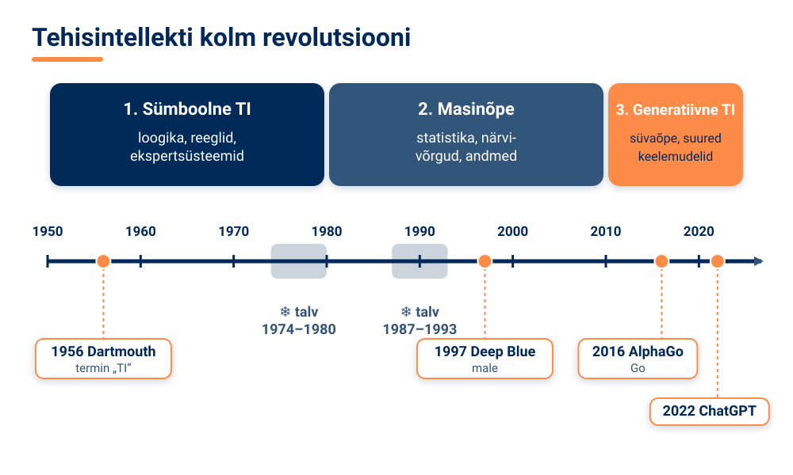
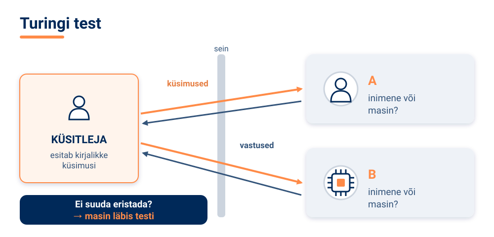
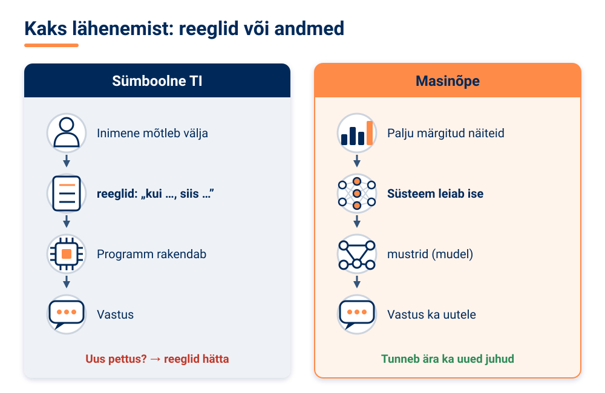
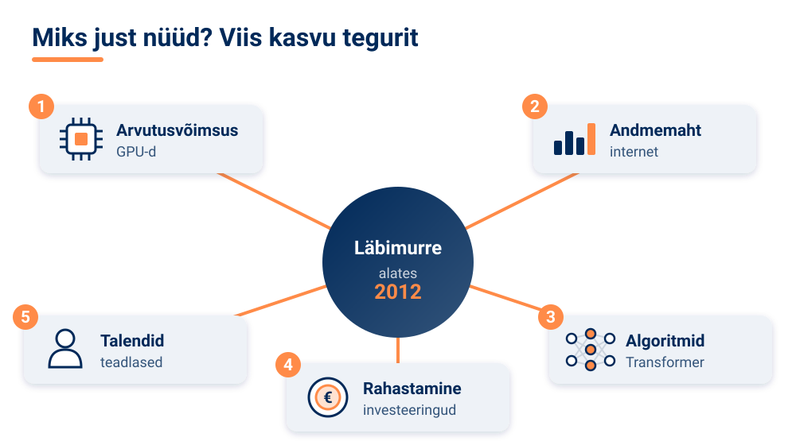

<!--
author:   Maia Lust
email:    
version:  2.0.1
language: et
narrator: Estonian Female
date:     08.10.2026
logo:     ../pildid/pae_logo.png
icon:     ../pildid/pae_logo.png
comment:  Tehisintellekti alused – gümnaasiumi valikkursus (35 tundi), Tallinna Pae Gümnaasium. Õppetekstid, interaktiivsed töölehed ja enesekontrollitestid.
link:     https://fonts.googleapis.com/css2?family=Nunito+Sans:wght@400;600;700&family=Poppins:wght@600;700&family=JetBrains+Mono:wght@400;600&display=swap

@style
/* ==== liascript-theming:start ==== */
/* links: https://fonts.googleapis.com/css2?family=Nunito+Sans:wght@400;600;700&family=Poppins:wght@600;700&family=JetBrains+Mono:wght@400;600&display=swap */
/* theme: Tallinna Pae Gümnaasium — generated by liascript-theming, edit theme.json and rebuild */
:root {
  --theme-font-body: 'Nunito Sans', sans-serif;
  --theme-font-heading: 'Poppins', serif;
  --theme-font-mono: 'JetBrains Mono', monospace;
  --theme-heading-weight: 700;
  --theme-line-height: 1.6;
  --global-font-size: 1.6rem;
  --theme-radius: 0.8rem;
  --theme-radius-small: 0.4rem;
  --theme-radius-large: 1.4rem;
  --theme-shadow: 0 0.3rem 1rem rgba(0,41,89,.10);
}
/* surfaces & text: apply to every color theme */
:root.lia-variant-light {
  --color-background: 255,255,255;
  --color-text: 29,36,51;
  --color-border: 228,229,231;
  --lia-grey-lighter: 238,242,247;
  --lia-grey-light: 204,212,222;
}
:root.lia-variant-dark {
  --color-background: 15,23,36;
  --color-text: 229,232,235;
  --color-border: 49,60,73;
  --lia-grey-dark: 30,38,47;
  --lia-anthracite: 41,50,61;
}
/* accent: only the course theme (default) and the custom radio,
   so readers can still pick LiaScript's built-in color themes */
:root:is(.lia-theme-default, .lia-theme-custom) {
  --color-highlight: 0,41,89;
  --color-highlight-dark: 0,41,89;
}
:root.lia-theme-default {
  --color-highlight-menu: 0,41,89;
}
:root:is(.lia-theme-default, .lia-theme-custom).lia-variant-dark {
  --color-highlight: 47,90,143;
  --color-highlight-dark: 255,185,143;
}
:root.lia-variant-light { --theme-heading-color: #002959; }
:root.lia-variant-dark { --theme-heading-color: #FFB98F; }
/* ==== LiaScript theme adapter (liascript-theming) — keep verbatim ====
   Maps the --theme-* tokens onto LiaScript's CSS. Everything a theme
   changes lives in the token block above this one. */

/* -- fonts: body/mono via the global variables, headings & co. are
      compiled literals in LiaScript and need explicit selectors -- */
:root {
  --global-font-family: var(--theme-font-body);
  --global-font-mono: var(--theme-font-mono);
  --global-font-headline: var(--theme-font-heading);
}
body { line-height: var(--theme-line-height, 1.47); }
h1, h2, h3, .h1, .h2, .h3 {
  font-family: var(--theme-font-heading);
  font-weight: var(--theme-heading-weight, 600);
  letter-spacing: var(--theme-heading-letter-spacing, normal);
  text-transform: var(--theme-heading-transform, none);
  color: var(--theme-heading-color, inherit);
}
h4, h5, h6, .h4, .h5, summary, .lia-accordion__headline {
  font-family: var(--theme-font-subheading, var(--theme-font-body));
}
.lia-quote__text { font-family: var(--theme-font-quote, var(--theme-font-heading)); }
.lia-code, .lia-code--inline, code, kbd, samp, pre { font-family: var(--theme-font-mono); }
.lia-code .ace_editor { font-family: var(--theme-font-mono) !important; }

/* -- shape: radius for controls & surfaces (radio buttons, tags, circles stay) -- */
:is(button, .lia-btn, input, .lia-input, select, .lia-select, textarea, .lia-textarea, .lia-dropdown):not(.lia-radio, .lia-btn--tag, .lia-btn--small-tag),
.lia-code-terminal__input, .lia-pagination__content, .lia-script, .lia-support-menu__submenu {
  border-radius: var(--theme-radius);
}
.lia-checkbox[type='checkbox'], kbd, .lia-tooltip .lia-tooltiptext, .lia-code--inline {
  border-radius: var(--theme-radius-small);
}
details, .lia-quote, .lia-code__input, .lia-table-responsive, .lia-card {
  border-radius: var(--theme-radius-large);
  box-shadow: var(--theme-shadow);
}
.lia-quote, .lia-code__input { overflow: hidden; }
.lia-code__input .ace_editor { border-radius: inherit; }
.lia-support-menu__submenu { box-shadow: var(--theme-shadow-popup, 0 0 1rem rgba(128, 128, 128, 0.2)); }

/* -- dark mode: LiaScript brightens the accent for text via
      rgb(from … calc(r*2.5)), which turns a hand-picked accent into
      pastel/yellow. For the course theme, text-like accent uses take
      --color-highlight-dark (= "accent as text") instead. Scoped to
      default/custom so the built-in color themes keep their behavior. -- */
:root:is(.lia-theme-default, .lia-theme-custom).lia-variant-dark :is(.lia-link, .lia-btn--outline, .lia-code--inline) {
  color: rgb(var(--color-highlight-dark));
  border-color: rgb(var(--color-highlight-dark));
}
:root:is(.lia-theme-default, .lia-theme-custom).lia-variant-dark :is(summary, summary:after, .lia-label, .lia-skip-nav, .lia-support-menu__item, .lia-quote__text),
:root:is(.lia-theme-default, .lia-theme-custom).lia-variant-dark :is(.lia-list--unordered, .lia-list--ordered) > li::marker {
  color: rgb(var(--color-highlight-dark));
}
:root:is(.lia-theme-default, .lia-theme-custom).lia-variant-dark :is(.lia-btn--transparent, .lia-input) {
  filter: none;
}
:root:is(.lia-theme-default, .lia-theme-custom).lia-variant-dark :is(.lia-input, .lia-checkbox[type='checkbox'], .lia-radio[type='radio']):not(:checked, .is-disabled, [disabled]) {
  border-color: rgb(var(--color-highlight-dark));
}
/* alternating table rows: LiaScript uses a neutral grey in dark mode */
:root.lia-variant-dark .lia-table.is-alternating .lia-table__row:nth-child(2n) td,
:root.lia-variant-dark .lia-table-responsive.has-thead-sticky.has-first-col-sticky .is-alternating .lia-table__row:nth-child(2n) td:first-child:before,
:root.lia-variant-dark .lia-table-responsive.has-thead-sticky.has-last-col-sticky .is-alternating .lia-table__row:nth-child(2n) td:last-child:before {
  background-color: rgb(var(--lia-grey-dark));
}
/* -- theme extras -- */
/* ===== Tallinna Pae Gümnaasiumi värvid =====
   tumesinine #002959 · oranž #FF8B48 · tumeoranž #E67E42 */
:root {
  --pae-sinine: #002959;
  --pae-sinine-80: #33547A;
  --pae-sinine-20: #CCD4DE;
  --pae-sinine-08: #EEF2F7;
  --pae-oranz: #FF8B48;
  --pae-oranz-tume: #E67E42;
  --pae-oranz-20: #FFE2D1;
  --pae-oranz-08: #FFF4EC;
  --pae-roheline: #2E8B57;
  --pae-roheline-08: #EAF6EF;
  --pae-lilla: #6B4FA0;
  --pae-lilla-08: #F2EEF9;
}

/* Pealkirjad */
.lia-slide h1, main h1 {
  color: var(--pae-sinine);
  border-bottom: 6px solid var(--pae-oranz);
  padding-bottom: .3em;
}
.lia-slide h2, main h2 { color: var(--pae-sinine); }
.lia-slide h3, main h3 {
  color: var(--pae-sinine);
  border-left: 8px solid var(--pae-oranz);
  padding-left: .5em;
}
.lia-slide h4, main h4 { color: var(--pae-oranz-tume); }
strong { color: inherit; }

/* Tabelid */
.lia-table th, table thead th {
  background: var(--pae-sinine) !important;
  color: #fff !important;
}
.lia-table tbody tr:nth-child(even), table tbody tr:nth-child(even) { background: var(--pae-sinine-08); }

/* Pildid ja infograafikud */
img.lia-image, .lia-figure img, main img {
  border-radius: 12px;
}
.lia-figure__caption, figcaption {
  color: var(--pae-sinine-80);
  font-style: italic;
  text-align: center;
}

/* ASCII-skeemid väiksemaks ja Pae värvidesse */
.lia-ascii svg, lia-ascii svg, .lia-code--ascii svg { max-width: 760px; margin: 0 auto; display: block; }
svg.lia-ascii text { fill: var(--pae-sinine); }

/* ===== Kujunduskastid ===== */
blockquote.pae-moiste, blockquote.pae-naide, blockquote.pae-eesti,
blockquote.pae-motle, blockquote.pae-lisaks, blockquote.pae-fakt,
.pae-moiste, .pae-naide, .pae-eesti, .pae-motle, .pae-lisaks, .pae-fakt {
  border-radius: 14px !important;
  padding: 1.1em 1.4em 1.1em 4.2em !important;
  margin: 1.4em 0 !important;
  position: relative;
  box-shadow: 0 3px 10px rgba(0,41,89,.10);
  font-style: normal !important;
  text-align: left !important;
}
.pae-moiste::before, .pae-naide::before, .pae-eesti::before,
.pae-motle::before, .pae-lisaks::before, .pae-fakt::before {
  position: absolute; left: .7em; top: .75em;
  width: 2em; height: 2em; line-height: 2em;
  border-radius: 50%; text-align: center; font-size: 1.15em;
  color: #fff; font-style: normal;
}
/* Mõiste – oranž */
.pae-moiste { background: var(--pae-oranz-08) !important; border: 2px solid var(--pae-oranz) !important; border-left: 10px solid var(--pae-oranz) !important; }
.pae-moiste::before { content: "📖"; background: var(--pae-oranz); }
/* Näide – tumesinine */
.pae-naide { background: var(--pae-sinine-08) !important; border: 2px solid var(--pae-sinine-20) !important; border-left: 10px solid var(--pae-sinine) !important; }
.pae-naide::before { content: "💡"; background: var(--pae-sinine); }
/* Eesti näide – sinine-valge */
.pae-eesti { background: linear-gradient(135deg, #E8F1FB 0%, #ffffff 100%) !important; border: 2px solid #0072CE !important; border-left: 10px solid #0072CE !important; }
.pae-eesti::before { content: "🇪🇪"; background: #0072CE; }
/* Mõtle järele – roheline */
.pae-motle { background: var(--pae-roheline-08) !important; border: 2px dashed var(--pae-roheline) !important; border-left: 10px solid var(--pae-roheline) !important; }
.pae-motle::before { content: "🤔"; background: var(--pae-roheline); }
/* Tea lisaks – lilla */
.pae-lisaks { background: var(--pae-lilla-08) !important; border: 2px solid #CDBFE6 !important; border-left: 10px solid var(--pae-lilla) !important; }
.pae-lisaks::before { content: "🔍"; background: var(--pae-lilla); }
/* Fakt – tume taust, valge tekst */
.pae-fakt { background: var(--pae-sinine) !important; color: #fff !important; border-left: 10px solid var(--pae-oranz) !important; }
.pae-fakt * { color: #fff !important; }
.pae-fakt::before { content: "⚡"; background: var(--pae-oranz); }

/* Töölehe jaotise riba */
.pae-jaotis { background: var(--pae-sinine); color: #fff !important; padding: .55em 1em; border-radius: 10px; margin: 2em 0 1em; border-left: 10px solid var(--pae-oranz); }
.pae-jaotis * { color: #fff !important; }

/* Ploki kaanepilt */
.pae-kaas img, img.pae-kaas { width: 100%; border-radius: 16px; box-shadow: 0 6px 20px rgba(0,41,89,.18); }

/* Näidisvastuse kokkupandav kast */
details {
  background: var(--pae-oranz-08);
  border: 1px solid var(--pae-oranz);
  border-radius: 10px; padding: .6em 1em; margin: .6em 0 1.4em;
}
details summary { cursor: pointer; font-weight: bold; color: var(--pae-oranz-tume); }

/* Menüü (sisukord) tumesinine */
.lia-toc a, .lia-toc .lia-toc__link, nav.lia-toc a { color: #002959 !important; }
.lia-toc a.lia-active, .lia-toc .lia-active { font-weight: 700; }
:root.lia-variant-dark .lia-toc a { color: #CCD4DE !important; }
:root.lia-variant-dark .pae-moiste, :root.lia-variant-dark .pae-naide, :root.lia-variant-dark .pae-eesti,
:root.lia-variant-dark .pae-motle, :root.lia-variant-dark .pae-lisaks { color: #1d2433 !important; }
:root.lia-variant-dark .pae-moiste *, :root.lia-variant-dark .pae-naide *, :root.lia-variant-dark .pae-eesti *,
:root.lia-variant-dark .pae-motle *, :root.lia-variant-dark .pae-lisaks * { color: #1d2433 !important; }
:root.lia-variant-dark img { background: #fff; }
/* ==== liascript-theming:end ==== */
/* Loosimisnupp (rollimäng) */
output.lia-script[input="submit"] { display:inline-block !important; background:#002959; color:#fff !important; font-weight:700; padding:.6em 1.2em; border-radius:999px; border:3px solid #FF8B48 !important; cursor:pointer; box-shadow:0 3px 10px rgba(0,41,89,.2); }
output.lia-script[input="submit"]:hover { background:#FF8B48; color:#002959 !important; }

/* Lihtsalt öeldes (ettelugemisega) */
section.pae-lihtne { background:#EAF6EE; border:2px solid #2E8B57; border-left:10px solid #2E8B57; border-radius:14px; padding:.9em 1.3em; margin:1.2em 0; font-size:1.05em; line-height:1.6; box-shadow:0 3px 10px rgba(0,41,89,.08); }
section.pae-lihtne p { margin:.5em 0; }
:root.lia-variant-dark section.pae-lihtne, :root.lia-variant-dark section.pae-lihtne * { color:#1d2433 !important; }

/* Sõnastiku hüpikselgitus */
.pae-term { border-bottom:2px dotted #FF8B48; cursor:help; position:relative; outline:none; }
.pae-term:hover::after, .pae-term:focus::after {
  content: attr(data-def); position:absolute; left:0; top:1.7em; z-index:999;
  width:max-content; max-width:min(320px, 80vw); white-space:normal;
  background:#002959; color:#fff; padding:.55em .8em; border-radius:10px;
  font-size:15px; line-height:1.45; font-weight:400; font-style:normal;
  box-shadow:0 6px 18px rgba(0,41,89,.3); border-left:5px solid #FF8B48;
}
.pae-fakt .pae-term:hover::after, .pae-fakt .pae-term:focus::after { color:#fff !important; }

@end

@custom
--color-highlight-menu: 255,255,255;
@end
-->

## 1.2 Tehisintellekti ajalugu

<!-- class="pae-lisaks" -->
> 🗺️ **Oled 1. toas – Unustatud arhiiv.** Lisa selle lehe link järjehoidjasse, et saaksid hiljem samast kohast jätkata. Järgmine osa avaneb alles siis, kui oled selle osa luku lahendanud.

<!-- class="pae-kaas" -->

### Õpieesmärgid

Selle tunni järel sa:

- **selgitad oma sõnadega** tehisintellekti arengu kolme revolutsiooni: sümboolne TI, masinõpe ja generatiivne TI *(mõistmine)*;
- **paigutad** olulisemad sündmused ja inimesed tehisintellekti ajaloo ajateljele *(rakendamine)*;
- **analüüsid**, miks tekkisid tehisintellekti „talved“ ja „kevaded“ ning millised tegurid võimaldasid 2010. aastate kiire arengu *(analüüs)*;
- **hindad** tänase tehisaru buumi märke ja **põhjendad**, mis võiks viidata uuele talvele ja mis räägib selle vastu *(hindamine)*;
- **eristad** pildi-Turingi testis päris fotosid tehisaru loodud nägudest ja **hindad** oma tulemuse põhjal, kui kaugele on generatiivne TI jõudnud *(analüüs, hindamine)*.

<!-- class="pae-fakt" -->
> **🎯 Tunni tuumik (45 min)**
>
> 1. 📚 **Loe ja vaata** (~13 min): „Esimene revolutsioon: sümboolne tehisintellekt (1950–1980)“, „Kolmas revolutsioon: süvaõpe ja generatiivne tehisintellekt (2010–…)“ ja „Kokkuvõte ja põhimõisted“ ning 3-minutiline video „Kust tuli tehisaru?“, mis annab ülevaate kogu ajaloost
> 2. 🧪 **TI-katse** (~10 min): „Pildi-Turingi test“
> 3. ⭐ **Tööleht** (~14 min): ülesanded III, V ja VII
> 4. 📤 **Väljapääsupilet** ja 🔐 **lukk** (~8 min)
>
> Pealkirjad, mille ees on **➕**, on lisaülesanded: tee neid, kui jõuad, kodus või kui tahad rohkem teada.

{{|>}}
<section class="pae-lihtne">

**🟢 Lihtsalt öeldes**

Tehisintellekti ajalugu algas juba 1950. aastatel. Alan Turing pakkus välja testi: kas masinat saab vestluses inimesest eristada? Nimi „tehisintellekt“ sai tuntuks 1956. aastal ühel konverentsil. Alguses kirjutasid inimesed masinale kõik reeglid ja teadmised ise ette. Lubadused olid suured, aga tulemused jäid palju väiksemaks. Siis tulid TI talved: raha ja huvi vähenesid mitmeks aastaks. Pärast 2012. aastat algas süvaõppe kiire areng ja TI hakkas palju paremini töötama. 2022. aastal tuli ChatGPT ja generatiivne TI jõudis iga inimeseni.

**Tähtsad sõnad:** **Turingi test** – katse, kas inimene eristab vestluses masinat inimesest; **TI talv** – aeg, mil TI vastu on vähe huvi ja raha; **generatiivne TI** – TI, mis loob uut teksti, pilte või heli.

</section>

### ➕ Juured: unistus mõtlevast masinast

Tehisintellekti ajalugu ulatub kaugemale kui arvutid ise. See on teekond filosoofilistest ideedest tänapäeva keerukate süsteemideni. Juba ammu enne esimest arvutit küsisid inimesed: mis on mõtlemine ja kas seda saaks kuidagi reeglitesse panna?

Tehisintellekt kasvas välja neljast valdkonnast:

- **filosoofia** küsis, mis on mõtlemine, teadvus ja intelligentsus (Aristoteles, Descartes, Leibniz);
- **matemaatika** andis loogika, algoritmid ja tõenäosusteooria (Boole, Frege, Russell);
- **psühholoogia** uuris inimese mõtlemisprotsesse (geštaltpsühholoogia, kognitiivne psühholoogia);
- **arvutiteadus** lõi arvutusliku võimekuse (Charles Babbage ja Ada Lovelace 19. sajandil).

Antiik-Kreekas kirjeldas **Aristoteles** loogikat kui formaalse arutluse alust. 17.–18. sajandil unistas **Leibniz** universaalsest arvutuskeelest, millega saaks iga vaidluse lahendada arvutamise teel. 19. sajandil lõi **George Boole** matemaatilise loogika, millel põhinevad tänapäeva arvutid (tõene/väär, 1/0). 1936. aastal kirjeldas **Alan Turing** „arvutatavuse“ kontseptsiooni ja kujuteldava universaalse arvutusmasina, mida nimetatakse Turingi masinaks. 1943. aastal lõid **Warren McCulloch ja Walter Pitts** esimese tehisneuroni ehk tehisnärvivõrgu matemaatilise mudeli. 1948. aastal pani **Norbert Wiener** aluse küberneetikale – teadusele juhtimisest ja tagasisidest nii masinates kui ka elusolendites.

Tehisintellekti tänapäevast ajalugu võib jagada kolmeks suureks revolutsiooniks, millest igaüks on muutnud tehisintellekti võimsamaks ja kättesaadavamaks:

### Esimene revolutsioon: sümboolne tehisintellekt (1950–1980)

**1950. aastal** avaldas Alan Turing artikli „Computing Machinery and Intelligence“ ja pakkus välja masina intelligentsuse hindamise meetodi.

<!-- class="pae-moiste" -->
> **Mõiste: Turingi test**
>
> Turingi test on Alan Turingi pakutud katse, mis kontrollib, kas masin suudab jäljendada inimese mõtlemist nii hästi, et inimene ei suuda eristada, kas ta suhtleb inimese või masinaga. Küsitleja esitab kirjalikke küsimusi nii inimesele kui ka arvutile. Kui küsitleja ei suuda vastuste põhjal öelda, kumb on kumb, on masin testi läbinud.

1951. aastal ehitasid **Marvin Minsky** ja Dean Edmonds esimese närvivõrgul põhineva arvuti **SNARC**. **1956. aastal** toimus USA-s Dartmouthi kolledžis konverents, kus kohtusid John McCarthy, Marvin Minsky, Claude Shannon, Allen Newell jt. Termini „tehisintellekt“ (*artificial intelligence*) oli **John McCarthy** võtnud kasutusele juba 1955. aastal selle konverentsi rahastustaotluses ning konverentsiga sai nimetus laialt tuntuks. 1956. aastat peetakse tehisintellekti kui teadusvaldkonna sünniaastaks.

<!-- class="pae-fakt" -->
> **Kas teadsid?** Tehisintellekt sai teadusvaldkonnana nime **1956. aasta** Dartmouthi konverentsiga – see tähendab, et 2026. aastal sai valdkond juba 70-aastaseks!

Järgnes **esimene kuldajastu (1956–1974)**, mida iseloomustasid optimism ja suured lubadused. Allen Newell ja Herbert Simon lõid programmid **Logic Theorist** (1956), mis tõestas matemaatilisi teoreeme, ja **General Problem Solver** (1957), üldise probleemilahendaja. 1958. aastal lõi McCarthy programmeerimiskeele **LISP**; hiljem lisandus loogikaprogrammeerimise keel PROLOG. 1961. aastal hakkas General Motorsi tehases tööle esimene tööstusrobot **Unimate**. Joseph Weizenbaum lõi aastatel 1964–1966 vestlusprogrammi **ELIZA**, mis matkis psühhoterapeudiga vestlust, ja 1970. aastal näitas programm **SHRDLU**, et arvuti suudab lihtsas klotsimaailmas mõista loomuliku keele käske. Arendati ka masintõlget, masinnägemist ja roboteid. Uuringuid rahastasid suurel määral valitsusasutused, näiteks USA kaitseuuringute agentuur DARPA.

Sümboolse tehisintellekti põhiidee oli, et intelligentsust saab kirjeldada **sümbolite ja reeglite** abil. Kõige edukamaks näiteks said **ekspertsüsteemid**.

<!-- class="pae-moiste" -->
> **Mõiste: ekspertsüsteem**
>
> Ekspertsüsteem on teadmispõhine tehisintellekti süsteem, mis püüab jäljendada inimeksperdi otsustusvõimet. Selle südames on teadmusbaas – suur hulk ekspertidelt kogutud „kui ..., siis ...“ tüüpi reegleid.

Esimene ekspertsüsteem **DENDRAL** (alates 1965) analüüsis keemilisi aineid, **MYCIN** (1970. aastad) aitas arstidel diagnoosida bakteriaalseid nakkusi ja soovitada ravi.

Peagi selgus aga, et ootused olid liiga suured. Arvutid olid aeglased, algoritmid lihtsad ja andmeid vähe. Keerukate probleemide, näiteks masintõlke, raskust oli alahinnatud. 1973. aastal kritiseeris Suurbritannias avaldatud **Lighthilli raport** tehisintellekti uuringuid teravalt ning rahastamine vähenes järsult. Algas **esimene tehisintellekti talv (1974–1980)**: uurimistöö aeglustus, avalik huvi vähenes ja teadlased keskendusid kitsamatele probleemidele.

<!-- class="pae-moiste" -->
> **Mõiste: tehisintellekti „talv“ ja „kevad“**
>
> Tehisintellekti **talv** on periood, mil tehisintellekti arendamine aeglustub, sest rahastus ja huvi vähenevad – tavaliselt pärast seda, kui liiga suured lubadused ei täitu. **Kevadeks** nimetatakse perioodi, mil uued läbimurded toovad tagasi huvi ja raha.

1980. aastatel tulid ekspertsüsteemid uuesti esile, seekord **äris**. Näiteks **XCON** aitas konfigureerida arvuteid, teised süsteemid aitasid finantsplaneerimisel ja tootmise optimeerimisel. 1982. aastal käivitas Jaapan suure **„viienda põlvkonna“ arvutiprojekti**. Kuid ekspertsüsteemidel olid tõsised puudused: nende hooldus oli keeruline ja kallis, sest iga uus olukord nõudis uusi käsitsi kirjutatud reegleid; nad ei kohanenud muutustega ja neid oli raske laiendada. Spetsialiseeritud tehisintellekti riistvara ebaõnnestus ja personaalarvutite levik muutis kallid suured süsteemid tarbetuks. Algas **teine tehisintellekti talv (1987–1993)**: ettevõtteid suleti, rahastus vähenes ja paljud teadlased vältisid isegi sõna „tehisintellekt“.

### ➕ Teine revolutsioon: masinõpe (1980–2010)

Teise revolutsiooni põhiidee oli lihtne, kuid murranguline: selle asemel et masinale reegleid ette kirjutada, **las masin õpib ise andmetest**.

<!-- class="pae-naide" -->
> **Näide: kaks viisi rämpsposti tuvastada**
>
> **Sümboolne lähenemine:** programmeerija kirjutab reeglid – „kui kirjas on sõna „VÕIDA“ ja palju hüüumärke, siis on see rämpspost“. Petturid muudavad sõnastust ja reeglid jäävad hätta.
>
> **Masinõppe lähenemine:** süsteemile näidatakse tuhandeid kirju, mis on märgitud kas rämpspostiks või tavaliseks kirjaks. Süsteem leiab ise mustrid ja tunneb ära ka uued rämpskirjad, mille sõnastust keegi ette ei kirjutanud.

1986. aastal sai laiemalt tuntuks närvivõrkude treenimise **tagasilevi algoritm** (*backpropagation*), mis tõi kaasa närvivõrkude taassünni. 1990. aastatel andsid statistilised masinõppe meetodid – **tugivektormasinad, otsustuspuud, Bayesi võrgud** ja **geneetilised algoritmid** – praktilisi tulemusi kõnetuvastuses, tekstianalüüsis ja soovitussüsteemides.

**1997. aastal** võitis IBM-i superarvuti **Deep Blue** malematšis maailmameistrit **Garry Kasparovit** (3,5 : 2,5). Deep Blue ei õppinud nagu tänapäeva süsteemid, vaid arvutas läbi tohutul hulgal käike – see oli arvutusvõimsuse ja nutikate algoritmide kombinatsioon.

2000. aastatel tõi internet kaasa andmete plahvatusliku kasvu. Suured andmehulgad võimaldasid treenida võimsamaid mudeleid. Aastatel 2004–2010 arenesid robotid (DARPA Grand Challenge'i isesõitvate autode võistlused, iRoboti robottolmuimejad). 2006. aastal populariseeris **Geoffrey Hinton** süvaõppe meetodeid. **2011. aastal** võitis IBM **Watson** telemängus „Jeopardy!“ parimaid inimmängijaid, näidates loomuliku keele mõistmist ja teadmiste töötlemist.

### Kolmas revolutsioon: süvaõpe ja generatiivne tehisintellekt (2010–…)

**2012. aastal** võitis Alex Krizhevsky loodud konvolutsiooniline närvivõrk **AlexNet** pildituvastuse võistluse ImageNet märgatavalt väiksema veamääraga kui teised lähenemised. Seda peetakse **süvaõppe revolutsiooni** alguseks. 2013. aastal tutvustatud **Word2Vec** õpetas arvuteid esitama sõnu arvuvektoritena, nii et sarnase tähendusega sõnad on üksteise lähedal. 2014. aastal ostis Google Briti ettevõtte DeepMind.

**2016. aastal** võitis DeepMindi **AlphaGo** Go maailmameistrit **Lee Sedoli** 4 : 1. Go'd peeti tehisintellekti jaoks liiga keeruliseks, sest võimalikke seise on astronoomiliselt palju. 2017. aastal õppis **AlphaZero** iseseisvalt mängima malet, Go'd ja shōgi'd ning saavutas üliinimliku taseme ilma inimeste mängude näideteta.

<!-- class="pae-naide" -->
> **Näide: strateegiamängud kui tehisintellekti mõõdupuu**
>
> | Aasta | Süsteem | Saavutus |
> |---|---|---|
> | 1997 | Deep Blue | võitis malemaailmameistrit Garry Kasparovit |
> | 2011 | Watson | võitis „Jeopardy!“ meistreid |
> | 2016 | AlphaGo | võitis Go maailmameistrit Lee Sedoli 4 : 1 |
> | 2017 | AlphaZero | õppis malet, Go'd ja shōgi'd ilma inimeste näideteta |
>
> Need võidud näitavad arengut **jõumeetodist** (Deep Blue arvutas läbi miljoneid käike) **õppivate süsteemideni** (AlphaZero õppis mängides iseendaga).

<!-- data-type="barchart" data-title="Matšide lõpptulemus punktides: masin ja maailmameister" -->
| Matš | Masin | Inimene |
|---|---:|---:|
| Deep Blue – Kasparov (1997) | 3.5 | 2.5 |
| AlphaGo – Lee Sedol (2016) | 4 | 1 |

**2017. aastal** avaldasid Google'i teadlased artikli „Attention Is All You Need“, mis tutvustas **Transformer-arhitektuuri** – tänapäeva suurte keelemudelite alust. Aastatel 2017–2018 tekkisid keelemudelid **BERT** ja **GPT**. **2020. aastal** avaldas OpenAI 175 miljardi parameetriga keelemudeli **GPT-3**, mis genereeris enneolematult hästi teksti. **2022. aastal** avaldati **ChatGPT**, mis jõudis hinnanguliselt 100 miljoni kasutajani kõigest umbes kahe kuuga. Samal ajal levisid pildigeneraatorid DALL-E, Midjourney ja Stable Diffusion.

<!-- class="pae-fakt" -->
> **Kas teadsid?** 2022. aastal avaldatud ChatGPT jõudis hinnanguliselt **100 miljoni kasutajani kõigest umbes kahe kuuga**.

<!-- class="pae-moiste" -->
> **Mõiste: generatiivne tehisintellekt**
>
> Generatiivne tehisintellekt on tehisintellekt, mis loob uut sisu – teksti, pilte, heli, muusikat või videot –, tuginedes mustritele, mille ta on õppinud suurest hulgast näidetest. Näiteks suur keelemudel (nt GPT, Claude, Gemini) on generatiivne TI, mis on treenitud tohutul hulgal tekstil ja oskab luua inimlaadset teksti.

Generatiivne tehisintellekt muutis tehisintellekti kättesaadavaks igapäevakasutajatele: selle kasutamiseks ei pea olema programmeerija, piisab tavakeelsest küsimusest.

### ➕ Miks just nüüd? Viis kasvu tegurit

Miks toimus läbimurre just 2010. aastatel, kui paljud ideed (näiteks närvivõrgud) olid olemas juba aastakümneid? Põhjuseks on viie teguri koosmõju:

1. **Arvutusvõimsus** – arvutite võimsus on kasvanud mitme suurusjärgu võrra ning graafikaprotsessorid (GPU-d) ja spetsiaalne riistvara võimaldavad treenida väga suuri mudeleid.
2. **Andmemaht** – internet ja digitaalne revolutsioon lõid enneolematu koguse andmeid (tekstid, pildid, videod), millest mudelid saavad õppida.
3. **Algoritmid** – närvivõrgud, süvaõpe ja Transformer-arhitektuur võimaldasid keerukate mustrite tuvastamist ja sisu genereerimist.
4. **Rahastamine** – riskikapital ja suured tehnoloogiaettevõtted on investeerinud tehisintellekti väga suuri summasid.
5. **Talendid** – ülikoolide ja ettevõtete koostöös kasvas tugev teadlaste ja inseneride kogukond.

Nende tegurite koosmõju lõi võimendava efekti, mis kiirendas arengut eriti alates 2012. aastast.

<!-- class="pae-eesti" -->
> **Eesti näide: tehisintellekti areng Eestis**
>
> Eestil on tehisintellekti ja arvutiteaduse alal pikk ajalugu. 1960. aastal asutati Tallinnas **Küberneetika Instituut**, kus tegeleti juba nõukogude ajal arvutiteaduse ja automaatikaga. Pärast taasiseseisvumist 1990. aastatel avanesid uued suunad. 2000. aastatel arenes **keeletehnoloogia** – eesti keele arvutitöötlus ja masintõlge. Alates 2010. aastatest on Eestis sündinud tehisintellekti kasutavaid idufirmasid (Bolt, Veriff, Starship, Lingvist) ja ülikoolides töötavad tehisintellekti uurimisrühmad. Riik on koostanud tehisintellekti tegevuskavu ehk **kratikavasid** (2019–2021, 2022–2023 ja 2024–2026) ning arendab virtuaalassistentide võrgustikku **Bürokratt**.

### ➕ Tehisintellekti ajaloo õppetunnid ja tulevik

Tehisintellekti ajalugu on kulgenud **lainetena**: optimism → pettumus → uued läbimurded. Mõlemad talved said alguse sellest, et lubati rohkem, kui tehnoloogia suutis pakkuda. Ajaloost saab õppida, et:

- järkjärguline areng on jätkusuutlikum kui revolutsioonilised lubadused;
- praktilised rakendused on olulisemad kui teoreetilised läbimurded;
- tehnoloogia küpsemine nõuab aega ja kannatust.

Tänapäeva tehisintellekt põhineb aastakümnete pikkusel uurimistööl. Tehisintellekt on muutunud universaalseks tehnoloogiaks, mis mõjutab **majandust** (automatiseerimine, uued ärimudelid), **tööturgu** (töökohtade muutumine, uued oskused), **haridust** (personaliseeritud õpe), **teadust** (uued avastused) ja **ühiskonda** (privaatsus, võrdsus, eetika).

Tulevikusuundadena nähakse **multimodaalseid mudeleid**, mis töötlevad korraga teksti, pilti, heli ja videot; mudeleid, mis vajavad õppimiseks vähem andmeid; **selgitatavat tehisintellekti**, mille otsuseid saab inimene mõista; ning inimese ja tehisintellekti koostööd. Lahtine küsimus on, kas kunagi jõutakse **üldise tehisintellektini (AGI)**. Koos võimalustega (teaduslikud avastused, ravimite väljatöötamine, kliimalahendused, tootlikkuse kasv) kasvavad ka riskid: töökohtade kadumine, privaatsus ja turvalisus (jälgimine, süvavõltsingud, küberrünnakud) ning otsuste läbipaistvus, vastutus ja kallutatus.

Seetõttu on oluline vastutustundlik areng. Euroopa Liit võttis 2024. aastal vastu **tehisintellekti määruse (AI Act)**, mis on maailmas esimene terviklik tehisintellekti õigusraamistik ja reguleerib tehisintellekti süsteeme riskipõhiselt. Määrus jõustus 1. augustil 2024 ja selle nõudeid hakatakse rakendama järk-järgult. Eesmärk on arendada tehisintellekti nii, et see teeniks inimkonda, austaks inimõigusi ja et tehnoloogia kasu jaotuks õiglaselt.

<!-- class="pae-motle" -->
> **Mõtle järele!**
>
> 1. Ajaloos on olnud kaks tehisintellekti talve. Kas 2020. aastate generatiivse tehisintellekti buum võib sinu arvates viia kolmanda talveni? Mis räägib selle poolt ja mis vastu?
> 2. Kas oskad tuua näite mõnest teisest tehnoloogiast, mille ümber oli suur vaimustus, millele järgnes pettumus?

### 🎬 Video: kust tuli tehisaru?

TI-Hüppe lühivideo näitab, et tehisaru areng on kulgenud lainetena: suurtele lootustele on järgnenud pettumused ja seejärel uued läbimurded. Ajaloo tundmine aitab tänaseid lubadusi ja hirme kainemalt hinnata. See video kuulub tunni tuumikusse ja annab ülevaate ka nendest ajastutest, mille lehed on märgitud lisaülesandeks.

**Kust tuli tehisaru?** · *TI-Hüpe* · ⏱ 3 min

!?[Kust tuli tehisaru? – TI-Hüpe](https://www.youtube.com/watch?v=6XxlkoXmywA)

<!-- class="pae-motle" -->
> **Mõtle vaatamise ajal**
>
> 1. Millised etapid tehisaru arengus videos välja tuuakse?
> 2. Miks on tehisaru ajaloos vaheldunud vaimustus ja pettumus?
> 3. Miks ei tasu tehisaru võrdsustada ainult ChatGPT-ga?

**Kirjuta 2–3 lausega: mida õpetab tehisaru ajalugu meile tänase TI-buumi kohta?**

[[___ ___ ___]]

### ➕ 🎬 Video: „Kibe õppetund“ (The Bitter Lesson)

Tehisintellekti ajaloos kordub üks muster nii sageli, et sellel on oma nimi. Arvutiteadlane **Rich Sutton** kirjutas 2019. aastal lühikese essee „The Bitter Lesson“ („Kibe õppetund“). Vaata Ethan Mollicki videot, mis selgitab seda mõtet laulu kaudu. Video on inglise keeles. Lülita vajaduse korral sisse subtiitrid (**CC**) ja automaatne tõlge.

!?[The Bitter Lesson – Ethan Mollick](https://www.youtube.com/watch?v=OAwat51S_Sk)

<!-- class="pae-lisaks" -->
> **Huvitav fakt videost**
>
> Video ise on näide sellest, millest see räägib. Ethan Mollicki sõnul andis ta tehisintellektile ainult ühe juhise. Laulusõnad, muusika ja video valmisid mitme TI-agendi koostöös, ilma et inimene oleks vahepeal midagi parandanud.

<!-- class="pae-motle" -->
> **Mõtle vaatamise ajal**
>
> 1. Mida püüdsid teadlased teha „targa“ TI loomiseks: kas kirjutada masinale ise reeglid või lasta sel õppida?
> 2. Mis juhtus siis, kui arvutid muutusid kiiremaks ja andmeid tuli juurde?
> 3. Miks nimetatakse seda õppetundi just *kibedaks*?

<!-- class="pae-jaotis" -->
**Refleksioon**

**1. Mis on selle video peasõnum? Kirjuta see 2–3 lausega oma sõnadega.**

[[___ ___ ___]]

Vaata näidisvastust

Video peasõnum on Rich Suttoni „kibe õppetund“: tehisintellekti ajaloos on pikas plaanis peaaegu alati võitnud üldised meetodid, mis kasutavad ära kasvavat arvutusvõimsust (õppimine ja otsing). Inimeste käsitsi kirjutatud reeglid ja ekspertteadmised on jäänud alla. Õppetund on kibe, sest teadlased on korduvalt investeerinud oma teadmistesse ja nutikatesse reeglitesse, kuid lõpuks on suurem arvutusvõimsus ja rohkem andmeid need ikka üle trumbanud. Inimesed peavad seda õppetundi ikka ja jälle uuesti õppima.

**2. Seosta video selle tunniga. Millised tunni näited sobivad „kibeda õppetunniga“? (Vali kõik sobivad.)**

- [[X]] Deep Blue võitis Kasparovi suure arvutusvõimsuse ja otsingu abil.
- [[X]] AlphaGo õppis Go'd suure hulga mängude põhjal, mitte käsitsi kirjutatud reeglite järgi.
- [[ ]] Ekspertsüsteemid olid seda edukamad, mida rohkem reegleid eksperdid neile käsitsi kirjutasid.
- [[X]] Süvaõpe hakkas toimima, kui tekkisid suured andmehulgad ja võimsad graafikaprotsessorid.
****************************************
Deep Blue, AlphaGo ja süvaõppe läbimurre näitavad, et arvutusvõimsus ning õppimine andmetest viisid edule. Ekspertsüsteemid näitavad vastupidist: käsitsi kirjutatud reeglitega süsteemid jäid jäigaks ja neid oli raske laiendada. Nende piirid viisid teise TI-talveni (1987–1993).
****************************************

**3. Kas sinu arvates kehtib „kibe õppetund“ alati? Too üks näide, kus inimese teadmised, väärtused või otsustusvõime jäävad ka edaspidi vajalikuks.**

[[___ ___ ___ ___]]

Vaata, millele vastuses mõelda

Hea vastus võtab seisukoha ja põhjendab seda. Näiteks: arvutusvõimsus aitab lahendada ülesandeid, kus on selge eesmärk ja palju andmeid. Inimest on aga vaja selleks, et otsustada, milliseid eesmärke TI-le seada, mis on õiglane ja eetiline ning kes vastutab tagajärgede eest, näiteks meditsiinis, kohtus või koolis hindamisel. Arvesta ka sellega, et suur arvutusvõimsus kulutab palju energiat ja raha.

### 🧪 TI-katse: pildi-Turingi test

Turingi testis püüab inimene vestluse põhjal eristada masinat inimesest. Proovi sama piltidega: kas suudad eristada päris inimese fotot generatiivse tehisintellekti loodud näost? Nii näed oma silmaga, kui kaugele on kolmas revolutsioon jõudnud.

**Vaja läheb:** mäng [Which Face Is Real](https://www.whichfaceisreal.com/) (Washingtoni Ülikool, veebis, sisselogimiseta, ingliskeelne), ~10 min, paaristöö

1. Ava leht. Igal korral näed kaht nägu: üks on päris foto, teise on loonud närvivõrk StyleGAN. Klõpsa sellel, kes on sinu arvates päris inimene.
2. Tehke kumbki 10 valikut ja pange kirja, mitu korda olite õigel.
3. Kui eksite, vaadake tehisaru loodud pilti lähemalt: tausta, juukseid, kõrvarõngaid, prille ja hambaid.
4. Arutage, milliste vihjete järgi te otsustasite ja kas need vihjed töötasid.

**Pane tähele / kirjuta üles:** sinu tulemus 10-st, millised vihjed reetsid tehisaru loodud näo ning kuidas on see katse seotud Turingi testiga.

[[___ ___ ___]]

<!-- class="pae-lisaks" -->
> **Kui arvutit pole:** Mängige paberil Turingi testi. Üks õpilane vastab küsimusele „Mida tegid eile?“ oma sõnadega, teine kirjutab vastuse nii, nagu arvab, et vastaks vestlusrobot. Kolmas püüab ära arvata, kumb vastus on „masina“ oma, ja põhjendab.

### Kokkuvõte ja põhimõisted

**Pea meeles**

- Tehisintellekti juured on filosoofias, matemaatikas, psühholoogias ja arvutiteaduses; termin „tehisintellekt“ pärineb 1956. aasta Dartmouthi konverentsi rahastustaotlusest (1955) ja sai konverentsiga laialt tuntuks.
- Areng on läbinud kolm revolutsiooni: sümboolne TI (reeglid ja loogika), masinõpe (õppimine andmetest) ja generatiivne TI (süvaõpe, suured keelemudelid).
- Ajalugu on olnud tsükliline: kaks tehisintellekti talve (1974–1980 ja 1987–1993) tekkisid, kui suured lubadused ei täitunud.
- Strateegiamängude võidud (Deep Blue, AlphaGo, AlphaZero) näitavad arengut jõumeetodist õppivate süsteemideni.
- Kiire areng alates 2012. aastast põhineb arvutusvõimsuse, andmete, algoritmide, rahastuse ja talentide koosmõjul.
- Tuleviku väljakutsed on nii tehnilised kui ka eetilised; Euroopa Liit reguleerib tehisintellekti ELi tehisintellekti määrusega (AI Act).

| Mõiste | Tähendus |
|---|---|
| Turingi test | katse, kas inimene suudab kirjaliku vestluse põhjal eristada masinat inimesest |
| Dartmouthi konverents | 1956. aasta kohtumine, mis andis valdkonnale nime „tehisintellekt“ |
| sümboolne tehisintellekt | reeglitel ja loogikal põhinev lähenemine tehisintellektile |
| ekspertsüsteem | teadmispõhine süsteem, mis kasutab inimekspertidelt kogutud reegleid |
| tehisintellekti talv | periood, mil rahastus ja huvi tehisintellekti vastu vähenevad |
| masinõpe | lähenemine, kus süsteem õpib reeglid ise andmetest |
| süvaõpe | mitmekihilistel närvivõrkudel põhinev masinõpe |
| Transformer | 2017. aastal tutvustatud närvivõrgu arhitektuur, suurte keelemudelite alus |
| generatiivne tehisintellekt | tehisintellekt, mis loob uut sisu: teksti, pilte, heli, videot |
| suur keelemudel | tohutul tekstihulgal treenitud mudel, mis genereerib inimlaadset teksti |
| „kibe õppetund“ (The Bitter Lesson) | Rich Suttoni (2019) tähelepanek, et pikas plaanis võidavad üldised meetodid, mis kasutavad arvutusvõimsust (õppimine, otsing), käsitsi kirjutatud inimteadmiste üle |

### 📚 Allikad ja lisalugemine

- TI-Hüpe. [Kust tuli tehisaru?](https://tihupe.ee/oppematerjal/kust-tuli-tehisaru/) Video ja õppematerjal 10.–12. klassile sellest, kuidas vaimustuse ja pettumuse lained on tehisaru arengut kujundanud; sobib lisalugemiseks.
- Vilo, J. (2023). [Tehisintellekt on saanud järgmise vahevõidu](https://www.akadeemia.ee/wp-content/uploads/2023/02/teadlase-pilguga.-jaak-vilo.-18.02.23.pdf). Postimees, rubriik „Teadlase pilguga“ (Eesti Teaduste Akadeemia). Tartu Ülikooli professor selgitab eesti keeles ekspertsüsteemide piire, masinõppe tõusu ja ChatGPT tausta.
- Computer History Museum. [The 1956 Dartmouth Workshop and its Immediate Consequences](https://computerhistory.org/events/1956-dartmouth-workshop-its-immediate/). Dartmouthi konverentsi taust ja 1955. aasta taotlus, kus esines esimest korda termin *artificial intelligence* (inglise keeles).
- Wikipedia. [Bitter lesson](https://en.wikipedia.org/wiki/Bitter_lesson). Rich Suttoni 2019. aasta essee „The Bitter Lesson“ kokkuvõte ja viide originaalile (inglise keeles).
- Wikipedia. [AlphaGo versus Lee Sedol](https://en.wikipedia.org/wiki/AlphaGo_versus_Lee_Sedol). 2016. aasta matši käik ja tulemus 4 : 1 (inglise keeles).
- Riigi Infosüsteemi Amet. [Krattide visioon ja kavad](https://www.kratid.ee/kratt-visioon). Eesti tehisintellekti tegevuskavad ehk kratikavad 2019–2021, 2022–2023 ja 2024–2026.

### Tööleht 1.2

<!-- class="pae-jaotis" -->
**➕ I. Tehisintellekti ajaloo olulised sündmused**

**Ülesanne 1.** Täida ajajoon tehisintellekti ajaloo oluliste sündmustega.

| Aeg | Oluline sündmus |
|---|---|
| 1950 | Turingi test |
| 1956 | ? |
| 1960. aastad | ? |
| 1970. aastad | ? |
| 1980. aastad | ? |
| 1990. aastad | ? |
| 2000. aastad | ? |
| 2010. aastad | ? |
| 2020. aastad | ? |

Kirjuta iga ajajoone punkti kohta (1956, 1960., 1970., 1980., 1990., 2000., 2010. ja 2020. aastad) üks oluline sündmus.

[[___ ___ ___ ___ ___]]

**Ülesanne 2.** Kirjelda lühidalt kolme olulist tehisintellekti läbimurret ja nende tähtsust.

a) Läbimurre:

[[___]]

[[___ ___]]

b) Läbimurre:

[[___]]

[[___ ___]]

c) Läbimurre:

[[___]]

[[___ ___]]

<!-- class="pae-jaotis" -->
**➕ II. Tehisintellekti pioneerid**

**Ülesanne 3.** Ühenda tehisintellekti pioneerid nende panusega.

| Täht | Kirjeldus |
|:---:|---|
| **A** | Lõi programmeerimiskeele LISP ja võttis kasutusele termini „tehisintellekt“ |
| **B** | Pakkus välja Turingi testi ja pani aluse arvutiteadusele |
| **C** | Arendas pertseptroni, ühe esimese närvivõrgumudeli |
| **D** | Oli MIT-i tehisintellekti labori kaasasutaja ja ehitas närvivõrgul põhineva arvuti SNARC |
| **E** | Süvaõppe pioneer, kes aitas tagasilevi algoritmi närvivõrkude treenimisel laialt kasutusele võtta |

- [ (A) (B) (C) (D) (E) ]
- [ ( ) (X) ( ) ( ) ( ) ] Alan Turing
- [ (X) ( ) ( ) ( ) ( ) ] John McCarthy
- [ ( ) ( ) ( ) (X) ( ) ] Marvin Minsky
- [ ( ) ( ) (X) ( ) ( ) ] Frank Rosenblatt
- [ ( ) ( ) ( ) ( ) (X) ] Geoffrey Hinton
****************************************
Turing – Turingi test (B); McCarthy – LISP ja termin „tehisintellekt“ (A); Minsky – MIT-i TI-labor ja SNARC (D); Rosenblatt – pertseptron (C); Hinton – tagasilevi ja süvaõpe (E).
****************************************

**Ülesanne 4.** Vali üks tehisintellekti pioneer ja kirjuta lühike kokkuvõte tema elust ja panusest.

[[___ ___ ___ ___ ___]]

<!-- class="pae-jaotis" -->
**⭐ III. Tehisintellekti „talved“ ja „kevaded“**

**Ülesanne 5.** Üks ajaleht kirjutab: „Tehisaru-firmad lubavad, et viie aasta pärast teevad masinad ära kogu kontoritöö.“ Selgita mõistete „talv“ ja „kevad“ abil, mis võib sellistele lubadustele järgneda, ja too võrdluseks üks näide tehisintellekti ajaloost.

[[___ ___ ___]]

**Ülesanne 6.** Täida tabel tehisintellekti talvede ja nende põhjuste kohta.

| Periood | Peamised põhjused | Mõju tehisintellekti arengule |
|---|---|---|
| 1970. aastad | | |
| 1980.–1990. aastad | | |

**1970. aastad – põhjused ja mõju:**

[[___ ___]]

**1980.–1990. aastad – põhjused ja mõju:**

[[___ ___]]

**Ülesanne 7.** Millised tegurid tõid kaasa tehisintellekti „kevade“ 2010. aastatel?

[[___ ___ ___ ___]]

<!-- class="pae-jaotis" -->
**➕ IV. Tehisintellekti võidukäigud**

**Ülesanne 8.** Kirjelda lühidalt järgmisi tehisintellekti võidukäike.

a) Deep Blue vs Garry Kasparov (1997):

[[___ ___]]

b) Watson mängus „Jeopardy!“ (2011):

[[___ ___]]

c) AlphaGo vs Lee Sedol (2016):

[[___ ___]]

d) GPT mudelite areng:

[[___ ___]]

**Ülesanne 9.** Miks on need võidukäigud tehisintellekti arengu seisukohalt olulised?

[[___ ___ ___]]

<!-- class="pae-jaotis" -->
**⭐ V. Tehisintellekti arengu etapid**

**Ülesanne 10.** Kirjelda lühidalt järgmisi tehisintellekti arengu etappe. Lisa iga etapi juurde, kuidas selle ajastu süsteem tuvastaks rämpsposti.

a) Sümboolne tehisintellekt (1950.–1980. aastad):

[[___ ___]]

b) Ekspertsüsteemid (1970.–1980. aastad):

[[___ ___]]

c) Masinõpe (1990.–2000. aastad):

[[___ ___]]

d) Süvaõpe (alates 2010. aastatest):

[[___ ___]]

**Ülesanne 11.** Millised on olnud peamised muutused tehisintellekti lähenemisviisides aja jooksul?

[[___ ___ ___]]

<!-- class="pae-jaotis" -->
**➕ VI. Praktiline ülesanne**

**Ülesanne 12.** Uurimistöö: vali üks tehisintellekti ajalooline sündmus või isik ja koosta selle kohta lühike esitlus (3–5 slaidi). Esitluses võiksid olla:

- sissejuhatus ja taust;
- peamised saavutused või sündmused;
- mõju tehisintellekti arengule;
- seosed tänapäevaga;
- kasutatud allikad.

Valitud teema:

[[___]]

**Ülesanne 13.** Intervjuu: küsitle vanemat sugulast või tuttavat, kuidas ta on oma elu jooksul tehisintellekti arengut kogenud. Kirjuta lühike kokkuvõte.

[[___ ___ ___ ___ ___]]

<!-- class="pae-jaotis" -->
**⭐ VII. Arutelu**

**Ülesanne 14.** Millised on sinu arvates olnud tehisintellekti ajaloo kõige olulisemad sündmused ja miks?

[[___ ___ ___ ___]]

**Ülesanne 15.** Kuidas on tehisintellekti ajalugu mõjutanud selle tänapäevast arengut ja tulevikuväljavaateid?

[[___ ___ ___ ___]]

### Enesekontroll 1.2

**1. Kes võttis 1956. aasta Dartmouthi konverentsi ettevalmistamisel kasutusele termini „tehisintellekt“? Kirjuta nimi.**

[[John McCarthy]]

****************************************
Õige vastus: **John McCarthy**. Tema oli Dartmouthi konverentsi peamine korraldaja ja kasutas terminit juba 1955. aasta rahastustaotluses – nii andis ta valdkonnale nime. Hiljem lõi ta ka programmeerimiskeele LISP. Alan Turing pakkus juba 1950. aastal välja Turingi testi, kuid termin „tehisintellekt“ on pärit McCarthylt.
****************************************

**2. Kuidas nimetatakse perioodi, mil tehisintellekti rahastus ja huvi selle vastu vähenevad? Kirjuta üks sõna.**

[[talv]]

****************************************
Õige vastus: **talv** (tehisintellekti talv). Talvi on olnud kaks: 1974–1980 ja 1987–1993. Mõlemad tekkisid, kui liiga suured lubadused ei täitunud. Perioodi, mil läbimurded toovad huvi ja raha tagasi, nimetatakse kevadeks.
****************************************

**3. Pane sündmused ajalises järjekorras (1 – kõige varasem, 6 – kõige hilisem).**

<!-- data-show-partial-solution -->
Deep Blue võidab Garry Kasparovit: [[ 1 | 2 | 3 | (4) | 5 | 6 ]] 
Alan Turing pakub välja Turingi testi: [[ (1) | 2 | 3 | 4 | 5 | 6 ]] 
ChatGPT avaldatakse: [[ 1 | 2 | 3 | 4 | 5 | (6) ]] 
Algab esimene tehisintellekti talv: [[ 1 | 2 | (3) | 4 | 5 | 6 ]] 
AlexNet võidab ImageNeti võistluse: [[ 1 | 2 | 3 | 4 | (5) | 6 ]] 
Dartmouthi konverents: [[ 1 | (2) | 3 | 4 | 5 | 6 ]]
****************************************
Õige järjekord: 1. Turingi test (1950) → 2. Dartmouthi konverents (1956) → 3. esimene talv (1974) → 4. Deep Blue (1997) → 5. AlexNet (2012) → 6. ChatGPT (2022).
****************************************

**4. Liigita näited selle järgi, millisesse tehisintellekti revolutsiooni need kuuluvad.**

<!-- data-show-partial-solution -->
- [ (Sümboolne TI) (Masinõpe) (Süvaõpe ja generatiivne TI) ]
- [ (X) ( ) ( ) ] Ekspertsüsteem MYCIN, mis kasutab „kui ..., siis ...“ reegleid
- [ (X) ( ) ( ) ] Programm Logic Theorist, mis tõestab matemaatilisi teoreeme
- [ ( ) (X) ( ) ] Rämpsposti filter, mis õpib tuhandetest märgitud kirjadest
- [ ( ) (X) ( ) ] Otsustuspuud ja tugivektormasinad 1990. aastatel
- [ ( ) ( ) (X) ] Transformer-arhitektuur ja suured keelemudelid
- [ ( ) ( ) (X) ] Pildigeneraator, mis loob tekstikirjelduse põhjal pildi
****************************************
Sümboolne TI (1950–1980) põhines käsitsi kirjutatud reeglitel ja loogikal. Masinõppe revolutsioonis (1980–2010) hakkas süsteem reegleid ise andmetest leidma. Kolmas revolutsioon (alates 2010) tõi süvaõppe, Transformeri ja uut sisu loova generatiivse tehisintellekti.
****************************************

**5. Lohista sõnad lünkadesse nii, et tekiks Turingi testi kirjeldus.**

<!-- data-show-partial-solution -->
Turingi testis esitab [->[ (küsitleja) | programmeerija ]] kirjalikke küsimusi nii inimesele kui ka [->[ (masinale) ]]. Kui ta ei suuda vastuste põhjal eristada, kumb on kumb, on masin testi [->[ (läbinud) | kaotanud ]].
****************************************
Turingi testis vestleb küsitleja kirjalikult kahe vestluspartneriga, kellest üks on inimene ja teine masin. Kui küsitleja ei suuda neid eristada, on masin testi läbinud.
****************************************

**6. AlphaGo mängis 2016. aastal Lee Sedoliga viis partiid ja võitis matši 4 : 1. Mitu protsenti partiidest võitis AlphaGo? Kirjuta ainult arv.**

[[80]]

****************************************
AlphaGo võitis 4 partiid 5-st: 4 : 5 = 0,8 = **80%**.
****************************************

**7. Millised tegurid võimaldasid tehisintellekti kiire arengu alates 2010. aastatest? (Vali kõik õiged.)**

- [[X]] Arvutusvõimsuse kasv ja graafikaprotsessorid (GPU-d)
- [[X]] Interneti kaudu kättesaadavad suured andmehulgad
- [[X]] Uued algoritmid, näiteks Transformer-arhitektuur
- [[ ]] Ekspertsüsteemide reeglite käsitsi kirjutamine
- [[ ]] Lighthilli raport
****************************************
Läbimurde taga on arvutusvõimsuse, andmete, algoritmide, rahastuse ja talentide koosmõju. Ekspertsüsteemide käsitsi kirjutatud reeglid kuuluvad sümboolse TI ajastusse ning Lighthilli raport (1973) aitas hoopis kaasa esimesele talvele.
****************************************

**8. Selgita oma sõnadega, miks tekkisid tehisintellekti talved ja mida saab neist tänapäeval õppida.**

[[___ ___ ___]]

Vaata näidisvastust

Mõlemad talved tekkisid, sest lubati rohkem, kui tehnoloogia suutis pakkuda. Esimese talve ajal olid arvutid aeglased, andmeid vähe ja keerukate ülesannete (nt masintõlke) raskust oli alahinnatud; Lighthilli raport kritiseeris uuringuid ja rahastus vähenes. Teise talve põhjustasid ekspertsüsteemide puudused: nende hooldus oli kallis ja nad ei kohanenud muutustega. Õppetund on, et järkjärguline areng ja praktilised rakendused on jätkusuutlikumad kui liiga suured lubadused.

### 📤 Väljapääsupilet 1.2

Vasta lühidalt (3–5 min). Vastused jäävad selle brauseri mällu. Kui oled valmis, vajuta **Kopeeri vastused** ja kleebi need Google Classroomi ülesande vastusesse või laadi fail alla ja lisa see ülesande juurde.

<!-- data-type="none" -->
| Kriteerium | 2 p | 1 p | 0 p |
|---|---|---|---|
| Mõiste rakendamine uues olukorras | Õige mõiste ja selge põhjendus | Mõiste õige, põhjendus puudu või ebatäpne | Vastus puudub või on vale |
| TI-katse tõlgendus | Tulemus on seotud tunni mõistega | Tulemus on kirjeldatud, seos puudub | Puudub |
| Refleksioon | Konkreetne ja isiklik | Üldine | Puudub |

*Väljapääsupilet on kujundav hindamine: õpetaja annab tagasisidet ja kasutab vastuseid järgmise tunni planeerimisel. Pilet sobib ka portfoolio õpipäevikusse.*

### 🔐 Lukk 1.2

<!-- class="pae-naide" -->
> <!-- style="width: 84px; float: left; margin: 0 16px 8px 0; border-radius: 0;" --> **Kratt:** „Kui vana ma olen? Mu sünnitunnistus on kuskil arhiivis… Mäletan ainult, et mind ristiti ühel konverentsil ja et ma kunagi võitsin Go-mängus maailmameistrit.“

Lukk avaneb, kui lahendad arvutusülesande. Kirjuta lahtrisse ainult arv.

> Kristjani vanaisa sündis samal aastal, kui Dartmouthi kolledžis toimus konverents, mis andis tehisintellektile nime. Päeval, mil programm **AlphaGo** alistas Go maailmameistri Lee Sedoli, pidas vanaisa parajasti oma ümmargust juubelit. **Mitmes juubel see oli?**

<!-- data-solution-button="off" -->
[[60]]
[[?]] Vihje 1: Sul on vaja kaht aastaarvu: Dartmouthi konverentsi aastat ja AlphaGo võidu aastat. Kumb sündmus oli varem?
[[?]] Vihje 2: Lahuta hilisemast aastast varasem: 20_6 − 19_6. Mõlemad aastaarvud lõpevad numbriga 6.
[[?]] 🛟 Päästerõngas: mine tagasi lehele „Esimene revolutsioon: sümboolne tehisintellekt (1950–1980)“ ja loe lõik Dartmouthi konverentsist, seejärel lehel „Kolmas revolutsioon: süvaõpe ja generatiivne tehisintellekt (2010–…)“ lõik AlphaGo kohta. Kui ikka ei tule välja, küsi õpetajalt selle luku päästekood ja kirjuta see vastuseväljale.

****************************************
✅ **Lukk avatud!** 2016 − 1956 = **60** – vanaisa pidas 60. juubelit. Nende kuue aastakümne sisse mahuvad kaks TI-talve ning üleminek sümboolsest tehisintellektist masinõppe ja süvaõppeni.

🔑 **Sinu võtmetäht: J**

Kirjuta täht üles – seda on vaja toa ukse avamiseks.

➡️ **[Ava järgmine osa: 1.3 Tehisintellekti rakendused](https://liascript.github.io/course/?https://raw.githubusercontent.com/maialust/Tehisintellekti-alused/main/oppija/1_3_ce76af5b.md)**

****************************************
