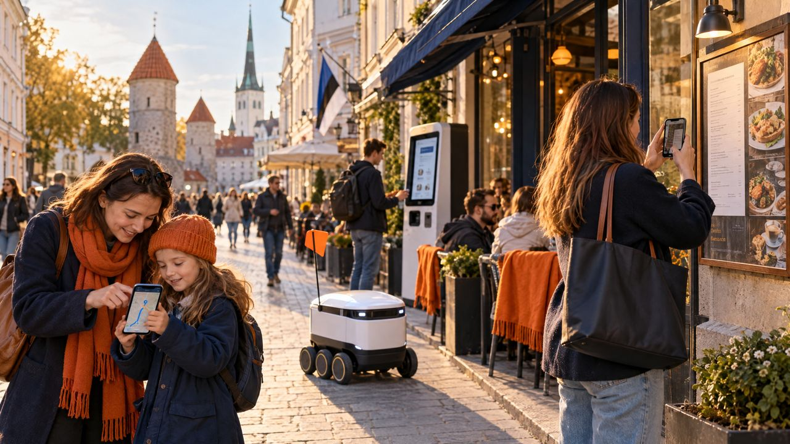

<!--
author:   Maia Lust
email:    
version:  2.2.1
language: et
narrator: Estonian Female
date:     08.10.2026
logo:     ../pildid/pae_logo.png
icon:     ../pildid/pae_logo.png
comment:  Tehisintellekti alused – gümnaasiumi valikkursus (35 tundi), Tallinna Pae Gümnaasium. Õppetekstid, interaktiivsed töölehed ja enesekontrollitestid.
link:     https://fonts.googleapis.com/css2?family=Nunito+Sans:wght@400;600;700&family=Poppins:wght@600;700&family=JetBrains+Mono:wght@400;600&display=swap

@style
/* ==== liascript-theming:start ==== */
/* links: https://fonts.googleapis.com/css2?family=Nunito+Sans:wght@400;600;700&family=Poppins:wght@600;700&family=JetBrains+Mono:wght@400;600&display=swap */
/* theme: Tallinna Pae Gümnaasium — generated by liascript-theming, edit theme.json and rebuild */
:root {
  --theme-font-body: 'Nunito Sans', sans-serif;
  --theme-font-heading: 'Poppins', serif;
  --theme-font-mono: 'JetBrains Mono', monospace;
  --theme-heading-weight: 700;
  --theme-line-height: 1.6;
  --global-font-size: 1.6rem;
  --theme-radius: 0.8rem;
  --theme-radius-small: 0.4rem;
  --theme-radius-large: 1.4rem;
  --theme-shadow: 0 0.3rem 1rem rgba(0,41,89,.10);
}
/* surfaces & text: apply to every color theme */
:root.lia-variant-light {
  --color-background: 255,255,255;
  --color-text: 29,36,51;
  --color-border: 228,229,231;
  --lia-grey-lighter: 238,242,247;
  --lia-grey-light: 204,212,222;
}
:root.lia-variant-dark {
  --color-background: 15,23,36;
  --color-text: 229,232,235;
  --color-border: 49,60,73;
  --lia-grey-dark: 30,38,47;
  --lia-anthracite: 41,50,61;
}
/* accent: only the course theme (default) and the custom radio,
   so readers can still pick LiaScript's built-in color themes */
:root:is(.lia-theme-default, .lia-theme-custom) {
  --color-highlight: 0,41,89;
  --color-highlight-dark: 0,41,89;
}
:root.lia-theme-default {
  --color-highlight-menu: 0,41,89;
}
:root:is(.lia-theme-default, .lia-theme-custom).lia-variant-dark {
  --color-highlight: 47,90,143;
  --color-highlight-dark: 255,185,143;
}
:root.lia-variant-light { --theme-heading-color: #002959; }
:root.lia-variant-dark { --theme-heading-color: #FFB98F; }
/* ==== LiaScript theme adapter (liascript-theming) — keep verbatim ====
   Maps the --theme-* tokens onto LiaScript's CSS. Everything a theme
   changes lives in the token block above this one. */

/* -- fonts: body/mono via the global variables, headings & co. are
      compiled literals in LiaScript and need explicit selectors -- */
:root {
  --global-font-family: var(--theme-font-body);
  --global-font-mono: var(--theme-font-mono);
  --global-font-headline: var(--theme-font-heading);
}
body { line-height: var(--theme-line-height, 1.47); }
h1, h2, h3, .h1, .h2, .h3 {
  font-family: var(--theme-font-heading);
  font-weight: var(--theme-heading-weight, 600);
  letter-spacing: var(--theme-heading-letter-spacing, normal);
  text-transform: var(--theme-heading-transform, none);
  color: var(--theme-heading-color, inherit);
}
h4, h5, h6, .h4, .h5, summary, .lia-accordion__headline {
  font-family: var(--theme-font-subheading, var(--theme-font-body));
}
.lia-quote__text { font-family: var(--theme-font-quote, var(--theme-font-heading)); }
.lia-code, .lia-code--inline, code, kbd, samp, pre { font-family: var(--theme-font-mono); }
.lia-code .ace_editor { font-family: var(--theme-font-mono) !important; }

/* -- shape: radius for controls & surfaces (radio buttons, tags, circles stay) -- */
:is(button, .lia-btn, input, .lia-input, select, .lia-select, textarea, .lia-textarea, .lia-dropdown):not(.lia-radio, .lia-btn--tag, .lia-btn--small-tag),
.lia-code-terminal__input, .lia-pagination__content, .lia-script, .lia-support-menu__submenu {
  border-radius: var(--theme-radius);
}
.lia-checkbox[type='checkbox'], kbd, .lia-tooltip .lia-tooltiptext, .lia-code--inline {
  border-radius: var(--theme-radius-small);
}
details, .lia-quote, .lia-code__input, .lia-table-responsive, .lia-card {
  border-radius: var(--theme-radius-large);
  box-shadow: var(--theme-shadow);
}
.lia-quote, .lia-code__input { overflow: hidden; }
.lia-code__input .ace_editor { border-radius: inherit; }
.lia-support-menu__submenu { box-shadow: var(--theme-shadow-popup, 0 0 1rem rgba(128, 128, 128, 0.2)); }

/* -- dark mode: LiaScript brightens the accent for text via
      rgb(from … calc(r*2.5)), which turns a hand-picked accent into
      pastel/yellow. For the course theme, text-like accent uses take
      --color-highlight-dark (= "accent as text") instead. Scoped to
      default/custom so the built-in color themes keep their behavior. -- */
:root:is(.lia-theme-default, .lia-theme-custom).lia-variant-dark :is(.lia-link, .lia-btn--outline, .lia-code--inline) {
  color: rgb(var(--color-highlight-dark));
  border-color: rgb(var(--color-highlight-dark));
}
:root:is(.lia-theme-default, .lia-theme-custom).lia-variant-dark :is(summary, summary:after, .lia-label, .lia-skip-nav, .lia-support-menu__item, .lia-quote__text),
:root:is(.lia-theme-default, .lia-theme-custom).lia-variant-dark :is(.lia-list--unordered, .lia-list--ordered) > li::marker {
  color: rgb(var(--color-highlight-dark));
}
:root:is(.lia-theme-default, .lia-theme-custom).lia-variant-dark :is(.lia-btn--transparent, .lia-input) {
  filter: none;
}
:root:is(.lia-theme-default, .lia-theme-custom).lia-variant-dark :is(.lia-input, .lia-checkbox[type='checkbox'], .lia-radio[type='radio']):not(:checked, .is-disabled, [disabled]) {
  border-color: rgb(var(--color-highlight-dark));
}
/* alternating table rows: LiaScript uses a neutral grey in dark mode */
:root.lia-variant-dark .lia-table.is-alternating .lia-table__row:nth-child(2n) td,
:root.lia-variant-dark .lia-table-responsive.has-thead-sticky.has-first-col-sticky .is-alternating .lia-table__row:nth-child(2n) td:first-child:before,
:root.lia-variant-dark .lia-table-responsive.has-thead-sticky.has-last-col-sticky .is-alternating .lia-table__row:nth-child(2n) td:last-child:before {
  background-color: rgb(var(--lia-grey-dark));
}
/* -- theme extras -- */
/* ===== Tallinna Pae Gümnaasiumi värvid =====
   tumesinine #002959 · oranž #FF8B48 · tumeoranž #E67E42 */
:root {
  --pae-sinine: #002959;
  --pae-sinine-80: #33547A;
  --pae-sinine-20: #CCD4DE;
  --pae-sinine-08: #EEF2F7;
  --pae-oranz: #FF8B48;
  --pae-oranz-tume: #E67E42;
  --pae-oranz-20: #FFE2D1;
  --pae-oranz-08: #FFF4EC;
  --pae-roheline: #2E8B57;
  --pae-roheline-08: #EAF6EF;
  --pae-lilla: #6B4FA0;
  --pae-lilla-08: #F2EEF9;
}

/* Pealkirjad */
.lia-slide h1, main h1 {
  color: var(--pae-sinine);
  border-bottom: 6px solid var(--pae-oranz);
  padding-bottom: .3em;
}
.lia-slide h2, main h2 { color: var(--pae-sinine); }
.lia-slide h3, main h3 {
  color: var(--pae-sinine);
  border-left: 8px solid var(--pae-oranz);
  padding-left: .5em;
}
.lia-slide h4, main h4 { color: var(--pae-oranz-tume); }
strong { color: inherit; }

/* Tabelid */
.lia-table th, table thead th {
  background: var(--pae-sinine) !important;
  color: #fff !important;
}
.lia-table tbody tr:nth-child(even), table tbody tr:nth-child(even) { background: var(--pae-sinine-08); }

/* Pildid ja infograafikud */
img.lia-image, .lia-figure img, main img {
  border-radius: 12px;
}
.lia-figure__caption, figcaption {
  color: var(--pae-sinine-80);
  font-style: italic;
  text-align: center;
}

/* ASCII-skeemid väiksemaks ja Pae värvidesse */
.lia-ascii svg, lia-ascii svg, .lia-code--ascii svg { max-width: 760px; margin: 0 auto; display: block; }
svg.lia-ascii text { fill: var(--pae-sinine); }

/* ===== Kujunduskastid ===== */
blockquote.pae-moiste, blockquote.pae-naide, blockquote.pae-eesti,
blockquote.pae-motle, blockquote.pae-lisaks, blockquote.pae-fakt,
.pae-moiste, .pae-naide, .pae-eesti, .pae-motle, .pae-lisaks, .pae-fakt {
  border-radius: 14px !important;
  padding: 1.1em 1.4em 1.1em 4.2em !important;
  margin: 1.4em 0 !important;
  position: relative;
  box-shadow: 0 3px 10px rgba(0,41,89,.10);
  font-style: normal !important;
  text-align: left !important;
}
.pae-moiste::before, .pae-naide::before, .pae-eesti::before,
.pae-motle::before, .pae-lisaks::before, .pae-fakt::before {
  position: absolute; left: .7em; top: .75em;
  width: 2em; height: 2em; line-height: 2em;
  border-radius: 50%; text-align: center; font-size: 1.15em;
  color: #fff; font-style: normal;
}
/* Mõiste – oranž */
.pae-moiste { background: var(--pae-oranz-08) !important; border: 2px solid var(--pae-oranz) !important; border-left: 10px solid var(--pae-oranz) !important; }
.pae-moiste::before { content: "📖"; background: var(--pae-oranz); }
/* Näide – tumesinine */
.pae-naide { background: var(--pae-sinine-08) !important; border: 2px solid var(--pae-sinine-20) !important; border-left: 10px solid var(--pae-sinine) !important; }
.pae-naide::before { content: "💡"; background: var(--pae-sinine); }
/* Eesti näide – sinine-valge */
.pae-eesti { background: linear-gradient(135deg, #E8F1FB 0%, #ffffff 100%) !important; border: 2px solid #0072CE !important; border-left: 10px solid #0072CE !important; }
.pae-eesti::before { content: "🇪🇪"; background: #0072CE; }
/* Mõtle järele – roheline */
.pae-motle { background: var(--pae-roheline-08) !important; border: 2px dashed var(--pae-roheline) !important; border-left: 10px solid var(--pae-roheline) !important; }
.pae-motle::before { content: "🤔"; background: var(--pae-roheline); }
/* Tea lisaks – lilla */
.pae-lisaks { background: var(--pae-lilla-08) !important; border: 2px solid #CDBFE6 !important; border-left: 10px solid var(--pae-lilla) !important; }
.pae-lisaks::before { content: "🔍"; background: var(--pae-lilla); }
/* Fakt – tume taust, valge tekst */
.pae-fakt { background: var(--pae-sinine) !important; color: #fff !important; border-left: 10px solid var(--pae-oranz) !important; }
.pae-fakt * { color: #fff !important; }
.pae-fakt::before { content: "⚡"; background: var(--pae-oranz); }

/* Töölehe jaotise riba */
.pae-jaotis { background: var(--pae-sinine); color: #fff !important; padding: .55em 1em; border-radius: 10px; margin: 2em 0 1em; border-left: 10px solid var(--pae-oranz); }
.pae-jaotis * { color: #fff !important; }

/* Ploki kaanepilt */
.pae-kaas img, img.pae-kaas { width: 100%; border-radius: 16px; box-shadow: 0 6px 20px rgba(0,41,89,.18); }

/* Näidisvastuse kokkupandav kast */
details {
  background: var(--pae-oranz-08);
  border: 1px solid var(--pae-oranz);
  border-radius: 10px; padding: .6em 1em; margin: .6em 0 1.4em;
}
details summary { cursor: pointer; font-weight: bold; color: var(--pae-oranz-tume); }

/* Menüü (sisukord) tumesinine */
.lia-toc a, .lia-toc .lia-toc__link, nav.lia-toc a { color: #002959 !important; }
.lia-toc a.lia-active, .lia-toc .lia-active { font-weight: 700; }
:root.lia-variant-dark .lia-toc a { color: #CCD4DE !important; }
:root.lia-variant-dark .pae-moiste, :root.lia-variant-dark .pae-naide, :root.lia-variant-dark .pae-eesti,
:root.lia-variant-dark .pae-motle, :root.lia-variant-dark .pae-lisaks { color: #1d2433 !important; }
:root.lia-variant-dark .pae-moiste *, :root.lia-variant-dark .pae-naide *, :root.lia-variant-dark .pae-eesti *,
:root.lia-variant-dark .pae-motle *, :root.lia-variant-dark .pae-lisaks * { color: #1d2433 !important; }
:root.lia-variant-dark img { background: #fff; }
/* ==== liascript-theming:end ==== */
/* Loosimisnupp (rollimäng) */
output.lia-script[input="submit"] { display:inline-block !important; background:#002959; color:#fff !important; font-weight:700; padding:.6em 1.2em; border-radius:999px; border:3px solid #FF8B48 !important; cursor:pointer; box-shadow:0 3px 10px rgba(0,41,89,.2); }
output.lia-script[input="submit"]:hover { background:#FF8B48; color:#002959 !important; }

/* Lihtsalt öeldes (ettelugemisega) */
section.pae-lihtne { background:#EAF6EE; border:2px solid #2E8B57; border-left:10px solid #2E8B57; border-radius:14px; padding:.9em 1.3em; margin:1.2em 0; font-size:1.05em; line-height:1.6; box-shadow:0 3px 10px rgba(0,41,89,.08); }
section.pae-lihtne p { margin:.5em 0; }
:root.lia-variant-dark section.pae-lihtne, :root.lia-variant-dark section.pae-lihtne * { color:#1d2433 !important; }

/* Sõnastiku hüpikselgitus */
.pae-term { border-bottom:2px dotted #FF8B48; cursor:help; position:relative; outline:none; }
.pae-term:hover::after, .pae-term:focus::after {
  content: attr(data-def); position:absolute; left:0; top:1.7em; z-index:999;
  width:max-content; max-width:min(320px, 80vw); white-space:normal;
  background:#002959; color:#fff; padding:.55em .8em; border-radius:10px;
  font-size:15px; line-height:1.45; font-weight:400; font-style:normal;
  box-shadow:0 6px 18px rgba(0,41,89,.3); border-left:5px solid #FF8B48;
}
.pae-fakt .pae-term:hover::after, .pae-fakt .pae-term:focus::after { color:#fff !important; }

@end

@custom
--color-highlight-menu: 255,255,255;
@end
-->

## 1.3 Tehisintellekti rakendused

<!-- class="pae-lisaks" -->
> 🗺️ **Oled 1. toas – Unustatud arhiiv.** Lisa selle lehe link järjehoidjasse, et saaksid hiljem samast kohast jätkata. Järgmine osa avaneb alles siis, kui oled selle osa luku lahendanud.

<!-- class="pae-kaas" -->

### Õpieesmärgid

Selle tunni järel sa:

- **selgitad oma sõnadega**, kuidas töötavad virtuaalassistendid ja soovitussüsteemid, ning **tood näiteid** TI rakendustest eri valdkondades ja Eestis *(mõistmine)*;
- **seostad** uue olukorra (nt kooli söökla ennustused) sobiva TI-rakendusega *(rakendamine)*;
- **analüüsid** TI-rakenduste eeliseid ja piiranguid ning nende mõju tööturule *(analüüs)*;
- **katsetad** Neurotõlget ja **hindad**, millega see hästi hakkama saab, kus eksib ja miks *(hindamine)*;
- **kaalud** ühe TI-lahenduse kasu ja riske ning **põhjendad** oma seisukohta arutelus *(hindamine)*.

<!-- class="pae-fakt" -->
> **🎯 Tunni tuumik (45 min)**
>
> 🏠 **Kodus enne tundi** (~15–20 min): „Tehisintellekt tervishoius ja teaduses“, „Tehisintellekt transpordis“, „Tehisintellekt hariduses, äris ja tööstuses“, „Video: tehisintellekt ärimaailmas“. Too tundi kaasa üks uus teadmine või küsimus – tunni alguses arutate neid paarides (3 min).
>
> 1. 📚 **Loe** (~12 min): „Tehisintellekt igapäevaelus“, „Loov tehisintellekt ja avalik sektor“, „Eelised, piirangud ja mõju tööturule“ ja „Kokkuvõte ja põhimõisted“
> 2. 🧪 **TI-katse** (~10 min): „Kus masintõlge komistab?“
> 3. ⭐ **Tööleht** (~15 min): ülesanded II, IV ja VI
> 4. 📤 **Väljapääsupilet** ja 🔐 **lukk** (~8 min)
>
> **🏠** tähistab osi, mida loed või vaatad **kodus enne tundi** (ümberpööratud klassiruum). **➕** tähistab lisaülesannet – tee seda, kui jõuad, või kui tahad rohkem teada.

{{|>}}
<section class="pae-lihtne">

**🟢 Lihtsalt öeldes**

TI on juba peaaegu igas eluvaldkonnas ja ka sinu telefonis. Igapäevaselt kasutad häälassistenti, näotuvastust ja masintõlget. Soovitussüsteem pakub sulle videoid ja muusikat, mis võiksid sulle meeldida. Kui näed ainult sarnast sisu, oled filtrimullis. Generatiivne TI kirjutab tekste ja loob pilte, aga võib fakte välja mõelda. Eestis aitab riigi vestlusrobotite võrgustik Bürokratt inimestel infot leida. TI võib olla ka kallutatud ja kohelda inimesi ebaõiglaselt. TI muudab tööd: rutiinne töö automatiseerub ja loovus muutub tähtsamaks.

**Tähtsad sõnad:** **soovitussüsteem** – programm, mis pakub sisu sinu varasemate valikute järgi; **filtrimull** – olukord, kus näed ainult sarnast sisu; **kallutatus** – TI teeb ebaõiglasi otsuseid, sest andmetes on eelarvamusi.

</section>

### Tehisintellekt igapäevaelus

Tehisintellekt muudab juba peaaegu kõiki eluvaldkondi. Kõige lähemalt puutud sellega kokku oma nutitelefonis.

**Virtuaalassistendid** (Siri, Alexa, Google Assistant, Bixby) on tarkvara, millega saad suhelda häälega. Ütled „Pane äratus kella seitsmeks“ ja assistent täidab käsu. Taustal töötab mitu tehisintellekti tehnoloogiat: **kõnetuvastus** muudab su kõne tekstiks, **loomuliku keele mõistmine** selgitab välja, mida sa tahad, assistent püüab meeles pidada **vestluse konteksti** ja lõpuks **kõnesüntees** muudab vastuse taas kõneks. Assistente kasutatakse päringuteks, meeldetuletusteks ja nutikodu seadmete juhtimiseks. Neil on ka piirangud: nad ei mõista alati konteksti, tekitavad privaatsusküsimusi (seade kuulab ju pidevalt äratussõna) ja väiksemaid keeli, sh eesti keelt, toetavad sageli halvemini.

<!-- class="pae-fakt" -->
> **Kas teadsid?** Häälassistent kuulab pidevalt, kas sa ütled **äratussõna** – just seepärast tekitavad need seadmed privaatsusküsimusi.

<!-- class="pae-moiste" -->
> **Mõiste: soovitussüsteem**
>
> Soovitussüsteem on tehisintellekti süsteem, mis ennustab kasutaja varasema käitumise ja teiste kasutajate andmete põhjal, milline sisu või toode võiks talle huvi pakkuda. Soovitussüsteeme kasutavad Netflix, Spotify, YouTube, TikTok, Amazon ja paljud e-poed.

Soovitussüsteemid töötavad peamiselt kahel põhimõttel:

- **Koostööfiltreerimine** (*collaborative filtering*): „Inimesed, kellele meeldisid samad lood mis sulle, kuulasid ka seda lugu.“
- **Sisupõhine filtreerimine** (*content-based filtering*): „Sulle meeldisid rahulikud akustilised lood, siin on veel üks rahulik akustiline lugu.“

Enamik suuri platvorme kasutab **hübriidsüsteeme**, mis ühendavad mõlemad põhimõtted. Soovitussüsteemid on mugavad, kuid tekitavad ka probleeme. Kui süsteem näitab sulle ainult seda, mis sulle juba meeldib, võid sattuda **filtrimulli** – olukorda, kus sa ei näegi teistsuguseid vaateid ja sisu. Lisaks kogutakse sinu kohta palju andmeid.

<!-- class="pae-motle" -->
> **Mõtle järele!**
>
> Ava oma lemmikplatvormi (YouTube, TikTok, Spotify) avaleht. Mis sa arvad, miks algoritm soovitab sulle just neid asju? Kas oled märganud, et sinu voog on muutunud ühekülgseks? Mida saaksid teha, et filtrimullist välja pääseda?

Igapäevaeluga on seotud ka **sotsiaalmeedia filtrid**, mis personaliseerivad ja modereerivad sisu, **näotuvastus** telefoni avamisel ning **masintõlge** (Google Translate, DeepL).

### 🏠 Tehisintellekt tervishoius ja teaduses

Tervishoius aitab tehisintellekt arstidel kiiremini ja täpsemini töötada:

- **meditsiiniline pildianalüüs** – röntgen-, MRT- ja KT-piltide analüüs haiguste tuvastamiseks;
- **haiguste diagnoosimine ja ennustamine** – sümptomite ja patsiendi andmete põhjal diagnooside pakkumine;
- **ravimite arendamine** – uute molekulide disain, ravimite avastamine ja kliiniliste uuringute tõhustamine;
- **personaalmeditsiin** – ravi kohandamine patsiendi geneetiliste andmete põhjal;
- **kirurgilised robotid** – täpsemad ja vähem invasiivsed (kehale vähem kahjulikud) operatsioonid.

Tervishoiu tehisintellekti on arendanud näiteks IBM (Watson Health), Google DeepMind ja Zebra Medical Vision. Eestis arendab tervisevaldkonna digiteenuseid **TEHIK** (Tervise ja Heaolu Infosüsteemide Keskus); e-tervise lahendus **digilugu** koondab terviseandmeid ning loob aluse ka tehisintellekti kasutamisele.

Teaduses aitab tehisintellekt töödelda suuri andmehulki, leida neist mustreid ja isegi pakkuda välja uusi hüpoteese. Tehisintellekti abil modelleeritakse kliimat ja keskkonda, molekule ja materjale ning bioloogilisi süsteeme.

<!-- class="pae-naide" -->
> **Näide: AlphaFold**
>
> Valgud on elu ehituskivid ja nende ülesanne sõltub nende kolmemõõtmelisest kujust. Valgu kuju kindlakstegemine laboris võis varem võtta aastaid. Google DeepMindi loodud **AlphaFold** ennustab valgu struktuuri selle koostise põhjal. See on aidanud teadlastel kiirendada bioloogia- ja ravimiuuringuid ning on üks tuntumaid näiteid tehisintellekti kasutamisest teaduslikes avastustes: AlphaFoldi loojad Demis Hassabis ja John Jumper said 2024. aastal Nobeli keemiaauhinna. Tehisintellekti kasutatakse ka uute materjalide disainimisel ja kosmose uurimisel.

### 🏠 Tehisintellekt transpordis

Transpordis on tehisintellekti kõige silmapaistvam rakendus **isejuhtivad ehk isesõitvad sõidukid**: autod, bussid ja droonid, mis liiguvad ilma inimjuhita. Need kasutavad:

- **arvutinägemist**, et tuvastada teisi autosid, jalakäijaid ja liiklusmärke;
- **andureid** – lidar (laserkaugusmõõdik), radar ja ultraheliandurid;
- **kaardistamist ja lokaliseerimist**, et teada täpset asukohta;
- **otsustussüsteeme**, mis valivad, kas pidurdada, keerata või kiirendada.

Sõidukite autonoomsust kirjeldatakse **tasemetega 0–5**: tasemel 0 juhib kõike inimene, tasemel 5 sõidab auto igas olukorras täiesti iseseisvalt. Isesõitvaid sõidukeid arendavad näiteks Waymo, mille robotaksod sõidavad mitmes USA linnas, ja Tesla, kelle juhiabisüsteem Autopilot nõuab siiski juhi pidevat tähelepanu. General Motors lõpetas 2024. aastal oma robotaksoettevõtte Cruise arendustöö. Väljakutseteks on ohutus, eetilised dilemmad (kuidas peaks auto käituma vältimatu õnnetuse korral?) ja seadused.

Tehisintellekt aitab ka **optimeerida liiklusvooge** ja vähendada ummikuid, arvutada **sõidujagamisteenustes** parimaid marsruute ja hindu, juhtida **logistikat ja tarneahelaid** ning planeerida **ühistransporti** nõudluse ennustamise põhjal.

<!-- class="pae-eesti" -->
> **Eesti näide: Bolt ja Starship**
>
> **Bolt** kasutab tehisintellekti nõudluse ennustamiseks, hindade optimeerimiseks ja sõitude sobitamiseks: süsteem püüab ennustada, kus ja millal sõitu vajatakse, ning leida igale tellimusele sobiva juhi. **Starship Technologies** on loonud isesõitvad kullerrobotid, mis navigeerivad arvutinägemise ja tehisintellekti abil kõnniteedel ning toimetavad kohale pakke ja toitu. Neid roboteid võid kohata näiteks Tallinna tänavatel, kus need veavad 2024. aastast ka Bolti kaudu tellitud toidukaupu.

### 🏠 Tehisintellekt hariduses, äris ja tööstuses

**Hariduses** saab tehisintellekt kohandada õppimist iga õppija järgi. **Personaliseeritud õpe** tähendab, et süsteem tuvastab sinu taseme ja pakub sobiva raskusega ülesandeid ning individuaalset tagasisidet. **Intelligentsed tuutorid** vastavad küsimustele ja juhendavad. Tehisintellekt aitab ka **tuvastada õpilünki**, **hinnata** töid automaatselt, **tuvastada plagiaati** ja analüüsida õppimist (**õppimisanalüütika**). Õpetajale saab see vähendada administratiivset tööd, aidata luua õppematerjale ja jälgida õpilaste edenemist. Näited on Duolingo, Khan Academy, Carnegie Learning ja ALEKS; Eestist pärit on keeleõppeäpp **Lingvist**. Eesti gümnaasiumides on kasutusel ka **TI-Hüppe õpirakendus**, mis on loodud õpilast juhendama, mitte valmis vastuseid ette ütlema.

**Äris** kasutatakse tehisintellekti klienditeeninduses (**vestlusrobotid** ehk chatbot'id, kliendikäitumise analüüs, personaliseeritud pakkumised), andmeanalüüsis (trendide tuvastamine, ennustusmudelid, otsuste toetamine) ja rutiinsete ülesannete automatiseerimiseks.

**Finantssektoris** aitab tehisintellekt **tuvastada pettusi** ehk märgata kahtlasi tehinguid, teha **riskianalüüsi** laenude ja investeeringute puhul, anda personaalseid finantssoovitusi ning teha automaatseid investeerimisotsuseid (**algoritmkauplemine**). Eesti ettevõte **Salv** pakub pankadele tarkvara rahapesu ja finantspettuste tuvastamiseks.

**Tööstuses** (näiteks Siemens, ABB, Bosch) juhivad tehisintellekt ja robotid tootmisliine, teevad **ennetavat hooldust** (ennustavad seadmete rikkeid enne nende tekkimist), tuvastavad **kvaliteedikontrollis** automaatselt defekte ning säästavad energiat ja tooraineid. **Põllumajanduses** aitab **täppispõllundus** külvata, väetada ja niisutada täpselt nii palju kui vaja; droonid ja andurid avastavad varakult kahjureid ja taimehaigusi ning tehisintellekt ennustab ilmastiku põhjal saagikust.

<!-- class="pae-moiste" -->
> **Mõiste: vestlusrobot (chatbot)**
>
> Vestlusrobot on tehisintellektil põhinev programm, mis suhtleb kasutajaga loomulikus keeles kirjalikult või suuliselt. Lihtsamad vestlusrobotid kasutavad ettevalmistatud vastuseid, tänapäevased suurtel keelemudelitel põhinevad vestlusrobotid (nt ChatGPT, Claude, Gemini) aga loovad vastuse iga kord uuesti.

### Loov tehisintellekt ja avalik sektor

**Generatiivne tehisintellekt** on toonud tehisintellekti loomevaldkonda. Keelemudelid (näiteks GPT-4, Claude, Llama) kirjutavad luuletusi, lugusid, artikleid ja dialooge. Pildigeneraatorid (DALL-E, Midjourney, Stable Diffusion) loovad tekstikirjelduse põhjal pilte, oskavad üle kanda kunstistiili ja pilte täiendada. Muusikas on tehisintellekti kasutatud kompositsiooni ja arranžeerimise juures (nt AIVA). Mängudes juhib tehisintellekt arvutivastaseid ja muudab mängukogemust dünaamilisemaks.

<!-- class="pae-moiste" -->
> **Mõiste: suur keelemudel**
>
> Suur keelemudel (inglise keeles *large language model*, LLM) on tehisintellekti mudel, mis on treenitud tohutul hulgal tekstil ja suudab genereerida inimesesarnast teksti. Seda kasutatakse teksti loomiseks, küsimustele vastamiseks, kokkuvõtete tegemiseks ja tõlkimiseks. Näited: GPT-4, BERT, LLaMA.

Suurtel keelemudelitel on ka olulised piirangud. Nad võivad **välja mõelda fakte** (seda nimetatakse hallutsineerimiseks), nende teadmised on piiratud treenimise ajaga, nad võivad peegeldada treeningandmetes olevat **kallutatust** ja nende treenimine kulutab palju energiat. Loova tehisintellekti puhul tekivad küsimused ka **autoriõiguste**, originaalsuse ja kunstnike rolli kohta.

<!-- class="pae-fakt" -->
> **Kas teadsid?** Kui keelemudel esitab enesekindlalt väljamõeldud „fakti“, nimetatakse seda **hallutsineerimiseks**. Seepärast tasub olulist infot alati teistest allikatest kontrollida.

**Avalikus sektoris** aitab tehisintellekt digitaliseerida ja automatiseerida avalikke teenuseid (e-valitsemine), muuta **nutikamaks linnu** (liikluse, energia ja jäätmekäitluse optimeerimine), toetada kriisijuhtimist ja pakkuda kodanikele personaliseeritud teenuseid. Näited on Eesti e-riik, Singapuri Smart Nation ja Barcelona Smart City.

<!-- class="pae-eesti" -->
> **Eesti näide: Bürokratt ja kratid**
>
> Eesti riigi tehisintellekti lahendusi nimetatakse **krattideks**. Tuntuim neist on **Bürokratt** – riigiasutuste veebilehtedel töötavate vestlusrobotite võrgustik, mille kaudu saab infot ja teenuseid kätte tavalise vestluse abil. Bürokratt on jõudnud UNESCO egiidi all tegutseva rahvusvahelise tehisintellekti uurimiskeskuse IRCAI maailma saja silmapaistva tehisintellekti projekti hulka. 2025. aastal avaldas **Kaitseministeerium** Eesti esimese kaitsevaldkonna tehisintellekti arendamise strateegia ning **Maksu- ja Tolliamet** arendab tehisaru ja masinõppe kasutamist andmeanalüüsis. Ettevõtetele pakuvad tehisintellekti kasutuselevõtul tuge **Tehnopoli AI arenguprogramm** ja **AI & Robotics Estonia (AIRE)**. Isikusamasuse tuvastamisel on maailmas tuntuks saanud Eesti ettevõte **Veriff**, mis võrdleb isikut tõendavat dokumenti ja näopilti. Eesti keele tehnoloogia (kõnetuvastus, masintõlge) arendamisega tegelevad Eesti ülikoolid.

### Eelised, piirangud ja mõju tööturule

Miks tehisintellekti nii palju kasutatakse? Peamised **eelised** on:

- **efektiivsus** – kiirus, mastaapsus ja ressursside parem kasutamine;
- **täpsus** – vähem inimlikke hooletusvigu ja järjepidev töö;
- **kättesaadavus** – töötab ööpäev läbi ja annab teenustele laiema ligipääsu;
- **personaliseeritus** – iga kasutaja saab endale kohandatud lahenduse;
- **uued võimalused** – lahendab ülesandeid, mis varem olid võimatud.

Samas on tehisintellekti rakendustel ka **piirangud**: vajadus suurte andmehulkade järele, läbipaistvuse puudumine („musta kasti“ probleem), algoritmiline kallutatus, turvalisuse ja isikuandmete kaitse küsimused ning raskused uudsete olukordadega kohanemisel.

<!-- class="pae-moiste" -->
> **Mõiste: kallutatus (bias)**
>
> Kallutatus on olukord, kus tehisintellekti süsteem teeb süstemaatiliselt ebaõiglasi või ühekülgseid otsuseid, sest tema treeningandmetes või ülesehituses on eelarvamusi. Näiteks töölevärbamise algoritm, mida on treenitud varasemate otsuste põhjal, võib hakata teatud inimrühmi ebaõiglaselt eelistama või kõrvale jätma.

Tehisintellekt tekitab ka eetilisi küsimusi: **privaatsus** (isikuandmete kogumine ja kasutamine), **kallutatus**, **läbipaistvus**, **vastutus** (kes vastutab tehisintellekti vigade eest?) ja **autonoomsed relvad**, mis võiksid sõjalistes süsteemides ise otsuseid langetada. Euroopa Liit on vastanud nendele küsimustele **tehisintellekti määrusega (AI Act, määrus 2024/1689)**, mis reguleerib tehisintellekti süsteeme riskipõhiselt – määrus jõustus 1. augustil 2024, keelatud tehisintellekti kasutusviiside keeld kehtib alates 2. veebruarist 2025 ja ülejäänud nõudeid rakendatakse järk-järgult aastatel 2025–2028 –, ning **isikuandmete kaitse üldmäärusega (GDPR)**, mis kaitseb inimeste isikuandmeid.

Suur küsimus on ka **tööturg**. Paljud rutiinsed ja korratavad tööülesanded võivad tulevikus automatiseeruda – mõtle iseteeninduskassadele või automatiseeritud tehastele. Samas tekib uusi töökohti, mis nõuavad loovust, kriitilist mõtlemist ja emotsionaalset intelligentsust. Töötajad peavad olema valmis pidevaks õppimiseks ja muutuva töömaailmaga kohanemiseks. Tehisintellekti ja inimeste koostöö võib paljudes valdkondades suurendada tootlikkust.

Tulevikus võib tehisintellekt muuta haridust, tööd, vaba aega ja isegi inimestevahelisi suhteid. Tähtis on leida tasakaal tehnoloogia kasutamise ja eetiliste kaalutluste vahel: eesmärk on **koostöö, mitte konkurents**.

<!-- class="pae-motle" -->
> **Mõtle järele!**
>
> Millist ametit tahaksid tulevikus pidada? Millised selle töö osad võiks tehisintellekt üle võtta ja millised jääksid kindlasti inimesele? Milliseid oskusi peaksid seetõttu juba praegu arendama?

### 🏠 🎬 Video: tehisintellekt ärimaailmas

Videoõpsi lühivideo näitab, kuidas tehisintellekt muudab ettevõtlust ja tööturgu. Videos tuleb juttu ka Eesti riigi kratist ja sellest, milliste oskustega töötajaid on tulevikus rohkem või vähem vaja.

**Tehisintellekt ärimaailmas** · *Videoõps* · ⏱ 2 min

!?[Tehisintellekt ärimaailmas – Videoõps](https://www.youtube.com/watch?v=4qZPUGg3a88)

<!-- class="pae-motle" -->
> **Mõtle vaatamise ajal**
>
> 1. Mis on Eesti riigi virtuaalassistendi (krati) nimi ja mida see teeb?
> 2. Milliste oskustega inimesi on ettevõtluses tehisaru tõttu vähem vaja ja milliseid rohkem?
> 3. Milline video näide oli sulle uus või üllatav?

**Too üks näide Eesti ettevõttest või teenusest, mis võiks tehisaru kasutada. Mis kasu sellest oleks ja mis võiks valesti minna?**

[[___ ___ ___]]

### 🧪 TI-katse: kus masintõlge komistab?

🛡️ *Ohutuskaardi reeglid kehtivad: ära logi sisse, ära sisesta isikuandmeid ega pildista inimesi.*

Masintõlge on üks igapäevasemaid tehisintellekti rakendusi. Katsetad Tartu Ülikooli masintõlkesüsteemi Neurotõlge ja uurid, millega see hästi hakkama saab ja kus eksib – nii näed rakenduse eeliseid ja piiranguid oma silmaga.

**Vaja läheb:** [Neurotõlge](https://translate.ut.ee/) (Tartu Ülikool, veebis tasuta), ~10 min, paaristöö

1. Tõlgi eesti keelest inglise keelde kolm lauset: (a) lihtne lause, nt „Homme on koolis matemaatika kontrolltöö.“; (b) kõnekäänd, nt „Tal on täna kaks vasakut kätt.“; (c) slängis või murdes lause, mida ise kasutad.
2. Tõlgi iga ingliskeelne tõlge tagasi eesti keelde. Kas tähendus jäi samaks?
3. Hinnake iga tõlget skaalal 1–3 (1 – vale, 2 – osaliselt õige, 3 – täpne).
4. Kui aega jääb, tõlgi üks lause mõnda sugulaskeelde (nt soome keelde või mõnda väiksemasse soome-ugri keelde, kui see on valikus) ja arutage, kas tulemust saab usaldada, kui te seda keelt ise ei oska.

**Pane tähele / kirjuta üles:** millise lause tõlkis süsteem kõige paremini ja millise kõige halvemini, miks see nii võis juhtuda ja milliseid andmeid oleks süsteemil vaja, et kõnekäände paremini tõlkida.

[[___ ___ ___]]

<!-- class="pae-lisaks" -->
> **Kui arvutit pole:** Tõlkige paaris üks eesti kõnekäänd sõna-sõnalt inglise keelde ja seejärel nii, et tähendus jääks samaks. Arutage, miks on masinal sama ülesandega raske.

### Kokkuvõte ja põhimõisted

**Pea meeles**

- Tehisintellekti rakendused on levinud peaaegu kõigis valdkondades: igapäevaelus, tervishoius, transpordis, hariduses, äris, tööstuses, põllumajanduses, teaduses, loomes ja avalikus sektoris.
- Virtuaalassistendid ühendavad kõnetuvastuse, loomuliku keele mõistmise ja kõnesünteesi; soovitussüsteemid kasutavad koostöö- ja sisupõhist filtreerimist.
- Eesti on mitmes valdkonnas innovatsiooni esirinnas: Bürokratt, Bolt, Veriff, Starship, Lingvist, Salv jt.
- Tehisintellekti eelised on efektiivsus, täpsus, kättesaadavus ja personaliseeritus; piirangud on andmesõltuvus, „must kast“, kallutatus ja privaatsusriskid.
- Tehisintellekt muudab tööturgu: rutiinsed ülesanded automatiseeruvad, tähtsamaks muutuvad loovus, kriitiline mõtlemine ja pidev õppimine.

| Mõiste | Tähendus |
|---|---|
| virtuaalassistent | häälega juhitav tarkvara, mis täidab kasutaja käsklusi (Siri, Alexa) |
| soovitussüsteem | süsteem, mis ennustab, milline sisu või toode kasutajat huvitab |
| filtrimull | olukord, kus algoritm näitab kasutajale ainult tema eelistustega sarnast sisu |
| vestlusrobot (chatbot) | programm, mis suhtleb kasutajaga loomulikus keeles |
| suur keelemudel | tohutul tekstihulgal treenitud mudel, mis genereerib inimesesarnast teksti |
| arvutinägemine | tehisintellekti suund, mis analüüsib pilte ja videoid |
| personaliseeritud õpe | õppimine, mida tehisintellekt kohandab õppija taseme ja vajaduste järgi |
| kallutatus (bias) | tehisintellekti süstemaatiliselt ebaõiglased otsused, mis tulenevad andmetest või ülesehitusest |
| tehisintellekti määrus (AI Act) | Euroopa Liidu esimene terviklik tehisintellekti õigusraamistik |

### 📚 Allikad ja lisalugemine

- Riigi Infosüsteemi Amet. [Bürokratt](https://www.kratid.ee/burokratt). Kuidas riigiasutuste vestlusrobotite võrgustik töötab ja kes seda juba kasutavad; sobib lisalugemiseks.
- Invest in Estonia (2023). [Estonia's Bürokratt is a concept of how state could operate in the age of artificial intelligence](https://investinestonia.com/estonias-burokratt-is-a-concept-of-how-state-could-operate-in-the-age-of-artificial-intelligence/). Bürokratt IRCAI maailma saja silmapaistva TI-projekti hulgas (inglise keeles).
- Tartu Ülikool (2023). [The University of Tartu machine translation engine now supports 17 new Finno-Ugric languages](https://reaalteadused.ut.ee/en/node/150356). Neurotõlge ja soome-ugri keelte masintõlge (inglise keeles).
- OpenAI (2025). [Miks keelemudelid hallutsineerivad](https://openai.com/et-EE/index/why-language-models-hallucinate/). Eestikeelne selgitus, miks keelemudelid esitavad enesekindlalt valeinfot.
- Euroopa Komisjon. [AI Act – regulatory framework for AI](https://digital-strategy.ec.europa.eu/en/policies/regulatory-framework-ai). ELi tehisintellekti määruse riskitasemed ja rakendamise ajakava (inglise keeles).
- Nobeli Fond (2024). [The Nobel Prize in Chemistry 2024 – summary](https://www.nobelprize.org/prizes/chemistry/2024/summary/). Valgustruktuuri ennustamise eest (AlphaFold) antud Nobeli auhind.
- Invest in Estonia (2024). [Bolt and Starship partner up to launch robot grocery delivery in Tallinn](https://investinestonia.com/bolt-and-starship-partner-up-to-launch-robot-grocery-delivery-in-tallinn/). Kullerrobotid Tallinna tänavatel (inglise keeles).

### Tööleht 1.3

<!-- class="pae-jaotis" -->
**➕ I. Tehisintellekti rakenduste kaardistamine**

**Ülesanne 1.** Täida tabel erinevate tehisintellekti rakenduste kohta.

| Valdkond | Rakenduse näited | Kuidas tehisintellekt aitab? |
|---|---|---|
| Meditsiin | | |
| Transport | | |
| Haridus | | |
| Meelelahutus | | |
| Tootmine | | |
| Finants | | |
| Põllumajandus | | |

Kirjuta iga valdkonna kohta rakenduse näide ja see, kuidas tehisintellekt aitab (üks valdkond rea kohta).

[[___ ___ ___ ___ ___]]

**Ülesanne 2.** Millised tehisintellekti rakendused on sinu igapäevaelus juba olemas? Nimeta vähemalt viis.

[[___ ___ ___ ___ ___]]

<!-- class="pae-jaotis" -->
**⭐ II. Tehisintellekti rakenduste analüüs**

**Ülesanne 3.** Vali üks tehisintellekti rakendus ja analüüsi seda põhjalikumalt.

Valitud rakendus:

[[___]]

a) Kirjelda, kuidas see töötab.

[[___ ___ ___]]

b) Milliseid tehisintellekti tehnoloogiaid see kasutab?

[[___ ___]]

c) Millised on selle eelised võrreldes traditsiooniliste lahendustega?

[[___ ___ ___]]

d) Millised on selle piirangud või väljakutsed?

[[___ ___ ___]]

<!-- class="pae-jaotis" -->
**➕ III. Tehisintellekti rakendused Eestis**

**Ülesanne 4.** Uuri ja nimeta vähemalt kolm Eesti ettevõtet või projekti, mis kasutavad tehisintellekti, ning kirjelda nende rakendust.

a) Ettevõte/projekt ja rakendus:

[[___ ___]]

b) Ettevõte/projekt ja rakendus:

[[___ ___]]

c) Ettevõte/projekt ja rakendus:

[[___ ___]]

**Ülesanne 5.** Kuidas on tehisintellekt mõjutanud Eesti digiühiskonna arengut?

[[___ ___ ___ ___]]

<!-- class="pae-jaotis" -->
**⭐ IV. Tehisintellekti mõju tööturule**

**Ülesanne 6.** Millised ametid võivad tehisintellekti tõttu muutuda või kaduda? Nimeta vähemalt kolm ja põhjenda iga ameti juures, milline tööülesanne on automatiseeritav.

[[___ ___ ___]]

**Ülesanne 7.** Millised uued ametid võivad tehisintellekti arengu tõttu tekkida? Nimeta vähemalt kolm.

[[___ ___ ___]]

**Ülesanne 8.** Kuidas saaksid ennast tehisintellekti ajastu tööturuks ette valmistada?

[[___ ___ ___ ___]]

<!-- class="pae-jaotis" -->
**➕ V. Praktiline ülesanne**

**Ülesanne 9.** Vali üks järgmistest praktilistest ülesannetest (variant A või B).

**Variant A: tehisintellekti rakenduse testimine.** Vali üks avalikult kättesaadav tehisintellekti rakendus (nt ChatGPT, mõni pildigeneraator või Google Lens) ja testi seda.

a) Valitud rakendus:

[[___]]

b) Mida proovisid sellega teha?

[[___ ___]]

c) Kui hästi rakendus toimis?

[[___ ___]]

d) Mis sind üllatas?

[[___ ___]]

e) Millised olid piirangud?

[[___ ___]]

**Variant B: tehisintellekti rakenduse idee.** Mõtle välja uus tehisintellekti rakendus, mis lahendaks mõnda probleemi sinu koolis või kogukonnas.

a) Probleemi kirjeldus:

[[___ ___]]

b) Tehisintellekti lahenduse idee:

[[___ ___]]

c) Milliseid tehisintellekti tehnoloogiaid see kasutaks?

[[___ ___]]

d) Kuidas see aitaks probleemi lahendada?

[[___ ___ ___]]

<!-- class="pae-jaotis" -->
**⭐ VI. Arutelu**

**Ülesanne 10.** Millised on tehisintellekti rakenduste peamised eetilised küsimused?

[[___ ___ ___ ___]]

**Ülesanne 11.** Kuidas saaksime tagada, et tehisintellekti rakendused tooksid ühiskonnale rohkem kasu kui kahju?

[[___ ___ ___ ___]]

### Enesekontroll 1.3

**1. Kuidas nimetatakse olukorda, kus algoritm näitab kasutajale ainult tema eelistustega sarnast sisu ja ta ei näegi teistsuguseid vaateid? Kirjuta üks sõna.**

[[filtrimull]]

****************************************
Õige vastus: **filtrimull**. Soovitussüsteem, mis pakub ainult sinu senise maitsega sarnast sisu, võib su voo muuta ühekülgseks. Filtrimullist aitab välja teadlikult teistsuguse sisu otsimine.
****************************************

**2. Kuidas nimetatakse seda, kui keelemudel esitab enesekindlalt väljamõeldud „fakti“? Kirjuta üks sõna.**

[[hallutsineerimine]]

****************************************
Õige vastus: **hallutsineerimine** (hallutsinatsioon). Seepärast tasub keelemudeli antud olulist infot alati teistest allikatest kontrollida.
****************************************

**3. Pane virtuaalassistendi töö sammud õigesse järjekorda, kui ütled: „Pane äratus kella seitsmeks!“**

<!-- data-show-partial-solution -->
Kõnesüntees ütleb vastuse välja: [[ 1 | 2 | 3 | (4) ]] 
Loomuliku keele mõistmine selgitab välja, mida sa tahad: [[ 1 | (2) | 3 | 4 ]] 
Kõnetuvastus muudab su kõne tekstiks: [[ (1) | 2 | 3 | 4 ]] 
Assistent seob käsu vestluse kontekstiga: [[ 1 | 2 | (3) | 4 ]]
****************************************
Õige järjekord: 1. kõnetuvastus (kõne → tekst) → 2. loomuliku keele mõistmine (mida kasutaja soovib?) → 3. vestluse kontekst (mida räägiti varem?) → 4. kõnesüntees (vastus → kõne).
****************************************

**4. Seosta Eesti ettevõte või projekt selle tehisintellekti rakendusega.**

<!-- data-show-partial-solution -->
- [ (Veriff) (Starship) (Bürokratt) (Salv) ]
- [ ( ) (X) ( ) ( ) ] Isesõitvad kullerrobotid
- [ (X) ( ) ( ) ( ) ] Isikusamasuse tuvastamine dokumendi ja näopildi põhjal
- [ ( ) ( ) (X) ( ) ] Riigi virtuaalassistentide võrgustik
- [ ( ) ( ) ( ) (X) ] Rahapesu ja finantspettuste tuvastamine
****************************************
Starship – kullerrobotid; Veriff – isikusamasuse tuvastamine; Bürokratt – riigi virtuaalassistendid; Salv – finantskuritegude tuvastamine.
****************************************

**5. Vali rippmenüüst, millist soovitussüsteemi põhimõtet lause kirjeldab.**

<!-- data-show-partial-solution -->
„Inimesed, kellele meeldisid samad lood mis sulle, kuulasid ka seda lugu“ – see on [[ (koostööfiltreerimine) | sisupõhine filtreerimine ]]. „Sulle meeldisid rahulikud akustilised lood, siin on veel üks rahulik akustiline lugu“ – see on [[ koostööfiltreerimine | (sisupõhine filtreerimine) ]]. Süsteemi, mis ühendab mõlemad põhimõtted, nimetatakse [[ ekspertsüsteemiks | (hübriidsüsteemiks) ]].
****************************************
Koostööfiltreerimine võrdleb sinu eelistusi teiste sarnase maitsega kasutajate omadega. Sisupõhine filtreerimine otsib sisu, millel on samad tunnused nagu sellel, mis sulle juba meeldis. Enamik suuri platvorme kasutab mõlemat ühendavaid hübriidsüsteeme.
****************************************

**6. Lohista sõnad lünkadesse.**

<!-- data-show-partial-solution -->
Paljud [->[ (rutiinsed) | loomingulised ]] ja korratavad tööülesanded võivad tulevikus automatiseeruda. Samas tekivad uued töökohad, mis nõuavad loovust ja [->[ (kriitilist mõtlemist) | kiiret arvutamist ]]. Töötajad peavad olema valmis [->[ (pidevaks õppimiseks) ]].
****************************************
Tehisintellekt sobib hästi rutiinsete ja korratavate ülesannete automatiseerimiseks. Inimese tugevused – loovus, kriitiline mõtlemine ja emotsionaalne intelligentsus – muutuvad seetõttu veelgi väärtuslikumaks ning muutuva töömaailmaga kohanemiseks tuleb pidevalt juurde õppida.
****************************************

**7. Millised on suurte keelemudelite peamised piirangud? (Vali kõik õiged.)**

- [[X]] Võivad enesekindlalt esitada väljamõeldud fakte
- [[X]] Piiratud teadmised pärast treenimise aega
- [[X]] Võivad peegeldada treeningandmetes esinevat kallutatust
- [[X]] Kõrge energiatarbimine treenimisel
- [[ ]] Suudavad töötada ainult inglise keeles
****************************************
Kõik peale viimase on keelemudelite tõelised piirangud (väljamõeldud faktide esitamist nimetatakse hallutsineerimiseks). Keelemudelid töötavad paljudes keeltes, ka eesti keeles, kuigi väiksemates keeltes võib kvaliteet olla madalam.
****************************************

**8. Selgita oma sõnadega, mis on tehisintellekti kallutatus, ja too üks näide.**

[[___ ___ ___]]

Vaata näidisvastust

Kallutatus tähendab, et tehisintellekti süsteem teeb süstemaatiliselt ebaõiglasi või ühekülgseid otsuseid, sest tema treeningandmetes või ülesehituses on eelarvamusi. Näiteks töölevärbamise algoritm, mida on treenitud varasemate värbamisotsuste põhjal, võib hakata teatud inimrühmi eelistama ja teisi kõrvale jätma, kui ka varasemad otsused olid ebaõiglased.

### 📤 Väljapääsupilet 1.3

<!-- class="pae-fakt" -->
> ⚠️ **Salvesta või saada vastused enne lehe sulgemist!** Vastus ei liigu automaatselt õpetajale ja võib kaduda, kui vahetad seadet, kasutad privaatakent või kustutad brauseri andmed.

Vasta lühidalt (3–5 min). Vastused jäävad selle brauseri mällu. Kui oled valmis, vajuta **Kopeeri vastused** ja kleebi need Google Classroomi ülesande vastusesse või laadi fail alla ja lisa see ülesande juurde.

<!-- data-type="none" -->
| Kriteerium | 2 p | 1 p | 0 p |
|---|---|---|---|
| Mõiste rakendamine uues olukorras | Õige mõiste ja selge põhjendus | Mõiste õige, põhjendus puudu või ebatäpne | Vastus puudub või on vale |
| TI-katse tõlgendus | Tulemus on seotud tunni mõistega | Tulemus on kirjeldatud, seos puudub | Puudub |
| Refleksioon | Konkreetne ja isiklik | Üldine | Puudub |

*Väljapääsupilet on kujundav hindamine: õpetaja annab tagasisidet ja kasutab vastuseid järgmise tunni planeerimisel. Pilet sobib ka portfoolio õpipäevikusse.*

### 🔐 Lukk 1.3

<!-- class="pae-naide" -->
> <!-- style="width: 120px; float: left; margin: 0 16px 8px 0; border-radius: 0;" --> **Kratt:** „Arhiivi viimasel riiulil on minu sugulase nimesilt, aga tähed on sassis! TARBÜ TORK? See ei kõla üldse nagu kratt…“

Lukk avaneb, kui lahendad ülekandeülesande. Loe juhtumit ja kirjuta lahtrisse, millise Eesti riigi tehisintellekti lahendusega on tegu (üks sõna).

> Naabrimees Ants unustas oma ID-kaardi PIN-koodid. Ta avab ID-kaardi teabelehe ja kirjutab vestlusaknasse tavakeelse küsimuse: „Kuidas ma uued koodid saan?“ Vastab virtuaalassistent, mis kuulub riigiasutuste veebilehtedel töötavate vestlusrobotite ühisesse võrgustikku – sama võrgustiku assistendid aitavad ka teiste asutuste lehtedel. **Kuidas nimetatakse seda võrgustikku?**

<!-- data-solution-button="off" -->
[[bürokratt]]
[[?]] Vihje 1: Eesti riigi tehisintellekti lahendusi nimetatakse ühe muinasjututegelase järgi. Milline sõna võiks peituda võrgustiku nime lõpus?
[[?]] Vihje 2: Pane õigesse järjekorda Krati nimesildi tähed T A R B Ü T O R K.
[[?]] 🛟 Päästerõngas: mine tagasi lehele „Loov tehisintellekt ja avalik sektor“ ja loe kasti „Eesti näide: Bürokratt ja kratid“. Kui ikka ei tule välja, küsi õpetajalt selle luku päästekood ja kirjuta see vastuseväljale.

****************************************
✅ **Lukk avatud!** **Bürokratt** on Eesti riigi tehisintellekti lahendus – riigiasutuste vestlusrobotite võrgustik ja üks paljudest TI-rakendustest, mis teeb igapäevaelu lihtsamaks. Eesti riigi TI-lahendusi kutsutaksegi krattideks.

🔑 **Sinu võtmetäht: U**

Kirjuta täht üles – seda on vaja toa ukse avamiseks.

➡️ **[Ava järgmine osa: 1. toa kordamine ja uks](https://liascript.github.io/course/?https://raw.githubusercontent.com/maialust/Tehisintellekti-alused/main/oppija/1_uks_b95a434c.md)**

****************************************
