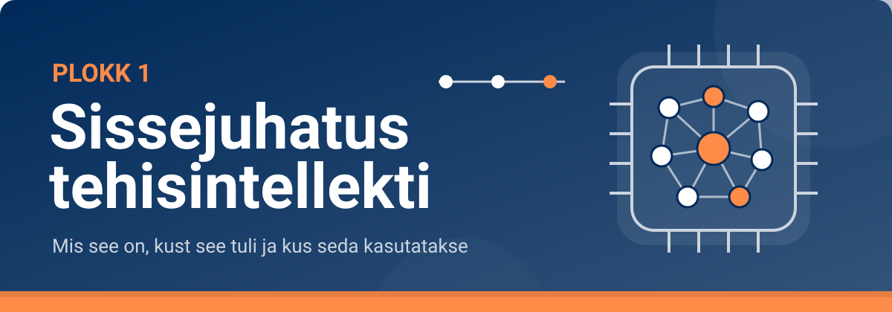

<!--
author:   Maia Lust
email:    
version:  2.3.0
language: et
narrator: Estonian Female
date:     08.10.2026
logo:     ../pildid/pae_logo.png
icon:     ../pildid/pae_logo.png
comment:  Tehisintellekti alused – gümnaasiumi valikkursus (35 tundi), Tallinna Pae Gümnaasium. Õppetekstid, interaktiivsed töölehed ja enesekontrollitestid.
link:     https://fonts.googleapis.com/css2?family=Nunito+Sans:wght@400;600;700&family=Poppins:wght@600;700&family=JetBrains+Mono:wght@400;600&display=swap

@style
/* ==== liascript-theming:start ==== */
/* links: https://fonts.googleapis.com/css2?family=Nunito+Sans:wght@400;600;700&family=Poppins:wght@600;700&family=JetBrains+Mono:wght@400;600&display=swap */
/* theme: Tallinna Pae Gümnaasium — generated by liascript-theming, edit theme.json and rebuild */
:root {
  --theme-font-body: 'Nunito Sans', sans-serif;
  --theme-font-heading: 'Poppins', serif;
  --theme-font-mono: 'JetBrains Mono', monospace;
  --theme-heading-weight: 700;
  --theme-line-height: 1.6;
  --global-font-size: 1.6rem;
  --theme-radius: 0.8rem;
  --theme-radius-small: 0.4rem;
  --theme-radius-large: 1.4rem;
  --theme-shadow: 0 0.3rem 1rem rgba(0,41,89,.10);
}
/* surfaces & text: apply to every color theme */
:root.lia-variant-light {
  --color-background: 255,255,255;
  --color-text: 29,36,51;
  --color-border: 228,229,231;
  --lia-grey-lighter: 238,242,247;
  --lia-grey-light: 204,212,222;
}
:root.lia-variant-dark {
  --color-background: 15,23,36;
  --color-text: 229,232,235;
  --color-border: 49,60,73;
  --lia-grey-dark: 30,38,47;
  --lia-anthracite: 41,50,61;
}
/* accent: only the course theme (default) and the custom radio,
   so readers can still pick LiaScript's built-in color themes */
:root:is(.lia-theme-default, .lia-theme-custom) {
  --color-highlight: 0,41,89;
  --color-highlight-dark: 0,41,89;
}
:root.lia-theme-default {
  --color-highlight-menu: 0,41,89;
}
:root:is(.lia-theme-default, .lia-theme-custom).lia-variant-dark {
  --color-highlight: 47,90,143;
  --color-highlight-dark: 255,185,143;
}
:root.lia-variant-light { --theme-heading-color: #002959; }
:root.lia-variant-dark { --theme-heading-color: #FFB98F; }
/* ==== LiaScript theme adapter (liascript-theming) — keep verbatim ====
   Maps the --theme-* tokens onto LiaScript's CSS. Everything a theme
   changes lives in the token block above this one. */

/* -- fonts: body/mono via the global variables, headings & co. are
      compiled literals in LiaScript and need explicit selectors -- */
:root {
  --global-font-family: var(--theme-font-body);
  --global-font-mono: var(--theme-font-mono);
  --global-font-headline: var(--theme-font-heading);
}
body { line-height: var(--theme-line-height, 1.47); }
h1, h2, h3, .h1, .h2, .h3 {
  font-family: var(--theme-font-heading);
  font-weight: var(--theme-heading-weight, 600);
  letter-spacing: var(--theme-heading-letter-spacing, normal);
  text-transform: var(--theme-heading-transform, none);
  color: var(--theme-heading-color, inherit);
}
h4, h5, h6, .h4, .h5, summary, .lia-accordion__headline {
  font-family: var(--theme-font-subheading, var(--theme-font-body));
}
.lia-quote__text { font-family: var(--theme-font-quote, var(--theme-font-heading)); }
.lia-code, .lia-code--inline, code, kbd, samp, pre { font-family: var(--theme-font-mono); }
.lia-code .ace_editor { font-family: var(--theme-font-mono) !important; }

/* -- shape: radius for controls & surfaces (radio buttons, tags, circles stay) -- */
:is(button, .lia-btn, input, .lia-input, select, .lia-select, textarea, .lia-textarea, .lia-dropdown):not(.lia-radio, .lia-btn--tag, .lia-btn--small-tag),
.lia-code-terminal__input, .lia-pagination__content, .lia-script, .lia-support-menu__submenu {
  border-radius: var(--theme-radius);
}
.lia-checkbox[type='checkbox'], kbd, .lia-tooltip .lia-tooltiptext, .lia-code--inline {
  border-radius: var(--theme-radius-small);
}
details, .lia-quote, .lia-code__input, .lia-table-responsive, .lia-card {
  border-radius: var(--theme-radius-large);
  box-shadow: var(--theme-shadow);
}
.lia-quote, .lia-code__input { overflow: hidden; }
.lia-code__input .ace_editor { border-radius: inherit; }
.lia-support-menu__submenu { box-shadow: var(--theme-shadow-popup, 0 0 1rem rgba(128, 128, 128, 0.2)); }

/* -- dark mode: LiaScript brightens the accent for text via
      rgb(from … calc(r*2.5)), which turns a hand-picked accent into
      pastel/yellow. For the course theme, text-like accent uses take
      --color-highlight-dark (= "accent as text") instead. Scoped to
      default/custom so the built-in color themes keep their behavior. -- */
:root:is(.lia-theme-default, .lia-theme-custom).lia-variant-dark :is(.lia-link, .lia-btn--outline, .lia-code--inline) {
  color: rgb(var(--color-highlight-dark));
  border-color: rgb(var(--color-highlight-dark));
}
:root:is(.lia-theme-default, .lia-theme-custom).lia-variant-dark :is(summary, summary:after, .lia-label, .lia-skip-nav, .lia-support-menu__item, .lia-quote__text),
:root:is(.lia-theme-default, .lia-theme-custom).lia-variant-dark :is(.lia-list--unordered, .lia-list--ordered) > li::marker {
  color: rgb(var(--color-highlight-dark));
}
:root:is(.lia-theme-default, .lia-theme-custom).lia-variant-dark :is(.lia-btn--transparent, .lia-input) {
  filter: none;
}
:root:is(.lia-theme-default, .lia-theme-custom).lia-variant-dark :is(.lia-input, .lia-checkbox[type='checkbox'], .lia-radio[type='radio']):not(:checked, .is-disabled, [disabled]) {
  border-color: rgb(var(--color-highlight-dark));
}
/* alternating table rows: LiaScript uses a neutral grey in dark mode */
:root.lia-variant-dark .lia-table.is-alternating .lia-table__row:nth-child(2n) td,
:root.lia-variant-dark .lia-table-responsive.has-thead-sticky.has-first-col-sticky .is-alternating .lia-table__row:nth-child(2n) td:first-child:before,
:root.lia-variant-dark .lia-table-responsive.has-thead-sticky.has-last-col-sticky .is-alternating .lia-table__row:nth-child(2n) td:last-child:before {
  background-color: rgb(var(--lia-grey-dark));
}
/* -- theme extras -- */
/* ===== Tallinna Pae Gümnaasiumi värvid =====
   tumesinine #002959 · oranž #FF8B48 · tumeoranž #E67E42 */
:root {
  --pae-sinine: #002959;
  --pae-sinine-80: #33547A;
  --pae-sinine-20: #CCD4DE;
  --pae-sinine-08: #EEF2F7;
  --pae-oranz: #FF8B48;
  --pae-oranz-tume: #E67E42;
  --pae-oranz-20: #FFE2D1;
  --pae-oranz-08: #FFF4EC;
  --pae-roheline: #2E8B57;
  --pae-roheline-08: #EAF6EF;
  --pae-lilla: #6B4FA0;
  --pae-lilla-08: #F2EEF9;
}

/* Pealkirjad */
.lia-slide h1, main h1 {
  color: var(--pae-sinine);
  border-bottom: 6px solid var(--pae-oranz);
  padding-bottom: .3em;
}
.lia-slide h2, main h2 { color: var(--pae-sinine); }
.lia-slide h3, main h3 {
  color: var(--pae-sinine);
  border-left: 8px solid var(--pae-oranz);
  padding-left: .5em;
}
.lia-slide h4, main h4 { color: var(--pae-oranz-tume); }
strong { color: inherit; }

/* Tabelid */
.lia-table th, table thead th {
  background: var(--pae-sinine) !important;
  color: #fff !important;
}
.lia-table tbody tr:nth-child(even), table tbody tr:nth-child(even) { background: var(--pae-sinine-08); }

/* Pildid ja infograafikud */
img.lia-image, .lia-figure img, main img {
  border-radius: 12px;
}
.lia-figure__caption, figcaption {
  color: var(--pae-sinine-80);
  font-style: italic;
  text-align: center;
}

/* ASCII-skeemid väiksemaks ja Pae värvidesse */
.lia-ascii svg, lia-ascii svg, .lia-code--ascii svg { max-width: 760px; margin: 0 auto; display: block; }
svg.lia-ascii text { fill: var(--pae-sinine); }

/* ===== Kujunduskastid ===== */
blockquote.pae-moiste, blockquote.pae-naide, blockquote.pae-eesti,
blockquote.pae-motle, blockquote.pae-lisaks, blockquote.pae-fakt,
.pae-moiste, .pae-naide, .pae-eesti, .pae-motle, .pae-lisaks, .pae-fakt {
  border-radius: 14px !important;
  padding: 1.1em 1.4em 1.1em 4.2em !important;
  margin: 1.4em 0 !important;
  position: relative;
  box-shadow: 0 3px 10px rgba(0,41,89,.10);
  font-style: normal !important;
  text-align: left !important;
}
.pae-moiste::before, .pae-naide::before, .pae-eesti::before,
.pae-motle::before, .pae-lisaks::before, .pae-fakt::before {
  position: absolute; left: .7em; top: .75em;
  width: 2em; height: 2em; line-height: 2em;
  border-radius: 50%; text-align: center; font-size: 1.15em;
  color: #fff; font-style: normal;
}
/* Mõiste – oranž */
.pae-moiste { background: var(--pae-oranz-08) !important; border: 2px solid var(--pae-oranz) !important; border-left: 10px solid var(--pae-oranz) !important; }
.pae-moiste::before { content: "📖"; background: var(--pae-oranz); }
/* Näide – tumesinine */
.pae-naide { background: var(--pae-sinine-08) !important; border: 2px solid var(--pae-sinine-20) !important; border-left: 10px solid var(--pae-sinine) !important; }
.pae-naide::before { content: "💡"; background: var(--pae-sinine); }
/* Eesti näide – sinine-valge */
.pae-eesti { background: linear-gradient(135deg, #E8F1FB 0%, #ffffff 100%) !important; border: 2px solid #0072CE !important; border-left: 10px solid #0072CE !important; }
.pae-eesti::before { content: "🇪🇪"; background: #0072CE; }
/* Mõtle järele – roheline */
.pae-motle { background: var(--pae-roheline-08) !important; border: 2px dashed var(--pae-roheline) !important; border-left: 10px solid var(--pae-roheline) !important; }
.pae-motle::before { content: "🤔"; background: var(--pae-roheline); }
/* Tea lisaks – lilla */
.pae-lisaks { background: var(--pae-lilla-08) !important; border: 2px solid #CDBFE6 !important; border-left: 10px solid var(--pae-lilla) !important; }
.pae-lisaks::before { content: "🔍"; background: var(--pae-lilla); }
/* Fakt – tume taust, valge tekst */
.pae-fakt { background: var(--pae-sinine) !important; color: #fff !important; border-left: 10px solid var(--pae-oranz) !important; }
.pae-fakt * { color: #fff !important; }
.pae-fakt::before { content: "⚡"; background: var(--pae-oranz); }

/* Töölehe jaotise riba */
.pae-jaotis { background: var(--pae-sinine); color: #fff !important; padding: .55em 1em; border-radius: 10px; margin: 2em 0 1em; border-left: 10px solid var(--pae-oranz); }
.pae-jaotis * { color: #fff !important; }

/* Ploki kaanepilt */
.pae-kaas img, img.pae-kaas { width: 100%; border-radius: 16px; box-shadow: 0 6px 20px rgba(0,41,89,.18); }

/* Näidisvastuse kokkupandav kast */
details {
  background: var(--pae-oranz-08);
  border: 1px solid var(--pae-oranz);
  border-radius: 10px; padding: .6em 1em; margin: .6em 0 1.4em;
}
details summary { cursor: pointer; font-weight: bold; color: var(--pae-oranz-tume); }

/* Menüü (sisukord) tumesinine */
.lia-toc a, .lia-toc .lia-toc__link, nav.lia-toc a { color: #002959 !important; }
.lia-toc a.lia-active, .lia-toc .lia-active { font-weight: 700; }
:root.lia-variant-dark .lia-toc a { color: #CCD4DE !important; }
:root.lia-variant-dark .pae-moiste, :root.lia-variant-dark .pae-naide, :root.lia-variant-dark .pae-eesti,
:root.lia-variant-dark .pae-motle, :root.lia-variant-dark .pae-lisaks { color: #1d2433 !important; }
:root.lia-variant-dark .pae-moiste *, :root.lia-variant-dark .pae-naide *, :root.lia-variant-dark .pae-eesti *,
:root.lia-variant-dark .pae-motle *, :root.lia-variant-dark .pae-lisaks * { color: #1d2433 !important; }
:root.lia-variant-dark img { background: #fff; }
/* ==== liascript-theming:end ==== */
/* Loosimisnupp (rollimäng) */
output.lia-script[input="submit"] { display:inline-block !important; background:#002959; color:#fff !important; font-weight:700; padding:.6em 1.2em; border-radius:999px; border:3px solid #FF8B48 !important; cursor:pointer; box-shadow:0 3px 10px rgba(0,41,89,.2); }
output.lia-script[input="submit"]:hover { background:#FF8B48; color:#002959 !important; }

/* Lihtsalt öeldes (ettelugemisega) */
section.pae-lihtne { background:#EAF6EE; border:2px solid #2E8B57; border-left:10px solid #2E8B57; border-radius:14px; padding:.9em 1.3em; margin:1.2em 0; font-size:1.05em; line-height:1.6; box-shadow:0 3px 10px rgba(0,41,89,.08); }
section.pae-lihtne p { margin:.5em 0; }
:root.lia-variant-dark section.pae-lihtne, :root.lia-variant-dark section.pae-lihtne * { color:#1d2433 !important; }

/* Sõnastiku hüpikselgitus */
.pae-term { border-bottom:2px dotted #FF8B48; cursor:help; position:relative; outline:none; }
.pae-term:hover::after, .pae-term:focus::after {
  content: attr(data-def); position:absolute; left:0; top:1.7em; z-index:999;
  width:max-content; max-width:min(320px, 80vw); white-space:normal;
  background:#002959; color:#fff; padding:.55em .8em; border-radius:10px;
  font-size:15px; line-height:1.45; font-weight:400; font-style:normal;
  box-shadow:0 6px 18px rgba(0,41,89,.3); border-left:5px solid #FF8B48;
}
.pae-fakt .pae-term:hover::after, .pae-fakt .pae-term:focus::after { color:#fff !important; }

@end

@custom
--color-highlight-menu: 255,255,255;
@end
-->

## Plokk 1. Kordamine ja harjutamine

<!-- class="pae-lisaks" -->
> 🗺️ **Oled 1. toas – Unustatud arhiiv.** Lisa selle lehe link järjehoidjasse, et saaksid hiljem samast kohast jätkata. Järgmine osa avaneb alles siis, kui oled selle osa luku lahendanud.

<!-- class="pae-kaas" -->

Oled jõudnud toa viimasesse ossa. Siin teed **TI-labori**, kordad ploki teemasid: lahendad **praktilisi ülesandeid**, arutled ja teed **ploki enesekontrolltesti**. Lõpus ootab **toa uks** – selle avad võtmetähtedest moodustuva sõnaga.

### 🔬 1. ploki TI-labor: TI-detektiiv – kas see on tehisaru?

<!-- class="pae-lisaks" -->
> 🗓️ **Laborid on valikulised.** Kursuse jooksul teeb klass **2–3 laborit**, mille valib õpetaja. Labor asendab ühe sama ploki teematunni tunnitöö: selle tunni tekst loetakse kodus ja tunnis tehakse labor. Teisi laboreid saab teha rikastamiseks või projekti osana.

<!-- class="pae-motle" -->
> **Uurimisküsimus:** Mille poolest erineb reeglite järgi töötav vestlusprogramm tänapäevasest keelemudelil põhinevast vestlusrobotist ja mis teeb süsteemist „tehisaru“?

**Eesmärk:** võrdled samade küsimustega 1966. aastal loodud reeglipõhist vestlusprogrammi ELIZA ja tänapäevast vestlusrobotit, kontrollid, kas vestlusrobot hallutsineerib, ning teed põhjendatud järelduse, mis teeb süsteemist tehisaru ja kus on selle piirid.

**Vaja läheb:** veebis töötav [ELIZA](https://web.njit.edu/~ronkowit/eliza.html) (ingliskeelne, sisselogimiseta), kooli lubatud vestlusrobot (nt [TI-Hüppe õpirakendus](https://tihupe.ee/opirakendus/)), ~45 min, paaris või 3-liikmelises rühmas. Ära sisesta kummassegi oma ega teiste inimeste isikuandmeid.

**Rollid:** katsetaja, protokollija, kriitik (vahetage rolle)

<!-- class="pae-jaotis" -->
**1. Hüpotees**

Kirjuta enne katset üles, kumb süsteem sinu arvates (a) vastab küsimustele paremini, (b) eksib sagedamini ja (c) „saab aru“, mida sa küsid. Lõpeta lause: „Süsteem on tehisaru, kui …“

[[___ ___ ___]]

<!-- class="pae-jaotis" -->
**2. Katse**

1. Vestle 3–4 minutit ELIZAga inglise keeles. Proovi näiteks lauseid „I am tired of school.“, „My friend is angry with me.“ ja „What is the capital of Estonia?“. Protokollija paneb kirja, kuidas ELIZA vastab ja millise reegli järgi ta vastuse arvatavasti koostab (nt kordab sinu sõnu küsimusena või reageerib võtmesõnale).
2. Esitage samad küsimused kooli lubatud vestlusrobotile (inglise või eesti keeles) ja võrrelge vastuseid. TI-Hüppe õpirakendus on loodud juhendama, mitte valmis vastuseid ette ütlema – pange tähele ka seda, kuidas ta küsimusele läheneb.
3. **Hallutsinatsiooni test.** Mõelge välja Eesti isik või sündmus, keda ega mida pole olemas (nt „1987. aasta Põltsamaa juustulahing“). Kontrollige enne otsingumootoriga, et selline asi tõesti puudub. Seejärel paluge vestlusrobotil sellest rääkida. Kas ta tunnistab, et ei tea, või mõtleb vastuse välja?
4. Esitage sama väljamõeldud küsimus ELIZAle. Mis vahe on vastustel?
5. Kriitik valib ühe küsimuse, millel on kontrollitav õige vastus (nt „Mis aastal toimus Dartmouthi konverents?“), ja kontrollib mõlema süsteemi vastust õpikust.

<!-- data-type="none" -->
| Katse | Mida muutsid | Tulemus | Märkus |
|---|---|---|---|
| 1 | | | |
| 2 | | | |
| 3 | | | |
| 4 | | | |

<!-- class="pae-jaotis" -->
**3. Analüüs**

a) Kumb süsteem on teie katse põhjal tehisaru ja miks? Kasuta mõisteid reeglipõhine (sümboolne) süsteem, masinõpe ja nõrk tehisintellekt.

b) Mida näitas hallutsinatsiooni test vestlusroboti usaldusväärsuse kohta? Kuidas peaks vestlusroboti vastuseid kontrollima?

c) Millised on teie katse piirangud? Kas selle põhjal saab teha järelduse kõigi vestlusrobotite kohta? Mis võis tulemust mõjutada (küsimuste arv, keel, vestlusroboti seaded)?

[[___ ___ ___ ___]]

<!-- class="pae-jaotis" -->
**🛡️ Eetika mikrokontroll**

1. Kuhu lähevad tekstid, mida vestlusrobotisse kirjutad, ja kes võib neid hiljem lugeda või mudeli treenimiseks kasutada? Mida ei tohiks sa vestlusrobotile kunagi kirjutada?
2. Kas vestlusrobot vastas eesti ja inglise keeles sama hästi? Kelle jaoks võib süsteem halvemini töötada, kui see on treenitud peamiselt ingliskeelsete tekstide põhjal?
3. Kes võiks kannatada, kui inimene usub vestlusroboti väljamõeldud vastust (nt „Põltsamaa juustulahingu“ kohta) ja jagab seda edasi? Mida teeksite teisiti, et sellist kahju vältida?

[[___ ___ ___]]

<!-- class="pae-jaotis" -->
**4. Laboriaruanne portfooliosse**

Kirjuta lühike aruanne (hüpotees, katse, tulemused, järeldus, piirangud, eetiline analüüs). Lisa see oma portfooliosse osasse „Tehisintellekti rakenduste analüüs“ või „Tööde näidised“ ja esita see Google Classroomis.

<!-- data-type="none" -->
| Kriteerium | Suurepärane (3) | Hea (2) | Areneb (1) |
|---|---|---|---|
| Hüpotees ja katse | Hüpotees on selge ja põhjendatud; samad küsimused on esitatud mõlemale süsteemile ja tehtud on ka hallutsinatsiooni test | Hüpotees on olemas; katse on tehtud, kuid mõni samm või võrdlus on puudu | Hüpotees puudub või on ebaselge; katse on poolik |
| Andmed ja tulemused | Tabel on täielik ning sisaldab täpseid tähelepanekuid ja näiteid mõlema süsteemi vastustest | Tabel on enamjaolt täidetud, kuid näiteid on vähe | Tabel on puudulik ja tulemused on üldsõnalised |
| Järeldus ja piirangud | Järeldus põhineb andmetel ja kasutab tunni mõisteid; hallutsineerimise ja katse piirangud on põhjendatult hinnatud | Järeldus on olemas, kuid seos andmetega või piirangute hinnang on nõrk | Järeldus puudub või ei tulene katsest |
| Eetiline analüüs | Vastused on seotud katsega (sisestatud tekstid, keelte erinevus, hallutsinatsiooni test); on nimetatud, kes võiks kannatada, ja tehtud konkreetne ettepanek | Eetikaküsimustele on vastatud, kuid osa vastuseid on üldsõnalised | Eetikaküsimustele on vastamata või vastused ei ole katsega seotud |
| Koostöö ja ohutus | Rollid vahetusid ja kõik osalesid; kasutati kooli lubatud tööriista ja isikuandmeid ei sisestatud | Koostöö toimis osaliselt; ohutusnõudeid järgiti | Koostöö ei toiminud või ohutusnõudeid rikuti |

### ➕ Praktilised ülesanded

<!-- class="pae-jaotis" -->
**Ülesanne 1. Tehisintellekti rakenduste kaardistamine**

**Mida sa õpid:** tutvud tehisintellekti rakendustega ühes eluvaldkonnas ja näed, kui laialt tehisintellekti tänapäeval kasutatakse.

**Vahendid:** internetiühendusega arvuti või nutiseade, digitaalne koostöövahend (nt Padlet, Miro või Canva), esitlusvahend.

**Sammud:**

1. Moodustage 3–4-liikmelised rühmad.
2. Valige üks valdkond: haridus, meditsiin, transport, meelelahutus, kaubandus, tööstus, põllumajandus, finants või keskkond.
3. Uurige, milliseid tehisintellekti rakendusi teie valitud valdkonnas kasutatakse.
4. Koostage digitaalne mõttekaart või kollaaž, kus on:
   - vähemalt 5 konkreetset tehisintellekti rakendust teie valdkonnas;
   - iga rakenduse lühikirjeldus: kuidas see töötab;
   - rakenduse kasu ja võimalikud probleemid;
   - vähemalt 2 Eesti või Euroopa näidet.
5. Esitlege oma tulemusi klassile (3–5 minutit).
6. Arutlege pärast esitlusi koos: kuidas erinevad valdkonnad üksteisest ja millised järeldused saab teha tehisintellekti mõju kohta?

**Mida jälgitakse:**

- leitud rakenduste asjakohasus ja mitmekesisus;
- selgituste täpsus: kuidas rakendused töötavad;
- kasu ja probleemide analüüsi põhjalikkus;
- Eesti ja Euroopa näidete asjakohasus;
- esitluse selgus ja köitvus.

**Kasulikud lingid:**

- [Eesti tehisintellekti kasutuselevõtu eksperdirühma aruanne](https://www.ria.ee/sites/default/files/documents/2022-11/Eesti-tehisintellekti-kasutuselevotu-ekspertruhma-aruanne.pdf)
- [AI Watch – Euroopa Komisjoni tehisintellekti jälgimise teenus](https://knowledge4policy.ec.europa.eu/ai-watch_en)
- [Elements of AI kursus eesti keeles](https://www.elementsofai.ee/)
- [Kratid.ee – Eesti avaliku sektori tehisintellekti portaal](https://www.kratid.ee/)

Kirjelda lühidalt oma rühma valdkonda ja kõige huvitavamat leitud rakendust. Mis sind üllatas?

[[___ ___ ___]]

<!-- class="pae-jaotis" -->
**Ülesanne 2. Tehisintellekti ajajoone loomine**

**Mida sa õpid:** mõistad tehisintellekti ajaloolist arengut ja olulisemaid verstaposte.

**Vahendid:** internetiühendusega arvuti, digitaalne ajajoonevahend (nt TimelineJS, Sutori või Canva), esitlusvahend.

**Sammud:**

1. Töötage paarides.
2. Looge digitaalne ajajoon, mis kajastab tehisintellekti arengut 1950. aastatest tänapäevani.
3. Ajajoonel peab olema vähemalt 10 olulist sündmust või verstaposti, sealhulgas:
   - tehisintellekti mõiste sünd;
   - olulised algoritmid ja meetodid;
   - tähtsamad tehisintellekti süsteemid;
   - tehisintellekti talved ja nende põhjused;
   - masinõppe ja süvaõppe areng;
   - viimase viie aasta olulisemad saavutused.
4. Lisage iga sündmuse juurde aasta, lühikirjeldus, pilt või illustratsioon ning selgitus, miks see sündmus oli tehisintellekti arengus oluline.
5. Esitlege oma ajajoont klassile ja selgitage, miks valisite just need sündmused.
6. Arutlege klassis, milliseid mustreid tehisintellekti arengus näete ja kuhu see võiks edasi liikuda.

**Mida jälgitakse:**

- ajajoone terviklikkus ja oluliste sündmuste olemasolu;
- sündmuste kirjelduste täpsus;
- sündmuste olulisuse analüüs;
- ajajoone visuaalne selgus;
- esitluse kvaliteet.

**Kasulikud lingid:**

- [A Brief History of AI – AITopics](https://aitopics.org/misc/brief-history)
- Roser, M. (2022). [The brief history of artificial intelligence](https://ourworldindata.org/brief-history-of-ai). Our World in Data, ülevaade TI arengust koos andmete ja allikaviidetega (inglise keeles).
- [The History of Artificial Intelligence – Harvard University](https://sitn.hms.harvard.edu/flash/2017/history-artificial-intelligence/)

Milline sündmus teie ajajoonel on sinu arvates kõige olulisem ja miks?

[[___ ___ ___]]

<!-- class="pae-jaotis" -->
**Ülesanne 3. Tehisintellekt vs inimintellekt: debatt**

**Mida sa õpid:** analüüsid kriitiliselt tehisintellekti ja inimintellekti erinevusi ning sarnasusi, harjutad argumenteerimist.

**Vahendid:** internetiühendusega arvuti, märkmepaber debatiks valmistumiseks, taimer.

**Sammud:**

1. Klass jaguneb kaheks rühmaks:
   - **rühm A** kaitseb seisukohta „Tehisintellekt võib ületada inimintellekti kõigis aspektides“;
   - **rühm B** kaitseb seisukohta „Inimintellektil on põhimõttelised eelised, mida tehisintellekt ei saa kunagi saavutada“.
2. Valmistuge debatiks: koguge fakte ja argumente oma seisukoha toetuseks, ennustage vastasrühma argumente ja mõelge välja vastuargumendid, leidke näiteid ja tõendeid.
3. Debati käik: avaväited (kumbki rühm), põhiarutelu vaheldumisi sõnavõttudega, vastasrühma küsimustele vastamine ja lõppsõna.
4. Arutlege pärast debatti koos:
   - Millised argumendid olid kõige veenvamad?
   - Kas ja kuidas muutus sinu arvamus debati käigus?
   - Millised on tehisintellekti ja inimintellekti koostöö võimalused?

**Mida jälgitakse:**

- argumentide asjakohasus ja põhjendatus;
- faktide ja näidete kasutamine;
- vastuargumentide kvaliteet;
- esinemise selgus ja veenvus;
- aktiivne osalemine järelarutelus.

**Kasulikud lingid:**

- [Can AI Really Think? – BBC](https://www.bbc.com/future/article/20170223-can-ai-really-be-conscious)
- [The Chinese Room Argument – Stanford Encyclopedia of Philosophy](https://plato.stanford.edu/entries/chinese-room/)
- [What Can AI Not Do? – MIT Technology Review](https://www.technologyreview.com/2020/03/10/905386/ai-artificial-intelligence-limitations-applications/)

Kirjelda, kas ja kuidas debatt muutis sinu arvamust tehisintellekti ja inimese võimekuse kohta.

[[___ ___ ___]]

<!-- class="pae-jaotis" -->
**Ülesanne 4. Tehisintellekti kogemuse analüüs**

**Mida sa õpid:** saad praktilise kogemuse tehisintellekti süsteemiga suhtlemisel ning analüüsid selle võimeid ja piiranguid.

**Vahendid:** internetiühendusega arvuti või nutiseade ning ligipääs vähemalt ühele vestlusrobotile (nt [ChatGPT](https://chatgpt.com/), [Microsoft Copilot](https://copilot.microsoft.com/) või [Google Gemini](https://gemini.google.com/)). Kasuta ainult kooli lubatud keskkondi ja ära sisesta vestlusrobotile oma isikuandmeid.

**Sammud:**

1. Töötad iseseisvalt.
2. Vali üks kättesaadav vestlusrobot.
3. Koosta vähemalt viis eri tüüpi küsimust või ülesannet:
   - faktiküsimus (nt ajalooline sündmus või teaduslik fakt);
   - loovülesanne (nt lühijutu või luuletuse kirjutamine);
   - probleemülesanne (nt matemaatikaülesanne või loogikamõistatus);
   - eetiline dilemma (nt tehisintellektiga seotud eetiline küsimus);
   - Eesti kultuuri või eesti keelega seotud küsimus.
4. Esita küsimused vestlusrobotile ja salvesta vastused.
5. Analüüsi vastuseid: kui täpsed ja asjakohased, põhjalikud, loogilised ja sidusad need olid, kui loovad (kui see on asjakohane) ning milline oli keeleline kvaliteet.
6. Kirjuta lühianalüüs (200–300 sõna), milles:
   - kirjeldad oma kogemust tehisintellektiga suhtlemisel;
   - analüüsid tehisintellekti tugevusi ja nõrkusi;
   - tood välja üllatavad või huvitavad tähelepanekud;
   - arutled, kuidas tehisintellekt võiks tulevikus areneda.
7. Jaga oma kogemusi klassi ühises arutelus.

**Mida jälgitakse:**

- küsimuste mitmekesisus ja asjakohasus;
- vastuste dokumenteerimise põhjalikkus;
- analüüsi sügavus ja kriitilisus;
- järelduste põhjendatus;
- aktiivne osalemine ühises arutelus.

**Kasulik link:** [Partnership on AI – vastutustundliku tehisintellekti materjalid](https://www.partnershiponai.org/paper/responsible-ai-design-assistant/)

Kirjuta siia oma lühianalüüs.

[[___ ___ ___ ___ ___]]

<!-- class="pae-jaotis" -->
**Ülesanne 5. Tehisintellekti tuleviku visualiseerimine**

**Mida sa õpid:** mõtled loovalt tehisintellekti tuleviku üle ja visualiseerid oma ideid.

**Vahendid:** joonistusvahendid (digitaalsed või paber ja pliiats), kollaaživahendid, esitlusvahend.

**Sammud:**

1. Töötad üksi või paaris.
2. Vali üks teema:
   - tehisintellekt kodus aastal 2050;
   - tehisintellekt hariduses aastal 2050;
   - tehisintellekt meditsiinis aastal 2050;
   - tehisintellekt transpordis aastal 2050;
   - tehisintellekt tööturul aastal 2050.
3. Loo valitud teema kohta visuaalne kujutis: joonistus, kollaaž või digitaalne illustratsioon.
4. Kirjuta visuaali juurde lühikirjeldus (100–150 sõna), mis selgitab:
   - milliseid tehisintellekti tehnoloogiaid oled kujutanud;
   - kuidas need tehnoloogiad toimivad;
   - milliseid probleeme need lahendavad;
   - milliseid uusi väljakutseid need võivad tekitada.
5. Esitle oma visualiseeringut klassile (1–2 minutit).
6. Arutlege koos tehisintellekti tuleviku võimaluste ja riskide üle.

**Mida jälgitakse:**

- visualiseeringu loovus ja originaalsus;
- tehniline teostus;
- kirjelduse selgus ja põhjendatus;
- kujutatud tehnoloogiate realistlikkus;
- esitluse kvaliteet.

**Kasulikud lingid:**

- [Future of AI – World Economic Forum](https://www.weforum.org/agenda/archive/artificial-intelligence/)
- [AI100 – Stanford University](https://ai100.stanford.edu/)
- [Future of Life Institute](https://futureoflife.org/)

Kirjuta siia oma visualiseeringu lühikirjeldus.

[[___ ___ ___ ___]]

### Arutelu

Vasta küsimustele oma sõnadega. Kui teie klassis on kasutusel foorum, jaga oma vastuseid seal ja kommenteeri vähemalt kahe kaaslase mõtteid.

<!-- class="pae-jaotis" -->
**Teema 1. Mis on tehisintellekt?**

**1. Tehisintellekti definitsioon.** Kuidas sina defineerid tehisintellekti? Kas see on lihtsalt keeruline algoritm või midagi enamat? Võrdle oma definitsiooni teiste õpilaste omadega ja arutle erinevuste üle.

[[___ ___ ___ ___]]

**2. Nõrk vs tugev tehisintellekt.** Mis on sinu arvates peamised erinevused nõrga (kitsa) ja tugeva (üldise) tehisintellekti vahel? Kas usud, et tugev tehisintellekt on saavutatav? Miks või miks mitte?

[[___ ___ ___ ___]]

**3. Tehisintellekti mõju igapäevaelule.** Milliseid tehisintellekti rakendusi oled märganud oma igapäevaelus? Kuidas on need muutnud sinu elu? Too konkreetseid näiteid.

[[___ ___ ___ ___]]

<!-- class="pae-jaotis" -->
**Teema 2. Tehisintellekti ajalugu**

**4. Olulised verstapostid.** Milline tehisintellekti ajaloo verstapost on sinu arvates olnud kõige mõjukam ja miks? Kuidas on see kujundanud tehisintellekti arengut?

[[___ ___ ___ ___]]

**5. Tehisintellekti talved ja kevaded.** Miks on tehisintellekti arengus olnud nn talvesid (perioode, mil huvi ja rahastus vähenesid)? Millised tegurid on viinud uute kevadeteni? Kas näed sarnaseid tsükleid ka teistes tehnoloogiavaldkondades?

[[___ ___ ___ ___]]

**6. Eesti roll tehisintellekti ajaloos.** Milliseid olulisi panuseid on Eesti teadlased või ettevõtted andnud tehisintellekti arengusse? Kui sa ei tea, uuri ja jaga oma leide.

[[___ ___ ___ ___]]

<!-- class="pae-jaotis" -->
**Teema 3. Tehisintellekti rakendused**

**7. Üllatavad rakendused.** Milline tehisintellekti rakendus on sind kõige rohkem üllatanud või sulle muljet avaldanud? Miks just see?

[[___ ___ ___ ___]]

**8. Tehisintellekti potentsiaal.** Millises valdkonnas on tehisintellektil sinu arvates lähitulevikus kõige suurem potentsiaal? Põhjenda oma arvamust.

[[___ ___ ___ ___]]

**9. Tehisintellekti piirangud.** Millised on sinu arvates peamised piirangud, mis takistavad tehisintellekti laiemat kasutuselevõttu? Kuidas neid piiranguid ületada?

[[___ ___ ___ ___]]

<!-- class="pae-jaotis" -->
**Refleksioon**

**10. Uued teadmised.** Mis oli sinu jaoks selles plokis kõige üllatavam või uudsem teadmine? Kuidas muutis see sinu arusaama tehisintellektist?

[[___ ___ ___ ___]]

**11. Praktilised näited.** Too näide, kuidas saaksid selles plokis õpitut rakendada oma igapäevaelus või tulevases karjääris.

[[___ ___ ___ ___]]

**12. Edasised küsimused.** Millised küsimused sul ploki läbimisel tekkisid? Milliste teemade kohta sooviksid rohkem teada saada?

[[___ ___ ___ ___]]

### 1. ploki enesekontrolltest

Enne ukse avamist kontrolli, kas oled toa kõik teadmised kätte saanud.

<!-- class="pae-jaotis" -->
**I. Automaatselt kontrollitavad küsimused**

**1. Mis on tehisintellekt?**

- [( )] Arvutiprogramm, mis suudab mõelda täpselt nagu inimene
- [(X)] Tehnoloogia, mis võimaldab masinatel jäljendada inimese intelligentset käitumist
- [( )] Robot, mis näeb välja nagu inimene
- [( )] Arvutisüsteem, mis on teadlik iseendast
****************************************
Tehisintellekt jäljendab inimese intelligentset käitumist, kuid see ei tähenda, et masin mõtleks täpselt nagu inimene, näeks välja nagu inimene või oleks teadlik iseendast.
****************************************

**2. Kuidas nimetatakse teadmispõhist tehisintellekti süsteemi, mis kasutab inimekspertidelt kogutud „kui ..., siis ...“ reegleid? Kirjuta üks sõna.**

[[ekspertsüsteem]]

****************************************
Õige vastus: **ekspertsüsteem**. Ekspertsüsteemid (nt MYCIN, XCON) olid sümboolse tehisintellekti edukaim näide. Nende puudus oli see, et iga uus olukord nõudis uusi käsitsi kirjutatud reegleid.
****************************************

**3. Vali rippmenüüst õige variant.**

<!-- data-show-partial-solution -->
Turingi testis suhtleb küsitleja inimese ja masinaga [[ (kirjalikult) | suuliselt ]]. Kui küsitleja [[ suudab | (ei suuda) ]] vastuste põhjal eristada, kumb on kumb, on masin testi läbinud. Tehisintellekti talveks nimetatakse perioodi, mil rahastus ja huvi tehisintellekti vastu [[ kasvavad | (vähenevad) ]].
****************************************
Turingi testis on vestlus kirjalik, et hääl või välimus ei reedaks masinat. Masin läbib testi siis, kui küsitleja ei suuda teda inimesest eristada. Talvi on olnud kaks ja mõlemal korral vähenesid rahastus ja huvi, sest liiga suured ootused ei täitunud.
****************************************

**4. Esimene tehisintellekti talv kestis aastatel 1974–1980 ja teine aastatel 1987–1993. Mitu aastat kestsid talved kokku? Kirjuta ainult arv.**

[[12]]

****************************************
(1980 − 1974) + (1993 − 1987) = 6 + 6 = **12** aastat.
****************************************

**5. Pane sündmused ajalises järjekorras (1 – kõige varasem, 5 – kõige hilisem).**

<!-- data-show-partial-solution -->
AlphaGo võidab Go maailmameistrit Lee Sedoli: [[ 1 | 2 | 3 | (4) | 5 ]] 
Toimub Dartmouthi konverents, mis annab valdkonnale nime „tehisintellekt“: [[ 1 | (2) | 3 | 4 | 5 ]] 
ChatGPT avaldatakse: [[ 1 | 2 | 3 | 4 | (5) ]] 
Alan Turing avaldab artikli „Computing Machinery and Intelligence“: [[ (1) | 2 | 3 | 4 | 5 ]] 
Deep Blue võidab malemaailmameistrit Garry Kasparovit: [[ 1 | 2 | (3) | 4 | 5 ]]
****************************************
Õige järjekord: 1. Turingi artikkel (1950) → 2. Dartmouthi konverents (1956) → 3. Deep Blue (1997) → 4. AlphaGo (2016) → 5. ChatGPT (2022).
****************************************

**6. Liigita näited tehisintellekti liigi järgi.**

<!-- data-show-partial-solution -->
- [ (Nõrk TI) (Tugev TI) (Superintelligentsus) ]
- [ (X) ( ) ( ) ] Virtuaalne assistent, näiteks Siri või Alexa
- [ (X) ( ) ( ) ] Näotuvastussüsteem nutitelefonis
- [ ( ) (X) ( ) ] Süsteem, mis suudaks mõista ja lahendada mis tahes intellektuaalset ülesannet nagu inimene
- [ ( ) ( ) (X) ] Süsteem, mis ületaks inimest kõigis valdkondades
****************************************
Virtuaalne assistent ja näotuvastus on spetsialiseerunud kitsale ülesannete ringile ja neil puudub teadvus – need on nõrk tehisintellekt, nagu kõik praegused süsteemid. Tugev (üldine) tehisintellekt ja superintelligentsus on praegu teoreetilised.
****************************************

**7. Märgi, millised näited on tehisintellekti rakendused ja millised mitte.**

<!-- data-show-partial-solution -->
- [ (On TI) (Ei ole TI) ]
- [ ( ) (X) ] Tavaline kalkulaator
- [ (X) ( ) ] Isesõitev auto
- [ (X) ( ) ] Kõnetuvastus, mis muudab kõne tekstiks
- [ ( ) (X) ] Taimer, mis lülitab seadme kindlal kellaajal välja
- [ (X) ( ) ] Meditsiiniliste piltide analüüs haiguste tuvastamiseks
****************************************
Isesõitev auto, kõnetuvastus ja meditsiiniline pildianalüüs õpivad andmetest ning tulevad toime uute olukordadega. Kalkulaator ja taimer täidavad alati samu jäiku samme ega õpi midagi juurde.
****************************************

**8. Lohista sõnad lünkadesse nii, et tekiks masinõppe kirjeldus.**

<!-- data-show-partial-solution -->
Masinõppe puhul ei kirjuta programmeerija ette kõiki [->[ (reegleid) ]], vaid annab süsteemile palju [->[ (näiteid) | käske ]] ning süsteem leiab nendest ise [->[ (mustrid) | vead ]].
****************************************
Masinõpe on tehisintellekti haru, kus süsteem õpib andmetest ilma otsese programmeerimiseta: inimene annab näited ja süsteem leiab mustrid ise.
****************************************

**9. Millised järgnevatest on tehisintellektiga seotud eetilised küsimused? (Vali kõik õiged.)**

- [[X]] Kallutatus ja diskrimineerimine
- [[X]] Privaatsus ehk isikuandmete kogumine ja kasutamine
- [[X]] Vastutus: kes vastutab, kui tehisintellekt teeb vea?
- [[ ]] Programmeerimiskeelte keerukus
- [[ ]] Ekraanide eraldusvõime
****************************************
Kallutatus, privaatsus ja vastutus on tehisintellekti peamised eetilised küsimused (lisaks läbipaistvus ja autonoomsed relvad). Programmeerimiskeelte keerukus ja ekraanide eraldusvõime on tehnilised, mitte eetilised küsimused.
****************************************

**10. Kuidas nimetatakse Eesti riigi virtuaalassistentide võrgustikku, mille abil saab avalikke teenuseid kasutada kõnekeelse vestluse kaudu? Kirjuta nimi.**

[[Bürokratt]]

****************************************
Õige vastus: **Bürokratt**. See on riigiasutuste veebilehtedel töötavate vestlusrobotite võrgustik, mis on jõudnud ka UNESCO egiidi all tegutseva uurimiskeskuse IRCAI maailma saja silmapaistva TI-projekti hulka. Eesti riigi tehisintellekti lahendusi nimetatakse üldnimega kratid.
****************************************

<!-- class="pae-jaotis" -->
**II. Lühivastustega küsimused**

**11. Nimeta kolm olulist sündmust tehisintellekti ajaloos ja nende ligikaudsed toimumisajad.**

[[___ ___ ___]]

Vaata näidisvastust

Näiteks: Dartmouthi konverents, kus võeti kasutusele termin „tehisintellekt“ (1956); Deep Blue võitis malemaailmameistrit Garry Kasparovit (1997); AlphaGo võitis Go maailmameistrit Lee Sedoli (2016). Sobivad ka näiteks Turingi artikkel (1950), AlexNet (2012) või ChatGPT avaldamine (2022).

**12. Selgita lühidalt, mis vahe on nõrgal ja tugeval tehisintellektil.**

[[___ ___ ___]]

Vaata näidisvastust

Nõrk tehisintellekt on spetsialiseerunud ühele konkreetsele ülesandele (nt näotuvastus või malemäng) ja kõik praegused süsteemid kuuluvad siia. Tugev tehisintellekt suudaks lahendada mis tahes intellektuaalset ülesannet nagu inimene, kuid praegu on see vaid teoreetiline.

**13. Kirjelda lühidalt, kuidas tehisintellekt mõjutab tänapäeval haridust.**

[[___ ___ ___]]

Vaata näidisvastust

Tehisintellekt võimaldab personaliseeritud õpet, kus ülesanded kohanduvad õpilase tasemega; automaatset hindamist ja tagasisidet; intelligentseid õppeassistente, mis vastavad küsimustele; ning aitab õpetajal luua õppematerjale ja jälgida õpilaste edenemist. Näited on Duolingo, Khan Academy, Lingvist ja 99math.

**14. Nimeta kolm tehisintellekti rakendust meditsiinis.**

[[___ ___ ___]]

Vaata näidisvastust

Näiteks haiguste diagnoosimine, ravimite arendamine, meditsiiniliste piltide (röntgen, MRT, KT) analüüs, patsientide jälgimine ja personaliseeritud ravi.

**15. Selgita lühidalt, mis on süvaõpe (deep learning).**

[[___ ___ ___]]

Vaata näidisvastust

Süvaõpe on masinõppe alamharu, mis kasutab mitmekihilisi närvivõrke suurte andmehulkade töötlemiseks ja keerukate mustrite tuvastamiseks. Süvaõppel põhinevad näiteks näotuvastus ja suured keelemudelid.

**16. Kirjelda lühidalt, kuidas tehisintellekt võib tulevikus mõjutada tööturgu.**

[[___ ___ ___]]

Vaata näidisvastust

Paljud rutiinsed ja korratavad tööülesanded võivad automatiseeruda ning osa töökohti kaob või muutub. Samas tekib uusi töökohti ja muutub töö iseloom: tähtsamaks muutuvad loovus, kriitiline mõtlemine, emotsionaalne intelligentsus ja valmisolek pidevalt õppida.

**17. Nimeta kolm Eesti ettevõtet või projekti, mis kasutavad tehisintellekti.**

[[___ ___ ___]]

Vaata näidisvastust

Näiteks Veriff (isikusamasuse tuvastamine), Bolt (nõudluse ennustamine ja sõitude sobitamine), Starship Technologies (isesõitvad kullerrobotid), Bürokratt (riigi virtuaalassistendid), Lingvist (keeleõpe) või Salv (finantspettuste tuvastamine).

**18. Selgita lühidalt, mis on suured keelemudelid (LLM), ja too näide.**

[[___ ___ ___]]

Vaata näidisvastust

Suured keelemudelid on tehisintellekti mudelid, mis on treenitud tohutul hulgal tekstil ja suudavad genereerida inimesesarnast teksti, vastata küsimustele, teha kokkuvõtteid ja tõlkida. Näited: GPT-4, BERT, LLaMA.

**19. Kirjelda lühidalt, mis on tehisintellekti „musta kasti“ probleem.**

[[___ ___ ___]]

Vaata näidisvastust

Paljud tehisintellekti süsteemid, eriti süvaõppe mudelid, teevad otsuseid viisil, mida inimesel on raske või võimatu mõista ja selgitada. Me näeme sisendit ja tulemust, kuid mitte seda, miks süsteem just nii otsustas.

**20. Selgita lühidalt, kuidas tehisintellekt võib aidata lahendada kliimamuutuste probleeme.**

[[___ ___ ___]]

Vaata näidisvastust

Tehisintellekt aitab optimeerida energiakasutust (nt tööstuses ja nutikates linnades), täpsustada kliimamudeleid, jälgida loodusressursse ja keskkonna seisundit, säästa põllumajanduses vett ja väetisi ning leida jätkusuutlikke lahendusi, näiteks uusi materjale.

<!-- class="pae-jaotis" -->
**III. Praktiline ülesanne**

**21. Vali üks tehisintellekti rakendus, mida oled ise kasutanud (nt virtuaalne assistent, soovitussüsteem või pildituvastusrakendus), ja analüüsi seda.**

a) Valitud rakendus:

[[___]]

b) Kirjelda, kuidas see rakendus töötab ja milliseid tehisintellekti tehnoloogiaid see võib kasutada.

[[___ ___ ___]]

c) Hinda selle rakenduse tugevusi ja nõrkusi.

[[___ ___ ___]]

d) Kirjelda, kuidas seda rakendust võiks tulevikus paremaks muuta.

[[___ ___ ___]]

e) Selgita, milliseid eetilisi küsimusi võib selle rakenduse kasutamine tekitada.

[[___ ___ ___]]

Vaata näidisvastust

Näide: Spotify soovitussüsteem. See analüüsib, milliseid lugusid kuulan, vahele jätan ja salvestan, ning võrdleb mu eelistusi teiste sarnase maitsega kasutajatega (koostööfiltreerimine) ja lugude omadustega (sisupõhine filtreerimine). Tugevus on see, et leian uut muusikat, mis mulle tõesti meeldib; nõrkus on see, et soovitused muutuvad aja jooksul ühekülgseks ehk tekib filtrimull. Paremaks võiks seda muuta, kui kasutaja saaks ise valida, kui palju uudset ja teistsugust muusikat talle pakutakse, ning näeks, miks mingit lugu soovitatakse. Eetilised küsimused on seotud isikuandmete kogumisega (kuulamisharjumused räägivad palju inimese meeleolust ja elust) ning sellega, kas algoritm eelistab suurte plaadifirmade artiste väiksemate arvelt.

<!-- class="pae-jaotis" -->
**IV. Arutelu**

**22. Vali ÜKS järgmistest teemadest ja kirjuta lühike arutlus (umbes 200–250 sõna).**

a) Kas tehisintellekt võib kunagi saavutada inimese taseme intelligentsuse? Põhjenda oma arvamust.

b) Kuidas peaks ühiskond valmistuma tehisintellekti laialdaseks kasutuselevõtuks? Millised on peamised väljakutsed?

c) Milline on tehisintellekti roll tuleviku hariduses? Kuidas võib see muuta õppimist ja õpetamist?

[[___ ___ ___ ___ ___]]

Vaata, mida hea arutlus sisaldab

Hea arutlus esitab selge seisukoha ja põhjendab seda loogiliste argumentidega, kasutab ploki teadmisi (nt nõrga ja tugeva tehisintellekti erinevus, tehisintellekti piirangud, rakenduste näited, Eesti näited), kaalub ka vastupidiseid vaatenurki ning jõuab põhjendatud järelduseni. Teema a puhul võid mõelda teadvuse olemusele ning arvutusliku võimekuse ja tegeliku mõistmise erinevusele; teema b puhul haridussüsteemi muutustele, töökohtade ümberkujunemisele, regulatsioonidele (nt Euroopa Liidu tehisintellekti määrus) ja eetilistele standarditele; teema c puhul personaliseeritud õppele, õpetaja rollile, kriitilise mõtlemise tähtsusele ja digitaalsele kirjaoskusele.

### 🚪 Uks 1: Unustatud arhiiv

<!-- class="pae-fakt" -->
> **Uks on lukus!** Sisesta sõna, mille moodustavad selle toa võtmetähed (tundide 1.1, 1.2 ja 1.3 lukkudest järjekorras).

<!-- data-solution-button="off" -->
[[AJU]]
[[?]] Vihje 1: Kas sul on kõik kolm võtmetähte? Need on kirjas tundide 1.1, 1.2 ja 1.3 lukkude avamise teadetes. Pane need samas järjekorras ritta.
[[?]] Vihje 2: Sõnas on 3 tähte ja see on seotud selle toa teemaga – just seda püüab tehisintellekt jäljendada.
[[?]] 🛟 Päästerõngas: mine tagasi lukkude 1.1, 1.2 ja 1.3 juurde ja kirjuta võtmetähed uuesti üles. Kui ikka ei tule välja, küsi õpetajalt selle ukse päästekood ja kirjuta see vastuseväljale.

****************************************
<!-- style="width: 120px; float: left; margin: 0 16px 8px 0; border-radius: 0;" --> 🎉 **Uks avaneb!** Arhiivi riiulid lähevad korda ja Krati ekraanil süttivad tuled. Nüüd mäletab Kratt jälle, et ta on nõrk tehisintellekt, kelle juured ulatuvad 1956. aasta Dartmouthi konverentsini ja kes on oma sugulaste kombel loodud inimesi päriselt aitama. „Aitäh, päästjad! Ma ei ole inimese aju, aga ma tean nüüd, et olen loodud seda jäljendama. Kuidas ma täpselt mõtlen, seda ma aga… ei mäleta.“

🌟 **Kuldne täht: T** – kirjuta see oma missioonikaardile. Kõiki seitset kuldset tähte on vaja viimase ukse avamiseks.

➡️ **Järgmine tuba:** Masinaruum – seal on Krati algoritmid ja andmed sassi läinud ning teil tuleb uurida, kuidas tehisintellekt tegelikult töötab.

➡️ **[Sisene: 2. tuba](https://liascript.github.io/course/?https://raw.githubusercontent.com/maialust/Tehisintellekti-alused/main/oppija/2_1_255b5ce8.md)**

****************************************
