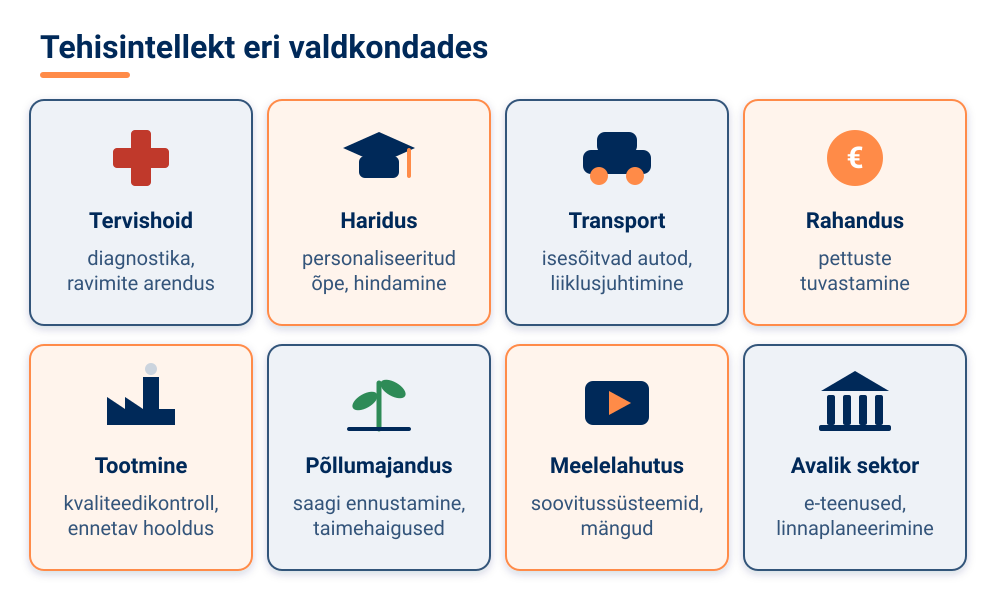
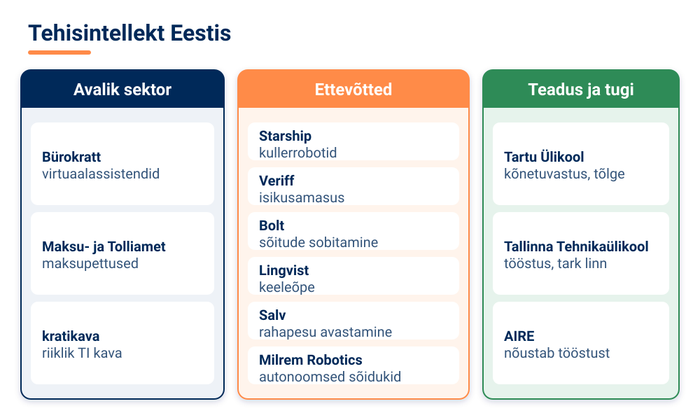
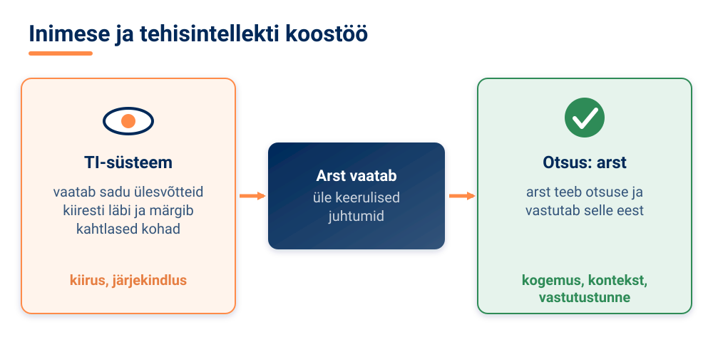

<!--
author:   Maia Lust
email:    
version:  2.0.1
language: et
narrator: Estonian Female
date:     08.10.2026
logo:     ../pildid/pae_logo.png
icon:     ../pildid/pae_logo.png
comment:  Tehisintellekti alused – gümnaasiumi valikkursus (35 tundi), Tallinna Pae Gümnaasium. Õppetekstid, interaktiivsed töölehed ja enesekontrollitestid.
link:     https://fonts.googleapis.com/css2?family=Nunito+Sans:wght@400;600;700&family=Poppins:wght@600;700&family=JetBrains+Mono:wght@400;600&display=swap

@style
/* ==== liascript-theming:start ==== */
/* links: https://fonts.googleapis.com/css2?family=Nunito+Sans:wght@400;600;700&family=Poppins:wght@600;700&family=JetBrains+Mono:wght@400;600&display=swap */
/* theme: Tallinna Pae Gümnaasium — generated by liascript-theming, edit theme.json and rebuild */
:root {
  --theme-font-body: 'Nunito Sans', sans-serif;
  --theme-font-heading: 'Poppins', serif;
  --theme-font-mono: 'JetBrains Mono', monospace;
  --theme-heading-weight: 700;
  --theme-line-height: 1.6;
  --global-font-size: 1.6rem;
  --theme-radius: 0.8rem;
  --theme-radius-small: 0.4rem;
  --theme-radius-large: 1.4rem;
  --theme-shadow: 0 0.3rem 1rem rgba(0,41,89,.10);
}
/* surfaces & text: apply to every color theme */
:root.lia-variant-light {
  --color-background: 255,255,255;
  --color-text: 29,36,51;
  --color-border: 228,229,231;
  --lia-grey-lighter: 238,242,247;
  --lia-grey-light: 204,212,222;
}
:root.lia-variant-dark {
  --color-background: 15,23,36;
  --color-text: 229,232,235;
  --color-border: 49,60,73;
  --lia-grey-dark: 30,38,47;
  --lia-anthracite: 41,50,61;
}
/* accent: only the course theme (default) and the custom radio,
   so readers can still pick LiaScript's built-in color themes */
:root:is(.lia-theme-default, .lia-theme-custom) {
  --color-highlight: 0,41,89;
  --color-highlight-dark: 0,41,89;
}
:root.lia-theme-default {
  --color-highlight-menu: 0,41,89;
}
:root:is(.lia-theme-default, .lia-theme-custom).lia-variant-dark {
  --color-highlight: 47,90,143;
  --color-highlight-dark: 255,185,143;
}
:root.lia-variant-light { --theme-heading-color: #002959; }
:root.lia-variant-dark { --theme-heading-color: #FFB98F; }
/* ==== LiaScript theme adapter (liascript-theming) — keep verbatim ====
   Maps the --theme-* tokens onto LiaScript's CSS. Everything a theme
   changes lives in the token block above this one. */

/* -- fonts: body/mono via the global variables, headings & co. are
      compiled literals in LiaScript and need explicit selectors -- */
:root {
  --global-font-family: var(--theme-font-body);
  --global-font-mono: var(--theme-font-mono);
  --global-font-headline: var(--theme-font-heading);
}
body { line-height: var(--theme-line-height, 1.47); }
h1, h2, h3, .h1, .h2, .h3 {
  font-family: var(--theme-font-heading);
  font-weight: var(--theme-heading-weight, 600);
  letter-spacing: var(--theme-heading-letter-spacing, normal);
  text-transform: var(--theme-heading-transform, none);
  color: var(--theme-heading-color, inherit);
}
h4, h5, h6, .h4, .h5, summary, .lia-accordion__headline {
  font-family: var(--theme-font-subheading, var(--theme-font-body));
}
.lia-quote__text { font-family: var(--theme-font-quote, var(--theme-font-heading)); }
.lia-code, .lia-code--inline, code, kbd, samp, pre { font-family: var(--theme-font-mono); }
.lia-code .ace_editor { font-family: var(--theme-font-mono) !important; }

/* -- shape: radius for controls & surfaces (radio buttons, tags, circles stay) -- */
:is(button, .lia-btn, input, .lia-input, select, .lia-select, textarea, .lia-textarea, .lia-dropdown):not(.lia-radio, .lia-btn--tag, .lia-btn--small-tag),
.lia-code-terminal__input, .lia-pagination__content, .lia-script, .lia-support-menu__submenu {
  border-radius: var(--theme-radius);
}
.lia-checkbox[type='checkbox'], kbd, .lia-tooltip .lia-tooltiptext, .lia-code--inline {
  border-radius: var(--theme-radius-small);
}
details, .lia-quote, .lia-code__input, .lia-table-responsive, .lia-card {
  border-radius: var(--theme-radius-large);
  box-shadow: var(--theme-shadow);
}
.lia-quote, .lia-code__input { overflow: hidden; }
.lia-code__input .ace_editor { border-radius: inherit; }
.lia-support-menu__submenu { box-shadow: var(--theme-shadow-popup, 0 0 1rem rgba(128, 128, 128, 0.2)); }

/* -- dark mode: LiaScript brightens the accent for text via
      rgb(from … calc(r*2.5)), which turns a hand-picked accent into
      pastel/yellow. For the course theme, text-like accent uses take
      --color-highlight-dark (= "accent as text") instead. Scoped to
      default/custom so the built-in color themes keep their behavior. -- */
:root:is(.lia-theme-default, .lia-theme-custom).lia-variant-dark :is(.lia-link, .lia-btn--outline, .lia-code--inline) {
  color: rgb(var(--color-highlight-dark));
  border-color: rgb(var(--color-highlight-dark));
}
:root:is(.lia-theme-default, .lia-theme-custom).lia-variant-dark :is(summary, summary:after, .lia-label, .lia-skip-nav, .lia-support-menu__item, .lia-quote__text),
:root:is(.lia-theme-default, .lia-theme-custom).lia-variant-dark :is(.lia-list--unordered, .lia-list--ordered) > li::marker {
  color: rgb(var(--color-highlight-dark));
}
:root:is(.lia-theme-default, .lia-theme-custom).lia-variant-dark :is(.lia-btn--transparent, .lia-input) {
  filter: none;
}
:root:is(.lia-theme-default, .lia-theme-custom).lia-variant-dark :is(.lia-input, .lia-checkbox[type='checkbox'], .lia-radio[type='radio']):not(:checked, .is-disabled, [disabled]) {
  border-color: rgb(var(--color-highlight-dark));
}
/* alternating table rows: LiaScript uses a neutral grey in dark mode */
:root.lia-variant-dark .lia-table.is-alternating .lia-table__row:nth-child(2n) td,
:root.lia-variant-dark .lia-table-responsive.has-thead-sticky.has-first-col-sticky .is-alternating .lia-table__row:nth-child(2n) td:first-child:before,
:root.lia-variant-dark .lia-table-responsive.has-thead-sticky.has-last-col-sticky .is-alternating .lia-table__row:nth-child(2n) td:last-child:before {
  background-color: rgb(var(--lia-grey-dark));
}
/* -- theme extras -- */
/* ===== Tallinna Pae Gümnaasiumi värvid =====
   tumesinine #002959 · oranž #FF8B48 · tumeoranž #E67E42 */
:root {
  --pae-sinine: #002959;
  --pae-sinine-80: #33547A;
  --pae-sinine-20: #CCD4DE;
  --pae-sinine-08: #EEF2F7;
  --pae-oranz: #FF8B48;
  --pae-oranz-tume: #E67E42;
  --pae-oranz-20: #FFE2D1;
  --pae-oranz-08: #FFF4EC;
  --pae-roheline: #2E8B57;
  --pae-roheline-08: #EAF6EF;
  --pae-lilla: #6B4FA0;
  --pae-lilla-08: #F2EEF9;
}

/* Pealkirjad */
.lia-slide h1, main h1 {
  color: var(--pae-sinine);
  border-bottom: 6px solid var(--pae-oranz);
  padding-bottom: .3em;
}
.lia-slide h2, main h2 { color: var(--pae-sinine); }
.lia-slide h3, main h3 {
  color: var(--pae-sinine);
  border-left: 8px solid var(--pae-oranz);
  padding-left: .5em;
}
.lia-slide h4, main h4 { color: var(--pae-oranz-tume); }
strong { color: inherit; }

/* Tabelid */
.lia-table th, table thead th {
  background: var(--pae-sinine) !important;
  color: #fff !important;
}
.lia-table tbody tr:nth-child(even), table tbody tr:nth-child(even) { background: var(--pae-sinine-08); }

/* Pildid ja infograafikud */
img.lia-image, .lia-figure img, main img {
  border-radius: 12px;
}
.lia-figure__caption, figcaption {
  color: var(--pae-sinine-80);
  font-style: italic;
  text-align: center;
}

/* ASCII-skeemid väiksemaks ja Pae värvidesse */
.lia-ascii svg, lia-ascii svg, .lia-code--ascii svg { max-width: 760px; margin: 0 auto; display: block; }
svg.lia-ascii text { fill: var(--pae-sinine); }

/* ===== Kujunduskastid ===== */
blockquote.pae-moiste, blockquote.pae-naide, blockquote.pae-eesti,
blockquote.pae-motle, blockquote.pae-lisaks, blockquote.pae-fakt,
.pae-moiste, .pae-naide, .pae-eesti, .pae-motle, .pae-lisaks, .pae-fakt {
  border-radius: 14px !important;
  padding: 1.1em 1.4em 1.1em 4.2em !important;
  margin: 1.4em 0 !important;
  position: relative;
  box-shadow: 0 3px 10px rgba(0,41,89,.10);
  font-style: normal !important;
  text-align: left !important;
}
.pae-moiste::before, .pae-naide::before, .pae-eesti::before,
.pae-motle::before, .pae-lisaks::before, .pae-fakt::before {
  position: absolute; left: .7em; top: .75em;
  width: 2em; height: 2em; line-height: 2em;
  border-radius: 50%; text-align: center; font-size: 1.15em;
  color: #fff; font-style: normal;
}
/* Mõiste – oranž */
.pae-moiste { background: var(--pae-oranz-08) !important; border: 2px solid var(--pae-oranz) !important; border-left: 10px solid var(--pae-oranz) !important; }
.pae-moiste::before { content: "📖"; background: var(--pae-oranz); }
/* Näide – tumesinine */
.pae-naide { background: var(--pae-sinine-08) !important; border: 2px solid var(--pae-sinine-20) !important; border-left: 10px solid var(--pae-sinine) !important; }
.pae-naide::before { content: "💡"; background: var(--pae-sinine); }
/* Eesti näide – sinine-valge */
.pae-eesti { background: linear-gradient(135deg, #E8F1FB 0%, #ffffff 100%) !important; border: 2px solid #0072CE !important; border-left: 10px solid #0072CE !important; }
.pae-eesti::before { content: "🇪🇪"; background: #0072CE; }
/* Mõtle järele – roheline */
.pae-motle { background: var(--pae-roheline-08) !important; border: 2px dashed var(--pae-roheline) !important; border-left: 10px solid var(--pae-roheline) !important; }
.pae-motle::before { content: "🤔"; background: var(--pae-roheline); }
/* Tea lisaks – lilla */
.pae-lisaks { background: var(--pae-lilla-08) !important; border: 2px solid #CDBFE6 !important; border-left: 10px solid var(--pae-lilla) !important; }
.pae-lisaks::before { content: "🔍"; background: var(--pae-lilla); }
/* Fakt – tume taust, valge tekst */
.pae-fakt { background: var(--pae-sinine) !important; color: #fff !important; border-left: 10px solid var(--pae-oranz) !important; }
.pae-fakt * { color: #fff !important; }
.pae-fakt::before { content: "⚡"; background: var(--pae-oranz); }

/* Töölehe jaotise riba */
.pae-jaotis { background: var(--pae-sinine); color: #fff !important; padding: .55em 1em; border-radius: 10px; margin: 2em 0 1em; border-left: 10px solid var(--pae-oranz); }
.pae-jaotis * { color: #fff !important; }

/* Ploki kaanepilt */
.pae-kaas img, img.pae-kaas { width: 100%; border-radius: 16px; box-shadow: 0 6px 20px rgba(0,41,89,.18); }

/* Näidisvastuse kokkupandav kast */
details {
  background: var(--pae-oranz-08);
  border: 1px solid var(--pae-oranz);
  border-radius: 10px; padding: .6em 1em; margin: .6em 0 1.4em;
}
details summary { cursor: pointer; font-weight: bold; color: var(--pae-oranz-tume); }

/* Menüü (sisukord) tumesinine */
.lia-toc a, .lia-toc .lia-toc__link, nav.lia-toc a { color: #002959 !important; }
.lia-toc a.lia-active, .lia-toc .lia-active { font-weight: 700; }
:root.lia-variant-dark .lia-toc a { color: #CCD4DE !important; }
:root.lia-variant-dark .pae-moiste, :root.lia-variant-dark .pae-naide, :root.lia-variant-dark .pae-eesti,
:root.lia-variant-dark .pae-motle, :root.lia-variant-dark .pae-lisaks { color: #1d2433 !important; }
:root.lia-variant-dark .pae-moiste *, :root.lia-variant-dark .pae-naide *, :root.lia-variant-dark .pae-eesti *,
:root.lia-variant-dark .pae-motle *, :root.lia-variant-dark .pae-lisaks * { color: #1d2433 !important; }
:root.lia-variant-dark img { background: #fff; }
/* ==== liascript-theming:end ==== */
/* Loosimisnupp (rollimäng) */
output.lia-script[input="submit"] { display:inline-block !important; background:#002959; color:#fff !important; font-weight:700; padding:.6em 1.2em; border-radius:999px; border:3px solid #FF8B48 !important; cursor:pointer; box-shadow:0 3px 10px rgba(0,41,89,.2); }
output.lia-script[input="submit"]:hover { background:#FF8B48; color:#002959 !important; }

/* Lihtsalt öeldes (ettelugemisega) */
section.pae-lihtne { background:#EAF6EE; border:2px solid #2E8B57; border-left:10px solid #2E8B57; border-radius:14px; padding:.9em 1.3em; margin:1.2em 0; font-size:1.05em; line-height:1.6; box-shadow:0 3px 10px rgba(0,41,89,.08); }
section.pae-lihtne p { margin:.5em 0; }
:root.lia-variant-dark section.pae-lihtne, :root.lia-variant-dark section.pae-lihtne * { color:#1d2433 !important; }

/* Sõnastiku hüpikselgitus */
.pae-term { border-bottom:2px dotted #FF8B48; cursor:help; position:relative; outline:none; }
.pae-term:hover::after, .pae-term:focus::after {
  content: attr(data-def); position:absolute; left:0; top:1.7em; z-index:999;
  width:max-content; max-width:min(320px, 80vw); white-space:normal;
  background:#002959; color:#fff; padding:.55em .8em; border-radius:10px;
  font-size:15px; line-height:1.45; font-weight:400; font-style:normal;
  box-shadow:0 6px 18px rgba(0,41,89,.3); border-left:5px solid #FF8B48;
}
.pae-fakt .pae-term:hover::after, .pae-fakt .pae-term:focus::after { color:#fff !important; }

@end

@custom
--color-highlight-menu: 255,255,255;
@end
-->

## 2.5 Tehisintellekti rakendused valdkondades

<!-- class="pae-lisaks" -->
> 🗺️ **Oled 2. toas – Masinaruum.** Lisa selle lehe link järjehoidjasse, et saaksid hiljem samast kohast jätkata. Järgmine osa avaneb alles siis, kui oled selle osa luku lahendanud.

<!-- class="pae-kaas" -->

### Õpieesmärgid

Selle tunni järel sa:

- **tood näiteid** TI rakendustest eri valdkondades, Eestis ja Euroopas *(mõistmine)*;
- **seostad** rakendusi varem õpitud tehnoloogiatega (masinõpe, süvaõpe, arvutinägemine, loomuliku keele töötlus) *(rakendamine)*;
- **analüüsid** TI-rakenduste eeliseid, piiranguid ja mõju tööturule *(analüüs)*;
- **katsetad** Neurotõlget ja **hindad**, milliste lausetega see hästi hakkama saab ning kus on vaja inimese kontrolli *(hindamine)*;
- **kaalud** uue TI-lahenduse kasu ja eetilisi riske ning **põhjendad** oma seisukohta *(hindamine)*.

<!-- class="pae-fakt" -->
> **🎯 Tunni tuumik (45 min)**
>
> 1. 📚 **Loe** (~12 min): „Tehisintellekt tervishoius ja teaduses“, „Avalik sektor ja tehisintellekt Eestis“, „Mõju tööturule ja eetilised küsimused“ ja „Kokkuvõte ja põhimõisted“
> 2. 🧪 **TI-katse** (~10 min): „Kas masintõlge saab eesti keelest aru?“
> 3. ⭐ **Tööleht** (~15 min): ülesanded II, IV ja VI
> 4. 📤 **Väljapääsupilet** ja 🔐 **lukk** (~8 min)
>
> Pealkirjad, mille ees on **➕**, on lisaülesanded: tee neid, kui jõuad, kodus või kui tahad rohkem teada.

{{|>}}
<section class="pae-lihtne">

**🟢 Lihtsalt öeldes**

TI-d kasutatakse tervishoius, teaduses, riigiasutustes ja paljudes teistes valdkondades. Arvutinägemine aitab arstil röntgenipiltidelt haigusi leida. Lõpliku otsuse teeb ja selle eest vastutab siiski arst. Eestis aitab vestlusrobotite võrgustik Bürokratt riigi teenuseid kasutada. Tuntud Eesti ettevõtted, mis kasutavad TI-d, on näiteks Starship, Veriff ja Bolt. TI muudab tööd, sest rutiinseid ülesandeid tehakse üha rohkem automaatselt. Tähtsamaks muutuvad loovus, kriitiline mõtlemine ja koostöö. Euroopa Liidu tehisintellekti määrus seab TI-le reeglid riski järgi.

**Tähtsad sõnad:** **arvutinägemine** – TI oskus pilte ja videoid mõista; **automatiseerimine** – masin teeb tööd, mida varem tegi inimene; **tehisintellekti määrus (AI Act)** – ELi seadus: mida ohtlikum TI, seda rangemad reeglid.

</section>

### Tehisintellekt tervishoius ja teaduses

Eelmistes tundides said teada, kuidas TI „kapoti all“ töötab. Nüüd vaatame, mida see päriselus teeb. TI-d kasutatakse peaaegu igas eluvaldkonnas:

| Valdkond | Peamised rakendused |
|---|---|
| Tervishoid | diagnostika, ravimite arendamine, personaalmeditsiin |
| Haridus | personaliseeritud õpe, hindamine, õpianalüütika |
| Transport | isesõitvad sõidukid, liiklusjuhtimine, logistika |
| Rahandus | pettuste tuvastamine, riskianalüüs, investeerimine |
| Tootmine | kvaliteedikontroll, ennustav hooldus, protsesside optimeerimine |
| Põllumajandus | saagi ennustamine, taimehaiguste tuvastamine, ressursside juhtimine |
| Meelelahutus | soovitussüsteemid, mängud, sisu loomine |
| Avalik sektor | e-teenused, otsuste toetamine, linnaplaneerimine |

**Tervishoid** on üks valdkondi, kus TI võib tuua kõige suuremaid muutusi.

<!-- class="pae-moiste" -->
> **Mõiste: arvutinägemine**
>
> **Arvutinägemine** on TI valdkond, mis õpetab arvutit pilte ja videoid „nägema“ ja mõistma: tuvastama objekte, nägusid, teksti või kõrvalekaldeid. Arvutinägemine põhineb enamasti süvaõppel ja seda kasutatakse nii meditsiinis, isesõitvates autodes, tehaste kvaliteedikontrollis kui ka telefoni näotuvastuses.

- **Diagnoosimine.** Süvanärvivõrgud (eriti konvolutsioonilised võrgud, mida õppisid tunnis 2.4) analüüsivad meditsiinilisi pilte – röntgen-, MRT- ja KT-ülesvõtteid – ning aitavad leida vähki, silmahaigusi või südameprobleeme. Mõnes uuringus on TI olnud neis ülesannetes isegi arstidest täpsem: näiteks 2020. aastal avaldatud uuringus tegi Google'i süsteem rinnavähi sõeluuringu mammogrammidel Suurbritannia ja USA andmetel vähem valepositiivseid ja valenegatiivseid otsuseid kui radioloogid. Lõpliku otsuse teeb siiski arst.
- **Ravimite arendamine** on tavaliselt väga aeglane ja kallis. TI ennustab molekulide omadusi, simuleerib nende mõju ja aitab kavandada uusi ravimikandidaate. COVID-19 pandeemia ajal kasutati TI-d, et kiiresti leida juba olemasolevaid ravimeid, mida võiks proovida viiruse vastu.
- **Personaalmeditsiin** kohandab ravi iga patsiendi geneetika ja terviseloo järgi. TI aitab leida seoseid geenide, haiguste ja ravi tulemuste vahel.

**Teaduses** aitab TI töödelda andmehulki, mida inimene ei jõuaks kunagi läbi vaadata, leida mustreid ja pakkuda välja uusi hüpoteese. Seda kasutatakse kliima, molekulide, materjalide ja bioloogiliste süsteemide modelleerimiseks ning kosmose uurimiseks. Kuulsaim näide on **AlphaFold**, mis ennustab valkude ruumilist struktuuri. TI ühendab ka eri teadusvaldkondi – bioloog, arvutiteadlane ja füüsik töötavad üha sagedamini koos.

<!-- class="pae-eesti" -->
> **Eesti näide: TI ja tervis**
>
> 2026. aasta jaanuaris käivitatud riiklik TI-programm **Eesti.ai** seab üheks esimeseks prioriteediks tervishoiu. Plaanis on, et TI aitab perearstidel ja kiirabil vestlusi üles kirjutada ning kokkuvõtteid koostada, et arstil jääks rohkem aega patsiendi jaoks. Arstid rõhutavad, et terviseandmed on eriti tundlikud ja neid tuleb hoolikalt kaitsta.

### ➕ Tehisintellekt hariduses

TI pakub uusi võimalusi nii õpilastele kui ka õpetajatele.

- **Personaliseeritud õpe.** Kohanduvad (adaptiivsed) õppesüsteemid muudavad ülesandeid vastavalt õpilase tasemele ja õppimise tempole. Näiteks Duolingo keskendub rohkem neile teemadele, kus õppija teeb vigu. Samal põhimõttel töötavad ka Khan Academy, ALEKS ja Century Tech.
- **Õpilünkade tuvastamine.** TI analüüsib õpilase vastuseid ja märkab mustreid, mis viitavad konkreetsetele väärarusaamadele – nii saab õppimise suunata täpselt sinna, kus abi on kõige rohkem vaja.
- **Automaatne hindamine.** TI suudab hinnata valikvastustega teste, lühivastuseid ja isegi esseesid ning tuvastada plagiaati. Nii jääb õpetajal rohkem aega õpilaste juhendamiseks.
- **Virtuaalsed õpiassistendid** ehk vestlusrobotid vastavad küsimustele ja selgitavad teemasid ööpäev läbi.
- **Õpetaja tööriistad** aitavad koostada õppematerjale, automatiseerida asjaajamist ja jälgida õpilaste arengut (**õpianalüütika**).

<!-- class="pae-eesti" -->
> **Eesti näide: haridustehnoloogia**
>
> **Lingvist** pakub TI abil igale kasutajale tema oskustele kohandatud keeleõpet. Riiklik haridusprogramm **TI-Hüpe** koolitab alates 2025. aastast õpetajaid ja pakub gümnaasiumi- ja kutsekooliõpilastele õpirakendust, mis vastuse ette ütlemise asemel esitab suunavaid küsimusi. Euroopa Liidu projekt **AI4T** (*Artificial Intelligence for Teachers*) aitab õpetajatel kasutada TI-d õppetöös.

<!-- class="pae-motle" -->
> **Mõtle järele!**
>
> Kui TI hindaks sinu kirjandit, siis mida see sinu arvates märkaks hästi ja mida võiks kahe silma vahele jätta? Millises olukorras sooviksid, et sinu tööd hindaks kindlasti inimene?

### ➕ Transport, tootmine ja põllumajandus

**Transport** muutub TI abil ohutumaks, tõhusamaks ja keskkonnasõbralikumaks.

- **Isesõitvad sõidukid** on ehk kõige nähtavam TI-rakendus. Kaamerate, radarite ja **lidarite** (laserkaugusmõõturite) andmeid töödeldakse süvaõppe abil, et tuvastada teisi autosid, jalakäijaid ja liiklusmärke ning teha sõiduotsuseid. Isesõitvaid autosid arendavad näiteks Tesla ja Waymo, kullerdroone Amazon ja Wing ning kullerroboteid Eestis loodud Starship Technologies. Kuna enamiku liiklusõnnetustest põhjustavad inimvead, loodetakse, et isesõitvad autod muudavad liikluse turvalisemaks.
- **Liiklusjuhtimine.** Nutikad valgusfoorid kohandavad oma tööd reaalajas, TI ennustab ummikuid ja aitab planeerida ühistransporti vastavalt reisijate vajadustele.
- **Logistika.** Ettevõtted nagu Amazon ja DHL kasutavad TI-d marsruutide optimeerimiseks, nõudluse ennustamiseks ja ladude juhtimiseks.

**Tootmises** on TI osa nn **Tööstus 4.0** pöördest, kus tehased muutuvad nutikaks: masinad on ühendatud asjade interneti kaudu ja otsuseid tehakse andmete põhjal.

- **Kvaliteedikontroll.** Arvutinägemine leiab tootelt defekte, mida inimsilm ei pruugi märgata – näiteks autotööstuses värvkatte väikseimaid vigu.
- **Ennustav hooldus.** Andurid koguvad pidevalt andmeid masinate seisukorra kohta ja TI ennustab, millal seade võib rikki minna. Nii saab hoolduse teha enne riket ja vältida seisakuid.
- **Protsesside optimeerimine.** Masinõpe aitab säästa energiat ja materjali ning lühendada tootmisaega. Näiteks Siemens kasutab TI-d oma „digitaalsetes tehastes“ tootmise ja energiatarbimise optimeerimiseks.
- **Koostöörobotid** ehk **kobotid** töötavad inimestega kõrvuti ega asenda neid. Näiteks BMW tehastes aitavad kobotid inimesi autode kokkupanemisel.

**Põllumajanduses** räägitakse **täppispõllumajandusest**: satelliidi- ja droonipiltide analüüs näitab, millises põllu osas on vaja rohkem vett või väetist, TI tuvastab taimehaigusi ja kahjureid ning ennustab saaki. Loomakasvatuses jälgib TI loomade tervist ja käitumist ning aitab söötmist optimeerida. Nii kasutatakse ressursse säästlikumalt ja keskkond saab vähem kahju.

<!-- class="pae-eesti" -->
> **Eesti näide: tööstus ja transport**
>
> **AI & Robotics Estonia (AIRE)** on Tallinna Tehnikaülikooli juhitud keskus, mis nõustab koos partneritega Eesti tööstusettevõtteid TI ja robootika kasutuselevõtul. **Bolt** kasutab TI-d nõudluse ennustamiseks, hindade määramiseks ja sõitude sobitamiseks ning **Milrem Robotics** arendab TI abil navigeerivaid autonoomseid sõidukeid ja roboteid. Euroopa Liidu projekt **LEVITATE** uuris automatiseeritud sõidukite mõju liiklusele ja ühiskonnale.

### ➕ Rahandus ja meelelahutus

**Rahandus** on TI kasutuselevõtus olnud üks eesrindlikumaid valdkondi.

- **Pettuste tuvastamine.** Masinõpe analüüsib reaalajas miljoneid tehinguid ja otsib ebatavalisi mustreid (anomaaliaid). Kui sinu kaardiga tehakse äkki ost teisel pool maakera, võib pank tehingu peatada. Mastercardi teatel aitab tema TI pankadel hinnata umbes 143 miljardit tehingut aastas ja täpsustab ühe tehingu riskihinnangut vähem kui 50 millisekundiga.
- **Riskianalüüs ja laenuotsused.** TI arvestab laenutaotleja maksevõime hindamisel sadu tegureid. See võib aidata pakkuda laenu ka neile, kelle krediidiajalugu on lühike – aga siin tuleb eriti hoolikalt jälgida, et otsused ei oleks kallutatud.
- **Algoritmkauplemine.** TI teeb automaatseid investeerimisotsuseid turuandmete, uudiste ja isegi sotsiaalmeedia meeleolude põhjal. Hinnangute järgi moodustab algoritmkauplemine suurema osa USA aktsiaturu tehingutest.
- **Klienditeenindus.** Vestlusrobotid ja virtuaalassistendid vastavad küsimustele ja aitavad tehinguid teha; näiteks Bank of America virtuaalassistent Erica on aidanud miljoneid kliente.

<!-- class="pae-fakt" -->
> **Kas teadsid?** Mastercardi teatel täpsustab tema TI kaarditehingu riskihinnangut **vähem kui 50 millisekundiga**.

<!-- class="pae-eesti" -->
> **Eesti näide: TI pangas**
>
> Eesti ettevõte **Salv** arendab pankadele ja makseasutustele tarkvara, mis aitab tehinguid jälgida, kliente riskide järgi hinnata ning rahapesu ja muid finantskuritegusid avastada; pangad saavad selle kaudu ka omavahel kahtlaste tehingute infot jagada.

**Meelelahutuses** puutud TI-ga kokku iga päev.

<!-- class="pae-moiste" -->
> **Mõiste: soovitussüsteem**
>
> **Soovitussüsteem** on TI-süsteem, mis ennustab, milline sisu või toode võiks kasutajale meeldida, ja pakub seda talle. Selleks kasutatakse kasutaja varasemat käitumist (mida ta vaatas, kuulas, ostis) ja sarnaste kasutajate eelistusi.

- **Soovitussüsteemid** – Netflix, Spotify ja YouTube soovitavad sisu sinu varasema käitumise ja sarnaste kasutajate eelistuste põhjal. Netflixi juhid hindasid 2015. aastal, et soovitussüsteem säästab ettevõttele üle miljardi dollari aastas, sest teenusest loobub vähem kasutajaid.
- **Sisu loomine** – **generatiivne TI** loob teksti (nt GPT-mudelid), pilte (DALL-E, Midjourney) ja muusikat (nt AIVA). TI ei asenda inimese loovust, kuid on muutumas loomeprotsessis kasulikuks tööriistaks.
- **Mängud** – TI juhib mängu tegelasi (NPC-sid), loob automaatselt mängumaailmu ja kohandab mängu mängija järgi. Näiteks mäng *No Man's Sky* genereerib algoritmide abil lugematu hulga eri planeete.
- **Filmid** – TI aitab luua eriefekte. Näotuvastuse ja süvaõppe abil saab näitlejaid digitaalselt noorendada, nagu tehti filmis „The Irishman“. Sama tehnoloogia võimaldab luua ka **süvavõltsinguid** (*deepfake*) – võltsitud videoid, kus inimene näib ütlevat või tegevat midagi, mida ta tegelikult pole teinud.

<!-- class="pae-fakt" -->
> **Kas teadsid?** Netflixi juhtide 2015. aasta hinnangul säästab soovitussüsteem ettevõttele **üle miljardi dollari aastas**, sest tänu headele soovitustele loobub teenusest vähem kasutajaid.

### Avalik sektor ja tehisintellekt Eestis

Riigid ja omavalitsused kasutavad TI-d, et pakkuda paremaid teenuseid ja teha andmepõhiseid otsuseid.

- **E-teenused.** Vestlusrobotid aitavad kodanikel riigiasutuste teenustes orienteeruda – näiteks Singapuri valitsuse vestlusrobot „Ask Jamie“ vastab küsimustele eri asutuste veebilehtedel.
- **Otsuste toetamine ja ressursside planeerimine.** Ennustav analüütika aitab planeerida taristut, prügivedu, tänavavalgustust ja ühistransporti. New York kasutab TI-d, et ennustada, millised hooned on tuleohtlikud, et tuletõrje saaks neid ennetavalt kontrollida.
- **Kodanike kaasamine.** TI aitab analüüsida suurt hulka tagasisidet ja arvamusi.
- **Kriisijuhtimine ja julgeolek.** TI aitab ennustada loodusõnnetusi, modelleerida kriisiolukordi, tõrjuda küberrünnakuid ja tuvastada anomaaliaid. Ennustav politseitöö on aga vastuoluline, sest see võib korrata andmetes peituvat kallutatust.

<!-- class="pae-eesti" -->
> **Eesti näide: Bürokratt ja riiklikud TI-algatused**
>
> **Bürokratt** on avaliku sektori asutuste veebilehtedel olevate vestlusrobotite võrgustik, mille kaudu saad avalikke teenuseid kasutada tavalises kõnekeeles suheldes. Praegu kasutab see küsimustele vastamiseks suuri keelemudeleid. 2022. aastal valiti Bürokratt UNESCO egiidi all tegutseva rahvusvahelise tehisintellekti uurimiskeskuse IRCAI ülemaailmsesse TI-projektide sajapealisse edetabelisse (Global Top 100).
>
> Eesti TI-arengut suunavad riiklikud tegevuskavad: pärast 2019.–2021. ja 2022.–2023. aasta kavasid kehtib **kratikava** aastateks 2024–2026. 2026. aasta jaanuaris käivitas valitsus programmi **Eesti.ai**, mille esimesed prioriteedid on haridus, tervishoid ja julgeolek. **Tehnopoli AI arenguprogramm** aitab alates 2022. aastast ettevõtetel TI-lahendusi kasutusele võtta.

Eesti TI-maastikul on palju tuntud ettevõtteid: **Starship Technologies** (kullerrobotid), **Veriff** (isikusamasuse tuvastamine dokumendi ja näopildi võrdlemise teel), **Bolt**, **Lingvist**, **Milrem Robotics**, **Salv**. Teaduses arendab **Tartu Ülikool** eestikeelset kõnetuvastust ja masintõlget ning **Tallinna Tehnikaülikool** tööstuse ja targa linna lahendusi. Eesti eelised on arenenud digiühiskond ja e-riigi kogemus; väljakutsed on väike turg ja piiratud hulk eestikeelseid andmeid. Seepärast on oluline rahvusvaheline koostöö – näiteks Euroopa Liidu projekt **AI4Cities** keskendub TI kasutamisele linnade jätkusuutlikumaks muutmisel.

### Mõju tööturule ja eetilised küsimused

TI muudab tööelu. **Automatiseerimine** asendab eelkõige rutiinseid ülesandeid, kuid samas tekib uusi töökohti ja paljud ametid muutuvad. Arvatakse, et tulevikus on üha tähtsamad oskused, mida masinal on raske jäljendada:

- loovus ja kriitiline mõtlemine;
- sotsiaalne intelligentsus ehk oskus inimestega suhelda ja koostööd teha;
- tehnoloogiline kirjaoskus – arusaamine, kuidas tehnoloogia, sealhulgas TI, töötab;
- kohanemisvõime ja valmisolek kogu elu õppida.

Väljakutseteks on oskuste lõhe, ebavõrdsuse süvenemise oht ja vajadus ümber õppida. Võimalusteks on aga tootlikkuse kasv, uued töövormid ja parem elukvaliteet.

<!-- class="pae-naide" -->
> **Näide: inimese ja TI koostöö**
>
> Radioloog vaatab päevas läbi sadu ülesvõtteid. TI-süsteem saab need eelnevalt läbi vaadata ja märkida kahtlased kohad, nii et arst saab keskenduda kõige keerulisematele juhtumitele. Otsuse teeb ja selle eest vastutab endiselt arst. Selline koostöö kasutab ära mõlema tugevused: TI kiirust ja järjekindlust ning inimese kogemust, konteksti mõistmist ja vastutustunnet.

TI rakendamisega kaasnevad igas valdkonnas sarnased **eetilised küsimused**:

- **privaatsus** – kui palju andmeid meie kohta kogutakse ja kas meid jälgitakse ning profileeritakse;
- **kallutatus ja diskrimineerimine** – kas TI kohtleb kõiki rühmi õiglaselt;
- **läbipaistvus ja selgitatavus** – kas TI otsust saab põhjendada (eriti meditsiinis, laenuotsustes ja kohtus);
- **vastutus** – kes vastutab, kui isesõitev auto teeb õnnetuse või diagnoosisüsteem eksib;
- **autonoomsus ja kontroll** – milliseid otsuseid võib jätta masina teha ja kus peab otsustama inimene.

Euroopa Liit on nendele küsimustele vastuseks võtnud vastu **Euroopa Liidu tehisintellekti määruse (AI Act)** – esimese tervikliku TI-õigusraamistiku, mis kasutab **riskipõhist lähenemist**: mida suurem on TI-süsteemi võimalik oht inimestele, seda rangemad nõuded sellele kehtivad. Määrus jõustus 1. augustil 2024 ja selle nõudeid rakendatakse järk-järgult: keelatud praktikad (nt sotsiaalne punktiarvestus) on keelatud alates 2. veebruarist 2025, kõrge riskiga süsteemide nõuded hakkavad pärast 2026. aasta muudatusi kehtima alles 2027.–2028. aastal.

<!-- class="pae-lisaks" -->
> **Tea lisaks**
>
> Kui tahad TI põhimõtetest rohkem teada saada, proovi veebikursust **Elements of AI** (elementsofai.ee). See loodi Soomes ja on tõlgitud ka eesti keelde. Eesti TI-algatuste kohta leiad infot portaalist **kratid.ee**.

### ➕ 🎬 Videod: tehisaru teaduses

Sellel lehel on 2 videot. Iga video ees on lühike kokkuvõte, mis aitab sul valida.

**Tehisintellekt teaduses** · *Videoõps* · ⏱ 2 min

📝 Lühivideo räägib, milliseid uusi uurimisvaldkondi ja probleeme toob tehisaru teadusesse: Kasparovi malematšist kuni TI-turvalisuse uurijateni.

!?[Tehisintellekt teaduses – Videoõps](https://www.youtube.com/watch?v=hJHraS1MIss)

**Evelyn Uuemaa: kuidas aitab tehisaru teadlast?** · *TI-Hüpe* · ⏱ 11 min

📝 Geoinformaatika professor Evelyn Uuemaa näitab, kuidas tehisaru aitab leida teaduskirjandust ja tuvastada satelliidipiltidelt keskkonnamuutusi. Uurimisküsimuse ja tulemuste tõlgendamise jätab ta inimesele.

!?[Evelyn Uuemaa: kuidas aitab tehisaru teadlast? – TI-Hüpe](https://www.youtube.com/watch?v=vSAtkP3c3X0)

<!-- class="pae-motle" -->
> **Mõtle vaatamise ajal**
>
> 1. Mis juhtus maailmameister Garri Kasparovi ja arvuti malemänguga ning miks seda peetakse murdepunktiks?
> 2. Milliseid uusi teadlasi (nt TI-turvalisuse uurijaid) on tehisaru arenguga vaja?
> 3. Kuidas aitab tehisaru satelliidipiltidelt keskkonnamuutusi leida?
> 4. Mida peab teadlane siiski ise tegema: kes püstitab uurimisküsimuse ning kes tõlgendab ja kontrollib tulemusi?

**Vali teadusvaldkond, mis sind huvitab. Kirjuta, mida saaks tehisaru selles valdkonnas kiiremini teha ja mida peab inimene ise kontrollima.**

[[___ ___ ___]]

### 🧪 TI-katse: kas masintõlge saab eesti keelest aru?

Masintõlge on üks keeletöötluse rakendusi, mida kasutad iga päev. Tartu Ülikooli teadlaste arendatud Neurotõlge tõlgib eesti keelt ja paljusid soome-ugri keeli. Katsetad, millega TI-rakendus hästi hakkama saab ja kus on vaja inimese kontrolli.

**Vaja läheb:** Neurotõlge ([translate.ut.ee](https://translate.ut.ee/)), soovi korral võrdluseks mõni teine masintõlge, ~10 min, paaristöö

1. Tõlgi eesti keelest inglise keelde kolm lauset: üks lihtne lause oma koolipäevast, üks kõnekäänuga lause (nt „Tal pole kõik kodus.“) ja üks mitmetähendusliku sõnaga lause (nt „Tee on külm.“).
2. Vaheta tõlkesuund ja tõlgi ingliskeelne tulemus tagasi eesti keelde. Võrdle algse lausega.
3. Tõlgi üks lihtne lause mõnda väiksemasse soome-ugri keelde (nt liivi või vepsa keelde), mida Neurotõlge samuti toetab.

**Pane tähele / kirjuta üles:** Milline lause tõlgiti valesti ja miks? Kus oleks masintõlke viga ohtlik (nt ravimi kasutusjuhend, leping)? Kes peaks sellise tõlke üle kontrollima?

[[___ ___ ___]]

<!-- class="pae-lisaks" -->
> **Kui arvutit pole:** Kirjutage paberile kolm kõnekäändu ja tõlkige need sõna-sõnalt inglise keelde, nagu teeks „rumal masin“. Arutage, miks sõnasõnaline tõlge ei tööta ja mida peaks masin lause kohta teadma, et õigesti tõlkida.

### Kokkuvõte ja põhimõisted

**Pea meeles**

- TI-d kasutatakse peaaegu kõigis valdkondades: tervishoius, teaduses, hariduses, transpordis, tootmises, põllumajanduses, rahanduses, meelelahutuses ja avalikus sektoris.
- Paljud rakendused põhinevad samadel tehnoloogiatel: arvutinägemine (pildid), loomuliku keele töötlus (tekst ja kõne), anomaaliate tuvastamine (pettused, rikked) ja soovitussüsteemid.
- Eestis on tuntud TI-rakendusi nii avalikus sektoris (Bürokratt) kui ka ettevõtetes (Starship, Veriff, Bolt, Lingvist, Salv, Milrem Robotics).
- TI muudab tööturgu: rutiinsed ülesanded automatiseeritakse ning loovus, kriitiline mõtlemine ja koostööoskus muutuvad olulisemaks.
- TI rakendamisel tuleb arvestada privaatsuse, kallutatuse, läbipaistvuse ja vastutusega; ELis reguleerib seda tehisintellekti määrus (AI Act).

| Mõiste | Tähendus |
|---|---|
| Personaalmeditsiin | Ravi kohandamine iga patsiendi geneetika ja terviseloo järgi |
| Personaliseeritud õpe | Õppimise kohandamine iga õpilase taseme ja tempo järgi |
| Ennustav hooldus | Seadme rikke ennustamine andurite andmete põhjal enne, kui see juhtub |
| Tööstus 4.0 | Nutikas, andmepõhine ja võrku ühendatud tootmine |
| Täppispõllumajandus | Andmete ja TI abil ressursside täpne kasutamine põllul |
| Soovitussüsteem | Süsteem, mis pakub kasutajale sisu tema varasema käitumise põhjal |
| Generatiivne TI | TI, mis loob uut sisu – teksti, pilte, muusikat, videot |
| Süvavõltsing | TI abil loodud võltsitud video, pilt või heli |
| Bürokratt | Eesti riigi virtuaalassistentide võrgustik |
| ELi tehisintellekti määrus (AI Act) | ELi riskipõhine TI-õigusraamistik |

### 📚 Allikad ja lisalugemine

- Euroopa Komisjon (2026). [AI Act – Regulatory framework for AI](https://digital-strategy.ec.europa.eu/en/policies/regulatory-framework-ai). ELi tehisintellekti määruse neli riskitaset ja rakendamise ajakava koos 2026. aasta muudatustega.
- Vabariigi Valitsus (2026). [Government launched the Eesti.ai initiative together with leading entrepreneurs](https://www.valitsus.ee/en/news/government-launched-eestiai-initiative-together-leading-entrepreneurs). Riikliku TI-programmi eesmärgid ja esimesed prioriteedid.
- kratid.ee (vaadatud 2026). [Bürokratt](https://www.kratid.ee/burokratt). Mis on Bürokratt ja kuidas riigiasutused saavad seda kasutada.
- kratid.ee (vaadatud 2026). [Visioon ja kavad](https://www.kratid.ee/kratt-visioon). Eesti TI-tegevuskavad 2019–2021, 2022–2023 ja kratikava 2024–2026.
- Tartu Ülikool (2023). [The University of Tartu machine translation engine now supports 17 new Finno-Ugric languages](https://reaalteadused.ut.ee/en/node/150356). Neurotõlge ja selle arendamine soome-ugri keelte jaoks.
- Google DeepMind (2020). [International evaluation of an AI system for breast cancer screening](https://deepmind.google/discover/blog/international-evaluation-of-an-ai-system-for-breast-cancer-screening/). Uuring, kus TI-süsteemi otsuseid võrreldi radioloogide omadega.
- Hallismaa, M. (2026). [TI-hüppe juht: õpilased ütlevad, et meie mudel on tüütu, ent potentsiaalikas](https://www.err.ee/1610050489/ti-huppe-juht-opilased-utlevad-et-meie-mudel-on-tuutu-ent-potentsiaalikas). ERR. Intervjuu Eesti koolide TI-programmi ja õpirakenduse kohta – sobib lisalugemiseks.

### Tööleht 2.5

<!-- class="pae-jaotis" -->
**➕ I. Tehisintellekti rakenduste kaardistamine**

**Ülesanne 1.** Täida tabel TI-rakendustega eri valdkondades. Kirjuta iga valdkonna kohta konkreetsed rakendused ja kasutatavad TI-tehnoloogiad.

| Valdkond | Konkreetsed rakendused | Kasutatavad TI-tehnoloogiad |
|---|---|---|
| Meditsiin | | |
| Transport | | |
| Tootmine | | |
| Rahandus | | |
| Haridus | | |
| Põllumajandus | | |
| Energeetika | | |

**Meditsiin:**

[[___ ___]]

**Transport:**

[[___ ___]]

**Tootmine:**

[[___ ___]]

**Rahandus:**

[[___ ___]]

**Haridus:**

[[___ ___]]

**Põllumajandus:**

[[___ ___]]

**Energeetika:**

[[___ ___]]

**Ülesanne 2.** Vali üks valdkond ja kirjelda põhjalikumalt, kuidas TI on seda muutnud.

[[___ ___ ___ ___ ___]]

<!-- class="pae-jaotis" -->
**⭐ II. Tehisintellekti rakenduste analüüs**

**Ülesanne 3.** Vali kolm TI-rakendust ja analüüsi neid järgmiste kriteeriumide alusel: probleem, mida see lahendab; kasutatud tehnoloogiad; eelised; piirangud.

| Rakendus | Probleem, mida lahendab | Kasutatud tehnoloogiad | Eelised | Piirangud |
|---|---|---|---|---|
| | | | | |
| | | | | |
| | | | | |

**1. rakendus:**

[[___ ___ ___]]

**2. rakendus:**

[[___ ___ ___]]

**3. rakendus:**

[[___ ___ ___]]

**Ülesanne 4.** Millised on TI-rakenduste ühised väljakutsed eri valdkondades?

[[___ ___ ___ ___]]

<!-- class="pae-jaotis" -->
**➕ III. Tehisintellekt ja probleemilahendus**

**Ülesanne 5.** Kirjelda, kuidas TI lahendab probleeme järgmistes valdkondades.

**a) Meditsiiniline diagnostika:**

[[___ ___ ___]]

**b) Liiklusjuhtimine:**

[[___ ___ ___]]

**c) Klienditeenindus:**

[[___ ___ ___]]

**d) Tootmisprotsesside optimeerimine:**

[[___ ___ ___]]

**Ülesanne 6.** Millised on TI eelised võrreldes traditsiooniliste probleemilahenduse meetoditega?

[[___ ___ ___ ___]]

<!-- class="pae-jaotis" -->
**⭐ IV. Tehisintellekti rakenduste mõju**

**Ülesanne 7.** Analüüsi TI-rakenduste mõju eri valdkondadele.

**a) Tööhõive ja tööturg:**

[[___ ___ ___]]

**b) Majanduslik tõhusus:**

[[___ ___ ___]]

**c) Elukvaliteet:**

[[___ ___ ___]]

**d) Privaatsus ja turvalisus:**

[[___ ___ ___]]

**Ülesanne 8.** Kuidas saaks TI positiivset mõju suurendada ja negatiivset vähendada?

[[___ ___ ___ ___]]

<!-- class="pae-jaotis" -->
**➕ V. Praktiline ülesanne**

**Ülesanne 9.** Vali üks kahest variandist.

**Variant A: tehisintellekti rakenduse analüüs.** Vali üks konkreetne TI-rakendus (nt isesõitev auto, meditsiiniline diagnostikasüsteem, soovitussüsteem) ja analüüsi seda põhjalikult.

**a) Valitud rakendus:**

[[___]]

**b) Kuidas see töötab? Kirjelda tehnoloogiat ja algoritme.**

[[___ ___ ___]]

**c) Millised andmed on selle toimimiseks vajalikud?**

[[___ ___]]

**d) Millised on selle rakenduse peamised väljakutsed?**

[[___ ___]]

**e) Kuidas võiks see rakendus järgmise 5 aasta jooksul areneda?**

[[___ ___ ___]]

**Variant B: tehisintellekti rakenduse kavandamine.** Kavanda TI-rakendus, mis lahendaks mõne päris probleemi.

**a) Probleem, mida soovid lahendada:**

[[___ ___]]

**b) Sinu TI-lahenduse kirjeldus:**

[[___ ___ ___]]

**c) Milliseid andmeid ja algoritme kasutaksid?**

[[___ ___]]

**d) Kuidas hindaksid oma lahenduse edukust?**

[[___ ___]]

**e) Millised võiksid olla sinu lahenduse piirangud või väljakutsed?**

[[___ ___ ___]]

<!-- class="pae-jaotis" -->
**⭐ VI. Tehisintellekti rakendused Eestis**

**Ülesanne 10.** Uuri ja kirjelda vähemalt kolme Eesti ettevõtet või projekti, mis kasutavad TI-d. Kirjuta iga ettevõtte või projekti kohta selle nimi ja see, kuidas see TI-d kasutab.

**a) Ettevõte/projekt:**

[[___ ___ ___]]

**b) Ettevõte/projekt:**

[[___ ___ ___]]

**c) Ettevõte/projekt:**

[[___ ___ ___]]

**Ülesanne 11.** Millised on Eesti eelised ja väljakutsed TI rakendamisel?

**Eelised:**

[[___ ___ ___]]

**Väljakutsed:**

[[___ ___ ___]]

<!-- class="pae-jaotis" -->
**➕ VII. Arutelu**

**Ülesanne 12.** Millised TI-rakendused võiksid järgmise 10 aasta jooksul ühiskonnale kõige rohkem kasu tuua ja miks?

[[___ ___ ___ ___]]

**Ülesanne 13.** Millised eetilised küsimused kaasnevad TI rakendamisega eri valdkondades?

[[___ ___ ___ ___]]

### Enesekontroll 2.5

**1. Kuidas nimetatakse Eesti riigi virtuaalassistentide võrgustikku, mille kaudu saab avalikke teenuseid kasutada tavalises kõnekeeles suheldes? Kirjuta vastus.**

[[Bürokratt]]

****************************************
Õige vastus: **Bürokratt**. See valiti 2022. aastal UNESCO egiidi all tegutseva keskuse IRCAI ülemaailmsesse TI-projektide sajapealisse edetabelisse.
****************************************

**2. Millist TI-tehnoloogiat rakendus eelkõige kasutab?**

- [ (Arvutinägemine) (Keeletöötlus) (Anomaaliate tuvastamine) (Soovitussüsteem) ]
- [ (X) ( ) ( ) ( ) ] Röntgenipiltidelt haiguste leidmine
- [ ( ) (X) ( ) ( ) ] Bürokratt vastab kodaniku küsimusele
- [ ( ) ( ) (X) ( ) ] Pank peatab kahtlase kaarditehingu
- [ ( ) ( ) ( ) (X) ] Spotify pakub uusi lugusid
- [ (X) ( ) ( ) ( ) ] Tehases leitakse toodete defekte
- [ ( ) (X) ( ) ( ) ] Masintõlge
****************************************
Samad tehnoloogiad korduvad eri valdkondades: arvutinägemine analüüsib pilte, keeletöötlus teksti ja kõnet, anomaaliate tuvastamine leiab ebatavalisi mustreid (pettused, rikked) ja soovitussüsteem pakub sisu varasema käitumise põhjal.
****************************************

**3. Lohista Eesti ettevõtted õigetesse lünkadesse.**

<!-- data-show-partial-solution -->
Isikusamasust tuvastab dokumendi ja näopildi võrdlemise teel [->[ (Veriff) ]]. Autonoomseid kullerroboteid arendab [->[ (Starship Technologies) | Bolt ]]. Pankadel aitab rahapesu avastada [->[ (Salv) ]]. Igale õppijale kohandatud keeleõpet pakub [->[ (Lingvist) ]].
****************************************
Veriff võrdleb isikut tõendavat dokumenti ja näopilti, Starship arendab kullerroboteid, Salv aitab pankadel avastada rahapesu ja Lingvist kohandab keeleõpet iga õppija järgi. Bolt kasutab TI-d nõudluse ennustamiseks ja sõitude sobitamiseks.
****************************************

**4. Pane ennetava hoolduse sammud õigesse järjekorda.**

<!-- data-show-partial-solution -->
TI ennustab, millal seade võib rikki minna: [[ 1 | 2 | (3) | 4 ]] 
Andurid koguvad pidevalt andmeid masina seisukorra kohta: [[ (1) | 2 | 3 | 4 ]] 
Hooldus tehakse enne riket ja seisakut välditakse: [[ 1 | 2 | 3 | (4) ]] 
TI otsib andmetest mustreid, mis viitavad peatsele rikkele: [[ 1 | (2) | 3 | 4 ]]
****************************************
Õige järjekord: 1. andurid koguvad andmeid → 2. TI otsib mustreid → 3. TI ennustab riket → 4. hooldus tehakse enne riket. Nii välditakse ootamatuid seisakuid.
****************************************

**5. Panga TI hindab ühe kaarditehingu riski umbes 50 millisekundiga. Mitu tehingut jõuab ta ühe sekundi jooksul hinnata, kui ta hindab neid ükshaaval järjest? (1 sekund = 1000 millisekundit)**

[[20]]

****************************************
1000 ms : 50 ms = **20** tehingut sekundis. Tegelikult töötlevad pankade süsteemid palju tehinguid korraga, seega hinnatakse kokku veel palju rohkem tehinguid.
****************************************

**6. Vali lünkadesse õige mõiste.**

<!-- data-show-partial-solution -->
TI abil loodud võltsitud videot, kus inimene näib ütlevat midagi, mida ta pole öelnud, nimetatakse [[ soovitussüsteemiks | (süvavõltsinguks) | kobotiks ]]. Tehases inimestega kõrvuti töötavat koostöörobotit nimetatakse [[ süvavõltsinguks | lidariks | (kobotiks) ]]. Euroopa Liidu tehisintellekti määrus kasutab [[ (riskipõhist) | keelupõhist | maksupõhist ]] lähenemist.
****************************************
Süvavõltsing (*deepfake*) luuakse süvaõppe abil. Kobot töötab inimestega koos ega asenda neid. ELi tehisintellekti määrus (AI Act) on riskipõhine: mida suurem oht inimestele, seda rangemad nõuded.
****************************************

**7. Millised on rahanduses levinud TI rakendused? (Vali kõik õiged.)**

- [[X]] Pettuste tuvastamine
- [[X]] Krediidiriski hindamine
- [[ ]] Valkude struktuuri ennustamine
- [[X]] Klienditeeninduse vestlusrobotid
- [[X]] Algoritmkauplemine
****************************************
Rahanduses kasutatakse TI-d pettuste tuvastamiseks, riskide hindamiseks, kauplemiseks ja klienditeeninduseks. Valkude struktuuri ennustamine (AlphaFold) kuulub teaduse ja meditsiini valdkonda.
****************************************

**8. Too näide inimese ja TI koostööst ning selgita, miks peaks lõpliku otsuse tegema inimene.**

[[___ ___ ___]]

Vaata näidisvastust

Radioloogi töös vaatab TI-süsteem röntgenipildid kiiresti läbi ja märgib kahtlased kohad, arst keskendub seejärel keerulistele juhtumitele. Lõpliku otsuse teeb arst, sest tema mõistab patsiendi konteksti, kasutab oma kogemust ja vastutab otsuse eest. TI võib eksida ning tema otsuseid ei saa alati selgitada.

### 📤 Väljapääsupilet 2.5

Vasta lühidalt (3–5 min). Vastused jäävad selle brauseri mällu. Kui oled valmis, vajuta **Kopeeri vastused** ja kleebi need Google Classroomi ülesande vastusesse või laadi fail alla ja lisa see ülesande juurde.

<!-- data-type="none" -->
| Kriteerium | 2 p | 1 p | 0 p |
|---|---|---|---|
| Mõiste rakendamine uues olukorras | Õige mõiste ja selge põhjendus | Mõiste õige, põhjendus puudu või ebatäpne | Vastus puudub või on vale |
| TI-katse tõlgendus | Tulemus on seotud tunni mõistega | Tulemus on kirjeldatud, seos puudub | Puudub |
| Refleksioon | Konkreetne ja isiklik | Üldine | Puudub |

*Väljapääsupilet on kujundav hindamine: õpetaja annab tagasisidet ja kasutab vastuseid järgmise tunni planeerimisel. Pilet sobib ka portfoolio õpipäevikusse.*

### 🔐 Lukk 2.5

<!-- class="pae-naide" -->
> <!-- style="width: 84px; float: left; margin: 0 16px 8px 0; border-radius: 0;" --> **Kratt:** „Mu rakenduste kaardid on segi läinud! Ma ei mäleta enam, millises valdkonnas keegi töötab. Kui paned need õigetesse kohtadesse, tekib lukukood.“

Lukk avaneb, kui lahendad ülesande. Allpool on neli uut TI-rakendust, millest tunnis juttu ei olnud. Otsusta tunnis õpitu põhjal, millisesse valdkonda iga rakendus kuulub, ja leia valdkonna number. Iga valdkond esineb täpselt üks kord. Kirjuta neli numbrit järjest (rakenduste A, B, C, D järjekorras) – see ongi lukukood.

| Nr | Valdkond |
|---|---|
| 1 | Tervishoid ja teadus |
| 2 | Transport ja logistika |
| 3 | Rahandus |
| 4 | Avalik sektor |

- **A.** Nutikell märkab kandja ebaregulaarset südamerütmi ja soovitab tal arsti juurde minna.
- **B.** Linnavalitsus ennustab TI abil, millised tänavad on vaja enne külmakraade soolata.
- **C.** Raudteefirma TI ennustab rongide hilinemist ja muudab automaatselt ümberistumiste aegu.
- **D.** Kindlustusfirma TI märkab kahjunõuete seas võltsitud arveid.

<!-- data-solution-button="off" -->
[[1423]]
[[?]] Vihje 1: Mõtle iga juhtumi puhul, kelle tööd TI seal aitab: arsti, ametniku, raudteefirma või kindlustusseltsi?
[[?]] Vihje 2: Kood koosneb neljast erinevast numbrist ja algab numbriga 1. Kindlustus kuulub rahanduse valdkonda.
[[?]] 🛟 Päästerõngas: mine tagasi lehele „Tehisintellekt tervishoius ja teaduses“ ja vaata tunni alguse tabelit, kus on valdkonnad ja nende peamised rakendused. Kui ikka ei tule välja, küsi õpetajalt selle luku päästekood ja kirjuta see vastuseväljale.

****************************************
✅ **Lukk avatud!** Nutikell aitab tervishoidu (1), tänavate soolamise planeerimine on avaliku sektori töö (4), rongide hilinemise ennustamine kuulub transporti (2) ja võltsitud kahjunõuete leidmine rahandusse (3). Samad TI-tehnoloogiad – andurite andmete analüüs, ennustamine ja anomaaliate tuvastamine – töötavad väga erinevates valdkondades.

🔑 **Sinu võtmetäht: L**

Kirjuta täht üles – seda on vaja toa ukse avamiseks.

➡️ **[Ava järgmine osa: 2. toa kordamine ja uks](https://liascript.github.io/course/?https://raw.githubusercontent.com/maialust/Tehisintellekti-alused/main/oppija/2_uks_019a6787.md)**

****************************************
