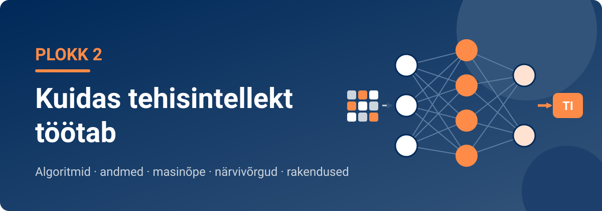

<!--
author:   Maia Lust
email:    
version:  1.5.0
language: et
narrator: Estonian Female
date:     08.10.2026
logo:     ../pildid/pae_logo.png
icon:     ../pildid/pae_logo.png
comment:  Tehisintellekti alused – gümnaasiumi valikkursus (35 tundi), Tallinna Pae Gümnaasium. Õppetekstid, interaktiivsed töölehed ja enesekontrollitestid.
link:     https://fonts.googleapis.com/css2?family=Nunito+Sans:wght@400;600;700&family=Poppins:wght@600;700&family=JetBrains+Mono:wght@400;600&display=swap

@style
/* ==== liascript-theming:start ==== */
/* links: https://fonts.googleapis.com/css2?family=Nunito+Sans:wght@400;600;700&family=Poppins:wght@600;700&family=JetBrains+Mono:wght@400;600&display=swap */
/* theme: Tallinna Pae Gümnaasium — generated by liascript-theming, edit theme.json and rebuild */
:root {
  --theme-font-body: 'Nunito Sans', sans-serif;
  --theme-font-heading: 'Poppins', serif;
  --theme-font-mono: 'JetBrains Mono', monospace;
  --theme-heading-weight: 700;
  --theme-line-height: 1.6;
  --global-font-size: 1.6rem;
  --theme-radius: 0.8rem;
  --theme-radius-small: 0.4rem;
  --theme-radius-large: 1.4rem;
  --theme-shadow: 0 0.3rem 1rem rgba(0,41,89,.10);
}
/* surfaces & text: apply to every color theme */
:root.lia-variant-light {
  --color-background: 255,255,255;
  --color-text: 29,36,51;
  --color-border: 228,229,231;
  --lia-grey-lighter: 238,242,247;
  --lia-grey-light: 204,212,222;
}
:root.lia-variant-dark {
  --color-background: 15,23,36;
  --color-text: 229,232,235;
  --color-border: 49,60,73;
  --lia-grey-dark: 30,38,47;
  --lia-anthracite: 41,50,61;
}
/* accent: only the course theme (default) and the custom radio,
   so readers can still pick LiaScript's built-in color themes */
:root:is(.lia-theme-default, .lia-theme-custom) {
  --color-highlight: 0,41,89;
  --color-highlight-dark: 0,41,89;
}
:root.lia-theme-default {
  --color-highlight-menu: 0,41,89;
}
:root:is(.lia-theme-default, .lia-theme-custom).lia-variant-dark {
  --color-highlight: 47,90,143;
  --color-highlight-dark: 255,185,143;
}
:root.lia-variant-light { --theme-heading-color: #002959; }
:root.lia-variant-dark { --theme-heading-color: #FFB98F; }
/* ==== LiaScript theme adapter (liascript-theming) — keep verbatim ====
   Maps the --theme-* tokens onto LiaScript's CSS. Everything a theme
   changes lives in the token block above this one. */

/* -- fonts: body/mono via the global variables, headings & co. are
      compiled literals in LiaScript and need explicit selectors -- */
:root {
  --global-font-family: var(--theme-font-body);
  --global-font-mono: var(--theme-font-mono);
  --global-font-headline: var(--theme-font-heading);
}
body { line-height: var(--theme-line-height, 1.47); }
h1, h2, h3, .h1, .h2, .h3 {
  font-family: var(--theme-font-heading);
  font-weight: var(--theme-heading-weight, 600);
  letter-spacing: var(--theme-heading-letter-spacing, normal);
  text-transform: var(--theme-heading-transform, none);
  color: var(--theme-heading-color, inherit);
}
h4, h5, h6, .h4, .h5, summary, .lia-accordion__headline {
  font-family: var(--theme-font-subheading, var(--theme-font-body));
}
.lia-quote__text { font-family: var(--theme-font-quote, var(--theme-font-heading)); }
.lia-code, .lia-code--inline, code, kbd, samp, pre { font-family: var(--theme-font-mono); }
.lia-code .ace_editor { font-family: var(--theme-font-mono) !important; }

/* -- shape: radius for controls & surfaces (radio buttons, tags, circles stay) -- */
:is(button, .lia-btn, input, .lia-input, select, .lia-select, textarea, .lia-textarea, .lia-dropdown):not(.lia-radio, .lia-btn--tag, .lia-btn--small-tag),
.lia-code-terminal__input, .lia-pagination__content, .lia-script, .lia-support-menu__submenu {
  border-radius: var(--theme-radius);
}
.lia-checkbox[type='checkbox'], kbd, .lia-tooltip .lia-tooltiptext, .lia-code--inline {
  border-radius: var(--theme-radius-small);
}
details, .lia-quote, .lia-code__input, .lia-table-responsive, .lia-card {
  border-radius: var(--theme-radius-large);
  box-shadow: var(--theme-shadow);
}
.lia-quote, .lia-code__input { overflow: hidden; }
.lia-code__input .ace_editor { border-radius: inherit; }
.lia-support-menu__submenu { box-shadow: var(--theme-shadow-popup, 0 0 1rem rgba(128, 128, 128, 0.2)); }

/* -- dark mode: LiaScript brightens the accent for text via
      rgb(from … calc(r*2.5)), which turns a hand-picked accent into
      pastel/yellow. For the course theme, text-like accent uses take
      --color-highlight-dark (= "accent as text") instead. Scoped to
      default/custom so the built-in color themes keep their behavior. -- */
:root:is(.lia-theme-default, .lia-theme-custom).lia-variant-dark :is(.lia-link, .lia-btn--outline, .lia-code--inline) {
  color: rgb(var(--color-highlight-dark));
  border-color: rgb(var(--color-highlight-dark));
}
:root:is(.lia-theme-default, .lia-theme-custom).lia-variant-dark :is(summary, summary:after, .lia-label, .lia-skip-nav, .lia-support-menu__item, .lia-quote__text),
:root:is(.lia-theme-default, .lia-theme-custom).lia-variant-dark :is(.lia-list--unordered, .lia-list--ordered) > li::marker {
  color: rgb(var(--color-highlight-dark));
}
:root:is(.lia-theme-default, .lia-theme-custom).lia-variant-dark :is(.lia-btn--transparent, .lia-input) {
  filter: none;
}
:root:is(.lia-theme-default, .lia-theme-custom).lia-variant-dark :is(.lia-input, .lia-checkbox[type='checkbox'], .lia-radio[type='radio']):not(:checked, .is-disabled, [disabled]) {
  border-color: rgb(var(--color-highlight-dark));
}
/* alternating table rows: LiaScript uses a neutral grey in dark mode */
:root.lia-variant-dark .lia-table.is-alternating .lia-table__row:nth-child(2n) td,
:root.lia-variant-dark .lia-table-responsive.has-thead-sticky.has-first-col-sticky .is-alternating .lia-table__row:nth-child(2n) td:first-child:before,
:root.lia-variant-dark .lia-table-responsive.has-thead-sticky.has-last-col-sticky .is-alternating .lia-table__row:nth-child(2n) td:last-child:before {
  background-color: rgb(var(--lia-grey-dark));
}
/* -- theme extras -- */
/* ===== Tallinna Pae Gümnaasiumi värvid =====
   tumesinine #002959 · oranž #FF8B48 · tumeoranž #E67E42 */
:root {
  --pae-sinine: #002959;
  --pae-sinine-80: #33547A;
  --pae-sinine-20: #CCD4DE;
  --pae-sinine-08: #EEF2F7;
  --pae-oranz: #FF8B48;
  --pae-oranz-tume: #E67E42;
  --pae-oranz-20: #FFE2D1;
  --pae-oranz-08: #FFF4EC;
  --pae-roheline: #2E8B57;
  --pae-roheline-08: #EAF6EF;
  --pae-lilla: #6B4FA0;
  --pae-lilla-08: #F2EEF9;
}

/* Pealkirjad */
.lia-slide h1, main h1 {
  color: var(--pae-sinine);
  border-bottom: 6px solid var(--pae-oranz);
  padding-bottom: .3em;
}
.lia-slide h2, main h2 { color: var(--pae-sinine); }
.lia-slide h3, main h3 {
  color: var(--pae-sinine);
  border-left: 8px solid var(--pae-oranz);
  padding-left: .5em;
}
.lia-slide h4, main h4 { color: var(--pae-oranz-tume); }
strong { color: inherit; }

/* Tabelid */
.lia-table th, table thead th {
  background: var(--pae-sinine) !important;
  color: #fff !important;
}
.lia-table tbody tr:nth-child(even), table tbody tr:nth-child(even) { background: var(--pae-sinine-08); }

/* Pildid ja infograafikud */
img.lia-image, .lia-figure img, main img {
  border-radius: 12px;
}
.lia-figure__caption, figcaption {
  color: var(--pae-sinine-80);
  font-style: italic;
  text-align: center;
}

/* ASCII-skeemid väiksemaks ja Pae värvidesse */
.lia-ascii svg, lia-ascii svg, .lia-code--ascii svg { max-width: 760px; margin: 0 auto; display: block; }
svg.lia-ascii text { fill: var(--pae-sinine); }

/* ===== Kujunduskastid ===== */
blockquote.pae-moiste, blockquote.pae-naide, blockquote.pae-eesti,
blockquote.pae-motle, blockquote.pae-lisaks, blockquote.pae-fakt,
.pae-moiste, .pae-naide, .pae-eesti, .pae-motle, .pae-lisaks, .pae-fakt {
  border-radius: 14px !important;
  padding: 1.1em 1.4em 1.1em 4.2em !important;
  margin: 1.4em 0 !important;
  position: relative;
  box-shadow: 0 3px 10px rgba(0,41,89,.10);
  font-style: normal !important;
  text-align: left !important;
}
.pae-moiste::before, .pae-naide::before, .pae-eesti::before,
.pae-motle::before, .pae-lisaks::before, .pae-fakt::before {
  position: absolute; left: .7em; top: .75em;
  width: 2em; height: 2em; line-height: 2em;
  border-radius: 50%; text-align: center; font-size: 1.15em;
  color: #fff; font-style: normal;
}
/* Mõiste – oranž */
.pae-moiste { background: var(--pae-oranz-08) !important; border: 2px solid var(--pae-oranz) !important; border-left: 10px solid var(--pae-oranz) !important; }
.pae-moiste::before { content: "📖"; background: var(--pae-oranz); }
/* Näide – tumesinine */
.pae-naide { background: var(--pae-sinine-08) !important; border: 2px solid var(--pae-sinine-20) !important; border-left: 10px solid var(--pae-sinine) !important; }
.pae-naide::before { content: "💡"; background: var(--pae-sinine); }
/* Eesti näide – sinine-valge */
.pae-eesti { background: linear-gradient(135deg, #E8F1FB 0%, #ffffff 100%) !important; border: 2px solid #0072CE !important; border-left: 10px solid #0072CE !important; }
.pae-eesti::before { content: "🇪🇪"; background: #0072CE; }
/* Mõtle järele – roheline */
.pae-motle { background: var(--pae-roheline-08) !important; border: 2px dashed var(--pae-roheline) !important; border-left: 10px solid var(--pae-roheline) !important; }
.pae-motle::before { content: "🤔"; background: var(--pae-roheline); }
/* Tea lisaks – lilla */
.pae-lisaks { background: var(--pae-lilla-08) !important; border: 2px solid #CDBFE6 !important; border-left: 10px solid var(--pae-lilla) !important; }
.pae-lisaks::before { content: "🔍"; background: var(--pae-lilla); }
/* Fakt – tume taust, valge tekst */
.pae-fakt { background: var(--pae-sinine) !important; color: #fff !important; border-left: 10px solid var(--pae-oranz) !important; }
.pae-fakt * { color: #fff !important; }
.pae-fakt::before { content: "⚡"; background: var(--pae-oranz); }

/* Töölehe jaotise riba */
.pae-jaotis { background: var(--pae-sinine); color: #fff !important; padding: .55em 1em; border-radius: 10px; margin: 2em 0 1em; border-left: 10px solid var(--pae-oranz); }
.pae-jaotis * { color: #fff !important; }

/* Ploki kaanepilt */
.pae-kaas img, img.pae-kaas { width: 100%; border-radius: 16px; box-shadow: 0 6px 20px rgba(0,41,89,.18); }

/* Näidisvastuse kokkupandav kast */
details {
  background: var(--pae-oranz-08);
  border: 1px solid var(--pae-oranz);
  border-radius: 10px; padding: .6em 1em; margin: .6em 0 1.4em;
}
details summary { cursor: pointer; font-weight: bold; color: var(--pae-oranz-tume); }

/* Menüü (sisukord) tumesinine */
.lia-toc a, .lia-toc .lia-toc__link, nav.lia-toc a { color: #002959 !important; }
.lia-toc a.lia-active, .lia-toc .lia-active { font-weight: 700; }
:root.lia-variant-dark .lia-toc a { color: #CCD4DE !important; }
:root.lia-variant-dark .pae-moiste, :root.lia-variant-dark .pae-naide, :root.lia-variant-dark .pae-eesti,
:root.lia-variant-dark .pae-motle, :root.lia-variant-dark .pae-lisaks { color: #1d2433 !important; }
:root.lia-variant-dark .pae-moiste *, :root.lia-variant-dark .pae-naide *, :root.lia-variant-dark .pae-eesti *,
:root.lia-variant-dark .pae-motle *, :root.lia-variant-dark .pae-lisaks * { color: #1d2433 !important; }
:root.lia-variant-dark img { background: #fff; }
/* ==== liascript-theming:end ==== */
/* Loosimisnupp (rollimäng) */
output.lia-script[input="submit"] { display:inline-block !important; background:#002959; color:#fff !important; font-weight:700; padding:.6em 1.2em; border-radius:999px; border:3px solid #FF8B48 !important; cursor:pointer; box-shadow:0 3px 10px rgba(0,41,89,.2); }
output.lia-script[input="submit"]:hover { background:#FF8B48; color:#002959 !important; }

@end

@custom
--color-highlight-menu: 255,255,255;
@end
-->

## Plokk 2. Kordamine ja harjutamine

<!-- class="pae-lisaks" -->
> 🗺️ **Oled 2. toas – Masinaruum.** Lisa selle lehe link järjehoidjasse, et saaksid hiljem samast kohast jätkata. Järgmine osa avaneb alles siis, kui oled selle osa luku lahendanud.

<!-- class="pae-kaas" -->

Oled jõudnud toa viimasesse ossa. Siin kordad ploki teemasid: lahendad **praktilisi ülesandeid**, arutled ja teed **ploki enesekontrolltesti**. Lõpus ootab **toa uks** – selle avad võtmetähtedest moodustuva sõnaga.

### Praktilised ülesanded

<!-- class="pae-jaotis" -->
**Ülesanne 1. Algoritmi visualiseerimine ja rakendamine**

**Mida sa õpid:** saad aru, kuidas algoritmid töötavad ja milline on nende roll tehisintellektis.

**Vahendid:** internetiühendusega arvuti, paber ja kirjutusvahendid, algoritmi visualiseerimise vahend (nt Scratch või flowchart.js).

**Sammud:**

1. Moodustage 2–3-liikmelised rühmad.
2. Valige üks lihtne igapäevaelu probleem, näiteks parima koolitee leidmine, ilmale sobivate riiete valimine või õppimisaja planeerimine.
3. Koostage probleemi lahendamiseks algoritm, milles on sisendandmed, otsustuspunktid (kui-siis tingimused), kordused (tsüklid) ja väljundid.
4. Esitage oma algoritm vooskeemina või pseudokoodina.
5. Testige algoritmi vähemalt kolme eri sisendiga ja pange tulemused kirja.
6. Esitlege oma algoritmi klassile (3–5 minutit).
7. Arutage klassiga: kuidas teie algoritmid sarnanevad tehisintellekti algoritmidega ja kuidas erinevad?

**Mida jälgitakse:**

- algoritmi loogilisus ja terviklikkus;
- visualiseeringu selgus ja korrektsus;
- testimise põhjalikkus;
- esitluse kvaliteet ja osalemine arutelus.

**Kasulikud lingid:** [Scratch](https://scratch.mit.edu/) · [Flowchart.js](https://flowchart.js.org/) · [Algorithm Visualizer](https://algorithm-visualizer.org/)

Kirjelda oma rühma algoritmi ja testimise tulemusi. Mis töötas hästi, mida muudaksid?

[[___ ___ ___ ___]]

<!-- class="pae-jaotis" -->
**Ülesanne 2. Andmete kogumine ja analüüs**

**Mida sa õpid:** saad aru andmete rollist tehisintellektis ning harjutad andmete kogumist, puhastamist ja analüüsimist.

**Vahendid:** internetiühendusega arvuti, tabelarvutusprogramm (nt Excel või Google Sheets), andmete visualiseerimise vahend.

**Sammud:**

1. Moodustage 3–4-liikmelised rühmad.
2. Valige üks teema andmete kogumiseks:
   - klassi õpilaste uneharjumused;
   - kooli või klassi õpilaste meediatarbimise harjumused;
   - kohalike poodide hinnad mingis tootekategoorias;
   - viimase nädala ilmaandmed;
   - kooli või klassi õpilaste hobid ja vaba aja tegevused.
3. Koostage lühike küsimustik või andmete kogumise plaan.
4. Koguge vähemalt 20 andmepunkti.
5. Puhastage ja korrastage andmed: eemaldage ebatäpsed või puuduvad andmed, ühtlustage andmevormingud ja vajadusel jagage andmed kategooriatesse.
6. Analüüsige andmeid: arvutage keskmine, mediaan ja mood, looge vähemalt kaks eri tüüpi diagrammi ning otsige mustreid või trende.
7. Kirjutage lühianalüüs (200–300 sõna), kus kirjeldate andmete kogumise protsessi, esitate peamised leiud, arutlete, kuidas teie andmeid saaks kasutada tehisintellekti treenimiseks, ning toote välja andmete võimalikud probleemid või kallutatuse.
8. Esitlege tulemusi klassile (umbes 5 minutit).

**Mida jälgitakse:**

- andmete kogumise meetodi sobivus;
- andmete puhastamise ja korrastamise põhjalikkus;
- analüüsi sügavus ja korrektsus;
- diagrammide kvaliteet ja informatiivsus;
- esitluse selgus.

**Kasulikud lingid:** [Google Forms](https://www.google.com/forms/about/) · [Kaggle](https://www.kaggle.com/) · [Andmete puhastamise juhend (Towards Data Science)](https://towardsdatascience.com/the-ultimate-guide-to-data-cleaning-3969843991d4)

Kirjuta siia oma rühma peamised leiud ja see, milliseid probleeme või kallutatust andmetes märkasite.

[[___ ___ ___ ___]]

<!-- class="pae-jaotis" -->
**Ülesanne 3. Masinõppe simulatsioon**

**Mida sa õpid:** saad masinõppe põhimõtetest aru, kui mängid „masinõppe mudeli“ ise läbi.

**Vahendid:** internetiühendusega arvuti, värvilised märkmepaberid, markerid.

**Sammud:**

1. Moodustage 4–5-liikmelised rühmad. Iga rühm loob „masinõppe mudeli“, mis liigitab objekte:
   - rühm A: pildid (loomad või taimed);
   - rühm B: tekstid (positiivne või negatiivne);
   - rühm C: muusika (energiline või rahulik);
   - rühm D: toidud (tervislik või ebatervislik).
2. **Treeningandmete kogumine:** koguge 10–15 näidet mõlemast kategooriast ja kirjutage või joonistage need märkmepaberitele.
3. **Tunnuste leidmine:** analüüsige näiteid ja leidke 5–7 tunnust, mis aitavad kategooriaid eristada (nt „loomadel on silmad“, „taimed on rohelised“).
4. **Reeglite loomine:** koostage tunnuste põhjal selged liigitusreeglid kujul „kui …, siis …“.
5. **Testimine:** te saate 5 uut näidet, mida te pole varem näinud. Liigitage need oma reeglite järgi ja pange tulemused kirja.
6. **Mudeli täiustamine:** analüüsige vigu, parandage reegleid ja testige uuesti.
7. Esitlege oma „mudelit“ klassile: valitud tunnused ja nende olulisus, reeglid, testimise tulemused ja täiustamise käik.
8. Arutage klassiga: mille poolest sarnaneb teie simulatsioon päris masinõppega ja mille poolest erineb? Mis oli kõige raskem? Kuidas saaks mudelit veel paremaks muuta?

**Mida jälgitakse:**

- tunnuste valiku asjakohasus;
- reeglite loogilisus ja tõhusus;
- testimise põhjalikkus;
- mudeli täiustamise protsess;
- esitluse selgus.

**Kasulikud lingid:** [Machine Learning for Kids](https://machinelearningforkids.co.uk/) · [Google'i Teachable Machine](https://teachablemachine.withgoogle.com/) · [Google'i TI-katsed](https://experiments.withgoogle.com/collection/ai)

Kui palju uutest näidetest teie reeglid esimesel ja teisel testimisel õigesti liigitasid? Mida see teile masinõppe kohta õpetas?

[[___ ___ ___ ___]]

<!-- class="pae-jaotis" -->
**Ülesanne 4. Närvivõrgu visualiseerimine**

**Mida sa õpid:** saad närvivõrgu ehitusest ja toimimisest paremini aru, kui ehitad selle mudeli ise.

**Vahendid:** internetiühendusega arvuti, suured paberilehed, värvilised markerid, nöörid või paelad.

**Sammud:**

1. Moodustage 4–5-liikmelised rühmad. Iga rühm visualiseerib lihtsa närvivõrgu, mis lahendab ühe ülesande:
   - rühm A: tuvastab käsitsi kirjutatud numbreid;
   - rühm B: ennustab ilma;
   - rühm C: soovitab filme;
   - rühm D: tõlgib teksti.
2. **Planeerige võrgu ehitus:** millised andmed lähevad sisendkihti, mida võiks peidetud kiht (või kihid) õppida ja millised on väljundkihi võimalikud tulemused?
3. **Joonistage võrk:** joonistage suurele paberile iga neuron ringina ja ühendused joontena; tähistage kihid eri värvidega. Soovi korral ehitage nööride abil ruumiline mudel.
4. **Selgitage võrgu tööd:** valige üks konkreetne näide (nt number 5 või homne ilm) ja näidake, kuidas andmed liiguvad läbi võrgu. Selgitage, kuidas võrk õpib: mida teevad kaalud ja aktivatsioonifunktsioonid ning kuidas viga tagasi levitatakse.
5. Esitlege oma visualiseeringut klassile (umbes 5 minutit).
6. Arutage klassiga, kuidas eri rühmade võrgud erinevad ning millised on süvaõppe võimalused ja piirangud.

**Mida jälgitakse:**

- võrgu ehituse korrektsus;
- visualiseeringu selgus ja atraktiivsus;
- võrgu toimimise selgituse täpsus;
- näite läbimängimise põhjalikkus;
- esitluse kvaliteet.

**Kasulikud lingid:** [TensorFlow Playground](https://playground.tensorflow.org/) · [A Visual Introduction to Neural Networks (video)](https://www.youtube.com/watch?v=UOvPeC8WOt8) · [Lucid – närvivõrkude visualiseerimine (GitHub)](https://github.com/tensorflow/lucid)

Kirjelda oma rühma närvivõrku: mis on sisendkihis, mis peidetud kihis ja mis väljundkihis? Kuidas see võrk õpiks?

[[___ ___ ___ ___]]

<!-- class="pae-jaotis" -->
**Ülesanne 5. Tehisintellekti rakenduse prototüüp**

**Mida sa õpid:** rakendad oma teadmisi TI toimimisest, luues ise lihtsa TI-rakenduse kontseptsiooni ja prototüübi.

**Vahendid:** internetiühendusega arvuti, prototüüpimise vahend (nt Figma, Marvel või paber ja pliiats), esitlusvahend.

**Sammud:**

1. Moodustage 2–3-liikmelised rühmad.
2. Valige üks probleem, mida saaks lahendada TI abil:
   - koolitoidu planeerimine;
   - õppimisharjumuste parandamine;
   - kohaliku transpordi tõhustamine;
   - energia säästmine kodus või koolis;
   - tervislike eluviiside toetamine.
3. **Analüüsige probleemi:** kirjeldage probleemi täpselt, määrake sihtrühm ja uurige, millised lahendused on juba olemas.
4. **Kavandage lahendus:** valige TI tüüp (masinõpe, süvaõpe või ekspertsüsteem), määrake vajalikud andmed ja kirjeldage algoritmi või mudeli põhimõtet.
5. **Looge prototüüp:** visandage kasutajaliides (vähemalt kolm ekraanivaadet), kirjeldage kasutaja teekonda ja selgitage, kuidas TI-osa töötab.
6. Koostage lühike (üheleheküljeline) äriplaan: väärtuspakkumine, sihtrühm, vajalikud ressursid ning võimalikud väljakutsed ja nende lahendused.
7. Esitlege prototüüpi klassile (umbes 5 minutit).
8. Pärast esitlusi toimub „investorite voor“: hääletage, millistesse ideedesse te „investeeriksite“.

**Mida jälgitakse:**

- probleemi analüüsi põhjalikkus;
- TI-osa asjakohasus ja realistlikkus;
- prototüübi kvaliteet ja kasutajasõbralikkus;
- äriplaani põhjendatus;
- esitluse veenvus.

**Kasulikud lingid:** [Figma](https://www.figma.com/) · [Marvel](https://marvelapp.com/) · [TI kasutusjuhtumid (IBM)](https://www.ibm.com/watson/ai-use-cases) · [Disainmõtlemine ja TI (IDEO)](https://www.ideo.com/blog/design-thinking-for-ai)

Kirjelda lühidalt oma rühma rakendust: millist probleemi see lahendab, milliseid andmeid see vajab ja mis võiks olla selle suurim väljakutse?

[[___ ___ ___ ___]]

### Arutelu

<!-- class="pae-jaotis" -->
**Algoritmide põhimõtted**

**1. Algoritmide olemus.** Kuidas selgitaksid algoritmi mõistet kellelegi, kes ei ole tehnoloogiaga kursis? Too näide lihtsast algoritmist igapäevaelus.

[[___ ___ ___ ___]]

**2. Otsinguprobleemid.** Milliseid otsinguprobleeme oled ise lahendanud (arvutis või päriselus)? Mille poolest need sarnanevad tehisintellekti otsinguprobleemidega ja mille poolest erinevad?

[[___ ___ ___ ___]]

**3. Algoritmide tähtsus.** Miks on algoritmide mõistmine TI õppimisel oluline? Kuidas aitab see paremini mõista TI võimalusi ja piiranguid?

[[___ ___ ___ ___]]

<!-- class="pae-jaotis" -->
**Andmed ja nende tähtsus**

**4. Andmete kvaliteet.** Miks on andmete kvaliteet TI-süsteemide jaoks nii oluline? Too näiteid, kuidas kehvad andmed võivad TI toimimist mõjutada.

[[___ ___ ___ ___]]

**5. Suurandmed.** Kuidas on suurandmete areng mõjutanud TI arengut? Millised väljakutsed ja võimalused on suurandmetega seotud?

[[___ ___ ___ ___]]

**6. Andmete kogumine.** Milliseid eetilisi küsimusi tekitab andmete kogumine TI-süsteemide treenimiseks? Kuidas leida tasakaal andmete kasulikkuse ja privaatsuse vahel?

[[___ ___ ___ ___]]

<!-- class="pae-jaotis" -->
**Masinõppe põhimõtted**

**7. Juhendatud ja juhendamata õpe.** Võrdle juhendatud ja juhendamata õpet. Millistes olukordades sobib üks paremini kui teine? Too konkreetseid näiteid.

[[___ ___ ___ ___]]

**8. Masinõppe rakendused.** Milline masinõppe rakendus on sind kõige rohkem üllatanud või sulle muljet avaldanud? Miks just see?

[[___ ___ ___ ___]]

**9. Ülesobitamine.** Mis on ülesobitamine ja miks on see masinõppes probleem? Kuidas seda vältida?

[[___ ___ ___ ___]]

<!-- class="pae-jaotis" -->
**Närvivõrgud ja süvaõpe**

**10. Närvivõrkude inspiratsioon.** Mille poolest sarnanevad tehisnärvivõrgud aju närvirakkude võrgustikuga ja mille poolest erinevad? Kas see bioloogiline eeskuju on oluline?

[[___ ___ ___ ___]]

**11. Süvaõppe läbimurded.** Millised on olnud viimaste aastate kõige olulisemad süvaõppe läbimurded? Kuidas on need muutnud TI võimeid?

[[___ ___ ___ ___]]

**12. Süvaõppe väljakutsed.** Millised on süvaõppe peamised väljakutsed ja piirangud? Kuidas neid ületada?

[[___ ___ ___ ___]]

<!-- class="pae-jaotis" -->
**Tehisintellekti rakendused**

**13. Rakenduste mitmekesisus.** Millises valdkonnas on TI kasutamine sind kõige rohkem üllatanud? Miks?

[[___ ___ ___ ___]]

**14. Inimese ja TI koostöö.** Kuidas saavad inimesed ja TI kõige paremini koostööd teha? Millistes valdkondades on selline koostöö eriti kasulik?

[[___ ___ ___ ___]]

**15. Tuleviku rakendused.** Millised on sinu arvates kõige põnevamad või mõjukamad TI-rakendused, mida võime näha järgmise 5–10 aasta jooksul?

[[___ ___ ___ ___]]

<!-- class="pae-jaotis" -->
**Mõtiskle kogu ploki üle**

**16. Tehniline arusaam.** Kuidas on sinu arusaam TI tehnilisest toimimisest selle ploki jooksul muutunud? Millest oli kõige raskem aru saada?

[[___ ___ ___ ___]]

**17. Praktilised oskused.** Milliseid praktilisi oskusi oled selles plokis omandanud? Kuidas saaksid neid tulevikus kasutada?

[[___ ___ ___ ___]]

**18. Edasine õppimine.** Milliste TI tehniliste külgede kohta sooviksid rohkem teada saada? Milliseid allikaid plaanid oma teadmiste laiendamiseks kasutada?

[[___ ___ ___ ___]]

### 2. ploki enesekontrolltest

Enne ukse avamist kontrolli, kas oled toa kõik teadmised kätte saanud.

<!-- class="pae-jaotis" -->
**I. Kontrollküsimused**

**1. Kuidas nimetatakse selgelt määratletud sammude jada probleemi lahendamiseks? Kirjuta vastus.**

[[algoritm]]

****************************************
Õige vastus: **algoritm**. Algoritm on selgelt määratletud sammude jada, mida järgitakse probleemi lahendamiseks või ülesande täitmiseks.
****************************************

**2. Liigita näited masinõppe tüübi järgi.**

- [ (Juhendatud õpe) (Juhendamata õpe) (Stiimulõpe) ]
- [ (X) ( ) ( ) ] E-kirjade liigitamine rämpspostiks ja tavaliseks kirjaks märgendatud näidete põhjal
- [ ( ) (X) ( ) ] Klientide rühmitamine sarnase ostukäitumise põhjal ilma eelnevate kategooriateta
- [ ( ) ( ) (X) ] Malemängu õppimine võitude ja kaotuste põhjal
- [ (X) ( ) ( ) ] Piltidel olevate objektide tuvastamine märgendatud piltide põhjal
****************************************
Juhendatud õppes on treeningnäidete õiged vastused (märgendid) teada. Juhendamata õpe leiab rühmad ise (klasterdamine). Stiimulõppes õpib agent tasu ja karistuse põhjal.
****************************************

**3. Mis on närvivõrk tehisintellekti kontekstis?**

- [( )] Arvutite võrgustik, mis töötab koos probleemide lahendamisel
- [( )] Inimaju simulatsioon arvutis
- [(X)] Matemaatiline mudel, mis on inspireeritud bioloogiliste närvirakkude toimimisest
- [( )] Internetiühendus tehisintellekti süsteemide vahel
****************************************
Närvivõrk on matemaatiline mudel, mille eeskujuks on aju närvirakud, kuid see ei ole aju koopia ega simulatsioon.
****************************************

**4. Vali lünkadesse õige mõiste.**

<!-- data-show-partial-solution -->
Masinõppe alamharu, mis kasutab mitme peidetud kihiga närvivõrke, on [[ (süvaõpe) | stiimulõpe | klasterdamine ]]. Süsteemi, mille sisemist toimimist on raske või võimatu mõista, nimetatakse [[ valgeks kastiks | (mustaks kastiks) | andmesaatkonnaks ]]. Funktsioon, mis määrab kaalutud summa põhjal, kas ja kui tugevalt neuron „süttib“, on [[ kaofunktsioon | (aktivatsioonifunktsioon) | hüperparameeter ]].
****************************************
Süvaõppe võrgud leiavad andmetest ise järjest keerukamaid tunnuseid, kuid on sageli „mustad kastid“: näeme sisendit ja väljundit, aga mitte otsuse põhjusi. Aktivatsioonifunktsioon (nt sigmoid, ReLU) otsustab, millise signaali neuron edasi saadab.
****************************************

**5. Kuidas nimetatakse vigaste, puuduvate või korduvate andmete parandamist või eemaldamist? Kirjuta vastus.**

[[andmete puhastamine]]

****************************************
Õige vastus: **andmete puhastamine**. See hõlmab vigade parandamist, puuduvate väärtuste käsitlemist, duplikaatide eemaldamist ja erindite tuvastamist.
****************************************

**6. Lohista mõisted õigetesse lünkadesse.**

<!-- data-show-partial-solution -->
Mudel, mis õpib treeningandmed pähe ega suuda üldistada uutele andmetele, on [->[ (ülesobitunud) ]]. Liiga lihtne mudel, mis töötab halvasti nii treening- kui ka testandmetel, on [->[ (alasobitunud) ]]. Andmeid, mida mudel treenimise ajal ei näe ja mille põhjal teda lõpuks hinnatakse, nimetatakse [->[ (testandmeteks) | treeningandmeteks ]].
****************************************
Ülesobitunud mudel on õppinud pähe ka juhusliku müra, alasobitunud mudel ei taba olulisi seaduspärasusi. Testandmetega kontrollitakse, kas mudel töötab ka uute andmetega.
****************************************

**7. Neuronil on sisendid 2 ja 1 ning kaalud vastavalt 0,5 ja 3. Nihe on −1. Arvuta kaalutud summa.**

[[3]]

****************************************
2 × 0,5 + 1 × 3 + (−1) = 1 + 3 − 1 = **3**
****************************************

**8. Pildituvastusmudel liigitas 50 testpilti ja vastas õigesti 45 korral. Kui suur on mudeli täpsus protsentides?**

[[90]]

****************************************
Täpsus = 45 / 50 = 0,9 ehk **90%**.
****************************************

**9. Pane masinõppe projekti põhietapid õigesse järjekorda.**

<!-- data-show-partial-solution -->
Mudeli treenimine: [[ 1 | 2 | (3) | 4 ]] 
Andmete kogumine: [[ (1) | 2 | 3 | 4 ]] 
Mudeli hindamine testandmetel: [[ 1 | 2 | 3 | (4) ]] 
Andmete ettevalmistamine: [[ 1 | (2) | 3 | 4 ]]
****************************************
Õige järjekord: 1. andmete kogumine → 2. ettevalmistamine → 3. treenimine → 4. hindamine.
****************************************

**10. Milline neist EI OLE stiimulõppe komponent?**

- [( )] Agent
- [( )] Keskkond
- [( )] Tasu
- [(X)] Märgendatud andmed
****************************************
Stiimulõppe komponendid on agent, keskkond, olekud, tegevused, tasu ja strateegia. Märgendatud andmeid kasutatakse juhendatud õppes.
****************************************

<!-- class="pae-jaotis" -->
**II. Lühivastustega küsimused**

**11. Selgita lühidalt, mis on tehisintellekti treenimine ja testimine ning miks on oluline neid eraldi teha.**

[[___ ___ ___]]

Vaata näidisvastust

Treenimine on protsess, mille käigus mudel õpib andmetest mustreid. Testimine on mudeli hindamine uutel andmetel, mida see treenimise ajal ei näinud. Eraldi tegemine on oluline, et hinnata mudeli üldistusvõimet ehk seda, kas mudel töötab ka uute andmetega, ja märgata ülesobitamist.

**12. Kirjelda lühidalt, mis on otsustuspuu ja kuidas see töötab.**

[[___ ___ ___]]

Vaata näidisvastust

Otsustuspuu on masinõppe algoritm, mis teeb otsuseid puukujulise struktuuri abil. Iga sõlm esitab küsimuse mingi tunnuse kohta ja jagab andmed vastuse põhjal harudeks. Puu lehed on lõppotsused. Puu õpib andmetest ise, millised küsimused on kõige kasulikumad.

**13. Selgita lühidalt, mis on stiimulõpe, ja too näide selle kasutamisest.**

[[___ ___ ___]]

Vaata näidisvastust

Stiimulõpe on masinõppe tüüp, kus agent õpib keskkonnaga suheldes ja saab oma tegevuste eest tasu või karistust. Aja jooksul õpib agent valima tegevusi, mis toovad suurima tasu. Näited: isesõitvad autod, robotite liikumise õpetamine, mängude õppimine (nt AlphaGo).

**14. Kirjelda lühidalt, mis on konvolutsiooniline närvivõrk (CNN) ja milleks seda kasutatakse.**

[[___ ___ ___]]

Vaata näidisvastust

Konvolutsiooniline närvivõrk on süvanärvivõrgu tüüp, mis on eriti tõhus piltide töötlemisel. See otsib pildilt väikese filtri abil kohalikke mustreid, nagu servad ja kujundid. Seda kasutatakse objektide tuvastamiseks, näotuvastuseks, meditsiiniliste piltide analüüsiks jms.

**15. Selgita lühidalt, mis on andmete kallutatus ja miks see on TI-süsteemides probleem.**

[[___ ___ ___]]

Vaata näidisvastust

Andmete kallutatus tähendab, et treeningandmetes on süstemaatilised eelarvamused, näiteks mõni rühm on alaesindatud või andmed peegeldavad mineviku ebavõrdsust. See on probleem, sest TI-süsteemid õpivad need eelarvamused kaasa ja võivad neid isegi võimendada, mis viib diskrimineerivate otsusteni.

**16. Kirjelda lühidalt, mis on TI-süsteemi täpsus (accuracy) ja saagis ehk tagasikutse (recall) ning miks need on olulised.**

[[___ ___ ___]]

Vaata näidisvastust

Täpsus näitab, kui suur osa mudeli kõigist ennustustest on õige. Saagis ehk tagasikutse näitab, kui suure osa tegelikest positiivsetest juhtudest mudel üles leidis. Need on olulised, sest eri olukordades võib üks olla tähtsam kui teine: näiteks haiguse või pettuse otsimisel on oluline, et mudel leiaks üles võimalikult kõik tegelikud juhtumid.

**17. Selgita lühidalt, mis on TI-süsteemi selgitatavus ja miks see on oluline.**

[[___ ___ ___]]

Vaata näidisvastust

Selgitatavus on TI-süsteemi võime selgitada oma otsuseid inimestele arusaadaval viisil. See on oluline usalduse, läbipaistvuse ja vastutuse tagamiseks ning seaduste nõuete täitmiseks, eriti valdkondades, kus otsused mõjutavad oluliselt inimeste elu, näiteks meditsiinis, rahanduses ja õiguses.

**18. Kirjelda lühidalt, kuidas närvivõrk õpib tagasilevi abil.**

[[___ ___ ___]]

Vaata näidisvastust

Kõigepealt liiguvad andmed läbi võrgu ja võrk annab ennustuse. Seejärel arvutatakse väljundis viga, võrreldes ennustust õige vastusega. Tagasilevi levitab selle vea võrgus tagasi ja arvutab iga kaalu kohta, kui palju see vea tekkimisele kaasa aitas. Lõpuks muudetakse kaalusid gradientlaskumise abil nii, et viga järgmisel korral väheneks. Tsüklit korratakse palju kordi.

**19. Selgita lühidalt, mis on TI-süsteemi üldistusvõime ja miks see on oluline.**

[[___ ___ ___]]

Vaata näidisvastust

Üldistusvõime on TI-süsteemi võime teha täpseid ennustusi uute, varem nägemata andmete põhjal. See on oluline, sest süsteem peab hästi töötama päris maailmas, mitte ainult nende andmetega, millel teda treeniti.

**20. Kirjelda lühidalt, mis on TI-süsteemi hüperparameetrid ja kuidas need erinevad mudeli parameetritest.**

[[___ ___ ___]]

Vaata näidisvastust

Hüperparameetrid on väärtused, mille määrab arendaja enne treenimist, näiteks õppimiskiirus, kihtide arv või epohhide arv. Mudeli parameetrid on väärtused, mida mudel õpib treenimise käigus ise, näiteks närvivõrgu kaalud ja nihked.

<!-- class="pae-jaotis" -->
**III. Praktiline ülesanne**

**21. Kujuta ette, et oled TI-arendaja, kes loob süsteemi, mis ennustab õpilaste õpitulemusi.**

**a) Milliseid andmeid kasutaksid mudeli treenimiseks?**

[[___ ___ ___]]

Vaata näidisvastust

Võiks kasutada varasemaid hindeid ja testitulemusi, puudumiste arvu, kodutööde esitamise andmeid, õppimisele kulunud aega ning eelmiste aastate õpilaste tegelikke tulemusi. Andmeid tuleks koguda ainult ulatuses, mis on eesmärgi jaoks vajalik, ja kooskõlas isikuandmete kaitse nõuetega.

**b) Millist masinõppe tüüpi kasutaksid ja miks?**

[[___ ___ ___]]

Vaata näidisvastust

Sobib juhendatud õpe, sest eelmiste aastate õpilaste kohta on teada nii sisendandmed kui ka tegelik tulemus ehk märgend. Kui ennustatakse, kas õpilane sooritab või mitte, on tegu klassifitseerimisega; kui ennustatakse punktisummat, on tegu regressiooniga. Algoritmiks võiks olla näiteks otsustuspuu, mille otsuseid on lihtne selgitada.

**c) Milliseid eetilisi probleeme võib sellise süsteemi arendamisel tekkida?**

[[___ ___ ___]]

Vaata näidisvastust

Õpilaste andmed on isikuandmed, seega tuleb kaitsta privaatsust ja järgida GDPR-i. Andmetes võib olla kallutatus, mistõttu süsteem võib mõnda õpilaste rühma ebaõiglaselt kohelda. Ennustus võib õpilast sildistada ja mõjutada õpetaja ootusi. Otsuseid peab saama selgitada ning lõplik otsus peab jääma inimesele.

**d) Kuidas hindaksid oma mudeli tulemuslikkust?**

[[___ ___ ___]]

Vaata näidisvastust

Jagaksin andmed treening- ja testandmeteks ning kontrolliksin mudelit testandmetel, mida see pole näinud. Kasutaksin mõõdikuid nagu täpsus, täpsusaste ja saagis; eriti oluline on saagis, et mudel leiaks üles võimalikult kõik õpilased, kes vajavad abi. Lisaks kontrolliksin, kas mudel töötab ühtviisi hästi eri õpilaste rühmade puhul.

<!-- class="pae-jaotis" -->
**IV. Arutelu**

**22. Vali ÜKS järgmistest teemadest ja kirjuta lühike arutlus (umbes 200–250 sõna).**

a) Kuidas mõjutavad andmete kvaliteet ja kogus TI-süsteemide tulemuslikkust? Millised on peamised väljakutsed kvaliteetsete andmete kogumisel?

b) Võrdle inimaju ja tehisnärvivõrke. Millised on peamised sarnasused ja erinevused? Kas tehisnärvivõrgud tõesti jäljendavad inimaju toimimist?

c) Kuidas tagada, et TI-süsteemid teeksid õiglaseid ja mittediskrimineerivaid otsuseid? Millised on peamised väljakutsed ja võimalikud lahendused?

[[___ ___ ___ ___ ___]]

Vaata, mida hea vastus sisaldab

Hea arutlus esitab selge seisukoha, põhjendab seda mitme argumendiga ja toob näiteid ploki tundidest. Teema a puhul võiks käsitleda põhimõtet „prügi sisse, prügi välja“, andmete kvaliteedi tunnuseid (täpsus, täielikkus, ajakohasus, esinduslikkus), seda, et suurem kogus ei tähenda alati paremat tulemust, ning andmete kogumise väljakutseid (märgendamise kulu, privaatsus, eesti keele andmete vähesus). Teema b puhul võiks võrrelda närviraku ja tehisneuroni ehitust ning õppimist (ajus ühenduste tugevuse, närvivõrgus kaalude muutmise kaudu) ning tuua välja, et tehisneuron on palju lihtsam ja närvivõrk on ajust vaid inspireeritud, mitte selle koopia. Teema c puhul võiks käsitleda kallutatuse liike, mitmekesiseid ja esinduslikke andmeid, algoritmide auditeerimist, selgitatavust, inimese järelevalvet ning ELi tehisintellekti määrust. Arutluse lõpus tehakse järeldus ja arvestatakse ka teistsuguste vaatenurkadega.

### 🚪 Uks 2: Masinaruum

<!-- class="pae-fakt" -->
> **Uks on lukus!** Sisesta sõna, mille moodustavad selle toa võtmetähed (tundide 2.1, 2.2, 2.3, 2.4 ja 2.5 lukkudest järjekorras).

<!-- data-solution-button="off" -->
[[MUDEL]]
[[?]] Vihje: sõnas on 5 tähte ja see on seotud selle toa teemaga – just see tekib masinõppe treenimise tulemusena.

****************************************
<!-- style="width: 84px; float: left; margin: 0 16px 8px 0; border-radius: 0;" --> 🎉 **Uks avaneb!** Masinaruumi hammasrattad hakkavad jälle ühtlaselt keerlema ja serverituled lähevad roheliseks. Kratt mäletab nüüd, et ta on **mudel**: algoritmid on tema tööjuhised, andmed on tema kütus, masinõppe ja närvivõrkude abil õppis ta näidetest ning nüüd saab ta aidata inimesi paljudes valdkondades. „Aitäh, päästemeeskond! Ma tean jälle, kuidas ma seest töötan – ja et pean õppima mitmekesistest andmetest, mitte lihtsalt asju pähe tuupima.“

🌟 **Kuldne täht: E** – kirjuta see oma missioonikaardile. Kõiki 7 kuldset tähte on vaja viimase ukse avamiseks.

➡️ **Järgmine tuba:** Keelelabor – seal ajab Kratt sõnad sassi ja sina pead talle õpetama, kuidas masin keelt mõistab.

➡️ **[Sisene: 3. tuba](https://liascript.github.io/course/?https://raw.githubusercontent.com/maialust/Tehisintellekti-alused/main/oppija/3_1_7d15cf0e.md)**

****************************************
