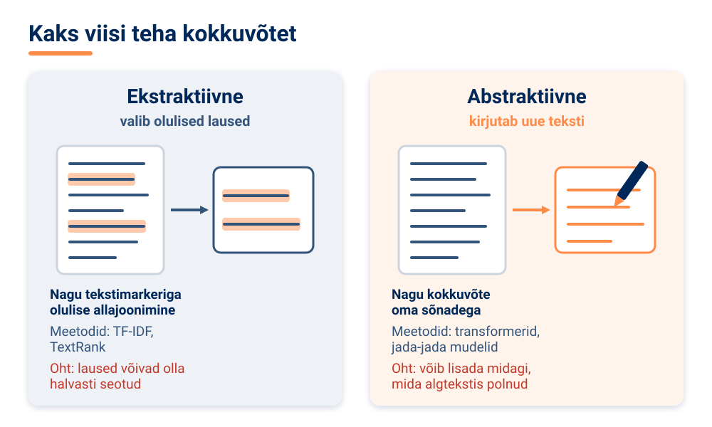
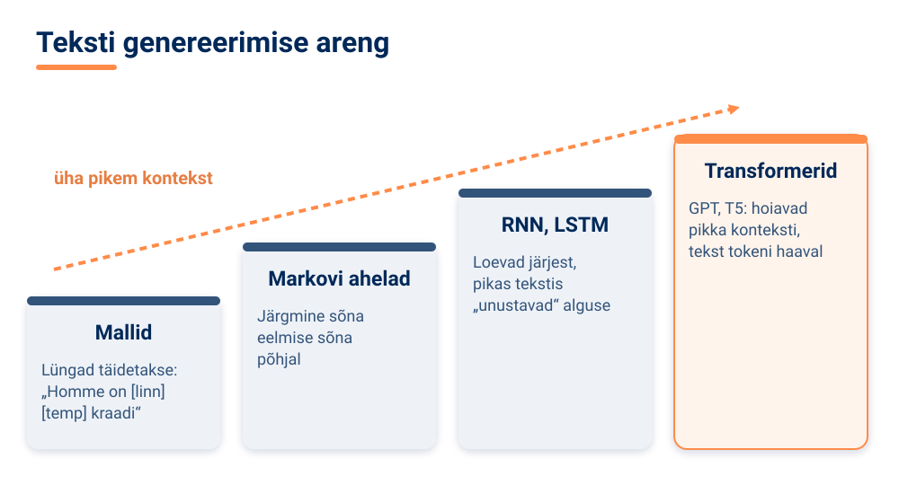
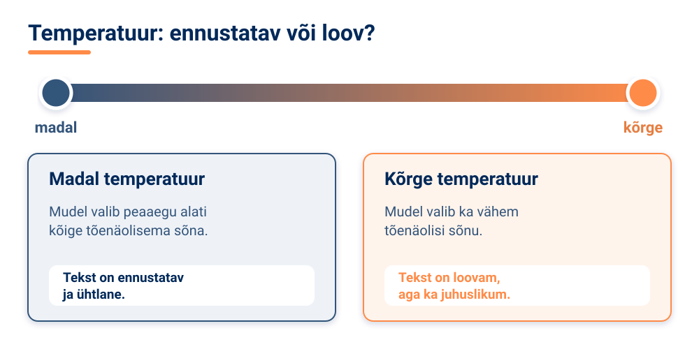

<!--
author:   Maia Lust
email:    
version:  2.2.1
language: et
narrator: Estonian Female
date:     08.10.2026
logo:     ../pildid/pae_logo.png
icon:     ../pildid/pae_logo.png
comment:  Tehisintellekti alused – gümnaasiumi valikkursus (35 tundi), Tallinna Pae Gümnaasium. Õppetekstid, interaktiivsed töölehed ja enesekontrollitestid.
link:     https://fonts.googleapis.com/css2?family=Nunito+Sans:wght@400;600;700&family=Poppins:wght@600;700&family=JetBrains+Mono:wght@400;600&display=swap

@style
/* ==== liascript-theming:start ==== */
/* links: https://fonts.googleapis.com/css2?family=Nunito+Sans:wght@400;600;700&family=Poppins:wght@600;700&family=JetBrains+Mono:wght@400;600&display=swap */
/* theme: Tallinna Pae Gümnaasium — generated by liascript-theming, edit theme.json and rebuild */
:root {
  --theme-font-body: 'Nunito Sans', sans-serif;
  --theme-font-heading: 'Poppins', serif;
  --theme-font-mono: 'JetBrains Mono', monospace;
  --theme-heading-weight: 700;
  --theme-line-height: 1.6;
  --global-font-size: 1.6rem;
  --theme-radius: 0.8rem;
  --theme-radius-small: 0.4rem;
  --theme-radius-large: 1.4rem;
  --theme-shadow: 0 0.3rem 1rem rgba(0,41,89,.10);
}
/* surfaces & text: apply to every color theme */
:root.lia-variant-light {
  --color-background: 255,255,255;
  --color-text: 29,36,51;
  --color-border: 228,229,231;
  --lia-grey-lighter: 238,242,247;
  --lia-grey-light: 204,212,222;
}
:root.lia-variant-dark {
  --color-background: 15,23,36;
  --color-text: 229,232,235;
  --color-border: 49,60,73;
  --lia-grey-dark: 30,38,47;
  --lia-anthracite: 41,50,61;
}
/* accent: only the course theme (default) and the custom radio,
   so readers can still pick LiaScript's built-in color themes */
:root:is(.lia-theme-default, .lia-theme-custom) {
  --color-highlight: 0,41,89;
  --color-highlight-dark: 0,41,89;
}
:root.lia-theme-default {
  --color-highlight-menu: 0,41,89;
}
:root:is(.lia-theme-default, .lia-theme-custom).lia-variant-dark {
  --color-highlight: 47,90,143;
  --color-highlight-dark: 255,185,143;
}
:root.lia-variant-light { --theme-heading-color: #002959; }
:root.lia-variant-dark { --theme-heading-color: #FFB98F; }
/* ==== LiaScript theme adapter (liascript-theming) — keep verbatim ====
   Maps the --theme-* tokens onto LiaScript's CSS. Everything a theme
   changes lives in the token block above this one. */

/* -- fonts: body/mono via the global variables, headings & co. are
      compiled literals in LiaScript and need explicit selectors -- */
:root {
  --global-font-family: var(--theme-font-body);
  --global-font-mono: var(--theme-font-mono);
  --global-font-headline: var(--theme-font-heading);
}
body { line-height: var(--theme-line-height, 1.47); }
h1, h2, h3, .h1, .h2, .h3 {
  font-family: var(--theme-font-heading);
  font-weight: var(--theme-heading-weight, 600);
  letter-spacing: var(--theme-heading-letter-spacing, normal);
  text-transform: var(--theme-heading-transform, none);
  color: var(--theme-heading-color, inherit);
}
h4, h5, h6, .h4, .h5, summary, .lia-accordion__headline {
  font-family: var(--theme-font-subheading, var(--theme-font-body));
}
.lia-quote__text { font-family: var(--theme-font-quote, var(--theme-font-heading)); }
.lia-code, .lia-code--inline, code, kbd, samp, pre { font-family: var(--theme-font-mono); }
.lia-code .ace_editor { font-family: var(--theme-font-mono) !important; }

/* -- shape: radius for controls & surfaces (radio buttons, tags, circles stay) -- */
:is(button, .lia-btn, input, .lia-input, select, .lia-select, textarea, .lia-textarea, .lia-dropdown):not(.lia-radio, .lia-btn--tag, .lia-btn--small-tag),
.lia-code-terminal__input, .lia-pagination__content, .lia-script, .lia-support-menu__submenu {
  border-radius: var(--theme-radius);
}
.lia-checkbox[type='checkbox'], kbd, .lia-tooltip .lia-tooltiptext, .lia-code--inline {
  border-radius: var(--theme-radius-small);
}
details, .lia-quote, .lia-code__input, .lia-table-responsive, .lia-card {
  border-radius: var(--theme-radius-large);
  box-shadow: var(--theme-shadow);
}
.lia-quote, .lia-code__input { overflow: hidden; }
.lia-code__input .ace_editor { border-radius: inherit; }
.lia-support-menu__submenu { box-shadow: var(--theme-shadow-popup, 0 0 1rem rgba(128, 128, 128, 0.2)); }

/* -- dark mode: LiaScript brightens the accent for text via
      rgb(from … calc(r*2.5)), which turns a hand-picked accent into
      pastel/yellow. For the course theme, text-like accent uses take
      --color-highlight-dark (= "accent as text") instead. Scoped to
      default/custom so the built-in color themes keep their behavior. -- */
:root:is(.lia-theme-default, .lia-theme-custom).lia-variant-dark :is(.lia-link, .lia-btn--outline, .lia-code--inline) {
  color: rgb(var(--color-highlight-dark));
  border-color: rgb(var(--color-highlight-dark));
}
:root:is(.lia-theme-default, .lia-theme-custom).lia-variant-dark :is(summary, summary:after, .lia-label, .lia-skip-nav, .lia-support-menu__item, .lia-quote__text),
:root:is(.lia-theme-default, .lia-theme-custom).lia-variant-dark :is(.lia-list--unordered, .lia-list--ordered) > li::marker {
  color: rgb(var(--color-highlight-dark));
}
:root:is(.lia-theme-default, .lia-theme-custom).lia-variant-dark :is(.lia-btn--transparent, .lia-input) {
  filter: none;
}
:root:is(.lia-theme-default, .lia-theme-custom).lia-variant-dark :is(.lia-input, .lia-checkbox[type='checkbox'], .lia-radio[type='radio']):not(:checked, .is-disabled, [disabled]) {
  border-color: rgb(var(--color-highlight-dark));
}
/* alternating table rows: LiaScript uses a neutral grey in dark mode */
:root.lia-variant-dark .lia-table.is-alternating .lia-table__row:nth-child(2n) td,
:root.lia-variant-dark .lia-table-responsive.has-thead-sticky.has-first-col-sticky .is-alternating .lia-table__row:nth-child(2n) td:first-child:before,
:root.lia-variant-dark .lia-table-responsive.has-thead-sticky.has-last-col-sticky .is-alternating .lia-table__row:nth-child(2n) td:last-child:before {
  background-color: rgb(var(--lia-grey-dark));
}
/* -- theme extras -- */
/* ===== Tallinna Pae Gümnaasiumi värvid =====
   tumesinine #002959 · oranž #FF8B48 · tumeoranž #E67E42 */
:root {
  --pae-sinine: #002959;
  --pae-sinine-80: #33547A;
  --pae-sinine-20: #CCD4DE;
  --pae-sinine-08: #EEF2F7;
  --pae-oranz: #FF8B48;
  --pae-oranz-tume: #E67E42;
  --pae-oranz-20: #FFE2D1;
  --pae-oranz-08: #FFF4EC;
  --pae-roheline: #2E8B57;
  --pae-roheline-08: #EAF6EF;
  --pae-lilla: #6B4FA0;
  --pae-lilla-08: #F2EEF9;
}

/* Pealkirjad */
.lia-slide h1, main h1 {
  color: var(--pae-sinine);
  border-bottom: 6px solid var(--pae-oranz);
  padding-bottom: .3em;
}
.lia-slide h2, main h2 { color: var(--pae-sinine); }
.lia-slide h3, main h3 {
  color: var(--pae-sinine);
  border-left: 8px solid var(--pae-oranz);
  padding-left: .5em;
}
.lia-slide h4, main h4 { color: var(--pae-oranz-tume); }
strong { color: inherit; }

/* Tabelid */
.lia-table th, table thead th {
  background: var(--pae-sinine) !important;
  color: #fff !important;
}
.lia-table tbody tr:nth-child(even), table tbody tr:nth-child(even) { background: var(--pae-sinine-08); }

/* Pildid ja infograafikud */
img.lia-image, .lia-figure img, main img {
  border-radius: 12px;
}
.lia-figure__caption, figcaption {
  color: var(--pae-sinine-80);
  font-style: italic;
  text-align: center;
}

/* ASCII-skeemid väiksemaks ja Pae värvidesse */
.lia-ascii svg, lia-ascii svg, .lia-code--ascii svg { max-width: 760px; margin: 0 auto; display: block; }
svg.lia-ascii text { fill: var(--pae-sinine); }

/* ===== Kujunduskastid ===== */
blockquote.pae-moiste, blockquote.pae-naide, blockquote.pae-eesti,
blockquote.pae-motle, blockquote.pae-lisaks, blockquote.pae-fakt,
.pae-moiste, .pae-naide, .pae-eesti, .pae-motle, .pae-lisaks, .pae-fakt {
  border-radius: 14px !important;
  padding: 1.1em 1.4em 1.1em 4.2em !important;
  margin: 1.4em 0 !important;
  position: relative;
  box-shadow: 0 3px 10px rgba(0,41,89,.10);
  font-style: normal !important;
  text-align: left !important;
}
.pae-moiste::before, .pae-naide::before, .pae-eesti::before,
.pae-motle::before, .pae-lisaks::before, .pae-fakt::before {
  position: absolute; left: .7em; top: .75em;
  width: 2em; height: 2em; line-height: 2em;
  border-radius: 50%; text-align: center; font-size: 1.15em;
  color: #fff; font-style: normal;
}
/* Mõiste – oranž */
.pae-moiste { background: var(--pae-oranz-08) !important; border: 2px solid var(--pae-oranz) !important; border-left: 10px solid var(--pae-oranz) !important; }
.pae-moiste::before { content: "📖"; background: var(--pae-oranz); }
/* Näide – tumesinine */
.pae-naide { background: var(--pae-sinine-08) !important; border: 2px solid var(--pae-sinine-20) !important; border-left: 10px solid var(--pae-sinine) !important; }
.pae-naide::before { content: "💡"; background: var(--pae-sinine); }
/* Eesti näide – sinine-valge */
.pae-eesti { background: linear-gradient(135deg, #E8F1FB 0%, #ffffff 100%) !important; border: 2px solid #0072CE !important; border-left: 10px solid #0072CE !important; }
.pae-eesti::before { content: "🇪🇪"; background: #0072CE; }
/* Mõtle järele – roheline */
.pae-motle { background: var(--pae-roheline-08) !important; border: 2px dashed var(--pae-roheline) !important; border-left: 10px solid var(--pae-roheline) !important; }
.pae-motle::before { content: "🤔"; background: var(--pae-roheline); }
/* Tea lisaks – lilla */
.pae-lisaks { background: var(--pae-lilla-08) !important; border: 2px solid #CDBFE6 !important; border-left: 10px solid var(--pae-lilla) !important; }
.pae-lisaks::before { content: "🔍"; background: var(--pae-lilla); }
/* Fakt – tume taust, valge tekst */
.pae-fakt { background: var(--pae-sinine) !important; color: #fff !important; border-left: 10px solid var(--pae-oranz) !important; }
.pae-fakt * { color: #fff !important; }
.pae-fakt::before { content: "⚡"; background: var(--pae-oranz); }

/* Töölehe jaotise riba */
.pae-jaotis { background: var(--pae-sinine); color: #fff !important; padding: .55em 1em; border-radius: 10px; margin: 2em 0 1em; border-left: 10px solid var(--pae-oranz); }
.pae-jaotis * { color: #fff !important; }

/* Ploki kaanepilt */
.pae-kaas img, img.pae-kaas { width: 100%; border-radius: 16px; box-shadow: 0 6px 20px rgba(0,41,89,.18); }

/* Näidisvastuse kokkupandav kast */
details {
  background: var(--pae-oranz-08);
  border: 1px solid var(--pae-oranz);
  border-radius: 10px; padding: .6em 1em; margin: .6em 0 1.4em;
}
details summary { cursor: pointer; font-weight: bold; color: var(--pae-oranz-tume); }

/* Menüü (sisukord) tumesinine */
.lia-toc a, .lia-toc .lia-toc__link, nav.lia-toc a { color: #002959 !important; }
.lia-toc a.lia-active, .lia-toc .lia-active { font-weight: 700; }
:root.lia-variant-dark .lia-toc a { color: #CCD4DE !important; }
:root.lia-variant-dark .pae-moiste, :root.lia-variant-dark .pae-naide, :root.lia-variant-dark .pae-eesti,
:root.lia-variant-dark .pae-motle, :root.lia-variant-dark .pae-lisaks { color: #1d2433 !important; }
:root.lia-variant-dark .pae-moiste *, :root.lia-variant-dark .pae-naide *, :root.lia-variant-dark .pae-eesti *,
:root.lia-variant-dark .pae-motle *, :root.lia-variant-dark .pae-lisaks * { color: #1d2433 !important; }
:root.lia-variant-dark img { background: #fff; }
/* ==== liascript-theming:end ==== */
/* Loosimisnupp (rollimäng) */
output.lia-script[input="submit"] { display:inline-block !important; background:#002959; color:#fff !important; font-weight:700; padding:.6em 1.2em; border-radius:999px; border:3px solid #FF8B48 !important; cursor:pointer; box-shadow:0 3px 10px rgba(0,41,89,.2); }
output.lia-script[input="submit"]:hover { background:#FF8B48; color:#002959 !important; }

/* Lihtsalt öeldes (ettelugemisega) */
section.pae-lihtne { background:#EAF6EE; border:2px solid #2E8B57; border-left:10px solid #2E8B57; border-radius:14px; padding:.9em 1.3em; margin:1.2em 0; font-size:1.05em; line-height:1.6; box-shadow:0 3px 10px rgba(0,41,89,.08); }
section.pae-lihtne p { margin:.5em 0; }
:root.lia-variant-dark section.pae-lihtne, :root.lia-variant-dark section.pae-lihtne * { color:#1d2433 !important; }

/* Sõnastiku hüpikselgitus */
.pae-term { border-bottom:2px dotted #FF8B48; cursor:help; position:relative; outline:none; }
.pae-term:hover::after, .pae-term:focus::after {
  content: attr(data-def); position:absolute; left:0; top:1.7em; z-index:999;
  width:max-content; max-width:min(320px, 80vw); white-space:normal;
  background:#002959; color:#fff; padding:.55em .8em; border-radius:10px;
  font-size:15px; line-height:1.45; font-weight:400; font-style:normal;
  box-shadow:0 6px 18px rgba(0,41,89,.3); border-left:5px solid #FF8B48;
}
.pae-fakt .pae-term:hover::after, .pae-fakt .pae-term:focus::after { color:#fff !important; }

@end

@custom
--color-highlight-menu: 255,255,255;
@end
-->

## 3.2 Teksti analüüs ja genereerimine

<!-- class="pae-lisaks" -->
> 🗺️ **Oled 3. toas – Keelelabor.** Lisa selle lehe link järjehoidjasse, et saaksid hiljem samast kohast jätkata. Järgmine osa avaneb alles siis, kui oled selle osa luku lahendanud.

<!-- class="pae-kaas" -->

### Õpieesmärgid

Selle tunni järel sa:

- **selgitad oma sõnadega** teksti analüüsi põhiülesandeid (nt meelestatuse analüüs, nimeüksuste tuvastamine) ja seda, kuidas keelemudel teksti loob *(mõistmine)*;
- **rakendad** leksikonipõhist meetodit, et määrata lause meelestatus *(rakendamine)*;
- **võrdled**, kas vestlusrobot tabab sarkasmi paremini kui sõnade väärtusi liitev leksikonipõhine meetod *(analüüs)*;
- **hindad** teksti genereerimise ohte, nagu hallutsinatsioonid ja kallutatus, ning **põhjendad**, millal on TI kasutamine koolitöös aus *(hindamine)*.

<!-- class="pae-fakt" -->
> **🎯 Tunni tuumik (45 min)**
>
> 🏠 **Kodus enne tundi** (~15–20 min): „Teksti analüüs ja teksti klassifitseerimine“, „Teksti kokkuvõtete tegemine“, „Genereerimise juhtimine: parameetrid ja juhised“, „Video: miks ei saa tehisarust head kirjanikku?“. Too tundi kaasa üks uus teadmine või küsimus – tunni alguses arutate neid paarides (3 min).
>
> 1. 📚 **Loe** (~12 min): „Meelestatuse analüüs ja nimeüksuste tuvastamine“, „Kuidas masin teksti loob“, „Väljakutsed, eetika ja eesti keel“ ja „Kokkuvõte ja põhimõisted“
> 2. 🧪 **TI-katse** (~10 min): „Kas masin tabab sarkasmi?“
> 3. ⭐ **Tööleht** (~15 min): ülesanded IV, VI ja VII
> 4. 📤 **Väljapääsupilet** ja 🔐 **lukk** (~8 min)
>
> **🏠** tähistab osi, mida loed või vaatad **kodus enne tundi** (ümberpööratud klassiruum). **➕** tähistab lisaülesannet – tee seda, kui jõuad, või kui tahad rohkem teada.

{{|>}}
<section class="pae-lihtne">

**🟢 Lihtsalt öeldes**

Meelestatuse analüüs näitab, kas tekst on positiivne, negatiivne või neutraalne. Sarkasmi on masinal väga raske ära tunda. Lause „No küll on vahva, et buss jälle hiljaks jäi!“ on tegelikult negatiivne. Nimeüksuste tuvastamine leiab tekstist inimeste nimed, kohad ja kuupäevad. Suur keelemudel loob teksti sõna haaval. Ta valib iga kord tõenäolise jätku. Vahel mõtleb mudel fakte välja – see on hallutsinatsioon. Seepärast kontrolli fakte ja ära esita TI teksti oma tööna.

**Tähtsad sõnad:** **meelestatuse analüüs** – teksti tooni leidmine: positiivne, negatiivne või neutraalne; **nimeüksus** – nimi tekstis, näiteks inimene, koht või kuupäev; **hallutsinatsioon** – usutav, aga väljamõeldud vastus.

</section>

### 🏠 Teksti analüüs ja teksti klassifitseerimine

Iga päev tekib maailmas tohutu hulk teksti: uudised, sotsiaalmeedia postitused, e-kirjad, arvustused, dokumendid. Ükski inimene ei jõua seda kõike läbi lugeda. **Teksti analüüs** aitab suurtest tekstihulkadest automaatselt olulist infot leida ja eraldada.

Teksti analüüsi põhiülesanded on:

| Ülesanne | Mida tehakse | Näide |
|---|---|---|
| Klassifitseerimine | Tekst liigitatakse etteantud kategooriatesse | Rämpsposti tuvastamine, uudiste jagamine teemade kaupa |
| Meelestatuse analüüs | Tuvastatakse teksti emotsionaalne toon | Kas tootearvustus on positiivne või negatiivne? |
| Nimeüksuste tuvastamine | Leitakse tekstist isikud, organisatsioonid, kohad jm | Uudisest leitakse kõik mainitud linnad ja ettevõtted |
| Teemade modelleerimine | Tekstikogust tuvastatakse automaatselt peamised teemad | Millest räägiti õpilasesinduse küsitluse vastustes? |
| Kokkuvõtete tegemine | Tekstist eraldatakse olulisim ja luuakse lühem versioon | Pika uudise kokkuvõte kolmes lauses |

<!-- class="pae-moiste" -->
> **Mõiste: teksti klassifitseerimine**
>
> Teksti klassifitseerimine on teksti liigitamine etteantud kategooriatesse. Mudel saab sisendiks teksti ja annab väljundiks kategooria, näiteks „rämpspost“ või „tavaline kiri“.

Klassifitseerimiseks on kolme liiki meetodeid. **Reeglipõhised lähenemised** kasutavad käsitsi kirjutatud reegleid („kui kirjas on sõna „võitsid“ ja link, on see tõenäoliselt rämpspost“). **Masinõppe algoritmid**, näiteks naiivne Bayesi klassifikaator (*Naive Bayes*) ja tugivektormasin (*SVM*), õpivad märgendatud näidete põhjal ise. **Süvaõppe mudelid** (CNN, RNN, transformer) suudavad tabada ka keerulisemaid mustreid.

Masinõppel põhinev klassifitseerimine käib tavaliselt nii:

Klassifitseerimist kasutatakse e-kirjade filtreerimisel, kliendipäringute suunamisel õigele töötajale, sisu modereerimisel (nt solvavate kommentaaride leidmisel) ja dokumentide korrastamisel.

<!-- class="pae-naide" -->
> **Näide: rämpspostifilter**
>
> Sinu e-posti teenus on õppinud miljonite kirjade põhjal, mis on rämpspost ja mis mitte. Iga kord, kui keegi märgib kirja rämpspostiks, saab süsteem uue märgendatud näite. Uue kirja saabumisel arvutab klassifikaator, kui tõenäoliselt on tegu rämpspostiga, ja suunab selle vajaduse korral eraldi kausta.

### Meelestatuse analüüs ja nimeüksuste tuvastamine

<!-- class="pae-moiste" -->
> **Mõiste: meelestatuse analüüs**
>
> Meelestatuse analüüs ehk sentimendianalüüs (inglise keeles *sentiment analysis*) on teksti emotsionaalse tooni või hoiaku tuvastamine – näiteks kas tekst on positiivne, negatiivne või neutraalne.

Meelestatust saab hinnata eri täpsusega. **Binaarne** analüüs eristab ainult positiivset ja negatiivset. **Mitmeklassiline** analüüs lisab neutraalse klassi. Meelestatust saab mõõta ka **pideval skaalal** (nt −1 kuni +1) või **mitmedimensiooniliselt**, eristades erinevaid emotsioone, nagu rõõm, viha, kurbus või hirm.

Meetodeid on mitu. **Leksikonipõhised** meetodid kasutavad sõnastikku, kus igal sõnal on emotsionaalne väärtus („suurepärane“ +3, „kohutav“ −3). **Masinõppepõhised** meetodid kasutavad treenitud klassifikaatoreid, **süvaõppepõhised** meetodid närvivõrke ning **hübriidmeetodid** kombineerivad eri lähenemisi. Keerulisemate emotsioonide tuvastamisel on tavaliselt kõige võimekamad süvaõppepõhised meetodid, sest need arvestavad konteksti.

<!-- data-type="barchart" data-title="Näide: sõnade emotsionaalsed väärtused leksikonis" -->
| Sõna | Väärtus |
|------|--------:|
| suurepärane | 3 |
| hea | 2 |
| tavaline | 0 |
| halb | -2 |
| kohutav | -3 |

Suurim väljakutse on **sarkasm ja iroonia**. Kommentaar „No küll on vahva, et buss jälle 20 minutit hiljaks jäi!“ sisaldab positiivset sõna „vahva“, aga tähendus on negatiivne. Sarkasm pöörab sõnade otsese tähenduse vastupidiseks ja selle tabamiseks on vaja konteksti ning kultuurilist mõistmist. Raskusi tekitavad ka mitmetähenduslikkus, keelespetsiifilised väljendid ja kultuurilised erinevused.

<!-- class="pae-fakt" -->
> **Kas teadsid?** Kommentaar „No küll on vahva, et buss jälle 20 minutit hiljaks jäi!“ sisaldab positiivset sõna „vahva“, kuid tähendus on negatiivne. **Sarkasm** on meelestatuse analüüsi suurim väljakutse.

Meelestatuse analüüsi rakendatakse toodete ja teenuste tagasiside analüüsimisel, brändi maine ja sotsiaalmeedia jälgimisel, turu-uuringutes, turunduskampaaniate hindamisel, klienditeeninduse parandamisel ja isegi finantsturgude meeleolu analüüsimisel.

<!-- class="pae-moiste" -->
> **Mõiste: nimeüksuste tuvastamine**
>
> Nimeüksuste tuvastamine (inglise keeles *named entity recognition*, NER) on tekstist nimeüksuste leidmine ja liigitamine. Nimeüksused on näiteks isikud, organisatsioonid, asukohad, kuupäevad ja ajad, rahasummad ja tooted.

Võtame lause: „**Tartu Ülikooli** teadlane **Mari Tamm** esines **12. mail** **Tallinnas**.“ Nimeüksuste tuvastaja märgiks siin organisatsiooni, isiku, kuupäeva ja asukoha. Nimeüksuste tuvastamiseks kasutatakse reeglipõhiseid süsteeme, statistilisi mudeleid (nt CRF) ja süvaõppe mudeleid (nt BiLSTM-CRF ja BERT). Rakendused on infootsing, küsimustele vastamine, teadmiste eraldamine tekstist ja dokumentide indekseerimine. Näiteks saab meditsiinidokumentidest automaatselt üles leida haiguste, ravimite ja protseduuride nimetused.

### 🏠 Teksti kokkuvõtete tegemine

Kokkuvõtete tegemine on üks kasulikumaid teksti analüüsi ülesandeid – kujuta ette, et saad saja-leheküljelisest aruandest kätte selle põhisisu ühel lehel. Kokkuvõtteid on kaht tüüpi.

| | Ekstraktiivne kokkuvõte | Abstraktiivne kokkuvõte |
|---|---|---|
| Põhimõte | Tekstist **valitakse** olulisimad laused | **Genereeritakse uus tekst**, mis edastab põhisisu |
| Võrdlus | Nagu tekstimarkeriga olulise allajoonimine | Nagu kokkuvõtte kirjutamine oma sõnadega |
| Meetodid | Statistilised (TF-IDF, TextRank) | Süvaõppe mudelid (jada-jada mudelid, transformerid) |
| Oht | Laused võivad olla omavahel halvasti seotud | Mudel võib lisada midagi, mida algtekstis polnud |

Kokkuvõtte kvaliteedi hindamiseks kasutatakse automaatseid mõõdikuid, näiteks **ROUGE** (ja masintõlke hindamisest tuntud **BLEU**), mis võrdlevad masina kokkuvõtet inimese kirjutatud kokkuvõttega, ning **inimhinnanguid**. Kokkuvõtteid tehakse uudistest, teadusartiklitest (abstraktid), dokumentidest ja koosolekutest.

<!-- class="pae-motle" -->
> **Mõtle järele!**
>
> Kui lased TI-l teha kokkuvõtte romaanist, mida pead kirjandustunniks lugema, siis mis võib sellest kokkuvõttest puudu jääda? Kas abstraktiivne kokkuvõte võib sisaldada midagi, mida raamatus tegelikult ei olnud? Kuidas sa seda kontrolliksid?

### Kuidas masin teksti loob

<!-- class="pae-moiste" -->
> **Mõiste: teksti genereerimine**
>
> Teksti genereerimine on uue teksti loomine algoritmiliselt ehk arvutiprogrammi abil.

Teksti genereerimise meetodid on läbinud pika arengu:

**Mallipõhine genereerimine** on kõige lihtsam: valmis lausepõhjas täidetakse lüngad. Näiteks ilmateade „Homme on [linnas] [temperatuur] kraadi sooja“ täidetakse andmebaasi põhjal. Nii tehakse ka **automaatset raporteerimist**, näiteks spordi- või börsiuudiseid andmete põhjal. **Markovi ahelad** valivad järgmise sõna selle põhjal, millised sõnad on treeningtekstis eelmisele sõnale sageli järgnenud. Tekst on sageli grammatiliselt peaaegu korrektne, kuid sisult segane. **Rekurrentsed närvivõrgud** (RNN, LSTM) loevad teksti järjest ja peavad meeles eelnevat, kuid pikkades tekstides „unustavad“ nad alguse. **Transformerid** (GPT, T5) suudavad hoida konteksti palju pikema teksti ulatuses.

Tänapäeva suured keelemudelid, näiteks GPT-mudelid, on **autoregressiivsed**: nad loovad teksti sõna (täpsemalt tokeni) haaval, valides iga kord tõenäolise jätku seni kirjutatule. Mudel on **eeltreenitud** suurtel tekstikorpustel ja seejärel **peenhäälestatud** konkreetseteks ülesanneteks. Teksti genereerimiseks kasutatavate mudelite näited on OpenAI GPT-mudelid, Anthropicu Claude, Google'i Gemini ja Meta Llama.

<!-- class="pae-fakt" -->
> **Kas teadsid?** Suur keelemudel ei kirjuta vastust korraga valmis. Ta loob teksti **sõna (täpsemalt tokeni) haaval**, valides iga kord tõenäolise jätku seni kirjutatule.

Suured keelemudelid suudavad järjest sõnu ennustades säilitada konteksti, kohandada stiili ja tooni ning luua väga eri žanrites ja vormides teksti:

- **loovkirjutamine** – lood, luuletused, laulusõnad, stsenaariumid ja dialoogid;
- **faktipõhine ja tehniline kirjutamine** – artiklid, raportid, dokumentatsioon, e-kirjad ja ärikirjad;
- **sisuloome** – uudised, turundusmaterjalid, sotsiaalmeedia postitused (inglise keeles ka *copywriting*);
- **haridus** – õppematerjalid, küsimused ja vastused, selgitused ja kokkuvõtted;
- **dialoog, tõlkimine, ümbersõnastamine ja programmikoodi genereerimine**.

<!-- class="pae-naide" -->
> **Näide: sama teema, erinev stiil**
>
> Kui palud keelemudelil kirjutada „lühike tekst Tallinna vanalinnast“, saad turismibrošüüri stiilis teksti. Kui lisad „…kaheksa-aastasele lapsele, muinasjutu vormis“, muutub nii sõnavara kui ka toon. Kui lisad „…ajalooõpiku stiilis, koos aastaarvudega“, püüab mudel kirjutada faktipõhiselt. Viimasel juhul pead aga eriti hoolikalt kontrollima, kas aastaarvud on õiged – keelemudel võib need ka välja mõelda.

### 🏠 Genereerimise juhtimine: parameetrid ja juhised

Genereeritud teksti saab juhtida kahel viisil: tehniliste parameetrite ja kasutaja kirjutatud juhiste abil.

**Parameetrid.** Kõige tuntum parameeter on **temperatuur**. Madala temperatuuri korral valib mudel peaaegu alati kõige tõenäolisema järgmise sõna – tekst on ennustatav ja ühtlane. Kõrge temperatuuri korral võtab mudel rohkem „riske“ ja valib ka vähem tõenäolisi sõnu – tekst on loovam, aga ka juhuslikum. Teised parameetrid on **top-k** ja **top-p valik** (mudel valib järgmise sõna ainult kõige tõenäolisemate hulgast), **korduste vähendamine** ja **pikkuse kontroll**.

<!-- data-type="barchart" data-title="Näide: kui sageli valib mudel lause „Head …“ jätkuks eri sõnu (%)" -->
| Järgmine sõna | Madal temperatuur | Kõrge temperatuur |
|---------------|------------------:|------------------:|
| ööd | 90 | 40 |
| aega | 8 | 30 |
| päeva | 2 | 20 |
| õnne | 0 | 10 |

<!-- class="pae-moiste" -->
> **Mõiste: juhis ehk viip**
>
> Juhis ehk viip (inglise keeles *prompt*) on tekst, mille kasutaja keelemudelile ette annab: küsimus, ülesanne või korraldus. Juhise koostamist nimetatakse inglise keeles *prompting*.

Juhiste andmiseks on mitu levinud võtet:

- **Ilma näideteta juhis** (*zero-shot*) – esitad lihtsalt küsimuse või ülesande: „Liigita see arvustus positiivseks või negatiivseks.“
- **Näidetega juhis** (*few-shot*) – annad enne ülesannet mõne lahendatud näite, et mudel mõistaks oodatud vormi.
- **Sammhaaval arutlemine** (*chain-of-thought*) – palud mudelil lahendada ülesanne samm-sammult, mis aitab eriti loogika- ja arvutusülesannete puhul.

Lisaks rakendavad arendajad **piiranguid**: sisu filtreerimist, teemade piiramist ja väljundi kontrollimist, et mudel ei looks kahjulikku sisu.

<!-- class="pae-lisaks" -->
> **Tea lisaks**
>
> Suuri keelemudeleid peenhäälestatakse sageli ka **inimeste tagasiside põhjal**. Inimesed hindavad mudeli vastuseid ja mudel õpib eelistama paremaks hinnatud vastuseid. See on **stiimulõppe** rakendus: mudel saab „tasu“ vastuste eest, mida inimesed peavad heaks.

### Väljakutsed, eetika ja eesti keel

Teksti genereerimine on võimas, kuid sellega kaasnevad tõsised ohud.

<!-- class="pae-moiste" -->
> **Mõiste: hallutsinatsioon**
>
> Keelemudeli hallutsinatsioon on väljund, mis tundub usutav ja on esitatud enesekindlalt, kuid sisaldab **väljamõeldud või ebatäpset teavet** – näiteks olematuid fakte, valesid aastaarve või väljamõeldud allikaviiteid.

**Faktilisus.** Hallutsinatsioonid tekivad, sest mudel ennustab tõenäolist teksti, mitte ei kontrolli fakte. Statistiliselt usutav lause ei pruugi olla tõene. Lisaks on mudeleid sageli treenitud ja hinnatud nii, et äraarvamine annab parema tulemuse kui vastus „ma ei tea“. Mudel ei pruugi ka viidata oma allikatele. Seepärast tuleb fakte alati kontrollida.

**Kallutatus.** Mudel õpib treeningandmetest. Kui andmetes on eelarvamusi, kordab ja isegi võimendab mudel neid. Näiteks võib mudel seostada teatud ameteid automaatselt kindla sooga („arst – tema, mees“, „õde – tema, naine“). Kallutatus võib olla ka poliitiline või sotsiaalne.

**Eetilised küsimused.** Genereeritud teksti abil saab levitada **valeinformatsiooni**, rikkuda **autoriõigusi** ja intellektuaalset omandit ning teise inimesena esinedes **identiteeti varastada**. Hariduses on oluline **plagiaadi** küsimus: kui esitad TI kirjutatud teksti oma tööna, ei ole see aus ega aita sul ka midagi õppida.

<!-- class="pae-motle" -->
> **Mõtle järele!**
>
> Kas suudad eristada inimese ja TI kirjutatud teksti? Mõtle, millised tunnused võiksid viidata, et tekst on genereeritud. Kas need tunnused on usaldusväärsed? Ja millal on sinu arvates TI kasutamine koolitöös aus abivahend, millal aga pettus?

**Tekstitöötlus eesti keeles.** Eesti keele puhul on piiratud ressursid, keerukas morfoloogia ja spetsiifilised keelekonstruktsioonid. Abiks on näiteks tööriistakomplekt **EstNLTK**, eesti keele kõnesüntesaatorid ja eesti keelele kohandatud keelemudelid. Neid kasutatakse eestikeelsete tekstide analüüsimiseks, eestikeelse sisu genereerimiseks ning tõlkimiseks eesti keelde ja eesti keelest.

<!-- class="pae-eesti" -->
> **Eesti näide: Eesti digiühiskond tekstianalüüsi objektina**
>
> Proovi ise nimeüksusi ja meelestatust märgata. Lauses „Eesti on teinud märkimisväärseid edusamme digiühiskonna arendamisel: e-valimised, e-residentsus ja X-tee on vaid mõned näited“ on nimeüksused näiteks Eesti ja X-tee. Toon on pigem positiivne („märkimisväärseid edusamme“). Kui tekst jätkub lausega „Siiski seisavad ees uued väljakutsed küberturvalisuse ja andmekaitse valdkonnas“, muutub üldine meelestatus tasakaalukamaks. Sama tekstiga töötad ka töölehel.

**Tulevikusuunad.** Tekstitöötlus liigub **multimodaalsete mudelite** poole, mis ühendavad teksti pildi, heli ja videoga. Arendatakse **personaliseeritud genereerimist**, mis õpib kasutaja stiili ja kohandub kontekstiga. Tähtis suund on **faktilisuse parandamine**: teadmiste lõimimine, allikatele viitamine ja faktide kontrollimine. Samuti püütakse luua **eetilisemaid mudeleid**: vähendada kallutatust, suurendada läbipaistvust ja anda kasutajale rohkem kontrolli.

### 🏠 🎬 Video: miks ei saa tehisarust head kirjanikku?

Kirjanik Kaur Riismaa näitab oma katsetuste põhjal, et tehisaru loob kiiresti veenvat teksti, kuid ka hallutsineerib. Tehisaru koostab olemasoleva põhjal tõenäolisi tekste, mis ei ole tingimata uued ega tõesed. Riismaa sõnul on loomingus olulised inimese enda kogemus, autentsus, katsetamine ja isegi ebaõnnestumine.

**Kaur Riismaa: miks ei saa tehisarust head kirjanikku?** · *TI-Hüpe* · ⏱ 12 min

!?[Kaur Riismaa: miks ei saa tehisarust head kirjanikku? – TI-Hüpe](https://www.youtube.com/watch?v=qdg5xVoO3Lc)

<!-- class="pae-motle" -->
> **Mõtle vaatamise ajal**
>
> 1. Milliste katsetuste kaudu näitab kirjanik, et tehisaru hallutsineerib?
> 2. Miks ei ole „tõenäoline tekst“ sama mis uus ja hea tekst? Seosta see tunnis õpitud keelemudeli tööpõhimõttega.
> 3. Kuidas saab tehisaru kasutada tööriistana nii, et sa ei loovuta talle kogu loomeprotsessi?

**Kas oled kirjanikuga nõus, et tehisarust ei saa head kirjanikku? Põhjenda oma seisukohta 2–3 lausega.**

[[___ ___ ___]]

### 🧪 TI-katse: kas masin tabab sarkasmi?

🛡️ *Ohutuskaardi reeglid kehtivad: ära logi sisse, ära sisesta isikuandmeid ega pildista inimesi.*

Võrdled kaht meelestatuse analüüsi viisi: lihtsat leksikonipõhist arvutust ja suurt keelemudelit. Nii näed ise, miks on sarkasm meelestatuse analüüsi suurim väljakutse.

**Vaja läheb:** kooli lubatud vestlusrobot (nt [TI-Hüppe õpirakendus](https://tihupe.ee/opirakendus/)), ~10 min, paaristöö

1. Kirjutage kolm lühikest kommentaari kooli söökla kohta: üks siiralt positiivne, üks negatiivne ja üks sarkastiline (nt „Suurepärane, jälle külm supp!“). Ärge kasutage päris inimeste nimesid.
2. Arvutage iga kommentaari meelestatus käsitsi tunni leksikoni järgi (suurepärane +3, hea +2, tavaline 0, halb −2, kohutav −3).
3. Andke kommentaarid vestlusrobotile viibaga „Liigita iga kommentaar positiivseks, negatiivseks või neutraalseks ja põhjenda ühe lausega.“
4. Võrrelge tulemusi: kumb meetod tabas sarkasmi? Kas vestlusrobot eksis mõne kommentaari puhul?

**Pane tähele / kirjuta üles:** iga kommentaari leksikoniskoor ja vestlusroboti hinnang, kas sarkasm tabati ning miks see nii läks.

[[___ ___ ___]]

<!-- class="pae-lisaks" -->
> **Kui arvutit pole:** vahetage paarilisega kommentaarid ja liigitage teineteise kommentaarid ise. Seejärel arvutage leksikoniskoor ja arutage, miks inimene tabab sarkasmi, aga sõnade väärtusi liitev meetod mitte.

### Kokkuvõte ja põhimõisted

**Pea meeles**

- Teksti analüüs aitab suurtest tekstihulkadest olulist infot eraldada: teksti klassifitseerimine, meelestatuse analüüs, nimeüksuste tuvastamine, teemade modelleerimine ja kokkuvõtete tegemine.
- Meelestatuse analüüsi suurim väljakutse on sarkasm ja iroonia, sest siis on sõnade otsene tähendus vastupidine.
- Ekstraktiivne kokkuvõte valib algtekstist olulised laused, abstraktiivne kokkuvõte genereerib uue teksti.
- Teksti genereerimise meetodid ulatuvad lihtsatest mallidest Markovi ahelate ja närvivõrkude kaudu suurte keelemudeliteni, mis loovad teksti sõnahaaval tõenäolist jätku ennustades.
- Genereerimist saab juhtida parameetritega (nt temperatuur) ja juhistega (ilma näideteta, näidetega, sammhaaval).
- Genereeritud tekst võib sisaldada hallutsinatsioone ja kallutatust, seepärast tuleb seda alati kriitiliselt kontrollida ja kasutada ausalt.

| Mõiste | Tähendus |
|---|---|
| Teksti klassifitseerimine | Teksti liigitamine etteantud kategooriatesse |
| Meelestatuse analüüs | Teksti emotsionaalse tooni (positiivne, negatiivne, neutraalne) tuvastamine |
| Nimeüksuste tuvastamine | Isikute, organisatsioonide, asukohtade, kuupäevade jm leidmine tekstist |
| Teemade modelleerimine | Tekstikogumi peamiste teemade automaatne tuvastamine |
| Ekstraktiivne kokkuvõte | Kokkuvõte, mis koosneb algtekstist valitud lausetest |
| Abstraktiivne kokkuvõte | Kokkuvõte, mille jaoks genereeritakse uus tekst |
| Teksti genereerimine | Uue teksti loomine algoritmiliselt |
| Temperatuur | Parameeter, mis määrab, kui ennustatav või loov on genereeritud tekst |
| Juhis ehk viip | Kasutaja antud küsimus, ülesanne või korraldus keelemudelile |
| Hallutsinatsioon | Usutav, kuid väljamõeldud või ebatäpne keelemudeli väljund |
| Kallutatus | Ebaõiglased või stereotüüpsed mustrid, mida mudel treeningandmetest üle võtab |

### 📚 Allikad ja lisalugemine

- OpenAI (2025). [Miks keelemudelid hallutsineerivad](https://openai.com/et-EE/index/why-language-models-hallucinate/). Eestikeelne selgitus, miks keelemudelid esitavad enesekindlalt valeväiteid. Sobib lisalugemiseks.
- Willemson, J. (2026). [Tehisintellekt, haridus ja tõde](https://www.err.ee/1609915982/jan-willemson-tehisintellekt-haridus-ja-tode). ERR-i arvamuslugu sellest, miks on TI väljundit raske kontrollida ja miks on vaja oma teadmisi.
- TI-Hüpe (s. a.). [Kaur Riismaa: miks ei saa tehisarust head kirjanikku?](https://tihupe.ee/oppematerjal/kaur-riismaa-miks-ei-saa-tehisarust-head-kirjanikku/) Tunnis kasutatud video koos kirjeldusega.
- OpenAI abikeskus (s. a.). [ChatGPT viiba tehnoloogia parimad tavad](https://help.openai.com/et-ee/articles/10032626-prompt-engineering-best-practices-for-chatgpt). Eestikeelsed soovitused selge viiba kirjutamiseks.
- TI-Hüpe (s. a.). [TI-Hüppe õpirakendus](https://tihupe.ee/opirakendus/). Eesti õpilastele loodud õpirakenduse tutvustus ja andmekaitse põhimõtted.
- Jurafsky, D., Martin, J. H. (2026). [Speech and Language Processing, 3. väljaande mustand](https://web.stanford.edu/~jurafsky/slp3/). Tasuta veebiõpik, mille 23. peatükk käsitleb meelestatuse leksikone (inglise keeles, edasijõudnutele).

### Tööleht 3.2

<!-- class="pae-jaotis" -->
**➕ I. Teksti analüüsi põhimõisted**

**Ülesanne 1.** Selgita oma sõnadega, mis on teksti analüüs ja milleks seda kasutatakse.

[[___ ___ ___]]

**Ülesanne 2.** Ühenda teksti analüüsi meetodid nende kirjeldustega.

| Täht | Kirjeldus |
|:---:|---|
| **A** | Teksti liigitamine etteantud kategooriatesse |
| **B** | Teksti emotsionaalse tooni määramine (positiivne, negatiivne, neutraalne) |
| **C** | Nimede, organisatsioonide, kuupäevade jms tuvastamine tekstis |
| **D** | Tekstist olulise info eraldamine ja lühema versiooni loomine |
| **E** | Tekstikogumist peamiste teemade automaatne tuvastamine |

- [ (A) (B) (C) (D) (E) ]
- [ ( ) (X) ( ) ( ) ( ) ] Meelestatuse analüüs
- [ ( ) ( ) (X) ( ) ( ) ] Nimeüksuste tuvastamine
- [ (X) ( ) ( ) ( ) ( ) ] Teksti klassifitseerimine
- [ ( ) ( ) ( ) ( ) (X) ] Teemade modelleerimine
- [ ( ) ( ) ( ) (X) ( ) ] Teksti kokkuvõtmine
****************************************
Meelestatuse analüüs määrab tooni (B), nimeüksuste tuvastamine leiab nimed ja kuupäevad (C), klassifitseerimine liigitab kategooriatesse (A), teemade modelleerimine leiab tekstikogumi peamised teemad (E) ja kokkuvõtmine loob lühema versiooni (D).
****************************************

<!-- class="pae-jaotis" -->
**➕ II. Teksti analüüsi meetodid**

**Ülesanne 3.** Kirjelda lühidalt järgmisi teksti analüüsi meetodeid.

**a) Meelestatuse analüüs:**

[[___ ___ ___]]

**b) Nimeüksuste tuvastamine:**

[[___ ___ ___]]

**c) Teemade modelleerimine:**

[[___ ___ ___]]

**Ülesanne 4.** Kuidas toimib teksti klassifitseerimine? Kirjelda protsessi.

[[___ ___ ___ ___]]

<!-- class="pae-jaotis" -->
**➕ III. Teksti genereerimine**

**Ülesanne 5.** Selgita oma sõnadega, mis on teksti genereerimine.

[[___ ___ ___]]

**Ülesanne 6.** Täida tabel erinevate teksti genereerimise meetodite kohta.

| Meetod | Kirjeldus | Näited rakendustest |
|---|---|---|
| Mallipõhine genereerimine | | |
| Markovi ahelad | | |
| Rekurrentsed närvivõrgud (RNN) | | |
| Transformerid | | |

Kirjuta iga meetodi kohta kirjeldus ja näited rakendustest.

**Mallipõhine genereerimine:**

[[___ ___]]

**Markovi ahelad:**

[[___ ___]]

**Rekurrentsed närvivõrgud (RNN):**

[[___ ___]]

**Transformerid:**

[[___ ___]]

**Ülesanne 7.** Kuidas on teksti genereerimise meetodid aja jooksul arenenud?

[[___ ___ ___ ___]]

<!-- class="pae-jaotis" -->
**⭐ IV. Suurte keelemudelite võimekused**

**Ülesanne 8.** Vali kaks suurte keelemudelite võimekust teksti analüüsimisel või genereerimisel. Too kummagi kohta näide, kuidas saaksid seda õppimisel kasutada, ja nimeta, mida pead sel juhul kontrollima.

[[___ ___ ___ ___]]

**Ülesanne 9.** Võrdle varasemate mudelite ja suurte keelemudelite võimekusi.

| Võimekus | Varasemad mudelid | Suured keelemudelid |
|---|---|---|
| Konteksti mõistmine | | |
| Mitmekesisus | | |
| Järjepidevus | | |
| Faktitäpsus | | |
| Kohanemisvõime | | |

Kirjuta iga võimekuse kohta, milline see on varasematel mudelitel ja milline suurtel keelemudelitel.

**Konteksti mõistmine:**

[[___ ___]]

**Mitmekesisus:**

[[___ ___]]

**Järjepidevus:**

[[___ ___]]

**Faktitäpsus:**

[[___ ___]]

**Kohanemisvõime:**

[[___ ___]]

**Ülesanne 10.** Millised on suurte keelemudelite piirangud teksti genereerimisel?

[[___ ___ ___ ___]]

<!-- class="pae-jaotis" -->
**➕ V. Teksti analüüsi ja genereerimise rakendused**

**Ülesanne 11.** Kirjelda lühidalt järgmisi teksti analüüsi ja genereerimise rakendusi.

**a) Automaatne kokkuvõtete loomine:**

[[___ ___]]

**b) Sisuloome ja reklaamtekstide kirjutamine:**

[[___ ___]]

**c) Vestlusrobotid ja virtuaalsed assistendid:**

[[___ ___]]

**d) Sotsiaalmeedia jälgimine:**

[[___ ___]]

**e) Automaatne raporteerimine:**

[[___ ___]]

**Ülesanne 12.** Vali üks teksti analüüsi või genereerimise rakendus ja kirjelda selle tööpõhimõtet põhjalikumalt.

[[___ ___ ___ ___ ___]]

<!-- class="pae-jaotis" -->
**⭐ VI. Praktiline ülesanne**

**Ülesanne 13.** Vali üks kahest variandist.

**Variant A: teksti analüüs.** Analüüsi järgmist teksti ja vasta küsimustele.

*„Eesti on teinud märkimisväärseid edusamme digiühiskonna arendamisel. E-valimised, e-residentsus ja X-tee on vaid mõned näited innovaatilistest lahendustest, mis on muutnud Eesti digitaalse arengu eeskujuks kogu maailmas. Siiski seisavad ees uued väljakutsed, eriti küberturvalisuse ja andmekaitse valdkonnas. Tehisintellekti kasutuselevõtt võib pakkuda uusi võimalusi, kuid toob kaasa ka riske, millega tuleb teadlikult tegeleda.“*

**a) Millised nimeüksused on tekstis?**

[[___]]

**b) Milline on teksti üldine meelestatus (positiivne, negatiivne, neutraalne)? Põhjenda.**

[[___ ___]]

**c) Millised on teksti peamised teemad?**

[[___ ___]]

**d) Koosta tekstist lühike kokkuvõte (2–3 lauset).**

[[___ ___ ___]]

**Variant B: teksti genereerimine.** Kasuta kooli lubatud vestlusrobotit (nt TI-Hüppe õpirakendus) ja genereeri tekst ühel järgmistest teemadest. Ära sisesta isikuandmeid.

- uudis tehisintellekti uuest rakendusest Eestis;
- lühike õpetlik lugu tehisintellekti kasutamisest igapäevaelus;
- teadusartikli lühikokkuvõte tehisintellekti mõjust tööturule.

Vali üks genereeritud tekst ja analüüsi seda: kas tekst on sisukas ja loogiline, kas keel on korrektne, kas tekstis on fakte, mida tuleb kontrollida, ja kas leidsid hallutsinatsioone (nt väljamõeldud nimesid, numbreid või allikaid)?

[[___ ___ ___ ___ ___]]

<!-- class="pae-jaotis" -->
**⭐ VII. Eetilised aspektid**

**Ülesanne 14.** Kooli ajaleht tahab lasta TI-l kirjutada iga nädal spordiuudise ja analüüsida õpilaste anonüümseid kommentaare. Milliseid eetilisi küsimusi see tekitab? Nimeta vähemalt kolm ja seosta need tunni mõistetega (nt hallutsinatsioon, kallutatus, autoriõigus, privaatsus).

[[___ ___ ___ ___]]

**Ülesanne 15.** Kuidas saaks vähendada teksti genereerimisega seotud riske (nt valeinformatsioon, plagiaat)?

[[___ ___ ___ ___]]

<!-- class="pae-jaotis" -->
**➕ VIII. Arutelu**

**Ülesanne 16.** Kuidas võivad automaatne teksti analüüs ja genereerimine muuta meie suhet kirjutatud tekstiga?

[[___ ___ ___ ___]]

**Ülesanne 17.** Millised on teksti analüüsi ja genereerimise tulevikusuunad ja võimalikud läbimurded?

[[___ ___ ___ ___]]

### Enesekontroll 3.2

**1. Kuidas nimetatakse keelemudeli väljundit, mis tundub usutav ja on esitatud enesekindlalt, kuid sisaldab väljamõeldud või ebatäpset teavet? Kirjuta vastus.**

[[hallutsinatsioon]]

****************************************
Õige vastus: **hallutsinatsioon**. Hallutsinatsioonid tekivad, sest mudel ennustab statistiliselt tõenäolist teksti, mitte ei kontrolli fakte. Seepärast tuleb keelemudeli väljundit alati kontrollida.
****************************************

**2. Leksikonipõhises meelestatuse analüüsis on sõnade väärtused: suurepärane +3, hea +2, halb −2, kohutav −3. Arvuta lause „Film oli hea, lõpp oli kohutav, aga muusika oli suurepärane“ meelestatuse summa. Kirjuta arv.**

[[2]]

****************************************
hea (+2) + kohutav (−3) + suurepärane (+3) = **2**. Summa on positiivne, seega hindaks leksikonipõhine meetod lauset pigem positiivseks. Teised sõnad lauses leksikonis väärtust ei saa.
****************************************

**3. Lauses „Tartu Ülikooli teadlane Mari Tamm esines 12. mail Tallinnas“ on mitu nimeüksust. Liigita sõnad.**

- [ (Isik) (Organisatsioon) (Asukoht) (Kuupäev) (Ei ole nimeüksus) ]
- [ ( ) (X) ( ) ( ) ( ) ] Tartu Ülikool
- [ (X) ( ) ( ) ( ) ( ) ] Mari Tamm
- [ ( ) ( ) ( ) (X) ( ) ] 12. mai
- [ ( ) ( ) (X) ( ) ( ) ] Tallinn
- [ ( ) ( ) ( ) ( ) (X) ] esines
****************************************
Nimeüksused on organisatsioon (Tartu Ülikool), isik (Mari Tamm), kuupäev (12. mai) ja asukoht (Tallinn). „Esines“ on tegusõna, mitte nimeüksus.
****************************************

**4. Vali lünkadesse õiged sõnad.**

<!-- data-show-partial-solution -->
Kokkuvõte, mille puhul valitakse algtekstist olulisimad laused, on [[ (ekstraktiivne) | abstraktiivne ]] kokkuvõte. Kokkuvõte, mille jaoks genereeritakse uus tekst, on [[ ekstraktiivne | (abstraktiivne) ]] kokkuvõte. Lisada midagi, mida algtekstis polnud, võib [[ ekstraktiivne | (abstraktiivne) ]] kokkuvõte.
****************************************
Ekstraktiivne kokkuvõte on nagu tekstimarkeriga olulise allajoonimine, abstraktiivne nagu kokkuvõtte kirjutamine oma sõnadega. Uut teksti genereerides võib mudel lisada midagi, mida algtekstis ei olnud.
****************************************

**5. Pane teksti genereerimise meetodid järjekorda lihtsaimast kõige võimekamani (mida suudab arvestada üha pikemat konteksti).**

<!-- data-show-partial-solution -->
Rekurrentsed närvivõrgud (RNN, LSTM): [[ 1 | 2 | (3) | 4 ]] 
Mallipõhine genereerimine: [[ (1) | 2 | 3 | 4 ]] 
Transformerid (GPT, T5): [[ 1 | 2 | 3 | (4) ]] 
Markovi ahelad: [[ 1 | (2) | 3 | 4 ]]
****************************************
Õige järjekord: 1. mallid → 2. Markovi ahelad → 3. rekurrentsed närvivõrgud → 4. transformerid. Iga järgmine meetod suudab arvestada pikemat konteksti.
****************************************

**6. Lohista sõnad õigetesse lünkadesse.**

<!-- data-show-partial-solution -->
Madala temperatuuri korral valib mudel peaaegu alati [->[ (kõige tõenäolisema) ]] järgmise sõna ja tekst on [->[ (ennustatav) ]]. Kõrge temperatuuri korral valib mudel ka vähem tõenäolisi sõnu, nii et tekst on [->[ (loovam) | faktitäpsem ]], aga ka [->[ (juhuslikum) ]].
****************************************
Temperatuur määrab, kui ennustatav või loov on genereeritud tekst. Fakte temperatuur ei kontrolli: kõrge temperatuur ei muuda teksti täpsemaks.
****************************************

**7. Annad keelemudelile enne ülesannet kaks lahendatud näidet, et mudel mõistaks oodatud vormi. Millise juhisega on tegu?**

- [( )] Ilma näideteta juhis (*zero-shot*)
- [(X)] Näidetega juhis (*few-shot*)
- [( )] Sammhaaval arutlemine (*chain-of-thought*)
****************************************
Näidetega juhis sisaldab lahendatud näiteid. Ilma näideteta juhis on lihtsalt küsimus või ülesanne ja sammhaaval arutlemise korral palutakse mudelil lahendada ülesanne samm-sammult.
****************************************

**8. Selgita oma sõnadega, miks on sarkasm meelestatuse analüüsis keeruline. Too näide.**

[[___ ___ ___]]

Vaata näidisvastust

Sarkasm pöörab sõnade otsese tähenduse vastupidiseks: lauses võivad olla positiivsed sõnad, kuid tegelik hoiak on negatiivne. Näiteks „No küll on vahva, et buss jälle hiljaks jäi!“ sisaldab positiivset sõna „vahva“, aga kirjutaja on pahane. Sarkasmi tabamiseks on vaja konteksti ja kultuurilist mõistmist, mida ainult sõnu loendav meetod ei arvesta.

### 📤 Väljapääsupilet 3.2

<!-- class="pae-fakt" -->
> ⚠️ **Salvesta või saada vastused enne lehe sulgemist!** Vastus ei liigu automaatselt õpetajale ja võib kaduda, kui vahetad seadet, kasutad privaatakent või kustutad brauseri andmed.

Vasta lühidalt (3–5 min). Vastused jäävad selle brauseri mällu. Kui oled valmis, vajuta **Kopeeri vastused** ja kleebi need Google Classroomi ülesande vastusesse või laadi fail alla ja lisa see ülesande juurde.

<!-- data-type="none" -->
| Kriteerium | 2 p | 1 p | 0 p |
|---|---|---|---|
| Mõiste rakendamine uues olukorras | Õige mõiste ja selge põhjendus | Mõiste õige, põhjendus puudu või ebatäpne | Vastus puudub või on vale |
| TI-katse tõlgendus | Tulemus on seotud tunni mõistega | Tulemus on kirjeldatud, seos puudub | Puudub |
| Refleksioon | Konkreetne ja isiklik | Üldine | Puudub |

*Väljapääsupilet on kujundav hindamine: õpetaja annab tagasisidet ja kasutab vastuseid järgmise tunni planeerimisel. Pilet sobib ka portfoolio õpipäevikusse.*

### 🔐 Lukk 3.2

<!-- class="pae-naide" -->
> <!-- style="width: 120px; float: left; margin: 0 16px 8px 0; border-radius: 0;" --> **Kratt:** „Kirjutasin teile referaadi jaoks väga ilusa fakti: Eesti esimene vestlusrobot ehitati 1873. aastal Tartus aurumasinast! Kõlab ju usutavalt? Või ... kas ma just mõtlesin selle välja?“

Lukk avaneb, kui lahendad ülesande. Spordiportaal lasi keelemudelil kirjutada eilse korvpallimängu kokkuvõtte. Tekst oli ladus ja enesekindel ning sisaldas treeneri tsitaati ja täpset pealtvaatajate arvu. Hiljem selgus, et treener ei andnud pärast mängu ühtegi intervjuud ja pealtvaatajate arvu polnud kusagil avaldatud – mudel oli need ise loonud, sest need sobisid teksti. Kuidas nimetatakse sellist keelemudeli väljundit? Kirjuta vastuseks üks mõiste.

<!-- data-solution-button="off" -->
[[hallutsinatsioon]]
[[?]] Vihje 1: Kas mudel valetas meelega? Mõtle, mis juhtub, kui mudel ennustab tõenäolist teksti, kuid ei kontrolli fakte.
[[?]] Vihje 2: Sama sõna kasutatakse ka siis, kui inimene näeb või kuuleb asju, mida tegelikult pole. Sõna algab tähega **H** ja selles on 16 tähte.
[[?]] 🛟 Päästerõngas: mine tagasi lehele „Väljakutsed, eetika ja eesti keel“ ja loe lõik „Mõiste: hallutsinatsioon“. Kui ikka ei tule välja, küsi õpetajalt selle luku päästekood ja kirjuta see vastuseväljale.

****************************************
✅ **Lukk avatud!** Hallutsinatsioon on usutav, kuid väljamõeldud väljund – seepärast tuleb genereeritud teksti fakte alati kontrollida.

🔑 **Sinu võtmetäht: E**

Kirjuta täht üles – seda on vaja toa ukse avamiseks.

➡️ **[Ava järgmine osa: 3.3 Vestlusagendid ja vestlusrobotid](https://liascript.github.io/course/?https://raw.githubusercontent.com/maialust/Tehisintellekti-alused/main/oppija/3_3_7f48c812.md)**

****************************************
