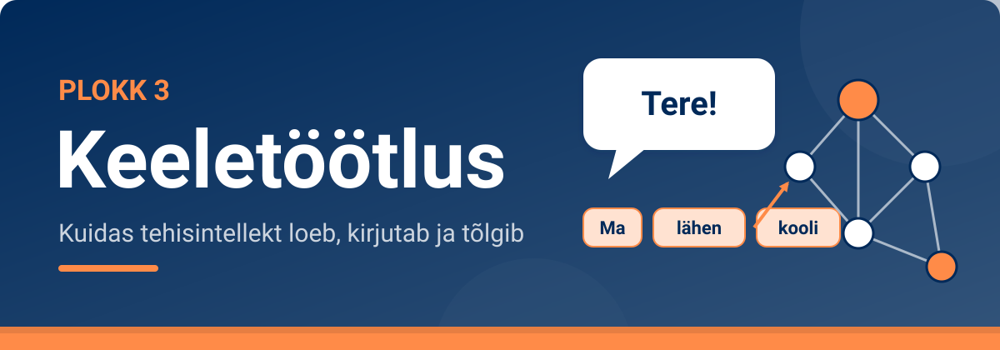

<!--
author:   Maia Lust
email:    
version:  1.3.0
language: et
narrator: Estonian Female
date:     08.10.2026
logo:     ../pildid/pae_logo.png
icon:     ../pildid/pae_logo.png
comment:  Tehisintellekti alused – gümnaasiumi valikkursus (35 tundi), Tallinna Pae Gümnaasium. Õppetekstid, interaktiivsed töölehed ja enesekontrollitestid.
link:     https://fonts.googleapis.com/css2?family=Nunito+Sans:wght@400;600;700&family=Poppins:wght@600;700&family=JetBrains+Mono:wght@400;600&display=swap

@style
/* ==== liascript-theming:start ==== */
/* links: https://fonts.googleapis.com/css2?family=Nunito+Sans:wght@400;600;700&family=Poppins:wght@600;700&family=JetBrains+Mono:wght@400;600&display=swap */
/* theme: Tallinna Pae Gümnaasium — generated by liascript-theming, edit theme.json and rebuild */
:root {
  --theme-font-body: 'Nunito Sans', sans-serif;
  --theme-font-heading: 'Poppins', serif;
  --theme-font-mono: 'JetBrains Mono', monospace;
  --theme-heading-weight: 700;
  --theme-line-height: 1.6;
  --global-font-size: 1.6rem;
  --theme-radius: 0.8rem;
  --theme-radius-small: 0.4rem;
  --theme-radius-large: 1.4rem;
  --theme-shadow: 0 0.3rem 1rem rgba(0,41,89,.10);
}
/* surfaces & text: apply to every color theme */
:root.lia-variant-light {
  --color-background: 255,255,255;
  --color-text: 29,36,51;
  --color-border: 228,229,231;
  --lia-grey-lighter: 238,242,247;
  --lia-grey-light: 204,212,222;
}
:root.lia-variant-dark {
  --color-background: 15,23,36;
  --color-text: 229,232,235;
  --color-border: 49,60,73;
  --lia-grey-dark: 30,38,47;
  --lia-anthracite: 41,50,61;
}
/* accent: only the course theme (default) and the custom radio,
   so readers can still pick LiaScript's built-in color themes */
:root:is(.lia-theme-default, .lia-theme-custom) {
  --color-highlight: 0,41,89;
  --color-highlight-dark: 0,41,89;
}
:root.lia-theme-default {
  --color-highlight-menu: 0,41,89;
}
:root:is(.lia-theme-default, .lia-theme-custom).lia-variant-dark {
  --color-highlight: 47,90,143;
  --color-highlight-dark: 255,185,143;
}
:root.lia-variant-light { --theme-heading-color: #002959; }
:root.lia-variant-dark { --theme-heading-color: #FFB98F; }
/* ==== LiaScript theme adapter (liascript-theming) — keep verbatim ====
   Maps the --theme-* tokens onto LiaScript's CSS. Everything a theme
   changes lives in the token block above this one. */

/* -- fonts: body/mono via the global variables, headings & co. are
      compiled literals in LiaScript and need explicit selectors -- */
:root {
  --global-font-family: var(--theme-font-body);
  --global-font-mono: var(--theme-font-mono);
  --global-font-headline: var(--theme-font-heading);
}
body { line-height: var(--theme-line-height, 1.47); }
h1, h2, h3, .h1, .h2, .h3 {
  font-family: var(--theme-font-heading);
  font-weight: var(--theme-heading-weight, 600);
  letter-spacing: var(--theme-heading-letter-spacing, normal);
  text-transform: var(--theme-heading-transform, none);
  color: var(--theme-heading-color, inherit);
}
h4, h5, h6, .h4, .h5, summary, .lia-accordion__headline {
  font-family: var(--theme-font-subheading, var(--theme-font-body));
}
.lia-quote__text { font-family: var(--theme-font-quote, var(--theme-font-heading)); }
.lia-code, .lia-code--inline, code, kbd, samp, pre { font-family: var(--theme-font-mono); }
.lia-code .ace_editor { font-family: var(--theme-font-mono) !important; }

/* -- shape: radius for controls & surfaces (radio buttons, tags, circles stay) -- */
:is(button, .lia-btn, input, .lia-input, select, .lia-select, textarea, .lia-textarea, .lia-dropdown):not(.lia-radio, .lia-btn--tag, .lia-btn--small-tag),
.lia-code-terminal__input, .lia-pagination__content, .lia-script, .lia-support-menu__submenu {
  border-radius: var(--theme-radius);
}
.lia-checkbox[type='checkbox'], kbd, .lia-tooltip .lia-tooltiptext, .lia-code--inline {
  border-radius: var(--theme-radius-small);
}
details, .lia-quote, .lia-code__input, .lia-table-responsive, .lia-card {
  border-radius: var(--theme-radius-large);
  box-shadow: var(--theme-shadow);
}
.lia-quote, .lia-code__input { overflow: hidden; }
.lia-code__input .ace_editor { border-radius: inherit; }
.lia-support-menu__submenu { box-shadow: var(--theme-shadow-popup, 0 0 1rem rgba(128, 128, 128, 0.2)); }

/* -- dark mode: LiaScript brightens the accent for text via
      rgb(from … calc(r*2.5)), which turns a hand-picked accent into
      pastel/yellow. For the course theme, text-like accent uses take
      --color-highlight-dark (= "accent as text") instead. Scoped to
      default/custom so the built-in color themes keep their behavior. -- */
:root:is(.lia-theme-default, .lia-theme-custom).lia-variant-dark :is(.lia-link, .lia-btn--outline, .lia-code--inline) {
  color: rgb(var(--color-highlight-dark));
  border-color: rgb(var(--color-highlight-dark));
}
:root:is(.lia-theme-default, .lia-theme-custom).lia-variant-dark :is(summary, summary:after, .lia-label, .lia-skip-nav, .lia-support-menu__item, .lia-quote__text),
:root:is(.lia-theme-default, .lia-theme-custom).lia-variant-dark :is(.lia-list--unordered, .lia-list--ordered) > li::marker {
  color: rgb(var(--color-highlight-dark));
}
:root:is(.lia-theme-default, .lia-theme-custom).lia-variant-dark :is(.lia-btn--transparent, .lia-input) {
  filter: none;
}
:root:is(.lia-theme-default, .lia-theme-custom).lia-variant-dark :is(.lia-input, .lia-checkbox[type='checkbox'], .lia-radio[type='radio']):not(:checked, .is-disabled, [disabled]) {
  border-color: rgb(var(--color-highlight-dark));
}
/* alternating table rows: LiaScript uses a neutral grey in dark mode */
:root.lia-variant-dark .lia-table.is-alternating .lia-table__row:nth-child(2n) td,
:root.lia-variant-dark .lia-table-responsive.has-thead-sticky.has-first-col-sticky .is-alternating .lia-table__row:nth-child(2n) td:first-child:before,
:root.lia-variant-dark .lia-table-responsive.has-thead-sticky.has-last-col-sticky .is-alternating .lia-table__row:nth-child(2n) td:last-child:before {
  background-color: rgb(var(--lia-grey-dark));
}
/* -- theme extras -- */
/* ===== Tallinna Pae Gümnaasiumi värvid =====
   tumesinine #002959 · oranž #FF8B48 · tumeoranž #E67E42 */
:root {
  --pae-sinine: #002959;
  --pae-sinine-80: #33547A;
  --pae-sinine-20: #CCD4DE;
  --pae-sinine-08: #EEF2F7;
  --pae-oranz: #FF8B48;
  --pae-oranz-tume: #E67E42;
  --pae-oranz-20: #FFE2D1;
  --pae-oranz-08: #FFF4EC;
  --pae-roheline: #2E8B57;
  --pae-roheline-08: #EAF6EF;
  --pae-lilla: #6B4FA0;
  --pae-lilla-08: #F2EEF9;
}

/* Pealkirjad */
.lia-slide h1, main h1 {
  color: var(--pae-sinine);
  border-bottom: 6px solid var(--pae-oranz);
  padding-bottom: .3em;
}
.lia-slide h2, main h2 { color: var(--pae-sinine); }
.lia-slide h3, main h3 {
  color: var(--pae-sinine);
  border-left: 8px solid var(--pae-oranz);
  padding-left: .5em;
}
.lia-slide h4, main h4 { color: var(--pae-oranz-tume); }
strong { color: inherit; }

/* Tabelid */
.lia-table th, table thead th {
  background: var(--pae-sinine) !important;
  color: #fff !important;
}
.lia-table tbody tr:nth-child(even), table tbody tr:nth-child(even) { background: var(--pae-sinine-08); }

/* Pildid ja infograafikud */
img.lia-image, .lia-figure img, main img {
  border-radius: 12px;
}
.lia-figure__caption, figcaption {
  color: var(--pae-sinine-80);
  font-style: italic;
  text-align: center;
}

/* ASCII-skeemid väiksemaks ja Pae värvidesse */
.lia-ascii svg, lia-ascii svg, .lia-code--ascii svg { max-width: 760px; margin: 0 auto; display: block; }
svg.lia-ascii text { fill: var(--pae-sinine); }

/* ===== Kujunduskastid ===== */
blockquote.pae-moiste, blockquote.pae-naide, blockquote.pae-eesti,
blockquote.pae-motle, blockquote.pae-lisaks, blockquote.pae-fakt,
.pae-moiste, .pae-naide, .pae-eesti, .pae-motle, .pae-lisaks, .pae-fakt {
  border-radius: 14px !important;
  padding: 1.1em 1.4em 1.1em 4.2em !important;
  margin: 1.4em 0 !important;
  position: relative;
  box-shadow: 0 3px 10px rgba(0,41,89,.10);
  font-style: normal !important;
  text-align: left !important;
}
.pae-moiste::before, .pae-naide::before, .pae-eesti::before,
.pae-motle::before, .pae-lisaks::before, .pae-fakt::before {
  position: absolute; left: .7em; top: .75em;
  width: 2em; height: 2em; line-height: 2em;
  border-radius: 50%; text-align: center; font-size: 1.15em;
  color: #fff; font-style: normal;
}
/* Mõiste – oranž */
.pae-moiste { background: var(--pae-oranz-08) !important; border: 2px solid var(--pae-oranz) !important; border-left: 10px solid var(--pae-oranz) !important; }
.pae-moiste::before { content: "📖"; background: var(--pae-oranz); }
/* Näide – tumesinine */
.pae-naide { background: var(--pae-sinine-08) !important; border: 2px solid var(--pae-sinine-20) !important; border-left: 10px solid var(--pae-sinine) !important; }
.pae-naide::before { content: "💡"; background: var(--pae-sinine); }
/* Eesti näide – sinine-valge */
.pae-eesti { background: linear-gradient(135deg, #E8F1FB 0%, #ffffff 100%) !important; border: 2px solid #0072CE !important; border-left: 10px solid #0072CE !important; }
.pae-eesti::before { content: "🇪🇪"; background: #0072CE; }
/* Mõtle järele – roheline */
.pae-motle { background: var(--pae-roheline-08) !important; border: 2px dashed var(--pae-roheline) !important; border-left: 10px solid var(--pae-roheline) !important; }
.pae-motle::before { content: "🤔"; background: var(--pae-roheline); }
/* Tea lisaks – lilla */
.pae-lisaks { background: var(--pae-lilla-08) !important; border: 2px solid #CDBFE6 !important; border-left: 10px solid var(--pae-lilla) !important; }
.pae-lisaks::before { content: "🔍"; background: var(--pae-lilla); }
/* Fakt – tume taust, valge tekst */
.pae-fakt { background: var(--pae-sinine) !important; color: #fff !important; border-left: 10px solid var(--pae-oranz) !important; }
.pae-fakt * { color: #fff !important; }
.pae-fakt::before { content: "⚡"; background: var(--pae-oranz); }

/* Töölehe jaotise riba */
.pae-jaotis { background: var(--pae-sinine); color: #fff !important; padding: .55em 1em; border-radius: 10px; margin: 2em 0 1em; border-left: 10px solid var(--pae-oranz); }
.pae-jaotis * { color: #fff !important; }

/* Ploki kaanepilt */
.pae-kaas img, img.pae-kaas { width: 100%; border-radius: 16px; box-shadow: 0 6px 20px rgba(0,41,89,.18); }

/* Näidisvastuse kokkupandav kast */
details {
  background: var(--pae-oranz-08);
  border: 1px solid var(--pae-oranz);
  border-radius: 10px; padding: .6em 1em; margin: .6em 0 1.4em;
}
details summary { cursor: pointer; font-weight: bold; color: var(--pae-oranz-tume); }

/* Menüü (sisukord) tumesinine */
.lia-toc a, .lia-toc .lia-toc__link, nav.lia-toc a { color: #002959 !important; }
.lia-toc a.lia-active, .lia-toc .lia-active { font-weight: 700; }
:root.lia-variant-dark .lia-toc a { color: #CCD4DE !important; }
:root.lia-variant-dark .pae-moiste, :root.lia-variant-dark .pae-naide, :root.lia-variant-dark .pae-eesti,
:root.lia-variant-dark .pae-motle, :root.lia-variant-dark .pae-lisaks { color: #1d2433 !important; }
:root.lia-variant-dark .pae-moiste *, :root.lia-variant-dark .pae-naide *, :root.lia-variant-dark .pae-eesti *,
:root.lia-variant-dark .pae-motle *, :root.lia-variant-dark .pae-lisaks * { color: #1d2433 !important; }
:root.lia-variant-dark img { background: #fff; }
/* ==== liascript-theming:end ==== */
/* Loosimisnupp (rollimäng) */
output.lia-script[input="submit"] { display:inline-block !important; background:#002959; color:#fff !important; font-weight:700; padding:.6em 1.2em; border-radius:999px; border:3px solid #FF8B48 !important; cursor:pointer; box-shadow:0 3px 10px rgba(0,41,89,.2); }
output.lia-script[input="submit"]:hover { background:#FF8B48; color:#002959 !important; }

@end

@custom
--color-highlight-menu: 255,255,255;
@end
-->

## Plokk 3. Kordamine ja harjutamine

<!-- class="pae-lisaks" -->
> 🗺️ **Oled 3. toas – Keelelabor.** Lisa selle lehe link järjehoidjasse, et saaksid hiljem samast kohast jätkata. Järgmine osa avaneb alles siis, kui oled selle osa luku lahendanud.

<!-- class="pae-kaas" -->

Oled jõudnud toa viimasesse ossa. Siin kordad ploki teemasid: lahendad **praktilisi ülesandeid**, arutled ja teed **ploki enesekontrolltesti**. Lõpus ootab **toa uks** – selle avad võtmetähtedest moodustuva sõnaga.

### Praktilised ülesanded

Selles osas on viis praktilist ülesannet. Õpetaja ütleb, milliseid neist teete. Kõigi ülesannete puhul kehtib reegel: **ära sisesta vestlusrobotitesse ega veebitööriistadesse isikuandmeid** (oma ega teiste nimesid, isikukoode, aadresse, paroole ega muud tundlikku infot).

<!-- class="pae-jaotis" -->
**Ülesanne 1. Vestlusrobotiga suhtlemine ja analüüs**

**Mida sa õpid:** saad praktilise kogemuse kaudu aru, kuidas vestlusrobotid töötavad, kui hästi nad mõistavad eesti keelt ja kuidas nende vastuseid kriitiliselt hinnata.

**Vahendid:** internetiühendusega arvuti või nutiseade, juurdepääs vähemalt kahele vestlusrobotile.

- [ChatGPT](https://chat.openai.com/)
- [Gemini (varem Google Bard)](https://gemini.google.com/)
- [Microsoft Copilot (varem Bing AI)](https://copilot.microsoft.com/)
- [Kuidas vestlusrobotid töötavad – IBM (inglise keeles)](https://www.ibm.com/topics/chatbots)

**Sammud:**

1. Töötage paaris.
2. Valige võrdlemiseks kaks erinevat vestlusrobotit.
3. Koostage 10 erinevat küsimust või ülesannet, mis testivad vestlusrobotite võimeid. Kasutage eri tüüpe:
   - faktiküsimused (nt „Mis on Eesti kõrgeim mägi?“);
   - arvamuspõhised küsimused (nt „Mis on parim viis võõrkeelt õppida?“);
   - loovülesanded (nt „Kirjuta lühike luuletus kevadest“);
   - probleemilahendus (nt „Kuidas planeerida klassiõhtu eelarvet?“);
   - eesti keelega seotud küsimused (nt „Selgita väliskohakäänete kasutamist“);
   - tõlkeülesanded (nt „Tõlgi see lause inglise keelde …“);
   - kokkuvõtte tegemine (nt „Tee sellest tekstist kokkuvõte …“);
   - järelduste tegemine (nt „Mida võib nendest andmetest järeldada?“).
4. Esitage samad küsimused mõlemale vestlusrobotile ja kirjutage vastused üles.
5. Analüüsige ja võrrelge vastuseid. Hinnake vastuse täpsust ja asjakohasust, põhjalikkust, keelelist kvaliteeti (eesti keele korrektsust), loogilisust ja sidusust ning seda, kui hästi vastus arvestas teie küsimusega. **Kontrollige faktiküsimuste vastuseid sõltumatust usaldusväärsest allikast.**
6. Koostage võrdlev analüüs (300–400 sõna), kus:
   - kirjeldate oma kogemust vestlusrobotitega;
   - võrdlete vestlusrobotite tugevusi ja nõrkusi;
   - analüüsite, kui hästi vestlusrobotid eesti keelest aru saavad;
   - arutlete, millises olukorras sobib üks vestlusrobot teisest paremini;
   - pakute välja ideid, kuidas vestlusroboteid paremaks muuta.
7. Jagage oma tähelepanekuid ja järeldusi klassi ühises arutelus.

**Mida esitada:** küsimuste ja vastuste ülevaade ning võrdlev analüüs.

**Mida jälgitakse:**

- küsimuste ja ülesannete mitmekesisus ja asjakohasus;
- vastuste dokumenteerimise põhjalikkus;
- analüüsi sügavus ja kriitilisus;
- võrdluse objektiivsus ja põhjendatus;
- esitluse selgus ja arutelus osalemine.

Kirjelda, mis oli sinu jaoks selles ülesandes kõige üllatavam. Kas mõni vestlusrobot andis vale või väljamõeldud vastuse? Kuidas sa seda märkasid?

[[___ ___ ___ ___]]

<!-- class="pae-jaotis" -->
**Ülesanne 2. Teksti analüüs ja visualiseerimine**

**Mida sa õpid:** mõistad teksti analüüsi põhimõtteid ja meetodeid, kasutades lihtsaid teksti visualiseerimise tööriistu.

**Vahendid:** internetiühendusega arvuti, teksti analüüsi tööriist (nt Voyant Tools), analüüsitavad tekstid.

- [Voyant Tools](https://voyant-tools.org/)
- [Teksti analüüsi tööriistad – Digital Methods Initiative (inglise keeles)](https://wiki.digitalmethods.net/Dmi/ToolTextAnalysis)
- [Sissejuhatus tekstianalüüsi – Programming Historian (inglise keeles)](https://programminghistorian.org/en/lessons/corpus-analysis-with-antconc)

**Sammud:**

1. Moodustage 2–3-liikmelised rühmad.
2. Valige analüüsimiseks kaks eri liiki teksti, näiteks uudisartikkel, ilukirjanduslik tekst (luuletus, novell või romaanikatkend), teaduslik või populaarteaduslik artikkel, sotsiaalmeedia postitus või blogiartikkel, poliitiline kõne.
3. Analüüsige tekste Voyant Toolsi või sarnase tööriista abil:
   - sõnade sagedusanalüüs (millised sõnad esinevad kõige sagedamini);
   - sõnapilve loomine;
   - sõnade koosesinemise analüüs;
   - lausete pikkuse analüüs;
   - teksti tooni või emotsioonide analüüs (kui tööriist seda võimaldab).
4. Võrrelge kahe teksti analüüsi tulemusi ja kirjutage võrdlev analüüs (200–300 sõna), kus:
   - kirjeldate tekstide peamisi erinevusi;
   - analüüsite, kuidas teksti eesmärk ja sihtrühm mõjutavad keelekasutust;
   - arutlete, milliseid järeldusi saab teha tekstide autorite või konteksti kohta;
   - selgitate, kuidas tehisintellekt võiks selliseid analüüse kasutada.
5. Koostage visuaalne esitlus (3–5 slaidi): tekstide lühitutvustus, peamised analüüsi tulemused (graafikud, sõnapilved), võrdluse olulisemad punktid ja järeldused.
6. Esitlege oma tulemusi klassile (3–5 minutit rühma kohta).

**Mida esitada:** võrdlev analüüs ja esitlus.

**Mida jälgitakse:**

- tekstide valiku asjakohasus;
- analüüsi põhjalikkus ja täpsus;
- võrdluse sügavus ja põhjendatus;
- visuaalse esitluse kvaliteet ja informatiivsus;
- esitluse selgus ja arutelus osalemine.

Kirjelda, mida said teada sõnade sagedusanalüüsist. Mida ei suutnud tööriist sinu arvates tekstide kohta näidata?

[[___ ___ ___ ___]]

<!-- class="pae-jaotis" -->
**Ülesanne 3. Masintõlke eksperiment**

**Mida sa õpid:** mõistad masintõlke põhimõtteid, võimalusi ja piiranguid praktilise eksperimendi kaudu.

**Vahendid:** internetiühendusega arvuti, vähemalt kaks masintõlketööriista, tõlgitavad tekstid.

- [Google Translate](https://translate.google.com/)
- [DeepL](https://www.deepl.com/translator)
- [Microsoft Translator](https://www.bing.com/translator)
- [Kuidas masintõlge töötab – Towards Data Science (inglise keeles)](https://towardsdatascience.com/how-machine-translation-works-a688e4b3c8ef)

Võite kasutada ka Tartu Ülikooli Neurotõlget.

**Sammud:**

1. Moodustage 2–3-liikmelised rühmad.
2. Valige 3–4 erinevat lühikest teksti (igaüks umbes 100–150 sõna), näiteks igapäevane dialoog, uudisartikkel, luuletus või laulusõnad, teaduslik või tehniline tekst, idioomide või kõnekäändudega tekst.
3. Tehke **tagasitõlke eksperiment**:
   1. tõlkige originaaltekst eesti keelest võõrkeelde (nt inglise, saksa või prantsuse keelde);
   2. tõlkige saadud võõrkeelne tekst tagasi eesti keelde;
   3. võrrelge originaalteksti ja tagasitõlgitud teksti.
4. Korrake eksperimenti vähemalt kahe erineva masintõlketööriistaga.
5. Analüüsige tulemusi. Keskenduge sellele, kas tähendus säilis või muutus, kas grammatika ja lauseehitus on korrektsed, kas stiil ja toon säilisid, kuidas tõlgiti kultuurispetsiifilisi elemente ning millised olid eri tööriistade tugevused ja nõrkused.
6. Kirjutage analüüs (300–400 sõna), kus:
   - kirjeldate eksperimendi tulemusi;
   - analüüsite, millised tekstid olid masintõlkele keerulisemad ja miks;
   - võrdlete eri masintõlketööriistu;
   - arutlete masintõlke võimaluste ja piirangute üle;
   - pakute välja ideid, kuidas masintõlget paremaks muuta.
7. Esitlege oma tulemusi klassile (5 minutit rühma kohta).
8. Osalege arutelus masintõlke tuleviku ning selle üle, kuidas see mõjutab keeleõpet ja tõlkijate tööd.

**Mida esitada:** originaal- ja tagasitõlgitud tekstid ning analüüs.

**Mida jälgitakse:**

- tekstide valiku asjakohasus;
- eksperimendi läbiviimise põhjalikkus;
- analüüsi sügavus ja kriitilisus;
- järelduste põhjendatus;
- esitluse selgus ja arutelus osalemine.

Too üks näide, kus tagasitõlge muutis teksti tähendust. Miks see sinu arvates juhtus?

[[___ ___ ___ ___]]

<!-- class="pae-jaotis" -->
**Ülesanne 4. Oma vestlusroboti loomine**

**Mida sa õpid:** mõistad vestlusrobotite loomise põhimõtteid ja väljakutseid, luues lihtsa vestlusroboti prototüübi.

**Vahendid:** internetiühendusega arvuti, vestlusrobotite loomise platvorm (nt Botpress, Dialogflow, Landbot), esitlusvahendid.

- [Botpress – avatud lähtekoodiga vestlusrobotite platvorm](https://botpress.com/)
- [Dialogflow – Google'i vestlusrobotite platvorm](https://cloud.google.com/dialogflow)
- [Landbot – vestlusrobotite loomise platvorm](https://landbot.io/)
- [Vestlusrobotite disaini head tavad – IBM (inglise keeles)](https://www.ibm.com/design/ai/basics/conversational/)

**Sammud:**

1. Moodustage 3–4-liikmelised rühmad.
2. Valige oma vestlusrobotile teema või valdkond, näiteks kooli infobot, õppeaine abistaja (nt matemaatika või keemia), turismibot kindla linna või piirkonna kohta, spordinõustaja või keskkonnateemaline infobot.
3. Planeerige oma vestlusrobot.
   - **Eesmärk ja sihtrühm:** mida vestlusrobot peaks tegema, kes on selle peamised kasutajad ja millised on nende vajadused?
   - **Vestluse stsenaariumid:** koostage vähemalt 5 eri stsenaariumi – võimalikud kasutaja küsimused ja roboti vastused, vestluse hargnemised ja jätkuküsimused.
   - **Teadmusbaas:** pange kirja faktid ja info, mida robot peab teadma, vastused korduma kippuvatele küsimustele ning viited lisainfo allikatele.
4. Looge valitud platvormil vestlusroboti prototüüp: määrake roboti „isiksus“ ja suhtlusstiil, programmeerige põhilised vestlusvood ning lisage vajalikud teadmised ja vastused.
5. Testige vestlusrobotit: testige üksteise roboteid, pange kirja leitud probleemid ja täiustamisvõimalused ning täiustage robotit tagasiside põhjal.
6. Esitlege oma vestlusrobotit klassile (5–7 minutit rühma kohta): näidake, kuidas robot töötab, selgitage loomise käiku ja tehtud valikuid ning arutlege väljakutsete ja õppetundide üle.
7. Osalege arutelus vestlusrobotite kasulikkuse, piirangute ja tuleviku üle.

**Mida esitada:** vestlusroboti prototüüp, stsenaariumid ja teadmusbaas ning esitlus.

**Mida jälgitakse:**

- vestlusroboti eesmärgi ja sihtrühma määratluse selgus;
- vestluse stsenaariumide loogilisus ja põhjalikkus;
- teadmusbaasi kvaliteet ja asjakohasus;
- prototüübi toimimine;
- esitluse selgus ja demonstratsiooni kvaliteet.

Kirjelda, milline oli teie vestlusroboti tüüp (reeglipõhine, otsingupõhine, generatiivne või hübriidne). Mis oli roboti loomisel kõige keerulisem?

[[___ ___ ___ ___]]

<!-- class="pae-jaotis" -->
**Ülesanne 5. Keeletehnoloogia eetiline analüüs**

**Mida sa õpid:** mõistad keeletehnoloogia eetilisi aspekte ja mõju ühiskonnale kriitilise analüüsi kaudu.

**Vahendid:** internetiühendusega arvuti, materjalid keeletehnoloogia eetika kohta, esitlusvahendid.

- [Usaldusväärse TI eetikasuunised – Euroopa Komisjon (inglise keeles)](https://digital-strategy.ec.europa.eu/en/library/ethics-guidelines-trustworthy-ai)
- [Arvutilingvistika Ühingu eetikakoodeks (inglise keeles)](https://www.aclweb.org/portal/content/acl-code-ethics)
- [Õiglus keeletehnoloogias – Stanfordi Ülikool (inglise keeles)](https://hai.stanford.edu/news/ensuring-fairness-language-technologies)
- [TI eetika loomuliku keele töötluses – Towards Data Science (inglise keeles)](https://towardsdatascience.com/the-ethics-of-ai-in-natural-language-processing-f1f6ec1b9e5f)

**Sammud:**

1. Moodustage 4–5-liikmelised rühmad.
2. Valige üks keeletehnoloogiaga seotud eetiline dilemma:
   - privaatsus ja jälgimine (nt kõnetuvastus koduses keskkonnas);
   - autoriõigused ja plagiaat (nt tehisintellekti loodud tekstid);
   - kallutatus ja diskrimineerimine keelemudelites;
   - väikeste keelte säilimine tehisintellekti ajastul;
   - tehisintellekti mõju tõlkijate ja keeletoimetajate tööle;
   - süvavõltsingutega (heli ja video) seotud eetilised probleemid.
3. Uurige teemat.
   - **Probleemi kaardistamine:** kirjeldage probleemi täpselt, leidke näiteid päriselust ning selgitage eri vaatenurki ja huvirühmi.
   - **Eetiliste põhimõtete analüüs:** millised eetilised põhimõtted on ohus, millised väärtused on omavahel vastuolus ja millised võivad olla tagajärjed?
   - **Lahenduste otsimine:** millised regulatsioonid ja standardid on olemas (nt Euroopa Liidu tehisintellekti määrus), millised tehnoloogilised lahendused ning hariduslikud ja ühiskondlikud meetmed on võimalikud?
4. Koostage eetilise analüüsi dokument (3–4 lehekülge): probleemi kirjeldus ja taust, eri osapoolte vaatenurgad, eetiliste põhimõtete analüüs, võimalikud lahendused ja soovitused, kasutatud allikad.
5. Valmistage ette rollimäng või debatt (10–15 minutit), kus esindate eri osapooli: tehnoloogia arendajad, kasutajad, reguleerivad asutused, eetikaeksperdid ja mõjutatud huvirühmad (nt tõlkijad, kirjanikud).
6. Esitage rollimäng või debatt klassile.
7. Osalege ühises arutelus: mõelge erinevate dilemmade üle ja pakkuge välja põhimõtteid, mida keeletehnoloogia arendamisel ja kasutamisel peaks järgima.

**Mida esitada:** eetilise analüüsi dokument ning rollimäng või debatt.

**Mida jälgitakse:**

- probleemi kaardistamise põhjalikkus;
- eetiliste põhimõtete analüüsi sügavus;
- lahenduste ja soovituste asjakohasus;
- rollimängu või debati kvaliteet;
- aktiivne osalemine ühises arutelus.

Millise põhimõtte paneksid sina keeletehnoloogia arendajatele kõige tähtsamaks? Põhjenda.

[[___ ___ ___ ___]]

### Arutelu

Vasta küsimustele oma sõnadega ja too võimaluse korral näiteid oma elust. Arutelus ei ole õigeid ega valesid vastuseid – oluline on, et põhjendad oma seisukohta.

<!-- class="pae-jaotis" -->
**Teema 1. Kuidas tehisintellekt mõistab keelt**

**1. Keele keerukus.** Miks on inimkeele mõistmine tehisintellekti jaoks nii keeruline? Millised keele omadused on eriti suur väljakutse?

[[___ ___ ___ ___]]

**2. Keele struktuur.** Kuidas aitab keele struktuuri (süntaksi, semantika, pragmaatika) mõistmine tehisintellektil teksti paremini töödelda? Too näiteid.

[[___ ___ ___ ___]]

**3. Mitmekeelsus.** Millised on väljakutsed mitmekeelsete tehisintellekti süsteemide loomisel? Kuidas mõjutavad erinevad keeled tehisintellekti võimekust?

[[___ ___ ___ ___]]

<!-- class="pae-jaotis" -->
**Teema 2. Teksti analüüs ja genereerimine**

**4. Tekstianalüüsi rakendused.** Millised tekstianalüüsi rakendused on sinu arvates igapäevaelus kõige kasulikumad? Miks?

[[___ ___ ___ ___]]

**5. Teksti genereerimine.** Kuidas eristad inimese ja tehisintellekti kirjutatud teksti? Millised on peamised tunnused, mille järgi saad aru, et teksti on genereerinud tehisintellekt?

[[___ ___ ___ ___]]

**6. Eetilised küsimused.** Milliseid eetilisi küsimusi tekitab tehisintellekti võime genereerida inimesesarnast teksti? Kuidas neid küsimusi lahendada?

[[___ ___ ___ ___]]

<!-- class="pae-jaotis" -->
**Teema 3. Vestlusagendid ja vestlusrobotid**

**7. Vestlusrobotite areng.** Kuidas on vestlusrobotid viimastel aastatel arenenud? Millised on olnud peamised läbimurded?

[[___ ___ ___ ___]]

**8. Kasutajakogemus.** Jaga oma kogemusi vestlusrobotite kasutamisel. Millised on olnud positiivsed ja negatiivsed kogemused? Mida saaks parandada?

[[___ ___ ___ ___]]

**9. Tuleviku vestlusrobotid.** Milliseid võimekusi ootad tuleviku vestlusrobotitelt? Kuidas võiksid need muuta meie suhtlemist tehnoloogiaga?

[[___ ___ ___ ___]]

<!-- class="pae-jaotis" -->
**Teema 4. Masintõlge ja keeletehnoloogiad**

**10. Masintõlke kvaliteet.** Kuidas hindad praeguste masintõlkesüsteemide kvaliteeti? Millistes olukordades usaldad masintõlget ja millistes mitte?

[[___ ___ ___ ___]]

**11. Keeletehnoloogiad Eestis.** Milliseid eesti keele tehnoloogiaid tead? Kuidas on tehisintellekt aidanud eesti keele tehnoloogiaid arendada?

[[___ ___ ___ ___]]

**12. Väikeste keelte säilitamine.** Kuidas saab tehisintellekt aidata säilitada ja arendada väiksemaid keeli, sealhulgas eesti keelt? Millised on väljakutsed ja võimalused?

[[___ ___ ___ ___]]

<!-- class="pae-jaotis" -->
**Refleksioon kogu ploki kohta**

**13. Keeletöötluse mõju.** Kuidas on keeletöötluse tehnoloogiad muutnud sinu igapäevaelu? Too konkreetseid näiteid.

[[___ ___ ___ ___]]

**14. Keelebarjääride ületamine.** Kuidas on tehisintellekt aidanud keelebarjääre ületada? Millised barjäärid on endiselt alles?

[[___ ___ ___ ___]]

**15. Tulevikuvisioon.** Milline on sinu visioon keeletöötluse tulevikust? Kuidas võiks see muuta inimeste suhtlemist ja info kättesaadavust?

[[___ ___ ___ ___]]

### 3. ploki enesekontrolltest

Enne ukse avamist kontrolli, kas oled toa kõik teadmised kätte saanud.

<!-- class="pae-jaotis" -->
**I. Automaatselt kontrollitavad küsimused**

**1. Kuidas nimetatakse teksti jagamist väiksemateks ühikuteks, näiteks sõnadeks, lauseteks või sõnaosadeks? Kirjuta vastus.**

[[tokeniseerimine]]

****************************************
Õige vastus: **tokeniseerimine**. Lause „Mari läks kooli.“ jaguneb tokeniteks „Mari“, „läks“, „kooli“ ja „.“.
****************************************

**2. Mis on keelemudel?**

- [( )] Grammatikareeglite kogum
- [(X)] Statistiline või tehisintellektil põhinev mudel, mis ennustab sõnade tõenäosuslikku järjestust
- [( )] Keeleõpik, mida kasutatakse võõrkeelte õpetamisel
- [( )] Keelte klassifitseerimise süsteem
****************************************
Keelemudel ennustab, milline sõna tuleb tõenäoliselt järgmisena ja kui tõenäoline on terve lause. Lihtne näide on telefoni klaviatuuri sõnasoovitus.
****************************************

**3. Milline keeletehnoloogia on igas olukorras kasutusel?**

- [ (Kõnetuvastus) (Kõnesüntees) (Masintõlge) (Meelestatuse analüüs) ]
- [ (X) ( ) ( ) ( ) ] Telefon muudab dikteeritud sõnumi tekstiks.
- [ ( ) (X) ( ) ( ) ] Ekraanilugeja loeb veebilehe teksti ette.
- [ ( ) ( ) (X) ( ) ] Jaapanikeelne menüü muudetakse eestikeelseks.
- [ ( ) ( ) ( ) (X) ] Ettevõte uurib, kas tootearvustused on positiivsed või negatiivsed.
****************************************
Kõnetuvastus muudab kõne tekstiks ja kõnesüntees teksti kõneks. Masintõlge tõlgib ühest keelest teise. Meelestatuse analüüs tuvastab teksti emotsionaalse tooni.
****************************************

**4. Lohista sõnad õigetesse lünkadesse.**

<!-- data-show-partial-solution -->
Suur keelemudel õpib kõigepealt tohutul tekstikogul ehk [->[ (korpusel) ]]. Seda etappi nimetatakse [->[ (eeltreenimiseks) ]]. Seejärel tehakse [->[ (peenhäälestamine) | tokeniseerimine ]], et mudel sobiks konkreetse ülesande, näiteks vestlemise jaoks.
****************************************
Suured keelemudelid valmivad kahes etapis: eeltreenimisel õpib mudel suurel korpusel üldisi keelestruktuure, peenhäälestamisel treenitakse seda täiendavalt väiksema andmekogumiga konkreetse ülesande jaoks.
****************************************

**5. Vali lünkadesse õiged sõnad.**

<!-- data-show-partial-solution -->
GPT on [[ (autoregressiivne) | kahesuunaline ]] mudel, mis ennustab alati järgmist sõna eelnevate põhjal. BERT on [[ autoregressiivne | (kahesuunaline) ]] mudel, mis peidetud sõna ära arvates vaatab sõnu nii enne kui ka pärast lünka.
****************************************
GPT loob teksti sõna haaval, ennustades järgmist sõna. BERT treeniti peidetud sõnu ära arvama, vaadates konteksti mõlemas suunas.
****************************************

**6. Pane vestlusroboti töö etapid õigesse järjekorda.**

<!-- data-show-partial-solution -->
Dialoogi haldamine ja info otsimine teadmusbaasist: [[ 1 | 2 | (3) | 4 ]] 
Kasutaja kirjutab küsimuse: [[ (1) | 2 | 3 | 4 ]] 
Vastuse genereerimine: [[ 1 | 2 | 3 | (4) ]] 
Keele mõistmine: kavatsuse ja üksuste tuvastamine: [[ 1 | (2) | 3 | 4 ]]
****************************************
Õige järjekord: 1. kasutaja küsimus → 2. keele mõistmine (NLU) → 3. dialoogi haldamine → 4. vastuse genereerimine (NLG).
****************************************

**7. Mis on Eesti riigi virtuaalassistentide võrgustiku nimi, mille kaudu saab avalikke teenuseid kasutada kõnekeelse suhtluse abil? Kirjuta vastus.**

[[Bürokratt]]

****************************************
Õige vastus: **Bürokratt**. See valiti 2022. aastal parimaks tehisintellektil põhinevaks riigiteenuseks.
****************************************

**8. Bigrammid on kahesõnalised järjestikused ühendid. Mitu bigrammi saab moodustada lausest „mulle meeldib väga matemaatika“? Kirjuta arv.**

[[3]]

****************************************
Bigrammid on „mulle meeldib“, „meeldib väga“ ja „väga matemaatika“, kokku **3**. Neljast sõnast saab alati moodustada 4 − 1 = 3 bigrammi.
****************************************

**9. Millised väited on õiged? (Vali kõik õiged.)**

- [[X]] Kõrge temperatuur muudab genereeritud teksti loovamaks ja juhuslikumaks.
- [[ ]] Kõrge BLEU-skoor tähendab alati, et tõlge on täiesti veatu.
- [[X]] Närvivõrgupõhist masintõlget nimetatakse „mustaks kastiks“.
- [[ ]] ELIZA mõistis kasutaja tundeid nagu päris psühhoterapeut.
- [[X]] Vestlusrobotisse ei tohi sisestada oma ega teiste isikuandmeid.
****************************************
Kõrge temperatuur muudab teksti loovamaks. Närvivõrgupõhine masintõlge on „must kast“, sest on raske aru saada, miks see just sellise tõlke valis. Isikuandmeid ei tohi jagada, sest vestlusi võidakse salvestada. BLEU mõõdab kokkulangevust inimtõlkega ega taga veatust. ELIZA otsis ainult märksõnu ega mõistnud midagi.
****************************************

**10. Mis on keelemudeli hallutsinatsioon?**

- [( )] Olukord, kus mudel keeldub vastamast
- [(X)] Usutav ja enesekindlalt esitatud väljund, mis sisaldab väljamõeldud või ebatäpset teavet
- [( )] Pildi genereerimine teksti põhjal
- [( )] Mudeli tööaja ootamatu pikenemine
****************************************
Hallutsinatsioonid tekivad, sest mudel ennustab tõenäolist teksti, mitte ei kontrolli fakte. Seepärast tuleb keelemudeli väljundit alati kontrollida.
****************************************

<!-- class="pae-jaotis" -->
**II. Lühivastustega küsimused**

**11. Selgita lühidalt, mis on sõnavektorid (word embeddings) ja miks need on loomuliku keele töötluses olulised.**

[[___ ___ ___]]

Vaata näidisvastust

Sõnavektorid on sõnade esitused arvuvektoritena, kus tähenduselt sarnased sõnad asuvad vektorruumis üksteise lähedal. Need on olulised, sest võimaldavad arvutil arvestada sõnade tähendusi ja nendevahelisi seoseid, mitte ainult sõnade esinemissagedust.

**12. Kirjelda lühidalt, mis on transformerid ja kuidas need on muutnud loomuliku keele töötlust.**

[[___ ___ ___]]

Vaata näidisvastust

Transformer on 2017. aastal esitatud närvivõrgu arhitektuur, mis kasutab tähelepanumehhanismi ja töötleb teksti paralleelselt, mitte ainult sõna-sõnalt järjest. Transformerid muutsid keeletöötlust põhjalikult, sest suudavad arvestada pikka konteksti, neid on tõhusam treenida ja need on enamiku tänapäeva suurte keelemudelite aluseks.

**13. Selgita lühidalt, mis on hallutsinatsioonid keelemudelite puhul ja miks need on probleem.**

[[___ ___ ___]]

Vaata näidisvastust

Hallutsinatsioonid on keelemudeli väljundid, mis tunduvad usutavad, kuid sisaldavad väljamõeldud või ebatäpset teavet, näiteks valesid fakte või olematuid allikaviiteid. Need on probleem, sest mudel esitab neid enesekindlalt ja kasutaja võib valeinfot uskuda ning edasi levitada.

**14. Kirjelda lühidalt, mis on nimeüksuste tuvastamine (named entity recognition), ja too näide selle rakendamisest.**

[[___ ___ ___]]

Vaata näidisvastust

Nimeüksuste tuvastamine on protsess, mille käigus leitakse tekstist ja liigitatakse nimeüksused: isikud, organisatsioonid, asukohad, kuupäevad, rahasummad jne. Näiteks saab meditsiinidokumentidest automaatselt leida haiguste, ravimite ja protseduuride nimetused või uudistest kõik mainitud ettevõtted.

**15. Selgita lühidalt, mis on sõna tähenduse määramine konteksti põhjal (word sense disambiguation) ja miks see on keeruline.**

[[___ ___ ___]]

Vaata näidisvastust

See on protsess, mille käigus määratakse mitmetähendusliku sõna täpne tähendus konteksti põhjal, näiteks kas „pank“ tähendab rahaasutust või jõekallast. See on keeruline, sest nõuab nii keelelisi teadmisi kui ka teadmisi maailma kohta, mida inimesel on, aga arvutil mitte.

**16. Kirjelda lühidalt, mis on keelemudelite eeltreenimine (pre-training) ja peenhäälestamine (fine-tuning).**

[[___ ___ ___]]

Vaata näidisvastust

Eeltreenimine on keelemudeli treenimine väga suurtel tekstikorpustel, et see õpiks üldisi keelestruktuure ja seoseid. Peenhäälestamine on eeltreenitud mudeli täiendav treenimine väiksema andmekogumiga konkreetse ülesande jaoks, näiteks vestlemiseks või tekstide liigitamiseks.

**17. Selgita lühidalt, mida tähendab keelemudelite „mõistmine“ ja kas keelemudelid tegelikult mõistavad teksti sisu.**

[[___ ___ ___]]

Vaata näidisvastust

Keelemudelite „mõistmine“ tähendab nende võimet töödelda teksti ja genereerida asjakohast vastust. Tegelikult ei mõista keelemudelid teksti nii nagu inimesed: nad tuvastavad statistilisi mustreid ja seoseid sõnade vahel, kuid neil puuduvad kogemused maailmast.

**18. Kirjelda lühidalt, mis on masintõlke hindamise mõõdikud (nt BLEU) ja miks need on olulised.**

[[___ ___ ___]]

Vaata näidisvastust

BLEU on automaatne mõõdik, mis hindab masintõlke kvaliteeti, võrreldes seda inimtõlgetega. Sellised mõõdikud on olulised, sest nende abil saab kiiresti ja objektiivselt hinnata ja võrrelda eri masintõlkesüsteeme. Täielikku pilti tõlke kvaliteedist annavad need siiski koos inimhinnangutega.

**19. Selgita lühidalt, mis on keelemudelite kallutatuse probleem, ja too näide.**

[[___ ___ ___]]

Vaata näidisvastust

Kallutatus tähendab ebaõiglasi või diskrimineerivaid mustreid mudeli väljundis, mis tulenevad treeningandmetes olevatest eelarvamustest. Näiteks sooline kallutatus: mudel seostab teatud ameteid automaatselt kindla sooga, tõlkides „tema on arst“ meessoost ja „tema on õde“ naissoost isiku kohta.

**20. Kirjelda lühidalt, kuidas keelemudelid võivad aidata keeleõpet ja mitmekeelsust.**

[[___ ___ ___]]

Vaata näidisvastust

Keelemudelid võivad pakkuda personaliseeritud keeleõpet, kohest tagasisidet, tõlkeid ja kultuurilist konteksti. Need võivad aidata ka ohustatud ja väikeseid keeli säilitada ning toetada mitmekeelsust, kui keeletehnoloogia on kättesaadav ka väiksemates keeltes.

<!-- class="pae-jaotis" -->
**III. Praktiline ülesanne**

**21. Analüüsi oma suhtlust vestlusroboti või keelemudeliga.** Esita vestlusrobotile mitu eri tüüpi küsimust (sh vähemalt üks faktiküsimus, mille vastuse kontrollid sõltumatust allikast). Ära sisesta isikuandmeid.

**a) Millise vestlusroboti või keelemudeliga suhtlesid?**

[[___]]

**b) Kirjelda, milliseid küsimusi või ülesandeid esitasid ja millised olid vastused.**

[[___ ___ ___ ___]]

**c) Analüüsi, kui hästi vestlusrobot sinu küsimustest aru sai ja kas tema vastused olid asjakohased.**

[[___ ___ ___ ___]]

**d) Milliseid tugevusi ja nõrkusi märkasid?**

[[___ ___ ___ ___]]

**e) Kuidas võiks seda vestlusrobotit või keelemudelit paremaks muuta?**

[[___ ___ ___]]

Vaata, millele analüüsis tähelepanu pöörata

Hea analüüs kirjeldab täpselt, milliseid küsimusi esitasid, ja hindab vastuseid mitme kriteeriumi järgi: kas vastus oli õige ja asjakohane, kas see oli piisavalt põhjalik, kas eesti keel oli korrektne ning kas robot sai aru ka keerulisemast või mitmetähenduslikust küsimusest. Kriitiline analüüs toob välja konkreetseid näiteid nii headest kui ka vigastest vastustest ja kirjeldab, kuidas sa fakte kontrollisid.

<!-- class="pae-jaotis" -->
**IV. Arutelu**

**22. Vali ÜKS järgmistest teemadest ja kirjuta lühike arutlus (umbes 200–250 sõna).**

a) Kuidas mõjutavad suured keelemudelid inimeste suhtlemist ja keelekasutust? Millised on võimalikud positiivsed ja negatiivsed mõjud?

b) Kas vestlusrobotid ja keelemudelid võivad kunagi asendada inimtõlkijaid või keeleõpetajaid? Põhjenda oma arvamust.

c) Millised eetilised küsimused kaasnevad keelemudelite kasutamisega ja kuidas neid lahendada?

[[___ ___ ___ ___ ___]]

Vaata, millele arutluses tähelepanu pöörata

Hea arutlus esitab selge seisukoha ja põhjendab seda loogiliste argumentidega. Kasuta ploki mõisteid (nt hallutsinatsioon, kallutatus, masintõlke kvaliteet, väikeste keelte tehnoloogiline tugi) ja too konkreetseid näiteid, sealhulgas Eesti elust. Kaalu ka vastupidiseid vaatenurki ning tee lõpus põhjendatud järeldus.

### 🚪 3. toa uks

<!-- class="pae-fakt" -->
> **Uks on lukus!** Sisesta sõna, mille moodustavad selle toa võtmetähed (tundide 3.1, 3.2, 3.3 ja 3.4 lukkudest järjekorras).

<!-- data-solution-button="off" -->
[[KEEL]]
[[?]] Vihje: sõnas on 4 tähte ja see on seotud selle toa teemaga.

****************************************
🎉 **Uks avaneb!** Keelelabori ekraanidel asetuvad tähed lõpuks õigesse järjekorda ja laused saavad jälle mõtte. Kratt mäletab nüüd, et ta ei „mõista“ keelt nagu inimene, vaid muudab teksti arvudeks ja ennustab tõenäolist jätku. Ta oskab taas teksti analüüsida, vestelda ja tõlkida – ning teab, et oma fakte tuleb kontrollida. „Aitäh, sõbrad! Ma ei kirjuta enam tagurpidi ... vähemalt mitte kogemata!“

🌟 **Kuldne täht: H** – kirjuta see oma missioonikaardile. Kõik 7 kuldset tähte on vaja viimase ukse jaoks.

➡️ **Järgmine tuba:** Otsuste labürint – seal peab Kratt õppima, kuidas masin otsuseid langetab ja õiget teed leiab.

➡️ **[Sisene: 4. tuba](https://liascript.github.io/course/?https://raw.githubusercontent.com/maialust/Tehisintellekti-alused/main/oppija/4_1_a34b48b9.md)**

****************************************
