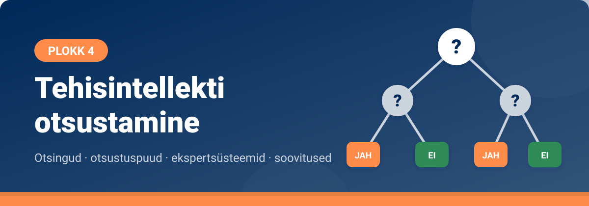

<!--
author:   Maia Lust
email:    
version:  1.3.0
language: et
narrator: Estonian Female
date:     08.10.2026
logo:     ../pildid/pae_logo.png
icon:     ../pildid/pae_logo.png
comment:  Tehisintellekti alused – gümnaasiumi valikkursus (35 tundi), Tallinna Pae Gümnaasium. Õppetekstid, interaktiivsed töölehed ja enesekontrollitestid.
link:     https://fonts.googleapis.com/css2?family=Nunito+Sans:wght@400;600;700&family=Poppins:wght@600;700&family=JetBrains+Mono:wght@400;600&display=swap

@style
/* ==== liascript-theming:start ==== */
/* links: https://fonts.googleapis.com/css2?family=Nunito+Sans:wght@400;600;700&family=Poppins:wght@600;700&family=JetBrains+Mono:wght@400;600&display=swap */
/* theme: Tallinna Pae Gümnaasium — generated by liascript-theming, edit theme.json and rebuild */
:root {
  --theme-font-body: 'Nunito Sans', sans-serif;
  --theme-font-heading: 'Poppins', serif;
  --theme-font-mono: 'JetBrains Mono', monospace;
  --theme-heading-weight: 700;
  --theme-line-height: 1.6;
  --global-font-size: 1.6rem;
  --theme-radius: 0.8rem;
  --theme-radius-small: 0.4rem;
  --theme-radius-large: 1.4rem;
  --theme-shadow: 0 0.3rem 1rem rgba(0,41,89,.10);
}
/* surfaces & text: apply to every color theme */
:root.lia-variant-light {
  --color-background: 255,255,255;
  --color-text: 29,36,51;
  --color-border: 228,229,231;
  --lia-grey-lighter: 238,242,247;
  --lia-grey-light: 204,212,222;
}
:root.lia-variant-dark {
  --color-background: 15,23,36;
  --color-text: 229,232,235;
  --color-border: 49,60,73;
  --lia-grey-dark: 30,38,47;
  --lia-anthracite: 41,50,61;
}
/* accent: only the course theme (default) and the custom radio,
   so readers can still pick LiaScript's built-in color themes */
:root:is(.lia-theme-default, .lia-theme-custom) {
  --color-highlight: 0,41,89;
  --color-highlight-dark: 0,41,89;
}
:root.lia-theme-default {
  --color-highlight-menu: 0,41,89;
}
:root:is(.lia-theme-default, .lia-theme-custom).lia-variant-dark {
  --color-highlight: 47,90,143;
  --color-highlight-dark: 255,185,143;
}
:root.lia-variant-light { --theme-heading-color: #002959; }
:root.lia-variant-dark { --theme-heading-color: #FFB98F; }
/* ==== LiaScript theme adapter (liascript-theming) — keep verbatim ====
   Maps the --theme-* tokens onto LiaScript's CSS. Everything a theme
   changes lives in the token block above this one. */

/* -- fonts: body/mono via the global variables, headings & co. are
      compiled literals in LiaScript and need explicit selectors -- */
:root {
  --global-font-family: var(--theme-font-body);
  --global-font-mono: var(--theme-font-mono);
  --global-font-headline: var(--theme-font-heading);
}
body { line-height: var(--theme-line-height, 1.47); }
h1, h2, h3, .h1, .h2, .h3 {
  font-family: var(--theme-font-heading);
  font-weight: var(--theme-heading-weight, 600);
  letter-spacing: var(--theme-heading-letter-spacing, normal);
  text-transform: var(--theme-heading-transform, none);
  color: var(--theme-heading-color, inherit);
}
h4, h5, h6, .h4, .h5, summary, .lia-accordion__headline {
  font-family: var(--theme-font-subheading, var(--theme-font-body));
}
.lia-quote__text { font-family: var(--theme-font-quote, var(--theme-font-heading)); }
.lia-code, .lia-code--inline, code, kbd, samp, pre { font-family: var(--theme-font-mono); }
.lia-code .ace_editor { font-family: var(--theme-font-mono) !important; }

/* -- shape: radius for controls & surfaces (radio buttons, tags, circles stay) -- */
:is(button, .lia-btn, input, .lia-input, select, .lia-select, textarea, .lia-textarea, .lia-dropdown):not(.lia-radio, .lia-btn--tag, .lia-btn--small-tag),
.lia-code-terminal__input, .lia-pagination__content, .lia-script, .lia-support-menu__submenu {
  border-radius: var(--theme-radius);
}
.lia-checkbox[type='checkbox'], kbd, .lia-tooltip .lia-tooltiptext, .lia-code--inline {
  border-radius: var(--theme-radius-small);
}
details, .lia-quote, .lia-code__input, .lia-table-responsive, .lia-card {
  border-radius: var(--theme-radius-large);
  box-shadow: var(--theme-shadow);
}
.lia-quote, .lia-code__input { overflow: hidden; }
.lia-code__input .ace_editor { border-radius: inherit; }
.lia-support-menu__submenu { box-shadow: var(--theme-shadow-popup, 0 0 1rem rgba(128, 128, 128, 0.2)); }

/* -- dark mode: LiaScript brightens the accent for text via
      rgb(from … calc(r*2.5)), which turns a hand-picked accent into
      pastel/yellow. For the course theme, text-like accent uses take
      --color-highlight-dark (= "accent as text") instead. Scoped to
      default/custom so the built-in color themes keep their behavior. -- */
:root:is(.lia-theme-default, .lia-theme-custom).lia-variant-dark :is(.lia-link, .lia-btn--outline, .lia-code--inline) {
  color: rgb(var(--color-highlight-dark));
  border-color: rgb(var(--color-highlight-dark));
}
:root:is(.lia-theme-default, .lia-theme-custom).lia-variant-dark :is(summary, summary:after, .lia-label, .lia-skip-nav, .lia-support-menu__item, .lia-quote__text),
:root:is(.lia-theme-default, .lia-theme-custom).lia-variant-dark :is(.lia-list--unordered, .lia-list--ordered) > li::marker {
  color: rgb(var(--color-highlight-dark));
}
:root:is(.lia-theme-default, .lia-theme-custom).lia-variant-dark :is(.lia-btn--transparent, .lia-input) {
  filter: none;
}
:root:is(.lia-theme-default, .lia-theme-custom).lia-variant-dark :is(.lia-input, .lia-checkbox[type='checkbox'], .lia-radio[type='radio']):not(:checked, .is-disabled, [disabled]) {
  border-color: rgb(var(--color-highlight-dark));
}
/* alternating table rows: LiaScript uses a neutral grey in dark mode */
:root.lia-variant-dark .lia-table.is-alternating .lia-table__row:nth-child(2n) td,
:root.lia-variant-dark .lia-table-responsive.has-thead-sticky.has-first-col-sticky .is-alternating .lia-table__row:nth-child(2n) td:first-child:before,
:root.lia-variant-dark .lia-table-responsive.has-thead-sticky.has-last-col-sticky .is-alternating .lia-table__row:nth-child(2n) td:last-child:before {
  background-color: rgb(var(--lia-grey-dark));
}
/* -- theme extras -- */
/* ===== Tallinna Pae Gümnaasiumi värvid =====
   tumesinine #002959 · oranž #FF8B48 · tumeoranž #E67E42 */
:root {
  --pae-sinine: #002959;
  --pae-sinine-80: #33547A;
  --pae-sinine-20: #CCD4DE;
  --pae-sinine-08: #EEF2F7;
  --pae-oranz: #FF8B48;
  --pae-oranz-tume: #E67E42;
  --pae-oranz-20: #FFE2D1;
  --pae-oranz-08: #FFF4EC;
  --pae-roheline: #2E8B57;
  --pae-roheline-08: #EAF6EF;
  --pae-lilla: #6B4FA0;
  --pae-lilla-08: #F2EEF9;
}

/* Pealkirjad */
.lia-slide h1, main h1 {
  color: var(--pae-sinine);
  border-bottom: 6px solid var(--pae-oranz);
  padding-bottom: .3em;
}
.lia-slide h2, main h2 { color: var(--pae-sinine); }
.lia-slide h3, main h3 {
  color: var(--pae-sinine);
  border-left: 8px solid var(--pae-oranz);
  padding-left: .5em;
}
.lia-slide h4, main h4 { color: var(--pae-oranz-tume); }
strong { color: inherit; }

/* Tabelid */
.lia-table th, table thead th {
  background: var(--pae-sinine) !important;
  color: #fff !important;
}
.lia-table tbody tr:nth-child(even), table tbody tr:nth-child(even) { background: var(--pae-sinine-08); }

/* Pildid ja infograafikud */
img.lia-image, .lia-figure img, main img {
  border-radius: 12px;
}
.lia-figure__caption, figcaption {
  color: var(--pae-sinine-80);
  font-style: italic;
  text-align: center;
}

/* ASCII-skeemid väiksemaks ja Pae värvidesse */
.lia-ascii svg, lia-ascii svg, .lia-code--ascii svg { max-width: 760px; margin: 0 auto; display: block; }
svg.lia-ascii text { fill: var(--pae-sinine); }

/* ===== Kujunduskastid ===== */
blockquote.pae-moiste, blockquote.pae-naide, blockquote.pae-eesti,
blockquote.pae-motle, blockquote.pae-lisaks, blockquote.pae-fakt,
.pae-moiste, .pae-naide, .pae-eesti, .pae-motle, .pae-lisaks, .pae-fakt {
  border-radius: 14px !important;
  padding: 1.1em 1.4em 1.1em 4.2em !important;
  margin: 1.4em 0 !important;
  position: relative;
  box-shadow: 0 3px 10px rgba(0,41,89,.10);
  font-style: normal !important;
  text-align: left !important;
}
.pae-moiste::before, .pae-naide::before, .pae-eesti::before,
.pae-motle::before, .pae-lisaks::before, .pae-fakt::before {
  position: absolute; left: .7em; top: .75em;
  width: 2em; height: 2em; line-height: 2em;
  border-radius: 50%; text-align: center; font-size: 1.15em;
  color: #fff; font-style: normal;
}
/* Mõiste – oranž */
.pae-moiste { background: var(--pae-oranz-08) !important; border: 2px solid var(--pae-oranz) !important; border-left: 10px solid var(--pae-oranz) !important; }
.pae-moiste::before { content: "📖"; background: var(--pae-oranz); }
/* Näide – tumesinine */
.pae-naide { background: var(--pae-sinine-08) !important; border: 2px solid var(--pae-sinine-20) !important; border-left: 10px solid var(--pae-sinine) !important; }
.pae-naide::before { content: "💡"; background: var(--pae-sinine); }
/* Eesti näide – sinine-valge */
.pae-eesti { background: linear-gradient(135deg, #E8F1FB 0%, #ffffff 100%) !important; border: 2px solid #0072CE !important; border-left: 10px solid #0072CE !important; }
.pae-eesti::before { content: "🇪🇪"; background: #0072CE; }
/* Mõtle järele – roheline */
.pae-motle { background: var(--pae-roheline-08) !important; border: 2px dashed var(--pae-roheline) !important; border-left: 10px solid var(--pae-roheline) !important; }
.pae-motle::before { content: "🤔"; background: var(--pae-roheline); }
/* Tea lisaks – lilla */
.pae-lisaks { background: var(--pae-lilla-08) !important; border: 2px solid #CDBFE6 !important; border-left: 10px solid var(--pae-lilla) !important; }
.pae-lisaks::before { content: "🔍"; background: var(--pae-lilla); }
/* Fakt – tume taust, valge tekst */
.pae-fakt { background: var(--pae-sinine) !important; color: #fff !important; border-left: 10px solid var(--pae-oranz) !important; }
.pae-fakt * { color: #fff !important; }
.pae-fakt::before { content: "⚡"; background: var(--pae-oranz); }

/* Töölehe jaotise riba */
.pae-jaotis { background: var(--pae-sinine); color: #fff !important; padding: .55em 1em; border-radius: 10px; margin: 2em 0 1em; border-left: 10px solid var(--pae-oranz); }
.pae-jaotis * { color: #fff !important; }

/* Ploki kaanepilt */
.pae-kaas img, img.pae-kaas { width: 100%; border-radius: 16px; box-shadow: 0 6px 20px rgba(0,41,89,.18); }

/* Näidisvastuse kokkupandav kast */
details {
  background: var(--pae-oranz-08);
  border: 1px solid var(--pae-oranz);
  border-radius: 10px; padding: .6em 1em; margin: .6em 0 1.4em;
}
details summary { cursor: pointer; font-weight: bold; color: var(--pae-oranz-tume); }

/* Menüü (sisukord) tumesinine */
.lia-toc a, .lia-toc .lia-toc__link, nav.lia-toc a { color: #002959 !important; }
.lia-toc a.lia-active, .lia-toc .lia-active { font-weight: 700; }
:root.lia-variant-dark .lia-toc a { color: #CCD4DE !important; }
:root.lia-variant-dark .pae-moiste, :root.lia-variant-dark .pae-naide, :root.lia-variant-dark .pae-eesti,
:root.lia-variant-dark .pae-motle, :root.lia-variant-dark .pae-lisaks { color: #1d2433 !important; }
:root.lia-variant-dark .pae-moiste *, :root.lia-variant-dark .pae-naide *, :root.lia-variant-dark .pae-eesti *,
:root.lia-variant-dark .pae-motle *, :root.lia-variant-dark .pae-lisaks * { color: #1d2433 !important; }
:root.lia-variant-dark img { background: #fff; }
/* ==== liascript-theming:end ==== */
/* Loosimisnupp (rollimäng) */
output.lia-script[input="submit"] { display:inline-block !important; background:#002959; color:#fff !important; font-weight:700; padding:.6em 1.2em; border-radius:999px; border:3px solid #FF8B48 !important; cursor:pointer; box-shadow:0 3px 10px rgba(0,41,89,.2); }
output.lia-script[input="submit"]:hover { background:#FF8B48; color:#002959 !important; }

@end

@custom
--color-highlight-menu: 255,255,255;
@end
-->

## Plokk 4. Kordamine ja harjutamine

<!-- class="pae-lisaks" -->
> 🗺️ **Oled 4. toas – Otsuste labürint.** Lisa selle lehe link järjehoidjasse, et saaksid hiljem samast kohast jätkata. Järgmine osa avaneb alles siis, kui oled selle osa luku lahendanud.

<!-- class="pae-kaas" -->

Oled jõudnud toa viimasesse ossa. Siin kordad ploki teemasid: lahendad **praktilisi ülesandeid**, arutled ja teed **ploki enesekontrolltesti**. Lõpus ootab **toa uks** – selle avad võtmetähtedest moodustuva sõnaga.

### Praktilised ülesanded

<!-- class="pae-jaotis" -->
**Ülesanne 1. Otsustuspuu loomine ja rakendamine**

**Mida sa õpid:** mõistad otsustuspuude põhimõtteid ja seda, kuidas tehisintellekt kasutab sarnaseid struktuure otsuste tegemiseks.

**Vahendid:** internetiühendusega arvuti, paber ja kirjutusvahendid, diagrammitööriist (nt draw.io või Lucidchart).

**Sammud:**

1. Moodustage 2–3-liikmelised rühmad.
2. Valige üks otsustusprobleem:
   - eriala või ülikooli valik;
   - nutitelefoni ostmine;
   - puhkusereisi planeerimine;
   - keskkonnasõbraliku transpordiviisi valimine;
   - tervislike eluviiside planeerimine.
3. Looge otsustuspuu:
   - **Määratlege probleem:** sõnastage täpselt, mida tuleb otsustada ja millised on võimalikud lõpptulemused.
   - **Määratlege otsustuskriteeriumid:** leidke vähemalt 5 olulist kriteeriumi (nt hind, kvaliteet, keskkonnasõbralikkus) ja seadke need tähtsuse järjekorda.
   - **Ehitage puu:** juurküsimus (peamine otsustuskoht), harud (võimalikud vastused), järgmised küsimused ja harud ning lõpptulemused (lehed).
4. Joonistage oma otsustuspuu sobiva tööriistaga.
5. Testige puud vähemalt kolme erineva stsenaariumiga ja pange tulemused kirja.
6. Analüüsige, kuidas teie otsustuspuud saaks kasutada tehisintellekti süsteemis: milliseid andmeid oleks vaja, kuidas otsustamist automatiseerida ja millised võiksid olla probleemid või piirangud?
7. Esitlege oma otsustuspuud klassile.
8. Arutage pärast esitlusi, kuidas rühmade otsustuspuud üksteisest erinesid ja kuidas tehisintellekt kasutab sarnaseid struktuure.

**Mida esitada:** otsustuspuu joonis, kolme stsenaariumi testi tulemused ja analüüs puu rakendamise kohta TI-s.

**Mida jälgitakse:**

- kas otsustusprobleem on selgelt määratletud;
- kas kriteeriumid on asjakohased ja põhjalikud;
- kas otsustuspuu on loogiline ja terviklik;
- kas joonis on selge ja arusaadav;
- kui põhjalikult on analüüsitud puu rakendamist TI-s.

**Kasulikud lingid:**

- [Draw.io – diagrammide loomise tööriist](https://app.diagrams.net/)
- [Lucidchart – diagrammide loomise tööriist](https://www.lucidchart.com/)
- [Decision Trees in Machine Learning – Towards Data Science](https://towardsdatascience.com/decision-trees-in-machine-learning-641b9c4e8052)

Kirjelda lühidalt oma rühma otsustuspuud ja seda, mida sa ülesande käigus õppisid.

[[___ ___ ___ ___]]

<!-- class="pae-jaotis" -->
**Ülesanne 2. Ekspertsüsteemi prototüübi loomine**

**Mida sa õpid:** mõistad ekspertsüsteemide põhimõtteid, luues ise lihtsa ekspertsüsteemi prototüübi.

**Vahendid:** internetiühendusega arvuti, tekstiredaktor või programmeerimiskeskkond, esitlusvahend.

**Sammud:**

1. Moodustage 3–4-liikmelised rühmad.
2. Valige oma ekspertsüsteemi valdkond:
   - taimede või loomade määramine;
   - arvutiprobleemide diagnoosimine;
   - terviseprobleemide esmane hindamine;
   - õppeaine või eriala soovitamine;
   - toitumissoovitused.
3. Koostage teadmusbaas:
   - **Faktid:** koguge vähemalt 20 fakti valitud valdkonna kohta, struktureerige ja rühmitage need.
   - **Reeglid:** kirjutage vähemalt 15 „KUI … SIIS …“ reeglit, seadke need tähtsuse järjekorda ja määrake reeglite omavahelised seosed.
   - **Järeldused:** pange kirja võimalikud lõppjäreldused või soovitused ja nende selgitused.
4. Looge ekspertsüsteemi prototüüp ühel järgmistest viisidest:
   - lihtne tekstipõhine süsteem (nt Pythonis või pseudokoodis);
   - vooskeem või otsustuspuu;
   - interaktiivne küsimustik (nt Google Forms);
   - lihtne veebileht (nt HTML/JavaScript).
5. Testige oma ekspertsüsteemi vähemalt viie erineva stsenaariumiga ja pange tulemused kirja.
6. Analüüsige oma ekspertsüsteemi: tugevused ja nõrkused, täpsus ja usaldusväärsus, kasutajasõbralikkus, arendusvõimalused.
7. Esitlege oma ekspertsüsteemi klassile: näidake, kuidas see töötab, selgitage teadmusbaasi ja reeglite loomist ning jagage testimise tulemusi.
8. Arutage pärast esitlusi ekspertsüsteemide kasulikkuse, piirangute ja tuleviku üle.

**Mida esitada:** teadmusbaas (faktid ja reeglid), töötav prototüüp, testimise tulemused ja analüüs.

**Mida jälgitakse:**

- kas teadmusbaas on põhjalik ja asjakohane;
- kas reeglid on loogilised ja terviklikud;
- kas prototüüp töötab;
- kui põhjalik on testimine ja analüüs;
- kas esitlus ja demonstratsioon on selged.

**Kasulikud lingid:**

- [Expert Systems – Introduction – Tutorialspoint](https://www.tutorialspoint.com/artificial_intelligence/artificial_intelligence_expert_systems.htm)
- [Building a Simple Expert System – GeeksforGeeks](https://www.geeksforgeeks.org/building-a-simple-expert-system/)
- [Experta – Python Expert Systems Library](https://github.com/nilp0inter/experta)

Kirjuta siia kolm oma rühma reeglit ja kirjelda, kuidas su ekspertsüsteem testimisel toimis.

[[___ ___ ___ ___]]

<!-- class="pae-jaotis" -->
**Ülesanne 3. Soovitussüsteemide analüüs ja kavandamine**

**Mida sa õpid:** mõistad soovitussüsteemide põhimõtteid ja toimimist, analüüsides olemasolevat süsteemi ja kavandades oma süsteemi.

**Vahendid:** internetiühendusega arvuti, esitlusvahend, prototüüpimise vahend (nt Figma või paber ja pliiats).

**Sammud:**

1. Moodustage 2–3-liikmelised rühmad.
2. Valige üks soovitussüsteem, mida analüüsida:
   - Netflixi või muu voogedastusplatvormi soovitused;
   - Spotify või muu muusikaplatvormi soovitused;
   - e-poe tootesoovitused (nt Amazon);
   - sotsiaalmeedia sisusoovitused (nt YouTube, TikTok);
   - uudiste või artiklite soovitused.
3. Analüüsige valitud soovitussüsteemi:
   - **Kasutajakogemus:** kuidas soovitusi esitatakse? Kuidas saab kasutaja soovitusi mõjutada? Kui täpsed ja asjakohased on soovitused?
   - **Tehniline toimimine:** milliseid andmeid süsteem kogub? Milliseid algoritme võidakse kasutada? Kas kasutatakse koostööfiltreerimist, sisupõhist filtreerimist või hübriidmeetodit?
   - **Eetilised küsimused:** privaatsus, mullifiltrid, manipuleerimise võimalused.
4. Koostage 2–3-leheküljeline analüüsiraport, kus on soovitussüsteemi kirjeldus, kasutajakogemuse analüüs, tehnilise toimimise analüüs, eetiliste küsimuste analüüs ja parendusettepanekud.
5. Kavandage oma soovitussüsteemi prototüüp:
   - **Kontseptsioon:** valige valdkond (nt raamatud, restoranid, õppematerjalid), sihtrühm ja eesmärgid.
   - **Algoritm:** milliseid andmeid kogute? Millist filtreerimismeetodit kasutate? Kuidas soovitusi personaliseerite?
   - **Kasutajaliides:** kuidas soovitusi näidatakse, kuidas kasutajalt tagasisidet kogutakse ja kuidas teete soovitused läbipaistvaks (nt „Soovitame, sest …“).
6. Looge oma prototüübist visuaalne esitlus (3–5 ekraanivaadet).
7. Esitlege klassile nii analüüsi kui ka oma prototüüpi.
8. Arutage pärast esitlusi, kuidas soovitussüsteemid mõjutavad kasutajate valikuid ja käitumist.

**Mida esitada:** analüüsiraport ja prototüübi ekraanivaated.

**Mida jälgitakse:**

- kui põhjalik on olemasoleva soovitussüsteemi analüüs;
- kas tehniline toimimine on õigesti mõistetud;
- kui sügavalt on analüüsitud eetilisi küsimusi;
- kas oma prototüübi kontseptsioon on loogiline;
- kui selge ja hea on prototüübi visuaalne esitlus.

**Kasulikud lingid:**

- [How Do Recommendation Systems Work? – Towards Data Science](https://towardsdatascience.com/how-do-recommendation-systems-work-d1e229ca2f3c)
- [Recommendation Systems – IBM Developer](https://developer.ibm.com/technologies/artificial-intelligence/articles/introduction-to-recommender-systems/)
- [The Ethics of Recommendation Systems – Harvard Business Review](https://hbr.org/2021/03/the-ethics-of-recommendation-systems)

Kirjelda, mida sa analüüsitud soovitussüsteemi ja mullifiltri kohta teada said. Kas see muudab, kuidas sa ise seda rakendust kasutad?

[[___ ___ ___ ___]]

<!-- class="pae-jaotis" -->
**Ülesanne 4. Tehisintellekti otsustusprotsessi simulatsioon**

**Mida sa õpid:** mõistad tehisintellekti otsustusprotsessi keerukust ja eetilisi dilemmasid rollimängu kaudu.

**Vahendid:** rollimängu materjalid, paber ja kirjutusvahendid, esitlusvahend.

**Sammud:**

1. Moodustage 5–6-liikmelised rühmad.
2. Iga rühm saab ühe stsenaariumi, kus tehisintellekt peab tegema keerulise otsuse:
   - isesõitev auto peab valima kahe võimaliku õnnetuse vahel;
   - meditsiiniline TI peab otsustama, kes saab piiratud ressursside korral ravi;
   - personalivaliku TI peab valima kandidaatide vahel;
   - kohtuotsuste TI peab määrama karistuse;
   - sotsiaalmeedia modereerimise TI peab otsustama, kas sisu eemaldada.
3. Jagage rollid – iga rühmaliige võtab ühe rolli:
   - tehisintellekti süsteemi arendaja;
   - tehisintellekti süsteemi kasutaja;
   - otsusest mõjutatud isik;
   - eetikaekspert;
   - jurist või regulaator;
   - vaatleja ehk protokollija.
4. Viige läbi rollimäng kolmes etapis:
   - **Stsenaariumi analüüs:** iga osaleja analüüsib stsenaariumi oma rolli vaatenurgast ning paneb kirja oma prioriteedid ja argumendid.
   - **Otsustusprotsessi simulatsioon:** arutage, kuidas tehisintellekt peaks otsustama; iga osaleja esitab oma argumendid ja rühm püüab jõuda algoritmis või otsustusreeglites üksmeelele.
   - **Refleksioon:** väljuge rollidest, arutage kogemuse üle ja analüüsige, millised väärtused ja prioriteedid olid omavahel konfliktis.
5. Koostage otsustusalgoritm või reeglite kogum, mis arvestab eri vaatenurkadega.
6. Esitlege klassile oma stsenaariumi, simulatsiooni tulemusi ja loodud algoritmi.
7. Arutage ühiselt TI otsustusprotsesside eetilisi dilemmasid ja võimalikke lahendusi.

**Mida esitada:** loodud otsustusalgoritm või reeglite kogum ja lühikokkuvõte rollimängu arutelust.

**Mida jälgitakse:**

- kui põhjalikult on stsenaariumi analüüsitud;
- kui usutavalt on rolle mängitud;
- kas on arvestatud eri vaatenurkadega;
- kas loodud algoritm või reeglid on loogilised ja eetilised;
- kui sügav on refleksioon ja kas järeldused on põhjendatud.

**Kasulikud lingid:**

- [The Trolley Problem in AI – MIT Technology Review](https://www.technologyreview.com/2018/10/24/139313/a-global-ethics-study-aims-to-help-ai-solve-the-self-driving-trolley-problem/)
- [AI Decision-Making – Stanford University](https://hai.stanford.edu/news/ai-decision-making)
- [Ethics of Artificial Intelligence – UNESCO](https://en.unesco.org/artificial-intelligence/ethics)

Milline roll oli sinul ja millised väärtused läksid sinu rühmas omavahel kõige rohkem vastuollu?

[[___ ___ ___ ___]]

<!-- class="pae-jaotis" -->
**Ülesanne 5. Tehisintellekti rakendamine probleemilahenduses**

**Mida sa õpid:** mõistad, kuidas tehisintellekti saab kasutada eri valdkondade probleemide lahendamiseks.

**Vahendid:** internetiühendusega arvuti, esitlusvahend, probleemilahenduse tööriistad (nt Miro, Padlet).

**Sammud:**

1. Moodustage 3–4-liikmelised rühmad.
2. Valige üks kohalik või ülemaailmne probleem:
   - kliimamuutused või keskkonnareostus;
   - tervishoiu kättesaadavus;
   - hariduse kvaliteet ja kättesaadavus;
   - liiklusummikud või transpordiprobleemid;
   - toidu raiskamine;
   - energiatarbimine.
3. Analüüsige valitud probleemi:
   - **Probleemi kaardistamine:** täpne kirjeldus, põhjused ja tagajärjed, olemasolevad lahendused ja nende piirangud.
   - **Andmed:** milliseid andmeid oleks vaja probleemi mõistmiseks? Kuidas neid koguda? Millised võivad olla andmetega seotud raskused?
4. Kavandage tehisintellektil põhinev lahendus:
   - **Kontseptsioon:** valige TI tüüp (masinõpe, süvaõpe, ekspertsüsteem), kirjeldage lahenduse toimimise põhimõtteid ning määrake kasutajad ja huvirühmad.
   - **Tehniline teostus:** vajalik taristu, algoritmi või mudeli kirjeldus, kasutajaliidese idee.
   - **Mõju hindamine:** eeldatav mõju probleemile, võimalikud kõrvalmõjud, eetilised kaalutlused.
5. Koostage 5–7-slaidiline esitlus: probleemi kirjeldus ja olulisus, TI-lahenduse kontseptsioon, tehnilise teostuse kirjeldus, eeldatav mõju ja kõrvalmõjud, rakendamise plaan.
6. Esitlege oma lahendust klassile.
7. Pärast esitlusi toimub „investorite voor“: hääletage, millistesse lahendustesse teie „investeeriksite“.
8. Arutage klassis tehisintellekti võimalusi ja piiranguid ühiskondlike probleemide lahendamisel.

**Mida esitada:** 5–7-slaidiline esitlus.

**Mida jälgitakse:**

- kui põhjalik on probleemi analüüs;
- kas TI-lahendus on asjakohane ja uuenduslik;
- kas tehniline teostus on realistlik;
- kui põhjalikult on hinnatud mõju;
- kas esitlus on selge ja veenev.

**Kasulikud lingid:**

- [AI for Good – United Nations](https://aiforgood.itu.int/)
- [AI for Social Good – Google](https://ai.google/social-good/)
- [Solving Global Challenges with AI – World Economic Forum](https://www.weforum.org/agenda/2020/01/ai-for-good-global-challenges/)
- [AI for Sustainable Development Goals – ITU](https://www.itu.int/en/ITU-T/AI/Pages/ai4sdgs.aspx)

Kirjelda lühidalt oma rühma lahendust. Millisesse teise rühma lahendusse sa „investeeriksid“ ja miks?

[[___ ___ ___ ___]]

### Arutelu

Vasta küsimustele oma sõnadega. Võid oma vastuseid arutada ka klassikaaslastega või kooli õpikeskkonna foorumis.

<!-- class="pae-jaotis" -->
**Probleemilahendus ja otsustuspuud**

**Probleemilahenduse strateegiad.** Milliseid probleemilahenduse strateegiaid kasutad oma igapäevaelus? Kuidas need sarnanevad tehisintellekti kasutatavatele strateegiatele või erinevad neist?

[[___ ___ ___ ___]]

**Otsustuspuude rakendused.** Millistes valdkondades on otsustuspuud eriti kasulikud? Too näiteid, kus otsustuspuude kasutamine on andnud häid tulemusi.

[[___ ___ ___ ___]]

**Inimese ja tehisintellekti otsustamine.** Võrdle inimese ja tehisintellekti otsustusprotsesse. Millised on mõlema tugevused ja nõrkused? Millal eelistada üht teisele?

[[___ ___ ___ ___]]

<!-- class="pae-jaotis" -->
**Ekspertsüsteemid ja reeglistikud**

**Ekspertsüsteemide roll.** Millistes valdkondades on ekspertsüsteemid endiselt olulised, vaatamata masinõppe arengule? Miks?

[[___ ___ ___ ___]]

**Reeglipõhine ja andmepõhine lähenemine.** Võrdle reeglipõhist ja andmepõhist lähenemist tehisintellektis. Millal on üks sobivam kui teine?

[[___ ___ ___ ___]]

**Ekspertteadmiste kogumine.** Millised on raskused ekspertteadmiste kogumisel ja reegliteks vormistamisel? Kuidas neid raskusi ületada?

[[___ ___ ___ ___]]

<!-- class="pae-jaotis" -->
**Soovitussüsteemid**

**Soovitussüsteemide mõju.** Kuidas on soovitussüsteemid mõjutanud sinu igapäevaelu? Too näiteid positiivsetest ja negatiivsetest mõjudest.

[[___ ___ ___ ___]]

**Mullifiltrid.** Mis on mullifiltrid ja kuidas need tekivad soovitussüsteemide kasutamisel? Kuidas vältida mullifiltrite negatiivseid mõjusid?

[[___ ___ ___ ___]]

**Soovitussüsteemide parendamine.** Kuidas saaks soovitussüsteeme paremaks muuta? Milliseid funktsioone või omadusi sooviksid näha tuleviku soovitussüsteemides?

[[___ ___ ___ ___]]

<!-- class="pae-jaotis" -->
**Tehisintellekti probleemilahendus eri valdkondades**

**Valdkonnapõhised lahendused.** Vali üks valdkond (nt meditsiin, haridus, transport) ja arutle, kuidas tehisintellekt aitab seal probleeme lahendada. Millised on peamised väljakutsed?

[[___ ___ ___ ___]]

**Interdistsiplinaarsed rakendused.** Kuidas saab tehisintellekti kasutada eri valdkondade ühendamiseks? Too näiteid interdistsiplinaarsetest rakendustest.

[[___ ___ ___ ___]]

**Innovatsioon tehisintellekti abil.** Milliseid uusi probleemilahenduse viise on tehisintellekt võimaldanud? Kuidas on see muutnud traditsioonilisi lähenemisi?

[[___ ___ ___ ___]]

<!-- class="pae-jaotis" -->
**Refleksioon ploki kohta**

**Otsustusprotsesside mõistmine.** Kuidas on sinu arusaam otsustusprotsessidest selle ploki jooksul muutunud? Millised teemad olid kõige kasulikumad?

[[___ ___ ___ ___]]

**Tehisintellekti piirangud.** Millised on sinu arvates peamised piirangud tehisintellekti otsustusvõimes? Kuidas neid piiranguid ületada?

[[___ ___ ___ ___]]

**Tuleviku perspektiivid.** Kuidas näed tehisintellekti rolli tuleviku otsustusprotsessides? Millistes valdkondades võiks tehisintellekt tuua kõige suuremat kasu?

[[___ ___ ___ ___]]

### 4. ploki enesekontrolltest

Enne ukse avamist kontrolli, kas oled toa kõik teadmised kätte saanud.

<!-- class="pae-jaotis" -->
**I. Automaatselt kontrollitavad ülesanded**

**1. Mis on probleemilahendus tehisintellekti kontekstis?**

- [( )] Inimeste psühholoogiliste probleemide lahendamine tehisintellekti abil
- [( )] Tehisintellekti süsteemide vigade parandamine
- [(X)] Protsess, kus tehisintellekt otsib teed algolekust eesmärgini
- [( )] Tehisintellekti süsteemide arendamisega seotud väljakutsete lahendamine
****************************************
Probleemilahendus tähendab, et TI otsib teed algolekust eesmärgini, kasutades otsingualgoritme ja strateegiaid.
****************************************

**2. Kuidas nimetatakse puukujulist mudelit, mis jagab andmed tunnuste põhjal järjest väiksemateks rühmadeks ja jõuab lehtedes lõppotsuseni? Kirjuta vastus.**

[[otsustuspuu]]

****************************************
Õige vastus: **otsustuspuu**. Selle sõlmed on küsimused ehk otsustuskohad, harud võimalikud vastused ja lehed lõppotsused.
****************************************

**3. Järjesta otsustuspuu andmetest õppimise sammud õigesse järjekorda.**

<!-- data-show-partial-solution -->
Jaga andmed valitud tunnuse järgi rühmadeks: [[ 1 | 2 | (3) | 4 | 5 ]] 
Alusta kõigi treeningandmetega: [[ (1) | 2 | 3 | 4 | 5 ]] 
Peatu, kui rühm on homogeenne või puu on lubatud sügavusega: [[ 1 | 2 | 3 | 4 | (5) ]] 
Vali tunnus, mis jagab andmed kõige homogeensemateks rühmadeks: [[ 1 | (2) | 3 | 4 | 5 ]] 
Korda sama iga alamrühmaga: [[ 1 | 2 | 3 | (4) | 5 ]]
****************************************
Õige järjekord: 1. alusta kõigi andmetega → 2. vali parim tunnus → 3. jaga andmed → 4. korda iga alamrühmaga → 5. peatu. Parim tunnus on see, mis annab võimalikult homogeensed ehk ühtlased rühmad.
****************************************

**4. Robot liigub laos A\* algoritmi abil. Ühes olekus on robot läbinud juba 12 m ja linnulennuline kaugus sihtkohani on 7 m. Arvuta f(n) = g(n) + h(n) meetrites.**

[[19]]

****************************************
g(n) = 12 m (juba läbitud tee), h(n) = 7 m (heuristiline hinnang järelejäänud teele).

f(n) = 12 + 7 = **19** m
****************************************

**5. Lohista mõisted õigetesse lünkadesse.**

<!-- data-show-partial-solution -->
Ekspertsüsteem jäljendab [->[ (inimeksperdi) | kasutaja ]] teadmisi ja otsustusprotsessi kindlas valdkonnas. Reeglistik koosneb [->[ (KUI … SIIS …) ]] reeglitest. Ebakindluse käsitlemiseks kasutatakse näiteks [->[ (Bayesi võrke) | mängupuid ]], mis esitavad muutujate vahelisi tõenäosuslikke sõltuvusi.
****************************************
Ekspertsüsteemi teadmised panevad sinna inimesed, enamasti „KUI … SIIS …“ reeglitena. Bayesi võrgud on tõenäosuslikud graafilised mudelid, mis aitavad käsitleda ebakindlust.
****************************************

**6. Otsusta, kas väide on tõene või väär.**

<!-- data-show-partial-solution -->
- [ (Tõene) (Väär) ]
- [ ( ) (X) ] Heuristika garanteerib alati parima lahenduse.
- [ (X) ( ) ] Ekspertsüsteemi teadmised panevad sinna inimesed, enamasti reeglitena.
- [ ( ) (X) ] Koostööfiltreerimine vajab teadmisi objektide omadustest.
- [ (X) ( ) ] „Musta kasti“ probleem on eriti levinud süvaõppe mudelite puhul.
- [ (X) ( ) ] Edasisuunaline aheldamine alustab teadaolevatest faktidest.
****************************************
Heuristika kiirendab otsingut, kuid ei garanteeri parimat lahendust. Koostööfiltreerimine ei pea teadma objektide omadusi: piisab sellest, kes mida on vaadanud, ostnud või hinnanud.
****************************************

**7. Vali sobiv soovitusmeetod.**

<!-- data-show-partial-solution -->
Kui süsteem ütleb „Soovitame, sest vaatasid filmi X“, kasutab see [[ (sisupõhist filtreerimist) | koostööfiltreerimist ]]. Kui süsteem ütleb „Inimesed, kes ostsid selle raamatu, ostsid ka …“, kasutab see [[ sisupõhist filtreerimist | (koostööfiltreerimist) ]].
****************************************
Sisupõhine filtreerimine soovitab objekte, mis on omaduste poolest sarnased sinu varasemate valikutega. Koostööfiltreerimine soovitab seda, mis meeldis sinuga sarnastele kasutajatele.
****************************************

**8. Millised neist on soovitussüsteemid? (Vali kõik õiged.)**

- [[X]] Netflixi filmi- ja sarjasoovitused
- [[ ]] Isesõitva auto takistuste tuvastamine
- [[X]] TikToki „Sulle“ voog
- [[ ]] Kõnetuvastus
- [[X]] Spotify esmaspäevane esitusloend
****************************************
Soovitussüsteem ennustab, millised tooted, teenused või sisu võiksid kasutajale meeldida. Isesõitev auto ja kõnetuvastus kasutavad samuti TI-d, kuid ei soovita kasutajale sisu.
****************************************

**9. Kuidas nimetatakse olukorda, kus soovitussüsteem näitab kasutajale üha sarnasemat sisu ja tema inforuum kitseneb? Kirjuta vastus.**

[[mullifilter]]

****************************************
Õige vastus: **mullifilter** (ka filtrimull). See tekib tagasisideahelast: mida rohkem sa üht teemat vaatad, seda rohkem süsteem seda sulle pakub.
****************************************

**10. Mis on tehisintellekti kontekstis „musta kasti“ probleem otsustamisel?**

- [( )] Probleem, kus tehisintellekti süsteemi füüsiline komponent (must kast) läheb katki
- [(X)] Olukord, kus tehisintellekti süsteemi otsustusprotsess on läbipaistmatu ja raskesti selgitatav
- [( )] Probleem, kus tehisintellekti süsteem ei suuda tuvastada musti objekte
- [( )] Olukord, kus tehisintellekti süsteemi andmed on krüpteeritud
****************************************
„Musta kasti“ probleem on eriti levinud süvaõppe mudelite puhul, mille otsuseid on raske selgitada.
****************************************

<!-- class="pae-jaotis" -->
**II. Lühivastustega küsimused**

**11. Selgita lühidalt, mis on otsingualgoritmid tehisintellekti kontekstis, ja too näide.**

[[___ ___ ___]]

Vaata näidisvastust

Otsingualgoritmid on meetodid, mida tehisintellekt kasutab lahenduste leidmiseks probleemiruumis. Näiteks A\* algoritm leiab lühima tee kahe punkti vahel, kasutades heuristikat.

**12. Kirjelda lühidalt, mis on tehisintellekti süsteemide otsuste selgitatavus (*explainability*) ja miks see on oluline.**

[[___ ___ ___]]

Vaata näidisvastust

Otsuste selgitatavus on tehisintellekti süsteemi võime selgitada oma otsuseid inimestele arusaadaval viisil. See on oluline usalduse, läbipaistvuse ja vastutuse tagamiseks ning õigusaktide nõuete täitmiseks.

**13. Selgita lühidalt, mis on sisupõhine filtreerimine (*content-based filtering*) soovitussüsteemides.**

[[___ ___ ___]]

Vaata näidisvastust

Sisupõhine filtreerimine on soovitussüsteemide meetod, mis soovitab kasutajale objekte, mis on sarnased nendega, mida kasutaja on varem eelistanud. Sarnasust hinnatakse objektide omaduste põhjal, näiteks filmi žanri, näitlejate või režissööri järgi.

**14. Kirjelda lühidalt, millised on tehisintellekti süsteemide otsuste eetilised aspektid, ja too näide.**

[[___ ___ ___]]

Vaata näidisvastust

Eetilised aspektid hõlmavad õiglust, privaatsust, läbipaistvust ja vastutust. Näiteks laenuotsuste tegemisel peab tehisintellekt vältima inimeste diskrimineerimist nende päritolu, soo või vanuse põhjal.

**15. Selgita lühidalt, mis on tehisintellekti süsteemide otsuste kallutatus (*bias*) ja miks see on probleem.**

[[___ ___ ___]]

Vaata näidisvastust

Kallutatus tähendab süstemaatilisi vigu tehisintellekti süsteemi otsustes, mis võivad põhjustada ebaõiglust või diskrimineerimist. See on probleem, sest võib olemasolevaid ühiskondlikke eelarvamusi veelgi võimendada. Kallutatus tekib sageli kallutatud treeningandmetest.

**16. Kirjelda lühidalt, kuidas tehisintellekt võib aidata meditsiiniliste otsuste tegemisel.**

[[___ ___ ___]]

Vaata näidisvastust

Tehisintellekt võib aidata diagnoosida haigusi, analüüsida meditsiinilisi pilte, ennustada haiguste kulgu, soovitada ravimeetodeid ja tuvastada mustreid suurtes andmehulkades. Lõpliku otsuse teeb siiski arst.

**17. Selgita lühidalt, mis on tehisintellekti süsteemide otsuste usaldatavus (*reliability*) ja kuidas seda hinnata.**

[[___ ___ ___]]

Vaata näidisvastust

Usaldatavus on tehisintellekti süsteemi võime teha järjepidevalt täpseid otsuseid. Seda hinnatakse testimise, valideerimise, järelevalve ja regulaarsete auditite abil.

**18. Kirjelda lühidalt, mis on tehisintellekti süsteemide otsuste läbipaistvus (*transparency*) ja miks see on oluline.**

[[___ ___ ___]]

Vaata näidisvastust

Läbipaistvus tähendab, et tehisintellekti süsteemi otsustusprotsess on avatud ja mõistetav. See on oluline usalduse loomiseks, probleemide ja vigade tuvastamiseks ning õigusaktide nõuete täitmiseks.

**19. Selgita lühidalt, mis on tehisintellekti süsteemide otsuste vastutus (*accountability*) ja kes peaks vastutama.**

[[___ ___ ___]]

Vaata näidisvastust

Vastutuse küsimus on see, kes vastutab tehisintellekti süsteemi otsuste ja nende tagajärgede eest. Olenevalt olukorrast võivad vastutajad olla arendajad, kasutajad, organisatsioonid või järelevalveasutused. Oluline on, et vastutusahel oleks selgelt määratud.

**20. Kirjelda lühidalt, kuidas tehisintellekt võib aidata finantsotsuste tegemisel.**

[[___ ___ ___]]

Vaata näidisvastust

Tehisintellekt võib aidata analüüsida finantsandmeid, tuvastada pettusi, hinnata krediidiriski, optimeerida investeeringuid ja automatiseerida kauplemist.

<!-- class="pae-jaotis" -->
**III. Praktiline ülesanne**

**21. Analüüsi soovitussüsteemi.**

a) Vali üks soovitussüsteem, mida oled kasutanud (nt Netflixi filmisoovitused, Spotify muusikasoovitused, YouTube'i või TikToki voog, e-poe tootesoovitused):

[[___]]

b) Kirjelda, kuidas valitud soovitussüsteem sinu arvates töötab:

[[___ ___ ___ ___]]

c) Analüüsi, kui täpsed on soovitused ja millest see võib sõltuda:

[[___ ___ ___ ___]]

d) Paku välja ideid, kuidas soovitussüsteemi saaks paremaks muuta:

[[___ ___ ___ ___]]

Vaata, mida hea vastus sisaldab

Hea vastus nimetab, milliseid andmeid süsteem tõenäoliselt kogub (vaatamised, kuulamised, laigid, vaatamise kestus, otsingud), ja seostab süsteemi tööpõhimõtte õpitud meetoditega, näiteks koostööfiltreerimise, sisupõhise filtreerimise või hübriidmeetodiga. Täpsuse analüüsis on mainitud, et see sõltub andmete hulgast, kasutaja tegevusest, külmkäivitusest ja kontekstist. Parendusettepanekud on konkreetsed, näiteks soovituste põhjendamine, mitmekesisuse suurendamine mullifiltri vältimiseks või kasutajale suurema kontrolli andmine.

<!-- class="pae-jaotis" -->
**IV. Arutelu**

**22. Vali ÜKS järgmistest teemadest ja kirjuta lühike arutlus (umbes 200–250 sõna).**

a) Kas tehisintellekti süsteemid peaksid tegema olulisi otsuseid (nt meditsiinilised diagnoosid, kohtulahendid, laenuotsused) iseseisvalt või peaks lõplik otsus jääma alati inimesele? Põhjenda oma arvamust.

b) Kuidas tagada, et tehisintellekti süsteemide otsused oleksid õiglased ega diskrimineeriks kedagi? Millised on peamised väljakutsed ja võimalikud lahendused?

c) Kuidas mõjutavad soovitussüsteemid meie valikuid ja käitumist? Kas need laiendavad või kitsendavad meie maailmapilti?

[[___ ___ ___ ___ ___]]

Vaata, mida hea arutlus sisaldab

Hea arutlus esitab selge seisukoha ja põhjendab seda loogiliste argumentidega. See näitab, et oled teemast aru saanud, kasutab ploki mõisteid (nt „musta kasti“ probleem, kallutatus, selgitatavus, vastutus, inimene otsustusahelas, mullifilter) ja toob näiteid. Hea arutlus kaalub ka teistsuguseid vaatenurki ning lõpeb põhjendatud järeldusega.

### 🚪 4. toa uks

<!-- class="pae-fakt" -->
> **Uks on lukus!** Sisesta sõna, mille moodustavad selle toa võtmetähed (tundide 4.1, 4.2, 4.3 ja 4.4 lukkudest järjekorras).

<!-- data-solution-button="off" -->
[[TARK]]
[[?]] Vihje: sõnas on 4 tähte ja see on seotud selle toa teemaga – sellist otsust tahaks masinalt igaüks.

****************************************
🎉 **Uks avaneb!** Labürindi sildid „JAH“ ja „EI“ süttivad korraga põlema ning moodustavad selge otsustuspuu, mis juhatab väljapääsuni. Kratt mäletab nüüd jälle, kuidas otsida teed olekuruumis, kuidas rakendada „KUI … SIIS …“ reegleid ja kuidas soovitada sisu, ilma et keegi mullifiltrisse kinni jääks. „Tänan teid!“ hüüab Kratt. „Nüüd ma tean: tark otsus ei ole kiire arvamine, vaid hea küsimuste ahel – ja lõpliku otsuse jätan ma tähtsates asjades ikkagi inimesele.“

🌟 **Kuldne täht: I** – kirjuta see oma missioonikaardile. Kõik seitse kuldset tähte on vaja viimase ukse jaoks.

➡️ **Järgmine tuba:** Vaatlustorn – seal näeb Kratt kogu maailma ainult pikslitena ja vajab abi, et õppida uuesti pilte mõistma.

➡️ **[Sisene: 5. tuba](https://liascript.github.io/course/?https://raw.githubusercontent.com/maialust/Tehisintellekti-alused/main/oppija/5_1_6bea34fe.md)**

****************************************
