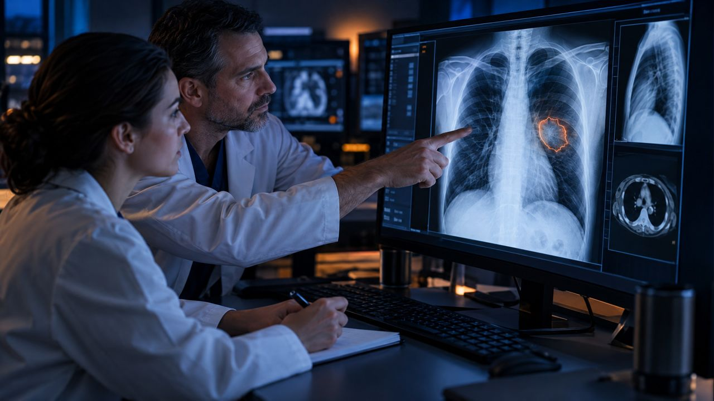

<!--
author:   Maia Lust
email:    
version:  2.3.0
language: et
narrator: Estonian Female
date:     08.10.2026
logo:     ../pildid/pae_logo.png
icon:     ../pildid/pae_logo.png
comment:  Tehisintellekti alused – gümnaasiumi valikkursus (35 tundi), Tallinna Pae Gümnaasium. Õppetekstid, interaktiivsed töölehed ja enesekontrollitestid.
link:     https://fonts.googleapis.com/css2?family=Nunito+Sans:wght@400;600;700&family=Poppins:wght@600;700&family=JetBrains+Mono:wght@400;600&display=swap

@style
/* ==== liascript-theming:start ==== */
/* links: https://fonts.googleapis.com/css2?family=Nunito+Sans:wght@400;600;700&family=Poppins:wght@600;700&family=JetBrains+Mono:wght@400;600&display=swap */
/* theme: Tallinna Pae Gümnaasium — generated by liascript-theming, edit theme.json and rebuild */
:root {
  --theme-font-body: 'Nunito Sans', sans-serif;
  --theme-font-heading: 'Poppins', serif;
  --theme-font-mono: 'JetBrains Mono', monospace;
  --theme-heading-weight: 700;
  --theme-line-height: 1.6;
  --global-font-size: 1.6rem;
  --theme-radius: 0.8rem;
  --theme-radius-small: 0.4rem;
  --theme-radius-large: 1.4rem;
  --theme-shadow: 0 0.3rem 1rem rgba(0,41,89,.10);
}
/* surfaces & text: apply to every color theme */
:root.lia-variant-light {
  --color-background: 255,255,255;
  --color-text: 29,36,51;
  --color-border: 228,229,231;
  --lia-grey-lighter: 238,242,247;
  --lia-grey-light: 204,212,222;
}
:root.lia-variant-dark {
  --color-background: 15,23,36;
  --color-text: 229,232,235;
  --color-border: 49,60,73;
  --lia-grey-dark: 30,38,47;
  --lia-anthracite: 41,50,61;
}
/* accent: only the course theme (default) and the custom radio,
   so readers can still pick LiaScript's built-in color themes */
:root:is(.lia-theme-default, .lia-theme-custom) {
  --color-highlight: 0,41,89;
  --color-highlight-dark: 0,41,89;
}
:root.lia-theme-default {
  --color-highlight-menu: 0,41,89;
}
:root:is(.lia-theme-default, .lia-theme-custom).lia-variant-dark {
  --color-highlight: 47,90,143;
  --color-highlight-dark: 255,185,143;
}
:root.lia-variant-light { --theme-heading-color: #002959; }
:root.lia-variant-dark { --theme-heading-color: #FFB98F; }
/* ==== LiaScript theme adapter (liascript-theming) — keep verbatim ====
   Maps the --theme-* tokens onto LiaScript's CSS. Everything a theme
   changes lives in the token block above this one. */

/* -- fonts: body/mono via the global variables, headings & co. are
      compiled literals in LiaScript and need explicit selectors -- */
:root {
  --global-font-family: var(--theme-font-body);
  --global-font-mono: var(--theme-font-mono);
  --global-font-headline: var(--theme-font-heading);
}
body { line-height: var(--theme-line-height, 1.47); }
h1, h2, h3, .h1, .h2, .h3 {
  font-family: var(--theme-font-heading);
  font-weight: var(--theme-heading-weight, 600);
  letter-spacing: var(--theme-heading-letter-spacing, normal);
  text-transform: var(--theme-heading-transform, none);
  color: var(--theme-heading-color, inherit);
}
h4, h5, h6, .h4, .h5, summary, .lia-accordion__headline {
  font-family: var(--theme-font-subheading, var(--theme-font-body));
}
.lia-quote__text { font-family: var(--theme-font-quote, var(--theme-font-heading)); }
.lia-code, .lia-code--inline, code, kbd, samp, pre { font-family: var(--theme-font-mono); }
.lia-code .ace_editor { font-family: var(--theme-font-mono) !important; }

/* -- shape: radius for controls & surfaces (radio buttons, tags, circles stay) -- */
:is(button, .lia-btn, input, .lia-input, select, .lia-select, textarea, .lia-textarea, .lia-dropdown):not(.lia-radio, .lia-btn--tag, .lia-btn--small-tag),
.lia-code-terminal__input, .lia-pagination__content, .lia-script, .lia-support-menu__submenu {
  border-radius: var(--theme-radius);
}
.lia-checkbox[type='checkbox'], kbd, .lia-tooltip .lia-tooltiptext, .lia-code--inline {
  border-radius: var(--theme-radius-small);
}
details, .lia-quote, .lia-code__input, .lia-table-responsive, .lia-card {
  border-radius: var(--theme-radius-large);
  box-shadow: var(--theme-shadow);
}
.lia-quote, .lia-code__input { overflow: hidden; }
.lia-code__input .ace_editor { border-radius: inherit; }
.lia-support-menu__submenu { box-shadow: var(--theme-shadow-popup, 0 0 1rem rgba(128, 128, 128, 0.2)); }

/* -- dark mode: LiaScript brightens the accent for text via
      rgb(from … calc(r*2.5)), which turns a hand-picked accent into
      pastel/yellow. For the course theme, text-like accent uses take
      --color-highlight-dark (= "accent as text") instead. Scoped to
      default/custom so the built-in color themes keep their behavior. -- */
:root:is(.lia-theme-default, .lia-theme-custom).lia-variant-dark :is(.lia-link, .lia-btn--outline, .lia-code--inline) {
  color: rgb(var(--color-highlight-dark));
  border-color: rgb(var(--color-highlight-dark));
}
:root:is(.lia-theme-default, .lia-theme-custom).lia-variant-dark :is(summary, summary:after, .lia-label, .lia-skip-nav, .lia-support-menu__item, .lia-quote__text),
:root:is(.lia-theme-default, .lia-theme-custom).lia-variant-dark :is(.lia-list--unordered, .lia-list--ordered) > li::marker {
  color: rgb(var(--color-highlight-dark));
}
:root:is(.lia-theme-default, .lia-theme-custom).lia-variant-dark :is(.lia-btn--transparent, .lia-input) {
  filter: none;
}
:root:is(.lia-theme-default, .lia-theme-custom).lia-variant-dark :is(.lia-input, .lia-checkbox[type='checkbox'], .lia-radio[type='radio']):not(:checked, .is-disabled, [disabled]) {
  border-color: rgb(var(--color-highlight-dark));
}
/* alternating table rows: LiaScript uses a neutral grey in dark mode */
:root.lia-variant-dark .lia-table.is-alternating .lia-table__row:nth-child(2n) td,
:root.lia-variant-dark .lia-table-responsive.has-thead-sticky.has-first-col-sticky .is-alternating .lia-table__row:nth-child(2n) td:first-child:before,
:root.lia-variant-dark .lia-table-responsive.has-thead-sticky.has-last-col-sticky .is-alternating .lia-table__row:nth-child(2n) td:last-child:before {
  background-color: rgb(var(--lia-grey-dark));
}
/* -- theme extras -- */
/* ===== Tallinna Pae Gümnaasiumi värvid =====
   tumesinine #002959 · oranž #FF8B48 · tumeoranž #E67E42 */
:root {
  --pae-sinine: #002959;
  --pae-sinine-80: #33547A;
  --pae-sinine-20: #CCD4DE;
  --pae-sinine-08: #EEF2F7;
  --pae-oranz: #FF8B48;
  --pae-oranz-tume: #E67E42;
  --pae-oranz-20: #FFE2D1;
  --pae-oranz-08: #FFF4EC;
  --pae-roheline: #2E8B57;
  --pae-roheline-08: #EAF6EF;
  --pae-lilla: #6B4FA0;
  --pae-lilla-08: #F2EEF9;
}

/* Pealkirjad */
.lia-slide h1, main h1 {
  color: var(--pae-sinine);
  border-bottom: 6px solid var(--pae-oranz);
  padding-bottom: .3em;
}
.lia-slide h2, main h2 { color: var(--pae-sinine); }
.lia-slide h3, main h3 {
  color: var(--pae-sinine);
  border-left: 8px solid var(--pae-oranz);
  padding-left: .5em;
}
.lia-slide h4, main h4 { color: var(--pae-oranz-tume); }
strong { color: inherit; }

/* Tabelid */
.lia-table th, table thead th {
  background: var(--pae-sinine) !important;
  color: #fff !important;
}
.lia-table tbody tr:nth-child(even), table tbody tr:nth-child(even) { background: var(--pae-sinine-08); }

/* Pildid ja infograafikud */
img.lia-image, .lia-figure img, main img {
  border-radius: 12px;
}
.lia-figure__caption, figcaption {
  color: var(--pae-sinine-80);
  font-style: italic;
  text-align: center;
}

/* ASCII-skeemid väiksemaks ja Pae värvidesse */
.lia-ascii svg, lia-ascii svg, .lia-code--ascii svg { max-width: 760px; margin: 0 auto; display: block; }
svg.lia-ascii text { fill: var(--pae-sinine); }

/* ===== Kujunduskastid ===== */
blockquote.pae-moiste, blockquote.pae-naide, blockquote.pae-eesti,
blockquote.pae-motle, blockquote.pae-lisaks, blockquote.pae-fakt,
.pae-moiste, .pae-naide, .pae-eesti, .pae-motle, .pae-lisaks, .pae-fakt {
  border-radius: 14px !important;
  padding: 1.1em 1.4em 1.1em 4.2em !important;
  margin: 1.4em 0 !important;
  position: relative;
  box-shadow: 0 3px 10px rgba(0,41,89,.10);
  font-style: normal !important;
  text-align: left !important;
}
.pae-moiste::before, .pae-naide::before, .pae-eesti::before,
.pae-motle::before, .pae-lisaks::before, .pae-fakt::before {
  position: absolute; left: .7em; top: .75em;
  width: 2em; height: 2em; line-height: 2em;
  border-radius: 50%; text-align: center; font-size: 1.15em;
  color: #fff; font-style: normal;
}
/* Mõiste – oranž */
.pae-moiste { background: var(--pae-oranz-08) !important; border: 2px solid var(--pae-oranz) !important; border-left: 10px solid var(--pae-oranz) !important; }
.pae-moiste::before { content: "📖"; background: var(--pae-oranz); }
/* Näide – tumesinine */
.pae-naide { background: var(--pae-sinine-08) !important; border: 2px solid var(--pae-sinine-20) !important; border-left: 10px solid var(--pae-sinine) !important; }
.pae-naide::before { content: "💡"; background: var(--pae-sinine); }
/* Eesti näide – sinine-valge */
.pae-eesti { background: linear-gradient(135deg, #E8F1FB 0%, #ffffff 100%) !important; border: 2px solid #0072CE !important; border-left: 10px solid #0072CE !important; }
.pae-eesti::before { content: "🇪🇪"; background: #0072CE; }
/* Mõtle järele – roheline */
.pae-motle { background: var(--pae-roheline-08) !important; border: 2px dashed var(--pae-roheline) !important; border-left: 10px solid var(--pae-roheline) !important; }
.pae-motle::before { content: "🤔"; background: var(--pae-roheline); }
/* Tea lisaks – lilla */
.pae-lisaks { background: var(--pae-lilla-08) !important; border: 2px solid #CDBFE6 !important; border-left: 10px solid var(--pae-lilla) !important; }
.pae-lisaks::before { content: "🔍"; background: var(--pae-lilla); }
/* Fakt – tume taust, valge tekst */
.pae-fakt { background: var(--pae-sinine) !important; color: #fff !important; border-left: 10px solid var(--pae-oranz) !important; }
.pae-fakt * { color: #fff !important; }
.pae-fakt::before { content: "⚡"; background: var(--pae-oranz); }

/* Töölehe jaotise riba */
.pae-jaotis { background: var(--pae-sinine); color: #fff !important; padding: .55em 1em; border-radius: 10px; margin: 2em 0 1em; border-left: 10px solid var(--pae-oranz); }
.pae-jaotis * { color: #fff !important; }

/* Ploki kaanepilt */
.pae-kaas img, img.pae-kaas { width: 100%; border-radius: 16px; box-shadow: 0 6px 20px rgba(0,41,89,.18); }

/* Näidisvastuse kokkupandav kast */
details {
  background: var(--pae-oranz-08);
  border: 1px solid var(--pae-oranz);
  border-radius: 10px; padding: .6em 1em; margin: .6em 0 1.4em;
}
details summary { cursor: pointer; font-weight: bold; color: var(--pae-oranz-tume); }

/* Menüü (sisukord) tumesinine */
.lia-toc a, .lia-toc .lia-toc__link, nav.lia-toc a { color: #002959 !important; }
.lia-toc a.lia-active, .lia-toc .lia-active { font-weight: 700; }
:root.lia-variant-dark .lia-toc a { color: #CCD4DE !important; }
:root.lia-variant-dark .pae-moiste, :root.lia-variant-dark .pae-naide, :root.lia-variant-dark .pae-eesti,
:root.lia-variant-dark .pae-motle, :root.lia-variant-dark .pae-lisaks { color: #1d2433 !important; }
:root.lia-variant-dark .pae-moiste *, :root.lia-variant-dark .pae-naide *, :root.lia-variant-dark .pae-eesti *,
:root.lia-variant-dark .pae-motle *, :root.lia-variant-dark .pae-lisaks * { color: #1d2433 !important; }
:root.lia-variant-dark img { background: #fff; }
/* ==== liascript-theming:end ==== */
/* Loosimisnupp (rollimäng) */
output.lia-script[input="submit"] { display:inline-block !important; background:#002959; color:#fff !important; font-weight:700; padding:.6em 1.2em; border-radius:999px; border:3px solid #FF8B48 !important; cursor:pointer; box-shadow:0 3px 10px rgba(0,41,89,.2); }
output.lia-script[input="submit"]:hover { background:#FF8B48; color:#002959 !important; }

/* Lihtsalt öeldes (ettelugemisega) */
section.pae-lihtne { background:#EAF6EE; border:2px solid #2E8B57; border-left:10px solid #2E8B57; border-radius:14px; padding:.9em 1.3em; margin:1.2em 0; font-size:1.05em; line-height:1.6; box-shadow:0 3px 10px rgba(0,41,89,.08); }
section.pae-lihtne p { margin:.5em 0; }
:root.lia-variant-dark section.pae-lihtne, :root.lia-variant-dark section.pae-lihtne * { color:#1d2433 !important; }

/* Sõnastiku hüpikselgitus */
.pae-term { border-bottom:2px dotted #FF8B48; cursor:help; position:relative; outline:none; }
.pae-term:hover::after, .pae-term:focus::after {
  content: attr(data-def); position:absolute; left:0; top:1.7em; z-index:999;
  width:max-content; max-width:min(320px, 80vw); white-space:normal;
  background:#002959; color:#fff; padding:.55em .8em; border-radius:10px;
  font-size:15px; line-height:1.45; font-weight:400; font-style:normal;
  box-shadow:0 6px 18px rgba(0,41,89,.3); border-left:5px solid #FF8B48;
}
.pae-fakt .pae-term:hover::after, .pae-fakt .pae-term:focus::after { color:#fff !important; }

@end

@custom
--color-highlight-menu: 255,255,255;
@end
-->

## 5.3 Meditsiiniline pildianalüüs

<!-- class="pae-lisaks" -->
> 🗺️ **Oled 5. toas – Vaatlustorn.** Lisa selle lehe link järjehoidjasse, et saaksid hiljem samast kohast jätkata. Järgmine osa avaneb alles siis, kui oled selle osa luku lahendanud.

<!-- class="pae-kaas" -->

### Õpieesmärgid

Selle tunni järel sa:

- **selgitad oma sõnadega**, miks meditsiin vajab TI abi ja miks lõpliku otsuse teeb ikkagi arst *(mõistmine)*;
- **arvutad** mudeli tundlikkuse ja spetsiifilisuse sõeluuringu andmete põhjal *(rakendamine)*;
- **analüüsid**, kas süsteemil on kõrge tundlikkus või kõrge spetsiifilisus ja kumb on sõeluuringus tähtsam *(analüüs)*;
- **treenid** Teachable Machine'is lihtsa sõeluuringu mudeli ja **hindad** selle tundlikkuse ja spetsiifilisuse põhjal, millal see eksib *(loomine, hindamine)*;
- **põhjendad**, mis tingimusel usaldaksid diagnoosi, mille panid TI ja arst koos *(hindamine)*.

<!-- class="pae-fakt" -->
> **🎯 Tunni tuumik (45 min)**
>
> 🔑 **Tuummõisted:** meditsiiniline pildianalüüs, tundlikkus, spetsiifilisus, must kast. Teised mõisted on süvendamiseks.
>
> 🏠 **Kodus enne tundi** (~10 min): loe või vaata „Meditsiinilise pildinduse liigid“. Soovi korral ka „Tehisintellekti ülesanded ja töövoog“, „Näited: kopsud, aju, vähk ja koed“, „Video: kuidas aitab tehisaru päästa elusid?“. Too tundi kaasa üks uus teadmine või küsimus.
>
> 0. 💬 **Tunni algus** (~3 min): jaga paarilisega kodus loetust üht mõtet; vaata õpetaja tagasisidet eelmisele piletile ja paranda vajadusel oma vastust.
> 1. 📚 **Loe** (~10 min): „Miks meditsiin vajab tehisintellekti abi?“, „Kuidas meditsiinilise TI täpsust hinnata?“, „Eelised, väljakutsed ja vastutus“ ja „Kokkuvõte ja põhimõisted“
> 2. 🧪 **TI-katse** (~10 min): „Treeni oma sõeluuringu mudel“
> 3. ⭐ **Tööleht** (~12 min): ülesanded V, VI ja VIII
> 4. 📤 **Väljapääsupilet** ja 🔐 **lukk** (~7 min)
> 5. ⏱️ **Puhver** (~3 min): üleminekud, küsimused ja tehnilised tõrked. Kui aeg jääb napiks, lahenda lukk kodus.
>
> **🏠** tähistab osi, mida loed või vaatad **kodus enne tundi** (ümberpööratud klassiruum). **➕** tähistab lisaülesannet – tee seda, kui jõuad, või kui tahad rohkem teada.

{{|>}}
<section class="pae-lihtne">

**🟢 Lihtsalt öeldes**

Haiglas tehakse igal aastal väga palju röntgen- ja muid pilte. Arste on vähe, seepärast aitab neid nüüd ka tehisintellekt. TI vaatab pilte kiiresti ja märkab ka väikeseid muutusi. TI täpsust mõõdetakse kahe näitajaga: **tundlikkus** ja **spetsiifilisus**. Sõeluuringus on tähtis, et ükski haige ei jääks märkamata. Paljud mudelid on **must kast**: nad ei ütle, miks nad nii otsustasid. Seepärast on TI ainult arsti abiline, mitte arsti asendaja. Lõpliku otsuse teeb ja vastutuse kannab arst.

**Tähtsad sõnad:** **meditsiiniline pildianalüüs** – haiguspiltide uurimine arvuti abil; **tundlikkus** – kui suure osa haigetest TI üles leiab; **spetsiifilisus** – kui suure osa tervetest TI õigesti terveks tunnistab; **must kast** – mudel, mis ei selgita oma otsust.

</section>

### Miks meditsiin vajab tehisintellekti abi?

Kui oled kunagi jalga väänanud ja käinud röntgenis, siis tead, et pildi teeb masin, aga selle loeb ja tõlgendab arst – **radioloog**. Maailma Terviseorganisatsiooni andmetel tehakse maailmas igal aastal üle 4 miljardi radioloogilise uuringu. Andmete hulk ja keerukus kasvavad, aga radiolooge on paljudes piirkondades puudu. Üks arst peab päevas läbi vaatama väga palju pilte ning väsimus ja ajasurve võivad põhjustada vigu.

<!-- class="pae-moiste" -->
> **Mõiste: meditsiiniline pildianalüüs**
>
> Meditsiiniline pildianalüüs on meditsiiniliste piltide (nt röntgen-, KT- ja MRT-piltide) töötlemine ja analüüsimine arvuti abil, et aidata arstidel haigusi avastada, diagnoosida ja ravi planeerida.

Tehisintellekt saab siin aidata mitmel viisil. See võib **optimeerida töövoogu** (nt tõsta kiireloomulised pildid järjekorras ettepoole), **parandada diagnoosi täpsust**, aidata **haigusi varakult avastada** ja toetada **personaliseeritud meditsiini**, kus ravi kohandatakse konkreetsele patsiendile. Tulemuseks võib olla kiirem diagnoos, täpsem raviplaan ja tervishoiu ressursside parem kasutamine.

Oluline on meeles pidada: TI on siin **arsti abiline**, mitte arsti asendaja. Lõpliku otsuse teeb ja vastutuse kannab inimene.

### 🏠 Meditsiinilise pildinduse liigid

Meditsiinis on palju eri viise, kuidas inimese sisse „vaadata“. Iga meetod näitab erinevaid asju.

| Meetod | Kuidas töötab | Mida näeb hästi | Plussid ja miinused |
|---|---|---|---|
| **Röntgen** | Röntgenkiirgus, 2D-projektsioon | Luud, kopsud, südame vari | Kõige levinum, kiire ja odav; kasutab kiirgust, pehmed koed näha halvasti |
| **Kompuutertomograafia (KT, ingl CT)** | Paljud röntgenpildid eri nurkade alt → 3D-kihid | Pehmed koed, luud, siseorganid | Väga detailne 3D-pilt; suurem kiirgusdoos |
| **Magnetresonantstomograafia (MRT, ingl MRI)** | Tugev magnetväli ja raadiolained | Pehmed koed, aju, liigesed; eri režiimid (T1, T2, FLAIR) | Kiirguseta, väga hea pehmete kudede eristus; aeglane ja kallis |
| **Ultraheli** | Helilained | Süda, loode, kõhuõõne elundid | Ohutu, reaalajas; pildi kvaliteet sõltub uurijast |
| **Positronemissioontomograafia (PET)** | Radioaktiivne märgistusaine | Ainevahetuse aktiivsus, nt vähikolded | Näitab kudede tööd, mitte ainult kuju; vajab radioaktiivset ainet |

Lisaks on eriülesannete jaoks **mammograafia** (rinnanäärme röntgenpildid rinnavähi sõeluuringuks), **histopatoloogia** (koelõikude pildid mikroskoobi all, kus uuritakse rakkude ehitust ja diagnoositakse vähki) ja **dermatoskoopia** (nahakahjustuste suurendatud pildid, nt melanoomi avastamiseks).

<!-- class="pae-motle" -->
> **Mõtle järele!**
>
> Miks ei piisa ühest pildindusmeetodist? Mõtle, millist meetodit kasutaksid luumurru, ajukahjustuse ja raseduse jälgimise puhul ning miks.

### 🏠 Tehisintellekti ülesanded ja töövoog

Tunnis 5.1 tutvusid arvutinägemise põhiülesannetega. Meditsiinis kasutatakse just neid samu ülesandeid.

- **Klassifitseerimine**: kas pilt on normaalne või patoloogiline (haiguslik); mis tüüpi haigusega on tegu; kui raske see on.
- **Segmenteerimine**: elundite, kasvajate ja muude anatoomiliste struktuuride täpne piiritlemine.
- **Tuvastamine ja lokaliseerimine**: anomaaliate, kasvajate, kopsusõlmede või luumurdude leidmine ja asukoha märkimine.
- **Kvantitatiivsed mõõtmised**: mahu ja tiheduse arvutamine, haiguse muutuste jälgimine ajas.

<!-- class="pae-moiste" -->
> **Mõiste: arvutipõhine diagnostika ja anomaaliate tuvastamine**
>
> **Arvutipõhine diagnostika** (Computer-Aided Diagnosis, CAD) tähendab meditsiiniliste piltide töötlemist ja analüüsimist arvuti abil, et toetada arsti otsust. **Anomaaliate tuvastamine** on selle üks osa: piltidelt otsitakse automaatselt haiguslikke muutusi, mis erinevad tavapärasest.

Tüüpiline TI-põhine meditsiinilise pildianalüüsi töövoog näeb välja nii:

Milliseid mudeleid kasutatakse? **Konvolutsioonilised närvivõrgud** sobivad klassifitseerimiseks ja tunnuste eraldamiseks. Sageli kasutatakse **siirdeõpet** (transfer learning): võetakse mudel, mis on juba õppinud miljonite tavaliste fotode põhjal, ja õpetatakse see edasi meditsiiniliste piltidega. Nii on vaja vähem meditsiinilisi andmeid.

Segmenteerimiseks on eriti populaarne **U-Net**. Selle nimi tuleb U-tähe kujulisest ülesehitusest: esimene pool (kodeerija ehk encoder) teeb pildi järjest väiksemaks ja leiab tunnused, teine pool (dekodeerija ehk decoder) teeb selle uuesti suureks ja joonistab täpse piirjoone. **Skip-ühendused** viivad detailid otse esimesest poolest teise, et piirid jääksid teravad.

Kuna KT- ja MRT-pildid on kolmemõõtmelised, kasutatakse ka **3D-arhitektuure** (3D CNN, V-Net, 3D U-Net). Uuemad lahendused põhinevad **transformeritel** (nt ViT, UNETR, SwinUNETR).

### 🏠 Näited: kopsud, aju, vähk ja koed

**Kopsuhaiguste tuvastamine röntgenpiltidelt.** TI-d on õpetatud tuvastama kopsupõletikku, tuberkuloosi, COVID-19 ja kopsuvähki. Selleks on loodud suured avalikud andmestikud (nt ChestX-ray14, CheXpert, MIMIC-CXR) ja uurimistöödes mudelid nagu CheXNet ja COVID-Net. Raskust valmistab see, et röntgenpildil kattuvad struktuurid üksteisega, kontrast on väike ja eri haigused näevad sageli sarnased välja.

**Ajupiltide analüüs.** TI aitab tuvastada ajukasvajaid ja insulti, uurida neurodegeneratiivseid haigusi (nt Alzheimeri ja Parkinsoni tõbi) ning segmenteerida aju struktuure. Andmestikud on näiteks ADNI, BraTS ja ATLAS, tööriistad DeepMedic ja nnU-Net. Väljakutsed on keerukas 3D-ehitus ja see, et iga inimese aju on veidi erinev.

**Vähidiagnostika.** TI-d kasutatakse kasvajate tuvastamiseks ja liigitamiseks, metastaaside leidmiseks ja ravi tõhususe hindamiseks: rinnavähi puhul mammograafias, kopsuvähi puhul KT-s, nahavähi puhul dermatoskoopias ja eesnäärmevähi puhul MRT-s. Näiteks on Google Health arendanud mammograafia mudelit, mis vähendas 2020. aasta uuringus nii valepositiivseid kui ka valenegatiivseid tulemusi. Väljakutsed on valepositiivsed tulemused, haruldased vähitüübid ja haiguse varajaste staadiumite märkamine.

**Histopatoloogia.** Koelõikude digitaalsed pildid on hiiglaslikud – miljardeid piksleid (gigapikslid). TI aitab rakke klassifitseerida, vähki tuvastada ja selle raskusastet hinnata. Raskused tulenevad värvide erinevusest ja preparaatide kvaliteedist. Selle valdkonna ettevõtted on näiteks PathAI ja Paige.AI.

<!-- class="pae-fakt" -->
> **Kas teadsid?** Koelõikude digitaalsed pildid on nii suured, et neis on **miljardeid piksleid** – neid nimetatakse gigapikslipiltideks. TI aitab neis rakke klassifitseerida ja vähki tuvastada.

<!-- class="pae-naide" -->
> **Näide: TI kui „teine silmapaar“**
>
> Kujuta ette rinnavähi sõeluuringut, kus iga pildi peab läbi vaatama radioloog. TI-süsteem analüüsib iga pildi samuti ja märgib kahtlased kohad. Kui TI ja arst on ühel meelel, liigub töö kiiremini. Kui TI märkab midagi, mida arst ei märganud, vaatab arst selle koha uuesti üle. Nii ei asenda TI arsti, vaid on tema „teine silmapaar“, mis ei väsi ka pika päeva lõpus.

### Kuidas meditsiinilise TI täpsust hinnata?

Meditsiinis on vead eriti kallid. Kui TI jätab vähikolde märkamata, võib ravi hilineda. Kui ta näeb haigust seal, kus seda pole, tekitab see patsiendile asjatut hirmu ja lisauuringuid. Seepärast mõõdetakse kahte eri liiki täpsust.

<!-- class="pae-moiste" -->
> **Mõiste: tundlikkus ja spetsiifilisus**
>
> **Tundlikkus** (sensitivity) näitab, kui suure osa tegelikult haigetest inimestest test või mudel õigesti üles leiab. **Spetsiifilisus** (specificity) näitab, kui suure osa tervetest inimestest see õigesti terveks tunnistab.

Kujuta ette, et 100 inimesest 10 on haiged. Kui mudel leiab neist 9, on tundlikkus 9/10. Kui 90 tervest tunnistab ta 81 terveks ja 9 inimest ekslikult haigeks, on spetsiifilisus 81/90. Sõeluuringus on tavaliselt eriti tähtis kõrge tundlikkus, et ükski haige ei jääks kahe silma vahele, aga liiga palju valehäireid koormab tervishoidu.

Lisaks kasutatakse **AUC**-d (ROC-kõvera alune pindala), mis võtab tundlikkuse ja spetsiifilisuse kokku üheks arvuks, ning segmenteerimise puhul **Dice'i koefitsienti**, mis näitab (sarnaselt IoU-ga), kui hästi mudeli joonistatud piirjoon kattub arsti omaga.

Ainult arvutis tehtud testidest ei piisa. Enne kasutuselevõttu tehakse **kliiniline valideerimine**: prospektiivsed uuringud (mudelit testitakse uutel patsientidel päris olukorras), mitmekeskuselised uuringud (mitmes haiglas) ja võrdlus ekspertidega. Meditsiinis kasutatav TI on **meditsiiniseade** ja vajab ametlikku luba: USA-s FDA heakskiitu, Euroopas **CE-märgistust**.

### Eelised, väljakutsed ja vastutus

Meditsiinilise TI **eelised**:

- **tõhusus** – kiirem analüüs, suurte andmemahtude töötlemine, radioloogide väiksem töökoormus;
- **järjepidevus** – vähem kõikumist, ühtlane hindamine, väsimuse puudumine;
- **täpsus** – väikeste muutuste märkamine, täpsed mõõtmised, inimsilmale raskesti märgatavad mustrid;
- **kättesaadavus** – spetsialistide puuduse leevendamine, kaugdiagnostika, sõeluuringute laiendamine.

**Väljakutsed** on aga sama olulised.

- **Andmed.** Terviseandmed on tundlikud **isikuandmed**, mida kaitsevad GDPR ja teised seadused. Andmeid on raske eri haiglate vahel ühtlustada ja harvaesinevate haiguste kohta on neid vähe.
- **Selgitatavus ja usaldus.** Paljud mudelid on **„must kast“**: nad annavad vastuse, aga ei ütle, miks. Arst peab aga oskama oma otsust patsiendile põhjendada.
- **Integreerimine haigla töösse.** Uus süsteem peab sobima olemasolevate infosüsteemidega, olema mugav kasutada ning sageli tuleb muuta ka töövooge.
- **Vastutus ja eetika.** Kes vastutab, kui TI eksib – arst, haigla või tarkvara looja? Kas patsient peab teadma, et tema pilti analüüsis TI? Kuidas tagada, et mudel töötaks võrdselt hästi kõigi patsiendirühmade puhul?

<!-- class="pae-eesti" -->
> **Eesti näide: e-tervis ja digiradioloogia**
>
> Eesti tervishoid on tugevalt digitaliseeritud: meil on e-tervise süsteemid ja digitaalne radioloogia, kus pildid liiguvad haiglate vahel elektrooniliselt. Põhja-Eesti Regionaalhaiglas aitab TI radioloogidel teha rutiinseid mõõtmisi, leida röntgenpiltidelt luumurde ja insuldi korral kiiresti märgata ajupiirkondi, mis on jäänud verevarustuseta. Rinnavähi sõeluuringus hindavad Eestis mammogramme endiselt kaks arsti: haigla diagnostikakliiniku juhi sõnul võib liiga tundlik TI märkida kahtlaseks ka terveid kohti ja radiolooge segada (ERR, 2026). Meditsiinilist TI-d uuritakse ka Tartu Ülikoolis ja Tallinna Tehnikaülikoolis. Eesti väljakutsed on väike turg, piiratud andmehulk ja ranged regulatsioonid.

**Tulevikus** ühendavad **multimodaalsed süsteemid** eri pildiliike, kliinilisi ja geneetilisi andmeid. **Föderatiivne õpe** (federated learning) võimaldab treenida mudelit mitme haigla andmetel nii, et patsientide andmed ei lahku haiglast – liiguvad ainult mudeli õpitud parameetrid. Nii saab teha rahvusvahelist koostööd ilma privaatsust ohustamata. Areneb ka **personaliseeritud meditsiin**: patsiendipõhised mudelid, ravi tõhususe ja haiguse kulgu ennustamine. Suur küsimus on, kui kaugele automatiseerimisega minna. Enamasti räägitakse **otsustustoe süsteemidest**, kus TI ja arst teevad koostööd. Täisautomaatsed süsteemid võivad tulla kasutusele vaid mõnes kitsas valdkonnas.

### 🧪 TI-katse: treeni oma sõeluuringu mudel

🛡️ *Ohutuskaardi reeglid kehtivad: ära logi sisse, ära sisesta isikuandmeid ega pildista inimesi.*

Treenid Teachable Machine'is mudeli, mis eristab „terveid“ ja „kahjustatud“ paberilehti, ning mõõdad selle tundlikkust ja spetsiifilisust samamoodi nagu päris sõeluuringus.

**Vaja läheb:** [Teachable Machine](https://teachablemachine.withgoogle.com/) (tasuta, pildid jäävad sinu arvutisse), veebikaamera, 10 valget paberilehte ja pliiats, ~10 min, paaristöö

1. Joonista viiele lehele väike täpp või kriips („kahjustus“), ülejäänud viis lehte jäävad puhtaks („terved“).
2. Ava Teachable Machine → *Image Project* → *Standard image model*. Nimeta klassid „terve“ ja „kahjustus“ ning salvesta veebikaameraga kummagi klassi kohta umbes 30 pilti. Suuna kaamera paberile, mitte inimestele.
3. Vajuta *Train Model*.
4. Testi mudelit 10 uue lehega (5 kahjustusega, 5 puhast; joonista täpid teise kohta ja eri suurusega). Kirjuta üles, mitu kahjustust mudel leidis ja mitu puhast lehte ta õigesti terveks tunnistas.

**Pane tähele / kirjuta üles:** Arvuta tundlikkus (leitud kahjustused : 5) ja spetsiifilisus (õigesti terveks tunnistatud : 5). Millal mudel eksis (nt väga väike täpp, varjud)? Kumb viga oleks päris haiglas ohtlikum?

[[___ ___ ___]]

<!-- class="pae-lisaks" -->
> **Kui arvutit pole:** üks paariline joonistab 10 kaardile pisikese „kahjustuse“ või jätab kaardi puhtaks, teine vaatab iga kaarti üks sekund ja otsustab. Arvutage koos tundlikkus ja spetsiifilisus.

### 🏠 🎬 Video: kuidas aitab tehisaru päästa elusid?

Radioloog Martin Reim näitab päris juhtumite põhjal, kuidas tehisaru aitab arstidel tuvastada insulti, luumurde ja kasvajaid varem ja täpsemalt. Tehisaru võib aga ka eksida, seepärast peab arst tundma selle tugevusi ja piire. Lõplik otsus ja vastutus jäävad inimesele.

**Martin Reim: kuidas aitab tehisaru päästa elusid?** · *TI-Hüpe* · ⏱ 15 min

!?[Martin Reim: kuidas aitab tehisaru päästa elusid? – TI-Hüpe](https://www.youtube.com/watch?v=pgmpkxDKM48)

<!-- class="pae-motle" -->
> **Mõtle vaatamise ajal**
>
> 1. Milliste haiguste ja vigastuste tuvastamisel tehisaru radioloogi aitab?
> 2. Miks on insuldi puhul eriti tähtis, et tehisaru töötab kiiresti?
> 3. Millal võib tehisaru eksida ja miks peab arst selle piire tundma?

**Kas sina usaldaksid tehisaru abil tehtud diagnoosi? Mis tingimustel? Põhjenda video põhjal.**

[[___ ___ ___]]

### Kokkuvõte ja põhimõisted

**Pea meeles**

- Meditsiiniline pildianalüüs tähendab meditsiiniliste piltide analüüsimist arvuti abil, et toetada diagnoosi ja ravi.
- Eri pildindusmeetodid (röntgen, KT, MRT, ultraheli, PET) näitavad keha eri omadusi.
- TI klassifitseerib, segmenteerib, tuvastab ja mõõdab; segmenteerimiseks kasutatakse sageli U-Neti.
- Täpsust mõõdetakse tundlikkuse, spetsiifilisuse, AUC ja Dice'i koefitsiendiga; enne kasutuselevõttu on vaja kliinilist valideerimist ja ametlikku luba (nt CE-märgistus).
- Väljakutsed on andmekaitse, „musta kasti“ probleem, integreerimine ja vastutus.
- TI on arsti abiline – lõpliku otsuse teeb arst.

| Mõiste | Tähendus |
|---|---|
| Meditsiiniline pildianalüüs | Meditsiiniliste piltide töötlemine ja analüüs arvuti abil |
| KT (kompuutertomograafia) | Röntgenil põhinev kihiline 3D-pildistamine |
| MRT (magnetresonantstomograafia) | Magnetvälja ja raadiolainetega tehtav pildistamine, eriti pehmete kudede jaoks |
| U-Net | U-kujuline närvivõrk meditsiiniliste piltide segmenteerimiseks |
| Tundlikkus | Kui suure osa haigetest mudel üles leiab |
| Spetsiifilisus | Kui suure osa tervetest mudel õigesti terveks tunnistab |
| Kliiniline valideerimine | TI-süsteemi testimine päris patsientidega enne kasutuselevõttu |
| Föderatiivne õpe | Mudeli treenimine nii, et andmed jäävad oma asukohta (nt haiglasse) |

### 📚 Allikad ja lisalugemine

- ERR (2026). [„AK. Nädal“ uuris tehisintellekti kasutamise võimalusi tervishoius](https://www.err.ee/1610007058/ak-nadal-uuris-tehisintellekti-kasutamise-voimalusi-tervishoius). Eestikeelne lugu sellest, kuidas TI aitab Põhja-Eesti Regionaalhaigla radioloogidel ja laborites – ning miks diagnoosi paneb inimene.
- Maailma Terviseorganisatsioon (s.a.). [Ionizing radiation and health effects](https://www.who.int/news-room/fact-sheets/detail/ionizing-radiation-and-health-effects). Faktileht: maailmas tehakse aastas üle 4,2 miljardi radioloogilise uuringu.
- Google DeepMind (2020). [International evaluation of an AI system for breast cancer screening](https://deepmind.google/discover/blog/international-evaluation-of-an-ai-system-for-breast-cancer-screening/). Ülevaade uuringust, kus TI vähendas mammograafias vale- ja märkamata jäänud leide; autorid rõhutavad, et vaja on kliinilisi uuringuid.
- Ronneberger, O., Fischer, P., Brox, T. (2015). [U-Net: Convolutional Networks for Biomedical Image Segmentation](https://arxiv.org/abs/1505.04597). U-Neti originaalartikkel: U-kujuline võrk õpib segmenteerima ka väheste märgendatud piltide põhjal.
- USA Toidu- ja Ravimiamet FDA (2026). [Artificial Intelligence-Enabled Medical Devices](https://www.fda.gov/medical-devices/software-medical-device-samd/artificial-intelligence-enabled-medical-devices). USA-s lubatud TI-põhiste meditsiiniseadmete nimekiri – suurem osa neist on radioloogias.

### Tööleht 5.3

<!-- class="pae-lisaks" -->
> **⭐ Tuumikülesannete hindamine (2–1–0 p):** **mõiste täpsus** – kasutad õiget mõistet õiges tähenduses; **tõend** – toetud katsetulemusele, näitele või allikale; **põhjendus** – selgitad, miks see nii on. ➕ ülesanded on vabatahtlikud.

<!-- class="pae-jaotis" -->
**➕ I. Meditsiinilise pildianalüüsi põhimõisted**

**Ülesanne 1.** Selgita oma sõnadega, mis on meditsiiniline pildianalüüs.

[[___ ___ ___]]

**Ülesanne 2.** Ühenda meditsiinilise pildianalüüsiga seotud mõisted nende definitsioonidega.

| Täht | Kirjeldus |
|:---:|---|
| **A** | Piltide liigitamine kategooriatesse (nt normaalne vs patoloogiline) |
| **B** | Meditsiiniliste piltide töötlemine ja analüüsimine arvuti abil |
| **C** | Piltidel olevate struktuuride või kudede eristamine |
| **D** | Piltidelt haiguslike muutuste automaatne tuvastamine |
| **E** | Meditsiiniliste piltide loomine erinevate tehnoloogiate abil |

- [ (A) (B) (C) (D) (E) ]
- [ ( ) ( ) ( ) ( ) (X) ] Radioloogiline pildindus
- [ ( ) (X) ( ) ( ) ( ) ] Arvutipõhine diagnostika (CAD)
- [ ( ) ( ) (X) ( ) ( ) ] Segmenteerimine
- [ (X) ( ) ( ) ( ) ( ) ] Klassifitseerimine
- [ ( ) ( ) ( ) (X) ( ) ] Anomaaliate tuvastamine
****************************************
Radioloogiline pildindus loob pildid (E). Arvutipõhine diagnostika on laiemalt piltide analüüsimine arvuti abil (B). Segmenteerimine eristab struktuure ja kudesid (C), klassifitseerimine liigitab pildi kategooriasse (A) ja anomaaliate tuvastamine otsib haiguslikke muutusi (D).
****************************************

<!-- class="pae-jaotis" -->
**➕ II. Meditsiinilise pildinduse meetodid**

**Ülesanne 3.** Kirjelda lühidalt järgmisi meditsiinilise pildinduse meetodeid.

a) Röntgen:

[[___ ___ ___]]

b) Kompuutertomograafia (KT):

[[___ ___ ___]]

c) Magnetresonantstomograafia (MRT):

[[___ ___ ___]]

d) Ultraheliuuring:

[[___ ___ ___]]

e) Positronemissioontomograafia (PET):

[[___ ___ ___]]

**Ülesanne 4.** Millised on erinevate pildindusmeetodite eelised ja puudused?

| Meetod | Eelised | Puudused | Millal kasutatakse? |
|---|---|---|---|
| Röntgen | | | |
| KT | | | |
| MRT | | | |
| Ultraheli | | | |
| PET | | | |

Kirjuta iga meetodi kohta eelised, puudused ja kasutusolukord.

**Röntgen:**

[[___ ___ ___]]

**KT:**

[[___ ___ ___]]

**MRT:**

[[___ ___ ___]]

**Ultraheli:**

[[___ ___ ___]]

**PET:**

[[___ ___ ___]]

<!-- class="pae-jaotis" -->
**➕ III. Tehisintellekt meditsiinilises pildianalüüsis**

**Ülesanne 5.** Kuidas aitab tehisintellekt meditsiiniliste piltide analüüsimisel?

[[___ ___ ___ ___]]

**Ülesanne 6.** Kirjelda, kuidas toimib tehisintellektil põhinev meditsiiniline pildianalüüs.

[[___ ___ ___ ___]]

**Ülesanne 7.** Millised on peamised väljakutsed tehisintellekti kasutamisel meditsiinilises pildianalüüsis? Nimeta vähemalt neli.

[[___ ___ ___ ___]]

<!-- class="pae-jaotis" -->
**➕ IV. Meditsiinilise pildianalüüsi rakendused**

**Ülesanne 8.** Täida tabel tehisintellekti rakenduste kohta erinevates meditsiinilise pildianalüüsi valdkondades.

| Valdkond | Rakenduse näide | Kuidas tehisintellekt aitab? | Mõju patsiendile |
|---|---|---|---|
| Onkoloogia (vähiravi) | | | |
| Kardioloogia (südamehaigused) | | | |
| Neuroloogia (närvisüsteem, aju) | | | |
| Ortopeedia (luud ja liigesed) | | | |
| Dermatoloogia (nahk) | | | |

Kirjuta iga valdkonna kohta rakenduse näide, TI roll ja mõju patsiendile.

**Onkoloogia:**

[[___ ___ ___]]

**Kardioloogia:**

[[___ ___ ___]]

**Neuroloogia:**

[[___ ___ ___]]

**Ortopeedia:**

[[___ ___ ___]]

**Dermatoloogia:**

[[___ ___ ___]]

**Ülesanne 9.** Vali üks meditsiinilise pildianalüüsi rakendus ja kirjelda seda põhjalikumalt.

[[___ ___ ___ ___ ___]]

<!-- class="pae-jaotis" -->
**⭐ V. Meditsiinilise pildianalüüsi hindamine**

**Ülesanne 10.** Haigla valib kahe TI-süsteemi vahel. Süsteemi A tundlikkus on 98% ja spetsiifilisus 80%, süsteemi B tundlikkus 85% ja spetsiifilisus 97%. Kumma valiksid rinnavähi sõeluuringusse ja kumma olukorda, kus iga valehäire tähendab patsiendile valulikku lisauuringut? Põhjenda tundlikkuse ja spetsiifilisuse abil.

[[___ ___ ___ ___]]

**Ülesanne 11.** Miks on meditsiinilise pildianalüüsi süsteemide täpsus eriti oluline?

[[___ ___ ___ ___]]

**Ülesanne 12.** Kuidas hinnatakse meditsiinilise pildianalüüsi süsteemide kliinilist kasulikkust?

[[___ ___ ___ ___]]

<!-- class="pae-jaotis" -->
**⭐ VI. Praktiline ülesanne**

**Ülesanne 13.** Vali üks järgmistest praktilistest ülesannetest.

**Variant A: Meditsiinilise pildianalüüsi juhtumiuuring.** Uuri üht tehisintellektil põhinevat meditsiinilise pildianalüüsi süsteemi ja analüüsi seda.

a) Valitud süsteem:

[[___]]

b) Millises meditsiinivaldkonnas seda kasutatakse?

[[___ ___]]

c) Kuidas see süsteem töötab?

[[___ ___ ___]]

d) Millised on selle süsteemi eelised ja piirangud?

[[___ ___ ___]]

e) Kuidas on see süsteem mõjutanud meditsiinilist praktikat?

[[___ ___ ___]]

**Variant B: Meditsiinilise pildianalüüsi eetiline analüüs.** Analüüsi tehisintellekti kasutamise eetilisi aspekte meditsiinilises pildianalüüsis.

a) Millised on peamised eetilised küsimused?

[[___ ___ ___]]

b) Kuidas mõjutab tehisintellekti kasutamine arsti ja patsiendi suhet?

[[___ ___ ___]]

c) Kes vastutab, kui tehisintellekti süsteem teeb vea?

[[___ ___ ___]]

d) Kuidas tagada patsientide privaatsus ja andmekaitse?

[[___ ___ ___]]

<!-- class="pae-jaotis" -->
**➕ VII. Meditsiinilise pildianalüüsi tulevik**

**Ülesanne 14.** Millised on meditsiinilise pildianalüüsi tulevikusuunad? Kirjelda vähemalt kolme.

[[___ ___ ___ ___]]

**Ülesanne 15.** Kuidas võiks tehisintellekt muuta meditsiinilist diagnostikat järgmise kümne aasta jooksul?

[[___ ___ ___ ___]]

<!-- class="pae-jaotis" -->
**⭐ VIII. Arutelu**

**Ülesanne 16.** Kas tehisintellekt võiks kunagi asendada radiolooge? Põhjenda oma arvamust.

[[___ ___ ___ ___]]

**Ülesanne 17.** Kuidas leida tasakaal tehisintellekti kasutamise ja inimeksperdi rolli vahel meditsiinilises diagnostikas?

[[___ ___ ___ ___]]

### Enesekontroll 5.3

**1. Kuidas nimetatakse U-tähe kujulist närvivõrku, mida kasutatakse sageli meditsiiniliste piltide segmenteerimiseks? Kirjuta vastus.**

[[U-Net]]

****************************************
Õige vastus: **U-Net**. Selle kodeerija teeb pildi järjest väiksemaks ja leiab tunnused, dekodeerija teeb selle uuesti suureks ja joonistab täpse piirjoone. Skip-ühendused viivad detailid otse üle, et piirid jääksid teravad.
****************************************

**2. Liigita kirjeldused pildindusmeetodi järgi.**

<!-- data-show-partial-solution -->
- [ (Röntgen) (KT) (MRT) (Ultraheli) (PET) ]
- [ ( ) ( ) ( ) (X) ( ) ] Kasutab helilaineid, on ohutu ja töötab reaalajas, nt loote jälgimiseks
- [ ( ) ( ) (X) ( ) ( ) ] Kasutab magnetvälja ja raadiolaineid, näitab hästi aju ja pehmeid kudesid
- [ (X) ( ) ( ) ( ) ( ) ] Kõige levinum, kiire ja odav 2D-pilt, näeb hästi luid
- [ ( ) ( ) ( ) ( ) (X) ] Näitab radioaktiivse märgistusaine abil kudede ainevahetust
- [ ( ) (X) ( ) ( ) ( ) ] Paljud röntgenpildid eri nurkade alt pannakse kokku 3D-kihtideks
****************************************
Ultraheli kasutab helilaineid, MRT magnetvälja ja raadiolaineid, röntgen annab kiire 2D-pildi luudest, PET näitab ainevahetust ja KT (kompuutertomograafia) loob röntgenpiltidest kihilise 3D-pildi.
****************************************

**3. Järjesta TI-põhise meditsiinilise pildianalüüsi töövoo sammud.**

<!-- data-show-partial-solution -->
Tunnuste tuvastamine – võimalike haiguskollete märkimine: [[ 1 | 2 | 3 | (4) | 5 | 6 ]] 
Pildi kogumine – röntgen, MRT, KT: [[ (1) | 2 | 3 | 4 | 5 | 6 ]] 
Tulemuste visualiseerimine ja arstile esitamine: [[ 1 | 2 | 3 | 4 | 5 | (6) ]] 
Pildi eeltöötlus – müra eemaldamine, kontrasti parandamine: [[ 1 | (2) | 3 | 4 | 5 | 6 ]] 
Klassifitseerimine – normaalne või patoloogiline: [[ 1 | 2 | 3 | 4 | (5) | 6 ]] 
Segmenteerimine – kudede ja struktuuride eristamine: [[ 1 | 2 | (3) | 4 | 5 | 6 ]]
****************************************
Õige järjekord: pildi kogumine → eeltöötlus → segmenteerimine → tunnuste tuvastamine → klassifitseerimine → tulemuste esitamine arstile, kes teeb lõpliku otsuse.
****************************************

**4. Sõeluuringus osales 200 inimest, kellest 40 oli tegelikult haiged. Mudel leidis haigetest üles 34. Arvuta mudeli tundlikkus protsentides (kirjuta ainult arv).**

[[85]]

****************************************
Tundlikkus näitab, kui suure osa tegelikult haigetest mudel üles leiab: 34 : 40 = 0,85 ehk **85%**. Kuus haiget jäi märkamata.
****************************************

**5. Samas uuringus oli 160 tervet inimest. Mudel tunnistas neist 152 õigesti terveks ja 8 ekslikult haigeks. Arvuta mudeli spetsiifilisus protsentides (kirjuta ainult arv).**

[[95]]

****************************************
Spetsiifilisus näitab, kui suure osa tervetest mudel õigesti terveks tunnistab: 152 : 160 = 0,95 ehk **95%**. Kaheksa tervet inimest said valehäire.
****************************************

**6. Lohista mõisted õigetesse lünkadesse.**

<!-- data-show-partial-solution -->
Meditsiinis kasutatav TI on meditsiiniseade ja vajab Euroopas [->[ (CE-märgistust) | patenti ]]. Enne kasutuselevõttu testitakse süsteemi päris patsientidega – seda nimetatakse [->[ (kliiniliseks valideerimiseks) ]]. Mudeli treenimist mitme haigla andmetel nii, et patsientide andmed haiglast ei lahku, nimetatakse [->[ (föderatiivseks õppeks) | siirdeõppeks ]]. Kui mudel annab vastuse, aga ei ütle, miks, räägitakse [->[ (musta kasti) ]] probleemist.
****************************************
Meditsiiniline TI vajab Euroopas CE-märgistust ja kliinilist valideerimist. Föderatiivses õppes liiguvad haiglate vahel ainult mudeli parameetrid, mitte patsientide andmed. Siirdeõpe tähendab hoopis seda, et juba treenitud mudel õpetatakse edasi uue ülesande jaoks. „Musta kasti“ probleem tähendab, et mudel ei selgita oma otsust.
****************************************

**7. Millised on meditsiinilise TI väljakutsed? (Vali kõik õiged.)**

- [[X]] „Musta kasti“ probleem – mudel ei selgita oma otsust
- [[X]] Terviseandmete privaatsus ja andmekaitse
- [[X]] Harvaesinevate haiguste kohta on vähe andmeid
- [[ ]] TI väsib pika tööpäeva lõpuks
- [[X]] Ebaselgus, kes vastutab vea korral
****************************************
TI ei väsi – see on hoopis üks tema eelistest. Väljakutsed on selgitatavus, andmekaitse, andmete nappus, integreerimine haigla töösse ja vastutuse küsimus.
****************************************

**8. Selgita oma sõnadega, miks peab meditsiinis lõpliku otsuse tegema arst, isegi kui TI on testides väga täpne.**

[[___ ___ ___]]

Vaata näidisvastust

TI on arsti abiline ehk „teine silmapaar“, mitte asendaja. Ka täpne mudel eksib vahel: see võib haiguse märkamata jätta või anda valehäire. Paljud mudelid on „must kast“ ega selgita oma otsust, arst peab aga oskama diagnoosi patsiendile põhjendada. Arst arvestab ka patsiendi muid andmeid ja olukorda. Lisaks peab keegi kandma vastutust – seda saab teha inimene, mitte tarkvara.

### 📤 Väljapääsupilet 5.3

<!-- class="pae-fakt" -->
> ⚠️ **Salvesta või saada vastused enne lehe sulgemist!** Vastus ei liigu automaatselt õpetajale ja võib kaduda, kui vahetad seadet, kasutad privaatakent või kustutad brauseri andmed. Ühisarvutis vajuta pärast saatmist **Kustuta vastused sellest seadmest**.

Vasta lühidalt (3–5 min). Vastused jäävad selle brauseri mällu. Kui oled valmis, vajuta **Kopeeri vastused** ja kleebi need Google Classroomi ülesande vastusesse või laadi fail alla ja lisa see ülesande juurde.

<!-- data-type="none" -->
| Kriteerium | 2 p | 1 p | 0 p |
|---|---|---|---|
| Mõiste rakendamine uues olukorras | Õige mõiste ja selge põhjendus | Mõiste õige, põhjendus puudu või ebatäpne | Vastus puudub või on vale |
| TI-katse tõlgendus | Tulemus on seotud tunni mõistega | Tulemus on kirjeldatud, seos puudub | Puudub |
| Refleksioon | Konkreetne ja isiklik | Üldine | Puudub |

*Väljapääsupilet on kujundav hindamine: õpetaja annab tagasisidet ja kasutab vastuseid järgmise tunni planeerimisel. Pilet sobib ka portfoolio õpipäevikusse.*

### 🔐 Lukk 5.3

<!-- class="pae-naide" -->
> <!-- style="width: 120px; float: left; margin: 0 16px 8px 0; border-radius: 0;" --> **Kratt:** „Kooliõde küsis, kas ma suudaksin röntgenpildilt haigust märgata. Ütlesin, et olen väga täpne… aga mis täpsusest me üldse räägime?“

Lukk avaneb, kui lahendad ülesande. Kirjuta mõiste, mida olukord kirjeldab.

**Kooli tervisepäeval testiti uut gripi kiirtesti. 50 haigest õpilasest leidis test 48, aga 30 tervest õpilasest saatis see 12 asjatult arsti juurde. Kooliõde ütles: „Testi tugevus on see, et peaaegu ükski haige ei jää kahe silma vahele, kuigi valehäireid on palju.“ Millist mõõdikut kooliõde kiidab?**

<!-- data-solution-button="off" -->
[[tundlikkus]]
[[?]] Vihje 1: kas kooliõde räägib sellest, kui hästi test leiab haiged, või sellest, kui hästi see tunnistab terved terveks?
[[?]] Vihje 2: mõiste algab T-tähega ja selle paariline on spetsiifilisus, kes hoolitseb tervete eest.
[[?]] 🛟 Päästerõngas: mine tagasi lehele „Kuidas meditsiinilise TI täpsust hinnata?“ ja loe lõik „Mõiste: tundlikkus ja spetsiifilisus“. Kui ikka ei tule välja, küsi õpetajalt selle luku päästekood ja kirjuta see vastuseväljale.

****************************************
✅ **Lukk avatud!** **Tundlikkus** näitab, kui suure osa haigetest test üles leiab: 48 : 50 = 96%. Spetsiifilisus on aga ainult 18 : 30 = 60%, sest 12 tervet said valehäire. Sõeluuringus ei tohi ükski haige jääda kahe silma vahele, kuid liiga palju valehäireid koormab tervishoidu.

🔑 **Sinu võtmetäht: T**

Kirjuta täht üles – seda on vaja toa ukse avamiseks.

➡️ **[Ava järgmine osa: 5.4 Generatiivne tehisintellekt ja loovus](https://liascript.github.io/course/?https://raw.githubusercontent.com/maialust/Tehisintellekti-alused/main/oppija/5_4_f3fd2a9e.md)**

****************************************
