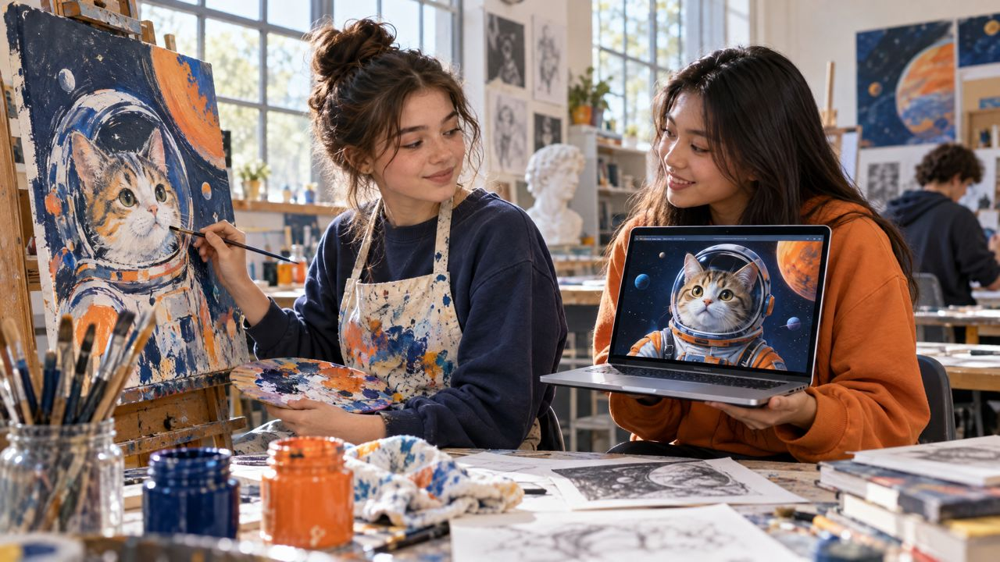

<!--
author:   Maia Lust
email:    
version:  2.0.0
language: et
narrator: Estonian Female
date:     08.10.2026
logo:     ../pildid/pae_logo.png
icon:     ../pildid/pae_logo.png
comment:  Tehisintellekti alused – gümnaasiumi valikkursus (35 tundi), Tallinna Pae Gümnaasium. Õppetekstid, interaktiivsed töölehed ja enesekontrollitestid.
link:     https://fonts.googleapis.com/css2?family=Nunito+Sans:wght@400;600;700&family=Poppins:wght@600;700&family=JetBrains+Mono:wght@400;600&display=swap

@style
/* ==== liascript-theming:start ==== */
/* links: https://fonts.googleapis.com/css2?family=Nunito+Sans:wght@400;600;700&family=Poppins:wght@600;700&family=JetBrains+Mono:wght@400;600&display=swap */
/* theme: Tallinna Pae Gümnaasium — generated by liascript-theming, edit theme.json and rebuild */
:root {
  --theme-font-body: 'Nunito Sans', sans-serif;
  --theme-font-heading: 'Poppins', serif;
  --theme-font-mono: 'JetBrains Mono', monospace;
  --theme-heading-weight: 700;
  --theme-line-height: 1.6;
  --global-font-size: 1.6rem;
  --theme-radius: 0.8rem;
  --theme-radius-small: 0.4rem;
  --theme-radius-large: 1.4rem;
  --theme-shadow: 0 0.3rem 1rem rgba(0,41,89,.10);
}
/* surfaces & text: apply to every color theme */
:root.lia-variant-light {
  --color-background: 255,255,255;
  --color-text: 29,36,51;
  --color-border: 228,229,231;
  --lia-grey-lighter: 238,242,247;
  --lia-grey-light: 204,212,222;
}
:root.lia-variant-dark {
  --color-background: 15,23,36;
  --color-text: 229,232,235;
  --color-border: 49,60,73;
  --lia-grey-dark: 30,38,47;
  --lia-anthracite: 41,50,61;
}
/* accent: only the course theme (default) and the custom radio,
   so readers can still pick LiaScript's built-in color themes */
:root:is(.lia-theme-default, .lia-theme-custom) {
  --color-highlight: 0,41,89;
  --color-highlight-dark: 0,41,89;
}
:root.lia-theme-default {
  --color-highlight-menu: 0,41,89;
}
:root:is(.lia-theme-default, .lia-theme-custom).lia-variant-dark {
  --color-highlight: 47,90,143;
  --color-highlight-dark: 255,185,143;
}
:root.lia-variant-light { --theme-heading-color: #002959; }
:root.lia-variant-dark { --theme-heading-color: #FFB98F; }
/* ==== LiaScript theme adapter (liascript-theming) — keep verbatim ====
   Maps the --theme-* tokens onto LiaScript's CSS. Everything a theme
   changes lives in the token block above this one. */

/* -- fonts: body/mono via the global variables, headings & co. are
      compiled literals in LiaScript and need explicit selectors -- */
:root {
  --global-font-family: var(--theme-font-body);
  --global-font-mono: var(--theme-font-mono);
  --global-font-headline: var(--theme-font-heading);
}
body { line-height: var(--theme-line-height, 1.47); }
h1, h2, h3, .h1, .h2, .h3 {
  font-family: var(--theme-font-heading);
  font-weight: var(--theme-heading-weight, 600);
  letter-spacing: var(--theme-heading-letter-spacing, normal);
  text-transform: var(--theme-heading-transform, none);
  color: var(--theme-heading-color, inherit);
}
h4, h5, h6, .h4, .h5, summary, .lia-accordion__headline {
  font-family: var(--theme-font-subheading, var(--theme-font-body));
}
.lia-quote__text { font-family: var(--theme-font-quote, var(--theme-font-heading)); }
.lia-code, .lia-code--inline, code, kbd, samp, pre { font-family: var(--theme-font-mono); }
.lia-code .ace_editor { font-family: var(--theme-font-mono) !important; }

/* -- shape: radius for controls & surfaces (radio buttons, tags, circles stay) -- */
:is(button, .lia-btn, input, .lia-input, select, .lia-select, textarea, .lia-textarea, .lia-dropdown):not(.lia-radio, .lia-btn--tag, .lia-btn--small-tag),
.lia-code-terminal__input, .lia-pagination__content, .lia-script, .lia-support-menu__submenu {
  border-radius: var(--theme-radius);
}
.lia-checkbox[type='checkbox'], kbd, .lia-tooltip .lia-tooltiptext, .lia-code--inline {
  border-radius: var(--theme-radius-small);
}
details, .lia-quote, .lia-code__input, .lia-table-responsive, .lia-card {
  border-radius: var(--theme-radius-large);
  box-shadow: var(--theme-shadow);
}
.lia-quote, .lia-code__input { overflow: hidden; }
.lia-code__input .ace_editor { border-radius: inherit; }
.lia-support-menu__submenu { box-shadow: var(--theme-shadow-popup, 0 0 1rem rgba(128, 128, 128, 0.2)); }

/* -- dark mode: LiaScript brightens the accent for text via
      rgb(from … calc(r*2.5)), which turns a hand-picked accent into
      pastel/yellow. For the course theme, text-like accent uses take
      --color-highlight-dark (= "accent as text") instead. Scoped to
      default/custom so the built-in color themes keep their behavior. -- */
:root:is(.lia-theme-default, .lia-theme-custom).lia-variant-dark :is(.lia-link, .lia-btn--outline, .lia-code--inline) {
  color: rgb(var(--color-highlight-dark));
  border-color: rgb(var(--color-highlight-dark));
}
:root:is(.lia-theme-default, .lia-theme-custom).lia-variant-dark :is(summary, summary:after, .lia-label, .lia-skip-nav, .lia-support-menu__item, .lia-quote__text),
:root:is(.lia-theme-default, .lia-theme-custom).lia-variant-dark :is(.lia-list--unordered, .lia-list--ordered) > li::marker {
  color: rgb(var(--color-highlight-dark));
}
:root:is(.lia-theme-default, .lia-theme-custom).lia-variant-dark :is(.lia-btn--transparent, .lia-input) {
  filter: none;
}
:root:is(.lia-theme-default, .lia-theme-custom).lia-variant-dark :is(.lia-input, .lia-checkbox[type='checkbox'], .lia-radio[type='radio']):not(:checked, .is-disabled, [disabled]) {
  border-color: rgb(var(--color-highlight-dark));
}
/* alternating table rows: LiaScript uses a neutral grey in dark mode */
:root.lia-variant-dark .lia-table.is-alternating .lia-table__row:nth-child(2n) td,
:root.lia-variant-dark .lia-table-responsive.has-thead-sticky.has-first-col-sticky .is-alternating .lia-table__row:nth-child(2n) td:first-child:before,
:root.lia-variant-dark .lia-table-responsive.has-thead-sticky.has-last-col-sticky .is-alternating .lia-table__row:nth-child(2n) td:last-child:before {
  background-color: rgb(var(--lia-grey-dark));
}
/* -- theme extras -- */
/* ===== Tallinna Pae Gümnaasiumi värvid =====
   tumesinine #002959 · oranž #FF8B48 · tumeoranž #E67E42 */
:root {
  --pae-sinine: #002959;
  --pae-sinine-80: #33547A;
  --pae-sinine-20: #CCD4DE;
  --pae-sinine-08: #EEF2F7;
  --pae-oranz: #FF8B48;
  --pae-oranz-tume: #E67E42;
  --pae-oranz-20: #FFE2D1;
  --pae-oranz-08: #FFF4EC;
  --pae-roheline: #2E8B57;
  --pae-roheline-08: #EAF6EF;
  --pae-lilla: #6B4FA0;
  --pae-lilla-08: #F2EEF9;
}

/* Pealkirjad */
.lia-slide h1, main h1 {
  color: var(--pae-sinine);
  border-bottom: 6px solid var(--pae-oranz);
  padding-bottom: .3em;
}
.lia-slide h2, main h2 { color: var(--pae-sinine); }
.lia-slide h3, main h3 {
  color: var(--pae-sinine);
  border-left: 8px solid var(--pae-oranz);
  padding-left: .5em;
}
.lia-slide h4, main h4 { color: var(--pae-oranz-tume); }
strong { color: inherit; }

/* Tabelid */
.lia-table th, table thead th {
  background: var(--pae-sinine) !important;
  color: #fff !important;
}
.lia-table tbody tr:nth-child(even), table tbody tr:nth-child(even) { background: var(--pae-sinine-08); }

/* Pildid ja infograafikud */
img.lia-image, .lia-figure img, main img {
  border-radius: 12px;
}
.lia-figure__caption, figcaption {
  color: var(--pae-sinine-80);
  font-style: italic;
  text-align: center;
}

/* ASCII-skeemid väiksemaks ja Pae värvidesse */
.lia-ascii svg, lia-ascii svg, .lia-code--ascii svg { max-width: 760px; margin: 0 auto; display: block; }
svg.lia-ascii text { fill: var(--pae-sinine); }

/* ===== Kujunduskastid ===== */
blockquote.pae-moiste, blockquote.pae-naide, blockquote.pae-eesti,
blockquote.pae-motle, blockquote.pae-lisaks, blockquote.pae-fakt,
.pae-moiste, .pae-naide, .pae-eesti, .pae-motle, .pae-lisaks, .pae-fakt {
  border-radius: 14px !important;
  padding: 1.1em 1.4em 1.1em 4.2em !important;
  margin: 1.4em 0 !important;
  position: relative;
  box-shadow: 0 3px 10px rgba(0,41,89,.10);
  font-style: normal !important;
  text-align: left !important;
}
.pae-moiste::before, .pae-naide::before, .pae-eesti::before,
.pae-motle::before, .pae-lisaks::before, .pae-fakt::before {
  position: absolute; left: .7em; top: .75em;
  width: 2em; height: 2em; line-height: 2em;
  border-radius: 50%; text-align: center; font-size: 1.15em;
  color: #fff; font-style: normal;
}
/* Mõiste – oranž */
.pae-moiste { background: var(--pae-oranz-08) !important; border: 2px solid var(--pae-oranz) !important; border-left: 10px solid var(--pae-oranz) !important; }
.pae-moiste::before { content: "📖"; background: var(--pae-oranz); }
/* Näide – tumesinine */
.pae-naide { background: var(--pae-sinine-08) !important; border: 2px solid var(--pae-sinine-20) !important; border-left: 10px solid var(--pae-sinine) !important; }
.pae-naide::before { content: "💡"; background: var(--pae-sinine); }
/* Eesti näide – sinine-valge */
.pae-eesti { background: linear-gradient(135deg, #E8F1FB 0%, #ffffff 100%) !important; border: 2px solid #0072CE !important; border-left: 10px solid #0072CE !important; }
.pae-eesti::before { content: "🇪🇪"; background: #0072CE; }
/* Mõtle järele – roheline */
.pae-motle { background: var(--pae-roheline-08) !important; border: 2px dashed var(--pae-roheline) !important; border-left: 10px solid var(--pae-roheline) !important; }
.pae-motle::before { content: "🤔"; background: var(--pae-roheline); }
/* Tea lisaks – lilla */
.pae-lisaks { background: var(--pae-lilla-08) !important; border: 2px solid #CDBFE6 !important; border-left: 10px solid var(--pae-lilla) !important; }
.pae-lisaks::before { content: "🔍"; background: var(--pae-lilla); }
/* Fakt – tume taust, valge tekst */
.pae-fakt { background: var(--pae-sinine) !important; color: #fff !important; border-left: 10px solid var(--pae-oranz) !important; }
.pae-fakt * { color: #fff !important; }
.pae-fakt::before { content: "⚡"; background: var(--pae-oranz); }

/* Töölehe jaotise riba */
.pae-jaotis { background: var(--pae-sinine); color: #fff !important; padding: .55em 1em; border-radius: 10px; margin: 2em 0 1em; border-left: 10px solid var(--pae-oranz); }
.pae-jaotis * { color: #fff !important; }

/* Ploki kaanepilt */
.pae-kaas img, img.pae-kaas { width: 100%; border-radius: 16px; box-shadow: 0 6px 20px rgba(0,41,89,.18); }

/* Näidisvastuse kokkupandav kast */
details {
  background: var(--pae-oranz-08);
  border: 1px solid var(--pae-oranz);
  border-radius: 10px; padding: .6em 1em; margin: .6em 0 1.4em;
}
details summary { cursor: pointer; font-weight: bold; color: var(--pae-oranz-tume); }

/* Menüü (sisukord) tumesinine */
.lia-toc a, .lia-toc .lia-toc__link, nav.lia-toc a { color: #002959 !important; }
.lia-toc a.lia-active, .lia-toc .lia-active { font-weight: 700; }
:root.lia-variant-dark .lia-toc a { color: #CCD4DE !important; }
:root.lia-variant-dark .pae-moiste, :root.lia-variant-dark .pae-naide, :root.lia-variant-dark .pae-eesti,
:root.lia-variant-dark .pae-motle, :root.lia-variant-dark .pae-lisaks { color: #1d2433 !important; }
:root.lia-variant-dark .pae-moiste *, :root.lia-variant-dark .pae-naide *, :root.lia-variant-dark .pae-eesti *,
:root.lia-variant-dark .pae-motle *, :root.lia-variant-dark .pae-lisaks * { color: #1d2433 !important; }
:root.lia-variant-dark img { background: #fff; }
/* ==== liascript-theming:end ==== */
/* Loosimisnupp (rollimäng) */
output.lia-script[input="submit"] { display:inline-block !important; background:#002959; color:#fff !important; font-weight:700; padding:.6em 1.2em; border-radius:999px; border:3px solid #FF8B48 !important; cursor:pointer; box-shadow:0 3px 10px rgba(0,41,89,.2); }
output.lia-script[input="submit"]:hover { background:#FF8B48; color:#002959 !important; }

/* Lihtsalt öeldes (ettelugemisega) */
section.pae-lihtne { background:#EAF6EE; border:2px solid #2E8B57; border-left:10px solid #2E8B57; border-radius:14px; padding:.9em 1.3em; margin:1.2em 0; font-size:1.05em; line-height:1.6; box-shadow:0 3px 10px rgba(0,41,89,.08); }
section.pae-lihtne p { margin:.5em 0; }
:root.lia-variant-dark section.pae-lihtne, :root.lia-variant-dark section.pae-lihtne * { color:#1d2433 !important; }

/* Sõnastiku hüpikselgitus */
.pae-term { border-bottom:2px dotted #FF8B48; cursor:help; position:relative; outline:none; }
.pae-term:hover::after, .pae-term:focus::after {
  content: attr(data-def); position:absolute; left:0; top:1.7em; z-index:999;
  width:max-content; max-width:min(320px, 80vw); white-space:normal;
  background:#002959; color:#fff; padding:.55em .8em; border-radius:10px;
  font-size:15px; line-height:1.45; font-weight:400; font-style:normal;
  box-shadow:0 6px 18px rgba(0,41,89,.3); border-left:5px solid #FF8B48;
}
.pae-fakt .pae-term:hover::after, .pae-fakt .pae-term:focus::after { color:#fff !important; }

@end

@custom
--color-highlight-menu: 255,255,255;
@end
-->

## 5.4 Generatiivne tehisintellekt ja loovus

<!-- class="pae-lisaks" -->
> 🗺️ **Oled 5. toas – Vaatlustorn.** Lisa selle lehe link järjehoidjasse, et saaksid hiljem samast kohast jätkata. Järgmine osa avaneb alles siis, kui oled selle osa luku lahendanud.

<!-- class="pae-kaas" -->

### Õpieesmärgid

Selle tunni järel sa:

- **selgitad oma sõnadega**, mille poolest erineb generatiivne TI diskriminatiivsest TI-st *(mõistmine)*;
- **liigitad** pilditöötluse näiteid võtte järgi: stiiliülekanne, pildi täiendamine või superresolutsioon *(rakendamine)*;
- **analüüsid** TI-katses, kuidas viip, juhtimisskaala ja sammude arv muudavad difusioonimudeli loodud pilti *(analüüs)*;
- **koostad** liiga üldise viiba asemele täpsema viiba, mis ütleb, mis pildil on, kus see on ja mis stiilis *(loomine)*;
- **põhjendad** oma seisukohta, kes on TI abil loodud pildi autor ja kas selline pilt tuleks koolitöös märgistada *(hindamine)*.

<!-- class="pae-fakt" -->
> **🎯 Tunni tuumik (45 min)**
>
> 1. 📚 **Loe** (~12 min): „Mis on generatiivne tehisintellekt?“, „Difusioonimudelid ja tekst-pilt-mudelid“, „Kuidas pildigeneraatorit juhtida?“ ja „Kokkuvõte ja põhimõisted“
> 2. 🧪 **TI-katse** (~10 min): „Vaata difusioonimudeli sisse“
> 3. ⭐ **Tööleht** (~15 min): ülesanded III, IV ja VII
> 4. 📤 **Väljapääsupilet** ja 🔐 **lukk** (~8 min)
>
> Pealkirjad, mille ees on **➕**, on lisaülesanded: tee neid, kui jõuad, kodus või kui tahad rohkem teada.

{{|>}}
<section class="pae-lihtne">

**🟢 Lihtsalt öeldes**

**Generatiivne tehisintellekt** loob midagi uut: pilte, teksti, muusikat või videot. See on õppinud väga paljude näidete põhjal nende mustreid. Tänapäeva tuntud pildigeneraatorid kasutavad enamasti **difusioonimudelit**. Pildi loomisel alustab see puhtast juhuslikust mürast. Samm-sammult eemaldab see müra, kuni tekib selge pilt. Pildi sisu juhid sa **viibaga** ehk tekstilise kirjeldusega. Hea viip ütleb, mis pildil on, kus see on ja mis stiilis. Näiteks „pruun taks vanalinna tänaval, akvarell“ annab parema pildi kui lihtsalt „koer“.

**Tähtsad sõnad:** **generatiivne TI** – TI, mis loob uut sisu; **difusioonimudel** – mudel, mis teeb mürast samm-sammult pildi; **viip** – tekst, millega ütled generaatorile, mida luua.

</section>

### Mis on generatiivne tehisintellekt?

Seni oleme rääkinud TI-st, mis **analüüsib** olemasolevaid pilte: leiab objekte, tunneb ära nägusid, märkab haigusi. Generatiivne TI teeb vastupidist – see **loob** midagi uut.

<!-- class="pae-moiste" -->
> **Mõiste: generatiivne tehisintellekt**
>
> Generatiivne tehisintellekt on TI-süsteem, mis suudab luua uut sisu – pilte, teksti, muusikat, videot või 3D-mudeleid. Ta on õppinud suure hulga näidete põhjal nende mustreid ja loob nende põhjal uut, realistlikku ja asjakohast sisu.

Erinevus on lihtne. **Diskriminatiivne TI** klassifitseerib olemasolevaid andmeid: „See on kass.“ **Generatiivne TI** loob uusi andmeid: „Siin on pilt kassist, keda pole kunagi olemas olnud.“

Generatiivsel TI-l on pikk ajalugu. Varased süsteemid kasutasid **Markovi ahelaid** (järgmine sõna või noot valitakse eelmiste põhjal), **grammatikapõhiseid süsteeme** ja **protseduurilist genereerimist** (nt arvutimängude maastikud). Süvaõppe revolutsioon tõi **variatsioonilise autokodeerija (VAE, 2013)**, **generatiivsed vastandvõrgud (GAN, 2014)** ja autoregressiivsed pildimudelid (PixelRNN, PixelCNN). 2020. aastate alguses tõusid esile **difusioonimudelid**: 2022. aastal said laialt tuntuks näiteks DALL-E 2 ja Stable Diffusion. Samal ajal arenesid suured keelemudelid (nt GPT-seeria) ning **multimodaalsed mudelid**, mis liiguvad teksti, pildi ja video vahel.

<!-- class="pae-fakt" -->
> **Kas teadsid?** Generatiivsed vastandvõrgud (GAN) leiutati **2014. aastal**. Vaid kaheksa aastat hiljem, **2022. aastal**, said difusioonimudelitel põhinevad DALL-E 2 ja Stable Diffusion laialt tuntuks.

### ➕ GAN ja VAE: kuidas masin õpib pilte looma

**Generatiivsed vastandvõrgud** (Generative Adversarial Network, GAN) põhinevad võistlusel. Neis on kaks närvivõrku, mis treenivad teineteist.

<!-- class="pae-moiste" -->
> **Mõiste: generatiivne vastandvõrk (GAN)**
>
> GAN koosneb kahest võistlevast närvivõrgust. **Generaator** loob võltsitud andmeid (nt näopilte). **Diskriminaator** püüab eristada võltsitud andmeid päris andmetest. Treeningu käigus paranevad mõlemad, kuni generaatori loodud pilte on raske päris piltidest eristada.

Seda võib võrrelda võltsijaga, kes teeb võltsraha, ja politseinikuga, kes püüab võltsinguid tabada. Mida osavamaks muutub politseinik, seda rohkem peab võltsija pingutama. Tuntud GAN-arhitektuurid on **DCGAN**, **StyleGAN** (ülirealistlikud näod), **CycleGAN** (pildi „tõlkimine“ ühest valdkonnast teise, nt suvemaastik talviseks) ja **BigGAN**. GAN-idega luuakse fotorealistlikke nägusid ja kunstiteoseid ning töödeldakse pilte.

**Variatsiooniline autokodeerija** (VAE) töötab teisiti. Kodeerija surub pildi kokku väikeseks arvude kogumiks ja dekodeerija püüab sellest pildi uuesti üles ehitada. Kokkusurutud arvud asuvad nn **latentses ruumis**.

<!-- class="pae-moiste" -->
> **Mõiste: latentne ruum**
>
> Latentne ruum on abstraktne „kaart“, kus andmete olulised omadused on esitatud arvudena. Sarnased pildid asuvad seal üksteise lähedal. Kui liigud latentses ruumis ühest punktist teise, muutub ka loodud pilt sujuvalt, näiteks naeratav nägu muutub järk-järgult tõsiseks.

VAE treenimine on stabiilne ja latentset ruumi on mugav uurida, aga selle pildid on sageli veidi udused. GAN-i pildid on teravamad, aga GAN-i treenimine on ebastabiilne ja tulemused võivad olla ühekülgsed.

### Difusioonimudelid ja tekst-pilt-mudelid

Tänapäeva tuntumad pildigeneraatorid põhinevad **difusioonimudelitel**.

<!-- class="pae-moiste" -->
> **Mõiste: difusioonimudel**
>
> Difusioonimudel on generatiivne mudel, mis loob pilte müra järk-järgulise eemaldamise teel. Treenimisel õpib mudel, kuidas pildile lisatud müra samm-sammult eemaldada. Pildi loomisel alustab ta puhtast juhuslikust mürast ja eemaldab seda järk-järgult, kuni tekib selge pilt.

Võrreldes GAN-idega on difusioonimudelite **treenimine stabiilsem**, **väljund mitmekesisem** ja tulemust saab **paremini juhtida**. Näited on **DALL-E 2 ja DALL-E 3** (OpenAI), **Stable Diffusion** (Stability AI), **Midjourney** ja **Imagen** (Google).

Kuidas aga jõuab mudelini sinu soov „punase mütsiga sinine kass“? Selleks on **tekst-pilt-mudelid**. Need töötavad kolmes osas:

1. **Teksti kodeerimine** – keelemudel (nt CLIP või T5) muudab kirjelduse arvudeks, mis kannavad selle tähendust.
2. **Pildi genereerimine** – difusioonimudel (või GAN) loob pildi.
3. **Teksti ja pildi joondamine** – genereerimisprotsessi juhitakse igal sammul nii, et pilt vastaks tekstile.

Tekst-pilt-mudelid suudavad kombineerida mõisteid, rakendada stiile, luua kompositsioone ja visualiseerida abstraktseid ideid. Pilte saab luua ka **transformeripõhiste mudelitega**, mis ehitavad pildi üles tükkhaaval, samamoodi nagu keelemudel ehitab lauset sõnahaaval.

### Kuidas pildigeneraatorit juhtida?

Pildigeneraatori kasutamine on oskus. Generaatorit saab juhtida kolmel viisil.

**Tekstiline juhtimine** (*prompting*, viipade koostamine) tähendab detailse kirjelduse kirjutamist. Hea kirjeldus ütleb, **mis** pildil on, **kus** ja **mis stiilis**.

<!-- class="pae-naide" -->
> **Näide: kehv ja hea kirjeldus ehk viip**
>
> Kehv: „koer“
>
> Parem: „Väike pruun taks istub Tallinna vanalinna munakivitänaval, õhtune päikesevalgus, akvarellmaali stiilis, soojad toonid.“
>
> Teine kirjeldus annab mudelile palju rohkem infot objekti, koha, valguse ja stiili kohta. Lisaks saab kasutada **negatiivseid vihjeid**, mis ütlevad, mida pildil olla ei tohi (nt „ilma tekstita, ilma inimesteta“).

**Pildiline juhtimine** tähendab, et mudelile antakse ette pilt: **algpilt** (img2img), mida muudetakse; **visand**, mille järgi mudel joonistab (nt ControlNet); või **mask**, mis näitab, millist pildi osa muuta (inpainting).

**Parameetriline juhtimine** käib seadete kaudu. **Seeme** (seed) on juhuslik arv, millest müra alguse saab – sama seemne ja kirjeldusega saad sama pildi uuesti. **Sammude arv** määrab, mitmes etapis müra eemaldatakse. **CFG-skaala** (guidance scale) määrab, kui rangelt peab pilt kirjeldust järgima: suure väärtuse korral järgib mudel teksti täpsemalt, väikese korral jätab rohkem vabadust.

Generatiivne TI oskab ka olemasolevaid pilte muuta.

- **Stiiliülekanne** (style transfer) rakendab ühe pildi stiili teisele pildile, näiteks muudab sinu foto Van Goghi või Picasso maali sarnaseks. Selliseid filtreid pakkusid näiteks rakendused DeepArt ja Prisma.
- **Pilt-pildiks tõlge** muudab pildi ühest valdkonnast teise: visand fotoks, päevane vaade öiseks, suvi talveks (nt CycleGAN).
- **Pildi täiendamine** (inpainting) täidab pildi puuduva või kustutatud osa ja **pildi laiendamine** (outpainting) joonistab pildile juurde ala, mida algul polnud.
- **Superresolutsioon** suurendab pildi resolutsiooni ja „mõtleb välja“ puuduvad detailid. Lisaks saab eemaldada müra ja **värvida** mustvalgeid fotosid.

Sama põhimõte laieneb ka **videole** (tekst-video- ja pilt-video-mudelid, nt Runway, Meta Make-A-Video, Stable Video Diffusion) ja **3D-le** (tekst-3D-mudelid, NeRF, nt Google DreamFusion, NVIDIA GET3D, OpenAI Point-E). Video puhul on raske hoida **ajalist järjepidevust** (et tegelane ei muudaks kaadrist kaadrisse välimust) ja **füüsikalist realismi**, lisaks vajab see palju arvutusvõimsust.

<!-- class="pae-eesti" -->
> **Eesti näide: kas TI tunneb Eestit?**
>
> Generatiivsed mudelid on õppinud peamiselt ingliskeelsete andmete põhjal. Seepärast võivad nad eestikeelseid kirjeldusi ja kohalikke teemasid halvemini mõista. Proovi ise: palu pildigeneraatoril joonistada „kama ja keefir hommikulauas“, „Kalevipoeg Peipsi ääres“ või „Eesti talumaja jaanipäeval“. Kas tulemus on äratuntav? Kas ingliskeelne kirjeldus annab teistsuguse pildi? Keelelised piirangud ja kohaliku konteksti mõistmine on väikese keele ja kultuuri jaoks oluline väljakutse. Samas kasutavad Eesti kunstnikud, disainerid, reklaami- ja meediaettevõtted ning hariduse valdkond generatiivset TI-d üha rohkem.

### 🧪 TI-katse: vaata difusioonimudeli sisse

Diffusion Explainer näitab samm-sammult, kuidas Stable Diffusion muudab viiba ja juhusliku müra pildiks. Uurid, kuidas viip, juhtimisskaala ja müra eemaldamise sammud tulemust muudavad.

**Vaja läheb:** [Diffusion Explainer](https://poloclub.github.io/diffusion-explainer/) (töötab brauseris, sisselogimist pole vaja, kasutab valmis viipasid), ~10 min, paaristöö

1. Ava Diffusion Explainer ja vali üks valmis viip. Vaata, kuidas pilt mürast tekib.
2. Liiguta ajasammu liugurit (*timestep*) algusest lõpuni. Mitmendal sammul tunned pildi sisu esimest korda ära?
3. Muuda juhtimisskaala (*guidance scale*) väärtust väikesest suureni ja võrdle pilte.
4. Vali viiba variant, kus on muudetud üht sõna (nt stiili), ja võrdle kahte pilti.

**Pane tähele / kirjuta üles:** Mis juhtus pildiga, kui juhtimisskaala oli väga väike või väga suur? Millises etapis tekkisid suured kujud ja millises detailid? Kuidas muutis pilti üks muudetud sõna viibas?

[[___ ___ ___]]

<!-- class="pae-lisaks" -->
> **Kui arvutit pole:** üks paariline kirjeldab sõnadega pilti, teine joonistab. Seejärel lisab kirjeldaja korraga ühe täpsustuse (koht, valgus, stiil). Arutage, kuidas iga lisatud sõna tulemust muutis – samamoodi töötab ka viip.

### ➕ Kas tehisintellekt saab olla loov?

Loovust kirjeldatakse sageli kolme omaduse kaudu: **uudsus ja originaalsus** (midagi uut), **väärtus ja asjakohasus** (sellel on mõte) ning **üllatuslikkus**. Loovust võib jagada ka kolmeks liigiks:

- **kombinatoorne loovus** – olemasolevate ideede uudne kokkupanek (nt „kass skafandris“);
- **eksploratiivne ehk avastav loovus** – mingi stiili või reeglistiku sees uute võimaluste otsimine;
- **transformatiivne ehk ümberkujundav loovus** – reeglite endi muutmine, millest saab alguse täiesti uus mõtlemisviis.

Generatiivne TI on kahes esimeses väga osav. Kas see suudab ka kolmandat, on vaieldav. TI-l pole oma kogemusi, emotsioone ega kavatsust midagi väljendada – ta kombineerib õpitud mustreid. Samas võib tulemus olla inimese jaoks üllatav ja väärtuslik.

Seepärast räägitakse sageli **inimese ja TI koostööst**. TI võib olla **tööriist** (nagu pintsel või fotokaamera), **kaaslooja**, kellega ideid edasi-tagasi arendada, või **inspiratsiooniallikas**, mis aitab loomingulisest ummikust välja. TI loovust on püütud hinnata ka katsetega, kus inimesed peavad ära arvama, kas teose lõi inimene või masin (Turingi testi sarnane loovustest).

<!-- class="pae-motle" -->
> **Mõtle järele!**
>
> - Kui sa kirjutad pildigeneraatorile väga hoolikalt läbimõeldud kirjelduse ja valid sajast tulemusest parima, kes on pildi autor – sina, TI või TI loojad?
> - Kas TI loodud pilt võib olla „päris“ kunst? Mida kunst sinu jaoks tähendab?
> - Milles võiks generatiivne TI sind koolitöödes aidata ja millal oleks selle kasutamine ebaaus?

### ➕ Generatiivse TI eetilised küsimused

**Autoriõigus.** Generatiivseid mudeleid treenitakse miljonite internetist kogutud piltidega, millest paljud on kunstnike looming. Kas see on aus ilma nende loata? Kellele kuulub genereeritud pilt? Euroopas on autoriõigus seotud inimese loomingulise panusega, mistõttu on vaieldav, kas puhtalt TI loodud pilt on üldse autoriõigusega kaitstud. Kunstnikud muretsevad ka selle pärast, et TI jäljendab nende isikupärast stiili.

**Identiteet ja kallutatus.** Mudel kordab treeningandmete stereotüüpe. Kui palud joonistada „arsti“ või „insenerit“, võib tulemus näidata ühekülgset pilti. Lisaks võimaldab generatiivne TI luua teisest inimesest võltspilte (süvavõltsinguid, vt tund 5.5) ja omastada teiste kultuuride sümboleid.

**Majanduslik mõju.** Illustraatorite, disainerite ja fotograafide töö muutub. Tekivad uued ärimudelid ja ametid, aga mitte kõigil pole tehnoloogiale võrdset ligipääsu.

**Valeinfo.** Võltsitud pildid ja videod levivad kiiresti ja muudavad faktikontrolli keerulisemaks. Kui iga pilt võib olla võlts, väheneb usaldus kõigi piltide vastu.

Vastutustundlik kasutamine tähendab, et **märgid TI loodud sisu selgelt**, **ei loo teistest inimestest pilte ilma nende loata**, austad teiste loomingut ja järgid kooli reegleid TI kasutamise kohta. Alates 2. augustist 2026 nõuab ka ELi tehisintellekti määrus, et süvavõltsingud oleksid avaldamisel märgistatud ja et pildigeneraatorid märgiksid oma loodud sisu masinloetavalt (enne seda turule tulnud süsteemidel on üleminekuaeg detsembrini 2026).

Tulevikus muutuvad mudelid veelgi **multimodaalsemaks** (tekst, pilt, heli ja video ühes), **interaktiivsemaks** (reaalajas koostöö kasutajaga), **personaliseeritumaks** (õpivad kasutaja stiili) ning **väiksemaks ja energiatõhusamaks**, nii et neid saab käitada ka telefonis.

### ➕ 🎬 Videod: tehisaru, kunst ja muusika

Sellel lehel on 3 videot. Iga video ees on lühike kokkuvõte, mis aitab sul valida.

Vali **vähemalt üks** video ja vaata see läbi.

**Marge Monko: kas tehisaru kunst on kunst?** · *TI-Hüpe* · ⏱ 19 min

📝 Kunstnik Marge Monko uurib, millal pildigeneraatoriga loodud pilt on kunst. Tema sõnul on tehisaru ajastul kõige tähtsamad kunstniku idee, kavatsus ja kriitilised valikud.

!?[Marge Monko: kas tehisaru kunst on kunst? – TI-Hüpe](https://www.youtube.com/watch?v=LdUWcX6K3fM)

**Sander Mölder: kas tehisaru on inimesest parem muusik?** · *TI-Hüpe* · ⏱ 22 min

📝 Muusikaprodutsent ja helilooja Sander Mölder näitab praktiliselt, kuidas tehisaru tööriistad aitavad muusikat teha. Ta rõhutab, et loovus ja valikud jäävad inimesele.

!?[Sander Mölder: kas tehisaru on inimesest parem muusik? – TI-Hüpe](https://www.youtube.com/watch?v=qprIzm2J3Do)

**Timo Toots: kuidas mõjutab tehnoloogia kunsti ja loovust?** · *TI-Hüpe* · ⏱ 23 min

📝 Meediakunstnik Timo Toots vaatleb, kuidas tehnoloogia on kunsti läbi ajaloo muutnud. Ta tõstatab küsimused autorsuse ja tehnoloogiast sõltumise kohta.

!?[Timo Toots: kuidas mõjutab tehnoloogia kunsti ja loovust? – TI-Hüpe](https://www.youtube.com/watch?v=ChiXVB_OxlY)

<!-- class="pae-motle" -->
> **Mõtle vaatamise ajal**
>
> 1. Mis on looja arvates tehisaru tugevus ja kus jookseb selle piir?
> 2. Kes on teose autor, kui pilt või lugu on tehtud tehisaruga: inimene, tehisaru või mõlemad?
> 3. Millised valikud jäävad loomeprotsessis ikkagi inimesele?

**Kirjuta valitud video põhjal: kas tehisaru abil loodud teos on kunst? Põhjenda oma arvamust.**

[[___ ___ ___]]

### Kokkuvõte ja põhimõisted

**Pea meeles**

- Generatiivne TI loob uut sisu; diskriminatiivne TI klassifitseerib olemasolevat.
- GAN-is võistlevad generaator ja diskriminaator; VAE kodeerib pildid latentsesse ruumi.
- Difusioonimudelid loovad pildi müra järk-järgulise eemaldamise teel; tekst-pilt-mudelid juhivad seda protsessi teksti abil.
- Pildigeneraatorit juhitakse kirjelduse ehk viiba, algpildi või maski ja parameetrite (seeme, sammud, CFG-skaala, negatiivsed vihjed) kaudu.
- TI on osav kombinatoorses ja avastavas loovuses; parimad tulemused sünnivad inimese ja TI koostöös.
- Eetilised küsimused: autoriõigus, kallutatus ja stereotüübid, mõju töökohtadele, valeinfo.

| Mõiste | Tähendus |
|---|---|
| Generatiivne TI | TI, mis loob uut sisu (pilte, teksti, heli, videot) |
| GAN | Kahest võistlevast võrgust (generaator ja diskriminaator) koosnev generatiivne mudel |
| Latentne ruum | Abstraktne ruum, kus andmete olulised omadused on esitatud arvudena |
| Difusioonimudel | Mudel, mis loob pildi müra järk-järgulise eemaldamise teel |
| Tekst-pilt-mudel | Mudel, mis loob pildi tekstilise kirjelduse põhjal |
| Viip (kirjeldus, *prompt*) | Tekst, millega kasutaja generatiivset mudelit juhib |
| Stiiliülekanne | Ühe pildi stiili rakendamine teisele pildile |
| Inpainting | Pildi puuduva või valitud osa täitmine uue sisuga |
| Superresolutsioon | Pildi resolutsiooni suurendamine TI abil |

### 📚 Allikad ja lisalugemine

- Lee, S. jt (2023). [Diffusion Explainer: Visual Explanation for Text-to-image Stable Diffusion](https://arxiv.org/abs/2305.03509). Artikkel tunnikatse tööriista kohta: kuidas Stable Diffusion viiba põhjal mürast pildi loob. Tööriist ise: [poloclub.github.io/diffusion-explainer](https://poloclub.github.io/diffusion-explainer/).
- Goodfellow, I. jt (2014). [Generative Adversarial Networks](https://arxiv.org/abs/1406.2661v1). GAN-i originaalartikkel: generaator ja diskriminaator treenivad teineteist kahe mängija mängus.
- Ho, J., Jain, A., Abbeel, P. (2020). [Denoising Diffusion Probabilistic Models](https://arxiv.org/abs/2006.11239v1). Artikkel, millest sai alguse tänapäevaste difusioonimudelite edu.
- Laas, O. (2020). [Tehisintellekt, mis maalib pilte](https://www.err.ee/1115227/oliver-laas-tehisintellekt-mis-maalib-pilte). ERR. Eestikeelne arutlus selle üle, mis on loovus ja kas masin saab olla loov.
- Lätt, P., Terav, E. (2025). [Tehisintellekt vs autoriõigus](https://www.err.ee/1609859901/priit-latt-ja-enelin-terav-tehisintellekt-vs-autorioigus). ERR. Juristide ülevaade 2025. aasta kohtuasjadest, kus vaieldi TI treenimise ja autoriõiguse üle.
- Euroopa Komisjon (2026). [Quick Facts: Transparency rules for AI systems](https://digital-strategy.ec.europa.eu/en/factpages/quick-facts-transparency-rules-ai-systems). TI loodud sisu ja süvavõltsingute märgistamise nõuded ning nende tähtajad.

### Tööleht 5.4

<!-- class="pae-jaotis" -->
**➕ I. Generatiivse tehisintellekti põhimõisted**

**Ülesanne 1.** Selgita oma sõnadega, mis on generatiivne tehisintellekt.

[[___ ___ ___]]

**Ülesanne 2.** Ühenda generatiivse tehisintellektiga seotud mõisted nende definitsioonidega.

| Täht | Kirjeldus |
|:---:|---|
| **A** | Ühe pildi stiili rakendamine teisele pildile |
| **B** | Generatiivsed mudelid, mis loovad pilte müra järk-järgulise eemaldamise teel |
| **C** | Mudel, mis loob uut sisu olemasoleva põhjal |
| **D** | Mudelid, mis loovad pilte tekstiliste kirjelduste põhjal |
| **E** | Abstraktne ruum, kus on esitatud andmete olulised omadused |

- [ (A) (B) (C) (D) (E) ]
- [ ( ) ( ) (X) ( ) ( ) ] Generatiivne mudel
- [ ( ) ( ) ( ) ( ) (X) ] Latentne ruum
- [ (X) ( ) ( ) ( ) ( ) ] Stiiliülekanne
- [ ( ) ( ) ( ) (X) ( ) ] Tekst-pilt-mudelid
- [ ( ) (X) ( ) ( ) ( ) ] Difusioonimudelid
****************************************
Generatiivne mudel loob uut sisu (C), latentne ruum on andmete omaduste abstraktne esitus (E), stiiliülekanne kannab stiili üle (A), tekst-pilt-mudelid loovad pildi kirjelduse põhjal (D) ja difusioonimudelid eemaldavad järk-järgult müra (B).
****************************************

<!-- class="pae-jaotis" -->
**➕ II. Generatiivse tehisintellekti tüübid**

**Ülesanne 3.** Kirjelda lühidalt järgmisi generatiivse tehisintellekti tüüpe.

a) Generatiivsed vastandvõrgud (GAN):

[[___ ___ ___]]

b) Variatsioonilised autokodeerijad (VAE):

[[___ ___ ___]]

c) Difusioonimudelid:

[[___ ___ ___]]

d) Transformeripõhised mudelid:

[[___ ___ ___]]

**Ülesanne 4.** Võrdle erinevaid generatiivse tehisintellekti tüüpe.

| Tüüp | Tööpõhimõte | Eelised | Puudused | Näited rakendustest |
|---|---|---|---|---|
| GAN | | | | |
| VAE | | | | |
| Difusioonimudelid | | | | |
| Transformeripõhised | | | | |

Kirjuta iga tüübi kohta tööpõhimõte, eelised, puudused ja näited.

**GAN:**

[[___ ___ ___]]

**VAE:**

[[___ ___ ___]]

**Difusioonimudelid:**

[[___ ___ ___]]

**Transformeripõhised:**

[[___ ___ ___]]

<!-- class="pae-jaotis" -->
**⭐ III. Generatiivne pildiloome**

**Ülesanne 5.** Kirjelda TI-katse põhjal, kuidas tekst-pilt-mudel sinu viibast pildi loob: mis juhtub tekstiga, mürast ja juhtimisskaalaga?

[[___ ___ ___ ___]]

**Ülesanne 6.** Selgita järgmisi generatiivse pildiloome tehnikaid.

a) Stiiliülekanne:

[[___ ___]]

b) Pilt-pildiks tõlge:

[[___ ___]]

c) Pildi täiendamine (inpainting):

[[___ ___]]

d) Superresolutsioon:

[[___ ___]]

**Ülesanne 7.** Millised on peamised väljakutsed generatiivses pildiloomes? Nimeta vähemalt neli.

[[___ ___ ___ ___]]

<!-- class="pae-jaotis" -->
**⭐ IV. Tehisintellekt ja loovus**

**Ülesanne 8.** Kas tehisintellekt saab olla loov? Põhjenda oma arvamust.

[[___ ___ ___ ___]]

**Ülesanne 9.** Võrdle inimese ja tehisintellekti loovust.

| Aspekt | Inimese loovus | Tehisintellekti loovus |
|---|---|---|
| Inspiratsioon | | |
| Originaalsus | | |
| Tähenduse loomine | | |
| Konteksti mõistmine | | |
| Emotsionaalne sisu | | |

Kirjuta iga aspekti kohta, kuidas see avaldub inimese ja kuidas TI loovuses.

**Inspiratsioon:**

[[___ ___]]

**Originaalsus:**

[[___ ___]]

**Tähenduse loomine:**

[[___ ___]]

**Konteksti mõistmine:**

[[___ ___]]

**Emotsionaalne sisu:**

[[___ ___]]

**Ülesanne 10.** Kuidas saab tehisintellekti kasutada loovuse toetamiseks?

[[___ ___ ___ ___]]

<!-- class="pae-jaotis" -->
**➕ V. Generatiivse tehisintellekti rakendused**

**Ülesanne 11.** Täida tabel generatiivse tehisintellekti rakenduste kohta erinevates valdkondades.

| Valdkond | Rakenduse näide | Kasutatav tehnoloogia | Kuidas see aitab loovust? |
|---|---|---|---|
| Kunst | | | |
| Disain | | | |
| Meelelahutus | | | |
| Reklaam | | | |
| Haridus | | | |

Kirjuta iga valdkonna kohta rakenduse näide, tehnoloogia ja kasu loovusele.

**Kunst:**

[[___ ___ ___]]

**Disain:**

[[___ ___ ___]]

**Meelelahutus:**

[[___ ___ ___]]

**Reklaam:**

[[___ ___ ___]]

**Haridus:**

[[___ ___ ___]]

**Ülesanne 12.** Vali üks generatiivse tehisintellekti rakendus ja kirjelda seda põhjalikumalt.

[[___ ___ ___ ___ ___]]

<!-- class="pae-jaotis" -->
**➕ VI. Praktiline ülesanne**

**Ülesanne 13.** Vali üks järgmistest praktilistest ülesannetest.

**Variant A: Generatiivse tehisintellekti testimine.** Testi mõnda generatiivse tehisintellekti tööriista (nt DALL-E, Midjourney, Stable Diffusion) ja analüüsi selle tulemusi. Järgi kooli reegleid ja ära loo pilte päris inimestest.

a) Valitud tööriist:

[[___]]

b) Millised olid sinu sisendid (viibad)?

[[___ ___]]

c) Millised olid tulemused?

[[___ ___ ___]]

d) Kui hästi vastas tulemus sinu ootustele?

[[___ ___ ___]]

e) Millised olid tööriista tugevused ja piirangud?

[[___ ___ ___]]

**Variant B: Loova projekti kavandamine.** Kavanda loov projekt, mis ühendab inimese ja tehisintellekti loovuse.

a) Projekti idee:

[[___ ___]]

b) Millist generatiivse tehisintellekti tööriista kasutaksid?

[[___ ___]]

c) Kuidas ühendaksid inimese ja tehisintellekti panuse?

[[___ ___ ___]]

d) Millised võiksid olla projekti tulemused?

[[___ ___ ___]]

<!-- class="pae-jaotis" -->
**⭐ VII. Eetilised aspektid**

**Ülesanne 14.** Klassikaaslane lõi pildigeneraatoriga kooliürituse plakati: pilt on tuntud illustraatori äratuntavas stiilis ja sellel on direktori nägu. Milliseid eetilisi küsimusi see tekitab? Nimeta vähemalt neli ja paku igaühele lahendus.

[[___ ___ ___ ___]]

**Ülesanne 15.** Kuidas mõjutab generatiivne tehisintellekt autoriõigusi ja intellektuaalomandit?

[[___ ___ ___ ___]]

**Ülesanne 16.** Kuidas tagada generatiivse tehisintellekti vastutustundlik kasutamine?

[[___ ___ ___ ___]]

<!-- class="pae-jaotis" -->
**➕ VIII. Arutelu**

**Ülesanne 17.** Kuidas võib generatiivne tehisintellekt muuta kunsti ja loovuse olemust tulevikus?

[[___ ___ ___ ___]]

**Ülesanne 18.** Kas generatiivse tehisintellekti loodud teoseid peaks pidama „päris“ kunstiks? Põhjenda oma arvamust.

[[___ ___ ___ ___]]

### Enesekontroll 5.4

**1. Kuidas nimetatakse teksti, millega kasutaja pildigeneraatorit juhib? Kirjuta vastus.**

[[viip]]

****************************************
Õige vastus: **viip** (inglise *prompt*) ehk kirjeldus. Hea kirjeldus ütleb, **mis** pildil on, **kus** ja **mis stiilis**.
****************************************

**2. Lohista mõisted õigetesse lünkadesse.**

<!-- data-show-partial-solution -->
GAN-is loob [->[ (generaator) | klassifikaator ]] võltsitud pilte ja [->[ (diskriminaator) ]] püüab neid päris piltidest eristada. VAE-s surub [->[ (kodeerija) ]] pildi kokku väikeseks arvude kogumiks ja [->[ (dekodeerija) ]] ehitab sellest pildi uuesti üles. Kokkusurutud arvud asuvad [->[ (latentses ruumis) | pikslimaatriksis ]].
****************************************
GAN-is võistlevad generaator ja diskriminaator, kuni võltspilte on raske päris piltidest eristada. VAE kodeerija surub pildi kokku latentsesse ruumi ja dekodeerija ehitab pildi uuesti üles.
****************************************

**3. Pane tekst-pilt-mudeli töö sammud õigesse järjekorda.**

<!-- data-show-partial-solution -->
Difusioonimudel eemaldab juhuslikust mürast samm-sammult müra, juhindudes tekstist: [[ 1 | 2 | (3) | 4 ]] 
Kasutaja kirjutab kirjelduse: [[ (1) | 2 | 3 | 4 ]] 
Valmib selge pilt, mis vastab kirjeldusele: [[ 1 | 2 | 3 | (4) ]] 
Keelemudel muudab kirjelduse tähendust kandvateks arvudeks: [[ 1 | (2) | 3 | 4 ]]
****************************************
Õige järjekord: 1. kirjeldus → 2. teksti kodeerimine (nt CLIP) → 3. müra järk-järguline eemaldamine nii, et pilt vastaks tekstile → 4. valmis pilt.
****************************************

**4. Liigita näited pilditöötluse võtte järgi.**

<!-- data-show-partial-solution -->
- [ (Stiiliülekanne) (Inpainting) (Outpainting) (Superresolutsioon) ]
- [ (X) ( ) ( ) ( ) ] Foto muudetakse Van Goghi maali sarnaseks
- [ ( ) (X) ( ) ( ) ] Fotolt kustutatud prügikasti koht täidetakse sobiva taustaga
- [ ( ) ( ) (X) ( ) ] Pildile joonistatakse servadest juurde ala, mida algul polnud
- [ ( ) ( ) ( ) (X) ] Väike udune pilt suurendatakse teravaks ja lisatakse puuduvad detailid
****************************************
Stiiliülekanne rakendab ühe pildi stiili teisele. Inpainting täidab puuduva või valitud osa, outpainting laiendab pilti. Superresolutsioon suurendab resolutsiooni ja „mõtleb välja“ puuduvad detailid.
****************************************

**5. Kuidas loob difusioonimudel pilti?**

- [( )] Kopeerib internetist sobiva pildi
- [( )] Joonistab pildi joon-joonelt nagu inimene
- [(X)] Alustab juhuslikust mürast ja eemaldab seda järk-järgult, kuni tekib selge pilt
- [( )] Kombineerib kaks olemasolevat fotot üheks
- [[?]] Mõtle sõnale „müra“.
****************************************
Difusioonimudel õpib treenimisel müra eemaldama. Genereerimisel alustab see puhtast mürast ja muudab selle samm-sammult pildiks, mis vastab kirjeldusele.
****************************************

**6. Vali lünkadesse sobivad sõnad.**

<!-- data-show-partial-solution -->
Kui kasutad sama kirjeldust ja sama [[ (seemet) | sammude arvu ]], saad sama pildi uuesti. Suure CFG-skaala korral järgib pilt kirjeldust [[ (täpsemalt) | vabamalt ]]. Seda, mida pildil olla ei tohi, ütlevad [[ (negatiivsed vihjed) | algpildid ]]. Pildi osa, mida muuta, näitab [[ (mask) | seeme ]].
****************************************
Seeme (seed) on juhuslik arv, millest müra alguse saab. CFG-skaala määrab, kui rangelt pilt kirjeldust järgib. Negatiivsed vihjed (nt „ilma tekstita“) välistavad soovimatu sisu ja mask näitab, millist pildi osa muuta.
****************************************

**7. Superresolutsioon suurendab 200 × 100 piksli suurust pilti nii, et nii laius kui ka kõrgus kasvavad 4 korda. Mitu pikslit on uuel pildil?**

[[320000]]

****************************************
Uus suurus: 800 × 400 pikslit, seega 800 × 400 = **320 000** pikslit. Algses pildis oli 200 × 100 = 20 000 pikslit, nii et mudel pidi „välja mõtlema“ 300 000 uut pikslit.
****************************************

**8. Sa kirjutad pildigeneraatorile hoolikalt läbimõeldud kirjelduse ja valid sajast tulemusest parima. Kes on sinu arvates pildi autor? Põhjenda.**

[[___ ___ ___]]

Vaata näidisvastust

Ühest vastust pole. Kasutaja panus on idee, kirjeldus ja parima tulemuse valik, nii et teda võib pidada kaasautoriks. TI-l pole kavatsust ega kogemusi – ta kombineerib treeningandmetest õpitud mustreid, mis pärinevad sageli teiste kunstnike loomingust. Euroopas on autoriõigus seotud inimese loomingulise panusega, seega on vaieldav, kas puhtalt TI loodud pilt on üldse kaitstud. Igal juhul tuleb TI abil loodud pilt ausalt märgistada.

### 📤 Väljapääsupilet 5.4

Vasta lühidalt (3–5 min). Vastused jäävad selle brauseri mällu. Kui oled valmis, vajuta **Kopeeri vastused** ja kleebi need Moodle'is õpetaja näidatud kohta või laadi fail alla ja lisa see ülesande juurde.

<!-- data-type="none" -->
| Kriteerium | 2 p | 1 p | 0 p |
|---|---|---|---|
| Mõiste rakendamine uues olukorras | Õige mõiste ja selge põhjendus | Mõiste õige, põhjendus puudu või ebatäpne | Vastus puudub või on vale |
| TI-katse tõlgendus | Tulemus on seotud tunni mõistega | Tulemus on kirjeldatud, seos puudub | Puudub |
| Refleksioon | Konkreetne ja isiklik | Üldine | Puudub |

*Väljapääsupilet on kujundav hindamine: õpetaja annab tagasisidet ja kasutab vastuseid järgmise tunni planeerimisel. Pilet sobib ka portfoolio õpipäevikusse.*

### 🔐 Lukk 5.4

<!-- class="pae-naide" -->
> <!-- style="width: 84px; float: left; margin: 0 16px 8px 0; border-radius: 0;" --> **Kratt:** „Leidsin oma vanast päevikust lause, aga üks sõna on ära kustunud. Ma mäletan ainult, et keegi pidas pidevalt võltsijaid kinni…“

Lukk avaneb, kui lahendad ülesande. Kirjuta mõiste, mida olukord kirjeldab.

**Mängustuudio treenib GAN-i, et luua uusi mängumaastikke. Üks närvivõrk vaatab iga maastikku ja otsustab, kas selle joonistas päris mängukujundaja või teine närvivõrk. Iga kord, kui ta võltsingu ära tabab, saab maastike looja tagasisidet ja muutub osavamaks. Kuidas nimetatakse seda otsustavat närvivõrku?**

<!-- data-solution-button="off" -->
[[diskriminaator]]
[[?]] Vihje 1: kas see võrk loob maastikke või hindab neid?
[[?]] Vihje 2: sõna algab D-ga ja tuleb tegusõnast „diskrimineerima“ ehk eristama.
[[?]] 🛟 Päästerõngas: mine tagasi lehele „➕ GAN ja VAE: kuidas masin õpib pilte looma“ ja loe lõik „Mõiste: generatiivne vastandvõrk (GAN)“. Kui ikka ei tule välja, küsi õpetajalt selle luku päästekood ja kirjuta see vastuseväljale.

****************************************
✅ **Lukk avatud!** **Diskriminaator** püüab eristada võltsitud pilte päris piltidest. Maastike looja on generaator ja just nende võistlus teeb GAN-i loodud pildid järjest realistlikumaks.

🔑 **Sinu võtmetäht: I**

Kirjuta täht üles – seda on vaja toa ukse avamiseks.

➡️ **[Ava järgmine osa: 5.5 Süvavõltsingud ja pildimanipulatsioon](https://liascript.github.io/course/?https://raw.githubusercontent.com/maialust/Tehisintellekti-alused/main/oppija/5_5_b6d810e6.md)**

****************************************
