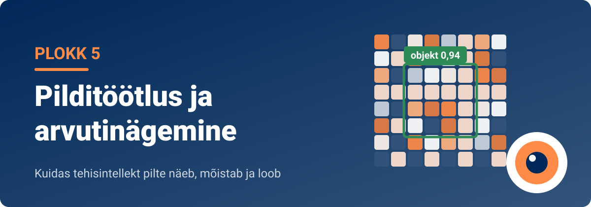

<!--
author:   Maia Lust
email:    
version:  2.0.0
language: et
narrator: Estonian Female
date:     08.10.2026
logo:     ../pildid/pae_logo.png
icon:     ../pildid/pae_logo.png
comment:  Tehisintellekti alused – gümnaasiumi valikkursus (35 tundi), Tallinna Pae Gümnaasium. Õppetekstid, interaktiivsed töölehed ja enesekontrollitestid.
link:     https://fonts.googleapis.com/css2?family=Nunito+Sans:wght@400;600;700&family=Poppins:wght@600;700&family=JetBrains+Mono:wght@400;600&display=swap

@style
/* ==== liascript-theming:start ==== */
/* links: https://fonts.googleapis.com/css2?family=Nunito+Sans:wght@400;600;700&family=Poppins:wght@600;700&family=JetBrains+Mono:wght@400;600&display=swap */
/* theme: Tallinna Pae Gümnaasium — generated by liascript-theming, edit theme.json and rebuild */
:root {
  --theme-font-body: 'Nunito Sans', sans-serif;
  --theme-font-heading: 'Poppins', serif;
  --theme-font-mono: 'JetBrains Mono', monospace;
  --theme-heading-weight: 700;
  --theme-line-height: 1.6;
  --global-font-size: 1.6rem;
  --theme-radius: 0.8rem;
  --theme-radius-small: 0.4rem;
  --theme-radius-large: 1.4rem;
  --theme-shadow: 0 0.3rem 1rem rgba(0,41,89,.10);
}
/* surfaces & text: apply to every color theme */
:root.lia-variant-light {
  --color-background: 255,255,255;
  --color-text: 29,36,51;
  --color-border: 228,229,231;
  --lia-grey-lighter: 238,242,247;
  --lia-grey-light: 204,212,222;
}
:root.lia-variant-dark {
  --color-background: 15,23,36;
  --color-text: 229,232,235;
  --color-border: 49,60,73;
  --lia-grey-dark: 30,38,47;
  --lia-anthracite: 41,50,61;
}
/* accent: only the course theme (default) and the custom radio,
   so readers can still pick LiaScript's built-in color themes */
:root:is(.lia-theme-default, .lia-theme-custom) {
  --color-highlight: 0,41,89;
  --color-highlight-dark: 0,41,89;
}
:root.lia-theme-default {
  --color-highlight-menu: 0,41,89;
}
:root:is(.lia-theme-default, .lia-theme-custom).lia-variant-dark {
  --color-highlight: 47,90,143;
  --color-highlight-dark: 255,185,143;
}
:root.lia-variant-light { --theme-heading-color: #002959; }
:root.lia-variant-dark { --theme-heading-color: #FFB98F; }
/* ==== LiaScript theme adapter (liascript-theming) — keep verbatim ====
   Maps the --theme-* tokens onto LiaScript's CSS. Everything a theme
   changes lives in the token block above this one. */

/* -- fonts: body/mono via the global variables, headings & co. are
      compiled literals in LiaScript and need explicit selectors -- */
:root {
  --global-font-family: var(--theme-font-body);
  --global-font-mono: var(--theme-font-mono);
  --global-font-headline: var(--theme-font-heading);
}
body { line-height: var(--theme-line-height, 1.47); }
h1, h2, h3, .h1, .h2, .h3 {
  font-family: var(--theme-font-heading);
  font-weight: var(--theme-heading-weight, 600);
  letter-spacing: var(--theme-heading-letter-spacing, normal);
  text-transform: var(--theme-heading-transform, none);
  color: var(--theme-heading-color, inherit);
}
h4, h5, h6, .h4, .h5, summary, .lia-accordion__headline {
  font-family: var(--theme-font-subheading, var(--theme-font-body));
}
.lia-quote__text { font-family: var(--theme-font-quote, var(--theme-font-heading)); }
.lia-code, .lia-code--inline, code, kbd, samp, pre { font-family: var(--theme-font-mono); }
.lia-code .ace_editor { font-family: var(--theme-font-mono) !important; }

/* -- shape: radius for controls & surfaces (radio buttons, tags, circles stay) -- */
:is(button, .lia-btn, input, .lia-input, select, .lia-select, textarea, .lia-textarea, .lia-dropdown):not(.lia-radio, .lia-btn--tag, .lia-btn--small-tag),
.lia-code-terminal__input, .lia-pagination__content, .lia-script, .lia-support-menu__submenu {
  border-radius: var(--theme-radius);
}
.lia-checkbox[type='checkbox'], kbd, .lia-tooltip .lia-tooltiptext, .lia-code--inline {
  border-radius: var(--theme-radius-small);
}
details, .lia-quote, .lia-code__input, .lia-table-responsive, .lia-card {
  border-radius: var(--theme-radius-large);
  box-shadow: var(--theme-shadow);
}
.lia-quote, .lia-code__input { overflow: hidden; }
.lia-code__input .ace_editor { border-radius: inherit; }
.lia-support-menu__submenu { box-shadow: var(--theme-shadow-popup, 0 0 1rem rgba(128, 128, 128, 0.2)); }

/* -- dark mode: LiaScript brightens the accent for text via
      rgb(from … calc(r*2.5)), which turns a hand-picked accent into
      pastel/yellow. For the course theme, text-like accent uses take
      --color-highlight-dark (= "accent as text") instead. Scoped to
      default/custom so the built-in color themes keep their behavior. -- */
:root:is(.lia-theme-default, .lia-theme-custom).lia-variant-dark :is(.lia-link, .lia-btn--outline, .lia-code--inline) {
  color: rgb(var(--color-highlight-dark));
  border-color: rgb(var(--color-highlight-dark));
}
:root:is(.lia-theme-default, .lia-theme-custom).lia-variant-dark :is(summary, summary:after, .lia-label, .lia-skip-nav, .lia-support-menu__item, .lia-quote__text),
:root:is(.lia-theme-default, .lia-theme-custom).lia-variant-dark :is(.lia-list--unordered, .lia-list--ordered) > li::marker {
  color: rgb(var(--color-highlight-dark));
}
:root:is(.lia-theme-default, .lia-theme-custom).lia-variant-dark :is(.lia-btn--transparent, .lia-input) {
  filter: none;
}
:root:is(.lia-theme-default, .lia-theme-custom).lia-variant-dark :is(.lia-input, .lia-checkbox[type='checkbox'], .lia-radio[type='radio']):not(:checked, .is-disabled, [disabled]) {
  border-color: rgb(var(--color-highlight-dark));
}
/* alternating table rows: LiaScript uses a neutral grey in dark mode */
:root.lia-variant-dark .lia-table.is-alternating .lia-table__row:nth-child(2n) td,
:root.lia-variant-dark .lia-table-responsive.has-thead-sticky.has-first-col-sticky .is-alternating .lia-table__row:nth-child(2n) td:first-child:before,
:root.lia-variant-dark .lia-table-responsive.has-thead-sticky.has-last-col-sticky .is-alternating .lia-table__row:nth-child(2n) td:last-child:before {
  background-color: rgb(var(--lia-grey-dark));
}
/* -- theme extras -- */
/* ===== Tallinna Pae Gümnaasiumi värvid =====
   tumesinine #002959 · oranž #FF8B48 · tumeoranž #E67E42 */
:root {
  --pae-sinine: #002959;
  --pae-sinine-80: #33547A;
  --pae-sinine-20: #CCD4DE;
  --pae-sinine-08: #EEF2F7;
  --pae-oranz: #FF8B48;
  --pae-oranz-tume: #E67E42;
  --pae-oranz-20: #FFE2D1;
  --pae-oranz-08: #FFF4EC;
  --pae-roheline: #2E8B57;
  --pae-roheline-08: #EAF6EF;
  --pae-lilla: #6B4FA0;
  --pae-lilla-08: #F2EEF9;
}

/* Pealkirjad */
.lia-slide h1, main h1 {
  color: var(--pae-sinine);
  border-bottom: 6px solid var(--pae-oranz);
  padding-bottom: .3em;
}
.lia-slide h2, main h2 { color: var(--pae-sinine); }
.lia-slide h3, main h3 {
  color: var(--pae-sinine);
  border-left: 8px solid var(--pae-oranz);
  padding-left: .5em;
}
.lia-slide h4, main h4 { color: var(--pae-oranz-tume); }
strong { color: inherit; }

/* Tabelid */
.lia-table th, table thead th {
  background: var(--pae-sinine) !important;
  color: #fff !important;
}
.lia-table tbody tr:nth-child(even), table tbody tr:nth-child(even) { background: var(--pae-sinine-08); }

/* Pildid ja infograafikud */
img.lia-image, .lia-figure img, main img {
  border-radius: 12px;
}
.lia-figure__caption, figcaption {
  color: var(--pae-sinine-80);
  font-style: italic;
  text-align: center;
}

/* ASCII-skeemid väiksemaks ja Pae värvidesse */
.lia-ascii svg, lia-ascii svg, .lia-code--ascii svg { max-width: 760px; margin: 0 auto; display: block; }
svg.lia-ascii text { fill: var(--pae-sinine); }

/* ===== Kujunduskastid ===== */
blockquote.pae-moiste, blockquote.pae-naide, blockquote.pae-eesti,
blockquote.pae-motle, blockquote.pae-lisaks, blockquote.pae-fakt,
.pae-moiste, .pae-naide, .pae-eesti, .pae-motle, .pae-lisaks, .pae-fakt {
  border-radius: 14px !important;
  padding: 1.1em 1.4em 1.1em 4.2em !important;
  margin: 1.4em 0 !important;
  position: relative;
  box-shadow: 0 3px 10px rgba(0,41,89,.10);
  font-style: normal !important;
  text-align: left !important;
}
.pae-moiste::before, .pae-naide::before, .pae-eesti::before,
.pae-motle::before, .pae-lisaks::before, .pae-fakt::before {
  position: absolute; left: .7em; top: .75em;
  width: 2em; height: 2em; line-height: 2em;
  border-radius: 50%; text-align: center; font-size: 1.15em;
  color: #fff; font-style: normal;
}
/* Mõiste – oranž */
.pae-moiste { background: var(--pae-oranz-08) !important; border: 2px solid var(--pae-oranz) !important; border-left: 10px solid var(--pae-oranz) !important; }
.pae-moiste::before { content: "📖"; background: var(--pae-oranz); }
/* Näide – tumesinine */
.pae-naide { background: var(--pae-sinine-08) !important; border: 2px solid var(--pae-sinine-20) !important; border-left: 10px solid var(--pae-sinine) !important; }
.pae-naide::before { content: "💡"; background: var(--pae-sinine); }
/* Eesti näide – sinine-valge */
.pae-eesti { background: linear-gradient(135deg, #E8F1FB 0%, #ffffff 100%) !important; border: 2px solid #0072CE !important; border-left: 10px solid #0072CE !important; }
.pae-eesti::before { content: "🇪🇪"; background: #0072CE; }
/* Mõtle järele – roheline */
.pae-motle { background: var(--pae-roheline-08) !important; border: 2px dashed var(--pae-roheline) !important; border-left: 10px solid var(--pae-roheline) !important; }
.pae-motle::before { content: "🤔"; background: var(--pae-roheline); }
/* Tea lisaks – lilla */
.pae-lisaks { background: var(--pae-lilla-08) !important; border: 2px solid #CDBFE6 !important; border-left: 10px solid var(--pae-lilla) !important; }
.pae-lisaks::before { content: "🔍"; background: var(--pae-lilla); }
/* Fakt – tume taust, valge tekst */
.pae-fakt { background: var(--pae-sinine) !important; color: #fff !important; border-left: 10px solid var(--pae-oranz) !important; }
.pae-fakt * { color: #fff !important; }
.pae-fakt::before { content: "⚡"; background: var(--pae-oranz); }

/* Töölehe jaotise riba */
.pae-jaotis { background: var(--pae-sinine); color: #fff !important; padding: .55em 1em; border-radius: 10px; margin: 2em 0 1em; border-left: 10px solid var(--pae-oranz); }
.pae-jaotis * { color: #fff !important; }

/* Ploki kaanepilt */
.pae-kaas img, img.pae-kaas { width: 100%; border-radius: 16px; box-shadow: 0 6px 20px rgba(0,41,89,.18); }

/* Näidisvastuse kokkupandav kast */
details {
  background: var(--pae-oranz-08);
  border: 1px solid var(--pae-oranz);
  border-radius: 10px; padding: .6em 1em; margin: .6em 0 1.4em;
}
details summary { cursor: pointer; font-weight: bold; color: var(--pae-oranz-tume); }

/* Menüü (sisukord) tumesinine */
.lia-toc a, .lia-toc .lia-toc__link, nav.lia-toc a { color: #002959 !important; }
.lia-toc a.lia-active, .lia-toc .lia-active { font-weight: 700; }
:root.lia-variant-dark .lia-toc a { color: #CCD4DE !important; }
:root.lia-variant-dark .pae-moiste, :root.lia-variant-dark .pae-naide, :root.lia-variant-dark .pae-eesti,
:root.lia-variant-dark .pae-motle, :root.lia-variant-dark .pae-lisaks { color: #1d2433 !important; }
:root.lia-variant-dark .pae-moiste *, :root.lia-variant-dark .pae-naide *, :root.lia-variant-dark .pae-eesti *,
:root.lia-variant-dark .pae-motle *, :root.lia-variant-dark .pae-lisaks * { color: #1d2433 !important; }
:root.lia-variant-dark img { background: #fff; }
/* ==== liascript-theming:end ==== */
/* Loosimisnupp (rollimäng) */
output.lia-script[input="submit"] { display:inline-block !important; background:#002959; color:#fff !important; font-weight:700; padding:.6em 1.2em; border-radius:999px; border:3px solid #FF8B48 !important; cursor:pointer; box-shadow:0 3px 10px rgba(0,41,89,.2); }
output.lia-script[input="submit"]:hover { background:#FF8B48; color:#002959 !important; }

/* Lihtsalt öeldes (ettelugemisega) */
section.pae-lihtne { background:#EAF6EE; border:2px solid #2E8B57; border-left:10px solid #2E8B57; border-radius:14px; padding:.9em 1.3em; margin:1.2em 0; font-size:1.05em; line-height:1.6; box-shadow:0 3px 10px rgba(0,41,89,.08); }
section.pae-lihtne p { margin:.5em 0; }
:root.lia-variant-dark section.pae-lihtne, :root.lia-variant-dark section.pae-lihtne * { color:#1d2433 !important; }

/* Sõnastiku hüpikselgitus */
.pae-term { border-bottom:2px dotted #FF8B48; cursor:help; position:relative; outline:none; }
.pae-term:hover::after, .pae-term:focus::after {
  content: attr(data-def); position:absolute; left:0; top:1.7em; z-index:999;
  width:max-content; max-width:min(320px, 80vw); white-space:normal;
  background:#002959; color:#fff; padding:.55em .8em; border-radius:10px;
  font-size:15px; line-height:1.45; font-weight:400; font-style:normal;
  box-shadow:0 6px 18px rgba(0,41,89,.3); border-left:5px solid #FF8B48;
}
.pae-fakt .pae-term:hover::after, .pae-fakt .pae-term:focus::after { color:#fff !important; }

@end

@custom
--color-highlight-menu: 255,255,255;
@end
-->

## Plokk 5. Kordamine ja harjutamine

<!-- class="pae-lisaks" -->
> 🗺️ **Oled 5. toas – Vaatlustorn.** Lisa selle lehe link järjehoidjasse, et saaksid hiljem samast kohast jätkata. Järgmine osa avaneb alles siis, kui oled selle osa luku lahendanud.

<!-- class="pae-kaas" -->

Oled jõudnud toa viimasesse ossa. Siin kordad ploki teemasid: teed **TI-labori**, lahendad **praktilisi ülesandeid**, arutled ja teed **ploki enesekontrolltesti**. Lõpus ootab **toa uks** – selle avad võtmetähtedest moodustuva sõnaga.

### 🔬 5. ploki TI-labor: kas masin näeb nagu inimene?

<!-- class="pae-motle" -->
> **Uurimisküsimus:** Millistes tingimustes arvutinägemine eksib ja millised tunnused aitavad inimesel eristada TI loodud nägu päris fotost?

**Eesmärk:** testid objektituvastust süstemaatiliselt muudetud tingimustes ja oma oskust eristada TI loodud nägusid päris fotodest. Teed andmete põhjal järelduse, millal arvutinägemine eksib ja millised tuvastusvõtted on usaldusväärsed.

**Vaja läheb:** [Google Lens](https://search.google/ways-to-search/lens/) (telefonis Google'i rakendus või arvutis Chrome'i brauser) või [Teachable Machine](https://teachablemachine.withgoogle.com/); [Which Face Is Real](https://whichfaceisreal.com/) (tasuta, sisselogimist pole vaja); 3 eset klassist, paberileht ja pliiats; ~45 min; paaris või 3-liikmelises rühmas.

**Rollid:** katsetaja, protokollija, kriitik (vahetage rolle A- ja B-osa vahel)

<!-- class="pae-lisaks" -->
> **Ohutus:** pildistage ainult esemeid. Ärge pildistage ega laadige TI-tööriistadesse enda, klassikaaslaste ega teiste inimeste nägusid ega muid isikuandmeid. Which Face Is Real näitab avaliku teadusandmestiku fotosid ja TI loodud nägusid – neid ei tohi alla laadida ega edasi jagada.

<!-- class="pae-jaotis" -->
**1. Hüpotees**

Ennustage enne katset: (a) millises tingimuses – osaliselt kaetud ese, ebatavaline nurk, joonistus foto asemel või halb valgus – eksib objektituvastus kõige rohkem ja miks; (b) mitu nägu 20-st tunnete õigesti ära ja mille järgi kavatsete otsustada.

[[___ ___ ___]]

<!-- class="pae-jaotis" -->
**2. Katse**

*A-osa: objektituvastus (~15 min)*

1. Valige 3 eset (nt kruus, käärid, õun). Pildistage iga ese tavatingimustes: hea valgus, otse eest, lihtne taust. Kontrollige Google Lensiga, kas see tunneb eseme ära – see on teie võrdlustulemus.
2. Muutke korraga ainult **üht** tingimust ja pildistage iga ese uuesti: (a) ese on poolenisti paberiga kaetud, (b) ebatavaline nurk (altpoolt või väga lähedalt), (c) eseme käsitsi joonistus foto asemel, (d) halb valgus (laevalgus kustu, ainult aknast tulev valgus).
3. Kirjutage iga katse kohta tabelisse, mitu eset kolmest Lens õigesti ära tundis ja mida ta valesti pakkus.
4. Kui kasutate Teachable Machine'i, treenige kõigepealt mudel kolme eseme tavapiltidega (igast umbes 30 pilti) ja testige seda siis muudetud tingimustes.

*B-osa: TI loodud näod (~10 min)*

5. Avage Which Face Is Real. Iga katsetaja mängib 20 vooru: klõpsa näol, mida pead päris fotoks, ja vaata vastust.
6. Protokollija kirjutab üles õigete vastuste arvu ja iga vooru kohta tunnuse, mille järgi otsustasite (nt moonutatud taust, eri kujuga kõrvarõngad, juuksepiir, hambad, prillid).
7. Arvutage oma täpsus: õiged vastused : 20 × 100%.

<!-- data-type="none" -->
| Katse | Mida muutsid | Tulemus | Märkus |
|---|---|---|---|
| 1 | Tavatingimused (võrdlus) | | |
| 2 | Ese osaliselt kaetud | | |
| 3 | Ebatavaline nurk | | |
| 4 | Joonistus foto asemel | | |
| 5 | Halb valgus | | |
| 6 | Which Face Is Real, 20 vooru | | |

<!-- class="pae-jaotis" -->
**3. Analüüs**

- Millises tingimuses eksis objektituvastus kõige sagedamini? Selgita, miks, kasutades mõisteid oklusioon, varieeruvus ja treeningandmed.
- Milline oli teie täpsus nägude testis? Millised tunnused osutusid usaldusväärseks ja millised petsid teid? Tehke järeldus: kas inimsilm on hea süvavõltsingute tuvastaja?
- Millised on teie katse piirangud (nt väike valim, üks tööriist, testis olid ainult ühe GAN-mudeli näod)? Miks ei piisa ainult pildi vaatamisest ja milliseid kontrollnimekirja võtteid (allikas, pöördotsing, C2PA) peaks lisaks kasutama?

[[___ ___ ___ ___]]

<!-- class="pae-jaotis" -->
**4. Laboriaruanne portfooliosse**

Kirjuta lühike aruanne (hüpotees, katse, tulemused, järeldus, piirangud). Lisa see oma portfooliosse osasse „Tehisintellekti rakenduste analüüs“ või „Tööde näidised“ ja esita Moodle'is.

<!-- data-type="none" -->
| Kriteerium | Suurepärane (3) | Hea (2) | Areneb (1) |
|---|---|---|---|
| Hüpotees ja katse | Hüpotees on konkreetne ja kontrollitav; igas katses muudeti ainult üht tingimust | Hüpotees on olemas; katse on enamasti süstemaatiline | Hüpotees on ebamäärane või muudeti mitut tingimust korraga |
| Andmed ja tulemused | Tabel on täielik ja tulemused on arvuliselt kokku võetud (sh täpsus protsentides) | Tabel on enamasti täidetud, osa arve puudub | Andmeid on vähe või need on ebatäpsed |
| Järeldus ja piirangud | Järeldus tuleneb andmetest, on seotud ploki mõistetega ja piirangud on läbi mõeldud | Järeldus on olemas ja piirangud on nimetatud | Järeldus ei tulene andmetest või piiranguid pole nimetatud |
| Koostöö ja ohutus | Rollid vahetusid, kõik panustasid; nägusid ega isikuandmeid ei pildistatud | Koostöö toimis enamasti; ohutusreegleid järgiti | Töö jäi ühe inimese kanda või ohutusreegleid ei järgitud |

### Praktilised ülesanded

Mõni allpool nimetatud tööriist võib olla vahepeal nime muutnud või kasutusest kadunud. Sel juhul kasuta sarnast tööriista ja kirjuta oma töös, mida kasutasid. Kui töötled pilte, millel on inimesed, küsi neilt alati luba. Ära laadi teiste inimeste pilte TI-tööriistadesse ilma nende nõusolekuta.

<!-- class="pae-jaotis" -->
**Ülesanne 1: Piltide klassifitseerimine ja analüüs**

**Mida sa õpid:** saad aru, kuidas tehisintellekt pilte „näeb“ ja analüüsib, ning tutvud piltide klassifitseerimise põhimõtetega.

**Vahendid:** internetiühendusega arvuti; piltide klassifitseerimise tööriistad (nt Google Lens, Microsoft Computer Vision); erinevad pildid testimiseks.

**Sammud:**

1. Töötage paarides.
2. Koguge 10–15 erinevat pilti, mis kuuluvad eri kategooriatesse: loomad, taimed, ehitised, toidud, maastikud, inimesed, esemed. Inimeste puhul kasutage pilte, mille kasutamiseks on luba (nt enda pildid või vabalt kasutatavad pildipangad).
3. Analüüsige pilte vähemalt kahe eri tööriistaga, näiteks Google Lens, Microsoft Computer Vision või Clarifai.
4. Kirjutage iga pildi kohta üles: pildi lühikirjeldus, tööriistade tuvastatud objektid ja märksõnad, enesekindluse skoorid (kui need on saadaval) ning erinevused tööriistade tulemuste vahel.
5. Analüüsige tulemusi: milliste piltide puhul olid tööriistad täpsed, kus esines vigu või ebatäpsusi ja milliseid mustreid märkasite?
6. Kirjutage lühianalüüs (200–300 sõna): kirjeldage oma kogemust, tööriistade tugevusi ja nõrkusi, võimalikke kasutusvaldkondi ning probleeme ja piiranguid.
7. Esitlege tulemusi klassile (3–5 minutit) ja näidake mõnda huvitavat või üllatavat näidet.
8. Arutage klassis, kuidas TI „näeb“ pilte võrreldes inimestega.

**Mida esitada:** tulemuste tabel, lühianalüüs ja esitlus.

**Mida jälgitakse:**

- piltide valiku mitmekesisus;
- dokumenteerimise põhjalikkus;
- analüüsi sügavus ja kriitilisus;
- järelduste põhjendatus;
- esitluse selgus ja näidete asjakohasus.

**Kasulikud lingid:** [Google Lens](https://lens.google.com/) · [Microsoft Computer Vision](https://azure.microsoft.com/en-us/services/cognitive-services/computer-vision/) · [Clarifai](https://www.clarifai.com/)

Kirjelda lühidalt oma kõige üllatavamat tulemust: millist pilti tööriist valesti mõistis ja miks see sinu arvates juhtus?

[[___ ___ ___ ___]]

<!-- class="pae-jaotis" -->
**Ülesanne 2: Objektituvastuse eksperiment**

**Mida sa õpid:** mõistad objektituvastuse põhimõtteid ja rakendusi ning õpid läbi viima lihtsat eksperimenti.

**Vahendid:** internetiühendusega arvuti või nutiseade; objektituvastuse rakendus; kaamera või nutitelefon; erinevad objektid testimiseks.

**Sammud:**

1. Moodustage 2–3-liikmelised rühmad.
2. Valige üks objektituvastuse rakendus või tööriist: Google Lens, Microsoft Computer Vision, TensorFlow Object Detection API või YOLO.
3. Planeerige eksperiment.
   - Valige 5–7 erinevat objekti.
   - Määrake testimistingimused: erinev valgustus (ere, hämar, kunstlik), erinevad taustad (lihtne, keeruline), erinevad vaatenurgad, osaliselt varjatud objektid, objektid rühmas ja üksikult.
   - Püstitage hüpoteesid: kuidas mõjutavad erinevad tingimused tuvastuse täpsust?
4. Viige eksperiment läbi: tehke objektidest erinevates tingimustes vähemalt 15–20 pilti, analüüsige iga pilti valitud tööriistaga ja kirjutage üles tulemused (tuvastatud objektid, enesekindluse skoorid).
5. Analüüsige tulemusi: võrrelge tuvastuse täpsust eri tingimustes, kontrollige, kas hüpoteesid said kinnitust, ja otsige mustreid.
6. Koostage eksperimendi raport (2–3 lehekülge): eesmärk ja metoodika, hüpoteesid, tulemused (sh pildinäited), analüüs ja järeldused, võimalikud rakendused ja piirangud.
7. Esitlege tulemusi klassile (5–7 minutit).
8. Arutage objektituvastuse võimaluste, piirangute ja tulevikusuundade üle.

**Mida esitada:** eksperimendi raport ja esitlus.

**Mida jälgitakse:**

- eksperimendi ülesehituse põhjalikkus;
- hüpoteeside asjakohasus;
- eksperimendi korrektne läbiviimine;
- tulemuste analüüsi sügavus;
- raporti ja esitluse kvaliteet.

**Kasulikud lingid:** [Object Detection – TensorFlow](https://www.tensorflow.org/hub/tutorials/object_detection) · [YOLO: Real-Time Object Detection](https://pjreddie.com/darknet/yolo/) · [Object Detection Explained – Towards Data Science](https://towardsdatascience.com/object-detection-simplified-e07aa3830954)

Kirjuta oma peamine hüpotees ja see, kas eksperiment kinnitas seda.

[[___ ___ ___ ___]]

<!-- class="pae-jaotis" -->
**Ülesanne 3: Näotuvastuse ja emotsioonide analüüs**

**Mida sa õpid:** mõistad näotuvastuse ja emotsioonide tuvastamise tehnoloogiat ning selle eetilisi aspekte.

**Vahendid:** internetiühendusega arvuti; vabalt kättesaadavad näotuvastuse ja emotsioonide analüüsi tööriistad; esitlusvahendid.

**Sammud:**

1. Moodustage 3–4-liikmelised rühmad.
2. Uurige näotuvastuse ja emotsioonide tuvastamise tehnoloogiat.
   - **Tehnoloogia põhimõtted:** kuidas toimib näotuvastus? Kuidas toimib emotsioonide analüüs? Milliseid algoritme ja mudeleid kasutatakse?
   - **Rakendused:** turvalisus ja jälgimine, kasutajakogemuse parandamine, tervishoid, turundus ja reklaam.
   - **Eetilised aspektid:** privaatsus, nõusolek, diskrimineerimise võimalused, regulatsioonid ja seadused (sh GDPR ja ELi tehisintellekti määrus).
3. Tehke praktiline test: kasutage vabalt kättesaadavat tööriista eri näopiltidega (erinevad emotsioonid ja näoilmed). Kasutage ainult TI loodud või pildipankade näopilte, mitte enda ega klassikaaslaste nägusid – ELi tehisintellekti määrus keelab emotsioonide tuvastamise süsteemide kasutamise haridusasutustes. Kirjutage tulemused üles ning analüüsige tööriista täpsust ja piiranguid.
4. Koostage eetiline analüüs (300–400 sõna): näotuvastuse ja emotsioonide analüüsi eetilised aspektid, võimalikud ohud ja probleemid, eetilised juhised tehnoloogia kasutamiseks ning see, kuidas tasakaalustada kasulikkust ja privaatsusriske.
5. Valmistage ette rollimäng või debatt (10–15 minutit), kus esindate eri osapooli: tehnoloogia arendajad, privaatsusaktivistid, valitsuse esindajad, tavakodanikud ja ettevõtjad.
6. Esitage rollimäng või debatt klassile.
7. Arutage koos näotuvastuse ja emotsioonide analüüsi tuleviku üle.

**Mida esitada:** testi tulemused, eetiline analüüs ja rollimäng või debatt.

**Mida jälgitakse:**

- tehnoloogia põhimõtete mõistmine;
- praktilise testi läbiviimine ja analüüs;
- eetilise analüüsi sügavus ja põhjendatus;
- rollimängu või debati kvaliteet;
- aktiivne osalemine ühises arutelus.

**Kasulikud lingid:** [Face Recognition – How it Works (Towards Data Science)](https://towardsdatascience.com/face-recognition-how-it-works-and-what-is-it-used-for-9d9cb7fce3e0) · [Emotion Recognition (IEEE Spectrum)](https://spectrum.ieee.org/artificial-intelligence/machine-learning/emotion-recognition-has-a-privacy-problem) · [AI Now 2019 Report](https://ainowinstitute.org/ai-now-2019-report.html)

Millist osapoolt sa rollimängus esindasid ja kas sinu enda arvamus näotuvastusest muutus? Põhjenda.

[[___ ___ ___ ___]]

<!-- class="pae-jaotis" -->
**Ülesanne 4: Meditsiiniline pildianalüüs**

**Mida sa õpid:** mõistad tehisintellekti kasutamist meditsiinilises pildianalüüsis ja selle võimalusi tervishoius.

**Vahendid:** internetiühendusega arvuti; avalikud meditsiiniliste piltide andmebaasid; esitlusvahendid.

**Sammud:**

1. Moodustage 3–4-liikmelised rühmad.
2. Valige üks valdkond: röntgenpiltide, MRT-piltide, ultraheliuuringute, nahapiltide (dermatoloogia) või koepreparaatide (patoloogia) analüüs.
3. Uurige valitud valdkonda.
   - **Tehnoloogia põhimõtted:** milliseid TI meetodeid kasutatakse? Kuidas toimub piltide eeltöötlus? Millised on peamised väljakutsed?
   - **Rakendused ja edusammud:** millised on olulisemad saavutused, praegused kliinilised rakendused ja tulevikuväljavaated?
   - **Võrdlus inimekspertidega:** kuidas on TI täpsus võrreldav inimekspertide omaga? Millised on TI eelised ja puudused? Kuidas toimib TI ja arstide koostöö?
4. Tutvuge avalike meditsiiniliste piltide andmebaaside ja näidetega: vaadake eri pilditüüpe, uurige, kuidas TI neid analüüsib, ning kirjutage üles näiteid õnnestumistest ja väljakutsetest.
5. Koostage juhtumianalüüs (2–3 lehekülge): kirjeldage konkreetset meditsiinilist probleemi, selgitage, kuidas TI aitab seda lahendada, analüüsige tehnoloogia täpsust ja usaldusväärsust ning arutlege eetiliste ja praktiliste küsimuste üle.
6. Looge visuaalne esitlus (5–7 slaidi): valdkonna ülevaade, tehnoloogia põhimõtted, juhtumianalüüsi tulemused, tulevikuväljavaated, järeldused ja soovitused.
7. Esitlege tulemusi klassile (5–7 minutit).
8. Arutage, kuidas TI mõjutab tervishoidu ja meditsiinilist diagnostikat.

**Mida esitada:** juhtumianalüüs ja esitlus.

**Mida jälgitakse:**

- valdkonna uurimise põhjalikkus;
- tehnoloogia põhimõtete mõistmine;
- juhtumianalüüsi kvaliteet;
- esitluse informatiivsus ja selgus;
- esinemine ja küsimustele vastamine.

**Kasulikud lingid:** [Medical Image Analysis – npj Digital Medicine (Nature)](https://www.nature.com/articles/s41746-019-0114-0) · [AI in Medical Imaging – Stanford HAI](https://hai.stanford.edu/news/ai-medical-imaging-field-poised-rapid-growth) · [RSNA AI Image Challenge](https://www.rsna.org/education/ai-resources-and-training/ai-image-challenge) · [NIH Chest X-ray Dataset](https://www.nih.gov/news-events/news-releases/nih-clinical-center-provides-one-largest-publicly-available-chest-x-ray-datasets-scientific-community)

Kirjelda lühidalt oma juhtumianalüüsi põhijäreldust: kuidas peaks selles valdkonnas jagunema töö TI ja arsti vahel?

[[___ ___ ___ ___]]

<!-- class="pae-jaotis" -->
**Ülesanne 5: Generatiivne tehisintellekt ja loovus**

**Mida sa õpid:** mõistad generatiivse tehisintellekti põhimõtteid ja selle mõju loovusele ja kunstile.

**Vahendid:** internetiühendusega arvuti; generatiivse TI tööriistad (nt DALL-E, Midjourney, Stable Diffusion); esitlusvahendid.

**Sammud:**

1. Tööta üksi või paaris.
2. Tutvu generatiivse TI põhimõtetega: generatiivsed vastandvõrgud (GAN), difusioonimudelid, tekst-pilt-mudelid ja stiiliülekanne.
3. Katseta vähemalt kahte erinevat generatiivse TI tööriista.
   - **Tekst-pilt-eksperiment:** loo 5–7 erinevat kirjeldust ehk viipa, genereeri pildid eri tööriistadega, võrdle tulemusi ja kirjuta erinevused üles.
   - **Stiiliülekande eksperiment:** vali 2–3 kunstistiili, rakenda neid oma valitud piltidele, kirjuta tulemused üles ja hinda, kui täpselt stiil üle kanti.
4. Loo generatiivse TI abil loovprojekt, näiteks visuaalne jutustus (3–5 seotud pilti), kontseptuaalne kunstiteos, illustreeritud lühijutt või luuletus või visuaalne metafoor. Ära loo pilte päris inimestest ja märgi, et pildid on loodud TI abil.
5. Kirjuta refleksioon (200–300 sõna): sinu kogemus generatiivse TI-ga, kuidas TI mõjutas sinu loomeprotsessi, kas TI loodud kunst on „päris“ kunst ja milline on generatiivse TI mõju kunstile ja loovusele.
6. Esitle oma loovprojekti ja refleksiooni klassile (3–5 minutit).
7. Korraldage klassis „näitus“, kus kõik loodud teosed on väljas.
8. Arutage koos, kuidas generatiivne TI mõjutab kunsti, autoriõigust ja loovust.

**Mida esitada:** eksperimentide tulemused, loovprojekt, refleksioon ja esitlus.

**Mida jälgitakse:**

- generatiivse TI põhimõtete mõistmine;
- eksperimentide põhjalikkus;
- loovprojekti originaalsus ja kvaliteet;
- refleksiooni sügavus ja kriitilisus;
- esitluse selgus ja panus näitusesse.

**Kasulikud lingid:** [DALL-E – OpenAI](https://openai.com/dall-e-2/) · [Midjourney](https://www.midjourney.com/) · [Stable Diffusion](https://stability.ai/stable-diffusion) · [Generative AI and Art – MIT Technology Review](https://www.technologyreview.com/2021/03/05/1020133/ai-art-generation-gpt3-openai-clip-dalle/) · [Style Transfer – TensorFlow](https://www.tensorflow.org/tutorials/generative/style_transfer)

Kirjuta üles oma kõige õnnestunum viip ja selgita, mis tegi selle heaks.

[[___ ___ ___ ___]]

### Arutelu

<!-- class="pae-jaotis" -->
**Teema 1: Kuidas tehisintellekt „näeb“ pilte**

**1.** Kuidas erinevad inimese ja tehisintellekti viisid pilte „näha“? Millised on peamised erinevused ja sarnasused?

[[___ ___ ___ ___]]

**2.** Millised pilditöötluse aspektid on tehisintellekti jaoks endiselt keerulised? Miks on need väljakutsed olulised?

[[___ ___ ___ ___]]

**3.** Kuidas on arvutinägemine viimaste aastate jooksul arenenud? Millised on olnud peamised läbimurded?

[[___ ___ ___ ___]]

<!-- class="pae-jaotis" -->
**Teema 2: Objekti- ja näotuvastus**

**4.** Millistes igapäevaelu valdkondades oled märganud objektituvastuse rakendusi? Kuidas on need muutnud sinu kogemusi?

[[___ ___ ___ ___]]

**5.** Millised eetilised küsimused kaasnevad näotuvastuse tehnoloogiaga? Kuidas leida tasakaal kasulikkuse ja privaatsuse vahel?

[[___ ___ ___ ___]]

**6.** Miks on oluline, et objekti- ja näotuvastussüsteemid oleksid täpsed? Millised võivad olla ebatäpsuste tagajärjed?

[[___ ___ ___ ___]]

<!-- class="pae-jaotis" -->
**Teema 3: Meditsiiniline pildianalüüs**

**7.** Kuidas on tehisintellekt muutnud meditsiinilist pildianalüüsi? Millised on peamised eelised ja väljakutsed?

[[___ ___ ___ ___]]

**8.** Milline peaks olema tehisintellekti ja arsti vaheline tööjaotus meditsiinilises pildianalüüsis? Kas tehisintellekt võiks kunagi asendada radioloogi?

[[___ ___ ___ ___]]

**9.** Millised on sinu arvates meditsiinilise pildianalüüsi tulevikuväljavaated? Kuidas see võiks muuta tervishoidu?

[[___ ___ ___ ___]]

<!-- class="pae-jaotis" -->
**Teema 4: Generatiivne tehisintellekt ja loovus**

**10.** Kas tehisintellekt saab olla tõeliselt loov? Mida tähendab loovus tehisintellekti kontekstis?

[[___ ___ ___ ___]]

**11.** Millised generatiivse tehisintellekti rakendused on sind kõige rohkem üllatanud või muljet avaldanud? Miks?

[[___ ___ ___ ___]]

**12.** Kuidas saavad kunstnikud ja loovtöötajad kasutada generatiivset tehisintellekti oma töös? Millised on võimalused ja väljakutsed?

[[___ ___ ___ ___]]

<!-- class="pae-jaotis" -->
**Teema 5: Süvavõltsingud ja pildimanipulatsioon**

**13.** Kuidas saab ära tunda süvavõltsinguid ja manipuleeritud pilte? Millised on peamised tunnused?

[[___ ___ ___ ___]]

**14.** Millised on süvavõltsingute ja pildimanipulatsiooni võimalikud ühiskondlikud mõjud? Kuidas neid mõjusid leevendada?

[[___ ___ ___ ___]]

**15.** Kes peaks vastutama süvavõltsingute ja pildimanipulatsiooni reguleerimise eest? Millised meetmed oleksid tõhusad?

[[___ ___ ___ ___]]

<!-- class="pae-jaotis" -->
**Ploki kokkuvõtlikud küsimused**

**16.** Kuidas on pilditöötluse ja arvutinägemise tehnoloogiad muutnud sinu igapäevaelu? Too konkreetseid näiteid.

[[___ ___ ___ ___]]

**17.** Millised on sinu arvates kõige olulisemad eetilised küsimused seoses pilditöötluse ja arvutinägemisega? Kuidas neid lahendada?

[[___ ___ ___ ___]]

**18.** Milline on sinu visioon pilditöötluse ja arvutinägemise tulevikust? Millised rakendused võiksid tuua kõige suuremat kasu?

[[___ ___ ___ ___]]

### 5. ploki enesekontrolltest

Enne ukse avamist kontrolli, kas oled toa kõik teadmised kätte saanud.

<!-- class="pae-jaotis" -->
**I. Automaatselt kontrollitavad küsimused**

**1. Mis on arvutinägemine (computer vision)?**

- [( )] Arvutite võime näha täpselt nagu inimesed
- [(X)] Tehisintellekti valdkond, mis tegeleb piltide ja videote töötlemise ja analüüsimisega
- [( )] Arvutiekraanide tehnoloogia
- [( )] Virtuaalreaalsuse süsteemid
****************************************
Arvutinägemine võimaldab arvutitel pilte ja videoid analüüsida ja mõista. Arvuti ei näe nagu inimene, vaid töötleb pikslite arvväärtusi.
****************************************

**2. Kuidas nimetatakse piltide töötlemisele spetsialiseerunud närvivõrku, mis libistab üle pildi filtreid ja õpib tunnused ise? Kirjuta nimetus või selle lühend.**

[[CNN]]

****************************************
Õige vastus: **konvolutsiooniline närvivõrk (CNN)**. Selle konvolutsioonikihid leiavad filtritega visuaalseid tunnuseid, lihtsatest (servad) keerukateni (objekti osad).
****************************************

**3. CNN-i pooling-kiht võtab igast 2 × 2 ruudust ainult suurima väärtuse. Ruudu pikslite väärtused on 34, 201, 87 ja 150. Mis väärtus jääb pärast pooling-kihti alles?**

[[201]]

****************************************
Suurim väärtus neljast arvust on **201**. Nii muutub pilt neli korda väiksemaks, aga tugevaim signaal jääb alles.
****************************************

**4. Tegeliku piiramiskasti pindala on 80 ruutühikut ja ennustatud kasti pindala 60 ruutühikut. Kastide ühisosa pindala on 40 ruutühikut. Arvuta IoU. Kirjuta vastus kümnendmurruna.**

[[0,4]]

****************************************
Ühendi pindala: 80 + 60 − 40 = 100. IoU = ühisosa : ühend = 40 : 100 = **0,4**. See jääb alla tavalise läve 0,5, seega ei loetaks tuvastust tavaliselt õigeks.
****************************************

**5. Testis oli 50 tegelikult haiget patsienti. Mudel leidis neist üles 45. Arvuta mudeli tundlikkus protsentides (kirjuta ainult arv).**

[[90]]

****************************************
Tundlikkus = leitud haiged : kõik haiged = 45 : 50 = 0,9 ehk **90%**. Viis haiget jäi märkamata.
****************************************

**6. Liigita näited arvutinägemise ülesande järgi.**

<!-- data-show-partial-solution -->
- [ (Klassifitseerimine) (Objektituvastus) (Segmenteerimine) (Näotundmine) ]
- [ (X) ( ) ( ) ( ) ] Rakendus otsustab, kas pildil on kass või koer
- [ ( ) (X) ( ) ( ) ] Isesõitev auto märgib kõik jalakäijad piiramiskastidega
- [ ( ) ( ) (X) ( ) ] Iga piksel liigitatakse: taevas, tee või auto
- [ ( ) ( ) ( ) (X) ] Telefon avaneb ainult omaniku näoga
****************************************
Klassifitseerimine vastab küsimusele „mis on pildil?“, objektituvastus „mis ja kus?“, segmenteerimine määrab iga piksli klassi ja näotundmine tuvastab, kelle nägu see on.
****************************************

**7. Pane CNN-i töö etapid õigesse järjekorda.**

<!-- data-show-partial-solution -->
Pooling-kiht vähendab andmete hulka: [[ 1 | 2 | (3) | 4 ]] 
Sisendpilt jõuab võrku pikslitena: [[ (1) | 2 | 3 | 4 ]] 
Täielikult ühendatud kiht teeb otsuse: [[ 1 | 2 | 3 | (4) ]] 
Konvolutsioonikiht leiab filtritega servi ja mustreid: [[ 1 | (2) | 3 | 4 ]]
****************************************
Õige järjekord: 1. sisendpilt → 2. konvolutsioonikiht → 3. pooling-kiht → 4. täielikult ühendatud kiht, mis teeb otsuse (nt „kass – väga tõenäoline“).
****************************************

**8. Lohista mõisted õigetesse lünkadesse.**

<!-- data-show-partial-solution -->
Uut sisu loovat TI-d nimetatakse [->[ (generatiivseks) ]], olemasolevaid andmeid liigitavat TI-d aga [->[ (diskriminatiivseks) ]]. Näiteks [->[ (DALL-E) | Google Photos ]] loob pildi tekstilise kirjelduse põhjal. Foto muutmine Van Goghi maali sarnaseks on [->[ (stiiliülekanne) | superresolutsioon ]].
****************************************
Generatiivne TI loob uut sisu, diskriminatiivne klassifitseerib olemasolevat. DALL-E on tekst-pilt-mudel; Google Photos on pildihaldusrakendus. Stiiliülekanne rakendab ühe pildi stiili teisele, superresolutsioon aga suurendab pildi resolutsiooni.
****************************************

**9. Vali lünkadesse sobivad sõnad.**

<!-- data-show-partial-solution -->
Süvavõltsing luuakse [[ (süvaõppe) | käsitsi retušeerimise ]] abil. Kui päris foto avaldatakse vale kuupäeva või kohaga, on tegu [[ (konteksti muutmisega) | näo vahetamisega ]]. Pildi varasemaid ilmumisi saab otsida [[ (pöördotsinguga) | stiiliülekandega ]].
****************************************
Süvavõltsing (deepfake) on süvaõppe abil loodud võltsing. Lihtsaim manipulatsioon on aga päris pildi esitamine vales kontekstis. Pöördotsing (nt Google Lens, TinEye) leiab sama pildi varasemad ilmumised.
****************************************

**10. Millised märgid võivad viidata võltsitud pildile või videole? (Vali kõik õiged.)**

- [[X]] Hägused või „vahelduvad“ näo servad
- [[ ]] Pilt on tehtud nutitelefoniga
- [[X]] Huuled ei ole kõnega sünkroonis
- [[X]] Valgus ja varjud langevad näole ja taustale eri suundadest
- [[ ]] Video on üles laaditud nädalavahetusel
****************************************
Ebaloomulikud servad, huulte ja heli ebakõla ning valguse ebakõlad on tüüpilised võltsingu märgid. Seade ega üleslaadimise aeg ei ütle ehtsuse kohta midagi. Ükski üksik märk ei ole tõestus.
****************************************

<!-- class="pae-jaotis" -->
**II. Lühivastustega küsimused**

**11.** Selgita lühidalt, kuidas tehisintellekt „näeb“ pilte võrreldes inimese nägemisega.

[[___ ___ ___]]

Vaata näidisvastust

Tehisintellekt „näeb“ pilte pikslite maatriksite ja arvväärtustena, mitte tähenduslike objektidena. Erinevalt inimesest, kes näeb kohe tervikpilti, peab tehisintellekt õppima tuvastama mustreid ja tunnuseid, et pildi sisu mõista.

**12.** Kirjelda lühidalt, mis on pildi eeltöötlus (preprocessing) ja miks see on oluline.

[[___ ___ ___]]

Vaata näidisvastust

Pildi eeltöötlus hõlmab näiteks suuruse muutmist, normaliseerimist, müra eemaldamist ja kontrasti parandamist. See on oluline, et muuta pildid tehisintellekti mudelitele sobivaks ja parandada tuvastamise täpsust.

**13.** Selgita lühidalt, kuidas toimib konvolutsiooniline närvivõrk piltide töötlemisel.

[[___ ___ ___]]

Vaata näidisvastust

Konvolutsiooniline närvivõrk kasutab konvolutsioonikihte, mis rakendavad pildi eri osadele filtreid, et leida tunnuseid (nt servad, tekstuurid). Järgmised kihid tuvastavad järjest kõrgema taseme tunnuseid, kuni võrk lõpuks tunneb ära terveid objekte. Pooling-kihid vähendavad vahepeal andmete hulka ja täielikult ühendatud kiht teeb lõpliku otsuse.

**14.** Kirjelda lühidalt, mis on meditsiiniline pildianalüüs, ja too näide selle rakendamisest.

[[___ ___ ___]]

Vaata näidisvastust

Meditsiiniline pildianalüüs on arvutinägemise rakendamine meditsiiniliste piltide (nt röntgen, MRT, KT) analüüsimiseks. Näiteks saab tuvastada vähikoldeid mammograafiapiltidelt või luumurde röntgenpiltidelt. Lõpliku otsuse teeb arst.

**15.** Selgita lühidalt, mis on difusioonimudelid (diffusion models) ja kuidas need pilte loovad.

[[___ ___ ___]]

Vaata näidisvastust

Difusioonimudelid on generatiivsed mudelid, mis loovad pilte müra järk-järgulise eemaldamise teel. Need alustavad juhuslikust mürast ja eemaldavad seda samm-sammult, kuni tekib selge pilt.

**16.** Kirjelda lühidalt, mis on generatiivsed tekst-pilt-mudelid (text-to-image models), ja too näide.

[[___ ___ ___]]

Vaata näidisvastust

Generatiivsed tekst-pilt-mudelid loovad pilte tekstiliste kirjelduste põhjal. Näiteks DALL-E võib luua pildi kirjelduse „sinine kass kannab punast mütsi“ põhjal. Keelemudel muudab teksti arvudeks ja difusioonimudel loob selle järgi pildi.

**17.** Selgita lühidalt, millised on süvavõltsingute tuvastamise meetodid.

[[___ ___ ___]]

Vaata näidisvastust

Süvavõltsingute tuvastamiseks analüüsitakse silmade pilgutamist ja näo mikroliigutusi, otsitakse ebatavalisi varje ja valgust ning kasutatakse tehisintellektil põhinevaid detektoreid, mis on treenitud eristama ehtsaid ja võltsitud videoid. Lisaks aitavad pöördotsing, metaandmete analüüs ja allika kontrollimine.

**18.** Kirjelda lühidalt pildituvastuse eetilisi probleeme ja too näide.

[[___ ___ ___]]

Vaata näidisvastust

Pildituvastuse eetilised probleemid on privaatsuse rikkumine, jälgimine, diskrimineerimine ja nõusoleku puudumine. Näiteks võidakse avalikes kohtades kasutada näotuvastust ilma inimeste teadmata või nõusolekuta.

**19.** Selgita lühidalt, milleks kasutatakse arvutinägemist isesõitvates autodes.

[[___ ___ ___]]

Vaata näidisvastust

Isesõitvad autod kasutavad arvutinägemist, et tuvastada teed, liiklusmärke, teisi sõidukeid, jalakäijaid ja takistusi. See võimaldab autol navigeerida, hoida ohutut vahemaad ja ohtudele reageerida.

**20.** Kirjelda lühidalt, mis on liitreaalsus (augmented reality) ja kuidas see kasutab arvutinägemist.

[[___ ___ ___]]

Vaata näidisvastust

Liitreaalsus ühendab reaalse maailma virtuaalsete elementidega. Arvutinägemist kasutatakse reaalsete objektide ja keskkonna tuvastamiseks, et virtuaalsed elemendid saaks õigesti paigutada ja reaalse maailmaga kokku sulandada.

<!-- class="pae-jaotis" -->
**III. Praktiline ülesanne**

**21.** Vali üks järgmistest praktilistest ülesannetest.

**Variant A: Generatiivse pildiloome analüüs.** Testi mõnda generatiivse pildiloome tööriista (nt DALL-E, Midjourney, Stable Diffusion) ja analüüsi selle tulemusi.

**Variant B: Pildituvastuse analüüs.** Testi mõnda pildituvastuse rakendust (nt Google Lens või mõni objektituvastuse rakendus) ja analüüsi selle tulemusi.

a) Millist tööriista või rakendust kasutasid?

[[___]]

b) Variant A: millised olid sinu sisendid (viibad) ja millised pildid said tulemuseks? Variant B: milliseid pilte või objekte lasid rakendusel tuvastada?

[[___ ___ ___]]

c) Variant A: analüüsi, kui hästi tööriist mõistis sinu kirjeldusi ja lõi vastavaid pilte. Variant B: analüüsi, kui täpselt rakendus objekte või pilte tuvastas.

[[___ ___ ___]]

d) Milliseid tugevusi ja piiranguid märkasid?

[[___ ___ ___]]

Vaata, millele tähelepanu pöörata

Hea vastus kirjeldab konkreetseid sisendeid ja tulemusi, mitte üldsõnalisi muljeid. Võrdle, mis õnnestus ja mis mitte, ning proovi põhjendada, miks (nt kirjelduse täpsus, valgustus, vaatenurk, taust, treeningandmete piirangud). Too välja nii tugevused kui ka piirangud ja hinda tulemusi kriitiliselt.

<!-- class="pae-jaotis" -->
**IV. Arutelu**

**22.** Vali **üks** järgmistest teemadest ja kirjuta lühike arutlus (umbes 200–250 sõna).

a) Kuidas mõjutab generatiivne tehisintellekt kunsti ja loovuse olemust? Kas tehisintellekti loodud pildid on kunst?

b) Millised on süvavõltsingute ja pildimanipulatsiooni eetilised ja ühiskondlikud mõjud? Kuidas peaks ühiskond nendega toime tulema?

c) Kuidas mõjutab arvutinägemine privaatsust ja jälgimist? Millised on võimalikud ohud ja kuidas neid maandada?

[[___ ___ ___ ___ ___]]

Vaata, millele tähelepanu pöörata

Hea arutlus esitab selge seisukoha ja põhjendab seda loogiliste argumentidega. Kaalu eri vaatenurki (nt kunstnik, kasutaja, tehnoloogiaettevõte, seadusandja) ja too konkreetseid näiteid ploki tundidest. Näiteks teema b puhul võid käsitleda valeinfot, pettusi ja küberkiusamist, aga ka positiivseid kasutusviise ning lahendusi nagu meediakirjaoskus, märgistamise nõue ja päritolu tõendamine. Lõpeta põhjendatud järeldusega.

### 🚪 Uks 5: Vaatlustorn

<!-- class="pae-fakt" -->
> **Uks on lukus!** Sisesta sõna, mille moodustavad selle toa võtmetähed (tundide 5.1, 5.2, 5.3, 5.4 ja 5.5 lukkudest järjekorras).

<!-- data-solution-button="off" -->
[[OPTIK]]
[[?]] Vihje 1: kirjuta võtmetähed üles samas järjekorras nagu tunnid: 5.1, 5.2, 5.3, 5.4 ja 5.5.
[[?]] Vihje 2: sõnas on 5 tähte ja see on seotud nägemise ning prillide ja läätsedega.
[[?]] 🛟 Päästerõngas: mine tagasi tundide 5.1–5.5 lukkude juurde ja loe iga luku avamise järel rida „Sinu võtmetäht“. Kui ikka ei tule välja, küsi õpetajalt selle ukse päästekood ja kirjuta see vastuseväljale.

****************************************
<!-- style="width: 84px; float: left; margin: 0 16px 8px 0; border-radius: 0;" --> 🎉 **Uks avaneb!** Vaatlustorni aknad lähevad selgeks ja pikslipudrust saavad taas näod, puud ja jalgrattad. Kratt mäletab jälle, et pilt on tema jaoks arvude tabel, millest konvolutsioonivõrk leiab mustreid, et piiramiskastid näitavad objektide asukohta ja et iga pilti ei tasu uskuda – võltsingu tabamiseks tuleb kontrollida allikat ja detaile. „Ma näen jälle! Ja nüüd ma tean, et ka mina võin pildi puhul eksida – aitäh, et õpetasite mind kaks korda vaatama!“

🌟 **Kuldne täht: S** – kirjuta see oma missioonikaardile. Kõik 7 kuldset tähte on vaja viimase ukse jaoks.

➡️ **Järgmine tuba:** Nõukogusaal – seal peab Kratt õppima, mis on õiglane ja kes vastutab, kui tehisaru otsustab inimeste üle.

➡️ **[Sisene: 6. tuba](https://liascript.github.io/course/?https://raw.githubusercontent.com/maialust/Tehisintellekti-alused/main/oppija/6_1_b791b20d.md)**

****************************************
