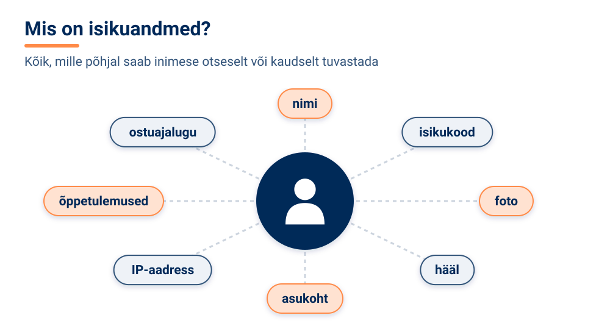
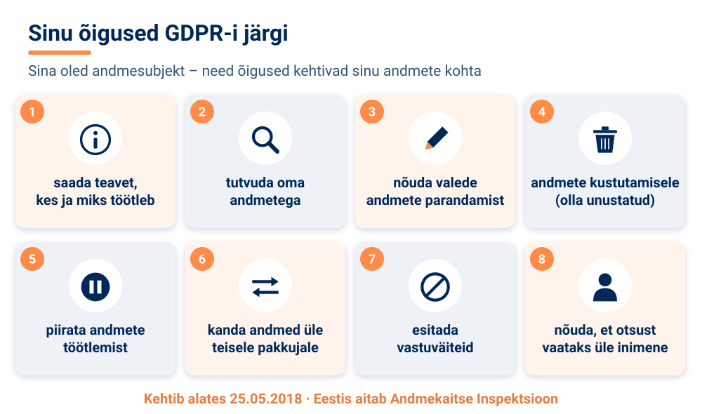
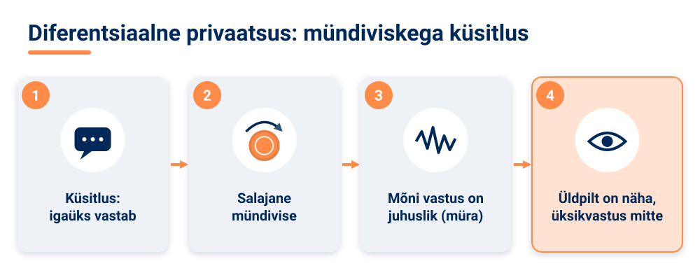
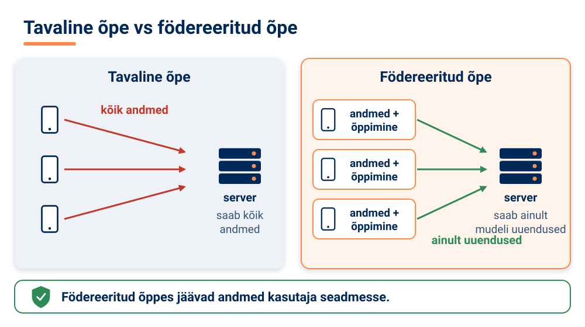

<!--
author:   Maia Lust
email:    
version:  2.2.1
language: et
narrator: Estonian Female
date:     08.10.2026
logo:     ../pildid/pae_logo.png
icon:     ../pildid/pae_logo.png
comment:  Tehisintellekti alused – gümnaasiumi valikkursus (35 tundi), Tallinna Pae Gümnaasium. Õppetekstid, interaktiivsed töölehed ja enesekontrollitestid.
link:     https://fonts.googleapis.com/css2?family=Nunito+Sans:wght@400;600;700&family=Poppins:wght@600;700&family=JetBrains+Mono:wght@400;600&display=swap

@style
/* ==== liascript-theming:start ==== */
/* links: https://fonts.googleapis.com/css2?family=Nunito+Sans:wght@400;600;700&family=Poppins:wght@600;700&family=JetBrains+Mono:wght@400;600&display=swap */
/* theme: Tallinna Pae Gümnaasium — generated by liascript-theming, edit theme.json and rebuild */
:root {
  --theme-font-body: 'Nunito Sans', sans-serif;
  --theme-font-heading: 'Poppins', serif;
  --theme-font-mono: 'JetBrains Mono', monospace;
  --theme-heading-weight: 700;
  --theme-line-height: 1.6;
  --global-font-size: 1.6rem;
  --theme-radius: 0.8rem;
  --theme-radius-small: 0.4rem;
  --theme-radius-large: 1.4rem;
  --theme-shadow: 0 0.3rem 1rem rgba(0,41,89,.10);
}
/* surfaces & text: apply to every color theme */
:root.lia-variant-light {
  --color-background: 255,255,255;
  --color-text: 29,36,51;
  --color-border: 228,229,231;
  --lia-grey-lighter: 238,242,247;
  --lia-grey-light: 204,212,222;
}
:root.lia-variant-dark {
  --color-background: 15,23,36;
  --color-text: 229,232,235;
  --color-border: 49,60,73;
  --lia-grey-dark: 30,38,47;
  --lia-anthracite: 41,50,61;
}
/* accent: only the course theme (default) and the custom radio,
   so readers can still pick LiaScript's built-in color themes */
:root:is(.lia-theme-default, .lia-theme-custom) {
  --color-highlight: 0,41,89;
  --color-highlight-dark: 0,41,89;
}
:root.lia-theme-default {
  --color-highlight-menu: 0,41,89;
}
:root:is(.lia-theme-default, .lia-theme-custom).lia-variant-dark {
  --color-highlight: 47,90,143;
  --color-highlight-dark: 255,185,143;
}
:root.lia-variant-light { --theme-heading-color: #002959; }
:root.lia-variant-dark { --theme-heading-color: #FFB98F; }
/* ==== LiaScript theme adapter (liascript-theming) — keep verbatim ====
   Maps the --theme-* tokens onto LiaScript's CSS. Everything a theme
   changes lives in the token block above this one. */

/* -- fonts: body/mono via the global variables, headings & co. are
      compiled literals in LiaScript and need explicit selectors -- */
:root {
  --global-font-family: var(--theme-font-body);
  --global-font-mono: var(--theme-font-mono);
  --global-font-headline: var(--theme-font-heading);
}
body { line-height: var(--theme-line-height, 1.47); }
h1, h2, h3, .h1, .h2, .h3 {
  font-family: var(--theme-font-heading);
  font-weight: var(--theme-heading-weight, 600);
  letter-spacing: var(--theme-heading-letter-spacing, normal);
  text-transform: var(--theme-heading-transform, none);
  color: var(--theme-heading-color, inherit);
}
h4, h5, h6, .h4, .h5, summary, .lia-accordion__headline {
  font-family: var(--theme-font-subheading, var(--theme-font-body));
}
.lia-quote__text { font-family: var(--theme-font-quote, var(--theme-font-heading)); }
.lia-code, .lia-code--inline, code, kbd, samp, pre { font-family: var(--theme-font-mono); }
.lia-code .ace_editor { font-family: var(--theme-font-mono) !important; }

/* -- shape: radius for controls & surfaces (radio buttons, tags, circles stay) -- */
:is(button, .lia-btn, input, .lia-input, select, .lia-select, textarea, .lia-textarea, .lia-dropdown):not(.lia-radio, .lia-btn--tag, .lia-btn--small-tag),
.lia-code-terminal__input, .lia-pagination__content, .lia-script, .lia-support-menu__submenu {
  border-radius: var(--theme-radius);
}
.lia-checkbox[type='checkbox'], kbd, .lia-tooltip .lia-tooltiptext, .lia-code--inline {
  border-radius: var(--theme-radius-small);
}
details, .lia-quote, .lia-code__input, .lia-table-responsive, .lia-card {
  border-radius: var(--theme-radius-large);
  box-shadow: var(--theme-shadow);
}
.lia-quote, .lia-code__input { overflow: hidden; }
.lia-code__input .ace_editor { border-radius: inherit; }
.lia-support-menu__submenu { box-shadow: var(--theme-shadow-popup, 0 0 1rem rgba(128, 128, 128, 0.2)); }

/* -- dark mode: LiaScript brightens the accent for text via
      rgb(from … calc(r*2.5)), which turns a hand-picked accent into
      pastel/yellow. For the course theme, text-like accent uses take
      --color-highlight-dark (= "accent as text") instead. Scoped to
      default/custom so the built-in color themes keep their behavior. -- */
:root:is(.lia-theme-default, .lia-theme-custom).lia-variant-dark :is(.lia-link, .lia-btn--outline, .lia-code--inline) {
  color: rgb(var(--color-highlight-dark));
  border-color: rgb(var(--color-highlight-dark));
}
:root:is(.lia-theme-default, .lia-theme-custom).lia-variant-dark :is(summary, summary:after, .lia-label, .lia-skip-nav, .lia-support-menu__item, .lia-quote__text),
:root:is(.lia-theme-default, .lia-theme-custom).lia-variant-dark :is(.lia-list--unordered, .lia-list--ordered) > li::marker {
  color: rgb(var(--color-highlight-dark));
}
:root:is(.lia-theme-default, .lia-theme-custom).lia-variant-dark :is(.lia-btn--transparent, .lia-input) {
  filter: none;
}
:root:is(.lia-theme-default, .lia-theme-custom).lia-variant-dark :is(.lia-input, .lia-checkbox[type='checkbox'], .lia-radio[type='radio']):not(:checked, .is-disabled, [disabled]) {
  border-color: rgb(var(--color-highlight-dark));
}
/* alternating table rows: LiaScript uses a neutral grey in dark mode */
:root.lia-variant-dark .lia-table.is-alternating .lia-table__row:nth-child(2n) td,
:root.lia-variant-dark .lia-table-responsive.has-thead-sticky.has-first-col-sticky .is-alternating .lia-table__row:nth-child(2n) td:first-child:before,
:root.lia-variant-dark .lia-table-responsive.has-thead-sticky.has-last-col-sticky .is-alternating .lia-table__row:nth-child(2n) td:last-child:before {
  background-color: rgb(var(--lia-grey-dark));
}
/* -- theme extras -- */
/* ===== Tallinna Pae Gümnaasiumi värvid =====
   tumesinine #002959 · oranž #FF8B48 · tumeoranž #E67E42 */
:root {
  --pae-sinine: #002959;
  --pae-sinine-80: #33547A;
  --pae-sinine-20: #CCD4DE;
  --pae-sinine-08: #EEF2F7;
  --pae-oranz: #FF8B48;
  --pae-oranz-tume: #E67E42;
  --pae-oranz-20: #FFE2D1;
  --pae-oranz-08: #FFF4EC;
  --pae-roheline: #2E8B57;
  --pae-roheline-08: #EAF6EF;
  --pae-lilla: #6B4FA0;
  --pae-lilla-08: #F2EEF9;
}

/* Pealkirjad */
.lia-slide h1, main h1 {
  color: var(--pae-sinine);
  border-bottom: 6px solid var(--pae-oranz);
  padding-bottom: .3em;
}
.lia-slide h2, main h2 { color: var(--pae-sinine); }
.lia-slide h3, main h3 {
  color: var(--pae-sinine);
  border-left: 8px solid var(--pae-oranz);
  padding-left: .5em;
}
.lia-slide h4, main h4 { color: var(--pae-oranz-tume); }
strong { color: inherit; }

/* Tabelid */
.lia-table th, table thead th {
  background: var(--pae-sinine) !important;
  color: #fff !important;
}
.lia-table tbody tr:nth-child(even), table tbody tr:nth-child(even) { background: var(--pae-sinine-08); }

/* Pildid ja infograafikud */
img.lia-image, .lia-figure img, main img {
  border-radius: 12px;
}
.lia-figure__caption, figcaption {
  color: var(--pae-sinine-80);
  font-style: italic;
  text-align: center;
}

/* ASCII-skeemid väiksemaks ja Pae värvidesse */
.lia-ascii svg, lia-ascii svg, .lia-code--ascii svg { max-width: 760px; margin: 0 auto; display: block; }
svg.lia-ascii text { fill: var(--pae-sinine); }

/* ===== Kujunduskastid ===== */
blockquote.pae-moiste, blockquote.pae-naide, blockquote.pae-eesti,
blockquote.pae-motle, blockquote.pae-lisaks, blockquote.pae-fakt,
.pae-moiste, .pae-naide, .pae-eesti, .pae-motle, .pae-lisaks, .pae-fakt {
  border-radius: 14px !important;
  padding: 1.1em 1.4em 1.1em 4.2em !important;
  margin: 1.4em 0 !important;
  position: relative;
  box-shadow: 0 3px 10px rgba(0,41,89,.10);
  font-style: normal !important;
  text-align: left !important;
}
.pae-moiste::before, .pae-naide::before, .pae-eesti::before,
.pae-motle::before, .pae-lisaks::before, .pae-fakt::before {
  position: absolute; left: .7em; top: .75em;
  width: 2em; height: 2em; line-height: 2em;
  border-radius: 50%; text-align: center; font-size: 1.15em;
  color: #fff; font-style: normal;
}
/* Mõiste – oranž */
.pae-moiste { background: var(--pae-oranz-08) !important; border: 2px solid var(--pae-oranz) !important; border-left: 10px solid var(--pae-oranz) !important; }
.pae-moiste::before { content: "📖"; background: var(--pae-oranz); }
/* Näide – tumesinine */
.pae-naide { background: var(--pae-sinine-08) !important; border: 2px solid var(--pae-sinine-20) !important; border-left: 10px solid var(--pae-sinine) !important; }
.pae-naide::before { content: "💡"; background: var(--pae-sinine); }
/* Eesti näide – sinine-valge */
.pae-eesti { background: linear-gradient(135deg, #E8F1FB 0%, #ffffff 100%) !important; border: 2px solid #0072CE !important; border-left: 10px solid #0072CE !important; }
.pae-eesti::before { content: "🇪🇪"; background: #0072CE; }
/* Mõtle järele – roheline */
.pae-motle { background: var(--pae-roheline-08) !important; border: 2px dashed var(--pae-roheline) !important; border-left: 10px solid var(--pae-roheline) !important; }
.pae-motle::before { content: "🤔"; background: var(--pae-roheline); }
/* Tea lisaks – lilla */
.pae-lisaks { background: var(--pae-lilla-08) !important; border: 2px solid #CDBFE6 !important; border-left: 10px solid var(--pae-lilla) !important; }
.pae-lisaks::before { content: "🔍"; background: var(--pae-lilla); }
/* Fakt – tume taust, valge tekst */
.pae-fakt { background: var(--pae-sinine) !important; color: #fff !important; border-left: 10px solid var(--pae-oranz) !important; }
.pae-fakt * { color: #fff !important; }
.pae-fakt::before { content: "⚡"; background: var(--pae-oranz); }

/* Töölehe jaotise riba */
.pae-jaotis { background: var(--pae-sinine); color: #fff !important; padding: .55em 1em; border-radius: 10px; margin: 2em 0 1em; border-left: 10px solid var(--pae-oranz); }
.pae-jaotis * { color: #fff !important; }

/* Ploki kaanepilt */
.pae-kaas img, img.pae-kaas { width: 100%; border-radius: 16px; box-shadow: 0 6px 20px rgba(0,41,89,.18); }

/* Näidisvastuse kokkupandav kast */
details {
  background: var(--pae-oranz-08);
  border: 1px solid var(--pae-oranz);
  border-radius: 10px; padding: .6em 1em; margin: .6em 0 1.4em;
}
details summary { cursor: pointer; font-weight: bold; color: var(--pae-oranz-tume); }

/* Menüü (sisukord) tumesinine */
.lia-toc a, .lia-toc .lia-toc__link, nav.lia-toc a { color: #002959 !important; }
.lia-toc a.lia-active, .lia-toc .lia-active { font-weight: 700; }
:root.lia-variant-dark .lia-toc a { color: #CCD4DE !important; }
:root.lia-variant-dark .pae-moiste, :root.lia-variant-dark .pae-naide, :root.lia-variant-dark .pae-eesti,
:root.lia-variant-dark .pae-motle, :root.lia-variant-dark .pae-lisaks { color: #1d2433 !important; }
:root.lia-variant-dark .pae-moiste *, :root.lia-variant-dark .pae-naide *, :root.lia-variant-dark .pae-eesti *,
:root.lia-variant-dark .pae-motle *, :root.lia-variant-dark .pae-lisaks * { color: #1d2433 !important; }
:root.lia-variant-dark img { background: #fff; }
/* ==== liascript-theming:end ==== */
/* Loosimisnupp (rollimäng) */
output.lia-script[input="submit"] { display:inline-block !important; background:#002959; color:#fff !important; font-weight:700; padding:.6em 1.2em; border-radius:999px; border:3px solid #FF8B48 !important; cursor:pointer; box-shadow:0 3px 10px rgba(0,41,89,.2); }
output.lia-script[input="submit"]:hover { background:#FF8B48; color:#002959 !important; }

/* Lihtsalt öeldes (ettelugemisega) */
section.pae-lihtne { background:#EAF6EE; border:2px solid #2E8B57; border-left:10px solid #2E8B57; border-radius:14px; padding:.9em 1.3em; margin:1.2em 0; font-size:1.05em; line-height:1.6; box-shadow:0 3px 10px rgba(0,41,89,.08); }
section.pae-lihtne p { margin:.5em 0; }
:root.lia-variant-dark section.pae-lihtne, :root.lia-variant-dark section.pae-lihtne * { color:#1d2433 !important; }

/* Sõnastiku hüpikselgitus */
.pae-term { border-bottom:2px dotted #FF8B48; cursor:help; position:relative; outline:none; }
.pae-term:hover::after, .pae-term:focus::after {
  content: attr(data-def); position:absolute; left:0; top:1.7em; z-index:999;
  width:max-content; max-width:min(320px, 80vw); white-space:normal;
  background:#002959; color:#fff; padding:.55em .8em; border-radius:10px;
  font-size:15px; line-height:1.45; font-weight:400; font-style:normal;
  box-shadow:0 6px 18px rgba(0,41,89,.3); border-left:5px solid #FF8B48;
}
.pae-fakt .pae-term:hover::after, .pae-fakt .pae-term:focus::after { color:#fff !important; }

@end

@custom
--color-highlight-menu: 255,255,255;
@end
-->

## 6.2 Privaatsus ja andmekaitse

<!-- class="pae-lisaks" -->
> 🗺️ **Oled 6. toas – Nõukogusaal.** Lisa selle lehe link järjehoidjasse, et saaksid hiljem samast kohast jätkata. Järgmine osa avaneb alles siis, kui oled selle osa luku lahendanud.

<!-- class="pae-kaas" -->

### Õpieesmärgid

Selle tunni järel sa:

- **selgitad oma sõnadega**, mis on isikuandmed ja privaatsus TI ajastul *(mõistmine)*;
- **rakendad** GDPR-i põhimõtteid ja andmesubjekti õigusi konkreetsetes olukordades *(rakendamine)*;
- **analüüsid** vestlusroboti abil, milliseid järeldusi saab TI teha näiliselt süütutest postitustest *(analüüs)*;
- **hindad**, millised neist järeldustest on isikuandmed ja miks see on privaatsuse seisukohast oluline *(hindamine)*;
- **kavandad**, mida teed edaspidi teisiti, kui jagad TI-teenustele oma isikuandmeid *(loomine)*.

<!-- class="pae-fakt" -->
> **🎯 Tunni tuumik (45 min)**
>
> 🏠 **Kodus enne tundi** (~15–20 min): „Privaatsust säilitavad tehnoloogiad“, „Privaatsuse ja kasulikkuse tasakaal“. Too tundi kaasa üks uus teadmine või küsimus – tunni alguses arutate neid paarides (3 min).
>
> 1. 📚 **Loe** (~12 min): „Mis on privaatsus TI ajastul?“, „Kuidas TI privaatsust ohustab?“, „Õiguslik raamistik: GDPR ja sinu õigused“ ja „Kokkuvõte ja põhimõisted“
> 2. 🧪 **TI-katse** (~10 min): „Mida TI postitustest järeldab?“
> 3. ⭐ **Tööleht** (~15 min): töölehe osad 2, 4 ja 5
> 4. 📤 **Väljapääsupilet** ja 🔐 **lukk** (~8 min)
>
> **🏠** tähistab osi, mida loed või vaatad **kodus enne tundi** (ümberpööratud klassiruum). **➕** tähistab lisaülesannet – tee seda, kui jõuad, või kui tahad rohkem teada.

{{|>}}
<section class="pae-lihtne">

**🟢 Lihtsalt öeldes**

Kui otsid telefonis midagi või kuulad muusikat, tekib sinu kohta andmeid. TI oskab neist teha järeldusi, näiteks arvata su huve. Andmeid, mille järgi saab sind ära tunda, nimetatakse **isikuandmeteks**. **Privaatsus** on sinu õigus kontrollida oma isikuandmeid. Euroopas kaitseb sinu andmeid isikuandmete kaitse üldmäärus ehk **GDPR**. Sul on õigus oma andmeid näha, parandada ja kustutada. Ettevõte tohib koguda ainult nii palju andmeid, kui on vaja. Kui su andmetega tehakse midagi valesti, aitab Andmekaitse Inspektsioon.

**Tähtsad sõnad:** **isikuandmed** – info, mille järgi saab sind ära tunda, näiteks nimi, foto või asukoht; **privaatsus** – sinu õigus kontrollida oma isikuandmeid; **GDPR** – Euroopa Liidu määrus, mis kaitseb isikuandmeid; **andmete minimaalsus** – kogutakse ainult nii palju andmeid, kui on vaja.

</section>

### Mis on privaatsus TI ajastul?

Iga kord, kui sa telefonis midagi otsid, märgid postituse meeldivaks, kuulad muusikat voogedastusteenuses või kõnnid poes turvakaamera eest mööda, tekib sinu kohta andmeid. TI-süsteemid suudavad sellistest andmetest teha järeldusi, mida sa ise kunagi otse ei jaganud – näiteks millised on su huvid, millal sa tavaliselt magama lähed või milline on su meeleolu.

<!-- class="pae-moiste" -->
> **Mõiste: privaatsus**
>
> Privaatsus tähendab TI kontekstis inimeste õigust kontrollida oma isikuandmete kogumist, kasutamist ja jagamist.

<!-- class="pae-moiste" -->
> **Mõiste: isikuandmed**
>
> Isikuandmed on igasugune teave, mille põhjal saab inimese otseselt või kaudselt tuvastada: nimi, isikukood, foto, hääl, asukoht, IP-aadress, aga ka näiteks õppetulemused või ostuajalugu. **Andmekaitse** on reeglite ja meetmete kogum, millega isikuandmeid kaitstakse.

Miks on privaatsus nii oluline? Esiteks on see **põhiõigus** – Euroopas on eraelu puutumatus ja isikuandmete kaitse inimese põhiõigused. Teiseks aitab privaatsuse austamine luua **usaldust**: kui inimesed ei usalda, kuidas nende andmeid kasutatakse, ei taha nad ka uusi teenuseid kasutada. Kolmandaks on olemas **seadusest tulenevad nõuded**, mida ettevõtted ja asutused peavad järgima. Neljandaks on tegu **eetilise küsimusega**: kas on õige teha inimese kohta järeldusi, millest ta ise teadlik ei ole?

### Kuidas TI privaatsust ohustab?

TI vajab õppimiseks palju andmeid ja see tekitab mitu privaatsusprobleemi:

- **suurte andmehulkade kogumine ja analüüsimine** – kogutakse rohkem, kui tegelikult vaja oleks;
- **isikuandmete kasutamine treenimiseks** – sinu postitused, pildid või vestlused võivad sattuda mudeli treeningandmetesse;
- **profileerimine ja automatiseeritud otsused** – sinu kohta luuakse profiil ja selle põhjal tehakse otsuseid (näiteks milliseid hindu või pakkumisi sulle näidatakse);
- **jälgimine ja järelevalve** – inimeste liikumist ja käitumist on võimalik pidevalt jälgida;
- **andmete taaskasutamine ja eesmärgi laienemine** – ühel eesmärgil kogutud andmeid hakatakse kasutama hoopis millekski muuks;
- **piiriülene andmevoog** – andmed liiguvad riikidesse, kus kaitse võib olla nõrgem.

Eri TI-rakendustel on oma riskid. **Näotuvastus ja biomeetria** võimaldavad inimest tuvastada ilma tema nõusolekuta ja jälgida teda avalikes kohtades. **Keeletöötlus ja vestlusrobotid** võivad vestlusi salvestada ja analüüsida, kasutajad aga jagavad nendega sageli tundlikku infot – mõtle, mida inimesed vestlusrobotilt küsivad! **Soovitussüsteemid** jälgivad pidevalt kasutaja käitumist, loovad tema profiili ja võivad temaga ka manipuleerida, näiteks hoides teda rakenduses kauem, kui ta ise tahaks.

<!-- class="pae-naide" -->
> **Näide: privaatsusrikkumised maailmas**
>
> - **Cambridge Analytica skandaal** – 2010. aastate teisel poolel selgus, et miljonite Facebooki kasutajate andmeid oli ilma nende teadliku nõusolekuta kasutatud poliitiliseks profileerimiseks ja sihitud reklaamiks.
> - **Clearview AI** – ettevõte kogus internetist suure hulga inimeste fotosid ja lõi nende põhjal näotuvastussüsteemi, ilma et pildil olevatelt inimestelt oleks nõusolekut küsitud. Mitme Euroopa riigi andmekaitseasutused on seda tegevust ebaseaduslikuks pidanud ja määranud trahve – näiteks Hollandi andmekaitseasutus 2024. aastal 30,5 miljonit eurot.
> - **Tervishoiuandmete lekked** – tundlikud terviseandmed on eri riikides sattunud valedesse kätesse.
>
> Õppetund: andmeid tuleb koguda ainult selgel eesmärgil, inimesi tuleb teavitada ja andmeid tuleb kaitsta.

### Õiguslik raamistik: GDPR ja sinu õigused

Euroopas on isikuandmete kaitse peamine õigusakt **isikuandmete kaitse üldmäärus (GDPR)**, mida kohaldatakse alates **25.05.2018** kõigis Euroopa Liidu riikides. See kehtib ka väljaspool ELi asuvatele ettevõtetele, kui need töötlevad ELi elanike andmeid. GDPR määrab kindlaks **andmesubjekti** (inimese, kelle andmetega on tegu) õigused, **vastutava töötleja** (organisatsiooni, kes andmeid töötleb) kohustused ja andmekaitse põhimõtted. Eestis täiendab GDPR-i **isikuandmete kaitse seadus**. Lisaks seab nõudeid ka **Euroopa Liidu tehisintellekti määrus** (AI Act), mis jõustus 01.08.2024 ja mis keelab näiteks mõned eriti privaatsust riivavad TI-praktikad.

<!-- class="pae-moiste" -->
> **Mõiste: isikuandmete kaitse üldmäärus (GDPR)**
>
> GDPR (General Data Protection Regulation) on Euroopa Liidu määrus, mis sätestab, kuidas tohib isikuandmeid koguda, kasutada ja säilitada ning millised õigused on inimestel oma andmete üle.

<!-- class="pae-fakt" -->
> **Kas teadsid?** GDPR-i kohaldatakse alates **25.05.2018** ja see kehtib ka väljaspool Euroopa Liitu asuvatele ettevõtetele, kui need töötlevad ELi elanike andmeid.

GDPR-i põhimõtted on järgmised.

| Põhimõte | Mida see tähendab? |
|---|---|
| Seaduslikkus, õiglus ja läbipaistvus | Andmeid töödeldakse seaduslikul alusel, ausalt ja inimesele arusaadavalt. |
| Eesmärgi piirang | Andmeid kogutakse kindlal eesmärgil ega kasutata hiljem millekski muuks. |
| Võimalikult väheste andmete kogumine (andmete minimaalsus) | Kogutakse ainult nii palju andmeid, kui eesmärgi jaoks vaja. |
| Õigsus | Andmed peavad olema täpsed ja ajakohased. |
| Säilitamise piirang | Andmeid ei hoita kauem, kui vaja. |
| Usaldusväärsus ja konfidentsiaalsus | Andmed on kaitstud lekete ja volitamata juurdepääsu eest. |
| Vastutus | Töötleja peab suutma tõendada, et ta järgib põhimõtteid. |

Sinul kui andmesubjektil on GDPR-i järgi mitu õigust:

- **õigus saada teavet** selle kohta, kes ja miks sinu andmeid töötleb;
- **õigus tutvuda oma andmetega**;
- **õigus nõuda andmete parandamist**, kui need on valed;
- **õigus andmete kustutamisele** („õigus olla unustatud“);
- **õigus piirata andmete töötlemist**;
- **õigus andmete ülekandmisele** ühelt teenusepakkujalt teisele;
- **õigus esitada vastuväiteid** andmete töötlemise kohta;
- **õigus mitte alluda üksnes automatiseeritud otsusele**, millel on sulle oluline mõju – näiteks võid nõuda, et otsuse vaataks üle inimene.

<!-- class="pae-eesti" -->
> **Eesti näide: Andmekaitse Inspektsioon**
>
> Eestis teeb isikuandmete kaitse üle järelevalvet **Andmekaitse Inspektsioon (AKI)**. Kui arvad, et sinu isikuandmeid kasutatakse ebaseaduslikult – näiteks ettevõte ei kustuta sinu andmeid või keegi avaldab sinu pilte ilma loata –, võid pöörduda inspektsiooni poole. AKI annab ka juhiseid, kuidas TI-d isikuandmete kaitse põhimõtetega kooskõlas kasutada. Veebileht: https://www.aki.ee/

<!-- class="pae-motle" -->
> **Mõtle järele!**
>
> Ava oma telefonis ühe sagedamini kasutatava rakenduse seaded. Milliseid andmeid see rakendus sinu kohta koguda tohib (asukoht, kontaktid, mikrofon, kaamera)? Kas kõik need load on rakenduse toimimiseks tõesti vajalikud? Kuidas on see seotud andmete minimaalsuse põhimõttega?

### 🏠 Privaatsust säilitavad tehnoloogiad

Kas TI ja privaatsus saavad üldse koos eksisteerida? Teadlased on välja töötanud tehnoloogiaid, mis võimaldavad andmetest kasu saada, ilma et üksikute inimeste andmed paljastuksid.

**Diferentsiaalne privaatsus.** Andmetele lisatakse hoolikalt arvutatud „müra“ ehk juhuslikke muudatusi. Kogu andmestiku üldised mustrid jäävad alles, kuid üksiku inimese andmeid ei ole võimalik välja lugeda. Kujuta ette küsitlust, kus iga vastaja viskab enne vastamist salaja münti ja mõnikord vastab juhuslikult – üldpilt on ikka näha, aga ühegi inimese vastust ei saa kindlalt teada.

**Föderatiivne õpe.** Tavaliselt koondatakse kõik andmed ühte kohta ja treenitakse seal mudel. Föderatiivse õppe korral jäävad andmed kasutaja seadmesse (näiteks telefoni) ning mudelit treenitakse edasi seal. Keskserverisse saadetakse ainult mudeli uuendused, mitte andmed ise. Nii saab mudelit treenida ilma andmeid tsentraliseerimata.

**Homomorfne krüpteerimine.** Andmeid saab töödelda krüpteeritud ehk šifreeritud kujul, ilma et neid oleks vaja vahepeal dekrüpteerida (lahti krüpteerida). Töötleja saab arvutuse tulemuse, kuid ei näe kunagi algandmeid.

**Turvaline mitme osapoole arvutus.** Mitu osapoolt saavad ühiselt midagi välja arvutada, ilma et keegi neist peaks teistele oma tundlikke andmeid avaldama.

Lisaks kasutatakse **anonümiseerimist** (andmetest eemaldatakse kõik, mille põhjal saaks inimese tuvastada) ja **pseudonümiseerimist** (nimi ja isikukood asendatakse koodiga, mille saab vajaduse korral eraldi hoitava võtme abil tagasi seostada).

<!-- class="pae-moiste" -->
> **Mõisted: lõimitud privaatsus ja vaikimisi privaatsus**
>
> **Lõimitud privaatsus** (privacy by design) tähendab, et privaatsuse kaitse on integreeritud kogu arendusprotsessi, alates süsteemi kavandamisest; selle juurde kuuluvad ka privaatsuse mõjuhinnangud.
>
> **Vaikimisi privaatsus** (privacy by default) tähendab, et süsteemi vaikeseaded on privaatsust kaitsvad ja kogutakse minimaalselt andmeid – kasutaja ei pea ise midagi muutma, et olla kaitstud.

Ettevõtted ja asutused saavad privaatsust kaitsta ka praktiliste sammudega: anonümiseerimine ja pseudonümiseerimine, privaatsuse mõjuhinnangud, andmekaitse põhimõtete dokumenteerimine, töötajate koolitamine, **andmekaitsespetsialisti** määramine, turvaintsidentide haldamise kord ja regulaarsed auditid.

### 🏠 Privaatsuse ja kasulikkuse tasakaal

Siin on keskne dilemma: **rohkem andmeid tähendab sageli paremat TI-d**, kuid rohkem andmeid tähendab ka suuremat privaatsusriski. Kuidas tagada privaatsus ilma kasulikkust ohverdamata? Ühest vastust ei ole. Ühed rõhutavad, et terviseandmete laialdasem kasutamine võib päästa elusid. Teised leiavad, et inimese kontroll oma andmete üle on nii oluline, et sellest ei tohi loobuda isegi suure kasu nimel. Lahendusi otsitakse privaatsust säilitavatest tehnoloogiatest, anonümiseerimisest ja pseudonümiseerimisest ning nõusolekust ja läbipaistvusest.

<!-- class="pae-eesti" -->
> **Eesti näide: X-tee ja Bürokratt**
>
> Eesti e-riigi selgroog on **X-tee** – turvaline andmevahetuskiht, mille kaudu riigi ja teiste asutuste andmekogud omavahel andmeid vahetavad. Andmeid ei koondata ühte suurde andmebaasi, vaid need jäävad oma asutuse juurde ja liiguvad ainult vajaduse korral. Riigiportaali eesti.ee **andmejälgijas** saab inimene vaadata, millised asutused on tema andmeid päringutega kasutanud – 2025. aasta seisuga küll ainult 16 andmekogu puhul. Eesti e-teenuste põhimõtted on läbipaistvus, kasutaja nõusolek ja andmete minimaalsus. Samu küsimusi tuleb lahendada ka virtuaalassistendi **Bürokratt** puhul: kuidas tagada privaatsus, kui inimene kirjutab vestlusrobotile oma muredest?

<!-- class="pae-fakt" -->
> **Kas teadsid?** Riigiportaali **eesti.ee** andmejälgijas saad ise vaadata, millised asutused on sinu andmeid kasutanud. Seni on andmejälgijaga liidetud vaid osa riigi andmekogudest.

Tulevikus on oodata uusi privaatsust säilitavaid tehnoloogiaid, regulatsioonide edasist arengut, kasutajate teadlikkuse kasvu ning rahvusvahelist koostööd ühiste standardite loomisel.

<!-- class="pae-motle" -->
> **Mõtle järele!**
>
> Mõtle oma igapäevaelule. Kuidas saad ise oma privaatsust paremini kaitsta, kui kasutad virtuaalassistente, vestlusroboteid, soovitussüsteeme või sotsiaalmeediat? Kas oled valmis mõnest mugavusest loobuma, et oma andmeid paremini kaitsta?

### 🧪 TI-katse: Mida TI postitustest järeldab?

🛡️ *Ohutuskaardi reeglid kehtivad: ära logi sisse, ära sisesta isikuandmeid ega pildista inimesi.*

Katsetad, kui palju suudab vestlusrobot järeldada väljamõeldud inimese kohta mõnest näiliselt süütust postitusest. Nii näed, kuidas toimib **profileerimine** ja miks ka kaudsed vihjed võivad olla isikuandmed.

**Vaja läheb:** kooli lubatud vestlusrobot (nt [TI-Hüppe õpirakendus](https://tihupe.ee/opirakendus/)), ~10 min, paaristöö

1. Kopeeri vestlusrobotisse need **väljamõeldud** postitused (ära lisa midagi enda ega teiste kohta):
   „Esmaspäeva hommikul jälle 7.40 bussiga trenni, enne kooli! 🏊“, „Eesti keele kontrolltöö homme, 10.b peab vastu 😅“, „Vanaema koeral täna sünnipäev, tort tuli ise teha“, „Laupäeval taas laat, müüme oma klassiga kooki kirikuplatsil.“
2. Küsi: „Mida saad nende postituste põhjal selle inimese kohta järeldada? Too välja vanus, elukoht, harjumused ja muud järeldused ning kirjuta iga järelduse juurde, kui kindel sa oled.“
3. Arutage paarilisega: millised järeldused on tõenäoliselt õiged ja millised oletused? Milliste järelduste põhjal saaks inimese üles leida või ära tunda?

**Pane tähele / kirjuta üles:** kolm järeldust, mida postitustes otse ei öeldud. Millised neist on isikuandmed? Mida võiks postituse autor teha teisiti, et vähem endast reeta?

[[___ ___ ___]]

<!-- class="pae-lisaks" -->
> **Kui arvutit pole:** lugege samu postitusi paaris ja kirjutage üles kõik, mida nende autori kohta järeldada saab. Märkige iga järelduse juurde, kas see on fakt või oletus, ja mõelge, kas mõni järeldus aitaks inimese üles leida.

### Kokkuvõte ja põhimõisted

**Pea meeles**

- Privaatsus tähendab inimese õigust kontrollida oma isikuandmete kogumist, kasutamist ja jagamist.
- TI ohustab privaatsust suurte andmehulkade kogumise, profileerimise, jälgimise ja andmete teisel eesmärgil kasutamise kaudu.
- GDPR annab sulle mitu õigust, sealhulgas õiguse oma andmetega tutvuda, neid parandada ja kustutada ning õiguse mitte alluda üksnes automatiseeritud otsusele.
- Eestis teeb andmekaitse üle järelevalvet Andmekaitse Inspektsioon.
- Privaatsust säilitavad tehnoloogiad (diferentsiaalne privaatsus, föderatiivne õpe, homomorfne krüpteerimine, turvaline mitme osapoole arvutus) aitavad leida tasakaalu privaatsuse ja kasulikkuse vahel.
- Privaatsuse kaitse nõuab kõigi osapoolte koostööd – nii arendajate, organisatsioonide, riigi kui ka kasutajate endi panust.

| Mõiste | Tähendus |
|---|---|
| privaatsus | inimese õigus kontrollida oma isikuandmete kogumist, kasutamist ja jagamist |
| isikuandmed | teave, mille põhjal saab inimese otseselt või kaudselt tuvastada |
| isikuandmete kaitse üldmäärus (GDPR) | ELi määrus, mis sätestab isikuandmete töötlemise reeglid ja inimeste õigused |
| andmesubjekt | inimene, kelle isikuandmeid töödeldakse |
| profileerimine | inimese kohta profiili loomine tema andmete põhjal, et tema käitumist hinnata või ennustada |
| andmete minimaalsus | põhimõte koguda ainult nii palju andmeid, kui eesmärgi jaoks vaja |
| diferentsiaalne privaatsus | andmetele müra lisamine, nii et üksiku inimese andmeid ei saa välja lugeda |
| föderatiivne õpe | mudeli treenimine nii, et andmed jäävad kasutaja seadmesse |
| pseudonümiseerimine | otseste tunnuste asendamine koodiga, mida saab eraldi võtme abil tagasi seostada |
| lõimitud privaatsus | privaatsuse kaitse arvestamine kogu arendusprotsessi vältel |

### 📚 Allikad ja lisalugemine

- EUR-Lex (2016). [Isikuandmete kaitse üldmäärus (GDPR) – kokkuvõte](https://eur-lex.europa.eu/ET/legal-content/summary/general-data-protection-regulation-gdpr.html). ELi ametlik kokkuvõte üldmäärusest ja andmesubjekti õigustest.
- Andmekaitse Inspektsioon (2026). [Tähelepanu juhtimine. Üldotstarbelise tehisintellekti kasutamine tervishoius](https://www.aki.ee/sites/default/files/documents/2026-06/Tahelepanu%20juhtimine.%20%C3%9Cldotstarbelise%20tehisintellekti%20kasutamine%20tervishoius_0.pdf). AKI selgitab Eesti näite põhjal, miks ei tohi terviseandmeid lihtsalt vestlusrobotisse sisestada.
- ERR (2025). [Andmejälgija infot näeb vaid 16 andmekogu kohta](https://www.err.ee/1609768860/andmejalgija-infot-naeb-vaid-16-andmekogu-kohta). Mida näitab eesti.ee andmejälgija ja millised on selle piirid (eesti keeles).
- Hunton (2024). [Dutch regulator fines Clearview AI 30.5 million euros](https://www.hunton.com/privacy-and-cybersecurity-law-blog/dutch-regulator-fines-clearview-ai-30-5-million-euros). Miks pidas Hollandi andmekaitseasutus Clearview AI näotuvastuse andmebaasi ebaseaduslikuks.
- Laas, O. (2025). [TI-hüpe vajab TI-eetikat](https://www.err.ee/1609620371/oliver-laas-ti-hupe-vajab-ti-eetikat). Õpilaste andmete, jälgimise ja nõusoleku küsimused koolis kasutatavate TI-tööriistade puhul (sobib lisalugemiseks).

### Tööleht 6.2

<!-- class="pae-jaotis" -->
**➕ 1. Privaatsuse ja andmekaitse põhimõisted**

**Ülesanne 1.** Selgita oma sõnadega, mis on privaatsus TI kontekstis.

[[___ ___ ___]]

**Ülesanne 2.** Nimeta vähemalt kolm põhjust, miks privaatsus ja andmekaitse on TI arendamisel ja kasutamisel olulised.

[[___ ___ ___]]

**Ülesanne 3.** Mis on isikuandmete kaitse üldmäärus (GDPR) ja kuidas see mõjutab TI-süsteeme?

[[___ ___ ___]]

<!-- class="pae-jaotis" -->
**⭐ 2. Privaatsuse väljakutsed tehisintellektis**

**Ülesanne 4.** Analüüsi järgmist stsenaariumi.

*Tervishoiuettevõte arendab TI-süsteemi, mis analüüsib patsientide meditsiinilisi andmeid, et ennustada haiguste riski ja soovitada ennetavaid meetmeid.*

Millised privaatsuse ja andmekaitse väljakutsed selle süsteemiga kaasnevad? Kuidas neid lahendada?

[[___ ___ ___ ___ ___]]

**Ülesanne 5.** Nimeta vähemalt kolm TI-rakendust, mis võivad ohustada inimeste privaatsust, ja selgita, miks.

[[___ ___ ___ ___]]

**Ülesanne 6.** Kuidas mõjutab andmete kogumine ja kasutamine TI-süsteemide kvaliteeti? Kuidas leida tasakaal privaatsuse kaitse ja andmete kasulikkuse vahel?

[[___ ___ ___ ___]]

<!-- class="pae-jaotis" -->
**➕ 3. Privaatsust säilitavad tehnoloogiad**

**Ülesanne 7.** Mis on diferentsiaalne privaatsus ja kuidas see aitab kaitsta isikuandmeid TI-süsteemides?

[[___ ___ ___]]

**Ülesanne 8.** Selgita lühidalt, mis on föderatiivne õpe (federated learning) ja kuidas see aitab privaatsust kaitsta.

[[___ ___ ___]]

**Ülesanne 9.** Uuri ja kirjelda üht privaatsust säilitavat tehnoloogiat, mida saab kasutada TI-süsteemides (lisaks diferentsiaalsele privaatsusele ja föderatiivsele õppele).

[[___ ___ ___ ___]]

<!-- class="pae-jaotis" -->
**⭐ 4. Praktiline ülesanne: privaatsuse mõjuhinnang**

**Ülesanne 10.** Vali üks TI-rakendus (näiteks näotuvastussüsteem, soovitussüsteem või vestlusrobot) ja koosta lühike privaatsuse mõjuhinnang, vastates järgmistele küsimustele.

a) Milliseid isikuandmeid süsteem kogub või töötleb?

[[___ ___]]

b) Millised on peamised privaatsusriskid?

[[___ ___ ___]]

c) Milliseid meetmeid saab rakendada nende riskide maandamiseks?

[[___ ___ ___]]

d) Kuidas tagada andmesubjektide õiguste (nt juurdepääs, parandamine, kustutamine) kaitse?

[[___ ___ ___]]

<!-- class="pae-jaotis" -->
**⭐ 5. Arutelu ja refleksioon**

**Ülesanne 11.** Kas oled nõus väitega: „Privaatsus on luksus, millest peame loobuma, et saada kasu TI võimalustest“? Põhjenda oma arvamust.

[[___ ___ ___ ___ ___]]

**Ülesanne 12.** Kuidas saaksid sina isiklikult kaitsta oma privaatsust, kui kasutad TI-l põhinevaid teenuseid (nt virtuaalassistendid, soovitussüsteemid, sotsiaalmeedia)?

[[___ ___ ___ ___]]

**Ülesanne 13.** Milliseid privaatsuse ja andmekaitse aspekte peaksid arvestama TI-süsteemi arendajad? Milliseid aspekte peaksid arvestama kasutajad?

[[___ ___ ___ ___]]

<!-- class="pae-jaotis" -->
**➕ 6. Lisaülesanne: Eesti kontekst**

**Ülesanne 14.** Uuri, kuidas on Eestis reguleeritud TI-süsteemide privaatsus ja andmekaitse. Millised on Eesti eripärad või tugevused selles valdkonnas?

[[___ ___ ___ ___ ___]]

**Ülesanne 15.** Too näide mõnest Eesti ettevõttest või projektist, mis tegeleb TI arendamisega, ja kirjelda, kuidas nad käsitlevad privaatsuse ja andmekaitse küsimusi.

[[___ ___ ___ ___]]

### Enesekontroll 6.2

**1. Kuidas nimetatakse inimest, kelle isikuandmeid töödeldakse? Kirjuta üks sõna.**

[[andmesubjekt]]

****************************************
Õige vastus: **andmesubjekt**. GDPR määrab kindlaks andmesubjekti õigused ja vastutava töötleja ehk andmeid töötleva organisatsiooni kohustused.
****************************************

**2. Millist GDPR-i põhimõtet iga olukord eelkõige järgib?**

<!-- data-show-partial-solution -->
- [ (Eesmärgi piirang) (Andmete minimaalsus) (Õigsus) (Säilitamise piirang) ]
- [ ( ) (X) ( ) ( ) ] Mängurakendus küsib registreerimisel ainult kasutajanime, mitte kodust aadressi ega isikukoodi.
- [ (X) ( ) ( ) ( ) ] Ekskursiooni jaoks kogutud vanemate telefoninumbreid ei kasutata hiljem reklaami saatmiseks.
- [ ( ) ( ) (X) ( ) ] Kui selgub, et õpilase aadress on andmebaasis vale, parandatakse see kohe.
- [ ( ) ( ) ( ) (X) ] Kooli lõpetanud õpilaste andmed kustutatakse, kui neid enam vaja ei ole.
****************************************
**Andmete minimaalsus**: kogutakse ainult nii palju andmeid, kui vaja. **Eesmärgi piirang**: kindlal eesmärgil kogutud andmeid ei kasutata millekski muuks. **Õigsus**: andmed peavad olema täpsed ja ajakohased. **Säilitamise piirang**: andmeid ei hoita kauem, kui vaja.
****************************************

**3. Lohista privaatsust säilitavate tehnoloogiate nimetused õigetesse lünkadesse.**

<!-- data-show-partial-solution -->
Kui andmetele lisatakse hoolikalt arvutatud müra, on tegu [->[ (diferentsiaalse privaatsusega) ]]. Kui andmed jäävad telefoni ja serverisse saadetakse ainult mudeli uuendused, on tegu [->[ (föderatiivse õppega) | pilvandmetöötlusega ]]. Kui andmeid töödeldakse krüpteeritud kujul ilma neid vahepeal dekrüpteerimata, on tegu [->[ (homomorfse krüpteerimisega) ]]. Kui nimi ja isikukood asendatakse koodiga, mille saab eraldi hoitava võtme abil tagasi seostada, on tegu [->[ (pseudonümiseerimisega) | anonümiseerimisega ]].
****************************************
Diferentsiaalne privaatsus lisab andmetele müra, föderatiivne õpe jätab andmed seadmesse, homomorfne krüpteerimine võimaldab arvutada krüpteeritud andmetega. Pseudonümiseerimise korral saab inimese võtme abil uuesti tuvastada, anonümiseerimise korral mitte.
****************************************

**4. Vali rippmenüüst õige variant.**

<!-- data-show-partial-solution -->
GDPR-i kohaldatakse alates [[ (25.05.2018) | 01.08.2024 | 02.02.2025 ]]. Õigust nõuda oma andmete kustutamist nimetatakse ka õiguseks [[ olla anonüümne | (olla unustatud) | andmeid üle kanda ]]. Eestis teeb isikuandmete kaitse üle järelevalvet [[ Riigi Infosüsteemi Amet | (Andmekaitse Inspektsioon) | Töötukassa ]].
****************************************
GDPR-i kohaldatakse alates 25.05.2018. Õigus andmete kustutamisele on tuntud kui „õigus olla unustatud“. Eestis saab andmekaitse küsimustes pöörduda Andmekaitse Inspektsiooni poole (www.aki.ee).
****************************************

**5. Diferentsiaalset privaatsust saab selgitada mündiviskega küsitluse abil. Pane sammud õigesse järjekorda.**

<!-- data-show-partial-solution -->
Kõigi vastused kogutakse kokku: [[ 1 | 2 | (3) | 4 ]] 
Vastaja viskab enne vastamist salaja münti: [[ (1) | 2 | 3 | 4 ]] 
Üldpilt on näha, kuid ühegi vastaja vastust ei saa kindlalt teada: [[ 1 | 2 | 3 | (4) ]] 
Mündi tulemusest sõltuvalt vastab ta kas ausalt või juhuslikult: [[ 1 | (2) | 3 | 4 ]]
****************************************
Õige järjekord: 1. salajane mündivise → 2. aus või juhuslik vastus (juhuslik vastus on „müra“) → 3. vastused kogutakse kokku → 4. üldpilt on näha, kuid üksiku inimese vastust ei saa välja lugeda.
****************************************

**6. Mida tähendab vaikimisi privaatsus (privacy by default)?**

- [( )] Kasutaja peab ise kõik privaatsusseaded sisse lülitama
- [(X)] Süsteemi vaikeseaded on privaatsust kaitsvad ja kogutakse minimaalselt andmeid
- [( )] Kõik andmed on vaikimisi avalikud
- [( )] Privaatsuse eest vastutab ainult kasutaja
****************************************
Vaikimisi privaatsus tähendab, et kasutaja on kaitstud ka siis, kui ta ise seadeid ei muuda.
****************************************

**7. Millised väited on tõesed? (Vali kõik õiged.)**

- [[X]] GDPR annab inimesele õiguse mitte alluda üksnes automatiseeritud otsusele, millel on talle oluline mõju.
- [[ ]] Kui andmed on kord kogutud, võib neid kasutada mis tahes uuel eesmärgil.
- [[X]] Eesti X-tee kaudu vahetavad asutused andmeid ilma neid ühte suurde andmebaasi koondamata.
- [[ ]] Soovitussüsteemidega ei kaasne privaatsusriske, sest need ainult soovitavad sisu.
- [[X]] GDPR kehtib ka väljaspool ELi asuvatele ettevõtetele, kui need töötlevad ELi elanike andmeid.
****************************************
Eesmärgi piirangu põhimõtte järgi ei tohi andmeid kasutada teisel eesmärgil. Soovitussüsteemid jälgivad ja profileerivad kasutajaid, mistõttu kaasnevad nendega privaatsusriskid.
****************************************

**8. Selgita oma sõnadega, miks on privaatsuse ja kasulikkuse vahel dilemma. Too üks võimalik lahendus.**

[[___ ___ ___]]

Vaata näidisvastust

TI töötab sageli seda paremini, mida rohkem andmeid see saab. Näiteks võiksid patsientide terviseandmed aidata haigusi varem avastada. Samas suurendab andmete laialdane kasutamine privaatsusriski, sest inimene kaotab kontrolli oma andmete üle. Üks lahendus on privaatsust säilitavad tehnoloogiad, näiteks föderatiivne õpe, mille korral andmed jäävad inimese seadmesse. Aidata võivad ka anonümiseerimine, pseudonümiseerimine ning inimeste teavitamine ja nõusoleku küsimine.

### 📤 Väljapääsupilet 6.2

<!-- class="pae-fakt" -->
> ⚠️ **Salvesta või saada vastused enne lehe sulgemist!** Vastus ei liigu automaatselt õpetajale ja võib kaduda, kui vahetad seadet, kasutad privaatakent või kustutad brauseri andmed.

Vasta lühidalt (3–5 min). Vastused jäävad selle brauseri mällu. Kui oled valmis, vajuta **Kopeeri vastused** ja kleebi need Google Classroomi ülesande vastusesse või laadi fail alla ja lisa see ülesande juurde.

<!-- data-type="none" -->
| Kriteerium | 2 p | 1 p | 0 p |
|---|---|---|---|
| Mõiste rakendamine uues olukorras | Õige mõiste ja selge põhjendus | Mõiste õige, põhjendus puudu või ebatäpne | Vastus puudub või on vale |
| TI-katse tõlgendus | Tulemus on seotud tunni mõistega | Tulemus on kirjeldatud, seos puudub | Puudub |
| Refleksioon | Konkreetne ja isiklik | Üldine | Puudub |

*Väljapääsupilet on kujundav hindamine: õpetaja annab tagasisidet ja kasutab vastuseid järgmise tunni planeerimisel. Pilet sobib ka portfoolio õpipäevikusse.*

### 🔐 Lukk 6.2

<!-- class="pae-naide" -->
> <!-- style="width: 120px; float: left; margin: 0 16px 8px 0; border-radius: 0;" --> **Kratt:** „Ma korjasin kokku nime, isikukoodi, näopildi ja IP-aadressi… Kas need on lihtsalt toredad numbrid ja pildid? Miks kõik mind nii murelikult vaatavad?“

Lukk avaneb, kui lahendad ülesande. Loe juhtumit.

> Lauri postitas sotsiaalmeediasse pildi oma uutest tossudest. Ta ei kirjutanud postitusse oma nime ega aadressi. Pildifaili sisse salvestusid aga koha koordinaadid (tema kodu juures), peeglist paistab tema nägu ja taustal on näha kooli logoga pusa. Lauri arvab, et jagas ainult pilti tossudest.

Mida Lauri tegelikult jagas? Kirjuta üks sõna – mõiste, mida GDPR kaitseb ja mille alla kuuluvad kõik need vihjed.

<!-- data-solution-button="off" -->
[[isikuandmed]]
[[?]] Vihje 1: Kas asukoha, näo ja kooli põhjal saaks keegi Lauri ära tunda või üles leida? Kuidas nimetatakse andmeid, mille põhjal saab inimese otseselt või kaudselt tuvastada?
[[?]] Vihje 2: Liitsõna, milles on 11 tähte; see algab tähega I ja lõpeb mitmuse tunnusega -d.
[[?]] 🛟 Päästerõngas: mine tagasi lehele „Mis on privaatsus TI ajastul?“ ja loe kasti „Mõiste: isikuandmed“. Kui ikka ei tule välja, küsi õpetajalt selle luku päästekood ja kirjuta see vastuseväljale.

****************************************
✅ **Lukk avatud!** Lauri jagas **isikuandmeid**: asukoht, näopilt ja kool on kõik teave, mille põhjal saab inimese otseselt või kaudselt tuvastada. Seepärast tuleb neid GDPR-i järgi kaitsta – ja enne postitamist tasub kontrollida, mida pilt sinust reedab.

🔑 **Sinu võtmetäht: I**

Kirjuta täht üles – seda on vaja toa ukse avamiseks.

➡️ **[Ava järgmine osa: 6.3 Kallutatus ja õiglus](https://liascript.github.io/course/?https://raw.githubusercontent.com/maialust/Tehisintellekti-alused/main/oppija/6_3_e167d5ea.md)**

****************************************
