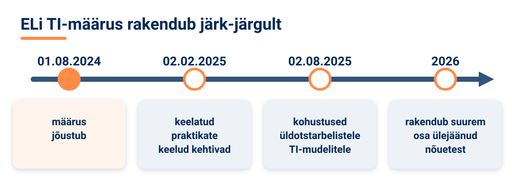

<!--
author:   Maia Lust
email:    
version:  2.2.0
language: et
narrator: Estonian Female
date:     08.10.2026
logo:     ../pildid/pae_logo.png
icon:     ../pildid/pae_logo.png
comment:  Tehisintellekti alused – gümnaasiumi valikkursus (35 tundi), Tallinna Pae Gümnaasium. Õppetekstid, interaktiivsed töölehed ja enesekontrollitestid.
link:     https://fonts.googleapis.com/css2?family=Nunito+Sans:wght@400;600;700&family=Poppins:wght@600;700&family=JetBrains+Mono:wght@400;600&display=swap

@style
/* ==== liascript-theming:start ==== */
/* links: https://fonts.googleapis.com/css2?family=Nunito+Sans:wght@400;600;700&family=Poppins:wght@600;700&family=JetBrains+Mono:wght@400;600&display=swap */
/* theme: Tallinna Pae Gümnaasium — generated by liascript-theming, edit theme.json and rebuild */
:root {
  --theme-font-body: 'Nunito Sans', sans-serif;
  --theme-font-heading: 'Poppins', serif;
  --theme-font-mono: 'JetBrains Mono', monospace;
  --theme-heading-weight: 700;
  --theme-line-height: 1.6;
  --global-font-size: 1.6rem;
  --theme-radius: 0.8rem;
  --theme-radius-small: 0.4rem;
  --theme-radius-large: 1.4rem;
  --theme-shadow: 0 0.3rem 1rem rgba(0,41,89,.10);
}
/* surfaces & text: apply to every color theme */
:root.lia-variant-light {
  --color-background: 255,255,255;
  --color-text: 29,36,51;
  --color-border: 228,229,231;
  --lia-grey-lighter: 238,242,247;
  --lia-grey-light: 204,212,222;
}
:root.lia-variant-dark {
  --color-background: 15,23,36;
  --color-text: 229,232,235;
  --color-border: 49,60,73;
  --lia-grey-dark: 30,38,47;
  --lia-anthracite: 41,50,61;
}
/* accent: only the course theme (default) and the custom radio,
   so readers can still pick LiaScript's built-in color themes */
:root:is(.lia-theme-default, .lia-theme-custom) {
  --color-highlight: 0,41,89;
  --color-highlight-dark: 0,41,89;
}
:root.lia-theme-default {
  --color-highlight-menu: 0,41,89;
}
:root:is(.lia-theme-default, .lia-theme-custom).lia-variant-dark {
  --color-highlight: 47,90,143;
  --color-highlight-dark: 255,185,143;
}
:root.lia-variant-light { --theme-heading-color: #002959; }
:root.lia-variant-dark { --theme-heading-color: #FFB98F; }
/* ==== LiaScript theme adapter (liascript-theming) — keep verbatim ====
   Maps the --theme-* tokens onto LiaScript's CSS. Everything a theme
   changes lives in the token block above this one. */

/* -- fonts: body/mono via the global variables, headings & co. are
      compiled literals in LiaScript and need explicit selectors -- */
:root {
  --global-font-family: var(--theme-font-body);
  --global-font-mono: var(--theme-font-mono);
  --global-font-headline: var(--theme-font-heading);
}
body { line-height: var(--theme-line-height, 1.47); }
h1, h2, h3, .h1, .h2, .h3 {
  font-family: var(--theme-font-heading);
  font-weight: var(--theme-heading-weight, 600);
  letter-spacing: var(--theme-heading-letter-spacing, normal);
  text-transform: var(--theme-heading-transform, none);
  color: var(--theme-heading-color, inherit);
}
h4, h5, h6, .h4, .h5, summary, .lia-accordion__headline {
  font-family: var(--theme-font-subheading, var(--theme-font-body));
}
.lia-quote__text { font-family: var(--theme-font-quote, var(--theme-font-heading)); }
.lia-code, .lia-code--inline, code, kbd, samp, pre { font-family: var(--theme-font-mono); }
.lia-code .ace_editor { font-family: var(--theme-font-mono) !important; }

/* -- shape: radius for controls & surfaces (radio buttons, tags, circles stay) -- */
:is(button, .lia-btn, input, .lia-input, select, .lia-select, textarea, .lia-textarea, .lia-dropdown):not(.lia-radio, .lia-btn--tag, .lia-btn--small-tag),
.lia-code-terminal__input, .lia-pagination__content, .lia-script, .lia-support-menu__submenu {
  border-radius: var(--theme-radius);
}
.lia-checkbox[type='checkbox'], kbd, .lia-tooltip .lia-tooltiptext, .lia-code--inline {
  border-radius: var(--theme-radius-small);
}
details, .lia-quote, .lia-code__input, .lia-table-responsive, .lia-card {
  border-radius: var(--theme-radius-large);
  box-shadow: var(--theme-shadow);
}
.lia-quote, .lia-code__input { overflow: hidden; }
.lia-code__input .ace_editor { border-radius: inherit; }
.lia-support-menu__submenu { box-shadow: var(--theme-shadow-popup, 0 0 1rem rgba(128, 128, 128, 0.2)); }

/* -- dark mode: LiaScript brightens the accent for text via
      rgb(from … calc(r*2.5)), which turns a hand-picked accent into
      pastel/yellow. For the course theme, text-like accent uses take
      --color-highlight-dark (= "accent as text") instead. Scoped to
      default/custom so the built-in color themes keep their behavior. -- */
:root:is(.lia-theme-default, .lia-theme-custom).lia-variant-dark :is(.lia-link, .lia-btn--outline, .lia-code--inline) {
  color: rgb(var(--color-highlight-dark));
  border-color: rgb(var(--color-highlight-dark));
}
:root:is(.lia-theme-default, .lia-theme-custom).lia-variant-dark :is(summary, summary:after, .lia-label, .lia-skip-nav, .lia-support-menu__item, .lia-quote__text),
:root:is(.lia-theme-default, .lia-theme-custom).lia-variant-dark :is(.lia-list--unordered, .lia-list--ordered) > li::marker {
  color: rgb(var(--color-highlight-dark));
}
:root:is(.lia-theme-default, .lia-theme-custom).lia-variant-dark :is(.lia-btn--transparent, .lia-input) {
  filter: none;
}
:root:is(.lia-theme-default, .lia-theme-custom).lia-variant-dark :is(.lia-input, .lia-checkbox[type='checkbox'], .lia-radio[type='radio']):not(:checked, .is-disabled, [disabled]) {
  border-color: rgb(var(--color-highlight-dark));
}
/* alternating table rows: LiaScript uses a neutral grey in dark mode */
:root.lia-variant-dark .lia-table.is-alternating .lia-table__row:nth-child(2n) td,
:root.lia-variant-dark .lia-table-responsive.has-thead-sticky.has-first-col-sticky .is-alternating .lia-table__row:nth-child(2n) td:first-child:before,
:root.lia-variant-dark .lia-table-responsive.has-thead-sticky.has-last-col-sticky .is-alternating .lia-table__row:nth-child(2n) td:last-child:before {
  background-color: rgb(var(--lia-grey-dark));
}
/* -- theme extras -- */
/* ===== Tallinna Pae Gümnaasiumi värvid =====
   tumesinine #002959 · oranž #FF8B48 · tumeoranž #E67E42 */
:root {
  --pae-sinine: #002959;
  --pae-sinine-80: #33547A;
  --pae-sinine-20: #CCD4DE;
  --pae-sinine-08: #EEF2F7;
  --pae-oranz: #FF8B48;
  --pae-oranz-tume: #E67E42;
  --pae-oranz-20: #FFE2D1;
  --pae-oranz-08: #FFF4EC;
  --pae-roheline: #2E8B57;
  --pae-roheline-08: #EAF6EF;
  --pae-lilla: #6B4FA0;
  --pae-lilla-08: #F2EEF9;
}

/* Pealkirjad */
.lia-slide h1, main h1 {
  color: var(--pae-sinine);
  border-bottom: 6px solid var(--pae-oranz);
  padding-bottom: .3em;
}
.lia-slide h2, main h2 { color: var(--pae-sinine); }
.lia-slide h3, main h3 {
  color: var(--pae-sinine);
  border-left: 8px solid var(--pae-oranz);
  padding-left: .5em;
}
.lia-slide h4, main h4 { color: var(--pae-oranz-tume); }
strong { color: inherit; }

/* Tabelid */
.lia-table th, table thead th {
  background: var(--pae-sinine) !important;
  color: #fff !important;
}
.lia-table tbody tr:nth-child(even), table tbody tr:nth-child(even) { background: var(--pae-sinine-08); }

/* Pildid ja infograafikud */
img.lia-image, .lia-figure img, main img {
  border-radius: 12px;
}
.lia-figure__caption, figcaption {
  color: var(--pae-sinine-80);
  font-style: italic;
  text-align: center;
}

/* ASCII-skeemid väiksemaks ja Pae värvidesse */
.lia-ascii svg, lia-ascii svg, .lia-code--ascii svg { max-width: 760px; margin: 0 auto; display: block; }
svg.lia-ascii text { fill: var(--pae-sinine); }

/* ===== Kujunduskastid ===== */
blockquote.pae-moiste, blockquote.pae-naide, blockquote.pae-eesti,
blockquote.pae-motle, blockquote.pae-lisaks, blockquote.pae-fakt,
.pae-moiste, .pae-naide, .pae-eesti, .pae-motle, .pae-lisaks, .pae-fakt {
  border-radius: 14px !important;
  padding: 1.1em 1.4em 1.1em 4.2em !important;
  margin: 1.4em 0 !important;
  position: relative;
  box-shadow: 0 3px 10px rgba(0,41,89,.10);
  font-style: normal !important;
  text-align: left !important;
}
.pae-moiste::before, .pae-naide::before, .pae-eesti::before,
.pae-motle::before, .pae-lisaks::before, .pae-fakt::before {
  position: absolute; left: .7em; top: .75em;
  width: 2em; height: 2em; line-height: 2em;
  border-radius: 50%; text-align: center; font-size: 1.15em;
  color: #fff; font-style: normal;
}
/* Mõiste – oranž */
.pae-moiste { background: var(--pae-oranz-08) !important; border: 2px solid var(--pae-oranz) !important; border-left: 10px solid var(--pae-oranz) !important; }
.pae-moiste::before { content: "📖"; background: var(--pae-oranz); }
/* Näide – tumesinine */
.pae-naide { background: var(--pae-sinine-08) !important; border: 2px solid var(--pae-sinine-20) !important; border-left: 10px solid var(--pae-sinine) !important; }
.pae-naide::before { content: "💡"; background: var(--pae-sinine); }
/* Eesti näide – sinine-valge */
.pae-eesti { background: linear-gradient(135deg, #E8F1FB 0%, #ffffff 100%) !important; border: 2px solid #0072CE !important; border-left: 10px solid #0072CE !important; }
.pae-eesti::before { content: "🇪🇪"; background: #0072CE; }
/* Mõtle järele – roheline */
.pae-motle { background: var(--pae-roheline-08) !important; border: 2px dashed var(--pae-roheline) !important; border-left: 10px solid var(--pae-roheline) !important; }
.pae-motle::before { content: "🤔"; background: var(--pae-roheline); }
/* Tea lisaks – lilla */
.pae-lisaks { background: var(--pae-lilla-08) !important; border: 2px solid #CDBFE6 !important; border-left: 10px solid var(--pae-lilla) !important; }
.pae-lisaks::before { content: "🔍"; background: var(--pae-lilla); }
/* Fakt – tume taust, valge tekst */
.pae-fakt { background: var(--pae-sinine) !important; color: #fff !important; border-left: 10px solid var(--pae-oranz) !important; }
.pae-fakt * { color: #fff !important; }
.pae-fakt::before { content: "⚡"; background: var(--pae-oranz); }

/* Töölehe jaotise riba */
.pae-jaotis { background: var(--pae-sinine); color: #fff !important; padding: .55em 1em; border-radius: 10px; margin: 2em 0 1em; border-left: 10px solid var(--pae-oranz); }
.pae-jaotis * { color: #fff !important; }

/* Ploki kaanepilt */
.pae-kaas img, img.pae-kaas { width: 100%; border-radius: 16px; box-shadow: 0 6px 20px rgba(0,41,89,.18); }

/* Näidisvastuse kokkupandav kast */
details {
  background: var(--pae-oranz-08);
  border: 1px solid var(--pae-oranz);
  border-radius: 10px; padding: .6em 1em; margin: .6em 0 1.4em;
}
details summary { cursor: pointer; font-weight: bold; color: var(--pae-oranz-tume); }

/* Menüü (sisukord) tumesinine */
.lia-toc a, .lia-toc .lia-toc__link, nav.lia-toc a { color: #002959 !important; }
.lia-toc a.lia-active, .lia-toc .lia-active { font-weight: 700; }
:root.lia-variant-dark .lia-toc a { color: #CCD4DE !important; }
:root.lia-variant-dark .pae-moiste, :root.lia-variant-dark .pae-naide, :root.lia-variant-dark .pae-eesti,
:root.lia-variant-dark .pae-motle, :root.lia-variant-dark .pae-lisaks { color: #1d2433 !important; }
:root.lia-variant-dark .pae-moiste *, :root.lia-variant-dark .pae-naide *, :root.lia-variant-dark .pae-eesti *,
:root.lia-variant-dark .pae-motle *, :root.lia-variant-dark .pae-lisaks * { color: #1d2433 !important; }
:root.lia-variant-dark img { background: #fff; }
/* ==== liascript-theming:end ==== */
/* Loosimisnupp (rollimäng) */
output.lia-script[input="submit"] { display:inline-block !important; background:#002959; color:#fff !important; font-weight:700; padding:.6em 1.2em; border-radius:999px; border:3px solid #FF8B48 !important; cursor:pointer; box-shadow:0 3px 10px rgba(0,41,89,.2); }
output.lia-script[input="submit"]:hover { background:#FF8B48; color:#002959 !important; }

/* Lihtsalt öeldes (ettelugemisega) */
section.pae-lihtne { background:#EAF6EE; border:2px solid #2E8B57; border-left:10px solid #2E8B57; border-radius:14px; padding:.9em 1.3em; margin:1.2em 0; font-size:1.05em; line-height:1.6; box-shadow:0 3px 10px rgba(0,41,89,.08); }
section.pae-lihtne p { margin:.5em 0; }
:root.lia-variant-dark section.pae-lihtne, :root.lia-variant-dark section.pae-lihtne * { color:#1d2433 !important; }

/* Sõnastiku hüpikselgitus */
.pae-term { border-bottom:2px dotted #FF8B48; cursor:help; position:relative; outline:none; }
.pae-term:hover::after, .pae-term:focus::after {
  content: attr(data-def); position:absolute; left:0; top:1.7em; z-index:999;
  width:max-content; max-width:min(320px, 80vw); white-space:normal;
  background:#002959; color:#fff; padding:.55em .8em; border-radius:10px;
  font-size:15px; line-height:1.45; font-weight:400; font-style:normal;
  box-shadow:0 6px 18px rgba(0,41,89,.3); border-left:5px solid #FF8B48;
}
.pae-fakt .pae-term:hover::after, .pae-fakt .pae-term:focus::after { color:#fff !important; }

@end

@custom
--color-highlight-menu: 255,255,255;
@end
-->

## 6.5 Tulevikutrendid

<!-- class="pae-lisaks" -->
> 🗺️ **Oled 6. toas – Nõukogusaal.** Lisa selle lehe link järjehoidjasse, et saaksid hiljem samast kohast jätkata. Järgmine osa avaneb alles siis, kui oled selle osa luku lahendanud.

<!-- class="pae-kaas" -->

### Õpieesmärgid

Selle tunni järel sa:

- **selgitad oma sõnadega**, mis vahe on spetsialiseeritud ja üldisel tehisintellektil (AGI) *(mõistmine)*;
- **määrad** TI-süsteemide riskitaseme Euroopa Liidu tehisintellekti määruse järgi *(rakendamine)*;
- **eristad** lühi-, keskmise ja pika aja trende ning **analüüsid**, miks pikaajalised hinnangud on eriti ebakindlad *(analüüs)*;
- **katsetad**, kas suudad eristada TI loodud nägu päris inimese fotost, ja **hindad** selle põhjal, miks nõuab ELi määrus TI loodud sisu märgistamist *(hindamine)*;
- **kaitsed** oma seisukohta, kas oled TI tuleviku suhtes pigem optimistlik või pessimistlik *(hindamine)*.

<!-- class="pae-fakt" -->
> **🎯 Tunni tuumik (45 min)**
>
> 🏠 **Kodus enne tundi** (~15–20 min): „Lühikese, keskmise ja pika aja trendid“, „Mõju ühiskonnale ja eetilised väljakutsed“, „TI ohutus“, „Kuidas tulevikuks valmistuda?“, „Videod: inimene ja tehisaru tulevikus“. Too tundi kaasa üks uus teadmine või küsimus – tunni alguses arutate neid paarides (3 min).
>
> 1. 📚 **Loe** (~12 min): „Miks mõelda tulevikule – ja miks ettevaatlikult?“, „TI täna“, „TI reguleerimine“ ja „Kokkuvõte ja põhimõisted“
> 2. 🧪 **TI-katse** (~10 min): „Kas nägu on päris?“
> 3. ⭐ **Tööleht** (~15 min): töölehe osad 4, 6 ja 7
> 4. 📤 **Väljapääsupilet** ja 🔐 **lukk** (~8 min)
>
> **🏠** tähistab osi, mida loed või vaatad **kodus enne tundi** (ümberpööratud klassiruum). **➕** tähistab lisaülesannet – tee seda, kui jõuad, või kui tahad rohkem teada.

{{|>}}
<section class="pae-lihtne">

**🟢 Lihtsalt öeldes**

Keegi ei tea täpselt, milline on tehisintellekti tulevik kümne aasta pärast. Seepärast on tulevikuennustused vaid ekspertide hinnangud, mitte kindlad faktid. Juba täna töötleb **multimodaalne** TI korraga teksti, pilti ja heli. Üldist tehisintellekti ehk **AGI**-d, mis mõtleks nagu inimene, veel ei ole. Euroopas reguleerib TI kasutamist Euroopa Liidu **tehisintellekti määrus**. Määrus jagab kõik TI-süsteemid nelja **riskitasemesse**. Mida suurem on risk inimestele, seda rangemad on reeglid. Näiteks on emotsioonide tuvastamine koolis ja töökohal keelatud.

**Tähtsad sõnad:** **multimodaalne süsteem** – TI, mis töötleb mitut liiki andmeid korraga; **AGI** – TI, mis mõtleks paljudes valdkondades nagu inimene, kuid mida veel ei ole; **ELi tehisintellekti määrus** – Euroopa Liidu õigusakt, mis seab TI-le reeglid riski järgi; **riskitase** – kui suurt ohtu võib TI-süsteem inimestele tekitada.

</section>

### Miks mõelda tulevikule – ja miks ettevaatlikult?

TI areneb kiiresti. Veel paar aastat tagasi ei kasutanud enamik inimesi vestlusroboteid, nüüd on need paljude õpilaste ja töötajate igapäevased abilised. Tulevikutrendide mõistmine aitab sul paremini valmistuda: valida õpinguid, mõista uudiseid ja osaleda ühiskondlikes aruteludes.

Samas tuleb **ennustustesse suhtuda ettevaatlikult**. TI ajaloos on olnud palju ennustusi, mis ei läinud täide – nii liiga optimistlikke kui ka liiga pessimistlikke. Selles tunnis kirjeldatud trendid on **eksperdihinnangud ja võimalikud arengusuunad, mitte kindlad faktid**. Mida kaugemale tulevikku vaatame, seda ebakindlamaks hinnangud muutuvad.

<!-- class="pae-motle" -->
> **Mõtle järele!**
>
> Kui loed uudist pealkirjaga „Viie aasta pärast teeb TI kõik koolitööd ise“, siis milliseid küsimusi peaksid endale esitama? Kes seda väidab? Millele väide tugineb? Kas sellest on kasu kellelegi, kes ennustuse esitab?

### TI täna

Praegust TI arengut iseloomustab mitu suunda:

- **suured keelemudelid ja generatiivne TI** – süsteemid, mis loovad teksti, pilte, heli ja koodi;
- **multimodaalsed süsteemid** – süsteemid, mis töötlevad korraga mitut liiki andmeid, näiteks teksti, pilti ja heli;
- **TI demokratiseerumine** – TI-tööriistad on muutunud kättesaadavaks igaühele, mitte ainult suurtele ettevõtetele ja teadlastele;
- **spetsialiseeritud vs üldine TI** – arutelu selle üle, kas tulevik kuulub kitsastele eriülesannetele mõeldud süsteemidele või laiemalt kasutatavatele mudelitele;
- **TI integreerimine igapäevaellu** – TI on telefonides, otsingumootorites, kontoritarkvaras ja autodes.

<!-- class="pae-moiste" -->
> **Mõisted: spetsialiseeritud ja üldine tehisintellekt**
>
> **Spetsialiseeritud ehk kitsas TI** on loodud kindla ülesande jaoks, näiteks maleprogramm, näotuvastus või masintõlge. Kõik praegu kasutusel olevad TI-süsteemid on mingil määral piiratud.
>
> **Üldine tehisintellekt** (AGI, artificial general intelligence) on hüpoteetiline TI, mis suudaks inimese tasemel mõelda, õppida ja probleeme lahendada väga paljudes eri valdkondades ning iseseisvalt uusi asju õppida. Kas, millal ja kuidas AGI võiks tekkida, selle üle eksperdid vaidlevad.

<!-- class="pae-moiste" -->
> **Mõiste: multimodaalne süsteem**
>
> Multimodaalne TI-süsteem suudab töödelda ja luua mitut liiki andmeid korraga – näiteks vaadata pilti, kuulata küsimust ja vastata kõnes või tekstis.

### 🏠 Lühikese, keskmise ja pika aja trendid

Allikates jagatakse võimalikud arengusuunad kolme rühma. Pea meeles: need on hinnangud, mis põhinevad praegustel arengutel.

**Lühiajalised trendid (1–3 aastat)** – need, mille algus on juba näha:

- generatiivse TI areng ja küpsemine: oodatakse täpsemaid ja usaldusväärsemaid mudeleid, vähem **hallutsinatsioone** (olukordi, kus mudel esitab enesekindlalt valet infot) ja rohkem valdkonnapõhiseid rakendusi;
- multimodaalsete süsteemide levik: teksti, pildi, heli ja video ühendamine, rikkalikum suhtlus masinaga;
- TI-tööriistade lihtsustumine: **madala koodiga või koodita lahendused**, kus TI-rakendust saab luua ilma programmeerimata, ja kasutajasõbralikumad liidesed.

**Keskmise pikkusega trendid (3–7 aastat)** – ebakindlamad:

- TI ja robootika lõimumine: füüsilise maailmaga suhtlevad süsteemid ja autonoomsed robotid;
- inimese ja TI koostöö süvenemine: täiustatud kasutajaliidesed ja isikupärastatud assistendid;
- spetsialiseeritud TI-süsteemide võrgustikud, kus eri süsteemid teevad keerukate probleemide lahendamiseks koostööd.

**Pikaajalised trendid (7+ aastat)** – kõige ebakindlamad:

- üldise tehisintellekti (AGI) võimalik areng;
- TI ja **ajuliideste** areng – otsene ühendus aju ja arvuti vahel, mis võiks näiteks aidata halvatud inimestel seadmeid juhtida;
- TI ja **kvantarvutite** koostoime – kvantarvutid töötavad teistel füüsikalistel põhimõtetel kui tavaarvutid ja võiksid tulevikus võimaldada uusi algoritme.

<!-- class="pae-eesti" -->
> **Eesti näide: Starship ja Bürokratt kui tuleviku eelvaade**
>
> Mõned trendid on Eestis juba igapäevaelus näha. **Starship Technologies** kullerrobotid on näide TI ja robootika lõimumisest: robot kasutab arvutinägemist, et linnatänavatel liigelda ja pakke kohale viia. **Bürokratt** on näide TI integreerimisest avalikesse teenustesse: kodanik saab riigiga suhelda tavalises kõnekeeles. Need näited aitavad mõista, et tulevik ei saabu ühel päeval – see kujuneb järk-järgult.

### 🏠 Mõju ühiskonnale ja eetilised väljakutsed

TI võib tulevikus muuta paljusid elualasid:

- **töö ja majandus** – automatiseerimine ja uued töökohad, majandusmudelite ümbermõtestamine (vt tund 6.4);
- **haridus** – personaliseeritud õpe ja elukestva õppe suurem tähtsus;
- **tervishoid** – täpsem diagnostika ja ravi, personaliseeritud meditsiin;
- **demokraatia ja valitsemine** – küsimused info kvaliteedi ja usaldusväärsuse kohta (näiteks süvavõltsingud) ning otsustusprotsesside muutumise kohta.

Koos sellega kerkivad esile ka eetilised väljakutsed, millest rääkisime ploki varasemates tundides:

- **autonoomsus ja vastutus** – kes vastutab autonoomsete süsteemide otsuste eest?
- **privaatsus ja jälgimine** – andmete kogumine ja kasutamine, oht, et tekib **jälgimisühiskond**;
- **kallutatus ja õiglus** – oht, et algoritmiline kallutatus süveneb ja ühiskondlik ebavõrdsus võimendub;
- **inimväärtuste säilitamine** – milline jääb inimese roll ja kuidas anda TI-le edasi inimlikke väärtusi?

### 🏠 TI ohutus

Üks kiiresti kasvav uurimisvaldkond on **TI ohutus**. Selle keskne mõiste on **joondamine** (alignment): kuidas tagada, et TI-süsteemi eesmärgid ja käitumine oleksid kooskõlas inimeste kavatsuste ja väärtustega? Teine oluline teema on **robustsus ja turvalisus** – süsteem peab töötama usaldusväärselt ka ootamatutes olukordades ja pidama vastu rünnakutele.

<!-- class="pae-moiste" -->
> **Mõiste: joondamine (alignment)**
>
> Joondamine on TI ohutuse uurimisvaldkond, mis tegeleb sellega, kuidas panna TI-süsteemid toimima kooskõlas inimeste eesmärkide, kavatsuste ja väärtustega.

Kõige vastuolulisem on arutelu **eksistentsiaalsete riskide** üle – kas väga võimekas TI võiks kunagi ohustada kogu inimkonna tulevikku. Siin on väga erinevaid vaatenurki.

- Osa teadlasi ja TI-ettevõtete juhte leiab, et kui TI muutub väga võimekaks ja seda ei ole suudetud korralikult joondada, võivad tagajärjed olla väga tõsised, ning et sellele tuleb tähelepanu pöörata juba praegu.
- Teised peavad selliseid riske väga ebatõenäoliseks või kaugeks ning leiavad, et tähelepanu peaks olema juba praegu esinevatel probleemidel, nagu kallutatus, privaatsus ja väärinfo.
- Paljud pooldavad **ettevaatusprintsiipi**: kui mõne tehnoloogia mõju on ebaselge, kuid võimalik kahju suur, tuleks tegutseda ettevaatlikult, isegi kui kõik riskid ei ole tõestatud.

Ühine seisukoht on, et vaja on **rahvusvahelist koostööd**, ühiseid standardeid ja ohutuspõhimõtteid, sest TI ei peatu riigipiiril.

<!-- class="pae-motle" -->
> **Mõtle järele!**
>
> Kas TI kujutab endast eksistentsiaalset riski inimkonnale? Kirjuta endale üles kaks argumenti, mis räägivad selle poolt, et seda riski tuleb tõsiselt võtta, ja kaks argumenti, mis räägivad selle vastu. Kumb pool tundub sulle veenvam ja miks? Kas sinu arvamus võiks muutuda, kui saaksid uut infot?

### TI reguleerimine

Kuidas TI arengut suunata? Siin tuleb vastata mitmele küsimusele: kas reguleerida ülemaailmselt või piirkondlikult, kas lasta ettevõtetel end ise reguleerida (**eneseregulatsioon**, näiteks valdkondlikud standardid) või kehtestada riiklikud ja rahvusvahelised seadused. Reguleerimist teevad keeruliseks **tehnoloogia kiire areng**, TI **piiriülene olemus** ning vajadus leida **tasakaal innovatsiooni ja kaitse vahel**.

<!-- class="pae-moiste" -->
> **Mõiste: Euroopa Liidu tehisintellekti määrus (AI Act)**
>
> Euroopa Liidu tehisintellekti määrus on ELi õigusakt, mis reguleerib TI arendamist ja kasutamist Euroopa Liidus. See on ELi esimene terviklik TI õigusraamistik ja põhineb riskipõhisel lähenemisel: mida suurem on TI-süsteemi võimalik risk inimeste tervisele, turvalisusele või põhiõigustele, seda rangemad on nõuded.

Määrus jagab TI-süsteemid nelja riskitasemesse.

| Riskitase | Mida see tähendab? | Näiteid |
|---|---|---|
| Vastuvõetamatu risk | Sellised praktikad on keelatud. | inimeste manipuleerimine, mis võib neile kahju teha; inimeste sotsiaalne punktisüsteem (social scoring); emotsioonide tuvastamine koolis ja töökohal |
| Kõrge risk | Lubatud, kuid rangete nõuetega (riskijuhtimine, andmete kvaliteet, dokumentatsioon, inimjärelevalve). | TI töölevärbamisel, hariduses (nt eksamitööde hindamisel), kriitilises taristus |
| Piiratud risk | Peamiselt läbipaistvusnõuded: inimene peab teadma, et suhtleb masinaga või et sisu on loodud TI-ga. | vestlusrobotid, süvavõltsingud |
| Minimaalne risk | Lisanõudeid ei ole. | rämpspostifiltrid, TI videomängudes |

Määrus ei hakanud kehtima korraga, vaid järk-järgult:

Määrus on üldiselt kohaldatav alates **02.08.2026**, sh läbipaistvusnõuded. 2026. aastal määrust aga muudeti (nn digitaalne omnibus, jõustus 27.07.2026): kõrge riskiga süsteemide nõuded lükati edasi – näiteks hariduses ja töölevärbamisel kasutatavatele süsteemidele kehtivad need alates **02.12.2027** ning toodetesse (nt mänguasjadesse ja liftidesse) ehitatud TI-le alates **02.08.2028**. Samal ajal lisandus uus keeld: keelatud on TI-rakendused, mis loovad inimestest nõusolekuta alastipilte.

<!-- class="pae-fakt" -->
> **Kas teadsid?** Keelatud TI-praktikate keelud hakkasid kehtima **02.02.2025** – vähem kui aasta pärast seda, kui määrus **01.08.2024** jõustus.

**Üldotstarbelised TI-mudelid** on mudelid, mida saab kasutada väga paljude eri ülesannete jaoks – näiteks suured keelemudelid, millele on ehitatud vestlusrobotid.

<!-- class="pae-naide" -->
> **Näide: kuidas eri riigid TI-d reguleerivad**
>
> Eri riigid ja piirkonnad on TI reguleerimisel valinud erinevaid teid. EL on loonud ühe tervikliku seaduse. **Ameerika Ühendriikides** ei ole 2020. aastate keskel olnud üht terviklikku föderaalset TI-seadust – reeglid tulenevad pigem valdkondlikest seadustest, osariikide seadustest ja juhistest. **Hiina** on kehtestanud eraldi reegleid mõnele TI liigile, näiteks soovitusalgoritmidele ja generatiivsele TI-le. Igal lähenemisel on toetajaid ja kriitikuid: üks pool rõhutab inimeste kaitset ja selgeid reegleid, teine paindlikkust ja innovatsiooni.

<!-- class="pae-eesti" -->
> **Eesti näide: Eesti võimalused**
>
> Eesti tugevused TI tulevikus on **e-riigi kogemus** ning hästi korraldatud ja kättesaadavad andmed (X-tee, digitaalsed riigiteenused). Eesti TI tegevuskava 2024–2026 jätkab varasemate kratikavade tööd ja keskendub TI rakendamisele eri valdkondades. Väikeriigi **eelis** on paindlikkus ja kiire otsustamine, **piiranguks** on aga väike turg ja vähene arvutusvõimsus suurte mudelite treenimiseks. Seepärast võiks Eesti otsida **nišše** – kitsamaid valdkondi, kus olla eriti tugev, näiteks avaliku sektori TI-lahendused või eesti keele tehnoloogia. Eesti on ELi liikmesriik, seega kehtib siin ka ELi tehisintellekti määrus.

### 🏠 Kuidas tulevikuks valmistuda?

Tulevikku saab mõjutada kolmel tasandil.

| Tasand | Mida teha? |
|---|---|
| Üksikisik | arendada TI kirjaoskust, õppida kogu elu, mõelda kriitiliselt |
| Organisatsioon | planeerida strateegiliselt, arendada töötajaid, luua eetiline raamistik |
| Ühiskond | kohandada haridussüsteemi, uuendada sotsiaalkaitset, pidada avalikku arutelu ja kaasata inimesi |

Tuleviku suhtes on kaks vastandlikku vaadet. **Optimistlik vaade** loodab, et TI aitab lahendada suuri ülemaailmseid probleeme, laiendab inimese võimeid ja toob kaasa uue õitsengu ajastu. **Pessimistlik vaade** kardab kontrolli ja jälgimist, töökohtade kadumist ja inimväärtuste hääbumist. Paljud pooldavad **tasakaalustatud lähenemist**: tunnistada riske, kasutada võimalusi ja suunata arengut teadlikult. Tulevik ei ole ette määratud – inimese roll ja väärtused peaksid jääma keskseks.

### 🏠 🎬 Videod: inimene ja tehisaru tulevikus

Sellel lehel on 2 videot. Iga video ees on lühike kokkuvõte, mis aitab sul valida.

**Tehisaru tänapäeva maailmas: mis on inimese roll?** · *TI-Hüpe* · ⏱ 3 min

📝 Lühivideo selgitab, et tehisaru ei mõtle nagu inimene: inimene seab eesmärgid ja hindab tulemusi. Mida võimekam on tehisaru, seda tähtsam on inimese enda mõtlemine.

!?[Tehisaru tänapäeva maailmas: mis on inimese roll? – TI-Hüpe](https://www.youtube.com/watch?v=sAQkrQTu4DA)

**Madis Vasser: kui suur on tehisaru jalajälg?** · *TI-Hüpe* · ⏱ 12 min

📝 Tartu Ülikooli teadur Madis Vasser räägib tehisaru keskkonnajalajäljest: graafikakaartide materjalidest ning andmekeskuste energia- ja veekasutusest. Lõpus annab ta nõuandeid säästlikumaks kasutuseks.

!?[Madis Vasser: kui suur on tehisaru jalajälg? – TI-Hüpe](https://www.youtube.com/watch?v=MNWIwoNMb6s)

<!-- class="pae-motle" -->
> **Mõtle vaatamise ajal**
>
> 1. Mida teeb tehisaruga töötades inimene ja mida tehisaru?
> 2. Miks muutuvad inimese enda teadmised tehisaru ajastul veel tähtsamaks?
> 3. Milliseid loodusvarasid kulub graafikakaartide tootmisele ja andmekeskuste tööle?
> 4. Kuidas saab tehisaru kasutada säästlikumalt?

**Kirjuta üks põhjus, miks inimese enda mõtlemine on tehisaru ajastul tähtis, ja üks viis, kuidas saad ise tehisaru säästlikumalt kasutada.**

[[___ ___ ___]]

### 🧪 TI-katse: Kas nägu on päris?

🛡️ *Ohutuskaardi reeglid kehtivad: ära logi sisse, ära sisesta isikuandmeid ega pildista inimesi.*

Generatiivne TI loob juba praegu nii tõetruid nägusid, et neid on raske päris fotodest eristada. Just seepärast nõuab ELi tehisintellekti määrus, et süvavõltsingud ja TI loodud sisu oleksid märgistatud. Katsetad, kui hästi sina võltsingut ära tunned.

**Vaja läheb:** [Which Face Is Real](https://www.whichfaceisreal.com/) (Washingtoni Ülikooli teadlaste loodud, tasuta, sisselogimiseta, ingliskeelne), ~10 min, üksi või paaris

1. Ava leht. Igas voorus näed kaht nägu: üks on päris foto, teine TI loodud. Klõpsa sellel, mis on sinu arvates **päris**.
2. Mängi 10 vooru ja pane kirja, mitu korda vastasid õigesti.
3. Pärast igat valikut vaata pilti lähemalt: millised detailid (taust, kõrvarõngad, juuksepiir, prillid, hambad) reetsid võltsingu?

**Pane tähele / kirjuta üles:** sinu tulemus 10-st ja kolm vihjet, mille järgi võltsingut ära tunda. Kas need vihjed aitavad ka mõne aasta pärast, kui mudelid on paremad? Miks on märgistamise nõue seepärast oluline?

[[___ ___ ___]]

<!-- class="pae-lisaks" -->
> **Kui arvutit pole:** õpetaja näitab ekraanilt või väljaprindilt viit paari nägusid (üks päris, üks TI loodud). Klass hääletab, kumb on päris, ja võrdleb tulemust õigete vastustega.

### Kokkuvõte ja põhimõisted

**Pea meeles**

- TI praegused peamised suunad on suured keelemudelid ja generatiivne TI, multimodaalsed süsteemid ning TI levik igapäevaellu.
- Tulevikutrendid on hinnangud, mitte faktid; mida kaugemasse tulevikku vaadata, seda ebakindlamad need on.
- Üldine tehisintellekt (AGI) on hüpoteetiline; selle võimalikkuse ja ajastuse üle eksperdid vaidlevad.
- TI ohutuse keskne küsimus on joondamine; eksistentsiaalsete riskide kohta on väga erinevaid vaatenurki.
- ELi tehisintellekti määrus jõustus 01.08.2024 ja jagab TI-süsteemid nelja riskitasemesse: vastuvõetamatu, kõrge, piiratud ja minimaalne risk.
- Tulevikuks valmistumine toimub nii üksikisiku, organisatsiooni kui ka ühiskonna tasandil; TI arengut saab teadlikult suunata.

| Mõiste | Tähendus |
|---|---|
| generatiivne TI | TI, mis loob uut sisu: teksti, pilte, heli, videot, koodi |
| multimodaalne süsteem | TI, mis töötleb korraga mitut liiki andmeid |
| hallutsinatsioon | olukord, kus mudel esitab enesekindlalt valet või väljamõeldud infot |
| spetsialiseeritud TI | kindla ülesande jaoks loodud TI |
| üldine tehisintellekt (AGI) | hüpoteetiline TI, mis suudaks inimese tasemel tegutseda paljudes valdkondades |
| joondamine (alignment) | TI eesmärkide ja käitumise viimine kooskõlla inimeste väärtustega |
| ettevaatusprintsiip | põhimõte tegutseda ettevaatlikult, kui võimalik kahju on suur ja mõju ebaselge |
| Euroopa Liidu tehisintellekti määrus (AI Act) | ELi riskipõhine TI-seadus, jõustus 01.08.2024 |
| üldotstarbeline TI-mudel | mudel, mida saab kasutada väga paljude eri ülesannete jaoks |

### 📚 Allikad ja lisalugemine

- Euroopa Komisjon (2026). [AI Act – regulatory framework for AI](https://digital-strategy.ec.europa.eu/en/policies/regulatory-framework-ai). ELi tehisintellekti määruse riskitasemed, keelatud praktikad ja ajakava koos 2026. aasta muudatustega.
- Gornitzky (2026). [EU Digital Omnibus on AI enters into force](https://www.gornitzky.com/eu-ai-omnibus-enters-into-force/). Mida muutis 27.07.2026 jõustunud muudatus kõrge riskiga süsteemide tähtaegades.
- Stanford HAI (2026). [The 2026 AI Index Report](https://hai.stanford.edu/ai-index/2026-ai-index-report). Iga-aastane ülevaade TI arengust: tehnilised tulemused, majandus, haridus, poliitika ja avalik arvamus.
- ERR (2024). [Riik plaanib 85 miljoni euro abil tehisintellekti Eesti ellu juurutada](https://www.err.ee/1609248531/riik-plaanib-85-miljoni-euro-abil-tehisintellekti-eesti-ellu-juurutada). Eesti TI tegevuskava 2024–2026 eesmärgid aastani 2030 (eesti keeles).
- TI-Hüpe (s.a.). [Õppevideod](https://tihupe.ee/oppevideod/). Videod „Mis on inimese roll tehisaru maailmas?“ ja „Madis Vasser | Kui suur on tehisaru jalajälg?“ (sobivad lisavaatamiseks).
- West, J., Bergstrom, C. (s.a.). [Which Face Is Real?](https://www.whichfaceisreal.com/) Washingtoni Ülikooli projekti „Calling Bullshit“ mäng TI loodud nägude äratundmiseks.

### Tööleht 6.5

<!-- class="pae-jaotis" -->
**➕ 1. TI tulevikutrendid – põhimõisted**

**Ülesanne 1.** Selgita oma sõnadega, miks on oluline mõista TI tulevikutrende.

[[___ ___ ___]]

**Ülesanne 2.** Kirjelda TI praegust arengutaset ja peamisi suundumusi.

[[___ ___ ___ ___]]

**Ülesanne 3.** Kuidas erineb spetsialiseeritud TI üldisest tehisintellektist (AGI)? Millised on nende arengu perspektiivid?

[[___ ___ ___ ___]]

<!-- class="pae-jaotis" -->
**➕ 2. Lühiajalised ja pikaajalised trendid**

**Ülesanne 4.** Nimeta ja selgita vähemalt kolme lühiajalist TI trendi (1–3 aastat).

[[___ ___ ___ ___ ___]]

**Ülesanne 5.** Nimeta ja selgita vähemalt kolme pikaajalist TI trendi (7+ aastat).

[[___ ___ ___ ___ ___]]

**Ülesanne 6.** Analüüsi järgmist stsenaariumi.

*Aastal 2030 on TI-süsteemid saavutanud inimese taseme intelligentsuse mitmes valdkonnas, suudavad iseseisvalt uusi oskusi õppida ja keerukaid probleeme lahendada.*

Millised võimalused ja väljakutsed sellega kaasneksid? Kui realistlik see stsenaarium sinu arvates on?

[[___ ___ ___ ___ ___]]

<!-- class="pae-jaotis" -->
**➕ 3. TI mõju ühiskonnale**

**Ülesanne 7.** Kuidas võib TI tulevikus muuta tööd ja majandust?

[[___ ___ ___ ___]]

**Ülesanne 8.** Kuidas võib TI tulevikus muuta haridust?

[[___ ___ ___ ___]]

**Ülesanne 9.** Kuidas võib TI tulevikus muuta tervishoidu?

[[___ ___ ___ ___]]

<!-- class="pae-jaotis" -->
**⭐ 4. TI regulatsiooni areng**

**Ülesanne 10.** Kool tahab kasutada TI-süsteemi, mis hindab kirjandeid ja paneb neile hinde. Millisesse riskitasemesse see ELi tehisintellekti määruse järgi kuulub, milliseid nõudeid ja tähtaegu peab kool arvestama ning milliseid reguleerimise väljakutseid see näide hästi näitab?

[[___ ___ ___ ___]]

**Ülesanne 11.** Võrdle eri lähenemisi TI reguleerimisele (nt Euroopa Liidu, USA ja Hiina lähenemine).

[[___ ___ ___ ___ ___]]

**Ülesanne 12.** Kuidas leida tasakaal innovatsiooni soodustamise ja võimalike riskide maandamise vahel?

[[___ ___ ___ ___]]

<!-- class="pae-jaotis" -->
**➕ 5. TI eetilised väljakutsed tulevikus**

**Ülesanne 13.** Millised on peamised eetilised väljakutsed, mis kaasnevad TI arenguga tulevikus?

[[___ ___ ___ ___ ___]]

**Ülesanne 14.** Kuidas tagada, et TI-süsteemid järgiksid inimväärtusi ja eetilisi põhimõtteid?

[[___ ___ ___ ___]]

**Ülesanne 15.** Kas TI kujutab endast eksistentsiaalset riski inimkonnale? Põhjenda oma arvamust.

[[___ ___ ___ ___ ___]]

<!-- class="pae-jaotis" -->
**⭐ 6. Praktiline ülesanne: tulevikuvisiooni loomine**

**Ülesanne 16.** Kujutle ja kirjelda, kuidas TI võiks aastal 2035 muuta üht valdkonda või aspekti sinu igapäevaelus.

a) Vali valdkond või aspekt (nt haridus, töö, transport, kodu, meelelahutus, suhtlus):

[[___]]

b) Kirjelda üksikasjalikult, kuidas TI seda valdkonda või aspekti muudab:

[[___ ___ ___ ___ ___]]

c) Millised on selle muutuse positiivsed küljed?

[[___ ___ ___]]

d) Millised on võimalikud probleemid või väljakutsed?

[[___ ___ ___]]

e) Milliseid eetilisi kaalutlusi tuleks arvesse võtta?

[[___ ___ ___]]

<!-- class="pae-jaotis" -->
**⭐ 7. Arutelu ja refleksioon**

**Ülesanne 17.** Kas oled TI tuleviku suhtes optimistlik või pessimistlik? Põhjenda oma arvamust.

[[___ ___ ___ ___ ___]]

**Ülesanne 18.** Kuidas saaksid sina isiklikult TI tulevikuks valmistuda?

[[___ ___ ___ ___]]

**Ülesanne 19.** Millised väärtused ja põhimõtted peaksid TI arengut tulevikus juhtima?

[[___ ___ ___ ___]]

<!-- class="pae-jaotis" -->
**➕ 8. Lisaülesanne: Eesti kontekst**

**Ülesanne 20.** Milline võiks olla Eesti roll TI tulevikus? Millised on Eesti tugevused ja võimalused?

[[___ ___ ___ ___ ___]]

**Ülesanne 21.** Milliseid samme peaks Eesti tegema, et olla TI tulevikuks valmis ja selle võimalusi kasutada?

[[___ ___ ___ ___]]

### Enesekontroll 6.5

**1. Kuidas nimetatakse TI ohutuse uurimisvaldkonda, mis tegeleb sellega, et TI-süsteemi eesmärgid ja käitumine oleksid kooskõlas inimeste kavatsuste ja väärtustega? Kirjuta üks sõna.**

[[joondamine]]

****************************************
Õige vastus: **joondamine** (alignment). Joondamine tegeleb sellega, et TI toimiks nii, nagu inimesed tegelikult soovivad, ja järgiks inimlikke väärtusi.
****************************************

**2. Määra iga TI-süsteemi riskitase Euroopa Liidu tehisintellekti määruse järgi.**

<!-- data-show-partial-solution -->
- [ (Vastuvõetamatu) (Kõrge) (Piiratud) (Minimaalne) ]
- [ ( ) (X) ( ) ( ) ] Süsteem, mis sorteerib tööle kandideerijate CV-sid
- [ ( ) ( ) ( ) (X) ] Rämpspostifilter e-postis
- [ ( ) ( ) (X) ( ) ] Klienditeeninduse vestlusrobot
- [ (X) ( ) ( ) ( ) ] Inimeste sotsiaalne punktisüsteem
- [ ( ) (X) ( ) ( ) ] Süsteem, mis hindab eksamitöid
- [ ( ) ( ) ( ) (X) ] TI vastane videomängus
****************************************
Töölevärbamisel ja eksamitööde hindamisel kasutatav TI on **kõrge riskiga** (ranged nõuded). Vestlusrobot on **piiratud riskiga** – kasutaja peab teadma, et suhtleb masinaga. Rämpspostifilter ja TI videomängus on **minimaalse riskiga**. Sotsiaalne punktisüsteem on **vastuvõetamatu** ehk keelatud.
****************************************

**3. Pane ELi tehisintellekti määruse rakendumise etapid ajalisse järjekorda (1 – kõige varasem, 4 – kõige hilisem).**

<!-- data-show-partial-solution -->
Hakkavad kehtima kohustused üldotstarbelistele TI-mudelitele: [[ 1 | 2 | (3) | 4 ]] 
Määrus jõustub: [[ (1) | 2 | 3 | 4 ]] 
Määrus muutub üldiselt kohaldatavaks: [[ 1 | 2 | 3 | (4) ]] 
Hakkavad kehtima keelatud TI-praktikate keelud: [[ 1 | (2) | 3 | 4 ]]
****************************************
Õige järjekord: 1. määrus jõustub (01.08.2024) → 2. keelatud praktikate keelud (02.02.2025) → 3. üldotstarbeliste TI-mudelite kohustused (02.08.2025) → 4. määrus muutub üldiselt kohaldatavaks (02.08.2026). Kõrge riskiga süsteemide nõuded lükati 2026. aasta muudatusega edasi: 02.12.2027 ja 02.08.2028.
****************************************

**4. Lohista mõisted õigetesse lünkadesse.**

<!-- data-show-partial-solution -->
Süsteem, mis töötleb korraga näiteks teksti, pilti ja heli, on [->[ (multimodaalne) ]]. Olukorda, kus mudel esitab enesekindlalt valet või väljamõeldud infot, nimetatakse [->[ (hallutsinatsiooniks) | ülesobitamiseks ]]. Hüpoteetilist TI-d, mis suudaks inimese tasemel mõelda ja õppida väga paljudes valdkondades, nimetatakse [->[ (üldiseks tehisintellektiks) | kitsaks tehisintellektiks ]].
****************************************
Multimodaalsed süsteemid ühendavad mitut liiki andmeid. Hallutsinatsioonide vähendamine on üks lühiajalisi arengusuundi. Üldine tehisintellekt (AGI) on hüpoteetiline – kõik praegused süsteemid on kitsad ehk spetsialiseeritud.
****************************************

**5. Vali rippmenüüst, millisesse ajavahemikku iga trend allikate hinnangul kuulub.**

<!-- data-show-partial-solution -->
Generatiivse TI küpsemine ja vähem hallutsinatsioone on [[ (lühiajaline) | keskmise pikkusega | pikaajaline ]] trend. TI ja robootika lõimumine ning autonoomsed robotid on [[ lühiajaline | (keskmise pikkusega) | pikaajaline ]] trend. Ajuliidesed ja TI koostoime kvantarvutitega on [[ lühiajaline | keskmise pikkusega | (pikaajaline) ]] trend.
****************************************
Lühiajalised trendid (1–3 aastat) on juba näha, keskmise pikkusega trendid (3–7 aastat) on ebakindlamad ja pikaajalised (7+ aastat) kõige ebakindlamad. Need on hinnangud, mitte kindlad faktid.
****************************************

**6. Mis on Euroopa Liidu tehisintellekti määruse peamine lähenemine?**

- [( )] Kõigi TI-süsteemide keelustamine
- [( )] Kõigi TI-süsteemide lubamine ilma piiranguteta
- [(X)] Riskipõhine lähenemine, kus suurema riskiga süsteemidele kehtivad rangemad nõuded
- [( )] Ainult Euroopa Liidus arendatud TI-süsteemide lubamine
****************************************
ELi tehisintellekti määrus põhineb riskipõhisel lähenemisel: vastuvõetamatu riskiga praktikad on keelatud, kõrge riskiga süsteemidele kehtivad ranged nõuded, piiratud riskiga süsteemidele läbipaistvusnõuded ja minimaalse riskiga süsteemidele lisanõudeid ei ole.
****************************************

**7. Kuidas nimetatakse põhimõtet tegutseda ettevaatlikult, kui tehnoloogia mõju on ebaselge, kuid võimalik kahju suur? Kirjuta üks sõna.**

[[ettevaatusprintsiip]]

****************************************
Õige vastus: **ettevaatusprintsiip**. Selle järgi tuleb tegutseda ettevaatlikult isegi siis, kui kõik riskid ei ole tõestatud.
****************************************

**8. Selgita, miks kehtib ELi tehisintellekti määruse järgi vestlusrobotile läbipaistvusnõue, aga inimeste sotsiaalne punktisüsteem on hoopis keelatud.**

[[___ ___ ___]]

Vaata näidisvastust

Määrus on riskipõhine: mida suurem on oht inimeste tervisele, turvalisusele või põhiõigustele, seda rangemad on nõuded. Vestlusroboti risk on piiratud – peamine oht on see, et inimene ei saa aru, et suhtleb masinaga. Seepärast piisab nõudest, et kasutajale öeldakse, et tegu on TI-ga. Sotsiaalne punktisüsteem hindab ja reastab inimesi ning võib piirata nende õigusi ja võimalusi. See risk on nii suur, et seda ei saa nõuetega piisavalt vähendada, seepärast on see keelatud.

### 📤 Väljapääsupilet 6.5

<!-- class="pae-fakt" -->
> ⚠️ **Salvesta või saada vastused enne lehe sulgemist!** Vastus ei liigu automaatselt õpetajale ja võib kaduda, kui vahetad seadet, kasutad privaatakent või kustutad brauseri andmed.

Vasta lühidalt (3–5 min). Vastused jäävad selle brauseri mällu. Kui oled valmis, vajuta **Kopeeri vastused** ja kleebi need Google Classroomi ülesande vastusesse või laadi fail alla ja lisa see ülesande juurde.

<!-- data-type="none" -->
| Kriteerium | 2 p | 1 p | 0 p |
|---|---|---|---|
| Mõiste rakendamine uues olukorras | Õige mõiste ja selge põhjendus | Mõiste õige, põhjendus puudu või ebatäpne | Vastus puudub või on vale |
| TI-katse tõlgendus | Tulemus on seotud tunni mõistega | Tulemus on kirjeldatud, seos puudub | Puudub |
| Refleksioon | Konkreetne ja isiklik | Üldine | Puudub |

*Väljapääsupilet on kujundav hindamine: õpetaja annab tagasisidet ja kasutab vastuseid järgmise tunni planeerimisel. Pilet sobib ka portfoolio õpipäevikusse.*

### 🔐 Lukk 6.5

<!-- class="pae-naide" -->
> <!-- style="width: 120px; float: left; margin: 0 16px 8px 0; border-radius: 0;" --> **Kratt:** „Ma tean täpselt, et aastal 2031 lendavad kõik koolibussid Kuule ja õpetajad on asendatud pingviinidega! Mida? Kas see pole tõsi? Aga ma ütlesin seda ju nii enesekindlalt…“

Lukk avaneb, kui lahendad ülesande. Loe juhtumit.

> Mari palus vestlusrobotil leida referaadi jaoks kolm teadusartiklit Eesti metsade kohta. Robot andis kiiresti kolm korralikult vormistatud viidet koos autorite, ajakirjade ja aastatega. Raamatukoguhoidja aitas Maril neid otsida, kuid ühtki artiklit ei leitud – neid pole kunagi olemas olnudki.

Kuidas nimetatakse nähtust, mis juhtus? Kirjuta üks sõna.

<!-- data-solution-button="off" -->
[[hallutsinatsioon]]
[[?]] Vihje 1: Robot ei valetanud meelega – ta „nägi“ midagi, mida pole olemas. Millist sõna kasutatakse ka inimese kohta, kes näeb või kuuleb olematuid asju?
[[?]] Vihje 2: Tähed on segamini: **S A L T I O N H U N T S I A L O**. Sõnas on 16 tähte ja see algab tähega H.
[[?]] 🛟 Päästerõngas: mine tagasi lehele „Kokkuvõte ja põhimõisted“ ja otsi mõistete tabelist mõiste, mille tähendus on „olukord, kus mudel esitab enesekindlalt valet või väljamõeldud infot“. Kui ikka ei tule välja, küsi õpetajalt selle luku päästekood ja kirjuta see vastuseväljale.

****************************************
✅ **Lukk avatud!** Robot **hallutsineeris**: see esitas enesekindlalt väljamõeldud viiteid. **Hallutsinatsioonide** vähendamine on üks generatiivse TI lähiaja arengusuundi – seni tasub TI vastuseid ja allikaid alati kontrollida.

🔑 **Sinu võtmetäht: S**

Kirjuta täht üles – seda on vaja toa ukse avamiseks.

➡️ **[Ava järgmine osa: 6. toa kordamine ja uks](https://liascript.github.io/course/?https://raw.githubusercontent.com/maialust/Tehisintellekti-alused/main/oppija/6_uks_638fda1f.md)**

****************************************
