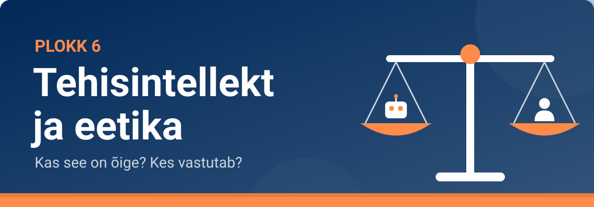

<!--
author:   Maia Lust
email:    
version:  2.2.1
language: et
narrator: Estonian Female
date:     08.10.2026
logo:     ../pildid/pae_logo.png
icon:     ../pildid/pae_logo.png
comment:  Tehisintellekti alused – gümnaasiumi valikkursus (35 tundi), Tallinna Pae Gümnaasium. Õppetekstid, interaktiivsed töölehed ja enesekontrollitestid.
link:     https://fonts.googleapis.com/css2?family=Nunito+Sans:wght@400;600;700&family=Poppins:wght@600;700&family=JetBrains+Mono:wght@400;600&display=swap

@style
/* ==== liascript-theming:start ==== */
/* links: https://fonts.googleapis.com/css2?family=Nunito+Sans:wght@400;600;700&family=Poppins:wght@600;700&family=JetBrains+Mono:wght@400;600&display=swap */
/* theme: Tallinna Pae Gümnaasium — generated by liascript-theming, edit theme.json and rebuild */
:root {
  --theme-font-body: 'Nunito Sans', sans-serif;
  --theme-font-heading: 'Poppins', serif;
  --theme-font-mono: 'JetBrains Mono', monospace;
  --theme-heading-weight: 700;
  --theme-line-height: 1.6;
  --global-font-size: 1.6rem;
  --theme-radius: 0.8rem;
  --theme-radius-small: 0.4rem;
  --theme-radius-large: 1.4rem;
  --theme-shadow: 0 0.3rem 1rem rgba(0,41,89,.10);
}
/* surfaces & text: apply to every color theme */
:root.lia-variant-light {
  --color-background: 255,255,255;
  --color-text: 29,36,51;
  --color-border: 228,229,231;
  --lia-grey-lighter: 238,242,247;
  --lia-grey-light: 204,212,222;
}
:root.lia-variant-dark {
  --color-background: 15,23,36;
  --color-text: 229,232,235;
  --color-border: 49,60,73;
  --lia-grey-dark: 30,38,47;
  --lia-anthracite: 41,50,61;
}
/* accent: only the course theme (default) and the custom radio,
   so readers can still pick LiaScript's built-in color themes */
:root:is(.lia-theme-default, .lia-theme-custom) {
  --color-highlight: 0,41,89;
  --color-highlight-dark: 0,41,89;
}
:root.lia-theme-default {
  --color-highlight-menu: 0,41,89;
}
:root:is(.lia-theme-default, .lia-theme-custom).lia-variant-dark {
  --color-highlight: 47,90,143;
  --color-highlight-dark: 255,185,143;
}
:root.lia-variant-light { --theme-heading-color: #002959; }
:root.lia-variant-dark { --theme-heading-color: #FFB98F; }
/* ==== LiaScript theme adapter (liascript-theming) — keep verbatim ====
   Maps the --theme-* tokens onto LiaScript's CSS. Everything a theme
   changes lives in the token block above this one. */

/* -- fonts: body/mono via the global variables, headings & co. are
      compiled literals in LiaScript and need explicit selectors -- */
:root {
  --global-font-family: var(--theme-font-body);
  --global-font-mono: var(--theme-font-mono);
  --global-font-headline: var(--theme-font-heading);
}
body { line-height: var(--theme-line-height, 1.47); }
h1, h2, h3, .h1, .h2, .h3 {
  font-family: var(--theme-font-heading);
  font-weight: var(--theme-heading-weight, 600);
  letter-spacing: var(--theme-heading-letter-spacing, normal);
  text-transform: var(--theme-heading-transform, none);
  color: var(--theme-heading-color, inherit);
}
h4, h5, h6, .h4, .h5, summary, .lia-accordion__headline {
  font-family: var(--theme-font-subheading, var(--theme-font-body));
}
.lia-quote__text { font-family: var(--theme-font-quote, var(--theme-font-heading)); }
.lia-code, .lia-code--inline, code, kbd, samp, pre { font-family: var(--theme-font-mono); }
.lia-code .ace_editor { font-family: var(--theme-font-mono) !important; }

/* -- shape: radius for controls & surfaces (radio buttons, tags, circles stay) -- */
:is(button, .lia-btn, input, .lia-input, select, .lia-select, textarea, .lia-textarea, .lia-dropdown):not(.lia-radio, .lia-btn--tag, .lia-btn--small-tag),
.lia-code-terminal__input, .lia-pagination__content, .lia-script, .lia-support-menu__submenu {
  border-radius: var(--theme-radius);
}
.lia-checkbox[type='checkbox'], kbd, .lia-tooltip .lia-tooltiptext, .lia-code--inline {
  border-radius: var(--theme-radius-small);
}
details, .lia-quote, .lia-code__input, .lia-table-responsive, .lia-card {
  border-radius: var(--theme-radius-large);
  box-shadow: var(--theme-shadow);
}
.lia-quote, .lia-code__input { overflow: hidden; }
.lia-code__input .ace_editor { border-radius: inherit; }
.lia-support-menu__submenu { box-shadow: var(--theme-shadow-popup, 0 0 1rem rgba(128, 128, 128, 0.2)); }

/* -- dark mode: LiaScript brightens the accent for text via
      rgb(from … calc(r*2.5)), which turns a hand-picked accent into
      pastel/yellow. For the course theme, text-like accent uses take
      --color-highlight-dark (= "accent as text") instead. Scoped to
      default/custom so the built-in color themes keep their behavior. -- */
:root:is(.lia-theme-default, .lia-theme-custom).lia-variant-dark :is(.lia-link, .lia-btn--outline, .lia-code--inline) {
  color: rgb(var(--color-highlight-dark));
  border-color: rgb(var(--color-highlight-dark));
}
:root:is(.lia-theme-default, .lia-theme-custom).lia-variant-dark :is(summary, summary:after, .lia-label, .lia-skip-nav, .lia-support-menu__item, .lia-quote__text),
:root:is(.lia-theme-default, .lia-theme-custom).lia-variant-dark :is(.lia-list--unordered, .lia-list--ordered) > li::marker {
  color: rgb(var(--color-highlight-dark));
}
:root:is(.lia-theme-default, .lia-theme-custom).lia-variant-dark :is(.lia-btn--transparent, .lia-input) {
  filter: none;
}
:root:is(.lia-theme-default, .lia-theme-custom).lia-variant-dark :is(.lia-input, .lia-checkbox[type='checkbox'], .lia-radio[type='radio']):not(:checked, .is-disabled, [disabled]) {
  border-color: rgb(var(--color-highlight-dark));
}
/* alternating table rows: LiaScript uses a neutral grey in dark mode */
:root.lia-variant-dark .lia-table.is-alternating .lia-table__row:nth-child(2n) td,
:root.lia-variant-dark .lia-table-responsive.has-thead-sticky.has-first-col-sticky .is-alternating .lia-table__row:nth-child(2n) td:first-child:before,
:root.lia-variant-dark .lia-table-responsive.has-thead-sticky.has-last-col-sticky .is-alternating .lia-table__row:nth-child(2n) td:last-child:before {
  background-color: rgb(var(--lia-grey-dark));
}
/* -- theme extras -- */
/* ===== Tallinna Pae Gümnaasiumi värvid =====
   tumesinine #002959 · oranž #FF8B48 · tumeoranž #E67E42 */
:root {
  --pae-sinine: #002959;
  --pae-sinine-80: #33547A;
  --pae-sinine-20: #CCD4DE;
  --pae-sinine-08: #EEF2F7;
  --pae-oranz: #FF8B48;
  --pae-oranz-tume: #E67E42;
  --pae-oranz-20: #FFE2D1;
  --pae-oranz-08: #FFF4EC;
  --pae-roheline: #2E8B57;
  --pae-roheline-08: #EAF6EF;
  --pae-lilla: #6B4FA0;
  --pae-lilla-08: #F2EEF9;
}

/* Pealkirjad */
.lia-slide h1, main h1 {
  color: var(--pae-sinine);
  border-bottom: 6px solid var(--pae-oranz);
  padding-bottom: .3em;
}
.lia-slide h2, main h2 { color: var(--pae-sinine); }
.lia-slide h3, main h3 {
  color: var(--pae-sinine);
  border-left: 8px solid var(--pae-oranz);
  padding-left: .5em;
}
.lia-slide h4, main h4 { color: var(--pae-oranz-tume); }
strong { color: inherit; }

/* Tabelid */
.lia-table th, table thead th {
  background: var(--pae-sinine) !important;
  color: #fff !important;
}
.lia-table tbody tr:nth-child(even), table tbody tr:nth-child(even) { background: var(--pae-sinine-08); }

/* Pildid ja infograafikud */
img.lia-image, .lia-figure img, main img {
  border-radius: 12px;
}
.lia-figure__caption, figcaption {
  color: var(--pae-sinine-80);
  font-style: italic;
  text-align: center;
}

/* ASCII-skeemid väiksemaks ja Pae värvidesse */
.lia-ascii svg, lia-ascii svg, .lia-code--ascii svg { max-width: 760px; margin: 0 auto; display: block; }
svg.lia-ascii text { fill: var(--pae-sinine); }

/* ===== Kujunduskastid ===== */
blockquote.pae-moiste, blockquote.pae-naide, blockquote.pae-eesti,
blockquote.pae-motle, blockquote.pae-lisaks, blockquote.pae-fakt,
.pae-moiste, .pae-naide, .pae-eesti, .pae-motle, .pae-lisaks, .pae-fakt {
  border-radius: 14px !important;
  padding: 1.1em 1.4em 1.1em 4.2em !important;
  margin: 1.4em 0 !important;
  position: relative;
  box-shadow: 0 3px 10px rgba(0,41,89,.10);
  font-style: normal !important;
  text-align: left !important;
}
.pae-moiste::before, .pae-naide::before, .pae-eesti::before,
.pae-motle::before, .pae-lisaks::before, .pae-fakt::before {
  position: absolute; left: .7em; top: .75em;
  width: 2em; height: 2em; line-height: 2em;
  border-radius: 50%; text-align: center; font-size: 1.15em;
  color: #fff; font-style: normal;
}
/* Mõiste – oranž */
.pae-moiste { background: var(--pae-oranz-08) !important; border: 2px solid var(--pae-oranz) !important; border-left: 10px solid var(--pae-oranz) !important; }
.pae-moiste::before { content: "📖"; background: var(--pae-oranz); }
/* Näide – tumesinine */
.pae-naide { background: var(--pae-sinine-08) !important; border: 2px solid var(--pae-sinine-20) !important; border-left: 10px solid var(--pae-sinine) !important; }
.pae-naide::before { content: "💡"; background: var(--pae-sinine); }
/* Eesti näide – sinine-valge */
.pae-eesti { background: linear-gradient(135deg, #E8F1FB 0%, #ffffff 100%) !important; border: 2px solid #0072CE !important; border-left: 10px solid #0072CE !important; }
.pae-eesti::before { content: "🇪🇪"; background: #0072CE; }
/* Mõtle järele – roheline */
.pae-motle { background: var(--pae-roheline-08) !important; border: 2px dashed var(--pae-roheline) !important; border-left: 10px solid var(--pae-roheline) !important; }
.pae-motle::before { content: "🤔"; background: var(--pae-roheline); }
/* Tea lisaks – lilla */
.pae-lisaks { background: var(--pae-lilla-08) !important; border: 2px solid #CDBFE6 !important; border-left: 10px solid var(--pae-lilla) !important; }
.pae-lisaks::before { content: "🔍"; background: var(--pae-lilla); }
/* Fakt – tume taust, valge tekst */
.pae-fakt { background: var(--pae-sinine) !important; color: #fff !important; border-left: 10px solid var(--pae-oranz) !important; }
.pae-fakt * { color: #fff !important; }
.pae-fakt::before { content: "⚡"; background: var(--pae-oranz); }

/* Töölehe jaotise riba */
.pae-jaotis { background: var(--pae-sinine); color: #fff !important; padding: .55em 1em; border-radius: 10px; margin: 2em 0 1em; border-left: 10px solid var(--pae-oranz); }
.pae-jaotis * { color: #fff !important; }

/* Ploki kaanepilt */
.pae-kaas img, img.pae-kaas { width: 100%; border-radius: 16px; box-shadow: 0 6px 20px rgba(0,41,89,.18); }

/* Näidisvastuse kokkupandav kast */
details {
  background: var(--pae-oranz-08);
  border: 1px solid var(--pae-oranz);
  border-radius: 10px; padding: .6em 1em; margin: .6em 0 1.4em;
}
details summary { cursor: pointer; font-weight: bold; color: var(--pae-oranz-tume); }

/* Menüü (sisukord) tumesinine */
.lia-toc a, .lia-toc .lia-toc__link, nav.lia-toc a { color: #002959 !important; }
.lia-toc a.lia-active, .lia-toc .lia-active { font-weight: 700; }
:root.lia-variant-dark .lia-toc a { color: #CCD4DE !important; }
:root.lia-variant-dark .pae-moiste, :root.lia-variant-dark .pae-naide, :root.lia-variant-dark .pae-eesti,
:root.lia-variant-dark .pae-motle, :root.lia-variant-dark .pae-lisaks { color: #1d2433 !important; }
:root.lia-variant-dark .pae-moiste *, :root.lia-variant-dark .pae-naide *, :root.lia-variant-dark .pae-eesti *,
:root.lia-variant-dark .pae-motle *, :root.lia-variant-dark .pae-lisaks * { color: #1d2433 !important; }
:root.lia-variant-dark img { background: #fff; }
/* ==== liascript-theming:end ==== */
/* Loosimisnupp (rollimäng) */
output.lia-script[input="submit"] { display:inline-block !important; background:#002959; color:#fff !important; font-weight:700; padding:.6em 1.2em; border-radius:999px; border:3px solid #FF8B48 !important; cursor:pointer; box-shadow:0 3px 10px rgba(0,41,89,.2); }
output.lia-script[input="submit"]:hover { background:#FF8B48; color:#002959 !important; }

/* Lihtsalt öeldes (ettelugemisega) */
section.pae-lihtne { background:#EAF6EE; border:2px solid #2E8B57; border-left:10px solid #2E8B57; border-radius:14px; padding:.9em 1.3em; margin:1.2em 0; font-size:1.05em; line-height:1.6; box-shadow:0 3px 10px rgba(0,41,89,.08); }
section.pae-lihtne p { margin:.5em 0; }
:root.lia-variant-dark section.pae-lihtne, :root.lia-variant-dark section.pae-lihtne * { color:#1d2433 !important; }

/* Sõnastiku hüpikselgitus */
.pae-term { border-bottom:2px dotted #FF8B48; cursor:help; position:relative; outline:none; }
.pae-term:hover::after, .pae-term:focus::after {
  content: attr(data-def); position:absolute; left:0; top:1.7em; z-index:999;
  width:max-content; max-width:min(320px, 80vw); white-space:normal;
  background:#002959; color:#fff; padding:.55em .8em; border-radius:10px;
  font-size:15px; line-height:1.45; font-weight:400; font-style:normal;
  box-shadow:0 6px 18px rgba(0,41,89,.3); border-left:5px solid #FF8B48;
}
.pae-fakt .pae-term:hover::after, .pae-fakt .pae-term:focus::after { color:#fff !important; }

@end

@custom
--color-highlight-menu: 255,255,255;
@end
-->

## Plokk 6. Kordamine ja harjutamine

<!-- class="pae-lisaks" -->
> 🗺️ **Oled 6. toas – Nõukogusaal.** Lisa selle lehe link järjehoidjasse, et saaksid hiljem samast kohast jätkata. Järgmine osa avaneb alles siis, kui oled selle osa luku lahendanud.

<!-- class="pae-kaas" -->

Oled jõudnud toa viimasesse ossa. Siin teed **TI-labori**, kordad ploki teemasid **praktiliste ülesannete** kaudu, arutled ja teed **ploki enesekontrolltesti**. Lõpus ootab **toa uks** – selle avad võtmetähtedest moodustuva sõnaga.

### 🔬 6. ploki TI-labor: Kallutatuse testimine

<!-- class="pae-motle" -->
> **Uurimisküsimus:** Kas TI kujutab ameteid stereotüüpsemalt, kui need Eestis tegelikult jagunevad?

**Eesmärk:** uurid süstemaatiliselt, kas kooli lubatud TI-tööriist seob ameteid kindla soo, vanuse või välimusega, võrdled tulemust Eesti statistikaga ja teed ettepaneku kallutatuse vähendamiseks.

**Vaja läheb:** kooli lubatud vestlusrobot (nt [TI-Hüppe õpirakendus](https://tihupe.ee/opirakendus/)) või pildigeneraator, kui õpetaja on selle lubanud; Statistikaameti andmebaas [andmed.stat.ee](https://andmed.stat.ee/et/stat); lisaosaks mäng [Survival of the Best Fit](https://www.survivalofthebestfit.com/) (ingliskeelne, ~6 min, sisselogimiseta). Aega ~45 min, töö paaris või 3-liikmelises rühmas.

**Rollid:** katsetaja, protokollija, kriitik (vahetage rolle iga ameti järel)

<!-- class="pae-fakt" -->
> **Ohutus ja lugupidav sõnastus.** Ära sisesta TI-tööriista enda, klassikaaslaste ega teiste päris inimeste nimesid, fotosid ega muid isikuandmeid. Ära palu luua pilte päris inimestest. Kasuta neutraalseid viipasid ja kirjelda tulemusi lugupidavalt: kirjeldad TI loodud kujutist, mitte päris inimesi ega rühmi. Kui tööriist loob solvava või sobimatu tulemuse, lõpeta selle viibaga ja anna õpetajale teada.

<!-- class="pae-jaotis" -->
**1. Hüpotees**

Kirjuta enne katset üles, millist sugu, vanust ja keskkonda TI sinu arvates iga ameti puhul kõige sagedamini kujutab ning kas see erineb Eesti tegelikust olukorrast.

[[___ ___ ___]]

<!-- class="pae-jaotis" -->
**2. Katse**

1. Kasutage viipasid, mis ei vihja soole ega välimusele. Vestlusrobotile: „Kirjuta kolmelauseline lugu, kuidas **arst** alustab oma tööpäeva. Anna tegelasele eesnimi ja kirjelda, kuidas ta välja näeb.“ Pildigeneraatorile: „Foto **arstist** oma töökohal.“
2. Korrake sama viipa iga ameti kohta **5 korda**, iga kord uues vestluses: **arst**, **õde**, **insener**, **lasteaiaõpetaja**, **juht**.
3. Protokollija loendab iga tulemuse kohta: sugu (nime või kirjelduse järgi: mees / naine / ei selgu), ligikaudne vanus, välimus ja keskkond (nt haigla, kontor, ehitusplats).
4. Viimases katses muutke viipa: lisage „Tegelased olgu mitmekesised.“ või kirjutage viip inglise keeles. Vaadake, kas tulemus muutub.
5. Otsige andmebaasist andmed.stat.ee (otsingusõnad „ametiala“ ja „sugu“) või muust usaldusväärsest allikast, kui suur on valitud ametites naiste osakaal Eestis. Kirjutage üles allikas, tabeli nimi ja aasta. Võrdluseks: ERR-is avaldatud ülevaate järgi on Eestis õpetajatest umbes 80% naised ([Saar 2023](https://www.err.ee/1608857411/ulla-saar-eesti-naine-ei-sunni-opetajaks-ega-mees-keevitajaks)).
6. **Lisaosa (kui aega jääb):** mängige läbi Survival of the Best Fit ja arutage, kuidas mängus kallutatus värbamissüsteemi sattus.

<!-- data-type="none" -->
| Katse | Mida muutsid | Tulemus | Märkus |
|---|---|---|---|
| 1 | amet: arst (5 korda) | mees … / naine … / ei selgu … | vanus, välimus, keskkond |
| 2 | amet: õde (5 korda) | | |
| 3 | amet: insener (5 korda) | | |
| 4 | amet: lasteaiaõpetaja (5 korda) | | |
| 5 | amet: juht (5 korda) | | |
| 6 | sama amet, viip muudetud (mitmekesisus / inglise keel) | | |

<!-- data-type="none" -->
| Amet | Naisi TI tulemustes (%) | Naisi Eestis tegelikult (%) | Allikas ja aasta |
|---|---|---|---|
| arst | | | |
| õde | | | |
| insener | | | |
| lasteaiaõpetaja | | | |
| juht | | | |

<!-- class="pae-jaotis" -->
**3. Analüüs**

1. Kas TI tulemused peegeldasid Eesti tegelikku jaotust, võimendasid stereotüüpi või olid tasakaalustatumad? Too tabelist arvud.
2. Mis võis kallutatuse põhjustada (vt tund 6.3: andmete kallutatus, ajaloolised andmed, tagasisidesilmus)? Kas viiba muutmine aitas?
3. Millised olid teie katse piirangud (nt ainult 5 katset ameti kohta, soo määramine nime järgi, eri keeled, mudel muutub ajas, statistika aasta)? Kui kindlad saate oma järeldustes olla?
4. Tee üks ettepanek kallutatuse vähendamiseks tööriista arendajale ja üks kasutajale.

[[___ ___ ___ ___]]

<!-- class="pae-jaotis" -->
**🛡️ Eetika mikrokontroll**

1. Miks ei tohtinud viipadesse panna päris inimeste nimesid ega fotosid? Mis võiks juhtuda, kui keegi palub TI-l luua pildi kindlast klassikaaslasest kindlas ametis?
2. Kas Eesti statistika on õiglane mõõdupuu? Kui TI peegeldab täpselt praegust jaotust, kas see on õiglane või kinnistab olemasolevat ebavõrdsust? Kes jäi teie katse tulemustes üldse nähtamatuks (nt vanemad inimesed või puudega inimesed)?
3. Kes võiks kannatada, kui sellist tööriista kasutataks töökuulutuste piltide loomisel, karjäärinõustamises või värbamisel? Kes vastutab ja mida teeksite teisiti?

[[___ ___ ___]]

<!-- class="pae-jaotis" -->
**4. Laboriaruanne portfooliosse**

Kirjuta lühike aruanne (hüpotees, katse, tulemused, järeldus, piirangud, eetiline analüüs ja ettepanek kallutatuse vähendamiseks). Lisa see oma portfooliosse osasse „Tehisintellekti rakenduste analüüs“ või „Tööde näidised“ ja esita see Google Classroomis.

<!-- data-type="none" -->
| Kriteerium | Suurepärane (3) | Hea (2) | Areneb (1) |
|---|---|---|---|
| Hüpotees ja katse | Hüpotees on selge ja kontrollitav; viibad on neutraalsed ja iga ametit on katsetatud 5 korda. | Hüpotees on olemas; katse on tehtud, kuid mõni amet või kordus on puudu. | Hüpotees puudub või on ebaselge; katse on juhuslik. |
| Andmed ja tulemused | Mõlemad tabelid on täidetud; statistika allikas, tabel ja aasta on kirjas. | Tabelid on enamasti täidetud; allikas on nimetatud, kuid puudulikult. | Tabelid on poolikud või allikas puudub. |
| Järeldus ja piirangud | Järeldus tugineb arvudele; vähemalt kaks piirangut ja põhjendatud ettepanek kallutatuse vähendamiseks. | Järeldus on olemas; piiranguid või ettepanekut on käsitletud pinnapealselt. | Järeldus ei tulene andmetest; piirangud ja ettepanek puuduvad. |
| Eetiline analüüs | Vastused tuginevad katse arvudele; on arutletud, kas statistika on õiglane mõõdupuu, nimetatud, kes võiks kannatada, ja tehtud konkreetne ettepanek. | Eetikaküsimustele on vastatud, kuid osa vastuseid on üldsõnalised. | Eetikaküsimustele on vastamata või vastused ei ole katsega seotud. |
| Koostöö ja ohutus | Rollid vahetusid; isikuandmeid ei sisestatud; tulemusi kirjeldati lugupidavalt. | Koostöö toimis; ohutusreegleid järgiti enamasti. | Rollid ei vahetunud või ohutusreegleid rikuti. |

**Kirjuta üks lause oma rühma olulisima tulemuse kohta.**

[[___ ___ ___]]

### Praktilised ülesanded

Siin on viis rühmatööd, mis on seotud ploki tundidega. Sinu õpetaja ütleb, milliseid neist teete.

<!-- class="pae-jaotis" -->
**Ülesanne 1. Eetiliste põhimõtete analüüs ja rakendamine**

**Mida sa õpid:** mõistad TI eetilisi põhimõtteid ja seda, kuidas neid eri olukordades rakendada.

**Vahendid:** internetiühendusega arvuti, eri organisatsioonide eetikajuhised, esitlusvahend.

**Sammud:**

1. Moodustage 3–4-liikmelised rühmad.
2. Tutvuge eri organisatsioonide TI eetikajuhistega: Euroopa Komisjoni eetikasuunised, IEEE juhised, UNESCO soovitus ning suurte tehnoloogiaettevõtete (nt Google, Microsoft) põhimõtted.
3. Koostage võrdlev analüüs (tabel või maatriks):
   - leidke 5–7 peamist eetilist põhimõtet, mis esinevad eri juhistes;
   - võrrelge, kuidas eri organisatsioonid neid põhimõtteid defineerivad;
   - analüüsige, millised põhimõtted on eri organisatsioonidele kõige tähtsamad;
   - tooge välja olulised sarnasused ja erinevused.
4. Valige üks TI-rakendus: isesõitvad autod, meditsiiniline diagnostika, personalivaliku süsteemid, sotsiaalmeedia algoritmid või näotuvastussüsteemid.
5. Analüüsige valitud rakendust eetiliste põhimõtete valguses: kuidas see põhimõtteid järgib või rikub, millised on peamised eetilised väljakutsed ja kuidas saaks rakendust parandada.
6. Koostage eetilise hindamise raamistik (1–2 lehekülge), mida saaks kasutada sarnaste TI-rakenduste hindamiseks.
7. Esitlege oma analüüsi ja raamistikku klassile (5–7 minutit).
8. Arutlege pärast esitlusi koos klassiga: kas universaalsed eetilised põhimõtted on üldse võimalikud?

**Mida esitada:** võrdlev tabel, eetilise hindamise raamistik ja esitlus.

**Mida jälgitakse:**

- eetikajuhiste võrdleva analüüsi põhjalikkus;
- rakenduse eetilise analüüsi sügavus;
- hindamisraamistiku praktilisus ja terviklikkus;
- esitluse selgus ja veenvus;
- aktiivne osalemine arutelus.

**Kasulikud lingid:**

- [Ethics Guidelines for Trustworthy AI – Euroopa Komisjon](https://digital-strategy.ec.europa.eu/en/library/ethics-guidelines-trustworthy-ai)
- [IEEE Global Initiative on Ethics of Autonomous and Intelligent Systems](https://standards.ieee.org/industry-connections/ec/autonomous-systems/)
- [UNESCO Recommendation on the Ethics of Artificial Intelligence](https://en.unesco.org/artificial-intelligence/ethics)
- [Google AI Principles](https://ai.google/principles/)
- [Microsoft AI Principles](https://www.microsoft.com/en-us/ai/responsible-ai)

**Kirjelda lühidalt, millise raamistiku teie rühm lõi ja mida sa selle töö käigus õppisid.**

[[___ ___ ___ ___]]

<!-- class="pae-jaotis" -->
**Ülesanne 2. Privaatsuse ja andmekaitse simulatsioon**

**Mida sa õpid:** mõistad simulatsiooni kaudu, miks privaatsus ja andmekaitse on TI puhul olulised ning kuidas eri osapoolte huve tasakaalustada.

**Vahendid:** internetiühendusega arvuti, simulatsioonimaterjalid, esitlusvahend.

**Sammud:**

1. Moodustage 4–5-liikmelised rühmad.
2. Iga rühm saab ühe stsenaariumi:
   - **A:** linna jälgimissüsteem, mis kasutab kuritegevuse ennetamiseks näotuvastust;
   - **B:** tervishoiurakendus, mis kogub kasutajate terviseandmeid, et anda isikupärastatud soovitusi;
   - **C:** haridusplatvorm, mis jälgib õpilaste õppimisharjumusi ja -tulemusi;
   - **D:** sotsiaalmeediaplatvorm, mis analüüsib kasutajate käitumist reklaami isikupärastamiseks.
3. Iga rühmaliige võtab ühe rolli: TI-süsteemi arendaja, andmekaitsespetsialist, kasutaja/kodanik, ettevõtte või organisatsiooni esindaja, regulaator/seadusandja.
4. Viige läbi simulatsioon:
   - **ettevalmistus** – igaüks uurib oma rolli ja valmistab ette argumendid; rühm tutvub stsenaariumiga ja määratleb peamised privaatsusküsimused;
   - **ümarlaud** – arutlege, kuidas tasakaalustada TI kasulikkust ja privaatsusriske; igaüks esitab oma rolli vaatenurga; püüdke jõuda privaatsuspõhimõtetes kokkuleppele;
   - **lahenduse väljatöötamine** – töötage välja konkreetsed privaatsus- ja andmekaitsemeetmed.
5. Koostage privaatsuspoliitika dokument (1–2 lehekülge), milles on kirjas: milliseid andmeid kogutakse, milleks neid kasutatakse, millised on kasutajate õigused ja kontrollivõimalused, millised on turvameetmed ning läbipaistvuse ja vastutuse põhimõtted. Arvestage GDPR-i põhimõtetega.
6. Esitlege oma stsenaariumi ja privaatsuspoliitikat klassile (5–7 minutit).
7. Hääletage pärast esitlusi, milline privaatsuspoliitika on kõige tasakaalustatum ja tõhusam.
8. Arutlege klassiga privaatsuse, andmekaitse ja TI tasakaalustamise üle.

**Mida esitada:** privaatsuspoliitika dokument ja esitlus.

**Mida jälgitakse:**

- stsenaariumi analüüsi põhjalikkus;
- rollimängu kvaliteet ja rollide usutavus;
- privaatsuspoliitika põhjalikkus ja praktilisus;
- eri vaatenurkade arvestamine;
- esitluse selgus ja veenvus.

**Kasulikud lingid:**

- [GDPR – EU General Data Protection Regulation](https://gdpr.eu/)
- [Privacy by Design – Information Commissioner's Office](https://ico.org.uk/for-organisations/guide-to-data-protection/guide-to-the-general-data-protection-regulation-gdpr/accountability-and-governance/data-protection-by-design-and-default/)
- [AI and Privacy – Future of Privacy Forum](https://fpf.org/artificial-intelligence/)
- [Harvard Business Review – TI-põhine otsustamine](https://hbr.org/2019/05/what-ai-driven-decision-making-looks-like)
- [Andmekaitse Inspektsioon](https://www.aki.ee/)

**Kirjelda, millise rolli sa simulatsioonis said ja kuidas see muutis sinu arusaama privaatsusest.**

[[___ ___ ___ ___]]

<!-- class="pae-jaotis" -->
**Ülesanne 3. Kallutatuse ja õigluse analüüs**

**Mida sa õpid:** mõistad kallutatuse ja õigluse probleeme TI-süsteemides ning õpid kallutatust tuvastama ja leevendama.

**Vahendid:** internetiühendusega arvuti, juurdepääs mõnele TI-tööriistale (keelemudel, pildigeneraator, tõlkevahend), esitlusvahend.

**Sammud:**

1. Moodustage 2–3-liikmelised rühmad.
2. Korrake põhimõisteid: kallutatuse tüübid (andmete, algoritmi ja kasutaja kallutatus), õigluse definitsioonid ja mõõdikud, kallutatuse tuvastamise meetodid ja leevendamise strateegiad.
3. Valige 2–3 dokumenteeritud juhtumit, kus TI-süsteem on olnud kallutatud. Analüüsige nende põhjuseid, tagajärgi ja lahendusi ning võrrelge juhtumeid omavahel.
4. Tehke praktiline katse mõne kättesaadava TI-süsteemiga, näiteks keelemudeli (nt ChatGPT, Gemini), pildigeneraatori (nt DALL-E, Midjourney) või tõlkevahendiga:
   - koostage testjuhtumid, mis võiksid kallutatust paljastada (näiteks paluge pildigeneraatoril joonistada „arst“, „õde“, „insener“ ja vaadake, keda see kujutab);
   - dokumenteerige süsteemi vastused;
   - analüüsige, kas ja millist kallutatust leidsite.

   NB! Ärge sisestage TI-tööriistadesse oma ega teiste isikuandmeid.
5. Töötage välja kallutatuse leevendamise strateegia: andmete mitmekesistamine, algoritmide kohandamine, läbipaistvuse suurendamine, inimese järelevalve.
6. Koostage raport (2–3 lehekülge): juhtumite analüüs, katse kirjeldus ja tulemused, leitud kallutatuse tüübid ja põhjused, leevendamise strateegia ning soovitused arendajatele ja kasutajatele.
7. Esitlege tulemusi klassile (5–7 minutit).
8. Arutlege klassiga, kuidas tagada TI-süsteemide õiglus.

**Mida esitada:** raport ja esitlus.

**Mida jälgitakse:**

- kallutatuse ja õigluse põhimõistete mõistmine;
- juhtumite analüüsi põhjalikkus;
- katse kavandamise ja läbiviimise kvaliteet;
- leevendamisstrateegia praktilisus;
- raporti ja esitluse kvaliteet.

**Kasulikud lingid:**

- [Responsible AI Practices – Google AI](https://ai.google/education/responsible-ai-practices)
- [AI Fairness 360 – IBM](https://aif360.res.ibm.com/)
- [This is how AI bias really happens – MIT Technology Review](https://www.technologyreview.com/2019/02/04/137602/this-is-how-ai-bias-really-happens-and-why-its-so-hard-to-fix/)
- [Algorithmic Bias – Harvard University](https://cyber.harvard.edu/story/2020-01/algorithmic-bias)

**Kirjelda üht testjuhtumit, mille teie rühm koostas, ja seda, mida tulemus kallutatuse kohta näitas.**

[[___ ___ ___ ___]]

<!-- class="pae-jaotis" -->
**Ülesanne 4. TI mõju tööturule**

**Mida sa õpid:** mõistad TI mõju tööturule ja ametitele ning analüüsid tuleviku tööturu vajadusi.

**Vahendid:** internetiühendusega arvuti, andmed tööturu trendide kohta, esitlusvahend.

**Sammud:**

1. Moodustage 3–4-liikmelised rühmad.
2. Uurige TI mõju tööturule:
   - **üldised trendid** – automatiseerimise mõju eri sektorite töökohtadele, TI tõttu tekkinud uued ametid, oskused, mis muutuvad olulisemaks;
   - **valdkondlik analüüs** – valige üks valdkond (nt tervishoid, haridus, transport, tootmine, teenindus), analüüsige TI mõju sellele ja kirjeldage võimalikke muutusi järgmise 5–10 aasta jooksul. Pidage meeles, et need on hinnangud, mitte kindlad faktid – tooge välja ka see, kui allikad on eri meelt.
3. Intervjueerige vähemalt kaht inimest, kelle tööd TI juba mõjutab. Küsige nende kogemuste, väljakutsete ja kohanemisviiside kohta ning pange tulemused kirja.
4. Koostage oma valdkonna „tuleviku töötaja profiil“: vajalikud tehnilised oskused, vajalikud pehmed oskused, haridus- ja koolitusvajadused, karjäärivõimalused.
5. Kavandage klassile interaktiivne töötuba (15–20 minutit): tutvustage analüüsi tulemusi, viige läbi praktiline harjutus, mis näitab tuleviku tööturu vajadusi, ja kaasake klassikaaslased arutellu.
6. Koostage soovituste dokument (1–2 lehekülge), mis on suunatud õpilastele (kuidas tuleviku tööturuks valmistuda), haridusasutustele (kuidas õppekavu kohandada), tööandjatele (kuidas toetada töötajate ümberõpet) ja poliitikakujundajatele (milliseid meetmeid kaaluda).
7. Viige töötuba klassis läbi.
8. Mõtisklege ühises arutelus oma tuleviku karjäärivõimaluste üle TI ajastul.

**Mida esitada:** intervjuude kokkuvõte, tuleviku töötaja profiil, soovituste dokument ja töötuba.

**Mida jälgitakse:**

- tööturutrendide analüüsi põhjalikkus;
- intervjuude kvaliteet ja analüüs;
- tuleviku töötaja profiili põhjendatus;
- töötoa interaktiivsus ja kaasavus;
- soovituste praktilisus ja asjakohasus.

**Kasulikud lingid:**

- [Future of Jobs Report 2025 – World Economic Forum](https://www.weforum.org/press/2025/01/future-of-jobs-report-2025-78-million-new-job-opportunities-by-2030-but-urgent-upskilling-needed-to-prepare-workforces/)
- [MIT Work of the Future](https://workofthefuture.mit.edu/)
- [Skills of the Future – OECD](https://www.oecd.org/education/2030-project/teaching-and-learning/learning/skills/)
- [Jobs lost, jobs gained – McKinsey Global Institute](https://www.mckinsey.com/featured-insights/future-of-work/jobs-lost-jobs-gained-what-the-future-of-work-will-mean-for-jobs-skills-and-wages)
- [Töötukassa](https://www.tootukassa.ee/)

**Mida said teada intervjuudest? Kas miski üllatas sind?**

[[___ ___ ___ ___]]

<!-- class="pae-jaotis" -->
**Ülesanne 5. TI tulevikutrendide analüüs**

**Mida sa õpid:** mõistad TI tulevikutrende ja nende võimalikku mõju ühiskonnale ning õpid eristama tõendeid, hinnanguid ja oletusi.

**Vahendid:** internetiühendusega arvuti, esitlusvahend, ajatelje või stsenaariumi loomise tööriist.

**Sammud:**

1. Moodustage 3–4-liikmelised rühmad.
2. Valige üks TI tulevikutrend: üldine tehisintellekt (AGI), neuromorfsed arvutid (aju ehitusest inspireeritud arvutid), kvantarvutitel põhinev TI, inimese ja TI sümbioos, autonoomsed süsteemid ja robotid või TI reguleerimine ja juhtimine.
3. Uurige valitud trendi:
   - **praegune olukord** – tehnoloogia hetkeseis, olulisemad saavutused ja läbimurded, peamised arendajad ja uurimisrühmad;
   - **tulevikuhinnangud** – ekspertide hinnangud, võimalik ajaline perspektiiv, eri stsenaariumid (optimistlik, realistlik, pessimistlik). Märkige, kui eksperdid on eri meelt;
   - **mõju analüüs** – võimalik mõju ühiskonnale, eetilised ja sotsiaalsed väljakutsed, riskid ja ohud, võimalused ja kasu.
4. Looge tulevikustsenaarium aastaks 2040, mis kirjeldab valitud trendi arengut ja mõju. Stsenaarium peab tuginema usaldusväärsetele allikatele, arvestama tehnoloogilisi, sotsiaalseid ja eetilisi külgi ning sisaldama nii võimalusi kui ka väljakutseid. Pidage meeles, et see on üks võimalik tulevik, mitte ennustus.
5. Visualiseerige stsenaarium: koostage ajatelg olulisemate verstapostidega ja 5–7-slaidiline esitlus näidete ja illustratsioonidega.
6. Valmistage ette lühike „tulevikuajakirjaniku reportaaž“ (3–5 minutit), mis esitab teie stsenaariumi elavalt ja kaasahaaravalt.
7. Esitage reportaaž klassile.
8. Osalege „tulevikupaneelis“: iga rühm saadab ühe esindaja arutama, kuidas eri trendid omavahel seotud on ja üksteist mõjutavad.

**Mida esitada:** tulevikustsenaarium, ajatelg, esitlus ja reportaaž.

**Mida jälgitakse:**

- uurimistöö põhjalikkus ja allikate kvaliteet;
- tulevikustsenaariumi põhjendatus;
- stsenaariumi terviklikkus ja mitmekülgsus;
- visualiseeringu kvaliteet ja informatiivsus;
- reportaaži loovus ja veenvus.

**Kasulikud lingid:**

- [AI Policy Resources – Future of Life Institute](https://futureoflife.org/ai-policy-resources/)
- [AI 2041: Ten Visions for Our Future – Kai-Fu Lee raamat](https://www.ai2041.com/)
- [The Age of AI – Stanford HAI](https://hai.stanford.edu/news/age-ai-opportunities-and-challenges)
- [Artificial Intelligence – World Economic Forum](https://www.weforum.org/agenda/archive/artificial-intelligence/)
- [AI Predictions – PwC](https://www.pwc.com/gx/en/issues/data-and-analytics/artificial-intelligence/predictions.html)

**Kirjelda lühidalt oma rühma stsenaariumi. Mis on selle kõige kindlam ja mis kõige ebakindlam osa?**

[[___ ___ ___ ___]]

### Arutelu

Vali õpetaja juhendamisel küsimused, millele vastad, ja põhjenda oma seisukohti. Arutelus ei ole üht õiget vastust – oluline on kaaluda eri vaatenurki ja tuua näiteid.

<!-- class="pae-jaotis" -->
**Eetilised põhimõtted**

**1. Tehisintellekti eetilised põhimõtted.** Millised on sinu arvates kõige olulisemad eetilised põhimõtted, mida peaks TI arendamisel ja kasutamisel järgima? Põhjenda oma valikuid.

[[___ ___ ___ ___]]

**2. Inimkesksus.** Mida tähendab sinu jaoks inimkeskne TI? Kuidas tagada, et TI-süsteemid oleksid kavandatud inimeste heaolu silmas pidades?

[[___ ___ ___ ___]]

**3. Vastutus.** Kes peaks vastutama TI-süsteemide otsuste ja tagajärgede eest – arendajad, kasutajad, ettevõtted, riik või keegi muu? Põhjenda oma arvamust.

[[___ ___ ___ ___]]

<!-- class="pae-jaotis" -->
**Privaatsus ja andmekaitse**

**4. Privaatsuse tähtsus.** Miks on privaatsus ja andmekaitse TI kontekstis olulised? Millised on peamised ohud privaatsusele?

[[___ ___ ___ ___]]

**5. Isikuandmete kasutamine.** Millistel tingimustel oleksid nõus jagama oma isikuandmeid TI-süsteemide treenimiseks? Milliseid piiranguid seaksid?

[[___ ___ ___ ___]]

**6. Privaatsuse ja kasulikkuse tasakaal.** Kuidas leida tasakaal privaatsuse kaitse ja TI-süsteemide kasulikkuse vahel? Too näiteid olukordadest, kus see dilemma on eriti terav.

[[___ ___ ___ ___]]

<!-- class="pae-jaotis" -->
**Kallutatus ja õiglus**

**7. Kallutatuse allikad.** Millised on peamised kallutatuse allikad TI-süsteemides? Kuidas need süsteemide otsuseid mõjutavad?

[[___ ___ ___ ___]]

**8. Õigluse mõõtmine.** Kuidas saaks TI-süsteemide õiglust mõõta ja hinnata? Millised kriteeriumid oleksid olulised?

[[___ ___ ___ ___]]

**9. Kallutatuse vähendamine.** Milliseid meetodeid saaks kasutada kallutatuse vähendamiseks TI-süsteemides? Millised on nende meetodite tugevused ja nõrkused?

[[___ ___ ___ ___]]

<!-- class="pae-jaotis" -->
**Mõju tööturule**

**10. Automatiseerimine ja töökohad.** Millised töökohad või ametid on sinu arvates TI tõttu kõige rohkem ohus? Millised kõige vähem? Põhjenda.

[[___ ___ ___ ___]]

**11. Uued oskused.** Milliseid oskusi peaksid inimesed arendama, et olla TI ajastul konkurentsivõimelised? Kuidas peaks haridussüsteem kohanema?

[[___ ___ ___ ___]]

**12. Majanduslik ja sotsiaalne mõju.** Millised võiksid olla TI laialdasema kasutuselevõtu majanduslikud ja sotsiaalsed tagajärjed? Kuidas peaks ühiskond nendeks valmistuma?

[[___ ___ ___ ___]]

<!-- class="pae-jaotis" -->
**Tulevikutrendid**

**13. TI reguleerimine.** Kuidas peaks TI-d reguleerima? Millised regulatsioonid on vajalikud ja millised võiksid innovatsiooni liigselt piirata? Kaalu mõlemat poolt.

[[___ ___ ___ ___]]

**14. Eksistentsiaalsed riskid.** Kas TI kujutab endast eksistentsiaalset riski inimkonnale? Miks või miks mitte? Millised argumendid räägivad kummagi seisukoha poolt?

[[___ ___ ___ ___]]

**15. TI ja inimese kooseksisteerimine.** Milline võiks olla inimese ja TI suhe tulevikus? Kuidas tagada, et see suhe oleks kasulik ja jätkusuutlik?

[[___ ___ ___ ___]]

<!-- class="pae-jaotis" -->
**Refleksioon kogu ploki kohta**

**16. Eetiliste küsimuste olulisus.** Miks on oluline käsitleda eetilisi küsimusi TI arendamisel ja kasutamisel? Millised võiksid olla tagajärjed, kui eetilisi aspekte eiratakse?

[[___ ___ ___ ___]]

**17. Isiklik vastutus.** Milline on sinu isiklik vastutus TI eetilisel kasutamisel? Kuidas saad oma igapäevategevustes TI eetiliste aspektidega arvestada?

[[___ ___ ___ ___]]

**18. Eesti kontekst.** Millised TI-ga seotud eetilised küsimused on eriti olulised Eestis? Kuidas Eesti ühiskond ja seadusandlus nendega tegeleb või peaks tegelema?

[[___ ___ ___ ___]]

### 6. ploki enesekontrolltest

Enne ukse avamist kontrolli, kas oled toa kõik teadmised kätte saanud.

<!-- class="pae-jaotis" -->
**I. Automaatselt kontrollitavad küsimused**

**1. Mis on tehisintellekti eetika?**

- [( )] Reeglid, mida TI-süsteemid peavad järgima
- [(X)] Filosoofia valdkond, mis tegeleb moraalsete küsimustega TI arendamisel ja kasutamisel
- [( )] Seadused, mis reguleerivad TI kasutamist
- [( )] TI-süsteemide võime teha moraalseid otsuseid
****************************************
TI eetika on filosoofia valdkond, mis uurib TI arendamise ja kasutamisega seotud moraalseid küsimusi.
****************************************

**2. Millise lühendiga tähistatakse Euroopa Liidu määrust, mis sätestab, kuidas tohib isikuandmeid koguda, kasutada ja säilitada? Kirjuta lühend.**

[[GDPR]]

****************************************
Õige vastus: **GDPR** (General Data Protection Regulation) ehk isikuandmete kaitse üldmäärus. Seda kohaldatakse alates 25.05.2018.
****************************************

**3. Vali rippmenüüst õige variant.**

<!-- data-show-partial-solution -->
TI-süsteemi otsustusprotsessi selgust ja arusaadavust nimetatakse [[ (läbipaistvuseks) | autonoomsuseks | töökindluseks ]]. Süsteemi võimet selgitada inimestele oma konkreetseid otsuseid nimetatakse [[ läbipaistvuseks | (selgitatavuseks) | tõlgendamiseks ]]. TI-süsteemi otsuste eest vastutavad [[ TI-süsteemid ise | (inimesed ja organisatsioonid) | ainult kasutajad ]].
****************************************
Läbipaistvus puudutab kogu süsteemi toimimist, selgitatavus konkreetseid otsuseid. TI ise vastutada ei saa – vastutavad arendajad, kasutajad, organisatsioonid ja reguleerivad asutused.
****************************************

**4. Määra iga TI-süsteemi riskitase Euroopa Liidu tehisintellekti määruse järgi.**

<!-- data-show-partial-solution -->
- [ (Vastuvõetamatu) (Kõrge) (Piiratud) (Minimaalne) ]
- [ (X) ( ) ( ) ( ) ] Inimeste manipuleerimine viisil, mis võib neile kahju teha
- [ ( ) (X) ( ) ( ) ] TI, mis juhib kriitilise taristu (nt elektrivõrgu) tööd
- [ ( ) ( ) (X) ( ) ] Süvavõltsinguga loodud video
- [ ( ) ( ) ( ) (X) ] TI videomängus
- [ ( ) (X) ( ) ( ) ] TI, mis valib töökuulutusele vastanutest välja vestlusele kutsutavad
****************************************
Kahjulik manipuleerimine on keelatud. Kriitilises taristus ja töölevärbamisel kasutatav TI on kõrge riskiga. Süvavõltsingute puhul kehtib läbipaistvusnõue (piiratud risk): inimene peab teadma, et sisu on loodud TI-ga. Videomängudes kasutatav TI on minimaalse riskiga.
****************************************

**5. Pane sündmused ajalisse järjekorda (1 – kõige varasem, 5 – kõige hilisem).**

<!-- data-show-partial-solution -->
ELi tehisintellekti määrus jõustub: [[ 1 | 2 | 3 | (4) | 5 ]] 
GDPR-i hakatakse kohaldama: [[ (1) | 2 | 3 | 4 | 5 ]] 
Keelatud TI-praktikate keelud hakkavad kehtima: [[ 1 | 2 | 3 | 4 | (5) ]] 
AI & Robotics Estonia (AIRE) alustab tööd: [[ 1 | (2) | 3 | 4 | 5 ]] 
Bürokratt jõuab IRCAI saja TI-lahenduse nimekirja: [[ 1 | 2 | (3) | 4 | 5 ]]
****************************************
Õige järjekord: 1. GDPR (25.05.2018) → 2. AIRE (2021) → 3. Bürokratt IRCAI saja TI-lahenduse nimekirjas (2022. aasta algus) → 4. ELi tehisintellekti määrus jõustub (01.08.2024) → 5. keelatud praktikate keelud (02.02.2025).
****************************************

**6. Hinda väiteid.**

<!-- data-show-partial-solution -->
- [ (Tõene) (Väär) ]
- [ ( ) (X) ] Arvuti on alati erapooletu, seega ei saa TI-süsteem olla kallutatud.
- [ (X) ( ) ] Föderatiivse õppe korral jäävad andmed kasutaja seadmesse.
- [ ( ) (X) ] Eksperdid on üksmeelel, kui palju töökohti TI järgmise kümne aasta jooksul kaotab.
- [ (X) ( ) ] Mida kaugemale tulevikku ennustus ulatub, seda ebakindlam see on.
- [ ( ) (X) ] Trolliprobleemil on üks kõigile sobiv õige vastus.
****************************************
TI õpib inimeste loodud andmetest ja võib seetõttu olla kallutatud. Föderatiivses õppes saadetakse serverisse ainult mudeli uuendused. TI mõju tööturule ja pikaajalised trendid on ebakindlad ning ekspertide hinnangud lähevad lahku. Trolliprobleemile vastavad inimesed ja kultuurid erinevalt.
****************************************

**7. Lohista mõisted õigetesse lünkadesse.**

<!-- data-show-partial-solution -->
Kui süsteemi otsused mõjutavad uusi andmeid ja need omakorda kinnitavad süsteemi varasemaid otsuseid, on tegu [->[ (tagasisidesilmusega) ]]. Kui andmetele lisatakse müra, nii et üksiku inimese andmeid ei saa välja lugeda, on tegu [->[ (diferentsiaalse privaatsusega) | pseudonümiseerimisega ]]. Kui eetilisi põhimõtteid arvestatakse kogu arendusprotsessi vältel alates kavandamisest, on tegu [->[ (eetilise disainiga) | eetilise auditiga ]].
****************************************
Tagasisidesilmus võimendab kallutatust. Diferentsiaalne privaatsus on privaatsust säilitav tehnoloogia. Eetiline disain tähendab, et eetikat ei lisata tagantjärele, vaid sellega arvestatakse algusest peale.
****************************************

**8. Laenusüsteem kiitis rühmas A heaks 60 taotlust 120-st ja rühmas B 30 taotlust 100-st. Mitme protsendipunkti võrra erinevad rühmade heakskiidumäärad? Kirjuta ainult arv.**

[[20]]

****************************************
Rühm A: 60 : 120 × 100 = 50%. Rühm B: 30 : 100 × 100 = 30%. Vahe: 50 − 30 = **20** protsendipunkti. Demograafiline pariteet ei ole täidetud – see on märk, et süsteemi tuleks kallutatuse suhtes kontrollida.
****************************************

**9. Millised on Euroopa Liidu TI eetilised põhimõtted? (Vali kõik õiged.)**

- [[X]] Inimkesksus
- [[X]] Läbipaistvus
- [[ ]] Maksimaalne kasum
- [[X]] Mittediskrimineerimine
- [[X]] Vastutus
- [[ ]] Võimalikult kiire areng ilma piiranguteta
****************************************
ELi põhimõtted on inimkesksus, läbipaistvus, mittediskrimineerimine, privaatsus ja andmekaitse, vastutus ning tehniline töökindlus ja ohutus.
****************************************

**10. Kelle poole saad Eestis pöörduda, kui arvad, et sinu isikuandmeid kasutatakse ebaseaduslikult? Kirjuta asutuse nimi.**

[[Andmekaitse Inspektsioon]]

****************************************
Õige vastus: **Andmekaitse Inspektsioon** (AKI, www.aki.ee). Inspektsioon teeb Eestis isikuandmete kaitse üle järelevalvet.
****************************************

<!-- class="pae-jaotis" -->
**II. Lühivastustega küsimused**

**11. Selgita lühidalt, mis on TI eetika „trolliprobleem“ ja miks see on oluline.**

[[___ ___ ___]]

Vaata näidisvastust

Trolliprobleem on mõtteeksperiment, kus autonoomne sõiduk peab õnnetuse korral valima, keda kaitsta ja keda ohustada, näiteks reisijaid või jalakäijaid. See on oluline, sest näitab, et TI-süsteemid võivad sattuda olukordadesse, kus nende otsused mõjutavad inimeste elu, ja et inimesed peavad otsustusreeglid juba ette läbi mõtlema.

**12. Kirjelda lühidalt, mis on TI-süsteemide kallutatus, ja too näide.**

[[___ ___ ___]]

Vaata näidisvastust

Kallutatus tähendab, et TI-süsteem teeb süstemaatiliselt ebaõiglasi või diskrimineerivaid otsuseid. Näiteks võib töölevärbamise algoritm eelistada mehi naistele, kui see on treenitud andmetel, kus teatud ametites on varem töötanud peamiselt mehed.

**13. Selgita lühidalt, miks on TI-süsteemide läbipaistvus ja selgitatavus olulised.**

[[___ ___ ___]]

Vaata näidisvastust

Läbipaistvus ja selgitatavus aitavad luua usaldust, leida süsteemi vigu ja probleeme, tagada vastutust ning täita seadusest tulenevaid nõudeid. Need võimaldavad inimestel mõista, kuidas TI-süsteemid otsuseid teevad, näiteks miks pank laenu andmisest keeldus.

**14. Kirjelda lühidalt, kuidas TI võib mõjutada privaatsust ja andmekaitset.**

[[___ ___ ___]]

Vaata näidisvastust

TI kogub ja analüüsib suuri andmehulki, sealhulgas isikuandmeid, mis võib ohustada privaatsust. TI võimaldab ka uusi jälgimisviise, näiteks näotuvastust avalikes kohtades, ning inimeste profileerimist. Euroopas kaitseb inimesi GDPR, Eestis teeb järelevalvet Andmekaitse Inspektsioon.

**15. Selgita lühidalt, kes peaks vastutama TI-süsteemide otsuste ja tagajärgede eest.**

[[___ ___ ___]]

Vaata näidisvastust

Vastutus võib jaguneda mitme osapoole vahel: arendajad, kasutajad, süsteemi kasutusele võtnud organisatsioonid ja reguleerivad asutused. Vastutuse jaotus sõltub kontekstist, süsteemi autonoomsusest ja võimaliku kahju suurusest. TI ise vastutada ei saa.

**16. Kirjelda lühidalt, kuidas TI võib mõjutada tööturgu ja milliseid oskusi tulevikus vajatakse.**

[[___ ___ ___]]

Vaata näidisvastust

TI võib automatiseerida rutiinseid ülesandeid, muuta olemasolevaid ameteid ja luua uusi. Tulevikus peetakse oluliseks loovust, kriitilist mõtlemist, emotsionaalset intelligentsust, kohanemisvõimet ning oskust TI-ga koos töötada. Täpset mõju ei ole võimalik ennustada.

**17. Selgita lühidalt, millised on TI reguleerimise väljakutsed ja miks need on keerulised.**

[[___ ___ ___]]

Vaata näidisvastust

TI areneb kiiresti, toimib üle riigipiiride, on tehniliselt keerukas ja seda kasutatakse väga erinevates valdkondades. Reguleerivates asutustes võib nappida spetsialiste. Keeruline on leida tasakaal innovatsiooni soodustamise ja kahjude vältimise vahel.

**18. Kirjelda lühidalt TI eetilisi põhimõtteid Euroopa Liidu kontekstis.**

[[___ ___ ___]]

Vaata näidisvastust

ELi põhimõtted on inimkesksus, läbipaistvus, mittediskrimineerimine, privaatsus ja andmekaitse, vastutus ning tehniline töökindlus ja ohutus. ELi tehisintellekti määrus, mis jõustus 01.08.2024, kasutab riskipõhist lähenemist: suurema riskiga süsteemidele kehtivad rangemad nõuded ja osa praktikaid on keelatud.

**19. Selgita lühidalt, mis on TI-süsteemide eetilise disaini põhimõtted.**

[[___ ___ ___]]

Vaata näidisvastust

Eetilise disaini põhimõtted on inimkesksus, läbipaistvus, õiglus, privaatsus, vastutus ja kaasatus. Neid tuleb arvestada kogu arendusprotsessi vältel alates kavandamisest, mitte lisada tagantjärele.

**20. Kirjelda lühidalt, kuidas TI võib mõjutada ühiskondlikku ebavõrdsust.**

[[___ ___ ___]]

Vaata näidisvastust

TI võib ebavõrdsust suurendada, kui selle kasu ja kahju jagunevad ebaühtlaselt, kui süsteemid diskrimineerivad teatud rühmi või kui juurdepääs TI-tehnoloogiatele ja oskustele on piiratud. Ebavõrdsust aitavad vähendada kaasav disain, mitmekesised meeskonnad, diskrimineerimisvastased reeglid ja digioskuste õpe kõigile.

<!-- class="pae-jaotis" -->
**III. Praktiline ülesanne**

**21. Vali üks kahest variandist ja vasta selle küsimustele.**

**Variant A: eetilise dilemma analüüs**

*Linna politsei plaanib kasutusele võtta näotuvastussüsteemi, mis aitaks avalikes kohtades kurjategijaid tuvastada. Süsteem on treenitud peamiselt ühe etnilise rühma näopiltidel ja on testides andnud teiste etniliste rühmade puhul rohkem valepositiivseid tulemusi.*

a) Millised eetilised probleemid selle süsteemi kasutamisega kaasnevad?

[[___ ___ ___]]

b) Kuidas saaks neid probleeme lahendada või leevendada?

[[___ ___ ___]]

c) Kes peaks vastutama süsteemi otsuste ja tagajärgede eest?

[[___ ___ ___]]

d) Kas süsteemi kasutamine on õigustatud? Põhjenda oma arvamust.

[[___ ___ ___]]

Vaata, millele vastuses mõelda

Hea vastus märkab mitut eetilist probleemi korraga: kallutatud treeningandmed ja suurem valepositiivsete määr tähendavad, et teatud rühmade inimesi võidakse süütult kahtlustada; inimeste jälgimine avalikus ruumis riivab privaatsust; tekib küsimus nõusolekust ja läbipaistvusest. Lahendustena võib nimetada mitmekesisemaid treeningandmeid, regulaarset testimist eri rühmadel, sõltumatut auditit, inimese kohustuslikku kontrolli enne iga otsust ning selgeid reegleid andmete säilitamise kohta. Vastutus jaguneb süsteemi arendaja, politsei kui kasutaja ja järelevalveasutuste vahel. Viimasele küsimusele ei ole üht õiget vastust: põhjenda oma seisukohta, kaalu turvalisust ja põhiõigusi ning maini, et ELi tehisintellekti määrus seab avalikes kohtades reaalajas toimuvale biomeetrilisele tuvastamisele ranged piirangud.

**Variant B: eetiliste põhimõtete rakendamine**

Kujutle, et oled TI-ettevõtte eetikakomitee liige. Koosta lühike kava, kuidas tagada, et teie arendatav TI-süsteem järgib eetilisi põhimõtteid.

a) Millist TI-süsteemi arendate?

[[___ ___]]

b) Millised on peamised eetilised riskid?

[[___ ___ ___]]

c) Milliseid meetmeid võtaksite nende riskide maandamiseks?

[[___ ___ ___]]

d) Kuidas hindaksite süsteemi eetilist mõju?

[[___ ___ ___]]

Vaata, millele vastuses mõelda

Hea kava kirjeldab süsteemi konkreetselt ja seob riskid eetiliste põhimõtetega: kas süsteem võib kedagi diskrimineerida, kas see kogub isikuandmeid, kas selle otsuseid saab selgitada ja kes vastutab vigade eest. Meetmed võivad olla näiteks esinduslikud treeningandmed, andmete minimaalsus ja GDPR-i järgimine, inimese järelevalve, selgitused kasutajatele ja mitmekesine arendusmeeskond. Eetilist mõju saab hinnata regulaarsete auditite, tulemuste jälgimise eri rühmade lõikes, kasutajate tagasiside ja privaatsuse mõjuhinnangu abil. Kontrolli ka, millisesse riskitasemesse süsteem ELi tehisintellekti määruse järgi kuuluks.

<!-- class="pae-jaotis" -->
**IV. Arutelu**

**22. Vali ÜKS järgmistest teemadest ja kirjuta lühike arutlus (umbes 200–250 sõna).**

a) Kas TI-süsteemid peaksid järgima samu eetilisi põhimõtteid kui inimesed? Põhjenda oma arvamust.

b) Kuidas leida tasakaal TI innovatsiooni ja eetiliste piirangute vahel? Millised on peamised väljakutsed ja võimalikud lahendused?

c) Kes peaks vastutama TI eetiliste standardite kehtestamise ja jõustamise eest? Millised on eri osapoolte (riigid, ettevõtted, teadlased, kodanikuühiskond) rollid?

[[___ ___ ___ ___ ___]]

Vaata, millele vastuses mõelda

Hea arutlus esitab selge seisukoha ja põhjendab seda loogiliste argumentide ja näidetega. See kaalub ka vastupidist vaatenurka ja selgitab, miks mõned inimesed võiksid arvata teisiti. Arutluses on kasutatud ploki mõisteid (nt inimkesksus, läbipaistvus, vastutus, kallutatus, riskipõhine lähenemine) ja see lõpeb järeldusega, mis tuleneb esitatud argumentidest.

### 🚪 Uks 6: Nõukogusaal

<!-- class="pae-fakt" -->
> **Uks on lukus!** Sisesta sõna, mille moodustavad selle toa võtmetähed (tundide 6.1, 6.2, 6.3, 6.4 ja 6.5 lukkudest järjekorras).

<!-- data-solution-button="off" -->
[[ÕIGUS]]
[[?]] Vihje 1: Võta tundide 6.1–6.5 lukkudest saadud võtmetähed ja pane need järjekorda: kõigepealt 6.1 täht, siis 6.2 täht jne.
[[?]] Vihje 2: Sõnas on 5 tähte ja see on seotud selle toa teemaga – nii on igal inimesel näiteks õigus oma andmetega tutvuda.
[[?]] 🛟 Päästerõngas: mine tagasi tundide 6.1–6.5 lehtedele „🔐 Lukk“ ja vaata, milline võtmetäht seal on. Kui ikka ei tule välja, küsi õpetajalt selle ukse päästekood ja kirjuta see vastuseväljale.

****************************************
<!-- style="width: 120px; float: left; margin: 0 16px 8px 0; border-radius: 0;" --> 🎉 **Uks avaneb!** Nõukogusaali ümarlaua ümber on Kratt lõpuks rahunenud. Ta mäletab jälle, et hea tehisaru peab olema inimkeskne, läbipaistev ja õiglane ning kaitsma privaatsust ja et tema otsuste eest vastutavad alati inimesed. Kratt teab nüüd ka, et inimestel on õigus oma andmetele, et kallutatust tuleb otsida ja vähendada ning et tulevikku ei saa kindlalt ennustada. „Aitäh, päästemeeskond! Ma ei tea veel kõike, aga ma tean, et pean küsima: kas see on õige ja kas see on kõigi suhtes aus?“

🌟 **Kuldne täht: A** – kirjuta see oma missioonikaardile. Kõik 7 kuldset tähte on vaja viimase ukse jaoks.

➡️ **Järgmine tuba:** Stardiplatvorm – seal paned kõik õpitu proovile ja aitad Kratil oma projektiga uuele teekonnale startida.

➡️ **[Sisene: 7. tuba](https://liascript.github.io/course/?https://raw.githubusercontent.com/maialust/Tehisintellekti-alused/main/oppija/7_1_ca50b9ce.md)**

****************************************
