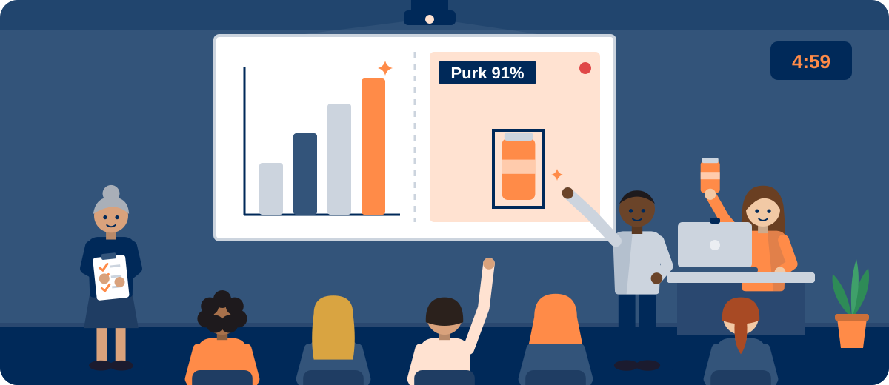

<!--
author:   Maia Lust
email:    
version:  1.3.0
language: et
narrator: Estonian Female
date:     08.10.2026
logo:     ../pildid/pae_logo.png
icon:     ../pildid/pae_logo.png
comment:  Tehisintellekti alused – gümnaasiumi valikkursus (35 tundi), Tallinna Pae Gümnaasium. Õppetekstid, interaktiivsed töölehed ja enesekontrollitestid.
link:     https://fonts.googleapis.com/css2?family=Nunito+Sans:wght@400;600;700&family=Poppins:wght@600;700&family=JetBrains+Mono:wght@400;600&display=swap

@style
/* ==== liascript-theming:start ==== */
/* links: https://fonts.googleapis.com/css2?family=Nunito+Sans:wght@400;600;700&family=Poppins:wght@600;700&family=JetBrains+Mono:wght@400;600&display=swap */
/* theme: Tallinna Pae Gümnaasium — generated by liascript-theming, edit theme.json and rebuild */
:root {
  --theme-font-body: 'Nunito Sans', sans-serif;
  --theme-font-heading: 'Poppins', serif;
  --theme-font-mono: 'JetBrains Mono', monospace;
  --theme-heading-weight: 700;
  --theme-line-height: 1.6;
  --global-font-size: 1.6rem;
  --theme-radius: 0.8rem;
  --theme-radius-small: 0.4rem;
  --theme-radius-large: 1.4rem;
  --theme-shadow: 0 0.3rem 1rem rgba(0,41,89,.10);
}
/* surfaces & text: apply to every color theme */
:root.lia-variant-light {
  --color-background: 255,255,255;
  --color-text: 29,36,51;
  --color-border: 228,229,231;
  --lia-grey-lighter: 238,242,247;
  --lia-grey-light: 204,212,222;
}
:root.lia-variant-dark {
  --color-background: 15,23,36;
  --color-text: 229,232,235;
  --color-border: 49,60,73;
  --lia-grey-dark: 30,38,47;
  --lia-anthracite: 41,50,61;
}
/* accent: only the course theme (default) and the custom radio,
   so readers can still pick LiaScript's built-in color themes */
:root:is(.lia-theme-default, .lia-theme-custom) {
  --color-highlight: 0,41,89;
  --color-highlight-dark: 0,41,89;
}
:root.lia-theme-default {
  --color-highlight-menu: 0,41,89;
}
:root:is(.lia-theme-default, .lia-theme-custom).lia-variant-dark {
  --color-highlight: 47,90,143;
  --color-highlight-dark: 255,185,143;
}
:root.lia-variant-light { --theme-heading-color: #002959; }
:root.lia-variant-dark { --theme-heading-color: #FFB98F; }
/* ==== LiaScript theme adapter (liascript-theming) — keep verbatim ====
   Maps the --theme-* tokens onto LiaScript's CSS. Everything a theme
   changes lives in the token block above this one. */

/* -- fonts: body/mono via the global variables, headings & co. are
      compiled literals in LiaScript and need explicit selectors -- */
:root {
  --global-font-family: var(--theme-font-body);
  --global-font-mono: var(--theme-font-mono);
  --global-font-headline: var(--theme-font-heading);
}
body { line-height: var(--theme-line-height, 1.47); }
h1, h2, h3, .h1, .h2, .h3 {
  font-family: var(--theme-font-heading);
  font-weight: var(--theme-heading-weight, 600);
  letter-spacing: var(--theme-heading-letter-spacing, normal);
  text-transform: var(--theme-heading-transform, none);
  color: var(--theme-heading-color, inherit);
}
h4, h5, h6, .h4, .h5, summary, .lia-accordion__headline {
  font-family: var(--theme-font-subheading, var(--theme-font-body));
}
.lia-quote__text { font-family: var(--theme-font-quote, var(--theme-font-heading)); }
.lia-code, .lia-code--inline, code, kbd, samp, pre { font-family: var(--theme-font-mono); }
.lia-code .ace_editor { font-family: var(--theme-font-mono) !important; }

/* -- shape: radius for controls & surfaces (radio buttons, tags, circles stay) -- */
:is(button, .lia-btn, input, .lia-input, select, .lia-select, textarea, .lia-textarea, .lia-dropdown):not(.lia-radio, .lia-btn--tag, .lia-btn--small-tag),
.lia-code-terminal__input, .lia-pagination__content, .lia-script, .lia-support-menu__submenu {
  border-radius: var(--theme-radius);
}
.lia-checkbox[type='checkbox'], kbd, .lia-tooltip .lia-tooltiptext, .lia-code--inline {
  border-radius: var(--theme-radius-small);
}
details, .lia-quote, .lia-code__input, .lia-table-responsive, .lia-card {
  border-radius: var(--theme-radius-large);
  box-shadow: var(--theme-shadow);
}
.lia-quote, .lia-code__input { overflow: hidden; }
.lia-code__input .ace_editor { border-radius: inherit; }
.lia-support-menu__submenu { box-shadow: var(--theme-shadow-popup, 0 0 1rem rgba(128, 128, 128, 0.2)); }

/* -- dark mode: LiaScript brightens the accent for text via
      rgb(from … calc(r*2.5)), which turns a hand-picked accent into
      pastel/yellow. For the course theme, text-like accent uses take
      --color-highlight-dark (= "accent as text") instead. Scoped to
      default/custom so the built-in color themes keep their behavior. -- */
:root:is(.lia-theme-default, .lia-theme-custom).lia-variant-dark :is(.lia-link, .lia-btn--outline, .lia-code--inline) {
  color: rgb(var(--color-highlight-dark));
  border-color: rgb(var(--color-highlight-dark));
}
:root:is(.lia-theme-default, .lia-theme-custom).lia-variant-dark :is(summary, summary:after, .lia-label, .lia-skip-nav, .lia-support-menu__item, .lia-quote__text),
:root:is(.lia-theme-default, .lia-theme-custom).lia-variant-dark :is(.lia-list--unordered, .lia-list--ordered) > li::marker {
  color: rgb(var(--color-highlight-dark));
}
:root:is(.lia-theme-default, .lia-theme-custom).lia-variant-dark :is(.lia-btn--transparent, .lia-input) {
  filter: none;
}
:root:is(.lia-theme-default, .lia-theme-custom).lia-variant-dark :is(.lia-input, .lia-checkbox[type='checkbox'], .lia-radio[type='radio']):not(:checked, .is-disabled, [disabled]) {
  border-color: rgb(var(--color-highlight-dark));
}
/* alternating table rows: LiaScript uses a neutral grey in dark mode */
:root.lia-variant-dark .lia-table.is-alternating .lia-table__row:nth-child(2n) td,
:root.lia-variant-dark .lia-table-responsive.has-thead-sticky.has-first-col-sticky .is-alternating .lia-table__row:nth-child(2n) td:first-child:before,
:root.lia-variant-dark .lia-table-responsive.has-thead-sticky.has-last-col-sticky .is-alternating .lia-table__row:nth-child(2n) td:last-child:before {
  background-color: rgb(var(--lia-grey-dark));
}
/* -- theme extras -- */
/* ===== Tallinna Pae Gümnaasiumi värvid =====
   tumesinine #002959 · oranž #FF8B48 · tumeoranž #E67E42 */
:root {
  --pae-sinine: #002959;
  --pae-sinine-80: #33547A;
  --pae-sinine-20: #CCD4DE;
  --pae-sinine-08: #EEF2F7;
  --pae-oranz: #FF8B48;
  --pae-oranz-tume: #E67E42;
  --pae-oranz-20: #FFE2D1;
  --pae-oranz-08: #FFF4EC;
  --pae-roheline: #2E8B57;
  --pae-roheline-08: #EAF6EF;
  --pae-lilla: #6B4FA0;
  --pae-lilla-08: #F2EEF9;
}

/* Pealkirjad */
.lia-slide h1, main h1 {
  color: var(--pae-sinine);
  border-bottom: 6px solid var(--pae-oranz);
  padding-bottom: .3em;
}
.lia-slide h2, main h2 { color: var(--pae-sinine); }
.lia-slide h3, main h3 {
  color: var(--pae-sinine);
  border-left: 8px solid var(--pae-oranz);
  padding-left: .5em;
}
.lia-slide h4, main h4 { color: var(--pae-oranz-tume); }
strong { color: inherit; }

/* Tabelid */
.lia-table th, table thead th {
  background: var(--pae-sinine) !important;
  color: #fff !important;
}
.lia-table tbody tr:nth-child(even), table tbody tr:nth-child(even) { background: var(--pae-sinine-08); }

/* Pildid ja infograafikud */
img.lia-image, .lia-figure img, main img {
  border-radius: 12px;
}
.lia-figure__caption, figcaption {
  color: var(--pae-sinine-80);
  font-style: italic;
  text-align: center;
}

/* ASCII-skeemid väiksemaks ja Pae värvidesse */
.lia-ascii svg, lia-ascii svg, .lia-code--ascii svg { max-width: 760px; margin: 0 auto; display: block; }
svg.lia-ascii text { fill: var(--pae-sinine); }

/* ===== Kujunduskastid ===== */
blockquote.pae-moiste, blockquote.pae-naide, blockquote.pae-eesti,
blockquote.pae-motle, blockquote.pae-lisaks, blockquote.pae-fakt,
.pae-moiste, .pae-naide, .pae-eesti, .pae-motle, .pae-lisaks, .pae-fakt {
  border-radius: 14px !important;
  padding: 1.1em 1.4em 1.1em 4.2em !important;
  margin: 1.4em 0 !important;
  position: relative;
  box-shadow: 0 3px 10px rgba(0,41,89,.10);
  font-style: normal !important;
  text-align: left !important;
}
.pae-moiste::before, .pae-naide::before, .pae-eesti::before,
.pae-motle::before, .pae-lisaks::before, .pae-fakt::before {
  position: absolute; left: .7em; top: .75em;
  width: 2em; height: 2em; line-height: 2em;
  border-radius: 50%; text-align: center; font-size: 1.15em;
  color: #fff; font-style: normal;
}
/* Mõiste – oranž */
.pae-moiste { background: var(--pae-oranz-08) !important; border: 2px solid var(--pae-oranz) !important; border-left: 10px solid var(--pae-oranz) !important; }
.pae-moiste::before { content: "📖"; background: var(--pae-oranz); }
/* Näide – tumesinine */
.pae-naide { background: var(--pae-sinine-08) !important; border: 2px solid var(--pae-sinine-20) !important; border-left: 10px solid var(--pae-sinine) !important; }
.pae-naide::before { content: "💡"; background: var(--pae-sinine); }
/* Eesti näide – sinine-valge */
.pae-eesti { background: linear-gradient(135deg, #E8F1FB 0%, #ffffff 100%) !important; border: 2px solid #0072CE !important; border-left: 10px solid #0072CE !important; }
.pae-eesti::before { content: "🇪🇪"; background: #0072CE; }
/* Mõtle järele – roheline */
.pae-motle { background: var(--pae-roheline-08) !important; border: 2px dashed var(--pae-roheline) !important; border-left: 10px solid var(--pae-roheline) !important; }
.pae-motle::before { content: "🤔"; background: var(--pae-roheline); }
/* Tea lisaks – lilla */
.pae-lisaks { background: var(--pae-lilla-08) !important; border: 2px solid #CDBFE6 !important; border-left: 10px solid var(--pae-lilla) !important; }
.pae-lisaks::before { content: "🔍"; background: var(--pae-lilla); }
/* Fakt – tume taust, valge tekst */
.pae-fakt { background: var(--pae-sinine) !important; color: #fff !important; border-left: 10px solid var(--pae-oranz) !important; }
.pae-fakt * { color: #fff !important; }
.pae-fakt::before { content: "⚡"; background: var(--pae-oranz); }

/* Töölehe jaotise riba */
.pae-jaotis { background: var(--pae-sinine); color: #fff !important; padding: .55em 1em; border-radius: 10px; margin: 2em 0 1em; border-left: 10px solid var(--pae-oranz); }
.pae-jaotis * { color: #fff !important; }

/* Ploki kaanepilt */
.pae-kaas img, img.pae-kaas { width: 100%; border-radius: 16px; box-shadow: 0 6px 20px rgba(0,41,89,.18); }

/* Näidisvastuse kokkupandav kast */
details {
  background: var(--pae-oranz-08);
  border: 1px solid var(--pae-oranz);
  border-radius: 10px; padding: .6em 1em; margin: .6em 0 1.4em;
}
details summary { cursor: pointer; font-weight: bold; color: var(--pae-oranz-tume); }

/* Menüü (sisukord) tumesinine */
.lia-toc a, .lia-toc .lia-toc__link, nav.lia-toc a { color: #002959 !important; }
.lia-toc a.lia-active, .lia-toc .lia-active { font-weight: 700; }
:root.lia-variant-dark .lia-toc a { color: #CCD4DE !important; }
:root.lia-variant-dark .pae-moiste, :root.lia-variant-dark .pae-naide, :root.lia-variant-dark .pae-eesti,
:root.lia-variant-dark .pae-motle, :root.lia-variant-dark .pae-lisaks { color: #1d2433 !important; }
:root.lia-variant-dark .pae-moiste *, :root.lia-variant-dark .pae-naide *, :root.lia-variant-dark .pae-eesti *,
:root.lia-variant-dark .pae-motle *, :root.lia-variant-dark .pae-lisaks * { color: #1d2433 !important; }
:root.lia-variant-dark img { background: #fff; }
/* ==== liascript-theming:end ==== */
/* Loosimisnupp (rollimäng) */
output.lia-script[input="submit"] { display:inline-block !important; background:#002959; color:#fff !important; font-weight:700; padding:.6em 1.2em; border-radius:999px; border:3px solid #FF8B48 !important; cursor:pointer; box-shadow:0 3px 10px rgba(0,41,89,.2); }
output.lia-script[input="submit"]:hover { background:#FF8B48; color:#002959 !important; }

@end

@custom
--color-highlight-menu: 255,255,255;
@end
-->

## 7.4 Projektitöö esitlemine

<!-- class="pae-lisaks" -->
> 🗺️ **Oled 7. toas – Stardiplatvorm.** Lisa selle lehe link järjehoidjasse, et saaksid hiljem samast kohast jätkata. Järgmine osa avaneb alles siis, kui oled selle osa luku lahendanud.

<!-- class="pae-kaas" -->

### Õpieesmärgid

Selle tunni järel sa:

- tead, milleks projekti esitletakse ja kuidas esitlust sihtrühmale kohandada;
- oskad koostada selge ülesehitusega esitluse;
- oskad luua selgeid slaide ja TI-projekti tulemusi sobivalt visualiseerida;
- oskad valmistada ette demo ja selgitada tehnilisi detaile arusaadavalt;
- tead, kuidas esineda enesekindlalt, kaasata kuulajaid ja vastata küsimustele;
- oskad esitlust harjutada, esitluspäevaks valmistuda ning tagasisidet koguda ja kasutada.

### Miks ja kellele esitled?

Ka kõige parem projekt jääb märkamata, kui keegi sellest ei kuule. Projekti **esitlemine** tähendab projekti tulemuste tutvustamist teistele. Hea esitlus koosneb põhjalikust ettevalmistusest, selgest ülesehitusest, sisukatest visuaalidest ja enesekindlast esinemisest.

Esitlusel on neli eesmärki:

1. **Tulemuste tutvustamine** – näitad, mida saavutasid, ja demonstreerid lahendust.
2. **Teadmiste ja oskuste näitamine** – tõestad oma tehnilist pädevust ja probleemilahendusoskust.
3. **Tagasiside kogumine** – saad konstruktiivset kriitikat ja parendusettepanekuid.
4. **Kogemuse jagamine** – jagad õppetunde ja inspireerid teisi.

Enne esitluse koostamist mõtle, **kellele** sa räägid. Kuulajad võivad olla õpetajad ja hindajad, kaasõpilased, võimalikud kasutajad või laiem avalikkus. Neil on erinevad ootused: kas nad tahavad tehnilisi detaile või üldist ülevaadet, millised on nende eelteadmised ja mis neid huvitab? Selle põhjal kohanda keelekasutust ja terminoloogiat, detailsuse taset ning rõhuasetusi.

<!-- class="pae-moiste" -->
> **Mõiste: sihtrühm**
>
> **Sihtrühm** on inimesed, kellele esitlus (või toode, teenus) on suunatud. Sihtrühma analüüs aitab otsustada, mida ja kuidas rääkida, et sõnum kuulajateni jõuaks.

<!-- class="pae-eesti" -->
> **Eesti näide: sama sõnum, erinevad kuulajad**
>
> Kujutle, et tutvustad riigi virtuaalassistentide võrgustikku **Bürokratt**. IT-spetsialistidele räägiksid sellest, kuidas eri asutuste vestlusrobotid on ühendatud ja kuidas kaitstakse andmeid. Oma vanavanematele aga ütleksid lihtsalt: „Saad riigilt küsida küsimusi tavalises keeles, nagu vestleksid inimesega, ja sulle vastatakse kohe.“ Sisu on sama, aga detailsus ja sõnavara erinevad.

### Esitluse ülesehitus

Esitluse ettevalmistus algab **põhisõnumitest**. Sõnasta 3–5 mõtet, mis peaksid kuulajatele kindlasti meelde jääma: projekti eesmärk ja olulisus, peamised tulemused, järeldused ja õppetunnid. Seejärel loo **ülesehitus**: loogiline järjestus, selge algus, keskosa ja lõpp ning sujuvad üleminekud osade vahel. Planeeri ka **aeg**: kui pikk on esitlus, kui palju aega kulub igale osale ja kui palju jääb küsimustele.

TI-projekti esitlusel on hea kasutada järgmist ülesehitust:

**Sissejuhatus** peab äratama tähelepanu – näiteks üllatava küsimuse, lühikese loo või probleemi kirjeldusega, millega kuulajad on ise kokku puutunud. **Taustas** selgitad probleemi ja eesmärke. **Metoodikas** kirjeldad, mida ja kuidas tegite ning milliste väljakutsetega kokku puutusite. **Tulemustes** näitad, mis valmis sai. **Järeldustes** võtad kokku õppetunnid ja edasised sammud – ja lõpetad tugevalt.

<!-- class="pae-naide" -->
> **Näide: elevaatorikõne**
>
> **Elevaatorikõne** on 1–2-minutiline lühitutvustus, mille jooksul pead suutma oma projekti huvilisele või toetajale ära rääkida – nii lühikese aja jooksul, kui kestab sõit liftis. Näiteks: „Meie koolis visatakse iga päev ära palju toitu. Lõime mudeli, mis ennustab eelmiste nädalate andmete põhjal, mitu portsjonit järgmisel päeval vaja on. Testandmetel oli meie ennustus tunduvalt täpsem kui lihtne keskmine. Järgmiseks tahame mudelit katsetada ka teistes koolides.“

### Visuaalid ja tulemuste visualiseerimine

Slaidid peavad sinu kõnet toetama, mitte asendama. **Slaidide kujunduses** lähtu selgusest ja lihtsusest, järjepidevusest (sama kujundus kõigil slaididel) ja visuaalsest hierarhiast (kõige olulisem on kõige silmatorkavam). **Teksti** olgu vähe: kirjuta lühikeste ja selgete punktidena ning kasuta loetavat fonti ja piisavalt suurt kirja. Kasuta **visuaalseid elemente**: diagramme, graafikuid, pilte ja ikoone; animatsioone ainult mõõdukalt.

<!-- class="pae-moiste" -->
> **Mõiste: 6 × 6 reegel**
>
> **6 × 6 reegel** on slaidikujunduse rusikareegel: ühel slaidil kõige rohkem 6 punkti ja ühes punktis kõige rohkem 6 sõna. See hoiab slaidid lühikesed ja suunab kuulaja tähelepanu sinu jutule.

Lisaks kasuta kontrastseid värve (tume tekst heledal taustal või vastupidi) ja jäta slaidile tühja ruumi, et see ei tunduks ülerahvastatud.

<!-- class="pae-fakt" -->
> **Kas teadsid?** 6 × 6 reegli järgi mahub ühele slaidile kõige rohkem 36 sõna (6 punkti × 6 sõna). Ülejäänu ütled suuliselt.

TI-projektis on palju arve ja tulemusi, mida saab **visualiseerida**:

- **andmed** – graafikud ja diagrammid, soojuskaardid (heatmap'id, kus väärtused on näidatud värvidega), interaktiivsed visualiseeringud;
- **mudeli tulemused** – täpsusmõõdikud, segadusmaatriksid, õppimiskõverad (graafik, mis näitab, kuidas mudeli täpsus treenimise käigus muutus);
- **arhitektuur** – süsteemi diagrammid, andmevoogude skeemid, komponentide seosed;
- **kasutajaliides** – ekraanipildid, prototüübid, kasutajakogemuse visualiseerimine.

Visualiseeringud peavad olema täpsed: telgedel peavad olema nimed ja ühikud ning graafik ei tohi tulemusi moonutada.

<!-- data-type="linechart" data-title="Näide: mudeli täpsus treeningu ajal (õppimiskõver)" -->
| Treeningu ring | Treeningandmed (%) | Valideerimisandmed (%) |
|----------------|-------------------:|-----------------------:|
| 1 | 55 | 53 |
| 2 | 68 | 65 |
| 3 | 76 | 72 |
| 4 | 82 | 77 |
| 5 | 86 | 79 |
| 6 | 89 | 80 |
| 7 | 91 | 80 |
| 8 | 92 | 80 |

### Demo ja tehnilised detailid

**Demo** ehk demonstratsioon näitab, et lahendus päriselt töötab. Demo eesmärk on näidata funktsionaalsust, demonstreerida kasutajakogemust ja tõestada, et idee toimib. Hea demo jaoks:

- planeeri **stsenaarium** – täpsed sammud, mida demos läbid;
- **testi** demot enne esitlust samas keskkonnas;
- valmista ette **varuplaan** probleemide jaoks.

Demo ajal selgita selgelt, mida teed, jälgi tempot ja rõhuta olulisimaid funktsioone. Kui elav demo on liiga riskantne, kasuta alternatiivi: videot, animatsiooni või ekraanipiltide seeriat.

<!-- class="pae-motle" -->
> **Mõtle järele!**
>
> Sinu vestlusrobot vajab töötamiseks internetiühendust, aga klassi Wi-Fi on sageli aeglane. Mida teeksid, et demo õnnestuks igal juhul?

**Tehniliste detailide** esitlemisel otsi tasakaalu: kuulaja peab saama aru, aga sisu peab jääma täpseks. Rõhuta olulist ja arvesta sihtrühmaga. Hoolitse tehnilise täpsuse eest: kontrolli fakte, kasuta terminoloogiat järjepidevalt (nt ära räägi samast asjast kord „mudelina“, kord „algoritmina“, kord „programmina“) ja viita allikatele. Keerulisi mõisteid selgita metafooride ja analoogiate, lihtsustatud näidete ja visuaalsete abivahendite abil. Põhjenda tehnilisi valikuid: miks valisite just selle meetodi, millised olid alternatiivid ja millised on teie lahenduse piirangud. Piirangute ausalt tunnistamine näitab, et mõistad oma tööd hästi.

### Esineja oskused ja küsimused

Esitlus ei ole ainult slaidid – oluline on ka see, **kuidas** sa räägid:

- **kehakeel ja hääl** – silmside kuulajatega, avatud kehahoiak, selge ja kuuldav hääl, sobiv tempo ja pausid;
- **enesekindlus** – see tuleb põhjalikust ettevalmistusest ja positiivsest hoiakust; kui juhtub viga, jätka rahulikult;
- **kaasamine** – esita kuulajatele küsimusi, kasuta interaktiivseid elemente, arvesta kuulajate huvidega;
- **ajaplaneerimine** – pea ajakavast kinni, aga ole paindlik ja tea, millise osa saad vajaduse korral lühemaks teha.

**Küsimusteks valmistumine** algab nende ennustamisest. Mõtle, millised küsimused on tõenäolised, millised keerulised ja millised kriitilised. Valmista ette selged ja lühikesed vastused ning toetavad näited. Kui sa vastust ei tea, ole aus – ütle, et ei tea, ja paku, et uurid järele. Esitluse ajal otsusta, kas võtad küsimusi kohe või lõpus, viita korduvatele küsimustele juba antud vastusele ja suuna teemast kõrvale kalduvad küsimused viisakalt hilisemaks. Pärast esitlust tegele vastamata küsimustega, paku täiendavat infot ja hoia kuulajatega ühendust.

<!-- class="pae-moiste" -->
> **Mõiste: konstruktiivne tagasiside**
>
> **Konstruktiivne tagasiside** on konkreetne, tasakaalustatud ja arengule suunatud hinnang, mis toob välja nii tugevused kui ka parenduskohad ning pakub soovitusi.

### Harjutamine, esitluspäev ja tagasiside

**Harjutamine** suurendab enesekindlust, aitab ajastust kontrollida ja muudab esitluse sujuvaks. Harjuta iseendale, esitle sõpradele või perele või salvesta end videole ja analüüsi seda. Küsi konstruktiivset tagasisidet, leia parenduskohad ja tugevused ning täienda esitlust: lahenda probleemkohad ja lisa viimane lihv.

**Esitluspäevaks valmistumine:**

| Valdkond | Mida teha |
|---|---|
| Tehniline | kontrolli seadmeid, varunda failid (nt pilve ja mälupulgale), testi ühilduvust |
| Logistiline | kontrolli asukohta, saabu õigel ajal, võta vajalikud materjalid kaasa |
| Isiklik | puhka piisavalt, vali sobiv riietus, valmistu vaimselt |
| Viimased kontrollid | vaata esitlus üle, testi demot, vaata ajakava üle |

Pärast esitlust **kogu tagasisidet**. Tagasiside aitab sul õppida ja areneda, tulevasi esitlusi parandada ja projekti edasi arendada. Tagasisidet saab koguda küsimustike, vestluste ja vaatluste kaudu. Analüüsi seda objektiivselt: otsi mustreid (mida mainisid mitu inimest?) ja sea prioriteedid. Seejärel tegutse: tee konkreetsed parandused, arenda tugevusi edasi ja õpi järjepidevalt.

<!-- class="pae-naide" -->
> **Näide: levinud vead ja kuidas neid vältida**
>
> | Viga | Lahendus |
> |---|---|
> | Liiga palju teksti slaidil | järgi 6 × 6 reeglit, räägi rohkem kui kirjutad |
> | Monotoonne esitlus | muuda häälekõrgust ja tempot, tee pause, kaasa kuulajaid |
> | Ajapiirangu eiramine | harjuta kellaga, tea, mida saab ära jätta |
> | Kuulajate ignoreerimine | hoia silmsidet, esita küsimusi |

Viimased näpunäited: ole entusiastlik, keskendu väärtusele, mida sinu projekt loob, lõpeta tugevalt – ja naudi protsessi!

<!-- class="pae-lisaks" -->
> **Tea lisaks**
>
> Ingliskeelseid juhendeid leiad näiteks [projektiesitluse koostamise](https://www.projectmanager.com/blog/create-project-presentation), [teadusplakati kujundamise](https://guides.nyu.edu/posters) ja [elevaatorikõne](https://hbr.org/2018/07/the-perfect-elevator-pitch) kohta.

### Kokkuvõte ja põhimõisted

**Pea meeles**

- Esitluse eesmärgid on tulemuste tutvustamine, oskuste näitamine, tagasiside kogumine ja kogemuse jagamine.
- Kohanda esitlus sihtrühmale: sõnavara, detailsus ja rõhuasetused.
- Hea ülesehitus: sissejuhatus – taust ja eesmärgid – metoodika – tulemused – järeldused.
- Slaidid toetavad kõnet: vähe teksti (6 × 6 reegel), selged visuaalid, kontrastsed värvid.
- Demo tuleb ette valmistada ja testida ning sellele peab olema varuplaan.
- Küsimustele vasta selgelt ja ausalt; kui ei tea, ütle seda.

| Mõiste | Tähendus |
|---|---|
| esitlemine | projekti tulemuste tutvustamine teistele |
| sihtrühm | inimesed, kellele esitlus on suunatud |
| põhisõnum | mõte, mis peab kuulajatele kindlasti meelde jääma |
| 6 × 6 reegel | slaidil kuni 6 punkti, punktis kuni 6 sõna |
| demo | lahenduse töö näitamine elavalt või salvestatult |
| elevaatorikõne | 1–2-minutiline lühitutvustus projektist |
| õppimiskõver | graafik, mis näitab mudeli täpsuse muutumist treenimise käigus |
| konstruktiivne tagasiside | konkreetne, tasakaalustatud ja arengule suunatud hinnang |

### Tööleht 7.4

<!-- class="pae-jaotis" -->
**I. Esitluse ettevalmistamine**

**Ülesanne 1.** Kirjelda lühidalt oma projekti eesmärki ja peamisi tulemusi.

[[___ ___ ___ ___]]

**Ülesanne 2.** Kes on sinu esitluse sihtrühm? Millised on nende ootused ja eelteadmised?

[[___ ___ ___]]

**Ülesanne 3.** Sõnasta 3–5 põhisõnumit, mida soovid oma esitlusega edastada.

**1. põhisõnum:**

[[___]]

**2. põhisõnum:**

[[___]]

**3. põhisõnum:**

[[___]]

**4. põhisõnum:**

[[___]]

**5. põhisõnum:**

[[___]]

<!-- class="pae-jaotis" -->
**II. Esitluse ülesehitus**

**Ülesanne 4.** Koosta oma esitluse ülesehitus.

**a) Sissejuhatus (kuidas äratad tähelepanu ja tutvustad teemat):**

[[___ ___ ___]]

**b) Projekti taust ja eesmärgid:**

[[___ ___ ___]]

**c) Metoodika ja protsess:**

[[___ ___ ___]]

**d) Tulemused ja saavutused:**

[[___ ___ ___]]

**e) Järeldused ja edasised sammud:**

[[___ ___ ___]]

**Ülesanne 5.** Kui pikk on kogu esitlus ja kuidas plaanid selle aja osade vahel jaotada?

[[___ ___ ___]]

<!-- class="pae-jaotis" -->
**III. Visuaalide loomine**

**Ülesanne 6.** Milliseid visuaalseid elemente plaanid oma esitluses kasutada (nt slaidid, diagrammid, pildid, videod)?

[[___ ___ ___ ___]]

**Ülesanne 7.** Kirjelda oma slaidide kujunduse põhimõtteid (värvid, font, paigutus).

[[___ ___ ___]]

**Ülesanne 8.** Kuidas tagad, et sinu visuaalid on selged, loetavad ja toetavad sinu sõnumit?

[[___ ___ ___]]

<!-- class="pae-jaotis" -->
**IV. Tehisintellekti projekti tulemuste visualiseerimine**

**Ülesanne 9.** Milliseid andmeid või tulemusi soovid oma esitluses visualiseerida?

[[___ ___ ___]]

**Ülesanne 10.** Milliseid visualiseerimisviise plaanid kasutada (nt graafikud, diagrammid, soojuskaardid)?

[[___ ___ ___]]

**Ülesanne 11.** Kuidas tagad, et sinu visualiseeringud on täpsed ja arusaadavad?

[[___ ___ ___]]

<!-- class="pae-jaotis" -->
**V. Demo või prototüübi ettevalmistamine**

**Ülesanne 12.** Kas plaanid oma esitluses demonstreerida projekti tulemust või prototüüpi? Kui jah, siis kirjelda, mida täpsemalt demonstreerid.

[[___ ___ ___ ___]]

**Ülesanne 13.** Koosta demo stsenaarium (sammud, mida läbid).

[[___ ___ ___ ___]]

**Ülesanne 14.** Millised tehnilised probleemid võivad demo ajal tekkida? Kuidas nendeks valmistud?

[[___ ___ ___]]

<!-- class="pae-jaotis" -->
**VI. Esitlemise põhimõtted**

**Ülesanne 15.** Millised on sinu tugevused esitlejana? Kuidas plaanid neid ära kasutada?

[[___ ___ ___]]

**Ülesanne 16.** Millised on sinu väljakutsed esitlejana? Kuidas plaanid neid ületada?

[[___ ___ ___]]

**Ülesanne 17.** Kuidas plaanid kuulajaid kaasata ja nende tähelepanu hoida?

[[___ ___ ___]]

<!-- class="pae-jaotis" -->
**VII. Tehniliste detailide esitlemine**

**Ülesanne 18.** Milliseid tehnilisi detaile pead oma projektist esitluses selgitama?

[[___ ___ ___ ___]]

**Ülesanne 19.** Kuidas plaanid keerulisi tehnilisi mõisteid lihtsalt ja arusaadavalt selgitada?

[[___ ___ ___]]

**Ülesanne 20.** Kuidas leiad tasakaalu tehniliste detailide ja üldise arusaadavuse vahel?

[[___ ___ ___]]

<!-- class="pae-jaotis" -->
**VIII. Küsimusteks valmistumine**

**Ülesanne 21.** Millised küsimused võivad sinu esitluse kohta tekkida? Kirjuta vähemalt viis võimalikku küsimust ja vastused, mille neile ette valmistad.

**1. küsimus ja vastus:**

[[___ ___]]

**2. küsimus ja vastus:**

[[___ ___]]

**3. küsimus ja vastus:**

[[___ ___]]

**4. küsimus ja vastus:**

[[___ ___]]

**5. küsimus ja vastus:**

[[___ ___]]

**Ülesanne 22.** Kuidas käitud, kui sulle esitatakse küsimus, millele sa ei oska vastata?

[[___ ___ ___]]

<!-- class="pae-jaotis" -->
**IX. Esitluse harjutamine**

**Ülesanne 23.** Kuidas plaanid oma esitlust harjutada? Koosta harjutamise plaan.

[[___ ___ ___ ___]]

**Ülesanne 24.** Kellelt ja kuidas plaanid saada tagasisidet oma esitluse kohta enne lõplikku esitlemist?

[[___ ___ ___]]

**Ülesanne 25.** Millised aspektid vajavad sinu arvates kõige rohkem harjutamist?

[[___ ___ ___]]

<!-- class="pae-jaotis" -->
**X. Esitluspäevaks valmistumine**

**Ülesanne 26.** Koosta kontrollnimekiri esitluspäevaks.

[[___ ___ ___ ___ ___]]

**Ülesanne 27.** Milliseid tehnilisi ettevalmistusi pead tegema (nt failide varundamine, seadmete kontrollimine)?

[[___ ___ ___]]

**Ülesanne 28.** Kuidas plaanid esitluspäevaks vaimselt ja füüsiliselt valmistuda?

[[___ ___ ___]]

### Enesekontroll 7.4

**1. Mitu sõna mahub 6 × 6 reegli järgi ühele slaidile kõige rohkem? Kirjuta arv.**

[[36]]

****************************************
6 × 6 reegli järgi on slaidil kuni 6 punkti ja igas punktis kuni 6 sõna: 6 × 6 = **36** sõna. Ülejäänu ütled suuliselt.
****************************************

**2. Kuidas nimetatakse 1–2-minutilist lühitutvustust, mille jooksul pead suutma oma projekti huvilisele ära rääkida? Kirjuta vastus.**

[[elevaatorikõne]]

****************************************
Õige vastus: **elevaatorikõne** – nii lühike tutvustus, et see mahub ühe liftisõidu aega.
****************************************

**3. Pane TI-projekti esitluse osad õigesse järjekorda.**

<!-- data-show-partial-solution -->
Tulemused: [[ 1 | 2 | 3 | (4) | 5 ]] 
Sissejuhatus: [[ (1) | 2 | 3 | 4 | 5 ]] 
Järeldused ja edasised sammud: [[ 1 | 2 | 3 | 4 | (5) ]] 
Metoodika: [[ 1 | 2 | (3) | 4 | 5 ]] 
Taust ja eesmärgid: [[ 1 | (2) | 3 | 4 | 5 ]]
****************************************
Esitlus algab sissejuhatusega, seejärel tulevad taust ja eesmärgid, metoodika, tulemused ning lõpuks järeldused ja edasised sammud.
****************************************

**4. Lohista visualiseeringute nimetused õigetesse lünkadesse.**

<!-- data-show-partial-solution -->
Graafikut, mis näitab, kuidas mudeli täpsus treenimise käigus muutus, nimetatakse [->[ (õppimiskõveraks) ]]. Tabelit, mis näitab mudeli õigeid ja valesid ennustusi klasside kaupa, nimetatakse [->[ (segadusmaatriksiks) | Gantti graafikuks ]]. Joonist, kus väärtused on näidatud värvidega, nimetatakse [->[ (soojuskaardiks) | ajateljeks ]].
****************************************
**Õppimiskõver** näitab mudeli täpsust treenimise ajal, **segadusmaatriks** näitab õigeid ja valesid ennustusi klasside kaupa ning **soojuskaart** (*heatmap*) näitab väärtusi värvidega.
****************************************

**5. Ühenda levinud esitlusviga sobiva lahendusega.**

- [ (6 × 6 reegel) (Hääle ja tempo muutmine) (Harjutamine kellaga) (Silmside ja küsimused) ]
- [ (X) ( ) ( ) ( ) ] Liiga palju teksti slaidil
- [ ( ) (X) ( ) ( ) ] Monotoonne esitlus
- [ ( ) ( ) (X) ( ) ] Ajapiirangu eiramine
- [ ( ) ( ) ( ) (X) ] Kuulajate ignoreerimine
****************************************
Liiga palju teksti vastu aitab 6 × 6 reegel, monotoonsuse vastu häälekõrguse ja tempo muutmine ning pausid, ajapiirangu eiramise vastu harjutamine kellaga ja kuulajate ignoreerimise vastu silmside ning küsimuste esitamine.
****************************************

**6. Mida teha, kui sulle esitatakse küsimus, millele sa vastust ei tea?**

- [( )] Mõelda kiiresti välja usutav vastus.
- [(X)] Tunnistada ausalt, et ei tea, ja pakkuda, et uurid järele.
- [( )] Jätta küsimus tähelepanuta.
- [( )] Vahetada kiiresti teemat.
****************************************
Ausus teadmatuse korral on osa heast esinemisest. Vastamata küsimused tasub üles märkida ja hiljem täiendavat infot pakkuda.
****************************************

**7. Vali igasse lünka sobiv sõna.**

<!-- data-show-partial-solution -->
Enne esitlust tuleb analüüsida [[ (sihtrühma) | slaidide arvu ]], sest sellest sõltuvad keelekasutus ja detailsuse tase. IT-spetsialistidele võid rääkida [[ (rohkem) | vähem ]] tehnilistest detailidest, vanavanematele aga [[ rohkem | (vähem) ]]. Terminoloogiat kasuta [[ vaheldusrikkalt | (järjepidevalt) ]]: ära nimeta sama asja kord „mudeliks“, kord „programmiks“.
****************************************
Sihtrühma analüüs aitab otsustada, mida ja kuidas rääkida. Sisu jääb samaks, aga detailsus ja sõnavara erinevad. Terminoloogia peab olema järjepidev, et kuulaja ei arvaks, et jutt on eri asjadest.
****************************************

**8. Sinu vestlusrobot vajab töötamiseks internetiühendust, aga klassi Wi-Fi on sageli aeglane. Kirjelda, kuidas valmistad demo ette, et see õnnestuks igal juhul.**

[[___ ___ ___]]

Vaata näidisvastust

Kõigepealt planeerin demo stsenaariumi ehk täpsed sammud, mida näitan. Seejärel testin demot enne esitlust samas klassis ja samas võrgus. Varuplaaniks salvestan demost video ja teen ekraanipildid, et saaksin neid näidata, kui internet ei tööta. Võimaluse korral kasutan varuks ka telefoni mobiilset internetti.

### 🔐 Lukk 7.4

<!-- class="pae-naide" -->
> **Kratt:** „Mul on homme suur esitlus. Aga mis siis, kui internet kaob ja mu demo jääb lihtsalt tühjusse vahtima?“

Lukk avaneb, kui lahendad mõistatuse. Leia tsitaadist puuduv sõna.

**Puuduv sõna:** „Testin demot enne esitlust samas klassis ja samas võrgus. Kui internet ei tööta, näitan demost salvestatud videot ja ekraanipilte – see on minu ______.“ Kirjuta puuduv sõna.

<!-- data-solution-button="off" -->
[[varuplaan]]
[[?]] Vihje: liitsõna, mille esimene pool tähendab „tagavaraks“ ja teine pool „kava“.

****************************************
✅ **Lukk avatud!** Varuplaan aitab demol õnnestuda ka siis, kui tehnika alt veab – hea esineja valmistub ka ootamatusteks.

🔑 **Sinu võtmetäht: A**

Kirjuta täht üles – seda on vaja toa ukse avamiseks.

➡️ **[Ava järgmine osa: 7.5 Projektitööde esitlemine ja kursuse lõpetamine](https://liascript.github.io/course/?https://raw.githubusercontent.com/maialust/Tehisintellekti-alused/main/oppija/7_5_f9a92aa9.md)**

****************************************
