<!--
author:   Maia Lust
email:    
version:  2.2.1
language: et
narrator: Estonian Female
date:     08.10.2026
logo:     ../pildid/pae_logo.png
icon:     ../pildid/pae_logo.png
comment:  Tehisintellekti alused – gümnaasiumi valikkursus (35 tundi), Tallinna Pae Gümnaasium. Õppetekstid, interaktiivsed töölehed ja enesekontrollitestid.
link:     https://fonts.googleapis.com/css2?family=Nunito+Sans:wght@400;600;700&family=Poppins:wght@600;700&family=JetBrains+Mono:wght@400;600&display=swap

@style
/* ==== liascript-theming:start ==== */
/* links: https://fonts.googleapis.com/css2?family=Nunito+Sans:wght@400;600;700&family=Poppins:wght@600;700&family=JetBrains+Mono:wght@400;600&display=swap */
/* theme: Tallinna Pae Gümnaasium — generated by liascript-theming, edit theme.json and rebuild */
:root {
  --theme-font-body: 'Nunito Sans', sans-serif;
  --theme-font-heading: 'Poppins', serif;
  --theme-font-mono: 'JetBrains Mono', monospace;
  --theme-heading-weight: 700;
  --theme-line-height: 1.6;
  --global-font-size: 1.6rem;
  --theme-radius: 0.8rem;
  --theme-radius-small: 0.4rem;
  --theme-radius-large: 1.4rem;
  --theme-shadow: 0 0.3rem 1rem rgba(0,41,89,.10);
}
/* surfaces & text: apply to every color theme */
:root.lia-variant-light {
  --color-background: 255,255,255;
  --color-text: 29,36,51;
  --color-border: 228,229,231;
  --lia-grey-lighter: 238,242,247;
  --lia-grey-light: 204,212,222;
}
:root.lia-variant-dark {
  --color-background: 15,23,36;
  --color-text: 229,232,235;
  --color-border: 49,60,73;
  --lia-grey-dark: 30,38,47;
  --lia-anthracite: 41,50,61;
}
/* accent: only the course theme (default) and the custom radio,
   so readers can still pick LiaScript's built-in color themes */
:root:is(.lia-theme-default, .lia-theme-custom) {
  --color-highlight: 0,41,89;
  --color-highlight-dark: 0,41,89;
}
:root.lia-theme-default {
  --color-highlight-menu: 0,41,89;
}
:root:is(.lia-theme-default, .lia-theme-custom).lia-variant-dark {
  --color-highlight: 47,90,143;
  --color-highlight-dark: 255,185,143;
}
:root.lia-variant-light { --theme-heading-color: #002959; }
:root.lia-variant-dark { --theme-heading-color: #FFB98F; }
/* ==== LiaScript theme adapter (liascript-theming) — keep verbatim ====
   Maps the --theme-* tokens onto LiaScript's CSS. Everything a theme
   changes lives in the token block above this one. */

/* -- fonts: body/mono via the global variables, headings & co. are
      compiled literals in LiaScript and need explicit selectors -- */
:root {
  --global-font-family: var(--theme-font-body);
  --global-font-mono: var(--theme-font-mono);
  --global-font-headline: var(--theme-font-heading);
}
body { line-height: var(--theme-line-height, 1.47); }
h1, h2, h3, .h1, .h2, .h3 {
  font-family: var(--theme-font-heading);
  font-weight: var(--theme-heading-weight, 600);
  letter-spacing: var(--theme-heading-letter-spacing, normal);
  text-transform: var(--theme-heading-transform, none);
  color: var(--theme-heading-color, inherit);
}
h4, h5, h6, .h4, .h5, summary, .lia-accordion__headline {
  font-family: var(--theme-font-subheading, var(--theme-font-body));
}
.lia-quote__text { font-family: var(--theme-font-quote, var(--theme-font-heading)); }
.lia-code, .lia-code--inline, code, kbd, samp, pre { font-family: var(--theme-font-mono); }
.lia-code .ace_editor { font-family: var(--theme-font-mono) !important; }

/* -- shape: radius for controls & surfaces (radio buttons, tags, circles stay) -- */
:is(button, .lia-btn, input, .lia-input, select, .lia-select, textarea, .lia-textarea, .lia-dropdown):not(.lia-radio, .lia-btn--tag, .lia-btn--small-tag),
.lia-code-terminal__input, .lia-pagination__content, .lia-script, .lia-support-menu__submenu {
  border-radius: var(--theme-radius);
}
.lia-checkbox[type='checkbox'], kbd, .lia-tooltip .lia-tooltiptext, .lia-code--inline {
  border-radius: var(--theme-radius-small);
}
details, .lia-quote, .lia-code__input, .lia-table-responsive, .lia-card {
  border-radius: var(--theme-radius-large);
  box-shadow: var(--theme-shadow);
}
.lia-quote, .lia-code__input { overflow: hidden; }
.lia-code__input .ace_editor { border-radius: inherit; }
.lia-support-menu__submenu { box-shadow: var(--theme-shadow-popup, 0 0 1rem rgba(128, 128, 128, 0.2)); }

/* -- dark mode: LiaScript brightens the accent for text via
      rgb(from … calc(r*2.5)), which turns a hand-picked accent into
      pastel/yellow. For the course theme, text-like accent uses take
      --color-highlight-dark (= "accent as text") instead. Scoped to
      default/custom so the built-in color themes keep their behavior. -- */
:root:is(.lia-theme-default, .lia-theme-custom).lia-variant-dark :is(.lia-link, .lia-btn--outline, .lia-code--inline) {
  color: rgb(var(--color-highlight-dark));
  border-color: rgb(var(--color-highlight-dark));
}
:root:is(.lia-theme-default, .lia-theme-custom).lia-variant-dark :is(summary, summary:after, .lia-label, .lia-skip-nav, .lia-support-menu__item, .lia-quote__text),
:root:is(.lia-theme-default, .lia-theme-custom).lia-variant-dark :is(.lia-list--unordered, .lia-list--ordered) > li::marker {
  color: rgb(var(--color-highlight-dark));
}
:root:is(.lia-theme-default, .lia-theme-custom).lia-variant-dark :is(.lia-btn--transparent, .lia-input) {
  filter: none;
}
:root:is(.lia-theme-default, .lia-theme-custom).lia-variant-dark :is(.lia-input, .lia-checkbox[type='checkbox'], .lia-radio[type='radio']):not(:checked, .is-disabled, [disabled]) {
  border-color: rgb(var(--color-highlight-dark));
}
/* alternating table rows: LiaScript uses a neutral grey in dark mode */
:root.lia-variant-dark .lia-table.is-alternating .lia-table__row:nth-child(2n) td,
:root.lia-variant-dark .lia-table-responsive.has-thead-sticky.has-first-col-sticky .is-alternating .lia-table__row:nth-child(2n) td:first-child:before,
:root.lia-variant-dark .lia-table-responsive.has-thead-sticky.has-last-col-sticky .is-alternating .lia-table__row:nth-child(2n) td:last-child:before {
  background-color: rgb(var(--lia-grey-dark));
}
/* -- theme extras -- */
/* ===== Tallinna Pae Gümnaasiumi värvid =====
   tumesinine #002959 · oranž #FF8B48 · tumeoranž #E67E42 */
:root {
  --pae-sinine: #002959;
  --pae-sinine-80: #33547A;
  --pae-sinine-20: #CCD4DE;
  --pae-sinine-08: #EEF2F7;
  --pae-oranz: #FF8B48;
  --pae-oranz-tume: #E67E42;
  --pae-oranz-20: #FFE2D1;
  --pae-oranz-08: #FFF4EC;
  --pae-roheline: #2E8B57;
  --pae-roheline-08: #EAF6EF;
  --pae-lilla: #6B4FA0;
  --pae-lilla-08: #F2EEF9;
}

/* Pealkirjad */
.lia-slide h1, main h1 {
  color: var(--pae-sinine);
  border-bottom: 6px solid var(--pae-oranz);
  padding-bottom: .3em;
}
.lia-slide h2, main h2 { color: var(--pae-sinine); }
.lia-slide h3, main h3 {
  color: var(--pae-sinine);
  border-left: 8px solid var(--pae-oranz);
  padding-left: .5em;
}
.lia-slide h4, main h4 { color: var(--pae-oranz-tume); }
strong { color: inherit; }

/* Tabelid */
.lia-table th, table thead th {
  background: var(--pae-sinine) !important;
  color: #fff !important;
}
.lia-table tbody tr:nth-child(even), table tbody tr:nth-child(even) { background: var(--pae-sinine-08); }

/* Pildid ja infograafikud */
img.lia-image, .lia-figure img, main img {
  border-radius: 12px;
}
.lia-figure__caption, figcaption {
  color: var(--pae-sinine-80);
  font-style: italic;
  text-align: center;
}

/* ASCII-skeemid väiksemaks ja Pae värvidesse */
.lia-ascii svg, lia-ascii svg, .lia-code--ascii svg { max-width: 760px; margin: 0 auto; display: block; }
svg.lia-ascii text { fill: var(--pae-sinine); }

/* ===== Kujunduskastid ===== */
blockquote.pae-moiste, blockquote.pae-naide, blockquote.pae-eesti,
blockquote.pae-motle, blockquote.pae-lisaks, blockquote.pae-fakt,
.pae-moiste, .pae-naide, .pae-eesti, .pae-motle, .pae-lisaks, .pae-fakt {
  border-radius: 14px !important;
  padding: 1.1em 1.4em 1.1em 4.2em !important;
  margin: 1.4em 0 !important;
  position: relative;
  box-shadow: 0 3px 10px rgba(0,41,89,.10);
  font-style: normal !important;
  text-align: left !important;
}
.pae-moiste::before, .pae-naide::before, .pae-eesti::before,
.pae-motle::before, .pae-lisaks::before, .pae-fakt::before {
  position: absolute; left: .7em; top: .75em;
  width: 2em; height: 2em; line-height: 2em;
  border-radius: 50%; text-align: center; font-size: 1.15em;
  color: #fff; font-style: normal;
}
/* Mõiste – oranž */
.pae-moiste { background: var(--pae-oranz-08) !important; border: 2px solid var(--pae-oranz) !important; border-left: 10px solid var(--pae-oranz) !important; }
.pae-moiste::before { content: "📖"; background: var(--pae-oranz); }
/* Näide – tumesinine */
.pae-naide { background: var(--pae-sinine-08) !important; border: 2px solid var(--pae-sinine-20) !important; border-left: 10px solid var(--pae-sinine) !important; }
.pae-naide::before { content: "💡"; background: var(--pae-sinine); }
/* Eesti näide – sinine-valge */
.pae-eesti { background: linear-gradient(135deg, #E8F1FB 0%, #ffffff 100%) !important; border: 2px solid #0072CE !important; border-left: 10px solid #0072CE !important; }
.pae-eesti::before { content: "🇪🇪"; background: #0072CE; }
/* Mõtle järele – roheline */
.pae-motle { background: var(--pae-roheline-08) !important; border: 2px dashed var(--pae-roheline) !important; border-left: 10px solid var(--pae-roheline) !important; }
.pae-motle::before { content: "🤔"; background: var(--pae-roheline); }
/* Tea lisaks – lilla */
.pae-lisaks { background: var(--pae-lilla-08) !important; border: 2px solid #CDBFE6 !important; border-left: 10px solid var(--pae-lilla) !important; }
.pae-lisaks::before { content: "🔍"; background: var(--pae-lilla); }
/* Fakt – tume taust, valge tekst */
.pae-fakt { background: var(--pae-sinine) !important; color: #fff !important; border-left: 10px solid var(--pae-oranz) !important; }
.pae-fakt * { color: #fff !important; }
.pae-fakt::before { content: "⚡"; background: var(--pae-oranz); }

/* Töölehe jaotise riba */
.pae-jaotis { background: var(--pae-sinine); color: #fff !important; padding: .55em 1em; border-radius: 10px; margin: 2em 0 1em; border-left: 10px solid var(--pae-oranz); }
.pae-jaotis * { color: #fff !important; }

/* Ploki kaanepilt */
.pae-kaas img, img.pae-kaas { width: 100%; border-radius: 16px; box-shadow: 0 6px 20px rgba(0,41,89,.18); }

/* Näidisvastuse kokkupandav kast */
details {
  background: var(--pae-oranz-08);
  border: 1px solid var(--pae-oranz);
  border-radius: 10px; padding: .6em 1em; margin: .6em 0 1.4em;
}
details summary { cursor: pointer; font-weight: bold; color: var(--pae-oranz-tume); }

/* Menüü (sisukord) tumesinine */
.lia-toc a, .lia-toc .lia-toc__link, nav.lia-toc a { color: #002959 !important; }
.lia-toc a.lia-active, .lia-toc .lia-active { font-weight: 700; }
:root.lia-variant-dark .lia-toc a { color: #CCD4DE !important; }
:root.lia-variant-dark .pae-moiste, :root.lia-variant-dark .pae-naide, :root.lia-variant-dark .pae-eesti,
:root.lia-variant-dark .pae-motle, :root.lia-variant-dark .pae-lisaks { color: #1d2433 !important; }
:root.lia-variant-dark .pae-moiste *, :root.lia-variant-dark .pae-naide *, :root.lia-variant-dark .pae-eesti *,
:root.lia-variant-dark .pae-motle *, :root.lia-variant-dark .pae-lisaks * { color: #1d2433 !important; }
:root.lia-variant-dark img { background: #fff; }
/* ==== liascript-theming:end ==== */
/* Loosimisnupp (rollimäng) */
output.lia-script[input="submit"] { display:inline-block !important; background:#002959; color:#fff !important; font-weight:700; padding:.6em 1.2em; border-radius:999px; border:3px solid #FF8B48 !important; cursor:pointer; box-shadow:0 3px 10px rgba(0,41,89,.2); }
output.lia-script[input="submit"]:hover { background:#FF8B48; color:#002959 !important; }

/* Lihtsalt öeldes (ettelugemisega) */
section.pae-lihtne { background:#EAF6EE; border:2px solid #2E8B57; border-left:10px solid #2E8B57; border-radius:14px; padding:.9em 1.3em; margin:1.2em 0; font-size:1.05em; line-height:1.6; box-shadow:0 3px 10px rgba(0,41,89,.08); }
section.pae-lihtne p { margin:.5em 0; }
:root.lia-variant-dark section.pae-lihtne, :root.lia-variant-dark section.pae-lihtne * { color:#1d2433 !important; }

/* Sõnastiku hüpikselgitus */
.pae-term { border-bottom:2px dotted #FF8B48; cursor:help; position:relative; outline:none; }
.pae-term:hover::after, .pae-term:focus::after {
  content: attr(data-def); position:absolute; left:0; top:1.7em; z-index:999;
  width:max-content; max-width:min(320px, 80vw); white-space:normal;
  background:#002959; color:#fff; padding:.55em .8em; border-radius:10px;
  font-size:15px; line-height:1.45; font-weight:400; font-style:normal;
  box-shadow:0 6px 18px rgba(0,41,89,.3); border-left:5px solid #FF8B48;
}
.pae-fakt .pae-term:hover::after, .pae-fakt .pae-term:focus::after { color:#fff !important; }

@end

@custom
--color-highlight-menu: 255,255,255;
@end
-->

# 🌟 Viimane uks: Krati süda

<!-- class="pae-fakt" -->
> <!-- style="width: 120px; float: left; margin: 0 16px 8px 0; border-radius: 0;" --> Oled läbinud kõik seitse tuba! Kratt on peaaegu kõik tagasi saanud: ta teab, mis on tehisaru, kuidas ta õpib, kuidas ta keelt mõistab, otsuseid teeb, pilte näeb ja miks on oluline olla õiglane. Ees on viimane uks – **Krati süda**.
>
> *„Mul on seitse kuldset tähte… R, I, E, A, H, T, S… Need on täiesti segamini! Ja üks täht on veel puudu. Kui saaksin need õigesse järjekorda, teaksin lõpuks, mis ma olen…“*

**Ava viimane uks.** Pane oma seitse kuldset tähte õigesse järjekorda ja lisa üks puuduv täht. Moodustub sõna, mis ütleb, mis Kratt tegelikult on.

<!-- data-solution-button="off" -->
[[TEHISARU]]
[[?]] Vihje: sõna on kahest osast. Esimene osa tähendab „inimese tehtud“ (nagu tehisjärv), teine osa tähendab mõistust. Kui sa ei mäleta tähtede järjekorda, vaata oma missioonikaarti: igast toast said ühe kuldse tähe.

****************************************
<!-- style="width: 120px; float: left; margin: 0 16px 8px 0; border-radius: 0;" --> 🎉 **Viimane uks avaneb! Kratt on päästetud!**

*„TEHISARU! See olen mina! Tehis- tähendab, et inimesed on mind loonud, ja aru, et ma oskan õppida, mustreid leida ja aidata. Aga otsuseid, eetikat ja vastutust jagan ma alati teiega, inimestega. Aitäh, päästemeeskond!“*

Digikooli toad on jälle avatud. Te olete Krati päästnud ja kogu kursuse läbinud.

🏆 **Missioon täidetud!** Nüüd on aeg tähistada lõpumänguga: **TI Jeopardy**.
****************************************

## 🏆 Lõpumäng: TI Jeopardy

Kursus on läbi – aeg oma teadmised proovile panna! **TI Jeopardy** on viktoriinimäng, kus võistkonnad valivad kategooria ja punktisumma. Mida suurem summa, seda raskem küsimus.

<!-- class="pae-motle" -->
> **Kuidas mängida?**
>
> 1. Jagunege **kolmeks võistkonnaks**.
> 2. Võistkonnad valivad kordamööda kategooria ja punktisumma (100–500) ning klõpsavad ruudul.
> 3. Küsimus ilmub tabeli alla. Võistkond arutab ja vastab suuliselt.
> 4. Vajuta **Näita vastust** ja märgi, kes vastas õigesti – punktid lisanduvad tabelisse.
> 5. Võidab võistkond, kellel on mängu lõpus kõige rohkem punkte.

<!-- class="pae-lisaks" -->
> **Õpetajale:** mängu saab näidata klassi ees suurel ekraanil. Tabel jätab meelde vastatud küsimused ja punktid, kuni leht on avatud. Nupp **↺ Alusta uut mängu** nullib kõik.

# Lisad

Õpiku lõpus on sõnastik, kuhu on koondatud kõigi tundide põhimõisted.

## Sõnastik

<!-- class="pae-lisaks" -->
> **Kuidas sõnastikku kasutada?** Siia on koondatud kõigi tundide põhimõisted tähestiku järjekorras. Viimane veerg näitab tundi, kus mõistet põhjalikumalt käsitletakse – mine sinna tagasi, kui vajad rohkem selgitust.

<!-- data-type="none" -->
| Mõiste | Tähendus | Tund |
|---|---|---|
| **0–9** | | |
| **6 × 6 reegel** | Slaidil kuni 6 punkti, punktis kuni 6 sõna | 7.4 |
| **A** | | |
| **abstraktiivne kokkuvõte** | Kokkuvõte, mille jaoks genereeritakse uus tekst | 3.2 |
| **ajakava** | Projekti tegevuste järjestus koos tähtaegadega | 7.2 |
| **ajaline keerukus** | Näitab, kuidas algoritmi tööaeg kasvab andmete hulgaga | 2.1 |
| **aktivatsioonifunktsioon** | Funktsioon, mis määrab, kas ja kui tugevalt neuron „süttib“ | 2.4 |
| **alasobitamine** | Mudel on liiga lihtne ega taba andmete seaduspärasusi | 2.3 |
| **algoritm** | Täpne juhiste jada probleemi lahendamiseks | 2.1 |
| **algoritmi audit** | TI-süsteemi süstemaatiline kontroll kallutatuse ja vigade leidmiseks | 6.3 |
| **andmekirjaoskus** | Oskus andmeid lugeda, tõlgendada ja kriitiliselt hinnata | 6.4 |
| **andmestik** | Andmete kogum, mida kasutatakse mudeli treenimiseks ja testimiseks | 2.2 |
| **andmesubjekt** | Inimene, kelle isikuandmeid töödeldakse | 6.2 |
| **andmete kallutatus** | Treeningandmetes esinevad eelarvamused ja ebavõrdsus | 6.3 |
| **andmete minimaalsus** | Põhimõte koguda ainult nii palju andmeid, kui eesmärgi jaoks on vaja | 6.2 |
| **andmete puhastamine** | Vigaste, puuduvate või korduvate andmete parandamine või eemaldamine | 2.2, 7.3 |
| **anomaaliate tuvastamine** | Tavapärasest erinevate juhtumite (nt kahtlaste tehingute) leidmine | 4.4 |
| **arvutinägemine** | Piltide ja videote analüüsimisega tegelev tehisintellekti suund | 1.1, 1.3, 5.1, 7.1 |
| **automatiseerimine** | Ülesande üleandmine masinale või tarkvarale | 6.4 |
| **autonoomia** | Inimese võime teha ise otsuseid ilma manipuleerimise või sundimiseta | 6.1 |
| **autoriõigus** | Õigus, mis kaitseb autori loomingut, sh koodi, teksti ja pilte | 7.5 |
| **avatud lähtekood** | Avalikult jagatud kood, mida teised võivad kasutada ja arendada | 7.5 |
| **A/B testimine** | Kahe lahenduse versiooni võrdlemine eri kasutajarühmadel | 4.4 |
| **A\* algoritm** | Informeeritud otsing, mis valib teed valemi f(n) = g(n) + h(n) põhjal | 4.1 |
| **B** | | |
| **Bayesi võrk** | Tõenäosuslik graafiline mudel, mis esitab muutujatevahelisi sõltuvusi | 4.2 |
| **biomeetrilised andmed** | Keha või käitumise tunnused, mille järgi saab inimest tuvastada | 5.2 |
| **BLEU** | Automaatne mõõdik, mis võrdleb masintõlget inimtõlkega | 3.4 |
| **Bürokratt** | Eesti riigi virtuaalassistentide võrgustik | 2.5 |
| **C** | | |
| **C2PA** | Standard, mis aitab tõendada meediasisu päritolu ja muutmise ajalugu | 5.5 |
| **D** | | |
| **Dartmouthi konverents** | 1956. aasta kohtumine, kus võeti kasutusele termin „tehisintellekt“ | 1.2 |
| **demo** | Lahenduse töö näitamine otse või salvestatult | 7.4 |
| **demograafiline pariteet** | Eri rühmadel on võrdne tõenäosus saada positiivne tulemus | 6.3 |
| **dialoogihaldur** | Vestlusroboti osa, mis jälgib vestluse olekut ja otsustab järgmise sammu | 3.3 |
| **diferentsiaalne privaatsus** | Andmetele müra lisamine nii, et üksiku inimese andmeid ei saa välja lugeda | 6.2 |
| **difusioonimudel** | Mudel, mis loob pildi müra järkjärgulise eemaldamise teel | 5.4 |
| **digitaalne lõhe** | Ebavõrdne juurdepääs tehnoloogiale ja digioskustele | 6.4 |
| **dokumenteerimine** | Projekti tegevuste ja tulemuste kirjalik või visuaalne salvestamine | 7.3 |
| **E** | | |
| **edasisuunaline aheldamine** | Järeldamine faktidest järeldusteni (andmepõhine) | 4.2 |
| **eeltöötlus** | Pildi ettevalmistamine analüüsiks (suurus, normaliseerimine, müra, kontrast) | 5.1 |
| **eeltreenimine ja peenhäälestamine** | Üldine treenimine suurel korpusel ning sellele järgnev täiendav treenimine konkreetse ülesande jaoks | 3.1 |
| **ekspertsüsteem** | Teadmispõhine süsteem, mis kasutab inimekspertide teadmistest koostatud reegleid | 1.1, 1.2, 4.2 |
| **ekstraktiivne kokkuvõte** | Kokkuvõte, mis koosneb algtekstist valitud lausetest | 3.2 |
| **elevaatorikõne** | 1–2-minutiline lühitutvustus projektist | 7.4 |
| **ELIZA-efekt** | Inimeste kalduvus omistada vestlusprogrammile mõistmist ja tundeid | 3.3 |
| **ELi tehisintellekti määrus (*AI Act*)** | Euroopa Liidu esimene terviklik tehisintellekti õigusraamistik | 1.3, 2.5, 4.4, 6.5 |
| **elukestev õpe** | Õppimine ja enesetäiendamine kogu elu jooksul | 6.4, 7.1 |
| **ennustav hooldus** | Seadmete rikete ennustamine andurite andmete põhjal enne rikke tekkimist | 2.5, 4.4 |
| **epohh** | Kogu treeningandmestiku üks täielik läbimine | 2.4 |
| **esitlemine** | Projekti tulemuste tutvustamine teistele | 7.4 |
| **ettevaatusprintsiip** | Põhimõte tegutseda ettevaatlikult, kui võimalik kahju on suur ja mõju ebaselge | 6.5 |
| **F** | | |
| **faktikontroll** | Väite tõesuse kontrollimine usaldusväärsetest ja sõltumatutest allikatest | 3.3 |
| **filtrimull** | Olukord, kus algoritm näitab kasutajale ainult tema eelistustega sarnast sisu | 1.3, 4.3 |
| **föderatiivne õpe** | Mudeli treenimine nii, et andmed jäävad oma asukohta (nt haiglasse) | 5.3, 6.2 |
| **G** | | |
| **GAN** | Kahest võistlevast võrgust (generaator ja diskriminaator) koosnev generatiivne mudel | 5.4 |
| **GDPR** | Isikuandmete kaitse üldmäärus – ELi määrus, mis kaitseb isikuandmeid | 2.2 |
| **generatiivne tehisintellekt (generatiivne TI)** | Tehisintellekt, mis loob uut sisu: teksti, pilte, heli, videot | 1.2, 2.5, 5.4, 6.5 |
| **generatiivne vestlusrobot** | Vestlusrobot, mis loob vastuse jooksvalt keelemudeli abil | 3.3 |
| **gradientlaskumine** | Kaalude järkjärguline muutmine vea vähenemise suunas | 2.4 |
| **grupiõiglus** | Eri rühmade keskmiselt võrdne kohtlemine | 6.3 |
| **H** | | |
| **hallutsinatsioon** | Usutav, kuid väljamõeldud või ebatäpne keelemudeli väljund | 3.2, 6.5 |
| **hääle süntees** | Inimese häält jäljendava kõne loomine TI abil | 5.5 |
| **hägusloogika** | Loogika, mis töötab ebatäpsete väärtustega (nt „kõrge temperatuur“) | 4.2 |
| **häkaton** | Lühike intensiivne arendusvõistlus | 7.5 |
| **heuristika** | „Nutikas rusikareegel“, mis aitab lahenduse kiiremini leida | 2.1, 4.1 |
| **hübriidsüsteem** | Süsteem, mis kombineerib ekspertsüsteemi ja masinõpet | 4.2, 4.3 |
| **hüperparameeter** | Seadistus, mille arendaja määrab enne treenimist | 2.3 |
| **I** | | |
| **individuaalne õiglus** | Sarnased inimesed saavad sarnaseid tulemusi | 6.3 |
| **inimene otsustusahelas** | Lähenemine, kus TI pakub lahenduse, kuid lõpliku otsuse teeb inimene | 4.4, 6.1 |
| **inimese ja masina koostöö** | Töö, kus inimene ja TI kasutavad kumbki oma tugevusi | 6.4 |
| **inimkesksus** | Põhimõte, et TI teenib inimeste huve, austab inimõigusi ja on inimeste kontrolli all | 6.1 |
| **inpainting** | Pildi puuduva või valitud osa täitmine uue sisuga | 5.4 |
| **IoU** | Ennustatud ja tegeliku piiramiskasti kattuvuse mõõt | 5.2 |
| **isikuandmed** | Teave, mille põhjal saab inimese otseselt või kaudselt tuvastada | 6.2 |
| **isikuandmete kaitse üldmäärus (GDPR)** | ELi määrus, mis sätestab isikuandmete töötlemise reeglid ja inimeste õigused | 6.2 |
| **iteratiivne arendus** | Arendamine lühikeste tsüklitena koos pideva testimise ja kohandamisega | 7.3 |
| **J** | | |
| **järeldusmehhanism** | Süsteemi osa, mis rakendab reegleid faktidele ja tuletab uusi järeldusi | 4.2 |
| **jätkusuutlikkus** | Projekti võime jätkuda või areneda ka pärast projekti lõppu | 7.3 |
| **joondamine (alignment)** | TI eesmärkide ja käitumise viimine kooskõlla inimeste väärtustega | 6.5 |
| **juhendamata õpe** | Mustrite otsimine märgendamata andmetest | 2.3 |
| **juhendatud õpe** | Õppimine märgendatud andmetest, kus õige vastus on teada | 2.3 |
| **juhuslik mets** | Ansamblimeetod, mis kombineerib paljude otsustuspuude ennustused | 4.1 |
| **juuretipp, sisemine tipp, leht** | Puu algus; vahepealne otsustuskoht; lõppotsus | 4.1 |
| **K** | | |
| **„kibe õppetund“ (The Bitter Lesson)** | Rich Suttoni (2019) tähelepanek, et pikas plaanis võidavad üldised meetodid, mis kasutavad arvutusvõimsust (õppimine, otsing), käsitsi kirjutatud inimteadmiste üle | 1.2 |
| **kaal** | Arv, mis näitab sisendi olulisust neuroni jaoks | 2.4 |
| **kaalutud summa** | Sisendite ja kaalude korrutiste summa koos nihkega | 2.4 |
| **kallutatus (*bias*)** | Tehisintellekti süstemaatiliselt ebaõiglased otsused, mis tulenevad andmetest või ülesehitusest | 1.3, 2.2, 3.2, 6.3, 7.1 |
| **kaofunktsioon** | Funktsioon, mis mõõdab, kui suur on võrgu viga | 2.4 |
| **kasutaja-objekt maatriks** | Tabel, mis näitab kasutajate hinnanguid objektidele | 4.3 |
| **kavatsuse tuvastamine** | Kasutaja soovi ehk kavatsuse äratundmine | 3.3 |
| **keelemudel** | Mudel, mis ennustab sõnade tõenäosuslikku järjestust | 3.1 |
| **keeletehnoloogia** | Inimkeelt töötlevate tehnoloogiate üldnimetus | 3.4 |
| **klassifikatsioonipuu / regressioonipuu** | Puu, mis ennustab kategooriat / arvulist väärtust | 4.1 |
| **klassifitseerimine** | Kategooria ennustamine (nt rämpspost / mitte rämpspost) | 2.3 |
| **klasterdamine** | Sarnaste objektide rühmitamine ilma eelnevate märgenditeta | 2.3 |
| **kliiniline valideerimine** | TI-süsteemi testimine päris patsientidega enne kasutuselevõttu | 5.3 |
| **kodeerija-dekodeerija** | Arhitektuur, kus üks osa kodeerib lähtelause ja teine genereerib sihtlause | 3.4 |
| **kognitiivne ülesanne** | Mõtlemist nõudev ülesanne, nt analüüs, kirjutamine, otsustamine | 6.4 |
| **konstruktiivne tagasiside** | Konkreetne, tasakaalustatud ja arengule suunatud hinnang | 7.4 |
| **kontekstiteadlik soovitamine** | Soovitamine, mis arvestab kasutaja olukorda (aeg, asukoht, seade jne) | 4.3 |
| **konvolutsiooniline närvivõrk (CNN)** | Piltide töötlemisele spetsialiseerunud närvivõrk, mis õpib pildi tunnuseid ise leidma | 5.1 |
| **koostööfiltreerimine** | Soovitamine selle põhjal, mis meeldis sarnaste eelistustega kasutajatele | 4.3 |
| **kõnesüntees** | Teksti teisendamine kõneks | 3.4 |
| **kõnetuvastus** | Kõne teisendamine tekstiks | 3.4 |
| **kriitiline tee** | Sõltuvate ülesannete ahel, mis määrab projekti kogukestuse | 7.2 |
| **KT (kompuutertomograafia)** | Röntgenkiirgusel põhinev kihiline 3D-pildistamine | 5.3 |
| **külmkäivituse probleem** | Süsteemil pole piisavalt andmeid uue kasutaja või objekti kohta | 4.3 |
| **L** | | |
| **laiuti otsing / sügavuti otsing** | Pimeotsingud: esimene vaatab läbi kõik lähemad olekud enne kaugemaid, teine läheb ühte haru mööda lõpuni | 4.1 |
| **latentne ruum** | Abstraktne ruum, kus andmete olulised omadused on esitatud arvudena | 5.4 |
| **läbipaistvus** | TI-süsteemi otsustusprotsessi selgus ja arusaadavus | 6.1 |
| **lähtekeel, sihtkeel** | Keel, millest tõlgitakse, ja keel, millesse tõlgitakse | 3.4 |
| **lemmatiseerimine** | Sõnade taandamine algvormile ehk lemmale | 3.1 |
| **liitreaalsus** | Reaalse maailma ja virtuaalsete elementide kombinatsioon | 5.2 |
| **litsents** | Tingimused, mille alusel teised võivad tööd kasutada | 7.5 |
| **loomuliku keele töötlus** | Inimkeele mõistmise ja genereerimisega tegelev tehisintellekti suund | 1.1, 3.1, 7.1 |
| **lõimitud privaatsus** | Privaatsuse kaitsega arvestamine kogu arendusprotsessi vältel | 6.2 |
| **M** | | |
| **masinõpe** | Tehisintellekti haru, kus süsteem õpib andmetest ilma otsese programmeerimiseta | 1.1, 1.2, 2.3, 7.1 |
| **masintõlge** | Teksti või kõne automaatne tõlkimine ühest keelest teise | 3.4 |
| **märgendatud andmed** | Andmed, millele on lisatud õige vastus (märgend) | 2.2 |
| **meditsiiniline pildianalüüs** | Meditsiiniliste piltide töötlemine ja analüüs arvuti abil | 5.3 |
| **meediakirjaoskus** | Oskus meediasisu kriitiliselt hinnata ning allikaid ja konteksti kontrollida | 5.5 |
| **meelestatuse analüüs** | Teksti emotsionaalse tooni (positiivne, negatiivne, neutraalne) tuvastamine | 3.2 |
| **minimax** | Mänguotsingu algoritm, mis eeldab, et vastane mängib parimal viisil | 4.1 |
| **MRT (magnetresonantstomograafia)** | Magnetvälja ja raadiolainetega tehtav pildistamine, eriti pehmete kudede jaoks | 5.3 |
| **mudel** | Treenimise tulemusel saadud reeglite kogum, millega tehakse ennustusi | 2.3 |
| **multimodaalne süsteem** | TI, mis töötleb korraga mitut liiki andmeid | 6.5, 7.5 |
| **„musta kasti“ probleem** | Olukord, kus inimene ei mõista, kuidas tehisintellekt oma otsuseni jõudis | 1.1, 4.4, 6.1 |
| **N** | | |
| **näotundmine** | Isiku tuvastamine näo põhjal („kelle?“) | 5.2 |
| **näotuvastus** | Nägude leidmine pildil („kus?“) | 5.2 |
| **näo vahetamine** | Ühe inimese näo asendamine teise inimese näoga pildil või videos | 5.5 |
| **närvivõrgupõhine masintõlge** | Tõlge süvaõppe mudelite (RNN, transformer) abil | 3.4 |
| **närvivõrk** | Omavahel ühendatud tehisneuronitest koosnev arvutusmudel | 2.4 |
| **nihe** | Lisaarv, mis mõjutab, kui kergesti neuron „süttib“ | 2.4 |
| **nimeüksuste tuvastamine** | Isikute, organisatsioonide, asukohtade, kuupäevade jm leidmine tekstist | 3.2 |
| **normaliseerimine** | Andmete viimine samale skaalale | 2.2 |
| **nõrk (kitsas) TI, ANI** | Ühele kindlale ülesandele spetsialiseerunud tehisintellekt; sellised on kõik praegused süsteemid | 1.1, 7.1 |
| **nõusolek** | Inimese vabatahtlik ja teadlik luba tema andmete (nt pildi) kasutamiseks | 5.5 |
| **O** | | |
| **objektituvastus** | Objektide leidmine pildil ning nende asukoha ja klassi määramine | 5.2 |
| **oklusioon** | Olukord, kus objekt on pildil osaliselt varjatud | 5.1 |
| **olekuruum** | Kõigi võimalike olekute kogum; sõlmed on olekud, kaared üleminekud | 4.1 |
| **optimeerimisalgoritm** | Algoritm, mis otsib paljude lahenduste seast parimat | 2.1 |
| **otsingualgoritm** | Algoritm, mis otsib lahendust võimaluste ruumist (laiuti-, sügavuti- ja heuristiline otsing) | 2.1 |
| **otsingupõhine vestlusrobot** | Vestlusrobot, mis valib masinõppe abil sobivaima vastuse valmisvastuste hulgast | 3.3 |
| **otsustuspuu** | Puukujuline mudel, mis jagab andmed tunnuste põhjal ja jõuab lehtedes otsuseni | 4.1 |
| **Õ** | | |
| **õiglus (fairness)** | TI-süsteemi võrdne ja mittediskrimineeriv toimimine | 6.3 |
| **õppimiskiirus** | Hüperparameeter, mis määrab kaalude muutmise sammu suuruse | 2.4 |
| **õppimiskõver** | Graafik, mis näitab mudeli täpsuse muutumist treenimise käigus | 7.4 |
| **P** | | |
| **paralleelkorpus** | Tekstikogu, kus samad tekstid on mitmes keeles | 3.4 |
| **peidetud kiht** | Sisend- ja väljundkihi vahel olev kiht, mis töötleb andmeid | 2.4 |
| **personaalmeditsiin** | Ravi kohandamine iga patsiendi geneetika ja terviseloo järgi | 2.5 |
| **personaliseeritud õpe** | Õppimine, mida tehisintellekt kohandab õppija taseme ja vajaduste järgi | 1.3, 2.5 |
| **piiramiskast** | Ristkülik, mis näitab objekti asukohta pildil | 5.2 |
| **piksel** | Digitaalse pildi väikseim ühevärviline punkt | 5.1 |
| **pildimanipulatsioon** | Pildi muutmine visuaalsete efektide või töötluse abil | 5.5 |
| **pooling-kiht** | CNN-i kiht, mis vähendab andmete hulka, jättes alles olulisima | 5.1 |
| **põhisõnum** | Mõte, mis peab kuulajatele kindlasti meelde jääma | 7.4 |
| **pöördotsing** | Pildi järgi otsimine, et leida, kus see on varem ilmunud | 5.5 |
| **privaatsus** | Inimese õigus kontrollida oma isikuandmete kogumist, kasutamist ja jagamist | 6.2 |
| **probleemilahendus** | Protsess, mille käigus TI leiab lahenduse püstitatud probleemile, otsides teed algolekust eesmärgini | 4.1 |
| **profileerimine** | Kasutaja kohta üksikasjaliku kirjelduse loomine tema andmete põhjal | 4.3, 6.2 |
| **projektiplaan** | Dokument, mis kirjeldab projekti eesmärki, ulatust, tegevusi, ajakava, ressursse, rolle, riske ja hindamiskriteeriume | 7.2 |
| **projektitöö** | Piiratud ajaga ja selge eesmärgiga praktiline töö reaalse probleemi lahendamiseks | 7.1 |
| **projekti hindamine** | Projekti tulemuste võrdlemine eesmärkidega | 7.5 |
| **projekti ulatus** | See, mida projekt hõlmab ja mida mitte | 7.2 |
| **prototüüp** | Lahenduse lihtne esialgne versioon idee katsetamiseks | 7.3 |
| **pseudokood** | Inimkeelne, kuid struktureeritud algoritmi kirjeldus | 2.1 |
| **pseudonümiseerimine** | Otseste tunnuste asendamine koodiga, mida saab eraldi võtme abil tagasi seostada | 6.2 |
| **puhveraeg** | Ajakavasse jäetud lisaaeg ootamatuste jaoks | 7.2 |
| **R** | | |
| **reeglimootor** | Tarkvara, mis rakendab reegleid andmetele | 4.2 |
| **reeglipõhine masintõlge** | Tõlge lingvistiliste reeglite ja sõnastike põhjal | 3.4 |
| **reeglipõhine vestlusrobot** | Vestlusrobot, mis vastab eelnevalt kirjutatud reeglite ja mustrite järgi | 3.3 |
| **reeglistik** | „KUI …, SIIS …“-tüüpi reeglite kogum, mis määrab süsteemi käitumise | 4.2 |
| **refleksioon** | Teadlik järelemõtlemine oma kogemuse ja õppimise üle | 7.5 |
| **regressioon** | Arvulise väärtuse ennustamine (nt hind, temperatuur) | 2.3 |
| **RGB** | Värvimudel, kus iga piksli värv on kokku pandud punasest, rohelisest ja sinisest (igaüks 0–255) | 5.1 |
| **riskianalüüs** | Võimalike probleemide tuvastamine ja nende lahendamise planeerimine | 7.2 |
| **riskipõhine lähenemine** | ELi TI-määruse põhimõte: mida suurem risk, seda rangemad nõuded | 6.1 |
| **S** | | |
| **segadusmaatriks** | Tabel, mis näitab mudeli õigeid ja valesid ennustusi klasside kaupa | 7.3 |
| **segmenteerimine** | Pildi jagamine tähenduslikeks piirkondadeks pikslitäpsusega | 5.1 |
| **selgitatavus** | Kui hästi saab inimene aru algoritmi otsuse põhjustest | 2.1, 6.1 |
| **selgitusmoodul** | Süsteemi osa, mis selgitab, kuidas järelduseni jõuti | 4.2 |
| **sihtrühm** | Inimesed, kellele esitlus on suunatud | 7.4 |
| **sisupõhine filtreerimine** | Soovitamine objektide põhjal, mis on omaduste poolest sarnased kasutaja varem eelistatutega | 4.3 |
| **skaleeruvus** | Algoritmi võime töötada tõhusalt ka väga suurte andmemahtudega | 2.1 |
| **SMART-eesmärk** | Spetsiifiline, mõõdetav, asjakohane, realistlik ja tähtajaline eesmärk | 7.2 |
| **soovitussüsteem** | Süsteem, mis ennustab, milline sisu või toode kasutajat huvitab | 1.3, 2.5, 4.3 |
| **sõnahulk** | Teksti esitus sõnade esinemissagedustena; sõnade järjekord läheb kaotsi | 3.1 |
| **sõnaliikide märgendamine** | Sõnade grammatilise funktsiooni määramine lauses | 3.1 |
| **sõnavektor** | Sõna esitus arvuvektorina, kus sarnase tähendusega sõnad on lähestikku | 3.1 |
| **spetsialiseeritud TI** | Süsteem, mis on loodud üheks kitsaks ülesandeks | 4.4, 6.5 |
| **spetsiifilisus** | Kui suure osa tervetest inimestest mudel õigesti terveks tunnistab | 5.3 |
| **statistiline masintõlge** | Tõlge paralleelkorpustest arvutatud tõenäosuste põhjal | 3.4 |
| **stiiliülekanne** | Ühe pildi stiili rakendamine teisele pildile | 5.4 |
| **stiimulõpe** | Õppimine katse-eksituse meetodil tasu ja karistuse põhjal | 2.3 |
| **struktureerimata andmed** | Kindla struktuurita andmed: tekst, pilt, heli, video | 2.2 |
| **struktureeritud andmed** | Tabelina korrastatud andmed kindlate väljadega | 2.2 |
| **superintelligentsus, ASI** | Tuleviku idee tehisintellektist, mis ületab inimest kõigis valdkondades | 1.1 |
| **superresolutsioon** | Pildi resolutsiooni suurendamine TI abil | 5.4 |
| **suurandmed** | Väga suured, kiiresti muutuvad ja mitmekesised andmehulgad (5V) | 2.2 |
| **suur keelemudel** | Tohutul tekstihulgal treenitud mudel, mis genereerib inimlaadset teksti | 1.2, 1.3, 3.1 |
| **sümboolne tehisintellekt** | Reeglitel ja loogikal põhinev lähenemine tehisintellektile | 1.2 |
| **sünteetiline meedia** | TI abil loodud meediasisu, mis ei põhine reaalsel salvestusel | 5.5 |
| **süvaõpe** | Masinõppe alamharu, mis kasutab mitmekihilisi närvivõrke | 1.1, 1.2, 2.4 |
| **süvavõltsing (*deepfake*)** | Süvaõppe abil loodud võltsitud video, pilt või heli | 2.5, 5.5 |
| **T** | | |
| **tagasilevi** | Algoritm, mis arvutab, kuidas muuta kaalusid vea vähendamiseks | 2.4 |
| **tagasiside** | Info tugevuste ja nõrkuste kohta edasise arengu toetamiseks | 7.5 |
| **tagasisidesilmus** | Olukord, kus süsteemi otsused mõjutavad uusi andmeid ja see võimendab kallutatust | 6.3 |
| **tagasisuunaline aheldamine** | Järeldamine hüpoteesist tõendite suunas (eesmärgipõhine) | 4.2 |
| **tähelepanumehhanism** | Meetod, mis aitab mudelil keskenduda olulistele sõnadele ja nende seostele | 3.1 |
| **täppispõllumajandus** | Andmete ja TI abil ressursside täpne kasutamine põllul | 2.5, 4.4 |
| **teadmispõhine soovitamine** | Soovitamine ekspertteadmiste ja reeglite põhjal | 4.3 |
| **teadmusbaas** | Andmekogu, kust vestlusrobot leiab fakte ja vastuseid | 3.3, 4.2 |
| **teemade modelleerimine** | Tekstikogumi peamiste teemade automaatne tuvastamine | 3.2 |
| **tehisintellekti eetika** | Filosoofia valdkond, mis tegeleb moraalsete küsimustega TI arendamisel ja kasutamisel | 6.1 |
| **tehisintellekti talv** | Periood, mil rahastus ja huvi tehisintellekti vastu vähenevad | 1.2 |
| **tehisintellekt (TI)** | Arvutiteaduse haru, mis loob inimmõistuse funktsioone jäljendavaid süsteeme | 1.1 |
| **tehisneuron** | Närvivõrgu põhiüksus, mis võtab sisendid, töötleb neid ja annab väljundi | 2.4 |
| **teksti genereerimine** | Uue teksti loomine algoritmiliselt | 3.2 |
| **teksti klassifitseerimine** | Teksti liigitamine etteantud kategooriatesse | 3.2 |
| **tekst-pilt-mudel** | Mudel, mis loob pildi tekstilise kirjelduse põhjal | 5.4 |
| **temperatuur** | Parameeter, mis määrab, kui ennustatav või loov on genereeritud tekst | 3.2 |
| **TF-IDF** | Meetod, mis hindab sõna olulisust dokumendis teiste dokumentidega võrreldes | 3.1 |
| **TI kirjaoskus** | TI võimaluste ja piirangute mõistmine ning oskus TI-tööriistu kasutada ja neid kriitiliselt hinnata | 6.4 |
| **tokeniseerimine** | Teksti jagamine väiksemateks ühikuteks (sõnadeks, lauseteks, sõnaosadeks) | 3.1 |
| **töökohtade polariseerumine** | Kõrgelt ja madalalt tasustatud tööde osakaalu kasv keskmiste arvelt | 6.4 |
| **Tööstus 4.0** | Nutikas, andmepõhine ja võrku ühendatud tootmine | 2.5 |
| **transformer** | 2017. aastal tutvustatud närvivõrgu arhitektuur, suurte keelemudelite alus | 1.2, 3.1 |
| **treeningandmed / testandmed** | Andmed, millest mudel õpib / millega mudelit lõpuks kontrollitakse | 2.2 |
| **trolliprobleem** | Mõtteeksperiment, kus tuleb valida, keda õnnetuse korral kaitsta; seda arutatakse sageli isesõitvate autode puhul | 6.1 |
| **tugev (üldine) TI, AGI** | Teoreetiline tehisintellekt, mis suudaks lahendada mis tahes inimese intellektuaalset ülesannet | 1.1, 6.5, 7.1 |
| **tundlikkus** | Kui suure osa haigetest mudel üles leiab | 5.3 |
| **tunnuste eraldamine** | Pildi oluliste omaduste (servad, tekstuur, kuju) leidmine | 5.1 |
| **tunnusvektor** | Arvude jada, mis kirjeldab näo (või objekti) omapära | 5.2 |
| **Turingi test** | Alan Turingi pakutud katse: kas inimene suudab vestluse põhjal eristada masinat inimesest | 1.1, 1.2, 3.3 |
| **U** | | |
| **usaldatavus** | TI-süsteemi võime teha järjepidevalt täpseid otsuseid | 4.4 |
| **U-Net** | U-kujuline närvivõrk meditsiiniliste piltide segmenteerimiseks | 5.3 |
| **Ü** | | |
| **üldotstarbeline TI ja TI-mudel** | Laiemate võimetega süsteem, mis lahendab väga erinevaid ülesandeid | 4.4, 6.5 |
| **ülesobitamine** | Mudel õpib treeningandmed pähe ega üldista uutele andmetele | 2.3, 4.1 |
| **ümberõpe** | Uue ameti või oskuste omandamine töö muutumise tõttu | 6.4 |
| **V** | | |
| **valideerimisandmed** | Andmed, mille abil valitakse treenimise ajal mudeli seadistusi | 7.3 |
| **vastutus** | Selgus, kes vastutab TI-süsteemi otsuste ja tagajärgede eest | 6.1 |
| **versioonihaldus** | Süsteem, mis salvestab koodi muudatused ja võimaldab vanade versioonide juurde naasta | 7.3 |
| **verstapost** | Oluline vahe-eesmärk kindlal kuupäeval | 7.2 |
| **vestlusrobot (vestlusagent, *chatbot*)** | Programm, mis suhtleb kasutajaga loomulikus keeles | 1.3, 3.3 |
| **viip (juhis, *prompt*)** | Kasutaja antud küsimus, ülesanne või korraldus keelemudelile. Pildigeneraatoris on viip kirjeldus, millega kasutaja mudelit juhib. | 3.2, 5.4 |
| **virtuaalassistent** | Häälega juhitav tarkvara, mis täidab kasutaja käsklusi (Siri, Alexa) | 1.3 |
| **vooskeem** | Algoritmi visuaalne esitus kastide ja noolte abil | 2.1 |
| **võrdlusalus (baseline)** | Lihtne lahendus, millega keerulisemat mudelit võrreldakse | 7.3 |
| **võrdsed võimalused** | Valepositiivsete ja valenegatiivsete tulemuste määr on rühmades võrdne | 6.3 |
| **Y** | | |
| **YOLO** | Kiire ühesammuline objektituvastuse meetod | 5.2 |
