<!--
author:   Maia Lust
email:    
version:  1.3.0
language: et
narrator: Estonian Female
date:     08.10.2026
logo:     ../pildid/pae_logo.png
icon:     ../pildid/pae_logo.png
comment:  Tehisintellekti alused – gümnaasiumi valikkursus (35 tundi), Tallinna Pae Gümnaasium. Õppetekstid, interaktiivsed töölehed ja enesekontrollitestid.
link:     https://fonts.googleapis.com/css2?family=Nunito+Sans:wght@400;600;700&family=Poppins:wght@600;700&family=JetBrains+Mono:wght@400;600&display=swap

@style
/* ==== liascript-theming:start ==== */
/* links: https://fonts.googleapis.com/css2?family=Nunito+Sans:wght@400;600;700&family=Poppins:wght@600;700&family=JetBrains+Mono:wght@400;600&display=swap */
/* theme: Tallinna Pae Gümnaasium — generated by liascript-theming, edit theme.json and rebuild */
:root {
  --theme-font-body: 'Nunito Sans', sans-serif;
  --theme-font-heading: 'Poppins', serif;
  --theme-font-mono: 'JetBrains Mono', monospace;
  --theme-heading-weight: 700;
  --theme-line-height: 1.6;
  --global-font-size: 1.6rem;
  --theme-radius: 0.8rem;
  --theme-radius-small: 0.4rem;
  --theme-radius-large: 1.4rem;
  --theme-shadow: 0 0.3rem 1rem rgba(0,41,89,.10);
}
/* surfaces & text: apply to every color theme */
:root.lia-variant-light {
  --color-background: 255,255,255;
  --color-text: 29,36,51;
  --color-border: 228,229,231;
  --lia-grey-lighter: 238,242,247;
  --lia-grey-light: 204,212,222;
}
:root.lia-variant-dark {
  --color-background: 15,23,36;
  --color-text: 229,232,235;
  --color-border: 49,60,73;
  --lia-grey-dark: 30,38,47;
  --lia-anthracite: 41,50,61;
}
/* accent: only the course theme (default) and the custom radio,
   so readers can still pick LiaScript's built-in color themes */
:root:is(.lia-theme-default, .lia-theme-custom) {
  --color-highlight: 0,41,89;
  --color-highlight-dark: 0,41,89;
}
:root.lia-theme-default {
  --color-highlight-menu: 0,41,89;
}
:root:is(.lia-theme-default, .lia-theme-custom).lia-variant-dark {
  --color-highlight: 47,90,143;
  --color-highlight-dark: 255,185,143;
}
:root.lia-variant-light { --theme-heading-color: #002959; }
:root.lia-variant-dark { --theme-heading-color: #FFB98F; }
/* ==== LiaScript theme adapter (liascript-theming) — keep verbatim ====
   Maps the --theme-* tokens onto LiaScript's CSS. Everything a theme
   changes lives in the token block above this one. */

/* -- fonts: body/mono via the global variables, headings & co. are
      compiled literals in LiaScript and need explicit selectors -- */
:root {
  --global-font-family: var(--theme-font-body);
  --global-font-mono: var(--theme-font-mono);
  --global-font-headline: var(--theme-font-heading);
}
body { line-height: var(--theme-line-height, 1.47); }
h1, h2, h3, .h1, .h2, .h3 {
  font-family: var(--theme-font-heading);
  font-weight: var(--theme-heading-weight, 600);
  letter-spacing: var(--theme-heading-letter-spacing, normal);
  text-transform: var(--theme-heading-transform, none);
  color: var(--theme-heading-color, inherit);
}
h4, h5, h6, .h4, .h5, summary, .lia-accordion__headline {
  font-family: var(--theme-font-subheading, var(--theme-font-body));
}
.lia-quote__text { font-family: var(--theme-font-quote, var(--theme-font-heading)); }
.lia-code, .lia-code--inline, code, kbd, samp, pre { font-family: var(--theme-font-mono); }
.lia-code .ace_editor { font-family: var(--theme-font-mono) !important; }

/* -- shape: radius for controls & surfaces (radio buttons, tags, circles stay) -- */
:is(button, .lia-btn, input, .lia-input, select, .lia-select, textarea, .lia-textarea, .lia-dropdown):not(.lia-radio, .lia-btn--tag, .lia-btn--small-tag),
.lia-code-terminal__input, .lia-pagination__content, .lia-script, .lia-support-menu__submenu {
  border-radius: var(--theme-radius);
}
.lia-checkbox[type='checkbox'], kbd, .lia-tooltip .lia-tooltiptext, .lia-code--inline {
  border-radius: var(--theme-radius-small);
}
details, .lia-quote, .lia-code__input, .lia-table-responsive, .lia-card {
  border-radius: var(--theme-radius-large);
  box-shadow: var(--theme-shadow);
}
.lia-quote, .lia-code__input { overflow: hidden; }
.lia-code__input .ace_editor { border-radius: inherit; }
.lia-support-menu__submenu { box-shadow: var(--theme-shadow-popup, 0 0 1rem rgba(128, 128, 128, 0.2)); }

/* -- dark mode: LiaScript brightens the accent for text via
      rgb(from … calc(r*2.5)), which turns a hand-picked accent into
      pastel/yellow. For the course theme, text-like accent uses take
      --color-highlight-dark (= "accent as text") instead. Scoped to
      default/custom so the built-in color themes keep their behavior. -- */
:root:is(.lia-theme-default, .lia-theme-custom).lia-variant-dark :is(.lia-link, .lia-btn--outline, .lia-code--inline) {
  color: rgb(var(--color-highlight-dark));
  border-color: rgb(var(--color-highlight-dark));
}
:root:is(.lia-theme-default, .lia-theme-custom).lia-variant-dark :is(summary, summary:after, .lia-label, .lia-skip-nav, .lia-support-menu__item, .lia-quote__text),
:root:is(.lia-theme-default, .lia-theme-custom).lia-variant-dark :is(.lia-list--unordered, .lia-list--ordered) > li::marker {
  color: rgb(var(--color-highlight-dark));
}
:root:is(.lia-theme-default, .lia-theme-custom).lia-variant-dark :is(.lia-btn--transparent, .lia-input) {
  filter: none;
}
:root:is(.lia-theme-default, .lia-theme-custom).lia-variant-dark :is(.lia-input, .lia-checkbox[type='checkbox'], .lia-radio[type='radio']):not(:checked, .is-disabled, [disabled]) {
  border-color: rgb(var(--color-highlight-dark));
}
/* alternating table rows: LiaScript uses a neutral grey in dark mode */
:root.lia-variant-dark .lia-table.is-alternating .lia-table__row:nth-child(2n) td,
:root.lia-variant-dark .lia-table-responsive.has-thead-sticky.has-first-col-sticky .is-alternating .lia-table__row:nth-child(2n) td:first-child:before,
:root.lia-variant-dark .lia-table-responsive.has-thead-sticky.has-last-col-sticky .is-alternating .lia-table__row:nth-child(2n) td:last-child:before {
  background-color: rgb(var(--lia-grey-dark));
}
/* -- theme extras -- */
/* ===== Tallinna Pae Gümnaasiumi värvid =====
   tumesinine #002959 · oranž #FF8B48 · tumeoranž #E67E42 */
:root {
  --pae-sinine: #002959;
  --pae-sinine-80: #33547A;
  --pae-sinine-20: #CCD4DE;
  --pae-sinine-08: #EEF2F7;
  --pae-oranz: #FF8B48;
  --pae-oranz-tume: #E67E42;
  --pae-oranz-20: #FFE2D1;
  --pae-oranz-08: #FFF4EC;
  --pae-roheline: #2E8B57;
  --pae-roheline-08: #EAF6EF;
  --pae-lilla: #6B4FA0;
  --pae-lilla-08: #F2EEF9;
}

/* Pealkirjad */
.lia-slide h1, main h1 {
  color: var(--pae-sinine);
  border-bottom: 6px solid var(--pae-oranz);
  padding-bottom: .3em;
}
.lia-slide h2, main h2 { color: var(--pae-sinine); }
.lia-slide h3, main h3 {
  color: var(--pae-sinine);
  border-left: 8px solid var(--pae-oranz);
  padding-left: .5em;
}
.lia-slide h4, main h4 { color: var(--pae-oranz-tume); }
strong { color: inherit; }

/* Tabelid */
.lia-table th, table thead th {
  background: var(--pae-sinine) !important;
  color: #fff !important;
}
.lia-table tbody tr:nth-child(even), table tbody tr:nth-child(even) { background: var(--pae-sinine-08); }

/* Pildid ja infograafikud */
img.lia-image, .lia-figure img, main img {
  border-radius: 12px;
}
.lia-figure__caption, figcaption {
  color: var(--pae-sinine-80);
  font-style: italic;
  text-align: center;
}

/* ASCII-skeemid väiksemaks ja Pae värvidesse */
.lia-ascii svg, lia-ascii svg, .lia-code--ascii svg { max-width: 760px; margin: 0 auto; display: block; }
svg.lia-ascii text { fill: var(--pae-sinine); }

/* ===== Kujunduskastid ===== */
blockquote.pae-moiste, blockquote.pae-naide, blockquote.pae-eesti,
blockquote.pae-motle, blockquote.pae-lisaks, blockquote.pae-fakt,
.pae-moiste, .pae-naide, .pae-eesti, .pae-motle, .pae-lisaks, .pae-fakt {
  border-radius: 14px !important;
  padding: 1.1em 1.4em 1.1em 4.2em !important;
  margin: 1.4em 0 !important;
  position: relative;
  box-shadow: 0 3px 10px rgba(0,41,89,.10);
  font-style: normal !important;
  text-align: left !important;
}
.pae-moiste::before, .pae-naide::before, .pae-eesti::before,
.pae-motle::before, .pae-lisaks::before, .pae-fakt::before {
  position: absolute; left: .7em; top: .75em;
  width: 2em; height: 2em; line-height: 2em;
  border-radius: 50%; text-align: center; font-size: 1.15em;
  color: #fff; font-style: normal;
}
/* Mõiste – oranž */
.pae-moiste { background: var(--pae-oranz-08) !important; border: 2px solid var(--pae-oranz) !important; border-left: 10px solid var(--pae-oranz) !important; }
.pae-moiste::before { content: "📖"; background: var(--pae-oranz); }
/* Näide – tumesinine */
.pae-naide { background: var(--pae-sinine-08) !important; border: 2px solid var(--pae-sinine-20) !important; border-left: 10px solid var(--pae-sinine) !important; }
.pae-naide::before { content: "💡"; background: var(--pae-sinine); }
/* Eesti näide – sinine-valge */
.pae-eesti { background: linear-gradient(135deg, #E8F1FB 0%, #ffffff 100%) !important; border: 2px solid #0072CE !important; border-left: 10px solid #0072CE !important; }
.pae-eesti::before { content: "🇪🇪"; background: #0072CE; }
/* Mõtle järele – roheline */
.pae-motle { background: var(--pae-roheline-08) !important; border: 2px dashed var(--pae-roheline) !important; border-left: 10px solid var(--pae-roheline) !important; }
.pae-motle::before { content: "🤔"; background: var(--pae-roheline); }
/* Tea lisaks – lilla */
.pae-lisaks { background: var(--pae-lilla-08) !important; border: 2px solid #CDBFE6 !important; border-left: 10px solid var(--pae-lilla) !important; }
.pae-lisaks::before { content: "🔍"; background: var(--pae-lilla); }
/* Fakt – tume taust, valge tekst */
.pae-fakt { background: var(--pae-sinine) !important; color: #fff !important; border-left: 10px solid var(--pae-oranz) !important; }
.pae-fakt * { color: #fff !important; }
.pae-fakt::before { content: "⚡"; background: var(--pae-oranz); }

/* Töölehe jaotise riba */
.pae-jaotis { background: var(--pae-sinine); color: #fff !important; padding: .55em 1em; border-radius: 10px; margin: 2em 0 1em; border-left: 10px solid var(--pae-oranz); }
.pae-jaotis * { color: #fff !important; }

/* Ploki kaanepilt */
.pae-kaas img, img.pae-kaas { width: 100%; border-radius: 16px; box-shadow: 0 6px 20px rgba(0,41,89,.18); }

/* Näidisvastuse kokkupandav kast */
details {
  background: var(--pae-oranz-08);
  border: 1px solid var(--pae-oranz);
  border-radius: 10px; padding: .6em 1em; margin: .6em 0 1.4em;
}
details summary { cursor: pointer; font-weight: bold; color: var(--pae-oranz-tume); }

/* Menüü (sisukord) tumesinine */
.lia-toc a, .lia-toc .lia-toc__link, nav.lia-toc a { color: #002959 !important; }
.lia-toc a.lia-active, .lia-toc .lia-active { font-weight: 700; }
:root.lia-variant-dark .lia-toc a { color: #CCD4DE !important; }
:root.lia-variant-dark .pae-moiste, :root.lia-variant-dark .pae-naide, :root.lia-variant-dark .pae-eesti,
:root.lia-variant-dark .pae-motle, :root.lia-variant-dark .pae-lisaks { color: #1d2433 !important; }
:root.lia-variant-dark .pae-moiste *, :root.lia-variant-dark .pae-naide *, :root.lia-variant-dark .pae-eesti *,
:root.lia-variant-dark .pae-motle *, :root.lia-variant-dark .pae-lisaks * { color: #1d2433 !important; }
:root.lia-variant-dark img { background: #fff; }
/* ==== liascript-theming:end ==== */
/* Loosimisnupp (rollimäng) */
output.lia-script[input="submit"] { display:inline-block !important; background:#002959; color:#fff !important; font-weight:700; padding:.6em 1.2em; border-radius:999px; border:3px solid #FF8B48 !important; cursor:pointer; box-shadow:0 3px 10px rgba(0,41,89,.2); }
output.lia-script[input="submit"]:hover { background:#FF8B48; color:#002959 !important; }

@end

@custom
--color-highlight-menu: 255,255,255;
@end
-->

# Plokk 1. Sissejuhatus tehisintellekti

<!-- class="pae-kaas" -->

<!-- class="pae-fakt" -->
> **🗝️ Tuba 1: Unustatud arhiiv**
>
> Kooli digikoridori lõpus sumiseb tolmune server – see on Kratt, Tallinna Pae Gümnaasiumi tehisaru, kes on just üles ärganud. „Tere… kes te olete? Ja kes olen mina? Mu arhiivis on ainult sõnad „tehis…" ja „intel…" – mis see üldse tähendab?" Teie, päästemeeskond, olete sattunud Krati **unustatud arhiivi**, kus on segamini kõik, mida ta enda kohta teadis: mis on tehisintellekt, kust ta pärit on ja milleks teda kasutatakse. Aidake Kratil oma mälu taastada! Selles toas on 3 lukku – iga tunni lõpus üks. Iga avatud lukk annab ühe võtmetähe. Kirjuta tähed üles!

Tehisintellekt (TI) ei ole enam ainult ulmefilmide teema. Kui telefon avaneb sinu näo järgi, kui Spotify pakub sulle uut lugu või kui vestlusrobot aitab sul keerulist teemat lahti mõtestada, oled juba tehisintellektiga kokku puutunud. Selles plokis saad teada, mida tehisintellekt tegelikult tähendab, kust see on alguse saanud ja kus seda tänapäeval kasutatakse.

See plokk on kogu kursuse vundament. Siin õpitud mõisted – nõrk ja tugev tehisintellekt, masinõpe, süvaõpe, ekspertsüsteem, generatiivne TI – tulevad tagasi kõigis järgmistes plokkides. Kui mõistad, kuidas tehisintellekt on aastakümnete jooksul arenenud ning milles seisnevad tema tugevused ja piirangud, oskad ka uusi tehnoloogiaid kriitiliselt hinnata, mitte neid pimesi imetleda ega karta.

**Selles plokis:**

- **1.1 Mis on tehisintellekt?** – definitsioonid, tehisintellekti liigid ja põhisuunad, tehisintellekt võrreldes inimesega
- **1.2 Tehisintellekti ajalugu** – kolm revolutsiooni: sümboolne TI, masinõpe ja generatiivne TI; tehisintellekti „talved" ja suured võidukäigud
- **1.3 Tehisintellekti rakendused** – tehisintellekt igapäevaelus, tervishoius, transpordis, hariduses, äris ja Eestis; eelised ja piirangud

Ploki lõpus on kordamise osa praktiliste ülesannete, arutelu ja ploki enesekontrolltestiga.

### Kursuse „Tehisintellekti alused" ülesehitus

„Tehisintellekti alused" on gümnaasiumi valikkursus, mis kestab 35 tundi. Kursuse eesmärk on anda sulle ülevaade tehisintellekti põhimõistetest, toimimisest ja rakendustest. Õpime mõistma tehisintellekti võimalusi ja piiranguid, arendame kriitilist mõtlemist uute tehnoloogiate suhtes ning tutvume praktiliste rakendustega erinevates valdkondades.

Kursus koosneb seitsmest plokist:

<!-- data-type="none" -->
| Plokk | Teema | Tunde |
|---|---|---|
| 1 | Sissejuhatus tehisintellekti | 3 |
| 2 | Kuidas tehisintellekt töötab | 5 |
| 3 | Keeletöötlus | 4 |
| 4 | Tehisintellekti otsustamine | 4 |
| 5 | Pilditöötlus ja arvutinägemine | 5 |
| 6 | Tehisintellekt ja eetika | 5 |
| 7 | Kokkuvõte ja projektitöö | 9 |

Esimene plokk annab üldpildi. Teises plokis vaatame „kapoti alla": kuidas algoritmid, andmed ja masinõpe tegelikult töötavad. Kolmandas ja viiendas plokis süveneme kahte suurde rakendusvaldkonda – keele ja piltide töötlemisse. Neljandas plokis uurime, kuidas tehisintellekt otsuseid langetab, ja kuuendas plokis arutleme, mis on õiglane, ohutu ja vastutustundlik. Kursus lõpeb projektitööga, kus saad õpitut ise rakendada.

**Kursuse lõpuks:**

- mõistad tehisintellekti põhimõisteid ja toimimist;
- oskad analüüsida tehisintellekti rakendusi;
- suudad kriitiliselt hinnata tehisintellekti võimalusi ja piiranguid;
- tunned tehisintellekti eetilisi aspekte.

Õppimise käigus osaled tundides ja aruteludes, lahendad praktilisi ülesandeid ja töölehti, teed enesekontrollteste ning koostad lõpuks projektitöö.

<!-- class="pae-motle" -->
> **Mõtle järele!**
>
> Enne kui alustad, mõtle hetkeks oma eilsele päevale. Milliseid nutiseadmeid, äppe või veebiteenuseid kasutasid? Millistes neist võis sinu arvates olla tehisintellekt? Ja mis on sinu praegune arvamus: kas tehisintellekt võib kunagi mõelda nagu inimene? Pane oma vastused kirja – ploki lõpus saad vaadata, kas su arusaam muutus.

## 1.1 Mis on tehisintellekt?

### Õpieesmärgid

<!-- class="pae-kaas" -->

Selle tunni järel sa:

- oskad oma sõnadega selgitada, mis on tehisintellekt, ja tunned selle mõiste erinevaid definitsioone;
- eristad nõrka (kitsast) tehisintellekti, tugevat (üldist) tehisintellekti ja superintelligentsust;
- tunned tehisintellekti peamisi suundi, nagu masinõpe, süvaõpe, loomuliku keele töötlus ja arvutinägemine;
- oskad võrrelda tehisintellekti ja inimese tugevusi ning nimetada tehisintellekti piiranguid;
- tunned ära tehisintellekti rakendusi oma igapäevaelus.

### Mis on tehisintellekt?

Võib-olla oled täna juba mitu korda tehisintellekti kasutanud, isegi seda märkamata. Telefon tunneb ära sinu näo, YouTube soovitab järgmise video, tõlkerakendus muudab inglise keele teksti eesti keelde ja vestlusrobot vastab sinu küsimusele. Kõigi nende taga on tehisintellekt. Aga mis see täpselt on?

<!-- class="pae-moiste" -->
> **Mõiste: tehisintellekt (TI)**
>
> Tehisintellekt (inglise keeles *artificial intelligence*, AI) on arvutiteaduse haru, mis tegeleb selliste masinate ja süsteemide loomisega, mis suudavad jäljendada inimmõistuse kognitiivseid ehk tunnetuslikke funktsioone – näiteks õppida, arutleda, mõista keelt ja tunda ära mustreid. Lühidalt: tehisintellekt lahendab probleeme viisil, mis tavaliselt nõuab inimese intelligentsust.

Pane tähele sõna **jäljendada**. Tehisintellekt ei mõtle tingimata samamoodi nagu inimene – ta matkib intelligentset käitumist. Tehisintellektiga süsteemidel on mitu iseloomulikku võimet:

- **õppimine** – süsteem tuvastab andmetest mustreid ja õpib kogemustest;
- **arutlemine** – süsteem lahendab probleeme ja teeb järeldusi;
- **planeerimine** – süsteem järjestab tegevusi, et jõuda eesmärgini (näiteks navigatsiooniäpp leiab kiireima teekonna);
- **keele mõistmine** – süsteem töötleb ja loob loomulikku keelt ehk keelt, mida inimesed omavahel räägivad;
- **tajumine** – süsteem töötleb pilte, helisid ja muid andurite andmeid;
- **kohanemine** – süsteem suudab toime tulla uute olukordadega.

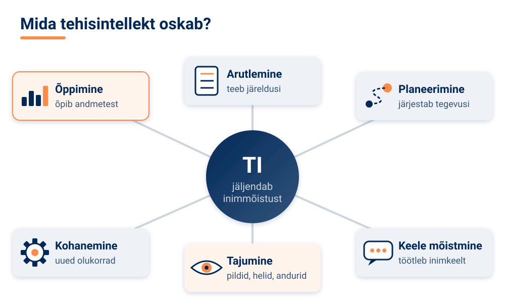

Tehisintellektil ei ole ühte ja ainsat definitsiooni. Eri ajal ja eri teadlased on seda kirjeldanud erinevalt:

| Kes | Definitsioon |
|---|---|
| John McCarthy (1956) | „Intelligentsete masinate loomise teadus ja tehnika" |
| Stuart Russell ja Peter Norvig (tuntud TI-õpiku autorid) | „Süsteemid, mis käituvad inimese moodi, mõtlevad inimese moodi, käituvad ratsionaalselt või mõtlevad ratsionaalselt" |
| Kaasaegne vaade | „Süsteemid, mis suudavad tajuda keskkonda ja tegutseda eesmärkide saavutamiseks" |

Kaasaegset vaadet on lihtne seostada näiteks robottolmuimejaga: see tajub anduritega toa mööblit ja seinu ning tegutseb selle nimel, et põrand saaks puhtaks.

<!-- class="pae-naide" -->
> **Näide: kas kalkulaator on tehisintellekt?**
>
> Kalkulaator teeb tehteid välkkiirelt ja eksimatult, kuid **ei ole** tehisintellekt. Ta täidab alati samu jäigalt ette antud samme, ei õpi midagi juurde ega kohane uue olukorraga. Ka taimer, mis lülitab seadme kindlal kellaajal välja, ei ole tehisintellekt. Seevastu kõnetuvastus, mis muudab sinu kõne tekstiks, on tehisintellekti rakendus: see on õppinud tohutust hulgast salvestistest ära tundma eri inimeste hääli, hääldust ja sõnu.

### Nõrk, tugev ja superintelligentsus

Kui filmides räägitakse tehisintellektist, mis tahab maailma üle võtta, on see hoopis teistsugune tehisintellekt kui see, mis sinu telefonis fotosid sorteerib. Selle vahe mõistmiseks jagatakse tehisintellekt tavaliselt kolmeks liigiks.

<!-- class="pae-moiste" -->
> **Mõiste: nõrk (kitsas) tehisintellekt**
>
> Nõrk ehk kitsas tehisintellekt (inglise keeles *artificial narrow intelligence*, ANI) on tehisintellekt, mis on spetsialiseerunud ühele kindlale ülesandele või kitsale ülesannete ringile. Tal ei ole teadvust ega eneseteadlikkust. **Kõik praegu kasutusel olevad tehisintellekti süsteemid on nõrk tehisintellekt.**

Nõrk tehisintellekt võib oma kitsas valdkonnas olla inimesest palju parem. Maleprogramm võidab maailmameistrit, kuid ei oska sulle võileiba teha ega isegi aru saada, mis on võileib. Teised näited on piltide tuvastamine, keeletõlge, virtuaalsed assistendid nagu Siri ja Alexa ning soovitusalgoritmid.

<!-- class="pae-moiste" -->
> **Mõiste: tugev (üldine) tehisintellekt**
>
> Tugev ehk üldine tehisintellekt (inglise keeles *artificial general intelligence*, AGI) oleks süsteem, mis suudab mõista ja lahendada mistahes intellektuaalset ülesannet, mida suudab inimene. Mõnede käsitluste järgi omaks see ka teadvust ja eneseteadlikkust. **Praegu eksisteerib tugev tehisintellekt vaid teoorias ja ulmeteostes.**

Kolmas, veelgi kaugem idee on **superintelligentsus** (inglise keeles *artificial superintelligence*, ASI) – tehisintellekt, mis ületaks inimese võimekuse kõigis valdkondades. See on tuleviku kontseptsioon, millest räägitakse peamiselt teaduslikus fantastikas ja filosoofilistes aruteludes.

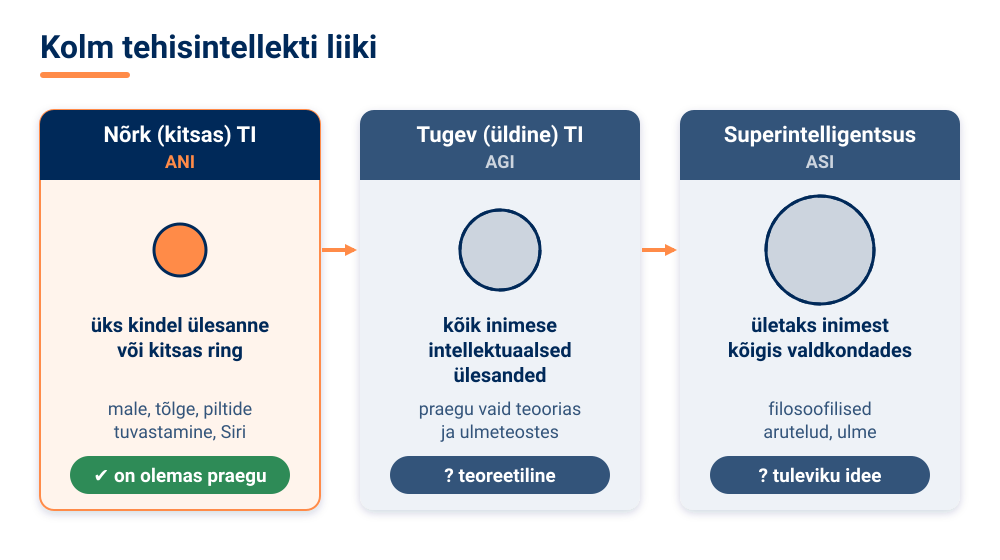

Vahel jääb mulje, et tänapäeva vestlusrobotid on juba „peaaegu inimesed", sest nad oskavad rääkida paljudel teemadel. Ka nemad on siiski nõrk tehisintellekt: nad on treenitud teksti looma, kuid neil puudub teadvus ja nad ei mõista maailma nii, nagu mõistab inimene. Kas tugevat tehisintellekti on üldse võimalik luua, selles teadlased kokku ei lepi.

<!-- class="pae-fakt" -->
> **Kas teadsid?** Kõik praegu kasutusel olevad tehisintellekti süsteemid – ka kõige nutikamad vestlusrobotid – on **nõrk tehisintellekt**. Tugev tehisintellekt eksisteerib seni vaid teoorias ja ulmeteostes.

### Tehisintellekti põhisuunad

Tehisintellekt on suur valdkond, mis jaguneb mitmeks suunaks. Igaüks neist tegeleb erinevat liiki probleemidega.

| Suund | Millega tegeleb | Näide |
|---|---|---|
| **Masinõpe** | süsteemid, mis õpivad andmetest ilma, et iga sammu oleks otse programmeeritud | rämpsposti filter |
| **Süvaõpe** | mitmekihilistel tehisnärvivõrkudel põhinev masinõpe keerukate mustrite õppimiseks | näotuvastus, vestlusrobotid |
| **Loomuliku keele töötlus** | inimkeele mõistmine ja genereerimine | masintõlge, kõnetuvastus |
| **Arvutinägemine** | piltide ja videote analüüs ehk visuaalse info mõistmine | telefoni näoga avamine |
| **Robootika** | füüsiliste süsteemide juhtimine | kullerrobotid, tööstusrobotid |
| **Ekspertsüsteemid** | teadmispõhised süsteemid, mis kasutavad inimekspertide teadmistest koostatud reegleid | varased meditsiinilise diagnostika süsteemid |

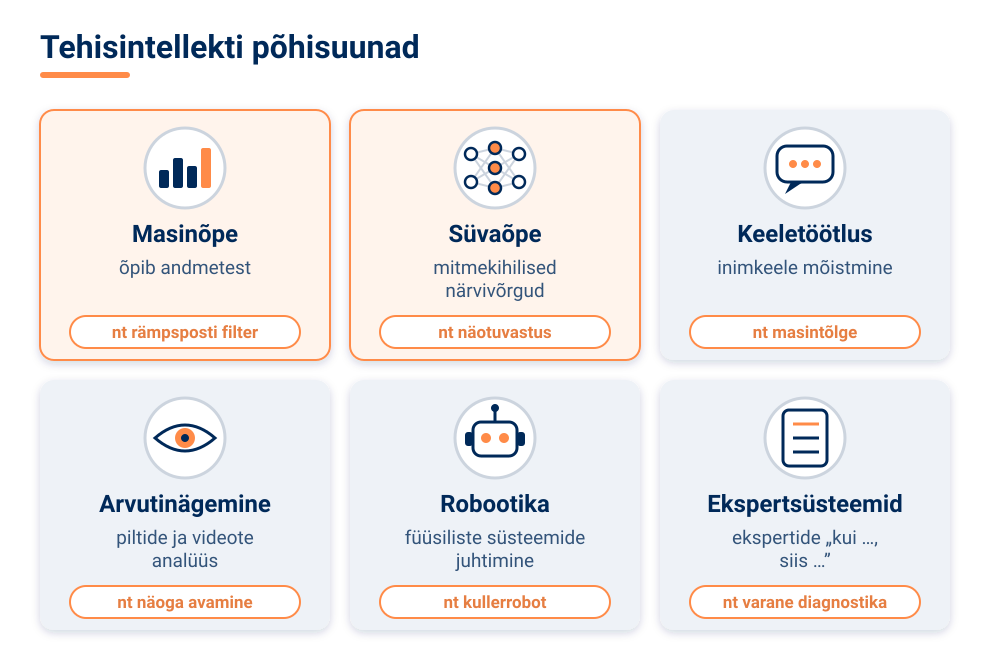

<!-- class="pae-moiste" -->
> **Mõiste: masinõpe**
>
> Masinõpe on tehisintellekti haru, kus süsteem õpib andmetest ilma otsese programmeerimiseta. Programmeerija ei kirjuta ette kõiki reegleid, vaid annab süsteemile palju näiteid ning süsteem leiab nendest ise mustrid.

<!-- class="pae-moiste" -->
> **Mõiste: süvaõpe**
>
> Süvaõpe on masinõppe alamharu, mis kasutab mitmekihilisi närvivõrke suurte andmehulkade töötlemiseks ja keerukate mustrite tuvastamiseks. Närvivõrgu ülesehitus on lõdvalt inspireeritud inimaju närvirakkude ühendustest.

Tehisintellekti ajaloos on olnud kaks suurt lähenemisviisi. **Sümboolne tehisintellekt** põhineb reeglitel ja loogikal: inimene kirjutab arvutile ette, kuidas mõelda („kui palavik on üle 38 kraadi ja kurk valutab, siis ..."). Nii töötavad ekspertsüsteemid. **Masinõpe** läheneb vastupidi: süsteemile ei anta reegleid, vaid näited, ja süsteem leiab reeglid ise. Võrdle seda kahe viisiga õppida jalgrattaga sõitma: üks on lugeda läbi juhend, teine on lihtsalt proovida ja kogemusest õppida. Rohkem kuuled neist kahest lähenemisest järgmises tunnis.

<!-- class="pae-lisaks" -->
> **Tea lisaks**
>
> Mõiste „masinõpe" ja „tehisintellekt" aetakse sageli segi. Tegelikult on masinõpe tehisintellekti osa ja süvaõpe omakorda masinõppe osa – nagu matrjoškanukud üksteise sees:
>
> 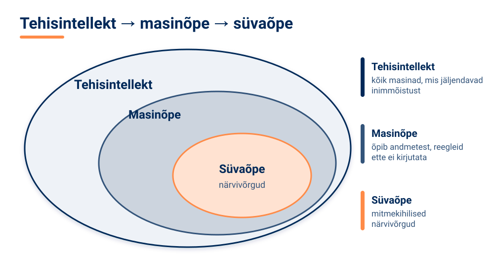

### Tehisintellekt ja inimene

Kas tehisintellekt on targem kui inimene? Sellele küsimusele ei ole ühest vastust, sest tehisintellektil ja inimesel on erinevad tugevused ja nõrkused.

| | Tehisintellekt | Inimene |
|---|---|---|
| **Tugevused** | kiire arvutamine, ei väsi, suudab töödelda tohutul hulgal andmeid, käitub järjepidevalt | loovus, empaatia, terve mõistus, kohanemisvõime |
| **Nõrkused** | konteksti mõistmine, teadvuse puudumine, raskused eetiliste otsustega | piiratud mälu, väsimine, subjektiivsus, aeglane arvutamine |

Sageli öeldakse, et tehisintellekt on „objektiivne". Seda tuleb võtta ettevaatlikult: masin ei väsi ega lase tujul end mõjutada, kuid kui tema treeningandmetes on eelarvamusi, kordab ta neid. Seda nimetatakse **kallutatuseks** (*bias*).

Tehisintellektil on ka teisi olulisi piiranguid:

- **Andmesõltuvus.** Tehisintellekt vajab õppimiseks suurt hulka kvaliteetseid andmeid. Kui andmed on vigased või ühekülgsed, on ka tulemused vigased.
- **Läbipaistvuse puudumine ehk „musta kasti" probleem.** Eriti süvaõppe mudelite puhul on raske või võimatu selgitada, miks süsteem just sellise otsuse tegi.
- **Üldistamisvõime.** Süsteemil on raske kohaneda olukordadega, mida ta treeningu ajal ei näinud.
- **Eetilised küsimused.** Kallutatus, privaatsus ja vastutus: kes vastutab, kui tehisintellekt teeb vea?
- **Loovuse ja teadvuse puudumine.** Tehisintellekt ei mõista maailma tegelikult nii, nagu mõistavad inimesed.

Lisaks tekitab tehisintellekt küsimusi **privaatsuse** (milliseid andmeid meist kogutakse ja kuidas neid kasutatakse?) ja **tööhõive** kohta (kuidas mõjutab automatiseerimine töökohti?). Nende teemadega tegeleme põhjalikumalt kuuendas plokis.

Kõige tähtsam järeldus on see, et tehisintellekt ja inimene **täiendavad teineteist**. Arst, kes kasutab röntgenpiltide analüüsimiseks tehisintellekti, saab kiiresti vihje võimalikule probleemile, kuid lõpliku otsuse teeb ikkagi tema, arvestades patsiendi kogu lugu.

<!-- class="pae-motle" -->
> **Mõtle järele!**
>
> 1. Too näide ülesandest, mida tehisintellekt teeb sinust paremini, ja ülesandest, mida sina teed paremini kui ükski tehisintellekt.
> 2. Kas sinu arvates võib tehisintellekt kunagi saavutada inimese taseme intelligentsuse? Mis peaks selleks muutuma?

### Tehisintellekt sinu ümber: lühike ülevaade

Tehisintellekt ei sündinud üleöö. Juba 1950. aastal avaldas Briti matemaatik **Alan Turing** artikli „Computing Machinery and Intelligence" ja pakkus välja **Turingi testi**: kui inimene vestleb kirjalikult nii teise inimese kui ka masinaga ega suuda vastuste põhjal öelda, kumb on kumb, võib masinat pidada intelligentseks. 1956. aastal toimus Dartmouthi konverents, kus **John McCarthy** võttis kasutusele termini „tehisintellekt". Seejärel on olnud nii suuri lootusi kui ka pettumusi. Mõned verstapostid:

- **1997** – IBM-i superarvuti Deep Blue võitis malematšis maailmameistrit Garry Kasparovit;
- **2011** – IBM Watson võitis viktoriinisaates „Jeopardy!" parimaid inimmängijaid;
- **2016** – AlphaGo võitis Go maailmameistrit Lee Sedoli;
- **2022–2023** – generatiivsete mudelite (ChatGPT, DALL-E) läbimurre.

<!-- class="pae-fakt" -->
> **Kas teadsid?** Alan Turing arutles masinate mõtlemise üle juba **1950. aastal** – ammu enne personaalarvuteid ja nutitelefone. Tema pakutud Turingi test on tänini üks tuntumaid ideid tehisintellekti ajaloos.

Täpsemalt räägime ajaloost järgmises tunnis.

Tänapäeval on tehisintellekt igal pool. **Virtuaalsed assistendid** (Siri, Alexa, Google Assistant) vastavad häälkäsklustele. **Soovitussüsteemid** (Netflix, Spotify, YouTube) pakuvad sisu, mis võiks sulle meeldida. **Keelemudelid** (ChatGPT, Claude, Gemini) kirjutavad ja selgitavad teksti, **pildigeneraatorid** (DALL-E, Midjourney, Stable Diffusion) loovad pilte. **Näotuvastust** kasutavad nutitelefonid ja turvakaamerad, **tõlkimisel** aitavad Google Translate ja DeepL, isesõitvaid autosid arendavad näiteks Tesla ja Waymo. Meditsiinis aitab tehisintellekt piltide põhjal haigusi tuvastada.

<!-- class="pae-eesti" -->
> **Eesti näide: Bürokratt ja Eesti TI-ettevõtted**
>
> Eesti riik arendab **Bürokratti** – virtuaalassistentide võrgustikku, mille abil saab avalikke teenuseid kasutada kõnekeelse suhtluse kaudu, nagu vestleksid sa ametnikuga. Bürokratt valiti 2022. aastal parimaks tehisintellektil põhinevaks riigiteenuseks ja jõudis UNESCO maailma saja parima tehisintellekti lahenduse hulka. Riigi tehisintellekti algatusi tuntakse üldnimega **kratt** (vt [kratid.ee](https://www.kratid.ee/)).
>
> Eestis sündinud ettevõtetest kasutavad tehisintellekti näiteks **Bolt** (nõudluse ennustamine ja sõitude sobitamine), **Veriff** (isikusamasuse tuvastamine dokumendi ja näopildi võrdlemise teel), **Starship Technologies** (isesõitvad kullerrobotid) ning keeleõppeäpp **Lingvist** ja matemaatikaharjutuste keskkond **99math**. Teadustööd tehakse muu hulgas Tartu Ülikoolis ja Tallinna Tehnikaülikoolis, kus arendatakse ka eesti keele tehnoloogiat ja masintõlget.

<!-- class="pae-lisaks" -->
> **Tea lisaks: kust rohkem lugeda ja vaadata?**
>
> - **Elements of AI** – tasuta veebikursus tehisintellekti põhimõistetest, olemas ka eesti keeles: [elementsofai.ee](https://www.elementsofai.ee/)
> - **Kratid.ee** – Eesti avaliku sektori tehisintellekti portaal: [kratid.ee](https://www.kratid.ee/)
> - Dokumentaalfilm **„AlphaGo – The Movie"** jutustab, kuidas tehisintellekt alistas Go maailmameistri.
> - TED-i ettekanne **„The incredible inventions of intuitive AI"** (Maurice Conti) näitab, kuidas tehisintellekt aitab disaineritel ja inseneridel.
> - Raamat **„Superintelligence: Paths, Dangers, Strategies"** (Nick Bostrom) arutleb, mis võib juhtuda, kui tehisintellekt kunagi inimest ületab.

### Mäng: tehisaru sorteerimismäng

Kas tunned ära, millal tehisaru (tehisintellekt) on mängus? Sorteeri 48 tegevust kahte rühma: **tehisaru abil toimuv tegevus** ja **tehisaru abita toimuv tegevus**. Igal kaardil on pilt, tegevuse kirjeldus ja nurgas täht või sümbol. Mäng toimub neljas voorus, igas voorus on 12 kaarti. Pärast iga vooru vajuta **Kontrolli**.

| Kategooria 1 | Kategooria 2 |
|:---:|:---:|
| 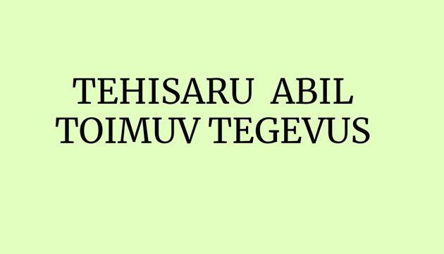<!-- style="width: 260px; border-radius: 10px;" --> | 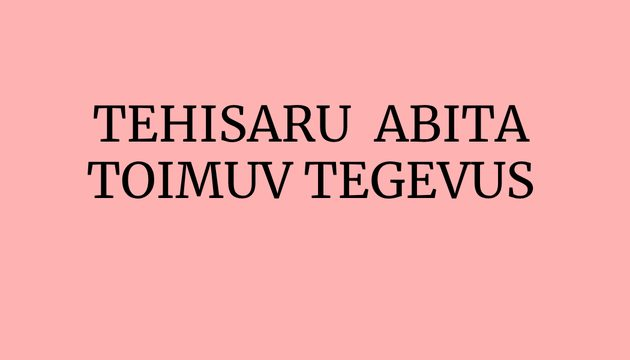<!-- style="width: 260px; border-radius: 10px;" --> |

<!-- class="pae-fakt" -->
> **Salajane sõnum!** Kui paned **tehisaru abil toimuvate** tegevuste tähed järjekorda, tekib lause. Kirjuta tähed üles, sest viimases ülesandes tuleb lause ära arvata.

<!-- class="pae-motle" -->
> **Kuidas otsustada?** Küsi endalt: kas masin **õpib andmetest, tunneb ära mustreid** (nägu, häält, pilti, keelt) või **teeb ise otsuseid ja ennustusi**? Kui tegevust teeb inimene, loom või lihtne mehhanism, mis ainult täidab ühte etteantud käsku, siis tehisaru seal ei ole.

**1. voor: kaardid 1–12**

- [ (Tehisaru abil) (Tehisaru abita) ]
- [ (X) ( ) ] **1** <!-- style="width: 320px; max-width: 100%; border-radius: 10px;" -->
- [ (X) ( ) ] **2** 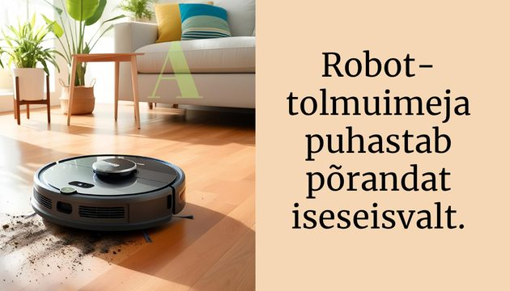<!-- style="width: 320px; max-width: 100%; border-radius: 10px;" -->
- [ ( ) (X) ] **3** <!-- style="width: 320px; max-width: 100%; border-radius: 10px;" -->
- [ (X) ( ) ] **4** 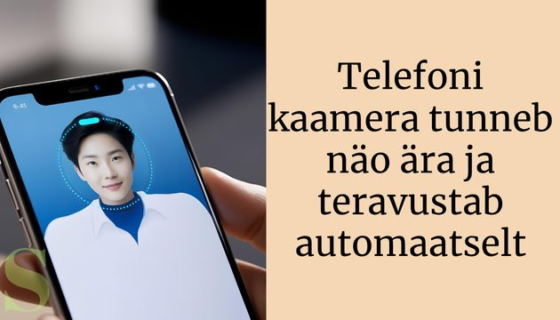<!-- style="width: 320px; max-width: 100%; border-radius: 10px;" -->
- [ ( ) (X) ] **5** 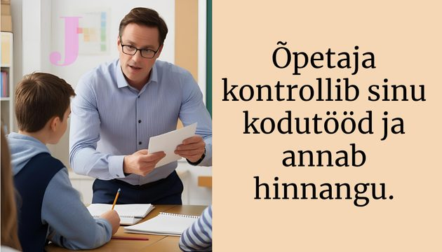<!-- style="width: 320px; max-width: 100%; border-radius: 10px;" -->
- [ (X) ( ) ] **6** <!-- style="width: 320px; max-width: 100%; border-radius: 10px;" -->
- [ ( ) (X) ] **7** <!-- style="width: 320px; max-width: 100%; border-radius: 10px;" -->
- [ (X) ( ) ] **8** 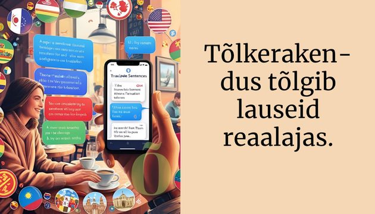<!-- style="width: 320px; max-width: 100%; border-radius: 10px;" -->
- [ ( ) (X) ] **9** <!-- style="width: 320px; max-width: 100%; border-radius: 10px;" -->
- [ (X) ( ) ] **10** 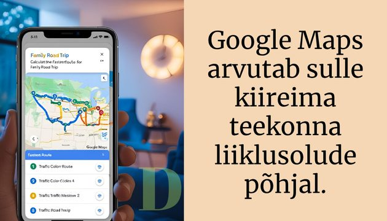<!-- style="width: 320px; max-width: 100%; border-radius: 10px;" -->
- [ ( ) (X) ] **11** <!-- style="width: 320px; max-width: 100%; border-radius: 10px;" -->
- [ (X) ( ) ] **12** <!-- style="width: 320px; max-width: 100%; border-radius: 10px;" -->
****************************************
Selle vooru tehisaru kaartide tähed: **K A S T Õ D E**

Robottolmuimeja ja Spotify tegutsevad iseseisvalt ning õpivad andmetest. Näotuvastus kaameras on arvutinägemine. Käsitsi päeviku kirjutamine, õpetaja hinnang ja kataloogist raamatu otsimine on inimese tegevused.

****************************************

**2. voor: kaardid 13–24**

- [ (Tehisaru abil) (Tehisaru abita) ]
- [ ( ) (X) ] **13** <!-- style="width: 320px; max-width: 100%; border-radius: 10px;" -->
- [ (X) ( ) ] **14** 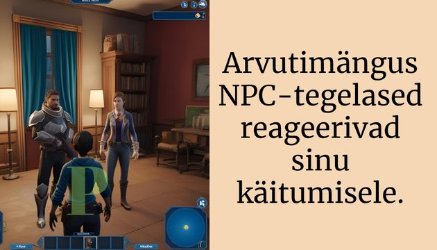<!-- style="width: 320px; max-width: 100%; border-radius: 10px;" -->
- [ ( ) (X) ] **15** <!-- style="width: 320px; max-width: 100%; border-radius: 10px;" -->
- [ (X) ( ) ] **16** <!-- style="width: 320px; max-width: 100%; border-radius: 10px;" -->
- [ ( ) (X) ] **17** 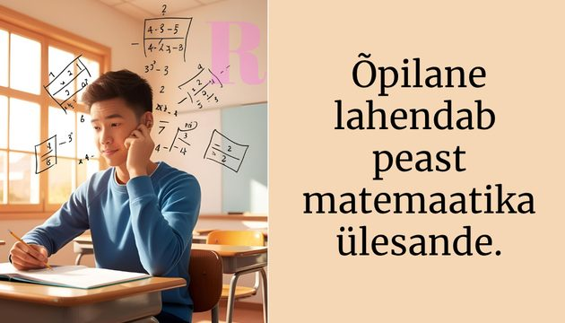<!-- style="width: 320px; max-width: 100%; border-radius: 10px;" -->
- [ (X) ( ) ] **18** 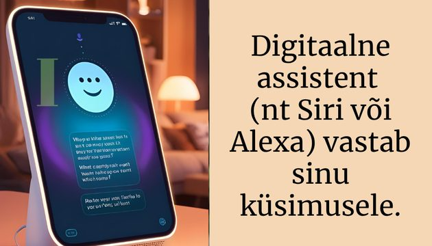<!-- style="width: 320px; max-width: 100%; border-radius: 10px;" -->
- [ ( ) (X) ] **19** <!-- style="width: 320px; max-width: 100%; border-radius: 10px;" -->
- [ (X) ( ) ] **20** <!-- style="width: 320px; max-width: 100%; border-radius: 10px;" -->
- [ ( ) (X) ] **21** 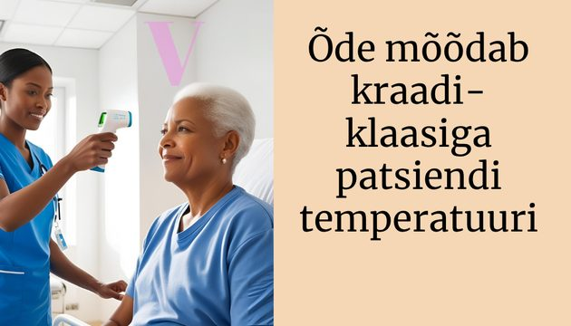<!-- style="width: 320px; max-width: 100%; border-radius: 10px;" -->
- [ (X) ( ) ] **22** <!-- style="width: 320px; max-width: 100%; border-radius: 10px;" -->
- [ ( ) (X) ] **23** 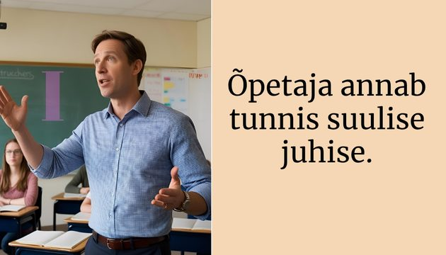<!-- style="width: 320px; max-width: 100%; border-radius: 10px;" -->
- [ (X) ( ) ] **24** 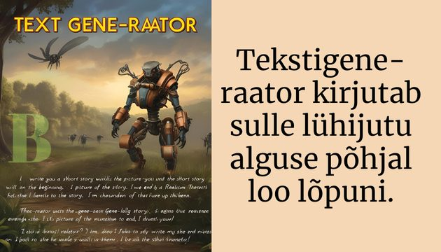<!-- style="width: 320px; max-width: 100%; border-radius: 10px;" -->
****************************************
Selle vooru tehisaru kaartide tähed: **P E I T U B**

Sõrmejäljelukk tunneb mustri ära, NPC-tegelased reageerivad sinu käitumisele ja e-pood soovitab tooteid ostuandmete põhjal. Sõbra soovitus, kassi ronimine ja peast arvutamine toimuvad ilma tehisaruta.

****************************************

**3. voor: kaardid 25–36**

- [ (Tehisaru abil) (Tehisaru abita) ]
- [ (X) ( ) ] **25** 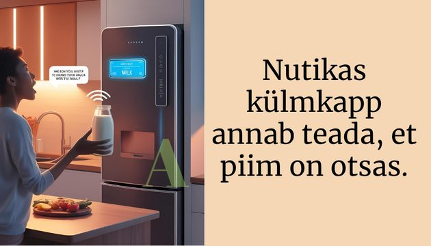<!-- style="width: 320px; max-width: 100%; border-radius: 10px;" -->
- [ ( ) (X) ] **26** 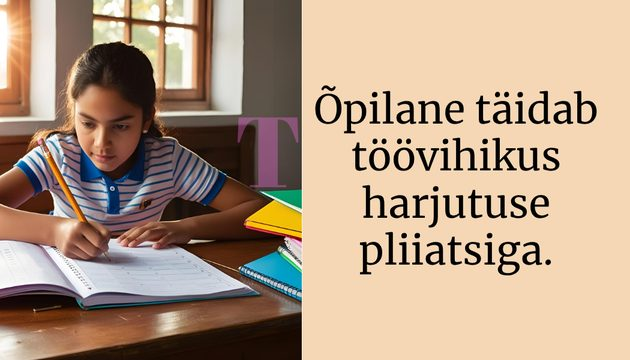<!-- style="width: 320px; max-width: 100%; border-radius: 10px;" -->
- [ (X) ( ) ] **27** <!-- style="width: 320px; max-width: 100%; border-radius: 10px;" -->
- [ ( ) (X) ] **28** <!-- style="width: 320px; max-width: 100%; border-radius: 10px;" -->
- [ (X) ( ) ] **29** <!-- style="width: 320px; max-width: 100%; border-radius: 10px;" -->
- [ ( ) (X) ] **30** <!-- style="width: 320px; max-width: 100%; border-radius: 10px;" -->
- [ (X) ( ) ] **31** 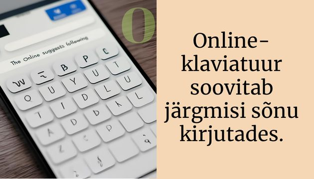<!-- style="width: 320px; max-width: 100%; border-radius: 10px;" -->
- [ ( ) (X) ] **32** <!-- style="width: 320px; max-width: 100%; border-radius: 10px;" -->
- [ (X) ( ) ] **33** <!-- style="width: 320px; max-width: 100%; border-radius: 10px;" -->
- [ ( ) (X) ] **34** <!-- style="width: 320px; max-width: 100%; border-radius: 10px;" -->
- [ (X) ( ) ] **35** 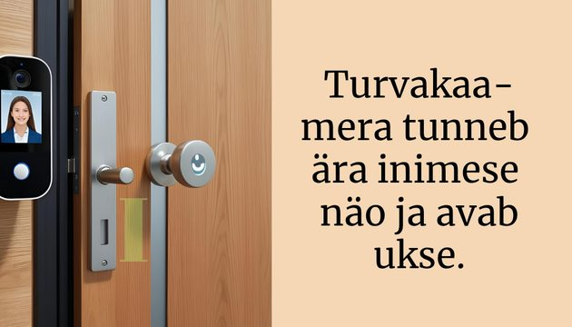<!-- style="width: 320px; max-width: 100%; border-radius: 10px;" -->
- [ ( ) (X) ] **36** <!-- style="width: 320px; max-width: 100%; border-radius: 10px;" -->
****************************************
Selle vooru tehisaru kaartide tähed: **A L G O R I**

Nutikell, fotofilter, tekstigeneraator, taimetuvastus ja isepargiv auto kasutavad tehisaru. Nutikas külmkapp on piiripealne näide: kui see ainult mõõdab, on tegu anduriga, aga kui see tunneb kaameraga tooteid ära, kasutab see tehisaru.

****************************************

**4. voor: kaardid 37–48**

- [ (Tehisaru abil) (Tehisaru abita) ]
- [ (X) ( ) ] **37** 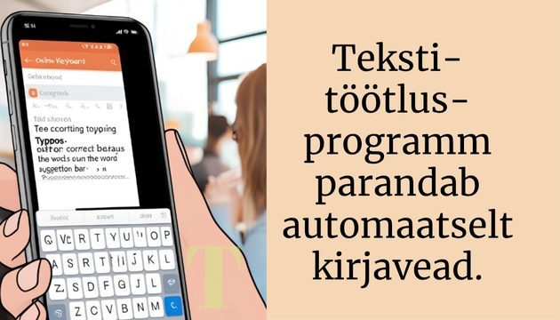<!-- style="width: 320px; max-width: 100%; border-radius: 10px;" -->
- [ ( ) (X) ] **38** 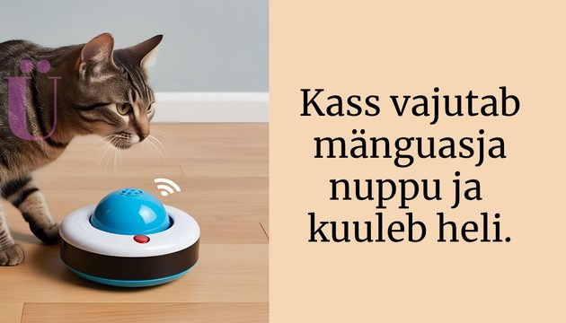<!-- style="width: 320px; max-width: 100%; border-radius: 10px;" -->
- [ (X) ( ) ] **39** 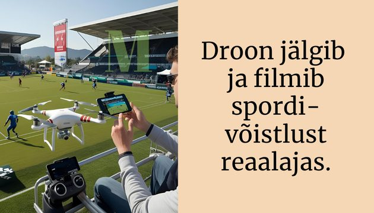<!-- style="width: 320px; max-width: 100%; border-radius: 10px;" -->
- [ ( ) (X) ] **40** 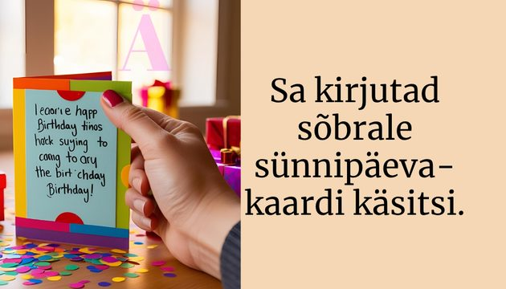<!-- style="width: 320px; max-width: 100%; border-radius: 10px;" -->
- [ (X) ( ) ] **41** 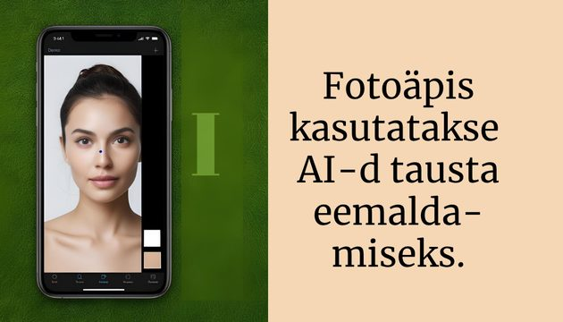<!-- style="width: 320px; max-width: 100%; border-radius: 10px;" -->
- [ ( ) (X) ] **42** 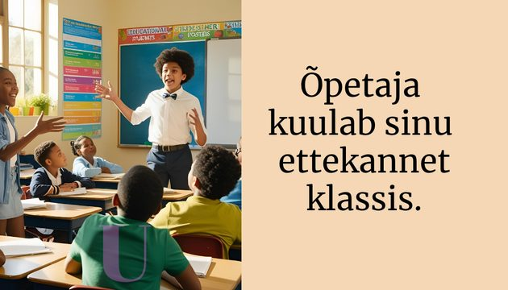<!-- style="width: 320px; max-width: 100%; border-radius: 10px;" -->
- [ (X) ( ) ] **43** <!-- style="width: 320px; max-width: 100%; border-radius: 10px;" -->
- [ ( ) (X) ] **44** 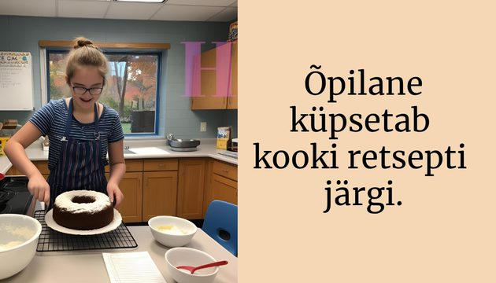<!-- style="width: 320px; max-width: 100%; border-radius: 10px;" -->
- [ (X) ( ) ] **45** 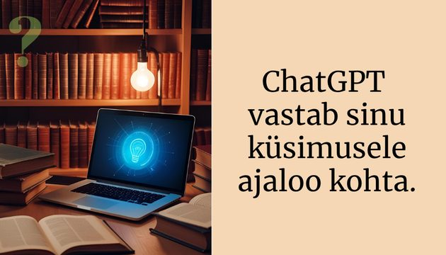<!-- style="width: 320px; max-width: 100%; border-radius: 10px;" -->
- [ ( ) (X) ] **46** 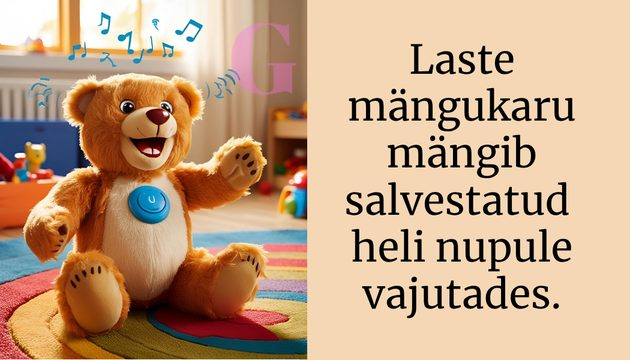<!-- style="width: 320px; max-width: 100%; border-radius: 10px;" -->
- [ (X) ( ) ] **47** 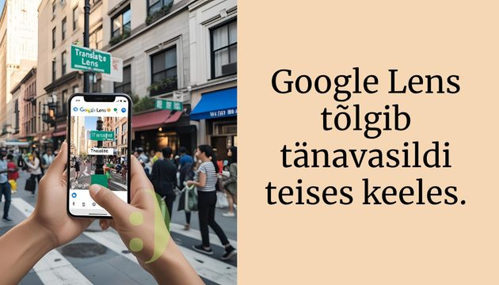<!-- style="width: 320px; max-width: 100%; border-radius: 10px;" -->
- [ ( ) (X) ] **48** 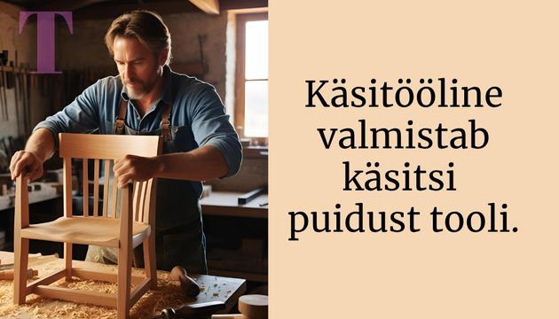<!-- style="width: 320px; max-width: 100%; border-radius: 10px;" -->
****************************************
Selle vooru tehisaru kaartide tähed: **T M I S ? :)**

Klaviatuuri sõnasoovitused, automaatne kirjavigade parandus, droon, tausta eemaldamine, muusika loomine tuju järgi, ChatGPT ja Google Lens kasutavad tehisaru. Salvestatud heli mängiv mängukaru ja nupule vajutav kass mitte: mänguasi ainult esitab salvestust.

****************************************

**Salalause.** Kirjuta tehisaru abil toimuvate kaartide tähtedest moodustuv lause.

[[Kas tõde peitub algoritmis?]]
[[?]] Vihje: vaata peatükki „Nõrk, tugev ja superintelligentsus". Tugev ja superintelligentsus on alles teoorias.

****************************************
Õige! Salalause on **„Kas tõde peitub algoritmis? :)“**
****************************************

<!-- class="pae-jaotis" -->
**Arutle**

**Kas tõde peitub algoritmis? Mida see küsimus sinu arvates tähendab? Kas tehisaru vastus on alati tõene?**

[[___ ___ ___]]

Vaata, millele vastuses mõelda

Algoritm ei tea „tõde“. See leiab andmetest mustreid ja teeb tõenäosuslikke ennustusi. Tehisaru võib eksida (näiteks ChatGPT võib hallutsineerida) ja andmetes olev kallutatus võib jõuda ka tema vastustesse. Seepärast tuleb tehisaru vastuseid kriitiliselt kontrollida ja otsustada ise.

**Millise kaardi sorteerimine oli kõige raskem? Miks? Too üks piiripealne näide (nt nutikas külmkapp, sõrmejäljelukk).**

[[___ ___ ___]]

### Kokkuvõte ja põhimõisted

**Pea meeles**

- Tehisintellekt on arvutiteaduse haru, mis loob süsteeme, mis jäljendavad inimmõistuse funktsioone: õpivad, arutlevad, mõistavad keelt ja tunnevad ära mustreid.
- Tehisintellektil ei ole ühte definitsiooni; kaasaegne vaade rõhutab keskkonna tajumist ja eesmärgipärast tegutsemist.
- Kõik praegused tehisintellekti süsteemid, ka vestlusrobotid, on nõrk (kitsas) tehisintellekt. Tugev tehisintellekt ja superintelligentsus on praegu teoreetilised.
- Tehisintellekti põhisuunad on masinõpe, süvaõpe, loomuliku keele töötlus, arvutinägemine, robootika ja ekspertsüsteemid.
- Tehisintellektil on piirangud: andmesõltuvus, „musta kasti" probleem, raskused uute olukordadega ja eetilised küsimused.
- Tehisintellekt ja inimene täiendavad teineteist – eesmärk on koostöö, mitte konkurents.

| Mõiste | Tähendus |
|---|---|
| tehisintellekt (TI) | arvutiteaduse haru, mis loob inimmõistuse funktsioone jäljendavaid süsteeme |
| nõrk (kitsas) TI, ANI | ühele kindlale ülesandele spetsialiseerunud tehisintellekt; kõik praegused süsteemid |
| tugev (üldine) TI, AGI | teoreetiline tehisintellekt, mis suudaks lahendada mistahes inimese intellektuaalset ülesannet |
| superintelligentsus, ASI | tuleviku idee tehisintellektist, mis ületab inimest kõigis valdkondades |
| masinõpe | tehisintellekti haru, kus süsteem õpib andmetest ilma otsese programmeerimiseta |
| süvaõpe | masinõppe alamharu, mis kasutab mitmekihilisi närvivõrke |
| loomuliku keele töötlus | inimkeele mõistmise ja genereerimisega tegelev tehisintellekti suund |
| arvutinägemine | piltide ja videote analüüsimisega tegelev tehisintellekti suund |
| ekspertsüsteem | teadmispõhine süsteem, mis kasutab inimekspertide teadmistest koostatud reegleid |
| Turingi test | Alan Turingi pakutud katse: kas inimene suudab vestluse põhjal eristada masinat inimesest |
| „musta kasti" probleem | olukord, kus tehisintellekti otsuse tegemise viis ei ole inimesele mõistetav |

### Tööleht 1.1

<!-- class="pae-jaotis" -->
**I. Mõisted ja definitsioonid**

**Ülesanne 1.** Selgita oma sõnadega, mis on tehisintellekt.

[[___ ___ ___]]

**Ülesanne 2.** Ühenda mõisted nende definitsioonidega.

| Täht | Kirjeldus |
|:---:|---|
| **A** | Tehisintellekti valdkond, mis tegeleb inimkeele mõistmise ja genereerimisega |
| **B** | Tehisintellekti võime mõista visuaalset informatsiooni |
| **C** | Tehisintellekti süsteemid, mis suudavad õppida andmetest ilma otsese programmeerimiseta |
| **D** | Masinõppe meetod, mis kasutab mitmekihilisi närvivõrke keerukate mustrite õppimiseks |

- [ (A) (B) (C) (D) ]
- [ ( ) ( ) (X) ( ) ] Masinõpe
- [ ( ) ( ) ( ) (X) ] Süvaõpe
- [ (X) ( ) ( ) ( ) ] Loomuliku keele töötlus
- [ ( ) (X) ( ) ( ) ] Arvutinägemine
****************************************
Masinõpe = õppimine andmetest ilma otsese programmeerimiseta (C); süvaõpe = mitmekihilised närvivõrgud (D); loomuliku keele töötlus = inimkeele mõistmine ja genereerimine (A); arvutinägemine = visuaalse info mõistmine (B).
****************************************

**Ülesanne 3.** Märgi, millised järgnevatest on tehisintellekti näited ja millised mitte.

- [ (On TI) (Ei ole TI) ]
- [ ( ) (X) ] Kalkulaator, mis lahendab matemaatilisi tehteid
- [ (X) ( ) ] Isesõitev auto
- [ (X) ( ) ] Näotuvastussüsteem nutitelefonis
- [ ( ) (X) ] Taimer, mis lülitab seadme kindlal ajal välja
- [ (X) ( ) ] Kõnetuvastussüsteem, mis muudab kõne tekstiks
- [ ( ) (X) ] Programm, mis järgib rangelt etteantud reegleid
****************************************
Isesõitev auto, näotuvastus ja kõnetuvastus õpivad andmetest ning tulevad toime muutuvate olukordadega. Kalkulaator, taimer ja lihtne reeglite järgi töötav programm täidavad alati samu jäiku samme ega õpi midagi juurde. (Ajaloos on küll olnud reeglipõhiseid ekspertsüsteeme, mida peeti tehisintellektiks, kuid lihtne etteantud reeglite täitmine üksi ei tee programmist tehisintellekti.)
****************************************

<!-- class="pae-jaotis" -->
**II. Tehisintellekti ajalugu**

**Ülesanne 4.** Järjesta tehisintellekti arengu olulised sündmused kronoloogiliselt (1 – kõige varasem, 6 – kõige hilisem).

Süvaõppe revolutsioon ja AlexNeti võit ImageNeti võistlusel: [[ 1 | 2 | 3 | 4 | (5) | 6 ]]  
Alan Turing avaldab artikli „Computing Machinery and Intelligence": [[ (1) | 2 | 3 | 4 | 5 | 6 ]]  
IBM Deep Blue võidab maletšempion Garry Kasparovit: [[ 1 | 2 | 3 | (4) | 5 | 6 ]]  
Esimene tehisintellekti konverents Dartmouthi kolledžis: [[ 1 | (2) | 3 | 4 | 5 | 6 ]]  
Tehisintellekti „talv" vähese rahastuse ja huvi tõttu: [[ 1 | 2 | (3) | 4 | 5 | 6 ]]  
Suurte keelemudelite (GPT, BERT) areng: [[ 1 | 2 | 3 | 4 | 5 | (6) ]]

**Ülesanne 5.** Selgita lühidalt, miks on Turingi test tehisintellekti ajaloos oluline.

[[___ ___ ___]]

<!-- class="pae-jaotis" -->
**III. Tehisintellekti tüübid**

**Ülesanne 6.** Täida tabel tehisintellekti tüüpide kohta.

| Tehisintellekti tüüp | Kirjeldus | Näide |
|---|---|---|
| Nõrk tehisintellekt (ANI) | | |
| Tugev tehisintellekt (AGI) | | |
| Superintelligentsus (ASI) | | |

**Nõrk tehisintellekt (ANI) – kirjeldus ja näide:**

[[___ ___]]

**Tugev tehisintellekt (AGI) – kirjeldus ja näide:**

[[___ ___]]

**Superintelligentsus (ASI) – kirjeldus ja näide:**

[[___ ___]]

**Ülesanne 7.** Võrdle sümboolset tehisintellekti ja masinõpet.

**Sümboolne tehisintellekt:**

[[___ ___]]

**Masinõpe:**

[[___ ___]]

<!-- class="pae-jaotis" -->
**IV. Tehisintellekti rakendused**

**Ülesanne 8.** Nimeta igast valdkonnast vähemalt kolm tehisintellekti rakendust.

**Meditsiin:**

[[___ ___]]

**Transport:**

[[___ ___]]

**Haridus:**

[[___ ___]]

**Ülesanne 9.** Vali üks tehisintellekti rakendus ja kirjelda, kuidas see toimib.

[[___ ___ ___ ___]]

<!-- class="pae-jaotis" -->
**V. Praktiline ülesanne**

**Ülesanne 10.** Külasta veebilehte [teachablemachine.withgoogle.com](https://teachablemachine.withgoogle.com) ja loo lihtne pildituvastuse mudel (näiteks õpeta mudel eristama kahte eset, mida veebikaamerale näitad). Seejärel kirjelda oma kogemust.

a) Mida õpetasid oma mudelile tuvastama?

[[___ ___]]

b) Kui hästi mudel töötas?

[[___ ___]]

c) Millised probleemid tekkisid?

[[___ ___]]

d) Mida õppisid selle ülesande käigus tehisintellekti kohta?

[[___ ___ ___]]

<!-- class="pae-jaotis" -->
**VI. Arutelu**

**Ülesanne 11.** Kuidas võib tehisintellekt muuta sinu tulevast karjääri või igapäevaelu?

[[___ ___ ___ ___]]

**Ülesanne 12.** Millised on sinu arvates tehisintellekti suurimad võimalused ja ohud?

**Võimalused:**

[[___ ___ ___]]

**Ohud:**

[[___ ___ ___]]

### Enesekontroll 1.1

**1. Mis on tehisintellekt?**

- [( )] Arvutiprogramm, mis suudab mõelda täpselt nagu inimene
- [(X)] Tehnoloogia, mis võimaldab masinatel jäljendada inimese intelligentset käitumist
- [( )] Robot, mis näeb välja nagu inimene
- [( )] Arvutisüsteem, mis on teadlik iseendast
****************************************
Tehisintellekt on tehnoloogia, mis võimaldab masinatel jäljendada inimese intelligentset käitumist. See ei tähenda, et masinad mõtleksid täpselt nagu inimesed või oleksid teadlikud iseendast.
****************************************

**2. Alan Turing pakkus 1950. aastal välja katse: kui inimene vestleb kirjalikult nii inimese kui ka masinaga ega suuda neid eristada, võib masinat pidada intelligentseks. Kuidas seda katset nimetatakse? Kirjuta vastus.**

[[Turingi test]]

****************************************
Õige vastus: **Turingi test**. See on tänini üks tuntumaid ideid tehisintellekti ajaloos – Turing arutles masinate mõtlemise üle juba ammu enne personaalarvuteid ja nutitelefone.
****************************************

**3. Lohista mõisted õigetesse lünkadesse.**

<!-- data-show-partial-solution -->
Süvaõpe on [->[ (masinõppe) | robootika ]] osa ja masinõpe on omakorda [->[ (tehisintellekti) ]] osa – nagu matrjoškanukud üksteise sees. Süvaõpe kasutab mitmekihilisi [->[ (närvivõrke) | ekspertsüsteeme ]].
****************************************
Kõige suurem „nukk” on tehisintellekt, selle sees on masinõpe ja kõige sisemine on süvaõpe. Süvaõpe põhineb mitmekihilistel tehisnärvivõrkudel. Ekspertsüsteemid kasutavad hoopis inimeste kirja pandud reegleid ja robootika tegeleb füüsiliste seadmete juhtimisega.
****************************************

**4. Liigita näited tehisintellekti liigi järgi.**

<!-- data-show-partial-solution -->
- [ (Nõrk TI) (Tugev TI) (Superintelligentsus) ]
- [ (X) ( ) ( ) ] Maleprogramm, mis võidab maailmameistrit, kuid ei oska midagi muud
- [ (X) ( ) ( ) ] Vestlusrobot, mis oskab rääkida paljudel teemadel
- [ ( ) (X) ( ) ] Süsteem, mis suudaks lahendada mistahes intellektuaalset ülesannet nagu inimene
- [ ( ) ( ) (X) ] Süsteem, mis ületaks inimese võimekuse kõigis valdkondades
****************************************
Maleprogramm ja vestlusrobot on nõrk tehisintellekt – ka vestlusrobot on treenitud ainult teksti looma ega mõista maailma nagu inimene. Tugev (üldine) tehisintellekt ja superintelligentsus on praegu vaid teoreetilised.
****************************************

**5. Seosta tehisintellekti suund näitega.**

<!-- data-show-partial-solution -->
- [ (Masinõpe) (Arvutinägemine) (Keeletöötlus) (Robootika) ]
- [ (X) ( ) ( ) ( ) ] Rämpsposti filter, mis õpib näidetest ise mustrid
- [ ( ) (X) ( ) ( ) ] Telefoni avamine näo järgi
- [ ( ) ( ) (X) ( ) ] Masintõlge inglise keelest eesti keelde
- [ ( ) ( ) ( ) (X) ] Starshipi kullerrobot, mis liigub kõnniteel
****************************************
Rämpsposti filter õpib andmetest (masinõpe), näotuvastus analüüsib pilti (arvutinägemine), masintõlge töötleb inimkeelt (loomuliku keele töötlus) ja kullerrobot juhib füüsilist seadet (robootika – kuigi ka see kasutab navigeerimiseks arvutinägemist).
****************************************

**6. Vali rippmenüüst, kumma tugevusega on tegu.**

<!-- data-show-partial-solution -->
Kiire arvutamine ja tohutu andmehulga töötlemine on [[ (tehisintellekti) | inimese ]] tugevus. Empaatia ja terve mõistus on [[ tehisintellekti | (inimese) ]] tugevus. Väsimine ja piiratud mälu on [[ tehisintellekti | (inimese) ]] nõrkus. Konteksti mõistmine ja eetilised otsused valmistavad raskusi [[ (tehisintellektile) | inimesele ]].
****************************************
Tehisintellekt arvutab kiiresti, ei väsi ja töötleb palju andmeid. Inimese tugevused on loovus, empaatia, terve mõistus ja kohanemisvõime. Seepärast täiendavad tehisintellekt ja inimene teineteist.
****************************************

**7. Millised on tehisintellekti piirangud? (Vali kõik õiged.)**

- [[X]] Vajab õppimiseks suurt hulka kvaliteetseid andmeid
- [[X]] Tema otsuseid on sageli raske selgitada („musta kasti” probleem)
- [[ ]] Ei suuda kunagi teha arvutusi kiiremini kui inimene
- [[X]] Tal on raskusi olukordadega, mida ta treeningu ajal ei näinud
- [[ ]] Väsib pika töö järel
****************************************
Andmesõltuvus, läbipaistvuse puudumine ja nõrk üldistamisvõime on tehisintellekti olulised piirangud. Arvutamine ja väsimatus on seevastu tehisintellekti tugevused.
****************************************

**8. Selgita oma sõnadega, miks kalkulaator ei ole tehisintellekt, aga kõnetuvastus on.**

[[___ ___ ___]]

Vaata näidisvastust

Kalkulaator täidab alati samu jäigalt ette antud samme: ta ei õpi midagi juurde ega kohane uue olukorraga. Kõnetuvastus on õppinud suurest hulgast salvestistest ära tundma eri inimeste hääli, hääldust ja sõnu ning tuleb toime ka uute kõnelejatega. Tehisintellektiks teebki süsteemi just võime õppida andmetest ja jäljendada inimese tunnetuslikke võimeid.

### 🔐 Lukk 1.1

<!-- class="pae-naide" -->
> **Kratt:** „Ma olen vist kõige targem olend maailmas! Ma oskan… ee… ühte asja. Väga hästi. Aga võileiba teha ma küll ei oska."

Lukk avaneb, kui lahendad mõistatuse. Loe Krati kirjeldust ja kirjuta lahtrisse, mis liiki tehisintellekt ta on (üks sõna).

> Olen maletšempionist osavam, tõlgin teksti ja tunnen näo ära – aga igaüks meist oskab ainult oma kitsast ülesannet. Mul pole teadvust ega eneseteadlikkust. Kõik tänapäeva tehisintellekti süsteemid, ka vestlusrobotid, kuuluvad minu liiki. **Milline tehisintellekt ma olen?**

[[nõrk]]

****************************************
✅ **Lukk avatud!** Kratt on **nõrk (kitsas) tehisintellekt** – nagu kõik praegused TI-süsteemid: ta võib ühes asjas olla inimesest parem, kuid ei mõista maailma tervikuna.

🔑 **Sinu võtmetäht: A**

Kirjuta täht üles – seda on vaja toa ukse avamiseks.
****************************************

## 1.2 Tehisintellekti ajalugu

### Õpieesmärgid

<!-- class="pae-kaas" -->
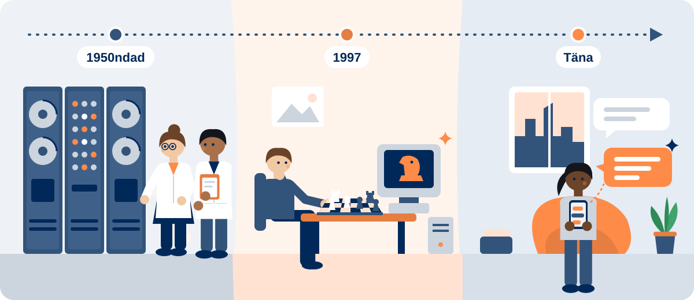

Selle tunni järel sa:

- tunned tehisintellekti ajaloo olulisemaid verstaposte ja nendega seotud inimesi;
- oskad kirjeldada tehisintellekti arengu kolme revolutsiooni: sümboolne TI, masinõpe ja generatiivne TI;
- mõistad, mida tähendavad tehisintellekti „talved“ ja „kevaded“ ning miks need tekkisid;
- oskad selgitada, millised tegurid võimaldasid tehisintellekti kiire arengu 2010. aastatel;
- oskad analüüsida tehisintellekti arengu mõju ühiskonnale, sh Eestis.

### Juured: unistus mõtlevast masinast

Tehisintellekti ajalugu ulatub kaugemale kui arvutid ise. See on teekond filosoofilistest ideedest tänapäeva keerukate süsteemideni. Juba ammu enne esimest arvutit küsisid inimesed: mis on mõtlemine ja kas seda saaks kuidagi reeglitesse panna?

Tehisintellekt kasvas välja neljast valdkonnast:

- **filosoofia** küsis, mis on mõtlemine, teadvus ja intelligentsus (Aristoteles, Descartes, Leibniz);
- **matemaatika** andis loogika, algoritmid ja tõenäosusteooria (Boole, Frege, Russell);
- **psühholoogia** uuris inimese mõtlemisprotsesse (geštaltpsühholoogia, kognitiivne psühholoogia);
- **arvutiteadus** lõi arvutusliku võimekuse (Charles Babbage ja Ada Lovelace 19. sajandil).

Antiik-Kreekas kirjeldas **Aristoteles** loogikat kui formaalse arutluse alust. 17.–18. sajandil unistas **Leibniz** universaalsest arvutuskeelest, millega saaks iga vaidluse lahendada arvutades. 19. sajandil lõi **George Boole** matemaatilise loogika, millel põhinevad tänapäeva arvutid (tõene/väär, 1/0). 1936. aastal kirjeldas **Alan Turing** „arvutatavuse“ kontseptsiooni ja kujuteldava universaalse arvutusmasina, mida nimetatakse Turingi masinaks. 1943. aastal lõid **Warren McCulloch ja Walter Pitts** esimese tehisneuroni ehk tehisnärvivõrgu matemaatilise mudeli. 1948. aastal pani **Norbert Wiener** aluse küberneetikale – teadusele juhtimisest ja tagasisidest nii masinates kui ka elusolendites.

Tehisintellekti tänapäevast ajalugu võib jagada kolmeks suureks revolutsiooniks, millest igaüks on muutnud tehisintellekti võimsamaks ja kättesaadavamaks:

### Esimene revolutsioon: sümboolne tehisintellekt (1950–1980)

**1950. aastal** avaldas Alan Turing artikli „Computing Machinery and Intelligence“ ja pakkus välja masina intelligentsuse hindamise meetodi.

<!-- class="pae-moiste" -->
> **Mõiste: Turingi test**
>
> Turingi test on Alan Turingi pakutud katse, mis kontrollib, kas masin suudab jäljendada inimese mõtlemist nii hästi, et inimene ei suuda eristada, kas ta suhtleb inimese või masinaga. Küsitleja esitab kirjalikke küsimusi nii inimesele kui ka arvutile. Kui küsitleja ei suuda vastuste põhjal öelda, kumb on kumb, on masin testi läbinud.

1951. aastal ehitasid **Marvin Minsky** ja Dean Edmonds esimese närvivõrgul põhineva arvuti **SNARC**. **1956. aastal** toimus USA-s Dartmouthi kolledžis konverents, kus kohtusid John McCarthy, Marvin Minsky, Claude Shannon, Allen Newell jt. Seal võttis **John McCarthy** kasutusele termini „tehisintellekt“. Seda aastat peetakse tehisintellekti kui teadusvaldkonna sünniaastaks.

<!-- class="pae-fakt" -->
> **Kas teadsid?** Sõna „tehisintellekt“ sündis **1956. aastal** Dartmouthi konverentsil – see tähendab, et tehisintellekt on teadusvaldkonnana juba üle 70 aasta vana!

Järgnes **esimene kuldajastu (1956–1974)**, mida iseloomustasid optimism ja suured lubadused. Allen Newell ja Herbert Simon lõid programmid **Logic Theorist** (1956), mis tõestas matemaatilisi teoreeme, ja **General Problem Solver** (1957), üldise probleemilahendaja. 1958. aastal lõi McCarthy programmeerimiskeele **LISP**; hiljem lisandus loogikaprogrammeerimise keel PROLOG. 1961. aastal hakkas General Motorsi tehases tööle esimene tööstusrobot **Unimate**. Joseph Weizenbaum lõi aastatel 1964–1966 vestlusprogrammi **ELIZA**, mis matkis psühhoterapeudiga vestlust, ja 1970. aastal näitas programm **SHRDLU**, et arvuti suudab lihtsas klotsimaailmas mõista loomuliku keele käske. Arendati ka masintõlget, masinnägemist ja roboteid. Uuringuid rahastasid suurel määral valitsusasutused, näiteks USA kaitseuuringute agentuur DARPA.

Sümboolse tehisintellekti põhiidee oli, et intelligentsust saab kirjeldada **sümbolite ja reeglite** abil. Kõige edukamaks näiteks said **ekspertsüsteemid**.

<!-- class="pae-moiste" -->
> **Mõiste: ekspertsüsteem**
>
> Ekspertsüsteem on teadmispõhine tehisintellekti süsteem, mis püüab jäljendada inimeksperdi otsustusvõimet. Selle südames on teadmusbaas – suur hulk ekspertidelt kogutud „kui ..., siis ...“ tüüpi reegleid.

Esimene ekspertsüsteem **DENDRAL** (alates 1965) analüüsis keemilisi aineid, **MYCIN** (1970. aastad) aitas arstidel diagnoosida bakteriaalseid nakkusi ja soovitada ravi.

Peagi selgus aga, et ootused olid liiga suured. Arvutid olid aeglased, algoritmid lihtsad ja andmeid vähe. Keerukate probleemide, näiteks masintõlke, raskust oli alahinnatud. 1973. aastal kritiseeris Suurbritannias avaldatud **Lighthilli raport** tehisintellekti uuringuid teravalt ning rahastamine vähenes järsult. Algas **esimene tehisintellekti talv (1974–1980)**: uurimistöö aeglustus, avalik huvi vähenes ja teadlased keskendusid kitsamatele probleemidele.

<!-- class="pae-moiste" -->
> **Mõiste: tehisintellekti „talv“ ja „kevad“**
>
> Tehisintellekti **talv** on periood, mil tehisintellekti arendamine aeglustub, sest rahastus ja huvi vähenevad – tavaliselt pärast seda, kui liiga suured lubadused ei täitu. **Kevadeks** nimetatakse perioodi, mil uued läbimurded toovad tagasi huvi ja raha.

1980. aastatel tulid ekspertsüsteemid uuesti esile, seekord **äris**. Näiteks **XCON** aitas konfigureerida arvuteid, teised süsteemid aitasid finantsplaneerimisel ja tootmise optimeerimisel. 1981. aastal käivitas Jaapan suure **„viienda põlvkonna“ arvutiprojekti**. Kuid ekspertsüsteemidel olid tõsised puudused: nende hooldus oli keeruline ja kallis, sest iga uus olukord nõudis uusi käsitsi kirjutatud reegleid; nad ei kohanenud muutustega ja neid oli raske laiendada. Spetsialiseeritud tehisintellekti riistvara ebaõnnestus ja personaalarvutite tõus muutis kallid suured süsteemid ebaoluliseks. Algas **teine tehisintellekti talv (1987–1993)**: ettevõtteid suleti, rahastus vähenes ja paljud teadlased vältisid isegi sõna „tehisintellekt“.

### Teine revolutsioon: masinõpe (1980–2010)

Teise revolutsiooni põhiidee oli lihtne, kuid murranguline: selle asemel et masinale reegleid ette kirjutada, **las masin õpib ise andmetest**.

<!-- class="pae-naide" -->
> **Näide: kaks viisi rämpsposti tuvastada**
>
> **Sümboolne lähenemine:** programmeerija kirjutab reeglid – „kui kirjas on sõna „VÕIDA“ ja palju hüüumärke, siis on see rämpspost". Petturid muudavad sõnastust ja reeglid jäävad hätta.
>
> **Masinõppe lähenemine:** süsteemile näidatakse tuhandeid kirju, mis on märgitud kas rämpspostiks või tavaliseks kirjaks. Süsteem leiab ise mustrid ja tunneb ära ka uued rämpskirjad, mille sõnastust keegi ette ei kirjutanud.

1986. aastal sai laiemalt tuntuks närvivõrkude treenimise **tagasilevi algoritm** (*backpropagation*), mis tõi kaasa närvivõrkude taassünni. 1990. aastatel andsid statistilised masinõppe meetodid – **tugivektormasinad, otsustuspuud, Bayesi võrgud** ja **geneetilised algoritmid** – praktilisi tulemusi kõnetuvastuses, tekstianalüüsis ja soovitussüsteemides.

**1997. aastal** võitis IBM-i superarvuti **Deep Blue** malematšis maailmameistrit **Garry Kasparovit** (3,5 : 2,5). Deep Blue ei õppinud nagu tänapäeva süsteemid, vaid arvutas läbi tohutul hulgal käike – see oli arvutusvõimsuse ja nutikate algoritmide kombinatsioon.

2000. aastatel tõi internet kaasa andmete plahvatusliku kasvu. Suured andmehulgad võimaldasid treenida võimsamaid mudeleid. 2004–2010 arenesid robotid (DARPA Grand Challenge'i isesõitvate autode võistlused, iRoboti robottolmuimejad). 2006. aastal populariseeris **Geoffrey Hinton** süvaõppe meetodeid. **2011. aastal** võitis IBM **Watson** telemängus „Jeopardy!“ parimaid inimmängijaid, näidates loomuliku keele mõistmist ja teadmiste töötlemist.

### Kolmas revolutsioon: süvaõpe ja generatiivne tehisintellekt (2010–…)

**2012. aastal** võitis Alex Krizhevsky loodud konvolutsiooniline närvivõrk **AlexNet** pildituvastuse võistluse ImageNet märgatavalt väiksema veamääraga kui teised lähenemised. Seda peetakse **süvaõppe revolutsiooni** alguseks. 2013. aastal tutvustatud **Word2Vec** õpetas arvuteid esitama sõnu arvuvektoritena, nii et sarnase tähendusega sõnad on üksteise lähedal. 2014. aastal ostis Google Briti ettevõtte DeepMind.

**2016. aastal** võitis DeepMindi **AlphaGo** Go maailmameistrit **Lee Sedoli** 4 : 1. Go'd peeti tehisintellekti jaoks liiga keeruliseks, sest võimalikke seise on astronoomiliselt palju. 2017. aastal õppis **AlphaZero** iseseisvalt mängima malet, Go'd ja shōgi'd ning saavutas üliinimliku taseme ilma inimeste mängude näideteta.

<!-- class="pae-naide" -->
> **Näide: strateegiamängud kui tehisintellekti mõõdupuu**
>
> | Aasta | Süsteem | Saavutus |
> |---|---|---|
> | 1997 | Deep Blue | võitis male maailmameistrit Garry Kasparovit |
> | 2011 | Watson | võitis „Jeopardy!“ meistreid |
> | 2016 | AlphaGo | võitis Go maailmameistrit Lee Sedoli 4 : 1 |
> | 2017 | AlphaZero | õppis malet, Go'd ja shōgi'd ilma inimeste näideteta |
>
> Need võidud näitavad arengut **jõumeetodist** (Deep Blue arvutas läbi miljoneid käike) **õppivate süsteemideni** (AlphaZero õppis mängides iseendaga).

<!-- data-type="barchart" data-title="Matšide lõpptulemus punktides: masin ja maailmameister" -->
| Matš | Masin | Inimene |
|---|---:|---:|
| Deep Blue – Kasparov (1997) | 3.5 | 2.5 |
| AlphaGo – Lee Sedol (2016) | 4 | 1 |

**2017. aastal** avaldasid Google'i teadlased artikli „Attention Is All You Need“, mis tutvustas **Transformer-arhitektuuri** – tänapäeva suurte keelemudelite alust. 2017–2018 tekkisid keelemudelid **BERT** ja **GPT**. **2020. aastal** avaldas OpenAI 175 miljardi parameetriga keelemudeli **GPT-3**, mis genereeris enneolematult hästi teksti. **2022. aastal** avaldati **ChatGPT**, mis jõudis hinnanguliselt 100 miljoni kasutajani kõigest umbes kahe kuuga. Samal ajal levisid pildigeneraatorid DALL-E, Midjourney ja Stable Diffusion.

<!-- class="pae-fakt" -->
> **Kas teadsid?** 2022. aastal avaldatud ChatGPT jõudis hinnanguliselt **100 miljoni kasutajani kõigest umbes kahe kuuga**.

<!-- class="pae-moiste" -->
> **Mõiste: generatiivne tehisintellekt**
>
> Generatiivne tehisintellekt on tehisintellekt, mis loob uut sisu – teksti, pilte, heli, muusikat või videot –, tuginedes mustritele, mille ta on õppinud suurest hulgast näidetest. Näiteks suur keelemudel (nt GPT, Claude, Gemini) on generatiivne TI, mis on treenitud tohutul hulgal tekstil ja oskab luua inimlaadset teksti.

Generatiivne tehisintellekt muutis tehisintellekti kättesaadavaks igapäevakasutajatele: selle kasutamiseks ei pea olema programmeerija, piisab tavakeelsest küsimusest.

### Miks just nüüd? Viis kasvu tegurit

Miks toimus läbimurre just 2010. aastatel, kui paljud ideed (näiteks närvivõrgud) olid olemas juba aastakümneid? Põhjuseks on viie teguri koosmõju:

1. **Arvutusvõimsus** – arvutite võimsus on kasvanud mitme suurusjärgu võrra ning graafikaprotsessorid (GPU-d) ja spetsiaalne riistvara võimaldavad treenida väga suuri mudeleid.
2. **Andmemaht** – internet ja digitaalne revolutsioon lõid enneolematu koguse andmeid (tekstid, pildid, videod), millest mudelid saavad õppida.
3. **Algoritmid** – närvivõrgud, süvaõpe ja Transformer-arhitektuur võimaldasid keerukate mustrite tuvastamist ja sisu genereerimist.
4. **Rahastamine** – riskikapital ja suured tehnoloogiaettevõtted on investeerinud tehisintellekti väga suuri summasid.
5. **Talendid** – ülikoolide ja ettevõtete koostöös kasvas tugev teadlaste ja inseneride kogukond.

Nende tegurite koosmõju lõi võimendava efekti, mis kiirendas arengut eriti alates 2012. aastast.

<!-- class="pae-eesti" -->
> **Eesti näide: tehisintellekti areng Eestis**
>
> Eestil on tehisintellekti ja arvutiteaduse alal pikk ajalugu. 1960. aastal asutati Tallinnas **Küberneetika Instituut**, kus tegeleti juba nõukogude ajal arvutiteaduse ja automaatikaga. Pärast taasiseseisvumist 1990. aastatel avanesid uued suunad. 2000. aastatel arenes **keeletehnoloogia** – eesti keele arvutitöötlus ja masintõlge. Alates 2010. aastatest on Eestis sündinud tehisintellekti kasutavaid idufirmasid (Bolt, Veriff, Starship, Lingvist) ja ülikoolides töötavad tehisintellekti uurimisrühmad. Riik on koostanud tehisintellekti tegevuskavu ehk **kratikavasid** (2019–2021, 2022–2023 ja 2024–2026) ning arendab virtuaalassistentide võrgustikku **Bürokratt**.

### Tehisintellekti ajaloo õppetunnid ja tulevik

Tehisintellekti ajalugu on kulgenud **lainetena**: optimism → pettumus → uued läbimurded. Mõlemad talved said alguse sellest, et lubati rohkem, kui tehnoloogia suutis pakkuda. Ajaloost saab õppida, et:

- järkjärguline areng on jätkusuutlikum kui revolutsioonilised lubadused;
- praktilised rakendused on olulisemad kui teoreetilised läbimurded;
- tehnoloogia küpsemine nõuab aega ja kannatust.

Tänapäeva tehisintellekt põhineb aastakümnete pikkusel uurimistööl. Tehisintellekt on muutunud universaalseks tehnoloogiaks, mis mõjutab **majandust** (automatiseerimine, uued ärimudelid), **tööturgu** (töökohtade muutumine, uued oskused), **haridust** (personaliseeritud õpe), **teadust** (uued avastused) ja **ühiskonda** (privaatsus, võrdsus, eetika).

Tulevikusuundadena nähakse **multimodaalseid mudeleid**, mis töötlevad korraga teksti, pilti, heli ja videot; mudeleid, mis vajavad õppimiseks vähem andmeid; **selgitatavat tehisintellekti**, mille otsuseid saab inimene mõista; ning inimese ja tehisintellekti koostööd. Lahtine küsimus on, kas kunagi jõutakse **üldise tehisintellektini (AGI)**. Koos võimalustega (teaduslikud avastused, ravimite väljatöötamine, kliimalahendused, tootlikkuse kasv) kasvavad ka riskid: töökohtade kadumine, privaatsus ja turvalisus (jälgimine, süvavõltsingud, küberrünnakud) ning otsuste läbipaistvus, vastutus ja kallutatus.

Seetõttu on oluline vastutustundlik areng. Euroopa Liit võttis vastu **tehisintellekti määruse (AI Act)**, mis on maailmas esimene terviklik tehisintellekti õigusraamistik ja reguleerib tehisintellekti süsteeme riskipõhiselt. Eesmärk on arendada tehisintellekti nii, et see teeniks inimkonda, austaks inimõigusi ja et tehnoloogia kasu jaotuks õiglaselt.

<!-- class="pae-motle" -->
> **Mõtle järele!**
>
> 1. Ajaloos on olnud kaks tehisintellekti talve. Kas 2020. aastate generatiivse tehisintellekti buum võib sinu arvates viia kolmanda talveni? Mis räägib selle poolt ja mis vastu?
> 2. Kas oskad tuua näite mõnest teisest tehnoloogiast, mille ümber oli suur vaimustus, millele järgnes pettumus?

### Video: „Kibe õppetund“ (The Bitter Lesson)

Tehisintellekti ajaloos kordub üks muster nii sageli, et sellel on oma nimi. Arvutiteadlane **Rich Sutton** kirjutas 2019. aastal lühikese essee „The Bitter Lesson“ („Kibe õppetund“). Vaata Ethan Mollicki videot, mis selgitab seda mõtet laulu kaudu. Video on inglise keeles. Lülita vajaduse korral sisse subtiitrid (**CC**) ja automaatne tõlge.

!?[The Bitter Lesson – Ethan Mollick](https://www.youtube.com/watch?v=OAwat51S_Sk)

<!-- class="pae-lisaks" -->
> **Huvitav fakt videost**
>
> Video ise on näide sellest, millest see räägib. Ethan Mollicki sõnul andis ta tehisintellektile ainult ühe juhise. Laulusõnad, muusika ja video valmisid mitme TI-agendi koostöös, ilma et inimene oleks vahepeal midagi parandanud.

<!-- class="pae-motle" -->
> **Mõtle vaatamise ajal**
>
> 1. Mida püüdsid teadlased teha „targa“ TI loomiseks: kas kirjutada masinale ise reeglid või lasta sel õppida?
> 2. Mis juhtus siis, kui arvutid muutusid kiiremaks ja andmeid tuli juurde?
> 3. Miks nimetatakse seda õppetundi just *kibedaks*?

<!-- class="pae-jaotis" -->
**Refleksioon**

**1. Mis on selle video peasõnum? Kirjuta see 2–3 lausega oma sõnadega.**

[[___ ___ ___]]

Vaata näidisvastust

Video peasõnum on Rich Suttoni „kibe õppetund“: tehisintellekti ajaloos on pikas plaanis peaaegu alati võitnud üldised meetodid, mis kasutavad ära kasvavat arvutusvõimsust (õppimine ja otsing). Inimeste käsitsi kirjutatud reeglid ja ekspertteadmised on jäänud alla. Õppetund on kibe, sest teadlased on korduvalt investeerinud oma teadmistesse ja nutikatesse reeglitesse, kuid lõpuks on suurem arvutusvõimsus ja rohkem andmeid need ikka üle trumbanud. Inimesed peavad seda õppetundi ikka ja jälle uuesti õppima.

**2. Seosta video selle tunniga. Millised tunni näited sobivad „kibeda õppetunniga“? (Vali kõik sobivad.)**

- [[X]] Deep Blue võitis Kasparovi suure arvutusvõimsuse ja otsingu abil.
- [[X]] AlphaGo õppis go-d suure hulga mängude põhjal, mitte käsitsi kirjutatud reeglite järgi.
- [[ ]] Ekspertsüsteemid olid seda edukamad, mida rohkem reegleid eksperdid neile käsitsi kirjutasid.
- [[X]] Süvaõpe hakkas toimima, kui tekkisid suured andmehulgad ja võimsad graafikaprotsessorid.
****************************************
Deep Blue, AlphaGo ja süvaõppe läbimurre näitavad, et arvutusvõimsus ning õppimine andmetest viisid edule. Ekspertsüsteemid näitavad vastupidist: käsitsi kirjutatud reeglitega süsteemid jäid jäigaks ja neid oli raske laiendada. Nende piirid viisid teise TI-talveni (1987–1993).
****************************************

**3. Kas sinu arvates kehtib „kibe õppetund“ alati? Too üks näide, kus inimese teadmised, väärtused või otsustusvõime jäävad ka edaspidi vajalikuks.**

[[___ ___ ___ ___]]

Vaata, millele vastuses mõelda

Hea vastus võtab seisukoha ja põhjendab seda. Näiteks: arvutusvõimsus aitab lahendada ülesandeid, kus on selge eesmärk ja palju andmeid. Inimest on aga vaja otsustamaks, milliseid eesmärke TI-le seada, mis on õiglane ja eetiline ning kes vastutab tagajärgede eest, näiteks meditsiinis, kohtus või koolis hindamisel. Arvesta ka sellega, et suur arvutusvõimsus kulutab palju energiat ja raha.

### Kokkuvõte ja põhimõisted

**Pea meeles**

- Tehisintellekti juured on filosoofias, matemaatikas, psühholoogias ja arvutiteaduses; termin „tehisintellekt“ võeti kasutusele 1956. aastal Dartmouthi konverentsil.
- Areng on läbinud kolm revolutsiooni: sümboolne TI (reeglid ja loogika), masinõpe (õppimine andmetest) ja generatiivne TI (süvaõpe, suured keelemudelid).
- Ajalugu on olnud tsükliline: kaks tehisintellekti talve (1974–1980 ja 1987–1993) tekkisid, kui suured lubadused ei täitunud.
- Strateegiamängude võidud (Deep Blue, AlphaGo, AlphaZero) näitavad arengut jõumeetodist õppivate süsteemideni.
- Kiire areng alates 2012. aastast põhineb arvutusvõimsuse, andmete, algoritmide, rahastuse ja talentide koosmõjul.
- Tuleviku väljakutsed on nii tehnilised kui ka eetilised; Euroopa Liit reguleerib tehisintellekti AI Actiga.

| Mõiste | Tähendus |
|---|---|
| Turingi test | katse, kas inimene suudab kirjaliku vestluse põhjal eristada masinat inimesest |
| Dartmouthi konverents | 1956. aasta kohtumine, kus võeti kasutusele termin „tehisintellekt“ |
| sümboolne tehisintellekt | reeglitel ja loogikal põhinev lähenemine tehisintellektile |
| ekspertsüsteem | teadmispõhine süsteem, mis kasutab inimekspertidelt kogutud reegleid |
| tehisintellekti talv | periood, mil rahastus ja huvi tehisintellekti vastu vähenevad |
| masinõpe | lähenemine, kus süsteem õpib reeglid ise andmetest |
| süvaõpe | mitmekihilistel närvivõrkudel põhinev masinõpe |
| Transformer | 2017. aastal tutvustatud närvivõrgu arhitektuur, suurte keelemudelite alus |
| generatiivne tehisintellekt | tehisintellekt, mis loob uut sisu: teksti, pilte, heli, videot |
| suur keelemudel | tohutul tekstihulgal treenitud mudel, mis genereerib inimlaadset teksti |
| „kibe õppetund“ (The Bitter Lesson) | Rich Suttoni (2019) tähelepanek, et pikas plaanis võidavad üldised meetodid, mis kasutavad arvutusvõimsust (õppimine, otsing), käsitsi kirjutatud inimteadmiste üle |

### Tööleht 1.2

<!-- class="pae-jaotis" -->
**I. Tehisintellekti ajaloo olulised sündmused**

**Ülesanne 1.** Täida ajajoon tehisintellekti ajaloo oluliste sündmustega.

| Aeg | Oluline sündmus |
|---|---|
| 1950 | Turingi test |
| 1956 | ? |
| 1960ndad | ? |
| 1970ndad | ? |
| 1980ndad | ? |
| 1990ndad | ? |
| 2000ndad | ? |
| 2010ndad | ? |
| 2020ndad | ? |

Kirjuta iga ajajoone punkti kohta (1956, 1960ndad, 1970ndad, 1980ndad, 1990ndad, 2000ndad, 2010ndad, 2020ndad) üks oluline sündmus.

[[___ ___ ___ ___ ___]]

**Ülesanne 2.** Kirjelda lühidalt kolme olulist tehisintellekti läbimurret ja nende tähtsust.

a) Läbimurre:

[[___]]

[[___ ___]]

b) Läbimurre:

[[___]]

[[___ ___]]

c) Läbimurre:

[[___]]

[[___ ___]]

<!-- class="pae-jaotis" -->
**II. Tehisintellekti pioneerid**

**Ülesanne 3.** Ühenda tehisintellekti pioneerid nende panusega.

| Täht | Kirjeldus |
|:---:|---|
| **A** | Lõi programmeerimiskeele LISP ja võttis kasutusele termini „tehisintellekt“ |
| **B** | Pakkus välja Turingi testi ja pani aluse arvutiteadusele |
| **C** | Arendas pertseptroni, ühe esimestest närvivõrgu mudelitest |
| **D** | Oli MIT-i tehisintellekti labori kaasasutaja ja ehitas närvivõrgul põhineva arvuti SNARC |
| **E** | Süvaõppe pioneer, kes aitas tagasilevi algoritmi närvivõrkude treenimisel laialt kasutusele võtta |

- [ (A) (B) (C) (D) (E) ]
- [ ( ) (X) ( ) ( ) ( ) ] Alan Turing
- [ (X) ( ) ( ) ( ) ( ) ] John McCarthy
- [ ( ) ( ) ( ) (X) ( ) ] Marvin Minsky
- [ ( ) ( ) (X) ( ) ( ) ] Frank Rosenblatt
- [ ( ) ( ) ( ) ( ) (X) ] Geoffrey Hinton
****************************************
Turing – Turingi test (B); McCarthy – LISP ja termin „tehisintellekt“ (A); Minsky – MIT-i TI-labor ja SNARC (D); Rosenblatt – pertseptron (C); Hinton – tagasilevi ja süvaõpe (E).
****************************************

**Ülesanne 4.** Vali üks tehisintellekti pioneer ja kirjuta lühike kokkuvõte tema elust ja panusest.

[[___ ___ ___ ___ ___]]

<!-- class="pae-jaotis" -->
**III. Tehisintellekti „talved“ ja „kevaded“**

**Ülesanne 5.** Selgita, mida tähendavad tehisintellekti kontekstis mõisted „talv“ ja „kevad“.

[[___ ___ ___]]

**Ülesanne 6.** Täida tabel tehisintellekti talvede ja nende põhjuste kohta.

| Periood | Peamised põhjused | Mõju tehisintellekti arengule |
|---|---|---|
| 1970ndad | | |
| 1980–90ndad | | |

**1970ndad – põhjused ja mõju:**

[[___ ___]]

**1980–90ndad – põhjused ja mõju:**

[[___ ___]]

**Ülesanne 7.** Millised tegurid tõid kaasa tehisintellekti „kevade“ 2010. aastatel?

[[___ ___ ___ ___]]

<!-- class="pae-jaotis" -->
**IV. Tehisintellekti võidukäigud**

**Ülesanne 8.** Kirjelda lühidalt järgmisi tehisintellekti võidukäike.

a) Deep Blue vs Garry Kasparov (1997):

[[___ ___]]

b) Watson mängus „Jeopardy!“ (2011):

[[___ ___]]

c) AlphaGo vs Lee Sedol (2016):

[[___ ___]]

d) GPT mudelite areng:

[[___ ___]]

**Ülesanne 9.** Miks on need võidukäigud tehisintellekti arengu seisukohalt olulised?

[[___ ___ ___]]

<!-- class="pae-jaotis" -->
**V. Tehisintellekti arengu etapid**

**Ülesanne 10.** Kirjelda lühidalt järgmisi tehisintellekti arengu etappe.

a) Sümboolne tehisintellekt (1950–1980ndad):

[[___ ___]]

b) Ekspertsüsteemid (1970–1980ndad):

[[___ ___]]

c) Masinõpe (1990–2000ndad):

[[___ ___]]

d) Süvaõpe (2010ndad–tänapäev):

[[___ ___]]

**Ülesanne 11.** Millised on olnud peamised muutused tehisintellekti lähenemisviisides aja jooksul?

[[___ ___ ___]]

<!-- class="pae-jaotis" -->
**VI. Praktiline ülesanne**

**Ülesanne 12.** Uurimistöö: vali üks tehisintellekti ajalooline sündmus või isik ja koosta selle kohta lühike esitlus (3–5 slaidi). Esitluses võiksid olla:

- sissejuhatus ja taust;
- peamised saavutused või sündmused;
- mõju tehisintellekti arengule;
- seosed tänapäevaga;
- kasutatud allikad.

Valitud teema:

[[___]]

**Ülesanne 13.** Intervjuu: küsitle vanemat sugulast või tuttavat, kuidas ta on oma elu jooksul tehisintellekti arengut kogenud. Kirjuta lühike kokkuvõte.

[[___ ___ ___ ___ ___]]

<!-- class="pae-jaotis" -->
**VII. Arutelu**

**Ülesanne 14.** Millised on sinu arvates olnud tehisintellekti ajaloo kõige olulisemad sündmused ja miks?

[[___ ___ ___ ___]]

**Ülesanne 15.** Kuidas on tehisintellekti ajalugu mõjutanud selle tänapäevast arengut ja tulevikuväljavaateid?

[[___ ___ ___ ___]]

### Enesekontroll 1.2

**1. Kes võttis 1956. aastal Dartmouthi konverentsil kasutusele termini „tehisintellekt”? Kirjuta nimi.**

[[John McCarthy]]
[[?]] Vihje: vaata joonist 1.2.1 (ajajoon) või peatükki „Esimene revolutsioon". Lahuta hilisemast aastast varasem.

****************************************
Õige vastus: **John McCarthy**. Tema korraldas Dartmouthi konverentsi ja andis valdkonnale nime. Hiljem lõi ta ka programmeerimiskeele LISP. Alan Turing pakkus juba 1950. aastal välja Turingi testi, kuid termin „tehisintellekt” on pärit McCarthylt.
****************************************

**2. Kuidas nimetatakse perioodi, mil tehisintellekti rahastus ja huvi selle vastu vähenevad? Kirjuta üks sõna.**

[[talv]]

****************************************
Õige vastus: **talv** (tehisintellekti talv). Talvi on olnud kaks: 1974–1980 ja 1987–1993. Mõlemad tekkisid, kui liiga suured lubadused ei täitunud. Perioodi, mil läbimurded toovad huvi ja raha tagasi, nimetatakse kevadeks.
****************************************

**3. Pane sündmused ajalises järjekorras (1 – kõige varasem, 6 – kõige hilisem).**

<!-- data-show-partial-solution -->
Deep Blue võidab Garry Kasparovit: [[ 1 | 2 | 3 | (4) | 5 | 6 ]] 
Alan Turing pakub välja Turingi testi: [[ (1) | 2 | 3 | 4 | 5 | 6 ]] 
ChatGPT avaldatakse: [[ 1 | 2 | 3 | 4 | 5 | (6) ]] 
Algab esimene tehisintellekti talv: [[ 1 | 2 | (3) | 4 | 5 | 6 ]] 
AlexNet võidab ImageNeti võistluse: [[ 1 | 2 | 3 | 4 | (5) | 6 ]] 
Dartmouthi konverents: [[ 1 | (2) | 3 | 4 | 5 | 6 ]]
****************************************
Õige järjekord: 1. Turingi test (1950) → 2. Dartmouthi konverents (1956) → 3. esimene talv (1974) → 4. Deep Blue (1997) → 5. AlexNet (2012) → 6. ChatGPT (2022).
****************************************

**4. Liigita näited selle järgi, millisesse tehisintellekti revolutsiooni need kuuluvad.**

<!-- data-show-partial-solution -->
- [ (Sümboolne TI) (Masinõpe) (Süvaõpe ja generatiivne TI) ]
- [ (X) ( ) ( ) ] Ekspertsüsteem MYCIN, mis kasutab „kui ..., siis ...” reegleid
- [ (X) ( ) ( ) ] Programm Logic Theorist, mis tõestab matemaatilisi teoreeme
- [ ( ) (X) ( ) ] Rämpsposti filter, mis õpib tuhandetest märgitud kirjadest
- [ ( ) (X) ( ) ] Otsustuspuud ja tugivektormasinad 1990. aastatel
- [ ( ) ( ) (X) ] Transformer-arhitektuur ja suured keelemudelid
- [ ( ) ( ) (X) ] Pildigeneraator, mis loob tekstikirjelduse põhjal pildi
****************************************
Sümboolne TI (1950–1980) põhines käsitsi kirjutatud reeglitel ja loogikal. Masinõppe revolutsioonis (1980–2010) hakkas süsteem reegleid ise andmetest leidma. Kolmas revolutsioon (alates 2010) tõi süvaõppe, Transformeri ja uut sisu loova generatiivse tehisintellekti.
****************************************

**5. Lohista sõnad lünkadesse nii, et tekiks Turingi testi kirjeldus.**

<!-- data-show-partial-solution -->
Turingi testis esitab [->[ (küsitleja) | programmeerija ]] kirjalikke küsimusi nii inimesele kui ka [->[ (masinale) ]]. Kui ta ei suuda vastuste põhjal eristada, kumb on kumb, on masin testi [->[ (läbinud) | kaotanud ]].
****************************************
Turingi testis vestleb küsitleja kirjalikult kahe vestluspartneriga, kellest üks on inimene ja teine masin. Kui küsitleja ei suuda neid eristada, on masin testi läbinud.
****************************************

**6. AlphaGo mängis 2016. aastal Lee Sedoliga viis partiid ja võitis matši 4 : 1. Mitu protsenti partiidest võitis AlphaGo? Kirjuta ainult arv.**

[[80]]

****************************************
AlphaGo võitis 4 partiid 5-st: 4 : 5 = 0,8 = **80%**.
****************************************

**7. Millised tegurid võimaldasid tehisintellekti kiire arengu alates 2010. aastatest? (Vali kõik õiged.)**

- [[X]] Arvutusvõimsuse kasv ja graafikaprotsessorid (GPU-d)
- [[X]] Interneti kaudu kättesaadavad suured andmehulgad
- [[X]] Uued algoritmid, näiteks Transformer-arhitektuur
- [[ ]] Ekspertsüsteemide reeglite käsitsi kirjutamine
- [[ ]] Lighthilli raport
****************************************
Läbimurde taga on arvutusvõimsuse, andmete, algoritmide, rahastuse ja talentide koosmõju. Ekspertsüsteemide käsitsi kirjutatud reeglid kuuluvad sümboolse TI ajastusse ning Lighthilli raport (1973) aitas hoopis kaasa esimesele talvele.
****************************************

**8. Selgita oma sõnadega, miks tekkisid tehisintellekti talved ja mida saab neist tänapäeval õppida.**

[[___ ___ ___]]

Vaata näidisvastust

Mõlemad talved tekkisid, sest lubati rohkem, kui tehnoloogia suutis pakkuda. Esimese talve ajal olid arvutid aeglased, andmeid vähe ja keerukate ülesannete (nt masintõlke) raskust oli alahinnatud; Lighthilli raport kritiseeris uuringuid ja rahastus vähenes. Teise talve põhjustasid ekspertsüsteemide puudused: nende hooldus oli kallis ja nad ei kohanenud muutustega. Õppetund on, et järkjärguline areng ja praktilised rakendused on jätkusuutlikumad kui liiga suured lubadused.

### 🔐 Lukk 1.2

<!-- class="pae-naide" -->
> **Kratt:** „Kui vana ma olen? Mu sünnitunnistus on kuskil arhiivis… Mäletan ainult, et mind ristiti ühel konverentsil ja et ma kunagi võitsin Go-mängus maailmameistrit."

Lukk avaneb, kui lahendad arvutusülesande. Kirjuta lahtrisse ainult arv.

Leia arhiivist kaks aastaarvu: millal võeti **Dartmouthi konverentsil** kasutusele termin „tehisintellekt" ja millal võitis **AlphaGo** Go maailmameistrit Lee Sedoli. **Mitu aastat möödus ühest sündmusest teiseni?**

[[60]]

****************************************
✅ **Lukk avatud!** 2016 − 1956 = **60 aastat**. Nende kuue aastakümne sisse mahuvad kaks TI-talve ning üleminek sümboolsest tehisintellektist masinõppe ja süvaõppeni.

🔑 **Sinu võtmetäht: J**

Kirjuta täht üles – seda on vaja toa ukse avamiseks.
****************************************

## 1.3 Tehisintellekti rakendused

### Õpieesmärgid

<!-- class="pae-kaas" -->

Selle tunni järel sa:

- tunned tehisintellekti rakendusi eri valdkondades: igapäevaelus, tervishoius, transpordis, hariduses, äris, tööstuses, teaduses ja avalikus sektoris;
- oskad selgitada, kuidas töötavad virtuaalassistendid ja soovitussüsteemid;
- tunned Eesti ja Euroopa tehisintellekti rakendusi ja ettevõtteid;
- oskad analüüsida tehisintellekti rakenduste eeliseid ja piiranguid;
- oskad arutleda tehisintellekti mõju üle tööturule ja ühiskonnale.

### Tehisintellekt igapäevaelus

Tehisintellekt on juba muutmas peaaegu kõiki eluvaldkondi. Kõige lähemalt puutud sellega kokku oma nutitelefonis.

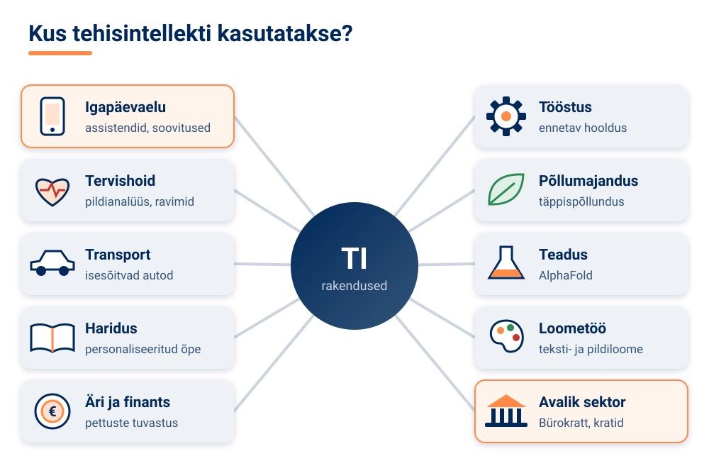

**Virtuaalassistendid** (Siri, Alexa, Google Assistant, Bixby) on tarkvara, millega saad suhelda häälega. Ütled „Pane äratus kella seitsmeks" ja assistent teeb seda. Taustal töötab mitu tehisintellekti tehnoloogiat: **kõnetuvastus** muudab su kõne tekstiks, **loomuliku keele mõistmine** selgitab välja, mida sa tahad, assistent püüab hoida meeles **vestluse konteksti** ja lõpuks **kõnesüntees** muudab vastuse taas kõneks. Assistente kasutatakse päringuteks, meeldetuletusteks ja nutikodu seadmete juhtimiseks. Neil on ka piirangud: nad ei mõista alati konteksti, tekitavad privaatsusküsimusi (seade kuulab ju pidevalt äratussõna) ja väiksemaid keeli, sh eesti keelt, toetavad sageli halvemini.

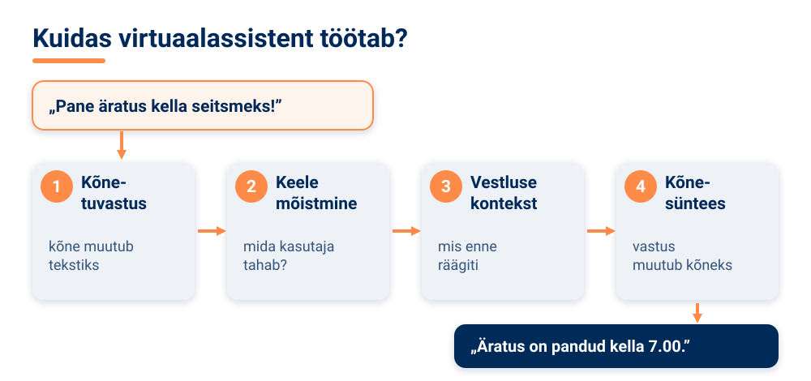

<!-- class="pae-fakt" -->
> **Kas teadsid?** Häälassistent kuulab pidevalt, kas sa ütled **äratussõna** – just seepärast tekitavad need seadmed privaatsusküsimusi.

<!-- class="pae-moiste" -->
> **Mõiste: soovitussüsteem**
>
> Soovitussüsteem on tehisintellekti süsteem, mis ennustab kasutaja varasema käitumise ja teiste kasutajate andmete põhjal, milline sisu või toode võiks talle huvi pakkuda. Soovitussüsteeme kasutavad Netflix, Spotify, YouTube, TikTok, Amazon ja paljud e-poed.

Soovitussüsteemid töötavad peamiselt kahel põhimõttel:

- **Koostööfiltreerimine** (*collaborative filtering*): „Inimesed, kellele meeldisid samad lood mis sulle, kuulasid ka seda lugu."
- **Sisupõhine filtreerimine** (*content-based filtering*): „Sulle meeldisid rahulikud akustilised lood, siin on veel üks rahulik akustiline lugu."

Enamik suuri platvorme kasutab **hübriidsüsteeme**, mis ühendavad mõlemat. Soovitussüsteemid on mugavad, kuid tekitavad ka probleeme. Kui süsteem näitab sulle ainult seda, mis sulle juba meeldib, võid sattuda **filtrimulli** – olukorda, kus sa ei näegi teistsuguseid vaateid ja sisu. Lisaks kogutakse sinu kohta palju andmeid.

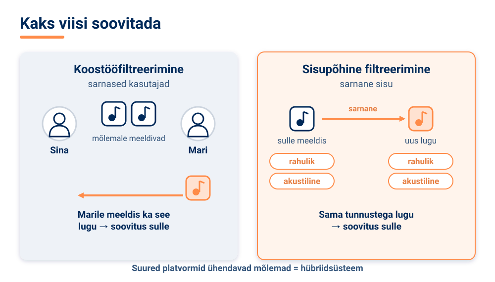

<!-- class="pae-motle" -->
> **Mõtle järele!**
>
> Ava oma lemmikplatvormi (YouTube, TikTok, Spotify) avaleht. Miks arvad, et algoritm soovitab sulle just neid asju? Kas oled märganud, et sinu voog on muutunud ühekülgseks? Mida saaksid teha, et filtrimullist välja pääseda?

Igapäevaeluga on seotud ka **sotsiaalmeedia filtrid**, mis personaliseerivad ja modereerivad sisu, **näotuvastus** telefoni avamisel ning **masintõlge** (Google Translate, DeepL).

### Tehisintellekt tervishoius ja teaduses

Tervishoius aitab tehisintellekt arstidel kiiremini ja täpsemini töötada:

- **meditsiiniline pildianalüüs** – röntgen-, MRT- ja KT-piltide analüüs haiguste tuvastamiseks;
- **haiguste diagnoosimine ja ennustamine** – sümptomite ja patsiendi andmete põhjal diagnooside pakkumine;
- **ravimite arendamine** – uute molekulide disain, ravimite avastamine ja kliiniliste uuringute tõhustamine;
- **personaalmeditsiin** – ravi kohandamine patsiendi geneetiliste andmete põhjal;
- **kirurgilised robotid** – täpsemad ja vähem invasiivsed (kehale vähem kahjulikud) operatsioonid.

Tervishoiu tehisintellekti on arendanud näiteks IBM (Watson Health), Google DeepMind ja Zebra Medical Vision. Eestis on tervise valdkonna digiteenuseid arendanud **TEHIK** (Tervise ja Heaolu Infosüsteemide Keskus) ja e-tervise lahendus **digilugu**, mis koondab terviseandmeid ning loob aluse ka tehisintellekti kasutamisele.

Teaduses aitab tehisintellekt töödelda suuri andmehulki, leida neist mustreid ja isegi pakkuda välja uusi hüpoteese. Tehisintellekti abil modelleeritakse kliimat ja keskkonda, molekule ja materjale ning bioloogilisi süsteeme.

<!-- class="pae-naide" -->
> **Näide: AlphaFold**
>
> Valgud on elu ehituskivid ja nende ülesanne sõltub nende kolmemõõtmelisest kujust. Valgu kuju kindlakstegemine laboris võis varem võtta aastaid. Google DeepMindi loodud **AlphaFold** ennustab valgu struktuuri selle koostise põhjal. See on aidanud teadlastel kiirendada bioloogia- ja ravimiuuringuid ning on üks tuntumaid näiteid tehisintellekti kasutamisest teaduslikes avastustes. Tehisintellekti kasutatakse ka uute materjalide disainimisel ja kosmose uurimisel.

### Tehisintellekt transpordis

Transpordis on tehisintellekti kõige silmapaistvam rakendus **isejuhtivad ehk isesõitvad sõidukid**: autod, bussid ja droonid, mis liiguvad ilma inimjuhita. Need kasutavad:

- **arvutinägemist**, et tuvastada teisi autosid, jalakäijaid ja liiklusmärke;
- **andureid** – lidar (laserkaugusmõõdik), radar ja ultraheliandurid;
- **kaardistamist ja lokaliseerimist**, et teada täpset asukohta;
- **otsustussüsteeme**, mis valivad, kas pidurdada, keerata või kiirendada.

Sõidukite autonoomsust kirjeldatakse **tasemetega 0–5**: tasemel 0 juhib kõike inimene, tasemel 5 sõidab auto igas olukorras täiesti iseseisvalt. Isesõitvaid sõidukeid on arendanud näiteks Tesla (Autopilot), Waymo ja Cruise. Väljakutseteks on ohutus, eetilised dilemmad (kuidas peaks auto käituma vältimatu õnnetuse korral?) ja seadused.

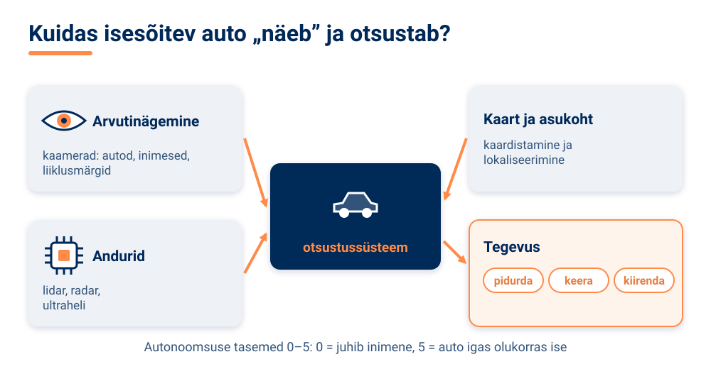

Tehisintellekt aitab ka **optimeerida liiklusvooge** ja vähendada ummikuid, arvutada **sõidujagamisteenustes** parimaid marsruute ja hindu, juhtida **logistikat ja tarneahelaid** ning planeerida **ühistransporti** nõudluse ennustamise põhjal.

<!-- class="pae-eesti" -->
> **Eesti näide: Bolt ja Starship**
>
> **Bolt** kasutab tehisintellekti nõudluse ennustamiseks, hindade optimeerimiseks ja sõitude sobitamiseks: süsteem püüab ennustada, kus ja millal sõitu vajatakse, ning leida igale tellimusele sobiva juhi. **Starship Technologies** on loonud isesõitvad kullerrobotid, mis navigeerivad arvutinägemise ja tehisintellekti abil kõnniteedel ning toimetavad kohale pakke ja toitu. Neid roboteid võid kohata ka Tallinna ja Tartu tänavatel.

### Tehisintellekt hariduses, äris ja tööstuses

**Hariduses** saab tehisintellekt kohandada õppimist iga õppija järgi. **Personaliseeritud õpe** tähendab, et süsteem tuvastab sinu taseme ja pakub sobiva raskusega ülesandeid ning individuaalset tagasisidet. **Intelligentsed tuutorid** vastavad küsimustele ja juhendavad. Tehisintellekt aitab ka **tuvastada õpilünki**, **hinnata** töid automaatselt, **tuvastada plagiaati** ja analüüsida õppimist (**õppimisanalüütika**). Õpetajale saab see vähendada administratiivset tööd, aidata luua õppematerjale ja jälgida õpilaste edenemist. Näited on Duolingo, Khan Academy, Carnegie Learning ja ALEKS; Eestist pärit on keeleõppeäpp **Lingvist**, matemaatikakeskkond **99math** ja kõrgkoolide vastuvõtusüsteem **DreamApply**.

**Äris** kasutatakse tehisintellekti klienditeeninduses (**vestlusrobotid** ehk chatbot'id, kliendikäitumise analüüs, personaliseeritud pakkumised), andmeanalüüsis (trendide tuvastamine, ennustusmudelid, otsuste toetamine) ja rutiinsete ülesannete automatiseerimiseks.

**Finantssektoris** aitab tehisintellekt **tuvastada pettusi** ehk märgata kahtlasi tehinguid, teha **riskianalüüsi** laenude ja investeeringute puhul, anda personaalseid finantssoovitusi ning teha automaatseid investeerimisotsuseid (**algoritmkauplemine**). Eesti ettevõte **Salv** aitab pankadel tuvastada rahapesu ja pettusi ning **LHV** kasutab tehisintellekti pettuste tuvastamiseks ja klienditeeninduse parandamiseks.

**Tööstuses** (näiteks Siemens, ABB, Bosch) juhivad tehisintellekt ja robotid tootmisliine, teevad **ennetavat hooldust** (ennustavad seadmete rikkeid enne nende tekkimist), tuvastavad **kvaliteedikontrollis** automaatselt defekte ning säästavad energiat ja tooraineid. **Põllumajanduses** aitab **täppispõllundus** külvata, väetada ja niisutada täpselt nii palju kui vaja; droonid ja andurid avastavad varakult kahjureid ja taimehaigusi ning tehisintellekt ennustab ilmastiku põhjal saagikust.

<!-- class="pae-moiste" -->
> **Mõiste: vestlusrobot (chatbot)**
>
> Vestlusrobot on tehisintellektil põhinev programm, mis suhtleb kasutajaga loomulikus keeles kirjalikult või suuliselt. Lihtsamad vestlusrobotid vastavad ette valmistatud vastustega, tänapäevased suurtel keelemudelitel põhinevad vestlusrobotid (nt ChatGPT, Claude, Gemini) loovad vastuse iga kord uuesti.

### Loov tehisintellekt ja avalik sektor

**Generatiivne tehisintellekt** on toonud tehisintellekti loomevaldkonda. Keelemudelid (näiteks GPT-4, Claude, Llama) kirjutavad luuletusi, lugusid, artikleid ja dialooge. Pildigeneraatorid (DALL-E, Midjourney, Stable Diffusion) loovad tekstikirjelduse põhjal pilte, oskavad üle kanda kunstistiili ja pilte täiendada. Muusikas on tehisintellekti kasutatud kompositsiooni ja arranžeerimise juures (nt AIVA). Mängudes juhib tehisintellekt arvutivastaseid ja muudab mängukogemust dünaamilisemaks.

<!-- class="pae-moiste" -->
> **Mõiste: suur keelemudel**
>
> Suur keelemudel (inglise keeles *large language model*, LLM) on tehisintellekti mudel, mis on treenitud tohutul hulgal tekstil ja suudab genereerida inimesesarnast teksti. Seda kasutatakse teksti loomiseks, küsimustele vastamiseks, kokkuvõtete tegemiseks ja tõlkimiseks. Näited: GPT-4, BERT, LLaMA.

Suurtel keelemudelitel on ka olulised piirangud. Nad võivad **välja mõelda fakte** (seda nimetatakse hallutsineerimiseks), nende teadmised on piiratud treenimise ajaga, nad võivad peegeldada treeningandmetes olevat **kallutatust** ja nende treenimine kulutab palju energiat. Loova tehisintellekti puhul tekivad küsimused ka **autoriõiguste**, originaalsuse ja kunstnike rolli kohta.

<!-- class="pae-fakt" -->
> **Kas teadsid?** Kui keelemudel esitab enesekindlalt väljamõeldud „fakti", nimetatakse seda **hallutsineerimiseks**. Seepärast tasub olulist infot alati teistest allikatest kontrollida.

**Avalikus sektoris** aitab tehisintellekt digitaliseerida ja automatiseerida avalikke teenuseid (e-valitsemine), muuta **nutikamaks linnu** (liikluse, energia ja jäätmekäitluse optimeerimine), toetada kriisijuhtimist ja pakkuda kodanikele personaliseeritud teenuseid. Näited on Eesti e-riik, Singapuri Smart Nation ja Barcelona Smart City.

<!-- class="pae-eesti" -->
> **Eesti näide: Bürokratt ja kratid**
>
> Eesti riigi tehisintellekti lahendusi nimetatakse **krattideks**. Tuntuim neist on **Bürokratt** – virtuaalassistentide võrgustik, mille kaudu saab avalikke teenuseid kasutada kõnekeelse vestluse kaudu. Bürokratt valiti 2022. aastal parimaks tehisintellektil põhinevaks riigiteenuseks ja jõudis UNESCO maailma saja parima tehisintellekti lahenduse hulka. Lisaks on Eestis eraldi tehisintellekti strateegia koostanud näiteks **Kaitseministeerium** ning **Maksu- ja Tolliamet**, kes kasutab tehisintellekti maksude kogumise ja tollikontrolli tõhustamiseks. Ettevõtetele pakuvad tehisintellekti kasutuselevõtul tuge **Tehnopoli AI arenguprogramm** ja **AI & Robotics Estonia (AIRE)**. Isikusamasuse tuvastamisel on maailmas tuntuks saanud Eesti ettevõte **Veriff**, mis võrdleb isikut tõendavat dokumenti ja näopilti. Eesti keele tehnoloogia (kõnetuvastus, masintõlge) arendamisega tegelevad Eesti ülikoolid.

### Eelised, piirangud ja mõju tööturule

Miks tehisintellekti nii palju kasutatakse? Peamised **eelised** on:

- **efektiivsus** – kiirus, mastaapsus ja ressursside parem kasutamine;
- **täpsus** – vähem inimlikke hooletusvigu ja järjepidev töö;
- **kättesaadavus** – töötab ööpäev läbi ja annab teenustele laiema ligipääsu;
- **personaliseeritus** – iga kasutaja saab endale kohandatud lahenduse;
- **uued võimalused** – lahendab ülesandeid, mis varem olid võimatud.

Samas on tehisintellekti rakendustel ka **piirangud**: vajadus suurte andmehulkade järele, läbipaistvuse puudumine („musta kasti" probleem), algoritmiline kallutatus, turvalisuse ja isikuandmete kaitse küsimused ning raskused uudsete olukordadega kohanemisel.

<!-- class="pae-moiste" -->
> **Mõiste: kallutatus (bias)**
>
> Kallutatus on olukord, kus tehisintellekti süsteem teeb süstemaatiliselt ebaõiglasi või ühekülgseid otsuseid, sest tema treeningandmetes või ülesehituses on eelarvamusi. Näiteks töölevärbamise algoritm, mida on treenitud varasemate otsuste põhjal, võib hakata teatud inimrühmi ebaõiglaselt eelistama või kõrvale jätma.

Tehisintellekt tekitab ka eetilisi küsimusi: **privaatsus** (isikuandmete kogumine ja kasutamine), **kallutatus**, **läbipaistvus**, **vastutus** (kes vastutab tehisintellekti vigade eest?) ja **autonoomsed relvad**, mis võiksid sõjalistes süsteemides ise otsuseid langetada. Euroopa Liit on vastanud nendele küsimustele **tehisintellekti määrusega (AI Act)**, mis reguleerib tehisintellekti süsteeme riskipõhiselt, ning **isikuandmete kaitse üldmäärusega (GDPR)**, mis kaitseb inimeste isikuandmeid.

Suur küsimus on ka **tööturg**. Paljud rutiinsed ja korratavad tööülesanded võivad tulevikus automatiseeruda – mõtle iseteeninduskassadele või automatiseeritud tehastele. Samas tekib uusi töökohti, mis nõuavad loovust, kriitilist mõtlemist ja emotsionaalset intelligentsust. Töötajad peavad olema valmis pidevaks õppimiseks ja muutuva töömaailmaga kohanemiseks. Tehisintellekti ja inimeste koostöö võib paljudes valdkondades suurendada tootlikkust.

Tulevikus võib tehisintellekt muuta haridust, tööd, vaba aega ja isegi inimestevahelisi suhteid. Tähtis on leida tasakaal tehnoloogia kasutamise ja eetiliste kaalutluste vahel: eesmärk on **koostöö, mitte konkurents**.

<!-- class="pae-motle" -->
> **Mõtle järele!**
>
> Millist ametit tahaksid tulevikus pidada? Millised selle töö osad võiks tehisintellekt üle võtta ja millised jääksid kindlasti inimesele? Milliseid oskusi peaksid seetõttu juba praegu arendama?

### Kokkuvõte ja põhimõisted

**Pea meeles**

- Tehisintellekti rakendused on levinud peaaegu kõigis valdkondades: igapäevaelus, tervishoius, transpordis, hariduses, äris, tööstuses, põllumajanduses, teaduses, loomes ja avalikus sektoris.
- Virtuaalassistendid ühendavad kõnetuvastuse, loomuliku keele mõistmise ja kõnesünteesi; soovitussüsteemid kasutavad koostöö- ja sisupõhist filtreerimist.
- Eesti on mitmes valdkonnas innovatsiooni esirinnas: Bürokratt, Bolt, Veriff, Starship, Lingvist, Salv jt.
- Tehisintellekti eelised on efektiivsus, täpsus, kättesaadavus ja personaliseeritus; piirangud on andmesõltuvus, „must kast", kallutatus ja privaatsusriskid.
- Tehisintellekt muudab tööturgu: rutiinsed ülesanded automatiseeruvad, tähtsamaks muutuvad loovus, kriitiline mõtlemine ja pidev õppimine.

| Mõiste | Tähendus |
|---|---|
| virtuaalassistent | häälega juhitav tarkvara, mis täidab kasutaja käsklusi (Siri, Alexa) |
| soovitussüsteem | süsteem, mis ennustab, milline sisu või toode kasutajat huvitab |
| filtrimull | olukord, kus algoritm näitab kasutajale ainult tema eelistustega sarnast sisu |
| vestlusrobot (chatbot) | programm, mis suhtleb kasutajaga loomulikus keeles |
| suur keelemudel | tohutul tekstihulgal treenitud mudel, mis genereerib inimesesarnast teksti |
| arvutinägemine | tehisintellekti suund, mis analüüsib pilte ja videoid |
| personaliseeritud õpe | õppimine, mida tehisintellekt kohandab õppija taseme ja vajaduste järgi |
| kallutatus (bias) | tehisintellekti süstemaatiliselt ebaõiglased otsused, mis tulenevad andmetest või ülesehitusest |
| tehisintellekti määrus (AI Act) | Euroopa Liidu esimene terviklik tehisintellekti õigusraamistik |

### Tööleht 1.3

<!-- class="pae-jaotis" -->
**I. Tehisintellekti rakenduste kaardistamine**

**Ülesanne 1.** Täida tabel erinevate tehisintellekti rakenduste kohta.

| Valdkond | Rakenduse näited | Kuidas tehisintellekt aitab? |
|---|---|---|
| Meditsiin | | |
| Transport | | |
| Haridus | | |
| Meelelahutus | | |
| Tootmine | | |
| Finants | | |
| Põllumajandus | | |

Kirjuta iga valdkonna kohta rakenduse näide ja see, kuidas tehisintellekt aitab (üks valdkond rea kohta).

[[___ ___ ___ ___ ___]]

**Ülesanne 2.** Millised tehisintellekti rakendused on sinu igapäevaelus juba olemas? Nimeta vähemalt viis.

[[___ ___ ___ ___ ___]]

<!-- class="pae-jaotis" -->
**II. Tehisintellekti rakenduste analüüs**

**Ülesanne 3.** Vali üks tehisintellekti rakendus ja analüüsi seda põhjalikumalt.

Valitud rakendus:

[[___]]

a) Kirjelda, kuidas see töötab.

[[___ ___ ___]]

b) Milliseid tehisintellekti tehnoloogiaid see kasutab?

[[___ ___]]

c) Millised on selle eelised võrreldes traditsiooniliste lahendustega?

[[___ ___ ___]]

d) Millised on selle piirangud või väljakutsed?

[[___ ___ ___]]

<!-- class="pae-jaotis" -->
**III. Tehisintellekti rakendused Eestis**

**Ülesanne 4.** Uuri ja nimeta vähemalt kolm Eesti ettevõtet või projekti, mis kasutavad tehisintellekti, ning kirjelda nende rakendust.

a) Ettevõte/projekt ja rakendus:

[[___ ___]]

b) Ettevõte/projekt ja rakendus:

[[___ ___]]

c) Ettevõte/projekt ja rakendus:

[[___ ___]]

**Ülesanne 5.** Kuidas on tehisintellekt mõjutanud Eesti digiühiskonna arengut?

[[___ ___ ___ ___]]

<!-- class="pae-jaotis" -->
**IV. Tehisintellekti mõju tööturule**

**Ülesanne 6.** Millised ametid võivad tehisintellekti tõttu muutuda või kaduda? Nimeta vähemalt kolm.

[[___ ___ ___]]

**Ülesanne 7.** Millised uued ametid võivad tehisintellekti arengu tõttu tekkida? Nimeta vähemalt kolm.

[[___ ___ ___]]

**Ülesanne 8.** Kuidas saaksid ennast tehisintellekti ajastu tööturuks ette valmistada?

[[___ ___ ___ ___]]

<!-- class="pae-jaotis" -->
**V. Praktiline ülesanne**

**Ülesanne 9.** Vali üks järgmistest praktilistest ülesannetest (variant A või B).

**Variant A: tehisintellekti rakenduse testimine.** Vali üks avalikult kättesaadav tehisintellekti rakendus (nt ChatGPT, mõni pildigeneraator või Google Lens) ja testi seda.

a) Valitud rakendus:

[[___]]

b) Mida proovisid sellega teha?

[[___ ___]]

c) Kui hästi rakendus toimis?

[[___ ___]]

d) Mis sind üllatas?

[[___ ___]]

e) Millised olid piirangud?

[[___ ___]]

**Variant B: tehisintellekti rakenduse idee.** Mõtle välja uus tehisintellekti rakendus, mis lahendaks mõnda probleemi sinu koolis või kogukonnas.

a) Probleemi kirjeldus:

[[___ ___]]

b) Tehisintellekti lahenduse idee:

[[___ ___]]

c) Milliseid tehisintellekti tehnoloogiaid see kasutaks?

[[___ ___]]

d) Kuidas see aitaks probleemi lahendada?

[[___ ___ ___]]

<!-- class="pae-jaotis" -->
**VI. Arutelu**

**Ülesanne 10.** Millised on tehisintellekti rakenduste peamised eetilised küsimused?

[[___ ___ ___ ___]]

**Ülesanne 11.** Kuidas saaksime tagada, et tehisintellekti rakendused tooksid ühiskonnale rohkem kasu kui kahju?

[[___ ___ ___ ___]]

### Enesekontroll 1.3

**1. Kuidas nimetatakse olukorda, kus algoritm näitab kasutajale ainult tema eelistustega sarnast sisu ja ta ei näegi teistsuguseid vaateid? Kirjuta üks sõna.**

[[filtrimull]]
[[?]] Vihje: vaata kasti „Eesti näide: Bürokratt ja kratid". Sõna lõpus peitub Krati enda nimi.

****************************************
Õige vastus: **filtrimull**. Soovitussüsteem, mis pakub ainult sinu senise maitsega sarnast sisu, võib su voo muuta ühekülgseks. Filtrimullist aitab välja teadlikult teistsuguse sisu otsimine.
****************************************

**2. Kuidas nimetatakse seda, kui keelemudel esitab enesekindlalt väljamõeldud „fakti”? Kirjuta üks sõna.**

[[hallutsineerimine]]

****************************************
Õige vastus: **hallutsineerimine** (hallutsinatsioon). Seepärast tasub keelemudeli antud olulist infot alati teistest allikatest kontrollida.
****************************************

**3. Pane virtuaalassistendi töö sammud õigesse järjekorda, kui ütled: „Pane äratus kella seitsmeks!”**

<!-- data-show-partial-solution -->
Kõnesüntees ütleb vastuse välja: [[ 1 | 2 | 3 | (4) ]] 
Loomuliku keele mõistmine selgitab välja, mida sa tahad: [[ 1 | (2) | 3 | 4 ]] 
Kõnetuvastus muudab su kõne tekstiks: [[ (1) | 2 | 3 | 4 ]] 
Assistent seob käsu vestluse kontekstiga: [[ 1 | 2 | (3) | 4 ]]
****************************************
Õige järjekord: 1. kõnetuvastus (kõne → tekst) → 2. loomuliku keele mõistmine (mida kasutaja soovib?) → 3. vestluse kontekst (mida räägiti varem?) → 4. kõnesüntees (vastus → kõne).
****************************************

**4. Seosta Eesti ettevõte või projekt selle tehisintellekti rakendusega.**

<!-- data-show-partial-solution -->
- [ (Veriff) (Starship) (Bürokratt) (Salv) ]
- [ ( ) (X) ( ) ( ) ] Isesõitvad kullerrobotid
- [ (X) ( ) ( ) ( ) ] Isikusamasuse tuvastamine dokumendi ja näopildi põhjal
- [ ( ) ( ) (X) ( ) ] Riigi virtuaalassistentide võrgustik
- [ ( ) ( ) ( ) (X) ] Rahapesu ja finantspettuste tuvastamine
****************************************
Starship – kullerrobotid; Veriff – isikusamasuse tuvastamine; Bürokratt – riigi virtuaalassistendid; Salv – finantskuritegude tuvastamine.
****************************************

**5. Vali rippmenüüst, millist soovitussüsteemi põhimõtet lause kirjeldab.**

<!-- data-show-partial-solution -->
„Inimesed, kellele meeldisid samad lood mis sulle, kuulasid ka seda lugu” – see on [[ (koostööfiltreerimine) | sisupõhine filtreerimine ]]. „Sulle meeldisid rahulikud akustilised lood, siin on veel üks rahulik akustiline lugu” – see on [[ koostööfiltreerimine | (sisupõhine filtreerimine) ]]. Süsteemi, mis ühendab mõlemat põhimõtet, nimetatakse [[ ekspertsüsteemiks | (hübriidsüsteemiks) ]].
****************************************
Koostööfiltreerimine võrdleb sinu eelistusi teiste sarnase maitsega kasutajate omadega. Sisupõhine filtreerimine otsib sisu, millel on samad tunnused nagu sellel, mis sulle juba meeldis. Enamik suuri platvorme kasutab mõlemat ühendavaid hübriidsüsteeme.
****************************************

**6. Lohista sõnad lünkadesse.**

<!-- data-show-partial-solution -->
Paljud [->[ (rutiinsed) | loomingulised ]] ja korratavad tööülesanded võivad tulevikus automatiseeruda. Samas tekivad uued töökohad, mis nõuavad loovust ja [->[ (kriitilist mõtlemist) | kiiret arvutamist ]]. Töötajad peavad olema valmis [->[ (pidevaks õppimiseks) ]].
****************************************
Tehisintellekt sobib hästi rutiinsete ja korratavate ülesannete automatiseerimiseks. Inimese tugevused – loovus, kriitiline mõtlemine ja emotsionaalne intelligentsus – muutuvad seetõttu veelgi väärtuslikumaks ning muutuva töömaailmaga kohanemiseks tuleb pidevalt juurde õppida.
****************************************

**7. Millised on suurte keelemudelite peamised piirangud? (Vali kõik õiged.)**

- [[X]] Võivad enesekindlalt esitada väljamõeldud fakte
- [[X]] Piiratud teadmised pärast treenimise aega
- [[X]] Võivad peegeldada treeningandmetes esinevat kallutatust
- [[X]] Kõrge energiatarbimine treenimisel
- [[ ]] Suudavad töötada ainult inglise keeles
****************************************
Kõik peale viimase on keelemudelite tõelised piirangud (väljamõeldud faktide esitamist nimetatakse hallutsineerimiseks). Keelemudelid töötavad paljudes keeltes, ka eesti keeles, kuigi väiksemates keeltes võib kvaliteet olla madalam.
****************************************

**8. Selgita oma sõnadega, mis on tehisintellekti kallutatus, ja too üks näide.**

[[___ ___ ___]]

Vaata näidisvastust

Kallutatus tähendab, et tehisintellekti süsteem teeb süstemaatiliselt ebaõiglasi või ühekülgseid otsuseid, sest tema treeningandmetes või ülesehituses on eelarvamusi. Näiteks töölevärbamise algoritm, mida on treenitud varasemate värbamisotsuste põhjal, võib hakata teatud inimrühmi eelistama ja teisi kõrvale jätma, kui ka varasemad otsused olid ebaõiglased.

### 🔐 Lukk 1.3

<!-- class="pae-naide" -->
> **Kratt:** „Arhiivi viimasel riiulil on minu sugulase nimesilt, aga tähed on sassis! TARBÜ TORK? See ei kõla üldse nagu kratt…"

Lukk avaneb, kui lahendad anagrammi. Pane tähed **T A R B Ü T O R K** õigesse järjekorda ja kirjuta saadud nimi lahtrisse.

> Vihje mõistatusena: olen Eesti riigi virtuaalassistentide võrgustik – minu kaudu saab avalikke teenuseid kasutada tavalise vestluse abil. 2022. aastal valiti mind parimaks tehisintellektil põhinevaks riigiteenuseks.

[[bürokratt]]

****************************************
✅ **Lukk avatud!** **Bürokratt** on Eesti riigi tehisintellekti lahendus – üks paljudest TI rakendustest, mis teeb igapäevaelu lihtsamaks. Eesti riigi TI-lahendusi kutsutaksegi krattideks.

🔑 **Sinu võtmetäht: U**

Kirjuta täht üles – seda on vaja toa ukse avamiseks.
****************************************

## Plokk 1. Kordamine ja harjutamine

### Praktilised ülesanded

<!-- class="pae-jaotis" -->
**Ülesanne 1. Tehisintellekti rakenduste kaardistamine**

**Mida sa õpid:** tutvud tehisintellekti rakendustega ühes eluvaldkonnas ja näed, kui laialt tehisintellekti tänapäeval kasutatakse.

**Vahendid:** internetiühendusega arvuti või nutiseade, digitaalne koostöövahend (nt Padlet, Miro või Canva), esitlusvahend.

**Sammud:**

1. Moodustage 3–4-liikmelised rühmad.
2. Valige üks valdkond: haridus, meditsiin, transport, meelelahutus, kaubandus, tööstus, põllumajandus, finants või keskkond.
3. Uurige, milliseid tehisintellekti rakendusi teie valitud valdkonnas kasutatakse.
4. Koostage digitaalne mõttekaart või kollaaž, kus on:
   - vähemalt 5 konkreetset tehisintellekti rakendust teie valdkonnas;
   - iga rakenduse lühikirjeldus: kuidas see töötab;
   - rakenduse kasu ja võimalikud probleemid;
   - vähemalt 2 Eesti või Euroopa näidet.
5. Esitlege oma tulemusi klassile (3–5 minutit).
6. Arutlege pärast esitlusi koos: kuidas erinevad valdkonnad üksteisest ja millised järeldused saab teha tehisintellekti mõju kohta?

**Mida jälgitakse:**

- leitud rakenduste asjakohasus ja mitmekesisus;
- selgituste täpsus: kuidas rakendused töötavad;
- kasu ja probleemide analüüsi põhjalikkus;
- Eesti ja Euroopa näidete asjakohasus;
- esitluse selgus ja atraktiivsus.

**Kasulikud lingid:**

- [Eesti tehisintellekti kasutuselevõtu eksperdirühma aruanne](https://www.ria.ee/sites/default/files/documents/2022-11/Eesti-tehisintellekti-kasutuselevotu-ekspertruhma-aruanne.pdf)
- [AI Watch – Euroopa Komisjoni tehisintellekti jälgimise teenus](https://knowledge4policy.ec.europa.eu/ai-watch_en)
- [Elements of AI kursus eesti keeles](https://www.elementsofai.ee/)
- [Kratid.ee – Eesti avaliku sektori tehisintellekti portaal](https://www.kratid.ee/)

Kirjelda lühidalt oma rühma valdkonda ja kõige huvitavamat leitud rakendust. Mis sind üllatas?

[[___ ___ ___]]

<!-- class="pae-jaotis" -->
**Ülesanne 2. Tehisintellekti ajajoone loomine**

**Mida sa õpid:** mõistad tehisintellekti ajaloolist arengut ja olulisemaid verstaposte.

**Vahendid:** internetiühendusega arvuti, digitaalne ajajoonevahend (nt TimelineJS, Sutori või Canva), esitlusvahend.

**Sammud:**

1. Töötage paarides.
2. Looge digitaalne ajajoon, mis kajastab tehisintellekti arengut 1950. aastatest tänapäevani.
3. Ajajoonel peab olema vähemalt 10 olulist sündmust või verstaposti, sealhulgas:
   - tehisintellekti mõiste sünd;
   - olulised algoritmid ja meetodid;
   - tähtsamad tehisintellekti süsteemid;
   - tehisintellekti talved ja nende põhjused;
   - masinõppe ja süvaõppe areng;
   - viimase viie aasta olulisemad saavutused.
4. Lisage iga sündmuse juurde aasta, lühikirjeldus, pilt või illustratsioon ning selgitus, miks see sündmus oli tehisintellekti arengus oluline.
5. Esitlege oma ajajoont klassile ja selgitage, miks valisite just need sündmused.
6. Arutlege klassis, milliseid mustreid tehisintellekti arengus näete ja kuhu see võiks edasi liikuda.

**Mida jälgitakse:**

- ajajoone terviklikkus ja oluliste sündmuste olemasolu;
- sündmuste kirjelduste täpsus;
- sündmuste olulisuse analüüs;
- ajajoone visuaalne selgus;
- esitluse kvaliteet.

**Kasulikud lingid:**

- [A Brief History of AI – AITopics](https://aitopics.org/misc/brief-history)
- [Timeline of Artificial Intelligence – Wikipedia](https://en.wikipedia.org/wiki/Timeline_of_artificial_intelligence)
- [The History of Artificial Intelligence – Harvard University](https://sitn.hms.harvard.edu/flash/2017/history-artificial-intelligence/)

Milline sündmus teie ajajoonel on sinu arvates kõige olulisem ja miks?

[[___ ___ ___]]

<!-- class="pae-jaotis" -->
**Ülesanne 3. Tehisintellekt vs inimintellekt: debatt**

**Mida sa õpid:** analüüsid kriitiliselt tehisintellekti ja inimintellekti erinevusi ning sarnasusi, harjutad argumenteerimist.

**Vahendid:** internetiühendusega arvuti, märkmepaber debatiks valmistumiseks, taimer.

**Sammud:**

1. Klass jaguneb kaheks rühmaks:
   - **rühm A** kaitseb seisukohta „Tehisintellekt võib ületada inimintellekti kõigis aspektides";
   - **rühm B** kaitseb seisukohta „Inimintellektil on põhimõttelised eelised, mida tehisintellekt ei saa kunagi saavutada".
2. Valmistuge debatiks: koguge fakte ja argumente oma seisukoha toetuseks, ennustage vastasrühma argumente ja mõelge välja vastuargumendid, leidke näiteid ja tõendeid.
3. Debati käik: avaväited (kumbki rühm), põhiarutelu vaheldumisi sõnavõttudega, vastasrühma küsimustele vastamine ja lõppsõna.
4. Arutlege pärast debatti koos:
   - Millised argumendid olid kõige veenvamad?
   - Kas ja kuidas muutus sinu arvamus debati käigus?
   - Millised on tehisintellekti ja inimintellekti koostöö võimalused?

**Mida jälgitakse:**

- argumentide asjakohasus ja põhjendatus;
- faktide ja näidete kasutamine;
- vastuargumentide kvaliteet;
- esinemise selgus ja veenvus;
- aktiivne osalemine järelarutelus.

**Kasulikud lingid:**

- [Can AI Really Think? – BBC](https://www.bbc.com/future/article/20170223-can-ai-really-be-conscious)
- [The Chinese Room Argument – Stanford Encyclopedia of Philosophy](https://plato.stanford.edu/entries/chinese-room/)
- [What Can AI Not Do? – MIT Technology Review](https://www.technologyreview.com/2020/03/10/905386/ai-artificial-intelligence-limitations-applications/)

Kirjelda, kas ja kuidas debatt muutis sinu arvamust tehisintellekti ja inimese võimekuse kohta.

[[___ ___ ___]]

<!-- class="pae-jaotis" -->
**Ülesanne 4. Tehisintellekti kogemuse analüüs**

**Mida sa õpid:** saad praktilise kogemuse tehisintellekti süsteemiga suhtlemisel ning analüüsid selle võimekusi ja piiranguid.

**Vahendid:** internetiühendusega arvuti või nutiseade ning ligipääs vähemalt ühele vestlusrobotile (nt [ChatGPT](https://chatgpt.com/), [Microsoft Copilot](https://copilot.microsoft.com/) või [Google Gemini](https://gemini.google.com/)). Kasuta ainult kooli lubatud keskkondi ja ära sisesta vestlusrobotile oma isikuandmeid.

**Sammud:**

1. Töötad iseseisvalt.
2. Vali üks kättesaadav vestlusrobot.
3. Koosta vähemalt viis eri tüüpi küsimust või ülesannet:
   - faktiküsimus (nt ajalooline sündmus või teaduslik fakt);
   - loovülesanne (nt lühijutu või luuletuse kirjutamine);
   - probleemülesanne (nt matemaatikaülesanne või loogikamõistatus);
   - eetiline dilemma (nt tehisintellektiga seotud eetiline küsimus);
   - Eesti kultuuri või eesti keelega seotud küsimus.
4. Esita küsimused vestlusrobotile ja salvesta vastused.
5. Analüüsi vastuseid: kui täpsed ja asjakohased, põhjalikud, loogilised ja sidusad need olid, kui loovad (kui asjakohane) ning milline oli keeleline kvaliteet.
6. Kirjuta lühianalüüs (200–300 sõna), milles:
   - kirjeldad oma kogemust tehisintellektiga suhtlemisel;
   - analüüsid tehisintellekti tugevusi ja nõrkusi;
   - tood välja üllatavad või huvitavad tähelepanekud;
   - arutled, kuidas tehisintellekt võiks tulevikus areneda.
7. Jaga oma kogemusi klassi ühises arutelus.

**Mida jälgitakse:**

- küsimuste mitmekesisus ja asjakohasus;
- vastuste dokumenteerimise põhjalikkus;
- analüüsi sügavus ja kriitilisus;
- järelduste põhjendatus;
- aktiivne osalemine ühises arutelus.

**Kasulik link:** [Partnership on AI – vastutustundliku tehisintellekti materjalid](https://www.partnershiponai.org/paper/responsible-ai-design-assistant/)

Kirjuta siia oma lühianalüüs.

[[___ ___ ___ ___ ___]]

<!-- class="pae-jaotis" -->
**Ülesanne 5. Tehisintellekti tuleviku visualiseerimine**

**Mida sa õpid:** mõtled loovalt tehisintellekti tuleviku üle ja visualiseerid oma ideid.

**Vahendid:** joonistusvahendid (digitaalsed või paber ja pliiats), kollaaživahendid, esitlusvahend.

**Sammud:**

1. Töötad üksi või paaris.
2. Vali üks teema:
   - tehisintellekt kodus aastal 2050;
   - tehisintellekt hariduses aastal 2050;
   - tehisintellekt meditsiinis aastal 2050;
   - tehisintellekt transpordis aastal 2050;
   - tehisintellekt tööturul aastal 2050.
3. Loo valitud teema kohta visuaalne kujutis: joonistus, kollaaž või digitaalne illustratsioon.
4. Kirjuta visuaali juurde lühikirjeldus (100–150 sõna), mis selgitab:
   - milliseid tehisintellekti tehnoloogiaid oled kujutanud;
   - kuidas need tehnoloogiad toimivad;
   - milliseid probleeme need lahendavad;
   - milliseid uusi väljakutseid need võivad tekitada.
5. Esitle oma visualiseeringut klassile (1–2 minutit).
6. Arutlege koos tehisintellekti tuleviku võimaluste ja riskide üle.

**Mida jälgitakse:**

- visualiseeringu loovus ja originaalsus;
- tehniline teostus;
- kirjelduse selgus ja põhjendatus;
- kujutatud tehnoloogiate realistlikkus;
- esitluse kvaliteet.

**Kasulikud lingid:**

- [Future of AI – World Economic Forum](https://www.weforum.org/agenda/archive/artificial-intelligence/)
- [AI100 – Stanford University](https://ai100.stanford.edu/)
- [Future of Life Institute](https://futureoflife.org/)

Kirjuta siia oma visualiseeringu lühikirjeldus.

[[___ ___ ___ ___]]

### Arutelu

Vasta küsimustele oma sõnadega. Kui teie klassis on kasutusel foorum, jaga oma vastuseid seal ja kommenteeri vähemalt kahe kaaslase mõtteid.

<!-- class="pae-jaotis" -->
**Teema 1. Mis on tehisintellekt?**

**1. Tehisintellekti definitsioon.** Kuidas sina defineerid tehisintellekti? Kas see on lihtsalt keeruline algoritm või midagi enamat? Võrdle oma definitsiooni teiste õpilaste omadega ja arutle erinevuste üle.

[[___ ___ ___ ___]]

**2. Nõrk vs tugev tehisintellekt.** Mis on sinu arvates peamised erinevused nõrga (kitsa) ja tugeva (üldise) tehisintellekti vahel? Kas usud, et tugev tehisintellekt on saavutatav? Miks või miks mitte?

[[___ ___ ___ ___]]

**3. Tehisintellekti mõju igapäevaelule.** Milliseid tehisintellekti rakendusi oled märganud oma igapäevaelus? Kuidas on need muutnud sinu elu? Too konkreetseid näiteid.

[[___ ___ ___ ___]]

<!-- class="pae-jaotis" -->
**Teema 2. Tehisintellekti ajalugu**

**4. Olulised verstapostid.** Milline tehisintellekti ajaloo verstapost on sinu arvates olnud kõige mõjukam ja miks? Kuidas on see kujundanud tehisintellekti arengut?

[[___ ___ ___ ___]]

**5. Tehisintellekti talved ja kevaded.** Miks on tehisintellekti arengus olnud nn talvesid (perioode, mil huvi ja rahastus vähenesid)? Millised tegurid on viinud uute kevadeteni? Kas näed sarnaseid tsükleid ka teistes tehnoloogiavaldkondades?

[[___ ___ ___ ___]]

**6. Eesti roll tehisintellekti ajaloos.** Milliseid olulisi panuseid on Eesti teadlased või ettevõtted andnud tehisintellekti arengusse? Kui sa ei tea, uuri ja jaga oma leide.

[[___ ___ ___ ___]]

<!-- class="pae-jaotis" -->
**Teema 3. Tehisintellekti rakendused**

**7. Üllatavad rakendused.** Milline tehisintellekti rakendus on sind kõige rohkem üllatanud või sulle muljet avaldanud? Miks just see?

[[___ ___ ___ ___]]

**8. Tehisintellekti potentsiaal.** Millises valdkonnas on tehisintellektil sinu arvates lähitulevikus kõige suurem potentsiaal? Põhjenda oma arvamust.

[[___ ___ ___ ___]]

**9. Tehisintellekti piirangud.** Millised on sinu arvates peamised piirangud, mis takistavad tehisintellekti laiemat kasutuselevõttu? Kuidas neid piiranguid ületada?

[[___ ___ ___ ___]]

<!-- class="pae-jaotis" -->
**Refleksioon**

**10. Uued teadmised.** Mis oli sinu jaoks selles plokis kõige üllatavam või uudsem teadmine? Kuidas muutis see sinu arusaama tehisintellektist?

[[___ ___ ___ ___]]

**11. Praktilised näited.** Too näide, kuidas saaksid selles plokis õpitut rakendada oma igapäevaelus või tulevases karjääris.

[[___ ___ ___ ___]]

**12. Edasised küsimused.** Millised küsimused sul ploki läbimisel tekkisid? Milliste teemade kohta sooviksid rohkem teada saada?

[[___ ___ ___ ___]]

### Ploki 1 enesekontrolltest

Enne ukse avamist kontrolli, kas oled toa kõik teadmised kätte saanud.

<!-- class="pae-jaotis" -->
**I. Automaatselt kontrollitavad küsimused**

**1. Mis on tehisintellekt?**

- [( )] Arvutiprogramm, mis suudab mõelda täpselt nagu inimene
- [(X)] Tehnoloogia, mis võimaldab masinatel jäljendada inimese intelligentset käitumist
- [( )] Robot, mis näeb välja nagu inimene
- [( )] Arvutisüsteem, mis on teadlik iseendast
****************************************
Tehisintellekt jäljendab inimese intelligentset käitumist, kuid see ei tähenda, et masin mõtleks täpselt nagu inimene, näeks välja nagu inimene või oleks teadlik iseendast.
****************************************

**2. Kuidas nimetatakse teadmispõhist tehisintellekti süsteemi, mis kasutab inimekspertidelt kogutud „kui ..., siis ...” reegleid? Kirjuta üks sõna.**

[[ekspertsüsteem]]
[[?]] Vihje: sõnas on 3 tähte ja see on seotud selle toa teemaga – just seda püüab tehisintellekt jäljendada.

****************************************
Õige vastus: **ekspertsüsteem**. Ekspertsüsteemid (nt MYCIN, XCON) olid sümboolse tehisintellekti edukaim näide. Nende puudus oli see, et iga uus olukord nõudis uusi käsitsi kirjutatud reegleid.
****************************************

**3. Vali rippmenüüst õige variant.**

<!-- data-show-partial-solution -->
Turingi testis suhtleb küsitleja inimese ja masinaga [[ (kirjalikult) | suuliselt ]]. Kui küsitleja [[ suudab | (ei suuda) ]] vastuste põhjal eristada, kumb on kumb, on masin testi läbinud. Tehisintellekti talveks nimetatakse perioodi, mil rahastus ja huvi tehisintellekti vastu [[ kasvavad | (vähenevad) ]].
****************************************
Turingi testis on vestlus kirjalik, et hääl või välimus ei reedaks masinat. Masin läbib testi siis, kui küsitleja ei suuda teda inimesest eristada. Talvi on olnud kaks ja mõlemal korral vähenesid rahastus ja huvi, sest liiga suured ootused ei täitunud.
****************************************

**4. Esimene tehisintellekti talv kestis aastatel 1974–1980 ja teine aastatel 1987–1993. Mitu aastat kestsid talved kokku? Kirjuta ainult arv.**

[[12]]

****************************************
(1980 − 1974) + (1993 − 1987) = 6 + 6 = **12** aastat.
****************************************

**5. Pane sündmused ajalises järjekorras (1 – kõige varasem, 5 – kõige hilisem).**

<!-- data-show-partial-solution -->
AlphaGo võidab Go maailmameistrit Lee Sedoli: [[ 1 | 2 | 3 | (4) | 5 ]] 
Dartmouthi konverentsil võetakse kasutusele termin „tehisintellekt”: [[ 1 | (2) | 3 | 4 | 5 ]] 
ChatGPT avaldatakse: [[ 1 | 2 | 3 | 4 | (5) ]] 
Alan Turing avaldab artikli „Computing Machinery and Intelligence”: [[ (1) | 2 | 3 | 4 | 5 ]] 
Deep Blue võidab male maailmameistrit Garry Kasparovit: [[ 1 | 2 | (3) | 4 | 5 ]]
****************************************
Õige järjekord: 1. Turingi artikkel (1950) → 2. Dartmouthi konverents (1956) → 3. Deep Blue (1997) → 4. AlphaGo (2016) → 5. ChatGPT (2022).
****************************************

**6. Liigita näited tehisintellekti liigi järgi.**

<!-- data-show-partial-solution -->
- [ (Nõrk TI) (Tugev TI) (Superintelligentsus) ]
- [ (X) ( ) ( ) ] Virtuaalne assistent, näiteks Siri või Alexa
- [ (X) ( ) ( ) ] Näotuvastussüsteem nutitelefonis
- [ ( ) (X) ( ) ] Süsteem, mis suudaks mõista ja lahendada mistahes intellektuaalset ülesannet nagu inimene
- [ ( ) ( ) (X) ] Süsteem, mis ületaks inimest kõigis valdkondades
****************************************
Virtuaalne assistent ja näotuvastus on spetsialiseerunud kitsale ülesannete ringile ega oma teadvust – need on nõrk tehisintellekt, nagu kõik praegused süsteemid. Tugev (üldine) tehisintellekt ja superintelligentsus on praegu teoreetilised.
****************************************

**7. Märgi, millised näited on tehisintellekti rakendused ja millised mitte.**

<!-- data-show-partial-solution -->
- [ (On TI) (Ei ole TI) ]
- [ ( ) (X) ] Tavaline kalkulaator
- [ (X) ( ) ] Isesõitev auto
- [ (X) ( ) ] Kõnetuvastus, mis muudab kõne tekstiks
- [ ( ) (X) ] Taimer, mis lülitab seadme kindlal kellaajal välja
- [ (X) ( ) ] Meditsiiniliste piltide analüüs haiguste tuvastamiseks
****************************************
Isesõitev auto, kõnetuvastus ja meditsiiniline pildianalüüs õpivad andmetest ning tulevad toime uute olukordadega. Kalkulaator ja taimer täidavad alati samu jäiku samme ega õpi midagi juurde.
****************************************

**8. Lohista sõnad lünkadesse nii, et tekiks masinõppe kirjeldus.**

<!-- data-show-partial-solution -->
Masinõppe puhul ei kirjuta programmeerija ette kõiki [->[ (reegleid) ]], vaid annab süsteemile palju [->[ (näiteid) | käske ]] ning süsteem leiab nendest ise [->[ (mustrid) | vead ]].
****************************************
Masinõpe on tehisintellekti haru, kus süsteem õpib andmetest ilma otsese programmeerimiseta: inimene annab näited ja süsteem leiab mustrid ise.
****************************************

**9. Millised järgnevatest on tehisintellektiga seotud eetilised küsimused? (Vali kõik õiged.)**

- [[X]] Kallutatus ja diskrimineerimine
- [[X]] Privaatsus ehk isikuandmete kogumine ja kasutamine
- [[X]] Vastutus: kes vastutab, kui tehisintellekt teeb vea?
- [[ ]] Programmeerimiskeelte keerukus
- [[ ]] Ekraanide eraldusvõime
****************************************
Kallutatus, privaatsus ja vastutus on tehisintellekti peamised eetilised küsimused (lisaks läbipaistvus ja autonoomsed relvad). Programmeerimiskeelte keerukus ja ekraanide eraldusvõime on tehnilised, mitte eetilised küsimused.
****************************************

**10. Kuidas nimetatakse Eesti riigi virtuaalassistentide võrgustikku, mille abil saab avalikke teenuseid kasutada kõnekeelse vestluse kaudu? Kirjuta nimi.**

[[Bürokratt]]

****************************************
Õige vastus: **Bürokratt**. See valiti 2022. aastal parimaks tehisintellektil põhinevaks riigiteenuseks. Eesti riigi tehisintellekti lahendusi nimetatakse üldnimega kratid.
****************************************

<!-- class="pae-jaotis" -->
**II. Lühivastustega küsimused**

**11. Nimeta kolm olulist sündmust tehisintellekti ajaloos ja nende ligikaudsed toimumisajad.**

[[___ ___ ___]]

Vaata näidisvastust

Näiteks: Dartmouthi konverents, kus võeti kasutusele termin „tehisintellekt" (1956); Deep Blue võitis male maailmameistrit Garry Kasparovit (1997); AlphaGo võitis Go maailmameistrit Lee Sedoli (2016). Sobivad ka näiteks Turingi artikkel (1950), AlexNet (2012) või ChatGPT avaldamine (2022).

**12. Selgita lühidalt, mis vahe on nõrgal ja tugeval tehisintellektil.**

[[___ ___ ___]]

Vaata näidisvastust

Nõrk tehisintellekt on spetsialiseerunud ühele konkreetsele ülesandele (nt näotuvastus või malemäng) ja kõik praegused süsteemid kuuluvad siia. Tugev tehisintellekt suudaks lahendada mistahes intellektuaalset ülesannet nagu inimene, kuid praegu on see vaid teoreetiline.

**13. Kirjelda lühidalt, kuidas tehisintellekt mõjutab tänapäeval haridust.**

[[___ ___ ___]]

Vaata näidisvastust

Tehisintellekt võimaldab personaliseeritud õpet, kus ülesanded kohanduvad õpilase tasemega; automaatset hindamist ja tagasisidet; intelligentseid õppeassistente, kes vastavad küsimustele; ning aitab õpetajal luua õppematerjale ja jälgida õpilaste edenemist. Näited on Duolingo, Khan Academy, Lingvist ja 99math.

**14. Nimeta kolm tehisintellekti rakendust meditsiinis.**

[[___ ___ ___]]

Vaata näidisvastust

Näiteks haiguste diagnoosimine, ravimite arendamine, meditsiiniliste piltide (röntgen, MRT, KT) analüüs, patsientide jälgimine ja personaliseeritud ravi.

**15. Selgita lühidalt, mis on süvaõpe (deep learning).**

[[___ ___ ___]]

Vaata näidisvastust

Süvaõpe on masinõppe alamharu, mis kasutab mitmekihilisi närvivõrke suurte andmehulkade töötlemiseks ja keerukate mustrite tuvastamiseks. Süvaõppel põhinevad näiteks näotuvastus ja suured keelemudelid.

**16. Kirjelda lühidalt, kuidas tehisintellekt võib tulevikus mõjutada tööturgu.**

[[___ ___ ___]]

Vaata näidisvastust

Paljud rutiinsed ja korratavad tööülesanded võivad automatiseeruda ning osa töökohti kaob või muutub. Samas tekib uusi töökohti ja muutub töö iseloom: tähtsamaks muutuvad loovus, kriitiline mõtlemine, emotsionaalne intelligentsus ja valmisolek pidevalt õppida.

**17. Nimeta kolm Eesti ettevõtet või projekti, mis kasutavad tehisintellekti.**

[[___ ___ ___]]

Vaata näidisvastust

Näiteks Veriff (isikusamasuse tuvastamine), Bolt (nõudluse ennustamine ja sõitude sobitamine), Starship Technologies (isesõitvad kullerrobotid), Bürokratt (riigi virtuaalassistendid), Lingvist (keeleõpe) või Salv (finantspettuste tuvastamine).

**18. Selgita lühidalt, mis on suured keelemudelid (LLM), ja too näide.**

[[___ ___ ___]]

Vaata näidisvastust

Suured keelemudelid on tehisintellekti mudelid, mis on treenitud tohutul hulgal tekstil ja suudavad genereerida inimesesarnast teksti, vastata küsimustele, teha kokkuvõtteid ja tõlkida. Näited: GPT-4, BERT, LLaMA.

**19. Kirjelda lühidalt, mis on tehisintellekti „musta kasti" probleem.**

[[___ ___ ___]]

Vaata näidisvastust

Paljud tehisintellekti süsteemid, eriti süvaõppe mudelid, teevad otsuseid viisil, mida inimesel on raske või võimatu mõista ja selgitada. Me näeme sisendit ja tulemust, kuid mitte seda, miks süsteem just nii otsustas.

**20. Selgita lühidalt, kuidas tehisintellekt võib aidata lahendada kliimamuutuste probleeme.**

[[___ ___ ___]]

Vaata näidisvastust

Tehisintellekt aitab optimeerida energiakasutust (nt tööstuses ja nutikates linnades), täpsustada kliimamudeleid, jälgida loodusressursse ja keskkonna seisundit, säästa põllumajanduses vett ja väetisi ning leida jätkusuutlikke lahendusi, näiteks uusi materjale.

<!-- class="pae-jaotis" -->
**III. Praktiline ülesanne**

**21. Vali üks tehisintellekti rakendus, mida oled ise kasutanud (nt virtuaalne assistent, soovitussüsteem või pildituvastusrakendus), ja analüüsi seda.**

a) Valitud rakendus:

[[___]]

b) Kirjelda, kuidas see rakendus töötab ja milliseid tehisintellekti tehnoloogiaid see võib kasutada.

[[___ ___ ___]]

c) Hinda selle rakenduse tugevusi ja nõrkusi.

[[___ ___ ___]]

d) Kirjelda, kuidas seda rakendust võiks tulevikus paremaks muuta.

[[___ ___ ___]]

e) Selgita, milliseid eetilisi küsimusi võib selle rakenduse kasutamine tekitada.

[[___ ___ ___]]

Vaata näidisvastust

Näide: Spotify soovitussüsteem. See analüüsib, milliseid lugusid kuulan, vahelejätan ja salvestan, ning võrdleb mu eelistusi teiste sarnase maitsega kasutajatega (koostööfiltreerimine) ja lugude omadustega (sisupõhine filtreerimine). Tugevus on see, et leian uut muusikat, mis mulle tõesti meeldib; nõrkus on see, et soovitused muutuvad aja jooksul ühekülgseks ehk tekib filtrimull. Paremaks võiks seda muuta, kui kasutaja saaks ise valida, kui palju uudset ja teistsugust muusikat talle pakutakse, ning näeks, miks mingit lugu soovitatakse. Eetilised küsimused on seotud isikuandmete kogumisega (kuulamisharjumused räägivad palju inimese meeleolust ja elust) ning sellega, kas algoritm eelistab suurte plaadifirmade artiste väiksemate arvelt.

<!-- class="pae-jaotis" -->
**IV. Arutelu**

**22. Vali ÜKS järgmistest teemadest ja kirjuta lühike arutlus (umbes 200–250 sõna).**

a) Kas tehisintellekt võib kunagi saavutada inimese taseme intelligentsuse? Põhjenda oma arvamust.

b) Kuidas peaks ühiskond valmistuma tehisintellekti laialdaseks kasutuselevõtuks? Millised on peamised väljakutsed?

c) Milline on tehisintellekti roll tuleviku hariduses? Kuidas võib see muuta õppimist ja õpetamist?

[[___ ___ ___ ___ ___]]

Vaata, mida hea arutlus sisaldab

Hea arutlus esitab selge seisukoha ja põhjendab seda loogiliste argumentidega, kasutab ploki teadmisi (nt nõrga ja tugeva tehisintellekti erinevus, tehisintellekti piirangud, rakenduste näited, Eesti näited), kaalub ka vastupidiseid vaatenurki ning jõuab põhjendatud järelduseni. Teema a puhul võid mõelda teadvuse olemusele ning arvutusliku võimekuse ja tegeliku mõistmise erinevusele; teema b puhul haridussüsteemi muutustele, töökohtade ümberkujunemisele, regulatsioonidele (nt Euroopa Liidu tehisintellekti määrus) ja eetilistele standarditele; teema c puhul personaliseeritud õppele, õpetaja rollile, kriitilise mõtlemise tähtsusele ja digitaalsele kirjaoskusele.

### 🚪 Toa 1 uks

<!-- class="pae-fakt" -->
> **Uks on lukus!** Sisesta sõna, mille moodustavad selle toa võtmetähed (tundide 1.1, 1.2 ja 1.3 lukkudest järjekorras).

[[AJU]]

****************************************
🎉 **Uks avaneb!** Arhiivi riiulid lähevad korda ja Krati ekraanil süttivad tuled. Nüüd mäletab Kratt jälle, et ta on nõrk tehisintellekt, kelle juured ulatuvad 1956. aasta Dartmouthi konverentsini ja kes on oma sugulaste kombel loodud inimesi päriselt aitama. „Aitäh, päästjad! Ma ei ole inimese aju, aga ma tean nüüd, et olen loodud seda jäljendama. Kuidas ma täpselt mõtlen, seda ma aga… ei mäleta."

🌟 **Kuldne täht: T** – kirjuta see oma missioonikaardile. Kõik 7 kuldset tähte on vaja viimase ukse jaoks.

➡️ **Järgmine tuba:** Masinaruum – seal on Krati algoritmid ja andmed sassi läinud ning teil tuleb uurida, kuidas tehisintellekt tegelikult töötab.
****************************************
