<!--
author:   Maia Lust
email:    
version:  1.2.0
language: et
narrator: Estonian Female
date:     08.10.2026
logo:     ../pildid/pae_logo.png
icon:     ../pildid/pae_logo.png
comment:  Tehisintellekti alused – gümnaasiumi valikkursus (35 tundi), Tallinna Pae Gümnaasium. Õppetekstid, interaktiivsed töölehed ja enesekontrollitestid.
link:     https://fonts.googleapis.com/css2?family=Nunito+Sans:wght@400;600;700&family=Poppins:wght@600;700&family=JetBrains+Mono:wght@400;600&display=swap

@style
/* ==== liascript-theming:start ==== */
/* links: https://fonts.googleapis.com/css2?family=Nunito+Sans:wght@400;600;700&family=Poppins:wght@600;700&family=JetBrains+Mono:wght@400;600&display=swap */
/* theme: Tallinna Pae Gümnaasium — generated by liascript-theming, edit theme.json and rebuild */
:root {
  --theme-font-body: 'Nunito Sans', sans-serif;
  --theme-font-heading: 'Poppins', serif;
  --theme-font-mono: 'JetBrains Mono', monospace;
  --theme-heading-weight: 700;
  --theme-line-height: 1.6;
  --global-font-size: 1.6rem;
  --theme-radius: 0.8rem;
  --theme-radius-small: 0.4rem;
  --theme-radius-large: 1.4rem;
  --theme-shadow: 0 0.3rem 1rem rgba(0,41,89,.10);
}
/* surfaces & text: apply to every color theme */
:root.lia-variant-light {
  --color-background: 255,255,255;
  --color-text: 29,36,51;
  --color-border: 228,229,231;
  --lia-grey-lighter: 238,242,247;
  --lia-grey-light: 204,212,222;
}
:root.lia-variant-dark {
  --color-background: 15,23,36;
  --color-text: 229,232,235;
  --color-border: 49,60,73;
  --lia-grey-dark: 30,38,47;
  --lia-anthracite: 41,50,61;
}
/* accent: only the course theme (default) and the custom radio,
   so readers can still pick LiaScript's built-in color themes */
:root:is(.lia-theme-default, .lia-theme-custom) {
  --color-highlight: 0,41,89;
  --color-highlight-dark: 0,41,89;
}
:root.lia-theme-default {
  --color-highlight-menu: 0,41,89;
}
:root:is(.lia-theme-default, .lia-theme-custom).lia-variant-dark {
  --color-highlight: 47,90,143;
  --color-highlight-dark: 255,185,143;
}
:root.lia-variant-light { --theme-heading-color: #002959; }
:root.lia-variant-dark { --theme-heading-color: #FFB98F; }
/* ==== LiaScript theme adapter (liascript-theming) — keep verbatim ====
   Maps the --theme-* tokens onto LiaScript's CSS. Everything a theme
   changes lives in the token block above this one. */

/* -- fonts: body/mono via the global variables, headings & co. are
      compiled literals in LiaScript and need explicit selectors -- */
:root {
  --global-font-family: var(--theme-font-body);
  --global-font-mono: var(--theme-font-mono);
  --global-font-headline: var(--theme-font-heading);
}
body { line-height: var(--theme-line-height, 1.47); }
h1, h2, h3, .h1, .h2, .h3 {
  font-family: var(--theme-font-heading);
  font-weight: var(--theme-heading-weight, 600);
  letter-spacing: var(--theme-heading-letter-spacing, normal);
  text-transform: var(--theme-heading-transform, none);
  color: var(--theme-heading-color, inherit);
}
h4, h5, h6, .h4, .h5, summary, .lia-accordion__headline {
  font-family: var(--theme-font-subheading, var(--theme-font-body));
}
.lia-quote__text { font-family: var(--theme-font-quote, var(--theme-font-heading)); }
.lia-code, .lia-code--inline, code, kbd, samp, pre { font-family: var(--theme-font-mono); }
.lia-code .ace_editor { font-family: var(--theme-font-mono) !important; }

/* -- shape: radius for controls & surfaces (radio buttons, tags, circles stay) -- */
:is(button, .lia-btn, input, .lia-input, select, .lia-select, textarea, .lia-textarea, .lia-dropdown):not(.lia-radio, .lia-btn--tag, .lia-btn--small-tag),
.lia-code-terminal__input, .lia-pagination__content, .lia-script, .lia-support-menu__submenu {
  border-radius: var(--theme-radius);
}
.lia-checkbox[type='checkbox'], kbd, .lia-tooltip .lia-tooltiptext, .lia-code--inline {
  border-radius: var(--theme-radius-small);
}
details, .lia-quote, .lia-code__input, .lia-table-responsive, .lia-card {
  border-radius: var(--theme-radius-large);
  box-shadow: var(--theme-shadow);
}
.lia-quote, .lia-code__input { overflow: hidden; }
.lia-code__input .ace_editor { border-radius: inherit; }
.lia-support-menu__submenu { box-shadow: var(--theme-shadow-popup, 0 0 1rem rgba(128, 128, 128, 0.2)); }

/* -- dark mode: LiaScript brightens the accent for text via
      rgb(from … calc(r*2.5)), which turns a hand-picked accent into
      pastel/yellow. For the course theme, text-like accent uses take
      --color-highlight-dark (= "accent as text") instead. Scoped to
      default/custom so the built-in color themes keep their behavior. -- */
:root:is(.lia-theme-default, .lia-theme-custom).lia-variant-dark :is(.lia-link, .lia-btn--outline, .lia-code--inline) {
  color: rgb(var(--color-highlight-dark));
  border-color: rgb(var(--color-highlight-dark));
}
:root:is(.lia-theme-default, .lia-theme-custom).lia-variant-dark :is(summary, summary:after, .lia-label, .lia-skip-nav, .lia-support-menu__item, .lia-quote__text),
:root:is(.lia-theme-default, .lia-theme-custom).lia-variant-dark :is(.lia-list--unordered, .lia-list--ordered) > li::marker {
  color: rgb(var(--color-highlight-dark));
}
:root:is(.lia-theme-default, .lia-theme-custom).lia-variant-dark :is(.lia-btn--transparent, .lia-input) {
  filter: none;
}
:root:is(.lia-theme-default, .lia-theme-custom).lia-variant-dark :is(.lia-input, .lia-checkbox[type='checkbox'], .lia-radio[type='radio']):not(:checked, .is-disabled, [disabled]) {
  border-color: rgb(var(--color-highlight-dark));
}
/* alternating table rows: LiaScript uses a neutral grey in dark mode */
:root.lia-variant-dark .lia-table.is-alternating .lia-table__row:nth-child(2n) td,
:root.lia-variant-dark .lia-table-responsive.has-thead-sticky.has-first-col-sticky .is-alternating .lia-table__row:nth-child(2n) td:first-child:before,
:root.lia-variant-dark .lia-table-responsive.has-thead-sticky.has-last-col-sticky .is-alternating .lia-table__row:nth-child(2n) td:last-child:before {
  background-color: rgb(var(--lia-grey-dark));
}
/* -- theme extras -- */
/* ===== Tallinna Pae Gümnaasiumi värvid =====
   tumesinine #002959 · oranž #FF8B48 · tumeoranž #E67E42 */
:root {
  --pae-sinine: #002959;
  --pae-sinine-80: #33547A;
  --pae-sinine-20: #CCD4DE;
  --pae-sinine-08: #EEF2F7;
  --pae-oranz: #FF8B48;
  --pae-oranz-tume: #E67E42;
  --pae-oranz-20: #FFE2D1;
  --pae-oranz-08: #FFF4EC;
  --pae-roheline: #2E8B57;
  --pae-roheline-08: #EAF6EF;
  --pae-lilla: #6B4FA0;
  --pae-lilla-08: #F2EEF9;
}

/* Pealkirjad */
.lia-slide h1, main h1 {
  color: var(--pae-sinine);
  border-bottom: 6px solid var(--pae-oranz);
  padding-bottom: .3em;
}
.lia-slide h2, main h2 { color: var(--pae-sinine); }
.lia-slide h3, main h3 {
  color: var(--pae-sinine);
  border-left: 8px solid var(--pae-oranz);
  padding-left: .5em;
}
.lia-slide h4, main h4 { color: var(--pae-oranz-tume); }
strong { color: inherit; }

/* Tabelid */
.lia-table th, table thead th {
  background: var(--pae-sinine) !important;
  color: #fff !important;
}
.lia-table tbody tr:nth-child(even), table tbody tr:nth-child(even) { background: var(--pae-sinine-08); }

/* Pildid ja infograafikud */
img.lia-image, .lia-figure img, main img {
  border-radius: 12px;
}
.lia-figure__caption, figcaption {
  color: var(--pae-sinine-80);
  font-style: italic;
  text-align: center;
}

/* ASCII-skeemid väiksemaks ja Pae värvidesse */
.lia-ascii svg, lia-ascii svg, .lia-code--ascii svg { max-width: 760px; margin: 0 auto; display: block; }
svg.lia-ascii text { fill: var(--pae-sinine); }

/* ===== Kujunduskastid ===== */
blockquote.pae-moiste, blockquote.pae-naide, blockquote.pae-eesti,
blockquote.pae-motle, blockquote.pae-lisaks, blockquote.pae-fakt,
.pae-moiste, .pae-naide, .pae-eesti, .pae-motle, .pae-lisaks, .pae-fakt {
  border-radius: 14px !important;
  padding: 1.1em 1.4em 1.1em 4.2em !important;
  margin: 1.4em 0 !important;
  position: relative;
  box-shadow: 0 3px 10px rgba(0,41,89,.10);
  font-style: normal !important;
  text-align: left !important;
}
.pae-moiste::before, .pae-naide::before, .pae-eesti::before,
.pae-motle::before, .pae-lisaks::before, .pae-fakt::before {
  position: absolute; left: .7em; top: .75em;
  width: 2em; height: 2em; line-height: 2em;
  border-radius: 50%; text-align: center; font-size: 1.15em;
  color: #fff; font-style: normal;
}
/* Mõiste – oranž */
.pae-moiste { background: var(--pae-oranz-08) !important; border: 2px solid var(--pae-oranz) !important; border-left: 10px solid var(--pae-oranz) !important; }
.pae-moiste::before { content: "📖"; background: var(--pae-oranz); }
/* Näide – tumesinine */
.pae-naide { background: var(--pae-sinine-08) !important; border: 2px solid var(--pae-sinine-20) !important; border-left: 10px solid var(--pae-sinine) !important; }
.pae-naide::before { content: "💡"; background: var(--pae-sinine); }
/* Eesti näide – sinine-valge */
.pae-eesti { background: linear-gradient(135deg, #E8F1FB 0%, #ffffff 100%) !important; border: 2px solid #0072CE !important; border-left: 10px solid #0072CE !important; }
.pae-eesti::before { content: "🇪🇪"; background: #0072CE; }
/* Mõtle järele – roheline */
.pae-motle { background: var(--pae-roheline-08) !important; border: 2px dashed var(--pae-roheline) !important; border-left: 10px solid var(--pae-roheline) !important; }
.pae-motle::before { content: "🤔"; background: var(--pae-roheline); }
/* Tea lisaks – lilla */
.pae-lisaks { background: var(--pae-lilla-08) !important; border: 2px solid #CDBFE6 !important; border-left: 10px solid var(--pae-lilla) !important; }
.pae-lisaks::before { content: "🔍"; background: var(--pae-lilla); }
/* Fakt – tume taust, valge tekst */
.pae-fakt { background: var(--pae-sinine) !important; color: #fff !important; border-left: 10px solid var(--pae-oranz) !important; }
.pae-fakt * { color: #fff !important; }
.pae-fakt::before { content: "⚡"; background: var(--pae-oranz); }

/* Töölehe jaotise riba */
.pae-jaotis { background: var(--pae-sinine); color: #fff !important; padding: .55em 1em; border-radius: 10px; margin: 2em 0 1em; border-left: 10px solid var(--pae-oranz); }
.pae-jaotis * { color: #fff !important; }

/* Ploki kaanepilt */
.pae-kaas img, img.pae-kaas { width: 100%; border-radius: 16px; box-shadow: 0 6px 20px rgba(0,41,89,.18); }

/* Näidisvastuse kokkupandav kast */
details {
  background: var(--pae-oranz-08);
  border: 1px solid var(--pae-oranz);
  border-radius: 10px; padding: .6em 1em; margin: .6em 0 1.4em;
}
details summary { cursor: pointer; font-weight: bold; color: var(--pae-oranz-tume); }

/* Menüü (sisukord) tumesinine */
.lia-toc a, .lia-toc .lia-toc__link, nav.lia-toc a { color: #002959 !important; }
.lia-toc a.lia-active, .lia-toc .lia-active { font-weight: 700; }
:root.lia-variant-dark .lia-toc a { color: #CCD4DE !important; }
:root.lia-variant-dark .pae-moiste, :root.lia-variant-dark .pae-naide, :root.lia-variant-dark .pae-eesti,
:root.lia-variant-dark .pae-motle, :root.lia-variant-dark .pae-lisaks { color: #1d2433 !important; }
:root.lia-variant-dark .pae-moiste *, :root.lia-variant-dark .pae-naide *, :root.lia-variant-dark .pae-eesti *,
:root.lia-variant-dark .pae-motle *, :root.lia-variant-dark .pae-lisaks * { color: #1d2433 !important; }
:root.lia-variant-dark img { background: #fff; }
/* ==== liascript-theming:end ==== */
/* Loosimisnupp (rollimäng) */
output.lia-script[input="submit"] { display:inline-block !important; background:#002959; color:#fff !important; font-weight:700; padding:.6em 1.2em; border-radius:999px; border:3px solid #FF8B48 !important; cursor:pointer; box-shadow:0 3px 10px rgba(0,41,89,.2); }
output.lia-script[input="submit"]:hover { background:#FF8B48; color:#002959 !important; }

@end

@custom
--color-highlight-menu: 255,255,255;
@end
-->

# Plokk 2. Kuidas tehisintellekt töötab

<!-- class="pae-kaas" -->


Esimeses plokis said teada, mis on tehisintellekt (TI) ja kust see on tulnud. Nüüd vaatame kapoti alla. Selles plokis uurid, millest TI-süsteemid tegelikult koosnevad: kuidas arvuti järgib samm-sammulisi juhiseid ehk algoritme, miks öeldakse, et andmed on TI kütus, kuidas masin õpib näidetest ja kuidas töötavad närvivõrgud, mis on tänapäevaste vestlusrobotite, näotuvastuse ja pildiloomerakenduste aluseks. Ploki lõpus vaatame, kuidas neid tehnoloogiaid kasutatakse meditsiinis, koolis, liikluses, pangas, tehases ja riigiasutustes – nii Eestis kui ka mujal Euroopas.

See plokk on kogu kursuse kõige tehnilisem osa, aga ära karda: kõike selgitatakse lihtsate igapäevaste võrdluste ja jooniste abil ning keerulisi valemeid sul vaja ei lähe. Kui saad aru, kuidas TI töötab, oskad paremini hinnata ka seda, mida TI suudab, mida mitte ja miks ta vahel eksib. See teadmine aitab sul olla teadlik kasutaja, mitte lihtsalt pealtvaataja.

**Selles plokis:**

- **2.1 Algoritmide põhimõtted** – mis on algoritm, kuidas seda kirja panna ja milliseid algoritme TI kasutab
- **2.2 Andmed ja nende tähtsus** – andmetüübid, andmete kogumine ja puhastamine, andmete kvaliteet, kallutatus ja andmekaitse
- **2.3 Masinõppe põhimõtted** – kuidas masin õpib näidetest; juhendatud õpe, juhendamata õpe ja stiimulõpe; ülesobitamine ja alasobitamine
- **2.4 Närvivõrgud ja süvaõpe** – tehisneuron, kaalud, aktivatsioon, tagasilevi ja süvaõppe läbimurded
- **2.5 Tehisintellekti rakendused valdkondades** – TI tervishoius, hariduses, transpordis, rahanduses, tootmises, meelelahutuses ja avalikus sektoris
- **Kordamine ja harjutamine** – praktilised rühmatööd, arutelu ja ploki enesekontrolltest

<!-- class="pae-motle" -->
> **Mõtle järele!**
>
> Võta korraks kätte oma nutitelefon. Millised rakendused „teavad", mida sulle järgmisena näidata – videot, laulu, postitust või reklaami? Kuidas nad sinu arvates seda teavad? Mida peaks arvuti selleks sinu kohta teadma ja kust ta selle info saab? Pane oma oletused kirja ja võrdle neid ploki lõpus sellega, mida oled vahepeal teada saanud.


## 2.1 Algoritmide põhimõtted

### Õpieesmärgid

<!-- class="pae-kaas" -->


Selle tunni järel sa:

- oskad selgitada, mis on algoritm, ja nimetada algoritmi põhiomadusi;
- tead, kuidas algoritme kirja pannakse (pseudokood, vooskeem, programmeerimiskeel);
- tunned peamisi algoritmitüüpe, mida tehisintellektis kasutatakse;
- oskad hinnata, mis teeb ühe algoritmi teisest paremaks ja millised on algoritmide piirangud;
- oskad tuua näiteid algoritmidest oma igapäevaelust ja Eesti ettevõtetest.

### Mis on algoritm?

Kas oled kunagi küpsetanud kooki retsepti järgi või pannud kokku riiuli kokkupandava mööbli juhendi abil? Kui jah, siis oled täitnud algoritmi. Retseptis on kirjas, mis koostisained on vaja (sisend), millises järjekorras ja mida nendega teha (sammud) ning mis lõpuks valmib (väljund).

<!-- class="pae-moiste" -->
> **Mõiste: algoritm**
>
> **Algoritm** on täpne ja selgelt määratletud juhiste (sammude) jada, mis kirjeldab, kuidas mingi ülesanne või probleem samm-sammult lahendada.

Algoritmid on tehisintellekti süda. Just algoritmid määravad, kuidas masin „mõtleb", otsustab ja probleeme lahendab. Arvuti ise ei oska midagi arvata ega improviseerida – ta teeb täpselt seda, mida algoritm ette näeb.

Selleks, et juhiste kogum oleks päris algoritm, peab sel olema viis **põhiomadust**:

| Omadus | Mida see tähendab |
|---|---|
| **Lõplikkus** | Algoritm lõpetab töö kindla arvu sammude järel ega jää lõputult tiirlema. |
| **Määratus** (täpsus) | Iga samm on täpselt ja üheselt kirjeldatud – pole kohta, kus peaks ise oletama. |
| **Sisend** | Algoritmil on algandmed, mida ta töötleb. |
| **Väljund** | Algoritm annab tulemuse. |
| **Efektiivsus** | Algoritm kasutab aega ja muid ressursse mõistlikult ning iga samm on tegelikult tehtav. |

Mõtle retseptile, kus on kirjas „lisa veidi soola ja küpseta, kuni on valmis". Inimkokk saab sellest aru, aga arvuti jaoks pole see algoritm, sest „veidi" ja „kuni on valmis" ei ole täpselt määratud. Arvutile peaks ütlema näiteks „lisa 5 grammi soola" ja „küpseta 180 kraadi juures 25 minutit".

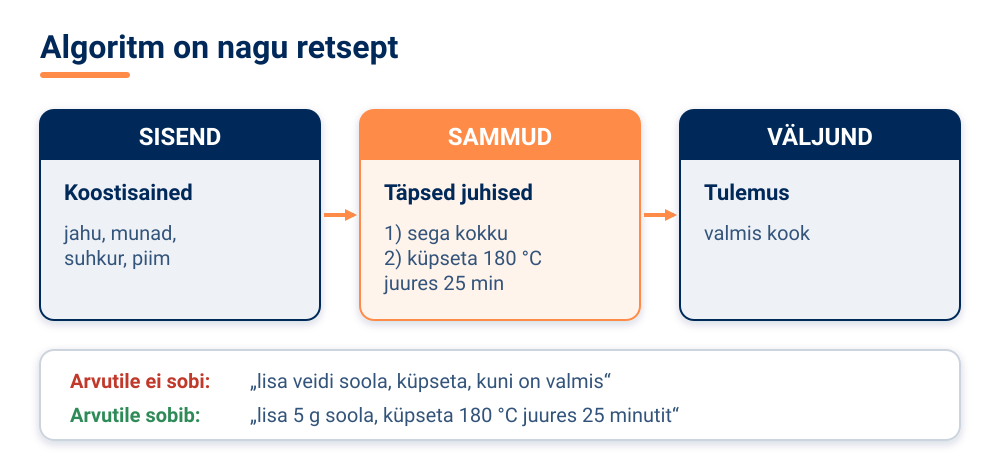

Allpool on lihtne igapäevane algoritm vooskeemina: kas võtta kooli kaasa vihmavari?

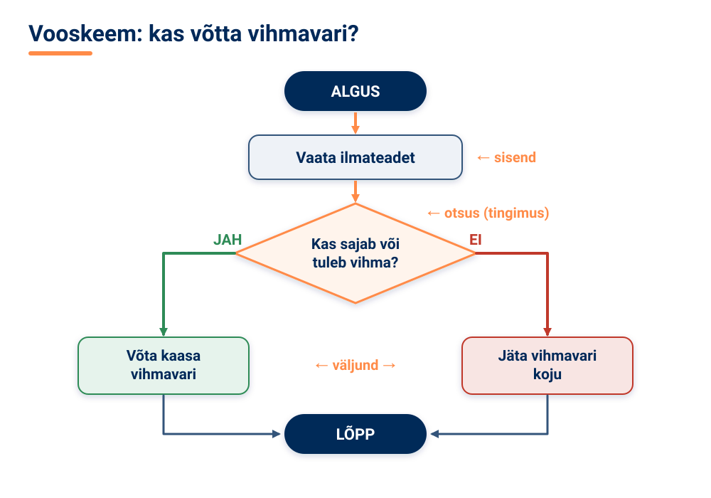

Algoritmid pole uus leiutis. Juba Vana-Kreeka matemaatikud kasutasid neid: **Eukleidese algoritm** leiab kahe arvu suurima ühisteguri ja **Eratosthenese sõel** aitab leida algarve. Arvutiteaduse arenedes lisandusid sorteerimis-, otsingu- ja graafialgoritmid (graaf on punktide ja neid ühendavate joonte võrgustik, näiteks linnade ja teede kaart). Tänapäeva tehisintellektis on kesksel kohal masinõppe ja süvaõppe algoritmid ning otsingualgoritmid.

<!-- class="pae-fakt" -->
> **Kas teadsid?** Algoritme kasutasid juba Vana-Kreeka matemaatikud. **Eukleidese algoritm** leiab kahe arvu suurima ühisteguri ja **Eratosthenese sõel** aitab leida algarve.

### Kuidas algoritme kirja panna

Ühte ja sama algoritmi saab esitada mitmel viisil, olenevalt sellest, kellele see on mõeldud.

- **Pseudokood** on inimkeelne, kuid täpne ja struktureeritud kirjeldus. See meenutab programmikoodi, aga ei pea vastama ühegi programmeerimiskeele reeglitele.
- **Vooskeem** on visuaalne esitus, kus sammud on kastides ja nooled näitavad, kuhu edasi liikuda. Rombikujulised kastid tähistavad otsuseid (jah/ei).
- **Programmeerimiskeel** (nt Python, JavaScript) on arvutile arusaadav esitus – just selles kujus saab arvuti algoritmi käivitada.
- **Matemaatiline esitus** kasutab valemeid ja funktsioone.

Näiteks algoritm, mis leiab arvude loetelust suurima, näeb pseudokoodis välja nii:

```
ALGORITM SuurimArv(loetelu)
    suurim = loetelu esimene arv
    IGA arvu x JAOKS loetelus TEE
        KUI x > suurim SIIS
            suurim = x
    LÕPP
    TAGASTA suurim
LÕPP
```

Selles väikeses näites on olemas kõik algoritmi põhiosad: sisend (loetelu), **kordus** ehk tsükkel (iga arvu läbivaatamine), **tingimus** ehk otsustuspunkt (KUI … SIIS) ja väljund (suurim arv).

<!-- class="pae-naide" -->
> **Näide: algoritmiline mõtlemine koolis**
>
> Algoritmilist mõtlemist kasutad ka siis, kui planeerid kontrolltööks õppimist: 1) vaata, mis teemad tulevad; 2) märgi teemad, mida juba oskad; 3) jaga ülejäänud teemad päevade peale; 4) iga päeva lõpus kontrolli, kas said hakkama; 5) kui ei saanud, lisa see teema järgmisse päeva. Sul on sisend (teemad ja aeg), sammud, otsused ja kordused ning väljund (valmis õppeplaan).

### Algoritmide tüübid tehisintellektis

Tehisintellektis kasutatakse eri ülesannete jaoks eri tüüpi algoritme. Vaatame peamisi.

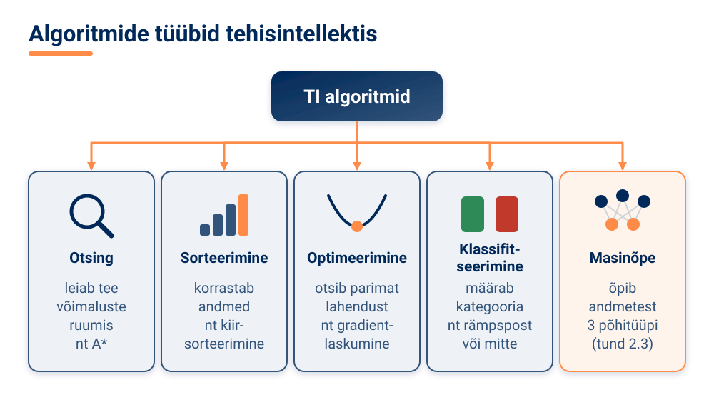

**Otsingualgoritmid** aitavad leida lahenduse väga suurest võimaluste hulgast ehk **otsinguruumist**. Kujuta ette, et otsid labürindist väljapääsu või navigatsioonirakendus otsib sulle teed kodust kooli. Võimalikke teid on palju ja algoritm peab need süsteemselt läbi vaatama.

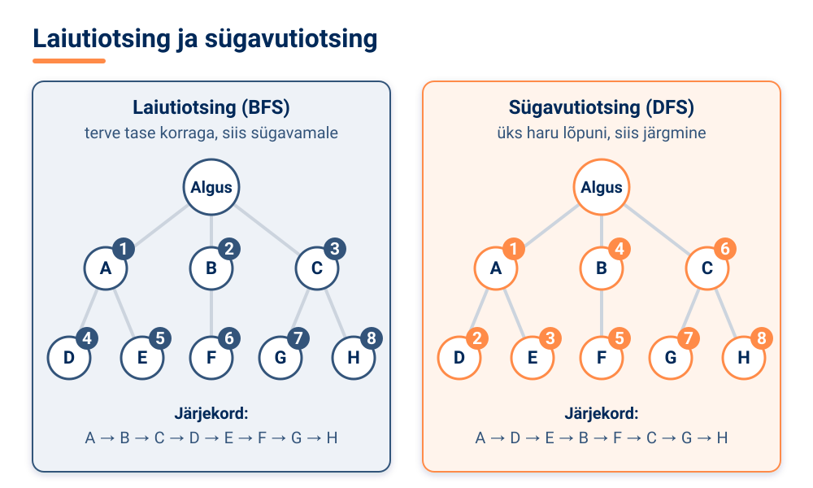

- **Laiutiotsing** (BFS) uurib kõiki samme samal tasemel, enne kui liigub sügavamale – nagu vette visatud kivist lähtuvad lained, mis levivad igas suunas ühtlaselt.
- **Sügavutiotsing** (DFS) käib ühe tee lõpuni ja proovib alles siis teisi – nagu labürindis ühe käigu lõpuni minek, enne kui tagasi pöörad.
- **Heuristiline otsing** kasutab „nutikat arvamist" ehk **heuristikat**, et jõuda tõenäoliselt parima lahenduseni kiiremini. Tuntud näide on **A\*** (loe „A-täht") algoritm, mida kasutatakse navigatsioonirakendustes: see eelistab teid, mis viivad sihtkohale linnulennult lähemale.
- **Minimax** on otsingualgoritm mängude jaoks (nt male). See eeldab, et vastane teeb alati enda jaoks parima käigu, ja valib sellise käigu, mis on halvimal juhul siiski kõige parem.

Otsingu suurim väljakutse on otsinguruumi suurus: males on võimalikke mängukäike nii palju, et kõiki pole võimalik läbi vaadata. Seepärast on oluline valida hea heuristika ja kasutada arvutusvõimsust säästlikult.

**Sorteerimisalgoritmid** korrastavad andmeid kindla loogika järgi, näiteks tähestiku või suuruse järgi. See on oluline andmete ettevalmistamisel. Lihtsaim on **mullsorteerimine**, mis võrdleb kõrvuti olevaid elemente ja vahetab need, kui järjekord on vale – suuremad arvud „mullitavad" nagu õhumullid järjest lõppu. Kiiremad on näiteks **kiirsorteerimine** (Quick Sort) ja **ühildamissorteerimine** (Merge Sort), mis jagavad loetelu osadeks ja sorteerivad neid eraldi.

**Optimeerimisalgoritmid** otsivad parimat lahendust paljude võimalike seast, näiteks lühimat teekonda või odavaimat tootmisplaani.

- **Gradientlaskumine** (gradient descent) otsib kõige väiksemat viga, liikudes samm-sammult „allamäge". Seda kasutatakse närvivõrkude treenimisel (sellest räägime lähemalt tunnis 2.4).
- **Geneetilised algoritmid** jäljendavad looduslikku evolutsiooni: paremad lahendused „paljunevad" ja „muteeruvad", kuni leitakse väga hea lahendus.
- **Parveintelligentsus** jäljendab loomade ühist käitumist. Näiteks sipelgakoloonia optimeerimine matkib seda, kuidas sipelgad leiavad lõhnajälgede abil lühima tee toiduni.

**Klassifitseerimisalgoritmid** määravad, millisesse kategooriasse objekt kuulub, näiteks kas e-kiri on rämpspost või mitte.

**Masinõppe algoritmid** võimaldavad arvutil õppida andmetest, ilma et teda oleks iga ülesande jaoks eraldi programmeeritud. Neid on kolm põhitüüpi:

- **juhendatud õpe** – algoritm õpib märgendatud näidetest, kus õige vastus on teada (nt otsustuspuud, närvivõrgud);
- **juhendamata õpe** – algoritm otsib mustreid märgendamata andmetest (nt klasterdamine ehk sarnaste asjade rühmitamine);
- **stiimulõpe** – algoritm õpib katse-eksituse meetodil, saades oma tegevuste eest tasu või karistust (nt mänge mängivad algoritmid).

Neist räägime põhjalikumalt tunnis 2.3.

<!-- class="pae-moiste" -->
> **Mõiste: traditsiooniline algoritm vs masinõppe algoritm**
>
> **Traditsioonilises algoritmis** kirjutab inimene kõik reeglid ise ette. **Masinõppe algoritm** leiab reeglid ise näidete ehk andmete põhjal. Traditsiooniline algoritm on läbipaistvam, masinõppe algoritm aga kohanemisvõimelisem.

### Kui hea on algoritm?

Ühte ülesannet saab lahendada mitme eri algoritmiga. Kuidas otsustada, milline on parem? Selleks hinnatakse algoritme mitme kriteeriumi järgi.

**Ajaline keerukus** (komplekssus) näitab, kui kiiresti kasvab algoritmi tööaeg, kui andmeid tuleb juurde. **Ruumiline keerukus** näitab, kui palju mälu algoritm vajab. Keerukust kirjeldatakse sageli **O-notatsiooniga** (loe „suur O"):

| Tähistus | Kuidas tööaeg kasvab | Igapäevane võrdlus |
|---|---|---|
| O(1) | ei kasva üldse | vaatad raamatu esimest lehte – pole vahet, kui paks raamat on |
| O(log n) | kasvab väga aeglaselt | otsid sõnastikust sõna, lüües raamatu alati keskelt pooleks |
| O(n) | kasvab samas tempos andmetega | loed klassinimekirja algusest lõpuni |
| O(n log n) | veidi kiiremini kui andmed | head sorteerimisalgoritmid |
| O(n²) | kasvab ruudus | iga õpilane kätleb iga teise õpilasega |
| O(2ⁿ) | kahekordistub iga uue andmega | proovid läbi kõik võimalikud kombinatsioonid |

<!-- data-type="linechart" data-title="Näide: mitu sammu kulub algoritmil n andme korral" -->
| n | O(1) | O(log n) | O(n) | O(n log n) | O(n²) | O(2ⁿ) |
|---|---:|---:|---:|---:|---:|---:|
| 1 | 1 | 0 | 1 | 0 | 1 | 2 |
| 2 | 1 | 1 | 2 | 2 | 4 | 4 |
| 3 | 1 | 1.6 | 3 | 4.8 | 9 | 8 |
| 4 | 1 | 2 | 4 | 8 | 16 | 16 |
| 5 | 1 | 2.3 | 5 | 11.6 | 25 | 32 |
| 6 | 1 | 2.6 | 6 | 15.5 | 36 | 64 |
| 7 | 1 | 2.8 | 7 | 19.7 | 49 | 128 |
| 8 | 1 | 3 | 8 | 24 | 64 | 256 |

Graafikult on näha, et juba kaheksa andme korral vajab O(2ⁿ) algoritm 256 sammu, O(n) algoritm aga ainult 8.

Kui andmeid on vähe, pole vahe märgatav. Aga TI-rakendused töötlevad sageli tohutuid andmehulki, mistõttu on kriitilise tähtsusega **skaleeruvus** – algoritmi võime töötada tõhusalt ka väga suurte andmemahtudega.

Tehisintellektis lisanduvad veel mõned olulised kriteeriumid:

- **täpsus** – kui õigeid tulemusi algoritm annab;
- **üldistusvõime** – kui hästi algoritm töötab uute andmetega, mida ta varem näinud pole;
- **selgitatavus** – kui hästi saab inimene aru, miks algoritm just sellise otsuse tegi.

Algoritmidel on ka **piirangud**. Mõned probleemid on matemaatiliselt tõestatult **lahendamatud** – kuulsaim neist on peatumise probleem (pole võimalik kirjutada algoritmi, mis iga programmi kohta ütleks, kas see kunagi lõpetab töö). Teised on küll teoreetiliselt lahendatavad, kuid nii **arvutusmahukad**, et lahendamine võtaks praktikas liiga kaua aega (nn NP-keerukad probleemid). Algoritm on ka ainult nii hea kui andmed, millega ta töötab: ebatäpsed või puudulikud andmed annavad vigase tulemuse. Lisaks on algoritmidel raske mõista konteksti, kultuurilisi nüansse ja tervet mõistust.

TI-algoritmidel on veel mõned tüüpilised mured, millega selles plokis veel kohtud:

- **ülesobitamine** – algoritm on õppinud treeningandmed liiga täpselt „pähe";
- **alasobitamine** – algoritm on liiga lihtne ega taba olulisi seoseid;
- **kallutatus** – algoritm annab mõne inimrühma suhtes ebaõiglasi tulemusi;
- **läbipaistvus** ehk „musta kasti" probleem – ei ole näha, kuidas otsus sündis;
- **arvutusressursid** – suurte mudelite treenimine kulutab palju energiat ja aega.

<!-- class="pae-motle" -->
> **Mõtle järele!**
>
> Millised ülesanded on algoritmile lihtsad, aga inimesele rasked? Ja vastupidi – mis on sulle lihtne, aga arvutile raske? Mõtle näiteks 1000 arvu sorteerimisele, sõbra näoilme tõlgendamisele ja nalja mõistmisele.

### Algoritmid ja inimene – ning algoritmid Eestis

Algoritmid ja inimese mõtlemine on mõnes mõttes sarnased: mõlemad töötlevad infot, võivad õppida kogemustest ja teha andmete põhjal järeldusi. Erinevusi on aga rohkem. Inimesed on paremad konteksti mõistmises ja loovuses ning kasutavad intuitsiooni ja emotsioone. Algoritmid on kiiremad arvutustes, ei väsi ega lähe tujust välja, kuid järgivad rangelt ette antud reegleid. Tehisintellekti eesmärk ei ole tingimata inimese mõtlemise täpne kopeerimine, vaid inimese võimete täiendamine ja laiendamine.

Algoritmid on sinu ümber kogu aeg:

- **soovitussüsteemid** (Netflix, Spotify, YouTube, e-poed) pakuvad sisu, mis võiks sulle meeldida;
- **otsingualgoritmid** (Google, Bing) järjestavad miljardeid veebilehti;
- **navigatsioonialgoritmid** (Google Maps, Waze) leiavad kiireima tee;
- **näotuvastus** avab sinu telefoni;
- **keeletöötlus** tõlgib teksti ja vastab vestlusrobotis küsimustele;
- **meditsiiniline diagnostika** aitab arstidel haigusi tuvastada.

<!-- class="pae-eesti" -->
> **Eesti näide: algoritmid Eesti ettevõtetes**
>
> - **Bolt** kasutab algoritme sõitude sobitamiseks (milline juht on sinule kõige lähemal), hindade määramiseks ja nõudluse ennustamiseks.
> - **Starship Technologies** on loonud isesõitvad kullerrobotid, mis kasutavad keerukaid algoritme navigeerimiseks ja takistuste vältimiseks.
> - **Lingvist** kasutab algoritme, et pakkuda igale keeleõppijale tema tasemele kohandatud õpet.
> - **Veriff** kasutab algoritme isikusamasuse tuvastamiseks ja pettuste avastamiseks veebis.
> - **Skeleton Technologies** arendab energiasalvestuslahendusi, kus algoritmid aitavad energia kasutamist juhtida ja optimeerida.

Mis ootab algoritme tulevikus? Arendajad kombineerivad üha enam eri algoritmitüüpe (**hübriidsed lähenemised**), uurivad aju tööst inspireeritud **neuromorfseid** arvutusi ja **kvantarvutite** algoritme. Üha olulisemaks muutuvad ka **selgitatav tehisintellekt** (läbipaistvamad algoritmid, mille otsuseid saab mõista) ning **ressursitõhusad algoritmid**, mis vajavad vähem andmeid ja arvutusvõimsust.

<!-- class="pae-lisaks" -->
> **Tea lisaks**
>
> Sõna „algoritm" pärineb 9. sajandil Bagdadis elanud Pärsia matemaatiku al-Khwārizmī nimest. Tema raamatute ladinakeelsetes tõlgetes muutus tema nimi sõnaks *algorismus*, millest sai lõpuks „algoritm".

### Kokkuvõte ja põhimõisted

**Pea meeles**

- Algoritm on täpne ja lõplik sammude jada, millel on sisend ja väljund; see on iga TI-süsteemi alus.
- Algoritme saab esitada pseudokoodi, vooskeemi, programmeerimiskeele või valemite abil.
- TI kasutab eri algoritmitüüpe: otsingu-, sorteerimis-, optimeerimis-, klassifitseerimis- ja masinõppe algoritme.
- Algoritme hinnatakse kiiruse, mälukasutuse, täpsuse, üldistusvõime ja selgitatavuse järgi.
- Algoritmidel on piirangud: mõni probleem on lahendamatu või liiga arvutusmahukas, halvad andmed annavad halva tulemuse ning konteksti mõistmine on algoritmile raske.
- Algoritmide arendamisel tuleb arvestada nii tehniliste kui ka eetiliste küsimustega (kallutatus, läbipaistvus).

| Mõiste | Tähendus |
|---|---|
| Algoritm | Täpne juhiste jada probleemi lahendamiseks |
| Pseudokood | Inimkeelne, kuid struktureeritud algoritmi kirjeldus |
| Vooskeem | Algoritmi visuaalne esitus kastide ja noolte abil |
| Otsingualgoritm | Algoritm, mis otsib lahendust võimaluste ruumist (laiuti-, sügavuti-, heuristiline otsing) |
| Heuristika | „Nutikas rusikareegel", mis aitab lahenduse kiiremini leida |
| Optimeerimisalgoritm | Algoritm, mis otsib paljude lahenduste seast parimat |
| Ajaline keerukus | Näitab, kuidas algoritmi tööaeg kasvab andmete hulgaga |
| Skaleeruvus | Algoritmi võime töötada tõhusalt ka väga suurte andmemahtudega |
| Selgitatavus | Kui hästi saab inimene aru algoritmi otsuse põhjustest |

### Tööleht 2.1

<!-- class="pae-jaotis" -->
**I. Algoritmide mõistmine**

**Ülesanne 1.** Selgita oma sõnadega, mis on algoritm.

[[___ ___ ___]]

**Ülesanne 2.** Nimeta kolm näidet algoritmidest igapäevaelus.

[[___ ___ ___]]

**Ülesanne 3.** Ühenda algoritmi omadused nende selgitustega.

| Täht | Kirjeldus |
|:---:|---|
| **A** | Algoritm peab olema piisavalt lihtne, et seda saaks täita |
| **B** | Algoritm peab lõpuks jõudma tulemuseni |
| **C** | Algoritmi iga samm peab olema täpselt määratletud |
| **D** | Andmed, mida algoritm töötleb |
| **E** | Algoritmi töö tulemus |

- [ (A) (B) (C) (D) (E) ]
- [ ( ) (X) ( ) ( ) ( ) ] Lõplikkus
- [ ( ) ( ) (X) ( ) ( ) ] Määratus
- [ ( ) ( ) ( ) (X) ( ) ] Sisend
- [ ( ) ( ) ( ) ( ) (X) ] Väljund
- [ (X) ( ) ( ) ( ) ( ) ] Efektiivsus
****************************************
Lõplikkus tähendab, et algoritm jõuab tulemuseni ega jää lõputult tööle. Määratus tähendab, et iga samm on üheselt kirjeldatud. Sisend on töödeldavad andmed ja väljund töö tulemus. Efektiivsus tähendab, et sammud on tehtavad ja ressursse kasutatakse mõistlikult.
****************************************

<!-- class="pae-jaotis" -->
**II. Algoritmide esitamine**

**Ülesanne 4.** Kirjuta pseudokoodis algoritm mõne igapäevase tegevuse jaoks (nt hambapesu, tee valmistamine).

[[___ ___ ___ ___ ___]]

**Ülesanne 5.** Koosta vooskeem lihtsa otsustusprotsessi jaoks (nt „Kas väljas sajab?"). Joonista see paberile või kirjelda siin sõnadega: millised on kastid, millised otsused (jah/ei) ja kuhu nooled viivad.

[[___ ___ ___ ___]]

**Ülesanne 6.** Kirjuta pseudokoodis algoritm, mis leiab etteantud arvude hulgast suurima.

[[___ ___ ___ ___ ___]]

<!-- class="pae-jaotis" -->
**III. Algoritmide tüübid**

**Ülesanne 7.** Kirjelda lühidalt järgmisi algoritmitüüpe.

**a) Järjestusalgoritmid:**

[[___ ___]]

**b) Otsingualgoritmid:**

[[___ ___]]

**c) Sorteerimisalgoritmid:**

[[___ ___]]

**d) Graafialgoritmid:**

[[___ ___]]

**Ülesanne 8.** Täida tabel sorteerimisalgoritmide kohta.

| Algoritm | Tööpõhimõte | Efektiivsus (kiirus) |
|---|---|---|
| Mullsorteerimine (Bubble Sort) | | |
| Kiirsorteerimine (Quick Sort) | | |
| Ühildamissorteerimine (Merge Sort) | | |

**Mullsorteerimine:**

[[___ ___]]

**Kiirsorteerimine:**

[[___ ___]]

**Ühildamissorteerimine:**

[[___ ___]]

<!-- class="pae-jaotis" -->
**IV. Algoritmide analüüs**

**Ülesanne 9.** Mis on algoritmi keerukus ja miks see on oluline?

[[___ ___ ___]]

**Ülesanne 10.** Järjesta keerukusklassid kasvavalt (kiiremast aeglasemani).

O(n²): [[ 1 | 2 | 3 | 4 | (5) | 6 ]]  
O(1): [[ (1) | 2 | 3 | 4 | 5 | 6 ]]  
O(n log n): [[ 1 | 2 | 3 | (4) | 5 | 6 ]]  
O(n): [[ 1 | 2 | (3) | 4 | 5 | 6 ]]  
O(2ⁿ): [[ 1 | 2 | 3 | 4 | 5 | (6) ]]  
O(log n): [[ 1 | (2) | 3 | 4 | 5 | 6 ]]  

**Ülesanne 11.** Analüüsi järgmist algoritmi.

```
ALGORITM Summa(n)
    s = 0
    FOR i = 1 TO n DO
        s = s + i
    END FOR
    RETURN s
END ALGORITM
```

**a) Mida see algoritm teeb?**

[[___]]

**b) Milline on selle algoritmi ajaline keerukus?**

[[___]]

**c) Kuidas saaks seda algoritmi optimeerida?**

[[___ ___]]

<!-- class="pae-jaotis" -->
**V. Praktiline ülesanne**

**Ülesanne 12.** Jälgi mullsorteerimise algoritmi järjendil [5, 3, 8, 4, 2] ja näita, kuidas järjend igal sammul muutub. Kirjuta iga sammu kohta järjendi seis ning millised elemendid võrreldi ja vahetati.

| Samm | Järjendi seis | Milliseid elemente võrreldi ja vahetati? |
|---|---|---|
| 0 | [5, 3, 8, 4, 2] | Algseisund |
| 1 | | |
| 2 | | |
| 3 | | |
| … | | |
| Lõpp | | |

[[___ ___ ___ ___ ___]]

**Ülesanne 13.** Kirjuta algoritm, mis kontrollib, kas sõna on palindroom ehk loetakse mõlemat pidi ühtemoodi (nt „kuulilennuteetunneliluuk").

[[___ ___ ___ ___ ___]]

<!-- class="pae-jaotis" -->
**VI. Algoritmid ja tehisintellekt**

**Ülesanne 14.** Kuidas on algoritmid seotud tehisintellektiga?

[[___ ___ ___ ___]]

**Ülesanne 15.** Võrdle traditsioonilisi algoritme ja masinõppe algoritme.

| Aspekt | Traditsioonilised algoritmid | Masinõppe algoritmid |
|---|---|---|
| Programmeerimine | | |
| Andmete roll | | |
| Kohanemisvõime | | |
| Läbipaistvus | | |
| Näited | | |

**Programmeerimine:**

[[___ ___]]

**Andmete roll:**

[[___ ___]]

**Kohanemisvõime:**

[[___ ___]]

**Läbipaistvus:**

[[___ ___]]

**Näited:**

[[___ ___]]

<!-- class="pae-jaotis" -->
**VII. Arutelu**

**Ülesanne 16.** Millised on algoritmide eetilised aspektid? Kuidas võivad algoritmid mõjutada ühiskonda?

[[___ ___ ___ ___]]

**Ülesanne 17.** Kuidas saaksid algoritmilist mõtlemist rakendada oma igapäevaelus või õpingutes?

[[___ ___ ___ ___]]

### Enesekontroll 2.1

**1. Kuidas nimetatakse täpset ja selgelt määratletud sammude jada, mis kirjeldab, kuidas ülesanne samm-sammult lahendada? Kirjuta vastus.**

[[algoritm]]
<script>
let v = `@input`.trim().toLowerCase().replace(/\s+/g, " ");
["algoritm", "algoritmi", "algoritmid", "algoritmiks"].includes(v)
</script>
****************************************
Õige vastus: **algoritm**. Nagu retseptis, on ka algoritmis sisend, täpsed sammud ja väljund.
****************************************

**2. Lohista algoritmi põhiomadused õigetesse lünkadesse.**

<!-- data-show-partial-solution -->
Algoritm lõpetab töö kindla arvu sammude järel – see on [->[ (lõplikkus) ]]. Iga samm on täpselt ja üheselt kirjeldatud – see on [->[ (määratus) | loovus ]]. Algoritm kasutab aega ja muid ressursse mõistlikult – see on [->[ (efektiivsus) | juhuslikkus ]].
****************************************
Algoritmi viis põhiomadust on lõplikkus, määratus, sisend, väljund ja efektiivsus. Loovus ja juhuslikkus ei ole algoritmi põhiomadused.
****************************************

**3. Liigita algoritmid tüübi järgi.**

- [ (Otsingualgoritm) (Sorteerimisalgoritm) (Optimeerimisalgoritm) ]
- [ (X) ( ) ( ) ] Laiutiotsing (BFS)
- [ ( ) (X) ( ) ] Mullsorteerimine
- [ ( ) ( ) (X) ] Gradientlaskumine
- [ (X) ( ) ( ) ] Minimax malemängus
- [ ( ) (X) ( ) ] Kiirsorteerimine (Quick Sort)
- [ ( ) ( ) (X) ] Geneetiline algoritm
****************************************
Otsingualgoritmid (laiutiotsing, minimax) otsivad lahendust võimaluste ruumist. Sorteerimisalgoritmid (mullsorteerimine, kiirsorteerimine) korrastavad andmeid. Optimeerimisalgoritmid (gradientlaskumine, geneetilised algoritmid) otsivad paljude lahenduste seast parimat.
****************************************

**4. Vali lünkadesse õige otsingualgoritm.**

<!-- data-show-partial-solution -->
Algoritm, mis vaatab läbi kõik sama taseme võimalused ja liigub alles siis sügavamale, on [[ sügavutiotsing | (laiutiotsing) | A-täht ]]. Algoritm, mis käib ühe haru lõpuni ja proovib alles siis teisi, on [[ (sügavutiotsing) | laiutiotsing | A-täht ]]. Navigatsioonirakendustes kasutatav heuristiline otsing on [[ sügavutiotsing | laiutiotsing | (A-täht) ]].
****************************************
Laiutiotsing levib nagu vette visatud kivist tekkivad lained – igas suunas ühtlaselt. Sügavutiotsing käib ühe haru lõpuni nagu labürindis. A\* („A-täht") kasutab heuristikat ehk „nutikat arvamist" ja eelistab teid, mis viivad sihtkohale linnulennult lähemale.
****************************************

**5. Algoritm, mille ajaline keerukus on O(n²), teeb n andme korral umbes n² sammu. Mitu sammu teeb see algoritm 10 andme korral?**

[[100]]
<script>
Number(`@input`.trim().replace(",", ".")) === 100
</script>
****************************************
10² = 10 × 10 = **100** sammu. Võrdluseks: O(n) algoritm teeks 10 sammu, O(2ⁿ) algoritm aga juba 1024 sammu.
****************************************

**6. Pane kontrolltööks õppimise plaani koostamise sammud õigesse järjekorda.**

<!-- data-show-partial-solution -->
Jaga ülejäänud teemad päevade peale: [[ 1 | 2 | (3) | 4 | 5 ]]<br>
Vaata, mis teemad kontrolltöösse tulevad: [[ (1) | 2 | 3 | 4 | 5 ]]<br>
Kui ei saanud hakkama, lisa see teema järgmisse päeva: [[ 1 | 2 | 3 | 4 | (5) ]]<br>
Märgi teemad, mida juba oskad: [[ 1 | (2) | 3 | 4 | 5 ]]<br>
Iga päeva lõpus kontrolli, kas said hakkama: [[ 1 | 2 | 3 | (4) | 5 ]]
****************************************
Õige järjekord: 1. vaata teemasid → 2. märgi, mida juba oskad → 3. jaga ülejäänud teemad päevade peale → 4. kontrolli iga päeva lõpus → 5. vajadusel lisa teema järgmisse päeva. Selles algoritmis on sisend, sammud, otsus („kas said hakkama?") ja kordus.
****************************************

**7. Mida tähendab „musta kasti" probleem?**

- [( )] Arvuti kõvaketas on täis
- [(X)] Ei ole näha ega mõista, kuidas algoritm oma otsuseni jõudis
- [( )] Algoritm on kirjutatud salajases programmeerimiskeeles
- [( )] Andmed on kustutatud
****************************************
„Must kast" on süsteem, mille sisemist toimimist on raske või võimatu mõista – näeme sisendit ja väljundit, kuid mitte otsuse põhjusi. Seda aitab lahendada selgitatav tehisintellekt.
****************************************

**8. Retseptis on kirjas: „Lisa veidi soola ja küpseta, kuni on valmis." Selgita, miks see ei ole arvuti jaoks algoritm, ja paranda juhist nii, et see oleks algoritm.**

[[___ ___ ___]]

<details>
<summary>Vaata näidisvastust</summary>

Juhis ei ole määratud ehk täpne: „veidi" ja „kuni on valmis" ei ütle arvutile, kui palju soola panna ja millal küpsetamine lõpetada. Arvuti ei oska ise oletada. Algoritmina võiks juhis olla näiteks: „Lisa 5 grammi soola. Küpseta 180 kraadi juures 25 minutit."

</details>


## 2.2 Andmed ja nende tähtsus

### Õpieesmärgid

<!-- class="pae-kaas" -->


Selle tunni järel sa:

- oskad selgitada, miks andmed on tehisintellekti jaoks nii olulised;
- tunned eri andmetüüpe ja andmete kogumise viise;
- tead, kuidas andmeid enne masinõpet ette valmistatakse ja miks neid jagatakse treening-, valideerimis- ja testandmeteks;
- oskad hinnata andmete kvaliteeti ja märgata andmete kallutatust;
- tead, mida tähendavad suurandmed, andmekaitse ja isikuandmete kaitse üldmäärus (GDPR), ning oskad tuua näiteid andmete kasutamisest Eestis.

### Miks andmed on nii olulised?

Tihti öeldakse, et **„andmed on uus nafta"**. Nii nagu nafta oli 20. sajandil tööstuse kütus, on andmed tänapäeval digimaailma ja tehisintellekti kütus. Andmeid on vaja „rafineerida" – koguda, puhastada ja töödelda –, enne kui neist on kasu. Ilma kvaliteetsete andmeteta ei saa tehisintellekt õppida ega areneda.

Tehisintellekti võib kirjeldada lihtsa võrdusega:

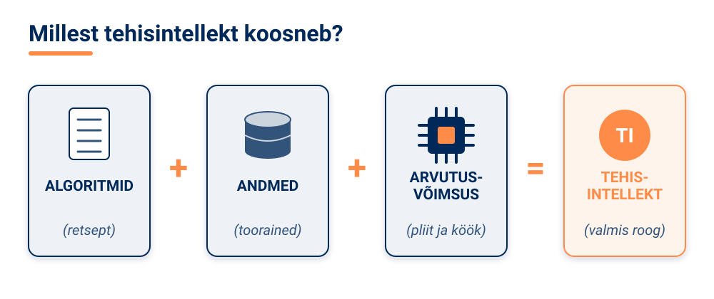

Varem kirjutasid programmeerijad kõik reeglid käsitsi. Tänapäeva TI kasutab **andmepõhist lähenemist**: reeglite asemel antakse arvutile näited ja arvuti õpib neist ise. Andmete abil suudab TI:

- tuvastada mustreid ja seaduspärasusi;
- teha ennustusi tuleviku kohta;
- kohaneda uute olukordadega;
- parandada aja jooksul oma täpsust.

Oluline tähelepanek: **sama algoritm, aga erinevad andmed annavad erinevad tulemused.** Kui õpetad pildituvastusmudelit ainult kasside piltidega, ei tunne see koera ära. Kui õpetad seda ainult valgustatud fotodega, eksib see pimedas tehtud piltide puhul. Mida rohkem on kvaliteetseid andmeid, seda paremini TI toimib.

<!-- class="pae-moiste" -->
> **Mõiste: andmestik**
>
> **Andmestik** (*dataset*) on kogum korrastatud andmeid, mida kasutatakse masinõppe mudeli treenimiseks ja testimiseks. Näiteks võib andmestik koosneda 10 000 e-kirjast, millest iga kohta on märgitud, kas see on rämpspost või mitte.

Eri TI valdkonnad vajavad eri andmeid. Masinõppe juhendatud õpe vajab **märgendatud andmeid** (andmeid, millele on lisatud õige vastus), keeletöötlus vajab suuri tekstikogusid ehk korpusi (masintõlke jaoks paralleelkorpusi, kus sama tekst on mitmes keeles), arvutinägemine vajab märgendatud pilte ja videoid ning soovitussüsteemid kasutajate käitumisandmeid.

### Andmetüübid ja andmete kogumine

TI-süsteemid töötavad mitut tüüpi andmetega ja sellest sõltub, kuidas andmeid töödeldakse.

| Andmetüüp | Kirjeldus | Näited |
|---|---|---|
| **Struktureeritud andmed** | Korrastatud tabelina, selgelt määratud väljadega; lihtne analüüsida | e-kooli hinded, poe kassatšekid, kliendiregister, CSV-fail |
| **Poolstruktureeritud andmed** | Osaliselt korrastatud: on sildid ja väljad, aga struktuur pole range | JSON- ja XML-failid, veebilehed (HTML), e-kirjad |
| **Struktureerimata andmed** | Kindel struktuur puudub; neid on maailmas kõige rohkem ja neid on kõige raskem töödelda | tekstid, pildid, videod, helisalvestised, sotsiaalmeedia postitused |

Näiteks e-kiri on poolstruktureeritud: sellel on kindlad väljad (saatja, saaja, kuupäev, teema), aga kirja sisu on vaba tekst.

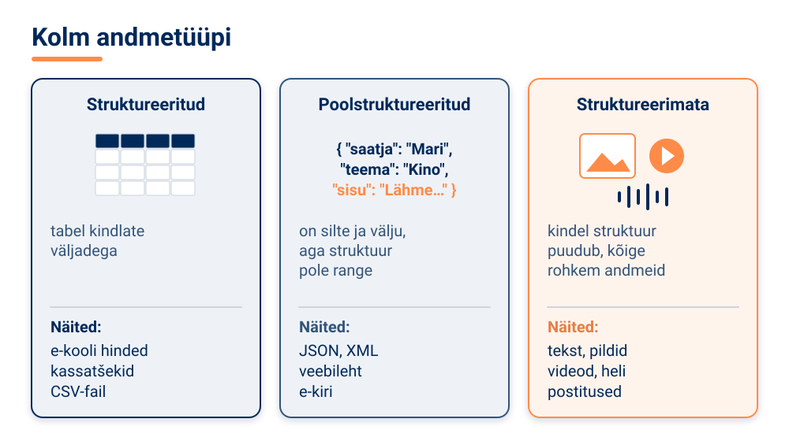

Andmeid saab koguda mitmel viisil.

- **Otsene kogumine**: andurid ja nutiseadmed (asjade internet ehk IoT), kasutajate sisestatud andmed, küsitlused ja uuringud.
- **Kaudne kogumine**: kasutajate käitumine (klõpsud, vaatamised, kerimine), logifailid ja metaandmed ehk andmed andmete kohta (nt foto tegemise aeg ja koht).
- **Avalikud andmekogud**: riigi andmed, teadusandmed ja avaandmed (*Open Data*), mida igaüks võib kasutada.
- **Sünteetilised andmed**: arvuti loodud või simulatsioonist pärit andmed, mida kasutatakse siis, kui päris andmeid on vähe või need on liiga tundlikud.

Tehniliselt kasutatakse automaatset jälgimist ja logimist, **veebikraapimist** (programm kogub andmeid veebilehtedelt), **API-sid** (liidesed, mille kaudu süsteemid andmeid vahetavad), otsest andmesisestust ja **rahvahanget** (*crowdsourcing*), kus paljud inimesed aitavad andmeid koguda või märgendada.

<!-- class="pae-naide" -->
> **Näide: sinu digijälg**
>
> Ühe tavalise koolipäeva jooksul tekitad sa hulga andmeid: telefoni asukohaandmed bussis, sotsiaalmeedias vaadatud videod ja nende vaatamise kestus, Spotifys kuulatud lood, e-koolis vaadatud hinded, poes kaardiga makstud ost. Osa neist kogutakse otseselt (sa sisestad ise), osa kaudselt (rakendus jälgib sinu käitumist). Just neid andmeid kasutavad soovitussüsteemid, et sulle järgmist videot pakkuda.

Andmete kogumisel tuleb alati järgida seadusi ja eetilisi põhimõtteid, eriti kui tegemist on **isikuandmetega** – andmetega, mille järgi saab inimese tuvastada.

### Andmete ettevalmistamine ja jagamine

Kogutud **toorandmed** on harva kohe kasutuskõlblikud. Neis on vigu, lünki ja kordusi. Hinnanguliselt võib andmete ettevalmistamine moodustada kuni 80% kogu TI-projekti tööst. Kehtib põhimõte **„prügi sisse, prügi välja"**: kui annad mudelile halvad andmed, saad ka halvad tulemused.

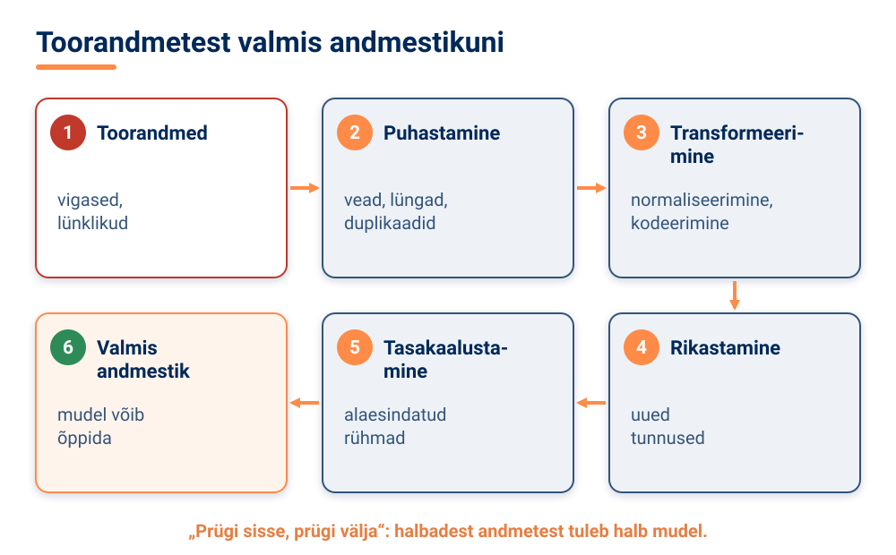

- **Puhastamine** – vigaste, puuduvate või ebakorrektsete andmete tuvastamine ja parandamine või eemaldamine, korduvate kirjete (duplikaatide) kustutamine. Siia kuulub ka **erindite** (*outliers*) leidmine – väärtused, mis on teistest väga erinevad (nt õpilase vanus 150 aastat on ilmselt sisestusviga).
- **Normaliseerimine** ehk skaleerimine – andmete viimine samale skaalale. Kui üks tunnus on vahemikus 0–1 ja teine 0–1000, võiks mudel ekslikult arvata, et suurem arv on olulisem. Normaliseerimine viib mõlemad samasse vahemikku.
- **Transformeerimine** – andmete teisendamine sobivasse vormi. Arvuti oskab arvutada ainult arvudega, seega tuleb näiteks sõnad „põhiharidus", „keskharidus", „kõrgharidus" muuta arvudeks. Seda nimetatakse **kategooriliste tunnuste kodeerimiseks**; tekst muudetakse arvude jadaks ehk **vektoriks**.
- **Rikastamine** – lisainfo juurde toomine, näiteks aadressidele koordinaatide lisamine või olemasolevatest andmetest uute tunnuste loomine.
- **Tasakaalustamine** – kui ühte rühma on andmetes palju vähem kui teist, lisatakse alaesindatud rühma näiteid juurde (ülevalik) või vähendatakse ülekaalus oleva rühma näiteid (alavalik). Andmeid saab juurde tekitada ka **augmenteerimisega** – näiteks pilte pöörates, peegeldades või heledust muutes.

<!-- class="pae-fakt" -->
> **Kas teadsid?** Hinnanguliselt võib andmete ettevalmistamine moodustada **kuni 80%** kogu TI-projekti tööst. Kehtib põhimõte „prügi sisse, prügi välja“.

Andmete mõistmiseks kasutatakse ka **andmete visualiseerimist**: tulp-, joon- ja hajuvusdiagramme ning soojuskaarte. Need aitavad märgata mustreid ja vigu ning tulemusi teistele selgitada. Visualiseerimiseks kasutatakse näiteks Pythoni teeke (Matplotlib, Seaborn, Plotly) ja programme nagu Tableau või Power BI.

Enne treenimist **jagatakse andmed** kolmeks osaks:

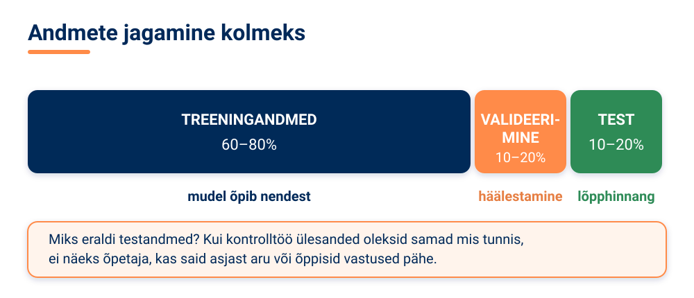

<!-- class="pae-moiste" -->
> **Mõiste: treeningandmed ja testandmed**
>
> **Treeningandmed** on andmed, mille põhjal mudel õpib. **Valideerimisandmeid** kasutatakse treenimise ajal mudeli seadistuste ehk hüperparameetrite häälestamiseks. **Testandmed** on andmed, mida mudel pole treenimise ajal näinud; nende põhjal hinnatakse lõpuks, kui hästi mudel uute andmetega toime tuleb.

Miks on vaja eraldi testandmeid? Mõtle kontrolltööle: kui õpetaja annaks kontrolltöös täpselt samad ülesanded, mis olid tunnis, ei saaks ta teada, kas sa said asjast aru või õppisid lihtsalt vastused pähe. Testandmed on mudeli jaoks „uued ülesanded".

Jagamiseks on mitu viisi: **juhuslik jagamine**; **kihiline (stratifitseeritud) jagamine**, kus iga rühma osakaal on kõigis osades sama; **ajaline jagamine**, kus vanemad andmed lähevad treenimiseks ja uuemad testimiseks; ning **ristvalideerimine**, kus andmed jagatakse mitmeks osaks ja iga osa on kordamööda testi rollis.

### Andmete kvaliteet ja kallutatus

Isegi kõige parem algoritm ei suuda korvata halbu andmeid. Andmete kvaliteeti hinnatakse mitme tunnuse järgi:

| Kvaliteedi tunnus | Küsimus, mida endalt küsida |
|---|---|
| **Täpsus** | Kas andmed vastavad tegelikkusele? |
| **Täielikkus** | Kas kõik vajalikud väljad on täidetud või on palju lünki? |
| **Järjepidevus** | Kas andmed on ühtsed ja kooskõlas (nt kuupäevad alati samas vormis)? |
| **Ajakohasus** | Kas andmed on piisavalt värsked? |
| **Asjakohasus** | Kas andmed on selle ülesande jaoks üldse olulised? |
| **Unikaalsus** | Kas andmetes on duplikaate? |
| **Mõistetavus** | Kas andmed on selgelt kirjeldatud ja dokumenteeritud? |
| **Esinduslikkus** | Kas andmed kajastavad kõiki rühmi, kellega süsteem hakkab töötama? |

Andmetes võib esineda ka **müra** – juhuslikke vigu ja kõrvalekaldeid, mis ei kanna kasulikku infot (nt udune foto või valesti kuuldud sõna).

Suurem andmehulk ei tähenda alati paremat mudelit. Väike, kuid kvaliteetne ja mitmekesine andmestik võib olla parem kui suur, kuid mürane.

<!-- class="pae-moiste" -->
> **Mõiste: kallutatus**
>
> **Kallutatus** (*bias*) tähendab, et andmetes või TI-süsteemi otsustes on süstemaatiline viga, mis soosib või kahjustab mõnda inimrühma. TI õpib kallutatud andmetest ka kallutatuse ning võib seda isegi võimendada.

Kallutatust on mitut liiki.

- **Valimi kallutatus**: mõned rühmad on andmetes üle- või alaesindatud. Näiteks kui näotuvastust treenitakse peamiselt ühe vanuse- või nahatooniga inimeste fotodel, töötab see teiste puhul halvemini.
- **Mõõtmise kallutatus**: andmeid on kogutud ebatäpselt või ebaühtlaselt, näiteks eri seadmete või meetoditega.
- **Ajaloolise kallutatuse peegeldamine**: andmed peegeldavad mineviku ebavõrdsust. Kui varasemate töölevõtmiste või laenuotsuste andmetes on mingit rühma ebaõiglaselt koheldud, õpib TI sama mustrit kordama.
- **Tagasiside kallutatus**: süsteem ise mõjutab andmeid, mida ta kogub. Soovitussüsteem näitab sulle sarnaseid videoid, sina vaatad neid, süsteem järeldab, et sulle meeldivad ainult sellised, ja sinu „mull" läheb järjest kitsamaks.

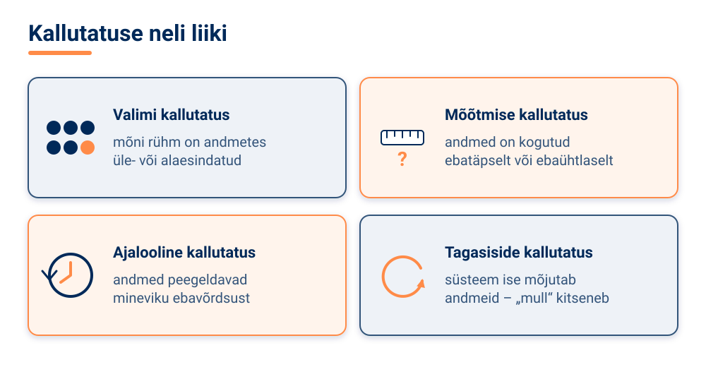

<!-- class="pae-motle" -->
> **Mõtle järele!**
>
> Kujuta ette, et kool tahab luua TI, mis ennustab, kes õpilastest vajab lisaõpet. Andmed kogutakse ainult nende õpilaste kohta, kes on viimase kahe aasta jooksul ise järeleaitamistundi tulnud. Millist liiki kallutatus siin võib tekkida? Keda see süsteem võib märkamata jätta?

### Suurandmed ja andmekaitse

**Suurandmed** (*Big Data*) on andmehulgad, mis on nii suured, keerukad ja kiiresti muutuvad, et tavalised andmetöötlusvahendid nendega toime ei tule. Suurandmeid kirjeldatakse sageli **viie V** abil:

| V | Eesti keeles | Tähendus |
|---|---|---|
| Volume | maht | andmeid on tohutult palju – terabaitidest petabaitideni |
| Velocity | kiirus | andmed tekivad ja muutuvad väga kiiresti, sageli reaalajas |
| Variety | mitmekesisus | andmed on eri vormingus – tabelid, tekst, pilt, heli |
| Veracity | tõepärasus | andmete usaldusväärsus ja kvaliteet võib olla ebaühtlane |
| Value | väärtus | andmetest tuleb leida kasulik info ja teadmised |

Suurandmete töötlemiseks kasutatakse hajutatud andmetöötlust (töö jagatakse paljude arvutite vahel), spetsiaalseid tehnoloogiaid (nt Hadoop, Spark, NoSQL-andmebaasid) ja pilveplatvorme. Väljakutseteks on andmete salvestamine ja töötlemine, privaatsus ja turvalisus ning analüüsi keerukus.

Mida rohkem andmeid kogutakse, seda olulisemaks muutub **andmekaitse**. Euroopa Liidus reguleerib isikuandmete kasutamist **isikuandmete kaitse üldmäärus (GDPR)**. Selle põhimõtted on:

- **seaduslikkus, õiglus ja läbipaistvus** – inimene peab teadma, mida tema andmetega tehakse;
- **eesmärgi piirang** – andmeid tohib koguda ainult kindlal eesmärgil;
- **võimalikult väheste andmete kogumine** – koguda tohib vaid seda, mis on vajalik;
- **täpsus** – andmed peavad olema õiged ja ajakohased;
- **säilitamise piirang** – andmeid ei tohi hoida kauem, kui vaja;
- **terviklikkus ja konfidentsiaalsus** – andmeid tuleb kaitsta lekete eest.

GDPR annab inimesele (**andmesubjektile**) ka õigusi, näiteks õiguse teada, milliseid andmeid tema kohta kogutakse, ja nõuda nende parandamist või kustutamist. Reeglite rikkumise eest võivad ettevõtteid oodata suured trahvid.

Privaatsust aitavad kaitsta ka tehnilised võtted: **anonüümimine** (isikut tuvastavad andmed eemaldatakse jäädavalt), **pseudonüümimine** (nimi asendatakse koodiga), **diferentsiaalne privaatsus** (andmetele lisatakse kontrollitud „müra", et üksikisikut ei saaks ära tunda) ja **krüpteerimine** (andmed muudetakse ilma võtmeta loetamatuks).

Lisaks seadustele tuleb arvestada eetiliste küsimustega: kas inimesed on andnud **nõusoleku**, kas andmete kasutamine on **läbipaistev**, kas see on **õiglane** kõigi rühmade suhtes ja kes **vastutab**, kui midagi läheb valesti.

### Andmed Eestis

Eesti on tuntud e-riigina, mille teenused põhinevad andmete tõhusal ja turvalisel kasutamisel.

<!-- class="pae-eesti" -->
> **Eesti näide: e-riigi andmed**
>
> - **X-tee** on andmevahetuskiht, mis võimaldab eri asutuste infosüsteemidel turvaliselt andmeid vahetada. See on Eesti e-riigi selgroog – tänu sellele ei pea sa samu andmeid igale asutusele uuesti esitama.
> - **E-teenused** nagu e-maksuamet, digiallkiri, e-valimised ja e-tervis põhinevad kõik andmete tõhusal kasutamisel.
> - **Andmesaatkond** on Eesti eriline lahendus: riigi kriitiliste andmete varukoopiaid hoitakse välisriigis asuvates turvalistes serverites.
> - **Avaandmed** – Eesti on teinud palju riigi andmeid avaandmete portaali kaudu kõigile kättesaadavaks, et neid saaks kasutada uute teenuste loomiseks.
> - **Bürokratt** on riigi virtuaalassistentide võrgustik, mille kaudu saab avalikke teenuseid kasutada tavalises kõnekeeles suheldes.

Eestil on andmetega seoses ka omad väljakutsed. **Eesti keele andmeid** on maailma suurte keeltega võrreldes vähe ja eesti keel on keeruka grammatikaga (näiteks 14 käänet), mistõttu peavad TI-mudelid sellest eraldi aru saama õppima. **Väike rahvaarv** tähendab, et mõnes valdkonnas on lihtsalt vähem andmeid ja väikeses ühiskonnas on inimesi kergem ära tunda, mistõttu tuleb privaatsusele eriti tähelepanu pöörata. Võimalusi pakuvad aga digiühiskonna andmed, avaliku sektori avaandmed ja rahvusvaheline koostöö.

<!-- class="pae-fakt" -->
> **Kas teadsid?** Eesti keeles on **14 käänet**. Seepärast peavad TI-mudelid eesti keelest eraldi aru saama õppima.

<!-- class="pae-lisaks" -->
> **Tea lisaks**
>
> Eestis jälgib isikuandmete kaitse nõuete täitmist **Andmekaitse Inspektsioon**, mis on koostanud ka juhiseid, kuidas tehisintellekti kasutada kooskõlas isikuandmete kaitse põhimõtetega. Euroopa Liidus toetab andmete jagamist ja taaskasutamist ka **andmehalduse määrus** (*Data Governance Act*).

### Kokkuvõte ja põhimõisted

**Pea meeles**

- Andmed on TI kütus: ilma kvaliteetsete andmeteta ei saa TI õppida ning sama algoritm annab eri andmetega erinevaid tulemusi.
- Andmed võivad olla struktureeritud, poolstruktureeritud või struktureerimata; neid kogutakse otse, kaudselt, avalikest allikatest või luuakse sünteetiliselt.
- Andmete ettevalmistamine (puhastamine, normaliseerimine, kodeerimine, tasakaalustamine) võtab suure osa TI-projekti tööst – „prügi sisse, prügi välja".
- Andmed jagatakse treening-, valideerimis- ja testandmeteks, et kontrollida, kas mudel töötab ka uute andmetega.
- Kallutatud andmed viivad ebaõiglaste otsusteni, sest TI õpib andmetes peituvad eelarvamused kaasa.
- Isikuandmete kasutamist reguleerib Euroopas GDPR; andmete kasutamisel tuleb arvestada privaatsuse ja eetikaga.

| Mõiste | Tähendus |
|---|---|
| Andmestik | Andmete kogum, mida kasutatakse mudeli treenimiseks ja testimiseks |
| Struktureeritud andmed | Tabelina korrastatud andmed kindlate väljadega |
| Struktureerimata andmed | Kindla struktuurita andmed: tekst, pilt, heli, video |
| Märgendatud andmed | Andmed, millele on lisatud õige vastus (märgend) |
| Andmete puhastamine | Vigaste, puuduvate või korduvate andmete parandamine või eemaldamine |
| Normaliseerimine | Andmete viimine samale skaalale |
| Treeningandmed / testandmed | Andmed, millest mudel õpib / millega mudelit lõpuks kontrollitakse |
| Kallutatus | Süstemaatiline viga, mis soosib või kahjustab mõnda rühma |
| Suurandmed | Väga suured, kiiresti muutuvad ja mitmekesised andmehulgad (5V) |
| GDPR | Isikuandmete kaitse üldmäärus – ELi isikuandmete kaitse seadus |

### Tööleht 2.2

<!-- class="pae-jaotis" -->
**I. Andmete roll tehisintellektis**

**Ülesanne 1.** Selgita oma sõnadega, miks andmed on tehisintellekti jaoks olulised.

[[___ ___ ___]]

**Ülesanne 2.** Ühenda andmetega seotud mõisted nende definitsioonidega.

| Täht | Kirjeldus |
|:---:|---|
| **A** | Andmete puhastamine, normaliseerimine ja ettevalmistamine masinõppeks |
| **B** | Andmete jagamine treenimiseks, valideerimiseks ja testimiseks |
| **C** | Kogum struktureeritud andmeid, mida kasutatakse masinõppe mudelite treenimiseks |
| **D** | Olemasolevate andmete kunstlik mitmekesistamine, et suurendada treeningandmete hulka |
| **E** | Andmetele kategooriate või väärtuste lisamine, mida mudel peab õppima ennustama |

- [ (A) (B) (C) (D) (E) ]
- [ ( ) ( ) (X) ( ) ( ) ] Andmestik
- [ (X) ( ) ( ) ( ) ( ) ] Andmete eeltöötlus
- [ ( ) ( ) ( ) (X) ( ) ] Andmete augmenteerimine
- [ ( ) (X) ( ) ( ) ( ) ] Andmete jaotamine
- [ ( ) ( ) ( ) ( ) (X) ] Andmete märgendamine
****************************************
Andmestik on andmete kogum. Eeltöötlus valmistab andmed masinõppeks ette. Augmenteerimine tekitab olemasolevatest andmetest juurde uusi variante (nt pööratud pildid). Jaotamine tähendab treening-, valideerimis- ja testandmeteks jagamist. Märgendamine lisab andmetele õiged vastused.
****************************************

<!-- class="pae-jaotis" -->
**II. Andmete tüübid ja struktuurid**

**Ülesanne 3.** Kirjelda lühidalt järgmisi andmetüüpe ja too igaühe kohta näide.

**a) Struktureeritud andmed:**

[[___ ___]]

**b) Poolstruktureeritud andmed:**

[[___ ___]]

**c) Struktureerimata andmed:**

[[___ ___]]

**Ülesanne 4.** Täida tabel andmestruktuuride kohta. Kirjuta iga andmestruktuuri kohta lühike kirjeldus ja näide TI-rakendusest.

| Andmestruktuur | Kirjeldus | Näide tehisintellekti rakenduses |
|---|---|---|
| Tabel | | |
| Graaf | | |
| Puu | | |
| Vektor | | |
| Maatriks | | |

**Tabel:**

[[___ ___]]

**Graaf:**

[[___ ___]]

**Puu:**

[[___ ___]]

**Vektor:**

[[___ ___]]

**Maatriks:**

[[___ ___]]

<!-- class="pae-jaotis" -->
**III. Andmete kogumine ja kvaliteet**

**Ülesanne 5.** Nimeta vähemalt neli andmete kogumise meetodit.

[[___ ___ ___ ___]]

**Ülesanne 6.** Millised on hea andmestiku omadused? Märgi kõik sobivad vastused.

- [[X]] Representatiivsus (esinduslikkus)
- [[X]] Täpsus
- [[X]] Täielikkus
- [[X]] Aktuaalsus (ajakohasus)
- [[X]] Järjepidevus
- [[X]] Mitmekesisus
****************************************
Kõik loetletud omadused iseloomustavad head andmestikku: see kajastab kõiki olulisi rühmi, vastab tegelikkusele, sellel pole lünki, see on värske, ühtne ning sisaldab eri olukordi.
****************************************

Selgita iga omaduse kohta lühidalt, mida see tähendab.

[[___ ___ ___ ___ ___]]

**Ülesanne 7.** Kirjelda lühidalt peamisi andmekvaliteedi probleeme.

**a) Puuduvad väärtused:**

[[___]]

**b) Müra:**

[[___]]

**c) Erandid (outliers):**

[[___]]

**d) Kallutatus:**

[[___]]

<!-- class="pae-jaotis" -->
**IV. Andmete eeltöötlus**

**Ülesanne 8.** Miks on andmete eeltöötlus oluline? Nimeta vähemalt kolm põhjust.

[[___ ___ ___]]

**Ülesanne 9.** Kirjelda järgmisi andmete eeltöötluse meetodeid.

**a) Normaliseerimine:**

[[___ ___]]

**b) Kategooriliste tunnuste kodeerimine:**

[[___ ___]]

**c) Puuduvate väärtuste käsitlemine:**

[[___ ___]]

**d) Dimensionaalsuse vähendamine:**

[[___ ___]]

**Ülesanne 10.** Kuidas jagatakse andmeid masinõppe mudeli treenimiseks? Selgita iga osa eesmärki.

**a) Treeningandmed:**

[[___]]

**b) Valideerimisandmed:**

[[___]]

**c) Testandmed:**

[[___]]

<!-- class="pae-jaotis" -->
**V. Praktiline ülesanne**

**Ülesanne 11.** Uuri järgnevat andmestikku ja vasta küsimustele.

| Vanus | Sugu | Haridus | Sissetulek | Ostab toote |
|---|---|---|---|---|
| 25 | M | Kõrgharidus | Keskmine | Ei |
| 42 | N | Kõrgharidus | Kõrge | Jah |
| 37 | M | Keskharidus | Madal | Ei |
| 19 | N | Keskharidus | Madal | Ei |
| 56 | M | Kõrgharidus | Kõrge | Jah |
| 33 | N | Keskharidus | Keskmine | Jah |
| 29 | M | Kõrgharidus | Keskmine | Jah |
| 48 | N | Põhiharidus | Madal | Ei |
| 52 | M | Kõrgharidus | Kõrge | Jah |
| 31 | N | Keskharidus | Keskmine | Ei |

**a) Millised mustrid on andmetes näha? Mille põhjal võiks ennustada, kas inimene ostab toote?**

[[___ ___ ___]]

**b) Kuidas saaks neid andmeid masinõppe jaoks eeltöödelda? Milliseid tunnuseid tuleks kodeerida?**

[[___ ___ ___]]

**c) Millised tunnused võiksid olla toote ostmise ennustamisel kõige olulisemad?**

[[___ ___]]

**Ülesanne 12.** Mõtle välja lihtne küsitlus (3–5 küsimust), mille abil saaks koguda andmeid mõne TI-rakenduse jaoks.

**a) Tehisintellekti rakenduse eesmärk:**

[[___]]

**b) Küsitluse küsimused:**

[[___ ___ ___ ___ ___]]

**c) Kuidas neid andmeid kasutataks tehisintellekti treenimiseks?**

[[___ ___ ___]]

<!-- class="pae-jaotis" -->
**VI. Andmete eetika ja privaatsus**

**Ülesanne 13.** Millised eetilised küsimused kaasnevad andmete kogumise ja kasutamisega tehisintellektis?

[[___ ___ ___ ___]]

**Ülesanne 14.** Kuidas saab tagada andmete privaatsust ja turvalisust tehisintellekti arendamisel?

[[___ ___ ___ ___]]

<!-- class="pae-jaotis" -->
**VII. Arutelu**

**Ülesanne 15.** Kuidas mõjutavad andmete kvaliteet ja kogus tehisintellekti süsteemide toimimist?

[[___ ___ ___ ___]]

**Ülesanne 16.** Millised on sinu arvates suurimad väljakutsed andmete kasutamisel tehisintellektis?

[[___ ___ ___ ___]]

### Enesekontroll 2.2

**1. Kuidas nimetatakse andmeid, millele on lisatud õige vastus (märgend) ja mida kasutatakse juhendatud õppes? Kirjuta vastus.**

[[märgendatud andmed]]
<script>
let v = `@input`.trim().toLowerCase().replace(/\s+/g, " ");
["märgendatud andmed", "märgendatud andmeid", "märgendatud", "märgendatud andmestik"].includes(v)
</script>
****************************************
Õige vastus: **märgendatud andmed**. Näiteks e-kirjad, mille juurde on märgitud, kas tegu on rämpspostiga või mitte.
****************************************

**2. Liigita andmed nende struktuuri järgi.**

- [ (Struktureeritud) (Poolstruktureeritud) (Struktureerimata) ]
- [ (X) ( ) ( ) ] E-kooli hinnetetabel
- [ ( ) (X) ( ) ] JSON-fail
- [ ( ) ( ) (X) ] Sotsiaalmeedia videopostitus
- [ ( ) (X) ( ) ] E-kiri (saatja, saaja, teema ja vaba tekst)
- [ (X) ( ) ( ) ] CSV-fail kuude temperatuuridega
- [ ( ) ( ) (X) ] Helisalvestis
****************************************
Struktureeritud andmed on tabelina kindlate väljadega (hinnetetabel, CSV-fail). Poolstruktureeritud andmetel on sildid ja väljad, aga range struktuur puudub (JSON, e-kiri). Struktureerimata andmetel kindel struktuur puudub (video, heli, tekst, pildid).
****************************************

**3. Pane TI-projekti andmetega seotud sammud õigesse järjekorda.**

<!-- data-show-partial-solution -->
Andmete jagamine treening-, valideerimis- ja testandmeteks: [[ 1 | 2 | (3) | 4 | 5 ]]<br>
Mudeli lõpphinnang testandmetel: [[ 1 | 2 | 3 | 4 | (5) ]]<br>
Andmete kogumine: [[ (1) | 2 | 3 | 4 | 5 ]]<br>
Mudeli treenimine treeningandmetel: [[ 1 | 2 | 3 | (4) | 5 ]]<br>
Andmete puhastamine (vigade, lünkade ja duplikaatide parandamine): [[ 1 | (2) | 3 | 4 | 5 ]]
****************************************
Õige järjekord: 1. kogumine → 2. puhastamine → 3. jagamine → 4. treenimine → 5. lõpphinnang testandmetel. Testandmeid mudel treenimise ajal ei näe – need on mudeli jaoks „uued ülesanded".
****************************************

**4. Andmestikus on 1000 e-kirja. Treeningandmeteks läheb 70%, valideerimisandmeteks 15% ja testandmeteks 15%. Mitu e-kirja on testandmetes?**

[[150]]
<script>
Number(`@input`.trim().replace(",", ".")) === 150
</script>
****************************************
15% 1000-st: 1000 × 0,15 = **150** e-kirja. Treeningandmetesse jääb 700 ja valideerimisandmetesse 150 e-kirja.
****************************************

**5. Lohista kallutatuse liigid õigetesse lünkadesse.**

<!-- data-show-partial-solution -->
Näotuvastust treeniti peamiselt ühe vanuserühma fotodel ja see töötab teiste puhul halvemini – see on [->[ (valimi kallutatus) ]]. Soovitussüsteem pakub üha sarnasemaid videoid ja sinu „mull" kitseneb – see on [->[ (tagasiside kallutatus) | mõõtmise kallutatus ]]. TI kordab varasemate ebaõiglaste laenuotsuste mustrit – see on [->[ (ajaloolise kallutatuse peegeldamine) ]].
****************************************
Valimi kallutatuse puhul on mõni rühm andmetes alaesindatud. Tagasiside kallutatuse puhul mõjutab süsteem ise andmeid, mida ta kogub. Ajalooline kallutatus tähendab, et andmed peegeldavad mineviku ebavõrdsust.
****************************************

**6. Vali lünkadesse õige privaatsuse kaitse võte.**

<!-- data-show-partial-solution -->
Kui nimi asendatakse koodiga, aga andmed ise jäävad alles, on tegu [[ anonüümimisega | (pseudonüümimisega) | krüpteerimisega ]]. Kui isikut tuvastavad andmed eemaldatakse jäädavalt, on tegu [[ (anonüümimisega) | pseudonüümimisega | krüpteerimisega ]]. Kui andmed muudetakse ilma võtmeta loetamatuks, on tegu [[ anonüümimisega | pseudonüümimisega | (krüpteerimisega) ]].
****************************************
Pseudonüümimisel asendatakse nimi koodiga, anonüümimisel eemaldatakse isikut tuvastavad andmed jäädavalt ja krüpteerimisel muudetakse andmed ilma võtmeta loetamatuks.
****************************************

**7. Millised on suurandmete 5V tunnused? (Vali kõik õiged.)**

- [[X]] Maht (Volume)
- [[X]] Kiirus (Velocity)
- [[ ]] Virtuaalsus (Virtuality)
- [[X]] Mitmekesisus (Variety)
- [[X]] Tõepärasus (Veracity)
- [[X]] Väärtus (Value)
****************************************
Suurandmete viis V-d on maht, kiirus, mitmekesisus, tõepärasus ja väärtus. Virtuaalsus nende hulka ei kuulu.
****************************************

**8. Selgita oma sõnadega põhimõtet „prügi sisse, prügi välja" ja too üks näide.**

[[___ ___ ___]]

<details>
<summary>Vaata näidisvastust</summary>

Põhimõte tähendab, et mudel on ainult nii hea kui andmed, millest ta õpib. Kui andmed on vigased, puudulikud või kallutatud, annab ka mudel halbu tulemusi – isegi parim algoritm ei suuda halbu andmeid korvata. Näiteks kui pildituvastust treenitakse ainult valgustatud fotodel, eksib see pimedas tehtud piltide puhul.

</details>


## 2.3 Masinõppe põhimõtted

### Õpieesmärgid

<!-- class="pae-kaas" -->


Selle tunni järel sa:

- oskad selgitada, mis on masinõpe ja kuidas see erineb traditsioonilisest programmeerimisest;
- tunned masinõppe kolme põhitüüpi – juhendatud õpet, juhendamata õpet ja stiimulõpet – ning oskad tuua igaühe kohta näite;
- tead, millistest etappidest koosneb masinõppe projekt;
- oskad selgitada, mis on ülesobitamine ja alasobitamine ning kuidas neid vältida;
- tead, kuidas mudeli tulemuslikkust hinnatakse ja kus masinõpet Eestis kasutatakse.

### Mis on masinõpe?

Kujuta ette, et pead kirjutama programmi, mis eristab rämpsposti tavalistest kirjadest. Võiksid koostada reeglid: „kui kirjas on sõna *TASUTA* ja kolm hüüumärki, on see rämpspost". Aga petturid muudavad pidevalt oma võtteid ja reegleid tuleks lõputult juurde kirjutada. Masinõppe puhul toimitakse teisiti: arvutile näidatakse tuhandeid kirju, millest iga kohta on teada, kas see on rämpspost või mitte, ja arvuti leiab reeglid ise.

<!-- class="pae-moiste" -->
> **Mõiste: masinõpe**
>
> **Masinõpe** on tehisintellekti haru, mis võimaldab arvutisüsteemidel õppida andmetest ja kogemustest, ilma et neid oleks iga ülesande jaoks otseselt programmeeritud. Masinõppe algoritmid leiavad andmetest mustreid ja teevad nende põhjal ennustusi või otsuseid uute andmete kohta.

Erinevus traditsioonilisest programmeerimisest on lihtsalt näha:

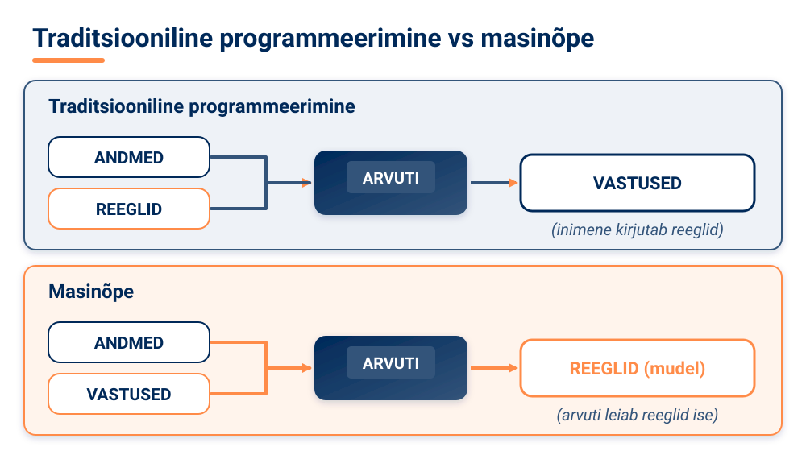

Traditsioonilises programmeerimises kirjutab inimene täpsed juhised. Masinõppes antakse arvutile andmed koos soovitud vastustega ning arvuti „õpib" ise, kuidas neid omavahel seostada. Tulemuseks on **mudel** – õpitud reeglite kogum, mida saab seejärel kasutada uute andmete puhul. Masinõpe on muutunud üha olulisemaks, sest andmeid on järjest rohkem ja paljud probleemid on liiga keerulised, et neid käsitsi kirjutatud reeglitega lahendada.

Masinõppe ajalugu ulatub kaugemale, kui arvata võiks. 1950.–1960. aastatel loodi esimesed õppivad algoritmid, näiteks **pertseptron**. 1980.–1990. aastatel levisid otsustuspuud ja tugivektormasinad. 2000. aastatel tulid kasutusele **ansamblimeetodid**, mis ühendavad mitu mudelit. Alates 2010. aastatest on toimunud süvaõppe läbimurded ning tekkinud on suured keelemudelid.

<!-- class="pae-fakt" -->
> **Kas teadsid?** Masinõpe pole uus: esimesed õppivad algoritmid, näiteks **pertseptron**, loodi juba **1950.–1960. aastatel**.

### Juhendatud õpe

Masinõppe meetodid jagunevad kolmeks põhitüübiks selle järgi, kuidas õppimine toimub. Esimene ja kõige levinum neist on juhendatud õpe.

<!-- class="pae-moiste" -->
> **Mõiste: juhendatud õpe**
>
> **Juhendatud õpe** (*supervised learning*) on masinõppe tüüp, kus mudel õpib **märgendatud andmetest** ehk näidetest, mille juures on õige vastus teada. Mudel õpib seoseid sisendi ja väljundi vahel ning oskab hiljem ennustada vastuseid uutele, tundmatutele näidetele.

See sarnaneb õppimisele õpetaja juhendamisel: õpetaja näitab ülesandeid koos õigete vastustega, kuni sa mustrist aru saad. Juhendatud õppe ülesanded on kahte põhiliiki.

**Klassifitseerimine** tähendab, et mudel peab otsustama, millisesse kategooriasse (klassi) objekt kuulub. Vastuseks on kindel valik, näiteks:

- kas e-kiri on rämpspost või tavaline kiri;
- kas pildil on kass, koer või auto;
- kas sümptomite põhjal võiks olla tegu mingi haigusega.

**Regressioon** tähendab, et mudel ennustab arvulist, pidevat väärtust, näiteks korteri hinda, homset temperatuuri või aktsia hinda.

Juhendatud õppes kasutatakse mitmeid algoritme. Üks lihtsamini mõistetavaid on **otsustuspuu**. See esitab küsimusi ükshaaval nagu mäng „20 küsimust" ja jagab andmed vastuste põhjal harudeks, kuni jõuab otsuseni. Puu ülemist küsimust nimetatakse **juureks** ja lõppotsuseid **lehtedeks**.

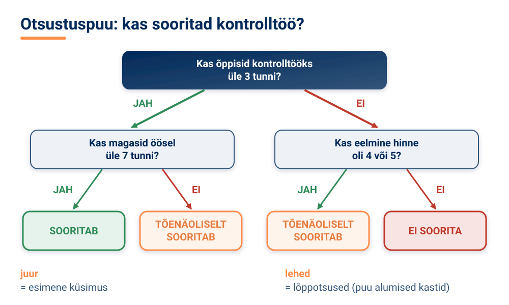

Otsustuspuu õpib andmetest ise, millised küsimused on kõige kasulikumad ja millises järjekorras neid esitada. Selle suur eelis on, et otsust on lihtne selgitada.

Teisi juhendatud õppe algoritme:

- **lineaarne regressioon** – leiab sisendi ja väljundi vahel parima sirgjoonelise seose (nt mida suurem korter, seda kõrgem hind);
- **k-lähima naabri meetod** – uus näide liigitatakse samasse klassi kui talle kõige sarnasemad näited treeningandmetest („ütle mulle, kes on su sõbrad, ja ma ütlen, kes sa oled");
- **tugivektormasin** (SVM) – otsib klasside vahele võimalikult laia „eraldusjoone";
- **naiivne Bayesi klassifikaator** – arvutab tõenäosuse, millisesse klassi näide kuulub (sobib hästi nt rämpsposti tuvastamiseks);
- **närvivõrgud** – nendest räägime põhjalikult järgmises tunnis.

Kuidas teada saada, kas mudel töötab hästi? Selleks kasutatakse **hindamismõõdikuid**. Kujuta ette mudelit, mis peab leidma pettusega pangatehingud:

- **täpsus** (*accuracy*) – kui suur osa kõigist mudeli vastustest oli õige;
- **täpsusaste** (*precision*) – kui suur osa neist tehingutest, mida mudel pettuseks pidas, olid tegelikult pettused;
- **saagis** ehk tagasikutse (*recall*) – kui suure osa kõigist tegelikest pettustest mudel üles leidis;
- **F1-skoor** – täpsusastme ja saagise ühine näitaja, mis arvestab mõlemat;
- **segadusmaatriks** – tabel, mis näitab, kui palju oli õigeid ja valesid vastuseid iga klassi kohta.

<!-- class="pae-naide" -->
> **Näide: miks täpsusest ei piisa**
>
> Kujuta ette 1000 pangatehingut, mille seas on ainult 10 pettust. Laisk mudel ütleb iga tehingu kohta „kõik korras". Selle täpsus on 99%, sest 990 vastust 1000-st on õiged – aga ta ei leidnud ühtegi pettust ja on seega täiesti kasutu! Seepärast vaadatakse alati ka saagist ja täpsusastet.

<!-- data-type="piechart" data-title="Näide: 1000 pangatehingut" -->
| Tehing | Arv |
|--------|----:|
| Tavalised tehingud | 990 |
| Pettused | 10 |

Regressiooni puhul mõõdetakse, kui palju ennustused keskmiselt tegelikest väärtustest erinevad.

### Juhendamata õpe ja stiimulõpe

**Juhendamata õpe** (*unsupervised learning*) sarnaneb iseseisva avastamisega. Mudel saab **märgendamata andmed** – keegi ei ütle, mis on õige vastus – ja peab ise leidma andmetes peituvad mustrid ja struktuurid. See on eriti kasulik siis, kui andmeid on palju, aga nende struktuuri kohta teatakse vähe või kui märgendamine oleks liiga kallis.

Peamised juhendamata õppe ülesanded on:

- **klasterdamine** – sarnaste objektide rühmitamine klastritesse. Näiteks poekett jagab kliendid ostukäitumise põhjal rühmadesse („pereostjad", „tervisliku toidu eelistajad", „hilisõhtused kiirostjad"), ilma et keegi oleks need rühmad ette määranud. Tuntud algoritm on **K-keskmiste klasterdamine** (*K-means*), mis jagab andmed K rühmaks nii, et rühma liikmed oleksid üksteisele võimalikult sarnased;
- **dimensionaalsuse vähendamine** – andmete esitamine väiksema arvu tunnustega nii, et oluline info säilib. See aitab keerulisi andmeid visualiseerida ja arvutusi kiirendada (nt peakomponentanalüüs PCA ja t-SNE);
- **anomaaliate tuvastamine** – ebatavaliste, teistest erinevate mustrite leidmine, näiteks kahtlased pangatehingud või rikkis seadme näidud.

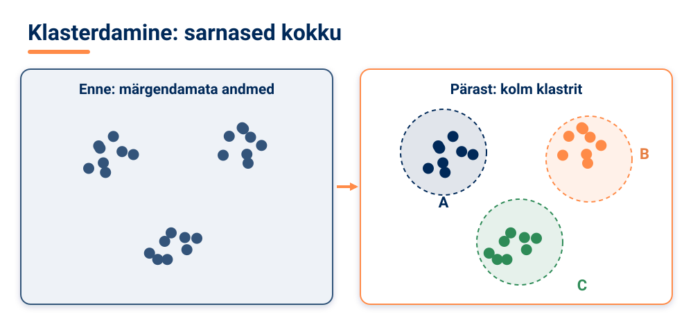

**Stiimulõpe** (*reinforcement learning*) on õppimine katse-eksituse meetodil. Mõtle, kuidas õpetad koerale trikki: kui koer teeb õigesti, saab ta maiuse, kui valesti, siis mitte. Aja jooksul õpib koer, milline käitumine toob tasu.

<!-- class="pae-moiste" -->
> **Mõiste: stiimulõpe**
>
> **Stiimulõpe** on masinõppe tüüp, kus õppiv süsteem ehk **agent** tegutseb mingis **keskkonnas**, saab oma tegevuste eest tagasisidet **tasu** (preemia) või karistusena ning õpib aja jooksul valima tegevusi, mis toovad pikas plaanis võimalikult suure tasu.

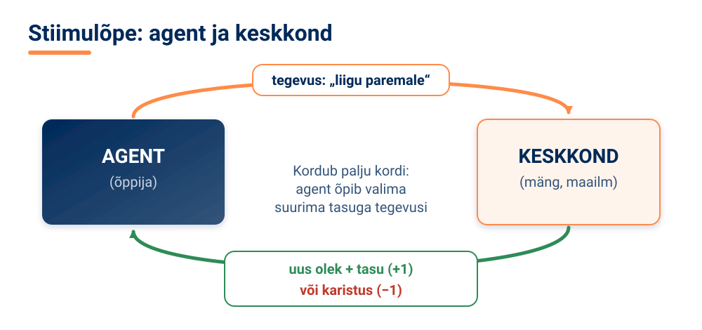

Stiimulõppe põhimõisted on:

- **agent** – õppiv süsteem, mis teeb otsuseid;
- **keskkond** – maailm, milles agent tegutseb;
- **olek** – keskkonna hetkeseis (nt malelaua seis);
- **tegevus** – agendi võimalik käik;
- **tasu** – tagasiside selle kohta, kui hea tegevus oli;
- **strateegia** (poliitika) – reegel, mille järgi agent tegevusi valib.

Stiimulõpe sobib hästi muutuvatesse keskkondadesse, kus reegleid pole võimalik täpselt kirja panna. Seda kasutatakse mängudes (kuulsad näited on Go-mängu programmid AlphaGo ja AlphaZero), robotite liikumise õpetamisel, isesõitvates autodes ja ressursside (nt energia) juhtimisel. Tuntud stiimulõppe algoritm on Q-õpe.

Stiimulõppe üks huvitavamaid probleeme on **uurimise ja ärakasutamise dilemma**: kas agent peaks proovima uusi, tundmatuid tegevusi, mis võivad osutuda paremaks, või kasutama juba teadaolevat head strateegiat? Sama dilemma ees oled sina, kui valid koolisööklas, kas võtta oma lemmiktoit või proovida midagi uut.

<!-- class="pae-motle" -->
> **Mõtle järele!**
>
> Milline masinõppe tüüp sobib kõige paremini järgmiste ülesannete jaoks?
> 1) Spotify tahab jagada kuulajad maitse järgi rühmadesse, aga ei tea ette, mis rühmad need on.
> 2) Kool tahab ennustada, kas õpilane sooritab eksami, ja tal on andmed eelmiste aastate õpilaste kohta koos nende tulemustega.
> 3) Robot-tolmuimeja peab ise õppima, kuidas korteris kõige kiiremini koristada.

### Masinõppe protsess

Masinõppe projekt ei ole lihtsalt „anna arvutile andmed". See koosneb mitmest etapist, mida korratakse sageli mitu korda.

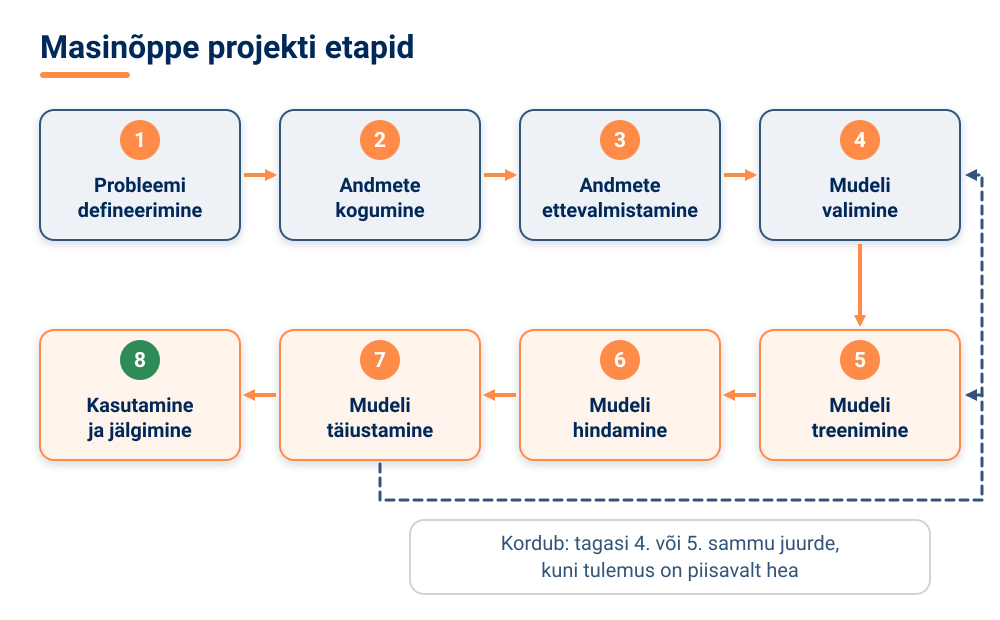

1. **Probleemi defineerimine** – mida tahame saavutada? Kas tegu on klassifitseerimise, regressiooni või muu ülesandega? Kuidas mõõdame edu?
2. **Andmete kogumine** – vajalike andmete hankimine; andmete kvaliteet ja hulk on kriitilise tähtsusega.
3. **Andmete ettevalmistamine** – puhastamine, normaliseerimine, kodeerimine ning jagamine treening-, valideerimis- ja testandmeteks (vt tund 2.2).
4. **Mudeli valimine** – sobiva algoritmi valimine probleemi ja andmete järgi.
5. **Mudeli treenimine** – mudel õpib treeningandmetest; selle käigus kohandatakse mudeli parameetreid.
6. **Mudeli hindamine** – tulemuste kontrollimine testandmetel, mida mudel pole varem näinud, ja vigade analüüs.
7. **Mudeli täiustamine** – seadistuste muutmine parema tulemuse saavutamiseks.
8. **Mudeli kasutamine** ehk juurutamine – mudel võetakse päriselt kasutusele, aga seda tuleb jälgida ja vajadusel uuendada, sest maailm muutub.

Väga oluline osa protsessist on **tunnuste valik**. **Tunnus** on andmete omadus, mida mudel kasutab (nt korteri pindala, tubade arv, asukoht). Oluliste tunnuste leidmine ja ebaoluliste eemaldamine ning olemasolevatest tunnustest uute loomine (**tunnuste konstrueerimine**) on sageli tähtsam kui algoritmi valik. Näiteks sünniajast saab arvutada vanuse, mis on mudelile kasulikum.

<!-- class="pae-moiste" -->
> **Mõiste: hüperparameeter**
>
> **Hüperparameetrid** on mudeli seadistused, mille määrab arendaja **enne** treenimist ja mida mudel ise andmetest ei õpi – näiteks õppimiskiirus, otsustuspuu sügavus või närvivõrgu kihtide arv. **Mudeli parameetrid** (nt närvivõrgu kaalud) on aga väärtused, mida mudel õpib treenimise käigus ise.

Hüperparameetreid võib võrrelda raadio nuppudega: arendaja keerab neid, et leida parim kõla. Parimate väärtuste leidmiseks kasutatakse näiteks **võrgustikuotsingut** (proovitakse läbi kõik kombinatsioonid kindlast valikust), **juhuslikku otsingut** ja Bayesi optimeerimist.

Tulemust aitavad parandada ka **ansamblimeetodid**, kus kombineeritakse mitut mudelit – nagu küsiksid nõu mitmelt sõbralt korraga. *Bagging*-meetodis treenitakse paralleelselt mitu mudelit eri andmevalimitel (nt **juhuslik mets** ehk *Random Forest*, mis koosneb paljudest otsustuspuudest). *Boosting*-meetodis treenitakse mudeleid järjest ja iga uus keskendub eelmiste vigadele (nt XGBoost). *Stacking*-meetodis ühendatakse eri tüüpi mudelite vastused. Ansamblid on tavaliselt täpsemad, stabiilsemad ja ülesobituvad vähem.

### Ülesobitamine ja alasobitamine

Masinõppe kaks kõige levinumat probleemi on ülesobitamine ja alasobitamine. Mõlemad on seotud mudeli **üldistusvõimega** – võimega teha õigeid ennustusi uute, varem nägemata andmete põhjal.

<!-- class="pae-moiste" -->
> **Mõiste: ülesobitamine ja alasobitamine**
>
> **Ülesobitamine** (ka ületreenimine, *overfitting*) tekib, kui mudel „õpib pähe" treeningandmed koos nende juhusliku müraga, aga ei suuda üldistada. See töötab treeningandmetel suurepäraselt, uutel andmetel aga halvasti.
>
> **Alasobitamine** (*underfitting*) tekib, kui mudel on liiga lihtne, et tabada andmetes olulisi seaduspärasusi. See töötab halvasti nii treening- kui ka testandmetel.

Võrdle seda kontrolltööks õppimisega. Õpilane, kes õpib pähe ainult õpiku näidisülesannete vastused, saab samade ülesannetega suurepäraselt hakkama, aga uue ülesande ees on hädas – see on ülesobitamine. Õpilane, kes loeb ainult peatüki pealkirja ja arvab, et sellest piisab, ei saa hakkama ühegi ülesandega – see on alasobitamine. Hea õppija saab aru põhimõttest ja oskab seda rakendada ka uutes ülesannetes.


**Ülesobitamist** aitavad vältida:

- rohkem treeningandmeid;
- lihtsam mudel;
- **regulariseerimine** – mudeli keerukuse piiramine;
- varajane peatamine – treenimine lõpetatakse siis, kui testandmete tulemus enam ei parane;
- ristvalideerimine.

**Alasobitamist** aitavad vältida:

- keerukam mudel;
- rohkem või paremaid tunnuseid;
- pikem treenimine;
- vähem regulariseerimist.

Hea masinõppe mudel leiab nende kahe vahel tasakaalu: see tabab andmetes olulised seaduspärasused, kuid ei õpi pähe juhuslikku müra.

### Masinõpe Eestis ja maailmas

Masinõpet kasutatakse peaaegu kõikjal: rahanduses pettuste tuvastamiseks ja riskide hindamiseks, tervishoius diagnostikas ja ravimiarenduses, turunduses klientide rühmitamiseks ja soovitusteks, transpordis isesõitvates sõidukites ja logistikas, tootmises kvaliteedikontrolliks ja seadmete rikete ennustamiseks, põllumajanduses saagi ennustamiseks ja taimehaiguste tuvastamiseks ning meelelahutuses soovitussüsteemides ja mängudes.

<!-- class="pae-eesti" -->
> **Eesti näide: masinõpe Eesti ettevõtetes ja asutustes**
>
> - **Keeletehnoloogia**: Tartu Ülikooli keeletehnoloogia teadlased arendavad eestikeelset kõnetuvastust ja masintõlget.
> - **Tervishoid**: STACC arendab andmeanalüüsil põhinevaid personaalmeditsiini lahendusi; Antegenes kasutab masinõpet vähiriski hindamiseks.
> - **Rahandus**: Salv kasutab masinõpet, et aidata pankadel tuvastada rahapesu ja pettusi.
> - **Avalik sektor**: Bürokratt on riigi virtuaalassistentide võrgustik; Maksu- ja Tolliamet kasutab masinõpet maksupettuste avastamiseks.
> - **Haridus**: 99math kasutab tehnoloogiat matemaatikaharjutuste kohandamiseks; DreamApply aitab kõrgkoolidel hallata rahvusvaheliste üliõpilaste vastuvõttu.

Masinõppel on ka väljakutseid: andmete kvaliteet ja hulk, kallutatus ja õiglus, otsuste selgitatavus, suur arvutusvõimsuse vajadus, üldistusvõime, privaatsus ja turvalisus. Tulevikus arendatakse mudeleid, mis vajavad vähem andmeid ja energiat, oskavad oma otsuseid selgitada ning töötavad korraga teksti, pildi ja heliga (**multimodaalsed mudelid**). Huvitav suund on **hajusõpe** (*federated learning*), kus mudel õpib paljudes seadmetes (nt telefonides) korraga, ilma et isiklikud andmed seadmest lahkuksid.

<!-- class="pae-lisaks" -->
> **Tea lisaks**
>
> Masinõpet saad ise proovida ilma programmeerimata. **Google'i Teachable Machine** (teachablemachine.withgoogle.com) lubab veebikaamera abil mõne minutiga treenida mudeli, mis tunneb ära sinu žeste või esemeid. **Machine Learning for Kids** (machinelearningforkids.co.uk) pakub lihtsaid projekte, kus saad oma mudelit treenida ja testida. Pane tähele, kuidas mudeli tulemus muutub, kui annad talle vähem, rohkem või ühekülgsemaid näiteid!

### Kokkuvõte ja põhimõisted

**Pea meeles**

- Masinõppes ei kirjuta inimene reegleid ise, vaid arvuti leiab need andmete ja vastuste põhjal; tulemuseks on mudel.
- Juhendatud õpe kasutab märgendatud andmeid (klassifitseerimine, regressioon), juhendamata õpe otsib mustreid märgendamata andmetest (klasterdamine), stiimulõpe õpib katse-eksituse meetodil tasu ja karistuse põhjal.
- Masinõppe projekt koosneb etappidest: probleemi defineerimine, andmete kogumine ja ettevalmistamine, mudeli valimine, treenimine, hindamine, täiustamine ja kasutamine.
- Mudeli tulemuslikkust hinnatakse testandmetel mõõdikute abil (täpsus, täpsusaste, saagis, F1-skoor).
- Ülesobitunud mudel õpib treeningandmed pähe, alasobitunud mudel on liiga lihtne; hea mudel üldistab hästi.
- Hüperparameetrid määrab arendaja enne treenimist, mudeli parameetrid õpib mudel ise.

| Mõiste | Tähendus |
|---|---|
| Masinõpe | TI haru, kus arvuti õpib andmetest ilma otsese programmeerimiseta |
| Mudel | Treenimise tulemusel saadud reeglite kogum, millega tehakse ennustusi |
| Juhendatud õpe | Õppimine märgendatud andmetest, kus õige vastus on teada |
| Juhendamata õpe | Mustrite otsimine märgendamata andmetest |
| Stiimulõpe | Õppimine katse-eksituse meetodil tasu ja karistuse põhjal |
| Klassifitseerimine | Kategooria ennustamine (nt rämpspost / mitte rämpspost) |
| Regressioon | Arvulise väärtuse ennustamine (nt hind, temperatuur) |
| Klasterdamine | Sarnaste objektide rühmitamine ilma eelnevate märgenditeta |
| Ülesobitamine | Mudel õpib treeningandmed pähe ega üldista uutele andmetele |
| Alasobitamine | Mudel on liiga lihtne ega taba andmete seaduspärasusi |
| Hüperparameeter | Seadistus, mille arendaja määrab enne treenimist |

### Tööleht 2.3

<!-- class="pae-jaotis" -->
**I. Masinõppe põhimõisted**

**Ülesanne 1.** Selgita oma sõnadega, mis on masinõpe.

[[___ ___ ___]]

**Ülesanne 2.** Ühenda masinõppe põhimõisted nende definitsioonidega.

| Täht | Kirjeldus |
|:---:|---|
| **A** | Mudeli võime teha täpseid ennustusi uute, varem nägemata andmete põhjal |
| **B** | Protsess, mille käigus mudel õpib andmetest mustreid |
| **C** | Olukord, kus mudel on liiga keeruline ja „õpib pähe" treeningandmed |
| **D** | Olukord, kus mudel on liiga lihtne ega suuda andmetes olevaid mustreid tuvastada |
| **E** | Mudeli seadistused, mille määrab arendaja enne treenimist |

- [ (A) (B) (C) (D) (E) ]
- [ ( ) (X) ( ) ( ) ( ) ] Treenimine
- [ ( ) ( ) (X) ( ) ( ) ] Ülesobitamine
- [ ( ) ( ) ( ) (X) ( ) ] Alasobitamine
- [ (X) ( ) ( ) ( ) ( ) ] Üldistamine
- [ ( ) ( ) ( ) ( ) (X) ] Hüperparameetrid
****************************************
Treenimine on õppimise protsess. Ülesobitunud mudel õpib treeningandmed pähe, alasobitunud mudel on liiga lihtne. Üldistamine on võime töötada hästi uute andmetega. Hüperparameetrid määrab arendaja enne treenimist.
****************************************

<!-- class="pae-jaotis" -->
**II. Masinõppe tüübid**

**Ülesanne 3.** Kirjelda lühidalt masinõppe tüüpe ja too iga tüübi kohta näide.

**a) Juhendatud õpe (supervised learning):**

[[___ ___ ___]]

**b) Juhendamata õpe (unsupervised learning):**

[[___ ___ ___]]

**c) Stiimulõpe (reinforcement learning):**

[[___ ___ ___]]

**Ülesanne 4.** Täida tabel masinõppe ülesannete kohta. Kirjuta iga ülesande tüübi kohta kirjeldus, näide ja masinõppe tüüp.

| Ülesande tüüp | Kirjeldus | Näide | Masinõppe tüüp |
|---|---|---|---|
| Klassifitseerimine | | | |
| Regressioon | | | |
| Klasterdamine | | | |
| Dimensionaalsuse vähendamine | | | |
| Anomaaliate tuvastamine | | | |

**Klassifitseerimine:**

[[___ ___]]

**Regressioon:**

[[___ ___]]

**Klasterdamine:**

[[___ ___]]

**Dimensionaalsuse vähendamine:**

[[___ ___]]

**Anomaaliate tuvastamine:**

[[___ ___]]

<!-- class="pae-jaotis" -->
**III. Masinõppe algoritmid**

**Ülesanne 5.** Ühenda masinõppe algoritmid nende kirjeldustega.

| Täht | Kirjeldus |
|:---:|---|
| **A** | Klassifitseerib andmeid, leides klasse eraldava optimaalse piiri (hüpertasandi) |
| **B** | Rühmitab sarnased andmepunktid klastritesse, nii et klastri liikmed oleksid võimalikult sarnased |
| **C** | Ennustab väärtusi, leides parima sirgjoonelise seose sisendtunnuste ja väljundi vahel |
| **D** | Klassifitseerib andmeid, jagades need tunnuste põhjal järjest harudeks |
| **E** | Klassifitseerib andmeid nende lähimate naabrite põhjal treeningandmestikus |

- [ (A) (B) (C) (D) (E) ]
- [ ( ) ( ) ( ) (X) ( ) ] Otsustuspuu
- [ ( ) ( ) (X) ( ) ( ) ] Lineaarne regressioon
- [ (X) ( ) ( ) ( ) ( ) ] Tugivektormasin (SVM)
- [ ( ) ( ) ( ) ( ) (X) ] K-lähima naabri meetod
- [ ( ) (X) ( ) ( ) ( ) ] K-keskmiste klasterdamine
****************************************
Otsustuspuu esitab küsimusi ja jagab andmed harudeks. Lineaarne regressioon otsib sirgjoonelist seost. Tugivektormasin otsib klasside vahele eraldavat piiri. K-lähima naabri meetod vaatab sarnaseimaid näiteid. K-keskmiste meetod on juhendamata õppe klasterdamisalgoritm.
****************************************

**Ülesanne 6.** Kirjelda lühidalt, kuidas töötab otsustuspuu algoritm.

[[___ ___ ___ ___]]

**Ülesanne 7.** Millised on eri algoritmide eelised ja puudused? Kirjuta iga algoritmi kohta eelised, puudused ja millal seda kasutada.

| Algoritm | Eelised | Puudused | Millal kasutada? |
|---|---|---|---|
| Otsustuspuu | | | |
| Närvivõrk | | | |
| Lineaarne regressioon | | | |
| K-lähima naabri meetod | | | |

**Otsustuspuu:**

[[___ ___]]

**Närvivõrk:**

[[___ ___]]

**Lineaarne regressioon:**

[[___ ___]]

**K-lähima naabri meetod:**

[[___ ___]]

<!-- class="pae-jaotis" -->
**IV. Masinõppe protsess**

**Ülesanne 8.** Järjesta masinõppe projekti etapid õiges järjekorras (1–6).

Mudeli hindamine ja täpsustamine: [[ 1 | 2 | 3 | 4 | (5) | 6 ]]  
Andmete kogumine: [[ 1 | (2) | 3 | 4 | 5 | 6 ]]  
Mudeli juurutamine: [[ 1 | 2 | 3 | 4 | 5 | (6) ]]  
Probleemi defineerimine: [[ (1) | 2 | 3 | 4 | 5 | 6 ]]  
Andmete eeltöötlus: [[ 1 | 2 | (3) | 4 | 5 | 6 ]]  
Mudeli treenimine: [[ 1 | 2 | 3 | (4) | 5 | 6 ]]  

**Ülesanne 9.** Kirjelda lühidalt, mida tehakse igas etapis.

**a) Probleemi defineerimine:**

[[___]]

**b) Andmete kogumine:**

[[___]]

**c) Andmete eeltöötlus:**

[[___]]

**d) Mudeli treenimine:**

[[___]]

**e) Mudeli hindamine:**

[[___]]

**f) Mudeli juurutamine:**

[[___]]

<!-- class="pae-jaotis" -->
**V. Mudeli hindamine**

**Ülesanne 10.** Selgita, miks on oluline jagada andmed treening- ja testandmeteks.

[[___ ___ ___]]

**Ülesanne 11.** Ühenda hindamismõõdikud nende kirjeldustega.

| Täht | Kirjeldus |
|:---:|---|
| **A** | Õigesti tuvastatud positiivsete juhtude osakaal kõigist tegelikult positiivsetest juhtudest |
| **B** | Õigesti tuvastatud positiivsete juhtude osakaal kõigist positiivseks ennustatud juhtudest |
| **C** | Õigesti klassifitseeritud näidete osakaal kõigist näidetest |
| **D** | Täpsusastme ja saagise ühine (harmooniline) keskmine |
| **E** | Tabel, mis näitab tegelike ja ennustatud klasside vahelisi seoseid |

- [ (A) (B) (C) (D) (E) ]
- [ ( ) ( ) (X) ( ) ( ) ] Täpsus (accuracy)
- [ ( ) (X) ( ) ( ) ( ) ] Täpsusaste (precision)
- [ (X) ( ) ( ) ( ) ( ) ] Saagis ehk tagasikutse (recall)
- [ ( ) ( ) ( ) (X) ( ) ] F1-skoor
- [ ( ) ( ) ( ) ( ) (X) ] Segadusmaatriks
****************************************
Täpsus näitab kõigi õigete vastuste osakaalu. Täpsusaste näitab, kui paljud „positiivseks" märgitud juhtudest olid päriselt positiivsed. Saagis näitab, kui suure osa tegelikest positiivsetest juhtudest mudel üles leidis. F1-skoor ühendab täpsusastme ja saagise. Segadusmaatriks on tabel õigetest ja valedest vastustest klasside kaupa.
****************************************

**Ülesanne 12.** Millised probleemid võivad tekkida mudeli hindamisel ja kuidas neid lahendada?

[[___ ___ ___ ___]]

<!-- class="pae-jaotis" -->
**VI. Praktiline ülesanne**

**Ülesanne 13.** Kujuta ette, et soovid luua masinõppe mudelit, mis ennustab, kas õpilane sooritab eksami edukalt.

**a) Milliseid andmeid koguksid?** Mõtle välja vähemalt viis tunnust ja kirjuta iga tunnuse kohta: tunnuse nimi, tüüp (arvuline või kategooriline), kuidas seda koguda ja miks see on oluline.

| Tunnus | Tüüp (arvuline/kategooriline) | Kuidas koguda? | Miks oluline? |
|---|---|---|---|
| | | | |

[[___ ___ ___ ___ ___]]

**b) Millist masinõppe algoritmi kasutaksid ja miks?**

[[___ ___ ___]]

**c) Kuidas hindaksid mudeli edukust?**

[[___ ___ ___]]

**Ülesanne 14.** Külasta veebilehte [machinelearningforkids.co.uk](https://machinelearningforkids.co.uk) ja proovi mõnda näidisprojekti. Kirjelda oma kogemust.

[[___ ___ ___ ___ ___]]

<!-- class="pae-jaotis" -->
**VII. Arutelu**

**Ülesanne 15.** Millised on masinõppe peamised väljakutsed ja piirangud?

[[___ ___ ___ ___]]

**Ülesanne 16.** Kuidas on masinõpe muutnud erinevaid valdkondi ja milliseid muutusi võib see tuua tulevikus?

[[___ ___ ___ ___]]

### Enesekontroll 2.3

**1. Kuidas nimetatakse masinõppes treenimise tulemusel saadud õpitud reeglite kogumit, mida kasutatakse uute andmete kohta ennustuste tegemiseks? Kirjuta vastus.**

[[mudel]]
<script>
let v = `@input`.trim().toLowerCase().replace(/\s+/g, " ");
["mudel", "mudeli", "mudeliks", "masinõppe mudel", "masinõppemudel"].includes(v)
</script>
****************************************
Õige vastus: **mudel**. Traditsioonilises programmeerimises kirjutab reeglid inimene, masinõppes leiab arvuti need andmete ja vastuste põhjal ise.
****************************************

**2. Liigita näited masinõppe tüübi järgi.**

- [ (Juhendatud õpe) (Juhendamata õpe) (Stiimulõpe) ]
- [ (X) ( ) ( ) ] Rämpsposti filter õpib kirjadest, mille juures on märgitud, kas need on rämpspost
- [ ( ) (X) ( ) ] Poekett jagab kliendid ostukäitumise järgi rühmadesse, mida keegi pole ette määranud
- [ ( ) ( ) (X) ] Robot-tolmuimeja õpib tasu ja karistuse abil korterit kiiresti koristama
- [ (X) ( ) ( ) ] Kool ennustab eksami sooritamist eelmiste aastate õpilaste andmete ja tulemuste põhjal
- [ ( ) (X) ( ) ] Spotify jagab kuulajad maitse järgi rühmadesse, teadmata ette, mis rühmad need on
- [ ( ) ( ) (X) ] AlphaGo õpib Go-mängu võitude ja kaotuste põhjal
****************************************
Juhendatud õpe kasutab märgendatud andmeid (õige vastus on teada). Juhendamata õpe otsib mustreid märgendamata andmetest, nt klasterdamine. Stiimulõppes õpib agent katse-eksituse meetodil tasu ja karistuse põhjal.
****************************************

**3. Pane masinõppe projekti etapid õigesse järjekorda.**

<!-- data-show-partial-solution -->
Mudeli treenimine: [[ 1 | 2 | 3 | 4 | (5) | 6 | 7 | 8 ]]<br>
Probleemi defineerimine: [[ (1) | 2 | 3 | 4 | 5 | 6 | 7 | 8 ]]<br>
Mudeli kasutamine ja jälgimine: [[ 1 | 2 | 3 | 4 | 5 | 6 | 7 | (8) ]]<br>
Andmete ettevalmistamine: [[ 1 | 2 | (3) | 4 | 5 | 6 | 7 | 8 ]]<br>
Mudeli hindamine testandmetel: [[ 1 | 2 | 3 | 4 | 5 | (6) | 7 | 8 ]]<br>
Andmete kogumine: [[ 1 | (2) | 3 | 4 | 5 | 6 | 7 | 8 ]]<br>
Mudeli täiustamine: [[ 1 | 2 | 3 | 4 | 5 | 6 | (7) | 8 ]]<br>
Mudeli valimine: [[ 1 | 2 | 3 | (4) | 5 | 6 | 7 | 8 ]]
****************************************
Õige järjekord: 1. probleemi defineerimine → 2. andmete kogumine → 3. ettevalmistamine → 4. mudeli valimine → 5. treenimine → 6. hindamine → 7. täiustamine → 8. kasutamine ja jälgimine. Praktikas korratakse osa etappe mitu korda.
****************************************

**4. Vali lünkadesse õige mõiste.**

<!-- data-show-partial-solution -->
Korteri hinna ennustamine on [[ klassifitseerimise | (regressiooni) | klasterdamise ]] ülesanne, e-kirja liigitamine rämpspostiks on [[ (klassifitseerimise) | regressiooni | klasterdamise ]] ülesanne. Seda, kui suur osa kõigist mudeli vastustest oli õige, näitab [[ (täpsus) | saagis ]], ja seda, kui suure osa kõigist tegelikest pettustest mudel üles leidis, näitab [[ täpsus | (saagis) ]].
****************************************
Regressioon ennustab arvulist väärtust (nt hinda), klassifitseerimine määrab kategooria. Täpsus näitab õigete vastuste osakaalu kõigist vastustest, saagis ehk tagasikutse aga seda, kui suure osa tegelikest positiivsetest juhtudest mudel leidis.
****************************************

**5. Mudel liigitas 200 e-kirja ja vastas õigesti 180 korral. Kui suur on mudeli täpsus protsentides?**

[[90]]
<script>
Number(`@input`.trim().replace("%", "").replace(",", ".").trim()) === 90
</script>
****************************************
Täpsus = õiged vastused / kõik vastused = 180 / 200 = 0,9 ehk **90%**.
****************************************

**6. Lohista mõisted õigetesse lünkadesse.**

<!-- data-show-partial-solution -->
Mudel, mis õpib treeningandmed koos juhusliku müraga pähe, on [->[ (ülesobitunud) ]]. Liiga lihtne mudel, mis ei taba andmete olulisi seaduspärasusi, on [->[ (alasobitunud) ]]. Mudeli võimet töötada hästi uute, varem nägemata andmetega nimetatakse [->[ (üldistusvõimeks) | õppimiskiiruseks ]]. Ülesobitamist aitab vältida [->[ (regulariseerimine) | pikem treenimine ]].
****************************************
Ülesobitunud mudel töötab treeningandmetel hästi, uutel andmetel halvasti. Alasobitunud mudel töötab halvasti mõlemal. Ülesobitamist aitavad vältida regulariseerimine, rohkem andmeid, lihtsam mudel ja varajane peatamine; pikem treenimine aitab hoopis alasobitamise vastu.
****************************************

**7. Millised väited hüperparameetrite kohta on õiged? (Vali kõik õiged.)**

- [[X]] Hüperparameetrid määrab arendaja enne treenimist.
- [[ ]] Hüperparameetrid on närvivõrgu kaalud, mida mudel ise õpib.
- [[X]] Õppimiskiirus on hüperparameeter.
- [[X]] Kihtide arv närvivõrgus on hüperparameeter.
****************************************
Hüperparameetrid (õppimiskiirus, kihtide arv, puu sügavus jne) seab arendaja. Kaalud on mudeli parameetrid, mida mudel õpib treenimise käigus ise.
****************************************

**8. 1000 pangatehingu seas on 10 pettust. Mudel ütleb iga tehingu kohta „kõik korras" ja tema täpsus on 99%. Selgita, miks see mudel on siiski kasutu ja millist mõõdikut tuleks lisaks vaadata.**

[[___ ___ ___]]

<details>
<summary>Vaata näidisvastust</summary>

Mudel vastab õigesti 990 juhul 1000-st, sest tavalisi tehinguid on palju rohkem kui pettusi. Ometi ei leidnud ta ühtegi pettust, kuigi just see oli tema ülesanne. Seepärast tuleb vaadata ka saagist (kui suure osa tegelikest pettustest mudel leidis – siin 0%) ja täpsusastet või F1-skoori.

</details>


## 2.4 Närvivõrgud ja süvaõpe

### Õpieesmärgid

<!-- class="pae-kaas" -->
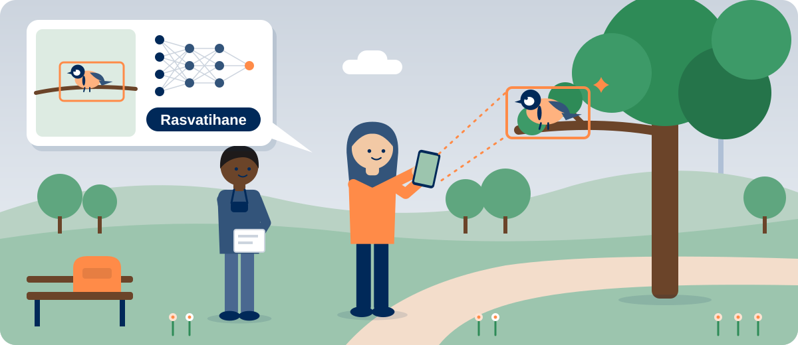

Selle tunni järel sa:

- oskad selgitada, mis on tehisnärvivõrk ja millest see on inspireeritud;
- tead, kuidas töötab üks tehisneuron: mis on kaalud, nihe, kaalutud summa ja aktivatsioonifunktsioon;
- oskad kirjeldada närvivõrgu kihte (sisendkiht, peidetud kihid, väljundkiht);
- saad aru, kuidas närvivõrk õpib oma vigadest (tagasilevi ja gradientlaskumine);
- tead, mis on süvaõpe, tunned selle peamisi arhitektuure, läbimurdeid ja väljakutseid.

### Mis on tehisnärvivõrk?

Sinu ajus on miljardeid närvirakke ehk **neuroneid**. Iga neuron saab teistelt neuronitelt signaale, ja kui neid signaale on piisavalt, „süttib" ta ning saadab signaali edasi. Kõik, mida sa mõtled, tunned ja õpid, sünnib nende ühenduste kaudu. Kui sa midagi õpid, muutuvad mõned ühendused tugevamaks ja teised nõrgemaks.

Sellest ideest said inspiratsiooni ka arvutiteadlased.

<!-- class="pae-moiste" -->
> **Mõiste: tehisnärvivõrk**
>
> **Tehisnärvivõrk** (lühidalt **närvivõrk**) on matemaatiline arvutusmudel, mis on inspireeritud aju närvirakkude toimimisest. See koosneb omavahel ühendatud **tehisneuronitest**, mis töötlevad ja edastavad infot. Närvivõrk õpib andmetest, muutes neuronitevaheliste ühenduste tugevust.

Oluline on mõista, et närvivõrk ei ole „arvutisse kopeeritud aju". Aju on vaid eeskuju. Tehisneuron on palju lihtsam kui päris närvirakk – see on tegelikult lihtsalt väike arvutus.

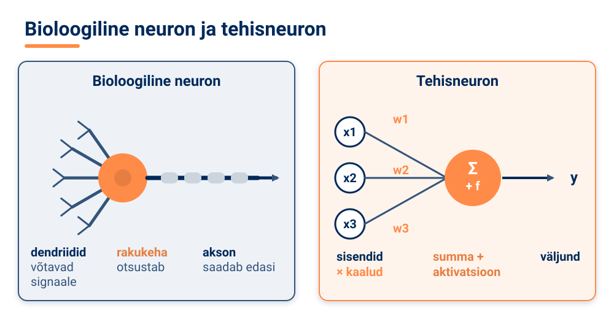

Närvivõrkude ajalugu on pikk:

- **1943** – Warren McCulloch ja Walter Pitts kirjeldasid esimese tehisneuroni mudeli;
- **1958** – Frank Rosenblatt lõi **pertseptroni**, lihtsa õppiva närvivõrgu;
- **1980.–1990. aastad** – levis **tagasilevi** algoritm, mis võimaldas treenida mitmekihilisi võrke;
- **2010. aastad** – arvutusvõimsuse kasv ja suured andmehulgad tõid kaasa süvaõppe läbimurde.

<!-- class="pae-fakt" -->
> **Kas teadsid?** Esimese tehisneuroni mudeli kirjeldasid Warren McCulloch ja Walter Pitts juba **1943. aastal** – rohkem kui 80 aastat tagasi. Süvaõppe läbimurdeni jõuti alles 2010. aastatel, kui arvutid said piisavalt võimsaks.

Erinevalt tavalistest algoritmidest, mis järgivad kindlaid juhiseid, õpivad närvivõrgud näidete põhjal. Seetõttu tulevad nad hästi toime keeruliste mustritega, näiteks nägude, kõne või käekirja äratundmisega.

### Tehisneuron: kaalud, nihe ja aktivatsioon

Vaatame, mida üks tehisneuron täpselt teeb. Kujuta ette, et otsustad, kas minna reede õhtul sõbra sünnipäevale. Sinu otsust mõjutavad mitu asja:

- kas su parimad sõbrad lähevad ka? (jah = 1, ei = 0)
- kas ilm on ilus? (jah = 1, ei = 0)
- kas sul on esmaspäeval kontrolltöö? (jah = 1, ei = 0)

Need on neuroni **sisendid**. Kuid kõik põhjused ei ole võrdselt olulised. Sõprade tulek on sulle väga tähtis, ilm natuke tähtis ja kontrolltöö räägib minekule vastu. Seda olulisust näitavad **kaalud**.

<!-- class="pae-moiste" -->
> **Mõiste: kaal ja nihe**
>
> **Kaal** on arv, mis näitab, kui oluline on üks sisend neuroni jaoks. Suur positiivne kaal tähendab „see sisend räägib tugevalt poolt", negatiivne kaal „see räägib vastu". **Nihe** (*bias*) on lisaarv, mis näitab neuroni üldist kalduvust – kui kergesti ta „süttib" isegi siis, kui sisendid on nõrgad. Kaalud ja nihked on need väärtused, mida närvivõrk treenimise käigus õpib.

Neuron arvutab **kaalutud summa**: iga sisend korrutatakse oma kaaluga, tulemused liidetakse ja lõpuks lisatakse nihe.

```
  kaalutud summa = sisend1 × kaal1 + sisend2 × kaal2 + sisend3 × kaal3 + nihe
```

Paneme numbrid sisse. Ütleme, et sõprade kaal on 3, ilma kaal 2 ja kontrolltöö kaal −4. Nihe on −2 (sa oled pigem kodune tüüp). Sõbrad lähevad (1), ilm on ilus (1), kontrolltööd ei ole (0):


Kui aga kontrolltöö on tulemas (1), annab arvutus 3 + 2 − 4 − 2 = −1, mis on väiksem kui null – jääd koju õppima.

Viimast sammu, kus kaalutud summa põhjal otsustatakse, mida neuron edasi saadab, teeb **aktivatsioonifunktsioon**.

<!-- class="pae-moiste" -->
> **Mõiste: aktivatsioonifunktsioon**
>
> **Aktivatsioonifunktsioon** määrab, kas ja kui tugevalt neuron „süttib" ehk millise signaali ta kaalutud summa põhjal edasi saadab.

Aktivatsioonifunktsioone on mitut liiki. Neid on lihtne ette kujutada valguslülititena:

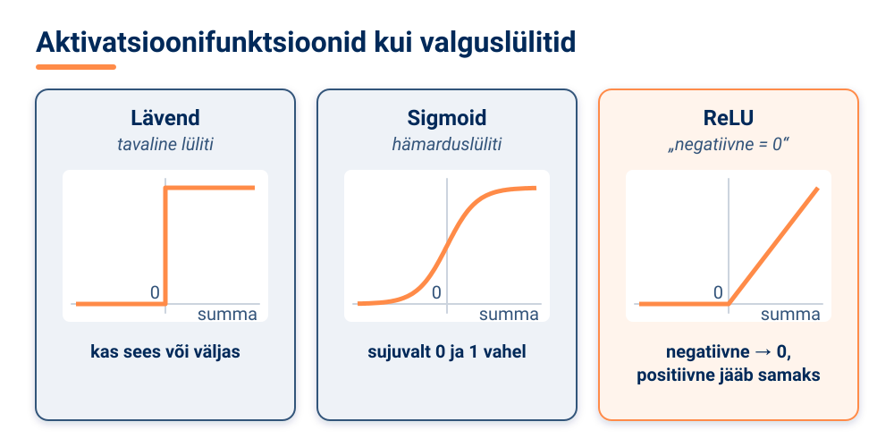

- **Sigmoid** muudab iga arvu väärtuseks 0 ja 1 vahel – nagu hämarduslüliti, mis laseb valgust sujuvalt juurde. Seda saab tõlgendada tõenäosusena („80% kindel, et pildil on kass") ja kasutatakse jah/ei-otsuste puhul.
- **Tanh** sarnaneb sigmoidiga, kuid väljund on −1 ja 1 vahel.
- **ReLU** on kõige lihtsam: kui summa on negatiivne, on väljund 0; kui positiivne, jääb see samaks. Seda on kiire arvutada ja see on süvaõppes kõige levinum.
- **Softmax** on mõeldud väljundkihile, kui valikuid on rohkem kui kaks: see jagab 100% tõenäosust valikute vahel (nt 70% kass, 20% koer, 10% rebane).

Miks on aktivatsioonifunktsioon üldse vaja? Ilma selleta oleks kogu võrk, ükskõik kui palju neuroneid tal on, lihtsalt üks suur kaalutud summa ja suudaks tabada ainult sirgjoonelisi seoseid. Aktivatsioonifunktsioon lisab „painduvust", mis võimaldab õppida keerulisi mustreid.

### Kihid: neuronitest võrguks

Üks neuron suudab teha vaid lihtsa otsuse. Võimekaks muutub närvivõrk siis, kui neuroneid on palju ja need on paigutatud **kihtidesse**. **Kiht** on neuronite rühm, mis töötleb andmeid samal tasemel.

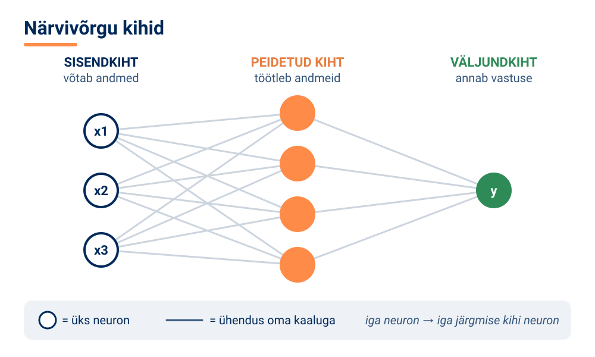

- **Sisendkiht** võtab vastu algandmed – näiteks pildi pikslite heleduse, õppimistundide arvu või sõnad. Sisendkiht ise midagi ei arvuta, ta lihtsalt annab andmed edasi.
- **Peidetud kihid** töötlevad andmeid. Neid nimetatakse peidetuks, sest me ei näe otse, mida need sisaldavad. Iga peidetud kiht leiab andmetest järjest keerukamaid tunnuseid.
- **Väljundkiht** annab lõpptulemuse – näiteks „see on number 5" või „tõenäosus, et õpilane sooritab eksami, on 85%".

Kui info liigub ainult ühes suunas sisendist väljundi poole, on tegu **edasisuunatud võrguga** (*feedforward*). **Rekurrentsetes võrkudes** võib info liikuda ka tsüklis tagasi, mis annab võrgule omamoodi mälu.

Närvivõrgus on kahte liiki väärtusi. **Kaalud ja nihked** õpib võrk treenimise käigus ise – suurtes mudelites võib neid olla miljardeid. **Hüperparameetrid** (kihtide arv, neuronite arv kihis, õppimiskiirus) määrab aga arendaja enne treenimist.

<!-- class="pae-motle" -->
> **Mõtle järele!**
>
> Kujuta ette närvivõrku, mis peab ennustama, kas õpilane sooritab eksami. Millised oleksid sisendkihi neuronid? Mitu neuronit peaks olema väljundkihis? Mida võiksid peidetud kihid sinu arvates „märgata"?

### Kuidas närvivõrk õpib: viga, tagasilevi ja gradientlaskumine

Alguses on närvivõrgu kaalud juhuslikud ja võrk „arvab" täiesti suvaliselt. Treenimise eesmärk on leida sellised kaalud ja nihked, et võrgu vastused oleksid võimalikult õiged. Treenimine käib tsüklina, mida korratakse tuhandeid või miljoneid kordi:

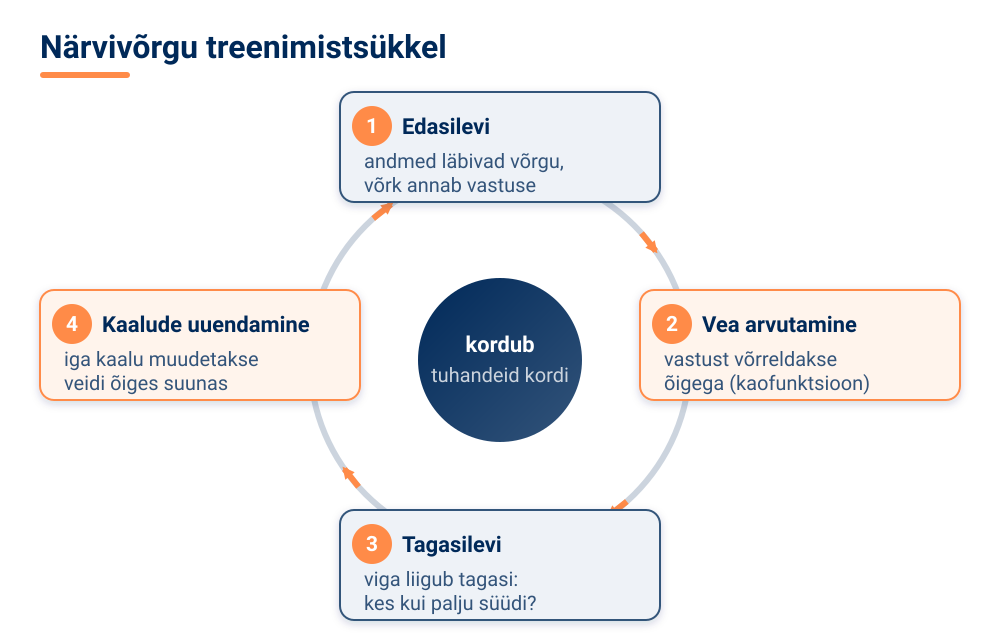

1. **Edasilevi** – sisendandmed liiguvad läbi võrgu kiht kihi haaval ja võrk annab ennustuse.
2. **Vea arvutamine** – võrgu vastust võrreldakse õige vastusega. Seda, kui suur on viga, mõõdab **kaofunktsioon** (ehk veafunktsioon). Mida väiksem on kadu, seda parem.
3. **Tagasilevi** (*backpropagation*) – viga „levitatakse" väljundkihist tagasi sisendi poole ja iga kaalu kohta arvutatakse, kui palju see vea tekkimisele kaasa aitas.
4. **Kaalude uuendamine** – iga kaalu muudetakse natuke selles suunas, mis viga vähendab.

<!-- class="pae-moiste" -->
> **Mõiste: tagasilevi**
>
> **Tagasilevi** (*backpropagation*) on närvivõrkude treenimise põhialgoritm. See arvutab väljundis tekkinud vea põhjal, kui palju ja millises suunas tuleb muuta iga kaalu, et viga järgmisel korral väiksem oleks. Viga liigub võrgus tagasi – väljundkihist peidetud kihtide kaudu sisendkihi poole.

<!-- class="pae-naide" -->
> **Näide: tagasilevi restorani köögis**
>
> Klient kaebab, et supp on liiga soolane. Peakokk ei karista kogu kööki ühtemoodi, vaid uurib ahelat tagurpidi: kes supi serveeris, kes maitsestas, kes puljongi keetis. Kes vea tekkimisele rohkem kaasa aitas, peab oma tegevust rohkem muutma. Nii teeb ka tagasilevi: kaalud, mis vea tekkimises suuremat rolli mängisid, saavad suurema paranduse.

Kuidas aga teada, millises suunas kaalu muuta? Seda teeb **gradientlaskumine**. Kujuta ette, et seisad paksus udus mäenõlval ja tahad jõuda orgu (kõige väiksema veani). Sa ei näe kaugele, aga tunned jalgadega, kuhu poole maapind langeb. Teed sammu allamäge, tunned uuesti, teed järgmise sammu – ja nii kuni jõuad oru põhja.

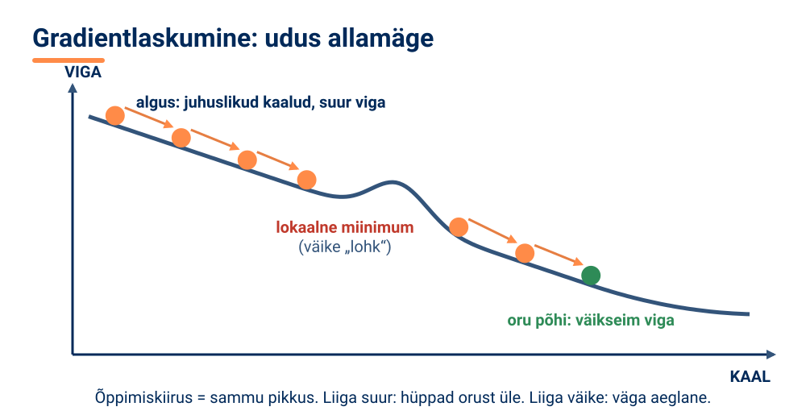

Gradient on lihtsalt „kalle" – see näitab, millises suunas viga kõige kiiremini kasvab, ja gradientlaskumine liigub vastupidises suunas, allamäge.

Väga oluline on **sammu pikkus** ehk **õppimiskiirus** (*learning rate*). Kui sammud on liiga suured, võid hüpata orust üle ja kõikuda edasi-tagasi. Kui liiga väikesed, jõuad orgu väga aeglaselt. Õppimiskiirus on hüperparameeter.

Kui võrk on kogu treeningandmestiku ühe korra läbi vaadanud, on möödunud üks **epohh**. Tavaliselt treenitakse paljude epohhide jooksul, kuni viga enam ei vähene – nagu loeksid õpikut mitu korda läbi. Praktikas ei vaadata kõiki andmeid korraga, vaid väikeste portsjonitena (**minipartiidena**); kui kaalusid uuendatakse iga üksiku näite järel, nimetatakse seda stohhastiliseks gradientlaskumiseks.

<!-- data-type="linechart" data-title="Näide: võrgu viga treenimise ajal" -->
| Epohh | Viga |
|-------|-----:|
| 1 | 0.90 |
| 2 | 0.62 |
| 3 | 0.45 |
| 4 | 0.34 |
| 5 | 0.27 |
| 6 | 0.23 |
| 7 | 0.21 |
| 8 | 0.20 |

Näitegraafikul väheneb viga alguses kiiresti, hiljem aina aeglasemalt – lõpuks pole enam mõtet edasi treenida.

Treenimisel võib tekkida probleeme:

- **ülesobitamine** – võrk õpib treeningandmed pähe (eriti kui andmeid on vähe);
- **kaduv gradient** – väga sügavates võrkudes jõuab veasignaal esimeste kihtideni nii nõrgana, et need peaaegu ei õpi; seda aitab leevendada ReLU kasutamine;
- **lokaalne miinimum** – gradientlaskumine võib jääda kinni väikesesse „lohku", mis ei ole kõige sügavam org;
- **aeglane treenimine** – suurte võrkude treenimine võib kesta päevi või nädalaid; abi on nutikamatest optimeerijatest (nt Adam) ja võimsamast riistvarast.

### Süvaõpe ja selle arhitektuurid

<!-- class="pae-moiste" -->
> **Mõiste: süvaõpe**
>
> **Süvaõpe** (*deep learning*) on masinõppe alamvaldkond, mis kasutab **mitme peidetud kihiga närvivõrke** (süvanärvivõrke). Sõna „süva" viitab kihtide rohkusele ehk võrgu „sügavusele", mitte mõtete sügavusele.

Süvaõppe eripära on, et võrk leiab ise andmetest järjest keerukamaid tunnuseid. Pildi puhul tuvastavad esimesed kihid lihtsaid servi ja värve, keskmised kihid mustreid ja kujundeid ning sügavamad kihid terveid objekte:

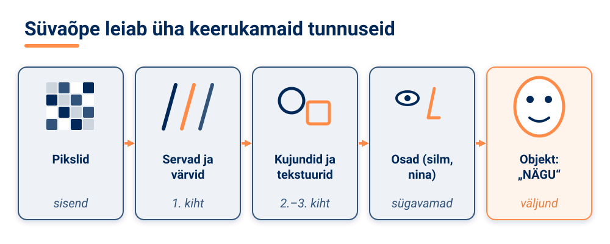

Süvaõpe erineb traditsioonilisest masinõppest mitmeti: see vajab vähem käsitsi tunnuste loomist, suudab töötada toorandmetega (pildid, heli, tekst) ja saavutab keerulistes ülesannetes parema täpsuse. Samas vajab see palju rohkem andmeid ja arvutusvõimsust.

Eri ülesannete jaoks on välja töötatud eri tüüpi võrgud ehk **arhitektuurid**:

| Arhitektuur | Milleks sobib | Kuidas töötab (lihtsalt) | Näited |
|---|---|---|---|
| **Konvolutsiooniline närvivõrk (CNN)** | pildid ja muud ruumilised andmed | „libistab" üle pildi väikest akent (filtrit), mis otsib kohalikke mustreid; inspireeritud aju nägemiskoorest | objektide tuvastamine, näotuvastus, meditsiiniliste piltide analüüs |
| **Rekurrentne närvivõrk (RNN)** | järjestikused andmed (tekst, kõne, aegread) | sisaldab tagasisideahelat, mis „mäletab" eelmisi samme; edasiarendused **LSTM** ja **GRU** mäletavad kauem | teksti genereerimine, kõnetuvastus, ilmaennustus |
| **Transformer** | keel, tõlge, ka pildid | **tähelepanumehhanism** vaatab kõiki lause sõnu korraga ja otsustab, millised on omavahel kõige olulisemalt seotud; töötleb andmeid paralleelselt | suured keelemudelid (GPT, BERT), masintõlge |
| **Autoenkooder** | andmete kokkusurumine | surub andmed väiksemaks ja taastab need siis | müra eemaldamine, anomaaliate tuvastamine |

Transformerite läbimurre algas 2017. aastal teadusartikliga „Attention Is All You Need" („Tähelepanu on kõik, mida vajad"). Tähelepanumehhanismi saab ette kujutada nii: lauses „Mari pani raamatu kotti, sest **see** oli raske" peab mudel aru saama, et „see" viitab raamatule, mitte kotile ega Marile. Tähelepanumehhanism aitab mudelil leida, millised sõnad on omavahel seotud, isegi kui need on lauses kaugel.

### Läbimurded, väljakutsed ja süvaõpe Eestis

Süvaõpe on toonud kaasa rea läbimurdeid:

- **AlexNet (2012)** – pildituvastusvõrk, mis ületas varasemad meetodid nii selgelt, et sellest sai alguse süvaõppe buum.
- **AlphaGo (2016)** – esimene TI-programm, mis võitis Go-mängus maailma tipptasemel mängijat. Go võimalike seisude arv on astronoomiline, nii et kõiki variante ei saa läbi arvutada. AlphaGo ühendas süvaõppe ja stiimulõppe.
- **GPT-mudelid** (*Generative Pre-trained Transformer*) ja **BERT** – transformeril põhinevad keelemudelid, mis suudavad luua inimesesarnast teksti, vastata küsimustele, tõlkida ja kirjutada koodi. GPT järjestikused versioonid on muutunud järjest võimekamaks.
- **DALL-E, Midjourney ja Stable Diffusion** – mudelid, mis loovad tekstikirjelduse põhjal pilte.
- **AlphaFold** – ennustab valkude ruumilist struktuuri; see on aidanud lahendada probleemi, millega teadlased maadlesid aastakümneid, ja võib kiirendada ravimite arendamist.

Süvaõpet kasutatakse **arvutinägemises** (pildituvastus, näotuvastus), **loomuliku keele töötluses** (masintõlge, tekstide meeleolu analüüs, küsimustele vastamine) ja **generatiivses TI-s**, mis loob uut teksti, pilte, muusikat ja videot.

Süvaõppel on aga ka tõsiseid väljakutseid:

- **Arvutusvõimsus ja energia** – suurte mudelite treenimiseks on vaja võimsaid graafikaprotsessoreid (GPU) või eriprotsessoreid (nt Google'i TPU) ning see kulutab palju energiat.
- **Andmevajadus** – süvaõpe vajab tohutuid, sageli märgendatud andmehulki, mille kogumine on kallis.
- **„Musta kasti" probleem** – isegi arendajad ei oska sageli selgitada, miks võrk just sellise otsuse tegi, sest otsus sünnib miljonite kaalude koosmõjus. See on eriti murettekitav meditsiinis ja õiguses.
- **Kallutatus** – treeningandmete eelarvamused kanduvad mudelisse.
- **Haavatavus** – vahel piisab inimsilmale märkamatust muudatusest pildil, et võrk annaks täiesti vale vastuse.

Süvaõppe mudeleid ehitatakse tavaliselt raamistikega nagu TensorFlow, PyTorch, Keras või JAX ja neid saab proovida ka pilvekeskkondades, näiteks Google Colabis.

<!-- class="pae-eesti" -->
> **Eesti näide: süvaõpe Eestis**
>
> - **Tartu Ülikooli** arvutiteaduse instituudis arendatakse süvanärvivõrkudel põhinevat eestikeelset kõnetuvastust ja masintõlget.
> - **Tallinna Tehnikaülikooli** teadlased kasutavad süvaõpet tööstusprotsesside optimeerimiseks ja targa linna lahendustes.
> - **Milrem Robotics** kasutab süvaõpet autonoomsete robotsõidukite juhtimises.
> - **Bolt** kasutab süvaõpet nõudluse ennustamiseks ja hindade määramiseks.
> - **Veriff** kasutab süvanärvivõrke näotuvastuseks ja dokumentide ehtsuse kontrollimiseks.
> - **Texta** arendab eestikeelse teksti analüüsi lahendusi ja **Feelingstream** analüüsib klienditeeninduse vestlusi, et tuvastada kliendirahulolu ja probleeme.

Tulevikus püütakse luua tõhusamaid mudeleid, mis vajavad vähem andmeid ja energiat, **multimodaalseid** mudeleid, mis mõistavad korraga teksti, pilti, heli ja videot, ning **selgitatavat süvaõpet**, mille otsuseid saab mõista. Uuritakse ka aju järgi ehitatud **neuromorfset riistvara**. Avatud küsimus on, kas süvaõpe võib kunagi viia **tehisüldintellektini** – TI-ni, mis suudaks inimese kombel lahendada mis tahes ülesannet.

<!-- class="pae-lisaks" -->
> **Tea lisaks**
>
> Närvivõrguga saad ise katsetada veebilehel **TensorFlow Playground** (playground.tensorflow.org). Seal saad lisada ja eemaldada kihte ja neuroneid, valida aktivatsioonifunktsiooni ja õppimiskiirust ning vaadata otse, kuidas võrk õpib punkte õigesti eristama. Proovi, mis juhtub, kui õppimiskiirus on liiga suur!

### Kokkuvõte ja põhimõisted

**Pea meeles**

- Tehisnärvivõrk on aju närvirakkudest inspireeritud arvutusmudel, mis koosneb kihtidesse paigutatud tehisneuronitest.
- Tehisneuron arvutab sisendite kaalutud summa, lisab nihke ja annab tulemuse aktivatsioonifunktsioonile, mis otsustab, millise signaali neuron edasi saadab.
- Närvivõrgul on sisendkiht, peidetud kihid ja väljundkiht; kaalud ja nihked õpib võrk ise, hüperparameetrid seab arendaja.
- Võrk õpib tsüklina: edasilevi → vea arvutamine → tagasilevi → kaalude uuendamine gradientlaskumise abil („udus allamäge").
- Süvaõpe kasutab mitme peidetud kihiga võrke; olulisemad arhitektuurid on CNN (pildid), RNN (järjestused) ja transformer (keel).
- Süvaõpe on toonud läbimurdeid (AlphaGo, GPT, AlphaFold), kuid vajab palju andmeid ja energiat ning on sageli „must kast".

| Mõiste | Tähendus |
|---|---|
| Närvivõrk | Omavahel ühendatud tehisneuronitest koosnev arvutusmudel |
| Tehisneuron | Närvivõrgu põhiüksus, mis võtab sisendid, töötleb neid ja annab väljundi |
| Kaal | Arv, mis näitab sisendi olulisust neuroni jaoks |
| Nihe | Lisaarv, mis mõjutab, kui kergesti neuron „süttib" |
| Kaalutud summa | Sisendite ja kaalude korrutiste summa koos nihkega |
| Aktivatsioonifunktsioon | Funktsioon, mis määrab, kas ja kui tugevalt neuron „süttib" |
| Peidetud kiht | Sisend- ja väljundkihi vahel olev kiht, mis töötleb andmeid |
| Kaofunktsioon | Mõõdab, kui suur on võrgu viga |
| Tagasilevi | Algoritm, mis arvutab, kuidas muuta kaalusid vea vähendamiseks |
| Gradientlaskumine | Kaalude järkjärguline muutmine vea vähenemise suunas |
| Õppimiskiirus | Hüperparameeter, mis määrab kaalude muutmise sammu suuruse |
| Epohh | Kogu treeningandmestiku üks täielik läbimine |
| Süvaõpe | Masinõpe mitme peidetud kihiga närvivõrkudega |

### Tööleht 2.4

<!-- class="pae-jaotis" -->
**I. Närvivõrkude põhimõisted**

**Ülesanne 1.** Selgita oma sõnadega, mis on tehisnärvivõrk.

[[___ ___ ___]]

**Ülesanne 2.** Ühenda närvivõrkudega seotud mõisted nende definitsioonidega.

| Täht | Kirjeldus |
|:---:|---|
| **A** | Funktsioon, mis määrab neuroni aktivatsiooni tugevuse |
| **B** | Närvivõrgu põhiline töötlusüksus, mis võtab sisendid, töötleb neid ja väljastab tulemuse |
| **C** | Neuronite kogum, mis töötleb andmeid samal tasemel |
| **D** | Parameetrid, mis määravad sisendite olulisuse neuroni jaoks |
| **E** | Algoritm, mis arvutab, kuidas muuta närvivõrgu kaalusid, et viga väheneks |

- [ (A) (B) (C) (D) (E) ]
- [ ( ) (X) ( ) ( ) ( ) ] Neuron
- [ ( ) ( ) (X) ( ) ( ) ] Kiht
- [ ( ) ( ) ( ) (X) ( ) ] Kaalud
- [ (X) ( ) ( ) ( ) ( ) ] Aktivatsioonifunktsioon
- [ ( ) ( ) ( ) ( ) (X) ] Tagasilevi (backpropagation)
****************************************
Neuron on põhiline töötlusüksus ja kiht on neuronite rühm. Kaalud näitavad sisendite olulisust. Aktivatsioonifunktsioon määrab, kui tugevalt neuron „süttib". Tagasilevi arvutab, kuidas kaalusid muuta.
****************************************

<!-- class="pae-jaotis" -->
**II. Närvivõrgu struktuur**

**Ülesanne 3.** Vaata närvivõrgu joonist ja ühenda tähed õigete osadega.

")

| Täht | Kirjeldus |
|:---:|---|
| **A** | vasakpoolne kiht |
| **B** | keskmine kiht |
| **C** | parempoolne kiht |
| **D** | neuroneid ühendav joon |
| **E** | üks ring |

- [ (A) (B) (C) (D) (E) ]
- [ (X) ( ) ( ) ( ) ( ) ] Sisendkiht
- [ ( ) (X) ( ) ( ) ( ) ] Peidetud kiht
- [ ( ) ( ) (X) ( ) ( ) ] Väljundkiht
- [ ( ) ( ) ( ) (X) ( ) ] Ühendus (kaal)
- [ ( ) ( ) ( ) ( ) (X) ] Neuron
****************************************
Andmed sisenevad vasakult sisendkihti, töödeldakse peidetud kihis ja tulemus tuleb välja paremalt väljundkihist. Iga ring on neuron ja iga ühendusjoon kannab oma kaalu.
****************************************

Joonista paberile oma lihtne närvivõrgu skeem ja märgista sellel sisendkiht, peidetud kihid, väljundkiht, neuronid ja ühendused (kaalud).

**Ülesanne 4.** Kirjelda kihtide ülesandeid närvivõrgus.

**a) Sisendkiht:**

[[___ ___]]

**b) Peidetud kihid:**

[[___ ___]]

**c) Väljundkiht:**

[[___ ___]]

**Ülesanne 5.** Miks on aktivatsioonifunktsioonid olulised? Kirjelda lühidalt järgmisi aktivatsioonifunktsioone.

**Miks on aktivatsioonifunktsioonid olulised?**

[[___ ___]]

**a) Sigmoid:**

[[___]]

**b) ReLU (Rectified Linear Unit):**

[[___]]

**c) Tanh:**

[[___]]

<!-- class="pae-jaotis" -->
**III. Närvivõrkude treenimine**

**Ülesanne 6.** Kirjelda närvivõrgu treenimise protsessi.

[[___ ___ ___ ___]]

**Ülesanne 7.** Selgita järgmisi mõisteid närvivõrkude treenimise kontekstis.

**a) Kaofunktsioon (loss function):**

[[___ ___]]

**b) Gradient:**

[[___ ___]]

**c) Õppimiskiirus (learning rate):**

[[___ ___]]

**d) Epohhid (epochs):**

[[___ ___]]

**Ülesanne 8.** Millised probleemid võivad tekkida närvivõrkude treenimisel ja kuidas neid lahendada? Kirjuta iga probleemi kohta kirjeldus ja lahendus.

| Probleem | Kirjeldus | Lahendus |
|---|---|---|
| Ülesobitamine | | |
| Kaduv gradient | | |
| Lokaalsed miinimumid | | |
| Aeglane treenimine | | |

**Ülesobitamine:**

[[___ ___]]

**Kaduv gradient:**

[[___ ___]]

**Lokaalsed miinimumid:**

[[___ ___]]

**Aeglane treenimine:**

[[___ ___]]

<!-- class="pae-jaotis" -->
**IV. Süvaõpe ja selle rakendused**

**Ülesanne 9.** Mis on süvaõpe ja kuidas see erineb traditsioonilisest masinõppest?

[[___ ___ ___ ___]]

**Ülesanne 10.** Kirjelda lühidalt süvaõppe arhitektuure ja nende rakendusi.

**a) Konvolutsioonilised närvivõrgud (CNN):**

[[___ ___ ___]]

**b) Rekurrentsed närvivõrgud (RNN):**

[[___ ___ ___]]

**c) Transformerid:**

[[___ ___ ___]]

**Ülesanne 11.** Täida tabel süvaõppe rakendustega eri valdkondades. Kirjuta iga valdkonna kohta rakenduse näide ja kasutatav arhitektuur.

| Valdkond | Rakenduse näide | Kasutatav arhitektuur |
|---|---|---|
| Arvutinägemine | | |
| Loomuliku keele töötlus | | |
| Kõnetuvastus | | |
| Meditsiiniline diagnostika | | |
| Autonoomsed sõidukid | | |

**Arvutinägemine:**

[[___]]

**Loomuliku keele töötlus:**

[[___]]

**Kõnetuvastus:**

[[___]]

**Meditsiiniline diagnostika:**

[[___]]

**Autonoomsed sõidukid:**

[[___]]

<!-- class="pae-jaotis" -->
**V. Praktiline ülesanne**

**Ülesanne 12.** Külasta veebilehte [playground.tensorflow.org](https://playground.tensorflow.org) ja katseta närvivõrkudega.

**a) Vali üks probleem (nt spiraal või kontsentrilised ringid) ja kirjelda, kuidas muutsid närvivõrgu struktuuri selle lahendamiseks.**

[[___ ___ ___]]

**b) Kuidas mõjutas kihtide ja neuronite arv närvivõrgu võimet probleemi lahendada?**

[[___ ___]]

**c) Millised aktivatsioonifunktsioonid töötasid kõige paremini ja miks?**

[[___ ___]]

**d) Mida õppisid närvivõrkude kohta selle katse käigus?**

[[___ ___ ___]]

**Ülesanne 13.** Kavanda lihtne närvivõrk järgmise probleemi lahendamiseks.

*Probleem: ennustada, kas õpilane sooritab eksami edukalt, lähtudes õppimisele pühendatud tundide arvust, varasematest tulemustest ja unetundide arvust.*

**a)** Joonista närvivõrgu struktuur paberile või kirjelda seda siin: mitu neuronit on igas kihis ja mida need tähendavad?

[[___ ___ ___]]

**b) Kirjelda oma kavandi valikuid (miks just nii palju kihte ja neuroneid, milline aktivatsioonifunktsioon väljundis).**

[[___ ___ ___ ___]]

<!-- class="pae-jaotis" -->
**VI. Süvaõppe eetilised aspektid**

**Ülesanne 14.** Millised eetilised küsimused kaasnevad süvaõppe kasutamisega? Nimeta vähemalt kolm.

[[___ ___ ___ ___]]

**Ülesanne 15.** Kuidas saaks lahendada süvaõppe „musta kasti" probleemi (mudelite läbipaistmatust)?

[[___ ___ ___ ___]]

<!-- class="pae-jaotis" -->
**VII. Arutelu**

**Ülesanne 16.** Millised on süvaõppe tulevikusuunad ja võimalikud läbimurded?

[[___ ___ ___ ___]]

**Ülesanne 17.** Kuidas võiks süvaõpe muuta meie igapäevaelu järgmise 10 aasta jooksul?

[[___ ___ ___ ___]]

### Enesekontroll 2.4

**1. Kuidas nimetatakse tehisneuronis lisaarvu, mis näitab neuroni üldist kalduvust „süttida" ka siis, kui sisendid on nõrgad? Kirjuta vastus.**

[[nihe]]
<script>
let v = `@input`.trim().toLowerCase().replace(/\s+/g, " ");
["nihe", "nihet", "nihkeks", "bias"].includes(v)
</script>
****************************************
Õige vastus: **nihe** (*bias*). Kaalud ja nihked on need väärtused, mida närvivõrk treenimise käigus õpib.
****************************************

**2. Neuroni sisendid on 1 ja 0, kaalud vastavalt 4 ja 5 ning nihe on −1. Arvuta kaalutud summa.**

[[3]]
- [[?]] Korruta iga sisend oma kaaluga, liida tulemused ja lisa nihe.
<script>
Number(`@input`.trim().replace(",", ".").replace("−", "-")) === 3
</script>
****************************************
1 × 4 + 0 × 5 + (−1) = 4 + 0 − 1 = **3**
****************************************

**3. Sünnipäevale mineku neuronis on sõprade kaal 3, ilma kaal 2 ja kontrolltöö kaal −4 ning nihe on −2. Sõbrad lähevad (1), ilm ei ole ilus (0) ja esmaspäeval on kontrolltöö (1). Arvuta kaalutud summa.**

[[-3]]
<script>
Number(`@input`.trim().replace(",", ".").replace("−", "-").replace(/\s+/g, "")) === -3
</script>
****************************************
1 × 3 + 0 × 2 + 1 × (−4) + (−2) = 3 + 0 − 4 − 2 = **−3**. Summa on väiksem kui null, seega jääd koju õppima.
****************************************

**4. Lohista närvivõrgu kihid õigetesse lünkadesse.**

<!-- data-show-partial-solution -->
Algandmed võtab vastu [->[ (sisendkiht) ]], andmeid töötlevad ja neist järjest keerukamaid tunnuseid leiavad [->[ (peidetud kihid) | kaofunktsioon ]] ning lõpptulemuse annab [->[ (väljundkiht) | nihe ]].
****************************************
Sisendkiht võtab andmed vastu ja annab need edasi, peidetud kihid töötlevad andmeid ja väljundkiht annab tulemuse, näiteks „see on number 5".
****************************************

**5. Pane närvivõrgu treenimistsükli sammud õigesse järjekorda.**

<!-- data-show-partial-solution -->
Kaalude uuendamine gradientlaskumisega: [[ 1 | 2 | 3 | (4) ]]<br>
Edasilevi – võrk annab ennustuse: [[ (1) | 2 | 3 | 4 ]]<br>
Tagasilevi – viga levitatakse võrgus tagasi: [[ 1 | 2 | (3) | 4 ]]<br>
Vea arvutamine kaofunktsiooniga: [[ 1 | (2) | 3 | 4 ]]
****************************************
Kõigepealt annab võrk ennustuse, siis arvutatakse viga, seejärel levitatakse viga tagasi ja lõpuks uuendatakse kaalusid. Tsüklit korratakse tuhandeid kordi.
****************************************

**6. Millisele arhitektuurile ülesanne kõige paremini sobib?**

- [ (CNN) (RNN) (Transformer) ]
- [ (X) ( ) ( ) ] Nägude tuvastamine fotodelt
- [ ( ) (X) ( ) ] Ilmaennustus eelmiste päevade mõõtmiste jada põhjal
- [ ( ) ( ) (X) ] Suur keelemudel, mis vaatab tähelepanumehhanismiga kõiki lause sõnu korraga
- [ (X) ( ) ( ) ] Röntgenipiltide analüüs
- [ ( ) (X) ( ) ] Võrk, mille tagasisideahel „mäletab" eelmisi samme (nt LSTM)
****************************************
CNN libistab üle pildi väikest filtrit ja sobib piltidele. RNN sobib järjestikustele andmetele (tekst, kõne, aegread), sest tal on tagasisideahel. Transformer kasutab tähelepanumehhanismi ja on suurte keelemudelite (GPT, BERT) alus.
****************************************

**7. Vali lünkadesse õige aktivatsioonifunktsioon.**

<!-- data-show-partial-solution -->
Funktsioon, mis muudab iga arvu väärtuseks 0 ja 1 vahel, on [[ (sigmoid) | ReLU | softmax ]]. Funktsioon, mis annab negatiivse summa korral 0 ja positiivse summa korral sama arvu, on [[ sigmoid | (ReLU) | softmax ]]. Väljundkihis, kus valikuid on rohkem kui kaks, jagab 100% tõenäosust valikute vahel [[ sigmoid | ReLU | (softmax) ]].
****************************************
Sigmoid on nagu hämarduslüliti (väljund 0 ja 1 vahel). ReLU on kõige lihtsam ja süvaõppes kõige levinum. Softmax jagab tõenäosuse valikute vahel, nt 70% kass, 20% koer, 10% rebane.
****************************************

**8. Selgita gradientlaskumist udus mäelt laskumise näitel. Mis juhtub, kui õppimiskiirus on liiga suur või liiga väike?**

[[___ ___ ___]]

<details>
<summary>Vaata näidisvastust</summary>

Gradientlaskumine on nagu udus mäelt alla orgu minek: kaugele ei näe, aga jalgadega tunned, kuhu maapind langeb, ja teed sammu allamäge. Org on koht, kus viga on kõige väiksem. Õppimiskiirus on sammu pikkus. Kui sammud on liiga suured, võib võrk orust üle hüpata ja edasi-tagasi kõikuda. Kui sammud on liiga väikesed, jõuab võrk väikseima veani väga aeglaselt.

</details>


## 2.5 Tehisintellekti rakendused valdkondades

### Õpieesmärgid

<!-- class="pae-kaas" -->


Selle tunni järel sa:

- tunned tehisintellekti rakendusi tervishoius, teaduses, hariduses, transpordis, tootmises, põllumajanduses, rahanduses, meelelahutuses ja avalikus sektoris;
- oskad seostada rakendusi eelmistes tundides õpitud tehnoloogiatega (masinõpe, süvaõpe, arvutinägemine, loomuliku keele töötlus);
- oskad tuua näiteid TI kasutamisest Eestis ja Euroopas;
- oskad analüüsida TI rakenduste eeliseid, piiranguid ning mõju tööturule ja ühiskonnale.

### Tehisintellekt tervishoius ja teaduses

Eelmistes tundides said teada, kuidas TI „kapoti all" töötab. Nüüd vaatame, mida see päriselus teeb. TI-d kasutatakse peaaegu igas eluvaldkonnas:

| Valdkond | Peamised rakendused |
|---|---|
| Tervishoid | diagnostika, ravimite arendamine, personaalmeditsiin |
| Haridus | personaliseeritud õpe, hindamine, õpianalüütika |
| Transport | isesõitvad sõidukid, liiklusjuhtimine, logistika |
| Rahandus | pettuste tuvastamine, riskianalüüs, investeerimine |
| Tootmine | kvaliteedikontroll, ennetav hooldus, protsesside optimeerimine |
| Põllumajandus | saagi ennustamine, taimehaiguste tuvastamine, ressursside juhtimine |
| Meelelahutus | soovitussüsteemid, mängud, sisu loomine |
| Avalik sektor | e-teenused, otsuste toetamine, linnaplaneerimine |


**Tervishoid** on üks valdkondi, kus TI võib tuua kõige suuremaid muutusi.

<!-- class="pae-moiste" -->
> **Mõiste: arvutinägemine**
>
> **Arvutinägemine** on TI valdkond, mis õpetab arvutit pilte ja videoid „nägema" ja mõistma: tuvastama objekte, nägusid, teksti või kõrvalekaldeid. Arvutinägemine põhineb enamasti süvaõppel ja seda kasutatakse nii meditsiinis, isesõitvates autodes, tehaste kvaliteedikontrollis kui ka telefoni näotuvastuses.

- **Diagnoosimine.** Süvanärvivõrgud (eriti konvolutsioonilised võrgud, mida õppisid tunnis 2.4) analüüsivad meditsiinilisi pilte – röntgen-, MRT- ja KT-ülesvõtteid – ning aitavad leida vähki, silmahaigusi või südameprobleeme. Mõnes uuringus on TI olnud nendes ülesannetes isegi arstidest täpsem: näiteks Google Healthi süsteem tuvastas uuringus rinnavähki mammogrammidelt täpsemini kui keskmine radioloog. Lõpliku otsuse teeb siiski arst.
- **Ravimite arendamine** on tavaliselt väga aeglane ja kallis. TI ennustab molekulide omadusi, simuleerib nende mõju ja aitab kavandada uusi ravimikandidaate. COVID-19 pandeemia ajal kasutati TI-d, et kiiresti leida juba olemasolevaid ravimeid, mida võiks proovida viiruse vastu.
- **Personaalmeditsiin** kohandab ravi iga patsiendi geneetika ja terviseloo järgi. TI aitab leida seoseid geenide, haiguste ja ravi tulemuste vahel.

**Teaduses** aitab TI töödelda andmehulki, mida inimene ei jõuaks kunagi läbi vaadata, leida mustreid ja pakkuda välja uusi hüpoteese. Seda kasutatakse kliima, molekulide, materjalide ja bioloogiliste süsteemide modelleerimiseks ning kosmose uurimiseks. Kuulsaim näide on **AlphaFold**, mis ennustab valkude ruumilist struktuuri. TI ühendab ka eri teadusvaldkondi – bioloog, arvutiteadlane ja füüsik töötavad üha sagedamini koos.

<!-- class="pae-eesti" -->
> **Eesti näide: TI ja tervis**
>
> Eestis uuritakse TI kasutamist tervishoius näiteks RITA programmi projektis „Tehisintellekti ja masinõppe rakendamine tervishoius". Ka Euroopa Liidus on mitmeid projekte, mis toetavad TI kasutamist tervishoius üle Euroopa.

### Tehisintellekt hariduses

TI pakub uusi võimalusi nii õpilastele kui ka õpetajatele.

- **Personaliseeritud õpe.** Kohanduvad (adaptiivsed) õppesüsteemid muudavad ülesandeid vastavalt õpilase tasemele ja õppimise tempole. Näiteks Duolingo keskendub rohkem neile teemadele, kus õppija teeb vigu. Samal põhimõttel töötavad ka Khan Academy, ALEKS ja Century Tech.
- **Õpilünkade tuvastamine.** TI analüüsib õpilase vastuseid ja märkab mustreid, mis viitavad konkreetsetele väärarusaamadele – nii saab õppimise suunata täpselt sinna, kus abi on kõige rohkem vaja.
- **Automaatne hindamine.** TI suudab hinnata valikvastustega teste, lühivastuseid ja isegi esseesid ning tuvastada plagiaati. See vabastab õpetaja aega õpilaste juhendamiseks.
- **Virtuaalsed õpiassistendid** ehk vestlusrobotid vastavad küsimustele ja selgitavad teemasid ööpäev läbi.
- **Õpetaja tööriistad** aitavad koostada õppematerjale, automatiseerida asjaajamist ja jälgida õpilaste arengut (**õpianalüütika**).

<!-- class="pae-eesti" -->
> **Eesti näide: haridustehnoloogia**
>
> **Lingvist** pakub TI abil igale kasutajale tema oskustele kohandatud keeleõpet. **Edumus** kasutab TI-d personaliseeritud õppematerjalide loomiseks ja **DreamApply** aitab kõrgkoolidel hallata rahvusvaheliste üliõpilaste vastuvõttu. Euroopa Liidu projekt **AI4T** (*Artificial Intelligence for Teachers*) aitab õpetajatel kasutada TI-d õppetöös.

<!-- class="pae-motle" -->
> **Mõtle järele!**
>
> Kui TI hindaks sinu kirjandit, siis mida see sinu arvates märkaks hästi ja mida võiks kahe silma vahele jätta? Millises olukorras sooviksid, et sinu tööd hindaks kindlasti inimene?

### Transport, tootmine ja põllumajandus

**Transport** muutub TI abil ohutumaks, tõhusamaks ja keskkonnasõbralikumaks.

- **Isesõitvad sõidukid** on ehk kõige nähtavam TI rakendus. Kaamerate, radarite ja **lidarite** (laserkaugusmõõturite) andmeid töödeldakse süvaõppe abil, et tuvastada teisi autosid, jalakäijaid ja liiklusmärke ning teha sõiduotsuseid. Isesõitvaid autosid arendavad näiteks Tesla ja Waymo, kullerdroone Amazon ja Wing ning kullerroboteid Eestis loodud Starship Technologies. Kuna enamiku liiklusõnnetustest põhjustavad inimvead, loodetakse, et isesõitvad autod muudavad liikluse turvalisemaks.
- **Liiklusjuhtimine.** Nutikad valgusfoorid kohandavad oma tööd reaalajas, TI ennustab ummikuid ja aitab planeerida ühistransporti vastavalt reisijate vajadustele.
- **Logistika.** Ettevõtted nagu Amazon ja DHL kasutavad TI-d marsruutide optimeerimiseks, nõudluse ennustamiseks ja ladude juhtimiseks.

**Tootmises** on TI osa niinimetatud **Tööstus 4.0** pöördest, kus tehased muutuvad nutikaks: masinad on ühendatud asjade interneti kaudu ja otsuseid tehakse andmete põhjal.

- **Kvaliteedikontroll.** Arvutinägemine leiab tootelt defekte, mida inimsilm ei pruugi märgata – näiteks autotööstuses värvkatte väikseimaid vigu.
- **Ennetav hooldus.** Andurid koguvad pidevalt andmeid masinate seisukorra kohta ja TI ennustab, millal seade võib rikki minna. Nii saab hoolduse teha enne riket ja vältida seisakuid.
- **Protsesside optimeerimine.** Masinõpe aitab säästa energiat ja materjali ning lühendada tootmisaega. Näiteks Siemens kasutab TI-d oma „digitaalsetes tehastes" tootmise ja energiatarbimise optimeerimiseks.
- **Koostöörobotid** ehk **kobotid** töötavad inimestega kõrvuti, mitte ei asenda neid. Näiteks BMW tehastes aitavad kobotid inimesi autode kokkupanemisel.

**Põllumajanduses** räägitakse **täppispõllumajandusest**: satelliidi- ja droonipiltide analüüs näitab, millises põllu osas on vaja rohkem vett või väetist, TI tuvastab taimehaigusi ja kahjureid ning ennustab saaki. Loomakasvatuses jälgib TI loomade tervist ja käitumist ning aitab söötmist optimeerida. Nii kasutatakse ressursse säästlikumalt ja keskkond saab vähem kahju.

<!-- class="pae-eesti" -->
> **Eesti näide: tööstus ja transport**
>
> **AI & Robotics Estonia (AIRE)** on 1. oktoobril 2021 tööd alustanud teenuskeskus, mis nõustab Eesti tööstusettevõtteid TI ja robootika kasutuselevõtul. **Bolt** kasutab TI-d nõudluse ennustamiseks, hindade määramiseks ja sõitude sobitamiseks ning **Milrem Robotics** arendab TI abil navigeerivaid autonoomseid sõidukeid ja roboteid. Euroopa Liidu projekt **LEVITATE** uuris automatiseeritud sõidukite mõju liiklusele ja ühiskonnale.

### Rahandus ja meelelahutus

**Rahandus** on TI kasutuselevõtus olnud üks eesrindlikumaid valdkondi.

- **Pettuste tuvastamine.** Masinõpe analüüsib reaalajas miljoneid tehinguid ja otsib ebatavalisi mustreid (anomaaliaid). Kui sinu kaardiga tehakse äkki ost teisel pool maakera, võib pank tehingu peatada. Mastercard on teatanud, et nende TI hindab iga tehingu riski umbes 50 millisekundiga.
- **Riskianalüüs ja laenuotsused.** TI arvestab laenutaotleja maksevõime hindamisel sadu tegureid. See võib aidata pakkuda laenu ka neile, kelle krediidiajalugu on lühike – aga siin tuleb eriti hoolikalt jälgida, et otsused ei oleks kallutatud.
- **Algoritmkauplemine.** TI teeb automaatseid investeerimisotsuseid turuandmete, uudiste ja isegi sotsiaalmeedia meeleolude põhjal. Hinnangute järgi moodustab algoritmkauplemine suurema osa USA aktsiaturu tehingutest.
- **Klienditeenindus.** Vestlusrobotid ja virtuaalassistendid vastavad küsimustele ja aitavad tehinguid teha; näiteks Bank of America virtuaalassistent Erica on aidanud miljoneid kliente.

<!-- class="pae-fakt" -->
> **Kas teadsid?** Mastercard on teatanud, et nende TI hindab iga kaarditehingu riski umbes **50 millisekundiga**.

<!-- class="pae-eesti" -->
> **Eesti näide: TI pangas**
>
> **LHV** kasutab TI-d pettuste tuvastamiseks ja klienditeeninduse parandamiseks. **Salv** aitab pankadel ja finantsasutustel TI abil avastada rahapesu ja muid finantskuritegusid.

**Meelelahutuses** puutud TI-ga kokku iga päev.

<!-- class="pae-moiste" -->
> **Mõiste: soovitussüsteem**
>
> **Soovitussüsteem** on TI-süsteem, mis ennustab, milline sisu või toode võiks kasutajale meeldida, ja pakub seda talle. Selleks kasutatakse kasutaja varasemat käitumist (mida ta vaatas, kuulas, ostis) ja sarnaste kasutajate eelistusi.

- **Soovitussüsteemid** – Netflix, Spotify ja YouTube soovitavad sisu sinu varasema käitumise ja sarnaste kasutajate eelistuste põhjal. Netflix on teatanud, et nende soovitussüsteem säästab ettevõttele üle miljardi dollari aastas, sest vähem kasutajaid loobub teenusest.
- **Sisu loomine** – **generatiivne TI** loob teksti (nt GPT-mudelid), pilte (DALL-E, Midjourney) ja muusikat (nt AIVA). TI ei asenda inimese loovust, kuid on muutumas loomeprotsessis kasulikuks tööriistaks.
- **Mängud** – TI juhib mängu tegelasi (NPC-sid), loob automaatselt mängumaailmu ja kohandab mängu mängija järgi. Näiteks mäng *No Man's Sky* genereerib algoritmide abil lugematu hulga erinevaid planeete.
- **Filmid** – TI aitab luua eriefekte. Näotuvastuse ja süvaõppe abil saab näitlejaid digitaalselt noorendada, nagu tehti filmis „The Irishman". Sama tehnoloogia võimaldab luua ka **süvavõltsinguid** (*deepfake*) – võltsitud videoid, kus inimene näib ütlevat või tegevat midagi, mida ta tegelikult pole teinud.

<!-- class="pae-fakt" -->
> **Kas teadsid?** Netflix on teatanud, et nende soovitussüsteem säästab ettevõttele **üle miljardi dollari aastas**, sest tänu headele soovitustele loobub teenusest vähem kasutajaid.


### Avalik sektor ja tehisintellekt Eestis

Riigid ja omavalitsused kasutavad TI-d, et pakkuda paremaid teenuseid ja teha andmepõhiseid otsuseid.

- **E-teenused.** Vestlusrobotid aitavad kodanikel riigiasutuste teenustes orienteeruda – näiteks Singapuri valitsuse vestlusrobot „Ask Jamie" vastab küsimustele eri asutuste veebilehtedel.
- **Otsuste toetamine ja ressursside planeerimine.** Ennustav analüütika aitab planeerida taristut, prügivedu, tänavavalgustust ja ühistransporti. New York kasutab TI-d, et ennustada, millised hooned on tuleohtlikud, et tuletõrje saaks neid ennetavalt kontrollida.
- **Kodanike kaasamine.** TI aitab analüüsida suurt hulka tagasisidet ja arvamusi.
- **Kriisijuhtimine ja julgeolek.** TI aitab ennustada loodusõnnetusi, modelleerida kriisiolukordi, tõrjuda küberrünnakuid ja tuvastada anomaaliaid. Ennustav politseitöö on aga vastuoluline, sest see võib korrata andmetes peituvat kallutatust.

<!-- class="pae-eesti" -->
> **Eesti näide: Bürokratt ja riiklikud TI-algatused**
>
> **Bürokratt** on Eesti riigi virtuaalassistentide võrgustik, mille kaudu saad avalikke teenuseid kasutada tavalises kõnekeeles suheldes. See on osa laiemast **KrattAI** algatusest, mille eesmärk on luua avalikus sektoris TI-põhiseid teenuseid. Bürokratt valiti 2022. aastal parimaks TI-l põhinevaks riigiteenuseks ja jõudis UNESCO maailma saja parima TI-lahenduse hulka.
>
> Eestil on riiklik TI tegevuskava ehk **kratikava** (viimane neist 2024–2026), oma TI strateegia on ka Kaitseministeeriumi valitsemisalal ning Maksu- ja Tolliametil, kes kasutab masinõpet maksupettuste avastamiseks. **Tehnopoli AI arenguprogramm** aitab alates 2022. aastast ettevõtetel TI-lahendusi kasutusele võtta.

Eesti TI-maastikul on palju tuntud ettevõtteid: **Starship Technologies** (kullerrobotid), **Veriff** (isikusamasuse tuvastamine dokumendi ja näopildi võrdlemise teel), **Bolt**, **Lingvist**, **Milrem Robotics**, **Salv**. Teaduses arendab **Tartu Ülikool** eestikeelset kõnetuvastust ja masintõlget ning **Tallinna Tehnikaülikool** tööstuse ja targa linna lahendusi. Eesti eelised on arenenud digiühiskond ja e-riigi kogemus; väljakutsed on väike turg ja piiratud hulk eestikeelseid andmeid. Seepärast on oluline rahvusvaheline koostöö – näiteks Euroopa Liidu projekt **AI4Cities** keskendub TI kasutamisele linnade jätkusuutlikumaks muutmisel.


### Mõju tööturule ja eetilised küsimused

TI muudab tööelu. **Automatiseerimine** asendab eelkõige rutiinseid ülesandeid, kuid samas tekib uusi töökohti ja paljud ametid muutuvad. Arvatakse, et tulevikus on üha tähtsamad oskused, mida masinal on raske jäljendada:

- loovus ja kriitiline mõtlemine;
- sotsiaalne intelligentsus ehk oskus inimestega suhelda ja koostööd teha;
- tehnoloogiline kirjaoskus – arusaamine, kuidas tehnoloogia, sealhulgas TI, töötab;
- kohanemisvõime ja valmisolek kogu elu õppida.

Väljakutseteks on oskuste lõhe, ebavõrdsuse süvenemise oht ja vajadus ümber õppida. Võimalusteks on aga tootlikkuse kasv, uued töövormid ja parem elukvaliteet.

<!-- class="pae-naide" -->
> **Näide: inimese ja TI koostöö**
>
> Radioloog vaatab päevas läbi sadu ülesvõtteid. TI-süsteem saab need eelnevalt läbi vaadata ja märkida kahtlased kohad, nii et arst saab keskenduda kõige keerulisematele juhtumitele. Otsuse teeb ja selle eest vastutab endiselt arst. Selline koostöö kasutab ära mõlema tugevused: TI kiirust ja järjekindlust ning inimese kogemust, konteksti mõistmist ja vastutustunnet.


TI rakendamisega kaasnevad igas valdkonnas sarnased **eetilised küsimused**:

- **privaatsus** – kui palju andmeid meie kohta kogutakse ja kas meid jälgitakse ning profileeritakse;
- **kallutatus ja diskrimineerimine** – kas TI kohtleb kõiki rühmi õiglaselt;
- **läbipaistvus ja selgitatavus** – kas TI otsust saab põhjendada (eriti meditsiinis, laenuotsustes ja kohtus);
- **vastutus** – kes vastutab, kui isesõitev auto teeb õnnetuse või diagnoosisüsteem eksib;
- **autonoomsus ja kontroll** – milliseid otsuseid võib jätta masina teha ja kus peab otsustama inimene.

Euroopa Liit on nendele küsimustele vastuseks võtnud vastu **Euroopa Liidu tehisintellekti määruse (AI Act)** – esimese tervikliku TI õigusraamistiku, mis kasutab **riskipõhist lähenemist**: mida suurem on TI-süsteemi võimalik oht inimestele, seda rangemad nõuded sellele kehtivad.

<!-- class="pae-lisaks" -->
> **Tea lisaks**
>
> Kui tahad TI põhimõtetest rohkem teada saada, proovi veebikursust **Elements of AI** (elementsofai.ee). See loodi Soomes ja on tõlgitud ka eesti keelde. Eesti TI-algatuste kohta leiad infot portaalist **kratid.ee**.

### Kokkuvõte ja põhimõisted

**Pea meeles**

- TI-d kasutatakse peaaegu kõigis valdkondades: tervishoius, teaduses, hariduses, transpordis, tootmises, põllumajanduses, rahanduses, meelelahutuses ja avalikus sektoris.
- Paljud rakendused põhinevad samadel tehnoloogiatel: arvutinägemine (pildid), loomuliku keele töötlus (tekst ja kõne), anomaaliate tuvastamine (pettused, rikked) ja soovitussüsteemid.
- Eestis on tuntud TI-rakendusi nii avalikus sektoris (Bürokratt) kui ka ettevõtetes (Starship, Veriff, Bolt, Lingvist, Salv, Milrem Robotics).
- TI muudab tööturgu: rutiinsed ülesanded automatiseeritakse ning loovus, kriitiline mõtlemine ja koostööoskus muutuvad olulisemaks.
- TI rakendamisel tuleb arvestada privaatsuse, kallutatuse, läbipaistvuse ja vastutusega; ELis reguleerib seda tehisintellekti määrus (AI Act).

| Mõiste | Tähendus |
|---|---|
| Personaalmeditsiin | Ravi kohandamine iga patsiendi geneetika ja terviseloo järgi |
| Personaliseeritud õpe | Õppimise kohandamine iga õpilase taseme ja tempo järgi |
| Ennetav hooldus | Seadme rikke ennustamine andurite andmete põhjal enne, kui see juhtub |
| Tööstus 4.0 | Nutikas, andmepõhine ja võrku ühendatud tootmine |
| Täppispõllumajandus | Andmete ja TI abil ressursside täpne kasutamine põllul |
| Soovitussüsteem | Süsteem, mis pakub kasutajale sisu tema varasema käitumise põhjal |
| Generatiivne TI | TI, mis loob uut sisu – teksti, pilte, muusikat, videot |
| Süvavõltsing | TI abil loodud võltsitud video, pilt või heli |
| Bürokratt | Eesti riigi virtuaalassistentide võrgustik |
| ELi tehisintellekti määrus (AI Act) | ELi riskipõhine TI õigusraamistik |

### Tööleht 2.5

<!-- class="pae-jaotis" -->
**I. Tehisintellekti rakenduste kaardistamine**

**Ülesanne 1.** Täida tabel TI rakendustega eri valdkondades. Kirjuta iga valdkonna kohta konkreetsed rakendused ja kasutatavad TI tehnoloogiad.

| Valdkond | Konkreetsed rakendused | Kasutatavad TI tehnoloogiad |
|---|---|---|
| Meditsiin | | |
| Transport | | |
| Tootmine | | |
| Finants | | |
| Haridus | | |
| Põllumajandus | | |
| Energeetika | | |

**Meditsiin:**

[[___ ___]]

**Transport:**

[[___ ___]]

**Tootmine:**

[[___ ___]]

**Finants:**

[[___ ___]]

**Haridus:**

[[___ ___]]

**Põllumajandus:**

[[___ ___]]

**Energeetika:**

[[___ ___]]

**Ülesanne 2.** Vali üks valdkond ja kirjelda põhjalikumalt, kuidas TI on seda muutnud.

[[___ ___ ___ ___ ___]]

<!-- class="pae-jaotis" -->
**II. Tehisintellekti rakenduste analüüs**

**Ülesanne 3.** Vali kolm TI rakendust ja analüüsi neid järgmiste kriteeriumide alusel: probleem, mida see lahendab; kasutatud tehnoloogiad; eelised; piirangud.

| Rakendus | Probleem, mida lahendab | Kasutatud tehnoloogiad | Eelised | Piirangud |
|---|---|---|---|---|
| | | | | |
| | | | | |
| | | | | |

**1. rakendus:**

[[___ ___ ___]]

**2. rakendus:**

[[___ ___ ___]]

**3. rakendus:**

[[___ ___ ___]]

**Ülesanne 4.** Millised on TI rakenduste ühised väljakutsed eri valdkondades?

[[___ ___ ___ ___]]

<!-- class="pae-jaotis" -->
**III. Tehisintellekt ja probleemilahendus**

**Ülesanne 5.** Kirjelda, kuidas TI lahendab probleeme järgmistes valdkondades.

**a) Meditsiiniline diagnostika:**

[[___ ___ ___]]

**b) Liiklusjuhtimine:**

[[___ ___ ___]]

**c) Klienditeenindus:**

[[___ ___ ___]]

**d) Tootmisprotsesside optimeerimine:**

[[___ ___ ___]]

**Ülesanne 6.** Millised on TI eelised võrreldes traditsiooniliste probleemilahenduse meetoditega?

[[___ ___ ___ ___]]

<!-- class="pae-jaotis" -->
**IV. Tehisintellekti rakenduste mõju**

**Ülesanne 7.** Analüüsi TI rakenduste mõju eri aspektidele.

**a) Tööhõive ja tööturg:**

[[___ ___ ___]]

**b) Majanduslik tõhusus:**

[[___ ___ ___]]

**c) Elukvaliteet:**

[[___ ___ ___]]

**d) Privaatsus ja turvalisus:**

[[___ ___ ___]]

**Ülesanne 8.** Kuidas saaks TI positiivset mõju suurendada ja negatiivset vähendada?

[[___ ___ ___ ___]]

<!-- class="pae-jaotis" -->
**V. Praktiline ülesanne**

**Ülesanne 9.** Vali üks kahest variandist.

**Variant A: tehisintellekti rakenduse analüüs.** Vali üks konkreetne TI rakendus (nt isesõitev auto, meditsiiniline diagnostikasüsteem, soovitussüsteem) ja analüüsi seda põhjalikult.

**a) Valitud rakendus:**

[[___]]

**b) Kuidas see töötab? Kirjelda tehnoloogiat ja algoritme.**

[[___ ___ ___]]

**c) Millised andmed on selle toimimiseks vajalikud?**

[[___ ___]]

**d) Millised on selle rakenduse peamised väljakutsed?**

[[___ ___]]

**e) Kuidas võiks see rakendus järgmise 5 aasta jooksul areneda?**

[[___ ___ ___]]

**Variant B: tehisintellekti rakenduse kavandamine.** Kavanda TI rakendus, mis lahendaks mõne päris probleemi.

**a) Probleem, mida soovid lahendada:**

[[___ ___]]

**b) Sinu TI-lahenduse kirjeldus:**

[[___ ___ ___]]

**c) Milliseid andmeid ja algoritme kasutaksid?**

[[___ ___]]

**d) Kuidas hindaksid oma lahenduse edukust?**

[[___ ___]]

**e) Millised võiksid olla sinu lahenduse piirangud või väljakutsed?**

[[___ ___ ___]]

<!-- class="pae-jaotis" -->
**VI. Tehisintellekti rakendused Eestis**

**Ülesanne 10.** Uuri ja kirjelda vähemalt kolme Eesti ettevõtet või projekti, mis kasutavad TI-d. Kirjuta iga kohta ettevõtte või projekti nimi ja kuidas see TI-d kasutab.

**a) Ettevõte/projekt:**

[[___ ___ ___]]

**b) Ettevõte/projekt:**

[[___ ___ ___]]

**c) Ettevõte/projekt:**

[[___ ___ ___]]

**Ülesanne 11.** Millised on Eesti eelised ja väljakutsed TI rakendamisel?

**Eelised:**

[[___ ___ ___]]

**Väljakutsed:**

[[___ ___ ___]]

<!-- class="pae-jaotis" -->
**VII. Arutelu**

**Ülesanne 12.** Millised TI rakendused võiksid järgmise 10 aasta jooksul ühiskonnale kõige rohkem kasu tuua ja miks?

[[___ ___ ___ ___]]

**Ülesanne 13.** Millised eetilised küsimused kaasnevad TI rakendamisega eri valdkondades?

[[___ ___ ___ ___]]

### Enesekontroll 2.5

**1. Kuidas nimetatakse Eesti riigi virtuaalassistentide võrgustikku, mille kaudu saab avalikke teenuseid kasutada tavalises kõnekeeles suheldes? Kirjuta vastus.**

[[Bürokratt]]
<script>
let v = `@input`.trim().toLowerCase().replace(/\s+/g, " ");
["bürokratt", "burokratt", "bürokrati", "bürokratti"].includes(v)
</script>
****************************************
Õige vastus: **Bürokratt**. See valiti 2022. aastal parimaks TI-l põhinevaks riigiteenuseks ja jõudis UNESCO maailma saja parima TI-lahenduse hulka.
****************************************

**2. Millist TI tehnoloogiat rakendus eelkõige kasutab?**

- [ (Arvutinägemine) (Keeletöötlus) (Anomaaliate tuvastamine) (Soovitussüsteem) ]
- [ (X) ( ) ( ) ( ) ] Röntgenipiltidelt haiguste leidmine
- [ ( ) (X) ( ) ( ) ] Bürokratt vastab kodaniku küsimusele
- [ ( ) ( ) (X) ( ) ] Pank peatab kahtlase kaarditehingu
- [ ( ) ( ) ( ) (X) ] Spotify pakub uusi lugusid
- [ (X) ( ) ( ) ( ) ] Tehases leitakse toodete defekte
- [ ( ) (X) ( ) ( ) ] Masintõlge
****************************************
Samad tehnoloogiad korduvad eri valdkondades: arvutinägemine analüüsib pilte, keeletöötlus teksti ja kõnet, anomaaliate tuvastamine leiab ebatavalisi mustreid (pettused, rikked) ja soovitussüsteem pakub sisu varasema käitumise põhjal.
****************************************

**3. Lohista Eesti ettevõtted õigetesse lünkadesse.**

<!-- data-show-partial-solution -->
Isikusamasust tuvastab dokumendi ja näopildi võrdlemise teel [->[ (Veriff) ]]. Autonoomseid kullerroboteid arendab [->[ (Starship Technologies) | Bolt ]]. Pankadel aitab rahapesu avastada [->[ (Salv) ]]. Igale õppijale kohandatud keeleõpet pakub [->[ (Lingvist) ]].
****************************************
Veriff võrdleb isikut tõendavat dokumenti ja näopilti, Starship arendab kullerroboteid, Salv aitab pankadel avastada rahapesu ja Lingvist kohandab keeleõpet iga õppija järgi. Bolt kasutab TI-d nõudluse ennustamiseks ja sõitude sobitamiseks.
****************************************

**4. Pane ennetava hoolduse sammud õigesse järjekorda.**

<!-- data-show-partial-solution -->
TI ennustab, millal seade võib rikki minna: [[ 1 | 2 | (3) | 4 ]]<br>
Andurid koguvad pidevalt andmeid masina seisukorra kohta: [[ (1) | 2 | 3 | 4 ]]<br>
Hooldus tehakse enne riket ja seisakut välditakse: [[ 1 | 2 | 3 | (4) ]]<br>
TI otsib andmetest mustreid, mis viitavad peatsele rikkele: [[ 1 | (2) | 3 | 4 ]]
****************************************
Õige järjekord: 1. andurid koguvad andmeid → 2. TI otsib mustreid → 3. TI ennustab riket → 4. hooldus tehakse enne riket. Nii välditakse ootamatuid seisakuid.
****************************************

**5. Panga TI hindab ühe kaarditehingu riski umbes 50 millisekundiga. Mitu tehingut jõuab ta ühe sekundi jooksul hinnata, kui ta hindab neid ükshaaval järjest? (1 sekund = 1000 millisekundit)**

[[20]]
<script>
Number(`@input`.trim().replace(",", ".")) === 20
</script>
****************************************
1000 ms : 50 ms = **20** tehingut sekundis. Tegelikult töötlevad pankade süsteemid paljusid tehinguid korraga, seega kokku hinnatakse veel palju rohkem tehinguid.
****************************************

**6. Vali lünkadesse õige mõiste.**

<!-- data-show-partial-solution -->
TI abil loodud võltsitud videot, kus inimene näib ütlevat midagi, mida ta pole öelnud, nimetatakse [[ soovitussüsteemiks | (süvavõltsinguks) | kobotiks ]]. Tehases inimestega kõrvuti töötavat koostöörobotit nimetatakse [[ süvavõltsinguks | lidariks | (kobotiks) ]]. Euroopa Liidu tehisintellekti määrus kasutab [[ (riskipõhist) | keelupõhist | maksupõhist ]] lähenemist.
****************************************
Süvavõltsing (*deepfake*) luuakse süvaõppe abil. Kobot töötab inimestega koos, mitte ei asenda neid. ELi tehisintellekti määrus (AI Act) on riskipõhine: mida suurem oht inimestele, seda rangemad nõuded.
****************************************

**7. Millised on rahanduses levinud TI rakendused? (Vali kõik õiged.)**

- [[X]] Pettuste tuvastamine
- [[X]] Krediidiriski hindamine
- [[ ]] Valkude struktuuri ennustamine
- [[X]] Klienditeeninduse vestlusrobotid
- [[X]] Algoritmkauplemine
****************************************
Rahanduses kasutatakse TI-d pettuste tuvastamiseks, riskide hindamiseks, kauplemiseks ja klienditeeninduseks. Valkude struktuuri ennustamine (AlphaFold) kuulub teaduse ja meditsiini valdkonda.
****************************************

**8. Too näide inimese ja TI koostööst ning selgita, miks peaks lõpliku otsuse tegema inimene.**

[[___ ___ ___]]

<details>
<summary>Vaata näidisvastust</summary>

Radioloogi töös vaatab TI-süsteem röntgenipildid kiiresti läbi ja märgib kahtlased kohad, arst keskendub seejärel keerulistele juhtumitele. Lõpliku otsuse teeb arst, sest tema mõistab patsiendi konteksti, kasutab oma kogemust ja vastutab otsuse eest. TI võib eksida ning tema otsuseid ei saa alati selgitada.

</details>


## Plokk 2. Kordamine ja harjutamine

### Praktilised ülesanded

<!-- class="pae-jaotis" -->
**Ülesanne 1. Algoritmi visualiseerimine ja rakendamine**

**Mida sa õpid:** saad aru, kuidas algoritmid töötavad ja milline on nende roll tehisintellektis.

**Vahendid:** internetiühendusega arvuti, paber ja kirjutusvahendid, algoritmi visualiseerimise vahend (nt Scratch või flowchart.js).

**Sammud:**

1. Moodustage 2–3-liikmelised rühmad.
2. Valige üks lihtne igapäevaelu probleem, näiteks parima koolitee leidmine, riiete valimine vastavalt ilmale või õppimisaja planeerimine.
3. Koostage probleemi lahendamiseks algoritm, milles on sisendandmed, otsustuspunktid (kui-siis tingimused), kordused (tsüklid) ja väljundid.
4. Esitage oma algoritm vooskeemina või pseudokoodina.
5. Testige algoritmi vähemalt kolme erineva sisendiga ja pange tulemused kirja.
6. Esitlege oma algoritmi klassile (3–5 minutit).
7. Arutage klassiga: kuidas teie algoritmid sarnanevad tehisintellekti algoritmidega ja kuidas erinevad?

**Mida jälgitakse:**

- algoritmi loogilisus ja terviklikkus;
- visualiseeringu selgus ja korrektsus;
- testimise põhjalikkus;
- esitluse kvaliteet ja osalemine arutelus.

**Kasulikud lingid:** [Scratch](https://scratch.mit.edu/) · [Flowchart.js](https://flowchart.js.org/) · [Algorithm Visualizer](https://algorithm-visualizer.org/)

Kirjelda oma rühma algoritmi ja testimise tulemusi. Mis töötas hästi, mida muudaksid?

[[___ ___ ___ ___]]

<!-- class="pae-jaotis" -->
**Ülesanne 2. Andmete kogumine ja analüüs**

**Mida sa õpid:** saad aru andmete rollist tehisintellektis ning harjutad andmete kogumist, puhastamist ja analüüsimist.

**Vahendid:** internetiühendusega arvuti, tabelarvutusprogramm (nt Excel või Google Sheets), andmete visualiseerimise vahend.

**Sammud:**

1. Moodustage 3–4-liikmelised rühmad.
2. Valige üks teema andmete kogumiseks:
   - klassi õpilaste uneharjumused;
   - kooli või klassi õpilaste meediatarbimise harjumused;
   - kohalike poodide hinnad mingis tootekategoorias;
   - viimase nädala ilmaandmed;
   - kooli või klassi õpilaste hobid ja vaba aja tegevused.
3. Koostage lühike küsimustik või andmete kogumise plaan.
4. Koguge vähemalt 20 andmepunkti.
5. Puhastage ja korrastage andmed: eemaldage ebatäpsed või puuduvad andmed, ühtlustage andmevormingud ja vajadusel jagage andmed kategooriatesse.
6. Analüüsige andmeid: arvutage keskmine, mediaan ja mood, looge vähemalt kaks erinevat diagrammi ning otsige mustreid või trende.
7. Kirjutage lühianalüüs (200–300 sõna), kus kirjeldate andmete kogumise protsessi, esitate peamised leiud, arutlete, kuidas teie andmeid saaks kasutada tehisintellekti treenimiseks, ning toote välja võimalikud probleemid või kallutatuse andmetes.
8. Esitlege tulemusi klassile (umbes 5 minutit).

**Mida jälgitakse:**

- andmete kogumise meetodi sobivus;
- andmete puhastamise ja korrastamise põhjalikkus;
- analüüsi sügavus ja korrektsus;
- diagrammide kvaliteet ja informatiivsus;
- esitluse selgus.

**Kasulikud lingid:** [Google Forms](https://www.google.com/forms/about/) · [Kaggle](https://www.kaggle.com/) · [Andmete puhastamise juhend (Towards Data Science)](https://towardsdatascience.com/the-ultimate-guide-to-data-cleaning-3969843991d4)

Kirjuta siia oma rühma peamised leiud ja see, milliseid probleeme või kallutatust andmetes märkasite.

[[___ ___ ___ ___]]

<!-- class="pae-jaotis" -->
**Ülesanne 3. Masinõppe simulatsioon**

**Mida sa õpid:** saad masinõppe põhimõtetest aru, mängides „masinõppe mudelit" ise läbi.

**Vahendid:** internetiühendusega arvuti, värvilised märkmepaberid, markerid.

**Sammud:**

1. Moodustage 4–5-liikmelised rühmad. Iga rühm loob „masinõppe mudeli", mis liigitab objekte:
   - rühm A: pildid (loomad või taimed);
   - rühm B: tekstid (positiivne või negatiivne);
   - rühm C: muusika (energiline või rahulik);
   - rühm D: toidud (tervislik või ebatervislik).
2. **Treeningandmete kogumine:** koguge 10–15 näidet mõlemast kategooriast ja kirjutage või joonistage need märkmepaberitele.
3. **Tunnuste leidmine:** analüüsige näiteid ja leidke 5–7 tunnust, mis aitavad kategooriaid eristada (nt „loomadel on silmad", „taimed on rohelised").
4. **Reeglite loomine:** koostage tunnuste põhjal selged liigitusreeglid kujul „kui …, siis …".
5. **Testimine:** te saate 5 uut näidet, mida te pole varem näinud. Liigitage need oma reeglite järgi ja pange tulemused kirja.
6. **Mudeli täiustamine:** analüüsige vigu, parandage reegleid ja testige uuesti.
7. Esitlege oma „mudelit" klassile: valitud tunnused ja nende olulisus, reeglid, testimise tulemused ja täiustamise käik.
8. Arutage klassiga: mille poolest sarnaneb teie simulatsioon päris masinõppega ja mille poolest erineb? Mis oli kõige raskem? Kuidas saaks mudelit veel paremaks muuta?

**Mida jälgitakse:**

- tunnuste valiku asjakohasus;
- reeglite loogilisus ja tõhusus;
- testimise põhjalikkus;
- mudeli täiustamise protsess;
- esitluse selgus.

**Kasulikud lingid:** [Machine Learning for Kids](https://machinelearningforkids.co.uk/) · [Google'i Teachable Machine](https://teachablemachine.withgoogle.com/) · [Google'i TI-katsed](https://experiments.withgoogle.com/collection/ai)

Kui palju uutest näidetest teie reeglid esimesel ja teisel testimisel õigesti liigitasid? Mida see sulle masinõppe kohta õpetas?

[[___ ___ ___ ___]]

<!-- class="pae-jaotis" -->
**Ülesanne 4. Närvivõrgu visualiseerimine**

**Mida sa õpid:** saad närvivõrgu ehitusest ja toimimisest paremini aru, kui ehitad selle mudeli ise.

**Vahendid:** internetiühendusega arvuti, suured paberilehed, värvilised markerid, nöörid või paelad.

**Sammud:**

1. Moodustage 4–5-liikmelised rühmad. Iga rühm visualiseerib lihtsa närvivõrgu, mis lahendab ühe ülesande:
   - rühm A: tuvastab käsitsi kirjutatud numbreid;
   - rühm B: ennustab ilma;
   - rühm C: soovitab filme;
   - rühm D: tõlgib teksti.
2. **Planeerige võrgu ehitus:** millised andmed lähevad sisendkihti, mida võiks peidetud kiht (või kihid) õppida ja millised on väljundkihi võimalikud tulemused?
3. **Joonistage võrk:** joonistage suurele paberile iga neuron ringina ja ühendused joontena; tähistage kihid eri värvidega. Soovi korral ehitage nööride abil ruumiline mudel.
4. **Selgitage võrgu tööd:** valige üks konkreetne näide (nt number 5 või homne ilm) ja näidake, kuidas andmed liiguvad läbi võrgu. Selgitage, kuidas võrk õpib: mida teevad kaalud ja aktivatsioonifunktsioonid ning kuidas viga tagasi levitatakse.
5. Esitlege oma visualiseeringut klassile (umbes 5 minutit).
6. Arutage klassiga, kuidas eri rühmade võrgud erinevad ning millised on süvaõppe võimalused ja piirangud.

**Mida jälgitakse:**

- võrgu ehituse korrektsus;
- visualiseeringu selgus ja atraktiivsus;
- võrgu toimimise selgituse täpsus;
- näite läbimängimise põhjalikkus;
- esitluse kvaliteet.

**Kasulikud lingid:** [TensorFlow Playground](https://playground.tensorflow.org/) · [A Visual Introduction to Neural Networks (video)](https://www.youtube.com/watch?v=UOvPeC8WOt8) · [Lucid – närvivõrkude visualiseerimine (GitHub)](https://github.com/tensorflow/lucid)

Kirjelda oma rühma närvivõrku: mis on sisendkihis, mis peidetud kihis ja mis väljundkihis? Kuidas see võrk õpiks?

[[___ ___ ___ ___]]

<!-- class="pae-jaotis" -->
**Ülesanne 5. Tehisintellekti rakenduse prototüüp**

**Mida sa õpid:** rakendad oma teadmisi TI toimimisest, luues ise lihtsa TI-rakenduse kontseptsiooni ja prototüübi.

**Vahendid:** internetiühendusega arvuti, prototüüpimise vahend (nt Figma, Marvel või paber ja pliiats), esitlusvahend.

**Sammud:**

1. Moodustage 2–3-liikmelised rühmad.
2. Valige üks probleem, mida saaks lahendada TI abil:
   - koolitoidu planeerimine;
   - õppimisharjumuste parandamine;
   - kohaliku transpordi tõhustamine;
   - energia säästmine kodus või koolis;
   - tervislike eluviiside toetamine.
3. **Analüüsige probleemi:** kirjeldage probleem täpselt, määrake sihtrühm ja uurige, millised lahendused on juba olemas.
4. **Kavandage lahendus:** valige TI tüüp (masinõpe, süvaõpe või ekspertsüsteem), määrake vajalikud andmed ja kirjeldage algoritmi või mudeli põhimõtet.
5. **Looge prototüüp:** visandage kasutajaliides (vähemalt kolm ekraanivaadet), kirjeldage kasutaja teekonda ja selgitage, kuidas TI-osa töötab.
6. Koostage lühike (üheleheküljeline) äriplaan: väärtuspakkumine, sihtrühm, vajalikud ressursid ning võimalikud väljakutsed ja nende lahendused.
7. Esitlege prototüüpi klassile (umbes 5 minutit).
8. Pärast esitlusi toimub „investorite voor": hääletage, millistesse ideedesse te „investeeriksite".

**Mida jälgitakse:**

- probleemi analüüsi põhjalikkus;
- TI-osa asjakohasus ja realistlikkus;
- prototüübi kvaliteet ja kasutajasõbralikkus;
- äriplaani põhjendatus;
- esitluse veenvus.

**Kasulikud lingid:** [Figma](https://www.figma.com/) · [Marvel](https://marvelapp.com/) · [TI kasutusjuhtumid (IBM)](https://www.ibm.com/watson/ai-use-cases) · [Disainmõtlemine ja TI (IDEO)](https://www.ideo.com/blog/design-thinking-for-ai)

Kirjelda lühidalt oma rühma rakendust: millist probleemi see lahendab, milliseid andmeid see vajab ja mis võiks olla selle suurim väljakutse?

[[___ ___ ___ ___]]

### Arutelu

<!-- class="pae-jaotis" -->
**Algoritmide põhimõtted**

**1. Algoritmide olemus.** Kuidas selgitaksid algoritmi mõistet kellelegi, kes ei ole tehnoloogiaga kursis? Too näide lihtsast algoritmist igapäevaelus.

[[___ ___ ___ ___]]

**2. Otsinguprobleemid.** Milliseid otsinguprobleeme oled ise lahendanud (arvutis või päriselus)? Mille poolest need sarnanevad tehisintellekti otsinguprobleemidega ja mille poolest erinevad?

[[___ ___ ___ ___]]

**3. Algoritmide tähtsus.** Miks on algoritmide mõistmine TI õppimisel oluline? Kuidas aitab see paremini mõista TI võimalusi ja piiranguid?

[[___ ___ ___ ___]]

<!-- class="pae-jaotis" -->
**Andmed ja nende tähtsus**

**4. Andmete kvaliteet.** Miks on andmete kvaliteet TI-süsteemide jaoks nii oluline? Too näiteid, kuidas kehvad andmed võivad TI toimimist mõjutada.

[[___ ___ ___ ___]]

**5. Suurandmed.** Kuidas on suurandmete areng mõjutanud TI arengut? Millised väljakutsed ja võimalused on suurandmetega seotud?

[[___ ___ ___ ___]]

**6. Andmete kogumine.** Milliseid eetilisi küsimusi tekitab andmete kogumine TI-süsteemide treenimiseks? Kuidas leida tasakaal andmete kasulikkuse ja privaatsuse vahel?

[[___ ___ ___ ___]]

<!-- class="pae-jaotis" -->
**Masinõppe põhimõtted**

**7. Juhendatud ja juhendamata õpe.** Võrdle juhendatud ja juhendamata õpet. Millistes olukordades sobib üks paremini kui teine? Too konkreetseid näiteid.

[[___ ___ ___ ___]]

**8. Masinõppe rakendused.** Milline masinõppe rakendus on sind kõige rohkem üllatanud või sulle muljet avaldanud? Miks just see?

[[___ ___ ___ ___]]

**9. Ülesobitamine.** Mis on ülesobitamine ja miks on see masinõppes probleem? Kuidas seda vältida?

[[___ ___ ___ ___]]

<!-- class="pae-jaotis" -->
**Närvivõrgud ja süvaõpe**

**10. Närvivõrkude inspiratsioon.** Mille poolest sarnanevad tehisnärvivõrgud aju närvirakkude võrgustikuga ja mille poolest erinevad? Kas see bioloogiline eeskuju on oluline?

[[___ ___ ___ ___]]

**11. Süvaõppe läbimurded.** Millised on olnud viimaste aastate kõige olulisemad süvaõppe läbimurded? Kuidas on need muutnud TI võimeid?

[[___ ___ ___ ___]]

**12. Süvaõppe väljakutsed.** Millised on süvaõppe peamised väljakutsed ja piirangud? Kuidas neid ületada?

[[___ ___ ___ ___]]

<!-- class="pae-jaotis" -->
**Tehisintellekti rakendused**

**13. Rakenduste mitmekesisus.** Millises valdkonnas on TI kasutamine sind kõige rohkem üllatanud? Miks?

[[___ ___ ___ ___]]

**14. Inimese ja TI koostöö.** Kuidas saavad inimesed ja TI kõige paremini koostööd teha? Millistes valdkondades on selline koostöö eriti kasulik?

[[___ ___ ___ ___]]

**15. Tuleviku rakendused.** Millised on sinu arvates kõige põnevamad või mõjukamad TI rakendused, mida võime näha järgmise 5–10 aasta jooksul?

[[___ ___ ___ ___]]

<!-- class="pae-jaotis" -->
**Mõtiskle kogu ploki üle**

**16. Tehniline arusaam.** Kuidas on sinu arusaam TI tehnilisest toimimisest selle ploki jooksul muutunud? Millest oli kõige raskem aru saada?

[[___ ___ ___ ___]]

**17. Praktilised oskused.** Milliseid praktilisi oskusi oled selles plokis omandanud? Kuidas saaksid neid tulevikus kasutada?

[[___ ___ ___ ___]]

**18. Edasine õppimine.** Milliste TI tehniliste külgede kohta sooviksid rohkem teada saada? Milliseid allikaid plaanid oma teadmiste laiendamiseks kasutada?

[[___ ___ ___ ___]]

### Ploki 2 enesekontrolltest

<!-- class="pae-jaotis" -->
**I. Kontrollküsimused**

**1. Kuidas nimetatakse selgelt määratletud sammude jada probleemi lahendamiseks? Kirjuta vastus.**

[[algoritm]]
<script>
let v = `@input`.trim().toLowerCase().replace(/\s+/g, " ");
["algoritm", "algoritmi", "algoritmid", "algoritmiks"].includes(v)
</script>
****************************************
Õige vastus: **algoritm**. Algoritm on selgelt määratletud sammude jada, mida järgitakse probleemi lahendamiseks või ülesande täitmiseks.
****************************************

**2. Liigita näited masinõppe tüübi järgi.**

- [ (Juhendatud õpe) (Juhendamata õpe) (Stiimulõpe) ]
- [ (X) ( ) ( ) ] E-kirjade liigitamine rämpspostiks ja tavaliseks kirjaks märgendatud näidete põhjal
- [ ( ) (X) ( ) ] Klientide rühmitamine sarnase ostukäitumise põhjal ilma eelnevate kategooriateta
- [ ( ) ( ) (X) ] Malemängu õppimine võitude ja kaotuste põhjal
- [ (X) ( ) ( ) ] Piltidel olevate objektide tuvastamine märgendatud piltide põhjal
****************************************
Juhendatud õppes on treeningnäidete õiged vastused (märgendid) teada. Juhendamata õpe leiab rühmad ise (klasterdamine). Stiimulõppes õpib agent tasu ja karistuse põhjal.
****************************************

**3. Mis on närvivõrk tehisintellekti kontekstis?**

- [( )] Arvutite võrgustik, mis töötab koos probleemide lahendamisel
- [( )] Inimaju simulatsioon arvutis
- [(X)] Matemaatiline mudel, mis on inspireeritud bioloogiliste närvirakkude toimimisest
- [( )] Internetiühendus tehisintellekti süsteemide vahel
****************************************
Närvivõrk on matemaatiline mudel, mille eeskujuks on aju närvirakud, kuid see ei ole aju koopia ega simulatsioon.
****************************************

**4. Vali lünkadesse õige mõiste.**

<!-- data-show-partial-solution -->
Masinõppe alamharu, mis kasutab mitme peidetud kihiga närvivõrke, on [[ (süvaõpe) | stiimulõpe | klasterdamine ]]. Süsteemi, mille sisemist toimimist on raske või võimatu mõista, nimetatakse [[ valgeks kastiks | (mustaks kastiks) | andmesaatkonnaks ]]. Funktsioon, mis määrab kaalutud summa põhjal, kas ja kui tugevalt neuron „süttib", on [[ kaofunktsioon | (aktivatsioonifunktsioon) | hüperparameeter ]].
****************************************
Süvaõppe võrgud leiavad andmetest ise järjest keerukamaid tunnuseid, kuid on sageli „mustad kastid": näeme sisendit ja väljundit, aga mitte otsuse põhjusi. Aktivatsioonifunktsioon (nt sigmoid, ReLU) otsustab, millise signaali neuron edasi saadab.
****************************************

**5. Kuidas nimetatakse vigaste, puuduvate või korduvate andmete parandamist või eemaldamist? Kirjuta vastus.**

[[andmete puhastamine]]
<script>
let v = `@input`.trim().toLowerCase().replace(/\s+/g, " ");
["andmete puhastamine", "puhastamine", "andmepuhastus", "andmete puhastus"].includes(v)
</script>
****************************************
Õige vastus: **andmete puhastamine**. See hõlmab vigade parandamist, puuduvate väärtuste käsitlemist, duplikaatide eemaldamist ja erindite tuvastamist.
****************************************

**6. Lohista mõisted õigetesse lünkadesse.**

<!-- data-show-partial-solution -->
Mudel, mis õpib treeningandmed pähe ega suuda üldistada uutele andmetele, on [->[ (ülesobitunud) ]]. Liiga lihtne mudel, mis töötab halvasti nii treening- kui ka testandmetel, on [->[ (alasobitunud) ]]. Andmeid, mida mudel treenimise ajal ei näe ja mille põhjal teda lõpuks hinnatakse, nimetatakse [->[ (testandmeteks) | treeningandmeteks ]].
****************************************
Ülesobitunud mudel on õppinud pähe ka juhusliku müra, alasobitunud mudel ei taba olulisi seaduspärasusi. Testandmetega kontrollitakse, kas mudel töötab ka uute andmetega.
****************************************

**7. Neuronil on sisendid 2 ja 1 ning kaalud vastavalt 0,5 ja 3. Nihe on −1. Arvuta kaalutud summa.**

[[3]]
<script>
Number(`@input`.trim().replace(",", ".").replace("−", "-")) === 3
</script>
****************************************
2 × 0,5 + 1 × 3 + (−1) = 1 + 3 − 1 = **3**
****************************************

**8. Pildituvastusmudel liigitas 50 testpilti ja vastas õigesti 45 korral. Kui suur on mudeli täpsus protsentides?**

[[90]]
<script>
Number(`@input`.trim().replace("%", "").replace(",", ".").trim()) === 90
</script>
****************************************
Täpsus = 45 / 50 = 0,9 ehk **90%**.
****************************************

**9. Pane masinõppe projekti põhietapid õigesse järjekorda.**

<!-- data-show-partial-solution -->
Mudeli treenimine: [[ 1 | 2 | (3) | 4 ]]<br>
Andmete kogumine: [[ (1) | 2 | 3 | 4 ]]<br>
Mudeli hindamine testandmetel: [[ 1 | 2 | 3 | (4) ]]<br>
Andmete ettevalmistamine: [[ 1 | (2) | 3 | 4 ]]
****************************************
Õige järjekord: 1. andmete kogumine → 2. ettevalmistamine → 3. treenimine → 4. hindamine.
****************************************

**10. Milline neist EI OLE stiimulõppe komponent?**

- [( )] Agent
- [( )] Keskkond
- [( )] Tasu
- [(X)] Märgendatud andmed
****************************************
Stiimulõppe komponendid on agent, keskkond, olekud, tegevused, tasu ja strateegia. Märgendatud andmeid kasutatakse juhendatud õppes.
****************************************

<!-- class="pae-jaotis" -->
**II. Lühivastustega küsimused**

**11. Selgita lühidalt, mis on tehisintellekti treenimine ja testimine ning miks on oluline neid eraldi teha.**

[[___ ___ ___]]

<details>
<summary>Vaata näidisvastust</summary>

Treenimine on protsess, mille käigus mudel õpib andmetest mustreid. Testimine on mudeli hindamine uutel andmetel, mida see treenimise ajal ei näinud. Eraldi tegemine on oluline, et hinnata mudeli üldistusvõimet ehk seda, kas mudel töötab ka uute andmetega, ja märgata ülesobitamist.

</details>

**12. Kirjelda lühidalt, mis on otsustuspuu ja kuidas see töötab.**

[[___ ___ ___]]

<details>
<summary>Vaata näidisvastust</summary>

Otsustuspuu on masinõppe algoritm, mis teeb otsuseid puukujulise struktuuri abil. Iga sõlm esitab küsimuse mingi tunnuse kohta ja jagab andmed vastuse põhjal harudeks. Puu lehed on lõppotsused. Puu õpib andmetest ise, millised küsimused on kõige kasulikumad.

</details>

**13. Selgita lühidalt, mis on stiimulõpe, ja too näide selle kasutamisest.**

[[___ ___ ___]]

<details>
<summary>Vaata näidisvastust</summary>

Stiimulõpe on masinõppe tüüp, kus agent õpib keskkonnaga suheldes ja saab oma tegevuste eest tasu või karistust. Aja jooksul õpib agent valima tegevusi, mis toovad suurima tasu. Näited: isesõitvad autod, robotite liikumise õpetamine, mängude õppimine (nt AlphaGo).

</details>

**14. Kirjelda lühidalt, mis on konvolutsiooniline närvivõrk (CNN) ja milleks seda kasutatakse.**

[[___ ___ ___]]

<details>
<summary>Vaata näidisvastust</summary>

Konvolutsiooniline närvivõrk on süvanärvivõrgu tüüp, mis on eriti tõhus piltide töötlemisel. See otsib pildilt väikese filtri abil kohalikke mustreid, nagu servad ja kujundid. Seda kasutatakse objektide tuvastamiseks, näotuvastuseks, meditsiiniliste piltide analüüsiks jms.

</details>

**15. Selgita lühidalt, mis on andmete kallutatus ja miks see on TI-süsteemides probleem.**

[[___ ___ ___]]

<details>
<summary>Vaata näidisvastust</summary>

Andmete kallutatus tähendab, et treeningandmetes on süstemaatilised eelarvamused, näiteks mõni rühm on alaesindatud või andmed peegeldavad mineviku ebavõrdsust. See on probleem, sest TI-süsteemid õpivad need eelarvamused kaasa ja võivad neid isegi võimendada, mis viib diskrimineerivate otsusteni.

</details>

**16. Kirjelda lühidalt, mis on TI-süsteemi täpsus (accuracy) ja saagis ehk tagasikutse (recall) ning miks need on olulised.**

[[___ ___ ___]]

<details>
<summary>Vaata näidisvastust</summary>

Täpsus näitab, kui suur osa mudeli kõigist ennustustest on õiged. Saagis ehk tagasikutse näitab, kui suure osa tegelikest positiivsetest juhtudest mudel üles leidis. Need on olulised, sest eri olukordades võib üks olla tähtsam kui teine: näiteks haiguse või pettuse otsimisel on oluline, et mudel leiaks üles võimalikult kõik tegelikud juhtumid.

</details>

**17. Selgita lühidalt, mis on TI-süsteemi selgitatavus ja miks see on oluline.**

[[___ ___ ___]]

<details>
<summary>Vaata näidisvastust</summary>

Selgitatavus on TI-süsteemi võime selgitada oma otsuseid inimestele arusaadaval viisil. See on oluline usalduse, läbipaistvuse ja vastutuse tagamiseks ning seaduste nõuete täitmiseks, eriti valdkondades, kus otsused mõjutavad oluliselt inimeste elu, näiteks meditsiinis, rahanduses ja õiguses.

</details>

**18. Kirjelda lühidalt, kuidas närvivõrk õpib tagasilevi abil.**

[[___ ___ ___]]

<details>
<summary>Vaata näidisvastust</summary>

Kõigepealt liiguvad andmed läbi võrgu ja võrk annab ennustuse. Seejärel arvutatakse väljundis viga, võrreldes ennustust õige vastusega. Tagasilevi levitab selle vea võrgus tagasi ja arvutab iga kaalu kohta, kui palju see vea tekkimisele kaasa aitas. Lõpuks muudetakse kaalusid gradientlaskumise abil nii, et viga järgmisel korral väheneks. Tsüklit korratakse palju kordi.

</details>

**19. Selgita lühidalt, mis on TI-süsteemi üldistusvõime ja miks see on oluline.**

[[___ ___ ___]]

<details>
<summary>Vaata näidisvastust</summary>

Üldistusvõime on TI-süsteemi võime teha täpseid ennustusi uute, varem nägemata andmete põhjal. See on oluline, sest süsteem peab hästi töötama päris maailmas, mitte ainult nende andmetega, millel teda treeniti.

</details>

**20. Kirjelda lühidalt, mis on TI-süsteemi hüperparameetrid ja kuidas need erinevad mudeli parameetritest.**

[[___ ___ ___]]

<details>
<summary>Vaata näidisvastust</summary>

Hüperparameetrid on väärtused, mille määrab arendaja enne treenimist, näiteks õppimiskiirus, kihtide arv või epohhide arv. Mudeli parameetrid on väärtused, mida mudel õpib treenimise käigus ise, näiteks närvivõrgu kaalud ja nihked.

</details>

<!-- class="pae-jaotis" -->
**III. Praktiline ülesanne**

**21. Kujuta ette, et oled TI arendaja, kes loob süsteemi, mis ennustab õpilaste õpitulemusi.**

**a) Milliseid andmeid kasutaksid mudeli treenimiseks?**

[[___ ___ ___]]

<details>
<summary>Vaata näidisvastust</summary>

Võiks kasutada varasemaid hindeid ja testitulemusi, puudumiste arvu, kodutööde esitamise andmeid, õppimisele kulunud aega ning eelmiste aastate õpilaste tegelikke tulemusi. Andmeid tuleks koguda ainult ulatuses, mis on eesmärgi jaoks vajalik, ja kooskõlas isikuandmete kaitse nõuetega.

</details>

**b) Millist masinõppe tüüpi kasutaksid ja miks?**

[[___ ___ ___]]

<details>
<summary>Vaata näidisvastust</summary>

Sobib juhendatud õpe, sest eelmiste aastate õpilaste kohta on teada nii sisendandmed kui ka tegelik tulemus ehk märgend. Kui ennustatakse, kas õpilane sooritab või mitte, on tegu klassifitseerimisega; kui ennustatakse punktisummat, on tegu regressiooniga. Algoritmiks võiks olla näiteks otsustuspuu, mille otsuseid on lihtne selgitada.

</details>

**c) Milliseid eetilisi probleeme võib sellise süsteemi arendamisel tekkida?**

[[___ ___ ___]]

<details>
<summary>Vaata näidisvastust</summary>

Õpilaste andmed on isikuandmed, seega tuleb kaitsta privaatsust ja järgida GDPR-i. Andmetes võib olla kallutatus, mistõttu süsteem võib mõnda õpilaste rühma ebaõiglaselt kohelda. Ennustus võib õpilast sildistada ja mõjutada õpetaja ootusi. Otsuseid peab saama selgitada ning lõplik otsus peab jääma inimesele.

</details>

**d) Kuidas hindaksid oma mudeli tulemuslikkust?**

[[___ ___ ___]]

<details>
<summary>Vaata näidisvastust</summary>

Jagaksin andmed treening- ja testandmeteks ning kontrolliksin mudelit testandmetel, mida see pole näinud. Kasutaksin mõõdikuid nagu täpsus, täpsusaste ja saagis; eriti oluline on saagis, et mudel leiaks üles võimalikult kõik õpilased, kes vajavad abi. Lisaks kontrolliksin, kas mudel töötab ühtviisi hästi eri õpilaste rühmade puhul.

</details>

<!-- class="pae-jaotis" -->
**IV. Arutelu**

**22. Vali ÜKS järgmistest teemadest ja kirjuta lühike arutlus (umbes 200–250 sõna).**

a) Kuidas mõjutavad andmete kvaliteet ja kogus TI-süsteemide tulemuslikkust? Millised on peamised väljakutsed kvaliteetsete andmete kogumisel?

b) Võrdle inimaju ja tehisnärvivõrke. Millised on peamised sarnasused ja erinevused? Kas tehisnärvivõrgud tõesti jäljendavad inimaju toimimist?

c) Kuidas tagada, et TI-süsteemid teeksid õiglaseid ja mittediskrimineerivaid otsuseid? Millised on peamised väljakutsed ja võimalikud lahendused?

[[___ ___ ___ ___ ___]]

<details>
<summary>Vaata, mida hea vastus sisaldab</summary>

Hea arutlus esitab selge seisukoha, põhjendab seda mitme argumendiga ja toob näiteid ploki tundidest. Teema a puhul võiks käsitleda põhimõtet „prügi sisse, prügi välja", andmete kvaliteedi tunnuseid (täpsus, täielikkus, ajakohasus, esinduslikkus), seda, et suurem kogus ei tähenda alati paremat tulemust, ning andmete kogumise väljakutseid (märgendamise kulu, privaatsus, eesti keele andmete vähesus). Teema b puhul võiks võrrelda närviraku ja tehisneuroni ehitust, õppimist ühenduste tugevuse muutmise kaudu ja kaalude muutmise kaudu ning tuua välja, et tehisneuron on palju lihtsam ja närvivõrk on ajust vaid inspireeritud, mitte selle koopia. Teema c puhul võiks käsitleda kallutatuse liike, mitmekesiseid ja esinduslikke andmeid, algoritmide auditeerimist, selgitatavust, inimese järelevalvet ning ELi tehisintellekti määrust. Arutluse lõpus tehakse järeldus ja arvestatakse ka teistsuguste vaatenurkadega.

</details>
