<!--
author:   Maia Lust
email:    
version:  1.1.0
language: et
narrator: Estonian Female
date:     08.10.2026
logo:     ../pildid/pae_logo.png
icon:     ../pildid/pae_logo.png
comment:  Tehisintellekti alused – gümnaasiumi valikkursus (35 tundi), Tallinna Pae Gümnaasium. Õppetekstid, interaktiivsed töölehed ja enesekontrollitestid.
link:     https://fonts.googleapis.com/css2?family=Nunito+Sans:wght@400;600;700&family=Poppins:wght@600;700&family=JetBrains+Mono:wght@400;600&display=swap

@style
/* ==== liascript-theming:start ==== */
/* links: https://fonts.googleapis.com/css2?family=Nunito+Sans:wght@400;600;700&family=Poppins:wght@600;700&family=JetBrains+Mono:wght@400;600&display=swap */
/* theme: Tallinna Pae Gümnaasium — generated by liascript-theming, edit theme.json and rebuild */
:root {
  --theme-font-body: 'Nunito Sans', sans-serif;
  --theme-font-heading: 'Poppins', serif;
  --theme-font-mono: 'JetBrains Mono', monospace;
  --theme-heading-weight: 700;
  --theme-line-height: 1.6;
  --global-font-size: 1.6rem;
  --theme-radius: 0.8rem;
  --theme-radius-small: 0.4rem;
  --theme-radius-large: 1.4rem;
  --theme-shadow: 0 0.3rem 1rem rgba(0,41,89,.10);
}
/* surfaces & text: apply to every color theme */
:root.lia-variant-light {
  --color-background: 255,255,255;
  --color-text: 29,36,51;
  --color-border: 228,229,231;
  --lia-grey-lighter: 238,242,247;
  --lia-grey-light: 204,212,222;
}
:root.lia-variant-dark {
  --color-background: 15,23,36;
  --color-text: 229,232,235;
  --color-border: 49,60,73;
  --lia-grey-dark: 30,38,47;
  --lia-anthracite: 41,50,61;
}
/* accent: only the course theme (default) and the custom radio,
   so readers can still pick LiaScript's built-in color themes */
:root:is(.lia-theme-default, .lia-theme-custom) {
  --color-highlight: 0,41,89;
  --color-highlight-dark: 0,41,89;
}
:root.lia-theme-default {
  --color-highlight-menu: 0,41,89;
}
:root:is(.lia-theme-default, .lia-theme-custom).lia-variant-dark {
  --color-highlight: 47,90,143;
  --color-highlight-dark: 255,185,143;
}
:root.lia-variant-light { --theme-heading-color: #002959; }
:root.lia-variant-dark { --theme-heading-color: #FFB98F; }
/* ==== LiaScript theme adapter (liascript-theming) — keep verbatim ====
   Maps the --theme-* tokens onto LiaScript's CSS. Everything a theme
   changes lives in the token block above this one. */

/* -- fonts: body/mono via the global variables, headings & co. are
      compiled literals in LiaScript and need explicit selectors -- */
:root {
  --global-font-family: var(--theme-font-body);
  --global-font-mono: var(--theme-font-mono);
  --global-font-headline: var(--theme-font-heading);
}
body { line-height: var(--theme-line-height, 1.47); }
h1, h2, h3, .h1, .h2, .h3 {
  font-family: var(--theme-font-heading);
  font-weight: var(--theme-heading-weight, 600);
  letter-spacing: var(--theme-heading-letter-spacing, normal);
  text-transform: var(--theme-heading-transform, none);
  color: var(--theme-heading-color, inherit);
}
h4, h5, h6, .h4, .h5, summary, .lia-accordion__headline {
  font-family: var(--theme-font-subheading, var(--theme-font-body));
}
.lia-quote__text { font-family: var(--theme-font-quote, var(--theme-font-heading)); }
.lia-code, .lia-code--inline, code, kbd, samp, pre { font-family: var(--theme-font-mono); }
.lia-code .ace_editor { font-family: var(--theme-font-mono) !important; }

/* -- shape: radius for controls & surfaces (radio buttons, tags, circles stay) -- */
:is(button, .lia-btn, input, .lia-input, select, .lia-select, textarea, .lia-textarea, .lia-dropdown):not(.lia-radio, .lia-btn--tag, .lia-btn--small-tag),
.lia-code-terminal__input, .lia-pagination__content, .lia-script, .lia-support-menu__submenu {
  border-radius: var(--theme-radius);
}
.lia-checkbox[type='checkbox'], kbd, .lia-tooltip .lia-tooltiptext, .lia-code--inline {
  border-radius: var(--theme-radius-small);
}
details, .lia-quote, .lia-code__input, .lia-table-responsive, .lia-card {
  border-radius: var(--theme-radius-large);
  box-shadow: var(--theme-shadow);
}
.lia-quote, .lia-code__input { overflow: hidden; }
.lia-code__input .ace_editor { border-radius: inherit; }
.lia-support-menu__submenu { box-shadow: var(--theme-shadow-popup, 0 0 1rem rgba(128, 128, 128, 0.2)); }

/* -- dark mode: LiaScript brightens the accent for text via
      rgb(from … calc(r*2.5)), which turns a hand-picked accent into
      pastel/yellow. For the course theme, text-like accent uses take
      --color-highlight-dark (= "accent as text") instead. Scoped to
      default/custom so the built-in color themes keep their behavior. -- */
:root:is(.lia-theme-default, .lia-theme-custom).lia-variant-dark :is(.lia-link, .lia-btn--outline, .lia-code--inline) {
  color: rgb(var(--color-highlight-dark));
  border-color: rgb(var(--color-highlight-dark));
}
:root:is(.lia-theme-default, .lia-theme-custom).lia-variant-dark :is(summary, summary:after, .lia-label, .lia-skip-nav, .lia-support-menu__item, .lia-quote__text),
:root:is(.lia-theme-default, .lia-theme-custom).lia-variant-dark :is(.lia-list--unordered, .lia-list--ordered) > li::marker {
  color: rgb(var(--color-highlight-dark));
}
:root:is(.lia-theme-default, .lia-theme-custom).lia-variant-dark :is(.lia-btn--transparent, .lia-input) {
  filter: none;
}
:root:is(.lia-theme-default, .lia-theme-custom).lia-variant-dark :is(.lia-input, .lia-checkbox[type='checkbox'], .lia-radio[type='radio']):not(:checked, .is-disabled, [disabled]) {
  border-color: rgb(var(--color-highlight-dark));
}
/* alternating table rows: LiaScript uses a neutral grey in dark mode */
:root.lia-variant-dark .lia-table.is-alternating .lia-table__row:nth-child(2n) td,
:root.lia-variant-dark .lia-table-responsive.has-thead-sticky.has-first-col-sticky .is-alternating .lia-table__row:nth-child(2n) td:first-child:before,
:root.lia-variant-dark .lia-table-responsive.has-thead-sticky.has-last-col-sticky .is-alternating .lia-table__row:nth-child(2n) td:last-child:before {
  background-color: rgb(var(--lia-grey-dark));
}
/* -- theme extras -- */
/* ===== Tallinna Pae Gümnaasiumi värvid =====
   tumesinine #002959 · oranž #FF8B48 · tumeoranž #E67E42 */
:root {
  --pae-sinine: #002959;
  --pae-sinine-80: #33547A;
  --pae-sinine-20: #CCD4DE;
  --pae-sinine-08: #EEF2F7;
  --pae-oranz: #FF8B48;
  --pae-oranz-tume: #E67E42;
  --pae-oranz-20: #FFE2D1;
  --pae-oranz-08: #FFF4EC;
  --pae-roheline: #2E8B57;
  --pae-roheline-08: #EAF6EF;
  --pae-lilla: #6B4FA0;
  --pae-lilla-08: #F2EEF9;
}

/* Pealkirjad */
.lia-slide h1, main h1 {
  color: var(--pae-sinine);
  border-bottom: 6px solid var(--pae-oranz);
  padding-bottom: .3em;
}
.lia-slide h2, main h2 { color: var(--pae-sinine); }
.lia-slide h3, main h3 {
  color: var(--pae-sinine);
  border-left: 8px solid var(--pae-oranz);
  padding-left: .5em;
}
.lia-slide h4, main h4 { color: var(--pae-oranz-tume); }
strong { color: inherit; }

/* Tabelid */
.lia-table th, table thead th {
  background: var(--pae-sinine) !important;
  color: #fff !important;
}
.lia-table tbody tr:nth-child(even), table tbody tr:nth-child(even) { background: var(--pae-sinine-08); }

/* Pildid ja infograafikud */
img.lia-image, .lia-figure img, main img {
  border-radius: 12px;
}
.lia-figure__caption, figcaption {
  color: var(--pae-sinine-80);
  font-style: italic;
  text-align: center;
}

/* ASCII-skeemid väiksemaks ja Pae värvidesse */
.lia-ascii svg, lia-ascii svg, .lia-code--ascii svg { max-width: 760px; margin: 0 auto; display: block; }
svg.lia-ascii text { fill: var(--pae-sinine); }

/* ===== Kujunduskastid ===== */
blockquote.pae-moiste, blockquote.pae-naide, blockquote.pae-eesti,
blockquote.pae-motle, blockquote.pae-lisaks, blockquote.pae-fakt,
.pae-moiste, .pae-naide, .pae-eesti, .pae-motle, .pae-lisaks, .pae-fakt {
  border-radius: 14px !important;
  padding: 1.1em 1.4em 1.1em 4.2em !important;
  margin: 1.4em 0 !important;
  position: relative;
  box-shadow: 0 3px 10px rgba(0,41,89,.10);
  font-style: normal !important;
  text-align: left !important;
}
.pae-moiste::before, .pae-naide::before, .pae-eesti::before,
.pae-motle::before, .pae-lisaks::before, .pae-fakt::before {
  position: absolute; left: .7em; top: .75em;
  width: 2em; height: 2em; line-height: 2em;
  border-radius: 50%; text-align: center; font-size: 1.15em;
  color: #fff; font-style: normal;
}
/* Mõiste – oranž */
.pae-moiste { background: var(--pae-oranz-08) !important; border: 2px solid var(--pae-oranz) !important; border-left: 10px solid var(--pae-oranz) !important; }
.pae-moiste::before { content: "📖"; background: var(--pae-oranz); }
/* Näide – tumesinine */
.pae-naide { background: var(--pae-sinine-08) !important; border: 2px solid var(--pae-sinine-20) !important; border-left: 10px solid var(--pae-sinine) !important; }
.pae-naide::before { content: "💡"; background: var(--pae-sinine); }
/* Eesti näide – sinine-valge */
.pae-eesti { background: linear-gradient(135deg, #E8F1FB 0%, #ffffff 100%) !important; border: 2px solid #0072CE !important; border-left: 10px solid #0072CE !important; }
.pae-eesti::before { content: "🇪🇪"; background: #0072CE; }
/* Mõtle järele – roheline */
.pae-motle { background: var(--pae-roheline-08) !important; border: 2px dashed var(--pae-roheline) !important; border-left: 10px solid var(--pae-roheline) !important; }
.pae-motle::before { content: "🤔"; background: var(--pae-roheline); }
/* Tea lisaks – lilla */
.pae-lisaks { background: var(--pae-lilla-08) !important; border: 2px solid #CDBFE6 !important; border-left: 10px solid var(--pae-lilla) !important; }
.pae-lisaks::before { content: "🔍"; background: var(--pae-lilla); }
/* Fakt – tume taust, valge tekst */
.pae-fakt { background: var(--pae-sinine) !important; color: #fff !important; border-left: 10px solid var(--pae-oranz) !important; }
.pae-fakt * { color: #fff !important; }
.pae-fakt::before { content: "⚡"; background: var(--pae-oranz); }

/* Töölehe jaotise riba */
.pae-jaotis { background: var(--pae-sinine); color: #fff !important; padding: .55em 1em; border-radius: 10px; margin: 2em 0 1em; border-left: 10px solid var(--pae-oranz); }
.pae-jaotis * { color: #fff !important; }

/* Ploki kaanepilt */
.pae-kaas img, img.pae-kaas { width: 100%; border-radius: 16px; box-shadow: 0 6px 20px rgba(0,41,89,.18); }

/* Näidisvastuse kokkupandav kast */
details {
  background: var(--pae-oranz-08);
  border: 1px solid var(--pae-oranz);
  border-radius: 10px; padding: .6em 1em; margin: .6em 0 1.4em;
}
details summary { cursor: pointer; font-weight: bold; color: var(--pae-oranz-tume); }

/* Menüü (sisukord) tumesinine */
.lia-toc a, .lia-toc .lia-toc__link, nav.lia-toc a { color: #002959 !important; }
.lia-toc a.lia-active, .lia-toc .lia-active { font-weight: 700; }
:root.lia-variant-dark .lia-toc a { color: #CCD4DE !important; }
:root.lia-variant-dark .pae-moiste, :root.lia-variant-dark .pae-naide, :root.lia-variant-dark .pae-eesti,
:root.lia-variant-dark .pae-motle, :root.lia-variant-dark .pae-lisaks { color: #1d2433 !important; }
:root.lia-variant-dark .pae-moiste *, :root.lia-variant-dark .pae-naide *, :root.lia-variant-dark .pae-eesti *,
:root.lia-variant-dark .pae-motle *, :root.lia-variant-dark .pae-lisaks * { color: #1d2433 !important; }
:root.lia-variant-dark img { background: #fff; }
/* ==== liascript-theming:end ==== */
@end

@custom
--color-highlight-menu: 255,255,255;
@end
-->

# Plokk 4. Tehisintellekti otsustamine

<!-- class="pae-kaas" -->


Iga päev teed sa kümneid otsuseid: kas võtta vihmavari kaasa, millise bussiga kooli sõita, millist sarja õhtul vaadata. Ka tehisintellekt (TI) teeb otsuseid – ta leiab navigatsiooniäpis lühima tee, hindab pangas, kas tehing võib olla pettus, ja otsustab, milline video sulle voogedastusplatvormil või sotsiaalmeedia voos järgmisena ette tuleb. Selles plokis uurime, **kuidas** masin otsustab: kuidas ta otsib lahendust paljude võimaluste seast, kuidas ta kasutab inimekspertide teadmisi reeglite kujul ja kuidas ta õpib sinu varasemate valikute põhjal ennustama, mis sulle võiks meeldida.

See teema on oluline, sest algoritmide otsused mõjutavad sind juba praegu – sageli nii, et sa seda ei märkagi. Kui mõistad, kuidas need otsused sünnivad, oskad sa paremini hinnata, millal masina soovitust usaldada ja millal mitte, mõista selliseid nähtusi nagu mullifilter ning arutleda selle üle, kes vastutab, kui algoritm eksib.

**Selles plokis:**

- **4.1 Probleemilahendus ja otsustuspuud** – kuidas TI otsib lahendust ja kuidas otsustuspuu küsimuste ahela abil otsuseni jõuab
- **4.2 Ekspertsüsteemid ja reeglistikud** – kuidas inimeksperdi teadmised muudetakse „KUI … SIIS …“ reegliteks
- **4.3 Soovitussüsteemid** – kuidas voogedastusplatvormid, e-poed ja sotsiaalmeedia sulle sisu valivad ning mis on mullifilter
- **4.4 Tehisintellekti probleemilahendus eri valdkondades** – kuidas TI aitab lahendada probleeme meditsiinis, transpordis, hariduses, avalikus sektoris ja mujal

Ploki lõpus ootavad sind praktilised rühmatööd, aruteluküsimused ja ploki enesekontrolltest.

<!-- class="pae-motle" -->
> **Mõtle järele!**
>
> - Meenuta üht otsust, mille sa täna tegid. Milliseid küsimusi sa endalt enne otsustamist (kas või mõttes) küsisid?
> - Kas oled märganud, et YouTube, TikTok, Spotify või mõni muu rakendus pakub sulle sisu, mis sulle tõesti meeldib? Kuidas ta sinu arvates „teab“, mida sulle näidata?
> - Kas sa usaldaksid olulist otsust (nt laenuotsust või arsti diagnoosi) pigem inimesele või arvutile? Miks?


## 4.1 Probleemilahendus ja otsustuspuud

### Õpieesmärgid

Selle tunni lõpuks sa:

- mõistad, mida tähendab probleemilahendus tehisintellektis ja millistest osadest see koosneb;
- tunned peamisi otsingustrateegiaid (pimeotsing, informeeritud otsing, lokaalne otsing, mänguotsing) ja oskad tuua neile näiteid;
- oskad selgitada, kuidas on üles ehitatud otsustuspuu ja kuidas see andmetest õpib;
- oskad ise joonistada lihtsa otsustuspuu;
- oskad analüüsida algoritmilise otsustamise eeliseid, piiranguid ja eetilisi küsimusi.

### Mis on probleemilahendus tehisintellektis?

Kui avad hommikul telefonis kaardirakenduse ja küsid, kuidas jõuda kõige kiiremini koolini, lahendab tehisintellekt sinu eest probleemi. Tal on teada, kus sa praegu oled (**algolek**), kuhu sa tahad jõuda (**eesmärk**), ja ta peab leidma tee nende kahe vahel.

<!-- class="pae-moiste" -->
> **Mõiste: probleemilahendus tehisintellektis**
>
> Probleemilahendus on protsess, mille käigus tehisintellekt leiab lahenduse püstitatud probleemile – sageli otsides teed **algolekust eesmärgini**.

Probleemilahendus koosneb tavaliselt neljast osast. Kõigepealt tuleb **probleem defineerida**: mis on algseis, mis on eesmärk ja millised sammud on lubatud. Seejärel **määratakse otsinguruum** ehk kõik võimalused, mille seast lahendust otsitakse. Kolmandaks **rakendatakse lahendusstrateegiat** – valitakse sobiv algoritm, mis võimalusi läbi vaatab. Lõpuks **hinnatakse lahendust**: kas see on hea, kas see on parim või kas see on vähemalt piisavalt hea.

See kõlab lihtsalt, aga päriselus tuleb ette mitmeid raskusi. Paljud probleemid on väga **keerukad** – võimalusi on nii palju, et neid kõiki ei jõua läbi vaadata. Sageli valitseb **määramatus**: infot pole piisavalt või see võib muutuda (näiteks tekib teele ootamatult ummik). Arvutil on **piiratud ressursid** – aeg ja mälu. Ja isegi kui lahendus leitakse, ei ole alati kindel, kas see on **optimaalne** ehk parim võimalik.

Kõik probleemid ei ole ühesugused. Tehisintellekti jaoks on oluline vahe, kui selgelt on probleem kirjeldatud.

| Probleemi tüüp | Tunnused | Näited |
|---|---|---|
| Hästi defineeritud probleem | selge algseisund, selged eesmärgid ja selged reeglid | male, pusled, navigeerimine |
| Halvasti defineeritud probleem | ebaselged eesmärgid, mittetäielik info, subjektiivsed hindamiskriteeriumid | disain, loovkirjutamine, äristrateegia |
| Optimeerimisprobleem | eesmärk on leida mitme lahenduse seast parim | ressursside jaotamine, marsruudi planeerimine |

Hästi defineeritud probleeme lahendab arvuti tavaliselt edukalt, sest ta teab täpselt, mida otsida. Halvasti defineeritud probleemidega – näiteks „kirjuta hea luuletus“ – on palju raskem, sest pole ühest mõõdupuud, mis on „hea“.

### Olekuruum ja otsingustrateegiad

Et arvuti saaks probleemi lahendada, tuleb probleem esitada talle arusaadaval kujul. Selleks kasutatakse **olekuruumi**.

<!-- class="pae-moiste" -->
> **Mõiste: olekuruum**
>
> Olekuruum on kõigi võimalike olukordade (olekute) kogum, mis probleemi lahendamisel võivad tekkida. Olekuid nimetatakse **sõlmedeks** ja ühest olekust teise üleminekuid **kaarteks**. Olekuruumi visuaalset esitust nimetatakse **otsingugraafiks** – sellelt on näha võimalikud teed algolekust lõppolekusse.

Hea näide on male. Iga võimalik seis malelaual on üks sõlm ja iga lubatud käik on kaar, mis viib ühest seisust teise. Võimalikke seise on aga nii palju, et isegi kõige kiirem arvuti ei suuda neid kõiki läbi vaadata. Seetõttu kasutatakse **heuristikat**.

<!-- class="pae-fakt" -->
> **Kas teadsid?** Malelaual on võimalikke seise nii palju, et isegi kõige kiirem arvuti ei suuda neid kõiki läbi vaadata. Go-s on võimalikke seise veel palju rohkem – sellepärast peeti go-d male järel järgmiseks suureks väljakutseks, kuni **AlphaGo** 2016. aastal maailma tippmängijat Lee Sedoli võitis.

<!-- class="pae-moiste" -->
> **Mõiste: heuristika**
>
> Heuristika on rusikareegel ehk praktiline reegel, mis aitab otsinguruumi piirata ja leida lahenduse kiiremini, kuid ei garanteeri, et leitud lahendus on parim.

Males võib heuristika olla näiteks malendite **materiaalne väärtus** (lipp on väärtuslikum kui ettur) või **positsioon** laual. Ka sina kasutad heuristikat: kui otsid klassiruumi uues koolimajas, siis ei kõnni sa läbi kõiki koridore, vaid lähtud sellest, et ruum 305 on ilmselt kolmandal korrusel.

Otsingualgoritmi töö käib üldjoontes nii:

``` ascii
+---------------------------------------------------+
| Probleemi määratlemine ja algoleku kirjeldamine   |
+---------------------------------------------------+
                          |
                          v
+---------------------------------------------------+
| Võimalike tegevuste ja üleminekute määratlemine   |
+---------------------------------------------------+
                          |
                          v
+---------------------------------------------------+
| Eesmärgioleku määratlemine                        |
+---------------------------------------------------+
                          |
                          v
+---------------------------------------------------+
| Otsingupuu loomine ja laiendamine                 |
+---------------------------------------------------+
                          |
                          v
+---------------------------------------------------+
| Heuristika kasutamine otsingutee hindamiseks      |
+---------------------------------------------------+
                          |
                          v
+---------------------------------------------------+
| Optimaalse lahenduse leidmine                     |
+---------------------------------------------------+
```

Otsingualgoritme on palju ja need jagunevad mitmesse rühma.

**Pimeotsing** ei kasuta probleemi kohta mingit lisateavet – algoritm lihtsalt vaatab võimalusi süstemaatiliselt läbi. **Laiuti otsing** (BFS, *breadth-first search*) vaatab kõigepealt läbi kõik olekud, mis on algusest ühe sammu kaugusel, siis kõik kahe sammu kaugusel ja nii edasi. **Sügavuti otsing** (DFS, *depth-first search*) läheb ühte haru mööda nii sügavale kui võimalik ja alles ummikusse jõudes pöördub tagasi ning proovib järgmist haru. **Iteratiivne süvenemisega otsing** ühendab mõlemad: see teeb sügavuti otsingu, kuid suurendab lubatud sügavust järk-järgult.

 ja sügavuti otsing (DFS)")

<!-- class="pae-naide" -->
> **Näide: kadunud võtmed**
>
> Oled kodus võtmed ära kaotanud. **Laiuti otsingu** moodi tegutsedes vaatad esmalt kiirelt üle kõik toad (laud, riiul, diivan igas toas) ja alles siis hakkad kappe ja sahtleid lahti tõstma. **Sügavuti otsingu** moodi tegutsedes lähed esimesse tuppa ja tühjendad seal iga sahtli ja kapi põhjani, enne kui järgmisse tuppa liigud. Kumb viis on parem, sõltub sellest, kus võtmed tegelikult on!

**Informeeritud otsing** kasutab heuristilist infot, et hinnata, milline tee tundub kõige lootustandvam. Siia kuuluvad **parim-enne otsing** (*best-first search*), mis laiendab alati kõige paremana näivat olekut, **ahne otsing** (*greedy search*), mis valib iga kord sammu, mis tundub eesmärgile kõige lähemal, ja **A\* algoritm**, millest räägime kohe lähemalt.

**Lokaalse otsingu algoritmid** ei koosta kogu teed, vaid püüavad olemasolevat lahendust järk-järgult paremaks muuta. **Mäkketõus** (*hill climbing*) liigub alati paremuse poole – nagu matkaja, kes astub udus alati sinna, kus maapind tõuseb. Oht on see, et ta jääb mõne väikese künka otsa ega leia kõrgeimat mäge. **Simuleeritud lõõmutamine** (*simulated annealing*) lubab alguses ka vahel halvemaid samme teha, et sellisest lõksust välja pääseda. **Geneetilised algoritmid** jäljendavad looduslikku valikut: paljudest lahendustest jäetakse alles paremad, neid „ristatakse“ ja muudetakse veidi ning nii saadakse uus põlvkond lahendusi.

### A\* algoritm ja mängupuud

**A\* algoritm** (hääldatakse „A-täht“) on üks tuntumaid otsingualgoritme. Selle põhimõte on kombineerida juba läbitud tee **kulu** ja **heuristilist hinnangut** sellele, kui palju on veel minna:

**f(n) = g(n) + h(n)**

| Tähis | Tähendus |
|---|---|
| g(n) | kulu algolekust olekuni n (juba läbitud tee) |
| h(n) | hinnanguline kulu olekust n eesmärgini (heuristika) |
| f(n) | hinnanguline kogukulu, kui minna läbi oleku n |

Kujuta ette, et sõidad Tallinnast Tartusse. Iga linna kohta, mille kaudu võiksid sõita, liidab A\* kokku juba läbitud kilomeetrid (*g*) ja linnulennulise kauguse Tartuni (*h*). Kõige väiksema summaga linnast jätkatakse otsingut.

A\* on populaarne, sest sellel on head omadused. Ta on **täielik** – kui lahendus on olemas, leiab ta selle. Ta on **optimaalne** ehk leiab parima lahenduse – kuid ainult siis, kui heuristiline hinnang *h* ei ülehinda kunagi tegelikku järelejäänud kulu (linnulennuline kaugus on selline hinnang, sest päris tee ei saa olla lühem kui linnulend). Ta on ka **efektiivne**, sest püüab läbivaadatavate olekute arvu võimalikult väikesena hoida. A\* ja sarnaseid algoritme kasutatakse **navigatsioonis ja marsruudi planeerimisel**, **arvutimängudes** (kuidas tegelane leiab tee takistuste vahel) ja **robotite liikumisel**.

<!-- class="pae-fakt" -->
> **Kas teadsid?** Linnulennuline kaugus on A\* jaoks ideaalne heuristika: päris tee ei saa kunagi olla linnulennust lühem, seega ei ülehinda see hinnang järelejäänud teed kunagi – ja just tänu sellele leiab A\* kindlasti parima tee.

<!-- class="pae-eesti" -->
> **Eesti näide: Starship ja Bolt**
>
> Eesti ettevõtte **Starship Technologies** kullerrobotid liiguvad iseseisvalt linnatänavatel ja toimetavad kohale pakke ja toitu. Nad kasutavad tehisintellekti ja arvutinägemist, et navigeerida – see tähendab muu hulgas pidevalt otsustada, millist teed mööda sihtkohta jõuda. **Bolt** kasutab tehisintellekti nõudluse ennustamiseks, hindade optimeerimiseks ja sõitude sobitamiseks ehk lahendab iga päev tohutul hulgal optimeerimisprobleeme.

Teistsugune olukord on siis, kui vastas on teine mängija, kes püüab sind võita. Sellisel juhul kasutatakse **mängupuud**: selle sõlmed on mänguseisud ja kaared lubatud käigud. Mängupuu esitab kõik võimalikud käigud ja vastukäigud.

Kahe mängija **nullsummamängude** jaoks (ühe võit on teise kaotus, nagu males) kasutatakse **minimax-algoritmi**. Selles on kaks rolli: **maksimeerija** (meie), kes püüab tulemust võimalikult suureks saada, ja **minimeerija** (vastane), kes püüab seda võimalikult väikeseks saada. Algoritm eeldab, et vastane mängib alati parimal võimalikul viisil.

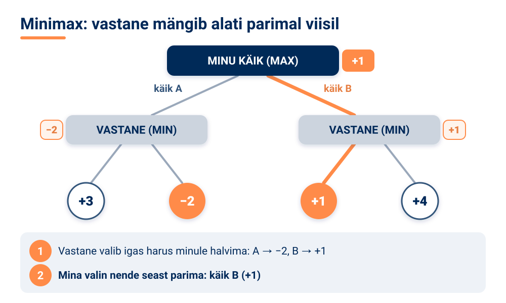

Kuigi käigu A all on ka tulemus +3, ei vali minimax seda, sest tark vastane ei lase sul sinna jõuda. **Alfa-beeta kärpimine** muudab minimaxi kiiremaks: see jätab vahele harud, mis niikuinii otsust ei muudaks. Mängupuid ja minimaxi kasutatakse males, kabes ja go-s, strateegiamängudes ning isegi läbirääkimiste modelleerimisel.

### Otsustuspuu ülesehitus

Nüüd jõuame ühe kõige arusaadavama tehisintellekti mudelini – **otsustuspuuni**. Tegelikult kasutad sa otsustuspuud iga päev, isegi seda teadmata.

<!-- class="pae-moiste" -->
> **Mõiste: otsustuspuu**
>
> Otsustuspuu on puukujuline otsustusmudel, mis jagab andmed tunnuste põhjal järjest väiksemateks rühmadeks. Iga sõlm esitab küsimuse, iga haru on üks võimalik vastus ja lehed näitavad lõppotsust.

Otsustuspuul on järgmised osad:

- **juuretipp** – puu algus, esimene ja kõige olulisem küsimus;
- **sisemised tipud** – otsustuskohad ehk vahepealsed küsimused;
- **harud** – ühendused tippude vahel; iga haru vastab ühele vastusele (**hargnemine** tähendab, et küsimuse vastuse põhjal liigutakse edasi ühte või teise suunda);
- **lehetipud** ehk **lehed** – lõppotsused, kust edasi enam ei hargneta.

Vaata näidet. Otsustuspuu aitab otsustada, kas võtta hommikul vihmavari kaasa:

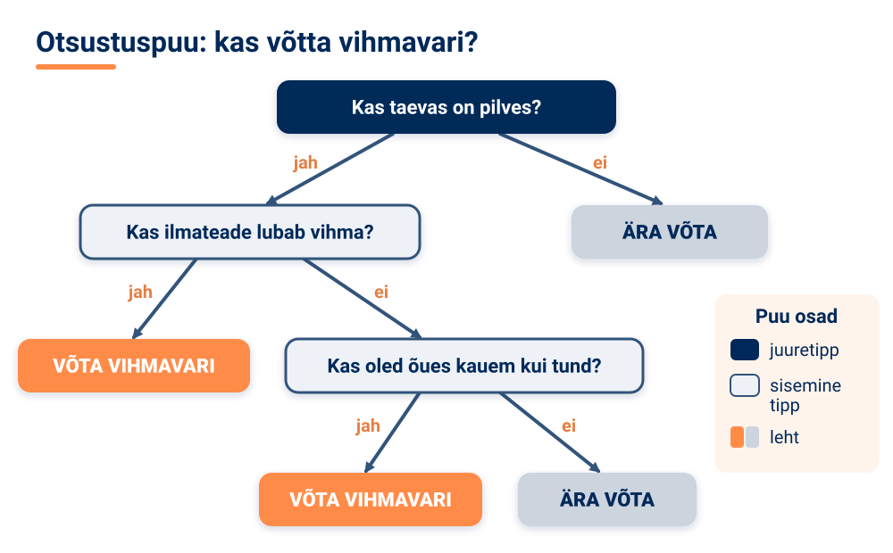

Puu lugemine algab alati ülevalt juuretipust. Vastad küsimusele ja liigud mööda vastavat haru allapoole, kuni jõuad lehte. Kui taevas on pilves, aga ilmateade vihma ei luba ja sa lähed õue ainult viieks minutiks, jõuad lehte „ÄRA VÕTA“. Igal juhul saad lõpuks täpselt ühe otsuse ja oskad ka põhjendada, **miks** – see on otsustuspuu suur eelis.

Otsustuspuid on kahte peamist tüüpi. **Klassifikatsioonipuud** ennustavad kategooriat ehk valivad mitme klassi vahel: näiteks kas e-kiri on spämm või mitte, või milline haigus võiks patsiendil olla. **Regressioonipuud** ennustavad arvulist (pidevat) väärtust, näiteks korteri hinda või homset temperatuuri. Algoritm **CART** (*Classification and Regression Trees*) oskab ehitada mõlemat tüüpi puid.

<!-- class="pae-naide" -->
> **Näide: spämmifilter otsustuspuuna**
>
> Lihtne spämmifilter võiks küsida: „Kas saatja on sinu kontaktides?“ Kui jah, on kiri tõenäoliselt korras. Kui ei, küsib puu edasi: „Kas kirjas on sõnad „tasuta“ või „võitsid“?“ ja „Kas kirjas on palju linke?“ Lehtedes on otsused „spämm“ või „mitte spämm“. Päris filtrid on palju keerukamad, kuid põhimõte on sama.

### Kuidas otsustuspuu andmetest õpib?

Vihmavarju puu joonistasime ise, oma kogemuse põhjal. Masinõppes aga **ehitab arvuti puu ise andmete põhjal**. Oletame, et meil on tabel paljude päevade kohta: milline oli ilm, kas oli tuuline, kas oli pilves – ja kas inimene võttis lõpuks vihmavarju või mitte. Algoritm toimib nii:

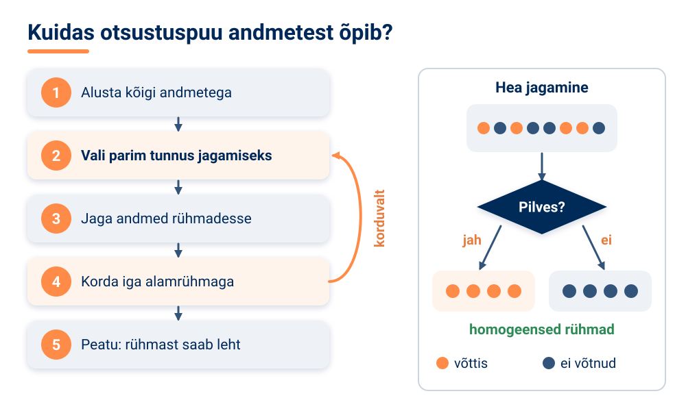

Kõige tähtsam küsimus on: **milline tunnus on „parim“?** Eesmärk on saada võimalikult **homogeensed** (ühtlased) rühmad – sellised, kus kõigil on sama vastus. Kui pärast jagamist on ühes rühmas ainult „võttis vihmavarju“ ja teises ainult „ei võtnud“, on jagamine olnud suurepärane. Kui mõlemas rühmas on vastused endiselt segamini, ei aidanud see küsimus palju.

Jagamise headuse mõõtmiseks on mitu kriteeriumit. **Informatsioonivõit** (*information gain*) näitab, kui palju segadust ehk ebakindlust jagamine vähendab. **Gini indeks** mõõdab, kui „segane“ rühm on – mida väiksem, seda puhtam. Regressioonipuude puhul kasutatakse **hälbe vähenemist** (*variance reduction*): kui palju väheneb arvuliste väärtuste hajuvus rühma sees.

Puu ei saa kasvada lõpmatuseni, seepärast seatakse **peatumistingimused**: puu on jõudnud lubatud maksimaalse sügavuseni, rühmas on alles jäänud liiga vähe näiteid või rühm on juba homogeenne.

Üks puu võib eksida. Seepärast kasutatakse sageli **ansamblimeetodeid**, kus mitme mudeli ennustused pannakse kokku. Kõige tuntum neist on **juhuslik mets** (*Random Forest*):

- luuakse palju otsustuspuid, igaüks veidi erineva **andmevalimi** põhjal;
- iga puu kasutab ainult **juhuslikku osa tunnustest**;
- lõpuks **kombineeritakse kõigi puude ennustused** (näiteks hääletatakse).

Juhuslik mets on tavaliselt täpsem kui üksik puu, sellel on vähem ülesobitamist ja ta on vastupidavam andmetes leiduvale mürale (juhuslikele vigadele). Seda kasutatakse näiteks finantssektori riskianalüüsis, meditsiinilises diagnostikas ja kliendikäitumise ennustamisel. Teised tuntud ansamblimeetodid on **Gradient Boosting** ja **AdaBoost**, kus puud ehitatakse järjest nii, et iga uus puu püüab parandada eelmiste vigu.

<!-- class="pae-lisaks" -->
> **Tea lisaks**
>
> Juhusliku metsa idee sarnaneb „rahva tarkusega“: kui küsida ühe inimese käest, mitu kommi on purgis, võib ta palju eksida. Kui aga küsida paljudelt ja võtta nende vastuste keskmine, on tulemus sageli üllatavalt täpne – erinevad vead tasandavad üksteist.

### Otsustuspuude tugevused, piirangud ja vastutus

Otsustuspuudel on mitu olulist **eelist**:

- **Interpreteeritavus.** Otsustusprotsess on läbipaistev ja visuaalselt mõistetav. Otsustuspuud nimetatakse **„valge kasti“ mudeliks**, sest selle sisse saab vaadata ja iga otsust põhjendada.
- **Vähene eeltöötlus.** Andmeid ei pea eelnevalt normaliseerima (samale skaalale viima), puu saab hakkama puuduvate väärtustega ning töötab nii arvuliste kui ka kategooriliste andmetega.
- **Efektiivsus.** Puu treenimine ja ennustamine on kiire ning meetod skaleerub hästi suurtele andmehulkadele.
- **Tunnuste olulisus.** Puust on näha, millised tunnused on otsuse jaoks kõige olulisemad.

Samas on otsustuspuudel ka **piirangud**:

- **Ülesobitamine.** Liiga keerukas puu „õpib andmed pähe“ – ta töötab treeningandmetel suurepäraselt, aga uutel andmetel halvasti. Lahendus on puu **kärpimine** (ebaoluliste harude eemaldamine) ja maksimaalse sügavuse piiramine.
- **Ebastabiilsus.** Väike muutus andmetes võib anda hoopis teistsuguse puu. Lahendus on ansamblimeetodid, näiteks juhuslik mets.
- **Optimaalsuse puudumine.** Puu ehitamisel kasutatakse ahneid algoritme, mis valivad igal sammul parima jagamise, kuid see ei garanteeri, et kogu puu tervikuna on parim võimalik.
- **Kallutatus tunnuste valikul.** Algoritm eelistab tunnuseid, millel on palju erinevaid väärtusi. Seda leevendab normaliseeritud informatsioonivõit.

Otsustuspuid kasutatakse paljudes valdkondades:

| Valdkond | Rakendused |
|---|---|
| Finants | krediidiriski hindamine, pettuste tuvastamine, investeerimisotsused |
| Meditsiin | haiguste diagnoosimine, raviotsused, riskifaktorite analüüs |
| Turundus | klientide segmenteerimine, kampaaniate optimeerimine, kliendikäitumise ennustamine |
| Tootmine | kvaliteedikontroll, rikete ennustamine, protsesside optimeerimine |

<!-- class="pae-eesti" -->
> **Eesti näide: pangad ja pettuste tuvastamine**
>
> Eesti pank **LHV** kasutab tehisintellekti pettuste tuvastamiseks ja klienditeeninduse parandamiseks, Eesti ettevõte **Salv** aitab pankadel tuvastada rahapesu ja pettusi. Pettuste tuvastamine on tüüpiline klassifitseerimisülesanne („kahtlane“ või „tavaline“ tehing), mille lahendamiseks sobivad ka otsustuspuud ja nende ansamblid.

Kui algoritm teeb otsuseid inimeste kohta, tekivad **eetilised küsimused**. Esiteks **läbipaistvus ja keerukus**: üksik otsustuspuu on läbipaistev, kuid sadadest puudest koosnevat juhuslikku metsa on juba palju raskem selgitada. Tuleb leida tasakaal täpsuse ja selgitatavuse vahel. Teiseks **kallutatus andmetes**: kui treeningandmed on ebaõiglased, kandub see ebaõiglus mudelisse üle, seepärast tuleb andmeid tasakaalustada. Kolmandaks **vastutus**: kes vastutab, kui algoritm teeb vale otsuse, ja milline on inimese roll otsustusprotsessis? Neljandaks **privaatsus**: otsuste tegemiseks kasutatakse sageli tundlikke andmeid, mis vajavad isikuandmete kaitset.

<!-- class="pae-lisaks" -->
> **Tea lisaks**
>
> Euroopa Liidu **isikuandmete kaitse üldmäärus (GDPR)** annab inimesele teatud juhtudel õiguse, et tema kohta tehtud oluline otsus ei põhineks üksnes automatiseeritud töötlusel. See on üks põhjus, miks selgitatavad mudelid, nagu otsustuspuud, on Euroopas eriti hinnatud.

<!-- class="pae-motle" -->
> **Mõtle järele!**
>
> - Millistes valdkondades võiksid otsustuspuud tuua kõige rohkem kasu?
> - Kujuta ette, et pank lükkab sinu laenutaotluse tagasi. Kas eelistaksid, et otsuse tegi selgitatav otsustuspuu või täpsem, aga raskesti seletatav mudel? Kuidas tasakaalustada algoritmilise otsustamise täpsust ja läbipaistvust?

### Kokkuvõte ja põhimõisted

**Pea meeles**

- Probleemilahendus tehisintellektis tähendab tee otsimist algolekust eesmärgini; selleks esitatakse probleem olekuruumina ja kasutatakse otsingualgoritme.
- Pimeotsing (laiuti ja sügavuti otsing) vaatab võimalusi läbi süstemaatiliselt, informeeritud otsing (nt A\*) kasutab heuristikat, lokaalne otsing parandab lahendust järk-järgult ja mänguotsing (minimax) arvestab vastasega.
- Otsustuspuu koosneb juuretipust, sisemistest tippudest, harudest ja lehtedest; seda loetakse ülevalt alla küsimusele vastates.
- Masinõppes ehitab arvuti otsustuspuu ise, valides igal sammul tunnuse, mis jagab andmed kõige homogeensemateks rühmadeks.
- Otsustuspuud on läbipaistvad („valge kast“), kuid kalduvad ülesobitama ja on ebastabiilsed; ansamblimeetodid, näiteks juhuslik mets, parandavad täpsust.
- Algoritmilise otsustamise juures tuleb arvestada läbipaistvuse, kallutatuse, vastutuse ja privaatsusega.

| Mõiste | Tähendus |
|---|---|
| Probleemilahendus | protsess, mille käigus TI leiab lahenduse püstitatud probleemile, otsides teed algolekust eesmärgini |
| Olekuruum | kõigi võimalike olekute kogum; sõlmed on olekud, kaared üleminekud |
| Heuristika | rusikareegel, mis kiirendab lahenduse leidmist, kuid ei garanteeri parimat tulemust |
| Laiuti otsing / sügavuti otsing | pimeotsingud: esimene vaatab läbi kõik lähemad olekud enne kaugemaid, teine läheb ühte haru mööda lõpuni |
| A\* algoritm | informeeritud otsing, mis valib teed valemi f(n) = g(n) + h(n) põhjal |
| Minimax | mänguotsingu algoritm, mis eeldab, et vastane mängib parimal viisil |
| Otsustuspuu | puukujuline mudel, mis jagab andmed tunnuste põhjal ja jõuab lehtedes otsuseni |
| Juuretipp, sisemine tipp, leht | puu algus; vahepealne otsustuskoht; lõppotsus |
| Klassifikatsioonipuu / regressioonipuu | puu, mis ennustab kategooriat / arvulist väärtust |
| Juhuslik mets | ansamblimeetod, mis kombineerib paljude otsustuspuude ennustused |
| Ülesobitamine | olukord, kus mudel „õpib treeningandmed pähe“ ja töötab uutel andmetel halvasti |

### Tööleht 4.1

<!-- class="pae-jaotis" -->
**I. Probleemilahenduse põhimõisted tehisintellektis**

**Ülesanne 1.** Selgita oma sõnadega, mis on probleemilahendus tehisintellekti kontekstis.

[[___ ___ ___]]

**Ülesanne 2.** Ühenda probleemilahendusega seotud mõisted nende definitsioonidega.

| Täht | Kirjeldus |
|:---:|---|
| **A** | Probleemi lahendamiseks vajalike sammude järjestus |
| **B** | Probleem, mille lahendamiseks tuleb leida tee algolekust lõppolekusse |
| **C** | Kõigi võimalike olekute kogum, mida süsteem võib omandada |
| **D** | Reegel või meetod, mis aitab leida lahendust kiiremini, kuid ei garanteeri optimaalset tulemust |
| **E** | Parima võimaliku lahenduse leidmine vastavalt etteantud kriteeriumitele |

- [ (A) (B) (C) (D) (E) ]
- [ ( ) (X) ( ) ( ) ( ) ] Otsinguprobleem
- [ ( ) ( ) (X) ( ) ( ) ] Olekuruum
- [ ( ) ( ) ( ) (X) ( ) ] Heuristika
- [ (X) ( ) ( ) ( ) ( ) ] Algoritm
- [ ( ) ( ) ( ) ( ) (X) ] Optimaalsus
****************************************
Otsinguprobleemis otsitakse teed algolekust lõppolekusse (B), olekuruum on kõigi olekute kogum (C), heuristika on lahendust kiirendav rusikareegel (D), algoritm on sammude järjestus (A) ja optimaalsus tähendab parima lahenduse leidmist (E).
****************************************

<!-- class="pae-jaotis" -->
**II. Probleemide esitamine ja lahendamine**

**Ülesanne 3.** Kirjelda, kuidas saab probleeme esitada tehisintellektis.

[[___ ___ ___ ___]]

**Ülesanne 4.** Täida tabel erinevate probleemilahenduse strateegiate kohta.

| Strateegia | Kirjeldus | Näide | Millal kasutada? |
|---|---|---|---|
| Pimeotsingud | | | |
| Informeeritud otsingud | | | |
| Lokaalotsingud | | | |
| Mänguotsingud | | | |

Kirjuta iga strateegia kohta kirjeldus, näide ja see, millal seda kasutada.

**Pimeotsingud:**

[[___ ___]]

**Informeeritud otsingud:**

[[___ ___]]

**Lokaalotsingud:**

[[___ ___]]

**Mänguotsingud:**

[[___ ___]]

**Ülesanne 5.** Kirjelda lühidalt järgmisi otsingualgoritmide tüüpe.

a) Laiuti otsing (*Breadth-First Search*):

[[___ ___]]

b) Sügavuti otsing (*Depth-First Search*):

[[___ ___]]

c) A\* otsing:

[[___ ___]]

d) Minimax:

[[___ ___]]

<!-- class="pae-jaotis" -->
**III. Otsustuspuud**

**Ülesanne 6.** Selgita oma sõnadega, mis on otsustuspuu.

[[___ ___ ___]]

**Ülesanne 7.** Joonista lihtne otsustuspuu, mis aitab otsustada, kas minna õue jalutama. Joonista see paberile või mõnes joonistusvahendis (nt draw.io) või kirjuta allolevasse välja puu küsimused ja vastused (nt „Kas sajab vihma? jah → … / ei → …“).

[[___ ___ ___ ___ ___]]

**Ülesanne 8.** Kirjelda otsustuspuu põhikomponente.

a) Juuretipp:

[[___]]

b) Sisemine tipp:

[[___]]

c) Lehetipp:

[[___]]

d) Hargnemine:

[[___]]

**Ülesanne 9.** Kuidas toimub otsustuspuude õppimine andmetest?

[[___ ___ ___ ___]]

<!-- class="pae-jaotis" -->
**IV. Otsustuspuude rakendused**

**Ülesanne 10.** Täida tabel otsustuspuude rakenduste kohta erinevates valdkondades.

| Valdkond | Rakenduse näide | Kuidas otsustuspuud aitavad? |
|---|---|---|
| Meditsiin | | |
| Finants | | |
| Turundus | | |
| Tootmine | | |
| Keskkond | | |

**Meditsiin:**

[[___ ___]]

**Finants:**

[[___ ___]]

**Turundus:**

[[___ ___]]

**Tootmine:**

[[___ ___]]

**Keskkond:**

[[___ ___]]

**Ülesanne 11.** Millised on otsustuspuude eelised ja puudused võrreldes teiste masinõppe meetoditega?

Eelised:

[[___ ___ ___]]

Puudused:

[[___ ___ ___]]

<!-- class="pae-jaotis" -->
**V. Praktiline ülesanne**

**Ülesanne 12.** Vali üks järgmistest praktilistest ülesannetest.

**Variant A: Otsustuspuu loomine.** Loo otsustuspuu, mis aitab otsustada, millist transpordiliiki kasutada kooli minekuks.

a) Määratle olulised tegurid (nt kaugus, ilm, aeg):

[[___ ___]]

b) Joonista otsustuspuu (paberile, joonistusvahendis või tekstina allolevasse välja):

[[___ ___ ___ ___ ___]]

c) Selgita, kuidas otsustuspuu töötab erinevate stsenaariumide korral:

[[___ ___ ___ ___]]

**Variant B: Probleemilahenduse analüüs.** Vali üks igapäevaelu probleem ja analüüsi, kuidas seda saaks lahendada tehisintellekti abil.

a) Probleem:

[[___]]

b) Kuidas seda probleemi saaks esitada tehisintellektile?

[[___ ___]]

c) Millised otsingualgoritmid või meetodid sobiksid selle lahendamiseks?

[[___ ___]]

d) Millised võiksid olla lahenduse eelised ja piirangud?

[[___ ___ ___]]

<!-- class="pae-jaotis" -->
**VI. Tehisintellekti otsustusprotsessid**

**Ülesanne 13.** Võrdle inimese ja tehisintellekti otsustusprotsesse.

| Aspekt | Inimese otsustusprotsess | Tehisintellekti otsustusprotsess |
|---|---|---|
| Kiirus | | |
| Järjepidevus | | |
| Andmete töötlemine | | |
| Intuitsioon | | |
| Kohanemisvõime | | |

**Kiirus:**

[[___ ___]]

**Järjepidevus:**

[[___ ___]]

**Andmete töötlemine:**

[[___ ___]]

**Intuitsioon:**

[[___ ___]]

**Kohanemisvõime:**

[[___ ___]]

**Ülesanne 14.** Millised on peamised väljakutsed tehisintellekti otsustusprotsesside arendamisel?

[[___ ___ ___ ___]]

<!-- class="pae-jaotis" -->
**VII. Arutelu**

**Ülesanne 15.** Millistes olukordades on parem usaldada otsuste tegemist inimesele ja millistes tehisintellektile? Põhjenda.

[[___ ___ ___ ___]]

**Ülesanne 16.** Kuidas võiks tehisintellekti probleemilahendus areneda järgmise 10 aasta jooksul?

[[___ ___ ___ ___]]

### Enesekontroll 4.1

**1. Mis on probleemilahendus tehisintellekti kontekstis?**

- [( )] Inimeste psühholoogiliste probleemide lahendamine tehisintellekti abil
- [( )] Tehisintellekti süsteemide vigade parandamine
- [(X)] Protsess, kus tehisintellekt otsib teed algolekust eesmärgini
- [( )] Tehisintellekti süsteemide arendamisega seotud väljakutsete lahendamine
****************************************
Tehisintellekti kontekstis tähendab probleemilahendus protsessi, kus süsteem otsib teed algolekust eesmärgini, kasutades erinevaid otsingualgoritme ja strateegiaid.
****************************************

**2. Kuidas nimetatakse rusikareeglit, mis aitab otsinguruumi piirata ja lahenduse kiiremini leida, kuid ei garanteeri parimat lahendust? Kirjuta vastus.**

[[heuristika]]
- [[?]] Mõtle sellele, kuidas otsid uues koolimajas klassiruumi 305.
<script>
let v = `@input`.trim().toLowerCase().replace(/\s+/g, " ");
["heuristika", "heuristikat", "heuristikaks", "heuristikad", "heuristiline reegel"].includes(v)
</script>
****************************************
Õige vastus: **heuristika**. Heuristika on praktiline reegel, mis kiirendab otsingut. Näiteks males võib heuristika olla malendite materiaalne väärtus. Heuristika ei taga, et leitud lahendus on parim.
****************************************

**3. Liigita otsingualgoritmid rühmadesse.**

<!-- data-show-partial-solution -->
- [ (Pimeotsing) (Informeeritud otsing) (Lokaalne otsing) (Mänguotsing) ]
- [ (X) ( ) ( ) ( ) ] Laiuti otsing (BFS)
- [ ( ) (X) ( ) ( ) ] A\* algoritm
- [ ( ) ( ) (X) ( ) ] Mäkketõus
- [ ( ) ( ) ( ) (X) ] Minimax-algoritm
- [ (X) ( ) ( ) ( ) ] Sügavuti otsing (DFS)
- [ ( ) ( ) (X) ( ) ] Simuleeritud lõõmutamine
- [ ( ) (X) ( ) ( ) ] Ahne otsing
****************************************
**Pimeotsing** (laiuti ja sügavuti otsing) vaatab võimalusi läbi süstemaatiliselt, ilma lisateabeta. **Informeeritud otsing** (A\*, ahne otsing) kasutab heuristikat. **Lokaalne otsing** (mäkketõus, simuleeritud lõõmutamine) parandab olemasolevat lahendust järk-järgult. **Mänguotsing** (minimax) arvestab vastasega.
****************************************

**4. A\* algoritm arvutab iga oleku jaoks f(n) = g(n) + h(n). Sõidad Tallinnast Tartusse ja oled jõudnud linna, kuhu oled sõitnud 80 km. Linnulennuline kaugus sellest linnast Tartuni on 95 km. Arvuta f(n) kilomeetrites.**

[[175]]
<script>
Number(`@input`.trim().replace(",", ".")) === 175
</script>
****************************************
g(n) on juba läbitud tee kulu (80 km) ja h(n) on heuristiline hinnang järelejäänud teele (95 km).

f(n) = g(n) + h(n) = 80 + 95 = **175** km
****************************************

**5. Järjesta otsingualgoritmi töö sammud õiges järjekorras.**

<!-- data-show-partial-solution -->
Otsingupuu loomine ja laiendamine: [[ 1 | 2 | 3 | (4) | 5 | 6 ]]<br>
Probleemi määratlemine ja algoleku kirjeldamine: [[ (1) | 2 | 3 | 4 | 5 | 6 ]]<br>
Optimaalse lahenduse leidmine: [[ 1 | 2 | 3 | 4 | 5 | (6) ]]<br>
Eesmärgioleku määratlemine: [[ 1 | 2 | (3) | 4 | 5 | 6 ]]<br>
Heuristika kasutamine otsingutee hindamiseks: [[ 1 | 2 | 3 | 4 | (5) | 6 ]]<br>
Võimalike tegevuste ja üleminekute määratlemine: [[ 1 | (2) | 3 | 4 | 5 | 6 ]]
****************************************
Kõigepealt kirjeldatakse algolek, siis võimalikud tegevused ja eesmärk. Seejärel luuakse ja laiendatakse otsingupuud, hinnatakse teid heuristika abil ning leitakse lõpuks parim lahendus.
****************************************

**6. Lohista mõisted õigetesse lünkadesse.**

<!-- data-show-partial-solution -->
Otsustuspuu lugemine algab alati [->[ (juuretipust) | olekuruumist ]]. Vahepealseid küsimusi ehk otsustuskohti nimetatakse [->[ (sisemisteks tippudeks) ]]. Iga võimalik vastus vastab ühele [->[ (harule) | heuristikale ]] ja lõppotsused asuvad puu [->[ (lehtedes) ]].
****************************************
Otsustuspuu koosneb juuretipust (puu algus), sisemistest tippudest (otsustuskohad), harudest (vastused) ja lehtedest (lõppotsused). Puud loetakse ülevalt alla: vastad küsimusele ja liigud mööda vastavat haru, kuni jõuad lehte.
****************************************

**7. Millised väited otsustuspuude kohta on õiged? (Vali kõik õiged.)**

- [[X]] Otsustuspuud nimetatakse „valge kasti“ mudeliks, sest selle otsuseid saab jälgida ja põhjendada.
- [[ ]] Mida sügavam on otsustuspuu, seda paremini töötab see alati uutel andmetel.
- [[X]] Regressioonipuu ennustab arvulist väärtust, näiteks korteri hinda.
- [[X]] Juhuslik mets kombineerib paljude erinevate otsustuspuude ennustused.
- [[ ]] Minimax-algoritm eeldab, et vastane teeb alati juhuslikke käike.
****************************************
Liiga sügav puu kipub ülesobituma ehk õpib treeningandmed pähe ja töötab uutel andmetel halvemini. Juhuslik mets on ansamblimeetod, mis on tavaliselt täpsem kui üksik puu. Minimax eeldab, et vastane mängib parimal võimalikul viisil, mitte juhuslikult.
****************************************

**8. Pank kasutab laenuotsuste tegemiseks tehisintellekti. Selgita oma sõnadega, miks võib pank eelistada üksikut otsustuspuud juhuslikule metsale, kuigi juhuslik mets on sageli täpsem.**

[[___ ___ ___]]

<details>
<summary>Vaata näidisvastust</summary>

Üksik otsustuspuu on läbipaistev ehk „valge kasti“ mudel: igale otsusele saab näidata põhjuse, näiteks millised tunnused viisid laenu tagasilükkamiseni. Sadadest puudest koosnevat juhuslikku metsa on palju raskem selgitada. Laenuotsus mõjutab inimese elu, seepärast on tal õigus teada, miks otsus tehti, ja pank peab suutma oma otsust põhjendada. Nii tuleb leida tasakaal täpsuse ja selgitatavuse vahel.

</details>


## 4.2 Ekspertsüsteemid ja reeglistikud

### Õpieesmärgid

Selle tunni lõpuks sa:

- mõistad, mis on ekspertsüsteem ja millistest komponentidest see koosneb;
- oskad kirjutada lihtsaid „KUI … SIIS …“ reegleid ja selgitada, kuidas reeglistik töötab;
- oskad selgitada edasisuunalise ja tagasisuunalise aheldamise erinevust;
- tunned tuntumaid ekspertsüsteeme ja nende rakendusi;
- oskad võrrelda ekspertsüsteeme masinõppega ning analüüsida nende eeliseid ja piiranguid.

### Mis on ekspertsüsteem?

Kujuta ette, et sinu arvuti ei lülitu sisse. Sa helistad tuttavale IT-spetsialistile ja ta küsib sinult järjest küsimusi: „Kas toitejuhe on seinas? Kas mõni tuli põleb? Kas kuuled ventilaatori häält?“ Sinu vastuste põhjal jõuab ta järelduseni, mis võib viga olla. Ekspert kasutab oma teadmisi ja kogemusi – aga mis siis, kui need teadmised kirja panna nii, et ka arvuti saaks samamoodi küsida ja järeldada? Täpselt see ongi ekspertsüsteemi idee.

<!-- class="pae-moiste" -->
> **Mõiste: ekspertsüsteem**
>
> Ekspertsüsteem on tehisintellekti süsteem, mis jäljendab inimeksperdi teadmisi ja otsustusprotsessi kindlas valdkonnas. Selle eesmärk on lahendada keerukaid probleeme, mille lahendamiseks on tavaliselt vaja inimeksperdi teadmisi.

Erinevalt masinõppest, kus arvuti õpib ise andmetest, **pannakse ekspertsüsteemi teadmised sisse inimeste poolt** – need on ekspertide teadmised, mis on kirja pandud kindlas vormis, enamasti reeglitena.

Ekspertsüsteemid on üks vanemaid tehisintellekti suundi. Esimesed edukad ekspertsüsteemid loodi **1960.–1970. aastatel**. **1980. aastaid** nimetatakse ekspertsüsteemide **kuldajastuks** – siis loodi neid väga palju ja need jõudsid ka ettevõtetesse. **1990. aastatel** huvi langes, sest selgus, et süsteemide ehitamine ja uuendamine on keeruline; ekspertsüsteemid spetsialiseerusid kitsamatele valdkondadele. **Tänapäeval** on ekspertsüsteemide ideed põimunud teiste tehisintellekti meetoditega.

Tuntumad ajaloolised ekspertsüsteemid:

| Süsteem | Aeg | Mida tegi? |
|---|---|---|
| **DENDRAL** | 1960.–1970. aastad | määras keemiliste ühendite struktuuri; peetakse esimeseks edukaks ekspertsüsteemiks |
| **MYCIN** | 1970. aastad | aitas diagnoosida bakteriaalseid infektsioone; esimene suurem meditsiiniline ekspertsüsteem |
| **XCON (R1)** | 1980. aastad | koostas arvutite konfiguratsioone; üks esimesi kommertslikult edukaid ekspertsüsteeme |
| **PROSPECTOR** | 1970.–1980. aastad | aitas tuvastada geoloogilisi leiukohti ja leida väärtuslikke maavarasid |

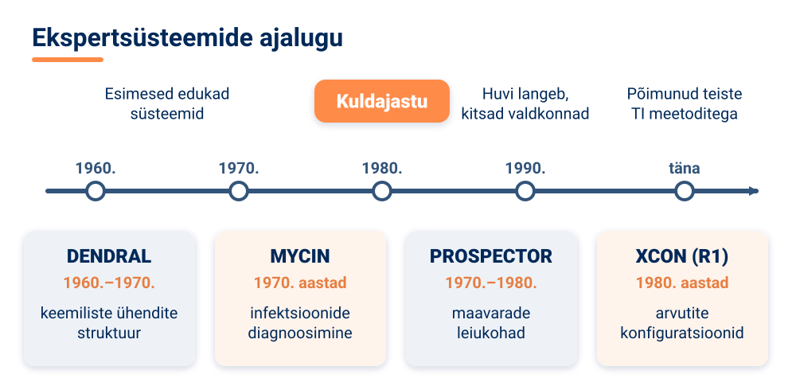

<!-- class="pae-fakt" -->
> **Kas teadsid?** **1980. aastaid** nimetatakse ekspertsüsteemide **kuldajastuks**. Siis jõudsid need ka ettevõtetesse – näiteks XCON koostas arvutite konfiguratsioone ja oli üks esimesi kommertslikult edukaid ekspertsüsteeme.

<!-- class="pae-lisaks" -->
> **Tea lisaks**
>
> MYCIN-i nimi tuleb sellest, et paljude antibiootikumide nimed lõpevad ingliskeelse liitega *-mycin* (nt *streptomycin*). Süsteem küsis arstilt patsiendi kohta küsimusi ja soovitas sobivat ravi – ning oskas ka selgitada, miks ta just selle soovituse andis.

### Ekspertsüsteemi ülesehitus

Ekspertsüsteem koosneb mitmest osast, millest igaühel on kindel ülesanne.

<!-- class="pae-moiste" -->
> **Mõiste: teadmusbaas ja järeldusmehhanism**
>
> **Teadmusbaas** on süsteemi osa, mis sisaldab valdkonna fakte ja reegleid – ekspertide teadmiste formaliseeritud (kindlas vormis kirja pandud) esitust.
>
> **Järeldusmehhanism** on süsteemi „mõtlev“ osa: see rakendab teadmusbaasi reegleid faktidele ja tuletab nii uusi järeldusi.

Lisaks neile kahele on ekspertsüsteemis veel:

- **kasutajaliides**, mille kaudu kasutaja süsteemiga suhtleb – vastab küsimustele ja saab vastuseid;
- **selgitusmoodul**, mis selgitab, kuidas süsteem oma järelduseni jõudis. See suurendab läbipaistvust ja usaldust: arst ei pea lihtsalt uskuma, vaid näeb, milliste reeglite põhjal soovitus tehti;
- **teadmuse omandamise moodul**, mille abil eksperdid ja arendajad saavad teadmusbaasi uusi fakte ja reegleid lisada ning olemasolevaid muuta;
- **töömälu**, kuhu salvestatakse konkreetse juhtumi faktid (nt selle patsiendi sümptomid).

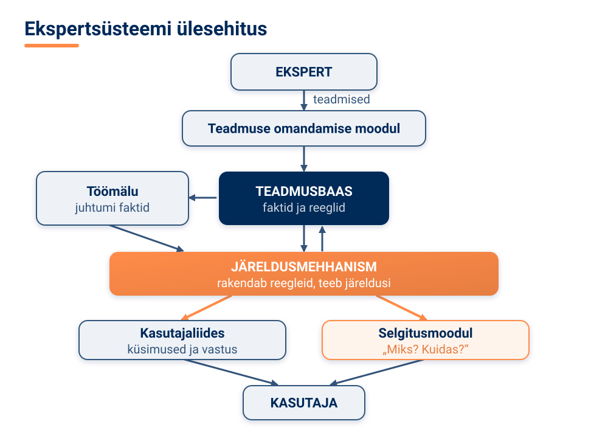

### Teadmiste esitamine ja reeglistikud

Et arvuti saaks eksperdi teadmisi kasutada, tuleb need esitada kindlal kujul. Selleks on mitu võimalust.

Kõige levinum on **reeglipõhine esitus**, kus teadmised kirjutatakse **KUI … SIIS …** (inglise keeles *IF … THEN …*) reeglitena. Näiteks: „**KUI** patsiendil on palavik **JA** köha, **SIIS** võib tal olla gripp.“ **Raamipõhises esituses** kirjeldatakse objekte ja nende omadusi hierarhiliste struktuuridena – näiteks raam „lind“ omadustega „on suled“, „muneb“, „tavaliselt lendab“, mille alla kuulub raam „pingviin“. **Semantilised võrgustikud** esitavad teadmisi visuaalselt: sõlmed on mõisted ja kaared nendevahelised seosed (nt „koer“ → *on* → „imetaja“). **Ontoloogiad** on veelgi rangemad formaliseeritud teadmiste struktuurid, kus mõisted ja nende seosed on täpselt määratletud.

<!-- class="pae-moiste" -->
> **Mõiste: reeglistik**
>
> Reeglistik on reeglite kogum, mis määrab süsteemi käitumise. Iga reegel koosneb **tingimusest** (KUI-osa) ja **tegevusest** või järeldusest (SIIS-osa); reeglil võib olla ka **prioriteet** või **kaal**. Reeglistikul põhinev süsteem järgib otsuste tegemisel selgelt määratletud „kui-siis“ reegleid.

Reegleid on mitut tüüpi. **Deterministlikud reeglid** kehtivad alati ühtemoodi („KUI tuli on punane, SIIS seisa“). **Tõenäosuslikud reeglid** annavad järelduse teatud tõenäosusega. **Hägusad reeglid** töötavad ebatäpsete mõistetega nagu „kõrge“ või „palju“.

Reeglistikku tuleb ka **hallata**: reegleid luuakse ja muudetakse, tuleb tuvastada **vastuolusid** (kaks reeglit, mis ütlevad sama olukorra kohta erinevat) ja reeglistikku optimeerida.

<!-- class="pae-naide" -->
> **Näide: looma määramise reeglistik**
>
> - R1: KUI loomal on suled, SIIS loom on lind.
> - R2: KUI loom on lind JA loom ei lenda JA loom ujub, SIIS loom on pingviin.
> - R3: KUI loomal on karv, SIIS loom on imetaja.
> - R4: KUI loom on imetaja JA loom sööb liha JA loomal on triibud, SIIS loom on tiiger.
>
> Lihtne **vestlusrobot**, mis vastab küsimustele eelnevalt määratud vastustega, töötab samuti reeglistiku põhjal: KUI kasutaja kirjutab „lahtiolekuajad“, SIIS näita lahtiolekuaegu.

### Kuidas ekspertsüsteem järeldusi teeb?

Järeldusmehhanism saab reegleid kasutada kahes suunas.

<!-- class="pae-moiste" -->
> **Mõiste: edasisuunaline ja tagasisuunaline aheldamine**
>
> **Edasisuunaline aheldamine** (edasiviiv järeldamine, *forward chaining*) alustab teadaolevatest **faktidest** ja rakendab reegleid seni, kuni jõuab järelduseni. See on **andmepõhine** lähenemine.
>
> **Tagasisuunaline aheldamine** (tagasiviiv järeldamine, *backward chaining*) alustab **hüpoteesist** ehk oletatavast järeldusest ja otsib sellele tõendeid. See on **eesmärgipõhine** lähenemine.

Vaatame eelmise looma määramise reeglistiku abil, kuidas need erinevad.

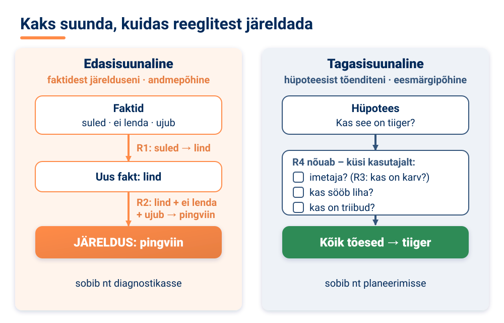

Edasisuunaline aheldamine sobib hästi **diagnostikasse**, kus liigutakse sümptomitest diagnoosini: kogume kõik faktid kokku ja vaatame, kuhu need viivad. Tagasisuunaline aheldamine sobib siis, kui on selge **eesmärk**, näiteks **planeerimisel**: tahan jõuda eesmärgini, millised tegevused on selleks vaja? See on ka tõhus, kui võimalikke järeldusi on vähe, aga fakte palju – süsteem küsib ainult neid küsimusi, mida hüpoteesi kontrollimiseks vaja on. **Hübriidmehhanismid** kombineerivad mõlemat lähenemist ja kohanduvad probleemi iseloomuga.

Päriselus pole info alati kindel. Arst ei saa alati öelda „patsiendil on kindlasti gripp“. Seepärast on ekspertsüsteemides mitu viisi **ebakindluse käsitlemiseks**:

- **Tõenäosuslikud meetodid**, näiteks **Bayesi võrgud** – tõenäosuslikud graafilised mudelid, mis esitavad muutujate vahelisi sõltuvusi (nt kuidas mõjutavad üksteist ilm, õhurõhk ja vihma tõenäosus), ning tõenäosuslikud reeglid.
- **Usutavusteooria (Dempster-Shaferi teooria)**, mis eristab **teadmatust** (meil pole infot) ja **ebakindlust** (info on olemas, aga see ei anna kindlat vastust).
- **Hägusloogika** (*fuzzy logic*), mis töötab ebatäpsete või osaliste väärtustega: „KUI temperatuur on KÕRGE, SIIS suurenda jahutust.“ Mis on „kõrge“, ei ole järsk piir, vaid sujuv üleminek.
- **Usalduskoefitsiendid**, mis omistavad reeglitele ja faktidele usaldusastme – näiteks reegel kehtib usaldusastmega 0,8 ehk süsteem on oma järelduses umbes 80% kindel.

<!-- class="pae-fakt" -->
> **Kas teadsid?** Eesti riigi virtuaalassistentide võrgustik **Bürokratt** valiti 2022. aastal parimaks tehisintellektil põhinevaks riigiteenuseks ja jõudis UNESCO maailma saja parima tehisintellekti lahenduse hulka.

### Reeglimootorid ja rakendused

Ekspertsüsteemide ideed elavad tänapäeval edasi **reeglimootorites**.

<!-- class="pae-moiste" -->
> **Mõiste: reeglimootor**
>
> Reeglimootor on tarkvara, mis rakendab reegleid andmetele. Selle osad on **reeglite hoidla**, **järeldusmehhanism**, **töömälu** (faktide hoidla) ja **konfliktide lahendamise strateegia**, mis otsustab, millist reeglit rakendada, kui korraga sobib mitu.

Tuntud reeglimootorid on näiteks **Drools**, **CLIPS**, **JESS** ja **IBM Operational Decision Manager**. Neid kasutatakse **ärireeglite haldamiseks**, **otsuste automatiseerimiseks** ja **vastavuskontrolliks** (kas tegevus vastab seadustele ja nõuetele).

Suurettevõtted kasutavad **ärireeglite haldussüsteeme** – süsteeme ärireeglite defineerimiseks, haldamiseks ja rakendamiseks. Nende suur eelis on, et **reeglid on programmikoodist eraldi**. Nii saavad reegleid muuta ka **mitteprogrammeerijad** (nt kindlustusspetsialist või jurist) ja ettevõte saab muutustega kiiresti kohaneda. Sellised süsteemid koosnevad reeglite kirjeldamise keelest, reeglite haldamise liidesest, reeglimootoritest ja integratsioonimehhanismidest (ühendustest teiste infosüsteemidega). Näited on **IBM ODM**, **Red Hat Decision Manager** ja **Oracle Business Rules**.

<!-- class="pae-eesti" -->
> **Eesti näide: rahapesu tõkestamine**
>
> Pangad peavad kontrollima, et nende kaudu ei pestaks raha. Traditsiooniliselt kasutatakse selleks reeglipõhiseid kontrolle (näiteks: KUI ülekanne on ebatavaliselt suur JA läheb kõrge riskiga riiki, SIIS märgi see kontrollimiseks). Eesti ettevõte **Salv** kasutab tehisintellekti, et aidata pankadel ja finantsasutustel rahapesu ja pettusi tuvastada. Selles valdkonnas töötavad reeglid ja masinõpe sageli käsikäes.

Ekspertsüsteeme ja reeglistikke kasutatakse paljudes valdkondades:

| Valdkond | Rakendused |
|---|---|
| Meditsiin | diagnoosimine, raviotsused, ravimite koostoimete kontroll |
| Finants | investeerimisnõustamine, riskianalüüs, pettuste tuvastamine |
| Tootmine | protsesside juhtimine, kvaliteedikontroll, rikete diagnoosimine |
| Muud valdkonnad | õigusabi, klienditeenindus, haridus |

### Ekspertsüsteemid, masinõpe ja tulevik

Ekspertsüsteemidel on mitu olulist **eelist**. Need **säilitavad ekspertteadmisi**: kui kogenud spetsialist läheb pensionile, jäävad tema teadmised süsteemi alles. Need on **järjepidevad** – rakendavad samu reegleid alati ühtemoodi ja teevad vähem inimlikke vigu (ekspertsüsteem ei väsi ega ole halvas tujus). Need on **kättesaadavad** ööpäev läbi ja geograafilised piirangud puuduvad. Ja need on **selgitatavad**: otsustusprotsess on läbipaistev ja iga järeldust saab põhjendada.

Samas on ekspertsüsteemidel ka tõsised **piirangud**. Suurim neist on **teadmiste omandamise kitsaskoht**: ekspertide teadmisi on väga raske ja aeganõudev reegliteks vormistada – eksperdid ise ei oska sageli öelda, kuidas nad otsustavad („ma lihtsalt näen seda“). Ekspertsüsteemidel puudub **kohanemisvõime**: need ei õpi ise uutest andmetest ja vajavad pidevat käsitsi uuendamist. Neil on raskusi **ebatäielike andmetega** ning puudub **terve mõistus**. Ja need töötavad hästi ainult **kitsastes valdkondades** – laiema konteksti mõistmine on neile raske.

| | Ekspertsüsteemid | Masinõpe |
|---|---|---|
| Teadmiste allikas | inimekspertide teadmised | õpib andmetest |
| Läbipaistvus | selgitatavad, „valge kast“ | sageli läbipaistmatu, „must kast“ |
| Kohanemisvõime | vajab käsitsi uuendamist | õpib automaatselt uutest andmetest |
| Sobivad rakendusalad | hästi defineeritud, reeglipõhised valdkonnad | mustrite tuvastamine, ennustamine |

<!-- class="pae-moiste" -->
> **Mõiste: hübriidsüsteem**
>
> Hübriidsüsteem kombineerib ekspertsüsteemi ja masinõpet. Nii saab ühendada ekspertteadmised ja andmepõhise õppimise, saavutada suurema täpsuse ja kohanemisvõime ning parema selgitatavuse kui puhtal masinõppel.

Hübriidsüsteemide näited on **neuro-hägusad süsteemid** (*neuro-fuzzy*), mis ühendavad närvivõrgud ja hägusloogika, **reeglite eraldamise algoritmid**, mis „tõlgivad“ masinõppemudeli reegliteks, ning **teadmistega täiendatud masinõpe**. Neid kasutatakse meditsiinilises diagnostikas, finantsotsustes ja tööstusprotsesside juhtimises.

Ekspertsüsteemide **tulevik** on tihedalt seotud teiste tehisintellekti suundadega. **Suured keelemudelid** võimaldavad ekspertsüsteemidega suhelda loomulikus keeles ja aitavad teadmisi tekstidest automaatselt välja tuua. **Selgitatava tehisintellekti** arendamisel rakendatakse ekspertsüsteemide põhimõtteid masinõppes, et suurendada läbipaistvust. **Teadmiste graafikud** esitavad teadmisi struktureeritult ja on integreeritud näiteks otsingumootoritega. **Valdkonnapõhised assistendid** on spetsialiseeritud nõustajad, mis **toetavad inimeksperte, mitte ei asenda neid**.

<!-- class="pae-eesti" -->
> **Eesti näide: Bürokratt**
>
> **Bürokratt** on Eesti riigi virtuaalassistentide võrgustik, mille abil saab kõnekeelse suhtluse kaudu kasutada avalikke teenuseid. Bürokratt valiti 2022. aastal parimaks tehisintellektil põhinevaks riigiteenuseks ja jõudis UNESCO maailma saja parima tehisintellekti lahenduse hulka. See on hea näide sellest, kuidas loomuliku keele liides teeb teadmistel põhineva teenuse inimestele lihtsamini kasutatavaks.

<!-- class="pae-motle" -->
> **Mõtle järele!**
>
> - Millistes valdkondades võiksid ekspertsüsteemid tuua kõige rohkem kasu? Kas sinu koolis on mõni olukord, kus „KUI … SIIS …“ reeglid juba otsuseid teevad (nt e-päevikus puudumiste teavitused)?
> - Kuidas tasakaalustada ekspertteadmisi ja andmepõhist õppimist?
> - Kes vastutab, kui ekspertsüsteem annab arstile vale soovituse – arst, süsteemi looja või reeglid kirja pannud ekspert?

### Kokkuvõte ja põhimõisted

**Pea meeles**

- Ekspertsüsteem jäljendab inimeksperdi teadmisi ja otsustusprotsessi kitsas valdkonnas; tuntud näited on DENDRAL, MYCIN, XCON ja PROSPECTOR.
- Ekspertsüsteemi põhiosad on teadmusbaas (faktid ja reeglid), järeldusmehhanism, kasutajaliides ja selgitusmoodul.
- Reeglistik koosneb „KUI … SIIS …“ reeglitest; ebakindluse käsitlemiseks kasutatakse tõenäosusi, Bayesi võrke, hägusloogikat ja usalduskoefitsiente.
- Edasisuunaline aheldamine liigub faktidest järeldusteni, tagasisuunaline aheldamine hüpoteesist tõenditeni.
- Ekspertsüsteemide tugevus on läbipaistvus ja järjepidevus, nõrkus aga teadmiste omandamise raskus ja võimetus ise õppida.
- Tuleviku süsteemid kombineerivad ekspertsüsteemide ja masinõppe tugevusi (hübriidsüsteemid).

| Mõiste | Tähendus |
|---|---|
| Ekspertsüsteem | TI süsteem, mis jäljendab inimeksperdi teadmisi ja otsustusprotsessi kindlas valdkonnas |
| Teadmusbaas | süsteemi osa, mis sisaldab valdkonna fakte ja reegleid |
| Järeldusmehhanism | süsteemi osa, mis rakendab reegleid faktidele ja tuletab uusi järeldusi |
| Selgitusmoodul | süsteemi osa, mis selgitab, kuidas järelduseni jõuti |
| Reeglistik | „KUI … SIIS …“ reeglite kogum, mis määrab süsteemi käitumise |
| Edasisuunaline aheldamine | järeldamine faktidest järeldusteni (andmepõhine) |
| Tagasisuunaline aheldamine | järeldamine hüpoteesist tõendite suunas (eesmärgipõhine) |
| Hägusloogika | loogika, mis töötab ebatäpsete väärtustega (nt „kõrge temperatuur“) |
| Bayesi võrk | tõenäosuslik graafiline mudel, mis esitab muutujate vahelisi sõltuvusi |
| Reeglimootor | tarkvara, mis rakendab reegleid andmetele |
| Hübriidsüsteem | süsteem, mis kombineerib ekspertsüsteemi ja masinõpet |

### Tööleht 4.2

<!-- class="pae-jaotis" -->
**I. Ekspertsüsteemide põhimõisted**

**Ülesanne 1.** Selgita oma sõnadega, mis on ekspertsüsteem.

[[___ ___ ___]]

**Ülesanne 2.** Ühenda ekspertsüsteemidega seotud mõisted nende definitsioonidega.

| Täht | Kirjeldus |
|:---:|---|
| **A** | Süsteemi osa, mis sisaldab faktide ja reeglite kogumit |
| **B** | Süsteemi osa, mis kasutab teadmusbaasi, et teha järeldusi ja otsuseid |
| **C** | Tingimuse ja tegevuse paar, mis määratleb, mida teha teatud tingimustel |
| **D** | Tõene väide valdkonna kohta |
| **E** | Süsteemi osa, mis võimaldab kasutajal süsteemiga suhelda |

- [ (A) (B) (C) (D) (E) ]
- [ (X) ( ) ( ) ( ) ( ) ] Teadmusbaas
- [ ( ) (X) ( ) ( ) ( ) ] Järeldusmehhanism
- [ ( ) ( ) (X) ( ) ( ) ] Reegel
- [ ( ) ( ) ( ) (X) ( ) ] Fakt
- [ ( ) ( ) ( ) ( ) (X) ] Kasutajaliides
****************************************
Teadmusbaas hoiab fakte ja reegleid (A), järeldusmehhanism teeb nende põhjal järeldusi (B), reegel on „KUI … SIIS …“ paar (C), fakt on tõene väide valdkonna kohta (D) ja kasutajaliides võimaldab süsteemiga suhelda (E).
****************************************

<!-- class="pae-jaotis" -->
**II. Ekspertsüsteemide komponendid ja arhitektuur**

**Ülesanne 3.** Joonista ekspertsüsteemi põhikomponentide skeem (paberile või joonistusvahendis). Kirjelda allpool, millised komponendid su skeemil on ja kuidas need omavahel seotud on.

[[___ ___ ___ ___]]

**Ülesanne 4.** Kirjelda lühidalt ekspertsüsteemi põhikomponente.

a) Teadmusbaas:

[[___ ___]]

b) Järeldusmehhanism:

[[___ ___]]

c) Kasutajaliides:

[[___ ___]]

d) Teadmuse omandamise moodul:

[[___ ___]]

e) Selgitusmoodul:

[[___ ___]]

**Ülesanne 5.** Kuidas toimub teadmuse esitamine ekspertsüsteemides? Kirjelda erinevaid meetodeid.

[[___ ___ ___ ___]]

<!-- class="pae-jaotis" -->
**III. Reeglistikud ja järeldusmehhanism**

**Ülesanne 6.** Mis on reeglistik ja kuidas seda kasutatakse ekspertsüsteemides?

[[___ ___ ___]]

**Ülesanne 7.** Kirjuta näide lihtsast reeglist KUI-SIIS (IF-THEN) kujul.

[[___ ___]]

**Ülesanne 8.** Selgita järgmisi järeldusmehhanisme.

a) Edasisuunaline aheldamine ehk edasiviiv järeldamine (*forward chaining*):

[[___ ___ ___]]

b) Tagasisuunaline aheldamine ehk tagasiviiv järeldamine (*backward chaining*):

[[___ ___ ___]]

**Ülesanne 9.** Võrdle edasisuunalist ja tagasisuunalist aheldamist.

| Aspekt | Edasisuunaline aheldamine | Tagasisuunaline aheldamine |
|---|---|---|
| Tööpõhimõte | | |
| Millal kasutada? | | |
| Eelised | | |
| Puudused | | |
| Näide | | |

**Tööpõhimõte:**

[[___ ___]]

**Millal kasutada?**

[[___ ___]]

**Eelised:**

[[___ ___]]

**Puudused:**

[[___ ___]]

**Näide:**

[[___ ___]]

<!-- class="pae-jaotis" -->
**IV. Ekspertsüsteemide ajalugu ja areng**

**Ülesanne 10.** Kirjelda lühidalt ekspertsüsteemide ajalugu ja arengut.

[[___ ___ ___ ___]]

**Ülesanne 11.** Nimeta ja kirjelda lühidalt vähemalt kolme tuntud ekspertsüsteemi.

a) Ekspertsüsteem:

[[___]]

Kirjeldus:

[[___ ___]]

b) Ekspertsüsteem:

[[___]]

Kirjeldus:

[[___ ___]]

c) Ekspertsüsteem:

[[___]]

Kirjeldus:

[[___ ___]]

<!-- class="pae-jaotis" -->
**V. Ekspertsüsteemide rakendused**

**Ülesanne 12.** Täida tabel ekspertsüsteemide rakenduste kohta erinevates valdkondades.

| Valdkond | Rakenduse näide | Kuidas ekspertsüsteem aitab? |
|---|---|---|
| Meditsiin | | |
| Finants | | |
| Tootmine | | |
| Keskkond | | |
| Haridus | | |

**Meditsiin:**

[[___ ___]]

**Finants:**

[[___ ___]]

**Tootmine:**

[[___ ___]]

**Keskkond:**

[[___ ___]]

**Haridus:**

[[___ ___]]

**Ülesanne 13.** Millised on ekspertsüsteemide eelised ja piirangud?

Eelised:

[[___ ___ ___]]

Piirangud:

[[___ ___ ___]]

<!-- class="pae-jaotis" -->
**VI. Praktiline ülesanne**

**Ülesanne 14.** Vali üks järgmistest praktilistest ülesannetest.

**Variant A: Lihtsa ekspertsüsteemi disain.** Disaini lihtne ekspertsüsteem, mis aitab valida sobivat õppeainet või huviringi.

a) Määratle olulised faktid ja reeglid:

[[___ ___ ___]]

b) Kirjuta vähemalt viis reeglit KUI-SIIS kujul:

[[___ ___ ___ ___ ___]]

c) Selgita, kuidas sinu ekspertsüsteem töötaks:

[[___ ___ ___]]

**Variant B: Olemasoleva ekspertsüsteemi analüüs.** Vali üks ekspertsüsteem või reeglistikul põhinev süsteem (nt automaatne soovitussüsteem, diagnostikasüsteem) ja analüüsi seda.

a) Valitud süsteem:

[[___]]

b) Kuidas see süsteem töötab?

[[___ ___ ___]]

c) Millised on selle süsteemi tugevused ja nõrkused?

[[___ ___ ___]]

d) Kuidas saaks seda süsteemi paremaks muuta?

[[___ ___ ___]]

<!-- class="pae-jaotis" -->
**VII. Ekspertsüsteemid ja kaasaegne tehisintellekt**

**Ülesanne 15.** Kuidas erinevad traditsioonilised ekspertsüsteemid kaasaegsetest masinõppe lahendustest?

[[___ ___ ___ ___]]

**Ülesanne 16.** Millistes olukordades on ekspertsüsteemid endiselt paremad kui masinõppe lahendused?

[[___ ___ ___ ___]]

**Ülesanne 17.** Kuidas saaks kombineerida ekspertsüsteeme ja masinõpet?

[[___ ___ ___ ___]]

<!-- class="pae-jaotis" -->
**VIII. Arutelu**

**Ülesanne 18.** Millised eetilised küsimused kaasnevad ekspertsüsteemide kasutamisega otsuste tegemisel?

[[___ ___ ___ ___]]

**Ülesanne 19.** Milline võiks olla ekspertsüsteemide roll tuleviku tehisintellekti lahendustes?

[[___ ___ ___ ___]]

### Enesekontroll 4.2

**1. Kuidas nimetatakse ekspertsüsteemi osa, mis sisaldab valdkonna fakte ja reegleid? Kirjuta vastus.**

[[teadmusbaas]]
<script>
let v = `@input`.trim().toLowerCase().replace(/\s+/g, " ");
["teadmusbaas", "teadmusbaasi", "teadmusbaasiks", "teadmistebaas", "teadmiste baas"].includes(v)
</script>
****************************************
Õige vastus: **teadmusbaas**. Teadmusbaas sisaldab ekspertide teadmiste formaliseeritud esitust ehk valdkonna fakte ja reegleid. Neid kasutab järeldusmehhanism, et jõuda uute järeldusteni.
****************************************

**2. Sobita ekspertsüsteemi osa selle ülesandega.**

<!-- data-show-partial-solution -->
- [ (Teadmusbaas) (Järeldusmehhanism) (Selgitusmoodul) (Töömälu) ]
- [ ( ) (X) ( ) ( ) ] Rakendab reegleid faktidele ja tuletab uusi järeldusi.
- [ ( ) ( ) ( ) (X) ] Salvestab konkreetse juhtumi faktid, näiteks selle patsiendi sümptomid.
- [ (X) ( ) ( ) ( ) ] Hoiab valdkonna fakte ja reegleid.
- [ ( ) ( ) (X) ( ) ] Näitab kasutajale, milliste reeglite põhjal soovitus tehti.
****************************************
**Teadmusbaas** hoiab fakte ja reegleid, **järeldusmehhanism** on süsteemi „mõtlev“ osa, **töömälu** hoiab konkreetse juhtumi fakte ja **selgitusmoodul** suurendab läbipaistvust ja usaldust, sest näitab, kuidas järelduseni jõuti.
****************************************

**3. Lohista mõisted õigetesse lünkadesse.**

<!-- data-show-partial-solution -->
Edasisuunaline aheldamine alustab teadaolevatest [->[ (faktidest) | reeglimootoritest ]] ja on [->[ (andmepõhine) ]] lähenemine. Tagasisuunaline aheldamine alustab [->[ (hüpoteesist) ]] ehk oletatavast järeldusest ja on [->[ (eesmärgipõhine) | juhuslik ]] lähenemine.
****************************************
Edasisuunaline aheldamine liigub faktidest järeldusteni ja sobib näiteks diagnostikasse. Tagasisuunaline aheldamine alustab hüpoteesist ja otsib sellele tõendeid; see sobib siis, kui eesmärk on selge, näiteks planeerimisel.
****************************************

**4. Süsteem teab, et loomal on suled, ta ei lenda ja ta ujub. Ta rakendab reegleid järjest ja jõuab järelduseni „pingviin“. Millist järeldamisviisi süsteem kasutas?**

- [(X)] Edasisuunalist aheldamist
- [( )] Tagasisuunalist aheldamist
- [( )] Minimax-algoritmi
- [( )] Koostööfiltreerimist
- [[?]] Kas süsteem alustas faktidest või hüpoteesist?
****************************************
Edasisuunaline aheldamine alustab teadaolevatest faktidest ja liigub reeglite abil järelduse suunas. Tagasisuunaline aheldamine alustaks hüpoteesist („Kas see on pingviin?“) ja otsiks sellele tõendeid.
****************************************

**5. Järjesta ekspertsüsteemide ajaloo etapid õigesse järjekorda.**

<!-- data-show-partial-solution -->
Ekspertsüsteemide kuldajastu, need jõuavad ka ettevõtetesse: [[ 1 | (2) | 3 | 4 ]]<br>
Esimesed edukad ekspertsüsteemid, näiteks DENDRAL: [[ (1) | 2 | 3 | 4 ]]<br>
Ekspertsüsteemide ideed põimuvad teiste tehisintellekti meetoditega: [[ 1 | 2 | 3 | (4) ]]<br>
Huvi langeb, sest süsteemide ehitamine ja uuendamine on keeruline: [[ 1 | 2 | (3) | 4 ]]
****************************************
Õige järjekord: 1. esimesed edukad süsteemid (1960.–1970. aastad) → 2. kuldajastu (1980. aastad) → 3. huvi langus (1990. aastad) → 4. põimumine teiste TI meetoditega (tänapäev).
****************************************

**6. Milline ajalooline ekspertsüsteem aitas 1970. aastatel diagnoosida bakteriaalseid infektsioone? Kirjuta süsteemi nimi.**

[[MYCIN]]
<script>
let v = `@input`.trim().toLowerCase().replace(/\s+/g, " ");
["mycin", "mycini"].includes(v)
</script>
****************************************
Õige vastus: **MYCIN**. See oli esimene suurem meditsiiniline ekspertsüsteem. DENDRAL määras keemiliste ühendite struktuuri, XCON koostas arvutite konfiguratsioone ja PROSPECTOR aitas leida maavarasid.
****************************************

**7. Millised väited on õiged? (Vali kõik õiged.)**

- [[ ]] Ekspertsüsteem õpib automaatselt uutest andmetest ega vaja käsitsi uuendamist.
- [[X]] Ekspertsüsteemi otsuseid on tavaliselt lihtsam selgitada kui paljude masinõppemudelite otsuseid.
- [[X]] Teadmiste omandamise kitsaskoht tähendab, et ekspertide teadmisi on raske reegliteks vormistada.
- [[ ]] Hägusloogika töötab ainult täpsete väärtustega „jah“ ja „ei“.
- [[X]] Bayesi võrgud on tõenäosuslikud graafilised mudelid, mis esitavad muutujate vahelisi sõltuvusi.
****************************************
Ekspertsüsteemid ei õpi ise, vaid vajavad käsitsi uuendamist. Need on „valge kasti“ süsteemid. Hägusloogika töötab just ebatäpsete väärtustega, nagu „kõrge“ või „palju“. Bayesi võrke kasutatakse ebakindluse käsitlemiseks.
****************************************

**8. Kirjuta üks „KUI … SIIS …“ reegel koolielu kohta (näiteks e-päeviku teavitus). Nimeta, mis on sinu reeglis tingimus ja mis on järeldus.**

[[___ ___ ___]]

<details>
<summary>Vaata näidisvastust</summary>

KUI õpilane on puudunud kolm päeva järjest JA puudumine pole põhjendatud, SIIS saada lapsevanemale teavitus. Tingimus (KUI-osa) on „õpilane on puudunud kolm päeva järjest ja puudumine pole põhjendatud“. Järeldus ehk tegevus (SIIS-osa) on „saada lapsevanemale teavitus“.

</details>


## 4.3 Soovitussüsteemid

### Õpieesmärgid

Selle tunni lõpuks sa:

- oskad selgitada, mis on soovitussüsteem ja miks seda kasutatakse;
- tunned soovitussüsteemide peamisi tüüpe: sisupõhist filtreerimist, koostööfiltreerimist, teadmispõhiseid, kontekstiteadlikke ja hübriidsüsteeme;
- mõistad, kuidas soovitusalgoritmid kasutajate ja objektide sarnasust leiavad;
- oskad selgitada külmkäivituse probleemi ja mullifiltri tekkimist;
- oskad kriitiliselt hinnata, kuidas soovitussüsteemid mõjutavad sinu enda valikuid.

### Mis on soovitussüsteem?

Avad õhtul voogedastusplatvormi ja avalehel ootab sind rida „Sulle soovitatud“. Spotify on koostanud sulle esmaspäevaks uue esitusloendi. TikToki „Sulle“ voog (*For You*) näitab videot videosse järel just sellist sisu, mida sa ilmselt lõpuni vaatad. Kõigi nende taga on **soovitussüsteem**.

<!-- class="pae-moiste" -->
> **Mõiste: soovitussüsteem**
>
> Soovitussüsteem on tehisintellekti süsteem, mis ennustab, millised tooted, teenused või sisu võiksid kasutajale meeldida, ja pakub talle personaalseid soovitusi. Selle eesmärk on aidata kasutajal leida tohutust valikust just talle asjakohast infot või tooteid.

Soovitussüsteeme kohtad igapäevaselt: **Netflix** soovitab filme ja sarju, **Spotify** muusikat, **Amazon** ja teised e-poed tooteid, **YouTube** videoid ning **uudisteportaalid** artikleid.

Miks neid üldse vaja on? Peamine põhjus on **infoküllus**: valikuid on liiga palju ja aega liiga vähe. Ükski inimene ei jõua läbi vaadata kõiki voogedastusplatvormi filme või kõiki YouTube'i videoid. Soovitussüsteem pakub **personaliseeritud kasutajakogemust** – kasutaja on rahulolevam ja kasutab teenust kauem. Ettevõtete jaoks on sellel **ärilised eelised**: suurem müük ja kasum, klientide lojaalsus ja rohkem **ristioste** (ostad telefoni ja süsteem soovitab kohe ka ümbrist). Lõpuks pakuvad soovitussüsteemid **avastamisvõimalusi** – aitavad leida uusi tooteid ja sisu, millest sa muidu teadlik poleks.

Soovitussüsteeme on nelja põhitüüpi:

| Tüüp | Põhimõte |
|---|---|
| Sisupõhised süsteemid | soovitavad objekte, mis on sarnased sinu varem eelistatutega; põhinevad objektide omadustel |
| Koostööfiltreerimise süsteemid | soovitavad sarnaste kasutajate eelistuste põhjal; ei vaja teadmisi objektide omadustest |
| Teadmispõhised süsteemid | kasutavad selgesõnalisi reegleid ja ekspertteadmisi; sobivad kitsastesse valdkondadesse |
| Hübriidsüsteemid | kombineerivad eri lähenemisi, et ületada üksikute meetodite piiranguid |

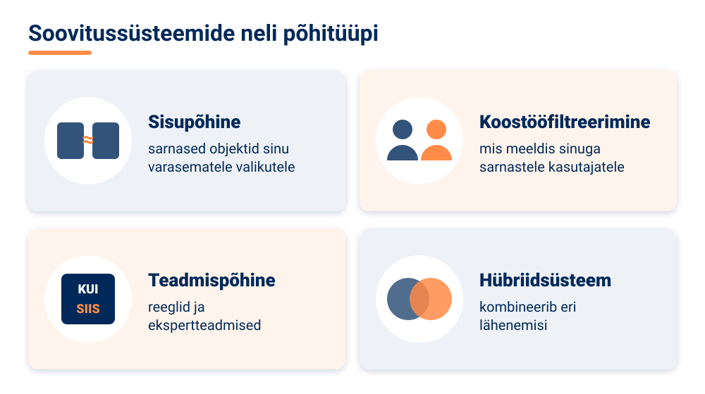

Teadmispõhine soovitamine sarnaneb eelmises tunnis õpitud ekspertsüsteemidega: näiteks e-poe nõustaja küsib „Milleks sa sülearvutit vajad? Kui suur on eelarve?“ ja soovitab reeglite põhjal sobiva mudeli. Vaatame nüüd lähemalt kahte kõige levinumat tüüpi.

### Sisupõhine filtreerimine

Sisupõhise filtreerimise põhimõte on: **„Kui sulle meeldis see, siis meeldib sulle ka see teine sarnane asi.“**

<!-- class="pae-moiste" -->
> **Mõiste: sisupõhine filtreerimine**
>
> Sisupõhine filtreerimine on soovitussüsteemide meetod, mis soovitab kasutajale objekte, mis on **sarnased** nendega, mida ta on varem eelistanud. Sarnasust hinnatakse **objektide omaduste** põhjal (nt filmi žanr, näitlejad, režissöör).

Süsteem töötab kolmes etapis. Esmalt **analüüsitakse objektide omadusi**: iga filmi juurde on märgitud žanr, näitlejad, režissöör, pikkus, aasta. Seejärel **luuakse kasutaja eelistuste profiil**: kui oled vaadanud palju ulmefilme ja põnevikke, siis su profiilis on need žanrid tugevalt esindatud. Lõpuks **arvutatakse sarnasus** iga vaatamata filmi ja sinu profiili vahel ning kõige sarnasemad pakutakse sulle välja.

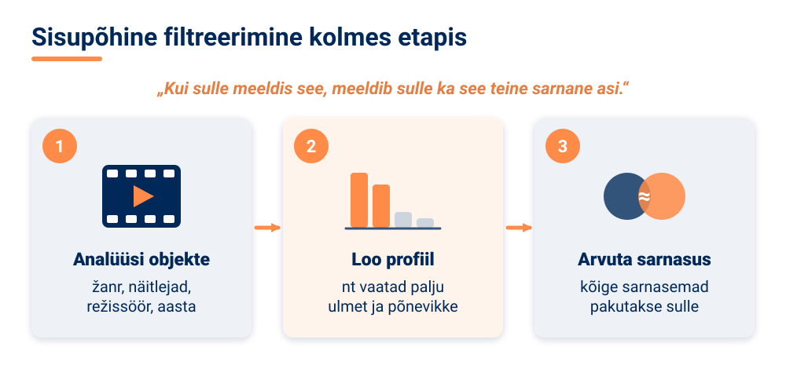

Sisupõhisel filtreerimisel on mitu **eelist**. See **ei vaja teiste kasutajate andmeid** – töötab ka siis, kui teenusel on vähe kasutajaid. See on **läbipaistev ja selgitatav**: „Soovitame, sest vaatasid filmi X“. Ja see suudab soovitada ka **uusi objekte**, mida keegi pole veel hinnanud, kui nende omadused on teada.

**Puudused** on samuti olulised. Objektide **omaduste hulk on piiratud** – kahel filmil võib olla sama žanr ja näitleja, kuid üks on suurepärane ja teine igav. Teine probleem on **ülespetsifitseerimine**: soovitused on liiga sarnased. Kui kuulad ühte artisti, pakub süsteem sulle ainult tema ja temaga väga sarnaste artistide lugusid – ja sa ei avasta kunagi midagi päriselt uut.

### Koostööfiltreerimine

Koostööfiltreerimise põhimõte on: **„Inimesed, kes on sinuga sarnased, on nautinud ka neid asju.“**

<!-- class="pae-moiste" -->
> **Mõiste: koostööfiltreerimine**
>
> Koostööfiltreerimine (koostööl põhinev filtreerimine, *collaborative filtering*) on soovitussüsteemide meetod, mis põhineb **sarnaste kasutajate eelistustel**. Süsteem ei pea teadma objektide omadusi – piisab sellest, kes mida on vaadanud, ostnud või hinnanud.

Koostööfiltreerimise aluseks on **kasutaja-objekt maatriks** – tabel, mille ridades on kasutajad, veergudes objektid (filmid, laulud, tooted) ja lahtrites hinnangud. Vaata lihtsat näidet, kus hinnangud on 1–5 tärni ja küsimärk tähendab, et kasutaja pole sarja vaadanud:

| | Sari A | Sari B | Sari C | Sari D |
|---|---|---|---|---|
| **Mari** | 5 | 4 | ? | 1 |
| **Jaan** | 5 | 5 | 4 | 1 |
| **Liis** | 1 | 2 | 5 | 5 |

Süsteem töötab kolmes etapis: **loob kasutaja-objekt maatriksi**, **arvutab sarnasusi** ja **teeb ennustusi**. Mari ja Jaan on hinnanud sarju A, B ja D peaaegu ühtemoodi – nende maitse on sarnane. Jaanile meeldis sari C (4 tärni), seega ennustab süsteem, et ka Marile võiks see meeldida, ja soovitab seda. Liisi maitse on Mari omast väga erinev, seepärast tema hinnangud Mari soovitusi eriti ei mõjuta. Sarnasuse arvutamiseks kasutatakse matemaatilisi mõõte, mis võrdlevad kahe kasutaja (või kahe objekti) hinnanguid – mida sarnasemad hinnangud, seda suurem sarnasus.

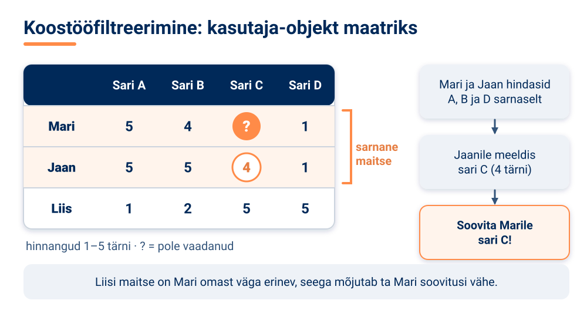

<!-- data-type="barchart" data-title="Näide: Mari, Jaani ja Liisi hinnangud sarjadele A, B ja D" -->
| Sari | Mari | Jaan | Liis |
|------|-----:|-----:|-----:|
| Sari A | 5 | 5 | 1 |
| Sari B | 4 | 5 | 2 |
| Sari D | 1 | 1 | 5 |

Koostööfiltreerimist on kahte tüüpi. **Kasutajapõhine** koostööfiltreerimine otsib sinuga sarnaseid kasutajaid (nagu eespool Mari ja Jaan). **Objektipõhine** (tootepõhine) koostööfiltreerimine otsib sarnaseid objekte: „Inimesed, kes ostsid selle raamatu, ostsid ka …“.

Koostööfiltreerimise **eelised**: see ei vaja teadmisi objektide omadustest, avastab keerukaid mustreid ja võib soovitada **ootamatuid, kuid asjakohaseid** objekte – näiteks hoopis teise žanri sarja, mis sarnase maitsega inimestele meeldis.

**Puudused**: **külmkäivituse probleem** – uue kasutaja või uue objekti kohta pole veel andmeid. **Hõreda andmestiku probleem** – enamik kasutajaid on hinnanud ainult tühist osa kõigist objektidest, nii et maatriks on peamiselt tühi. **Populaarsuse kallutatus** – populaarseid objekte soovitatakse üha rohkem, vähetuntud objektid jäävad varju.

<!-- class="pae-fakt" -->
> **Kas teadsid?** Enamik kasutajaid on hinnanud vaid tühist osa kõigist filmidest, lugudest või toodetest. Seepärast on kasutaja-objekt maatriks suures osas **tühi** – just need „küsimärgid“ püüab soovitussüsteem ära arvata.

Suurte maatriksite jaoks kasutatakse **maatriksi faktoriseerimist**. See jagab suure kasutaja-objekt maatriksi väiksemateks maatriksiteks ja leiab nii **latentsed** ehk peidetud faktorid – omadused, mida keegi pole otseselt kirja pannud, kuid mis mõjutavad eelistusi (näiteks „kui palju huumorit“ või „kui sünge“ on film). Nende abil ennustatakse puuduvad väärtused ehk küsimärgid. Tuntud algoritmid on **singulaarväärtuste lahutus (SVD)**, **alterneeruv vähimruutude meetod (ALS)** ja **mittenegatiivne maatriksi faktoriseerimine (NMF)**. Maatriksi faktoriseerimine skaleerub paremini, leevendab hõreda andmestiku probleemi ja tuvastab latentseid faktoreid.

<!-- class="pae-lisaks" -->
> **Tea lisaks**
>
> Maatriksi faktoriseerimine sai laiemalt tuntuks seoses Netflixi auhinnavõistlusega (*Netflix Prize*, 2006–2009), kus meeskonnad üle maailma püüdsid parandada Netflixi filmisoovituste täpsust. Paljud edukad lahendused kasutasid just latentseid faktoreid.

### Nutikamad soovitused: süvaõpe, kontekst ja hindamine

Tänapäeva suurtes platvormides kasutatakse sageli **süvaõppel põhinevaid soovitussüsteeme**. Need kasutavad närvivõrke, näiteks **autoenkodereid**, **rekurrentseid närvivõrke (RNN)** ja **konvolutsioonilisi närvivõrke (CNN)**. Süvaõpe suudab õppida keerukaid mustreid suurtest andmehulkadest, modelleerida kasutaja käitumist järjestikuselt (mida vaatasid enne, mida pärast) ja arvestada konteksti. Selle eelised on parem täpsus, konteksti arvestamine ja ajaline dünaamika (süsteem märkab, et su maitse muutub). Puudused on suur andmevajadus, suur arvutusvõimsuse vajadus ja **„musta kasti“ probleem** – sageli ei oska keegi täpselt öelda, miks just see soovitus tehti.

<!-- class="pae-naide" -->
> **Näide: sotsiaalmeedia voog**
>
> Sotsiaalmeedia voog ei ole tavaliselt ajaline loetelu sõprade postitustest, vaid soovitussüsteemi valik. Süsteem jälgib mitte ainult seda, mida sa laigid, vaid ka seda, **kui kaua** sa video juures peatud, kas vaatad selle lõpuni, kas kerid edasi, jagad või kommenteerid. Iga selline tegevus on süsteemi jaoks signaal sinu eelistuste kohta. Seepärast võib voog juba mõne tunni jooksul sinu huvidele „häälestuda“.

<!-- class="pae-fakt" -->
> **Kas teadsid?** Sotsiaalmeedia voog jälgib lisaks laikidele ka seda, **kui kaua** sa video juures peatud. Isegi kerimine ilma klikkimata on süsteemi jaoks signaal – nii võib voog juba **mõne tunni** jooksul sinu huvidele häälestuda.

**Kontekstiteadlikud soovitussüsteemid** kohandavad soovitusi vastavalt olukorrale. Kontekst võib olla:

- **ajaline** – kellaaeg, nädalapäev, aastaaeg (hommikul uudised, õhtul filmid);
- **asukoht** – GPS, riik, linn;
- **seade** – mobiil, arvuti, teler;
- **sotsiaalne** – oled üksi, sõpradega või perega;
- **emotsionaalne** – meeleolu, stress.

Süsteem tuvastab konteksti, õpib kontekstipõhiseid eelistusi ja kohandab soovitusi. Näiteks soovitab rakendus restorane sinu asukoha põhjal või muusikat sinu meeleolu järgi.

Kuidas teada, kas soovitussüsteem on hea? Selleks kasutatakse eri **meetrikaid** (mõõdikuid):

| Meetrikate rühm | Näited |
|---|---|
| Täpsus | keskmine absoluutne viga (MAE), ruutkeskmine viga (RMSE), täpsus, saagis, F1-skoor |
| Mitmekesisus | soovituste entroopia, soovituste kategooriate jaotus |
| Uudsus | populaarsuse vastupidine skoor, üllatuslikkus |
| Kasutajapõhised | klikkimismäär (CTR), konversioonimäär (kui paljud soovitusest ka ostsid), kasutaja rahulolu |

Pane tähele, et süsteem, mis on väga **täpne**, ei pruugi olla **mitmekesine**. Kui platvorm mõõdab ainult seda, kui palju sa klikid ja vaatad, võib see õppida sulle näitama ainult üht ja sama tüüpi sisu. Siit jõuame soovitussüsteemide suurima probleemini.

### Mullifilter ja teised väljakutsed

<!-- class="pae-moiste" -->
> **Mõiste: mullifilter**
>
> Mullifilter (ka filtrimull, inglise *filter bubble*) on olukord, kus soovitussüsteem näitab kasutajale üha enam sellist sisu, mis sarnaneb tema varasemate valikute ja vaadetega. Kasutaja jääb justkui mulli sisse, isoleeritakse sarnase sisuga ja tema inforuumist kaob mitmekesisus.

Mullifilter tekib **tagasisideahela** tõttu:

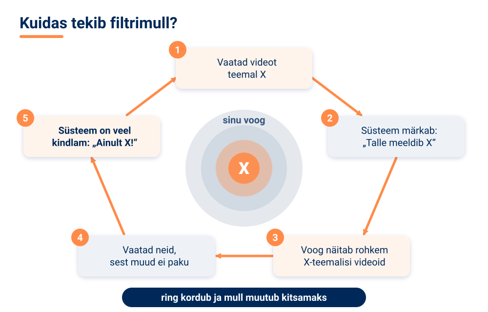

Esialgu tundub see mugav – sa näed ju seda, mis sulle meeldib. Probleem on aga selles, et sa ei näe enam teistsuguseid vaateid, teemasid ega inimesi. Uudiste puhul võib see tähendada, et sa näed ainult ühte poolt mõnest vaidlusest ja hakkad arvama, et kõik mõtlevad samamoodi. Mullifilter on ohtlik ka seetõttu, et sa ei näe mulli seinu – ei ole kohe aru saada, mis jääb sinu voost välja.

<!-- class="pae-motle" -->
> **Mõtle järele!**
>
> - Ava oma lemmikrakenduse (YouTube, TikTok, Instagram, Spotify) avaleht. Mitu erinevat teemat või žanri seal on? Kas oskad ära arvata, millise su varasema tegevuse tõttu iga soovitus sinna ilmus?
> - Kas sinu ja su sõbra voog on sarnased või väga erinevad? Mida see sinu arvates näitab?
> - Kuidas tasakaalustada soovituste täpsust ja mitmekesisust?

Mida saad sina mullifiltri vastu teha? Otsi teadlikult ka teistsugust sisu ja jälgi eri vaadetega allikaid. Kasuta nuppu „Pole huvitatud“ ja kontrolli, kas rakenduses saab soovitusi lähtestada või vaatamisajalugu kustutada. Loe uudiseid ka otse uudisteportaali avalehelt, mitte ainult sotsiaalmeedia voost. Ja küsi endalt aeg-ajalt: miks mulle seda näidatakse?

Mullifilter ei ole ainus väljakutse. Soovitussüsteemide peamised probleemid on:

- **Külmkäivituse probleem** – uutel kasutajatel pole ajalugu ja uutel objektidel hinnanguid. Seda leevendatakse näiteks nii, et uuelt kasutajalt küsitakse alguses tema huvisid („Vali kolm lemmikžanrit“), uutele objektidele kasutatakse sisupõhist filtreerimist või soovitatakse alguses lihtsalt populaarset sisu.
- **Privaatsus** – süsteemid koguvad tundlikke andmeid ja **profileerivad** kasutajaid ehk loovad nende kohta üksikasjalikke kirjeldusi.
- **Mullifiltrid** – kasutajate isoleerimine sarnase sisuga ja mitmekesisuse puudumine.
- **Kallutatus** – populaarsete objektide eelistamine, demograafilised kallutatused (nt soovitused sõltuvad vanusest või soost) ja tagasisideahelad.

<!-- class="pae-lisaks" -->
> **Tea lisaks**
>
> Euroopa Liit reguleerib suuri digiplatvorme. **Digitaalturgude määrus** (*Digital Markets Act*) seab reeglid suurtele platvormidele, mõjutades ka seda, kuidas nad tehisintellekti kasutavad. **Digiteenuste määrus** (*Digital Services Act*) nõuab, et väga suured platvormid selgitaksid oma soovitussüsteemide põhimõtteid ja pakuksid vähemalt üht sellist voo varianti, mis ei põhine kasutaja profileerimisel. Vaata oma rakenduse seadetest, kas sul on selline valik!

### Soovitussüsteemid igapäevaelus ja Eestis

Soovitussüsteeme kasutatakse väga paljudes valdkondades:

| Valdkond | Kuidas soovitussüsteem aitab? |
|---|---|
| E-kaubandus | toodete soovitamine, ristiostude suurendamine, personaliseeritud pakkumised |
| Meelelahutus | filmid, sarjad, muusika, mängud, raamatud, uudised ja artiklid |
| Sotsiaalmeedia | sõprade ja kontaktide soovitamine, sisu kuvamine uudisvoos, gruppide ja ürituste soovitamine |
| Haridus | personaliseeritud õppematerjalid, kursuste soovitamine, õppimisteekonna kohandamine |

<!-- class="pae-eesti" -->
> **Eesti näide: soovitused meie oma platvormidel**
>
> Soovitussüsteeme kasutavad ka Eesti **e-poed** (nt Kaup24, Hansapost), kes pakuvad personaliseeritud pakkumisi, ning **uudisteportaalid** (Delfi, Postimees) ja ERR-i voogedastusplatvorm **ERR Jupiter**. Soovitusi tehakse ka kohalikel **muusika- ja piletimüügiplatvormidel**. **Avalikus sektoris** on võimalus e-riigi teenuseid personaliseerida ja sarnaseid põhimõtteid kasutavad ka **hariduslikud platvormid**. Näiteks Eesti ettevõte **Lingvist** kohandab keeleõppe materjale vastavalt kasutaja oskustele ja edenemisele.

Kuhu soovitussüsteemid edasi arenevad? Üks suund on **multimodaalsed soovitused**, mis kombineerivad teksti, pilti, heli ja videot. Teine suund on **selgitatavad soovitused**: läbipaistvamad algoritmid, mis põhjendavad, miks just see soovitus tehti. Kolmas on **suurem kasutaja kontroll** – kasutaja saab rohkem kaasa rääkida ja oma eelistusi täpsemalt määrata. Neljas on **eetilised soovitussüsteemid**, mis vähendavad kallutatust, suurendavad mitmekesisust ja kaitsevad privaatsust.

<!-- class="pae-motle" -->
> **Mõtle järele!**
>
> - Millised soovitussüsteemid on sinu igapäevaelu kõige rohkem mõjutanud?
> - Kas soovitussüsteemid laiendavad või kitsendavad meie maailmapilti?

### Kokkuvõte ja põhimõisted

**Pea meeles**

- Soovitussüsteemid aitavad kasutajatel leida suurest infohulgast endale asjakohast sisu ja tooteid; neid kasutavad voogedastusplatvormid, e-poed, sotsiaalmeedia ja uudisteportaalid.
- Sisupõhine filtreerimine soovitab objekte, mis on sarnased sinu varasemate eelistustega; koostööfiltreerimine soovitab seda, mis meeldis sinuga sarnastele kasutajatele.
- Koostööfiltreerimise aluseks on kasutaja-objekt maatriks; suurte andmete puhul kasutatakse maatriksi faktoriseerimist ja süvaõpet.
- Külmkäivituse probleem tähendab, et uute kasutajate ja objektide kohta pole piisavalt andmeid.
- Mullifilter tekib tagasisideahelast: süsteem näitab üha rohkem sarnast sisu ja kasutaja inforuum kitseneb.
- Head soovitussüsteemi hinnatakse lisaks täpsusele ka mitmekesisuse, uudsuse ja kasutaja rahulolu järgi; tuleviku süsteemid peaksid olema selgitatavad ja kasutajakesksed.

| Mõiste | Tähendus |
|---|---|
| Soovitussüsteem | TI süsteem, mis ennustab, millised tooted või sisu võiksid kasutajale meeldida |
| Sisupõhine filtreerimine | soovitab objekte, mis on omaduste poolest sarnased kasutaja varem eelistatutega |
| Koostööfiltreerimine | soovitab objekte, mis meeldisid sarnaste eelistustega kasutajatele |
| Teadmispõhine soovitamine | soovitab ekspertteadmiste ja reeglite põhjal |
| Kontekstiteadlik soovitamine | arvestab kasutaja olukorda (aeg, asukoht, seade jne) |
| Hübriidsüsteem | kombineerib eri soovitusmeetodeid |
| Kasutaja-objekt maatriks | tabel, mis näitab kasutajate hinnanguid objektidele |
| Külmkäivituse probleem | süsteemil pole piisavalt andmeid uue kasutaja või objekti kohta |
| Mullifilter | olukord, kus kasutaja näeb ainult oma varasemate eelistustega sarnast sisu |
| Profileerimine | kasutaja kohta üksikasjaliku kirjelduse loomine tema andmete põhjal |

### Tööleht 4.3

<!-- class="pae-jaotis" -->
**I. Soovitussüsteemide põhimõisted**

**Ülesanne 1.** Selgita oma sõnadega, mis on soovitussüsteem.

[[___ ___ ___]]

**Ülesanne 2.** Ühenda soovitussüsteemidega seotud mõisted nende definitsioonidega.

| Täht | Kirjeldus |
|:---:|---|
| **A** | Kasutajate või toodete omaduste põhjal soovituste tegemine |
| **B** | Kasutajate käitumismustrite põhjal soovituste tegemine |
| **C** | Kasutajate ja toodete vaheliste seoste esitamine maatriksina |
| **D** | Erinevate soovitusstrateegiate kombineerimine |
| **E** | Olukord, kus süsteemil pole piisavalt andmeid uue kasutaja või toote kohta |

- [ (A) (B) (C) (D) (E) ]
- [ ( ) (X) ( ) ( ) ( ) ] Koostööl põhinev filtreerimine
- [ (X) ( ) ( ) ( ) ( ) ] Sisupõhine filtreerimine
- [ ( ) ( ) ( ) (X) ( ) ] Hübriidne soovitussüsteem
- [ ( ) ( ) (X) ( ) ( ) ] Kasutaja-toode maatriks
- [ ( ) ( ) ( ) ( ) (X) ] Külmkäivituse probleem
****************************************
Koostööfiltreerimine tugineb kasutajate käitumisele (B), sisupõhine filtreerimine omadustele (A), hübriidsüsteem kombineerib meetodeid (D), kasutaja-toode maatriks esitab seosed tabelina (C) ja külmkäivituse probleem tähendab andmete puudumist uue kasutaja või toote kohta (E).
****************************************

<!-- class="pae-jaotis" -->
**II. Soovitussüsteemide tüübid**

**Ülesanne 3.** Kirjelda lühidalt järgmisi soovitussüsteemide tüüpe.

a) Koostööl põhinev filtreerimine (*Collaborative Filtering*):

[[___ ___ ___]]

b) Sisupõhine filtreerimine (*Content-Based Filtering*):

[[___ ___ ___]]

c) Teadmispõhine soovitamine (*Knowledge-Based Recommendation*):

[[___ ___ ___]]

d) Kontekstiteadlik soovitamine (*Context-Aware Recommendation*):

[[___ ___ ___]]

**Ülesanne 4.** Võrdle erinevaid soovitussüsteemide tüüpe.

| Tüüp | Tööpõhimõte | Eelised | Puudused | Näited rakendustest |
|---|---|---|---|---|
| Koostööl põhinev | | | | |
| Sisupõhine | | | | |
| Teadmispõhine | | | | |
| Kontekstiteadlik | | | | |

Kirjuta iga tüübi kohta tööpõhimõte, eelised, puudused ja näited.

**Koostööl põhinev:**

[[___ ___ ___]]

**Sisupõhine:**

[[___ ___ ___]]

**Teadmispõhine:**

[[___ ___ ___]]

**Kontekstiteadlik:**

[[___ ___ ___]]

<!-- class="pae-jaotis" -->
**III. Soovitussüsteemide algoritmid**

**Ülesanne 5.** Kirjelda lühidalt järgmisi soovitussüsteemide algoritme.

a) Kasutajapõhine koostööfiltreerimine:

[[___ ___ ___]]

b) Tootepõhine koostööfiltreerimine:

[[___ ___ ___]]

c) Maatriksi faktoriseerimine:

[[___ ___ ___]]

d) Süvaõppel põhinevad soovitussüsteemid:

[[___ ___ ___]]

**Ülesanne 6.** Kuidas mõõdetakse kasutajate või toodete sarnasust soovitussüsteemides?

[[___ ___ ___ ___]]

<!-- class="pae-jaotis" -->
**IV. Soovitussüsteemide hindamine**

**Ülesanne 7.** Millised on peamised meetrikad soovitussüsteemide hindamiseks? Kirjelda vähemalt nelja.

[[___ ___ ___ ___]]

**Ülesanne 8.** Millised on peamised väljakutsed soovitussüsteemide arendamisel? Nimeta vähemalt neli.

[[___ ___ ___ ___]]

**Ülesanne 9.** Kuidas saab lahendada külmkäivituse probleemi soovitussüsteemides?

[[___ ___ ___ ___]]

<!-- class="pae-jaotis" -->
**V. Soovitussüsteemide rakendused**

**Ülesanne 10.** Täida tabel soovitussüsteemide rakenduste kohta erinevates valdkondades.

| Valdkond | Rakenduse näide | Kasutatav soovitussüsteemi tüüp | Kuidas see aitab kasutajaid? |
|---|---|---|---|
| E-kaubandus | | | |
| Meelelahutus | | | |
| Uudised ja meedia | | | |
| Haridus | | | |
| Sotsiaalmeedia | | | |

**E-kaubandus:**

[[___ ___]]

**Meelelahutus:**

[[___ ___]]

**Uudised ja meedia:**

[[___ ___]]

**Haridus:**

[[___ ___]]

**Sotsiaalmeedia:**

[[___ ___]]

**Ülesanne 11.** Vali üks soovitussüsteemi rakendus ja kirjelda seda põhjalikumalt.

[[___ ___ ___ ___ ___]]

<!-- class="pae-jaotis" -->
**VI. Praktiline ülesanne**

**Ülesanne 12.** Vali üks järgmistest praktilistest ülesannetest.

**Variant A: Soovitussüsteemi analüüs.** Vali üks soovitussüsteem, mida oled kasutanud (nt Netflix, Spotify, YouTube, TikTok, mõni e-pood), ja analüüsi seda.

a) Valitud soovitussüsteem:

[[___]]

b) Millist tüüpi soovitussüsteemi see kasutab?

[[___ ___]]

c) Kuidas see kogub andmeid kasutajate eelistuste kohta?

[[___ ___ ___]]

d) Kui täpsed on selle soovitused sinu kogemuse põhjal?

[[___ ___]]

e) Kuidas saaks seda soovitussüsteemi paremaks muuta?

[[___ ___ ___]]

**Variant B: Lihtsa soovitussüsteemi disain.** Disaini lihtne soovitussüsteem, mis aitab õpilastel valida raamatuid lugemiseks.

a) Milliseid andmeid koguksid oma süsteemi jaoks?

[[___ ___ ___]]

b) Millist soovitussüsteemi tüüpi kasutaksid ja miks?

[[___ ___ ___]]

c) Kirjelda, kuidas sinu süsteem töötaks:

[[___ ___ ___ ___]]

d) Kuidas hindaksid oma süsteemi tõhusust?

[[___ ___ ___]]

<!-- class="pae-jaotis" -->
**VII. Soovitussüsteemide eetilised aspektid**

**Ülesanne 13.** Millised eetilised küsimused kaasnevad soovitussüsteemide kasutamisega? Nimeta vähemalt neli.

[[___ ___ ___ ___]]

**Ülesanne 14.** Kuidas mõjutavad soovitussüsteemid kasutajate käitumist ja valikuid?

[[___ ___ ___ ___]]

**Ülesanne 15.** Kuidas saaks tagada, et soovitussüsteemid oleksid õiglased ega tekitaks mullifiltreid?

[[___ ___ ___ ___]]

<!-- class="pae-jaotis" -->
**VIII. Arutelu**

**Ülesanne 16.** Kuidas on soovitussüsteemid muutnud meie tarbimisharjumusi ja inforuumi?

[[___ ___ ___ ___]]

**Ülesanne 17.** Millised võiksid olla soovitussüsteemide tulevikusuunad ja arengud?

[[___ ___ ___ ___]]

### Enesekontroll 4.3

**1. Uus kasutaja liitus muusikaplatvormiga ja pole veel ühtegi lugu kuulanud. Süsteemil on raske talle midagi soovitada. Kuidas seda probleemi nimetatakse? Kirjuta vastus.**

[[külmkäivituse probleem]]
<script>
let v = `@input`.trim().toLowerCase().replace(/\s+/g, " ");
["külmkäivituse probleem", "külmkäivitus", "külmkäivituse", "külmkäivitusprobleem", "külmkäivituseprobleem", "külmkäivituse probleemiks"].includes(v)
</script>
****************************************
Õige vastus: **külmkäivituse probleem**. See tekib, kui uue kasutaja või uue objekti kohta pole veel andmeid. Seda leevendatakse näiteks nii, et uuelt kasutajalt küsitakse alguses tema lemmikžanreid või soovitatakse alguses populaarset sisu.
****************************************

**2. Liigita näited soovitusmeetodi järgi.**

<!-- data-show-partial-solution -->
- [ (Sisupõhine) (Koostööfiltreerimine) (Teadmispõhine) (Kontekstiteadlik) ]
- [ (X) ( ) ( ) ( ) ] „Soovitame, sest vaatasid filmi X, millel on sama žanr ja režissöör.“
- [ ( ) (X) ( ) ( ) ] „Inimesed, kes ostsid selle raamatu, ostsid ka …“
- [ ( ) ( ) (X) ( ) ] E-poe nõustaja küsib kasutusotstarvet ja eelarvet ning valib reeglite põhjal sobiva sülearvuti.
- [ ( ) ( ) ( ) (X) ] Rakendus soovitab hommikul uudiseid ja õhtul filme.
- [ ( ) (X) ( ) ( ) ] Mari maitse on Jaani omaga sarnane ja Jaanile meeldis sari C, seega soovitatakse Marile sarja C.
****************************************
**Sisupõhine** filtreerimine lähtub objektide omadustest, **koostööfiltreerimine** sarnaste kasutajate eelistustest, **teadmispõhine** soovitamine reeglitest ja ekspertteadmistest ning **kontekstiteadlik** soovitamine olukorrast (aeg, asukoht, seade jne).
****************************************

**3. Mari hinnangud sarjadele A, B ja D on 5, 4 ja 1 tärni, Liisi hinnangud samadele sarjadele 1, 2 ja 5 tärni. Arvuta iga sarja kohta hinnangute vahe (suuremast lahuta väiksem) ja liida vahed kokku. Kui suur on summa?**

[[10]]
<script>
Number(`@input`.trim().replace(",", ".")) === 10
</script>
****************************************
Sari A: 5 − 1 = 4, sari B: 4 − 2 = 2, sari D: 5 − 1 = 4. Kokku 4 + 2 + 4 = **10**.

Mari ja Jaani hinnangute (5, 4, 1 ja 5, 5, 1) vahede summa on ainult 0 + 1 + 0 = 1. Mida väiksem on summa, seda sarnasem on maitse. Seepärast arvestab koostööfiltreerimine Marile soovitusi tehes rohkem Jaani kui Liisi hinnanguid.
****************************************

**4. Järjesta sisupõhise filtreerimise etapid õigesse järjekorda.**

<!-- data-show-partial-solution -->
Arvutatakse sarnasus iga vaatamata filmi ja kasutaja profiili vahel: [[ 1 | 2 | (3) | 4 ]]<br>
Analüüsitakse objektide omadusi (žanr, näitlejad, režissöör): [[ (1) | 2 | 3 | 4 ]]<br>
Kõige sarnasemad filmid pakutakse kasutajale välja: [[ 1 | 2 | 3 | (4) ]]<br>
Luuakse kasutaja eelistuste profiil: [[ 1 | (2) | 3 | 4 ]]
****************************************
Õige järjekord: 1. objektide omaduste analüüs → 2. kasutaja profiili loomine → 3. sarnasuse arvutamine → 4. kõige sarnasemate objektide soovitamine.
****************************************

**5. Lohista mõisted õigetesse lünkadesse.**

<!-- data-show-partial-solution -->
Kui soovitussüsteem näitab kasutajale üha rohkem sarnast sisu ja tema inforuum kitseneb, nimetatakse seda [->[ (mullifiltriks) | ristiostuks ]]. See tekib, sest süsteemis on [->[ (tagasisideahel) | selgitusmoodul ]]: mida rohkem sa üht teemat vaatad, seda rohkem süsteem seda sulle pakub. Kasutaja inforuumist kaob [->[ (mitmekesisus) ]].
****************************************
Mullifilter tekib tagasisideahelast: süsteem õpib sinu valikutest ja pakub üha sarnasemat sisu, mistõttu sa vaatad seda veelgi rohkem. Nii kaob sinu inforuumist mitmekesisus ja sa ei näe enam teistsuguseid vaateid.
****************************************

**6. Millised väited sisupõhise filtreerimise kohta on õiged? (Vali kõik õiged.)**

- [[X]] See soovitab objekte nende omaduste (nt žanr, näitlejad) põhjal.
- [[X]] See ei vaja teiste kasutajate andmeid.
- [[ ]] See soovitab alati väga mitmekesist ja ootamatut sisu.
- [[X]] Selle puuduseks võivad olla liiga sarnased soovitused.
****************************************
Sisupõhine filtreerimine tugineb objektide omadustele ja kasutaja enda profiilile. Selle puudus on ülespetsifitseerimine ehk liiga sarnased soovitused, mitte mitmekesisus.
****************************************

**7. Videoplatvorm hindab oma soovitussüsteemi ainult selle järgi, kui palju kasutajad klikivad ja vaatavad. Mis on selle suurim oht?**

- [( )] Süsteem ei suuda enam ühtegi soovitust teha.
- [(X)] Süsteem võib hakata näitama ainult üht ja sama tüüpi sisu, sest täpsus ei taga mitmekesisust.
- [( )] Kasutajad hakkavad nägema ainult juhuslikku sisu.
- [( )] Süsteem muutub automaatselt ekspertsüsteemiks.
****************************************
Kõige täpsem süsteem ei pruugi olla kõige mitmekesisem. Kui mõõdetakse ainult klikke ja vaatamisaega, võib süsteem õppida pakkuma ühekülgset sisu. Seepärast hinnatakse soovitussüsteeme ka mitmekesisuse, uudsuse ja kasutaja rahulolu järgi.
****************************************

**8. Too kaks viisi, kuidas saad ise vähendada mullifiltri mõju oma sotsiaalmeedia voos, ja selgita, miks need aitavad.**

[[___ ___ ___]]

<details>
<summary>Vaata näidisvastust</summary>

Esiteks võin teadlikult otsida ja jälgida ka teistsuguste vaadetega allikaid. Nii saab süsteem minu kohta mitmekesisemaid signaale ega paku ainult üht tüüpi sisu. Teiseks võin lugeda uudiseid otse uudisteportaali avalehelt, mitte ainult sotsiaalmeedia voost, sest avalehe sisu ei ole valitud minu varasema käitumise põhjal. Lisaks saab kasutada nuppu „Pole huvitatud“, lähtestada soovitused või valida voo, mis ei põhine profileerimisel.

</details>


## 4.4 Tehisintellekti probleemilahendus eri valdkondades

### Õpieesmärgid

Selle tunni lõpuks sa:

- mõistad, millised tehisintellekti põhimõtted on kõigis valdkondades ühised ja mis on valdkonniti erinev;
- tunned tehisintellekti rakendusi meditsiinis, finantssektoris, transpordis, tootmises, energeetikas, põllumajanduses, hariduses, avalikus sektoris, teaduses ja loomingulistes valdkondades;
- oskad kirjeldada, kuidas tehisintellekti lahendus valmib (andmetest juurutamiseni);
- oskad analüüsida valdkondadevahelisi väljakutseid, nagu andmete kvaliteet, „musta kasti“ probleem, vastutus ja regulatsioonid;
- tunned Eesti tehisintellekti lahendusi ja ettevõtteid.

### Ühised põhimõtted ja valdkondade eripära

Eelmistes tundides õppisid, kuidas tehisintellekt otsib lahendusi, kasutab reegleid ja teeb soovitusi. Need meetodid ei ole seotud ühe kindla valdkonnaga – sama otsustuspuu, mis aitab pangal pettusi tuvastada, võib aidata ka arstil riske hinnata. Tehisintellektil on **universaalsed põhimõtted**: **andmetest õppimine**, **mustrite tuvastamine**, **otsuste tegemine** ja **ennustamine**.

Samas on igal valdkonnal oma **eripärad**. Erinevad on **andmete tüübid ja struktuur** (meditsiinis röntgenipildid, finantsis tehingute tabelid, transpordis andurite signaalid), **probleemide olemus**, **täpsuse ja kiiruse nõuded** (isesõitev auto peab reageerima sekundi murdosa jooksul, kliimamudel võib arvutada päevi) ning **eetilised kaalutlused**.

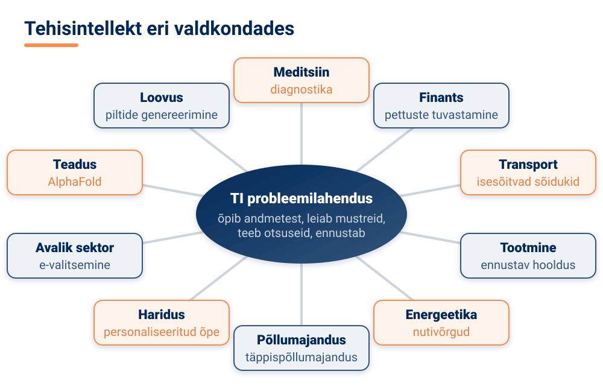

<!-- class="pae-moiste" -->
> **Mõiste: spetsialiseeritud ja üldotstarbeline süsteem**
>
> **Spetsialiseeritud** (kitsas) TI-süsteem on loodud üheks kindlaks ülesandeks ja tal on selles valdkonnas sügavad teadmised – näiteks programm, mis tuvastab röntgenipildilt kopsupõletikku. **Üldotstarbeline** süsteem on laiemate võimetega ja suudab lahendada väga erinevaid ülesandeid, kuid tema teadmised võivad olla pinnapealsemad – näiteks suur keelemudel.

Tehisintellekt lahendab valdkonnast sõltumata sageli samu **probleemitüüpe**:

| Probleemitüüp | Mida tehakse? | Näide |
|---|---|---|
| Klassifitseerimine | objekt määratakse mõnda klassi | kas tehing on pettus või mitte |
| Ennustamine | prognoositakse tulevikku või arvulist väärtust | homne elektritarbimine, saagikus |
| Optimeerimine | otsitakse parimat lahendust | kullerite marsruudid, fooride ajastus |
| Planeerimine | koostatakse tegevuste jada eesmärgi saavutamiseks | roboti liikumine laos |
| Anomaaliate tuvastamine | leitakse tavapärasest erinevad juhtumid | ebatavaline tehing, seadme rike |

Ka **lahendusstrateegiaid** on mitu. **Otsingupõhine lähenemine** lahendab probleemi olekuruumi läbi otsides (nagu A\* algoritm). **Optimeerimispõhine lähenemine** otsib parimat võimalikku lahendust. **Tõenäosuslik lähenemine** lahendab probleeme ebakindluse tingimustes (nagu Bayesi võrgud). **Jaga-ja-valitse lähenemine** jagab suure probleemi väiksemateks osadeks. **Õppimispõhine lähenemine** lahendab probleemi andmetest õppimise kaudu (masinõpe).

### Meditsiin, finants ja transport

**Meditsiinis** aitab tehisintellekt eelkõige **diagnostikas**: analüüsib meditsiinilisi pilte (röntgen, MRT, KT), ennustab haigusi ja analüüsib sümptomeid. **Raviotsuste** juures aitab TI koostada personaliseeritud raviplaane, kontrollida ravimite koostoimeid ja hinnata riske. **Ravimite arenduses** kasutatakse TI-d molekulide disainimiseks, kliiniliste uuringute optimeerimiseks ja haiguste modelleerimiseks. Suurimad väljakutsed on **andmete privaatsus** (terviseandmed on eriti tundlikud), **vastutus otsuste eest** ja **integratsioon** haiglate olemasolevate infosüsteemidega.

**Finantssektoris** on TI peamised ülesanded **riskianalüüs** (krediidiriski, tururiski ja kindlustusriski hindamine), **pettuste tuvastamine** (ebatavaliste tehingute leidmine, käitumismustrite analüüs ja reaalajas jälgimine) ning **investeerimine** (algoritmkauplemine, portfelli optimeerimine ja trendide ennustamine). Väljakutsed on turu **volatiilsus** ehk kõikuvus, ranged **regulatsioonid** ja **läbipaistvus** – inimesel on õigus teada, miks talle laenu ei antud.

<!-- class="pae-eesti" -->
> **Eesti näide: LHV ja Salv**
>
> Eesti pank **LHV** kasutab tehisintellekti pettuste tuvastamiseks ja klienditeeninduse parandamiseks. Eesti ettevõte **Salv** aitab pankadel ja finantsasutustel tuvastada rahapesu ja pettusi. Mõlemad on näited **anomaaliate tuvastamisest**: süsteem otsib tehinguid, mis erinevad tavapärasest mustrist.

**Transpordis** on kõige tuntum näide **isesõitvad sõidukid**, mis peavad tajuma keskkonda, tegema otsuseid ja planeerima marsruuti. **Liiklusjuhtimises** aitab TI ennustada ummikuid, optimeerida fooride tööd ja planeerida ühistransporti. **Logistikas** optimeeritakse marsruute, ennustatakse nõudlust ja juhitakse ladusid. Väljakutsed on **ohutus**, **eetilised dilemmad** (kuidas peaks isesõitev auto käituma olukorras, kus kõik valikud on halvad?) ja **infrastruktuuri vajadused**.

<!-- class="pae-eesti" -->
> **Eesti näide: Bolt ja Starship**
>
> **Bolt** kasutab tehisintellekti nõudluse ennustamiseks, hindade optimeerimiseks ja sõitude sobitamiseks – kui tellid takso, otsustab algoritm, milline juht on sulle kõige sobivam. **Starship Technologies** on loonud isesõitvad kullerrobotid, mis kasutavad tehisintellekti ja arvutinägemist, et liikuda linnatänavatel ja toimetada kohale pakke ja toitu. Euroopa Liidu projekt **LEVITATE** uurib, kuidas automatiseeritud sõidukid mõjutavad liiklust ja ühiskonda.

### Tootmine, energeetika ja põllumajandus

**Tootmises** räägitakse **Tööstus 4.0-st** – nutikatest tehastest, kus masinad on ühendatud **asjade interneti** (IoT, *Internet of Things*) kaudu ja otsuseid tehakse andmete põhjal. TI aitab **kvaliteedikontrollis**: kaamerad ja algoritmid kontrollivad tooteid visuaalselt, tuvastavad defekte ja ennustavad kvaliteeti. Väga oluline on **ennustav hooldus**: TI ennustab seadmete rikkeid enne, kui need tekivad, optimeerib hooldusgraafikut ja aitab ressursse planeerida. Väljakutsed on andmete kogumise keerukus, süsteemide integratsioon ja töötajate koolitamine.

<!-- class="pae-moiste" -->
> **Mõiste: ennustav hooldus**
>
> Ennustav hooldus on lähenemine, kus seadmete andurite andmete põhjal ennustatakse, millal masin tõenäoliselt rikki läheb, ja hooldatakse seda enne riket. Nii välditakse ootamatuid seisakuid ega vahetata ka korras osi asjatult.

<!-- class="pae-eesti" -->
> **Eesti näide: AIRE**
>
> **AI & Robotics Estonia (AIRE)** on tehisintellekti ja robootika teenuskeskus, mis alustas tegevust 1. oktoobril 2021. See pakub Eesti tööstusettevõtetele nõu tehisintellekti ja robootika rakendamiseks.

<!-- class="pae-fakt" -->
> **Kas teadsid?** Ennustav hooldus aitab vältida kahte viga korraga: masin ei lähe **ootamatult** rikki ja samas ei vahetata asjatult ka **korras** osi.

**Energeetikas** aitab TI **energiatootmist optimeerida**: ennustada taastuvenergia (päikese- ja tuuleenergia) tootmist, tasakaalustada nõudlust ja pakkumist ning jaotada ressursse. **Nutivõrkudes** juhitakse energiavoogusid, ennustatakse tarbimist ja tuvastatakse rikkeid. **Energiatõhususe** suurendamiseks optimeeritakse hoonete energiakasutust, analüüsitakse tarbimismustreid ja antakse soovitusi energia säästmiseks. Väljakutsed on süsteemide keerukus, turvalisus ja regulatsioonid.

**Põllumajanduses** kasutatakse **täppispõllumajandust**: analüüsitakse satelliidi- ja droonipilte, jälgitakse mulda ja ilma ning kasutatakse ressursse (vett, väetist) täpselt seal, kus vaja. **Taimekasvatuses** tuvastab TI haigusi ja kahjureid, ennustab saaki ning optimeerib kastmist ja väetamist. **Loomakasvatuses** jälgitakse loomade tervist, optimeeritakse söötmist ja analüüsitakse käitumist. Väljakutsed on keskkonnatingimuste muutlikkus, tehnoloogia kättesaadavus ja andmete kogumine maapiirkondades.

### Haridus, avalik sektor, teadus ja loovus

**Hariduses** võimaldab TI **personaliseeritud õpet**: tuvastab õppija taseme, kohandab õppematerjale ja annab individuaalset tagasisidet. **Hindamises** kasutatakse automaatset hindamist, plagiaadi tuvastamist ja õppimisanalüütikat. **Õpetajat** aitab TI administratiivsete ülesannete automatiseerimisel, õppematerjalide loomisel ja õpilaste edenemise jälgimisel. Väljakutsed on pedagoogiliste põhimõtete järgimine, õpetaja rolli muutumine ja ligipääsetavus.

<!-- class="pae-eesti" -->
> **Eesti näide: Lingvist ja Edumus**
>
> **Lingvist** pakub personaliseeritud keeleõpet, kohandades õppematerjale vastavalt kasutaja oskustele ja edenemisele. **Edumus** kasutab tehisintellekti personaliseeritud õppematerjalide loomiseks. Euroopa Liidu projekt **AI4T** (*Artificial Intelligence for Teachers*) aitab õpetajatel tehisintellekti õppetöös kasutada.

**Avalikus sektoris** tähendab **e-valitsemine** avalike teenuste automatiseerimist, dokumentide töötlemist ja kodanike päringutele vastamist. **Julgeolekus** kasutatakse TI-d küberturvalisuse tagamiseks ja anomaaliate tuvastamiseks; mõnes riigis ka **ennustavas politseitöös**, mis on väga vastuoluline, sest võib kallutatud andmete tõttu ebaõiglaselt kohelda teatud piirkondi või inimrühmi. **Linnaplaneerimises** optimeeritakse liiklust, juhitakse energiakasutust ja planeeritakse teenuseid. Väljakutsed on läbipaistvus ja vastutus, privaatsus ning õiglus ja võrdsus.

**Teaduses** töötleb TI suuri andmehulki, tuvastab mustreid ja aitab püstitada uusi hüpoteese. TI abil modelleeritakse kliimat ja keskkonda, molekule ja materjale ning bioloogilisi süsteeme. Tuntuim avastus on **AlphaFold**, mis ennustab valkude ruumilist struktuuri – see on bioloogias ja ravimiarenduses tohutult oluline. TI aitab disainida ka uusi materjale ja uurida kosmost. Väljakutsed on teadusliku meetodi järgimine, tulemuste tõlgendamine ja interdistsiplinaarsus ehk eri teadusalade koostöö.

**Loomingulistes valdkondades** genereerib TI pilte (nt **DALL-E**, **Midjourney**), teeb stiiliülekannet (muudab foto näiteks maali sarnaseks) ja optimeerib disaini. **Muusikas** aitab TI komponeerida, arranžeerida ja helisid sünteesida; **kirjanduses ja meedias** genereerida teksti, stsenaariume ja kokkuvõtteid. Väljakutsed on originaalsus, autoriõigused ning inimese ja masina koostöö.

<!-- class="pae-lisaks" -->
> **Tea lisaks: kuulsad juhtumid**
>
> - **AlphaGo** (DeepMind) võitis 2016. aastal maailma tippmängijat Lee Sedoli go-mängus, mida peeti male järel järgmiseks suureks väljakutseks, sest võimalikke seise on go-s veel palju rohkem. AlphaGo ühendas otsingu ja süvaõppe.
> - **IBM Watson** sai tuntuks 2011. aastal, kui võitis USA telemängus „Jeopardy!“ inimesi. Hiljem prooviti seda kasutada meditsiinis vähiravi soovitamiseks, kuid tulemused jäid oodatust tagasihoidlikumaks – hea näide sellest, et mängus edukas süsteem ei pruugi kohe toimida päris haiglas.
> - **Isesõitvad autod** peavad lahendama korraga tajumise, ennustamise ja planeerimise ülesandeid ning toimima ka harvaesinevates ootamatutes olukordades.

<!-- class="pae-fakt" -->
> **Kas teadsid?** **IBM Watson** võitis 2011. aastal telemängus „Jeopardy!“ inimesi, kuid vähiravi soovitamisel haiglas jäid tema tulemused oodatust tagasihoidlikumaks. Mängus edukas süsteem ei pruugi kohe toimida päriselus!

### Kuidas TI-lahendus valmib ja millised on ühised väljakutsed?

Olenemata valdkonnast läbib tehisintellekti lahendus sarnased etapid:

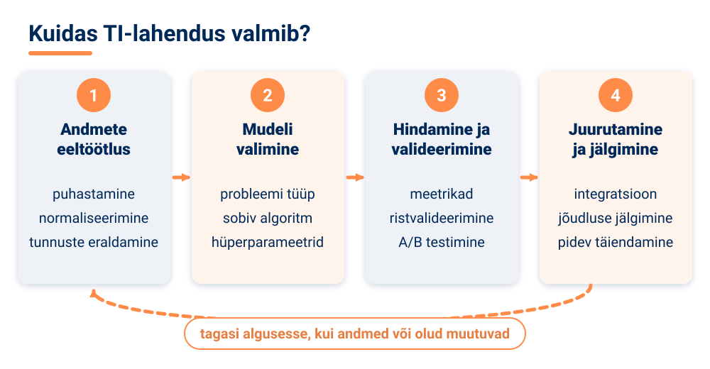

<!-- class="pae-naide" -->
> **Näide: A/B testimine**
>
> **A/B testimine** tähendab, et osale kasutajatest näidatakse lahenduse üht ja osale teist versiooni ning võrreldakse, kumb töötab paremini. Näiteks voogedastusplatvorm näitab pooltele kasutajatele uut soovitusalgoritmi ja pooltele vana ning vaatab, kumma rühma kasutajad leiavad endale sobiva sarja kiiremini ja on rahulolevamad.

**Ristvalideerimine** tähendab, et mudelit testitakse mitu korda andmete eri osadel, et veenduda, kas see töötab usaldusväärselt.

Kõigis valdkondades kerkivad esile sarnased **väljakutsed**. Esimene on **andmete kvaliteet ja kättesaadavus**: andmeid peab olema piisavalt, need peavad olema **representatiivsed** (esindama kõiki rühmi, keda otsus puudutab) ja arvestama privaatsusega. Teine on **selgitatavus ja läbipaistvus**.

<!-- class="pae-moiste" -->
> **Mõiste: „musta kasti“ probleem**
>
> „Musta kasti“ probleem on olukord, kus tehisintellekti süsteemi otsustusprotsess on **läbipaistmatu** ja raskesti **selgitatav**. See on eriti levinud **süvaõppe** mudelite puhul, kus otsused tehakse läbi paljude kihtide ja neuronite.

„Musta kasti“ probleem põhjustab usalduse puudumist, raskusi vigade tuvastamisel ja vastutuse küsimusi. Lahendused on **selgitatavate mudelite** arendamine, visualiseerimistehnikad ja lihtsustatud mudelite kasutamine kriitilistes valdkondades. Läbipaistvus on eriti oluline **meditsiinis, finantsis ja õiguses**, kus otsused võivad inimeste elu oluliselt mõjutada.

Kolmas väljakutse on **eetika**: kallutatus ja diskrimineerimine, vastutus ja inimese roll. Paljudes kriitilistes valdkondades (meditsiin, õigus, sõjandus) peetakse oluliseks põhimõtet **„inimene otsustusahelas“** (*human-in-the-loop*) – TI annab soovituse, kuid lõpliku otsuse teeb ja selle eest vastutab inimene. Oluline on ka **usaldatavus**: süsteemi võime teha järjepidevalt täpseid otsuseid. Seda hinnatakse testimisega eri andmekogumitel, valideerimise, järelevalve ja regulaarsete auditite abil.

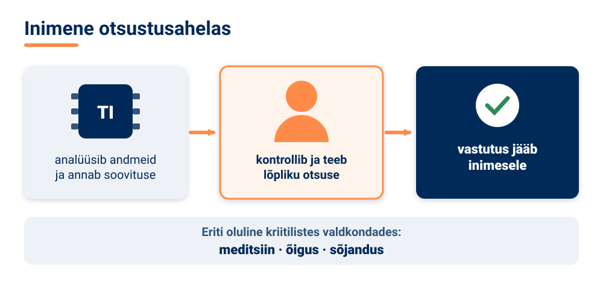

Neljas väljakutse on **regulatsioonid**: igal valdkonnal on oma nõuded, riigiti on erinevusi ja keskkond muutub kiiresti.

<!-- class="pae-lisaks" -->
> **Tea lisaks: Euroopa Liidu tehisintellekti määrus**
>
> **Euroopa Liidu tehisintellekti määrus (AI Act)** on Euroopa Liidu esimene terviklik õigusraamistik tehisintellekti reguleerimiseks. See kasutab **riskipõhist lähenemist**: mida suurem on oht inimeste tervisele, turvalisusele või põhiõigustele, seda rangemad on nõuded süsteemile. Lisaks kehtib isikuandmete kaitse üldmäärus (GDPR) ja Eestis annab Andmekaitse Inspektsioon juhiseid, kuidas TI-d isikuandmete kaitse põhimõtetega kooskõlas kasutada.

### Tehisintellekt Eestis ja tulevikusuunad

Eestit tuntakse digiühiskonnana ja tehisintellekti kasutatakse meil nii avalikus kui ka erasektoris.

<!-- class="pae-eesti" -->
> **Eesti näide: kratid ja Bürokratt**
>
> Eestis nimetatakse avaliku sektori tehisintellekti lahendusi **krattideks**. Riik on koostanud tehisintellekti tegevuskavad ehk **kratikavad** (2019–2021, 2022–2023 ja tegevuskava 2024–2026). **Bürokratt** on Eesti riigi virtuaalassistentide võrgustik, mille kaudu saab kõnekeelse suhtluse abil kasutada avalikke teenuseid. See valiti 2022. aastal parimaks tehisintellektil põhinevaks riigiteenuseks ja jõudis UNESCO maailma saja parima tehisintellekti lahenduse hulka. Oma tehisintellekti strateegiad on ka näiteks Kaitseministeeriumi valitsemisalal ning Maksu- ja Tolliametil.

Eesti **ettevõtetest** on tuntud **Bolt** (sõidujagamine ja logistika), **Veriff** (isikusamasuse tuvastamine – võrdleb isikut tõendavat dokumenti ja näopilti), **Starship** (autonoomsed kullerrobotid), **Lingvist** (keeleõpe) ja **Salv** (finantskuritegude tuvastamine). **Teaduses ja hariduses** tegeletakse keeletehnoloogia, andmeanalüüsi ja robootikaga – näiteks Tartu Ülikoolis, Tallinna Tehnikaülikoolis ja Tallinna Ülikoolis. **Tehnopoli AI arenguprogramm** aitab alates 2022. aastast Eesti ettevõtetel tehisintellekti lahendusi kasutusele võtta.

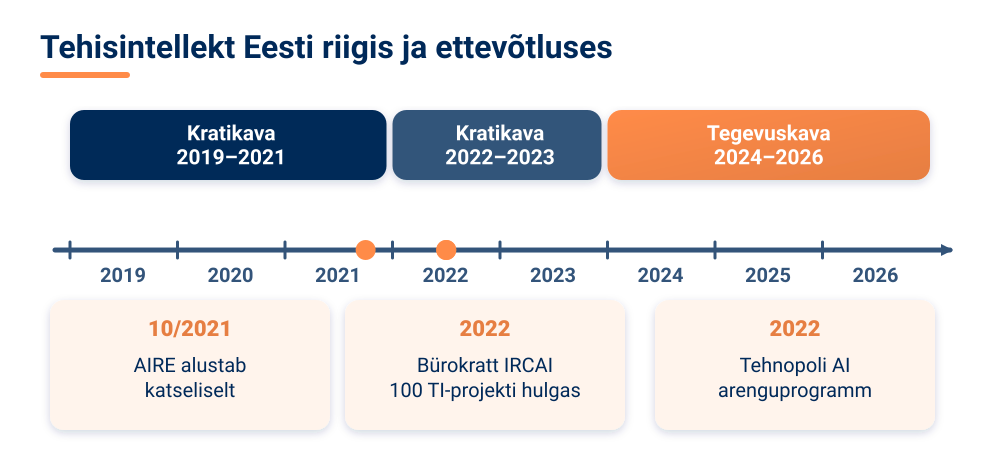

Eestil on nii väljakutseid kui ka võimalusi: **väike turg** tähendab, et lahendused tuleb kiiresti viia rahvusvahelisele turule, kuid **digiühiskond** ja hea andmetaristu loovad häid eeldusi ning **rahvusvaheline koostöö** (nt Euroopa Liidu projektid) aitab ressursse ühendada.

Kuhu liigub tehisintellekti probleemilahendus edasi? Esiteks **valdkonnad lõimuvad**: tekivad interdistsiplinaarsed lahendused, teadmisi kantakse ühest valdkonnast teise ja süsteemid muutuvad üldotstarbelisemaks. Teiseks areneb **inimese ja tehisintellekti koostöö**: kombineeritakse inimese tugevusi (loovus, empaatia, väärtushinnangud, terve mõistus) ja TI võimeid (kiirus, suurte andmehulkade töötlemine), tekivad uued koostöövormid ja tuleb otsustada, kuidas vastutust jagada. Kolmandaks toimub **tehisintellekti demokratiseerimine**: tööriistad muutuvad kasutajasõbralikumaks, sisenemislävi madalamaks ja kasutus laiemaks – ka sina saad juba praegu TI-tööriistu kasutada.

<!-- class="pae-motle" -->
> **Mõtle järele!**
>
> - Millistes valdkondades võiks tehisintellekt tuua kõige rohkem kasu Eestis? Mõtle näiteks oma kodukohale või koolile.
> - Kuidas tasakaalustada valdkonnapõhist spetsialiseerumist ja üldisi tehisintellekti põhimõtteid?
> - Kas sinu arvates peaks TI-l olema lubatud teha olulisi otsuseid (nt diagnoos, laenuotsus) iseseisvalt või peaks lõplik otsus jääma alati inimesele?

### Kokkuvõte ja põhimõisted

**Pea meeles**

- Tehisintellekti probleemilahenduse põhimõtted (andmetest õppimine, mustrite tuvastamine, otsustamine, ennustamine) on universaalsed, kuid rakendused on valdkonnapõhised.
- Levinud probleemitüübid on klassifitseerimine, ennustamine, optimeerimine, planeerimine ja anomaaliate tuvastamine.
- TI-lahenduse valmimine läbib etapid: andmete eeltöötlus, mudeli valimine, hindamine ja valideerimine, juurutamine ja jälgimine.
- Valdkondadevahelised väljakutsed on andmete kvaliteet, „musta kasti“ probleem, kallutatus, vastutus ja regulatsioonid; kriitilistes otsustes on oluline põhimõte „inimene otsustusahelas“.
- Euroopa Liidu tehisintellekti määrus reguleerib TI-d riskipõhiselt.
- Eestil on digiühiskonnana head eeldused TI rakendamiseks; tuntud näited on Bürokratt, Bolt, Veriff, Starship, Lingvist ja Salv.

| Mõiste | Tähendus |
|---|---|
| Spetsialiseeritud TI | süsteem, mis on loodud üheks kitsaks ülesandeks |
| Üldotstarbeline TI | laiemate võimetega süsteem, mis lahendab väga erinevaid ülesandeid |
| Anomaaliate tuvastamine | tavapärasest erinevate juhtumite (nt kahtlaste tehingute) leidmine |
| Ennustav hooldus | seadmete rikete ennustamine andurite andmete põhjal enne rikke tekkimist |
| Täppispõllumajandus | ressursside täpne kasutamine satelliidi-, drooni- ja andurite andmete põhjal |
| „Musta kasti“ probleem | TI otsustusprotsess on läbipaistmatu ja raskesti selgitatav |
| Inimene otsustusahelas | põhimõte, et lõpliku otsuse teeb ja selle eest vastutab inimene |
| Usaldatavus | TI süsteemi võime teha järjepidevalt täpseid otsuseid |
| A/B testimine | kahe lahenduse versiooni võrdlemine eri kasutajarühmadel |
| Euroopa Liidu tehisintellekti määrus (AI Act) | EL-i õigusraamistik, mis reguleerib TI-d riskipõhiselt |

### Tööleht 4.4

<!-- class="pae-jaotis" -->
**I. Tehisintellekti probleemilahenduse põhimõtted**

**Ülesanne 1.** Selgita oma sõnadega, kuidas tehisintellekt lahendab probleeme.

[[___ ___ ___]]

**Ülesanne 2.** Ühenda probleemilahenduse strateegiad nende kirjeldustega.

| Täht | Kirjeldus |
|:---:|---|
| **A** | Probleemi lahendamine seda väiksemateks osadeks jagades |
| **B** | Probleemi lahendamine olekuruumi läbi otsides |
| **C** | Probleemi lahendamine parima võimaliku lahenduse leidmiseks |
| **D** | Probleemi lahendamine ebakindluse tingimustes |
| **E** | Probleemi lahendamine andmetest õppimise kaudu |

- [ (A) (B) (C) (D) (E) ]
- [ ( ) (X) ( ) ( ) ( ) ] Otsingupõhine lähenemine
- [ ( ) ( ) (X) ( ) ( ) ] Optimeerimispõhine lähenemine
- [ ( ) ( ) ( ) (X) ( ) ] Tõenäosuslik lähenemine
- [ (X) ( ) ( ) ( ) ( ) ] Jaga-ja-valitse lähenemine
- [ ( ) ( ) ( ) ( ) (X) ] Õppimispõhine lähenemine
****************************************
Otsingupõhine lähenemine otsib olekuruumist (B), optimeerimine parimat lahendust (C), tõenäosuslik lähenemine töötab ebakindluse tingimustes (D), jaga-ja-valitse jagab probleemi osadeks (A) ja õppimispõhine lähenemine õpib andmetest (E).
****************************************

<!-- class="pae-jaotis" -->
**II. Tehisintellekti rakendused erinevates valdkondades**

**Ülesanne 3.** Kirjelda lühidalt, kuidas tehisintellekt lahendab probleeme järgmistes valdkondades.

a) Meditsiin:

[[___ ___ ___]]

b) Transport:

[[___ ___ ___]]

c) Tootmine:

[[___ ___ ___]]

d) Finants:

[[___ ___ ___]]

e) Haridus:

[[___ ___ ___]]

**Ülesanne 4.** Vali üks valdkond ja kirjelda põhjalikumalt konkreetset tehisintellekti rakendust selles valdkonnas.

[[___ ___ ___ ___ ___]]

<!-- class="pae-jaotis" -->
**III. Probleemitüübid ja lahendusstrateegiad**

**Ülesanne 5.** Täida tabel erinevate probleemitüüpide ja nende lahendusstrateegiate kohta.

| Probleemitüüp | Kirjeldus | Tehisintellekti lahendusstrateegiad | Näide |
|---|---|---|---|
| Klassifitseerimine | | | |
| Ennustamine | | | |
| Optimeerimine | | | |
| Planeerimine | | | |
| Anomaaliate tuvastamine | | | |

Kirjuta iga probleemitüübi kohta kirjeldus, sobivad lahendusstrateegiad ja näide.

**Klassifitseerimine:**

[[___ ___]]

**Ennustamine:**

[[___ ___]]

**Optimeerimine:**

[[___ ___]]

**Planeerimine:**

[[___ ___]]

**Anomaaliate tuvastamine:**

[[___ ___]]

**Ülesanne 6.** Millised on peamised väljakutsed tehisintellekti probleemilahenduses? Nimeta vähemalt neli.

[[___ ___ ___ ___]]

<!-- class="pae-jaotis" -->
**IV. Juhtumiuuringud**

**Ülesanne 7.** Analüüsi järgmisi tehisintellekti juhtumiuuringuid. Otsi vajaduse korral lisainfot internetist.

a) AlphaGo ja strateegiliste mängude lahendamine:

[[___ ___ ___]]

b) Watson ja meditsiiniline diagnostika:

[[___ ___ ___]]

c) Isesõitvad autod ja navigeerimine:

[[___ ___ ___]]

d) Tehisintellekt kliimamuutuste modelleerimisel:

[[___ ___ ___]]

**Ülesanne 8.** Millised on peamised õppetunnid nendest juhtumiuuringutest?

[[___ ___ ___ ___]]

<!-- class="pae-jaotis" -->
**V. Tehisintellekti probleemilahenduse piirangud**

**Ülesanne 9.** Millised on tehisintellekti probleemilahenduse piirangud? Kirjelda vähemalt nelja.

[[___ ___ ___ ___]]

**Ülesanne 10.** Millistes olukordades on inimese probleemilahendus endiselt parem kui tehisintellekti oma?

[[___ ___ ___ ___]]

**Ülesanne 11.** Kuidas saaks kombineerida inimese ja tehisintellekti probleemilahenduse tugevusi?

[[___ ___ ___ ___]]

<!-- class="pae-jaotis" -->
**VI. Praktiline ülesanne**

**Ülesanne 12.** Vali üks järgmistest praktilistest ülesannetest.

**Variant A: Probleemi analüüs ja lahenduse kavandamine.** Vali üks probleem oma koolis, kogukonnas või igapäevaelus ja analüüsi, kuidas tehisintellekt võiks aidata seda lahendada.

a) Probleem:

[[___ ___]]

b) Miks on see probleem oluline?

[[___ ___]]

c) Millised andmed oleksid vajalikud probleemi lahendamiseks?

[[___ ___ ___]]

d) Millist tehisintellekti lähenemist või algoritmi kasutaksid?

[[___ ___ ___]]

e) Millised võiksid olla lahenduse eelised ja piirangud?

[[___ ___ ___]]

**Variant B: Olemasoleva tehisintellekti lahenduse analüüs.** Vali üks olemasolev tehisintellekti lahendus ja analüüsi seda.

a) Valitud lahendus:

[[___]]

b) Millist probleemi see lahendab?

[[___ ___]]

c) Kuidas see töötab?

[[___ ___ ___]]

d) Kui tõhus see on?

[[___ ___]]

e) Kuidas saaks seda paremaks muuta?

[[___ ___ ___]]

<!-- class="pae-jaotis" -->
**VII. Tehisintellekti probleemilahenduse tulevik**

**Ülesanne 13.** Millised on tehisintellekti probleemilahenduse tulevikusuunad? Kirjelda vähemalt kolme.

[[___ ___ ___ ___]]

**Ülesanne 14.** Millised uued probleemid võiksid saada lahendatud tehisintellekti abil järgmise 10 aasta jooksul?

[[___ ___ ___ ___]]

<!-- class="pae-jaotis" -->
**VIII. Arutelu**

**Ülesanne 15.** Kuidas muudab tehisintellekti probleemilahendus erinevaid valdkondi ja ühiskonda tervikuna?

[[___ ___ ___ ___]]

**Ülesanne 16.** Millised eetilised küsimused kaasnevad tehisintellekti kasutamisega probleemide lahendamisel?

[[___ ___ ___ ___]]

### Enesekontroll 4.4

**1. Kuidas nimetatakse lähenemist, kus andurite andmete põhjal ennustatakse, millal masin tõenäoliselt rikki läheb, ja hooldatakse seda enne riket? Kirjuta vastus.**

[[ennustav hooldus]]
<script>
let v = `@input`.trim().toLowerCase().replace(/\s+/g, " ");
["ennustav hooldus", "ennustava hoolduse", "ennustavat hooldust", "ennustavaks hoolduseks"].includes(v)
</script>
****************************************
Õige vastus: **ennustav hooldus**. Nii välditakse ootamatuid seisakuid ega vahetata ka korras osi asjatult. Ennustav hooldus on tähtis osa Tööstus 4.0 nutikatest tehastest.
****************************************

**2. Liigita näited probleemitüübi järgi.**

<!-- data-show-partial-solution -->
- [ (Klassifitseerimine) (Ennustamine) (Optimeerimine) (Planeerimine) (Anomaaliate tuvastamine) ]
- [ ( ) (X) ( ) ( ) ( ) ] Homse elektritarbimise prognoosimine
- [ (X) ( ) ( ) ( ) ( ) ] Röntgenipildi põhjal otsustamine, kas kopsupõletik on või ei ole
- [ ( ) ( ) ( ) ( ) (X) ] Tehase seadme anduritest tavapärasest erineva signaali leidmine
- [ ( ) ( ) (X) ( ) ( ) ] Kullerite marsruutide koostamine nii, et kogu läbitav tee oleks võimalikult lühike
- [ ( ) ( ) ( ) (X) ( ) ] Tegevuste jada koostamine, et robot saaks laos kauba riiulilt kätte
****************************************
**Klassifitseerimisel** määratakse objekt mõnda klassi, **ennustamisel** prognoositakse tulevikku või arvulist väärtust, **optimeerimisel** otsitakse parimat lahendust, **planeerimisel** koostatakse tegevuste jada eesmärgi saavutamiseks ja **anomaaliate tuvastamisel** leitakse tavapärasest erinevad juhtumid.
****************************************

**3. Lohista mõisted õigetesse lünkadesse.**

<!-- data-show-partial-solution -->
„Musta kasti“ probleem on eriti levinud [->[ (süvaõppe) | ekspertsüsteemide ]] mudelite puhul, kus otsused tehakse läbi paljude kihtide ja neuronite. Läbipaistvus on eriti oluline sellistes valdkondades nagu [->[ (meditsiin) | arvutimängud ]], kus otsused võivad inimeste elu oluliselt mõjutada. Probleemi lahendamiseks arendatakse [->[ (selgitatavaid) ]] mudeleid.
****************************************
Süvaõppe mudelite otsuseid on raske selgitada, sest need tehakse läbi paljude kihtide ja neuronite. Meditsiinis, finantsis ja õiguses mõjutavad otsused inimeste elu, seepärast peab neid saama põhjendada. Lahendused on selgitatavad mudelid, visualiseerimistehnikad ja lihtsustatud mudelid kriitilistes valdkondades.
****************************************

**4. Mida tähendab põhimõte „inimene otsustusahelas“ (*human-in-the-loop*)?**

- [( )] Inimene programmeerib iga TI otsuse käsitsi
- [(X)] TI teeb soovituse, kuid lõpliku otsuse teeb ja selle eest vastutab inimene
- [( )] TI jälgib pidevalt inimese otsuseid ja parandab neid
- [( )] Inimesed ei tohi TI süsteeme kasutada
****************************************
Kriitilistes valdkondades, nagu meditsiin, õigus ja sõjandus, peetakse oluliseks, et lõplik otsus ja vastutus jääksid inimesele.
****************************************

**5. Vali iga TI rakenduse juurde valdkond, kus seda kasutatakse.**

<!-- data-show-partial-solution -->
Ennustav hooldus ja defektide tuvastamine: [[ (tootmine) | finants | põllumajandus | teadus ]]<br>
Pettuste tuvastamine ja krediidiriski hindamine: [[ tootmine | (finants) | põllumajandus | teadus ]]<br>
Saagiennustus ja kahjurite tuvastamine: [[ tootmine | finants | (põllumajandus) | teadus ]]<br>
Valkude ruumilise struktuuri ennustamine (AlphaFold): [[ tootmine | finants | põllumajandus | (teadus) ]]
****************************************
Igal valdkonnal on oma tüüpilised rakendused, kuigi aluseks olevad meetodid (klassifitseerimine, ennustamine, optimeerimine) on sarnased. AlphaFold on üks tuntumaid TI avastusi teaduses: see on oluline bioloogias ja ravimiarenduses.
****************************************

**6. Voogedastusplatvorm teeb A/B testi. Uut soovitusalgoritmi näeb 500 kasutajat ja neist 85 leiab endale sobiva sarja esimese minuti jooksul. Mitu protsenti nendest kasutajatest leidis sobiva sarja?**

[[17]]
<script>
Number(`@input`.trim().replace(",", ".").replace("%", "")) === 17
</script>
****************************************
85 : 500 = 0,17 = **17%**.

Kui vana algoritmi rühmas oli see näitaja näiteks 12%, töötab uus algoritm selle mõõdiku järgi paremini. Just nii aitab A/B testimine kahte versiooni võrrelda.
****************************************

**7. Järjesta TI lahenduse loomise etapid.**

<!-- data-show-partial-solution -->
Hindamine ja valideerimine: [[ 1 | 2 | (3) | 4 ]]<br>
Andmete eeltöötlus: [[ (1) | 2 | 3 | 4 ]]<br>
Juurutamine ja jälgimine: [[ 1 | 2 | 3 | (4) ]]<br>
Mudeli valimine: [[ 1 | (2) | 3 | 4 ]]
****************************************
Kõigepealt puhastatakse ja töödeldakse andmed, siis valitakse ja häälestatakse mudel, seejärel hinnatakse seda ning lõpuks juurutatakse ja jälgitakse pidevalt.
****************************************

**8. Vali üks Eesti tehisintellekti lahendus või ettevõte (nt Bürokratt, Bolt, Veriff, Starship, Lingvist, Salv). Selgita, millist probleemi see lahendab ja millise probleemitüübiga on tegu.**

[[___ ___ ___]]

<details>
<summary>Vaata näidisvastust</summary>

Salv aitab pankadel ja finantsasutustel tuvastada rahapesu ja pettusi. Süsteem otsib tehinguid, mis erinevad tavapärasest mustrist, seega on tegu anomaaliate tuvastamisega. Teine näide: Bolt ennustab nõudlust (ennustamine) ning sobitab sõite ja optimeerib hindu (optimeerimine).

</details>


## Plokk 4. Kordamine ja harjutamine

### Praktilised ülesanded

<!-- class="pae-jaotis" -->
**Ülesanne 1. Otsustuspuu loomine ja rakendamine**

**Mida sa õpid:** mõistad otsustuspuude põhimõtteid ja seda, kuidas tehisintellekt kasutab sarnaseid struktuure otsuste tegemiseks.

**Vahendid:** internetiühendusega arvuti, paber ja kirjutusvahendid, diagrammide tööriist (nt draw.io või Lucidchart).

**Sammud:**

1. Moodustage 2–3-liikmelised rühmad.
2. Valige üks otsustusprobleem:
   - eriala või ülikooli valik;
   - nutitelefoni ostmine;
   - puhkusereisi planeerimine;
   - keskkonnasõbraliku transpordiviisi valimine;
   - tervislike eluviiside planeerimine.
3. Looge otsustuspuu:
   - **Määratlege probleem:** sõnastage täpselt, mida tuleb otsustada, ja millised on võimalikud lõpptulemused.
   - **Määratlege otsustuskriteeriumid:** leidke vähemalt 5 olulist kriteeriumi (nt hind, kvaliteet, keskkonnasõbralikkus) ja seadke need tähtsuse järjekorda.
   - **Ehitage puu:** juurküsimus (peamine otsustuskoht), harud (võimalikud vastused), järgmised küsimused ja harud ning lõpptulemused (lehed).
4. Joonistage oma otsustuspuu sobiva tööriistaga.
5. Testige puud vähemalt kolme erineva stsenaariumiga ja pange tulemused kirja.
6. Analüüsige, kuidas teie otsustuspuud saaks kasutada tehisintellekti süsteemis: milliseid andmeid oleks vaja, kuidas otsustamist automatiseerida ja millised võiksid olla probleemid või piirangud?
7. Esitlege oma otsustuspuud klassile.
8. Arutage pärast esitlusi, kuidas erinevad rühmade otsustuspuud üksteisest erinesid ja kuidas tehisintellekt kasutab sarnaseid struktuure.

**Mida esitada:** otsustuspuu joonis, kolme stsenaariumi testi tulemused ja analüüs TI-s rakendamise kohta.

**Mida jälgitakse:**

- kas otsustusprobleem on selgelt määratletud;
- kas kriteeriumid on asjakohased ja põhjalikud;
- kas otsustuspuu on loogiline ja terviklik;
- kas joonis on selge ja arusaadav;
- kui põhjalikult on analüüsitud puu rakendamist TI-s.

**Kasulikud lingid:**

- [Draw.io – diagrammide loomise tööriist](https://app.diagrams.net/)
- [Lucidchart – diagrammide loomise tööriist](https://www.lucidchart.com/)
- [Decision Trees in Machine Learning – Towards Data Science](https://towardsdatascience.com/decision-trees-in-machine-learning-641b9c4e8052)

Kirjelda lühidalt oma rühma otsustuspuud ja seda, mida sa ülesande käigus õppisid.

[[___ ___ ___ ___]]

<!-- class="pae-jaotis" -->
**Ülesanne 2. Ekspertsüsteemi prototüübi loomine**

**Mida sa õpid:** mõistad ekspertsüsteemide põhimõtteid, luues ise lihtsa ekspertsüsteemi prototüübi.

**Vahendid:** internetiühendusega arvuti, tekstiredaktor või programmeerimiskeskkond, esitlusvahend.

**Sammud:**

1. Moodustage 3–4-liikmelised rühmad.
2. Valige oma ekspertsüsteemi valdkond:
   - taimede või loomade määramine;
   - arvutiprobleemide diagnoosimine;
   - terviseprobleemide esmane hindamine;
   - õppeaine või eriala soovitamine;
   - toitumissoovitused.
3. Koostage teadmusbaas:
   - **Faktid:** koguge vähemalt 20 fakti valitud valdkonna kohta, struktureerige ja rühmitage need.
   - **Reeglid:** kirjutage vähemalt 15 „KUI … SIIS …“ reeglit, seadke need tähtsuse järjekorda ja määrake reeglite omavahelised seosed.
   - **Järeldused:** pange kirja võimalikud lõppjäreldused või soovitused ja nende selgitused.
4. Looge ekspertsüsteemi prototüüp ühel järgmistest viisidest:
   - lihtne tekstipõhine süsteem (nt Pythonis või pseudokoodis);
   - vooskeem või otsustuspuu;
   - interaktiivne küsimustik (nt Google Forms);
   - lihtne veebileht (nt HTML/JavaScript).
5. Testige oma ekspertsüsteemi vähemalt viie erineva stsenaariumiga ja pange tulemused kirja.
6. Analüüsige oma ekspertsüsteemi: tugevused ja nõrkused, täpsus ja usaldusväärsus, kasutajasõbralikkus, arendusvõimalused.
7. Esitlege oma ekspertsüsteemi klassile: näidake, kuidas see töötab, selgitage teadmusbaasi ja reeglite loomist ning jagage testimise tulemusi.
8. Arutage pärast esitlusi ekspertsüsteemide kasulikkuse, piirangute ja tuleviku üle.

**Mida esitada:** teadmusbaas (faktid ja reeglid), töötav prototüüp, testimise tulemused ja analüüs.

**Mida jälgitakse:**

- kas teadmusbaas on põhjalik ja asjakohane;
- kas reeglid on loogilised ja terviklikud;
- kas prototüüp töötab;
- kui põhjalik on testimine ja analüüs;
- kas esitlus ja demonstratsioon on selged.

**Kasulikud lingid:**

- [Expert Systems – Introduction – Tutorialspoint](https://www.tutorialspoint.com/artificial_intelligence/artificial_intelligence_expert_systems.htm)
- [Building a Simple Expert System – GeeksforGeeks](https://www.geeksforgeeks.org/building-a-simple-expert-system/)
- [Experta – Python Expert Systems Library](https://github.com/nilp0inter/experta)

Kirjuta siia kolm oma rühma reeglit ja kirjelda, kuidas su ekspertsüsteem testimisel toimis.

[[___ ___ ___ ___]]

<!-- class="pae-jaotis" -->
**Ülesanne 3. Soovitussüsteemide analüüs ja disain**

**Mida sa õpid:** mõistad soovitussüsteemide põhimõtteid ja toimimist, analüüsides olemasolevat süsteemi ja kavandades oma süsteemi.

**Vahendid:** internetiühendusega arvuti, esitlusvahend, prototüüpimise vahend (nt Figma või paber ja pliiats).

**Sammud:**

1. Moodustage 2–3-liikmelised rühmad.
2. Valige üks soovitussüsteem, mida analüüsida:
   - Netflixi või muu voogedastusplatvormi soovitused;
   - Spotify või muu muusikaplatvormi soovitused;
   - e-poe tootesoovitused (nt Amazon);
   - sotsiaalmeedia sisusoovitused (nt YouTube, TikTok);
   - uudiste või artiklite soovitused.
3. Analüüsige valitud soovitussüsteemi:
   - **Kasutajakogemus:** kuidas soovitusi esitatakse? Kuidas saab kasutaja soovitusi mõjutada? Kui täpsed ja asjakohased on soovitused?
   - **Tehniline toimimine:** milliseid andmeid süsteem kogub? Milliseid algoritme võidakse kasutada? Kas kasutatakse koostööfiltreerimist, sisupõhist filtreerimist või hübriidmeetodit?
   - **Eetilised küsimused:** privaatsus, mullifiltrid, manipuleerimise võimalused.
4. Koostage 2–3-leheküljeline analüüsiraport, kus on soovitussüsteemi kirjeldus, kasutajakogemuse analüüs, tehnilise toimimise analüüs, eetiliste küsimuste analüüs ja parendusettepanekud.
5. Disainige oma soovitussüsteemi prototüüp:
   - **Kontseptsioon:** valige valdkond (nt raamatud, restoranid, õppematerjalid), sihtrühm ja eesmärgid.
   - **Algoritm:** milliseid andmeid kogute? Millist filtreerimismeetodit kasutate? Kuidas soovitusi personaliseerite?
   - **Kasutajaliides:** kuidas soovitusi näidatakse, kuidas kasutajalt tagasisidet kogutakse ja kuidas teete soovitused läbipaistvaks (nt „Soovitame, sest …“).
6. Looge oma prototüübist visuaalne esitlus (3–5 ekraanivaadet).
7. Esitlege klassile nii analüüsi kui ka oma prototüüpi.
8. Arutage pärast esitlusi, kuidas soovitussüsteemid mõjutavad kasutajate valikuid ja käitumist.

**Mida esitada:** analüüsiraport ja prototüübi ekraanivaated.

**Mida jälgitakse:**

- kui põhjalik on olemasoleva soovitussüsteemi analüüs;
- kas tehniline toimimine on õigesti mõistetud;
- kui sügavalt on analüüsitud eetilisi küsimusi;
- kas oma prototüübi kontseptsioon on loogiline;
- kui selge ja hea on prototüübi visuaalne esitlus.

**Kasulikud lingid:**

- [How Do Recommendation Systems Work? – Towards Data Science](https://towardsdatascience.com/how-do-recommendation-systems-work-d1e229ca2f3c)
- [Recommendation Systems – IBM Developer](https://developer.ibm.com/technologies/artificial-intelligence/articles/introduction-to-recommender-systems/)
- [The Ethics of Recommendation Systems – Harvard Business Review](https://hbr.org/2021/03/the-ethics-of-recommendation-systems)

Kirjelda, mida sa analüüsitud soovitussüsteemi ja mullifiltri kohta teada said. Kas see muudab, kuidas sa ise seda rakendust kasutad?

[[___ ___ ___ ___]]

<!-- class="pae-jaotis" -->
**Ülesanne 4. Tehisintellekti otsustusprotsessi simulatsioon**

**Mida sa õpid:** mõistad tehisintellekti otsustusprotsessi keerukust ja eetilisi dilemmasid rollimängu kaudu.

**Vahendid:** rollimängu materjalid, paber ja kirjutusvahendid, esitlusvahend.

**Sammud:**

1. Moodustage 5–6-liikmelised rühmad.
2. Iga rühm saab ühe stsenaariumi, kus tehisintellekt peab tegema keerulise otsuse:
   - isesõitev auto peab valima kahe võimaliku õnnetuse vahel;
   - meditsiiniline TI peab otsustama, kes saab piiratud ressursside korral ravi;
   - personalivaliku TI peab valima kandidaatide vahel;
   - kohtuotsuste TI peab määrama karistuse;
   - sotsiaalmeedia modereerimise TI peab otsustama, kas sisu eemaldada.
3. Jagage rollid – iga rühmaliige võtab ühe rolli:
   - tehisintellekti süsteemi arendaja;
   - tehisintellekti süsteemi kasutaja;
   - otsusest mõjutatud isik;
   - eetikaekspert;
   - jurist või regulaator;
   - vaatleja ehk protokollija.
4. Viige läbi rollimäng kolmes etapis:
   - **Stsenaariumi analüüs:** iga osaleja analüüsib stsenaariumi oma rolli vaatenurgast ning paneb kirja oma prioriteedid ja argumendid.
   - **Otsustusprotsessi simulatsioon:** arutage, kuidas tehisintellekt peaks otsustama; iga osaleja esitab oma argumendid ja rühm püüab jõuda üksmeelele algoritmi või otsustusreeglite osas.
   - **Refleksioon:** väljuge rollidest, arutage kogemuse üle ja analüüsige, millised väärtused ja prioriteedid olid omavahel konfliktis.
5. Koostage otsustusalgoritm või reeglite kogum, mis arvestab eri vaatenurkadega.
6. Esitlege klassile oma stsenaariumi, simulatsiooni tulemusi ja loodud algoritmi.
7. Arutage ühiselt TI otsustusprotsesside eetilisi dilemmasid ja võimalikke lahendusi.

**Mida esitada:** loodud otsustusalgoritm või reeglite kogum ja lühikokkuvõte rollimängu arutelust.

**Mida jälgitakse:**

- kui põhjalikult on stsenaariumi analüüsitud;
- kui usutavalt on rolle mängitud;
- kas on arvestatud eri vaatenurkadega;
- kas loodud algoritm või reeglid on loogilised ja eetilised;
- kui sügav on refleksioon ja kas järeldused on põhjendatud.

**Kasulikud lingid:**

- [The Trolley Problem in AI – MIT Technology Review](https://www.technologyreview.com/2018/10/24/139313/a-global-ethics-study-aims-to-help-ai-solve-the-self-driving-trolley-problem/)
- [AI Decision-Making – Stanford University](https://hai.stanford.edu/news/ai-decision-making)
- [Ethics of Artificial Intelligence – UNESCO](https://en.unesco.org/artificial-intelligence/ethics)

Milline roll oli sinul ja millised väärtused läksid sinu rühmas omavahel kõige rohkem vastuollu?

[[___ ___ ___ ___]]

<!-- class="pae-jaotis" -->
**Ülesanne 5. Tehisintellekti rakendamine probleemilahenduses**

**Mida sa õpid:** mõistad, kuidas tehisintellekti saab kasutada eri valdkondade probleemide lahendamiseks.

**Vahendid:** internetiühendusega arvuti, esitlusvahend, probleemilahenduse tööriistad (nt Miro, Padlet).

**Sammud:**

1. Moodustage 3–4-liikmelised rühmad.
2. Valige üks kohalik või ülemaailmne probleem:
   - kliimamuutused või keskkonnareostus;
   - tervishoiu kättesaadavus;
   - hariduse kvaliteet ja kättesaadavus;
   - liiklusummikud või transpordiprobleemid;
   - toidu raiskamine;
   - energiatarbimine.
3. Analüüsige valitud probleemi:
   - **Probleemi kaardistamine:** täpne kirjeldus, põhjused ja tagajärjed, olemasolevad lahendused ja nende piirangud.
   - **Andmed:** milliseid andmeid oleks vaja probleemi mõistmiseks? Kuidas neid koguda? Millised võivad olla andmetega seotud raskused?
4. Kavandage tehisintellektil põhinev lahendus:
   - **Kontseptsioon:** valige TI tüüp (masinõpe, süvaõpe, ekspertsüsteem), kirjeldage lahenduse toimimise põhimõtteid ning määrake kasutajad ja huvirühmad.
   - **Tehniline teostus:** vajalik taristu, algoritmi või mudeli kirjeldus, kasutajaliidese idee.
   - **Mõju hindamine:** eeldatav mõju probleemile, võimalikud kõrvalmõjud, eetilised kaalutlused.
5. Koostage 5–7-slaidiline esitlus: probleemi kirjeldus ja olulisus, TI lahenduse kontseptsioon, tehnilise teostuse kirjeldus, eeldatav mõju ja kõrvalmõjud, rakendamise plaan.
6. Esitlege oma lahendust klassile.
7. Pärast esitlusi toimub „investorite voor“: hääletage, millistesse lahendustesse teie „investeeriksite“.
8. Arutage klassis tehisintellekti võimalusi ja piiranguid ühiskondlike probleemide lahendamisel.

**Mida esitada:** 5–7-slaidiline esitlus.

**Mida jälgitakse:**

- kui põhjalik on probleemi analüüs;
- kas TI lahendus on asjakohane ja uuenduslik;
- kas tehniline teostus on realistlik;
- kui põhjalikult on hinnatud mõju;
- kas esitlus on selge ja veenev.

**Kasulikud lingid:**

- [AI for Good – United Nations](https://aiforgood.itu.int/)
- [AI for Social Good – Google](https://ai.google/social-good/)
- [Solving Global Challenges with AI – World Economic Forum](https://www.weforum.org/agenda/2020/01/ai-for-good-global-challenges/)
- [AI for Sustainable Development Goals – ITU](https://www.itu.int/en/ITU-T/AI/Pages/ai4sdgs.aspx)

Kirjelda lühidalt oma rühma lahendust. Millisesse teise rühma lahendusse sa „investeeriksid“ ja miks?

[[___ ___ ___ ___]]

### Arutelu

Vasta küsimustele oma sõnadega. Võid oma vastuseid arutada ka klassikaaslastega või kooli õpikeskkonna foorumis.

<!-- class="pae-jaotis" -->
**Probleemilahendus ja otsustuspuud**

**Probleemilahenduse strateegiad.** Milliseid probleemilahenduse strateegiaid kasutad oma igapäevaelus? Kuidas need sarnanevad tehisintellekti kasutatavatele strateegiatele või erinevad neist?

[[___ ___ ___ ___]]

**Otsustuspuude rakendused.** Millistes valdkondades on otsustuspuud eriti kasulikud? Too näiteid, kus otsustuspuude kasutamine on andnud häid tulemusi.

[[___ ___ ___ ___]]

**Inimese ja tehisintellekti otsustamine.** Võrdle inimese ja tehisintellekti otsustusprotsesse. Millised on mõlema tugevused ja nõrkused? Millal eelistada üht teisele?

[[___ ___ ___ ___]]

<!-- class="pae-jaotis" -->
**Ekspertsüsteemid ja reeglistikud**

**Ekspertsüsteemide roll.** Millistes valdkondades on ekspertsüsteemid endiselt olulised, vaatamata masinõppe arengule? Miks?

[[___ ___ ___ ___]]

**Reeglipõhine ja andmepõhine lähenemine.** Võrdle reeglipõhist ja andmepõhist lähenemist tehisintellektis. Millal on üks sobivam kui teine?

[[___ ___ ___ ___]]

**Ekspertteadmiste kogumine.** Millised on raskused ekspertteadmiste kogumisel ja reegliteks vormistamisel? Kuidas neid raskusi ületada?

[[___ ___ ___ ___]]

<!-- class="pae-jaotis" -->
**Soovitussüsteemid**

**Soovitussüsteemide mõju.** Kuidas on soovitussüsteemid mõjutanud sinu igapäevaelu? Too näiteid positiivsetest ja negatiivsetest mõjudest.

[[___ ___ ___ ___]]

**Mullifiltrid.** Mis on mullifiltrid ja kuidas need tekivad soovitussüsteemide kasutamisel? Kuidas vältida mullifiltrite negatiivseid mõjusid?

[[___ ___ ___ ___]]

**Soovitussüsteemide parendamine.** Kuidas saaks soovitussüsteeme paremaks muuta? Milliseid funktsioone või omadusi sooviksid näha tuleviku soovitussüsteemides?

[[___ ___ ___ ___]]

<!-- class="pae-jaotis" -->
**Tehisintellekti probleemilahendus eri valdkondades**

**Valdkonnapõhised lahendused.** Vali üks valdkond (nt meditsiin, haridus, transport) ja arutle, kuidas tehisintellekt aitab seal probleeme lahendada. Millised on peamised väljakutsed?

[[___ ___ ___ ___]]

**Interdistsiplinaarsed rakendused.** Kuidas saab tehisintellekti kasutada eri valdkondade ühendamiseks? Too näiteid interdistsiplinaarsetest rakendustest.

[[___ ___ ___ ___]]

**Innovatsioon tehisintellekti abil.** Milliseid uusi probleemilahenduse viise on tehisintellekt võimaldanud? Kuidas on see muutnud traditsioonilisi lähenemisi?

[[___ ___ ___ ___]]

<!-- class="pae-jaotis" -->
**Refleksioon ploki kohta**

**Otsustusprotsesside mõistmine.** Kuidas on sinu arusaam otsustusprotsessidest selle ploki jooksul muutunud? Millised teemad olid kõige kasulikumad?

[[___ ___ ___ ___]]

**Tehisintellekti piirangud.** Millised on sinu arvates peamised piirangud tehisintellekti otsustusvõimes? Kuidas neid piiranguid ületada?

[[___ ___ ___ ___]]

**Tuleviku perspektiivid.** Kuidas näed tehisintellekti rolli tuleviku otsustusprotsessides? Millistes valdkondades võiks tehisintellekt tuua kõige suuremat kasu?

[[___ ___ ___ ___]]

### Ploki 4 enesekontrolltest

<!-- class="pae-jaotis" -->
**I. Automaatselt kontrollitavad ülesanded**

**1. Mis on probleemilahendus tehisintellekti kontekstis?**

- [( )] Inimeste psühholoogiliste probleemide lahendamine tehisintellekti abil
- [( )] Tehisintellekti süsteemide vigade parandamine
- [(X)] Protsess, kus tehisintellekt otsib teed algolekust eesmärgini
- [( )] Tehisintellekti süsteemide arendamisega seotud väljakutsete lahendamine
****************************************
Probleemilahendus tähendab, et TI otsib teed algolekust eesmärgini, kasutades otsingualgoritme ja strateegiaid.
****************************************

**2. Kuidas nimetatakse puukujulist mudelit, mis jagab andmed tunnuste põhjal järjest väiksemateks rühmadeks ja jõuab lehtedes lõppotsuseni? Kirjuta vastus.**

[[otsustuspuu]]
<script>
let v = `@input`.trim().toLowerCase().replace(/\s+/g, " ");
["otsustuspuu", "otsustuspuud", "otsustuspuuks", "otsuste puu"].includes(v)
</script>
****************************************
Õige vastus: **otsustuspuu**. Selle sõlmed on küsimused ehk otsustuskohad, harud võimalikud vastused ja lehed lõppotsused.
****************************************

**3. Järjesta otsustuspuu andmetest õppimise sammud õigesse järjekorda.**

<!-- data-show-partial-solution -->
Jaga andmed valitud tunnuse järgi rühmadeks: [[ 1 | 2 | (3) | 4 | 5 ]]<br>
Alusta kõigi treeningandmetega: [[ (1) | 2 | 3 | 4 | 5 ]]<br>
Peatu, kui rühm on homogeenne või puu on lubatud sügavusega: [[ 1 | 2 | 3 | 4 | (5) ]]<br>
Vali tunnus, mis jagab andmed kõige homogeensemateks rühmadeks: [[ 1 | (2) | 3 | 4 | 5 ]]<br>
Korda sama iga alamrühmaga: [[ 1 | 2 | 3 | (4) | 5 ]]
****************************************
Õige järjekord: 1. alusta kõigi andmetega → 2. vali parim tunnus → 3. jaga andmed → 4. korda iga alamrühmaga → 5. peatu. Parim tunnus on see, mis annab võimalikult homogeensed ehk ühtlased rühmad.
****************************************

**4. Robot liigub laos A\* algoritmi abil. Ühes olekus on robot läbinud juba 12 m ja linnulennuline kaugus sihtkohani on 7 m. Arvuta f(n) = g(n) + h(n) meetrites.**

[[19]]
<script>
Number(`@input`.trim().replace(",", ".")) === 19
</script>
****************************************
g(n) = 12 m (juba läbitud tee), h(n) = 7 m (heuristiline hinnang järelejäänud teele).

f(n) = 12 + 7 = **19** m
****************************************

**5. Lohista mõisted õigetesse lünkadesse.**

<!-- data-show-partial-solution -->
Ekspertsüsteem jäljendab [->[ (inimeksperdi) | kasutaja ]] teadmisi ja otsustusprotsessi kindlas valdkonnas. Reeglistik koosneb [->[ (KUI … SIIS …) ]] reeglitest. Ebakindluse käsitlemiseks kasutatakse näiteks [->[ (Bayesi võrke) | mängupuid ]], mis esitavad muutujate vahelisi tõenäosuslikke sõltuvusi.
****************************************
Ekspertsüsteemi teadmised panevad sinna inimesed, enamasti „KUI … SIIS …“ reeglitena. Bayesi võrgud on tõenäosuslikud graafilised mudelid, mis aitavad käsitleda ebakindlust.
****************************************

**6. Otsusta, kas väide on tõene või väär.**

<!-- data-show-partial-solution -->
- [ (Tõene) (Väär) ]
- [ ( ) (X) ] Heuristika garanteerib alati parima lahenduse.
- [ (X) ( ) ] Ekspertsüsteemi teadmised panevad sinna inimesed, enamasti reeglitena.
- [ ( ) (X) ] Koostööfiltreerimine vajab teadmisi objektide omadustest.
- [ (X) ( ) ] „Musta kasti“ probleem on eriti levinud süvaõppe mudelite puhul.
- [ (X) ( ) ] Edasisuunaline aheldamine alustab teadaolevatest faktidest.
****************************************
Heuristika kiirendab otsingut, kuid ei garanteeri parimat lahendust. Koostööfiltreerimine ei pea teadma objektide omadusi: piisab sellest, kes mida on vaadanud, ostnud või hinnanud.
****************************************

**7. Vali sobiv soovitusmeetod.**

<!-- data-show-partial-solution -->
Kui süsteem ütleb „Soovitame, sest vaatasid filmi X“, kasutab see [[ (sisupõhist filtreerimist) | koostööfiltreerimist ]]. Kui süsteem ütleb „Inimesed, kes ostsid selle raamatu, ostsid ka …“, kasutab see [[ sisupõhist filtreerimist | (koostööfiltreerimist) ]].
****************************************
Sisupõhine filtreerimine soovitab objekte, mis on omaduste poolest sarnased sinu varasemate valikutega. Koostööfiltreerimine soovitab seda, mis meeldis sinuga sarnastele kasutajatele.
****************************************

**8. Millised neist on soovitussüsteemid? (Vali kõik õiged.)**

- [[X]] Netflixi filmi- ja sarjasoovitused
- [[ ]] Isesõitva auto takistuste tuvastamine
- [[X]] TikToki „Sulle“ voog
- [[ ]] Kõnetuvastus
- [[X]] Spotify esmaspäevane esitusloend
****************************************
Soovitussüsteem ennustab, millised tooted, teenused või sisu võiksid kasutajale meeldida. Isesõitev auto ja kõnetuvastus kasutavad samuti TI-d, kuid ei soovita kasutajale sisu.
****************************************

**9. Kuidas nimetatakse olukorda, kus soovitussüsteem näitab kasutajale üha sarnasemat sisu ja tema inforuum kitseneb? Kirjuta vastus.**

[[mullifilter]]
<script>
let v = `@input`.trim().toLowerCase().replace(/\s+/g, " ");
["mullifilter", "mullifiltriks", "mullifiltri", "filtrimull", "filtrimulliks", "filter bubble"].includes(v)
</script>
****************************************
Õige vastus: **mullifilter** (ka filtrimull). See tekib tagasisideahelast: mida rohkem sa üht teemat vaatad, seda rohkem süsteem seda sulle pakub.
****************************************

**10. Mis on tehisintellekti kontekstis „musta kasti“ probleem otsustamisel?**

- [( )] Probleem, kus tehisintellekti süsteemi füüsiline komponent (must kast) läheb katki
- [(X)] Olukord, kus tehisintellekti süsteemi otsustusprotsess on läbipaistmatu ja raskesti selgitatav
- [( )] Probleem, kus tehisintellekti süsteem ei suuda tuvastada musti objekte
- [( )] Olukord, kus tehisintellekti süsteemi andmed on krüpteeritud
****************************************
„Musta kasti“ probleem on eriti levinud süvaõppe mudelite puhul, mille otsuseid on raske selgitada.
****************************************

<!-- class="pae-jaotis" -->
**II. Lühivastustega küsimused**

**11. Selgita lühidalt, mis on otsingualgoritmid tehisintellekti kontekstis, ja too näide.**

[[___ ___ ___]]

<details>
<summary>Vaata näidisvastust</summary>

Otsingualgoritmid on meetodid, mida tehisintellekt kasutab lahenduste leidmiseks probleemiruumis. Näiteks A\* algoritm leiab lühima tee kahe punkti vahel, kasutades heuristikat.

</details>

**12. Kirjelda lühidalt, mis on tehisintellekti süsteemide otsuste selgitatavus (explainability) ja miks see on oluline.**

[[___ ___ ___]]

<details>
<summary>Vaata näidisvastust</summary>

Otsuste selgitatavus on tehisintellekti süsteemi võime selgitada oma otsuseid inimestele arusaadaval viisil. See on oluline usalduse, läbipaistvuse ja vastutuse tagamiseks ning õigusaktide nõuete täitmiseks.

</details>

**13. Selgita lühidalt, mis on sisupõhine filtreerimine (content-based filtering) soovitussüsteemides.**

[[___ ___ ___]]

<details>
<summary>Vaata näidisvastust</summary>

Sisupõhine filtreerimine on soovitussüsteemide meetod, mis soovitab kasutajale objekte, mis on sarnased nendega, mida kasutaja on varem eelistanud. Sarnasust hinnatakse objektide omaduste põhjal, näiteks filmi žanri, näitlejate või režissööri järgi.

</details>

**14. Kirjelda lühidalt, millised on tehisintellekti süsteemide otsuste eetilised aspektid, ja too näide.**

[[___ ___ ___]]

<details>
<summary>Vaata näidisvastust</summary>

Eetilised aspektid hõlmavad õiglust, privaatsust, läbipaistvust ja vastutust. Näiteks laenuotsuste tegemisel peab tehisintellekt vältima inimeste diskrimineerimist nende päritolu, soo või vanuse põhjal.

</details>

**15. Selgita lühidalt, mis on tehisintellekti süsteemide otsuste kallutatus (bias) ja miks see on probleem.**

[[___ ___ ___]]

<details>
<summary>Vaata näidisvastust</summary>

Kallutatus tähendab süstemaatilisi vigu tehisintellekti süsteemi otsustes, mis võivad põhjustada ebaõiglust või diskrimineerimist. See on probleem, sest võib olemasolevaid ühiskondlikke eelarvamusi veelgi võimendada. Kallutatus tekib sageli kallutatud treeningandmetest.

</details>

**16. Kirjelda lühidalt, kuidas tehisintellekt võib aidata meditsiiniliste otsuste tegemisel.**

[[___ ___ ___]]

<details>
<summary>Vaata näidisvastust</summary>

Tehisintellekt võib aidata diagnoosida haigusi, analüüsida meditsiinilisi pilte, ennustada haiguste kulgu, soovitada ravimeetodeid ja tuvastada mustreid suurtes andmehulkades. Lõpliku otsuse teeb siiski arst.

</details>

**17. Selgita lühidalt, mis on tehisintellekti süsteemide otsuste usaldatavus (reliability) ja kuidas seda hinnata.**

[[___ ___ ___]]

<details>
<summary>Vaata näidisvastust</summary>

Usaldatavus on tehisintellekti süsteemi võime teha järjepidevalt täpseid otsuseid. Seda hinnatakse testimise, valideerimise, järelevalve ja regulaarsete auditite abil.

</details>

**18. Kirjelda lühidalt, mis on tehisintellekti süsteemide otsuste läbipaistvus (transparency) ja miks see on oluline.**

[[___ ___ ___]]

<details>
<summary>Vaata näidisvastust</summary>

Läbipaistvus tähendab, et tehisintellekti süsteemi otsustusprotsess on avatud ja mõistetav. See on oluline usalduse loomiseks, probleemide ja vigade tuvastamiseks ning õigusaktide nõuete täitmiseks.

</details>

**19. Selgita lühidalt, mis on tehisintellekti süsteemide otsuste vastutus (accountability) ja kes peaks vastutama.**

[[___ ___ ___]]

<details>
<summary>Vaata näidisvastust</summary>

Vastutus tähendab küsimust, kes vastutab tehisintellekti süsteemi otsuste ja nende tagajärgede eest. Olenevalt olukorrast võivad vastutajad olla arendajad, kasutajad, organisatsioonid või järelevalveasutused. Oluline on, et vastutusahel oleks selgelt määratud.

</details>

**20. Kirjelda lühidalt, kuidas tehisintellekt võib aidata finantsotsuste tegemisel.**

[[___ ___ ___]]

<details>
<summary>Vaata näidisvastust</summary>

Tehisintellekt võib aidata analüüsida finantsandmeid, tuvastada pettusi, hinnata krediidiriski, optimeerida investeeringuid ja automatiseerida kauplemist.

</details>

<!-- class="pae-jaotis" -->
**III. Praktiline ülesanne**

**21. Analüüsi soovitussüsteemi.**

a) Vali üks soovitussüsteem, mida oled kasutanud (nt Netflixi filmisoovitused, Spotify muusikasoovitused, YouTube'i või TikToki voog, e-poe tootesoovitused):

[[___]]

b) Kirjelda, kuidas valitud soovitussüsteem sinu arvates töötab:

[[___ ___ ___ ___]]

c) Analüüsi, kui täpsed on soovitused ja millest see võib sõltuda:

[[___ ___ ___ ___]]

d) Paku välja ideid, kuidas soovitussüsteemi saaks paremaks muuta:

[[___ ___ ___ ___]]

<details>
<summary>Vaata, mida hea vastus sisaldab</summary>

Hea vastus nimetab, milliseid andmeid süsteem tõenäoliselt kogub (vaatamised, kuulamised, laigid, vaatamise kestus, otsingud), ja seostab süsteemi tööpõhimõtte õpitud meetoditega, näiteks koostööfiltreerimise, sisupõhise filtreerimise või hübriidmeetodiga. Täpsuse analüüsis on mainitud, et see sõltub andmete hulgast, kasutaja tegevusest, külmkäivitusest ja kontekstist. Parendusettepanekud on konkreetsed, näiteks soovituste põhjendamine, mitmekesisuse suurendamine mullifiltri vältimiseks või kasutajale suurema kontrolli andmine.

</details>

<!-- class="pae-jaotis" -->
**IV. Arutelu**

**22. Vali ÜKS järgmistest teemadest ja kirjuta lühike arutlus (umbes 200–250 sõna).**

a) Kas tehisintellekti süsteemid peaksid tegema olulisi otsuseid (nt meditsiinilised diagnoosid, kohtulahendid, laenuotsused) iseseisvalt või peaks lõplik otsus jääma alati inimesele? Põhjenda oma arvamust.

b) Kuidas tagada, et tehisintellekti süsteemide otsused oleksid õiglased ega diskrimineeriks kedagi? Millised on peamised väljakutsed ja võimalikud lahendused?

c) Kuidas mõjutavad soovitussüsteemid meie valikuid ja käitumist? Kas need laiendavad või kitsendavad meie maailmapilti?

[[___ ___ ___ ___ ___]]

<details>
<summary>Vaata, mida hea arutlus sisaldab</summary>

Hea arutlus esitab selge seisukoha ja põhjendab seda loogiliste argumentidega. See näitab, et oled teemast aru saanud, kasutab ploki mõisteid (nt „musta kasti“ probleem, kallutatus, selgitatavus, vastutus, inimene otsustusahelas, mullifilter) ja toob näiteid. Hea arutlus kaalub ka teistsuguseid vaatenurki ning lõpeb põhjendatud järeldusega.

</details>
