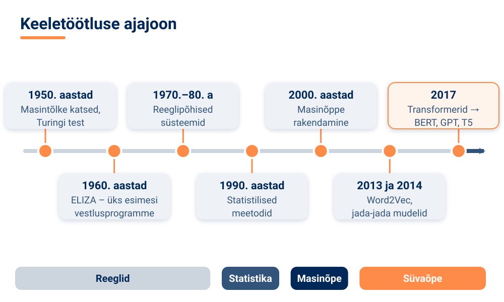
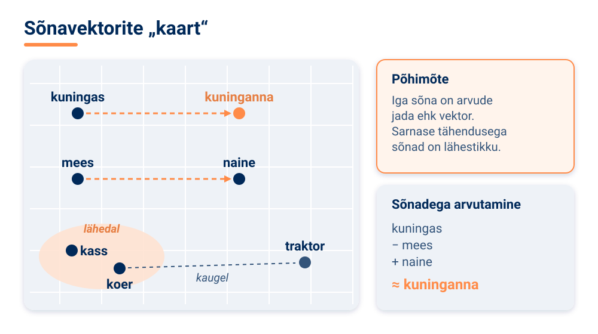
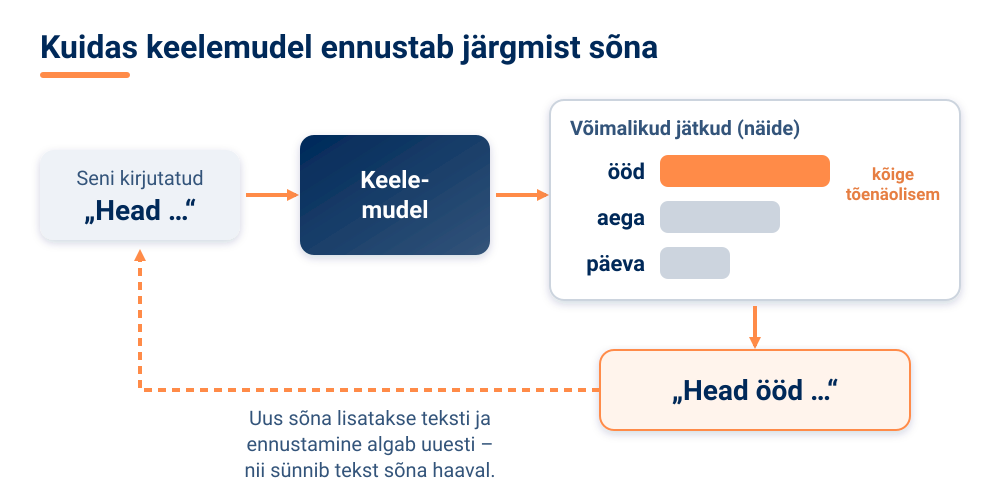

<!--
author:   Maia Lust
email:    
version:  1.2.0
language: et
narrator: Estonian Female
date:     08.10.2026
logo:     ../pildid/pae_logo.png
icon:     ../pildid/pae_logo.png
comment:  Tehisintellekti alused – gümnaasiumi valikkursus (35 tundi), Tallinna Pae Gümnaasium. Õppetekstid, interaktiivsed töölehed ja enesekontrollitestid.
link:     https://fonts.googleapis.com/css2?family=Nunito+Sans:wght@400;600;700&family=Poppins:wght@600;700&family=JetBrains+Mono:wght@400;600&display=swap

@style
/* ==== liascript-theming:start ==== */
/* links: https://fonts.googleapis.com/css2?family=Nunito+Sans:wght@400;600;700&family=Poppins:wght@600;700&family=JetBrains+Mono:wght@400;600&display=swap */
/* theme: Tallinna Pae Gümnaasium — generated by liascript-theming, edit theme.json and rebuild */
:root {
  --theme-font-body: 'Nunito Sans', sans-serif;
  --theme-font-heading: 'Poppins', serif;
  --theme-font-mono: 'JetBrains Mono', monospace;
  --theme-heading-weight: 700;
  --theme-line-height: 1.6;
  --global-font-size: 1.6rem;
  --theme-radius: 0.8rem;
  --theme-radius-small: 0.4rem;
  --theme-radius-large: 1.4rem;
  --theme-shadow: 0 0.3rem 1rem rgba(0,41,89,.10);
}
/* surfaces & text: apply to every color theme */
:root.lia-variant-light {
  --color-background: 255,255,255;
  --color-text: 29,36,51;
  --color-border: 228,229,231;
  --lia-grey-lighter: 238,242,247;
  --lia-grey-light: 204,212,222;
}
:root.lia-variant-dark {
  --color-background: 15,23,36;
  --color-text: 229,232,235;
  --color-border: 49,60,73;
  --lia-grey-dark: 30,38,47;
  --lia-anthracite: 41,50,61;
}
/* accent: only the course theme (default) and the custom radio,
   so readers can still pick LiaScript's built-in color themes */
:root:is(.lia-theme-default, .lia-theme-custom) {
  --color-highlight: 0,41,89;
  --color-highlight-dark: 0,41,89;
}
:root.lia-theme-default {
  --color-highlight-menu: 0,41,89;
}
:root:is(.lia-theme-default, .lia-theme-custom).lia-variant-dark {
  --color-highlight: 47,90,143;
  --color-highlight-dark: 255,185,143;
}
:root.lia-variant-light { --theme-heading-color: #002959; }
:root.lia-variant-dark { --theme-heading-color: #FFB98F; }
/* ==== LiaScript theme adapter (liascript-theming) — keep verbatim ====
   Maps the --theme-* tokens onto LiaScript's CSS. Everything a theme
   changes lives in the token block above this one. */

/* -- fonts: body/mono via the global variables, headings & co. are
      compiled literals in LiaScript and need explicit selectors -- */
:root {
  --global-font-family: var(--theme-font-body);
  --global-font-mono: var(--theme-font-mono);
  --global-font-headline: var(--theme-font-heading);
}
body { line-height: var(--theme-line-height, 1.47); }
h1, h2, h3, .h1, .h2, .h3 {
  font-family: var(--theme-font-heading);
  font-weight: var(--theme-heading-weight, 600);
  letter-spacing: var(--theme-heading-letter-spacing, normal);
  text-transform: var(--theme-heading-transform, none);
  color: var(--theme-heading-color, inherit);
}
h4, h5, h6, .h4, .h5, summary, .lia-accordion__headline {
  font-family: var(--theme-font-subheading, var(--theme-font-body));
}
.lia-quote__text { font-family: var(--theme-font-quote, var(--theme-font-heading)); }
.lia-code, .lia-code--inline, code, kbd, samp, pre { font-family: var(--theme-font-mono); }
.lia-code .ace_editor { font-family: var(--theme-font-mono) !important; }

/* -- shape: radius for controls & surfaces (radio buttons, tags, circles stay) -- */
:is(button, .lia-btn, input, .lia-input, select, .lia-select, textarea, .lia-textarea, .lia-dropdown):not(.lia-radio, .lia-btn--tag, .lia-btn--small-tag),
.lia-code-terminal__input, .lia-pagination__content, .lia-script, .lia-support-menu__submenu {
  border-radius: var(--theme-radius);
}
.lia-checkbox[type='checkbox'], kbd, .lia-tooltip .lia-tooltiptext, .lia-code--inline {
  border-radius: var(--theme-radius-small);
}
details, .lia-quote, .lia-code__input, .lia-table-responsive, .lia-card {
  border-radius: var(--theme-radius-large);
  box-shadow: var(--theme-shadow);
}
.lia-quote, .lia-code__input { overflow: hidden; }
.lia-code__input .ace_editor { border-radius: inherit; }
.lia-support-menu__submenu { box-shadow: var(--theme-shadow-popup, 0 0 1rem rgba(128, 128, 128, 0.2)); }

/* -- dark mode: LiaScript brightens the accent for text via
      rgb(from … calc(r*2.5)), which turns a hand-picked accent into
      pastel/yellow. For the course theme, text-like accent uses take
      --color-highlight-dark (= "accent as text") instead. Scoped to
      default/custom so the built-in color themes keep their behavior. -- */
:root:is(.lia-theme-default, .lia-theme-custom).lia-variant-dark :is(.lia-link, .lia-btn--outline, .lia-code--inline) {
  color: rgb(var(--color-highlight-dark));
  border-color: rgb(var(--color-highlight-dark));
}
:root:is(.lia-theme-default, .lia-theme-custom).lia-variant-dark :is(summary, summary:after, .lia-label, .lia-skip-nav, .lia-support-menu__item, .lia-quote__text),
:root:is(.lia-theme-default, .lia-theme-custom).lia-variant-dark :is(.lia-list--unordered, .lia-list--ordered) > li::marker {
  color: rgb(var(--color-highlight-dark));
}
:root:is(.lia-theme-default, .lia-theme-custom).lia-variant-dark :is(.lia-btn--transparent, .lia-input) {
  filter: none;
}
:root:is(.lia-theme-default, .lia-theme-custom).lia-variant-dark :is(.lia-input, .lia-checkbox[type='checkbox'], .lia-radio[type='radio']):not(:checked, .is-disabled, [disabled]) {
  border-color: rgb(var(--color-highlight-dark));
}
/* alternating table rows: LiaScript uses a neutral grey in dark mode */
:root.lia-variant-dark .lia-table.is-alternating .lia-table__row:nth-child(2n) td,
:root.lia-variant-dark .lia-table-responsive.has-thead-sticky.has-first-col-sticky .is-alternating .lia-table__row:nth-child(2n) td:first-child:before,
:root.lia-variant-dark .lia-table-responsive.has-thead-sticky.has-last-col-sticky .is-alternating .lia-table__row:nth-child(2n) td:last-child:before {
  background-color: rgb(var(--lia-grey-dark));
}
/* -- theme extras -- */
/* ===== Tallinna Pae Gümnaasiumi värvid =====
   tumesinine #002959 · oranž #FF8B48 · tumeoranž #E67E42 */
:root {
  --pae-sinine: #002959;
  --pae-sinine-80: #33547A;
  --pae-sinine-20: #CCD4DE;
  --pae-sinine-08: #EEF2F7;
  --pae-oranz: #FF8B48;
  --pae-oranz-tume: #E67E42;
  --pae-oranz-20: #FFE2D1;
  --pae-oranz-08: #FFF4EC;
  --pae-roheline: #2E8B57;
  --pae-roheline-08: #EAF6EF;
  --pae-lilla: #6B4FA0;
  --pae-lilla-08: #F2EEF9;
}

/* Pealkirjad */
.lia-slide h1, main h1 {
  color: var(--pae-sinine);
  border-bottom: 6px solid var(--pae-oranz);
  padding-bottom: .3em;
}
.lia-slide h2, main h2 { color: var(--pae-sinine); }
.lia-slide h3, main h3 {
  color: var(--pae-sinine);
  border-left: 8px solid var(--pae-oranz);
  padding-left: .5em;
}
.lia-slide h4, main h4 { color: var(--pae-oranz-tume); }
strong { color: inherit; }

/* Tabelid */
.lia-table th, table thead th {
  background: var(--pae-sinine) !important;
  color: #fff !important;
}
.lia-table tbody tr:nth-child(even), table tbody tr:nth-child(even) { background: var(--pae-sinine-08); }

/* Pildid ja infograafikud */
img.lia-image, .lia-figure img, main img {
  border-radius: 12px;
}
.lia-figure__caption, figcaption {
  color: var(--pae-sinine-80);
  font-style: italic;
  text-align: center;
}

/* ASCII-skeemid väiksemaks ja Pae värvidesse */
.lia-ascii svg, lia-ascii svg, .lia-code--ascii svg { max-width: 760px; margin: 0 auto; display: block; }
svg.lia-ascii text { fill: var(--pae-sinine); }

/* ===== Kujunduskastid ===== */
blockquote.pae-moiste, blockquote.pae-naide, blockquote.pae-eesti,
blockquote.pae-motle, blockquote.pae-lisaks, blockquote.pae-fakt,
.pae-moiste, .pae-naide, .pae-eesti, .pae-motle, .pae-lisaks, .pae-fakt {
  border-radius: 14px !important;
  padding: 1.1em 1.4em 1.1em 4.2em !important;
  margin: 1.4em 0 !important;
  position: relative;
  box-shadow: 0 3px 10px rgba(0,41,89,.10);
  font-style: normal !important;
  text-align: left !important;
}
.pae-moiste::before, .pae-naide::before, .pae-eesti::before,
.pae-motle::before, .pae-lisaks::before, .pae-fakt::before {
  position: absolute; left: .7em; top: .75em;
  width: 2em; height: 2em; line-height: 2em;
  border-radius: 50%; text-align: center; font-size: 1.15em;
  color: #fff; font-style: normal;
}
/* Mõiste – oranž */
.pae-moiste { background: var(--pae-oranz-08) !important; border: 2px solid var(--pae-oranz) !important; border-left: 10px solid var(--pae-oranz) !important; }
.pae-moiste::before { content: "📖"; background: var(--pae-oranz); }
/* Näide – tumesinine */
.pae-naide { background: var(--pae-sinine-08) !important; border: 2px solid var(--pae-sinine-20) !important; border-left: 10px solid var(--pae-sinine) !important; }
.pae-naide::before { content: "💡"; background: var(--pae-sinine); }
/* Eesti näide – sinine-valge */
.pae-eesti { background: linear-gradient(135deg, #E8F1FB 0%, #ffffff 100%) !important; border: 2px solid #0072CE !important; border-left: 10px solid #0072CE !important; }
.pae-eesti::before { content: "🇪🇪"; background: #0072CE; }
/* Mõtle järele – roheline */
.pae-motle { background: var(--pae-roheline-08) !important; border: 2px dashed var(--pae-roheline) !important; border-left: 10px solid var(--pae-roheline) !important; }
.pae-motle::before { content: "🤔"; background: var(--pae-roheline); }
/* Tea lisaks – lilla */
.pae-lisaks { background: var(--pae-lilla-08) !important; border: 2px solid #CDBFE6 !important; border-left: 10px solid var(--pae-lilla) !important; }
.pae-lisaks::before { content: "🔍"; background: var(--pae-lilla); }
/* Fakt – tume taust, valge tekst */
.pae-fakt { background: var(--pae-sinine) !important; color: #fff !important; border-left: 10px solid var(--pae-oranz) !important; }
.pae-fakt * { color: #fff !important; }
.pae-fakt::before { content: "⚡"; background: var(--pae-oranz); }

/* Töölehe jaotise riba */
.pae-jaotis { background: var(--pae-sinine); color: #fff !important; padding: .55em 1em; border-radius: 10px; margin: 2em 0 1em; border-left: 10px solid var(--pae-oranz); }
.pae-jaotis * { color: #fff !important; }

/* Ploki kaanepilt */
.pae-kaas img, img.pae-kaas { width: 100%; border-radius: 16px; box-shadow: 0 6px 20px rgba(0,41,89,.18); }

/* Näidisvastuse kokkupandav kast */
details {
  background: var(--pae-oranz-08);
  border: 1px solid var(--pae-oranz);
  border-radius: 10px; padding: .6em 1em; margin: .6em 0 1.4em;
}
details summary { cursor: pointer; font-weight: bold; color: var(--pae-oranz-tume); }

/* Menüü (sisukord) tumesinine */
.lia-toc a, .lia-toc .lia-toc__link, nav.lia-toc a { color: #002959 !important; }
.lia-toc a.lia-active, .lia-toc .lia-active { font-weight: 700; }
:root.lia-variant-dark .lia-toc a { color: #CCD4DE !important; }
:root.lia-variant-dark .pae-moiste, :root.lia-variant-dark .pae-naide, :root.lia-variant-dark .pae-eesti,
:root.lia-variant-dark .pae-motle, :root.lia-variant-dark .pae-lisaks { color: #1d2433 !important; }
:root.lia-variant-dark .pae-moiste *, :root.lia-variant-dark .pae-naide *, :root.lia-variant-dark .pae-eesti *,
:root.lia-variant-dark .pae-motle *, :root.lia-variant-dark .pae-lisaks * { color: #1d2433 !important; }
:root.lia-variant-dark img { background: #fff; }
/* ==== liascript-theming:end ==== */
/* Loosimisnupp (rollimäng) */
output.lia-script[input="submit"] { display:inline-block !important; background:#002959; color:#fff !important; font-weight:700; padding:.6em 1.2em; border-radius:999px; border:3px solid #FF8B48 !important; cursor:pointer; box-shadow:0 3px 10px rgba(0,41,89,.2); }
output.lia-script[input="submit"]:hover { background:#FF8B48; color:#002959 !important; }

@end

@custom
--color-highlight-menu: 255,255,255;
@end
-->

# 3.1 Kuidas tehisintellekt mõistab keelt

### Õpieesmärgid

<!-- class="pae-kaas" -->

Selle tunni järel:

- mõistad, mis on loomuliku keele töötlus ja miks on inimkeel arvutile keeruline;
- tunned keeletöötluse peamisi ülesandeid ja samme, alates teksti sõnadeks jagamisest kuni tähenduse ja konteksti mõistmiseni;
- oskad selgitada, kuidas tekst muudetakse arvudeks (sõnahulgad, TF-IDF, n-grammid, sõnavektorid);
- tead, mis on keelemudel, suur keelemudel ja transformer;
- oskad analüüsida keeletöötluse rakendusi ja väljakutseid, sealhulgas eesti keele eripärasid.

### Mis on loomuliku keele töötlus?

Kui sa kirjutad sõbrale „Kas homme kell 4 kohvikus?", saab ta kohe aru, mida sa mõtled: et kohtute homme pärastlõunal ja et see on küsimus, mitte korraldus. Arvuti jaoks on see lause aga lihtsalt tähemärkide jada. Et arvuti saaks sellest midagi aru, on vaja eraldi teadusvaldkonda.

<!-- class="pae-moiste" -->
> **Mõiste: loomuliku keele töötlus**
>
> Loomuliku keele töötlus (inglise keeles *natural language processing*, lühend NLP) on arvutiteaduse ja tehisintellekti haru, mis tegeleb inimkeele ja arvutite vahelise suhtlusega. Selle eesmärk on võimaldada arvutitel inimkeelt **mõista, tõlgendada ja genereerida** (luua).

Sõna „loomulik" tähendab siin keelt, mida inimesed on omavahel suhtlemiseks loomulikult kasutanud – eesti, inglise, vene, jaapani keelt jne. Sellele vastanduvad tehiskeeled, näiteks programmeerimiskeeled, mille reeglid on täpselt kokku lepitud ja mis ei luba mitmetähenduslikkust.

Miks on inimkeel arvutile nii raske? Põhjuseid on mitu.

**Mitmetähenduslikkus.** Paljudel sõnadel on mitu tähendust. Eesti keeles võib „tee" olla jook, liiklusmaa või käsk („tee kodutöö ära!"). Sõna „pank" võib tähendada nii rahaasutust kui ka kõrget kallast. Inimene valib õige tähenduse konteksti põhjal peaaegu märkamatult, arvuti peab selle eraldi välja arvutama.

**Kontekst.** Lause „Jah, väga tore!" võib olla siiras kiitus või hoopis irooniline pahameel – sõltuvalt sellest, mis enne juhtus. Tähendus ei peitu ainult sõnades, vaid ka olukorras.

**Kultuurilised nüansid.** Väljend „see on mulle hane selga vesi" ei räägi linnust ega veest. Idioomid, viited ja nali on seotud kultuuriga ning neid ei saa sõna-sõnalt tõlgendada.

**Keelte mitmekesisus.** Maailmas on tuhandeid keeli, mille grammatika, sõnajärg ja kirjasüsteem erinevad väga palju. See, mis töötab hästi inglise keele puhul, ei pruugi sobida eesti keelele.

<!-- class="pae-naide" -->
> **Näide: keeletöötlus sinu telefonis**
>
> Juba ühe tavalise päeva jooksul kasutad mitut keeletöötluse rakendust. Klaviatuur pakub sõnumit kirjutades järgmist sõna ja parandab trükivead. E-posti postkast suunab rämpskirjad eraldi kausta. Tõlkerakendus muudab võõrkeelse menüü arusaadavaks. Häälassistent kuulab, mida sa ütled, ja vastab. Kõigi nende taga on loomuliku keele töötlus.

### Keeletöötluse lühiajalugu

Loomuliku keele töötlus ei ole uus valdkond – sellega on tegeldud juba üle seitsmekümne aasta. Areng on liikunud käsitsi kirjutatud reeglitelt statistikani ning sealt masinõppe ja süvaõppeni.

**1950. aastatel** tehti esimesed masintõlke katsed ja Alan Turing pakkus välja oma kuulsa testi: kas arvuti suudab vestelda nii, et inimene ei erista teda teisest inimesest? **1960. aastatel** valmis ELIZA, üks esimesi vestlusprogramme, millest räägime lähemalt tunnis 3.3. **1970.–1980. aastatel** valitsesid **reeglipõhised süsteemid**: keeleteadlased kirjutasid arvutile käsitsi grammatikareeglid ja sõnastikud. See oli väga töömahukas ja süsteemid murdusid, kui keelekasutus reeglitest erines.

**1990. aastatel** tulid **statistilised meetodid**. Reeglite asemel hakati arvutile andma suuri tekstikogusid ja laskma tal arvutada, millised sõnad ja sõnaühendid esinevad koos kõige sagedamini. **2000. aastatel** levis masinõppe kasutamine ning **2010. aastatest** alates algas **süvaõppe revolutsioon**. Tähtsad verstapostid olid Word2Vec (2013), mis õpetas arvutit esitama sõnu arvuvektoritena, jada-jada mudelid (2014), mis suutsid muuta ühe tekstijada teiseks (näiteks lause tõlkeks), ning **transformerid** (2017), mille peale on ehitatud tänapäeva suured keelemudelid.

<!-- class="pae-fakt" -->
> **Kas teadsid?** Loomuliku keele töötlusega on tegeldud juba **üle seitsmekümne aasta**. Juba 1950. aastatel tehti esimesed masintõlke katsed ja Alan Turing pakkus välja oma kuulsa testi.

<!-- class="pae-lisaks" -->
> **Tea lisaks**
>
> Transformeri arhitektuur esitati 2017. aastal teadusartiklis, mille pealkiri on tõlkes „Tähelepanu on kõik, mida vajad" (*Attention Is All You Need*). Selle artikli ideed on aluseks peaaegu kõigile tänapäeval tuntud suurtele keelemudelitele.

### Kuidas arvuti teksti „loeb": keeletöötluse põhiülesanded

Enne kui arvuti saab tekstiga midagi targemat teha, tuleb see ette valmistada. Seda nimetatakse **teksti eeltöötluseks**.

<!-- class="pae-moiste" -->
> **Mõiste: tokeniseerimine**
>
> Tokeniseerimine on teksti jagamine väiksemateks ühikuteks ehk **tokeniteks** – näiteks sõnadeks, lauseteks või sõnaosadeks. Lause „Mari läks kooli." jaguneb tokeniteks „Mari", „läks", „kooli", „.".

<!-- class="pae-moiste" -->
> **Mõiste: lemmatiseerimine**
>
> Lemmatiseerimine on sõnade taandamine nende algvormile ehk **lemmale**. Näiteks sõnad „koolis", „kooli", „koolidest" taandatakse lemmaks „kool". Lihtsam variant on **tüvistamine**, mille puhul lõigatakse sõnalt lihtsalt lõpp ära.

Kolmas eeltöötluse samm on **sõnaliikide märgendamine**: iga sõna juurde märgitakse, kas see on nimisõna, tegusõna, omadussõna jne ning milline on selle grammatiline funktsioon lauses.

Eeltöötlusele järgnevad sügavamad analüüsitasemed:

| Analüüsi tase | Mida tehakse | Näide |
|---|---|---|
| Süntaktiline analüüs | Tuvastatakse lause struktuur ja sõnadevahelised sõltuvused | Lauses „Kass sõi hiire" on „kass" alus ja „hiire" sihitis |
| Semantiline analüüs | Püütakse mõista tähendust ja muuta see üheseks | „Pank" lauses „istusime jõe pangal" tähendab kallast |
| Pragmaatiline analüüs | Arvestatakse konteksti ja tuvastatakse kavatsus | „Kas sa saaksid akna sulgeda?" on palve, mitte küsimus võimekuse kohta |

Tüüpilist keeletöötluse töövoogu võib kujutada nii:

### Kuidas tekst muudetakse arvudeks

Arvuti oskab arvutada ainult arvudega. Seepärast tuleb iga tekst muuta arvuliseks esituseks. Selleks on aja jooksul välja töötatud mitu meetodit.

**Sõnahulk** (inglise keeles *bag of words*) on kõige lihtsam meetod. Tekst kujutatakse justkui kotina, kuhu on visatud kõik selle sõnad, ja loendatakse, mitu korda iga sõna esineb. Meetod on lihtne, kuid **kaotab sõnade järjekorra**: laused „koer hammustas meest" ja „mees hammustas koera" näevad välja täpselt ühesugused.

**TF-IDF** (inglise keeles *term frequency – inverse document frequency*) hindab, **kui oluline** on sõna konkreetses dokumendis. Sõna saab kõrge kaalu, kui see esineb antud tekstis sageli, aga teistes tekstides harva. Sõnad nagu „ja" või „on" esinevad kõikjal ega ütle teksti sisu kohta midagi, aga kui sõna „fotosüntees" kordub ühes tekstis palju, on see tõenäoliselt bioloogiatekst.

**N-grammid** on järjestikused sõnad või tähed. Näiteks kahesõnalised ühendid (bigrammid) lausest „mulle meeldib matemaatika" on „mulle meeldib" ja „meeldib matemaatika". N-grammid säilitavad osaliselt sõnade järjekorda ja konteksti.

<!-- class="pae-moiste" -->
> **Mõiste: sõnavektor**
>
> Sõnavektor (inglise keeles *word embedding*) on sõna esitus arvude jadana ehk vektorina. Vektorid on loodud nii, et **tähenduselt sarnased sõnad asuvad vektorruumis üksteise lähedal**. Näiteks „kass" ja „koer" on lähestikku, „kass" ja „traktor" kaugel. Tuntud meetodid sõnavektorite loomiseks on Word2Vec, GloVe ja FastText.

Sõnavektorid on oluline edasiminek, sest need säilitavad sõnadevahelisi tähendusseoseid. Kuulus näide näitab, et vektoritega saab isegi „arvutada": kui võtta sõna „kuningas" vektor, lahutada sellest „mees" ja liita „naine", jõutakse vektorini, mis on lähedal sõnale „kuninganna".

Sõnavektoritel on siiski üks puudus: igal sõnal on ainult üks vektor. Sõna „tee" saab sama esituse nii lauses „joon teed" kui ka „kõnnin mööda teed". Selle probleemi lahendavad **kontekstuaalsed esitused** (näiteks mudelid BERT ja ELMo), kus sõna arvuline esitus sõltub sellest, millised sõnad on tema ümber. Nii saab „tee" erinevates lausetes erineva esituse.

<!-- class="pae-motle" -->
> **Mõtle järele!**
>
> Miks ei sobi sõnahulga meetod hästi selleks, et otsustada, kas filmiarvustus on positiivne või negatiivne? Mõtle lausetele „Film ei olnud üldse hea, vaid suurepärane" ja „Film oli hea? Ei, üldse mitte." Mida kaotab arvuti, kui ta loendab ainult sõnu?

### Keelemudelid ja transformerid

<!-- class="pae-moiste" -->
> **Mõiste: keelemudel**
>
> Keelemudel on statistiline või tehisintellektil põhinev mudel, mis **ennustab sõnade tõenäosuslikku järjestust**: milline sõna tuleb tõenäoliselt järgmisena ja kui tõenäoline on terve lause.

Kõige lihtsam keelemudel on sinu telefoni klaviatuuris. Kui kirjutad „Head", pakub see järgmiseks sõnaks „ööd" või „aega", sest need järgnevad sõnale „head" kõige sagedamini. Keelemudelite eesmärgid on järgmise sõna ennustamine, lause tõenäosuse hindamine, teksti genereerimine ja keele mõistmine.

Keelemudeleid on kolme põhitüüpi:

| Tüüp | Kuidas töötab | Näited |
|---|---|---|
| Statistilised keelemudelid | Loendavad, kui sageli sõnad koos esinevad | n-grammimudelid |
| Närvivõrgupõhised keelemudelid | Närvivõrk loeb teksti sõna-sõnalt järjest | RNN, LSTM |
| Transformeripõhised keelemudelid | Vaatavad kogu teksti korraga ja kasutavad tähelepanumehhanismi | GPT, BERT |

**Transformer** on 2017. aastal esitatud närvivõrgu arhitektuur. Selle kõige olulisem osa on **tähelepanumehhanism** (inglise keeles *attention*, täpsemalt *self-attention* ehk enesetähelepanu).

<!-- class="pae-moiste" -->
> **Mõiste: tähelepanumehhanism**
>
> Tähelepanumehhanism on meetod, mis aitab keelemudelil **keskenduda teksti olulistele sõnadele** ja modelleerida sõnadevahelisi seoseid. Iga sõna puhul arvutab mudel, millised teised sõnad lauses on selle mõistmiseks kõige tähtsamad.

Vaata lauset: „Mari pani raamatu kotti, sest **see** oli raske." Mille kohta käib „see" – raamatu või koti? Tähelepanumehhanism aitab mudelil seostada sõna „see" teiste lause sõnadega ja leida tõenäoliseima vaste. Varasemad mudelid (RNN, LSTM) lugesid teksti sõna-sõnalt järjest ega suutnud pikkades tekstides kaugete sõnade seoseid hästi meeles pidada. Transformer töötleb kõiki sõnu **paralleelselt** ehk korraga ja kasutab **positsioonikodeerimist**, et teada, millises järjekorras sõnad on. Tänu sellele on transformerid kiiremad treenida, annavad paremaid tulemusi ja neid saab skaleerida ehk teha väga suureks.

<!-- class="pae-moiste" -->
> **Mõiste: suur keelemudel**
>
> Suur keelemudel (inglise keeles *large language model*, LLM) on väga suur, tavaliselt transformeril põhinev keelemudel, mis on treenitud tohutul hulgal tekstiandmetel ja suudab mõista ning genereerida inimesesarnast teksti.

Suured keelemudelid valmivad kahes etapis. Esmalt toimub **eeltreenimine** (*pre-training*): mudel õpib tohutul tekstikogul ehk **korpusel** üldisi keelestruktuure ja seoseid. Seejärel tehakse **peenhäälestamine** (*fine-tuning*): eeltreenitud mudelit treenitakse täiendavalt väiksema andmekogumiga konkreetse ülesande jaoks, näiteks vestlemiseks.

Kaks tuntud mudeliperet esindavad erinevaid lähenemisi:

- **GPT** (*Generative Pre-trained Transformer*) on **autoregressiivne** mudel: see ennustab alati järgmist sõna eelnevate põhjal. GPT-mudeleid on aastate jooksul ilmunud mitu versiooni (GPT, GPT-2, GPT-3, GPT-4 jt).
- **BERT** (*Bidirectional Encoder Representations from Transformers*) on **kahesuunaline** mudel. Seda treeniti nii, et lausest peideti ehk maskeeriti mõni sõna ja mudel pidi selle ära arvama, vaadates sõnu nii enne kui ka pärast lünka. Nii õpib BERT konteksti mõistma mõlemas suunas.

Lisaks neile on loodud palju teisi mudeleid, näiteks T5, LaMDA, PaLM ja Claude. Suured keelemudelid suudavad genereerida teksti, vastata küsimustele, teha kokkuvõtteid, tõlkida ja isegi programmikoodi kirjutada. Kõik need oskused on samast põhimõttest välja kasvanud: mudel on õppinud väga hästi ennustama, milline tekst sobib eelneva teksti järele.

<!-- class="pae-motle" -->
> **Mõtle järele!**
>
> Kas keelemudel **mõistab** teksti samamoodi nagu sina? Keelemudel tuvastab tekstis statistilisi mustreid ja sõnadevahelisi seoseid ning oskab nende põhjal genereerida asjakohast teksti. Kuid tal ei ole kogemusi maailmast: ta pole kunagi teed joonud ega jõe kaldal istunud. Kas sellist „mõistmist" saab nimetada päris mõistmiseks? Mis sinu arvates on mõistmise juures kõige olulisem?

Keeletöötlust kasutatakse paljudes rakendustes. **Masintõlge** (nt Google Translate, DeepL) võimaldab tõlkida isegi reaalajas. **Vestlusrobotid** aitavad klienditeeninduses, töötavad virtuaalsete assistentidena ja õppevahenditena. **Teksti analüüs** hõlmab meelestatuse analüüsi, teemade modelleerimist ja nimeüksuste tuvastamist. **Teksti genereerimist** kasutatakse sisuloomes, kokkuvõtete tegemisel ja loovkirjutamises. Neid rakendusi uurime lähemalt järgmistes tundides.

### Keeletöötlus eesti keeles ja valdkonna väljakutsed

Eesti keel on keeletöötluse jaoks paras pähkel. Põhjusi on kolm.

**Väike keeleressursside hulk.** Eesti keelt räägib umbes miljon inimest. Eestikeelset teksti, mille peal mudeleid treenida, on palju vähem kui inglise keeles.

**Keerukas morfoloogia.** Morfoloogia on keeleteaduse osa, mis uurib sõnade vormimist. Eesti keeles on 14 käänet ning ühest sõnast saab moodustada kümneid vorme: „maja, maja, maja, majja, majas, majast, majale, majal, majalt …" Inglise keeles oleks enamiku nende asemel eessõnaga ühend („in the house", „from the house"). Seepärast on eesti keele puhul lemmatiseerimine eriti tähtis.

<!-- class="pae-fakt" -->
> **Kas teadsid?** Eesti keeles on **14 käänet** ja ühest sõnast saab moodustada **kümneid vorme**. Samal ajal räägib eesti keelt vaid umbes miljon inimest – seepärast on eestikeelset treeningteksti palju vähem kui inglise keeles.

**Vaba sõnajärg.** Eesti keeles võib öelda „Mari luges raamatut", „Raamatut luges Mari" või „Luges Mari raamatut" – tähendus jääb põhiliselt samaks. Mudel ei saa seetõttu nii palju toetuda sõnade asukohale lauses kui näiteks inglise keeles.

<!-- class="pae-eesti" -->
> **Eesti näide: eesti keele tööriistad**
>
> Eesti keeleteadlased ja arvutiteadlased on loonud eesti keele töötlemiseks mitu tööriista. **Eesti keele korpused** on suured eestikeelsete tekstide kogud, mille peal mudeleid treenitakse. **EstNLTK** (*Natural Language Toolkit for Estonian*) on tööriistakomplekt eestikeelse teksti analüüsimiseks: see oskab näiteks teksti sõnadeks jagada, sõnu lemmatiseerida ja sõnaliike määrata. **EstBERT** on spetsiaalselt eesti keele jaoks treenitud BERT-mudel. Nende abil on loodud eesti keele õigekirjakontroll, masintõlge, kõnesüntees, kõnetuvastus ja tekstianalüüsi vahendid.

Keeletöötlusel on ka üldisi väljakutseid, mis puudutavad kõiki keeli:

- **Mitmetähenduslikkus** – homonüümid (samakujulised, aga erineva tähendusega sõnad) ja polüseemia (ühe sõna mitu seotud tähendust) nõuavad konteksti mõistmist.
- **Maailmateadmised** – inimene kasutab keelt mõistes palju taustateadmisi ja tervet mõistust. Lause „Kass ei mahtunud kasti, sest see oli liiga väike" puhul tead sa kohe, et väike oli kast, mitte kass.
- **Keelte mitmekesisus** – erinevad grammatikad ja kultuurilised eripärad.
- **Eetilised küsimused** – mudelid võivad treeningandmetest üle võtta **kallutatust** ja stereotüüpe, ohustada privaatsust ning genereerida valeinformatsiooni.

Tulevikus liigub keeletöötlus mitmes suunas. **Mitmekeelsed mudelid** püüavad ühe mudeliga katta kõiki keeli, nii et suurest keelest õpitud teadmised kanduvad üle ka väiksematele keeltele. **Multimodaalsed mudelid** töötlevad korraga teksti, pilti, heli ja videot. **Vähem andmeid vajavad mudelid** suudavad õppida mõne näite (*few-shot*) või isegi ilma näideteta (*zero-shot*) – see on eriti oluline väiksemate keelte jaoks. Üha tähtsamaks muutub ka **selgitatavus**: soov, et mudelid oleksid läbipaistvamad ja nende väljundit saaks paremini kontrollida.

<!-- class="pae-motle" -->
> **Mõtle järele!**
>
> Kuidas on keeletöötlus muutnud seda, kuidas sina tehnoloogiaga suhtled? Ja mida saaks teha, et eesti keele tehnoloogia oleks sama hea kui inglise keele oma? Kes peaks selle eest vastutama – riik, ülikoolid, ettevõtted või hoopis keelekasutajad ise?

### Kokkuvõte ja põhimõisted

**Pea meeles**

- Loomuliku keele töötlus on TI haru, mis võimaldab arvutitel inimkeelt mõista, tõlgendada ja genereerida. Keel on arvutile raske mitmetähenduslikkuse, konteksti, kultuuriliste nüansside ja keelte mitmekesisuse tõttu.
- Keeletöötlus on arenenud reeglipõhistest süsteemidest statistiliste meetodite ja masinõppe kaudu süvaõppe ning suurte keelemudeliteni.
- Enne analüüsi tekst eeltöödeldakse (tokeniseerimine, lemmatiseerimine, sõnaliikide märgendamine) ja muudetakse arvudeks (sõnahulk, TF-IDF, n-grammid, sõnavektorid, kontekstuaalsed esitused).
- Keelemudel ennustab sõnade tõenäosuslikku järjestust. Transformerid ja tähelepanumehhanism (2017) muutsid keeletöötluse põhjalikult ning on suurte keelemudelite aluseks.
- Keelemudelid ei mõista teksti nagu inimesed – nad tuvastavad statistilisi mustreid.
- Eesti keele töötlemist raskendavad väike keeleressursside hulk, keerukas morfoloogia ja vaba sõnajärg; abiks on näiteks EstNLTK ja EstBERT.

| Mõiste | Tähendus |
|---|---|
| Loomuliku keele töötlus | TI haru, mis tegeleb inimkeele ja arvutite vahelise suhtlusega |
| Tokeniseerimine | Teksti jagamine väiksemateks ühikuteks (sõnadeks, lauseteks, sõnaosadeks) |
| Lemmatiseerimine | Sõnade taandamine algvormile ehk lemmale |
| Sõnaliikide märgendamine | Sõnade grammatilise funktsiooni määramine lauses |
| Sõnahulk | Teksti esitus sõnade esinemissagedustena, sõnade järjekord läheb kaotsi |
| TF-IDF | Meetod, mis hindab sõna olulisust dokumendis teiste dokumentidega võrreldes |
| Sõnavektor | Sõna esitus arvuvektorina, kus sarnase tähendusega sõnad on lähestikku |
| Keelemudel | Mudel, mis ennustab sõnade tõenäosuslikku järjestust |
| Transformer | 2017. aastal loodud närvivõrgu arhitektuur, mis kasutab tähelepanumehhanismi ja töötleb teksti paralleelselt |
| Tähelepanumehhanism | Meetod, mis aitab mudelil keskenduda olulistele sõnadele ja nende seostele |
| Suur keelemudel | Tohutul tekstihulgal treenitud keelemudel, mis suudab genereerida inimesesarnast teksti |
| Eeltreenimine ja peenhäälestamine | Üldine treenimine suurel korpusel ning sellele järgnev täiendav treenimine konkreetse ülesande jaoks |

### Tööleht 3.1

<!-- class="pae-jaotis" -->
**I. Loomuliku keele töötluse põhimõisted**

**Ülesanne 1.** Selgita oma sõnadega, mis on loomuliku keele töötlus.

[[___ ___ ___]]

**Ülesanne 2.** Ühenda loomuliku keele töötluse mõisted nende definitsioonidega.

| Täht | Kirjeldus |
|:---:|---|
| **A** | Sõnade taandamine nende algvormile või tüvele |
| **B** | Teksti jagamine väiksemateks ühikuteks (sõnadeks, lauseteks) |
| **C** | Sõnade esitamine arvuliste vektoritena, mis peegeldavad nende tähendust |
| **D** | Sõnade grammatilise funktsiooni määramine lauses |
| **E** | Lause grammatilise struktuuri määramine |

- [ (A) (B) (C) (D) (E) ]
- [ ( ) (X) ( ) ( ) ( ) ] Tokeniseerimine
- [ (X) ( ) ( ) ( ) ( ) ] Lemmatiseerimine
- [ ( ) ( ) ( ) (X) ( ) ] Sõnaliikide märgendamine
- [ ( ) ( ) (X) ( ) ( ) ] Sõnavektorid
- [ ( ) ( ) ( ) ( ) (X) ] Süntaktiline analüüs
****************************************
Tokeniseerimine jagab teksti tokeniteks (B), lemmatiseerimine taandab sõna algvormile (A), sõnaliikide märgendamine määrab sõna grammatilise funktsiooni (D), sõnavektorid esitavad sõnu arvudena (C) ja süntaktiline analüüs määrab lause struktuuri (E).
****************************************

<!-- class="pae-jaotis" -->
**II. Keele esitamine arvutitele**

**Ülesanne 3.** Kirjelda lühidalt järgmisi teksti esitamise meetodeid.

**a) Sõnahulk (bag of words):**

[[___ ___]]

**b) TF-IDF:**

[[___ ___]]

**c) Sõnavektorid (word embeddings):**

[[___ ___]]

**d) Kontekstuaalsed esitused:**

[[___ ___]]

**Ülesanne 4.** Miks on sõnavektorid paremad kui lihtsad sõnahulgad? Nimeta vähemalt kolm põhjust.

[[___ ___ ___ ___]]

<!-- class="pae-jaotis" -->
**III. Keelemudelid**

**Ülesanne 5.** Mis on keelemudelid ja milleks neid kasutatakse?

[[___ ___ ___]]

**Ülesanne 6.** Täida tabel erinevate keelemudelite kohta.

| Keelemudelite tüüp | Kirjeldus | Näited | Eelised/puudused |
|---|---|---|---|
| Statistilised keelemudelid | | | |
| Närvivõrgupõhised keelemudelid | | | |
| Transformeripõhised keelemudelid | | | |

Kirjuta iga rea kohta kirjeldus, näited ning eelised ja puudused.

**Statistilised keelemudelid:**

[[___ ___]]

**Närvivõrgupõhised keelemudelid:**

[[___ ___]]

**Transformeripõhised keelemudelid:**

[[___ ___]]

**Ülesanne 7.** Selgita lühidalt, kuidas töötab transformeri arhitektuur.

[[___ ___ ___ ___]]

<!-- class="pae-jaotis" -->
**IV. Suured keelemudelid**

**Ülesanne 8.** Mis on suured keelemudelid ja kuidas need erinevad varasematest keelemudelitest?

[[___ ___ ___ ___]]

**Ülesanne 9.** Võrdle järgmisi suuri keelemudeleid. Otsi vajadusel lisainfot veebist.

| Mudel | Arendaja | Peamised omadused | Rakendused |
|---|---|---|---|
| GPT (erinevad versioonid) | | | |
| BERT | | | |
| LaMDA | | | |
| Claude | | | |

Kirjuta iga mudeli kohta arendaja, peamised omadused ja rakendused.

**GPT:**

[[___ ___]]

**BERT:**

[[___ ___]]

**LaMDA:**

[[___ ___]]

**Claude:**

[[___ ___]]

**Ülesanne 10.** Millised on suurte keelemudelite peamised võimekused ja piirangud?

**Võimekused:**

[[___ ___ ___]]

**Piirangud:**

[[___ ___ ___]]

<!-- class="pae-jaotis" -->
**V. Loomuliku keele töötluse rakendused**

**Ülesanne 11.** Kirjelda lühidalt järgmisi loomuliku keele töötluse rakendusi.

**a) Masintõlge:**

[[___ ___]]

**b) Vestlusrobotid:**

[[___ ___]]

**c) Meelestatuse analüüs:**

[[___ ___]]

**d) Teksti kokkuvõtmine:**

[[___ ___]]

**e) Teksti genereerimine:**

[[___ ___]]

**Ülesanne 12.** Vali üks loomuliku keele töötluse rakendus ja kirjelda selle tööpõhimõtet põhjalikumalt.

[[___ ___ ___ ___ ___]]

<!-- class="pae-jaotis" -->
**VI. Praktiline ülesanne**

**Ülesanne 13.** Vali üks kahest variandist.

**Variant A: keelemudelite testimine.** Testi mõnda avalikult kättesaadavat keelemudelit või vestlusrobotit (nt ChatGPT, Gemini, Claude) ja analüüsi selle võimekusi. Ära sisesta vestlusrobotisse oma isikuandmeid.

**a) Valitud keelemudel(id):**

[[___]]

**b) Milliseid ülesandeid andsid mudelile lahendada?**

[[___ ___ ___]]

**c) Kuidas mudel nende ülesannetega hakkama sai?**

[[___ ___ ___]]

**d) Millised olid mudeli tugevused ja nõrkused?**

[[___ ___ ___]]

**Variant B: eesti keele analüüs.** Analüüsi eesti keele eripärasid loomuliku keele töötluse seisukohast.

**a) Millised eesti keele omadused teevad selle töötlemise keeruliseks?**

[[___ ___ ___]]

**b) Millised eesti keele töötlemise vahendid ja ressursid on olemas?**

[[___ ___ ___]]

**c) Kuidas saaks eesti keele töötlemist tehisintellekti abil parandada?**

[[___ ___ ___]]

<!-- class="pae-jaotis" -->
**VII. Loomuliku keele töötluse väljakutsed**

**Ülesanne 14.** Millised on loomuliku keele töötluse peamised väljakutsed? Kirjelda vähemalt nelja.

[[___ ___ ___ ___ ___]]

**Ülesanne 15.** Kuidas mõjutavad keelelised ja kultuurilised erinevused loomuliku keele töötlust?

[[___ ___ ___ ___]]

<!-- class="pae-jaotis" -->
**VIII. Arutelu**

**Ülesanne 16.** Kuidas on keelemudelid muutnud meie suhtlemist tehnoloogiaga ja milliseid muutusi võib oodata tulevikus?

[[___ ___ ___ ___]]

**Ülesanne 17.** Millised on loomuliku keele töötluse eetilised aspektid ja kuidas nendega tegeleda?

[[___ ___ ___ ___]]

### Enesekontroll 3.1

**1. Kuidas nimetatakse sõnade taandamist nende algvormile, nt „koolidest" → „kool"? Kirjuta vastus.**

[[lemmatiseerimine]]

****************************************
Õige vastus: **lemmatiseerimine**. Sõnad „koolis", „kooli" ja „koolidest" taandatakse lemmaks „kool". Eesti keele rohkete sõnavormide tõttu on see samm eriti tähtis.
****************************************

**2. Lause „Mari läks kooli." jagatakse tokeniteks nii, et ka punkt on eraldi token. Mitu tokenit saadakse? Kirjuta arv.**

[[4]]

****************************************
Tokenid on „Mari", „läks", „kooli" ja „.", kokku **4**.
****************************************

**3. Lohista sõnad õigetesse lünkadesse.**

<!-- data-show-partial-solution -->
Keeletöötluse areng on liikunud käsitsi kirjutatud [->[ (reeglitelt) | piltidelt ]] statistikani ning sealt masinõppe ja [->[ (süvaõppeni) ]]. 2017. aastal esitatud [->[ (transformer) | kalkulaator ]] kasutab [->[ (tähelepanumehhanismi) ]] ja töötleb sõnu [->[ (paralleelselt) ]] ehk korraga.
****************************************
Keeletöötlus on arenenud reeglipõhistest süsteemidest statistiliste meetodite ja masinõppe kaudu süvaõppeni. Transformer (2017) kasutab tähelepanumehhanismi ja töötleb kõiki sõnu paralleelselt, mitte ainult sõna-sõnalt järjest.
****************************************

**4. Millise teksti arvuks muutmise meetodiga on tegu?**

- [ (Sõnahulk) (TF-IDF) (N-grammid) (Sõnavektor) ]
- [ (X) ( ) ( ) ( ) ] Loendab ainult, mitu korda iga sõna esineb, ja kaotab sõnade järjekorra.
- [ ( ) ( ) ( ) (X) ] Tähenduselt sarnased sõnad, nt „kass" ja „koer", asuvad vektorruumis lähestikku.
- [ ( ) (X) ( ) ( ) ] Sõna saab kõrge kaalu, kui see esineb antud tekstis sageli, aga teistes tekstides harva.
- [ ( ) ( ) (X) ( ) ] Lausest „mulle meeldib matemaatika" moodustatakse ühendid „mulle meeldib" ja „meeldib matemaatika".
****************************************
Sõnahulk loendab sõnade esinemissagedusi. TF-IDF hindab, kui oluline on sõna konkreetses dokumendis. N-grammid on järjestikused sõnad ja säilitavad osaliselt sõnade järjekorda. Sõnavektorid säilitavad sõnadevahelisi tähendusseoseid.
****************************************

**5. Pane keeletöötluse tüüpilise töövoo sammud õigesse järjekorda.**

<!-- data-show-partial-solution -->
Tokeniseerimine: [[ 1 | (2) | 3 | 4 | 5 | 6 ]] 
Keelemudeli rakendamine: [[ 1 | 2 | 3 | 4 | (5) | 6 ]] 
Teksti kogumine ja eeltöötlus: [[ (1) | 2 | 3 | 4 | 5 | 6 ]] 
Tulemuste analüüs: [[ 1 | 2 | 3 | 4 | 5 | (6) ]] 
Lemmatiseerimine: [[ 1 | 2 | (3) | 4 | 5 | 6 ]] 
Sõnavektorite loomine: [[ 1 | 2 | 3 | (4) | 5 | 6 ]]
****************************************
Õige järjekord: 1. teksti kogumine ja eeltöötlus → 2. tokeniseerimine → 3. lemmatiseerimine → 4. sõnavektorite loomine → 5. keelemudeli rakendamine → 6. tulemuste analüüs.
****************************************

**6. Mis on tähelepanumehhanism keelemudelites?**

- [(X)] Meetod, mis aitab mudelil keskenduda teatud sõnadele või fraasidele tekstis
- [( )] Tehnika, mis hoiab kasutaja tähelepanu vestlusrobotiga suhtlemisel
- [( )] Algoritm, mis mõõdab kasutaja tähelepanu keeleõppe ajal
- [( )] Süsteem, mis tuvastab, kui kasutaja ei pööra tähelepanu
****************************************
Tähelepanumehhanism on transformeri põhiosa. See aitab mudelil leida, millised sõnad on iga sõna mõistmiseks kõige olulisemad, ja modelleerida sõnadevahelisi seoseid.
****************************************

**7. Millised väited on õiged? (Vali kõik õiged.)**

- [[X]] Transformer töötleb teksti sõnu paralleelselt, mitte ainult ükshaaval järjest.
- [[ ]] Keelemudelid mõistavad teksti täpselt samamoodi nagu inimesed.
- [[X]] Eesti keele töötlemist raskendavad keerukas morfoloogia ja vaba sõnajärg.
- [[X]] Kontekstuaalses esituses sõltub sõna arvuline esitus sõna ümbrusest lauses.
- [[ ]] Esimesed keeletöötluse katsed tehti alles 2010. aastatel.
****************************************
Transformer töötleb sõnu paralleelselt ja kontekstuaalsetes esitustes (nt BERT) sõltub sõna esitus kontekstist. Eesti keele töötlemist raskendavad ka morfoloogia ja vaba sõnajärg. Keelemudelid tuvastavad statistilisi mustreid ega mõista teksti nagu inimene. Keeletöötlusega on tegeldud juba alates 1950. aastatest.
****************************************

**8. Selgita oma sõnadega, miks on eesti keele töötlemine arvutile keerulisem kui inglise keele töötlemine. Too vähemalt kaks põhjust.**

[[___ ___ ___]]

Vaata näidisvastust

Eesti keelt räägib vaid umbes miljon inimest, seega on eestikeelset teksti, mille peal mudeleid treenida, palju vähem kui inglise keeles. Eesti keeles on keerukas morfoloogia: 14 käänet ja ühest sõnast kümneid vorme, mistõttu tuleb sõnu lemmatiseerida. Lisaks on eesti keeles vaba sõnajärg, nii et mudel ei saa nii palju toetuda sõnade asukohale lauses.

