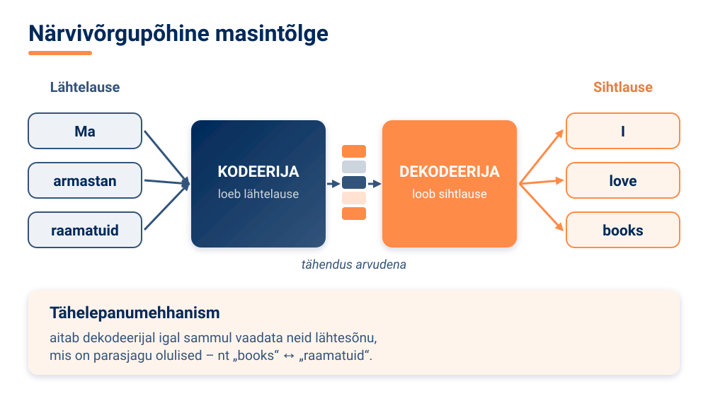
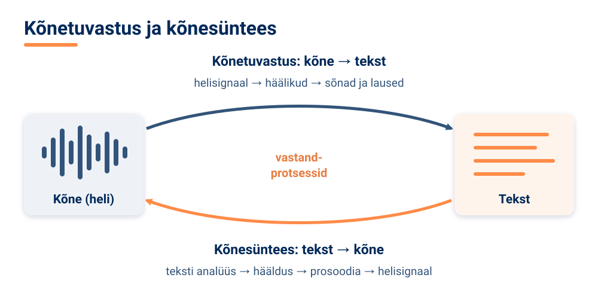
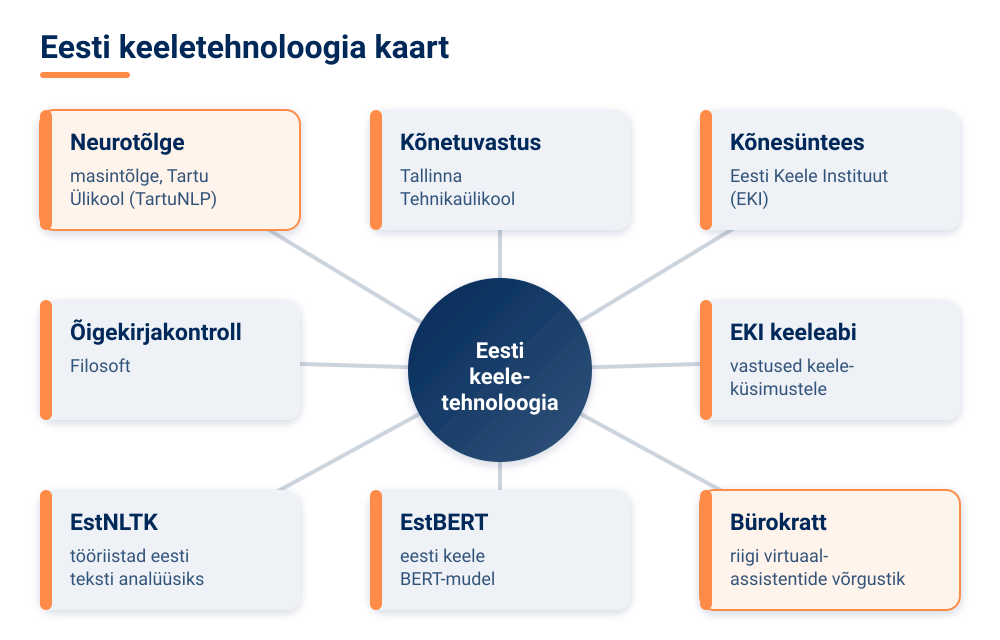

<!--
author:   Maia Lust
email:    
version:  1.3.0
language: et
narrator: Estonian Female
date:     08.10.2026
logo:     ../pildid/pae_logo.png
icon:     ../pildid/pae_logo.png
comment:  Tehisintellekti alused – gümnaasiumi valikkursus (35 tundi), Tallinna Pae Gümnaasium. Õppetekstid, interaktiivsed töölehed ja enesekontrollitestid.
link:     https://fonts.googleapis.com/css2?family=Nunito+Sans:wght@400;600;700&family=Poppins:wght@600;700&family=JetBrains+Mono:wght@400;600&display=swap

@style
/* ==== liascript-theming:start ==== */
/* links: https://fonts.googleapis.com/css2?family=Nunito+Sans:wght@400;600;700&family=Poppins:wght@600;700&family=JetBrains+Mono:wght@400;600&display=swap */
/* theme: Tallinna Pae Gümnaasium — generated by liascript-theming, edit theme.json and rebuild */
:root {
  --theme-font-body: 'Nunito Sans', sans-serif;
  --theme-font-heading: 'Poppins', serif;
  --theme-font-mono: 'JetBrains Mono', monospace;
  --theme-heading-weight: 700;
  --theme-line-height: 1.6;
  --global-font-size: 1.6rem;
  --theme-radius: 0.8rem;
  --theme-radius-small: 0.4rem;
  --theme-radius-large: 1.4rem;
  --theme-shadow: 0 0.3rem 1rem rgba(0,41,89,.10);
}
/* surfaces & text: apply to every color theme */
:root.lia-variant-light {
  --color-background: 255,255,255;
  --color-text: 29,36,51;
  --color-border: 228,229,231;
  --lia-grey-lighter: 238,242,247;
  --lia-grey-light: 204,212,222;
}
:root.lia-variant-dark {
  --color-background: 15,23,36;
  --color-text: 229,232,235;
  --color-border: 49,60,73;
  --lia-grey-dark: 30,38,47;
  --lia-anthracite: 41,50,61;
}
/* accent: only the course theme (default) and the custom radio,
   so readers can still pick LiaScript's built-in color themes */
:root:is(.lia-theme-default, .lia-theme-custom) {
  --color-highlight: 0,41,89;
  --color-highlight-dark: 0,41,89;
}
:root.lia-theme-default {
  --color-highlight-menu: 0,41,89;
}
:root:is(.lia-theme-default, .lia-theme-custom).lia-variant-dark {
  --color-highlight: 47,90,143;
  --color-highlight-dark: 255,185,143;
}
:root.lia-variant-light { --theme-heading-color: #002959; }
:root.lia-variant-dark { --theme-heading-color: #FFB98F; }
/* ==== LiaScript theme adapter (liascript-theming) — keep verbatim ====
   Maps the --theme-* tokens onto LiaScript's CSS. Everything a theme
   changes lives in the token block above this one. */

/* -- fonts: body/mono via the global variables, headings & co. are
      compiled literals in LiaScript and need explicit selectors -- */
:root {
  --global-font-family: var(--theme-font-body);
  --global-font-mono: var(--theme-font-mono);
  --global-font-headline: var(--theme-font-heading);
}
body { line-height: var(--theme-line-height, 1.47); }
h1, h2, h3, .h1, .h2, .h3 {
  font-family: var(--theme-font-heading);
  font-weight: var(--theme-heading-weight, 600);
  letter-spacing: var(--theme-heading-letter-spacing, normal);
  text-transform: var(--theme-heading-transform, none);
  color: var(--theme-heading-color, inherit);
}
h4, h5, h6, .h4, .h5, summary, .lia-accordion__headline {
  font-family: var(--theme-font-subheading, var(--theme-font-body));
}
.lia-quote__text { font-family: var(--theme-font-quote, var(--theme-font-heading)); }
.lia-code, .lia-code--inline, code, kbd, samp, pre { font-family: var(--theme-font-mono); }
.lia-code .ace_editor { font-family: var(--theme-font-mono) !important; }

/* -- shape: radius for controls & surfaces (radio buttons, tags, circles stay) -- */
:is(button, .lia-btn, input, .lia-input, select, .lia-select, textarea, .lia-textarea, .lia-dropdown):not(.lia-radio, .lia-btn--tag, .lia-btn--small-tag),
.lia-code-terminal__input, .lia-pagination__content, .lia-script, .lia-support-menu__submenu {
  border-radius: var(--theme-radius);
}
.lia-checkbox[type='checkbox'], kbd, .lia-tooltip .lia-tooltiptext, .lia-code--inline {
  border-radius: var(--theme-radius-small);
}
details, .lia-quote, .lia-code__input, .lia-table-responsive, .lia-card {
  border-radius: var(--theme-radius-large);
  box-shadow: var(--theme-shadow);
}
.lia-quote, .lia-code__input { overflow: hidden; }
.lia-code__input .ace_editor { border-radius: inherit; }
.lia-support-menu__submenu { box-shadow: var(--theme-shadow-popup, 0 0 1rem rgba(128, 128, 128, 0.2)); }

/* -- dark mode: LiaScript brightens the accent for text via
      rgb(from … calc(r*2.5)), which turns a hand-picked accent into
      pastel/yellow. For the course theme, text-like accent uses take
      --color-highlight-dark (= "accent as text") instead. Scoped to
      default/custom so the built-in color themes keep their behavior. -- */
:root:is(.lia-theme-default, .lia-theme-custom).lia-variant-dark :is(.lia-link, .lia-btn--outline, .lia-code--inline) {
  color: rgb(var(--color-highlight-dark));
  border-color: rgb(var(--color-highlight-dark));
}
:root:is(.lia-theme-default, .lia-theme-custom).lia-variant-dark :is(summary, summary:after, .lia-label, .lia-skip-nav, .lia-support-menu__item, .lia-quote__text),
:root:is(.lia-theme-default, .lia-theme-custom).lia-variant-dark :is(.lia-list--unordered, .lia-list--ordered) > li::marker {
  color: rgb(var(--color-highlight-dark));
}
:root:is(.lia-theme-default, .lia-theme-custom).lia-variant-dark :is(.lia-btn--transparent, .lia-input) {
  filter: none;
}
:root:is(.lia-theme-default, .lia-theme-custom).lia-variant-dark :is(.lia-input, .lia-checkbox[type='checkbox'], .lia-radio[type='radio']):not(:checked, .is-disabled, [disabled]) {
  border-color: rgb(var(--color-highlight-dark));
}
/* alternating table rows: LiaScript uses a neutral grey in dark mode */
:root.lia-variant-dark .lia-table.is-alternating .lia-table__row:nth-child(2n) td,
:root.lia-variant-dark .lia-table-responsive.has-thead-sticky.has-first-col-sticky .is-alternating .lia-table__row:nth-child(2n) td:first-child:before,
:root.lia-variant-dark .lia-table-responsive.has-thead-sticky.has-last-col-sticky .is-alternating .lia-table__row:nth-child(2n) td:last-child:before {
  background-color: rgb(var(--lia-grey-dark));
}
/* -- theme extras -- */
/* ===== Tallinna Pae Gümnaasiumi värvid =====
   tumesinine #002959 · oranž #FF8B48 · tumeoranž #E67E42 */
:root {
  --pae-sinine: #002959;
  --pae-sinine-80: #33547A;
  --pae-sinine-20: #CCD4DE;
  --pae-sinine-08: #EEF2F7;
  --pae-oranz: #FF8B48;
  --pae-oranz-tume: #E67E42;
  --pae-oranz-20: #FFE2D1;
  --pae-oranz-08: #FFF4EC;
  --pae-roheline: #2E8B57;
  --pae-roheline-08: #EAF6EF;
  --pae-lilla: #6B4FA0;
  --pae-lilla-08: #F2EEF9;
}

/* Pealkirjad */
.lia-slide h1, main h1 {
  color: var(--pae-sinine);
  border-bottom: 6px solid var(--pae-oranz);
  padding-bottom: .3em;
}
.lia-slide h2, main h2 { color: var(--pae-sinine); }
.lia-slide h3, main h3 {
  color: var(--pae-sinine);
  border-left: 8px solid var(--pae-oranz);
  padding-left: .5em;
}
.lia-slide h4, main h4 { color: var(--pae-oranz-tume); }
strong { color: inherit; }

/* Tabelid */
.lia-table th, table thead th {
  background: var(--pae-sinine) !important;
  color: #fff !important;
}
.lia-table tbody tr:nth-child(even), table tbody tr:nth-child(even) { background: var(--pae-sinine-08); }

/* Pildid ja infograafikud */
img.lia-image, .lia-figure img, main img {
  border-radius: 12px;
}
.lia-figure__caption, figcaption {
  color: var(--pae-sinine-80);
  font-style: italic;
  text-align: center;
}

/* ASCII-skeemid väiksemaks ja Pae värvidesse */
.lia-ascii svg, lia-ascii svg, .lia-code--ascii svg { max-width: 760px; margin: 0 auto; display: block; }
svg.lia-ascii text { fill: var(--pae-sinine); }

/* ===== Kujunduskastid ===== */
blockquote.pae-moiste, blockquote.pae-naide, blockquote.pae-eesti,
blockquote.pae-motle, blockquote.pae-lisaks, blockquote.pae-fakt,
.pae-moiste, .pae-naide, .pae-eesti, .pae-motle, .pae-lisaks, .pae-fakt {
  border-radius: 14px !important;
  padding: 1.1em 1.4em 1.1em 4.2em !important;
  margin: 1.4em 0 !important;
  position: relative;
  box-shadow: 0 3px 10px rgba(0,41,89,.10);
  font-style: normal !important;
  text-align: left !important;
}
.pae-moiste::before, .pae-naide::before, .pae-eesti::before,
.pae-motle::before, .pae-lisaks::before, .pae-fakt::before {
  position: absolute; left: .7em; top: .75em;
  width: 2em; height: 2em; line-height: 2em;
  border-radius: 50%; text-align: center; font-size: 1.15em;
  color: #fff; font-style: normal;
}
/* Mõiste – oranž */
.pae-moiste { background: var(--pae-oranz-08) !important; border: 2px solid var(--pae-oranz) !important; border-left: 10px solid var(--pae-oranz) !important; }
.pae-moiste::before { content: "📖"; background: var(--pae-oranz); }
/* Näide – tumesinine */
.pae-naide { background: var(--pae-sinine-08) !important; border: 2px solid var(--pae-sinine-20) !important; border-left: 10px solid var(--pae-sinine) !important; }
.pae-naide::before { content: "💡"; background: var(--pae-sinine); }
/* Eesti näide – sinine-valge */
.pae-eesti { background: linear-gradient(135deg, #E8F1FB 0%, #ffffff 100%) !important; border: 2px solid #0072CE !important; border-left: 10px solid #0072CE !important; }
.pae-eesti::before { content: "🇪🇪"; background: #0072CE; }
/* Mõtle järele – roheline */
.pae-motle { background: var(--pae-roheline-08) !important; border: 2px dashed var(--pae-roheline) !important; border-left: 10px solid var(--pae-roheline) !important; }
.pae-motle::before { content: "🤔"; background: var(--pae-roheline); }
/* Tea lisaks – lilla */
.pae-lisaks { background: var(--pae-lilla-08) !important; border: 2px solid #CDBFE6 !important; border-left: 10px solid var(--pae-lilla) !important; }
.pae-lisaks::before { content: "🔍"; background: var(--pae-lilla); }
/* Fakt – tume taust, valge tekst */
.pae-fakt { background: var(--pae-sinine) !important; color: #fff !important; border-left: 10px solid var(--pae-oranz) !important; }
.pae-fakt * { color: #fff !important; }
.pae-fakt::before { content: "⚡"; background: var(--pae-oranz); }

/* Töölehe jaotise riba */
.pae-jaotis { background: var(--pae-sinine); color: #fff !important; padding: .55em 1em; border-radius: 10px; margin: 2em 0 1em; border-left: 10px solid var(--pae-oranz); }
.pae-jaotis * { color: #fff !important; }

/* Ploki kaanepilt */
.pae-kaas img, img.pae-kaas { width: 100%; border-radius: 16px; box-shadow: 0 6px 20px rgba(0,41,89,.18); }

/* Näidisvastuse kokkupandav kast */
details {
  background: var(--pae-oranz-08);
  border: 1px solid var(--pae-oranz);
  border-radius: 10px; padding: .6em 1em; margin: .6em 0 1.4em;
}
details summary { cursor: pointer; font-weight: bold; color: var(--pae-oranz-tume); }

/* Menüü (sisukord) tumesinine */
.lia-toc a, .lia-toc .lia-toc__link, nav.lia-toc a { color: #002959 !important; }
.lia-toc a.lia-active, .lia-toc .lia-active { font-weight: 700; }
:root.lia-variant-dark .lia-toc a { color: #CCD4DE !important; }
:root.lia-variant-dark .pae-moiste, :root.lia-variant-dark .pae-naide, :root.lia-variant-dark .pae-eesti,
:root.lia-variant-dark .pae-motle, :root.lia-variant-dark .pae-lisaks { color: #1d2433 !important; }
:root.lia-variant-dark .pae-moiste *, :root.lia-variant-dark .pae-naide *, :root.lia-variant-dark .pae-eesti *,
:root.lia-variant-dark .pae-motle *, :root.lia-variant-dark .pae-lisaks * { color: #1d2433 !important; }
:root.lia-variant-dark img { background: #fff; }
/* ==== liascript-theming:end ==== */
/* Loosimisnupp (rollimäng) */
output.lia-script[input="submit"] { display:inline-block !important; background:#002959; color:#fff !important; font-weight:700; padding:.6em 1.2em; border-radius:999px; border:3px solid #FF8B48 !important; cursor:pointer; box-shadow:0 3px 10px rgba(0,41,89,.2); }
output.lia-script[input="submit"]:hover { background:#FF8B48; color:#002959 !important; }

@end

@custom
--color-highlight-menu: 255,255,255;
@end
-->

# 3.4 Masintõlge ja keeletehnoloogiad

### Õpieesmärgid

<!-- class="pae-kaas" -->

Selle tunni järel:

- mõistad masintõlke põhimõtteid ja tead, kuidas masintõlge on arenenud;
- oskad võrrelda reeglipõhist, statistilist ja närvivõrgupõhist masintõlget;
- tead, kuidas masintõlke kvaliteeti hinnatakse;
- tunned teisi keeletehnoloogiaid – kõnetuvastust, kõnesünteesi, õigekirja- ja grammatikakontrolli, teksti lihtsustamist – ning nende rakendusi;
- tead olulisemaid eesti keele tehnoloogiaid ja oskad analüüsida keeletehnoloogiate võimalusi ja piiranguid.

### Mis on masintõlge ja miks see on raske?

Kujuta ette, et oled reisil Jaapanis ja pead lugema restorani menüüd. Suunad telefoni kaamera menüüle ja mõne hetke pärast näed ekraanil eestikeelset teksti. See on masintõlge.

<!-- class="pae-moiste" -->
> **Mõiste: masintõlge**
>
> Masintõlge on teksti või kõne **automaatne tõlkimine** ühest keelest teise arvutisüsteemi abil. Keelt, **millest** tõlgitakse, nimetatakse **lähtekeeleks**, ja keelt, **millesse** tõlgitakse, **sihtkeeleks**.

Masintõlke eesmärk on ületada keelebarjääre ja võimaldada mitmekeelset suhtlust. Hea tõlge ei ole aga kunagi lihtsalt sõnade asendamine. Väljakutsed on järgmised.

- **Keelte struktuurilised erinevused.** Eesti keeles ütleme „ma lähen kooli", inglise keeles „I am going to school". Eesti keeles väljendab käändelõpp seda, mida inglise keeles väljendab eessõna. Jaapani keeles on tegusõna tavaliselt lause lõpus.
- **Kultuurilised nüansid.** Idioomi „tal on kõik kodus" ei saa tõlkida sõna-sõnalt, sest see ei tähenda, et kellelgi on kõik asjad kodus, vaid et ta on terve mõistusega.
- **Kontekst ja mitmetähenduslikkus.** Ingliskeelne sõna *bank* võib tähendada panka või kallast ja eestikeelne „tee" jooki või liiklusmaad. Õige tõlke valimiseks on vaja konteksti.

<!-- class="pae-naide" -->
> **Näide: grammatiline sugu**
>
> Eesti keeles on „tema" nii mehe kui ka naise kohta. Kui tõlgid lause „Tema on arst. Tema on õde." inglise keelde, peab masintõlge valima *he* või *she*. Kui süsteem valib arsti puhul alati *he* ja õe puhul *she*, kordab see treeningandmetes olevaid stereotüüpe. See on kallutatuse näide, mida saad ise tõlkerakenduses järele proovida.

### Masintõlke ajalugu ja lähenemised

**1950. aastatel** tehti esimesed katsed. Tuntuim neist on **Georgetowni eksperiment**, kus arvuti tõlkis lihtsaid vene keele lauseid inglise keelde. Toona arvati, et masintõlke probleem lahendatakse mõne aastaga – tegelikult kulus selleks aastakümneid. Masintõlke arengus on kolm suurt lähenemist.

<!-- class="pae-fakt" -->
> **Kas teadsid?** 1950. aastatel, **Georgetowni eksperimendi** ajal, arvati, et masintõlke probleem lahendatakse **mõne aastaga**. Tegelikult kulus selleks **aastakümneid**.

**Reeglipõhine masintõlge** kasutab keeleteadlaste koostatud grammatikareegleid ja sõnastikke. Süsteem analüüsib lähtelause süntaksit ja ehitab reeglite järgi sihtkeelse lause. Väljund on kontrollitud ja andmeid on vaja vähe, kuid süsteemi arendamine on väga keerukas ja see ei ole paindlik.

**Statistiline masintõlge** õpib **paralleelkorpustest**. Paralleelkorpus on tekstikogu, kus samad tekstid on olemas kahes või enamas keeles, näiteks Euroopa Liidu dokumendid, mis tõlgitakse kõigisse ELi ametlikesse keeltesse. Süsteem arvutab, millised sõnad ja fraasid vastavad teineteisele kõige tõenäolisemalt. Tõlge on paindlikum ja loomulikum, kuid vaja on suuri andmehulki ja tulemus võib olla katkendlik.

**Närvivõrgupõhine masintõlge** (inglise keeles *neural machine translation*, NMT) kasutab süvaõppe mudeleid (RNN, transformer). Tõlkekvaliteet on parem ja konteksti arvestatakse rohkem, kuid mudel on **„must kast"** – on raske aru saada, miks see just sellise tõlke valis – ning selle treenimine nõuab palju arvutusressurssi.

| Lähenemine | Tööpõhimõte | Eelised | Puudused |
|---|---|---|---|
| Reeglipõhine | Lingvistilised reeglid ja sõnastikud | Kontrollitud väljund, vajab vähem andmeid | Keerukas arendada, vähe paindlik |
| Statistiline | Tõenäosusmudelid paralleelkorpuste põhjal | Paindlik, loomulikum | Vajab suuri andmehulki, katkendlik väljund |
| Närvivõrgupõhine | Süvaõppe mudelid (RNN, transformer) | Parem kvaliteet, arvestab konteksti | „Must kast", ressursinõudlik |

Lähenemisi saab ka kombineerida – sellist süsteemi nimetatakse **hübriidseks masintõlkeks**. Masintõlget võib teha ka **otse**, lähtekeelest sihtkeelde, või **kaudselt**, läbi vahekeele: näiteks tõlgitakse eesti keelest kõigepealt inglise keelde ja sealt hiina keelde. Kaudse tõlke korral võivad vead kuhjuda, sest iga tõlkesamm võib midagi moonutada.

### Kuidas närvivõrk tõlgib ja kuidas tõlget hinnata

Närvivõrgupõhine masintõlge kasutab **kodeerija-dekodeerija** (inglise keeles *encoder-decoder*) arhitektuuri.

**Kodeerija** loeb lähtelause ja muudab selle arvuliseks esituseks. **Dekodeerija** genereerib selle põhjal sihtkeelse lause. **Tähelepanumehhanism** aitab dekodeerijal igal sammul keskenduda neile lähtelause sõnadele, mis on parasjagu olulised, ja parandab pikkade lausete tõlkimist. **Transformerid** kasutavad enesetähelepanu ja töötlevad sõnu paralleelselt, mis annab veelgi paremaid tulemusi. Nii töötavad näiteks Google Translate, DeepL ja Microsoft Translator.

<!-- class="pae-moiste" -->
> **Mõiste: BLEU**
>
> BLEU (inglise keeles *Bilingual Evaluation Understudy*) on automaatne mõõdik, mis hindab masintõlke kvaliteeti, **võrreldes masintõlget ühe või mitme inimtõlkega**. Mida rohkem ühiseid sõnu ja sõnaühendeid on masintõlkel inimtõlkega, seda kõrgem on skoor.

Lisaks BLEU-le on teisi automaatseid mõõdikuid, näiteks METEOR, TER ja chrF. Automaatsed mõõdikud on olulised, sest nendega saab kiiresti ja objektiivselt võrrelda eri tõlkesüsteeme. Neil on aga piirangud: üht lauset saab hästi tõlkida mitmel moel ja hea tõlge võib saada madala skoori, kui see erineb inimtõlkest sõnastuse poolest.

Seepärast kasutatakse ka **inimhinnanguid**. Hindajad vaatavad tõlke

- **adekvaatsust** – kas tähendus on säilinud;
- **ladusust** – kas tõlge kõlab sihtkeeles loomulikult;
- **kasutuskõlblikkust** – kas tõlge sobib oma eesmärgiks.

Lisaks tehakse **vigade analüüsi**: liigitatakse, millist tüüpi vigu (valed sõnad, grammatikavead, puuduvad osad) tõlkes esineb. Tõlkekvaliteedi hindamine on paratamatult osaliselt subjektiivne, sõltub kontekstist ja kasutuseesmärgist. Turisti jaoks piisab menüü toortõlkest, lepingu või ravimi infolehe tõlge peab aga olema täpne.

Masintõlget kasutatakse veebisaitide tõlkimiseks (ka otse brauseris), äridokumentide, tehniliste juhendite ja õigusdokumentide tõlkimiseks, reaalajas tõlkeks (kõnetõlge, subtiitrid, videokoosolekud) ning mitmekeelses infootsingus, kus tõlgitakse nii päring kui ka tulemused.

<!-- class="pae-motle" -->
> **Mõtle järele!**
>
> Millistes olukordades usaldad sina masintõlget ja millistes mitte? Kas tõlgiksid masintõlke abil koolikirjandi, sõbrale saadetava sõnumi, arsti juhise või tööpakkumise? Miks just nii?

### Masintõlge eesti keele jaoks

Eesti keele masintõlget raskendavad **piiratud paralleelkorpused** (eesti- ja võõrkeelseid paralleeltekste on vähem kui suurte keelte puhul), **keerukas morfoloogia** ja **vaba sõnajärg**. Kui tõlkesüsteem peab eesti keelde tõlkides valima õige käände ja vormi, on vigade tegemise võimalusi rohkem kui näiteks inglise keelde tõlkides.

<!-- class="pae-eesti" -->
> **Eesti näide: Neurotõlge**
>
> **Neurotõlge** on Tartu Ülikooli keeletehnoloogia töörühma (TartuNLP) loodud närvivõrgupõhine masintõlkesüsteem. See on arendatud spetsiaalselt eesti keelt silmas pidades. Neurotõlge näitab, et ka väikese keele jaoks saab luua kvaliteetseid keeletehnoloogilisi lahendusi, kui teadlased teevad sihipärast tööd ja koguvad selleks vajalikke andmeid.

Lisaks Neurotõlkele toetavad eesti keelt ka rahvusvahelised teenused, näiteks **Google Translate**, **Microsoft Translator** ja **DeepL**. Arengusuunad on suuremad paralleelkorpused, spetsiaalselt eesti keele jaoks loodud mudelid ja **valdkonnapõhised tõlkesüsteemid** (nt meditsiini- või õigustekstide tõlkimiseks), mis tunnevad oma valdkonna sõnavara paremini.

### Kõnetuvastus ja kõnesüntees

Keeletehnoloogia ei piirdu kirjaliku tekstiga. Kaks tähtsat valdkonda töötavad kõnega.

<!-- class="pae-moiste" -->
> **Mõiste: kõnetuvastus ja kõnesüntees**
>
> **Kõnetuvastus** (inglise keeles *speech-to-text*) on kõne helisignaali teisendamine tekstiks. **Kõnesüntees** (inglise keeles *text-to-speech*) on teksti teisendamine kõneks. Need on teineteise vastandprotsessid.

**Kõnetuvastus** töötab mitmes etapis: töödeldakse helisignaali, tuvastatakse foneetilisi mustreid ehk häälikuid ning rekonstrueeritakse nende põhjal sõnad ja laused. Varem kasutati selleks **varjatud Markovi mudeleid** (HMM), tänapäeval peamiselt süvaõppe mudeleid (RNN, transformer) ja **otsast lõpuni süsteeme** (*end-to-end*), kus üks närvivõrk teisendab heli otse tekstiks. Kõnetuvastust kasutavad virtuaalsed assistendid, koosolekute transkribeerimine, subtiitrite genereerimine, dikteerimine ja häälkäsklused.

**Kõnesüntees** analüüsib kõigepealt teksti, teisendab selle foneetiliseks transkriptsiooniks (kuidas sõnu hääldatakse), modelleerib **prosoodiat** – rõhku, intonatsiooni ja rütmi – ning genereerib lõpuks helisignaali. Tehnoloogia on arenenud kolmes etapis:

- **konkatenatiivne süntees** ühendab salvestatud helilõike;
- **parameetriline süntees** kasutab statistilisi mudeleid;
- **närvivõrgupõhine süntees** (nt WaveNet, Tacotron) annab kõige loomulikuma kõla.

Kõnesünteesi kasutavad ekraanilugejad, navigatsioonisüsteemid, teadaanded ja teavitused ning audioraamatud.

<!-- class="pae-eesti" -->
> **Eesti näide: eesti keele kõnetehnoloogia**
>
> **Kõnetuvastus:** Tallinna Tehnikaülikoolis on Tanel Alumäe ja tema kolleegid arendanud eesti keele kõnetuvastussüsteeme, mida saab kasutada ka veebipõhiste teenuste kaudu.
>
> **Kõnesüntees:** Eesti Keele Instituut (EKI) on loonud eesti keele kõnesüntesaatori. Arendatud on ka närvivõrgupõhist eesti keele kõnesünteesi (neurokõnesüntees), mis kõlab varasemast loomulikumalt.

<!-- class="pae-motle" -->
> **Mõtle järele!**
>
> Kellele on kõnetuvastus ja kõnesüntees eriti olulised? Mõtle inimestele, kellel on nägemis- või kuulmispuue, aga ka vanavanematele, kel on raske nutitelefonis väikest kirja lugeda. Miks on tähtis, et need tehnoloogiad töötaksid hästi just **eesti** keeles?

### Muud keeletehnoloogiad, rakendused ja tulevik

**Keeletehnoloogia** on üldnimetus kõigile tehnoloogiatele, mis töötlevad inimkeelt: masintõlge, kõnetuvastus, kõnesüntees, õigekirja- ja grammatikakontroll, automaatne kokkuvõtete loomine, keeleõppe tehnoloogiad jne.

**Õigekirja- ja grammatikakontroll** tuvastab ja parandab kirjavigu ning grammatikavigu. Kui tekstitöötlusprogramm joonib eestikeelse sõna punasega alla, töötab taustal õigekirjakontroll. **Teksti lihtsustamine** muudab keerulise teksti lihtsamaks ja arusaadavamaks. See on kasulik hariduses ja ligipääsetavuse tagamisel, näiteks lihtsas keeles ametlike juhiste koostamisel.

<!-- class="pae-eesti" -->
> **Eesti näide: eesti keele õigekirja- ja keeleabi**
>
> Eesti keele õigekirjakontrolli on arendanud ettevõte **Filosoft**. **EKI keeleabi** aitab leida vastuseid eesti keele kasutamise küsimustele. **Grammatical Framework** on rahvusvaheline grammatikate kirjeldamise raamistik, milles on koostatud ka eesti keele grammatika. Eesti keele tehnoloogia väljakutsed on piiratud ressursid, keele eripärad ning vajadus tööriistu pidevalt arendada ja uuendada.

Keeletehnoloogiaid rakendatakse paljudes valdkondades:

| Valdkond | Rakendused |
|---|---|
| Haridus | Keeleõpe, ligipääsetavus, õppematerjalide loomine |
| Äri | Mitmekeelne klienditeenindus, dokumentide töötlemine, rahvusvaheline turundus |
| Meedia | Subtiitrid ja dubleerimine, sisuloome, mitmekeelne levitamine |
| Ligipääsetavus | Abitehnoloogiad nägemis- ja kuulmispuudega inimestele, teksti lihtsustamine, alternatiivne kommunikatsioon |

**Väljakutsed.** Maailmas on tuhandeid keeli, kuid väiksemate keelte jaoks on ressursse vähe. Tõlke- ja tuvastusvigadel võivad olla tõsised tagajärjed ning konteksti ja kultuuri nüansse on keeruline tabada. Kõne ja teksti töötlemisel tuleb arvestada **privaatsuse ja turvalisusega**: kui räägid häälassistendiga või lased tõlkida tundliku dokumendi, töödeldakse sinu andmeid. Keeletehnoloogia arendamiseks on vaja andmeid, arvutusvõimsust ja spetsialiste.

**Tulevik.** Tulevikus liiguvad keeletehnoloogiad **mitmekeelsete mudelite** poole, mis katavad ühe mudeliga paljusid keeli ja kannavad teadmisi suurtelt keeltelt väiksematele üle. **Multimodaalsed süsteemid** ühendavad teksti, kõne, pildi ja video. **Personaliseeritud keeletehnoloogiad** õpivad kasutaja stiili ja eelistusi. Oluline suund on **keeletehnoloogiate demokratiseerimine**: et need oleksid kättesaadavad kõigis keeltes, avatud lähtekoodiga ja kasutajasõbralikud.

<!-- class="pae-lisaks" -->
> **Tea lisaks**
>
> Väikeste keelte jaoks on keeletehnoloogia ka **keele säilimise küsimus**. Kui inimesed saavad oma nutiseadmetes, tõlkerakendustes ja häälassistentides kasutada ainult suuri keeli, siis väheneb väikese keele kasutusala digimaailmas. Seepärast investeerib Eesti eesti keele tehnoloogiasse – et eesti keelt saaks kasutada kõikjal, ka suheldes tehisintellektiga.

### Kokkuvõte ja põhimõisted

**Pea meeles**

- Masintõlge on teksti või kõne automaatne tõlkimine ühest keelest teise. See on arenenud reeglipõhistest süsteemidest statistilise masintõlke kaudu närvivõrgupõhise masintõlkeni.
- Närvivõrgupõhine masintõlge kasutab kodeerija-dekodeerija arhitektuuri, tähelepanumehhanismi ja transformereid; see annab parema kvaliteedi, kuid on „must kast".
- Tõlkekvaliteeti hinnatakse automaatsete mõõdikutega (nt BLEU) ja inimhinnangutega (adekvaatsus, ladusus, kasutuskõlblikkus).
- Kõnetuvastus muudab kõne tekstiks, kõnesüntees teksti kõneks; mõlemad on tähtsad ligipääsetavuse seisukohast.
- Eesti keele tehnoloogiad on näiteks Neurotõlge (Tartu Ülikool), TalTechi kõnetuvastus, EKI kõnesüntesaator, Filosofti õigekirjakontroll ja EKI keeleabi.
- Väikeste keelte jaoks on keeletehnoloogia arendamine keerulisem, kuid oluline ka keele säilimiseks.

| Mõiste | Tähendus |
|---|---|
| Masintõlge | Teksti või kõne automaatne tõlkimine ühest keelest teise |
| Lähtekeel, sihtkeel | Keel, millest tõlgitakse, ja keel, millesse tõlgitakse |
| Paralleelkorpus | Tekstikogu, kus samad tekstid on mitmes keeles |
| Reeglipõhine masintõlge | Tõlge lingvistiliste reeglite ja sõnastike põhjal |
| Statistiline masintõlge | Tõlge paralleelkorpustest arvutatud tõenäosuste põhjal |
| Närvivõrgupõhine masintõlge | Tõlge süvaõppe mudelite (RNN, transformer) abil |
| Kodeerija-dekodeerija | Arhitektuur, kus üks osa kodeerib lähtelause ja teine genereerib sihtlause |
| BLEU | Automaatne mõõdik, mis võrdleb masintõlget inimtõlkega |
| Kõnetuvastus | Kõne teisendamine tekstiks |
| Kõnesüntees | Teksti teisendamine kõneks |
| Keeletehnoloogia | Inimkeelt töötlevate tehnoloogiate üldnimetus |

### Tööleht 3.4

<!-- class="pae-jaotis" -->
**I. Masintõlke põhimõisted**

**Ülesanne 1.** Selgita oma sõnadega, mis on masintõlge.

[[___ ___ ___]]

**Ülesanne 2.** Ühenda masintõlkega seotud mõisted nende definitsioonidega.

| Täht | Kirjeldus |
|:---:|---|
| **A** | Tõlkimine otse lähtekeelest sihtkeelde ilma vahekeelt kasutamata |
| **B** | Tõlkimine, mis põhineb suurtel paralleelsetel tekstikorpustel ja statistikal |
| **C** | Tõlkimine, mis kasutab süvaõppe mudeleid ja närvivõrke |
| **D** | Tõlkimine, mis põhineb lingvistilistel reeglitel ja sõnastikul |
| **E** | Tõlkimine läbi vahekeele (nt eesti → inglise → hiina) |

- [ (A) (B) (C) (D) (E) ]
- [ ( ) (X) ( ) ( ) ( ) ] Statistiline masintõlge
- [ ( ) ( ) (X) ( ) ( ) ] Närvivõrgupõhine masintõlge
- [ ( ) ( ) ( ) (X) ( ) ] Reeglipõhine masintõlge
- [ (X) ( ) ( ) ( ) ( ) ] Otsene tõlge
- [ ( ) ( ) ( ) ( ) (X) ] Kaudne tõlge
****************************************
Statistiline masintõlge põhineb paralleelkorpustel (B), närvivõrgupõhine süvaõppel (C) ja reeglipõhine lingvistilistel reeglitel (D). Otsene tõlge viib lähtekeelest kohe sihtkeelde (A), kaudne tõlge kasutab vahekeelt (E).
****************************************

<!-- class="pae-jaotis" -->
**II. Masintõlke areng ja meetodid**

**Ülesanne 3.** Kirjelda lühidalt masintõlke arengu peamisi etappe.

[[___ ___ ___ ___]]

**Ülesanne 4.** Võrdle erinevaid masintõlke meetodeid.

| Meetod | Tööpõhimõte | Eelised | Puudused |
|---|---|---|---|
| Reeglipõhine masintõlge | | | |
| Statistiline masintõlge | | | |
| Närvivõrgupõhine masintõlge | | | |
| Hübriidne masintõlge | | | |

Kirjuta iga meetodi kohta tööpõhimõte, eelised ja puudused.

**Reeglipõhine masintõlge:**

[[___ ___]]

**Statistiline masintõlge:**

[[___ ___]]

**Närvivõrgupõhine masintõlge:**

[[___ ___]]

**Hübriidne masintõlge:**

[[___ ___]]

**Ülesanne 5.** Selgita, kuidas toimib närvivõrgupõhine masintõlge.

[[___ ___ ___ ___]]

<!-- class="pae-jaotis" -->
**III. Masintõlke kvaliteet ja hindamine**

**Ülesanne 6.** Millised on peamised väljakutsed masintõlke kvaliteedi tagamisel? Nimeta vähemalt neli.

[[___ ___ ___ ___]]

**Ülesanne 7.** Kirjelda järgmisi masintõlke hindamismeetodeid.

**a) BLEU:**

[[___ ___]]

**b) Inimhindajate kasutamine:**

[[___ ___]]

**c) Vigade analüüs:**

[[___ ___]]

**Ülesanne 8.** Millised tegurid mõjutavad masintõlke kvaliteeti eri keelte vahel?

[[___ ___ ___ ___]]

<!-- class="pae-jaotis" -->
**IV. Keeletehnoloogiad ja nende rakendused**

**Ülesanne 9.** Selgita, mis on keeletehnoloogiad ja milleks neid kasutatakse.

[[___ ___ ___]]

**Ülesanne 10.** Täida tabel eri keeletehnoloogiate ja nende rakenduste kohta.

| Keeletehnoloogia | Kirjeldus | Rakendused |
|---|---|---|
| Kõnetuvastus | | |
| Kõnesüntees | | |
| Õigekirjakontroll | | |
| Grammatikakontroll | | |
| Automaatne kokkuvõtete loomine | | |
| Keeleõppe tehnoloogiad | | |

Kirjuta iga keeletehnoloogia kohta kirjeldus ja rakendused.

**Kõnetuvastus:**

[[___ ___]]

**Kõnesüntees:**

[[___ ___]]

**Õigekirjakontroll:**

[[___ ___]]

**Grammatikakontroll:**

[[___ ___]]

**Automaatne kokkuvõtete loomine:**

[[___ ___]]

**Keeleõppe tehnoloogiad:**

[[___ ___]]

**Ülesanne 11.** Kuidas on keeletehnoloogiad muutnud meie igapäevaelu ja tööd?

[[___ ___ ___ ___]]

<!-- class="pae-jaotis" -->
**V. Eesti keele tehnoloogiad**

**Ülesanne 12.** Millised on olulisemad eesti keele tehnoloogiad ja ressursid? Nimeta vähemalt viis.

[[___ ___ ___ ___ ___]]

**Ülesanne 13.** Millised on eesti keele tehnoloogilise toe peamised väljakutsed?

[[___ ___ ___ ___]]

**Ülesanne 14.** Kirjelda mõnda eesti keele masintõlke projekti või teenust (nt Neurotõlge).

[[___ ___ ___ ___]]

<!-- class="pae-jaotis" -->
**VI. Praktiline ülesanne**

**Ülesanne 15.** Vali üks kahest variandist.

**Variant A: masintõlke kvaliteedi hindamine.** Vali lühike eestikeelne tekst (umbes 100–150 sõna). Tõlgi see vähemalt kahe erineva masintõlkesüsteemiga (nt Neurotõlge, Google Translate, DeepL, Microsoft Translator) mõnda teise keelde ja siis tagasi eesti keelde. Analüüsi tulemusi.

- [Google Translate](https://translate.google.com/)
- [DeepL](https://www.deepl.com/translator)
- [Microsoft Translator](https://www.bing.com/translator)

**a) Valitud tekst:**

[[___ ___ ___]]

**b) Kasutatud masintõlkesüsteemid:**

[[___]]

**c) Millised olid peamised erinevused tõlgete vahel?**

[[___ ___ ___]]

**d) Millised olid peamised vead või probleemid?**

[[___ ___ ___]]

**e) Milline süsteem andis parima tulemuse ja miks?**

[[___ ___ ___]]

**Variant B: keeletehnoloogia kasutamine.** Vali üks keeletehnoloogia rakendus (nt kõnetuvastus, kõnesüntees, grammatikakontroll) ja testi seda eesti keelega.

**a) Valitud keeletehnoloogia ja rakendus:**

[[___]]

**b) Kuidas see eesti keelega toimis?**

[[___ ___ ___]]

**c) Millised olid tugevused ja nõrkused?**

[[___ ___ ___]]

**d) Kuidas saaks seda paremaks muuta?**

[[___ ___ ___]]

<!-- class="pae-jaotis" -->
**VII. Masintõlke ja keeletehnoloogiate tulevik**

**Ülesanne 16.** Millised on masintõlke ja keeletehnoloogiate peamised arengusuunad lähitulevikus?

[[___ ___ ___ ___]]

**Ülesanne 17.** Millised väljakutsed on vaja ületada, et parandada väikeste keelte (nagu eesti keel) tehnoloogilist tuge?

[[___ ___ ___ ___]]

<!-- class="pae-jaotis" -->
**VIII. Arutelu**

**Ülesanne 18.** Kuidas mõjutavad masintõlge ja keeletehnoloogiad keeleõpet ja mitmekeelsust?

[[___ ___ ___ ___]]

**Ülesanne 19.** Kas masintõlge võib kunagi jõuda inimtõlkija tasemele? Põhjenda oma arvamust.

[[___ ___ ___ ___]]

### Enesekontroll 3.4

**1. Kuidas nimetatakse tekstikogu, kus samad tekstid on olemas kahes või enamas keeles (nt Euroopa Liidu dokumendid)? Kirjuta vastus.**

[[paralleelkorpus]]

****************************************
Õige vastus: **paralleelkorpus**. Statistiline masintõlge õpib paralleelkorpustest, millised sõnad ja fraasid vastavad teineteisele kõige tõenäolisemalt.
****************************************

**2. Ühenda masintõlke lähenemine selle tunnusega.**

- [ (Reeglipõhine) (Statistiline) (Närvivõrgupõhine) ]
- [ ( ) (X) ( ) ] Arvutab tõenäosusi paralleelkorpuste põhjal.
- [ ( ) ( ) (X) ] Kasutab süvaõppe mudeleid, nt transformereid.
- [ (X) ( ) ( ) ] Kasutab keeleteadlaste koostatud grammatikareegleid ja sõnastikke.
- [ ( ) ( ) (X) ] On „must kast": raske aru saada, miks see just sellise tõlke valis.
- [ (X) ( ) ( ) ] Vajab vähe andmeid, kuid on keerukas arendada ja vähe paindlik.
****************************************
Reeglipõhine masintõlge kasutab reegleid ja sõnastikke ning vajab vähe andmeid. Statistiline õpib paralleelkorpustest. Närvivõrgupõhine kasutab süvaõpet, annab parima kvaliteedi, kuid on „must kast".
****************************************

**3. Pane kõnesünteesi etapid õigesse järjekorda.**

<!-- data-show-partial-solution -->
Prosoodia (rõhu, intonatsiooni ja rütmi) modelleerimine: [[ 1 | 2 | (3) | 4 ]] 
Helisignaali genereerimine: [[ 1 | 2 | 3 | (4) ]] 
Teksti analüüs: [[ (1) | 2 | 3 | 4 ]] 
Teisendamine foneetiliseks transkriptsiooniks (hääldus): [[ 1 | (2) | 3 | 4 ]]
****************************************
Õige järjekord: 1. teksti analüüs → 2. foneetiline transkriptsioon → 3. prosoodia modelleerimine → 4. helisignaali genereerimine.
****************************************

**4. Lohista sõnad õigetesse lünkadesse.**

<!-- data-show-partial-solution -->
Keelt, millest tõlgitakse, nimetatakse [->[ (lähtekeeleks) ]] ja keelt, millesse tõlgitakse, [->[ (sihtkeeleks) ]]. Närvivõrgupõhises masintõlkes muudab [->[ (kodeerija) ]] lähtelause arvuliseks esituseks ja [->[ (dekodeerija) | kompilaator ]] loob selle põhjal sihtkeelse lause.
****************************************
Kodeerija-dekodeerija arhitektuuris loeb kodeerija lähtelause ja muudab selle arvudeks, dekodeerija genereerib sihtkeelse lause. Tähelepanumehhanism aitab dekodeerijal keskenduda olulistele lähtesõnadele.
****************************************

**5. Tõlke kvaliteeti hindavad ka inimesed. Vali lünkadesse õiged sõnad.**

<!-- data-show-partial-solution -->
Kui hindaja kontrollib, kas tähendus on säilinud, hindab ta [[ (adekvaatsust) | ladusust | kasutuskõlblikkust ]]. Kui ta kontrollib, kas tõlge kõlab sihtkeeles loomulikult, hindab ta [[ adekvaatsust | (ladusust) | kasutuskõlblikkust ]]. Kui ta kontrollib, kas tõlge sobib oma eesmärgiks, hindab ta [[ adekvaatsust | ladusust | (kasutuskõlblikkust) ]].
****************************************
Inimhinnangutes vaadatakse tõlke adekvaatsust (tähendus säilinud), ladusust (kõlab loomulikult) ja kasutuskõlblikkust (sobib eesmärgiks).
****************************************

**6. Milline on Tartu Ülikooli loodud närvivõrgupõhine masintõlkesüsteem?**

- [( )] Bürokratt
- [(X)] Neurotõlge
- [( )] EstBERT
- [( )] Filosoft
****************************************
Neurotõlke on loonud Tartu Ülikooli keeletehnoloogia töörühm (TartuNLP). Bürokratt on riigi virtuaalassistentide võrgustik, EstBERT eesti keele BERT-mudel ja Filosoft eesti keele õigekirjakontrolli arendaja.
****************************************

**7. Miks on eesti keele masintõlge keerulisem kui suurte keelte oma? (Vali kõik õiged.)**

- [[X]] Paralleelkorpusi on vähem.
- [[X]] Eesti keeles on keerukas morfoloogia ja palju sõnavorme.
- [[X]] Eesti keeles on vaba sõnajärg.
- [[ ]] Eesti keeles ei ole grammatikareegleid.
- [[ ]] Eesti keelt ei saa arvutis kirjutada.
****************************************
Eesti keele masintõlget raskendavad väiksemad paralleelkorpused, rikkalik morfoloogia ja vaba sõnajärg. Eesti keeles on loomulikult grammatikareeglid olemas.
****************************************

**8. Selgita oma sõnadega, miks võib hea masintõlge saada madala BLEU skoori.**

[[___ ___ ___]]

Vaata näidisvastust

BLEU võrdleb masintõlget inimtõlkega ja loeb, kui palju on neil ühiseid sõnu ja sõnaühendeid. Üht lauset saab aga hästi tõlkida mitmel moel. Kui masintõlge on õige ja loomulik, kuid kasutab teisi sõnu kui inimtõlge, saab see madala skoori. Seepärast kasutatakse lisaks automaatsetele mõõdikutele ka inimhinnanguid.

### 🔐 Lukk 3.4

<!-- class="pae-naide" -->
> **Kratt:** „Proovisin kahte keeletehnoloogiat ja nüüd kirjutan kõike tagurpidi! Mu märkmikus on kaks sõna: **SUTSAVUTENÕK** ja **SEETNÜSENÕK**. Kumb neist aitas mul veebilehte ette lugeda?"

Lukk avaneb, kui lahendad mõistatuse. Loe mõlemat sõna tagurpidi. Seejärel mõtle: milline neist tehnoloogiatest aitab nägemispuudega inimesel uudiseid **kuulata**, muutes kirjaliku teksti kõneks? Kirjuta selle tehnoloogia nimetus (õiget pidi!) lahtrisse.

[[kõnesüntees]]
[[?]] Vihje: üks tehnoloogia muudab kõne tekstiks, teine teksti kõneks. Sul on vaja just seda, mis loob kõnet.

****************************************
✅ **Lukk avatud!** Kõnesüntees muudab teksti kõneks, kõnetuvastus aga kõne tekstiks – mõlemad aitavad muuta info kõigile ligipääsetavaks.

🔑 **Sinu võtmetäht: L**

Kirjuta täht üles – seda on vaja toa ukse avamiseks.
****************************************