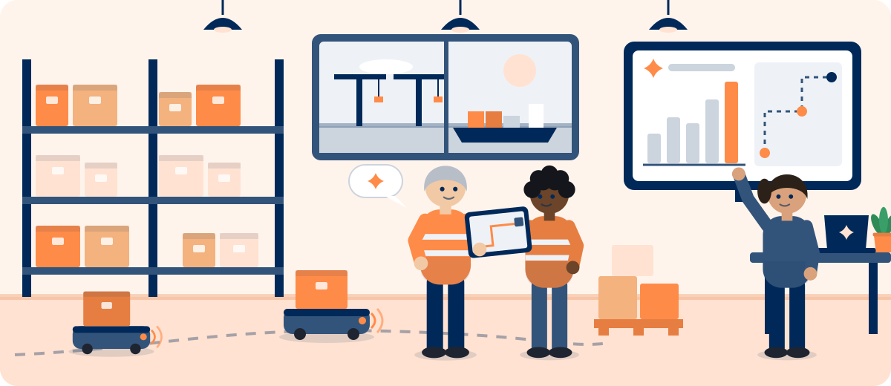
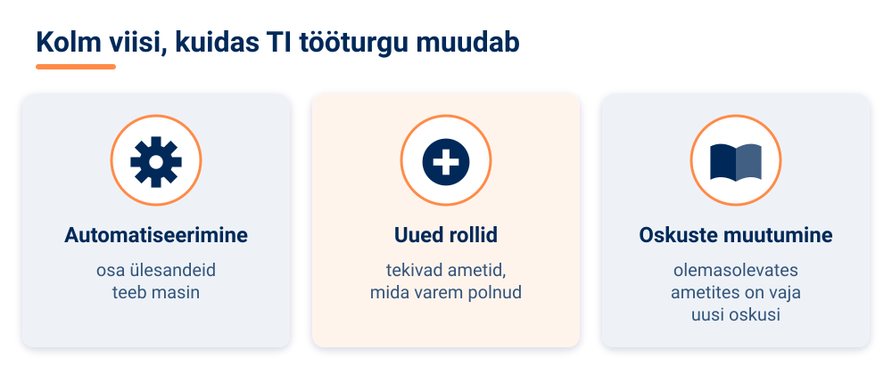
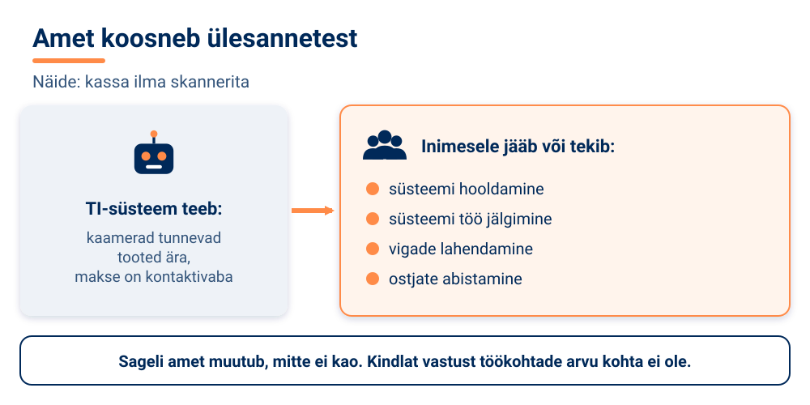
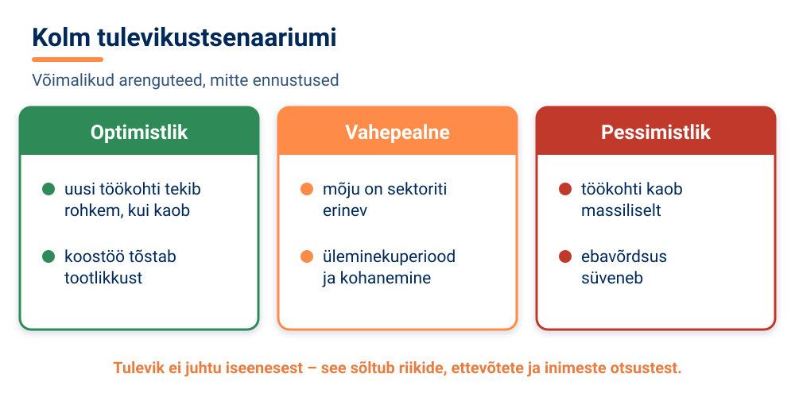

<!--
author:   Maia Lust
email:    
version:  1.2.0
language: et
narrator: Estonian Female
date:     08.10.2026
logo:     ../pildid/pae_logo.png
icon:     ../pildid/pae_logo.png
comment:  Tehisintellekti alused – gümnaasiumi valikkursus (35 tundi), Tallinna Pae Gümnaasium. Õppetekstid, interaktiivsed töölehed ja enesekontrollitestid.
link:     https://fonts.googleapis.com/css2?family=Nunito+Sans:wght@400;600;700&family=Poppins:wght@600;700&family=JetBrains+Mono:wght@400;600&display=swap

@style
/* ==== liascript-theming:start ==== */
/* links: https://fonts.googleapis.com/css2?family=Nunito+Sans:wght@400;600;700&family=Poppins:wght@600;700&family=JetBrains+Mono:wght@400;600&display=swap */
/* theme: Tallinna Pae Gümnaasium — generated by liascript-theming, edit theme.json and rebuild */
:root {
  --theme-font-body: 'Nunito Sans', sans-serif;
  --theme-font-heading: 'Poppins', serif;
  --theme-font-mono: 'JetBrains Mono', monospace;
  --theme-heading-weight: 700;
  --theme-line-height: 1.6;
  --global-font-size: 1.6rem;
  --theme-radius: 0.8rem;
  --theme-radius-small: 0.4rem;
  --theme-radius-large: 1.4rem;
  --theme-shadow: 0 0.3rem 1rem rgba(0,41,89,.10);
}
/* surfaces & text: apply to every color theme */
:root.lia-variant-light {
  --color-background: 255,255,255;
  --color-text: 29,36,51;
  --color-border: 228,229,231;
  --lia-grey-lighter: 238,242,247;
  --lia-grey-light: 204,212,222;
}
:root.lia-variant-dark {
  --color-background: 15,23,36;
  --color-text: 229,232,235;
  --color-border: 49,60,73;
  --lia-grey-dark: 30,38,47;
  --lia-anthracite: 41,50,61;
}
/* accent: only the course theme (default) and the custom radio,
   so readers can still pick LiaScript's built-in color themes */
:root:is(.lia-theme-default, .lia-theme-custom) {
  --color-highlight: 0,41,89;
  --color-highlight-dark: 0,41,89;
}
:root.lia-theme-default {
  --color-highlight-menu: 0,41,89;
}
:root:is(.lia-theme-default, .lia-theme-custom).lia-variant-dark {
  --color-highlight: 47,90,143;
  --color-highlight-dark: 255,185,143;
}
:root.lia-variant-light { --theme-heading-color: #002959; }
:root.lia-variant-dark { --theme-heading-color: #FFB98F; }
/* ==== LiaScript theme adapter (liascript-theming) — keep verbatim ====
   Maps the --theme-* tokens onto LiaScript's CSS. Everything a theme
   changes lives in the token block above this one. */

/* -- fonts: body/mono via the global variables, headings & co. are
      compiled literals in LiaScript and need explicit selectors -- */
:root {
  --global-font-family: var(--theme-font-body);
  --global-font-mono: var(--theme-font-mono);
  --global-font-headline: var(--theme-font-heading);
}
body { line-height: var(--theme-line-height, 1.47); }
h1, h2, h3, .h1, .h2, .h3 {
  font-family: var(--theme-font-heading);
  font-weight: var(--theme-heading-weight, 600);
  letter-spacing: var(--theme-heading-letter-spacing, normal);
  text-transform: var(--theme-heading-transform, none);
  color: var(--theme-heading-color, inherit);
}
h4, h5, h6, .h4, .h5, summary, .lia-accordion__headline {
  font-family: var(--theme-font-subheading, var(--theme-font-body));
}
.lia-quote__text { font-family: var(--theme-font-quote, var(--theme-font-heading)); }
.lia-code, .lia-code--inline, code, kbd, samp, pre { font-family: var(--theme-font-mono); }
.lia-code .ace_editor { font-family: var(--theme-font-mono) !important; }

/* -- shape: radius for controls & surfaces (radio buttons, tags, circles stay) -- */
:is(button, .lia-btn, input, .lia-input, select, .lia-select, textarea, .lia-textarea, .lia-dropdown):not(.lia-radio, .lia-btn--tag, .lia-btn--small-tag),
.lia-code-terminal__input, .lia-pagination__content, .lia-script, .lia-support-menu__submenu {
  border-radius: var(--theme-radius);
}
.lia-checkbox[type='checkbox'], kbd, .lia-tooltip .lia-tooltiptext, .lia-code--inline {
  border-radius: var(--theme-radius-small);
}
details, .lia-quote, .lia-code__input, .lia-table-responsive, .lia-card {
  border-radius: var(--theme-radius-large);
  box-shadow: var(--theme-shadow);
}
.lia-quote, .lia-code__input { overflow: hidden; }
.lia-code__input .ace_editor { border-radius: inherit; }
.lia-support-menu__submenu { box-shadow: var(--theme-shadow-popup, 0 0 1rem rgba(128, 128, 128, 0.2)); }

/* -- dark mode: LiaScript brightens the accent for text via
      rgb(from … calc(r*2.5)), which turns a hand-picked accent into
      pastel/yellow. For the course theme, text-like accent uses take
      --color-highlight-dark (= "accent as text") instead. Scoped to
      default/custom so the built-in color themes keep their behavior. -- */
:root:is(.lia-theme-default, .lia-theme-custom).lia-variant-dark :is(.lia-link, .lia-btn--outline, .lia-code--inline) {
  color: rgb(var(--color-highlight-dark));
  border-color: rgb(var(--color-highlight-dark));
}
:root:is(.lia-theme-default, .lia-theme-custom).lia-variant-dark :is(summary, summary:after, .lia-label, .lia-skip-nav, .lia-support-menu__item, .lia-quote__text),
:root:is(.lia-theme-default, .lia-theme-custom).lia-variant-dark :is(.lia-list--unordered, .lia-list--ordered) > li::marker {
  color: rgb(var(--color-highlight-dark));
}
:root:is(.lia-theme-default, .lia-theme-custom).lia-variant-dark :is(.lia-btn--transparent, .lia-input) {
  filter: none;
}
:root:is(.lia-theme-default, .lia-theme-custom).lia-variant-dark :is(.lia-input, .lia-checkbox[type='checkbox'], .lia-radio[type='radio']):not(:checked, .is-disabled, [disabled]) {
  border-color: rgb(var(--color-highlight-dark));
}
/* alternating table rows: LiaScript uses a neutral grey in dark mode */
:root.lia-variant-dark .lia-table.is-alternating .lia-table__row:nth-child(2n) td,
:root.lia-variant-dark .lia-table-responsive.has-thead-sticky.has-first-col-sticky .is-alternating .lia-table__row:nth-child(2n) td:first-child:before,
:root.lia-variant-dark .lia-table-responsive.has-thead-sticky.has-last-col-sticky .is-alternating .lia-table__row:nth-child(2n) td:last-child:before {
  background-color: rgb(var(--lia-grey-dark));
}
/* -- theme extras -- */
/* ===== Tallinna Pae Gümnaasiumi värvid =====
   tumesinine #002959 · oranž #FF8B48 · tumeoranž #E67E42 */
:root {
  --pae-sinine: #002959;
  --pae-sinine-80: #33547A;
  --pae-sinine-20: #CCD4DE;
  --pae-sinine-08: #EEF2F7;
  --pae-oranz: #FF8B48;
  --pae-oranz-tume: #E67E42;
  --pae-oranz-20: #FFE2D1;
  --pae-oranz-08: #FFF4EC;
  --pae-roheline: #2E8B57;
  --pae-roheline-08: #EAF6EF;
  --pae-lilla: #6B4FA0;
  --pae-lilla-08: #F2EEF9;
}

/* Pealkirjad */
.lia-slide h1, main h1 {
  color: var(--pae-sinine);
  border-bottom: 6px solid var(--pae-oranz);
  padding-bottom: .3em;
}
.lia-slide h2, main h2 { color: var(--pae-sinine); }
.lia-slide h3, main h3 {
  color: var(--pae-sinine);
  border-left: 8px solid var(--pae-oranz);
  padding-left: .5em;
}
.lia-slide h4, main h4 { color: var(--pae-oranz-tume); }
strong { color: inherit; }

/* Tabelid */
.lia-table th, table thead th {
  background: var(--pae-sinine) !important;
  color: #fff !important;
}
.lia-table tbody tr:nth-child(even), table tbody tr:nth-child(even) { background: var(--pae-sinine-08); }

/* Pildid ja infograafikud */
img.lia-image, .lia-figure img, main img {
  border-radius: 12px;
}
.lia-figure__caption, figcaption {
  color: var(--pae-sinine-80);
  font-style: italic;
  text-align: center;
}

/* ASCII-skeemid väiksemaks ja Pae värvidesse */
.lia-ascii svg, lia-ascii svg, .lia-code--ascii svg { max-width: 760px; margin: 0 auto; display: block; }
svg.lia-ascii text { fill: var(--pae-sinine); }

/* ===== Kujunduskastid ===== */
blockquote.pae-moiste, blockquote.pae-naide, blockquote.pae-eesti,
blockquote.pae-motle, blockquote.pae-lisaks, blockquote.pae-fakt,
.pae-moiste, .pae-naide, .pae-eesti, .pae-motle, .pae-lisaks, .pae-fakt {
  border-radius: 14px !important;
  padding: 1.1em 1.4em 1.1em 4.2em !important;
  margin: 1.4em 0 !important;
  position: relative;
  box-shadow: 0 3px 10px rgba(0,41,89,.10);
  font-style: normal !important;
  text-align: left !important;
}
.pae-moiste::before, .pae-naide::before, .pae-eesti::before,
.pae-motle::before, .pae-lisaks::before, .pae-fakt::before {
  position: absolute; left: .7em; top: .75em;
  width: 2em; height: 2em; line-height: 2em;
  border-radius: 50%; text-align: center; font-size: 1.15em;
  color: #fff; font-style: normal;
}
/* Mõiste – oranž */
.pae-moiste { background: var(--pae-oranz-08) !important; border: 2px solid var(--pae-oranz) !important; border-left: 10px solid var(--pae-oranz) !important; }
.pae-moiste::before { content: "📖"; background: var(--pae-oranz); }
/* Näide – tumesinine */
.pae-naide { background: var(--pae-sinine-08) !important; border: 2px solid var(--pae-sinine-20) !important; border-left: 10px solid var(--pae-sinine) !important; }
.pae-naide::before { content: "💡"; background: var(--pae-sinine); }
/* Eesti näide – sinine-valge */
.pae-eesti { background: linear-gradient(135deg, #E8F1FB 0%, #ffffff 100%) !important; border: 2px solid #0072CE !important; border-left: 10px solid #0072CE !important; }
.pae-eesti::before { content: "🇪🇪"; background: #0072CE; }
/* Mõtle järele – roheline */
.pae-motle { background: var(--pae-roheline-08) !important; border: 2px dashed var(--pae-roheline) !important; border-left: 10px solid var(--pae-roheline) !important; }
.pae-motle::before { content: "🤔"; background: var(--pae-roheline); }
/* Tea lisaks – lilla */
.pae-lisaks { background: var(--pae-lilla-08) !important; border: 2px solid #CDBFE6 !important; border-left: 10px solid var(--pae-lilla) !important; }
.pae-lisaks::before { content: "🔍"; background: var(--pae-lilla); }
/* Fakt – tume taust, valge tekst */
.pae-fakt { background: var(--pae-sinine) !important; color: #fff !important; border-left: 10px solid var(--pae-oranz) !important; }
.pae-fakt * { color: #fff !important; }
.pae-fakt::before { content: "⚡"; background: var(--pae-oranz); }

/* Töölehe jaotise riba */
.pae-jaotis { background: var(--pae-sinine); color: #fff !important; padding: .55em 1em; border-radius: 10px; margin: 2em 0 1em; border-left: 10px solid var(--pae-oranz); }
.pae-jaotis * { color: #fff !important; }

/* Ploki kaanepilt */
.pae-kaas img, img.pae-kaas { width: 100%; border-radius: 16px; box-shadow: 0 6px 20px rgba(0,41,89,.18); }

/* Näidisvastuse kokkupandav kast */
details {
  background: var(--pae-oranz-08);
  border: 1px solid var(--pae-oranz);
  border-radius: 10px; padding: .6em 1em; margin: .6em 0 1.4em;
}
details summary { cursor: pointer; font-weight: bold; color: var(--pae-oranz-tume); }

/* Menüü (sisukord) tumesinine */
.lia-toc a, .lia-toc .lia-toc__link, nav.lia-toc a { color: #002959 !important; }
.lia-toc a.lia-active, .lia-toc .lia-active { font-weight: 700; }
:root.lia-variant-dark .lia-toc a { color: #CCD4DE !important; }
:root.lia-variant-dark .pae-moiste, :root.lia-variant-dark .pae-naide, :root.lia-variant-dark .pae-eesti,
:root.lia-variant-dark .pae-motle, :root.lia-variant-dark .pae-lisaks { color: #1d2433 !important; }
:root.lia-variant-dark .pae-moiste *, :root.lia-variant-dark .pae-naide *, :root.lia-variant-dark .pae-eesti *,
:root.lia-variant-dark .pae-motle *, :root.lia-variant-dark .pae-lisaks * { color: #1d2433 !important; }
:root.lia-variant-dark img { background: #fff; }
/* ==== liascript-theming:end ==== */
/* Loosimisnupp (rollimäng) */
output.lia-script[input="submit"] { display:inline-block !important; background:#002959; color:#fff !important; font-weight:700; padding:.6em 1.2em; border-radius:999px; border:3px solid #FF8B48 !important; cursor:pointer; box-shadow:0 3px 10px rgba(0,41,89,.2); }
output.lia-script[input="submit"]:hover { background:#FF8B48; color:#002959 !important; }

@end

@custom
--color-highlight-menu: 255,255,255;
@end
-->

# 6.4 Mõju tööturule

### Õpieesmärgid

<!-- class="pae-kaas" -->

Selle tunni järel sa:

- oskad selgitada, kuidas TI muudab tööturgu: automatiseerib ülesandeid, muudab ameteid ja loob uusi rolle;
- oskad võrrelda TI mõju varasemate tehnoloogiliste muutustega;
- tead, milliseid tehnilisi ja inimlikke oskusi peetakse TI ajastul olulisteks;
- oskad arutleda TI mõju üle ühiskondlikule ebavõrdsusele ja selle üle, kes peaks üleminekut juhtima;
- mõistad, et tuleviku tööturu kohta on mitu stsenaariumi ja ükski neist ei ole kindel.

### Kuidas TI tööturgu muudab?

Kui su vanavanemad olid sinuvanused, ei olnud veel olemas selliseid ameteid nagu veebidisainer, sotsiaalmeedia turundaja või mobiilirakenduste arendaja. Samal ajal on mitu tollal tavalist ametit – näiteks telefonikeskjaam – peaaegu kadunud. Tehnoloogia on tööturgu alati muutnud. TI on järjekordne selline muutus, kuid sellel on oma eripärad.

TI mõjutab tööturgu kolmel moel:

- **automatiseerimine** – osa ülesandeid, mida varem tegid inimesed, teeb nüüd masin;
- **uute töökohtade ja rollide teke** – tekivad ametid, mida varem ei olnud;
- **oskuste muutumine** – olemasolevates ametites on vaja uusi oskusi.

<!-- class="pae-moiste" -->
> **Mõiste: automatiseerimine**
>
> Automatiseerimine tähendab, et ülesannet, mida varem tegi inimene, hakkab tegema masin või tarkvara. Sageli ei automatiseerita kogu ametit, vaid ainult osa selle ülesannetest.

See teema on oluline, sest sellel on suur **majanduslik ja sotsiaalne mõju**, sest **haridussüsteem peab kohanema** ning sest sina ise pead **tulevikuks valmistuma** – sinu karjäär möödub just TI ajastul.

### Mis on teisiti kui varem?

Ajaloos on olnud mitu suurt tehnoloogilist pööret: **tööstusrevolutsioon**, **arvutite ja interneti levik** ning **automatiseerimine ja robotiseerimine** tehastes. Iga kord kadusid mõned töökohad, kuid tekkis ka uusi.

TI-l on aga eripärad:

- **TI automatiseerib ka kognitiivseid ülesandeid** – mitte ainult füüsilist tööd (nagu tööstusrevolutsiooni masinad), vaid ka mõtlemist nõudvat tööd: tekstide kirjutamist, tõlkimist, andmete analüüsi, piltide loomist;
- **areng on kiire ja mõju laialdane** – uued tööriistad levivad mõne aastaga;
- **mõju ulatub kõigisse majandussektoritesse** – tervishoiust põllumajanduseni.

<!-- class="pae-fakt" -->
> **Kas teadsid?** Erinevalt tööstusrevolutsiooni masinatest ei automatiseeri TI ainult füüsilist tööd, vaid ka **mõtlemist nõudvat tööd**: tekstide kirjutamist, tõlkimist, andmete analüüsi ja piltide loomist.

<!-- class="pae-motle" -->
> **Mõtle järele!**
>
> Mis on sarnast ja mis erinevat, kui võrrelda TI mõju tööstusrevolutsiooniga? Tööstusrevolutsiooni ajal kardeti, et masinad võtavad kõigi töö. Kas need hirmud läksid täide? Kas sellest saab teha järeldusi TI kohta – või on TI olukord teistsugune?

### Millised töökohad muutuvad?

Kõige kergemini on automatiseeritavad töökohad ja ülesanded, kus on palju:

- **rutiinseid ja korduvaid ülesandeid**;
- **andmepõhiseid otsuseid**;
- **ettearvatavaid protsesse**.

Näidetena tuuakse sageli kassapidajaid ja klienditeenindajaid, raamatupidajaid ja andmesisestajaid, lihtsamate juriidiliste ja finantsteenuste osutajaid ning tootmis- ja laotöötajaid. Oluline on aga mõista, et **ametid koosnevad paljudest ülesannetest**. Kui osa ülesandeid automatiseeritakse, ei kao amet tingimata ära – see võib hoopis muutuda.

<!-- class="pae-naide" -->
> **Näide: kassa ilma skannerita**
>
> Kujuta ette poodi, kus TI-süsteem tunneb kaamerate abil tooted ise ära ja ostja saab maksta kontaktivabalt, ilma et keegi tooteid skanniks. Mis juhtub töökohtadega? Kassapidajaid on vaja vähem. Samas võib tekkida vajadus inimeste järele, kes süsteemi hooldavad, jälgivad selle tööd ja lahendavad vigu, ning klienditeenindajate järele, kes aitavad ostjaid, kellel süsteemiga raskusi on. Kuidas töökohtade arv kokkuvõttes muutub, sõltub paljudest asjaoludest ja sellele ei ole kindlat vastust.

TI-ga seoses on tekkinud ka **uusi ameteid ja rolle**:

- andmeteadlased ja -analüütikud;
- TI eetika spetsialistid;
- inimese ja masina koostöö disainerid;
- TI treenerid ja järelevalvajad – inimesed, kes märgendavad andmeid, hindavad TI vastuseid ja kontrollivad süsteemide tööd.

Enamikus ametites aga muutub igapäevatöö: inimesed hakkavad kasutama **TI-tööriistu**, tekivad uued **inimese ja masina koostöö** vormid ning tähelepanu võib nihkuda **loovusele ja suhtlemisele** – sellele, mida masin teeb halvemini.

<!-- class="pae-moiste" -->
> **Mõiste: inimese ja masina koostöö**
>
> Inimese ja masina koostöö tähendab, et inimene ja TI teevad tööd koos, kumbki oma tugevusi kasutades: TI töötleb kiiresti suuri andmehulki, inimene annab hinnangu, vastutab otsuse eest ja suhtleb teiste inimestega.

### Erinevad sektorid

TI mõju erineb sektoriti.

| Sektor | Kuidas TI seda mõjutab? |
|---|---|
| Tervishoid | diagnooside täpsustamine, personaliseeritud ravi, haldusülesannete automatiseerimine |
| Haridus | personaliseeritud õpe, õpetajate abistamine, haldusülesannete automatiseerimine |
| Finantsteenused | automatiseeritud nõustamine, riskianalüüs ja pettuste tuvastamine, klienditeeninduse automatiseerimine |
| Tootmine | tootmisprotsesside optimeerimine, kvaliteedikontroll, tarneahela juhtimine |

<!-- class="pae-eesti" -->
> **Eesti näide: TI Eesti ettevõtetes**
>
> Eestis on mitu ettevõtet, kus TI on töö olulise osana juba kasutusel. **Bolt** kasutab TI-d nõudluse ennustamiseks, hindade optimeerimiseks ja sõitude sobitamiseks. **Starship Technologies** on loonud isesõitvad kullerrobotid, mis navigeerivad arvutinägemise abil linnatänavatel. **LHV** pank kasutab TI-d pettuste tuvastamiseks ja klienditeeninduses, **Salv** aitab pankadel rahapesu ja pettusi tuvastada. **Lingvist** pakub TI abil personaliseeritud keeleõpet. Igas sellises ettevõttes on vaja nii tehnilisi spetsialiste kui ka inimesi, kes TI-d oma töös kasutavad.

### Tuleviku oskused

Millised oskused muutuvad olulisemaks? Allikad toovad välja kaks rühma.

**Tehnilised oskused:**

- **andmekirjaoskus** – oskus andmeid lugeda, tõlgendada ja kriitiliselt hinnata;
- TI-tööriistade kasutamine;
- programmeerimise alused;
- süsteemne mõtlemine – oskus näha, kuidas süsteemi osad omavahel seotud on.

**Inimlikud oskused:**

- loovus ja innovatsioon;
- kriitiline mõtlemine;
- **emotsionaalne intelligentsus** – oskus mõista enda ja teiste tundeid ning nendega arvestada;
- koostöö ja suhtlemine;
- kohanemisvõime ja paindlikkus.

Kõige olulisemaks peetakse **elukestva õppe** mõtteviisi: valmisolekut terve elu jooksul uusi asju õppida ja end täiendada. Selle juurde kuulub ka **TI kirjaoskus** – oskus mõista TI võimalusi ja piiranguid, kasutada TI-tööriistu ning suhtuda TI-sse kriitiliselt.

<!-- class="pae-moiste" -->
> **Mõiste: elukestev õpe**
>
> Elukestev õpe tähendab, et inimene õpib ja täiendab end kogu elu jooksul, mitte ainult koolis. Muutuval tööturul aitab see uute oskustega kohaneda.

### Ebavõrdsus ja vastutus

TI mõju ei jaotu kõigile võrdselt. Eristada saab mitut lõhet:

- **digitaalne lõhe** – kõigil ei ole võrdset juurdepääsu tehnoloogiale ja oskustele; esineb ka piirkondlikke erinevusi;
- **oskuste lõhe** – kõrgelt kvalifitseeritud töötajatel võib olla lihtsam kohaneda kui madalama kvalifikatsiooniga töötajatel; ümberõppe võimalused ei ole kõigile võrdselt kättesaadavad;
- **majanduslik ebavõrdsus** – võivad suureneda sissetulekute erinevused ja tekkida töökohtade polariseerumine, kus kasvab nii kõrgelt kui ka madalalt tasustatud tööde osakaal, keskmine aga kahaneb.

Lahendustena pakutakse **kaasavat tehnoloogiat**, **haridust ja ümberõpet** ning **sotsiaalkaitsesüsteemide kohandamist**.

Kes peaks üleminekut juhtima? Selles on mitu osapoolt.

- **Haridussüsteem** saab uuendada õppekavu, arendada digioskusi, soodustada elukestvat õpet ja pakkuda ümberõpet.
- **Ettevõtted** saavad koolitada töötajaid, arendada nende TI kirjaoskust, toetada karjääri planeerimist, kujundada töökohti ümber inimese ja masina koostööks ning järgida vastutustundliku innovatsiooni põhimõtteid.
- **Poliitikakujundajad** saavad kehtestada reegleid TI kasutamiseks, kaitsta töötajate õigusi ja andmeid, investeerida haridusse ja ümberõppesse ning kohandada sotsiaalkaitset – näiteks töötuskindlustust ja sotsiaaltoetusi.
- **Iga inimene** saab ise õppida ja end täiendada.

Mõned meetmed tekitavad elavat arutelu. Näiteks **universaalne põhisissetulek** – regulaarne rahasumma, mida riik maksaks kõigile inimestele sõltumata sellest, kas nad töötavad – on idee, mida mõned peavad vajalikuks vastuseks automatiseerimisele, teised aga liiga kulukaks või tööd mitte soodustavaks. Eri riikides on tehtud katseid, kuid ühist arusaama selle kohta ei ole.

<!-- class="pae-eesti" -->
> **Eesti näide: kuidas Eesti valmistub**
>
> Eesti tööturu eripärad on **kõrge digitaliseerituse tase**, **väike ja paindlik majandus** ning **oskuste puudus teatud valdkondades**. Algatustest võib nimetada riiklikke TI tegevuskavasid (kratikavasid), digipöörde programme ja **Töötukassa** ümberõppe- ja koolitusvõimalusi. Ettevõtetele pakub tuge **Tehnopoli AI arenguprogramm** (alates 2022. aastast), mis aitab neil TI-lahendusi kasutusele võtta, ning **AI & Robotics Estonia (AIRE)**, mis alustas tööd 01.10.2021 ja nõustab tööstusettevõtteid TI ja robootika rakendamisel. TI kirjaoskust saab arendada ka eestikeelsel veebikursusel **Elements of AI**.

<!-- class="pae-fakt" -->
> **Kas teadsid?** **AI & Robotics Estonia (AIRE)** alustas tööd **01.10.2021** ja **Tehnopoli AI arenguprogramm** on ettevõtteid toetanud alates **2022. aastast**.

### Tulevikustsenaariumid

Kuidas TI tööturgu pikemas plaanis mõjutab, ei tea keegi kindlalt. Eksperdid ja uurimisasutused on esitanud erinevaid hinnanguid ja need lähevad sageli lahku. Seepärast räägitakse **stsenaariumidest** – võimalikest arenguteedest, mitte ennustustest.

| Stsenaarium | Mida see eeldab? |
|---|---|
| Optimistlik | Uusi töökohti tekib rohkem, kui kaob; inimese ja masina koostöö suurendab tootlikkust; haridussüsteem kohaneb edukalt. |
| Pessimistlik | Töökohti kaob massiliselt; oskuste lõhe suureneb; majanduslik ebavõrdsus süveneb. |
| Vahepealne (realistlikuks peetav) | Mõju on sektoriti erinev; on üleminekuperiood ja kohanemisraskused; vaja on poliitilisi ja hariduslikke meetmeid. |

Sellised stsenaariumid aitavad mõelda, millised valikud võivad tulevikku mõjutada. Tulevik ei juhtu iseenesest – see sõltub ka sellest, milliseid otsuseid teevad riigid, ettevõtted ja inimesed.

<!-- class="pae-motle" -->
> **Mõtle järele!**
>
> Vali amet, mis sind huvitab. Millised selle ameti ülesanded võiksid sinu arvates TI abil muutuda ja millised jääksid ilmselt inimesele? Millised oskused aitaksid sul selles ametis toime tulla, ükskõik millise stsenaariumi järgi tulevik kujuneb?

<!-- class="pae-lisaks" -->
> **Tea lisaks**
>
> - Eesti TI portaal: https://www.kratid.ee/
> - Maailma Majandusfoorumi 2020. aasta raport tuleviku töökohtadest: https://www.weforum.org/reports/the-future-of-jobs-report-2020/ (WEF avaldab neid raporteid regulaarselt – otsi ka uuemaid)
> - OECD tööhõive väljavaated: https://www.oecd.org/employment/outlook/
> - McKinsey Global Institute töö tulevikust: https://www.mckinsey.com/featured-insights/future-of-work
> - Töötukassa koolitusvõimalused: https://www.tootukassa.ee/

### Kokkuvõte ja põhimõisted

**Pea meeles**

- TI muudab tööturgu, automatiseerides teatud ülesandeid, muutes olemasolevaid ameteid ja luues uusi rolle.
- Erinevalt varasematest tehnoloogilistest pööretest automatiseerib TI ka kognitiivseid ehk mõtlemist nõudvaid ülesandeid.
- Kõige kergemini automatiseeritavad on rutiinsed, korduvad ja ettearvatavad ülesanded; sageli muutub amet, mitte ei kao.
- Tulevikus on olulised nii tehnilised oskused (andmekirjaoskus, TI-tööriistade kasutamine) kui ka inimlikud oskused (loovus, kriitiline mõtlemine, emotsionaalne intelligentsus, koostöö).
- Ülemineku juhtimine vajab haridussüsteemi, ettevõtete, poliitikakujundajate ja iga inimese panust; elukestev õpe on võtmetähtsusega.
- Tuleviku kohta on mitu stsenaariumi; ükski neist ei ole kindel fakt.

| Mõiste | Tähendus |
|---|---|
| automatiseerimine | ülesande üleandmine masinale või tarkvarale |
| kognitiivne ülesanne | mõtlemist nõudev ülesanne, nt analüüs, kirjutamine, otsustamine |
| inimese ja masina koostöö | töö, kus inimene ja TI kasutavad kumbki oma tugevusi |
| andmekirjaoskus | oskus andmeid lugeda, tõlgendada ja kriitiliselt hinnata |
| TI kirjaoskus | TI võimaluste ja piirangute mõistmine, TI-tööriistade kasutamine ja kriitiline suhtumine |
| elukestev õpe | õppimine ja enesetäiendamine kogu elu jooksul |
| digitaalne lõhe | ebavõrdne juurdepääs tehnoloogiale ja digioskustele |
| töökohtade polariseerumine | kõrgelt ja madalalt tasustatud tööde osakaalu kasv keskmiste arvelt |
| ümberõpe | uue ameti või oskuste omandamine töö muutumise tõttu |

### Tööleht 6.4

<!-- class="pae-jaotis" -->
**1. TI mõju tööturule – põhimõisted**

**Ülesanne 1.** Selgita oma sõnadega, kuidas TI muudab tööturgu.

[[___ ___ ___]]

**Ülesanne 2.** Võrdle TI mõju tööturule varasemate tehnoloogiliste pööretega (nt tööstusrevolutsioon, arvutite levik). Mis on sarnast ja mis erinevat?

[[___ ___ ___ ___]]

**Ülesanne 3.** Miks on oluline mõista TI mõju tööturule?

[[___ ___ ___]]

<!-- class="pae-jaotis" -->
**2. Automatiseerimine ja töökohtade muutumine**

**Ülesanne 4.** Millised töökohad või ülesanded on kõige tõenäolisemalt TI abil automatiseeritavad? Miks?

[[___ ___ ___ ___]]

**Ülesanne 5.** Analüüsi järgmist stsenaariumi.

*Jaekaubandusettevõte plaanib kasutusele võtta TI-l põhineva iseteeninduskassade süsteemi, mis tunneb tooted automaatselt ära ilma skannimiseta ja võimaldab kontaktivaba maksmist.*

Millised töökohad võivad selle tulemusena kaduda või muutuda? Milliseid uusi töökohti või rolle võib tekkida?

[[___ ___ ___ ___ ___]]

**Ülesanne 6.** Kuidas muudab TI olemasolevaid töökohti, mis täielikult ei kao?

[[___ ___ ___ ___]]

<!-- class="pae-jaotis" -->
**3. Tuleviku oskused**

**Ülesanne 7.** Millised tehnilised oskused on TI ajastul vajalikud?

[[___ ___ ___ ___]]

**Ülesanne 8.** Millised inimlikud oskused muutuvad TI ajastul eriti väärtuslikuks?

[[___ ___ ___ ___]]

**Ülesanne 9.** Kuidas saaksid sina isiklikult valmistuda TI põhjustatud tööturumuutusteks?

[[___ ___ ___ ___]]

<!-- class="pae-jaotis" -->
**4. TI mõju erinevatele sektoritele**

**Ülesanne 10.** Vali kaks majandussektorit (nt tervishoid, haridus, finantsteenused, tootmine, transport) ja analüüsi, kuidas TI neid mõjutab.

Sektor 1:

[[___]]

[[___ ___ ___ ___]]

Sektor 2:

[[___]]

[[___ ___ ___ ___]]

**Ülesanne 11.** Millises sektoris või valdkonnas on TI mõju töökohtadele sinu arvates kõige suurem? Põhjenda.

[[___ ___ ___ ___]]

<!-- class="pae-jaotis" -->
**5. TI mõju ühiskondlikule ebavõrdsusele**

**Ülesanne 12.** Kuidas võib TI mõjutada ühiskondlikku ebavõrdsust?

[[___ ___ ___ ___]]

**Ülesanne 13.** Milliseid meetmeid saaks rakendada, et vähendada TI negatiivset mõju ebavõrdsusele?

[[___ ___ ___ ___]]

**Ülesanne 14.** Kes peaks vastutama TI tööturumõjude haldamise eest (valitsus, ettevõtted, haridusasutused, üksikisikud)? Põhjenda oma arvamust.

[[___ ___ ___ ___]]

<!-- class="pae-jaotis" -->
**6. Praktiline ülesanne: tuleviku tööturu analüüs**

**Ülesanne 15.** Vali üks amet või valdkond, mis sind huvitab, ja analüüsi, kuidas TI võib seda ametit või valdkonda järgmise 10 aasta jooksul mõjutada.

a) Valitud amet või valdkond:

[[___]]

b) Millised ülesanded või aspektid võivad olla automatiseeritud?

[[___ ___ ___]]

c) Millised uued ülesanded või rollid võivad tekkida?

[[___ ___ ___]]

d) Milliseid oskusi on vaja arendada, et selles ametis või valdkonnas edukas olla?

[[___ ___ ___]]

e) Millised on suurimad väljakutsed ja võimalused?

[[___ ___ ___]]

<!-- class="pae-jaotis" -->
**7. Arutelu ja refleksioon**

**Ülesanne 16.** Kas TI loob rohkem töökohti, kui kaotab, või vastupidi? Põhjenda oma arvamust.

[[___ ___ ___ ___ ___]]

**Ülesanne 17.** Millised eetilised küsimused tekivad seoses TI mõjuga tööturule?

[[___ ___ ___ ___]]

**Ülesanne 18.** Kuidas peaks haridussüsteem kohanema, et valmistada õpilasi ette TI ajastuks?

[[___ ___ ___ ___]]

<!-- class="pae-jaotis" -->
**8. Lisaülesanne: Eesti kontekst**

**Ülesanne 19.** Uuri, kuidas mõjutab TI Eesti tööturgu. Millised on Eesti eripärad või tugevused selles kontekstis?

[[___ ___ ___ ___ ___]]

**Ülesanne 20.** Milliseid algatusi või programme on Eestis käivitatud, et aidata inimestel TI põhjustatud tööturumuutustega kohaneda?

[[___ ___ ___ ___]]

### Enesekontroll 6.4

**1. Kuidas nimetatakse seda, kui ülesannet, mida varem tegi inimene, hakkab tegema masin või tarkvara? Kirjuta üks sõna.**

[[automatiseerimine]]

****************************************
Õige vastus: **automatiseerimine**. Sageli ei automatiseerita kogu ametit, vaid ainult osa selle ülesannetest.
****************************************

**2. Liigita tuleviku oskused.**

<!-- data-show-partial-solution -->
- [ (Tehniline oskus) (Inimlik oskus) ]
- [ (X) ( ) ] Andmekirjaoskus
- [ ( ) (X) ] Emotsionaalne intelligentsus
- [ (X) ( ) ] Süsteemne mõtlemine
- [ ( ) (X) ] Kriitiline mõtlemine
- [ (X) ( ) ] Programmeerimise alused
- [ ( ) (X) ] Koostöö ja suhtlemine
****************************************
Tehnilised oskused on andmekirjaoskus, TI-tööriistade kasutamine, programmeerimise alused ja süsteemne mõtlemine. Inimlikud oskused on loovus, kriitiline mõtlemine, emotsionaalne intelligentsus, koostöö ja suhtlemine ning kohanemisvõime.
****************************************

**3. Lohista mõisted õigetesse lünkadesse.**

<!-- data-show-partial-solution -->
Kui kõigil ei ole võrdset juurdepääsu tehnoloogiale ja digioskustele, on tegu [->[ (digitaalse lõhega) ]]. Kui kasvab nii kõrgelt kui ka madalalt tasustatud tööde osakaal ning keskmiselt tasustatud tööde osa kahaneb, nimetatakse seda töökohtade [->[ (polariseerumiseks) | ühtlustumiseks ]]. Uue ameti või oskuste omandamist töö muutumise tõttu nimetatakse [->[ (ümberõppeks) | praktikaks ]].
****************************************
Digitaalne lõhe on ebavõrdne juurdepääs tehnoloogiale ja oskustele. Polariseerumine tähendab, et keskmiselt tasustatud töid jääb vähemaks. Ümberõpe aitab inimestel muutuva tööturuga kohaneda.
****************************************

**4. Pane sündmused ajalisse järjekorda (1 – kõige varasem, 4 – kõige hilisem).**

<!-- data-show-partial-solution -->
AI & Robotics Estonia (AIRE) alustab tööd: [[ 1 | 2 | (3) | 4 ]] 
Tööstusrevolutsioon – masinad asendavad füüsilist tööd: [[ (1) | 2 | 3 | 4 ]] 
Tehnopoli AI arenguprogramm hakkab ettevõtteid toetama: [[ 1 | 2 | 3 | (4) ]] 
Arvutid ja internet levivad: [[ 1 | (2) | 3 | 4 ]]
****************************************
Õige järjekord: 1. tööstusrevolutsioon → 2. arvutite ja interneti levik → 3. AIRE alustab tööd (01.10.2021) → 4. Tehnopoli AI arenguprogramm (alates 2022).
****************************************

**5. Vali rippmenüüst õige variant.**

<!-- data-show-partial-solution -->
Kõige kergemini on automatiseeritavad [[ (rutiinsed ja korduvad) | loovust nõudvad | empaatiat nõudvad ]] ülesanded. Stsenaariumi, mille järgi tekib uusi töökohti rohkem, kui kaob, nimetatakse [[ (optimistlikuks) | pessimistlikuks | vahepealseks ]]. Realistlikuks peetakse [[ optimistlikku | pessimistlikku | (vahepealset) ]] stsenaariumi, mille järgi on mõju sektoriti erinev ja ees on üleminekuperiood.
****************************************
Automatiseerimine sobib kõige paremini rutiinsete, korduvate ja ettearvatavate ülesannete jaoks. Stsenaariumid ei ole ennustused, vaid võimalikud arenguteed; vahepealset stsenaariumi peetakse kõige realistlikumaks.
****************************************

**6. Mis eristab TI-d varasematest tehnoloogilistest pööretest kõige rohkem?**

- [( )] TI mõjutab ainult tootmist
- [(X)] TI suudab automatiseerida ka kognitiivseid ehk mõtlemist nõudvaid ülesandeid
- [( )] TI ei loo ühtegi uut ametit
- [( )] TI levib väga aeglaselt
****************************************
Tööstusrevolutsiooni masinad asendasid peamiselt füüsilist tööd. TI suudab teha ka tekstide kirjutamist, analüüsi ja muid kognitiivseid ülesandeid.
****************************************

**7. Millised on TI-ga seotud uued ametid või rollid? (Vali kõik õiged.)**

- [[X]] Andmeteadlane
- [[X]] TI eetika spetsialist
- [[ ]] Telefonikeskjaama telefonist
- [[X]] Inimese ja masina koostöö disainer
- [[X]] TI treener ja järelevalvaja
****************************************
Andmeteadlased, TI eetika spetsialistid, inimese ja masina koostöö disainerid ning TI treenerid on TI-ga seotud uued rollid. Telefonikeskjaama telefonist on varasema tehnoloogia muutusega peaaegu kadunud amet.
****************************************

**8. Poes võetakse kasutusele kassa, kus TI tunneb tooted kaamerate abil ise ära. Selgita selle näite põhjal, miks amet sageli muutub, mitte ei kao.**

[[___ ___ ___]]

Vaata näidisvastust

Amet koosneb paljudest ülesannetest ja TI automatiseerib neist ainult osa. Toodete skannimist on vaja vähem, seega väheneb ka kassapidajate vajadus. Samas on vaja inimesi, kes süsteemi hooldavad ja jälgivad, lahendavad vigu ning aitavad ostjaid, kellel on süsteemiga raskusi. Seega muutuvad töötaja ülesanded ja vajalikud oskused. Kuidas töökohtade arv kokkuvõttes muutub, ei saa kindlalt ennustada.

